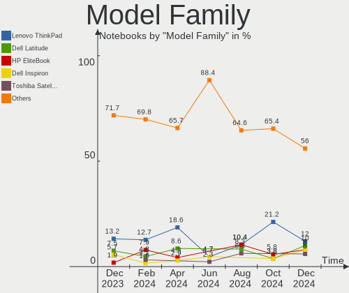
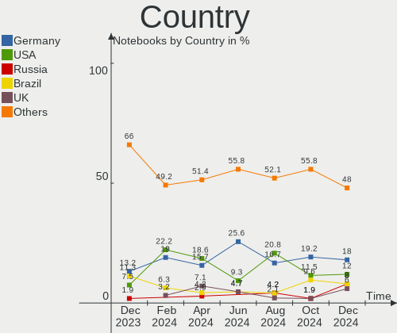
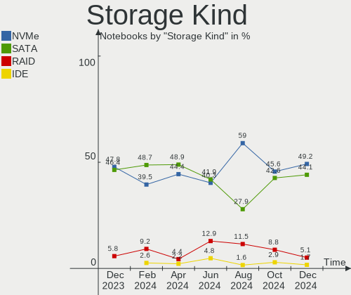
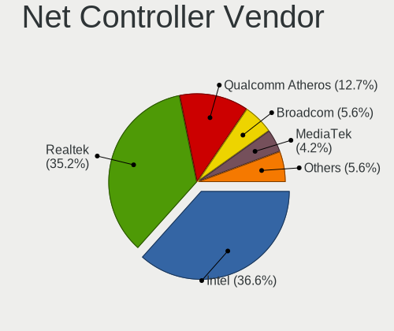
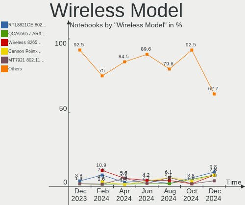
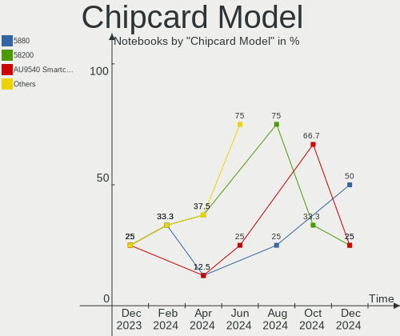

openSUSE - Hardware Trends (Notebooks)
--------------------------------------

A project to identify most popular hardware characteristics and track their change
over time based on data collected by Linux users at https://Linux-Hardware.org.

Anyone can contribute to this report by the [hw-probe](https://github.com/linuxhw/hw-probe) tool:

    sudo -E hw-probe -all -upload

This report is for one last month. Overall report since the beginning of time: [TestCoverage](https://github.com/linuxhw/TestCoverage)

Period: Oct, 2022.

Contents
--------

* [ System ](#system)
  - [ OS                       ](#os)
  - [ OS Family                ](#os-family)
  - [ Kernel                   ](#kernel)
  - [ Kernel Family            ](#kernel-family)
  - [ Kernel Major Ver.        ](#kernel-major-ver)
  - [ Arch                     ](#arch)
  - [ DE                       ](#de)
  - [ Display Server           ](#display-server)
  - [ Display Manager          ](#display-manager)
  - [ OS Lang                  ](#os-lang)
  - [ Boot Mode                ](#boot-mode)
  - [ Filesystem               ](#filesystem)
  - [ Part. scheme             ](#part-scheme)
  - [ Dual Boot with Linux/BSD ](#dual-boot-with-linuxbsd)
  - [ Dual Boot (Win)          ](#dual-boot-win)

* [ Board ](#board)
  - [ Vendor                   ](#vendor)
  - [ Model                    ](#model)
  - [ Model Family             ](#model-family)
  - [ MFG Year                 ](#mfg-year)
  - [ Form Factor              ](#form-factor)
  - [ Secure Boot              ](#secure-boot)
  - [ Coreboot                 ](#coreboot)
  - [ RAM Size                 ](#ram-size)
  - [ RAM Used                 ](#ram-used)
  - [ Total Drives             ](#total-drives)
  - [ Has CD-ROM               ](#has-cd-rom)
  - [ Has Ethernet             ](#has-ethernet)
  - [ Has WiFi                 ](#has-wifi)
  - [ Has Bluetooth            ](#has-bluetooth)

* [ Location ](#location)
  - [ Country                  ](#country)
  - [ City                     ](#city)

* [ Drives ](#drives)
  - [ Drive Vendor             ](#drive-vendor)
  - [ Drive Model              ](#drive-model)
  - [ HDD Vendor               ](#hdd-vendor)
  - [ SSD Vendor               ](#ssd-vendor)
  - [ Drive Kind               ](#drive-kind)
  - [ Drive Connector          ](#drive-connector)
  - [ Drive Size               ](#drive-size)
  - [ Space Total              ](#space-total)
  - [ Space Used               ](#space-used)
  - [ Malfunc. Drives          ](#malfunc-drives)
  - [ Malfunc. Drive Vendor    ](#malfunc-drive-vendor)
  - [ Malfunc. HDD Vendor      ](#malfunc-hdd-vendor)
  - [ Malfunc. Drive Kind      ](#malfunc-drive-kind)
  - [ Failed Drives            ](#failed-drives)
  - [ Failed Drive Vendor      ](#failed-drive-vendor)
  - [ Drive Status             ](#drive-status)

* [ Storage controller ](#storage-controller)
  - [ Storage Vendor           ](#storage-vendor)
  - [ Storage Model            ](#storage-model)
  - [ Storage Kind             ](#storage-kind)

* [ Processor ](#processor)
  - [ CPU Vendor               ](#cpu-vendor)
  - [ CPU Model                ](#cpu-model)
  - [ CPU Model Family         ](#cpu-model-family)
  - [ CPU Cores                ](#cpu-cores)
  - [ CPU Sockets              ](#cpu-sockets)
  - [ CPU Threads              ](#cpu-threads)
  - [ CPU Op-Modes             ](#cpu-op-modes)
  - [ CPU Microcode            ](#cpu-microcode)
  - [ CPU Microarch            ](#cpu-microarch)

* [ Graphics ](#graphics)
  - [ GPU Vendor               ](#gpu-vendor)
  - [ GPU Model                ](#gpu-model)
  - [ GPU Combo                ](#gpu-combo)
  - [ GPU Driver               ](#gpu-driver)
  - [ GPU Memory               ](#gpu-memory)

* [ Monitor ](#monitor)
  - [ Monitor Vendor           ](#monitor-vendor)
  - [ Monitor Model            ](#monitor-model)
  - [ Monitor Resolution       ](#monitor-resolution)
  - [ Monitor Diagonal         ](#monitor-diagonal)
  - [ Monitor Width            ](#monitor-width)
  - [ Aspect Ratio             ](#aspect-ratio)
  - [ Monitor Area             ](#monitor-area)
  - [ Pixel Density            ](#pixel-density)
  - [ Multiple Monitors        ](#multiple-monitors)

* [ Network ](#network)
  - [ Net Controller Vendor    ](#net-controller-vendor)
  - [ Net Controller Model     ](#net-controller-model)
  - [ Wireless Vendor          ](#wireless-vendor)
  - [ Wireless Model           ](#wireless-model)
  - [ Ethernet Vendor          ](#ethernet-vendor)
  - [ Ethernet Model           ](#ethernet-model)
  - [ Net Controller Kind      ](#net-controller-kind)
  - [ Used Controller          ](#used-controller)
  - [ NICs                     ](#nics)
  - [ IPv6                     ](#ipv6)

* [ Bluetooth ](#bluetooth)
  - [ Bluetooth Vendor         ](#bluetooth-vendor)
  - [ Bluetooth Model          ](#bluetooth-model)

* [ Sound ](#sound)
  - [ Sound Vendor             ](#sound-vendor)
  - [ Sound Model              ](#sound-model)

* [ Memory ](#memory)
  - [ Memory Vendor            ](#memory-vendor)
  - [ Memory Model             ](#memory-model)
  - [ Memory Kind              ](#memory-kind)
  - [ Memory Form Factor       ](#memory-form-factor)
  - [ Memory Size              ](#memory-size)
  - [ Memory Speed             ](#memory-speed)

* [ Printers & scanners ](#printers--scanners)
  - [ Printer Vendor           ](#printer-vendor)
  - [ Printer Model            ](#printer-model)
  - [ Scanner Vendor           ](#scanner-vendor)
  - [ Scanner Model            ](#scanner-model)

* [ Camera ](#camera)
  - [ Camera Vendor            ](#camera-vendor)
  - [ Camera Model             ](#camera-model)

* [ Security ](#security)
  - [ Fingerprint Vendor       ](#fingerprint-vendor)
  - [ Fingerprint Model        ](#fingerprint-model)
  - [ Chipcard Vendor          ](#chipcard-vendor)
  - [ Chipcard Model           ](#chipcard-model)

* [ Unsupported ](#unsupported)
  - [ Unsupported Devices      ](#unsupported-devices)
  - [ Unsupported Device Types ](#unsupported-device-types)

System
------

OS
--

Installed operating systems

| Name                         | Notebooks | Percent |
|------------------------------|-----------|---------|
| openSUSE Tumbleweed-XXXXXXXX | 26        | 78.79%  |
| openSUSE Leap-15.4           | 6         | 18.18%  |
| openSUSE Leap-15.3           | 1         | 3.03%   |

OS Family
---------

OS without a version

| Name     | Notebooks | Percent |
|----------|-----------|---------|
| openSUSE | 33        | 100%    |

Kernel
------

Version of the Linux kernel

| Version                      | Notebooks | Percent |
|------------------------------|-----------|---------|
| 6.0.3-1-default              | 9         | 27.27%  |
| 6.0.1-1-default              | 6         | 18.18%  |
| 5.14.21-150400.24.21-default | 5         | 15.15%  |
| 6.0.0-1-default              | 3         | 9.09%   |
| 6.0.2-1-default              | 2         | 6.06%   |
| 6.0.0-rc5-1.gf7dcc92-default | 1         | 3.03%   |
| 5.3.18-150300.59.93-default  | 1         | 3.03%   |
| 5.19.13-1-pae                | 1         | 3.03%   |
| 5.19.13-1-default            | 1         | 3.03%   |
| 5.19.12-1-default            | 1         | 3.03%   |
| 5.19.10-1-default            | 1         | 3.03%   |
| 5.18.12-1-default            | 1         | 3.03%   |
| 5.14.21-150400.22-default    | 1         | 3.03%   |

Kernel Family
-------------

Linux kernel without a distro release

| Version | Notebooks | Percent |
|---------|-----------|---------|
| 6.0.3   | 9         | 27.27%  |
| 6.0.1   | 6         | 18.18%  |
| 5.14.21 | 6         | 18.18%  |
| 6.0.0   | 4         | 12.12%  |
| 6.0.2   | 2         | 6.06%   |
| 5.19.13 | 2         | 6.06%   |
| 5.3.18  | 1         | 3.03%   |
| 5.19.12 | 1         | 3.03%   |
| 5.19.10 | 1         | 3.03%   |
| 5.18.12 | 1         | 3.03%   |

Kernel Major Ver.
-----------------

Linux kernel major version

| Version | Notebooks | Percent |
|---------|-----------|---------|
| 6.0     | 21        | 63.64%  |
| 5.14    | 6         | 18.18%  |
| 5.19    | 4         | 12.12%  |
| 5.3     | 1         | 3.03%   |
| 5.18    | 1         | 3.03%   |

Arch
----

OS architecture (x86_64, i586, etc.)

| Name   | Notebooks | Percent |
|--------|-----------|---------|
| x86_64 | 32        | 96.97%  |
| i686   | 1         | 3.03%   |

DE
--

Desktop Environment

| Name       | Notebooks | Percent |
|------------|-----------|---------|
| KDE5       | 21        | 63.64%  |
| GNOME      | 8         | 24.24%  |
| XFCE       | 2         | 6.06%   |
| X-Cinnamon | 1         | 3.03%   |
| Cinnamon   | 1         | 3.03%   |

Display Server
--------------

X11 or Wayland

| Name    | Notebooks | Percent |
|---------|-----------|---------|
| X11     | 23        | 69.7%   |
| Wayland | 9         | 27.27%  |
| Tty     | 1         | 3.03%   |

Display Manager
---------------

SDDM, LightDM, etc.

| Name    | Notebooks | Percent |
|---------|-----------|---------|
| SDDM    | 15        | 45.45%  |
| Unknown | 11        | 33.33%  |
| LightDM | 5         | 15.15%  |
| XDM     | 2         | 6.06%   |

OS Lang
-------

Language

| Lang  | Notebooks | Percent |
|-------|-----------|---------|
| en_US | 12        | 36.36%  |
| POSIX | 7         | 21.21%  |
| de_DE | 4         | 12.12%  |
| ru_RU | 2         | 6.06%   |
| en_GB | 2         | 6.06%   |
| zh_CN | 1         | 3.03%   |
| pt_BR | 1         | 3.03%   |
| nl_NL | 1         | 3.03%   |
| it_IT | 1         | 3.03%   |
| hu_HU | 1         | 3.03%   |
| es_ES | 1         | 3.03%   |

Boot Mode
---------

EFI or BIOS

| Mode | Notebooks | Percent |
|------|-----------|---------|
| EFI  | 20        | 60.61%  |
| BIOS | 13        | 39.39%  |

Filesystem
----------

Type of filesystem

| Type  | Notebooks | Percent |
|-------|-----------|---------|
| Btrfs | 24        | 72.73%  |
| Ext4  | 8         | 24.24%  |
| Xfs   | 1         | 3.03%   |

Part. scheme
------------

Scheme of partitioning

| Type    | Notebooks | Percent |
|---------|-----------|---------|
| GPT     | 19        | 57.58%  |
| Unknown | 11        | 33.33%  |
| MBR     | 3         | 9.09%   |

Dual Boot with Linux/BSD
------------------------

Hosting more than one Linux/BSD

| Dual boot | Notebooks | Percent |
|-----------|-----------|---------|
| No        | 29        | 87.88%  |
| Yes       | 4         | 12.12%  |

Dual Boot (Win)
---------------

Hosting Linux and Windows

| Dual boot | Notebooks | Percent |
|-----------|-----------|---------|
| No        | 27        | 81.82%  |
| Yes       | 6         | 18.18%  |

Board
-----

Vendor
------

Motherboard manufacturer

| Name             | Notebooks | Percent |
|------------------|-----------|---------|
| Lenovo           | 10        | 30.3%   |
| Dell             | 6         | 18.18%  |
| ASUSTek Computer | 4         | 12.12%  |
| Toshiba          | 2         | 6.06%   |
| MSI              | 2         | 6.06%   |
| Hewlett-Packard  | 2         | 6.06%   |
| Acer             | 2         | 6.06%   |
| Sony             | 1         | 3.03%   |
| SLIMBOOK         | 1         | 3.03%   |
| Intel            | 1         | 3.03%   |
| Gateway          | 1         | 3.03%   |
| Fujitsu          | 1         | 3.03%   |

Model
-----

Motherboard model

| Name                                        | Notebooks | Percent |
|---------------------------------------------|-----------|---------|
| Toshiba Satellite P55t-A                    | 1         | 3.03%   |
| Toshiba Satellite L350                      | 1         | 3.03%   |
| Sony VPCEL3S1R                              | 1         | 3.03%   |
| SLIMBOOK PROX-AMD5                          | 1         | 3.03%   |
| MSI Prestige 14 A11SCS                      | 1         | 3.03%   |
| MSI GE70 2PE                                | 1         | 3.03%   |
| Lenovo ThinkPad X1 Carbon Gen 10 21CB007BIX | 1         | 3.03%   |
| Lenovo ThinkPad W510 4391W3V                | 1         | 3.03%   |
| Lenovo ThinkPad W510 431965U                | 1         | 3.03%   |
| Lenovo ThinkPad T470 20HES0FW00             | 1         | 3.03%   |
| Lenovo ThinkPad T430 2347DS3                | 1         | 3.03%   |
| Lenovo ThinkPad T14 Gen 2a 20XK0019US       | 1         | 3.03%   |
| Lenovo ThinkPad P15s Gen 2i 20W6S00200      | 1         | 3.03%   |
| Lenovo ThinkBook 14 G3 ACL 21A2             | 1         | 3.03%   |
| Lenovo IdeaPad 5 14ARE05 81YM               | 1         | 3.03%   |
| Intel (R) Education Tablet                  | 1         | 3.03%   |
| HP ZBook 17                                 | 1         | 3.03%   |
| HP ZBook 15 G3                              | 1         | 3.03%   |
| Gateway NV54 Series                         | 1         | 3.03%   |
| Fujitsu LIFEBOOK E746                       | 1         | 3.03%   |
| Dell Vostro 3580                            | 1         | 3.03%   |
| Dell Vostro 3560                            | 1         | 3.03%   |
| Dell Latitude E6430                         | 1         | 3.03%   |
| Dell Latitude 9420                          | 1         | 3.03%   |
| Dell Latitude 3340                          | 1         | 3.03%   |
| Dell Inspiron 7577                          | 1         | 3.03%   |
| ASUS ZenBook UX425IA_UM425IA                | 1         | 3.03%   |
| ASUS VivoBook_ASUSLaptop X509JB_F509JB      | 1         | 3.03%   |
| ASUS F3Sv                                   | 1         | 3.03%   |
| ASUS ASUS EXPERTBOOK L1500CDAY_L1500CDA     | 1         | 3.03%   |
| Acer S50-54                                 | 1         | 3.03%   |
| Acer Extensa 215-54                         | 1         | 3.03%   |
| Unknown                                     | 1         | 3.03%   |

Model Family
------------

Motherboard model prefix

| Name               | Notebooks | Percent |
|--------------------|-----------|---------|
| Lenovo ThinkPad    | 7         | 21.21%  |
| Dell Latitude      | 3         | 9.09%   |
| Toshiba Satellite  | 2         | 6.06%   |
| HP ZBook           | 2         | 6.06%   |
| Dell Vostro        | 2         | 6.06%   |
| Sony VPCEL3S1R     | 1         | 3.03%   |
| SLIMBOOK PROX-AMD5 | 1         | 3.03%   |
| MSI Prestige       | 1         | 3.03%   |
| MSI GE70           | 1         | 3.03%   |
| Lenovo ThinkBook   | 1         | 3.03%   |
| Lenovo IdeaPad     | 1         | 3.03%   |
| Intel (R)          | 1         | 3.03%   |
| Gateway NV54       | 1         | 3.03%   |
| Fujitsu LIFEBOOK   | 1         | 3.03%   |
| Dell Inspiron      | 1         | 3.03%   |
| ASUS ZenBook       | 1         | 3.03%   |
| ASUS VivoBook      | 1         | 3.03%   |
| ASUS F3Sv          | 1         | 3.03%   |
| ASUS ASUS          | 1         | 3.03%   |
| Acer S50-54        | 1         | 3.03%   |
| Acer Extensa       | 1         | 3.03%   |
| Unknown            | 1         | 3.03%   |

MFG Year
--------

Motherboard manufacture year

| Year | Notebooks | Percent |
|------|-----------|---------|
| 2021 | 7         | 21.21%  |
| 2022 | 4         | 12.12%  |
| 2012 | 4         | 12.12%  |
| 2014 | 3         | 9.09%   |
| 2020 | 2         | 6.06%   |
| 2018 | 2         | 6.06%   |
| 2017 | 2         | 6.06%   |
| 2010 | 2         | 6.06%   |
| 2019 | 1         | 3.03%   |
| 2016 | 1         | 3.03%   |
| 2015 | 1         | 3.03%   |
| 2013 | 1         | 3.03%   |
| 2009 | 1         | 3.03%   |
| 2008 | 1         | 3.03%   |
| 2007 | 1         | 3.03%   |

Form Factor
-----------

Physical design of the computer

| Name     | Notebooks | Percent |
|----------|-----------|---------|
| Notebook | 33        | 100%    |

Secure Boot
-----------

Enabled or disabled

| State    | Notebooks | Percent |
|----------|-----------|---------|
| Disabled | 27        | 81.82%  |
| Enabled  | 6         | 18.18%  |

Coreboot
--------

Have coreboot on board

| Used | Notebooks | Percent |
|------|-----------|---------|
| No   | 33        | 100%    |

RAM Size
--------

Total RAM memory

| Size in GB | Notebooks | Percent |
|------------|-----------|---------|
| 16.01-24.0 | 9         | 27.27%  |
| 4.01-8.0   | 7         | 21.21%  |
| 32.01-64.0 | 6         | 18.18%  |
| 8.01-16.0  | 5         | 15.15%  |
| 3.01-4.0   | 2         | 6.06%   |
| 1.01-2.0   | 2         | 6.06%   |
| 24.01-32.0 | 1         | 3.03%   |
| 2.01-3.0   | 1         | 3.03%   |

RAM Used
--------

Used RAM memory

| Used GB   | Notebooks | Percent |
|-----------|-----------|---------|
| 4.01-8.0  | 11        | 33.33%  |
| 3.01-4.0  | 8         | 24.24%  |
| 1.01-2.0  | 6         | 18.18%  |
| 2.01-3.0  | 5         | 15.15%  |
| 8.01-16.0 | 2         | 6.06%   |
| 0.51-1.0  | 1         | 3.03%   |

Total Drives
------------

Number of drives on board

| Drives | Notebooks | Percent |
|--------|-----------|---------|
| 1      | 24        | 72.73%  |
| 2      | 8         | 24.24%  |
| 3      | 1         | 3.03%   |

Has CD-ROM
----------

Has CD-ROM on board

| Presented | Notebooks | Percent |
|-----------|-----------|---------|
| No        | 24        | 72.73%  |
| Yes       | 9         | 27.27%  |

Has Ethernet
------------

Has Ethernet on board

| Presented | Notebooks | Percent |
|-----------|-----------|---------|
| Yes       | 28        | 84.85%  |
| No        | 5         | 15.15%  |

Has WiFi
--------

Has WiFi module

| Presented | Notebooks | Percent |
|-----------|-----------|---------|
| Yes       | 31        | 93.94%  |
| No        | 2         | 6.06%   |

Has Bluetooth
-------------

Has Bluetooth module

| Presented | Notebooks | Percent |
|-----------|-----------|---------|
| Yes       | 26        | 78.79%  |
| No        | 7         | 21.21%  |

Location
--------

Country
-------

Geographic location (country)

| Country      | Notebooks | Percent |
|--------------|-----------|---------|
| USA          | 6         | 18.18%  |
| Germany      | 5         | 15.15%  |
| Italy        | 3         | 9.09%   |
| India        | 2         | 6.06%   |
| Hungary      | 2         | 6.06%   |
| China        | 2         | 6.06%   |
| Ukraine      | 1         | 3.03%   |
| Sweden       | 1         | 3.03%   |
| South Africa | 1         | 3.03%   |
| Serbia       | 1         | 3.03%   |
| Russia       | 1         | 3.03%   |
| Mexico       | 1         | 3.03%   |
| Madagascar   | 1         | 3.03%   |
| Latvia       | 1         | 3.03%   |
| Czechia      | 1         | 3.03%   |
| Brazil       | 1         | 3.03%   |
| Belgium      | 1         | 3.03%   |
| Belarus      | 1         | 3.03%   |
| Austria      | 1         | 3.03%   |

City
----

Geographic location (city)

| City                   | Notebooks | Percent |
|------------------------|-----------|---------|
| Tuckerton              | 1         | 3.03%   |
| Stockholm              | 1         | 3.03%   |
| Rostov-on-Don          | 1         | 3.03%   |
| Rome                   | 1         | 3.03%   |
| Riga                   | 1         | 3.03%   |
| Piacenza               | 1         | 3.03%   |
| Phoenix                | 1         | 3.03%   |
| Overland Park          | 1         | 3.03%   |
| Odessa                 | 1         | 3.03%   |
| Oberhausen             | 1         | 3.03%   |
| Northeim               | 1         | 3.03%   |
| Mohali                 | 1         | 3.03%   |
| Minsk                  | 1         | 3.03%   |
| Mannheim               | 1         | 3.03%   |
| Louisville             | 1         | 3.03%   |
| Leipzig                | 1         | 3.03%   |
| Klerksdorp             | 1         | 3.03%   |
| Joao Pessoa            | 1         | 3.03%   |
| Guangzhou              | 1         | 3.03%   |
| Ghent                  | 1         | 3.03%   |
| Gerenzago              | 1         | 3.03%   |
| Garden Grove           | 1         | 3.03%   |
| Furth an der Triesting | 1         | 3.03%   |
| Feicheng               | 1         | 3.03%   |
| Copper Harbor          | 1         | 3.03%   |
| Cancún                | 1         | 3.03%   |
| Budapest               | 1         | 3.03%   |
| Brno                   | 1         | 3.03%   |
| Bisrakh                | 1         | 3.03%   |
| Berettyóújfalu       | 1         | 3.03%   |
| Belgrade               | 1         | 3.03%   |
| Bautzen                | 1         | 3.03%   |
| Antananarivo           | 1         | 3.03%   |

Drives
------

Drive Vendor
------------

Hard drive vendors

| Vendor                      | Notebooks | Drives | Percent |
|-----------------------------|-----------|--------|---------|
| Samsung Electronics         | 9         | 10     | 21.43%  |
| Toshiba                     | 4         | 4      | 9.52%   |
| SK hynix                    | 4         | 4      | 9.52%   |
| Sandisk                     | 4         | 4      | 9.52%   |
| Unknown                     | 3         | 3      | 7.14%   |
| WDC                         | 2         | 2      | 4.76%   |
| Intel                       | 2         | 2      | 4.76%   |
| Hitachi                     | 2         | 2      | 4.76%   |
| HGST                        | 2         | 2      | 4.76%   |
| Hewlett-Packard             | 2         | 2      | 4.76%   |
| Crucial                     | 2         | 2      | 4.76%   |
| Solid State Storage         | 1         | 1      | 2.38%   |
| Silicon Motion              | 1         | 1      | 2.38%   |
| Seagate                     | 1         | 1      | 2.38%   |
| PNY                         | 1         | 1      | 2.38%   |
| MAXIO Technology (Hangzhou) | 1         | 1      | 2.38%   |
| A-DATA Technology           | 1         | 1      | 2.38%   |

Drive Model
-----------

Hard drive models

| Model                                                | Notebooks | Percent |
|------------------------------------------------------|-----------|---------|
| Toshiba MQ04ABF100 1TB                               | 2         | 4.65%   |
| Samsung NVMe SSD Controller SM981/PM981/PM983 500GB  | 2         | 4.65%   |
| Samsung NVMe SSD Controller PM9A1/PM9A3/980PRO 250GB | 2         | 4.65%   |
| WDC WD10SPZX-75Z10T0 1TB                             | 1         | 2.33%   |
| WDC WD10SPZX-24Z10 1TB                               | 1         | 2.33%   |
| Unknown MMC Card  64GB                               | 1         | 2.33%   |
| Unknown MMC Card  32GB                               | 1         | 2.33%   |
| Unknown MMC Card  16GB                               | 1         | 2.33%   |
| Toshiba THNSNJ128GMCU 128GB SSD                      | 1         | 2.33%   |
| Toshiba MK6465GSX 640GB                              | 1         | 2.33%   |
| Solid State Storage CL1-3D512-Q11 NVMe SSSTC 512GB   | 1         | 2.33%   |
| SK hynix SKHynix_HFS256GDE9X081N 256GB               | 1         | 2.33%   |
| SK hynix SKHynix_HFM512GD3HX015N 512GB               | 1         | 2.33%   |
| SK hynix SC311 SATA 128GB SSD                        | 1         | 2.33%   |
| SK hynix HFM512GD3JX016N 512GB                       | 1         | 2.33%   |
| Silicon Motion SM2262/SM2262EN SSD Controller 1024GB | 1         | 2.33%   |
| Seagate ST9250827AS 250GB                            | 1         | 2.33%   |
| Sandisk WD Blue SN550 NVMe SSD 1TB                   | 1         | 2.33%   |
| Sandisk WD Blue SN500 / PC SN520 NVMe SSD 512GB      | 1         | 2.33%   |
| SanDisk SSD PLUS 240 GB                              | 1         | 2.33%   |
| SanDisk SD9SN8W128G1014 128GB SSD                    | 1         | 2.33%   |
| Samsung SSD 850 PRO 256GB                            | 1         | 2.33%   |
| Samsung SSD 850 EVO 500GB                            | 1         | 2.33%   |
| Samsung SSD 750 EVO 250GB                            | 1         | 2.33%   |
| Samsung NVMe SSD Controller SM961/PM961/SM963 250GB  | 1         | 2.33%   |
| Samsung MZNTY256HDHP-000L2 256GB SSD                 | 1         | 2.33%   |
| Samsung MZALQ512HALU-000L2 512GB                     | 1         | 2.33%   |
| PNY CS900 480GB SSD                                  | 1         | 2.33%   |
| MAXIO (Hangzhou) NVMe SSD Controller MAP1202 512GB   | 1         | 2.33%   |
| Intel SSD 660P Series 1024GB                         | 1         | 2.33%   |
| Intel SSD 600P Series 256GB                          | 1         | 2.33%   |
| Hitachi HTS725032A9A364 320GB                        | 1         | 2.33%   |
| Hitachi HTS545032B9A300 320GB                        | 1         | 2.33%   |
| HGST HTS725050A7E630 500GB                           | 1         | 2.33%   |
| HGST HTS721010A9E630 1TB                             | 1         | 2.33%   |
| HP SSD S700 Pro 1TB                                  | 1         | 2.33%   |
| HP SSD S700 500GB                                    | 1         | 2.33%   |
| Crucial CT500MX500SSD1 500GB                         | 1         | 2.33%   |
| Crucial CT1000BX500SSD1 1TB                          | 1         | 2.33%   |
| A-DATA SU630 480GB SSD                               | 1         | 2.33%   |

HDD Vendor
----------

Hard disk drive vendors

| Vendor  | Notebooks | Drives | Percent |
|---------|-----------|--------|---------|
| Toshiba | 3         | 3      | 30%     |
| WDC     | 2         | 2      | 20%     |
| Hitachi | 2         | 2      | 20%     |
| HGST    | 2         | 2      | 20%     |
| Seagate | 1         | 1      | 10%     |

SSD Vendor
----------

Solid state drive vendors

| Vendor              | Notebooks | Drives | Percent |
|---------------------|-----------|--------|---------|
| Samsung Electronics | 4         | 4      | 28.57%  |
| SanDisk             | 2         | 2      | 14.29%  |
| Hewlett-Packard     | 2         | 2      | 14.29%  |
| Crucial             | 2         | 2      | 14.29%  |
| Toshiba             | 1         | 1      | 7.14%   |
| SK hynix            | 1         | 1      | 7.14%   |
| PNY                 | 1         | 1      | 7.14%   |
| A-DATA Technology   | 1         | 1      | 7.14%   |

Drive Kind
----------

HDD or SSD

| Kind | Notebooks | Drives | Percent |
|------|-----------|--------|---------|
| NVMe | 15        | 16     | 37.5%   |
| SSD  | 12        | 14     | 30%     |
| HDD  | 10        | 10     | 25%     |
| MMC  | 3         | 3      | 7.5%    |

Drive Connector
---------------

SATA, SAS, NVMe, etc.

| Type | Notebooks | Drives | Percent |
|------|-----------|--------|---------|
| SATA | 19        | 24     | 51.35%  |
| NVMe | 15        | 16     | 40.54%  |
| MMC  | 3         | 3      | 8.11%   |

Drive Size
----------

Size of hard drive

| Size in TB | Notebooks | Drives | Percent |
|------------|-----------|--------|---------|
| 0.01-0.5   | 15        | 16     | 65.22%  |
| 0.51-1.0   | 8         | 8      | 34.78%  |

Space Total
-----------

Amount of disk space available on the file system

| Size in GB     | Notebooks | Percent |
|----------------|-----------|---------|
| More than 3000 | 8         | 24.24%  |
| 1001-2000      | 7         | 21.21%  |
| 2001-3000      | 6         | 18.18%  |
| 501-1000       | 6         | 18.18%  |
| 251-500        | 5         | 15.15%  |
| 101-250        | 1         | 3.03%   |

Space Used
----------

Amount of used disk space

| Used GB        | Notebooks | Percent |
|----------------|-----------|---------|
| 101-250        | 11        | 33.33%  |
| 51-100         | 7         | 21.21%  |
| 251-500        | 5         | 15.15%  |
| 501-1000       | 4         | 12.12%  |
| 1001-2000      | 3         | 9.09%   |
| 1-20           | 2         | 6.06%   |
| More than 3000 | 1         | 3.03%   |

Malfunc. Drives
---------------

Drive models with a malfunction

| Model                   | Notebooks | Drives | Percent |
|-------------------------|-----------|--------|---------|
| Toshiba MK6465GSX 640GB | 1         | 1      | 100%    |

Malfunc. Drive Vendor
---------------------

Vendors of faulty drives

| Vendor  | Notebooks | Drives | Percent |
|---------|-----------|--------|---------|
| Toshiba | 1         | 1      | 100%    |

Malfunc. HDD Vendor
-------------------

Vendors of faulty HDD drives

| Vendor  | Notebooks | Drives | Percent |
|---------|-----------|--------|---------|
| Toshiba | 1         | 1      | 100%    |

Malfunc. Drive Kind
-------------------

Kinds of faulty drives

| Kind | Notebooks | Drives | Percent |
|------|-----------|--------|---------|
| HDD  | 1         | 1      | 100%    |

Failed Drives
-------------

Failed drive models

Zero info for selected period =(

Failed Drive Vendor
-------------------

Failed drive vendors

Zero info for selected period =(

Drive Status
------------

Number of failed and malfunc. drives

| Status   | Notebooks | Drives | Percent |
|----------|-----------|--------|---------|
| Works    | 20        | 25     | 58.82%  |
| Detected | 13        | 17     | 38.24%  |
| Malfunc  | 1         | 1      | 2.94%   |

Storage controller
------------------

Storage Vendor
--------------

Storage controller vendors

| Vendor                         | Notebooks | Percent |
|--------------------------------|-----------|---------|
| Intel                          | 21        | 52.5%   |
| Samsung Electronics            | 6         | 15%     |
| AMD                            | 5         | 12.5%   |
| SK hynix                       | 3         | 7.5%    |
| SanDisk                        | 2         | 5%      |
| Solid State Storage Technology | 1         | 2.5%    |
| Silicon Motion                 | 1         | 2.5%    |
| MAXIO Technology (Hangzhou)    | 1         | 2.5%    |

Storage Model
-------------

Storage controller models

| Model                                                                          | Notebooks | Percent |
|--------------------------------------------------------------------------------|-----------|---------|
| AMD FCH SATA Controller [AHCI mode]                                            | 4         | 9.09%   |
| SK hynix Gold P31 SSD                                                          | 3         | 6.82%   |
| Samsung NVMe SSD Controller SM981/PM981/PM983                                  | 2         | 4.55%   |
| Samsung NVMe SSD Controller PM9A1/PM9A3/980PRO                                 | 2         | 4.55%   |
| Intel Volume Management Device NVMe RAID Controller                            | 2         | 4.55%   |
| Intel 82801IBM/IEM (ICH9M/ICH9M-E) 2 port SATA Controller [IDE mode]           | 2         | 4.55%   |
| Intel 82801 Mobile SATA Controller [RAID mode]                                 | 2         | 4.55%   |
| Intel 8 Series/C220 Series Chipset Family 6-port SATA Controller 1 [AHCI mode] | 2         | 4.55%   |
| Intel 8 Series SATA Controller 1 [AHCI mode]                                   | 2         | 4.55%   |
| Intel 7 Series Chipset Family 6-port SATA Controller [AHCI mode]               | 2         | 4.55%   |
| Solid State Storage Non-Volatile memory controller                             | 1         | 2.27%   |
| Silicon Motion SM2262/SM2262EN SSD Controller                                  | 1         | 2.27%   |
| SanDisk WD Blue SN550 NVMe SSD                                                 | 1         | 2.27%   |
| SanDisk WD Blue SN500 / PC SN520 NVMe SSD                                      | 1         | 2.27%   |
| Samsung NVMe SSD Controller SM961/PM961/SM963                                  | 1         | 2.27%   |
| Samsung NVMe SSD Controller 980                                                | 1         | 2.27%   |
| MAXIO (Hangzhou) NVMe SSD Controller MAP1202                                   | 1         | 2.27%   |
| Intel Tiger Lake-LP SATA Controller                                            | 1         | 2.27%   |
| Intel Sunrise Point-LP SATA Controller [AHCI mode]                             | 1         | 2.27%   |
| Intel SSD 660P Series                                                          | 1         | 2.27%   |
| Intel SSD 600P Series                                                          | 1         | 2.27%   |
| Intel Q170/Q150/B150/H170/H110/Z170/CM236 Chipset SATA Controller [AHCI Mode]  | 1         | 2.27%   |
| Intel Ice Lake-LP SATA Controller [AHCI mode]                                  | 1         | 2.27%   |
| Intel Cannon Point-LP SATA Controller [AHCI Mode]                              | 1         | 2.27%   |
| Intel Alder Lake-P SATA AHCI Controller                                        | 1         | 2.27%   |
| Intel 82801HM/HEM (ICH8M/ICH8M-E) SATA Controller [AHCI mode]                  | 1         | 2.27%   |
| Intel 82801HM/HEM (ICH8M/ICH8M-E) IDE Controller                               | 1         | 2.27%   |
| Intel 5 Series/3400 Series Chipset 6 port SATA AHCI Controller                 | 1         | 2.27%   |
| Intel 5 Series/3400 Series Chipset 4 port SATA IDE Controller                  | 1         | 2.27%   |
| Intel 5 Series/3400 Series Chipset 2 port SATA IDE Controller                  | 1         | 2.27%   |
| AMD SB7x0/SB8x0/SB9x0 SATA Controller [AHCI mode]                              | 1         | 2.27%   |

Storage Kind
------------

Kind of storage controller (IDE, SATA, NVMe, SAS, ...)

| Kind | Notebooks | Percent |
|------|-----------|---------|
| SATA | 19        | 45.24%  |
| NVMe | 15        | 35.71%  |
| RAID | 4         | 9.52%   |
| IDE  | 4         | 9.52%   |

Processor
---------

CPU Vendor
----------

Processor vendors

| Vendor | Notebooks | Percent |
|--------|-----------|---------|
| Intel  | 25        | 75.76%  |
| AMD    | 8         | 24.24%  |

CPU Model
---------

Processor models

| Model                                         | Notebooks | Percent |
|-----------------------------------------------|-----------|---------|
| Intel Core i5-4200U CPU @ 1.60GHz             | 2         | 6.06%   |
| Intel 11th Gen Core i7-1185G7 @ 3.00GHz       | 2         | 6.06%   |
| AMD Ryzen 5 4500U with Radeon Graphics        | 2         | 6.06%   |
| Intel Pentium Dual-Core CPU T4400 @ 2.20GHz   | 1         | 3.03%   |
| Intel Pentium Dual CPU T3200 @ 2.00GHz        | 1         | 3.03%   |
| Intel Core i7-7700HQ CPU @ 2.80GHz            | 1         | 3.03%   |
| Intel Core i7-6820HQ CPU @ 2.70GHz            | 1         | 3.03%   |
| Intel Core i7-4710HQ CPU @ 2.50GHz            | 1         | 3.03%   |
| Intel Core i7-4700MQ CPU @ 2.40GHz            | 1         | 3.03%   |
| Intel Core i7-3540M CPU @ 3.00GHz             | 1         | 3.03%   |
| Intel Core i7-1065G7 CPU @ 1.30GHz            | 1         | 3.03%   |
| Intel Core i7 CPU Q 720 @ 1.60GHz             | 1         | 3.03%   |
| Intel Core i5-8265U CPU @ 1.60GHz             | 1         | 3.03%   |
| Intel Core i5-7300U CPU @ 2.60GHz             | 1         | 3.03%   |
| Intel Core i5-6200U CPU @ 2.30GHz             | 1         | 3.03%   |
| Intel Core i5-3320M CPU @ 2.60GHz             | 1         | 3.03%   |
| Intel Core i5-3230M CPU @ 2.60GHz             | 1         | 3.03%   |
| Intel Core i5 CPU M 560 @ 2.67GHz             | 1         | 3.03%   |
| Intel Core 2 Duo CPU T7500 @ 2.20GHz          | 1         | 3.03%   |
| Intel Atom x5-Z8350 CPU @ 1.44GHz             | 1         | 3.03%   |
| Intel 12th Gen Core i7-1260P                  | 1         | 3.03%   |
| Intel 12th Gen Core i5-1235U                  | 1         | 3.03%   |
| Intel 11th Gen Core i5-1135G7 @ 2.40GHz       | 1         | 3.03%   |
| Intel 11th Gen Core i3-1115G4 @ 3.00GHz       | 1         | 3.03%   |
| AMD Ryzen 7 PRO 5850U with Radeon Graphics    | 1         | 3.03%   |
| AMD Ryzen 7 5700U with Radeon Graphics        | 1         | 3.03%   |
| AMD Ryzen 5 5600U with Radeon Graphics        | 1         | 3.03%   |
| AMD Ryzen 5 2500U with Radeon Vega Mobile Gfx | 1         | 3.03%   |
| AMD Ryzen 3 3250U with Radeon Graphics        | 1         | 3.03%   |
| AMD E-450 APU with Radeon HD Graphics         | 1         | 3.03%   |

CPU Model Family
----------------

Processor model prefix

| Model                   | Notebooks | Percent |
|-------------------------|-----------|---------|
| Intel Core i5           | 8         | 24.24%  |
| Intel Core i7           | 7         | 21.21%  |
| Other                   | 6         | 18.18%  |
| AMD Ryzen 5             | 4         | 12.12%  |
| Intel Pentium Dual-Core | 1         | 3.03%   |
| Intel Pentium Dual      | 1         | 3.03%   |
| Intel Core 2 Duo        | 1         | 3.03%   |
| Intel Atom              | 1         | 3.03%   |
| AMD Ryzen 7 PRO         | 1         | 3.03%   |
| AMD Ryzen 7             | 1         | 3.03%   |
| AMD Ryzen 3             | 1         | 3.03%   |
| AMD E                   | 1         | 3.03%   |

CPU Cores
---------

Number of processor cores

| Number | Notebooks | Percent |
|--------|-----------|---------|
| 2      | 13        | 39.39%  |
| 4      | 12        | 36.36%  |
| 6      | 3         | 9.09%   |
| 8      | 2         | 6.06%   |
| 12     | 1         | 3.03%   |
| 10     | 1         | 3.03%   |
| 1      | 1         | 3.03%   |

CPU Sockets
-----------

Number of sockets

| Number | Notebooks | Percent |
|--------|-----------|---------|
| 1      | 33        | 100%    |

CPU Threads
-----------

Threads per core (Hyper-Threading)

| Number | Notebooks | Percent |
|--------|-----------|---------|
| 2      | 26        | 78.79%  |
| 1      | 7         | 21.21%  |

CPU Op-Modes
------------

CPU Operation Modes (32-bit, 64-bit)

| Op mode        | Notebooks | Percent |
|----------------|-----------|---------|
| 32-bit, 64-bit | 33        | 100%    |

CPU Microcode
-------------

Microcode number

| Number     | Notebooks | Percent |
|------------|-----------|---------|
| Unknown    | 5         | 15.15%  |
| 0x806c1    | 4         | 12.12%  |
| 0x306a9    | 2         | 6.06%   |
| 0x0a50000c | 2         | 6.06%   |
| 0x906e9    | 1         | 3.03%   |
| 0x906a4    | 1         | 3.03%   |
| 0x906a3    | 1         | 3.03%   |
| 0x806ec    | 1         | 3.03%   |
| 0x706e5    | 1         | 3.03%   |
| 0x6fd      | 1         | 3.03%   |
| 0x6fb      | 1         | 3.03%   |
| 0x506e3    | 1         | 3.03%   |
| 0x406e3    | 1         | 3.03%   |
| 0x406c4    | 1         | 3.03%   |
| 0x40651    | 1         | 3.03%   |
| 0x306c3    | 1         | 3.03%   |
| 0x20655    | 1         | 3.03%   |
| 0x106e5    | 1         | 3.03%   |
| 0x08608103 | 1         | 3.03%   |
| 0x08600106 | 1         | 3.03%   |
| 0x08600104 | 1         | 3.03%   |
| 0x08108109 | 1         | 3.03%   |
| 0x0810100b | 1         | 3.03%   |
| 0x05000119 | 1         | 3.03%   |

CPU Microarch
-------------

Microarchitecture

| Name             | Notebooks | Percent |
|------------------|-----------|---------|
| TigerLake        | 4         | 12.12%  |
| Haswell          | 4         | 12.12%  |
| KabyLake         | 3         | 9.09%   |
| IvyBridge        | 3         | 9.09%   |
| Zen 3            | 2         | 6.06%   |
| Zen 2            | 2         | 6.06%   |
| Skylake          | 2         | 6.06%   |
| Core             | 2         | 6.06%   |
| Alderlake Hybrid | 2         | 6.06%   |
| Zen+             | 1         | 3.03%   |
| Zen              | 1         | 3.03%   |
| Westmere         | 1         | 3.03%   |
| Silvermont       | 1         | 3.03%   |
| Penryn           | 1         | 3.03%   |
| Nehalem          | 1         | 3.03%   |
| IceLake          | 1         | 3.03%   |
| Bobcat           | 1         | 3.03%   |
| Unknown          | 1         | 3.03%   |

Graphics
--------

GPU Vendor
----------

Vendors of graphics cards

| Vendor | Notebooks | Percent |
|--------|-----------|---------|
| Intel  | 21        | 52.5%   |
| Nvidia | 11        | 27.5%   |
| AMD    | 8         | 20%     |

GPU Model
---------

Graphics card models

| Model                                                                                    | Notebooks | Percent |
|------------------------------------------------------------------------------------------|-----------|---------|
| Intel TigerLake-LP GT2 [Iris Xe Graphics]                                                | 3         | 7.5%    |
| Intel 3rd Gen Core processor Graphics Controller                                         | 3         | 7.5%    |
| Nvidia GT216GLM [Quadro FX 880M]                                                         | 2         | 5%      |
| Intel Mobile 4 Series Chipset Integrated Graphics Controller                             | 2         | 5%      |
| Intel Haswell-ULT Integrated Graphics Controller                                         | 2         | 5%      |
| AMD Renoir                                                                               | 2         | 5%      |
| AMD Cezanne                                                                              | 2         | 5%      |
| Nvidia TU117M [GeForce GTX 1650 Ti Mobile]                                               | 1         | 2.5%    |
| Nvidia TU117GLM [Quadro T500 Mobile]                                                     | 1         | 2.5%    |
| Nvidia GP106M [GeForce GTX 1060 Mobile]                                                  | 1         | 2.5%    |
| Nvidia GM108M [GeForce MX110]                                                            | 1         | 2.5%    |
| Nvidia GM107M [GeForce GTX 860M]                                                         | 1         | 2.5%    |
| Nvidia GM107GLM [Quadro M2000M]                                                          | 1         | 2.5%    |
| Nvidia GK208GLM [Quadro K610M]                                                           | 1         | 2.5%    |
| Nvidia GF108GLM [NVS 5200M]                                                              | 1         | 2.5%    |
| Nvidia G86M [GeForce 8600M GS]                                                           | 1         | 2.5%    |
| Intel WhiskeyLake-U GT2 [UHD Graphics 620]                                               | 1         | 2.5%    |
| Intel VGA compatible controller                                                          | 1         | 2.5%    |
| Intel Tiger Lake UHD Graphics                                                            | 1         | 2.5%    |
| Intel Skylake GT2 [HD Graphics 520]                                                      | 1         | 2.5%    |
| Intel Iris Plus Graphics G7                                                              | 1         | 2.5%    |
| Intel HD Graphics 630                                                                    | 1         | 2.5%    |
| Intel HD Graphics 620                                                                    | 1         | 2.5%    |
| Intel HD Graphics 530                                                                    | 1         | 2.5%    |
| Intel Atom/Celeron/Pentium Processor x5-E8000/J3xxx/N3xxx Integrated Graphics Controller | 1         | 2.5%    |
| Intel Alder Lake-P Integrated Graphics Controller                                        | 1         | 2.5%    |
| Intel 4th Gen Core Processor Integrated Graphics Controller                              | 1         | 2.5%    |
| AMD Wrestler [Radeon HD 6320]                                                            | 1         | 2.5%    |
| AMD Raven Ridge [Radeon Vega Series / Radeon Vega Mobile Series]                         | 1         | 2.5%    |
| AMD Picasso/Raven 2 [Radeon Vega Series / Radeon Vega Mobile Series]                     | 1         | 2.5%    |
| AMD Lucienne                                                                             | 1         | 2.5%    |

GPU Combo
---------

Combinations of graphics cards

| Name           | Notebooks | Percent |
|----------------|-----------|---------|
| 1 x Intel      | 13        | 39.39%  |
| 1 x AMD        | 8         | 24.24%  |
| Intel + Nvidia | 7         | 21.21%  |
| 1 x Nvidia     | 4         | 12.12%  |
| 2 x Intel      | 1         | 3.03%   |

GPU Driver
----------

Free vs proprietary

| Driver      | Notebooks | Percent |
|-------------|-----------|---------|
| Free        | 27        | 81.82%  |
| Proprietary | 5         | 15.15%  |
| Unknown     | 1         | 3.03%   |

GPU Memory
----------

Total video memory

| Size in GB | Notebooks | Percent |
|------------|-----------|---------|
| Unknown    | 18        | 54.55%  |
| 0.51-1.0   | 6         | 18.18%  |
| 0.01-0.5   | 5         | 15.15%  |
| 1.01-2.0   | 3         | 9.09%   |
| 3.01-4.0   | 1         | 3.03%   |

Monitor
-------

Monitor Vendor
--------------

Monitor vendors

| Vendor              | Notebooks | Percent |
|---------------------|-----------|---------|
| AU Optronics        | 9         | 23.08%  |
| Samsung Electronics | 6         | 15.38%  |
| BOE                 | 5         | 12.82%  |
| LG Display          | 4         | 10.26%  |
| Chimei Innolux      | 4         | 10.26%  |
| Dell                | 3         | 7.69%   |
| Acer                | 2         | 5.13%   |
| Pixio               | 1         | 2.56%   |
| PANDA               | 1         | 2.56%   |
| Lenovo              | 1         | 2.56%   |
| Iiyama              | 1         | 2.56%   |
| Goldstar            | 1         | 2.56%   |
| Eizo                | 1         | 2.56%   |

Monitor Model
-------------

Monitor models

| Model                                                                 | Notebooks | Percent |
|-----------------------------------------------------------------------|-----------|---------|
| Samsung Electronics LCD Monitor SEC544B 1600x900 344x194mm 15.5-inch  | 1         | 2.56%   |
| Samsung Electronics LCD Monitor SEC5441 1366x768 344x194mm 15.5-inch  | 1         | 2.56%   |
| Samsung Electronics LCD Monitor SEC324C 1600x900 310x174mm 14.0-inch  | 1         | 2.56%   |
| Samsung Electronics LCD Monitor SDC4152 2880x1800 302x189mm 14.0-inch | 1         | 2.56%   |
| Samsung Electronics LCD Monitor SDC3754 1600x900 382x215mm 17.3-inch  | 1         | 2.56%   |
| Samsung Electronics C32R50x SAM7000 1920x1080 698x393mm 31.5-inch     | 1         | 2.56%   |
| Pixio U29I WAM2900 2560x1080 690x260mm 29.0-inch                      | 1         | 2.56%   |
| PANDA LCD Monitor NCP0035 1920x1080 309x174mm 14.0-inch               | 1         | 2.56%   |
| LG Display LP156WH2-TLE1 LGDCF01 1366x768 344x194mm 15.5-inch         | 1         | 2.56%   |
| LG Display LCD Monitor LGD053F 1920x1080 344x194mm 15.5-inch          | 1         | 2.56%   |
| LG Display LCD Monitor LGD0521 1920x1080 309x174mm 14.0-inch          | 1         | 2.56%   |
| LG Display LCD Monitor LGD046D 1920x1080 309x174mm 14.0-inch          | 1         | 2.56%   |
| Lenovo LCD Monitor LEN40B2 1920x1080 340x190mm 15.3-inch              | 1         | 2.56%   |
| Iiyama PL2780H IVM6609 1920x1080 600x340mm 27.2-inch                  | 1         | 2.56%   |
| Goldstar HDR WFHD GSM7714 2560x1080 798x334mm 34.1-inch               | 1         | 2.56%   |
| Eizo EV2450 ENC2568 1920x1080 528x297mm 23.9-inch                     | 1         | 2.56%   |
| Dell P2412H DELA07D 1920x1080 531x299mm 24.0-inch                     | 1         | 2.56%   |
| Dell E2014H DELD03B 1600x900 432x240mm 19.5-inch                      | 1         | 2.56%   |
| Dell E176FP DELA014 1280x1024 338x270mm 17.0-inch                     | 1         | 2.56%   |
| Chimei Innolux LCD Monitor CMN1735 1920x1080 382x215mm 17.3-inch      | 1         | 2.56%   |
| Chimei Innolux LCD Monitor CMN15F5 1920x1080 344x193mm 15.5-inch      | 1         | 2.56%   |
| Chimei Innolux LCD Monitor CMN15E6 1366x768 344x193mm 15.5-inch       | 1         | 2.56%   |
| Chimei Innolux LCD Monitor CMN15C3 1920x1080 344x193mm 15.5-inch      | 1         | 2.56%   |
| BOE LCD Monitor BOE0A56 1920x1080 344x194mm 15.5-inch                 | 1         | 2.56%   |
| BOE LCD Monitor BOE09CC 1920x1080 344x194mm 15.5-inch                 | 1         | 2.56%   |
| BOE LCD Monitor BOE08EE 1920x1080 309x174mm 14.0-inch                 | 1         | 2.56%   |
| BOE LCD Monitor BOE08D7 1920x1080 309x174mm 14.0-inch                 | 1         | 2.56%   |
| BOE LCD Monitor BOE0802 1920x1080 344x193mm 15.5-inch                 | 1         | 2.56%   |
| AU Optronics LCD Monitor AUOE48D 1920x1080 344x194mm 15.5-inch        | 1         | 2.56%   |
| AU Optronics LCD Monitor AUO6D9C 1920x1200 301x188mm 14.0-inch        | 1         | 2.56%   |
| AU Optronics LCD Monitor AUO683D 1920x1080 309x174mm 14.0-inch        | 1         | 2.56%   |
| AU Optronics LCD Monitor AUO61ED 1920x1080 344x194mm 15.5-inch        | 1         | 2.56%   |
| AU Optronics LCD Monitor AUO573D 1920x1080 309x174mm 14.0-inch        | 1         | 2.56%   |
| AU Optronics LCD Monitor AUO30ED 1920x1080 344x193mm 15.5-inch        | 1         | 2.56%   |
| AU Optronics LCD Monitor AUO2277 1440x900 331x207mm 15.4-inch         | 1         | 2.56%   |
| AU Optronics LCD Monitor AUO212C 1366x768 293x164mm 13.2-inch         | 1         | 2.56%   |
| AU Optronics LCD Monitor AUO123B 3840x2160 309x173mm 13.9-inch        | 1         | 2.56%   |
| Acer S201HL ACR01A5 1600x900 443x249mm 20.0-inch                      | 1         | 2.56%   |
| Acer AL1916W ACRAD86 1440x900 408x255mm 18.9-inch                     | 1         | 2.56%   |

Monitor Resolution
------------------

Monitor screen resolution

| Resolution        | Notebooks | Percent |
|-------------------|-----------|---------|
| 1920x1080 (FHD)   | 19        | 52.78%  |
| 1600x900 (HD+)    | 5         | 13.89%  |
| 1366x768 (WXGA)   | 4         | 11.11%  |
| 2560x1080         | 2         | 5.56%   |
| 1440x900 (WXGA+)  | 2         | 5.56%   |
| 3840x2160 (4K)    | 1         | 2.78%   |
| 2880x1800         | 1         | 2.78%   |
| 1920x1200 (WUXGA) | 1         | 2.78%   |
| 1280x1024 (SXGA)  | 1         | 2.78%   |

Monitor Diagonal
----------------

Diagonal size in inches

| Inches | Notebooks | Percent |
|--------|-----------|---------|
| 15     | 16        | 43.24%  |
| 14     | 8         | 21.62%  |
| 17     | 3         | 8.11%   |
| 13     | 2         | 5.41%   |
| 34     | 1         | 2.7%    |
| 31     | 1         | 2.7%    |
| 29     | 1         | 2.7%    |
| 27     | 1         | 2.7%    |
| 24     | 1         | 2.7%    |
| 20     | 1         | 2.7%    |
| 19     | 1         | 2.7%    |
| 18     | 1         | 2.7%    |

Monitor Width
-------------

Physical width

| Width in mm | Notebooks | Percent |
|-------------|-----------|---------|
| 301-350     | 24        | 63.16%  |
| 351-400     | 5         | 13.16%  |
| 401-500     | 3         | 7.89%   |
| 601-700     | 2         | 5.26%   |
| 501-600     | 2         | 5.26%   |
| 701-800     | 1         | 2.63%   |
| 201-300     | 1         | 2.63%   |

Aspect Ratio
------------

Proportional relationship between the width and the height

| Ratio | Notebooks | Percent |
|-------|-----------|---------|
| 16/9  | 27        | 79.41%  |
| 16/10 | 4         | 11.76%  |
| 5/4   | 1         | 2.94%   |
| 21/9  | 1         | 2.94%   |
| 2.65  | 1         | 2.94%   |

Monitor Area
------------

Area in inch²

| Area in inch² | Notebooks | Percent |
|----------------|-----------|---------|
| 101-110        | 16        | 42.11%  |
| 81-90          | 9         | 23.68%  |
| 151-200        | 3         | 7.89%   |
| 121-130        | 3         | 7.89%   |
| 351-500        | 2         | 5.26%   |
| 71-80          | 1         | 2.63%   |
| 301-350        | 1         | 2.63%   |
| 251-300        | 1         | 2.63%   |
| 201-250        | 1         | 2.63%   |
| 141-150        | 1         | 2.63%   |

Pixel Density
-------------

Pixels per inch

| Density       | Notebooks | Percent |
|---------------|-----------|---------|
| 121-160       | 18        | 47.37%  |
| 51-100        | 11        | 28.95%  |
| 101-120       | 6         | 15.79%  |
| More than 240 | 2         | 5.26%   |
| 161-240       | 1         | 2.63%   |

Multiple Monitors
-----------------

Total monitors connected

| Total | Notebooks | Percent |
|-------|-----------|---------|
| 1     | 26        | 78.79%  |
| 2     | 6         | 18.18%  |
| 3     | 1         | 3.03%   |

Network
-------

Net Controller Vendor
---------------------

Controller vendors

| Vendor                | Notebooks | Percent |
|-----------------------|-----------|---------|
| Intel                 | 22        | 41.51%  |
| Realtek Semiconductor | 15        | 28.3%   |
| Qualcomm Atheros      | 8         | 15.09%  |
| Broadcom              | 4         | 7.55%   |
| MediaTek              | 2         | 3.77%   |
| TP-Link               | 1         | 1.89%   |
| Cypress Semiconductor | 1         | 1.89%   |

Net Controller Model
--------------------

Controller models

| Model                                                             | Notebooks | Percent |
|-------------------------------------------------------------------|-----------|---------|
| Realtek RTL8111/8168/8411 PCI Express Gigabit Ethernet Controller | 9         | 14.29%  |
| Realtek RTL8153 Gigabit Ethernet Adapter                          | 3         | 4.76%   |
| Qualcomm Atheros QCA9377 802.11ac Wireless Network Adapter        | 3         | 4.76%   |
| Intel Wi-Fi 6 AX210/AX211/AX411 160MHz                            | 3         | 4.76%   |
| MediaTek MT7921 802.11ax PCI Express Wireless Network Adapter     | 2         | 3.17%   |
| Intel Wireless 8265 / 8275                                        | 2         | 3.17%   |
| Intel Wireless 8260                                               | 2         | 3.17%   |
| Intel Wireless 7260                                               | 2         | 3.17%   |
| Intel Wi-Fi 6 AX201                                               | 2         | 3.17%   |
| Intel Wi-Fi 6 AX200                                               | 2         | 3.17%   |
| Intel Centrino Advanced-N 6205 [Taylor Peak]                      | 2         | 3.17%   |
| Intel 82579LM Gigabit Network Connection (Lewisville)             | 2         | 3.17%   |
| Intel 82577LM Gigabit Network Connection                          | 2         | 3.17%   |
| TP-Link USB 10/100 LAN                                            | 1         | 1.59%   |
| Realtek RTL8822CE 802.11ac PCIe Wireless Network Adapter          | 1         | 1.59%   |
| Realtek RTL8187B Wireless Adapter                                 | 1         | 1.59%   |
| Realtek RTL8152 Fast Ethernet Adapter                             | 1         | 1.59%   |
| Realtek RTL810xE PCI Express Fast Ethernet controller             | 1         | 1.59%   |
| Qualcomm Atheros QCA8171 Gigabit Ethernet                         | 1         | 1.59%   |
| Qualcomm Atheros Killer E220x Gigabit Ethernet Controller         | 1         | 1.59%   |
| Qualcomm Atheros Attansic L1 Gigabit Ethernet                     | 1         | 1.59%   |
| Qualcomm Atheros AR928X Wireless Network Adapter (PCI-Express)    | 1         | 1.59%   |
| Qualcomm Atheros AR8151 v2.0 Gigabit Ethernet                     | 1         | 1.59%   |
| Intel Wireless 3160                                               | 1         | 1.59%   |
| Intel PRO/Wireless 4965 AG or AGN [Kedron] Network Connection     | 1         | 1.59%   |
| Intel Ice Lake-LP PCH CNVi WiFi                                   | 1         | 1.59%   |
| Intel Ethernet Connection I219-V                                  | 1         | 1.59%   |
| Intel Ethernet Connection I218-LM                                 | 1         | 1.59%   |
| Intel Ethernet Connection I217-LM                                 | 1         | 1.59%   |
| Intel Ethernet Connection (4) I219-LM                             | 1         | 1.59%   |
| Intel Ethernet Connection (2) I219-LM                             | 1         | 1.59%   |
| Intel Ethernet Connection (13) I219-V                             | 1         | 1.59%   |
| Intel Centrino Ultimate-N 6300                                    | 1         | 1.59%   |
| Intel Centrino Advanced-N 6235                                    | 1         | 1.59%   |
| Intel Alder Lake-P PCH CNVi WiFi                                  | 1         | 1.59%   |
| Cypress K38231_03                                                 | 1         | 1.59%   |
| Broadcom NetXtreme BCM57762 Gigabit Ethernet PCIe                 | 1         | 1.59%   |
| Broadcom NetLink BCM5784M Gigabit Ethernet PCIe                   | 1         | 1.59%   |
| Broadcom BCM43142 802.11b/g/n                                     | 1         | 1.59%   |
| Broadcom BCM4313 802.11bgn Wireless Network Adapter               | 1         | 1.59%   |

Wireless Vendor
---------------

Wireless vendors

| Vendor                | Notebooks | Percent |
|-----------------------|-----------|---------|
| Intel                 | 21        | 67.74%  |
| Qualcomm Atheros      | 4         | 12.9%   |
| Realtek Semiconductor | 2         | 6.45%   |
| MediaTek              | 2         | 6.45%   |
| Broadcom              | 2         | 6.45%   |

Wireless Model
--------------

Wireless models

| Model                                                          | Notebooks | Percent |
|----------------------------------------------------------------|-----------|---------|
| Qualcomm Atheros QCA9377 802.11ac Wireless Network Adapter     | 3         | 9.68%   |
| Intel Wi-Fi 6 AX210/AX211/AX411 160MHz                         | 3         | 9.68%   |
| MediaTek MT7921 802.11ax PCI Express Wireless Network Adapter  | 2         | 6.45%   |
| Intel Wireless 8265 / 8275                                     | 2         | 6.45%   |
| Intel Wireless 8260                                            | 2         | 6.45%   |
| Intel Wireless 7260                                            | 2         | 6.45%   |
| Intel Wi-Fi 6 AX201                                            | 2         | 6.45%   |
| Intel Wi-Fi 6 AX200                                            | 2         | 6.45%   |
| Intel Centrino Advanced-N 6205 [Taylor Peak]                   | 2         | 6.45%   |
| Realtek RTL8822CE 802.11ac PCIe Wireless Network Adapter       | 1         | 3.23%   |
| Realtek RTL8187B Wireless Adapter                              | 1         | 3.23%   |
| Qualcomm Atheros AR928X Wireless Network Adapter (PCI-Express) | 1         | 3.23%   |
| Intel Wireless 3160                                            | 1         | 3.23%   |
| Intel PRO/Wireless 4965 AG or AGN [Kedron] Network Connection  | 1         | 3.23%   |
| Intel Ice Lake-LP PCH CNVi WiFi                                | 1         | 3.23%   |
| Intel Centrino Ultimate-N 6300                                 | 1         | 3.23%   |
| Intel Centrino Advanced-N 6235                                 | 1         | 3.23%   |
| Intel Alder Lake-P PCH CNVi WiFi                               | 1         | 3.23%   |
| Broadcom BCM43142 802.11b/g/n                                  | 1         | 3.23%   |
| Broadcom BCM4313 802.11bgn Wireless Network Adapter            | 1         | 3.23%   |

Ethernet Vendor
---------------

Ethernet vendors

| Vendor                | Notebooks | Percent |
|-----------------------|-----------|---------|
| Realtek Semiconductor | 14        | 43.75%  |
| Intel                 | 10        | 31.25%  |
| Qualcomm Atheros      | 4         | 12.5%   |
| Broadcom              | 2         | 6.25%   |
| TP-Link               | 1         | 3.13%   |
| Cypress Semiconductor | 1         | 3.13%   |

Ethernet Model
--------------

Ethernet models

| Model                                                             | Notebooks | Percent |
|-------------------------------------------------------------------|-----------|---------|
| Realtek RTL8111/8168/8411 PCI Express Gigabit Ethernet Controller | 9         | 28.13%  |
| Realtek RTL8153 Gigabit Ethernet Adapter                          | 3         | 9.38%   |
| Intel 82579LM Gigabit Network Connection (Lewisville)             | 2         | 6.25%   |
| Intel 82577LM Gigabit Network Connection                          | 2         | 6.25%   |
| TP-Link USB 10/100 LAN                                            | 1         | 3.13%   |
| Realtek RTL8152 Fast Ethernet Adapter                             | 1         | 3.13%   |
| Realtek RTL810xE PCI Express Fast Ethernet controller             | 1         | 3.13%   |
| Qualcomm Atheros QCA8171 Gigabit Ethernet                         | 1         | 3.13%   |
| Qualcomm Atheros Killer E220x Gigabit Ethernet Controller         | 1         | 3.13%   |
| Qualcomm Atheros Attansic L1 Gigabit Ethernet                     | 1         | 3.13%   |
| Qualcomm Atheros AR8151 v2.0 Gigabit Ethernet                     | 1         | 3.13%   |
| Intel Ethernet Connection I219-V                                  | 1         | 3.13%   |
| Intel Ethernet Connection I218-LM                                 | 1         | 3.13%   |
| Intel Ethernet Connection I217-LM                                 | 1         | 3.13%   |
| Intel Ethernet Connection (4) I219-LM                             | 1         | 3.13%   |
| Intel Ethernet Connection (2) I219-LM                             | 1         | 3.13%   |
| Intel Ethernet Connection (13) I219-V                             | 1         | 3.13%   |
| Cypress K38231_03                                                 | 1         | 3.13%   |
| Broadcom NetXtreme BCM57762 Gigabit Ethernet PCIe                 | 1         | 3.13%   |
| Broadcom NetLink BCM5784M Gigabit Ethernet PCIe                   | 1         | 3.13%   |

Net Controller Kind
-------------------

Ethernet, WiFi or modem

| Kind     | Notebooks | Percent |
|----------|-----------|---------|
| WiFi     | 31        | 52.54%  |
| Ethernet | 28        | 47.46%  |

Used Controller
---------------

Currently used network controller

| Kind     | Notebooks | Percent |
|----------|-----------|---------|
| WiFi     | 25        | 69.44%  |
| Ethernet | 11        | 30.56%  |

NICs
----

Total network controllers on board

| Total | Notebooks | Percent |
|-------|-----------|---------|
| 2     | 21        | 63.64%  |
| 1     | 9         | 27.27%  |
| 3     | 2         | 6.06%   |
| 0     | 1         | 3.03%   |

IPv6
----

IPv6 vs IPv4

| Used | Notebooks | Percent |
|------|-----------|---------|
| No   | 24        | 72.73%  |
| Yes  | 9         | 27.27%  |

Bluetooth
---------

Bluetooth Vendor
----------------

Controller vendors

| Vendor                          | Notebooks | Percent |
|---------------------------------|-----------|---------|
| Intel                           | 15        | 57.69%  |
| Broadcom                        | 5         | 19.23%  |
| Unknown                         | 1         | 3.85%   |
| Realtek Semiconductor           | 1         | 3.85%   |
| Qualcomm Atheros Communications | 1         | 3.85%   |
| Lite-On Technology              | 1         | 3.85%   |
| IMC Networks                    | 1         | 3.85%   |
| Foxconn / Hon Hai               | 1         | 3.85%   |

Bluetooth Model
---------------

Controller models

| Model                                          | Notebooks | Percent |
|------------------------------------------------|-----------|---------|
| Intel Bluetooth wireless interface             | 5         | 19.23%  |
| Intel AX210 Bluetooth                          | 3         | 11.54%  |
| Broadcom BCM2045B (BDC-2.1)                    | 3         | 11.54%  |
| Intel Bluetooth 9460/9560 Jefferson Peak (JfP) | 2         | 7.69%   |
| Intel AX200 Bluetooth                          | 2         | 7.69%   |
| Unknown Bluetooth Device                       | 1         | 3.85%   |
| Realtek Bluetooth Radio                        | 1         | 3.85%   |
| Qualcomm Atheros  Bluetooth Device             | 1         | 3.85%   |
| Lite-On Wireless_Device                        | 1         | 3.85%   |
| Intel Centrino Bluetooth Wireless Transceiver  | 1         | 3.85%   |
| Intel Bluetooth Device                         | 1         | 3.85%   |
| Intel AX201 Bluetooth                          | 1         | 3.85%   |
| IMC Networks Bluetooth Device                  | 1         | 3.85%   |
| Foxconn / Hon Hai Wireless_Device              | 1         | 3.85%   |
| Broadcom BCM43142 Bluetooth 4.0                | 1         | 3.85%   |
| Broadcom BCM2070 Bluetooth Device              | 1         | 3.85%   |

Sound
-----

Sound Vendor
------------

Sound card vendors

| Vendor                | Notebooks | Percent |
|-----------------------|-----------|---------|
| Intel                 | 24        | 57.14%  |
| AMD                   | 8         | 19.05%  |
| Nvidia                | 5         | 11.9%   |
| Texas Instruments     | 1         | 2.38%   |
| RODE Microphones      | 1         | 2.38%   |
| Realtek Semiconductor | 1         | 2.38%   |
| GN Netcom             | 1         | 2.38%   |
| Conexant Systems      | 1         | 2.38%   |

Sound Model
-----------

Sound card models

| Model                                                               | Notebooks | Percent |
|---------------------------------------------------------------------|-----------|---------|
| AMD Family 17h/19h HD Audio Controller                              | 7         | 13.21%  |
| AMD Renoir Radeon High Definition Audio Controller                  | 5         | 9.43%   |
| Intel Tiger Lake-LP Smart Sound Technology Audio Controller         | 4         | 7.55%   |
| Intel 7 Series/C216 Chipset Family High Definition Audio Controller | 3         | 5.66%   |
| Nvidia GT216 HDMI Audio Controller                                  | 2         | 3.77%   |
| Intel Sunrise Point-LP HD Audio                                     | 2         | 3.77%   |
| Intel Haswell-ULT HD Audio Controller                               | 2         | 3.77%   |
| Intel Alder Lake PCH-P High Definition Audio Controller             | 2         | 3.77%   |
| Intel 82801I (ICH9 Family) HD Audio Controller                      | 2         | 3.77%   |
| Intel 8 Series/C220 Series Chipset High Definition Audio Controller | 2         | 3.77%   |
| Intel 8 Series HD Audio Controller                                  | 2         | 3.77%   |
| Intel 5 Series/3400 Series Chipset High Definition Audio            | 2         | 3.77%   |
| AMD Raven/Raven2/Fenghuang HDMI/DP Audio Controller                 | 2         | 3.77%   |
| Texas Instruments PCM2912A Audio Codec                              | 1         | 1.89%   |
| RODE Microphones Podcaster                                          | 1         | 1.89%   |
| Realtek Semiconductor USB Audio                                     | 1         | 1.89%   |
| Nvidia GM107 High Definition Audio Controller [GeForce 940MX]       | 1         | 1.89%   |
| Nvidia GK208 HDMI/DP Audio Controller                               | 1         | 1.89%   |
| Nvidia GF108 High Definition Audio Controller                       | 1         | 1.89%   |
| Intel Xeon E3-1200 v3/4th Gen Core Processor HD Audio Controller    | 1         | 1.89%   |
| Intel Ice Lake-LP Smart Sound Technology Audio Controller           | 1         | 1.89%   |
| Intel CM238 HD Audio Controller                                     | 1         | 1.89%   |
| Intel Cannon Point-LP High Definition Audio Controller              | 1         | 1.89%   |
| Intel 82801H (ICH8 Family) HD Audio Controller                      | 1         | 1.89%   |
| Intel 100 Series/C230 Series Chipset Family HD Audio Controller     | 1         | 1.89%   |
| GN Netcom Jabra SPEAK 410                                           | 1         | 1.89%   |
| Conexant Systems HP Dock Audio                                      | 1         | 1.89%   |
| AMD Wrestler HDMI Audio                                             | 1         | 1.89%   |
| AMD SBx00 Azalia (Intel HDA)                                        | 1         | 1.89%   |

Memory
------

Memory Vendor
-------------

Memory module vendors

| Vendor              | Notebooks | Percent |
|---------------------|-----------|---------|
| SK hynix            | 9         | 29.03%  |
| Samsung Electronics | 9         | 29.03%  |
| Micron Technology   | 3         | 9.68%   |
| Unknown             | 2         | 6.45%   |
| Kingston            | 2         | 6.45%   |
| Crucial             | 2         | 6.45%   |
| Nanya Technology    | 1         | 3.23%   |
| GOODRAM             | 1         | 3.23%   |
| G.Skill             | 1         | 3.23%   |
| Corsair             | 1         | 3.23%   |

Memory Model
------------

Memory module models

| Model                                                                       | Notebooks | Percent |
|-----------------------------------------------------------------------------|-----------|---------|
| Samsung RAM M471A1K43EB1-CWE 8GB SODIMM DDR4 3200MT/s                       | 2         | 6.25%   |
| Unknown RAM Module 2GB SODIMM DDR2 667MT/s                                  | 1         | 3.13%   |
| Unknown RAM Module 1GB SODIMM DDR2 667MT/s                                  | 1         | 3.13%   |
| Unknown RAM FFFFFFFFFFFFFFFFFFFFFFFFFFFFFFFFFFFF 1024MB SODIMM DDR2 667MT/s | 1         | 3.13%   |
| SK hynix RAM Module 8GB SODIMM DDR4 2133MT/s                                | 1         | 3.13%   |
| SK hynix RAM Module 2GB DIMM DDR3 1600MT/s                                  | 1         | 3.13%   |
| SK hynix RAM HMT425S6AFR6A-PB 2GB SODIMM DDR3 1600MT/s                      | 1         | 3.13%   |
| SK hynix RAM HMAA1GS6CJR6N-XN 8GB Row Of Chips DDR4 3200MT/s                | 1         | 3.13%   |
| SK hynix RAM HMA851S6JJR6N-VK 4GB SODIMM DDR4 2667MT/s                      | 1         | 3.13%   |
| SK hynix RAM HMA851S6DJR6N-XN 4GB SODIMM DDR4 3200MT/s                      | 1         | 3.13%   |
| SK hynix RAM HMA81GS6AFR8N-UH 8GB SODIMM DDR4 2667MT/s                      | 1         | 3.13%   |
| SK hynix RAM HCNNNFAMMLXR-NEE 4GB Row Of Chips LPDDR4 4267MT/s              | 1         | 3.13%   |
| SK hynix RAM HCNNNCPMMLXR-NEE 2GB Row Of Chips LPDDR4 4267MT/s              | 1         | 3.13%   |
| Samsung RAM Module 8GB SODIMM DDR4 2133MT/s                                 | 1         | 3.13%   |
| Samsung RAM M471B5273CH0-CH9 4GB SODIMM DDR3 1334MT/s                       | 1         | 3.13%   |
| Samsung RAM M471B5173DB0-YK0 4GB SODIMM DDR3 1600MT/s                       | 1         | 3.13%   |
| Samsung RAM M471A5244CB0-CTD 4GB SODIMM DDR4 3266MT/s                       | 1         | 3.13%   |
| Samsung RAM K4U6E3S4AA-MGCL 4GB SODIMM LPDDR4 4266MT/s                      | 1         | 3.13%   |
| Samsung RAM K3LKCKC0BM-MGCP 4GB Row Of Chips LPDDR5 6400MT/s                | 1         | 3.13%   |
| Samsung RAM CCCCCCCCCCCCCCCCCCCCCCCCCCCCCCCCCCCC 1GB SODIMM DDR2 667MT/s    | 1         | 3.13%   |
| Nanya RAM NT4GC64B8HD0NS-CG 4GB SODIMM DDR3 1334MT/s                        | 1         | 3.13%   |
| Micron RAM Module 8GB SODIMM DDR4 3200MT/s                                  | 1         | 3.13%   |
| Micron RAM 4ATS2G64HZ-3G2B1 16GB SODIMM DDR4 3200MT/s                       | 1         | 3.13%   |
| Micron RAM 4ATF51264HZ-2G3B1 4GB SODIMM DDR4 2400MT/s                       | 1         | 3.13%   |
| Kingston RAM MSI16D3LS1KBG/8G 8GB SODIMM DDR3 1600MT/s                      | 1         | 3.13%   |
| Kingston RAM HP16D3LS1KBG/4G 4GB SODIMM DDR3 1600MT/s                       | 1         | 3.13%   |
| GOODRAM RAM GR3200S464L22S/16G 16GB SODIMM DDR4 3200MT/s                    | 1         | 3.13%   |
| G.Skill RAM F4-3200C22-16GRS 16GB SODIMM DDR4 3200MT/s                      | 1         | 3.13%   |
| Crucial RAM CT8G4SFS8266.C8FD1 8GB SODIMM DDR4 2667MT/s                     | 1         | 3.13%   |
| Crucial RAM CT102464BF160B.M16 8GB SODIMM DDR3 1600MT/s                     | 1         | 3.13%   |
| Corsair RAM CMSA8GX3M1A1333C9 8GB SODIMM DDR3 1333MT/s                      | 1         | 3.13%   |

Memory Kind
-----------

Memory module kinds

| Kind   | Notebooks | Percent |
|--------|-----------|---------|
| DDR4   | 10        | 43.48%  |
| DDR3   | 7         | 30.43%  |
| LPDDR4 | 3         | 13.04%  |
| DDR2   | 2         | 8.7%    |
| LPDDR5 | 1         | 4.35%   |

Memory Form Factor
------------------

Physical design of the memory module

| Name         | Notebooks | Percent |
|--------------|-----------|---------|
| SODIMM       | 19        | 79.17%  |
| Row Of Chips | 4         | 16.67%  |
| DIMM         | 1         | 4.17%   |

Memory Size
-----------

Memory module size

| Size  | Notebooks | Percent |
|-------|-----------|---------|
| 8192  | 9         | 34.62%  |
| 4096  | 9         | 34.62%  |
| 16384 | 3         | 11.54%  |
| 2048  | 3         | 11.54%  |
| 1024  | 2         | 7.69%   |

Memory Speed
------------

Memory module speed

| Speed | Notebooks | Percent |
|-------|-----------|---------|
| 3200  | 6         | 23.08%  |
| 1600  | 5         | 19.23%  |
| 2667  | 3         | 11.54%  |
| 4267  | 2         | 7.69%   |
| 1334  | 2         | 7.69%   |
| 667   | 2         | 7.69%   |
| 6400  | 1         | 3.85%   |
| 4266  | 1         | 3.85%   |
| 3266  | 1         | 3.85%   |
| 2400  | 1         | 3.85%   |
| 2133  | 1         | 3.85%   |
| 1333  | 1         | 3.85%   |

Printers & scanners
-------------------

Printer Vendor
--------------

Printer device vendors

Zero info for selected period =(

Printer Model
-------------

Printer device models

Zero info for selected period =(

Scanner Vendor
--------------

Scanner device vendors

Zero info for selected period =(

Scanner Model
-------------

Scanner device models

Zero info for selected period =(

Camera
------

Camera Vendor
-------------

Camera device vendors

| Vendor                                 | Notebooks | Percent |
|----------------------------------------|-----------|---------|
| Chicony Electronics                    | 6         | 20.69%  |
| Microdia                               | 4         | 13.79%  |
| IMC Networks                           | 4         | 13.79%  |
| Acer                                   | 3         | 10.34%  |
| Suyin                                  | 2         | 6.9%    |
| Quanta                                 | 2         | 6.9%    |
| Cheng Uei Precision Industry (Foxlink) | 2         | 6.9%    |
| Syntek                                 | 1         | 3.45%   |
| Sunplus Innovation Technology          | 1         | 3.45%   |
| Sonix Technology                       | 1         | 3.45%   |
| Realtek Semiconductor                  | 1         | 3.45%   |
| Lite-On Technology                     | 1         | 3.45%   |
| Lenovo                                 | 1         | 3.45%   |

Camera Model
------------

Camera device models

| Model                                               | Notebooks | Percent |
|-----------------------------------------------------|-----------|---------|
| Chicony Integrated Camera                           | 3         | 10.34%  |
| Microdia Integrated_Webcam_HD                       | 2         | 6.9%    |
| Microdia Integrated Webcam                          | 2         | 6.9%    |
| IMC Networks Integrated Camera                      | 2         | 6.9%    |
| Acer Integrated Camera                              | 2         | 6.9%    |
| Syntek Web Cam - Asus F3SA, F9J, F9S                | 1         | 3.45%   |
| Suyin USB 2.0 Webcam Device                         | 1         | 3.45%   |
| Suyin Acer/HP Integrated Webcam [CN0314]            | 1         | 3.45%   |
| Sunplus HD 720P webcam                              | 1         | 3.45%   |
| Sonix USB2.0 HD UVC WebCam                          | 1         | 3.45%   |
| Realtek Integrated_Webcam_HD                        | 1         | 3.45%   |
| Quanta HD User Facing                               | 1         | 3.45%   |
| Quanta ACER HD User Facing                          | 1         | 3.45%   |
| Lite-On TOSHIBA Web Camera - HD                     | 1         | 3.45%   |
| Lenovo Integrated Webcam [R5U877]                   | 1         | 3.45%   |
| IMC Networks USB2.0 VGA UVC WebCam                  | 1         | 3.45%   |
| IMC Networks USB2.0 HD UVC WebCam                   | 1         | 3.45%   |
| Chicony thinkpad t430s camera                       | 1         | 3.45%   |
| Chicony HD Webcam                                   | 1         | 3.45%   |
| Chicony Camera                                      | 1         | 3.45%   |
| Cheng Uei Precision Industry (Foxlink) HP HD Webcam | 1         | 3.45%   |
| Cheng Uei Precision Industry (Foxlink) HP HD Camera | 1         | 3.45%   |
| Acer HD Camera                                      | 1         | 3.45%   |

Security
--------

Fingerprint Vendor
------------------

Fingerprint sensor vendors

| Vendor                     | Notebooks | Percent |
|----------------------------|-----------|---------|
| Synaptics                  | 3         | 42.86%  |
| Validity Sensors           | 1         | 14.29%  |
| Upek                       | 1         | 14.29%  |
| Shenzhen Goodix Technology | 1         | 14.29%  |
| AuthenTec                  | 1         | 14.29%  |

Fingerprint Model
-----------------

Fingerprint sensor models

| Model                                                  | Notebooks | Percent |
|--------------------------------------------------------|-----------|---------|
| Synaptics Prometheus MIS Touch Fingerprint Reader      | 2         | 28.57%  |
| Validity Sensors VFS5011 Fingerprint Reader            | 1         | 14.29%  |
| Upek Biometric Touchchip/Touchstrip Fingerprint Sensor | 1         | 14.29%  |
| Shenzhen Goodix  FingerPrint Device                    | 1         | 14.29%  |
| AuthenTec AES1600                                      | 1         | 14.29%  |
| Unknown                                                | 1         | 14.29%  |

Chipcard Vendor
---------------

Chipcard module vendors

| Vendor      | Notebooks | Percent |
|-------------|-----------|---------|
| Alcor Micro | 2         | 66.67%  |
| Broadcom    | 1         | 33.33%  |

Chipcard Model
--------------

Chipcard module models

| Model                               | Notebooks | Percent |
|-------------------------------------|-----------|---------|
| Alcor Micro AU9540 Smartcard Reader | 2         | 66.67%  |
| Broadcom 58200                      | 1         | 33.33%  |

Unsupported
-----------

Unsupported Devices
-------------------

Total unsupported devices on board

| Total | Notebooks | Percent |
|-------|-----------|---------|
| 0     | 18        | 54.55%  |
| 1     | 12        | 36.36%  |
| 2     | 3         | 9.09%   |

Unsupported Device Types
------------------------

Types of unsupported devices

| Type                     | Notebooks | Percent |
|--------------------------|-----------|---------|
| Fingerprint reader       | 7         | 38.89%  |
| Chipcard                 | 3         | 16.67%  |
| Multimedia controller    | 2         | 11.11%  |
| Graphics card            | 2         | 11.11%  |
| Camera                   | 2         | 11.11%  |
| Net/wireless             | 1         | 5.56%   |
| Communication controller | 1         | 5.56%   |

