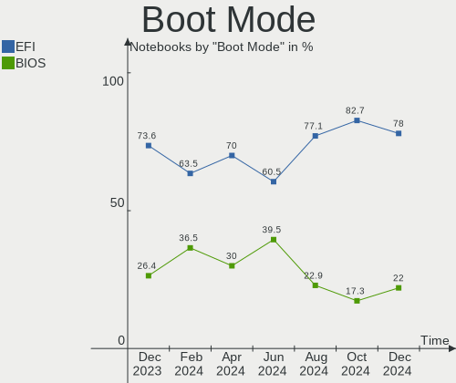
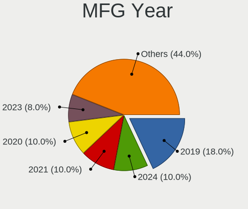
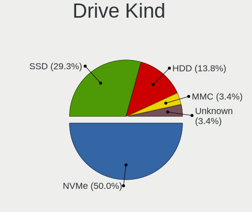
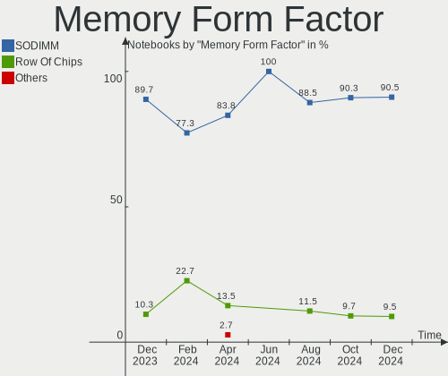

openSUSE Hardware Trends (Notebooks)
------------------------------------

A project to identify most popular hardware characteristics and track their change
over time based on data collected by openSUSE users at https://Linux-Hardware.org.

Anyone can contribute to this report by the [hw-probe](https://github.com/linuxhw/hw-probe) tool:

    sudo -E hw-probe -all -upload

This report is for one last month. Overall report since the beginning of time: [TestCoverage](https://github.com/linuxhw/TestCoverage)

Period: Apr, 2022.

Contents
--------

* [ System ](#system)
  - [ OS                       ](#os)
  - [ OS Family                ](#os-family)
  - [ Kernel                   ](#kernel)
  - [ Kernel Family            ](#kernel-family)
  - [ Kernel Major Ver.        ](#kernel-major-ver)
  - [ Arch                     ](#arch)
  - [ DE                       ](#de)
  - [ Display Server           ](#display-server)
  - [ Display Manager          ](#display-manager)
  - [ OS Lang                  ](#os-lang)
  - [ Boot Mode                ](#boot-mode)
  - [ Filesystem               ](#filesystem)
  - [ Part. scheme             ](#part-scheme)
  - [ Dual Boot with Linux/BSD ](#dual-boot-with-linuxbsd)
  - [ Dual Boot (Win)          ](#dual-boot-win)

* [ Board ](#board)
  - [ Vendor                   ](#vendor)
  - [ Model                    ](#model)
  - [ Model Family             ](#model-family)
  - [ MFG Year                 ](#mfg-year)
  - [ Form Factor              ](#form-factor)
  - [ Secure Boot              ](#secure-boot)
  - [ Coreboot                 ](#coreboot)
  - [ RAM Size                 ](#ram-size)
  - [ RAM Used                 ](#ram-used)
  - [ Total Drives             ](#total-drives)
  - [ Has CD-ROM               ](#has-cd-rom)
  - [ Has Ethernet             ](#has-ethernet)
  - [ Has WiFi                 ](#has-wifi)
  - [ Has Bluetooth            ](#has-bluetooth)

* [ Location ](#location)
  - [ Country                  ](#country)
  - [ City                     ](#city)

* [ Drives ](#drives)
  - [ Drive Vendor             ](#drive-vendor)
  - [ Drive Model              ](#drive-model)
  - [ HDD Vendor               ](#hdd-vendor)
  - [ SSD Vendor               ](#ssd-vendor)
  - [ Drive Kind               ](#drive-kind)
  - [ Drive Connector          ](#drive-connector)
  - [ Drive Size               ](#drive-size)
  - [ Space Total              ](#space-total)
  - [ Space Used               ](#space-used)
  - [ Malfunc. Drives          ](#malfunc-drives)
  - [ Malfunc. Drive Vendor    ](#malfunc-drive-vendor)
  - [ Malfunc. HDD Vendor      ](#malfunc-hdd-vendor)
  - [ Malfunc. Drive Kind      ](#malfunc-drive-kind)
  - [ Failed Drives            ](#failed-drives)
  - [ Failed Drive Vendor      ](#failed-drive-vendor)
  - [ Drive Status             ](#drive-status)

* [ Storage controller ](#storage-controller)
  - [ Storage Vendor           ](#storage-vendor)
  - [ Storage Model            ](#storage-model)
  - [ Storage Kind             ](#storage-kind)

* [ Processor ](#processor)
  - [ CPU Vendor               ](#cpu-vendor)
  - [ CPU Model                ](#cpu-model)
  - [ CPU Model Family         ](#cpu-model-family)
  - [ CPU Cores                ](#cpu-cores)
  - [ CPU Sockets              ](#cpu-sockets)
  - [ CPU Threads              ](#cpu-threads)
  - [ CPU Op-Modes             ](#cpu-op-modes)
  - [ CPU Microcode            ](#cpu-microcode)
  - [ CPU Microarch            ](#cpu-microarch)

* [ Graphics ](#graphics)
  - [ GPU Vendor               ](#gpu-vendor)
  - [ GPU Model                ](#gpu-model)
  - [ GPU Combo                ](#gpu-combo)
  - [ GPU Driver               ](#gpu-driver)
  - [ GPU Memory               ](#gpu-memory)

* [ Monitor ](#monitor)
  - [ Monitor Vendor           ](#monitor-vendor)
  - [ Monitor Model            ](#monitor-model)
  - [ Monitor Resolution       ](#monitor-resolution)
  - [ Monitor Diagonal         ](#monitor-diagonal)
  - [ Monitor Width            ](#monitor-width)
  - [ Aspect Ratio             ](#aspect-ratio)
  - [ Monitor Area             ](#monitor-area)
  - [ Pixel Density            ](#pixel-density)
  - [ Multiple Monitors        ](#multiple-monitors)

* [ Network ](#network)
  - [ Net Controller Vendor    ](#net-controller-vendor)
  - [ Net Controller Model     ](#net-controller-model)
  - [ Wireless Vendor          ](#wireless-vendor)
  - [ Wireless Model           ](#wireless-model)
  - [ Ethernet Vendor          ](#ethernet-vendor)
  - [ Ethernet Model           ](#ethernet-model)
  - [ Net Controller Kind      ](#net-controller-kind)
  - [ Used Controller          ](#used-controller)
  - [ NICs                     ](#nics)
  - [ IPv6                     ](#ipv6)

* [ Bluetooth ](#bluetooth)
  - [ Bluetooth Vendor         ](#bluetooth-vendor)
  - [ Bluetooth Model          ](#bluetooth-model)

* [ Sound ](#sound)
  - [ Sound Vendor             ](#sound-vendor)
  - [ Sound Model              ](#sound-model)

* [ Memory ](#memory)
  - [ Memory Vendor            ](#memory-vendor)
  - [ Memory Model             ](#memory-model)
  - [ Memory Kind              ](#memory-kind)
  - [ Memory Form Factor       ](#memory-form-factor)
  - [ Memory Size              ](#memory-size)
  - [ Memory Speed             ](#memory-speed)

* [ Printers & scanners ](#printers--scanners)
  - [ Printer Vendor           ](#printer-vendor)
  - [ Printer Model            ](#printer-model)
  - [ Scanner Vendor           ](#scanner-vendor)
  - [ Scanner Model            ](#scanner-model)

* [ Camera ](#camera)
  - [ Camera Vendor            ](#camera-vendor)
  - [ Camera Model             ](#camera-model)

* [ Security ](#security)
  - [ Fingerprint Vendor       ](#fingerprint-vendor)
  - [ Fingerprint Model        ](#fingerprint-model)
  - [ Chipcard Vendor          ](#chipcard-vendor)
  - [ Chipcard Model           ](#chipcard-model)

* [ Unsupported ](#unsupported)
  - [ Unsupported Devices      ](#unsupported-devices)
  - [ Unsupported Device Types ](#unsupported-device-types)

System
------

OS
--

Installed operating systems

| Name                         | Notebooks | Percent |
|------------------------------|-----------|---------|
| openSUSE Leap-15.3           | 4         | 14.29%  |
| openSUSE 20220425            | 2         | 7.14%   |
| openSUSE 20220410            | 2         | 7.14%   |
| openSUSE 20220406            | 2         | 7.14%   |
| openSUSE 20220403            | 2         | 7.14%   |
| openSUSE Tumbleweed-20220427 | 1         | 3.57%   |
| openSUSE Tumbleweed-20220412 | 1         | 3.57%   |
| openSUSE Tumbleweed-20220406 | 1         | 3.57%   |
| openSUSE Tumbleweed-20220401 | 1         | 3.57%   |
| openSUSE Tumbleweed-20220330 | 1         | 3.57%   |
| openSUSE Microos-20220424    | 1         | 3.57%   |
| openSUSE Leap-15.4           | 1         | 3.57%   |
| openSUSE 20220424            | 1         | 3.57%   |
| openSUSE 20220423            | 1         | 3.57%   |
| openSUSE 20220421            | 1         | 3.57%   |
| openSUSE 20220414            | 1         | 3.57%   |
| openSUSE 20220409            | 1         | 3.57%   |
| openSUSE 20220407            | 1         | 3.57%   |
| openSUSE 20220402            | 1         | 3.57%   |
| openSUSE 20220324            | 1         | 3.57%   |
| openSUSE 20220223            | 1         | 3.57%   |

OS Family
---------

OS without a version

| Name     | Notebooks | Percent |
|----------|-----------|---------|
| openSUSE | 28        | 100%    |

Kernel
------

Version of the Linux kernel

| Version                     | Notebooks | Percent |
|-----------------------------|-----------|---------|
| 5.17.1-1-default            | 11        | 39.29%  |
| 5.17.4-1-default            | 6         | 21.43%  |
| 5.17.2-1-default            | 2         | 7.14%   |
| 5.16.15-1-default           | 2         | 7.14%   |
| 5.3.18-150300.59.63-default | 1         | 3.57%   |
| 5.3.18-150300.59.60-default | 1         | 3.57%   |
| 5.3.18-150300.59.49-default | 1         | 3.57%   |
| 5.17.3-1-default            | 1         | 3.57%   |
| 5.17.1-1.g47fa9ec-default   | 1         | 3.57%   |
| 5.16.10-1-default           | 1         | 3.57%   |
| 5.14.21-150400.15-default   | 1         | 3.57%   |

Kernel Family
-------------

Linux kernel without a distro release

| Version | Notebooks | Percent |
|---------|-----------|---------|
| 5.17.1  | 12        | 42.86%  |
| 5.17.4  | 6         | 21.43%  |
| 5.3.18  | 3         | 10.71%  |
| 5.17.2  | 2         | 7.14%   |
| 5.16.15 | 2         | 7.14%   |
| 5.17.3  | 1         | 3.57%   |
| 5.16.10 | 1         | 3.57%   |
| 5.14.21 | 1         | 3.57%   |

Kernel Major Ver.
-----------------

Linux kernel major version

| Version | Notebooks | Percent |
|---------|-----------|---------|
| 5.17    | 21        | 75%     |
| 5.3     | 3         | 10.71%  |
| 5.16    | 3         | 10.71%  |
| 5.14    | 1         | 3.57%   |

Arch
----

OS architecture (x86_64, i586, etc.)

| Name   | Notebooks | Percent |
|--------|-----------|---------|
| x86_64 | 28        | 100%    |

DE
--

Desktop Environment

| Name       | Notebooks | Percent |
|------------|-----------|---------|
| KDE5       | 13        | 46.43%  |
| GNOME      | 8         | 28.57%  |
| XFCE       | 3         | 10.71%  |
| X-Cinnamon | 1         | 3.57%   |
| plasma5    | 1         | 3.57%   |
| ICEWM      | 1         | 3.57%   |
| Budgie     | 1         | 3.57%   |

Display Server
--------------

X11 or Wayland

| Name    | Notebooks | Percent |
|---------|-----------|---------|
| X11     | 15        | 53.57%  |
| Wayland | 12        | 42.86%  |
| Tty     | 1         | 3.57%   |

Display Manager
---------------

SDDM, LightDM, etc.

| Name    | Notebooks | Percent |
|---------|-----------|---------|
| SDDM    | 11        | 39.29%  |
| LightDM | 7         | 25%     |
| Unknown | 7         | 25%     |
| XDM     | 3         | 10.71%  |

OS Lang
-------

Language

| Lang  | Notebooks | Percent |
|-------|-----------|---------|
| en_US | 12        | 42.86%  |
| en_GB | 4         | 14.29%  |
| de_DE | 3         | 10.71%  |
| ru_RU | 2         | 7.14%   |
| POSIX | 2         | 7.14%   |
| pt_BR | 1         | 3.57%   |
| nl_NL | 1         | 3.57%   |
| it_IT | 1         | 3.57%   |
| es_MX | 1         | 3.57%   |
| es_ES | 1         | 3.57%   |

Boot Mode
---------

EFI or BIOS

| Mode | Notebooks | Percent |
|------|-----------|---------|
| EFI  | 21        | 75%     |
| BIOS | 7         | 25%     |

Filesystem
----------

Type of filesystem

| Type    | Notebooks | Percent |
|---------|-----------|---------|
| Btrfs   | 24        | 85.71%  |
| Ext4    | 2         | 7.14%   |
| Xfs     | 1         | 3.57%   |
| Overlay | 1         | 3.57%   |

Part. scheme
------------

Scheme of partitioning

| Type    | Notebooks | Percent |
|---------|-----------|---------|
| GPT     | 16        | 57.14%  |
| Unknown | 8         | 28.57%  |
| MBR     | 4         | 14.29%  |

Dual Boot with Linux/BSD
------------------------

Hosting more than one Linux/BSD

| Dual boot | Notebooks | Percent |
|-----------|-----------|---------|
| No        | 22        | 78.57%  |
| Yes       | 6         | 21.43%  |

Dual Boot (Win)
---------------

Hosting Linux and Windows

| Dual boot | Notebooks | Percent |
|-----------|-----------|---------|
| No        | 21        | 75%     |
| Yes       | 7         | 25%     |

Board
-----

Vendor
------

Motherboard manufacturer

| Name             | Notebooks | Percent |
|------------------|-----------|---------|
| Lenovo           | 8         | 28.57%  |
| Hewlett-Packard  | 6         | 21.43%  |
| ASUSTek Computer | 3         | 10.71%  |
| Acer             | 3         | 10.71%  |
| HUAWEI           | 2         | 7.14%   |
| Dell             | 2         | 7.14%   |
| Toshiba          | 1         | 3.57%   |
| MSI              | 1         | 3.57%   |
| LG Electronics   | 1         | 3.57%   |
| Fujitsu          | 1         | 3.57%   |

Model
-----

Motherboard model

| Name                                   | Notebooks | Percent |
|----------------------------------------|-----------|---------|
| HP Laptop 17-ca0xxx                    | 2         | 7.14%   |
| Toshiba Satellite C55Dt-B              | 1         | 3.57%   |
| MSI Modern 15 A4M                      | 1         | 3.57%   |
| LG C400-G.BC22P1                       | 1         | 3.57%   |
| Lenovo ThinkPad X201 Tablet 0831CTO    | 1         | 3.57%   |
| Lenovo ThinkPad X13 Gen 1 20UGS00800   | 1         | 3.57%   |
| Lenovo ThinkPad T460 20FMS25902        | 1         | 3.57%   |
| Lenovo ThinkPad T14s Gen 1 20UJS00K00  | 1         | 3.57%   |
| Lenovo ThinkPad L420 7829BH2           | 1         | 3.57%   |
| Lenovo IdeaPad 330-15IKB 81FE          | 1         | 3.57%   |
| Lenovo IdeaPad 320-15ABR 80XS          | 1         | 3.57%   |
| Lenovo IdeaPad 3 15ITL6 82H8           | 1         | 3.57%   |
| HUAWEI KPL-W0X                         | 1         | 3.57%   |
| HUAWEI BOM-WXX9                        | 1         | 3.57%   |
| HP Victus by Laptop 16-e0xxx           | 1         | 3.57%   |
| HP OMEN by Laptop                      | 1         | 3.57%   |
| HP Notebook                            | 1         | 3.57%   |
| HP Laptop 15s-eq2xxx                   | 1         | 3.57%   |
| Fujitsu LIFEBOOK S762                  | 1         | 3.57%   |
| Dell System Inspiron N7110             | 1         | 3.57%   |
| Dell Precision 5530                    | 1         | 3.57%   |
| ASUS VivoBook_ASUSLaptop X512DA_X512DA | 1         | 3.57%   |
| ASUS VivoBook_ASUSLaptop X435EA_S435EA | 1         | 3.57%   |
| ASUS N551JW                            | 1         | 3.57%   |
| Acer TravelMate P215-41-G2             | 1         | 3.57%   |
| Acer Extensa 2519                      | 1         | 3.57%   |
| Acer Aspire 3810TZ                     | 1         | 3.57%   |

Model Family
------------

Motherboard model prefix

| Name              | Notebooks | Percent |
|-------------------|-----------|---------|
| Lenovo ThinkPad   | 5         | 17.86%  |
| Lenovo IdeaPad    | 3         | 10.71%  |
| HP Laptop         | 3         | 10.71%  |
| ASUS VivoBook     | 2         | 7.14%   |
| Toshiba Satellite | 1         | 3.57%   |
| MSI Modern        | 1         | 3.57%   |
| LG C400-G.BC22P1  | 1         | 3.57%   |
| HUAWEI KPL-W0X    | 1         | 3.57%   |
| HUAWEI BOM-WXX9   | 1         | 3.57%   |
| HP Victus         | 1         | 3.57%   |
| HP OMEN           | 1         | 3.57%   |
| HP Notebook       | 1         | 3.57%   |
| Fujitsu LIFEBOOK  | 1         | 3.57%   |
| Dell System       | 1         | 3.57%   |
| Dell Precision    | 1         | 3.57%   |
| ASUS N551JW       | 1         | 3.57%   |
| Acer TravelMate   | 1         | 3.57%   |
| Acer Extensa      | 1         | 3.57%   |
| Acer Aspire       | 1         | 3.57%   |

MFG Year
--------

Motherboard manufacture year

| Year | Notebooks | Percent |
|------|-----------|---------|
| 2021 | 6         | 21.43%  |
| 2018 | 5         | 17.86%  |
| 2020 | 3         | 10.71%  |
| 2016 | 3         | 10.71%  |
| 2011 | 3         | 10.71%  |
| 2017 | 2         | 7.14%   |
| 2019 | 1         | 3.57%   |
| 2015 | 1         | 3.57%   |
| 2014 | 1         | 3.57%   |
| 2012 | 1         | 3.57%   |
| 2010 | 1         | 3.57%   |
| 2009 | 1         | 3.57%   |

Form Factor
-----------

Physical design of the computer

| Name     | Notebooks | Percent |
|----------|-----------|---------|
| Notebook | 28        | 100%    |

Secure Boot
-----------

Enabled or disabled

| State    | Notebooks | Percent |
|----------|-----------|---------|
| Disabled | 25        | 89.29%  |
| Enabled  | 3         | 10.71%  |

Coreboot
--------

Have coreboot on board

| Used | Notebooks | Percent |
|------|-----------|---------|
| No   | 28        | 100%    |

RAM Size
--------

Total RAM memory

| Size in GB | Notebooks | Percent |
|------------|-----------|---------|
| 4.01-8.0   | 14        | 50%     |
| 16.01-24.0 | 4         | 14.29%  |
| 8.01-16.0  | 4         | 14.29%  |
| 32.01-64.0 | 3         | 10.71%  |
| 3.01-4.0   | 2         | 7.14%   |
| 2.01-3.0   | 1         | 3.57%   |

RAM Used
--------

Used RAM memory

| Used GB    | Notebooks | Percent |
|------------|-----------|---------|
| 1.01-2.0   | 11        | 39.29%  |
| 4.01-8.0   | 6         | 21.43%  |
| 2.01-3.0   | 5         | 17.86%  |
| 3.01-4.0   | 4         | 14.29%  |
| 16.01-24.0 | 1         | 3.57%   |
| 8.01-16.0  | 1         | 3.57%   |

Total Drives
------------

Number of drives on board

| Drives | Notebooks | Percent |
|--------|-----------|---------|
| 1      | 18        | 64.29%  |
| 2      | 10        | 35.71%  |

Has CD-ROM
----------

Has CD-ROM on board

| Presented | Notebooks | Percent |
|-----------|-----------|---------|
| No        | 18        | 64.29%  |
| Yes       | 10        | 35.71%  |

Has Ethernet
------------

Has Ethernet on board

| Presented | Notebooks | Percent |
|-----------|-----------|---------|
| Yes       | 22        | 78.57%  |
| No        | 6         | 21.43%  |

Has WiFi
--------

Has WiFi module

| Presented | Notebooks | Percent |
|-----------|-----------|---------|
| Yes       | 27        | 96.43%  |
| No        | 1         | 3.57%   |

Has Bluetooth
-------------

Has Bluetooth module

| Presented | Notebooks | Percent |
|-----------|-----------|---------|
| Yes       | 22        | 78.57%  |
| No        | 6         | 21.43%  |

Location
--------

Country
-------

Geographic location (country)

| Country     | Notebooks | Percent |
|-------------|-----------|---------|
| Germany     | 6         | 21.43%  |
| USA         | 3         | 10.71%  |
| Spain       | 2         | 7.14%   |
| Portugal    | 2         | 7.14%   |
| Hungary     | 2         | 7.14%   |
| Brazil      | 2         | 7.14%   |
| Uzbekistan  | 1         | 3.57%   |
| UK          | 1         | 3.57%   |
| Russia      | 1         | 3.57%   |
| Romania     | 1         | 3.57%   |
| Netherlands | 1         | 3.57%   |
| Mexico      | 1         | 3.57%   |
| Italy       | 1         | 3.57%   |
| France      | 1         | 3.57%   |
| Bulgaria    | 1         | 3.57%   |
| Belgium     | 1         | 3.57%   |
| Australia   | 1         | 3.57%   |

City
----

Geographic location (city)

| City          | Notebooks | Percent |
|---------------|-----------|---------|
| Göttingen    | 2         | 7.14%   |
| Woking        | 1         | 3.57%   |
| Weilheim      | 1         | 3.57%   |
| Wegberg       | 1         | 3.57%   |
| Tashkent      | 1         | 3.57%   |
| Sofia         | 1         | 3.57%   |
| Sao Paulo     | 1         | 3.57%   |
| Rome          | 1         | 3.57%   |
| Palm Bay      | 1         | 3.57%   |
| Melbourne     | 1         | 3.57%   |
| Matraverebely | 1         | 3.57%   |
| Loures        | 1         | 3.57%   |
| Leipzig       | 1         | 3.57%   |
| Iztacalco     | 1         | 3.57%   |
| Itajaí       | 1         | 3.57%   |
| Guerville     | 1         | 3.57%   |
| Gijón        | 1         | 3.57%   |
| Conroe        | 1         | 3.57%   |
| Chelyabinsk   | 1         | 3.57%   |
| Burnsville    | 1         | 3.57%   |
| Budapest      | 1         | 3.57%   |
| Bucharest     | 1         | 3.57%   |
| Bragança     | 1         | 3.57%   |
| Bad Aibling   | 1         | 3.57%   |
| Antwerp       | 1         | 3.57%   |
| Almelo        | 1         | 3.57%   |
| A Coruña     | 1         | 3.57%   |

Drives
------

Drive Vendor
------------

Hard drive vendors

| Vendor              | Notebooks | Drives | Percent |
|---------------------|-----------|--------|---------|
| WDC                 | 5         | 5      | 14.29%  |
| Samsung Electronics | 5         | 5      | 14.29%  |
| Sandisk             | 4         | 5      | 11.43%  |
| Kingston            | 4         | 5      | 11.43%  |
| Seagate             | 3         | 3      | 8.57%   |
| Toshiba             | 2         | 2      | 5.71%   |
| Intel               | 2         | 2      | 5.71%   |
| Unknown             | 1         | 1      | 2.86%   |
| SK Hynix            | 1         | 1      | 2.86%   |
| Phison              | 1         | 1      | 2.86%   |
| OCZ                 | 1         | 1      | 2.86%   |
| LITEON              | 1         | 1      | 2.86%   |
| KIOXIA              | 1         | 1      | 2.86%   |
| Hitachi             | 1         | 1      | 2.86%   |
| HGST                | 1         | 1      | 2.86%   |
| Gigabyte Technology | 1         | 1      | 2.86%   |
| China               | 1         | 1      | 2.86%   |

Drive Model
-----------

Hard drive models

| Model                              | Notebooks | Percent |
|------------------------------------|-----------|---------|
| Seagate ST1000LM035-1RK172 1TB     | 2         | 5.41%   |
| WDC WD5000LPCX-60VHAT0 500GB       | 1         | 2.7%    |
| WDC WD5000LPCX-21VHAT0 500GB       | 1         | 2.7%    |
| WDC WD40 EZRZ-00GXCB0 4TB          | 1         | 2.7%    |
| WDC WD3200BEVT-22ZCT0 320GB        | 1         | 2.7%    |
| WDC WD10SPZX-60Z10T0 1TB           | 1         | 2.7%    |
| Unknown MMC Card  8GB              | 1         | 2.7%    |
| Toshiba MQ04ABF100 1TB             | 1         | 2.7%    |
| Toshiba MK3261GSYD 320GB           | 1         | 2.7%    |
| SK Hynix HFM256GD3JX016N 256GB     | 1         | 2.7%    |
| Seagate ST2000LM007-1R8174 2TB     | 1         | 2.7%    |
| SanDisk SSD PLUS 480GB             | 1         | 2.7%    |
| SanDisk SSD PLUS 120GB             | 1         | 2.7%    |
| SanDisk SD9SN8W256G1027 256GB SSD  | 1         | 2.7%    |
| SanDisk SD6SB1M128G1022I 128GB SSD | 1         | 2.7%    |
| Sandisk NVMe SSD Drive 1024GB      | 1         | 2.7%    |
| Samsung SSD 870 EVO 1TB            | 1         | 2.7%    |
| Samsung SSD 860 EVO 500GB          | 1         | 2.7%    |
| Samsung PM981 NVMe 512GB           | 1         | 2.7%    |
| Samsung NVMe SSD Drive 512GB       | 1         | 2.7%    |
| Samsung MZVLB512HBJQ-000H1 512GB   | 1         | 2.7%    |
| Phison 311CD0512GB                 | 1         | 2.7%    |
| OCZ VERTEX2 180GB SSD              | 1         | 2.7%    |
| LITEON CV3-DE128 128GB SSD         | 1         | 2.7%    |
| KIOXIA KBG40ZNV256G 256GB          | 1         | 2.7%    |
| Kingston SUV300S37A240G 240GB SSD  | 1         | 2.7%    |
| Kingston SA400S37120G 120GB SSD    | 1         | 2.7%    |
| Kingston RBUSNS8154P3256GJ3 256GB  | 1         | 2.7%    |
| Kingston NVMe SSD Drive 512GB      | 1         | 2.7%    |
| Kingston NVMe SSD Drive 256GB      | 1         | 2.7%    |
| Intel SSDPEKNW512G8L 512GB         | 1         | 2.7%    |
| Intel SSDPEKNW512G8 512GB          | 1         | 2.7%    |
| Hitachi HTS725050A9A364 500GB      | 1         | 2.7%    |
| HGST HTS725050A7E630 500GB         | 1         | 2.7%    |
| Gigabyte GP-GM301TB-G              | 1         | 2.7%    |
| China SATA SSD 240GB               | 1         | 2.7%    |

HDD Vendor
----------

Hard disk drive vendors

| Vendor  | Notebooks | Drives | Percent |
|---------|-----------|--------|---------|
| WDC     | 5         | 5      | 41.67%  |
| Seagate | 3         | 3      | 25%     |
| Toshiba | 2         | 2      | 16.67%  |
| Hitachi | 1         | 1      | 8.33%   |
| HGST    | 1         | 1      | 8.33%   |

SSD Vendor
----------

Solid state drive vendors

| Vendor              | Notebooks | Drives | Percent |
|---------------------|-----------|--------|---------|
| SanDisk             | 3         | 4      | 30%     |
| Samsung Electronics | 2         | 2      | 20%     |
| Kingston            | 2         | 2      | 20%     |
| OCZ                 | 1         | 1      | 10%     |
| LITEON              | 1         | 1      | 10%     |
| China               | 1         | 1      | 10%     |

Drive Kind
----------

HDD or SSD

| Kind | Notebooks | Drives | Percent |
|------|-----------|--------|---------|
| HDD  | 12        | 12     | 35.29%  |
| NVMe | 11        | 13     | 32.35%  |
| SSD  | 10        | 11     | 29.41%  |
| MMC  | 1         | 1      | 2.94%   |

Drive Connector
---------------

SATA, SAS, NVMe, etc.

| Type | Notebooks | Drives | Percent |
|------|-----------|--------|---------|
| SATA | 18        | 22     | 58.06%  |
| NVMe | 11        | 13     | 35.48%  |
| SAS  | 1         | 1      | 3.23%   |
| MMC  | 1         | 1      | 3.23%   |

Drive Size
----------

Size of hard drive

| Size in TB | Notebooks | Drives | Percent |
|------------|-----------|--------|---------|
| 0.01-0.5   | 14        | 16     | 66.67%  |
| 0.51-1.0   | 5         | 5      | 23.81%  |
| 3.01-4.0   | 1         | 1      | 4.76%   |
| 1.01-2.0   | 1         | 1      | 4.76%   |

Space Total
-----------

Amount of disk space available on the file system

| Size in GB     | Notebooks | Percent |
|----------------|-----------|---------|
| More than 3000 | 9         | 32.14%  |
| 1001-2000      | 7         | 25%     |
| 2001-3000      | 5         | 17.86%  |
| 251-500        | 4         | 14.29%  |
| 21-50          | 2         | 7.14%   |
| 501-1000       | 1         | 3.57%   |

Space Used
----------

Amount of used disk space

| Used GB        | Notebooks | Percent |
|----------------|-----------|---------|
| 251-500        | 7         | 25%     |
| 1001-2000      | 5         | 17.86%  |
| 101-250        | 4         | 14.29%  |
| 51-100         | 4         | 14.29%  |
| 501-1000       | 3         | 10.71%  |
| More than 3000 | 2         | 7.14%   |
| 1-20           | 2         | 7.14%   |
| 2001-3000      | 1         | 3.57%   |

Malfunc. Drives
---------------

Drive models with a malfunction

| Model                               | Notebooks | Drives | Percent |
|-------------------------------------|-----------|--------|---------|
| Samsung Electronics SSD 870 EVO 1TB | 1         | 1      | 33.33%  |
| Kingston SUV300S37A240G 240GB SSD   | 1         | 1      | 33.33%  |
| Hitachi HTS725050A9A364 500GB       | 1         | 1      | 33.33%  |

Malfunc. Drive Vendor
---------------------

Vendors of faulty drives

| Vendor              | Notebooks | Drives | Percent |
|---------------------|-----------|--------|---------|
| Samsung Electronics | 1         | 1      | 33.33%  |
| Kingston            | 1         | 1      | 33.33%  |
| Hitachi             | 1         | 1      | 33.33%  |

Malfunc. HDD Vendor
-------------------

Vendors of faulty HDD drives

| Vendor  | Notebooks | Drives | Percent |
|---------|-----------|--------|---------|
| Hitachi | 1         | 1      | 100%    |

Malfunc. Drive Kind
-------------------

Kinds of faulty drives

| Kind | Notebooks | Drives | Percent |
|------|-----------|--------|---------|
| SSD  | 2         | 2      | 66.67%  |
| HDD  | 1         | 1      | 33.33%  |

Failed Drives
-------------

Failed drive models

Zero info for selected period =(

Failed Drive Vendor
-------------------

Failed drive vendors

Zero info for selected period =(

Drive Status
------------

Number of failed and malfunc. drives

| Status   | Notebooks | Drives | Percent |
|----------|-----------|--------|---------|
| Works    | 18        | 23     | 58.06%  |
| Detected | 10        | 11     | 32.26%  |
| Malfunc  | 3         | 3      | 9.68%   |

Storage controller
------------------

Storage Vendor
--------------

Storage controller vendors

| Vendor                      | Notebooks | Percent |
|-----------------------------|-----------|---------|
| Intel                       | 15        | 46.88%  |
| AMD                         | 7         | 21.88%  |
| Samsung Electronics         | 3         | 9.38%   |
| Kingston Technology Company | 2         | 6.25%   |
| SK Hynix                    | 1         | 3.13%   |
| Sandisk                     | 1         | 3.13%   |
| Realtek Semiconductor       | 1         | 3.13%   |
| Phison Electronics          | 1         | 3.13%   |
| KIOXIA                      | 1         | 3.13%   |

Storage Model
-------------

Storage controller models

| Model                                                                            | Notebooks | Percent |
|----------------------------------------------------------------------------------|-----------|---------|
| AMD FCH SATA Controller [AHCI mode]                                              | 7         | 20.59%  |
| Samsung NVMe SSD Controller SM981/PM981/PM983                                    | 3         | 8.82%   |
| Intel Sunrise Point-LP SATA Controller [AHCI mode]                               | 3         | 8.82%   |
| Intel SSD 660P Series                                                            | 2         | 5.88%   |
| Intel 6 Series/C200 Series Chipset Family 6 port Mobile SATA AHCI Controller     | 2         | 5.88%   |
| SK Hynix Gold P31 SSD                                                            | 1         | 2.94%   |
| Sandisk WD Black SN750 / PC SN730 NVMe SSD                                       | 1         | 2.94%   |
| Realtek RTS5763DL NVMe SSD Controller                                            | 1         | 2.94%   |
| Phison PS5013 E13 NVMe Controller                                                | 1         | 2.94%   |
| KIOXIA Non-Volatile memory controller                                            | 1         | 2.94%   |
| Kingston Company U-SNS8154P3 NVMe SSD                                            | 1         | 2.94%   |
| Kingston Company Company Non-Volatile memory controller                          | 1         | 2.94%   |
| Intel Volume Management Device NVMe RAID Controller                              | 1         | 2.94%   |
| Intel Tiger Lake-LP SATA Controller [AHCI mode]                                  | 1         | 2.94%   |
| Intel HM170/QM170 Chipset SATA Controller [AHCI Mode]                            | 1         | 2.94%   |
| Intel Cannon Lake Mobile PCH SATA AHCI Controller                                | 1         | 2.94%   |
| Intel Atom/Celeron/Pentium Processor x5-E8000/J3xxx/N3xxx Series SATA Controller | 1         | 2.94%   |
| Intel 82801IBM/IEM (ICH9M/ICH9M-E) 4 port SATA Controller [AHCI mode]            | 1         | 2.94%   |
| Intel 8 Series/C220 Series Chipset Family 6-port SATA Controller 1 [AHCI mode]   | 1         | 2.94%   |
| Intel 7 Series Chipset Family 6-port SATA Controller [AHCI mode]                 | 1         | 2.94%   |
| Intel 5 Series/3400 Series Chipset 6 port SATA AHCI Controller                   | 1         | 2.94%   |
| Intel 5 Series/3400 Series Chipset 4 port SATA AHCI Controller                   | 1         | 2.94%   |

Storage Kind
------------

Kind of storage controller (IDE, SATA, NVMe, SAS, ...)

| Kind | Notebooks | Percent |
|------|-----------|---------|
| SATA | 21        | 63.64%  |
| NVMe | 11        | 33.33%  |
| RAID | 1         | 3.03%   |

Processor
---------

CPU Vendor
----------

Processor vendors

| Vendor | Notebooks | Percent |
|--------|-----------|---------|
| Intel  | 15        | 53.57%  |
| AMD    | 13        | 46.43%  |

CPU Model
---------

Processor models

| Model                                           | Notebooks | Percent |
|-------------------------------------------------|-----------|---------|
| Intel Core i5-2450M CPU @ 2.50GHz               | 2         | 7.14%   |
| Intel 11th Gen Core i5-1135G7 @ 2.40GHz         | 2         | 7.14%   |
| AMD Ryzen 7 PRO 4750U with Radeon Graphics      | 2         | 7.14%   |
| AMD Ryzen 5 5500U with Radeon Graphics          | 2         | 7.14%   |
| Intel Pentium CPU P6200 @ 2.13GHz               | 1         | 3.57%   |
| Intel Pentium CPU N3710 @ 1.60GHz               | 1         | 3.57%   |
| Intel Genuine CPU U4100 @ 1.30GHz               | 1         | 3.57%   |
| Intel Core i7-8850H CPU @ 2.60GHz               | 1         | 3.57%   |
| Intel Core i7-8550U CPU @ 1.80GHz               | 1         | 3.57%   |
| Intel Core i7-2640M CPU @ 2.80GHz               | 1         | 3.57%   |
| Intel Core i7 CPU L 620 @ 2.00GHz               | 1         | 3.57%   |
| Intel Core i5-6300U CPU @ 2.40GHz               | 1         | 3.57%   |
| Intel Core i5-6300HQ CPU @ 2.30GHz              | 1         | 3.57%   |
| Intel Core i5-4200H CPU @ 2.80GHz               | 1         | 3.57%   |
| Intel Core i3-6100U CPU @ 2.30GHz               | 1         | 3.57%   |
| AMD Ryzen 7 5800H with Radeon Graphics          | 1         | 3.57%   |
| AMD Ryzen 5 4500U with Radeon Graphics          | 1         | 3.57%   |
| AMD Ryzen 5 3500U with Radeon Vega Mobile Gfx   | 1         | 3.57%   |
| AMD Ryzen 5 2500U with Radeon Vega Mobile Gfx   | 1         | 3.57%   |
| AMD Ryzen 3 PRO 5450U with Radeon Graphics      | 1         | 3.57%   |
| AMD A9-9425 RADEON R5, 5 COMPUTE CORES 2C+3G    | 1         | 3.57%   |
| AMD A8-6410 APU with AMD Radeon R5 Graphics     | 1         | 3.57%   |
| AMD A6-9225 RADEON R4, 5 COMPUTE CORES 2C+3G    | 1         | 3.57%   |
| AMD A12-9720P RADEON R7, 12 COMPUTE CORES 4C+8G | 1         | 3.57%   |

CPU Model Family
----------------

Processor model prefix

| Model           | Notebooks | Percent |
|-----------------|-----------|---------|
| Intel Core i5   | 5         | 17.86%  |
| AMD Ryzen 5     | 5         | 17.86%  |
| Intel Core i7   | 4         | 14.29%  |
| Other           | 3         | 10.71%  |
| Intel Pentium   | 2         | 7.14%   |
| AMD Ryzen 7 PRO | 2         | 7.14%   |
| Intel Genuine   | 1         | 3.57%   |
| Intel Core i3   | 1         | 3.57%   |
| AMD Ryzen 7     | 1         | 3.57%   |
| AMD Ryzen 3 PRO | 1         | 3.57%   |
| AMD A8          | 1         | 3.57%   |
| AMD A6          | 1         | 3.57%   |
| AMD A12         | 1         | 3.57%   |

CPU Cores
---------

Number of processor cores

| Number | Notebooks | Percent |
|--------|-----------|---------|
| 2      | 12        | 42.86%  |
| 4      | 9         | 32.14%  |
| 6      | 4         | 14.29%  |
| 8      | 3         | 10.71%  |

CPU Sockets
-----------

Number of sockets

| Number | Notebooks | Percent |
|--------|-----------|---------|
| 1      | 28        | 100%    |

CPU Threads
-----------

Threads per core (Hyper-Threading)

| Number | Notebooks | Percent |
|--------|-----------|---------|
| 2      | 20        | 71.43%  |
| 1      | 8         | 28.57%  |

CPU Op-Modes
------------

CPU Operation Modes (32-bit, 64-bit)

| Op mode        | Notebooks | Percent |
|----------------|-----------|---------|
| 32-bit, 64-bit | 28        | 100%    |

CPU Microcode
-------------

Microcode number

| Number     | Notebooks | Percent |
|------------|-----------|---------|
| 0x206a7    | 3         | 10.71%  |
| 0x806c1    | 2         | 7.14%   |
| 0x406e3    | 2         | 7.14%   |
| 0x0a50000c | 2         | 7.14%   |
| 0x08608103 | 2         | 7.14%   |
| 0x08600106 | 2         | 7.14%   |
| 0x06006705 | 2         | 7.14%   |
| 0x906ea    | 1         | 3.57%   |
| 0x806ea    | 1         | 3.57%   |
| 0x506e3    | 1         | 3.57%   |
| 0x406c4    | 1         | 3.57%   |
| 0x306c3    | 1         | 3.57%   |
| 0x20655    | 1         | 3.57%   |
| 0x20652    | 1         | 3.57%   |
| 0x1067a    | 1         | 3.57%   |
| 0x08108102 | 1         | 3.57%   |
| 0x08101007 | 1         | 3.57%   |
| 0x07030105 | 1         | 3.57%   |
| 0x0600611a | 1         | 3.57%   |
| Unknown    | 1         | 3.57%   |

CPU Microarch
-------------

Microarchitecture

| Name        | Notebooks | Percent |
|-------------|-----------|---------|
| Zen 2       | 3         | 10.71%  |
| Skylake     | 3         | 10.71%  |
| SandyBridge | 3         | 10.71%  |
| Excavator   | 3         | 10.71%  |
| Zen 3       | 2         | 7.14%   |
| Westmere    | 2         | 7.14%   |
| TigerLake   | 2         | 7.14%   |
| KabyLake    | 2         | 7.14%   |
| Unknown     | 2         | 7.14%   |
| Zen+        | 1         | 3.57%   |
| Zen         | 1         | 3.57%   |
| Silvermont  | 1         | 3.57%   |
| Puma        | 1         | 3.57%   |
| Penryn      | 1         | 3.57%   |
| Haswell     | 1         | 3.57%   |

Graphics
--------

GPU Vendor
----------

Vendors of graphics cards

| Vendor | Notebooks | Percent |
|--------|-----------|---------|
| Intel  | 15        | 45.45%  |
| AMD    | 13        | 39.39%  |
| Nvidia | 5         | 15.15%  |

GPU Model
---------

Graphics card models

| Model                                                                                    | Notebooks | Percent |
|------------------------------------------------------------------------------------------|-----------|---------|
| Intel 2nd Generation Core Processor Family Integrated Graphics Controller                | 3         | 8.57%   |
| AMD Renoir                                                                               | 3         | 8.57%   |
| Nvidia GM107M [GeForce GTX 960M]                                                         | 2         | 5.71%   |
| Intel TigerLake-LP GT2 [Iris Xe Graphics]                                                | 2         | 5.71%   |
| Intel Skylake GT2 [HD Graphics 520]                                                      | 2         | 5.71%   |
| Intel Core Processor Integrated Graphics Controller                                      | 2         | 5.71%   |
| AMD Topaz XT [Radeon R7 M260/M265 / M340/M360 / M440/M445 / 530/535 / 620/625 Mobile]    | 2         | 5.71%   |
| AMD Stoney [Radeon R2/R3/R4/R5 Graphics]                                                 | 2         | 5.71%   |
| AMD Lucienne                                                                             | 2         | 5.71%   |
| AMD Cezanne                                                                              | 2         | 5.71%   |
| Nvidia GP108M [GeForce MX150]                                                            | 1         | 2.86%   |
| Nvidia GP107GLM [Quadro P1000 Mobile]                                                    | 1         | 2.86%   |
| Nvidia GA107M [GeForce RTX 3050 Ti Mobile]                                               | 1         | 2.86%   |
| Intel UHD Graphics 620                                                                   | 1         | 2.86%   |
| Intel Mobile 4 Series Chipset Integrated Graphics Controller                             | 1         | 2.86%   |
| Intel HD Graphics 530                                                                    | 1         | 2.86%   |
| Intel CoffeeLake-H GT2 [UHD Graphics 630]                                                | 1         | 2.86%   |
| Intel Atom/Celeron/Pentium Processor x5-E8000/J3xxx/N3xxx Integrated Graphics Controller | 1         | 2.86%   |
| Intel 4th Gen Core Processor Integrated Graphics Controller                              | 1         | 2.86%   |
| AMD Wani [Radeon R5/R6/R7 Graphics]                                                      | 1         | 2.86%   |
| AMD Raven Ridge [Radeon Vega Series / Radeon Vega Mobile Series]                         | 1         | 2.86%   |
| AMD Picasso/Raven 2 [Radeon Vega Series / Radeon Vega Mobile Series]                     | 1         | 2.86%   |
| AMD Mullins [Radeon R4/R5 Graphics]                                                      | 1         | 2.86%   |

GPU Combo
---------

Combinations of graphics cards

| Name           | Notebooks | Percent |
|----------------|-----------|---------|
| 1 x Intel      | 11        | 39.29%  |
| 1 x AMD        | 10        | 35.71%  |
| Intel + Nvidia | 4         | 14.29%  |
| 2 x AMD        | 2         | 7.14%   |
| AMD + Nvidia   | 1         | 3.57%   |

GPU Driver
----------

Free vs proprietary

| Driver      | Notebooks | Percent |
|-------------|-----------|---------|
| Free        | 24        | 85.71%  |
| Proprietary | 4         | 14.29%  |

GPU Memory
----------

Total video memory

| Size in GB | Notebooks | Percent |
|------------|-----------|---------|
| Unknown    | 14        | 50%     |
| 0.01-0.5   | 9         | 32.14%  |
| 1.01-2.0   | 3         | 10.71%  |
| 0.51-1.0   | 2         | 7.14%   |

Monitor
-------

Monitor Vendor
--------------

Monitor vendors

| Vendor              | Notebooks | Percent |
|---------------------|-----------|---------|
| Chimei Innolux      | 8         | 21.62%  |
| AU Optronics        | 6         | 16.22%  |
| BOE                 | 5         | 13.51%  |
| Samsung Electronics | 4         | 10.81%  |
| LG Display          | 4         | 10.81%  |
| Dell                | 2         | 5.41%   |
| Sharp               | 1         | 2.7%    |
| Sceptre Tech        | 1         | 2.7%    |
| Lenovo              | 1         | 2.7%    |
| Iiyama              | 1         | 2.7%    |
| HUAWEI              | 1         | 2.7%    |
| BIZ                 | 1         | 2.7%    |
| BenQ                | 1         | 2.7%    |
| AOC                 | 1         | 2.7%    |

Monitor Model
-------------

Monitor models

| Model                                                                 | Notebooks | Percent |
|-----------------------------------------------------------------------|-----------|---------|
| Chimei Innolux LCD Monitor CMN15F5 1920x1080 344x193mm 15.5-inch      | 2         | 5.26%   |
| BOE LCD Monitor BOE0660 1600x900 382x215mm 17.3-inch                  | 2         | 5.26%   |
| Sharp LCD Monitor SHP149A 1920x1080 344x194mm 15.5-inch               | 1         | 2.63%   |
| Sceptre Tech Sceptre E19 SPT07A8 1366x768 575x323mm 26.0-inch         | 1         | 2.63%   |
| Samsung Electronics LCD Monitor SEC544B 1600x900 382x214mm 17.2-inch  | 1         | 2.63%   |
| Samsung Electronics LCD Monitor SDC4146 1366x768 344x194mm 15.5-inch  | 1         | 2.63%   |
| Samsung Electronics LCD Monitor SAM0B60 1920x1080 887x500mm 40.1-inch | 1         | 2.63%   |
| Samsung Electronics LCD Monitor SAM0902 1920x1080 700x390mm 31.5-inch | 1         | 2.63%   |
| LG Display LCD Monitor LGD042C 1920x1080 345x194mm 15.6-inch          | 1         | 2.63%   |
| LG Display LCD Monitor LGD02EB 1366x768 309x174mm 14.0-inch           | 1         | 2.63%   |
| LG Display LCD Monitor LGD02E9 1366x768 309x174mm 14.0-inch           | 1         | 2.63%   |
| LG Display LCD Monitor LGD01DA 1366x768 294x166mm 13.3-inch           | 1         | 2.63%   |
| Lenovo LCD Monitor LEN4011 1280x800 261x163mm 12.1-inch               | 1         | 2.63%   |
| Iiyama PLE2607WS IVM5608 1920x1200 550x344mm 25.5-inch                | 1         | 2.63%   |
| HUAWEI MateView HWV6E22 3840x2560 596x397mm 28.2-inch                 | 1         | 2.63%   |
| Dell U2410 DELF017 1920x1200 518x324mm 24.1-inch                      | 1         | 2.63%   |
| Dell P2210 DEL404D 1680x1050 474x296mm 22.0-inch                      | 1         | 2.63%   |
| Chimei Innolux LCD Monitor CMN1738 1920x1080 381x214mm 17.2-inch      | 1         | 2.63%   |
| Chimei Innolux LCD Monitor CMN15E7 1920x1080 344x193mm 15.5-inch      | 1         | 2.63%   |
| Chimei Innolux LCD Monitor CMN15DB 1366x768 344x193mm 15.5-inch       | 1         | 2.63%   |
| Chimei Innolux LCD Monitor CMN15D5 1920x1080 344x193mm 15.5-inch      | 1         | 2.63%   |
| Chimei Innolux LCD Monitor CMN14F2 1920x1080 309x173mm 13.9-inch      | 1         | 2.63%   |
| Chimei Innolux LCD Monitor CMN1490 1366x768 309x173mm 13.9-inch       | 1         | 2.63%   |
| BOE LCD Monitor BOE099C 1920x1080 355x200mm 16.0-inch                 | 1         | 2.63%   |
| BOE LCD Monitor BOE083C 1920x1080 309x173mm 13.9-inch                 | 1         | 2.63%   |
| BOE LCD Monitor BOE0729 1920x1080 344x193mm 15.5-inch                 | 1         | 2.63%   |
| BIZ Bizlink VGA BIZ6506 1920x1200 600x340mm 27.2-inch                 | 1         | 2.63%   |
| BenQ GL2250H BNQ78A1 1920x1080 477x268mm 21.5-inch                    | 1         | 2.63%   |
| BenQ GL2250H BNQ78A0 1920x1080 477x268mm 21.5-inch                    | 1         | 2.63%   |
| AU Optronics LCD Monitor AUODF87 1920x1080 344x193mm 15.5-inch        | 1         | 2.63%   |
| AU Optronics LCD Monitor AUOA48F 1920x1080 309x174mm 14.0-inch        | 1         | 2.63%   |
| AU Optronics LCD Monitor AUO5A2D 1920x1080 293x165mm 13.2-inch        | 1         | 2.63%   |
| AU Optronics LCD Monitor AUO499F 1920x1080 344x194mm 15.5-inch        | 1         | 2.63%   |
| AU Optronics LCD Monitor AUO28ED 1920x1080 344x193mm 15.5-inch        | 1         | 2.63%   |
| AU Optronics LCD Monitor AUO10EC 1366x768 344x193mm 15.5-inch         | 1         | 2.63%   |
| AOC 2269WM AOC2269 1920x1080 480x270mm 21.7-inch                      | 1         | 2.63%   |

Monitor Resolution
------------------

Monitor screen resolution

| Resolution         | Notebooks | Percent |
|--------------------|-----------|---------|
| 1920x1080 (FHD)    | 17        | 54.84%  |
| 1366x768 (WXGA)    | 7         | 22.58%  |
| 1600x900 (HD+)     | 3         | 9.68%   |
| 3840x2560          | 1         | 3.23%   |
| 1920x1200 (WUXGA)  | 1         | 3.23%   |
| 1680x1050 (WSXGA+) | 1         | 3.23%   |
| 1280x800 (WXGA)    | 1         | 3.23%   |

Monitor Diagonal
----------------

Diagonal size in inches

| Inches | Notebooks | Percent |
|--------|-----------|---------|
| 15     | 13        | 35.14%  |
| 17     | 4         | 10.81%  |
| 14     | 4         | 10.81%  |
| 13     | 4         | 10.81%  |
| 54     | 2         | 5.41%   |
| 26     | 2         | 5.41%   |
| 21     | 2         | 5.41%   |
| 28     | 1         | 2.7%    |
| 27     | 1         | 2.7%    |
| 25     | 1         | 2.7%    |
| 22     | 1         | 2.7%    |
| 16     | 1         | 2.7%    |
| 12     | 1         | 2.7%    |

Monitor Width
-------------

Physical width

| Width in mm | Notebooks | Percent |
|-------------|-----------|---------|
| 301-350     | 19        | 51.35%  |
| 501-600     | 5         | 13.51%  |
| 351-400     | 5         | 13.51%  |
| 401-500     | 3         | 8.11%   |
| 201-300     | 3         | 8.11%   |
| 1001-1500   | 2         | 5.41%   |

Aspect Ratio
------------

Proportional relationship between the width and the height

| Ratio | Notebooks | Percent |
|-------|-----------|---------|
| 16/9  | 26        | 83.87%  |
| 16/10 | 3         | 9.68%   |
| 3/2   | 2         | 6.45%   |

Monitor Area
------------

Area in inch²

| Area in inch² | Notebooks | Percent |
|----------------|-----------|---------|
| 101-110        | 14        | 37.84%  |
| 81-90          | 6         | 16.22%  |
| 121-130        | 4         | 10.81%  |
| 201-250        | 3         | 8.11%   |
| More than 1000 | 2         | 5.41%   |
| 71-80          | 2         | 5.41%   |
| 301-350        | 2         | 5.41%   |
| 251-300        | 2         | 5.41%   |
| 61-70          | 1         | 2.7%    |
| 351-500        | 1         | 2.7%    |

Pixel Density
-------------

Pixels per inch

| Density | Notebooks | Percent |
|---------|-----------|---------|
| 121-160 | 16        | 44.44%  |
| 101-120 | 12        | 33.33%  |
| 51-100  | 5         | 13.89%  |
| 1-50    | 2         | 5.56%   |
| 161-240 | 1         | 2.78%   |

Multiple Monitors
-----------------

Total monitors connected

| Total | Notebooks | Percent |
|-------|-----------|---------|
| 1     | 18        | 64.29%  |
| 2     | 8         | 28.57%  |
| 4     | 1         | 3.57%   |
| 0     | 1         | 3.57%   |

Network
-------

Net Controller Vendor
---------------------

Controller vendors

| Vendor                | Notebooks | Percent |
|-----------------------|-----------|---------|
| Realtek Semiconductor | 21        | 48.84%  |
| Intel                 | 15        | 34.88%  |
| Qualcomm Atheros      | 5         | 11.63%  |
| Sierra Wireless       | 1         | 2.33%   |
| Ralink                | 1         | 2.33%   |

Net Controller Model
--------------------

Controller models

| Model                                                                                         | Notebooks | Percent |
|-----------------------------------------------------------------------------------------------|-----------|---------|
| Realtek RTL8111/8168/8411 PCI Express Gigabit Ethernet Controller                             | 13        | 25%     |
| Realtek RTL8822CE 802.11ac PCIe Wireless Network Adapter                                      | 3         | 5.77%   |
| Realtek RTL8153 Gigabit Ethernet Adapter                                                      | 3         | 5.77%   |
| Realtek RTL810xE PCI Express Fast Ethernet controller                                         | 3         | 5.77%   |
| Intel Wi-Fi 6 AX200                                                                           | 3         | 5.77%   |
| Qualcomm Atheros QCA9377 802.11ac Wireless Network Adapter                                    | 2         | 3.85%   |
| Intel Wi-Fi 6 AX201                                                                           | 2         | 3.85%   |
| Intel Centrino Advanced-N 6205 [Taylor Peak]                                                  | 2         | 3.85%   |
| Sierra Wireless MC8305 Modem                                                                  | 1         | 1.92%   |
| Realtek RTL8852AE 802.11ax PCIe Wireless Network Adapter                                      | 1         | 1.92%   |
| Realtek RTL8821CE 802.11ac PCIe Wireless Network Adapter                                      | 1         | 1.92%   |
| Realtek RTL8821AE 802.11ac PCIe Wireless Network Adapter                                      | 1         | 1.92%   |
| Realtek RTL8723DE Wireless Network Adapter                                                    | 1         | 1.92%   |
| Realtek Realtek 8812AU/8821AU 802.11ac WLAN Adapter [USB Wireless Dual-Band Adapter 2.4/5Ghz] | 1         | 1.92%   |
| Ralink RT3090 Wireless 802.11n 1T/1R PCIe                                                     | 1         | 1.92%   |
| Qualcomm Atheros QCA9565 / AR9565 Wireless Network Adapter                                    | 1         | 1.92%   |
| Qualcomm Atheros AR9485 Wireless Network Adapter                                              | 1         | 1.92%   |
| Qualcomm Atheros AR8131 Gigabit Ethernet                                                      | 1         | 1.92%   |
| Intel Wireless-AC 9260                                                                        | 1         | 1.92%   |
| Intel Wireless 8265 / 8275                                                                    | 1         | 1.92%   |
| Intel Wireless 8260                                                                           | 1         | 1.92%   |
| Intel Wireless 7265                                                                           | 1         | 1.92%   |
| Intel Wireless 3165                                                                           | 1         | 1.92%   |
| Intel Ethernet Connection I219-LM                                                             | 1         | 1.92%   |
| Intel Dual Band Wireless-AC 3168NGW [Stone Peak]                                              | 1         | 1.92%   |
| Intel Centrino Wireless-N 1030 [Rainbow Peak]                                                 | 1         | 1.92%   |
| Intel Centrino Ultimate-N 6300                                                                | 1         | 1.92%   |
| Intel 82579V Gigabit Network Connection                                                       | 1         | 1.92%   |
| Intel 82577LM Gigabit Network Connection                                                      | 1         | 1.92%   |

Wireless Vendor
---------------

Wireless vendors

| Vendor                | Notebooks | Percent |
|-----------------------|-----------|---------|
| Intel                 | 15        | 53.57%  |
| Realtek Semiconductor | 7         | 25%     |
| Qualcomm Atheros      | 4         | 14.29%  |
| Sierra Wireless       | 1         | 3.57%   |
| Ralink                | 1         | 3.57%   |

Wireless Model
--------------

Wireless models

| Model                                                                                         | Notebooks | Percent |
|-----------------------------------------------------------------------------------------------|-----------|---------|
| Realtek RTL8822CE 802.11ac PCIe Wireless Network Adapter                                      | 3         | 10.34%  |
| Intel Wi-Fi 6 AX200                                                                           | 3         | 10.34%  |
| Qualcomm Atheros QCA9377 802.11ac Wireless Network Adapter                                    | 2         | 6.9%    |
| Intel Wi-Fi 6 AX201                                                                           | 2         | 6.9%    |
| Intel Centrino Advanced-N 6205 [Taylor Peak]                                                  | 2         | 6.9%    |
| Sierra Wireless MC8305 Modem                                                                  | 1         | 3.45%   |
| Realtek RTL8852AE 802.11ax PCIe Wireless Network Adapter                                      | 1         | 3.45%   |
| Realtek RTL8821CE 802.11ac PCIe Wireless Network Adapter                                      | 1         | 3.45%   |
| Realtek RTL8821AE 802.11ac PCIe Wireless Network Adapter                                      | 1         | 3.45%   |
| Realtek RTL8723DE Wireless Network Adapter                                                    | 1         | 3.45%   |
| Realtek Realtek 8812AU/8821AU 802.11ac WLAN Adapter [USB Wireless Dual-Band Adapter 2.4/5Ghz] | 1         | 3.45%   |
| Ralink RT3090 Wireless 802.11n 1T/1R PCIe                                                     | 1         | 3.45%   |
| Qualcomm Atheros QCA9565 / AR9565 Wireless Network Adapter                                    | 1         | 3.45%   |
| Qualcomm Atheros AR9485 Wireless Network Adapter                                              | 1         | 3.45%   |
| Intel Wireless-AC 9260                                                                        | 1         | 3.45%   |
| Intel Wireless 8265 / 8275                                                                    | 1         | 3.45%   |
| Intel Wireless 8260                                                                           | 1         | 3.45%   |
| Intel Wireless 7265                                                                           | 1         | 3.45%   |
| Intel Wireless 3165                                                                           | 1         | 3.45%   |
| Intel Dual Band Wireless-AC 3168NGW [Stone Peak]                                              | 1         | 3.45%   |
| Intel Centrino Wireless-N 1030 [Rainbow Peak]                                                 | 1         | 3.45%   |
| Intel Centrino Ultimate-N 6300                                                                | 1         | 3.45%   |

Ethernet Vendor
---------------

Ethernet vendors

| Vendor                | Notebooks | Percent |
|-----------------------|-----------|---------|
| Realtek Semiconductor | 18        | 81.82%  |
| Intel                 | 3         | 13.64%  |
| Qualcomm Atheros      | 1         | 4.55%   |

Ethernet Model
--------------

Ethernet models

| Model                                                             | Notebooks | Percent |
|-------------------------------------------------------------------|-----------|---------|
| Realtek RTL8111/8168/8411 PCI Express Gigabit Ethernet Controller | 13        | 56.52%  |
| Realtek RTL8153 Gigabit Ethernet Adapter                          | 3         | 13.04%  |
| Realtek RTL810xE PCI Express Fast Ethernet controller             | 3         | 13.04%  |
| Qualcomm Atheros AR8131 Gigabit Ethernet                          | 1         | 4.35%   |
| Intel Ethernet Connection I219-LM                                 | 1         | 4.35%   |
| Intel 82579V Gigabit Network Connection                           | 1         | 4.35%   |
| Intel 82577LM Gigabit Network Connection                          | 1         | 4.35%   |

Net Controller Kind
-------------------

Ethernet, WiFi or modem

| Kind     | Notebooks | Percent |
|----------|-----------|---------|
| WiFi     | 27        | 55.1%   |
| Ethernet | 22        | 44.9%   |

Used Controller
---------------

Currently used network controller

| Kind     | Notebooks | Percent |
|----------|-----------|---------|
| WiFi     | 21        | 67.74%  |
| Ethernet | 10        | 32.26%  |

NICs
----

Total network controllers on board

| Total | Notebooks | Percent |
|-------|-----------|---------|
| 2     | 19        | 67.86%  |
| 1     | 9         | 32.14%  |

IPv6
----

IPv6 vs IPv4

| Used | Notebooks | Percent |
|------|-----------|---------|
| No   | 20        | 71.43%  |
| Yes  | 8         | 28.57%  |

Bluetooth
---------

Bluetooth Vendor
----------------

Controller vendors

| Vendor                | Notebooks | Percent |
|-----------------------|-----------|---------|
| Intel                 | 11        | 47.83%  |
| Realtek Semiconductor | 4         | 17.39%  |
| IMC Networks          | 3         | 13.04%  |
| Unknown               | 1         | 4.35%   |
| Realtek               | 1         | 4.35%   |
| Lite-On Technology    | 1         | 4.35%   |
| Foxconn / Hon Hai     | 1         | 4.35%   |
| ASUSTek Computer      | 1         | 4.35%   |

Bluetooth Model
---------------

Controller models

| Model                                            | Notebooks | Percent |
|--------------------------------------------------|-----------|---------|
| Intel Bluetooth wireless interface               | 4         | 17.39%  |
| Intel AX200 Bluetooth                            | 3         | 13.04%  |
| Realtek Bluetooth Radio                          | 2         | 8.7%    |
| Intel Bluetooth Device                           | 2         | 8.7%    |
| Unknown Bluetooth Device                         | 1         | 4.35%   |
| Realtek RTL8821A Bluetooth                       | 1         | 4.35%   |
| Realtek  Bluetooth 4.2 Adapter                   | 1         | 4.35%   |
| Realtek Bluetooth Radio                          | 1         | 4.35%   |
| Lite-On Atheros AR3012 Bluetooth                 | 1         | 4.35%   |
| Intel Wireless-AC 9260 Bluetooth Adapter         | 1         | 4.35%   |
| Intel Centrino Advanced-N 6230 Bluetooth adapter | 1         | 4.35%   |
| IMC Networks Bluetooth USB Host Controller       | 1         | 4.35%   |
| IMC Networks Bluetooth Radio                     | 1         | 4.35%   |
| IMC Networks Bluetooth Device                    | 1         | 4.35%   |
| Foxconn / Hon Hai BCM20702A0                     | 1         | 4.35%   |
| ASUS ASUS USB-BT500                              | 1         | 4.35%   |

Sound
-----

Sound Vendor
------------

Sound card vendors

| Vendor                | Notebooks | Percent |
|-----------------------|-----------|---------|
| Intel                 | 15        | 46.88%  |
| AMD                   | 13        | 40.63%  |
| Realtek Semiconductor | 1         | 3.13%   |
| Huawei Technologies   | 1         | 3.13%   |
| GYROCOM C&C           | 1         | 3.13%   |
| Focusrite-Novation    | 1         | 3.13%   |

Sound Model
-----------

Sound card models

| Model                                                                                             | Notebooks | Percent |
|---------------------------------------------------------------------------------------------------|-----------|---------|
| AMD Family 17h/19h HD Audio Controller                                                            | 8         | 17.78%  |
| AMD Renoir Radeon High Definition Audio Controller                                                | 7         | 15.56%  |
| Intel Sunrise Point-LP HD Audio                                                                   | 3         | 6.67%   |
| AMD Family 15h (Models 60h-6fh) Audio Controller                                                  | 3         | 6.67%   |
| Intel Tiger Lake-LP Smart Sound Technology Audio Controller                                       | 2         | 4.44%   |
| Intel 6 Series/C200 Series Chipset Family High Definition Audio Controller                        | 2         | 4.44%   |
| Intel 5 Series/3400 Series Chipset High Definition Audio                                          | 2         | 4.44%   |
| AMD Raven/Raven2/Fenghuang HDMI/DP Audio Controller                                               | 2         | 4.44%   |
| AMD Kabini HDMI/DP Audio                                                                          | 2         | 4.44%   |
| AMD High Definition Audio Controller                                                              | 2         | 4.44%   |
| Realtek Semiconductor USB Audio                                                                   | 1         | 2.22%   |
| Intel Xeon E3-1200 v3/4th Gen Core Processor HD Audio Controller                                  | 1         | 2.22%   |
| Intel Cannon Lake PCH cAVS                                                                        | 1         | 2.22%   |
| Intel Atom/Celeron/Pentium Processor x5-E8000/J3xxx/N3xxx Series High Definition Audio Controller | 1         | 2.22%   |
| Intel 82801I (ICH9 Family) HD Audio Controller                                                    | 1         | 2.22%   |
| Intel 8 Series/C220 Series Chipset High Definition Audio Controller                               | 1         | 2.22%   |
| Intel 7 Series/C216 Chipset Family High Definition Audio Controller                               | 1         | 2.22%   |
| Intel 100 Series/C230 Series Chipset Family HD Audio Controller                                   | 1         | 2.22%   |
| Huawei Technologies MateView                                                                      | 1         | 2.22%   |
| GYROCOM C&C Audinst HUD-mx1                                                                       | 1         | 2.22%   |
| Focusrite-Novation Speedio                                                                        | 1         | 2.22%   |
| AMD FCH Azalia Controller                                                                         | 1         | 2.22%   |

Memory
------

Memory Vendor
-------------

Memory module vendors

| Vendor              | Notebooks | Percent |
|---------------------|-----------|---------|
| Samsung Electronics | 10        | 41.67%  |
| SK Hynix            | 4         | 16.67%  |
| Kingston            | 4         | 16.67%  |
| Micron Technology   | 2         | 8.33%   |
| Unknown             | 1         | 4.17%   |
| Smart               | 1         | 4.17%   |
| HT Micron           | 1         | 4.17%   |
| Crucial             | 1         | 4.17%   |

Memory Model
------------

Memory module models

| Model                                                         | Notebooks | Percent |
|---------------------------------------------------------------|-----------|---------|
| Unknown RAM Module 16GB SODIMM DDR4 2133MT/s                  | 1         | 4%      |
| Smart RAM SH564568FH8NWPHSFG 2048MB SODIMM DDR3 1333MT/s      | 1         | 4%      |
| Smart RAM SH564288FH8NWPHSFR 1024MB SODIMM DDR3 1067MT/s      | 1         | 4%      |
| SK Hynix RAM HMT41GS6BFR8A-PB 8192MB SODIMM DDR3 1600MT/s     | 1         | 4%      |
| SK Hynix RAM HMT351S6CFR8C-H9 4GB SODIMM DDR3 1333MT/s        | 1         | 4%      |
| SK Hynix RAM HMT351S6AFR8C-G7 4GB SODIMM DDR3 1067MT/s        | 1         | 4%      |
| SK Hynix RAM HMA81GS6AFR8N-UH 8GB SODIMM DDR4 2667MT/s        | 1         | 4%      |
| Samsung RAM M471B5273DH0-CK0 4GB SODIMM DDR3 1600MT/s         | 1         | 4%      |
| Samsung RAM M471B5173DB0-YK0 4096MB SODIMM DDR3 1600MT/s      | 1         | 4%      |
| Samsung RAM M471B1G73DB0-YK0 8GB SODIMM DDR3 1600MT/s         | 1         | 4%      |
| Samsung RAM M471A5244CB0-CWE 4GB SODIMM DDR4 3200MT/s         | 1         | 4%      |
| Samsung RAM M471A5244CB0-CRC 4GB SODIMM DDR4 2667MT/s         | 1         | 4%      |
| Samsung RAM M471A2K43CB1-CRC 16GB SODIMM DDR4 2667MT/s        | 1         | 4%      |
| Samsung RAM M471A1K43EB1-CWE 8GB SODIMM DDR4 3200MT/s         | 1         | 4%      |
| Samsung RAM M471A1K43DB1-CTD 8GB SODIMM DDR4 2667MT/s         | 1         | 4%      |
| Samsung RAM M471A1K43CB1-CRC 8GB SODIMM DDR4 2667MT/s         | 1         | 4%      |
| Samsung RAM K4A8G165WC-BCTD 4GB Row Of Chips DDR4 2667MT/s    | 1         | 4%      |
| Micron RAM 53E512M32D2NP-046 1GB Row Of Chips LPDDR4 4267MT/s | 1         | 4%      |
| Micron RAM 4ATF51264HZ-3G2J1 4GB Row Of Chips DDR4 3200MT/s   | 1         | 4%      |
| Kingston RAM KCRXJ6-MIE 16GB SODIMM DDR4 2667MT/s             | 1         | 4%      |
| Kingston RAM HP32D4S2S8MR-8 8GB SODIMM DDR4 3200MT/s          | 1         | 4%      |
| Kingston RAM 99U5428-018.A00LF 8GB SODIMM DDR3 1600MT/s       | 1         | 4%      |
| Kingston RAM 9905428-155.A00LF 8GB SODIMM DDR3 1600MT/s       | 1         | 4%      |
| HT Micron RAM HTH5AN8G6NAFR-UHD 4GB SODIMM DDR4 2400MT/s      | 1         | 4%      |
| Crucial RAM BL16G32C16S4B.16FE 16GB SODIMM DDR4 2667MT/s      | 1         | 4%      |

Memory Kind
-----------

Memory module kinds

| Kind   | Notebooks | Percent |
|--------|-----------|---------|
| DDR4   | 11        | 57.89%  |
| DDR3   | 7         | 36.84%  |
| LPDDR4 | 1         | 5.26%   |

Memory Form Factor
------------------

Physical design of the memory module

| Name         | Notebooks | Percent |
|--------------|-----------|---------|
| SODIMM       | 17        | 85%     |
| Row Of Chips | 3         | 15%     |

Memory Size
-----------

Memory module size

| Size  | Notebooks | Percent |
|-------|-----------|---------|
| 4096  | 9         | 40.91%  |
| 8192  | 7         | 31.82%  |
| 16384 | 4         | 18.18%  |
| 2048  | 1         | 4.55%   |
| 1024  | 1         | 4.55%   |

Memory Speed
------------

Memory module speed

| Speed | Notebooks | Percent |
|-------|-----------|---------|
| 2667  | 7         | 33.33%  |
| 1600  | 4         | 19.05%  |
| 3200  | 3         | 14.29%  |
| 1333  | 2         | 9.52%   |
| 4267  | 1         | 4.76%   |
| 2400  | 1         | 4.76%   |
| 2133  | 1         | 4.76%   |
| 1334  | 1         | 4.76%   |
| 1067  | 1         | 4.76%   |

Printers & scanners
-------------------

Printer Vendor
--------------

Printer device vendors

| Vendor          | Notebooks | Percent |
|-----------------|-----------|---------|
| Hewlett-Packard | 1         | 100%    |

Printer Model
-------------

Printer device models

| Model            | Notebooks | Percent |
|------------------|-----------|---------|
| HP LaserJet 1020 | 1         | 100%    |

Scanner Vendor
--------------

Scanner device vendors

Zero info for selected period =(

Scanner Model
-------------

Scanner device models

Zero info for selected period =(

Camera
------

Camera Vendor
-------------

Camera device vendors

| Vendor                        | Notebooks | Percent |
|-------------------------------|-----------|---------|
| Chicony Electronics           | 9         | 34.62%  |
| IMC Networks                  | 5         | 19.23%  |
| Acer                          | 4         | 15.38%  |
| Sunplus Innovation Technology | 2         | 7.69%   |
| Quanta                        | 2         | 7.69%   |
| Microdia                      | 1         | 3.85%   |
| Luxvisions Innotech Limited   | 1         | 3.85%   |
| Lite-On Technology            | 1         | 3.85%   |
| Lenovo                        | 1         | 3.85%   |

Camera Model
------------

Camera device models

| Model                                               | Notebooks | Percent |
|-----------------------------------------------------|-----------|---------|
| IMC Networks Integrated Camera                      | 2         | 7.69%   |
| Chicony Integrated Camera                           | 2         | 7.69%   |
| Acer EasyCamera                                     | 2         | 7.69%   |
| Sunplus Laptop_Integrated_Webcam_HD                 | 1         | 3.85%   |
| Sunplus HP Wide Vision HD                           | 1         | 3.85%   |
| Quanta HP Wide Vision HD Camera                     | 1         | 3.85%   |
| Quanta HP Webcam                                    | 1         | 3.85%   |
| Microdia Integrated_Webcam_HD                       | 1         | 3.85%   |
| Luxvisions Innotech Limited HP TrueVision HD Camera | 1         | 3.85%   |
| Lite-On HP Webcam                                   | 1         | 3.85%   |
| Lenovo Integrated Webcam                            | 1         | 3.85%   |
| IMC Networks USB2.0 UVC HD Webcam                   | 1         | 3.85%   |
| IMC Networks USB2.0 HD UVC WebCam                   | 1         | 3.85%   |
| IMC Networks HD Camera                              | 1         | 3.85%   |
| Chicony VGA Webcam                                  | 1         | 3.85%   |
| Chicony TOSHIBA Web Camera - HD                     | 1         | 3.85%   |
| Chicony HP TrueVision HD                            | 1         | 3.85%   |
| Chicony HD User Facing                              | 1         | 3.85%   |
| Chicony FJ Camera                                   | 1         | 3.85%   |
| Chicony CNFA023                                     | 1         | 3.85%   |
| Chicony CNF9113                                     | 1         | 3.85%   |
| Acer Integrated Camera                              | 1         | 3.85%   |
| Acer HD Webcam                                      | 1         | 3.85%   |

Security
--------

Fingerprint Vendor
------------------

Fingerprint sensor vendors

| Vendor                     | Notebooks | Percent |
|----------------------------|-----------|---------|
| Upek                       | 2         | 33.33%  |
| Synaptics                  | 2         | 33.33%  |
| Shenzhen Goodix Technology | 1         | 16.67%  |
| Elan Microelectronics      | 1         | 16.67%  |

Fingerprint Model
-----------------

Fingerprint sensor models

| Model                                                  | Notebooks | Percent |
|--------------------------------------------------------|-----------|---------|
| Upek Biometric Touchchip/Touchstrip Fingerprint Sensor | 2         | 33.33%  |
| Synaptics Prometheus MIS Touch Fingerprint Reader      | 2         | 33.33%  |
| Shenzhen Goodix  Fingerprint Device                    | 1         | 16.67%  |
| Elan ELAN:ARM-M4                                       | 1         | 16.67%  |

Chipcard Vendor
---------------

Chipcard module vendors

| Vendor      | Notebooks | Percent |
|-------------|-----------|---------|
| Alcor Micro | 2         | 66.67%  |
| O2 Micro    | 1         | 33.33%  |

Chipcard Model
--------------

Chipcard module models

| Model                                | Notebooks | Percent |
|--------------------------------------|-----------|---------|
| Alcor Micro AU9540 Smartcard Reader  | 2         | 66.67%  |
| O2 Micro OZ776 CCID Smartcard Reader | 1         | 33.33%  |

Unsupported
-----------

Unsupported Devices
-------------------

Total unsupported devices on board

| Total | Notebooks | Percent |
|-------|-----------|---------|
| 0     | 17        | 60.71%  |
| 1     | 7         | 25%     |
| 2     | 3         | 10.71%  |
| 4     | 1         | 3.57%   |

Unsupported Device Types
------------------------

Types of unsupported devices

| Type                  | Notebooks | Percent |
|-----------------------|-----------|---------|
| Fingerprint reader    | 6         | 37.5%   |
| Chipcard              | 3         | 18.75%  |
| Multimedia controller | 2         | 12.5%   |
| Sound                 | 1         | 6.25%   |
| Net/wireless          | 1         | 6.25%   |
| Graphics card         | 1         | 6.25%   |
| Camera                | 1         | 6.25%   |
| Bluetooth             | 1         | 6.25%   |

