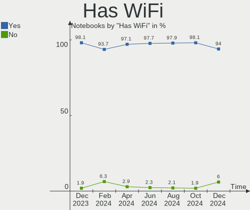
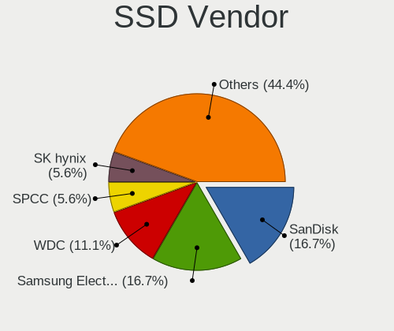
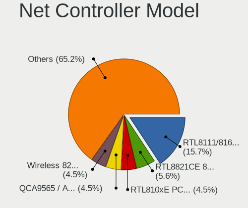
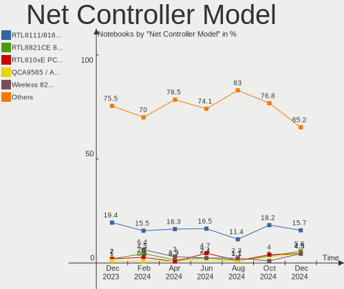
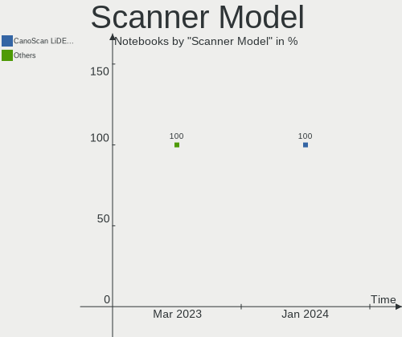
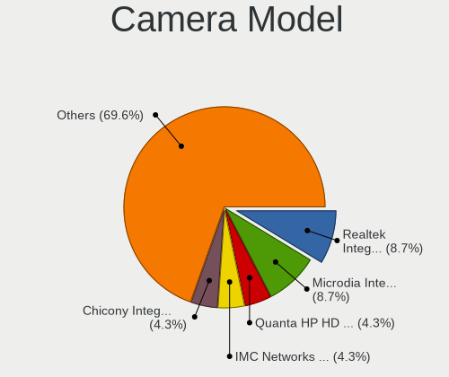
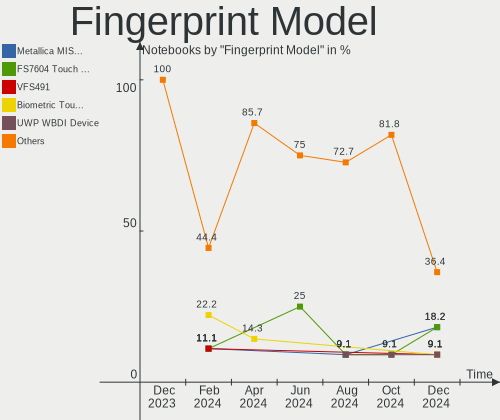

openSUSE - Hardware Trends (Notebooks)
--------------------------------------

A project to identify most popular hardware characteristics and track their change
over time based on data collected by Linux users at https://Linux-Hardware.org.

Anyone can contribute to this report by the [hw-probe](https://github.com/linuxhw/hw-probe) tool:

    sudo -E hw-probe -all -upload

This report is for one last month. Overall report since the beginning of time: [TestCoverage](https://github.com/linuxhw/TestCoverage)

Period: Dec, 2022.

Contents
--------

* [ System ](#system)
  - [ OS                       ](#os)
  - [ OS Family                ](#os-family)
  - [ Kernel                   ](#kernel)
  - [ Kernel Family            ](#kernel-family)
  - [ Kernel Major Ver.        ](#kernel-major-ver)
  - [ Arch                     ](#arch)
  - [ DE                       ](#de)
  - [ Display Server           ](#display-server)
  - [ Display Manager          ](#display-manager)
  - [ OS Lang                  ](#os-lang)
  - [ Boot Mode                ](#boot-mode)
  - [ Filesystem               ](#filesystem)
  - [ Part. scheme             ](#part-scheme)
  - [ Dual Boot with Linux/BSD ](#dual-boot-with-linuxbsd)
  - [ Dual Boot (Win)          ](#dual-boot-win)

* [ Board ](#board)
  - [ Vendor                   ](#vendor)
  - [ Model                    ](#model)
  - [ Model Family             ](#model-family)
  - [ MFG Year                 ](#mfg-year)
  - [ Form Factor              ](#form-factor)
  - [ Secure Boot              ](#secure-boot)
  - [ Coreboot                 ](#coreboot)
  - [ RAM Size                 ](#ram-size)
  - [ RAM Used                 ](#ram-used)
  - [ Total Drives             ](#total-drives)
  - [ Has CD-ROM               ](#has-cd-rom)
  - [ Has Ethernet             ](#has-ethernet)
  - [ Has WiFi                 ](#has-wifi)
  - [ Has Bluetooth            ](#has-bluetooth)

* [ Location ](#location)
  - [ Country                  ](#country)
  - [ City                     ](#city)

* [ Drives ](#drives)
  - [ Drive Vendor             ](#drive-vendor)
  - [ Drive Model              ](#drive-model)
  - [ HDD Vendor               ](#hdd-vendor)
  - [ SSD Vendor               ](#ssd-vendor)
  - [ Drive Kind               ](#drive-kind)
  - [ Drive Connector          ](#drive-connector)
  - [ Drive Size               ](#drive-size)
  - [ Space Total              ](#space-total)
  - [ Space Used               ](#space-used)
  - [ Malfunc. Drives          ](#malfunc-drives)
  - [ Malfunc. Drive Vendor    ](#malfunc-drive-vendor)
  - [ Malfunc. HDD Vendor      ](#malfunc-hdd-vendor)
  - [ Malfunc. Drive Kind      ](#malfunc-drive-kind)
  - [ Failed Drives            ](#failed-drives)
  - [ Failed Drive Vendor      ](#failed-drive-vendor)
  - [ Drive Status             ](#drive-status)

* [ Storage controller ](#storage-controller)
  - [ Storage Vendor           ](#storage-vendor)
  - [ Storage Model            ](#storage-model)
  - [ Storage Kind             ](#storage-kind)

* [ Processor ](#processor)
  - [ CPU Vendor               ](#cpu-vendor)
  - [ CPU Model                ](#cpu-model)
  - [ CPU Model Family         ](#cpu-model-family)
  - [ CPU Cores                ](#cpu-cores)
  - [ CPU Sockets              ](#cpu-sockets)
  - [ CPU Threads              ](#cpu-threads)
  - [ CPU Op-Modes             ](#cpu-op-modes)
  - [ CPU Microcode            ](#cpu-microcode)
  - [ CPU Microarch            ](#cpu-microarch)

* [ Graphics ](#graphics)
  - [ GPU Vendor               ](#gpu-vendor)
  - [ GPU Model                ](#gpu-model)
  - [ GPU Combo                ](#gpu-combo)
  - [ GPU Driver               ](#gpu-driver)
  - [ GPU Memory               ](#gpu-memory)

* [ Monitor ](#monitor)
  - [ Monitor Vendor           ](#monitor-vendor)
  - [ Monitor Model            ](#monitor-model)
  - [ Monitor Resolution       ](#monitor-resolution)
  - [ Monitor Diagonal         ](#monitor-diagonal)
  - [ Monitor Width            ](#monitor-width)
  - [ Aspect Ratio             ](#aspect-ratio)
  - [ Monitor Area             ](#monitor-area)
  - [ Pixel Density            ](#pixel-density)
  - [ Multiple Monitors        ](#multiple-monitors)

* [ Network ](#network)
  - [ Net Controller Vendor    ](#net-controller-vendor)
  - [ Net Controller Model     ](#net-controller-model)
  - [ Wireless Vendor          ](#wireless-vendor)
  - [ Wireless Model           ](#wireless-model)
  - [ Ethernet Vendor          ](#ethernet-vendor)
  - [ Ethernet Model           ](#ethernet-model)
  - [ Net Controller Kind      ](#net-controller-kind)
  - [ Used Controller          ](#used-controller)
  - [ NICs                     ](#nics)
  - [ IPv6                     ](#ipv6)

* [ Bluetooth ](#bluetooth)
  - [ Bluetooth Vendor         ](#bluetooth-vendor)
  - [ Bluetooth Model          ](#bluetooth-model)

* [ Sound ](#sound)
  - [ Sound Vendor             ](#sound-vendor)
  - [ Sound Model              ](#sound-model)

* [ Memory ](#memory)
  - [ Memory Vendor            ](#memory-vendor)
  - [ Memory Model             ](#memory-model)
  - [ Memory Kind              ](#memory-kind)
  - [ Memory Form Factor       ](#memory-form-factor)
  - [ Memory Size              ](#memory-size)
  - [ Memory Speed             ](#memory-speed)

* [ Printers & scanners ](#printers--scanners)
  - [ Printer Vendor           ](#printer-vendor)
  - [ Printer Model            ](#printer-model)
  - [ Scanner Vendor           ](#scanner-vendor)
  - [ Scanner Model            ](#scanner-model)

* [ Camera ](#camera)
  - [ Camera Vendor            ](#camera-vendor)
  - [ Camera Model             ](#camera-model)

* [ Security ](#security)
  - [ Fingerprint Vendor       ](#fingerprint-vendor)
  - [ Fingerprint Model        ](#fingerprint-model)
  - [ Chipcard Vendor          ](#chipcard-vendor)
  - [ Chipcard Model           ](#chipcard-model)

* [ Unsupported ](#unsupported)
  - [ Unsupported Devices      ](#unsupported-devices)
  - [ Unsupported Device Types ](#unsupported-device-types)

System
------

OS
--

Installed operating systems

| Name                         | Notebooks | Percent |
|------------------------------|-----------|---------|
| openSUSE Tumbleweed-XXXXXXXX | 31        | 72.09%  |
| openSUSE Leap-15.4           | 6         | 13.95%  |
| openSUSE Microos-XXXXXXXX    | 4         | 9.3%    |
| openSUSE Leap-15.3           | 1         | 2.33%   |
| openSUSE Leap-15.1           | 1         | 2.33%   |

OS Family
---------

OS without a version

| Name     | Notebooks | Percent |
|----------|-----------|---------|
| openSUSE | 43        | 100%    |

Kernel
------

Version of the Linux kernel

| Version                      | Notebooks | Percent |
|------------------------------|-----------|---------|
| 6.0.12-1-default             | 12        | 27.91%  |
| 6.0.10-1-default             | 10        | 23.26%  |
| 6.1.1-1-default              | 4         | 9.3%    |
| 6.1.0-1-default              | 4         | 9.3%    |
| 5.14.21-150400.24.38-default | 3         | 6.98%   |
| 6.0.8-1-default              | 2         | 4.65%   |
| 5.14.21-150400.24.33-default | 2         | 4.65%   |
| 5.3.18-150300.59.101-default | 1         | 2.33%   |
| 5.18.9-1-default             | 1         | 2.33%   |
| 5.18.15-1-default            | 1         | 2.33%   |
| 5.17.9-1-default             | 1         | 2.33%   |
| 5.14.21-150400.22-default    | 1         | 2.33%   |
| 4.12.14-lp151.28.91-default  | 1         | 2.33%   |

Kernel Family
-------------

Linux kernel without a distro release

| Version | Notebooks | Percent |
|---------|-----------|---------|
| 6.0.12  | 12        | 27.91%  |
| 6.0.10  | 10        | 23.26%  |
| 5.14.21 | 6         | 13.95%  |
| 6.1.1   | 4         | 9.3%    |
| 6.1.0   | 4         | 9.3%    |
| 6.0.8   | 2         | 4.65%   |
| 5.3.18  | 1         | 2.33%   |
| 5.18.9  | 1         | 2.33%   |
| 5.18.15 | 1         | 2.33%   |
| 5.17.9  | 1         | 2.33%   |
| 4.12.14 | 1         | 2.33%   |

Kernel Major Ver.
-----------------

Linux kernel major version

| Version | Notebooks | Percent |
|---------|-----------|---------|
| 6.0     | 24        | 55.81%  |
| 6.1     | 8         | 18.6%   |
| 5.14    | 6         | 13.95%  |
| 5.18    | 2         | 4.65%   |
| 5.3     | 1         | 2.33%   |
| 5.17    | 1         | 2.33%   |
| 4.12    | 1         | 2.33%   |

Arch
----

OS architecture (x86_64, i586, etc.)

| Name   | Notebooks | Percent |
|--------|-----------|---------|
| x86_64 | 43        | 100%    |

DE
--

Desktop Environment

| Name     | Notebooks | Percent |
|----------|-----------|---------|
| KDE5     | 29        | 67.44%  |
| GNOME    | 10        | 23.26%  |
| XFCE     | 1         | 2.33%   |
| LXQt     | 1         | 2.33%   |
| Cinnamon | 1         | 2.33%   |
| Unknown  | 1         | 2.33%   |

Display Server
--------------

X11 or Wayland

| Name    | Notebooks | Percent |
|---------|-----------|---------|
| X11     | 32        | 74.42%  |
| Wayland | 11        | 25.58%  |

Display Manager
---------------

SDDM, LightDM, etc.

| Name    | Notebooks | Percent |
|---------|-----------|---------|
| Unknown | 24        | 55.81%  |
| SDDM    | 12        | 27.91%  |
| LightDM | 4         | 9.3%    |
| XDM     | 3         | 6.98%   |

OS Lang
-------

Language

| Lang  | Notebooks | Percent |
|-------|-----------|---------|
| en_US | 22        | 51.16%  |
| POSIX | 7         | 16.28%  |
| en_GB | 4         | 9.3%    |
| de_DE | 4         | 9.3%    |
| pt_BR | 3         | 6.98%   |
| ru_RU | 2         | 4.65%   |
| sv_SE | 1         | 2.33%   |

Boot Mode
---------

EFI or BIOS

| Mode | Notebooks | Percent |
|------|-----------|---------|
| EFI  | 33        | 76.74%  |
| BIOS | 10        | 23.26%  |

Filesystem
----------

Type of filesystem

| Type    | Notebooks | Percent |
|---------|-----------|---------|
| Btrfs   | 33        | 76.74%  |
| Ext4    | 7         | 16.28%  |
| Overlay | 3         | 6.98%   |

Part. scheme
------------

Scheme of partitioning

| Type    | Notebooks | Percent |
|---------|-----------|---------|
| Unknown | 22        | 51.16%  |
| GPT     | 21        | 48.84%  |

Dual Boot with Linux/BSD
------------------------

Hosting more than one Linux/BSD

| Dual boot | Notebooks | Percent |
|-----------|-----------|---------|
| No        | 40        | 93.02%  |
| Yes       | 3         | 6.98%   |

Dual Boot (Win)
---------------

Hosting Linux and Windows

| Dual boot | Notebooks | Percent |
|-----------|-----------|---------|
| No        | 34        | 79.07%  |
| Yes       | 9         | 20.93%  |

Board
-----

Vendor
------

Motherboard manufacturer

| Name                 | Notebooks | Percent |
|----------------------|-----------|---------|
| Lenovo               | 9         | 20.93%  |
| Dell                 | 9         | 20.93%  |
| ASUSTek Computer     | 7         | 16.28%  |
| Hewlett-Packard      | 6         | 13.95%  |
| Acer                 | 3         | 6.98%   |
| Sony                 | 1         | 2.33%   |
| SLIMBOOK             | 1         | 2.33%   |
| Schenker             | 1         | 2.33%   |
| Razer                | 1         | 2.33%   |
| Multilaser           | 1         | 2.33%   |
| Intel Client Systems | 1         | 2.33%   |
| HUAWEI               | 1         | 2.33%   |
| Fujitsu Siemens      | 1         | 2.33%   |
| Apple                | 1         | 2.33%   |

Model
-----

Motherboard model

| Name                                       | Notebooks | Percent |
|--------------------------------------------|-----------|---------|
| Dell Inspiron 3593                         | 2         | 4.65%   |
| Sony SVS1311N9ES                           | 1         | 2.33%   |
| SLIMBOOK PROX-AMD5                         | 1         | 2.33%   |
| Schenker VIA 15 Pro                        | 1         | 2.33%   |
| Razer Blade 15 (2022) - RZ09-0421          | 1         | 2.33%   |
| Multilaser MLSH1H LINUX                    | 1         | 2.33%   |
| Lenovo Y50-70 Touch 20349                  | 1         | 2.33%   |
| Lenovo ThinkPad X1 Carbon 4th 20FQ0041MS   | 1         | 2.33%   |
| Lenovo ThinkPad T440s 20AQ004EUS           | 1         | 2.33%   |
| Lenovo ThinkPad P16s Gen 1 21BT000MUK      | 1         | 2.33%   |
| Lenovo Legion 5 15ARH05 82B5               | 1         | 2.33%   |
| Lenovo IdeaPad S340-14API 81NB             | 1         | 2.33%   |
| Lenovo IdeaPad S145-15API 81UT             | 1         | 2.33%   |
| Lenovo IdeaPad 320-15IKB 81BG              | 1         | 2.33%   |
| Lenovo 1S20UDCT01WWPF1ARBNP 29UDCT01WW     | 1         | 2.33%   |
| Intel Client Systems LAPRC710              | 1         | 2.33%   |
| HUAWEI BOD-WXX9                            | 1         | 2.33%   |
| HP ZBook 15 G6                             | 1         | 2.33%   |
| HP Victus by Laptop 16-e0xxx               | 1         | 2.33%   |
| HP Pavilion 17                             | 1         | 2.33%   |
| HP Pavilion 13 x360 PC                     | 1         | 2.33%   |
| HP OMEN Laptop 15-en0xxx                   | 1         | 2.33%   |
| HP EliteBook 840 G4                        | 1         | 2.33%   |
| Fujitsu Siemens LIFEBOOK E8310             | 1         | 2.33%   |
| Dell XPS 9320                              | 1         | 2.33%   |
| Dell Vostro 3501                           | 1         | 2.33%   |
| Dell Precision 7760                        | 1         | 2.33%   |
| Dell Latitude E5400                        | 1         | 2.33%   |
| Dell Latitude 5590                         | 1         | 2.33%   |
| Dell Latitude 5510                         | 1         | 2.33%   |
| Dell Inspiron 15 7510                      | 1         | 2.33%   |
| ASUS ZenBook UX535LI_UX535LI               | 1         | 2.33%   |
| ASUS ZenBook UX533FD_UX533FD               | 1         | 2.33%   |
| ASUS Zenbook UX3402ZA_UX3402ZA             | 1         | 2.33%   |
| ASUS VivoBook_ASUSLaptop X515EA_X515EA     | 1         | 2.33%   |
| ASUS VivoBook_ASUSLaptop X513EP_X513EP     | 1         | 2.33%   |
| ASUS VivoBook_ASUSLaptop X421EA_S433EA     | 1         | 2.33%   |
| ASUS VivoBook 15_ASUS Laptop X540MA_F540MA | 1         | 2.33%   |
| Apple MacBookPro9,2                        | 1         | 2.33%   |
| Acer Predator PH315-52                     | 1         | 2.33%   |

Model Family
------------

Motherboard model prefix

| Name                          | Notebooks | Percent |
|-------------------------------|-----------|---------|
| ASUS VivoBook                 | 4         | 9.3%    |
| Lenovo ThinkPad               | 3         | 6.98%   |
| Lenovo IdeaPad                | 3         | 6.98%   |
| Dell Latitude                 | 3         | 6.98%   |
| Dell Inspiron                 | 3         | 6.98%   |
| ASUS ZenBook                  | 3         | 6.98%   |
| HP Pavilion                   | 2         | 4.65%   |
| Sony SVS1311N9ES              | 1         | 2.33%   |
| SLIMBOOK PROX-AMD5            | 1         | 2.33%   |
| Schenker VIA                  | 1         | 2.33%   |
| Razer Blade                   | 1         | 2.33%   |
| Multilaser MLSH1H             | 1         | 2.33%   |
| Lenovo Y50-70                 | 1         | 2.33%   |
| Lenovo Legion                 | 1         | 2.33%   |
| Lenovo 1S20UDCT01WWPF1ARBNP   | 1         | 2.33%   |
| Intel Client Systems LAPRC710 | 1         | 2.33%   |
| HUAWEI BOD-WXX9               | 1         | 2.33%   |
| HP ZBook                      | 1         | 2.33%   |
| HP Victus                     | 1         | 2.33%   |
| HP OMEN                       | 1         | 2.33%   |
| HP EliteBook                  | 1         | 2.33%   |
| Fujitsu Siemens LIFEBOOK      | 1         | 2.33%   |
| Dell XPS                      | 1         | 2.33%   |
| Dell Vostro                   | 1         | 2.33%   |
| Dell Precision                | 1         | 2.33%   |
| Apple MacBookPro9             | 1         | 2.33%   |
| Acer Predator                 | 1         | 2.33%   |
| Acer Nitro                    | 1         | 2.33%   |
| Acer Aspire                   | 1         | 2.33%   |

MFG Year
--------

Motherboard manufacture year

| Year | Notebooks | Percent |
|------|-----------|---------|
| 2022 | 7         | 16.28%  |
| 2021 | 7         | 16.28%  |
| 2020 | 7         | 16.28%  |
| 2019 | 6         | 13.95%  |
| 2018 | 3         | 6.98%   |
| 2017 | 3         | 6.98%   |
| 2013 | 3         | 6.98%   |
| 2014 | 2         | 4.65%   |
| 2012 | 2         | 4.65%   |
| 2008 | 2         | 4.65%   |
| 2016 | 1         | 2.33%   |

Form Factor
-----------

Physical design of the computer

| Name     | Notebooks | Percent |
|----------|-----------|---------|
| Notebook | 43        | 100%    |

Secure Boot
-----------

Enabled or disabled

| State    | Notebooks | Percent |
|----------|-----------|---------|
| Disabled | 33        | 76.74%  |
| Enabled  | 10        | 23.26%  |

Coreboot
--------

Have coreboot on board

| Used | Notebooks | Percent |
|------|-----------|---------|
| No   | 43        | 100%    |

RAM Size
--------

Total RAM memory

| Size in GB  | Notebooks | Percent |
|-------------|-----------|---------|
| 4.01-8.0    | 12        | 27.91%  |
| 8.01-16.0   | 10        | 23.26%  |
| 32.01-64.0  | 8         | 18.6%   |
| 16.01-24.0  | 7         | 16.28%  |
| 3.01-4.0    | 3         | 6.98%   |
| 64.01-256.0 | 2         | 4.65%   |
| 24.01-32.0  | 1         | 2.33%   |

RAM Used
--------

Used RAM memory

| Used GB   | Notebooks | Percent |
|-----------|-----------|---------|
| 4.01-8.0  | 13        | 30.23%  |
| 2.01-3.0  | 13        | 30.23%  |
| 1.01-2.0  | 11        | 25.58%  |
| 3.01-4.0  | 4         | 9.3%    |
| 8.01-16.0 | 2         | 4.65%   |

Total Drives
------------

Number of drives on board

| Drives | Notebooks | Percent |
|--------|-----------|---------|
| 1      | 34        | 79.07%  |
| 2      | 7         | 16.28%  |
| 3      | 2         | 4.65%   |

Has CD-ROM
----------

Has CD-ROM on board

| Presented | Notebooks | Percent |
|-----------|-----------|---------|
| No        | 37        | 86.05%  |
| Yes       | 6         | 13.95%  |

Has Ethernet
------------

Has Ethernet on board

| Presented | Notebooks | Percent |
|-----------|-----------|---------|
| Yes       | 30        | 69.77%  |
| No        | 13        | 30.23%  |

Has WiFi
--------

Has WiFi module

| Presented | Notebooks | Percent |
|-----------|-----------|---------|
| Yes       | 42        | 97.67%  |
| No        | 1         | 2.33%   |

Has Bluetooth
-------------

Has Bluetooth module

| Presented | Notebooks | Percent |
|-----------|-----------|---------|
| Yes       | 37        | 86.05%  |
| No        | 6         | 13.95%  |

Location
--------

Country
-------

Geographic location (country)

| Country      | Notebooks | Percent |
|--------------|-----------|---------|
| Germany      | 9         | 20.93%  |
| Brazil       | 4         | 9.3%    |
| USA          | 3         | 6.98%   |
| Sweden       | 3         | 6.98%   |
| Italy        | 3         | 6.98%   |
| France       | 3         | 6.98%   |
| Canada       | 3         | 6.98%   |
| UK           | 2         | 4.65%   |
| Russia       | 2         | 4.65%   |
| Turkey       | 1         | 2.33%   |
| South Africa | 1         | 2.33%   |
| Slovakia     | 1         | 2.33%   |
| Puerto Rico  | 1         | 2.33%   |
| Portugal     | 1         | 2.33%   |
| Mexico       | 1         | 2.33%   |
| Latvia       | 1         | 2.33%   |
| Greece       | 1         | 2.33%   |
| Czechia      | 1         | 2.33%   |
| Belgium      | 1         | 2.33%   |
| Bangladesh   | 1         | 2.33%   |

City
----

Geographic location (city)

| City                    | Notebooks | Percent |
|-------------------------|-----------|---------|
| St Petersburg           | 2         | 4.65%   |
| Konstanz                | 2         | 4.65%   |
| Wingles                 | 1         | 2.33%   |
| Stockholm               | 1         | 2.33%   |
| Stazione-Fornola        | 1         | 2.33%   |
| Seclin                  | 1         | 2.33%   |
| Santos                  | 1         | 2.33%   |
| Saint Leonards-on-Sea   | 1         | 2.33%   |
| Recife                  | 1         | 2.33%   |
| Pretoria                | 1         | 2.33%   |
| Prague                  | 1         | 2.33%   |
| Pirmasens               | 1         | 2.33%   |
| Olympia                 | 1         | 2.33%   |
| Northallerton           | 1         | 2.33%   |
| Nîmes                  | 1         | 2.33%   |
| Munich                  | 1         | 2.33%   |
| Milan                   | 1         | 2.33%   |
| Mexico City             | 1         | 2.33%   |
| Mesa                    | 1         | 2.33%   |
| Matosinhos Municipality | 1         | 2.33%   |
| Lizums                  | 1         | 2.33%   |
| Lippstadt               | 1         | 2.33%   |
| Levice                  | 1         | 2.33%   |
| Leuven                  | 1         | 2.33%   |
| Katrineholm             | 1         | 2.33%   |
| Karlskrona              | 1         | 2.33%   |
| Itaquaquecetuba         | 1         | 2.33%   |
| Guelders                | 1         | 2.33%   |
| Grafing bei Munchen     | 1         | 2.33%   |
| Frankfurt am Main       | 1         | 2.33%   |
| Dhaka                   | 1         | 2.33%   |
| Cologno Monzese         | 1         | 2.33%   |
| Campina Grande          | 1         | 2.33%   |
| Burnaby                 | 1         | 2.33%   |
| Bielefeld               | 1         | 2.33%   |
| Bent Creek              | 1         | 2.33%   |
| Beauharnois             | 1         | 2.33%   |
| Bayamón                | 1         | 2.33%   |
| Athens                  | 1         | 2.33%   |
| Antalya                 | 1         | 2.33%   |

Drives
------

Drive Vendor
------------

Hard drive vendors

| Vendor                      | Notebooks | Drives | Percent |
|-----------------------------|-----------|--------|---------|
| Sandisk                     | 13        | 14     | 25%     |
| Samsung Electronics         | 10        | 11     | 19.23%  |
| Toshiba                     | 4         | 4      | 7.69%   |
| SK hynix                    | 3         | 3      | 5.77%   |
| Kingston Technology Company | 3         | 3      | 5.77%   |
| WDC                         | 2         | 2      | 3.85%   |
| Unknown                     | 2         | 2      | 3.85%   |
| Silicon Motion              | 2         | 2      | 3.85%   |
| Kingston                    | 2         | 3      | 3.85%   |
| WDC WDS                     | 1         | 1      | 1.92%   |
| Union Memory (Shenzhen)     | 1         | 1      | 1.92%   |
| Pioneer                     | 1         | 1      | 1.92%   |
| Micron Technology           | 1         | 1      | 1.92%   |
| JMicron Technology          | 1         | 1      | 1.92%   |
| Intel                       | 1         | 1      | 1.92%   |
| Hjwdz                       | 1         | 1      | 1.92%   |
| Crucial                     | 1         | 1      | 1.92%   |
| China                       | 1         | 1      | 1.92%   |
| ASMT                        | 1         | 1      | 1.92%   |
| A-DATA Technology           | 1         | 1      | 1.92%   |

Drive Model
-----------

Hard drive models

| Model                                                  | Notebooks | Percent |
|--------------------------------------------------------|-----------|---------|
| Sandisk WD Black SN750 / PC SN730 NVMe SSD 512GB       | 4         | 7.27%   |
| Samsung NVMe SSD Controller SM981/PM981/PM983 500GB    | 4         | 7.27%   |
| Sandisk WD Black SN850 1TB                             | 3         | 5.45%   |
| Sandisk PC SN520 NVMe SSD 128GB                        | 3         | 5.45%   |
| SanDisk SSD PLUS 1000GB                                | 2         | 3.64%   |
| Samsung NVMe SSD Controller PM9A1/PM9A3/980PRO 2TB     | 2         | 3.64%   |
| WDC WDS 100T2B0A-00SM50 1TB SSD                        | 1         | 1.82%   |
| WDC WD10SPZX-24Z10 1TB                                 | 1         | 1.82%   |
| WDC WD10JPVX-22JC3T0 1TB                               | 1         | 1.82%   |
| Unknown MMC Card  4GB                                  | 1         | 1.82%   |
| Unknown MMC Card  128GB                                | 1         | 1.82%   |
| Union Memory (Shenzhen) UMIS RPETJ1T24MGE2QDQ 1TB      | 1         | 1.82%   |
| Toshiba XG6 NVMe SSD Controller 256GB                  | 1         | 1.82%   |
| Toshiba MQ01ABD100 1TB                                 | 1         | 1.82%   |
| Toshiba MK5061GSYN 500GB                               | 1         | 1.82%   |
| Toshiba MK2555GSX 250GB                                | 1         | 1.82%   |
| SK hynix PC711 NVMe 512GB                              | 1         | 1.82%   |
| SK hynix BC711 NVMe 512GB                              | 1         | 1.82%   |
| SK hynix BC511 256GB                                   | 1         | 1.82%   |
| Silicon Motion SM2263EN/SM2263XT SSD Controller 1024GB | 1         | 1.82%   |
| Silicon Motion PCIe-8 SSD 256GB                        | 1         | 1.82%   |
| Sandisk WD Black 2018/SN750 / PC SN720 NVMe SSD 256GB  | 1         | 1.82%   |
| SanDisk SSD U110 16GB                                  | 1         | 1.82%   |
| Samsung SSD 860 EVO 500GB                              | 1         | 1.82%   |
| Samsung SSD 860 EVO 1TB                                | 1         | 1.82%   |
| Samsung PSSD T7 1TB                                    | 1         | 1.82%   |
| Samsung NVMe SSD Controller SM951/PM951 512GB          | 1         | 1.82%   |
| Samsung MZVLB512HBJQ-000H7 512GB                       | 1         | 1.82%   |
| Pioneer APS-SL3N-240 240GB                             | 1         | 1.82%   |
| Micron 1100_MTFDDAK256TBN 256GB SSD                    | 1         | 1.82%   |
| Kingston Company U-SNS8154P3 NVMe SSD 512GB            | 1         | 1.82%   |
| Kingston Company OM3PDP3 NVMe SSD 512GB                | 1         | 1.82%   |
| Kingston Company A2000 NVMe SSD 1TB                    | 1         | 1.82%   |
| Kingston SNVS1000G 1TB                                 | 1         | 1.82%   |
| Kingston SA400S37480G 480GB SSD                        | 1         | 1.82%   |
| Kingston SA400S37240G 240GB SSD                        | 1         | 1.82%   |
| JMicron Tech 250GB                                     | 1         | 1.82%   |
| Intel SSD 660P Series 1024GB                           | 1         | 1.82%   |
| Hjwdz MS2160 8MB                                       | 1         | 1.82%   |
| Crucial CT1000MX500SSD4 1TB                            | 1         | 1.82%   |

HDD Vendor
----------

Hard disk drive vendors

| Vendor  | Notebooks | Drives | Percent |
|---------|-----------|--------|---------|
| Toshiba | 3         | 3      | 42.86%  |
| WDC     | 2         | 2      | 28.57%  |
| Pioneer | 1         | 1      | 14.29%  |
| ASMT    | 1         | 1      | 14.29%  |

SSD Vendor
----------

Solid state drive vendors

| Vendor              | Notebooks | Drives | Percent |
|---------------------|-----------|--------|---------|
| SanDisk             | 3         | 3      | 23.08%  |
| Samsung Electronics | 3         | 3      | 23.08%  |
| Kingston            | 2         | 2      | 15.38%  |
| WDC WDS             | 1         | 1      | 7.69%   |
| Micron Technology   | 1         | 1      | 7.69%   |
| Crucial             | 1         | 1      | 7.69%   |
| China               | 1         | 1      | 7.69%   |
| A-DATA Technology   | 1         | 1      | 7.69%   |

Drive Kind
----------

HDD or SSD

| Kind    | Notebooks | Drives | Percent |
|---------|-----------|--------|---------|
| NVMe    | 29        | 31     | 55.77%  |
| SSD     | 12        | 13     | 23.08%  |
| HDD     | 7         | 7      | 13.46%  |
| MMC     | 2         | 2      | 3.85%   |
| Unknown | 2         | 2      | 3.85%   |

Drive Connector
---------------

SATA, SAS, NVMe, etc.

| Type | Notebooks | Drives | Percent |
|------|-----------|--------|---------|
| NVMe | 29        | 31     | 56.86%  |
| SATA | 16        | 17     | 31.37%  |
| SAS  | 4         | 5      | 7.84%   |
| MMC  | 2         | 2      | 3.92%   |

Drive Size
----------

Size of hard drive

| Size in TB | Notebooks | Drives | Percent |
|------------|-----------|--------|---------|
| 0.01-0.5   | 10        | 11     | 52.63%  |
| 0.51-1.0   | 9         | 9      | 47.37%  |

Space Total
-----------

Amount of disk space available on the file system

| Size in GB     | Notebooks | Percent |
|----------------|-----------|---------|
| More than 3000 | 14        | 32.56%  |
| 1001-2000      | 12        | 27.91%  |
| 501-1000       | 6         | 13.95%  |
| 2001-3000      | 4         | 9.3%    |
| 251-500        | 3         | 6.98%   |
| 101-250        | 2         | 4.65%   |
| 51-100         | 2         | 4.65%   |

Space Used
----------

Amount of used disk space

| Used GB        | Notebooks | Percent |
|----------------|-----------|---------|
| 501-1000       | 10        | 23.26%  |
| 101-250        | 9         | 20.93%  |
| 51-100         | 9         | 20.93%  |
| 251-500        | 6         | 13.95%  |
| More than 3000 | 2         | 4.65%   |
| 21-50          | 2         | 4.65%   |
| 1001-2000      | 2         | 4.65%   |
| 1-20           | 2         | 4.65%   |
| 2001-3000      | 1         | 2.33%   |

Malfunc. Drives
---------------

Drive models with a malfunction

Zero info for selected period =(

Malfunc. Drive Vendor
---------------------

Vendors of faulty drives

Zero info for selected period =(

Malfunc. HDD Vendor
-------------------

Vendors of faulty HDD drives

Zero info for selected period =(

Malfunc. Drive Kind
-------------------

Kinds of faulty drives

Zero info for selected period =(

Failed Drives
-------------

Failed drive models

Zero info for selected period =(

Failed Drive Vendor
-------------------

Failed drive vendors

Zero info for selected period =(

Drive Status
------------

Number of failed and malfunc. drives

| Status   | Notebooks | Drives | Percent |
|----------|-----------|--------|---------|
| Detected | 29        | 32     | 60.42%  |
| Works    | 19        | 23     | 39.58%  |

Storage controller
------------------

Storage Vendor
--------------

Storage controller vendors

| Vendor                       | Notebooks | Percent |
|------------------------------|-----------|---------|
| Intel                        | 29        | 47.54%  |
| SanDisk                      | 10        | 16.39%  |
| Samsung Electronics          | 7         | 11.48%  |
| Kingston Technology Company  | 4         | 6.56%   |
| AMD                          | 4         | 6.56%   |
| SK hynix                     | 3         | 4.92%   |
| Silicon Motion               | 2         | 3.28%   |
| Union Memory (Shenzhen)      | 1         | 1.64%   |
| Toshiba America Info Systems | 1         | 1.64%   |

Storage Model
-------------

Storage controller models

| Model                                                                          | Notebooks | Percent |
|--------------------------------------------------------------------------------|-----------|---------|
| Intel Volume Management Device NVMe RAID Controller                            | 6         | 8.96%   |
| Samsung NVMe SSD Controller SM981/PM981/PM983                                  | 5         | 7.46%   |
| SanDisk WD Black SN750 / PC SN730 NVMe SSD                                     | 4         | 5.97%   |
| Intel Sunrise Point-LP SATA Controller [AHCI mode]                             | 4         | 5.97%   |
| AMD FCH SATA Controller [AHCI mode]                                            | 4         | 5.97%   |
| SanDisk WD PC SN810 / Black SN850 NVMe SSD                                     | 3         | 4.48%   |
| SanDisk PC SN520 NVMe SSD                                                      | 3         | 4.48%   |
| Intel Ice Lake-LP SATA Controller [AHCI mode]                                  | 3         | 4.48%   |
| Intel 8 Series SATA Controller 1 [AHCI mode]                                   | 3         | 4.48%   |
| SK hynix Gold P31/PC711 NVMe Solid State Drive                                 | 2         | 2.99%   |
| Samsung NVMe SSD Controller PM9A1/PM9A3/980PRO                                 | 2         | 2.99%   |
| Intel Tiger Lake-LP SATA Controller                                            | 2         | 2.99%   |
| Intel Cannon Lake Mobile PCH SATA AHCI Controller                              | 2         | 2.99%   |
| Intel 7 Series Chipset Family 6-port SATA Controller [AHCI mode]               | 2         | 2.99%   |
| Union Memory (Shenzhen) Non-Volatile memory controller                         | 1         | 1.49%   |
| Toshiba America Info Systems XG6 NVMe SSD Controller                           | 1         | 1.49%   |
| SK hynix BC511                                                                 | 1         | 1.49%   |
| Silicon Motion SM2263EN/SM2263XT SSD Controller                                | 1         | 1.49%   |
| Silicon Motion Non-Volatile memory controller                                  | 1         | 1.49%   |
| SanDisk WD Black 2018/SN750 / PC SN720 NVMe SSD                                | 1         | 1.49%   |
| Samsung NVMe SSD Controller SM951/PM951                                        | 1         | 1.49%   |
| Kingston Company U-SNS8154P3 NVMe SSD                                          | 1         | 1.49%   |
| Kingston Company Company Non-Volatile memory controller                        | 1         | 1.49%   |
| Kingston Company OM3PDP3 NVMe SSD                                              | 1         | 1.49%   |
| Kingston Company A2000 NVMe SSD                                                | 1         | 1.49%   |
| Intel Wildcat Point-LP SATA Controller [AHCI Mode]                             | 1         | 1.49%   |
| Intel SSD 660P Series                                                          | 1         | 1.49%   |
| Intel HM170/QM170 Chipset SATA Controller [AHCI Mode]                          | 1         | 1.49%   |
| Intel Comet Lake SATA AHCI Controller                                          | 1         | 1.49%   |
| Intel Celeron/Pentium Silver Processor SATA Controller                         | 1         | 1.49%   |
| Intel 82801IBM/IEM (ICH9M/ICH9M-E) 4 port SATA Controller [AHCI mode]          | 1         | 1.49%   |
| Intel 82801HM/HEM (ICH8M/ICH8M-E) SATA Controller [AHCI mode]                  | 1         | 1.49%   |
| Intel 82801HM/HEM (ICH8M/ICH8M-E) IDE Controller                               | 1         | 1.49%   |
| Intel 82801 Mobile SATA Controller [RAID mode]                                 | 1         | 1.49%   |
| Intel 8 Series/C220 Series Chipset Family 6-port SATA Controller 1 [AHCI mode] | 1         | 1.49%   |
| Intel 400 Series Chipset Family SATA AHCI Controller                           | 1         | 1.49%   |

Storage Kind
------------

Kind of storage controller (IDE, SATA, NVMe, SAS, ...)

| Kind | Notebooks | Percent |
|------|-----------|---------|
| NVMe | 29        | 44.62%  |
| SATA | 28        | 43.08%  |
| RAID | 7         | 10.77%  |
| IDE  | 1         | 1.54%   |

Processor
---------

CPU Vendor
----------

Processor vendors

| Vendor | Notebooks | Percent |
|--------|-----------|---------|
| Intel  | 35        | 81.4%   |
| AMD    | 8         | 18.6%   |

CPU Model
---------

Processor models

| Model                                         | Notebooks | Percent |
|-----------------------------------------------|-----------|---------|
| Intel Core i5-1035G1 CPU @ 1.00GHz            | 3         | 6.98%   |
| Intel 12th Gen Core i7-1260P                  | 3         | 6.98%   |
| Intel Core i5-3210M CPU @ 2.50GHz             | 2         | 4.65%   |
| Intel 11th Gen Core i7-1165G7 @ 2.80GHz       | 2         | 4.65%   |
| Intel 11th Gen Core i5-1135G7 @ 2.40GHz       | 2         | 4.65%   |
| AMD Ryzen 5 4600H with Radeon Graphics        | 2         | 4.65%   |
| Intel Xeon W-11855M CPU @ 3.20GHz             | 1         | 2.33%   |
| Intel Xeon E-2286M CPU @ 2.40GHz              | 1         | 2.33%   |
| Intel Pentium Silver N5000 CPU @ 1.10GHz      | 1         | 2.33%   |
| Intel Core i7-9750H CPU @ 2.60GHz             | 1         | 2.33%   |
| Intel Core i7-8565U CPU @ 1.80GHz             | 1         | 2.33%   |
| Intel Core i7-6500U CPU @ 2.50GHz             | 1         | 2.33%   |
| Intel Core i7-4700HQ CPU @ 2.40GHz            | 1         | 2.33%   |
| Intel Core i7-4510U CPU @ 2.00GHz             | 1         | 2.33%   |
| Intel Core i7-10750H CPU @ 2.60GHz            | 1         | 2.33%   |
| Intel Core i7-10610U CPU @ 1.80GHz            | 1         | 2.33%   |
| Intel Core i5-8350U CPU @ 1.70GHz             | 1         | 2.33%   |
| Intel Core i5-8250U CPU @ 1.60GHz             | 1         | 2.33%   |
| Intel Core i5-7300U CPU @ 2.60GHz             | 1         | 2.33%   |
| Intel Core i5-7300HQ CPU @ 2.50GHz            | 1         | 2.33%   |
| Intel Core i5-5200U CPU @ 2.20GHz             | 1         | 2.33%   |
| Intel Core i5-4300U CPU @ 1.90GHz             | 1         | 2.33%   |
| Intel Core i5-4200U CPU @ 1.60GHz             | 1         | 2.33%   |
| Intel Core i3-7020U CPU @ 2.30GHz             | 1         | 2.33%   |
| Intel Core 2 Duo CPU T7300 @ 2.00GHz          | 1         | 2.33%   |
| Intel Core 2 Duo CPU P8400 @ 2.26GHz          | 1         | 2.33%   |
| Intel 12th Gen Core i7-12800H                 | 1         | 2.33%   |
| Intel 12th Gen Core i5-1240P                  | 1         | 2.33%   |
| Intel 11th Gen Core i7-11800H @ 2.30GHz       | 1         | 2.33%   |
| AMD Ryzen 7 PRO 4750U with Radeon Graphics    | 1         | 2.33%   |
| AMD Ryzen 7 5700U with Radeon Graphics        | 1         | 2.33%   |
| AMD Ryzen 7 4800H with Radeon Graphics        | 1         | 2.33%   |
| AMD Ryzen 7 3700U with Radeon Vega Mobile Gfx | 1         | 2.33%   |
| AMD Ryzen 5 5600H with Radeon Graphics        | 1         | 2.33%   |
| AMD Ryzen 5 3500U with Radeon Vega Mobile Gfx | 1         | 2.33%   |

CPU Model Family
----------------

Processor model prefix

| Model                | Notebooks | Percent |
|----------------------|-----------|---------|
| Intel Core i5        | 12        | 27.91%  |
| Other                | 10        | 23.26%  |
| Intel Core i7        | 7         | 16.28%  |
| AMD Ryzen 5          | 4         | 9.3%    |
| AMD Ryzen 7          | 3         | 6.98%   |
| Intel Xeon           | 2         | 4.65%   |
| Intel Core 2 Duo     | 2         | 4.65%   |
| Intel Pentium Silver | 1         | 2.33%   |
| Intel Core i3        | 1         | 2.33%   |
| AMD Ryzen 7 PRO      | 1         | 2.33%   |

CPU Cores
---------

Number of processor cores

| Number | Notebooks | Percent |
|--------|-----------|---------|
| 4      | 16        | 37.21%  |
| 2      | 10        | 23.26%  |
| 6      | 6         | 13.95%  |
| 8      | 5         | 11.63%  |
| 12     | 4         | 9.3%    |
| 14     | 1         | 2.33%   |
| 1      | 1         | 2.33%   |

CPU Sockets
-----------

Number of sockets

| Number | Notebooks | Percent |
|--------|-----------|---------|
| 1      | 43        | 100%    |

CPU Threads
-----------

Threads per core (Hyper-Threading)

| Number | Notebooks | Percent |
|--------|-----------|---------|
| 2      | 37        | 86.05%  |
| 1      | 6         | 13.95%  |

CPU Op-Modes
------------

CPU Operation Modes (32-bit, 64-bit)

| Op mode        | Notebooks | Percent |
|----------------|-----------|---------|
| 32-bit, 64-bit | 43        | 100%    |

CPU Microcode
-------------

Microcode number

| Number     | Notebooks | Percent |
|------------|-----------|---------|
| 0x906a3    | 5         | 11.63%  |
| Unknown    | 5         | 11.63%  |
| 0x806c1    | 4         | 9.3%    |
| 0x706e5    | 3         | 6.98%   |
| 0x40651    | 3         | 6.98%   |
| 0x806ea    | 2         | 4.65%   |
| 0x806e9    | 2         | 4.65%   |
| 0x306a9    | 2         | 4.65%   |
| 0x08600106 | 2         | 4.65%   |
| 0xa0652    | 1         | 2.33%   |
| 0x906ed    | 1         | 2.33%   |
| 0x906ea    | 1         | 2.33%   |
| 0x906e9    | 1         | 2.33%   |
| 0x806ec    | 1         | 2.33%   |
| 0x806eb    | 1         | 2.33%   |
| 0x806d1    | 1         | 2.33%   |
| 0x706a1    | 1         | 2.33%   |
| 0x6fa      | 1         | 2.33%   |
| 0x406e3    | 1         | 2.33%   |
| 0x306d4    | 1         | 2.33%   |
| 0x306c3    | 1         | 2.33%   |
| 0x1067a    | 1         | 2.33%   |
| 0x0a50000c | 1         | 2.33%   |
| 0x08108102 | 1         | 2.33%   |

CPU Microarch
-------------

Microarchitecture

| Name             | Notebooks | Percent |
|------------------|-----------|---------|
| KabyLake         | 9         | 20.93%  |
| Alderlake Hybrid | 5         | 11.63%  |
| Zen 2            | 4         | 9.3%    |
| TigerLake        | 4         | 9.3%    |
| IceLake          | 4         | 9.3%    |
| Haswell          | 4         | 9.3%    |
| Zen+             | 2         | 4.65%   |
| IvyBridge        | 2         | 4.65%   |
| Unknown          | 2         | 4.65%   |
| Zen 3            | 1         | 2.33%   |
| Skylake          | 1         | 2.33%   |
| Penryn           | 1         | 2.33%   |
| Goldmont plus    | 1         | 2.33%   |
| Core             | 1         | 2.33%   |
| CometLake        | 1         | 2.33%   |
| Broadwell        | 1         | 2.33%   |

Graphics
--------

GPU Vendor
----------

Vendors of graphics cards

| Vendor | Notebooks | Percent |
|--------|-----------|---------|
| Intel  | 35        | 59.32%  |
| Nvidia | 15        | 25.42%  |
| AMD    | 9         | 15.25%  |

GPU Model
---------

Graphics card models

| Model                                                                | Notebooks | Percent |
|----------------------------------------------------------------------|-----------|---------|
| Intel Alder Lake-P Integrated Graphics Controller                    | 5         | 8.33%   |
| Intel TigerLake-LP GT2 [Iris Xe Graphics]                            | 4         | 6.67%   |
| AMD Renoir                                                           | 4         | 6.67%   |
| Intel Iris Plus Graphics G1 (Ice Lake)                               | 3         | 5%      |
| Intel Haswell-ULT Integrated Graphics Controller                     | 3         | 5%      |
| Nvidia TU117M [GeForce GTX 1650 Ti Mobile]                           | 2         | 3.33%   |
| Nvidia TU116M [GeForce GTX 1660 Ti Mobile]                           | 2         | 3.33%   |
| Nvidia GP107M [GeForce GTX 1050 Mobile]                              | 2         | 3.33%   |
| Intel UHD Graphics 620                                               | 2         | 3.33%   |
| Intel HD Graphics 620                                                | 2         | 3.33%   |
| Intel CoffeeLake-H GT2 [UHD Graphics 630]                            | 2         | 3.33%   |
| Intel 3rd Gen Core processor Graphics Controller                     | 2         | 3.33%   |
| AMD Picasso/Raven 2 [Radeon Vega Series / Radeon Vega Mobile Series] | 2         | 3.33%   |
| Nvidia TU117M [GeForce GTX 1650 Mobile / Max-Q]                      | 1         | 1.67%   |
| Nvidia TU117GLM [T550 Laptop GPU]                                    | 1         | 1.67%   |
| Nvidia TU117GLM [Quadro T1000 Mobile]                                | 1         | 1.67%   |
| Nvidia GP108M [GeForce MX330]                                        | 1         | 1.67%   |
| Nvidia GM108M [GeForce 840M]                                         | 1         | 1.67%   |
| Nvidia GM107M [GeForce GTX 860M]                                     | 1         | 1.67%   |
| Nvidia GA107M [GeForce RTX 3050 Mobile]                              | 1         | 1.67%   |
| Nvidia GA104GLM [RTX A5000 Mobile]                                   | 1         | 1.67%   |
| Nvidia GA103M [GeForce RTX 3080 Ti Mobile]                           | 1         | 1.67%   |
| Intel WhiskeyLake-U GT2 [UHD Graphics 620]                           | 1         | 1.67%   |
| Intel TigerLake-H GT1 [UHD Graphics]                                 | 1         | 1.67%   |
| Intel Tiger Lake-H GT1 [UHD Graphics]                                | 1         | 1.67%   |
| Intel Skylake GT2 [HD Graphics 520]                                  | 1         | 1.67%   |
| Intel Mobile GM965/GL960 Integrated Graphics Controller (secondary)  | 1         | 1.67%   |
| Intel Mobile GM965/GL960 Integrated Graphics Controller (primary)    | 1         | 1.67%   |
| Intel Mobile 4 Series Chipset Integrated Graphics Controller         | 1         | 1.67%   |
| Intel HD Graphics 630                                                | 1         | 1.67%   |
| Intel HD Graphics 5500                                               | 1         | 1.67%   |
| Intel GeminiLake [UHD Graphics 605]                                  | 1         | 1.67%   |
| Intel CometLake-U GT2 [UHD Graphics]                                 | 1         | 1.67%   |
| Intel CometLake-H GT2 [UHD Graphics]                                 | 1         | 1.67%   |
| Intel 4th Gen Core Processor Integrated Graphics Controller          | 1         | 1.67%   |
| AMD Mars [Radeon HD 8670A/8670M/8750M / R7 M370]                     | 1         | 1.67%   |
| AMD Lucienne                                                         | 1         | 1.67%   |
| AMD Cezanne [Radeon Vega Series / Radeon Vega Mobile Series]         | 1         | 1.67%   |

GPU Combo
---------

Combinations of graphics cards

| Name           | Notebooks | Percent |
|----------------|-----------|---------|
| 1 x Intel      | 22        | 51.16%  |
| Intel + Nvidia | 12        | 27.91%  |
| 1 x AMD        | 5         | 11.63%  |
| AMD + Nvidia   | 3         | 6.98%   |
| Intel + AMD    | 1         | 2.33%   |

GPU Driver
----------

Free vs proprietary

| Driver      | Notebooks | Percent |
|-------------|-----------|---------|
| Free        | 37        | 86.05%  |
| Proprietary | 5         | 11.63%  |
| Unknown     | 1         | 2.33%   |

GPU Memory
----------

Total video memory

| Size in GB | Notebooks | Percent |
|------------|-----------|---------|
| Unknown    | 32        | 74.42%  |
| 1.01-2.0   | 4         | 9.3%    |
| 3.01-4.0   | 3         | 6.98%   |
| 0.01-0.5   | 2         | 4.65%   |
| 5.01-6.0   | 1         | 2.33%   |
| 8.01-16.0  | 1         | 2.33%   |

Monitor
-------

Monitor Vendor
--------------

Monitor vendors

| Vendor              | Notebooks | Percent |
|---------------------|-----------|---------|
| BOE                 | 13        | 25.49%  |
| Chimei Innolux      | 8         | 15.69%  |
| AU Optronics        | 6         | 11.76%  |
| LG Display          | 5         | 9.8%    |
| Samsung Electronics | 4         | 7.84%   |
| Sharp               | 2         | 3.92%   |
| Acer                | 2         | 3.92%   |
| Yamaha              | 1         | 1.96%   |
| Toshiba             | 1         | 1.96%   |
| TMX                 | 1         | 1.96%   |
| PANDA               | 1         | 1.96%   |
| Panasonic           | 1         | 1.96%   |
| Optoma              | 1         | 1.96%   |
| Lenovo              | 1         | 1.96%   |
| Fujitsu Siemens     | 1         | 1.96%   |
| Dell                | 1         | 1.96%   |
| Apple               | 1         | 1.96%   |
| AOC                 | 1         | 1.96%   |

Monitor Model
-------------

Monitor models

| Model                                                                 | Notebooks | Percent |
|-----------------------------------------------------------------------|-----------|---------|
| Chimei Innolux LCD Monitor CMN15D5 1920x1080 344x193mm 15.5-inch      | 3         | 5.88%   |
| AU Optronics LCD Monitor AUO123D 1920x1080 309x173mm 13.9-inch        | 2         | 3.92%   |
| Yamaha RX-V473 YMH3171 1920x540                                       | 1         | 1.96%   |
| Toshiba ScreenXpert TSB8888 1080x2160                                 | 1         | 1.96%   |
| TMX TL156MDMP01-0 TMX1560 3200x2000 336x210mm 15.6-inch               | 1         | 1.96%   |
| Sharp LQ156M1JW01 SHP14C3 1920x1080 344x194mm 15.5-inch               | 1         | 1.96%   |
| Sharp LCD Monitor SHP1547 1920x1200 288x180mm 13.4-inch               | 1         | 1.96%   |
| Samsung Electronics LCD Monitor SEC5441 1366x768 344x194mm 15.5-inch  | 1         | 1.96%   |
| Samsung Electronics LCD Monitor SEC3859 1366x768 293x165mm 13.2-inch  | 1         | 1.96%   |
| Samsung Electronics LCD Monitor SDC4171 2880x1800 302x189mm 14.0-inch | 1         | 1.96%   |
| Samsung Electronics LCD Monitor SAM0D3B 3840x2160 950x540mm 43.0-inch | 1         | 1.96%   |
| PANDA LCD Monitor NCP0035 1920x1080 309x174mm 14.0-inch               | 1         | 1.96%   |
| Panasonic LCD Monitor MEI96A2 2880x1620 344x193mm 15.5-inch           | 1         | 1.96%   |
| Optoma 1080P OTM0027 1920x1080                                        | 1         | 1.96%   |
| LG Display LCD Monitor LGD0657 1920x1080 344x194mm 15.5-inch          | 1         | 1.96%   |
| LG Display LCD Monitor LGD0608 1920x1080 309x174mm 14.0-inch          | 1         | 1.96%   |
| LG Display LCD Monitor LGD05FE 1920x1080 344x194mm 15.5-inch          | 1         | 1.96%   |
| LG Display LCD Monitor LGD0492 1920x1080 344x194mm 15.5-inch          | 1         | 1.96%   |
| LG Display LCD Monitor LGD0430 1366x768 345x194mm 15.6-inch           | 1         | 1.96%   |
| Lenovo LEN S22e-19 LEN61C9 1920x1080 476x268mm 21.5-inch              | 1         | 1.96%   |
| Fujitsu Siemens B24T-7 LED FUS084C 1920x1080 531x299mm 24.0-inch      | 1         | 1.96%   |
| Dell P190S DEL405B 1280x1024 376x301mm 19.0-inch                      | 1         | 1.96%   |
| Chimei Innolux LCD Monitor CMN174A 1920x1080 381x214mm 17.2-inch      | 1         | 1.96%   |
| Chimei Innolux LCD Monitor CMN1733 1600x900 382x215mm 17.3-inch       | 1         | 1.96%   |
| Chimei Innolux LCD Monitor CMN15E7 1920x1080 344x193mm 15.5-inch      | 1         | 1.96%   |
| Chimei Innolux LCD Monitor CMN150D 1920x1080 344x193mm 15.5-inch      | 1         | 1.96%   |
| Chimei Innolux LCD Monitor CMN14D4 1920x1080 309x173mm 13.9-inch      | 1         | 1.96%   |
| BOE LCD Monitor BOE093F 1920x1080 344x194mm 15.5-inch                 | 1         | 1.96%   |
| BOE LCD Monitor BOE092D 1920x1080 344x194mm 15.5-inch                 | 1         | 1.96%   |
| BOE LCD Monitor BOE0903 1920x1080 344x194mm 15.5-inch                 | 1         | 1.96%   |
| BOE LCD Monitor BOE08F6 1920x1080 355x200mm 16.0-inch                 | 1         | 1.96%   |
| BOE LCD Monitor BOE08EE 1920x1080 309x174mm 14.0-inch                 | 1         | 1.96%   |
| BOE LCD Monitor BOE08CD 1366x768 344x194mm 15.5-inch                  | 1         | 1.96%   |
| BOE LCD Monitor BOE086B 1366x768 344x194mm 15.5-inch                  | 1         | 1.96%   |
| BOE LCD Monitor BOE0866 3840x2160 344x194mm 15.5-inch                 | 1         | 1.96%   |
| BOE LCD Monitor BOE07D8 1920x1080 344x194mm 15.5-inch                 | 1         | 1.96%   |
| BOE LCD Monitor BOE0757 1366x768 344x194mm 15.5-inch                  | 1         | 1.96%   |
| BOE LCD Monitor BOE06CB 1920x1080 344x194mm 15.5-inch                 | 1         | 1.96%   |
| BOE LCD Monitor BOE069C 1920x1080 344x193mm 15.5-inch                 | 1         | 1.96%   |
| BOE LCD Monitor BOE0025 1366x768 309x173mm 13.9-inch                  | 1         | 1.96%   |

Monitor Resolution
------------------

Monitor screen resolution

| Resolution        | Notebooks | Percent |
|-------------------|-----------|---------|
| 1920x1080 (FHD)   | 27        | 56.25%  |
| 1366x768 (WXGA)   | 8         | 16.67%  |
| 3840x2160 (4K)    | 3         | 6.25%   |
| 1280x1024 (SXGA)  | 3         | 6.25%   |
| 3200x2000         | 1         | 2.08%   |
| 2880x1800         | 1         | 2.08%   |
| 1920x540          | 1         | 2.08%   |
| 1920x1200 (WUXGA) | 1         | 2.08%   |
| 1600x900 (HD+)    | 1         | 2.08%   |
| 1440x900 (WXGA+)  | 1         | 2.08%   |
| 1280x800 (WXGA)   | 1         | 2.08%   |

Monitor Diagonal
----------------

Diagonal size in inches

| Inches  | Notebooks | Percent |
|---------|-----------|---------|
| 15      | 26        | 50.98%  |
| 13      | 8         | 15.69%  |
| 17      | 4         | 7.84%   |
| 14      | 3         | 5.88%   |
| Unknown | 2         | 3.92%   |
| 84      | 1         | 1.96%   |
| 26      | 1         | 1.96%   |
| 24      | 1         | 1.96%   |
| 22      | 1         | 1.96%   |
| 21      | 1         | 1.96%   |
| 19      | 1         | 1.96%   |
| 18      | 1         | 1.96%   |
| 16      | 1         | 1.96%   |

Monitor Width
-------------

Physical width

| Width in mm | Notebooks | Percent |
|-------------|-----------|---------|
| 301-350     | 33        | 67.35%  |
| 351-400     | 5         | 10.2%   |
| 201-300     | 4         | 8.16%   |
| 501-600     | 2         | 4.08%   |
| 401-500     | 2         | 4.08%   |
| Unknown     | 2         | 4.08%   |
| 1501-2000   | 1         | 2.04%   |

Aspect Ratio
------------

Proportional relationship between the width and the height

| Ratio | Notebooks | Percent |
|-------|-----------|---------|
| 16/9  | 37        | 80.43%  |
| 16/10 | 5         | 10.87%  |
| 5/4   | 2         | 4.35%   |
| 4/3   | 1         | 2.17%   |
| 32/9  | 1         | 2.17%   |

Monitor Area
------------

Area in inch²

| Area in inch² | Notebooks | Percent |
|----------------|-----------|---------|
| 101-110        | 27        | 52.94%  |
| 81-90          | 8         | 15.69%  |
| 71-80          | 3         | 5.88%   |
| 151-200        | 3         | 5.88%   |
| 201-250        | 2         | 3.92%   |
| 121-130        | 2         | 3.92%   |
| Unknown        | 2         | 3.92%   |
| More than 1000 | 1         | 1.96%   |
| 301-350        | 1         | 1.96%   |
| 141-150        | 1         | 1.96%   |
| 131-140        | 1         | 1.96%   |

Pixel Density
-------------

Pixels per inch

| Density       | Notebooks | Percent |
|---------------|-----------|---------|
| 121-160       | 26        | 54.17%  |
| 101-120       | 8         | 16.67%  |
| 51-100        | 7         | 14.58%  |
| More than 240 | 4         | 8.33%   |
| Unknown       | 2         | 4.17%   |
| 161-240       | 1         | 2.08%   |

Multiple Monitors
-----------------

Total monitors connected

| Total | Notebooks | Percent |
|-------|-----------|---------|
| 1     | 35        | 81.4%   |
| 2     | 5         | 11.63%  |
| 3     | 2         | 4.65%   |
| 0     | 1         | 2.33%   |

Network
-------

Net Controller Vendor
---------------------

Controller vendors

| Vendor                     | Notebooks | Percent |
|----------------------------|-----------|---------|
| Intel                      | 29        | 43.94%  |
| Realtek Semiconductor      | 18        | 27.27%  |
| Qualcomm Atheros           | 6         | 9.09%   |
| Broadcom                   | 5         | 7.58%   |
| ZTE WCDMA Technologies MSM | 1         | 1.52%   |
| Sierra Wireless            | 1         | 1.52%   |
| Samsung Electronics        | 1         | 1.52%   |
| Ralink Technology          | 1         | 1.52%   |
| Marvell Technology Group   | 1         | 1.52%   |
| Dell                       | 1         | 1.52%   |
| Broadcom Limited           | 1         | 1.52%   |
| ASIX Electronics           | 1         | 1.52%   |

Net Controller Model
--------------------

Controller models

| Model                                                             | Notebooks | Percent |
|-------------------------------------------------------------------|-----------|---------|
| Realtek RTL8111/8168/8411 PCI Express Gigabit Ethernet Controller | 12        | 14.81%  |
| Intel Wi-Fi 6 AX200                                               | 5         | 6.17%   |
| Intel Alder Lake-P PCH CNVi WiFi                                  | 5         | 6.17%   |
| Realtek RTL810xE PCI Express Fast Ethernet controller             | 4         | 4.94%   |
| Qualcomm Atheros QCA9377 802.11ac Wireless Network Adapter        | 4         | 4.94%   |
| Realtek RTL8153 Gigabit Ethernet Adapter                          | 3         | 3.7%    |
| Intel Wi-Fi 6 AX210/AX211/AX411 160MHz                            | 3         | 3.7%    |
| Intel Wi-Fi 6 AX201                                               | 3         | 3.7%    |
| Realtek RTL8821CE 802.11ac PCIe Wireless Network Adapter          | 2         | 2.47%   |
| Intel Wireless 8265 / 8275                                        | 2         | 2.47%   |
| Intel Ethernet Connection (4) I219-LM                             | 2         | 2.47%   |
| Broadcom BCM43142 802.11b/g/n                                     | 2         | 2.47%   |
| ZTE WCDMA MSM ZTE WCDMA MSM                                       | 1         | 1.23%   |
| Sierra Wireless EM7455                                            | 1         | 1.23%   |
| Samsung Galaxy series, misc. (tethering mode)                     | 1         | 1.23%   |
| Realtek RTL8852AE 802.11ax PCIe Wireless Network Adapter          | 1         | 1.23%   |
| Realtek RTL8822CE 802.11ac PCIe Wireless Network Adapter          | 1         | 1.23%   |
| Realtek 802.11n WLAN Adapter                                      | 1         | 1.23%   |
| Realtek 802.11ac NIC                                              | 1         | 1.23%   |
| Ralink MT7601U Wireless Adapter                                   | 1         | 1.23%   |
| Qualcomm Atheros QCA9565 / AR9565 Wireless Network Adapter        | 1         | 1.23%   |
| Qualcomm Atheros Killer E2500 Gigabit Ethernet Controller         | 1         | 1.23%   |
| Marvell Group 88E8055 PCI-E Gigabit Ethernet Controller           | 1         | 1.23%   |
| Intel Wireless 8260                                               | 1         | 1.23%   |
| Intel Wireless 7265                                               | 1         | 1.23%   |
| Intel Wireless 3160                                               | 1         | 1.23%   |
| Intel Tiger Lake PCH CNVi WiFi                                    | 1         | 1.23%   |
| Intel PRO/Wireless 4965 AG or AGN [Kedron] Network Connection     | 1         | 1.23%   |
| Intel Ice Lake-LP PCH CNVi WiFi                                   | 1         | 1.23%   |
| Intel Ethernet Connection I219-V                                  | 1         | 1.23%   |
| Intel Ethernet Connection I218-LM                                 | 1         | 1.23%   |
| Intel Ethernet Connection (7) I219-LM                             | 1         | 1.23%   |
| Intel Ethernet Connection (16) I219-V                             | 1         | 1.23%   |
| Intel Ethernet Connection (14) I219-LM                            | 1         | 1.23%   |
| Intel Ethernet Connection (10) I219-LM                            | 1         | 1.23%   |
| Intel Comet Lake PCH-LP CNVi WiFi                                 | 1         | 1.23%   |
| Intel Comet Lake PCH CNVi WiFi                                    | 1         | 1.23%   |
| Intel Centrino Advanced-N 6235                                    | 1         | 1.23%   |
| Intel Cannon Point-LP CNVi [Wireless-AC]                          | 1         | 1.23%   |
| Dell DW5811e Snapdragon™ X7 LTE                              | 1         | 1.23%   |

Wireless Vendor
---------------

Wireless vendors

| Vendor                | Notebooks | Percent |
|-----------------------|-----------|---------|
| Intel                 | 28        | 60.87%  |
| Realtek Semiconductor | 6         | 13.04%  |
| Qualcomm Atheros      | 5         | 10.87%  |
| Broadcom              | 4         | 8.7%    |
| Sierra Wireless       | 1         | 2.17%   |
| Ralink Technology     | 1         | 2.17%   |
| Dell                  | 1         | 2.17%   |

Wireless Model
--------------

Wireless models

| Model                                                         | Notebooks | Percent |
|---------------------------------------------------------------|-----------|---------|
| Intel Wi-Fi 6 AX200                                           | 5         | 10.87%  |
| Intel Alder Lake-P PCH CNVi WiFi                              | 5         | 10.87%  |
| Qualcomm Atheros QCA9377 802.11ac Wireless Network Adapter    | 4         | 8.7%    |
| Intel Wi-Fi 6 AX210/AX211/AX411 160MHz                        | 3         | 6.52%   |
| Intel Wi-Fi 6 AX201                                           | 3         | 6.52%   |
| Realtek RTL8821CE 802.11ac PCIe Wireless Network Adapter      | 2         | 4.35%   |
| Intel Wireless 8265 / 8275                                    | 2         | 4.35%   |
| Broadcom BCM43142 802.11b/g/n                                 | 2         | 4.35%   |
| Sierra Wireless EM7455                                        | 1         | 2.17%   |
| Realtek RTL8852AE 802.11ax PCIe Wireless Network Adapter      | 1         | 2.17%   |
| Realtek RTL8822CE 802.11ac PCIe Wireless Network Adapter      | 1         | 2.17%   |
| Realtek 802.11n WLAN Adapter                                  | 1         | 2.17%   |
| Realtek 802.11ac NIC                                          | 1         | 2.17%   |
| Ralink MT7601U Wireless Adapter                               | 1         | 2.17%   |
| Qualcomm Atheros QCA9565 / AR9565 Wireless Network Adapter    | 1         | 2.17%   |
| Intel Wireless 8260                                           | 1         | 2.17%   |
| Intel Wireless 7265                                           | 1         | 2.17%   |
| Intel Wireless 3160                                           | 1         | 2.17%   |
| Intel Tiger Lake PCH CNVi WiFi                                | 1         | 2.17%   |
| Intel PRO/Wireless 4965 AG or AGN [Kedron] Network Connection | 1         | 2.17%   |
| Intel Ice Lake-LP PCH CNVi WiFi                               | 1         | 2.17%   |
| Intel Comet Lake PCH-LP CNVi WiFi                             | 1         | 2.17%   |
| Intel Comet Lake PCH CNVi WiFi                                | 1         | 2.17%   |
| Intel Centrino Advanced-N 6235                                | 1         | 2.17%   |
| Intel Cannon Point-LP CNVi [Wireless-AC]                      | 1         | 2.17%   |
| Dell DW5811e Snapdragon™ X7 LTE                          | 1         | 2.17%   |
| Broadcom BCM4331 802.11a/b/g/n                                | 1         | 2.17%   |
| Broadcom BCM4322 802.11a/b/g/n Wireless LAN Controller        | 1         | 2.17%   |

Ethernet Vendor
---------------

Ethernet vendors

| Vendor                     | Notebooks | Percent |
|----------------------------|-----------|---------|
| Realtek Semiconductor      | 18        | 52.94%  |
| Intel                      | 8         | 23.53%  |
| Broadcom                   | 2         | 5.88%   |
| ZTE WCDMA Technologies MSM | 1         | 2.94%   |
| Samsung Electronics        | 1         | 2.94%   |
| Qualcomm Atheros           | 1         | 2.94%   |
| Marvell Technology Group   | 1         | 2.94%   |
| Broadcom Limited           | 1         | 2.94%   |
| ASIX Electronics           | 1         | 2.94%   |

Ethernet Model
--------------

Ethernet models

| Model                                                             | Notebooks | Percent |
|-------------------------------------------------------------------|-----------|---------|
| Realtek RTL8111/8168/8411 PCI Express Gigabit Ethernet Controller | 12        | 34.29%  |
| Realtek RTL810xE PCI Express Fast Ethernet controller             | 4         | 11.43%  |
| Realtek RTL8153 Gigabit Ethernet Adapter                          | 3         | 8.57%   |
| Intel Ethernet Connection (4) I219-LM                             | 2         | 5.71%   |
| ZTE WCDMA MSM ZTE WCDMA MSM                                       | 1         | 2.86%   |
| Samsung Galaxy series, misc. (tethering mode)                     | 1         | 2.86%   |
| Qualcomm Atheros Killer E2500 Gigabit Ethernet Controller         | 1         | 2.86%   |
| Marvell Group 88E8055 PCI-E Gigabit Ethernet Controller           | 1         | 2.86%   |
| Intel Ethernet Connection I219-V                                  | 1         | 2.86%   |
| Intel Ethernet Connection I218-LM                                 | 1         | 2.86%   |
| Intel Ethernet Connection (7) I219-LM                             | 1         | 2.86%   |
| Intel Ethernet Connection (16) I219-V                             | 1         | 2.86%   |
| Intel Ethernet Connection (14) I219-LM                            | 1         | 2.86%   |
| Intel Ethernet Connection (10) I219-LM                            | 1         | 2.86%   |
| Broadcom NetXtreme BCM57786 Gigabit Ethernet PCIe                 | 1         | 2.86%   |
| Broadcom NetXtreme BCM57765 Gigabit Ethernet PCIe                 | 1         | 2.86%   |
| Broadcom Limited NetXtreme BCM5761e Gigabit Ethernet PCIe         | 1         | 2.86%   |
| ASIX AX88179 Gigabit Ethernet                                     | 1         | 2.86%   |

Net Controller Kind
-------------------

Ethernet, WiFi or modem

| Kind     | Notebooks | Percent |
|----------|-----------|---------|
| WiFi     | 42        | 58.33%  |
| Ethernet | 30        | 41.67%  |

Used Controller
---------------

Currently used network controller

| Kind     | Notebooks | Percent |
|----------|-----------|---------|
| WiFi     | 33        | 75%     |
| Ethernet | 11        | 25%     |

NICs
----

Total network controllers on board

| Total | Notebooks | Percent |
|-------|-----------|---------|
| 2     | 26        | 60.47%  |
| 1     | 16        | 37.21%  |
| 3     | 1         | 2.33%   |

IPv6
----

IPv6 vs IPv4

| Used | Notebooks | Percent |
|------|-----------|---------|
| No   | 31        | 72.09%  |
| Yes  | 12        | 27.91%  |

Bluetooth
---------

Bluetooth Vendor
----------------

Controller vendors

| Vendor                          | Notebooks | Percent |
|---------------------------------|-----------|---------|
| Intel                           | 26        | 70.27%  |
| Realtek Semiconductor           | 3         | 8.11%   |
| Qualcomm Atheros Communications | 3         | 8.11%   |
| IMC Networks                    | 2         | 5.41%   |
| Taiyo Yuden                     | 1         | 2.7%    |
| Broadcom                        | 1         | 2.7%    |
| Apple                           | 1         | 2.7%    |

Bluetooth Model
---------------

Controller models

| Model                                          | Notebooks | Percent |
|------------------------------------------------|-----------|---------|
| Intel Bluetooth Device                         | 5         | 13.51%  |
| Intel AX201 Bluetooth                          | 5         | 13.51%  |
| Intel AX200 Bluetooth                          | 5         | 13.51%  |
| Intel Bluetooth wireless interface             | 4         | 10.81%  |
| Realtek Bluetooth Radio                        | 3         | 8.11%   |
| Qualcomm Atheros  Bluetooth Device             | 3         | 8.11%   |
| Intel Bluetooth 9460/9560 Jefferson Peak (JfP) | 3         | 8.11%   |
| Intel AX210 Bluetooth                          | 3         | 8.11%   |
| Taiyo Yuden Bluetooth Device (V2.0+EDR)        | 1         | 2.7%    |
| Intel Centrino Bluetooth Wireless Transceiver  | 1         | 2.7%    |
| IMC Networks Bluetooth Radio                   | 1         | 2.7%    |
| IMC Networks Bluetooth Device                  | 1         | 2.7%    |
| Broadcom BCM43142A0 Bluetooth Device           | 1         | 2.7%    |
| Apple Bluetooth USB Host Controller            | 1         | 2.7%    |

Sound
-----

Sound Vendor
------------

Sound card vendors

| Vendor                 | Notebooks | Percent |
|------------------------|-----------|---------|
| Intel                  | 35        | 64.81%  |
| Nvidia                 | 8         | 14.81%  |
| AMD                    | 8         | 14.81%  |
| Logitech               | 1         | 1.85%   |
| JMTek                  | 1         | 1.85%   |
| Generalplus Technology | 1         | 1.85%   |

Sound Model
-----------

Sound card models

| Model                                                               | Notebooks | Percent |
|---------------------------------------------------------------------|-----------|---------|
| AMD Family 17h/19h HD Audio Controller                              | 8         | 12.31%  |
| Intel Sunrise Point-LP HD Audio                                     | 5         | 7.69%   |
| Intel Alder Lake PCH-P High Definition Audio Controller             | 5         | 7.69%   |
| Intel Tiger Lake-LP Smart Sound Technology Audio Controller         | 4         | 6.15%   |
| AMD Renoir Radeon High Definition Audio Controller                  | 4         | 6.15%   |
| Nvidia TU107 GeForce GTX 1650 High Definition Audio Controller      | 3         | 4.62%   |
| Intel Ice Lake-LP Smart Sound Technology Audio Controller           | 3         | 4.62%   |
| Intel Haswell-ULT HD Audio Controller                               | 3         | 4.62%   |
| Intel 8 Series HD Audio Controller                                  | 3         | 4.62%   |
| Nvidia TU116 High Definition Audio Controller                       | 2         | 3.08%   |
| Intel Tiger Lake-H HD Audio Controller                              | 2         | 3.08%   |
| Intel Cannon Lake PCH cAVS                                          | 2         | 3.08%   |
| Intel 7 Series/C216 Chipset Family High Definition Audio Controller | 2         | 3.08%   |
| AMD Raven/Raven2/Fenghuang HDMI/DP Audio Controller                 | 2         | 3.08%   |
| Nvidia GP107GL High Definition Audio Controller                     | 1         | 1.54%   |
| Nvidia GA104 High Definition Audio Controller                       | 1         | 1.54%   |
| Nvidia Audio device                                                 | 1         | 1.54%   |
| Logitech H600 [Wireless Headset]                                    | 1         | 1.54%   |
| JMTek USB PnP Audio Device                                          | 1         | 1.54%   |
| Intel Xeon E3-1200 v3/4th Gen Core Processor HD Audio Controller    | 1         | 1.54%   |
| Intel Wildcat Point-LP High Definition Audio Controller             | 1         | 1.54%   |
| Intel Comet Lake PCH-LP cAVS                                        | 1         | 1.54%   |
| Intel Comet Lake PCH cAVS                                           | 1         | 1.54%   |
| Intel CM238 HD Audio Controller                                     | 1         | 1.54%   |
| Intel Celeron/Pentium Silver Processor High Definition Audio        | 1         | 1.54%   |
| Intel Cannon Point-LP High Definition Audio Controller              | 1         | 1.54%   |
| Intel Broadwell-U Audio Controller                                  | 1         | 1.54%   |
| Intel 82801I (ICH9 Family) HD Audio Controller                      | 1         | 1.54%   |
| Intel 82801H (ICH8 Family) HD Audio Controller                      | 1         | 1.54%   |
| Intel 8 Series/C220 Series Chipset High Definition Audio Controller | 1         | 1.54%   |
| Generalplus Technology USB Audio Device                             | 1         | 1.54%   |

Memory
------

Memory Vendor
-------------

Memory module vendors

| Vendor              | Notebooks | Percent |
|---------------------|-----------|---------|
| Samsung Electronics | 8         | 34.78%  |
| SK hynix            | 5         | 21.74%  |
| Kingston            | 3         | 13.04%  |
| Micron Technology   | 2         | 8.7%    |
| Team                | 1         | 4.35%   |
| GOODRAM             | 1         | 4.35%   |
| Crucial             | 1         | 4.35%   |
| Corsair             | 1         | 4.35%   |
| ChangXin Memory     | 1         | 4.35%   |

Memory Model
------------

Memory module models

| Model                                                           | Notebooks | Percent |
|-----------------------------------------------------------------|-----------|---------|
| Team RAM TEAMGROUP-SD4-3200 16GB SODIMM DDR4 3200MT/s           | 1         | 4.35%   |
| SK hynix RAM Module 16384MB SODIMM DDR4 2667MT/s                | 1         | 4.35%   |
| SK hynix RAM HMT41GS6BFR8A-PB 8GB SODIMM DDR3 1600MT/s          | 1         | 4.35%   |
| SK hynix RAM HMCG78MEBSA092N 16GB SODIMM DDR5 4800MT/s          | 1         | 4.35%   |
| SK hynix RAM HMA851S6AFR6N-UH 2GB SODIMM LPDDR4 2667MT/s        | 1         | 4.35%   |
| SK hynix RAM HMA81GS6AFR8N-UH 8GB SODIMM DDR4 2667MT/s          | 1         | 4.35%   |
| Samsung RAM Module 16GB SODIMM DDR4 2133MT/s                    | 1         | 4.35%   |
| Samsung RAM M471A4G43BB1-CWE 32GB SODIMM DDR4 3200MT/s          | 1         | 4.35%   |
| Samsung RAM M471A2G44AM0-CWE 16GB SODIMM DDR4 3200MT/s          | 1         | 4.35%   |
| Samsung RAM M471A2G43BB2-CWE 16GB SODIMM DDR4 3200MT/s          | 1         | 4.35%   |
| Samsung RAM M471A1K43EB1-CWE 8GB SODIMM DDR4 3200MT/s           | 1         | 4.35%   |
| Samsung RAM M471A1G44AB0-CWE 8GB SODIMM DDR4 3200MT/s           | 1         | 4.35%   |
| Samsung RAM K4E6E304EE-EGCF 4GB Chip LPDDR3 1867MT/s            | 1         | 4.35%   |
| Samsung RAM K4B8G1646B-MYK0 4GB Chip DDR3 1600MT/s              | 1         | 4.35%   |
| Micron RAM Module 2GB Row Of Chips LPDDR5 6400MT/s              | 1         | 4.35%   |
| Micron RAM 4ATS2G64HZ-3G2B1 16GB SODIMM DDR4 3200MT/s           | 1         | 4.35%   |
| Kingston RAM KF3200C20S4/16G 16GB SODIMM DDR4 3200MT/s          | 1         | 4.35%   |
| Kingston RAM ACR16D3LS1NBG/4G 4GB SODIMM DDR3 1600MT/s          | 1         | 4.35%   |
| Kingston RAM 9905428-401.A00LF 8GB SODIMM DDR3 1600MT/s         | 1         | 4.35%   |
| GOODRAM RAM GR3200S464L22S/16G 16GB SODIMM DDR4 3200MT/s        | 1         | 4.35%   |
| Crucial RAM CT102464BF160B.C16 8GB SODIMM DDR3 1600MT/s         | 1         | 4.35%   |
| Corsair RAM Module 8GB SODIMM DDR3 1333MT/s                     | 1         | 4.35%   |
| ChangXin Memory RAM DB4ABAM-MK 1GB Row Of Chips LPDDR4 3733MT/s | 1         | 4.35%   |

Memory Kind
-----------

Memory module kinds

| Kind   | Notebooks | Percent |
|--------|-----------|---------|
| DDR4   | 10        | 50%     |
| DDR3   | 5         | 25%     |
| LPDDR4 | 2         | 10%     |
| LPDDR5 | 1         | 5%      |
| LPDDR3 | 1         | 5%      |
| DDR5   | 1         | 5%      |

Memory Form Factor
------------------

Physical design of the memory module

| Name         | Notebooks | Percent |
|--------------|-----------|---------|
| SODIMM       | 17        | 80.95%  |
| Row Of Chips | 2         | 9.52%   |
| Chip         | 2         | 9.52%   |

Memory Size
-----------

Memory module size

| Size  | Notebooks | Percent |
|-------|-----------|---------|
| 8192  | 8         | 36.36%  |
| 16384 | 7         | 31.82%  |
| 4096  | 3         | 13.64%  |
| 32768 | 2         | 9.09%   |
| 2048  | 1         | 4.55%   |
| 1024  | 1         | 4.55%   |

Memory Speed
------------

Memory module speed

| Speed | Notebooks | Percent |
|-------|-----------|---------|
| 3200  | 7         | 35%     |
| 1600  | 4         | 20%     |
| 2667  | 3         | 15%     |
| 6400  | 1         | 5%      |
| 4800  | 1         | 5%      |
| 3733  | 1         | 5%      |
| 2133  | 1         | 5%      |
| 1867  | 1         | 5%      |
| 1333  | 1         | 5%      |

Printers & scanners
-------------------

Printer Vendor
--------------

Printer device vendors

Zero info for selected period =(

Printer Model
-------------

Printer device models

Zero info for selected period =(

Scanner Vendor
--------------

Scanner device vendors

| Vendor | Notebooks | Percent |
|--------|-----------|---------|
| Canon  | 1         | 100%    |

Scanner Model
-------------

Scanner device models

| Model                              | Notebooks | Percent |
|------------------------------------|-----------|---------|
| Canon CanoScan N670U/N676U/LiDE 20 | 1         | 100%    |

Camera
------

Camera Vendor
-------------

Camera device vendors

| Vendor                                 | Notebooks | Percent |
|----------------------------------------|-----------|---------|
| IMC Networks                           | 12        | 32.43%  |
| Chicony Electronics                    | 6         | 16.22%  |
| Realtek Semiconductor                  | 5         | 13.51%  |
| Sunplus Innovation Technology          | 3         | 8.11%   |
| Syntek                                 | 2         | 5.41%   |
| Luxvisions Innotech Limited            | 2         | 5.41%   |
| Y Media                                | 1         | 2.7%    |
| Quanta                                 | 1         | 2.7%    |
| Microdia                               | 1         | 2.7%    |
| Foxconn / Hon Hai                      | 1         | 2.7%    |
| Cheng Uei Precision Industry (Foxlink) | 1         | 2.7%    |
| Apple                                  | 1         | 2.7%    |
| Acer                                   | 1         | 2.7%    |

Camera Model
------------

Camera device models

| Model                                                | Notebooks | Percent |
|------------------------------------------------------|-----------|---------|
| IMC Networks USB2.0 HD UVC WebCam                    | 4         | 10.81%  |
| Realtek Integrated_Webcam_HD                         | 3         | 8.11%   |
| IMC Networks Integrated Camera                       | 3         | 8.11%   |
| Chicony Integrated Camera                            | 3         | 8.11%   |
| Sunplus Integrated_Webcam_HD                         | 2         | 5.41%   |
| Luxvisions Innotech Limited HP Wide Vision HD Camera | 2         | 5.41%   |
| IMC Networks USB2.0 VGA UVC WebCam                   | 2         | 5.41%   |
| Y Media USB Camera                                   | 1         | 2.7%    |
| Syntek Lenovo EasyCamera                             | 1         | 2.7%    |
| Syntek EasyCamera                                    | 1         | 2.7%    |
| Sunplus HD WebCam                                    | 1         | 2.7%    |
| Realtek Integrated Webcam_HD                         | 1         | 2.7%    |
| Realtek HP Truevision HD integrated webcam           | 1         | 2.7%    |
| Quanta HD Webcam                                     | 1         | 2.7%    |
| Microdia Integrated_Webcam_HD                        | 1         | 2.7%    |
| IMC Networks USB2.0 HD IR UVC WebCam                 | 1         | 2.7%    |
| IMC Networks Integrated RGB Camera                   | 1         | 2.7%    |
| IMC Networks HD Camera                               | 1         | 2.7%    |
| Foxconn / Hon Hai USB2.0 Camera                      | 1         | 2.7%    |
| Chicony HP Truevision HD camera                      | 1         | 2.7%    |
| Chicony HD Webcam                                    | 1         | 2.7%    |
| Chicony HD User Facing                               | 1         | 2.7%    |
| Cheng Uei Precision Industry (Foxlink) HP HD Camera  | 1         | 2.7%    |
| Apple FaceTime HD Camera                             | 1         | 2.7%    |
| Acer Integrated Camera                               | 1         | 2.7%    |

Security
--------

Fingerprint Vendor
------------------

Fingerprint sensor vendors

| Vendor                     | Notebooks | Percent |
|----------------------------|-----------|---------|
| Validity Sensors           | 2         | 50%     |
| Shenzhen Goodix Technology | 1         | 25%     |
| AuthenTec                  | 1         | 25%     |

Fingerprint Model
-----------------

Fingerprint sensor models

| Model                                             | Notebooks | Percent |
|---------------------------------------------------|-----------|---------|
| Validity Sensors VFS7500 Touch Fingerprint Sensor | 1         | 25%     |
| Validity Sensors VFS 5011 fingerprint sensor      | 1         | 25%     |
| Shenzhen Goodix  Fingerprint Device               | 1         | 25%     |
| AuthenTec AES1660 Fingerprint Sensor              | 1         | 25%     |

Chipcard Vendor
---------------

Chipcard module vendors

| Vendor      | Notebooks | Percent |
|-------------|-----------|---------|
| Broadcom    | 1         | 50%     |
| Alcor Micro | 1         | 50%     |

Chipcard Model
--------------

Chipcard module models

| Model                               | Notebooks | Percent |
|-------------------------------------|-----------|---------|
| Broadcom 58200                      | 1         | 50%     |
| Alcor Micro AU9540 Smartcard Reader | 1         | 50%     |

Unsupported
-----------

Unsupported Devices
-------------------

Total unsupported devices on board

| Total | Notebooks | Percent |
|-------|-----------|---------|
| 0     | 27        | 62.79%  |
| 1     | 12        | 27.91%  |
| 2     | 3         | 6.98%   |
| 4     | 1         | 2.33%   |

Unsupported Device Types
------------------------

Types of unsupported devices

| Type                  | Notebooks | Percent |
|-----------------------|-----------|---------|
| Multimedia controller | 5         | 25%     |
| Graphics card         | 4         | 20%     |
| Fingerprint reader    | 4         | 20%     |
| Net/wireless          | 2         | 10%     |
| Chipcard              | 2         | 10%     |
| Storage               | 1         | 5%      |
| Sound                 | 1         | 5%      |
| Camera                | 1         | 5%      |

