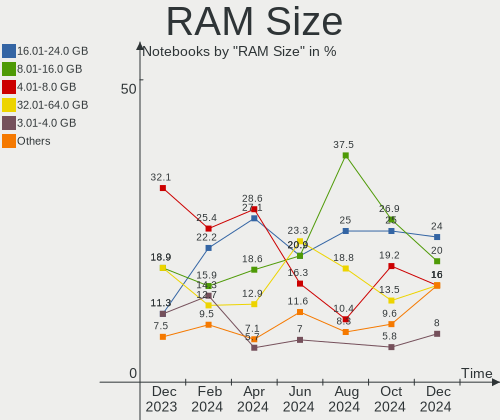
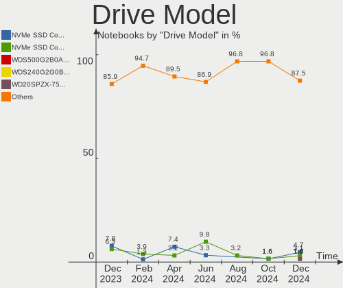
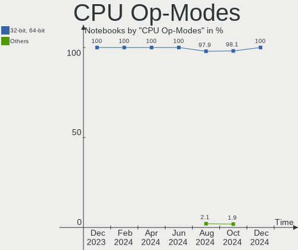
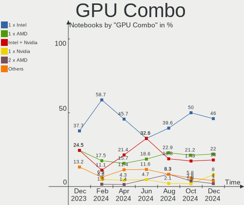
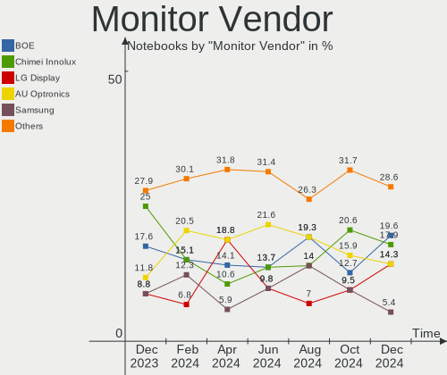
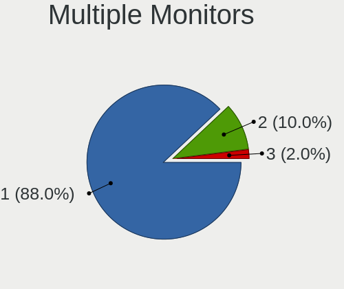
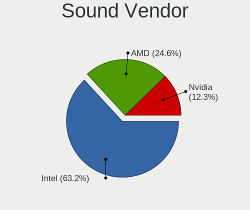
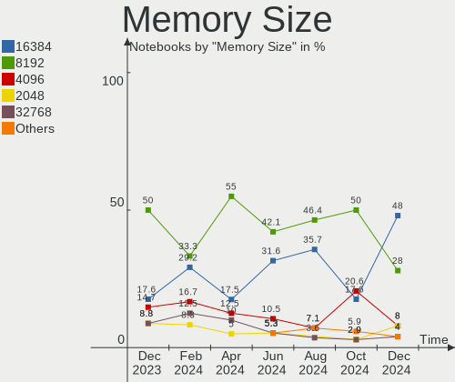

openSUSE - Hardware Trends (Notebooks)
--------------------------------------

A project to identify most popular hardware characteristics and track their change
over time based on data collected by Linux users at https://Linux-Hardware.org.

Anyone can contribute to this report by the [hw-probe](https://github.com/linuxhw/hw-probe) tool:

    sudo -E hw-probe -all -upload

This report is for one last month. Overall report since the beginning of time: [TestCoverage](https://github.com/linuxhw/TestCoverage)

Period: May, 2022.

Contents
--------

* [ System ](#system)
  - [ OS                       ](#os)
  - [ OS Family                ](#os-family)
  - [ Kernel                   ](#kernel)
  - [ Kernel Family            ](#kernel-family)
  - [ Kernel Major Ver.        ](#kernel-major-ver)
  - [ Arch                     ](#arch)
  - [ DE                       ](#de)
  - [ Display Server           ](#display-server)
  - [ Display Manager          ](#display-manager)
  - [ OS Lang                  ](#os-lang)
  - [ Boot Mode                ](#boot-mode)
  - [ Filesystem               ](#filesystem)
  - [ Part. scheme             ](#part-scheme)
  - [ Dual Boot with Linux/BSD ](#dual-boot-with-linuxbsd)
  - [ Dual Boot (Win)          ](#dual-boot-win)

* [ Board ](#board)
  - [ Vendor                   ](#vendor)
  - [ Model                    ](#model)
  - [ Model Family             ](#model-family)
  - [ MFG Year                 ](#mfg-year)
  - [ Form Factor              ](#form-factor)
  - [ Secure Boot              ](#secure-boot)
  - [ Coreboot                 ](#coreboot)
  - [ RAM Size                 ](#ram-size)
  - [ RAM Used                 ](#ram-used)
  - [ Total Drives             ](#total-drives)
  - [ Has CD-ROM               ](#has-cd-rom)
  - [ Has Ethernet             ](#has-ethernet)
  - [ Has WiFi                 ](#has-wifi)
  - [ Has Bluetooth            ](#has-bluetooth)

* [ Location ](#location)
  - [ Country                  ](#country)
  - [ City                     ](#city)

* [ Drives ](#drives)
  - [ Drive Vendor             ](#drive-vendor)
  - [ Drive Model              ](#drive-model)
  - [ HDD Vendor               ](#hdd-vendor)
  - [ SSD Vendor               ](#ssd-vendor)
  - [ Drive Kind               ](#drive-kind)
  - [ Drive Connector          ](#drive-connector)
  - [ Drive Size               ](#drive-size)
  - [ Space Total              ](#space-total)
  - [ Space Used               ](#space-used)
  - [ Malfunc. Drives          ](#malfunc-drives)
  - [ Malfunc. Drive Vendor    ](#malfunc-drive-vendor)
  - [ Malfunc. HDD Vendor      ](#malfunc-hdd-vendor)
  - [ Malfunc. Drive Kind      ](#malfunc-drive-kind)
  - [ Failed Drives            ](#failed-drives)
  - [ Failed Drive Vendor      ](#failed-drive-vendor)
  - [ Drive Status             ](#drive-status)

* [ Storage controller ](#storage-controller)
  - [ Storage Vendor           ](#storage-vendor)
  - [ Storage Model            ](#storage-model)
  - [ Storage Kind             ](#storage-kind)

* [ Processor ](#processor)
  - [ CPU Vendor               ](#cpu-vendor)
  - [ CPU Model                ](#cpu-model)
  - [ CPU Model Family         ](#cpu-model-family)
  - [ CPU Cores                ](#cpu-cores)
  - [ CPU Sockets              ](#cpu-sockets)
  - [ CPU Threads              ](#cpu-threads)
  - [ CPU Op-Modes             ](#cpu-op-modes)
  - [ CPU Microcode            ](#cpu-microcode)
  - [ CPU Microarch            ](#cpu-microarch)

* [ Graphics ](#graphics)
  - [ GPU Vendor               ](#gpu-vendor)
  - [ GPU Model                ](#gpu-model)
  - [ GPU Combo                ](#gpu-combo)
  - [ GPU Driver               ](#gpu-driver)
  - [ GPU Memory               ](#gpu-memory)

* [ Monitor ](#monitor)
  - [ Monitor Vendor           ](#monitor-vendor)
  - [ Monitor Model            ](#monitor-model)
  - [ Monitor Resolution       ](#monitor-resolution)
  - [ Monitor Diagonal         ](#monitor-diagonal)
  - [ Monitor Width            ](#monitor-width)
  - [ Aspect Ratio             ](#aspect-ratio)
  - [ Monitor Area             ](#monitor-area)
  - [ Pixel Density            ](#pixel-density)
  - [ Multiple Monitors        ](#multiple-monitors)

* [ Network ](#network)
  - [ Net Controller Vendor    ](#net-controller-vendor)
  - [ Net Controller Model     ](#net-controller-model)
  - [ Wireless Vendor          ](#wireless-vendor)
  - [ Wireless Model           ](#wireless-model)
  - [ Ethernet Vendor          ](#ethernet-vendor)
  - [ Ethernet Model           ](#ethernet-model)
  - [ Net Controller Kind      ](#net-controller-kind)
  - [ Used Controller          ](#used-controller)
  - [ NICs                     ](#nics)
  - [ IPv6                     ](#ipv6)

* [ Bluetooth ](#bluetooth)
  - [ Bluetooth Vendor         ](#bluetooth-vendor)
  - [ Bluetooth Model          ](#bluetooth-model)

* [ Sound ](#sound)
  - [ Sound Vendor             ](#sound-vendor)
  - [ Sound Model              ](#sound-model)

* [ Memory ](#memory)
  - [ Memory Vendor            ](#memory-vendor)
  - [ Memory Model             ](#memory-model)
  - [ Memory Kind              ](#memory-kind)
  - [ Memory Form Factor       ](#memory-form-factor)
  - [ Memory Size              ](#memory-size)
  - [ Memory Speed             ](#memory-speed)

* [ Printers & scanners ](#printers--scanners)
  - [ Printer Vendor           ](#printer-vendor)
  - [ Printer Model            ](#printer-model)
  - [ Scanner Vendor           ](#scanner-vendor)
  - [ Scanner Model            ](#scanner-model)

* [ Camera ](#camera)
  - [ Camera Vendor            ](#camera-vendor)
  - [ Camera Model             ](#camera-model)

* [ Security ](#security)
  - [ Fingerprint Vendor       ](#fingerprint-vendor)
  - [ Fingerprint Model        ](#fingerprint-model)
  - [ Chipcard Vendor          ](#chipcard-vendor)
  - [ Chipcard Model           ](#chipcard-model)

* [ Unsupported ](#unsupported)
  - [ Unsupported Devices      ](#unsupported-devices)
  - [ Unsupported Device Types ](#unsupported-device-types)

System
------

OS
--

Installed operating systems

| Name                         | Notebooks | Percent |
|------------------------------|-----------|---------|
| openSUSE Tumbleweed-XXXXXXXX | 32        | 84.21%  |
| openSUSE Leap-15.4           | 4         | 10.53%  |
| openSUSE Leap-15.3           | 2         | 5.26%   |

OS Family
---------

OS without a version

| Name     | Notebooks | Percent |
|----------|-----------|---------|
| openSUSE | 38        | 100%    |

Kernel
------

Version of the Linux kernel

| Version                     | Notebooks | Percent |
|-----------------------------|-----------|---------|
| 5.17.4-1-default            | 19        | 50%     |
| 5.17.9-1-default            | 5         | 13.16%  |
| 5.14.21-150400.19-default   | 4         | 10.53%  |
| 5.17.5-1-default            | 3         | 7.89%   |
| 5.17.7-1-default            | 2         | 5.26%   |
| 5.3.18-150300.59.68-default | 1         | 2.63%   |
| 5.3.18-150300.59.63-default | 1         | 2.63%   |
| 5.17.5-6.g8ca9274-default   | 1         | 2.63%   |
| 5.17.3-1-default            | 1         | 2.63%   |
| 5.17.1-1-default            | 1         | 2.63%   |

Kernel Family
-------------

Linux kernel without a distro release

| Version | Notebooks | Percent |
|---------|-----------|---------|
| 5.17.4  | 19        | 50%     |
| 5.17.9  | 5         | 13.16%  |
| 5.17.5  | 4         | 10.53%  |
| 5.14.21 | 4         | 10.53%  |
| 5.3.18  | 2         | 5.26%   |
| 5.17.7  | 2         | 5.26%   |
| 5.17.3  | 1         | 2.63%   |
| 5.17.1  | 1         | 2.63%   |

Kernel Major Ver.
-----------------

Linux kernel major version

| Version | Notebooks | Percent |
|---------|-----------|---------|
| 5.17    | 32        | 84.21%  |
| 5.14    | 4         | 10.53%  |
| 5.3     | 2         | 5.26%   |

Arch
----

OS architecture (x86_64, i586, etc.)

| Name   | Notebooks | Percent |
|--------|-----------|---------|
| x86_64 | 38        | 100%    |

DE
--

Desktop Environment

| Name     | Notebooks | Percent |
|----------|-----------|---------|
| KDE5     | 24        | 63.16%  |
| GNOME    | 9         | 23.68%  |
| Cinnamon | 2         | 5.26%   |
| KDE      | 1         | 2.63%   |
| i3       | 1         | 2.63%   |
| Unknown  | 1         | 2.63%   |

Display Server
--------------

X11 or Wayland

| Name    | Notebooks | Percent |
|---------|-----------|---------|
| X11     | 27        | 71.05%  |
| Wayland | 11        | 28.95%  |

Display Manager
---------------

SDDM, LightDM, etc.

| Name    | Notebooks | Percent |
|---------|-----------|---------|
| SDDM    | 18        | 47.37%  |
| Unknown | 9         | 23.68%  |
| XDM     | 5         | 13.16%  |
| LightDM | 5         | 13.16%  |
| GDM     | 1         | 2.63%   |

OS Lang
-------

Language

| Lang  | Notebooks | Percent |
|-------|-----------|---------|
| en_US | 14        | 36.84%  |
| en_GB | 7         | 18.42%  |
| POSIX | 4         | 10.53%  |
| de_DE | 3         | 7.89%   |
| zh_CN | 2         | 5.26%   |
| C     | 2         | 5.26%   |
| ru_RU | 1         | 2.63%   |
| pt_BR | 1         | 2.63%   |
| it_IT | 1         | 2.63%   |
| es_MX | 1         | 2.63%   |
| es_ES | 1         | 2.63%   |
| bg_BG | 1         | 2.63%   |

Boot Mode
---------

EFI or BIOS

| Mode | Notebooks | Percent |
|------|-----------|---------|
| EFI  | 32        | 84.21%  |
| BIOS | 6         | 15.79%  |

Filesystem
----------

Type of filesystem

| Type  | Notebooks | Percent |
|-------|-----------|---------|
| Btrfs | 33        | 86.84%  |
| Xfs   | 3         | 7.89%   |
| Ext4  | 2         | 5.26%   |

Part. scheme
------------

Scheme of partitioning

| Type    | Notebooks | Percent |
|---------|-----------|---------|
| GPT     | 27        | 71.05%  |
| Unknown | 8         | 21.05%  |
| MBR     | 3         | 7.89%   |

Dual Boot with Linux/BSD
------------------------

Hosting more than one Linux/BSD

| Dual boot | Notebooks | Percent |
|-----------|-----------|---------|
| No        | 33        | 86.84%  |
| Yes       | 5         | 13.16%  |

Dual Boot (Win)
---------------

Hosting Linux and Windows

| Dual boot | Notebooks | Percent |
|-----------|-----------|---------|
| No        | 26        | 68.42%  |
| Yes       | 12        | 31.58%  |

Board
-----

Vendor
------

Motherboard manufacturer

| Name                | Notebooks | Percent |
|---------------------|-----------|---------|
| Hewlett-Packard     | 10        | 26.32%  |
| Lenovo              | 9         | 23.68%  |
| Dell                | 5         | 13.16%  |
| ASUSTek Computer    | 4         | 10.53%  |
| Clevo               | 2         | 5.26%   |
| TUXEDO              | 1         | 2.63%   |
| Sony                | 1         | 2.63%   |
| Samsung Electronics | 1         | 2.63%   |
| Notebook            | 1         | 2.63%   |
| Monster             | 1         | 2.63%   |
| LG Electronics      | 1         | 2.63%   |
| Apple               | 1         | 2.63%   |
| Acer                | 1         | 2.63%   |

Model
-----

Motherboard model

| Name                                    | Notebooks | Percent |
|-----------------------------------------|-----------|---------|
| TUXEDO InfinityBook S 15 Gen6           | 1         | 2.63%   |
| Sony VPCF23S1E                          | 1         | 2.63%   |
| Samsung 550XDA                          | 1         | 2.63%   |
| Notebook NB50TJ1_TK1                    | 1         | 2.63%   |
| Monster HUMA H4 V3.1                    | 1         | 2.63%   |
| LG 15Z995-U.ARS5U1                      | 1         | 2.63%   |
| Lenovo ThinkPad T495s 20QJ0012UK        | 1         | 2.63%   |
| Lenovo ThinkPad T470 W10DG 20JNS0GH0C   | 1         | 2.63%   |
| Lenovo ThinkPad T470 20HES1RB06         | 1         | 2.63%   |
| Lenovo ThinkPad T410 25223FG            | 1         | 2.63%   |
| Lenovo ThinkPad P50 20EQS0VV0C          | 1         | 2.63%   |
| Lenovo ThinkPad E555 20DH000WGE         | 1         | 2.63%   |
| Lenovo ThinkPad E15 Gen 3 20YGCTO1WW    | 1         | 2.63%   |
| Lenovo ThinkBook 16p Gen 2 20YM         | 1         | 2.63%   |
| Lenovo IdeaPad 5 14ARE05 81YM           | 1         | 2.63%   |
| HP ZHAN 66 Pro 14 G4 Notebook PC        | 1         | 2.63%   |
| HP Pavilion dv6                         | 1         | 2.63%   |
| HP Pavilion 13 x360 PC                  | 1         | 2.63%   |
| HP Notebook                             | 1         | 2.63%   |
| HP Laptop 17-ca0xxx                     | 1         | 2.63%   |
| HP ENVY Laptop 13-ba1xxx                | 1         | 2.63%   |
| HP EliteBook 855 G8 Notebook PC         | 1         | 2.63%   |
| HP EliteBook 840 G4                     | 1         | 2.63%   |
| HP EliteBook 820 G3                     | 1         | 2.63%   |
| HP EliteBook 2560p                      | 1         | 2.63%   |
| Dell XPS 15 9560                        | 1         | 2.63%   |
| Dell XPS 15 9550                        | 1         | 2.63%   |
| Dell Latitude 7490                      | 1         | 2.63%   |
| Dell Latitude 7320                      | 1         | 2.63%   |
| Dell Latitude 5430 Rugged               | 1         | 2.63%   |
| Clevo W55xEU                            | 1         | 2.63%   |
| Clevo Modified by dsanke                | 1         | 2.63%   |
| ASUS X540LJ                             | 1         | 2.63%   |
| ASUS ROG Strix G513QY_G513QY            | 1         | 2.63%   |
| ASUS G771JW                             | 1         | 2.63%   |
| ASUS ASUS BR1100CKA BR1100CKA_BR1100CKA | 1         | 2.63%   |
| Apple MacBookPro9,2                     | 1         | 2.63%   |
| Acer Swift SF314-43                     | 1         | 2.63%   |

Model Family
------------

Motherboard model prefix

| Name                | Notebooks | Percent |
|---------------------|-----------|---------|
| Lenovo ThinkPad     | 7         | 18.42%  |
| HP EliteBook        | 4         | 10.53%  |
| Dell Latitude       | 3         | 7.89%   |
| HP Pavilion         | 2         | 5.26%   |
| Dell XPS            | 2         | 5.26%   |
| TUXEDO InfinityBook | 1         | 2.63%   |
| Sony VPCF23S1E      | 1         | 2.63%   |
| Samsung 550XDA      | 1         | 2.63%   |
| Notebook NB50TJ1    | 1         | 2.63%   |
| Monster HUMA        | 1         | 2.63%   |
| LG 15Z995-U.ARS5U1  | 1         | 2.63%   |
| Lenovo ThinkBook    | 1         | 2.63%   |
| Lenovo IdeaPad      | 1         | 2.63%   |
| HP ZHAN             | 1         | 2.63%   |
| HP Notebook         | 1         | 2.63%   |
| HP Laptop           | 1         | 2.63%   |
| HP ENVY             | 1         | 2.63%   |
| Clevo W55xEU        | 1         | 2.63%   |
| Clevo Modified      | 1         | 2.63%   |
| ASUS X540LJ         | 1         | 2.63%   |
| ASUS ROG            | 1         | 2.63%   |
| ASUS G771JW         | 1         | 2.63%   |
| ASUS ASUS           | 1         | 2.63%   |
| Apple MacBookPro9   | 1         | 2.63%   |
| Acer Swift          | 1         | 2.63%   |

MFG Year
--------

Motherboard manufacture year

| Year | Notebooks | Percent |
|------|-----------|---------|
| 2021 | 10        | 26.32%  |
| 2020 | 6         | 15.79%  |
| 2015 | 5         | 13.16%  |
| 2017 | 4         | 10.53%  |
| 2018 | 3         | 7.89%   |
| 2019 | 2         | 5.26%   |
| 2012 | 2         | 5.26%   |
| 2011 | 2         | 5.26%   |
| 2016 | 1         | 2.63%   |
| 2014 | 1         | 2.63%   |
| 2009 | 1         | 2.63%   |
| 2008 | 1         | 2.63%   |

Form Factor
-----------

Physical design of the computer

| Name     | Notebooks | Percent |
|----------|-----------|---------|
| Notebook | 38        | 100%    |

Secure Boot
-----------

Enabled or disabled

| State    | Notebooks | Percent |
|----------|-----------|---------|
| Disabled | 24        | 63.16%  |
| Enabled  | 14        | 36.84%  |

Coreboot
--------

Have coreboot on board

| Used | Notebooks | Percent |
|------|-----------|---------|
| No   | 38        | 100%    |

RAM Size
--------

Total RAM memory

| Size in GB | Notebooks | Percent |
|------------|-----------|---------|
| 4.01-8.0   | 12        | 31.58%  |
| 16.01-24.0 | 12        | 31.58%  |
| 8.01-16.0  | 9         | 23.68%  |
| 3.01-4.0   | 3         | 7.89%   |
| 32.01-64.0 | 2         | 5.26%   |

RAM Used
--------

Used RAM memory

| Used GB   | Notebooks | Percent |
|-----------|-----------|---------|
| 4.01-8.0  | 15        | 39.47%  |
| 3.01-4.0  | 10        | 26.32%  |
| 1.01-2.0  | 9         | 23.68%  |
| 2.01-3.0  | 3         | 7.89%   |
| 8.01-16.0 | 1         | 2.63%   |

Total Drives
------------

Number of drives on board

| Drives | Notebooks | Percent |
|--------|-----------|---------|
| 1      | 30        | 78.95%  |
| 2      | 6         | 15.79%  |
| 3      | 2         | 5.26%   |

Has CD-ROM
----------

Has CD-ROM on board

| Presented | Notebooks | Percent |
|-----------|-----------|---------|
| No        | 28        | 73.68%  |
| Yes       | 10        | 26.32%  |

Has Ethernet
------------

Has Ethernet on board

| Presented | Notebooks | Percent |
|-----------|-----------|---------|
| Yes       | 32        | 84.21%  |
| No        | 6         | 15.79%  |

Has WiFi
--------

Has WiFi module

| Presented | Notebooks | Percent |
|-----------|-----------|---------|
| Yes       | 37        | 97.37%  |
| No        | 1         | 2.63%   |

Has Bluetooth
-------------

Has Bluetooth module

| Presented | Notebooks | Percent |
|-----------|-----------|---------|
| Yes       | 35        | 92.11%  |
| No        | 3         | 7.89%   |

Location
--------

Country
-------

Geographic location (country)

| Country     | Notebooks | Percent |
|-------------|-----------|---------|
| UK          | 4         | 10.53%  |
| Germany     | 4         | 10.53%  |
| USA         | 3         | 7.89%   |
| Chile       | 3         | 7.89%   |
| Turkey      | 2         | 5.26%   |
| Switzerland | 2         | 5.26%   |
| Poland      | 2         | 5.26%   |
| India       | 2         | 5.26%   |
| China       | 2         | 5.26%   |
| Bulgaria    | 2         | 5.26%   |
| Russia      | 1         | 2.63%   |
| Portugal    | 1         | 2.63%   |
| Netherlands | 1         | 2.63%   |
| Mexico      | 1         | 2.63%   |
| Italy       | 1         | 2.63%   |
| Hong Kong   | 1         | 2.63%   |
| France      | 1         | 2.63%   |
| Finland     | 1         | 2.63%   |
| Czechia     | 1         | 2.63%   |
| Canada      | 1         | 2.63%   |
| Brazil      | 1         | 2.63%   |
| Belarus     | 1         | 2.63%   |

City
----

Geographic location (city)

| City                         | Notebooks | Percent |
|------------------------------|-----------|---------|
| Santiago                     | 3         | 7.89%   |
| London                       | 2         | 5.26%   |
| Warsaw                       | 1         | 2.63%   |
| Turku                        | 1         | 2.63%   |
| Thungersheim                 | 1         | 2.63%   |
| The Hague                    | 1         | 2.63%   |
| Sofia                        | 1         | 2.63%   |
| Schrobenhausen               | 1         | 2.63%   |
| Puszczykowo                  | 1         | 2.63%   |
| Pernik                       | 1         | 2.63%   |
| Nottingham                   | 1         | 2.63%   |
| New York                     | 1         | 2.63%   |
| Montreal                     | 1         | 2.63%   |
| Minsk                        | 1         | 2.63%   |
| Mikulov                      | 1         | 2.63%   |
| Mexico City                  | 1         | 2.63%   |
| Meggen                       | 1         | 2.63%   |
| Marcon                       | 1         | 2.63%   |
| Leesburg                     | 1         | 2.63%   |
| Le Plessis-Robinson          | 1         | 2.63%   |
| Joinville                    | 1         | 2.63%   |
| Izmir                        | 1         | 2.63%   |
| Istanbul                     | 1         | 2.63%   |
| Islington                    | 1         | 2.63%   |
| Howell                       | 1         | 2.63%   |
| Gurgaon                      | 1         | 2.63%   |
| Gevelsberg                   | 1         | 2.63%   |
| Figueira da Foz Municipality | 1         | 2.63%   |
| Dalian                       | 1         | 2.63%   |
| Chelyabinsk                  | 1         | 2.63%   |
| Changsha                     | 1         | 2.63%   |
| Central                      | 1         | 2.63%   |
| Berlin                       | 1         | 2.63%   |
| Baar                         | 1         | 2.63%   |
| Ahmedabad                    | 1         | 2.63%   |

Drives
------

Drive Vendor
------------

Hard drive vendors

| Vendor              | Notebooks | Drives | Percent |
|---------------------|-----------|--------|---------|
| Samsung Electronics | 16        | 16     | 33.33%  |
| WDC                 | 5         | 5      | 10.42%  |
| Kingston            | 5         | 5      | 10.42%  |
| SanDisk             | 3         | 3      | 6.25%   |
| SK Hynix            | 2         | 2      | 4.17%   |
| HGST                | 2         | 3      | 4.17%   |
| Hewlett-Packard     | 2         | 2      | 4.17%   |
| Crucial             | 2         | 2      | 4.17%   |
| Unknown             | 1         | 1      | 2.08%   |
| Seagate             | 1         | 1      | 2.08%   |
| PNY                 | 1         | 1      | 2.08%   |
| Pioneer             | 1         | 1      | 2.08%   |
| Patriot             | 1         | 1      | 2.08%   |
| KIOXIA              | 1         | 1      | 2.08%   |
| Intel               | 1         | 1      | 2.08%   |
| GOODRAM             | 1         | 1      | 2.08%   |
| Gigabyte Technology | 1         | 1      | 2.08%   |
| FORESEE             | 1         | 1      | 2.08%   |
| A-DATA Technology   | 1         | 1      | 2.08%   |

Drive Model
-----------

Hard drive models

| Model                                | Notebooks | Percent |
|--------------------------------------|-----------|---------|
| Samsung SSD 860 EVO 250GB            | 2         | 4.08%   |
| WDC WDS480G2G0A-00JH30 480GB SSD     | 1         | 2.04%   |
| WDC WD10SPZX-60Z10T0 1TB             | 1         | 2.04%   |
| WDC WD10JPVX-60JC3T0 1TB             | 1         | 2.04%   |
| WDC PC SN730 SDBQNTY-512G-1001 512GB | 1         | 2.04%   |
| WDC PC SN530 SDBPMPZ-512G-1001 512GB | 1         | 2.04%   |
| Unknown G1J38E  64GB                 | 1         | 2.04%   |
| SK Hynix NVMe SSD Drive 512GB        | 1         | 2.04%   |
| SK Hynix HFS256GD9TNG-L2A0A 256GB    | 1         | 2.04%   |
| Seagate ST2000LM003 HN-M201RAD 2TB   | 1         | 2.04%   |
| SanDisk SSD U100 128GB               | 1         | 2.04%   |
| SanDisk SSD PLUS 120GB               | 1         | 2.04%   |
| Sandisk NVMe SSD Drive 500GB         | 1         | 2.04%   |
| Samsung SSD 980 500GB                | 1         | 2.04%   |
| Samsung SSD 970 EVO Plus 2TB         | 1         | 2.04%   |
| Samsung SSD 970 EVO Plus 1TB         | 1         | 2.04%   |
| Samsung SSD 970 EVO 1TB              | 1         | 2.04%   |
| Samsung SSD 850 EVO 1TB              | 1         | 2.04%   |
| Samsung PM961 NVMe 512GB             | 1         | 2.04%   |
| Samsung PM951 NVMe 512GB             | 1         | 2.04%   |
| Samsung NVMe SSD Drive 512GB         | 1         | 2.04%   |
| Samsung NVMe SSD Drive 256GB         | 1         | 2.04%   |
| Samsung NVMe SSD Drive 1TB           | 1         | 2.04%   |
| Samsung MZVLW512HMJP-000H1 512GB     | 1         | 2.04%   |
| Samsung MZVLQ1T0HALB-000H1 1TB       | 1         | 2.04%   |
| Samsung MZVLB512HBJQ-000L2 512GB     | 1         | 2.04%   |
| Samsung MZVLB256HBHQ-00000 256GB     | 1         | 2.04%   |
| PNY CS900 240GB SSD                  | 1         | 2.04%   |
| Pioneer APS-SL3N-240 240GB           | 1         | 2.04%   |
| Patriot P210 256GB SSD               | 1         | 2.04%   |
| KIOXIA KBG40ZNS256G NVMe 256GB       | 1         | 2.04%   |
| Kingston SNVS500G 500GB              | 1         | 2.04%   |
| Kingston SNVS1000G 1TB               | 1         | 2.04%   |
| Kingston SMS200S3240G 240GB SSD      | 1         | 2.04%   |
| Kingston RBU-SC100S37128GD 128GB SSD | 1         | 2.04%   |
| Kingston OM8PDP3512B-AA1 512GB       | 1         | 2.04%   |
| Intel SSDPEKNU512GZ 512GB            | 1         | 2.04%   |
| HGST HTS725050A7E630 500GB           | 1         | 2.04%   |
| HGST HTS721010A9E630 1TB             | 1         | 2.04%   |
| HGST HTS541010A9E680 1TB             | 1         | 2.04%   |
| HP SSD S700 250GB                    | 1         | 2.04%   |
| HP SSD EX900 1TB                     | 1         | 2.04%   |
| GOODRAM SSDPR-CX400-512 512GB        | 1         | 2.04%   |
| Gigabyte GP-GSTFS31240GNTD 240GB     | 1         | 2.04%   |
| FORESEE P900F256GB                   | 1         | 2.04%   |
| Crucial CT500MX500SSD1 500GB         | 1         | 2.04%   |
| Crucial CT1000P5SSD8 1TB             | 1         | 2.04%   |
| A-DATA SX8200PNP 1TB                 | 1         | 2.04%   |

HDD Vendor
----------

Hard disk drive vendors

| Vendor  | Notebooks | Drives | Percent |
|---------|-----------|--------|---------|
| WDC     | 2         | 2      | 40%     |
| HGST    | 2         | 3      | 40%     |
| Seagate | 1         | 1      | 20%     |

SSD Vendor
----------

Solid state drive vendors

| Vendor              | Notebooks | Drives | Percent |
|---------------------|-----------|--------|---------|
| Samsung Electronics | 3         | 3      | 20%     |
| SanDisk             | 2         | 2      | 13.33%  |
| Kingston            | 2         | 2      | 13.33%  |
| WDC                 | 1         | 1      | 6.67%   |
| PNY                 | 1         | 1      | 6.67%   |
| Pioneer             | 1         | 1      | 6.67%   |
| Patriot             | 1         | 1      | 6.67%   |
| Hewlett-Packard     | 1         | 1      | 6.67%   |
| GOODRAM             | 1         | 1      | 6.67%   |
| Gigabyte Technology | 1         | 1      | 6.67%   |
| Crucial             | 1         | 1      | 6.67%   |

Drive Kind
----------

HDD or SSD

| Kind | Notebooks | Drives | Percent |
|------|-----------|--------|---------|
| NVMe | 23        | 27     | 52.27%  |
| SSD  | 15        | 15     | 34.09%  |
| HDD  | 5         | 6      | 11.36%  |
| MMC  | 1         | 1      | 2.27%   |

Drive Connector
---------------

SATA, SAS, NVMe, etc.

| Type | Notebooks | Drives | Percent |
|------|-----------|--------|---------|
| NVMe | 23        | 27     | 56.1%   |
| SATA | 17        | 21     | 41.46%  |
| MMC  | 1         | 1      | 2.44%   |

Drive Size
----------

Size of hard drive

| Size in TB | Notebooks | Drives | Percent |
|------------|-----------|--------|---------|
| 0.01-0.5   | 14        | 14     | 66.67%  |
| 0.51-1.0   | 6         | 6      | 28.57%  |
| 1.01-2.0   | 1         | 1      | 4.76%   |

Space Total
-----------

Amount of disk space available on the file system

| Size in GB     | Notebooks | Percent |
|----------------|-----------|---------|
| 1001-2000      | 14        | 36.84%  |
| More than 3000 | 12        | 31.58%  |
| 501-1000       | 6         | 15.79%  |
| 2001-3000      | 4         | 10.53%  |
| 251-500        | 2         | 5.26%   |

Space Used
----------

Amount of used disk space

| Used GB   | Notebooks | Percent |
|-----------|-----------|---------|
| 1001-2000 | 11        | 28.95%  |
| 251-500   | 7         | 18.42%  |
| 101-250   | 7         | 18.42%  |
| 501-1000  | 5         | 13.16%  |
| 2001-3000 | 4         | 10.53%  |
| 1-20      | 2         | 5.26%   |
| 51-100    | 2         | 5.26%   |

Malfunc. Drives
---------------

Drive models with a malfunction

| Model                            | Notebooks | Drives | Percent |
|----------------------------------|-----------|--------|---------|
| WDC WDS480G2G0A-00JH30 480GB SSD | 1         | 1      | 50%     |
| Kingston SMS200S3240G 240GB SSD  | 1         | 1      | 50%     |

Malfunc. Drive Vendor
---------------------

Vendors of faulty drives

| Vendor   | Notebooks | Drives | Percent |
|----------|-----------|--------|---------|
| WDC      | 1         | 1      | 50%     |
| Kingston | 1         | 1      | 50%     |

Malfunc. HDD Vendor
-------------------

Vendors of faulty HDD drives

Zero info for selected period =(

Malfunc. Drive Kind
-------------------

Kinds of faulty drives

| Kind | Notebooks | Drives | Percent |
|------|-----------|--------|---------|
| SSD  | 2         | 2      | 100%    |

Failed Drives
-------------

Failed drive models

Zero info for selected period =(

Failed Drive Vendor
-------------------

Failed drive vendors

Zero info for selected period =(

Drive Status
------------

Number of failed and malfunc. drives

| Status   | Notebooks | Drives | Percent |
|----------|-----------|--------|---------|
| Works    | 29        | 34     | 72.5%   |
| Detected | 9         | 13     | 22.5%   |
| Malfunc  | 2         | 2      | 5%      |

Storage controller
------------------

Storage Vendor
--------------

Storage controller vendors

| Vendor                      | Notebooks | Percent |
|-----------------------------|-----------|---------|
| Intel                       | 24        | 45.28%  |
| Samsung Electronics         | 13        | 24.53%  |
| Sandisk                     | 3         | 5.66%   |
| Kingston Technology Company | 3         | 5.66%   |
| AMD                         | 3         | 5.66%   |
| SK Hynix                    | 2         | 3.77%   |
| Silicon Motion              | 1         | 1.89%   |
| Micron Technology           | 1         | 1.89%   |
| Marvell Technology Group    | 1         | 1.89%   |
| KIOXIA                      | 1         | 1.89%   |
| ADATA Technology            | 1         | 1.89%   |

Storage Model
-------------

Storage controller models

| Model                                                                                  | Notebooks | Percent |
|----------------------------------------------------------------------------------------|-----------|---------|
| Samsung NVMe SSD Controller SM981/PM981/PM983                                          | 5         | 9.26%   |
| Samsung NVMe SSD Controller SM961/PM961/SM963                                          | 4         | 7.41%   |
| Intel Sunrise Point-LP SATA Controller [AHCI mode]                                     | 4         | 7.41%   |
| Samsung NVMe SSD Controller 980                                                        | 3         | 5.56%   |
| Intel Volume Management Device NVMe RAID Controller                                    | 3         | 5.56%   |
| AMD FCH SATA Controller [AHCI mode]                                                    | 3         | 5.56%   |
| Kingston Company Company Non-Volatile memory controller                                | 2         | 3.7%    |
| Intel Wildcat Point-LP SATA Controller [AHCI Mode]                                     | 2         | 3.7%    |
| Intel HM170/QM170 Chipset SATA Controller [AHCI Mode]                                  | 2         | 3.7%    |
| Intel 7 Series Chipset Family 6-port SATA Controller [AHCI mode]                       | 2         | 3.7%    |
| Intel 5 Series/3400 Series Chipset 6 port SATA AHCI Controller                         | 2         | 3.7%    |
| SK Hynix Non-Volatile memory controller                                                | 1         | 1.85%   |
| SK Hynix Gold P31 SSD                                                                  | 1         | 1.85%   |
| Silicon Motion SM2263EN/SM2263XT SSD Controller                                        | 1         | 1.85%   |
| Sandisk WD Black SN750 / PC SN730 NVMe SSD                                             | 1         | 1.85%   |
| Sandisk WD Black 2018/SN750 / PC SN720 NVMe SSD                                        | 1         | 1.85%   |
| Sandisk Non-Volatile memory controller                                                 | 1         | 1.85%   |
| Samsung NVMe SSD Controller SM951/PM951                                                | 1         | 1.85%   |
| Micron Non-Volatile memory controller                                                  | 1         | 1.85%   |
| Marvell Group Marvell Non-Volatile memory controller                                   | 1         | 1.85%   |
| KIOXIA Non-Volatile memory controller                                                  | 1         | 1.85%   |
| Kingston Company OM3PDP3 NVMe SSD                                                      | 1         | 1.85%   |
| Intel Tiger Lake-LP SATA Controller [AHCI mode]                                        | 1         | 1.85%   |
| Intel Q170/Q150/B150/H170/H110/Z170/CM236 Chipset SATA Controller [AHCI Mode]          | 1         | 1.85%   |
| Intel Non-Volatile memory controller                                                   | 1         | 1.85%   |
| Intel Comet Lake SATA AHCI Controller                                                  | 1         | 1.85%   |
| Intel Cannon Lake PCH SATA AHCI Controller                                             | 1         | 1.85%   |
| Intel 8 Series/C220 Series Chipset Family 6-port SATA Controller 1 [AHCI mode]         | 1         | 1.85%   |
| Intel 6 Series/C200 Series Chipset Family Mobile SATA Controller (IDE mode, ports 4-5) | 1         | 1.85%   |
| Intel 6 Series/C200 Series Chipset Family Mobile SATA Controller (IDE mode, ports 0-3) | 1         | 1.85%   |
| Intel 6 Series/C200 Series Chipset Family 6 port Mobile SATA AHCI Controller           | 1         | 1.85%   |
| Intel 200 Series PCH SATA controller [AHCI mode]                                       | 1         | 1.85%   |
| ADATA XPG SX8200 Pro PCIe Gen3x4 M.2 2280 Solid State Drive                            | 1         | 1.85%   |

Storage Kind
------------

Kind of storage controller (IDE, SATA, NVMe, SAS, ...)

| Kind | Notebooks | Percent |
|------|-----------|---------|
| NVMe | 23        | 46.94%  |
| SATA | 22        | 44.9%   |
| RAID | 3         | 6.12%   |
| IDE  | 1         | 2.04%   |

Processor
---------

CPU Vendor
----------

Processor vendors

| Vendor | Notebooks | Percent |
|--------|-----------|---------|
| Intel  | 29        | 76.32%  |
| AMD    | 9         | 23.68%  |

CPU Model
---------

Processor models

| Model                                           | Notebooks | Percent |
|-------------------------------------------------|-----------|---------|
| Intel Core i5-6200U CPU @ 2.30GHz               | 2         | 5.26%   |
| Intel 11th Gen Core i7-1185G7 @ 3.00GHz         | 2         | 5.26%   |
| Intel 11th Gen Core i7-1165G7 @ 2.80GHz         | 2         | 5.26%   |
| AMD Ryzen 7 5700U with Radeon Graphics          | 2         | 5.26%   |
| Intel Core i7-8700 CPU @ 3.20GHz                | 1         | 2.63%   |
| Intel Core i7-7700HQ CPU @ 2.80GHz              | 1         | 2.63%   |
| Intel Core i7-7600U CPU @ 2.80GHz               | 1         | 2.63%   |
| Intel Core i7-6820HQ CPU @ 2.70GHz              | 1         | 2.63%   |
| Intel Core i7-6700HQ CPU @ 2.60GHz              | 1         | 2.63%   |
| Intel Core i7-4720HQ CPU @ 2.60GHz              | 1         | 2.63%   |
| Intel Core i7-3632QM CPU @ 2.20GHz              | 1         | 2.63%   |
| Intel Core i7-2670QM CPU @ 2.20GHz              | 1         | 2.63%   |
| Intel Core i7-2620M CPU @ 2.70GHz               | 1         | 2.63%   |
| Intel Core i7-10510U CPU @ 1.80GHz              | 1         | 2.63%   |
| Intel Core i7 CPU M 620 @ 2.67GHz               | 1         | 2.63%   |
| Intel Core i5-9600KF CPU @ 3.70GHz              | 1         | 2.63%   |
| Intel Core i5-8350U CPU @ 1.70GHz               | 1         | 2.63%   |
| Intel Core i5-7300U CPU @ 2.60GHz               | 1         | 2.63%   |
| Intel Core i5-6300U CPU @ 2.40GHz               | 1         | 2.63%   |
| Intel Core i5-5200U CPU @ 2.20GHz               | 1         | 2.63%   |
| Intel Core i5-3210M CPU @ 2.50GHz               | 1         | 2.63%   |
| Intel Core i5-10210U CPU @ 1.60GHz              | 1         | 2.63%   |
| Intel Core i3-5005U CPU @ 2.00GHz               | 1         | 2.63%   |
| Intel Core i3 CPU M 330 @ 2.13GHz               | 1         | 2.63%   |
| Intel Celeron N4500 @ 1.10GHz                   | 1         | 2.63%   |
| Intel 11th Gen Core i7-11370H @ 3.30GHz         | 1         | 2.63%   |
| Intel 11th Gen Core i3-1115G4 @ 3.00GHz         | 1         | 2.63%   |
| AMD Ryzen 9 5900HX with Radeon Graphics         | 1         | 2.63%   |
| AMD Ryzen 7 PRO 3700U w/ Radeon Vega Mobile Gfx | 1         | 2.63%   |
| AMD Ryzen 7 5800H with Radeon Graphics          | 1         | 2.63%   |
| AMD Ryzen 7 4700U with Radeon Graphics          | 1         | 2.63%   |
| AMD Ryzen 5 PRO 5650U with Radeon Graphics      | 1         | 2.63%   |
| AMD A8-7100 Radeon R5, 8 Compute Cores 4C+4G    | 1         | 2.63%   |
| AMD A6-9225 RADEON R4, 5 COMPUTE CORES 2C+3G    | 1         | 2.63%   |

CPU Model Family
----------------

Processor model prefix

| Model           | Notebooks | Percent |
|-----------------|-----------|---------|
| Intel Core i7   | 11        | 28.95%  |
| Intel Core i5   | 9         | 23.68%  |
| Other           | 6         | 15.79%  |
| AMD Ryzen 7     | 4         | 10.53%  |
| Intel Core i3   | 2         | 5.26%   |
| Intel Celeron   | 1         | 2.63%   |
| AMD Ryzen 9     | 1         | 2.63%   |
| AMD Ryzen 7 PRO | 1         | 2.63%   |
| AMD Ryzen 5 PRO | 1         | 2.63%   |
| AMD A8          | 1         | 2.63%   |
| AMD A6          | 1         | 2.63%   |

CPU Cores
---------

Number of processor cores

| Number | Notebooks | Percent |
|--------|-----------|---------|
| 4      | 15        | 39.47%  |
| 2      | 15        | 39.47%  |
| 8      | 5         | 13.16%  |
| 6      | 3         | 7.89%   |

CPU Sockets
-----------

Number of sockets

| Number | Notebooks | Percent |
|--------|-----------|---------|
| 1      | 38        | 100%    |

CPU Threads
-----------

Threads per core (Hyper-Threading)

| Number | Notebooks | Percent |
|--------|-----------|---------|
| 2      | 34        | 89.47%  |
| 1      | 4         | 10.53%  |

CPU Op-Modes
------------

CPU Operation Modes (32-bit, 64-bit)

| Op mode        | Notebooks | Percent |
|----------------|-----------|---------|
| 32-bit, 64-bit | 38        | 100%    |

CPU Microcode
-------------

Microcode number

| Number     | Notebooks | Percent |
|------------|-----------|---------|
| 0x806c1    | 6         | 15.79%  |
| 0x406e3    | 3         | 7.89%   |
| 0x0a50000c | 3         | 7.89%   |
| 0x806ec    | 2         | 5.26%   |
| 0x806e9    | 2         | 5.26%   |
| 0x506e3    | 2         | 5.26%   |
| 0x306d4    | 2         | 5.26%   |
| 0x306a9    | 2         | 5.26%   |
| 0x206a7    | 2         | 5.26%   |
| Unknown    | 2         | 5.26%   |
| 0x906ed    | 1         | 2.63%   |
| 0x906ea    | 1         | 2.63%   |
| 0x906e9    | 1         | 2.63%   |
| 0x906c0    | 1         | 2.63%   |
| 0x806ea    | 1         | 2.63%   |
| 0x20652    | 1         | 2.63%   |
| 0x08608103 | 1         | 2.63%   |
| 0x08608102 | 1         | 2.63%   |
| 0x08600106 | 1         | 2.63%   |
| 0x08108102 | 1         | 2.63%   |
| 0x06006705 | 1         | 2.63%   |
| 0x06003109 | 1         | 2.63%   |

CPU Microarch
-------------

Microarchitecture

| Name        | Notebooks | Percent |
|-------------|-----------|---------|
| KabyLake    | 8         | 21.05%  |
| TigerLake   | 6         | 15.79%  |
| Skylake     | 5         | 13.16%  |
| Zen 3       | 3         | 7.89%   |
| Westmere    | 2         | 5.26%   |
| SandyBridge | 2         | 5.26%   |
| IvyBridge   | 2         | 5.26%   |
| Broadwell   | 2         | 5.26%   |
| Unknown     | 2         | 5.26%   |
| Zen+        | 1         | 2.63%   |
| Zen 2       | 1         | 2.63%   |
| Tremont     | 1         | 2.63%   |
| Steamroller | 1         | 2.63%   |
| Haswell     | 1         | 2.63%   |
| Excavator   | 1         | 2.63%   |

Graphics
--------

GPU Vendor
----------

Vendors of graphics cards

| Vendor | Notebooks | Percent |
|--------|-----------|---------|
| Intel  | 25        | 51.02%  |
| Nvidia | 14        | 28.57%  |
| AMD    | 10        | 20.41%  |

GPU Model
---------

Graphics card models

| Model                                                                                 | Notebooks | Percent |
|---------------------------------------------------------------------------------------|-----------|---------|
| Intel TigerLake-LP GT2 [Iris Xe Graphics]                                             | 5         | 9.8%    |
| Intel Skylake GT2 [HD Graphics 520]                                                   | 3         | 5.88%   |
| AMD Cezanne                                                                           | 3         | 5.88%   |
| Nvidia GP107M [GeForce GTX 1050 Mobile]                                               | 2         | 3.92%   |
| Nvidia GM107M [GeForce GTX 960M]                                                      | 2         | 3.92%   |
| Intel HD Graphics 620                                                                 | 2         | 3.92%   |
| Intel HD Graphics 5500                                                                | 2         | 3.92%   |
| Intel HD Graphics 530                                                                 | 2         | 3.92%   |
| Intel CometLake-U GT2 [UHD Graphics]                                                  | 2         | 3.92%   |
| Intel 3rd Gen Core processor Graphics Controller                                      | 2         | 3.92%   |
| AMD Lucienne                                                                          | 2         | 3.92%   |
| Nvidia TU117M [GeForce MX450]                                                         | 1         | 1.96%   |
| Nvidia TU117GLM [Quadro T500 Mobile]                                                  | 1         | 1.96%   |
| Nvidia GT218M [NVS 3100M]                                                             | 1         | 1.96%   |
| Nvidia GT218M [GeForce G 105M]                                                        | 1         | 1.96%   |
| Nvidia GP108M [GeForce MX250]                                                         | 1         | 1.96%   |
| Nvidia GP104M [GeForce GTX 1070 Mobile]                                               | 1         | 1.96%   |
| Nvidia GM107GLM [Quadro M1000M]                                                       | 1         | 1.96%   |
| Nvidia GK208BM [GeForce 920M]                                                         | 1         | 1.96%   |
| Nvidia GF108M [GeForce GT 540M]                                                       | 1         | 1.96%   |
| Nvidia GA106M [GeForce RTX 3060 Mobile / Max-Q]                                       | 1         | 1.96%   |
| Intel UHD Graphics 620                                                                | 1         | 1.96%   |
| Intel Tiger Lake UHD Graphics                                                         | 1         | 1.96%   |
| Intel JasperLake [UHD Graphics]                                                       | 1         | 1.96%   |
| Intel HD Graphics 630                                                                 | 1         | 1.96%   |
| Intel CoffeeLake-S GT2 [UHD Graphics 630]                                             | 1         | 1.96%   |
| Intel 4th Gen Core Processor Integrated Graphics Controller                           | 1         | 1.96%   |
| Intel 2nd Generation Core Processor Family Integrated Graphics Controller             | 1         | 1.96%   |
| AMD Topaz XT [Radeon R7 M260/M265 / M340/M360 / M440/M445 / 530/535 / 620/625 Mobile] | 1         | 1.96%   |
| AMD Sun XT [Radeon HD 8670A/8670M/8690M / R5 M330 / M430 / Radeon 520 Mobile]         | 1         | 1.96%   |
| AMD Stoney [Radeon R2/R3/R4/R5 Graphics]                                              | 1         | 1.96%   |
| AMD Renoir                                                                            | 1         | 1.96%   |
| AMD Picasso/Raven 2 [Radeon Vega Series / Radeon Vega Mobile Series]                  | 1         | 1.96%   |
| AMD Navi 22 [Radeon RX 6700/6700 XT/6750 XT / 6800M]                                  | 1         | 1.96%   |
| AMD Kaveri [Radeon R5 Graphics]                                                       | 1         | 1.96%   |

GPU Combo
---------

Combinations of graphics cards

| Name           | Notebooks | Percent |
|----------------|-----------|---------|
| 1 x Intel      | 15        | 39.47%  |
| Intel + Nvidia | 9         | 23.68%  |
| 1 x AMD        | 6         | 15.79%  |
| 1 x Nvidia     | 4         | 10.53%  |
| 2 x AMD        | 2         | 5.26%   |
| Intel + AMD    | 1         | 2.63%   |
| AMD + Nvidia   | 1         | 2.63%   |

GPU Driver
----------

Free vs proprietary

| Driver      | Notebooks | Percent |
|-------------|-----------|---------|
| Free        | 29        | 76.32%  |
| Proprietary | 9         | 23.68%  |

GPU Memory
----------

Total video memory

| Size in GB | Notebooks | Percent |
|------------|-----------|---------|
| Unknown    | 20        | 52.63%  |
| 1.01-2.0   | 7         | 18.42%  |
| 0.01-0.5   | 6         | 15.79%  |
| 0.51-1.0   | 2         | 5.26%   |
| 7.01-8.0   | 1         | 2.63%   |
| 3.01-4.0   | 1         | 2.63%   |
| 8.01-16.0  | 1         | 2.63%   |

Monitor
-------

Monitor Vendor
--------------

Monitor vendors

| Vendor                  | Notebooks | Percent |
|-------------------------|-----------|---------|
| BOE                     | 8         | 16.33%  |
| AU Optronics            | 7         | 14.29%  |
| LG Display              | 6         | 12.24%  |
| Chimei Innolux          | 6         | 12.24%  |
| Samsung Electronics     | 3         | 6.12%   |
| Hewlett-Packard         | 3         | 6.12%   |
| Sharp                   | 2         | 4.08%   |
| Lenovo                  | 2         | 4.08%   |
| Apple                   | 2         | 4.08%   |
| Acer                    | 2         | 4.08%   |
| STA                     | 1         | 2.04%   |
| MAG                     | 1         | 2.04%   |
| InfoVision              | 1         | 2.04%   |
| Goldstar                | 1         | 2.04%   |
| Dell                    | 1         | 2.04%   |
| CSO                     | 1         | 2.04%   |
| Chi Mei Optoelectronics | 1         | 2.04%   |
| BenQ                    | 1         | 2.04%   |

Monitor Model
-------------

Monitor models

| Model                                                                     | Notebooks | Percent |
|---------------------------------------------------------------------------|-----------|---------|
| Hewlett-Packard 27fw HPN354A 1920x1080 598x336mm 27.0-inch                | 2         | 4.08%   |
| Chimei Innolux LCD Monitor CMN14D5 1920x1080 309x173mm 13.9-inch          | 2         | 4.08%   |
| STA LCD Monitor STA5DCA 1366x768 256x144mm 11.6-inch                      | 1         | 2.04%   |
| Sharp LCD Monitor SHP1453 1920x1080 346x194mm 15.6-inch                   | 1         | 2.04%   |
| Sharp LCD Monitor SHP143E 3840x2160 346x194mm 15.6-inch                   | 1         | 2.04%   |
| Samsung Electronics LCD Monitor SEC4149 1366x768 292x174mm 13.4-inch      | 1         | 2.04%   |
| Samsung Electronics LCD Monitor SEC3859 1366x768 293x165mm 13.2-inch      | 1         | 2.04%   |
| Samsung Electronics LCD Monitor SEC3651 1366x768 344x194mm 15.5-inch      | 1         | 2.04%   |
| MAG MAG MAG2380 1920x1080 452x254mm 20.4-inch                             | 1         | 2.04%   |
| LG Display LCD Monitor LGD05A8 1920x1080 344x194mm 15.5-inch              | 1         | 2.04%   |
| LG Display LCD Monitor LGD0533 1920x1080 344x194mm 15.5-inch              | 1         | 2.04%   |
| LG Display LCD Monitor LGD0521 1920x1080 309x174mm 14.0-inch              | 1         | 2.04%   |
| LG Display LCD Monitor LGD046C 1920x1080 382x215mm 17.3-inch              | 1         | 2.04%   |
| LG Display LCD Monitor LGD0465 1366x768 344x194mm 15.5-inch               | 1         | 2.04%   |
| LG Display LCD Monitor LGD037E 1920x1080 345x194mm 15.6-inch              | 1         | 2.04%   |
| Lenovo LEN S22e-19 LEN61C9 1920x1080 476x268mm 21.5-inch                  | 1         | 2.04%   |
| Lenovo LCD Monitor LEN4035 1280x800 303x190mm 14.1-inch                   | 1         | 2.04%   |
| InfoVision LCD Monitor IVO8584 1920x1080 294x165mm 13.3-inch              | 1         | 2.04%   |
| Hewlett-Packard M34d WQHD HPN374A 3440x1440 797x334mm 34.0-inch           | 1         | 2.04%   |
| Goldstar ULTRAWIDE GSM59F1 2560x1080 673x284mm 28.8-inch                  | 1         | 2.04%   |
| Dell U2417H DEL40E8 1920x1080 527x296mm 23.8-inch                         | 1         | 2.04%   |
| CSO LCD Monitor CSO1603 2560x1600 344x215mm 16.0-inch                     | 1         | 2.04%   |
| Chimei Innolux LCD Monitor CMN1747 1920x1080 381x214mm 17.2-inch          | 1         | 2.04%   |
| Chimei Innolux LCD Monitor CMN14F2 1920x1080 309x173mm 13.9-inch          | 1         | 2.04%   |
| Chimei Innolux LCD Monitor CMN14C9 1920x1080 309x173mm 13.9-inch          | 1         | 2.04%   |
| Chimei Innolux LCD Monitor CMN1242 1920x1080 276x155mm 12.5-inch          | 1         | 2.04%   |
| Chi Mei Optoelectronics LCD Monitor CMO1601 1920x1080 370x190mm 16.4-inch | 1         | 2.04%   |
| BOE LCD Monitor BOE0973 2560x1440 344x194mm 15.5-inch                     | 1         | 2.04%   |
| BOE LCD Monitor BOE093A 1920x1080 294x165mm 13.3-inch                     | 1         | 2.04%   |
| BOE LCD Monitor BOE08E2 1920x1080 344x194mm 15.5-inch                     | 1         | 2.04%   |
| BOE LCD Monitor BOE0812 1920x1080 344x194mm 15.5-inch                     | 1         | 2.04%   |
| BOE LCD Monitor BOE07D8 1920x1080 344x194mm 15.5-inch                     | 1         | 2.04%   |
| BOE LCD Monitor BOE06EE 1920x1080 309x173mm 13.9-inch                     | 1         | 2.04%   |
| BOE LCD Monitor BOE066E 1366x768 344x194mm 15.5-inch                      | 1         | 2.04%   |
| BOE LCD Monitor BOE0660 1600x900 382x215mm 17.3-inch                      | 1         | 2.04%   |
| BenQ GW2270 BNQ78DB 1920x1080 476x268mm 21.5-inch                         | 1         | 2.04%   |
| AU Optronics LCD Monitor AUOA08B 1920x1080 344x193mm 15.5-inch            | 1         | 2.04%   |
| AU Optronics LCD Monitor AUO70EC 1366x768 344x193mm 15.5-inch             | 1         | 2.04%   |
| AU Optronics LCD Monitor AUO61ED 1920x1080 344x194mm 15.5-inch            | 1         | 2.04%   |
| AU Optronics LCD Monitor AUO4A90 1920x1080 309x174mm 14.0-inch            | 1         | 2.04%   |
| AU Optronics LCD Monitor AUO408D 1920x1080 309x174mm 14.0-inch            | 1         | 2.04%   |
| AU Optronics LCD Monitor AUO123D 1920x1080 309x173mm 13.9-inch            | 1         | 2.04%   |
| AU Optronics LCD Monitor AUO068B 1920x1080 309x174mm 14.0-inch            | 1         | 2.04%   |
| Apple LCD Monitor APP9CC3 1280x800 286x179mm 13.3-inch                    | 1         | 2.04%   |
| Apple Color LCD APP9CD6 2560x1440 597x336mm 27.0-inch                     | 1         | 2.04%   |
| Acer XF270HU ACR0549 2560x1440 597x336mm 27.0-inch                        | 1         | 2.04%   |
| Acer XB321HK ACR049C 1920x1080 708x399mm 32.0-inch                        | 1         | 2.04%   |

Monitor Resolution
------------------

Monitor screen resolution

| Resolution      | Notebooks | Percent |
|-----------------|-----------|---------|
| 1920x1080 (FHD) | 30        | 65.22%  |
| 1366x768 (WXGA) | 7         | 15.22%  |
| 2560x1440 (QHD) | 2         | 4.35%   |
| 1280x800 (WXGA) | 2         | 4.35%   |
| 3840x2160 (4K)  | 1         | 2.17%   |
| 3440x1440       | 1         | 2.17%   |
| 2560x1600       | 1         | 2.17%   |
| 2560x1080       | 1         | 2.17%   |
| 1600x900 (HD+)  | 1         | 2.17%   |

Monitor Diagonal
----------------

Diagonal size in inches

| Inches | Notebooks | Percent |
|--------|-----------|---------|
| 15     | 15        | 31.25%  |
| 13     | 11        | 22.92%  |
| 14     | 5         | 10.42%  |
| 27     | 3         | 6.25%   |
| 17     | 3         | 6.25%   |
| 34     | 2         | 4.17%   |
| 21     | 2         | 4.17%   |
| 16     | 2         | 4.17%   |
| 32     | 1         | 2.08%   |
| 24     | 1         | 2.08%   |
| 20     | 1         | 2.08%   |
| 12     | 1         | 2.08%   |
| 11     | 1         | 2.08%   |

Monitor Width
-------------

Physical width

| Width in mm | Notebooks | Percent |
|-------------|-----------|---------|
| 301-350     | 27        | 56.25%  |
| 201-300     | 7         | 14.58%  |
| 501-600     | 4         | 8.33%   |
| 351-400     | 4         | 8.33%   |
| 701-800     | 3         | 6.25%   |
| 401-500     | 3         | 6.25%   |

Aspect Ratio
------------

Proportional relationship between the width and the height

| Ratio | Notebooks | Percent |
|-------|-----------|---------|
| 16/9  | 38        | 88.37%  |
| 16/10 | 3         | 6.98%   |
| 21/9  | 2         | 4.65%   |

Monitor Area
------------

Area in inch

| Area in inch | Notebooks | Percent |
|----------------|-----------|---------|
| 101-110        | 15        | 31.25%  |
| 81-90          | 12        | 25%     |
| 71-80          | 4         | 8.33%   |
| 351-500        | 3         | 6.25%   |
| 301-350        | 3         | 6.25%   |
| 121-130        | 3         | 6.25%   |
| 201-250        | 2         | 4.17%   |
| 151-200        | 2         | 4.17%   |
| 111-120        | 2         | 4.17%   |
| 61-70          | 1         | 2.08%   |
| 51-60          | 1         | 2.08%   |

Pixel Density
-------------

Pixels per inch

| Density       | Notebooks | Percent |
|---------------|-----------|---------|
| 121-160       | 23        | 48.94%  |
| 101-120       | 13        | 27.66%  |
| 161-240       | 5         | 10.64%  |
| 51-100        | 5         | 10.64%  |
| More than 240 | 1         | 2.13%   |

Multiple Monitors
-----------------

Total monitors connected

| Total | Notebooks | Percent |
|-------|-----------|---------|
| 1     | 28        | 73.68%  |
| 2     | 9         | 23.68%  |
| 3     | 1         | 2.63%   |

Network
-------

Net Controller Vendor
---------------------

Controller vendors

| Vendor                | Notebooks | Percent |
|-----------------------|-----------|---------|
| Intel                 | 25        | 43.1%   |
| Realtek Semiconductor | 21        | 36.21%  |
| Qualcomm Atheros      | 5         | 8.62%   |
| Broadcom              | 3         | 5.17%   |
| MEDIATEK              | 2         | 3.45%   |
| Lenovo                | 1         | 1.72%   |
| ASIX Electronics      | 1         | 1.72%   |

Net Controller Model
--------------------

Controller models

| Model                                                             | Notebooks | Percent |
|-------------------------------------------------------------------|-----------|---------|
| Realtek RTL8111/8168/8411 PCI Express Gigabit Ethernet Controller | 15        | 20.83%  |
| Intel Wi-Fi 6 AX201                                               | 5         | 6.94%   |
| Intel Wi-Fi 6 AX200                                               | 4         | 5.56%   |
| Realtek RTL8153 Gigabit Ethernet Adapter                          | 3         | 4.17%   |
| Realtek RTL810xE PCI Express Fast Ethernet controller             | 3         | 4.17%   |
| Intel Wireless-AC 9260                                            | 3         | 4.17%   |
| Intel Wireless 8260                                               | 3         | 4.17%   |
| Intel Ethernet Connection (4) I219-LM                             | 3         | 4.17%   |
| Realtek RTL8723BE PCIe Wireless Network Adapter                   | 2         | 2.78%   |
| MEDIATEK MT7921 802.11ax PCI Express Wireless Network Adapter     | 2         | 2.78%   |
| Intel Wireless 8265 / 8275                                        | 2         | 2.78%   |
| Intel Comet Lake PCH-LP CNVi WiFi                                 | 2         | 2.78%   |
| Realtek RTL8822CE 802.11ac PCIe Wireless Network Adapter          | 1         | 1.39%   |
| Realtek RTL8723DE Wireless Network Adapter                        | 1         | 1.39%   |
| Realtek 802.11ac NIC                                              | 1         | 1.39%   |
| Qualcomm Atheros QCA9565 / AR9565 Wireless Network Adapter        | 1         | 1.39%   |
| Qualcomm Atheros QCA6174 802.11ac Wireless Network Adapter        | 1         | 1.39%   |
| Qualcomm Atheros Killer E2500 Gigabit Ethernet Controller         | 1         | 1.39%   |
| Qualcomm Atheros AR9485 Wireless Network Adapter                  | 1         | 1.39%   |
| Qualcomm Atheros AR9462 Wireless Network Adapter                  | 1         | 1.39%   |
| Lenovo USB-C Dock Ethernet                                        | 1         | 1.39%   |
| Intel Wi-Fi 6 AX210/AX211/AX411 160MHz                            | 1         | 1.39%   |
| Intel Wi-Fi 6 AX201 160MHz                                        | 1         | 1.39%   |
| Intel Ethernet Connection I219-V                                  | 1         | 1.39%   |
| Intel Ethernet Connection I219-LM                                 | 1         | 1.39%   |
| Intel Ethernet Connection (2) I219-LM                             | 1         | 1.39%   |
| Intel Ethernet Connection (13) I219-LM                            | 1         | 1.39%   |
| Intel Centrino Wireless-N 2230                                    | 1         | 1.39%   |
| Intel Centrino Ultimate-N 6300                                    | 1         | 1.39%   |
| Intel Centrino Advanced-N 6205 [Taylor Peak]                      | 1         | 1.39%   |
| Intel Cannon Lake PCH CNVi WiFi                                   | 1         | 1.39%   |
| Intel 82579LM Gigabit Network Connection (Lewisville)             | 1         | 1.39%   |
| Intel 82577LM Gigabit Network Connection                          | 1         | 1.39%   |
| Broadcom NetXtreme BCM57765 Gigabit Ethernet PCIe                 | 1         | 1.39%   |
| Broadcom BCM43142 802.11b/g/n                                     | 1         | 1.39%   |
| Broadcom BCM4312 802.11b/g LP-PHY                                 | 1         | 1.39%   |
| ASIX AX88179 Gigabit Ethernet                                     | 1         | 1.39%   |

Wireless Vendor
---------------

Wireless vendors

| Vendor                | Notebooks | Percent |
|-----------------------|-----------|---------|
| Intel                 | 25        | 65.79%  |
| Realtek Semiconductor | 5         | 13.16%  |
| Qualcomm Atheros      | 4         | 10.53%  |
| MEDIATEK              | 2         | 5.26%   |
| Broadcom              | 2         | 5.26%   |

Wireless Model
--------------

Wireless models

| Model                                                         | Notebooks | Percent |
|---------------------------------------------------------------|-----------|---------|
| Intel Wi-Fi 6 AX201                                           | 5         | 13.16%  |
| Intel Wi-Fi 6 AX200                                           | 4         | 10.53%  |
| Intel Wireless-AC 9260                                        | 3         | 7.89%   |
| Intel Wireless 8260                                           | 3         | 7.89%   |
| Realtek RTL8723BE PCIe Wireless Network Adapter               | 2         | 5.26%   |
| MEDIATEK MT7921 802.11ax PCI Express Wireless Network Adapter | 2         | 5.26%   |
| Intel Wireless 8265 / 8275                                    | 2         | 5.26%   |
| Intel Comet Lake PCH-LP CNVi WiFi                             | 2         | 5.26%   |
| Realtek RTL8822CE 802.11ac PCIe Wireless Network Adapter      | 1         | 2.63%   |
| Realtek RTL8723DE Wireless Network Adapter                    | 1         | 2.63%   |
| Realtek 802.11ac NIC                                          | 1         | 2.63%   |
| Qualcomm Atheros QCA9565 / AR9565 Wireless Network Adapter    | 1         | 2.63%   |
| Qualcomm Atheros QCA6174 802.11ac Wireless Network Adapter    | 1         | 2.63%   |
| Qualcomm Atheros AR9485 Wireless Network Adapter              | 1         | 2.63%   |
| Qualcomm Atheros AR9462 Wireless Network Adapter              | 1         | 2.63%   |
| Intel Wi-Fi 6 AX210/AX211/AX411 160MHz                        | 1         | 2.63%   |
| Intel Wi-Fi 6 AX201 160MHz                                    | 1         | 2.63%   |
| Intel Centrino Wireless-N 2230                                | 1         | 2.63%   |
| Intel Centrino Ultimate-N 6300                                | 1         | 2.63%   |
| Intel Centrino Advanced-N 6205 [Taylor Peak]                  | 1         | 2.63%   |
| Intel Cannon Lake PCH CNVi WiFi                               | 1         | 2.63%   |
| Broadcom BCM43142 802.11b/g/n                                 | 1         | 2.63%   |
| Broadcom BCM4312 802.11b/g LP-PHY                             | 1         | 2.63%   |

Ethernet Vendor
---------------

Ethernet vendors

| Vendor                | Notebooks | Percent |
|-----------------------|-----------|---------|
| Realtek Semiconductor | 21        | 61.76%  |
| Intel                 | 9         | 26.47%  |
| Qualcomm Atheros      | 1         | 2.94%   |
| Lenovo                | 1         | 2.94%   |
| Broadcom              | 1         | 2.94%   |
| ASIX Electronics      | 1         | 2.94%   |

Ethernet Model
--------------

Ethernet models

| Model                                                             | Notebooks | Percent |
|-------------------------------------------------------------------|-----------|---------|
| Realtek RTL8111/8168/8411 PCI Express Gigabit Ethernet Controller | 15        | 44.12%  |
| Realtek RTL8153 Gigabit Ethernet Adapter                          | 3         | 8.82%   |
| Realtek RTL810xE PCI Express Fast Ethernet controller             | 3         | 8.82%   |
| Intel Ethernet Connection (4) I219-LM                             | 3         | 8.82%   |
| Qualcomm Atheros Killer E2500 Gigabit Ethernet Controller         | 1         | 2.94%   |
| Lenovo USB-C Dock Ethernet                                        | 1         | 2.94%   |
| Intel Ethernet Connection I219-V                                  | 1         | 2.94%   |
| Intel Ethernet Connection I219-LM                                 | 1         | 2.94%   |
| Intel Ethernet Connection (2) I219-LM                             | 1         | 2.94%   |
| Intel Ethernet Connection (13) I219-LM                            | 1         | 2.94%   |
| Intel 82579LM Gigabit Network Connection (Lewisville)             | 1         | 2.94%   |
| Intel 82577LM Gigabit Network Connection                          | 1         | 2.94%   |
| Broadcom NetXtreme BCM57765 Gigabit Ethernet PCIe                 | 1         | 2.94%   |
| ASIX AX88179 Gigabit Ethernet                                     | 1         | 2.94%   |

Net Controller Kind
-------------------

Ethernet, WiFi or modem

| Kind     | Notebooks | Percent |
|----------|-----------|---------|
| WiFi     | 37        | 53.62%  |
| Ethernet | 32        | 46.38%  |

Used Controller
---------------

Currently used network controller

| Kind     | Notebooks | Percent |
|----------|-----------|---------|
| WiFi     | 35        | 83.33%  |
| Ethernet | 7         | 16.67%  |

NICs
----

Total network controllers on board

| Total | Notebooks | Percent |
|-------|-----------|---------|
| 2     | 28        | 73.68%  |
| 1     | 10        | 26.32%  |

IPv6
----

IPv6 vs IPv4

| Used | Notebooks | Percent |
|------|-----------|---------|
| No   | 24        | 63.16%  |
| Yes  | 14        | 36.84%  |

Bluetooth
---------

Bluetooth Vendor
----------------

Controller vendors

| Vendor                          | Notebooks | Percent |
|---------------------------------|-----------|---------|
| Intel                           | 22        | 62.86%  |
| Realtek Semiconductor           | 4         | 11.43%  |
| IMC Networks                    | 3         | 8.57%   |
| Broadcom                        | 2         | 5.71%   |
| Qualcomm Atheros Communications | 1         | 2.86%   |
| Lite-On Technology              | 1         | 2.86%   |
| Hewlett-Packard                 | 1         | 2.86%   |
| Foxconn / Hon Hai               | 1         | 2.86%   |

Bluetooth Model
---------------

Controller models

| Model                                           | Notebooks | Percent |
|-------------------------------------------------|-----------|---------|
| Intel AX201 Bluetooth                           | 5         | 14.29%  |
| Intel Bluetooth wireless interface              | 4         | 11.43%  |
| Intel Bluetooth 9460/9560 Jefferson Peak (JfP)  | 4         | 11.43%  |
| Intel AX200 Bluetooth                           | 4         | 11.43%  |
| Intel Wireless-AC 9260 Bluetooth Adapter        | 3         | 8.57%   |
| IMC Networks Bluetooth Device                   | 2         | 5.71%   |
| Realtek RTL8723B Bluetooth                      | 1         | 2.86%   |
| Realtek  Bluetooth 4.2 Adapter                  | 1         | 2.86%   |
| Realtek Bluetooth Radio                         | 1         | 2.86%   |
| Realtek 802.11ac WLAN Adapter                   | 1         | 2.86%   |
| Qualcomm Atheros QCA61x4 Bluetooth 4.0          | 1         | 2.86%   |
| Lite-On Wireless_Device                         | 1         | 2.86%   |
| Intel Centrino Bluetooth Wireless Transceiver   | 1         | 2.86%   |
| Intel AX210 Bluetooth                           | 1         | 2.86%   |
| IMC Networks Wireless_Device                    | 1         | 2.86%   |
| HP Broadcom 2070 Bluetooth Combo                | 1         | 2.86%   |
| Foxconn / Hon Hai Bluetooth USB Host Controller | 1         | 2.86%   |
| Broadcom BCM43142A0 Bluetooth Device            | 1         | 2.86%   |
| Broadcom BCM2045B (BDC-2.1)                     | 1         | 2.86%   |

Sound
-----

Sound Vendor
------------

Sound card vendors

| Vendor      | Notebooks | Percent |
|-------------|-----------|---------|
| Intel       | 29        | 63.04%  |
| AMD         | 9         | 19.57%  |
| Nvidia      | 6         | 13.04%  |
| Plantronics | 1         | 2.17%   |
| Lenovo      | 1         | 2.17%   |

Sound Model
-----------

Sound card models

| Model                                                                      | Notebooks | Percent |
|----------------------------------------------------------------------------|-----------|---------|
| AMD Family 17h/19h HD Audio Controller                                     | 7         | 12.07%  |
| Intel Tiger Lake-LP Smart Sound Technology Audio Controller                | 6         | 10.34%  |
| Intel Sunrise Point-LP HD Audio                                            | 6         | 10.34%  |
| AMD Renoir Radeon High Definition Audio Controller                         | 5         | 8.62%   |
| Nvidia High Definition Audio Controller                                    | 2         | 3.45%   |
| Intel Wildcat Point-LP High Definition Audio Controller                    | 2         | 3.45%   |
| Intel Comet Lake PCH-LP cAVS                                               | 2         | 3.45%   |
| Intel Broadwell-U Audio Controller                                         | 2         | 3.45%   |
| Intel 7 Series/C216 Chipset Family High Definition Audio Controller        | 2         | 3.45%   |
| Intel 6 Series/C200 Series Chipset Family High Definition Audio Controller | 2         | 3.45%   |
| Intel 5 Series/3400 Series Chipset High Definition Audio                   | 2         | 3.45%   |
| Intel 100 Series/C230 Series Chipset Family HD Audio Controller            | 2         | 3.45%   |
| Plantronics Blackwire 3220 Series                                          | 1         | 1.72%   |
| Nvidia GP104 High Definition Audio Controller                              | 1         | 1.72%   |
| Nvidia GM107 High Definition Audio Controller [GeForce 940MX]              | 1         | 1.72%   |
| Nvidia GF108 High Definition Audio Controller                              | 1         | 1.72%   |
| Nvidia Audio device                                                        | 1         | 1.72%   |
| Lenovo ThinkPad USB-C Dock Gen2 USB Audio                                  | 1         | 1.72%   |
| Intel Xeon E3-1200 v3/4th Gen Core Processor HD Audio Controller           | 1         | 1.72%   |
| Intel Jasper Lake HD Audio                                                 | 1         | 1.72%   |
| Intel CM238 HD Audio Controller                                            | 1         | 1.72%   |
| Intel Cannon Lake PCH cAVS                                                 | 1         | 1.72%   |
| Intel 8 Series/C220 Series Chipset High Definition Audio Controller        | 1         | 1.72%   |
| Intel 200 Series PCH HD Audio                                              | 1         | 1.72%   |
| AMD Raven/Raven2/Fenghuang HDMI/DP Audio Controller                        | 1         | 1.72%   |
| AMD Navi 21/23 HDMI/DP Audio Controller                                    | 1         | 1.72%   |
| AMD Kaveri HDMI/DP Audio Controller                                        | 1         | 1.72%   |
| AMD High Definition Audio Controller                                       | 1         | 1.72%   |
| AMD FCH Azalia Controller                                                  | 1         | 1.72%   |
| AMD Family 15h (Models 60h-6fh) Audio Controller                           | 1         | 1.72%   |

Memory
------

Memory Vendor
-------------

Memory module vendors

| Vendor              | Notebooks | Percent |
|---------------------|-----------|---------|
| Samsung Electronics | 12        | 36.36%  |
| SK Hynix            | 9         | 27.27%  |
| Micron Technology   | 7         | 21.21%  |
| Unknown             | 2         | 6.06%   |
| Kingston            | 2         | 6.06%   |
| Crucial             | 1         | 3.03%   |

Memory Model
------------

Memory module models

| Model                                                           | Notebooks | Percent |
|-----------------------------------------------------------------|-----------|---------|
| SK Hynix RAM HMA81GS6AFR8N-UH 8GB SODIMM DDR4 2667MT/s          | 2         | 6.06%   |
| Samsung RAM M471A1K43DB1-CWE 8GB SODIMM DDR4 3200MT/s           | 2         | 6.06%   |
| Samsung RAM M471A1G44AB0-CWE 8GB SODIMM DDR4 3200MT/s           | 2         | 6.06%   |
| Unknown RAM Module 4GB SODIMM DDR3                              | 1         | 3.03%   |
| Unknown RAM Module 4096MB SODIMM DDR4 2667MT/s                  | 1         | 3.03%   |
| SK Hynix RAM Module 8GB SODIMM DDR4 2133MT/s                    | 1         | 3.03%   |
| SK Hynix RAM HMAA1GS6CJR6N-XN 8192MB SODIMM DDR4 3200MT/s       | 1         | 3.03%   |
| SK Hynix RAM HMAA1GS6CJR6N-XN 8192MB Row Of Chips DDR4 3200MT/s | 1         | 3.03%   |
| SK Hynix RAM HMA82GS6AFR8N-UH 16384MB SODIMM DDR4 2667MT/s      | 1         | 3.03%   |
| SK Hynix RAM HMA41GS6AFR8N-TF 8GB SODIMM DDR4 2667MT/s          | 1         | 3.03%   |
| SK Hynix RAM HCNNNCPMMLXR-NEE 2GB Row Of Chips LPDDR4 4267MT/s  | 1         | 3.03%   |
| SK Hynix RAM H5ANAG6NCMR-XNC 8GB SODIMM DDR4 3200MT/s           | 1         | 3.03%   |
| Samsung RAM Module 8GB SODIMM DDR4 2133MT/s                     | 1         | 3.03%   |
| Samsung RAM Module 16GB SODIMM DDR4 3200MT/s                    | 1         | 3.03%   |
| Samsung RAM M471B5273EB0-YKO 4GB SODIMM DDR3 1600MT/s           | 1         | 3.03%   |
| Samsung RAM M471B5273DH0-CH9 4GB SODIMM DDR3 1334MT/s           | 1         | 3.03%   |
| Samsung RAM M471A1K43DB1-CTD 8GB SODIMM DDR4 2667MT/s           | 1         | 3.03%   |
| Samsung RAM M471A1K43BB0-CPB 8GB SODIMM DDR4 2133MT/s           | 1         | 3.03%   |
| Samsung RAM M471A1G44AB0-CTD 8GB SODIMM DDR4 2667MT/s           | 1         | 3.03%   |
| Samsung RAM K4U6E3S4AA-MGCR 4GB SODIMM LPDDR4 4266MT/s          | 1         | 3.03%   |
| Micron RAM Module 4GB SODIMM DDR3 1600MT/s                      | 1         | 3.03%   |
| Micron RAM Module 16GB SODIMM DDR4 3200MT/s                     | 1         | 3.03%   |
| Micron RAM 8ATF1G64HZ-3G2J1 8GB SODIMM DDR4 3200MT/s            | 1         | 3.03%   |
| Micron RAM 8ATF1G64HZ-2G3H1 8GB SODIMM DDR4 2400MT/s            | 1         | 3.03%   |
| Micron RAM 4ATS1G64HZ-2G6E1 8192MB SODIMM DDR4 2667MT/s         | 1         | 3.03%   |
| Micron RAM 4ATF51264HZ-3G2J1 4GB SODIMM DDR4 3200MT/s           | 1         | 3.03%   |
| Micron RAM 16ATF1G64HZ-2G1A2 8GB SODIMM DDR4 2133MT/s           | 1         | 3.03%   |
| Kingston RAM KHX1600C9S3/8G 8GB SODIMM DDR3 1600MT/s            | 1         | 3.03%   |
| Kingston RAM 99U5428-046.A00LF 4GB SODIMM DDR3 1600MT/s         | 1         | 3.03%   |
| Crucial RAM CT8G4SFRA266.M8FRS 8GB SODIMM DDR4 2667MT/s         | 1         | 3.03%   |

Memory Kind
-----------

Memory module kinds

| Kind   | Notebooks | Percent |
|--------|-----------|---------|
| DDR4   | 23        | 76.67%  |
| DDR3   | 5         | 16.67%  |
| LPDDR4 | 2         | 6.67%   |

Memory Form Factor
------------------

Physical design of the memory module

| Name         | Notebooks | Percent |
|--------------|-----------|---------|
| SODIMM       | 28        | 93.33%  |
| Row Of Chips | 2         | 6.67%   |

Memory Size
-----------

Memory module size

| Size  | Notebooks | Percent |
|-------|-----------|---------|
| 8192  | 20        | 66.67%  |
| 4096  | 7         | 23.33%  |
| 16384 | 3         | 10%     |

Memory Speed
------------

Memory module speed

| Speed   | Notebooks | Percent |
|---------|-----------|---------|
| 3200    | 10        | 32.26%  |
| 2667    | 8         | 25.81%  |
| 2133    | 4         | 12.9%   |
| 1600    | 4         | 12.9%   |
| 4267    | 1         | 3.23%   |
| 4266    | 1         | 3.23%   |
| 2400    | 1         | 3.23%   |
| 1334    | 1         | 3.23%   |
| Unknown | 1         | 3.23%   |

Printers & scanners
-------------------

Printer Vendor
--------------

Printer device vendors

| Vendor          | Notebooks | Percent |
|-----------------|-----------|---------|
| Hewlett-Packard | 1         | 100%    |

Printer Model
-------------

Printer device models

| Model                     | Notebooks | Percent |
|---------------------------|-----------|---------|
| HP Officejet 4500 G510g-m | 1         | 100%    |

Scanner Vendor
--------------

Scanner device vendors

Zero info for selected period =(

Scanner Model
-------------

Scanner device models

Zero info for selected period =(

Camera
------

Camera Vendor
-------------

Camera device vendors

| Vendor                                 | Notebooks | Percent |
|----------------------------------------|-----------|---------|
| Chicony Electronics                    | 11        | 28.95%  |
| Sunplus Innovation Technology          | 3         | 7.89%   |
| Realtek Semiconductor                  | 3         | 7.89%   |
| Microdia                               | 3         | 7.89%   |
| Luxvisions Innotech Limited            | 3         | 7.89%   |
| IMC Networks                           | 3         | 7.89%   |
| Quanta                                 | 2         | 5.26%   |
| Logitech                               | 2         | 5.26%   |
| Cheng Uei Precision Industry (Foxlink) | 2         | 5.26%   |
| Suyin                                  | 1         | 2.63%   |
| Ricoh                                  | 1         | 2.63%   |
| Lenovo                                 | 1         | 2.63%   |
| Cypress Semiconductor                  | 1         | 2.63%   |
| Apple                                  | 1         | 2.63%   |
| Acer                                   | 1         | 2.63%   |

Camera Model
------------

Camera device models

| Model                                                   | Notebooks | Percent |
|---------------------------------------------------------|-----------|---------|
| Chicony Integrated Camera                               | 4         | 10.53%  |
| Microdia Integrated_Webcam_HD                           | 3         | 7.89%   |
| Luxvisions Innotech Limited Integrated Camera           | 2         | 5.26%   |
| Logitech HD Webcam C615                                 | 2         | 5.26%   |
| Chicony USB2.0 Camera                                   | 2         | 5.26%   |
| Chicony HP HD Camera                                    | 2         | 5.26%   |
| Suyin HP Integrated Webcam                              | 1         | 2.63%   |
| Sunplus Integrated_Webcam_FHD                           | 1         | 2.63%   |
| Sunplus HP Universal Camera                             | 1         | 2.63%   |
| Sunplus Canyon CNS-CWC5 Webcam                          | 1         | 2.63%   |
| Ricoh USB2.0 Camera                                     | 1         | 2.63%   |
| Realtek USB2.0 VGA UVC WebCam                           | 1         | 2.63%   |
| Realtek Integrated Webcam HD                            | 1         | 2.63%   |
| Realtek HP Truevision HD integrated webcam              | 1         | 2.63%   |
| Quanta HP Webcam                                        | 1         | 2.63%   |
| Quanta HD User Facing                                   | 1         | 2.63%   |
| Luxvisions Innotech Limited HP HD Camera                | 1         | 2.63%   |
| Lenovo Integrated Webcam [R5U877]                       | 1         | 2.63%   |
| IMC Networks USB2.0 UVC HD Webcam                       | 1         | 2.63%   |
| IMC Networks USB2.0 HD UVC WebCam                       | 1         | 2.63%   |
| IMC Networks Integrated Camera                          | 1         | 2.63%   |
| Cypress CX3-UVC                                         | 1         | 2.63%   |
| Chicony LG Camera                                       | 1         | 2.63%   |
| Chicony Lenovo Integrated Webcam                        | 1         | 2.63%   |
| Chicony HD Webcam                                       | 1         | 2.63%   |
| Cheng Uei Precision Industry (Foxlink) VGA Camera       | 1         | 2.63%   |
| Cheng Uei Precision Industry (Foxlink) HP TrueVision HD | 1         | 2.63%   |
| Apple FaceTime HD Camera                                | 1         | 2.63%   |
| Acer BisonCam, NB Pro                                   | 1         | 2.63%   |

Security
--------

Fingerprint Vendor
------------------

Fingerprint sensor vendors

| Vendor           | Notebooks | Percent |
|------------------|-----------|---------|
| Validity Sensors | 5         | 50%     |
| Synaptics        | 4         | 40%     |
| Upek             | 1         | 10%     |

Fingerprint Model
-----------------

Fingerprint sensor models

| Model                                                  | Notebooks | Percent |
|--------------------------------------------------------|-----------|---------|
| Validity Sensors VFS495 Fingerprint Reader             | 2         | 20%     |
| Unknown                                                | 2         | 20%     |
| Validity Sensors VFS7500 Touch Fingerprint Sensor      | 1         | 10%     |
| Validity Sensors VFS471 Fingerprint Reader             | 1         | 10%     |
| Validity Sensors Synaptics WBDI                        | 1         | 10%     |
| Upek Biometric Touchchip/Touchstrip Fingerprint Sensor | 1         | 10%     |
| Synaptics WBDI Device                                  | 1         | 10%     |
| Synaptics Prometheus MIS Touch Fingerprint Reader      | 1         | 10%     |

Chipcard Vendor
---------------

Chipcard module vendors

| Vendor      | Notebooks | Percent |
|-------------|-----------|---------|
| Broadcom    | 1         | 50%     |
| Alcor Micro | 1         | 50%     |

Chipcard Model
--------------

Chipcard module models

| Model                               | Notebooks | Percent |
|-------------------------------------|-----------|---------|
| Broadcom 58200                      | 1         | 50%     |
| Alcor Micro AU9540 Smartcard Reader | 1         | 50%     |

Unsupported
-----------

Unsupported Devices
-------------------

Total unsupported devices on board

| Total | Notebooks | Percent |
|-------|-----------|---------|
| 0     | 25        | 65.79%  |
| 1     | 12        | 31.58%  |
| 3     | 1         | 2.63%   |

Unsupported Device Types
------------------------

Types of unsupported devices

| Type                  | Notebooks | Percent |
|-----------------------|-----------|---------|
| Fingerprint reader    | 10        | 66.67%  |
| Graphics card         | 2         | 13.33%  |
| Multimedia controller | 1         | 6.67%   |
| Chipcard              | 1         | 6.67%   |
| Card reader           | 1         | 6.67%   |

