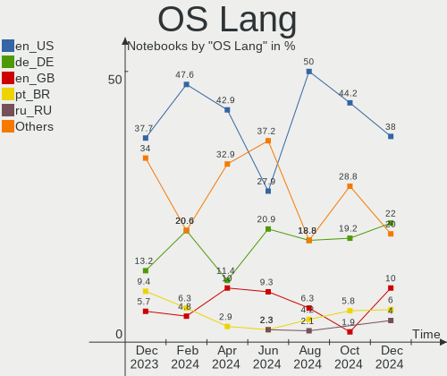
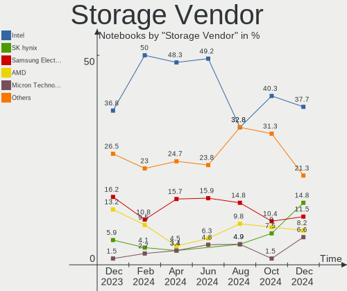
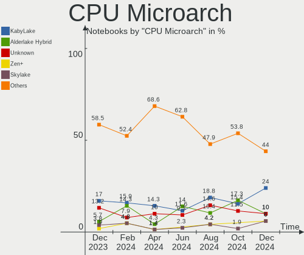
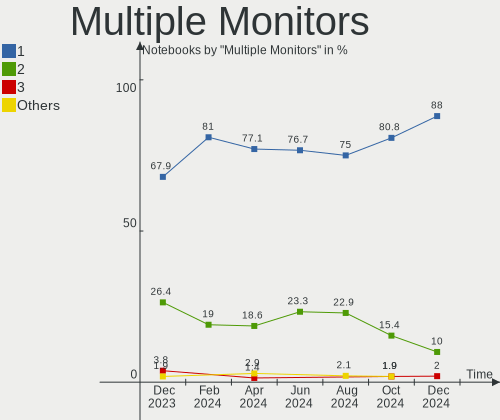
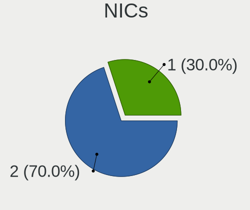
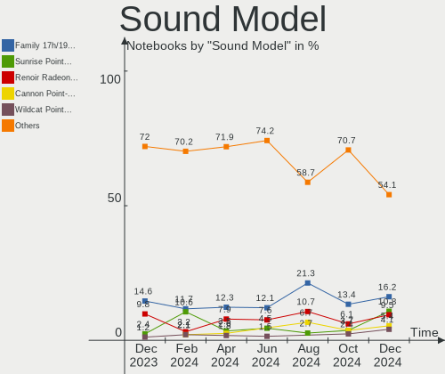

openSUSE Hardware Trends (Notebooks)
------------------------------------

A project to identify most popular hardware characteristics and track their change
over time based on data collected by openSUSE users at https://Linux-Hardware.org.

Anyone can contribute to this report by the [hw-probe](https://github.com/linuxhw/hw-probe) tool:

    sudo -E hw-probe -all -upload

Full-feature report is available here: https://linux-hardware.org/?view=trends&formfactor=notebook

Period: Aug, 2021.

Contents
--------

* [ System ](#system)
  - [ OS                       ](#os)
  - [ OS Family                ](#os-family)
  - [ Kernel                   ](#kernel)
  - [ Kernel Family            ](#kernel-family)
  - [ Kernel Major Ver.        ](#kernel-major-ver)
  - [ Arch                     ](#arch)
  - [ DE                       ](#de)
  - [ Display Server           ](#display-server)
  - [ Display Manager          ](#display-manager)
  - [ OS Lang                  ](#os-lang)
  - [ Boot Mode                ](#boot-mode)
  - [ Filesystem               ](#filesystem)
  - [ Part. scheme             ](#part-scheme)
  - [ Dual Boot with Linux/BSD ](#dual-boot-with-linuxbsd)
  - [ Dual Boot (Win)          ](#dual-boot-win)

* [ Board ](#board)
  - [ Vendor                   ](#vendor)
  - [ Model                    ](#model)
  - [ Model Family             ](#model-family)
  - [ MFG Year                 ](#mfg-year)
  - [ Form Factor              ](#form-factor)
  - [ Secure Boot              ](#secure-boot)
  - [ Coreboot                 ](#coreboot)
  - [ RAM Size                 ](#ram-size)
  - [ RAM Used                 ](#ram-used)
  - [ Total Drives             ](#total-drives)
  - [ Has CD-ROM               ](#has-cd-rom)
  - [ Has Ethernet             ](#has-ethernet)
  - [ Has WiFi                 ](#has-wifi)
  - [ Has Bluetooth            ](#has-bluetooth)

* [ Location ](#location)
  - [ Country                  ](#country)
  - [ City                     ](#city)

* [ Drives ](#drives)
  - [ Drive Vendor             ](#drive-vendor)
  - [ Drive Model              ](#drive-model)
  - [ HDD Vendor               ](#hdd-vendor)
  - [ SSD Vendor               ](#ssd-vendor)
  - [ Drive Kind               ](#drive-kind)
  - [ Drive Connector          ](#drive-connector)
  - [ Drive Size               ](#drive-size)
  - [ Space Total              ](#space-total)
  - [ Space Used               ](#space-used)
  - [ Malfunc. Drives          ](#malfunc-drives)
  - [ Malfunc. Drive Vendor    ](#malfunc-drive-vendor)
  - [ Malfunc. HDD Vendor      ](#malfunc-hdd-vendor)
  - [ Malfunc. Drive Kind      ](#malfunc-drive-kind)
  - [ Failed Drives            ](#failed-drives)
  - [ Failed Drive Vendor      ](#failed-drive-vendor)
  - [ Drive Status             ](#drive-status)

* [ Storage controller ](#storage-controller)
  - [ Storage Vendor           ](#storage-vendor)
  - [ Storage Model            ](#storage-model)
  - [ Storage Kind             ](#storage-kind)

* [ Processor ](#processor)
  - [ CPU Vendor               ](#cpu-vendor)
  - [ CPU Model                ](#cpu-model)
  - [ CPU Model Family         ](#cpu-model-family)
  - [ CPU Cores                ](#cpu-cores)
  - [ CPU Sockets              ](#cpu-sockets)
  - [ CPU Threads              ](#cpu-threads)
  - [ CPU Op-Modes             ](#cpu-op-modes)
  - [ CPU Microcode            ](#cpu-microcode)
  - [ CPU Microarch            ](#cpu-microarch)

* [ Graphics ](#graphics)
  - [ GPU Vendor               ](#gpu-vendor)
  - [ GPU Model                ](#gpu-model)
  - [ GPU Combo                ](#gpu-combo)
  - [ GPU Driver               ](#gpu-driver)
  - [ GPU Memory               ](#gpu-memory)

* [ Monitor ](#monitor)
  - [ Monitor Vendor           ](#monitor-vendor)
  - [ Monitor Model            ](#monitor-model)
  - [ Monitor Resolution       ](#monitor-resolution)
  - [ Monitor Diagonal         ](#monitor-diagonal)
  - [ Monitor Width            ](#monitor-width)
  - [ Aspect Ratio             ](#aspect-ratio)
  - [ Monitor Area             ](#monitor-area)
  - [ Pixel Density            ](#pixel-density)
  - [ Multiple Monitors        ](#multiple-monitors)

* [ Network ](#network)
  - [ Net Controller Vendor    ](#net-controller-vendor)
  - [ Net Controller Model     ](#net-controller-model)
  - [ Wireless Vendor          ](#wireless-vendor)
  - [ Wireless Model           ](#wireless-model)
  - [ Ethernet Vendor          ](#ethernet-vendor)
  - [ Ethernet Model           ](#ethernet-model)
  - [ Net Controller Kind      ](#net-controller-kind)
  - [ Used Controller          ](#used-controller)
  - [ NICs                     ](#nics)
  - [ IPv6                     ](#ipv6)

* [ Bluetooth ](#bluetooth)
  - [ Bluetooth Vendor         ](#bluetooth-vendor)
  - [ Bluetooth Model          ](#bluetooth-model)

* [ Sound ](#sound)
  - [ Sound Vendor             ](#sound-vendor)
  - [ Sound Model              ](#sound-model)

* [ Memory ](#memory)
  - [ Memory Vendor            ](#memory-vendor)
  - [ Memory Model             ](#memory-model)
  - [ Memory Kind              ](#memory-kind)
  - [ Memory Form Factor       ](#memory-form-factor)
  - [ Memory Size              ](#memory-size)
  - [ Memory Speed             ](#memory-speed)

* [ Printers & scanners ](#printers--scanners)
  - [ Printer Vendor           ](#printer-vendor)
  - [ Printer Model            ](#printer-model)
  - [ Scanner Vendor           ](#scanner-vendor)
  - [ Scanner Model            ](#scanner-model)

* [ Camera ](#camera)
  - [ Camera Vendor            ](#camera-vendor)
  - [ Camera Model             ](#camera-model)

* [ Security ](#security)
  - [ Fingerprint Vendor       ](#fingerprint-vendor)
  - [ Fingerprint Model        ](#fingerprint-model)
  - [ Chipcard Vendor          ](#chipcard-vendor)
  - [ Chipcard Model           ](#chipcard-model)

* [ Unsupported ](#unsupported)
  - [ Unsupported Devices      ](#unsupported-devices)
  - [ Unsupported Device Types ](#unsupported-device-types)

System
------

OS
--

Installed operating systems

| Name                         | Notebooks | Percent |
|------------------------------|-----------|---------|
| openSUSE Leap-15.3           | 10        | 43.48%  |
| openSUSE 20210817            | 3         | 13.04%  |
| openSUSE 20210810            | 2         | 8.7%    |
| openSUSE Tumbleweed-20210820 | 1         | 4.35%   |
| openSUSE Microos-20210820    | 1         | 4.35%   |
| openSUSE Microos-20210321    | 1         | 4.35%   |
| openSUSE Leap-15.2           | 1         | 4.35%   |
| openSUSE 20210823            | 1         | 4.35%   |
| openSUSE 20210820            | 1         | 4.35%   |
| openSUSE 20210803            | 1         | 4.35%   |
| openSUSE 20210801            | 1         | 4.35%   |

OS Family
---------

OS without a version

| Name     | Notebooks | Percent |
|----------|-----------|---------|
| openSUSE | 23        | 100%    |

Kernel
------

Version of the Linux kernel

| Version                 | Notebooks | Percent |
|-------------------------|-----------|---------|
| 5.13.8-1-default        | 6         | 26.09%  |
| 5.3.18-59.19-default    | 5         | 21.74%  |
| 5.3.18-59.16-default    | 5         | 21.74%  |
| 5.13.12-1-default       | 3         | 13.04%  |
| 5.3.18-lp152.50-default | 1         | 4.35%   |
| 5.13.6-1-default        | 1         | 4.35%   |
| 5.13.4-1-default        | 1         | 4.35%   |
| 5.11.6-1-default        | 1         | 4.35%   |

Kernel Family
-------------

Linux kernel without a distro release

| Version | Notebooks | Percent |
|---------|-----------|---------|
| 5.3.18  | 11        | 47.83%  |
| 5.13.8  | 6         | 26.09%  |
| 5.13.12 | 3         | 13.04%  |
| 5.13.6  | 1         | 4.35%   |
| 5.13.4  | 1         | 4.35%   |
| 5.11.6  | 1         | 4.35%   |

Kernel Major Ver.
-----------------

Linux kernel major version

| Version | Notebooks | Percent |
|---------|-----------|---------|
| 5.3     | 11        | 47.83%  |
| 5.13    | 11        | 47.83%  |
| 5.11    | 1         | 4.35%   |

Arch
----

OS architecture (x86_64, i586, etc.)

| Name   | Notebooks | Percent |
|--------|-----------|---------|
| x86_64 | 23        | 100%    |

DE
--

Desktop Environment

| Name    | Notebooks | Percent |
|---------|-----------|---------|
| KDE5    | 9         | 39.13%  |
| GNOME   | 6         | 26.09%  |
| KDE     | 4         | 17.39%  |
| XFCE    | 2         | 8.7%    |
| Unknown | 2         | 8.7%    |

Display Server
--------------

X11 or Wayland

| Name    | Notebooks | Percent |
|---------|-----------|---------|
| X11     | 15        | 65.22%  |
| Wayland | 7         | 30.43%  |
| Unknown | 1         | 4.35%   |

Display Manager
---------------

SDDM, LightDM, etc.

| Name    | Notebooks | Percent |
|---------|-----------|---------|
| Unknown | 10        | 43.48%  |
| SDDM    | 7         | 30.43%  |
| LightDM | 4         | 17.39%  |
| XDM     | 2         | 8.7%    |

OS Lang
-------

Language

| Lang  | Notebooks | Percent |
|-------|-----------|---------|
| de_DE | 6         | 26.09%  |
| en_US | 5         | 21.74%  |
| fr_FR | 3         | 13.04%  |
| es_ES | 2         | 8.7%    |
| POSIX | 1         | 4.35%   |
| pl_PL | 1         | 4.35%   |
| ja_JP | 1         | 4.35%   |
| hu_HU | 1         | 4.35%   |
| en_GB | 1         | 4.35%   |
| cs_CZ | 1         | 4.35%   |
| C     | 1         | 4.35%   |

Boot Mode
---------

EFI or BIOS

| Mode | Notebooks | Percent |
|------|-----------|---------|
| EFI  | 15        | 65.22%  |
| BIOS | 8         | 34.78%  |

Filesystem
----------

Type of filesystem

| Type  | Notebooks | Percent |
|-------|-----------|---------|
| Btrfs | 21        | 91.3%   |
| Ext4  | 2         | 8.7%    |

Part. scheme
------------

Scheme of partitioning

| Type    | Notebooks | Percent |
|---------|-----------|---------|
| GPT     | 13        | 56.52%  |
| Unknown | 9         | 39.13%  |
| MBR     | 1         | 4.35%   |

Dual Boot with Linux/BSD
------------------------

Hosting more than one Linux/BSD

| Dual boot | Notebooks | Percent |
|-----------|-----------|---------|
| No        | 22        | 95.65%  |
| Yes       | 1         | 4.35%   |

Dual Boot (Win)
---------------

Hosting Linux and Windows

| Dual boot | Notebooks | Percent |
|-----------|-----------|---------|
| No        | 14        | 60.87%  |
| Yes       | 9         | 39.13%  |

Board
-----

Vendor
------

Motherboard manufacturer

| Name                | Notebooks | Percent |
|---------------------|-----------|---------|
| Lenovo              | 9         | 39.13%  |
| Dell                | 6         | 26.09%  |
| ASUSTek Computer    | 3         | 13.04%  |
| Samsung Electronics | 2         | 8.7%    |
| Hewlett-Packard     | 2         | 8.7%    |
| Medion              | 1         | 4.35%   |

Model
-----

Motherboard model

| Name                                      | Notebooks | Percent |
|-------------------------------------------|-----------|---------|
| Samsung 600B4B/600B5B                     | 1         | 4.35%   |
| Samsung 355V4C/356V4C/3445VC/3545VC       | 1         | 4.35%   |
| Medion S15449                             | 1         | 4.35%   |
| Lenovo Yoga 3 Pro-1370 80HE               | 1         | 4.35%   |
| Lenovo V330-15IKB 81AX                    | 1         | 4.35%   |
| Lenovo ThinkPad X1 Carbon 4th 20FB002UMC  | 1         | 4.35%   |
| Lenovo ThinkPad T61 8895W9U               | 1         | 4.35%   |
| Lenovo ThinkPad T460 20FMS75800           | 1         | 4.35%   |
| Lenovo ThinkPad P50 20EN0005GE            | 1         | 4.35%   |
| Lenovo ThinkPad L420 7827AW9              | 1         | 4.35%   |
| Lenovo IdeaPad 3 15ADA05 81W1             | 1         | 4.35%   |
| Lenovo G500 20236                         | 1         | 4.35%   |
| HP ProBook 450 G6                         | 1         | 4.35%   |
| HP Laptop 15s-eq1xxx                      | 1         | 4.35%   |
| Dell Precision M6700                      | 1         | 4.35%   |
| Dell Latitude 5480                        | 1         | 4.35%   |
| Dell Inspiron 7460                        | 1         | 4.35%   |
| Dell Inspiron 5770                        | 1         | 4.35%   |
| Dell Inspiron 3593                        | 1         | 4.35%   |
| Dell Inspiron 3521                        | 1         | 4.35%   |
| ASUS VivoBook_ASUSLaptop X515MA_X515MA    | 1         | 4.35%   |
| ASUS ROG Zephyrus G14 GA401QM_GA401QM     | 1         | 4.35%   |
| ASUS ASUS TUF Gaming A15 FA506QM_TUF506QM | 1         | 4.35%   |

Model Family
------------

Motherboard model prefix

| Name              | Notebooks | Percent |
|-------------------|-----------|---------|
| Lenovo ThinkPad   | 5         | 21.74%  |
| Dell Inspiron     | 4         | 17.39%  |
| Samsung 600B4B    | 1         | 4.35%   |
| Samsung 355V4C    | 1         | 4.35%   |
| Medion S15449     | 1         | 4.35%   |
| Lenovo Yoga       | 1         | 4.35%   |
| Lenovo V330-15IKB | 1         | 4.35%   |
| Lenovo IdeaPad    | 1         | 4.35%   |
| Lenovo G500       | 1         | 4.35%   |
| HP ProBook        | 1         | 4.35%   |
| HP Laptop         | 1         | 4.35%   |
| Dell Precision    | 1         | 4.35%   |
| Dell Latitude     | 1         | 4.35%   |
| ASUS VivoBook     | 1         | 4.35%   |
| ASUS ROG          | 1         | 4.35%   |
| ASUS ASUS         | 1         | 4.35%   |

MFG Year
--------

Motherboard manufacture year

| Year | Notebooks | Percent |
|------|-----------|---------|
| 2021 | 7         | 30.43%  |
| 2020 | 4         | 17.39%  |
| 2019 | 3         | 13.04%  |
| 2013 | 3         | 13.04%  |
| 2018 | 2         | 8.7%    |
| 2015 | 2         | 8.7%    |
| 2014 | 1         | 4.35%   |
| 2011 | 1         | 4.35%   |

Form Factor
-----------

Physical design of the computer

| Name     | Notebooks | Percent |
|----------|-----------|---------|
| Notebook | 23        | 100%    |

Secure Boot
-----------

Enabled or disabled

| State    | Notebooks | Percent |
|----------|-----------|---------|
| Disabled | 19        | 82.61%  |
| Enabled  | 4         | 17.39%  |

Coreboot
--------

Have coreboot on board

| Used | Notebooks | Percent |
|------|-----------|---------|
| No   | 23        | 100%    |

RAM Size
--------

Total RAM memory

| Size in GB | Notebooks | Percent |
|------------|-----------|---------|
| 4.01-8.0   | 10        | 43.48%  |
| 16.01-24.0 | 6         | 26.09%  |
| 3.01-4.0   | 3         | 13.04%  |
| 8.01-16.0  | 3         | 13.04%  |
| 32.01-64.0 | 1         | 4.35%   |

RAM Used
--------

Used RAM memory

| Used GB  | Notebooks | Percent |
|----------|-----------|---------|
| 2.01-3.0 | 9         | 39.13%  |
| 4.01-8.0 | 6         | 26.09%  |
| 1.01-2.0 | 5         | 21.74%  |
| 3.01-4.0 | 2         | 8.7%    |
| 0.51-1.0 | 1         | 4.35%   |

Total Drives
------------

Number of drives on board

| Drives | Notebooks | Percent |
|--------|-----------|---------|
| 1      | 14        | 60.87%  |
| 2      | 9         | 39.13%  |

Has CD-ROM
----------

Has CD-ROM on board

| Presented | Notebooks | Percent |
|-----------|-----------|---------|
| No        | 17        | 73.91%  |
| Yes       | 6         | 26.09%  |

Has Ethernet
------------

Has Ethernet on board

| Presented | Notebooks | Percent |
|-----------|-----------|---------|
| Yes       | 17        | 73.91%  |
| No        | 6         | 26.09%  |

Has WiFi
--------

Has WiFi module

| Presented | Notebooks | Percent |
|-----------|-----------|---------|
| Yes       | 23        | 100%    |

Has Bluetooth
-------------

Has Bluetooth module

| Presented | Notebooks | Percent |
|-----------|-----------|---------|
| Yes       | 19        | 82.61%  |
| No        | 4         | 17.39%  |

Location
--------

Country
-------

Geographic location (country)

| Country     | Notebooks | Percent |
|-------------|-----------|---------|
| Germany     | 5         | 21.74%  |
| France      | 3         | 13.04%  |
| Nicaragua   | 2         | 8.7%    |
| UK          | 1         | 4.35%   |
| Switzerland | 1         | 4.35%   |
| Spain       | 1         | 4.35%   |
| Serbia      | 1         | 4.35%   |
| Romania     | 1         | 4.35%   |
| Poland      | 1         | 4.35%   |
| Japan       | 1         | 4.35%   |
| Italy       | 1         | 4.35%   |
| India       | 1         | 4.35%   |
| Hungary     | 1         | 4.35%   |
| Czechia     | 1         | 4.35%   |
| Canada      | 1         | 4.35%   |
| Brazil      | 1         | 4.35%   |

City
----

Geographic location (city)

| City               | Notebooks | Percent |
|--------------------|-----------|---------|
| Managua            | 2         | 8.7%    |
| Warsaw             | 1         | 4.35%   |
| Tours              | 1         | 4.35%   |
| S??o Paulo         | 1         | 4.35%   |
| Rendsburg          | 1         | 4.35%   |
| Prague             | 1         | 4.35%   |
| Montreal           | 1         | 4.35%   |
| M??nster           | 1         | 4.35%   |
| London             | 1         | 4.35%   |
| Le??n              | 1         | 4.35%   |
| Iizuka             | 1         | 4.35%   |
| Halle              | 1         | 4.35%   |
| Frankfurt am Main  | 1         | 4.35%   |
| Fontenay-sous-Bois | 1         | 4.35%   |
| Esztergom          | 1         | 4.35%   |
| Erlinsbach         | 1         | 4.35%   |
| Concarneau         | 1         | 4.35%   |
| Cologne            | 1         | 4.35%   |
| Bucharest          | 1         | 4.35%   |
| Bengaluru          | 1         | 4.35%   |
| Belgrade           | 1         | 4.35%   |
| Bari               | 1         | 4.35%   |

Drives
------

Drive Vendor
------------

Hard drive vendors

| Vendor              | Notebooks | Drives | Percent |
|---------------------|-----------|--------|---------|
| Samsung Electronics | 6         | 6      | 18.75%  |
| SK Hynix            | 4         | 4      | 12.5%   |
| Seagate             | 4         | 4      | 12.5%   |
| WDC                 | 3         | 3      | 9.38%   |
| Unknown             | 2         | 2      | 6.25%   |
| Toshiba             | 2         | 2      | 6.25%   |
| Silicon Motion      | 2         | 2      | 6.25%   |
| SanDisk             | 2         | 2      | 6.25%   |
| Kingston            | 2         | 2      | 6.25%   |
| Crucial             | 2         | 2      | 6.25%   |
| Phison              | 1         | 1      | 3.13%   |
| KIOXIA              | 1         | 1      | 3.13%   |
| Hitachi             | 1         | 1      | 3.13%   |

Drive Model
-----------

Hard drive models

| Model                                | Notebooks | Percent |
|--------------------------------------|-----------|---------|
| Silicon Motion NVMe SSD Drive 512GB  | 2         | 6.25%   |
| Seagate ST1000LM035-1RK172 1TB       | 2         | 6.25%   |
| WDC WD10SPZX-60Z10T0 1TB             | 1         | 3.13%   |
| WDC PC SN530 SDBPNPZ-256G-1002 256GB | 1         | 3.13%   |
| WDC PC SN530 SDBPMPZ-512G-1101 512GB | 1         | 3.13%   |
| Unknown USD00  256GB                 | 1         | 3.13%   |
| Unknown MMC Card  1TB                | 1         | 3.13%   |
| Toshiba MQ01ABD075 752GB             | 1         | 3.13%   |
| Toshiba MQ01ABD050 500GB             | 1         | 3.13%   |
| SK Hynix SC311 SATA 128GB SSD        | 1         | 3.13%   |
| SK Hynix HFM512GD3JX013N 512GB       | 1         | 3.13%   |
| SK Hynix HFM001TD3JX013N 1TB         | 1         | 3.13%   |
| SK Hynix BC501A NVMe 128GB           | 1         | 3.13%   |
| Seagate ST500LM012 HN-M500MBB 500GB  | 1         | 3.13%   |
| Seagate ST1000LM024 HN-M101MBB 1TB   | 1         | 3.13%   |
| SanDisk Ultra II 480GB SSD           | 1         | 3.13%   |
| SanDisk SD8TB8U512G1001 512GB SSD    | 1         | 3.13%   |
| Samsung SSD 970 EVO 1TB              | 1         | 3.13%   |
| Samsung SSD 860 EVO 1TB              | 1         | 3.13%   |
| Samsung SSD 850 EVO 250GB            | 1         | 3.13%   |
| Samsung MZNTE512HMJH-000L2 512GB SSD | 1         | 3.13%   |
| Samsung MZNLN256HCHP-000L7 256GB SSD | 1         | 3.13%   |
| Samsung MZNLN128HAHQ-000H1 128GB SSD | 1         | 3.13%   |
| Phison NVMe SSD Drive 1024GB         | 1         | 3.13%   |
| KIOXIA KBG40ZNV256G 256GB            | 1         | 3.13%   |
| Kingston SNA-DC/U3 512GB SSD         | 1         | 3.13%   |
| Kingston SM2280S3G2480G 480GB SSD    | 1         | 3.13%   |
| Hitachi HTS727550A9E365 500GB        | 1         | 3.13%   |
| Crucial CT500MX200SSD4 500GB         | 1         | 3.13%   |
| Crucial CT1000MX500SSD1 1TB          | 1         | 3.13%   |

HDD Vendor
----------

Hard disk drive vendors

| Vendor  | Notebooks | Drives | Percent |
|---------|-----------|--------|---------|
| Seagate | 4         | 4      | 50%     |
| Toshiba | 2         | 2      | 25%     |
| WDC     | 1         | 1      | 12.5%   |
| Hitachi | 1         | 1      | 12.5%   |

SSD Vendor
----------

Solid state drive vendors

| Vendor              | Notebooks | Drives | Percent |
|---------------------|-----------|--------|---------|
| Samsung Electronics | 5         | 5      | 41.67%  |
| SanDisk             | 2         | 2      | 16.67%  |
| Kingston            | 2         | 2      | 16.67%  |
| Crucial             | 2         | 2      | 16.67%  |
| SK Hynix            | 1         | 1      | 8.33%   |

Drive Kind
----------

HDD or SSD

| Kind | Notebooks | Drives | Percent |
|------|-----------|--------|---------|
| SSD  | 11        | 12     | 36.67%  |
| NVMe | 10        | 10     | 33.33%  |
| HDD  | 7         | 8      | 23.33%  |
| MMC  | 2         | 2      | 6.67%   |

Drive Connector
---------------

SATA, SAS, NVMe, etc.

| Type | Notebooks | Drives | Percent |
|------|-----------|--------|---------|
| SATA | 14        | 19     | 51.85%  |
| NVMe | 10        | 10     | 37.04%  |
| MMC  | 2         | 2      | 7.41%   |
| SAS  | 1         | 1      | 3.7%    |

Drive Size
----------

Size of hard drive

| Size in TB | Notebooks | Drives | Percent |
|------------|-----------|--------|---------|
| 0.51-1.0   | 10        | 10     | 55.56%  |
| 0.01-0.5   | 8         | 10     | 44.44%  |

Space Total
-----------

Amount of disk space available on the file system

| Size in GB     | Notebooks | Percent |
|----------------|-----------|---------|
| 1001-2000      | 9         | 39.13%  |
| More than 3000 | 8         | 34.78%  |
| 251-500        | 2         | 8.7%    |
| 2001-3000      | 2         | 8.7%    |
| 501-1000       | 2         | 8.7%    |

Space Used
----------

Amount of used disk space

| Used GB        | Notebooks | Percent |
|----------------|-----------|---------|
| 51-100         | 6         | 26.09%  |
| 251-500        | 5         | 21.74%  |
| 501-1000       | 5         | 21.74%  |
| 101-250        | 3         | 13.04%  |
| More than 3000 | 1         | 4.35%   |
| 21-50          | 1         | 4.35%   |
| 1001-2000      | 1         | 4.35%   |
| 1-20           | 1         | 4.35%   |

Malfunc. Drives
---------------

Drive models with a malfunction

| Model                               | Notebooks | Drives | Percent |
|-------------------------------------|-----------|--------|---------|
| Seagate ST1000LM035-1RK172 1TB      | 1         | 1      | 33.33%  |
| Samsung Electronics SSD 970 EVO 1TB | 1         | 1      | 33.33%  |
| Crucial CT500MX200SSD4 500GB        | 1         | 1      | 33.33%  |

Malfunc. Drive Vendor
---------------------

Vendors of faulty drives

| Vendor              | Notebooks | Drives | Percent |
|---------------------|-----------|--------|---------|
| Seagate             | 1         | 1      | 33.33%  |
| Samsung Electronics | 1         | 1      | 33.33%  |
| Crucial             | 1         | 1      | 33.33%  |

Malfunc. HDD Vendor
-------------------

Vendors of faulty HDD drives

| Vendor  | Notebooks | Drives | Percent |
|---------|-----------|--------|---------|
| Seagate | 1         | 1      | 100%    |

Malfunc. Drive Kind
-------------------

Kinds of faulty drives

| Kind | Notebooks | Drives | Percent |
|------|-----------|--------|---------|
| NVMe | 1         | 1      | 33.33%  |
| SSD  | 1         | 1      | 33.33%  |
| HDD  | 1         | 1      | 33.33%  |

Failed Drives
-------------

Failed drive models

Zero info for selected period =(

Failed Drive Vendor
-------------------

Failed drive vendors

Zero info for selected period =(

Drive Status
------------

Number of failed and malfunc. drives

| Status   | Notebooks | Drives | Percent |
|----------|-----------|--------|---------|
| Works    | 13        | 15     | 50%     |
| Detected | 10        | 14     | 38.46%  |
| Malfunc  | 3         | 3      | 11.54%  |

Storage controller
------------------

Storage Vendor
--------------

Storage controller vendors

| Vendor              | Notebooks | Percent |
|---------------------|-----------|---------|
| Intel               | 16        | 59.26%  |
| SK Hynix            | 3         | 11.11%  |
| Silicon Motion      | 2         | 7.41%   |
| Sandisk             | 2         | 7.41%   |
| Samsung Electronics | 1         | 3.7%    |
| Phison Electronics  | 1         | 3.7%    |
| KIOXIA              | 1         | 3.7%    |
| AMD                 | 1         | 3.7%    |

Storage Model
-------------

Storage controller models

| Model                                                                         | Notebooks | Percent |
|-------------------------------------------------------------------------------|-----------|---------|
| Intel Sunrise Point-LP SATA Controller [AHCI mode]                            | 4         | 14.29%  |
| SK Hynix NVMe SSD Controller                                                  | 2         | 7.14%   |
| Silicon Motion SM2262/SM2262EN SSD Controller                                 | 2         | 7.14%   |
| Intel 82801 Mobile SATA Controller [RAID mode]                                | 2         | 7.14%   |
| Intel 7 Series Chipset Family 6-port SATA Controller [AHCI mode]              | 2         | 7.14%   |
| Intel 6 Series/C200 Series Chipset Family 6 port Mobile SATA AHCI Controller  | 2         | 7.14%   |
| SK Hynix BC501 NVMe Solid State Drive                                         | 1         | 3.57%   |
| Sandisk WD Blue SN550 NVMe SSD                                                | 1         | 3.57%   |
| Sandisk Non-Volatile memory controller                                        | 1         | 3.57%   |
| Samsung NVMe SSD Controller SM981/PM981/PM983                                 | 1         | 3.57%   |
| Phison E12 NVMe Controller                                                    | 1         | 3.57%   |
| KIOXIA Non-Volatile memory controller                                         | 1         | 3.57%   |
| Intel Wildcat Point-LP SATA Controller [AHCI Mode]                            | 1         | 3.57%   |
| Intel Q170/Q150/B150/H170/H110/Z170/CM236 Chipset SATA Controller [AHCI Mode] | 1         | 3.57%   |
| Intel Ice Lake-LP SATA Controller [AHCI mode]                                 | 1         | 3.57%   |
| Intel Celeron/Pentium Silver Processor SATA Controller                        | 1         | 3.57%   |
| Intel Cannon Point-LP SATA Controller [AHCI Mode]                             | 1         | 3.57%   |
| Intel 82801HM/HEM (ICH8M/ICH8M-E) SATA Controller [AHCI mode]                 | 1         | 3.57%   |
| Intel 82801HM/HEM (ICH8M/ICH8M-E) IDE Controller                              | 1         | 3.57%   |
| AMD FCH SATA Controller [AHCI mode]                                           | 1         | 3.57%   |

Storage Kind
------------

Kind of storage controller (IDE, SATA, NVMe, SAS, ...)

| Kind | Notebooks | Percent |
|------|-----------|---------|
| SATA | 15        | 53.57%  |
| NVMe | 10        | 35.71%  |
| RAID | 2         | 7.14%   |
| IDE  | 1         | 3.57%   |

Processor
---------

CPU Vendor
----------

Processor vendors

| Vendor | Notebooks | Percent |
|--------|-----------|---------|
| Intel  | 18        | 78.26%  |
| AMD    | 5         | 21.74%  |

CPU Model
---------

Processor models

| Model                                         | Notebooks | Percent |
|-----------------------------------------------|-----------|---------|
| Intel Core i7-8550U CPU @ 1.80GHz             | 2         | 8.7%    |
| Intel Core i5-7200U CPU @ 2.50GHz             | 2         | 8.7%    |
| Intel Core i5-2520M CPU @ 2.50GHz             | 2         | 8.7%    |
| Intel Core M-5Y71 CPU @ 1.20GHz               | 1         | 4.35%   |
| Intel Core i7-6700HQ CPU @ 2.60GHz            | 1         | 4.35%   |
| Intel Core i7-6600U CPU @ 2.60GHz             | 1         | 4.35%   |
| Intel Core i7-3740QM CPU @ 2.70GHz            | 1         | 4.35%   |
| Intel Core i5-8265U CPU @ 1.60GHz             | 1         | 4.35%   |
| Intel Core i5-6200U CPU @ 2.30GHz             | 1         | 4.35%   |
| Intel Core i5-3317U CPU @ 1.70GHz             | 1         | 4.35%   |
| Intel Core i3-3110M CPU @ 2.40GHz             | 1         | 4.35%   |
| Intel Core i3-1005G1 CPU @ 1.20GHz            | 1         | 4.35%   |
| Intel Core 2 Duo CPU T7250 @ 2.00GHz          | 1         | 4.35%   |
| Intel Celeron N4020 CPU @ 1.10GHz             | 1         | 4.35%   |
| Intel 11th Gen Core i7-1165G7 @ 2.80GHz       | 1         | 4.35%   |
| AMD Ryzen 9 5900HS with Radeon Graphics       | 1         | 4.35%   |
| AMD Ryzen 7 5800H with Radeon Graphics        | 1         | 4.35%   |
| AMD Ryzen 7 3700U with Radeon Vega Mobile Gfx | 1         | 4.35%   |
| AMD E2-1800 APU with Radeon HD Graphics       | 1         | 4.35%   |
| AMD Athlon Silver 3050U with Radeon Graphics  | 1         | 4.35%   |

CPU Model Family
----------------

Processor model prefix

| Model            | Notebooks | Percent |
|------------------|-----------|---------|
| Intel Core i5    | 7         | 30.43%  |
| Intel Core i7    | 5         | 21.74%  |
| Intel Core i3    | 2         | 8.7%    |
| AMD Ryzen 7      | 2         | 8.7%    |
| Other            | 1         | 4.35%   |
| Intel Core M     | 1         | 4.35%   |
| Intel Core 2 Duo | 1         | 4.35%   |
| Intel Celeron    | 1         | 4.35%   |
| AMD Ryzen 9      | 1         | 4.35%   |
| AMD E2           | 1         | 4.35%   |
| AMD Athlon       | 1         | 4.35%   |

CPU Cores
---------

Number of processor cores

| Number | Notebooks | Percent |
|--------|-----------|---------|
| 2      | 14        | 60.87%  |
| 4      | 7         | 30.43%  |
| 8      | 2         | 8.7%    |

CPU Sockets
-----------

Number of sockets

| Number | Notebooks | Percent |
|--------|-----------|---------|
| 1      | 23        | 100%    |

CPU Threads
-----------

Threads per core (Hyper-Threading)

| Number | Notebooks | Percent |
|--------|-----------|---------|
| 2      | 18        | 78.26%  |
| 1      | 5         | 21.74%  |

CPU Op-Modes
------------

CPU Operation Modes (32-bit, 64-bit)

| Op mode        | Notebooks | Percent |
|----------------|-----------|---------|
| 32-bit, 64-bit | 23        | 100%    |

CPU Microcode
-------------

Microcode number

| Number     | Notebooks | Percent |
|------------|-----------|---------|
| Unknown    | 6         | 26.09%  |
| 0x406e3    | 2         | 8.7%    |
| 0x0a50000c | 2         | 8.7%    |
| 0x08108109 | 2         | 8.7%    |
| 0x806eb    | 1         | 4.35%   |
| 0x806ea    | 1         | 4.35%   |
| 0x806e9    | 1         | 4.35%   |
| 0x806c1    | 1         | 4.35%   |
| 0x706e5    | 1         | 4.35%   |
| 0x706a8    | 1         | 4.35%   |
| 0x6fd      | 1         | 4.35%   |
| 0x306d4    | 1         | 4.35%   |
| 0x306a9    | 1         | 4.35%   |
| 0x206a7    | 1         | 4.35%   |
| 0x05000119 | 1         | 4.35%   |

CPU Microarch
-------------

Microarchitecture

| Name          | Notebooks | Percent |
|---------------|-----------|---------|
| KabyLake      | 5         | 21.74%  |
| Skylake       | 3         | 13.04%  |
| IvyBridge     | 3         | 13.04%  |
| Zen+          | 2         | 8.7%    |
| Zen 3         | 2         | 8.7%    |
| SandyBridge   | 2         | 8.7%    |
| TigerLake     | 1         | 4.35%   |
| IceLake       | 1         | 4.35%   |
| Goldmont plus | 1         | 4.35%   |
| Core          | 1         | 4.35%   |
| Broadwell     | 1         | 4.35%   |
| Bobcat        | 1         | 4.35%   |

Graphics
--------

GPU Vendor
----------

Vendors of graphics cards

| Vendor | Notebooks | Percent |
|--------|-----------|---------|
| Intel  | 18        | 58.06%  |
| AMD    | 8         | 25.81%  |
| Nvidia | 5         | 16.13%  |

GPU Model
---------

Graphics card models

| Model                                                                                 | Notebooks | Percent |
|---------------------------------------------------------------------------------------|-----------|---------|
| Intel 3rd Gen Core processor Graphics Controller                                      | 3         | 9.38%   |
| Nvidia GA106M [GeForce RTX 3060 Mobile / Max-Q]                                       | 2         | 6.25%   |
| Intel UHD Graphics 620                                                                | 2         | 6.25%   |
| Intel Skylake GT2 [HD Graphics 520]                                                   | 2         | 6.25%   |
| Intel HD Graphics 620                                                                 | 2         | 6.25%   |
| Intel 2nd Generation Core Processor Family Integrated Graphics Controller             | 2         | 6.25%   |
| AMD Picasso                                                                           | 2         | 6.25%   |
| AMD Cezanne                                                                           | 2         | 6.25%   |
| Nvidia GM108M [GeForce 940MX]                                                         | 1         | 3.13%   |
| Nvidia GM107GLM [Quadro M1000M]                                                       | 1         | 3.13%   |
| Nvidia GK104GLM [Quadro K3000M]                                                       | 1         | 3.13%   |
| Intel WhiskeyLake-U GT2 [UHD Graphics 620]                                            | 1         | 3.13%   |
| Intel TigerLake-LP GT2 [Iris Xe Graphics]                                             | 1         | 3.13%   |
| Intel Mobile GM965/GL960 Integrated Graphics Controller (secondary)                   | 1         | 3.13%   |
| Intel Mobile GM965/GL960 Integrated Graphics Controller (primary)                     | 1         | 3.13%   |
| Intel Iris Plus Graphics G1 (Ice Lake)                                                | 1         | 3.13%   |
| Intel HD Graphics 5300                                                                | 1         | 3.13%   |
| Intel HD Graphics 530                                                                 | 1         | 3.13%   |
| Intel GeminiLake [UHD Graphics 600]                                                   | 1         | 3.13%   |
| AMD Topaz XT [Radeon R7 M260/M265 / M340/M360 / M440/M445 / 530/535 / 620/625 Mobile] | 1         | 3.13%   |
| AMD Thames [Radeon HD 7500M/7600M Series]                                             | 1         | 3.13%   |
| AMD Sun PRO [Radeon HD 8570A/8570M]                                                   | 1         | 3.13%   |
| AMD Seymour [Radeon HD 6400M/7400M Series]                                            | 1         | 3.13%   |

GPU Combo
---------

Combinations of graphics cards

| Name           | Notebooks | Percent |
|----------------|-----------|---------|
| 1 x Intel      | 12        | 52.17%  |
| Intel + Nvidia | 3         | 13.04%  |
| Intel + AMD    | 3         | 13.04%  |
| 1 x AMD        | 3         | 13.04%  |
| AMD + Nvidia   | 2         | 8.7%    |

GPU Driver
----------

Free vs proprietary

| Driver      | Notebooks | Percent |
|-------------|-----------|---------|
| Free        | 22        | 95.65%  |
| Proprietary | 1         | 4.35%   |

GPU Memory
----------

Total video memory

| Size in GB | Notebooks | Percent |
|------------|-----------|---------|
| Unknown    | 16        | 69.57%  |
| 1.01-2.0   | 2         | 8.7%    |
| 0.51-1.0   | 2         | 8.7%    |
| 0.01-0.5   | 2         | 8.7%    |
| 3.01-4.0   | 1         | 4.35%   |

Monitor
-------

Monitor Vendor
--------------

Monitor vendors

| Vendor              | Notebooks | Percent |
|---------------------|-----------|---------|
| AU Optronics        | 6         | 20.69%  |
| LG Display          | 5         | 17.24%  |
| Samsung Electronics | 3         | 10.34%  |
| Goldstar            | 3         | 10.34%  |
| Chimei Innolux      | 3         | 10.34%  |
| Lenovo              | 2         | 6.9%    |
| Hewlett-Packard     | 2         | 6.9%    |
| TMX                 | 1         | 3.45%   |
| PANDA               | 1         | 3.45%   |
| InfoVision          | 1         | 3.45%   |
| Dell                | 1         | 3.45%   |
| BOE                 | 1         | 3.45%   |

Monitor Model
-------------

Monitor models

| Model                                                                 | Notebooks | Percent |
|-----------------------------------------------------------------------|-----------|---------|
| Hewlett-Packard LV1911 HWP3005 1366x768 410x230mm 18.5-inch           | 2         | 6.9%    |
| AU Optronics LCD Monitor AUO61ED 1920x1080 340x190mm 15.3-inch        | 2         | 6.9%    |
| TMX TL140BDXP01-0 TMX1400 2560x1440 310x174mm 14.0-inch               | 1         | 3.45%   |
| Samsung Electronics LCD Monitor SEC3449 1366x768 309x174mm 14.0-inch  | 1         | 3.45%   |
| Samsung Electronics LCD Monitor SDC4852 3840x2160 340x190mm 15.3-inch | 1         | 3.45%   |
| Samsung Electronics LCD Monitor SDC434A 3200x1800 293x165mm 13.2-inch | 1         | 3.45%   |
| PANDA LCD Monitor NCP004D 1920x1080 344x194mm 15.5-inch               | 1         | 3.45%   |
| LG Display LCD Monitor LGD062E 1920x1080 344x194mm 15.5-inch          | 1         | 3.45%   |
| LG Display LCD Monitor LGD053C 1920x1080 309x174mm 14.0-inch          | 1         | 3.45%   |
| LG Display LCD Monitor LGD0521 1920x1080 309x174mm 14.0-inch          | 1         | 3.45%   |
| LG Display LCD Monitor LGD04A9 1920x1080 309x174mm 14.0-inch          | 1         | 3.45%   |
| LG Display LCD Monitor LGD02DA 1920x1080 380x220mm 17.3-inch          | 1         | 3.45%   |
| Lenovo LEN P27q-10 LEN61A8 2560x1440 597x336mm 27.0-inch              | 1         | 3.45%   |
| Lenovo LCD Monitor LEN4020 1024x768 286x214mm 14.1-inch               | 1         | 3.45%   |
| InfoVision LCD Monitor IVO03F4 1920x1200 263x164mm 12.2-inch          | 1         | 3.45%   |
| Goldstar HDR WFHD GSM7714 2560x1080 798x334mm 34.1-inch               | 1         | 3.45%   |
| Goldstar FULL HD GSM5B54 1920x1080 480x270mm 21.7-inch                | 1         | 3.45%   |
| Goldstar 32inch FHD GSM76F5 1920x1080 698x392mm 31.5-inch             | 1         | 3.45%   |
| Dell U2410 DELF017 1920x1200 518x324mm 24.1-inch                      | 1         | 3.45%   |
| Chimei Innolux LCD Monitor CMN15DB 1366x768 344x193mm 15.5-inch       | 1         | 3.45%   |
| Chimei Innolux LCD Monitor CMN15D5 1920x1080 340x190mm 15.3-inch      | 1         | 3.45%   |
| Chimei Innolux LCD Monitor CMN14C3 1366x768 309x173mm 13.9-inch       | 1         | 3.45%   |
| BOE LCD Monitor BOE08E8 1920x1080 344x194mm 15.5-inch                 | 1         | 3.45%   |
| AU Optronics LCD Monitor AUO23ED 1920x1080 344x193mm 15.5-inch        | 1         | 3.45%   |
| AU Optronics LCD Monitor AUO20EC 1366x768 344x193mm 15.5-inch         | 1         | 3.45%   |
| AU Optronics LCD Monitor AUO193C 1366x768 309x173mm 13.9-inch         | 1         | 3.45%   |
| AU Optronics LCD Monitor AUO109D 1920x1080 381x214mm 17.2-inch        | 1         | 3.45%   |

Monitor Resolution
------------------

Monitor screen resolution

| Resolution        | Notebooks | Percent |
|-------------------|-----------|---------|
| 1920x1080 (FHD)   | 13        | 50%     |
| 1366x768 (WXGA)   | 5         | 19.23%  |
| 2560x1440 (QHD)   | 2         | 7.69%   |
| 1920x1200 (WUXGA) | 2         | 7.69%   |
| 3840x2160 (4K)    | 1         | 3.85%   |
| 3200x1800 (QHD+)  | 1         | 3.85%   |
| 2560x1080         | 1         | 3.85%   |
| 1024x768 (XGA)    | 1         | 3.85%   |

Monitor Diagonal
----------------

Diagonal size in inches

| Inches | Notebooks | Percent |
|--------|-----------|---------|
| 15     | 11        | 37.93%  |
| 14     | 6         | 20.69%  |
| 13     | 3         | 10.34%  |
| 18     | 2         | 6.9%    |
| 17     | 2         | 6.9%    |
| 34     | 1         | 3.45%   |
| 31     | 1         | 3.45%   |
| 27     | 1         | 3.45%   |
| 26     | 1         | 3.45%   |
| 21     | 1         | 3.45%   |

Monitor Width
-------------

Physical width

| Width in mm | Notebooks | Percent |
|-------------|-----------|---------|
| 301-350     | 18        | 62.07%  |
| 401-500     | 3         | 10.34%  |
| 501-600     | 2         | 6.9%    |
| 351-400     | 2         | 6.9%    |
| 201-300     | 2         | 6.9%    |
| 701-800     | 1         | 3.45%   |
| 601-700     | 1         | 3.45%   |

Aspect Ratio
------------

Proportional relationship between the width and the height

| Ratio | Notebooks | Percent |
|-------|-----------|---------|
| 16/9  | 22        | 88%     |
| 4/3   | 1         | 4%      |
| 21/9  | 1         | 4%      |
| 16/10 | 1         | 4%      |

Monitor Area
------------

Area in inch²

| Area in inch² | Notebooks | Percent |
|----------------|-----------|---------|
| 101-110        | 11        | 37.93%  |
| 81-90          | 7         | 24.14%  |
| 351-500        | 2         | 6.9%    |
| 301-350        | 2         | 6.9%    |
| 141-150        | 2         | 6.9%    |
| 121-130        | 2         | 6.9%    |
| 71-80          | 1         | 3.45%   |
| 201-250        | 1         | 3.45%   |
| 91-100         | 1         | 3.45%   |

Pixel Density
-------------

Pixels per inch

| Density       | Notebooks | Percent |
|---------------|-----------|---------|
| 121-160       | 12        | 41.38%  |
| 101-120       | 9         | 31.03%  |
| 51-100        | 6         | 20.69%  |
| More than 240 | 1         | 3.45%   |
| 161-240       | 1         | 3.45%   |

Multiple Monitors
-----------------

Total monitors connected

| Total | Notebooks | Percent |
|-------|-----------|---------|
| 1     | 16        | 69.57%  |
| 2     | 7         | 30.43%  |

Network
-------

Net Controller Vendor
---------------------

Controller vendors

| Vendor                            | Notebooks | Percent |
|-----------------------------------|-----------|---------|
| Intel                             | 12        | 32.43%  |
| Realtek Semiconductor             | 9         | 24.32%  |
| Qualcomm Atheros                  | 7         | 18.92%  |
| MEDIATEK                          | 2         | 5.41%   |
| Samsung Electronics               | 1         | 2.7%    |
| Lenovo                            | 1         | 2.7%    |
| HMD Global                        | 1         | 2.7%    |
| Ericsson Business Mobile Networks | 1         | 2.7%    |
| Broadcom Limited                  | 1         | 2.7%    |
| Broadcom                          | 1         | 2.7%    |
| ASIX Electronics                  | 1         | 2.7%    |

Net Controller Model
--------------------

Controller models

| Model                                                             | Notebooks | Percent |
|-------------------------------------------------------------------|-----------|---------|
| Realtek RTL8111/8168/8411 PCI Express Gigabit Ethernet Controller | 5         | 11.36%  |
| Realtek RTL810xE PCI Express Fast Ethernet controller             | 3         | 6.82%   |
| Qualcomm Atheros AR9485 Wireless Network Adapter                  | 3         | 6.82%   |
| Intel Wireless 8260                                               | 3         | 6.82%   |
| Qualcomm Atheros QCA9377 802.11ac Wireless Network Adapter        | 2         | 4.55%   |
| Qualcomm Atheros QCA6174 802.11ac Wireless Network Adapter        | 2         | 4.55%   |
| MEDIATEK Network controller                                       | 2         | 4.55%   |
| Intel Wireless 8265 / 8275                                        | 2         | 4.55%   |
| Intel 82579LM Gigabit Network Connection (Lewisville)             | 2         | 4.55%   |
| Samsung Kiera                                                     | 1         | 2.27%   |
| Realtek RTL8821CE 802.11ac PCIe Wireless Network Adapter          | 1         | 2.27%   |
| Qualcomm Atheros QCA8172 Fast Ethernet                            | 1         | 2.27%   |
| Lenovo OneLink+ Giga                                              | 1         | 2.27%   |
| Intel Wi-Fi 6 AX201                                               | 1         | 2.27%   |
| Intel Wi-Fi 6 AX200                                               | 1         | 2.27%   |
| Intel PRO/Wireless 3945ABG [Golan] Network Connection             | 1         | 2.27%   |
| Intel Ethernet Connection I219-V                                  | 1         | 2.27%   |
| Intel Ethernet Connection I219-LM                                 | 1         | 2.27%   |
| Intel Ethernet Connection (4) I219-LM                             | 1         | 2.27%   |
| Intel Ethernet Connection (2) I219-V                              | 1         | 2.27%   |
| Intel Centrino Advanced-N 6230 [Rainbow Peak]                     | 1         | 2.27%   |
| Intel Centrino Advanced-N 6205 [Taylor Peak]                      | 1         | 2.27%   |
| Intel Cannon Point-LP CNVi [Wireless-AC]                          | 1         | 2.27%   |
| Intel 82566MM Gigabit Network Connection                          | 1         | 2.27%   |
| HMD Global Nokia 8.1                                              | 1         | 2.27%   |
| Ericsson Business Mobile Networks F5521gw                         | 1         | 2.27%   |
| Broadcom Limited BCM4352 802.11ac Wireless Network Adapter        | 1         | 2.27%   |
| Broadcom BCM43228 802.11a/b/g/n                                   | 1         | 2.27%   |
| ASIX AX88772                                                      | 1         | 2.27%   |

Wireless Vendor
---------------

Wireless vendors

| Vendor                | Notebooks | Percent |
|-----------------------|-----------|---------|
| Intel                 | 11        | 47.83%  |
| Qualcomm Atheros      | 7         | 30.43%  |
| MEDIATEK              | 2         | 8.7%    |
| Realtek Semiconductor | 1         | 4.35%   |
| Broadcom Limited      | 1         | 4.35%   |
| Broadcom              | 1         | 4.35%   |

Wireless Model
--------------

Wireless models

| Model                                                      | Notebooks | Percent |
|------------------------------------------------------------|-----------|---------|
| Qualcomm Atheros AR9485 Wireless Network Adapter           | 3         | 13.04%  |
| Intel Wireless 8260                                        | 3         | 13.04%  |
| Qualcomm Atheros QCA9377 802.11ac Wireless Network Adapter | 2         | 8.7%    |
| Qualcomm Atheros QCA6174 802.11ac Wireless Network Adapter | 2         | 8.7%    |
| MEDIATEK Network controller                                | 2         | 8.7%    |
| Intel Wireless 8265 / 8275                                 | 2         | 8.7%    |
| Realtek RTL8821CE 802.11ac PCIe Wireless Network Adapter   | 1         | 4.35%   |
| Intel Wi-Fi 6 AX201                                        | 1         | 4.35%   |
| Intel Wi-Fi 6 AX200                                        | 1         | 4.35%   |
| Intel PRO/Wireless 3945ABG [Golan] Network Connection      | 1         | 4.35%   |
| Intel Centrino Advanced-N 6230 [Rainbow Peak]              | 1         | 4.35%   |
| Intel Centrino Advanced-N 6205 [Taylor Peak]               | 1         | 4.35%   |
| Intel Cannon Point-LP CNVi [Wireless-AC]                   | 1         | 4.35%   |
| Broadcom Limited BCM4352 802.11ac Wireless Network Adapter | 1         | 4.35%   |
| Broadcom BCM43228 802.11a/b/g/n                            | 1         | 4.35%   |

Ethernet Vendor
---------------

Ethernet vendors

| Vendor                | Notebooks | Percent |
|-----------------------|-----------|---------|
| Realtek Semiconductor | 8         | 42.11%  |
| Intel                 | 7         | 36.84%  |
| Qualcomm Atheros      | 1         | 5.26%   |
| Lenovo                | 1         | 5.26%   |
| HMD Global            | 1         | 5.26%   |
| ASIX Electronics      | 1         | 5.26%   |

Ethernet Model
--------------

Ethernet models

| Model                                                             | Notebooks | Percent |
|-------------------------------------------------------------------|-----------|---------|
| Realtek RTL8111/8168/8411 PCI Express Gigabit Ethernet Controller | 5         | 26.32%  |
| Realtek RTL810xE PCI Express Fast Ethernet controller             | 3         | 15.79%  |
| Intel 82579LM Gigabit Network Connection (Lewisville)             | 2         | 10.53%  |
| Qualcomm Atheros QCA8172 Fast Ethernet                            | 1         | 5.26%   |
| Lenovo OneLink+ Giga                                              | 1         | 5.26%   |
| Intel Ethernet Connection I219-V                                  | 1         | 5.26%   |
| Intel Ethernet Connection I219-LM                                 | 1         | 5.26%   |
| Intel Ethernet Connection (4) I219-LM                             | 1         | 5.26%   |
| Intel Ethernet Connection (2) I219-V                              | 1         | 5.26%   |
| Intel 82566MM Gigabit Network Connection                          | 1         | 5.26%   |
| HMD Global Nokia 8.1                                              | 1         | 5.26%   |
| ASIX AX88772                                                      | 1         | 5.26%   |

Net Controller Kind
-------------------

Ethernet, WiFi or modem

| Kind     | Notebooks | Percent |
|----------|-----------|---------|
| WiFi     | 23        | 54.76%  |
| Ethernet | 17        | 40.48%  |
| Modem    | 2         | 4.76%   |

Used Controller
---------------

Currently used network controller

| Kind     | Notebooks | Percent |
|----------|-----------|---------|
| WiFi     | 22        | 57.89%  |
| Ethernet | 15        | 39.47%  |
| Modem    | 1         | 2.63%   |

NICs
----

Total network controllers on board

| Total | Notebooks | Percent |
|-------|-----------|---------|
| 2     | 16        | 69.57%  |
| 1     | 7         | 30.43%  |

IPv6
----

IPv6 vs IPv4

| Used | Notebooks | Percent |
|------|-----------|---------|
| No   | 16        | 69.57%  |
| Yes  | 7         | 30.43%  |

Bluetooth
---------

Bluetooth Vendor
----------------

Controller vendors

| Vendor                          | Notebooks | Percent |
|---------------------------------|-----------|---------|
| Qualcomm Atheros Communications | 7         | 36.84%  |
| Intel                           | 5         | 26.32%  |
| IMC Networks                    | 3         | 15.79%  |
| Foxconn / Hon Hai               | 1         | 5.26%   |
| Dell                            | 1         | 5.26%   |
| Cambridge Silicon Radio         | 1         | 5.26%   |
| Broadcom                        | 1         | 5.26%   |

Bluetooth Model
---------------

Controller models

| Model                                               | Notebooks | Percent |
|-----------------------------------------------------|-----------|---------|
| Qualcomm Atheros  Bluetooth Device                  | 3         | 15.79%  |
| Qualcomm Atheros AR3012 Bluetooth 4.0               | 2         | 10.53%  |
| Intel Bluetooth wireless interface                  | 2         | 10.53%  |
| IMC Networks Wireless_Device                        | 2         | 10.53%  |
| Qualcomm Atheros QCA61x4 Bluetooth 4.0              | 1         | 5.26%   |
| Qualcomm Atheros Bluetooth USB Host Controller      | 1         | 5.26%   |
| Intel Bluetooth Device                              | 1         | 5.26%   |
| Intel Bluetooth 9460/9560 Jefferson Peak (JfP)      | 1         | 5.26%   |
| Intel AX200 Bluetooth                               | 1         | 5.26%   |
| IMC Networks Bluetooth Radio                        | 1         | 5.26%   |
| Foxconn / Hon Hai BCM20702A0                        | 1         | 5.26%   |
| Dell BCM20702A0 Bluetooth Module                    | 1         | 5.26%   |
| Cambridge Silicon Radio Bluetooth Dongle (HCI mode) | 1         | 5.26%   |
| Broadcom BCM2045B (BDC-2) [Bluetooth Controller]    | 1         | 5.26%   |

Sound
-----

Sound Vendor
------------

Sound card vendors

| Vendor    | Notebooks | Percent |
|-----------|-----------|---------|
| Intel     | 18        | 58.06%  |
| AMD       | 5         | 16.13%  |
| Nvidia    | 4         | 12.9%   |
| Logitech  | 2         | 6.45%   |
| Lenovo    | 1         | 3.23%   |
| GN Netcom | 1         | 3.23%   |

Sound Model
-----------

Sound card models

| Model                                                                             | Notebooks | Percent |
|-----------------------------------------------------------------------------------|-----------|---------|
| Intel Sunrise Point-LP HD Audio                                                   | 6         | 16.22%  |
| AMD Family 17h (Models 10h-1fh) HD Audio Controller                               | 4         | 10.81%  |
| Intel 7 Series/C216 Chipset Family High Definition Audio Controller               | 3         | 8.11%   |
| Nvidia Audio device                                                               | 2         | 5.41%   |
| Logitech Headset H390                                                             | 2         | 5.41%   |
| Intel 6 Series/C200 Series Chipset Family High Definition Audio Controller        | 2         | 5.41%   |
| AMD Renoir Radeon High Definition Audio Controller                                | 2         | 5.41%   |
| AMD Raven/Raven2/Fenghuang HDMI/DP Audio Controller                               | 2         | 5.41%   |
| Nvidia GM107 High Definition Audio Controller [GeForce 940MX]                     | 1         | 2.7%    |
| Nvidia GK104 HDMI Audio Controller                                                | 1         | 2.7%    |
| Lenovo ThinkPad OneLink Plus Dock Audio                                           | 1         | 2.7%    |
| Intel Wildcat Point-LP High Definition Audio Controller                           | 1         | 2.7%    |
| Intel Tiger Lake-LP Smart Sound Technology Audio Controller                       | 1         | 2.7%    |
| Intel Ice Lake-LP Smart Sound Technology Audio Controller                         | 1         | 2.7%    |
| Intel Celeron/Pentium Silver Processor High Definition Audio                      | 1         | 2.7%    |
| Intel Cannon Point-LP High Definition Audio Controller                            | 1         | 2.7%    |
| Intel Broadwell-U Audio Controller                                                | 1         | 2.7%    |
| Intel 82801H (ICH8 Family) HD Audio Controller                                    | 1         | 2.7%    |
| Intel 100 Series/C230 Series Chipset Family HD Audio Controller                   | 1         | 2.7%    |
| GN Netcom Jabra UC VOICE 150a MS                                                  | 1         | 2.7%    |
| AMD FCH Azalia Controller                                                         | 1         | 2.7%    |
| AMD Caicos HDMI Audio [Radeon HD 6450 / 7450/8450/8490 OEM / R5 230/235/235X OEM] | 1         | 2.7%    |

Memory
------

Memory Vendor
-------------

Memory module vendors

| Vendor              | Notebooks | Percent |
|---------------------|-----------|---------|
| Samsung Electronics | 5         | 29.41%  |
| SK Hynix            | 4         | 23.53%  |
| Micron Technology   | 4         | 23.53%  |
| Unknown             | 2         | 11.76%  |
| Corsair             | 2         | 11.76%  |

Memory Model
------------

Memory module models

| Model                                                          | Notebooks | Percent |
|----------------------------------------------------------------|-----------|---------|
| Micron RAM 4ATF1G64HZ-3G2E2 8GB SODIMM DDR4 3200MT/s           | 2         | 10%     |
| Unknown RAM Module 4GB SODIMM DDR3 1600MT/s                    | 1         | 5%      |
| Unknown RAM Module 4GB SODIMM DDR2 667MT/s                     | 1         | 5%      |
| Unknown RAM Module 2GB SODIMM DDR2 667MT/s                     | 1         | 5%      |
| SK Hynix RAM Module 8GB SODIMM DDR4 2667MT/s                   | 1         | 5%      |
| SK Hynix RAM HMT451S6MFR8C-H9 4GB SODIMM DDR3 1334MT/s         | 1         | 5%      |
| SK Hynix RAM HMA851S6JJR6N-VK 4GB SODIMM DDR4 2667MT/s         | 1         | 5%      |
| SK Hynix RAM HMA81GS6DJR8N-XN 8GB SODIMM DDR4 3200MT/s         | 1         | 5%      |
| Samsung RAM M471B5673EH1-CH9 2048MB SODIMM DDR3 1334MT/s       | 1         | 5%      |
| Samsung RAM M471B1G73EB0-YK0 8192MB SODIMM DDR3 1600MT/s       | 1         | 5%      |
| Samsung RAM M471A2G44AM0-CWE 16384MB SODIMM DDR4 3200MT/s      | 1         | 5%      |
| Samsung RAM M471A2G43AB2-CWE 16GB SODIMM DDR4 3200MT/s         | 1         | 5%      |
| Samsung RAM M471A1G43DB0-CPB 8GB SODIMM DDR4 2400MT/s          | 1         | 5%      |
| Samsung RAM K4E6E304EE-EGCF 4GB SODIMM LPDDR3 1867MT/s         | 1         | 5%      |
| Samsung RAM K4E6E304EE-EGCF 4GB Chip LPDDR3 1867MT/s           | 1         | 5%      |
| Micron RAM 8ATF1G64HZ-2G3H1 8GB SODIMM DDR4 2400MT/s           | 1         | 5%      |
| Micron RAM 4ATF51264HZ-2G6E1 4096MB SODIMM DDR4 2667MT/s       | 1         | 5%      |
| Corsair RAM CMSX8GX4M1A2400C16 8GB SODIMM DDR4 2400MT/s        | 1         | 5%      |
| Corsair RAM CMSX16GX4M2A2400C16 8GB Row Of Chips DDR4 2400MT/s | 1         | 5%      |

Memory Kind
-----------

Memory module kinds

| Kind   | Notebooks | Percent |
|--------|-----------|---------|
| DDR4   | 10        | 66.67%  |
| DDR3   | 3         | 20%     |
| LPDDR3 | 1         | 6.67%   |
| DDR2   | 1         | 6.67%   |

Memory Form Factor
------------------

Physical design of the memory module

| Name         | Notebooks | Percent |
|--------------|-----------|---------|
| SODIMM       | 15        | 88.24%  |
| Row Of Chips | 1         | 5.88%   |
| Chip         | 1         | 5.88%   |

Memory Size
-----------

Memory module size

| Size  | Notebooks | Percent |
|-------|-----------|---------|
| 8192  | 9         | 52.94%  |
| 4096  | 5         | 29.41%  |
| 2048  | 2         | 11.76%  |
| 16384 | 1         | 5.88%   |

Memory Speed
------------

Memory module speed

| Speed | Notebooks | Percent |
|-------|-----------|---------|
| 3200  | 4         | 23.53%  |
| 2400  | 4         | 23.53%  |
| 2667  | 3         | 17.65%  |
| 1600  | 2         | 11.76%  |
| 1334  | 2         | 11.76%  |
| 1867  | 1         | 5.88%   |
| 667   | 1         | 5.88%   |

Printers & scanners
-------------------

Printer Vendor
--------------

Printer device vendors

| Vendor              | Notebooks | Percent |
|---------------------|-----------|---------|
| Prolific Technology | 1         | 100%    |

Printer Model
-------------

Printer device models

| Model                         | Notebooks | Percent |
|-------------------------------|-----------|---------|
| Prolific PL2305 Parallel Port | 1         | 100%    |

Scanner Vendor
--------------

Scanner device vendors

Zero info for selected period =(

Scanner Model
-------------

Scanner device models

Zero info for selected period =(

Camera
------

Camera Vendor
-------------

Camera device vendors

| Vendor                        | Notebooks | Percent |
|-------------------------------|-----------|---------|
| Realtek Semiconductor         | 3         | 15%     |
| Acer                          | 3         | 15%     |
| Syntek                        | 2         | 10%     |
| Microdia                      | 2         | 10%     |
| Lite-On Technology            | 2         | 10%     |
| IMC Networks                  | 2         | 10%     |
| Chicony Electronics           | 2         | 10%     |
| Sunplus Innovation Technology | 1         | 5%      |
| Sonix Technology              | 1         | 5%      |
| Silicon Motion                | 1         | 5%      |
| DLEQNA1RSF8M7D                | 1         | 5%      |

Camera Model
------------

Camera device models

| Model                                    | Notebooks | Percent |
|------------------------------------------|-----------|---------|
| Chicony Integrated Camera                | 2         | 9.52%   |
| Acer ThinkPad P50 Integrated Camera      | 2         | 9.52%   |
| Syntek Lenovo EasyCamera                 | 1         | 4.76%   |
| Syntek Integrated Camera                 | 1         | 4.76%   |
| Sunplus Integrated_Webcam_HD             | 1         | 4.76%   |
| Sonix USB2.0 HD UVC WebCam               | 1         | 4.76%   |
| Silicon Motion WebCam SC-13HDN10939N     | 1         | 4.76%   |
| Realtek USB Camera                       | 1         | 4.76%   |
| Realtek Integrated_Webcam_HD             | 1         | 4.76%   |
| Realtek Integrated Webcam HD             | 1         | 4.76%   |
| Realtek Integrated Webcam                | 1         | 4.76%   |
| Microdia WebCam SC-13HDL12639P           | 1         | 4.76%   |
| Microdia Integrated_Webcam_HD            | 1         | 4.76%   |
| Lite-On Integrated Camera                | 1         | 4.76%   |
| Lite-On HP HD Camera                     | 1         | 4.76%   |
| IMC Networks USB2.0 VGA UVC WebCam       | 1         | 4.76%   |
| IMC Networks USB2.0 HD UVC WebCam        | 1         | 4.76%   |
| DLEQNA1RSF8M7D HP TrueVision HD Camera   | 1         | 4.76%   |
| Acer Lenovo EasyCamera integrated webcam | 1         | 4.76%   |

Security
--------

Fingerprint Vendor
------------------

Fingerprint sensor vendors

| Vendor           | Notebooks | Percent |
|------------------|-----------|---------|
| Validity Sensors | 3         | 60%     |
| Synaptics        | 2         | 40%     |

Fingerprint Model
-----------------

Fingerprint sensor models

| Model                                                      | Notebooks | Percent |
|------------------------------------------------------------|-----------|---------|
| Validity Sensors VFS7500 Touch Fingerprint Sensor          | 2         | 40%     |
| Validity Sensors VFS 5011 fingerprint sensor               | 1         | 20%     |
| Synaptics  WBDI                                            | 1         | 20%     |
| Synaptics  VFS7552 Touch Fingerprint Sensor with PurePrint | 1         | 20%     |

Chipcard Vendor
---------------

Chipcard module vendors

| Vendor      | Notebooks | Percent |
|-------------|-----------|---------|
| Alcor Micro | 2         | 66.67%  |
| Broadcom    | 1         | 33.33%  |

Chipcard Model
--------------

Chipcard module models

| Model                                          | Notebooks | Percent |
|------------------------------------------------|-----------|---------|
| Alcor Micro AU9540 Smartcard Reader            | 2         | 66.67%  |
| Broadcom BCM5880 Secure Applications Processor | 1         | 33.33%  |

Unsupported
-----------

Unsupported Devices
-------------------

Total unsupported devices on board

| Total | Notebooks | Percent |
|-------|-----------|---------|
| 0     | 13        | 56.52%  |
| 1     | 9         | 39.13%  |
| 3     | 1         | 4.35%   |

Unsupported Device Types
------------------------

Types of unsupported devices

| Type               | Notebooks | Percent |
|--------------------|-----------|---------|
| Fingerprint reader | 5         | 41.67%  |
| Graphics card      | 3         | 25%     |
| Chipcard           | 3         | 25%     |
| Sound              | 1         | 8.33%   |

