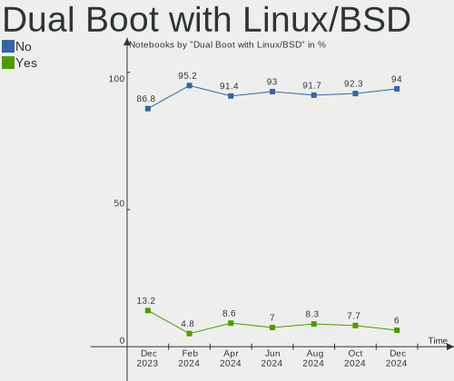
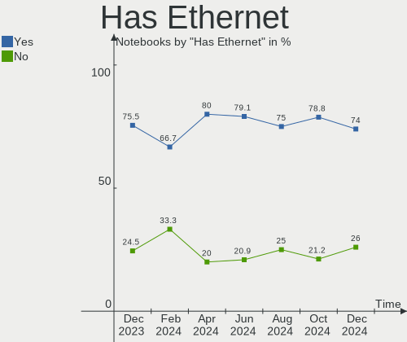
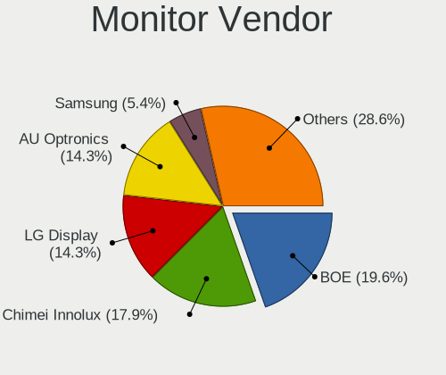
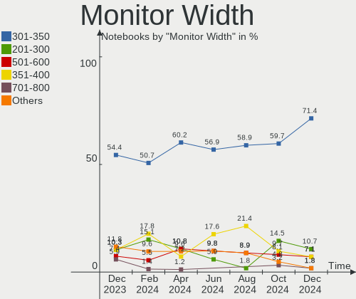
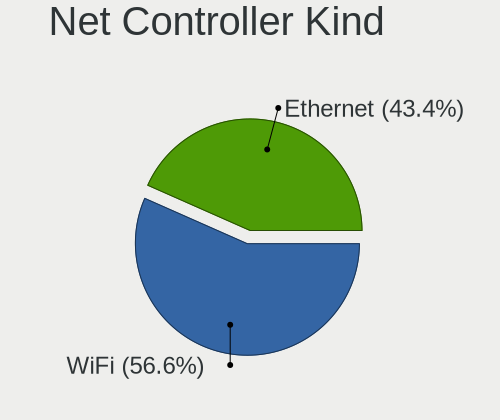
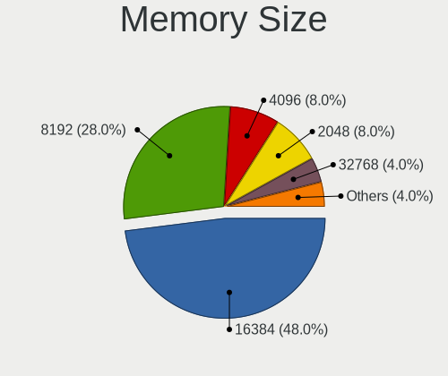

openSUSE - Hardware Trends (Notebooks)
--------------------------------------

A project to identify most popular hardware characteristics and track their change
over time based on data collected by Linux users at https://Linux-Hardware.org.

Anyone can contribute to this report by the [hw-probe](https://github.com/linuxhw/hw-probe) tool:

    sudo -E hw-probe -all -upload

This report is for one last month. Overall report since the beginning of time: [TestCoverage](https://github.com/linuxhw/TestCoverage)

Period: Jun, 2022.

Contents
--------

* [ System ](#system)
  - [ OS                       ](#os)
  - [ OS Family                ](#os-family)
  - [ Kernel                   ](#kernel)
  - [ Kernel Family            ](#kernel-family)
  - [ Kernel Major Ver.        ](#kernel-major-ver)
  - [ Arch                     ](#arch)
  - [ DE                       ](#de)
  - [ Display Server           ](#display-server)
  - [ Display Manager          ](#display-manager)
  - [ OS Lang                  ](#os-lang)
  - [ Boot Mode                ](#boot-mode)
  - [ Filesystem               ](#filesystem)
  - [ Part. scheme             ](#part-scheme)
  - [ Dual Boot with Linux/BSD ](#dual-boot-with-linuxbsd)
  - [ Dual Boot (Win)          ](#dual-boot-win)

* [ Board ](#board)
  - [ Vendor                   ](#vendor)
  - [ Model                    ](#model)
  - [ Model Family             ](#model-family)
  - [ MFG Year                 ](#mfg-year)
  - [ Form Factor              ](#form-factor)
  - [ Secure Boot              ](#secure-boot)
  - [ Coreboot                 ](#coreboot)
  - [ RAM Size                 ](#ram-size)
  - [ RAM Used                 ](#ram-used)
  - [ Total Drives             ](#total-drives)
  - [ Has CD-ROM               ](#has-cd-rom)
  - [ Has Ethernet             ](#has-ethernet)
  - [ Has WiFi                 ](#has-wifi)
  - [ Has Bluetooth            ](#has-bluetooth)

* [ Location ](#location)
  - [ Country                  ](#country)
  - [ City                     ](#city)

* [ Drives ](#drives)
  - [ Drive Vendor             ](#drive-vendor)
  - [ Drive Model              ](#drive-model)
  - [ HDD Vendor               ](#hdd-vendor)
  - [ SSD Vendor               ](#ssd-vendor)
  - [ Drive Kind               ](#drive-kind)
  - [ Drive Connector          ](#drive-connector)
  - [ Drive Size               ](#drive-size)
  - [ Space Total              ](#space-total)
  - [ Space Used               ](#space-used)
  - [ Malfunc. Drives          ](#malfunc-drives)
  - [ Malfunc. Drive Vendor    ](#malfunc-drive-vendor)
  - [ Malfunc. HDD Vendor      ](#malfunc-hdd-vendor)
  - [ Malfunc. Drive Kind      ](#malfunc-drive-kind)
  - [ Failed Drives            ](#failed-drives)
  - [ Failed Drive Vendor      ](#failed-drive-vendor)
  - [ Drive Status             ](#drive-status)

* [ Storage controller ](#storage-controller)
  - [ Storage Vendor           ](#storage-vendor)
  - [ Storage Model            ](#storage-model)
  - [ Storage Kind             ](#storage-kind)

* [ Processor ](#processor)
  - [ CPU Vendor               ](#cpu-vendor)
  - [ CPU Model                ](#cpu-model)
  - [ CPU Model Family         ](#cpu-model-family)
  - [ CPU Cores                ](#cpu-cores)
  - [ CPU Sockets              ](#cpu-sockets)
  - [ CPU Threads              ](#cpu-threads)
  - [ CPU Op-Modes             ](#cpu-op-modes)
  - [ CPU Microcode            ](#cpu-microcode)
  - [ CPU Microarch            ](#cpu-microarch)

* [ Graphics ](#graphics)
  - [ GPU Vendor               ](#gpu-vendor)
  - [ GPU Model                ](#gpu-model)
  - [ GPU Combo                ](#gpu-combo)
  - [ GPU Driver               ](#gpu-driver)
  - [ GPU Memory               ](#gpu-memory)

* [ Monitor ](#monitor)
  - [ Monitor Vendor           ](#monitor-vendor)
  - [ Monitor Model            ](#monitor-model)
  - [ Monitor Resolution       ](#monitor-resolution)
  - [ Monitor Diagonal         ](#monitor-diagonal)
  - [ Monitor Width            ](#monitor-width)
  - [ Aspect Ratio             ](#aspect-ratio)
  - [ Monitor Area             ](#monitor-area)
  - [ Pixel Density            ](#pixel-density)
  - [ Multiple Monitors        ](#multiple-monitors)

* [ Network ](#network)
  - [ Net Controller Vendor    ](#net-controller-vendor)
  - [ Net Controller Model     ](#net-controller-model)
  - [ Wireless Vendor          ](#wireless-vendor)
  - [ Wireless Model           ](#wireless-model)
  - [ Ethernet Vendor          ](#ethernet-vendor)
  - [ Ethernet Model           ](#ethernet-model)
  - [ Net Controller Kind      ](#net-controller-kind)
  - [ Used Controller          ](#used-controller)
  - [ NICs                     ](#nics)
  - [ IPv6                     ](#ipv6)

* [ Bluetooth ](#bluetooth)
  - [ Bluetooth Vendor         ](#bluetooth-vendor)
  - [ Bluetooth Model          ](#bluetooth-model)

* [ Sound ](#sound)
  - [ Sound Vendor             ](#sound-vendor)
  - [ Sound Model              ](#sound-model)

* [ Memory ](#memory)
  - [ Memory Vendor            ](#memory-vendor)
  - [ Memory Model             ](#memory-model)
  - [ Memory Kind              ](#memory-kind)
  - [ Memory Form Factor       ](#memory-form-factor)
  - [ Memory Size              ](#memory-size)
  - [ Memory Speed             ](#memory-speed)

* [ Printers & scanners ](#printers--scanners)
  - [ Printer Vendor           ](#printer-vendor)
  - [ Printer Model            ](#printer-model)
  - [ Scanner Vendor           ](#scanner-vendor)
  - [ Scanner Model            ](#scanner-model)

* [ Camera ](#camera)
  - [ Camera Vendor            ](#camera-vendor)
  - [ Camera Model             ](#camera-model)

* [ Security ](#security)
  - [ Fingerprint Vendor       ](#fingerprint-vendor)
  - [ Fingerprint Model        ](#fingerprint-model)
  - [ Chipcard Vendor          ](#chipcard-vendor)
  - [ Chipcard Model           ](#chipcard-model)

* [ Unsupported ](#unsupported)
  - [ Unsupported Devices      ](#unsupported-devices)
  - [ Unsupported Device Types ](#unsupported-device-types)

System
------

OS
--

Installed operating systems

| Name                         | Notebooks | Percent |
|------------------------------|-----------|---------|
| openSUSE Tumbleweed-XXXXXXXX | 14        | 63.64%  |
| openSUSE Leap-15.4           | 7         | 31.82%  |
| openSUSE Leap-15.2           | 1         | 4.55%   |

OS Family
---------

OS without a version

| Name     | Notebooks | Percent |
|----------|-----------|---------|
| openSUSE | 22        | 100%    |

Kernel
------

Version of the Linux kernel

| Version                   | Notebooks | Percent |
|---------------------------|-----------|---------|
| 5.14.21-150400.22-default | 7         | 31.82%  |
| 5.18.2-1-default          | 3         | 13.64%  |
| 5.18.1-1-default          | 3         | 13.64%  |
| 5.18.6-1-default          | 2         | 9.09%   |
| 5.18.4-1-default          | 2         | 9.09%   |
| 5.17.9-1-default          | 2         | 9.09%   |
| 5.3.18-lp152.106-default  | 1         | 4.55%   |
| 5.17.7-1-default          | 1         | 4.55%   |
| 5.17.4-1-default          | 1         | 4.55%   |

Kernel Family
-------------

Linux kernel without a distro release

| Version | Notebooks | Percent |
|---------|-----------|---------|
| 5.14.21 | 7         | 31.82%  |
| 5.18.2  | 3         | 13.64%  |
| 5.18.1  | 3         | 13.64%  |
| 5.18.6  | 2         | 9.09%   |
| 5.18.4  | 2         | 9.09%   |
| 5.17.9  | 2         | 9.09%   |
| 5.3.18  | 1         | 4.55%   |
| 5.17.7  | 1         | 4.55%   |
| 5.17.4  | 1         | 4.55%   |

Kernel Major Ver.
-----------------

Linux kernel major version

| Version | Notebooks | Percent |
|---------|-----------|---------|
| 5.18    | 10        | 45.45%  |
| 5.14    | 7         | 31.82%  |
| 5.17    | 4         | 18.18%  |
| 5.3     | 1         | 4.55%   |

Arch
----

OS architecture (x86_64, i586, etc.)

| Name   | Notebooks | Percent |
|--------|-----------|---------|
| x86_64 | 22        | 100%    |

DE
--

Desktop Environment

| Name  | Notebooks | Percent |
|-------|-----------|---------|
| KDE5  | 19        | 86.36%  |
| GNOME | 2         | 9.09%   |
| MATE  | 1         | 4.55%   |

Display Server
--------------

X11 or Wayland

| Name    | Notebooks | Percent |
|---------|-----------|---------|
| X11     | 18        | 81.82%  |
| Wayland | 3         | 13.64%  |
| Tty     | 1         | 4.55%   |

Display Manager
---------------

SDDM, LightDM, etc.

| Name    | Notebooks | Percent |
|---------|-----------|---------|
| SDDM    | 9         | 40.91%  |
| Unknown | 7         | 31.82%  |
| LightDM | 4         | 18.18%  |
| XDM     | 2         | 9.09%   |

OS Lang
-------

Language

| Lang  | Notebooks | Percent |
|-------|-----------|---------|
| en_US | 8         | 36.36%  |
| zh_CN | 2         | 9.09%   |
| ru_RU | 2         | 9.09%   |
| nn_NO | 2         | 9.09%   |
| cs_CZ | 2         | 9.09%   |
| pt_BR | 1         | 4.55%   |
| POSIX | 1         | 4.55%   |
| nl_NL | 1         | 4.55%   |
| en_IN | 1         | 4.55%   |
| en_GB | 1         | 4.55%   |
| de_DE | 1         | 4.55%   |

Boot Mode
---------

EFI or BIOS

| Mode | Notebooks | Percent |
|------|-----------|---------|
| EFI  | 15        | 68.18%  |
| BIOS | 7         | 31.82%  |

Filesystem
----------

Type of filesystem

| Type  | Notebooks | Percent |
|-------|-----------|---------|
| Btrfs | 19        | 86.36%  |
| Ext4  | 3         | 13.64%  |

Part. scheme
------------

Scheme of partitioning

| Type    | Notebooks | Percent |
|---------|-----------|---------|
| GPT     | 12        | 54.55%  |
| Unknown | 9         | 40.91%  |
| MBR     | 1         | 4.55%   |

Dual Boot with Linux/BSD
------------------------

Hosting more than one Linux/BSD

| Dual boot | Notebooks | Percent |
|-----------|-----------|---------|
| No        | 22        | 100%    |

Dual Boot (Win)
---------------

Hosting Linux and Windows

| Dual boot | Notebooks | Percent |
|-----------|-----------|---------|
| No        | 17        | 77.27%  |
| Yes       | 5         | 22.73%  |

Board
-----

Vendor
------

Motherboard manufacturer

| Name             | Notebooks | Percent |
|------------------|-----------|---------|
| Hewlett-Packard  | 8         | 36.36%  |
| ASUSTek Computer | 4         | 18.18%  |
| Lenovo           | 2         | 9.09%   |
| Apple            | 2         | 9.09%   |
| Toshiba          | 1         | 4.55%   |
| Timi             | 1         | 4.55%   |
| MSI              | 1         | 4.55%   |
| Framework        | 1         | 4.55%   |
| Clevo            | 1         | 4.55%   |
| Acer             | 1         | 4.55%   |

Model
-----

Motherboard model

| Name                                             | Notebooks | Percent |
|--------------------------------------------------|-----------|---------|
| Toshiba Satellite L500                           | 1         | 4.55%   |
| Timi A35S                                        | 1         | 4.55%   |
| MSI Raider GE76 12UH                             | 1         | 4.55%   |
| Lenovo ThinkBook 16p Gen 2 20YM                  | 1         | 4.55%   |
| Lenovo IdeaPad Gaming 3 15IMH05 82CG             | 1         | 4.55%   |
| HP ZBook Fury 15.6 inch G8 Mobile Workstation PC | 1         | 4.55%   |
| HP ProBook 455 G8 Notebook PC                    | 1         | 4.55%   |
| HP Pavilion Laptop 14-bf0xx                      | 1         | 4.55%   |
| HP Pavilion 13 x360 PC                           | 1         | 4.55%   |
| HP Mini 210-1000                                 | 1         | 4.55%   |
| HP Laptop 17-ca0xxx                              | 1         | 4.55%   |
| HP Laptop 15s-eq0xxx                             | 1         | 4.55%   |
| HP ENVY TS 17                                    | 1         | 4.55%   |
| Framework Laptop                                 | 1         | 4.55%   |
| Clevo P7xxTM(1)                                  | 1         | 4.55%   |
| ASUS VivoBook_ASUSLaptop X3400PH_K3400PH         | 1         | 4.55%   |
| ASUS VivoBook_ASUSLaptop X321EA_S333EA           | 1         | 4.55%   |
| ASUS ROG Strix G713QE_G713QE                     | 1         | 4.55%   |
| ASUS ASUS EXPERTBOOK B1500CEAE_B1500CEAE         | 1         | 4.55%   |
| Apple MacBookPro5,5                              | 1         | 4.55%   |
| Apple MacBook7,1                                 | 1         | 4.55%   |
| Acer Swift SFX14-41G                             | 1         | 4.55%   |

Model Family
------------

Motherboard model prefix

| Name              | Notebooks | Percent |
|-------------------|-----------|---------|
| HP Pavilion       | 2         | 9.09%   |
| HP Laptop         | 2         | 9.09%   |
| ASUS VivoBook     | 2         | 9.09%   |
| Toshiba Satellite | 1         | 4.55%   |
| Timi A35S         | 1         | 4.55%   |
| MSI Raider        | 1         | 4.55%   |
| Lenovo ThinkBook  | 1         | 4.55%   |
| Lenovo IdeaPad    | 1         | 4.55%   |
| HP ZBook          | 1         | 4.55%   |
| HP ProBook        | 1         | 4.55%   |
| HP Mini           | 1         | 4.55%   |
| HP ENVY           | 1         | 4.55%   |
| Framework Laptop  | 1         | 4.55%   |
| Clevo P7xxTM(1)   | 1         | 4.55%   |
| ASUS ROG          | 1         | 4.55%   |
| ASUS ASUS         | 1         | 4.55%   |
| Apple MacBookPro5 | 1         | 4.55%   |
| Apple MacBook7    | 1         | 4.55%   |
| Acer Swift        | 1         | 4.55%   |

MFG Year
--------

Motherboard manufacture year

| Year | Notebooks | Percent |
|------|-----------|---------|
| 2021 | 9         | 40.91%  |
| 2009 | 3         | 13.64%  |
| 2020 | 2         | 9.09%   |
| 2019 | 2         | 9.09%   |
| 2022 | 1         | 4.55%   |
| 2018 | 1         | 4.55%   |
| 2017 | 1         | 4.55%   |
| 2014 | 1         | 4.55%   |
| 2013 | 1         | 4.55%   |
| 2010 | 1         | 4.55%   |

Form Factor
-----------

Physical design of the computer

| Name     | Notebooks | Percent |
|----------|-----------|---------|
| Notebook | 22        | 100%    |

Secure Boot
-----------

Enabled or disabled

| State    | Notebooks | Percent |
|----------|-----------|---------|
| Disabled | 16        | 72.73%  |
| Enabled  | 6         | 27.27%  |

Coreboot
--------

Have coreboot on board

| Used | Notebooks | Percent |
|------|-----------|---------|
| No   | 22        | 100%    |

RAM Size
--------

Total RAM memory

| Size in GB | Notebooks | Percent |
|------------|-----------|---------|
| 16.01-24.0 | 6         | 27.27%  |
| 8.01-16.0  | 6         | 27.27%  |
| 4.01-8.0   | 5         | 22.73%  |
| 32.01-64.0 | 3         | 13.64%  |
| 3.01-4.0   | 1         | 4.55%   |
| 0.51-1.0   | 1         | 4.55%   |

RAM Used
--------

Used RAM memory

| Used GB   | Notebooks | Percent |
|-----------|-----------|---------|
| 4.01-8.0  | 10        | 45.45%  |
| 8.01-16.0 | 4         | 18.18%  |
| 3.01-4.0  | 3         | 13.64%  |
| 1.01-2.0  | 3         | 13.64%  |
| 2.01-3.0  | 1         | 4.55%   |
| 0.51-1.0  | 1         | 4.55%   |

Total Drives
------------

Number of drives on board

| Drives | Notebooks | Percent |
|--------|-----------|---------|
| 1      | 18        | 81.82%  |
| 2      | 3         | 13.64%  |
| 3      | 1         | 4.55%   |

Has CD-ROM
----------

Has CD-ROM on board

| Presented | Notebooks | Percent |
|-----------|-----------|---------|
| No        | 17        | 77.27%  |
| Yes       | 5         | 22.73%  |

Has Ethernet
------------

Has Ethernet on board

| Presented | Notebooks | Percent |
|-----------|-----------|---------|
| Yes       | 16        | 72.73%  |
| No        | 6         | 27.27%  |

Has WiFi
--------

Has WiFi module

| Presented | Notebooks | Percent |
|-----------|-----------|---------|
| Yes       | 22        | 100%    |

Has Bluetooth
-------------

Has Bluetooth module

| Presented | Notebooks | Percent |
|-----------|-----------|---------|
| Yes       | 20        | 90.91%  |
| No        | 2         | 9.09%   |

Location
--------

Country
-------

Geographic location (country)

| Country     | Notebooks | Percent |
|-------------|-----------|---------|
| USA         | 4         | 18.18%  |
| Netherlands | 3         | 13.64%  |
| Norway      | 2         | 9.09%   |
| Germany     | 2         | 9.09%   |
| China       | 2         | 9.09%   |
| Turkey      | 1         | 4.55%   |
| Russia      | 1         | 4.55%   |
| Italy       | 1         | 4.55%   |
| India       | 1         | 4.55%   |
| Iceland     | 1         | 4.55%   |
| France      | 1         | 4.55%   |
| Czechia     | 1         | 4.55%   |
| Brazil      | 1         | 4.55%   |
| Belarus     | 1         | 4.55%   |

City
----

Geographic location (city)

| City           | Notebooks | Percent |
|----------------|-----------|---------|
| Virginia Beach | 1         | 4.55%   |
| Vaksdal        | 1         | 4.55%   |
| Ronago         | 1         | 4.55%   |
| Qingshanmiao   | 1         | 4.55%   |
| Prague         | 1         | 4.55%   |
| Paris          | 1         | 4.55%   |
| Nuremberg      | 1         | 4.55%   |
| New York       | 1         | 4.55%   |
| Mumbai         | 1         | 4.55%   |
| Minsk          | 1         | 4.55%   |
| Maua           | 1         | 4.55%   |
| Lehrte         | 1         | 4.55%   |
| Lakeland       | 1         | 4.55%   |
| Izmir          | 1         | 4.55%   |
| Isafjordur     | 1         | 4.55%   |
| Houten         | 1         | 4.55%   |
| Haarlem        | 1         | 4.55%   |
| Chelyabinsk    | 1         | 4.55%   |
| Bradford       | 1         | 4.55%   |
| Bergen         | 1         | 4.55%   |
| Beijing        | 1         | 4.55%   |
| Amsterdam      | 1         | 4.55%   |

Drives
------

Drive Vendor
------------

Hard drive vendors

| Vendor                         | Notebooks | Drives | Percent |
|--------------------------------|-----------|--------|---------|
| Samsung Electronics            | 7         | 7      | 26.92%  |
| WDC                            | 3         | 4      | 11.54%  |
| SK hynix                       | 3         | 3      | 11.54%  |
| Toshiba                        | 2         | 2      | 7.69%   |
| Intel                          | 2         | 2      | 7.69%   |
| HGST                           | 2         | 3      | 7.69%   |
| Unknown                        | 1         | 1      | 3.85%   |
| Solid State Storage Technology | 1         | 1      | 3.85%   |
| SanDisk                        | 1         | 1      | 3.85%   |
| PNY                            | 1         | 1      | 3.85%   |
| Pioneer                        | 1         | 1      | 3.85%   |
| Hitachi                        | 1         | 1      | 3.85%   |
| FORESEE                        | 1         | 1      | 3.85%   |

Drive Model
-----------

Hard drive models

| Model                                    | Notebooks | Percent |
|------------------------------------------|-----------|---------|
| SK hynix NVMe SSD Drive 512GB            | 2         | 7.14%   |
| WDC WD10SPZX-80Z10T2 1TB                 | 1         | 3.57%   |
| WDC WD10SPZX-60Z10T0 1TB                 | 1         | 3.57%   |
| WDC PC SN730 SDBPNTY-512G-1006 512GB     | 1         | 3.57%   |
| WDC PC SN530 SDBPNPZ-256G-1002 256GB     | 1         | 3.57%   |
| Unknown MMC Card  16GB                   | 1         | 3.57%   |
| Toshiba MQ01ABD100 1TB                   | 1         | 3.57%   |
| Toshiba MK5055GSX 500GB                  | 1         | 3.57%   |
| Solid State Storage NVMe SSD Drive 256GB | 1         | 3.57%   |
| SK hynix NVMe SSD Drive 500GB            | 1         | 3.57%   |
| SanDisk SDSSDH3 1T00 1TB                 | 1         | 3.57%   |
| Samsung SSD 980 PRO 2TB                  | 1         | 3.57%   |
| Samsung SSD 860 EVO 500GB                | 1         | 3.57%   |
| Samsung NVMe SSD Drive 1TB               | 1         | 3.57%   |
| Samsung NVMe SSD Drive 1024GB            | 1         | 3.57%   |
| Samsung MZVLB512HBJQ-000H1 512GB         | 1         | 3.57%   |
| Samsung MZVL21T0HCLR-00B00 1TB           | 1         | 3.57%   |
| Samsung MZNLN256HMHQ-000H1 256GB SSD     | 1         | 3.57%   |
| PNY CS3030 2TB SSD                       | 1         | 3.57%   |
| Pioneer APS-SL3N-240 240GB               | 1         | 3.57%   |
| Intel SSDPEKNW512G8 512GB                | 1         | 3.57%   |
| Intel SSDPEKNU512GZ 512GB                | 1         | 3.57%   |
| Hitachi HTS725025A9A364 250GB            | 1         | 3.57%   |
| HGST HTS725050A7E630 500GB               | 1         | 3.57%   |
| HGST HTS721010A9E630 1TB                 | 1         | 3.57%   |
| HGST HTS545050A7E680 500GB               | 1         | 3.57%   |
| FORESEE P900F256GB                       | 1         | 3.57%   |

HDD Vendor
----------

Hard disk drive vendors

| Vendor  | Notebooks | Drives | Percent |
|---------|-----------|--------|---------|
| WDC     | 2         | 2      | 28.57%  |
| Toshiba | 2         | 2      | 28.57%  |
| HGST    | 2         | 3      | 28.57%  |
| Hitachi | 1         | 1      | 14.29%  |

SSD Vendor
----------

Solid state drive vendors

| Vendor              | Notebooks | Drives | Percent |
|---------------------|-----------|--------|---------|
| Samsung Electronics | 2         | 2      | 50%     |
| SanDisk             | 1         | 1      | 25%     |
| Pioneer             | 1         | 1      | 25%     |

Drive Kind
----------

HDD or SSD

| Kind | Notebooks | Drives | Percent |
|------|-----------|--------|---------|
| NVMe | 14        | 15     | 53.85%  |
| HDD  | 7         | 8      | 26.92%  |
| SSD  | 4         | 4      | 15.38%  |
| MMC  | 1         | 1      | 3.85%   |

Drive Connector
---------------

SATA, SAS, NVMe, etc.

| Type | Notebooks | Drives | Percent |
|------|-----------|--------|---------|
| NVMe | 14        | 15     | 53.85%  |
| SATA | 11        | 12     | 42.31%  |
| MMC  | 1         | 1      | 3.85%   |

Drive Size
----------

Size of hard drive

| Size in TB | Notebooks | Drives | Percent |
|------------|-----------|--------|---------|
| 0.01-0.5   | 7         | 7      | 58.33%  |
| 0.51-1.0   | 5         | 5      | 41.67%  |

Space Total
-----------

Amount of disk space available on the file system

| Size in GB     | Notebooks | Percent |
|----------------|-----------|---------|
| More than 3000 | 9         | 40.91%  |
| 1001-2000      | 5         | 22.73%  |
| 251-500        | 3         | 13.64%  |
| 2001-3000      | 3         | 13.64%  |
| 501-1000       | 2         | 9.09%   |

Space Used
----------

Amount of used disk space

| Used GB        | Notebooks | Percent |
|----------------|-----------|---------|
| 251-500        | 7         | 31.82%  |
| 101-250        | 7         | 31.82%  |
| More than 3000 | 2         | 9.09%   |
| 1001-2000      | 2         | 9.09%   |
| 501-1000       | 2         | 9.09%   |
| 2001-3000      | 1         | 4.55%   |
| 1-20           | 1         | 4.55%   |

Malfunc. Drives
---------------

Drive models with a malfunction

| Model                         | Notebooks | Drives | Percent |
|-------------------------------|-----------|--------|---------|
| Toshiba MK5055GSX 500GB       | 1         | 1      | 50%     |
| Hitachi HTS725025A9A364 250GB | 1         | 1      | 50%     |

Malfunc. Drive Vendor
---------------------

Vendors of faulty drives

| Vendor  | Notebooks | Drives | Percent |
|---------|-----------|--------|---------|
| Toshiba | 1         | 1      | 50%     |
| Hitachi | 1         | 1      | 50%     |

Malfunc. HDD Vendor
-------------------

Vendors of faulty HDD drives

| Vendor  | Notebooks | Drives | Percent |
|---------|-----------|--------|---------|
| Toshiba | 1         | 1      | 50%     |
| Hitachi | 1         | 1      | 50%     |

Malfunc. Drive Kind
-------------------

Kinds of faulty drives

| Kind | Notebooks | Drives | Percent |
|------|-----------|--------|---------|
| HDD  | 2         | 2      | 100%    |

Failed Drives
-------------

Failed drive models

Zero info for selected period =(

Failed Drive Vendor
-------------------

Failed drive vendors

Zero info for selected period =(

Drive Status
------------

Number of failed and malfunc. drives

| Status   | Notebooks | Drives | Percent |
|----------|-----------|--------|---------|
| Works    | 11        | 14     | 47.83%  |
| Detected | 10        | 12     | 43.48%  |
| Malfunc  | 2         | 2      | 8.7%    |

Storage controller
------------------

Storage Vendor
--------------

Storage controller vendors

| Vendor                         | Notebooks | Percent |
|--------------------------------|-----------|---------|
| Intel                          | 10        | 35.71%  |
| Samsung Electronics            | 5         | 17.86%  |
| SK hynix                       | 3         | 10.71%  |
| AMD                            | 3         | 10.71%  |
| SanDisk                        | 2         | 7.14%   |
| Nvidia                         | 2         | 7.14%   |
| Solid State Storage Technology | 1         | 3.57%   |
| Phison Electronics             | 1         | 3.57%   |
| Marvell Technology Group       | 1         | 3.57%   |

Storage Model
-------------

Storage controller models

| Model                                                                          | Notebooks | Percent |
|--------------------------------------------------------------------------------|-----------|---------|
| SK hynix Gold P31 SSD                                                          | 3         | 9.68%   |
| Intel Volume Management Device NVMe RAID Controller                            | 3         | 9.68%   |
| AMD FCH SATA Controller [AHCI mode]                                            | 3         | 9.68%   |
| Samsung NVMe SSD Controller PM9A1/PM9A3/980PRO                                 | 2         | 6.45%   |
| Samsung NVMe SSD Controller 980                                                | 2         | 6.45%   |
| Solid State Storage Non-Volatile memory controller                             | 1         | 3.23%   |
| SanDisk WD Blue SN550 NVMe SSD                                                 | 1         | 3.23%   |
| SanDisk WD Black SN750 / PC SN730 NVMe SSD                                     | 1         | 3.23%   |
| Samsung NVMe SSD Controller SM981/PM981/PM983                                  | 1         | 3.23%   |
| Phison E12 NVMe Controller                                                     | 1         | 3.23%   |
| Nvidia MCP89 SATA Controller (AHCI mode)                                       | 1         | 3.23%   |
| Nvidia MCP79 AHCI Controller                                                   | 1         | 3.23%   |
| Marvell Group Marvell Non-Volatile memory controller                           | 1         | 3.23%   |
| Intel Wildcat Point-LP SATA Controller [AHCI Mode]                             | 1         | 3.23%   |
| Intel Tiger Lake-LP SATA Controller [AHCI mode]                                | 1         | 3.23%   |
| Intel Sunrise Point-LP SATA Controller [AHCI mode]                             | 1         | 3.23%   |
| Intel SSD 660P Series                                                          | 1         | 3.23%   |
| Intel Non-Volatile memory controller                                           | 1         | 3.23%   |
| Intel NM10/ICH7 Family SATA Controller [AHCI mode]                             | 1         | 3.23%   |
| Intel 82801IBM/IEM (ICH9M/ICH9M-E) 4 port SATA Controller [AHCI mode]          | 1         | 3.23%   |
| Intel 8 Series/C220 Series Chipset Family 6-port SATA Controller 1 [AHCI mode] | 1         | 3.23%   |
| Intel 400 Series Chipset Family SATA AHCI Controller                           | 1         | 3.23%   |
| Intel 200 Series PCH SATA controller [AHCI mode]                               | 1         | 3.23%   |

Storage Kind
------------

Kind of storage controller (IDE, SATA, NVMe, SAS, ...)

| Kind | Notebooks | Percent |
|------|-----------|---------|
| NVMe | 14        | 46.67%  |
| SATA | 13        | 43.33%  |
| RAID | 3         | 10%     |

Processor
---------

CPU Vendor
----------

Processor vendors

| Vendor | Notebooks | Percent |
|--------|-----------|---------|
| Intel  | 15        | 68.18%  |
| AMD    | 7         | 31.82%  |

CPU Model
---------

Processor models

| Model                                         | Notebooks | Percent |
|-----------------------------------------------|-----------|---------|
| AMD Ryzen 7 5800H with Radeon Graphics        | 3         | 13.64%  |
| Intel 11th Gen Core i5-1135G7 @ 2.40GHz       | 2         | 9.09%   |
| AMD Ryzen 7 5800U with Radeon Graphics        | 2         | 9.09%   |
| Intel Core i7-4700MQ CPU @ 2.40GHz            | 1         | 4.55%   |
| Intel Core i7-10750H CPU @ 2.60GHz            | 1         | 4.55%   |
| Intel Core i5-9600KF CPU @ 3.70GHz            | 1         | 4.55%   |
| Intel Core i5-5200U CPU @ 2.20GHz             | 1         | 4.55%   |
| Intel Core i3-7100U CPU @ 2.40GHz             | 1         | 4.55%   |
| Intel Core 2 Duo CPU T6500 @ 2.10GHz          | 1         | 4.55%   |
| Intel Core 2 Duo CPU P8700 @ 2.53GHz          | 1         | 4.55%   |
| Intel Core 2 Duo CPU P8600 @ 2.40GHz          | 1         | 4.55%   |
| Intel Atom CPU N450 @ 1.66GHz                 | 1         | 4.55%   |
| Intel 12th Gen Core i7-12700H                 | 1         | 4.55%   |
| Intel 11th Gen Core i7-11800H @ 2.30GHz       | 1         | 4.55%   |
| Intel 11th Gen Core i7-1165G7 @ 2.80GHz       | 1         | 4.55%   |
| Intel 11th Gen Core i5-11300H @ 3.10GHz       | 1         | 4.55%   |
| AMD Ryzen 5 3500U with Radeon Vega Mobile Gfx | 1         | 4.55%   |
| AMD A6-9225 RADEON R4, 5 COMPUTE CORES 2C+3G  | 1         | 4.55%   |

CPU Model Family
----------------

Processor model prefix

| Model            | Notebooks | Percent |
|------------------|-----------|---------|
| Other            | 6         | 27.27%  |
| AMD Ryzen 7      | 5         | 22.73%  |
| Intel Core 2 Duo | 3         | 13.64%  |
| Intel Core i7    | 2         | 9.09%   |
| Intel Core i5    | 2         | 9.09%   |
| Intel Core i3    | 1         | 4.55%   |
| Intel Atom       | 1         | 4.55%   |
| AMD Ryzen 5      | 1         | 4.55%   |
| AMD A6           | 1         | 4.55%   |

CPU Cores
---------

Number of processor cores

| Number | Notebooks | Percent |
|--------|-----------|---------|
| 8      | 6         | 27.27%  |
| 4      | 6         | 27.27%  |
| 2      | 6         | 27.27%  |
| 6      | 2         | 9.09%   |
| 14     | 1         | 4.55%   |
| 1      | 1         | 4.55%   |

CPU Sockets
-----------

Number of sockets

| Number | Notebooks | Percent |
|--------|-----------|---------|
| 1      | 22        | 100%    |

CPU Threads
-----------

Threads per core (Hyper-Threading)

| Number | Notebooks | Percent |
|--------|-----------|---------|
| 2      | 17        | 77.27%  |
| 1      | 5         | 22.73%  |

CPU Op-Modes
------------

CPU Operation Modes (32-bit, 64-bit)

| Op mode        | Notebooks | Percent |
|----------------|-----------|---------|
| 32-bit, 64-bit | 22        | 100%    |

CPU Microcode
-------------

Microcode number

| Number     | Notebooks | Percent |
|------------|-----------|---------|
| Unknown    | 5         | 22.73%  |
| 0x806c1    | 4         | 18.18%  |
| 0x1067a    | 3         | 13.64%  |
| 0x0a50000c | 3         | 13.64%  |
| 0x906a3    | 1         | 4.55%   |
| 0x806e9    | 1         | 4.55%   |
| 0x806d1    | 1         | 4.55%   |
| 0x306c3    | 1         | 4.55%   |
| 0x106ca    | 1         | 4.55%   |
| 0x08108109 | 1         | 4.55%   |
| 0x06006705 | 1         | 4.55%   |

CPU Microarch
-------------

Microarchitecture

| Name             | Notebooks | Percent |
|------------------|-----------|---------|
| Zen 3            | 5         | 22.73%  |
| TigerLake        | 4         | 18.18%  |
| Penryn           | 3         | 13.64%  |
| KabyLake         | 2         | 9.09%   |
| Zen+             | 1         | 4.55%   |
| Icelake          | 1         | 4.55%   |
| Haswell          | 1         | 4.55%   |
| Excavator        | 1         | 4.55%   |
| CometLake        | 1         | 4.55%   |
| Broadwell        | 1         | 4.55%   |
| Bonnell          | 1         | 4.55%   |
| Alderlake Hybrid | 1         | 4.55%   |

Graphics
--------

GPU Vendor
----------

Vendors of graphics cards

| Vendor | Notebooks | Percent |
|--------|-----------|---------|
| Nvidia | 10        | 35.71%  |
| Intel  | 10        | 35.71%  |
| AMD    | 8         | 28.57%  |

GPU Model
---------

Graphics card models

| Model                                                                                 | Notebooks | Percent |
|---------------------------------------------------------------------------------------|-----------|---------|
| AMD Cezanne                                                                           | 5         | 17.24%  |
| Intel TigerLake-LP GT2 [Iris Xe Graphics]                                             | 4         | 13.79%  |
| Nvidia GA107M [GeForce RTX 3050 Ti Mobile]                                            | 2         | 6.9%    |
| Nvidia TU117M                                                                         | 1         | 3.45%   |
| Nvidia TU117GLM [T1200 Laptop GPU]                                                    | 1         | 3.45%   |
| Nvidia MCP89 [GeForce 320M]                                                           | 1         | 3.45%   |
| Nvidia GP104M [GeForce GTX 1070 Mobile]                                               | 1         | 3.45%   |
| Nvidia GK208M [GeForce GT 740M]                                                       | 1         | 3.45%   |
| Nvidia GA106M [GeForce RTX 3060 Mobile / Max-Q]                                       | 1         | 3.45%   |
| Nvidia GA104M [GeForce RTX 3080 Mobile / Max-Q 8GB/16GB]                              | 1         | 3.45%   |
| Nvidia C79 [GeForce 9400M]                                                            | 1         | 3.45%   |
| Intel HD Graphics 620                                                                 | 1         | 3.45%   |
| Intel HD Graphics 5500                                                                | 1         | 3.45%   |
| Intel CometLake-H GT2 [UHD Graphics]                                                  | 1         | 3.45%   |
| Intel Atom Processor D4xx/D5xx/N4xx/N5xx Integrated Graphics Controller               | 1         | 3.45%   |
| Intel Alder Lake-P Integrated Graphics Controller                                     | 1         | 3.45%   |
| Intel 4th Gen Core Processor Integrated Graphics Controller                           | 1         | 3.45%   |
| AMD Topaz XT [Radeon R7 M260/M265 / M340/M360 / M440/M445 / 530/535 / 620/625 Mobile] | 1         | 3.45%   |
| AMD Stoney [Radeon R2/R3/R4/R5 Graphics]                                              | 1         | 3.45%   |
| AMD RV710/M92 [Mobility Radeon HD 4530/4570/545v]                                     | 1         | 3.45%   |
| AMD Picasso/Raven 2 [Radeon Vega Series / Radeon Vega Mobile Series]                  | 1         | 3.45%   |

GPU Combo
---------

Combinations of graphics cards

| Name           | Notebooks | Percent |
|----------------|-----------|---------|
| 1 x Intel      | 7         | 31.82%  |
| 1 x Nvidia     | 4         | 18.18%  |
| 1 x AMD        | 4         | 18.18%  |
| Intel + Nvidia | 3         | 13.64%  |
| AMD + Nvidia   | 3         | 13.64%  |
| 2 x AMD        | 1         | 4.55%   |

GPU Driver
----------

Free vs proprietary

| Driver      | Notebooks | Percent |
|-------------|-----------|---------|
| Free        | 17        | 77.27%  |
| Proprietary | 5         | 22.73%  |

GPU Memory
----------

Total video memory

| Size in GB | Notebooks | Percent |
|------------|-----------|---------|
| Unknown    | 11        | 50%     |
| 0.01-0.5   | 7         | 31.82%  |
| 3.01-4.0   | 2         | 9.09%   |
| 7.01-8.0   | 1         | 4.55%   |
| 1.01-2.0   | 1         | 4.55%   |

Monitor
-------

Monitor Vendor
--------------

Monitor vendors

| Vendor              | Notebooks | Percent |
|---------------------|-----------|---------|
| Samsung Electronics | 4         | 16%     |
| BOE                 | 4         | 16%     |
| AU Optronics        | 4         | 16%     |
| Apple               | 3         | 12%     |
| LG Display          | 2         | 8%      |
| Chimei Innolux      | 2         | 8%      |
| Sharp               | 1         | 4%      |
| PANDA               | 1         | 4%      |
| MAG                 | 1         | 4%      |
| Lenovo              | 1         | 4%      |
| HannStar            | 1         | 4%      |
| CSO                 | 1         | 4%      |

Monitor Model
-------------

Monitor models

| Model                                                                  | Notebooks | Percent |
|------------------------------------------------------------------------|-----------|---------|
| Sharp LQ173M1JW08 SHP1544 1920x1080 382x215mm 17.3-inch                | 1         | 4%      |
| Samsung Electronics LCD Monitor SEC3859 1366x768 293x165mm 13.2-inch   | 1         | 4%      |
| Samsung Electronics LCD Monitor SDC4171 2880x1800 302x189mm 14.0-inch  | 1         | 4%      |
| Samsung Electronics LCD Monitor SDC4150 3456x2160 336x210mm 15.6-inch  | 1         | 4%      |
| Samsung Electronics LCD Monitor SAM0D43 3840x2160 1020x570mm 46.0-inch | 1         | 4%      |
| PANDA LCD Monitor NCP0046 1920x1080 344x194mm 15.5-inch                | 1         | 4%      |
| MAG MAG MAG2380 1920x1080 452x254mm 20.4-inch                          | 1         | 4%      |
| LG Display LCD Monitor LGDD801 1366x768 344x194mm 15.5-inch            | 1         | 4%      |
| LG Display LCD Monitor LGD05E5 1920x1080 340x190mm 15.3-inch           | 1         | 4%      |
| Lenovo LEN S22e-19 LEN61C9 1920x1080 476x268mm 21.5-inch               | 1         | 4%      |
| HannStar LCD Monitor HSD03E9 1024x600 220x129mm 10.0-inch              | 1         | 4%      |
| CSO LCD Monitor CSO1603 2560x1600 344x215mm 16.0-inch                  | 1         | 4%      |
| Chimei Innolux LCD Monitor CMN1747 1920x1080 381x214mm 17.2-inch       | 1         | 4%      |
| Chimei Innolux LCD Monitor CMN1388 1920x1080 293x165mm 13.2-inch       | 1         | 4%      |
| BOE LCD Monitor BOE0995 1920x1080 382x215mm 17.3-inch                  | 1         | 4%      |
| BOE LCD Monitor BOE095F 2256x1504 285x190mm 13.5-inch                  | 1         | 4%      |
| BOE LCD Monitor BOE08E9 1920x1080 344x194mm 15.5-inch                  | 1         | 4%      |
| BOE LCD Monitor BOE0660 1600x900 382x215mm 17.3-inch                   | 1         | 4%      |
| AU Optronics LCD Monitor AUOC48A 1920x1080 344x194mm 15.5-inch         | 1         | 4%      |
| AU Optronics LCD Monitor AUO683D 1920x1080 309x174mm 14.0-inch         | 1         | 4%      |
| AU Optronics LCD Monitor AUO61ED 1920x1080 344x194mm 15.5-inch         | 1         | 4%      |
| AU Optronics LCD Monitor AUO219D 1920x1080 381x214mm 17.2-inch         | 1         | 4%      |
| Apple LCD Monitor APP9CBD 1280x800 286x179mm 13.3-inch                 | 1         | 4%      |
| Apple LCD Monitor APP9C89 1280x800 286x179mm 13.3-inch                 | 1         | 4%      |
| Apple Color LCD APP9CC0 1280x800 261x163mm 12.1-inch                   | 1         | 4%      |

Monitor Resolution
------------------

Monitor screen resolution

| Resolution      | Notebooks | Percent |
|-----------------|-----------|---------|
| 1920x1080 (FHD) | 13        | 52%     |
| 1280x800 (WXGA) | 3         | 12%     |
| 1366x768 (WXGA) | 2         | 8%      |
| 3840x2160 (4K)  | 1         | 4%      |
| 3456x2160       | 1         | 4%      |
| 2880x1800       | 1         | 4%      |
| 2560x1600       | 1         | 4%      |
| 2256x1504       | 1         | 4%      |
| 1600x900 (HD+)  | 1         | 4%      |
| 1024x600        | 1         | 4%      |

Monitor Diagonal
----------------

Diagonal size in inches

| Inches | Notebooks | Percent |
|--------|-----------|---------|
| 15     | 7         | 28%     |
| 17     | 5         | 20%     |
| 13     | 5         | 20%     |
| 14     | 2         | 8%      |
| 84     | 1         | 4%      |
| 21     | 1         | 4%      |
| 20     | 1         | 4%      |
| 16     | 1         | 4%      |
| 12     | 1         | 4%      |
| 10     | 1         | 4%      |

Monitor Width
-------------

Physical width

| Width in mm | Notebooks | Percent |
|-------------|-----------|---------|
| 301-350     | 10        | 40%     |
| 201-300     | 7         | 28%     |
| 351-400     | 5         | 20%     |
| 401-500     | 2         | 8%      |
| 1501-2000   | 1         | 4%      |

Aspect Ratio
------------

Proportional relationship between the width and the height

| Ratio | Notebooks | Percent |
|-------|-----------|---------|
| 16/9  | 17        | 70.83%  |
| 16/10 | 6         | 25%     |
| 3/2   | 1         | 4.17%   |

Monitor Area
------------

Area in inch²

| Area in inch² | Notebooks | Percent |
|----------------|-----------|---------|
| 101-110        | 7         | 28%     |
| 121-130        | 5         | 20%     |
| 81-90          | 4         | 16%     |
| 71-80          | 3         | 12%     |
| 151-200        | 2         | 8%      |
| More than 1000 | 1         | 4%      |
| 61-70          | 1         | 4%      |
| 41-50          | 1         | 4%      |
| 111-120        | 1         | 4%      |

Pixel Density
-------------

Pixels per inch

| Density       | Notebooks | Percent |
|---------------|-----------|---------|
| 121-160       | 11        | 45.83%  |
| 101-120       | 7         | 29.17%  |
| 161-240       | 3         | 12.5%   |
| More than 240 | 2         | 8.33%   |
| 51-100        | 1         | 4.17%   |

Multiple Monitors
-----------------

Total monitors connected

| Total | Notebooks | Percent |
|-------|-----------|---------|
| 1     | 20        | 90.91%  |
| 2     | 2         | 9.09%   |

Network
-------

Net Controller Vendor
---------------------

Controller vendors

| Vendor                | Notebooks | Percent |
|-----------------------|-----------|---------|
| Realtek Semiconductor | 12        | 36.36%  |
| Intel                 | 12        | 36.36%  |
| Broadcom              | 3         | 9.09%   |
| Nvidia                | 2         | 6.06%   |
| MediaTek              | 2         | 6.06%   |
| Qualcomm Atheros      | 1         | 3.03%   |
| Broadcom Limited      | 1         | 3.03%   |

Net Controller Model
--------------------

Controller models

| Model                                                             | Notebooks | Percent |
|-------------------------------------------------------------------|-----------|---------|
| Realtek RTL8111/8168/8411 PCI Express Gigabit Ethernet Controller | 6         | 15.38%  |
| Realtek RTL810xE PCI Express Fast Ethernet controller             | 3         | 7.69%   |
| Intel Wi-Fi 6 AX201                                               | 3         | 7.69%   |
| Intel Wi-Fi 6 AX200                                               | 3         | 7.69%   |
| MediaTek MT7921 802.11ax PCI Express Wireless Network Adapter     | 2         | 5.13%   |
| Realtek RTL8822CE 802.11ac PCIe Wireless Network Adapter          | 1         | 2.56%   |
| Realtek RTL8821CE 802.11ac PCIe Wireless Network Adapter          | 1         | 2.56%   |
| Realtek RTL8723DE Wireless Network Adapter                        | 1         | 2.56%   |
| Realtek RTL8188EE Wireless Network Adapter                        | 1         | 2.56%   |
| Realtek RTL8153 Gigabit Ethernet Adapter                          | 1         | 2.56%   |
| Realtek Killer E3000 2.5GbE Controller                            | 1         | 2.56%   |
| Realtek 802.11ac NIC                                              | 1         | 2.56%   |
| Qualcomm Atheros Killer E2500 Gigabit Ethernet Controller         | 1         | 2.56%   |
| Nvidia MCP89 Ethernet                                             | 1         | 2.56%   |
| Nvidia MCP79 Ethernet                                             | 1         | 2.56%   |
| Intel Wireless-AC 9260                                            | 1         | 2.56%   |
| Intel Wireless 8265 / 8275                                        | 1         | 2.56%   |
| Intel WiFi Link 5100                                              | 1         | 2.56%   |
| Intel Tiger Lake PCH CNVi WiFi                                    | 1         | 2.56%   |
| Intel Ethernet Connection (14) I219-V                             | 1         | 2.56%   |
| Intel Ethernet Connection (13) I219-V                             | 1         | 2.56%   |
| Intel Comet Lake PCH CNVi WiFi                                    | 1         | 2.56%   |
| Intel Alder Lake-P PCH CNVi WiFi                                  | 1         | 2.56%   |
| Broadcom Limited BCM4312 802.11b/g LP-PHY                         | 1         | 2.56%   |
| Broadcom BCM43224 802.11a/b/g/n                                   | 1         | 2.56%   |
| Broadcom BCM4322 802.11a/b/g/n Wireless LAN Controller            | 1         | 2.56%   |
| Broadcom BCM43142 802.11b/g/n                                     | 1         | 2.56%   |

Wireless Vendor
---------------

Wireless vendors

| Vendor                | Notebooks | Percent |
|-----------------------|-----------|---------|
| Intel                 | 12        | 52.17%  |
| Realtek Semiconductor | 5         | 21.74%  |
| Broadcom              | 3         | 13.04%  |
| MediaTek              | 2         | 8.7%    |
| Broadcom Limited      | 1         | 4.35%   |

Wireless Model
--------------

Wireless models

| Model                                                         | Notebooks | Percent |
|---------------------------------------------------------------|-----------|---------|
| Intel Wi-Fi 6 AX201                                           | 3         | 13.04%  |
| Intel Wi-Fi 6 AX200                                           | 3         | 13.04%  |
| MediaTek MT7921 802.11ax PCI Express Wireless Network Adapter | 2         | 8.7%    |
| Realtek RTL8822CE 802.11ac PCIe Wireless Network Adapter      | 1         | 4.35%   |
| Realtek RTL8821CE 802.11ac PCIe Wireless Network Adapter      | 1         | 4.35%   |
| Realtek RTL8723DE Wireless Network Adapter                    | 1         | 4.35%   |
| Realtek RTL8188EE Wireless Network Adapter                    | 1         | 4.35%   |
| Realtek 802.11ac NIC                                          | 1         | 4.35%   |
| Intel Wireless-AC 9260                                        | 1         | 4.35%   |
| Intel Wireless 8265 / 8275                                    | 1         | 4.35%   |
| Intel WiFi Link 5100                                          | 1         | 4.35%   |
| Intel Tiger Lake PCH CNVi WiFi                                | 1         | 4.35%   |
| Intel Comet Lake PCH CNVi WiFi                                | 1         | 4.35%   |
| Intel Alder Lake-P PCH CNVi WiFi                              | 1         | 4.35%   |
| Broadcom Limited BCM4312 802.11b/g LP-PHY                     | 1         | 4.35%   |
| Broadcom BCM43224 802.11a/b/g/n                               | 1         | 4.35%   |
| Broadcom BCM4322 802.11a/b/g/n Wireless LAN Controller        | 1         | 4.35%   |
| Broadcom BCM43142 802.11b/g/n                                 | 1         | 4.35%   |

Ethernet Vendor
---------------

Ethernet vendors

| Vendor                | Notebooks | Percent |
|-----------------------|-----------|---------|
| Realtek Semiconductor | 11        | 68.75%  |
| Nvidia                | 2         | 12.5%   |
| Intel                 | 2         | 12.5%   |
| Qualcomm Atheros      | 1         | 6.25%   |

Ethernet Model
--------------

Ethernet models

| Model                                                             | Notebooks | Percent |
|-------------------------------------------------------------------|-----------|---------|
| Realtek RTL8111/8168/8411 PCI Express Gigabit Ethernet Controller | 6         | 37.5%   |
| Realtek RTL810xE PCI Express Fast Ethernet controller             | 3         | 18.75%  |
| Realtek RTL8153 Gigabit Ethernet Adapter                          | 1         | 6.25%   |
| Realtek Killer E3000 2.5GbE Controller                            | 1         | 6.25%   |
| Qualcomm Atheros Killer E2500 Gigabit Ethernet Controller         | 1         | 6.25%   |
| Nvidia MCP89 Ethernet                                             | 1         | 6.25%   |
| Nvidia MCP79 Ethernet                                             | 1         | 6.25%   |
| Intel Ethernet Connection (14) I219-V                             | 1         | 6.25%   |
| Intel Ethernet Connection (13) I219-V                             | 1         | 6.25%   |

Net Controller Kind
-------------------

Ethernet, WiFi or modem

| Kind     | Notebooks | Percent |
|----------|-----------|---------|
| WiFi     | 22        | 57.89%  |
| Ethernet | 16        | 42.11%  |

Used Controller
---------------

Currently used network controller

| Kind     | Notebooks | Percent |
|----------|-----------|---------|
| WiFi     | 21        | 87.5%   |
| Ethernet | 3         | 12.5%   |

NICs
----

Total network controllers on board

| Total | Notebooks | Percent |
|-------|-----------|---------|
| 2     | 15        | 68.18%  |
| 1     | 7         | 31.82%  |

IPv6
----

IPv6 vs IPv4

| Used | Notebooks | Percent |
|------|-----------|---------|
| No   | 16        | 72.73%  |
| Yes  | 6         | 27.27%  |

Bluetooth
---------

Bluetooth Vendor
----------------

Controller vendors

| Vendor                | Notebooks | Percent |
|-----------------------|-----------|---------|
| Intel                 | 11        | 55%     |
| Realtek Semiconductor | 3         | 15%     |
| Apple                 | 2         | 10%     |
| Lite-On Technology    | 1         | 5%      |
| IMC Networks          | 1         | 5%      |
| Hewlett-Packard       | 1         | 5%      |
| Broadcom              | 1         | 5%      |

Bluetooth Model
---------------

Controller models

| Model                                                       | Notebooks | Percent |
|-------------------------------------------------------------|-----------|---------|
| Intel Bluetooth Device                                      | 5         | 25%     |
| Intel AX200 Bluetooth                                       | 3         | 15%     |
| Realtek  Bluetooth 4.2 Adapter                              | 2         | 10%     |
| Apple Bluetooth Host Controller                             | 2         | 10%     |
| Realtek Bluetooth Radio                                     | 1         | 5%      |
| Lite-On Wireless_Device                                     | 1         | 5%      |
| Intel Wireless-AC 9260 Bluetooth Adapter                    | 1         | 5%      |
| Intel Bluetooth wireless interface                          | 1         | 5%      |
| Intel Bluetooth 9460/9560 Jefferson Peak (JfP)              | 1         | 5%      |
| IMC Networks Wireless_Device                                | 1         | 5%      |
| HP Integrated Module with Bluetooth 2.1 Wireless technology | 1         | 5%      |
| Broadcom BCM43142A0 Bluetooth Device                        | 1         | 5%      |

Sound
-----

Sound Vendor
------------

Sound card vendors

| Vendor    | Notebooks | Percent |
|-----------|-----------|---------|
| Intel     | 13        | 46.43%  |
| AMD       | 8         | 28.57%  |
| Nvidia    | 5         | 17.86%  |
| Specialix | 1         | 3.57%   |
| Logitech  | 1         | 3.57%   |

Sound Model
-----------

Sound card models

| Model                                                               | Notebooks | Percent |
|---------------------------------------------------------------------|-----------|---------|
| AMD Family 17h/19h HD Audio Controller                              | 6         | 16.67%  |
| Intel Tiger Lake-LP Smart Sound Technology Audio Controller         | 4         | 11.11%  |
| AMD Renoir Radeon High Definition Audio Controller                  | 4         | 11.11%  |
| Nvidia Audio device                                                 | 2         | 5.56%   |
| Specialix HR-MK2-HMD                                                | 1         | 2.78%   |
| Nvidia MCP89 High Definition Audio                                  | 1         | 2.78%   |
| Nvidia MCP79 High Definition Audio                                  | 1         | 2.78%   |
| Nvidia GP104 High Definition Audio Controller                       | 1         | 2.78%   |
| Logitech Zone Wireless                                              | 1         | 2.78%   |
| Intel Xeon E3-1200 v3/4th Gen Core Processor HD Audio Controller    | 1         | 2.78%   |
| Intel Wildcat Point-LP High Definition Audio Controller             | 1         | 2.78%   |
| Intel Tiger Lake-H HD Audio Controller                              | 1         | 2.78%   |
| Intel Sunrise Point-LP HD Audio                                     | 1         | 2.78%   |
| Intel NM10/ICH7 Family High Definition Audio Controller             | 1         | 2.78%   |
| Intel Comet Lake PCH cAVS                                           | 1         | 2.78%   |
| Intel Broadwell-U Audio Controller                                  | 1         | 2.78%   |
| Intel Alder Lake PCH-P High Definition Audio Controller             | 1         | 2.78%   |
| Intel 82801I (ICH9 Family) HD Audio Controller                      | 1         | 2.78%   |
| Intel 8 Series/C220 Series Chipset High Definition Audio Controller | 1         | 2.78%   |
| Intel 200 Series PCH HD Audio                                       | 1         | 2.78%   |
| AMD RV710/730 HDMI Audio [Radeon HD 4000 series]                    | 1         | 2.78%   |
| AMD Raven/Raven2/Fenghuang HDMI/DP Audio Controller                 | 1         | 2.78%   |
| AMD High Definition Audio Controller                                | 1         | 2.78%   |
| AMD Family 15h (Models 60h-6fh) Audio Controller                    | 1         | 2.78%   |

Memory
------

Memory Vendor
-------------

Memory module vendors

| Vendor              | Notebooks | Percent |
|---------------------|-----------|---------|
| Samsung Electronics | 5         | 35.71%  |
| Micron Technology   | 4         | 28.57%  |
| SK hynix            | 2         | 14.29%  |
| Toshiba             | 1         | 7.14%   |
| Crucial             | 1         | 7.14%   |
| A-DATA Technology   | 1         | 7.14%   |

Memory Model
------------

Memory module models

| Model                                                                      | Notebooks | Percent |
|----------------------------------------------------------------------------|-----------|---------|
| Toshiba RAM 8HTF12864HDY-800G1 2048MB SODIMM 1066MT/s                      | 1         | 6.67%   |
| Toshiba RAM 64T128020EDL2.5C2 2048MB SODIMM 1066MT/s                       | 1         | 6.67%   |
| SK hynix RAM HMAB2GS6AMR6N-XN 16GB SODIMM DDR4 3200MT/s                    | 1         | 6.67%   |
| SK hynix RAM HMA851S6JJR6N-VK 4GB SODIMM DDR4 2667MT/s                     | 1         | 6.67%   |
| Samsung RAM M471B1G73DB0-YK0 8GB SODIMM DDR3 1600MT/s                      | 1         | 6.67%   |
| Samsung RAM M471A1K43DB1-CTD 8GB SODIMM DDR4 2667MT/s                      | 1         | 6.67%   |
| Samsung RAM M471A1K43BB0-CPB 8192MB SODIMM DDR4 2133MT/s                   | 1         | 6.67%   |
| Samsung RAM M471A1G44AB0-CWE 8GB Row Of Chips DDR4 3200MT/s                | 1         | 6.67%   |
| Samsung RAM M425R2GA3BB0-CQKOD 16GB SODIMM 4800MT/s                        | 1         | 6.67%   |
| Micron RAM Module 8GB SODIMM DDR4 3200MT/s                                 | 1         | 6.67%   |
| Micron RAM Module 16GB SODIMM DDR4 3200MT/s                                | 1         | 6.67%   |
| Micron RAM Module 16384MB SODIMM DDR4 3200MT/s                             | 1         | 6.67%   |
| Micron RAM 53E512M32D2NP-046 1GB Row Of Chips LPDDR4 4267MT/s              | 1         | 6.67%   |
| Crucial RAM CT32G4SFD832A.C16FB 32GB SODIMM DDR4 3200MT/s                  | 1         | 6.67%   |
| A-DATA RAM 41444F564631413038334645202020202020 1024MB SODIMM DDR2 667MT/s | 1         | 6.67%   |

Memory Kind
-----------

Memory module kinds

| Kind    | Notebooks | Percent |
|---------|-----------|---------|
| DDR4    | 8         | 61.54%  |
| DDR2    | 2         | 15.38%  |
| LPDDR4  | 1         | 7.69%   |
| DDR3    | 1         | 7.69%   |
| Unknown | 1         | 7.69%   |

Memory Form Factor
------------------

Physical design of the memory module

| Name         | Notebooks | Percent |
|--------------|-----------|---------|
| SODIMM       | 11        | 84.62%  |
| Row Of Chips | 2         | 15.38%  |

Memory Size
-----------

Memory module size

| Size  | Notebooks | Percent |
|-------|-----------|---------|
| 8192  | 5         | 35.71%  |
| 16384 | 4         | 28.57%  |
| 4096  | 3         | 21.43%  |
| 32768 | 1         | 7.14%   |
| 1024  | 1         | 7.14%   |

Memory Speed
------------

Memory module speed

| Speed | Notebooks | Percent |
|-------|-----------|---------|
| 3200  | 5         | 38.46%  |
| 2667  | 2         | 15.38%  |
| 4800  | 1         | 7.69%   |
| 4267  | 1         | 7.69%   |
| 2133  | 1         | 7.69%   |
| 1600  | 1         | 7.69%   |
| 1066  | 1         | 7.69%   |
| 667   | 1         | 7.69%   |

Printers & scanners
-------------------

Printer Vendor
--------------

Printer device vendors

| Vendor          | Notebooks | Percent |
|-----------------|-----------|---------|
| Hewlett-Packard | 1         | 100%    |

Printer Model
-------------

Printer device models

| Model                     | Notebooks | Percent |
|---------------------------|-----------|---------|
| HP Officejet 4500 G510g-m | 1         | 100%    |

Scanner Vendor
--------------

Scanner device vendors

Zero info for selected period =(

Scanner Model
-------------

Scanner device models

Zero info for selected period =(

Camera
------

Camera Vendor
-------------

Camera device vendors

| Vendor                      | Notebooks | Percent |
|-----------------------------|-----------|---------|
| IMC Networks                | 4         | 21.05%  |
| Quanta                      | 3         | 15.79%  |
| Acer                        | 3         | 15.79%  |
| Luxvisions Innotech Limited | 2         | 10.53%  |
| Chicony Electronics         | 2         | 10.53%  |
| Apple                       | 2         | 10.53%  |
| Syntek                      | 1         | 5.26%   |
| Suyin                       | 1         | 5.26%   |
| Realtek Semiconductor       | 1         | 5.26%   |

Camera Model
------------

Camera device models

| Model                                               | Notebooks | Percent |
|-----------------------------------------------------|-----------|---------|
| IMC Networks USB2.0 HD UVC WebCam                   | 3         | 15.79%  |
| Quanta HP HD Camera                                 | 2         | 10.53%  |
| Apple Built-in iSight                               | 2         | 10.53%  |
| Syntek Integrated Camera                            | 1         | 5.26%   |
| Suyin USB 2.0 Camera                                | 1         | 5.26%   |
| Realtek HP Truevision HD integrated webcam          | 1         | 5.26%   |
| Quanta HP Webcam                                    | 1         | 5.26%   |
| Luxvisions Innotech Limited Integrated Camera       | 1         | 5.26%   |
| Luxvisions Innotech Limited HP TrueVision HD Camera | 1         | 5.26%   |
| IMC Networks XiaoMi Webcam                          | 1         | 5.26%   |
| Chicony HP Truevision HD                            | 1         | 5.26%   |
| Chicony HD User Facing                              | 1         | 5.26%   |
| Acer Integrated Camera                              | 1         | 5.26%   |
| Acer HP Webcam-50                                   | 1         | 5.26%   |
| Acer BisonCam, NB Pro                               | 1         | 5.26%   |

Security
--------

Fingerprint Vendor
------------------

Fingerprint sensor vendors

| Vendor           | Notebooks | Percent |
|------------------|-----------|---------|
| Synaptics        | 2         | 66.67%  |
| Validity Sensors | 1         | 33.33%  |

Fingerprint Model
-----------------

Fingerprint sensor models

| Model                                     | Notebooks | Percent |
|-------------------------------------------|-----------|---------|
| Validity Sensors Swipe Fingerprint Sensor | 1         | 33.33%  |
| Synaptics WBDI Device                     | 1         | 33.33%  |
| Unknown                                   | 1         | 33.33%  |

Chipcard Vendor
---------------

Chipcard module vendors

Zero info for selected period =(

Chipcard Model
--------------

Chipcard module models

Zero info for selected period =(

Unsupported
-----------

Unsupported Devices
-------------------

Total unsupported devices on board

| Total | Notebooks | Percent |
|-------|-----------|---------|
| 0     | 15        | 68.18%  |
| 1     | 5         | 22.73%  |
| 2     | 2         | 9.09%   |

Unsupported Device Types
------------------------

Types of unsupported devices

| Type                  | Notebooks | Percent |
|-----------------------|-----------|---------|
| Fingerprint reader    | 3         | 37.5%   |
| Multimedia controller | 2         | 25%     |
| Graphics card         | 2         | 25%     |
| Camera                | 1         | 12.5%   |

