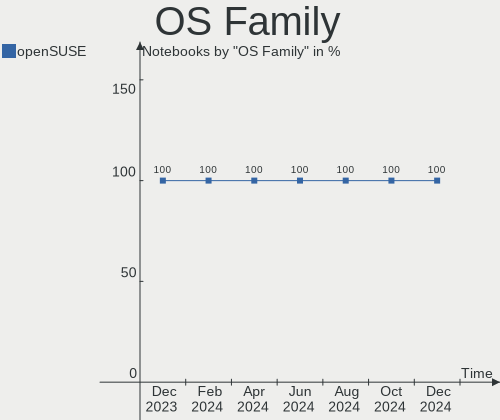
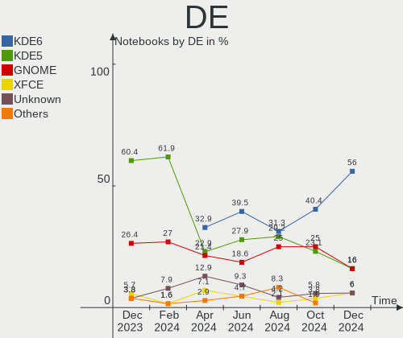
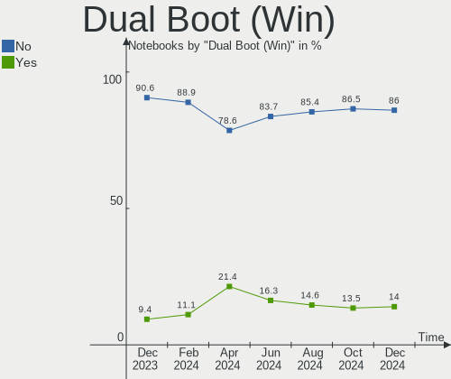
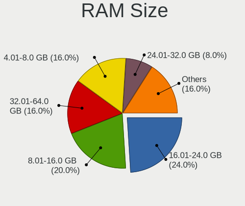
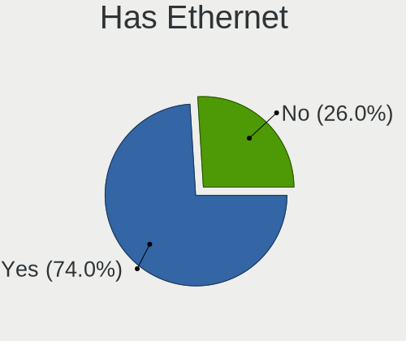
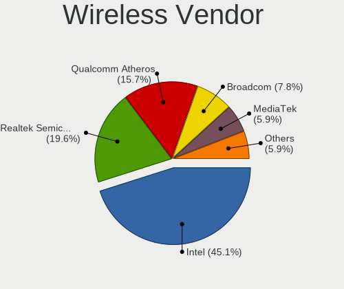
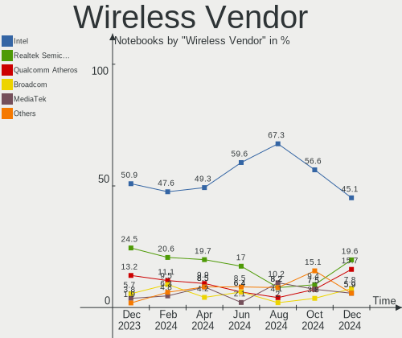
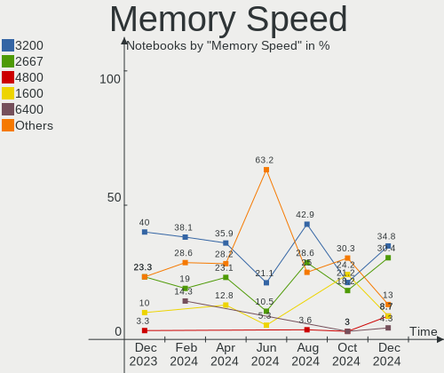

openSUSE Hardware Trends (Notebooks)
------------------------------------

A project to identify most popular hardware characteristics and track their change
over time based on data collected by openSUSE users at https://Linux-Hardware.org.

Anyone can contribute to this report by the [hw-probe](https://github.com/linuxhw/hw-probe) tool:

    sudo -E hw-probe -all -upload

Full-feature report is available here: https://linux-hardware.org/?view=trends

Period: Jan, 2022.

Contents
--------

* [ System ](#system)
  - [ OS                       ](#os)
  - [ OS Family                ](#os-family)
  - [ Kernel                   ](#kernel)
  - [ Kernel Family            ](#kernel-family)
  - [ Kernel Major Ver.        ](#kernel-major-ver)
  - [ Arch                     ](#arch)
  - [ DE                       ](#de)
  - [ Display Server           ](#display-server)
  - [ Display Manager          ](#display-manager)
  - [ OS Lang                  ](#os-lang)
  - [ Boot Mode                ](#boot-mode)
  - [ Filesystem               ](#filesystem)
  - [ Part. scheme             ](#part-scheme)
  - [ Dual Boot with Linux/BSD ](#dual-boot-with-linuxbsd)
  - [ Dual Boot (Win)          ](#dual-boot-win)

* [ Board ](#board)
  - [ Vendor                   ](#vendor)
  - [ Model                    ](#model)
  - [ Model Family             ](#model-family)
  - [ MFG Year                 ](#mfg-year)
  - [ Form Factor              ](#form-factor)
  - [ Secure Boot              ](#secure-boot)
  - [ Coreboot                 ](#coreboot)
  - [ RAM Size                 ](#ram-size)
  - [ RAM Used                 ](#ram-used)
  - [ Total Drives             ](#total-drives)
  - [ Has CD-ROM               ](#has-cd-rom)
  - [ Has Ethernet             ](#has-ethernet)
  - [ Has WiFi                 ](#has-wifi)
  - [ Has Bluetooth            ](#has-bluetooth)

* [ Location ](#location)
  - [ Country                  ](#country)
  - [ City                     ](#city)

* [ Drives ](#drives)
  - [ Drive Vendor             ](#drive-vendor)
  - [ Drive Model              ](#drive-model)
  - [ HDD Vendor               ](#hdd-vendor)
  - [ SSD Vendor               ](#ssd-vendor)
  - [ Drive Kind               ](#drive-kind)
  - [ Drive Connector          ](#drive-connector)
  - [ Drive Size               ](#drive-size)
  - [ Space Total              ](#space-total)
  - [ Space Used               ](#space-used)
  - [ Malfunc. Drives          ](#malfunc-drives)
  - [ Malfunc. Drive Vendor    ](#malfunc-drive-vendor)
  - [ Malfunc. HDD Vendor      ](#malfunc-hdd-vendor)
  - [ Malfunc. Drive Kind      ](#malfunc-drive-kind)
  - [ Failed Drives            ](#failed-drives)
  - [ Failed Drive Vendor      ](#failed-drive-vendor)
  - [ Drive Status             ](#drive-status)

* [ Storage controller ](#storage-controller)
  - [ Storage Vendor           ](#storage-vendor)
  - [ Storage Model            ](#storage-model)
  - [ Storage Kind             ](#storage-kind)

* [ Processor ](#processor)
  - [ CPU Vendor               ](#cpu-vendor)
  - [ CPU Model                ](#cpu-model)
  - [ CPU Model Family         ](#cpu-model-family)
  - [ CPU Cores                ](#cpu-cores)
  - [ CPU Sockets              ](#cpu-sockets)
  - [ CPU Threads              ](#cpu-threads)
  - [ CPU Op-Modes             ](#cpu-op-modes)
  - [ CPU Microcode            ](#cpu-microcode)
  - [ CPU Microarch            ](#cpu-microarch)

* [ Graphics ](#graphics)
  - [ GPU Vendor               ](#gpu-vendor)
  - [ GPU Model                ](#gpu-model)
  - [ GPU Combo                ](#gpu-combo)
  - [ GPU Driver               ](#gpu-driver)
  - [ GPU Memory               ](#gpu-memory)

* [ Monitor ](#monitor)
  - [ Monitor Vendor           ](#monitor-vendor)
  - [ Monitor Model            ](#monitor-model)
  - [ Monitor Resolution       ](#monitor-resolution)
  - [ Monitor Diagonal         ](#monitor-diagonal)
  - [ Monitor Width            ](#monitor-width)
  - [ Aspect Ratio             ](#aspect-ratio)
  - [ Monitor Area             ](#monitor-area)
  - [ Pixel Density            ](#pixel-density)
  - [ Multiple Monitors        ](#multiple-monitors)

* [ Network ](#network)
  - [ Net Controller Vendor    ](#net-controller-vendor)
  - [ Net Controller Model     ](#net-controller-model)
  - [ Wireless Vendor          ](#wireless-vendor)
  - [ Wireless Model           ](#wireless-model)
  - [ Ethernet Vendor          ](#ethernet-vendor)
  - [ Ethernet Model           ](#ethernet-model)
  - [ Net Controller Kind      ](#net-controller-kind)
  - [ Used Controller          ](#used-controller)
  - [ NICs                     ](#nics)
  - [ IPv6                     ](#ipv6)

* [ Bluetooth ](#bluetooth)
  - [ Bluetooth Vendor         ](#bluetooth-vendor)
  - [ Bluetooth Model          ](#bluetooth-model)

* [ Sound ](#sound)
  - [ Sound Vendor             ](#sound-vendor)
  - [ Sound Model              ](#sound-model)

* [ Memory ](#memory)
  - [ Memory Vendor            ](#memory-vendor)
  - [ Memory Model             ](#memory-model)
  - [ Memory Kind              ](#memory-kind)
  - [ Memory Form Factor       ](#memory-form-factor)
  - [ Memory Size              ](#memory-size)
  - [ Memory Speed             ](#memory-speed)

* [ Printers & scanners ](#printers--scanners)
  - [ Printer Vendor           ](#printer-vendor)
  - [ Printer Model            ](#printer-model)
  - [ Scanner Vendor           ](#scanner-vendor)
  - [ Scanner Model            ](#scanner-model)

* [ Camera ](#camera)
  - [ Camera Vendor            ](#camera-vendor)
  - [ Camera Model             ](#camera-model)

* [ Security ](#security)
  - [ Fingerprint Vendor       ](#fingerprint-vendor)
  - [ Fingerprint Model        ](#fingerprint-model)
  - [ Chipcard Vendor          ](#chipcard-vendor)
  - [ Chipcard Model           ](#chipcard-model)

* [ Unsupported ](#unsupported)
  - [ Unsupported Devices      ](#unsupported-devices)
  - [ Unsupported Device Types ](#unsupported-device-types)

System
------

OS
--

Installed operating systems

| Name                         | Notebooks | Percent |
|------------------------------|-----------|---------|
| openSUSE Tumbleweed-20220128 | 2         | 9.52%   |
| openSUSE Tumbleweed-20220103 | 2         | 9.52%   |
| openSUSE 20220122            | 2         | 9.52%   |
| openSUSE Tumbleweed-20220120 | 1         | 4.76%   |
| openSUSE Microos-20220128    | 1         | 4.76%   |
| openSUSE Leap-15.3           | 1         | 4.76%   |
| openSUSE Leap-15.2           | 1         | 4.76%   |
| openSUSE 20220128            | 1         | 4.76%   |
| openSUSE 20220124            | 1         | 4.76%   |
| openSUSE 20220123            | 1         | 4.76%   |
| openSUSE 20220121            | 1         | 4.76%   |
| openSUSE 20220118            | 1         | 4.76%   |
| openSUSE 20220113            | 1         | 4.76%   |
| openSUSE 20220107            | 1         | 4.76%   |
| openSUSE 20220106            | 1         | 4.76%   |
| openSUSE 20220103            | 1         | 4.76%   |
| openSUSE 20220102            | 1         | 4.76%   |
| openSUSE 20220101            | 1         | 4.76%   |

OS Family
---------

OS without a version

| Name     | Notebooks | Percent |
|----------|-----------|---------|
| openSUSE | 21        | 100%    |

Kernel
------

Version of the Linux kernel

| Version                       | Notebooks | Percent |
|-------------------------------|-----------|---------|
| 5.15.12-1-default             | 6         | 28.57%  |
| 5.16.1-1-default              | 5         | 23.81%  |
| 5.16.2-1-default              | 3         | 14.29%  |
| 5.16.0-1-default              | 2         | 9.52%   |
| 5.3.18-lp152.106-default      | 1         | 4.76%   |
| 5.3.18-59.37-default          | 1         | 4.76%   |
| 5.17.0-rc1-4.gf8aca60-default | 1         | 4.76%   |
| 5.16.0-rc8-1.gb59b474-vanilla | 1         | 4.76%   |
| 5.15.5-1-default              | 1         | 4.76%   |

Kernel Family
-------------

Linux kernel without a distro release

| Version | Notebooks | Percent |
|---------|-----------|---------|
| 5.15.12 | 6         | 28.57%  |
| 5.16.1  | 5         | 23.81%  |
| 5.16.2  | 3         | 14.29%  |
| 5.16.0  | 3         | 14.29%  |
| 5.3.18  | 2         | 9.52%   |
| 5.17.0  | 1         | 4.76%   |
| 5.15.5  | 1         | 4.76%   |

Kernel Major Ver.
-----------------

Linux kernel major version

| Version | Notebooks | Percent |
|---------|-----------|---------|
| 5.16    | 11        | 52.38%  |
| 5.15    | 7         | 33.33%  |
| 5.3     | 2         | 9.52%   |
| 5.17    | 1         | 4.76%   |

Arch
----

OS architecture (x86_64, i586, etc.)

| Name   | Notebooks | Percent |
|--------|-----------|---------|
| x86_64 | 21        | 100%    |

DE
--

Desktop Environment

| Name    | Notebooks | Percent |
|---------|-----------|---------|
| KDE5    | 9         | 42.86%  |
| GNOME   | 7         | 33.33%  |
| XFCE    | 3         | 14.29%  |
| Unknown | 2         | 9.52%   |

Display Server
--------------

X11 or Wayland

| Name    | Notebooks | Percent |
|---------|-----------|---------|
| X11     | 14        | 66.67%  |
| Wayland | 6         | 28.57%  |
| Unknown | 1         | 4.76%   |

Display Manager
---------------

SDDM, LightDM, etc.

| Name    | Notebooks | Percent |
|---------|-----------|---------|
| SDDM    | 7         | 33.33%  |
| Unknown | 7         | 33.33%  |
| LightDM | 5         | 23.81%  |
| XDM     | 2         | 9.52%   |

OS Lang
-------

Language

| Lang    | Notebooks | Percent |
|---------|-----------|---------|
| en_US   | 10        | 47.62%  |
| POSIX   | 3         | 14.29%  |
| de_DE   | 2         | 9.52%   |
| ru_RU   | 1         | 4.76%   |
| pt_BR   | 1         | 4.76%   |
| es_ES   | 1         | 4.76%   |
| en_GB   | 1         | 4.76%   |
| cv_RU   | 1         | 4.76%   |
| Unknown | 1         | 4.76%   |

Boot Mode
---------

EFI or BIOS

| Mode | Notebooks | Percent |
|------|-----------|---------|
| EFI  | 12        | 57.14%  |
| BIOS | 9         | 42.86%  |

Filesystem
----------

Type of filesystem

| Type    | Notebooks | Percent |
|---------|-----------|---------|
| Btrfs   | 16        | 76.19%  |
| Ext4    | 4         | 19.05%  |
| Overlay | 1         | 4.76%   |

Part. scheme
------------

Scheme of partitioning

| Type    | Notebooks | Percent |
|---------|-----------|---------|
| GPT     | 10        | 47.62%  |
| Unknown | 6         | 28.57%  |
| MBR     | 5         | 23.81%  |

Dual Boot with Linux/BSD
------------------------

Hosting more than one Linux/BSD

| Dual boot | Notebooks | Percent |
|-----------|-----------|---------|
| No        | 17        | 80.95%  |
| Yes       | 4         | 19.05%  |

Dual Boot (Win)
---------------

Hosting Linux and Windows

| Dual boot | Notebooks | Percent |
|-----------|-----------|---------|
| No        | 16        | 76.19%  |
| Yes       | 5         | 23.81%  |

Board
-----

Vendor
------

Motherboard manufacturer

| Name              | Notebooks | Percent |
|-------------------|-----------|---------|
| Lenovo            | 3         | 14.29%  |
| Hewlett-Packard   | 3         | 14.29%  |
| Razer             | 2         | 9.52%   |
| HUAWEI            | 2         | 9.52%   |
| Dell              | 2         | 9.52%   |
| Toshiba           | 1         | 4.76%   |
| Sony              | 1         | 4.76%   |
| Semp Toshiba      | 1         | 4.76%   |
| Notebook          | 1         | 4.76%   |
| MSI               | 1         | 4.76%   |
| Getac             | 1         | 4.76%   |
| Corporativo Lanix | 1         | 4.76%   |
| Apple             | 1         | 4.76%   |
| Acer              | 1         | 4.76%   |

Model
-----

Motherboard model

| Name                                             | Notebooks | Percent |
|--------------------------------------------------|-----------|---------|
| Toshiba Satellite C660D                          | 1         | 4.76%   |
| Sony VPCYB15AB                                   | 1         | 4.76%   |
| Semp Toshiba AS 1301                             | 1         | 4.76%   |
| Razer Blade 17 (Mid 2021) - RZ09-0406            | 1         | 4.76%   |
| Razer Blade 15 Base Model (Mid 2021) - RZ09-0410 | 1         | 4.76%   |
| Notebook NL5xRU                                  | 1         | 4.76%   |
| MSI Pulse GL66 11UDK                             | 1         | 4.76%   |
| Lenovo Yoga Slim 7 14ITL05 82A3                  | 1         | 4.76%   |
| Lenovo Legion S7 15ACH6 82K8                     | 1         | 4.76%   |
| Lenovo IdeaPad S145-15IWL 81MV                   | 1         | 4.76%   |
| HUAWEI KPL-W0X                                   | 1         | 4.76%   |
| HUAWEI HKD-WXX                                   | 1         | 4.76%   |
| HP Laptop 17-ca0xxx                              | 1         | 4.76%   |
| HP ENVY 15                                       | 1         | 4.76%   |
| HP Compaq 6830s                                  | 1         | 4.76%   |
| Getac V200-G2                                    | 1         | 4.76%   |
| Dell XPS 13 9343                                 | 1         | 4.76%   |
| Dell Latitude XT2                                | 1         | 4.76%   |
| Corporativo Lanix MB40II5                        | 1         | 4.76%   |
| Apple MacBookPro8,1                              | 1         | 4.76%   |
| Acer Aspire F5-572G                              | 1         | 4.76%   |

Model Family
------------

Motherboard model prefix

| Name                      | Notebooks | Percent |
|---------------------------|-----------|---------|
| Razer Blade               | 2         | 9.52%   |
| Toshiba Satellite         | 1         | 4.76%   |
| Sony VPCYB15AB            | 1         | 4.76%   |
| Semp Toshiba AS           | 1         | 4.76%   |
| Notebook NL5xRU           | 1         | 4.76%   |
| MSI Pulse                 | 1         | 4.76%   |
| Lenovo Yoga               | 1         | 4.76%   |
| Lenovo Legion             | 1         | 4.76%   |
| Lenovo IdeaPad            | 1         | 4.76%   |
| HUAWEI KPL-W0X            | 1         | 4.76%   |
| HUAWEI HKD-WXX            | 1         | 4.76%   |
| HP Laptop                 | 1         | 4.76%   |
| HP ENVY                   | 1         | 4.76%   |
| HP Compaq                 | 1         | 4.76%   |
| Getac V200-G2             | 1         | 4.76%   |
| Dell XPS                  | 1         | 4.76%   |
| Dell Latitude             | 1         | 4.76%   |
| Corporativo Lanix MB40II5 | 1         | 4.76%   |
| Apple MacBookPro8         | 1         | 4.76%   |
| Acer Aspire               | 1         | 4.76%   |

MFG Year
--------

Motherboard manufacture year

| Year | Notebooks | Percent |
|------|-----------|---------|
| 2021 | 5         | 23.81%  |
| 2011 | 3         | 14.29%  |
| 2010 | 3         | 14.29%  |
| 2020 | 2         | 9.52%   |
| 2018 | 2         | 9.52%   |
| 2015 | 2         | 9.52%   |
| 2019 | 1         | 4.76%   |
| 2013 | 1         | 4.76%   |
| 2009 | 1         | 4.76%   |
| 2008 | 1         | 4.76%   |

Form Factor
-----------

Physical design of the computer

| Name     | Notebooks | Percent |
|----------|-----------|---------|
| Notebook | 21        | 100%    |

Secure Boot
-----------

Enabled or disabled

| State    | Notebooks | Percent |
|----------|-----------|---------|
| Disabled | 17        | 80.95%  |
| Enabled  | 4         | 19.05%  |

Coreboot
--------

Have coreboot on board

| Used | Notebooks | Percent |
|------|-----------|---------|
| No   | 21        | 100%    |

RAM Size
--------

Total RAM memory

| Size in GB | Notebooks | Percent |
|------------|-----------|---------|
| 4.01-8.0   | 8         | 38.1%   |
| 16.01-24.0 | 6         | 28.57%  |
| 3.01-4.0   | 3         | 14.29%  |
| 32.01-64.0 | 1         | 4.76%   |
| 2.01-3.0   | 1         | 4.76%   |
| 1.01-2.0   | 1         | 4.76%   |
| 8.01-16.0  | 1         | 4.76%   |

RAM Used
--------

Used RAM memory

| Used GB   | Notebooks | Percent |
|-----------|-----------|---------|
| 2.01-3.0  | 6         | 28.57%  |
| 1.01-2.0  | 5         | 23.81%  |
| 4.01-8.0  | 4         | 19.05%  |
| 3.01-4.0  | 3         | 14.29%  |
| 0.51-1.0  | 2         | 9.52%   |
| 8.01-16.0 | 1         | 4.76%   |

Total Drives
------------

Number of drives on board

| Drives | Notebooks | Percent |
|--------|-----------|---------|
| 1      | 15        | 71.43%  |
| 2      | 6         | 28.57%  |

Has CD-ROM
----------

Has CD-ROM on board

| Presented | Notebooks | Percent |
|-----------|-----------|---------|
| No        | 17        | 80.95%  |
| Yes       | 4         | 19.05%  |

Has Ethernet
------------

Has Ethernet on board

| Presented | Notebooks | Percent |
|-----------|-----------|---------|
| Yes       | 16        | 76.19%  |
| No        | 5         | 23.81%  |

Has WiFi
--------

Has WiFi module

| Presented | Notebooks | Percent |
|-----------|-----------|---------|
| Yes       | 21        | 100%    |

Has Bluetooth
-------------

Has Bluetooth module

| Presented | Notebooks | Percent |
|-----------|-----------|---------|
| Yes       | 16        | 76.19%  |
| No        | 5         | 23.81%  |

Location
--------

Country
-------

Geographic location (country)

| Country   | Notebooks | Percent |
|-----------|-----------|---------|
| Russia    | 3         | 14.29%  |
| USA       | 2         | 9.52%   |
| UK        | 2         | 9.52%   |
| Italy     | 2         | 9.52%   |
| Germany   | 2         | 9.52%   |
| Brazil    | 2         | 9.52%   |
| Ukraine   | 1         | 4.76%   |
| Spain     | 1         | 4.76%   |
| Poland    | 1         | 4.76%   |
| Mexico    | 1         | 4.76%   |
| Finland   | 1         | 4.76%   |
| Chile     | 1         | 4.76%   |
| Belarus   | 1         | 4.76%   |
| Australia | 1         | 4.76%   |

City
----

Geographic location (city)

| City         | Notebooks | Percent |
|--------------|-----------|---------|
| Teresina     | 1         | 4.76%   |
| Stryi        | 1         | 4.76%   |
| Navashino    | 1         | 4.76%   |
| Munich       | 1         | 4.76%   |
| Moonee Ponds | 1         | 4.76%   |
| Monza        | 1         | 4.76%   |
| Minsk        | 1         | 4.76%   |
| Leeds        | 1         | 4.76%   |
| Las Vegas    | 1         | 4.76%   |
| Innopolis    | 1         | 4.76%   |
| Houston      | 1         | 4.76%   |
| Helsinki     | 1         | 4.76%   |
| Harrow       | 1         | 4.76%   |
| Goi??nia     | 1         | 4.76%   |
| Ecatepec     | 1         | 4.76%   |
| Concepci??n  | 1         | 4.76%   |
| Chelyabinsk  | 1         | 4.76%   |
| Bolzano      | 1         | 4.76%   |
| Blankenbach  | 1         | 4.76%   |
| Bialystok    | 1         | 4.76%   |
| A Coru?±a    | 1         | 4.76%   |

Drives
------

Drive Vendor
------------

Hard drive vendors

| Vendor              | Notebooks | Drives | Percent |
|---------------------|-----------|--------|---------|
| Samsung Electronics | 7         | 8      | 26.92%  |
| WDC                 | 5         | 5      | 19.23%  |
| Kingston            | 2         | 2      | 7.69%   |
| Crucial             | 2         | 2      | 7.69%   |
| YMTC                | 1         | 1      | 3.85%   |
| XPG                 | 1         | 1      | 3.85%   |
| Toshiba             | 1         | 1      | 3.85%   |
| SK Hynix            | 1         | 1      | 3.85%   |
| Seagate             | 1         | 1      | 3.85%   |
| SanDisk             | 1         | 1      | 3.85%   |
| Intel               | 1         | 1      | 3.85%   |
| Fujitsu             | 1         | 1      | 3.85%   |
| China               | 1         | 1      | 3.85%   |
| Advantech           | 1         | 1      | 3.85%   |

Drive Model
-----------

Hard drive models

| Model                                  | Notebooks | Percent |
|----------------------------------------|-----------|---------|
| YMTC PC005 1TB                         | 1         | 3.85%   |
| XPG NVMe SSD Drive 512GB               | 1         | 3.85%   |
| WDC WD3200BEKT-60V5T1 320GB            | 1         | 3.85%   |
| WDC WD20SPZX-00UA7T0 2TB               | 1         | 3.85%   |
| WDC WD10SPZX-60Z10T0 1TB               | 1         | 3.85%   |
| WDC WD10JPVX-22JC3T0 1TB               | 1         | 3.85%   |
| WDC PC SN730 SDBPNTY-512G-1101 512GB   | 1         | 3.85%   |
| Toshiba MK3275GSX 320GB                | 1         | 3.85%   |
| SK Hynix SKHynix_HFS512GDE9X084N 512GB | 1         | 3.85%   |
| Seagate ST9500325AS 500GB              | 1         | 3.85%   |
| SanDisk SDSSDH3500G 500GB              | 1         | 3.85%   |
| Samsung SSD PM851 M.2 2280 256GB       | 1         | 3.85%   |
| Samsung NVMe SSD Drive 512GB           | 1         | 3.85%   |
| Samsung NVMe SSD Drive 500GB           | 1         | 3.85%   |
| Samsung NVMe SSD Drive 1024GB          | 1         | 3.85%   |
| Samsung MZNLN128HAHQ-000L2 128GB SSD   | 1         | 3.85%   |
| Samsung HS12RJF 120GB                  | 1         | 3.85%   |
| Samsung 860-500GB SSD                  | 1         | 3.85%   |
| Kingston SNVS250G 250GB                | 1         | 3.85%   |
| Kingston OM8PCP3512F-AI1 512GB         | 1         | 3.85%   |
| Intel NVMe SSD Drive 1024GB            | 1         | 3.85%   |
| Fujitsu MHZ2250BH G2 250GB             | 1         | 3.85%   |
| Crucial CT256MX100SSD1 256GB           | 1         | 3.85%   |
| Crucial CT250MX500SSD1N 250GB          | 1         | 3.85%   |
| China SSD 64GB                         | 1         | 3.85%   |
| Advantech SQF-S25M8-128G-AAG 128GB SSD | 1         | 3.85%   |

HDD Vendor
----------

Hard disk drive vendors

| Vendor              | Notebooks | Drives | Percent |
|---------------------|-----------|--------|---------|
| WDC                 | 4         | 4      | 50%     |
| Toshiba             | 1         | 1      | 12.5%   |
| Seagate             | 1         | 1      | 12.5%   |
| Samsung Electronics | 1         | 1      | 12.5%   |
| Fujitsu             | 1         | 1      | 12.5%   |

SSD Vendor
----------

Solid state drive vendors

| Vendor              | Notebooks | Drives | Percent |
|---------------------|-----------|--------|---------|
| Samsung Electronics | 3         | 3      | 37.5%   |
| Crucial             | 2         | 2      | 25%     |
| SanDisk             | 1         | 1      | 12.5%   |
| China               | 1         | 1      | 12.5%   |
| Advantech           | 1         | 1      | 12.5%   |

Drive Kind
----------

HDD or SSD

| Kind | Notebooks | Drives | Percent |
|------|-----------|--------|---------|
| NVMe | 9         | 11     | 39.13%  |
| SSD  | 7         | 8      | 30.43%  |
| HDD  | 7         | 8      | 30.43%  |

Drive Connector
---------------

SATA, SAS, NVMe, etc.

| Type | Notebooks | Drives | Percent |
|------|-----------|--------|---------|
| SATA | 13        | 16     | 59.09%  |
| NVMe | 9         | 11     | 40.91%  |

Drive Size
----------

Size of hard drive

| Size in TB | Notebooks | Drives | Percent |
|------------|-----------|--------|---------|
| 0.01-0.5   | 10        | 12     | 76.92%  |
| 0.51-1.0   | 2         | 3      | 15.38%  |
| 1.01-2.0   | 1         | 1      | 7.69%   |

Space Total
-----------

Amount of disk space available on the file system

| Size in GB     | Notebooks | Percent |
|----------------|-----------|---------|
| More than 3000 | 6         | 28.57%  |
| 2001-3000      | 6         | 28.57%  |
| 251-500        | 2         | 9.52%   |
| 501-1000       | 2         | 9.52%   |
| 51-100         | 2         | 9.52%   |
| 1001-2000      | 1         | 4.76%   |
| 1-20           | 1         | 4.76%   |
| Unknown        | 1         | 4.76%   |

Space Used
----------

Amount of used disk space

| Used GB        | Notebooks | Percent |
|----------------|-----------|---------|
| 51-100         | 5         | 23.81%  |
| 1001-2000      | 4         | 19.05%  |
| 251-500        | 3         | 14.29%  |
| 21-50          | 2         | 9.52%   |
| 101-250        | 2         | 9.52%   |
| More than 3000 | 1         | 4.76%   |
| 2001-3000      | 1         | 4.76%   |
| 1-20           | 1         | 4.76%   |
| 501-1000       | 1         | 4.76%   |
| Unknown        | 1         | 4.76%   |

Malfunc. Drives
---------------

Drive models with a malfunction

| Model                                        | Notebooks | Drives | Percent |
|----------------------------------------------|-----------|--------|---------|
| Samsung Electronics SSD PM851 M.2 2280 256GB | 1         | 1      | 33.33%  |
| Samsung Electronics HS12RJF 120GB            | 1         | 1      | 33.33%  |
| Fujitsu MHZ2250BH G2 250GB                   | 1         | 1      | 33.33%  |

Malfunc. Drive Vendor
---------------------

Vendors of faulty drives

| Vendor              | Notebooks | Drives | Percent |
|---------------------|-----------|--------|---------|
| Samsung Electronics | 2         | 2      | 66.67%  |
| Fujitsu             | 1         | 1      | 33.33%  |

Malfunc. HDD Vendor
-------------------

Vendors of faulty HDD drives

| Vendor              | Notebooks | Drives | Percent |
|---------------------|-----------|--------|---------|
| Samsung Electronics | 1         | 1      | 50%     |
| Fujitsu             | 1         | 1      | 50%     |

Malfunc. Drive Kind
-------------------

Kinds of faulty drives

| Kind | Notebooks | Drives | Percent |
|------|-----------|--------|---------|
| HDD  | 2         | 2      | 66.67%  |
| SSD  | 1         | 1      | 33.33%  |

Failed Drives
-------------

Failed drive models

Zero info for selected period =(

Failed Drive Vendor
-------------------

Failed drive vendors

Zero info for selected period =(

Drive Status
------------

Number of failed and malfunc. drives

| Status   | Notebooks | Drives | Percent |
|----------|-----------|--------|---------|
| Works    | 13        | 15     | 56.52%  |
| Detected | 7         | 9      | 30.43%  |
| Malfunc  | 3         | 3      | 13.04%  |

Storage controller
------------------

Storage Vendor
--------------

Storage controller vendors

| Vendor                      | Notebooks | Percent |
|-----------------------------|-----------|---------|
| Intel                       | 12        | 48%     |
| AMD                         | 5         | 20%     |
| Samsung Electronics         | 2         | 8%      |
| Kingston Technology Company | 2         | 8%      |
| Yangtze Memory Technologies | 1         | 4%      |
| SK Hynix                    | 1         | 4%      |
| Sandisk                     | 1         | 4%      |
| ADATA Technology            | 1         | 4%      |

Storage Model
-------------

Storage controller models

| Model                                                                                  | Notebooks | Percent |
|----------------------------------------------------------------------------------------|-----------|---------|
| AMD SB7x0/SB8x0/SB9x0 SATA Controller [AHCI mode]                                      | 3         | 11.54%  |
| Samsung NVMe SSD Controller PM9A1/PM9A3/980PRO                                         | 2         | 7.69%   |
| Intel 82801IBM/IEM (ICH9M/ICH9M-E) 4 port SATA Controller [AHCI mode]                  | 2         | 7.69%   |
| AMD FCH SATA Controller [AHCI mode]                                                    | 2         | 7.69%   |
| Yangtze Memory Non-Volatile memory controller                                          | 1         | 3.85%   |
| SK Hynix Gold P31 SSD                                                                  | 1         | 3.85%   |
| Sandisk WD Black SN750 / PC SN730 NVMe SSD                                             | 1         | 3.85%   |
| Kingston Company Company Non-Volatile memory controller                                | 1         | 3.85%   |
| Kingston Company SNVS2000G [NV1 NVMe PCIe SSD 2TB]                                     | 1         | 3.85%   |
| Intel Wildcat Point-LP SATA Controller [AHCI Mode]                                     | 1         | 3.85%   |
| Intel Volume Management Device NVMe RAID Controller                                    | 1         | 3.85%   |
| Intel Sunrise Point-LP SATA Controller [AHCI mode]                                     | 1         | 3.85%   |
| Intel SSD 660P Series                                                                  | 1         | 3.85%   |
| Intel Cannon Point-LP SATA Controller [AHCI Mode]                                      | 1         | 3.85%   |
| Intel 8 Series/C220 Series Chipset Family 6-port SATA Controller 1 [AHCI mode]         | 1         | 3.85%   |
| Intel 7 Series Chipset Family 6-port SATA Controller [AHCI mode]                       | 1         | 3.85%   |
| Intel 6 Series/C200 Series Chipset Family Mobile SATA Controller (IDE mode, ports 4-5) | 1         | 3.85%   |
| Intel 6 Series/C200 Series Chipset Family Mobile SATA Controller (IDE mode, ports 0-3) | 1         | 3.85%   |
| Intel 6 Series/C200 Series Chipset Family 6 port Mobile SATA AHCI Controller           | 1         | 3.85%   |
| Intel 500 Series Chipset Family SATA AHCI Controller                                   | 1         | 3.85%   |
| ADATA XPG SX8200 Pro PCIe Gen3x4 M.2 2280 Solid State Drive                            | 1         | 3.85%   |

Storage Kind
------------

Kind of storage controller (IDE, SATA, NVMe, SAS, ...)

| Kind | Notebooks | Percent |
|------|-----------|---------|
| SATA | 14        | 58.33%  |
| NVMe | 8         | 33.33%  |
| RAID | 1         | 4.17%   |
| IDE  | 1         | 4.17%   |

Processor
---------

CPU Vendor
----------

Processor vendors

| Vendor | Notebooks | Percent |
|--------|-----------|---------|
| Intel  | 14        | 66.67%  |
| AMD    | 7         | 33.33%  |

CPU Model
---------

Processor models

| Model                                         | Notebooks | Percent |
|-----------------------------------------------|-----------|---------|
| Intel 11th Gen Core i7-11800H @ 2.30GHz       | 3         | 14.29%  |
| Intel Core i7-5500U CPU @ 2.40GHz             | 1         | 4.76%   |
| Intel Core i7-4712HQ CPU @ 2.30GHz            | 1         | 4.76%   |
| Intel Core i7-3520M CPU @ 2.90GHz             | 1         | 4.76%   |
| Intel Core i7-2620M CPU @ 2.70GHz             | 1         | 4.76%   |
| Intel Core i5-8265U CPU @ 1.60GHz             | 1         | 4.76%   |
| Intel Core i5-6200U CPU @ 2.30GHz             | 1         | 4.76%   |
| Intel Core i3-2330M CPU @ 2.20GHz             | 1         | 4.76%   |
| Intel Core 2 Duo CPU U9600 @ 1.60GHz          | 1         | 4.76%   |
| Intel Core 2 Duo CPU T9400 @ 2.53GHz          | 1         | 4.76%   |
| Intel 11th Gen Core i7-11370H @ 3.30GHz       | 1         | 4.76%   |
| Intel 11th Gen Core i5-1135G7 @ 2.40GHz       | 1         | 4.76%   |
| AMD Ryzen 7 5800H with Radeon Graphics        | 1         | 4.76%   |
| AMD Ryzen 5 4500U with Radeon Graphics        | 1         | 4.76%   |
| AMD Ryzen 5 2500U with Radeon Vega Mobile Gfx | 1         | 4.76%   |
| AMD E-450 APU with Radeon HD Graphics         | 1         | 4.76%   |
| AMD E-350 Processor                           | 1         | 4.76%   |
| AMD C-50 Processor                            | 1         | 4.76%   |
| AMD A6-9225 RADEON R4, 5 COMPUTE CORES 2C+3G  | 1         | 4.76%   |

CPU Model Family
----------------

Processor model prefix

| Model            | Notebooks | Percent |
|------------------|-----------|---------|
| Other            | 5         | 23.81%  |
| Intel Core i7    | 4         | 19.05%  |
| Intel Core i5    | 2         | 9.52%   |
| Intel Core 2 Duo | 2         | 9.52%   |
| AMD Ryzen 5      | 2         | 9.52%   |
| AMD E            | 2         | 9.52%   |
| Intel Core i3    | 1         | 4.76%   |
| AMD Ryzen 7      | 1         | 4.76%   |
| AMD C-50         | 1         | 4.76%   |
| AMD A6           | 1         | 4.76%   |

CPU Cores
---------

Number of processor cores

| Number | Notebooks | Percent |
|--------|-----------|---------|
| 2      | 11        | 52.38%  |
| 4      | 5         | 23.81%  |
| 8      | 4         | 19.05%  |
| 6      | 1         | 4.76%   |

CPU Sockets
-----------

Number of sockets

| Number | Notebooks | Percent |
|--------|-----------|---------|
| 1      | 21        | 100%    |

CPU Threads
-----------

Threads per core (Hyper-Threading)

| Number | Notebooks | Percent |
|--------|-----------|---------|
| 2      | 14        | 66.67%  |
| 1      | 7         | 33.33%  |

CPU Op-Modes
------------

CPU Operation Modes (32-bit, 64-bit)

| Op mode        | Notebooks | Percent |
|----------------|-----------|---------|
| 32-bit, 64-bit | 21        | 100%    |

CPU Microcode
-------------

Microcode number

| Number     | Notebooks | Percent |
|------------|-----------|---------|
| 0x806d1    | 3         | 14.29%  |
| 0x806c1    | 2         | 9.52%   |
| 0x206a7    | 2         | 9.52%   |
| 0x1067a    | 2         | 9.52%   |
| 0x806ec    | 1         | 4.76%   |
| 0x406e3    | 1         | 4.76%   |
| 0x306d4    | 1         | 4.76%   |
| 0x306c3    | 1         | 4.76%   |
| 0x306a9    | 1         | 4.76%   |
| 0x0a50000c | 1         | 4.76%   |
| 0x08600106 | 1         | 4.76%   |
| 0x08101007 | 1         | 4.76%   |
| 0x06006705 | 1         | 4.76%   |
| 0x05000119 | 1         | 4.76%   |
| 0x05000029 | 1         | 4.76%   |
| Unknown    | 1         | 4.76%   |

CPU Microarch
-------------

Microarchitecture

| Name        | Notebooks | Percent |
|-------------|-----------|---------|
| Icelake     | 3         | 14.29%  |
| Bobcat      | 3         | 14.29%  |
| TigerLake   | 2         | 9.52%   |
| SandyBridge | 2         | 9.52%   |
| Penryn      | 2         | 9.52%   |
| Zen 3       | 1         | 4.76%   |
| Zen 2       | 1         | 4.76%   |
| Zen         | 1         | 4.76%   |
| Skylake     | 1         | 4.76%   |
| KabyLake    | 1         | 4.76%   |
| IvyBridge   | 1         | 4.76%   |
| Haswell     | 1         | 4.76%   |
| Excavator   | 1         | 4.76%   |
| Broadwell   | 1         | 4.76%   |

Graphics
--------

GPU Vendor
----------

Vendors of graphics cards

| Vendor | Notebooks | Percent |
|--------|-----------|---------|
| Intel  | 12        | 46.15%  |
| AMD    | 8         | 30.77%  |
| Nvidia | 6         | 23.08%  |

GPU Model
---------

Graphics card models

| Model                                                                                 | Notebooks | Percent |
|---------------------------------------------------------------------------------------|-----------|---------|
| Nvidia GA104M [GeForce RTX 3070 Mobile / Max-Q]                                       | 2         | 7.41%   |
| Intel TigerLake-LP GT2 [Iris Xe Graphics]                                             | 2         | 7.41%   |
| Intel TigerLake-H GT1 [UHD Graphics]                                                  | 2         | 7.41%   |
| Intel 2nd Generation Core Processor Family Integrated Graphics Controller             | 2         | 7.41%   |
| Nvidia GM108M [GeForce 940M]                                                          | 1         | 3.7%    |
| Nvidia GM107M [GeForce GTX 850M]                                                      | 1         | 3.7%    |
| Nvidia GA107M [GeForce RTX 3050 Ti Mobile]                                            | 1         | 3.7%    |
| Nvidia GA106M [GeForce RTX 3060 Mobile / Max-Q]                                       | 1         | 3.7%    |
| Intel WhiskeyLake-U GT2 [UHD Graphics 620]                                            | 1         | 3.7%    |
| Intel Skylake GT2 [HD Graphics 520]                                                   | 1         | 3.7%    |
| Intel Mobile 4 Series Chipset Integrated Graphics Controller                          | 1         | 3.7%    |
| Intel HD Graphics 5500                                                                | 1         | 3.7%    |
| Intel 4th Gen Core Processor Integrated Graphics Controller                           | 1         | 3.7%    |
| Intel 3rd Gen Core processor Graphics Controller                                      | 1         | 3.7%    |
| AMD Wrestler [Radeon HD 6320]                                                         | 1         | 3.7%    |
| AMD Wrestler [Radeon HD 6310]                                                         | 1         | 3.7%    |
| AMD Wrestler [Radeon HD 6250]                                                         | 1         | 3.7%    |
| AMD Topaz XT [Radeon R7 M260/M265 / M340/M360 / M440/M445 / 530/535 / 620/625 Mobile] | 1         | 3.7%    |
| AMD Stoney [Radeon R2/R3/R4/R5 Graphics]                                              | 1         | 3.7%    |
| AMD RV620/M82 [Mobility Radeon HD 3410/3430]                                          | 1         | 3.7%    |
| AMD Renoir                                                                            | 1         | 3.7%    |
| AMD Raven Ridge [Radeon Vega Series / Radeon Vega Mobile Series]                      | 1         | 3.7%    |
| AMD Cezanne                                                                           | 1         | 3.7%    |

GPU Combo
---------

Combinations of graphics cards

| Name           | Notebooks | Percent |
|----------------|-----------|---------|
| 1 x Intel      | 8         | 38.1%   |
| 1 x AMD        | 6         | 28.57%  |
| Intel + Nvidia | 4         | 19.05%  |
| 2 x AMD        | 1         | 4.76%   |
| 1 x Nvidia     | 1         | 4.76%   |
| AMD + Nvidia   | 1         | 4.76%   |

GPU Driver
----------

Free vs proprietary

| Driver      | Notebooks | Percent |
|-------------|-----------|---------|
| Free        | 19        | 90.48%  |
| Proprietary | 2         | 9.52%   |

GPU Memory
----------

Total video memory

| Size in GB | Notebooks | Percent |
|------------|-----------|---------|
| Unknown    | 12        | 57.14%  |
| 0.01-0.5   | 6         | 28.57%  |
| 3.01-4.0   | 1         | 4.76%   |
| 1.01-2.0   | 1         | 4.76%   |
| 0.51-1.0   | 1         | 4.76%   |

Monitor
-------

Monitor Vendor
--------------

Monitor vendors

| Vendor                  | Notebooks | Percent |
|-------------------------|-----------|---------|
| Chimei Innolux          | 5         | 21.74%  |
| BOE                     | 3         | 13.04%  |
| LG Display              | 2         | 8.7%    |
| CPT                     | 2         | 8.7%    |
| AU Optronics            | 2         | 8.7%    |
| TMX                     | 1         | 4.35%   |
| Sharp                   | 1         | 4.35%   |
| Hewlett-Packard         | 1         | 4.35%   |
| Goldstar                | 1         | 4.35%   |
| GDH                     | 1         | 4.35%   |
| CSO                     | 1         | 4.35%   |
| Chi Mei Optoelectronics | 1         | 4.35%   |
| Apple                   | 1         | 4.35%   |
| AOC                     | 1         | 4.35%   |

Monitor Model
-------------

Monitor models

| Model                                                                    | Notebooks | Percent |
|--------------------------------------------------------------------------|-----------|---------|
| TMX TL142GDXP02-0 TMX1420 2520x1680 300x200mm 14.2-inch                  | 1         | 4.35%   |
| Sharp LCD Monitor SHP1421 3200x1800 294x165mm 13.3-inch                  | 1         | 4.35%   |
| LG Display LCD Monitor LGD05E5 1920x1080 344x194mm 15.5-inch             | 1         | 4.35%   |
| LG Display LCD Monitor LGD02DC 1366x768 344x194mm 15.5-inch              | 1         | 4.35%   |
| Hewlett-Packard 32 Display HPN351A 1920x1080 698x393mm 31.5-inch         | 1         | 4.35%   |
| Goldstar 22EA53 GSM59A5 1680x1050 480x270mm 21.7-inch                    | 1         | 4.35%   |
| GDH CHHWJT GDH0030 1920x540 1150x650mm 52.0-inch                         | 1         | 4.35%   |
| CSO LCD Monitor CSO1505 3840x2160 344x194mm 15.5-inch                    | 1         | 4.35%   |
| CPT LCD Monitor CPT17D8 1366x768 293x165mm 13.2-inch                     | 1         | 4.35%   |
| CPT LCD Monitor CPT17AB 1366x768 309x173mm 13.9-inch                     | 1         | 4.35%   |
| Chimei Innolux LCD Monitor CMN15C4 1920x1080 344x193mm 15.5-inch         | 1         | 4.35%   |
| Chimei Innolux LCD Monitor CMN15BB 1920x1080 344x194mm 15.5-inch         | 1         | 4.35%   |
| Chimei Innolux LCD Monitor CMN152A 2560x1440 344x193mm 15.5-inch         | 1         | 4.35%   |
| Chimei Innolux LCD Monitor CMN14D4 1920x1080 309x173mm 13.9-inch         | 1         | 4.35%   |
| Chimei Innolux LCD Monitor CMN1408 1920x1080 309x173mm 13.9-inch         | 1         | 4.35%   |
| Chi Mei Optoelectronics LCD Monitor CMO1113 1366x768 256x144mm 11.6-inch | 1         | 4.35%   |
| BOE LCD Monitor BOE09D9 2560x1440 381x214mm 17.2-inch                    | 1         | 4.35%   |
| BOE LCD Monitor BOE0812 1920x1080 344x194mm 15.5-inch                    | 1         | 4.35%   |
| BOE LCD Monitor BOE0660 1600x900 382x215mm 17.3-inch                     | 1         | 4.35%   |
| AU Optronics LCD Monitor AUOA114 1280x800 261x163mm 12.1-inch            | 1         | 4.35%   |
| AU Optronics LCD Monitor AUO80ED 1920x1080 344x193mm 15.5-inch           | 1         | 4.35%   |
| Apple LCD Monitor APP9CC5 1280x800 286x179mm 13.3-inch                   | 1         | 4.35%   |
| AOC 24G2W1G4 AOC2402 1920x1080 527x296mm 23.8-inch                       | 1         | 4.35%   |

Monitor Resolution
------------------

Monitor screen resolution

| Resolution       | Notebooks | Percent |
|------------------|-----------|---------|
| 1920x1080 (FHD)  | 9         | 42.86%  |
| 1366x768 (WXGA)  | 4         | 19.05%  |
| 2560x1440 (QHD)  | 2         | 9.52%   |
| 1280x800 (WXGA)  | 2         | 9.52%   |
| 3840x2160 (4K)   | 1         | 4.76%   |
| 3200x1800 (QHD+) | 1         | 4.76%   |
| 2520x1680        | 1         | 4.76%   |
| 1600x900 (HD+)   | 1         | 4.76%   |

Monitor Diagonal
----------------

Diagonal size in inches

| Inches | Notebooks | Percent |
|--------|-----------|---------|
| 15     | 8         | 34.78%  |
| 13     | 6         | 26.09%  |
| 17     | 2         | 8.7%    |
| 52     | 1         | 4.35%   |
| 31     | 1         | 4.35%   |
| 23     | 1         | 4.35%   |
| 21     | 1         | 4.35%   |
| 14     | 1         | 4.35%   |
| 12     | 1         | 4.35%   |
| 11     | 1         | 4.35%   |

Monitor Width
-------------

Physical width

| Width in mm | Notebooks | Percent |
|-------------|-----------|---------|
| 301-350     | 11        | 47.83%  |
| 201-300     | 6         | 26.09%  |
| 351-400     | 2         | 8.7%    |
| 601-700     | 1         | 4.35%   |
| 501-600     | 1         | 4.35%   |
| 401-500     | 1         | 4.35%   |
| 1001-1500   | 1         | 4.35%   |

Aspect Ratio
------------

Proportional relationship between the width and the height

| Ratio | Notebooks | Percent |
|-------|-----------|---------|
| 16/9  | 16        | 84.21%  |
| 16/10 | 2         | 10.53%  |
| 3/2   | 1         | 5.26%   |

Monitor Area
------------

Area in inch²

| Area in inch² | Notebooks | Percent |
|----------------|-----------|---------|
| 101-110        | 8         | 34.78%  |
| 81-90          | 4         | 17.39%  |
| 71-80          | 2         | 8.7%    |
| 201-250        | 2         | 8.7%    |
| 121-130        | 2         | 8.7%    |
| More than 1000 | 1         | 4.35%   |
| 61-70          | 1         | 4.35%   |
| 51-60          | 1         | 4.35%   |
| 351-500        | 1         | 4.35%   |
| 91-100         | 1         | 4.35%   |

Pixel Density
-------------

Pixels per inch

| Density       | Notebooks | Percent |
|---------------|-----------|---------|
| 121-160       | 9         | 39.13%  |
| 101-120       | 6         | 26.09%  |
| 161-240       | 3         | 13.04%  |
| More than 240 | 2         | 8.7%    |
| 51-100        | 2         | 8.7%    |
| 1-50          | 1         | 4.35%   |

Multiple Monitors
-----------------

Total monitors connected

| Total | Notebooks | Percent |
|-------|-----------|---------|
| 1     | 17        | 80.95%  |
| 2     | 4         | 19.05%  |

Network
-------

Net Controller Vendor
---------------------

Controller vendors

| Vendor                   | Notebooks | Percent |
|--------------------------|-----------|---------|
| Intel                    | 14        | 45.16%  |
| Realtek Semiconductor    | 10        | 32.26%  |
| Qualcomm Atheros         | 2         | 6.45%   |
| Broadcom                 | 2         | 6.45%   |
| Marvell Technology Group | 1         | 3.23%   |
| DisplayLink              | 1         | 3.23%   |
| Dell                     | 1         | 3.23%   |

Net Controller Model
--------------------

Controller models

| Model                                                             | Notebooks | Percent |
|-------------------------------------------------------------------|-----------|---------|
| Realtek RTL8111/8168/8411 PCI Express Gigabit Ethernet Controller | 8         | 20.51%  |
| Realtek RTL8188CE 802.11b/g/n WiFi Adapter                        | 2         | 5.13%   |
| Intel Wi-Fi 6 AX201                                               | 2         | 5.13%   |
| Intel Wi-Fi 6 AX200                                               | 2         | 5.13%   |
| Intel Tiger Lake PCH CNVi WiFi                                    | 2         | 5.13%   |
| Realtek RTL8723DE Wireless Network Adapter                        | 1         | 2.56%   |
| Realtek RTL8191SEvB Wireless LAN Controller                       | 1         | 2.56%   |
| Realtek RTL8188EUS 802.11n Wireless Network Adapter               | 1         | 2.56%   |
| Realtek RTL8125 2.5GbE Controller                                 | 1         | 2.56%   |
| Realtek RTL810xE PCI Express Fast Ethernet controller             | 1         | 2.56%   |
| Qualcomm Atheros QCA9377 802.11ac Wireless Network Adapter        | 1         | 2.56%   |
| Qualcomm Atheros AR9285 Wireless Network Adapter (PCI-Express)    | 1         | 2.56%   |
| Qualcomm Atheros AR8131 Gigabit Ethernet                          | 1         | 2.56%   |
| Marvell Group 88E8072 PCI-E Gigabit Ethernet Controller           | 1         | 2.56%   |
| Intel Wireless 8265 / 8275                                        | 1         | 2.56%   |
| Intel Wireless 7265                                               | 1         | 2.56%   |
| Intel Wireless 7260                                               | 1         | 2.56%   |
| Intel Wi-Fi 6 AX210/AX211/AX411 160MHz                            | 1         | 2.56%   |
| Intel PRO/Wireless 5100 AGN [Shiloh] Network Connection           | 1         | 2.56%   |
| Intel Centrino Advanced-N 6235                                    | 1         | 2.56%   |
| Intel Cannon Point-LP CNVi [Wireless-AC]                          | 1         | 2.56%   |
| Intel 82579LM Gigabit Network Connection (Lewisville)             | 1         | 2.56%   |
| Intel 82567LM Gigabit Network Connection                          | 1         | 2.56%   |
| DisplayLink Dell 4-in-1 Adapter                                   | 1         | 2.56%   |
| Dell F3507g Mobile Broadband Module                               | 1         | 2.56%   |
| Broadcom NetXtreme BCM57765 Gigabit Ethernet PCIe                 | 1         | 2.56%   |
| Broadcom BCM4331 802.11a/b/g/n                                    | 1         | 2.56%   |
| Broadcom BCM4322 802.11a/b/g/n Wireless LAN Controller            | 1         | 2.56%   |

Wireless Vendor
---------------

Wireless vendors

| Vendor                | Notebooks | Percent |
|-----------------------|-----------|---------|
| Intel                 | 13        | 59.09%  |
| Realtek Semiconductor | 5         | 22.73%  |
| Qualcomm Atheros      | 2         | 9.09%   |
| Broadcom              | 2         | 9.09%   |

Wireless Model
--------------

Wireless models

| Model                                                          | Notebooks | Percent |
|----------------------------------------------------------------|-----------|---------|
| Realtek RTL8188CE 802.11b/g/n WiFi Adapter                     | 2         | 9.09%   |
| Intel Wi-Fi 6 AX201                                            | 2         | 9.09%   |
| Intel Wi-Fi 6 AX200                                            | 2         | 9.09%   |
| Intel Tiger Lake PCH CNVi WiFi                                 | 2         | 9.09%   |
| Realtek RTL8723DE Wireless Network Adapter                     | 1         | 4.55%   |
| Realtek RTL8191SEvB Wireless LAN Controller                    | 1         | 4.55%   |
| Realtek RTL8188EUS 802.11n Wireless Network Adapter            | 1         | 4.55%   |
| Qualcomm Atheros QCA9377 802.11ac Wireless Network Adapter     | 1         | 4.55%   |
| Qualcomm Atheros AR9285 Wireless Network Adapter (PCI-Express) | 1         | 4.55%   |
| Intel Wireless 8265 / 8275                                     | 1         | 4.55%   |
| Intel Wireless 7265                                            | 1         | 4.55%   |
| Intel Wireless 7260                                            | 1         | 4.55%   |
| Intel Wi-Fi 6 AX210/AX211/AX411 160MHz                         | 1         | 4.55%   |
| Intel PRO/Wireless 5100 AGN [Shiloh] Network Connection        | 1         | 4.55%   |
| Intel Centrino Advanced-N 6235                                 | 1         | 4.55%   |
| Intel Cannon Point-LP CNVi [Wireless-AC]                       | 1         | 4.55%   |
| Broadcom BCM4331 802.11a/b/g/n                                 | 1         | 4.55%   |
| Broadcom BCM4322 802.11a/b/g/n Wireless LAN Controller         | 1         | 4.55%   |

Ethernet Vendor
---------------

Ethernet vendors

| Vendor                   | Notebooks | Percent |
|--------------------------|-----------|---------|
| Realtek Semiconductor    | 10        | 62.5%   |
| Intel                    | 2         | 12.5%   |
| Qualcomm Atheros         | 1         | 6.25%   |
| Marvell Technology Group | 1         | 6.25%   |
| DisplayLink              | 1         | 6.25%   |
| Broadcom                 | 1         | 6.25%   |

Ethernet Model
--------------

Ethernet models

| Model                                                             | Notebooks | Percent |
|-------------------------------------------------------------------|-----------|---------|
| Realtek RTL8111/8168/8411 PCI Express Gigabit Ethernet Controller | 8         | 50%     |
| Realtek RTL8125 2.5GbE Controller                                 | 1         | 6.25%   |
| Realtek RTL810xE PCI Express Fast Ethernet controller             | 1         | 6.25%   |
| Qualcomm Atheros AR8131 Gigabit Ethernet                          | 1         | 6.25%   |
| Marvell Group 88E8072 PCI-E Gigabit Ethernet Controller           | 1         | 6.25%   |
| Intel 82579LM Gigabit Network Connection (Lewisville)             | 1         | 6.25%   |
| Intel 82567LM Gigabit Network Connection                          | 1         | 6.25%   |
| DisplayLink Dell 4-in-1 Adapter                                   | 1         | 6.25%   |
| Broadcom NetXtreme BCM57765 Gigabit Ethernet PCIe                 | 1         | 6.25%   |

Net Controller Kind
-------------------

Ethernet, WiFi or modem

| Kind     | Notebooks | Percent |
|----------|-----------|---------|
| WiFi     | 21        | 55.26%  |
| Ethernet | 16        | 42.11%  |
| Modem    | 1         | 2.63%   |

Used Controller
---------------

Currently used network controller

| Kind     | Notebooks | Percent |
|----------|-----------|---------|
| WiFi     | 20        | 57.14%  |
| Ethernet | 14        | 40%     |
| Modem    | 1         | 2.86%   |

NICs
----

Total network controllers on board

| Total | Notebooks | Percent |
|-------|-----------|---------|
| 2     | 15        | 71.43%  |
| 1     | 6         | 28.57%  |

IPv6
----

IPv6 vs IPv4

| Used | Notebooks | Percent |
|------|-----------|---------|
| No   | 15        | 71.43%  |
| Yes  | 6         | 28.57%  |

Bluetooth
---------

Bluetooth Vendor
----------------

Controller vendors

| Vendor                | Notebooks | Percent |
|-----------------------|-----------|---------|
| Intel                 | 12        | 75%     |
| Realtek Semiconductor | 1         | 6.25%   |
| Lite-On Technology    | 1         | 6.25%   |
| Foxconn / Hon Hai     | 1         | 6.25%   |
| Apple                 | 1         | 6.25%   |

Bluetooth Model
---------------

Controller models

| Model                                                                               | Notebooks | Percent |
|-------------------------------------------------------------------------------------|-----------|---------|
| Intel Bluetooth Device                                                              | 8         | 50%     |
| Realtek  Bluetooth 4.2 Adapter                                                      | 1         | 6.25%   |
| Lite-On Qualcomm Atheros QCA9377 Bluetooth                                          | 1         | 6.25%   |
| Intel Centrino Bluetooth Wireless Transceiver                                       | 1         | 6.25%   |
| Intel Bluetooth wireless interface                                                  | 1         | 6.25%   |
| Intel Bluetooth 9460/9560 Jefferson Peak (JfP)                                      | 1         | 6.25%   |
| Intel AX210 Bluetooth                                                               | 1         | 6.25%   |
| Foxconn / Hon Hai Foxconn T77H114 BCM2070 [Single-Chip Bluetooth 2.1 + EDR Adapter] | 1         | 6.25%   |
| Apple Bluetooth Host Controller                                                     | 1         | 6.25%   |

Sound
-----

Sound Vendor
------------

Sound card vendors

| Vendor             | Notebooks | Percent |
|--------------------|-----------|---------|
| Intel              | 14        | 60.87%  |
| AMD                | 7         | 30.43%  |
| Nvidia             | 1         | 4.35%   |
| Focusrite-Novation | 1         | 4.35%   |

Sound Model
-----------

Sound card models

| Model                                                                      | Notebooks | Percent |
|----------------------------------------------------------------------------|-----------|---------|
| Intel Tiger Lake-H HD Audio Controller                                     | 3         | 10%     |
| AMD SBx00 Azalia (Intel HDA)                                               | 3         | 10%     |
| AMD Family 17h (Models 10h-1fh) HD Audio Controller                        | 3         | 10%     |
| Intel Tiger Lake-LP Smart Sound Technology Audio Controller                | 2         | 6.67%   |
| Intel 82801I (ICH9 Family) HD Audio Controller                             | 2         | 6.67%   |
| Intel 6 Series/C200 Series Chipset Family High Definition Audio Controller | 2         | 6.67%   |
| AMD Wrestler HDMI Audio                                                    | 2         | 6.67%   |
| Nvidia GA104 High Definition Audio Controller                              | 1         | 3.33%   |
| Intel Xeon E3-1200 v3/4th Gen Core Processor HD Audio Controller           | 1         | 3.33%   |
| Intel Wildcat Point-LP High Definition Audio Controller                    | 1         | 3.33%   |
| Intel Sunrise Point-LP HD Audio                                            | 1         | 3.33%   |
| Intel Cannon Point-LP High Definition Audio Controller                     | 1         | 3.33%   |
| Intel Broadwell-U Audio Controller                                         | 1         | 3.33%   |
| Intel 8 Series/C220 Series Chipset High Definition Audio Controller        | 1         | 3.33%   |
| Intel 7 Series/C216 Chipset Family High Definition Audio Controller        | 1         | 3.33%   |
| Focusrite-Novation Speedio                                                 | 1         | 3.33%   |
| AMD Renoir Radeon High Definition Audio Controller                         | 1         | 3.33%   |
| AMD Raven/Raven2/Fenghuang HDMI/DP Audio Controller                        | 1         | 3.33%   |
| AMD High Definition Audio Controller                                       | 1         | 3.33%   |
| AMD Family 15h (Models 60h-6fh) Audio Controller                           | 1         | 3.33%   |

Memory
------

Memory Vendor
-------------

Memory module vendors

| Vendor              | Notebooks | Percent |
|---------------------|-----------|---------|
| SK Hynix            | 5         | 21.74%  |
| Samsung Electronics | 5         | 21.74%  |
| Kingston            | 4         | 17.39%  |
| Elpida              | 3         | 13.04%  |
| Smart               | 1         | 4.35%   |
| pqi                 | 1         | 4.35%   |
| Micron Technology   | 1         | 4.35%   |
| Crucial             | 1         | 4.35%   |
| ChangXin Memory     | 1         | 4.35%   |
| ASint Technology    | 1         | 4.35%   |

Memory Model
------------

Memory module models

| Model                                                           | Notebooks | Percent |
|-----------------------------------------------------------------|-----------|---------|
| Smart RAM SH564568FH8NZPHSCR 2GB SODIMM DDR3 1333MT/s           | 1         | 4.17%   |
| SK Hynix RAM Module 4GB SODIMM DDR3 1333MT/s                    | 1         | 4.17%   |
| SK Hynix RAM HMT451S6BFR8A-PB 4GB SODIMM DDR3 1600MT/s          | 1         | 4.17%   |
| SK Hynix RAM HMT41GS6AFR8A-PB 8GB SODIMM DDR3 1600MT/s          | 1         | 4.17%   |
| SK Hynix RAM HMT125S6BFR8C-G7 2GB SODIMM DDR3 1067MT/s          | 1         | 4.17%   |
| SK Hynix RAM HMAB2GS6AMR6N-XN 16GB Row Of Chips DDR4 3200MT/s   | 1         | 4.17%   |
| Samsung RAM M471B5773CHS-CH9 2GB SODIMM DDR3 4199MT/s           | 1         | 4.17%   |
| Samsung RAM M471B5273CH0-CH9 4GB SODIMM DDR3 1334MT/s           | 1         | 4.17%   |
| Samsung RAM M471A5244CB0-CTD 4GB SODIMM DDR4 3266MT/s           | 1         | 4.17%   |
| Samsung RAM M471A2G43AB2-CWE 16GB SODIMM DDR4 3200MT/s          | 1         | 4.17%   |
| Samsung RAM M471A1G44AB0-CWE 8GB Row Of Chips DDR4 3200MT/s     | 1         | 4.17%   |
| Samsung RAM M378B2873CZ0-CF7 1GB SODIMM DDR3 800MT/s            | 1         | 4.17%   |
| pqi RAM M0880008 2GB SODIMM DDR2 800MT/s                        | 1         | 4.17%   |
| Micron RAM 8ATF1G64HZ-3G2R1 8GB SODIMM DDR4 3200MT/s            | 1         | 4.17%   |
| Kingston RAM Module 4GB SODIMM DDR3 1333MT/s                    | 1         | 4.17%   |
| Kingston RAM KHX1600C9S3L/8G 8GB SODIMM DDR3 1600MT/s           | 1         | 4.17%   |
| Kingston RAM 99U5469-045.A00LF 4GB SODIMM DDR3 1600MT/s         | 1         | 4.17%   |
| Kingston RAM 99U5428-041.A01LF 4GB SODIMM DDR3 1067MT/s         | 1         | 4.17%   |
| ELPIDA RAM EBJ20UF8BDU0-GN-F 2GB SODIMM DDR3 1600MT/s           | 1         | 4.17%   |
| Elpida RAM EBE21UE8ACUA-8G-E 2GB SODIMM DDR2 975MT/s            | 1         | 4.17%   |
| Elpida RAM 8KTS51264HDZ-1G6E1 4GB Chip DDR3 1600MT/s            | 1         | 4.17%   |
| Crucial RAM CT8G4SFRA266.M8FRS 8GB SODIMM DDR4 2667MT/s         | 1         | 4.17%   |
| ChangXin Memory RAM DB5CCAM-MK 2GB Row Of Chips LPDDR4 3733MT/s | 1         | 4.17%   |
| ASint RAM SSAC02G08-GDJNG 4GB SODIMM DDR3 1067MT/s              | 1         | 4.17%   |

Memory Kind
-----------

Memory module kinds

| Kind   | Notebooks | Percent |
|--------|-----------|---------|
| DDR3   | 8         | 50%     |
| DDR4   | 5         | 31.25%  |
| SDRAM  | 1         | 6.25%   |
| LPDDR4 | 1         | 6.25%   |
| DDR2   | 1         | 6.25%   |

Memory Form Factor
------------------

Physical design of the memory module

| Name         | Notebooks | Percent |
|--------------|-----------|---------|
| SODIMM       | 12        | 75%     |
| Row Of Chips | 3         | 18.75%  |
| Chip         | 1         | 6.25%   |

Memory Size
-----------

Memory module size

| Size  | Notebooks | Percent |
|-------|-----------|---------|
| 4096  | 6         | 35.29%  |
| 2048  | 5         | 29.41%  |
| 8192  | 4         | 23.53%  |
| 16384 | 1         | 5.88%   |
| 1024  | 1         | 5.88%   |

Memory Speed
------------

Memory module speed

| Speed | Notebooks | Percent |
|-------|-----------|---------|
| 1600  | 4         | 21.05%  |
| 3200  | 3         | 15.79%  |
| 1334  | 2         | 10.53%  |
| 1067  | 2         | 10.53%  |
| 800   | 2         | 10.53%  |
| 4199  | 1         | 5.26%   |
| 3733  | 1         | 5.26%   |
| 3266  | 1         | 5.26%   |
| 2667  | 1         | 5.26%   |
| 1333  | 1         | 5.26%   |
| 975   | 1         | 5.26%   |

Printers & scanners
-------------------

Printer Vendor
--------------

Printer device vendors

Zero info for selected period =(

Printer Model
-------------

Printer device models

Zero info for selected period =(

Scanner Vendor
--------------

Scanner device vendors

Zero info for selected period =(

Scanner Model
-------------

Scanner device models

Zero info for selected period =(

Camera
------

Camera Vendor
-------------

Camera device vendors

| Vendor                           | Notebooks | Percent |
|----------------------------------|-----------|---------|
| IMC Networks                     | 5         | 27.78%  |
| Chicony Electronics              | 5         | 27.78%  |
| Realtek Semiconductor            | 2         | 11.11%  |
| Acer                             | 2         | 11.11%  |
| Unknown (3730304231393931305153) | 1         | 5.56%   |
| Syntek                           | 1         | 5.56%   |
| Quanta                           | 1         | 5.56%   |
| Apple                            | 1         | 5.56%   |

Camera Model
------------

Camera device models

| Model                                       | Notebooks | Percent |
|---------------------------------------------|-----------|---------|
| Unknown (3730304231393931305153) USB Camera | 1         | 5.56%   |
| Syntek Integrated Camera                    | 1         | 5.56%   |
| Realtek Integrated_Webcam_HD                | 1         | 5.56%   |
| Realtek HD Webcam - Realtek                 | 1         | 5.56%   |
| Quanta HP Webcam                            | 1         | 5.56%   |
| IMC Networks USB2.0 UVC 2M WebCam           | 1         | 5.56%   |
| IMC Networks USB Camera                     | 1         | 5.56%   |
| IMC Networks Integrated RGB Camera          | 1         | 5.56%   |
| IMC Networks Integrated Camera              | 1         | 5.56%   |
| IMC Networks imx188_azurewave(p)            | 1         | 5.56%   |
| Chicony Sony Visual Communication Camera    | 1         | 5.56%   |
| Chicony Integrated Camera                   | 1         | 5.56%   |
| Chicony HP Truevision HD                    | 1         | 5.56%   |
| Chicony CNF9055 Toshiba Webcam              | 1         | 5.56%   |
| Chicony CKF7063 Webcam (HP)                 | 1         | 5.56%   |
| Apple FaceTime HD Camera                    | 1         | 5.56%   |
| Acer HD Webcam                              | 1         | 5.56%   |
| Acer BisonCam,NB Pro                        | 1         | 5.56%   |

Security
--------

Fingerprint Vendor
------------------

Fingerprint sensor vendors

| Vendor                     | Notebooks | Percent |
|----------------------------|-----------|---------|
| Shenzhen Goodix Technology | 1         | 50%     |
| AuthenTec                  | 1         | 50%     |

Fingerprint Model
-----------------

Fingerprint sensor models

| Model                                | Notebooks | Percent |
|--------------------------------------|-----------|---------|
| Shenzhen Goodix  Fingerprint Device  | 1         | 50%     |
| AuthenTec AES2550 Fingerprint Sensor | 1         | 50%     |

Chipcard Vendor
---------------

Chipcard module vendors

| Vendor      | Notebooks | Percent |
|-------------|-----------|---------|
| Broadcom    | 1         | 50%     |
| Alcor Micro | 1         | 50%     |

Chipcard Model
--------------

Chipcard module models

| Model                                                                        | Notebooks | Percent |
|------------------------------------------------------------------------------|-----------|---------|
| Broadcom BCM5880 Secure Applications Processor with fingerprint swipe sensor | 1         | 50%     |
| Alcor Micro Watchdata W 1981                                                 | 1         | 50%     |

Unsupported
-----------

Unsupported Devices
-------------------

Total unsupported devices on board

| Total | Notebooks | Percent |
|-------|-----------|---------|
| 0     | 14        | 66.67%  |
| 1     | 6         | 28.57%  |
| 2     | 1         | 4.76%   |

Unsupported Device Types
------------------------

Types of unsupported devices

| Type               | Notebooks | Percent |
|--------------------|-----------|---------|
| Graphics card      | 3         | 33.33%  |
| Fingerprint reader | 2         | 22.22%  |
| Chipcard           | 2         | 22.22%  |
| Sound              | 1         | 11.11%  |
| Camera             | 1         | 11.11%  |

