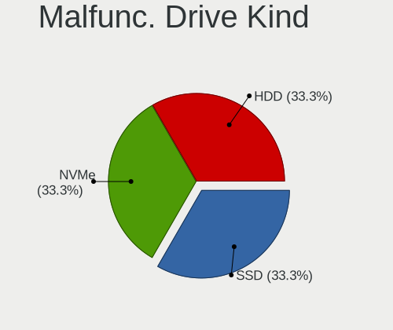

openSUSE - Hardware Trends (Notebooks)
--------------------------------------

A project to identify most popular hardware characteristics and track their change
over time based on data collected by Linux users at https://Linux-Hardware.org.

Anyone can contribute to this report by the [hw-probe](https://github.com/linuxhw/hw-probe) tool:

    sudo -E hw-probe -all -upload

This report is for one last month. Overall report since the beginning of time: [TestDays](https://github.com/linuxhw/TestDays)

Period: Oct, 2023.

Contents
--------

* [ System ](#system)
  - [ OS                       ](#os)
  - [ OS Family                ](#os-family)
  - [ Kernel                   ](#kernel)
  - [ Kernel Family            ](#kernel-family)
  - [ Kernel Major Ver.        ](#kernel-major-ver)
  - [ Arch                     ](#arch)
  - [ DE                       ](#de)
  - [ Display Server           ](#display-server)
  - [ Display Manager          ](#display-manager)
  - [ OS Lang                  ](#os-lang)
  - [ Boot Mode                ](#boot-mode)
  - [ Filesystem               ](#filesystem)
  - [ Part. scheme             ](#part-scheme)
  - [ Dual Boot with Linux/BSD ](#dual-boot-with-linuxbsd)
  - [ Dual Boot (Win)          ](#dual-boot-win)

* [ Board ](#board)
  - [ Vendor                   ](#vendor)
  - [ Model                    ](#model)
  - [ Model Family             ](#model-family)
  - [ MFG Year                 ](#mfg-year)
  - [ Form Factor              ](#form-factor)
  - [ Secure Boot              ](#secure-boot)
  - [ Coreboot                 ](#coreboot)
  - [ RAM Size                 ](#ram-size)
  - [ RAM Used                 ](#ram-used)
  - [ Total Drives             ](#total-drives)
  - [ Has CD-ROM               ](#has-cd-rom)
  - [ Has Ethernet             ](#has-ethernet)
  - [ Has WiFi                 ](#has-wifi)
  - [ Has Bluetooth            ](#has-bluetooth)

* [ Location ](#location)
  - [ Country                  ](#country)
  - [ City                     ](#city)

* [ Drives ](#drives)
  - [ Drive Vendor             ](#drive-vendor)
  - [ Drive Model              ](#drive-model)
  - [ HDD Vendor               ](#hdd-vendor)
  - [ SSD Vendor               ](#ssd-vendor)
  - [ Drive Kind               ](#drive-kind)
  - [ Drive Connector          ](#drive-connector)
  - [ Drive Size               ](#drive-size)
  - [ Space Total              ](#space-total)
  - [ Space Used               ](#space-used)
  - [ Malfunc. Drives          ](#malfunc-drives)
  - [ Malfunc. Drive Vendor    ](#malfunc-drive-vendor)
  - [ Malfunc. HDD Vendor      ](#malfunc-hdd-vendor)
  - [ Malfunc. Drive Kind      ](#malfunc-drive-kind)
  - [ Failed Drives            ](#failed-drives)
  - [ Failed Drive Vendor      ](#failed-drive-vendor)
  - [ Drive Status             ](#drive-status)

* [ Storage controller ](#storage-controller)
  - [ Storage Vendor           ](#storage-vendor)
  - [ Storage Model            ](#storage-model)
  - [ Storage Kind             ](#storage-kind)

* [ Processor ](#processor)
  - [ CPU Vendor               ](#cpu-vendor)
  - [ CPU Model                ](#cpu-model)
  - [ CPU Model Family         ](#cpu-model-family)
  - [ CPU Cores                ](#cpu-cores)
  - [ CPU Sockets              ](#cpu-sockets)
  - [ CPU Threads              ](#cpu-threads)
  - [ CPU Op-Modes             ](#cpu-op-modes)
  - [ CPU Microcode            ](#cpu-microcode)
  - [ CPU Microarch            ](#cpu-microarch)

* [ Graphics ](#graphics)
  - [ GPU Vendor               ](#gpu-vendor)
  - [ GPU Model                ](#gpu-model)
  - [ GPU Combo                ](#gpu-combo)
  - [ GPU Driver               ](#gpu-driver)
  - [ GPU Memory               ](#gpu-memory)

* [ Monitor ](#monitor)
  - [ Monitor Vendor           ](#monitor-vendor)
  - [ Monitor Model            ](#monitor-model)
  - [ Monitor Resolution       ](#monitor-resolution)
  - [ Monitor Diagonal         ](#monitor-diagonal)
  - [ Monitor Width            ](#monitor-width)
  - [ Aspect Ratio             ](#aspect-ratio)
  - [ Monitor Area             ](#monitor-area)
  - [ Pixel Density            ](#pixel-density)
  - [ Multiple Monitors        ](#multiple-monitors)

* [ Network ](#network)
  - [ Net Controller Vendor    ](#net-controller-vendor)
  - [ Net Controller Model     ](#net-controller-model)
  - [ Wireless Vendor          ](#wireless-vendor)
  - [ Wireless Model           ](#wireless-model)
  - [ Ethernet Vendor          ](#ethernet-vendor)
  - [ Ethernet Model           ](#ethernet-model)
  - [ Net Controller Kind      ](#net-controller-kind)
  - [ Used Controller          ](#used-controller)
  - [ NICs                     ](#nics)
  - [ IPv6                     ](#ipv6)

* [ Bluetooth ](#bluetooth)
  - [ Bluetooth Vendor         ](#bluetooth-vendor)
  - [ Bluetooth Model          ](#bluetooth-model)

* [ Sound ](#sound)
  - [ Sound Vendor             ](#sound-vendor)
  - [ Sound Model              ](#sound-model)

* [ Memory ](#memory)
  - [ Memory Vendor            ](#memory-vendor)
  - [ Memory Model             ](#memory-model)
  - [ Memory Kind              ](#memory-kind)
  - [ Memory Form Factor       ](#memory-form-factor)
  - [ Memory Size              ](#memory-size)
  - [ Memory Speed             ](#memory-speed)

* [ Printers & scanners ](#printers--scanners)
  - [ Printer Vendor           ](#printer-vendor)
  - [ Printer Model            ](#printer-model)
  - [ Scanner Vendor           ](#scanner-vendor)
  - [ Scanner Model            ](#scanner-model)

* [ Camera ](#camera)
  - [ Camera Vendor            ](#camera-vendor)
  - [ Camera Model             ](#camera-model)

* [ Security ](#security)
  - [ Fingerprint Vendor       ](#fingerprint-vendor)
  - [ Fingerprint Model        ](#fingerprint-model)
  - [ Chipcard Vendor          ](#chipcard-vendor)
  - [ Chipcard Model           ](#chipcard-model)

* [ Unsupported ](#unsupported)
  - [ Unsupported Devices      ](#unsupported-devices)
  - [ Unsupported Device Types ](#unsupported-device-types)

System
------

OS
--

Installed operating systems

| Name                         | Notebooks | Percent |
|------------------------------|-----------|---------|
| openSUSE Tumbleweed-XXXXXXXX | 39        | 78%     |
| openSUSE Leap-15.5           | 9         | 18%     |
| openSUSE Microos-XXXXXXXX    | 2         | 4%      |

OS Family
---------

OS without a version

| Name     | Notebooks | Percent |
|----------|-----------|---------|
| openSUSE | 50        | 100%    |

Kernel
------

Version of the Linux kernel

| Version                      | Notebooks | Percent |
|------------------------------|-----------|---------|
| 6.5.6-1-default              | 15        | 30%     |
| 6.5.4-1-default              | 13        | 26%     |
| 6.5.8-1-default              | 8         | 16%     |
| 5.14.21-150500.55.31-default | 4         | 8%      |
| 6.5.9-1-default              | 3         | 6%      |
| 5.14.21-150500.55.28-default | 3         | 6%      |
| 6.5.3-1-default              | 1         | 2%      |
| 6.4.8-1-default              | 1         | 2%      |
| 5.14.21-150500.55.19-default | 1         | 2%      |
| 5.14.21-150500.53-default    | 1         | 2%      |

Kernel Family
-------------

Linux kernel without a distro release

| Version | Notebooks | Percent |
|---------|-----------|---------|
| 6.5.6   | 15        | 30%     |
| 6.5.4   | 13        | 26%     |
| 5.14.21 | 9         | 18%     |
| 6.5.8   | 8         | 16%     |
| 6.5.9   | 3         | 6%      |
| 6.5.3   | 1         | 2%      |
| 6.4.8   | 1         | 2%      |

Kernel Major Ver.
-----------------

Linux kernel major version

| Version | Notebooks | Percent |
|---------|-----------|---------|
| 6.5     | 40        | 80%     |
| 5.14    | 9         | 18%     |
| 6.4     | 1         | 2%      |

Arch
----

OS architecture (x86_64, i586, etc.)

| Name    | Notebooks | Percent |
|---------|-----------|---------|
| x86_64  | 48        | 96%     |
| i686    | 1         | 2%      |
| aarch64 | 1         | 2%      |

DE
--

Desktop Environment

| Name    | Notebooks | Percent |
|---------|-----------|---------|
| KDE5    | 35        | 70%     |
| GNOME   | 12        | 24%     |
| XFCE    | 2         | 4%      |
| Unknown | 1         | 2%      |

Display Server
--------------

X11 or Wayland

| Name    | Notebooks | Percent |
|---------|-----------|---------|
| X11     | 33        | 66%     |
| Wayland | 17        | 34%     |

Display Manager
---------------

SDDM, LightDM, etc.

| Name    | Notebooks | Percent |
|---------|-----------|---------|
| Unknown | 31        | 62%     |
| SDDM    | 16        | 32%     |
| GDM     | 2         | 4%      |
| LightDM | 1         | 2%      |

OS Lang
-------

Language

| Lang  | Notebooks | Percent |
|-------|-----------|---------|
| en_US | 14        | 28%     |
| de_DE | 9         | 18%     |
| POSIX | 6         | 12%     |
| pt_BR | 4         | 8%      |
| it_IT | 4         | 8%      |
| pl_PL | 2         | 4%      |
| fr_FR | 2         | 4%      |
| cs_CZ | 2         | 4%      |
| zh_CN | 1         | 2%      |
| uk_UA | 1         | 2%      |
| sk_SK | 1         | 2%      |
| nl_NL | 1         | 2%      |
| ja_JP | 1         | 2%      |
| es_ES | 1         | 2%      |
| en_DK | 1         | 2%      |

Boot Mode
---------

EFI or BIOS

| Mode | Notebooks | Percent |
|------|-----------|---------|
| EFI  | 32        | 64%     |
| BIOS | 18        | 36%     |

Filesystem
----------

Type of filesystem

| Type  | Notebooks | Percent |
|-------|-----------|---------|
| Btrfs | 40        | 80%     |
| Ext4  | 9         | 18%     |
| Xfs   | 1         | 2%      |

Part. scheme
------------

Scheme of partitioning

| Type    | Notebooks | Percent |
|---------|-----------|---------|
| Unknown | 28        | 56%     |
| GPT     | 20        | 40%     |
| MBR     | 2         | 4%      |

Dual Boot with Linux/BSD
------------------------

Hosting more than one Linux/BSD

| Dual boot | Notebooks | Percent |
|-----------|-----------|---------|
| No        | 48        | 96%     |
| Yes       | 2         | 4%      |

Dual Boot (Win)
---------------

Hosting Linux and Windows

| Dual boot | Notebooks | Percent |
|-----------|-----------|---------|
| No        | 41        | 82%     |
| Yes       | 9         | 18%     |

Board
-----

Vendor
------

Motherboard manufacturer

| Name                | Notebooks | Percent |
|---------------------|-----------|---------|
| Lenovo              | 12        | 24%     |
| Hewlett-Packard     | 10        | 20%     |
| ASUSTek Computer    | 6         | 12%     |
| Acer                | 6         | 12%     |
| Dell                | 5         | 10%     |
| Toshiba             | 2         | 4%      |
| Samsung Electronics | 2         | 4%      |
| MSI                 | 2         | 4%      |
| TUXEDO              | 1         | 2%      |
| HUAWEI              | 1         | 2%      |
| Cube                | 1         | 2%      |
| Apple               | 1         | 2%      |
| Unknown             | 1         | 2%      |

Model
-----

Motherboard model

| Name                                     | Notebooks | Percent |
|------------------------------------------|-----------|---------|
| Unknown                                  | 2         | 4%      |
| TUXEDO Polaris Intel Gen3 (TGL)          | 1         | 2%      |
| Toshiba Satellite C660D                  | 1         | 2%      |
| Toshiba dynabook B452/22F                | 1         | 2%      |
| Samsung Galaxy Book Go 5G                | 1         | 2%      |
| Samsung 340XAA/350XAA/550XAA             | 1         | 2%      |
| MSI CX61 0OC/CX61 0OD/CX61 0OL           | 1         | 2%      |
| MSI Crosshair 15 B12UEZ                  | 1         | 2%      |
| Lenovo ThinkPad X390 20Q1S5K400          | 1         | 2%      |
| Lenovo ThinkPad X270 W10DG 20K6S0X900    | 1         | 2%      |
| Lenovo ThinkPad W510 4391W3V             | 1         | 2%      |
| Lenovo ThinkPad T400 27658JG             | 1         | 2%      |
| Lenovo ThinkPad T14s Gen 3 21BR00CGGE    | 1         | 2%      |
| Lenovo ThinkPad P52 20MAS0WG00           | 1         | 2%      |
| Lenovo ThinkPad P1 Gen 5 21DDS0EB00      | 1         | 2%      |
| Lenovo IdeaPad Gaming 3 15ACH6 82K2      | 1         | 2%      |
| Lenovo IdeaPad 5 Pro 14ARH7 82SJ         | 1         | 2%      |
| Lenovo G40-45 80E1                       | 1         | 2%      |
| Lenovo B570e HuronRiver Platform         | 1         | 2%      |
| HUAWEI KLVL-WXXW                         | 1         | 2%      |
| HP ProBook 6560b                         | 1         | 2%      |
| HP ProBook 455 15.6 inch G9 Notebook PC  | 1         | 2%      |
| HP ProBook 4535s                         | 1         | 2%      |
| HP Pavilion Gaming Laptop 15-dk1xxx      | 1         | 2%      |
| HP Pavilion dv7                          | 1         | 2%      |
| HP OMEN by Gaming Laptop 16-n0xxx        | 1         | 2%      |
| HP Laptop 15s-du4xxx                     | 1         | 2%      |
| HP Laptop 15-db1xxx                      | 1         | 2%      |
| HP EliteBook 840 G4                      | 1         | 2%      |
| HP EliteBook 830 13 inch G10 Notebook PC | 1         | 2%      |
| Dell Precision M6500                     | 1         | 2%      |
| Dell Precision M4700                     | 1         | 2%      |
| Dell Latitude 5440                       | 1         | 2%      |
| Dell Inspiron N4050                      | 1         | 2%      |
| Dell Inspiron 5547                       | 1         | 2%      |
| Cube i18-BL                              | 1         | 2%      |
| ASUS ZenBook UX434FL                     | 1         | 2%      |
| ASUS VivoBook_ASUSLaptop X515DA_Y1511CDA | 1         | 2%      |
| ASUS ROG Strix G713RW_G713RW             | 1         | 2%      |
| ASUS ROG Strix G713QE_G713QE             | 1         | 2%      |

Model Family
------------

Motherboard model prefix

| Name               | Notebooks | Percent |
|--------------------|-----------|---------|
| Lenovo ThinkPad    | 7         | 14%     |
| Acer Aspire        | 4         | 8%      |
| HP ProBook         | 3         | 6%      |
| Lenovo IdeaPad     | 2         | 4%      |
| HP Pavilion        | 2         | 4%      |
| HP Laptop          | 2         | 4%      |
| HP EliteBook       | 2         | 4%      |
| Dell Precision     | 2         | 4%      |
| Dell Inspiron      | 2         | 4%      |
| ASUS ROG           | 2         | 4%      |
| Unknown            | 2         | 4%      |
| TUXEDO Polaris     | 1         | 2%      |
| Toshiba Satellite  | 1         | 2%      |
| Toshiba dynabook   | 1         | 2%      |
| Samsung Galaxy     | 1         | 2%      |
| Samsung 340XAA     | 1         | 2%      |
| MSI CX61           | 1         | 2%      |
| MSI Crosshair      | 1         | 2%      |
| Lenovo G40-45      | 1         | 2%      |
| Lenovo B570e       | 1         | 2%      |
| HUAWEI KLVL-WXXW   | 1         | 2%      |
| HP OMEN            | 1         | 2%      |
| Dell Latitude      | 1         | 2%      |
| Cube i18-BL        | 1         | 2%      |
| ASUS ZenBook       | 1         | 2%      |
| ASUS VivoBook      | 1         | 2%      |
| ASUS Q550LF        | 1         | 2%      |
| ASUS ASUS          | 1         | 2%      |
| Apple MacBookPro11 | 1         | 2%      |
| Acer TravelMate    | 1         | 2%      |
| Acer Swift         | 1         | 2%      |

MFG Year
--------

Motherboard manufacture year

| Year | Notebooks | Percent |
|------|-----------|---------|
| 2022 | 11        | 22%     |
| 2021 | 6         | 12%     |
| 2023 | 4         | 8%      |
| 2011 | 4         | 8%      |
| 2010 | 4         | 8%      |
| 2019 | 3         | 6%      |
| 2017 | 3         | 6%      |
| 2012 | 3         | 6%      |
| 2008 | 3         | 6%      |
| 2018 | 2         | 4%      |
| 2014 | 2         | 4%      |
| 2013 | 2         | 4%      |
| 2020 | 1         | 2%      |
| 2016 | 1         | 2%      |
| 2009 | 1         | 2%      |

Form Factor
-----------

Physical design of the computer

| Name     | Notebooks | Percent |
|----------|-----------|---------|
| Notebook | 50        | 100%    |

Secure Boot
-----------

Enabled or disabled

| State    | Notebooks | Percent |
|----------|-----------|---------|
| Disabled | 38        | 76%     |
| Enabled  | 12        | 24%     |

Coreboot
--------

Have coreboot on board

| Used | Notebooks | Percent |
|------|-----------|---------|
| No   | 50        | 100%    |

RAM Size
--------

Total RAM memory

| Size in GB  | Notebooks | Percent |
|-------------|-----------|---------|
| 16.01-24.0  | 13        | 26%     |
| 8.01-16.0   | 10        | 20%     |
| 4.01-8.0    | 9         | 18%     |
| 32.01-64.0  | 6         | 12%     |
| 3.01-4.0    | 6         | 12%     |
| 64.01-256.0 | 2         | 4%      |
| 1.01-2.0    | 2         | 4%      |
| 24.01-32.0  | 1         | 2%      |
| 2.01-3.0    | 1         | 2%      |

RAM Used
--------

Used RAM memory

| Used GB   | Notebooks | Percent |
|-----------|-----------|---------|
| 2.01-3.0  | 15        | 30%     |
| 3.01-4.0  | 11        | 22%     |
| 4.01-8.0  | 10        | 20%     |
| 1.01-2.0  | 10        | 20%     |
| 8.01-16.0 | 3         | 6%      |
| 0.51-1.0  | 1         | 2%      |

Total Drives
------------

Number of drives on board

| Drives | Notebooks | Percent |
|--------|-----------|---------|
| 1      | 32        | 64%     |
| 2      | 17        | 34%     |
| 0      | 1         | 2%      |

Has CD-ROM
----------

Has CD-ROM on board

| Presented | Notebooks | Percent |
|-----------|-----------|---------|
| No        | 37        | 74%     |
| Yes       | 13        | 26%     |

Has Ethernet
------------

Has Ethernet on board

| Presented | Notebooks | Percent |
|-----------|-----------|---------|
| Yes       | 38        | 76%     |
| No        | 12        | 24%     |

Has WiFi
--------

Has WiFi module

| Presented | Notebooks | Percent |
|-----------|-----------|---------|
| Yes       | 49        | 98%     |
| No        | 1         | 2%      |

Has Bluetooth
-------------

Has Bluetooth module

| Presented | Notebooks | Percent |
|-----------|-----------|---------|
| Yes       | 41        | 82%     |
| No        | 9         | 18%     |

Location
--------

Country
-------

Geographic location (country)

| Country     | Notebooks | Percent |
|-------------|-----------|---------|
| Germany     | 10        | 20%     |
| USA         | 7         | 14%     |
| Italy       | 5         | 10%     |
| Poland      | 4         | 8%      |
| Brazil      | 4         | 8%      |
| France      | 3         | 6%      |
| Czechia     | 2         | 4%      |
| Canada      | 2         | 4%      |
| Vietnam     | 1         | 2%      |
| Ukraine     | 1         | 2%      |
| Switzerland | 1         | 2%      |
| Slovakia    | 1         | 2%      |
| Netherlands | 1         | 2%      |
| Japan       | 1         | 2%      |
| Iran        | 1         | 2%      |
| Greece      | 1         | 2%      |
| Finland     | 1         | 2%      |
| Colombia    | 1         | 2%      |
| China       | 1         | 2%      |
| Austria     | 1         | 2%      |
| Australia   | 1         | 2%      |

City
----

Geographic location (city)

| City             | Notebooks | Percent |
|------------------|-----------|---------|
| Rome             | 2         | 4%      |
| Wilczyce         | 1         | 2%      |
| Warsaw           | 1         | 2%      |
| Waganiec         | 1         | 2%      |
| Vienna           | 1         | 2%      |
| Tucson           | 1         | 2%      |
| Tours            | 1         | 2%      |
| Tehran           | 1         | 2%      |
| Somma Lombardo   | 1         | 2%      |
| Soest            | 1         | 2%      |
| Sao Paulo        | 1         | 2%      |
| Salt Lake City   | 1         | 2%      |
| Rio de Janeiro   | 1         | 2%      |
| Prague           | 1         | 2%      |
| Poznan           | 1         | 2%      |
| Plauen           | 1         | 2%      |
| Pereira          | 1         | 2%      |
| Panama City      | 1         | 2%      |
| Palermo          | 1         | 2%      |
| Painesville      | 1         | 2%      |
| Osaka            | 1         | 2%      |
| Neu-Ulm          | 1         | 2%      |
| Montpellier      | 1         | 2%      |
| Milano           | 1         | 2%      |
| Mesa             | 1         | 2%      |
| Markham          | 1         | 2%      |
| Mainhausen       | 1         | 2%      |
| Kyiv             | 1         | 2%      |
| Kostelec         | 1         | 2%      |
| Kerpen           | 1         | 2%      |
| Irvington        | 1         | 2%      |
| House Springs    | 1         | 2%      |
| Ho Chi Minh City | 1         | 2%      |
| Helsinki         | 1         | 2%      |
| Gravenhurst      | 1         | 2%      |
| Gaimersheim      | 1         | 2%      |
| Flensburg        | 1         | 2%      |
| Enschede         | 1         | 2%      |
| Davos Dorf       | 1         | 2%      |
| Chongqing        | 1         | 2%      |

Drives
------

Drive Vendor
------------

Hard drive vendors

| Vendor                      | Notebooks | Drives | Percent |
|-----------------------------|-----------|--------|---------|
| Samsung Electronics         | 15        | 18     | 25.42%  |
| SanDisk                     | 6         | 6      | 10.17%  |
| Micron Technology           | 4         | 4      | 6.78%   |
| Intel                       | 4         | 4      | 6.78%   |
| Crucial                     | 4         | 4      | 6.78%   |
| WDC                         | 3         | 3      | 5.08%   |
| Unknown                     | 3         | 3      | 5.08%   |
| Toshiba                     | 3         | 3      | 5.08%   |
| SK hynix                    | 3         | 3      | 5.08%   |
| Seagate                     | 3         | 3      | 5.08%   |
| Phison Electronics          | 2         | 2      | 3.39%   |
| Micron/Crucial Technology   | 1         | 1      | 1.69%   |
| MAXIO Technology (Hangzhou) | 1         | 1      | 1.69%   |
| Kingston                    | 1         | 1      | 1.69%   |
| KingFast                    | 1         | 1      | 1.69%   |
| Hitachi                     | 1         | 1      | 1.69%   |
| Gigabyte Technology         | 1         | 1      | 1.69%   |
| FORESEE                     | 1         | 1      | 1.69%   |
| Apple                       | 1         | 1      | 1.69%   |
| A-DATA Technology           | 1         | 1      | 1.69%   |

Drive Model
-----------

Hard drive models

| Model                                              | Notebooks | Percent |
|----------------------------------------------------|-----------|---------|
| Samsung NVMe SSD Controller PM9A1/PM9A3/980PRO 1TB | 5         | 8.33%   |
| Unknown MMC Card  64GB                             | 2         | 3.33%   |
| Sandisk WD Blue SN550 NVMe SSD 1TB                 | 2         | 3.33%   |
| Sandisk WD Black SN850 1TB                         | 2         | 3.33%   |
| Samsung NVMe SSD Controller SM981/PM981/PM983 1TB  | 2         | 3.33%   |
| Crucial CT500MX500SSD1 500GB                       | 2         | 3.33%   |
| Crucial CT240BX500SSD1 240GB                       | 2         | 3.33%   |
| WDC WDS100T2B0A-00SM50 1TB SSD                     | 1         | 1.67%   |
| WDC WD5000LPVX-22V0TT0 500GB                       | 1         | 1.67%   |
| WDC WD3200BEVT-22ZCT0 320GB                        | 1         | 1.67%   |
| Unknown MMC Card  32GB                             | 1         | 1.67%   |
| Toshiba MK7575GSX 752GB                            | 1         | 1.67%   |
| Toshiba MK3275GSX 320GB                            | 1         | 1.67%   |
| Toshiba MK3252GSX 320GB                            | 1         | 1.67%   |
| SK hynix PC711 HFS512GDE9X073N 512GB               | 1         | 1.67%   |
| SK hynix HFM512GD3JX016N 512GB                     | 1         | 1.67%   |
| SK hynix BC511 512GB                               | 1         | 1.67%   |
| Seagate ST320LT007-9ZV142 320GB                    | 1         | 1.67%   |
| Seagate ST1000LM035-1RK172 1TB                     | 1         | 1.67%   |
| Seagate ST1000LM024 HN-M101MBB 1TB                 | 1         | 1.67%   |
| Sandisk WD Blue SN500 / PC SN520 NVMe SSD 512GB    | 1         | 1.67%   |
| SanDisk SDSSDH3500G 500GB                          | 1         | 1.67%   |
| Samsung SSD 980 500GB                              | 1         | 1.67%   |
| Samsung SSD 980 250GB                              | 1         | 1.67%   |
| Samsung SSD 870 QVO 1TB                            | 1         | 1.67%   |
| Samsung SSD 870 EVO 1TB                            | 1         | 1.67%   |
| Samsung SSD 860 PRO 512GB                          | 1         | 1.67%   |
| Samsung SSD 860 EVO 500GB                          | 1         | 1.67%   |
| Samsung SSD 860 EVO 1TB                            | 1         | 1.67%   |
| Samsung MZVLQ512HBLU-00BH1 512GB                   | 1         | 1.67%   |
| Samsung MZVLQ1T0HBLB-00B00 1024GB                  | 1         | 1.67%   |
| Phison PS5013 E13 NVMe Controller 256GB            | 1         | 1.67%   |
| Phison addlink M.2 PCIE G4x4 NVMe 2TB              | 1         | 1.67%   |
| Micron/Crucial P2 NVMe PCIe SSD 500GB              | 1         | 1.67%   |
| Micron MTFDKBA512TFH 512GB                         | 1         | 1.67%   |
| Micron MTFDKBA1T0TFH 1024GB                        | 1         | 1.67%   |
| Micron MTFDHBA512QFD 512GB                         | 1         | 1.67%   |
| Micron 2450_MTFDKBA1T0TFK 1TB                      | 1         | 1.67%   |
| MAXIO (Hangzhou) NVMe SSD Controller MAP1202 250GB | 1         | 1.67%   |
| Kingston SA400S37240G 240GB SSD                    | 1         | 1.67%   |

HDD Vendor
----------

Hard disk drive vendors

| Vendor  | Notebooks | Drives | Percent |
|---------|-----------|--------|---------|
| Toshiba | 3         | 3      | 33.33%  |
| Seagate | 3         | 3      | 33.33%  |
| WDC     | 2         | 2      | 22.22%  |
| Hitachi | 1         | 1      | 11.11%  |

SSD Vendor
----------

Solid state drive vendors

| Vendor              | Notebooks | Drives | Percent |
|---------------------|-----------|--------|---------|
| Samsung Electronics | 5         | 6      | 29.41%  |
| Crucial             | 4         | 4      | 23.53%  |
| WDC                 | 1         | 1      | 5.88%   |
| SanDisk             | 1         | 1      | 5.88%   |
| Kingston            | 1         | 1      | 5.88%   |
| Intel               | 1         | 1      | 5.88%   |
| Gigabyte Technology | 1         | 1      | 5.88%   |
| FORESEE             | 1         | 1      | 5.88%   |
| Apple               | 1         | 1      | 5.88%   |
| A-DATA Technology   | 1         | 1      | 5.88%   |

Drive Kind
----------

HDD or SSD

| Kind    | Notebooks | Drives | Percent |
|---------|-----------|--------|---------|
| NVMe    | 26        | 31     | 47.27%  |
| SSD     | 16        | 18     | 29.09%  |
| HDD     | 9         | 9      | 16.36%  |
| MMC     | 3         | 3      | 5.45%   |
| Unknown | 1         | 1      | 1.82%   |

Drive Connector
---------------

SATA, SAS, NVMe, etc.

| Type | Notebooks | Drives | Percent |
|------|-----------|--------|---------|
| NVMe | 26        | 31     | 47.27%  |
| SATA | 25        | 27     | 45.45%  |
| MMC  | 3         | 3      | 5.45%   |
| SAS  | 1         | 1      | 1.82%   |

Drive Size
----------

Size of hard drive

| Size in TB | Notebooks | Drives | Percent |
|------------|-----------|--------|---------|
| 0.01-0.5   | 16        | 18     | 66.67%  |
| 0.51-1.0   | 8         | 9      | 33.33%  |

Space Total
-----------

Amount of disk space available on the file system

| Size in GB     | Notebooks | Percent |
|----------------|-----------|---------|
| More than 3000 | 17        | 34%     |
| 1001-2000      | 8         | 16%     |
| 501-1000       | 8         | 16%     |
| 2001-3000      | 7         | 14%     |
| 251-500        | 6         | 12%     |
| 101-250        | 3         | 6%      |
| 51-100         | 1         | 2%      |

Space Used
----------

Amount of used disk space

| Used GB        | Notebooks | Percent |
|----------------|-----------|---------|
| 51-100         | 13        | 26%     |
| 101-250        | 10        | 20%     |
| 1-20           | 6         | 12%     |
| 501-1000       | 6         | 12%     |
| 251-500        | 5         | 10%     |
| 2001-3000      | 4         | 8%      |
| 1001-2000      | 3         | 6%      |
| More than 3000 | 2         | 4%      |
| 21-50          | 1         | 2%      |

Malfunc. Drives
---------------

Drive models with a malfunction

| Model                              | Notebooks | Drives | Percent |
|------------------------------------|-----------|--------|---------|
| Seagate ST1000LM024 HN-M101MBB 1TB | 1         | 1      | 50%     |
| Hitachi HTS727550A9E364 500GB      | 1         | 1      | 50%     |

Malfunc. Drive Vendor
---------------------

Vendors of faulty drives

| Vendor  | Notebooks | Drives | Percent |
|---------|-----------|--------|---------|
| Seagate | 1         | 1      | 50%     |
| Hitachi | 1         | 1      | 50%     |

Malfunc. HDD Vendor
-------------------

Vendors of faulty HDD drives

| Vendor  | Notebooks | Drives | Percent |
|---------|-----------|--------|---------|
| Seagate | 1         | 1      | 50%     |
| Hitachi | 1         | 1      | 50%     |

Malfunc. Drive Kind
-------------------

Kinds of faulty drives

| Kind | Notebooks | Drives | Percent |
|------|-----------|--------|---------|
| HDD  | 2         | 2      | 100%    |

Failed Drives
-------------

Failed drive models

Zero info for selected period =(

Failed Drive Vendor
-------------------

Failed drive vendors

Zero info for selected period =(

Drive Status
------------

Number of failed and malfunc. drives

| Status   | Notebooks | Drives | Percent |
|----------|-----------|--------|---------|
| Detected | 27        | 33     | 54%     |
| Works    | 21        | 27     | 42%     |
| Malfunc  | 2         | 2      | 4%      |

Storage controller
------------------

Storage Vendor
--------------

Storage controller vendors

| Vendor                      | Notebooks | Percent |
|-----------------------------|-----------|---------|
| Intel                       | 28        | 46.67%  |
| Samsung Electronics         | 11        | 18.33%  |
| SanDisk                     | 5         | 8.33%   |
| AMD                         | 5         | 8.33%   |
| Micron Technology           | 4         | 6.67%   |
| SK hynix                    | 3         | 5%      |
| Phison Electronics          | 2         | 3.33%   |
| Micron/Crucial Technology   | 1         | 1.67%   |
| MAXIO Technology (Hangzhou) | 1         | 1.67%   |

Storage Model
-------------

Storage controller models

| Model                                                                        | Notebooks | Percent |
|------------------------------------------------------------------------------|-----------|---------|
| Samsung NVMe SSD Controller PM9A1/PM9A3/980PRO                               | 5         | 7.94%   |
| Intel Sunrise Point-LP SATA Controller [AHCI mode]                           | 4         | 6.35%   |
| Samsung NVMe SSD Controller 980 (DRAM-less)                                  | 3         | 4.76%   |
| Intel 82801IBM/IEM (ICH9M/ICH9M-E) 4 port SATA Controller [AHCI mode]        | 3         | 4.76%   |
| Intel 82801 Mobile SATA Controller [RAID mode]                               | 3         | 4.76%   |
| Intel 7 Series Chipset Family 6-port SATA Controller [AHCI mode]             | 3         | 4.76%   |
| Intel 6 Series/C200 Series Chipset Family 6 port Mobile SATA AHCI Controller | 3         | 4.76%   |
| SK hynix Gold P31/BC711/PC711 NVMe Solid State Drive                         | 2         | 3.17%   |
| SanDisk WD PC SN810 / Black SN850 NVMe SSD                                   | 2         | 3.17%   |
| SanDisk Ultra 3D / WD Blue SN550 NVMe SSD                                    | 2         | 3.17%   |
| Samsung NVMe SSD Controller SM981/PM981/PM983                                | 2         | 3.17%   |
| Micron 3400 NVMe SSD [Hendrix]                                               | 2         | 3.17%   |
| Intel Volume Management Device NVMe RAID Controller                          | 2         | 3.17%   |
| Intel Alder Lake-P SATA AHCI Controller                                      | 2         | 3.17%   |
| Intel 8 Series SATA Controller 1 [AHCI mode]                                 | 2         | 3.17%   |
| Intel 5 Series/3400 Series Chipset 6 port SATA AHCI Controller               | 2         | 3.17%   |
| AMD SB7x0/SB8x0/SB9x0 SATA Controller [AHCI mode]                            | 2         | 3.17%   |
| AMD FCH SATA Controller [AHCI mode]                                          | 2         | 3.17%   |
| SK hynix BC511 NVMe SSD                                                      | 1         | 1.59%   |
| SanDisk WD Blue SN500 / PC SN520 x2 M.2 2280 NVMe SSD                        | 1         | 1.59%   |
| Samsung S4LN058A01[SSUBX] AHCI SSD Controller (Apple slot)                   | 1         | 1.59%   |
| Phison PS5021-E21 PCIe4 NVMe Controller (DRAM-less)                          | 1         | 1.59%   |
| Phison PS5013-E13 PCIe3 NVMe Controller (DRAM-less)                          | 1         | 1.59%   |
| Micron/Crucial P2 [Nick P2] / P3 / P3 Plus NVMe PCIe SSD (DRAM-less)         | 1         | 1.59%   |
| Micron 2450 NVMe SSD [HendrixV] (DRAM-less)                                  | 1         | 1.59%   |
| Micron 2210 NVMe SSD [Cobain]                                                | 1         | 1.59%   |
| MAXIO (Hangzhou) NVMe SSD Controller MAP1202                                 | 1         | 1.59%   |
| Intel Tiger Lake-LP SATA Controller                                          | 1         | 1.59%   |
| Intel Tiger Lake SATA AHCI Controller                                        | 1         | 1.59%   |
| Intel SSD DC P4101/Pro 7600p/760p/E 6100p Series                             | 1         | 1.59%   |
| Intel SSD 670p Series [Keystone Harbor]                                      | 1         | 1.59%   |
| Intel SSD 660P Series                                                        | 1         | 1.59%   |
| Intel 82801GBM/GHM (ICH7-M Family) SATA Controller [AHCI mode]               | 1         | 1.59%   |
| AMD SB7x0/SB8x0/SB9x0 IDE Controller                                         | 1         | 1.59%   |
| AMD FCH SATA Controller [IDE mode]                                           | 1         | 1.59%   |

Storage Kind
------------

Kind of storage controller (IDE, SATA, NVMe, SAS, ...)

| Kind | Notebooks | Percent |
|------|-----------|---------|
| SATA | 28        | 46.67%  |
| NVMe | 26        | 43.33%  |
| RAID | 5         | 8.33%   |
| IDE  | 1         | 1.67%   |

Processor
---------

CPU Vendor
----------

Processor vendors

| Vendor   | Notebooks | Percent |
|----------|-----------|---------|
| Intel    | 34        | 68%     |
| AMD      | 15        | 30%     |
| Qualcomm | 1         | 2%      |

CPU Model
---------

Processor models

| Model                                         | Notebooks | Percent |
|-----------------------------------------------|-----------|---------|
| Intel 12th Gen Core i7-1255U                  | 2         | 4%      |
| AMD Ryzen 7 6800H with Radeon Graphics        | 2         | 4%      |
| AMD Ryzen 5 3500U with Radeon Vega Mobile Gfx | 2         | 4%      |
| Qualcomm Processor                            | 1         | 2%      |
| Intel Xeon E-2176M CPU @ 2.70GHz              | 1         | 2%      |
| Intel Pentium Dual-Core CPU T4200 @ 2.00GHz   | 1         | 2%      |
| Intel Pentium CPU B970 @ 2.30GHz              | 1         | 2%      |
| Intel Core m3-7Y30 CPU @ 1.00GHz              | 1         | 2%      |
| Intel Core i7-8565U CPU @ 1.80GHz             | 1         | 2%      |
| Intel Core i7-4770HQ CPU @ 2.20GHz            | 1         | 2%      |
| Intel Core i7-4510U CPU @ 2.00GHz             | 1         | 2%      |
| Intel Core i7-4500U CPU @ 1.80GHz             | 1         | 2%      |
| Intel Core i7-3632QM CPU @ 2.20GHz            | 1         | 2%      |
| Intel Core i7-3520M CPU @ 2.90GHz             | 1         | 2%      |
| Intel Core i7 CPU X 940 @ 2.13GHz             | 1         | 2%      |
| Intel Core i7 CPU Q 720 @ 1.60GHz             | 1         | 2%      |
| Intel Core i5-8265U CPU @ 1.60GHz             | 1         | 2%      |
| Intel Core i5-7200U CPU @ 2.50GHz             | 1         | 2%      |
| Intel Core i5-6300U CPU @ 2.40GHz             | 1         | 2%      |
| Intel Core i5-3230M CPU @ 2.60GHz             | 1         | 2%      |
| Intel Core i5-2540M CPU @ 2.60GHz             | 1         | 2%      |
| Intel Core i5-10300H CPU @ 2.50GHz            | 1         | 2%      |
| Intel Core i3-7020U CPU @ 2.30GHz             | 1         | 2%      |
| Intel Core i3-2310M CPU @ 2.10GHz             | 1         | 2%      |
| Intel Core 2 Duo CPU T6670 @ 2.20GHz          | 1         | 2%      |
| Intel Core 2 Duo CPU P8700 @ 2.53GHz          | 1         | 2%      |
| Intel Celeron CPU B820 @ 1.70GHz              | 1         | 2%      |
| Intel Atom CPU N280 @ 1.66GHz                 | 1         | 2%      |
| Intel 13th Gen Core i7-1365U                  | 1         | 2%      |
| Intel 13th Gen Core i5-1345U                  | 1         | 2%      |
| Intel 12th Gen Core i7-12800H                 | 1         | 2%      |
| Intel 12th Gen Core i7-12700H                 | 1         | 2%      |
| Intel 12th Gen Core i7-12650H                 | 1         | 2%      |
| Intel 12th Gen Core i7-1250U                  | 1         | 2%      |
| Intel 11th Gen Core i7-11800H @ 2.30GHz       | 1         | 2%      |
| Intel 11th Gen Core i3-1115G4 @ 3.00GHz       | 1         | 2%      |
| AMD Ryzen 9 6900HX with Radeon Graphics       | 1         | 2%      |
| AMD Ryzen 7 6800HS Creator Edition            | 1         | 2%      |
| AMD Ryzen 7 5825U with Radeon Graphics        | 1         | 2%      |
| AMD Ryzen 7 5800H with Radeon Graphics        | 1         | 2%      |

CPU Model Family
----------------

Processor model prefix

| Model                   | Notebooks | Percent |
|-------------------------|-----------|---------|
| Other                   | 11        | 22%     |
| Intel Core i7           | 8         | 16%     |
| Intel Core i5           | 6         | 12%     |
| AMD Ryzen 7             | 6         | 12%     |
| AMD Ryzen 5             | 4         | 8%      |
| Intel Core i3           | 2         | 4%      |
| Intel Core 2 Duo        | 2         | 4%      |
| Intel Xeon              | 1         | 2%      |
| Intel Pentium Dual-Core | 1         | 2%      |
| Intel Pentium           | 1         | 2%      |
| Intel Core m3           | 1         | 2%      |
| Intel Celeron           | 1         | 2%      |
| Intel Atom              | 1         | 2%      |
| AMD Ryzen 9             | 1         | 2%      |
| AMD E1                  | 1         | 2%      |
| AMD E                   | 1         | 2%      |
| AMD Athlon X2           | 1         | 2%      |
| AMD A8                  | 1         | 2%      |

CPU Cores
---------

Number of processor cores

| Number | Notebooks | Percent |
|--------|-----------|---------|
| 2      | 19        | 38%     |
| 4      | 11        | 22%     |
| 8      | 7         | 14%     |
| 10     | 6         | 12%     |
| 6      | 3         | 6%      |
| 14     | 2         | 4%      |
| 1      | 2         | 4%      |

CPU Sockets
-----------

Number of sockets

| Number | Notebooks | Percent |
|--------|-----------|---------|
| 1      | 50        | 100%    |

CPU Threads
-----------

Threads per core (Hyper-Threading)

| Number | Notebooks | Percent |
|--------|-----------|---------|
| 2      | 40        | 80%     |
| 1      | 9         | 18%     |
| 8      | 1         | 2%      |

CPU Op-Modes
------------

CPU Operation Modes (32-bit, 64-bit)

| Op mode        | Notebooks | Percent |
|----------------|-----------|---------|
| 32-bit, 64-bit | 48        | 96%     |
| 64-bit         | 1         | 2%      |
| 32-bit         | 1         | 2%      |

CPU Microcode
-------------

Microcode number

| Number     | Notebooks | Percent |
|------------|-----------|---------|
| Unknown    | 32        | 64%     |
| 0x0a404102 | 4         | 8%      |
| 0x806ec    | 2         | 4%      |
| 0x08108109 | 2         | 4%      |
| 0x106e5    | 1         | 2%      |
| 0x1067a    | 1         | 2%      |
| 0x0a50000d | 1         | 2%      |
| 0x0a50000c | 1         | 2%      |
| 0x08608102 | 1         | 2%      |
| 0x08108102 | 1         | 2%      |
| 0x07030105 | 1         | 2%      |
| 0x05000101 | 1         | 2%      |
| 0x03000027 | 1         | 2%      |
| 0x02000057 | 1         | 2%      |

CPU Microarch
-------------

Microarchitecture

| Name             | Notebooks | Percent |
|------------------|-----------|---------|
| Alderlake Hybrid | 7         | 14%     |
| Unknown          | 7         | 14%     |
| KabyLake         | 6         | 12%     |
| SandyBridge      | 4         | 8%      |
| Zen+             | 3         | 6%      |
| Zen 3            | 3         | 6%      |
| Penryn           | 3         | 6%      |
| IvyBridge        | 3         | 6%      |
| Haswell          | 3         | 6%      |
| Nehalem          | 2         | 4%      |
| TigerLake        | 1         | 2%      |
| Skylake          | 1         | 2%      |
| Puma             | 1         | 2%      |
| K8 & K10 hybrid  | 1         | 2%      |
| K10 Llano        | 1         | 2%      |
| Icelake          | 1         | 2%      |
| CometLake        | 1         | 2%      |
| Bonnell          | 1         | 2%      |
| Bobcat           | 1         | 2%      |

Graphics
--------

GPU Vendor
----------

Vendors of graphics cards

| Vendor | Notebooks | Percent |
|--------|-----------|---------|
| Intel  | 28        | 45.9%   |
| AMD    | 17        | 27.87%  |
| Nvidia | 16        | 26.23%  |

GPU Model
---------

Graphics card models

| Model                                                                                 | Notebooks | Percent |
|---------------------------------------------------------------------------------------|-----------|---------|
| Intel 2nd Generation Core Processor Family Integrated Graphics Controller             | 4         | 6.35%   |
| AMD Rembrandt [Radeon 680M]                                                           | 4         | 6.35%   |
| Nvidia GA106M [GeForce RTX 3060 Mobile / Max-Q]                                       | 3         | 4.76%   |
| Intel 3rd Gen Core processor Graphics Controller                                      | 3         | 4.76%   |
| AMD Picasso/Raven 2 [Radeon Vega Series / Radeon Vega Mobile Series]                  | 3         | 4.76%   |
| Nvidia GA104 [Geforce RTX 3070 Ti Laptop GPU]                                         | 2         | 3.17%   |
| Intel WhiskeyLake-U GT2 [UHD Graphics 620]                                            | 2         | 3.17%   |
| Intel Raptor Lake-P [Iris Xe Graphics]                                                | 2         | 3.17%   |
| Intel HD Graphics 620                                                                 | 2         | 3.17%   |
| Intel Haswell-ULT Integrated Graphics Controller                                      | 2         | 3.17%   |
| Intel Alder Lake-UP3 GT2 [Iris Xe Graphics]                                           | 2         | 3.17%   |
| AMD RV620/M82 [Mobility Radeon HD 3450/3470]                                          | 2         | 3.17%   |
| AMD Cezanne [Radeon Vega Series / Radeon Vega Mobile Series]                          | 2         | 3.17%   |
| Nvidia TU117M [GeForce GTX 1650 Ti Mobile]                                            | 1         | 1.59%   |
| Nvidia TU117M [GeForce GTX 1650 Mobile / Max-Q]                                       | 1         | 1.59%   |
| Nvidia GT216GLM [Quadro FX 880M]                                                      | 1         | 1.59%   |
| Nvidia GP108BM [GeForce MX250]                                                        | 1         | 1.59%   |
| Nvidia GP107GLM [Quadro P2000 Mobile]                                                 | 1         | 1.59%   |
| Nvidia GK208M [GeForce GT 730M]                                                       | 1         | 1.59%   |
| Nvidia GK107M [GeForce GT 745M]                                                       | 1         | 1.59%   |
| Nvidia GK107GLM [Quadro K2000M]                                                       | 1         | 1.59%   |
| Nvidia GA107M [GeForce RTX 3050 Ti Mobile]                                            | 1         | 1.59%   |
| Nvidia G98M [GeForce G 105M]                                                          | 1         | 1.59%   |
| Nvidia G92GLM [Quadro FX 2800M]                                                       | 1         | 1.59%   |
| Intel TigerLake-H GT1 [UHD Graphics]                                                  | 1         | 1.59%   |
| Intel Tiger Lake-LP GT2 [UHD Graphics G4]                                             | 1         | 1.59%   |
| Intel Skylake GT2 [HD Graphics 520]                                                   | 1         | 1.59%   |
| Intel Mobile 945GSE Express Integrated Graphics Controller                            | 1         | 1.59%   |
| Intel Mobile 945GM/GMS/GME, 943/940GML Express Integrated Graphics Controller         | 1         | 1.59%   |
| Intel Mobile 4 Series Chipset Integrated Graphics Controller                          | 1         | 1.59%   |
| Intel HD Graphics 615                                                                 | 1         | 1.59%   |
| Intel Crystal Well Integrated Graphics Controller                                     | 1         | 1.59%   |
| Intel CometLake-H GT2 [UHD Graphics]                                                  | 1         | 1.59%   |
| Intel Alder Lake-UP4 GT2 [Iris Xe Graphics]                                           | 1         | 1.59%   |
| Intel Alder Lake-P GT2 [Iris Xe Graphics]                                             | 1         | 1.59%   |
| Intel Alder Lake-P GT1 [UHD Graphics]                                                 | 1         | 1.59%   |
| AMD Wrestler [Radeon HD 6310]                                                         | 1         | 1.59%   |
| AMD Topaz XT [Radeon R7 M260/M265 / M340/M360 / M440/M445 / 530/535 / 620/625 Mobile] | 1         | 1.59%   |
| AMD Sumo [Radeon HD 6620G]                                                            | 1         | 1.59%   |
| AMD Navi 23 [Radeon RX 6650 XT / 6700S / 6800S]                                       | 1         | 1.59%   |

GPU Combo
---------

Combinations of graphics cards

| Name           | Notebooks | Percent |
|----------------|-----------|---------|
| 1 x Intel      | 18        | 36%     |
| 1 x AMD        | 12        | 24%     |
| Intel + Nvidia | 8         | 16%     |
| 1 x Nvidia     | 5         | 10%     |
| AMD + Nvidia   | 3         | 6%      |
| Other          | 1         | 2%      |
| 2 x Intel      | 1         | 2%      |
| 2 x AMD        | 1         | 2%      |
| Intel + AMD    | 1         | 2%      |

GPU Driver
----------

Free vs proprietary

| Driver      | Notebooks | Percent |
|-------------|-----------|---------|
| Free        | 44        | 88%     |
| Proprietary | 5         | 10%     |
| Unknown     | 1         | 2%      |

GPU Memory
----------

Total video memory

| Size in GB | Notebooks | Percent |
|------------|-----------|---------|
| Unknown    | 23        | 46%     |
| 0.01-0.5   | 9         | 18%     |
| 1.01-2.0   | 8         | 16%     |
| 3.01-4.0   | 4         | 8%      |
| 7.01-8.0   | 2         | 4%      |
| 5.01-6.0   | 2         | 4%      |
| 0.51-1.0   | 2         | 4%      |

Monitor
-------

Monitor Vendor
--------------

Monitor vendors

| Vendor                  | Notebooks | Percent |
|-------------------------|-----------|---------|
| AU Optronics            | 12        | 21.05%  |
| BOE                     | 11        | 19.3%   |
| Samsung Electronics     | 8         | 14.04%  |
| LG Display              | 6         | 10.53%  |
| Chimei Innolux          | 4         | 7.02%   |
| Sony                    | 2         | 3.51%   |
| Lenovo                  | 2         | 3.51%   |
| CSO                     | 2         | 3.51%   |
| Toshiba                 | 1         | 1.75%   |
| Pixio                   | 1         | 1.75%   |
| InfoVision              | 1         | 1.75%   |
| Goldstar                | 1         | 1.75%   |
| Chi Mei Optoelectronics | 1         | 1.75%   |
| BenQ                    | 1         | 1.75%   |
| Beko                    | 1         | 1.75%   |
| Apple                   | 1         | 1.75%   |
| AOC                     | 1         | 1.75%   |
| Acer                    | 1         | 1.75%   |

Monitor Model
-------------

Monitor models

| Model                                                                    | Notebooks | Percent |
|--------------------------------------------------------------------------|-----------|---------|
| LG Display LCD Monitor LGD02F1 1366x768 344x194mm 15.5-inch              | 2         | 3.45%   |
| AU Optronics LCD Monitor AUO21ED 1920x1080 344x194mm 15.5-inch           | 2         | 3.45%   |
| Toshiba ScreenXpert TSB8888 1080x2160                                    | 1         | 1.72%   |
| Sony TV *00 SNY4904 3840x2160                                            | 1         | 1.72%   |
| Sony BW8 MS_9001 1200x1920                                               | 1         | 1.72%   |
| Samsung Electronics SyncMaster SAM0586 1920x1200 518x324mm 24.1-inch     | 1         | 1.72%   |
| Samsung Electronics S24C36x SAM7314 1920x1080 521x293mm 23.5-inch        | 1         | 1.72%   |
| Samsung Electronics LCD Monitor SEC554E 1024x600 223x125mm 10.1-inch     | 1         | 1.72%   |
| Samsung Electronics LCD Monitor SEC5443 1920x1200 367x230mm 17.1-inch    | 1         | 1.72%   |
| Samsung Electronics LCD Monitor SEC5441 1366x768 309x174mm 14.0-inch     | 1         | 1.72%   |
| Samsung Electronics LCD Monitor SEC3945 1280x800 331x207mm 15.4-inch     | 1         | 1.72%   |
| Samsung Electronics LCD Monitor SEC3242 1920x1080 235x132mm 10.6-inch    | 1         | 1.72%   |
| Samsung Electronics LCD Monitor SEC3150 1366x768 344x193mm 15.5-inch     | 1         | 1.72%   |
| Pixio U29I WAM2900 2560x1080 690x260mm 29.0-inch                         | 1         | 1.72%   |
| LG Display LP156WH2-TLE1 LGDCF01 1366x768 344x194mm 15.5-inch            | 1         | 1.72%   |
| LG Display LCD Monitor LGD060A 1920x1080 294x165mm 13.3-inch             | 1         | 1.72%   |
| LG Display LCD Monitor LGD038E 1366x768 344x194mm 15.5-inch              | 1         | 1.72%   |
| LG Display LCD Monitor LGD0323 1920x1080 345x194mm 15.6-inch             | 1         | 1.72%   |
| Lenovo LCD Monitor LEN40B2 1920x1080 344x193mm 15.5-inch                 | 1         | 1.72%   |
| Lenovo LCD Monitor LEN4036 1440x900 304x190mm 14.1-inch                  | 1         | 1.72%   |
| InfoVision LCD Monitor IVO85DC 1920x1200 286x179mm 13.3-inch             | 1         | 1.72%   |
| Goldstar FULL HD GSM5B55 1920x1080 480x270mm 21.7-inch                   | 1         | 1.72%   |
| Goldstar FULL HD GSM5ABB 1920x1080 480x270mm 21.7-inch                   | 1         | 1.72%   |
| CSO LCD Monitor CSO140C 2880x1800 302x188mm 14.0-inch                    | 1         | 1.72%   |
| CSO LCD Monitor CSO1404 1920x1200 302x189mm 14.0-inch                    | 1         | 1.72%   |
| Chimei Innolux LCD Monitor CMN153C 1920x1080 344x193mm 15.5-inch         | 1         | 1.72%   |
| Chimei Innolux LCD Monitor CMN1515 1920x1080 344x193mm 15.5-inch         | 1         | 1.72%   |
| Chimei Innolux LCD Monitor CMN14D4 1920x1080 309x173mm 13.9-inch         | 1         | 1.72%   |
| Chimei Innolux LCD Monitor CMN1416 1920x1080 309x173mm 13.9-inch         | 1         | 1.72%   |
| Chi Mei Optoelectronics LCD Monitor CMO1592 1366x768 344x193mm 15.5-inch | 1         | 1.72%   |
| BOE LCD Monitor BOE0AE0 2560x1600 344x215mm 16.0-inch                    | 1         | 1.72%   |
| BOE LCD Monitor BOE0A69 2560x1440 381x214mm 17.2-inch                    | 1         | 1.72%   |
| BOE LCD Monitor BOE09E5 2560x1440 355x200mm 16.0-inch                    | 1         | 1.72%   |
| BOE LCD Monitor BOE09D2 1920x1080 344x194mm 15.5-inch                    | 1         | 1.72%   |
| BOE LCD Monitor BOE09C2 2560x1440 344x194mm 15.5-inch                    | 1         | 1.72%   |
| BOE LCD Monitor BOE0995 1920x1080 382x215mm 17.3-inch                    | 1         | 1.72%   |
| BOE LCD Monitor BOE0974 2560x1440 344x194mm 15.5-inch                    | 1         | 1.72%   |
| BOE LCD Monitor BOE0893 2160x1440 296x197mm 14.0-inch                    | 1         | 1.72%   |
| BOE LCD Monitor BOE07A1 1920x1080 344x193mm 15.5-inch                    | 1         | 1.72%   |
| BOE LCD Monitor BOE0792 1920x1080 344x194mm 15.5-inch                    | 1         | 1.72%   |

Monitor Resolution
------------------

Monitor screen resolution

| Resolution         | Notebooks | Percent |
|--------------------|-----------|---------|
| 1920x1080 (FHD)    | 21        | 38.18%  |
| 1366x768 (WXGA)    | 10        | 18.18%  |
| 2560x1440 (QHD)    | 4         | 7.27%   |
| 1920x1200 (WUXGA)  | 4         | 7.27%   |
| 3840x2160 (4K)     | 3         | 5.45%   |
| 2880x1800          | 3         | 5.45%   |
| 2560x1600          | 2         | 3.64%   |
| 2560x1080          | 1         | 1.82%   |
| 2160x1440          | 1         | 1.82%   |
| 1680x1050 (WSXGA+) | 1         | 1.82%   |
| 1600x900 (HD+)     | 1         | 1.82%   |
| 1440x900 (WXGA+)   | 1         | 1.82%   |
| 1280x800 (WXGA)    | 1         | 1.82%   |
| 1280x1024 (SXGA)   | 1         | 1.82%   |
| 1024x600           | 1         | 1.82%   |

Monitor Diagonal
----------------

Diagonal size in inches

| Inches | Notebooks | Percent |
|--------|-----------|---------|
| 15     | 25        | 43.86%  |
| 14     | 7         | 12.28%  |
| 13     | 6         | 10.53%  |
| 17     | 5         | 8.77%   |
| 21     | 2         | 3.51%   |
| 16     | 2         | 3.51%   |
| 86     | 1         | 1.75%   |
| 72     | 1         | 1.75%   |
| 32     | 1         | 1.75%   |
| 31     | 1         | 1.75%   |
| 29     | 1         | 1.75%   |
| 24     | 1         | 1.75%   |
| 23     | 1         | 1.75%   |
| 12     | 1         | 1.75%   |
| 10     | 1         | 1.75%   |
| 8      | 1         | 1.75%   |

Monitor Width
-------------

Physical width

| Width in mm | Notebooks | Percent |
|-------------|-----------|---------|
| 301-350     | 35        | 62.5%   |
| 351-400     | 6         | 10.71%  |
| 201-300     | 5         | 8.93%   |
| 601-700     | 2         | 3.57%   |
| 501-600     | 2         | 3.57%   |
| 401-500     | 2         | 3.57%   |
| 701-800     | 1         | 1.79%   |
| 1501-2000   | 1         | 1.79%   |
| 101-200     | 1         | 1.79%   |
| 1001-1500   | 1         | 1.79%   |

Aspect Ratio
------------

Proportional relationship between the width and the height

| Ratio | Notebooks | Percent |
|-------|-----------|---------|
| 16/9  | 37        | 72.55%  |
| 16/10 | 9         | 17.65%  |
| 5/4   | 1         | 1.96%   |
| 3/2   | 1         | 1.96%   |
| 2.65  | 1         | 1.96%   |
| 0.62  | 1         | 1.96%   |
| 0.56  | 1         | 1.96%   |

Monitor Area
------------

Area in inch

| Area in inch | Notebooks | Percent |
|----------------|-----------|---------|
| 101-110        | 26        | 45.61%  |
| 81-90          | 11        | 19.3%   |
| 201-250        | 3         | 5.26%   |
| 121-130        | 3         | 5.26%   |
| More than 1000 | 2         | 3.51%   |
| 71-80          | 2         | 3.51%   |
| 351-500        | 2         | 3.51%   |
| 251-300        | 2         | 3.51%   |
| 61-70          | 1         | 1.75%   |
| 41-50          | 1         | 1.75%   |
| 1-40           | 1         | 1.75%   |
| 141-150        | 1         | 1.75%   |
| 131-140        | 1         | 1.75%   |
| 111-120        | 1         | 1.75%   |

Pixel Density
-------------

Pixels per inch

| Density       | Notebooks | Percent |
|---------------|-----------|---------|
| 121-160       | 21        | 37.5%   |
| 101-120       | 12        | 21.43%  |
| 161-240       | 10        | 17.86%  |
| 51-100        | 8         | 14.29%  |
| More than 240 | 3         | 5.36%   |
| 1-50          | 2         | 3.57%   |

Multiple Monitors
-----------------

Total monitors connected

| Total | Notebooks | Percent |
|-------|-----------|---------|
| 1     | 38        | 76%     |
| 2     | 9         | 18%     |
| 0     | 2         | 4%      |
| 3     | 1         | 2%      |

Network
-------

Net Controller Vendor
---------------------

Controller vendors

| Vendor                                | Notebooks | Percent |
|---------------------------------------|-----------|---------|
| Realtek Semiconductor                 | 25        | 32.89%  |
| Intel                                 | 23        | 30.26%  |
| Qualcomm Atheros                      | 11        | 14.47%  |
| Broadcom                              | 6         | 7.89%   |
| MediaTek                              | 5         | 6.58%   |
| Qualcomm                              | 1         | 1.32%   |
| Lenovo                                | 1         | 1.32%   |
| Ericsson Business Mobile Networks     | 1         | 1.32%   |
| Cypress Semiconductor                 | 1         | 1.32%   |
| ASIX Electronics                      | 1         | 1.32%   |
| 802.11g Adapter [Linksys WUSB54GC v3] | 1         | 1.32%   |

Net Controller Model
--------------------

Controller models

| Model                                                                   | Notebooks | Percent |
|-------------------------------------------------------------------------|-----------|---------|
| Realtek RTL8111/8168/8411 PCI Express Gigabit Ethernet Controller       | 16        | 17.02%  |
| Intel Alder Lake-P PCH CNVi WiFi                                        | 5         | 5.32%   |
| Realtek RTL810xE PCI Express Fast Ethernet controller                   | 4         | 4.26%   |
| Realtek RTL8822CE 802.11ac PCIe Wireless Network Adapter                | 3         | 3.19%   |
| Qualcomm Atheros AR9285 Wireless Network Adapter (PCI-Express)          | 3         | 3.19%   |
| MediaTek MT7921 802.11ax PCI Express Wireless Network Adapter           | 3         | 3.19%   |
| Realtek RTL8821CE 802.11ac PCIe Wireless Network Adapter                | 2         | 2.13%   |
| Realtek RTL8188CE 802.11b/g/n WiFi Adapter                              | 2         | 2.13%   |
| Realtek RTL8153 Gigabit Ethernet Adapter                                | 2         | 2.13%   |
| Realtek RTL8125 2.5GbE Controller                                       | 2         | 2.13%   |
| Qualcomm Atheros AR242x / AR542x Wireless Network Adapter (PCI-Express) | 2         | 2.13%   |
| MediaTek MT7922 802.11ax PCI Express Wireless Network Adapter           | 2         | 2.13%   |
| Intel Raptor Lake PCH CNVi WiFi                                         | 2         | 2.13%   |
| Intel Centrino Ultimate-N 6300                                          | 2         | 2.13%   |
| Intel Cannon Point-LP CNVi [Wireless-AC]                                | 2         | 2.13%   |
| Realtek RTL8852BE PCIe 802.11ax Wireless Network Controller             | 1         | 1.06%   |
| Qualcomm QCA6390 Wireless Network Adapter                               | 1         | 1.06%   |
| Qualcomm Atheros QCA9565 / AR9565 Wireless Network Adapter              | 1         | 1.06%   |
| Qualcomm Atheros QCA9377 802.11ac Wireless Network Adapter              | 1         | 1.06%   |
| Qualcomm Atheros QCA6174 802.11ac Wireless Network Adapter              | 1         | 1.06%   |
| Qualcomm Atheros QCA6164 802.11ac Wireless Network Adapter              | 1         | 1.06%   |
| Qualcomm Atheros AR928X Wireless Network Adapter (PCI-Express)          | 1         | 1.06%   |
| Qualcomm Atheros AR8162 Fast Ethernet                                   | 1         | 1.06%   |
| Qualcomm Atheros AR8132 Fast Ethernet                                   | 1         | 1.06%   |
| Lenovo ThinkPad TBT 3 Dock                                              | 1         | 1.06%   |
| Intel Wireless 8265 / 8275                                              | 1         | 1.06%   |
| Intel Wireless 8260                                                     | 1         | 1.06%   |
| Intel Wireless 7260                                                     | 1         | 1.06%   |
| Intel Wireless 3165                                                     | 1         | 1.06%   |
| Intel Wi-Fi 6 AX210/AX211/AX411 160MHz                                  | 1         | 1.06%   |
| Intel Wi-Fi 6 AX201                                                     | 1         | 1.06%   |
| Intel Ultimate N WiFi Link 5300                                         | 1         | 1.06%   |
| Intel Tiger Lake PCH CNVi WiFi                                          | 1         | 1.06%   |
| Intel Ethernet Connection I219-LM                                       | 1         | 1.06%   |
| Intel Ethernet Connection (7) I219-LM                                   | 1         | 1.06%   |
| Intel Ethernet Connection (6) I219-V                                    | 1         | 1.06%   |
| Intel Ethernet Connection (4) I219-V                                    | 1         | 1.06%   |
| Intel Ethernet Connection (23) I219-LM                                  | 1         | 1.06%   |
| Intel Ethernet Connection (16) I219-LM                                  | 1         | 1.06%   |
| Intel Centrino Wireless-N 135                                           | 1         | 1.06%   |

Wireless Vendor
---------------

Wireless vendors

| Vendor                                | Notebooks | Percent |
|---------------------------------------|-----------|---------|
| Intel                                 | 22        | 44%     |
| Qualcomm Atheros                      | 10        | 20%     |
| Realtek Semiconductor                 | 8         | 16%     |
| MediaTek                              | 5         | 10%     |
| Broadcom                              | 3         | 6%      |
| Qualcomm                              | 1         | 2%      |
| 802.11g Adapter [Linksys WUSB54GC v3] | 1         | 2%      |

Wireless Model
--------------

Wireless models

| Model                                                                                                  | Notebooks | Percent |
|--------------------------------------------------------------------------------------------------------|-----------|---------|
| Intel Alder Lake-P PCH CNVi WiFi                                                                       | 5         | 10%     |
| Realtek RTL8822CE 802.11ac PCIe Wireless Network Adapter                                               | 3         | 6%      |
| Qualcomm Atheros AR9285 Wireless Network Adapter (PCI-Express)                                         | 3         | 6%      |
| MediaTek MT7921 802.11ax PCI Express Wireless Network Adapter                                          | 3         | 6%      |
| Realtek RTL8821CE 802.11ac PCIe Wireless Network Adapter                                               | 2         | 4%      |
| Realtek RTL8188CE 802.11b/g/n WiFi Adapter                                                             | 2         | 4%      |
| Qualcomm Atheros AR242x / AR542x Wireless Network Adapter (PCI-Express)                                | 2         | 4%      |
| MediaTek MT7922 802.11ax PCI Express Wireless Network Adapter                                          | 2         | 4%      |
| Intel Raptor Lake PCH CNVi WiFi                                                                        | 2         | 4%      |
| Intel Centrino Ultimate-N 6300                                                                         | 2         | 4%      |
| Intel Cannon Point-LP CNVi [Wireless-AC]                                                               | 2         | 4%      |
| Realtek RTL8852BE PCIe 802.11ax Wireless Network Controller                                            | 1         | 2%      |
| Qualcomm QCA6390 Wireless Network Adapter                                                              | 1         | 2%      |
| Qualcomm Atheros QCA9565 / AR9565 Wireless Network Adapter                                             | 1         | 2%      |
| Qualcomm Atheros QCA9377 802.11ac Wireless Network Adapter                                             | 1         | 2%      |
| Qualcomm Atheros QCA6174 802.11ac Wireless Network Adapter                                             | 1         | 2%      |
| Qualcomm Atheros QCA6164 802.11ac Wireless Network Adapter                                             | 1         | 2%      |
| Qualcomm Atheros AR928X Wireless Network Adapter (PCI-Express)                                         | 1         | 2%      |
| Intel Wireless 8265 / 8275                                                                             | 1         | 2%      |
| Intel Wireless 8260                                                                                    | 1         | 2%      |
| Intel Wireless 7260                                                                                    | 1         | 2%      |
| Intel Wireless 3165                                                                                    | 1         | 2%      |
| Intel Wi-Fi 6 AX210/AX211/AX411 160MHz                                                                 | 1         | 2%      |
| Intel Wi-Fi 6 AX201                                                                                    | 1         | 2%      |
| Intel Ultimate N WiFi Link 5300                                                                        | 1         | 2%      |
| Intel Tiger Lake PCH CNVi WiFi                                                                         | 1         | 2%      |
| Intel Centrino Wireless-N 135                                                                          | 1         | 2%      |
| Intel Centrino Wireless-N 1000 [Condor Peak]                                                           | 1         | 2%      |
| Intel Cannon Lake PCH CNVi WiFi                                                                        | 1         | 2%      |
| Broadcom BCM43602 802.11ac Wireless LAN SoC                                                            | 1         | 2%      |
| Broadcom BCM4322 802.11a/b/g/n Wireless LAN Controller                                                 | 1         | 2%      |
| Broadcom BCM4313 802.11bgn Wireless Network Adapter                                                    | 1         | 2%      |
| 802.11g Adapter [Linksys WUSB54GC v3] WUSB600N v2 Dual-Band Wireless-N Network Adapter [Ralink RT3572] | 1         | 2%      |

Ethernet Vendor
---------------

Ethernet vendors

| Vendor                | Notebooks | Percent |
|-----------------------|-----------|---------|
| Realtek Semiconductor | 22        | 53.66%  |
| Intel                 | 10        | 24.39%  |
| Broadcom              | 4         | 9.76%   |
| Qualcomm Atheros      | 2         | 4.88%   |
| Lenovo                | 1         | 2.44%   |
| Cypress Semiconductor | 1         | 2.44%   |
| ASIX Electronics      | 1         | 2.44%   |

Ethernet Model
--------------

Ethernet models

| Model                                                             | Notebooks | Percent |
|-------------------------------------------------------------------|-----------|---------|
| Realtek RTL8111/8168/8411 PCI Express Gigabit Ethernet Controller | 16        | 37.21%  |
| Realtek RTL810xE PCI Express Fast Ethernet controller             | 4         | 9.3%    |
| Realtek RTL8153 Gigabit Ethernet Adapter                          | 2         | 4.65%   |
| Realtek RTL8125 2.5GbE Controller                                 | 2         | 4.65%   |
| Qualcomm Atheros AR8162 Fast Ethernet                             | 1         | 2.33%   |
| Qualcomm Atheros AR8132 Fast Ethernet                             | 1         | 2.33%   |
| Lenovo ThinkPad TBT 3 Dock                                        | 1         | 2.33%   |
| Intel Ethernet Connection I219-LM                                 | 1         | 2.33%   |
| Intel Ethernet Connection (7) I219-LM                             | 1         | 2.33%   |
| Intel Ethernet Connection (6) I219-V                              | 1         | 2.33%   |
| Intel Ethernet Connection (4) I219-V                              | 1         | 2.33%   |
| Intel Ethernet Connection (23) I219-LM                            | 1         | 2.33%   |
| Intel Ethernet Connection (16) I219-LM                            | 1         | 2.33%   |
| Intel 82579V Gigabit Network Connection                           | 1         | 2.33%   |
| Intel 82579LM Gigabit Network Connection (Lewisville)             | 1         | 2.33%   |
| Intel 82577LM Gigabit Network Connection                          | 1         | 2.33%   |
| Intel 82567LF Gigabit Network Connection                          | 1         | 2.33%   |
| Cypress K38231_03                                                 | 1         | 2.33%   |
| Broadcom NetXtreme BCM5764M Gigabit Ethernet PCIe                 | 1         | 2.33%   |
| Broadcom NetXtreme BCM5761e Gigabit Ethernet PCIe                 | 1         | 2.33%   |
| Broadcom NetLink BCM5784M Gigabit Ethernet PCIe                   | 1         | 2.33%   |
| Broadcom NetLink BCM57785 Gigabit Ethernet PCIe                   | 1         | 2.33%   |
| ASIX AX88179 Gigabit Ethernet                                     | 1         | 2.33%   |

Net Controller Kind
-------------------

Ethernet, WiFi or modem

| Kind     | Notebooks | Percent |
|----------|-----------|---------|
| WiFi     | 49        | 55.68%  |
| Ethernet | 38        | 43.18%  |
| Modem    | 1         | 1.14%   |

Used Controller
---------------

Currently used network controller

| Kind     | Notebooks | Percent |
|----------|-----------|---------|
| WiFi     | 43        | 78.18%  |
| Ethernet | 12        | 21.82%  |

NICs
----

Total network controllers on board

| Total | Notebooks | Percent |
|-------|-----------|---------|
| 2     | 37        | 74%     |
| 1     | 13        | 26%     |

IPv6
----

IPv6 vs IPv4

| Used | Notebooks | Percent |
|------|-----------|---------|
| No   | 30        | 60%     |
| Yes  | 20        | 40%     |

Bluetooth
---------

Bluetooth Vendor
----------------

Controller vendors

| Vendor                          | Notebooks | Percent |
|---------------------------------|-----------|---------|
| Intel                           | 16        | 40%     |
| Qualcomm Atheros Communications | 5         | 12.5%   |
| Realtek Semiconductor           | 4         | 10%     |
| Foxconn / Hon Hai               | 4         | 10%     |
| IMC Networks                    | 2         | 5%      |
| Dell                            | 2         | 5%      |
| Broadcom                        | 2         | 5%      |
| Realtek                         | 1         | 2.5%    |
| Lite-On Technology              | 1         | 2.5%    |
| Hewlett-Packard                 | 1         | 2.5%    |
| Cambridge Silicon Radio         | 1         | 2.5%    |
| Apple                           | 1         | 2.5%    |

Bluetooth Model
---------------

Controller models

| Model                                               | Notebooks | Percent |
|-----------------------------------------------------|-----------|---------|
| Intel AX201 Bluetooth                               | 5         | 12.5%   |
| Intel Bluetooth Device                              | 4         | 10%     |
| Realtek Bluetooth Radio                             | 3         | 7.5%    |
| Intel Bluetooth wireless interface                  | 3         | 7.5%    |
| Foxconn / Hon Hai Wireless_Device                   | 3         | 7.5%    |
| Qualcomm Atheros  Bluetooth Device                  | 2         | 5%      |
| Qualcomm Atheros AR3011 Bluetooth                   | 2         | 5%      |
| Intel Bluetooth 9460/9560 Jefferson Peak (JfP)      | 2         | 5%      |
| Realtek  Bluetooth 4.2 Adapter                      | 1         | 2.5%    |
| Realtek Bluetooth Radio                             | 1         | 2.5%    |
| Qualcomm Atheros QCA61x4 Bluetooth 4.0              | 1         | 2.5%    |
| Lite-On Bluetooth Device                            | 1         | 2.5%    |
| Intel Centrino Bluetooth Wireless Transceiver       | 1         | 2.5%    |
| Intel AX210 Bluetooth                               | 1         | 2.5%    |
| IMC Networks Wireless_Device                        | 1         | 2.5%    |
| IMC Networks Bluetooth Radio                        | 1         | 2.5%    |
| HP Broadcom 2070 Bluetooth Combo                    | 1         | 2.5%    |
| Foxconn / Hon Hai Broadcom Bluetooth 2.1 Device     | 1         | 2.5%    |
| Dell Wireless 365 Bluetooth                         | 1         | 2.5%    |
| Dell BCM20702A0 Bluetooth Module                    | 1         | 2.5%    |
| Cambridge Silicon Radio Bluetooth Dongle (HCI mode) | 1         | 2.5%    |
| Broadcom BCM2045B (BDC-2.1) [Bluetooth Controller]  | 1         | 2.5%    |
| Broadcom BCM2045B (BDC-2.1)                         | 1         | 2.5%    |
| Apple Bluetooth Host Controller                     | 1         | 2.5%    |

Sound
-----

Sound Vendor
------------

Sound card vendors

| Vendor                 | Notebooks | Percent |
|------------------------|-----------|---------|
| Intel                  | 34        | 53.97%  |
| AMD                    | 15        | 23.81%  |
| Nvidia                 | 7         | 11.11%  |
| Texas Instruments      | 2         | 3.17%   |
| Medeli Electronics     | 1         | 1.59%   |
| Lenovo                 | 1         | 1.59%   |
| JMTek                  | 1         | 1.59%   |
| Generalplus Technology | 1         | 1.59%   |
| ASUSTek Computer       | 1         | 1.59%   |

Sound Model
-----------

Sound card models

| Model                                                                      | Notebooks | Percent |
|----------------------------------------------------------------------------|-----------|---------|
| AMD Family 17h/19h HD Audio Controller                                     | 10        | 12.66%  |
| Intel Alder Lake PCH-P High Definition Audio Controller                    | 5         | 6.33%   |
| Intel Sunrise Point-LP HD Audio                                            | 4         | 5.06%   |
| Intel 7 Series/C216 Chipset Family High Definition Audio Controller        | 4         | 5.06%   |
| AMD Renoir Radeon High Definition Audio Controller                         | 4         | 5.06%   |
| Intel 82801I (ICH9 Family) HD Audio Controller                             | 3         | 3.8%    |
| Intel 6 Series/C200 Series Chipset Family High Definition Audio Controller | 3         | 3.8%    |
| AMD Rembrandt Radeon High Definition Audio Controller                      | 3         | 3.8%    |
| AMD Raven/Raven2/Fenghuang HDMI/DP Audio Controller                        | 3         | 3.8%    |
| Intel Raptor Lake-P/U/H cAVS                                               | 2         | 2.53%   |
| Intel Haswell-ULT HD Audio Controller                                      | 2         | 2.53%   |
| Intel Cannon Point-LP High Definition Audio Controller                     | 2         | 2.53%   |
| Intel 8 Series HD Audio Controller                                         | 2         | 2.53%   |
| Intel 5 Series/3400 Series Chipset High Definition Audio                   | 2         | 2.53%   |
| AMD SBx00 Azalia (Intel HDA)                                               | 2         | 2.53%   |
| AMD FCH Azalia Controller                                                  | 2         | 2.53%   |
| Texas Instruments PCM2912A Audio Codec                                     | 1         | 1.27%   |
| Texas Instruments PCM2902 Audio Codec                                      | 1         | 1.27%   |
| Nvidia TU107 GeForce GTX 1650 High Definition Audio Controller             | 1         | 1.27%   |
| Nvidia GT216 HDMI Audio Controller                                         | 1         | 1.27%   |
| Nvidia GP107GL High Definition Audio Controller                            | 1         | 1.27%   |
| Nvidia GK107 HDMI Audio Controller                                         | 1         | 1.27%   |
| Nvidia GA106 High Definition Audio Controller                              | 1         | 1.27%   |
| Nvidia GA104 High Definition Audio Controller                              | 1         | 1.27%   |
| Nvidia Audio device                                                        | 1         | 1.27%   |
| Medeli Electronics USB Audio Device                                        | 1         | 1.27%   |
| Lenovo ThinkPad Thunderbolt 3 Dock USB Audio                               | 1         | 1.27%   |
| JMTek USB PnP Audio Device                                                 | 1         | 1.27%   |
| Intel Tiger Lake-LP Smart Sound Technology Audio Controller                | 1         | 1.27%   |
| Intel Tiger Lake-H HD Audio Controller                                     | 1         | 1.27%   |
| Intel NM10/ICH7 Family High Definition Audio Controller                    | 1         | 1.27%   |
| Intel Crystal Well HD Audio Controller                                     | 1         | 1.27%   |
| Intel Comet Lake PCH cAVS                                                  | 1         | 1.27%   |
| Intel Cannon Lake PCH cAVS                                                 | 1         | 1.27%   |
| Intel Alder Lake Smart Sound Technology Audio Controller                   | 1         | 1.27%   |
| Intel 8 Series/C220 Series Chipset High Definition Audio Controller        | 1         | 1.27%   |
| Generalplus Technology USB Audio Device                                    | 1         | 1.27%   |
| ASUSTek Computer C-Media Audio                                             | 1         | 1.27%   |
| AMD RV620 HDMI Audio [Radeon HD 3450/3470/3550/3570]                       | 1         | 1.27%   |
| AMD Navi 21/23 HDMI/DP Audio Controller                                    | 1         | 1.27%   |

Memory
------

Memory Vendor
-------------

Memory module vendors

| Vendor              | Notebooks | Percent |
|---------------------|-----------|---------|
| Micron Technology   | 7         | 29.17%  |
| SK hynix            | 5         | 20.83%  |
| Samsung Electronics | 5         | 20.83%  |
| Crucial             | 2         | 8.33%   |
| Qimonda             | 1         | 4.17%   |
| Kingston            | 1         | 4.17%   |
| G.Skill             | 1         | 4.17%   |
| Elpida              | 1         | 4.17%   |
| Corsair             | 1         | 4.17%   |

Memory Model
------------

Memory module models

| Model                                                            | Notebooks | Percent |
|------------------------------------------------------------------|-----------|---------|
| Samsung RAM M425R2GA3BB0-CQKOL 16GB SODIMM DDR5 4800MT/s         | 2         | 8.33%   |
| SK hynix RAM Module 4GB Row Of Chips LPDDR5 6400MT/s             | 1         | 4.17%   |
| SK hynix RAM Module 2GB Row Of Chips LPDDR5 6400MT/s             | 1         | 4.17%   |
| SK hynix RAM HMAA1GS6CJR6N-XN 8GB Row Of Chips DDR4 3200MT/s     | 1         | 4.17%   |
| SK hynix RAM HMA851S6CJR6N-VK 4GB SODIMM DDR4 2667MT/s           | 1         | 4.17%   |
| SK hynix RAM HMA81GS6CJR8N-XN 8192MB SODIMM DDR4 3200MT/s        | 1         | 4.17%   |
| Samsung RAM M471B1G73BH0-CK0 8GB SODIMM DDR3 1600MT/s            | 1         | 4.17%   |
| Samsung RAM M471A1K43DB1-CWE 8GB SODIMM DDR4 3200MT/s            | 1         | 4.17%   |
| Samsung RAM M471A1G44AB0-CWE 8GB SODIMM DDR4 3200MT/s            | 1         | 4.17%   |
| Qimonda RAM Module 2GB SODIMM DDR2 533MT/s                       | 1         | 4.17%   |
| Micron RAM MT62F2G32D8DR-031 WT 8GB Row Of Chips LPDDR5 6400MT/s | 1         | 4.17%   |
| Micron RAM MT62F1G32D4DR-031 WT 4GB Row Of Chips LPDDR5 6400MT/s | 1         | 4.17%   |
| Micron RAM MT52L1G32D4PG-093 8GB Row Of Chips LPDDR3 2133MT/s    | 1         | 4.17%   |
| Micron RAM 4ATF51264HZ-3G2R1 4GB SODIMM DDR4 3200MT/s            | 1         | 4.17%   |
| Micron RAM 4ATF51264HZ-2G6E1 4GB SODIMM DDR4 2667MT/s            | 1         | 4.17%   |
| Micron RAM 16JSF51264HZ-1G4D1 4GB SODIMM DDR3 1334MT/s           | 1         | 4.17%   |
| Micron RAM 16HTF25664HY-800E1 2GB SODIMM DDR2 975MT/s            | 1         | 4.17%   |
| Kingston RAM ASU16D3LS1KBG/4G 4GB SODIMM DDR3 1600MT/s           | 1         | 4.17%   |
| G.Skill RAM F4-3200C22-32GRS 32GB SODIMM DDR4 3200MT/s           | 1         | 4.17%   |
| Elpida RAM EBE11UE6ACUA-8G-E 1GB SODIMM DDR2 800MT/s             | 1         | 4.17%   |
| Crucial RAM CT8G4SFD8213.C16FHP 8GB SODIMM DDR4 2133MT/s         | 1         | 4.17%   |
| Crucial RAM CT16G48C40S5.M8A1 16GB SODIMM DDR5 4800MT/s          | 1         | 4.17%   |
| Corsair RAM CMSO8GX3M1A1333C9 8GB SODIMM DDR3 1334MT/s           | 1         | 4.17%   |

Memory Kind
-----------

Memory module kinds

| Kind   | Notebooks | Percent |
|--------|-----------|---------|
| DDR4   | 8         | 36.36%  |
| LPDDR5 | 4         | 18.18%  |
| DDR3   | 4         | 18.18%  |
| DDR5   | 3         | 13.64%  |
| DDR2   | 2         | 9.09%   |
| LPDDR3 | 1         | 4.55%   |

Memory Form Factor
------------------

Physical design of the memory module

| Name         | Notebooks | Percent |
|--------------|-----------|---------|
| SODIMM       | 16        | 72.73%  |
| Row Of Chips | 6         | 27.27%  |

Memory Size
-----------

Memory module size

| Size  | Notebooks | Percent |
|-------|-----------|---------|
| 8192  | 9         | 37.5%   |
| 4096  | 7         | 29.17%  |
| 16384 | 3         | 12.5%   |
| 2048  | 3         | 12.5%   |
| 32768 | 1         | 4.17%   |
| 1024  | 1         | 4.17%   |

Memory Speed
------------

Memory module speed

| Speed | Notebooks | Percent |
|-------|-----------|---------|
| 3200  | 6         | 25%     |
| 6400  | 4         | 16.67%  |
| 4800  | 3         | 12.5%   |
| 2667  | 2         | 8.33%   |
| 2133  | 2         | 8.33%   |
| 1600  | 2         | 8.33%   |
| 1334  | 2         | 8.33%   |
| 975   | 1         | 4.17%   |
| 800   | 1         | 4.17%   |
| 533   | 1         | 4.17%   |

Printers & scanners
-------------------

Printer Vendor
--------------

Printer device vendors

| Vendor             | Notebooks | Percent |
|--------------------|-----------|---------|
| Brother Industries | 1         | 100%    |

Printer Model
-------------

Printer device models

| Model                      | Notebooks | Percent |
|----------------------------|-----------|---------|
| Brother DCP-L2530DW series | 1         | 100%    |

Scanner Vendor
--------------

Scanner device vendors

Zero info for selected period =(

Scanner Model
-------------

Scanner device models

Zero info for selected period =(

Camera
------

Camera Vendor
-------------

Camera device vendors

| Vendor                                 | Notebooks | Percent |
|----------------------------------------|-----------|---------|
| Chicony Electronics                    | 11        | 27.5%   |
| Suyin                                  | 3         | 7.5%    |
| Sunplus Innovation Technology          | 3         | 7.5%    |
| Cheng Uei Precision Industry (Foxlink) | 3         | 7.5%    |
| Silicon Motion                         | 2         | 5%      |
| Quanta                                 | 2         | 5%      |
| Luxvisions Innotech Limited            | 2         | 5%      |
| Lenovo                                 | 2         | 5%      |
| IMC Networks                           | 2         | 5%      |
| Bison Electronics                      | 2         | 5%      |
| Syntek                                 | 1         | 2.5%    |
| Sonix Technology                       | 1         | 2.5%    |
| Realtek Semiconductor                  | 1         | 2.5%    |
| Logitech                               | 1         | 2.5%    |
| Lite-On Technology                     | 1         | 2.5%    |
| Generalplus Technology                 | 1         | 2.5%    |
| Alcor Micro                            | 1         | 2.5%    |
| 8SSC21D67422V1SR28902JL                | 1         | 2.5%    |

Camera Model
------------

Camera device models

| Model                                                           | Notebooks | Percent |
|-----------------------------------------------------------------|-----------|---------|
| Chicony Integrated Camera                                       | 2         | 5%      |
| Chicony HD WebCam                                               | 2         | 5%      |
| Syntek Integrated Camera                                        | 1         | 2.5%    |
| Suyin Integrated Webcam                                         | 1         | 2.5%    |
| Suyin Acer/HP Integrated Webcam [CN0314]                        | 1         | 2.5%    |
| Suyin Acer CrystalEye Webcam                                    | 1         | 2.5%    |
| Sunplus Integrated_Webcam_HD                                    | 1         | 2.5%    |
| Sunplus Integrated_Webcam_FHD                                   | 1         | 2.5%    |
| Sunplus HP HD Webcam [Fixed]                                    | 1         | 2.5%    |
| Sonix USB2.0 HD UVC WebCam                                      | 1         | 2.5%    |
| Silicon Motion Web Camera                                       | 1         | 2.5%    |
| Silicon Motion HP Webcam                                        | 1         | 2.5%    |
| Realtek Lenovo EasyCamera                                       | 1         | 2.5%    |
| Quanta USB2.0 VGA UVC WebCam                                    | 1         | 2.5%    |
| Quanta HD User Facing                                           | 1         | 2.5%    |
| Luxvisions Innotech Limited HP Wide Vision HD Camera            | 1         | 2.5%    |
| Luxvisions Innotech Limited HP HD Camera                        | 1         | 2.5%    |
| Logitech Webcam C270                                            | 1         | 2.5%    |
| Lite-On Integrated Camera                                       | 1         | 2.5%    |
| Lenovo Integrated Webcam [R5U877]                               | 1         | 2.5%    |
| Lenovo Integrated Webcam                                        | 1         | 2.5%    |
| IMC Networks USB2.0 HD IR UVC WebCam                            | 1         | 2.5%    |
| IMC Networks Integrated Camera                                  | 1         | 2.5%    |
| Generalplus GENERAL WEBCAM                                      | 1         | 2.5%    |
| Chicony Lenovo EasyCamera                                       | 1         | 2.5%    |
| Chicony Integrated HP HD Webcam                                 | 1         | 2.5%    |
| Chicony Integrated Camera (1280x720@30)                         | 1         | 2.5%    |
| Chicony HP Wide Vision HD Camera                                | 1         | 2.5%    |
| Chicony HP HD Camera                                            | 1         | 2.5%    |
| Chicony HP 5MP Camera                                           | 1         | 2.5%    |
| Chicony HD WebCam (Asus N-series)                               | 1         | 2.5%    |
| Cheng Uei Precision Industry (Foxlink) HP Webcam                | 1         | 2.5%    |
| Cheng Uei Precision Industry (Foxlink) HP True Vision HD Camera | 1         | 2.5%    |
| Cheng Uei Precision Industry (Foxlink) HD Camera                | 1         | 2.5%    |
| Bison Integrated RGB Camera                                     | 1         | 2.5%    |
| Bison HD Webcam                                                 | 1         | 2.5%    |
| Alcor Micro TOSHIBA Web Camera                                  | 1         | 2.5%    |
| 8SSC21D67422V1SR28902JL Integrated RGB Camera                   | 1         | 2.5%    |

Security
--------

Fingerprint Vendor
------------------

Fingerprint sensor vendors

| Vendor                     | Notebooks | Percent |
|----------------------------|-----------|---------|
| Synaptics                  | 4         | 40%     |
| Validity Sensors           | 2         | 20%     |
| Upek                       | 2         | 20%     |
| Shenzhen Goodix Technology | 1         | 10%     |
| LighTuning Technology      | 1         | 10%     |

Fingerprint Model
-----------------

Fingerprint sensor models

| Model                                                    | Notebooks | Percent |
|----------------------------------------------------------|-----------|---------|
| Upek Biometric Touchchip/Touchstrip Fingerprint Sensor   | 2         | 20%     |
| Validity Sensors VFS495 Fingerprint Reader               | 1         | 10%     |
| Validity Sensors VFS471 Fingerprint Reader               | 1         | 10%     |
| Synaptics UWP WBDI Device                                | 1         | 10%     |
| Synaptics Prometheus MIS Touch Fingerprint Reader        | 1         | 10%     |
| Synaptics Metallica MIS Touch Fingerprint Reader         | 1         | 10%     |
| Synaptics FS7604 Touch Fingerprint Sensor with PurePrint | 1         | 10%     |
| Shenzhen Goodix  Fingerprint Device                      | 1         | 10%     |
| LighTuning EgisTec Touch Fingerprint Sensor              | 1         | 10%     |

Chipcard Vendor
---------------

Chipcard module vendors

| Vendor      | Notebooks | Percent |
|-------------|-----------|---------|
| Broadcom    | 2         | 66.67%  |
| Alcor Micro | 1         | 33.33%  |

Chipcard Model
--------------

Chipcard module models

| Model                                                                        | Notebooks | Percent |
|------------------------------------------------------------------------------|-----------|---------|
| Broadcom BCM5880 Secure Applications Processor with fingerprint touch sensor | 1         | 33.33%  |
| Broadcom BCM5880 Secure Applications Processor                               | 1         | 33.33%  |
| Alcor Micro AU9540 Smartcard Reader                                          | 1         | 33.33%  |

Unsupported
-----------

Unsupported Devices
-------------------

Total unsupported devices on board

| Total | Notebooks | Percent |
|-------|-----------|---------|
| 0     | 30        | 60%     |
| 1     | 15        | 30%     |
| 2     | 5         | 10%     |

Unsupported Device Types
------------------------

Types of unsupported devices

| Type                  | Notebooks | Percent |
|-----------------------|-----------|---------|
| Fingerprint reader    | 10        | 40%     |
| Multimedia controller | 4         | 16%     |
| Graphics card         | 4         | 16%     |
| Chipcard              | 3         | 12%     |
| Unassigned class      | 1         | 4%      |
| Storage               | 1         | 4%      |
| Sound                 | 1         | 4%      |
| Net/wireless          | 1         | 4%      |

