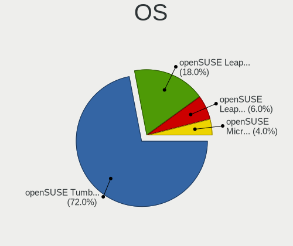
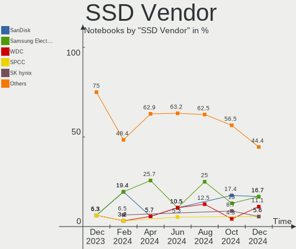
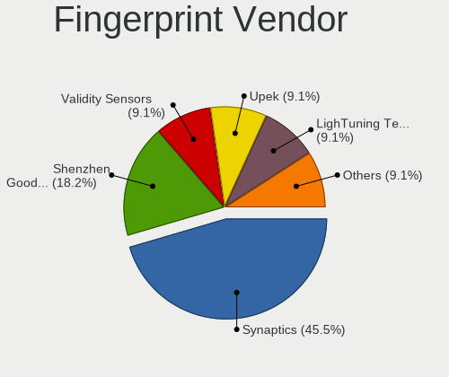
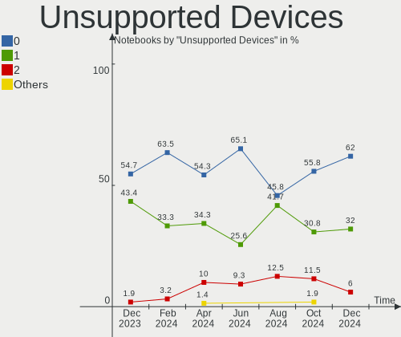

openSUSE Hardware Trends (Notebooks)
------------------------------------

A project to identify most popular hardware characteristics and track their change
over time based on data collected by openSUSE users at https://Linux-Hardware.org.

Anyone can contribute to this report by the [hw-probe](https://github.com/linuxhw/hw-probe) tool:

    sudo -E hw-probe -all -upload

Full-feature report is available here: https://linux-hardware.org/?view=trends&formfactor=notebook

Period: Oct, 2021.

Contents
--------

* [ System ](#system)
  - [ OS                       ](#os)
  - [ OS Family                ](#os-family)
  - [ Kernel                   ](#kernel)
  - [ Kernel Family            ](#kernel-family)
  - [ Kernel Major Ver.        ](#kernel-major-ver)
  - [ Arch                     ](#arch)
  - [ DE                       ](#de)
  - [ Display Server           ](#display-server)
  - [ Display Manager          ](#display-manager)
  - [ OS Lang                  ](#os-lang)
  - [ Boot Mode                ](#boot-mode)
  - [ Filesystem               ](#filesystem)
  - [ Part. scheme             ](#part-scheme)
  - [ Dual Boot with Linux/BSD ](#dual-boot-with-linuxbsd)
  - [ Dual Boot (Win)          ](#dual-boot-win)

* [ Board ](#board)
  - [ Vendor                   ](#vendor)
  - [ Model                    ](#model)
  - [ Model Family             ](#model-family)
  - [ MFG Year                 ](#mfg-year)
  - [ Form Factor              ](#form-factor)
  - [ Secure Boot              ](#secure-boot)
  - [ Coreboot                 ](#coreboot)
  - [ RAM Size                 ](#ram-size)
  - [ RAM Used                 ](#ram-used)
  - [ Total Drives             ](#total-drives)
  - [ Has CD-ROM               ](#has-cd-rom)
  - [ Has Ethernet             ](#has-ethernet)
  - [ Has WiFi                 ](#has-wifi)
  - [ Has Bluetooth            ](#has-bluetooth)

* [ Location ](#location)
  - [ Country                  ](#country)
  - [ City                     ](#city)

* [ Drives ](#drives)
  - [ Drive Vendor             ](#drive-vendor)
  - [ Drive Model              ](#drive-model)
  - [ HDD Vendor               ](#hdd-vendor)
  - [ SSD Vendor               ](#ssd-vendor)
  - [ Drive Kind               ](#drive-kind)
  - [ Drive Connector          ](#drive-connector)
  - [ Drive Size               ](#drive-size)
  - [ Space Total              ](#space-total)
  - [ Space Used               ](#space-used)
  - [ Malfunc. Drives          ](#malfunc-drives)
  - [ Malfunc. Drive Vendor    ](#malfunc-drive-vendor)
  - [ Malfunc. HDD Vendor      ](#malfunc-hdd-vendor)
  - [ Malfunc. Drive Kind      ](#malfunc-drive-kind)
  - [ Failed Drives            ](#failed-drives)
  - [ Failed Drive Vendor      ](#failed-drive-vendor)
  - [ Drive Status             ](#drive-status)

* [ Storage controller ](#storage-controller)
  - [ Storage Vendor           ](#storage-vendor)
  - [ Storage Model            ](#storage-model)
  - [ Storage Kind             ](#storage-kind)

* [ Processor ](#processor)
  - [ CPU Vendor               ](#cpu-vendor)
  - [ CPU Model                ](#cpu-model)
  - [ CPU Model Family         ](#cpu-model-family)
  - [ CPU Cores                ](#cpu-cores)
  - [ CPU Sockets              ](#cpu-sockets)
  - [ CPU Threads              ](#cpu-threads)
  - [ CPU Op-Modes             ](#cpu-op-modes)
  - [ CPU Microcode            ](#cpu-microcode)
  - [ CPU Microarch            ](#cpu-microarch)

* [ Graphics ](#graphics)
  - [ GPU Vendor               ](#gpu-vendor)
  - [ GPU Model                ](#gpu-model)
  - [ GPU Combo                ](#gpu-combo)
  - [ GPU Driver               ](#gpu-driver)
  - [ GPU Memory               ](#gpu-memory)

* [ Monitor ](#monitor)
  - [ Monitor Vendor           ](#monitor-vendor)
  - [ Monitor Model            ](#monitor-model)
  - [ Monitor Resolution       ](#monitor-resolution)
  - [ Monitor Diagonal         ](#monitor-diagonal)
  - [ Monitor Width            ](#monitor-width)
  - [ Aspect Ratio             ](#aspect-ratio)
  - [ Monitor Area             ](#monitor-area)
  - [ Pixel Density            ](#pixel-density)
  - [ Multiple Monitors        ](#multiple-monitors)

* [ Network ](#network)
  - [ Net Controller Vendor    ](#net-controller-vendor)
  - [ Net Controller Model     ](#net-controller-model)
  - [ Wireless Vendor          ](#wireless-vendor)
  - [ Wireless Model           ](#wireless-model)
  - [ Ethernet Vendor          ](#ethernet-vendor)
  - [ Ethernet Model           ](#ethernet-model)
  - [ Net Controller Kind      ](#net-controller-kind)
  - [ Used Controller          ](#used-controller)
  - [ NICs                     ](#nics)
  - [ IPv6                     ](#ipv6)

* [ Bluetooth ](#bluetooth)
  - [ Bluetooth Vendor         ](#bluetooth-vendor)
  - [ Bluetooth Model          ](#bluetooth-model)

* [ Sound ](#sound)
  - [ Sound Vendor             ](#sound-vendor)
  - [ Sound Model              ](#sound-model)

* [ Memory ](#memory)
  - [ Memory Vendor            ](#memory-vendor)
  - [ Memory Model             ](#memory-model)
  - [ Memory Kind              ](#memory-kind)
  - [ Memory Form Factor       ](#memory-form-factor)
  - [ Memory Size              ](#memory-size)
  - [ Memory Speed             ](#memory-speed)

* [ Printers & scanners ](#printers--scanners)
  - [ Printer Vendor           ](#printer-vendor)
  - [ Printer Model            ](#printer-model)
  - [ Scanner Vendor           ](#scanner-vendor)
  - [ Scanner Model            ](#scanner-model)

* [ Camera ](#camera)
  - [ Camera Vendor            ](#camera-vendor)
  - [ Camera Model             ](#camera-model)

* [ Security ](#security)
  - [ Fingerprint Vendor       ](#fingerprint-vendor)
  - [ Fingerprint Model        ](#fingerprint-model)
  - [ Chipcard Vendor          ](#chipcard-vendor)
  - [ Chipcard Model           ](#chipcard-model)

* [ Unsupported ](#unsupported)
  - [ Unsupported Devices      ](#unsupported-devices)
  - [ Unsupported Device Types ](#unsupported-device-types)

System
------

OS
--

Installed operating systems

| Name                         | Notebooks | Percent |
|------------------------------|-----------|---------|
| openSUSE Leap-15.3           | 11        | 33.33%  |
| openSUSE 20211016            | 3         | 9.09%   |
| openSUSE 20210916            | 3         | 9.09%   |
| openSUSE Leap-15.2           | 2         | 6.06%   |
| openSUSE 20210929            | 2         | 6.06%   |
| openSUSE Tumbleweed-20211021 | 1         | 3.03%   |
| openSUSE Tumbleweed-20211016 | 1         | 3.03%   |
| openSUSE Tumbleweed-20211012 | 1         | 3.03%   |
| openSUSE Tumbleweed-20211005 | 1         | 3.03%   |
| openSUSE Tumbleweed-20210929 | 1         | 3.03%   |
| openSUSE 20211025            | 1         | 3.03%   |
| openSUSE 20211024            | 1         | 3.03%   |
| openSUSE 20211012            | 1         | 3.03%   |
| openSUSE 20211008            | 1         | 3.03%   |
| openSUSE 20211005            | 1         | 3.03%   |
| openSUSE 20210928            | 1         | 3.03%   |
| openSUSE 20210927            | 1         | 3.03%   |

OS Family
---------

OS without a version

| Name     | Notebooks | Percent |
|----------|-----------|---------|
| openSUSE | 33        | 100%    |

Kernel
------

Version of the Linux kernel

| Version                 | Notebooks | Percent |
|-------------------------|-----------|---------|
| 5.3.18-59.27-default    | 6         | 18.18%  |
| 5.14.6-1-default        | 5         | 15.15%  |
| 5.14.6-2-default        | 3         | 9.09%   |
| 5.14.2-1-default        | 3         | 9.09%   |
| 5.14.11-2-default       | 3         | 9.09%   |
| 5.14.11-1-default       | 3         | 9.09%   |
| 5.3.18-59.24-default    | 2         | 6.06%   |
| 5.3.18-57-default       | 2         | 6.06%   |
| 5.14.9-1-default        | 2         | 6.06%   |
| 5.3.18-lp152.95-default | 1         | 3.03%   |
| 5.3.18-lp152.92-default | 1         | 3.03%   |
| 5.3.18-59.19-preempt    | 1         | 3.03%   |
| 5.15.0-rc5-1-default+   | 1         | 3.03%   |

Kernel Family
-------------

Linux kernel without a distro release

| Version | Notebooks | Percent |
|---------|-----------|---------|
| 5.3.18  | 13        | 39.39%  |
| 5.14.6  | 8         | 24.24%  |
| 5.14.11 | 6         | 18.18%  |
| 5.14.2  | 3         | 9.09%   |
| 5.14.9  | 2         | 6.06%   |
| 5.15.0  | 1         | 3.03%   |

Kernel Major Ver.
-----------------

Linux kernel major version

| Version | Notebooks | Percent |
|---------|-----------|---------|
| 5.14    | 19        | 57.58%  |
| 5.3     | 13        | 39.39%  |
| 5.15    | 1         | 3.03%   |

Arch
----

OS architecture (x86_64, i586, etc.)

| Name   | Notebooks | Percent |
|--------|-----------|---------|
| x86_64 | 33        | 100%    |

DE
--

Desktop Environment

| Name          | Notebooks | Percent |
|---------------|-----------|---------|
| KDE5          | 18        | 54.55%  |
| GNOME         | 9         | 27.27%  |
| XFCE          | 2         | 6.06%   |
| X-Cinnamon    | 2         | 6.06%   |
| KDE           | 1         | 3.03%   |
| GNOME Classic | 1         | 3.03%   |

Display Server
--------------

X11 or Wayland

| Name    | Notebooks | Percent |
|---------|-----------|---------|
| X11     | 23        | 69.7%   |
| Wayland | 10        | 30.3%   |

Display Manager
---------------

SDDM, LightDM, etc.

| Name    | Notebooks | Percent |
|---------|-----------|---------|
| SDDM    | 10        | 30.3%   |
| Unknown | 10        | 30.3%   |
| LightDM | 9         | 27.27%  |
| XDM     | 3         | 9.09%   |
| GDM     | 1         | 3.03%   |

OS Lang
-------

Language

| Lang  | Notebooks | Percent |
|-------|-----------|---------|
| en_US | 15        | 45.45%  |
| POSIX | 3         | 9.09%   |
| it_IT | 3         | 9.09%   |
| en_GB | 3         | 9.09%   |
| de_DE | 3         | 9.09%   |
| ru_RU | 2         | 6.06%   |
| vi_VN | 1         | 3.03%   |
| ko_KR | 1         | 3.03%   |
| fr_FR | 1         | 3.03%   |
| es_ES | 1         | 3.03%   |

Boot Mode
---------

EFI or BIOS

| Mode | Notebooks | Percent |
|------|-----------|---------|
| EFI  | 26        | 78.79%  |
| BIOS | 7         | 21.21%  |

Filesystem
----------

Type of filesystem

| Type  | Notebooks | Percent |
|-------|-----------|---------|
| Btrfs | 24        | 72.73%  |
| Ext4  | 7         | 21.21%  |
| Xfs   | 2         | 6.06%   |

Part. scheme
------------

Scheme of partitioning

| Type    | Notebooks | Percent |
|---------|-----------|---------|
| GPT     | 22        | 66.67%  |
| Unknown | 10        | 30.3%   |
| MBR     | 1         | 3.03%   |

Dual Boot with Linux/BSD
------------------------

Hosting more than one Linux/BSD

| Dual boot | Notebooks | Percent |
|-----------|-----------|---------|
| No        | 31        | 93.94%  |
| Yes       | 2         | 6.06%   |

Dual Boot (Win)
---------------

Hosting Linux and Windows

| Dual boot | Notebooks | Percent |
|-----------|-----------|---------|
| No        | 21        | 63.64%  |
| Yes       | 12        | 36.36%  |

Board
-----

Vendor
------

Motherboard manufacturer

| Name             | Notebooks | Percent |
|------------------|-----------|---------|
| Lenovo           | 12        | 36.36%  |
| Hewlett-Packard  | 6         | 18.18%  |
| Acer             | 5         | 15.15%  |
| HUAWEI           | 3         | 9.09%   |
| ASUSTek Computer | 2         | 6.06%   |
| TUXEDO           | 1         | 3.03%   |
| MSI              | 1         | 3.03%   |
| Medion           | 1         | 3.03%   |
| Google           | 1         | 3.03%   |
| Dell             | 1         | 3.03%   |

Model
-----

Motherboard model

| Name                                       | Notebooks | Percent |
|--------------------------------------------|-----------|---------|
| TUXEDO Aura 15 Gen1                        | 1         | 3.03%   |
| MSI GP63 Leopard 8RD                       | 1         | 3.03%   |
| Medion E6436 MD61150                       | 1         | 3.03%   |
| Lenovo Yoga 710-11IKB 80V6                 | 1         | 3.03%   |
| Lenovo ThinkPad X1 Carbon Gen 9 20XW00A7TH | 1         | 3.03%   |
| Lenovo ThinkPad W530 24475HU               | 1         | 3.03%   |
| Lenovo ThinkPad T490s 20NYS1XK00           | 1         | 3.03%   |
| Lenovo ThinkPad T14 Gen 2i 20W0003LUS      | 1         | 3.03%   |
| Lenovo ThinkPad L15 Gen 1 20U4S88000       | 1         | 3.03%   |
| Lenovo ThinkPad L14 Gen 1 20U50004GE       | 1         | 3.03%   |
| Lenovo ThinkPad E560 20EV000NIV            | 1         | 3.03%   |
| Lenovo ThinkPad E15 20RD0015UK             | 1         | 3.03%   |
| Lenovo ThinkPad E14 Gen 3 20Y7CTO1WW       | 1         | 3.03%   |
| Lenovo IdeaPad S340-15IML 81NA             | 1         | 3.03%   |
| Lenovo IdeaPad S145-15AST 81N3             | 1         | 3.03%   |
| HUAWEI NBLK-WAX9X                          | 1         | 3.03%   |
| HUAWEI KPL-W0X                             | 1         | 3.03%   |
| HUAWEI HVY-WXX9                            | 1         | 3.03%   |
| HP ZBook 14 G2                             | 1         | 3.03%   |
| HP ProBook 650 G1                          | 1         | 3.03%   |
| HP Laptop 17-ca1xxx                        | 1         | 3.03%   |
| HP Laptop 15s-eq0xxx                       | 1         | 3.03%   |
| HP G61                                     | 1         | 3.03%   |
| HP EliteBook Folio 9470m                   | 1         | 3.03%   |
| Google Pantheon                            | 1         | 3.03%   |
| Dell Latitude 7420                         | 1         | 3.03%   |
| ASUS X751LK                                | 1         | 3.03%   |
| ASUS X550CL                                | 1         | 3.03%   |
| Acer Swift SF314-43                        | 1         | 3.03%   |
| Acer Nitro AN515-54                        | 1         | 3.03%   |
| Acer Nitro AN515-45                        | 1         | 3.03%   |
| Acer Aspire E1-772G                        | 1         | 3.03%   |
| Acer Aspire 5560                           | 1         | 3.03%   |

Model Family
------------

Motherboard model prefix

| Name              | Notebooks | Percent |
|-------------------|-----------|---------|
| Lenovo ThinkPad   | 9         | 27.27%  |
| Lenovo IdeaPad    | 2         | 6.06%   |
| HP Laptop         | 2         | 6.06%   |
| Acer Nitro        | 2         | 6.06%   |
| Acer Aspire       | 2         | 6.06%   |
| TUXEDO Aura       | 1         | 3.03%   |
| MSI GP63          | 1         | 3.03%   |
| Medion E6436      | 1         | 3.03%   |
| Lenovo Yoga       | 1         | 3.03%   |
| HUAWEI NBLK-WAX9X | 1         | 3.03%   |
| HUAWEI KPL-W0X    | 1         | 3.03%   |
| HUAWEI HVY-WXX9   | 1         | 3.03%   |
| HP ZBook          | 1         | 3.03%   |
| HP ProBook        | 1         | 3.03%   |
| HP G61            | 1         | 3.03%   |
| HP EliteBook      | 1         | 3.03%   |
| Google Pantheon   | 1         | 3.03%   |
| Dell Latitude     | 1         | 3.03%   |
| ASUS X751LK       | 1         | 3.03%   |
| ASUS X550CL       | 1         | 3.03%   |
| Acer Swift        | 1         | 3.03%   |

MFG Year
--------

Motherboard manufacture year

| Year | Notebooks | Percent |
|------|-----------|---------|
| 2021 | 12        | 36.36%  |
| 2020 | 7         | 21.21%  |
| 2019 | 4         | 12.12%  |
| 2018 | 3         | 9.09%   |
| 2013 | 2         | 6.06%   |
| 2017 | 1         | 3.03%   |
| 2016 | 1         | 3.03%   |
| 2015 | 1         | 3.03%   |
| 2011 | 1         | 3.03%   |
| 2009 | 1         | 3.03%   |

Form Factor
-----------

Physical design of the computer

| Name     | Notebooks | Percent |
|----------|-----------|---------|
| Notebook | 33        | 100%    |

Secure Boot
-----------

Enabled or disabled

| State    | Notebooks | Percent |
|----------|-----------|---------|
| Disabled | 25        | 75.76%  |
| Enabled  | 8         | 24.24%  |

Coreboot
--------

Have coreboot on board

| Used | Notebooks | Percent |
|------|-----------|---------|
| No   | 32        | 96.97%  |
| Yes  | 1         | 3.03%   |

RAM Size
--------

Total RAM memory

| Size in GB  | Notebooks | Percent |
|-------------|-----------|---------|
| 4.01-8.0    | 12        | 36.36%  |
| 8.01-16.0   | 9         | 27.27%  |
| 16.01-24.0  | 5         | 15.15%  |
| 3.01-4.0    | 3         | 9.09%   |
| 32.01-64.0  | 2         | 6.06%   |
| 24.01-32.0  | 1         | 3.03%   |
| 64.01-256.0 | 1         | 3.03%   |

RAM Used
--------

Used RAM memory

| Used GB   | Notebooks | Percent |
|-----------|-----------|---------|
| 2.01-3.0  | 12        | 36.36%  |
| 1.01-2.0  | 8         | 24.24%  |
| 4.01-8.0  | 6         | 18.18%  |
| 3.01-4.0  | 5         | 15.15%  |
| 8.01-16.0 | 1         | 3.03%   |
| 0.51-1.0  | 1         | 3.03%   |

Total Drives
------------

Number of drives on board

| Drives | Notebooks | Percent |
|--------|-----------|---------|
| 1      | 19        | 57.58%  |
| 2      | 13        | 39.39%  |
| 3      | 1         | 3.03%   |

Has CD-ROM
----------

Has CD-ROM on board

| Presented | Notebooks | Percent |
|-----------|-----------|---------|
| No        | 26        | 78.79%  |
| Yes       | 7         | 21.21%  |

Has Ethernet
------------

Has Ethernet on board

| Presented | Notebooks | Percent |
|-----------|-----------|---------|
| Yes       | 23        | 69.7%   |
| No        | 10        | 30.3%   |

Has WiFi
--------

Has WiFi module

| Presented | Notebooks | Percent |
|-----------|-----------|---------|
| Yes       | 33        | 100%    |

Has Bluetooth
-------------

Has Bluetooth module

| Presented | Notebooks | Percent |
|-----------|-----------|---------|
| Yes       | 27        | 81.82%  |
| No        | 6         | 18.18%  |

Location
--------

Country
-------

Geographic location (country)

| Country     | Notebooks | Percent |
|-------------|-----------|---------|
| USA         | 5         | 15.15%  |
| Germany     | 5         | 15.15%  |
| Spain       | 2         | 6.06%   |
| Netherlands | 2         | 6.06%   |
| Italy       | 2         | 6.06%   |
| France      | 2         | 6.06%   |
| Belgium     | 2         | 6.06%   |
| Vietnam     | 1         | 3.03%   |
| UK          | 1         | 3.03%   |
| Thailand    | 1         | 3.03%   |
| Switzerland | 1         | 3.03%   |
| Sweden      | 1         | 3.03%   |
| South Korea | 1         | 3.03%   |
| Russia      | 1         | 3.03%   |
| Peru        | 1         | 3.03%   |
| Norway      | 1         | 3.03%   |
| Mexico      | 1         | 3.03%   |
| India       | 1         | 3.03%   |
| Greece      | 1         | 3.03%   |
| Canada      | 1         | 3.03%   |

City
----

Geographic location (city)

| City                   | Notebooks | Percent |
|------------------------|-----------|---------|
| The Hague              | 1         | 3.03%   |
| St. Gallen             | 1         | 3.03%   |
| Rockville              | 1         | 3.03%   |
| Pringy                 | 1         | 3.03%   |
| Portland               | 1         | 3.03%   |
| Nuremberg              | 1         | 3.03%   |
| Novara                 | 1         | 3.03%   |
| Monterrey              | 1         | 3.03%   |
| Malmo                  | 1         | 3.03%   |
| Maisons-Alfort         | 1         | 3.03%   |
| Letchworth Garden City | 1         | 3.03%   |
| Leiden                 | 1         | 3.03%   |
| Las Vegas              | 1         | 3.03%   |
| Kurgan                 | 1         | 3.03%   |
| Kolnes                 | 1         | 3.03%   |
| Kathu                  | 1         | 3.03%   |
| Isernhagen             | 1         | 3.03%   |
| Incheon                | 1         | 3.03%   |
| Howick                 | 1         | 3.03%   |
| Hermersberg            | 1         | 3.03%   |
| Hasselt                | 1         | 3.03%   |
| Hanoi                  | 1         | 3.03%   |
| Grand Junction         | 1         | 3.03%   |
| Essen                  | 1         | 3.03%   |
| Coimbatore             | 1         | 3.03%   |
| Bremen                 | 1         | 3.03%   |
| Bilbao                 | 1         | 3.03%   |
| Barcelona              | 1         | 3.03%   |
| Ball Ground            | 1         | 3.03%   |
| Athens                 | 1         | 3.03%   |
| Arzignano              | 1         | 3.03%   |
| Achern                 | 1         | 3.03%   |
| Abancay                | 1         | 3.03%   |

Drives
------

Drive Vendor
------------

Hard drive vendors

| Vendor              | Notebooks | Drives | Percent |
|---------------------|-----------|--------|---------|
| Samsung Electronics | 9         | 9      | 19.15%  |
| SanDisk             | 6         | 6      | 12.77%  |
| WDC                 | 5         | 5      | 10.64%  |
| Seagate             | 4         | 4      | 8.51%   |
| Kingston            | 4         | 4      | 8.51%   |
| Toshiba             | 3         | 3      | 6.38%   |
| SK Hynix            | 3         | 3      | 6.38%   |
| HGST                | 3         | 4      | 6.38%   |
| Unknown             | 2         | 2      | 4.26%   |
| Yangtze Memory      | 1         | 1      | 2.13%   |
| TO Exter            | 1         | 1      | 2.13%   |
| SABRENT             | 1         | 1      | 2.13%   |
| Micron Technology   | 1         | 1      | 2.13%   |
| LITEONIT            | 1         | 1      | 2.13%   |
| Intenso             | 1         | 1      | 2.13%   |
| Hitachi             | 1         | 1      | 2.13%   |
| A-DATA Technology   | 1         | 1      | 2.13%   |

Drive Model
-----------

Hard drive models

| Model                                   | Notebooks | Percent |
|-----------------------------------------|-----------|---------|
| Samsung MZALQ256HAJD-000L1 256GB        | 2         | 4.17%   |
| Yangtze Memory YMTC PC005 512GB         | 1         | 2.08%   |
| WDC WD3200BEVT-60ZCT1 320GB             | 1         | 2.08%   |
| WDC WD10SPZX-60Z10T0 1TB                | 1         | 2.08%   |
| WDC WD10SPZX-17Z10T0 1TB                | 1         | 2.08%   |
| WDC PC SN730 SDBQNTY-256G-1001 256GB    | 1         | 2.08%   |
| WDC PC SN730 SDBPNTY-512G-1006 512GB    | 1         | 2.08%   |
| Unknown SD/MMC/MS PRO 128GB             | 1         | 2.08%   |
| Unknown MMC Card  128GB                 | 1         | 2.08%   |
| Toshiba MQ01ABF050 500GB                | 1         | 2.08%   |
| Toshiba KXG6AZNV512G 512GB              | 1         | 2.08%   |
| Toshiba KBG20ZMS256G NVMe 256GB         | 1         | 2.08%   |
| TO Exter nal USB 3.0 160GB              | 1         | 2.08%   |
| SK Hynix HFS128G39TND-N210A 128GB SSD   | 1         | 2.08%   |
| SK Hynix HFS128G39MND-3310A 128GB SSD   | 1         | 2.08%   |
| SK Hynix HFS032G34MNC-2200A 32GB SSD    | 1         | 2.08%   |
| Seagate ST9320325AS 320GB               | 1         | 2.08%   |
| Seagate ST1000LM049-2GH172 1TB          | 1         | 2.08%   |
| Seagate ST1000LM035-1RK172 1TB          | 1         | 2.08%   |
| Seagate ST1000LM024 HN-M101MBB 1TB      | 1         | 2.08%   |
| SanDisk SSD U100 24GB                   | 1         | 2.08%   |
| SanDisk SSD PLUS 1000GB                 | 1         | 2.08%   |
| SanDisk SDSSDH3 1T00 1TB                | 1         | 2.08%   |
| SanDisk SD9SN8W256G 256GB SSD           | 1         | 2.08%   |
| SanDisk SD6SB2M-512G-1006 512GB SSD     | 1         | 2.08%   |
| Sandisk NVMe SSD Drive 256GB            | 1         | 2.08%   |
| Samsung SSD 850 EVO 250GB               | 1         | 2.08%   |
| Samsung PM9A1 NVMe 512GB                | 1         | 2.08%   |
| Samsung NVMe SSD Drive 256GB            | 1         | 2.08%   |
| Samsung NVMe SSD Drive 1TB              | 1         | 2.08%   |
| Samsung MZVLB256HBHQ-00000 256GB        | 1         | 2.08%   |
| Samsung MZVL21T0HCLR-00BL7 1TB          | 1         | 2.08%   |
| Samsung MZALQ512HBLU-00BL1 512GB        | 1         | 2.08%   |
| SABRENT Disk 320GB                      | 1         | 2.08%   |
| Micron NVMe SSD Drive 512GB             | 1         | 2.08%   |
| LITEONIT LMT-256M3M 256GB SSD           | 1         | 2.08%   |
| Kingston SA400S37240G 240GB SSD         | 1         | 2.08%   |
| Kingston SA2000M81000G 1TB              | 1         | 2.08%   |
| Kingston RBU-SNS8350DES3128GP 128GB SSD | 1         | 2.08%   |
| Kingston OM8PDP3512B-AA1 512GB          | 1         | 2.08%   |
| Intenso SSD SATAIII 120GB               | 1         | 2.08%   |
| Hitachi HTS547575A9E384 752GB           | 1         | 2.08%   |
| HGST HTS725032A7E630 320GB              | 1         | 2.08%   |
| HGST HTS721010A9E630 1TB                | 1         | 2.08%   |
| HGST HTS545050A7E680 500GB              | 1         | 2.08%   |
| HGST HTS545050A7E660 500GB              | 1         | 2.08%   |
| A-DATA SX8200PNP 512GB                  | 1         | 2.08%   |

HDD Vendor
----------

Hard disk drive vendors

| Vendor   | Notebooks | Drives | Percent |
|----------|-----------|--------|---------|
| Seagate  | 4         | 4      | 26.67%  |
| WDC      | 3         | 3      | 20%     |
| HGST     | 3         | 4      | 20%     |
| Unknown  | 1         | 1      | 6.67%   |
| Toshiba  | 1         | 1      | 6.67%   |
| TO Exter | 1         | 1      | 6.67%   |
| SABRENT  | 1         | 1      | 6.67%   |
| Hitachi  | 1         | 1      | 6.67%   |

SSD Vendor
----------

Solid state drive vendors

| Vendor              | Notebooks | Drives | Percent |
|---------------------|-----------|--------|---------|
| SanDisk             | 5         | 5      | 38.46%  |
| SK Hynix            | 3         | 3      | 23.08%  |
| Kingston            | 2         | 2      | 15.38%  |
| Samsung Electronics | 1         | 1      | 7.69%   |
| LITEONIT            | 1         | 1      | 7.69%   |
| Intenso             | 1         | 1      | 7.69%   |

Drive Kind
----------

HDD or SSD

| Kind | Notebooks | Drives | Percent |
|------|-----------|--------|---------|
| NVMe | 18        | 18     | 40%     |
| HDD  | 14        | 16     | 31.11%  |
| SSD  | 12        | 13     | 26.67%  |
| MMC  | 1         | 1      | 2.22%   |

Drive Connector
---------------

SATA, SAS, NVMe, etc.

| Type | Notebooks | Drives | Percent |
|------|-----------|--------|---------|
| SATA | 19        | 26     | 46.34%  |
| NVMe | 18        | 18     | 43.9%   |
| SAS  | 3         | 3      | 7.32%   |
| MMC  | 1         | 1      | 2.44%   |

Drive Size
----------

Size of hard drive

| Size in TB | Notebooks | Drives | Percent |
|------------|-----------|--------|---------|
| 0.01-0.5   | 14        | 19     | 58.33%  |
| 0.51-1.0   | 10        | 10     | 41.67%  |

Space Total
-----------

Amount of disk space available on the file system

| Size in GB     | Notebooks | Percent |
|----------------|-----------|---------|
| 251-500        | 8         | 24.24%  |
| 1001-2000      | 8         | 24.24%  |
| 2001-3000      | 7         | 21.21%  |
| More than 3000 | 6         | 18.18%  |
| 101-250        | 2         | 6.06%   |
| 501-1000       | 1         | 3.03%   |
| 51-100         | 1         | 3.03%   |

Space Used
----------

Amount of used disk space

| Used GB   | Notebooks | Percent |
|-----------|-----------|---------|
| 51-100    | 7         | 21.21%  |
| 101-250   | 6         | 18.18%  |
| 501-1000  | 6         | 18.18%  |
| 251-500   | 5         | 15.15%  |
| 21-50     | 3         | 9.09%   |
| 2001-3000 | 2         | 6.06%   |
| 1001-2000 | 2         | 6.06%   |
| 1-20      | 2         | 6.06%   |

Malfunc. Drives
---------------

Drive models with a malfunction

| Model                                | Notebooks | Drives | Percent |
|--------------------------------------|-----------|--------|---------|
| SK Hynix HFS032G34MNC-2200A 32GB SSD | 1         | 1      | 20%     |
| Seagate ST1000LM024 HN-M101MBB 1TB   | 1         | 1      | 20%     |
| SanDisk SSD U100 24GB                | 1         | 1      | 20%     |
| LITEONIT LMT-256M3M 256GB SSD        | 1         | 1      | 20%     |
| HGST HTS725032A7E630 320GB           | 1         | 1      | 20%     |

Malfunc. Drive Vendor
---------------------

Vendors of faulty drives

| Vendor   | Notebooks | Drives | Percent |
|----------|-----------|--------|---------|
| SK Hynix | 1         | 1      | 20%     |
| Seagate  | 1         | 1      | 20%     |
| SanDisk  | 1         | 1      | 20%     |
| LITEONIT | 1         | 1      | 20%     |
| HGST     | 1         | 1      | 20%     |

Malfunc. HDD Vendor
-------------------

Vendors of faulty HDD drives

| Vendor  | Notebooks | Drives | Percent |
|---------|-----------|--------|---------|
| Seagate | 1         | 1      | 50%     |
| HGST    | 1         | 1      | 50%     |

Malfunc. Drive Kind
-------------------

Kinds of faulty drives

| Kind | Notebooks | Drives | Percent |
|------|-----------|--------|---------|
| SSD  | 3         | 3      | 60%     |
| HDD  | 2         | 2      | 40%     |

Failed Drives
-------------

Failed drive models

Zero info for selected period =(

Failed Drive Vendor
-------------------

Failed drive vendors

Zero info for selected period =(

Drive Status
------------

Number of failed and malfunc. drives

| Status   | Notebooks | Drives | Percent |
|----------|-----------|--------|---------|
| Works    | 21        | 26     | 56.76%  |
| Detected | 13        | 17     | 35.14%  |
| Malfunc  | 3         | 5      | 8.11%   |

Storage controller
------------------

Storage Vendor
--------------

Storage controller vendors

| Vendor                       | Notebooks | Percent |
|------------------------------|-----------|---------|
| Intel                        | 16        | 40%     |
| Samsung Electronics          | 8         | 20%     |
| AMD                          | 6         | 15%     |
| Sandisk                      | 3         | 7.5%    |
| Toshiba America Info Systems | 2         | 5%      |
| Kingston Technology Company  | 2         | 5%      |
| Yangtze Memory Technologies  | 1         | 2.5%    |
| Micron Technology            | 1         | 2.5%    |
| ADATA Technology             | 1         | 2.5%    |

Storage Model
-------------

Storage controller models

| Model                                                                          | Notebooks | Percent |
|--------------------------------------------------------------------------------|-----------|---------|
| AMD FCH SATA Controller [AHCI mode]                                            | 6         | 15%     |
| Samsung NVMe SSD Controller 980                                                | 4         | 10%     |
| Intel Sunrise Point-LP SATA Controller [AHCI mode]                             | 3         | 7.5%    |
| Intel Comet Lake SATA AHCI Controller                                          | 3         | 7.5%    |
| Intel 7 Series Chipset Family 6-port SATA Controller [AHCI mode]               | 3         | 7.5%    |
| Sandisk WD Black SN750 / PC SN730 NVMe SSD                                     | 2         | 5%      |
| Samsung NVMe SSD Controller SM981/PM981/PM983                                  | 2         | 5%      |
| Samsung NVMe SSD Controller PM9A1/PM9A3/980PRO                                 | 2         | 5%      |
| Intel Cannon Lake Mobile PCH SATA AHCI Controller                              | 2         | 5%      |
| Intel 8 Series/C220 Series Chipset Family 6-port SATA Controller 1 [AHCI mode] | 2         | 5%      |
| Yangtze Memory Non-Volatile memory controller                                  | 1         | 2.5%    |
| Toshiba America Info Systems XG6 NVMe SSD Controller                           | 1         | 2.5%    |
| Toshiba America Info Systems BG3 NVMe SSD Controller                           | 1         | 2.5%    |
| Sandisk WD Blue SN550 NVMe SSD                                                 | 1         | 2.5%    |
| Micron Non-Volatile memory controller                                          | 1         | 2.5%    |
| Kingston Company OM3PDP3 NVMe SSD                                              | 1         | 2.5%    |
| Kingston Company A2000 NVMe SSD                                                | 1         | 2.5%    |
| Intel Wildcat Point-LP SATA Controller [AHCI Mode]                             | 1         | 2.5%    |
| Intel 82801IBM/IEM (ICH9M/ICH9M-E) 4 port SATA Controller [AHCI mode]          | 1         | 2.5%    |
| Intel 8 Series SATA Controller 1 [AHCI mode]                                   | 1         | 2.5%    |
| ADATA XPG SX8200 Pro PCIe Gen3x4 M.2 2280 Solid State Drive                    | 1         | 2.5%    |

Storage Kind
------------

Kind of storage controller (IDE, SATA, NVMe, SAS, ...)

| Kind | Notebooks | Percent |
|------|-----------|---------|
| SATA | 22        | 55%     |
| NVMe | 18        | 45%     |

Processor
---------

CPU Vendor
----------

Processor vendors

| Vendor | Notebooks | Percent |
|--------|-----------|---------|
| Intel  | 21        | 63.64%  |
| AMD    | 12        | 36.36%  |

CPU Model
---------

Processor models

| Model                                         | Notebooks | Percent |
|-----------------------------------------------|-----------|---------|
| Intel Core i7-10510U CPU @ 1.80GHz            | 2         | 6.06%   |
| Intel 11th Gen Core i7-1165G7 @ 2.80GHz       | 2         | 6.06%   |
| AMD Ryzen 5 3500U with Radeon Vega Mobile Gfx | 2         | 6.06%   |
| Intel Core i7-9750H CPU @ 2.60GHz             | 1         | 3.03%   |
| Intel Core i7-8750H CPU @ 2.20GHz             | 1         | 3.03%   |
| Intel Core i7-8550U CPU @ 1.80GHz             | 1         | 3.03%   |
| Intel Core i7-5600U CPU @ 2.60GHz             | 1         | 3.03%   |
| Intel Core i7-4510U CPU @ 2.00GHz             | 1         | 3.03%   |
| Intel Core i7-3840QM CPU @ 2.80GHz            | 1         | 3.03%   |
| Intel Core i7-3537U CPU @ 2.00GHz             | 1         | 3.03%   |
| Intel Core i5-8365U CPU @ 1.60GHz             | 1         | 3.03%   |
| Intel Core i5-7Y54 CPU @ 1.20GHz              | 1         | 3.03%   |
| Intel Core i5-6200U CPU @ 2.30GHz             | 1         | 3.03%   |
| Intel Core i5-4310M CPU @ 2.70GHz             | 1         | 3.03%   |
| Intel Core i5-4200M CPU @ 2.50GHz             | 1         | 3.03%   |
| Intel Core i5-3437U CPU @ 1.90GHz             | 1         | 3.03%   |
| Intel Core i5-10210U CPU @ 1.60GHz            | 1         | 3.03%   |
| Intel Core i3-7100U CPU @ 2.40GHz             | 1         | 3.03%   |
| Intel Core 2 Duo CPU T6600 @ 2.20GHz          | 1         | 3.03%   |
| Intel 11th Gen Core i7-1185G7 @ 3.00GHz       | 1         | 3.03%   |
| AMD Ryzen 7 5700U with Radeon Graphics        | 1         | 3.03%   |
| AMD Ryzen 7 4700U with Radeon Graphics        | 1         | 3.03%   |
| AMD Ryzen 5 5600H with Radeon Graphics        | 1         | 3.03%   |
| AMD Ryzen 5 5500U with Radeon Graphics        | 1         | 3.03%   |
| AMD Ryzen 5 4600H with Radeon Graphics        | 1         | 3.03%   |
| AMD Ryzen 5 4500U with Radeon Graphics        | 1         | 3.03%   |
| AMD Ryzen 5 2500U with Radeon Vega Mobile Gfx | 1         | 3.03%   |
| AMD Ryzen 3 3200U with Radeon Vega Mobile Gfx | 1         | 3.03%   |
| AMD A6-9225 RADEON R4, 5 COMPUTE CORES 2C+3G  | 1         | 3.03%   |
| AMD A6-3420M APU with Radeon HD Graphics      | 1         | 3.03%   |

CPU Model Family
----------------

Processor model prefix

| Model            | Notebooks | Percent |
|------------------|-----------|---------|
| Intel Core i7    | 9         | 27.27%  |
| Intel Core i5    | 7         | 21.21%  |
| AMD Ryzen 5      | 7         | 21.21%  |
| Other            | 3         | 9.09%   |
| AMD Ryzen 7      | 2         | 6.06%   |
| AMD A6           | 2         | 6.06%   |
| Intel Core i3    | 1         | 3.03%   |
| Intel Core 2 Duo | 1         | 3.03%   |
| AMD Ryzen 3      | 1         | 3.03%   |

CPU Cores
---------

Number of processor cores

| Number | Notebooks | Percent |
|--------|-----------|---------|
| 4      | 13        | 39.39%  |
| 2      | 12        | 36.36%  |
| 6      | 6         | 18.18%  |
| 8      | 2         | 6.06%   |

CPU Sockets
-----------

Number of sockets

| Number | Notebooks | Percent |
|--------|-----------|---------|
| 1      | 33        | 100%    |

CPU Threads
-----------

Threads per core (Hyper-Threading)

| Number | Notebooks | Percent |
|--------|-----------|---------|
| 2      | 28        | 84.85%  |
| 1      | 5         | 15.15%  |

CPU Op-Modes
------------

CPU Operation Modes (32-bit, 64-bit)

| Op mode        | Notebooks | Percent |
|----------------|-----------|---------|
| 32-bit, 64-bit | 33        | 100%    |

CPU Microcode
-------------

Microcode number

| Number     | Notebooks | Percent |
|------------|-----------|---------|
| Unknown    | 5         | 15.15%  |
| 0x806ec    | 3         | 9.09%   |
| 0x806c1    | 3         | 9.09%   |
| 0x306a9    | 3         | 9.09%   |
| 0x806e9    | 2         | 6.06%   |
| 0x08600106 | 2         | 6.06%   |
| 0x08108109 | 2         | 6.06%   |
| 0x906ea    | 1         | 3.03%   |
| 0x806ea    | 1         | 3.03%   |
| 0x406e3    | 1         | 3.03%   |
| 0x40651    | 1         | 3.03%   |
| 0x306d4    | 1         | 3.03%   |
| 0x306c3    | 1         | 3.03%   |
| 0x1067a    | 1         | 3.03%   |
| 0x0a50000c | 1         | 3.03%   |
| 0x08608103 | 1         | 3.03%   |
| 0x08608102 | 1         | 3.03%   |
| 0x08600103 | 1         | 3.03%   |
| 0x08101007 | 1         | 3.03%   |
| 0x06006705 | 1         | 3.03%   |

CPU Microarch
-------------

Microarchitecture

| Name      | Notebooks | Percent |
|-----------|-----------|---------|
| KabyLake  | 9         | 27.27%  |
| Zen+      | 3         | 9.09%   |
| Zen 2     | 3         | 9.09%   |
| TigerLake | 3         | 9.09%   |
| IvyBridge | 3         | 9.09%   |
| Haswell   | 3         | 9.09%   |
| Unknown   | 2         | 6.06%   |
| Zen 3     | 1         | 3.03%   |
| Zen       | 1         | 3.03%   |
| Skylake   | 1         | 3.03%   |
| Penryn    | 1         | 3.03%   |
| K10 Llano | 1         | 3.03%   |
| Excavator | 1         | 3.03%   |
| Broadwell | 1         | 3.03%   |

Graphics
--------

GPU Vendor
----------

Vendors of graphics cards

| Vendor | Notebooks | Percent |
|--------|-----------|---------|
| Intel  | 19        | 45.24%  |
| AMD    | 14        | 33.33%  |
| Nvidia | 9         | 21.43%  |

GPU Model
---------

Graphics card models

| Model                                                                | Notebooks | Percent |
|----------------------------------------------------------------------|-----------|---------|
| Intel TigerLake-LP GT2 [Iris Xe Graphics]                            | 3         | 7.14%   |
| Intel CometLake-U GT2 [UHD Graphics]                                 | 3         | 7.14%   |
| AMD Renoir                                                           | 3         | 7.14%   |
| AMD Picasso                                                          | 3         | 7.14%   |
| Nvidia GF117M [GeForce 610M/710M/810M/820M / GT 620M/625M/630M/720M] | 2         | 4.76%   |
| Intel CoffeeLake-H GT2 [UHD Graphics 630]                            | 2         | 4.76%   |
| Intel 4th Gen Core Processor Integrated Graphics Controller          | 2         | 4.76%   |
| Intel 3rd Gen Core processor Graphics Controller                     | 2         | 4.76%   |
| AMD Lucienne                                                         | 2         | 4.76%   |
| Nvidia GP108M [GeForce MX230]                                        | 1         | 2.38%   |
| Nvidia GP107M [GeForce GTX 1050 Ti Mobile]                           | 1         | 2.38%   |
| Nvidia GP107M [GeForce GTX 1050 3 GB Max-Q]                          | 1         | 2.38%   |
| Nvidia GM107M [GeForce GTX 850M]                                     | 1         | 2.38%   |
| Nvidia GK107GLM [Quadro K2000M]                                      | 1         | 2.38%   |
| Nvidia GA106M [GeForce RTX 3060 Mobile / Max-Q]                      | 1         | 2.38%   |
| Nvidia G98M [GeForce G 103M]                                         | 1         | 2.38%   |
| Intel WhiskeyLake-U GT2 [UHD Graphics 620]                           | 1         | 2.38%   |
| Intel UHD Graphics 620                                               | 1         | 2.38%   |
| Intel Skylake GT2 [HD Graphics 520]                                  | 1         | 2.38%   |
| Intel HD Graphics 620                                                | 1         | 2.38%   |
| Intel HD Graphics 615                                                | 1         | 2.38%   |
| Intel HD Graphics 5500                                               | 1         | 2.38%   |
| Intel Haswell-ULT Integrated Graphics Controller                     | 1         | 2.38%   |
| AMD Sumo [Radeon HD 6520G]                                           | 1         | 2.38%   |
| AMD Stoney [Radeon R2/R3/R4/R5 Graphics]                             | 1         | 2.38%   |
| AMD Raven Ridge [Radeon Vega Series / Radeon Vega Mobile Series]     | 1         | 2.38%   |
| AMD Opal PRO [Radeon R7 M260X]                                       | 1         | 2.38%   |
| AMD Mars [Radeon HD 8730M]                                           | 1         | 2.38%   |
| AMD Cezanne                                                          | 1         | 2.38%   |

GPU Combo
---------

Combinations of graphics cards

| Name           | Notebooks | Percent |
|----------------|-----------|---------|
| 1 x Intel      | 11        | 33.33%  |
| 1 x AMD        | 11        | 33.33%  |
| Intel + Nvidia | 6         | 18.18%  |
| 1 x Nvidia     | 2         | 6.06%   |
| Intel + AMD    | 2         | 6.06%   |
| AMD + Nvidia   | 1         | 3.03%   |

GPU Driver
----------

Free vs proprietary

| Driver      | Notebooks | Percent |
|-------------|-----------|---------|
| Free        | 29        | 87.88%  |
| Proprietary | 3         | 9.09%   |
| Unknown     | 1         | 3.03%   |

GPU Memory
----------

Total video memory

| Size in GB | Notebooks | Percent |
|------------|-----------|---------|
| Unknown    | 17        | 51.52%  |
| 0.51-1.0   | 7         | 21.21%  |
| 0.01-0.5   | 6         | 18.18%  |
| 1.01-2.0   | 3         | 9.09%   |

Monitor
-------

Monitor Vendor
--------------

Monitor vendors

| Vendor                  | Notebooks | Percent |
|-------------------------|-----------|---------|
| Chimei Innolux          | 12        | 32.43%  |
| BOE                     | 6         | 16.22%  |
| AU Optronics            | 6         | 16.22%  |
| LG Display              | 5         | 13.51%  |
| Dell                    | 2         | 5.41%   |
| Chi Mei Optoelectronics | 2         | 5.41%   |
| Vizio                   | 1         | 2.7%    |
| Samsung Electronics     | 1         | 2.7%    |
| Goldstar                | 1         | 2.7%    |
| CSO                     | 1         | 2.7%    |

Monitor Model
-------------

Monitor models

| Model                                                                     | Notebooks | Percent |
|---------------------------------------------------------------------------|-----------|---------|
| Chimei Innolux LCD Monitor CMN14D4 1920x1080 309x173mm 13.9-inch          | 3         | 7.89%   |
| Vizio E601i-A3 VIZ0092 1920x1080 1329x748mm 60.0-inch                     | 1         | 2.63%   |
| Samsung Electronics U28E590 SAM0C4E 3840x2160 608x345mm 27.5-inch         | 1         | 2.63%   |
| LG Display LCD Monitor LGD059E 1920x1080 382x215mm 17.3-inch              | 1         | 2.63%   |
| LG Display LCD Monitor LGD0533 1920x1080 344x194mm 15.5-inch              | 1         | 2.63%   |
| LG Display LCD Monitor LGD04B7 1366x768 344x194mm 15.5-inch               | 1         | 2.63%   |
| LG Display LCD Monitor LGD040A 1920x1080 310x170mm 13.9-inch              | 1         | 2.63%   |
| LG Display LCD Monitor LGD02DC 1366x768 344x194mm 15.5-inch               | 1         | 2.63%   |
| Goldstar 2D FHD LG TV GSM59C6 1920x1080 509x286mm 23.0-inch               | 1         | 2.63%   |
| Dell U2415 DELA0BA 1920x1080 518x324mm 24.1-inch                          | 1         | 2.63%   |
| Dell U2415 DELA0B8 1920x1080 520x320mm 24.0-inch                          | 1         | 2.63%   |
| Dell U2212HM DELD047 1920x1080 475x267mm 21.5-inch                        | 1         | 2.63%   |
| CSO LCD Monitor CSO1404 1920x1200 302x189mm 14.0-inch                     | 1         | 2.63%   |
| Chimei Innolux LCD Monitor CMN1735 1920x1080 382x215mm 17.3-inch          | 1         | 2.63%   |
| Chimei Innolux LCD Monitor CMN15F6 1920x1080 344x193mm 15.5-inch          | 1         | 2.63%   |
| Chimei Innolux LCD Monitor CMN15F4 1920x1080 344x193mm 15.5-inch          | 1         | 2.63%   |
| Chimei Innolux LCD Monitor CMN15E6 1366x768 344x193mm 15.5-inch           | 1         | 2.63%   |
| Chimei Innolux LCD Monitor CMN15C2 1920x1080 344x194mm 15.5-inch          | 1         | 2.63%   |
| Chimei Innolux LCD Monitor CMN1521 1920x1080 344x193mm 15.5-inch          | 1         | 2.63%   |
| Chimei Innolux LCD Monitor CMN14F5 1920x1080 309x173mm 13.9-inch          | 1         | 2.63%   |
| Chimei Innolux LCD Monitor CMN1484 1600x900 310x174mm 14.0-inch           | 1         | 2.63%   |
| Chimei Innolux LCD Monitor CMN1137 1920x1080 256x144mm 11.6-inch          | 1         | 2.63%   |
| Chi Mei Optoelectronics LCD Monitor CMO1720 1920x1080 382x215mm 17.3-inch | 1         | 2.63%   |
| Chi Mei Optoelectronics LCD Monitor CMO15A7 1366x768 350x190mm 15.7-inch  | 1         | 2.63%   |
| BOE LCD Monitor BOE08D7 1920x1080 309x174mm 14.0-inch                     | 1         | 2.63%   |
| BOE LCD Monitor BOE0878 1920x1080 355x200mm 16.0-inch                     | 1         | 2.63%   |
| BOE LCD Monitor BOE0877 1920x1080 309x173mm 13.9-inch                     | 1         | 2.63%   |
| BOE LCD Monitor BOE085E 1920x1080 344x194mm 15.5-inch                     | 1         | 2.63%   |
| BOE LCD Monitor BOE0812 1920x1080 344x194mm 15.5-inch                     | 1         | 2.63%   |
| BOE LCD Monitor BOE06F4 3840x2160 345x194mm 15.6-inch                     | 1         | 2.63%   |
| AU Optronics LCD Monitor AUO81EC 1366x768 344x193mm 15.5-inch             | 1         | 2.63%   |
| AU Optronics LCD Monitor AUO61ED 1920x1080 340x190mm 15.3-inch            | 1         | 2.63%   |
| AU Optronics LCD Monitor AUO408D 1920x1080 309x174mm 14.0-inch            | 1         | 2.63%   |
| AU Optronics LCD Monitor AUO21ED 1920x1080 344x194mm 15.5-inch            | 1         | 2.63%   |
| AU Optronics LCD Monitor AUO11ED 1920x1080 344x193mm 15.5-inch            | 1         | 2.63%   |
| AU Optronics LCD Monitor AUO10EC 1366x768 340x190mm 15.3-inch             | 1         | 2.63%   |

Monitor Resolution
------------------

Monitor screen resolution

| Resolution        | Notebooks | Percent |
|-------------------|-----------|---------|
| 1920x1080 (FHD)   | 24        | 68.57%  |
| 1366x768 (WXGA)   | 6         | 17.14%  |
| 3840x2160 (4K)    | 2         | 5.71%   |
| 1920x1200 (WUXGA) | 2         | 5.71%   |
| 1600x900 (HD+)    | 1         | 2.86%   |

Monitor Diagonal
----------------

Diagonal size in inches

| Inches | Notebooks | Percent |
|--------|-----------|---------|
| 15     | 17        | 45.95%  |
| 14     | 5         | 13.51%  |
| 13     | 5         | 13.51%  |
| 17     | 3         | 8.11%   |
| 60     | 1         | 2.7%    |
| 27     | 1         | 2.7%    |
| 24     | 1         | 2.7%    |
| 23     | 1         | 2.7%    |
| 21     | 1         | 2.7%    |
| 16     | 1         | 2.7%    |
| 11     | 1         | 2.7%    |

Monitor Width
-------------

Physical width

| Width in mm | Notebooks | Percent |
|-------------|-----------|---------|
| 301-350     | 27        | 72.97%  |
| 351-400     | 4         | 10.81%  |
| 501-600     | 2         | 5.41%   |
| 601-700     | 1         | 2.7%    |
| 401-500     | 1         | 2.7%    |
| 201-300     | 1         | 2.7%    |
| 1001-1500   | 1         | 2.7%    |

Aspect Ratio
------------

Proportional relationship between the width and the height

| Ratio | Notebooks | Percent |
|-------|-----------|---------|
| 16/9  | 31        | 93.94%  |
| 16/10 | 2         | 6.06%   |

Monitor Area
------------

Area in inch

| Area in inch | Notebooks | Percent |
|----------------|-----------|---------|
| 101-110        | 18        | 48.65%  |
| 81-90          | 10        | 27.03%  |
| 121-130        | 3         | 8.11%   |
| 201-250        | 2         | 5.41%   |
| More than 1000 | 1         | 2.7%    |
| 51-60          | 1         | 2.7%    |
| 301-350        | 1         | 2.7%    |
| 251-300        | 1         | 2.7%    |

Pixel Density
-------------

Pixels per inch

| Density       | Notebooks | Percent |
|---------------|-----------|---------|
| 121-160       | 23        | 63.89%  |
| 101-120       | 6         | 16.67%  |
| 51-100        | 3         | 8.33%   |
| 161-240       | 2         | 5.56%   |
| More than 240 | 1         | 2.78%   |
| 1-50          | 1         | 2.78%   |

Multiple Monitors
-----------------

Total monitors connected

| Total | Notebooks | Percent |
|-------|-----------|---------|
| 1     | 27        | 81.82%  |
| 2     | 4         | 12.12%  |
| 3     | 1         | 3.03%   |
| 0     | 1         | 3.03%   |

Network
-------

Net Controller Vendor
---------------------

Controller vendors

| Vendor                | Notebooks | Percent |
|-----------------------|-----------|---------|
| Intel                 | 19        | 37.25%  |
| Realtek Semiconductor | 14        | 27.45%  |
| Qualcomm Atheros      | 6         | 11.76%  |
| MEDIATEK              | 3         | 5.88%   |
| Hewlett-Packard       | 2         | 3.92%   |
| Broadcom Limited      | 2         | 3.92%   |
| Xiaomi                | 1         | 1.96%   |
| Ralink                | 1         | 1.96%   |
| ICS Advent            | 1         | 1.96%   |
| HMD Global            | 1         | 1.96%   |
| Broadcom              | 1         | 1.96%   |

Net Controller Model
--------------------

Controller models

| Model                                                             | Notebooks | Percent |
|-------------------------------------------------------------------|-----------|---------|
| Realtek RTL8111/8168/8411 PCI Express Gigabit Ethernet Controller | 8         | 13.56%  |
| Intel Wi-Fi 6 AX200                                               | 4         | 6.78%   |
| Realtek RTL8821CE 802.11ac PCIe Wireless Network Adapter          | 3         | 5.08%   |
| MEDIATEK Network controller                                       | 3         | 5.08%   |
| Intel Wi-Fi 6 AX201                                               | 2         | 3.39%   |
| Intel Centrino Advanced-N 6235                                    | 2         | 3.39%   |
| Intel 82579LM Gigabit Network Connection (Lewisville)             | 2         | 3.39%   |
| Xiaomi MediaTek MT7601U [MI WiFi]                                 | 1         | 1.69%   |
| Realtek RTL8852AE 802.11ax PCIe Wireless Network Adapter          | 1         | 1.69%   |
| Realtek RTL8822CE 802.11ac PCIe Wireless Network Adapter          | 1         | 1.69%   |
| Realtek RTL810xE PCI Express Fast Ethernet controller             | 1         | 1.69%   |
| Realtek Killer E2600 Gigabit Ethernet Controller                  | 1         | 1.69%   |
| Ralink RT5390 Wireless 802.11n 1T/1R PCIe                         | 1         | 1.69%   |
| Qualcomm Atheros QCA9565 / AR9565 Wireless Network Adapter        | 1         | 1.69%   |
| Qualcomm Atheros QCA9377 802.11ac Wireless Network Adapter        | 1         | 1.69%   |
| Qualcomm Atheros QCA6174 802.11ac Wireless Network Adapter        | 1         | 1.69%   |
| Qualcomm Atheros Killer E2400 Gigabit Ethernet Controller         | 1         | 1.69%   |
| Qualcomm Atheros AR9485 Wireless Network Adapter                  | 1         | 1.69%   |
| Qualcomm Atheros AR9285 Wireless Network Adapter (PCI-Express)    | 1         | 1.69%   |
| Intel Wireless-AC 9260                                            | 1         | 1.69%   |
| Intel Wireless 8265 / 8275                                        | 1         | 1.69%   |
| Intel Wireless 7265                                               | 1         | 1.69%   |
| Intel Wireless 3165                                               | 1         | 1.69%   |
| Intel Wi-Fi 6 AX210/AX211/AX411 160MHz                            | 1         | 1.69%   |
| Intel Ethernet Connection I219-V                                  | 1         | 1.69%   |
| Intel Ethernet Connection I217-V                                  | 1         | 1.69%   |
| Intel Ethernet Connection (6) I219-LM                             | 1         | 1.69%   |
| Intel Ethernet Connection (3) I218-LM                             | 1         | 1.69%   |
| Intel Ethernet Connection (13) I219-V                             | 1         | 1.69%   |
| Intel Ethernet Connection (10) I219-V                             | 1         | 1.69%   |
| Intel Dual Band Wireless-AC 3165 Plus Bluetooth                   | 1         | 1.69%   |
| Intel Comet Lake PCH-LP CNVi WiFi                                 | 1         | 1.69%   |
| Intel Centrino Advanced-N 6205 [Taylor Peak]                      | 1         | 1.69%   |
| Intel Cannon Point-LP CNVi [Wireless-AC]                          | 1         | 1.69%   |
| Intel Cannon Lake PCH CNVi WiFi                                   | 1         | 1.69%   |
| ICS Advent DM9601 Fast Ethernet Adapter                           | 1         | 1.69%   |
| HMD Global Nokia7.2                                               | 1         | 1.69%   |
| HP un2430 Mobile Broadband Module                                 | 1         | 1.69%   |
| HP lt4112 Gobi 4G Module Network Device                           | 1         | 1.69%   |
| Broadcom Limited NetLink BCM57785 Gigabit Ethernet PCIe           | 1         | 1.69%   |
| Broadcom Limited NetLink BCM57780 Gigabit Ethernet PCIe           | 1         | 1.69%   |
| Broadcom BCM43227 802.11b/g/n                                     | 1         | 1.69%   |

Wireless Vendor
---------------

Wireless vendors

| Vendor                | Notebooks | Percent |
|-----------------------|-----------|---------|
| Intel                 | 18        | 51.43%  |
| Realtek Semiconductor | 5         | 14.29%  |
| Qualcomm Atheros      | 5         | 14.29%  |
| MEDIATEK              | 3         | 8.57%   |
| Xiaomi                | 1         | 2.86%   |
| Ralink                | 1         | 2.86%   |
| Hewlett-Packard       | 1         | 2.86%   |
| Broadcom              | 1         | 2.86%   |

Wireless Model
--------------

Wireless models

| Model                                                          | Notebooks | Percent |
|----------------------------------------------------------------|-----------|---------|
| Intel Wi-Fi 6 AX200                                            | 4         | 11.43%  |
| Realtek RTL8821CE 802.11ac PCIe Wireless Network Adapter       | 3         | 8.57%   |
| MEDIATEK Network controller                                    | 3         | 8.57%   |
| Intel Wi-Fi 6 AX201                                            | 2         | 5.71%   |
| Intel Centrino Advanced-N 6235                                 | 2         | 5.71%   |
| Xiaomi MediaTek MT7601U [MI WiFi]                              | 1         | 2.86%   |
| Realtek RTL8852AE 802.11ax PCIe Wireless Network Adapter       | 1         | 2.86%   |
| Realtek RTL8822CE 802.11ac PCIe Wireless Network Adapter       | 1         | 2.86%   |
| Ralink RT5390 Wireless 802.11n 1T/1R PCIe                      | 1         | 2.86%   |
| Qualcomm Atheros QCA9565 / AR9565 Wireless Network Adapter     | 1         | 2.86%   |
| Qualcomm Atheros QCA9377 802.11ac Wireless Network Adapter     | 1         | 2.86%   |
| Qualcomm Atheros QCA6174 802.11ac Wireless Network Adapter     | 1         | 2.86%   |
| Qualcomm Atheros AR9485 Wireless Network Adapter               | 1         | 2.86%   |
| Qualcomm Atheros AR9285 Wireless Network Adapter (PCI-Express) | 1         | 2.86%   |
| Intel Wireless-AC 9260                                         | 1         | 2.86%   |
| Intel Wireless 8265 / 8275                                     | 1         | 2.86%   |
| Intel Wireless 7265                                            | 1         | 2.86%   |
| Intel Wireless 3165                                            | 1         | 2.86%   |
| Intel Wi-Fi 6 AX210/AX211/AX411 160MHz                         | 1         | 2.86%   |
| Intel Dual Band Wireless-AC 3165 Plus Bluetooth                | 1         | 2.86%   |
| Intel Comet Lake PCH-LP CNVi WiFi                              | 1         | 2.86%   |
| Intel Centrino Advanced-N 6205 [Taylor Peak]                   | 1         | 2.86%   |
| Intel Cannon Point-LP CNVi [Wireless-AC]                       | 1         | 2.86%   |
| Intel Cannon Lake PCH CNVi WiFi                                | 1         | 2.86%   |
| HP lt4112 Gobi 4G Module Network Device                        | 1         | 2.86%   |
| Broadcom BCM43227 802.11b/g/n                                  | 1         | 2.86%   |

Ethernet Vendor
---------------

Ethernet vendors

| Vendor                | Notebooks | Percent |
|-----------------------|-----------|---------|
| Realtek Semiconductor | 10        | 43.48%  |
| Intel                 | 8         | 34.78%  |
| Broadcom Limited      | 2         | 8.7%    |
| Qualcomm Atheros      | 1         | 4.35%   |
| ICS Advent            | 1         | 4.35%   |
| HMD Global            | 1         | 4.35%   |

Ethernet Model
--------------

Ethernet models

| Model                                                             | Notebooks | Percent |
|-------------------------------------------------------------------|-----------|---------|
| Realtek RTL8111/8168/8411 PCI Express Gigabit Ethernet Controller | 8         | 34.78%  |
| Intel 82579LM Gigabit Network Connection (Lewisville)             | 2         | 8.7%    |
| Realtek RTL810xE PCI Express Fast Ethernet controller             | 1         | 4.35%   |
| Realtek Killer E2600 Gigabit Ethernet Controller                  | 1         | 4.35%   |
| Qualcomm Atheros Killer E2400 Gigabit Ethernet Controller         | 1         | 4.35%   |
| Intel Ethernet Connection I219-V                                  | 1         | 4.35%   |
| Intel Ethernet Connection I217-V                                  | 1         | 4.35%   |
| Intel Ethernet Connection (6) I219-LM                             | 1         | 4.35%   |
| Intel Ethernet Connection (3) I218-LM                             | 1         | 4.35%   |
| Intel Ethernet Connection (13) I219-V                             | 1         | 4.35%   |
| Intel Ethernet Connection (10) I219-V                             | 1         | 4.35%   |
| ICS Advent DM9601 Fast Ethernet Adapter                           | 1         | 4.35%   |
| HMD Global Nokia7.2                                               | 1         | 4.35%   |
| Broadcom Limited NetLink BCM57785 Gigabit Ethernet PCIe           | 1         | 4.35%   |
| Broadcom Limited NetLink BCM57780 Gigabit Ethernet PCIe           | 1         | 4.35%   |

Net Controller Kind
-------------------

Ethernet, WiFi or modem

| Kind     | Notebooks | Percent |
|----------|-----------|---------|
| WiFi     | 33        | 57.89%  |
| Ethernet | 23        | 40.35%  |
| Modem    | 1         | 1.75%   |

Used Controller
---------------

Currently used network controller

| Kind     | Notebooks | Percent |
|----------|-----------|---------|
| WiFi     | 29        | 59.18%  |
| Ethernet | 19        | 38.78%  |
| Modem    | 1         | 2.04%   |

NICs
----

Total network controllers on board

| Total | Notebooks | Percent |
|-------|-----------|---------|
| 2     | 21        | 63.64%  |
| 1     | 12        | 36.36%  |

IPv6
----

IPv6 vs IPv4

| Used | Notebooks | Percent |
|------|-----------|---------|
| No   | 25        | 75.76%  |
| Yes  | 8         | 24.24%  |

Bluetooth
---------

Bluetooth Vendor
----------------

Controller vendors

| Vendor                          | Notebooks | Percent |
|---------------------------------|-----------|---------|
| Intel                           | 15        | 55.56%  |
| Realtek Semiconductor           | 4         | 14.81%  |
| Lite-On Technology              | 3         | 11.11%  |
| Qualcomm Atheros Communications | 2         | 7.41%   |
| Realtek                         | 1         | 3.7%    |
| IMC Networks                    | 1         | 3.7%    |
| Foxconn / Hon Hai               | 1         | 3.7%    |

Bluetooth Model
---------------

Controller models

| Model                                             | Notebooks | Percent |
|---------------------------------------------------|-----------|---------|
| Intel Bluetooth wireless interface                | 3         | 11.11%  |
| Intel Bluetooth Device                            | 3         | 11.11%  |
| Intel AX201 Bluetooth                             | 3         | 11.11%  |
| Intel AX200 Bluetooth                             | 3         | 11.11%  |
| Realtek  Bluetooth 4.2 Adapter                    | 2         | 7.41%   |
| Realtek Bluetooth Radio                           | 2         | 7.41%   |
| Lite-On Wireless_Device                           | 2         | 7.41%   |
| Realtek Bluetooth Radio                           | 1         | 3.7%    |
| Qualcomm Atheros  Bluetooth Device                | 1         | 3.7%    |
| Qualcomm Atheros QCA61x4 Bluetooth 4.0            | 1         | 3.7%    |
| Lite-On Atheros AR3012 Bluetooth                  | 1         | 3.7%    |
| Intel Wireless-AC 9260 Bluetooth Adapter          | 1         | 3.7%    |
| Intel Bluetooth 9460/9560 Jefferson Peak (JfP)    | 1         | 3.7%    |
| Intel AX210 Bluetooth                             | 1         | 3.7%    |
| IMC Networks Atheros AR3012 Bluetooth 4.0 Adapter | 1         | 3.7%    |
| Foxconn / Hon Hai Wireless_Device                 | 1         | 3.7%    |

Sound
-----

Sound Vendor
------------

Sound card vendors

| Vendor | Notebooks | Percent |
|--------|-----------|---------|
| Intel  | 21        | 56.76%  |
| AMD    | 13        | 35.14%  |
| Nvidia | 2         | 5.41%   |
| Dell   | 1         | 2.7%    |

Sound Model
-----------

Sound card models

| Model                                                                   | Notebooks | Percent |
|-------------------------------------------------------------------------|-----------|---------|
| AMD Family 17h (Models 10h-1fh) HD Audio Controller                     | 9         | 17.65%  |
| AMD Renoir Radeon High Definition Audio Controller                      | 5         | 9.8%    |
| Intel Sunrise Point-LP HD Audio                                         | 4         | 7.84%   |
| AMD Raven/Raven2/Fenghuang HDMI/DP Audio Controller                     | 4         | 7.84%   |
| Intel Tiger Lake-LP Smart Sound Technology Audio Controller             | 3         | 5.88%   |
| Intel Comet Lake PCH-LP cAVS                                            | 3         | 5.88%   |
| Intel 7 Series/C216 Chipset Family High Definition Audio Controller     | 3         | 5.88%   |
| Intel Xeon E3-1200 v3/4th Gen Core Processor HD Audio Controller        | 2         | 3.92%   |
| Intel Cannon Lake PCH cAVS                                              | 2         | 3.92%   |
| Intel 8 Series/C220 Series Chipset High Definition Audio Controller     | 2         | 3.92%   |
| Nvidia GK107 HDMI Audio Controller                                      | 1         | 1.96%   |
| Nvidia Audio device                                                     | 1         | 1.96%   |
| Intel Wildcat Point-LP High Definition Audio Controller                 | 1         | 1.96%   |
| Intel Haswell-ULT HD Audio Controller                                   | 1         | 1.96%   |
| Intel Cannon Point-LP High Definition Audio Controller                  | 1         | 1.96%   |
| Intel Broadwell-U Audio Controller                                      | 1         | 1.96%   |
| Intel 82801I (ICH9 Family) HD Audio Controller                          | 1         | 1.96%   |
| Intel 8 Series HD Audio Controller                                      | 1         | 1.96%   |
| Dell AC511 USB SoundBar                                                 | 1         | 1.96%   |
| AMD Oland/Hainan/Cape Verde/Pitcairn HDMI Audio [Radeon HD 7000 Series] | 1         | 1.96%   |
| AMD High Definition Audio Controller                                    | 1         | 1.96%   |
| AMD FCH Azalia Controller                                               | 1         | 1.96%   |
| AMD Family 15h (Models 60h-6fh) Audio Controller                        | 1         | 1.96%   |
| AMD BeaverCreek HDMI Audio [Radeon HD 6500D and 6400G-6600G series]     | 1         | 1.96%   |

Memory
------

Memory Vendor
-------------

Memory module vendors

| Vendor              | Notebooks | Percent |
|---------------------|-----------|---------|
| Samsung Electronics | 12        | 44.44%  |
| SK Hynix            | 6         | 22.22%  |
| Micron Technology   | 4         | 14.81%  |
| A-DATA Technology   | 2         | 7.41%   |
| Transcend           | 1         | 3.7%    |
| Ramaxel Technology  | 1         | 3.7%    |
| Kingston            | 1         | 3.7%    |

Memory Model
------------

Memory module models

| Model                                                             | Notebooks | Percent |
|-------------------------------------------------------------------|-----------|---------|
| SK Hynix RAM HMT451S6BFR8A-PB 4GB SODIMM DDR3 1600MT/s            | 2         | 6.67%   |
| Samsung RAM M471B1G73DB0-YK0 8GB SODIMM DDR3 1600MT/s             | 2         | 6.67%   |
| Transcend RAM JM800QSU-2G 2GB SODIMM DDR2 975MT/s                 | 1         | 3.33%   |
| SK Hynix RAM Module 4GB SODIMM DDR3 1600MT/s                      | 1         | 3.33%   |
| SK Hynix RAM HMAA1GS6CJR6N-XN 8GB SODIMM DDR4 3200MT/s            | 1         | 3.33%   |
| SK Hynix RAM HMA851S6JJR6N-VK 4096MB SODIMM DDR4 2667MT/s         | 1         | 3.33%   |
| SK Hynix RAM HMA851S6CJR6N-VK 4GB Row Of Chips DDR4 2667MT/s      | 1         | 3.33%   |
| SK Hynix RAM HCNNNFAMBLHR-NEE 4096MB Row Of Chips LPDDR4 4267MT/s | 1         | 3.33%   |
| Samsung RAM M471B5273CH0-CK0 4GB SODIMM DDR3 1600MT/s             | 1         | 3.33%   |
| Samsung RAM M471B5173QH0-YK0 4GB SODIMM DDR3 1600MT/s             | 1         | 3.33%   |
| Samsung RAM M471B5173BH0-YK0 4096MB SODIMM DDR3 1600MT/s          | 1         | 3.33%   |
| Samsung RAM M471B1G73EB0-YK0 8192MB SODIMM DDR3 1600MT/s          | 1         | 3.33%   |
| Samsung RAM M471A5244CB0-CRC 4GB SODIMM DDR4 2667MT/s             | 1         | 3.33%   |
| Samsung RAM M471A4G43AB1-CWE 32GB SODIMM DDR4 3200MT/s            | 1         | 3.33%   |
| Samsung RAM M471A2K43DB1-CWE 16GB SODIMM DDR4 3200MT/s            | 1         | 3.33%   |
| Samsung RAM M471A1K43EB1-CWE 8GB SODIMM DDR4 3200MT/s             | 1         | 3.33%   |
| Samsung RAM M471A1K43DB1-CTD 8192MB SODIMM DDR4 2667MT/s          | 1         | 3.33%   |
| Samsung RAM M471A1G44AB0-CWE 8GB SODIMM DDR4 3200MT/s             | 1         | 3.33%   |
| Samsung RAM K4UBE3D4AA-MGCR 8GB SODIMM LPDDR4 4266MT/s            | 1         | 3.33%   |
| Samsung RAM K4E6E304EB-EGCF 4GB Row Of Chips LPDDR3 1867MT/s      | 1         | 3.33%   |
| Ramaxel RAM RMSA3260NA78HAF-2400 8GB SODIMM DDR4 2400MT/s         | 1         | 3.33%   |
| Micron RAM MTA4ATF51264HZ-2G3B2 4GB Row Of Chips DDR4 2400MT/s    | 1         | 3.33%   |
| Micron RAM 53E1G32D2NP-046 2048MB Row Of Chips LPDDR4 4267MT/s    | 1         | 3.33%   |
| Micron RAM 4ATS2G64HZ-3G2B1 16GB SODIMM DDR4 3200MT/s             | 1         | 3.33%   |
| Micron RAM 4ATF1G64HZ-3G2E1 8192MB Row Of Chips DDR4 3200MT/s     | 1         | 3.33%   |
| Kingston RAM MSI26D4S9S8ME-8 8192MB SODIMM DDR4 2667MT/s          | 1         | 3.33%   |
| A-DATA RAM Module 8192MB SODIMM DDR4 2133MT/s                     | 1         | 3.33%   |
| A-DATA RAM AM1L16BC8R2-B1QS 8GB SODIMM DDR3 1600MT/s              | 1         | 3.33%   |

Memory Kind
-----------

Memory module kinds

| Kind   | Notebooks | Percent |
|--------|-----------|---------|
| DDR4   | 13        | 56.52%  |
| DDR3   | 5         | 21.74%  |
| LPDDR4 | 3         | 13.04%  |
| SDRAM  | 1         | 4.35%   |
| LPDDR3 | 1         | 4.35%   |

Memory Form Factor
------------------

Physical design of the memory module

| Name         | Notebooks | Percent |
|--------------|-----------|---------|
| SODIMM       | 17        | 73.91%  |
| Row Of Chips | 6         | 26.09%  |

Memory Size
-----------

Memory module size

| Size  | Notebooks | Percent |
|-------|-----------|---------|
| 8192  | 12        | 46.15%  |
| 4096  | 10        | 38.46%  |
| 16384 | 2         | 7.69%   |
| 32768 | 1         | 3.85%   |
| 2048  | 1         | 3.85%   |

Memory Speed
------------

Memory module speed

| Speed | Notebooks | Percent |
|-------|-----------|---------|
| 3200  | 6         | 25%     |
| 2667  | 5         | 20.83%  |
| 1600  | 5         | 20.83%  |
| 4267  | 2         | 8.33%   |
| 2400  | 2         | 8.33%   |
| 4266  | 1         | 4.17%   |
| 2133  | 1         | 4.17%   |
| 1867  | 1         | 4.17%   |
| 975   | 1         | 4.17%   |

Printers & scanners
-------------------

Printer Vendor
--------------

Printer device vendors

Zero info for selected period =(

Printer Model
-------------

Printer device models

Zero info for selected period =(

Scanner Vendor
--------------

Scanner device vendors

Zero info for selected period =(

Scanner Model
-------------

Scanner device models

Zero info for selected period =(

Camera
------

Camera Vendor
-------------

Camera device vendors

| Vendor                                 | Notebooks | Percent |
|----------------------------------------|-----------|---------|
| Chicony Electronics                    | 8         | 23.53%  |
| IMC Networks                           | 5         | 14.71%  |
| Sunplus Innovation Technology          | 3         | 8.82%   |
| Realtek Semiconductor                  | 3         | 8.82%   |
| Quanta                                 | 3         | 8.82%   |
| Cheng Uei Precision Industry (Foxlink) | 3         | 8.82%   |
| Acer                                   | 3         | 8.82%   |
| Luxvisions Innotech Limited            | 2         | 5.88%   |
| Syntek                                 | 1         | 2.94%   |
| Silicon Motion                         | 1         | 2.94%   |
| Lite-On Technology                     | 1         | 2.94%   |
| Apple                                  | 1         | 2.94%   |

Camera Model
------------

Camera device models

| Model                                                                    | Notebooks | Percent |
|--------------------------------------------------------------------------|-----------|---------|
| Chicony Integrated Camera                                                | 4         | 11.76%  |
| Quanta HD User Facing                                                    | 2         | 5.88%   |
| IMC Networks Integrated Camera                                           | 2         | 5.88%   |
| Syntek Integrated Camera                                                 | 1         | 2.94%   |
| Sunplus Integrated_Webcam_FHD                                            | 1         | 2.94%   |
| Sunplus HD WebCam                                                        | 1         | 2.94%   |
| Sunplus 1.3M HD WebCam                                                   | 1         | 2.94%   |
| Silicon Motion HP Webcam-101                                             | 1         | 2.94%   |
| Realtek USB2.0 HD UVC WebCam                                             | 1         | 2.94%   |
| Realtek USB Camera                                                       | 1         | 2.94%   |
| Realtek Integrated Camera                                                | 1         | 2.94%   |
| Quanta HP TrueVision HD Camera                                           | 1         | 2.94%   |
| Luxvisions Innotech Limited Integrated Camera                            | 1         | 2.94%   |
| Luxvisions Innotech Limited HP TrueVision HD Camera                      | 1         | 2.94%   |
| Lite-On Integrated Camera                                                | 1         | 2.94%   |
| IMC Networks ov9734_azurewave_camera                                     | 1         | 2.94%   |
| IMC Networks imx188_azurewave(p)                                         | 1         | 2.94%   |
| IMC Networks EasyCamera                                                  | 1         | 2.94%   |
| Chicony USB2.0 HD UVC WebCam                                             | 1         | 2.94%   |
| Chicony Integrated Camera (1280x720@30)                                  | 1         | 2.94%   |
| Chicony HP HD Webcam                                                     | 1         | 2.94%   |
| Chicony HD User Facing                                                   | 1         | 2.94%   |
| Cheng Uei Precision Industry (Foxlink) HP HD Webcam [Fixed]              | 1         | 2.94%   |
| Cheng Uei Precision Industry (Foxlink) HP EliteBook integrated HD Webcam | 1         | 2.94%   |
| Cheng Uei Precision Industry (Foxlink) HD Camera                         | 1         | 2.94%   |
| Apple iPhone 5/5C/5S/6/SE                                                | 1         | 2.94%   |
| Acer ThinkPad Integrated Camera                                          | 1         | 2.94%   |
| Acer HD Webcam                                                           | 1         | 2.94%   |
| Acer BisonCam,NB Pro                                                     | 1         | 2.94%   |

Security
--------

Fingerprint Vendor
------------------

Fingerprint sensor vendors

| Vendor                     | Notebooks | Percent |
|----------------------------|-----------|---------|
| Shenzhen Goodix Technology | 4         | 44.44%  |
| Synaptics                  | 3         | 33.33%  |
| Validity Sensors           | 2         | 22.22%  |

Fingerprint Model
-----------------

Fingerprint sensor models

| Model                                             | Notebooks | Percent |
|---------------------------------------------------|-----------|---------|
| Shenzhen Goodix  FingerPrint Device               | 3         | 33.33%  |
| Synaptics Prometheus MIS Touch Fingerprint Reader | 2         | 22.22%  |
| Validity Sensors VFS5011 Fingerprint Reader       | 1         | 11.11%  |
| Validity Sensors VFS495 Fingerprint Reader        | 1         | 11.11%  |
| Shenzhen Goodix Fingerprint Reader                | 1         | 11.11%  |
| Unknown                                           | 1         | 11.11%  |

Chipcard Vendor
---------------

Chipcard module vendors

| Vendor      | Notebooks | Percent |
|-------------|-----------|---------|
| Upek        | 1         | 33.33%  |
| Broadcom    | 1         | 33.33%  |
| Alcor Micro | 1         | 33.33%  |

Chipcard Model
--------------

Chipcard module models

| Model                                                      | Notebooks | Percent |
|------------------------------------------------------------|-----------|---------|
| Upek TouchChip Fingerprint Coprocessor (WBF advanced mode) | 1         | 33.33%  |
| Broadcom 58200                                             | 1         | 33.33%  |
| Alcor Micro AU9540 Smartcard Reader                        | 1         | 33.33%  |

Unsupported
-----------

Unsupported Devices
-------------------

Total unsupported devices on board

| Total | Notebooks | Percent |
|-------|-----------|---------|
| 0     | 18        | 54.55%  |
| 1     | 11        | 33.33%  |
| 2     | 3         | 9.09%   |
| 3     | 1         | 3.03%   |

Unsupported Device Types
------------------------

Types of unsupported devices

| Type                  | Notebooks | Percent |
|-----------------------|-----------|---------|
| Fingerprint reader    | 9         | 42.86%  |
| Graphics card         | 4         | 19.05%  |
| Chipcard              | 4         | 19.05%  |
| Net/wireless          | 2         | 9.52%   |
| Multimedia controller | 1         | 4.76%   |
| Camera                | 1         | 4.76%   |

