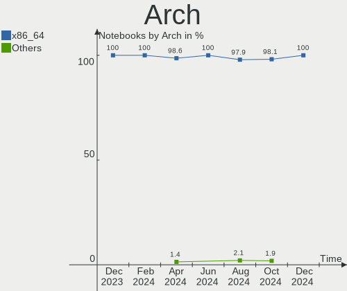
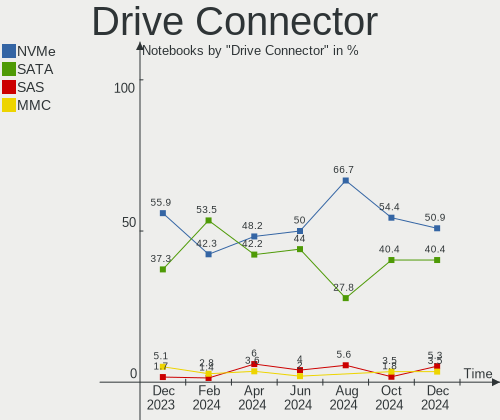
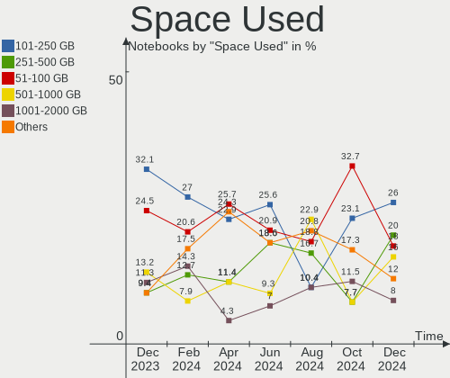
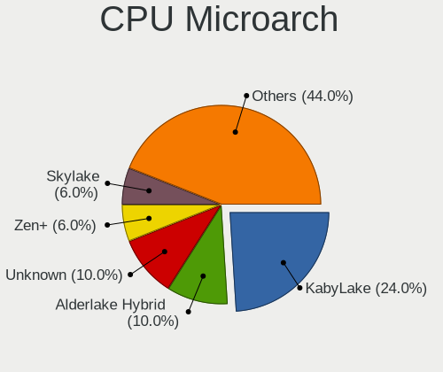
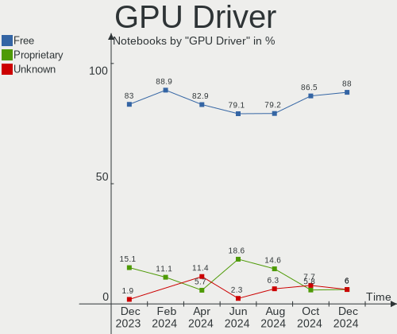
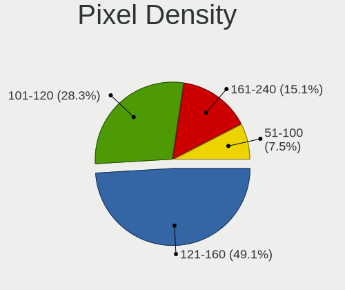
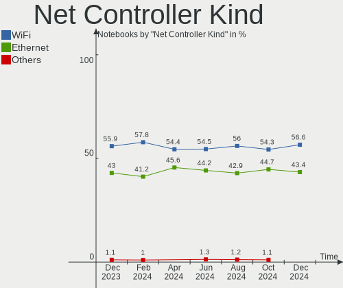
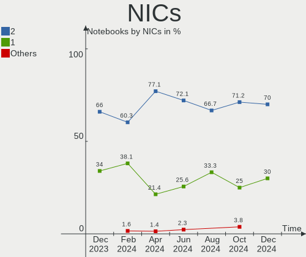
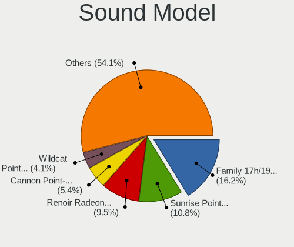

openSUSE - Hardware Trends (Notebooks)
--------------------------------------

A project to identify most popular hardware characteristics and track their change
over time based on data collected by Linux users at https://Linux-Hardware.org.

Anyone can contribute to this report by the [hw-probe](https://github.com/linuxhw/hw-probe) tool:

    sudo -E hw-probe -all -upload

This report is for one last month. Overall report since the beginning of time: [TestDays](https://github.com/linuxhw/TestDays)

Period: Jan, 2024.

Contents
--------

* [ System ](#system)
  - [ OS                       ](#os)
  - [ OS Family                ](#os-family)
  - [ Kernel                   ](#kernel)
  - [ Kernel Family            ](#kernel-family)
  - [ Kernel Major Ver.        ](#kernel-major-ver)
  - [ Arch                     ](#arch)
  - [ DE                       ](#de)
  - [ Display Server           ](#display-server)
  - [ Display Manager          ](#display-manager)
  - [ OS Lang                  ](#os-lang)
  - [ Boot Mode                ](#boot-mode)
  - [ Filesystem               ](#filesystem)
  - [ Part. scheme             ](#part-scheme)
  - [ Dual Boot with Linux/BSD ](#dual-boot-with-linuxbsd)
  - [ Dual Boot (Win)          ](#dual-boot-win)

* [ Board ](#board)
  - [ Vendor                   ](#vendor)
  - [ Model                    ](#model)
  - [ Model Family             ](#model-family)
  - [ MFG Year                 ](#mfg-year)
  - [ Form Factor              ](#form-factor)
  - [ Secure Boot              ](#secure-boot)
  - [ Coreboot                 ](#coreboot)
  - [ RAM Size                 ](#ram-size)
  - [ RAM Used                 ](#ram-used)
  - [ Total Drives             ](#total-drives)
  - [ Has CD-ROM               ](#has-cd-rom)
  - [ Has Ethernet             ](#has-ethernet)
  - [ Has WiFi                 ](#has-wifi)
  - [ Has Bluetooth            ](#has-bluetooth)

* [ Location ](#location)
  - [ Country                  ](#country)
  - [ City                     ](#city)

* [ Drives ](#drives)
  - [ Drive Vendor             ](#drive-vendor)
  - [ Drive Model              ](#drive-model)
  - [ HDD Vendor               ](#hdd-vendor)
  - [ SSD Vendor               ](#ssd-vendor)
  - [ Drive Kind               ](#drive-kind)
  - [ Drive Connector          ](#drive-connector)
  - [ Drive Size               ](#drive-size)
  - [ Space Total              ](#space-total)
  - [ Space Used               ](#space-used)
  - [ Malfunc. Drives          ](#malfunc-drives)
  - [ Malfunc. Drive Vendor    ](#malfunc-drive-vendor)
  - [ Malfunc. HDD Vendor      ](#malfunc-hdd-vendor)
  - [ Malfunc. Drive Kind      ](#malfunc-drive-kind)
  - [ Failed Drives            ](#failed-drives)
  - [ Failed Drive Vendor      ](#failed-drive-vendor)
  - [ Drive Status             ](#drive-status)

* [ Storage controller ](#storage-controller)
  - [ Storage Vendor           ](#storage-vendor)
  - [ Storage Model            ](#storage-model)
  - [ Storage Kind             ](#storage-kind)

* [ Processor ](#processor)
  - [ CPU Vendor               ](#cpu-vendor)
  - [ CPU Model                ](#cpu-model)
  - [ CPU Model Family         ](#cpu-model-family)
  - [ CPU Cores                ](#cpu-cores)
  - [ CPU Sockets              ](#cpu-sockets)
  - [ CPU Threads              ](#cpu-threads)
  - [ CPU Op-Modes             ](#cpu-op-modes)
  - [ CPU Microcode            ](#cpu-microcode)
  - [ CPU Microarch            ](#cpu-microarch)

* [ Graphics ](#graphics)
  - [ GPU Vendor               ](#gpu-vendor)
  - [ GPU Model                ](#gpu-model)
  - [ GPU Combo                ](#gpu-combo)
  - [ GPU Driver               ](#gpu-driver)
  - [ GPU Memory               ](#gpu-memory)

* [ Monitor ](#monitor)
  - [ Monitor Vendor           ](#monitor-vendor)
  - [ Monitor Model            ](#monitor-model)
  - [ Monitor Resolution       ](#monitor-resolution)
  - [ Monitor Diagonal         ](#monitor-diagonal)
  - [ Monitor Width            ](#monitor-width)
  - [ Aspect Ratio             ](#aspect-ratio)
  - [ Monitor Area             ](#monitor-area)
  - [ Pixel Density            ](#pixel-density)
  - [ Multiple Monitors        ](#multiple-monitors)

* [ Network ](#network)
  - [ Net Controller Vendor    ](#net-controller-vendor)
  - [ Net Controller Model     ](#net-controller-model)
  - [ Wireless Vendor          ](#wireless-vendor)
  - [ Wireless Model           ](#wireless-model)
  - [ Ethernet Vendor          ](#ethernet-vendor)
  - [ Ethernet Model           ](#ethernet-model)
  - [ Net Controller Kind      ](#net-controller-kind)
  - [ Used Controller          ](#used-controller)
  - [ NICs                     ](#nics)
  - [ IPv6                     ](#ipv6)

* [ Bluetooth ](#bluetooth)
  - [ Bluetooth Vendor         ](#bluetooth-vendor)
  - [ Bluetooth Model          ](#bluetooth-model)

* [ Sound ](#sound)
  - [ Sound Vendor             ](#sound-vendor)
  - [ Sound Model              ](#sound-model)

* [ Memory ](#memory)
  - [ Memory Vendor            ](#memory-vendor)
  - [ Memory Model             ](#memory-model)
  - [ Memory Kind              ](#memory-kind)
  - [ Memory Form Factor       ](#memory-form-factor)
  - [ Memory Size              ](#memory-size)
  - [ Memory Speed             ](#memory-speed)

* [ Printers & scanners ](#printers--scanners)
  - [ Printer Vendor           ](#printer-vendor)
  - [ Printer Model            ](#printer-model)
  - [ Scanner Vendor           ](#scanner-vendor)
  - [ Scanner Model            ](#scanner-model)

* [ Camera ](#camera)
  - [ Camera Vendor            ](#camera-vendor)
  - [ Camera Model             ](#camera-model)

* [ Security ](#security)
  - [ Fingerprint Vendor       ](#fingerprint-vendor)
  - [ Fingerprint Model        ](#fingerprint-model)
  - [ Chipcard Vendor          ](#chipcard-vendor)
  - [ Chipcard Model           ](#chipcard-model)

* [ Unsupported ](#unsupported)
  - [ Unsupported Devices      ](#unsupported-devices)
  - [ Unsupported Device Types ](#unsupported-device-types)

System
------

OS
--

Installed operating systems

| Name                         | Notebooks | Percent |
|------------------------------|-----------|---------|
| openSUSE Tumbleweed-XXXXXXXX | 39        | 68.42%  |
| openSUSE Leap-15.5           | 14        | 24.56%  |
| openSUSE Microos-XXXXXXXX    | 3         | 5.26%   |
| openSUSE Leap-15.4           | 1         | 1.75%   |

OS Family
---------

OS without a version

| Name     | Notebooks | Percent |
|----------|-----------|---------|
| openSUSE | 57        | 100%    |

Kernel
------

Version of the Linux kernel

| Version                      | Notebooks | Percent |
|------------------------------|-----------|---------|
| 6.6.11-1-default             | 14        | 24.56%  |
| 6.6.7-1-default              | 13        | 22.81%  |
| 5.14.21-150500.55.39-default | 11        | 19.3%   |
| 6.7.1-1-default              | 3         | 5.26%   |
| 6.6.9-1-default              | 3         | 5.26%   |
| 6.7.1-2-default              | 2         | 3.51%   |
| 6.6.10-1-default             | 2         | 3.51%   |
| 6.8.0-rc1-3.gc619505-default | 1         | 1.75%   |
| 6.6.8-lqx2-1-liquorix        | 1         | 1.75%   |
| 6.6.3-1-default              | 1         | 1.75%   |
| 6.6.10-4.ge04388e-default    | 1         | 1.75%   |
| 6.5.9-1-default              | 1         | 1.75%   |
| 5.14.21-150500.55.44-default | 1         | 1.75%   |
| 5.14.21-150500.55.36-default | 1         | 1.75%   |
| 5.14.21-150500.53-default    | 1         | 1.75%   |
| 5.14.21-150400.24.97-default | 1         | 1.75%   |

Kernel Family
-------------

Linux kernel without a distro release

| Version | Notebooks | Percent |
|---------|-----------|---------|
| 5.14.21 | 15        | 26.32%  |
| 6.6.11  | 14        | 24.56%  |
| 6.6.7   | 13        | 22.81%  |
| 6.7.1   | 5         | 8.77%   |
| 6.6.9   | 3         | 5.26%   |
| 6.6.10  | 3         | 5.26%   |
| 6.8.0   | 1         | 1.75%   |
| 6.6.8   | 1         | 1.75%   |
| 6.6.3   | 1         | 1.75%   |
| 6.5.9   | 1         | 1.75%   |

Kernel Major Ver.
-----------------

Linux kernel major version

| Version | Notebooks | Percent |
|---------|-----------|---------|
| 6.6     | 35        | 61.4%   |
| 5.14    | 15        | 26.32%  |
| 6.7     | 5         | 8.77%   |
| 6.8     | 1         | 1.75%   |
| 6.5     | 1         | 1.75%   |

Arch
----

OS architecture (x86_64, i586, etc.)

| Name   | Notebooks | Percent |
|--------|-----------|---------|
| x86_64 | 57        | 100%    |

DE
--

Desktop Environment

| Name    | Notebooks | Percent |
|---------|-----------|---------|
| KDE5    | 35        | 61.4%   |
| GNOME   | 15        | 26.32%  |
| XFCE    | 3         | 5.26%   |
| Unknown | 2         | 3.51%   |
| sway    | 1         | 1.75%   |
| LXDE    | 1         | 1.75%   |

Display Server
--------------

X11 or Wayland

| Name    | Notebooks | Percent |
|---------|-----------|---------|
| X11     | 29        | 50.88%  |
| Wayland | 26        | 45.61%  |
| Tty     | 1         | 1.75%   |
| Unknown | 1         | 1.75%   |

Display Manager
---------------

SDDM, LightDM, etc.

| Name    | Notebooks | Percent |
|---------|-----------|---------|
| Unknown | 23        | 40.35%  |
| SDDM    | 20        | 35.09%  |
| GDM     | 7         | 12.28%  |
| LightDM | 6         | 10.53%  |
| GREETD  | 1         | 1.75%   |

OS Lang
-------

Language

| Lang    | Notebooks | Percent |
|---------|-----------|---------|
| en_US   | 23        | 40.35%  |
| de_DE   | 12        | 21.05%  |
| en_GB   | 5         | 8.77%   |
| POSIX   | 4         | 7.02%   |
| it_IT   | 3         | 5.26%   |
| ru_RU   | 2         | 3.51%   |
| hu_HU   | 2         | 3.51%   |
| fr_FR   | 2         | 3.51%   |
| bg_BG   | 2         | 3.51%   |
| pl_PL   | 1         | 1.75%   |
| Unknown | 1         | 1.75%   |

Boot Mode
---------

EFI or BIOS

| Mode | Notebooks | Percent |
|------|-----------|---------|
| EFI  | 46        | 80.7%   |
| BIOS | 11        | 19.3%   |

Filesystem
----------

Type of filesystem

| Type  | Notebooks | Percent |
|-------|-----------|---------|
| Btrfs | 42        | 73.68%  |
| Ext4  | 10        | 17.54%  |
| Xfs   | 4         | 7.02%   |
| Tmpfs | 1         | 1.75%   |

Part. scheme
------------

Scheme of partitioning

| Type    | Notebooks | Percent |
|---------|-----------|---------|
| GPT     | 34        | 59.65%  |
| Unknown | 21        | 36.84%  |
| MBR     | 2         | 3.51%   |

Dual Boot with Linux/BSD
------------------------

Hosting more than one Linux/BSD

| Dual boot | Notebooks | Percent |
|-----------|-----------|---------|
| No        | 53        | 92.98%  |
| Yes       | 4         | 7.02%   |

Dual Boot (Win)
---------------

Hosting Linux and Windows

| Dual boot | Notebooks | Percent |
|-----------|-----------|---------|
| No        | 48        | 84.21%  |
| Yes       | 9         | 15.79%  |

Board
-----

Vendor
------

Motherboard manufacturer

| Name                | Notebooks | Percent |
|---------------------|-----------|---------|
| Lenovo              | 12        | 21.05%  |
| Hewlett-Packard     | 12        | 21.05%  |
| Dell                | 8         | 14.04%  |
| Acer                | 6         | 10.53%  |
| TUXEDO              | 5         | 8.77%   |
| ASUSTek Computer    | 4         | 7.02%   |
| MSI                 | 2         | 3.51%   |
| Apple               | 2         | 3.51%   |
| Timi                | 1         | 1.75%   |
| SLIMBOOK            | 1         | 1.75%   |
| Samsung Electronics | 1         | 1.75%   |
| MECHREVO            | 1         | 1.75%   |
| Framework           | 1         | 1.75%   |
| Alienware           | 1         | 1.75%   |

Model
-----

Motherboard model

| Name                                        | Notebooks | Percent |
|---------------------------------------------|-----------|---------|
| TUXEDO Aura 15 Gen2                         | 2         | 3.51%   |
| HP Laptop 15s-eq2xxx                        | 2         | 3.51%   |
| TUXEDO Pulse 15 Gen2                        | 1         | 1.75%   |
| TUXEDO InfinityBook Pro Gen8 (MK2)          | 1         | 1.75%   |
| TUXEDO Aura 15 Gen1                         | 1         | 1.75%   |
| Timi RedmiBook Pro 14S                      | 1         | 1.75%   |
| SLIMBOOK PROX15-AMD                         | 1         | 1.75%   |
| Samsung 700T                                | 1         | 1.75%   |
| MSI Thin GF63 12HW                          | 1         | 1.75%   |
| MSI GT60                                    | 1         | 1.75%   |
| MECHREVO WUJIE 14                           | 1         | 1.75%   |
| Lenovo ThinkPad X280 20KEA03YCL             | 1         | 1.75%   |
| Lenovo ThinkPad X1 Nano Gen 3 21K1CTO1WW    | 1         | 1.75%   |
| Lenovo ThinkPad X1 Carbon Gen 11 21HM002GUS | 1         | 1.75%   |
| Lenovo ThinkPad T530 2394W19                | 1         | 1.75%   |
| Lenovo ThinkPad T490 20N3001EGE             | 1         | 1.75%   |
| Lenovo ThinkPad T470 W10DG 20JNS09G00       | 1         | 1.75%   |
| Lenovo ThinkPad T470 20HES3JR02             | 1         | 1.75%   |
| Lenovo ThinkPad P53 20QNCTO1WW              | 1         | 1.75%   |
| Lenovo ThinkPad P14s Gen 4 21HFCTO1WW       | 1         | 1.75%   |
| Lenovo ThinkPad P14s Gen 1 20Y1CTO1WW       | 1         | 1.75%   |
| Lenovo ThinkPad E14 20RAS1S600              | 1         | 1.75%   |
| Lenovo IdeaPad 3 15ITL6 82MD                | 1         | 1.75%   |
| HP ProBook 430 G1                           | 1         | 1.75%   |
| HP Pavilion Laptop 15-eg2xxx                | 1         | 1.75%   |
| HP Pavilion dv6                             | 1         | 1.75%   |
| HP Notebook                                 | 1         | 1.75%   |
| HP Laptop 15s-eq1xxx                        | 1         | 1.75%   |
| HP Laptop 15-dy2xxx                         | 1         | 1.75%   |
| HP EliteBook 845 G8 Notebook PC             | 1         | 1.75%   |
| HP EliteBook 830 13 inch G10 Notebook PC    | 1         | 1.75%   |
| HP EliteBook 2540p                          | 1         | 1.75%   |
| HP 255 G8 Notebook PC                       | 1         | 1.75%   |
| Framework Laptop 13 (AMD Ryzen 7040Series)  | 1         | 1.75%   |
| Dell Studio 1747                            | 1         | 1.75%   |
| Dell Latitude XT2                           | 1         | 1.75%   |
| Dell Latitude E6530                         | 1         | 1.75%   |
| Dell Latitude E6400                         | 1         | 1.75%   |
| Dell Latitude 5591                          | 1         | 1.75%   |
| Dell Latitude 5590                          | 1         | 1.75%   |

Model Family
------------

Motherboard model prefix

| Name                | Notebooks | Percent |
|---------------------|-----------|---------|
| Lenovo ThinkPad     | 11        | 19.3%   |
| Dell Latitude       | 7         | 12.28%  |
| HP Laptop           | 4         | 7.02%   |
| TUXEDO Aura         | 3         | 5.26%   |
| HP EliteBook        | 3         | 5.26%   |
| Acer Aspire         | 3         | 5.26%   |
| HP Pavilion         | 2         | 3.51%   |
| ASUS Vivobook       | 2         | 3.51%   |
| Acer Swift          | 2         | 3.51%   |
| TUXEDO Pulse        | 1         | 1.75%   |
| TUXEDO InfinityBook | 1         | 1.75%   |
| Timi RedmiBook      | 1         | 1.75%   |
| SLIMBOOK PROX15-AMD | 1         | 1.75%   |
| Samsung 700T        | 1         | 1.75%   |
| MSI Thin            | 1         | 1.75%   |
| MSI GT60            | 1         | 1.75%   |
| MECHREVO WUJIE      | 1         | 1.75%   |
| Lenovo IdeaPad      | 1         | 1.75%   |
| HP ProBook          | 1         | 1.75%   |
| HP Notebook         | 1         | 1.75%   |
| HP 255              | 1         | 1.75%   |
| Framework Laptop    | 1         | 1.75%   |
| Dell Studio         | 1         | 1.75%   |
| ASUS UX510UXK       | 1         | 1.75%   |
| ASUS ASUS           | 1         | 1.75%   |
| Apple MacBookPro5   | 1         | 1.75%   |
| Apple MacBook5      | 1         | 1.75%   |
| Alienware m16       | 1         | 1.75%   |
| Acer Nitro          | 1         | 1.75%   |

MFG Year
--------

Motherboard manufacture year

| Year | Notebooks | Percent |
|------|-----------|---------|
| 2023 | 11        | 19.3%   |
| 2021 | 7         | 12.28%  |
| 2020 | 7         | 12.28%  |
| 2022 | 6         | 10.53%  |
| 2019 | 6         | 10.53%  |
| 2012 | 4         | 7.02%   |
| 2018 | 3         | 5.26%   |
| 2009 | 3         | 5.26%   |
| 2017 | 2         | 3.51%   |
| 2016 | 2         | 3.51%   |
| 2013 | 2         | 3.51%   |
| 2010 | 2         | 3.51%   |
| 2008 | 2         | 3.51%   |

Form Factor
-----------

Physical design of the computer

| Name     | Notebooks | Percent |
|----------|-----------|---------|
| Notebook | 57        | 100%    |

Secure Boot
-----------

Enabled or disabled

| State    | Notebooks | Percent |
|----------|-----------|---------|
| Disabled | 42        | 73.68%  |
| Enabled  | 15        | 26.32%  |

Coreboot
--------

Have coreboot on board

| Used | Notebooks | Percent |
|------|-----------|---------|
| No   | 57        | 100%    |

RAM Size
--------

Total RAM memory

| Size in GB  | Notebooks | Percent |
|-------------|-----------|---------|
| 4.01-8.0    | 14        | 24.56%  |
| 8.01-16.0   | 13        | 22.81%  |
| 32.01-64.0  | 8         | 14.04%  |
| 16.01-24.0  | 7         | 12.28%  |
| 24.01-32.0  | 6         | 10.53%  |
| 3.01-4.0    | 5         | 8.77%   |
| 64.01-256.0 | 4         | 7.02%   |

RAM Used
--------

Used RAM memory

| Used GB    | Notebooks | Percent |
|------------|-----------|---------|
| 4.01-8.0   | 17        | 29.82%  |
| 2.01-3.0   | 13        | 22.81%  |
| 3.01-4.0   | 10        | 17.54%  |
| 1.01-2.0   | 9         | 15.79%  |
| 8.01-16.0  | 6         | 10.53%  |
| 16.01-24.0 | 2         | 3.51%   |

Total Drives
------------

Number of drives on board

| Drives | Notebooks | Percent |
|--------|-----------|---------|
| 1      | 45        | 78.95%  |
| 2      | 11        | 19.3%   |
| 3      | 1         | 1.75%   |

Has CD-ROM
----------

Has CD-ROM on board

| Presented | Notebooks | Percent |
|-----------|-----------|---------|
| No        | 48        | 84.21%  |
| Yes       | 9         | 15.79%  |

Has Ethernet
------------

Has Ethernet on board

| Presented | Notebooks | Percent |
|-----------|-----------|---------|
| Yes       | 40        | 70.18%  |
| No        | 17        | 29.82%  |

Has WiFi
--------

Has WiFi module

| Presented | Notebooks | Percent |
|-----------|-----------|---------|
| Yes       | 57        | 100%    |

Has Bluetooth
-------------

Has Bluetooth module

| Presented | Notebooks | Percent |
|-----------|-----------|---------|
| Yes       | 46        | 80.7%   |
| No        | 11        | 19.3%   |

Location
--------

Country
-------

Geographic location (country)

| Country   | Notebooks | Percent |
|-----------|-----------|---------|
| Germany   | 15        | 26.32%  |
| USA       | 11        | 19.3%   |
| UK        | 3         | 5.26%   |
| Russia    | 3         | 5.26%   |
| Italy     | 3         | 5.26%   |
| Hungary   | 3         | 5.26%   |
| Bulgaria  | 3         | 5.26%   |
| Brazil    | 3         | 5.26%   |
| India     | 2         | 3.51%   |
| Turkey    | 1         | 1.75%   |
| Singapore | 1         | 1.75%   |
| Poland    | 1         | 1.75%   |
| Peru      | 1         | 1.75%   |
| France    | 1         | 1.75%   |
| DR Congo  | 1         | 1.75%   |
| Czechia   | 1         | 1.75%   |
| Chile     | 1         | 1.75%   |
| Canada    | 1         | 1.75%   |
| Austria   | 1         | 1.75%   |
| Argentina | 1         | 1.75%   |

City
----

Geographic location (city)

| City              | Notebooks | Percent |
|-------------------|-----------|---------|
| Munich            | 3         | 5.26%   |
| Sofia             | 2         | 3.51%   |
| Nuremberg         | 2         | 3.51%   |
| Moscow            | 2         | 3.51%   |
| Frankfurt am Main | 2         | 3.51%   |
| Wroclaw           | 1         | 1.75%   |
| Varna             | 1         | 1.75%   |
| Tokaj             | 1         | 1.75%   |
| Szigetszentmiklos | 1         | 1.75%   |
| South Shore       | 1         | 1.75%   |
| Singapore         | 1         | 1.75%   |
| Siegen            | 1         | 1.75%   |
| Sandhurst         | 1         | 1.75%   |
| San Antonio       | 1         | 1.75%   |
| Saarbrücken      | 1         | 1.75%   |
| Pistoia           | 1         | 1.75%   |
| Painesville       | 1         | 1.75%   |
| New York          | 1         | 1.75%   |
| Natal             | 1         | 1.75%   |
| Mobile            | 1         | 1.75%   |
| Milan             | 1         | 1.75%   |
| Meadville         | 1         | 1.75%   |
| Lima              | 1         | 1.75%   |
| Kolkata           | 1         | 1.75%   |
| Kinshasa          | 1         | 1.75%   |
| Kansas City       | 1         | 1.75%   |
| Innsbruck         | 1         | 1.75%   |
| Inglewood         | 1         | 1.75%   |
| Euskirchen        | 1         | 1.75%   |
| Essen             | 1         | 1.75%   |
| Enterprise        | 1         | 1.75%   |
| Edgware           | 1         | 1.75%   |
| Duisburg          | 1         | 1.75%   |
| Duartina          | 1         | 1.75%   |
| Dresden           | 1         | 1.75%   |
| Dolgoprudnyy      | 1         | 1.75%   |
| Croydon           | 1         | 1.75%   |
| Concepción       | 1         | 1.75%   |
| Chennai           | 1         | 1.75%   |
| Celakovice        | 1         | 1.75%   |

Drives
------

Drive Vendor
------------

Hard drive vendors

| Vendor                         | Notebooks | Drives | Percent |
|--------------------------------|-----------|--------|---------|
| Samsung Electronics            | 14        | 14     | 20.29%  |
| Sandisk                        | 10        | 10     | 14.49%  |
| SK hynix                       | 5         | 5      | 7.25%   |
| WDC                            | 4         | 4      | 5.8%    |
| Kingston                       | 4         | 4      | 5.8%    |
| KIOXIA                         | 3         | 3      | 4.35%   |
| Intel                          | 3         | 3      | 4.35%   |
| Unknown                        | 2         | 2      | 2.9%    |
| SPCC                           | 2         | 2      | 2.9%    |
| Seagate                        | 2         | 3      | 2.9%    |
| PNY                            | 2         | 2      | 2.9%    |
| Phison Electronics             | 2         | 2      | 2.9%    |
| Yangtze Memory Technologies    | 1         | 1      | 1.45%   |
| Transcend                      | 1         | 1      | 1.45%   |
| Toshiba                        | 1         | 1      | 1.45%   |
| Solid State Storage Technology | 1         | 1      | 1.45%   |
| Shenzhen Longsys Electronics   | 1         | 1      | 1.45%   |
| Realtek Semiconductor          | 1         | 1      | 1.45%   |
| Pioneer                        | 1         | 1      | 1.45%   |
| Micron/Crucial Technology      | 1         | 1      | 1.45%   |
| Micron Technology              | 1         | 1      | 1.45%   |
| Kingston Technology Company    | 1         | 1      | 1.45%   |
| KBM                            | 1         | 1      | 1.45%   |
| INTEL SS                       | 1         | 1      | 1.45%   |
| Hewlett-Packard                | 1         | 1      | 1.45%   |
| China                          | 1         | 1      | 1.45%   |
| A-DATA Technology              | 1         | 1      | 1.45%   |
| Unknown                        | 1         | 1      | 1.45%   |

Drive Model
-----------

Hard drive models

| Model                                                  | Notebooks | Percent |
|--------------------------------------------------------|-----------|---------|
| Sandisk WD Blue SN550 NVMe SSD 512GB                   | 3         | 4.35%   |
| Sandisk WD Black SN850 1024GB                          | 2         | 2.9%    |
| Samsung SSD 860 EVO 500GB                              | 2         | 2.9%    |
| Samsung NVMe SSD Controller SM981/PM981/PM983 1TB      | 2         | 2.9%    |
| KIOXIA KBG40ZNV256G 256GB                              | 2         | 2.9%    |
| Kingston SNVS500G 500GB                                | 2         | 2.9%    |
| Intel SSD Pro 7600p/760p/E 6100p Series 1024GB         | 2         | 2.9%    |
| Yangtze Memory YMTC PC300-1TB-B 1024GB                 | 1         | 1.45%   |
| WDC WDS200T2B0A-00SM50 2TB SSD                         | 1         | 1.45%   |
| WDC WD7500BPKX-22HPJT0 752GB                           | 1         | 1.45%   |
| WDC WD12 00BEVS-07LAT0 120GB                           | 1         | 1.45%   |
| WDC PC SN530 NVMe 512GB                                | 1         | 1.45%   |
| Unknown NVMe SSD Drive 512GB                           | 1         | 1.45%   |
| Unknown MMC Card  16GB                                 | 1         | 1.45%   |
| Transcend TS120GMTS420S 120GB SSD                      | 1         | 1.45%   |
| Toshiba KXG50ZNV1T02 NVMe 1024GB                       | 1         | 1.45%   |
| SPCC Solid State Disk 512GB                            | 1         | 1.45%   |
| SPCC Solid State Disk 256GB                            | 1         | 1.45%   |
| Solid State Storage SSSTC CL1-4D128 128GB              | 1         | 1.45%   |
| SK hynix SKHynix_HFS002TEJ9X162N 2TB                   | 1         | 1.45%   |
| SK hynix PC801 NVMe 512GB                              | 1         | 1.45%   |
| SK hynix HFS001TEJ9X110N 1024GB                        | 1         | 1.45%   |
| SK hynix HFM512GD3JX016N 512GB                         | 1         | 1.45%   |
| SK hynix BC711 HFM512GD3JX013N 512GB                   | 1         | 1.45%   |
| Shenzhen Longsys SM2263EN/SM2263XT-based OEM SSD 512GB | 1         | 1.45%   |
| Seagate Portable 5TB                                   | 1         | 1.45%   |
| Seagate BarraCuda Q5 ZP2000CV30001 2TB                 | 1         | 1.45%   |
| Sandisk WD_BLACK SN850X 2000GB                         | 1         | 1.45%   |
| Sandisk WD PC SN735 SDBPNHH-1T00-1002 1TB              | 1         | 1.45%   |
| Sandisk WD Green SN350 500GB 2G0C                      | 1         | 1.45%   |
| SanDisk SD9TN8W256G1001 256GB SSD                      | 1         | 1.45%   |
| SanDisk SD8SNAT-256G-1006 256GB SSD                    | 1         | 1.45%   |
| Samsung SSD 990 PRO 1TB                                | 1         | 1.45%   |
| Samsung SSD 980 500GB                                  | 1         | 1.45%   |
| Samsung SSD 860 EVO M.2 500GB                          | 1         | 1.45%   |
| Samsung SSD 850 PRO 256GB                              | 1         | 1.45%   |
| Samsung NVMe SSD Controller SM961/PM961/SM963 256GB    | 1         | 1.45%   |
| Samsung NVMe SSD Controller PM9A1/PM9A3/980PRO 2TB     | 1         | 1.45%   |
| Samsung MZVLQ512HBLU-00BH1 512GB                       | 1         | 1.45%   |
| Samsung MZVL4512HBLU-00BTW 512GB                       | 1         | 1.45%   |

HDD Vendor
----------

Hard disk drive vendors

| Vendor | Notebooks | Drives | Percent |
|--------|-----------|--------|---------|
| WDC    | 2         | 2      | 100%    |

SSD Vendor
----------

Solid state drive vendors

| Vendor              | Notebooks | Drives | Percent |
|---------------------|-----------|--------|---------|
| Samsung Electronics | 5         | 5      | 23.81%  |
| SPCC                | 2         | 2      | 9.52%   |
| SanDisk             | 2         | 2      | 9.52%   |
| PNY                 | 2         | 2      | 9.52%   |
| WDC                 | 1         | 1      | 4.76%   |
| Transcend           | 1         | 1      | 4.76%   |
| Pioneer             | 1         | 1      | 4.76%   |
| Kingston            | 1         | 1      | 4.76%   |
| KBM                 | 1         | 1      | 4.76%   |
| INTEL SS            | 1         | 1      | 4.76%   |
| Hewlett-Packard     | 1         | 1      | 4.76%   |
| China               | 1         | 1      | 4.76%   |
| A-DATA Technology   | 1         | 1      | 4.76%   |
| Unknown             | 1         | 1      | 4.76%   |

Drive Kind
----------

HDD or SSD

| Kind    | Notebooks | Drives | Percent |
|---------|-----------|--------|---------|
| NVMe    | 40        | 44     | 63.49%  |
| SSD     | 19        | 21     | 30.16%  |
| HDD     | 2         | 2      | 3.17%   |
| MMC     | 1         | 1      | 1.59%   |
| Unknown | 1         | 2      | 1.59%   |

Drive Connector
---------------

SATA, SAS, NVMe, etc.

| Type | Notebooks | Drives | Percent |
|------|-----------|--------|---------|
| NVMe | 40        | 44     | 63.49%  |
| SATA | 19        | 21     | 30.16%  |
| SAS  | 3         | 4      | 4.76%   |
| MMC  | 1         | 1      | 1.59%   |

Drive Size
----------

Size of hard drive

| Size in TB | Notebooks | Drives | Percent |
|------------|-----------|--------|---------|
| 0.01-0.5   | 16        | 17     | 72.73%  |
| 0.51-1.0   | 4         | 4      | 18.18%  |
| 1.01-2.0   | 2         | 2      | 9.09%   |

Space Total
-----------

Amount of disk space available on the file system

| Size in GB     | Notebooks | Percent |
|----------------|-----------|---------|
| More than 3000 | 22        | 38.6%   |
| 1001-2000      | 11        | 19.3%   |
| 251-500        | 8         | 14.04%  |
| 2001-3000      | 7         | 12.28%  |
| 101-250        | 4         | 7.02%   |
| 501-1000       | 3         | 5.26%   |
| 1-20           | 1         | 1.75%   |
| Unknown        | 1         | 1.75%   |

Space Used
----------

Amount of used disk space

| Used GB        | Notebooks | Percent |
|----------------|-----------|---------|
| 101-250        | 15        | 26.32%  |
| 1001-2000      | 10        | 17.54%  |
| 251-500        | 6         | 10.53%  |
| 51-100         | 6         | 10.53%  |
| 501-1000       | 5         | 8.77%   |
| 2001-3000      | 4         | 7.02%   |
| 1-20           | 4         | 7.02%   |
| 21-50          | 3         | 5.26%   |
| More than 3000 | 2         | 3.51%   |
| 0              | 1         | 1.75%   |
| Unknown        | 1         | 1.75%   |

Malfunc. Drives
---------------

Drive models with a malfunction

| Model                                | Notebooks | Drives | Percent |
|--------------------------------------|-----------|--------|---------|
| SK hynix BC711 HFM512GD3JX013N 512GB | 1         | 1      | 100%    |

Malfunc. Drive Vendor
---------------------

Vendors of faulty drives

| Vendor   | Notebooks | Drives | Percent |
|----------|-----------|--------|---------|
| SK hynix | 1         | 1      | 100%    |

Malfunc. HDD Vendor
-------------------

Vendors of faulty HDD drives

Zero info for selected period =(

Malfunc. Drive Kind
-------------------

Kinds of faulty drives

| Kind | Notebooks | Drives | Percent |
|------|-----------|--------|---------|
| NVMe | 1         | 1      | 100%    |

Failed Drives
-------------

Failed drive models

Zero info for selected period =(

Failed Drive Vendor
-------------------

Failed drive vendors

Zero info for selected period =(

Drive Status
------------

Number of failed and malfunc. drives

| Status   | Notebooks | Drives | Percent |
|----------|-----------|--------|---------|
| Works    | 33        | 38     | 56.9%   |
| Detected | 24        | 31     | 41.38%  |
| Malfunc  | 1         | 1      | 1.72%   |

Storage controller
------------------

Storage Vendor
--------------

Storage controller vendors

| Vendor                         | Notebooks | Percent |
|--------------------------------|-----------|---------|
| Intel                          | 27        | 33.75%  |
| AMD                            | 10        | 12.5%   |
| SanDisk                        | 9         | 11.25%  |
| Samsung Electronics            | 9         | 11.25%  |
| SK hynix                       | 5         | 6.25%   |
| Kingston Technology Company    | 4         | 5%      |
| KIOXIA                         | 3         | 3.75%   |
| Phison Electronics             | 2         | 2.5%    |
| Nvidia                         | 2         | 2.5%    |
| Yangtze Memory Technologies    | 1         | 1.25%   |
| Toshiba America Info Systems   | 1         | 1.25%   |
| Solidigm                       | 1         | 1.25%   |
| Solid State Storage Technology | 1         | 1.25%   |
| Shenzhen Longsys Electronics   | 1         | 1.25%   |
| Seagate Technology             | 1         | 1.25%   |
| Realtek Semiconductor          | 1         | 1.25%   |
| Micron/Crucial Technology      | 1         | 1.25%   |
| Micron Technology              | 1         | 1.25%   |

Storage Model
-------------

Storage controller models

| Model                                                                 | Notebooks | Percent |
|-----------------------------------------------------------------------|-----------|---------|
| AMD FCH SATA Controller [AHCI mode]                                   | 9         | 10.98%  |
| Intel Sunrise Point-LP SATA Controller [AHCI mode]                    | 4         | 4.88%   |
| Intel 82801 Mobile SATA Controller [RAID mode]                        | 4         | 4.88%   |
| SanDisk Ultra 3D / WD Blue SN550 NVMe SSD                             | 3         | 3.66%   |
| Samsung NVMe SSD Controller 980 (DRAM-less)                           | 3         | 3.66%   |
| KIOXIA NVMe SSD Controller BG4 (DRAM-less)                            | 3         | 3.66%   |
| Intel Volume Management Device NVMe RAID Controller                   | 3         | 3.66%   |
| SK hynix Platinum P41/PC801 NVMe Solid State Drive                    | 2         | 2.44%   |
| SK hynix Gold P31/BC711/PC711 NVMe Solid State Drive                  | 2         | 2.44%   |
| SanDisk WD PC SN810 / Black SN850 NVMe SSD                            | 2         | 2.44%   |
| Samsung NVMe SSD Controller SM981/PM981/PM983                         | 2         | 2.44%   |
| Nvidia MCP79 AHCI Controller                                          | 2         | 2.44%   |
| Kingston Company NV1 NVMe SSD SM2263XT (DRAM-less)                    | 2         | 2.44%   |
| Intel Tiger Lake-LP SATA Controller                                   | 2         | 2.44%   |
| Intel SSD DC P4101/Pro 7600p/760p/E 6100p Series                      | 2         | 2.44%   |
| Intel 7 Series Chipset Family 6-port SATA Controller [AHCI mode]      | 2         | 2.44%   |
| Intel 5 Series/3400 Series Chipset 6 port SATA AHCI Controller        | 2         | 2.44%   |
| Yangtze Memory PC300 NVMe SSD (DRAM-less)                             | 1         | 1.22%   |
| Toshiba America Info Systems XG5 NVMe SSD Controller                  | 1         | 1.22%   |
| Solidigm P41 Plus NVMe SSD (DRAM-less) [Echo Harbor]                  | 1         | 1.22%   |
| Solid State Storage CL1-3D256-Q11 NVMe SSD M.2                        | 1         | 1.22%   |
| SK hynix BC901 NVMe Solid State Drive (DRAM-less)                     | 1         | 1.22%   |
| Shenzhen Longsys SM2263EN/SM2263XT-based OEM NVME SSD (DRAM-less)     | 1         | 1.22%   |
| Seagate BarraCuda Q5 NVMe SSD (DRAM-less)                             | 1         | 1.22%   |
| SanDisk WD Green SN350 240GB (DRAM-less) / SN560E NVMe SSD            | 1         | 1.22%   |
| Sandisk WD Black SN850X NVMe SSD                                      | 1         | 1.22%   |
| SanDisk PC SN735 NVMe SSD (DRAM-less)                                 | 1         | 1.22%   |
| SanDisk IX SN530 NVMe SSD (DRAM-less)                                 | 1         | 1.22%   |
| Samsung NVMe SSD Controller SM961/PM961/SM963                         | 1         | 1.22%   |
| Samsung NVMe SSD Controller S4LV008[Pascal]                           | 1         | 1.22%   |
| Samsung NVMe SSD Controller PM9B1 (DRAM-less)                         | 1         | 1.22%   |
| Samsung NVMe SSD Controller PM9A1/PM9A3/980PRO                        | 1         | 1.22%   |
| Realtek RTS5762 NVMe SSD Controller                                   | 1         | 1.22%   |
| Phison PS5021-E21 PCIe4 NVMe Controller (DRAM-less)                   | 1         | 1.22%   |
| Phison E18 PCIe4 NVMe Controller                                      | 1         | 1.22%   |
| Micron/Crucial P2 [Nick P2] / P3 / P3 Plus NVMe PCIe SSD (DRAM-less)  | 1         | 1.22%   |
| Micron 2300 NVMe SSD [Santana]                                        | 1         | 1.22%   |
| Kingston Company OM8PCP Design-In PCIe 3 NVMe SSD (DRAM-less)         | 1         | 1.22%   |
| Kingston Company OM3PDP3 NVMe SSD                                     | 1         | 1.22%   |
| Intel Volume Management Device NVMe RAID Controller Intel Corporation | 1         | 1.22%   |

Storage Kind
------------

Kind of storage controller (IDE, SATA, NVMe, SAS, ...)

| Kind | Notebooks | Percent |
|------|-----------|---------|
| NVMe | 40        | 51.95%  |
| SATA | 28        | 36.36%  |
| RAID | 8         | 10.39%  |
| IDE  | 1         | 1.3%    |

Processor
---------

CPU Vendor
----------

Processor vendors

| Vendor | Notebooks | Percent |
|--------|-----------|---------|
| Intel  | 36        | 63.16%  |
| AMD    | 21        | 36.84%  |

CPU Model
---------

Processor models

| Model                                      | Notebooks | Percent |
|--------------------------------------------|-----------|---------|
| AMD Ryzen 5 5500U with Radeon Graphics     | 4         | 7.02%   |
| Intel Core i5-8250U CPU @ 1.60GHz          | 2         | 3.51%   |
| Intel Core i5-10210U CPU @ 1.60GHz         | 2         | 3.51%   |
| Intel 13th Gen Core i7-1365U               | 2         | 3.51%   |
| AMD Ryzen 7 5700U with Radeon Graphics     | 2         | 3.51%   |
| AMD Ryzen 3 5300U with Radeon Graphics     | 2         | 3.51%   |
| Intel Xeon E-2276M CPU @ 2.80GHz           | 1         | 1.75%   |
| Intel Pentium Silver N5030 CPU @ 1.10GHz   | 1         | 1.75%   |
| Intel Pentium Gold 7505 @ 2.00GHz          | 1         | 1.75%   |
| Intel Core Ultra 7 155H                    | 1         | 1.75%   |
| Intel Core i7-8850H CPU @ 2.60GHz          | 1         | 1.75%   |
| Intel Core i7-7500U CPU @ 2.70GHz          | 1         | 1.75%   |
| Intel Core i7-3610QM CPU @ 2.30GHz         | 1         | 1.75%   |
| Intel Core i7 CPU Q 720 @ 1.60GHz          | 1         | 1.75%   |
| Intel Core i7 CPU L 640 @ 2.13GHz          | 1         | 1.75%   |
| Intel Core i5-8265U CPU @ 1.60GHz          | 1         | 1.75%   |
| Intel Core i5-7300U CPU @ 2.60GHz          | 1         | 1.75%   |
| Intel Core i5-6300U CPU @ 2.40GHz          | 1         | 1.75%   |
| Intel Core i5-4200U CPU @ 1.60GHz          | 1         | 1.75%   |
| Intel Core i5-3320M CPU @ 2.60GHz          | 1         | 1.75%   |
| Intel Core i5-3210M CPU @ 2.50GHz          | 1         | 1.75%   |
| Intel Core i5-2467M CPU @ 1.60GHz          | 1         | 1.75%   |
| Intel Core i3-N305                         | 1         | 1.75%   |
| Intel Core i3-3217U CPU @ 1.80GHz          | 1         | 1.75%   |
| Intel Core 2 Duo CPU U9600 @ 1.60GHz       | 1         | 1.75%   |
| Intel Core 2 Duo CPU P8800 @ 2.66GHz       | 1         | 1.75%   |
| Intel Core 2 Duo CPU P8700 @ 2.53GHz       | 1         | 1.75%   |
| Intel Core 2 Duo CPU P7350 @ 2.00GHz       | 1         | 1.75%   |
| Intel 13th Gen Core i7-1370P               | 1         | 1.75%   |
| Intel 13th Gen Core i7-13700H              | 1         | 1.75%   |
| Intel 13th Gen Core i5-1340P               | 1         | 1.75%   |
| Intel 12th Gen Core i7-1270P               | 1         | 1.75%   |
| Intel 12th Gen Core i7-1255U               | 1         | 1.75%   |
| Intel 12th Gen Core i5-12450H              | 1         | 1.75%   |
| Intel 11th Gen Core i7-1165G7 @ 2.80GHz    | 1         | 1.75%   |
| Intel 11th Gen Core i3-1115G4 @ 3.00GHz    | 1         | 1.75%   |
| AMD Ryzen 9 7845HX with Radeon Graphics    | 1         | 1.75%   |
| AMD Ryzen 9 4900H with Radeon Graphics     | 1         | 1.75%   |
| AMD Ryzen 7 PRO 5850U with Radeon Graphics | 1         | 1.75%   |
| AMD Ryzen 7 PRO 4750U with Radeon Graphics | 1         | 1.75%   |

CPU Model Family
----------------

Processor model prefix

| Model                | Notebooks | Percent |
|----------------------|-----------|---------|
| Intel Core i5        | 11        | 19.3%   |
| Other                | 10        | 17.54%  |
| AMD Ryzen 7          | 7         | 12.28%  |
| AMD Ryzen 5          | 6         | 10.53%  |
| Intel Core i7        | 5         | 8.77%   |
| Intel Core 2 Duo     | 4         | 7.02%   |
| Intel Core i3        | 2         | 3.51%   |
| AMD Ryzen 9          | 2         | 3.51%   |
| AMD Ryzen 7 PRO      | 2         | 3.51%   |
| AMD Ryzen 3          | 2         | 3.51%   |
| Intel Xeon           | 1         | 1.75%   |
| Intel Pentium Silver | 1         | 1.75%   |
| Intel Pentium Gold   | 1         | 1.75%   |
| Intel Core           | 1         | 1.75%   |
| AMD Phenom II        | 1         | 1.75%   |
| AMD A10              | 1         | 1.75%   |

CPU Cores
---------

Number of processor cores

| Number | Notebooks | Percent |
|--------|-----------|---------|
| 2      | 17        | 29.82%  |
| 8      | 12        | 21.05%  |
| 4      | 12        | 21.05%  |
| 6      | 7         | 12.28%  |
| 12     | 3         | 5.26%   |
| 10     | 3         | 5.26%   |
| 14     | 2         | 3.51%   |
| 16     | 1         | 1.75%   |

CPU Sockets
-----------

Number of sockets

| Number | Notebooks | Percent |
|--------|-----------|---------|
| 1      | 57        | 100%    |

CPU Threads
-----------

Threads per core (Hyper-Threading)

| Number | Notebooks | Percent |
|--------|-----------|---------|
| 2      | 48        | 84.21%  |
| 1      | 9         | 15.79%  |

CPU Op-Modes
------------

CPU Operation Modes (32-bit, 64-bit)

| Op mode        | Notebooks | Percent |
|----------------|-----------|---------|
| 32-bit, 64-bit | 57        | 100%    |

CPU Microcode
-------------

Microcode number

| Number     | Notebooks | Percent |
|------------|-----------|---------|
| Unknown    | 35        | 61.4%   |
| 0x08608103 | 6         | 10.53%  |
| 0x0a704103 | 2         | 3.51%   |
| 0x08600109 | 2         | 3.51%   |
| 0xb06a2    | 1         | 1.75%   |
| 0x806ec    | 1         | 1.75%   |
| 0x806e9    | 1         | 1.75%   |
| 0x806c1    | 1         | 1.75%   |
| 0x306a9    | 1         | 1.75%   |
| 0x0a601203 | 1         | 1.75%   |
| 0x0a50000d | 1         | 1.75%   |
| 0x0a404101 | 1         | 1.75%   |
| 0x08608102 | 1         | 1.75%   |
| 0x08600104 | 1         | 1.75%   |
| 0x06006118 | 1         | 1.75%   |
| 0x010000c8 | 1         | 1.75%   |

CPU Microarch
-------------

Microarchitecture

| Name              | Notebooks | Percent |
|-------------------|-----------|---------|
| Unknown           | 12        | 21.05%  |
| KabyLake          | 9         | 15.79%  |
| Alderlake Hybrid  | 8         | 14.04%  |
| Zen 2             | 5         | 8.77%   |
| Penryn            | 4         | 7.02%   |
| IvyBridge         | 4         | 7.02%   |
| TigerLake         | 3         | 5.26%   |
| Zen 3             | 1         | 1.75%   |
| Zen               | 1         | 1.75%   |
| Westmere          | 1         | 1.75%   |
| Skylake           | 1         | 1.75%   |
| SandyBridge       | 1         | 1.75%   |
| Nehalem           | 1         | 1.75%   |
| Meteorlake Hybrid | 1         | 1.75%   |
| K10               | 1         | 1.75%   |
| Haswell           | 1         | 1.75%   |
| Gracemont         | 1         | 1.75%   |
| Goldmont plus     | 1         | 1.75%   |
| Excavator         | 1         | 1.75%   |

Graphics
--------

GPU Vendor
----------

Vendors of graphics cards

| Vendor | Notebooks | Percent |
|--------|-----------|---------|
| Intel  | 32        | 48.48%  |
| AMD    | 22        | 33.33%  |
| Nvidia | 12        | 18.18%  |

GPU Model
---------

Graphics card models

| Model                                                                                 | Notebooks | Percent |
|---------------------------------------------------------------------------------------|-----------|---------|
| AMD Lucienne                                                                          | 8         | 11.27%  |
| Intel Raptor Lake-P [Iris Xe Graphics]                                                | 5         | 7.04%   |
| AMD Renoir [Radeon RX Vega 6 (Ryzen 4000/5000 Mobile Series)]                         | 5         | 7.04%   |
| Intel 3rd Gen Core processor Graphics Controller                                      | 4         | 5.63%   |
| Nvidia C79 [GeForce 9400M]                                                            | 2         | 2.82%   |
| Intel UHD Graphics 620                                                                | 2         | 2.82%   |
| Intel Tiger Lake-LP GT2 [UHD Graphics G4]                                             | 2         | 2.82%   |
| Intel HD Graphics 620                                                                 | 2         | 2.82%   |
| Intel CometLake-U GT2 [UHD Graphics]                                                  | 2         | 2.82%   |
| Intel CoffeeLake-H GT2 [UHD Graphics 630]                                             | 2         | 2.82%   |
| AMD Phoenix1                                                                          | 2         | 2.82%   |
| Nvidia TU116M [GeForce GTX 1660 Ti Mobile]                                            | 1         | 1.41%   |
| Nvidia TU104GLM [Quadro RTX 5000 Mobile / Max-Q]                                      | 1         | 1.41%   |
| Nvidia GP108M [GeForce MX250]                                                         | 1         | 1.41%   |
| Nvidia GN20-P0-R-K2 [GeForce RTX 3050 6GB Laptop GPU]                                 | 1         | 1.41%   |
| Nvidia GM108M [GeForce MX130]                                                         | 1         | 1.41%   |
| Nvidia GM107M [GeForce GTX 950M]                                                      | 1         | 1.41%   |
| Nvidia GF117M [GeForce 610M/710M/810M/820M / GT 620M/625M/630M/720M]                  | 1         | 1.41%   |
| Nvidia GF114M [GeForce GTX 670M]                                                      | 1         | 1.41%   |
| Nvidia GA107GLM [RTX A500 Laptop GPU]                                                 | 1         | 1.41%   |
| Nvidia G98M [Quadro NVS 160M]                                                         | 1         | 1.41%   |
| Nvidia G96CM [GeForce 9600M GT]                                                       | 1         | 1.41%   |
| Intel WhiskeyLake-U GT2 [UHD Graphics 620]                                            | 1         | 1.41%   |
| Intel TigerLake-LP GT2 [Iris Xe Graphics]                                             | 1         | 1.41%   |
| Intel Skylake GT2 [HD Graphics 520]                                                   | 1         | 1.41%   |
| Intel Mobile 4 Series Chipset Integrated Graphics Controller                          | 1         | 1.41%   |
| Intel Meteor Lake-P [Intel Arc Graphics]                                              | 1         | 1.41%   |
| Intel Haswell-ULT Integrated Graphics Controller                                      | 1         | 1.41%   |
| Intel GeminiLake [UHD Graphics 605]                                                   | 1         | 1.41%   |
| Intel DG2 [Arc A370M]                                                                 | 1         | 1.41%   |
| Intel Core Processor Integrated Graphics Controller                                   | 1         | 1.41%   |
| Intel Alder Lake-UP3 GT2 [Iris Xe Graphics]                                           | 1         | 1.41%   |
| Intel Alder Lake-P GT2 [Iris Xe Graphics]                                             | 1         | 1.41%   |
| Intel Alder Lake-P GT1 [UHD Graphics]                                                 | 1         | 1.41%   |
| Intel Alder Lake-N [UHD Graphics]                                                     | 1         | 1.41%   |
| Intel 2nd Generation Core Processor Family Integrated Graphics Controller             | 1         | 1.41%   |
| AMD Wani [Radeon R5/R6/R7 Graphics]                                                   | 1         | 1.41%   |
| AMD Topaz XT [Radeon R7 M260/M265 / M340/M360 / M440/M445 / 530/535 / 620/625 Mobile] | 1         | 1.41%   |
| AMD RV730/M96 [Mobility Radeon HD 4650/5165]                                          | 1         | 1.41%   |
| AMD RS880M [Mobility Radeon HD 4225/4250]                                             | 1         | 1.41%   |

GPU Combo
---------

Combinations of graphics cards

| Name           | Notebooks | Percent |
|----------------|-----------|---------|
| 1 x Intel      | 23        | 40.35%  |
| 1 x AMD        | 18        | 31.58%  |
| Intel + Nvidia | 8         | 14.04%  |
| 2 x AMD        | 3         | 5.26%   |
| 1 x Nvidia     | 2         | 3.51%   |
| 2 x Nvidia     | 1         | 1.75%   |
| 2 x Intel      | 1         | 1.75%   |
| AMD + Nvidia   | 1         | 1.75%   |

GPU Driver
----------

Free vs proprietary

| Driver      | Notebooks | Percent |
|-------------|-----------|---------|
| Free        | 54        | 94.74%  |
| Proprietary | 3         | 5.26%   |

GPU Memory
----------

Total video memory

| Size in GB | Notebooks | Percent |
|------------|-----------|---------|
| Unknown    | 32        | 56.14%  |
| 0.01-0.5   | 18        | 31.58%  |
| 1.01-2.0   | 4         | 7.02%   |
| 7.01-8.0   | 1         | 1.75%   |
| 3.01-4.0   | 1         | 1.75%   |
| 0.51-1.0   | 1         | 1.75%   |

Monitor
-------

Monitor Vendor
--------------

Monitor vendors

| Vendor              | Notebooks | Percent |
|---------------------|-----------|---------|
| AU Optronics        | 14        | 20.59%  |
| LG Display          | 10        | 14.71%  |
| Chimei Innolux      | 9         | 13.24%  |
| BOE                 | 9         | 13.24%  |
| Samsung Electronics | 6         | 8.82%   |
| Goldstar            | 3         | 4.41%   |
| InfoVision          | 2         | 2.94%   |
| Iiyama              | 2         | 2.94%   |
| CSO                 | 2         | 2.94%   |
| Apple               | 2         | 2.94%   |
| AOC                 | 2         | 2.94%   |
| ViewSonic           | 1         | 1.47%   |
| TMX                 | 1         | 1.47%   |
| Sharp               | 1         | 1.47%   |
| PANDA               | 1         | 1.47%   |
| NEC Computers       | 1         | 1.47%   |
| Hewlett-Packard     | 1         | 1.47%   |
| Acer                | 1         | 1.47%   |

Monitor Model
-------------

Monitor models

| Model                                                                 | Notebooks | Percent |
|-----------------------------------------------------------------------|-----------|---------|
| LG Display LCD Monitor LGD0259 1920x1080 345x194mm 15.6-inch          | 2         | 2.94%   |
| Chimei Innolux LCD Monitor CMN1538 1920x1080 344x193mm 15.5-inch      | 2         | 2.94%   |
| Chimei Innolux LCD Monitor CMN1515 1920x1080 344x193mm 15.5-inch      | 2         | 2.94%   |
| BOE LCD Monitor BOE0747 1920x1080 345x195mm 15.6-inch                 | 2         | 2.94%   |
| AU Optronics LCD Monitor AUO573D 1920x1080 309x174mm 14.0-inch        | 2         | 2.94%   |
| AU Optronics LCD Monitor AUO38ED 1920x1080 344x193mm 15.5-inch        | 2         | 2.94%   |
| AOC 27G2G8 AOC2702 1920x1080 598x336mm 27.0-inch                      | 2         | 2.94%   |
| ViewSonic Q22wb VSCDB1F 1680x1050 474x296mm 22.0-inch                 | 1         | 1.47%   |
| TMX TL140ADXP24-0 TMX2004 2880x1800 300x190mm 14.0-inch               | 1         | 1.47%   |
| Sharp LQ156M1JW01 SHP14C3 1920x1080 344x194mm 15.5-inch               | 1         | 1.47%   |
| Samsung Electronics LCD Monitor SEC5442 1440x900 367x230mm 17.1-inch  | 1         | 1.47%   |
| Samsung Electronics LCD Monitor SEC3152 1366x768 344x194mm 15.5-inch  | 1         | 1.47%   |
| Samsung Electronics LCD Monitor SDC4181 2880x1800 302x189mm 14.0-inch | 1         | 1.47%   |
| Samsung Electronics LCD Monitor SDC416D 2880x1800 312x195mm 14.5-inch | 1         | 1.47%   |
| Samsung Electronics LCD Monitor SDC4141 3840x2160 344x194mm 15.5-inch | 1         | 1.47%   |
| Samsung Electronics LCD Monitor SAM0B32 1366x768 607x345mm 27.5-inch  | 1         | 1.47%   |
| PANDA LCD Monitor NCP006A 2560x1600 302x189mm 14.0-inch               | 1         | 1.47%   |
| NEC Computers EX231Wp NEC684E 1920x1080 510x287mm 23.0-inch           | 1         | 1.47%   |
| LG Display LP156WH2-TLQA LGD026A 1366x768 344x194mm 15.5-inch         | 1         | 1.47%   |
| LG Display LCD Monitor LGD068D 1920x1080 309x174mm 14.0-inch          | 1         | 1.47%   |
| LG Display LCD Monitor LGD05F6 1920x1080 309x174mm 14.0-inch          | 1         | 1.47%   |
| LG Display LCD Monitor LGD05D8 1920x1080 344x194mm 15.5-inch          | 1         | 1.47%   |
| LG Display LCD Monitor LGD0430 1366x768 345x194mm 15.6-inch           | 1         | 1.47%   |
| LG Display LCD Monitor LGD0354 1366x768 293x165mm 13.2-inch           | 1         | 1.47%   |
| LG Display LCD Monitor LGD024F 1280x800 260x160mm 12.0-inch           | 1         | 1.47%   |
| LG Display LCD Monitor LGD021D 1600x900 382x215mm 17.3-inch           | 1         | 1.47%   |
| InfoVision LCD Monitor IVO8C78 1920x1080 309x174mm 14.0-inch          | 1         | 1.47%   |
| InfoVision LCD Monitor IVO85DC 1920x1200 286x179mm 13.3-inch          | 1         | 1.47%   |
| Iiyama PL2893UH IVM7113 3840x2160 621x341mm 27.9-inch                 | 1         | 1.47%   |
| Iiyama PL2492H IVM612F 1920x1080 527x296mm 23.8-inch                  | 1         | 1.47%   |
| Hewlett-Packard V28 4K HPN3681 3840x2160 621x341mm 27.9-inch          | 1         | 1.47%   |
| Goldstar MONITOR GSM59C6 1920x1080 509x286mm 23.0-inch                | 1         | 1.47%   |
| Goldstar IPS FULLHD GSM5AB8 1920x1080 480x270mm 21.7-inch             | 1         | 1.47%   |
| Goldstar HDR WFHD GSM7714 2560x1080 798x334mm 34.1-inch               | 1         | 1.47%   |
| CSO LCD Monitor CSO140C 2880x1800 302x188mm 14.0-inch                 | 1         | 1.47%   |
| CSO LCD Monitor CSO1316 2160x1350 280x175mm 13.0-inch                 | 1         | 1.47%   |
| Chimei Innolux LCD Monitor CMN15F6 1920x1080 344x193mm 15.5-inch      | 1         | 1.47%   |
| Chimei Innolux LCD Monitor CMN15F5 1920x1080 344x193mm 15.5-inch      | 1         | 1.47%   |
| Chimei Innolux LCD Monitor CMN14E7 1920x1080 309x173mm 13.9-inch      | 1         | 1.47%   |
| Chimei Innolux LCD Monitor CMN14C3 1366x768 309x173mm 13.9-inch       | 1         | 1.47%   |

Monitor Resolution
------------------

Monitor screen resolution

| Resolution         | Notebooks | Percent |
|--------------------|-----------|---------|
| 1920x1080 (FHD)    | 29        | 45.31%  |
| 1366x768 (WXGA)    | 9         | 14.06%  |
| 3840x2160 (4K)     | 5         | 7.81%   |
| 2880x1800          | 4         | 6.25%   |
| 1920x1200 (WUXGA)  | 3         | 4.69%   |
| 1280x800 (WXGA)    | 3         | 4.69%   |
| 2560x1600          | 2         | 3.13%   |
| 2560x1440 (QHD)    | 2         | 3.13%   |
| 1440x900 (WXGA+)   | 2         | 3.13%   |
| 2560x1080          | 1         | 1.56%   |
| 2256x1504          | 1         | 1.56%   |
| 2160x1350          | 1         | 1.56%   |
| 1680x1050 (WSXGA+) | 1         | 1.56%   |
| 1600x900 (HD+)     | 1         | 1.56%   |

Monitor Diagonal
----------------

Diagonal size in inches

| Inches | Notebooks | Percent |
|--------|-----------|---------|
| 15     | 27        | 39.71%  |
| 14     | 13        | 19.12%  |
| 13     | 8         | 11.76%  |
| 27     | 5         | 7.35%   |
| 17     | 4         | 5.88%   |
| 12     | 3         | 4.41%   |
| 23     | 2         | 2.94%   |
| 40     | 1         | 1.47%   |
| 34     | 1         | 1.47%   |
| 24     | 1         | 1.47%   |
| 22     | 1         | 1.47%   |
| 21     | 1         | 1.47%   |
| 16     | 1         | 1.47%   |

Monitor Width
-------------

Physical width

| Width in mm | Notebooks | Percent |
|-------------|-----------|---------|
| 301-350     | 42        | 62.69%  |
| 201-300     | 9         | 13.43%  |
| 501-600     | 6         | 8.96%   |
| 351-400     | 4         | 5.97%   |
| 601-700     | 2         | 2.99%   |
| 401-500     | 2         | 2.99%   |
| 801-900     | 1         | 1.49%   |
| 701-800     | 1         | 1.49%   |

Aspect Ratio
------------

Proportional relationship between the width and the height

| Ratio | Notebooks | Percent |
|-------|-----------|---------|
| 16/9  | 42        | 70%     |
| 16/10 | 16        | 26.67%  |
| 3/2   | 1         | 1.67%   |
| 21/9  | 1         | 1.67%   |

Monitor Area
------------

Area in inch²

| Area in inch² | Notebooks | Percent |
|----------------|-----------|---------|
| 101-110        | 27        | 39.71%  |
| 81-90          | 16        | 23.53%  |
| 301-350        | 5         | 7.35%   |
| 201-250        | 5         | 7.35%   |
| 71-80          | 4         | 5.88%   |
| 61-70          | 3         | 4.41%   |
| 121-130        | 3         | 4.41%   |
| 351-500        | 1         | 1.47%   |
| 131-140        | 1         | 1.47%   |
| 111-120        | 1         | 1.47%   |
| 501-1000       | 1         | 1.47%   |
| 91-100         | 1         | 1.47%   |

Pixel Density
-------------

Pixels per inch

| Density       | Notebooks | Percent |
|---------------|-----------|---------|
| 121-160       | 34        | 50%     |
| 101-120       | 11        | 16.18%  |
| 161-240       | 9         | 13.24%  |
| 51-100        | 9         | 13.24%  |
| More than 240 | 4         | 5.88%   |
| 1-50          | 1         | 1.47%   |

Multiple Monitors
-----------------

Total monitors connected

| Total | Notebooks | Percent |
|-------|-----------|---------|
| 1     | 43        | 75.44%  |
| 2     | 12        | 21.05%  |
| 3     | 1         | 1.75%   |
| 0     | 1         | 1.75%   |

Network
-------

Net Controller Vendor
---------------------

Controller vendors

| Vendor                | Notebooks | Percent |
|-----------------------|-----------|---------|
| Intel                 | 30        | 33.33%  |
| Realtek Semiconductor | 29        | 32.22%  |
| Qualcomm Atheros      | 8         | 8.89%   |
| MediaTek              | 5         | 5.56%   |
| Broadcom              | 5         | 5.56%   |
| TP-Link               | 2         | 2.22%   |
| Nvidia                | 2         | 2.22%   |
| DisplayLink           | 2         | 2.22%   |
| ASIX Electronics      | 2         | 2.22%   |
| Qualcomm Technologies | 1         | 1.11%   |
| Fibocom               | 1         | 1.11%   |
| Dell                  | 1         | 1.11%   |
| Broadcom Limited      | 1         | 1.11%   |
| AVM                   | 1         | 1.11%   |

Net Controller Model
--------------------

Controller models

| Model                                                                  | Notebooks | Percent |
|------------------------------------------------------------------------|-----------|---------|
| Realtek RTL8111/8168/8211/8411 PCI Express Gigabit Ethernet Controller | 15        | 14.15%  |
| Intel Wi-Fi 6 AX200                                                    | 7         | 6.6%    |
| Realtek RTL8822CE 802.11ac PCIe Wireless Network Adapter               | 6         | 5.66%   |
| Intel Raptor Lake PCH CNVi WiFi                                        | 5         | 4.72%   |
| Realtek RTL8821CE 802.11ac PCIe Wireless Network Adapter               | 3         | 2.83%   |
| Intel Wireless 8265 / 8275                                             | 3         | 2.83%   |
| Broadcom BCM4322 802.11a/b/g/n Wireless LAN Controller                 | 3         | 2.83%   |
| Realtek RTL8153 Gigabit Ethernet Adapter                               | 2         | 1.89%   |
| Qualcomm Atheros QCA9565 / AR9565 Wireless Network Adapter             | 2         | 1.89%   |
| Qualcomm Atheros QCA6174 802.11ac Wireless Network Adapter             | 2         | 1.89%   |
| Nvidia MCP79 Ethernet                                                  | 2         | 1.89%   |
| MediaTek MT7922 802.11ax PCI Express Wireless Network Adapter          | 2         | 1.89%   |
| MediaTek MT7921 802.11ax PCI Express Wireless Network Adapter          | 2         | 1.89%   |
| Intel Wireless 8260                                                    | 2         | 1.89%   |
| Intel Ethernet Connection (7) I219-LM                                  | 2         | 1.89%   |
| Intel Ethernet Connection (4) I219-LM                                  | 2         | 1.89%   |
| Intel Centrino Advanced-N 6205 [Taylor Peak]                           | 2         | 1.89%   |
| Intel Alder Lake-P PCH CNVi WiFi                                       | 2         | 1.89%   |
| Intel 82579LM Gigabit Network Connection (Lewisville)                  | 2         | 1.89%   |
| Intel 82567LM Gigabit Network Connection                               | 2         | 1.89%   |
| ASIX AX88179 Gigabit Ethernet                                          | 2         | 1.89%   |
| TP-Link USB 10/100 LAN                                                 | 1         | 0.94%   |
| TP-Link UE300 10/100/1000 LAN (ethernet mode) [Realtek RTL8153]        | 1         | 0.94%   |
| Realtek USB 10/100/1G/2.5G LAN                                         | 1         | 0.94%   |
| Realtek RTL8852BE PCIe 802.11ax Wireless Network Controller            | 1         | 0.94%   |
| Realtek RTL8723BE PCIe Wireless Network Adapter                        | 1         | 0.94%   |
| Realtek RTL8192EU 802.11b/g/n WLAN Adapter                             | 1         | 0.94%   |
| Realtek RTL8125 2.5GbE Controller                                      | 1         | 0.94%   |
| Realtek RTL810xE PCI Express Fast Ethernet controller                  | 1         | 0.94%   |
| Qualcomm QCNFA765 Wireless Network Adapter                             | 1         | 0.94%   |
| Qualcomm Atheros QCA9377 802.11ac Wireless Network Adapter             | 1         | 0.94%   |
| Qualcomm Atheros Killer E220x Gigabit Ethernet Controller              | 1         | 0.94%   |
| Qualcomm Atheros AR928X Wireless Network Adapter (PCI-Express)         | 1         | 0.94%   |
| Qualcomm Atheros AR9285 Wireless Network Adapter (PCI-Express)         | 1         | 0.94%   |
| MediaTek MT7921K (RZ608) Wi-Fi 6E 80MHz                                | 1         | 0.94%   |
| Intel Wireless-AC                                                      | 1         | 0.94%   |
| Intel Wi-Fi 6 AX201                                                    | 1         | 0.94%   |
| Intel Ethernet Connection I219-LM                                      | 1         | 0.94%   |
| Intel Ethernet Connection (6) I219-V                                   | 1         | 0.94%   |
| Intel Ethernet Connection (4) I219-V                                   | 1         | 0.94%   |

Wireless Vendor
---------------

Wireless vendors

| Vendor                | Notebooks | Percent |
|-----------------------|-----------|---------|
| Intel                 | 28        | 46.67%  |
| Realtek Semiconductor | 12        | 20%     |
| Qualcomm Atheros      | 7         | 11.67%  |
| MediaTek              | 5         | 8.33%   |
| Broadcom              | 4         | 6.67%   |
| Qualcomm Technologies | 1         | 1.67%   |
| Fibocom               | 1         | 1.67%   |
| Broadcom Limited      | 1         | 1.67%   |
| AVM                   | 1         | 1.67%   |

Wireless Model
--------------

Wireless models

| Model                                                          | Notebooks | Percent |
|----------------------------------------------------------------|-----------|---------|
| Intel Wi-Fi 6 AX200                                            | 7         | 11.67%  |
| Realtek RTL8822CE 802.11ac PCIe Wireless Network Adapter       | 6         | 10%     |
| Intel Raptor Lake PCH CNVi WiFi                                | 5         | 8.33%   |
| Realtek RTL8821CE 802.11ac PCIe Wireless Network Adapter       | 3         | 5%      |
| Intel Wireless 8265 / 8275                                     | 3         | 5%      |
| Broadcom BCM4322 802.11a/b/g/n Wireless LAN Controller         | 3         | 5%      |
| Qualcomm Atheros QCA9565 / AR9565 Wireless Network Adapter     | 2         | 3.33%   |
| Qualcomm Atheros QCA6174 802.11ac Wireless Network Adapter     | 2         | 3.33%   |
| MediaTek MT7922 802.11ax PCI Express Wireless Network Adapter  | 2         | 3.33%   |
| MediaTek MT7921 802.11ax PCI Express Wireless Network Adapter  | 2         | 3.33%   |
| Intel Wireless 8260                                            | 2         | 3.33%   |
| Intel Centrino Advanced-N 6205 [Taylor Peak]                   | 2         | 3.33%   |
| Intel Alder Lake-P PCH CNVi WiFi                               | 2         | 3.33%   |
| Realtek RTL8852BE PCIe 802.11ax Wireless Network Controller    | 1         | 1.67%   |
| Realtek RTL8723BE PCIe Wireless Network Adapter                | 1         | 1.67%   |
| Realtek RTL8192EU 802.11b/g/n WLAN Adapter                     | 1         | 1.67%   |
| Qualcomm QCNFA765 Wireless Network Adapter                     | 1         | 1.67%   |
| Qualcomm Atheros QCA9377 802.11ac Wireless Network Adapter     | 1         | 1.67%   |
| Qualcomm Atheros AR928X Wireless Network Adapter (PCI-Express) | 1         | 1.67%   |
| Qualcomm Atheros AR9285 Wireless Network Adapter (PCI-Express) | 1         | 1.67%   |
| MediaTek MT7921K (RZ608) Wi-Fi 6E 80MHz                        | 1         | 1.67%   |
| Intel Wireless-AC                                              | 1         | 1.67%   |
| Intel Wi-Fi 6 AX201                                            | 1         | 1.67%   |
| Intel Comet Lake PCH-LP CNVi WiFi                              | 1         | 1.67%   |
| Intel Centrino Wireless-N 2230                                 | 1         | 1.67%   |
| Intel Centrino Advanced-N 6200                                 | 1         | 1.67%   |
| Intel Cannon Point-LP CNVi [Wireless-AC]                       | 1         | 1.67%   |
| Intel Cannon Lake PCH CNVi WiFi                                | 1         | 1.67%   |
| Fibocom L830-EB-00 LTE WWAN Modem                              | 1         | 1.67%   |
| Broadcom Limited BCM4312 802.11b/g LP-PHY                      | 1         | 1.67%   |
| Broadcom BCM43224 802.11a/b/g/n                                | 1         | 1.67%   |
| AVM FRITZ!WLAN AC 860                                          | 1         | 1.67%   |

Ethernet Vendor
---------------

Ethernet vendors

| Vendor                | Notebooks | Percent |
|-----------------------|-----------|---------|
| Realtek Semiconductor | 20        | 44.44%  |
| Intel                 | 15        | 33.33%  |
| TP-Link               | 2         | 4.44%   |
| Nvidia                | 2         | 4.44%   |
| DisplayLink           | 2         | 4.44%   |
| ASIX Electronics      | 2         | 4.44%   |
| Qualcomm Atheros      | 1         | 2.22%   |
| Broadcom              | 1         | 2.22%   |

Ethernet Model
--------------

Ethernet models

| Model                                                                  | Notebooks | Percent |
|------------------------------------------------------------------------|-----------|---------|
| Realtek RTL8111/8168/8211/8411 PCI Express Gigabit Ethernet Controller | 15        | 33.33%  |
| Realtek RTL8153 Gigabit Ethernet Adapter                               | 2         | 4.44%   |
| Nvidia MCP79 Ethernet                                                  | 2         | 4.44%   |
| Intel Ethernet Connection (7) I219-LM                                  | 2         | 4.44%   |
| Intel Ethernet Connection (4) I219-LM                                  | 2         | 4.44%   |
| Intel 82579LM Gigabit Network Connection (Lewisville)                  | 2         | 4.44%   |
| Intel 82567LM Gigabit Network Connection                               | 2         | 4.44%   |
| ASIX AX88179 Gigabit Ethernet                                          | 2         | 4.44%   |
| TP-Link USB 10/100 LAN                                                 | 1         | 2.22%   |
| TP-Link UE300 10/100/1000 LAN (ethernet mode) [Realtek RTL8153]        | 1         | 2.22%   |
| Realtek USB 10/100/1G/2.5G LAN                                         | 1         | 2.22%   |
| Realtek RTL8125 2.5GbE Controller                                      | 1         | 2.22%   |
| Realtek RTL810xE PCI Express Fast Ethernet controller                  | 1         | 2.22%   |
| Qualcomm Atheros Killer E220x Gigabit Ethernet Controller              | 1         | 2.22%   |
| Intel Ethernet Connection I219-LM                                      | 1         | 2.22%   |
| Intel Ethernet Connection (6) I219-V                                   | 1         | 2.22%   |
| Intel Ethernet Connection (4) I219-V                                   | 1         | 2.22%   |
| Intel Ethernet Connection (23) I219-LM                                 | 1         | 2.22%   |
| Intel Ethernet Connection (16) I219-LM                                 | 1         | 2.22%   |
| Intel Ethernet Connection (13) I219-V                                  | 1         | 2.22%   |
| Intel 82577LM Gigabit Network Connection                               | 1         | 2.22%   |
| DisplayLink USB-C Triple-4K Dock                                       | 1         | 2.22%   |
| DisplayLink Dell Universal Dock D6000                                  | 1         | 2.22%   |
| Broadcom NetXtreme BCM57786 Gigabit Ethernet PCIe                      | 1         | 2.22%   |

Net Controller Kind
-------------------

Ethernet, WiFi or modem

| Kind     | Notebooks | Percent |
|----------|-----------|---------|
| WiFi     | 57        | 58.16%  |
| Ethernet | 40        | 40.82%  |
| Modem    | 1         | 1.02%   |

Used Controller
---------------

Currently used network controller

| Kind     | Notebooks | Percent |
|----------|-----------|---------|
| WiFi     | 43        | 71.67%  |
| Ethernet | 17        | 28.33%  |

NICs
----

Total network controllers on board

| Total | Notebooks | Percent |
|-------|-----------|---------|
| 2     | 35        | 61.4%   |
| 1     | 21        | 36.84%  |
| 3     | 1         | 1.75%   |

IPv6
----

IPv6 vs IPv4

| Used | Notebooks | Percent |
|------|-----------|---------|
| No   | 35        | 61.4%   |
| Yes  | 22        | 38.6%   |

Bluetooth
---------

Bluetooth Vendor
----------------

Controller vendors

| Vendor                | Notebooks | Percent |
|-----------------------|-----------|---------|
| Intel                 | 22        | 47.83%  |
| Realtek Semiconductor | 8         | 17.39%  |
| Lite-On Technology    | 5         | 10.87%  |
| IMC Networks          | 3         | 6.52%   |
| MediaTek              | 2         | 4.35%   |
| Foxconn / Hon Hai     | 2         | 4.35%   |
| Apple                 | 2         | 4.35%   |
| Opticis               | 1         | 2.17%   |
| Broadcom              | 1         | 2.17%   |

Bluetooth Model
---------------

Controller models

| Model                                          | Notebooks | Percent |
|------------------------------------------------|-----------|---------|
| Realtek Bluetooth Radio                        | 7         | 15.22%  |
| Intel AX200 Bluetooth                          | 7         | 15.22%  |
| Intel Bluetooth wireless interface             | 5         | 10.87%  |
| Intel Bluetooth Device                         | 4         | 8.7%    |
| Intel AX201 Bluetooth                          | 4         | 8.7%    |
| MediaTek Wireless_Device                       | 2         | 4.35%   |
| Lite-On Bluetooth Device                       | 2         | 4.35%   |
| Intel Bluetooth 9460/9560 Jefferson Peak (JfP) | 2         | 4.35%   |
| IMC Networks Bluetooth Radio                   | 2         | 4.35%   |
| Apple Bluetooth Host Controller                | 2         | 4.35%   |
| Realtek  Bluetooth 4.2 Adapter                 | 1         | 2.17%   |
| Opticis Bluetooth Radio                        | 1         | 2.17%   |
| Lite-On Wireless_Device                        | 1         | 2.17%   |
| Lite-On Qualcomm Atheros QCA9377 Bluetooth     | 1         | 2.17%   |
| Lite-On Atheros AR3012 Bluetooth               | 1         | 2.17%   |
| IMC Networks Wireless_Device                   | 1         | 2.17%   |
| Foxconn / Hon Hai Wireless_Device              | 1         | 2.17%   |
| Foxconn / Hon Hai Bluetooth Device             | 1         | 2.17%   |
| Broadcom Bluetooth 2.1 Device                  | 1         | 2.17%   |

Sound
-----

Sound Vendor
------------

Sound card vendors

| Vendor              | Notebooks | Percent |
|---------------------|-----------|---------|
| Intel               | 34        | 53.13%  |
| AMD                 | 22        | 34.38%  |
| Nvidia              | 4         | 6.25%   |
| Logitech            | 1         | 1.56%   |
| Kingston Technology | 1         | 1.56%   |
| Creative Technology | 1         | 1.56%   |
| Cambridge Audio     | 1         | 1.56%   |

Sound Model
-----------

Sound card models

| Model                                                                      | Notebooks | Percent |
|----------------------------------------------------------------------------|-----------|---------|
| AMD Family 17h/19h HD Audio Controller                                     | 19        | 22.09%  |
| AMD Renoir Radeon High Definition Audio Controller                         | 14        | 16.28%  |
| Intel Sunrise Point-LP HD Audio                                            | 5         | 5.81%   |
| Intel Raptor Lake-P/U/H cAVS                                               | 5         | 5.81%   |
| Intel 7 Series/C216 Chipset Family High Definition Audio Controller        | 4         | 4.65%   |
| Intel Tiger Lake-LP Smart Sound Technology Audio Controller                | 3         | 3.49%   |
| Intel Alder Lake PCH-P High Definition Audio Controller                    | 3         | 3.49%   |
| AMD Rembrandt Radeon High Definition Audio Controller                      | 3         | 3.49%   |
| Nvidia MCP79 High Definition Audio                                         | 2         | 2.33%   |
| Intel Comet Lake PCH-LP cAVS                                               | 2         | 2.33%   |
| Intel Cannon Lake PCH cAVS                                                 | 2         | 2.33%   |
| Intel 82801I (ICH9 Family) HD Audio Controller                             | 2         | 2.33%   |
| Intel 5 Series/3400 Series Chipset High Definition Audio                   | 2         | 2.33%   |
| Nvidia TU104 HD Audio Controller                                           | 1         | 1.16%   |
| Nvidia Audio device                                                        | 1         | 1.16%   |
| Logitech Headset H390                                                      | 1         | 1.16%   |
| Kingston Technology HyperX QuadCast                                        | 1         | 1.16%   |
| Intel Meteor Lake-P HD Audio Controller                                    | 1         | 1.16%   |
| Intel Haswell-ULT HD Audio Controller                                      | 1         | 1.16%   |
| Intel Celeron/Pentium Silver Processor High Definition Audio               | 1         | 1.16%   |
| Intel Cannon Point-LP High Definition Audio Controller                     | 1         | 1.16%   |
| Intel Alder Lake-N PCH High Definition Audio Controller                    | 1         | 1.16%   |
| Intel 8 Series HD Audio Controller                                         | 1         | 1.16%   |
| Intel 6 Series/C200 Series Chipset Family High Definition Audio Controller | 1         | 1.16%   |
| Creative Technology SB X-Fi Surround 5.1 Pro                               | 1         | 1.16%   |
| Cambridge Audio DacMagicXS 2.0                                             | 1         | 1.16%   |
| AMD SBx00 Azalia (Intel HDA)                                               | 1         | 1.16%   |
| AMD RV710/730 HDMI Audio [Radeon HD 4000 series]                           | 1         | 1.16%   |
| AMD RS880 HDMI Audio [Radeon HD 4200 Series]                               | 1         | 1.16%   |
| AMD Raven/Raven2/Fenghuang HDMI/DP Audio Controller                        | 1         | 1.16%   |
| AMD Navi 31 HDMI/DP Audio                                                  | 1         | 1.16%   |
| AMD Kabini HDMI/DP Audio                                                   | 1         | 1.16%   |
| AMD Family 15h (Models 60h-6fh) Audio Controller                           | 1         | 1.16%   |

Memory
------

Memory Vendor
-------------

Memory module vendors

| Vendor              | Notebooks | Percent |
|---------------------|-----------|---------|
| Samsung Electronics | 14        | 33.33%  |
| SK hynix            | 10        | 23.81%  |
| Micron Technology   | 9         | 21.43%  |
| Ramaxel Technology  | 2         | 4.76%   |
| Kingston            | 2         | 4.76%   |
| Crucial             | 2         | 4.76%   |
| Nanya Technology    | 1         | 2.38%   |
| G.Skill             | 1         | 2.38%   |
| Corsair             | 1         | 2.38%   |

Memory Model
------------

Memory module models

| Model                                                            | Notebooks | Percent |
|------------------------------------------------------------------|-----------|---------|
| Samsung RAM M471A1K43DB1-CWE 8GB SODIMM DDR4 3200MT/s            | 3         | 6.67%   |
| Samsung RAM M471A1K43EB1-CWE 8GB SODIMM DDR4 3200MT/s            | 2         | 4.44%   |
| SK hynix RAM Module 4GB Row Of Chips LPDDR5 6400MT/s             | 1         | 2.22%   |
| SK hynix RAM HMT125S6BFR8C-H9 2GB SODIMM DDR3 1333MT/s           | 1         | 2.22%   |
| SK hynix RAM HMCG78AGBSA092N 16GB SODIMM DDR5 5600MT/s           | 1         | 2.22%   |
| SK hynix RAM HMCG66MEBSA092N 8GB SODIMM DDR5 4800MT/s            | 1         | 2.22%   |
| SK hynix RAM HMA851S6AFR6N-UH 4GB SODIMM DDR4 2667MT/s           | 1         | 2.22%   |
| SK hynix RAM HMA851S6AFR6N-UH 4GB SODIMM DDR4 2400MT/s           | 1         | 2.22%   |
| SK hynix RAM HMA82GS6JJR8N-VK 16GB SODIMM DDR4 2667MT/s          | 1         | 2.22%   |
| SK hynix RAM HMA81GS6AFR8N-UH 8GB SODIMM DDR4 2667MT/s           | 1         | 2.22%   |
| SK hynix RAM H58G78BK7BX114 8GB SODIMM LPDDR5 6400MT/s           | 1         | 2.22%   |
| SK hynix RAM H58G66AK6BX070 4GB Row Of Chips LPDDR5 6400MT/s     | 1         | 2.22%   |
| Samsung RAM Module 16GB SODIMM DDR4 3200MT/s                     | 1         | 2.22%   |
| Samsung RAM M471B5273DH0-CK0 4GB SODIMM DDR3 1600MT/s            | 1         | 2.22%   |
| Samsung RAM M471B5173DB0-YK0 4GB SODIMM DDR3 1600MT/s            | 1         | 2.22%   |
| Samsung RAM M471A2K43DB1-CWE 16GB SODIMM DDR4 3200MT/s           | 1         | 2.22%   |
| Samsung RAM M471A2K43CB1-CTD 16GB SODIMM DDR4 8400MT/s           | 1         | 2.22%   |
| Samsung RAM M471A2G44AM0-CWE 16GB SODIMM DDR4 3200MT/s           | 1         | 2.22%   |
| Samsung RAM M471A1K43BB0-CPB 8GB SODIMM DDR4 2133MT/s            | 1         | 2.22%   |
| Samsung RAM M471A1G44BB0-CWE 8GB SODIMM DDR4 3200MT/s            | 1         | 2.22%   |
| Samsung RAM M471A1G44AB0-CWE 8GB Row Of Chips DDR4 3200MT/s      | 1         | 2.22%   |
| Samsung RAM M378B2873CZ0-CF7 1GB SODIMM DDR3 800MT/s             | 1         | 2.22%   |
| Ramaxel RAM RMSA3320ME88HBF-3200 16GB SODIMM DDR4 3200MT/s       | 1         | 2.22%   |
| Ramaxel RAM RMSA3320KE78HAF-3200 8GB SODIMM DDR4 3200MT/s        | 1         | 2.22%   |
| Nanya RAM NT8GA64D88CX3S-JR 8GB SODIMM DDR4 3200MT/s             | 1         | 2.22%   |
| Micron RAM MT62F1G64D4ZV-026 WT 2GB Row Of Chips LPDDR5 6400MT/s | 1         | 2.22%   |
| Micron RAM MT62F1G32D2DS-026 WT 4GB SODIMM LPDDR5 6400MT/s       | 1         | 2.22%   |
| Micron RAM MT53E512M32D2NP-046 4GB SODIMM LPDDR4 4266MT/s        | 1         | 2.22%   |
| Micron RAM MICRON/MT60B1G16HC-4 8GB SODIMM DDR5 4800MT/s         | 1         | 2.22%   |
| Micron RAM 8ATF1G64HZ-3G2R1 8GB SODIMM DDR4 3200MT/s             | 1         | 2.22%   |
| Micron RAM 8ATF1G64HZ-2G3B1 8GB SODIMM DDR4 2400MT/s             | 1         | 2.22%   |
| Micron RAM 4ATS1G64HZ-2G6E1 8GB SODIMM DDR4 2667MT/s             | 1         | 2.22%   |
| Micron RAM 4ATF1G64HZ-3G2E2 8GB SODIMM DDR4 3200MT/s             | 1         | 2.22%   |
| Micron RAM 16KTF51264HZ-1G6M1 4GB SODIMM DDR3 1600MT/s           | 1         | 2.22%   |
| Kingston RAM KKRVFX-MIE 8GB SODIMM DDR4 3200MT/s                 | 1         | 2.22%   |
| Kingston RAM KF3200C20S4/32GX 32GB SODIMM DDR4 3200MT/s          | 1         | 2.22%   |
| Kingston RAM 9905790-020.A00G 16GB SODIMM DDR5 4800MT/s          | 1         | 2.22%   |
| G.Skill RAM F3-1600C9-8GRSL 8GB SODIMM DDR3 1600MT/s             | 1         | 2.22%   |
| G.Skill RAM F3-1600C9-4GRSL 4GB SODIMM DDR3 1600MT/s             | 1         | 2.22%   |
| Crucial RAM CT16G4SFRA32A.M16FRS 16GB SODIMM DDR4 3200MT/s       | 1         | 2.22%   |

Memory Kind
-----------

Memory module kinds

| Kind   | Notebooks | Percent |
|--------|-----------|---------|
| DDR4   | 21        | 58.33%  |
| LPDDR5 | 5         | 13.89%  |
| DDR3   | 5         | 13.89%  |
| DDR5   | 3         | 8.33%   |
| LPDDR4 | 2         | 5.56%   |

Memory Form Factor
------------------

Physical design of the memory module

| Name         | Notebooks | Percent |
|--------------|-----------|---------|
| SODIMM       | 31        | 88.57%  |
| Row Of Chips | 4         | 11.43%  |

Memory Size
-----------

Memory module size

| Size  | Notebooks | Percent |
|-------|-----------|---------|
| 8192  | 20        | 51.28%  |
| 16384 | 9         | 23.08%  |
| 4096  | 7         | 17.95%  |
| 32768 | 1         | 2.56%   |
| 2048  | 1         | 2.56%   |
| 1024  | 1         | 2.56%   |

Memory Speed
------------

Memory module speed

| Speed | Notebooks | Percent |
|-------|-----------|---------|
| 3200  | 15        | 38.46%  |
| 6400  | 5         | 12.82%  |
| 2667  | 4         | 10.26%  |
| 2400  | 3         | 7.69%   |
| 1600  | 3         | 7.69%   |
| 4800  | 2         | 5.13%   |
| 8400  | 1         | 2.56%   |
| 5600  | 1         | 2.56%   |
| 4266  | 1         | 2.56%   |
| 2133  | 1         | 2.56%   |
| 1334  | 1         | 2.56%   |
| 1333  | 1         | 2.56%   |
| 800   | 1         | 2.56%   |

Printers & scanners
-------------------

Printer Vendor
--------------

Printer device vendors

| Vendor                | Notebooks | Percent |
|-----------------------|-----------|---------|
| Lexmark International | 1         | 50%     |
| Hewlett-Packard       | 1         | 50%     |

Printer Model
-------------

Printer device models

| Model                           | Notebooks | Percent |
|---------------------------------|-----------|---------|
| Lexmark International MC3224dwe | 1         | 50%     |
| HP DeskJet 4100 series          | 1         | 50%     |

Scanner Vendor
--------------

Scanner device vendors

| Vendor | Notebooks | Percent |
|--------|-----------|---------|
| Canon  | 1         | 100%    |

Scanner Model
-------------

Scanner device models

| Model                   | Notebooks | Percent |
|-------------------------|-----------|---------|
| Canon CanoScan LiDE 210 | 1         | 100%    |

Camera
------

Camera Vendor
-------------

Camera device vendors

| Vendor                        | Notebooks | Percent |
|-------------------------------|-----------|---------|
| Chicony Electronics           | 17        | 31.48%  |
| Quanta                        | 6         | 11.11%  |
| Microdia                      | 6         | 11.11%  |
| Realtek Semiconductor         | 4         | 7.41%   |
| Luxvisions Innotech Limited   | 4         | 7.41%   |
| Bison Electronics             | 4         | 7.41%   |
| IMC Networks                  | 3         | 5.56%   |
| Sunplus Innovation Technology | 2         | 3.7%    |
| Apple                         | 2         | 3.7%    |
| Acer                          | 2         | 3.7%    |
| SunplusIT                     | 1         | 1.85%   |
| Silicon Motion                | 1         | 1.85%   |
| Generalplus Technology        | 1         | 1.85%   |
| DigiTech                      | 1         | 1.85%   |

Camera Model
------------

Camera device models

| Model                                               | Notebooks | Percent |
|-----------------------------------------------------|-----------|---------|
| Chicony Integrated Camera                           | 4         | 7.41%   |
| Luxvisions Innotech Limited HP TrueVision HD Camera | 3         | 5.56%   |
| IMC Networks USB2.0 HD UVC WebCam                   | 3         | 5.56%   |
| Bison BisonCam,NB Pro                               | 3         | 5.56%   |
| Chicony ThinkPad T490 Webcam                        | 2         | 3.7%    |
| Chicony HD Webcam                                   | 2         | 3.7%    |
| Apple Built-in iSight                               | 2         | 3.7%    |
| Acer Integrated Camera                              | 2         | 3.7%    |
| SunplusIT FHD Webcam                                | 1         | 1.85%   |
| Sunplus XiaoMi USB 2.0 Webcam                       | 1         | 1.85%   |
| Sunplus Integrated_Webcam_HD                        | 1         | 1.85%   |
| Silicon Motion WebCam SC-20FHM11347N                | 1         | 1.85%   |
| Realtek USB2.0 HD UVC WebCam                        | 1         | 1.85%   |
| Realtek USB Camera                                  | 1         | 1.85%   |
| Realtek Integrated_Webcam_FHD                       | 1         | 1.85%   |
| Realtek Integrated Webcam_HD                        | 1         | 1.85%   |
| Quanta VGA WebCam                                   | 1         | 1.85%   |
| Quanta HP TrueVision HD Camera                      | 1         | 1.85%   |
| Quanta HP HD Camera                                 | 1         | 1.85%   |
| Quanta HD Webcam                                    | 1         | 1.85%   |
| Quanta HD User Facing                               | 1         | 1.85%   |
| Quanta ACER QHD User Facing                         | 1         | 1.85%   |
| Microdia Webcam Vitade AF                           | 1         | 1.85%   |
| Microdia Laptop_Integrated_Webcam_E4HD              | 1         | 1.85%   |
| Microdia Laptop_Integrated_Webcam_2M                | 1         | 1.85%   |
| Microdia Integrated_Webcam_HD                       | 1         | 1.85%   |
| Microdia Integrated_Webcam_FHD                      | 1         | 1.85%   |
| Microdia Integrated Webcam                          | 1         | 1.85%   |
| Luxvisions Innotech Limited Integrated RGB Camera   | 1         | 1.85%   |
| Generalplus GENERAL WEBCAM                          | 1         | 1.85%   |
| DigiTech WebCam SC-30AFL11449M                      | 1         | 1.85%   |
| Chicony Integrated Camera (1280x720@30)             | 1         | 1.85%   |
| Chicony HP Wide Vision HD Camera                    | 1         | 1.85%   |
| Chicony HP Webcam [2 MP Macro]                      | 1         | 1.85%   |
| Chicony HP Webcam                                   | 1         | 1.85%   |
| Chicony HP TrueVision HD Camera                     | 1         | 1.85%   |
| Chicony HP HD Webcam                                | 1         | 1.85%   |
| Chicony HP 5MP Camera                               | 1         | 1.85%   |
| Chicony HD WebCam (Acer)                            | 1         | 1.85%   |
| Chicony HD User Facing                              | 1         | 1.85%   |

Security
--------

Fingerprint Vendor
------------------

Fingerprint sensor vendors

| Vendor                     | Notebooks | Percent |
|----------------------------|-----------|---------|
| Synaptics                  | 7         | 46.67%  |
| Validity Sensors           | 3         | 20%     |
| Elan Microelectronics      | 3         | 20%     |
| Shenzhen Goodix Technology | 1         | 6.67%   |
| Focal-systems.Corp         | 1         | 6.67%   |

Fingerprint Model
-----------------

Fingerprint sensor models

| Model                                                    | Notebooks | Percent |
|----------------------------------------------------------|-----------|---------|
| Synaptics Prometheus MIS Touch Fingerprint Reader        | 3         | 20%     |
| Synaptics FS7604 Touch Fingerprint Sensor with PurePrint | 2         | 13.33%  |
| Elan ELAN:ARM-M4                                         | 2         | 13.33%  |
| Validity Sensors VFS451 Fingerprint Reader               | 1         | 6.67%   |
| Validity Sensors VFS301 Fingerprint Reader               | 1         | 6.67%   |
| Validity Sensors Synaptics WBDI                          | 1         | 6.67%   |
| Synaptics UWP WBDI Device                                | 1         | 6.67%   |
| Synaptics Metallica MIS Touch Fingerprint Reader         | 1         | 6.67%   |
| Shenzhen Goodix  FingerPrint Device                      | 1         | 6.67%   |
| Focal-systems.Corp FT9201Fingerprint.̚                | 1         | 6.67%   |
| Elan ELAN:Fingerprint                                    | 1         | 6.67%   |

Chipcard Vendor
---------------

Chipcard module vendors

| Vendor                    | Notebooks | Percent |
|---------------------------|-----------|---------|
| Broadcom                  | 4         | 44.44%  |
| Alcor Micro               | 2         | 22.22%  |
| Upek                      | 1         | 11.11%  |
| Fujitsu Siemens Computers | 1         | 11.11%  |
| Advanced Card Systems     | 1         | 11.11%  |

Chipcard Model
--------------

Chipcard module models

| Model                                                                        | Notebooks | Percent |
|------------------------------------------------------------------------------|-----------|---------|
| Broadcom BCM5880 Secure Applications Processor with fingerprint swipe sensor | 2         | 22.22%  |
| Alcor Micro AU9540 Smartcard Reader                                          | 2         | 22.22%  |
| Upek TouchChip Fingerprint Coprocessor (WBF advanced mode)                   | 1         | 11.11%  |
| Fujitsu Siemens Computers Keyboard KB100 SCR eSIG                            | 1         | 11.11%  |
| Broadcom 5880                                                                | 1         | 11.11%  |
| Broadcom 58200                                                               | 1         | 11.11%  |
| Advanced Card Systems ACR1252 Dual Reader                                    | 1         | 11.11%  |

Unsupported
-----------

Unsupported Devices
-------------------

Total unsupported devices on board

| Total | Notebooks | Percent |
|-------|-----------|---------|
| 0     | 28        | 49.12%  |
| 1     | 22        | 38.6%   |
| 2     | 6         | 10.53%  |
| 3     | 1         | 1.75%   |

Unsupported Device Types
------------------------

Types of unsupported devices

| Type                  | Notebooks | Percent |
|-----------------------|-----------|---------|
| Fingerprint reader    | 15        | 39.47%  |
| Graphics card         | 9         | 23.68%  |
| Chipcard              | 7         | 18.42%  |
| Camera                | 3         | 7.89%   |
| Multimedia controller | 2         | 5.26%   |
| Sound                 | 1         | 2.63%   |
| Net/wireless          | 1         | 2.63%   |

