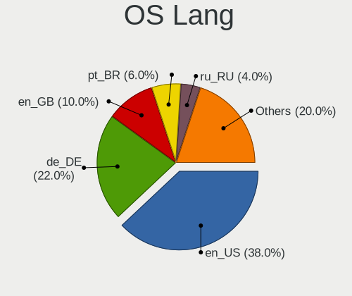
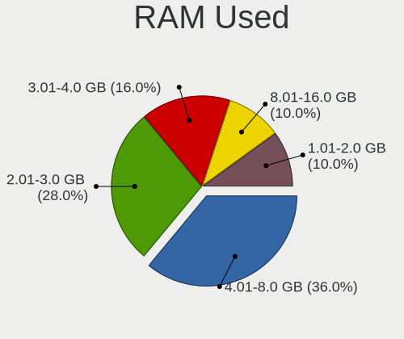
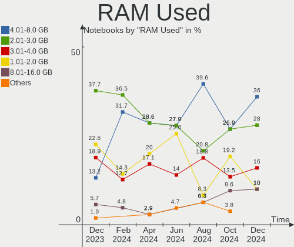
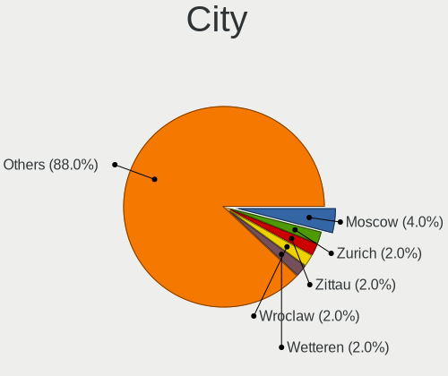
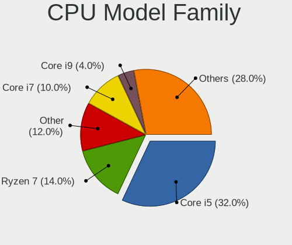
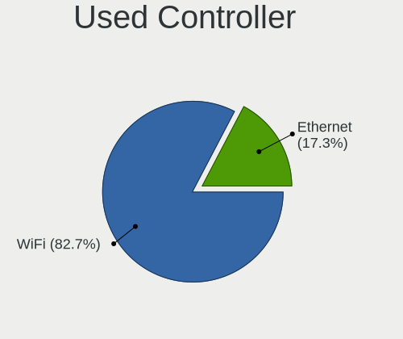
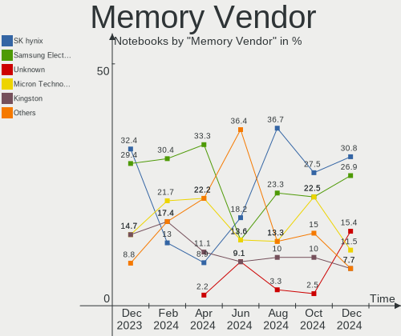

openSUSE - Hardware Trends (Notebooks)
--------------------------------------

A project to identify most popular hardware characteristics and track their change
over time based on data collected by Linux users at https://Linux-Hardware.org.

Anyone can contribute to this report by the [hw-probe](https://github.com/linuxhw/hw-probe) tool:

    sudo -E hw-probe -all -upload

This report is for one last month. Overall report since the beginning of time: [TestDays](https://github.com/linuxhw/TestDays)

Period: Jun, 2023.

Contents
--------

* [ System ](#system)
  - [ OS                       ](#os)
  - [ OS Family                ](#os-family)
  - [ Kernel                   ](#kernel)
  - [ Kernel Family            ](#kernel-family)
  - [ Kernel Major Ver.        ](#kernel-major-ver)
  - [ Arch                     ](#arch)
  - [ DE                       ](#de)
  - [ Display Server           ](#display-server)
  - [ Display Manager          ](#display-manager)
  - [ OS Lang                  ](#os-lang)
  - [ Boot Mode                ](#boot-mode)
  - [ Filesystem               ](#filesystem)
  - [ Part. scheme             ](#part-scheme)
  - [ Dual Boot with Linux/BSD ](#dual-boot-with-linuxbsd)
  - [ Dual Boot (Win)          ](#dual-boot-win)

* [ Board ](#board)
  - [ Vendor                   ](#vendor)
  - [ Model                    ](#model)
  - [ Model Family             ](#model-family)
  - [ MFG Year                 ](#mfg-year)
  - [ Form Factor              ](#form-factor)
  - [ Secure Boot              ](#secure-boot)
  - [ Coreboot                 ](#coreboot)
  - [ RAM Size                 ](#ram-size)
  - [ RAM Used                 ](#ram-used)
  - [ Total Drives             ](#total-drives)
  - [ Has CD-ROM               ](#has-cd-rom)
  - [ Has Ethernet             ](#has-ethernet)
  - [ Has WiFi                 ](#has-wifi)
  - [ Has Bluetooth            ](#has-bluetooth)

* [ Location ](#location)
  - [ Country                  ](#country)
  - [ City                     ](#city)

* [ Drives ](#drives)
  - [ Drive Vendor             ](#drive-vendor)
  - [ Drive Model              ](#drive-model)
  - [ HDD Vendor               ](#hdd-vendor)
  - [ SSD Vendor               ](#ssd-vendor)
  - [ Drive Kind               ](#drive-kind)
  - [ Drive Connector          ](#drive-connector)
  - [ Drive Size               ](#drive-size)
  - [ Space Total              ](#space-total)
  - [ Space Used               ](#space-used)
  - [ Malfunc. Drives          ](#malfunc-drives)
  - [ Malfunc. Drive Vendor    ](#malfunc-drive-vendor)
  - [ Malfunc. HDD Vendor      ](#malfunc-hdd-vendor)
  - [ Malfunc. Drive Kind      ](#malfunc-drive-kind)
  - [ Failed Drives            ](#failed-drives)
  - [ Failed Drive Vendor      ](#failed-drive-vendor)
  - [ Drive Status             ](#drive-status)

* [ Storage controller ](#storage-controller)
  - [ Storage Vendor           ](#storage-vendor)
  - [ Storage Model            ](#storage-model)
  - [ Storage Kind             ](#storage-kind)

* [ Processor ](#processor)
  - [ CPU Vendor               ](#cpu-vendor)
  - [ CPU Model                ](#cpu-model)
  - [ CPU Model Family         ](#cpu-model-family)
  - [ CPU Cores                ](#cpu-cores)
  - [ CPU Sockets              ](#cpu-sockets)
  - [ CPU Threads              ](#cpu-threads)
  - [ CPU Op-Modes             ](#cpu-op-modes)
  - [ CPU Microcode            ](#cpu-microcode)
  - [ CPU Microarch            ](#cpu-microarch)

* [ Graphics ](#graphics)
  - [ GPU Vendor               ](#gpu-vendor)
  - [ GPU Model                ](#gpu-model)
  - [ GPU Combo                ](#gpu-combo)
  - [ GPU Driver               ](#gpu-driver)
  - [ GPU Memory               ](#gpu-memory)

* [ Monitor ](#monitor)
  - [ Monitor Vendor           ](#monitor-vendor)
  - [ Monitor Model            ](#monitor-model)
  - [ Monitor Resolution       ](#monitor-resolution)
  - [ Monitor Diagonal         ](#monitor-diagonal)
  - [ Monitor Width            ](#monitor-width)
  - [ Aspect Ratio             ](#aspect-ratio)
  - [ Monitor Area             ](#monitor-area)
  - [ Pixel Density            ](#pixel-density)
  - [ Multiple Monitors        ](#multiple-monitors)

* [ Network ](#network)
  - [ Net Controller Vendor    ](#net-controller-vendor)
  - [ Net Controller Model     ](#net-controller-model)
  - [ Wireless Vendor          ](#wireless-vendor)
  - [ Wireless Model           ](#wireless-model)
  - [ Ethernet Vendor          ](#ethernet-vendor)
  - [ Ethernet Model           ](#ethernet-model)
  - [ Net Controller Kind      ](#net-controller-kind)
  - [ Used Controller          ](#used-controller)
  - [ NICs                     ](#nics)
  - [ IPv6                     ](#ipv6)

* [ Bluetooth ](#bluetooth)
  - [ Bluetooth Vendor         ](#bluetooth-vendor)
  - [ Bluetooth Model          ](#bluetooth-model)

* [ Sound ](#sound)
  - [ Sound Vendor             ](#sound-vendor)
  - [ Sound Model              ](#sound-model)

* [ Memory ](#memory)
  - [ Memory Vendor            ](#memory-vendor)
  - [ Memory Model             ](#memory-model)
  - [ Memory Kind              ](#memory-kind)
  - [ Memory Form Factor       ](#memory-form-factor)
  - [ Memory Size              ](#memory-size)
  - [ Memory Speed             ](#memory-speed)

* [ Printers & scanners ](#printers--scanners)
  - [ Printer Vendor           ](#printer-vendor)
  - [ Printer Model            ](#printer-model)
  - [ Scanner Vendor           ](#scanner-vendor)
  - [ Scanner Model            ](#scanner-model)

* [ Camera ](#camera)
  - [ Camera Vendor            ](#camera-vendor)
  - [ Camera Model             ](#camera-model)

* [ Security ](#security)
  - [ Fingerprint Vendor       ](#fingerprint-vendor)
  - [ Fingerprint Model        ](#fingerprint-model)
  - [ Chipcard Vendor          ](#chipcard-vendor)
  - [ Chipcard Model           ](#chipcard-model)

* [ Unsupported ](#unsupported)
  - [ Unsupported Devices      ](#unsupported-devices)
  - [ Unsupported Device Types ](#unsupported-device-types)

System
------

OS
--

Installed operating systems

| Name                         | Notebooks | Percent |
|------------------------------|-----------|---------|
| openSUSE Tumbleweed-XXXXXXXX | 36        | 66.67%  |
| openSUSE Leap-15.5           | 13        | 24.07%  |
| openSUSE Leap-15.4           | 3         | 5.56%   |
| openSUSE Microos-XXXXXXXX    | 2         | 3.7%    |

OS Family
---------

OS without a version

| Name     | Notebooks | Percent |
|----------|-----------|---------|
| openSUSE | 54        | 100%    |

Kernel
------

Version of the Linux kernel

| Version                      | Notebooks | Percent |
|------------------------------|-----------|---------|
| 6.3.7-1-default              | 11        | 20.37%  |
| 6.3.4-1-default              | 11        | 20.37%  |
| 5.14.21-150500.53-default    | 11        | 20.37%  |
| 6.3.9-1-default              | 6         | 11.11%  |
| 6.3.6-1-default              | 5         | 9.26%   |
| 6.3.2-1-default              | 2         | 3.7%    |
| 5.14.21-150500.52-default    | 2         | 3.7%    |
| 6.3.6-1-vanilla              | 1         | 1.85%   |
| 6.3.5-lp154.6-default        | 1         | 1.85%   |
| 6.3.1-2-default              | 1         | 1.85%   |
| 5.14.21-150400.24.66-default | 1         | 1.85%   |
| 5.14.21-150400.24.63-default | 1         | 1.85%   |
| 5.14.14-1-default            | 1         | 1.85%   |

Kernel Family
-------------

Linux kernel without a distro release

| Version | Notebooks | Percent |
|---------|-----------|---------|
| 5.14.21 | 15        | 27.78%  |
| 6.3.7   | 11        | 20.37%  |
| 6.3.4   | 11        | 20.37%  |
| 6.3.9   | 6         | 11.11%  |
| 6.3.6   | 6         | 11.11%  |
| 6.3.2   | 2         | 3.7%    |
| 6.3.5   | 1         | 1.85%   |
| 6.3.1   | 1         | 1.85%   |
| 5.14.14 | 1         | 1.85%   |

Kernel Major Ver.
-----------------

Linux kernel major version

| Version | Notebooks | Percent |
|---------|-----------|---------|
| 6.3     | 38        | 70.37%  |
| 5.14    | 16        | 29.63%  |

Arch
----

OS architecture (x86_64, i586, etc.)

| Name   | Notebooks | Percent |
|--------|-----------|---------|
| x86_64 | 54        | 100%    |

DE
--

Desktop Environment

| Name     | Notebooks | Percent |
|----------|-----------|---------|
| KDE5     | 38        | 70.37%  |
| GNOME    | 12        | 22.22%  |
| XFCE     | 1         | 1.85%   |
| KDE      | 1         | 1.85%   |
| Hyprland | 1         | 1.85%   |
| Unknown  | 1         | 1.85%   |

Display Server
--------------

X11 or Wayland

| Name    | Notebooks | Percent |
|---------|-----------|---------|
| X11     | 37        | 68.52%  |
| Wayland | 17        | 31.48%  |

Display Manager
---------------

SDDM, LightDM, etc.

| Name    | Notebooks | Percent |
|---------|-----------|---------|
| Unknown | 30        | 55.56%  |
| SDDM    | 17        | 31.48%  |
| GDM     | 3         | 5.56%   |
| LightDM | 2         | 3.7%    |
| XDM     | 1         | 1.85%   |
| GREETD  | 1         | 1.85%   |

OS Lang
-------

Language

| Lang  | Notebooks | Percent |
|-------|-----------|---------|
| en_US | 27        | 50%     |
| de_DE | 9         | 16.67%  |
| fr_FR | 3         | 5.56%   |
| es_ES | 3         | 5.56%   |
| en_GB | 3         | 5.56%   |
| pt_BR | 2         | 3.7%    |
| POSIX | 2         | 3.7%    |
| ru_RU | 1         | 1.85%   |
| ja_JP | 1         | 1.85%   |
| hu_HU | 1         | 1.85%   |
| en_IN | 1         | 1.85%   |
| en_DK | 1         | 1.85%   |

Boot Mode
---------

EFI or BIOS

| Mode | Notebooks | Percent |
|------|-----------|---------|
| EFI  | 40        | 74.07%  |
| BIOS | 14        | 25.93%  |

Filesystem
----------

Type of filesystem

| Type  | Notebooks | Percent |
|-------|-----------|---------|
| Btrfs | 45        | 83.33%  |
| Ext4  | 8         | 14.81%  |
| Xfs   | 1         | 1.85%   |

Part. scheme
------------

Scheme of partitioning

| Type    | Notebooks | Percent |
|---------|-----------|---------|
| Unknown | 28        | 51.85%  |
| GPT     | 25        | 46.3%   |
| MBR     | 1         | 1.85%   |

Dual Boot with Linux/BSD
------------------------

Hosting more than one Linux/BSD

| Dual boot | Notebooks | Percent |
|-----------|-----------|---------|
| No        | 51        | 94.44%  |
| Yes       | 3         | 5.56%   |

Dual Boot (Win)
---------------

Hosting Linux and Windows

| Dual boot | Notebooks | Percent |
|-----------|-----------|---------|
| No        | 48        | 88.89%  |
| Yes       | 6         | 11.11%  |

Board
-----

Vendor
------

Motherboard manufacturer

| Name                | Notebooks | Percent |
|---------------------|-----------|---------|
| Lenovo              | 14        | 25.93%  |
| Hewlett-Packard     | 8         | 14.81%  |
| ASUSTek Computer    | 8         | 14.81%  |
| Dell                | 4         | 7.41%   |
| Apple               | 4         | 7.41%   |
| Acer                | 3         | 5.56%   |
| Notebook            | 2         | 3.7%    |
| MSI                 | 2         | 3.7%    |
| Sony                | 1         | 1.85%   |
| Samsung Electronics | 1         | 1.85%   |
| Panasonic           | 1         | 1.85%   |
| Maibenben           | 1         | 1.85%   |
| HUAWEI              | 1         | 1.85%   |
| HONOR               | 1         | 1.85%   |
| Gigabyte Technology | 1         | 1.85%   |
| Fujitsu Siemens     | 1         | 1.85%   |
| Fujitsu             | 1         | 1.85%   |

Model
-----

Motherboard model

| Name                                                                                     | Notebooks | Percent |
|------------------------------------------------------------------------------------------|-----------|---------|
| Sony VPCEH25EN                                                                           | 1         | 1.85%   |
| Samsung 355V4C/355V4X/355V5C/355V5X/356V4C/356V4X/356V5C/356V5X/3445VC/3445VX/3545VC/354 | 1         | 1.85%   |
| Panasonic CF-SX2JDHYS                                                                    | 1         | 1.85%   |
| Notebook NS50_70MU                                                                       | 1         | 1.85%   |
| Notebook NLx0MU                                                                          | 1         | 1.85%   |
| MSI Modern 14 B5M                                                                        | 1         | 1.85%   |
| MSI CreatorPro X17 A12UKS                                                                | 1         | 1.85%   |
| Maibenben MaiBook X series                                                               | 1         | 1.85%   |
| Lenovo XiaoXinPro 16 ARP8 83AS                                                           | 1         | 1.85%   |
| Lenovo ThinkPad X200 7458AH8                                                             | 1         | 1.85%   |
| Lenovo ThinkPad X13 Gen 2a 20XH001JGE                                                    | 1         | 1.85%   |
| Lenovo ThinkPad X1 Carbon Gen 8 20U90044MH                                               | 1         | 1.85%   |
| Lenovo ThinkPad X1 Carbon 6th 20KGS9SA1J                                                 | 1         | 1.85%   |
| Lenovo ThinkPad T450 20BU000BIX                                                          | 1         | 1.85%   |
| Lenovo ThinkPad T14s Gen 3 21CQCTO1WW                                                    | 1         | 1.85%   |
| Lenovo ThinkPad A485 20MUCTO1WW                                                          | 1         | 1.85%   |
| Lenovo ThinkBook 15 G4 IAP 21DJ                                                          | 1         | 1.85%   |
| Lenovo ThinkBook 15 G3 ACL 21A4                                                          | 1         | 1.85%   |
| Lenovo Legion 5 Pro 16ARH7H 82RG                                                         | 1         | 1.85%   |
| Lenovo IdeaPad S340-15IWL 81N8                                                           | 1         | 1.85%   |
| Lenovo IdeaPad 5 15ALC05 82LN                                                            | 1         | 1.85%   |
| Lenovo G50-45 80E3                                                                       | 1         | 1.85%   |
| HUAWEI CREM-WXX9                                                                         | 1         | 1.85%   |
| HONOR BMH-WCX9                                                                           | 1         | 1.85%   |
| HP ProBook 430 G1                                                                        | 1         | 1.85%   |
| HP Pavilion Laptop 15-cw1xxx                                                             | 1         | 1.85%   |
| HP Pavilion Gaming Laptop 15-dk2xxx                                                      | 1         | 1.85%   |
| HP OMEN Laptop 15-en0xxx                                                                 | 1         | 1.85%   |
| HP Laptop 17-bs0xx                                                                       | 1         | 1.85%   |
| HP Laptop 15s-eq2xxx                                                                     | 1         | 1.85%   |
| HP EliteBook 845 G8 Notebook PC                                                          | 1         | 1.85%   |
| HP EliteBook 840 G5                                                                      | 1         | 1.85%   |
| Gigabyte AORUS 17X AXF                                                                   | 1         | 1.85%   |
| Fujitsu Siemens ESPRIMO Mobile V6555                                                     | 1         | 1.85%   |
| Fujitsu LIFEBOOK A357                                                                    | 1         | 1.85%   |
| Dell Precision 5540                                                                      | 1         | 1.85%   |
| Dell Inspiron N4030                                                                      | 1         | 1.85%   |
| Dell Inspiron 3501                                                                       | 1         | 1.85%   |
| Dell G15 5520                                                                            | 1         | 1.85%   |
| ASUS VivoBook_ASUSLaptop X570DD_X570DD                                                   | 1         | 1.85%   |

Model Family
------------

Motherboard model prefix

| Name                    | Notebooks | Percent |
|-------------------------|-----------|---------|
| Lenovo ThinkPad         | 7         | 12.96%  |
| ASUS VivoBook           | 3         | 5.56%   |
| ASUS ROG                | 3         | 5.56%   |
| Acer Aspire             | 3         | 5.56%   |
| Lenovo ThinkBook        | 2         | 3.7%    |
| Lenovo IdeaPad          | 2         | 3.7%    |
| HP Pavilion             | 2         | 3.7%    |
| HP Laptop               | 2         | 3.7%    |
| HP EliteBook            | 2         | 3.7%    |
| Dell Inspiron           | 2         | 3.7%    |
| Sony VPCEH25EN          | 1         | 1.85%   |
| Samsung 355V4C          | 1         | 1.85%   |
| Panasonic CF-SX2JDHYS   | 1         | 1.85%   |
| Notebook NS50           | 1         | 1.85%   |
| Notebook NLx0MU         | 1         | 1.85%   |
| MSI Modern              | 1         | 1.85%   |
| MSI CreatorPro          | 1         | 1.85%   |
| Maibenben MaiBook       | 1         | 1.85%   |
| Lenovo XiaoXinPro       | 1         | 1.85%   |
| Lenovo Legion           | 1         | 1.85%   |
| Lenovo G50-45           | 1         | 1.85%   |
| HUAWEI CREM-WXX9        | 1         | 1.85%   |
| HONOR BMH-WCX9          | 1         | 1.85%   |
| HP ProBook              | 1         | 1.85%   |
| HP OMEN                 | 1         | 1.85%   |
| Gigabyte AORUS          | 1         | 1.85%   |
| Fujitsu Siemens ESPRIMO | 1         | 1.85%   |
| Fujitsu LIFEBOOK        | 1         | 1.85%   |
| Dell Precision          | 1         | 1.85%   |
| Dell G15                | 1         | 1.85%   |
| ASUS K53TK              | 1         | 1.85%   |
| ASUS G771JW             | 1         | 1.85%   |
| Apple MacBookPro5       | 1         | 1.85%   |
| Apple MacBookPro12      | 1         | 1.85%   |
| Apple MacBookPro11      | 1         | 1.85%   |
| Apple MacBookAir7       | 1         | 1.85%   |

MFG Year
--------

Motherboard manufacture year

| Year | Notebooks | Percent |
|------|-----------|---------|
| 2021 | 11        | 20.37%  |
| 2022 | 10        | 18.52%  |
| 2018 | 6         | 11.11%  |
| 2019 | 5         | 9.26%   |
| 2020 | 3         | 5.56%   |
| 2017 | 2         | 3.7%    |
| 2016 | 2         | 3.7%    |
| 2015 | 2         | 3.7%    |
| 2014 | 2         | 3.7%    |
| 2012 | 2         | 3.7%    |
| 2011 | 2         | 3.7%    |
| 2010 | 2         | 3.7%    |
| 2009 | 2         | 3.7%    |
| 2023 | 1         | 1.85%   |
| 2013 | 1         | 1.85%   |
| 2008 | 1         | 1.85%   |

Form Factor
-----------

Physical design of the computer

| Name     | Notebooks | Percent |
|----------|-----------|---------|
| Notebook | 54        | 100%    |

Secure Boot
-----------

Enabled or disabled

| State    | Notebooks | Percent |
|----------|-----------|---------|
| Disabled | 40        | 74.07%  |
| Enabled  | 14        | 25.93%  |

Coreboot
--------

Have coreboot on board

| Used | Notebooks | Percent |
|------|-----------|---------|
| No   | 54        | 100%    |

RAM Size
--------

Total RAM memory

| Size in GB  | Notebooks | Percent |
|-------------|-----------|---------|
| 4.01-8.0    | 16        | 29.63%  |
| 8.01-16.0   | 12        | 22.22%  |
| 16.01-24.0  | 10        | 18.52%  |
| 32.01-64.0  | 6         | 11.11%  |
| 3.01-4.0    | 5         | 9.26%   |
| 24.01-32.0  | 2         | 3.7%    |
| 64.01-256.0 | 2         | 3.7%    |
| 1.01-2.0    | 1         | 1.85%   |

RAM Used
--------

Used RAM memory

| Used GB   | Notebooks | Percent |
|-----------|-----------|---------|
| 4.01-8.0  | 19        | 35.19%  |
| 2.01-3.0  | 16        | 29.63%  |
| 1.01-2.0  | 10        | 18.52%  |
| 3.01-4.0  | 6         | 11.11%  |
| 8.01-16.0 | 3         | 5.56%   |

Total Drives
------------

Number of drives on board

| Drives | Notebooks | Percent |
|--------|-----------|---------|
| 1      | 40        | 74.07%  |
| 2      | 13        | 24.07%  |
| 3      | 1         | 1.85%   |

Has CD-ROM
----------

Has CD-ROM on board

| Presented | Notebooks | Percent |
|-----------|-----------|---------|
| No        | 43        | 79.63%  |
| Yes       | 11        | 20.37%  |

Has Ethernet
------------

Has Ethernet on board

| Presented | Notebooks | Percent |
|-----------|-----------|---------|
| Yes       | 43        | 79.63%  |
| No        | 11        | 20.37%  |

Has WiFi
--------

Has WiFi module

| Presented | Notebooks | Percent |
|-----------|-----------|---------|
| Yes       | 53        | 98.15%  |
| No        | 1         | 1.85%   |

Has Bluetooth
-------------

Has Bluetooth module

| Presented | Notebooks | Percent |
|-----------|-----------|---------|
| Yes       | 44        | 81.48%  |
| No        | 10        | 18.52%  |

Location
--------

Country
-------

Geographic location (country)

| Country     | Notebooks | Percent |
|-------------|-----------|---------|
| Germany     | 10        | 18.52%  |
| USA         | 9         | 16.67%  |
| France      | 5         | 9.26%   |
| Russia      | 3         | 5.56%   |
| Brazil      | 3         | 5.56%   |
| Sweden      | 2         | 3.7%    |
| Spain       | 2         | 3.7%    |
| Netherlands | 2         | 3.7%    |
| India       | 2         | 3.7%    |
| China       | 2         | 3.7%    |
| Chile       | 2         | 3.7%    |
| Vietnam     | 1         | 1.85%   |
| UK          | 1         | 1.85%   |
| Switzerland | 1         | 1.85%   |
| Peru        | 1         | 1.85%   |
| Lithuania   | 1         | 1.85%   |
| Kenya       | 1         | 1.85%   |
| Japan       | 1         | 1.85%   |
| Italy       | 1         | 1.85%   |
| Hungary     | 1         | 1.85%   |
| Canada      | 1         | 1.85%   |
| Belgium     | 1         | 1.85%   |
| Austria     | 1         | 1.85%   |

City
----

Geographic location (city)

| City                  | Notebooks | Percent |
|-----------------------|-----------|---------|
| Santiago              | 2         | 3.7%    |
| Delhi                 | 2         | 3.7%    |
| Waidhofen an der Ybbs | 1         | 1.85%   |
| Vladivostok           | 1         | 1.85%   |
| Vilnius               | 1         | 1.85%   |
| Victoria              | 1         | 1.85%   |
| Troyes                | 1         | 1.85%   |
| Toulouse              | 1         | 1.85%   |
| Torre Boldone         | 1         | 1.85%   |
| Tibro                 | 1         | 1.85%   |
| The Hague             | 1         | 1.85%   |
| Sigtuna               | 1         | 1.85%   |
| Shenzhen              | 1         | 1.85%   |
| Sao Paulo             | 1         | 1.85%   |
| San Diego             | 1         | 1.85%   |
| Sainte-Luce-sur-Loire | 1         | 1.85%   |
| Rochdale              | 1         | 1.85%   |
| Rio de Janeiro        | 1         | 1.85%   |
| Richardson            | 1         | 1.85%   |
| Petoskey              | 1         | 1.85%   |
| Painesville           | 1         | 1.85%   |
| Oftringen             | 1         | 1.85%   |
| Novosibirsk           | 1         | 1.85%   |
| Nieder-Olm            | 1         | 1.85%   |
| Nairobi               | 1         | 1.85%   |
| Munich                | 1         | 1.85%   |
| Moscow                | 1         | 1.85%   |
| Lübeck               | 1         | 1.85%   |
| Los Angeles           | 1         | 1.85%   |
| Lodi                  | 1         | 1.85%   |
| Lima                  | 1         | 1.85%   |
| Lenexa                | 1         | 1.85%   |
| Lawrenceville         | 1         | 1.85%   |
| Indaiatuba            | 1         | 1.85%   |
| Ho Chi Minh City      | 1         | 1.85%   |
| Guidel                | 1         | 1.85%   |
| Göttingen            | 1         | 1.85%   |
| Gistel                | 1         | 1.85%   |
| Fuzhou                | 1         | 1.85%   |
| Falkenstein           | 1         | 1.85%   |

Drives
------

Drive Vendor
------------

Hard drive vendors

| Vendor                         | Notebooks | Drives | Percent |
|--------------------------------|-----------|--------|---------|
| Samsung Electronics            | 11        | 12     | 16.67%  |
| Sandisk                        | 8         | 8      | 12.12%  |
| Kingston                       | 7         | 7      | 10.61%  |
| Seagate                        | 6         | 6      | 9.09%   |
| Micron Technology              | 6         | 6      | 9.09%   |
| Micron/Crucial Technology      | 4         | 4      | 6.06%   |
| Apple                          | 3         | 3      | 4.55%   |
| WDC                            | 2         | 2      | 3.03%   |
| Toshiba                        | 2         | 2      | 3.03%   |
| SK hynix                       | 2         | 2      | 3.03%   |
| Intel                          | 2         | 2      | 3.03%   |
| HGST                           | 2         | 2      | 3.03%   |
| Yangtze Memory Technologies    | 1         | 1      | 1.52%   |
| Unknown                        | 1         | 1      | 1.52%   |
| Union Memory (Shenzhen)        | 1         | 1      | 1.52%   |
| Solid State Storage Technology | 1         | 1      | 1.52%   |
| Shenzhen Longsys Electronics   | 1         | 1      | 1.52%   |
| Phison Electronics             | 1         | 1      | 1.52%   |
| KIOXIA                         | 1         | 1      | 1.52%   |
| Kingston Technology Company    | 1         | 1      | 1.52%   |
| Hitachi                        | 1         | 1      | 1.52%   |
| Hewlett-Packard                | 1         | 1      | 1.52%   |
| Crucial                        | 1         | 1      | 1.52%   |

Drive Model
-----------

Hard drive models

| Model                                                | Notebooks | Percent |
|------------------------------------------------------|-----------|---------|
| Sandisk WD Blue SN550 NVMe SSD 1TB                   | 3         | 4.55%   |
| Samsung NVMe SSD Controller SM981/PM981/PM983 250GB  | 3         | 4.55%   |
| Seagate ST1000LM035-1RK172 1TB                       | 2         | 3.03%   |
| Sandisk WD Black SN750 / PC SN730 NVMe SSD 500GB     | 2         | 3.03%   |
| Samsung NVMe SSD Controller PM9A1/PM9A3/980PRO 2TB   | 2         | 3.03%   |
| Micron/Crucial P2 NVMe PCIe SSD 4TB                  | 2         | 3.03%   |
| Yangtze Memory ZHITAI TiPlus5000 1TB                 | 1         | 1.52%   |
| WDC WD7500BPVT-22HXZT1 752GB                         | 1         | 1.52%   |
| WDC WD5000LPVX-16V0TT3 500GB                         | 1         | 1.52%   |
| Unknown USB DISK 3.2 2TB                             | 1         | 1.52%   |
| Union Memory (Shenzhen) UMIS RPEYJ1T24MKN2QWY 1024GB | 1         | 1.52%   |
| Toshiba MQ04ABF100 1TB                               | 1         | 1.52%   |
| Toshiba MQ01ABD050 500GB                             | 1         | 1.52%   |
| Solid State Storage SSSTC CA6-8D1024 1TB             | 1         | 1.52%   |
| SK hynix SHGP31-1000GM 1TB                           | 1         | 1.52%   |
| SK hynix BC511 256GB                                 | 1         | 1.52%   |
| Shenzhen Longsys Lexar SSD 256GB                     | 1         | 1.52%   |
| Seagate ST750LM022 HN-M750MBB 752GB                  | 1         | 1.52%   |
| Seagate ST500LM021-1KJ152 500GB                      | 1         | 1.52%   |
| Seagate ST1000LM048-2E7172 1TB                       | 1         | 1.52%   |
| Seagate ST1000LM024 HN-M101MBB 1TB                   | 1         | 1.52%   |
| Sandisk WD Black SN850 1TB                           | 1         | 1.52%   |
| SanDisk SSD PLUS 1000GB                              | 1         | 1.52%   |
| SanDisk SDSSDH3 512G                                 | 1         | 1.52%   |
| Samsung SSD 980 250GB                                | 1         | 1.52%   |
| Samsung SSD 850 EVO 500GB                            | 1         | 1.52%   |
| Samsung SSD 840 EVO 250GB                            | 1         | 1.52%   |
| Samsung MZVLQ1T0HALB-00000 1TB                       | 1         | 1.52%   |
| Samsung MZALQ512HBLU-00BL2 512GB                     | 1         | 1.52%   |
| Samsung MZALQ256HBJD-00BL2 256GB                     | 1         | 1.52%   |
| Phison E12 NVMe Controller 1TB                       | 1         | 1.52%   |
| Micron/Crucial CT500P5PSSD8 500GB                    | 1         | 1.52%   |
| Micron/Crucial CT1000P5PSSD8 1TB                     | 1         | 1.52%   |
| Micron MTFDDAV256TBN-1AR15ABHA 256GB SSD             | 1         | 1.52%   |
| Micron 3400_MTFDKBA1T0TFH 1024GB                     | 1         | 1.52%   |
| Micron 2450_MTFDKBA512TFK 512GB                      | 1         | 1.52%   |
| Micron 2450 NVMe 512GB                               | 1         | 1.52%   |
| Micron 2400_MTFDKBA512QFM 512GB                      | 1         | 1.52%   |
| Micron 1100_MTFDDAK512TBN 512GB SSD                  | 1         | 1.52%   |
| KIOXIA KBG40ZNV256G 256GB                            | 1         | 1.52%   |

HDD Vendor
----------

Hard disk drive vendors

| Vendor  | Notebooks | Drives | Percent |
|---------|-----------|--------|---------|
| Seagate | 6         | 6      | 46.15%  |
| WDC     | 2         | 2      | 15.38%  |
| Toshiba | 2         | 2      | 15.38%  |
| HGST    | 2         | 2      | 15.38%  |
| Hitachi | 1         | 1      | 7.69%   |

SSD Vendor
----------

Solid state drive vendors

| Vendor              | Notebooks | Drives | Percent |
|---------------------|-----------|--------|---------|
| Kingston            | 5         | 5      | 33.33%  |
| SanDisk             | 2         | 2      | 13.33%  |
| Samsung Electronics | 2         | 2      | 13.33%  |
| Micron Technology   | 2         | 2      | 13.33%  |
| Apple               | 2         | 2      | 13.33%  |
| Hewlett-Packard     | 1         | 1      | 6.67%   |
| Crucial             | 1         | 1      | 6.67%   |

Drive Kind
----------

HDD or SSD

| Kind    | Notebooks | Drives | Percent |
|---------|-----------|--------|---------|
| NVMe    | 32        | 38     | 53.33%  |
| SSD     | 14        | 15     | 23.33%  |
| HDD     | 13        | 13     | 21.67%  |
| Unknown | 1         | 1      | 1.67%   |

Drive Connector
---------------

SATA, SAS, NVMe, etc.

| Type | Notebooks | Drives | Percent |
|------|-----------|--------|---------|
| NVMe | 32        | 38     | 55.17%  |
| SATA | 25        | 28     | 43.1%   |
| SAS  | 1         | 1      | 1.72%   |

Drive Size
----------

Size of hard drive

| Size in TB | Notebooks | Drives | Percent |
|------------|-----------|--------|---------|
| 0.01-0.5   | 15        | 15     | 55.56%  |
| 0.51-1.0   | 12        | 13     | 44.44%  |

Space Total
-----------

Amount of disk space available on the file system

| Size in GB     | Notebooks | Percent |
|----------------|-----------|---------|
| More than 3000 | 20        | 37.04%  |
| 1001-2000      | 12        | 22.22%  |
| 2001-3000      | 9         | 16.67%  |
| 501-1000       | 7         | 12.96%  |
| 251-500        | 3         | 5.56%   |
| 101-250        | 2         | 3.7%    |
| 21-50          | 1         | 1.85%   |

Space Used
----------

Amount of used disk space

| Used GB        | Notebooks | Percent |
|----------------|-----------|---------|
| 101-250        | 15        | 27.78%  |
| 251-500        | 12        | 22.22%  |
| 51-100         | 8         | 14.81%  |
| 501-1000       | 6         | 11.11%  |
| 1001-2000      | 4         | 7.41%   |
| More than 3000 | 3         | 5.56%   |
| 21-50          | 3         | 5.56%   |
| 1-20           | 3         | 5.56%   |

Malfunc. Drives
---------------

Drive models with a malfunction

| Model                               | Notebooks | Drives | Percent |
|-------------------------------------|-----------|--------|---------|
| Seagate ST750LM022 HN-M750MBB 752GB | 1         | 1      | 33.33%  |
| Seagate ST500LM021-1KJ152 500GB     | 1         | 1      | 33.33%  |
| Seagate ST1000LM035-1RK172 1TB      | 1         | 1      | 33.33%  |

Malfunc. Drive Vendor
---------------------

Vendors of faulty drives

| Vendor  | Notebooks | Drives | Percent |
|---------|-----------|--------|---------|
| Seagate | 3         | 3      | 100%    |

Malfunc. HDD Vendor
-------------------

Vendors of faulty HDD drives

| Vendor  | Notebooks | Drives | Percent |
|---------|-----------|--------|---------|
| Seagate | 3         | 3      | 100%    |

Malfunc. Drive Kind
-------------------

Kinds of faulty drives

| Kind | Notebooks | Drives | Percent |
|------|-----------|--------|---------|
| HDD  | 3         | 3      | 100%    |

Failed Drives
-------------

Failed drive models

Zero info for selected period =(

Failed Drive Vendor
-------------------

Failed drive vendors

Zero info for selected period =(

Drive Status
------------

Number of failed and malfunc. drives

| Status   | Notebooks | Drives | Percent |
|----------|-----------|--------|---------|
| Detected | 29        | 35     | 52.73%  |
| Works    | 23        | 29     | 41.82%  |
| Malfunc  | 3         | 3      | 5.45%   |

Storage controller
------------------

Storage Vendor
--------------

Storage controller vendors

| Vendor                                  | Notebooks | Percent |
|-----------------------------------------|-----------|---------|
| Intel                                   | 22        | 30.99%  |
| Samsung Electronics                     | 11        | 15.49%  |
| AMD                                     | 10        | 14.08%  |
| SanDisk                                 | 6         | 8.45%   |
| Micron/Crucial Technology               | 4         | 5.63%   |
| Micron Technology                       | 4         | 5.63%   |
| Kingston Technology Company             | 3         | 4.23%   |
| SK hynix                                | 2         | 2.82%   |
| Nvidia                                  | 2         | 2.82%   |
| Yangtze Memory Technologies             | 1         | 1.41%   |
| Solid State Storage Technology          | 1         | 1.41%   |
| Shenzhen Unionmemory Information System | 1         | 1.41%   |
| Shenzhen Longsys Electronics            | 1         | 1.41%   |
| Phison Electronics                      | 1         | 1.41%   |
| KIOXIA                                  | 1         | 1.41%   |
| Apple                                   | 1         | 1.41%   |

Storage Model
-------------

Storage controller models

| Model                                                                          | Notebooks | Percent |
|--------------------------------------------------------------------------------|-----------|---------|
| AMD FCH SATA Controller [AHCI mode]                                            | 10        | 13.51%  |
| Samsung NVMe SSD Controller 980                                                | 4         | 5.41%   |
| Intel Sunrise Point-LP SATA Controller [AHCI mode]                             | 4         | 5.41%   |
| SanDisk WD Blue SN550 NVMe SSD                                                 | 3         | 4.05%   |
| Samsung NVMe SSD Controller SM981/PM981/PM983                                  | 3         | 4.05%   |
| Intel Volume Management Device NVMe RAID Controller                            | 3         | 4.05%   |
| Intel Tiger Lake-LP SATA Controller                                            | 3         | 4.05%   |
| SanDisk WD Black SN750 / PC SN730 NVMe SSD                                     | 2         | 2.7%    |
| Samsung NVMe SSD Controller PM9A1/PM9A3/980PRO                                 | 2         | 2.7%    |
| Samsung Electronics SATA controller                                            | 2         | 2.7%    |
| Micron/Crucial P5 Plus NVMe PCIe SSD                                           | 2         | 2.7%    |
| Micron/Crucial P2 NVMe PCIe SSD                                                | 2         | 2.7%    |
| Micron 2450 NVMe SSD (DRAM-less)                                               | 2         | 2.7%    |
| Intel 82801 Mobile SATA Controller [RAID mode]                                 | 2         | 2.7%    |
| Intel 7 Series Chipset Family 6-port SATA Controller [AHCI mode]               | 2         | 2.7%    |
| Yangtze Memory ZHITAI TiPro5000 NVMe SSD                                       | 1         | 1.35%   |
| Solid State Storage Non-Volatile memory controller                             | 1         | 1.35%   |
| SK hynix Gold P31/BC711/PC711 NVMe Solid State Drive                           | 1         | 1.35%   |
| SK hynix BC511 NVMe SSD                                                        | 1         | 1.35%   |
| Shenzhen Unionmemory Information System Non-Volatile memory controller         | 1         | 1.35%   |
| Shenzhen Longsys Non-Volatile memory controller                                | 1         | 1.35%   |
| SanDisk WD PC SN810 / Black SN850 NVMe SSD                                     | 1         | 1.35%   |
| Phison E12 NVMe Controller                                                     | 1         | 1.35%   |
| Nvidia MCP79 SATA Controller                                                   | 1         | 1.35%   |
| Nvidia MCP79 AHCI Controller                                                   | 1         | 1.35%   |
| Micron NVMe Storage Controller                                                 | 1         | 1.35%   |
| Micron NVMe Controller                                                         | 1         | 1.35%   |
| KIOXIA NVMe SSD Controller BG4                                                 | 1         | 1.35%   |
| Kingston Company SNVS2000G [NV1 NVMe PCIe SSD 2TB]                             | 1         | 1.35%   |
| Kingston Company OM3PDP3 NVMe SSD                                              | 1         | 1.35%   |
| Kingston Company FURY Renegade NVMe SSD                                        | 1         | 1.35%   |
| Intel Wildcat Point-LP SATA Controller [AHCI Mode]                             | 1         | 1.35%   |
| Intel SSD Pro 7600p/760p/E 6100p Series                                        | 1         | 1.35%   |
| Intel SSD 660P Series                                                          | 1         | 1.35%   |
| Intel Cannon Lake Mobile PCH SATA AHCI Controller                              | 1         | 1.35%   |
| Intel 82801IBM/IEM (ICH9M/ICH9M-E) 4 port SATA Controller [AHCI mode]          | 1         | 1.35%   |
| Intel 8 Series/C220 Series Chipset Family 6-port SATA Controller 1 [AHCI mode] | 1         | 1.35%   |
| Intel 8 Series SATA Controller 1 [AHCI mode]                                   | 1         | 1.35%   |
| Intel 6 Series/C200 Series Chipset Family 6 port Mobile SATA AHCI Controller   | 1         | 1.35%   |
| Intel 5 Series/3400 Series Chipset 6 port SATA AHCI Controller                 | 1         | 1.35%   |

Storage Kind
------------

Kind of storage controller (IDE, SATA, NVMe, SAS, ...)

| Kind | Notebooks | Percent |
|------|-----------|---------|
| NVMe | 32        | 47.06%  |
| SATA | 29        | 42.65%  |
| RAID | 5         | 7.35%   |
| IDE  | 2         | 2.94%   |

Processor
---------

CPU Vendor
----------

Processor vendors

| Vendor | Notebooks | Percent |
|--------|-----------|---------|
| Intel  | 33        | 61.11%  |
| AMD    | 21        | 38.89%  |

CPU Model
---------

Processor models

| Model                                         | Notebooks | Percent |
|-----------------------------------------------|-----------|---------|
| AMD Ryzen 5 5500U with Radeon Graphics        | 4         | 7.41%   |
| Intel 11th Gen Core i7-1165G7 @ 2.80GHz       | 2         | 3.7%    |
| AMD Ryzen 7 PRO 5850U with Radeon Graphics    | 2         | 3.7%    |
| AMD Ryzen 7 6800H with Radeon Graphics        | 2         | 3.7%    |
| AMD Ryzen 7 5800H with Radeon Graphics        | 2         | 3.7%    |
| AMD Ryzen 5 3500U with Radeon Vega Mobile Gfx | 2         | 3.7%    |
| Intel Core i9-9880H CPU @ 2.30GHz             | 1         | 1.85%   |
| Intel Core i7-8650U CPU @ 1.90GHz             | 1         | 1.85%   |
| Intel Core i7-6500U CPU @ 2.50GHz             | 1         | 1.85%   |
| Intel Core i7-5557U CPU @ 3.10GHz             | 1         | 1.85%   |
| Intel Core i7-4770HQ CPU @ 2.20GHz            | 1         | 1.85%   |
| Intel Core i7-4720HQ CPU @ 2.60GHz            | 1         | 1.85%   |
| Intel Core i7-3610QM CPU @ 2.30GHz            | 1         | 1.85%   |
| Intel Core i7-10510U CPU @ 1.80GHz            | 1         | 1.85%   |
| Intel Core i5-8350U CPU @ 1.70GHz             | 1         | 1.85%   |
| Intel Core i5-8250U CPU @ 1.60GHz             | 1         | 1.85%   |
| Intel Core i5-7200U CPU @ 2.50GHz             | 1         | 1.85%   |
| Intel Core i5-5300U CPU @ 2.30GHz             | 1         | 1.85%   |
| Intel Core i5-5250U CPU @ 1.60GHz             | 1         | 1.85%   |
| Intel Core i5-4200U CPU @ 1.60GHz             | 1         | 1.85%   |
| Intel Core i5-3320M CPU @ 2.60GHz             | 1         | 1.85%   |
| Intel Core i5 CPU M 460 @ 2.53GHz             | 1         | 1.85%   |
| Intel Core i3-8145U CPU @ 2.10GHz             | 1         | 1.85%   |
| Intel Core i3-6006U CPU @ 2.00GHz             | 1         | 1.85%   |
| Intel Core i3-2330M CPU @ 2.20GHz             | 1         | 1.85%   |
| Intel Core i3 CPU M 380 @ 2.53GHz             | 1         | 1.85%   |
| Intel Core 2 Duo CPU T9600 @ 2.80GHz          | 1         | 1.85%   |
| Intel Core 2 Duo CPU T5870 @ 2.00GHz          | 1         | 1.85%   |
| Intel Core 2 Duo CPU P8400 @ 2.26GHz          | 1         | 1.85%   |
| Intel 13th Gen Core i9-13900HX                | 1         | 1.85%   |
| Intel 12th Gen Core i9-12900HX                | 1         | 1.85%   |
| Intel 12th Gen Core i9-12900H                 | 1         | 1.85%   |
| Intel 12th Gen Core i5-12500H                 | 1         | 1.85%   |
| Intel 12th Gen Core i5-1235U                  | 1         | 1.85%   |
| Intel 11th Gen Core i7-11370H @ 3.30GHz       | 1         | 1.85%   |
| Intel 11th Gen Core i5-1135G7 @ 2.40GHz       | 1         | 1.85%   |
| Intel 11th Gen Core i5-11300H @ 3.10GHz       | 1         | 1.85%   |
| AMD Ryzen 9 5900HX with Radeon Graphics       | 1         | 1.85%   |
| AMD Ryzen 7 PRO 6850U with Radeon Graphics    | 1         | 1.85%   |
| AMD Ryzen 7 7735HS with Radeon Graphics       | 1         | 1.85%   |

CPU Model Family
----------------

Processor model prefix

| Model            | Notebooks | Percent |
|------------------|-----------|---------|
| Other            | 10        | 18.52%  |
| Intel Core i5    | 8         | 14.81%  |
| Intel Core i7    | 7         | 12.96%  |
| AMD Ryzen 5      | 7         | 12.96%  |
| AMD Ryzen 7      | 6         | 11.11%  |
| Intel Core i3    | 4         | 7.41%   |
| Intel Core 2 Duo | 3         | 5.56%   |
| AMD Ryzen 7 PRO  | 3         | 5.56%   |
| AMD A6           | 3         | 5.56%   |
| Intel Core i9    | 1         | 1.85%   |
| AMD Ryzen 9      | 1         | 1.85%   |
| AMD Ryzen 5 PRO  | 1         | 1.85%   |

CPU Cores
---------

Number of processor cores

| Number | Notebooks | Percent |
|--------|-----------|---------|
| 4      | 17        | 31.48%  |
| 2      | 15        | 27.78%  |
| 8      | 11        | 20.37%  |
| 6      | 5         | 9.26%   |
| 24     | 1         | 1.85%   |
| 16     | 1         | 1.85%   |
| 14     | 1         | 1.85%   |
| 12     | 1         | 1.85%   |
| 10     | 1         | 1.85%   |
| 1      | 1         | 1.85%   |

CPU Sockets
-----------

Number of sockets

| Number | Notebooks | Percent |
|--------|-----------|---------|
| 1      | 54        | 100%    |

CPU Threads
-----------

Threads per core (Hyper-Threading)

| Number | Notebooks | Percent |
|--------|-----------|---------|
| 2      | 49        | 90.74%  |
| 1      | 5         | 9.26%   |

CPU Op-Modes
------------

CPU Operation Modes (32-bit, 64-bit)

| Op mode        | Notebooks | Percent |
|----------------|-----------|---------|
| 32-bit, 64-bit | 54        | 100%    |

CPU Microcode
-------------

Microcode number

| Number     | Notebooks | Percent |
|------------|-----------|---------|
| Unknown    | 28        | 51.85%  |
| 0x0a50000c | 4         | 7.41%   |
| 0x0a404102 | 4         | 7.41%   |
| 0x08608103 | 4         | 7.41%   |
| 0x806c1    | 3         | 5.56%   |
| 0x08108102 | 2         | 3.7%    |
| 0x806e9    | 1         | 1.85%   |
| 0x406e3    | 1         | 1.85%   |
| 0x306d4    | 1         | 1.85%   |
| 0x10676    | 1         | 1.85%   |
| 0x0a50000d | 1         | 1.85%   |
| 0x08608102 | 1         | 1.85%   |
| 0x08600106 | 1         | 1.85%   |
| 0x0810100b | 1         | 1.85%   |
| 0x07030105 | 1         | 1.85%   |

CPU Microarch
-------------

Microarchitecture

| Name             | Notebooks | Percent |
|------------------|-----------|---------|
| Unknown          | 9         | 16.67%  |
| KabyLake         | 7         | 12.96%  |
| Zen 3            | 5         | 9.26%   |
| TigerLake        | 5         | 9.26%   |
| Alderlake Hybrid | 5         | 9.26%   |
| Haswell          | 3         | 5.56%   |
| Broadwell        | 3         | 5.56%   |
| Zen+             | 2         | 3.7%    |
| Westmere         | 2         | 3.7%    |
| Skylake          | 2         | 3.7%    |
| Penryn           | 2         | 3.7%    |
| IvyBridge        | 2         | 3.7%    |
| Zen 2            | 1         | 1.85%   |
| Zen              | 1         | 1.85%   |
| SandyBridge      | 1         | 1.85%   |
| Puma             | 1         | 1.85%   |
| Piledriver       | 1         | 1.85%   |
| K10 Llano        | 1         | 1.85%   |
| Core             | 1         | 1.85%   |

Graphics
--------

GPU Vendor
----------

Vendors of graphics cards

| Vendor | Notebooks | Percent |
|--------|-----------|---------|
| Intel  | 30        | 42.25%  |
| AMD    | 23        | 32.39%  |
| Nvidia | 18        | 25.35%  |

GPU Model
---------

Graphics card models

| Model                                                                | Notebooks | Percent |
|----------------------------------------------------------------------|-----------|---------|
| Intel TigerLake-LP GT2 [Iris Xe Graphics]                            | 5         | 6.67%   |
| AMD Lucienne                                                         | 5         | 6.67%   |
| AMD Cezanne [Radeon Vega Series / Radeon Vega Mobile Series]         | 5         | 6.67%   |
| AMD Rembrandt [Radeon 680M]                                          | 4         | 5.33%   |
| Intel UHD Graphics 620                                               | 3         | 4%      |
| Intel Skylake GT2 [HD Graphics 520]                                  | 2         | 2.67%   |
| Intel Core Processor Integrated Graphics Controller                  | 2         | 2.67%   |
| Intel Alder Lake-P Integrated Graphics Controller                    | 2         | 2.67%   |
| Intel 3rd Gen Core processor Graphics Controller                     | 2         | 2.67%   |
| AMD Picasso/Raven 2 [Radeon Vega Series / Radeon Vega Mobile Series] | 2         | 2.67%   |
| Nvidia TU117M [GeForce GTX 1650 Ti Mobile]                           | 1         | 1.33%   |
| Nvidia TU117GLM [Quadro T2000 Mobile / Max-Q]                        | 1         | 1.33%   |
| Nvidia MCP79 [GeForce 8200M G]                                       | 1         | 1.33%   |
| Nvidia GP107M [GeForce GTX 1050 Mobile]                              | 1         | 1.33%   |
| Nvidia GM200 [GeForce GTX TITAN X]                                   | 1         | 1.33%   |
| Nvidia GM108M [GeForce MX130]                                        | 1         | 1.33%   |
| Nvidia GM107M [GeForce GTX 960M]                                     | 1         | 1.33%   |
| Nvidia GM107M [GeForce GTX 950M]                                     | 1         | 1.33%   |
| Nvidia GK107M [GeForce GT 640M]                                      | 1         | 1.33%   |
| Nvidia GF119M [GeForce 410M]                                         | 1         | 1.33%   |
| Nvidia GA107M [GeForce RTX 3050 Ti Mobile]                           | 1         | 1.33%   |
| Nvidia GA107M [GeForce RTX 3050 Mobile]                              | 1         | 1.33%   |
| Nvidia GA107BM [GeForce RTX 3050 Mobile]                             | 1         | 1.33%   |
| Nvidia GA106M [GeForce RTX 3060 Mobile / Max-Q]                      | 1         | 1.33%   |
| Nvidia GA104M [GeForce RTX 3080 Mobile / Max-Q 8GB/16GB]             | 1         | 1.33%   |
| Nvidia GA104M [Geforce RTX 3070 Ti Laptop GPU]                       | 1         | 1.33%   |
| Nvidia GA104GLM [RTX A3000 12GB Laptop GPU]                          | 1         | 1.33%   |
| Nvidia G96CM [GeForce 9600M GT]                                      | 1         | 1.33%   |
| Nvidia C79 [GeForce 9400M]                                           | 1         | 1.33%   |
| Nvidia AD104M [GeForce RTX 4080 Max-Q / Mobile]                      | 1         | 1.33%   |
| Intel WhiskeyLake-U GT2 [UHD Graphics 620]                           | 1         | 1.33%   |
| Intel Raptor Lake-S UHD Graphics                                     | 1         | 1.33%   |
| Intel Mobile 4 Series Chipset Integrated Graphics Controller         | 1         | 1.33%   |
| Intel Iris Graphics 6100                                             | 1         | 1.33%   |
| Intel HD Graphics 620                                                | 1         | 1.33%   |
| Intel HD Graphics 6000                                               | 1         | 1.33%   |
| Intel HD Graphics 5500                                               | 1         | 1.33%   |
| Intel Haswell-ULT Integrated Graphics Controller                     | 1         | 1.33%   |
| Intel Crystal Well Integrated Graphics Controller                    | 1         | 1.33%   |
| Intel CometLake-U GT2 [UHD Graphics]                                 | 1         | 1.33%   |

GPU Combo
---------

Combinations of graphics cards

| Name           | Notebooks | Percent |
|----------------|-----------|---------|
| 1 x Intel      | 19        | 35.19%  |
| 1 x AMD        | 13        | 24.07%  |
| Intel + Nvidia | 9         | 16.67%  |
| AMD + Nvidia   | 6         | 11.11%  |
| 2 x AMD        | 2         | 3.7%    |
| 1 x Nvidia     | 2         | 3.7%    |
| Intel + AMD    | 2         | 3.7%    |
| 2 x Nvidia     | 1         | 1.85%   |

GPU Driver
----------

Free vs proprietary

| Driver      | Notebooks | Percent |
|-------------|-----------|---------|
| Free        | 42        | 77.78%  |
| Proprietary | 11        | 20.37%  |
| Unknown     | 1         | 1.85%   |

GPU Memory
----------

Total video memory

| Size in GB | Notebooks | Percent |
|------------|-----------|---------|
| Unknown    | 30        | 55.56%  |
| 0.01-0.5   | 8         | 14.81%  |
| 1.01-2.0   | 5         | 9.26%   |
| 0.51-1.0   | 5         | 9.26%   |
| 3.01-4.0   | 4         | 7.41%   |
| 8.01-16.0  | 2         | 3.7%    |

Monitor
-------

Monitor Vendor
--------------

Monitor vendors

| Vendor                  | Notebooks | Percent |
|-------------------------|-----------|---------|
| BOE                     | 15        | 22.73%  |
| AU Optronics            | 9         | 13.64%  |
| LG Display              | 8         | 12.12%  |
| Samsung Electronics     | 7         | 10.61%  |
| Chimei Innolux          | 5         | 7.58%   |
| Apple                   | 4         | 6.06%   |
| InfoVision              | 3         | 4.55%   |
| Dell                    | 3         | 4.55%   |
| PANDA                   | 2         | 3.03%   |
| Videoseven              | 1         | 1.52%   |
| Sony                    | 1         | 1.52%   |
| Lenovo                  | 1         | 1.52%   |
| IPS                     | 1         | 1.52%   |
| HUAWEI                  | 1         | 1.52%   |
| Goldstar                | 1         | 1.52%   |
| Gigabyte Technology     | 1         | 1.52%   |
| CSO                     | 1         | 1.52%   |
| Chi Mei Optoelectronics | 1         | 1.52%   |
| BenQ                    | 1         | 1.52%   |

Monitor Model
-------------

Monitor models

| Model                                                                    | Notebooks | Percent |
|--------------------------------------------------------------------------|-----------|---------|
| Chimei Innolux LCD Monitor CMN15F5 1920x1080 344x193mm 15.5-inch         | 2         | 3.03%   |
| Videoseven L236VA IGM2380 1920x1080 521x293mm 23.5-inch                  | 1         | 1.52%   |
| Sony SIE HMD *08 SNY6A04 1920x1080 520x290mm 23.4-inch                   | 1         | 1.52%   |
| Samsung Electronics SyncMaster SAM05CD 1920x1080                         | 1         | 1.52%   |
| Samsung Electronics S27R35x SAM1053 1920x1080 598x336mm 27.0-inch        | 1         | 1.52%   |
| Samsung Electronics LCD Monitor SDC417A 2880x1800 302x189mm 14.0-inch    | 1         | 1.52%   |
| Samsung Electronics LCD Monitor SDC324E 1600x900 309x174mm 14.0-inch     | 1         | 1.52%   |
| Samsung Electronics LCD Monitor SAM0DF6 3840x2160 890x500mm 40.2-inch    | 1         | 1.52%   |
| Samsung Electronics Color LCD SDCA029 2160x1440 252x168mm 11.9-inch      | 1         | 1.52%   |
| Samsung Electronics C49HG9x SAM0E5D 3840x1080 1196x336mm 48.9-inch       | 1         | 1.52%   |
| PANDA LCD Monitor NCP005F 1920x1080 344x194mm 15.5-inch                  | 1         | 1.52%   |
| PANDA LCD Monitor NCP004D 1920x1080 344x194mm 15.5-inch                  | 1         | 1.52%   |
| LG Display LCD Monitor LGD0621 1920x1080 382x215mm 17.3-inch             | 1         | 1.52%   |
| LG Display LCD Monitor LGD05FE 1920x1080 344x194mm 15.5-inch             | 1         | 1.52%   |
| LG Display LCD Monitor LGD04A7 1920x1080 344x194mm 15.5-inch             | 1         | 1.52%   |
| LG Display LCD Monitor LGD046C 1920x1080 382x215mm 17.3-inch             | 1         | 1.52%   |
| LG Display LCD Monitor LGD044B 1366x768 344x194mm 15.5-inch              | 1         | 1.52%   |
| LG Display LCD Monitor LGD0354 1366x768 293x165mm 13.2-inch              | 1         | 1.52%   |
| LG Display LCD Monitor LGD02DC 1366x768 344x194mm 15.5-inch              | 1         | 1.52%   |
| LG Display LCD Monitor LGD023F 1366x768 293x165mm 13.2-inch              | 1         | 1.52%   |
| Lenovo LCD Monitor LEN4010 1280x800 261x163mm 12.1-inch                  | 1         | 1.52%   |
| IPS DP IPS2700 3840x2160 619x348mm 28.0-inch                             | 1         | 1.52%   |
| InfoVision LCD Monitor IVO8C78 1920x1080 309x174mm 14.0-inch             | 1         | 1.52%   |
| InfoVision LCD Monitor IVO854A 1920x1200 286x179mm 13.3-inch             | 1         | 1.52%   |
| InfoVision LCD Monitor IVO057D 1920x1080 309x174mm 14.0-inch             | 1         | 1.52%   |
| HUAWEI AD80HW HWV2402 1920x1080 527x296mm 23.8-inch                      | 1         | 1.52%   |
| Goldstar ULTRAWIDE GSM59F1 2560x1080 673x284mm 28.8-inch                 | 1         | 1.52%   |
| Gigabyte Technology G27Q GBT2709 2560x1440 600x330mm 27.0-inch           | 1         | 1.52%   |
| Dell U2717D DEL40EB 2560x1440 597x336mm 27.0-inch                        | 1         | 1.52%   |
| Dell U2412M DELA07B 1920x1200 518x324mm 24.1-inch                        | 1         | 1.52%   |
| Dell SE2422HX DELA1CA 1920x1080 527x296mm 23.8-inch                      | 1         | 1.52%   |
| CSO LCD Monitor CSO1615 2560x1600 344x215mm 16.0-inch                    | 1         | 1.52%   |
| Chimei Innolux LCD Monitor CMN1746 1600x900 382x214mm 17.2-inch          | 1         | 1.52%   |
| Chimei Innolux LCD Monitor CMN1521 1920x1080 344x193mm 15.5-inch         | 1         | 1.52%   |
| Chimei Innolux LCD Monitor CMN14E0 1920x1080 309x173mm 13.9-inch         | 1         | 1.52%   |
| Chi Mei Optoelectronics LCD Monitor CMO15A7 1366x768 344x193mm 15.5-inch | 1         | 1.52%   |
| BOE LCD Monitor BOE0A9B 2560x1600 344x215mm 16.0-inch                    | 1         | 1.52%   |
| BOE LCD Monitor BOE0A00 1920x1080 382x215mm 17.3-inch                    | 1         | 1.52%   |
| BOE LCD Monitor BOE09F9 2560x1440 381x214mm 17.2-inch                    | 1         | 1.52%   |
| BOE LCD Monitor BOE094A 1920x1080 344x194mm 15.5-inch                    | 1         | 1.52%   |

Monitor Resolution
------------------

Monitor screen resolution

| Resolution        | Notebooks | Percent |
|-------------------|-----------|---------|
| 1920x1080 (FHD)   | 27        | 44.26%  |
| 1366x768 (WXGA)   | 10        | 16.39%  |
| 3840x2160 (4K)    | 5         | 8.2%    |
| 1920x1200 (WUXGA) | 4         | 6.56%   |
| 2560x1600         | 3         | 4.92%   |
| 2560x1440 (QHD)   | 3         | 4.92%   |
| 2880x1800         | 2         | 3.28%   |
| 1600x900 (HD+)    | 2         | 3.28%   |
| 3840x1100         | 1         | 1.64%   |
| 3840x1080         | 1         | 1.64%   |
| 2560x1080         | 1         | 1.64%   |
| 2520x1680         | 1         | 1.64%   |
| 1280x800 (WXGA)   | 1         | 1.64%   |

Monitor Diagonal
----------------

Diagonal size in inches

| Inches  | Notebooks | Percent |
|---------|-----------|---------|
| 15      | 25        | 37.88%  |
| 14      | 8         | 12.12%  |
| 17      | 7         | 10.61%  |
| 13      | 6         | 9.09%   |
| 16      | 4         | 6.06%   |
| 27      | 3         | 4.55%   |
| 24      | 3         | 4.55%   |
| 23      | 3         | 4.55%   |
| 84      | 1         | 1.52%   |
| 49      | 1         | 1.52%   |
| 40      | 1         | 1.52%   |
| 34      | 1         | 1.52%   |
| 12      | 1         | 1.52%   |
| 11      | 1         | 1.52%   |
| Unknown | 1         | 1.52%   |

Monitor Width
-------------

Physical width

| Width in mm | Notebooks | Percent |
|-------------|-----------|---------|
| 301-350     | 38        | 59.38%  |
| 501-600     | 8         | 12.5%   |
| 351-400     | 7         | 10.94%  |
| 201-300     | 6         | 9.38%   |
| 801-900     | 1         | 1.56%   |
| 701-800     | 1         | 1.56%   |
| 1501-2000   | 1         | 1.56%   |
| 1001-1500   | 1         | 1.56%   |
| Unknown     | 1         | 1.56%   |

Aspect Ratio
------------

Proportional relationship between the width and the height

| Ratio | Notebooks | Percent |
|-------|-----------|---------|
| 16/9  | 42        | 75%     |
| 16/10 | 10        | 17.86%  |
| 32/9  | 1         | 1.79%   |
| 3/2   | 1         | 1.79%   |
| 3.40  | 1         | 1.79%   |
| 21/9  | 1         | 1.79%   |

Monitor Area
------------

Area in inch²

| Area in inch² | Notebooks | Percent |
|----------------|-----------|---------|
| 101-110        | 25        | 37.88%  |
| 81-90          | 10        | 15.15%  |
| 121-130        | 6         | 9.09%   |
| 201-250        | 5         | 7.58%   |
| 111-120        | 4         | 6.06%   |
| 71-80          | 3         | 4.55%   |
| 301-350        | 3         | 4.55%   |
| 51-60          | 2         | 3.03%   |
| 501-1000       | 2         | 3.03%   |
| More than 1000 | 1         | 1.52%   |
| 61-70          | 1         | 1.52%   |
| 351-500        | 1         | 1.52%   |
| 251-300        | 1         | 1.52%   |
| 131-140        | 1         | 1.52%   |
| Unknown        | 1         | 1.52%   |

Pixel Density
-------------

Pixels per inch

| Density       | Notebooks | Percent |
|---------------|-----------|---------|
| 121-160       | 30        | 47.62%  |
| 101-120       | 12        | 19.05%  |
| 51-100        | 9         | 14.29%  |
| 161-240       | 7         | 11.11%  |
| More than 240 | 4         | 6.35%   |
| Unknown       | 1         | 1.59%   |

Multiple Monitors
-----------------

Total monitors connected

| Total | Notebooks | Percent |
|-------|-----------|---------|
| 1     | 40        | 74.07%  |
| 2     | 10        | 18.52%  |
| 0     | 2         | 3.7%    |
| 4     | 1         | 1.85%   |
| 3     | 1         | 1.85%   |

Network
-------

Net Controller Vendor
---------------------

Controller vendors

| Vendor                            | Notebooks | Percent |
|-----------------------------------|-----------|---------|
| Realtek Semiconductor             | 29        | 33.72%  |
| Intel                             | 26        | 30.23%  |
| Qualcomm Atheros                  | 12        | 13.95%  |
| MediaTek                          | 5         | 5.81%   |
| Broadcom                          | 5         | 5.81%   |
| Nvidia                            | 2         | 2.33%   |
| Qualcomm                          | 1         | 1.16%   |
| Lenovo                            | 1         | 1.16%   |
| Huawei Technologies               | 1         | 1.16%   |
| Ericsson Business Mobile Networks | 1         | 1.16%   |
| DisplayLink                       | 1         | 1.16%   |
| Broadcom Limited                  | 1         | 1.16%   |
| ASUSTek Computer                  | 1         | 1.16%   |

Net Controller Model
--------------------

Controller models

| Model                                                                   | Notebooks | Percent |
|-------------------------------------------------------------------------|-----------|---------|
| Realtek RTL8111/8168/8411 PCI Express Gigabit Ethernet Controller       | 21        | 21.21%  |
| Intel Wi-Fi 6 AX200                                                     | 9         | 9.09%   |
| Realtek RTL8125 2.5GbE Controller                                       | 4         | 4.04%   |
| Intel Wireless 8265 / 8275                                              | 4         | 4.04%   |
| Qualcomm Atheros AR9485 Wireless Network Adapter                        | 3         | 3.03%   |
| Intel Wi-Fi 6 AX210/AX211/AX411 160MHz                                  | 3         | 3.03%   |
| Intel Alder Lake-P PCH CNVi WiFi                                        | 3         | 3.03%   |
| Realtek RTL8852AE WiFi 6 802.11ax PCIe Adapter                          | 2         | 2.02%   |
| Realtek RTL8153 Gigabit Ethernet Adapter                                | 2         | 2.02%   |
| Qualcomm Atheros QCA9377 802.11ac Wireless Network Adapter              | 2         | 2.02%   |
| Nvidia MCP79 Ethernet                                                   | 2         | 2.02%   |
| MediaTek MT7921 802.11ax PCI Express Wireless Network Adapter           | 2         | 2.02%   |
| Intel Wireless 7265                                                     | 2         | 2.02%   |
| Intel Ethernet Connection (4) I219-LM                                   | 2         | 2.02%   |
| Broadcom BCM43602 802.11ac Wireless LAN SoC                             | 2         | 2.02%   |
| Realtek RTL8822CE 802.11ac PCIe Wireless Network Adapter                | 1         | 1.01%   |
| Realtek RTL8723DE Wireless Network Adapter                              | 1         | 1.01%   |
| Realtek RTL8723BE PCIe Wireless Network Adapter                         | 1         | 1.01%   |
| Realtek Killer E3000 2.5GbE Controller                                  | 1         | 1.01%   |
| Qualcomm QCNFA765 Wireless Network Adapter                              | 1         | 1.01%   |
| Qualcomm Atheros QCA9565 / AR9565 Wireless Network Adapter              | 1         | 1.01%   |
| Qualcomm Atheros QCA6174 802.11ac Wireless Network Adapter              | 1         | 1.01%   |
| Qualcomm Atheros AR9462 Wireless Network Adapter                        | 1         | 1.01%   |
| Qualcomm Atheros AR9287 Wireless Network Adapter (PCI-Express)          | 1         | 1.01%   |
| Qualcomm Atheros AR9285 Wireless Network Adapter (PCI-Express)          | 1         | 1.01%   |
| Qualcomm Atheros AR8152 v2.0 Fast Ethernet                              | 1         | 1.01%   |
| Qualcomm Atheros AR8151 v1.0 Gigabit Ethernet                           | 1         | 1.01%   |
| Qualcomm Atheros AR242x / AR542x Wireless Network Adapter (PCI-Express) | 1         | 1.01%   |
| MediaTek Wi-Fi 6E MT7902 Wireless Network Adapter                       | 1         | 1.01%   |
| MediaTek MT7922 802.11ax PCI Express Wireless Network Adapter           | 1         | 1.01%   |
| MediaTek MT7921K (RZ608) Wi-Fi 6E 80MHz                                 | 1         | 1.01%   |
| Lenovo Thinkpad LAN                                                     | 1         | 1.01%   |
| Intel Wi-Fi 6 AX201                                                     | 1         | 1.01%   |
| Intel Ultimate N WiFi Link 5300                                         | 1         | 1.01%   |
| Intel Ethernet Connection (3) I218-LM                                   | 1         | 1.01%   |
| Intel Ethernet Connection (16) I219-V                                   | 1         | 1.01%   |
| Intel Ethernet Connection (13) I219-V                                   | 1         | 1.01%   |
| Intel Ethernet Connection (10) I219-V                                   | 1         | 1.01%   |
| Intel Comet Lake PCH-LP CNVi WiFi                                       | 1         | 1.01%   |
| Intel Centrino Advanced-N 6205 [Taylor Peak]                            | 1         | 1.01%   |

Wireless Vendor
---------------

Wireless vendors

| Vendor                | Notebooks | Percent |
|-----------------------|-----------|---------|
| Intel                 | 26        | 48.15%  |
| Qualcomm Atheros      | 11        | 20.37%  |
| Realtek Semiconductor | 5         | 9.26%   |
| MediaTek              | 5         | 9.26%   |
| Broadcom              | 4         | 7.41%   |
| Qualcomm              | 1         | 1.85%   |
| Broadcom Limited      | 1         | 1.85%   |
| ASUSTek Computer      | 1         | 1.85%   |

Wireless Model
--------------

Wireless models

| Model                                                                   | Notebooks | Percent |
|-------------------------------------------------------------------------|-----------|---------|
| Intel Wi-Fi 6 AX200                                                     | 9         | 16.67%  |
| Intel Wireless 8265 / 8275                                              | 4         | 7.41%   |
| Qualcomm Atheros AR9485 Wireless Network Adapter                        | 3         | 5.56%   |
| Intel Wi-Fi 6 AX210/AX211/AX411 160MHz                                  | 3         | 5.56%   |
| Intel Alder Lake-P PCH CNVi WiFi                                        | 3         | 5.56%   |
| Realtek RTL8852AE WiFi 6 802.11ax PCIe Adapter                          | 2         | 3.7%    |
| Qualcomm Atheros QCA9377 802.11ac Wireless Network Adapter              | 2         | 3.7%    |
| MediaTek MT7921 802.11ax PCI Express Wireless Network Adapter           | 2         | 3.7%    |
| Intel Wireless 7265                                                     | 2         | 3.7%    |
| Broadcom BCM43602 802.11ac Wireless LAN SoC                             | 2         | 3.7%    |
| Realtek RTL8822CE 802.11ac PCIe Wireless Network Adapter                | 1         | 1.85%   |
| Realtek RTL8723DE Wireless Network Adapter                              | 1         | 1.85%   |
| Realtek RTL8723BE PCIe Wireless Network Adapter                         | 1         | 1.85%   |
| Qualcomm QCNFA765 Wireless Network Adapter                              | 1         | 1.85%   |
| Qualcomm Atheros QCA9565 / AR9565 Wireless Network Adapter              | 1         | 1.85%   |
| Qualcomm Atheros QCA6174 802.11ac Wireless Network Adapter              | 1         | 1.85%   |
| Qualcomm Atheros AR9462 Wireless Network Adapter                        | 1         | 1.85%   |
| Qualcomm Atheros AR9287 Wireless Network Adapter (PCI-Express)          | 1         | 1.85%   |
| Qualcomm Atheros AR9285 Wireless Network Adapter (PCI-Express)          | 1         | 1.85%   |
| Qualcomm Atheros AR242x / AR542x Wireless Network Adapter (PCI-Express) | 1         | 1.85%   |
| MediaTek Wi-Fi 6E MT7902 Wireless Network Adapter                       | 1         | 1.85%   |
| MediaTek MT7922 802.11ax PCI Express Wireless Network Adapter           | 1         | 1.85%   |
| MediaTek MT7921K (RZ608) Wi-Fi 6E 80MHz                                 | 1         | 1.85%   |
| Intel Wi-Fi 6 AX201                                                     | 1         | 1.85%   |
| Intel Ultimate N WiFi Link 5300                                         | 1         | 1.85%   |
| Intel Comet Lake PCH-LP CNVi WiFi                                       | 1         | 1.85%   |
| Intel Centrino Advanced-N 6205 [Taylor Peak]                            | 1         | 1.85%   |
| Intel Alder Lake-S PCH CNVi WiFi                                        | 1         | 1.85%   |
| Broadcom Limited BCM4360 802.11ac Wireless Network Adapter              | 1         | 1.85%   |
| Broadcom BCM4322 802.11a/b/g/n Wireless LAN Controller                  | 1         | 1.85%   |
| Broadcom BCM4313 802.11bgn Wireless Network Adapter                     | 1         | 1.85%   |
| ASUS 802.11ac NIC                                                       | 1         | 1.85%   |

Ethernet Vendor
---------------

Ethernet vendors

| Vendor                | Notebooks | Percent |
|-----------------------|-----------|---------|
| Realtek Semiconductor | 27        | 64.29%  |
| Intel                 | 8         | 19.05%  |
| Qualcomm Atheros      | 2         | 4.76%   |
| Nvidia                | 2         | 4.76%   |
| Lenovo                | 1         | 2.38%   |
| DisplayLink           | 1         | 2.38%   |
| Broadcom              | 1         | 2.38%   |

Ethernet Model
--------------

Ethernet models

| Model                                                             | Notebooks | Percent |
|-------------------------------------------------------------------|-----------|---------|
| Realtek RTL8111/8168/8411 PCI Express Gigabit Ethernet Controller | 21        | 48.84%  |
| Realtek RTL8125 2.5GbE Controller                                 | 4         | 9.3%    |
| Realtek RTL8153 Gigabit Ethernet Adapter                          | 2         | 4.65%   |
| Nvidia MCP79 Ethernet                                             | 2         | 4.65%   |
| Intel Ethernet Connection (4) I219-LM                             | 2         | 4.65%   |
| Realtek Killer E3000 2.5GbE Controller                            | 1         | 2.33%   |
| Qualcomm Atheros AR8152 v2.0 Fast Ethernet                        | 1         | 2.33%   |
| Qualcomm Atheros AR8151 v1.0 Gigabit Ethernet                     | 1         | 2.33%   |
| Lenovo Thinkpad LAN                                               | 1         | 2.33%   |
| Intel Ethernet Connection (3) I218-LM                             | 1         | 2.33%   |
| Intel Ethernet Connection (16) I219-V                             | 1         | 2.33%   |
| Intel Ethernet Connection (13) I219-V                             | 1         | 2.33%   |
| Intel Ethernet Connection (10) I219-V                             | 1         | 2.33%   |
| Intel 82579LM Gigabit Network Connection (Lewisville)             | 1         | 2.33%   |
| Intel 82567LM Gigabit Network Connection                          | 1         | 2.33%   |
| DisplayLink Dell Universal Dock D6000                             | 1         | 2.33%   |
| Broadcom NetLink BCM57785 Gigabit Ethernet PCIe                   | 1         | 2.33%   |

Net Controller Kind
-------------------

Ethernet, WiFi or modem

| Kind     | Notebooks | Percent |
|----------|-----------|---------|
| WiFi     | 53        | 54.64%  |
| Ethernet | 42        | 43.3%   |
| Modem    | 2         | 2.06%   |

Used Controller
---------------

Currently used network controller

| Kind     | Notebooks | Percent |
|----------|-----------|---------|
| WiFi     | 45        | 76.27%  |
| Ethernet | 14        | 23.73%  |

NICs
----

Total network controllers on board

| Total | Notebooks | Percent |
|-------|-----------|---------|
| 2     | 37        | 68.52%  |
| 1     | 16        | 29.63%  |
| 3     | 1         | 1.85%   |

IPv6
----

IPv6 vs IPv4

| Used | Notebooks | Percent |
|------|-----------|---------|
| No   | 34        | 62.96%  |
| Yes  | 20        | 37.04%  |

Bluetooth
---------

Bluetooth Vendor
----------------

Controller vendors

| Vendor                          | Notebooks | Percent |
|---------------------------------|-----------|---------|
| Intel                           | 22        | 50%     |
| Qualcomm Atheros Communications | 5         | 11.36%  |
| Realtek Semiconductor           | 4         | 9.09%   |
| Apple                           | 4         | 9.09%   |
| IMC Networks                    | 3         | 6.82%   |
| Foxconn / Hon Hai               | 2         | 4.55%   |
| USI                             | 1         | 2.27%   |
| MediaTek                        | 1         | 2.27%   |
| Lite-On Technology              | 1         | 2.27%   |
| Alps Electric                   | 1         | 2.27%   |

Bluetooth Model
---------------

Controller models

| Model                                          | Notebooks | Percent |
|------------------------------------------------|-----------|---------|
| Intel AX200 Bluetooth                          | 9         | 20.45%  |
| Intel Bluetooth wireless interface             | 5         | 11.36%  |
| Intel AX201 Bluetooth                          | 3         | 6.82%   |
| Realtek Bluetooth Radio                        | 2         | 4.55%   |
| Intel Bluetooth Device                         | 2         | 4.55%   |
| Intel AX210 Bluetooth                          | 2         | 4.55%   |
| IMC Networks Wireless_Device                   | 2         | 4.55%   |
| Apple Bluetooth USB Host Controller            | 2         | 4.55%   |
| Apple Bluetooth Host Controller                | 2         | 4.55%   |
| USI Bluetooth Device                           | 1         | 2.27%   |
| Realtek RTL8723B Bluetooth                     | 1         | 2.27%   |
| Realtek  Bluetooth 4.2 Adapter                 | 1         | 2.27%   |
| Qualcomm Atheros  Bluetooth Device             | 1         | 2.27%   |
| Qualcomm Atheros QCA61x4 Bluetooth 4.0         | 1         | 2.27%   |
| Qualcomm Atheros AR3012 Bluetooth 4.0          | 1         | 2.27%   |
| Qualcomm Atheros AR3012 Bluetooth              | 1         | 2.27%   |
| Qualcomm Atheros AR3011 Bluetooth              | 1         | 2.27%   |
| MediaTek Wireless_Device                       | 1         | 2.27%   |
| Lite-On Qualcomm Atheros QCA9377 Bluetooth     | 1         | 2.27%   |
| Intel Bluetooth 9460/9560 Jefferson Peak (JfP) | 1         | 2.27%   |
| IMC Networks Bluetooth Device                  | 1         | 2.27%   |
| Foxconn / Hon Hai Wireless_Device              | 1         | 2.27%   |
| Foxconn / Hon Hai MediaTek Bluetooth Adapter   | 1         | 2.27%   |
| Alps Electric UGNZH                            | 1         | 2.27%   |

Sound
-----

Sound Vendor
------------

Sound card vendors

| Vendor              | Notebooks | Percent |
|---------------------|-----------|---------|
| Intel               | 31        | 46.97%  |
| AMD                 | 22        | 33.33%  |
| Nvidia              | 8         | 12.12%  |
| C-Media Electronics | 2         | 3.03%   |
| Razer USA           | 1         | 1.52%   |
| Lenovo              | 1         | 1.52%   |
| ASUSTek Computer    | 1         | 1.52%   |

Sound Model
-----------

Sound card models

| Model                                                                      | Notebooks | Percent |
|----------------------------------------------------------------------------|-----------|---------|
| AMD Family 17h/19h HD Audio Controller                                     | 18        | 20.22%  |
| AMD Renoir Radeon High Definition Audio Controller                         | 8         | 8.99%   |
| Intel Sunrise Point-LP HD Audio                                            | 6         | 6.74%   |
| Intel Tiger Lake-LP Smart Sound Technology Audio Controller                | 5         | 5.62%   |
| Nvidia GA104 High Definition Audio Controller                              | 3         | 3.37%   |
| Intel Wildcat Point-LP High Definition Audio Controller                    | 3         | 3.37%   |
| Intel Broadwell-U Audio Controller                                         | 3         | 3.37%   |
| Intel Alder Lake PCH-P High Definition Audio Controller                    | 3         | 3.37%   |
| AMD Rembrandt Radeon High Definition Audio Controller                      | 3         | 3.37%   |
| AMD Raven/Raven2/Fenghuang HDMI/DP Audio Controller                        | 3         | 3.37%   |
| AMD FCH Azalia Controller                                                  | 3         | 3.37%   |
| Nvidia MCP79 High Definition Audio                                         | 2         | 2.25%   |
| Intel 8 Series/C220 Series Chipset High Definition Audio Controller        | 2         | 2.25%   |
| Intel 7 Series/C216 Chipset Family High Definition Audio Controller        | 2         | 2.25%   |
| Intel 5 Series/3400 Series Chipset High Definition Audio                   | 2         | 2.25%   |
| Razer USA Razer Seiren Mini                                                | 1         | 1.12%   |
| Nvidia TU107 GeForce GTX 1650 High Definition Audio Controller             | 1         | 1.12%   |
| Nvidia GF119 HDMI Audio Controller                                         | 1         | 1.12%   |
| Nvidia Audio device                                                        | 1         | 1.12%   |
| Lenovo ThinkPad Dock USB Audio                                             | 1         | 1.12%   |
| Intel Xeon E3-1200 v3/4th Gen Core Processor HD Audio Controller           | 1         | 1.12%   |
| Intel Haswell-ULT HD Audio Controller                                      | 1         | 1.12%   |
| Intel Crystal Well HD Audio Controller                                     | 1         | 1.12%   |
| Intel Comet Lake PCH-LP cAVS                                               | 1         | 1.12%   |
| Intel Cannon Point-LP High Definition Audio Controller                     | 1         | 1.12%   |
| Intel Cannon Lake PCH cAVS                                                 | 1         | 1.12%   |
| Intel Alder Lake-S HD Audio Controller                                     | 1         | 1.12%   |
| Intel 82801I (ICH9 Family) HD Audio Controller                             | 1         | 1.12%   |
| Intel 8 Series HD Audio Controller                                         | 1         | 1.12%   |
| Intel 700 Series Chipset Family Precise Touch and Stylus Port #1           | 1         | 1.12%   |
| Intel 6 Series/C200 Series Chipset Family High Definition Audio Controller | 1         | 1.12%   |
| C-Media Electronics USB Advanced Audio Device                              | 1         | 1.12%   |
| C-Media Electronics Audio Adapter (Unitek Y-247A)                          | 1         | 1.12%   |
| ASUSTek Computer C-Media Audio                                             | 1         | 1.12%   |
| AMD Trinity HDMI Audio Controller                                          | 1         | 1.12%   |
| AMD Redwood HDMI Audio [Radeon HD 5000 Series]                             | 1         | 1.12%   |
| AMD Kabini HDMI/DP Audio                                                   | 1         | 1.12%   |
| AMD BeaverCreek HDMI Audio [Radeon HD 6500D and 6400G-6600G series]        | 1         | 1.12%   |

Memory
------

Memory Vendor
-------------

Memory module vendors

| Vendor              | Notebooks | Percent |
|---------------------|-----------|---------|
| SK hynix            | 11        | 34.38%  |
| Samsung Electronics | 8         | 25%     |
| Micron Technology   | 5         | 15.63%  |
| Kingston            | 2         | 6.25%   |
| G.Skill             | 2         | 6.25%   |
| Crucial             | 2         | 6.25%   |
| Team                | 1         | 3.13%   |
| Elpida              | 1         | 3.13%   |

Memory Model
------------

Memory module models

| Model                                                        | Notebooks | Percent |
|--------------------------------------------------------------|-----------|---------|
| Team RAM SD5-4800 16GB SODIMM DDR5 4800MT/s                  | 1         | 3.13%   |
| SK hynix RAM Module 8GB SODIMM DDR4 2400MT/s                 | 1         | 3.13%   |
| SK hynix RAM HMT425S6AFR6A-PB 2GB SODIMM DDR3 1600MT/s       | 1         | 3.13%   |
| SK hynix RAM HMCG78AGBSA092N 16GB SODIMM DDR5 5600MT/s       | 1         | 3.13%   |
| SK hynix RAM HMCG66AEBSA092N 8GB SODIMM DDR5 4800MT/s        | 1         | 3.13%   |
| SK hynix RAM HMAG68EXNSA051N 8GB SODIMM DDR4 3200MT/s        | 1         | 3.13%   |
| SK hynix RAM HMAA1GS6CJR6N-XN 8GB Row Of Chips DDR4 3200MT/s | 1         | 3.13%   |
| SK hynix RAM HMA851S6DJR6N-XN 4GB Row Of Chips DDR4 3200MT/s | 1         | 3.13%   |
| SK hynix RAM HMA851S6CJR6N-VK 8GB SODIMM DDR4 2667MT/s       | 1         | 3.13%   |
| SK hynix RAM HMA81GS6AFR8N-UH 8GB SODIMM DDR4 2667MT/s       | 1         | 3.13%   |
| SK hynix RAM HMA41GS6AFR8N-TF 8GB SODIMM DDR4 2667MT/s       | 1         | 3.13%   |
| SK hynix RAM H9JCNNNFA5MLYR-N6E 8GB SODIMM LPDDR5 6400MT/s   | 1         | 3.13%   |
| Samsung RAM Module 2GB SODIMM DDR3 1600MT/s                  | 1         | 3.13%   |
| Samsung RAM Module 16GB SODIMM DDR4 3200MT/s                 | 1         | 3.13%   |
| Samsung RAM M471B5173QH0-YK0 4GB SODIMM DDR3 1600MT/s        | 1         | 3.13%   |
| Samsung RAM M471A4G43MB1-CTD 32GB SODIMM DDR4 2667MT/s       | 1         | 3.13%   |
| Samsung RAM M471A2K43CB1-CRC 16GB SODIMM DDR4 2667MT/s       | 1         | 3.13%   |
| Samsung RAM M471A1G44AB0-CWE 8GB SODIMM DDR4 3200MT/s        | 1         | 3.13%   |
| Samsung RAM M471A1G44AB0-CWE 8GB Row Of Chips DDR4 3200MT/s  | 1         | 3.13%   |
| Samsung RAM M425R4GA3BB0-CQKOL 32GB SODIMM 4800MT/s          | 1         | 3.13%   |
| Micron RAM MTC4C10163S1SC48BA1 8GB SODIMM DDR5 4800MT/s      | 1         | 3.13%   |
| Micron RAM 8KTF51264HZ-1G6E1 4GB SODIMM DDR3 1600MT/s        | 1         | 3.13%   |
| Micron RAM 8ATF1G64HZ-2G6E1 8GB SODIMM DDR4 2667MT/s         | 1         | 3.13%   |
| Micron RAM 4ATF1G64HZ-3G2F1 8GB SODIMM DDR4 3200MT/s         | 1         | 3.13%   |
| Micron RAM 4ATF1G64HZ-3G2E1 8GB Row Of Chips DDR4 3200MT/s   | 1         | 3.13%   |
| Kingston RAM 9905703-026.A00G 16GB SODIMM DDR4 2667MT/s      | 1         | 3.13%   |
| Kingston RAM 9905700-086.A00G 8GB SODIMM DDR4 3200MT/s       | 1         | 3.13%   |
| G.Skill RAM F4-3200C22-32GRS 32GB SODIMM DDR4 3200MT/s       | 1         | 3.13%   |
| G.Skill RAM F4-2666C19-16GRS 16GB SODIMM DDR4 2667MT/s       | 1         | 3.13%   |
| Elpida RAM EBJ21UE8BASA-AE-E 2GB SODIMM DDR3 1067MT/s        | 1         | 3.13%   |
| Crucial RAM CT8G4SFS8266.C8FD1 8GB SODIMM DDR4 2667MT/s      | 1         | 3.13%   |
| Crucial RAM CT16G4SFS832A.C8FF 16GB SODIMM DDR4 3200MT/s     | 1         | 3.13%   |

Memory Kind
-----------

Memory module kinds

| Kind   | Notebooks | Percent |
|--------|-----------|---------|
| DDR4   | 17        | 62.96%  |
| DDR5   | 5         | 18.52%  |
| DDR3   | 4         | 14.81%  |
| LPDDR5 | 1         | 3.7%    |

Memory Form Factor
------------------

Physical design of the memory module

| Name         | Notebooks | Percent |
|--------------|-----------|---------|
| SODIMM       | 24        | 85.71%  |
| Row Of Chips | 4         | 14.29%  |

Memory Size
-----------

Memory module size

| Size  | Notebooks | Percent |
|-------|-----------|---------|
| 8192  | 14        | 45.16%  |
| 16384 | 7         | 22.58%  |
| 32768 | 4         | 12.9%   |
| 4096  | 3         | 9.68%   |
| 2048  | 3         | 9.68%   |

Memory Speed
------------

Memory module speed

| Speed | Notebooks | Percent |
|-------|-----------|---------|
| 3200  | 9         | 33.33%  |
| 2667  | 7         | 25.93%  |
| 4800  | 4         | 14.81%  |
| 1600  | 3         | 11.11%  |
| 6400  | 1         | 3.7%    |
| 5600  | 1         | 3.7%    |
| 2400  | 1         | 3.7%    |
| 1067  | 1         | 3.7%    |

Printers & scanners
-------------------

Printer Vendor
--------------

Printer device vendors

Zero info for selected period =(

Printer Model
-------------

Printer device models

Zero info for selected period =(

Scanner Vendor
--------------

Scanner device vendors

Zero info for selected period =(

Scanner Model
-------------

Scanner device models

Zero info for selected period =(

Camera
------

Camera Vendor
-------------

Camera device vendors

| Vendor                                 | Notebooks | Percent |
|----------------------------------------|-----------|---------|
| Chicony Electronics                    | 8         | 16.67%  |
| IMC Networks                           | 7         | 14.58%  |
| Bison Electronics                      | 6         | 12.5%   |
| Quanta                                 | 4         | 8.33%   |
| Syntek                                 | 3         | 6.25%   |
| Sunplus Innovation Technology          | 3         | 6.25%   |
| Microdia                               | 3         | 6.25%   |
| Lite-On Technology                     | 3         | 6.25%   |
| Luxvisions Innotech Limited            | 2         | 4.17%   |
| Apple                                  | 2         | 4.17%   |
| Z-Star Microelectronics                | 1         | 2.08%   |
| ShineTech                              | 1         | 2.08%   |
| OmniVision Technologies                | 1         | 2.08%   |
| Importek                               | 1         | 2.08%   |
| Cheng Uei Precision Industry (Foxlink) | 1         | 2.08%   |
| ALi                                    | 1         | 2.08%   |
| Acer                                   | 1         | 2.08%   |

Camera Model
------------

Camera device models

| Model                                                                 | Notebooks | Percent |
|-----------------------------------------------------------------------|-----------|---------|
| Syntek Integrated Camera                                              | 3         | 6.25%   |
| IMC Networks Integrated Camera                                        | 3         | 6.25%   |
| Quanta HP TrueVision HD Camera                                        | 2         | 4.17%   |
| Microdia Integrated_Webcam_HD                                         | 2         | 4.17%   |
| Lite-On HP Wide Vision HD Camera                                      | 2         | 4.17%   |
| IMC Networks USB2.0 VGA UVC WebCam                                    | 2         | 4.17%   |
| Chicony HD Webcam                                                     | 2         | 4.17%   |
| Z-Star WebCam SC-03FFL11739P                                          | 1         | 2.08%   |
| Sunplus SPCA2085 PC Camera                                            | 1         | 2.08%   |
| Sunplus Integrated_Webcam_HD                                          | 1         | 2.08%   |
| Sunplus HD WebCam                                                     | 1         | 2.08%   |
| ShineTech HD Camera                                                   | 1         | 2.08%   |
| Quanta HP HD Camera                                                   | 1         | 2.08%   |
| Quanta HD Camera                                                      | 1         | 2.08%   |
| OmniVision USB Camera-OV580                                           | 1         | 2.08%   |
| Microdia Laptop_Integrated_Webcam_7645BB9590586C77DC683CD9114697FF.3M | 1         | 2.08%   |
| Luxvisions Innotech Limited Integrated Camera                         | 1         | 2.08%   |
| Luxvisions Innotech Limited HP Wide Vision HD Camera                  | 1         | 2.08%   |
| Lite-On Integrated Camera                                             | 1         | 2.08%   |
| Importek NBcam MU018ASA                                               | 1         | 2.08%   |
| IMC Networks USB2.0 UVC HD Webcam                                     | 1         | 2.08%   |
| IMC Networks USB2.0 HD UVC WebCam                                     | 1         | 2.08%   |
| Chicony USB2.0 Camera                                                 | 1         | 2.08%   |
| Chicony Integrated RGB Camera                                         | 1         | 2.08%   |
| Chicony Integrated Camera (1280x720@30)                               | 1         | 2.08%   |
| Chicony HP HD Webcam                                                  | 1         | 2.08%   |
| Chicony FJ Camera                                                     | 1         | 2.08%   |
| Chicony CNFA078                                                       | 1         | 2.08%   |
| Cheng Uei Precision Industry (Foxlink) HP HD Camera                   | 1         | 2.08%   |
| Bison USB HD Webcam                                                   | 1         | 2.08%   |
| Bison Sony Visual Communication Camera                                | 1         | 2.08%   |
| Bison Integrated Camera                                               | 1         | 2.08%   |
| Bison HD Camera                                                       | 1         | 2.08%   |
| Bison FHD Webcam                                                      | 1         | 2.08%   |
| Bison BisonCam,NB Pro                                                 | 1         | 2.08%   |
| Apple iPhone 5/5C/5S/6/SE/7/8/X                                       | 1         | 2.08%   |
| Apple Built-in iSight                                                 | 1         | 2.08%   |
| ALi Gateway Webcam                                                    | 1         | 2.08%   |
| Acer Integrated Camera                                                | 1         | 2.08%   |

Security
--------

Fingerprint Vendor
------------------

Fingerprint sensor vendors

| Vendor                     | Notebooks | Percent |
|----------------------------|-----------|---------|
| Synaptics                  | 4         | 40%     |
| Validity Sensors           | 3         | 30%     |
| Shenzhen Goodix Technology | 2         | 20%     |
| AuthenTec                  | 1         | 10%     |

Fingerprint Model
-----------------

Fingerprint sensor models

| Model                                                                      | Notebooks | Percent |
|----------------------------------------------------------------------------|-----------|---------|
| Shenzhen Goodix  FingerPrint Device                                        | 2         | 20%     |
| Validity Sensors VFS495 Fingerprint Reader                                 | 1         | 10%     |
| Validity Sensors VFS 5011 fingerprint sensor                               | 1         | 10%     |
| Validity Sensors Synaptics VFS7552 Touch Fingerprint Sensor with PurePrint | 1         | 10%     |
| Synaptics UWP WBDI Device                                                  | 1         | 10%     |
| Synaptics Prometheus MIS Touch Fingerprint Reader                          | 1         | 10%     |
| Synaptics Metallica MIS Touch Fingerprint Reader                           | 1         | 10%     |
| Synaptics FS7604 Touch Fingerprint Sensor with PurePrint                   | 1         | 10%     |
| AuthenTec AES2810                                                          | 1         | 10%     |

Chipcard Vendor
---------------

Chipcard module vendors

| Vendor      | Notebooks | Percent |
|-------------|-----------|---------|
| Alcor Micro | 1         | 100%    |

Chipcard Model
--------------

Chipcard module models

| Model                               | Notebooks | Percent |
|-------------------------------------|-----------|---------|
| Alcor Micro AU9540 Smartcard Reader | 1         | 100%    |

Unsupported
-----------

Unsupported Devices
-------------------

Total unsupported devices on board

| Total | Notebooks | Percent |
|-------|-----------|---------|
| 0     | 33        | 61.11%  |
| 1     | 20        | 37.04%  |
| 2     | 1         | 1.85%   |

Unsupported Device Types
------------------------

Types of unsupported devices

| Type                  | Notebooks | Percent |
|-----------------------|-----------|---------|
| Fingerprint reader    | 9         | 39.13%  |
| Multimedia controller | 5         | 21.74%  |
| Graphics card         | 5         | 21.74%  |
| Sound                 | 1         | 4.35%   |
| Net/wireless          | 1         | 4.35%   |
| Chipcard              | 1         | 4.35%   |
| Card reader           | 1         | 4.35%   |

