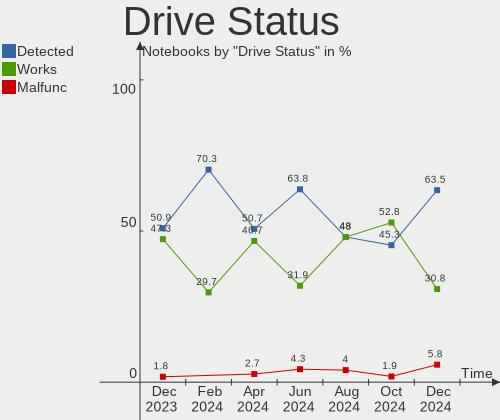

openSUSE - Hardware Trends (Notebooks)
--------------------------------------

A project to identify most popular hardware characteristics and track their change
over time based on data collected by Linux users at https://Linux-Hardware.org.

Anyone can contribute to this report by the [hw-probe](https://github.com/linuxhw/hw-probe) tool:

    sudo -E hw-probe -all -upload

This report is for one last month. Overall report since the beginning of time: [TestDays](https://github.com/linuxhw/TestDays)

Period: Sep, 2023.

Contents
--------

* [ System ](#system)
  - [ OS                       ](#os)
  - [ OS Family                ](#os-family)
  - [ Kernel                   ](#kernel)
  - [ Kernel Family            ](#kernel-family)
  - [ Kernel Major Ver.        ](#kernel-major-ver)
  - [ Arch                     ](#arch)
  - [ DE                       ](#de)
  - [ Display Server           ](#display-server)
  - [ Display Manager          ](#display-manager)
  - [ OS Lang                  ](#os-lang)
  - [ Boot Mode                ](#boot-mode)
  - [ Filesystem               ](#filesystem)
  - [ Part. scheme             ](#part-scheme)
  - [ Dual Boot with Linux/BSD ](#dual-boot-with-linuxbsd)
  - [ Dual Boot (Win)          ](#dual-boot-win)

* [ Board ](#board)
  - [ Vendor                   ](#vendor)
  - [ Model                    ](#model)
  - [ Model Family             ](#model-family)
  - [ MFG Year                 ](#mfg-year)
  - [ Form Factor              ](#form-factor)
  - [ Secure Boot              ](#secure-boot)
  - [ Coreboot                 ](#coreboot)
  - [ RAM Size                 ](#ram-size)
  - [ RAM Used                 ](#ram-used)
  - [ Total Drives             ](#total-drives)
  - [ Has CD-ROM               ](#has-cd-rom)
  - [ Has Ethernet             ](#has-ethernet)
  - [ Has WiFi                 ](#has-wifi)
  - [ Has Bluetooth            ](#has-bluetooth)

* [ Location ](#location)
  - [ Country                  ](#country)
  - [ City                     ](#city)

* [ Drives ](#drives)
  - [ Drive Vendor             ](#drive-vendor)
  - [ Drive Model              ](#drive-model)
  - [ HDD Vendor               ](#hdd-vendor)
  - [ SSD Vendor               ](#ssd-vendor)
  - [ Drive Kind               ](#drive-kind)
  - [ Drive Connector          ](#drive-connector)
  - [ Drive Size               ](#drive-size)
  - [ Space Total              ](#space-total)
  - [ Space Used               ](#space-used)
  - [ Malfunc. Drives          ](#malfunc-drives)
  - [ Malfunc. Drive Vendor    ](#malfunc-drive-vendor)
  - [ Malfunc. HDD Vendor      ](#malfunc-hdd-vendor)
  - [ Malfunc. Drive Kind      ](#malfunc-drive-kind)
  - [ Failed Drives            ](#failed-drives)
  - [ Failed Drive Vendor      ](#failed-drive-vendor)
  - [ Drive Status             ](#drive-status)

* [ Storage controller ](#storage-controller)
  - [ Storage Vendor           ](#storage-vendor)
  - [ Storage Model            ](#storage-model)
  - [ Storage Kind             ](#storage-kind)

* [ Processor ](#processor)
  - [ CPU Vendor               ](#cpu-vendor)
  - [ CPU Model                ](#cpu-model)
  - [ CPU Model Family         ](#cpu-model-family)
  - [ CPU Cores                ](#cpu-cores)
  - [ CPU Sockets              ](#cpu-sockets)
  - [ CPU Threads              ](#cpu-threads)
  - [ CPU Op-Modes             ](#cpu-op-modes)
  - [ CPU Microcode            ](#cpu-microcode)
  - [ CPU Microarch            ](#cpu-microarch)

* [ Graphics ](#graphics)
  - [ GPU Vendor               ](#gpu-vendor)
  - [ GPU Model                ](#gpu-model)
  - [ GPU Combo                ](#gpu-combo)
  - [ GPU Driver               ](#gpu-driver)
  - [ GPU Memory               ](#gpu-memory)

* [ Monitor ](#monitor)
  - [ Monitor Vendor           ](#monitor-vendor)
  - [ Monitor Model            ](#monitor-model)
  - [ Monitor Resolution       ](#monitor-resolution)
  - [ Monitor Diagonal         ](#monitor-diagonal)
  - [ Monitor Width            ](#monitor-width)
  - [ Aspect Ratio             ](#aspect-ratio)
  - [ Monitor Area             ](#monitor-area)
  - [ Pixel Density            ](#pixel-density)
  - [ Multiple Monitors        ](#multiple-monitors)

* [ Network ](#network)
  - [ Net Controller Vendor    ](#net-controller-vendor)
  - [ Net Controller Model     ](#net-controller-model)
  - [ Wireless Vendor          ](#wireless-vendor)
  - [ Wireless Model           ](#wireless-model)
  - [ Ethernet Vendor          ](#ethernet-vendor)
  - [ Ethernet Model           ](#ethernet-model)
  - [ Net Controller Kind      ](#net-controller-kind)
  - [ Used Controller          ](#used-controller)
  - [ NICs                     ](#nics)
  - [ IPv6                     ](#ipv6)

* [ Bluetooth ](#bluetooth)
  - [ Bluetooth Vendor         ](#bluetooth-vendor)
  - [ Bluetooth Model          ](#bluetooth-model)

* [ Sound ](#sound)
  - [ Sound Vendor             ](#sound-vendor)
  - [ Sound Model              ](#sound-model)

* [ Memory ](#memory)
  - [ Memory Vendor            ](#memory-vendor)
  - [ Memory Model             ](#memory-model)
  - [ Memory Kind              ](#memory-kind)
  - [ Memory Form Factor       ](#memory-form-factor)
  - [ Memory Size              ](#memory-size)
  - [ Memory Speed             ](#memory-speed)

* [ Printers & scanners ](#printers--scanners)
  - [ Printer Vendor           ](#printer-vendor)
  - [ Printer Model            ](#printer-model)
  - [ Scanner Vendor           ](#scanner-vendor)
  - [ Scanner Model            ](#scanner-model)

* [ Camera ](#camera)
  - [ Camera Vendor            ](#camera-vendor)
  - [ Camera Model             ](#camera-model)

* [ Security ](#security)
  - [ Fingerprint Vendor       ](#fingerprint-vendor)
  - [ Fingerprint Model        ](#fingerprint-model)
  - [ Chipcard Vendor          ](#chipcard-vendor)
  - [ Chipcard Model           ](#chipcard-model)

* [ Unsupported ](#unsupported)
  - [ Unsupported Devices      ](#unsupported-devices)
  - [ Unsupported Device Types ](#unsupported-device-types)

System
------

OS
--

Installed operating systems

| Name                         | Notebooks | Percent |
|------------------------------|-----------|---------|
| openSUSE Tumbleweed-XXXXXXXX | 37        | 68.52%  |
| openSUSE Leap-15.5           | 13        | 24.07%  |
| openSUSE Microos-XXXXXXXX    | 4         | 7.41%   |

OS Family
---------

OS without a version

| Name     | Notebooks | Percent |
|----------|-----------|---------|
| openSUSE | 54        | 100%    |

Kernel
------

Version of the Linux kernel

| Version                      | Notebooks | Percent |
|------------------------------|-----------|---------|
| 6.5.3-1-default              | 14        | 25.93%  |
| 5.14.21-150500.55.19-default | 13        | 24.07%  |
| 6.4.12-1-default             | 10        | 18.52%  |
| 6.5.4-1-default              | 8         | 14.81%  |
| 6.4.11-1-default             | 5         | 9.26%   |
| 6.5.2-1-default              | 3         | 5.56%   |
| 6.4.2-1-default              | 1         | 1.85%   |

Kernel Family
-------------

Linux kernel without a distro release

| Version | Notebooks | Percent |
|---------|-----------|---------|
| 6.5.3   | 14        | 25.93%  |
| 5.14.21 | 13        | 24.07%  |
| 6.4.12  | 10        | 18.52%  |
| 6.5.4   | 8         | 14.81%  |
| 6.4.11  | 5         | 9.26%   |
| 6.5.2   | 3         | 5.56%   |
| 6.4.2   | 1         | 1.85%   |

Kernel Major Ver.
-----------------

Linux kernel major version

| Version | Notebooks | Percent |
|---------|-----------|---------|
| 6.5     | 25        | 46.3%   |
| 6.4     | 16        | 29.63%  |
| 5.14    | 13        | 24.07%  |

Arch
----

OS architecture (x86_64, i586, etc.)

| Name   | Notebooks | Percent |
|--------|-----------|---------|
| x86_64 | 54        | 100%    |

DE
--

Desktop Environment

| Name     | Notebooks | Percent |
|----------|-----------|---------|
| KDE5     | 36        | 66.67%  |
| GNOME    | 16        | 29.63%  |
| Hyprland | 1         | 1.85%   |
| Unknown  | 1         | 1.85%   |

Display Server
--------------

X11 or Wayland

| Name    | Notebooks | Percent |
|---------|-----------|---------|
| X11     | 30        | 55.56%  |
| Wayland | 24        | 44.44%  |

Display Manager
---------------

SDDM, LightDM, etc.

| Name    | Notebooks | Percent |
|---------|-----------|---------|
| Unknown | 33        | 61.11%  |
| SDDM    | 16        | 29.63%  |
| GDM     | 5         | 9.26%   |

OS Lang
-------

Language

| Lang  | Notebooks | Percent |
|-------|-----------|---------|
| en_US | 24        | 44.44%  |
| de_DE | 9         | 16.67%  |
| en_GB | 5         | 9.26%   |
| pt_BR | 3         | 5.56%   |
| POSIX | 3         | 5.56%   |
| zh_CN | 1         | 1.85%   |
| tr_TR | 1         | 1.85%   |
| ru_RU | 1         | 1.85%   |
| pl_PL | 1         | 1.85%   |
| nl_NL | 1         | 1.85%   |
| it_IT | 1         | 1.85%   |
| hu_HU | 1         | 1.85%   |
| fr_FR | 1         | 1.85%   |
| es_EC | 1         | 1.85%   |
| en_DK | 1         | 1.85%   |

Boot Mode
---------

EFI or BIOS

| Mode | Notebooks | Percent |
|------|-----------|---------|
| EFI  | 36        | 66.67%  |
| BIOS | 18        | 33.33%  |

Filesystem
----------

Type of filesystem

| Type  | Notebooks | Percent |
|-------|-----------|---------|
| Btrfs | 47        | 87.04%  |
| Ext4  | 6         | 11.11%  |
| Tmpfs | 1         | 1.85%   |

Part. scheme
------------

Scheme of partitioning

| Type    | Notebooks | Percent |
|---------|-----------|---------|
| Unknown | 32        | 59.26%  |
| GPT     | 21        | 38.89%  |
| MBR     | 1         | 1.85%   |

Dual Boot with Linux/BSD
------------------------

Hosting more than one Linux/BSD

| Dual boot | Notebooks | Percent |
|-----------|-----------|---------|
| No        | 49        | 90.74%  |
| Yes       | 5         | 9.26%   |

Dual Boot (Win)
---------------

Hosting Linux and Windows

| Dual boot | Notebooks | Percent |
|-----------|-----------|---------|
| No        | 45        | 83.33%  |
| Yes       | 9         | 16.67%  |

Board
-----

Vendor
------

Motherboard manufacturer

| Name             | Notebooks | Percent |
|------------------|-----------|---------|
| Lenovo           | 15        | 27.78%  |
| Hewlett-Packard  | 9         | 16.67%  |
| Dell             | 8         | 14.81%  |
| Acer             | 7         | 12.96%  |
| ASUSTek Computer | 3         | 5.56%   |
| Alienware        | 3         | 5.56%   |
| MSI              | 2         | 3.7%    |
| Medion           | 2         | 3.7%    |
| Apple            | 2         | 3.7%    |
| Sony             | 1         | 1.85%   |
| Panasonic        | 1         | 1.85%   |
| HUAWEI           | 1         | 1.85%   |

Model
-----

Motherboard model

| Name                                      | Notebooks | Percent |
|-------------------------------------------|-----------|---------|
| Sony SVF1521A7EB                          | 1         | 1.85%   |
| Panasonic CF-C2CUGZXKM                    | 1         | 1.85%   |
| MSI Thin GF63 12HW                        | 1         | 1.85%   |
| MSI Bravo 15 C7VE                         | 1         | 1.85%   |
| Medion S15449                             | 1         | 1.85%   |
| Medion E6224                              | 1         | 1.85%   |
| Lenovo ThinkPad X200 74591P0              | 1         | 1.85%   |
| Lenovo ThinkPad X13 Gen 2i 20WKA008CD     | 1         | 1.85%   |
| Lenovo ThinkPad X1 Nano Gen 3 21K1CTO1WW  | 1         | 1.85%   |
| Lenovo ThinkPad W510 4391W3V              | 1         | 1.85%   |
| Lenovo ThinkPad W500 40624DG              | 1         | 1.85%   |
| Lenovo ThinkPad L570 W10DG 20JRS03U00     | 1         | 1.85%   |
| Lenovo ThinkPad E550 20DF0040US           | 1         | 1.85%   |
| Lenovo ThinkPad E14 Gen 3 20YD001DBO      | 1         | 1.85%   |
| Lenovo ThinkPad E14 Gen 2 20TA000DGE      | 1         | 1.85%   |
| Lenovo ThinkBook 15 G2 ITL 20VE           | 1         | 1.85%   |
| Lenovo IdeaPad Y580 2099                  | 1         | 1.85%   |
| Lenovo IdeaPad S145-15API 81V7            | 1         | 1.85%   |
| Lenovo IdeaPad 3 15ITL6 82H8              | 1         | 1.85%   |
| Lenovo IdeaPad 3 15ADA05 81W1             | 1         | 1.85%   |
| Lenovo B490 37722QP                       | 1         | 1.85%   |
| HUAWEI NBD-WXX9                           | 1         | 1.85%   |
| HP ZBook Fury 16 G9 Mobile Workstation PC | 1         | 1.85%   |
| HP ProBook 6560b                          | 1         | 1.85%   |
| HP ProBook 4540s                          | 1         | 1.85%   |
| HP ProBook 4530s                          | 1         | 1.85%   |
| HP Pavilion Gaming Laptop 15-dk1xxx       | 1         | 1.85%   |
| HP Laptop 15s-eq2xxx                      | 1         | 1.85%   |
| HP Laptop 14s-dq3xxx                      | 1         | 1.85%   |
| HP ENVY 17                                | 1         | 1.85%   |
| HP 15                                     | 1         | 1.85%   |
| Dell XPS 15 9500                          | 1         | 1.85%   |
| Dell Precision 7560                       | 1         | 1.85%   |
| Dell Precision 7540                       | 1         | 1.85%   |
| Dell Latitude 5501                        | 1         | 1.85%   |
| Dell Latitude 5440                        | 1         | 1.85%   |
| Dell Latitude 5431                        | 1         | 1.85%   |
| Dell Latitude 5414                        | 1         | 1.85%   |
| Dell Inspiron 16 5620                     | 1         | 1.85%   |
| ASUS X510UAR                              | 1         | 1.85%   |

Model Family
------------

Motherboard model prefix

| Name                   | Notebooks | Percent |
|------------------------|-----------|---------|
| Lenovo ThinkPad        | 9         | 16.67%  |
| Acer Aspire            | 5         | 9.26%   |
| Lenovo IdeaPad         | 4         | 7.41%   |
| Dell Latitude          | 4         | 7.41%   |
| HP ProBook             | 3         | 5.56%   |
| HP Laptop              | 2         | 3.7%    |
| Dell Precision         | 2         | 3.7%    |
| Alienware m15          | 2         | 3.7%    |
| Sony SVF1521A7EB       | 1         | 1.85%   |
| Panasonic CF-C2CUGZXKM | 1         | 1.85%   |
| MSI Thin               | 1         | 1.85%   |
| MSI Bravo              | 1         | 1.85%   |
| Medion S15449          | 1         | 1.85%   |
| Medion E6224           | 1         | 1.85%   |
| Lenovo ThinkBook       | 1         | 1.85%   |
| Lenovo B490            | 1         | 1.85%   |
| HUAWEI NBD-WXX9        | 1         | 1.85%   |
| HP ZBook               | 1         | 1.85%   |
| HP Pavilion            | 1         | 1.85%   |
| HP ENVY                | 1         | 1.85%   |
| HP 15                  | 1         | 1.85%   |
| Dell XPS               | 1         | 1.85%   |
| Dell Inspiron          | 1         | 1.85%   |
| ASUS X510UAR           | 1         | 1.85%   |
| ASUS VivoBook          | 1         | 1.85%   |
| ASUS ASUS              | 1         | 1.85%   |
| Apple MacBookPro8      | 1         | 1.85%   |
| Apple MacBook5         | 1         | 1.85%   |
| Alienware x14          | 1         | 1.85%   |
| Acer Swift             | 1         | 1.85%   |
| Acer Nitro             | 1         | 1.85%   |

MFG Year
--------

Motherboard manufacture year

| Year | Notebooks | Percent |
|------|-----------|---------|
| 2021 | 11        | 20.37%  |
| 2020 | 7         | 12.96%  |
| 2023 | 5         | 9.26%   |
| 2022 | 5         | 9.26%   |
| 2019 | 4         | 7.41%   |
| 2013 | 4         | 7.41%   |
| 2011 | 4         | 7.41%   |
| 2017 | 3         | 5.56%   |
| 2012 | 3         | 5.56%   |
| 2010 | 2         | 3.7%    |
| 2009 | 2         | 3.7%    |
| 2018 | 1         | 1.85%   |
| 2014 | 1         | 1.85%   |
| 2008 | 1         | 1.85%   |
| 2007 | 1         | 1.85%   |

Form Factor
-----------

Physical design of the computer

| Name     | Notebooks | Percent |
|----------|-----------|---------|
| Notebook | 54        | 100%    |

Secure Boot
-----------

Enabled or disabled

| State    | Notebooks | Percent |
|----------|-----------|---------|
| Disabled | 43        | 79.63%  |
| Enabled  | 11        | 20.37%  |

Coreboot
--------

Have coreboot on board

| Used | Notebooks | Percent |
|------|-----------|---------|
| No   | 53        | 98.15%  |
| Yes  | 1         | 1.85%   |

RAM Size
--------

Total RAM memory

| Size in GB  | Notebooks | Percent |
|-------------|-----------|---------|
| 4.01-8.0    | 18        | 33.33%  |
| 16.01-24.0  | 13        | 24.07%  |
| 8.01-16.0   | 8         | 14.81%  |
| 32.01-64.0  | 5         | 9.26%   |
| 64.01-256.0 | 5         | 9.26%   |
| 3.01-4.0    | 2         | 3.7%    |
| 1.01-2.0    | 2         | 3.7%    |
| 24.01-32.0  | 1         | 1.85%   |

RAM Used
--------

Used RAM memory

| Used GB   | Notebooks | Percent |
|-----------|-----------|---------|
| 2.01-3.0  | 18        | 33.33%  |
| 4.01-8.0  | 15        | 27.78%  |
| 3.01-4.0  | 12        | 22.22%  |
| 1.01-2.0  | 4         | 7.41%   |
| 8.01-16.0 | 3         | 5.56%   |
| 0.51-1.0  | 2         | 3.7%    |

Total Drives
------------

Number of drives on board

| Drives | Notebooks | Percent |
|--------|-----------|---------|
| 1      | 44        | 81.48%  |
| 2      | 9         | 16.67%  |
| 3      | 1         | 1.85%   |

Has CD-ROM
----------

Has CD-ROM on board

| Presented | Notebooks | Percent |
|-----------|-----------|---------|
| No        | 39        | 72.22%  |
| Yes       | 15        | 27.78%  |

Has Ethernet
------------

Has Ethernet on board

| Presented | Notebooks | Percent |
|-----------|-----------|---------|
| Yes       | 40        | 74.07%  |
| No        | 14        | 25.93%  |

Has WiFi
--------

Has WiFi module

| Presented | Notebooks | Percent |
|-----------|-----------|---------|
| Yes       | 53        | 98.15%  |
| No        | 1         | 1.85%   |

Has Bluetooth
-------------

Has Bluetooth module

| Presented | Notebooks | Percent |
|-----------|-----------|---------|
| Yes       | 48        | 88.89%  |
| No        | 6         | 11.11%  |

Location
--------

Country
-------

Geographic location (country)

| Country      | Notebooks | Percent |
|--------------|-----------|---------|
| Germany      | 10        | 18.52%  |
| USA          | 9         | 16.67%  |
| Brazil       | 4         | 7.41%   |
| Canada       | 3         | 5.56%   |
| UK           | 2         | 3.7%    |
| Turkey       | 2         | 3.7%    |
| Russia       | 2         | 3.7%    |
| Italy        | 2         | 3.7%    |
| Indonesia    | 2         | 3.7%    |
| China        | 2         | 3.7%    |
| Belgium      | 2         | 3.7%    |
| Uruguay      | 1         | 1.85%   |
| South Africa | 1         | 1.85%   |
| Senegal      | 1         | 1.85%   |
| Romania      | 1         | 1.85%   |
| Poland       | 1         | 1.85%   |
| Nicaragua    | 1         | 1.85%   |
| Jordan       | 1         | 1.85%   |
| India        | 1         | 1.85%   |
| Hungary      | 1         | 1.85%   |
| Greece       | 1         | 1.85%   |
| Ecuador      | 1         | 1.85%   |
| Bulgaria     | 1         | 1.85%   |
| Barbados     | 1         | 1.85%   |
| Austria      | 1         | 1.85%   |

City
----

Geographic location (city)

| City             | Notebooks | Percent |
|------------------|-----------|---------|
| Aschaffenburg    | 2         | 3.7%    |
| Zlatoust         | 1         | 1.85%   |
| Zhengzhou        | 1         | 1.85%   |
| Woodbridge       | 1         | 1.85%   |
| Wolfratshausen   | 1         | 1.85%   |
| Wiesbaden        | 1         | 1.85%   |
| Vienna           | 1         | 1.85%   |
| Vechta           | 1         | 1.85%   |
| Twickenham       | 1         | 1.85%   |
| Tucson           | 1         | 1.85%   |
| Szczecin         | 1         | 1.85%   |
| Stockbridge      | 1         | 1.85%   |
| St Petersburg    | 1         | 1.85%   |
| Siegen           | 1         | 1.85%   |
| Sao Vicente      | 1         | 1.85%   |
| Santa Clara      | 1         | 1.85%   |
| Reutlingen       | 1         | 1.85%   |
| Quito            | 1         | 1.85%   |
| Ploieşti        | 1         | 1.85%   |
| Pikine           | 1         | 1.85%   |
| Pekanbaru        | 1         | 1.85%   |
| New York         | 1         | 1.85%   |
| Nanning          | 1         | 1.85%   |
| Milan            | 1         | 1.85%   |
| Mesa             | 1         | 1.85%   |
| Managua          | 1         | 1.85%   |
| Leuven           | 1         | 1.85%   |
| Las Vegas        | 1         | 1.85%   |
| Kolkata          | 1         | 1.85%   |
| Kelowna          | 1         | 1.85%   |
| Juchen           | 1         | 1.85%   |
| Jakarta          | 1         | 1.85%   |
| Itumbiara        | 1         | 1.85%   |
| Istanbul         | 1         | 1.85%   |
| Innisfil         | 1         | 1.85%   |
| Ierissos         | 1         | 1.85%   |
| Hialeah          | 1         | 1.85%   |
| Grindon          | 1         | 1.85%   |
| Franco da Rocha  | 1         | 1.85%   |
| Feira de Santana | 1         | 1.85%   |

Drives
------

Drive Vendor
------------

Hard drive vendors

| Vendor                         | Notebooks | Drives | Percent |
|--------------------------------|-----------|--------|---------|
| Samsung Electronics            | 12        | 13     | 19.67%  |
| SK hynix                       | 5         | 5      | 8.2%    |
| SanDisk                        | 5         | 6      | 8.2%    |
| KIOXIA                         | 5         | 5      | 8.2%    |
| Kingston                       | 5         | 5      | 8.2%    |
| Toshiba                        | 3         | 4      | 4.92%   |
| Phison Electronics             | 3         | 3      | 4.92%   |
| Crucial                        | 3         | 3      | 4.92%   |
| Silicon Motion                 | 2         | 2      | 3.28%   |
| Seagate                        | 2         | 2      | 3.28%   |
| Micron Technology              | 2         | 2      | 3.28%   |
| China                          | 2         | 2      | 3.28%   |
| WDC                            | 1         | 2      | 1.64%   |
| SSK                            | 1         | 1      | 1.64%   |
| SPCC                           | 1         | 1      | 1.64%   |
| Solid State Storage Technology | 1         | 1      | 1.64%   |
| Realtek Semiconductor          | 1         | 1      | 1.64%   |
| Pioneer                        | 1         | 1      | 1.64%   |
| Patriot                        | 1         | 1      | 1.64%   |
| Micron/Crucial Technology      | 1         | 1      | 1.64%   |
| LITEONIT                       | 1         | 1      | 1.64%   |
| Hitachi                        | 1         | 1      | 1.64%   |
| ADATA Technology               | 1         | 1      | 1.64%   |
| A-DATA Technology              | 1         | 1      | 1.64%   |

Drive Model
-----------

Hard drive models

| Model                                               | Notebooks | Percent |
|-----------------------------------------------------|-----------|---------|
| Samsung NVMe SSD Controller SM981/PM981/PM983 256GB | 3         | 4.62%   |
| SK hynix PC801 NVMe 512GB                           | 2         | 3.08%   |
| Samsung NVMe SSD Controller PM9A1/PM9A3/980PRO 1TB  | 2         | 3.08%   |
| KIOXIA KBG40ZNV256G 256GB                           | 2         | 3.08%   |
| Kingston SA400S37120G 120GB SSD                     | 2         | 3.08%   |
| WDC WDS500G2B0A-00SM50 500GB SSD                    | 1         | 1.54%   |
| WDC WD10JPVX-60JC3T0 1TB                            | 1         | 1.54%   |
| Toshiba XG6 NVMe SSD Controller 512GB               | 1         | 1.54%   |
| Toshiba THNSNK128GVN8 128GB SSD                     | 1         | 1.54%   |
| Toshiba MQ04ABF100 1TB                              | 1         | 1.54%   |
| Toshiba MK1237GSX 120GB                             | 1         | 1.54%   |
| SSK Disk 256GB                                      | 1         | 1.54%   |
| SPCC M.2 SSD 512GB                                  | 1         | 1.54%   |
| Solid State Storage SSSTC CL4-4D256-Q79 256GB       | 1         | 1.54%   |
| SK hynix SKHynix_HFS512GEJ4X112N 512GB              | 1         | 1.54%   |
| SK hynix SKHynix_HFM512GD3HX015N 512GB              | 1         | 1.54%   |
| SK hynix PC601 NVMe 512GB                           | 1         | 1.54%   |
| Silicon Motion SM2262/SM2262EN SSD Controller 500GB | 1         | 1.54%   |
| Silicon Motion PCIe-8 SSD 256GB                     | 1         | 1.54%   |
| Seagate ST500LM012 HN-M500MBB 500GB                 | 1         | 1.54%   |
| Seagate ST320LT007-9ZV142 320GB                     | 1         | 1.54%   |
| Sandisk WD_BLACK SN850X 2000GB                      | 1         | 1.54%   |
| Sandisk WD_BLACK SN770 1TB                          | 1         | 1.54%   |
| Sandisk WDC WDS240G2G0C-00AJM0 240GB                | 1         | 1.54%   |
| SanDisk SSD U100 16GB                               | 1         | 1.54%   |
| SanDisk SDSSDH3512G 512GB                           | 1         | 1.54%   |
| SanDisk SD8TB8U256G1001 256GB SSD                   | 1         | 1.54%   |
| Samsung SSD 980 1TB                                 | 1         | 1.54%   |
| Samsung SSD 860 QVO 4TB                             | 1         | 1.54%   |
| Samsung SSD 860 EVO 1TB                             | 1         | 1.54%   |
| Samsung SSD 850 PRO 256GB                           | 1         | 1.54%   |
| Samsung PM991a NVMe 512GB                           | 1         | 1.54%   |
| Samsung MZVLQ256HAJD-00000 256GB                    | 1         | 1.54%   |
| Samsung MZVL4512HBLU-00BTW 512GB                    | 1         | 1.54%   |
| Samsung MZALQ512HALU-000L1 512GB                    | 1         | 1.54%   |
| Realtek ADATA SWORDFISH 250GB                       | 1         | 1.54%   |
| Pioneer APS-SL3N-128 128GB                          | 1         | 1.54%   |
| Phison Sabrent SB-2130-1TB                          | 1         | 1.54%   |
| Phison E15-1TB-PHISON-SSD-B47R                      | 1         | 1.54%   |
| Phison addlink M.2 PCIE G4x4 NVMe 2TB               | 1         | 1.54%   |

HDD Vendor
----------

Hard disk drive vendors

| Vendor  | Notebooks | Drives | Percent |
|---------|-----------|--------|---------|
| Toshiba | 2         | 2      | 28.57%  |
| Seagate | 2         | 2      | 28.57%  |
| WDC     | 1         | 1      | 14.29%  |
| SSK     | 1         | 1      | 14.29%  |
| Hitachi | 1         | 1      | 14.29%  |

SSD Vendor
----------

Solid state drive vendors

| Vendor              | Notebooks | Drives | Percent |
|---------------------|-----------|--------|---------|
| Kingston            | 4         | 4      | 19.05%  |
| Samsung Electronics | 3         | 3      | 14.29%  |
| Crucial             | 3         | 3      | 14.29%  |
| SanDisk             | 2         | 3      | 9.52%   |
| China               | 2         | 2      | 9.52%   |
| WDC                 | 1         | 1      | 4.76%   |
| Toshiba             | 1         | 1      | 4.76%   |
| SPCC                | 1         | 1      | 4.76%   |
| Pioneer             | 1         | 1      | 4.76%   |
| Patriot             | 1         | 1      | 4.76%   |
| LITEONIT            | 1         | 1      | 4.76%   |
| A-DATA Technology   | 1         | 1      | 4.76%   |

Drive Kind
----------

HDD or SSD

| Kind | Notebooks | Drives | Percent |
|------|-----------|--------|---------|
| NVMe | 32        | 36     | 53.33%  |
| SSD  | 21        | 22     | 35%     |
| HDD  | 7         | 7      | 11.67%  |

Drive Connector
---------------

SATA, SAS, NVMe, etc.

| Type | Notebooks | Drives | Percent |
|------|-----------|--------|---------|
| NVMe | 32        | 36     | 56.14%  |
| SATA | 24        | 28     | 42.11%  |
| SAS  | 1         | 1      | 1.75%   |

Drive Size
----------

Size of hard drive

| Size in TB | Notebooks | Drives | Percent |
|------------|-----------|--------|---------|
| 0.01-0.5   | 20        | 21     | 71.43%  |
| 0.51-1.0   | 7         | 7      | 25%     |
| 3.01-4.0   | 1         | 1      | 3.57%   |

Space Total
-----------

Amount of disk space available on the file system

| Size in GB     | Notebooks | Percent |
|----------------|-----------|---------|
| More than 3000 | 21        | 38.89%  |
| 1001-2000      | 15        | 27.78%  |
| 501-1000       | 7         | 12.96%  |
| 2001-3000      | 6         | 11.11%  |
| 251-500        | 3         | 5.56%   |
| 101-250        | 2         | 3.7%    |

Space Used
----------

Amount of used disk space

| Used GB        | Notebooks | Percent |
|----------------|-----------|---------|
| 1001-2000      | 12        | 22.22%  |
| 51-100         | 12        | 22.22%  |
| 101-250        | 11        | 20.37%  |
| 501-1000       | 6         | 11.11%  |
| 251-500        | 5         | 9.26%   |
| 21-50          | 4         | 7.41%   |
| 2001-3000      | 2         | 3.7%    |
| More than 3000 | 1         | 1.85%   |
| 1-20           | 1         | 1.85%   |

Malfunc. Drives
---------------

Drive models with a malfunction

| Model                                                           | Notebooks | Drives | Percent |
|-----------------------------------------------------------------|-----------|--------|---------|
| Samsung Electronics NVMe SSD Controller SM981/PM981/PM983 256GB | 1         | 1      | 50%     |
| LITEONIT LCT-128M3S 128GB SSD                                   | 1         | 1      | 50%     |

Malfunc. Drive Vendor
---------------------

Vendors of faulty drives

| Vendor              | Notebooks | Drives | Percent |
|---------------------|-----------|--------|---------|
| Samsung Electronics | 1         | 1      | 50%     |
| LITEONIT            | 1         | 1      | 50%     |

Malfunc. HDD Vendor
-------------------

Vendors of faulty HDD drives

Zero info for selected period =(

Malfunc. Drive Kind
-------------------

Kinds of faulty drives

| Kind | Notebooks | Drives | Percent |
|------|-----------|--------|---------|
| NVMe | 1         | 1      | 50%     |
| SSD  | 1         | 1      | 50%     |

Failed Drives
-------------

Failed drive models

Zero info for selected period =(

Failed Drive Vendor
-------------------

Failed drive vendors

Zero info for selected period =(

Drive Status
------------

Number of failed and malfunc. drives

| Status   | Notebooks | Drives | Percent |
|----------|-----------|--------|---------|
| Detected | 34        | 39     | 60.71%  |
| Works    | 20        | 24     | 35.71%  |
| Malfunc  | 2         | 2      | 3.57%   |

Storage controller
------------------

Storage Vendor
--------------

Storage controller vendors

| Vendor                         | Notebooks | Percent |
|--------------------------------|-----------|---------|
| Intel                          | 35        | 48.61%  |
| Samsung Electronics            | 10        | 13.89%  |
| SK hynix                       | 5         | 6.94%   |
| KIOXIA                         | 5         | 6.94%   |
| SanDisk                        | 3         | 4.17%   |
| Phison Electronics             | 3         | 4.17%   |
| Silicon Motion                 | 2         | 2.78%   |
| Micron Technology              | 2         | 2.78%   |
| Toshiba America Info Systems   | 1         | 1.39%   |
| Solid State Storage Technology | 1         | 1.39%   |
| Realtek Semiconductor          | 1         | 1.39%   |
| Nvidia                         | 1         | 1.39%   |
| Micron/Crucial Technology      | 1         | 1.39%   |
| Kingston Technology Company    | 1         | 1.39%   |
| ADATA Technology               | 1         | 1.39%   |

Storage Model
-------------

Storage controller models

| Model                                                                        | Notebooks | Percent |
|------------------------------------------------------------------------------|-----------|---------|
| Intel Volume Management Device NVMe RAID Controller                          | 6         | 8%      |
| Intel 7 Series Chipset Family 6-port SATA Controller [AHCI mode]             | 5         | 6.67%   |
| Intel 6 Series/C200 Series Chipset Family 6 port Mobile SATA AHCI Controller | 5         | 6.67%   |
| Samsung NVMe SSD Controller 980                                              | 4         | 5.33%   |
| Intel Sunrise Point-LP SATA Controller [AHCI mode]                           | 4         | 5.33%   |
| Samsung NVMe SSD Controller SM981/PM981/PM983                                | 3         | 4%      |
| KIOXIA NVMe SSD Controller BG4 (DRAM-less)                                   | 3         | 4%      |
| Intel 82801 Mobile SATA Controller [RAID mode]                               | 3         | 4%      |
| SK hynix Platinum P41/PC801 NVMe Solid State Drive                           | 2         | 2.67%   |
| Samsung NVMe SSD Controller PM9A1/PM9A3/980PRO                               | 2         | 2.67%   |
| Phison PS5021-E21 PCIe4 NVMe Controller (DRAM-less)                          | 2         | 2.67%   |
| Intel Tiger Lake-LP SATA Controller                                          | 2         | 2.67%   |
| Intel Cannon Lake Mobile PCH SATA AHCI Controller                            | 2         | 2.67%   |
| Intel 82801IBM/IEM (ICH9M/ICH9M-E) 4 port SATA Controller [AHCI mode]        | 2         | 2.67%   |
| Intel 8 Series SATA Controller 1 [AHCI mode]                                 | 2         | 2.67%   |
| Toshiba America Info Systems XG6 NVMe SSD Controller                         | 1         | 1.33%   |
| Solid State Storage CL4-8D512 NVMe SSD M.2 (DRAM-less)                       | 1         | 1.33%   |
| SK hynix PC601 NVMe Solid State Drive                                        | 1         | 1.33%   |
| SK hynix Gold P31/BC711/PC711 NVMe Solid State Drive                         | 1         | 1.33%   |
| SK hynix BC901 NVMe Solid State Drive (DRAM-less)                            | 1         | 1.33%   |
| Silicon Motion SM2262/SM2262EN SSD Controller                                | 1         | 1.33%   |
| Silicon Motion Non-Volatile memory controller                                | 1         | 1.33%   |
| Sandisk Western Digital WD Black SN850X NVMe SSD                             | 1         | 1.33%   |
| SanDisk WD Green SN350 NVMe SSD 240GB (DRAM-less)                            | 1         | 1.33%   |
| SanDisk WD Black SN770 / PC SN740 256GB / PC SN560 (DRAM-less) NVMe SSD      | 1         | 1.33%   |
| Samsung NVMe SSD Controller PM9B1                                            | 1         | 1.33%   |
| Realtek RTS5763DL NVMe SSD Controller (DRAM-less)                            | 1         | 1.33%   |
| Phison Electronics Non-Volatile memory controller                            | 1         | 1.33%   |
| Nvidia MCP79 AHCI Controller                                                 | 1         | 1.33%   |
| Micron/Crucial P2 [Nick P2] / P3 / P3 Plus NVMe PCIe SSD (DRAM-less)         | 1         | 1.33%   |
| Micron 2450 NVMe SSD [HendrixV] (DRAM-less)                                  | 1         | 1.33%   |
| Micron 2400 NVMe SSD (DRAM-less)                                             | 1         | 1.33%   |
| KIOXIA NVMe SSD Controller XG7                                               | 1         | 1.33%   |
| KIOXIA NVMe SSD                                                              | 1         | 1.33%   |
| Kingston Company OM8PCP Design-In PCIe 3 NVMe SSD (DRAM-less)                | 1         | 1.33%   |
| Intel Wildcat Point-LP SATA Controller [AHCI Mode]                           | 1         | 1.33%   |
| Intel Tiger Lake SATA AHCI Controller                                        | 1         | 1.33%   |
| Intel Celeron/Pentium Silver Processor SATA Controller                       | 1         | 1.33%   |
| Intel Alder Lake-P SATA AHCI Controller                                      | 1         | 1.33%   |
| Intel 82801HM/HEM (ICH8M/ICH8M-E) SATA Controller [AHCI mode]                | 1         | 1.33%   |

Storage Kind
------------

Kind of storage controller (IDE, SATA, NVMe, SAS, ...)

| Kind | Notebooks | Percent |
|------|-----------|---------|
| NVMe | 32        | 45.07%  |
| SATA | 29        | 40.85%  |
| RAID | 9         | 12.68%  |
| IDE  | 1         | 1.41%   |

Processor
---------

CPU Vendor
----------

Processor vendors

| Vendor | Notebooks | Percent |
|--------|-----------|---------|
| Intel  | 49        | 90.74%  |
| AMD    | 5         | 9.26%   |

CPU Model
---------

Processor models

| Model                                         | Notebooks | Percent |
|-----------------------------------------------|-----------|---------|
| Intel 11th Gen Core i5-1135G7 @ 2.40GHz       | 4         | 7.41%   |
| Intel Core i7-9850H CPU @ 2.60GHz             | 2         | 3.7%    |
| Intel Core i5-8250U CPU @ 1.60GHz             | 2         | 3.7%    |
| AMD Ryzen 5 3500U with Radeon Vega Mobile Gfx | 2         | 3.7%    |
| Intel Pentium Silver N6000 @ 1.10GHz          | 1         | 1.85%   |
| Intel Pentium Silver N5030 CPU @ 1.10GHz      | 1         | 1.85%   |
| Intel Pentium Dual CPU T2390 @ 1.86GHz        | 1         | 1.85%   |
| Intel Pentium CPU 2117U @ 1.80GHz             | 1         | 1.85%   |
| Intel Core i9-10885H CPU @ 2.40GHz            | 1         | 1.85%   |
| Intel Core i7-6600U CPU @ 2.60GHz             | 1         | 1.85%   |
| Intel Core i7-5500U CPU @ 2.40GHz             | 1         | 1.85%   |
| Intel Core i7-3630QM CPU @ 2.40GHz            | 1         | 1.85%   |
| Intel Core i7-2635QM CPU @ 2.00GHz            | 1         | 1.85%   |
| Intel Core i7-2630QM CPU @ 2.00GHz            | 1         | 1.85%   |
| Intel Core i7-10875H CPU @ 2.30GHz            | 1         | 1.85%   |
| Intel Core i7-10750H CPU @ 2.60GHz            | 1         | 1.85%   |
| Intel Core i7 CPU Q 720 @ 1.60GHz             | 1         | 1.85%   |
| Intel Core i5-6200U CPU @ 2.30GHz             | 1         | 1.85%   |
| Intel Core i5-4310U CPU @ 2.00GHz             | 1         | 1.85%   |
| Intel Core i5-4210U CPU @ 1.70GHz             | 1         | 1.85%   |
| Intel Core i5-3230M CPU @ 2.60GHz             | 1         | 1.85%   |
| Intel Core i5-2540M CPU @ 2.60GHz             | 1         | 1.85%   |
| Intel Core i5-2467M CPU @ 1.60GHz             | 1         | 1.85%   |
| Intel Core i5-2450M CPU @ 2.50GHz             | 1         | 1.85%   |
| Intel Core i5-1035G1 CPU @ 1.00GHz            | 1         | 1.85%   |
| Intel Core i3-3217U CPU @ 1.80GHz             | 1         | 1.85%   |
| Intel Core i3-2310M CPU @ 2.10GHz             | 1         | 1.85%   |
| Intel Core 2 Extreme CPU X9100 @ 3.06GHz      | 1         | 1.85%   |
| Intel Core 2 Duo CPU P8600 @ 2.40GHz          | 1         | 1.85%   |
| Intel Core 2 Duo CPU P7350 @ 2.00GHz          | 1         | 1.85%   |
| Intel Celeron CPU 1000M @ 1.80GHz             | 1         | 1.85%   |
| Intel 13th Gen Core i5-1340P                  | 1         | 1.85%   |
| Intel 13th Gen Core i5-1335U                  | 1         | 1.85%   |
| Intel 12th Gen Core i7-12800HX                | 1         | 1.85%   |
| Intel 12th Gen Core i7-1270P                  | 1         | 1.85%   |
| Intel 12th Gen Core i7-12700H                 | 1         | 1.85%   |
| Intel 12th Gen Core i7-1255U                  | 1         | 1.85%   |
| Intel 12th Gen Core i5-12500H                 | 1         | 1.85%   |
| Intel 12th Gen Core i5-12450H                 | 1         | 1.85%   |
| Intel 11th Gen Core i7-11850H @ 2.50GHz       | 1         | 1.85%   |

CPU Model Family
----------------

Processor model prefix

| Model                | Notebooks | Percent |
|----------------------|-----------|---------|
| Other                | 18        | 33.33%  |
| Intel Core i7        | 10        | 18.52%  |
| Intel Core i5        | 10        | 18.52%  |
| AMD Ryzen 5          | 3         | 5.56%   |
| Intel Pentium Silver | 2         | 3.7%    |
| Intel Core i3        | 2         | 3.7%    |
| Intel Core 2 Duo     | 2         | 3.7%    |
| Intel Pentium Dual   | 1         | 1.85%   |
| Intel Pentium        | 1         | 1.85%   |
| Intel Core i9        | 1         | 1.85%   |
| Intel Core 2 Extreme | 1         | 1.85%   |
| Intel Celeron        | 1         | 1.85%   |
| AMD Ryzen 7          | 1         | 1.85%   |
| AMD Ryzen 3          | 1         | 1.85%   |

CPU Cores
---------

Number of processor cores

| Number | Notebooks | Percent |
|--------|-----------|---------|
| 4      | 18        | 33.33%  |
| 2      | 16        | 29.63%  |
| 8      | 6         | 11.11%  |
| 6      | 5         | 9.26%   |
| 12     | 3         | 5.56%   |
| 10     | 2         | 3.7%    |
| 1      | 2         | 3.7%    |
| 16     | 1         | 1.85%   |
| 14     | 1         | 1.85%   |

CPU Sockets
-----------

Number of sockets

| Number | Notebooks | Percent |
|--------|-----------|---------|
| 1      | 54        | 100%    |

CPU Threads
-----------

Threads per core (Hyper-Threading)

| Number | Notebooks | Percent |
|--------|-----------|---------|
| 2      | 43        | 79.63%  |
| 1      | 10        | 18.52%  |
| 4      | 1         | 1.85%   |

CPU Op-Modes
------------

CPU Operation Modes (32-bit, 64-bit)

| Op mode        | Notebooks | Percent |
|----------------|-----------|---------|
| 32-bit, 64-bit | 54        | 100%    |

CPU Microcode
-------------

Microcode number

| Number     | Notebooks | Percent |
|------------|-----------|---------|
| Unknown    | 45        | 83.33%  |
| 0x806c1    | 2         | 3.7%    |
| 0x08608103 | 2         | 3.7%    |
| 0x906ed    | 1         | 1.85%   |
| 0x40651    | 1         | 1.85%   |
| 0x0a404102 | 1         | 1.85%   |
| 0x08108109 | 1         | 1.85%   |
| 0x08108102 | 1         | 1.85%   |

CPU Microarch
-------------

Microarchitecture

| Name             | Notebooks | Percent |
|------------------|-----------|---------|
| Alderlake Hybrid | 8         | 14.81%  |
| TigerLake        | 7         | 12.96%  |
| SandyBridge      | 6         | 11.11%  |
| IvyBridge        | 5         | 9.26%   |
| KabyLake         | 4         | 7.41%   |
| Unknown          | 4         | 7.41%   |
| Penryn           | 3         | 5.56%   |
| Icelake          | 3         | 5.56%   |
| CometLake        | 3         | 5.56%   |
| Zen+             | 2         | 3.7%    |
| Skylake          | 2         | 3.7%    |
| Haswell          | 2         | 3.7%    |
| Tremont          | 1         | 1.85%   |
| Nehalem          | 1         | 1.85%   |
| Goldmont plus    | 1         | 1.85%   |
| Core             | 1         | 1.85%   |
| Broadwell        | 1         | 1.85%   |

Graphics
--------

GPU Vendor
----------

Vendors of graphics cards

| Vendor | Notebooks | Percent |
|--------|-----------|---------|
| Intel  | 47        | 63.51%  |
| Nvidia | 16        | 21.62%  |
| AMD    | 11        | 14.86%  |

GPU Model
---------

Graphics card models

| Model                                                                     | Notebooks | Percent |
|---------------------------------------------------------------------------|-----------|---------|
| Intel TigerLake-LP GT2 [Iris Xe Graphics]                                 | 6         | 7.89%   |
| Intel 2nd Generation Core Processor Family Integrated Graphics Controller | 6         | 7.89%   |
| Intel 3rd Gen Core processor Graphics Controller                          | 5         | 6.58%   |
| Intel TigerLake-H GT1 [UHD Graphics]                                      | 3         | 3.95%   |
| Intel CometLake-H GT2 [UHD Graphics]                                      | 3         | 3.95%   |
| Intel Alder Lake-P Integrated Graphics Controller                         | 3         | 3.95%   |
| Nvidia GA107M [GeForce RTX 3050 Mobile]                                   | 2         | 2.63%   |
| Intel UHD Graphics 620                                                    | 2         | 2.63%   |
| Intel Skylake GT2 [HD Graphics 520]                                       | 2         | 2.63%   |
| Intel Raptor Lake-P [Iris Xe Graphics]                                    | 2         | 2.63%   |
| Intel Mobile 4 Series Chipset Integrated Graphics Controller              | 2         | 2.63%   |
| Intel Haswell-ULT Integrated Graphics Controller                          | 2         | 2.63%   |
| Intel CoffeeLake-H GT2 [UHD Graphics 630]                                 | 2         | 2.63%   |
| AMD Seymour [Radeon HD 6400M/7400M Series]                                | 2         | 2.63%   |
| AMD Picasso/Raven 2 [Radeon Vega Series / Radeon Vega Mobile Series]      | 2         | 2.63%   |
| AMD Lucienne                                                              | 2         | 2.63%   |
| Nvidia TU117M [GeForce GTX 1650 Ti Mobile]                                | 1         | 1.32%   |
| Nvidia TU106M [GeForce RTX 2060 Max-Q]                                    | 1         | 1.32%   |
| Nvidia TU104BM [GeForce RTX 2070 SUPER Mobile / Max-Q]                    | 1         | 1.32%   |
| Nvidia GT216GLM [Quadro FX 880M]                                          | 1         | 1.32%   |
| Nvidia GP107M [GeForce MX150]                                             | 1         | 1.32%   |
| Nvidia GK107M [GeForce GTX 660M]                                          | 1         | 1.32%   |
| Nvidia GF117M [GeForce 610M/710M/810M/820M / GT 620M/625M/630M/720M]      | 1         | 1.32%   |
| Nvidia GA107M [GeForce MX570]                                             | 1         | 1.32%   |
| Nvidia GA107GLM [RTX A2000 8GB Laptop GPU]                                | 1         | 1.32%   |
| Nvidia GA107BM [GeForce RTX 3050 Mobile]                                  | 1         | 1.32%   |
| Nvidia GA106M [GeForce RTX 3060 Mobile / Max-Q]                           | 1         | 1.32%   |
| Nvidia GA104GLM [RTX A3000 Mobile]                                        | 1         | 1.32%   |
| Nvidia C79 [GeForce 9400M]                                                | 1         | 1.32%   |
| Nvidia AD107M [GeForce RTX 4050 Max-Q / Mobile]                           | 1         | 1.32%   |
| Intel Tiger Lake-LP GT2 [UHD Graphics G4]                                 | 1         | 1.32%   |
| Intel Mobile GM965/GL960 Integrated Graphics Controller (secondary)       | 1         | 1.32%   |
| Intel Mobile GM965/GL960 Integrated Graphics Controller (primary)         | 1         | 1.32%   |
| Intel JasperLake [UHD Graphics]                                           | 1         | 1.32%   |
| Intel Iris Plus Graphics G1 (Ice Lake)                                    | 1         | 1.32%   |
| Intel HD Graphics 5500                                                    | 1         | 1.32%   |
| Intel GeminiLake [UHD Graphics 605]                                       | 1         | 1.32%   |
| Intel DG2 [Arc A370M]                                                     | 1         | 1.32%   |
| Intel Alder Lake-UP3 GT2 [Iris Xe Graphics]                               | 1         | 1.32%   |
| Intel Alder Lake-P GT1 [UHD Graphics]                                     | 1         | 1.32%   |

GPU Combo
---------

Combinations of graphics cards

| Name           | Notebooks | Percent |
|----------------|-----------|---------|
| 1 x Intel      | 27        | 50%     |
| Intel + Nvidia | 12        | 22.22%  |
| Intel + AMD    | 6         | 11.11%  |
| 1 x AMD        | 4         | 7.41%   |
| 1 x Nvidia     | 3         | 5.56%   |
| 2 x Intel      | 1         | 1.85%   |
| AMD + Nvidia   | 1         | 1.85%   |

GPU Driver
----------

Free vs proprietary

| Driver      | Notebooks | Percent |
|-------------|-----------|---------|
| Free        | 49        | 90.74%  |
| Proprietary | 4         | 7.41%   |
| Unknown     | 1         | 1.85%   |

GPU Memory
----------

Total video memory

| Size in GB | Notebooks | Percent |
|------------|-----------|---------|
| Unknown    | 39        | 72.22%  |
| 1.01-2.0   | 5         | 9.26%   |
| 0.01-0.5   | 4         | 7.41%   |
| 5.01-6.0   | 2         | 3.7%    |
| 3.01-4.0   | 2         | 3.7%    |
| 7.01-8.0   | 1         | 1.85%   |
| 0.51-1.0   | 1         | 1.85%   |

Monitor
-------

Monitor Vendor
--------------

Monitor vendors

| Vendor                  | Notebooks | Percent |
|-------------------------|-----------|---------|
| AU Optronics            | 13        | 19.4%   |
| Chimei Innolux          | 10        | 14.93%  |
| BOE                     | 10        | 14.93%  |
| LG Display              | 8         | 11.94%  |
| Goldstar                | 5         | 7.46%   |
| Samsung Electronics     | 4         | 5.97%   |
| Dell                    | 3         | 4.48%   |
| Sharp                   | 2         | 2.99%   |
| Lenovo                  | 2         | 2.99%   |
| Apple                   | 2         | 2.99%   |
| ViewSonic               | 1         | 1.49%   |
| InfoVision              | 1         | 1.49%   |
| IBM                     | 1         | 1.49%   |
| HIC                     | 1         | 1.49%   |
| GreenWood               | 1         | 1.49%   |
| CSO                     | 1         | 1.49%   |
| Chi Mei Optoelectronics | 1         | 1.49%   |
| Ancor Communications    | 1         | 1.49%   |

Monitor Model
-------------

Monitor models

| Model                                                                    | Notebooks | Percent |
|--------------------------------------------------------------------------|-----------|---------|
| Chimei Innolux LCD Monitor CMN1521 1920x1080 344x193mm 15.5-inch         | 3         | 4.48%   |
| ViewSonic VG3456 VSC653B 3440x1440 800x335mm 34.1-inch                   | 1         | 1.49%   |
| Sharp LCD Monitor SHP154D 1920x1080 309x174mm 14.0-inch                  | 1         | 1.49%   |
| Sharp LCD Monitor SHP14D0 3840x2400 336x210mm 15.6-inch                  | 1         | 1.49%   |
| Samsung Electronics SyncMaster SAM0467 1920x1200 518x324mm 24.1-inch     | 1         | 1.49%   |
| Samsung Electronics LU28R55 SAM1017 3840x2160 632x360mm 28.6-inch        | 1         | 1.49%   |
| Samsung Electronics LCD Monitor SEC3945 1280x800 331x207mm 15.4-inch     | 1         | 1.49%   |
| Samsung Electronics C24F390 SAM0D2C 1920x1080 521x293mm 23.5-inch        | 1         | 1.49%   |
| LG Display LCD Monitor LGD06DA 1920x1080 344x194mm 15.5-inch             | 1         | 1.49%   |
| LG Display LCD Monitor LGD0696 1920x1200 286x179mm 13.3-inch             | 1         | 1.49%   |
| LG Display LCD Monitor LGD068D 1920x1080 309x174mm 14.0-inch             | 1         | 1.49%   |
| LG Display LCD Monitor LGD05E6 1920x1080 344x194mm 15.5-inch             | 1         | 1.49%   |
| LG Display LCD Monitor LGD0430 1366x768 345x194mm 15.6-inch              | 1         | 1.49%   |
| LG Display LCD Monitor LGD0404 1366x768 277x156mm 12.5-inch              | 1         | 1.49%   |
| LG Display LCD Monitor LGD02F1 1366x768 344x194mm 15.5-inch              | 1         | 1.49%   |
| LG Display LCD Monitor LGD01E9 1920x1080 345x194mm 15.6-inch             | 1         | 1.49%   |
| Lenovo LCD Monitor LEN40B2 1920x1080 344x193mm 15.5-inch                 | 1         | 1.49%   |
| Lenovo LCD Monitor LEN4010 1280x800 261x163mm 12.1-inch                  | 1         | 1.49%   |
| InfoVision LCD Monitor IVO03F4 1366x768 344x193mm 15.5-inch              | 1         | 1.49%   |
| IBM LCD Monitor IBM2887 1680x1050 331x207mm 15.4-inch                    | 1         | 1.49%   |
| HIC LCD Monitor HIC0001 1920x1080 256x192mm 12.6-inch                    | 1         | 1.49%   |
| GreenWood ARZOPA GWD1580 1920x1080 350x200mm 15.9-inch                   | 1         | 1.49%   |
| Goldstar ULTRAWIDE GSM77A1 3440x1440 800x334mm 34.1-inch                 | 1         | 1.49%   |
| Goldstar ULTRAWIDE GSM59F1 2560x1080 673x284mm 28.8-inch                 | 1         | 1.49%   |
| Goldstar M227WDP GSM5774 1920x1080 598x336mm 27.0-inch                   | 1         | 1.49%   |
| Goldstar HDR WQHD GSM7717 3840x1600 879x366mm 37.5-inch                  | 1         | 1.49%   |
| Goldstar 2D FHD TV GSM59C6 1920x1080 476x268mm 21.5-inch                 | 1         | 1.49%   |
| Dell U2518D DEL413A 2560x1440 553x311mm 25.0-inch                        | 1         | 1.49%   |
| Dell U2417H DEL40E8 1920x1080 527x296mm 23.8-inch                        | 1         | 1.49%   |
| Dell LCD Monitor LNK0001 1920x1080 256x192mm 12.6-inch                   | 1         | 1.49%   |
| CSO LCD Monitor CSO1316 2160x1350 280x175mm 13.0-inch                    | 1         | 1.49%   |
| Chimei Innolux LCD Monitor CMN15E7 1920x1080 344x193mm 15.5-inch         | 1         | 1.49%   |
| Chimei Innolux LCD Monitor CMN15D3 1920x1080 344x193mm 15.5-inch         | 1         | 1.49%   |
| Chimei Innolux LCD Monitor CMN15CB 1920x1080 344x193mm 15.5-inch         | 1         | 1.49%   |
| Chimei Innolux LCD Monitor CMN15C4 1920x1080 344x193mm 15.5-inch         | 1         | 1.49%   |
| Chimei Innolux LCD Monitor CMN151A 1920x1080 344x193mm 15.5-inch         | 1         | 1.49%   |
| Chimei Innolux LCD Monitor CMN14E5 1920x1080 309x173mm 13.9-inch         | 1         | 1.49%   |
| Chimei Innolux LCD Monitor CMN1470 1366x768 309x174mm 14.0-inch          | 1         | 1.49%   |
| Chi Mei Optoelectronics LCD Monitor CMO15A1 1366x768 344x193mm 15.5-inch | 1         | 1.49%   |
| BOE LCD Monitor BOE0BAA 1920x1080 309x173mm 13.9-inch                    | 1         | 1.49%   |

Monitor Resolution
------------------

Monitor screen resolution

| Resolution         | Notebooks | Percent |
|--------------------|-----------|---------|
| 1920x1080 (FHD)    | 35        | 55.56%  |
| 1366x768 (WXGA)    | 10        | 15.87%  |
| 1920x1200 (WUXGA)  | 5         | 7.94%   |
| 1280x800 (WXGA)    | 3         | 4.76%   |
| 3440x1440          | 2         | 3.17%   |
| 3840x2400          | 1         | 1.59%   |
| 3840x2160 (4K)     | 1         | 1.59%   |
| 3840x1600          | 1         | 1.59%   |
| 2560x1440 (QHD)    | 1         | 1.59%   |
| 2560x1080          | 1         | 1.59%   |
| 2160x1350          | 1         | 1.59%   |
| 1680x1050 (WSXGA+) | 1         | 1.59%   |
| 1440x900 (WXGA+)   | 1         | 1.59%   |

Monitor Diagonal
----------------

Diagonal size in inches

| Inches | Notebooks | Percent |
|--------|-----------|---------|
| 15     | 32        | 48.48%  |
| 14     | 7         | 10.61%  |
| 13     | 7         | 10.61%  |
| 34     | 3         | 4.55%   |
| 23     | 3         | 4.55%   |
| 12     | 3         | 4.55%   |
| 24     | 2         | 3.03%   |
| 17     | 2         | 3.03%   |
| 16     | 2         | 3.03%   |
| 37     | 1         | 1.52%   |
| 28     | 1         | 1.52%   |
| 27     | 1         | 1.52%   |
| 25     | 1         | 1.52%   |
| 21     | 1         | 1.52%   |

Monitor Width
-------------

Physical width

| Width in mm | Notebooks | Percent |
|-------------|-----------|---------|
| 301-350     | 44        | 68.75%  |
| 501-600     | 6         | 9.38%   |
| 201-300     | 6         | 9.38%   |
| 701-800     | 3         | 4.69%   |
| 351-400     | 2         | 3.13%   |
| 801-900     | 1         | 1.56%   |
| 601-700     | 1         | 1.56%   |
| 401-500     | 1         | 1.56%   |

Aspect Ratio
------------

Proportional relationship between the width and the height

| Ratio | Notebooks | Percent |
|-------|-----------|---------|
| 16/9  | 44        | 72.13%  |
| 16/10 | 11        | 18.03%  |
| 21/9  | 4         | 6.56%   |
| 4/3   | 2         | 3.28%   |

Monitor Area
------------

Area in inch²

| Area in inch² | Notebooks | Percent |
|----------------|-----------|---------|
| 101-110        | 32        | 50.79%  |
| 81-90          | 10        | 15.87%  |
| 351-500        | 4         | 6.35%   |
| 201-250        | 4         | 6.35%   |
| 71-80          | 3         | 4.76%   |
| 61-70          | 2         | 3.17%   |
| 251-300        | 2         | 3.17%   |
| 121-130        | 2         | 3.17%   |
| 111-120        | 2         | 3.17%   |
| 301-350        | 1         | 1.59%   |
| 501-1000       | 1         | 1.59%   |

Pixel Density
-------------

Pixels per inch

| Density       | Notebooks | Percent |
|---------------|-----------|---------|
| 121-160       | 35        | 56.45%  |
| 101-120       | 15        | 24.19%  |
| 51-100        | 9         | 14.52%  |
| 161-240       | 2         | 3.23%   |
| More than 240 | 1         | 1.61%   |

Multiple Monitors
-----------------

Total monitors connected

| Total | Notebooks | Percent |
|-------|-----------|---------|
| 1     | 39        | 72.22%  |
| 2     | 13        | 24.07%  |
| 3     | 1         | 1.85%   |
| 0     | 1         | 1.85%   |

Network
-------

Net Controller Vendor
---------------------

Controller vendors

| Vendor                     | Notebooks | Percent |
|----------------------------|-----------|---------|
| Intel                      | 36        | 40.45%  |
| Realtek Semiconductor      | 24        | 26.97%  |
| Qualcomm Atheros           | 8         | 8.99%   |
| Broadcom                   | 7         | 7.87%   |
| Ralink                     | 2         | 2.25%   |
| DisplayLink                | 2         | 2.25%   |
| U-Blox                     | 1         | 1.12%   |
| TP-Link                    | 1         | 1.12%   |
| Quectel Wireless Solutions | 1         | 1.12%   |
| Qualcomm                   | 1         | 1.12%   |
| Nvidia                     | 1         | 1.12%   |
| MediaTek                   | 1         | 1.12%   |
| Huawei Technologies        | 1         | 1.12%   |
| Dell                       | 1         | 1.12%   |
| AVM                        | 1         | 1.12%   |
| ASIX Electronics           | 1         | 1.12%   |

Net Controller Model
--------------------

Controller models

| Model                                                                   | Notebooks | Percent |
|-------------------------------------------------------------------------|-----------|---------|
| Realtek RTL8111/8168/8411 PCI Express Gigabit Ethernet Controller       | 14        | 12.96%  |
| Intel Wi-Fi 6 AX201                                                     | 7         | 6.48%   |
| Intel Alder Lake-P PCH CNVi WiFi                                        | 5         | 4.63%   |
| Realtek RTL8153 Gigabit Ethernet Adapter                                | 3         | 2.78%   |
| Realtek RTL8822CE 802.11ac PCIe Wireless Network Adapter                | 2         | 1.85%   |
| Realtek Killer E3000 2.5GbE Controller                                  | 2         | 1.85%   |
| Ralink RT3290 Wireless 802.11n 1T/1R PCIe                               | 2         | 1.85%   |
| Qualcomm Atheros QCA9377 802.11ac Wireless Network Adapter              | 2         | 1.85%   |
| Intel Wireless 8260                                                     | 2         | 1.85%   |
| Intel Wi-Fi 6 AX200                                                     | 2         | 1.85%   |
| Intel Tiger Lake PCH CNVi WiFi                                          | 2         | 1.85%   |
| Intel Raptor Lake PCH CNVi WiFi                                         | 2         | 1.85%   |
| Intel Ethernet Connection (7) I219-LM                                   | 2         | 1.85%   |
| DisplayLink Dell D3100 Docking Station                                  | 2         | 1.85%   |
| Broadcom BCM43142 802.11b/g/n                                           | 2         | 1.85%   |
| U-Blox [u-blox 7]                                                       | 1         | 0.93%   |
| TP-Link AC600 wireless Realtek RTL8811AU [Archer T2U Nano]              | 1         | 0.93%   |
| Realtek RTL8852AE WiFi 6 802.11ax PCIe Adapter                          | 1         | 0.93%   |
| Realtek RTL8852AE 802.11ax PCIe Wireless Network Adapter                | 1         | 0.93%   |
| Realtek RTL8814AU 802.11a/b/g/n/ac Wireless Adapter                     | 1         | 0.93%   |
| Realtek RTL8192EU 802.11b/g/n WLAN Adapter                              | 1         | 0.93%   |
| Realtek RTL8152 Fast Ethernet Adapter                                   | 1         | 0.93%   |
| Realtek RTL810xE PCI Express Fast Ethernet controller                   | 1         | 0.93%   |
| Realtek Killer E2600 Gigabit Ethernet Controller                        | 1         | 0.93%   |
| Realtek 802.11n WLAN Adapter                                            | 1         | 0.93%   |
| Quectel Wireless Solutions Quectel EM05-CE                              | 1         | 0.93%   |
| Qualcomm QCA6390 Wireless Network Adapter                               | 1         | 0.93%   |
| Qualcomm Atheros QCA9565 / AR9565 Wireless Network Adapter              | 1         | 0.93%   |
| Qualcomm Atheros QCA6174 802.11ac Wireless Network Adapter              | 1         | 0.93%   |
| Qualcomm Atheros AR9485 Wireless Network Adapter                        | 1         | 0.93%   |
| Qualcomm Atheros AR8161 Gigabit Ethernet                                | 1         | 0.93%   |
| Qualcomm Atheros AR8151 v2.0 Gigabit Ethernet                           | 1         | 0.93%   |
| Qualcomm Atheros AR242x / AR542x Wireless Network Adapter (PCI-Express) | 1         | 0.93%   |
| Nvidia MCP79 Ethernet                                                   | 1         | 0.93%   |
| MediaTek MT7921K (RZ608) Wi-Fi 6E 80MHz                                 | 1         | 0.93%   |
| Intel Wireless-AC 9260                                                  | 1         | 0.93%   |
| Intel Wireless 8265 / 8275                                              | 1         | 0.93%   |
| Intel Wireless 7265                                                     | 1         | 0.93%   |
| Intel Wireless 7260                                                     | 1         | 0.93%   |
| Intel Wi-Fi 6 AX210/AX211/AX411 160MHz                                  | 1         | 0.93%   |

Wireless Vendor
---------------

Wireless vendors

| Vendor                     | Notebooks | Percent |
|----------------------------|-----------|---------|
| Intel                      | 34        | 56.67%  |
| Realtek Semiconductor      | 7         | 11.67%  |
| Qualcomm Atheros           | 6         | 10%     |
| Broadcom                   | 5         | 8.33%   |
| Ralink                     | 2         | 3.33%   |
| TP-Link                    | 1         | 1.67%   |
| Quectel Wireless Solutions | 1         | 1.67%   |
| Qualcomm                   | 1         | 1.67%   |
| MediaTek                   | 1         | 1.67%   |
| Dell                       | 1         | 1.67%   |
| AVM                        | 1         | 1.67%   |

Wireless Model
--------------

Wireless models

| Model                                                                   | Notebooks | Percent |
|-------------------------------------------------------------------------|-----------|---------|
| Intel Wi-Fi 6 AX201                                                     | 7         | 11.67%  |
| Intel Alder Lake-P PCH CNVi WiFi                                        | 5         | 8.33%   |
| Realtek RTL8822CE 802.11ac PCIe Wireless Network Adapter                | 2         | 3.33%   |
| Ralink RT3290 Wireless 802.11n 1T/1R PCIe                               | 2         | 3.33%   |
| Qualcomm Atheros QCA9377 802.11ac Wireless Network Adapter              | 2         | 3.33%   |
| Intel Wireless 8260                                                     | 2         | 3.33%   |
| Intel Wi-Fi 6 AX200                                                     | 2         | 3.33%   |
| Intel Tiger Lake PCH CNVi WiFi                                          | 2         | 3.33%   |
| Intel Raptor Lake PCH CNVi WiFi                                         | 2         | 3.33%   |
| Broadcom BCM43142 802.11b/g/n                                           | 2         | 3.33%   |
| TP-Link AC600 wireless Realtek RTL8811AU [Archer T2U Nano]              | 1         | 1.67%   |
| Realtek RTL8852AE WiFi 6 802.11ax PCIe Adapter                          | 1         | 1.67%   |
| Realtek RTL8852AE 802.11ax PCIe Wireless Network Adapter                | 1         | 1.67%   |
| Realtek RTL8814AU 802.11a/b/g/n/ac Wireless Adapter                     | 1         | 1.67%   |
| Realtek RTL8192EU 802.11b/g/n WLAN Adapter                              | 1         | 1.67%   |
| Realtek 802.11n WLAN Adapter                                            | 1         | 1.67%   |
| Quectel Wireless Solutions Quectel EM05-CE                              | 1         | 1.67%   |
| Qualcomm QCA6390 Wireless Network Adapter                               | 1         | 1.67%   |
| Qualcomm Atheros QCA9565 / AR9565 Wireless Network Adapter              | 1         | 1.67%   |
| Qualcomm Atheros QCA6174 802.11ac Wireless Network Adapter              | 1         | 1.67%   |
| Qualcomm Atheros AR9485 Wireless Network Adapter                        | 1         | 1.67%   |
| Qualcomm Atheros AR242x / AR542x Wireless Network Adapter (PCI-Express) | 1         | 1.67%   |
| MediaTek MT7921K (RZ608) Wi-Fi 6E 80MHz                                 | 1         | 1.67%   |
| Intel Wireless-AC 9260                                                  | 1         | 1.67%   |
| Intel Wireless 8265 / 8275                                              | 1         | 1.67%   |
| Intel Wireless 7265                                                     | 1         | 1.67%   |
| Intel Wireless 7260                                                     | 1         | 1.67%   |
| Intel Wi-Fi 6 AX210/AX211/AX411 160MHz                                  | 1         | 1.67%   |
| Intel PRO/Wireless 5100 AGN [Shiloh] Network Connection                 | 1         | 1.67%   |
| Intel Ice Lake-LP PCH CNVi WiFi                                         | 1         | 1.67%   |
| Intel Centrino Wireless-N 2200                                          | 1         | 1.67%   |
| Intel Centrino Wireless-N 1030 [Rainbow Peak]                           | 1         | 1.67%   |
| Intel Centrino Ultimate-N 6300                                          | 1         | 1.67%   |
| Intel Centrino Advanced-N 6230 [Rainbow Peak]                           | 1         | 1.67%   |
| Intel Centrino Advanced-N 6200                                          | 1         | 1.67%   |
| Intel Cannon Lake PCH CNVi WiFi                                         | 1         | 1.67%   |
| Intel Alder Lake-S PCH CNVi WiFi                                        | 1         | 1.67%   |
| Dell DW5811e Snapdragon™ X7 LTE                                    | 1         | 1.67%   |
| Broadcom BCM4331 802.11a/b/g/n                                          | 1         | 1.67%   |
| Broadcom BCM4322 802.11a/b/g/n Wireless LAN Controller                  | 1         | 1.67%   |

Ethernet Vendor
---------------

Ethernet vendors

| Vendor                | Notebooks | Percent |
|-----------------------|-----------|---------|
| Realtek Semiconductor | 20        | 44.44%  |
| Intel                 | 15        | 33.33%  |
| Broadcom              | 3         | 6.67%   |
| Qualcomm Atheros      | 2         | 4.44%   |
| DisplayLink           | 2         | 4.44%   |
| Nvidia                | 1         | 2.22%   |
| Huawei Technologies   | 1         | 2.22%   |
| ASIX Electronics      | 1         | 2.22%   |

Ethernet Model
--------------

Ethernet models

| Model                                                             | Notebooks | Percent |
|-------------------------------------------------------------------|-----------|---------|
| Realtek RTL8111/8168/8411 PCI Express Gigabit Ethernet Controller | 14        | 29.79%  |
| Realtek RTL8153 Gigabit Ethernet Adapter                          | 3         | 6.38%   |
| Realtek Killer E3000 2.5GbE Controller                            | 2         | 4.26%   |
| Intel Ethernet Connection (7) I219-LM                             | 2         | 4.26%   |
| DisplayLink Dell D3100 Docking Station                            | 2         | 4.26%   |
| Realtek RTL8152 Fast Ethernet Adapter                             | 1         | 2.13%   |
| Realtek RTL810xE PCI Express Fast Ethernet controller             | 1         | 2.13%   |
| Realtek Killer E2600 Gigabit Ethernet Controller                  | 1         | 2.13%   |
| Qualcomm Atheros AR8161 Gigabit Ethernet                          | 1         | 2.13%   |
| Qualcomm Atheros AR8151 v2.0 Gigabit Ethernet                     | 1         | 2.13%   |
| Nvidia MCP79 Ethernet                                             | 1         | 2.13%   |
| Intel Ethernet Controller I219-LM                                 | 1         | 2.13%   |
| Intel Ethernet Connection I219-V                                  | 1         | 2.13%   |
| Intel Ethernet Connection I219-LM                                 | 1         | 2.13%   |
| Intel Ethernet Connection I218-LM                                 | 1         | 2.13%   |
| Intel Ethernet Connection (3) I218-V                              | 1         | 2.13%   |
| Intel Ethernet Connection (17) I219-V                             | 1         | 2.13%   |
| Intel Ethernet Connection (16) I219-LM                            | 1         | 2.13%   |
| Intel Ethernet Connection (14) I219-LM                            | 1         | 2.13%   |
| Intel Ethernet Connection (13) I219-V                             | 1         | 2.13%   |
| Intel 82579V Gigabit Network Connection                           | 1         | 2.13%   |
| Intel 82577LM Gigabit Network Connection                          | 1         | 2.13%   |
| Intel 82567LM Gigabit Network Connection                          | 1         | 2.13%   |
| Intel 82567LF Gigabit Network Connection                          | 1         | 2.13%   |
| Huawei E353/E3131                                                 | 1         | 2.13%   |
| Broadcom NetXtreme BCM57786 Gigabit Ethernet PCIe                 | 1         | 2.13%   |
| Broadcom NetXtreme BCM57765 Gigabit Ethernet PCIe                 | 1         | 2.13%   |
| Broadcom NetLink BCM5787M Gigabit Ethernet PCI Express            | 1         | 2.13%   |
| ASIX AX88179 Gigabit Ethernet                                     | 1         | 2.13%   |

Net Controller Kind
-------------------

Ethernet, WiFi or modem

| Kind     | Notebooks | Percent |
|----------|-----------|---------|
| WiFi     | 53        | 56.38%  |
| Ethernet | 40        | 42.55%  |
| Modem    | 1         | 1.06%   |

Used Controller
---------------

Currently used network controller

| Kind     | Notebooks | Percent |
|----------|-----------|---------|
| WiFi     | 44        | 80%     |
| Ethernet | 11        | 20%     |

NICs
----

Total network controllers on board

| Total | Notebooks | Percent |
|-------|-----------|---------|
| 2     | 38        | 70.37%  |
| 1     | 16        | 29.63%  |

IPv6
----

IPv6 vs IPv4

| Used | Notebooks | Percent |
|------|-----------|---------|
| No   | 36        | 66.67%  |
| Yes  | 18        | 33.33%  |

Bluetooth
---------

Bluetooth Vendor
----------------

Controller vendors

| Vendor                          | Notebooks | Percent |
|---------------------------------|-----------|---------|
| Intel                           | 28        | 58.33%  |
| Realtek Semiconductor           | 4         | 8.33%   |
| Ralink                          | 2         | 4.17%   |
| Qualcomm Atheros Communications | 2         | 4.17%   |
| Lite-On Technology              | 2         | 4.17%   |
| Hewlett-Packard                 | 2         | 4.17%   |
| Foxconn / Hon Hai               | 2         | 4.17%   |
| Broadcom                        | 2         | 4.17%   |
| Apple                           | 2         | 4.17%   |
| MediaTek                        | 1         | 2.08%   |
| Foxconn International           | 1         | 2.08%   |

Bluetooth Model
---------------

Controller models

| Model                                              | Notebooks | Percent |
|----------------------------------------------------|-----------|---------|
| Intel AX201 Bluetooth                              | 10        | 20.83%  |
| Intel Bluetooth Device                             | 7         | 14.58%  |
| Intel Bluetooth wireless interface                 | 5         | 10.42%  |
| Realtek Bluetooth Radio                            | 4         | 8.33%   |
| Ralink RT3290 Bluetooth                            | 2         | 4.17%   |
| Intel Bluetooth 9460/9560 Jefferson Peak (JfP)     | 2         | 4.17%   |
| Intel AX200 Bluetooth                              | 2         | 4.17%   |
| HP Broadcom 2070 Bluetooth Combo                   | 2         | 4.17%   |
| Apple Bluetooth Host Controller                    | 2         | 4.17%   |
| Qualcomm Atheros  Bluetooth Device                 | 1         | 2.08%   |
| Qualcomm Atheros QCA61x4 Bluetooth 4.0             | 1         | 2.08%   |
| MediaTek Wireless_Device                           | 1         | 2.08%   |
| Lite-On Qualcomm Atheros QCA9377 Bluetooth         | 1         | 2.08%   |
| Lite-On Atheros AR3012 Bluetooth                   | 1         | 2.08%   |
| Intel Centrino Advanced-N 6230 Bluetooth adapter   | 1         | 2.08%   |
| Intel AX210 Bluetooth                              | 1         | 2.08%   |
| Foxconn International BCM43142A0 Bluetooth module  | 1         | 2.08%   |
| Foxconn / Hon Hai Broadcom BCM20702 Bluetooth      | 1         | 2.08%   |
| Foxconn / Hon Hai BCM43142A0                       | 1         | 2.08%   |
| Broadcom BCM2045B (BDC-2.1) [Bluetooth Controller] | 1         | 2.08%   |
| Broadcom BCM2045B (BDC-2.1)                        | 1         | 2.08%   |

Sound
-----

Sound Vendor
------------

Sound card vendors

| Vendor              | Notebooks | Percent |
|---------------------|-----------|---------|
| Intel               | 48        | 70.59%  |
| Nvidia              | 8         | 11.76%  |
| AMD                 | 8         | 11.76%  |
| Plantronics         | 1         | 1.47%   |
| JMTek               | 1         | 1.47%   |
| Creative Technology | 1         | 1.47%   |
| ASUSTek Computer    | 1         | 1.47%   |

Sound Model
-----------

Sound card models

| Model                                                                             | Notebooks | Percent |
|-----------------------------------------------------------------------------------|-----------|---------|
| Intel Tiger Lake-LP Smart Sound Technology Audio Controller                       | 7         | 9.21%   |
| Intel 6 Series/C200 Series Chipset Family High Definition Audio Controller        | 6         | 7.89%   |
| Intel Alder Lake PCH-P High Definition Audio Controller                           | 5         | 6.58%   |
| Intel 7 Series/C216 Chipset Family High Definition Audio Controller               | 5         | 6.58%   |
| AMD Family 17h/19h HD Audio Controller                                            | 5         | 6.58%   |
| Intel Sunrise Point-LP HD Audio                                                   | 4         | 5.26%   |
| Nvidia Audio device                                                               | 3         | 3.95%   |
| Intel Tiger Lake-H HD Audio Controller                                            | 3         | 3.95%   |
| Intel Comet Lake PCH cAVS                                                         | 3         | 3.95%   |
| Intel Raptor Lake-P/U/H cAVS                                                      | 2         | 2.63%   |
| Intel Haswell-ULT HD Audio Controller                                             | 2         | 2.63%   |
| Intel Cannon Lake PCH cAVS                                                        | 2         | 2.63%   |
| Intel 82801I (ICH9 Family) HD Audio Controller                                    | 2         | 2.63%   |
| Intel 8 Series HD Audio Controller                                                | 2         | 2.63%   |
| AMD Renoir Radeon High Definition Audio Controller                                | 2         | 2.63%   |
| AMD Raven/Raven2/Fenghuang HDMI/DP Audio Controller                               | 2         | 2.63%   |
| Plantronics BT600                                                                 | 1         | 1.32%   |
| Nvidia TU106 High Definition Audio Controller                                     | 1         | 1.32%   |
| Nvidia TU104 HD Audio Controller                                                  | 1         | 1.32%   |
| Nvidia MCP79 High Definition Audio                                                | 1         | 1.32%   |
| Nvidia GT216 HDMI Audio Controller                                                | 1         | 1.32%   |
| Nvidia GA104 High Definition Audio Controller                                     | 1         | 1.32%   |
| JMTek DRELANMIC                                                                   | 1         | 1.32%   |
| Intel Wildcat Point-LP High Definition Audio Controller                           | 1         | 1.32%   |
| Intel Jasper Lake HD Audio                                                        | 1         | 1.32%   |
| Intel Ice Lake-LP Smart Sound Technology Audio Controller                         | 1         | 1.32%   |
| Intel Celeron/Pentium Silver Processor High Definition Audio                      | 1         | 1.32%   |
| Intel Broadwell-U Audio Controller                                                | 1         | 1.32%   |
| Intel Alder Lake-S HD Audio Controller                                            | 1         | 1.32%   |
| Intel 82801H (ICH8 Family) HD Audio Controller                                    | 1         | 1.32%   |
| Intel 5 Series/3400 Series Chipset High Definition Audio                          | 1         | 1.32%   |
| Creative Technology SB X-Fi Surround 5.1 Pro                                      | 1         | 1.32%   |
| ASUSTek Computer C-Media Audio                                                    | 1         | 1.32%   |
| AMD Rembrandt Radeon High Definition Audio Controller                             | 1         | 1.32%   |
| AMD Juniper HDMI Audio [Radeon HD 5700 Series]                                    | 1         | 1.32%   |
| AMD Caicos HDMI Audio [Radeon HD 6450 / 7450/8450/8490 OEM / R5 230/235/235X OEM] | 1         | 1.32%   |
| AMD Baffin HDMI/DP Audio [Radeon RX 550 640SP / RX 560/560X]                      | 1         | 1.32%   |

Memory
------

Memory Vendor
-------------

Memory module vendors

| Vendor                                  | Notebooks | Percent |
|-----------------------------------------|-----------|---------|
| SK hynix                                | 7         | 25.93%  |
| Samsung Electronics                     | 5         | 18.52%  |
| Micron Technology                       | 5         | 18.52%  |
| Kingston                                | 3         | 11.11%  |
| G.Skill                                 | 2         | 7.41%   |
| Silicon Power Computer & Communications | 1         | 3.7%    |
| Crucial                                 | 1         | 3.7%    |
| Corsair                                 | 1         | 3.7%    |
| 2B0B00000000                            | 1         | 3.7%    |
| Unknown                                 | 1         | 3.7%    |

Memory Model
------------

Memory module models

| Model                                                          | Notebooks | Percent |
|----------------------------------------------------------------|-----------|---------|
| SK hynix RAM Module 32GB SODIMM DDR5 4800MT/s                  | 1         | 3.57%   |
| SK hynix RAM HMT451S6BFR8A-PB 4GB SODIMM DDR3 1600MT/s         | 1         | 3.57%   |
| SK hynix RAM HMCG78MEBSA092N 16GB SODIMM DDR5 4800MT/s         | 1         | 3.57%   |
| SK hynix RAM HMAG68EXNSA051N 8GB SODIMM DDR4 3200MT/s          | 1         | 3.57%   |
| SK hynix RAM HMAA4GS6AJR8N-XN 32GB SODIMM DDR4 3200MT/s        | 1         | 3.57%   |
| SK hynix RAM HMA41GS6AFR8N-TF 8GB SODIMM DDR4 2667MT/s         | 1         | 3.57%   |
| SK hynix RAM HCNNNBKMMLXR-NEE 4GB Row Of Chips LPDDR4 4267MT/s | 1         | 3.57%   |
| Silicon Power & RAM Module 8GB SODIMM DDR4 3200MT/s            | 1         | 3.57%   |
| Samsung RAM M471A5244CB0-CTD 4GB SODIMM DDR4 3266MT/s          | 1         | 3.57%   |
| Samsung RAM M471A5244BB0-CRC 4GB Row Of Chips DDR4 2400MT/s    | 1         | 3.57%   |
| Samsung RAM M471A1K43DB1-CWE 8GB SODIMM DDR4 3200MT/s          | 1         | 3.57%   |
| Samsung RAM M471A1G44AB0-CWE 8GB Row Of Chips DDR4 3200MT/s    | 1         | 3.57%   |
| Samsung RAM M425R2GA3BB0-CQKOL 16GB SODIMM DDR5 4800MT/s       | 1         | 3.57%   |
| Samsung RAM M425R1GB4BB0-CQKOD 8GB SODIMM DDR5 4800MT/s        | 1         | 3.57%   |
| Micron RAM MT62F1G64D4ZV-026 WT 2GB SODIMM LPDDR4 6400MT/s     | 1         | 3.57%   |
| Micron RAM 8KTF51264HZ-1G9P1 4GB SODIMM DDR3 1866MT/s          | 1         | 3.57%   |
| Micron RAM 8ATF2G64HZ-3G2E2 16GB SODIMM DDR4 3200MT/s          | 1         | 3.57%   |
| Micron RAM 8ATF1G64HZ-2G6E1 8GB SODIMM DDR4 2667MT/s           | 1         | 3.57%   |
| Micron RAM 4ATF51264HZ-2G3B1 4GB SODIMM DDR4 3200MT/s          | 1         | 3.57%   |
| Kingston RAM K1CXP8-MIB 16GB SODIMM DDR4 3200MT/s              | 1         | 3.57%   |
| Kingston RAM HP32D4S2S8MR-8 8GB SODIMM DDR4 3200MT/s           | 1         | 3.57%   |
| Kingston RAM 9905790-020.A00G 16GB SODIMM DDR5 4800MT/s        | 1         | 3.57%   |
| G.Skill RAM F4-3200C22-32GRS 32GB SODIMM DDR4 3200MT/s         | 1         | 3.57%   |
| G.Skill RAM F4-2400C16-16GRS 16GB SODIMM DDR4 2667MT/s         | 1         | 3.57%   |
| Crucial RAM CT16G4SFRA32A.C8FF 16GB SODIMM DDR4 3200MT/s       | 1         | 3.57%   |
| Corsair RAM CMSO8GX3M1A1333C9 8GB SODIMM DDR3 1334MT/s         | 1         | 3.57%   |
| 2B0B00000000 RAM CT32G4SFD832A.M16FF 32GB SODIMM DDR4 2133MT/s | 1         | 3.57%   |
| Unknown                                                        | 1         | 3.57%   |

Memory Kind
-----------

Memory module kinds

| Kind   | Notebooks | Percent |
|--------|-----------|---------|
| DDR4   | 13        | 61.9%   |
| DDR5   | 4         | 19.05%  |
| LPDDR4 | 2         | 9.52%   |
| DDR3   | 2         | 9.52%   |

Memory Form Factor
------------------

Physical design of the memory module

| Name         | Notebooks | Percent |
|--------------|-----------|---------|
| SODIMM       | 19        | 82.61%  |
| Row Of Chips | 4         | 17.39%  |

Memory Size
-----------

Memory module size

| Size  | Notebooks | Percent |
|-------|-----------|---------|
| 8192  | 9         | 37.5%   |
| 32768 | 5         | 20.83%  |
| 16384 | 5         | 20.83%  |
| 4096  | 4         | 16.67%  |
| 2048  | 1         | 4.17%   |

Memory Speed
------------

Memory module speed

| Speed | Notebooks | Percent |
|-------|-----------|---------|
| 3200  | 9         | 36%     |
| 4800  | 4         | 16%     |
| 2667  | 3         | 12%     |
| 2400  | 2         | 8%      |
| 6400  | 1         | 4%      |
| 4267  | 1         | 4%      |
| 3266  | 1         | 4%      |
| 2133  | 1         | 4%      |
| 1867  | 1         | 4%      |
| 1600  | 1         | 4%      |
| 1334  | 1         | 4%      |

Printers & scanners
-------------------

Printer Vendor
--------------

Printer device vendors

Zero info for selected period =(

Printer Model
-------------

Printer device models

Zero info for selected period =(

Scanner Vendor
--------------

Scanner device vendors

Zero info for selected period =(

Scanner Model
-------------

Scanner device models

Zero info for selected period =(

Camera
------

Camera Vendor
-------------

Camera device vendors

| Vendor                        | Notebooks | Percent |
|-------------------------------|-----------|---------|
| Chicony Electronics           | 8         | 16%     |
| Realtek Semiconductor         | 6         | 12%     |
| Microdia                      | 6         | 12%     |
| Quanta                        | 5         | 10%     |
| IMC Networks                  | 5         | 10%     |
| Sunplus Innovation Technology | 3         | 6%      |
| Luxvisions Innotech Limited   | 3         | 6%      |
| Bison Electronics             | 3         | 6%      |
| Syntek                        | 2         | 4%      |
| Sonix Technology              | 2         | 4%      |
| Lenovo                        | 2         | 4%      |
| Apple                         | 2         | 4%      |
| Suyin                         | 1         | 2%      |
| Samsung Electronics           | 1         | 2%      |
| Logitech                      | 1         | 2%      |

Camera Model
------------

Camera device models

| Model                                             | Notebooks | Percent |
|---------------------------------------------------|-----------|---------|
| Microdia Integrated_Webcam_HD                     | 4         | 8%      |
| Realtek Integrated_Webcam_HD                      | 3         | 6%      |
| Syntek Integrated Camera                          | 2         | 4%      |
| Sonix USB2.0 HD UVC WebCam                        | 2         | 4%      |
| Microdia Integrated_Webcam_FHD                    | 2         | 4%      |
| IMC Networks Integrated Camera                    | 2         | 4%      |
| Suyin HP ENVY HD Webcam                           | 1         | 2%      |
| Sunplus Laptop Integrated Webcam HD               | 1         | 2%      |
| Sunplus HP Universal Camera                       | 1         | 2%      |
| Sunplus HP HD Webcam [Fixed]                      | 1         | 2%      |
| Samsung Galaxy series, misc. (MTP mode)           | 1         | 2%      |
| Realtek Integrated_Webcam_FHD                     | 1         | 2%      |
| Realtek HP Truevision HD integrated webcam        | 1         | 2%      |
| Realtek HD WebCam                                 | 1         | 2%      |
| Quanta VGA WebCam                                 | 1         | 2%      |
| Quanta ov9734_techfront_camera                    | 1         | 2%      |
| Quanta HP Wide Vision HD Camera                   | 1         | 2%      |
| Quanta HP TrueVision HD Camera                    | 1         | 2%      |
| Quanta HD User Facing                             | 1         | 2%      |
| Luxvisions Innotech Limited Integrated RGB Camera | 1         | 2%      |
| Luxvisions Innotech Limited Integrated Camera     | 1         | 2%      |
| Luxvisions Innotech Limited HP 5MP Camera         | 1         | 2%      |
| Logitech Webcam C925e                             | 1         | 2%      |
| Lenovo Integrated Webcam [R5U877]                 | 1         | 2%      |
| Lenovo Integrated Webcam                          | 1         | 2%      |
| IMC Networks VGA UVC WebCam                       | 1         | 2%      |
| IMC Networks Lenovo EasyCamera                    | 1         | 2%      |
| IMC Networks Integrated RGB Camera                | 1         | 2%      |
| Chicony USB2.0 HD UVC WebCam                      | 1         | 2%      |
| Chicony Lenovo Integrated Webcam                  | 1         | 2%      |
| Chicony Integrated Camera                         | 1         | 2%      |
| Chicony HP TrueVision HD Camera                   | 1         | 2%      |
| Chicony HP HD Webcam [Fixed]                      | 1         | 2%      |
| Chicony HD WebCam (Acer)                          | 1         | 2%      |
| Chicony HD User Facing                            | 1         | 2%      |
| Chicony Front Camera                              | 1         | 2%      |
| Bison USB HD Webcam                               | 1         | 2%      |
| Bison Lenovo Integrated Webcam                    | 1         | 2%      |
| Bison Integrated Camera                           | 1         | 2%      |
| Apple FaceTime HD Camera                          | 1         | 2%      |

Security
--------

Fingerprint Vendor
------------------

Fingerprint sensor vendors

| Vendor                     | Notebooks | Percent |
|----------------------------|-----------|---------|
| Shenzhen Goodix Technology | 4         | 33.33%  |
| Synaptics                  | 3         | 25%     |
| Validity Sensors           | 2         | 16.67%  |
| Upek                       | 2         | 16.67%  |
| AuthenTec                  | 1         | 8.33%   |

Fingerprint Model
-----------------

Fingerprint sensor models

| Model                                                    | Notebooks | Percent |
|----------------------------------------------------------|-----------|---------|
| Shenzhen Goodix  Fingerprint Device                      | 3         | 25%     |
| Upek Biometric Touchchip/Touchstrip Fingerprint Sensor   | 2         | 16.67%  |
| Validity Sensors VFS5011 Fingerprint Reader              | 1         | 8.33%   |
| Validity Sensors VFS471 Fingerprint Reader               | 1         | 8.33%   |
| Synaptics UWP WBDI Device                                | 1         | 8.33%   |
| Synaptics Prometheus MIS Touch Fingerprint Reader        | 1         | 8.33%   |
| Synaptics FS7604 Touch Fingerprint Sensor with PurePrint | 1         | 8.33%   |
| Shenzhen Goodix FingerPrint                              | 1         | 8.33%   |
| AuthenTec AES2810                                        | 1         | 8.33%   |

Chipcard Vendor
---------------

Chipcard module vendors

| Vendor      | Notebooks | Percent |
|-------------|-----------|---------|
| Broadcom    | 5         | 83.33%  |
| Alcor Micro | 1         | 16.67%  |

Chipcard Model
--------------

Chipcard module models

| Model                               | Notebooks | Percent |
|-------------------------------------|-----------|---------|
| Broadcom 58200                      | 4         | 66.67%  |
| Broadcom 5880                       | 1         | 16.67%  |
| Alcor Micro AU9540 Smartcard Reader | 1         | 16.67%  |

Unsupported
-----------

Unsupported Devices
-------------------

Total unsupported devices on board

| Total | Notebooks | Percent |
|-------|-----------|---------|
| 0     | 26        | 48.15%  |
| 1     | 23        | 42.59%  |
| 2     | 5         | 9.26%   |

Unsupported Device Types
------------------------

Types of unsupported devices

| Type                  | Notebooks | Percent |
|-----------------------|-----------|---------|
| Fingerprint reader    | 12        | 37.5%   |
| Chipcard              | 6         | 18.75%  |
| Net/wireless          | 5         | 15.63%  |
| Graphics card         | 5         | 15.63%  |
| Bluetooth             | 2         | 6.25%   |
| Multimedia controller | 1         | 3.13%   |
| Camera                | 1         | 3.13%   |

