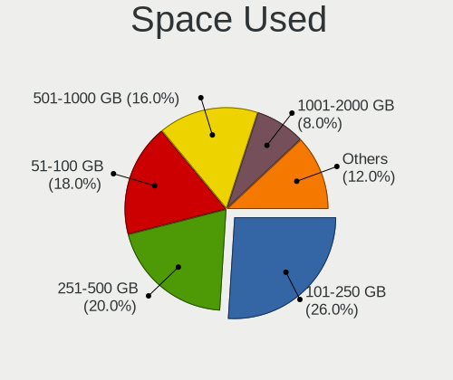
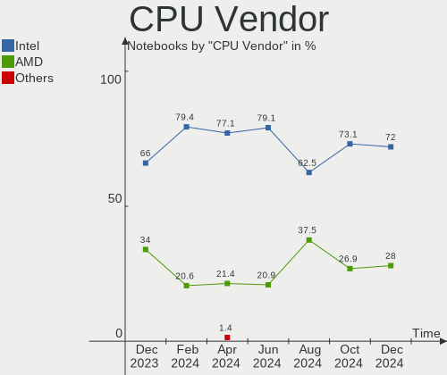
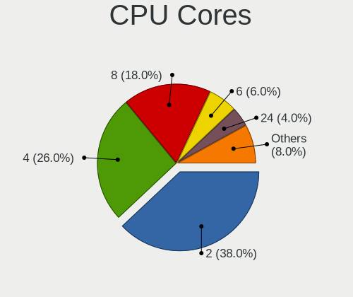

openSUSE - Hardware Trends (Notebooks)
--------------------------------------

A project to identify most popular hardware characteristics and track their change
over time based on data collected by Linux users at https://Linux-Hardware.org.

Anyone can contribute to this report by the [hw-probe](https://github.com/linuxhw/hw-probe) tool:

    sudo -E hw-probe -all -upload

This report is for one last month. Overall report since the beginning of time: [TestDays](https://github.com/linuxhw/TestDays)

Period: Feb, 2023.

Contents
--------

* [ System ](#system)
  - [ OS                       ](#os)
  - [ OS Family                ](#os-family)
  - [ Kernel                   ](#kernel)
  - [ Kernel Family            ](#kernel-family)
  - [ Kernel Major Ver.        ](#kernel-major-ver)
  - [ Arch                     ](#arch)
  - [ DE                       ](#de)
  - [ Display Server           ](#display-server)
  - [ Display Manager          ](#display-manager)
  - [ OS Lang                  ](#os-lang)
  - [ Boot Mode                ](#boot-mode)
  - [ Filesystem               ](#filesystem)
  - [ Part. scheme             ](#part-scheme)
  - [ Dual Boot with Linux/BSD ](#dual-boot-with-linuxbsd)
  - [ Dual Boot (Win)          ](#dual-boot-win)

* [ Board ](#board)
  - [ Vendor                   ](#vendor)
  - [ Model                    ](#model)
  - [ Model Family             ](#model-family)
  - [ MFG Year                 ](#mfg-year)
  - [ Form Factor              ](#form-factor)
  - [ Secure Boot              ](#secure-boot)
  - [ Coreboot                 ](#coreboot)
  - [ RAM Size                 ](#ram-size)
  - [ RAM Used                 ](#ram-used)
  - [ Total Drives             ](#total-drives)
  - [ Has CD-ROM               ](#has-cd-rom)
  - [ Has Ethernet             ](#has-ethernet)
  - [ Has WiFi                 ](#has-wifi)
  - [ Has Bluetooth            ](#has-bluetooth)

* [ Location ](#location)
  - [ Country                  ](#country)
  - [ City                     ](#city)

* [ Drives ](#drives)
  - [ Drive Vendor             ](#drive-vendor)
  - [ Drive Model              ](#drive-model)
  - [ HDD Vendor               ](#hdd-vendor)
  - [ SSD Vendor               ](#ssd-vendor)
  - [ Drive Kind               ](#drive-kind)
  - [ Drive Connector          ](#drive-connector)
  - [ Drive Size               ](#drive-size)
  - [ Space Total              ](#space-total)
  - [ Space Used               ](#space-used)
  - [ Malfunc. Drives          ](#malfunc-drives)
  - [ Malfunc. Drive Vendor    ](#malfunc-drive-vendor)
  - [ Malfunc. HDD Vendor      ](#malfunc-hdd-vendor)
  - [ Malfunc. Drive Kind      ](#malfunc-drive-kind)
  - [ Failed Drives            ](#failed-drives)
  - [ Failed Drive Vendor      ](#failed-drive-vendor)
  - [ Drive Status             ](#drive-status)

* [ Storage controller ](#storage-controller)
  - [ Storage Vendor           ](#storage-vendor)
  - [ Storage Model            ](#storage-model)
  - [ Storage Kind             ](#storage-kind)

* [ Processor ](#processor)
  - [ CPU Vendor               ](#cpu-vendor)
  - [ CPU Model                ](#cpu-model)
  - [ CPU Model Family         ](#cpu-model-family)
  - [ CPU Cores                ](#cpu-cores)
  - [ CPU Sockets              ](#cpu-sockets)
  - [ CPU Threads              ](#cpu-threads)
  - [ CPU Op-Modes             ](#cpu-op-modes)
  - [ CPU Microcode            ](#cpu-microcode)
  - [ CPU Microarch            ](#cpu-microarch)

* [ Graphics ](#graphics)
  - [ GPU Vendor               ](#gpu-vendor)
  - [ GPU Model                ](#gpu-model)
  - [ GPU Combo                ](#gpu-combo)
  - [ GPU Driver               ](#gpu-driver)
  - [ GPU Memory               ](#gpu-memory)

* [ Monitor ](#monitor)
  - [ Monitor Vendor           ](#monitor-vendor)
  - [ Monitor Model            ](#monitor-model)
  - [ Monitor Resolution       ](#monitor-resolution)
  - [ Monitor Diagonal         ](#monitor-diagonal)
  - [ Monitor Width            ](#monitor-width)
  - [ Aspect Ratio             ](#aspect-ratio)
  - [ Monitor Area             ](#monitor-area)
  - [ Pixel Density            ](#pixel-density)
  - [ Multiple Monitors        ](#multiple-monitors)

* [ Network ](#network)
  - [ Net Controller Vendor    ](#net-controller-vendor)
  - [ Net Controller Model     ](#net-controller-model)
  - [ Wireless Vendor          ](#wireless-vendor)
  - [ Wireless Model           ](#wireless-model)
  - [ Ethernet Vendor          ](#ethernet-vendor)
  - [ Ethernet Model           ](#ethernet-model)
  - [ Net Controller Kind      ](#net-controller-kind)
  - [ Used Controller          ](#used-controller)
  - [ NICs                     ](#nics)
  - [ IPv6                     ](#ipv6)

* [ Bluetooth ](#bluetooth)
  - [ Bluetooth Vendor         ](#bluetooth-vendor)
  - [ Bluetooth Model          ](#bluetooth-model)

* [ Sound ](#sound)
  - [ Sound Vendor             ](#sound-vendor)
  - [ Sound Model              ](#sound-model)

* [ Memory ](#memory)
  - [ Memory Vendor            ](#memory-vendor)
  - [ Memory Model             ](#memory-model)
  - [ Memory Kind              ](#memory-kind)
  - [ Memory Form Factor       ](#memory-form-factor)
  - [ Memory Size              ](#memory-size)
  - [ Memory Speed             ](#memory-speed)

* [ Printers & scanners ](#printers--scanners)
  - [ Printer Vendor           ](#printer-vendor)
  - [ Printer Model            ](#printer-model)
  - [ Scanner Vendor           ](#scanner-vendor)
  - [ Scanner Model            ](#scanner-model)

* [ Camera ](#camera)
  - [ Camera Vendor            ](#camera-vendor)
  - [ Camera Model             ](#camera-model)

* [ Security ](#security)
  - [ Fingerprint Vendor       ](#fingerprint-vendor)
  - [ Fingerprint Model        ](#fingerprint-model)
  - [ Chipcard Vendor          ](#chipcard-vendor)
  - [ Chipcard Model           ](#chipcard-model)

* [ Unsupported ](#unsupported)
  - [ Unsupported Devices      ](#unsupported-devices)
  - [ Unsupported Device Types ](#unsupported-device-types)

System
------

OS
--

Installed operating systems

| Name                         | Notebooks | Percent |
|------------------------------|-----------|---------|
| openSUSE Tumbleweed-XXXXXXXX | 30        | 78.95%  |
| openSUSE Microos-XXXXXXXX    | 4         | 10.53%  |
| openSUSE Leap-15.4           | 3         | 7.89%   |
| openSUSE Leap-15.3           | 1         | 2.63%   |

OS Family
---------

OS without a version

| Name     | Notebooks | Percent |
|----------|-----------|---------|
| openSUSE | 38        | 100%    |

Kernel
------

Version of the Linux kernel

| Version                      | Notebooks | Percent |
|------------------------------|-----------|---------|
| 6.1.12-1-default             | 12        | 31.58%  |
| 6.1.10-1-default             | 10        | 26.32%  |
| 6.1.8-1-default              | 9         | 23.68%  |
| 5.14.21-150400.24.41-default | 3         | 7.89%   |
| 6.1.10-5-default             | 1         | 2.63%   |
| 6.1.10-1-vanilla             | 1         | 2.63%   |
| 6.1.1-1-default              | 1         | 2.63%   |
| 5.3.18-150300.59.106-default | 1         | 2.63%   |

Kernel Family
-------------

Linux kernel without a distro release

| Version | Notebooks | Percent |
|---------|-----------|---------|
| 6.1.12  | 12        | 31.58%  |
| 6.1.10  | 12        | 31.58%  |
| 6.1.8   | 9         | 23.68%  |
| 5.14.21 | 3         | 7.89%   |
| 6.1.1   | 1         | 2.63%   |
| 5.3.18  | 1         | 2.63%   |

Kernel Major Ver.
-----------------

Linux kernel major version

| Version | Notebooks | Percent |
|---------|-----------|---------|
| 6.1     | 34        | 89.47%  |
| 5.14    | 3         | 7.89%   |
| 5.3     | 1         | 2.63%   |

Arch
----

OS architecture (x86_64, i586, etc.)

| Name   | Notebooks | Percent |
|--------|-----------|---------|
| x86_64 | 38        | 100%    |

DE
--

Desktop Environment

| Name    | Notebooks | Percent |
|---------|-----------|---------|
| KDE5    | 28        | 73.68%  |
| GNOME   | 6         | 15.79%  |
| Unknown | 2         | 5.26%   |
| XFCE    | 1         | 2.63%   |
| KDE     | 1         | 2.63%   |

Display Server
--------------

X11 or Wayland

| Name    | Notebooks | Percent |
|---------|-----------|---------|
| X11     | 28        | 73.68%  |
| Wayland | 9         | 23.68%  |
| Tty     | 1         | 2.63%   |

Display Manager
---------------

SDDM, LightDM, etc.

| Name    | Notebooks | Percent |
|---------|-----------|---------|
| Unknown | 22        | 57.89%  |
| SDDM    | 12        | 31.58%  |
| LightDM | 3         | 7.89%   |
| XDM     | 1         | 2.63%   |

OS Lang
-------

Language

| Lang  | Notebooks | Percent |
|-------|-----------|---------|
| en_US | 15        | 39.47%  |
| de_DE | 9         | 23.68%  |
| pl_PL | 3         | 7.89%   |
| pt_BR | 2         | 5.26%   |
| POSIX | 2         | 5.26%   |
| es_ES | 2         | 5.26%   |
| nl_NL | 1         | 2.63%   |
| fr_FR | 1         | 2.63%   |
| en_GB | 1         | 2.63%   |
| en_DE | 1         | 2.63%   |
| bg_BG | 1         | 2.63%   |

Boot Mode
---------

EFI or BIOS

| Mode | Notebooks | Percent |
|------|-----------|---------|
| EFI  | 28        | 73.68%  |
| BIOS | 10        | 26.32%  |

Filesystem
----------

Type of filesystem

| Type    | Notebooks | Percent |
|---------|-----------|---------|
| Btrfs   | 29        | 76.32%  |
| Ext4    | 7         | 18.42%  |
| Xfs     | 1         | 2.63%   |
| Overlay | 1         | 2.63%   |

Part. scheme
------------

Scheme of partitioning

| Type    | Notebooks | Percent |
|---------|-----------|---------|
| Unknown | 20        | 52.63%  |
| GPT     | 15        | 39.47%  |
| MBR     | 3         | 7.89%   |

Dual Boot with Linux/BSD
------------------------

Hosting more than one Linux/BSD

| Dual boot | Notebooks | Percent |
|-----------|-----------|---------|
| No        | 38        | 100%    |

Dual Boot (Win)
---------------

Hosting Linux and Windows

| Dual boot | Notebooks | Percent |
|-----------|-----------|---------|
| No        | 30        | 78.95%  |
| Yes       | 8         | 21.05%  |

Board
-----

Vendor
------

Motherboard manufacturer

| Name                | Notebooks | Percent |
|---------------------|-----------|---------|
| Lenovo              | 9         | 23.68%  |
| ASUSTek Computer    | 8         | 21.05%  |
| Hewlett-Packard     | 5         | 13.16%  |
| Dell                | 5         | 13.16%  |
| TUXEDO              | 1         | 2.63%   |
| Toshiba             | 1         | 2.63%   |
| SK hynix            | 1         | 2.63%   |
| Schenker            | 1         | 2.63%   |
| Samsung Electronics | 1         | 2.63%   |
| Medion              | 1         | 2.63%   |
| HUAWEI              | 1         | 2.63%   |
| Google              | 1         | 2.63%   |
| AXDIA International | 1         | 2.63%   |
| Acer                | 1         | 2.63%   |
| Unknown             | 1         | 2.63%   |

Model
-----

Motherboard model

| Name                                   | Notebooks | Percent |
|----------------------------------------|-----------|---------|
| TUXEDO InfinityBook S 15/17 Gen7       | 1         | 2.63%   |
| Toshiba PORTEGE Z830                   | 1         | 2.63%   |
| SK hynix HyBook                        | 1         | 2.63%   |
| Schenker VIA 15                        | 1         | 2.63%   |
| Samsung 550XDA                         | 1         | 2.63%   |
| Medion P6624                           | 1         | 2.63%   |
| Lenovo ThinkPad W510 4391W3V           | 1         | 2.63%   |
| Lenovo ThinkPad T440s 20ARS2V900       | 1         | 2.63%   |
| Lenovo ThinkPad T14 Gen 2i 20W1S34Y00  | 1         | 2.63%   |
| Lenovo ThinkPad P50 20EN001SUS         | 1         | 2.63%   |
| Lenovo Legion 5 Pro 16ARH7H 82RG       | 1         | 2.63%   |
| Lenovo IdeaPad Y900-17ISK 80Q1         | 1         | 2.63%   |
| Lenovo IdeaPad S145-15API 81V7         | 1         | 2.63%   |
| Lenovo IdeaPad 5 Pro 16ARH7 82SN       | 1         | 2.63%   |
| Lenovo Flex 2-14D 20376                | 1         | 2.63%   |
| HUAWEI BOHK-WAX9X                      | 1         | 2.63%   |
| HP ProBook 6460b                       | 1         | 2.63%   |
| HP ProBook 4540s                       | 1         | 2.63%   |
| HP Notebook                            | 1         | 2.63%   |
| HP ENVY Laptop 13-ah0xxx               | 1         | 2.63%   |
| HP Compaq 6720s                        | 1         | 2.63%   |
| Google Lillipup                        | 1         | 2.63%   |
| Dell XPS 9320                          | 1         | 2.63%   |
| Dell Precision 5570                    | 1         | 2.63%   |
| Dell Latitude E7470                    | 1         | 2.63%   |
| Dell Latitude 5421                     | 1         | 2.63%   |
| Dell Inspiron 5502                     | 1         | 2.63%   |
| AXDIA International WINDESK9 3G v2     | 1         | 2.63%   |
| ASUS ZenBook UX325UA_UM325UA           | 1         | 2.63%   |
| ASUS X541NA                            | 1         | 2.63%   |
| ASUS VivoBook_ASUSLaptop X515MA_X515MA | 1         | 2.63%   |
| ASUS ROG Strix G713QE_G713QE           | 1         | 2.63%   |
| ASUS ROG Strix G513QY_G513QY           | 1         | 2.63%   |
| ASUS G771JW                            | 1         | 2.63%   |
| ASUS ASUSPRO P5440FA_P5440FA           | 1         | 2.63%   |
| ASUS ASUS TUF Dash F15 FX517ZM_FX517ZM | 1         | 2.63%   |
| Acer Aspire A314-35                    | 1         | 2.63%   |
| Unknown                                | 1         | 2.63%   |

Model Family
------------

Motherboard model prefix

| Name                         | Notebooks | Percent |
|------------------------------|-----------|---------|
| Lenovo ThinkPad              | 4         | 10.53%  |
| Lenovo IdeaPad               | 3         | 7.89%   |
| HP ProBook                   | 2         | 5.26%   |
| Dell Latitude                | 2         | 5.26%   |
| ASUS ROG                     | 2         | 5.26%   |
| TUXEDO InfinityBook          | 1         | 2.63%   |
| Toshiba PORTEGE              | 1         | 2.63%   |
| SK hynix HyBook              | 1         | 2.63%   |
| Schenker VIA                 | 1         | 2.63%   |
| Samsung 550XDA               | 1         | 2.63%   |
| Medion P6624                 | 1         | 2.63%   |
| Lenovo Legion                | 1         | 2.63%   |
| Lenovo Flex                  | 1         | 2.63%   |
| HUAWEI BOHK-WAX9X            | 1         | 2.63%   |
| HP Notebook                  | 1         | 2.63%   |
| HP ENVY                      | 1         | 2.63%   |
| HP Compaq                    | 1         | 2.63%   |
| Google Lillipup              | 1         | 2.63%   |
| Dell XPS                     | 1         | 2.63%   |
| Dell Precision               | 1         | 2.63%   |
| Dell Inspiron                | 1         | 2.63%   |
| AXDIA International WINDESK9 | 1         | 2.63%   |
| ASUS ZenBook                 | 1         | 2.63%   |
| ASUS X541NA                  | 1         | 2.63%   |
| ASUS VivoBook                | 1         | 2.63%   |
| ASUS G771JW                  | 1         | 2.63%   |
| ASUS ASUSPRO                 | 1         | 2.63%   |
| ASUS ASUS                    | 1         | 2.63%   |
| Acer Aspire                  | 1         | 2.63%   |
| Unknown                      | 1         | 2.63%   |

MFG Year
--------

Motherboard manufacture year

| Year | Notebooks | Percent |
|------|-----------|---------|
| 2021 | 9         | 23.68%  |
| 2022 | 6         | 15.79%  |
| 2019 | 4         | 10.53%  |
| 2015 | 4         | 10.53%  |
| 2020 | 3         | 7.89%   |
| 2012 | 2         | 5.26%   |
| 2010 | 2         | 5.26%   |
| 2023 | 1         | 2.63%   |
| 2018 | 1         | 2.63%   |
| 2017 | 1         | 2.63%   |
| 2016 | 1         | 2.63%   |
| 2014 | 1         | 2.63%   |
| 2013 | 1         | 2.63%   |
| 2011 | 1         | 2.63%   |
| 2007 | 1         | 2.63%   |

Form Factor
-----------

Physical design of the computer

| Name     | Notebooks | Percent |
|----------|-----------|---------|
| Notebook | 38        | 100%    |

Secure Boot
-----------

Enabled or disabled

| State    | Notebooks | Percent |
|----------|-----------|---------|
| Disabled | 28        | 73.68%  |
| Enabled  | 10        | 26.32%  |

Coreboot
--------

Have coreboot on board

| Used | Notebooks | Percent |
|------|-----------|---------|
| No   | 37        | 97.37%  |
| Yes  | 1         | 2.63%   |

RAM Size
--------

Total RAM memory

| Size in GB  | Notebooks | Percent |
|-------------|-----------|---------|
| 4.01-8.0    | 13        | 34.21%  |
| 8.01-16.0   | 8         | 21.05%  |
| 16.01-24.0  | 6         | 15.79%  |
| 3.01-4.0    | 4         | 10.53%  |
| 32.01-64.0  | 3         | 7.89%   |
| 24.01-32.0  | 1         | 2.63%   |
| 64.01-256.0 | 1         | 2.63%   |
| 1.01-2.0    | 1         | 2.63%   |
| 0.51-1.0    | 1         | 2.63%   |

RAM Used
--------

Used RAM memory

| Used GB   | Notebooks | Percent |
|-----------|-----------|---------|
| 2.01-3.0  | 10        | 26.32%  |
| 4.01-8.0  | 9         | 23.68%  |
| 3.01-4.0  | 8         | 21.05%  |
| 1.01-2.0  | 6         | 15.79%  |
| 8.01-16.0 | 3         | 7.89%   |
| 0.51-1.0  | 1         | 2.63%   |
| 0.01-0.5  | 1         | 2.63%   |

Total Drives
------------

Number of drives on board

| Drives | Notebooks | Percent |
|--------|-----------|---------|
| 1      | 29        | 76.32%  |
| 2      | 7         | 18.42%  |
| 3      | 2         | 5.26%   |

Has CD-ROM
----------

Has CD-ROM on board

| Presented | Notebooks | Percent |
|-----------|-----------|---------|
| No        | 30        | 78.95%  |
| Yes       | 8         | 21.05%  |

Has Ethernet
------------

Has Ethernet on board

| Presented | Notebooks | Percent |
|-----------|-----------|---------|
| Yes       | 25        | 65.79%  |
| No        | 13        | 34.21%  |

Has WiFi
--------

Has WiFi module

| Presented | Notebooks | Percent |
|-----------|-----------|---------|
| Yes       | 37        | 97.37%  |
| No        | 1         | 2.63%   |

Has Bluetooth
-------------

Has Bluetooth module

| Presented | Notebooks | Percent |
|-----------|-----------|---------|
| Yes       | 32        | 84.21%  |
| No        | 6         | 15.79%  |

Location
--------

Country
-------

Geographic location (country)

| Country      | Notebooks | Percent |
|--------------|-----------|---------|
| Germany      | 12        | 31.58%  |
| USA          | 4         | 10.53%  |
| Poland       | 3         | 7.89%   |
| Spain        | 2         | 5.26%   |
| Brazil       | 2         | 5.26%   |
| Turkey       | 1         | 2.63%   |
| Sweden       | 1         | 2.63%   |
| South Africa | 1         | 2.63%   |
| Serbia       | 1         | 2.63%   |
| Romania      | 1         | 2.63%   |
| Philippines  | 1         | 2.63%   |
| Netherlands  | 1         | 2.63%   |
| Italy        | 1         | 2.63%   |
| France       | 1         | 2.63%   |
| Denmark      | 1         | 2.63%   |
| Bulgaria     | 1         | 2.63%   |
| Bolivia      | 1         | 2.63%   |
| Belgium      | 1         | 2.63%   |
| Austria      | 1         | 2.63%   |
| Argentina    | 1         | 2.63%   |

City
----

Geographic location (city)

| City           | Notebooks | Percent |
|----------------|-----------|---------|
| Berlin         | 2         | 5.26%   |
| Zarnowiec      | 1         | 2.63%   |
| Warsaw         | 1         | 2.63%   |
| Viersen        | 1         | 2.63%   |
| Varna          | 1         | 2.63%   |
| Tacoma         | 1         | 2.63%   |
| Stockholm      | 1         | 2.63%   |
| Steinhagen     | 1         | 2.63%   |
| Santa Cruz     | 1         | 2.63%   |
| Rio Branco     | 1         | 2.63%   |
| Pretoria       | 1         | 2.63%   |
| Port Orchard   | 1         | 2.63%   |
| Pedro Leopoldo | 1         | 2.63%   |
| Paris          | 1         | 2.63%   |
| Padova         | 1         | 2.63%   |
| Oldenburg      | 1         | 2.63%   |
| Norderstedt    | 1         | 2.63%   |
| Milford        | 1         | 2.63%   |
| Lodz           | 1         | 2.63%   |
| Linsengericht  | 1         | 2.63%   |
| Lincoln        | 1         | 2.63%   |
| Leskovac       | 1         | 2.63%   |
| Langenfeld     | 1         | 2.63%   |
| Konya          | 1         | 2.63%   |
| Hastiere       | 1         | 2.63%   |
| Gross-Gerau    | 1         | 2.63%   |
| Graz           | 1         | 2.63%   |
| Essen          | 1         | 2.63%   |
| Ennepetal      | 1         | 2.63%   |
| Duisburg       | 1         | 2.63%   |
| Cebu City      | 1         | 2.63%   |
| Cartagena      | 1         | 2.63%   |
| Bucharest      | 1         | 2.63%   |
| Brondby Strand | 1         | 2.63%   |
| Barcelona      | 1         | 2.63%   |
| Apostoles      | 1         | 2.63%   |
| Almere Stad    | 1         | 2.63%   |

Drives
------

Drive Vendor
------------

Hard drive vendors

| Vendor                      | Notebooks | Drives | Percent |
|-----------------------------|-----------|--------|---------|
| Samsung Electronics         | 10        | 11     | 21.28%  |
| Toshiba                     | 5         | 5      | 10.64%  |
| SK hynix                    | 5         | 5      | 10.64%  |
| Unknown                     | 4         | 4      | 8.51%   |
| WDC                         | 3         | 3      | 6.38%   |
| Seagate                     | 2         | 2      | 4.26%   |
| Sandisk                     | 2         | 2      | 4.26%   |
| KIOXIA                      | 2         | 2      | 4.26%   |
| Kingston Technology Company | 2         | 2      | 4.26%   |
| Kingston                    | 2         | 2      | 4.26%   |
| Intel                       | 2         | 2      | 4.26%   |
| HGST                        | 2         | 2      | 4.26%   |
| Crucial                     | 2         | 2      | 4.26%   |
| SPCC                        | 1         | 1      | 2.13%   |
| Kimtigo                     | 1         | 1      | 2.13%   |
| ADATA Technology            | 1         | 1      | 2.13%   |
| Unknown                     | 1         | 1      | 2.13%   |

Drive Model
-----------

Hard drive models

| Model                                                | Notebooks | Percent |
|------------------------------------------------------|-----------|---------|
| Samsung NVMe SSD Controller PM9A1/PM9A3/980PRO 960GB | 4         | 8.33%   |
| SK hynix HFM512GD3JX013N 512GB                       | 2         | 4.17%   |
| Sandisk WD Blue SN550 NVMe SSD 1TB                   | 2         | 4.17%   |
| WDC WD5000LPCX-24C6HT0 500GB                         | 1         | 2.08%   |
| WDC WD10SPZX-24Z10 1TB                               | 1         | 2.08%   |
| WDC WD10SPCX-24HWST1 1TB                             | 1         | 2.08%   |
| Unknown MMC Card  64GB                               | 1         | 2.08%   |
| Unknown MMC Card  32GB                               | 1         | 2.08%   |
| Unknown MMC Card  256GB                              | 1         | 2.08%   |
| Unknown MMC Card  128GB                              | 1         | 2.08%   |
| Toshiba THNSNB128GMCJ 128GB SSD                      | 1         | 2.08%   |
| Toshiba THNSFJ256GDNU A 256GB SSD                    | 1         | 2.08%   |
| Toshiba MQ01ABF050 500GB                             | 1         | 2.08%   |
| Toshiba MQ01ABD100 1TB                               | 1         | 2.08%   |
| Toshiba KXG50ZNV256G 256GB                           | 1         | 2.08%   |
| SPCC Solid State Disk 512GB                          | 1         | 2.08%   |
| SK hynix SKHynix_HFS512GDE9X081N 512GB               | 1         | 2.08%   |
| SK hynix PC801 NVMe 1TB                              | 1         | 2.08%   |
| SK hynix BC511 512GB                                 | 1         | 2.08%   |
| Seagate ST1000LM035-1RK172 1TB                       | 1         | 2.08%   |
| Seagate Expansion 1TB                                | 1         | 2.08%   |
| Samsung SSD 860 EVO M.2 500GB                        | 1         | 2.08%   |
| Samsung Portable SSD T1 250GB                        | 1         | 2.08%   |
| Samsung NVMe SSD Controller SM981/PM981/PM983 250GB  | 1         | 2.08%   |
| Samsung NVMe SSD Controller SM961/PM961/SM963 512GB  | 1         | 2.08%   |
| Samsung NVMe SSD Controller SM951/PM951 256GB        | 1         | 2.08%   |
| Samsung MZVLQ1T0HBLB-00B00 1024GB                    | 1         | 2.08%   |
| Samsung HM641JI 640GB                                | 1         | 2.08%   |
| KIOXIA KXG70ZNV512G NVMe 512GB                       | 1         | 2.08%   |
| KIOXIA KBG40ZNS128G NVMe 128GB                       | 1         | 2.08%   |
| Kingston Company SNV2S1000G 1TB                      | 1         | 2.08%   |
| Kingston Company SFYRD4000G 4TB                      | 1         | 2.08%   |
| Kingston SA400S37120G 120GB SSD                      | 1         | 2.08%   |
| Kingston RBU-SC100S37128GD 128GB SSD                 | 1         | 2.08%   |
| Kimtigo SSD 256GB HNSA21A153Z                        | 1         | 2.08%   |
| Intel SSDSC2BF240A4L 240GB                           | 1         | 2.08%   |
| Intel SSDPEKNU512GZ 512GB                            | 1         | 2.08%   |
| HGST HTS545050A7E680 500GB                           | 1         | 2.08%   |
| HGST HTS541010A9E680 1TB                             | 1         | 2.08%   |
| Crucial CT500MX500SSD1 500GB                         | 1         | 2.08%   |

HDD Vendor
----------

Hard disk drive vendors

| Vendor              | Notebooks | Drives | Percent |
|---------------------|-----------|--------|---------|
| WDC                 | 3         | 3      | 30%     |
| Toshiba             | 2         | 2      | 20%     |
| Seagate             | 2         | 2      | 20%     |
| HGST                | 2         | 2      | 20%     |
| Samsung Electronics | 1         | 1      | 10%     |

SSD Vendor
----------

Solid state drive vendors

| Vendor              | Notebooks | Drives | Percent |
|---------------------|-----------|--------|---------|
| Toshiba             | 2         | 2      | 16.67%  |
| Samsung Electronics | 2         | 2      | 16.67%  |
| Kingston            | 2         | 2      | 16.67%  |
| Crucial             | 2         | 2      | 16.67%  |
| SPCC                | 1         | 1      | 8.33%   |
| Kimtigo             | 1         | 1      | 8.33%   |
| Intel               | 1         | 1      | 8.33%   |
| Unknown             | 1         | 1      | 8.33%   |

Drive Kind
----------

HDD or SSD

| Kind | Notebooks | Drives | Percent |
|------|-----------|--------|---------|
| NVMe | 19        | 22     | 42.22%  |
| SSD  | 12        | 12     | 26.67%  |
| HDD  | 10        | 10     | 22.22%  |
| MMC  | 4         | 4      | 8.89%   |

Drive Connector
---------------

SATA, SAS, NVMe, etc.

| Type | Notebooks | Drives | Percent |
|------|-----------|--------|---------|
| NVMe | 19        | 22     | 43.18%  |
| SATA | 19        | 20     | 43.18%  |
| MMC  | 4         | 4      | 9.09%   |
| SAS  | 2         | 2      | 4.55%   |

Drive Size
----------

Size of hard drive

| Size in TB | Notebooks | Drives | Percent |
|------------|-----------|--------|---------|
| 0.01-0.5   | 13        | 13     | 61.9%   |
| 0.51-1.0   | 8         | 9      | 38.1%   |

Space Total
-----------

Amount of disk space available on the file system

| Size in GB     | Notebooks | Percent |
|----------------|-----------|---------|
| More than 3000 | 13        | 34.21%  |
| 1001-2000      | 9         | 23.68%  |
| 501-1000       | 6         | 15.79%  |
| 2001-3000      | 4         | 10.53%  |
| 21-50          | 2         | 5.26%   |
| 101-250        | 2         | 5.26%   |
| 251-500        | 1         | 2.63%   |
| 1-20           | 1         | 2.63%   |

Space Used
----------

Amount of used disk space

| Used GB        | Notebooks | Percent |
|----------------|-----------|---------|
| 101-250        | 10        | 26.32%  |
| 51-100         | 9         | 23.68%  |
| 501-1000       | 5         | 13.16%  |
| 251-500        | 4         | 10.53%  |
| 1001-2000      | 3         | 7.89%   |
| 1-20           | 3         | 7.89%   |
| 2001-3000      | 2         | 5.26%   |
| More than 3000 | 1         | 2.63%   |
| 21-50          | 1         | 2.63%   |

Malfunc. Drives
---------------

Drive models with a malfunction

Zero info for selected period =(

Malfunc. Drive Vendor
---------------------

Vendors of faulty drives

Zero info for selected period =(

Malfunc. HDD Vendor
-------------------

Vendors of faulty HDD drives

Zero info for selected period =(

Malfunc. Drive Kind
-------------------

Kinds of faulty drives

Zero info for selected period =(

Failed Drives
-------------

Failed drive models

Zero info for selected period =(

Failed Drive Vendor
-------------------

Failed drive vendors

Zero info for selected period =(

Drive Status
------------

Number of failed and malfunc. drives

| Status   | Notebooks | Drives | Percent |
|----------|-----------|--------|---------|
| Detected | 22        | 31     | 57.89%  |
| Works    | 16        | 17     | 42.11%  |

Storage controller
------------------

Storage Vendor
--------------

Storage controller vendors

| Vendor                       | Notebooks | Percent |
|------------------------------|-----------|---------|
| Intel                        | 23        | 47.92%  |
| Samsung Electronics          | 8         | 16.67%  |
| SK hynix                     | 5         | 10.42%  |
| AMD                          | 4         | 8.33%   |
| SanDisk                      | 2         | 4.17%   |
| KIOXIA                       | 2         | 4.17%   |
| Kingston Technology Company  | 2         | 4.17%   |
| Toshiba America Info Systems | 1         | 2.08%   |
| ADATA Technology             | 1         | 2.08%   |

Storage Model
-------------

Storage controller models

| Model                                                                          | Notebooks | Percent |
|--------------------------------------------------------------------------------|-----------|---------|
| Samsung NVMe SSD Controller PM9A1/PM9A3/980PRO                                 | 4         | 7.84%   |
| AMD FCH SATA Controller [AHCI mode]                                            | 4         | 7.84%   |
| SK hynix Gold P31/PC711 NVMe Solid State Drive                                 | 3         | 5.88%   |
| Intel Volume Management Device NVMe RAID Controller                            | 3         | 5.88%   |
| SanDisk WD Blue SN550 NVMe SSD                                                 | 2         | 3.92%   |
| Kingston Company Company Non-Volatile memory controller                        | 2         | 3.92%   |
| Intel Q170/Q150/B150/H170/H110/Z170/CM236 Chipset SATA Controller [AHCI Mode]  | 2         | 3.92%   |
| Intel Celeron/Pentium Silver Processor SATA Controller                         | 2         | 3.92%   |
| Intel 82801 Mobile SATA Controller [RAID mode]                                 | 2         | 3.92%   |
| Intel 6 Series/C200 Series Chipset Family 6 port Mobile SATA AHCI Controller   | 2         | 3.92%   |
| Toshiba America Info Systems XG5 NVMe SSD Controller                           | 1         | 1.96%   |
| SK hynix Platinum P41 NVMe Solid State Drive 2TB                               | 1         | 1.96%   |
| SK hynix BC511                                                                 | 1         | 1.96%   |
| Samsung NVMe SSD Controller SM981/PM981/PM983                                  | 1         | 1.96%   |
| Samsung NVMe SSD Controller SM961/PM961/SM963                                  | 1         | 1.96%   |
| Samsung NVMe SSD Controller SM951/PM951                                        | 1         | 1.96%   |
| Samsung NVMe SSD Controller 980                                                | 1         | 1.96%   |
| KIOXIA NVMe SSD Controller BG4                                                 | 1         | 1.96%   |
| KIOXIA Non-Volatile memory controller                                          | 1         | 1.96%   |
| Intel Tiger Lake-LP SATA Controller                                            | 1         | 1.96%   |
| Intel Sunrise Point-LP SATA Controller [AHCI mode]                             | 1         | 1.96%   |
| Intel Non-Volatile memory controller                                           | 1         | 1.96%   |
| Intel Jasper Lake SATA AHCI Controller                                         | 1         | 1.96%   |
| Intel Comet Lake SATA AHCI Controller                                          | 1         | 1.96%   |
| Intel Celeron N3350/Pentium N4200/Atom E3900 Series SATA AHCI Controller       | 1         | 1.96%   |
| Intel 82801HM/HEM (ICH8M/ICH8M-E) SATA Controller [AHCI mode]                  | 1         | 1.96%   |
| Intel 82801HM/HEM (ICH8M/ICH8M-E) IDE Controller                               | 1         | 1.96%   |
| Intel 8 Series/C220 Series Chipset Family 6-port SATA Controller 1 [AHCI mode] | 1         | 1.96%   |
| Intel 8 Series SATA Controller 1 [AHCI mode]                                   | 1         | 1.96%   |
| Intel 7 Series Chipset Family 4-port SATA Controller [IDE mode]                | 1         | 1.96%   |
| Intel 7 Series Chipset Family 2-port SATA Controller [IDE mode]                | 1         | 1.96%   |
| Intel 5 Series/3400 Series Chipset 6 port SATA AHCI Controller                 | 1         | 1.96%   |
| Intel 5 Series/3400 Series Chipset 4 port SATA AHCI Controller                 | 1         | 1.96%   |
| AMD FCH IDE Controller                                                         | 1         | 1.96%   |
| ADATA XPG SX8200 Pro PCIe Gen3x4 M.2 2280 Solid State Drive                    | 1         | 1.96%   |

Storage Kind
------------

Kind of storage controller (IDE, SATA, NVMe, SAS, ...)

| Kind | Notebooks | Percent |
|------|-----------|---------|
| SATA | 20        | 42.55%  |
| NVMe | 19        | 40.43%  |
| RAID | 5         | 10.64%  |
| IDE  | 3         | 6.38%   |

Processor
---------

CPU Vendor
----------

Processor vendors

| Vendor | Notebooks | Percent |
|--------|-----------|---------|
| Intel  | 28        | 73.68%  |
| AMD    | 10        | 26.32%  |

CPU Model
---------

Processor models

| Model                                         | Notebooks | Percent |
|-----------------------------------------------|-----------|---------|
| Intel 11th Gen Core i3-1115G4 @ 3.00GHz       | 3         | 7.89%   |
| AMD Ryzen 5 3500U with Radeon Vega Mobile Gfx | 3         | 7.89%   |
| Intel Celeron N4020 CPU @ 1.10GHz             | 2         | 5.26%   |
| Intel 12th Gen Core i7-1260P                  | 2         | 5.26%   |
| Intel Xeon CPU E3-1505M v5 @ 2.80GHz          | 1         | 2.63%   |
| Intel Pentium Silver N6000 @ 1.10GHz          | 1         | 2.63%   |
| Intel Pentium CPU N4200 @ 1.10GHz             | 1         | 2.63%   |
| Intel Core i7-8550U CPU @ 1.80GHz             | 1         | 2.63%   |
| Intel Core i7-6820HK CPU @ 2.70GHz            | 1         | 2.63%   |
| Intel Core i7-6600U CPU @ 2.60GHz             | 1         | 2.63%   |
| Intel Core i7-4720HQ CPU @ 2.60GHz            | 1         | 2.63%   |
| Intel Core i7-4600U CPU @ 2.10GHz             | 1         | 2.63%   |
| Intel Core i7 CPU Q 720 @ 1.60GHz             | 1         | 2.63%   |
| Intel Core i5-8265U CPU @ 1.60GHz             | 1         | 2.63%   |
| Intel Core i5-3230M CPU @ 2.60GHz             | 1         | 2.63%   |
| Intel Core i5-2467M CPU @ 1.60GHz             | 1         | 2.63%   |
| Intel Core i5-2410M CPU @ 2.30GHz             | 1         | 2.63%   |
| Intel Core i5-10210U CPU @ 1.60GHz            | 1         | 2.63%   |
| Intel Core i3 CPU M 370 @ 2.40GHz             | 1         | 2.63%   |
| Intel Celeron M CPU 530 @ 1.73GHz             | 1         | 2.63%   |
| Intel Atom CPU Z3735G @ 1.33GHz               | 1         | 2.63%   |
| Intel 12th Gen Core i7-12800H                 | 1         | 2.63%   |
| Intel 12th Gen Core i7-12650H                 | 1         | 2.63%   |
| Intel 11th Gen Core i7-1165G7 @ 2.80GHz       | 1         | 2.63%   |
| Intel 11th Gen Core i5-11500H @ 2.90GHz       | 1         | 2.63%   |
| AMD Ryzen 9 6900HX with Radeon Graphics       | 1         | 2.63%   |
| AMD Ryzen 9 5980HX with Radeon Graphics       | 1         | 2.63%   |
| AMD Ryzen 7 5800H with Radeon Graphics        | 1         | 2.63%   |
| AMD Ryzen 7 5700U with Radeon Graphics        | 1         | 2.63%   |
| AMD Ryzen 5 6600HS Creator Edition            | 1         | 2.63%   |
| AMD E1-6010 APU with AMD Radeon R2 Graphics   | 1         | 2.63%   |
| AMD A8-7050 Radeon R5, 6 Compute Cores 2C+4G  | 1         | 2.63%   |

CPU Model Family
----------------

Processor model prefix

| Model                | Notebooks | Percent |
|----------------------|-----------|---------|
| Other                | 9         | 23.68%  |
| Intel Core i7        | 6         | 15.79%  |
| Intel Core i5        | 5         | 13.16%  |
| AMD Ryzen 5          | 4         | 10.53%  |
| Intel Celeron        | 2         | 5.26%   |
| AMD Ryzen 9          | 2         | 5.26%   |
| AMD Ryzen 7          | 2         | 5.26%   |
| Intel Xeon           | 1         | 2.63%   |
| Intel Pentium Silver | 1         | 2.63%   |
| Intel Pentium        | 1         | 2.63%   |
| Intel Core i3        | 1         | 2.63%   |
| Intel Celeron M      | 1         | 2.63%   |
| Intel Atom           | 1         | 2.63%   |
| AMD E1               | 1         | 2.63%   |
| AMD A8               | 1         | 2.63%   |

CPU Cores
---------

Number of processor cores

| Number | Notebooks | Percent |
|--------|-----------|---------|
| 4      | 14        | 36.84%  |
| 2      | 12        | 31.58%  |
| 8      | 4         | 10.53%  |
| 12     | 2         | 5.26%   |
| 6      | 2         | 5.26%   |
| 1      | 2         | 5.26%   |
| 14     | 1         | 2.63%   |
| 10     | 1         | 2.63%   |

CPU Sockets
-----------

Number of sockets

| Number | Notebooks | Percent |
|--------|-----------|---------|
| 1      | 38        | 100%    |

CPU Threads
-----------

Threads per core (Hyper-Threading)

| Number | Notebooks | Percent |
|--------|-----------|---------|
| 2      | 31        | 81.58%  |
| 1      | 7         | 18.42%  |

CPU Op-Modes
------------

CPU Operation Modes (32-bit, 64-bit)

| Op mode        | Notebooks | Percent |
|----------------|-----------|---------|
| 32-bit, 64-bit | 38        | 100%    |

CPU Microcode
-------------

Microcode number

| Number     | Notebooks | Percent |
|------------|-----------|---------|
| Unknown    | 5         | 13.16%  |
| 0x906a3    | 4         | 10.53%  |
| 0x806c1    | 4         | 10.53%  |
| 0x706a8    | 2         | 5.26%   |
| 0x506e3    | 2         | 5.26%   |
| 0x206a7    | 2         | 5.26%   |
| 0x08108102 | 2         | 5.26%   |
| 0x906c0    | 1         | 2.63%   |
| 0x806ec    | 1         | 2.63%   |
| 0x806ea    | 1         | 2.63%   |
| 0x806d1    | 1         | 2.63%   |
| 0x6fa      | 1         | 2.63%   |
| 0x506c9    | 1         | 2.63%   |
| 0x406e3    | 1         | 2.63%   |
| 0x40651    | 1         | 2.63%   |
| 0x306a9    | 1         | 2.63%   |
| 0x30678    | 1         | 2.63%   |
| 0x0a50000c | 1         | 2.63%   |
| 0x0a404102 | 1         | 2.63%   |
| 0x0a404101 | 1         | 2.63%   |
| 0x08608103 | 1         | 2.63%   |
| 0x08108109 | 1         | 2.63%   |
| 0x07030104 | 1         | 2.63%   |
| 0x06003109 | 1         | 2.63%   |

CPU Microarch
-------------

Microarchitecture

| Name             | Notebooks | Percent |
|------------------|-----------|---------|
| TigerLake        | 4         | 10.53%  |
| Alderlake Hybrid | 4         | 10.53%  |
| Zen+             | 3         | 7.89%   |
| Skylake          | 3         | 7.89%   |
| KabyLake         | 3         | 7.89%   |
| Unknown          | 3         | 7.89%   |
| Zen 3            | 2         | 5.26%   |
| SandyBridge      | 2         | 5.26%   |
| Haswell          | 2         | 5.26%   |
| Goldmont plus    | 2         | 5.26%   |
| Westmere         | 1         | 2.63%   |
| Tremont          | 1         | 2.63%   |
| Steamroller      | 1         | 2.63%   |
| Silvermont       | 1         | 2.63%   |
| Puma             | 1         | 2.63%   |
| Nehalem          | 1         | 2.63%   |
| IvyBridge        | 1         | 2.63%   |
| Icelake          | 1         | 2.63%   |
| Goldmont         | 1         | 2.63%   |
| Core             | 1         | 2.63%   |

Graphics
--------

GPU Vendor
----------

Vendors of graphics cards

| Vendor | Notebooks | Percent |
|--------|-----------|---------|
| Intel  | 26        | 57.78%  |
| AMD    | 10        | 22.22%  |
| Nvidia | 9         | 20%     |

GPU Model
---------

Graphics card models

| Model                                                                     | Notebooks | Percent |
|---------------------------------------------------------------------------|-----------|---------|
| Intel Tiger Lake-LP GT2 [UHD Graphics G4]                                 | 3         | 6.52%   |
| Intel Alder Lake-P Integrated Graphics Controller                         | 3         | 6.52%   |
| AMD Picasso/Raven 2 [Radeon Vega Series / Radeon Vega Mobile Series]      | 3         | 6.52%   |
| Intel GeminiLake [UHD Graphics 600]                                       | 2         | 4.35%   |
| Intel 2nd Generation Core Processor Family Integrated Graphics Controller | 2         | 4.35%   |
| AMD Rembrandt [Radeon 680M]                                               | 2         | 4.35%   |
| AMD Cezanne [Radeon Vega Series / Radeon Vega Mobile Series]              | 2         | 4.35%   |
| Nvidia GT216GLM [Quadro FX 880M]                                          | 1         | 2.17%   |
| Nvidia GM204M [GeForce GTX 980M]                                          | 1         | 2.17%   |
| Nvidia GM107M [GeForce GTX 960M]                                          | 1         | 2.17%   |
| Nvidia GM107GLM [Quadro M2000M]                                           | 1         | 2.17%   |
| Nvidia GF108M [GeForce GT 425M]                                           | 1         | 2.17%   |
| Nvidia GA107M [GeForce RTX 3050 Ti Mobile]                                | 1         | 2.17%   |
| Nvidia GA107GLM [RTX A1000 Laptop GPU]                                    | 1         | 2.17%   |
| Nvidia GA106M [GeForce RTX 3060 Mobile / Max-Q]                           | 1         | 2.17%   |
| Nvidia GA104M [Geforce RTX 3070 Ti Laptop GPU]                            | 1         | 2.17%   |
| Intel WhiskeyLake-U GT2 [UHD Graphics 620]                                | 1         | 2.17%   |
| Intel UHD Graphics 620                                                    | 1         | 2.17%   |
| Intel TigerLake-LP GT2 [Iris Xe Graphics]                                 | 1         | 2.17%   |
| Intel TigerLake-H GT1 [UHD Graphics]                                      | 1         | 2.17%   |
| Intel Skylake GT2 [HD Graphics 520]                                       | 1         | 2.17%   |
| Intel Mobile GME965/GLE960 Integrated Graphics Controller                 | 1         | 2.17%   |
| Intel JasperLake [UHD Graphics]                                           | 1         | 2.17%   |
| Intel HD Graphics P530                                                    | 1         | 2.17%   |
| Intel Haswell-ULT Integrated Graphics Controller                          | 1         | 2.17%   |
| Intel Core Processor Integrated Graphics Controller                       | 1         | 2.17%   |
| Intel CometLake-U GT2 [UHD Graphics]                                      | 1         | 2.17%   |
| Intel Atom Processor Z36xxx/Z37xxx Series Graphics & Display              | 1         | 2.17%   |
| Intel Apollo Lake [HD Graphics 505]                                       | 1         | 2.17%   |
| Intel Alder Lake-P GT1 [UHD Graphics]                                     | 1         | 2.17%   |
| Intel 4th Gen Core Processor Integrated Graphics Controller               | 1         | 2.17%   |
| Intel 3rd Gen Core processor Graphics Controller                          | 1         | 2.17%   |
| AMD Navi 22 [Radeon RX 6700/6700 XT/6750 XT / 6800M/6850M XT]             | 1         | 2.17%   |
| AMD Mullins [Radeon R2 Graphics]                                          | 1         | 2.17%   |
| AMD Lucienne                                                              | 1         | 2.17%   |
| AMD Kaveri [Radeon R5 Graphics]                                           | 1         | 2.17%   |

GPU Combo
---------

Combinations of graphics cards

| Name           | Notebooks | Percent |
|----------------|-----------|---------|
| 1 x Intel      | 21        | 55.26%  |
| 1 x AMD        | 7         | 18.42%  |
| Intel + Nvidia | 5         | 13.16%  |
| 1 x Nvidia     | 2         | 5.26%   |
| AMD + Nvidia   | 2         | 5.26%   |
| 2 x AMD        | 1         | 2.63%   |

GPU Driver
----------

Free vs proprietary

| Driver      | Notebooks | Percent |
|-------------|-----------|---------|
| Free        | 34        | 89.47%  |
| Proprietary | 2         | 5.26%   |
| Unknown     | 2         | 5.26%   |

GPU Memory
----------

Total video memory

| Size in GB | Notebooks | Percent |
|------------|-----------|---------|
| Unknown    | 28        | 73.68%  |
| 1.01-2.0   | 3         | 7.89%   |
| 7.01-8.0   | 2         | 5.26%   |
| 0.51-1.0   | 2         | 5.26%   |
| 0.01-0.5   | 2         | 5.26%   |
| 8.01-16.0  | 1         | 2.63%   |

Monitor
-------

Monitor Vendor
--------------

Monitor vendors

| Vendor                  | Notebooks | Percent |
|-------------------------|-----------|---------|
| AU Optronics            | 9         | 23.68%  |
| BOE                     | 7         | 18.42%  |
| Chimei Innolux          | 5         | 13.16%  |
| LG Display              | 4         | 10.53%  |
| Samsung Electronics     | 2         | 5.26%   |
| Dell                    | 2         | 5.26%   |
| SLD                     | 1         | 2.63%   |
| Sharp                   | 1         | 2.63%   |
| Philips                 | 1         | 2.63%   |
| PANDA                   | 1         | 2.63%   |
| LG Philips              | 1         | 2.63%   |
| Lenovo                  | 1         | 2.63%   |
| InnoLux Display         | 1         | 2.63%   |
| Chi Mei Optoelectronics | 1         | 2.63%   |
| ASUSTek Computer        | 1         | 2.63%   |

Monitor Model
-------------

Monitor models

| Model                                                                    | Notebooks | Percent |
|--------------------------------------------------------------------------|-----------|---------|
| SLD LCD Monitor SLD003C 1366x768 309x173mm 13.9-inch                     | 1         | 2.63%   |
| Sharp LCD Monitor SHP1515 1920x1200 336x210mm 15.6-inch                  | 1         | 2.63%   |
| Samsung Electronics LCD Monitor SDC4158 1920x1080 294x165mm 13.3-inch    | 1         | 2.63%   |
| Samsung Electronics LCD Monitor SDC3654 1600x900 382x215mm 17.3-inch     | 1         | 2.63%   |
| Philips PHL 271V8 PHLC213 1920x1080 598x336mm 27.0-inch                  | 1         | 2.63%   |
| PANDA LCD Monitor NCP004A 1920x1080 309x174mm 14.0-inch                  | 1         | 2.63%   |
| LG Philips LCD Monitor LPLDB00 1280x800 331x207mm 15.4-inch              | 1         | 2.63%   |
| LG Display LCD Monitor LGD06CE 1920x1200 288x180mm 13.4-inch             | 1         | 2.63%   |
| LG Display LCD Monitor LGD068D 1920x1080 309x174mm 14.0-inch             | 1         | 2.63%   |
| LG Display LCD Monitor LGD046C 1920x1080 382x215mm 17.3-inch             | 1         | 2.63%   |
| LG Display LCD Monitor LGD0469 1920x1080 382x215mm 17.3-inch             | 1         | 2.63%   |
| Lenovo LCD Monitor LEN40B2 1920x1080 344x193mm 15.5-inch                 | 1         | 2.63%   |
| InnoLux Display LCD Monitor INL0028 1366x768 309x174mm 14.0-inch         | 1         | 2.63%   |
| Dell U2715H DELD065 2560x1440 597x336mm 27.0-inch                        | 1         | 2.63%   |
| Dell U2415 DELA0B8 1920x1080 518x324mm 24.1-inch                         | 1         | 2.63%   |
| Chimei Innolux LCD Monitor CMN15F5 1920x1080 344x193mm 15.5-inch         | 1         | 2.63%   |
| Chimei Innolux LCD Monitor CMN15E8 1920x1080 344x193mm 15.5-inch         | 1         | 2.63%   |
| Chimei Innolux LCD Monitor CMN1540 2560x1440 344x193mm 15.5-inch         | 1         | 2.63%   |
| Chimei Innolux LCD Monitor CMN153C 1920x1080 344x193mm 15.5-inch         | 1         | 2.63%   |
| Chimei Innolux LCD Monitor CMN14D2 1920x1080 309x173mm 13.9-inch         | 1         | 2.63%   |
| Chi Mei Optoelectronics LCD Monitor CMO15A1 1366x768 344x193mm 15.5-inch | 1         | 2.63%   |
| BOE LCD Monitor BOE0A9B 2560x1600 344x215mm 16.0-inch                    | 1         | 2.63%   |
| BOE LCD Monitor BOE0995 1920x1080 382x215mm 17.3-inch                    | 1         | 2.63%   |
| BOE LCD Monitor BOE0872 1920x1080 344x194mm 15.5-inch                    | 1         | 2.63%   |
| BOE LCD Monitor BOE0812 1920x1080 344x194mm 15.5-inch                    | 1         | 2.63%   |
| BOE LCD Monitor BOE075A 1366x768 309x173mm 13.9-inch                     | 1         | 2.63%   |
| BOE LCD Monitor BOE0757 1366x768 344x194mm 15.5-inch                     | 1         | 2.63%   |
| BOE LCD Monitor BOE06A4 1366x768 344x194mm 15.5-inch                     | 1         | 2.63%   |
| AU Optronics LCD Monitor AUOF19F 2560x1600 344x215mm 16.0-inch           | 1         | 2.63%   |
| AU Optronics LCD Monitor AUO662D 1920x1080 293x165mm 13.2-inch           | 1         | 2.63%   |
| AU Optronics LCD Monitor AUO61ED 1920x1080 344x193mm 15.5-inch           | 1         | 2.63%   |
| AU Optronics LCD Monitor AUO32EC 1366x768 344x193mm 15.5-inch            | 1         | 2.63%   |
| AU Optronics LCD Monitor AUO323D 1920x1080 309x174mm 14.0-inch           | 1         | 2.63%   |
| AU Optronics LCD Monitor AUO2A3C 1366x768 309x173mm 13.9-inch            | 1         | 2.63%   |
| AU Optronics LCD Monitor AUO23ED 1920x1080 344x194mm 15.5-inch           | 1         | 2.63%   |
| AU Optronics LCD Monitor AUO133D 1920x1080 309x173mm 13.9-inch           | 1         | 2.63%   |
| AU Optronics LCD Monitor AUO123D 1920x1080 309x173mm 13.9-inch           | 1         | 2.63%   |
| ASUSTek Computer VA27EHE AUS27D2 1920x1080 598x336mm 27.0-inch           | 1         | 2.63%   |

Monitor Resolution
------------------

Monitor screen resolution

| Resolution        | Notebooks | Percent |
|-------------------|-----------|---------|
| 1920x1080 (FHD)   | 19        | 52.78%  |
| 1366x768 (WXGA)   | 8         | 22.22%  |
| 1920x1200 (WUXGA) | 3         | 8.33%   |
| 2560x1600         | 2         | 5.56%   |
| 2560x1440 (QHD)   | 2         | 5.56%   |
| 1600x900 (HD+)    | 1         | 2.78%   |
| 1280x800 (WXGA)   | 1         | 2.78%   |

Monitor Diagonal
----------------

Diagonal size in inches

| Inches | Notebooks | Percent |
|--------|-----------|---------|
| 15     | 15        | 39.47%  |
| 13     | 9         | 23.68%  |
| 17     | 4         | 10.53%  |
| 14     | 4         | 10.53%  |
| 27     | 3         | 7.89%   |
| 16     | 2         | 5.26%   |
| 24     | 1         | 2.63%   |

Monitor Width
-------------

Physical width

| Width in mm | Notebooks | Percent |
|-------------|-----------|---------|
| 301-350     | 27        | 71.05%  |
| 501-600     | 4         | 10.53%  |
| 351-400     | 4         | 10.53%  |
| 201-300     | 3         | 7.89%   |

Aspect Ratio
------------

Proportional relationship between the width and the height

| Ratio | Notebooks | Percent |
|-------|-----------|---------|
| 16/9  | 29        | 82.86%  |
| 16/10 | 6         | 17.14%  |

Monitor Area
------------

Area in inch

| Area in inch | Notebooks | Percent |
|----------------|-----------|---------|
| 101-110        | 14        | 36.84%  |
| 81-90          | 10        | 26.32%  |
| 121-130        | 4         | 10.53%  |
| 71-80          | 3         | 7.89%   |
| 301-350        | 3         | 7.89%   |
| 111-120        | 3         | 7.89%   |
| 251-300        | 1         | 2.63%   |

Pixel Density
-------------

Pixels per inch

| Density | Notebooks | Percent |
|---------|-----------|---------|
| 121-160 | 18        | 47.37%  |
| 101-120 | 9         | 23.68%  |
| 161-240 | 6         | 15.79%  |
| 51-100  | 5         | 13.16%  |

Multiple Monitors
-----------------

Total monitors connected

| Total | Notebooks | Percent |
|-------|-----------|---------|
| 1     | 33        | 86.84%  |
| 2     | 4         | 10.53%  |
| 0     | 1         | 2.63%   |

Network
-------

Net Controller Vendor
---------------------

Controller vendors

| Vendor                | Notebooks | Percent |
|-----------------------|-----------|---------|
| Intel                 | 22        | 37.93%  |
| Realtek Semiconductor | 18        | 31.03%  |
| Qualcomm Atheros      | 8         | 13.79%  |
| MediaTek              | 3         | 5.17%   |
| Broadcom              | 2         | 3.45%   |
| Xiaomi                | 1         | 1.72%   |
| Ralink Technology     | 1         | 1.72%   |
| Hewlett-Packard       | 1         | 1.72%   |
| Dell                  | 1         | 1.72%   |
| ASIX Electronics      | 1         | 1.72%   |

Net Controller Model
--------------------

Controller models

| Model                                                             | Notebooks | Percent |
|-------------------------------------------------------------------|-----------|---------|
| Realtek RTL8111/8168/8411 PCI Express Gigabit Ethernet Controller | 10        | 14.93%  |
| Intel Wi-Fi 6 AX201                                               | 4         | 5.97%   |
| Intel Alder Lake-P PCH CNVi WiFi                                  | 4         | 5.97%   |
| Realtek RTL810xE PCI Express Fast Ethernet controller             | 2         | 2.99%   |
| Qualcomm Atheros QCA9565 / AR9565 Wireless Network Adapter        | 2         | 2.99%   |
| Qualcomm Atheros QCA9377 802.11ac Wireless Network Adapter        | 2         | 2.99%   |
| MediaTek MT7921 802.11ax PCI Express Wireless Network Adapter     | 2         | 2.99%   |
| Intel Wireless 8260                                               | 2         | 2.99%   |
| Intel 82579V Gigabit Network Connection                           | 2         | 2.99%   |
| Xiaomi Mi/Redmi series (RNDIS)                                    | 1         | 1.49%   |
| Realtek RTL8822CE 802.11ac PCIe Wireless Network Adapter          | 1         | 1.49%   |
| Realtek RTL8821CE 802.11ac PCIe Wireless Network Adapter          | 1         | 1.49%   |
| Realtek RTL8191SEvB Wireless LAN Controller                       | 1         | 1.49%   |
| Realtek RTL8153 Gigabit Ethernet Adapter                          | 1         | 1.49%   |
| Realtek Realtek Network controller                                | 1         | 1.49%   |
| Realtek 802.11ac NIC                                              | 1         | 1.49%   |
| Ralink RT5370 Wireless Adapter                                    | 1         | 1.49%   |
| Qualcomm Atheros QCA6174 802.11ac Wireless Network Adapter        | 1         | 1.49%   |
| Qualcomm Atheros Killer E2400 Gigabit Ethernet Controller         | 1         | 1.49%   |
| Qualcomm Atheros AR9462 Wireless Network Adapter                  | 1         | 1.49%   |
| Qualcomm Atheros AR9285 Wireless Network Adapter (PCI-Express)    | 1         | 1.49%   |
| Qualcomm Atheros AR8131 Gigabit Ethernet                          | 1         | 1.49%   |
| MediaTek MT7922 802.11ax PCI Express Wireless Network Adapter     | 1         | 1.49%   |
| Intel Wireless-AC 9260                                            | 1         | 1.49%   |
| Intel Wireless 8265 / 8275                                        | 1         | 1.49%   |
| Intel Wireless 7265                                               | 1         | 1.49%   |
| Intel Wireless 7260                                               | 1         | 1.49%   |
| Intel Wi-Fi 6 AX201 160MHz                                        | 1         | 1.49%   |
| Intel Tiger Lake PCH CNVi WiFi                                    | 1         | 1.49%   |
| Intel PRODUCT_MODEM                                               | 1         | 1.49%   |
| Intel Ethernet Connection I219-LM                                 | 1         | 1.49%   |
| Intel Ethernet Connection I218-LM                                 | 1         | 1.49%   |
| Intel Ethernet Connection (2) I219-LM                             | 1         | 1.49%   |
| Intel Ethernet Connection (16) I219-LM                            | 1         | 1.49%   |
| Intel Ethernet Connection (14) I219-LM                            | 1         | 1.49%   |
| Intel Ethernet Connection (10) I219-V                             | 1         | 1.49%   |
| Intel Comet Lake PCH-LP CNVi WiFi                                 | 1         | 1.49%   |
| Intel Centrino Ultimate-N 6300                                    | 1         | 1.49%   |
| Intel Centrino Advanced-N 6205 [Taylor Peak]                      | 1         | 1.49%   |
| Intel 82577LM Gigabit Network Connection                          | 1         | 1.49%   |

Wireless Vendor
---------------

Wireless vendors

| Vendor                | Notebooks | Percent |
|-----------------------|-----------|---------|
| Intel                 | 20        | 51.28%  |
| Qualcomm Atheros      | 7         | 17.95%  |
| Realtek Semiconductor | 5         | 12.82%  |
| MediaTek              | 3         | 7.69%   |
| Broadcom              | 2         | 5.13%   |
| Ralink Technology     | 1         | 2.56%   |
| Dell                  | 1         | 2.56%   |

Wireless Model
--------------

Wireless models

| Model                                                          | Notebooks | Percent |
|----------------------------------------------------------------|-----------|---------|
| Intel Wi-Fi 6 AX201                                            | 4         | 10.26%  |
| Intel Alder Lake-P PCH CNVi WiFi                               | 4         | 10.26%  |
| Qualcomm Atheros QCA9565 / AR9565 Wireless Network Adapter     | 2         | 5.13%   |
| Qualcomm Atheros QCA9377 802.11ac Wireless Network Adapter     | 2         | 5.13%   |
| MediaTek MT7921 802.11ax PCI Express Wireless Network Adapter  | 2         | 5.13%   |
| Intel Wireless 8260                                            | 2         | 5.13%   |
| Realtek RTL8822CE 802.11ac PCIe Wireless Network Adapter       | 1         | 2.56%   |
| Realtek RTL8821CE 802.11ac PCIe Wireless Network Adapter       | 1         | 2.56%   |
| Realtek RTL8191SEvB Wireless LAN Controller                    | 1         | 2.56%   |
| Realtek Realtek Network controller                             | 1         | 2.56%   |
| Realtek 802.11ac NIC                                           | 1         | 2.56%   |
| Ralink RT5370 Wireless Adapter                                 | 1         | 2.56%   |
| Qualcomm Atheros QCA6174 802.11ac Wireless Network Adapter     | 1         | 2.56%   |
| Qualcomm Atheros AR9462 Wireless Network Adapter               | 1         | 2.56%   |
| Qualcomm Atheros AR9285 Wireless Network Adapter (PCI-Express) | 1         | 2.56%   |
| MediaTek MT7922 802.11ax PCI Express Wireless Network Adapter  | 1         | 2.56%   |
| Intel Wireless-AC 9260                                         | 1         | 2.56%   |
| Intel Wireless 8265 / 8275                                     | 1         | 2.56%   |
| Intel Wireless 7265                                            | 1         | 2.56%   |
| Intel Wireless 7260                                            | 1         | 2.56%   |
| Intel Wi-Fi 6 AX201 160MHz                                     | 1         | 2.56%   |
| Intel Tiger Lake PCH CNVi WiFi                                 | 1         | 2.56%   |
| Intel PRODUCT_MODEM                                            | 1         | 2.56%   |
| Intel Comet Lake PCH-LP CNVi WiFi                              | 1         | 2.56%   |
| Intel Centrino Ultimate-N 6300                                 | 1         | 2.56%   |
| Intel Centrino Advanced-N 6205 [Taylor Peak]                   | 1         | 2.56%   |
| Dell DW5811e Snapdragon X7 LTE                           | 1         | 2.56%   |
| Broadcom BCM43142 802.11b/g/n                                  | 1         | 2.56%   |
| Broadcom BCM4311 802.11b/g WLAN                                | 1         | 2.56%   |

Ethernet Vendor
---------------

Ethernet vendors

| Vendor                | Notebooks | Percent |
|-----------------------|-----------|---------|
| Realtek Semiconductor | 13        | 48.15%  |
| Intel                 | 10        | 37.04%  |
| Qualcomm Atheros      | 2         | 7.41%   |
| Xiaomi                | 1         | 3.7%    |
| ASIX Electronics      | 1         | 3.7%    |

Ethernet Model
--------------

Ethernet models

| Model                                                             | Notebooks | Percent |
|-------------------------------------------------------------------|-----------|---------|
| Realtek RTL8111/8168/8411 PCI Express Gigabit Ethernet Controller | 10        | 37.04%  |
| Realtek RTL810xE PCI Express Fast Ethernet controller             | 2         | 7.41%   |
| Intel 82579V Gigabit Network Connection                           | 2         | 7.41%   |
| Xiaomi Mi/Redmi series (RNDIS)                                    | 1         | 3.7%    |
| Realtek RTL8153 Gigabit Ethernet Adapter                          | 1         | 3.7%    |
| Qualcomm Atheros Killer E2400 Gigabit Ethernet Controller         | 1         | 3.7%    |
| Qualcomm Atheros AR8131 Gigabit Ethernet                          | 1         | 3.7%    |
| Intel Ethernet Connection I219-LM                                 | 1         | 3.7%    |
| Intel Ethernet Connection I218-LM                                 | 1         | 3.7%    |
| Intel Ethernet Connection (2) I219-LM                             | 1         | 3.7%    |
| Intel Ethernet Connection (16) I219-LM                            | 1         | 3.7%    |
| Intel Ethernet Connection (14) I219-LM                            | 1         | 3.7%    |
| Intel Ethernet Connection (10) I219-V                             | 1         | 3.7%    |
| Intel 82577LM Gigabit Network Connection                          | 1         | 3.7%    |
| Intel 82562GT 10/100 Network Connection                           | 1         | 3.7%    |
| ASIX AX88179 Gigabit Ethernet                                     | 1         | 3.7%    |

Net Controller Kind
-------------------

Ethernet, WiFi or modem

| Kind     | Notebooks | Percent |
|----------|-----------|---------|
| WiFi     | 37        | 58.73%  |
| Ethernet | 25        | 39.68%  |
| Modem    | 1         | 1.59%   |

Used Controller
---------------

Currently used network controller

| Kind     | Notebooks | Percent |
|----------|-----------|---------|
| WiFi     | 31        | 81.58%  |
| Ethernet | 7         | 18.42%  |

NICs
----

Total network controllers on board

| Total | Notebooks | Percent |
|-------|-----------|---------|
| 2     | 23        | 60.53%  |
| 1     | 13        | 34.21%  |
| 0     | 2         | 5.26%   |

IPv6
----

IPv6 vs IPv4

| Used | Notebooks | Percent |
|------|-----------|---------|
| No   | 26        | 68.42%  |
| Yes  | 12        | 31.58%  |

Bluetooth
---------

Bluetooth Vendor
----------------

Controller vendors

| Vendor                          | Notebooks | Percent |
|---------------------------------|-----------|---------|
| Intel                           | 17        | 53.13%  |
| IMC Networks                    | 5         | 15.63%  |
| Qualcomm Atheros Communications | 3         | 9.38%   |
| Broadcom                        | 2         | 6.25%   |
| Realtek Semiconductor           | 1         | 3.13%   |
| Realtek                         | 1         | 3.13%   |
| Lite-On Technology              | 1         | 3.13%   |
| Hewlett-Packard                 | 1         | 3.13%   |
| Foxconn / Hon Hai               | 1         | 3.13%   |

Bluetooth Model
---------------

Controller models

| Model                                          | Notebooks | Percent |
|------------------------------------------------|-----------|---------|
| Intel AX201 Bluetooth                          | 7         | 21.88%  |
| Intel Bluetooth wireless interface             | 5         | 15.63%  |
| Intel Bluetooth Device                         | 2         | 6.25%   |
| Intel Bluetooth 9460/9560 Jefferson Peak (JfP) | 2         | 6.25%   |
| IMC Networks Wireless_Device                   | 2         | 6.25%   |
| IMC Networks Bluetooth Device                  | 2         | 6.25%   |
| Realtek Bluetooth Radio                        | 1         | 3.13%   |
| Realtek 802.11ac WLAN Adapter                  | 1         | 3.13%   |
| Qualcomm Atheros  Bluetooth Device             | 1         | 3.13%   |
| Qualcomm Atheros QCA61x4 Bluetooth 4.0         | 1         | 3.13%   |
| Qualcomm Atheros AR3011 Bluetooth              | 1         | 3.13%   |
| Lite-On Bluetooth Device                       | 1         | 3.13%   |
| Intel Wireless-AC 9260 Bluetooth Adapter       | 1         | 3.13%   |
| IMC Networks Bluetooth Radio                   | 1         | 3.13%   |
| HP Broadcom 2070 Bluetooth Combo               | 1         | 3.13%   |
| Foxconn / Hon Hai Wireless_Device              | 1         | 3.13%   |
| Broadcom BCM43142A0 Bluetooth Device           | 1         | 3.13%   |
| Broadcom BCM2045B (BDC-2.1)                    | 1         | 3.13%   |

Sound
-----

Sound Vendor
------------

Sound card vendors

| Vendor           | Notebooks | Percent |
|------------------|-----------|---------|
| Intel            | 27        | 62.79%  |
| AMD              | 10        | 23.26%  |
| Nvidia           | 4         | 9.3%    |
| No brand         | 1         | 2.33%   |
| ASUSTek Computer | 1         | 2.33%   |

Sound Model
-----------

Sound card models

| Model                                                                      | Notebooks | Percent |
|----------------------------------------------------------------------------|-----------|---------|
| AMD Family 17h/19h HD Audio Controller                                     | 8         | 14.55%  |
| Intel Tiger Lake-LP Smart Sound Technology Audio Controller                | 4         | 7.27%   |
| Intel Alder Lake PCH-P High Definition Audio Controller                    | 4         | 7.27%   |
| AMD Renoir Radeon High Definition Audio Controller                         | 3         | 5.45%   |
| AMD Raven/Raven2/Fenghuang HDMI/DP Audio Controller                        | 3         | 5.45%   |
| Intel Sunrise Point-LP HD Audio                                            | 2         | 3.64%   |
| Intel Celeron/Pentium Silver Processor High Definition Audio               | 2         | 3.64%   |
| Intel 6 Series/C200 Series Chipset Family High Definition Audio Controller | 2         | 3.64%   |
| Intel 5 Series/3400 Series Chipset High Definition Audio                   | 2         | 3.64%   |
| Intel 100 Series/C230 Series Chipset Family HD Audio Controller            | 2         | 3.64%   |
| AMD FCH Azalia Controller                                                  | 2         | 3.64%   |
| Nvidia GT216 HDMI Audio Controller                                         | 1         | 1.82%   |
| Nvidia GM204 High Definition Audio Controller                              | 1         | 1.82%   |
| Nvidia GF108 High Definition Audio Controller                              | 1         | 1.82%   |
| Nvidia GA104 High Definition Audio Controller                              | 1         | 1.82%   |
| No brand CalDigit Pro Audio                                                | 1         | 1.82%   |
| Intel Xeon E3-1200 v3/4th Gen Core Processor HD Audio Controller           | 1         | 1.82%   |
| Intel Tiger Lake-H HD Audio Controller                                     | 1         | 1.82%   |
| Intel Jasper Lake HD Audio                                                 | 1         | 1.82%   |
| Intel Haswell-ULT HD Audio Controller                                      | 1         | 1.82%   |
| Intel Comet Lake PCH-LP cAVS                                               | 1         | 1.82%   |
| Intel Celeron N3350/Pentium N4200/Atom E3900 Series Audio Cluster          | 1         | 1.82%   |
| Intel Cannon Point-LP High Definition Audio Controller                     | 1         | 1.82%   |
| Intel 82801H (ICH8 Family) HD Audio Controller                             | 1         | 1.82%   |
| Intel 8 Series/C220 Series Chipset High Definition Audio Controller        | 1         | 1.82%   |
| Intel 8 Series HD Audio Controller                                         | 1         | 1.82%   |
| Intel 7 Series/C216 Chipset Family High Definition Audio Controller        | 1         | 1.82%   |
| ASUSTek Computer C-Media Audio                                             | 1         | 1.82%   |
| AMD Rembrandt Radeon High Definition Audio Controller                      | 1         | 1.82%   |
| AMD Navi 21/23 HDMI/DP Audio Controller                                    | 1         | 1.82%   |
| AMD Kaveri HDMI/DP Audio Controller                                        | 1         | 1.82%   |
| AMD Kabini HDMI/DP Audio                                                   | 1         | 1.82%   |

Memory
------

Memory Vendor
-------------

Memory module vendors

| Vendor              | Notebooks | Percent |
|---------------------|-----------|---------|
| SK hynix            | 8         | 36.36%  |
| Samsung Electronics | 4         | 18.18%  |
| Unknown             | 2         | 9.09%   |
| Unknown             | 2         | 9.09%   |
| Unknown (ABCD)      | 1         | 4.55%   |
| Team                | 1         | 4.55%   |
| Micron Technology   | 1         | 4.55%   |
| Kingston            | 1         | 4.55%   |
| Elpida              | 1         | 4.55%   |
| Crucial             | 1         | 4.55%   |

Memory Model
------------

Memory module models

| Model                                                            | Notebooks | Percent |
|------------------------------------------------------------------|-----------|---------|
| Unknown                                                          | 2         | 9.09%   |
| Unknown RAM Module 4GB SODIMM DDR3 1600MT/s                      | 1         | 4.55%   |
| Unknown RAM Module 1GB DIMM DDR3 1333MT/s                        | 1         | 4.55%   |
| Unknown (ABCD) RAM 123456789012345678 2GB DIMM LPDDR4 2400MT/s   | 1         | 4.55%   |
| Team RAM TEAMGROUP-SD3-1600 8GB SODIMM DDR3 1600MT/s             | 1         | 4.55%   |
| SK hynix RAM Module 1GB Row Of Chips LPDDR4 3733MT/s             | 1         | 4.55%   |
| SK hynix RAM HMT451S6AFR8A-PB 4GB SODIMM DDR3 1600MT/s           | 1         | 4.55%   |
| SK hynix RAM HMT351S6CFR8C-H9 4GB SODIMM DDR3 1334MT/s           | 1         | 4.55%   |
| SK hynix RAM HMAB2GS6AMR6N-XN 16GB SODIMM DDR4 3200MT/s          | 1         | 4.55%   |
| SK hynix RAM HMAA1GS6CJR6N-XN 8192MB SODIMM DDR4 3200MT/s        | 1         | 4.55%   |
| SK hynix RAM HMA81GS6DJR8N-XN 8GB SODIMM DDR4 3200MT/s           | 1         | 4.55%   |
| SK hynix RAM H9JCNNNCP3MLYR-N6E 4GB Row Of Chips LPDDR5 6400MT/s | 1         | 4.55%   |
| SK hynix RAM H9HCNNNCPMMLXR-NEE 8GB SODIMM LPDDR4 4266MT/s       | 1         | 4.55%   |
| Samsung RAM M471B5773DH0-CH9 2GB DDR3 1333MT/s                   | 1         | 4.55%   |
| Samsung RAM M471A4G43AB1-CWE 32GB SODIMM DDR4 3200MT/s           | 1         | 4.55%   |
| Samsung RAM M471A1K44BM0-CRC 8GB SODIMM DDR4 2400MT/s            | 1         | 4.55%   |
| Samsung RAM M471A1G43DB0-CPB 8GB SODIMM DDR4 2400MT/s            | 1         | 4.55%   |
| Micron RAM 4ATF1G64HZ-3G2E2 8GB SODIMM DDR4 3200MT/s             | 1         | 4.55%   |
| Kingston RAM 9905744-006.A00G 16GB SODIMM DDR4 2667MT/s          | 1         | 4.55%   |
| Elpida RAM EDJ8416E6MB-GN-F 4GB Chip DDR3 1600MT/s               | 1         | 4.55%   |
| Crucial RAM CT16G4SFRA266.C16FR 16GB SODIMM DDR4 2667MT/s        | 1         | 4.55%   |

Memory Kind
-----------

Memory module kinds

| Kind   | Notebooks | Percent |
|--------|-----------|---------|
| DDR4   | 9         | 47.37%  |
| DDR3   | 5         | 26.32%  |
| LPDDR4 | 3         | 15.79%  |
| LPDDR5 | 2         | 10.53%  |

Memory Form Factor
------------------

Physical design of the memory module

| Name         | Notebooks | Percent |
|--------------|-----------|---------|
| SODIMM       | 14        | 66.67%  |
| Row Of Chips | 3         | 14.29%  |
| DIMM         | 2         | 9.52%   |
| Chip         | 1         | 4.76%   |
| Unknown      | 1         | 4.76%   |

Memory Size
-----------

Memory module size

| Size  | Notebooks | Percent |
|-------|-----------|---------|
| 8192  | 7         | 33.33%  |
| 4096  | 6         | 28.57%  |
| 16384 | 4         | 19.05%  |
| 1024  | 2         | 9.52%   |
| 32768 | 1         | 4.76%   |
| 2048  | 1         | 4.76%   |

Memory Speed
------------

Memory module speed

| Speed | Notebooks | Percent |
|-------|-----------|---------|
| 3200  | 6         | 28.57%  |
| 2400  | 3         | 14.29%  |
| 1600  | 3         | 14.29%  |
| 6400  | 2         | 9.52%   |
| 2667  | 2         | 9.52%   |
| 1333  | 2         | 9.52%   |
| 4266  | 1         | 4.76%   |
| 3733  | 1         | 4.76%   |
| 1334  | 1         | 4.76%   |

Printers & scanners
-------------------

Printer Vendor
--------------

Printer device vendors

| Vendor          | Notebooks | Percent |
|-----------------|-----------|---------|
| Seiko Epson     | 1         | 50%     |
| Hewlett-Packard | 1         | 50%     |

Printer Model
-------------

Printer device models

| Model                      | Notebooks | Percent |
|----------------------------|-----------|---------|
| Seiko Epson WF-2510 Series | 1         | 50%     |
| HP LaserJet CM1415fn       | 1         | 50%     |

Scanner Vendor
--------------

Scanner device vendors

Zero info for selected period =(

Scanner Model
-------------

Scanner device models

Zero info for selected period =(

Camera
------

Camera Vendor
-------------

Camera device vendors

| Vendor                        | Notebooks | Percent |
|-------------------------------|-----------|---------|
| IMC Networks                  | 7         | 21.21%  |
| Chicony Electronics           | 6         | 18.18%  |
| Acer                          | 5         | 15.15%  |
| Realtek Semiconductor         | 3         | 9.09%   |
| Syntek                        | 2         | 6.06%   |
| Sunplus Innovation Technology | 2         | 6.06%   |
| USB Camera CS                 | 1         | 3.03%   |
| Quanta                        | 1         | 3.03%   |
| Primax Electronics            | 1         | 3.03%   |
| Microdia                      | 1         | 3.03%   |
| Lite-On Technology            | 1         | 3.03%   |
| Lenovo                        | 1         | 3.03%   |
| kingcome                      | 1         | 3.03%   |
| Apple                         | 1         | 3.03%   |

Camera Model
------------

Camera device models

| Model                                | Notebooks | Percent |
|--------------------------------------|-----------|---------|
| IMC Networks USB2.0 HD UVC WebCam    | 3         | 9.09%   |
| Syntek Integrated Camera             | 2         | 6.06%   |
| Realtek Integrated_Webcam_HD         | 2         | 6.06%   |
| IMC Networks USB2.0 VGA UVC WebCam   | 2         | 6.06%   |
| Acer Lenovo EasyCamera               | 2         | 6.06%   |
| Acer Integrated Camera               | 2         | 6.06%   |
| USB Camera CS USB Camera CS          | 1         | 3.03%   |
| Sunplus TOSHIBA Web Camera - HD      | 1         | 3.03%   |
| Sunplus Integrated_Webcam_HD         | 1         | 3.03%   |
| Realtek MTD camera                   | 1         | 3.03%   |
| Quanta VGA WebCam                    | 1         | 3.03%   |
| Primax HP HD Webcam [Fixed]          | 1         | 3.03%   |
| Microdia Integrated_Webcam_HD        | 1         | 3.03%   |
| Lite-On Integrated Camera            | 1         | 3.03%   |
| Lenovo Integrated Webcam [R5U877]    | 1         | 3.03%   |
| kingcome 480p VGA Camera             | 1         | 3.03%   |
| IMC Networks USB2.0 UVC HD Webcam    | 1         | 3.03%   |
| IMC Networks ov9734_azurewave_camera | 1         | 3.03%   |
| Chicony USB2.0 Camera                | 1         | 3.03%   |
| Chicony Integrated HP HD Webcam      | 1         | 3.03%   |
| Chicony Integrated Camera            | 1         | 3.03%   |
| Chicony HP Wide Vision HD Camera     | 1         | 3.03%   |
| Chicony HP Webcam                    | 1         | 3.03%   |
| Chicony HD Webcam                    | 1         | 3.03%   |
| Apple iPhone 5/5C/5S/6/SE            | 1         | 3.03%   |
| Acer ThinkPad P50 Integrated Camera  | 1         | 3.03%   |

Security
--------

Fingerprint Vendor
------------------

Fingerprint sensor vendors

| Vendor                     | Notebooks | Percent |
|----------------------------|-----------|---------|
| Validity Sensors           | 1         | 25%     |
| Upek                       | 1         | 25%     |
| Synaptics                  | 1         | 25%     |
| Shenzhen Goodix Technology | 1         | 25%     |

Fingerprint Model
-----------------

Fingerprint sensor models

| Model                                                  | Notebooks | Percent |
|--------------------------------------------------------|-----------|---------|
| Validity Sensors VFS7500 Touch Fingerprint Sensor      | 1         | 25%     |
| Upek Biometric Touchchip/Touchstrip Fingerprint Sensor | 1         | 25%     |
| Synaptics Prometheus MIS Touch Fingerprint Reader      | 1         | 25%     |
| Shenzhen Goodix  Fingerprint Device                    | 1         | 25%     |

Chipcard Vendor
---------------

Chipcard module vendors

| Vendor   | Notebooks | Percent |
|----------|-----------|---------|
| Broadcom | 1         | 100%    |

Chipcard Model
--------------

Chipcard module models

| Model         | Notebooks | Percent |
|---------------|-----------|---------|
| Broadcom 5880 | 1         | 100%    |

Unsupported
-----------

Unsupported Devices
-------------------

Total unsupported devices on board

| Total | Notebooks | Percent |
|-------|-----------|---------|
| 0     | 26        | 68.42%  |
| 1     | 10        | 26.32%  |
| 2     | 2         | 5.26%   |

Unsupported Device Types
------------------------

Types of unsupported devices

| Type                  | Notebooks | Percent |
|-----------------------|-----------|---------|
| Graphics card         | 6         | 42.86%  |
| Fingerprint reader    | 4         | 28.57%  |
| Multimedia controller | 2         | 14.29%  |
| Net/wireless          | 1         | 7.14%   |
| Chipcard              | 1         | 7.14%   |

