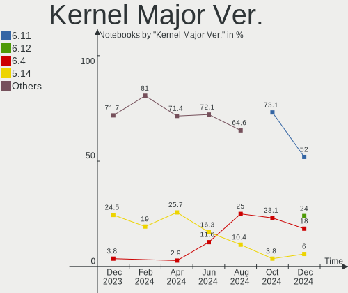
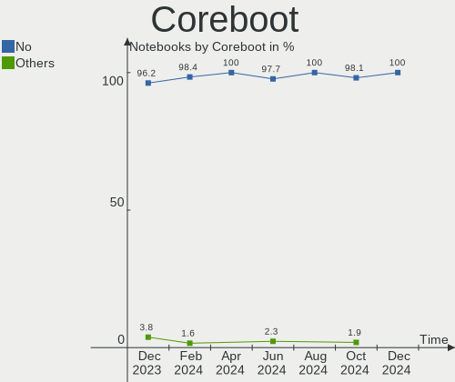
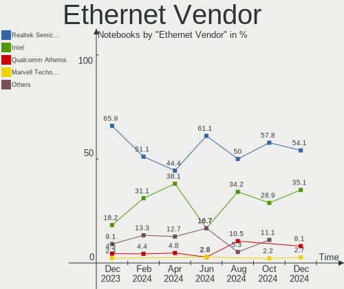
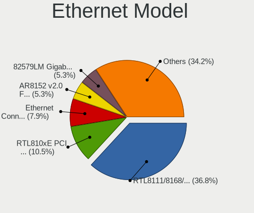
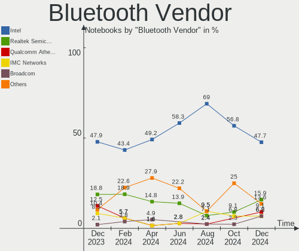
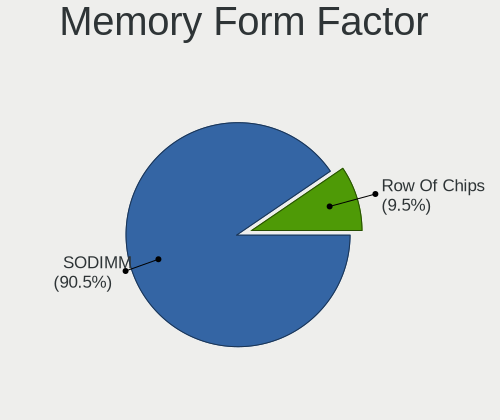
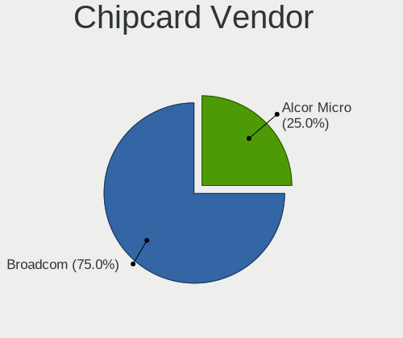

openSUSE - Hardware Trends (Notebooks)
--------------------------------------

A project to identify most popular hardware characteristics and track their change
over time based on data collected by Linux users at https://Linux-Hardware.org.

Anyone can contribute to this report by the [hw-probe](https://github.com/linuxhw/hw-probe) tool:

    sudo -E hw-probe -all -upload

This report is for one last month. Overall report since the beginning of time: [TestDays](https://github.com/linuxhw/TestDays)

Period: Mar, 2023.

Contents
--------

* [ System ](#system)
  - [ OS                       ](#os)
  - [ OS Family                ](#os-family)
  - [ Kernel                   ](#kernel)
  - [ Kernel Family            ](#kernel-family)
  - [ Kernel Major Ver.        ](#kernel-major-ver)
  - [ Arch                     ](#arch)
  - [ DE                       ](#de)
  - [ Display Server           ](#display-server)
  - [ Display Manager          ](#display-manager)
  - [ OS Lang                  ](#os-lang)
  - [ Boot Mode                ](#boot-mode)
  - [ Filesystem               ](#filesystem)
  - [ Part. scheme             ](#part-scheme)
  - [ Dual Boot with Linux/BSD ](#dual-boot-with-linuxbsd)
  - [ Dual Boot (Win)          ](#dual-boot-win)

* [ Board ](#board)
  - [ Vendor                   ](#vendor)
  - [ Model                    ](#model)
  - [ Model Family             ](#model-family)
  - [ MFG Year                 ](#mfg-year)
  - [ Form Factor              ](#form-factor)
  - [ Secure Boot              ](#secure-boot)
  - [ Coreboot                 ](#coreboot)
  - [ RAM Size                 ](#ram-size)
  - [ RAM Used                 ](#ram-used)
  - [ Total Drives             ](#total-drives)
  - [ Has CD-ROM               ](#has-cd-rom)
  - [ Has Ethernet             ](#has-ethernet)
  - [ Has WiFi                 ](#has-wifi)
  - [ Has Bluetooth            ](#has-bluetooth)

* [ Location ](#location)
  - [ Country                  ](#country)
  - [ City                     ](#city)

* [ Drives ](#drives)
  - [ Drive Vendor             ](#drive-vendor)
  - [ Drive Model              ](#drive-model)
  - [ HDD Vendor               ](#hdd-vendor)
  - [ SSD Vendor               ](#ssd-vendor)
  - [ Drive Kind               ](#drive-kind)
  - [ Drive Connector          ](#drive-connector)
  - [ Drive Size               ](#drive-size)
  - [ Space Total              ](#space-total)
  - [ Space Used               ](#space-used)
  - [ Malfunc. Drives          ](#malfunc-drives)
  - [ Malfunc. Drive Vendor    ](#malfunc-drive-vendor)
  - [ Malfunc. HDD Vendor      ](#malfunc-hdd-vendor)
  - [ Malfunc. Drive Kind      ](#malfunc-drive-kind)
  - [ Failed Drives            ](#failed-drives)
  - [ Failed Drive Vendor      ](#failed-drive-vendor)
  - [ Drive Status             ](#drive-status)

* [ Storage controller ](#storage-controller)
  - [ Storage Vendor           ](#storage-vendor)
  - [ Storage Model            ](#storage-model)
  - [ Storage Kind             ](#storage-kind)

* [ Processor ](#processor)
  - [ CPU Vendor               ](#cpu-vendor)
  - [ CPU Model                ](#cpu-model)
  - [ CPU Model Family         ](#cpu-model-family)
  - [ CPU Cores                ](#cpu-cores)
  - [ CPU Sockets              ](#cpu-sockets)
  - [ CPU Threads              ](#cpu-threads)
  - [ CPU Op-Modes             ](#cpu-op-modes)
  - [ CPU Microcode            ](#cpu-microcode)
  - [ CPU Microarch            ](#cpu-microarch)

* [ Graphics ](#graphics)
  - [ GPU Vendor               ](#gpu-vendor)
  - [ GPU Model                ](#gpu-model)
  - [ GPU Combo                ](#gpu-combo)
  - [ GPU Driver               ](#gpu-driver)
  - [ GPU Memory               ](#gpu-memory)

* [ Monitor ](#monitor)
  - [ Monitor Vendor           ](#monitor-vendor)
  - [ Monitor Model            ](#monitor-model)
  - [ Monitor Resolution       ](#monitor-resolution)
  - [ Monitor Diagonal         ](#monitor-diagonal)
  - [ Monitor Width            ](#monitor-width)
  - [ Aspect Ratio             ](#aspect-ratio)
  - [ Monitor Area             ](#monitor-area)
  - [ Pixel Density            ](#pixel-density)
  - [ Multiple Monitors        ](#multiple-monitors)

* [ Network ](#network)
  - [ Net Controller Vendor    ](#net-controller-vendor)
  - [ Net Controller Model     ](#net-controller-model)
  - [ Wireless Vendor          ](#wireless-vendor)
  - [ Wireless Model           ](#wireless-model)
  - [ Ethernet Vendor          ](#ethernet-vendor)
  - [ Ethernet Model           ](#ethernet-model)
  - [ Net Controller Kind      ](#net-controller-kind)
  - [ Used Controller          ](#used-controller)
  - [ NICs                     ](#nics)
  - [ IPv6                     ](#ipv6)

* [ Bluetooth ](#bluetooth)
  - [ Bluetooth Vendor         ](#bluetooth-vendor)
  - [ Bluetooth Model          ](#bluetooth-model)

* [ Sound ](#sound)
  - [ Sound Vendor             ](#sound-vendor)
  - [ Sound Model              ](#sound-model)

* [ Memory ](#memory)
  - [ Memory Vendor            ](#memory-vendor)
  - [ Memory Model             ](#memory-model)
  - [ Memory Kind              ](#memory-kind)
  - [ Memory Form Factor       ](#memory-form-factor)
  - [ Memory Size              ](#memory-size)
  - [ Memory Speed             ](#memory-speed)

* [ Printers & scanners ](#printers--scanners)
  - [ Printer Vendor           ](#printer-vendor)
  - [ Printer Model            ](#printer-model)
  - [ Scanner Vendor           ](#scanner-vendor)
  - [ Scanner Model            ](#scanner-model)

* [ Camera ](#camera)
  - [ Camera Vendor            ](#camera-vendor)
  - [ Camera Model             ](#camera-model)

* [ Security ](#security)
  - [ Fingerprint Vendor       ](#fingerprint-vendor)
  - [ Fingerprint Model        ](#fingerprint-model)
  - [ Chipcard Vendor          ](#chipcard-vendor)
  - [ Chipcard Model           ](#chipcard-model)

* [ Unsupported ](#unsupported)
  - [ Unsupported Devices      ](#unsupported-devices)
  - [ Unsupported Device Types ](#unsupported-device-types)

System
------

OS
--

Installed operating systems

| Name                         | Notebooks | Percent |
|------------------------------|-----------|---------|
| openSUSE Tumbleweed-XXXXXXXX | 32        | 74.42%  |
| openSUSE Leap-15.4           | 7         | 16.28%  |
| openSUSE Microos-XXXXXXXX    | 2         | 4.65%   |
| openSUSE Leap-15.5           | 1         | 2.33%   |
| openSUSE Leap-15.3           | 1         | 2.33%   |

OS Family
---------

OS without a version

| Name     | Notebooks | Percent |
|----------|-----------|---------|
| openSUSE | 43        | 100%    |

Kernel
------

Version of the Linux kernel

| Version                      | Notebooks | Percent |
|------------------------------|-----------|---------|
| 6.2.6-1-default              | 9         | 20.93%  |
| 6.2.1-1-default              | 7         | 16.28%  |
| 5.14.21-150400.24.46-default | 7         | 16.28%  |
| 6.2.2-1-default              | 6         | 13.95%  |
| 6.2.0-1-default              | 4         | 9.3%    |
| 6.2.8-1-default              | 2         | 4.65%   |
| 6.2.4-1-default              | 2         | 4.65%   |
| 6.1.12-1-default             | 2         | 4.65%   |
| 6.1.8-1-default              | 1         | 2.33%   |
| 6.1.1-1-default              | 1         | 2.33%   |
| 5.3.18-150300.59.68-default  | 1         | 2.33%   |
| 5.14.21-150500.43-default    | 1         | 2.33%   |

Kernel Family
-------------

Linux kernel without a distro release

| Version | Notebooks | Percent |
|---------|-----------|---------|
| 6.2.6   | 9         | 20.93%  |
| 5.14.21 | 8         | 18.6%   |
| 6.2.1   | 7         | 16.28%  |
| 6.2.2   | 6         | 13.95%  |
| 6.2.0   | 4         | 9.3%    |
| 6.2.8   | 2         | 4.65%   |
| 6.2.4   | 2         | 4.65%   |
| 6.1.12  | 2         | 4.65%   |
| 6.1.8   | 1         | 2.33%   |
| 6.1.1   | 1         | 2.33%   |
| 5.3.18  | 1         | 2.33%   |

Kernel Major Ver.
-----------------

Linux kernel major version

| Version | Notebooks | Percent |
|---------|-----------|---------|
| 6.2     | 30        | 69.77%  |
| 5.14    | 8         | 18.6%   |
| 6.1     | 4         | 9.3%    |
| 5.3     | 1         | 2.33%   |

Arch
----

OS architecture (x86_64, i586, etc.)

| Name   | Notebooks | Percent |
|--------|-----------|---------|
| x86_64 | 43        | 100%    |

DE
--

Desktop Environment

| Name     | Notebooks | Percent |
|----------|-----------|---------|
| KDE5     | 29        | 67.44%  |
| GNOME    | 7         | 16.28%  |
| Unknown  | 3         | 6.98%   |
| MATE     | 1         | 2.33%   |
| KDE      | 1         | 2.33%   |
| ICEWM    | 1         | 2.33%   |
| Cinnamon | 1         | 2.33%   |

Display Server
--------------

X11 or Wayland

| Name    | Notebooks | Percent |
|---------|-----------|---------|
| X11     | 30        | 69.77%  |
| Wayland | 10        | 23.26%  |
| Tty     | 2         | 4.65%   |
| Unknown | 1         | 2.33%   |

Display Manager
---------------

SDDM, LightDM, etc.

| Name    | Notebooks | Percent |
|---------|-----------|---------|
| Unknown | 22        | 51.16%  |
| SDDM    | 15        | 34.88%  |
| LightDM | 4         | 9.3%    |
| XDM     | 1         | 2.33%   |
| GDM     | 1         | 2.33%   |

OS Lang
-------

Language

| Lang  | Notebooks | Percent |
|-------|-----------|---------|
| en_US | 19        | 44.19%  |
| de_DE | 11        | 25.58%  |
| en_GB | 5         | 11.63%  |
| fr_FR | 2         | 4.65%   |
| es_ES | 2         | 4.65%   |
| pt_BR | 1         | 2.33%   |
| it_IT | 1         | 2.33%   |
| en_IE | 1         | 2.33%   |
| bg_BG | 1         | 2.33%   |

Boot Mode
---------

EFI or BIOS

| Mode | Notebooks | Percent |
|------|-----------|---------|
| EFI  | 37        | 86.05%  |
| BIOS | 6         | 13.95%  |

Filesystem
----------

Type of filesystem

| Type  | Notebooks | Percent |
|-------|-----------|---------|
| Btrfs | 34        | 79.07%  |
| Ext4  | 6         | 13.95%  |
| Xfs   | 3         | 6.98%   |

Part. scheme
------------

Scheme of partitioning

| Type    | Notebooks | Percent |
|---------|-----------|---------|
| GPT     | 23        | 53.49%  |
| Unknown | 20        | 46.51%  |

Dual Boot with Linux/BSD
------------------------

Hosting more than one Linux/BSD

| Dual boot | Notebooks | Percent |
|-----------|-----------|---------|
| No        | 41        | 95.35%  |
| Yes       | 2         | 4.65%   |

Dual Boot (Win)
---------------

Hosting Linux and Windows

| Dual boot | Notebooks | Percent |
|-----------|-----------|---------|
| No        | 39        | 90.7%   |
| Yes       | 4         | 9.3%    |

Board
-----

Vendor
------

Motherboard manufacturer

| Name             | Notebooks | Percent |
|------------------|-----------|---------|
| Lenovo           | 11        | 25.58%  |
| Hewlett-Packard  | 10        | 23.26%  |
| ASUSTek Computer | 5         | 11.63%  |
| MSI              | 3         | 6.98%   |
| Dell             | 3         | 6.98%   |
| Acer             | 3         | 6.98%   |
| Apple            | 2         | 4.65%   |
| TUXEDO           | 1         | 2.33%   |
| SLIMBOOK         | 1         | 2.33%   |
| Purism           | 1         | 2.33%   |
| Notebook         | 1         | 2.33%   |
| Jumper           | 1         | 2.33%   |
| Fujitsu          | 1         | 2.33%   |

Model
-----

Motherboard model

| Name                                     | Notebooks | Percent |
|------------------------------------------|-----------|---------|
| TUXEDO Pulse 15 Gen1                     | 1         | 2.33%   |
| SLIMBOOK PROX-AMD5                       | 1         | 2.33%   |
| Purism Librem 13 v2                      | 1         | 2.33%   |
| Notebook PCx0Dx                          | 1         | 2.33%   |
| MSI GT72 2QE                             | 1         | 2.33%   |
| MSI Delta 15 A5EFK                       | 1         | 2.33%   |
| MSI Bravo 15 B5DD                        | 1         | 2.33%   |
| Lenovo ThinkPad T520 42435GG             | 1         | 2.33%   |
| Lenovo ThinkPad T460s 20F9005CMN         | 1         | 2.33%   |
| Lenovo ThinkPad T14 Gen 3 21AJS0Q204     | 1         | 2.33%   |
| Lenovo ThinkPad Edge E530 3259HHG        | 1         | 2.33%   |
| Lenovo LEGION5PRO-16ACH6H 82JQ           | 1         | 2.33%   |
| Lenovo Legion 5 15ARH7H 82RD             | 1         | 2.33%   |
| Lenovo IdeaPad Y700-17ISK 80Q0           | 1         | 2.33%   |
| Lenovo IdeaPad 5 14ARE05 81YM            | 1         | 2.33%   |
| Lenovo IdeaPad 320-15IKB 81BG            | 1         | 2.33%   |
| Lenovo IdeaPad 3 15ITL6 82H8             | 1         | 2.33%   |
| Lenovo G580 20157                        | 1         | 2.33%   |
| Jumper EZbook                            | 1         | 2.33%   |
| HP ZBook Power G7 Mobile Workstation     | 1         | 2.33%   |
| HP ProBook 6460b                         | 1         | 2.33%   |
| HP ProBook 645 G4                        | 1         | 2.33%   |
| HP Pavilion Plus Laptop 14-eh0xxx        | 1         | 2.33%   |
| HP Pavilion Laptop 15-cs0xxx             | 1         | 2.33%   |
| HP Pavilion Gaming Laptop 17-cd1xxx      | 1         | 2.33%   |
| HP Laptop 15s-fq5xxx                     | 1         | 2.33%   |
| HP EliteBook 845 G8 Notebook PC          | 1         | 2.33%   |
| HP EliteBook 820 G4                      | 1         | 2.33%   |
| HP Compaq 6730s                          | 1         | 2.33%   |
| Fujitsu LIFEBOOK U938                    | 1         | 2.33%   |
| Dell XPS 15 9570                         | 1         | 2.33%   |
| Dell Vostro 5490                         | 1         | 2.33%   |
| Dell Latitude D530                       | 1         | 2.33%   |
| ASUS Zephyrus M GU502GW_GU502GW          | 1         | 2.33%   |
| ASUS VivoBook_ASUSLaptop M3402RA_M3402RA | 1         | 2.33%   |
| ASUS VivoBook_ASUSLaptop E510MAB_E510MA  | 1         | 2.33%   |
| ASUS ROG Strix G513RW_G513RW             | 1         | 2.33%   |
| ASUS N550JX                              | 1         | 2.33%   |
| Apple MacBookPro11,3                     | 1         | 2.33%   |
| Apple MacBook5,1                         | 1         | 2.33%   |

Model Family
------------

Motherboard model prefix

| Name                      | Notebooks | Percent |
|---------------------------|-----------|---------|
| Lenovo ThinkPad           | 4         | 9.3%    |
| Lenovo IdeaPad            | 4         | 9.3%    |
| HP Pavilion               | 3         | 6.98%   |
| HP ProBook                | 2         | 4.65%   |
| HP EliteBook              | 2         | 4.65%   |
| ASUS VivoBook             | 2         | 4.65%   |
| Acer Aspire               | 2         | 4.65%   |
| TUXEDO Pulse              | 1         | 2.33%   |
| SLIMBOOK PROX-AMD5        | 1         | 2.33%   |
| Purism Librem             | 1         | 2.33%   |
| Notebook PCx0Dx           | 1         | 2.33%   |
| MSI GT72                  | 1         | 2.33%   |
| MSI Delta                 | 1         | 2.33%   |
| MSI Bravo                 | 1         | 2.33%   |
| Lenovo LEGION5PRO-16ACH6H | 1         | 2.33%   |
| Lenovo Legion             | 1         | 2.33%   |
| Lenovo G580               | 1         | 2.33%   |
| Jumper EZbook             | 1         | 2.33%   |
| HP ZBook                  | 1         | 2.33%   |
| HP Laptop                 | 1         | 2.33%   |
| HP Compaq                 | 1         | 2.33%   |
| Fujitsu LIFEBOOK          | 1         | 2.33%   |
| Dell XPS                  | 1         | 2.33%   |
| Dell Vostro               | 1         | 2.33%   |
| Dell Latitude             | 1         | 2.33%   |
| ASUS Zephyrus             | 1         | 2.33%   |
| ASUS ROG                  | 1         | 2.33%   |
| ASUS N550JX               | 1         | 2.33%   |
| Apple MacBookPro11        | 1         | 2.33%   |
| Apple MacBook5            | 1         | 2.33%   |
| Acer Swift                | 1         | 2.33%   |

MFG Year
--------

Motherboard manufacture year

| Year | Notebooks | Percent |
|------|-----------|---------|
| 2022 | 8         | 18.6%   |
| 2021 | 8         | 18.6%   |
| 2020 | 6         | 13.95%  |
| 2018 | 4         | 9.3%    |
| 2017 | 3         | 6.98%   |
| 2015 | 2         | 4.65%   |
| 2013 | 2         | 4.65%   |
| 2012 | 2         | 4.65%   |
| 2011 | 2         | 4.65%   |
| 2008 | 2         | 4.65%   |
| 2019 | 1         | 2.33%   |
| 2016 | 1         | 2.33%   |
| 2014 | 1         | 2.33%   |
| 2009 | 1         | 2.33%   |

Form Factor
-----------

Physical design of the computer

| Name     | Notebooks | Percent |
|----------|-----------|---------|
| Notebook | 43        | 100%    |

Secure Boot
-----------

Enabled or disabled

| State    | Notebooks | Percent |
|----------|-----------|---------|
| Disabled | 30        | 69.77%  |
| Enabled  | 13        | 30.23%  |

Coreboot
--------

Have coreboot on board

| Used | Notebooks | Percent |
|------|-----------|---------|
| No   | 42        | 97.67%  |
| Yes  | 1         | 2.33%   |

RAM Size
--------

Total RAM memory

| Size in GB  | Notebooks | Percent |
|-------------|-----------|---------|
| 16.01-24.0  | 11        | 25.58%  |
| 8.01-16.0   | 9         | 20.93%  |
| 4.01-8.0    | 8         | 18.6%   |
| 32.01-64.0  | 7         | 16.28%  |
| 3.01-4.0    | 4         | 9.3%    |
| 24.01-32.0  | 2         | 4.65%   |
| 64.01-256.0 | 1         | 2.33%   |
| 1.01-2.0    | 1         | 2.33%   |

RAM Used
--------

Used RAM memory

| Used GB    | Notebooks | Percent |
|------------|-----------|---------|
| 3.01-4.0   | 12        | 27.91%  |
| 2.01-3.0   | 11        | 25.58%  |
| 4.01-8.0   | 10        | 23.26%  |
| 0.51-1.0   | 4         | 9.3%    |
| 8.01-16.0  | 3         | 6.98%   |
| 1.01-2.0   | 2         | 4.65%   |
| 16.01-24.0 | 1         | 2.33%   |

Total Drives
------------

Number of drives on board

| Drives | Notebooks | Percent |
|--------|-----------|---------|
| 1      | 31        | 72.09%  |
| 2      | 12        | 27.91%  |

Has CD-ROM
----------

Has CD-ROM on board

| Presented | Notebooks | Percent |
|-----------|-----------|---------|
| No        | 33        | 76.74%  |
| Yes       | 10        | 23.26%  |

Has Ethernet
------------

Has Ethernet on board

| Presented | Notebooks | Percent |
|-----------|-----------|---------|
| Yes       | 31        | 72.09%  |
| No        | 12        | 27.91%  |

Has WiFi
--------

Has WiFi module

| Presented | Notebooks | Percent |
|-----------|-----------|---------|
| Yes       | 43        | 100%    |

Has Bluetooth
-------------

Has Bluetooth module

| Presented | Notebooks | Percent |
|-----------|-----------|---------|
| Yes       | 39        | 90.7%   |
| No        | 4         | 9.3%    |

Location
--------

Country
-------

Geographic location (country)

| Country     | Notebooks | Percent |
|-------------|-----------|---------|
| Germany     | 7         | 16.28%  |
| USA         | 6         | 13.95%  |
| Switzerland | 2         | 4.65%   |
| Sweden      | 2         | 4.65%   |
| Slovenia    | 2         | 4.65%   |
| Italy       | 2         | 4.65%   |
| Greece      | 2         | 4.65%   |
| France      | 2         | 4.65%   |
| Bulgaria    | 2         | 4.65%   |
| UK          | 1         | 2.33%   |
| Turkey      | 1         | 2.33%   |
| Spain       | 1         | 2.33%   |
| Poland      | 1         | 2.33%   |
| Philippines | 1         | 2.33%   |
| Norway      | 1         | 2.33%   |
| New Zealand | 1         | 2.33%   |
| Netherlands | 1         | 2.33%   |
| Indonesia   | 1         | 2.33%   |
| El Salvador | 1         | 2.33%   |
| Denmark     | 1         | 2.33%   |
| Canada      | 1         | 2.33%   |
| Brazil      | 1         | 2.33%   |
| Bangladesh  | 1         | 2.33%   |
| Austria     | 1         | 2.33%   |
| Australia   | 1         | 2.33%   |

City
----

Geographic location (city)

| City               | Notebooks | Percent |
|--------------------|-----------|---------|
| Stockholm          | 2         | 4.65%   |
| Zurich             | 1         | 2.33%   |
| Yogyakarta         | 1         | 2.33%   |
| Warsaw             | 1         | 2.33%   |
| Vienna             | 1         | 2.33%   |
| Varna              | 1         | 2.33%   |
| Unterentfelden     | 1         | 2.33%   |
| Sydney             | 1         | 2.33%   |
| Sofia              | 1         | 2.33%   |
| Richardson         | 1         | 2.33%   |
| Regstrup           | 1         | 2.33%   |
| Recife             | 1         | 2.33%   |
| Painesville        | 1         | 2.33%   |
| Moosburg           | 1         | 2.33%   |
| Memphis            | 1         | 2.33%   |
| Manchester         | 1         | 2.33%   |
| Madrid             | 1         | 2.33%   |
| Ludwigsstadt       | 1         | 2.33%   |
| Leer               | 1         | 2.33%   |
| La Union           | 1         | 2.33%   |
| Kranj              | 1         | 2.33%   |
| Katerini           | 1         | 2.33%   |
| Hrusica            | 1         | 2.33%   |
| Hennef             | 1         | 2.33%   |
| Gross-Gerau        | 1         | 2.33%   |
| Grenoble           | 1         | 2.33%   |
| Gilze              | 1         | 2.33%   |
| Frankfurt am Main  | 1         | 2.33%   |
| Fornebu            | 1         | 2.33%   |
| Fontenay-sous-Bois | 1         | 2.33%   |
| Fayetteville       | 1         | 2.33%   |
| Dunedin            | 1         | 2.33%   |
| Dhaka              | 1         | 2.33%   |
| Darmstadt          | 1         | 2.33%   |
| Conway             | 1         | 2.33%   |
| Cesena             | 1         | 2.33%   |
| Brescia            | 1         | 2.33%   |
| Baclaran           | 1         | 2.33%   |
| Aurora             | 1         | 2.33%   |
| Athens             | 1         | 2.33%   |

Drives
------

Drive Vendor
------------

Hard drive vendors

| Vendor                      | Notebooks | Drives | Percent |
|-----------------------------|-----------|--------|---------|
| Samsung Electronics         | 13        | 15     | 25%     |
| WDC                         | 4         | 4      | 7.69%   |
| Unknown                     | 4         | 4      | 7.69%   |
| Toshiba                     | 3         | 3      | 5.77%   |
| Sandisk                     | 3         | 3      | 5.77%   |
| Kingston                    | 3         | 3      | 5.77%   |
| SK hynix                    | 2         | 2      | 3.85%   |
| Seagate                     | 2         | 2      | 3.85%   |
| Micron Technology           | 2         | 3      | 3.85%   |
| Intenso                     | 2         | 2      | 3.85%   |
| WDC WDS                     | 1         | 1      | 1.92%   |
| Union Memory                | 1         | 1      | 1.92%   |
| SPCC                        | 1         | 1      | 1.92%   |
| Silicon Motion              | 1         | 1      | 1.92%   |
| Realtek Semiconductor       | 1         | 1      | 1.92%   |
| Pioneer                     | 1         | 1      | 1.92%   |
| KIOXIA                      | 1         | 1      | 1.92%   |
| Kingston Technology Company | 1         | 1      | 1.92%   |
| Intel                       | 1         | 1      | 1.92%   |
| HGST                        | 1         | 1      | 1.92%   |
| Crucial                     | 1         | 1      | 1.92%   |
| Biwin Storage Technology    | 1         | 1      | 1.92%   |
| Apple                       | 1         | 1      | 1.92%   |
| A-DATA Technology           | 1         | 1      | 1.92%   |

Drive Model
-----------

Hard drive models

| Model                                               | Notebooks | Percent |
|-----------------------------------------------------|-----------|---------|
| Unknown MMC Card  128GB                             | 3         | 5.66%   |
| Samsung NVMe SSD Controller SM981/PM981/PM983 250GB | 3         | 5.66%   |
| Samsung NVMe SSD Controller PM9A1/PM9A3/980PRO 1TB  | 3         | 5.66%   |
| WDC WDS 100T2B0A-00SM50 1TB SSD                     | 1         | 1.89%   |
| WDC WD7500BPVT-75HXZT3 752GB                        | 1         | 1.89%   |
| WDC WD20SPZX-22UA7T0 2TB                            | 1         | 1.89%   |
| WDC WD10SPZX-60Z10T0 1TB                            | 1         | 1.89%   |
| WDC WD Green 2.5 480GB SSD                          | 1         | 1.89%   |
| Unknown MMC Card  256GB                             | 1         | 1.89%   |
| Union Memory UMIS RPJTJ256MEE1OWX 256GB             | 1         | 1.89%   |
| Toshiba XG6 NVMe SSD Controller 512GB               | 1         | 1.89%   |
| Toshiba THNSNJ128G8NU 128GB SSD                     | 1         | 1.89%   |
| Toshiba KXG50ZNV512G NVMe 512GB                     | 1         | 1.89%   |
| SPCC Solid State Disk 512GB                         | 1         | 1.89%   |
| SK hynix SC313 HFS256G39TNF-N3A0A 256GB SSD         | 1         | 1.89%   |
| SK hynix PC401 NVMe Solid State Drive 256GB         | 1         | 1.89%   |
| Silicon Motion SM2262/SM2262EN SSD Controller 1TB   | 1         | 1.89%   |
| Seagate ST980813ASG 80GB                            | 1         | 1.89%   |
| Seagate ST1000LM014-1EJ164 1TB                      | 1         | 1.89%   |
| Sandisk WD PC SN735 SDBPNHH-512G-1002 512GB         | 1         | 1.89%   |
| Sandisk WD Blue SN550 NVMe SSD 256GB                | 1         | 1.89%   |
| Sandisk WD Black SN850 1TB                          | 1         | 1.89%   |
| Samsung SSD 990 PRO 1TB                             | 1         | 1.89%   |
| Samsung SSD 860 EVO 500GB                           | 1         | 1.89%   |
| Samsung SSD 850 EVO 1TB                             | 1         | 1.89%   |
| Samsung NVMe SSD Drive 500GB                        | 1         | 1.89%   |
| Samsung NVMe SSD Controller SM951/PM951 128GB       | 1         | 1.89%   |
| Samsung MZNTY256HDHP-000L7 256GB SSD                | 1         | 1.89%   |
| Samsung MZNLN256HAJQ-00007 256GB SSD                | 1         | 1.89%   |
| Realtek SPCC M.2 PCIe SSD 1TB                       | 1         | 1.89%   |
| Pioneer APS-SL3N-128 128GB                          | 1         | 1.89%   |
| Micron 2450_MTFDKBA1T0TFK 1TB                       | 1         | 1.89%   |
| Micron 2210_MTFDHBA1T0QFD 1TB                       | 1         | 1.89%   |
| Micron 2200V_MTFDHBA512TCK  512GB                   | 1         | 1.89%   |
| KIOXIA KBG40ZNV512G 512GB                           | 1         | 1.89%   |
| Kingston Company OM3PDP3 NVMe SSD 256GB             | 1         | 1.89%   |
| Kingston SUV500MS240G 240GB SSD                     | 1         | 1.89%   |
| Kingston SA400S37480G 480GB SSD                     | 1         | 1.89%   |
| Kingston OM8PCP3512F-AI1 512GB                      | 1         | 1.89%   |
| Intenso SSD SATAIII 512GB                           | 1         | 1.89%   |

HDD Vendor
----------

Hard disk drive vendors

| Vendor  | Notebooks | Drives | Percent |
|---------|-----------|--------|---------|
| WDC     | 3         | 3      | 50%     |
| Seagate | 2         | 2      | 33.33%  |
| HGST    | 1         | 1      | 16.67%  |

SSD Vendor
----------

Solid state drive vendors

| Vendor              | Notebooks | Drives | Percent |
|---------------------|-----------|--------|---------|
| Samsung Electronics | 4         | 4      | 23.53%  |
| Kingston            | 2         | 2      | 11.76%  |
| Intenso             | 2         | 2      | 11.76%  |
| WDC WDS             | 1         | 1      | 5.88%   |
| WDC                 | 1         | 1      | 5.88%   |
| Toshiba             | 1         | 1      | 5.88%   |
| SPCC                | 1         | 1      | 5.88%   |
| SK hynix            | 1         | 1      | 5.88%   |
| Pioneer             | 1         | 1      | 5.88%   |
| Crucial             | 1         | 1      | 5.88%   |
| Apple               | 1         | 1      | 5.88%   |
| A-DATA Technology   | 1         | 1      | 5.88%   |

Drive Kind
----------

HDD or SSD

| Kind | Notebooks | Drives | Percent |
|------|-----------|--------|---------|
| NVMe | 23        | 28     | 46.94%  |
| SSD  | 16        | 17     | 32.65%  |
| HDD  | 6         | 6      | 12.24%  |
| MMC  | 4         | 4      | 8.16%   |

Drive Connector
---------------

SATA, SAS, NVMe, etc.

| Type | Notebooks | Drives | Percent |
|------|-----------|--------|---------|
| NVMe | 23        | 28     | 50%     |
| SATA | 18        | 22     | 39.13%  |
| MMC  | 4         | 4      | 8.7%    |
| SAS  | 1         | 1      | 2.17%   |

Drive Size
----------

Size of hard drive

| Size in TB | Notebooks | Drives | Percent |
|------------|-----------|--------|---------|
| 0.01-0.5   | 12        | 13     | 54.55%  |
| 0.51-1.0   | 8         | 8      | 36.36%  |
| 1.01-2.0   | 2         | 2      | 9.09%   |

Space Total
-----------

Amount of disk space available on the file system

| Size in GB     | Notebooks | Percent |
|----------------|-----------|---------|
| More than 3000 | 14        | 32.56%  |
| 501-1000       | 8         | 18.6%   |
| 2001-3000      | 7         | 16.28%  |
| 1001-2000      | 7         | 16.28%  |
| 251-500        | 3         | 6.98%   |
| 101-250        | 3         | 6.98%   |
| 51-100         | 1         | 2.33%   |

Space Used
----------

Amount of used disk space

| Used GB        | Notebooks | Percent |
|----------------|-----------|---------|
| 51-100         | 10        | 23.26%  |
| 101-250        | 7         | 16.28%  |
| 501-1000       | 7         | 16.28%  |
| 1001-2000      | 5         | 11.63%  |
| 1-20           | 5         | 11.63%  |
| More than 3000 | 4         | 9.3%    |
| 251-500        | 4         | 9.3%    |
| 2001-3000      | 1         | 2.33%   |

Malfunc. Drives
---------------

Drive models with a malfunction

| Model                                             | Notebooks | Drives | Percent |
|---------------------------------------------------|-----------|--------|---------|
| Silicon Motion SM2262/SM2262EN SSD Controller 1TB | 1         | 1      | 33.33%  |
| Crucial CT250BX100SSD1 250GB                      | 1         | 1      | 33.33%  |
| Biwin Storage Technology HP SSD EX900 1TB         | 1         | 1      | 33.33%  |

Malfunc. Drive Vendor
---------------------

Vendors of faulty drives

| Vendor                   | Notebooks | Drives | Percent |
|--------------------------|-----------|--------|---------|
| Silicon Motion           | 1         | 1      | 33.33%  |
| Crucial                  | 1         | 1      | 33.33%  |
| Biwin Storage Technology | 1         | 1      | 33.33%  |

Malfunc. HDD Vendor
-------------------

Vendors of faulty HDD drives

Zero info for selected period =(

Malfunc. Drive Kind
-------------------

Kinds of faulty drives

| Kind | Notebooks | Drives | Percent |
|------|-----------|--------|---------|
| NVMe | 2         | 2      | 66.67%  |
| SSD  | 1         | 1      | 33.33%  |

Failed Drives
-------------

Failed drive models

Zero info for selected period =(

Failed Drive Vendor
-------------------

Failed drive vendors

Zero info for selected period =(

Drive Status
------------

Number of failed and malfunc. drives

| Status   | Notebooks | Drives | Percent |
|----------|-----------|--------|---------|
| Detected | 23        | 28     | 50%     |
| Works    | 20        | 24     | 43.48%  |
| Malfunc  | 3         | 3      | 6.52%   |

Storage controller
------------------

Storage Vendor
--------------

Storage controller vendors

| Vendor                       | Notebooks | Percent |
|------------------------------|-----------|---------|
| Intel                        | 25        | 45.45%  |
| Samsung Electronics          | 10        | 18.18%  |
| AMD                          | 4         | 7.27%   |
| SanDisk                      | 3         | 5.45%   |
| Toshiba America Info Systems | 2         | 3.64%   |
| Micron Technology            | 2         | 3.64%   |
| Kingston Technology Company  | 2         | 3.64%   |
| Union Memory (Shenzhen)      | 1         | 1.82%   |
| SK hynix                     | 1         | 1.82%   |
| Silicon Motion               | 1         | 1.82%   |
| Realtek Semiconductor        | 1         | 1.82%   |
| Nvidia                       | 1         | 1.82%   |
| KIOXIA                       | 1         | 1.82%   |
| Biwin Storage Technology     | 1         | 1.82%   |

Storage Model
-------------

Storage controller models

| Model                                                                          | Notebooks | Percent |
|--------------------------------------------------------------------------------|-----------|---------|
| Intel Sunrise Point-LP SATA Controller [AHCI mode]                             | 5         | 8.93%   |
| Samsung NVMe SSD Controller SM981/PM981/PM983                                  | 4         | 7.14%   |
| AMD FCH SATA Controller [AHCI mode]                                            | 4         | 7.14%   |
| Samsung NVMe SSD Controller PM9A1/PM9A3/980PRO                                 | 3         | 5.36%   |
| Intel 8 Series/C220 Series Chipset Family 6-port SATA Controller 1 [AHCI mode] | 3         | 5.36%   |
| Micron NVMe Storage Controller                                                 | 2         | 3.57%   |
| Intel 82801 Mobile SATA Controller [RAID mode]                                 | 2         | 3.57%   |
| Intel 7 Series Chipset Family 6-port SATA Controller [AHCI mode]               | 2         | 3.57%   |
| Intel 6 Series/C200 Series Chipset Family 6 port Mobile SATA AHCI Controller   | 2         | 3.57%   |
| Union Memory (Shenzhen) Non-Volatile memory controller                         | 1         | 1.79%   |
| Toshiba America Info Systems XG6 NVMe SSD Controller                           | 1         | 1.79%   |
| Toshiba America Info Systems XG5 NVMe SSD Controller                           | 1         | 1.79%   |
| SK hynix PC401 NVMe Solid State Drive 256GB                                    | 1         | 1.79%   |
| Silicon Motion SM2262/SM2262EN SSD Controller                                  | 1         | 1.79%   |
| SanDisk WD PC SN810 / Black SN850 NVMe SSD                                     | 1         | 1.79%   |
| SanDisk WD Blue SN550 NVMe SSD                                                 | 1         | 1.79%   |
| SanDisk Non-Volatile memory controller                                         | 1         | 1.79%   |
| Samsung NVMe SSD Controller SM951/PM951                                        | 1         | 1.79%   |
| Samsung Electronics Non-Volatile memory controller                             | 1         | 1.79%   |
| Samsung Apple PCIe SSD                                                         | 1         | 1.79%   |
| Realtek NVMe Controller                                                        | 1         | 1.79%   |
| Nvidia MCP79 AHCI Controller                                                   | 1         | 1.79%   |
| KIOXIA NVMe SSD Controller BG4                                                 | 1         | 1.79%   |
| Kingston Company Company Non-Volatile memory controller                        | 1         | 1.79%   |
| Kingston Company OM3PDP3 NVMe SSD                                              | 1         | 1.79%   |
| Intel Tiger Lake-LP SATA Controller                                            | 1         | 1.79%   |
| Intel Non-Volatile memory controller                                           | 1         | 1.79%   |
| Intel Jasper Lake SATA AHCI Controller                                         | 1         | 1.79%   |
| Intel HM170/QM170 Chipset SATA Controller [AHCI Mode]                          | 1         | 1.79%   |
| Intel Comet Lake PCH-LP SATA RAID Premium Controller                           | 1         | 1.79%   |
| Intel Celeron/Pentium Silver Processor SATA Controller                         | 1         | 1.79%   |
| Intel Celeron N3350/Pentium N4200/Atom E3900 Series SATA AHCI Controller       | 1         | 1.79%   |
| Intel Cannon Lake Mobile PCH SATA AHCI Controller                              | 1         | 1.79%   |
| Intel 82801IBM/IEM (ICH9M/ICH9M-E) 4 port SATA Controller [AHCI mode]          | 1         | 1.79%   |
| Intel 82801HM/HEM (ICH8M/ICH8M-E) SATA Controller [IDE mode]                   | 1         | 1.79%   |
| Intel 82801HM/HEM (ICH8M/ICH8M-E) IDE Controller                               | 1         | 1.79%   |
| Intel 400 Series Chipset Family SATA AHCI Controller                           | 1         | 1.79%   |
| Biwin Storage Non-Volatile memory controller                                   | 1         | 1.79%   |

Storage Kind
------------

Kind of storage controller (IDE, SATA, NVMe, SAS, ...)

| Kind | Notebooks | Percent |
|------|-----------|---------|
| SATA | 26        | 49.06%  |
| NVMe | 23        | 43.4%   |
| RAID | 3         | 5.66%   |
| IDE  | 1         | 1.89%   |

Processor
---------

CPU Vendor
----------

Processor vendors

| Vendor | Notebooks | Percent |
|--------|-----------|---------|
| Intel  | 31        | 72.09%  |
| AMD    | 12        | 27.91%  |

CPU Model
---------

Processor models

| Model                                           | Notebooks | Percent |
|-------------------------------------------------|-----------|---------|
| Intel Core i5-8250U CPU @ 1.60GHz               | 3         | 6.98%   |
| AMD Ryzen 7 6800H with Radeon Graphics          | 2         | 4.65%   |
| AMD Ryzen 7 5800H with Radeon Graphics          | 2         | 4.65%   |
| AMD Ryzen 7 5700U with Radeon Graphics          | 2         | 4.65%   |
| Intel Pentium Silver N6000 @ 1.10GHz            | 1         | 2.33%   |
| Intel Pentium Silver N5030 CPU @ 1.10GHz        | 1         | 2.33%   |
| Intel Core i7-9750H CPU @ 2.60GHz               | 1         | 2.33%   |
| Intel Core i7-8750H CPU @ 2.20GHz               | 1         | 2.33%   |
| Intel Core i7-6700HQ CPU @ 2.60GHz              | 1         | 2.33%   |
| Intel Core i7-6500U CPU @ 2.50GHz               | 1         | 2.33%   |
| Intel Core i7-5700HQ CPU @ 2.70GHz              | 1         | 2.33%   |
| Intel Core i7-4850HQ CPU @ 2.30GHz              | 1         | 2.33%   |
| Intel Core i7-4720HQ CPU @ 2.60GHz              | 1         | 2.33%   |
| Intel Core i7-4702MQ CPU @ 2.20GHz              | 1         | 2.33%   |
| Intel Core i7-2670QM CPU @ 2.20GHz              | 1         | 2.33%   |
| Intel Core i7-10870H CPU @ 2.20GHz              | 1         | 2.33%   |
| Intel Core i7-10850H CPU @ 2.70GHz              | 1         | 2.33%   |
| Intel Core i7-10510U CPU @ 1.80GHz              | 1         | 2.33%   |
| Intel Core i5-7300U CPU @ 2.60GHz               | 1         | 2.33%   |
| Intel Core i5-6200U CPU @ 2.30GHz               | 1         | 2.33%   |
| Intel Core i5-2410M CPU @ 2.30GHz               | 1         | 2.33%   |
| Intel Core i5-10300H CPU @ 2.50GHz              | 1         | 2.33%   |
| Intel Core i3-2328M CPU @ 2.20GHz               | 1         | 2.33%   |
| Intel Core 2 Duo CPU T7250 @ 2.00GHz            | 1         | 2.33%   |
| Intel Core 2 Duo CPU T6570 @ 2.10GHz            | 1         | 2.33%   |
| Intel Core 2 Duo CPU P7350 @ 2.00GHz            | 1         | 2.33%   |
| Intel Celeron CPU J3455 @ 1.50GHz               | 1         | 2.33%   |
| Intel Celeron CPU B830 @ 1.80GHz                | 1         | 2.33%   |
| Intel 12th Gen Core i7-1255U                    | 1         | 2.33%   |
| Intel 12th Gen Core i5-1245U                    | 1         | 2.33%   |
| Intel 12th Gen Core i5-1240P                    | 1         | 2.33%   |
| Intel 11th Gen Core i5-1135G7 @ 2.40GHz         | 1         | 2.33%   |
| AMD Ryzen 9 6900HX with Radeon Graphics         | 1         | 2.33%   |
| AMD Ryzen 7 PRO 5850U with Radeon Graphics      | 1         | 2.33%   |
| AMD Ryzen 7 4800H with Radeon Graphics          | 1         | 2.33%   |
| AMD Ryzen 5 5600H with Radeon Graphics          | 1         | 2.33%   |
| AMD Ryzen 5 4500U with Radeon Graphics          | 1         | 2.33%   |
| AMD Ryzen 3 PRO 2300U w/ Radeon Vega Mobile Gfx | 1         | 2.33%   |

CPU Model Family
----------------

Processor model prefix

| Model                | Notebooks | Percent |
|----------------------|-----------|---------|
| Intel Core i7        | 12        | 27.91%  |
| Intel Core i5        | 7         | 16.28%  |
| AMD Ryzen 7          | 7         | 16.28%  |
| Other                | 4         | 9.3%    |
| Intel Core 2 Duo     | 3         | 6.98%   |
| Intel Pentium Silver | 2         | 4.65%   |
| Intel Celeron        | 2         | 4.65%   |
| AMD Ryzen 5          | 2         | 4.65%   |
| Intel Core i3        | 1         | 2.33%   |
| AMD Ryzen 9          | 1         | 2.33%   |
| AMD Ryzen 7 PRO      | 1         | 2.33%   |
| AMD Ryzen 3 PRO      | 1         | 2.33%   |

CPU Cores
---------

Number of processor cores

| Number | Notebooks | Percent |
|--------|-----------|---------|
| 4      | 16        | 37.21%  |
| 8      | 10        | 23.26%  |
| 2      | 9         | 20.93%  |
| 6      | 5         | 11.63%  |
| 10     | 2         | 4.65%   |
| 12     | 1         | 2.33%   |

CPU Sockets
-----------

Number of sockets

| Number | Notebooks | Percent |
|--------|-----------|---------|
| 1      | 43        | 100%    |

CPU Threads
-----------

Threads per core (Hyper-Threading)

| Number | Notebooks | Percent |
|--------|-----------|---------|
| 2      | 34        | 79.07%  |
| 1      | 9         | 20.93%  |

CPU Op-Modes
------------

CPU Operation Modes (32-bit, 64-bit)

| Op mode        | Notebooks | Percent |
|----------------|-----------|---------|
| 32-bit, 64-bit | 43        | 100%    |

CPU Microcode
-------------

Microcode number

| Number     | Notebooks | Percent |
|------------|-----------|---------|
| Unknown    | 23        | 53.49%  |
| 0x206a7    | 3         | 6.98%   |
| 0x0a50000c | 3         | 6.98%   |
| 0x0a404101 | 3         | 6.98%   |
| 0x806ea    | 2         | 4.65%   |
| 0x906a3    | 1         | 2.33%   |
| 0x506ca    | 1         | 2.33%   |
| 0x1067a    | 1         | 2.33%   |
| 0x0a50000d | 1         | 2.33%   |
| 0x08608103 | 1         | 2.33%   |
| 0x08608102 | 1         | 2.33%   |
| 0x08600104 | 1         | 2.33%   |
| 0x08600103 | 1         | 2.33%   |
| 0x08101016 | 1         | 2.33%   |

CPU Microarch
-------------

Microarchitecture

| Name             | Notebooks | Percent |
|------------------|-----------|---------|
| KabyLake         | 7         | 16.28%  |
| Unknown          | 5         | 11.63%  |
| Zen 3            | 4         | 9.3%    |
| SandyBridge      | 4         | 9.3%    |
| Skylake          | 3         | 6.98%   |
| Haswell          | 3         | 6.98%   |
| CometLake        | 3         | 6.98%   |
| Alderlake Hybrid | 3         | 6.98%   |
| Zen 2            | 2         | 4.65%   |
| Penryn           | 2         | 4.65%   |
| Zen              | 1         | 2.33%   |
| Tremont          | 1         | 2.33%   |
| TigerLake        | 1         | 2.33%   |
| Goldmont plus    | 1         | 2.33%   |
| Goldmont         | 1         | 2.33%   |
| Core             | 1         | 2.33%   |
| Broadwell        | 1         | 2.33%   |

Graphics
--------

GPU Vendor
----------

Vendors of graphics cards

| Vendor | Notebooks | Percent |
|--------|-----------|---------|
| Intel  | 27        | 49.09%  |
| Nvidia | 15        | 27.27%  |
| AMD    | 13        | 23.64%  |

GPU Model
---------

Graphics card models

| Model                                                                     | Notebooks | Percent |
|---------------------------------------------------------------------------|-----------|---------|
| Intel 2nd Generation Core Processor Family Integrated Graphics Controller | 4         | 6.9%    |
| AMD Cezanne [Radeon Vega Series / Radeon Vega Mobile Series]              | 4         | 6.9%    |
| Intel UHD Graphics 620                                                    | 3         | 5.17%   |
| Intel CometLake-H GT2 [UHD Graphics]                                      | 3         | 5.17%   |
| AMD Rembrandt [Radeon 680M]                                               | 3         | 5.17%   |
| Intel Skylake GT2 [HD Graphics 520]                                       | 2         | 3.45%   |
| Intel CoffeeLake-H GT2 [UHD Graphics 630]                                 | 2         | 3.45%   |
| Intel Alder Lake-UP3 GT2 [Iris Xe Graphics]                               | 2         | 3.45%   |
| Intel 4th Gen Core Processor Integrated Graphics Controller               | 2         | 3.45%   |
| AMD Renoir                                                                | 2         | 3.45%   |
| AMD Lucienne                                                              | 2         | 3.45%   |
| Nvidia TU117M [GeForce GTX 1650 Ti Mobile]                                | 1         | 1.72%   |
| Nvidia TU106M [GeForce RTX 2070 Mobile]                                   | 1         | 1.72%   |
| Nvidia GP108M [GeForce MX230]                                             | 1         | 1.72%   |
| Nvidia GP108M [GeForce MX150]                                             | 1         | 1.72%   |
| Nvidia GP107M [GeForce GTX 1050 Ti Mobile]                                | 1         | 1.72%   |
| Nvidia GM204M [GeForce GTX 980M]                                          | 1         | 1.72%   |
| Nvidia GM107M [GeForce GTX 960M]                                          | 1         | 1.72%   |
| Nvidia GM107M [GeForce GTX 950M]                                          | 1         | 1.72%   |
| Nvidia GK107M [GeForce GT 750M]                                           | 1         | 1.72%   |
| Nvidia GK107M [GeForce GT 750M Mac Edition]                               | 1         | 1.72%   |
| Nvidia GA106M [GeForce RTX 3060 Mobile / Max-Q]                           | 1         | 1.72%   |
| Nvidia GA104M [Geforce RTX 3070 Ti Laptop GPU]                            | 1         | 1.72%   |
| Nvidia GA104M [GeForce RTX 3070 Mobile / Max-Q]                           | 1         | 1.72%   |
| Nvidia GA104 [Geforce RTX 3070 Ti Laptop GPU]                             | 1         | 1.72%   |
| Nvidia C79 [GeForce 9400M]                                                | 1         | 1.72%   |
| Intel TigerLake-LP GT2 [Iris Xe Graphics]                                 | 1         | 1.72%   |
| Intel Mobile GM965/GL960 Integrated Graphics Controller (secondary)       | 1         | 1.72%   |
| Intel Mobile GM965/GL960 Integrated Graphics Controller (primary)         | 1         | 1.72%   |
| Intel JasperLake [UHD Graphics]                                           | 1         | 1.72%   |
| Intel HD Graphics 620                                                     | 1         | 1.72%   |
| Intel HD Graphics 530                                                     | 1         | 1.72%   |
| Intel HD Graphics 500                                                     | 1         | 1.72%   |
| Intel GeminiLake [UHD Graphics 605]                                       | 1         | 1.72%   |
| Intel CometLake-U GT2 [UHD Graphics]                                      | 1         | 1.72%   |
| Intel Alder Lake-P Integrated Graphics Controller                         | 1         | 1.72%   |
| AMD RV620/M82 [Mobility Radeon HD 3410/3430]                              | 1         | 1.72%   |
| AMD Raven Ridge [Radeon Vega Series / Radeon Vega Mobile Series]          | 1         | 1.72%   |
| AMD Navi 22 [Radeon RX 6700/6700 XT/6750 XT / 6800M/6850M XT]             | 1         | 1.72%   |
| AMD Navi 14 [Radeon RX 5500/5500M / Pro 5500M]                            | 1         | 1.72%   |

GPU Combo
---------

Combinations of graphics cards

| Name           | Notebooks | Percent |
|----------------|-----------|---------|
| 1 x Intel      | 18        | 41.86%  |
| Intel + Nvidia | 9         | 20.93%  |
| 1 x AMD        | 8         | 18.6%   |
| 1 x Nvidia     | 3         | 6.98%   |
| AMD + Nvidia   | 3         | 6.98%   |
| 2 x AMD        | 2         | 4.65%   |

GPU Driver
----------

Free vs proprietary

| Driver      | Notebooks | Percent |
|-------------|-----------|---------|
| Free        | 34        | 79.07%  |
| Proprietary | 9         | 20.93%  |

GPU Memory
----------

Total video memory

| Size in GB | Notebooks | Percent |
|------------|-----------|---------|
| Unknown    | 24        | 55.81%  |
| 0.01-0.5   | 7         | 16.28%  |
| 1.01-2.0   | 4         | 9.3%    |
| 7.01-8.0   | 3         | 6.98%   |
| 3.01-4.0   | 3         | 6.98%   |
| 8.01-16.0  | 1         | 2.33%   |
| 0.51-1.0   | 1         | 2.33%   |

Monitor
-------

Monitor Vendor
--------------

Monitor vendors

| Vendor              | Notebooks | Percent |
|---------------------|-----------|---------|
| Chimei Innolux      | 10        | 19.23%  |
| Samsung Electronics | 9         | 17.31%  |
| AU Optronics        | 8         | 15.38%  |
| BOE                 | 7         | 13.46%  |
| Sharp               | 4         | 7.69%   |
| LG Display          | 3         | 5.77%   |
| InfoVision          | 2         | 3.85%   |
| Dell                | 2         | 3.85%   |
| Apple               | 2         | 3.85%   |
| Lenovo              | 1         | 1.92%   |
| InnoLux Display     | 1         | 1.92%   |
| Grundig             | 1         | 1.92%   |
| Goldstar            | 1         | 1.92%   |
| Fujitsu Siemens     | 1         | 1.92%   |

Monitor Model
-------------

Monitor models

| Model                                                                  | Notebooks | Percent |
|------------------------------------------------------------------------|-----------|---------|
| Chimei Innolux LCD Monitor CMN14D4 1920x1080 309x173mm 13.9-inch       | 2         | 3.85%   |
| Sharp LQ156M1JW09 SHP14D3 1920x1080 344x194mm 15.5-inch                | 1         | 1.92%   |
| Sharp LQ156M1JW03 SHP155D 1920x1080 344x194mm 15.5-inch                | 1         | 1.92%   |
| Sharp LQ156M1JW01 SHP14C3 1920x1080 344x194mm 15.5-inch                | 1         | 1.92%   |
| Sharp LCD Monitor SHP148D 3840x2160 344x194mm 15.5-inch                | 1         | 1.92%   |
| Samsung Electronics T24D390 SAM0B6E 1920x1080 521x293mm 23.5-inch      | 1         | 1.92%   |
| Samsung Electronics SyncMaster SAM05CD 1920x1080                       | 1         | 1.92%   |
| Samsung Electronics SME2320 SAM0602 1920x1080 510x287mm 23.0-inch      | 1         | 1.92%   |
| Samsung Electronics LCD Monitor SEC3152 1366x768 344x194mm 15.5-inch   | 1         | 1.92%   |
| Samsung Electronics LCD Monitor SDC4171 2880x1800 302x189mm 14.0-inch  | 1         | 1.92%   |
| Samsung Electronics LCD Monitor SDC324C 1920x1080 344x194mm 15.5-inch  | 1         | 1.92%   |
| Samsung Electronics LCD Monitor SDC3056 1920x1080 382x215mm 17.3-inch  | 1         | 1.92%   |
| Samsung Electronics LCD Monitor SAM7016 3840x2160 1020x570mm 46.0-inch | 1         | 1.92%   |
| Samsung Electronics LCD Monitor SAM0D3B 3840x2160 1020x570mm 46.0-inch | 1         | 1.92%   |
| LG Display LCD Monitor LGD064C 1920x1080 344x194mm 15.5-inch           | 1         | 1.92%   |
| LG Display LCD Monitor LGD0584 1920x1080 294x165mm 13.3-inch           | 1         | 1.92%   |
| LG Display LCD Monitor LGD0469 1920x1080 382x215mm 17.3-inch           | 1         | 1.92%   |
| Lenovo LCD Monitor LEN40B2 1920x1080 344x193mm 15.5-inch               | 1         | 1.92%   |
| InnoLux Display LCD Monitor INL0028 1366x768 309x174mm 14.0-inch       | 1         | 1.92%   |
| InfoVision LCD Monitor IVO8C8D 2240x1400 302x189mm 14.0-inch           | 1         | 1.92%   |
| InfoVision LCD Monitor IVO8C78 1920x1080 309x174mm 14.0-inch           | 1         | 1.92%   |
| Grundig WUXGA GRU4448 1920x1080                                        | 1         | 1.92%   |
| Goldstar FULL HD GSM5ABB 1920x1080 480x270mm 21.7-inch                 | 1         | 1.92%   |
| Fujitsu Siemens 5110 FA FUS0420 1600x1200 408x306mm 20.1-inch          | 1         | 1.92%   |
| Dell P2419H DELD0DA 1920x1080 527x296mm 23.8-inch                      | 1         | 1.92%   |
| Dell P2312H DEL4077 1920x1080 510x287mm 23.0-inch                      | 1         | 1.92%   |
| Chimei Innolux LCD Monitor CMN1735 1920x1080 382x215mm 17.3-inch       | 1         | 1.92%   |
| Chimei Innolux LCD Monitor CMN15F5 1920x1080 344x193mm 15.5-inch       | 1         | 1.92%   |
| Chimei Innolux LCD Monitor CMN15D5 1920x1080 344x193mm 15.5-inch       | 1         | 1.92%   |
| Chimei Innolux LCD Monitor CMN1540 2560x1440 344x193mm 15.5-inch       | 1         | 1.92%   |
| Chimei Innolux LCD Monitor CMN1521 1920x1080 344x193mm 15.5-inch       | 1         | 1.92%   |
| Chimei Innolux LCD Monitor CMN14C3 1366x768 309x173mm 13.9-inch        | 1         | 1.92%   |
| Chimei Innolux LCD Monitor CMN14B1 1920x1080 308x173mm 13.9-inch       | 1         | 1.92%   |
| Chimei Innolux LCD Monitor CMN1345 1920x1080 293x165mm 13.2-inch       | 1         | 1.92%   |
| BOE LCD Monitor BOE0A40 2560x1600 344x215mm 16.0-inch                  | 1         | 1.92%   |
| BOE LCD Monitor BOE0A2D 2560x1440 344x194mm 15.5-inch                  | 1         | 1.92%   |
| BOE LCD Monitor BOE09D3 1920x1080 344x194mm 15.5-inch                  | 1         | 1.92%   |
| BOE LCD Monitor BOE08EE 1920x1080 309x174mm 14.0-inch                  | 1         | 1.92%   |
| BOE LCD Monitor BOE08D7 1920x1080 309x174mm 14.0-inch                  | 1         | 1.92%   |
| BOE LCD Monitor BOE075A 1366x768 309x173mm 13.9-inch                   | 1         | 1.92%   |

Monitor Resolution
------------------

Monitor screen resolution

| Resolution        | Notebooks | Percent |
|-------------------|-----------|---------|
| 1920x1080 (FHD)   | 30        | 61.22%  |
| 1366x768 (WXGA)   | 5         | 10.2%   |
| 3840x2160 (4K)    | 4         | 8.16%   |
| 2880x1800         | 2         | 4.08%   |
| 2560x1440 (QHD)   | 2         | 4.08%   |
| 2560x1600         | 1         | 2.04%   |
| 2240x1400         | 1         | 2.04%   |
| 1920x1200 (WUXGA) | 1         | 2.04%   |
| 1600x1200         | 1         | 2.04%   |
| 1280x800 (WXGA)   | 1         | 2.04%   |
| 1024x768 (XGA)    | 1         | 2.04%   |

Monitor Diagonal
----------------

Diagonal size in inches

| Inches  | Notebooks | Percent |
|---------|-----------|---------|
| 15      | 19        | 36.54%  |
| 13      | 9         | 17.31%  |
| 14      | 7         | 13.46%  |
| 17      | 5         | 9.62%   |
| 23      | 3         | 5.77%   |
| 84      | 2         | 3.85%   |
| 54      | 1         | 1.92%   |
| 24      | 1         | 1.92%   |
| 21      | 1         | 1.92%   |
| 20      | 1         | 1.92%   |
| 16      | 1         | 1.92%   |
| 12      | 1         | 1.92%   |
| Unknown | 1         | 1.92%   |

Monitor Width
-------------

Physical width

| Width in mm | Notebooks | Percent |
|-------------|-----------|---------|
| 301-350     | 32        | 61.54%  |
| 351-400     | 5         | 9.62%   |
| 201-300     | 5         | 9.62%   |
| 501-600     | 4         | 7.69%   |
| 401-500     | 2         | 3.85%   |
| 1501-2000   | 2         | 3.85%   |
| 1001-1500   | 1         | 1.92%   |
| Unknown     | 1         | 1.92%   |

Aspect Ratio
------------

Proportional relationship between the width and the height

| Ratio | Notebooks | Percent |
|-------|-----------|---------|
| 16/9  | 37        | 82.22%  |
| 16/10 | 6         | 13.33%  |
| 4/3   | 2         | 4.44%   |

Monitor Area
------------

Area in inch

| Area in inch | Notebooks | Percent |
|----------------|-----------|---------|
| 101-110        | 19        | 36.54%  |
| 81-90          | 12        | 23.08%  |
| 201-250        | 5         | 9.62%   |
| 121-130        | 5         | 9.62%   |
| 71-80          | 4         | 7.69%   |
| More than 1000 | 3         | 5.77%   |
| 61-70          | 1         | 1.92%   |
| 151-200        | 1         | 1.92%   |
| 111-120        | 1         | 1.92%   |
| Unknown        | 1         | 1.92%   |

Pixel Density
-------------

Pixels per inch

| Density       | Notebooks | Percent |
|---------------|-----------|---------|
| 121-160       | 23        | 44.23%  |
| 161-240       | 10        | 19.23%  |
| 51-100        | 9         | 17.31%  |
| 101-120       | 7         | 13.46%  |
| More than 240 | 2         | 3.85%   |
| Unknown       | 1         | 1.92%   |

Multiple Monitors
-----------------

Total monitors connected

| Total | Notebooks | Percent |
|-------|-----------|---------|
| 1     | 33        | 76.74%  |
| 2     | 10        | 23.26%  |

Network
-------

Net Controller Vendor
---------------------

Controller vendors

| Vendor                   | Notebooks | Percent |
|--------------------------|-----------|---------|
| Intel                    | 23        | 33.82%  |
| Realtek Semiconductor    | 21        | 30.88%  |
| Qualcomm Atheros         | 6         | 8.82%   |
| MediaTek                 | 6         | 8.82%   |
| Broadcom                 | 3         | 4.41%   |
| Broadcom Limited         | 2         | 2.94%   |
| Sierra Wireless          | 1         | 1.47%   |
| Ralink Technology        | 1         | 1.47%   |
| Nvidia                   | 1         | 1.47%   |
| Marvell Technology Group | 1         | 1.47%   |
| Hewlett-Packard          | 1         | 1.47%   |
| DisplayLink              | 1         | 1.47%   |
| ASIX Electronics         | 1         | 1.47%   |

Net Controller Model
--------------------

Controller models

| Model                                                             | Notebooks | Percent |
|-------------------------------------------------------------------|-----------|---------|
| Realtek RTL8111/8168/8411 PCI Express Gigabit Ethernet Controller | 16        | 20.25%  |
| Realtek RTL8821CE 802.11ac PCIe Wireless Network Adapter          | 4         | 5.06%   |
| Intel Wi-Fi 6 AX200                                               | 4         | 5.06%   |
| Qualcomm Atheros AR9462 Wireless Network Adapter                  | 3         | 3.8%    |
| MediaTek MT7921 802.11ax PCI Express Wireless Network Adapter     | 3         | 3.8%    |
| Intel Wireless 8265 / 8275                                        | 3         | 3.8%    |
| Qualcomm Atheros QCA6174 802.11ac Wireless Network Adapter        | 2         | 2.53%   |
| MediaTek MT7922 802.11ax PCI Express Wireless Network Adapter     | 2         | 2.53%   |
| Intel Wireless 8260                                               | 2         | 2.53%   |
| Intel Ethernet Connection (4) I219-LM                             | 2         | 2.53%   |
| Intel Comet Lake PCH CNVi WiFi                                    | 2         | 2.53%   |
| Intel Alder Lake-P PCH CNVi WiFi                                  | 2         | 2.53%   |
| Sierra Wireless EM7455                                            | 1         | 1.27%   |
| Realtek RTL8852AE 802.11ax PCIe Wireless Network Adapter          | 1         | 1.27%   |
| Realtek RTL8822CE 802.11ac PCIe Wireless Network Adapter          | 1         | 1.27%   |
| Realtek RTL8153 Gigabit Ethernet Adapter                          | 1         | 1.27%   |
| Realtek RTL8125 2.5GbE Controller                                 | 1         | 1.27%   |
| Ralink MT7601U Wireless Adapter                                   | 1         | 1.27%   |
| Qualcomm Atheros Killer E220x Gigabit Ethernet Controller         | 1         | 1.27%   |
| Qualcomm Atheros AR8162 Fast Ethernet                             | 1         | 1.27%   |
| Nvidia MCP79 Ethernet                                             | 1         | 1.27%   |
| MediaTek MT7921K (RZ608) Wi-Fi 6E 80MHz                           | 1         | 1.27%   |
| Marvell Group 88E8072 PCI-E Gigabit Ethernet Controller           | 1         | 1.27%   |
| Intel Wi-Fi 6 AX210/AX211/AX411 160MHz                            | 1         | 1.27%   |
| Intel Wi-Fi 6 AX201 160MHz                                        | 1         | 1.27%   |
| Intel Wi-Fi 6 AX201                                               | 1         | 1.27%   |
| Intel PRO/Wireless 5100 AGN [Shiloh] Network Connection           | 1         | 1.27%   |
| Intel PRO/Wireless 3945ABG [Golan] Network Connection             | 1         | 1.27%   |
| Intel Ethernet Connection I219-V                                  | 1         | 1.27%   |
| Intel Ethernet Connection (16) I219-LM                            | 1         | 1.27%   |
| Intel Ethernet Connection (10) I219-LM                            | 1         | 1.27%   |
| Intel Comet Lake PCH-LP CNVi WiFi                                 | 1         | 1.27%   |
| Intel Centrino Wireless-N 2230                                    | 1         | 1.27%   |
| Intel Centrino Ultimate-N 6300                                    | 1         | 1.27%   |
| Intel Centrino Advanced-N 6205 [Taylor Peak]                      | 1         | 1.27%   |
| Intel Cannon Lake PCH CNVi WiFi                                   | 1         | 1.27%   |
| Intel 82579V Gigabit Network Connection                           | 1         | 1.27%   |
| Intel 82579LM Gigabit Network Connection (Lewisville)             | 1         | 1.27%   |
| HP hs2340 HSPA+ mobile broadband                                  | 1         | 1.27%   |
| DisplayLink USB-C Hybrid UHD Video Dock                           | 1         | 1.27%   |

Wireless Vendor
---------------

Wireless vendors

| Vendor                | Notebooks | Percent |
|-----------------------|-----------|---------|
| Intel                 | 23        | 51.11%  |
| Realtek Semiconductor | 6         | 13.33%  |
| MediaTek              | 6         | 13.33%  |
| Qualcomm Atheros      | 5         | 11.11%  |
| Broadcom              | 3         | 6.67%   |
| Sierra Wireless       | 1         | 2.22%   |
| Ralink Technology     | 1         | 2.22%   |

Wireless Model
--------------

Wireless models

| Model                                                         | Notebooks | Percent |
|---------------------------------------------------------------|-----------|---------|
| Realtek RTL8821CE 802.11ac PCIe Wireless Network Adapter      | 4         | 8.89%   |
| Intel Wi-Fi 6 AX200                                           | 4         | 8.89%   |
| Qualcomm Atheros AR9462 Wireless Network Adapter              | 3         | 6.67%   |
| MediaTek MT7921 802.11ax PCI Express Wireless Network Adapter | 3         | 6.67%   |
| Intel Wireless 8265 / 8275                                    | 3         | 6.67%   |
| Qualcomm Atheros QCA6174 802.11ac Wireless Network Adapter    | 2         | 4.44%   |
| MediaTek MT7922 802.11ax PCI Express Wireless Network Adapter | 2         | 4.44%   |
| Intel Wireless 8260                                           | 2         | 4.44%   |
| Intel Comet Lake PCH CNVi WiFi                                | 2         | 4.44%   |
| Intel Alder Lake-P PCH CNVi WiFi                              | 2         | 4.44%   |
| Sierra Wireless EM7455                                        | 1         | 2.22%   |
| Realtek RTL8852AE 802.11ax PCIe Wireless Network Adapter      | 1         | 2.22%   |
| Realtek RTL8822CE 802.11ac PCIe Wireless Network Adapter      | 1         | 2.22%   |
| Ralink MT7601U Wireless Adapter                               | 1         | 2.22%   |
| MediaTek MT7921K (RZ608) Wi-Fi 6E 80MHz                       | 1         | 2.22%   |
| Intel Wi-Fi 6 AX210/AX211/AX411 160MHz                        | 1         | 2.22%   |
| Intel Wi-Fi 6 AX201 160MHz                                    | 1         | 2.22%   |
| Intel Wi-Fi 6 AX201                                           | 1         | 2.22%   |
| Intel PRO/Wireless 5100 AGN [Shiloh] Network Connection       | 1         | 2.22%   |
| Intel PRO/Wireless 3945ABG [Golan] Network Connection         | 1         | 2.22%   |
| Intel Comet Lake PCH-LP CNVi WiFi                             | 1         | 2.22%   |
| Intel Centrino Wireless-N 2230                                | 1         | 2.22%   |
| Intel Centrino Ultimate-N 6300                                | 1         | 2.22%   |
| Intel Centrino Advanced-N 6205 [Taylor Peak]                  | 1         | 2.22%   |
| Intel Cannon Lake PCH CNVi WiFi                               | 1         | 2.22%   |
| Broadcom BCM4360 802.11ac Wireless Network Adapter            | 1         | 2.22%   |
| Broadcom BCM4322 802.11a/b/g/n Wireless LAN Controller        | 1         | 2.22%   |
| Broadcom BCM4313 802.11bgn Wireless Network Adapter           | 1         | 2.22%   |

Ethernet Vendor
---------------

Ethernet vendors

| Vendor                   | Notebooks | Percent |
|--------------------------|-----------|---------|
| Realtek Semiconductor    | 18        | 54.55%  |
| Intel                    | 7         | 21.21%  |
| Qualcomm Atheros         | 2         | 6.06%   |
| Broadcom Limited         | 2         | 6.06%   |
| Nvidia                   | 1         | 3.03%   |
| Marvell Technology Group | 1         | 3.03%   |
| DisplayLink              | 1         | 3.03%   |
| ASIX Electronics         | 1         | 3.03%   |

Ethernet Model
--------------

Ethernet models

| Model                                                             | Notebooks | Percent |
|-------------------------------------------------------------------|-----------|---------|
| Realtek RTL8111/8168/8411 PCI Express Gigabit Ethernet Controller | 16        | 48.48%  |
| Intel Ethernet Connection (4) I219-LM                             | 2         | 6.06%   |
| Realtek RTL8153 Gigabit Ethernet Adapter                          | 1         | 3.03%   |
| Realtek RTL8125 2.5GbE Controller                                 | 1         | 3.03%   |
| Qualcomm Atheros Killer E220x Gigabit Ethernet Controller         | 1         | 3.03%   |
| Qualcomm Atheros AR8162 Fast Ethernet                             | 1         | 3.03%   |
| Nvidia MCP79 Ethernet                                             | 1         | 3.03%   |
| Marvell Group 88E8072 PCI-E Gigabit Ethernet Controller           | 1         | 3.03%   |
| Intel Ethernet Connection I219-V                                  | 1         | 3.03%   |
| Intel Ethernet Connection (16) I219-LM                            | 1         | 3.03%   |
| Intel Ethernet Connection (10) I219-LM                            | 1         | 3.03%   |
| Intel 82579V Gigabit Network Connection                           | 1         | 3.03%   |
| Intel 82579LM Gigabit Network Connection (Lewisville)             | 1         | 3.03%   |
| DisplayLink USB-C Hybrid UHD Video Dock                           | 1         | 3.03%   |
| Broadcom Limited NetXtreme BCM5755M Gigabit Ethernet PCI Express  | 1         | 3.03%   |
| Broadcom Limited NetLink BCM57780 Gigabit Ethernet PCIe           | 1         | 3.03%   |
| ASIX AX88179 Gigabit Ethernet                                     | 1         | 3.03%   |

Net Controller Kind
-------------------

Ethernet, WiFi or modem

| Kind     | Notebooks | Percent |
|----------|-----------|---------|
| WiFi     | 43        | 57.33%  |
| Ethernet | 31        | 41.33%  |
| Modem    | 1         | 1.33%   |

Used Controller
---------------

Currently used network controller

| Kind     | Notebooks | Percent |
|----------|-----------|---------|
| WiFi     | 33        | 75%     |
| Ethernet | 11        | 25%     |

NICs
----

Total network controllers on board

| Total | Notebooks | Percent |
|-------|-----------|---------|
| 2     | 30        | 69.77%  |
| 1     | 13        | 30.23%  |

IPv6
----

IPv6 vs IPv4

| Used | Notebooks | Percent |
|------|-----------|---------|
| No   | 29        | 67.44%  |
| Yes  | 14        | 32.56%  |

Bluetooth
---------

Bluetooth Vendor
----------------

Controller vendors

| Vendor                          | Notebooks | Percent |
|---------------------------------|-----------|---------|
| Intel                           | 19        | 48.72%  |
| Realtek Semiconductor           | 5         | 12.82%  |
| IMC Networks                    | 4         | 10.26%  |
| Qualcomm Atheros Communications | 2         | 5.13%   |
| Lite-On Technology              | 2         | 5.13%   |
| Hewlett-Packard                 | 2         | 5.13%   |
| Apple                           | 2         | 5.13%   |
| MediaTek                        | 1         | 2.56%   |
| Foxconn / Hon Hai               | 1         | 2.56%   |
| Broadcom                        | 1         | 2.56%   |

Bluetooth Model
---------------

Controller models

| Model                                          | Notebooks | Percent |
|------------------------------------------------|-----------|---------|
| Intel Bluetooth wireless interface             | 5         | 12.82%  |
| Realtek Bluetooth Radio                        | 4         | 10.26%  |
| Intel Bluetooth 9460/9560 Jefferson Peak (JfP) | 4         | 10.26%  |
| Intel AX200 Bluetooth                          | 4         | 10.26%  |
| Intel Bluetooth Device                         | 2         | 5.13%   |
| Intel AX201 Bluetooth                          | 2         | 5.13%   |
| IMC Networks Wireless_Device                   | 2         | 5.13%   |
| Apple Bluetooth Host Controller                | 2         | 5.13%   |
| Realtek  Bluetooth 4.2 Adapter                 | 1         | 2.56%   |
| Qualcomm Atheros  Bluetooth Device             | 1         | 2.56%   |
| Qualcomm Atheros AR3012 Bluetooth 4.0          | 1         | 2.56%   |
| MediaTek Wireless_Device                       | 1         | 2.56%   |
| Lite-On Wireless_Device                        | 1         | 2.56%   |
| Lite-On Atheros AR3012 Bluetooth               | 1         | 2.56%   |
| Intel Centrino Bluetooth Wireless Transceiver  | 1         | 2.56%   |
| Intel AX210 Bluetooth                          | 1         | 2.56%   |
| IMC Networks Bluetooth Radio                   | 1         | 2.56%   |
| IMC Networks Atheros AR3012 Bluetooth          | 1         | 2.56%   |
| HP Broadcom 2070 Bluetooth Combo               | 1         | 2.56%   |
| HP Bluetooth 2.0 Interface [Broadcom BCM2045]  | 1         | 2.56%   |
| Foxconn / Hon Hai Wireless_Device              | 1         | 2.56%   |
| Broadcom BCM2045B (BDC-2.1)                    | 1         | 2.56%   |

Sound
-----

Sound Vendor
------------

Sound card vendors

| Vendor | Notebooks | Percent |
|--------|-----------|---------|
| Intel  | 30        | 65.22%  |
| AMD    | 12        | 26.09%  |
| Nvidia | 4         | 8.7%    |

Sound Model
-----------

Sound card models

| Model                                                                      | Notebooks | Percent |
|----------------------------------------------------------------------------|-----------|---------|
| AMD Family 17h/19h HD Audio Controller                                     | 12        | 19.67%  |
| AMD Renoir Radeon High Definition Audio Controller                         | 7         | 11.48%  |
| Intel Sunrise Point-LP HD Audio                                            | 6         | 9.84%   |
| Intel 8 Series/C220 Series Chipset High Definition Audio Controller        | 4         | 6.56%   |
| Intel Comet Lake PCH cAVS                                                  | 3         | 4.92%   |
| Intel Alder Lake PCH-P High Definition Audio Controller                    | 3         | 4.92%   |
| Intel Xeon E3-1200 v3/4th Gen Core Processor HD Audio Controller           | 2         | 3.28%   |
| Intel Cannon Lake PCH cAVS                                                 | 2         | 3.28%   |
| Intel 7 Series/C216 Chipset Family High Definition Audio Controller        | 2         | 3.28%   |
| Intel 6 Series/C200 Series Chipset Family High Definition Audio Controller | 2         | 3.28%   |
| AMD Rembrandt Radeon High Definition Audio Controller                      | 2         | 3.28%   |
| Nvidia TU106 High Definition Audio Controller                              | 1         | 1.64%   |
| Nvidia MCP79 High Definition Audio                                         | 1         | 1.64%   |
| Nvidia GM204 High Definition Audio Controller                              | 1         | 1.64%   |
| Nvidia GK107 HDMI Audio Controller                                         | 1         | 1.64%   |
| Intel USB PnP Sound Device                                                 | 1         | 1.64%   |
| Intel Tiger Lake-LP Smart Sound Technology Audio Controller                | 1         | 1.64%   |
| Intel Jasper Lake HD Audio                                                 | 1         | 1.64%   |
| Intel Comet Lake PCH-LP cAVS                                               | 1         | 1.64%   |
| Intel Celeron/Pentium Silver Processor High Definition Audio               | 1         | 1.64%   |
| Intel Celeron N3350/Pentium N4200/Atom E3900 Series Audio Cluster          | 1         | 1.64%   |
| Intel 82801I (ICH9 Family) HD Audio Controller                             | 1         | 1.64%   |
| Intel 82801H (ICH8 Family) HD Audio Controller                             | 1         | 1.64%   |
| Intel 100 Series/C230 Series Chipset Family HD Audio Controller            | 1         | 1.64%   |
| AMD Raven/Raven2/Fenghuang HDMI/DP Audio Controller                        | 1         | 1.64%   |
| AMD Navi 21/23 HDMI/DP Audio Controller                                    | 1         | 1.64%   |
| AMD Navi 10 HDMI Audio                                                     | 1         | 1.64%   |

Memory
------

Memory Vendor
-------------

Memory module vendors

| Vendor              | Notebooks | Percent |
|---------------------|-----------|---------|
| SK hynix            | 9         | 31.03%  |
| Samsung Electronics | 7         | 24.14%  |
| Kingston            | 3         | 10.34%  |
| Unknown (ABCD)      | 1         | 3.45%   |
| Unknown             | 1         | 3.45%   |
| Ramaxel Technology  | 1         | 3.45%   |
| Qimonda             | 1         | 3.45%   |
| Micron Technology   | 1         | 3.45%   |
| GOODRAM             | 1         | 3.45%   |
| Crucial             | 1         | 3.45%   |
| Corsair             | 1         | 3.45%   |
| A-DATA Technology   | 1         | 3.45%   |
| Unknown             | 1         | 3.45%   |

Memory Model
------------

Memory module models

| Model                                                            | Notebooks | Percent |
|------------------------------------------------------------------|-----------|---------|
| Unknown RAM Module 4GB Chip DDR4 2133MT/s                        | 1         | 3.33%   |
| Unknown (ABCD) RAM 123456789012345678 2GB SODIMM LPDDR4 2400MT/s | 1         | 3.33%   |
| SK hynix RAM Module 8GB SODIMM DDR4 2133MT/s                     | 1         | 3.33%   |
| SK hynix RAM Module 8GB SODIMM DDR3 1600MT/s                     | 1         | 3.33%   |
| SK hynix RAM Module 32GB SODIMM DDR4 3200MT/s                    | 1         | 3.33%   |
| SK hynix RAM HMT451S6BFR8A-RD 4GB SODIMM DDR3 1777MT/s           | 1         | 3.33%   |
| SK hynix RAM HMT351S6CFR8C-H9 4096MB SODIMM DDR3 1333MT/s        | 1         | 3.33%   |
| SK hynix RAM HMCG78MEBSA092N 16GB SODIMM DDR5 4800MT/s           | 1         | 3.33%   |
| SK hynix RAM HMAA1GS6CJR6N-XN 8GB SODIMM DDR4 3200MT/s           | 1         | 3.33%   |
| SK hynix RAM H9HCNNNCPMMLXR-NEE 8GB SODIMM LPDDR4 4266MT/s       | 1         | 3.33%   |
| SK hynix RAM H5ANAG6NCJR-XNC 8GB Row Of Chips DDR4 3200MT/s      | 1         | 3.33%   |
| Samsung RAM Module 16GB SODIMM DDR4 3200MT/s                     | 1         | 3.33%   |
| Samsung RAM M471B5273DH0-CK0 4GB SODIMM DDR3 1600MT/s            | 1         | 3.33%   |
| Samsung RAM M471B5273DH0-CH9 4GB SODIMM DDR3 1334MT/s            | 1         | 3.33%   |
| Samsung RAM M471A5244CB0-CRC 4GB SODIMM DDR4 2667MT/s            | 1         | 3.33%   |
| Samsung RAM M471A2K43DB1-CWE 16GB SODIMM DDR4 3200MT/s           | 1         | 3.33%   |
| Samsung RAM M471A2K43CB1-CRC 16GB SODIMM DDR4 2667MT/s           | 1         | 3.33%   |
| Samsung RAM M425R1GB4BB0-CQKOL 8GB SODIMM DDR5 4800MT/s          | 1         | 3.33%   |
| Ramaxel RAM RMT3160ED58E9W1600 4GB SODIMM DDR3 1600MT/s          | 1         | 3.33%   |
| Qimonda RAM 64T256020EDL2.5C2 2GB SODIMM DDR2 2048MT/s           | 1         | 3.33%   |
| Micron RAM 4ATS2G64HZ-3G2B1 16GB SODIMM DDR4 3200MT/s            | 1         | 3.33%   |
| Kingston RAM MSI16D3LS1MNG/8G 8GB SODIMM DDR3 1600MT/s           | 1         | 3.33%   |
| Kingston RAM KF2933C17S4/16G 16GB SODIMM DDR4 2933MT/s           | 1         | 3.33%   |
| Kingston RAM ACR16D3LS1NGG/4G 4GB SODIMM DDR3 1600MT/s           | 1         | 3.33%   |
| Kingston RAM ACR16D3LS1KBG/8G 8GB SODIMM DDR3 1600MT/s           | 1         | 3.33%   |
| GOODRAM RAM GR3200S464L22S/16G 16GB SODIMM DDR4 3200MT/s         | 1         | 3.33%   |
| Crucial RAM CT8G4SFRA32A.M8FJ 8GB SODIMM DDR4 3200MT/s           | 1         | 3.33%   |
| Corsair RAM CMSX64GX4M2A3200C22 32GB SODIMM DDR4 3200MT/s        | 1         | 3.33%   |
| A-DATA RAM Module 32GB SODIMM DDR4 3200MT/s                      | 1         | 3.33%   |
| Unknown                                                          | 1         | 3.33%   |

Memory Kind
-----------

Memory module kinds

| Kind   | Notebooks | Percent |
|--------|-----------|---------|
| DDR4   | 13        | 54.17%  |
| DDR3   | 6         | 25%     |
| LPDDR4 | 2         | 8.33%   |
| DDR5   | 2         | 8.33%   |
| SDRAM  | 1         | 4.17%   |

Memory Form Factor
------------------

Physical design of the memory module

| Name         | Notebooks | Percent |
|--------------|-----------|---------|
| SODIMM       | 23        | 88.46%  |
| Row Of Chips | 2         | 7.69%   |
| Chip         | 1         | 3.85%   |

Memory Size
-----------

Memory module size

| Size  | Notebooks | Percent |
|-------|-----------|---------|
| 8192  | 10        | 37.04%  |
| 16384 | 7         | 25.93%  |
| 4096  | 6         | 22.22%  |
| 32768 | 3         | 11.11%  |
| 2048  | 1         | 3.7%    |

Memory Speed
------------

Memory module speed

| Speed | Notebooks | Percent |
|-------|-----------|---------|
| 3200  | 9         | 32.14%  |
| 1600  | 5         | 17.86%  |
| 4800  | 2         | 7.14%   |
| 2667  | 2         | 7.14%   |
| 2400  | 2         | 7.14%   |
| 2133  | 2         | 7.14%   |
| 4266  | 1         | 3.57%   |
| 2933  | 1         | 3.57%   |
| 2048  | 1         | 3.57%   |
| 1777  | 1         | 3.57%   |
| 1334  | 1         | 3.57%   |
| 1333  | 1         | 3.57%   |

Printers & scanners
-------------------

Printer Vendor
--------------

Printer device vendors

| Vendor              | Notebooks | Percent |
|---------------------|-----------|---------|
| Samsung Electronics | 1         | 50%     |
| Hewlett-Packard     | 1         | 50%     |

Printer Model
-------------

Printer device models

| Model                     | Notebooks | Percent |
|---------------------------|-----------|---------|
| Samsung M267x 287x Series | 1         | 50%     |
| HP Officejet Pro 6230     | 1         | 50%     |

Scanner Vendor
--------------

Scanner device vendors

| Vendor      | Notebooks | Percent |
|-------------|-----------|---------|
| Seiko Epson | 1         | 100%    |

Scanner Model
-------------

Scanner device models

| Model                                            | Notebooks | Percent |
|--------------------------------------------------|-----------|---------|
| Seiko Epson GT-X900 [Perfection V700/V750 Photo] | 1         | 100%    |

Camera
------

Camera Vendor
-------------

Camera device vendors

| Vendor                                 | Notebooks | Percent |
|----------------------------------------|-----------|---------|
| Chicony Electronics                    | 9         | 25.71%  |
| Syntek                                 | 4         | 11.43%  |
| Quanta                                 | 4         | 11.43%  |
| Cheng Uei Precision Industry (Foxlink) | 3         | 8.57%   |
| Acer                                   | 3         | 8.57%   |
| Realtek Semiconductor                  | 2         | 5.71%   |
| Microdia                               | 2         | 5.71%   |
| Luxvisions Innotech Limited            | 2         | 5.71%   |
| IMC Networks                           | 2         | 5.71%   |
| Sunplus Innovation Technology          | 1         | 2.86%   |
| Lite-On Technology                     | 1         | 2.86%   |
| Bison Electronics                      | 1         | 2.86%   |
| Apple                                  | 1         | 2.86%   |

Camera Model
------------

Camera device models

| Model                                                                      | Notebooks | Percent |
|----------------------------------------------------------------------------|-----------|---------|
| Syntek Integrated Camera                                                   | 2         | 5.71%   |
| Acer HD Webcam                                                             | 2         | 5.71%   |
| Syntek Lenovo EasyCamera                                                   | 1         | 2.86%   |
| Syntek EasyCamera                                                          | 1         | 2.86%   |
| Sunplus WEMISS CM-A1                                                       | 1         | 2.86%   |
| Realtek USB2.0 camera                                                      | 1         | 2.86%   |
| Realtek Integrated_Webcam_HD                                               | 1         | 2.86%   |
| Quanta VGA WebCam                                                          | 1         | 2.86%   |
| Quanta USB2.0 VGA UVC WebCam                                               | 1         | 2.86%   |
| Quanta HP True Vision 5MP Camera                                           | 1         | 2.86%   |
| Quanta HP HD Camera                                                        | 1         | 2.86%   |
| Microdia USB 2.0 Camera                                                    | 1         | 2.86%   |
| Microdia Integrated_Webcam_HD                                              | 1         | 2.86%   |
| Luxvisions Innotech Limited Integrated RGB Camera                          | 1         | 2.86%   |
| Luxvisions Innotech Limited HP HD Camera                                   | 1         | 2.86%   |
| Lite-On HP HD Camera                                                       | 1         | 2.86%   |
| IMC Networks USB2.0 HD UVC WebCam                                          | 1         | 2.86%   |
| IMC Networks Integrated Camera                                             | 1         | 2.86%   |
| Chicony Lenovo Integrated Camera (0.3MP)                                   | 1         | 2.86%   |
| Chicony Integrated IR Camera                                               | 1         | 2.86%   |
| Chicony Integrated HP HD Webcam                                            | 1         | 2.86%   |
| Chicony Integrated Camera                                                  | 1         | 2.86%   |
| Chicony HP Wide Vision HD Camera                                           | 1         | 2.86%   |
| Chicony HD WebCam                                                          | 1         | 2.86%   |
| Chicony HD User Facing                                                     | 1         | 2.86%   |
| Chicony FJ Camera                                                          | 1         | 2.86%   |
| Chicony CKF7063 Webcam (HP)                                                | 1         | 2.86%   |
| Cheng Uei Precision Industry (Foxlink) HP Wide Vision HD Integrated Webcam | 1         | 2.86%   |
| Cheng Uei Precision Industry (Foxlink) HP True Vision HD Camera            | 1         | 2.86%   |
| Cheng Uei Precision Industry (Foxlink) HP HD Camera                        | 1         | 2.86%   |
| Bison ThinkPad Integrated Camera                                           | 1         | 2.86%   |
| Apple Built-in iSight                                                      | 1         | 2.86%   |
| Acer BisonCam,NB Pro                                                       | 1         | 2.86%   |

Security
--------

Fingerprint Vendor
------------------

Fingerprint sensor vendors

| Vendor                     | Notebooks | Percent |
|----------------------------|-----------|---------|
| Validity Sensors           | 3         | 30%     |
| Synaptics                  | 3         | 30%     |
| Upek                       | 2         | 20%     |
| Shenzhen Goodix Technology | 1         | 10%     |
| Elan Microelectronics      | 1         | 10%     |

Fingerprint Model
-----------------

Fingerprint sensor models

| Model                                                    | Notebooks | Percent |
|----------------------------------------------------------|-----------|---------|
| Upek Biometric Touchchip/Touchstrip Fingerprint Sensor   | 2         | 20%     |
| Synaptics FS7604 Touch Fingerprint Sensor with PurePrint | 2         | 20%     |
| Validity Sensors VFS7500 Touch Fingerprint Sensor        | 1         | 10%     |
| Validity Sensors VFS495 Fingerprint Reader               | 1         | 10%     |
| Validity Sensors Swipe Fingerprint Sensor                | 1         | 10%     |
| Shenzhen Goodix  FingerPrint Device                      | 1         | 10%     |
| Elan ELAN:ARM-M4                                         | 1         | 10%     |
| Unknown                                                  | 1         | 10%     |

Chipcard Vendor
---------------

Chipcard module vendors

| Vendor      | Notebooks | Percent |
|-------------|-----------|---------|
| Alcor Micro | 3         | 100%    |

Chipcard Model
--------------

Chipcard module models

| Model                               | Notebooks | Percent |
|-------------------------------------|-----------|---------|
| Alcor Micro AU9540 Smartcard Reader | 3         | 100%    |

Unsupported
-----------

Unsupported Devices
-------------------

Total unsupported devices on board

| Total | Notebooks | Percent |
|-------|-----------|---------|
| 0     | 25        | 58.14%  |
| 1     | 16        | 37.21%  |
| 2     | 2         | 4.65%   |

Unsupported Device Types
------------------------

Types of unsupported devices

| Type                  | Notebooks | Percent |
|-----------------------|-----------|---------|
| Fingerprint reader    | 10        | 50%     |
| Graphics card         | 3         | 15%     |
| Chipcard              | 3         | 15%     |
| Sound                 | 1         | 5%      |
| Net/wireless          | 1         | 5%      |
| Multimedia controller | 1         | 5%      |
| Modem                 | 1         | 5%      |

