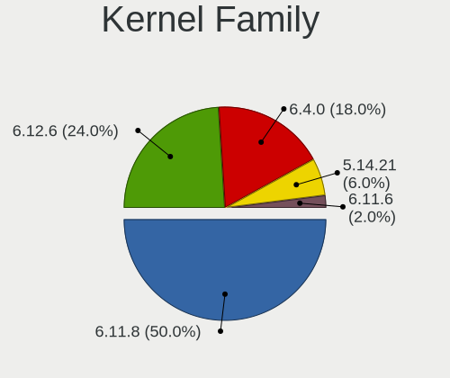
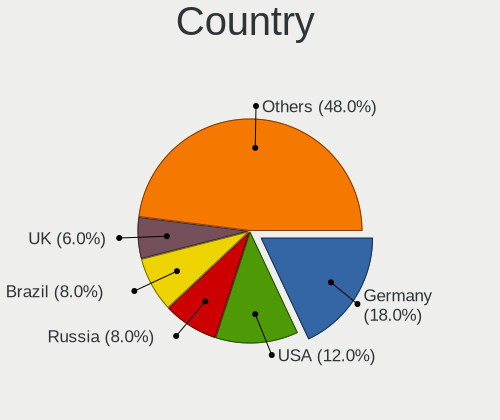
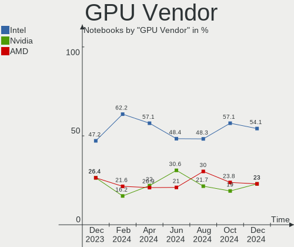

openSUSE - Hardware Trends (Notebooks)
--------------------------------------

A project to identify most popular hardware characteristics and track their change
over time based on data collected by Linux users at https://Linux-Hardware.org.

Anyone can contribute to this report by the [hw-probe](https://github.com/linuxhw/hw-probe) tool:

    sudo -E hw-probe -all -upload

This report is for one last month. Overall report since the beginning of time: [TestCoverage](https://github.com/linuxhw/TestCoverage)

Period: Aug, 2022.

Contents
--------

* [ System ](#system)
  - [ OS                       ](#os)
  - [ OS Family                ](#os-family)
  - [ Kernel                   ](#kernel)
  - [ Kernel Family            ](#kernel-family)
  - [ Kernel Major Ver.        ](#kernel-major-ver)
  - [ Arch                     ](#arch)
  - [ DE                       ](#de)
  - [ Display Server           ](#display-server)
  - [ Display Manager          ](#display-manager)
  - [ OS Lang                  ](#os-lang)
  - [ Boot Mode                ](#boot-mode)
  - [ Filesystem               ](#filesystem)
  - [ Part. scheme             ](#part-scheme)
  - [ Dual Boot with Linux/BSD ](#dual-boot-with-linuxbsd)
  - [ Dual Boot (Win)          ](#dual-boot-win)

* [ Board ](#board)
  - [ Vendor                   ](#vendor)
  - [ Model                    ](#model)
  - [ Model Family             ](#model-family)
  - [ MFG Year                 ](#mfg-year)
  - [ Form Factor              ](#form-factor)
  - [ Secure Boot              ](#secure-boot)
  - [ Coreboot                 ](#coreboot)
  - [ RAM Size                 ](#ram-size)
  - [ RAM Used                 ](#ram-used)
  - [ Total Drives             ](#total-drives)
  - [ Has CD-ROM               ](#has-cd-rom)
  - [ Has Ethernet             ](#has-ethernet)
  - [ Has WiFi                 ](#has-wifi)
  - [ Has Bluetooth            ](#has-bluetooth)

* [ Location ](#location)
  - [ Country                  ](#country)
  - [ City                     ](#city)

* [ Drives ](#drives)
  - [ Drive Vendor             ](#drive-vendor)
  - [ Drive Model              ](#drive-model)
  - [ HDD Vendor               ](#hdd-vendor)
  - [ SSD Vendor               ](#ssd-vendor)
  - [ Drive Kind               ](#drive-kind)
  - [ Drive Connector          ](#drive-connector)
  - [ Drive Size               ](#drive-size)
  - [ Space Total              ](#space-total)
  - [ Space Used               ](#space-used)
  - [ Malfunc. Drives          ](#malfunc-drives)
  - [ Malfunc. Drive Vendor    ](#malfunc-drive-vendor)
  - [ Malfunc. HDD Vendor      ](#malfunc-hdd-vendor)
  - [ Malfunc. Drive Kind      ](#malfunc-drive-kind)
  - [ Failed Drives            ](#failed-drives)
  - [ Failed Drive Vendor      ](#failed-drive-vendor)
  - [ Drive Status             ](#drive-status)

* [ Storage controller ](#storage-controller)
  - [ Storage Vendor           ](#storage-vendor)
  - [ Storage Model            ](#storage-model)
  - [ Storage Kind             ](#storage-kind)

* [ Processor ](#processor)
  - [ CPU Vendor               ](#cpu-vendor)
  - [ CPU Model                ](#cpu-model)
  - [ CPU Model Family         ](#cpu-model-family)
  - [ CPU Cores                ](#cpu-cores)
  - [ CPU Sockets              ](#cpu-sockets)
  - [ CPU Threads              ](#cpu-threads)
  - [ CPU Op-Modes             ](#cpu-op-modes)
  - [ CPU Microcode            ](#cpu-microcode)
  - [ CPU Microarch            ](#cpu-microarch)

* [ Graphics ](#graphics)
  - [ GPU Vendor               ](#gpu-vendor)
  - [ GPU Model                ](#gpu-model)
  - [ GPU Combo                ](#gpu-combo)
  - [ GPU Driver               ](#gpu-driver)
  - [ GPU Memory               ](#gpu-memory)

* [ Monitor ](#monitor)
  - [ Monitor Vendor           ](#monitor-vendor)
  - [ Monitor Model            ](#monitor-model)
  - [ Monitor Resolution       ](#monitor-resolution)
  - [ Monitor Diagonal         ](#monitor-diagonal)
  - [ Monitor Width            ](#monitor-width)
  - [ Aspect Ratio             ](#aspect-ratio)
  - [ Monitor Area             ](#monitor-area)
  - [ Pixel Density            ](#pixel-density)
  - [ Multiple Monitors        ](#multiple-monitors)

* [ Network ](#network)
  - [ Net Controller Vendor    ](#net-controller-vendor)
  - [ Net Controller Model     ](#net-controller-model)
  - [ Wireless Vendor          ](#wireless-vendor)
  - [ Wireless Model           ](#wireless-model)
  - [ Ethernet Vendor          ](#ethernet-vendor)
  - [ Ethernet Model           ](#ethernet-model)
  - [ Net Controller Kind      ](#net-controller-kind)
  - [ Used Controller          ](#used-controller)
  - [ NICs                     ](#nics)
  - [ IPv6                     ](#ipv6)

* [ Bluetooth ](#bluetooth)
  - [ Bluetooth Vendor         ](#bluetooth-vendor)
  - [ Bluetooth Model          ](#bluetooth-model)

* [ Sound ](#sound)
  - [ Sound Vendor             ](#sound-vendor)
  - [ Sound Model              ](#sound-model)

* [ Memory ](#memory)
  - [ Memory Vendor            ](#memory-vendor)
  - [ Memory Model             ](#memory-model)
  - [ Memory Kind              ](#memory-kind)
  - [ Memory Form Factor       ](#memory-form-factor)
  - [ Memory Size              ](#memory-size)
  - [ Memory Speed             ](#memory-speed)

* [ Printers & scanners ](#printers--scanners)
  - [ Printer Vendor           ](#printer-vendor)
  - [ Printer Model            ](#printer-model)
  - [ Scanner Vendor           ](#scanner-vendor)
  - [ Scanner Model            ](#scanner-model)

* [ Camera ](#camera)
  - [ Camera Vendor            ](#camera-vendor)
  - [ Camera Model             ](#camera-model)

* [ Security ](#security)
  - [ Fingerprint Vendor       ](#fingerprint-vendor)
  - [ Fingerprint Model        ](#fingerprint-model)
  - [ Chipcard Vendor          ](#chipcard-vendor)
  - [ Chipcard Model           ](#chipcard-model)

* [ Unsupported ](#unsupported)
  - [ Unsupported Devices      ](#unsupported-devices)
  - [ Unsupported Device Types ](#unsupported-device-types)

System
------

OS
--

Installed operating systems

| Name                         | Notebooks | Percent |
|------------------------------|-----------|---------|
| openSUSE Tumbleweed-XXXXXXXX | 20        | 80%     |
| openSUSE Leap-15.4           | 4         | 16%     |
| openSUSE Leap-15.3           | 1         | 4%      |

OS Family
---------

OS without a version

| Name     | Notebooks | Percent |
|----------|-----------|---------|
| openSUSE | 25        | 100%    |

Kernel
------

Version of the Linux kernel

| Version                      | Notebooks | Percent |
|------------------------------|-----------|---------|
| 5.19.2-1-default             | 5         | 20%     |
| 5.19.0-1-default             | 4         | 16%     |
| 5.18.15-1-default            | 4         | 16%     |
| 5.14.21-150400.24.18-default | 3         | 12%     |
| 5.19.1-1-default             | 2         | 8%      |
| 5.18.12-1-default            | 2         | 8%      |
| 5.3.18-150300.59.87-default  | 1         | 4%      |
| 5.19.1-4.g4fdb301-default    | 1         | 4%      |
| 5.19.0-3.g35466a9-default    | 1         | 4%      |
| 5.18.11-1-default            | 1         | 4%      |
| 5.14.21-150400.24.11-default | 1         | 4%      |

Kernel Family
-------------

Linux kernel without a distro release

| Version | Notebooks | Percent |
|---------|-----------|---------|
| 5.19.2  | 5         | 20%     |
| 5.19.0  | 5         | 20%     |
| 5.18.15 | 4         | 16%     |
| 5.14.21 | 4         | 16%     |
| 5.19.1  | 3         | 12%     |
| 5.18.12 | 2         | 8%      |
| 5.3.18  | 1         | 4%      |
| 5.18.11 | 1         | 4%      |

Kernel Major Ver.
-----------------

Linux kernel major version

| Version | Notebooks | Percent |
|---------|-----------|---------|
| 5.19    | 13        | 52%     |
| 5.18    | 7         | 28%     |
| 5.14    | 4         | 16%     |
| 5.3     | 1         | 4%      |

Arch
----

OS architecture (x86_64, i586, etc.)

| Name   | Notebooks | Percent |
|--------|-----------|---------|
| x86_64 | 25        | 100%    |

DE
--

Desktop Environment

| Name   | Notebooks | Percent |
|--------|-----------|---------|
| KDE5   | 15        | 60%     |
| GNOME  | 8         | 32%     |
| XFCE   | 1         | 4%      |
| Deepin | 1         | 4%      |

Display Server
--------------

X11 or Wayland

| Name    | Notebooks | Percent |
|---------|-----------|---------|
| X11     | 17        | 68%     |
| Wayland | 8         | 32%     |

Display Manager
---------------

SDDM, LightDM, etc.

| Name    | Notebooks | Percent |
|---------|-----------|---------|
| Unknown | 11        | 44%     |
| SDDM    | 9         | 36%     |
| XDM     | 4         | 16%     |
| LightDM | 1         | 4%      |

OS Lang
-------

Language

| Lang  | Notebooks | Percent |
|-------|-----------|---------|
| en_US | 9         | 36%     |
| ru_RU | 3         | 12%     |
| es_ES | 2         | 8%      |
| zh_CN | 1         | 4%      |
| pt_BR | 1         | 4%      |
| POSIX | 1         | 4%      |
| pl_PL | 1         | 4%      |
| it_IT | 1         | 4%      |
| fr_FR | 1         | 4%      |
| en_GB | 1         | 4%      |
| en_AU | 1         | 4%      |
| de_DE | 1         | 4%      |
| ca_ES | 1         | 4%      |
| bg_BG | 1         | 4%      |

Boot Mode
---------

EFI or BIOS

| Mode | Notebooks | Percent |
|------|-----------|---------|
| EFI  | 19        | 76%     |
| BIOS | 6         | 24%     |

Filesystem
----------

Type of filesystem

| Type  | Notebooks | Percent |
|-------|-----------|---------|
| Btrfs | 18        | 72%     |
| Ext4  | 5         | 20%     |
| Xfs   | 2         | 8%      |

Part. scheme
------------

Scheme of partitioning

| Type    | Notebooks | Percent |
|---------|-----------|---------|
| GPT     | 13        | 52%     |
| Unknown | 11        | 44%     |
| MBR     | 1         | 4%      |

Dual Boot with Linux/BSD
------------------------

Hosting more than one Linux/BSD

| Dual boot | Notebooks | Percent |
|-----------|-----------|---------|
| No        | 23        | 92%     |
| Yes       | 2         | 8%      |

Dual Boot (Win)
---------------

Hosting Linux and Windows

| Dual boot | Notebooks | Percent |
|-----------|-----------|---------|
| No        | 22        | 88%     |
| Yes       | 3         | 12%     |

Board
-----

Vendor
------

Motherboard manufacturer

| Name             | Notebooks | Percent |
|------------------|-----------|---------|
| Lenovo           | 7         | 28%     |
| Hewlett-Packard  | 6         | 24%     |
| Notebook         | 2         | 8%      |
| Dell             | 2         | 8%      |
| ASUSTek Computer | 2         | 8%      |
| Acer             | 2         | 8%      |
| Valve            | 1         | 4%      |
| SLIMBOOK         | 1         | 4%      |
| Positivo         | 1         | 4%      |
| Unknown          | 1         | 4%      |

Model
-----

Motherboard model

| Name                                  | Notebooks | Percent |
|---------------------------------------|-----------|---------|
| Lenovo ThinkBook 14 G3 ACL 21A2       | 2         | 8%      |
| Valve Jupiter                         | 1         | 4%      |
| SLIMBOOK PROX-AMD5                    | 1         | 4%      |
| Positivo W942SW_SW1                   | 1         | 4%      |
| Notebook NLx0MU                       | 1         | 4%      |
| Notebook N24_25JU                     | 1         | 4%      |
| Lenovo Z51-70 80K6                    | 1         | 4%      |
| Lenovo ThinkPad T460s 20F9004NUS      | 1         | 4%      |
| Lenovo ThinkPad T450 20BUS0EW1F       | 1         | 4%      |
| Lenovo ThinkBook 16p Gen 2 20YM       | 1         | 4%      |
| Lenovo IdeaPad L340-15IRH Gaming 81LK | 1         | 4%      |
| HP ZBook 17                           | 1         | 4%      |
| HP Victus by Laptop 16-e0xxx          | 1         | 4%      |
| HP ProBook 640 G1                     | 1         | 4%      |
| HP Pavilion Notebook                  | 1         | 4%      |
| HP Laptop 17-ca0xxx                   | 1         | 4%      |
| HP Laptop 17-by1xxx                   | 1         | 4%      |
| Dell XPS 15 9530                      | 1         | 4%      |
| Dell Latitude E6430                   | 1         | 4%      |
| ASUS ZenBook UX431DA_UM431DA          | 1         | 4%      |
| ASUS ROG Strix G513QY_G513QY          | 1         | 4%      |
| Acer Aspire A515-45                   | 1         | 4%      |
| Acer Aspire 4732Z                     | 1         | 4%      |
| Unknown                               | 1         | 4%      |

Model Family
------------

Motherboard model prefix

| Name               | Notebooks | Percent |
|--------------------|-----------|---------|
| Lenovo ThinkBook   | 3         | 12%     |
| Lenovo ThinkPad    | 2         | 8%      |
| HP Laptop          | 2         | 8%      |
| Acer Aspire        | 2         | 8%      |
| Valve Jupiter      | 1         | 4%      |
| SLIMBOOK PROX-AMD5 | 1         | 4%      |
| Positivo W942SW    | 1         | 4%      |
| Notebook NLx0MU    | 1         | 4%      |
| Notebook N24       | 1         | 4%      |
| Lenovo Z51-70      | 1         | 4%      |
| Lenovo IdeaPad     | 1         | 4%      |
| HP ZBook           | 1         | 4%      |
| HP Victus          | 1         | 4%      |
| HP ProBook         | 1         | 4%      |
| HP Pavilion        | 1         | 4%      |
| Dell XPS           | 1         | 4%      |
| Dell Latitude      | 1         | 4%      |
| ASUS ZenBook       | 1         | 4%      |
| ASUS ROG           | 1         | 4%      |
| Unknown            | 1         | 4%      |

MFG Year
--------

Motherboard manufacture year

| Year | Notebooks | Percent |
|------|-----------|---------|
| 2021 | 8         | 32%     |
| 2019 | 3         | 12%     |
| 2015 | 3         | 12%     |
| 2014 | 3         | 12%     |
| 2022 | 2         | 8%      |
| 2018 | 2         | 8%      |
| 2016 | 1         | 4%      |
| 2013 | 1         | 4%      |
| 2012 | 1         | 4%      |
| 2009 | 1         | 4%      |

Form Factor
-----------

Physical design of the computer

| Name     | Notebooks | Percent |
|----------|-----------|---------|
| Notebook | 25        | 100%    |

Secure Boot
-----------

Enabled or disabled

| State    | Notebooks | Percent |
|----------|-----------|---------|
| Disabled | 21        | 84%     |
| Enabled  | 4         | 16%     |

Coreboot
--------

Have coreboot on board

| Used | Notebooks | Percent |
|------|-----------|---------|
| No   | 25        | 100%    |

RAM Size
--------

Total RAM memory

| Size in GB | Notebooks | Percent |
|------------|-----------|---------|
| 8.01-16.0  | 11        | 44%     |
| 4.01-8.0   | 8         | 32%     |
| 16.01-24.0 | 4         | 16%     |
| 32.01-64.0 | 1         | 4%      |
| 3.01-4.0   | 1         | 4%      |

RAM Used
--------

Used RAM memory

| Used GB   | Notebooks | Percent |
|-----------|-----------|---------|
| 2.01-3.0  | 7         | 28%     |
| 1.01-2.0  | 7         | 28%     |
| 4.01-8.0  | 5         | 20%     |
| 3.01-4.0  | 4         | 16%     |
| 8.01-16.0 | 2         | 8%      |

Total Drives
------------

Number of drives on board

| Drives | Notebooks | Percent |
|--------|-----------|---------|
| 1      | 16        | 64%     |
| 2      | 9         | 36%     |

Has CD-ROM
----------

Has CD-ROM on board

| Presented | Notebooks | Percent |
|-----------|-----------|---------|
| No        | 20        | 80%     |
| Yes       | 5         | 20%     |

Has Ethernet
------------

Has Ethernet on board

| Presented | Notebooks | Percent |
|-----------|-----------|---------|
| Yes       | 23        | 92%     |
| No        | 2         | 8%      |

Has WiFi
--------

Has WiFi module

| Presented | Notebooks | Percent |
|-----------|-----------|---------|
| Yes       | 25        | 100%    |

Has Bluetooth
-------------

Has Bluetooth module

| Presented | Notebooks | Percent |
|-----------|-----------|---------|
| Yes       | 21        | 84%     |
| No        | 4         | 16%     |

Location
--------

Country
-------

Geographic location (country)

| Country   | Notebooks | Percent |
|-----------|-----------|---------|
| Russia    | 3         | 12%     |
| USA       | 2         | 8%      |
| UK        | 2         | 8%      |
| Italy     | 2         | 8%      |
| Indonesia | 2         | 8%      |
| Canada    | 2         | 8%      |
| Sweden    | 1         | 4%      |
| Spain     | 1         | 4%      |
| Romania   | 1         | 4%      |
| Poland    | 1         | 4%      |
| Peru      | 1         | 4%      |
| Mexico    | 1         | 4%      |
| Germany   | 1         | 4%      |
| France    | 1         | 4%      |
| China     | 1         | 4%      |
| Bulgaria  | 1         | 4%      |
| Brazil    | 1         | 4%      |
| Australia | 1         | 4%      |

City
----

Geographic location (city)

| City             | Notebooks | Percent |
|------------------|-----------|---------|
| Winnipeg         | 1         | 4%      |
| Ufa              | 1         | 4%      |
| Udine            | 1         | 4%      |
| Sydney           | 1         | 4%      |
| Stockholm        | 1         | 4%      |
| Spalding         | 1         | 4%      |
| Sault Ste. Marie | 1         | 4%      |
| Paris            | 1         | 4%      |
| Paisley          | 1         | 4%      |
| Milan            | 1         | 4%      |
| Louisville       | 1         | 4%      |
| Los Angeles      | 1         | 4%      |
| Lodz             | 1         | 4%      |
| Lima             | 1         | 4%      |
| Jakarta          | 1         | 4%      |
| Iasi             | 1         | 4%      |
| Guadalajara      | 1         | 4%      |
| Freital          | 1         | 4%      |
| Engel's          | 1         | 4%      |
| Chelyabinsk      | 1         | 4%      |
| Changsha         | 1         | 4%      |
| Cardedeu         | 1         | 4%      |
| Caraguatatuba    | 1         | 4%      |
| Burgas           | 1         | 4%      |
| Bekasi           | 1         | 4%      |

Drives
------

Drive Vendor
------------

Hard drive vendors

| Vendor                | Notebooks | Drives | Percent |
|-----------------------|-----------|--------|---------|
| Samsung Electronics   | 8         | 9      | 22.86%  |
| WDC                   | 5         | 5      | 14.29%  |
| SK hynix              | 4         | 4      | 11.43%  |
| Toshiba               | 3         | 3      | 8.57%   |
| Seagate               | 3         | 3      | 8.57%   |
| Unknown               | 2         | 2      | 5.71%   |
| Kingston              | 2         | 2      | 5.71%   |
| VISIPRO               | 1         | 1      | 2.86%   |
| Sandisk               | 1         | 1      | 2.86%   |
| Realtek Semiconductor | 1         | 1      | 2.86%   |
| PNY                   | 1         | 1      | 2.86%   |
| LEQIXIANG             | 1         | 1      | 2.86%   |
| Intel                 | 1         | 1      | 2.86%   |
| Hitachi               | 1         | 1      | 2.86%   |
| Hewlett-Packard       | 1         | 1      | 2.86%   |

Drive Model
-----------

Hard drive models

| Model                                            | Notebooks | Percent |
|--------------------------------------------------|-----------|---------|
| Toshiba MQ04ABF100 1TB                           | 2         | 5.56%   |
| WDC WDS120G2G0B-00EPW0 120GB SSD                 | 1         | 2.78%   |
| WDC WD3200BEKX-60B7WT0 320GB                     | 1         | 2.78%   |
| WDC WD10SPZX-60Z10T0 1TB                         | 1         | 2.78%   |
| WDC WD10SPZX-24Z10 1TB                           | 1         | 2.78%   |
| WDC PC SN530 SDBPMPZ-512G-1101 512GB             | 1         | 2.78%   |
| VISIPRO SSD 256GB                                | 1         | 2.78%   |
| Unknown MMC Card  248GB                          | 1         | 2.78%   |
| Unknown MMC Card  128GB                          | 1         | 2.78%   |
| Toshiba MK3265GSX 320GB                          | 1         | 2.78%   |
| SK hynix SKHynix_HFM512GD3HX015N 512GB           | 1         | 2.78%   |
| SK hynix NVMe SSD Drive 512GB                    | 1         | 2.78%   |
| SK hynix HFM512GD3JX016N 512GB                   | 1         | 2.78%   |
| SK hynix BC501 NVMe Solid State Drive 512GB      | 1         | 2.78%   |
| Seagate ST2000LM015-2E8174 2TB                   | 1         | 2.78%   |
| Seagate ST1000LM048-2E7172 1TB                   | 1         | 2.78%   |
| Seagate ST1000LM024 HN-M101MBB 1TB               | 1         | 2.78%   |
| Sandisk WD Black SN750 / PC SN730 NVMe SSD 512GB | 1         | 2.78%   |
| Samsung SSD PM851 mSATA 512GB                    | 1         | 2.78%   |
| Samsung SSD 980 250GB                            | 1         | 2.78%   |
| Samsung SSD 970 EVO Plus 500GB                   | 1         | 2.78%   |
| Samsung SSD 970 EVO Plus 1TB                     | 1         | 2.78%   |
| Samsung SM963 2.5" NVMe PCIe SSD 128GB           | 1         | 2.78%   |
| Samsung NVMe SSD Drive 500GB                     | 1         | 2.78%   |
| Samsung NVMe SSD Drive 256GB                     | 1         | 2.78%   |
| Samsung NVMe SSD Drive 1TB                       | 1         | 2.78%   |
| Samsung MZNLN256HMHQ-000L7 256GB SSD             | 1         | 2.78%   |
| Realtek XPG GAMMIX S5 512GB                      | 1         | 2.78%   |
| PNY CS900 240GB SSD                              | 1         | 2.78%   |
| LEQIXIANG SSD 256GB                              | 1         | 2.78%   |
| Kingston SA400S37480G 480GB SSD                  | 1         | 2.78%   |
| Kingston OM3PDP3512B-A01 512GB                   | 1         | 2.78%   |
| Intel SSDPEKNU512GZ 512GB                        | 1         | 2.78%   |
| Hitachi HTS543232A7A384 320GB                    | 1         | 2.78%   |
| HP SSD S700 500GB                                | 1         | 2.78%   |

HDD Vendor
----------

Hard disk drive vendors

| Vendor  | Notebooks | Drives | Percent |
|---------|-----------|--------|---------|
| WDC     | 3         | 3      | 30%     |
| Toshiba | 3         | 3      | 30%     |
| Seagate | 3         | 3      | 30%     |
| Hitachi | 1         | 1      | 10%     |

SSD Vendor
----------

Solid state drive vendors

| Vendor              | Notebooks | Drives | Percent |
|---------------------|-----------|--------|---------|
| Samsung Electronics | 2         | 2      | 25%     |
| WDC                 | 1         | 1      | 12.5%   |
| VISIPRO             | 1         | 1      | 12.5%   |
| PNY                 | 1         | 1      | 12.5%   |
| LEQIXIANG           | 1         | 1      | 12.5%   |
| Kingston            | 1         | 1      | 12.5%   |
| Hewlett-Packard     | 1         | 1      | 12.5%   |

Drive Kind
----------

HDD or SSD

| Kind | Notebooks | Drives | Percent |
|------|-----------|--------|---------|
| NVMe | 13        | 16     | 39.39%  |
| HDD  | 10        | 10     | 30.3%   |
| SSD  | 8         | 8      | 24.24%  |
| MMC  | 2         | 2      | 6.06%   |

Drive Connector
---------------

SATA, SAS, NVMe, etc.

| Type | Notebooks | Drives | Percent |
|------|-----------|--------|---------|
| SATA | 16        | 18     | 51.61%  |
| NVMe | 13        | 16     | 41.94%  |
| MMC  | 2         | 2      | 6.45%   |

Drive Size
----------

Size of hard drive

| Size in TB | Notebooks | Drives | Percent |
|------------|-----------|--------|---------|
| 0.01-0.5   | 9         | 10     | 52.94%  |
| 0.51-1.0   | 7         | 7      | 41.18%  |
| 1.01-2.0   | 1         | 1      | 5.88%   |

Space Total
-----------

Amount of disk space available on the file system

| Size in GB     | Notebooks | Percent |
|----------------|-----------|---------|
| 2001-3000      | 7         | 28%     |
| 1001-2000      | 6         | 24%     |
| More than 3000 | 4         | 16%     |
| 251-500        | 3         | 12%     |
| 501-1000       | 3         | 12%     |
| 101-250        | 2         | 8%      |

Space Used
----------

Amount of used disk space

| Used GB   | Notebooks | Percent |
|-----------|-----------|---------|
| 251-500   | 6         | 24%     |
| 101-250   | 5         | 20%     |
| 501-1000  | 4         | 16%     |
| 51-100    | 4         | 16%     |
| 1-20      | 3         | 12%     |
| 21-50     | 1         | 4%      |
| 2001-3000 | 1         | 4%      |
| 1001-2000 | 1         | 4%      |

Malfunc. Drives
---------------

Drive models with a malfunction

| Model               | Notebooks | Drives | Percent |
|---------------------|-----------|--------|---------|
| LEQIXIANG SSD 256GB | 1         | 1      | 100%    |

Malfunc. Drive Vendor
---------------------

Vendors of faulty drives

| Vendor    | Notebooks | Drives | Percent |
|-----------|-----------|--------|---------|
| LEQIXIANG | 1         | 1      | 100%    |

Malfunc. HDD Vendor
-------------------

Vendors of faulty HDD drives

Zero info for selected period =(

Malfunc. Drive Kind
-------------------

Kinds of faulty drives

| Kind | Notebooks | Drives | Percent |
|------|-----------|--------|---------|
| SSD  | 1         | 1      | 100%    |

Failed Drives
-------------

Failed drive models

Zero info for selected period =(

Failed Drive Vendor
-------------------

Failed drive vendors

Zero info for selected period =(

Drive Status
------------

Number of failed and malfunc. drives

| Status   | Notebooks | Drives | Percent |
|----------|-----------|--------|---------|
| Works    | 14        | 17     | 50%     |
| Detected | 13        | 18     | 46.43%  |
| Malfunc  | 1         | 1      | 3.57%   |

Storage controller
------------------

Storage Vendor
--------------

Storage controller vendors

| Vendor                      | Notebooks | Percent |
|-----------------------------|-----------|---------|
| Intel                       | 16        | 47.06%  |
| Samsung Electronics         | 5         | 14.71%  |
| AMD                         | 5         | 14.71%  |
| SK hynix                    | 4         | 11.76%  |
| SanDisk                     | 2         | 5.88%   |
| Realtek Semiconductor       | 1         | 2.94%   |
| Kingston Technology Company | 1         | 2.94%   |

Storage Model
-------------

Storage controller models

| Model                                                                          | Notebooks | Percent |
|--------------------------------------------------------------------------------|-----------|---------|
| AMD FCH SATA Controller [AHCI mode]                                            | 5         | 14.71%  |
| Intel 8 Series/C220 Series Chipset Family 6-port SATA Controller 1 [AHCI mode] | 4         | 11.76%  |
| SK hynix Gold P31 SSD                                                          | 3         | 8.82%   |
| Samsung NVMe SSD Controller SM981/PM981/PM983                                  | 3         | 8.82%   |
| Intel 82801 Mobile SATA Controller [RAID mode]                                 | 3         | 8.82%   |
| Samsung NVMe SSD Controller 980                                                | 2         | 5.88%   |
| Intel Wildcat Point-LP SATA Controller [AHCI Mode]                             | 2         | 5.88%   |
| Intel Sunrise Point-LP SATA Controller [AHCI mode]                             | 2         | 5.88%   |
| SK hynix BC501 NVMe Solid State Drive                                          | 1         | 2.94%   |
| SanDisk WD Black SN750 / PC SN730 NVMe SSD                                     | 1         | 2.94%   |
| SanDisk Non-Volatile memory controller                                         | 1         | 2.94%   |
| Realtek Realtek Non-Volatile memory controller                                 | 1         | 2.94%   |
| Kingston Company OM3PDP3 NVMe SSD                                              | 1         | 2.94%   |
| Intel Tiger Lake-LP SATA Controller                                            | 1         | 2.94%   |
| Intel Non-Volatile memory controller                                           | 1         | 2.94%   |
| Intel Celeron/Pentium Silver Processor SATA Controller                         | 1         | 2.94%   |
| Intel Cannon Lake Mobile PCH SATA AHCI Controller                              | 1         | 2.94%   |
| Intel 82801IBM/IEM (ICH9M/ICH9M-E) 4 port SATA Controller [AHCI mode]          | 1         | 2.94%   |

Storage Kind
------------

Kind of storage controller (IDE, SATA, NVMe, SAS, ...)

| Kind | Notebooks | Percent |
|------|-----------|---------|
| SATA | 17        | 53.13%  |
| NVMe | 12        | 37.5%   |
| RAID | 3         | 9.38%   |

Processor
---------

CPU Vendor
----------

Processor vendors

| Vendor | Notebooks | Percent |
|--------|-----------|---------|
| Intel  | 15        | 60%     |
| AMD    | 10        | 40%     |

CPU Model
---------

Processor models

| Model                                         | Notebooks | Percent |
|-----------------------------------------------|-----------|---------|
| AMD Ryzen 7 5700U with Radeon Graphics        | 2         | 8%      |
| AMD Ryzen 5 5500U with Radeon Graphics        | 2         | 8%      |
| Intel Pentium Dual-Core CPU T4300 @ 2.10GHz   | 1         | 4%      |
| Intel Core i7-6500U CPU @ 2.50GHz             | 1         | 4%      |
| Intel Core i7-5500U CPU @ 2.40GHz             | 1         | 4%      |
| Intel Core i7-4712HQ CPU @ 2.30GHz            | 1         | 4%      |
| Intel Core i7-4700MQ CPU @ 2.40GHz            | 1         | 4%      |
| Intel Core i5-9300H CPU @ 2.40GHz             | 1         | 4%      |
| Intel Core i5-8300H CPU @ 2.30GHz             | 1         | 4%      |
| Intel Core i5-8265U CPU @ 1.60GHz             | 1         | 4%      |
| Intel Core i5-6300U CPU @ 2.40GHz             | 1         | 4%      |
| Intel Core i5-5300U CPU @ 2.30GHz             | 1         | 4%      |
| Intel Core i5-4210M CPU @ 2.60GHz             | 1         | 4%      |
| Intel Core i5-3340M CPU @ 2.70GHz             | 1         | 4%      |
| Intel Core i3-4000M CPU @ 2.40GHz             | 1         | 4%      |
| Intel Celeron J4125 CPU @ 2.00GHz             | 1         | 4%      |
| Intel 11th Gen Core i7-1165G7 @ 2.80GHz       | 1         | 4%      |
| AMD Ryzen 9 5980HX with Radeon Graphics       | 1         | 4%      |
| AMD Ryzen 7 5800H with Radeon Graphics        | 1         | 4%      |
| AMD Ryzen 5 5600H with Radeon Graphics        | 1         | 4%      |
| AMD Ryzen 5 3500U with Radeon Vega Mobile Gfx | 1         | 4%      |
| AMD Custom APU 0405                           | 1         | 4%      |
| AMD A6-9225 RADEON R4, 5 COMPUTE CORES 2C+3G  | 1         | 4%      |

CPU Model Family
----------------

Processor model prefix

| Model                   | Notebooks | Percent |
|-------------------------|-----------|---------|
| Intel Core i5           | 7         | 28%     |
| Intel Core i7           | 4         | 16%     |
| AMD Ryzen 5             | 4         | 16%     |
| AMD Ryzen 7             | 3         | 12%     |
| Other                   | 2         | 8%      |
| Intel Pentium Dual-Core | 1         | 4%      |
| Intel Core i3           | 1         | 4%      |
| Intel Celeron           | 1         | 4%      |
| AMD Ryzen 9             | 1         | 4%      |
| AMD A6                  | 1         | 4%      |

CPU Cores
---------

Number of processor cores

| Number | Notebooks | Percent |
|--------|-----------|---------|
| 4      | 9         | 36%     |
| 2      | 9         | 36%     |
| 8      | 4         | 16%     |
| 6      | 3         | 12%     |

CPU Sockets
-----------

Number of sockets

| Number | Notebooks | Percent |
|--------|-----------|---------|
| 1      | 25        | 100%    |

CPU Threads
-----------

Threads per core (Hyper-Threading)

| Number | Notebooks | Percent |
|--------|-----------|---------|
| 2      | 22        | 88%     |
| 1      | 3         | 12%     |

CPU Op-Modes
------------

CPU Operation Modes (32-bit, 64-bit)

| Op mode        | Notebooks | Percent |
|----------------|-----------|---------|
| 32-bit, 64-bit | 25        | 100%    |

CPU Microcode
-------------

Microcode number

| Number     | Notebooks | Percent |
|------------|-----------|---------|
| 0x306c3    | 3         | 12%     |
| 0x0a50000c | 3         | 12%     |
| 0x08608103 | 3         | 12%     |
| Unknown    | 3         | 12%     |
| 0x406e3    | 2         | 8%      |
| 0x306d4    | 2         | 8%      |
| 0x906ea    | 1         | 4%      |
| 0x806eb    | 1         | 4%      |
| 0x806c1    | 1         | 4%      |
| 0x706a8    | 1         | 4%      |
| 0x306a9    | 1         | 4%      |
| 0x08900201 | 1         | 4%      |
| 0x08608102 | 1         | 4%      |
| 0x08108109 | 1         | 4%      |
| 0x06006705 | 1         | 4%      |

CPU Microarch
-------------

Microarchitecture

| Name          | Notebooks | Percent |
|---------------|-----------|---------|
| Unknown       | 5         | 20%     |
| Haswell       | 4         | 16%     |
| Zen 3         | 3         | 12%     |
| KabyLake      | 3         | 12%     |
| Skylake       | 2         | 8%      |
| Broadwell     | 2         | 8%      |
| Zen+          | 1         | 4%      |
| TigerLake     | 1         | 4%      |
| Penryn        | 1         | 4%      |
| IvyBridge     | 1         | 4%      |
| Goldmont plus | 1         | 4%      |
| Excavator     | 1         | 4%      |

Graphics
--------

GPU Vendor
----------

Vendors of graphics cards

| Vendor | Notebooks | Percent |
|--------|-----------|---------|
| Intel  | 13        | 41.94%  |
| AMD    | 11        | 35.48%  |
| Nvidia | 7         | 22.58%  |

GPU Model
---------

Graphics card models

| Model                                                                                 | Notebooks | Percent |
|---------------------------------------------------------------------------------------|-----------|---------|
| AMD Lucienne                                                                          | 4         | 12.12%  |
| Intel 4th Gen Core Processor Integrated Graphics Controller                           | 3         | 9.09%   |
| AMD Cezanne                                                                           | 3         | 9.09%   |
| Intel Skylake GT2 [HD Graphics 520]                                                   | 2         | 6.06%   |
| Intel HD Graphics 5500                                                                | 2         | 6.06%   |
| Intel CoffeeLake-H GT2 [UHD Graphics 630]                                             | 2         | 6.06%   |
| AMD Topaz XT [Radeon R7 M260/M265 / M340/M360 / M440/M445 / 530/535 / 620/625 Mobile] | 2         | 6.06%   |
| Nvidia TU117M [GeForce GTX 1650 Mobile / Max-Q]                                       | 1         | 3.03%   |
| Nvidia GP107M [GeForce GTX 1050 Ti Mobile]                                            | 1         | 3.03%   |
| Nvidia GP107M [GeForce GTX 1050 3 GB Max-Q]                                           | 1         | 3.03%   |
| Nvidia GK208GLM [Quadro K610M]                                                        | 1         | 3.03%   |
| Nvidia GK107M [GeForce GT 750M]                                                       | 1         | 3.03%   |
| Nvidia GF108GLM [NVS 5200M]                                                           | 1         | 3.03%   |
| Nvidia GA106M [GeForce RTX 3060 Mobile / Max-Q]                                       | 1         | 3.03%   |
| Intel WhiskeyLake-U GT2 [UHD Graphics 620]                                            | 1         | 3.03%   |
| Intel TigerLake-LP GT2 [Iris Xe Graphics]                                             | 1         | 3.03%   |
| Intel Mobile 4 Series Chipset Integrated Graphics Controller                          | 1         | 3.03%   |
| Intel GeminiLake [UHD Graphics 600]                                                   | 1         | 3.03%   |
| AMD VanGogh [AMD Custom GPU 0405]                                                     | 1         | 3.03%   |
| AMD Stoney [Radeon R2/R3/R4/R5 Graphics]                                              | 1         | 3.03%   |
| AMD Picasso/Raven 2 [Radeon Vega Series / Radeon Vega Mobile Series]                  | 1         | 3.03%   |
| AMD Navi 22 [Radeon RX 6700/6700 XT/6750 XT / 6800M]                                  | 1         | 3.03%   |

GPU Combo
---------

Combinations of graphics cards

| Name           | Notebooks | Percent |
|----------------|-----------|---------|
| 1 x Intel      | 9         | 36%     |
| 1 x AMD        | 6         | 24%     |
| Intel + Nvidia | 3         | 12%     |
| 2 x AMD        | 2         | 8%      |
| 1 x Nvidia     | 2         | 8%      |
| AMD + Nvidia   | 2         | 8%      |
| Intel + AMD    | 1         | 4%      |

GPU Driver
----------

Free vs proprietary

| Driver      | Notebooks | Percent |
|-------------|-----------|---------|
| Free        | 23        | 92%     |
| Proprietary | 2         | 8%      |

GPU Memory
----------

Total video memory

| Size in GB | Notebooks | Percent |
|------------|-----------|---------|
| Unknown    | 12        | 48%     |
| 0.01-0.5   | 5         | 20%     |
| 1.01-2.0   | 3         | 12%     |
| 0.51-1.0   | 2         | 8%      |
| 3.01-4.0   | 1         | 4%      |
| 2.01-3.0   | 1         | 4%      |
| 8.01-16.0  | 1         | 4%      |

Monitor
-------

Monitor Vendor
--------------

Monitor vendors

| Vendor              | Notebooks | Percent |
|---------------------|-----------|---------|
| Chimei Innolux      | 7         | 24.14%  |
| BOE                 | 6         | 20.69%  |
| AU Optronics        | 5         | 17.24%  |
| Samsung Electronics | 2         | 6.9%    |
| PANDA               | 2         | 6.9%    |
| Sharp               | 1         | 3.45%   |
| Philips             | 1         | 3.45%   |
| MAG                 | 1         | 3.45%   |
| LG Display          | 1         | 3.45%   |
| DSC                 | 1         | 3.45%   |
| CSO                 | 1         | 3.45%   |
| ANX                 | 1         | 3.45%   |

Monitor Model
-------------

Monitor models

| Model                                                                | Notebooks | Percent |
|----------------------------------------------------------------------|-----------|---------|
| Sharp LCD Monitor SHP13F8 3200x1800 346x194mm 15.6-inch              | 1         | 3.45%   |
| Samsung Electronics LCD Monitor SDC3754 1600x900 382x215mm 17.3-inch | 1         | 3.45%   |
| Samsung Electronics LCD Monitor SDC324E 1600x900 309x174mm 14.0-inch | 1         | 3.45%   |
| Philips PHL 243V7 PHLC155 1920x1080 527x296mm 23.8-inch              | 1         | 3.45%   |
| PANDA LCD Monitor NCP0063 1920x1080 344x194mm 15.5-inch              | 1         | 3.45%   |
| PANDA LCD Monitor NCP0035 1920x1080 309x174mm 14.0-inch              | 1         | 3.45%   |
| MAG MAG MAG2380 1920x1080 452x254mm 20.4-inch                        | 1         | 3.45%   |
| LG Display LCD Monitor LGD02DF 1600x900 310x174mm 14.0-inch          | 1         | 3.45%   |
| DSC Paperlike H D DSC0001 2200x1650 200x150mm 9.8-inch               | 1         | 3.45%   |
| CSO LCD Monitor CSO1603 2560x1600 344x215mm 16.0-inch                | 1         | 3.45%   |
| Chimei Innolux LCD Monitor CMN15E7 1920x1080 344x193mm 15.5-inch     | 1         | 3.45%   |
| Chimei Innolux LCD Monitor CMN15CB 1920x1080 344x193mm 15.5-inch     | 1         | 3.45%   |
| Chimei Innolux LCD Monitor CMN15C4 1920x1080 344x193mm 15.5-inch     | 1         | 3.45%   |
| Chimei Innolux LCD Monitor CMN1540 2560x1440 344x193mm 15.5-inch     | 1         | 3.45%   |
| Chimei Innolux LCD Monitor CMN14A3 1600x900 309x174mm 14.0-inch      | 1         | 3.45%   |
| Chimei Innolux LCD Monitor CMN140A 1920x1080 309x173mm 13.9-inch     | 1         | 3.45%   |
| Chimei Innolux LCD Monitor CMN1406 1920x1080 309x173mm 13.9-inch     | 1         | 3.45%   |
| BOE LCD Monitor BOE094A 1920x1080 344x194mm 15.5-inch                | 1         | 3.45%   |
| BOE LCD Monitor BOE08F6 1920x1080 355x200mm 16.0-inch                | 1         | 3.45%   |
| BOE LCD Monitor BOE08EE 1920x1080 309x174mm 14.0-inch                | 1         | 3.45%   |
| BOE LCD Monitor BOE0660 1600x900 382x215mm 17.3-inch                 | 1         | 3.45%   |
| BOE LCD Monitor BOE063F 1366x768 256x144mm 11.6-inch                 | 1         | 3.45%   |
| BOE LCD Monitor BOE05F6 1366x768 309x173mm 13.9-inch                 | 1         | 3.45%   |
| AU Optronics LCD Monitor AUO403D 1920x1080 309x173mm 13.9-inch       | 1         | 3.45%   |
| AU Optronics LCD Monitor AUO243D 1920x1080 309x173mm 13.9-inch       | 1         | 3.45%   |
| AU Optronics LCD Monitor AUO229E 1600x900 382x214mm 17.2-inch        | 1         | 3.45%   |
| AU Optronics LCD Monitor AUO109D 1920x1080 381x214mm 17.2-inch       | 1         | 3.45%   |
| AU Optronics LCD Monitor AUO103C 1366x768 309x173mm 13.9-inch        | 1         | 3.45%   |
| ANX ANX7530 U ANX7539 800x1280                                       | 1         | 3.45%   |

Monitor Resolution
------------------

Monitor screen resolution

| Resolution       | Notebooks | Percent |
|------------------|-----------|---------|
| 1920x1080 (FHD)  | 16        | 55.17%  |
| 1600x900 (HD+)   | 5         | 17.24%  |
| 1366x768 (WXGA)  | 3         | 10.34%  |
| 800x1280         | 1         | 3.45%   |
| 3200x1800 (QHD+) | 1         | 3.45%   |
| 2560x1600        | 1         | 3.45%   |
| 2560x1440 (QHD)  | 1         | 3.45%   |
| 2200x1650        | 1         | 3.45%   |

Monitor Diagonal
----------------

Diagonal size in inches

| Inches  | Notebooks | Percent |
|---------|-----------|---------|
| 15      | 8         | 27.59%  |
| 14      | 6         | 20.69%  |
| 17      | 4         | 13.79%  |
| 13      | 4         | 13.79%  |
| 16      | 2         | 6.9%    |
| 24      | 1         | 3.45%   |
| 21      | 1         | 3.45%   |
| 20      | 1         | 3.45%   |
| 11      | 1         | 3.45%   |
| Unknown | 1         | 3.45%   |

Monitor Width
-------------

Physical width

| Width in mm | Notebooks | Percent |
|-------------|-----------|---------|
| 301-350     | 19        | 65.52%  |
| 351-400     | 5         | 17.24%  |
| 401-500     | 2         | 6.9%    |
| 501-600     | 1         | 3.45%   |
| 201-300     | 1         | 3.45%   |
| Unknown     | 1         | 3.45%   |

Aspect Ratio
------------

Proportional relationship between the width and the height

| Ratio | Notebooks | Percent |
|-------|-----------|---------|
| 16/9  | 26        | 92.86%  |
| 16/10 | 1         | 3.57%   |
| 0.62  | 1         | 3.57%   |

Monitor Area
------------

Area in inch²

| Area in inch² | Notebooks | Percent |
|----------------|-----------|---------|
| 81-90          | 10        | 34.48%  |
| 101-110        | 9         | 31.03%  |
| 121-130        | 4         | 13.79%  |
| 151-200        | 2         | 6.9%    |
| 51-60          | 1         | 3.45%   |
| 201-250        | 1         | 3.45%   |
| 111-120        | 1         | 3.45%   |
| Unknown        | 1         | 3.45%   |

Pixel Density
-------------

Pixels per inch

| Density | Notebooks | Percent |
|---------|-----------|---------|
| 121-160 | 17        | 58.62%  |
| 101-120 | 7         | 24.14%  |
| 161-240 | 3         | 10.34%  |
| 51-100  | 1         | 3.45%   |
| Unknown | 1         | 3.45%   |

Multiple Monitors
-----------------

Total monitors connected

| Total | Notebooks | Percent |
|-------|-----------|---------|
| 1     | 22        | 88%     |
| 2     | 3         | 12%     |

Network
-------

Net Controller Vendor
---------------------

Controller vendors

| Vendor                | Notebooks | Percent |
|-----------------------|-----------|---------|
| Realtek Semiconductor | 16        | 40%     |
| Intel                 | 15        | 37.5%   |
| MediaTek              | 3         | 7.5%    |
| TP-Link               | 2         | 5%      |
| Qualcomm Atheros      | 1         | 2.5%    |
| ICS Advent            | 1         | 2.5%    |
| DisplayLink           | 1         | 2.5%    |
| Broadcom              | 1         | 2.5%    |

Net Controller Model
--------------------

Controller models

| Model                                                             | Notebooks | Percent |
|-------------------------------------------------------------------|-----------|---------|
| Realtek RTL8111/8168/8411 PCI Express Gigabit Ethernet Controller | 12        | 24%     |
| Intel Wi-Fi 6 AX200                                               | 4         | 8%      |
| MediaTek MT7921 802.11ax PCI Express Wireless Network Adapter     | 3         | 6%      |
| Intel Wireless 8265 / 8275                                        | 2         | 4%      |
| Intel Ethernet Connection I217-V                                  | 2         | 4%      |
| Intel Cannon Lake PCH CNVi WiFi                                   | 2         | 4%      |
| TP-Link UE300 10/100/1000 LAN (ethernet mode) [Realtek RTL8153]   | 1         | 2%      |
| TP-Link Archer T3U [Realtek RTL8812BU]                            | 1         | 2%      |
| Realtek RTL8852AE 802.11ax PCIe Wireless Network Adapter          | 1         | 2%      |
| Realtek RTL8822CE 802.11ac PCIe Wireless Network Adapter          | 1         | 2%      |
| Realtek RTL8822BE 802.11a/b/g/n/ac WiFi adapter                   | 1         | 2%      |
| Realtek RTL8723DE Wireless Network Adapter                        | 1         | 2%      |
| Realtek RTL8723BE PCIe Wireless Network Adapter                   | 1         | 2%      |
| Realtek RTL8188ETV Wireless LAN 802.11n Network Adapter           | 1         | 2%      |
| Realtek RTL8153 Gigabit Ethernet Adapter                          | 1         | 2%      |
| Realtek 802.11ac NIC                                              | 1         | 2%      |
| Qualcomm Atheros AR928X Wireless Network Adapter (PCI-Express)    | 1         | 2%      |
| Qualcomm Atheros AR8121/AR8113/AR8114 Gigabit or Fast Ethernet    | 1         | 2%      |
| Intel Wireless 8260                                               | 1         | 2%      |
| Intel Wireless 7265                                               | 1         | 2%      |
| Intel Wireless 7260                                               | 1         | 2%      |
| Intel Ethernet Connection I219-LM                                 | 1         | 2%      |
| Intel Ethernet Connection I217-LM                                 | 1         | 2%      |
| Intel Ethernet Connection (3) I218-LM                             | 1         | 2%      |
| Intel Ethernet Connection (13) I219-V                             | 1         | 2%      |
| Intel Centrino Ultimate-N 6300                                    | 1         | 2%      |
| Intel Centrino Advanced-N 6235                                    | 1         | 2%      |
| Intel 82579LM Gigabit Network Connection (Lewisville)             | 1         | 2%      |
| ICS Advent USB 10/100 LAN                                         | 1         | 2%      |
| DisplayLink ThinkPad USB 3.0 Dock                                 | 1         | 2%      |
| Broadcom BCM43228 802.11a/b/g/n                                   | 1         | 2%      |

Wireless Vendor
---------------

Wireless vendors

| Vendor                | Notebooks | Percent |
|-----------------------|-----------|---------|
| Intel                 | 13        | 50%     |
| Realtek Semiconductor | 7         | 26.92%  |
| MediaTek              | 3         | 11.54%  |
| TP-Link               | 1         | 3.85%   |
| Qualcomm Atheros      | 1         | 3.85%   |
| Broadcom              | 1         | 3.85%   |

Wireless Model
--------------

Wireless models

| Model                                                          | Notebooks | Percent |
|----------------------------------------------------------------|-----------|---------|
| Intel Wi-Fi 6 AX200                                            | 4         | 15.38%  |
| MediaTek MT7921 802.11ax PCI Express Wireless Network Adapter  | 3         | 11.54%  |
| Intel Wireless 8265 / 8275                                     | 2         | 7.69%   |
| Intel Cannon Lake PCH CNVi WiFi                                | 2         | 7.69%   |
| TP-Link Archer T3U [Realtek RTL8812BU]                         | 1         | 3.85%   |
| Realtek RTL8852AE 802.11ax PCIe Wireless Network Adapter       | 1         | 3.85%   |
| Realtek RTL8822CE 802.11ac PCIe Wireless Network Adapter       | 1         | 3.85%   |
| Realtek RTL8822BE 802.11a/b/g/n/ac WiFi adapter                | 1         | 3.85%   |
| Realtek RTL8723DE Wireless Network Adapter                     | 1         | 3.85%   |
| Realtek RTL8723BE PCIe Wireless Network Adapter                | 1         | 3.85%   |
| Realtek RTL8188ETV Wireless LAN 802.11n Network Adapter        | 1         | 3.85%   |
| Realtek 802.11ac NIC                                           | 1         | 3.85%   |
| Qualcomm Atheros AR928X Wireless Network Adapter (PCI-Express) | 1         | 3.85%   |
| Intel Wireless 8260                                            | 1         | 3.85%   |
| Intel Wireless 7265                                            | 1         | 3.85%   |
| Intel Wireless 7260                                            | 1         | 3.85%   |
| Intel Centrino Ultimate-N 6300                                 | 1         | 3.85%   |
| Intel Centrino Advanced-N 6235                                 | 1         | 3.85%   |
| Broadcom BCM43228 802.11a/b/g/n                                | 1         | 3.85%   |

Ethernet Vendor
---------------

Ethernet vendors

| Vendor                | Notebooks | Percent |
|-----------------------|-----------|---------|
| Realtek Semiconductor | 13        | 54.17%  |
| Intel                 | 7         | 29.17%  |
| TP-Link               | 1         | 4.17%   |
| Qualcomm Atheros      | 1         | 4.17%   |
| ICS Advent            | 1         | 4.17%   |
| DisplayLink           | 1         | 4.17%   |

Ethernet Model
--------------

Ethernet models

| Model                                                             | Notebooks | Percent |
|-------------------------------------------------------------------|-----------|---------|
| Realtek RTL8111/8168/8411 PCI Express Gigabit Ethernet Controller | 12        | 50%     |
| Intel Ethernet Connection I217-V                                  | 2         | 8.33%   |
| TP-Link UE300 10/100/1000 LAN (ethernet mode) [Realtek RTL8153]   | 1         | 4.17%   |
| Realtek RTL8153 Gigabit Ethernet Adapter                          | 1         | 4.17%   |
| Qualcomm Atheros AR8121/AR8113/AR8114 Gigabit or Fast Ethernet    | 1         | 4.17%   |
| Intel Ethernet Connection I219-LM                                 | 1         | 4.17%   |
| Intel Ethernet Connection I217-LM                                 | 1         | 4.17%   |
| Intel Ethernet Connection (3) I218-LM                             | 1         | 4.17%   |
| Intel Ethernet Connection (13) I219-V                             | 1         | 4.17%   |
| Intel 82579LM Gigabit Network Connection (Lewisville)             | 1         | 4.17%   |
| ICS Advent USB 10/100 LAN                                         | 1         | 4.17%   |
| DisplayLink ThinkPad USB 3.0 Dock                                 | 1         | 4.17%   |

Net Controller Kind
-------------------

Ethernet, WiFi or modem

| Kind     | Notebooks | Percent |
|----------|-----------|---------|
| WiFi     | 25        | 52.08%  |
| Ethernet | 23        | 47.92%  |

Used Controller
---------------

Currently used network controller

| Kind     | Notebooks | Percent |
|----------|-----------|---------|
| WiFi     | 21        | 77.78%  |
| Ethernet | 6         | 22.22%  |

NICs
----

Total network controllers on board

| Total | Notebooks | Percent |
|-------|-----------|---------|
| 2     | 19        | 76%     |
| 1     | 5         | 20%     |
| 0     | 1         | 4%      |

IPv6
----

IPv6 vs IPv4

| Used | Notebooks | Percent |
|------|-----------|---------|
| No   | 21        | 84%     |
| Yes  | 4         | 16%     |

Bluetooth
---------

Bluetooth Vendor
----------------

Controller vendors

| Vendor                  | Notebooks | Percent |
|-------------------------|-----------|---------|
| Intel                   | 11        | 50%     |
| Realtek Semiconductor   | 3         | 13.64%  |
| IMC Networks            | 2         | 9.09%   |
| Toshiba                 | 1         | 4.55%   |
| Lite-On Technology      | 1         | 4.55%   |
| Foxconn / Hon Hai       | 1         | 4.55%   |
| Dell                    | 1         | 4.55%   |
| Cambridge Silicon Radio | 1         | 4.55%   |
| Broadcom                | 1         | 4.55%   |

Bluetooth Model
---------------

Controller models

| Model                                               | Notebooks | Percent |
|-----------------------------------------------------|-----------|---------|
| Intel Bluetooth wireless interface                  | 4         | 18.18%  |
| Intel AX200 Bluetooth                               | 4         | 18.18%  |
| Realtek  Bluetooth 4.2 Adapter                      | 2         | 9.09%   |
| Intel Bluetooth 9460/9560 Jefferson Peak (JfP)      | 2         | 9.09%   |
| Toshiba Bluetooth Radio                             | 1         | 4.55%   |
| Realtek Bluetooth Radio                             | 1         | 4.55%   |
| Lite-On Wireless_Device                             | 1         | 4.55%   |
| Intel Centrino Bluetooth Wireless Transceiver       | 1         | 4.55%   |
| IMC Networks Wireless_Device                        | 1         | 4.55%   |
| IMC Networks Bluetooth Radio                        | 1         | 4.55%   |
| Foxconn / Hon Hai Wireless_Device                   | 1         | 4.55%   |
| Dell BCM20702A0 Bluetooth Module                    | 1         | 4.55%   |
| Cambridge Silicon Radio Bluetooth Dongle (HCI mode) | 1         | 4.55%   |
| Broadcom HP Portable Bumble Bee                     | 1         | 4.55%   |

Sound
-----

Sound Vendor
------------

Sound card vendors

| Vendor              | Notebooks | Percent |
|---------------------|-----------|---------|
| Intel               | 15        | 50%     |
| AMD                 | 10        | 33.33%  |
| Nvidia              | 4         | 13.33%  |
| C-Media Electronics | 1         | 3.33%   |

Sound Model
-----------

Sound card models

| Model                                                               | Notebooks | Percent |
|---------------------------------------------------------------------|-----------|---------|
| AMD Family 17h/19h HD Audio Controller                              | 8         | 18.18%  |
| AMD Renoir Radeon High Definition Audio Controller                  | 6         | 13.64%  |
| Intel 8 Series/C220 Series Chipset High Definition Audio Controller | 4         | 9.09%   |
| Intel Xeon E3-1200 v3/4th Gen Core Processor HD Audio Controller    | 3         | 6.82%   |
| Intel Wildcat Point-LP High Definition Audio Controller             | 2         | 4.55%   |
| Intel Sunrise Point-LP HD Audio                                     | 2         | 4.55%   |
| Intel Cannon Lake PCH cAVS                                          | 2         | 4.55%   |
| Intel Broadwell-U Audio Controller                                  | 2         | 4.55%   |
| Nvidia GP107GL High Definition Audio Controller                     | 1         | 2.27%   |
| Nvidia GK208 HDMI/DP Audio Controller                               | 1         | 2.27%   |
| Nvidia GF108 High Definition Audio Controller                       | 1         | 2.27%   |
| Nvidia GA106 High Definition Audio Controller                       | 1         | 2.27%   |
| Intel Tiger Lake-LP Smart Sound Technology Audio Controller         | 1         | 2.27%   |
| Intel Celeron/Pentium Silver Processor High Definition Audio        | 1         | 2.27%   |
| Intel Cannon Point-LP High Definition Audio Controller              | 1         | 2.27%   |
| Intel 82801I (ICH9 Family) HD Audio Controller                      | 1         | 2.27%   |
| Intel 7 Series/C216 Chipset Family High Definition Audio Controller | 1         | 2.27%   |
| C-Media Electronics USB Advanced Audio Device                       | 1         | 2.27%   |
| AMD Rembrandt Radeon High Definition Audio Controller               | 1         | 2.27%   |
| AMD Raven/Raven2/Fenghuang HDMI/DP Audio Controller                 | 1         | 2.27%   |
| AMD Navi 21/23 HDMI/DP Audio Controller                             | 1         | 2.27%   |
| AMD High Definition Audio Controller                                | 1         | 2.27%   |
| AMD Family 15h (Models 60h-6fh) Audio Controller                    | 1         | 2.27%   |

Memory
------

Memory Vendor
-------------

Memory module vendors

| Vendor              | Notebooks | Percent |
|---------------------|-----------|---------|
| Samsung Electronics | 7         | 35%     |
| SK hynix            | 3         | 15%     |
| Micron Technology   | 3         | 15%     |
| Kingston            | 2         | 10%     |
| Unknown (ABCD)      | 1         | 5%      |
| Ramaxel Technology  | 1         | 5%      |
| Lexar               | 1         | 5%      |
| GOODRAM             | 1         | 5%      |
| Unknown             | 1         | 5%      |

Memory Model
------------

Memory module models

| Model                                                               | Notebooks | Percent |
|---------------------------------------------------------------------|-----------|---------|
| Samsung RAM M471A1K43DB1-CTD 8GB SODIMM DDR4 2667MT/s               | 2         | 10%     |
| Micron RAM 4ATF1G64HZ-3G2E2 8GB SODIMM DDR4 3200MT/s                | 2         | 10%     |
| Unknown (ABCD) RAM 123456789012345678 2048MB SODIMM LPDDR4 2400MT/s | 1         | 5%      |
| SK hynix RAM HMAA1GS6CJR6N-XN 8GB SODIMM DDR4 3200MT/s              | 1         | 5%      |
| SK hynix RAM HMAA1GS6CJR6N-XN 8GB Row Of Chips DDR4 3200MT/s        | 1         | 5%      |
| SK hynix RAM HMA81GS6AFR8N-UH 8GB SODIMM DDR4 2400MT/s              | 1         | 5%      |
| Samsung RAM M471B1G73EB0-YK0 8GB SODIMM DDR3 1600MT/s               | 1         | 5%      |
| Samsung RAM M471B1G73DB0-YK0 8GB SODIMM DDR3 1600MT/s               | 1         | 5%      |
| Samsung RAM M471A5244CB0-CTD 4096MB SODIMM DDR4 3266MT/s            | 1         | 5%      |
| Samsung RAM M471A1K43EB1-CWE 8GB SODIMM DDR4 3200MT/s               | 1         | 5%      |
| Samsung RAM M471A1G44AB0-CWE 8GB Row Of Chips DDR4 3200MT/s         | 1         | 5%      |
| Ramaxel RAM RMT3170MN68F9F1600 4GB SODIMM DDR3 1600MT/s             | 1         | 5%      |
| Micron RAM 4ATF51264HZ-2G6E1 4GB SODIMM DDR4 2667MT/s               | 1         | 5%      |
| Lexar RAM LD4AS008G-3200ST 8GB SODIMM DDR4 3200MT/s                 | 1         | 5%      |
| Kingston RAM HP16D3LS1KBG/8G 8GB SODIMM DDR3 1600MT/s               | 1         | 5%      |
| Kingston RAM 9905700-086.A00G 8GB SODIMM DDR4 3200MT/s              | 1         | 5%      |
| GOODRAM RAM GR3200S464L22S/16G 16GB SODIMM DDR4 3200MT/s            | 1         | 5%      |
| Unknown                                                             | 1         | 5%      |

Memory Kind
-----------

Memory module kinds

| Kind   | Notebooks | Percent |
|--------|-----------|---------|
| DDR4   | 11        | 68.75%  |
| DDR3   | 3         | 18.75%  |
| LPDDR5 | 1         | 6.25%   |
| LPDDR4 | 1         | 6.25%   |

Memory Form Factor
------------------

Physical design of the memory module

| Name         | Notebooks | Percent |
|--------------|-----------|---------|
| SODIMM       | 16        | 88.89%  |
| Row Of Chips | 2         | 11.11%  |

Memory Size
-----------

Memory module size

| Size  | Notebooks | Percent |
|-------|-----------|---------|
| 8192  | 12        | 66.67%  |
| 4096  | 5         | 27.78%  |
| 16384 | 1         | 5.56%   |

Memory Speed
------------

Memory module speed

| Speed | Notebooks | Percent |
|-------|-----------|---------|
| 3200  | 7         | 41.18%  |
| 2667  | 3         | 17.65%  |
| 1600  | 3         | 17.65%  |
| 2400  | 2         | 11.76%  |
| 4266  | 1         | 5.88%   |
| 3266  | 1         | 5.88%   |

Printers & scanners
-------------------

Printer Vendor
--------------

Printer device vendors

Zero info for selected period =(

Printer Model
-------------

Printer device models

Zero info for selected period =(

Scanner Vendor
--------------

Scanner device vendors

Zero info for selected period =(

Scanner Model
-------------

Scanner device models

Zero info for selected period =(

Camera
------

Camera Vendor
-------------

Camera device vendors

| Vendor                                 | Notebooks | Percent |
|----------------------------------------|-----------|---------|
| Chicony Electronics                    | 9         | 36%     |
| Acer                                   | 3         | 12%     |
| Quanta                                 | 2         | 8%      |
| Luxvisions Innotech Limited            | 2         | 8%      |
| Sunplus Innovation Technology          | 1         | 4%      |
| Silicon Motion                         | 1         | 4%      |
| Realtek Semiconductor                  | 1         | 4%      |
| Microdia                               | 1         | 4%      |
| LG Electronics                         | 1         | 4%      |
| Intel                                  | 1         | 4%      |
| IMC Networks                           | 1         | 4%      |
| Cheng Uei Precision Industry (Foxlink) | 1         | 4%      |
| Apple                                  | 1         | 4%      |

Camera Model
------------

Camera device models

| Model                                                 | Notebooks | Percent |
|-------------------------------------------------------|-----------|---------|
| Chicony Integrated Camera                             | 2         | 8%      |
| Sunplus Full HD webcam                                | 1         | 4%      |
| Silicon Motion 300k Pixel Camera                      | 1         | 4%      |
| Realtek Integrated_Webcam_HD                          | 1         | 4%      |
| Quanta HP Webcam                                      | 1         | 4%      |
| Quanta HP TrueVision HD Camera                        | 1         | 4%      |
| Microdia Dell Integrated HD Webcam                    | 1         | 4%      |
| Luxvisions Innotech Limited Integrated Camera         | 1         | 4%      |
| Luxvisions Innotech Limited HP Wide Vision HD Camera  | 1         | 4%      |
| LG LM-X420xxx/G2/G3 Android Phone (MTP/download mode) | 1         | 4%      |
| Intel RealSense 3D Camera (Front F200)                | 1         | 4%      |
| IMC Networks Integrated Camera                        | 1         | 4%      |
| Chicony USB 2.0 Camera                                | 1         | 4%      |
| Chicony Integrated Camera (1280x720@30)               | 1         | 4%      |
| Chicony HP Wide Vision HD                             | 1         | 4%      |
| Chicony HP HD Webcam                                  | 1         | 4%      |
| Chicony HD Webcam                                     | 1         | 4%      |
| Chicony HD User Facing                                | 1         | 4%      |
| Chicony Acer CrystalEye Webcam                        | 1         | 4%      |
| Cheng Uei Precision Industry (Foxlink) HP HD Webcam   | 1         | 4%      |
| Apple iPhone 5/5C/5S/6/SE                             | 1         | 4%      |
| Acer Integrated Camera                                | 1         | 4%      |
| Acer BisonCam,NB Pro                                  | 1         | 4%      |
| Acer BisonCam, NB Pro                                 | 1         | 4%      |

Security
--------

Fingerprint Vendor
------------------

Fingerprint sensor vendors

| Vendor                     | Notebooks | Percent |
|----------------------------|-----------|---------|
| Validity Sensors           | 1         | 33.33%  |
| Shenzhen Goodix Technology | 1         | 33.33%  |
| LighTuning Technology      | 1         | 33.33%  |

Fingerprint Model
-----------------

Fingerprint sensor models

| Model                                             | Notebooks | Percent |
|---------------------------------------------------|-----------|---------|
| Validity Sensors VFS7500 Touch Fingerprint Sensor | 1         | 33.33%  |
| Shenzhen Goodix  FingerPrint Device               | 1         | 33.33%  |
| LighTuning ES603 Swipe Fingerprint Sensor         | 1         | 33.33%  |

Chipcard Vendor
---------------

Chipcard module vendors

Zero info for selected period =(

Chipcard Model
--------------

Chipcard module models

Zero info for selected period =(

Unsupported
-----------

Unsupported Devices
-------------------

Total unsupported devices on board

| Total | Notebooks | Percent |
|-------|-----------|---------|
| 0     | 15        | 60%     |
| 1     | 10        | 40%     |

Unsupported Device Types
------------------------

Types of unsupported devices

| Type                  | Notebooks | Percent |
|-----------------------|-----------|---------|
| Graphics card         | 3         | 30%     |
| Fingerprint reader    | 3         | 30%     |
| Multimedia controller | 2         | 20%     |
| Network               | 1         | 10%     |
| Camera                | 1         | 10%     |

