openSUSE - Hardware Trends
--------------------------

A project to identify most popular hardware characteristics and track their change
over time based on data collected by Linux users at https://Linux-Hardware.org.

Anyone can contribute to this report by the [hw-probe](https://github.com/linuxhw/hw-probe) tool:

    sudo -E hw-probe -all -upload

This is a report for all computer types. See also reports for [desktops](/Dist/openSUSE/Desktop/README.md) and [notebooks](/Dist/openSUSE/Notebook/README.md).

This report is for one last month. Overall report since the beginning of time: [TestDays](https://github.com/linuxhw/TestDays)

Period: Oct, 2023.

Contents
--------

* [ System ](#system)
  - [ OS                       ](#os)
  - [ OS Family                ](#os-family)
  - [ Kernel                   ](#kernel)
  - [ Kernel Family            ](#kernel-family)
  - [ Kernel Major Ver.        ](#kernel-major-ver)
  - [ Arch                     ](#arch)
  - [ DE                       ](#de)
  - [ Display Server           ](#display-server)
  - [ Display Manager          ](#display-manager)
  - [ OS Lang                  ](#os-lang)
  - [ Boot Mode                ](#boot-mode)
  - [ Filesystem               ](#filesystem)
  - [ Part. scheme             ](#part-scheme)
  - [ Dual Boot with Linux/BSD ](#dual-boot-with-linuxbsd)
  - [ Dual Boot (Win)          ](#dual-boot-win)

* [ Board ](#board)
  - [ Vendor                   ](#vendor)
  - [ Model                    ](#model)
  - [ Model Family             ](#model-family)
  - [ MFG Year                 ](#mfg-year)
  - [ Form Factor              ](#form-factor)
  - [ Secure Boot              ](#secure-boot)
  - [ Coreboot                 ](#coreboot)
  - [ RAM Size                 ](#ram-size)
  - [ RAM Used                 ](#ram-used)
  - [ Total Drives             ](#total-drives)
  - [ Has CD-ROM               ](#has-cd-rom)
  - [ Has Ethernet             ](#has-ethernet)
  - [ Has WiFi                 ](#has-wifi)
  - [ Has Bluetooth            ](#has-bluetooth)

* [ Location ](#location)
  - [ Country                  ](#country)
  - [ City                     ](#city)

* [ Drives ](#drives)
  - [ Drive Vendor             ](#drive-vendor)
  - [ Drive Model              ](#drive-model)
  - [ HDD Vendor               ](#hdd-vendor)
  - [ SSD Vendor               ](#ssd-vendor)
  - [ Drive Kind               ](#drive-kind)
  - [ Drive Connector          ](#drive-connector)
  - [ Drive Size               ](#drive-size)
  - [ Space Total              ](#space-total)
  - [ Space Used               ](#space-used)
  - [ Malfunc. Drives          ](#malfunc-drives)
  - [ Malfunc. Drive Vendor    ](#malfunc-drive-vendor)
  - [ Malfunc. HDD Vendor      ](#malfunc-hdd-vendor)
  - [ Malfunc. Drive Kind      ](#malfunc-drive-kind)
  - [ Failed Drives            ](#failed-drives)
  - [ Failed Drive Vendor      ](#failed-drive-vendor)
  - [ Drive Status             ](#drive-status)

* [ Storage controller ](#storage-controller)
  - [ Storage Vendor           ](#storage-vendor)
  - [ Storage Model            ](#storage-model)
  - [ Storage Kind             ](#storage-kind)

* [ Processor ](#processor)
  - [ CPU Vendor               ](#cpu-vendor)
  - [ CPU Model                ](#cpu-model)
  - [ CPU Model Family         ](#cpu-model-family)
  - [ CPU Cores                ](#cpu-cores)
  - [ CPU Sockets              ](#cpu-sockets)
  - [ CPU Threads              ](#cpu-threads)
  - [ CPU Op-Modes             ](#cpu-op-modes)
  - [ CPU Microcode            ](#cpu-microcode)
  - [ CPU Microarch            ](#cpu-microarch)

* [ Graphics ](#graphics)
  - [ GPU Vendor               ](#gpu-vendor)
  - [ GPU Model                ](#gpu-model)
  - [ GPU Combo                ](#gpu-combo)
  - [ GPU Driver               ](#gpu-driver)
  - [ GPU Memory               ](#gpu-memory)

* [ Monitor ](#monitor)
  - [ Monitor Vendor           ](#monitor-vendor)
  - [ Monitor Model            ](#monitor-model)
  - [ Monitor Resolution       ](#monitor-resolution)
  - [ Monitor Diagonal         ](#monitor-diagonal)
  - [ Monitor Width            ](#monitor-width)
  - [ Aspect Ratio             ](#aspect-ratio)
  - [ Monitor Area             ](#monitor-area)
  - [ Pixel Density            ](#pixel-density)
  - [ Multiple Monitors        ](#multiple-monitors)

* [ Network ](#network)
  - [ Net Controller Vendor    ](#net-controller-vendor)
  - [ Net Controller Model     ](#net-controller-model)
  - [ Wireless Vendor          ](#wireless-vendor)
  - [ Wireless Model           ](#wireless-model)
  - [ Ethernet Vendor          ](#ethernet-vendor)
  - [ Ethernet Model           ](#ethernet-model)
  - [ Net Controller Kind      ](#net-controller-kind)
  - [ Used Controller          ](#used-controller)
  - [ NICs                     ](#nics)
  - [ IPv6                     ](#ipv6)

* [ Bluetooth ](#bluetooth)
  - [ Bluetooth Vendor         ](#bluetooth-vendor)
  - [ Bluetooth Model          ](#bluetooth-model)

* [ Sound ](#sound)
  - [ Sound Vendor             ](#sound-vendor)
  - [ Sound Model              ](#sound-model)

* [ Memory ](#memory)
  - [ Memory Vendor            ](#memory-vendor)
  - [ Memory Model             ](#memory-model)
  - [ Memory Kind              ](#memory-kind)
  - [ Memory Form Factor       ](#memory-form-factor)
  - [ Memory Size              ](#memory-size)
  - [ Memory Speed             ](#memory-speed)

* [ Printers & scanners ](#printers--scanners)
  - [ Printer Vendor           ](#printer-vendor)
  - [ Printer Model            ](#printer-model)
  - [ Scanner Vendor           ](#scanner-vendor)
  - [ Scanner Model            ](#scanner-model)

* [ Camera ](#camera)
  - [ Camera Vendor            ](#camera-vendor)
  - [ Camera Model             ](#camera-model)

* [ Security ](#security)
  - [ Fingerprint Vendor       ](#fingerprint-vendor)
  - [ Fingerprint Model        ](#fingerprint-model)
  - [ Chipcard Vendor          ](#chipcard-vendor)
  - [ Chipcard Model           ](#chipcard-model)

* [ Unsupported ](#unsupported)
  - [ Unsupported Devices      ](#unsupported-devices)
  - [ Unsupported Device Types ](#unsupported-device-types)

System
------

OS
--

Installed operating systems

| Name                         | Computers | Percent |
|------------------------------|-----------|---------|
| openSUSE Tumbleweed-XXXXXXXX | 69        | 65.71%  |
| openSUSE Leap-15.5           | 28        | 26.67%  |
| openSUSE Microos-XXXXXXXX    | 6         | 5.71%   |
| openSUSE Leap-15.4           | 2         | 1.9%    |

OS Family
---------

OS without a version

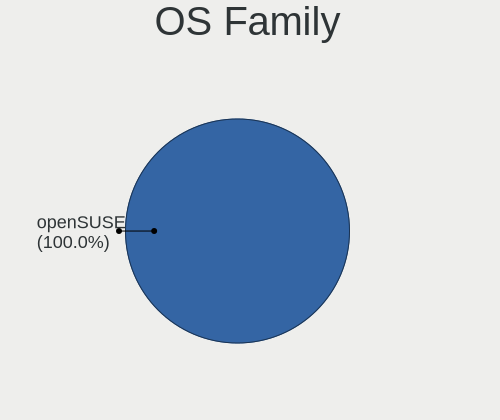

| Name     | Computers | Percent |
|----------|-----------|---------|
| openSUSE | 105       | 100%    |

Kernel
------

Version of the Linux kernel

| Version                      | Computers | Percent |
|------------------------------|-----------|---------|
| 6.5.4-1-default              | 28        | 26.67%  |
| 6.5.6-1-default              | 24        | 22.86%  |
| 6.5.8-1-default              | 15        | 14.29%  |
| 5.14.21-150500.55.28-default | 11        | 10.48%  |
| 5.14.21-150500.55.31-default | 10        | 9.52%   |
| 6.5.9-1-default              | 5         | 4.76%   |
| 5.14.21-150500.55.19-default | 3         | 2.86%   |
| 6.5.3-1-default              | 2         | 1.9%    |
| 5.14.21-150500.53-default    | 2         | 1.9%    |
| 6.5.6-lqx1-1-liquorix        | 1         | 0.95%   |
| 6.4.8-1-default              | 1         | 0.95%   |
| 5.14.21-150500.55.7-default  | 1         | 0.95%   |
| 5.14.21-150400.24.88-default | 1         | 0.95%   |
| 5.14.21-150400.24.84-default | 1         | 0.95%   |

Kernel Family
-------------

Linux kernel without a distro release

| Version | Computers | Percent |
|---------|-----------|---------|
| 5.14.21 | 29        | 27.62%  |
| 6.5.4   | 28        | 26.67%  |
| 6.5.6   | 25        | 23.81%  |
| 6.5.8   | 15        | 14.29%  |
| 6.5.9   | 5         | 4.76%   |
| 6.5.3   | 2         | 1.9%    |
| 6.4.8   | 1         | 0.95%   |

Kernel Major Ver.
-----------------

Linux kernel major version

| Version | Computers | Percent |
|---------|-----------|---------|
| 6.5     | 75        | 71.43%  |
| 5.14    | 29        | 27.62%  |
| 6.4     | 1         | 0.95%   |

Arch
----

OS architecture (x86_64, i586, etc.)

| Name    | Computers | Percent |
|---------|-----------|---------|
| x86_64  | 102       | 97.14%  |
| aarch64 | 2         | 1.9%    |
| i686    | 1         | 0.95%   |

DE
--

Desktop Environment

| Name       | Computers | Percent |
|------------|-----------|---------|
| KDE5       | 74        | 70.48%  |
| GNOME      | 23        | 21.9%   |
| XFCE       | 4         | 3.81%   |
| X-Cinnamon | 1         | 0.95%   |
| KDE        | 1         | 0.95%   |
| ICEWM      | 1         | 0.95%   |
| Unknown    | 1         | 0.95%   |

Display Server
--------------

X11 or Wayland

| Name    | Computers | Percent |
|---------|-----------|---------|
| X11     | 74        | 70.48%  |
| Wayland | 31        | 29.52%  |

Display Manager
---------------

SDDM, LightDM, etc.

| Name    | Computers | Percent |
|---------|-----------|---------|
| Unknown | 73        | 69.52%  |
| SDDM    | 27        | 25.71%  |
| GDM     | 3         | 2.86%   |
| XDM     | 1         | 0.95%   |
| LightDM | 1         | 0.95%   |

OS Lang
-------

Language

| Lang    | Computers | Percent |
|---------|-----------|---------|
| en_US   | 37        | 35.24%  |
| de_DE   | 25        | 23.81%  |
| POSIX   | 7         | 6.67%   |
| it_IT   | 7         | 6.67%   |
| pt_BR   | 4         | 3.81%   |
| nl_NL   | 4         | 3.81%   |
| fr_FR   | 4         | 3.81%   |
| sk_SK   | 2         | 1.9%    |
| pl_PL   | 2         | 1.9%    |
| es_ES   | 2         | 1.9%    |
| cs_CZ   | 2         | 1.9%    |
| zh_TW   | 1         | 0.95%   |
| zh_CN   | 1         | 0.95%   |
| uk_UA   | 1         | 0.95%   |
| ru_RU   | 1         | 0.95%   |
| ja_JP   | 1         | 0.95%   |
| en_GB   | 1         | 0.95%   |
| en_DK   | 1         | 0.95%   |
| el_GR   | 1         | 0.95%   |
| Unknown | 1         | 0.95%   |

Boot Mode
---------

EFI or BIOS

| Mode | Computers | Percent |
|------|-----------|---------|
| EFI  | 64        | 60.95%  |
| BIOS | 41        | 39.05%  |

Filesystem
----------

Type of filesystem

| Type  | Computers | Percent |
|-------|-----------|---------|
| Btrfs | 86        | 81.9%   |
| Ext4  | 17        | 16.19%  |
| Xfs   | 2         | 1.9%    |

Part. scheme
------------

Scheme of partitioning

| Type    | Computers | Percent |
|---------|-----------|---------|
| Unknown | 70        | 66.67%  |
| GPT     | 32        | 30.48%  |
| MBR     | 3         | 2.86%   |

Dual Boot with Linux/BSD
------------------------

Hosting more than one Linux/BSD

| Dual boot | Computers | Percent |
|-----------|-----------|---------|
| No        | 100       | 95.24%  |
| Yes       | 5         | 4.76%   |

Dual Boot (Win)
---------------

Hosting Linux and Windows

| Dual boot | Computers | Percent |
|-----------|-----------|---------|
| No        | 92        | 87.62%  |
| Yes       | 13        | 12.38%  |

Board
-----

Vendor
------

Motherboard manufacturer

| Name                                 | Computers | Percent |
|--------------------------------------|-----------|---------|
| ASUSTek Computer                     | 20        | 19.05%  |
| Lenovo                               | 16        | 15.24%  |
| Hewlett-Packard                      | 15        | 14.29%  |
| Gigabyte Technology                  | 12        | 11.43%  |
| MSI                                  | 9         | 8.57%   |
| Dell                                 | 7         | 6.67%   |
| Acer                                 | 6         | 5.71%   |
| ASRock                               | 4         | 3.81%   |
| Toshiba                              | 2         | 1.9%    |
| Samsung Electronics                  | 2         | 1.9%    |
| Intel                                | 2         | 1.9%    |
| Apple                                | 2         | 1.9%    |
| Unknown                              | 2         | 1.9%    |
| TUXEDO                               | 1         | 0.95%   |
| Shenzhen Meigao Electronic Equipment | 1         | 0.95%   |
| Orange Pi                            | 1         | 0.95%   |
| Medion                               | 1         | 0.95%   |
| HUAWEI                               | 1         | 0.95%   |
| Cube                                 | 1         | 0.95%   |

Model
-----

Motherboard model

| Name                                        | Computers | Percent |
|---------------------------------------------|-----------|---------|
| Unknown                                     | 3         | 2.86%   |
| MSI MS-7A33                                 | 2         | 1.9%    |
| TUXEDO Polaris Intel Gen3 (TGL)             | 1         | 0.95%   |
| Toshiba Satellite C660D                     | 1         | 0.95%   |
| Toshiba dynabook B452/22F                   | 1         | 0.95%   |
| Shenzhen Meigao Electronic Equipment UM690  | 1         | 0.95%   |
| Samsung Galaxy Book Go 5G                   | 1         | 0.95%   |
| Samsung 340XAA/350XAA/550XAA                | 1         | 0.95%   |
| Orange Pi 5 Plus                            | 1         | 0.95%   |
| MSI MS-7D75                                 | 1         | 0.95%   |
| MSI MS-7D52                                 | 1         | 0.95%   |
| MSI MS-7C80                                 | 1         | 0.95%   |
| MSI MS-7C02                                 | 1         | 0.95%   |
| MSI MS-7A39                                 | 1         | 0.95%   |
| MSI CX61 0OC/CX61 0OD/CX61 0OL              | 1         | 0.95%   |
| MSI Crosshair 15 B12UEZ                     | 1         | 0.95%   |
| Medion MS-7848                              | 1         | 0.95%   |
| Lenovo Yoga 7 14ARB7 82QF                   | 1         | 0.95%   |
| Lenovo ThinkPad X390 20Q1S5K400             | 1         | 0.95%   |
| Lenovo ThinkPad X270 W10DG 20K6S0X900       | 1         | 0.95%   |
| Lenovo ThinkPad X13 Yoga Gen 2 20W9S3TL00   | 1         | 0.95%   |
| Lenovo ThinkPad W510 4391W3V                | 1         | 0.95%   |
| Lenovo ThinkPad T400 27658JG                | 1         | 0.95%   |
| Lenovo ThinkPad T14s Gen 3 21BR00CGGE       | 1         | 0.95%   |
| Lenovo ThinkPad P52 20MAS0WG00              | 1         | 0.95%   |
| Lenovo ThinkPad P1 Gen 5 21DDS0EB00         | 1         | 0.95%   |
| Lenovo ThinkCentre M78 10BR0005US           | 1         | 0.95%   |
| Lenovo IdeaPad Gaming 3 15ACH6 82K2         | 1         | 0.95%   |
| Lenovo IdeaPad 5 Pro 14ARH7 82SJ            | 1         | 0.95%   |
| Lenovo IdeaCentre Gaming5 17IAB7 90T100BHMZ | 1         | 0.95%   |
| Lenovo G40-45 80E1                          | 1         | 0.95%   |
| Lenovo B570e HuronRiver Platform            | 1         | 0.95%   |
| Intel NUC7i3DNKE                            | 1         | 0.95%   |
| Intel NUC5i5RYB H40999-505                  | 1         | 0.95%   |
| HUAWEI KLVL-WXXW                            | 1         | 0.95%   |
| HP ProLiant ML310e Gen8                     | 1         | 0.95%   |
| HP ProBook 6560b                            | 1         | 0.95%   |
| HP ProBook 455 15.6 inch G9 Notebook PC     | 1         | 0.95%   |
| HP ProBook 4535s                            | 1         | 0.95%   |
| HP Pavilion x360 Convertible 14-dw1xxx      | 1         | 0.95%   |

Model Family
------------

Motherboard model prefix

| Name                                       | Computers | Percent |
|--------------------------------------------|-----------|---------|
| Lenovo ThinkPad                            | 8         | 7.62%   |
| ASUS ROG                                   | 5         | 4.76%   |
| Acer Aspire                                | 4         | 3.81%   |
| HP ProBook                                 | 3         | 2.86%   |
| HP Pavilion                                | 3         | 2.86%   |
| Dell Inspiron                              | 3         | 2.86%   |
| ASUS TUF                                   | 3         | 2.86%   |
| Unknown                                    | 3         | 2.86%   |
| MSI MS-7A33                                | 2         | 1.9%    |
| Lenovo IdeaPad                             | 2         | 1.9%    |
| HP Laptop                                  | 2         | 1.9%    |
| HP EliteBook                               | 2         | 1.9%    |
| Dell Precision                             | 2         | 1.9%    |
| ASUS PRIME                                 | 2         | 1.9%    |
| TUXEDO Polaris                             | 1         | 0.95%   |
| Toshiba Satellite                          | 1         | 0.95%   |
| Toshiba dynabook                           | 1         | 0.95%   |
| Shenzhen Meigao Electronic Equipment UM690 | 1         | 0.95%   |
| Samsung Galaxy                             | 1         | 0.95%   |
| Samsung 340XAA                             | 1         | 0.95%   |
| Orange Pi 5                                | 1         | 0.95%   |
| MSI MS-7D75                                | 1         | 0.95%   |
| MSI MS-7D52                                | 1         | 0.95%   |
| MSI MS-7C80                                | 1         | 0.95%   |
| MSI MS-7C02                                | 1         | 0.95%   |
| MSI MS-7A39                                | 1         | 0.95%   |
| MSI CX61                                   | 1         | 0.95%   |
| MSI Crosshair                              | 1         | 0.95%   |
| Medion MS-7848                             | 1         | 0.95%   |
| Lenovo Yoga                                | 1         | 0.95%   |
| Lenovo ThinkCentre                         | 1         | 0.95%   |
| Lenovo IdeaCentre                          | 1         | 0.95%   |
| Lenovo G40-45                              | 1         | 0.95%   |
| Lenovo B570e                               | 1         | 0.95%   |
| Intel NUC7i3DNKE                           | 1         | 0.95%   |
| Intel NUC5i5RYB                            | 1         | 0.95%   |
| HUAWEI KLVL-WXXW                           | 1         | 0.95%   |
| HP ProLiant                                | 1         | 0.95%   |
| HP OMEN                                    | 1         | 0.95%   |
| HP ENVY                                    | 1         | 0.95%   |

MFG Year
--------

Motherboard manufacture year

| Year | Computers | Percent |
|------|-----------|---------|
| 2022 | 18        | 17.14%  |
| 2021 | 13        | 12.38%  |
| 2020 | 10        | 9.52%   |
| 2018 | 9         | 8.57%   |
| 2023 | 7         | 6.67%   |
| 2011 | 7         | 6.67%   |
| 2013 | 6         | 5.71%   |
| 2012 | 6         | 5.71%   |
| 2017 | 5         | 4.76%   |
| 2010 | 5         | 4.76%   |
| 2019 | 4         | 3.81%   |
| 2014 | 4         | 3.81%   |
| 2016 | 3         | 2.86%   |
| 2009 | 3         | 2.86%   |
| 2008 | 3         | 2.86%   |
| 2015 | 2         | 1.9%    |

Form Factor
-----------

Physical design of the computer

| Name           | Computers | Percent |
|----------------|-----------|---------|
| Notebook       | 50        | 47.62%  |
| Desktop        | 44        | 41.9%   |
| Convertible    | 5         | 4.76%   |
| Mini pc        | 3         | 2.86%   |
| Other          | 1         | 0.95%   |
| System on chip | 1         | 0.95%   |
| All in one     | 1         | 0.95%   |

Secure Boot
-----------

Enabled or disabled

| State    | Computers | Percent |
|----------|-----------|---------|
| Disabled | 87        | 82.86%  |
| Enabled  | 18        | 17.14%  |

Coreboot
--------

Have coreboot on board

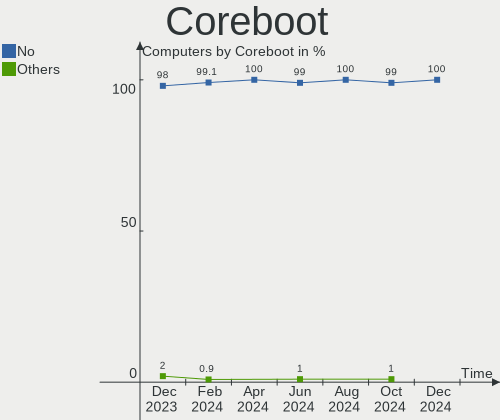

| Used | Computers | Percent |
|------|-----------|---------|
| No   | 105       | 100%    |

RAM Size
--------

Total RAM memory

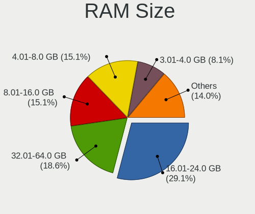

| Size in GB      | Computers | Percent |
|-----------------|-----------|---------|
| 16.01-24.0      | 30        | 28.57%  |
| 8.01-16.0       | 22        | 20.95%  |
| 4.01-8.0        | 15        | 14.29%  |
| 32.01-64.0      | 12        | 11.43%  |
| 3.01-4.0        | 9         | 8.57%   |
| 64.01-256.0     | 9         | 8.57%   |
| 24.01-32.0      | 3         | 2.86%   |
| More than 256.0 | 2         | 1.9%    |
| 1.01-2.0        | 2         | 1.9%    |
| 2.01-3.0        | 1         | 0.95%   |

RAM Used
--------

Used RAM memory

| Used GB    | Computers | Percent |
|------------|-----------|---------|
| 2.01-3.0   | 31        | 29.52%  |
| 4.01-8.0   | 27        | 25.71%  |
| 3.01-4.0   | 22        | 20.95%  |
| 1.01-2.0   | 17        | 16.19%  |
| 8.01-16.0  | 6         | 5.71%   |
| 24.01-32.0 | 1         | 0.95%   |
| 0.51-1.0   | 1         | 0.95%   |

Total Drives
------------

Number of drives on board

| Drives | Computers | Percent |
|--------|-----------|---------|
| 1      | 53        | 50.48%  |
| 2      | 27        | 25.71%  |
| 3      | 8         | 7.62%   |
| 4      | 7         | 6.67%   |
| 5      | 4         | 3.81%   |
| 7      | 3         | 2.86%   |
| 6      | 2         | 1.9%    |
| 0      | 1         | 0.95%   |

Has CD-ROM
----------

Has CD-ROM on board

| Presented | Computers | Percent |
|-----------|-----------|---------|
| No        | 73        | 69.52%  |
| Yes       | 32        | 30.48%  |

Has Ethernet
------------

Has Ethernet on board

| Presented | Computers | Percent |
|-----------|-----------|---------|
| Yes       | 88        | 83.81%  |
| No        | 17        | 16.19%  |

Has WiFi
--------

Has WiFi module

| Presented | Computers | Percent |
|-----------|-----------|---------|
| Yes       | 84        | 80%     |
| No        | 21        | 20%     |

Has Bluetooth
-------------

Has Bluetooth module

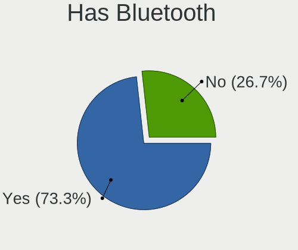

| Presented | Computers | Percent |
|-----------|-----------|---------|
| Yes       | 74        | 70.48%  |
| No        | 31        | 29.52%  |

Location
--------

Country
-------

Geographic location (country)

| Country     | Computers | Percent |
|-------------|-----------|---------|
| Germany     | 25        | 23.81%  |
| USA         | 15        | 14.29%  |
| Italy       | 10        | 9.52%   |
| France      | 5         | 4.76%   |
| Poland      | 4         | 3.81%   |
| Netherlands | 4         | 3.81%   |
| Canada      | 4         | 3.81%   |
| Brazil      | 4         | 3.81%   |
| Switzerland | 3         | 2.86%   |
| Spain       | 2         | 1.9%    |
| Slovakia    | 2         | 1.9%    |
| Russia      | 2         | 1.9%    |
| Romania     | 2         | 1.9%    |
| Greece      | 2         | 1.9%    |
| Czechia     | 2         | 1.9%    |
| Vietnam     | 1         | 0.95%   |
| Ukraine     | 1         | 0.95%   |
| UK          | 1         | 0.95%   |
| Sweden      | 1         | 0.95%   |
| Singapore   | 1         | 0.95%   |
| Norway      | 1         | 0.95%   |
| Malaysia    | 1         | 0.95%   |
| Japan       | 1         | 0.95%   |
| Iran        | 1         | 0.95%   |
| Indonesia   | 1         | 0.95%   |
| Hong Kong   | 1         | 0.95%   |
| Finland     | 1         | 0.95%   |
| Colombia    | 1         | 0.95%   |
| China       | 1         | 0.95%   |
| Bulgaria    | 1         | 0.95%   |
| Belgium     | 1         | 0.95%   |
| Austria     | 1         | 0.95%   |
| Australia   | 1         | 0.95%   |
| Albania     | 1         | 0.95%   |

City
----

Geographic location (city)

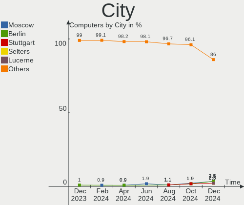

| City           | Computers | Percent |
|----------------|-----------|---------|
| Rome           | 2         | 1.9%    |
| Mainhausen     | 2         | 1.9%    |
| Enschede       | 2         | 1.9%    |
| Zurich         | 1         | 0.95%   |
| Zuchwil        | 1         | 0.95%   |
| Yakutsk        | 1         | 0.95%   |
| Wilczyce       | 1         | 0.95%   |
| Waterbury      | 1         | 0.95%   |
| Warsaw         | 1         | 0.95%   |
| Waren          | 1         | 0.95%   |
| Waganiec       | 1         | 0.95%   |
| Voorschoten    | 1         | 0.95%   |
| Vlorë         | 1         | 0.95%   |
| Vlkanova       | 1         | 0.95%   |
| Vienna         | 1         | 0.95%   |
| Västerås     | 1         | 0.95%   |
| Turin          | 1         | 0.95%   |
| Tucson         | 1         | 0.95%   |
| Tours          | 1         | 0.95%   |
| Thessaloniki   | 1         | 0.95%   |
| Tehran         | 1         | 0.95%   |
| Tacoma         | 1         | 0.95%   |
| Suhlendorf     | 1         | 0.95%   |
| Somma Lombardo | 1         | 0.95%   |
| Sofia          | 1         | 0.95%   |
| Soest          | 1         | 0.95%   |
| Singapore      | 1         | 0.95%   |
| Sibiu          | 1         | 0.95%   |
| Sao Paulo      | 1         | 0.95%   |
| Salt Lake City | 1         | 0.95%   |
| Rostock        | 1         | 0.95%   |
| Rodeo          | 1         | 0.95%   |
| Rio de Janeiro | 1         | 0.95%   |
| Richmond       | 1         | 0.95%   |
| Prague         | 1         | 0.95%   |
| Poznan         | 1         | 0.95%   |
| Plauen         | 1         | 0.95%   |
| Pereira        | 1         | 0.95%   |
| Panama City    | 1         | 0.95%   |
| Palma          | 1         | 0.95%   |

Drives
------

Drive Vendor
------------

Hard drive vendors

| Vendor                      | Computers | Drives | Percent |
|-----------------------------|-----------|--------|---------|
| Samsung Electronics         | 34        | 53     | 20.48%  |
| Seagate                     | 21        | 29     | 12.65%  |
| WDC                         | 19        | 26     | 11.45%  |
| Sandisk                     | 17        | 19     | 10.24%  |
| Toshiba                     | 8         | 8      | 4.82%   |
| Kingston                    | 8         | 8      | 4.82%   |
| Unknown                     | 7         | 8      | 4.22%   |
| Intel                       | 6         | 7      | 3.61%   |
| Crucial                     | 6         | 6      | 3.61%   |
| Phison Electronics          | 5         | 5      | 3.01%   |
| Micron Technology           | 5         | 5      | 3.01%   |
| SK hynix                    | 3         | 3      | 1.81%   |
| Seagate Technology          | 2         | 4      | 1.2%    |
| Patriot                     | 2         | 2      | 1.2%    |
| Micron/Crucial Technology   | 2         | 2      | 1.2%    |
| MAXIO Technology (Hangzhou) | 2         | 3      | 1.2%    |
| Kingston Technology Company | 2         | 2      | 1.2%    |
| Apple                       | 2         | 2      | 1.2%    |
| A-DATA Technology           | 2         | 2      | 1.2%    |
| RESCUE                      | 1         | 1      | 0.6%    |
| Realtek Semiconductor       | 1         | 1      | 0.6%    |
| Realtek                     | 1         | 1      | 0.6%    |
| PNY                         | 1         | 1      | 0.6%    |
| OCZ                         | 1         | 1      | 0.6%    |
| Mushkin                     | 1         | 1      | 0.6%    |
| KingFast                    | 1         | 1      | 0.6%    |
| Intenso                     | 1         | 1      | 0.6%    |
| Hitachi                     | 1         | 1      | 0.6%    |
| HGST                        | 1         | 1      | 0.6%    |
| Hewlett-Packard             | 1         | 1      | 0.6%    |
| Gigabyte Technology         | 1         | 1      | 0.6%    |
| FORESEE                     | 1         | 1      | 0.6%    |

Drive Model
-----------

Hard drive models

| Model                                              | Computers | Percent |
|----------------------------------------------------|-----------|---------|
| Samsung NVMe SSD Controller SM981/PM981/PM983 1TB  | 9         | 4.64%   |
| Samsung NVMe SSD Controller PM9A1/PM9A3/980PRO 1TB | 9         | 4.64%   |
| WDC WD10EZEX-08WN4A0 1TB                           | 3         | 1.55%   |
| Seagate ST2000DM008-2FR102 2TB                     | 3         | 1.55%   |
| Seagate ST1000DM010-2EP102 1TB                     | 3         | 1.55%   |
| Seagate ST1000DM003-1CH162 1TB                     | 3         | 1.55%   |
| Samsung SSD 870 EVO 1TB                            | 3         | 1.55%   |
| Samsung SSD 860 EVO 1TB                            | 3         | 1.55%   |
| Crucial CT500MX500SSD1 500GB                       | 3         | 1.55%   |
| Unknown MMC Card  64GB                             | 2         | 1.03%   |
| Seagate ST500DM002-1BD142 500GB                    | 2         | 1.03%   |
| Sandisk WD_BLACK SN850X 2000GB                     | 2         | 1.03%   |
| Sandisk WD Blue SN550 NVMe SSD 1TB                 | 2         | 1.03%   |
| Sandisk WD Black SN850 1TB                         | 2         | 1.03%   |
| Samsung SSD 980 1TB                                | 2         | 1.03%   |
| Samsung SSD 870 QVO 1TB                            | 2         | 1.03%   |
| Micron/Crucial P2 NVMe PCIe SSD 500GB              | 2         | 1.03%   |
| MAXIO (Hangzhou) NVMe SSD Controller MAP1202 250GB | 2         | 1.03%   |
| Kingston SA400S37480G 480GB SSD                    | 2         | 1.03%   |
| Kingston SA400S37240G 240GB SSD                    | 2         | 1.03%   |
| Intel SSD 660P Series 1024GB                       | 2         | 1.03%   |
| Crucial CT240BX500SSD1 240GB                       | 2         | 1.03%   |
| WDC WDS480G2G0A-00JH30 480GB SSD                   | 1         | 0.52%   |
| WDC WDS250G1B0A-00H9H0 250GB SSD                   | 1         | 0.52%   |
| WDC WDS100T2B0A-00SM50 1TB SSD                     | 1         | 0.52%   |
| WDC WDS100T1B0A-00H9H0 1TB SSD                     | 1         | 0.52%   |
| WDC WD5000LPVX-22V0TT0 500GB                       | 1         | 0.52%   |
| WDC WD5000AVCS-632DY1 500GB                        | 1         | 0.52%   |
| WDC WD5000AAKX-22ERMA0 500GB                       | 1         | 0.52%   |
| WDC WD40EZAZ-00SF3B0 4TB                           | 1         | 0.52%   |
| WDC WD40EFRX-68N32N0 4TB                           | 1         | 0.52%   |
| WDC WD4005FZBX-00K5WB0 4TB                         | 1         | 0.52%   |
| WDC WD3200BEVT-22ZCT0 320GB                        | 1         | 0.52%   |
| WDC WD30EURS-63SPKY0 3TB                           | 1         | 0.52%   |
| WDC WD30EFRX-68N32N0 3TB                           | 1         | 0.52%   |
| WDC WD20EZRZ-00Z5HB0 2TB                           | 1         | 0.52%   |
| WDC WD20EZRX-00DC0B0 2TB                           | 1         | 0.52%   |
| WDC WD20EARS-00MVWB0 2TB                           | 1         | 0.52%   |
| WDC WD10EZEX-60WN4A0 1TB                           | 1         | 0.52%   |
| WDC WD10EZEX-22MFCA0 1TB                           | 1         | 0.52%   |

HDD Vendor
----------

Hard disk drive vendors

| Vendor              | Computers | Drives | Percent |
|---------------------|-----------|--------|---------|
| Seagate             | 21        | 28     | 40.38%  |
| WDC                 | 18        | 22     | 34.62%  |
| Toshiba             | 6         | 6      | 11.54%  |
| Samsung Electronics | 2         | 2      | 3.85%   |
| Unknown             | 1         | 1      | 1.92%   |
| Hitachi             | 1         | 1      | 1.92%   |
| HGST                | 1         | 1      | 1.92%   |
| Hewlett-Packard     | 1         | 1      | 1.92%   |
| Apple               | 1         | 1      | 1.92%   |

SSD Vendor
----------

Solid state drive vendors

| Vendor              | Computers | Drives | Percent |
|---------------------|-----------|--------|---------|
| Samsung Electronics | 16        | 20     | 31.37%  |
| SanDisk             | 7         | 7      | 13.73%  |
| Kingston            | 6         | 6      | 11.76%  |
| Crucial             | 6         | 6      | 11.76%  |
| WDC                 | 4         | 4      | 7.84%   |
| Patriot             | 2         | 2      | 3.92%   |
| A-DATA Technology   | 2         | 2      | 3.92%   |
| Toshiba             | 1         | 1      | 1.96%   |
| PNY                 | 1         | 1      | 1.96%   |
| OCZ                 | 1         | 1      | 1.96%   |
| Mushkin             | 1         | 1      | 1.96%   |
| Intel               | 1         | 1      | 1.96%   |
| Gigabyte Technology | 1         | 1      | 1.96%   |
| FORESEE             | 1         | 1      | 1.96%   |
| Apple               | 1         | 1      | 1.96%   |

Drive Kind
----------

HDD or SSD

| Kind    | Computers | Drives | Percent |
|---------|-----------|--------|---------|
| NVMe    | 55        | 79     | 37.16%  |
| SSD     | 43        | 55     | 29.05%  |
| HDD     | 41        | 63     | 27.7%   |
| Unknown | 5         | 6      | 3.38%   |
| MMC     | 4         | 4      | 2.7%    |

Drive Connector
---------------

SATA, SAS, NVMe, etc.

| Type | Computers | Drives | Percent |
|------|-----------|--------|---------|
| SATA | 68        | 118    | 51.13%  |
| NVMe | 55        | 78     | 41.35%  |
| SAS  | 6         | 7      | 4.51%   |
| MMC  | 4         | 4      | 3.01%   |

Drive Size
----------

Size of hard drive

| Size in TB | Computers | Drives | Percent |
|------------|-----------|--------|---------|
| 0.01-0.5   | 40        | 52     | 42.55%  |
| 0.51-1.0   | 33        | 40     | 35.11%  |
| 1.01-2.0   | 10        | 12     | 10.64%  |
| 3.01-4.0   | 5         | 6      | 5.32%   |
| 2.01-3.0   | 5         | 6      | 5.32%   |
| 10.01-20.0 | 1         | 2      | 1.06%   |

Space Total
-----------

Amount of disk space available on the file system

| Size in GB     | Computers | Percent |
|----------------|-----------|---------|
| More than 3000 | 48        | 45.71%  |
| 1001-2000      | 16        | 15.24%  |
| 501-1000       | 14        | 13.33%  |
| 251-500        | 10        | 9.52%   |
| 2001-3000      | 9         | 8.57%   |
| 101-250        | 6         | 5.71%   |
| 1-20           | 1         | 0.95%   |
| 51-100         | 1         | 0.95%   |

Space Used
----------

Amount of used disk space

| Used GB        | Computers | Percent |
|----------------|-----------|---------|
| 101-250        | 26        | 24.76%  |
| 51-100         | 22        | 20.95%  |
| 251-500        | 14        | 13.33%  |
| 1001-2000      | 12        | 11.43%  |
| 501-1000       | 9         | 8.57%   |
| 2001-3000      | 7         | 6.67%   |
| 1-20           | 7         | 6.67%   |
| More than 3000 | 5         | 4.76%   |
| 21-50          | 3         | 2.86%   |

Malfunc. Drives
---------------

Drive models with a malfunction

| Model                               | Computers | Drives | Percent |
|-------------------------------------|-----------|--------|---------|
| Seagate ST500DM002-1BD142 500GB     | 1         | 1      | 20%     |
| Seagate ST1000LM024 HN-M101MBB 1TB  | 1         | 1      | 20%     |
| Seagate ST1000DM003-1ER162 1TB      | 1         | 1      | 20%     |
| Samsung Electronics SSD 870 EVO 1TB | 1         | 1      | 20%     |
| Hitachi HTS727550A9E364 500GB       | 1         | 1      | 20%     |

Malfunc. Drive Vendor
---------------------

Vendors of faulty drives

| Vendor              | Computers | Drives | Percent |
|---------------------|-----------|--------|---------|
| Seagate             | 3         | 3      | 60%     |
| Samsung Electronics | 1         | 1      | 20%     |
| Hitachi             | 1         | 1      | 20%     |

Malfunc. HDD Vendor
-------------------

Vendors of faulty HDD drives

| Vendor  | Computers | Drives | Percent |
|---------|-----------|--------|---------|
| Seagate | 3         | 3      | 75%     |
| Hitachi | 1         | 1      | 25%     |

Malfunc. Drive Kind
-------------------

Kinds of faulty drives

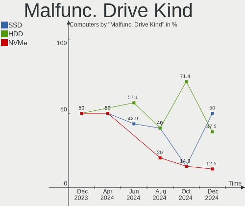

| Kind | Computers | Drives | Percent |
|------|-----------|--------|---------|
| HDD  | 4         | 4      | 80%     |
| SSD  | 1         | 1      | 20%     |

Failed Drives
-------------

Failed drive models

Zero info for selected period =(

Failed Drive Vendor
-------------------

Failed drive vendors

Zero info for selected period =(

Drive Status
------------

Number of failed and malfunc. drives

| Status   | Computers | Drives | Percent |
|----------|-----------|--------|---------|
| Detected | 70        | 140    | 64.22%  |
| Works    | 34        | 62     | 31.19%  |
| Malfunc  | 5         | 5      | 4.59%   |

Storage controller
------------------

Storage Vendor
--------------

Storage controller vendors

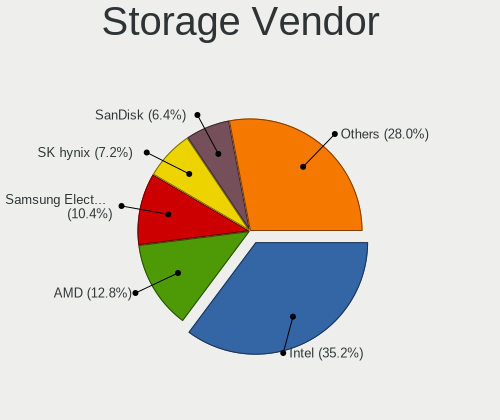

| Vendor                       | Computers | Percent |
|------------------------------|-----------|---------|
| Intel                        | 51        | 34.46%  |
| AMD                          | 33        | 22.3%   |
| Samsung Electronics          | 22        | 14.86%  |
| SanDisk                      | 12        | 8.11%   |
| Phison Electronics           | 5         | 3.38%   |
| Micron Technology            | 5         | 3.38%   |
| Kingston Technology Company  | 4         | 2.7%    |
| SK hynix                     | 3         | 2.03%   |
| Seagate Technology           | 3         | 2.03%   |
| Micron/Crucial Technology    | 2         | 1.35%   |
| MAXIO Technology (Hangzhou)  | 2         | 1.35%   |
| ASMedia Technology           | 2         | 1.35%   |
| Toshiba America Info Systems | 1         | 0.68%   |
| Realtek Semiconductor        | 1         | 0.68%   |
| Marvell Technology Group     | 1         | 0.68%   |
| JMicron Technology           | 1         | 0.68%   |

Storage Model
-------------

Storage controller models

| Model                                                                          | Computers | Percent |
|--------------------------------------------------------------------------------|-----------|---------|
| AMD FCH SATA Controller [AHCI mode]                                            | 22        | 13.33%  |
| Samsung NVMe SSD Controller SM981/PM981/PM983                                  | 9         | 5.45%   |
| Samsung NVMe SSD Controller PM9A1/PM9A3/980PRO                                 | 9         | 5.45%   |
| Samsung NVMe SSD Controller 980 (DRAM-less)                                    | 5         | 3.03%   |
| Intel Sunrise Point-LP SATA Controller [AHCI mode]                             | 5         | 3.03%   |
| Intel 7 Series Chipset Family 6-port SATA Controller [AHCI mode]               | 4         | 2.42%   |
| AMD 400 Series Chipset SATA Controller                                         | 4         | 2.42%   |
| Sandisk WD Black SN850X NVMe SSD                                               | 3         | 1.82%   |
| Intel Volume Management Device NVMe RAID Controller                            | 3         | 1.82%   |
| Intel 82801IBM/IEM (ICH9M/ICH9M-E) 4 port SATA Controller [AHCI mode]          | 3         | 1.82%   |
| Intel 82801 Mobile SATA Controller [RAID mode]                                 | 3         | 1.82%   |
| Intel 8 Series/C220 Series Chipset Family 6-port SATA Controller 1 [AHCI mode] | 3         | 1.82%   |
| Intel 6 Series/C200 Series Chipset Family 6 port Mobile SATA AHCI Controller   | 3         | 1.82%   |
| Intel 6 Series/C200 Series Chipset Family 6 port Desktop SATA AHCI Controller  | 3         | 1.82%   |
| AMD SB7x0/SB8x0/SB9x0 SATA Controller [AHCI mode]                              | 3         | 1.82%   |
| AMD SB7x0/SB8x0/SB9x0 IDE Controller                                           | 3         | 1.82%   |
| AMD 500 Series Chipset SATA Controller                                         | 3         | 1.82%   |
| SK hynix Gold P31/BC711/PC711 NVMe Solid State Drive                           | 2         | 1.21%   |
| SanDisk WD PC SN810 / Black SN850 NVMe SSD                                     | 2         | 1.21%   |
| SanDisk Ultra 3D / WD Blue SN550 NVMe SSD                                      | 2         | 1.21%   |
| Phison PS5021-E21 PCIe4 NVMe Controller (DRAM-less)                            | 2         | 1.21%   |
| Micron/Crucial P2 [Nick P2] / P3 / P3 Plus NVMe PCIe SSD (DRAM-less)           | 2         | 1.21%   |
| Micron 3400 NVMe SSD [Hendrix]                                                 | 2         | 1.21%   |
| Micron 2210 NVMe SSD [Cobain]                                                  | 2         | 1.21%   |
| MAXIO (Hangzhou) NVMe SSD Controller MAP1202                                   | 2         | 1.21%   |
| Kingston Company NV2 NVMe SSD SM2267XT                                         | 2         | 1.21%   |
| Intel SSD 660P Series                                                          | 2         | 1.21%   |
| Intel Comet Lake SATA AHCI Controller                                          | 2         | 1.21%   |
| Intel Alder Lake-P SATA AHCI Controller                                        | 2         | 1.21%   |
| Intel 8 Series SATA Controller 1 [AHCI mode]                                   | 2         | 1.21%   |
| Intel 500 Series Chipset Family SATA AHCI Controller                           | 2         | 1.21%   |
| Intel 5 Series/3400 Series Chipset 6 port SATA AHCI Controller                 | 2         | 1.21%   |
| ASMedia ASM1062 Serial ATA Controller                                          | 2         | 1.21%   |
| AMD X370 Series Chipset SATA Controller                                        | 2         | 1.21%   |
| AMD SB7x0/SB8x0/SB9x0 SATA Controller [IDE mode]                               | 2         | 1.21%   |
| AMD FCH SATA Controller [IDE mode]                                             | 2         | 1.21%   |
| AMD FCH IDE Controller                                                         | 2         | 1.21%   |
| Toshiba America Info Systems XG5 NVMe SSD Controller                           | 1         | 0.61%   |
| SK hynix BC511 NVMe SSD                                                        | 1         | 0.61%   |
| Seagate FireCuda/IronWolf 510 SSD                                              | 1         | 0.61%   |

Storage Kind
------------

Kind of storage controller (IDE, SATA, NVMe, SAS, ...)

| Kind | Computers | Percent |
|------|-----------|---------|
| SATA | 77        | 53.47%  |
| NVMe | 55        | 38.19%  |
| RAID | 6         | 4.17%   |
| IDE  | 6         | 4.17%   |

Processor
---------

CPU Vendor
----------

Processor vendors

| Vendor   | Computers | Percent |
|----------|-----------|---------|
| Intel    | 58        | 55.24%  |
| AMD      | 45        | 42.86%  |
| Qualcomm | 1         | 0.95%   |
| ARM      | 1         | 0.95%   |

CPU Model
---------

Processor models

| Model                                         | Computers | Percent |
|-----------------------------------------------|-----------|---------|
| Intel 12th Gen Core i7-1255U                  | 2         | 1.9%    |
| Intel 11th Gen Core i5-11400F @ 2.60GHz       | 2         | 1.9%    |
| Intel 11th Gen Core i5-1135G7 @ 2.40GHz       | 2         | 1.9%    |
| AMD Ryzen 9 6900HX with Radeon Graphics       | 2         | 1.9%    |
| AMD Ryzen 9 5900X 12-Core Processor           | 2         | 1.9%    |
| AMD Ryzen 7 6800H with Radeon Graphics        | 2         | 1.9%    |
| AMD Ryzen 7 5800X3D 8-Core Processor          | 2         | 1.9%    |
| AMD Ryzen 5 3500U with Radeon Vega Mobile Gfx | 2         | 1.9%    |
| Qualcomm Processor                            | 1         | 0.95%   |
| Intel Xeon E-2176M CPU @ 2.70GHz              | 1         | 0.95%   |
| Intel Xeon CPU E3-1220 V2 @ 3.10GHz           | 1         | 0.95%   |
| Intel Pentium Dual-Core CPU T4200 @ 2.00GHz   | 1         | 0.95%   |
| Intel Pentium Dual-Core CPU E6500 @ 2.93GHz   | 1         | 0.95%   |
| Intel Pentium CPU B970 @ 2.30GHz              | 1         | 0.95%   |
| Intel Core m3-7Y30 CPU @ 1.00GHz              | 1         | 0.95%   |
| Intel Core i9-10850K CPU @ 3.60GHz            | 1         | 0.95%   |
| Intel Core i7-9700K CPU @ 3.60GHz             | 1         | 0.95%   |
| Intel Core i7-8565U CPU @ 1.80GHz             | 1         | 0.95%   |
| Intel Core i7-6700 CPU @ 3.40GHz              | 1         | 0.95%   |
| Intel Core i7-4790 CPU @ 3.60GHz              | 1         | 0.95%   |
| Intel Core i7-4770HQ CPU @ 2.20GHz            | 1         | 0.95%   |
| Intel Core i7-4510U CPU @ 2.00GHz             | 1         | 0.95%   |
| Intel Core i7-4500U CPU @ 1.80GHz             | 1         | 0.95%   |
| Intel Core i7-3632QM CPU @ 2.20GHz            | 1         | 0.95%   |
| Intel Core i7-3520M CPU @ 2.90GHz             | 1         | 0.95%   |
| Intel Core i7 CPU X 940 @ 2.13GHz             | 1         | 0.95%   |
| Intel Core i7 CPU Q 720 @ 1.60GHz             | 1         | 0.95%   |
| Intel Core i5-8265U CPU @ 1.60GHz             | 1         | 0.95%   |
| Intel Core i5-7500 CPU @ 3.40GHz              | 1         | 0.95%   |
| Intel Core i5-7200U CPU @ 2.50GHz             | 1         | 0.95%   |
| Intel Core i5-6300U CPU @ 2.40GHz             | 1         | 0.95%   |
| Intel Core i5-5250U CPU @ 1.60GHz             | 1         | 0.95%   |
| Intel Core i5-4590 CPU @ 3.30GHz              | 1         | 0.95%   |
| Intel Core i5-4430 CPU @ 3.00GHz              | 1         | 0.95%   |
| Intel Core i5-3470S CPU @ 2.90GHz             | 1         | 0.95%   |
| Intel Core i5-3230M CPU @ 2.60GHz             | 1         | 0.95%   |
| Intel Core i5-2540M CPU @ 2.60GHz             | 1         | 0.95%   |
| Intel Core i5-2500K CPU @ 3.30GHz             | 1         | 0.95%   |
| Intel Core i5-10600K CPU @ 4.10GHz            | 1         | 0.95%   |
| Intel Core i5-10400 CPU @ 2.90GHz             | 1         | 0.95%   |

CPU Model Family
----------------

Processor model prefix

| Model                   | Computers | Percent |
|-------------------------|-----------|---------|
| Other                   | 18        | 17.14%  |
| AMD Ryzen 7             | 15        | 14.29%  |
| Intel Core i5           | 14        | 13.33%  |
| Intel Core i7           | 11        | 10.48%  |
| AMD Ryzen 5             | 10        | 9.52%   |
| AMD Ryzen 9             | 7         | 6.67%   |
| Intel Core i3           | 4         | 3.81%   |
| Intel Xeon              | 2         | 1.9%    |
| Intel Pentium Dual-Core | 2         | 1.9%    |
| Intel Core 2 Duo        | 2         | 1.9%    |
| Intel Celeron           | 2         | 1.9%    |
| AMD Ryzen Threadripper  | 2         | 1.9%    |
| AMD A8                  | 2         | 1.9%    |
| Intel Pentium           | 1         | 0.95%   |
| Intel Core m3           | 1         | 0.95%   |
| Intel Core i9           | 1         | 0.95%   |
| Intel Core 2 Quad       | 1         | 0.95%   |
| Intel Atom              | 1         | 0.95%   |
| AMD Phenom II X6        | 1         | 0.95%   |
| AMD FX                  | 1         | 0.95%   |
| AMD E1                  | 1         | 0.95%   |
| AMD E                   | 1         | 0.95%   |
| AMD Athlon X4           | 1         | 0.95%   |
| AMD Athlon X2           | 1         | 0.95%   |
| AMD Athlon II X2        | 1         | 0.95%   |
| AMD A6                  | 1         | 0.95%   |
| AMD A4                  | 1         | 0.95%   |

CPU Cores
---------

Number of processor cores

| Number | Computers | Percent |
|--------|-----------|---------|
| 2      | 29        | 27.62%  |
| 4      | 24        | 22.86%  |
| 8      | 18        | 17.14%  |
| 6      | 14        | 13.33%  |
| 10     | 7         | 6.67%   |
| 12     | 3         | 2.86%   |
| 1      | 3         | 2.86%   |
| 16     | 2         | 1.9%    |
| 14     | 2         | 1.9%    |
| 64     | 1         | 0.95%   |
| 32     | 1         | 0.95%   |
| 3      | 1         | 0.95%   |

CPU Sockets
-----------

Number of sockets

| Number | Computers | Percent |
|--------|-----------|---------|
| 1      | 105       | 100%    |

CPU Threads
-----------

Threads per core (Hyper-Threading)

| Number | Computers | Percent |
|--------|-----------|---------|
| 2      | 82        | 78.1%   |
| 1      | 22        | 20.95%  |
| 8      | 1         | 0.95%   |

CPU Op-Modes
------------

CPU Operation Modes (32-bit, 64-bit)

| Op mode        | Computers | Percent |
|----------------|-----------|---------|
| 32-bit, 64-bit | 102       | 97.14%  |
| 64-bit         | 2         | 1.9%    |
| 32-bit         | 1         | 0.95%   |

CPU Microcode
-------------

Microcode number

| Number     | Computers | Percent |
|------------|-----------|---------|
| Unknown    | 61        | 58.1%   |
| 0x0a404102 | 5         | 4.76%   |
| 0x0a20120a | 4         | 3.81%   |
| 0x1067a    | 3         | 2.86%   |
| 0x806ec    | 2         | 1.9%    |
| 0x0a601203 | 2         | 1.9%    |
| 0x0a50000c | 2         | 1.9%    |
| 0x08108109 | 2         | 1.9%    |
| 0x0800820d | 2         | 1.9%    |
| 0x08001137 | 2         | 1.9%    |
| 0x06001119 | 2         | 1.9%    |
| 0xa0655    | 1         | 0.95%   |
| 0x306c3    | 1         | 0.95%   |
| 0x106e5    | 1         | 0.95%   |
| 0x0a601201 | 1         | 0.95%   |
| 0x0a50000d | 1         | 0.95%   |
| 0x0a404101 | 1         | 0.95%   |
| 0x0a201025 | 1         | 0.95%   |
| 0x08701030 | 1         | 0.95%   |
| 0x08608102 | 1         | 0.95%   |
| 0x0830107a | 1         | 0.95%   |
| 0x08108102 | 1         | 0.95%   |
| 0x0810100b | 1         | 0.95%   |
| 0x07030105 | 1         | 0.95%   |
| 0x06003106 | 1         | 0.95%   |
| 0x05000101 | 1         | 0.95%   |
| 0x03000027 | 1         | 0.95%   |
| 0x02000057 | 1         | 0.95%   |
| 0x010000c8 | 1         | 0.95%   |

CPU Microarch
-------------

Microarchitecture

| Name             | Computers | Percent |
|------------------|-----------|---------|
| Unknown          | 15        | 14.29%  |
| Zen 3            | 12        | 11.43%  |
| KabyLake         | 9         | 8.57%   |
| Alderlake Hybrid | 7         | 6.67%   |
| SandyBridge      | 6         | 5.71%   |
| IvyBridge        | 6         | 5.71%   |
| Haswell          | 6         | 5.71%   |
| Zen+             | 5         | 4.76%   |
| Penryn           | 5         | 4.76%   |
| Zen              | 4         | 3.81%   |
| TigerLake        | 4         | 3.81%   |
| CometLake        | 4         | 3.81%   |
| Icelake          | 3         | 2.86%   |
| Zen 2            | 2         | 1.9%    |
| Skylake          | 2         | 1.9%    |
| Piledriver       | 2         | 1.9%    |
| Nehalem          | 2         | 1.9%    |
| K10 Llano        | 2         | 1.9%    |
| K10              | 2         | 1.9%    |
| Steamroller      | 1         | 0.95%   |
| Puma             | 1         | 0.95%   |
| K8 & K10 hybrid  | 1         | 0.95%   |
| Bulldozer        | 1         | 0.95%   |
| Broadwell        | 1         | 0.95%   |
| Bonnell          | 1         | 0.95%   |
| Bobcat           | 1         | 0.95%   |

Graphics
--------

GPU Vendor
----------

Vendors of graphics cards

| Vendor                     | Computers | Percent |
|----------------------------|-----------|---------|
| Nvidia                     | 42        | 35.9%   |
| Intel                      | 37        | 31.62%  |
| AMD                        | 37        | 31.62%  |
| Matrox Electronics Systems | 1         | 0.85%   |

GPU Model
---------

Graphics card models

| Model                                                                     | Computers | Percent |
|---------------------------------------------------------------------------|-----------|---------|
| AMD Rembrandt [Radeon 680M]                                               | 6         | 4.88%   |
| Intel 3rd Gen Core processor Graphics Controller                          | 4         | 3.25%   |
| Intel 2nd Generation Core Processor Family Integrated Graphics Controller | 4         | 3.25%   |
| AMD Ellesmere [Radeon RX 470/480/570/570X/580/580X/590]                   | 4         | 3.25%   |
| AMD Cezanne [Radeon Vega Series / Radeon Vega Mobile Series]              | 4         | 3.25%   |
| Nvidia GA106M [GeForce RTX 3060 Mobile / Max-Q]                           | 3         | 2.44%   |
| Intel TigerLake-LP GT2 [Iris Xe Graphics]                                 | 3         | 2.44%   |
| Intel HD Graphics 620                                                     | 3         | 2.44%   |
| AMD Picasso/Raven 2 [Radeon Vega Series / Radeon Vega Mobile Series]      | 3         | 2.44%   |
| Nvidia GP108 [GeForce GT 1030]                                            | 2         | 1.63%   |
| Nvidia GP106 [GeForce GTX 1060 6GB]                                       | 2         | 1.63%   |
| Nvidia GP104 [GeForce GTX 1080]                                           | 2         | 1.63%   |
| Nvidia GM107 [GeForce GTX 750 Ti]                                         | 2         | 1.63%   |
| Nvidia GA104 [Geforce RTX 3070 Ti Laptop GPU]                             | 2         | 1.63%   |
| Intel WhiskeyLake-U GT2 [UHD Graphics 620]                                | 2         | 1.63%   |
| Intel Raptor Lake-P [Iris Xe Graphics]                                    | 2         | 1.63%   |
| Intel Haswell-ULT Integrated Graphics Controller                          | 2         | 1.63%   |
| Intel CometLake-S GT2 [UHD Graphics 630]                                  | 2         | 1.63%   |
| Intel Alder Lake-UP3 GT2 [Iris Xe Graphics]                               | 2         | 1.63%   |
| AMD RV620/M82 [Mobility Radeon HD 3450/3470]                              | 2         | 1.63%   |
| AMD Raphael                                                               | 2         | 1.63%   |
| AMD Navi 31 [Radeon RX 7900 XT/7900 XTX]                                  | 2         | 1.63%   |
| Nvidia TU117M [GeForce GTX 1650 Ti Mobile]                                | 1         | 0.81%   |
| Nvidia TU117M [GeForce GTX 1650 Mobile / Max-Q]                           | 1         | 0.81%   |
| Nvidia TU116 [GeForce GTX 1660 SUPER]                                     | 1         | 0.81%   |
| Nvidia TU106 [GeForce RTX 2060 SUPER]                                     | 1         | 0.81%   |
| Nvidia TU106 [GeForce RTX 2060 12GB]                                      | 1         | 0.81%   |
| Nvidia GT218 [GeForce 405]                                                | 1         | 0.81%   |
| Nvidia GT218 [GeForce 310]                                                | 1         | 0.81%   |
| Nvidia GT216GLM [Quadro FX 880M]                                          | 1         | 0.81%   |
| Nvidia GT200GL [Quadro FX 3800]                                           | 1         | 0.81%   |
| Nvidia GP108BM [GeForce MX250]                                            | 1         | 0.81%   |
| Nvidia GP107GLM [Quadro P2000 Mobile]                                     | 1         | 0.81%   |
| Nvidia GP107 [GeForce GTX 1050 Ti]                                        | 1         | 0.81%   |
| Nvidia GM107 [GeForce GTX 745]                                            | 1         | 0.81%   |
| Nvidia GK208M [GeForce GT 730M]                                           | 1         | 0.81%   |
| Nvidia GK208B [GeForce GT 710]                                            | 1         | 0.81%   |
| Nvidia GK107M [GeForce GT 745M]                                           | 1         | 0.81%   |
| Nvidia GK107M [GeForce GT 650M Mac Edition]                               | 1         | 0.81%   |
| Nvidia GK107GLM [Quadro K2000M]                                           | 1         | 0.81%   |

GPU Combo
---------

Combinations of graphics cards

| Name            | Computers | Percent |
|-----------------|-----------|---------|
| 1 x Nvidia      | 29        | 27.62%  |
| 1 x AMD         | 29        | 27.62%  |
| 1 x Intel       | 26        | 24.76%  |
| Intel + Nvidia  | 8         | 7.62%   |
| 2 x AMD         | 3         | 2.86%   |
| AMD + Nvidia    | 3         | 2.86%   |
| Other           | 2         | 1.9%    |
| Intel + AMD     | 2         | 1.9%    |
| 2 x Nvidia      | 1         | 0.95%   |
| 2 x Intel       | 1         | 0.95%   |
| Nvidia + Matrox | 1         | 0.95%   |

GPU Driver
----------

Free vs proprietary

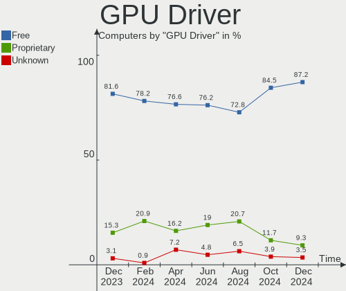

| Driver      | Computers | Percent |
|-------------|-----------|---------|
| Free        | 80        | 76.19%  |
| Proprietary | 21        | 20%     |
| Unknown     | 4         | 3.81%   |

GPU Memory
----------

Total video memory

| Size in GB | Computers | Percent |
|------------|-----------|---------|
| Unknown    | 42        | 40%     |
| 1.01-2.0   | 15        | 14.29%  |
| 0.01-0.5   | 12        | 11.43%  |
| 7.01-8.0   | 10        | 9.52%   |
| 3.01-4.0   | 7         | 6.67%   |
| 0.51-1.0   | 7         | 6.67%   |
| 8.01-16.0  | 5         | 4.76%   |
| 5.01-6.0   | 4         | 3.81%   |
| 16.01-24.0 | 3         | 2.86%   |

Monitor
-------

Monitor Vendor
--------------

Monitor vendors

| Vendor                  | Computers | Percent |
|-------------------------|-----------|---------|
| Samsung Electronics     | 16        | 13.33%  |
| AU Optronics            | 14        | 11.67%  |
| BOE                     | 11        | 9.17%   |
| LG Display              | 8         | 6.67%   |
| Goldstar                | 7         | 5.83%   |
| Acer                    | 7         | 5.83%   |
| Dell                    | 4         | 3.33%   |
| Chimei Innolux          | 4         | 3.33%   |
| BenQ                    | 4         | 3.33%   |
| AOC                     | 4         | 3.33%   |
| Philips                 | 3         | 2.5%    |
| Hewlett-Packard         | 3         | 2.5%    |
| Fujitsu Siemens         | 3         | 2.5%    |
| Unknown                 | 2         | 1.67%   |
| Sony                    | 2         | 1.67%   |
| Panasonic               | 2         | 1.67%   |
| MSI                     | 2         | 1.67%   |
| Lenovo                  | 2         | 1.67%   |
| InfoVision              | 2         | 1.67%   |
| Iiyama                  | 2         | 1.67%   |
| CSO                     | 2         | 1.67%   |
| Apple                   | 2         | 1.67%   |
| ___                     | 1         | 0.83%   |
| Toshiba                 | 1         | 0.83%   |
| Pixio                   | 1         | 0.83%   |
| NEC Computers           | 1         | 0.83%   |
| Hitachi                 | 1         | 0.83%   |
| HannStar Display        | 1         | 0.83%   |
| Eizo                    | 1         | 0.83%   |
| CVT                     | 1         | 0.83%   |
| Chi Mei Optoelectronics | 1         | 0.83%   |
| Cbox                    | 1         | 0.83%   |
| Beko                    | 1         | 0.83%   |
| ASUSTek Computer        | 1         | 0.83%   |
| Ancor Communications    | 1         | 0.83%   |
| AGO                     | 1         | 0.83%   |

Monitor Model
-------------

Monitor models

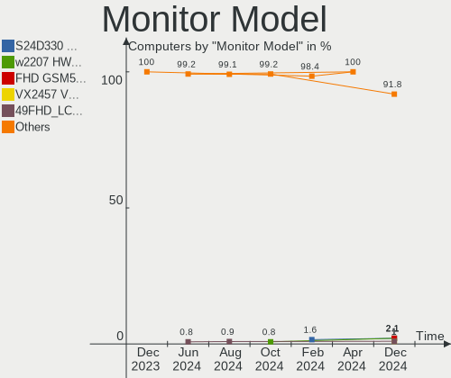

| Model                                                                 | Computers | Percent |
|-----------------------------------------------------------------------|-----------|---------|
| Samsung Electronics S24D330 SAM0D92 1920x1080 530x300mm 24.0-inch     | 2         | 1.59%   |
| LG Display LCD Monitor LGD02F1 1366x768 344x194mm 15.5-inch           | 2         | 1.59%   |
| AU Optronics LCD Monitor AUO21ED 1920x1080 344x194mm 15.5-inch        | 2         | 1.59%   |
| AOC 32G2WG8 AOC3202 1920x1080 698x393mm 31.5-inch                     | 2         | 1.59%   |
| ___ LCD TV ___9000 1360x768                                           | 1         | 0.79%   |
| Unknown LCD TV 9000 1360x768 1600x900mm 72.3-inch                     | 1         | 0.79%   |
| Unknown LCD Monitor FFFF 2288x1287 2550x2550mm 142.0-inch             | 1         | 0.79%   |
| Toshiba ScreenXpert TSB8888 1080x2160                                 | 1         | 0.79%   |
| Sony TV *00 SNY4904 3840x2160                                         | 1         | 0.79%   |
| Sony BW8 MS_9001 1200x1920                                            | 1         | 0.79%   |
| Samsung Electronics SyncMaster SAM0586 1920x1200 518x324mm 24.1-inch  | 1         | 0.79%   |
| Samsung Electronics SyncMaster SAM027F 1680x1050 474x296mm 22.0-inch  | 1         | 0.79%   |
| Samsung Electronics SMS24A450 SAM0839 1920x1200 520x320mm 24.0-inch   | 1         | 0.79%   |
| Samsung Electronics SMB1630N SAM0630 1366x768 344x194mm 15.5-inch     | 1         | 0.79%   |
| Samsung Electronics S24F350 SAM0D21 1920x1080 521x293mm 23.5-inch     | 1         | 0.79%   |
| Samsung Electronics S24F350 SAM0D20 1920x1080 521x293mm 23.5-inch     | 1         | 0.79%   |
| Samsung Electronics S24E650 SAM0C85 1920x1200 518x324mm 24.1-inch     | 1         | 0.79%   |
| Samsung Electronics S24C36x SAM7314 1920x1080 521x293mm 23.5-inch     | 1         | 0.79%   |
| Samsung Electronics LF24T35 SAM707D 1920x1080 528x297mm 23.9-inch     | 1         | 0.79%   |
| Samsung Electronics LCD Monitor SEC554E 1024x600 223x125mm 10.1-inch  | 1         | 0.79%   |
| Samsung Electronics LCD Monitor SEC5443 1920x1200 367x230mm 17.1-inch | 1         | 0.79%   |
| Samsung Electronics LCD Monitor SEC5441 1366x768 309x174mm 14.0-inch  | 1         | 0.79%   |
| Samsung Electronics LCD Monitor SEC3945 1280x800 331x207mm 15.4-inch  | 1         | 0.79%   |
| Samsung Electronics LCD Monitor SEC3242 1920x1080 235x132mm 10.6-inch | 1         | 0.79%   |
| Samsung Electronics LCD Monitor SEC3150 1366x768 344x193mm 15.5-inch  | 1         | 0.79%   |
| Samsung Electronics C49HG9x SAM0E5E 3840x1080 1196x336mm 48.9-inch    | 1         | 0.79%   |
| Samsung Electronics C27FG70 SAM0DC9 1920x1080 598x337mm 27.0-inch     | 1         | 0.79%   |
| Pixio U29I WAM2900 2560x1080 690x260mm 29.0-inch                      | 1         | 0.79%   |
| Philips PHL 275E1 PHLC20C 2560x1440 597x336mm 27.0-inch               | 1         | 0.79%   |
| Philips PHL 273V5 PHLC0D2 1920x1080 598x336mm 27.0-inch               | 1         | 0.79%   |
| Philips PHL 272B8Q PHL0918 2560x1440 597x336mm 27.0-inch              | 1         | 0.79%   |
| Philips 271P4 PHL08C3 1920x1080 597x336mm 27.0-inch                   | 1         | 0.79%   |
| Panasonic TV MEIC328 1920x1080 698x392mm 31.5-inch                    | 1         | 0.79%   |
| Panasonic TV MEIA296 1920x1080 698x392mm 31.5-inch                    | 1         | 0.79%   |
| NEC Computers LCD1970NXp NEC668E 1280x1024 376x301mm 19.0-inch        | 1         | 0.79%   |
| MSI G321CQP MSI4DC1 2560x1440 700x390mm 31.5-inch                     | 1         | 0.79%   |
| MSI G271 MSI3CB5 1920x1080 600x340mm 27.2-inch                        | 1         | 0.79%   |
| LG Display LP156WH2-TLE1 LGDCF01 1366x768 344x194mm 15.5-inch         | 1         | 0.79%   |
| LG Display LCD Monitor LGD0637 1920x1080 344x194mm 15.5-inch          | 1         | 0.79%   |
| LG Display LCD Monitor LGD060A 1920x1080 294x165mm 13.3-inch          | 1         | 0.79%   |

Monitor Resolution
------------------

Monitor screen resolution

| Resolution         | Computers | Percent |
|--------------------|-----------|---------|
| 1920x1080 (FHD)    | 48        | 41.03%  |
| 2560x1440 (QHD)    | 12        | 10.26%  |
| 1366x768 (WXGA)    | 12        | 10.26%  |
| 3840x2160 (4K)     | 9         | 7.69%   |
| 1920x1200 (WUXGA)  | 7         | 5.98%   |
| 1280x1024 (SXGA)   | 6         | 5.13%   |
| 1680x1050 (WSXGA+) | 4         | 3.42%   |
| 2880x1800          | 3         | 2.56%   |
| 2560x1080          | 3         | 2.56%   |
| 1440x900 (WXGA+)   | 3         | 2.56%   |
| 2560x1600          | 2         | 1.71%   |
| 3840x1080          | 1         | 0.85%   |
| 2288x1287          | 1         | 0.85%   |
| 2240x1400          | 1         | 0.85%   |
| 2160x1440          | 1         | 0.85%   |
| 1600x900 (HD+)     | 1         | 0.85%   |
| 1360x768           | 1         | 0.85%   |
| 1280x800 (WXGA)    | 1         | 0.85%   |
| 1024x600           | 1         | 0.85%   |

Monitor Diagonal
----------------

Diagonal size in inches

| Inches  | Computers | Percent |
|---------|-----------|---------|
| 15      | 27        | 22.31%  |
| 24      | 13        | 10.74%  |
| 27      | 11        | 9.09%   |
| 13      | 9         | 7.44%   |
| 21      | 8         | 6.61%   |
| 17      | 8         | 6.61%   |
| 14      | 8         | 6.61%   |
| 72      | 4         | 3.31%   |
| 31      | 4         | 3.31%   |
| 23      | 3         | 2.48%   |
| 22      | 3         | 2.48%   |
| 84      | 2         | 1.65%   |
| 34      | 2         | 1.65%   |
| 32      | 2         | 1.65%   |
| 18      | 2         | 1.65%   |
| 16      | 2         | 1.65%   |
| 12      | 2         | 1.65%   |
| Unknown | 2         | 1.65%   |
| 142     | 1         | 0.83%   |
| 86      | 1         | 0.83%   |
| 49      | 1         | 0.83%   |
| 33      | 1         | 0.83%   |
| 29      | 1         | 0.83%   |
| 26      | 1         | 0.83%   |
| 19      | 1         | 0.83%   |
| 10      | 1         | 0.83%   |
| 8       | 1         | 0.83%   |

Monitor Width
-------------

Physical width

| Width in mm    | Computers | Percent |
|----------------|-----------|---------|
| 301-350        | 41        | 35.04%  |
| 501-600        | 26        | 22.22%  |
| 401-500        | 12        | 10.26%  |
| 201-300        | 9         | 7.69%   |
| 351-400        | 7         | 5.98%   |
| 1501-2000      | 6         | 5.13%   |
| 701-800        | 5         | 4.27%   |
| 601-700        | 5         | 4.27%   |
| 1001-1500      | 2         | 1.71%   |
| Unknown        | 2         | 1.71%   |
| More than 2000 | 1         | 0.85%   |
| 101-200        | 1         | 0.85%   |

Aspect Ratio
------------

Proportional relationship between the width and the height

| Ratio   | Computers | Percent |
|---------|-----------|---------|
| 16/9    | 77        | 70.64%  |
| 16/10   | 17        | 15.6%   |
| 5/4     | 4         | 3.67%   |
| 21/9    | 2         | 1.83%   |
| 6/5     | 1         | 0.92%   |
| 4/3     | 1         | 0.92%   |
| 32/9    | 1         | 0.92%   |
| 3/2     | 1         | 0.92%   |
| 2.65    | 1         | 0.92%   |
| 1.00    | 1         | 0.92%   |
| 0.62    | 1         | 0.92%   |
| 0.56    | 1         | 0.92%   |
| Unknown | 1         | 0.92%   |

Monitor Area
------------

Area in inch²

| Area in inch² | Computers | Percent |
|----------------|-----------|---------|
| 101-110        | 28        | 23.53%  |
| 201-250        | 19        | 15.97%  |
| 81-90          | 13        | 10.92%  |
| 301-350        | 12        | 10.08%  |
| 351-500        | 9         | 7.56%   |
| More than 1000 | 8         | 6.72%   |
| 71-80          | 5         | 4.2%    |
| 251-300        | 5         | 4.2%    |
| 141-150        | 5         | 4.2%    |
| 151-200        | 4         | 3.36%   |
| 121-130        | 3         | 2.52%   |
| Unknown        | 2         | 1.68%   |
| 61-70          | 1         | 0.84%   |
| 41-50          | 1         | 0.84%   |
| 1-40           | 1         | 0.84%   |
| 131-140        | 1         | 0.84%   |
| 111-120        | 1         | 0.84%   |
| 501-1000       | 1         | 0.84%   |

Pixel Density
-------------

Pixels per inch

| Density       | Computers | Percent |
|---------------|-----------|---------|
| 51-100        | 41        | 35.96%  |
| 101-120       | 25        | 21.93%  |
| 121-160       | 23        | 20.18%  |
| 161-240       | 15        | 13.16%  |
| 1-50          | 5         | 4.39%   |
| More than 240 | 3         | 2.63%   |
| Unknown       | 2         | 1.75%   |

Multiple Monitors
-----------------

Total monitors connected

| Total | Computers | Percent |
|-------|-----------|---------|
| 1     | 76        | 72.38%  |
| 2     | 22        | 20.95%  |
| 3     | 4         | 3.81%   |
| 0     | 3         | 2.86%   |

Network
-------

Net Controller Vendor
---------------------

Controller vendors

| Vendor                                | Computers | Percent |
|---------------------------------------|-----------|---------|
| Realtek Semiconductor                 | 61        | 38.13%  |
| Intel                                 | 47        | 29.38%  |
| Qualcomm Atheros                      | 13        | 8.13%   |
| MediaTek                              | 11        | 6.88%   |
| Broadcom                              | 8         | 5%      |
| TP-Link                               | 3         | 1.88%   |
| ASIX Electronics                      | 2         | 1.25%   |
| Aquantia                              | 2         | 1.25%   |
| Samsung Electronics                   | 1         | 0.63%   |
| Ralink Technology                     | 1         | 0.63%   |
| Qualcomm                              | 1         | 0.63%   |
| QinHeng Electronics                   | 1         | 0.63%   |
| Microsoft                             | 1         | 0.63%   |
| Lenovo                                | 1         | 0.63%   |
| Ericsson Business Mobile Networks     | 1         | 0.63%   |
| DisplayLink                           | 1         | 0.63%   |
| Cypress Semiconductor                 | 1         | 0.63%   |
| Broadcom Limited                      | 1         | 0.63%   |
| AVM                                   | 1         | 0.63%   |
| American Megatrends                   | 1         | 0.63%   |
| 802.11g Adapter [Linksys WUSB54GC v3] | 1         | 0.63%   |

Net Controller Model
--------------------

Controller models

| Model                                                                   | Computers | Percent |
|-------------------------------------------------------------------------|-----------|---------|
| Realtek RTL8111/8168/8411 PCI Express Gigabit Ethernet Controller       | 40        | 21.28%  |
| Realtek RTL8125 2.5GbE Controller                                       | 10        | 5.32%   |
| MediaTek MT7922 802.11ax PCI Express Wireless Network Adapter           | 5         | 2.66%   |
| MediaTek MT7921 802.11ax PCI Express Wireless Network Adapter           | 5         | 2.66%   |
| Intel Wi-Fi 6 AX210/AX211/AX411 160MHz                                  | 5         | 2.66%   |
| Intel Alder Lake-P PCH CNVi WiFi                                        | 5         | 2.66%   |
| Realtek RTL8852BE PCIe 802.11ax Wireless Network Controller             | 4         | 2.13%   |
| Realtek RTL8822CE 802.11ac PCIe Wireless Network Adapter                | 4         | 2.13%   |
| Realtek RTL810xE PCI Express Fast Ethernet controller                   | 4         | 2.13%   |
| Realtek RTL8153 Gigabit Ethernet Adapter                                | 3         | 1.6%    |
| Qualcomm Atheros AR9285 Wireless Network Adapter (PCI-Express)          | 3         | 1.6%    |
| Intel Wi-Fi 6 AX201                                                     | 3         | 1.6%    |
| Intel I211 Gigabit Network Connection                                   | 3         | 1.6%    |
| Intel Ethernet Controller I225-V                                        | 3         | 1.6%    |
| Realtek RTL8821CE 802.11ac PCIe Wireless Network Adapter                | 2         | 1.06%   |
| Realtek RTL8188CE 802.11b/g/n WiFi Adapter                              | 2         | 1.06%   |
| Qualcomm Atheros AR242x / AR542x Wireless Network Adapter (PCI-Express) | 2         | 1.06%   |
| Intel Wireless-AC 9260                                                  | 2         | 1.06%   |
| Intel Wi-Fi 6 AX200                                                     | 2         | 1.06%   |
| Intel Raptor Lake PCH CNVi WiFi                                         | 2         | 1.06%   |
| Intel Ethernet Connection I219-LM                                       | 2         | 1.06%   |
| Intel Ethernet Connection (14) I219-V                                   | 2         | 1.06%   |
| Intel Centrino Ultimate-N 6300                                          | 2         | 1.06%   |
| Intel Cannon Point-LP CNVi [Wireless-AC]                                | 2         | 1.06%   |
| ASIX AX88179 Gigabit Ethernet                                           | 2         | 1.06%   |
| TP-Link TL-WN823N v2/v3 [Realtek RTL8192EU]                             | 1         | 0.53%   |
| TP-Link TL-WN822N Version 4 RTL8192EU                                   | 1         | 0.53%   |
| TP-Link Archer T3U [Realtek RTL8812BU]                                  | 1         | 0.53%   |
| Samsung GT-I9070 (network tethering, USB debugging enabled)             | 1         | 0.53%   |
| Realtek USB 10/100/1G/2.5G LAN                                          | 1         | 0.53%   |
| Realtek RTL8822BE 802.11a/b/g/n/ac WiFi adapter                         | 1         | 0.53%   |
| Realtek RTL8821AE 802.11ac PCIe Wireless Network Adapter                | 1         | 0.53%   |
| Realtek RTL8812AE 802.11ac PCIe Wireless Network Adapter                | 1         | 0.53%   |
| Realtek RTL8192EU 802.11b/g/n WLAN Adapter                              | 1         | 0.53%   |
| Realtek RTL8187 Wireless Adapter                                        | 1         | 0.53%   |
| Ralink RT5372 Wireless Adapter                                          | 1         | 0.53%   |
| Qualcomm QCA6390 Wireless Network Adapter                               | 1         | 0.53%   |
| Qualcomm Atheros QCA9565 / AR9565 Wireless Network Adapter              | 1         | 0.53%   |
| Qualcomm Atheros QCA9377 802.11ac Wireless Network Adapter              | 1         | 0.53%   |
| Qualcomm Atheros QCA6174 802.11ac Wireless Network Adapter              | 1         | 0.53%   |

Wireless Vendor
---------------

Wireless vendors

| Vendor                                | Computers | Percent |
|---------------------------------------|-----------|---------|
| Intel                                 | 34        | 39.53%  |
| Realtek Semiconductor                 | 17        | 19.77%  |
| Qualcomm Atheros                      | 12        | 13.95%  |
| MediaTek                              | 11        | 12.79%  |
| TP-Link                               | 3         | 3.49%   |
| Broadcom                              | 3         | 3.49%   |
| Ralink Technology                     | 1         | 1.16%   |
| Qualcomm                              | 1         | 1.16%   |
| Microsoft                             | 1         | 1.16%   |
| Broadcom Limited                      | 1         | 1.16%   |
| AVM                                   | 1         | 1.16%   |
| 802.11g Adapter [Linksys WUSB54GC v3] | 1         | 1.16%   |

Wireless Model
--------------

Wireless models

| Model                                                                   | Computers | Percent |
|-------------------------------------------------------------------------|-----------|---------|
| MediaTek MT7922 802.11ax PCI Express Wireless Network Adapter           | 5         | 5.81%   |
| MediaTek MT7921 802.11ax PCI Express Wireless Network Adapter           | 5         | 5.81%   |
| Intel Wi-Fi 6 AX210/AX211/AX411 160MHz                                  | 5         | 5.81%   |
| Intel Alder Lake-P PCH CNVi WiFi                                        | 5         | 5.81%   |
| Realtek RTL8852BE PCIe 802.11ax Wireless Network Controller             | 4         | 4.65%   |
| Realtek RTL8822CE 802.11ac PCIe Wireless Network Adapter                | 4         | 4.65%   |
| Qualcomm Atheros AR9285 Wireless Network Adapter (PCI-Express)          | 3         | 3.49%   |
| Intel Wi-Fi 6 AX201                                                     | 3         | 3.49%   |
| Realtek RTL8821CE 802.11ac PCIe Wireless Network Adapter                | 2         | 2.33%   |
| Realtek RTL8188CE 802.11b/g/n WiFi Adapter                              | 2         | 2.33%   |
| Qualcomm Atheros AR242x / AR542x Wireless Network Adapter (PCI-Express) | 2         | 2.33%   |
| Intel Wireless-AC 9260                                                  | 2         | 2.33%   |
| Intel Wi-Fi 6 AX200                                                     | 2         | 2.33%   |
| Intel Raptor Lake PCH CNVi WiFi                                         | 2         | 2.33%   |
| Intel Centrino Ultimate-N 6300                                          | 2         | 2.33%   |
| Intel Cannon Point-LP CNVi [Wireless-AC]                                | 2         | 2.33%   |
| TP-Link TL-WN823N v2/v3 [Realtek RTL8192EU]                             | 1         | 1.16%   |
| TP-Link TL-WN822N Version 4 RTL8192EU                                   | 1         | 1.16%   |
| TP-Link Archer T3U [Realtek RTL8812BU]                                  | 1         | 1.16%   |
| Realtek RTL8822BE 802.11a/b/g/n/ac WiFi adapter                         | 1         | 1.16%   |
| Realtek RTL8821AE 802.11ac PCIe Wireless Network Adapter                | 1         | 1.16%   |
| Realtek RTL8812AE 802.11ac PCIe Wireless Network Adapter                | 1         | 1.16%   |
| Realtek RTL8192EU 802.11b/g/n WLAN Adapter                              | 1         | 1.16%   |
| Realtek RTL8187 Wireless Adapter                                        | 1         | 1.16%   |
| Ralink RT5372 Wireless Adapter                                          | 1         | 1.16%   |
| Qualcomm QCA6390 Wireless Network Adapter                               | 1         | 1.16%   |
| Qualcomm Atheros QCA9565 / AR9565 Wireless Network Adapter              | 1         | 1.16%   |
| Qualcomm Atheros QCA9377 802.11ac Wireless Network Adapter              | 1         | 1.16%   |
| Qualcomm Atheros QCA6174 802.11ac Wireless Network Adapter              | 1         | 1.16%   |
| Qualcomm Atheros QCA6164 802.11ac Wireless Network Adapter              | 1         | 1.16%   |
| Qualcomm Atheros AR9485 Wireless Network Adapter                        | 1         | 1.16%   |
| Qualcomm Atheros AR928X Wireless Network Adapter (PCI-Express)          | 1         | 1.16%   |
| Qualcomm Atheros AR922X Wireless Network Adapter                        | 1         | 1.16%   |
| Microsoft Xbox Wireless Adapter for Windows                             | 1         | 1.16%   |
| MediaTek MT7921K (RZ608) Wi-Fi 6E 80MHz                                 | 1         | 1.16%   |
| Intel Wireless 8265 / 8275                                              | 1         | 1.16%   |
| Intel Wireless 8260                                                     | 1         | 1.16%   |
| Intel Wireless 7265                                                     | 1         | 1.16%   |
| Intel Wireless 7260                                                     | 1         | 1.16%   |
| Intel Wireless 3165                                                     | 1         | 1.16%   |

Ethernet Vendor
---------------

Ethernet vendors

| Vendor                | Computers | Percent |
|-----------------------|-----------|---------|
| Realtek Semiconductor | 55        | 56.7%   |
| Intel                 | 25        | 25.77%  |
| Broadcom              | 6         | 6.19%   |
| Qualcomm Atheros      | 2         | 2.06%   |
| ASIX Electronics      | 2         | 2.06%   |
| Aquantia              | 2         | 2.06%   |
| Samsung Electronics   | 1         | 1.03%   |
| Lenovo                | 1         | 1.03%   |
| DisplayLink           | 1         | 1.03%   |
| Cypress Semiconductor | 1         | 1.03%   |
| American Megatrends   | 1         | 1.03%   |

Ethernet Model
--------------

Ethernet models

| Model                                                               | Computers | Percent |
|---------------------------------------------------------------------|-----------|---------|
| Realtek RTL8111/8168/8411 PCI Express Gigabit Ethernet Controller   | 40        | 40%     |
| Realtek RTL8125 2.5GbE Controller                                   | 10        | 10%     |
| Realtek RTL810xE PCI Express Fast Ethernet controller               | 4         | 4%      |
| Realtek RTL8153 Gigabit Ethernet Adapter                            | 3         | 3%      |
| Intel I211 Gigabit Network Connection                               | 3         | 3%      |
| Intel Ethernet Controller I225-V                                    | 3         | 3%      |
| Intel Ethernet Connection I219-LM                                   | 2         | 2%      |
| Intel Ethernet Connection (14) I219-V                               | 2         | 2%      |
| ASIX AX88179 Gigabit Ethernet                                       | 2         | 2%      |
| Samsung GT-I9070 (network tethering, USB debugging enabled)         | 1         | 1%      |
| Realtek USB 10/100/1G/2.5G LAN                                      | 1         | 1%      |
| Qualcomm Atheros AR8162 Fast Ethernet                               | 1         | 1%      |
| Qualcomm Atheros AR8132 Fast Ethernet                               | 1         | 1%      |
| Lenovo ThinkPad TBT 3 Dock                                          | 1         | 1%      |
| Intel Ethernet Controller I225-LM                                   | 1         | 1%      |
| Intel Ethernet Connection (7) I219-V                                | 1         | 1%      |
| Intel Ethernet Connection (7) I219-LM                               | 1         | 1%      |
| Intel Ethernet Connection (6) I219-V                                | 1         | 1%      |
| Intel Ethernet Connection (4) I219-V                                | 1         | 1%      |
| Intel Ethernet Connection (3) I218-V                                | 1         | 1%      |
| Intel Ethernet Connection (23) I219-LM                              | 1         | 1%      |
| Intel Ethernet Connection (2) I219-V                                | 1         | 1%      |
| Intel Ethernet Connection (16) I219-LM                              | 1         | 1%      |
| Intel Ethernet Connection (12) I219-V                               | 1         | 1%      |
| Intel 82579V Gigabit Network Connection                             | 1         | 1%      |
| Intel 82579LM Gigabit Network Connection (Lewisville)               | 1         | 1%      |
| Intel 82577LM Gigabit Network Connection                            | 1         | 1%      |
| Intel 82567LM-3 Gigabit Network Connection                          | 1         | 1%      |
| Intel 82567LF Gigabit Network Connection                            | 1         | 1%      |
| DisplayLink USB3.0 Dual Video Dock                                  | 1         | 1%      |
| Cypress K38231_03                                                   | 1         | 1%      |
| Broadcom NetXtreme BCM57766 Gigabit Ethernet PCIe                   | 1         | 1%      |
| Broadcom NetXtreme BCM5764M Gigabit Ethernet PCIe                   | 1         | 1%      |
| Broadcom NetXtreme BCM5761e Gigabit Ethernet PCIe                   | 1         | 1%      |
| Broadcom NetXtreme BCM5717 Gigabit Ethernet PCIe                    | 1         | 1%      |
| Broadcom NetLink BCM5784M Gigabit Ethernet PCIe                     | 1         | 1%      |
| Broadcom NetLink BCM57785 Gigabit Ethernet PCIe                     | 1         | 1%      |
| Aquantia AQC113CS NBase-T/IEEE 802.3bz Ethernet Controller [AQtion] | 1         | 1%      |
| Aquantia AQC100 10G Ethernet MAC controller [AQtion]                | 1         | 1%      |
| American Megatrends Virtual Ethernet.                               | 1         | 1%      |

Net Controller Kind
-------------------

Ethernet, WiFi or modem

| Kind     | Computers | Percent |
|----------|-----------|---------|
| Ethernet | 88        | 50.57%  |
| WiFi     | 84        | 48.28%  |
| Modem    | 2         | 1.15%   |

Used Controller
---------------

Currently used network controller

| Kind     | Computers | Percent |
|----------|-----------|---------|
| WiFi     | 58        | 52.25%  |
| Ethernet | 53        | 47.75%  |

NICs
----

Total network controllers on board

| Total | Computers | Percent |
|-------|-----------|---------|
| 2     | 57        | 54.29%  |
| 1     | 43        | 40.95%  |
| 3     | 4         | 3.81%   |
| 0     | 1         | 0.95%   |

IPv6
----

IPv6 vs IPv4

| Used | Computers | Percent |
|------|-----------|---------|
| No   | 63        | 60%     |
| Yes  | 42        | 40%     |

Bluetooth
---------

Bluetooth Vendor
----------------

Controller vendors

| Vendor                          | Computers | Percent |
|---------------------------------|-----------|---------|
| Intel                           | 29        | 39.19%  |
| Realtek Semiconductor           | 9         | 12.16%  |
| Qualcomm Atheros Communications | 6         | 8.11%   |
| Cambridge Silicon Radio         | 6         | 8.11%   |
| Foxconn / Hon Hai               | 5         | 6.76%   |
| IMC Networks                    | 4         | 5.41%   |
| MediaTek                        | 3         | 4.05%   |
| ASUSTek Computer                | 3         | 4.05%   |
| Dell                            | 2         | 2.7%    |
| Broadcom                        | 2         | 2.7%    |
| Apple                           | 2         | 2.7%    |
| Realtek                         | 1         | 1.35%   |
| Lite-On Technology              | 1         | 1.35%   |
| Hewlett-Packard                 | 1         | 1.35%   |

Bluetooth Model
---------------

Controller models

| Model                                               | Computers | Percent |
|-----------------------------------------------------|-----------|---------|
| Realtek Bluetooth Radio                             | 7         | 9.46%   |
| Intel AX201 Bluetooth                               | 7         | 9.46%   |
| Intel AX210 Bluetooth                               | 6         | 8.11%   |
| Cambridge Silicon Radio Bluetooth Dongle (HCI mode) | 6         | 8.11%   |
| Intel Bluetooth wireless interface                  | 4         | 5.41%   |
| Intel Bluetooth Device                              | 4         | 5.41%   |
| Foxconn / Hon Hai Wireless_Device                   | 4         | 5.41%   |
| MediaTek Wireless_Device                            | 3         | 4.05%   |
| IMC Networks Wireless_Device                        | 3         | 4.05%   |
| Realtek  Bluetooth 4.2 Adapter                      | 2         | 2.7%    |
| Qualcomm Atheros  Bluetooth Device                  | 2         | 2.7%    |
| Qualcomm Atheros AR3011 Bluetooth                   | 2         | 2.7%    |
| Intel Wireless-AC 9260 Bluetooth Adapter            | 2         | 2.7%    |
| Intel Bluetooth 9460/9560 Jefferson Peak (JfP)      | 2         | 2.7%    |
| Intel AX200 Bluetooth                               | 2         | 2.7%    |
| ASUS Broadcom BCM20702A0 Bluetooth                  | 2         | 2.7%    |
| Realtek Bluetooth Radio                             | 1         | 1.35%   |
| Qualcomm Atheros QCA61x4 Bluetooth 4.0              | 1         | 1.35%   |
| Qualcomm Atheros Bluetooth USB Host Controller      | 1         | 1.35%   |
| Lite-On Bluetooth Device                            | 1         | 1.35%   |
| Intel Wireless-AC 3168 Bluetooth                    | 1         | 1.35%   |
| Intel Centrino Bluetooth Wireless Transceiver       | 1         | 1.35%   |
| IMC Networks Bluetooth Radio                        | 1         | 1.35%   |
| HP Broadcom 2070 Bluetooth Combo                    | 1         | 1.35%   |
| Foxconn / Hon Hai Broadcom Bluetooth 2.1 Device     | 1         | 1.35%   |
| Dell Wireless 365 Bluetooth                         | 1         | 1.35%   |
| Dell BCM20702A0 Bluetooth Module                    | 1         | 1.35%   |
| Broadcom BCM2045B (BDC-2.1) [Bluetooth Controller]  | 1         | 1.35%   |
| Broadcom BCM2045B (BDC-2.1)                         | 1         | 1.35%   |
| ASUS Bluetooth Radio                                | 1         | 1.35%   |
| Apple Bluetooth USB Host Controller                 | 1         | 1.35%   |
| Apple Bluetooth Host Controller                     | 1         | 1.35%   |

Sound
-----

Sound Vendor
------------

Sound card vendors

| Vendor                    | Computers | Percent |
|---------------------------|-----------|---------|
| Intel                     | 55        | 33.33%  |
| AMD                       | 48        | 29.09%  |
| Nvidia                    | 30        | 18.18%  |
| Texas Instruments         | 4         | 2.42%   |
| C-Media Electronics       | 4         | 2.42%   |
| ASUSTek Computer          | 3         | 1.82%   |
| Sennheiser Communications | 2         | 1.21%   |
| Micro Star International  | 2         | 1.21%   |
| JMTek                     | 2         | 1.21%   |
| GN Netcom                 | 2         | 1.21%   |
| SteelSeries ApS           | 1         | 0.61%   |
| ROCCAT                    | 1         | 0.61%   |
| Razer USA                 | 1         | 0.61%   |
| OS AS700 USB              | 1         | 0.61%   |
| ONN                       | 1         | 0.61%   |
| Medeli Electronics        | 1         | 0.61%   |
| Lenovo                    | 1         | 0.61%   |
| Giga-Byte Technology      | 1         | 0.61%   |
| Generalplus Technology    | 1         | 0.61%   |
| Creative Technology       | 1         | 0.61%   |
| Creative Labs             | 1         | 0.61%   |
| Blue Microphones          | 1         | 0.61%   |
| ASRock                    | 1         | 0.61%   |

Sound Model
-----------

Sound card models

| Model                                                                      | Computers | Percent |
|----------------------------------------------------------------------------|-----------|---------|
| AMD Family 17h/19h HD Audio Controller                                     | 17        | 8.46%   |
| AMD Starship/Matisse HD Audio Controller                                   | 9         | 4.48%   |
| AMD Rembrandt Radeon High Definition Audio Controller                      | 7         | 3.48%   |
| Intel 7 Series/C216 Chipset Family High Definition Audio Controller        | 6         | 2.99%   |
| AMD Renoir Radeon High Definition Audio Controller                         | 6         | 2.99%   |
| AMD FCH Azalia Controller                                                  | 6         | 2.99%   |
| Intel Sunrise Point-LP HD Audio                                            | 5         | 2.49%   |
| Intel Alder Lake PCH-P High Definition Audio Controller                    | 5         | 2.49%   |
| Intel 6 Series/C200 Series Chipset Family High Definition Audio Controller | 5         | 2.49%   |
| AMD SBx00 Azalia (Intel HDA)                                               | 5         | 2.49%   |
| AMD Family 17h (Models 00h-0fh) HD Audio Controller                        | 5         | 2.49%   |
| AMD Ellesmere HDMI Audio [Radeon RX 470/480 / 570/580/590]                 | 5         | 2.49%   |
| Nvidia GK107 HDMI Audio Controller                                         | 4         | 1.99%   |
| Nvidia GA102 High Definition Audio Controller                              | 4         | 1.99%   |
| Intel Tiger Lake-LP Smart Sound Technology Audio Controller                | 4         | 1.99%   |
| Intel 8 Series/C220 Series Chipset High Definition Audio Controller        | 4         | 1.99%   |
| AMD Raven/Raven2/Fenghuang HDMI/DP Audio Controller                        | 4         | 1.99%   |
| Nvidia GM107 High Definition Audio Controller [GeForce 940MX]              | 3         | 1.49%   |
| Nvidia Audio device                                                        | 3         | 1.49%   |
| Intel Tiger Lake-H HD Audio Controller                                     | 3         | 1.49%   |
| Intel Comet Lake PCH cAVS                                                  | 3         | 1.49%   |
| Intel 82801I (ICH9 Family) HD Audio Controller                             | 3         | 1.49%   |
| AMD Navi 31 HDMI/DP Audio                                                  | 3         | 1.49%   |
| Texas Instruments PCM2902 Audio Codec                                      | 2         | 1%      |
| Nvidia High Definition Audio Controller                                    | 2         | 1%      |
| Nvidia GP107GL High Definition Audio Controller                            | 2         | 1%      |
| Nvidia GP106 High Definition Audio Controller                              | 2         | 1%      |
| Nvidia GP104 High Definition Audio Controller                              | 2         | 1%      |
| Nvidia GA104 High Definition Audio Controller                              | 2         | 1%      |
| Micro Star International USB Audio                                         | 2         | 1%      |
| JMTek USB PnP Audio Device                                                 | 2         | 1%      |
| Intel Raptor Lake-P/U/H cAVS                                               | 2         | 1%      |
| Intel Haswell-ULT HD Audio Controller                                      | 2         | 1%      |
| Intel Cannon Point-LP High Definition Audio Controller                     | 2         | 1%      |
| Intel 8 Series HD Audio Controller                                         | 2         | 1%      |
| Intel 5 Series/3400 Series Chipset High Definition Audio                   | 2         | 1%      |
| AMD Navi 21/23 HDMI/DP Audio Controller                                    | 2         | 1%      |
| Texas Instruments PCM2912A Audio Codec                                     | 1         | 0.5%    |
| Texas Instruments PCM2900 Audio Codec                                      | 1         | 0.5%    |
| SteelSeries ApS Arctis Nova 3                                              | 1         | 0.5%    |

Memory
------

Memory Vendor
-------------

Memory module vendors

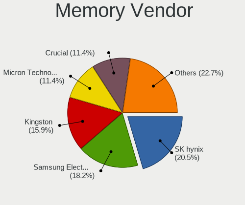

| Vendor              | Computers | Percent |
|---------------------|-----------|---------|
| Micron Technology   | 8         | 20.51%  |
| SK hynix            | 7         | 17.95%  |
| Samsung Electronics | 6         | 15.38%  |
| Corsair             | 4         | 10.26%  |
| G.Skill             | 3         | 7.69%   |
| Team                | 2         | 5.13%   |
| Kingston            | 2         | 5.13%   |
| Crucial             | 2         | 5.13%   |
| Unknown             | 1         | 2.56%   |
| Qimonda             | 1         | 2.56%   |
| PNY                 | 1         | 2.56%   |
| Lexar               | 1         | 2.56%   |
| Elpida              | 1         | 2.56%   |

Memory Model
------------

Memory module models

| Model                                                            | Computers | Percent |
|------------------------------------------------------------------|-----------|---------|
| SK hynix RAM HMT451U6AFR8C-PB 4GB DIMM DDR3 1600MT/s             | 2         | 5%      |
| Samsung RAM M425R2GA3BB0-CQKOL 16GB SODIMM DDR5 4800MT/s         | 2         | 5%      |
| Unknown RAM Module 4GB DIMM DDR 1333MT/s                         | 1         | 2.5%    |
| Team RAM TEAMGROUP-UD4-2666 16GB DIMM DDR4 2933MT/s              | 1         | 2.5%    |
| Team RAM TEAMGROUP-UD4-2400 16GB DIMM DDR4 2400MT/s              | 1         | 2.5%    |
| SK hynix RAM Module 4GB Row Of Chips LPDDR5 6400MT/s             | 1         | 2.5%    |
| SK hynix RAM Module 2GB Row Of Chips LPDDR5 6400MT/s             | 1         | 2.5%    |
| SK hynix RAM HMT425U6AFR6C-PB 2GB DIMM DDR3 1600MT/s             | 1         | 2.5%    |
| SK hynix RAM HMAA1GS6CJR6N-XN 8GB Row Of Chips DDR4 3200MT/s     | 1         | 2.5%    |
| SK hynix RAM HMA851S6CJR6N-VK 4GB SODIMM DDR4 2667MT/s           | 1         | 2.5%    |
| SK hynix RAM HMA81GS6CJR8N-XN 8192MB SODIMM DDR4 3200MT/s        | 1         | 2.5%    |
| Samsung RAM M471B1G73BH0-CK0 8GB SODIMM DDR3 1600MT/s            | 1         | 2.5%    |
| Samsung RAM M471A1K43DB1-CWE 8GB SODIMM DDR4 3200MT/s            | 1         | 2.5%    |
| Samsung RAM M471A1G44AB0-CWE 8GB SODIMM DDR4 3200MT/s            | 1         | 2.5%    |
| Samsung RAM M378B2873EH1-CH9 1GB DIMM DDR3 1334MT/s              | 1         | 2.5%    |
| Qimonda RAM Module 2GB SODIMM DDR2 533MT/s                       | 1         | 2.5%    |
| PNY RAM 8GBF1X08QFHH38-135-K 8GB DIMM DDR4 3600MT/s              | 1         | 2.5%    |
| Micron RAM MT62F2G32D8DR-031 WT 8GB Row Of Chips LPDDR5 6400MT/s | 1         | 2.5%    |
| Micron RAM MT62F1G32D4DR-031 WT 4GB Row Of Chips LPDDR5 6400MT/s | 1         | 2.5%    |
| Micron RAM MT52L1G32D4PG-093 8GB Row Of Chips LPDDR3 2133MT/s    | 1         | 2.5%    |
| Micron RAM 4ATF51264HZ-3G2R1 4GB SODIMM DDR4 3200MT/s            | 1         | 2.5%    |
| Micron RAM 4ATF51264HZ-2G6E1 4GB SODIMM DDR4 2667MT/s            | 1         | 2.5%    |
| Micron RAM 4ATF51264HZ-2G3E1 4GB SODIMM DDR4 2667MT/s            | 1         | 2.5%    |
| Micron RAM 16JSF51264HZ-1G4D1 4GB SODIMM DDR3 1334MT/s           | 1         | 2.5%    |
| Micron RAM 16HTF25664HY-800E1 2GB SODIMM DDR2 975MT/s            | 1         | 2.5%    |
| Lexar RAM LD4AS016G-3200ST 16GB SODIMM DDR4 3200MT/s             | 1         | 2.5%    |
| Kingston RAM ASU16D3LS1KBG/4G 4GB SODIMM DDR3 1600MT/s           | 1         | 2.5%    |
| Kingston RAM 9905584-015.A00LF 4GB DIMM DDR3 1600MT/s            | 1         | 2.5%    |
| G.Skill RAM F4-3200C22-32GRS 32GB SODIMM DDR4 3200MT/s           | 1         | 2.5%    |
| G.Skill RAM F4-3200C16-16GTZN 16GB DIMM DDR4 3200MT/s            | 1         | 2.5%    |
| G.Skill RAM F3-1600C11-4G 4GB DIMM DDR3 1600MT/s                 | 1         | 2.5%    |
| Elpida RAM EBE11UE6ACUA-8G-E 1GB SODIMM DDR2 800MT/s             | 1         | 2.5%    |
| Crucial RAM CT8G4SFD8213.C16FHP 8GB SODIMM DDR4 2133MT/s         | 1         | 2.5%    |
| Crucial RAM CT16G48C40S5.M8A1 16GB SODIMM DDR5 4800MT/s          | 1         | 2.5%    |
| Corsair RAM CMT32GX4M2C3200C16 16GB DIMM DDR4 3200MT/s           | 1         | 2.5%    |
| Corsair RAM CMSO8GX3M1A1333C9 8GB SODIMM DDR3 1334MT/s           | 1         | 2.5%    |
| Corsair RAM CMK32GX4M4A2400C14 8GB DIMM DDR4 2666MT/s            | 1         | 2.5%    |
| Corsair RAM CMH32GX5M2D6000C36 16GB DIMM DDR5 4800MT/s           | 1         | 2.5%    |

Memory Kind
-----------

Memory module kinds

| Kind   | Computers | Percent |
|--------|-----------|---------|
| DDR4   | 16        | 44.44%  |
| DDR3   | 8         | 22.22%  |
| LPDDR5 | 4         | 11.11%  |
| DDR5   | 4         | 11.11%  |
| DDR2   | 2         | 5.56%   |
| LPDDR3 | 1         | 2.78%   |
| DDR    | 1         | 2.78%   |

Memory Form Factor
------------------

Physical design of the memory module

| Name         | Computers | Percent |
|--------------|-----------|---------|
| SODIMM       | 18        | 50%     |
| DIMM         | 12        | 33.33%  |
| Row Of Chips | 6         | 16.67%  |

Memory Size
-----------

Memory module size

| Size  | Computers | Percent |
|-------|-----------|---------|
| 4096  | 13        | 33.33%  |
| 8192  | 11        | 28.21%  |
| 16384 | 8         | 20.51%  |
| 2048  | 4         | 10.26%  |
| 32768 | 2         | 5.13%   |
| 1024  | 1         | 2.56%   |

Memory Speed
------------

Memory module speed

| Speed | Computers | Percent |
|-------|-----------|---------|
| 3200  | 9         | 23.68%  |
| 1600  | 5         | 13.16%  |
| 6400  | 4         | 10.53%  |
| 4800  | 4         | 10.53%  |
| 2667  | 3         | 7.89%   |
| 1334  | 3         | 7.89%   |
| 2133  | 2         | 5.26%   |
| 3600  | 1         | 2.63%   |
| 2933  | 1         | 2.63%   |
| 2666  | 1         | 2.63%   |
| 2400  | 1         | 2.63%   |
| 1333  | 1         | 2.63%   |
| 975   | 1         | 2.63%   |
| 800   | 1         | 2.63%   |
| 533   | 1         | 2.63%   |

Printers & scanners
-------------------

Printer Vendor
--------------

Printer device vendors

| Vendor             | Computers | Percent |
|--------------------|-----------|---------|
| Seiko Epson        | 3         | 37.5%   |
| Hewlett-Packard    | 2         | 25%     |
| Brother Industries | 2         | 25%     |
| Pantum             | 1         | 12.5%   |

Printer Model
-------------

Printer device models

| Model                      | Computers | Percent |
|----------------------------|-----------|---------|
| Seiko Epson XP-4100 Series | 1         | 12.5%   |
| Seiko Epson L300 Series    | 1         | 12.5%   |
| Seiko Epson ET-2820 Series | 1         | 12.5%   |
| Pantum P2200-series        | 1         | 12.5%   |
| HP Officejet J4680         | 1         | 12.5%   |
| HP ENVY Pro 6400 series    | 1         | 12.5%   |
| Brother MFC-7360N          | 1         | 12.5%   |
| Brother DCP-L2530DW series | 1         | 12.5%   |

Scanner Vendor
--------------

Scanner device vendors

| Vendor | Computers | Percent |
|--------|-----------|---------|
| Canon  | 1         | 100%    |

Scanner Model
-------------

Scanner device models

| Model                   | Computers | Percent |
|-------------------------|-----------|---------|
| Canon CanoScan LiDE 210 | 1         | 100%    |

Camera
------

Camera Vendor
-------------

Camera device vendors

| Vendor                                 | Computers | Percent |
|----------------------------------------|-----------|---------|
| Chicony Electronics                    | 11        | 20.75%  |
| Luxvisions Innotech Limited            | 5         | 9.43%   |
| Logitech                               | 4         | 7.55%   |
| Suyin                                  | 3         | 5.66%   |
| Sunplus Innovation Technology          | 3         | 5.66%   |
| Realtek Semiconductor                  | 3         | 5.66%   |
| Cheng Uei Precision Industry (Foxlink) | 3         | 5.66%   |
| Silicon Motion                         | 2         | 3.77%   |
| Quanta                                 | 2         | 3.77%   |
| Lite-On Technology                     | 2         | 3.77%   |
| Lenovo                                 | 2         | 3.77%   |
| IMC Networks                           | 2         | 3.77%   |
| Bison Electronics                      | 2         | 3.77%   |
| Trust                                  | 1         | 1.89%   |
| Syntek                                 | 1         | 1.89%   |
| Sonix Technology                       | 1         | 1.89%   |
| Microdia                               | 1         | 1.89%   |
| HD 2MP WEBCAM                          | 1         | 1.89%   |
| Generalplus Technology                 | 1         | 1.89%   |
| Apple                                  | 1         | 1.89%   |
| Alcor Micro                            | 1         | 1.89%   |
| 8SSC21D67422V1SR28902JL                | 1         | 1.89%   |

Camera Model
------------

Camera device models

| Model                                                | Computers | Percent |
|------------------------------------------------------|-----------|---------|
| Realtek Integrated_Webcam_HD                         | 2         | 3.7%    |
| Luxvisions Innotech Limited HP Wide Vision HD Camera | 2         | 3.7%    |
| Chicony Integrated Camera                            | 2         | 3.7%    |
| Chicony HD WebCam                                    | 2         | 3.7%    |
| Trust QHD Webcam                                     | 1         | 1.85%   |
| Syntek Integrated Camera                             | 1         | 1.85%   |
| Suyin Integrated Webcam                              | 1         | 1.85%   |
| Suyin Acer/HP Integrated Webcam [CN0314]             | 1         | 1.85%   |
| Suyin Acer CrystalEye Webcam                         | 1         | 1.85%   |
| Sunplus Integrated_Webcam_HD                         | 1         | 1.85%   |
| Sunplus Integrated_Webcam_FHD                        | 1         | 1.85%   |
| Sunplus HP HD Webcam [Fixed]                         | 1         | 1.85%   |
| Sonix USB2.0 HD UVC WebCam                           | 1         | 1.85%   |
| Silicon Motion Web Camera                            | 1         | 1.85%   |
| Silicon Motion HP Webcam                             | 1         | 1.85%   |
| Realtek Lenovo EasyCamera                            | 1         | 1.85%   |
| Quanta USB2.0 VGA UVC WebCam                         | 1         | 1.85%   |
| Quanta HD User Facing                                | 1         | 1.85%   |
| Microdia USB 2.0 Camera                              | 1         | 1.85%   |
| Luxvisions Innotech Limited Integrated RGB Camera    | 1         | 1.85%   |
| Luxvisions Innotech Limited Integrated Camera        | 1         | 1.85%   |
| Luxvisions Innotech Limited HP HD Camera             | 1         | 1.85%   |
| Logitech Webcam C270                                 | 1         | 1.85%   |
| Logitech QuickCam Pro 9000                           | 1         | 1.85%   |
| Logitech HD Pro Webcam C920                          | 1         | 1.85%   |
| Logitech C922 Pro Stream Webcam                      | 1         | 1.85%   |
| Lite-On Integrated Camera                            | 1         | 1.85%   |
| Lite-On HP Wide Vision HD Camera                     | 1         | 1.85%   |
| Lite-On HP IR Camera                                 | 1         | 1.85%   |
| Lenovo Integrated Webcam [R5U877]                    | 1         | 1.85%   |
| Lenovo Integrated Webcam                             | 1         | 1.85%   |
| IMC Networks USB2.0 HD IR UVC WebCam                 | 1         | 1.85%   |
| IMC Networks Integrated Camera                       | 1         | 1.85%   |
| HD 2MP WEBCAM HD 2MP WEBCAM                          | 1         | 1.85%   |
| Generalplus GENERAL WEBCAM                           | 1         | 1.85%   |
| Chicony Lenovo EasyCamera                            | 1         | 1.85%   |
| Chicony Integrated HP HD Webcam                      | 1         | 1.85%   |
| Chicony Integrated Camera (1280x720@30)              | 1         | 1.85%   |
| Chicony HP Wide Vision HD Camera                     | 1         | 1.85%   |
| Chicony HP HD Camera                                 | 1         | 1.85%   |

Security
--------

Fingerprint Vendor
------------------

Fingerprint sensor vendors

| Vendor                     | Computers | Percent |
|----------------------------|-----------|---------|
| Synaptics                  | 5         | 35.71%  |
| Validity Sensors           | 2         | 14.29%  |
| Upek                       | 2         | 14.29%  |
| Elan Microelectronics      | 2         | 14.29%  |
| Shenzhen Goodix Technology | 1         | 7.14%   |
| LighTuning Technology      | 1         | 7.14%   |
| DigitalPersona             | 1         | 7.14%   |

Fingerprint Model
-----------------

Fingerprint sensor models

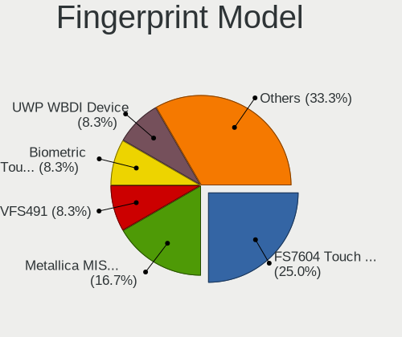

| Model                                                    | Computers | Percent |
|----------------------------------------------------------|-----------|---------|
| Upek Biometric Touchchip/Touchstrip Fingerprint Sensor   | 2         | 14.29%  |
| Synaptics UWP WBDI Device                                | 2         | 14.29%  |
| Validity Sensors VFS495 Fingerprint Reader               | 1         | 7.14%   |
| Validity Sensors VFS471 Fingerprint Reader               | 1         | 7.14%   |
| Synaptics Prometheus MIS Touch Fingerprint Reader        | 1         | 7.14%   |
| Synaptics Metallica MIS Touch Fingerprint Reader         | 1         | 7.14%   |
| Synaptics FS7604 Touch Fingerprint Sensor with PurePrint | 1         | 7.14%   |
| Shenzhen Goodix  Fingerprint Device                      | 1         | 7.14%   |
| LighTuning EgisTec Touch Fingerprint Sensor              | 1         | 7.14%   |
| Elan fingerprint sensor [FeinTech FPS00200]              | 1         | 7.14%   |
| Elan ELAN:ARM-M4                                         | 1         | 7.14%   |
| DigitalPersona Fingerprint Reader                        | 1         | 7.14%   |

Chipcard Vendor
---------------

Chipcard module vendors

| Vendor      | Computers | Percent |
|-------------|-----------|---------|
| Broadcom    | 2         | 66.67%  |
| Alcor Micro | 1         | 33.33%  |

Chipcard Model
--------------

Chipcard module models

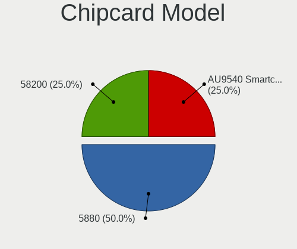

| Model                                                                        | Computers | Percent |
|------------------------------------------------------------------------------|-----------|---------|
| Broadcom BCM5880 Secure Applications Processor with fingerprint touch sensor | 1         | 33.33%  |
| Broadcom BCM5880 Secure Applications Processor                               | 1         | 33.33%  |
| Alcor Micro AU9540 Smartcard Reader                                          | 1         | 33.33%  |

Unsupported
-----------

Unsupported Devices
-------------------

Total unsupported devices on board

| Total | Computers | Percent |
|-------|-----------|---------|
| 0     | 78        | 74.29%  |
| 1     | 22        | 20.95%  |
| 2     | 5         | 4.76%   |

Unsupported Device Types
------------------------

Types of unsupported devices

| Type                  | Computers | Percent |
|-----------------------|-----------|---------|
| Fingerprint reader    | 14        | 43.75%  |
| Graphics card         | 6         | 18.75%  |
| Multimedia controller | 4         | 12.5%   |
| Chipcard              | 3         | 9.38%   |
| Unassigned class      | 2         | 6.25%   |
| Storage               | 1         | 3.13%   |
| Sound                 | 1         | 3.13%   |
| Net/wireless          | 1         | 3.13%   |

