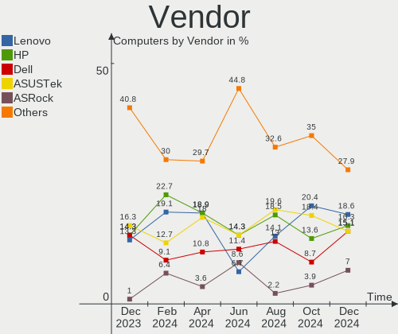
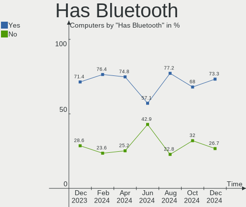
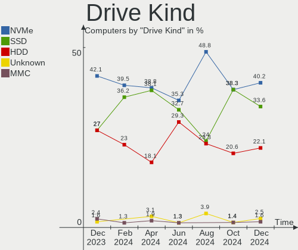

openSUSE - Hardware Trends
--------------------------

A project to identify most popular hardware characteristics and track their change
over time based on data collected by Linux users at https://Linux-Hardware.org.

Anyone can contribute to this report by the [hw-probe](https://github.com/linuxhw/hw-probe) tool:

    sudo -E hw-probe -all -upload

This is a report for all computer types. See also reports for [desktops](/Dist/openSUSE/Desktop/README.md) and [notebooks](/Dist/openSUSE/Notebook/README.md).

This report is for one last month. Overall report since the beginning of time: [TestDays](https://github.com/linuxhw/TestDays)

Period: Jun, 2023.

Contents
--------

* [ System ](#system)
  - [ OS                       ](#os)
  - [ OS Family                ](#os-family)
  - [ Kernel                   ](#kernel)
  - [ Kernel Family            ](#kernel-family)
  - [ Kernel Major Ver.        ](#kernel-major-ver)
  - [ Arch                     ](#arch)
  - [ DE                       ](#de)
  - [ Display Server           ](#display-server)
  - [ Display Manager          ](#display-manager)
  - [ OS Lang                  ](#os-lang)
  - [ Boot Mode                ](#boot-mode)
  - [ Filesystem               ](#filesystem)
  - [ Part. scheme             ](#part-scheme)
  - [ Dual Boot with Linux/BSD ](#dual-boot-with-linuxbsd)
  - [ Dual Boot (Win)          ](#dual-boot-win)

* [ Board ](#board)
  - [ Vendor                   ](#vendor)
  - [ Model                    ](#model)
  - [ Model Family             ](#model-family)
  - [ MFG Year                 ](#mfg-year)
  - [ Form Factor              ](#form-factor)
  - [ Secure Boot              ](#secure-boot)
  - [ Coreboot                 ](#coreboot)
  - [ RAM Size                 ](#ram-size)
  - [ RAM Used                 ](#ram-used)
  - [ Total Drives             ](#total-drives)
  - [ Has CD-ROM               ](#has-cd-rom)
  - [ Has Ethernet             ](#has-ethernet)
  - [ Has WiFi                 ](#has-wifi)
  - [ Has Bluetooth            ](#has-bluetooth)

* [ Location ](#location)
  - [ Country                  ](#country)
  - [ City                     ](#city)

* [ Drives ](#drives)
  - [ Drive Vendor             ](#drive-vendor)
  - [ Drive Model              ](#drive-model)
  - [ HDD Vendor               ](#hdd-vendor)
  - [ SSD Vendor               ](#ssd-vendor)
  - [ Drive Kind               ](#drive-kind)
  - [ Drive Connector          ](#drive-connector)
  - [ Drive Size               ](#drive-size)
  - [ Space Total              ](#space-total)
  - [ Space Used               ](#space-used)
  - [ Malfunc. Drives          ](#malfunc-drives)
  - [ Malfunc. Drive Vendor    ](#malfunc-drive-vendor)
  - [ Malfunc. HDD Vendor      ](#malfunc-hdd-vendor)
  - [ Malfunc. Drive Kind      ](#malfunc-drive-kind)
  - [ Failed Drives            ](#failed-drives)
  - [ Failed Drive Vendor      ](#failed-drive-vendor)
  - [ Drive Status             ](#drive-status)

* [ Storage controller ](#storage-controller)
  - [ Storage Vendor           ](#storage-vendor)
  - [ Storage Model            ](#storage-model)
  - [ Storage Kind             ](#storage-kind)

* [ Processor ](#processor)
  - [ CPU Vendor               ](#cpu-vendor)
  - [ CPU Model                ](#cpu-model)
  - [ CPU Model Family         ](#cpu-model-family)
  - [ CPU Cores                ](#cpu-cores)
  - [ CPU Sockets              ](#cpu-sockets)
  - [ CPU Threads              ](#cpu-threads)
  - [ CPU Op-Modes             ](#cpu-op-modes)
  - [ CPU Microcode            ](#cpu-microcode)
  - [ CPU Microarch            ](#cpu-microarch)

* [ Graphics ](#graphics)
  - [ GPU Vendor               ](#gpu-vendor)
  - [ GPU Model                ](#gpu-model)
  - [ GPU Combo                ](#gpu-combo)
  - [ GPU Driver               ](#gpu-driver)
  - [ GPU Memory               ](#gpu-memory)

* [ Monitor ](#monitor)
  - [ Monitor Vendor           ](#monitor-vendor)
  - [ Monitor Model            ](#monitor-model)
  - [ Monitor Resolution       ](#monitor-resolution)
  - [ Monitor Diagonal         ](#monitor-diagonal)
  - [ Monitor Width            ](#monitor-width)
  - [ Aspect Ratio             ](#aspect-ratio)
  - [ Monitor Area             ](#monitor-area)
  - [ Pixel Density            ](#pixel-density)
  - [ Multiple Monitors        ](#multiple-monitors)

* [ Network ](#network)
  - [ Net Controller Vendor    ](#net-controller-vendor)
  - [ Net Controller Model     ](#net-controller-model)
  - [ Wireless Vendor          ](#wireless-vendor)
  - [ Wireless Model           ](#wireless-model)
  - [ Ethernet Vendor          ](#ethernet-vendor)
  - [ Ethernet Model           ](#ethernet-model)
  - [ Net Controller Kind      ](#net-controller-kind)
  - [ Used Controller          ](#used-controller)
  - [ NICs                     ](#nics)
  - [ IPv6                     ](#ipv6)

* [ Bluetooth ](#bluetooth)
  - [ Bluetooth Vendor         ](#bluetooth-vendor)
  - [ Bluetooth Model          ](#bluetooth-model)

* [ Sound ](#sound)
  - [ Sound Vendor             ](#sound-vendor)
  - [ Sound Model              ](#sound-model)

* [ Memory ](#memory)
  - [ Memory Vendor            ](#memory-vendor)
  - [ Memory Model             ](#memory-model)
  - [ Memory Kind              ](#memory-kind)
  - [ Memory Form Factor       ](#memory-form-factor)
  - [ Memory Size              ](#memory-size)
  - [ Memory Speed             ](#memory-speed)

* [ Printers & scanners ](#printers--scanners)
  - [ Printer Vendor           ](#printer-vendor)
  - [ Printer Model            ](#printer-model)
  - [ Scanner Vendor           ](#scanner-vendor)
  - [ Scanner Model            ](#scanner-model)

* [ Camera ](#camera)
  - [ Camera Vendor            ](#camera-vendor)
  - [ Camera Model             ](#camera-model)

* [ Security ](#security)
  - [ Fingerprint Vendor       ](#fingerprint-vendor)
  - [ Fingerprint Model        ](#fingerprint-model)
  - [ Chipcard Vendor          ](#chipcard-vendor)
  - [ Chipcard Model           ](#chipcard-model)

* [ Unsupported ](#unsupported)
  - [ Unsupported Devices      ](#unsupported-devices)
  - [ Unsupported Device Types ](#unsupported-device-types)

System
------

OS
--

Installed operating systems

| Name                         | Computers | Percent |
|------------------------------|-----------|---------|
| openSUSE Tumbleweed-XXXXXXXX | 66        | 62.86%  |
| openSUSE Leap-15.5           | 24        | 22.86%  |
| openSUSE Leap-15.4           | 8         | 7.62%   |
| openSUSE Microos-XXXXXXXX    | 7         | 6.67%   |

OS Family
---------

OS without a version

| Name     | Computers | Percent |
|----------|-----------|---------|
| openSUSE | 105       | 100%    |

Kernel
------

Version of the Linux kernel

| Version                      | Computers | Percent |
|------------------------------|-----------|---------|
| 6.3.4-1-default              | 24        | 22.86%  |
| 5.14.21-150500.53-default    | 21        | 20%     |
| 6.3.7-1-default              | 19        | 18.1%   |
| 6.3.6-1-default              | 11        | 10.48%  |
| 6.3.9-1-default              | 9         | 8.57%   |
| 5.14.21-150400.24.63-default | 6         | 5.71%   |
| 6.3.2-1-default              | 4         | 3.81%   |
| 5.14.21-150500.52-default    | 2         | 1.9%    |
| 6.4.0-rc5-vanilla            | 1         | 0.95%   |
| 6.3.6-1-vanilla              | 1         | 0.95%   |
| 6.3.5-lp154.6-default        | 1         | 0.95%   |
| 6.3.1-2-default              | 1         | 0.95%   |
| 6.2.12-1-default             | 1         | 0.95%   |
| 5.17.9-1-default             | 1         | 0.95%   |
| 5.14.21-150400.24.66-default | 1         | 0.95%   |
| 5.14.21-150400.24.46-default | 1         | 0.95%   |
| 5.14.14-1-default            | 1         | 0.95%   |

Kernel Family
-------------

Linux kernel without a distro release

| Version | Computers | Percent |
|---------|-----------|---------|
| 5.14.21 | 31        | 29.52%  |
| 6.3.4   | 24        | 22.86%  |
| 6.3.7   | 19        | 18.1%   |
| 6.3.6   | 12        | 11.43%  |
| 6.3.9   | 9         | 8.57%   |
| 6.3.2   | 4         | 3.81%   |
| 6.4.0   | 1         | 0.95%   |
| 6.3.5   | 1         | 0.95%   |
| 6.3.1   | 1         | 0.95%   |
| 6.2.12  | 1         | 0.95%   |
| 5.17.9  | 1         | 0.95%   |
| 5.14.14 | 1         | 0.95%   |

Kernel Major Ver.
-----------------

Linux kernel major version

| Version | Computers | Percent |
|---------|-----------|---------|
| 6.3     | 70        | 66.67%  |
| 5.14    | 32        | 30.48%  |
| 6.4     | 1         | 0.95%   |
| 6.2     | 1         | 0.95%   |
| 5.17    | 1         | 0.95%   |

Arch
----

OS architecture (x86_64, i586, etc.)

| Name   | Computers | Percent |
|--------|-----------|---------|
| x86_64 | 105       | 100%    |

DE
--

Desktop Environment

| Name     | Computers | Percent |
|----------|-----------|---------|
| KDE5     | 74        | 70.48%  |
| GNOME    | 23        | 21.9%   |
| XFCE     | 3         | 2.86%   |
| Unknown  | 2         | 1.9%    |
| KDE      | 1         | 0.95%   |
| ICEWM    | 1         | 0.95%   |
| Hyprland | 1         | 0.95%   |

Display Server
--------------

X11 or Wayland

| Name    | Computers | Percent |
|---------|-----------|---------|
| X11     | 79        | 75.24%  |
| Wayland | 26        | 24.76%  |

Display Manager
---------------

SDDM, LightDM, etc.

| Name    | Computers | Percent |
|---------|-----------|---------|
| Unknown | 64        | 60.95%  |
| SDDM    | 31        | 29.52%  |
| LightDM | 4         | 3.81%   |
| GDM     | 4         | 3.81%   |
| XDM     | 1         | 0.95%   |
| GREETD  | 1         | 0.95%   |

OS Lang
-------

Language

| Lang  | Computers | Percent |
|-------|-----------|---------|
| en_US | 50        | 47.62%  |
| de_DE | 15        | 14.29%  |
| POSIX | 7         | 6.67%   |
| es_ES | 6         | 5.71%   |
| pt_BR | 4         | 3.81%   |
| fr_FR | 4         | 3.81%   |
| en_GB | 4         | 3.81%   |
| it_IT | 3         | 2.86%   |
| ru_RU | 2         | 1.9%    |
| nl_NL | 2         | 1.9%    |
| nn_NO | 1         | 0.95%   |
| ja_JP | 1         | 0.95%   |
| hu_HU | 1         | 0.95%   |
| es_DO | 1         | 0.95%   |
| en_IN | 1         | 0.95%   |
| en_DK | 1         | 0.95%   |
| de_CH | 1         | 0.95%   |
| da_DK | 1         | 0.95%   |

Boot Mode
---------

EFI or BIOS

| Mode | Computers | Percent |
|------|-----------|---------|
| EFI  | 71        | 67.62%  |
| BIOS | 34        | 32.38%  |

Filesystem
----------

Type of filesystem

| Type  | Computers | Percent |
|-------|-----------|---------|
| Btrfs | 87        | 82.86%  |
| Ext4  | 15        | 14.29%  |
| Xfs   | 2         | 1.9%    |
| Tmpfs | 1         | 0.95%   |

Part. scheme
------------

Scheme of partitioning

| Type    | Computers | Percent |
|---------|-----------|---------|
| Unknown | 61        | 58.1%   |
| GPT     | 41        | 39.05%  |
| MBR     | 3         | 2.86%   |

Dual Boot with Linux/BSD
------------------------

Hosting more than one Linux/BSD

| Dual boot | Computers | Percent |
|-----------|-----------|---------|
| No        | 99        | 94.29%  |
| Yes       | 6         | 5.71%   |

Dual Boot (Win)
---------------

Hosting Linux and Windows

| Dual boot | Computers | Percent |
|-----------|-----------|---------|
| No        | 95        | 90.48%  |
| Yes       | 10        | 9.52%   |

Board
-----

Vendor
------

Motherboard manufacturer

| Name                | Computers | Percent |
|---------------------|-----------|---------|
| ASUSTek Computer    | 21        | 20%     |
| Lenovo              | 17        | 16.19%  |
| Hewlett-Packard     | 16        | 15.24%  |
| MSI                 | 8         | 7.62%   |
| Gigabyte Technology | 8         | 7.62%   |
| Apple               | 7         | 6.67%   |
| Dell                | 6         | 5.71%   |
| Acer                | 4         | 3.81%   |
| ASRock              | 3         | 2.86%   |
| Notebook            | 2         | 1.9%    |
| Fujitsu             | 2         | 1.9%    |
| Sony                | 1         | 0.95%   |
| Samsung Electronics | 1         | 0.95%   |
| Portwell            | 1         | 0.95%   |
| Pegatron            | 1         | 0.95%   |
| Panasonic           | 1         | 0.95%   |
| Microsoft           | 1         | 0.95%   |
| Maibenben           | 1         | 0.95%   |
| Intel               | 1         | 0.95%   |
| HUAWEI              | 1         | 0.95%   |
| HONOR               | 1         | 0.95%   |
| Fujitsu Siemens     | 1         | 0.95%   |

Model
-----

Motherboard model

| Name                                                                                     | Computers | Percent |
|------------------------------------------------------------------------------------------|-----------|---------|
| ASUS M5A99X EVO R2.0                                                                     | 2         | 1.9%    |
| ASUS M5A97 R2.0                                                                          | 2         | 1.9%    |
| Sony VPCEH25EN                                                                           | 1         | 0.95%   |
| Samsung 355V4C/355V4X/355V5C/355V5X/356V4C/356V4X/356V5C/356V5X/3445VC/3445VX/3545VC/354 | 1         | 0.95%   |
| Portwell RuggedBookJ10                                                                   | 1         | 0.95%   |
| Pegatron NY603AA-ABA 300-1007                                                            | 1         | 0.95%   |
| Panasonic CF-SX2JDHYS                                                                    | 1         | 0.95%   |
| Notebook NS50_70MU                                                                       | 1         | 0.95%   |
| Notebook NLx0MU                                                                          | 1         | 0.95%   |
| MSI MS-7C96                                                                              | 1         | 0.95%   |
| MSI MS-7C91                                                                              | 1         | 0.95%   |
| MSI MS-7C02                                                                              | 1         | 0.95%   |
| MSI MS-7B53                                                                              | 1         | 0.95%   |
| MSI MS-7B17                                                                              | 1         | 0.95%   |
| MSI MS-7673                                                                              | 1         | 0.95%   |
| MSI Modern 14 B5M                                                                        | 1         | 0.95%   |
| MSI CreatorPro X17 A12UKS                                                                | 1         | 0.95%   |
| Microsoft Surface Go 2                                                                   | 1         | 0.95%   |
| Maibenben MaiBook X series                                                               | 1         | 0.95%   |
| Lenovo XiaoXinPro 16 ARP8 83AS                                                           | 1         | 0.95%   |
| Lenovo ThinkStation P920 30BDS2H804                                                      | 1         | 0.95%   |
| Lenovo ThinkStation P520 30BE008VGE                                                      | 1         | 0.95%   |
| Lenovo ThinkPad X200 7458AH8                                                             | 1         | 0.95%   |
| Lenovo ThinkPad X13 Gen 2a 20XH001JGE                                                    | 1         | 0.95%   |
| Lenovo ThinkPad X1 Carbon Gen 8 20U90044MH                                               | 1         | 0.95%   |
| Lenovo ThinkPad X1 Carbon 6th 20KGS9SA1J                                                 | 1         | 0.95%   |
| Lenovo ThinkPad T450 20BU000BIX                                                          | 1         | 0.95%   |
| Lenovo ThinkPad T14s Gen 3 21CQCTO1WW                                                    | 1         | 0.95%   |
| Lenovo ThinkPad A485 20MUCTO1WW                                                          | 1         | 0.95%   |
| Lenovo ThinkBook 15 G4 IAP 21DJ                                                          | 1         | 0.95%   |
| Lenovo ThinkBook 15 G3 ACL 21A4                                                          | 1         | 0.95%   |
| Lenovo Legion 5 Pro 16ARH7H 82RG                                                         | 1         | 0.95%   |
| Lenovo IdeaPad S340-15IWL 81N8                                                           | 1         | 0.95%   |
| Lenovo IdeaPad 5 15ALC05 82LN                                                            | 1         | 0.95%   |
| Lenovo IdeaCentre 5 14IMB05 90NA001RIX                                                   | 1         | 0.95%   |
| Lenovo G50-45 80E3                                                                       | 1         | 0.95%   |
| Intel DG965SS AAD41678-304                                                               | 1         | 0.95%   |
| HUAWEI CREM-WXX9                                                                         | 1         | 0.95%   |
| HONOR BMH-WCX9                                                                           | 1         | 0.95%   |
| HP Z620 Workstation                                                                      | 1         | 0.95%   |

Model Family
------------

Motherboard model prefix

| Name                   | Computers | Percent |
|------------------------|-----------|---------|
| Lenovo ThinkPad        | 7         | 6.67%   |
| ASUS PRIME             | 5         | 4.76%   |
| ASUS ROG               | 4         | 3.81%   |
| Acer Aspire            | 4         | 3.81%   |
| HP Pavilion            | 3         | 2.86%   |
| ASUS VivoBook          | 3         | 2.86%   |
| Lenovo ThinkStation    | 2         | 1.9%    |
| Lenovo ThinkBook       | 2         | 1.9%    |
| Lenovo IdeaPad         | 2         | 1.9%    |
| HP Laptop              | 2         | 1.9%    |
| HP EliteDesk           | 2         | 1.9%    |
| HP EliteBook           | 2         | 1.9%    |
| Dell Precision         | 2         | 1.9%    |
| Dell Inspiron          | 2         | 1.9%    |
| ASUS M5A99X            | 2         | 1.9%    |
| ASUS M5A97             | 2         | 1.9%    |
| Sony VPCEH25EN         | 1         | 0.95%   |
| Samsung 355V4C         | 1         | 0.95%   |
| Portwell RuggedBookJ10 | 1         | 0.95%   |
| Pegatron NY603AA-ABA   | 1         | 0.95%   |
| Panasonic CF-SX2JDHYS  | 1         | 0.95%   |
| Notebook NS50          | 1         | 0.95%   |
| Notebook NLx0MU        | 1         | 0.95%   |
| MSI MS-7C96            | 1         | 0.95%   |
| MSI MS-7C91            | 1         | 0.95%   |
| MSI MS-7C02            | 1         | 0.95%   |
| MSI MS-7B53            | 1         | 0.95%   |
| MSI MS-7B17            | 1         | 0.95%   |
| MSI MS-7673            | 1         | 0.95%   |
| MSI Modern             | 1         | 0.95%   |
| MSI CreatorPro         | 1         | 0.95%   |
| Microsoft Surface      | 1         | 0.95%   |
| Maibenben MaiBook      | 1         | 0.95%   |
| Lenovo XiaoXinPro      | 1         | 0.95%   |
| Lenovo Legion          | 1         | 0.95%   |
| Lenovo IdeaCentre      | 1         | 0.95%   |
| Lenovo G50-45          | 1         | 0.95%   |
| Intel DG965SS          | 1         | 0.95%   |
| HUAWEI CREM-WXX9       | 1         | 0.95%   |
| HONOR BMH-WCX9         | 1         | 0.95%   |

MFG Year
--------

Motherboard manufacture year

| Year | Computers | Percent |
|------|-----------|---------|
| 2021 | 16        | 15.24%  |
| 2022 | 11        | 10.48%  |
| 2012 | 11        | 10.48%  |
| 2020 | 10        | 9.52%   |
| 2018 | 10        | 9.52%   |
| 2019 | 7         | 6.67%   |
| 2017 | 5         | 4.76%   |
| 2015 | 5         | 4.76%   |
| 2011 | 5         | 4.76%   |
| 2016 | 4         | 3.81%   |
| 2014 | 4         | 3.81%   |
| 2009 | 4         | 3.81%   |
| 2023 | 3         | 2.86%   |
| 2013 | 3         | 2.86%   |
| 2010 | 3         | 2.86%   |
| 2008 | 3         | 2.86%   |
| 2006 | 1         | 0.95%   |

Form Factor
-----------

Physical design of the computer

| Name        | Computers | Percent |
|-------------|-----------|---------|
| Notebook    | 54        | 51.43%  |
| Desktop     | 43        | 40.95%  |
| Tablet      | 2         | 1.9%    |
| All in one  | 2         | 1.9%    |
| Server      | 2         | 1.9%    |
| Convertible | 1         | 0.95%   |
| Mini pc     | 1         | 0.95%   |

Secure Boot
-----------

Enabled or disabled

| State    | Computers | Percent |
|----------|-----------|---------|
| Disabled | 89        | 84.76%  |
| Enabled  | 16        | 15.24%  |

Coreboot
--------

Have coreboot on board

| Used | Computers | Percent |
|------|-----------|---------|
| No   | 105       | 100%    |

RAM Size
--------

Total RAM memory

| Size in GB      | Computers | Percent |
|-----------------|-----------|---------|
| 16.01-24.0      | 30        | 28.57%  |
| 4.01-8.0        | 24        | 22.86%  |
| 8.01-16.0       | 18        | 17.14%  |
| 32.01-64.0      | 12        | 11.43%  |
| 3.01-4.0        | 8         | 7.62%   |
| 64.01-256.0     | 7         | 6.67%   |
| 24.01-32.0      | 3         | 2.86%   |
| More than 256.0 | 2         | 1.9%    |
| 1.01-2.0        | 1         | 0.95%   |

RAM Used
--------

Used RAM memory

| Used GB    | Computers | Percent |
|------------|-----------|---------|
| 2.01-3.0   | 33        | 31.43%  |
| 4.01-8.0   | 30        | 28.57%  |
| 1.01-2.0   | 20        | 19.05%  |
| 3.01-4.0   | 15        | 14.29%  |
| 8.01-16.0  | 6         | 5.71%   |
| 16.01-24.0 | 1         | 0.95%   |

Total Drives
------------

Number of drives on board

| Drives | Computers | Percent |
|--------|-----------|---------|
| 1      | 52        | 49.52%  |
| 2      | 26        | 24.76%  |
| 4      | 11        | 10.48%  |
| 3      | 11        | 10.48%  |
| 5      | 3         | 2.86%   |
| 8      | 1         | 0.95%   |
| 6      | 1         | 0.95%   |

Has CD-ROM
----------

Has CD-ROM on board

| Presented | Computers | Percent |
|-----------|-----------|---------|
| No        | 68        | 64.76%  |
| Yes       | 37        | 35.24%  |

Has Ethernet
------------

Has Ethernet on board

| Presented | Computers | Percent |
|-----------|-----------|---------|
| Yes       | 90        | 85.71%  |
| No        | 15        | 14.29%  |

Has WiFi
--------

Has WiFi module

| Presented | Computers | Percent |
|-----------|-----------|---------|
| Yes       | 83        | 79.05%  |
| No        | 22        | 20.95%  |

Has Bluetooth
-------------

Has Bluetooth module

| Presented | Computers | Percent |
|-----------|-----------|---------|
| Yes       | 68        | 64.76%  |
| No        | 37        | 35.24%  |

Location
--------

Country
-------

Geographic location (country)

| Country     | Computers | Percent |
|-------------|-----------|---------|
| USA         | 22        | 20.95%  |
| Germany     | 17        | 16.19%  |
| Brazil      | 7         | 6.67%   |
| Spain       | 6         | 5.71%   |
| France      | 6         | 5.71%   |
| Italy       | 5         | 4.76%   |
| Canada      | 5         | 4.76%   |
| Russia      | 4         | 3.81%   |
| Netherlands | 4         | 3.81%   |
| UK          | 3         | 2.86%   |
| Switzerland | 3         | 2.86%   |
| Sweden      | 2         | 1.9%    |
| India       | 2         | 1.9%    |
| China       | 2         | 1.9%    |
| Chile       | 2         | 1.9%    |
| Vietnam     | 1         | 0.95%   |
| Portugal    | 1         | 0.95%   |
| Peru        | 1         | 0.95%   |
| Norway      | 1         | 0.95%   |
| Luxembourg  | 1         | 0.95%   |
| Lithuania   | 1         | 0.95%   |
| Kenya       | 1         | 0.95%   |
| Japan       | 1         | 0.95%   |
| Hungary     | 1         | 0.95%   |
| Greenland   | 1         | 0.95%   |
| Czechia     | 1         | 0.95%   |
| Belgium     | 1         | 0.95%   |
| Austria     | 1         | 0.95%   |
| Australia   | 1         | 0.95%   |
| Argentina   | 1         | 0.95%   |

City
----

Geographic location (city)

| City                  | Computers | Percent |
|-----------------------|-----------|---------|
| Victoria              | 2         | 1.9%    |
| Santiago              | 2         | 1.9%    |
| London                | 2         | 1.9%    |
| Guidel                | 2         | 1.9%    |
| Giessen               | 2         | 1.9%    |
| Enschede              | 2         | 1.9%    |
| Delhi                 | 2         | 1.9%    |
| Bergisch Gladbach     | 2         | 1.9%    |
| Zurich                | 1         | 0.95%   |
| Wuppertal             | 1         | 0.95%   |
| Wallington            | 1         | 0.95%   |
| Waidhofen an der Ybbs | 1         | 0.95%   |
| Vladivostok           | 1         | 0.95%   |
| Virginia Beach        | 1         | 0.95%   |
| Vilnius               | 1         | 0.95%   |
| Valencia              | 1         | 0.95%   |
| Troyes                | 1         | 0.95%   |
| Tremestieri Etneo     | 1         | 0.95%   |
| Toulouse              | 1         | 0.95%   |
| Torre Boldone         | 1         | 0.95%   |
| Toronto               | 1         | 0.95%   |
| Tondela               | 1         | 0.95%   |
| Tibro                 | 1         | 0.95%   |
| The Hague             | 1         | 0.95%   |
| Teresina              | 1         | 0.95%   |
| Stourbridge           | 1         | 0.95%   |
| Statesville           | 1         | 0.95%   |
| Staraya Russa         | 1         | 0.95%   |
| Stadthagen            | 1         | 0.95%   |
| Sigtuna               | 1         | 0.95%   |
| Shenzhen              | 1         | 0.95%   |
| Seattle               | 1         | 0.95%   |
| Sao Paulo             | 1         | 0.95%   |
| San Diego             | 1         | 0.95%   |
| Salt Lake City        | 1         | 0.95%   |
| Sainte-Luce-sur-Loire | 1         | 0.95%   |
| Rochdale              | 1         | 0.95%   |
| Roanoke               | 1         | 0.95%   |
| Rio de Janeiro        | 1         | 0.95%   |
| Richardson            | 1         | 0.95%   |

Drives
------

Drive Vendor
------------

Hard drive vendors

| Vendor                         | Computers | Drives | Percent |
|--------------------------------|-----------|--------|---------|
| Seagate                        | 32        | 39     | 17.58%  |
| Samsung Electronics            | 30        | 38     | 16.48%  |
| WDC                            | 27        | 38     | 14.84%  |
| Sandisk                        | 10        | 10     | 5.49%   |
| Toshiba                        | 9         | 11     | 4.95%   |
| Kingston                       | 9         | 10     | 4.95%   |
| Micron Technology              | 8         | 8      | 4.4%    |
| Unknown                        | 6         | 6      | 3.3%    |
| SK hynix                       | 5         | 5      | 2.75%   |
| Micron/Crucial Technology      | 4         | 4      | 2.2%    |
| Intel                          | 4         | 4      | 2.2%    |
| Hitachi                        | 4         | 4      | 2.2%    |
| Crucial                        | 4         | 5      | 2.2%    |
| Apple                          | 4         | 4      | 2.2%    |
| Phison Electronics             | 3         | 3      | 1.65%   |
| HGST                           | 3         | 3      | 1.65%   |
| Hewlett-Packard                | 2         | 6      | 1.1%    |
| Yangtze Memory Technologies    | 1         | 1      | 0.55%   |
| WD MediaMax                    | 1         | 1      | 0.55%   |
| USB3.0                         | 1         | 2      | 0.55%   |
| Union Memory (Shenzhen)        | 1         | 1      | 0.55%   |
| Transcend                      | 1         | 1      | 0.55%   |
| StoreJet                       | 1         | 1      | 0.55%   |
| Solid State Storage Technology | 1         | 1      | 0.55%   |
| Shenzhen Longsys Electronics   | 1         | 1      | 0.55%   |
| RECADATA                       | 1         | 1      | 0.55%   |
| Patriot                        | 1         | 1      | 0.55%   |
| Lexar                          | 1         | 1      | 0.55%   |
| Leven                          | 1         | 1      | 0.55%   |
| KIOXIA                         | 1         | 1      | 0.55%   |
| Kingston Technology Company    | 1         | 1      | 0.55%   |
| KingFast                       | 1         | 1      | 0.55%   |
| Intenso                        | 1         | 2      | 0.55%   |
| AMD                            | 1         | 1      | 0.55%   |
| A-DATA Technology              | 1         | 1      | 0.55%   |

Drive Model
-----------

Hard drive models

| Model                                               | Computers | Percent |
|-----------------------------------------------------|-----------|---------|
| Samsung NVMe SSD Controller SM981/PM981/PM983 250GB | 7         | 3.48%   |
| Seagate ST500DM002-1BD142 500GB                     | 4         | 1.99%   |
| Seagate ST2000DM008-2FR102 2TB                      | 4         | 1.99%   |
| Toshiba MQ04ABF100 1TB                              | 3         | 1.49%   |
| Sandisk WD Blue SN550 NVMe SSD 1TB                  | 3         | 1.49%   |
| Samsung NVMe SSD Controller PM9A1/PM9A3/980PRO 2TB  | 3         | 1.49%   |
| WDC WDS500G2B0A-00SM50 500GB SSD                    | 2         | 1%      |
| WDC WD5000AZRX-00A8LB0 500GB                        | 2         | 1%      |
| WDC WD10EZEX-21WN4A0 1TB                            | 2         | 1%      |
| Unknown SD/MMC/MS PRO 250GB                         | 2         | 1%      |
| Toshiba MQ01ABD100 1TB                              | 2         | 1%      |
| Seagate ST2000DM001-1ER164 2TB                      | 2         | 1%      |
| Seagate ST1000LM035-1RK172 1TB                      | 2         | 1%      |
| Seagate ST1000DM010-2EP102 1TB                      | 2         | 1%      |
| Seagate ST1000DM003-1SB102 1TB                      | 2         | 1%      |
| Seagate ST1000DM003-1ER162 1TB                      | 2         | 1%      |
| Sandisk WD Black SN750 / PC SN730 NVMe SSD 500GB    | 2         | 1%      |
| Samsung SSD 870 EVO 2TB                             | 2         | 1%      |
| Samsung SSD 870 EVO 1TB                             | 2         | 1%      |
| Samsung SSD 840 EVO 250GB                           | 2         | 1%      |
| Micron/Crucial P2 NVMe PCIe SSD 4TB                 | 2         | 1%      |
| Crucial CT480BX500SSD1 480GB                        | 2         | 1%      |
| Apple SSD SM0256G 256GB                             | 2         | 1%      |
| Yangtze Memory ZHITAI TiPlus5000 1TB                | 1         | 0.5%    |
| WDC WDS250G1B0A-00H9H0 250GB SSD                    | 1         | 0.5%    |
| WDC WDS240G2G0A-00JH30 240GB SSD                    | 1         | 0.5%    |
| WDC WDS120G1G0A-00SS50 120GB SSD                    | 1         | 0.5%    |
| WDC WDS100T3X0C-00SJG0 1TB                          | 1         | 0.5%    |
| WDC WDS100T2B0B-00YS70 1TB SSD                      | 1         | 0.5%    |
| WDC WDS100T2B0A-00SM50 1TB SSD                      | 1         | 0.5%    |
| WDC WD7500BPVT-22HXZT1 752GB                        | 1         | 0.5%    |
| WDC WD5000LPVX-16V0TT3 500GB                        | 1         | 0.5%    |
| WDC WD5000HHTZ-04N21V0 500GB                        | 1         | 0.5%    |
| WDC WD5000BEKT-60KA9T0 500GB                        | 1         | 0.5%    |
| WDC WD5000AZLX-00CL5A0 500GB                        | 1         | 0.5%    |
| WDC WD5000AAKS-00A7B2 500GB                         | 1         | 0.5%    |
| WDC WD5000AAJS-00TKA0 500GB                         | 1         | 0.5%    |
| WDC WD5000AAJS-00A8B0 500GB                         | 1         | 0.5%    |
| WDC WD40EFRX-68N32N0 4TB                            | 1         | 0.5%    |
| WDC WD20EZRX-00DC0B0 2TB                            | 1         | 0.5%    |

HDD Vendor
----------

Hard disk drive vendors

| Vendor              | Computers | Drives | Percent |
|---------------------|-----------|--------|---------|
| Seagate             | 31        | 37     | 41.89%  |
| WDC                 | 22        | 28     | 29.73%  |
| Toshiba             | 7         | 9      | 9.46%   |
| Hitachi             | 4         | 4      | 5.41%   |
| HGST                | 3         | 3      | 4.05%   |
| Unknown             | 2         | 2      | 2.7%    |
| Samsung Electronics | 2         | 2      | 2.7%    |
| WD MediaMax         | 1         | 1      | 1.35%   |
| USB3.0              | 1         | 2      | 1.35%   |
| Hewlett-Packard     | 1         | 5      | 1.35%   |

SSD Vendor
----------

Solid state drive vendors

| Vendor              | Computers | Drives | Percent |
|---------------------|-----------|--------|---------|
| Samsung Electronics | 16        | 17     | 30.19%  |
| WDC                 | 7         | 9      | 13.21%  |
| Kingston            | 6         | 6      | 11.32%  |
| Crucial             | 4         | 5      | 7.55%   |
| SanDisk             | 3         | 3      | 5.66%   |
| Apple               | 3         | 3      | 5.66%   |
| Toshiba             | 2         | 2      | 3.77%   |
| Micron Technology   | 2         | 2      | 3.77%   |
| Intel               | 2         | 2      | 3.77%   |
| Transcend           | 1         | 1      | 1.89%   |
| StoreJet            | 1         | 1      | 1.89%   |
| SK hynix            | 1         | 1      | 1.89%   |
| Patriot             | 1         | 1      | 1.89%   |
| Leven               | 1         | 1      | 1.89%   |
| Intenso             | 1         | 1      | 1.89%   |
| Hewlett-Packard     | 1         | 1      | 1.89%   |
| A-DATA Technology   | 1         | 1      | 1.89%   |

Drive Kind
----------

HDD or SSD

| Kind    | Computers | Drives | Percent |
|---------|-----------|--------|---------|
| NVMe    | 49        | 59     | 33.11%  |
| HDD     | 49        | 93     | 33.11%  |
| SSD     | 42        | 57     | 28.38%  |
| Unknown | 6         | 7      | 4.05%   |
| MMC     | 2         | 2      | 1.35%   |

Drive Connector
---------------

SATA, SAS, NVMe, etc.

| Type | Computers | Drives | Percent |
|------|-----------|--------|---------|
| SATA | 72        | 137    | 54.14%  |
| NVMe | 49        | 59     | 36.84%  |
| SAS  | 10        | 20     | 7.52%   |
| MMC  | 2         | 2      | 1.5%    |

Drive Size
----------

Size of hard drive

| Size in TB | Computers | Drives | Percent |
|------------|-----------|--------|---------|
| 0.01-0.5   | 47        | 64     | 44.34%  |
| 0.51-1.0   | 37        | 51     | 34.91%  |
| 1.01-2.0   | 15        | 19     | 14.15%  |
| 4.01-10.0  | 3         | 4      | 2.83%   |
| 3.01-4.0   | 2         | 3      | 1.89%   |
| 2.01-3.0   | 2         | 9      | 1.89%   |

Space Total
-----------

Amount of disk space available on the file system

| Size in GB     | Computers | Percent |
|----------------|-----------|---------|
| More than 3000 | 49        | 46.67%  |
| 1001-2000      | 19        | 18.1%   |
| 2001-3000      | 17        | 16.19%  |
| 501-1000       | 10        | 9.52%   |
| 251-500        | 5         | 4.76%   |
| 101-250        | 2         | 1.9%    |
| 51-100         | 2         | 1.9%    |
| 21-50          | 1         | 0.95%   |

Space Used
----------

Amount of used disk space

| Used GB        | Computers | Percent |
|----------------|-----------|---------|
| 101-250        | 24        | 22.86%  |
| 251-500        | 20        | 19.05%  |
| 1001-2000      | 15        | 14.29%  |
| 51-100         | 15        | 14.29%  |
| 501-1000       | 9         | 8.57%   |
| More than 3000 | 8         | 7.62%   |
| 21-50          | 6         | 5.71%   |
| 1-20           | 5         | 4.76%   |
| 2001-3000      | 3         | 2.86%   |

Malfunc. Drives
---------------

Drive models with a malfunction

| Model                               | Computers | Drives | Percent |
|-------------------------------------|-----------|--------|---------|
| WDC WDS240G2G0A-00JH30 240GB SSD    | 1         | 1      | 9.09%   |
| WDC WD5000AZRX-00A8LB0 500GB        | 1         | 1      | 9.09%   |
| WDC WD1001FALS-00J7B0 1TB           | 1         | 1      | 9.09%   |
| WD MediaMax WL5000GSA12872B 5TB     | 1         | 1      | 9.09%   |
| Transcend TS120GSSD220S 120GB       | 1         | 1      | 9.09%   |
| Seagate ST750LM022 HN-M750MBB 752GB | 1         | 1      | 9.09%   |
| Seagate ST500LM021-1KJ152 500GB     | 1         | 1      | 9.09%   |
| Seagate ST500DM002-1BD142 500GB     | 1         | 1      | 9.09%   |
| Seagate ST2000DM001-1CH164 2TB      | 1         | 1      | 9.09%   |
| Seagate ST1000LM035-1RK172 1TB      | 1         | 1      | 9.09%   |
| Crucial CT512MX100SSD1 512GB        | 1         | 1      | 9.09%   |

Malfunc. Drive Vendor
---------------------

Vendors of faulty drives

| Vendor      | Computers | Drives | Percent |
|-------------|-----------|--------|---------|
| Seagate     | 5         | 5      | 45.45%  |
| WDC         | 3         | 3      | 27.27%  |
| WD MediaMax | 1         | 1      | 9.09%   |
| Transcend   | 1         | 1      | 9.09%   |
| Crucial     | 1         | 1      | 9.09%   |

Malfunc. HDD Vendor
-------------------

Vendors of faulty HDD drives

| Vendor      | Computers | Drives | Percent |
|-------------|-----------|--------|---------|
| Seagate     | 5         | 5      | 62.5%   |
| WDC         | 2         | 2      | 25%     |
| WD MediaMax | 1         | 1      | 12.5%   |

Malfunc. Drive Kind
-------------------

Kinds of faulty drives

| Kind | Computers | Drives | Percent |
|------|-----------|--------|---------|
| HDD  | 6         | 8      | 66.67%  |
| SSD  | 3         | 3      | 33.33%  |

Failed Drives
-------------

Failed drive models

Zero info for selected period =(

Failed Drive Vendor
-------------------

Failed drive vendors

Zero info for selected period =(

Drive Status
------------

Number of failed and malfunc. drives

| Status   | Computers | Drives | Percent |
|----------|-----------|--------|---------|
| Detected | 67        | 139    | 58.26%  |
| Works    | 39        | 68     | 33.91%  |
| Malfunc  | 9         | 11     | 7.83%   |

Storage controller
------------------

Storage Vendor
--------------

Storage controller vendors

| Vendor                                  | Computers | Percent |
|-----------------------------------------|-----------|---------|
| Intel                                   | 50        | 33.78%  |
| AMD                                     | 31        | 20.95%  |
| Samsung Electronics                     | 18        | 12.16%  |
| SanDisk                                 | 8         | 5.41%   |
| Micron Technology                       | 6         | 4.05%   |
| SK hynix                                | 4         | 2.7%    |
| Micron/Crucial Technology               | 4         | 2.7%    |
| Kingston Technology Company             | 4         | 2.7%    |
| Phison Electronics                      | 3         | 2.03%   |
| Nvidia                                  | 3         | 2.03%   |
| Marvell Technology Group                | 3         | 2.03%   |
| ASMedia Technology                      | 3         | 2.03%   |
| LSI Logic / Symbios Logic               | 2         | 1.35%   |
| Yangtze Memory Technologies             | 1         | 0.68%   |
| Solidigm                                | 1         | 0.68%   |
| Solid State Storage Technology          | 1         | 0.68%   |
| Shenzhen Unionmemory Information System | 1         | 0.68%   |
| Shenzhen Longsys Electronics            | 1         | 0.68%   |
| KIOXIA                                  | 1         | 0.68%   |
| Integrated Technology Express           | 1         | 0.68%   |
| Broadcom / LSI                          | 1         | 0.68%   |
| Apple                                   | 1         | 0.68%   |

Storage Model
-------------

Storage controller models

| Model                                                                         | Computers | Percent |
|-------------------------------------------------------------------------------|-----------|---------|
| AMD FCH SATA Controller [AHCI mode]                                           | 19        | 11.18%  |
| Samsung NVMe SSD Controller SM981/PM981/PM983                                 | 7         | 4.12%   |
| AMD SB7x0/SB8x0/SB9x0 SATA Controller [AHCI mode]                             | 7         | 4.12%   |
| Samsung NVMe SSD Controller 980                                               | 5         | 2.94%   |
| Intel Volume Management Device NVMe RAID Controller                           | 4         | 2.35%   |
| Intel Sunrise Point-LP SATA Controller [AHCI mode]                            | 4         | 2.35%   |
| AMD 500 Series Chipset SATA Controller                                        | 4         | 2.35%   |
| SanDisk WD Blue SN550 NVMe SSD                                                | 3         | 1.76%   |
| Samsung NVMe SSD Controller PM9A1/PM9A3/980PRO                                | 3         | 1.76%   |
| Samsung Electronics SATA controller                                           | 3         | 1.76%   |
| Micron NVMe Storage Controller                                                | 3         | 1.76%   |
| Intel Tiger Lake-LP SATA Controller                                           | 3         | 1.76%   |
| Intel Q170/Q150/B150/H170/H110/Z170/CM236 Chipset SATA Controller [AHCI Mode] | 3         | 1.76%   |
| Intel 6 Series/C200 Series Chipset Family 6 port Desktop SATA AHCI Controller | 3         | 1.76%   |
| ASMedia ASM1062 Serial ATA Controller                                         | 3         | 1.76%   |
| AMD 400 Series Chipset SATA Controller                                        | 3         | 1.76%   |
| SK hynix Gold P31/BC711/PC711 NVMe Solid State Drive                          | 2         | 1.18%   |
| SanDisk WD Black SN750 / PC SN730 NVMe SSD                                    | 2         | 1.18%   |
| Nvidia MCP79 AHCI Controller                                                  | 2         | 1.18%   |
| Micron/Crucial P5 Plus NVMe PCIe SSD                                          | 2         | 1.18%   |
| Micron/Crucial P2 NVMe PCIe SSD                                               | 2         | 1.18%   |
| Micron 2450 NVMe SSD (DRAM-less)                                              | 2         | 1.18%   |
| Intel Cannon Lake PCH SATA AHCI Controller                                    | 2         | 1.18%   |
| Intel C620 Series Chipset Family SSATA Controller [AHCI mode]                 | 2         | 1.18%   |
| Intel C620 Series Chipset Family SATA Controller [AHCI mode]                  | 2         | 1.18%   |
| Intel C602 chipset 4-Port SATA Storage Control Unit                           | 2         | 1.18%   |
| Intel 9 Series Chipset Family SATA Controller [AHCI Mode]                     | 2         | 1.18%   |
| Intel 82801JI (ICH10 Family) SATA AHCI Controller                             | 2         | 1.18%   |
| Intel 82801 Mobile SATA Controller [RAID mode]                                | 2         | 1.18%   |
| Intel 8 Series SATA Controller 1 [AHCI mode]                                  | 2         | 1.18%   |
| Intel 7 Series/C210 Series Chipset Family 6-port SATA Controller [AHCI mode]  | 2         | 1.18%   |
| Intel 7 Series Chipset Family 6-port SATA Controller [AHCI mode]              | 2         | 1.18%   |
| Intel 5 Series/3400 Series Chipset 4 port SATA IDE Controller                 | 2         | 1.18%   |
| Intel 5 Series/3400 Series Chipset 2 port SATA IDE Controller                 | 2         | 1.18%   |
| Yangtze Memory ZHITAI TiPro5000 NVMe SSD                                      | 1         | 0.59%   |
| Solidigm Non-Volatile memory controller                                       | 1         | 0.59%   |
| Solid State Storage Non-Volatile memory controller                            | 1         | 0.59%   |
| SK hynix PC611 NVMe Solid State Drive                                         | 1         | 0.59%   |
| SK hynix BC511 NVMe SSD                                                       | 1         | 0.59%   |
| Shenzhen Unionmemory Information System Non-Volatile memory controller        | 1         | 0.59%   |

Storage Kind
------------

Kind of storage controller (IDE, SATA, NVMe, SAS, ...)

| Kind | Computers | Percent |
|------|-----------|---------|
| SATA | 74        | 51.03%  |
| NVMe | 49        | 33.79%  |
| RAID | 10        | 6.9%    |
| IDE  | 10        | 6.9%    |
| SAS  | 2         | 1.38%   |

Processor
---------

CPU Vendor
----------

Processor vendors

| Vendor | Computers | Percent |
|--------|-----------|---------|
| Intel  | 63        | 60%     |
| AMD    | 42        | 40%     |

CPU Model
---------

Processor models

| Model                                         | Computers | Percent |
|-----------------------------------------------|-----------|---------|
| AMD Ryzen 5 5500U with Radeon Graphics        | 4         | 3.81%   |
| Intel Core i7-2600 CPU @ 3.40GHz              | 2         | 1.9%    |
| Intel Core 2 Quad CPU Q9550 @ 2.83GHz         | 2         | 1.9%    |
| Intel 11th Gen Core i7-1165G7 @ 2.80GHz       | 2         | 1.9%    |
| AMD Ryzen 9 3900X 12-Core Processor           | 2         | 1.9%    |
| AMD Ryzen 7 PRO 5850U with Radeon Graphics    | 2         | 1.9%    |
| AMD Ryzen 7 6800H with Radeon Graphics        | 2         | 1.9%    |
| AMD Ryzen 7 5800H with Radeon Graphics        | 2         | 1.9%    |
| AMD Ryzen 7 1700X Eight-Core Processor        | 2         | 1.9%    |
| AMD Ryzen 5 3500U with Radeon Vega Mobile Gfx | 2         | 1.9%    |
| AMD FX-8370 Eight-Core Processor              | 2         | 1.9%    |
| AMD FX-8350 Eight-Core Processor              | 2         | 1.9%    |
| Intel Xeon W-2135 CPU @ 3.70GHz               | 1         | 0.95%   |
| Intel Xeon Silver 4114 CPU @ 2.20GHz          | 1         | 0.95%   |
| Intel Xeon Gold 6154 CPU @ 3.00GHz            | 1         | 0.95%   |
| Intel Xeon CPU E5-2620 v2 @ 2.10GHz           | 1         | 0.95%   |
| Intel Xeon CPU E5-1603 0 @ 2.80GHz            | 1         | 0.95%   |
| Intel Pentium CPU 4425Y @ 1.70GHz             | 1         | 0.95%   |
| Intel Core i9-9880H CPU @ 2.30GHz             | 1         | 0.95%   |
| Intel Core i7-9700K CPU @ 3.60GHz             | 1         | 0.95%   |
| Intel Core i7-8650U CPU @ 1.90GHz             | 1         | 0.95%   |
| Intel Core i7-7700 CPU @ 3.60GHz              | 1         | 0.95%   |
| Intel Core i7-6700 CPU @ 3.40GHz              | 1         | 0.95%   |
| Intel Core i7-6500U CPU @ 2.50GHz             | 1         | 0.95%   |
| Intel Core i7-5820K CPU @ 3.30GHz             | 1         | 0.95%   |
| Intel Core i7-5557U CPU @ 3.10GHz             | 1         | 0.95%   |
| Intel Core i7-4790S CPU @ 3.20GHz             | 1         | 0.95%   |
| Intel Core i7-4770HQ CPU @ 2.20GHz            | 1         | 0.95%   |
| Intel Core i7-4720HQ CPU @ 2.60GHz            | 1         | 0.95%   |
| Intel Core i7-4578U CPU @ 3.00GHz             | 1         | 0.95%   |
| Intel Core i7-3770 CPU @ 3.40GHz              | 1         | 0.95%   |
| Intel Core i7-3610QM CPU @ 2.30GHz            | 1         | 0.95%   |
| Intel Core i7-10510U CPU @ 1.80GHz            | 1         | 0.95%   |
| Intel Core i5-8600K CPU @ 3.60GHz             | 1         | 0.95%   |
| Intel Core i5-8350U CPU @ 1.70GHz             | 1         | 0.95%   |
| Intel Core i5-8250U CPU @ 1.60GHz             | 1         | 0.95%   |
| Intel Core i5-7200U CPU @ 2.50GHz             | 1         | 0.95%   |
| Intel Core i5-6500T CPU @ 2.50GHz             | 1         | 0.95%   |
| Intel Core i5-5300U CPU @ 2.30GHz             | 1         | 0.95%   |
| Intel Core i5-5250U CPU @ 1.60GHz             | 1         | 0.95%   |

CPU Model Family
----------------

Processor model prefix

| Model                  | Computers | Percent |
|------------------------|-----------|---------|
| Intel Core i7          | 16        | 15.24%  |
| Intel Core i5          | 16        | 15.24%  |
| Other                  | 12        | 11.43%  |
| AMD Ryzen 7            | 10        | 9.52%   |
| AMD Ryzen 5            | 10        | 9.52%   |
| AMD Ryzen 9            | 6         | 5.71%   |
| AMD FX                 | 6         | 5.71%   |
| Intel Core i3          | 4         | 3.81%   |
| Intel Core 2 Duo       | 4         | 3.81%   |
| AMD A6                 | 4         | 3.81%   |
| Intel Xeon             | 3         | 2.86%   |
| AMD Ryzen 7 PRO        | 3         | 2.86%   |
| Intel Core 2 Quad      | 2         | 1.9%    |
| Intel Xeon Silver      | 1         | 0.95%   |
| Intel Xeon Gold        | 1         | 0.95%   |
| Intel Pentium          | 1         | 0.95%   |
| Intel Core i9          | 1         | 0.95%   |
| Intel Core 2           | 1         | 0.95%   |
| Intel Celeron          | 1         | 0.95%   |
| AMD Ryzen Threadripper | 1         | 0.95%   |
| AMD Ryzen 5 PRO        | 1         | 0.95%   |
| AMD Athlon II X2       | 1         | 0.95%   |

CPU Cores
---------

Number of processor cores

| Number | Computers | Percent |
|--------|-----------|---------|
| 4      | 38        | 36.19%  |
| 2      | 21        | 20%     |
| 8      | 17        | 16.19%  |
| 6      | 13        | 12.38%  |
| 12     | 5         | 4.76%   |
| 16     | 3         | 2.86%   |
| 10     | 2         | 1.9%    |
| 1      | 2         | 1.9%    |
| 36     | 1         | 0.95%   |
| 24     | 1         | 0.95%   |
| 14     | 1         | 0.95%   |
| 3      | 1         | 0.95%   |

CPU Sockets
-----------

Number of sockets

| Number | Computers | Percent |
|--------|-----------|---------|
| 1      | 104       | 99.05%  |
| 2      | 1         | 0.95%   |

CPU Threads
-----------

Threads per core (Hyper-Threading)

| Number | Computers | Percent |
|--------|-----------|---------|
| 2      | 86        | 81.9%   |
| 1      | 19        | 18.1%   |

CPU Op-Modes
------------

CPU Operation Modes (32-bit, 64-bit)

| Op mode        | Computers | Percent |
|----------------|-----------|---------|
| 32-bit, 64-bit | 105       | 100%    |

CPU Microcode
-------------

Microcode number

| Number     | Computers | Percent |
|------------|-----------|---------|
| Unknown    | 59        | 56.19%  |
| 0x06000852 | 5         | 4.76%   |
| 0x0a50000c | 4         | 3.81%   |
| 0x0a404102 | 4         | 3.81%   |
| 0x08608103 | 4         | 3.81%   |
| 0x806c1    | 3         | 2.86%   |
| 0x0a50000d | 3         | 2.86%   |
| 0x08701021 | 3         | 2.86%   |
| 0x0a601203 | 2         | 1.9%    |
| 0x08600106 | 2         | 1.9%    |
| 0x08108102 | 2         | 1.9%    |
| 0x906e9    | 1         | 0.95%   |
| 0x806e9    | 1         | 0.95%   |
| 0x50654    | 1         | 0.95%   |
| 0x406e3    | 1         | 0.95%   |
| 0x306d4    | 1         | 0.95%   |
| 0x10677    | 1         | 0.95%   |
| 0x10676    | 1         | 0.95%   |
| 0x0a20120a | 1         | 0.95%   |
| 0x08608102 | 1         | 0.95%   |
| 0x0810100b | 1         | 0.95%   |
| 0x0800820d | 1         | 0.95%   |
| 0x08001138 | 1         | 0.95%   |
| 0x08001129 | 1         | 0.95%   |
| 0x07030105 | 1         | 0.95%   |

CPU Microarch
-------------

Microarchitecture

| Name             | Computers | Percent |
|------------------|-----------|---------|
| KabyLake         | 11        | 10.48%  |
| Unknown          | 11        | 10.48%  |
| Zen 3            | 8         | 7.62%   |
| Haswell          | 8         | 7.62%   |
| Skylake          | 7         | 6.67%   |
| Piledriver       | 7         | 6.67%   |
| TigerLake        | 6         | 5.71%   |
| Zen 2            | 5         | 4.76%   |
| SandyBridge      | 5         | 4.76%   |
| Penryn           | 5         | 4.76%   |
| IvyBridge        | 5         | 4.76%   |
| Alderlake Hybrid | 5         | 4.76%   |
| Zen+             | 4         | 3.81%   |
| Zen              | 3         | 2.86%   |
| Westmere         | 3         | 2.86%   |
| Broadwell        | 3         | 2.86%   |
| Core             | 2         | 1.9%    |
| Tremont          | 1         | 0.95%   |
| Puma             | 1         | 0.95%   |
| K10 Llano        | 1         | 0.95%   |
| K10              | 1         | 0.95%   |
| Icelake          | 1         | 0.95%   |
| Excavator        | 1         | 0.95%   |
| CometLake        | 1         | 0.95%   |

Graphics
--------

GPU Vendor
----------

Vendors of graphics cards

| Vendor                     | Computers | Percent |
|----------------------------|-----------|---------|
| Nvidia                     | 48        | 36.64%  |
| Intel                      | 44        | 33.59%  |
| AMD                        | 38        | 29.01%  |
| Matrox Electronics Systems | 1         | 0.76%   |

GPU Model
---------

Graphics card models

| Model                                                                       | Computers | Percent |
|-----------------------------------------------------------------------------|-----------|---------|
| Intel TigerLake-LP GT2 [Iris Xe Graphics]                                   | 6         | 4.35%   |
| AMD Cezanne [Radeon Vega Series / Radeon Vega Mobile Series]                | 6         | 4.35%   |
| AMD Lucienne                                                                | 5         | 3.62%   |
| AMD Rembrandt [Radeon 680M]                                                 | 4         | 2.9%    |
| Nvidia GK208B [GeForce GT 730]                                              | 3         | 2.17%   |
| Intel Xeon E3-1200 v3/4th Gen Core Processor Integrated Graphics Controller | 3         | 2.17%   |
| Intel UHD Graphics 620                                                      | 3         | 2.17%   |
| Intel Core Processor Integrated Graphics Controller                         | 3         | 2.17%   |
| Nvidia TU117 [GeForce GTX 1650]                                             | 2         | 1.45%   |
| Nvidia TU104 [GeForce RTX 2070 SUPER]                                       | 2         | 1.45%   |
| Nvidia GP108 [GeForce GT 1030]                                              | 2         | 1.45%   |
| Nvidia GP107 [GeForce GTX 1050 Ti]                                          | 2         | 1.45%   |
| Nvidia GP106 [GeForce GTX 1060 3GB]                                         | 2         | 1.45%   |
| Nvidia GK208B [GeForce GT 710]                                              | 2         | 1.45%   |
| Intel Skylake GT2 [HD Graphics 520]                                         | 2         | 1.45%   |
| Intel Haswell-ULT Integrated Graphics Controller                            | 2         | 1.45%   |
| Intel Alder Lake-P Integrated Graphics Controller                           | 2         | 1.45%   |
| Intel 3rd Gen Core processor Graphics Controller                            | 2         | 1.45%   |
| AMD Renoir                                                                  | 2         | 1.45%   |
| AMD Picasso/Raven 2 [Radeon Vega Series / Radeon Vega Mobile Series]        | 2         | 1.45%   |
| AMD Ellesmere [Radeon RX 470/480/570/570X/580/580X/590]                     | 2         | 1.45%   |
| Nvidia TU117M [GeForce GTX 1650 Ti Mobile]                                  | 1         | 0.72%   |
| Nvidia TU117GLM [Quadro T2000 Mobile / Max-Q]                               | 1         | 0.72%   |
| Nvidia TU116 [GeForce GTX 1660 Ti]                                          | 1         | 0.72%   |
| Nvidia TU116 [GeForce GTX 1660 SUPER]                                       | 1         | 0.72%   |
| Nvidia MCP79 [GeForce 8200M G]                                              | 1         | 0.72%   |
| Nvidia GT216 [GeForce GT 220]                                               | 1         | 0.72%   |
| Nvidia GP107M [GeForce GTX 1050 Mobile]                                     | 1         | 0.72%   |
| Nvidia GP107GL [Quadro P1000]                                               | 1         | 0.72%   |
| Nvidia GP106 [GeForce GTX 1060 6GB]                                         | 1         | 0.72%   |
| Nvidia GP104 [GeForce GTX 1080]                                             | 1         | 0.72%   |
| Nvidia GP104 [GeForce GTX 1070]                                             | 1         | 0.72%   |
| Nvidia GM200 [GeForce GTX TITAN X]                                          | 1         | 0.72%   |
| Nvidia GM108M [GeForce MX130]                                               | 1         | 0.72%   |
| Nvidia GM107M [GeForce GTX 960M]                                            | 1         | 0.72%   |
| Nvidia GM107M [GeForce GTX 950M]                                            | 1         | 0.72%   |
| Nvidia GM107 [GeForce GTX 750]                                              | 1         | 0.72%   |
| Nvidia GK107M [GeForce GT 745M]                                             | 1         | 0.72%   |
| Nvidia GK107M [GeForce GT 640M]                                             | 1         | 0.72%   |
| Nvidia GK107GL [Quadro K600]                                                | 1         | 0.72%   |

GPU Combo
---------

Combinations of graphics cards

| Name             | Computers | Percent |
|------------------|-----------|---------|
| 1 x Intel        | 27        | 25.71%  |
| 1 x Nvidia       | 25        | 23.81%  |
| 1 x AMD          | 24        | 22.86%  |
| Intel + Nvidia   | 12        | 11.43%  |
| AMD + Nvidia     | 8         | 7.62%   |
| Intel + AMD      | 3         | 2.86%   |
| 2 x Nvidia       | 2         | 1.9%    |
| 2 x AMD          | 2         | 1.9%    |
| 1 x Matrox       | 1         | 0.95%   |
| AMD + 2 x Nvidia | 1         | 0.95%   |

GPU Driver
----------

Free vs proprietary

| Driver      | Computers | Percent |
|-------------|-----------|---------|
| Free        | 77        | 73.33%  |
| Proprietary | 27        | 25.71%  |
| Unknown     | 1         | 0.95%   |

GPU Memory
----------

Total video memory

| Size in GB | Computers | Percent |
|------------|-----------|---------|
| Unknown    | 45        | 42.86%  |
| 3.01-4.0   | 15        | 14.29%  |
| 1.01-2.0   | 12        | 11.43%  |
| 0.01-0.5   | 11        | 10.48%  |
| 0.51-1.0   | 9         | 8.57%   |
| 7.01-8.0   | 6         | 5.71%   |
| 5.01-6.0   | 3         | 2.86%   |
| 8.01-16.0  | 3         | 2.86%   |
| 2.01-3.0   | 1         | 0.95%   |

Monitor
-------

Monitor Vendor
--------------

Monitor vendors

| Vendor                  | Computers | Percent |
|-------------------------|-----------|---------|
| BOE                     | 16        | 12.21%  |
| Samsung Electronics     | 15        | 11.45%  |
| Goldstar                | 11        | 8.4%    |
| AU Optronics            | 10        | 7.63%   |
| LG Display              | 8         | 6.11%   |
| Hewlett-Packard         | 6         | 4.58%   |
| Dell                    | 6         | 4.58%   |
| Apple                   | 6         | 4.58%   |
| Chimei Innolux          | 5         | 3.82%   |
| BenQ                    | 4         | 3.05%   |
| Acer                    | 4         | 3.05%   |
| ViewSonic               | 3         | 2.29%   |
| Sony                    | 3         | 2.29%   |
| InfoVision              | 3         | 2.29%   |
| Unknown                 | 2         | 1.53%   |
| Philips                 | 2         | 1.53%   |
| PANDA                   | 2         | 1.53%   |
| Iiyama                  | 2         | 1.53%   |
| Gigabyte Technology     | 2         | 1.53%   |
| AOC                     | 2         | 1.53%   |
| Videoseven              | 1         | 0.76%   |
| Vestel Elektronik       | 1         | 0.76%   |
| Unknown (XXX)           | 1         | 0.76%   |
| UGD                     | 1         | 0.76%   |
| SKY                     | 1         | 0.76%   |
| Panasonic               | 1         | 0.76%   |
| LG Electronics          | 1         | 0.76%   |
| Lenovo                  | 1         | 0.76%   |
| IPS                     | 1         | 0.76%   |
| Insignia                | 1         | 0.76%   |
| InnoView                | 1         | 0.76%   |
| Huion                   | 1         | 0.76%   |
| HUAWEI                  | 1         | 0.76%   |
| Fujitsu Siemens         | 1         | 0.76%   |
| Eizo                    | 1         | 0.76%   |
| CSO                     | 1         | 0.76%   |
| Chi Mei Optoelectronics | 1         | 0.76%   |
| ASUSTek Computer        | 1         | 0.76%   |
| Ancor Communications    | 1         | 0.76%   |

Monitor Model
-------------

Monitor models

| Model                                                                 | Computers | Percent |
|-----------------------------------------------------------------------|-----------|---------|
| Goldstar ULTRAWIDE GSM59F1 2560x1080 673x284mm 28.8-inch              | 4         | 2.92%   |
| Unknown LCD Monitor FFFF 2288x1287 2550x2550mm 142.0-inch             | 2         | 1.46%   |
| Iiyama PL2592H IVM6135 1920x1080 544x303mm 24.5-inch                  | 2         | 1.46%   |
| Goldstar 27GL650F GSM5B71 1920x1080 531x298mm 24.0-inch               | 2         | 1.46%   |
| Gigabyte Technology G27Q GBT2709 2560x1440 600x330mm 27.0-inch        | 2         | 1.46%   |
| Chimei Innolux LCD Monitor CMN15F5 1920x1080 344x193mm 15.5-inch      | 2         | 1.46%   |
| ViewSonic VX3276-QHD VSCE635 2560x1440 698x393mm 31.5-inch            | 1         | 0.73%   |
| ViewSonic VG2755-2K VSC4E37 2560x1440 597x336mm 27.0-inch             | 1         | 0.73%   |
| ViewSonic VA2446 SERIES VSC732E 1920x1080 521x293mm 23.5-inch         | 1         | 0.73%   |
| Videoseven L236VA IGM2380 1920x1080 521x293mm 23.5-inch               | 1         | 0.73%   |
| Vestel Elektronik 32FHD_LCD_TV VES3700 1920x1080 700x400mm 31.7-inch  | 1         | 0.73%   |
| Unknown (XXX) Union TV XXX2841 1920x1080 1209x680mm 54.6-inch         | 1         | 0.73%   |
| UGD Artist 12 UGD1106 1920x1080 256x144mm 11.6-inch                   | 1         | 0.73%   |
| Sony TV *00 SNY6B03 1920x1080 1218x685mm 55.0-inch                    | 1         | 0.73%   |
| Sony SIE HMD *08 SNY6A04 1920x1080 520x290mm 23.4-inch                | 1         | 0.73%   |
| Sony onn. TV SNY050A 1920x1080 698x392mm 31.5-inch                    | 1         | 0.73%   |
| SKY TV-monitor SKY0001 1360x768 890x500mm 40.2-inch                   | 1         | 0.73%   |
| Samsung Electronics SyncMaster SAM05CD 1920x1080                      | 1         | 0.73%   |
| Samsung Electronics SMS27A350H SAM07CE 1920x1080 598x336mm 27.0-inch  | 1         | 0.73%   |
| Samsung Electronics S27R35x SAM1053 1920x1080 598x336mm 27.0-inch     | 1         | 0.73%   |
| Samsung Electronics S27E450 SAM0C83 1920x1080 598x336mm 27.0-inch     | 1         | 0.73%   |
| Samsung Electronics S24D330 SAM0D92 1920x1080 531x299mm 24.0-inch     | 1         | 0.73%   |
| Samsung Electronics S19C301 SAM0B07 1366x768 410x230mm 18.5-inch      | 1         | 0.73%   |
| Samsung Electronics LCD Monitor SDC417A 2880x1800 302x189mm 14.0-inch | 1         | 0.73%   |
| Samsung Electronics LCD Monitor SDC324E 1600x900 309x174mm 14.0-inch  | 1         | 0.73%   |
| Samsung Electronics LCD Monitor SAM0DF6 3840x2160 890x500mm 40.2-inch | 1         | 0.73%   |
| Samsung Electronics LCD Monitor SAM0678 1360x768                      | 1         | 0.73%   |
| Samsung Electronics LCD Monitor SAM0659 1920x1080                     | 1         | 0.73%   |
| Samsung Electronics LCD Monitor SAM0658 1920x1080 886x498mm 40.0-inch | 1         | 0.73%   |
| Samsung Electronics Color LCD SDCA029 2160x1440 252x168mm 11.9-inch   | 1         | 0.73%   |
| Samsung Electronics C49HG9x SAM0E5D 3840x1080 1196x336mm 48.9-inch    | 1         | 0.73%   |
| Samsung Electronics C24F390 SAM0D2C 1920x1080 521x293mm 23.5-inch     | 1         | 0.73%   |
| Philips PHL 273V7 PHLC156 1920x1080 598x336mm 27.0-inch               | 1         | 0.73%   |
| Philips LCD Monitor PHL 241E1 3840x1080                               | 1         | 0.73%   |
| Philips LCD Monitor FTV                                               | 1         | 0.73%   |
| PANDA LCD Monitor NCP005F 1920x1080 344x194mm 15.5-inch               | 1         | 0.73%   |
| PANDA LCD Monitor NCP004D 1920x1080 344x194mm 15.5-inch               | 1         | 0.73%   |
| Panasonic TV MEIC328 1920x1080 698x392mm 31.5-inch                    | 1         | 0.73%   |
| LG Electronics LCD Monitor LG ULTRAGEAR 1920x1080                     | 1         | 0.73%   |
| LG Display LCD Monitor LGD0621 1920x1080 382x215mm 17.3-inch          | 1         | 0.73%   |

Monitor Resolution
------------------

Monitor screen resolution

| Resolution         | Computers | Percent |
|--------------------|-----------|---------|
| 1920x1080 (FHD)    | 58        | 46.03%  |
| 1366x768 (WXGA)    | 11        | 8.73%   |
| 3840x2160 (4K)     | 9         | 7.14%   |
| 2560x1440 (QHD)    | 9         | 7.14%   |
| 1920x1200 (WUXGA)  | 6         | 4.76%   |
| 2560x1600          | 4         | 3.17%   |
| 2560x1080          | 4         | 3.17%   |
| 1280x1024 (SXGA)   | 4         | 3.17%   |
| 1600x900 (HD+)     | 3         | 2.38%   |
| 3840x1080          | 2         | 1.59%   |
| 2880x1800          | 2         | 1.59%   |
| 2288x1287          | 2         | 1.59%   |
| 1360x768           | 2         | 1.59%   |
| 3840x1100          | 1         | 0.79%   |
| 3440x1440          | 1         | 0.79%   |
| 2520x1680          | 1         | 0.79%   |
| 1920x540           | 1         | 0.79%   |
| 1920x1280          | 1         | 0.79%   |
| 1680x1050 (WSXGA+) | 1         | 0.79%   |
| 1600x1200          | 1         | 0.79%   |
| 1280x800 (WXGA)    | 1         | 0.79%   |
| 1024x768 (XGA)     | 1         | 0.79%   |
| Unknown            | 1         | 0.79%   |

Monitor Diagonal
----------------

Diagonal size in inches

| Inches  | Computers | Percent |
|---------|-----------|---------|
| 15      | 26        | 19.4%   |
| 27      | 18        | 13.43%  |
| 24      | 11        | 8.21%   |
| 17      | 9         | 6.72%   |
| 14      | 9         | 6.72%   |
| 23      | 7         | 5.22%   |
| 21      | 7         | 5.22%   |
| 13      | 6         | 4.48%   |
| Unknown | 6         | 4.48%   |
| 34      | 4         | 2.99%   |
| 16      | 4         | 2.99%   |
| 84      | 3         | 2.24%   |
| 40      | 3         | 2.24%   |
| 31      | 3         | 2.24%   |
| 142     | 2         | 1.49%   |
| 54      | 2         | 1.49%   |
| 20      | 2         | 1.49%   |
| 11      | 2         | 1.49%   |
| 49      | 1         | 0.75%   |
| 36      | 1         | 0.75%   |
| 35      | 1         | 0.75%   |
| 33      | 1         | 0.75%   |
| 32      | 1         | 0.75%   |
| 29      | 1         | 0.75%   |
| 19      | 1         | 0.75%   |
| 18      | 1         | 0.75%   |
| 12      | 1         | 0.75%   |
| 10      | 1         | 0.75%   |

Monitor Width
-------------

Physical width

| Width in mm    | Computers | Percent |
|----------------|-----------|---------|
| 301-350        | 42        | 32.06%  |
| 501-600        | 33        | 25.19%  |
| 401-500        | 11        | 8.4%    |
| 351-400        | 8         | 6.11%   |
| 201-300        | 8         | 6.11%   |
| 701-800        | 7         | 5.34%   |
| Unknown        | 6         | 4.58%   |
| 801-900        | 4         | 3.05%   |
| 601-700        | 4         | 3.05%   |
| 1501-2000      | 3         | 2.29%   |
| 1001-1500      | 3         | 2.29%   |
| More than 2000 | 2         | 1.53%   |

Aspect Ratio
------------

Proportional relationship between the width and the height

| Ratio   | Computers | Percent |
|---------|-----------|---------|
| 16/9    | 82        | 71.3%   |
| 16/10   | 15        | 13.04%  |
| 21/9    | 5         | 4.35%   |
| 5/4     | 3         | 2.61%   |
| Unknown | 3         | 2.61%   |
| 3/2     | 2         | 1.74%   |
| 1.00    | 2         | 1.74%   |
| 4/3     | 1         | 0.87%   |
| 32/9    | 1         | 0.87%   |
| 3.40    | 1         | 0.87%   |

Monitor Area
------------

Area in inch

| Area in inch | Computers | Percent |
|----------------|-----------|---------|
| 101-110        | 26        | 19.85%  |
| 301-350        | 18        | 13.74%  |
| 201-250        | 18        | 13.74%  |
| 81-90          | 11        | 8.4%    |
| 351-500        | 10        | 7.63%   |
| More than 1000 | 6         | 4.58%   |
| 121-130        | 6         | 4.58%   |
| Unknown        | 6         | 4.58%   |
| 251-300        | 5         | 3.82%   |
| 501-1000       | 5         | 3.82%   |
| 51-60          | 4         | 3.05%   |
| 151-200        | 4         | 3.05%   |
| 111-120        | 4         | 3.05%   |
| 71-80          | 3         | 2.29%   |
| 141-150        | 3         | 2.29%   |
| 61-70          | 1         | 0.76%   |
| 131-140        | 1         | 0.76%   |

Pixel Density
-------------

Pixels per inch

| Density       | Computers | Percent |
|---------------|-----------|---------|
| 51-100        | 40        | 32.79%  |
| 121-160       | 32        | 26.23%  |
| 101-120       | 24        | 19.67%  |
| 161-240       | 10        | 8.2%    |
| 1-50          | 6         | 4.92%   |
| Unknown       | 6         | 4.92%   |
| More than 240 | 4         | 3.28%   |

Multiple Monitors
-----------------

Total monitors connected

| Total | Computers | Percent |
|-------|-----------|---------|
| 1     | 73        | 69.52%  |
| 2     | 24        | 22.86%  |
| 3     | 3         | 2.86%   |
| 0     | 3         | 2.86%   |
| 4     | 2         | 1.9%    |

Network
-------

Net Controller Vendor
---------------------

Controller vendors

| Vendor                            | Computers | Percent |
|-----------------------------------|-----------|---------|
| Realtek Semiconductor             | 60        | 36.81%  |
| Intel                             | 46        | 28.22%  |
| Qualcomm Atheros                  | 17        | 10.43%  |
| Broadcom                          | 12        | 7.36%   |
| MediaTek                          | 7         | 4.29%   |
| TP-Link                           | 4         | 2.45%   |
| Nvidia                            | 3         | 1.84%   |
| Broadcom Limited                  | 2         | 1.23%   |
| U-Blox                            | 1         | 0.61%   |
| Razer USA                         | 1         | 0.61%   |
| Ralink Technology                 | 1         | 0.61%   |
| Ralink                            | 1         | 0.61%   |
| Qualcomm                          | 1         | 0.61%   |
| Linksys                           | 1         | 0.61%   |
| Lenovo                            | 1         | 0.61%   |
| Huawei Technologies               | 1         | 0.61%   |
| Ericsson Business Mobile Networks | 1         | 0.61%   |
| DisplayLink                       | 1         | 0.61%   |
| Dell                              | 1         | 0.61%   |
| ASUSTek Computer                  | 1         | 0.61%   |

Net Controller Model
--------------------

Controller models

| Model                                                                                         | Computers | Percent |
|-----------------------------------------------------------------------------------------------|-----------|---------|
| Realtek RTL8111/8168/8411 PCI Express Gigabit Ethernet Controller                             | 44        | 23.4%   |
| Intel Wi-Fi 6 AX200                                                                           | 12        | 6.38%   |
| Realtek RTL8125 2.5GbE Controller                                                             | 7         | 3.72%   |
| Intel Wi-Fi 6 AX210/AX211/AX411 160MHz                                                        | 5         | 2.66%   |
| Qualcomm Atheros AR9485 Wireless Network Adapter                                              | 4         | 2.13%   |
| MediaTek MT7921 802.11ax PCI Express Wireless Network Adapter                                 | 4         | 2.13%   |
| Intel Wireless 8265 / 8275                                                                    | 4         | 2.13%   |
| Intel 82579LM Gigabit Network Connection (Lewisville)                                         | 4         | 2.13%   |
| Realtek RTL8852AE WiFi 6 802.11ax PCIe Adapter                                                | 3         | 1.6%    |
| Realtek RTL8153 Gigabit Ethernet Adapter                                                      | 3         | 1.6%    |
| Nvidia MCP79 Ethernet                                                                         | 3         | 1.6%    |
| Intel I211 Gigabit Network Connection                                                         | 3         | 1.6%    |
| Intel Alder Lake-P PCH CNVi WiFi                                                              | 3         | 1.6%    |
| TP-Link Archer T4U ver.3                                                                      | 2         | 1.06%   |
| Qualcomm Atheros QCA9377 802.11ac Wireless Network Adapter                                    | 2         | 1.06%   |
| Qualcomm Atheros AR93xx Wireless Network Adapter                                              | 2         | 1.06%   |
| Intel Wireless 7265                                                                           | 2         | 1.06%   |
| Intel Ethernet Connection (4) I219-LM                                                         | 2         | 1.06%   |
| Broadcom Limited BCM4360 802.11ac Wireless Network Adapter                                    | 2         | 1.06%   |
| Broadcom BCM43602 802.11ac Wireless LAN SoC                                                   | 2         | 1.06%   |
| Broadcom BCM4322 802.11a/b/g/n Wireless LAN Controller                                        | 2         | 1.06%   |
| U-Blox [u-blox 8]                                                                             | 1         | 0.53%   |
| TP-Link Archer T9UH v1 [Realtek RTL8814AU]                                                    | 1         | 0.53%   |
| TP-Link AC600 wireless Realtek RTL8811AU [Archer T2U Nano]                                    | 1         | 0.53%   |
| Realtek RTL8852BE PCIe 802.11ax Wireless Network Controller                                   | 1         | 0.53%   |
| Realtek RTL8822CE 802.11ac PCIe Wireless Network Adapter                                      | 1         | 0.53%   |
| Realtek RTL8822BE 802.11a/b/g/n/ac WiFi adapter                                               | 1         | 0.53%   |
| Realtek RTL8723DE Wireless Network Adapter                                                    | 1         | 0.53%   |
| Realtek RTL8723BE PCIe Wireless Network Adapter                                               | 1         | 0.53%   |
| Realtek RTL8192EE PCIe Wireless Network Adapter                                               | 1         | 0.53%   |
| Realtek RTL8192CU 802.11n WLAN Adapter                                                        | 1         | 0.53%   |
| Realtek RTL8188FTV 802.11b/g/n 1T1R 2.4G WLAN Adapter                                         | 1         | 0.53%   |
| Realtek RTL8187 Wireless Adapter                                                              | 1         | 0.53%   |
| Realtek RTL-8100/8101L/8139 PCI Fast Ethernet Adapter                                         | 1         | 0.53%   |
| Realtek Realtek 8812AU/8821AU 802.11ac WLAN Adapter [USB Wireless Dual-Band Adapter 2.4/5Ghz] | 1         | 0.53%   |
| Realtek Killer E3000 2.5GbE Controller                                                        | 1         | 0.53%   |
| Realtek 802.11ac NIC                                                                          | 1         | 0.53%   |
| Razer USA USB COMPOSITE VCOM                                                                  | 1         | 0.53%   |
| Ralink RT5370 Wireless Adapter                                                                | 1         | 0.53%   |
| Ralink RT3092 Wireless 802.11n 2T/2R PCIe                                                     | 1         | 0.53%   |

Wireless Vendor
---------------

Wireless vendors

| Vendor                | Computers | Percent |
|-----------------------|-----------|---------|
| Intel                 | 34        | 39.08%  |
| Qualcomm Atheros      | 15        | 17.24%  |
| Realtek Semiconductor | 13        | 14.94%  |
| MediaTek              | 7         | 8.05%   |
| Broadcom              | 7         | 8.05%   |
| TP-Link               | 4         | 4.6%    |
| Broadcom Limited      | 2         | 2.3%    |
| Ralink Technology     | 1         | 1.15%   |
| Ralink                | 1         | 1.15%   |
| Qualcomm              | 1         | 1.15%   |
| Linksys               | 1         | 1.15%   |
| ASUSTek Computer      | 1         | 1.15%   |

Wireless Model
--------------

Wireless models

| Model                                                                                         | Computers | Percent |
|-----------------------------------------------------------------------------------------------|-----------|---------|
| Intel Wi-Fi 6 AX200                                                                           | 12        | 13.64%  |
| Intel Wi-Fi 6 AX210/AX211/AX411 160MHz                                                        | 5         | 5.68%   |
| Qualcomm Atheros AR9485 Wireless Network Adapter                                              | 4         | 4.55%   |
| MediaTek MT7921 802.11ax PCI Express Wireless Network Adapter                                 | 4         | 4.55%   |
| Intel Wireless 8265 / 8275                                                                    | 4         | 4.55%   |
| Realtek RTL8852AE WiFi 6 802.11ax PCIe Adapter                                                | 3         | 3.41%   |
| Intel Alder Lake-P PCH CNVi WiFi                                                              | 3         | 3.41%   |
| TP-Link Archer T4U ver.3                                                                      | 2         | 2.27%   |
| Qualcomm Atheros QCA9377 802.11ac Wireless Network Adapter                                    | 2         | 2.27%   |
| Qualcomm Atheros AR93xx Wireless Network Adapter                                              | 2         | 2.27%   |
| Intel Wireless 7265                                                                           | 2         | 2.27%   |
| Broadcom Limited BCM4360 802.11ac Wireless Network Adapter                                    | 2         | 2.27%   |
| Broadcom BCM43602 802.11ac Wireless LAN SoC                                                   | 2         | 2.27%   |
| Broadcom BCM4322 802.11a/b/g/n Wireless LAN Controller                                        | 2         | 2.27%   |
| TP-Link Archer T9UH v1 [Realtek RTL8814AU]                                                    | 1         | 1.14%   |
| TP-Link AC600 wireless Realtek RTL8811AU [Archer T2U Nano]                                    | 1         | 1.14%   |
| Realtek RTL8852BE PCIe 802.11ax Wireless Network Controller                                   | 1         | 1.14%   |
| Realtek RTL8822CE 802.11ac PCIe Wireless Network Adapter                                      | 1         | 1.14%   |
| Realtek RTL8822BE 802.11a/b/g/n/ac WiFi adapter                                               | 1         | 1.14%   |
| Realtek RTL8723DE Wireless Network Adapter                                                    | 1         | 1.14%   |
| Realtek RTL8723BE PCIe Wireless Network Adapter                                               | 1         | 1.14%   |
| Realtek RTL8192EE PCIe Wireless Network Adapter                                               | 1         | 1.14%   |
| Realtek RTL8192CU 802.11n WLAN Adapter                                                        | 1         | 1.14%   |
| Realtek RTL8188FTV 802.11b/g/n 1T1R 2.4G WLAN Adapter                                         | 1         | 1.14%   |
| Realtek RTL8187 Wireless Adapter                                                              | 1         | 1.14%   |
| Realtek Realtek 8812AU/8821AU 802.11ac WLAN Adapter [USB Wireless Dual-Band Adapter 2.4/5Ghz] | 1         | 1.14%   |
| Realtek 802.11ac NIC                                                                          | 1         | 1.14%   |
| Ralink RT5370 Wireless Adapter                                                                | 1         | 1.14%   |
| Ralink RT3092 Wireless 802.11n 2T/2R PCIe                                                     | 1         | 1.14%   |
| Qualcomm QCNFA765 Wireless Network Adapter                                                    | 1         | 1.14%   |
| Qualcomm Atheros QCA986x/988x 802.11ac Wireless Network Adapter                               | 1         | 1.14%   |
| Qualcomm Atheros QCA9565 / AR9565 Wireless Network Adapter                                    | 1         | 1.14%   |
| Qualcomm Atheros QCA6174 802.11ac Wireless Network Adapter                                    | 1         | 1.14%   |
| Qualcomm Atheros AR9462 Wireless Network Adapter                                              | 1         | 1.14%   |
| Qualcomm Atheros AR9287 Wireless Network Adapter (PCI-Express)                                | 1         | 1.14%   |
| Qualcomm Atheros AR9285 Wireless Network Adapter (PCI-Express)                                | 1         | 1.14%   |
| Qualcomm Atheros AR242x / AR542x Wireless Network Adapter (PCI-Express)                       | 1         | 1.14%   |
| MediaTek Wi-Fi 6E MT7902 Wireless Network Adapter                                             | 1         | 1.14%   |
| MediaTek MT7922 802.11ax PCI Express Wireless Network Adapter                                 | 1         | 1.14%   |
| MediaTek MT7921K (RZ608) Wi-Fi 6E 80MHz                                                       | 1         | 1.14%   |

Ethernet Vendor
---------------

Ethernet vendors

| Vendor                | Computers | Percent |
|-----------------------|-----------|---------|
| Realtek Semiconductor | 53        | 58.24%  |
| Intel                 | 24        | 26.37%  |
| Broadcom              | 5         | 5.49%   |
| Qualcomm Atheros      | 3         | 3.3%    |
| Nvidia                | 3         | 3.3%    |
| Lenovo                | 1         | 1.1%    |
| DisplayLink           | 1         | 1.1%    |
| Dell                  | 1         | 1.1%    |

Ethernet Model
--------------

Ethernet models

| Model                                                             | Computers | Percent |
|-------------------------------------------------------------------|-----------|---------|
| Realtek RTL8111/8168/8411 PCI Express Gigabit Ethernet Controller | 44        | 45.83%  |
| Realtek RTL8125 2.5GbE Controller                                 | 7         | 7.29%   |
| Intel 82579LM Gigabit Network Connection (Lewisville)             | 4         | 4.17%   |
| Realtek RTL8153 Gigabit Ethernet Adapter                          | 3         | 3.13%   |
| Nvidia MCP79 Ethernet                                             | 3         | 3.13%   |
| Intel I211 Gigabit Network Connection                             | 3         | 3.13%   |
| Intel Ethernet Connection (4) I219-LM                             | 2         | 2.08%   |
| Realtek RTL-8100/8101L/8139 PCI Fast Ethernet Adapter             | 1         | 1.04%   |
| Realtek Killer E3000 2.5GbE Controller                            | 1         | 1.04%   |
| Qualcomm Atheros AR8152 v2.0 Fast Ethernet                        | 1         | 1.04%   |
| Qualcomm Atheros AR8151 v1.0 Gigabit Ethernet                     | 1         | 1.04%   |
| Qualcomm Atheros AR8121/AR8113/AR8114 Gigabit or Fast Ethernet    | 1         | 1.04%   |
| Lenovo Thinkpad LAN                                               | 1         | 1.04%   |
| Intel I350 Gigabit Network Connection                             | 1         | 1.04%   |
| Intel I210 Gigabit Network Connection                             | 1         | 1.04%   |
| Intel Ethernet Controller I225-V                                  | 1         | 1.04%   |
| Intel Ethernet Connection I217-LM                                 | 1         | 1.04%   |
| Intel Ethernet Connection (7) I219-V                              | 1         | 1.04%   |
| Intel Ethernet Connection (3) I219-LM                             | 1         | 1.04%   |
| Intel Ethernet Connection (3) I218-LM                             | 1         | 1.04%   |
| Intel Ethernet Connection (2) I219-LM                             | 1         | 1.04%   |
| Intel Ethernet Connection (2) I218-V                              | 1         | 1.04%   |
| Intel Ethernet Connection (16) I219-V                             | 1         | 1.04%   |
| Intel Ethernet Connection (14) I219-LM                            | 1         | 1.04%   |
| Intel Ethernet Connection (13) I219-V                             | 1         | 1.04%   |
| Intel Ethernet Connection (10) I219-V                             | 1         | 1.04%   |
| Intel 82579V Gigabit Network Connection                           | 1         | 1.04%   |
| Intel 82574L Gigabit Network Connection                           | 1         | 1.04%   |
| Intel 82567LM Gigabit Network Connection                          | 1         | 1.04%   |
| Intel 82566DC Gigabit Network Connection                          | 1         | 1.04%   |
| DisplayLink Dell Universal Dock D6000                             | 1         | 1.04%   |
| Dell iDRAC Virtual NIC                                            | 1         | 1.04%   |
| Broadcom NetXtreme BCM57766 Gigabit Ethernet PCIe                 | 1         | 1.04%   |
| Broadcom NetXtreme BCM57765 Gigabit Ethernet PCIe                 | 1         | 1.04%   |
| Broadcom NetXtreme BCM5720 Gigabit Ethernet PCIe                  | 1         | 1.04%   |
| Broadcom NetLink BCM57785 Gigabit Ethernet PCIe                   | 1         | 1.04%   |
| Broadcom NetLink BCM57780 Gigabit Ethernet PCIe                   | 1         | 1.04%   |

Net Controller Kind
-------------------

Ethernet, WiFi or modem

| Kind     | Computers | Percent |
|----------|-----------|---------|
| Ethernet | 89        | 50.57%  |
| WiFi     | 83        | 47.16%  |
| Modem    | 4         | 2.27%   |

Used Controller
---------------

Currently used network controller

| Kind     | Computers | Percent |
|----------|-----------|---------|
| WiFi     | 59        | 53.15%  |
| Ethernet | 52        | 46.85%  |

NICs
----

Total network controllers on board

| Total | Computers | Percent |
|-------|-----------|---------|
| 2     | 58        | 55.24%  |
| 1     | 43        | 40.95%  |
| 3     | 2         | 1.9%    |
| 4     | 1         | 0.95%   |
| 0     | 1         | 0.95%   |

IPv6
----

IPv6 vs IPv4

| Used | Computers | Percent |
|------|-----------|---------|
| No   | 63        | 60%     |
| Yes  | 42        | 40%     |

Bluetooth
---------

Bluetooth Vendor
----------------

Controller vendors

| Vendor                          | Computers | Percent |
|---------------------------------|-----------|---------|
| Intel                           | 30        | 43.48%  |
| Apple                           | 7         | 10.14%  |
| Realtek Semiconductor           | 6         | 8.7%    |
| Qualcomm Atheros Communications | 5         | 7.25%   |
| IMC Networks                    | 5         | 7.25%   |
| Foxconn / Hon Hai               | 3         | 4.35%   |
| Cambridge Silicon Radio         | 3         | 4.35%   |
| ASUSTek Computer                | 3         | 4.35%   |
| USI                             | 1         | 1.45%   |
| MediaTek                        | 1         | 1.45%   |
| Lite-On Technology              | 1         | 1.45%   |
| Integrated System Solution      | 1         | 1.45%   |
| Broadcom                        | 1         | 1.45%   |
| Belkin Components               | 1         | 1.45%   |
| Alps Electric                   | 1         | 1.45%   |

Bluetooth Model
---------------

Controller models

| Model                                                 | Computers | Percent |
|-------------------------------------------------------|-----------|---------|
| Intel AX200 Bluetooth                                 | 12        | 17.39%  |
| Intel Bluetooth wireless interface                    | 5         | 7.25%   |
| Realtek Bluetooth Radio                               | 4         | 5.8%    |
| Intel AX210 Bluetooth                                 | 4         | 5.8%    |
| Intel Bluetooth 9460/9560 Jefferson Peak (JfP)        | 3         | 4.35%   |
| Intel AX201 Bluetooth                                 | 3         | 4.35%   |
| IMC Networks Wireless_Device                          | 3         | 4.35%   |
| Cambridge Silicon Radio Bluetooth Dongle (HCI mode)   | 3         | 4.35%   |
| Apple Bluetooth Host Controller                       | 3         | 4.35%   |
| Intel Bluetooth Device                                | 2         | 2.9%    |
| Foxconn / Hon Hai MediaTek Bluetooth Adapter          | 2         | 2.9%    |
| Apple Built-in Bluetooth 2.0+EDR HCI                  | 2         | 2.9%    |
| Apple Bluetooth USB Host Controller                   | 2         | 2.9%    |
| USI Bluetooth Device                                  | 1         | 1.45%   |
| Realtek RTL8723B Bluetooth                            | 1         | 1.45%   |
| Realtek  Bluetooth 4.2 Adapter                        | 1         | 1.45%   |
| Qualcomm Atheros  Bluetooth Device                    | 1         | 1.45%   |
| Qualcomm Atheros QCA61x4 Bluetooth 4.0                | 1         | 1.45%   |
| Qualcomm Atheros AR3012 Bluetooth 4.0                 | 1         | 1.45%   |
| Qualcomm Atheros AR3012 Bluetooth                     | 1         | 1.45%   |
| Qualcomm Atheros AR3011 Bluetooth                     | 1         | 1.45%   |
| MediaTek Wireless_Device                              | 1         | 1.45%   |
| Lite-On Qualcomm Atheros QCA9377 Bluetooth            | 1         | 1.45%   |
| Intel Wireless-AC 3168 Bluetooth                      | 1         | 1.45%   |
| Integrated System Solution KY-BT100 Bluetooth Adapter | 1         | 1.45%   |
| IMC Networks Bluetooth Radio                          | 1         | 1.45%   |
| IMC Networks Bluetooth Device                         | 1         | 1.45%   |
| Foxconn / Hon Hai Wireless_Device                     | 1         | 1.45%   |
| Broadcom HP Portable Bumble Bee                       | 1         | 1.45%   |
| Belkin Components Bluetooth Mini Dongle               | 1         | 1.45%   |
| ASUS Broadcom BCM20702A0 Bluetooth                    | 1         | 1.45%   |
| ASUS Bluetooth Radio                                  | 1         | 1.45%   |
| ASUS ASUS USB-BT500                                   | 1         | 1.45%   |
| Alps Electric UGNZH                                   | 1         | 1.45%   |

Sound
-----

Sound Vendor
------------

Sound card vendors

| Vendor                      | Computers | Percent |
|-----------------------------|-----------|---------|
| Intel                       | 58        | 35.8%   |
| AMD                         | 46        | 28.4%   |
| Nvidia                      | 35        | 21.6%   |
| Creative Labs               | 4         | 2.47%   |
| C-Media Electronics         | 4         | 2.47%   |
| Razer USA                   | 2         | 1.23%   |
| Logitech                    | 2         | 1.23%   |
| VIA Technologies            | 1         | 0.62%   |
| Sony                        | 1         | 0.62%   |
| Solid State Logic           | 1         | 0.62%   |
| Lenovo                      | 1         | 0.62%   |
| Kingston Technology         | 1         | 0.62%   |
| JMTek                       | 1         | 0.62%   |
| Generalplus Technology      | 1         | 0.62%   |
| Ensoniq                     | 1         | 0.62%   |
| Elite Silicon               | 1         | 0.62%   |
| Earth Computer Technologies | 1         | 0.62%   |
| ASUSTek Computer            | 1         | 0.62%   |

Sound Model
-----------

Sound card models

| Model                                                                      | Computers | Percent |
|----------------------------------------------------------------------------|-----------|---------|
| AMD Family 17h/19h HD Audio Controller                                     | 23        | 11.44%  |
| AMD Renoir Radeon High Definition Audio Controller                         | 11        | 5.47%   |
| Intel Sunrise Point-LP HD Audio                                            | 7         | 3.48%   |
| Intel Tiger Lake-LP Smart Sound Technology Audio Controller                | 6         | 2.99%   |
| AMD SBx00 Azalia (Intel HDA)                                               | 6         | 2.99%   |
| Nvidia GK208 HDMI/DP Audio Controller                                      | 5         | 2.49%   |
| Intel Xeon E3-1200 v3/4th Gen Core Processor HD Audio Controller           | 4         | 1.99%   |
| Intel 7 Series/C216 Chipset Family High Definition Audio Controller        | 4         | 1.99%   |
| AMD Starship/Matisse HD Audio Controller                                   | 4         | 1.99%   |
| AMD Rembrandt Radeon High Definition Audio Controller                      | 4         | 1.99%   |
| Nvidia TU107 GeForce GTX 1650 High Definition Audio Controller             | 3         | 1.49%   |
| Nvidia MCP79 High Definition Audio                                         | 3         | 1.49%   |
| Nvidia GP106 High Definition Audio Controller                              | 3         | 1.49%   |
| Nvidia GA104 High Definition Audio Controller                              | 3         | 1.49%   |
| Intel Wildcat Point-LP High Definition Audio Controller                    | 3         | 1.49%   |
| Intel Cannon Lake PCH cAVS                                                 | 3         | 1.49%   |
| Intel Broadwell-U Audio Controller                                         | 3         | 1.49%   |
| Intel Alder Lake PCH-P High Definition Audio Controller                    | 3         | 1.49%   |
| Intel 8 Series/C220 Series Chipset High Definition Audio Controller        | 3         | 1.49%   |
| Intel 6 Series/C200 Series Chipset Family High Definition Audio Controller | 3         | 1.49%   |
| Intel 5 Series/3400 Series Chipset High Definition Audio                   | 3         | 1.49%   |
| Intel 100 Series/C230 Series Chipset Family HD Audio Controller            | 3         | 1.49%   |
| AMD Raven/Raven2/Fenghuang HDMI/DP Audio Controller                        | 3         | 1.49%   |
| AMD FCH Azalia Controller                                                  | 3         | 1.49%   |
| AMD Family 17h (Models 00h-0fh) HD Audio Controller                        | 3         | 1.49%   |
| Nvidia TU116 High Definition Audio Controller                              | 2         | 1%      |
| Nvidia TU104 HD Audio Controller                                           | 2         | 1%      |
| Nvidia GP108 High Definition Audio Controller                              | 2         | 1%      |
| Nvidia GP107GL High Definition Audio Controller                            | 2         | 1%      |
| Nvidia GP104 High Definition Audio Controller                              | 2         | 1%      |
| Nvidia GF119 HDMI Audio Controller                                         | 2         | 1%      |
| Nvidia GF108 High Definition Audio Controller                              | 2         | 1%      |
| Intel Haswell-ULT HD Audio Controller                                      | 2         | 1%      |
| Intel C600/X79 series chipset High Definition Audio Controller             | 2         | 1%      |
| Intel 9 Series Chipset Family HD Audio Controller                          | 2         | 1%      |
| Intel 82801JI (ICH10 Family) HD Audio Controller                           | 2         | 1%      |
| Intel 8 Series HD Audio Controller                                         | 2         | 1%      |
| Creative Labs EMU20k2 [Sound Blaster X-Fi Titanium Series]                 | 2         | 1%      |
| C-Media Electronics Audio Adapter (Unitek Y-247A)                          | 2         | 1%      |
| AMD Navi 21/23 HDMI/DP Audio Controller                                    | 2         | 1%      |

Memory
------

Memory Vendor
-------------

Memory module vendors

| Vendor              | Computers | Percent |
|---------------------|-----------|---------|
| SK hynix            | 12        | 23.08%  |
| Samsung Electronics | 11        | 21.15%  |
| Kingston            | 7         | 13.46%  |
| Micron Technology   | 5         | 9.62%   |
| G.Skill             | 5         | 9.62%   |
| Crucial             | 5         | 9.62%   |
| Corsair             | 5         | 9.62%   |
| Team                | 1         | 1.92%   |
| Elpida              | 1         | 1.92%   |

Memory Model
------------

Memory module models

| Model                                                        | Computers | Percent |
|--------------------------------------------------------------|-----------|---------|
| Team RAM SD5-4800 16GB SODIMM DDR5 4800MT/s                  | 1         | 1.89%   |
| SK hynix RAM Module 8GB SODIMM DDR4 2400MT/s                 | 1         | 1.89%   |
| SK hynix RAM HMT425S6AFR6A-PB 2GB SODIMM DDR3 1600MT/s       | 1         | 1.89%   |
| SK hynix RAM HMCG78AGBSA092N 16GB SODIMM DDR5 5600MT/s       | 1         | 1.89%   |
| SK hynix RAM HMCG66AEBSA092N 8GB SODIMM DDR5 4800MT/s        | 1         | 1.89%   |
| SK hynix RAM HMAG68EXNSA051N 8GB SODIMM DDR4 3200MT/s        | 1         | 1.89%   |
| SK hynix RAM HMAA1GS6CJR6N-XN 8GB Row Of Chips DDR4 3200MT/s | 1         | 1.89%   |
| SK hynix RAM HMA851S6DJR6N-XN 4GB Row Of Chips DDR4 3200MT/s | 1         | 1.89%   |
| SK hynix RAM HMA851S6CJR6N-VK 8GB SODIMM DDR4 2667MT/s       | 1         | 1.89%   |
| SK hynix RAM HMA82GR7CJR8N-VK 16GB DIMM DDR4 2666MT/s        | 1         | 1.89%   |
| SK hynix RAM HMA82GR7AFR8N-VK 16GB DIMM DDR4 2666MT/s        | 1         | 1.89%   |
| SK hynix RAM HMA81GS6AFR8N-UH 8GB SODIMM DDR4 2667MT/s       | 1         | 1.89%   |
| SK hynix RAM HMA41GS6AFR8N-TF 8GB SODIMM DDR4 2667MT/s       | 1         | 1.89%   |
| SK hynix RAM H9JCNNNFA5MLYR-N6E 8GB SODIMM LPDDR5 6400MT/s   | 1         | 1.89%   |
| Samsung RAM Module 2GB SODIMM DDR3 1600MT/s                  | 1         | 1.89%   |
| Samsung RAM Module 16GB SODIMM DDR4 3200MT/s                 | 1         | 1.89%   |
| Samsung RAM M471B5173QH0-YK0 4GB SODIMM DDR3 1600MT/s        | 1         | 1.89%   |
| Samsung RAM M471A5244CB0-CWE 4GB SODIMM DDR4 3200MT/s        | 1         | 1.89%   |
| Samsung RAM M471A4G43MB1-CTD 32GB SODIMM DDR4 2667MT/s       | 1         | 1.89%   |
| Samsung RAM M471A2K43CB1-CRC 16GB SODIMM DDR4 2667MT/s       | 1         | 1.89%   |
| Samsung RAM M471A1G44AB0-CWE 8GB SODIMM DDR4 3200MT/s        | 1         | 1.89%   |
| Samsung RAM M471A1G44AB0-CWE 8GB Row Of Chips DDR4 3200MT/s  | 1         | 1.89%   |
| Samsung RAM M425R4GA3BB0-CQKOL 32GB SODIMM 4800MT/s          | 1         | 1.89%   |
| Samsung RAM M378B5173DB0-CK0 4GB DIMM DDR3 1600MT/s          | 1         | 1.89%   |
| Samsung RAM M378A1K43EB2-CWE 8GB DIMM DDR4 3200MT/s          | 1         | 1.89%   |
| Micron RAM MTC4C10163S1SC48BA1 8GB SODIMM DDR5 4800MT/s      | 1         | 1.89%   |
| Micron RAM 8KTF51264HZ-1G6E1 4GB SODIMM DDR3 1600MT/s        | 1         | 1.89%   |
| Micron RAM 8ATF1G64HZ-2G6E1 8GB SODIMM DDR4 2667MT/s         | 1         | 1.89%   |
| Micron RAM 4ATF1G64HZ-3G2F1 8GB SODIMM DDR4 3200MT/s         | 1         | 1.89%   |
| Micron RAM 4ATF1G64HZ-3G2E1 8GB Row Of Chips DDR4 3200MT/s   | 1         | 1.89%   |
| Kingston RAM KHX3200C16D4/16GX 16GB DIMM DDR4 3600MT/s       | 1         | 1.89%   |
| Kingston RAM KHX2666C13D4/4GX 4GB DIMM 2133MT/s              | 1         | 1.89%   |
| Kingston RAM KF3200C16D4/8GX 8GB DIMM DDR4 3600MT/s          | 1         | 1.89%   |
| Kingston RAM KF1600C10D3/8G 8GB DIMM DDR3 1600MT/s           | 1         | 1.89%   |
| Kingston RAM 99U5458-005.A00LF 4GB DIMM DDR3 1333MT/s        | 1         | 1.89%   |
| Kingston RAM 9905703-026.A00G 16GB SODIMM DDR4 2667MT/s      | 1         | 1.89%   |
| Kingston RAM 9905700-086.A00G 8GB SODIMM DDR4 3200MT/s       | 1         | 1.89%   |
| G.Skill RAM F5-6000J3636F16G 16GB DIMM DDR5 6400MT/s         | 1         | 1.89%   |
| G.Skill RAM F4-3200C22-32GRS 32GB SODIMM DDR4 3200MT/s       | 1         | 1.89%   |
| G.Skill RAM F4-2666C19-16GRS 16GB SODIMM DDR4 2667MT/s       | 1         | 1.89%   |

Memory Kind
-----------

Memory module kinds

| Kind    | Computers | Percent |
|---------|-----------|---------|
| DDR4    | 28        | 60.87%  |
| DDR3    | 9         | 19.57%  |
| DDR5    | 7         | 15.22%  |
| LPDDR5  | 1         | 2.17%   |
| Unknown | 1         | 2.17%   |

Memory Form Factor
------------------

Physical design of the memory module

| Name         | Computers | Percent |
|--------------|-----------|---------|
| SODIMM       | 26        | 55.32%  |
| DIMM         | 17        | 36.17%  |
| Row Of Chips | 4         | 8.51%   |

Memory Size
-----------

Memory module size

| Size  | Computers | Percent |
|-------|-----------|---------|
| 8192  | 24        | 47.06%  |
| 16384 | 13        | 25.49%  |
| 4096  | 6         | 11.76%  |
| 32768 | 5         | 9.8%    |
| 2048  | 3         | 5.88%   |

Memory Speed
------------

Memory module speed

| Speed | Computers | Percent |
|-------|-----------|---------|
| 3200  | 12        | 26.09%  |
| 2667  | 7         | 15.22%  |
| 1600  | 6         | 13.04%  |
| 4800  | 4         | 8.7%    |
| 6400  | 2         | 4.35%   |
| 5600  | 2         | 4.35%   |
| 3600  | 2         | 4.35%   |
| 2400  | 2         | 4.35%   |
| 3400  | 1         | 2.17%   |
| 3000  | 1         | 2.17%   |
| 2800  | 1         | 2.17%   |
| 2666  | 1         | 2.17%   |
| 2473  | 1         | 2.17%   |
| 2133  | 1         | 2.17%   |
| 1867  | 1         | 2.17%   |
| 1333  | 1         | 2.17%   |
| 1067  | 1         | 2.17%   |

Printers & scanners
-------------------

Printer Vendor
--------------

Printer device vendors

| Vendor             | Computers | Percent |
|--------------------|-----------|---------|
| Seiko Epson        | 2         | 40%     |
| Brother Industries | 2         | 40%     |
| Hewlett-Packard    | 1         | 20%     |

Printer Model
-------------

Printer device models

| Model                       | Computers | Percent |
|-----------------------------|-----------|---------|
| Seiko Epson XP-4200 Series  | 1         | 20%     |
| Seiko Epson ET-2820 Series  | 1         | 20%     |
| HP DeskJet F2492 All-in-One | 1         | 20%     |
| Brother Printer             | 1         | 20%     |
| Brother HL-L2390DW          | 1         | 20%     |

Scanner Vendor
--------------

Scanner device vendors

| Vendor      | Computers | Percent |
|-------------|-----------|---------|
| Seiko Epson | 2         | 66.67%  |
| Canon       | 1         | 33.33%  |

Scanner Model
-------------

Scanner device models

| Model                                                         | Computers | Percent |
|---------------------------------------------------------------|-----------|---------|
| Seiko Epson GT-8700/GT-8700F [Perfection 1640SU/1640SU PHOTO] | 1         | 33.33%  |
| Seiko Epson GT-8300UF [Perfection 1660 PHOTO]                 | 1         | 33.33%  |
| Canon CanoScan LiDE 220                                       | 1         | 33.33%  |

Camera
------

Camera Vendor
-------------

Camera device vendors

| Vendor                                 | Computers | Percent |
|----------------------------------------|-----------|---------|
| Chicony Electronics                    | 9         | 13.43%  |
| Logitech                               | 7         | 10.45%  |
| IMC Networks                           | 7         | 10.45%  |
| Bison Electronics                      | 6         | 8.96%   |
| Microdia                               | 5         | 7.46%   |
| Quanta                                 | 4         | 5.97%   |
| Apple                                  | 4         | 5.97%   |
| Syntek                                 | 3         | 4.48%   |
| Sunplus Innovation Technology          | 3         | 4.48%   |
| Luxvisions Innotech Limited            | 3         | 4.48%   |
| Lite-On Technology                     | 3         | 4.48%   |
| OmniVision Technologies                | 2         | 2.99%   |
| Z-Star Microelectronics                | 1         | 1.49%   |
| Suyin                                  | 1         | 1.49%   |
| ShineTech                              | 1         | 1.49%   |
| Owon                                   | 1         | 1.49%   |
| Intel                                  | 1         | 1.49%   |
| Importek                               | 1         | 1.49%   |
| Generalplus Technology                 | 1         | 1.49%   |
| Creative Technology                    | 1         | 1.49%   |
| Cheng Uei Precision Industry (Foxlink) | 1         | 1.49%   |
| ALi                                    | 1         | 1.49%   |
| Acer                                   | 1         | 1.49%   |

Camera Model
------------

Camera device models

| Model                                                                 | Computers | Percent |
|-----------------------------------------------------------------------|-----------|---------|
| Syntek Integrated Camera                                              | 3         | 4.48%   |
| IMC Networks Integrated Camera                                        | 3         | 4.48%   |
| Quanta HP TrueVision HD Camera                                        | 2         | 2.99%   |
| OmniVision USB Camera-OV580                                           | 2         | 2.99%   |
| Microdia Integrated_Webcam_HD                                         | 2         | 2.99%   |
| Luxvisions Innotech Limited HP Wide Vision HD Camera                  | 2         | 2.99%   |
| Logitech HD Webcam C615                                               | 2         | 2.99%   |
| Lite-On HP Wide Vision HD Camera                                      | 2         | 2.99%   |
| IMC Networks USB2.0 VGA UVC WebCam                                    | 2         | 2.99%   |
| Chicony HD Webcam                                                     | 2         | 2.99%   |
| Apple Built-in iSight                                                 | 2         | 2.99%   |
| Z-Star WebCam SC-03FFL11739P                                          | 1         | 1.49%   |
| Suyin HP High Definition 1MP Webcam                                   | 1         | 1.49%   |
| Sunplus SPCA2085 PC Camera                                            | 1         | 1.49%   |
| Sunplus Integrated_Webcam_HD                                          | 1         | 1.49%   |
| Sunplus HD WebCam                                                     | 1         | 1.49%   |
| ShineTech HD Camera                                                   | 1         | 1.49%   |
| Quanta HP HD Camera                                                   | 1         | 1.49%   |
| Quanta HD Camera                                                      | 1         | 1.49%   |
| Owon USB CAMERA                                                       | 1         | 1.49%   |
| Microdia Webcam Vitade AF                                             | 1         | 1.49%   |
| Microdia REDRAGON Live Camera Audio                                   | 1         | 1.49%   |
| Microdia Laptop_Integrated_Webcam_7645BB9590586C77DC683CD9114697FF.3M | 1         | 1.49%   |
| Luxvisions Innotech Limited Integrated Camera                         | 1         | 1.49%   |
| Logitech Webcam C270                                                  | 1         | 1.49%   |
| Logitech QuickCam Communicate Deluxe                                  | 1         | 1.49%   |
| Logitech CrystalCam                                                   | 1         | 1.49%   |
| Logitech C505 HD Webcam                                               | 1         | 1.49%   |
| Logitech B525 HD Webcam                                               | 1         | 1.49%   |
| Lite-On Integrated Camera                                             | 1         | 1.49%   |
| Intel RealSense 3D Camera (Front F200)                                | 1         | 1.49%   |
| Importek NBcam MU018ASA                                               | 1         | 1.49%   |
| IMC Networks USB2.0 UVC HD Webcam                                     | 1         | 1.49%   |
| IMC Networks USB2.0 HD UVC WebCam                                     | 1         | 1.49%   |
| Generalplus GENERAL WEBCAM                                            | 1         | 1.49%   |
| Creative VF0530 Live! Cam Chat IM                                     | 1         | 1.49%   |
| Chicony USB2.0 Camera                                                 | 1         | 1.49%   |
| Chicony Integrated RGB Camera                                         | 1         | 1.49%   |
| Chicony Integrated Camera (1280x720@30)                               | 1         | 1.49%   |
| Chicony HP HD Webcam                                                  | 1         | 1.49%   |

Security
--------

Fingerprint Vendor
------------------

Fingerprint sensor vendors

| Vendor                     | Computers | Percent |
|----------------------------|-----------|---------|
| Synaptics                  | 4         | 33.33%  |
| Validity Sensors           | 3         | 25%     |
| Shenzhen Goodix Technology | 2         | 16.67%  |
| Elan Microelectronics      | 2         | 16.67%  |
| AuthenTec                  | 1         | 8.33%   |

Fingerprint Model
-----------------

Fingerprint sensor models

| Model                                                                      | Computers | Percent |
|----------------------------------------------------------------------------|-----------|---------|
| Shenzhen Goodix  FingerPrint Device                                        | 2         | 16.67%  |
| Validity Sensors VFS495 Fingerprint Reader                                 | 1         | 8.33%   |
| Validity Sensors VFS 5011 fingerprint sensor                               | 1         | 8.33%   |
| Validity Sensors Synaptics VFS7552 Touch Fingerprint Sensor with PurePrint | 1         | 8.33%   |
| Synaptics UWP WBDI Device                                                  | 1         | 8.33%   |
| Synaptics Prometheus MIS Touch Fingerprint Reader                          | 1         | 8.33%   |
| Synaptics Metallica MIS Touch Fingerprint Reader                           | 1         | 8.33%   |
| Synaptics FS7604 Touch Fingerprint Sensor with PurePrint                   | 1         | 8.33%   |
| Elan fingerprint sensor [FeinTech FPS00200]                                | 1         | 8.33%   |
| Elan ELAN:ARM-M4                                                           | 1         | 8.33%   |
| AuthenTec AES2810                                                          | 1         | 8.33%   |

Chipcard Vendor
---------------

Chipcard module vendors

| Vendor      | Computers | Percent |
|-------------|-----------|---------|
| Alcor Micro | 1         | 100%    |

Chipcard Model
--------------

Chipcard module models

| Model                               | Computers | Percent |
|-------------------------------------|-----------|---------|
| Alcor Micro AU9540 Smartcard Reader | 1         | 100%    |

Unsupported
-----------

Unsupported Devices
-------------------

Total unsupported devices on board

| Total | Computers | Percent |
|-------|-----------|---------|
| 0     | 70        | 66.67%  |
| 1     | 31        | 29.52%  |
| 2     | 3         | 2.86%   |
| 4     | 1         | 0.95%   |

Unsupported Device Types
------------------------

Types of unsupported devices

| Type                     | Computers | Percent |
|--------------------------|-----------|---------|
| Fingerprint reader       | 11        | 28.21%  |
| Multimedia controller    | 7         | 17.95%  |
| Graphics card            | 6         | 15.38%  |
| Net/wireless             | 5         | 12.82%  |
| Unassigned class         | 3         | 7.69%   |
| Card reader              | 3         | 7.69%   |
| Sound                    | 2         | 5.13%   |
| Communication controller | 1         | 2.56%   |
| Chipcard                 | 1         | 2.56%   |

