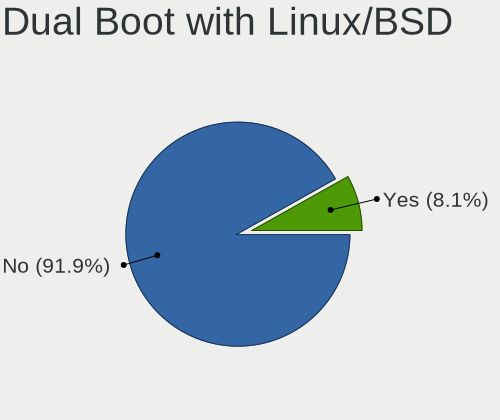
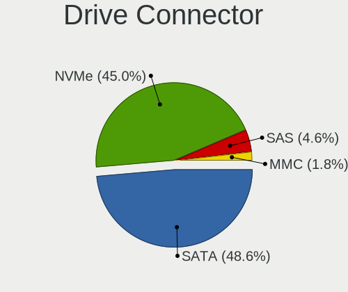
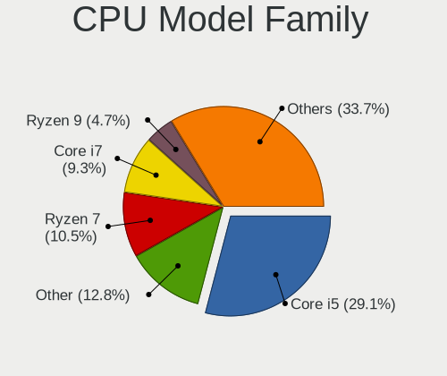
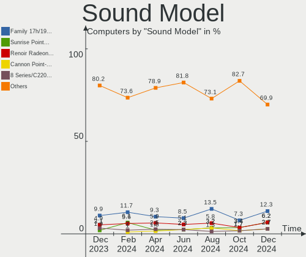

openSUSE - Hardware Trends
--------------------------

A project to identify most popular hardware characteristics and track their change
over time based on data collected by Linux users at https://Linux-Hardware.org.

Anyone can contribute to this report by the [hw-probe](https://github.com/linuxhw/hw-probe) tool:

    sudo -E hw-probe -all -upload

This is a report for all computer types. See also reports for [desktops](/Dist/openSUSE/Desktop/README.md) and [notebooks](/Dist/openSUSE/Notebook/README.md).

This report is for one last month. Overall report since the beginning of time: [TestDays](https://github.com/linuxhw/TestDays)

Period: Jul, 2023.

Contents
--------

* [ System ](#system)
  - [ OS                       ](#os)
  - [ OS Family                ](#os-family)
  - [ Kernel                   ](#kernel)
  - [ Kernel Family            ](#kernel-family)
  - [ Kernel Major Ver.        ](#kernel-major-ver)
  - [ Arch                     ](#arch)
  - [ DE                       ](#de)
  - [ Display Server           ](#display-server)
  - [ Display Manager          ](#display-manager)
  - [ OS Lang                  ](#os-lang)
  - [ Boot Mode                ](#boot-mode)
  - [ Filesystem               ](#filesystem)
  - [ Part. scheme             ](#part-scheme)
  - [ Dual Boot with Linux/BSD ](#dual-boot-with-linuxbsd)
  - [ Dual Boot (Win)          ](#dual-boot-win)

* [ Board ](#board)
  - [ Vendor                   ](#vendor)
  - [ Model                    ](#model)
  - [ Model Family             ](#model-family)
  - [ MFG Year                 ](#mfg-year)
  - [ Form Factor              ](#form-factor)
  - [ Secure Boot              ](#secure-boot)
  - [ Coreboot                 ](#coreboot)
  - [ RAM Size                 ](#ram-size)
  - [ RAM Used                 ](#ram-used)
  - [ Total Drives             ](#total-drives)
  - [ Has CD-ROM               ](#has-cd-rom)
  - [ Has Ethernet             ](#has-ethernet)
  - [ Has WiFi                 ](#has-wifi)
  - [ Has Bluetooth            ](#has-bluetooth)

* [ Location ](#location)
  - [ Country                  ](#country)
  - [ City                     ](#city)

* [ Drives ](#drives)
  - [ Drive Vendor             ](#drive-vendor)
  - [ Drive Model              ](#drive-model)
  - [ HDD Vendor               ](#hdd-vendor)
  - [ SSD Vendor               ](#ssd-vendor)
  - [ Drive Kind               ](#drive-kind)
  - [ Drive Connector          ](#drive-connector)
  - [ Drive Size               ](#drive-size)
  - [ Space Total              ](#space-total)
  - [ Space Used               ](#space-used)
  - [ Malfunc. Drives          ](#malfunc-drives)
  - [ Malfunc. Drive Vendor    ](#malfunc-drive-vendor)
  - [ Malfunc. HDD Vendor      ](#malfunc-hdd-vendor)
  - [ Malfunc. Drive Kind      ](#malfunc-drive-kind)
  - [ Failed Drives            ](#failed-drives)
  - [ Failed Drive Vendor      ](#failed-drive-vendor)
  - [ Drive Status             ](#drive-status)

* [ Storage controller ](#storage-controller)
  - [ Storage Vendor           ](#storage-vendor)
  - [ Storage Model            ](#storage-model)
  - [ Storage Kind             ](#storage-kind)

* [ Processor ](#processor)
  - [ CPU Vendor               ](#cpu-vendor)
  - [ CPU Model                ](#cpu-model)
  - [ CPU Model Family         ](#cpu-model-family)
  - [ CPU Cores                ](#cpu-cores)
  - [ CPU Sockets              ](#cpu-sockets)
  - [ CPU Threads              ](#cpu-threads)
  - [ CPU Op-Modes             ](#cpu-op-modes)
  - [ CPU Microcode            ](#cpu-microcode)
  - [ CPU Microarch            ](#cpu-microarch)

* [ Graphics ](#graphics)
  - [ GPU Vendor               ](#gpu-vendor)
  - [ GPU Model                ](#gpu-model)
  - [ GPU Combo                ](#gpu-combo)
  - [ GPU Driver               ](#gpu-driver)
  - [ GPU Memory               ](#gpu-memory)

* [ Monitor ](#monitor)
  - [ Monitor Vendor           ](#monitor-vendor)
  - [ Monitor Model            ](#monitor-model)
  - [ Monitor Resolution       ](#monitor-resolution)
  - [ Monitor Diagonal         ](#monitor-diagonal)
  - [ Monitor Width            ](#monitor-width)
  - [ Aspect Ratio             ](#aspect-ratio)
  - [ Monitor Area             ](#monitor-area)
  - [ Pixel Density            ](#pixel-density)
  - [ Multiple Monitors        ](#multiple-monitors)

* [ Network ](#network)
  - [ Net Controller Vendor    ](#net-controller-vendor)
  - [ Net Controller Model     ](#net-controller-model)
  - [ Wireless Vendor          ](#wireless-vendor)
  - [ Wireless Model           ](#wireless-model)
  - [ Ethernet Vendor          ](#ethernet-vendor)
  - [ Ethernet Model           ](#ethernet-model)
  - [ Net Controller Kind      ](#net-controller-kind)
  - [ Used Controller          ](#used-controller)
  - [ NICs                     ](#nics)
  - [ IPv6                     ](#ipv6)

* [ Bluetooth ](#bluetooth)
  - [ Bluetooth Vendor         ](#bluetooth-vendor)
  - [ Bluetooth Model          ](#bluetooth-model)

* [ Sound ](#sound)
  - [ Sound Vendor             ](#sound-vendor)
  - [ Sound Model              ](#sound-model)

* [ Memory ](#memory)
  - [ Memory Vendor            ](#memory-vendor)
  - [ Memory Model             ](#memory-model)
  - [ Memory Kind              ](#memory-kind)
  - [ Memory Form Factor       ](#memory-form-factor)
  - [ Memory Size              ](#memory-size)
  - [ Memory Speed             ](#memory-speed)

* [ Printers & scanners ](#printers--scanners)
  - [ Printer Vendor           ](#printer-vendor)
  - [ Printer Model            ](#printer-model)
  - [ Scanner Vendor           ](#scanner-vendor)
  - [ Scanner Model            ](#scanner-model)

* [ Camera ](#camera)
  - [ Camera Vendor            ](#camera-vendor)
  - [ Camera Model             ](#camera-model)

* [ Security ](#security)
  - [ Fingerprint Vendor       ](#fingerprint-vendor)
  - [ Fingerprint Model        ](#fingerprint-model)
  - [ Chipcard Vendor          ](#chipcard-vendor)
  - [ Chipcard Model           ](#chipcard-model)

* [ Unsupported ](#unsupported)
  - [ Unsupported Devices      ](#unsupported-devices)
  - [ Unsupported Device Types ](#unsupported-device-types)

System
------

OS
--

Installed operating systems

| Name                         | Computers | Percent |
|------------------------------|-----------|---------|
| openSUSE Tumbleweed-XXXXXXXX | 70        | 58.33%  |
| openSUSE Leap-15.5           | 39        | 32.5%   |
| openSUSE Microos-XXXXXXXX    | 8         | 6.67%   |
| openSUSE Leap-15.4           | 3         | 2.5%    |

OS Family
---------

OS without a version

| Name     | Computers | Percent |
|----------|-----------|---------|
| openSUSE | 120       | 100%    |

Kernel
------

Version of the Linux kernel

| Version                        | Computers | Percent |
|--------------------------------|-----------|---------|
| 6.3.9-1-default                | 31        | 25.83%  |
| 5.14.21-150500.53-default      | 27        | 22.5%   |
| 6.4.3-1-default                | 17        | 14.17%  |
| 6.4.2-1-default                | 11        | 9.17%   |
| 5.14.21-150500.55.7-default    | 11        | 9.17%   |
| 6.4.4-1-default                | 10        | 8.33%   |
| 6.4.6-1-default                | 5         | 4.17%   |
| 6.3.4-1-default                | 2         | 1.67%   |
| 5.14.21-150400.24.63-default   | 2         | 1.67%   |
| 6.4.4-lp154.2.g919c802-default | 1         | 0.83%   |
| 6.3.6-1-default                | 1         | 0.83%   |
| 6.2.8-1-default                | 1         | 0.83%   |
| 5.14.21-150400.24.60-default   | 1         | 0.83%   |

Kernel Family
-------------

Linux kernel without a distro release

| Version | Computers | Percent |
|---------|-----------|---------|
| 5.14.21 | 41        | 34.17%  |
| 6.3.9   | 31        | 25.83%  |
| 6.4.3   | 17        | 14.17%  |
| 6.4.4   | 11        | 9.17%   |
| 6.4.2   | 11        | 9.17%   |
| 6.4.6   | 5         | 4.17%   |
| 6.3.4   | 2         | 1.67%   |
| 6.3.6   | 1         | 0.83%   |
| 6.2.8   | 1         | 0.83%   |

Kernel Major Ver.
-----------------

Linux kernel major version

| Version | Computers | Percent |
|---------|-----------|---------|
| 6.4     | 44        | 36.67%  |
| 5.14    | 41        | 34.17%  |
| 6.3     | 34        | 28.33%  |
| 6.2     | 1         | 0.83%   |

Arch
----

OS architecture (x86_64, i586, etc.)

| Name   | Computers | Percent |
|--------|-----------|---------|
| x86_64 | 120       | 100%    |

DE
--

Desktop Environment

| Name       | Computers | Percent |
|------------|-----------|---------|
| KDE5       | 68        | 56.67%  |
| GNOME      | 40        | 33.33%  |
| XFCE       | 4         | 3.33%   |
| Unknown    | 3         | 2.5%    |
| Cinnamon   | 2         | 1.67%   |
| X-Cinnamon | 1         | 0.83%   |
| sway       | 1         | 0.83%   |
| i3         | 1         | 0.83%   |

Display Server
--------------

X11 or Wayland

| Name    | Computers | Percent |
|---------|-----------|---------|
| X11     | 73        | 60.83%  |
| Wayland | 47        | 39.17%  |

Display Manager
---------------

SDDM, LightDM, etc.

| Name    | Computers | Percent |
|---------|-----------|---------|
| Unknown | 79        | 65.83%  |
| SDDM    | 24        | 20%     |
| LightDM | 9         | 7.5%    |
| GDM     | 6         | 5%      |
| XDM     | 1         | 0.83%   |
| GREETD  | 1         | 0.83%   |

OS Lang
-------

Language

| Lang  | Computers | Percent |
|-------|-----------|---------|
| en_US | 44        | 36.67%  |
| de_DE | 22        | 18.33%  |
| es_ES | 13        | 10.83%  |
| pt_BR | 7         | 5.83%   |
| POSIX | 6         | 5%      |
| it_IT | 4         | 3.33%   |
| fr_FR | 3         | 2.5%    |
| en_GB | 3         | 2.5%    |
| cs_CZ | 3         | 2.5%    |
| C     | 3         | 2.5%    |
| ru_RU | 2         | 1.67%   |
| es_DO | 2         | 1.67%   |
| zh_TW | 1         | 0.83%   |
| zh_CN | 1         | 0.83%   |
| nl_NL | 1         | 0.83%   |
| nl_BE | 1         | 0.83%   |
| nb_NO | 1         | 0.83%   |
| ja_JP | 1         | 0.83%   |
| hu_HU | 1         | 0.83%   |
| en_AU | 1         | 0.83%   |

Boot Mode
---------

EFI or BIOS

| Mode | Computers | Percent |
|------|-----------|---------|
| EFI  | 76        | 63.33%  |
| BIOS | 44        | 36.67%  |

Filesystem
----------

Type of filesystem

| Type    | Computers | Percent |
|---------|-----------|---------|
| Btrfs   | 99        | 82.5%   |
| Ext4    | 17        | 14.17%  |
| Zfs     | 1         | 0.83%   |
| Xfs     | 1         | 0.83%   |
| Tmpfs   | 1         | 0.83%   |
| Overlay | 1         | 0.83%   |

Part. scheme
------------

Scheme of partitioning

| Type    | Computers | Percent |
|---------|-----------|---------|
| Unknown | 77        | 64.17%  |
| GPT     | 41        | 34.17%  |
| MBR     | 2         | 1.67%   |

Dual Boot with Linux/BSD
------------------------

Hosting more than one Linux/BSD

| Dual boot | Computers | Percent |
|-----------|-----------|---------|
| No        | 109       | 90.83%  |
| Yes       | 11        | 9.17%   |

Dual Boot (Win)
---------------

Hosting Linux and Windows

| Dual boot | Computers | Percent |
|-----------|-----------|---------|
| No        | 101       | 84.17%  |
| Yes       | 19        | 15.83%  |

Board
-----

Vendor
------

Motherboard manufacturer

| Name                  | Computers | Percent |
|-----------------------|-----------|---------|
| Lenovo                | 20        | 16.67%  |
| ASUSTek Computer      | 18        | 15%     |
| Hewlett-Packard       | 13        | 10.83%  |
| Gigabyte Technology   | 11        | 9.17%   |
| Dell                  | 10        | 8.33%   |
| Acer                  | 9         | 7.5%    |
| MSI                   | 8         | 6.67%   |
| Apple                 | 6         | 5%      |
| ASRock                | 5         | 4.17%   |
| Medion                | 2         | 1.67%   |
| Alienware             | 2         | 1.67%   |
| win element           | 1         | 0.83%   |
| VALE                  | 1         | 0.83%   |
| Toshiba               | 1         | 0.83%   |
| Timi                  | 1         | 0.83%   |
| Teclast               | 1         | 0.83%   |
| Sony                  | 1         | 0.83%   |
| SLIMBOOK              | 1         | 0.83%   |
| Samsung Electronics   | 1         | 0.83%   |
| Razer                 | 1         | 0.83%   |
| Positivo Bahia - VAIO | 1         | 0.83%   |
| Notebook              | 1         | 0.83%   |
| Microsoft             | 1         | 0.83%   |
| Irbis                 | 1         | 0.83%   |
| HUAWEI                | 1         | 0.83%   |
| HONOR                 | 1         | 0.83%   |
| Biostar               | 1         | 0.83%   |

Model
-----

Motherboard model

| Name                                                                                     | Computers | Percent |
|------------------------------------------------------------------------------------------|-----------|---------|
| Apple MacBookPro9,2                                                                      | 2         | 1.67%   |
| Unknown                                                                                  | 2         | 1.67%   |
| win element MoreFine S500+                                                               | 1         | 0.83%   |
| VALE Notebook Classic C140                                                               | 1         | 0.83%   |
| Toshiba dynabook Satellite B552/H                                                        | 1         | 0.83%   |
| Timi RedmiBook Pro 14S                                                                   | 1         | 0.83%   |
| Teclast X4                                                                               | 1         | 0.83%   |
| SLIMBOOK PROX-AMD5                                                                       | 1         | 0.83%   |
| Samsung 355V4C/355V4X/355V5C/355V5X/356V4C/356V4X/356V5C/356V5X/3445VC/3445VX/3545VC/354 | 1         | 0.83%   |
| Razer Blade 15 Base Model (Mid 2021) - RZ09-0410                                         | 1         | 0.83%   |
| Positivo Bahia - VAIO VJFE59F11X-B0411H                                                  | 1         | 0.83%   |
| Notebook NLx0MU                                                                          | 1         | 0.83%   |
| MSI MS-7C95                                                                              | 1         | 0.83%   |
| MSI MS-7C52                                                                              | 1         | 0.83%   |
| MSI MS-7C51                                                                              | 1         | 0.83%   |
| MSI MS-7C02                                                                              | 1         | 0.83%   |
| MSI MS-7816                                                                              | 1         | 0.83%   |
| MSI MS-7522                                                                              | 1         | 0.83%   |
| MSI GL72 6QF                                                                             | 1         | 0.83%   |
| MSI Cyborg 15 A13VE                                                                      | 1         | 0.83%   |
| Microsoft Surface Pro                                                                    | 1         | 0.83%   |
| Medion E6224                                                                             | 1         | 0.83%   |
| Medion Akoya P2214T                                                                      | 1         | 0.83%   |
| Lenovo V15-IGL 82C3                                                                      | 1         | 0.83%   |
| Lenovo ThinkPad X1 Carbon 7th 20QD001VUS                                                 | 1         | 0.83%   |
| Lenovo ThinkPad W541 20EF000NUS                                                          | 1         | 0.83%   |
| Lenovo ThinkPad W510 4391W3V                                                             | 1         | 0.83%   |
| Lenovo ThinkPad T560 20FH001TUS                                                          | 1         | 0.83%   |
| Lenovo ThinkPad T530 2394W19                                                             | 1         | 0.83%   |
| Lenovo ThinkPad T480 20L5CTO1WW                                                          | 1         | 0.83%   |
| Lenovo ThinkPad T440p 20AN009FGE                                                         | 1         | 0.83%   |
| Lenovo ThinkPad T14 Gen 2i 20W00153US                                                    | 1         | 0.83%   |
| Lenovo ThinkPad P1 20MD001VUS                                                            | 1         | 0.83%   |
| Lenovo ThinkPad L15 Gen 1 20U8S0AH00                                                     | 1         | 0.83%   |
| Lenovo ThinkPad E480 20KN005CRT                                                          | 1         | 0.83%   |
| Lenovo ThinkPad E15 Gen 2 20T8002CUS                                                     | 1         | 0.83%   |
| Lenovo ThinkCentre M720t 10SQ0070GE                                                      | 1         | 0.83%   |
| Lenovo IdeaPad S145-15IKB 81XM                                                           | 1         | 0.83%   |
| Lenovo IdeaPad 330-15IKB 81DE                                                            | 1         | 0.83%   |
| Lenovo IdeaPad 3 15ITL6 82H8                                                             | 1         | 0.83%   |

Model Family
------------

Motherboard model prefix

| Name                                    | Computers | Percent |
|-----------------------------------------|-----------|---------|
| Lenovo ThinkPad                         | 12        | 10%     |
| ASUS PRIME                              | 6         | 5%      |
| Acer Aspire                             | 5         | 4.17%   |
| Lenovo IdeaPad                          | 3         | 2.5%    |
| HP OMEN                                 | 2         | 1.67%   |
| Gigabyte B550M                          | 2         | 1.67%   |
| Dell XPS                                | 2         | 1.67%   |
| Dell Latitude                           | 2         | 1.67%   |
| Dell Inspiron                           | 2         | 1.67%   |
| ASUS Zenbook                            | 2         | 1.67%   |
| ASRock B450M                            | 2         | 1.67%   |
| Apple MacBookPro9                       | 2         | 1.67%   |
| Apple MacBookPro8                       | 2         | 1.67%   |
| Acer Swift                              | 2         | 1.67%   |
| Unknown                                 | 2         | 1.67%   |
| win element MoreFine                    | 1         | 0.83%   |
| VALE Notebook                           | 1         | 0.83%   |
| Toshiba dynabook                        | 1         | 0.83%   |
| Timi RedmiBook                          | 1         | 0.83%   |
| Teclast X4                              | 1         | 0.83%   |
| SLIMBOOK PROX-AMD5                      | 1         | 0.83%   |
| Samsung 355V4C                          | 1         | 0.83%   |
| Razer Blade                             | 1         | 0.83%   |
| Positivo Bahia - VAIO VJFE59F11X-B0411H | 1         | 0.83%   |
| Notebook NLx0MU                         | 1         | 0.83%   |
| MSI MS-7C95                             | 1         | 0.83%   |
| MSI MS-7C52                             | 1         | 0.83%   |
| MSI MS-7C51                             | 1         | 0.83%   |
| MSI MS-7C02                             | 1         | 0.83%   |
| MSI MS-7816                             | 1         | 0.83%   |
| MSI MS-7522                             | 1         | 0.83%   |
| MSI GL72                                | 1         | 0.83%   |
| MSI Cyborg                              | 1         | 0.83%   |
| Microsoft Surface                       | 1         | 0.83%   |
| Medion E6224                            | 1         | 0.83%   |
| Medion Akoya                            | 1         | 0.83%   |
| Lenovo V15-IGL                          | 1         | 0.83%   |
| Lenovo ThinkCentre                      | 1         | 0.83%   |
| Lenovo B5400                            | 1         | 0.83%   |
| Lenovo 20RD001FHV                       | 1         | 0.83%   |

MFG Year
--------

Motherboard manufacture year

| Year | Computers | Percent |
|------|-----------|---------|
| 2021 | 19        | 15.83%  |
| 2019 | 11        | 9.17%   |
| 2018 | 11        | 9.17%   |
| 2012 | 11        | 9.17%   |
| 2023 | 9         | 7.5%    |
| 2010 | 9         | 7.5%    |
| 2022 | 8         | 6.67%   |
| 2020 | 8         | 6.67%   |
| 2013 | 7         | 5.83%   |
| 2017 | 6         | 5%      |
| 2016 | 4         | 3.33%   |
| 2014 | 4         | 3.33%   |
| 2011 | 4         | 3.33%   |
| 2015 | 3         | 2.5%    |
| 2009 | 3         | 2.5%    |
| 2008 | 2         | 1.67%   |
| 2006 | 1         | 0.83%   |

Form Factor
-----------

Physical design of the computer

| Name        | Computers | Percent |
|-------------|-----------|---------|
| Notebook    | 66        | 55%     |
| Desktop     | 43        | 35.83%  |
| Convertible | 5         | 4.17%   |
| Tablet      | 2         | 1.67%   |
| Mini pc     | 2         | 1.67%   |
| Server      | 2         | 1.67%   |

Secure Boot
-----------

Enabled or disabled

| State    | Computers | Percent |
|----------|-----------|---------|
| Disabled | 103       | 85.83%  |
| Enabled  | 17        | 14.17%  |

Coreboot
--------

Have coreboot on board

| Used | Computers | Percent |
|------|-----------|---------|
| No   | 120       | 100%    |

RAM Size
--------

Total RAM memory

| Size in GB  | Computers | Percent |
|-------------|-----------|---------|
| 16.01-24.0  | 28        | 23.33%  |
| 4.01-8.0    | 27        | 22.5%   |
| 8.01-16.0   | 24        | 20%     |
| 32.01-64.0  | 19        | 15.83%  |
| 3.01-4.0    | 12        | 10%     |
| 64.01-256.0 | 5         | 4.17%   |
| 24.01-32.0  | 2         | 1.67%   |
| 1.01-2.0    | 2         | 1.67%   |
| 2.01-3.0    | 1         | 0.83%   |

RAM Used
--------

Used RAM memory

| Used GB    | Computers | Percent |
|------------|-----------|---------|
| 3.01-4.0   | 34        | 28.33%  |
| 2.01-3.0   | 29        | 24.17%  |
| 1.01-2.0   | 27        | 22.5%   |
| 4.01-8.0   | 25        | 20.83%  |
| 8.01-16.0  | 3         | 2.5%    |
| 24.01-32.0 | 1         | 0.83%   |
| 16.01-24.0 | 1         | 0.83%   |

Total Drives
------------

Number of drives on board

| Drives | Computers | Percent |
|--------|-----------|---------|
| 1      | 71        | 59.17%  |
| 2      | 35        | 29.17%  |
| 4      | 6         | 5%      |
| 3      | 4         | 3.33%   |
| 5      | 3         | 2.5%    |
| 13     | 1         | 0.83%   |

Has CD-ROM
----------

Has CD-ROM on board

| Presented | Computers | Percent |
|-----------|-----------|---------|
| No        | 73        | 60.83%  |
| Yes       | 47        | 39.17%  |

Has Ethernet
------------

Has Ethernet on board

| Presented | Computers | Percent |
|-----------|-----------|---------|
| Yes       | 100       | 83.33%  |
| No        | 20        | 16.67%  |

Has WiFi
--------

Has WiFi module

| Presented | Computers | Percent |
|-----------|-----------|---------|
| Yes       | 95        | 79.17%  |
| No        | 25        | 20.83%  |

Has Bluetooth
-------------

Has Bluetooth module

| Presented | Computers | Percent |
|-----------|-----------|---------|
| Yes       | 85        | 70.83%  |
| No        | 35        | 29.17%  |

Location
--------

Country
-------

Geographic location (country)

| Country      | Computers | Percent |
|--------------|-----------|---------|
| Germany      | 24        | 20%     |
| USA          | 22        | 18.33%  |
| Brazil       | 10        | 8.33%   |
| Italy        | 7         | 5.83%   |
| Russia       | 4         | 3.33%   |
| Mexico       | 4         | 3.33%   |
| France       | 4         | 3.33%   |
| Spain        | 3         | 2.5%    |
| Czechia      | 3         | 2.5%    |
| UK           | 2         | 1.67%   |
| Sweden       | 2         | 1.67%   |
| Norway       | 2         | 1.67%   |
| Hungary      | 2         | 1.67%   |
| Colombia     | 2         | 1.67%   |
| Chile        | 2         | 1.67%   |
| Belgium      | 2         | 1.67%   |
| Austria      | 2         | 1.67%   |
| Australia    | 2         | 1.67%   |
| Argentina    | 2         | 1.67%   |
| Turkey       | 1         | 0.83%   |
| Taiwan       | 1         | 0.83%   |
| South Africa | 1         | 0.83%   |
| Singapore    | 1         | 0.83%   |
| Serbia       | 1         | 0.83%   |
| Portugal     | 1         | 0.83%   |
| Poland       | 1         | 0.83%   |
| Peru         | 1         | 0.83%   |
| Netherlands  | 1         | 0.83%   |
| Luxembourg   | 1         | 0.83%   |
| Japan        | 1         | 0.83%   |
| Indonesia    | 1         | 0.83%   |
| India        | 1         | 0.83%   |
| Hong Kong    | 1         | 0.83%   |
| Guatemala    | 1         | 0.83%   |
| Georgia      | 1         | 0.83%   |
| El Salvador  | 1         | 0.83%   |
| Bolivia      | 1         | 0.83%   |
| Algeria      | 1         | 0.83%   |

City
----

Geographic location (city)

| City                        | Computers | Percent |
|-----------------------------|-----------|---------|
| Zetel                       | 2         | 1.67%   |
| Stuttgart                   | 2         | 1.67%   |
| Santa Maria                 | 2         | 1.67%   |
| Prague                      | 2         | 1.67%   |
| Port Montt                  | 2         | 1.67%   |
| Natal                       | 2         | 1.67%   |
| Munich                      | 2         | 1.67%   |
| Moscow                      | 2         | 1.67%   |
| Milan                       | 2         | 1.67%   |
| Mexico City                 | 2         | 1.67%   |
| Cologne                     | 2         | 1.67%   |
| Budapest                    | 2         | 1.67%   |
| Yokohama                    | 1         | 0.83%   |
| Wyk auf Foehr               | 1         | 0.83%   |
| West Bend                   | 1         | 0.83%   |
| Waidhofen an der Ybbs       | 1         | 0.83%   |
| Veracruz                    | 1         | 0.83%   |
| Trivandrum                  | 1         | 0.83%   |
| Trieste                     | 1         | 0.83%   |
| Tonopah                     | 1         | 0.83%   |
| Tinjomoyo                   | 1         | 0.83%   |
| Tessenderlo                 | 1         | 0.83%   |
| Tainan City                 | 1         | 0.83%   |
| Sydney                      | 1         | 0.83%   |
| Stord                       | 1         | 0.83%   |
| Stockholm                   | 1         | 0.83%   |
| Steinfurt                   | 1         | 0.83%   |
| Spavinaw                    | 1         | 0.83%   |
| Soderala                    | 1         | 0.83%   |
| Singapore                   | 1         | 0.83%   |
| San Cristóbal de La Laguna | 1         | 0.83%   |
| Saint-Andre-le-Puy          | 1         | 0.83%   |
| Sacramento                  | 1         | 0.83%   |
| Rüsselsheim am Main        | 1         | 0.83%   |
| Rostov-on-Don               | 1         | 0.83%   |
| Roanoke                     | 1         | 0.83%   |
| Rio de Janeiro              | 1         | 0.83%   |
| Reading                     | 1         | 0.83%   |
| Portland                    | 1         | 0.83%   |
| Port Orchard                | 1         | 0.83%   |

Drives
------

Drive Vendor
------------

Hard drive vendors

| Vendor                       | Computers | Drives  | Percent |
|------------------------------|-----------|---------|---------|
| Seagate                      | 27        | 36      | 15%     |
| Samsung Electronics          | 24        | 30      | 13.33%  |
| WDC                          | 16        | 20      | 8.89%   |
| Sandisk                      | 15        | 16      | 8.33%   |
| Toshiba                      | 12        | 14      | 6.67%   |
| Kingston                     | 10        | 10      | 5.56%   |
| Crucial                      | 10        | 10      | 5.56%   |
| Micron Technology            | 6         | 6       | 3.33%   |
| SPCC                         | 5         | 6       | 2.78%   |
| Unknown                      | 4         | 4       | 2.22%   |
| SK hynix                     | 4         | 5       | 2.22%   |
| Phison Electronics           | 4         | 4       | 2.22%   |
| Intel                        | 4         | 4       | 2.22%   |
| Hitachi                      | 4         | 4       | 2.22%   |
| Micron/Crucial Technology    | 3         | 3       | 1.67%   |
| XrayDisk                     | 2         | 2       | 1.11%   |
| Kingston Technology Company  | 2         | 2       | 1.11%   |
| Fanxiang                     | 2         | 2       | 1.11%   |
| China                        | 2         | 2       | 1.11%   |
| Apple                        | 2         | 2       | 1.11%   |
| Union Memory                 | 1         | 1       | 0.56%   |
| Transcend                    | 1         | 1       | 0.56%   |
| Teclast                      | 1         | 1       | 0.56%   |
| Team                         | 1         | 1       | 0.56%   |
| SSD 60GB                     | 1         | 1       | 0.56%   |
| Silicon Motion               | 1         | 1       | 0.56%   |
| Shenzhen Longsys Electronics | 1         | 1       | 0.56%   |
| Seagate Technology           | 1         | 1       | 0.56%   |
| Realtek Semiconductor        | 1         | 1       | 0.56%   |
| PUSKILL                      | 1         | 1       | 0.56%   |
| PNY                          | 1         | 1       | 0.56%   |
| Patriot                      | 1         | 1       | 0.56%   |
| OCZ                          | 1         | 1       | 0.56%   |
| Leven                        | 1         | 1       | 0.56%   |
| KXG60ZNV                     | 1         | 1       | 0.56%   |
| HL-DT-ST                     | 1         | Unknown | 0.56%   |
| HGST                         | 1         | 1       | 0.56%   |
| Hewlett-Packard              | 1         | 5       | 0.56%   |
| GLOWAY                       | 1         | 1       | 0.56%   |
| Gigabyte Technology          | 1         | 1       | 0.56%   |

Drive Model
-----------

Hard drive models

| Model                                               | Computers | Percent |
|-----------------------------------------------------|-----------|---------|
| Samsung NVMe SSD Controller SM981/PM981/PM983 500GB | 7         | 3.54%   |
| Sandisk WD Blue SN550 NVMe SSD 250GB                | 4         | 2.02%   |
| Seagate ST1000DM003-1ER162 1TB                      | 3         | 1.52%   |
| Samsung NVMe SSD Controller PM9A1/PM9A3/980PRO 1TB  | 3         | 1.52%   |
| Micron/Crucial P2 NVMe PCIe SSD 1TB                 | 3         | 1.52%   |
| Kingston SA400S37480G 480GB SSD                     | 3         | 1.52%   |
| Crucial CT500MX500SSD1 500GB                        | 3         | 1.52%   |
| WDC WD40EZRZ-00GXCB0 4TB                            | 2         | 1.01%   |
| WDC WD20EZRX-00DC0B0 2TB                            | 2         | 1.01%   |
| Toshiba MQ01ABD100 1TB                              | 2         | 1.01%   |
| Toshiba BG3 NVMe SSD Controller 256GB               | 2         | 1.01%   |
| SPCC Solid State Disk 256GB                         | 2         | 1.01%   |
| SK hynix BC511 512GB                                | 2         | 1.01%   |
| Seagate ST8000DM004-2U9188 8TB                      | 2         | 1.01%   |
| Seagate ST2000DM008-2FR102 2TB                      | 2         | 1.01%   |
| Seagate ST1000LM024 HN-M101MBB 1TB                  | 2         | 1.01%   |
| Seagate ST1000DM010-2EP102 1TB                      | 2         | 1.01%   |
| Sandisk WD Blue SN570 1TB                           | 2         | 1.01%   |
| Sandisk WD Black SN850 1TB                          | 2         | 1.01%   |
| SanDisk SSD PLUS 240GB                              | 2         | 1.01%   |
| Phison E16 PCIe4 NVMe Controller 1TB                | 2         | 1.01%   |
| Micron 2450_MTFDKBA256TFK 256GB                     | 2         | 1.01%   |
| Kingston SA400S37240G 240GB SSD                     | 2         | 1.01%   |
| Crucial CT480BX500SSD1 480GB                        | 2         | 1.01%   |
| Crucial CT1000BX500SSD1 1TB                         | 2         | 1.01%   |
| XrayDisk 256GB                                      | 1         | 0.51%   |
| XrayDisk 128GB                                      | 1         | 0.51%   |
| WDC WDS250G1B0A-00H9H0 250GB SSD                    | 1         | 0.51%   |
| WDC WDS120G2G0B-00EPW0 120GB SSD                    | 1         | 0.51%   |
| WDC WD5000LPCX-24VHAT0 500GB                        | 1         | 0.51%   |
| WDC WD3200BPVT-24ZEST0 320GB                        | 1         | 0.51%   |
| WDC WD3200BEKT-75PVMT0 320GB                        | 1         | 0.51%   |
| WDC WD3200AAKX-00ERMA0 320GB                        | 1         | 0.51%   |
| WDC WD3200AAJS-60Z0A0 320GB                         | 1         | 0.51%   |
| WDC WD2002FAEX-007BA0 2TB                           | 1         | 0.51%   |
| WDC WD10SPZX-24Z10 1TB                              | 1         | 0.51%   |
| WDC WD10SPZX-08Z10 1TB                              | 1         | 0.51%   |
| WDC WD10JPVX-00JC3T0 1TB                            | 1         | 0.51%   |
| WDC WD10EZEX-08WN4A0 1TB                            | 1         | 0.51%   |
| WDC WD1002FAEX-00Z3A0 1TB                           | 1         | 0.51%   |

HDD Vendor
----------

Hard disk drive vendors

| Vendor              | Computers | Drives | Percent |
|---------------------|-----------|--------|---------|
| Seagate             | 26        | 34     | 46.43%  |
| WDC                 | 13        | 15     | 23.21%  |
| Toshiba             | 7         | 9      | 12.5%   |
| Hitachi             | 4         | 4      | 7.14%   |
| Samsung Electronics | 2         | 2      | 3.57%   |
| Apple               | 2         | 2      | 3.57%   |
| HGST                | 1         | 1      | 1.79%   |
| Hewlett-Packard     | 1         | 5      | 1.79%   |

SSD Vendor
----------

Solid state drive vendors

| Vendor              | Computers | Drives | Percent |
|---------------------|-----------|--------|---------|
| Crucial             | 10        | 10     | 17.24%  |
| Kingston            | 9         | 9      | 15.52%  |
| Samsung Electronics | 8         | 10     | 13.79%  |
| WDC                 | 4         | 5      | 6.9%    |
| SPCC                | 4         | 5      | 6.9%    |
| SanDisk             | 3         | 3      | 5.17%   |
| Toshiba             | 2         | 2      | 3.45%   |
| Intel               | 2         | 2      | 3.45%   |
| China               | 2         | 2      | 3.45%   |
| Transcend           | 1         | 1      | 1.72%   |
| Teclast             | 1         | 1      | 1.72%   |
| Team                | 1         | 1      | 1.72%   |
| PUSKILL             | 1         | 1      | 1.72%   |
| PNY                 | 1         | 1      | 1.72%   |
| Patriot             | 1         | 1      | 1.72%   |
| OCZ                 | 1         | 1      | 1.72%   |
| Micron Technology   | 1         | 1      | 1.72%   |
| Leven               | 1         | 1      | 1.72%   |
| GLOWAY              | 1         | 1      | 1.72%   |
| Gigabyte Technology | 1         | 1      | 1.72%   |
| Fanxiang            | 1         | 1      | 1.72%   |
| Corsair             | 1         | 1      | 1.72%   |
| A-DATA Technology   | 1         | 1      | 1.72%   |

Drive Kind
----------

HDD or SSD

| Kind    | Computers | Drives | Percent |
|---------|-----------|--------|---------|
| NVMe    | 56        | 64     | 34.57%  |
| SSD     | 50        | 62     | 30.86%  |
| HDD     | 47        | 72     | 29.01%  |
| Unknown | 5         | 5      | 3.09%   |
| MMC     | 4         | 4      | 2.47%   |

Drive Connector
---------------

SATA, SAS, NVMe, etc.

| Type | Computers | Drives | Percent |
|------|-----------|--------|---------|
| SATA | 76        | 122    | 52.41%  |
| NVMe | 56        | 63     | 38.62%  |
| SAS  | 9         | 18     | 6.21%   |
| MMC  | 4         | 4      | 2.76%   |

Drive Size
----------

Size of hard drive

| Size in TB | Computers | Drives | Percent |
|------------|-----------|--------|---------|
| 0.01-0.5   | 50        | 57     | 45.45%  |
| 0.51-1.0   | 35        | 42     | 31.82%  |
| 1.01-2.0   | 11        | 12     | 10%     |
| 3.01-4.0   | 6         | 7      | 5.45%   |
| 4.01-10.0  | 4         | 5      | 3.64%   |
| 2.01-3.0   | 2         | 9      | 1.82%   |
| 10.01-20.0 | 2         | 2      | 1.82%   |

Space Total
-----------

Amount of disk space available on the file system

| Size in GB     | Computers | Percent |
|----------------|-----------|---------|
| More than 3000 | 48        | 40%     |
| 1001-2000      | 25        | 20.83%  |
| 501-1000       | 18        | 15%     |
| 251-500        | 11        | 9.17%   |
| 2001-3000      | 10        | 8.33%   |
| 101-250        | 4         | 3.33%   |
| 51-100         | 2         | 1.67%   |
| 21-50          | 1         | 0.83%   |
| Unknown        | 1         | 0.83%   |

Space Used
----------

Amount of used disk space

| Used GB        | Computers | Percent |
|----------------|-----------|---------|
| 101-250        | 27        | 22.5%   |
| 51-100         | 25        | 20.83%  |
| 251-500        | 19        | 15.83%  |
| 1001-2000      | 12        | 10%     |
| 21-50          | 11        | 9.17%   |
| 501-1000       | 11        | 9.17%   |
| More than 3000 | 6         | 5%      |
| 2001-3000      | 4         | 3.33%   |
| 1-20           | 4         | 3.33%   |
| Unknown        | 1         | 0.83%   |

Malfunc. Drives
---------------

Drive models with a malfunction

| Model                           | Computers | Drives | Percent |
|---------------------------------|-----------|--------|---------|
| Transcend TS120GSSD220S 120GB   | 1         | 1      | 20%     |
| Toshiba MQ01ABD100 1TB          | 1         | 1      | 20%     |
| Toshiba MD04ACA400 4TB          | 1         | 1      | 20%     |
| Seagate ST4000NM0035-1V4107 4TB | 1         | 1      | 20%     |
| Seagate ST2000DM001-1ER164 2TB  | 1         | 1      | 20%     |

Malfunc. Drive Vendor
---------------------

Vendors of faulty drives

| Vendor    | Computers | Drives | Percent |
|-----------|-----------|--------|---------|
| Toshiba   | 2         | 2      | 40%     |
| Seagate   | 2         | 2      | 40%     |
| Transcend | 1         | 1      | 20%     |

Malfunc. HDD Vendor
-------------------

Vendors of faulty HDD drives

| Vendor  | Computers | Drives | Percent |
|---------|-----------|--------|---------|
| Toshiba | 2         | 2      | 50%     |
| Seagate | 2         | 2      | 50%     |

Malfunc. Drive Kind
-------------------

Kinds of faulty drives

| Kind | Computers | Drives | Percent |
|------|-----------|--------|---------|
| HDD  | 4         | 4      | 80%     |
| SSD  | 1         | 1      | 20%     |

Failed Drives
-------------

Failed drive models

Zero info for selected period =(

Failed Drive Vendor
-------------------

Failed drive vendors

Zero info for selected period =(

Drive Status
------------

Number of failed and malfunc. drives

| Status   | Computers | Drives | Percent |
|----------|-----------|--------|---------|
| Detected | 83        | 136    | 63.85%  |
| Works    | 43        | 66     | 33.08%  |
| Malfunc  | 4         | 5      | 3.08%   |

Storage controller
------------------

Storage Vendor
--------------

Storage controller vendors

| Vendor                       | Computers | Percent |
|------------------------------|-----------|---------|
| Intel                        | 71        | 42.26%  |
| AMD                          | 29        | 17.26%  |
| Samsung Electronics          | 17        | 10.12%  |
| Sandisk                      | 12        | 7.14%   |
| Micron Technology            | 5         | 2.98%   |
| SK hynix                     | 4         | 2.38%   |
| Phison Electronics           | 4         | 2.38%   |
| JMicron Technology           | 4         | 2.38%   |
| Toshiba America Info Systems | 3         | 1.79%   |
| Micron/Crucial Technology    | 3         | 1.79%   |
| Kingston Technology Company  | 3         | 1.79%   |
| Nvidia                       | 2         | 1.19%   |
| INNOGRIT                     | 2         | 1.19%   |
| Broadcom / LSI               | 2         | 1.19%   |
| VIA Technologies             | 1         | 0.6%    |
| Union Memory (Shenzhen)      | 1         | 0.6%    |
| Silicon Motion               | 1         | 0.6%    |
| Shenzhen Longsys Electronics | 1         | 0.6%    |
| Seagate Technology           | 1         | 0.6%    |
| Realtek Semiconductor        | 1         | 0.6%    |
| ASMedia Technology           | 1         | 0.6%    |

Storage Model
-------------

Storage controller models

| Model                                                                          | Computers | Percent |
|--------------------------------------------------------------------------------|-----------|---------|
| AMD FCH SATA Controller [AHCI mode]                                            | 19        | 9.84%   |
| Intel Sunrise Point-LP SATA Controller [AHCI mode]                             | 8         | 4.15%   |
| Samsung NVMe SSD Controller SM981/PM981/PM983                                  | 7         | 3.63%   |
| Intel 7 Series Chipset Family 6-port SATA Controller [AHCI mode]               | 7         | 3.63%   |
| Intel Volume Management Device NVMe RAID Controller                            | 6         | 3.11%   |
| AMD 500 Series Chipset SATA Controller                                         | 6         | 3.11%   |
| Samsung NVMe SSD Controller 980                                                | 5         | 2.59%   |
| Intel Celeron/Pentium Silver Processor SATA Controller                         | 5         | 2.59%   |
| Intel 8 Series/C220 Series Chipset Family 6-port SATA Controller 1 [AHCI mode] | 5         | 2.59%   |
| Intel 5 Series/3400 Series Chipset 6 port SATA AHCI Controller                 | 5         | 2.59%   |
| AMD FCH SATA Controller D                                                      | 5         | 2.59%   |
| AMD 400 Series Chipset SATA Controller                                         | 5         | 2.59%   |
| SanDisk WD Blue SN570 NVMe SSD 1TB                                             | 4         | 2.07%   |
| SanDisk WD Blue SN550 NVMe SSD                                                 | 4         | 2.07%   |
| Intel 6 Series/C200 Series Chipset Family 6 port Mobile SATA AHCI Controller   | 4         | 2.07%   |
| Samsung NVMe SSD Controller PM9A1/PM9A3/980PRO                                 | 3         | 1.55%   |
| Micron/Crucial P2 [Nick P2] / P3 / P3 Plus NVMe PCIe SSD (DRAM-less)           | 3         | 1.55%   |
| Micron 2450 NVMe SSD [HendrixV] (DRAM-less)                                    | 3         | 1.55%   |
| Intel Tiger Lake-LP SATA Controller                                            | 3         | 1.55%   |
| Intel C602 chipset 4-Port SATA Storage Control Unit                            | 3         | 1.55%   |
| Intel 82801 Mobile SATA Controller [RAID mode]                                 | 3         | 1.55%   |
| Toshiba America Info Systems BG3 NVMe SSD Controller                           | 2         | 1.04%   |
| SK hynix Gold P31/BC711/PC711 NVMe Solid State Drive                           | 2         | 1.04%   |
| SK hynix BC511 NVMe SSD                                                        | 2         | 1.04%   |
| SanDisk WD PC SN810 / Black SN850 NVMe SSD                                     | 2         | 1.04%   |
| Phison E16 PCIe4 NVMe Controller                                               | 2         | 1.04%   |
| Nvidia MCP79 AHCI Controller                                                   | 2         | 1.04%   |
| Micron 3400 NVMe SSD [Hendrix]                                                 | 2         | 1.04%   |
| Kingston Company Company Non-Volatile memory controller                        | 2         | 1.04%   |
| JMicron JMB368 IDE controller                                                  | 2         | 1.04%   |
| JMicron JMB363 SATA/IDE Controller                                             | 2         | 1.04%   |
| Intel Cannon Lake PCH SATA AHCI Controller                                     | 2         | 1.04%   |
| Intel C600/X79 series chipset 6-Port SATA AHCI Controller                      | 2         | 1.04%   |
| Intel Alder Lake-S PCH SATA Controller [AHCI Mode]                             | 2         | 1.04%   |
| Intel 82801JI (ICH10 Family) 4 port SATA IDE Controller #1                     | 2         | 1.04%   |
| Intel 82801JI (ICH10 Family) 2 port SATA IDE Controller #2                     | 2         | 1.04%   |
| Intel 8 Series SATA Controller 1 [AHCI mode]                                   | 2         | 1.04%   |
| INNOGRIT NVMe SSD Controller IG5236                                            | 2         | 1.04%   |
| Broadcom / LSI SAS2008 PCI-Express Fusion-MPT SAS-2 [Falcon]                   | 2         | 1.04%   |
| AMD SB7x0/SB8x0/SB9x0 SATA Controller [IDE mode]                               | 2         | 1.04%   |

Storage Kind
------------

Kind of storage controller (IDE, SATA, NVMe, SAS, ...)

| Kind | Computers | Percent |
|------|-----------|---------|
| SATA | 87        | 51.18%  |
| NVMe | 56        | 32.94%  |
| RAID | 14        | 8.24%   |
| IDE  | 9         | 5.29%   |
| SAS  | 4         | 2.35%   |

Processor
---------

CPU Vendor
----------

Processor vendors

| Vendor | Computers | Percent |
|--------|-----------|---------|
| Intel  | 79        | 65.83%  |
| AMD    | 41        | 34.17%  |

CPU Model
---------

Processor models

| Model                                       | Computers | Percent |
|---------------------------------------------|-----------|---------|
| Intel 11th Gen Core i7-1165G7 @ 2.80GHz     | 4         | 3.33%   |
| AMD Ryzen 7 5700U with Radeon Graphics      | 4         | 3.33%   |
| Intel Core i5-3210M CPU @ 2.50GHz           | 3         | 2.5%    |
| AMD Ryzen 5 5500U with Radeon Graphics      | 3         | 2.5%    |
| Intel Xeon CPU E5-2670 0 @ 2.60GHz          | 2         | 1.67%   |
| Intel Pentium Silver N5030 CPU @ 1.10GHz    | 2         | 1.67%   |
| Intel Core i7-8750H CPU @ 2.20GHz           | 2         | 1.67%   |
| Intel Core i7 CPU Q 720 @ 1.60GHz           | 2         | 1.67%   |
| Intel Core i5-3230M CPU @ 2.60GHz           | 2         | 1.67%   |
| Intel Celeron N4020 CPU @ 1.10GHz           | 2         | 1.67%   |
| Intel 11th Gen Core i5-1135G7 @ 2.40GHz     | 2         | 1.67%   |
| AMD Ryzen 5 5600X 6-Core Processor          | 2         | 1.67%   |
| AMD Ryzen 5 5600G with Radeon Graphics      | 2         | 1.67%   |
| AMD Ryzen 5 3600 6-Core Processor           | 2         | 1.67%   |
| AMD Ryzen 5 2600 Six-Core Processor         | 2         | 1.67%   |
| AMD Athlon 3000G with Radeon Vega Graphics  | 2         | 1.67%   |
| Intel Xeon CPU W3530 @ 2.80GHz              | 1         | 0.83%   |
| Intel Xeon CPU E5450 @ 3.00GHz              | 1         | 0.83%   |
| Intel Xeon CPU E5-1603 0 @ 2.80GHz          | 1         | 0.83%   |
| Intel Pentium Dual-Core CPU E6500 @ 2.93GHz | 1         | 0.83%   |
| Intel Pentium CPU G3250 @ 3.20GHz           | 1         | 0.83%   |
| Intel Core i7-9700 CPU @ 3.00GHz            | 1         | 0.83%   |
| Intel Core i7-8700 CPU @ 3.20GHz            | 1         | 0.83%   |
| Intel Core i7-8650U CPU @ 1.90GHz           | 1         | 0.83%   |
| Intel Core i7-8565U CPU @ 1.80GHz           | 1         | 0.83%   |
| Intel Core i7-7500U CPU @ 2.70GHz           | 1         | 0.83%   |
| Intel Core i7-6700HQ CPU @ 2.60GHz          | 1         | 0.83%   |
| Intel Core i7-6600U CPU @ 2.60GHz           | 1         | 0.83%   |
| Intel Core i7-4810MQ CPU @ 2.80GHz          | 1         | 0.83%   |
| Intel Core i7-4700MQ CPU @ 2.40GHz          | 1         | 0.83%   |
| Intel Core i7-4500U CPU @ 1.80GHz           | 1         | 0.83%   |
| Intel Core i7-3630QM CPU @ 2.40GHz          | 1         | 0.83%   |
| Intel Core i7-2720QM CPU @ 2.20GHz          | 1         | 0.83%   |
| Intel Core i7-2670QM CPU @ 2.20GHz          | 1         | 0.83%   |
| Intel Core i7-2600K CPU @ 3.40GHz           | 1         | 0.83%   |
| Intel Core i7 CPU K 875 @ 2.93GHz           | 1         | 0.83%   |
| Intel Core i7 CPU 950 @ 3.07GHz             | 1         | 0.83%   |
| Intel Core i5-9400 CPU @ 2.90GHz            | 1         | 0.83%   |
| Intel Core i5-8250U CPU @ 1.60GHz           | 1         | 0.83%   |
| Intel Core i5-7300U CPU @ 2.60GHz           | 1         | 0.83%   |

CPU Model Family
----------------

Processor model prefix

| Model                   | Computers | Percent |
|-------------------------|-----------|---------|
| Intel Core i7           | 20        | 16.67%  |
| Intel Core i5           | 18        | 15%     |
| Other                   | 15        | 12.5%   |
| AMD Ryzen 5             | 15        | 12.5%   |
| AMD Ryzen 7             | 11        | 9.17%   |
| Intel Core i3           | 9         | 7.5%    |
| Intel Xeon              | 5         | 4.17%   |
| Intel Celeron           | 5         | 4.17%   |
| AMD Ryzen 9             | 4         | 3.33%   |
| Intel Pentium Silver    | 2         | 1.67%   |
| Intel Core 2 Duo        | 2         | 1.67%   |
| AMD Ryzen 7 PRO         | 2         | 1.67%   |
| AMD Ryzen 3             | 2         | 1.67%   |
| AMD Athlon              | 2         | 1.67%   |
| Intel Pentium Dual-Core | 1         | 0.83%   |
| Intel Pentium           | 1         | 0.83%   |
| Intel Core 2 Quad       | 1         | 0.83%   |
| Intel Atom              | 1         | 0.83%   |
| AMD Ryzen 3 PRO         | 1         | 0.83%   |
| AMD Phenom II X4        | 1         | 0.83%   |
| AMD Opteron             | 1         | 0.83%   |
| AMD A6                  | 1         | 0.83%   |

CPU Cores
---------

Number of processor cores

| Number | Computers | Percent |
|--------|-----------|---------|
| 4      | 37        | 30.83%  |
| 2      | 33        | 27.5%   |
| 8      | 19        | 15.83%  |
| 6      | 18        | 15%     |
| 16     | 4         | 3.33%   |
| 12     | 3         | 2.5%    |
| 1      | 3         | 2.5%    |
| 32     | 1         | 0.83%   |
| 24     | 1         | 0.83%   |
| 10     | 1         | 0.83%   |

CPU Sockets
-----------

Number of sockets

| Number | Computers | Percent |
|--------|-----------|---------|
| 1      | 118       | 98.33%  |
| 4      | 1         | 0.83%   |
| 2      | 1         | 0.83%   |

CPU Threads
-----------

Threads per core (Hyper-Threading)

| Number | Computers | Percent |
|--------|-----------|---------|
| 2      | 92        | 76.67%  |
| 1      | 27        | 22.5%   |
| 8      | 1         | 0.83%   |

CPU Op-Modes
------------

CPU Operation Modes (32-bit, 64-bit)

| Op mode        | Computers | Percent |
|----------------|-----------|---------|
| 32-bit, 64-bit | 120       | 100%    |

CPU Microcode
-------------

Microcode number

| Number     | Computers | Percent |
|------------|-----------|---------|
| Unknown    | 71        | 59.17%  |
| 0x0a50000d | 5         | 4.17%   |
| 0x08608103 | 5         | 4.17%   |
| 0x08108109 | 4         | 3.33%   |
| 0x806c1    | 3         | 2.5%    |
| 0x1067a    | 3         | 2.5%    |
| 0x0a20120a | 3         | 2.5%    |
| 0xb0671    | 2         | 1.67%   |
| 0x0a601203 | 2         | 1.67%   |
| 0x0a50000c | 2         | 1.67%   |
| 0x08701021 | 2         | 1.67%   |
| 0x08600106 | 2         | 1.67%   |
| 0x906ed    | 1         | 0.83%   |
| 0x906ea    | 1         | 0.83%   |
| 0x806e9    | 1         | 0.83%   |
| 0x306a9    | 1         | 0.83%   |
| 0x206d7    | 1         | 0.83%   |
| 0x20655    | 1         | 0.83%   |
| 0x0a404102 | 1         | 0.83%   |
| 0x08a00006 | 1         | 0.83%   |
| 0x08701030 | 1         | 0.83%   |
| 0x08608104 | 1         | 0.83%   |
| 0x08608102 | 1         | 0.83%   |
| 0x08200103 | 1         | 0.83%   |
| 0x08101016 | 1         | 0.83%   |
| 0x0800820d | 1         | 0.83%   |
| 0x08001138 | 1         | 0.83%   |
| 0x0600063e | 1         | 0.83%   |

CPU Microarch
-------------

Microarchitecture

| Name             | Computers | Percent |
|------------------|-----------|---------|
| KabyLake         | 14        | 11.67%  |
| Unknown          | 14        | 11.67%  |
| Zen 3            | 10        | 8.33%   |
| SandyBridge      | 8         | 6.67%   |
| IvyBridge        | 8         | 6.67%   |
| Haswell          | 8         | 6.67%   |
| Zen 2            | 7         | 5.83%   |
| Zen+             | 6         | 5%      |
| TigerLake        | 6         | 5%      |
| Penryn           | 5         | 4.17%   |
| Nehalem          | 5         | 4.17%   |
| Goldmont plus    | 5         | 4.17%   |
| Zen              | 4         | 3.33%   |
| Skylake          | 4         | 3.33%   |
| Alderlake Hybrid | 4         | 3.33%   |
| Westmere         | 2         | 1.67%   |
| IceLake          | 2         | 1.67%   |
| Silvermont       | 1         | 0.83%   |
| Piledriver       | 1         | 0.83%   |
| K10              | 1         | 0.83%   |
| Gracemont        | 1         | 0.83%   |
| Goldmont         | 1         | 0.83%   |
| Bulldozer        | 1         | 0.83%   |
| Broadwell        | 1         | 0.83%   |
| Bonnell          | 1         | 0.83%   |

Graphics
--------

GPU Vendor
----------

Vendors of graphics cards

| Vendor | Computers | Percent |
|--------|-----------|---------|
| Intel  | 62        | 44.29%  |
| Nvidia | 42        | 30%     |
| AMD    | 36        | 25.71%  |

GPU Model
---------

Graphics card models

| Model                                                                       | Computers | Percent |
|-----------------------------------------------------------------------------|-----------|---------|
| Intel 3rd Gen Core processor Graphics Controller                            | 7         | 4.86%   |
| AMD Lucienne                                                                | 7         | 4.86%   |
| Intel TigerLake-LP GT2 [Iris Xe Graphics]                                   | 6         | 4.17%   |
| Intel 2nd Generation Core Processor Family Integrated Graphics Controller   | 5         | 3.47%   |
| AMD Cezanne [Radeon Vega Series / Radeon Vega Mobile Series]                | 5         | 3.47%   |
| Nvidia GP106 [GeForce GTX 1060 3GB]                                         | 4         | 2.78%   |
| Intel HD Graphics 620                                                       | 4         | 2.78%   |
| AMD Picasso/Raven 2 [Radeon Vega Series / Radeon Vega Mobile Series]        | 4         | 2.78%   |
| Nvidia GP108 [GeForce GT 1030]                                              | 3         | 2.08%   |
| Nvidia GF117M [GeForce 610M/710M/810M/820M / GT 620M/625M/630M/720M]        | 3         | 2.08%   |
| Intel Xeon E3-1200 v3/4th Gen Core Processor Integrated Graphics Controller | 3         | 2.08%   |
| Intel UHD Graphics 620                                                      | 3         | 2.08%   |
| Intel GeminiLake [UHD Graphics 600]                                         | 3         | 2.08%   |
| Intel 4th Gen Core Processor Integrated Graphics Controller                 | 3         | 2.08%   |
| AMD Renoir                                                                  | 3         | 2.08%   |
| Nvidia TU116 [GeForce GTX 1660 SUPER]                                       | 2         | 1.39%   |
| Nvidia AD104 [GeForce RTX 4070 Ti]                                          | 2         | 1.39%   |
| Intel Skylake GT2 [HD Graphics 520]                                         | 2         | 1.39%   |
| Intel HD Graphics 530                                                       | 2         | 1.39%   |
| Intel Haswell-ULT Integrated Graphics Controller                            | 2         | 1.39%   |
| Intel GeminiLake [UHD Graphics 605]                                         | 2         | 1.39%   |
| Intel Core Processor Integrated Graphics Controller                         | 2         | 1.39%   |
| AMD Raphael                                                                 | 2         | 1.39%   |
| AMD Navi 22 [Radeon RX 6700/6700 XT/6750 XT / 6800M/6850M XT]               | 2         | 1.39%   |
| AMD Barcelo                                                                 | 2         | 1.39%   |
| Nvidia GT216M [GeForce GT 330M]                                             | 1         | 0.69%   |
| Nvidia GT216GLM [Quadro FX 880M]                                            | 1         | 0.69%   |
| Nvidia GP108M [GeForce MX150]                                               | 1         | 0.69%   |
| Nvidia GP107GLM [Quadro P1000 Mobile]                                       | 1         | 0.69%   |
| Nvidia GP107 [GeForce GTX 1050 Ti]                                          | 1         | 0.69%   |
| Nvidia GP106 [GeForce GTX 1060 6GB]                                         | 1         | 0.69%   |
| Nvidia GP104BM [GeForce GTX 1070 Mobile]                                    | 1         | 0.69%   |
| Nvidia GM108M [GeForce 940MX]                                               | 1         | 0.69%   |
| Nvidia GM107M [GeForce GTX 960M]                                            | 1         | 0.69%   |
| Nvidia GM107M [GeForce GTX 950M]                                            | 1         | 0.69%   |
| Nvidia GM107 [GeForce GTX 750]                                              | 1         | 0.69%   |
| Nvidia GK208M [GeForce GT 730M]                                             | 1         | 0.69%   |
| Nvidia GK208B [GeForce GT 730]                                              | 1         | 0.69%   |
| Nvidia GK107GLM [Quadro K1100M]                                             | 1         | 0.69%   |
| Nvidia GF108M [GeForce GT 620M/630M/635M/640M LE]                           | 1         | 0.69%   |

GPU Combo
---------

Combinations of graphics cards

| Name             | Computers | Percent |
|------------------|-----------|---------|
| 1 x Intel        | 43        | 35.83%  |
| 1 x AMD          | 32        | 26.67%  |
| 1 x Nvidia       | 24        | 20%     |
| Intel + Nvidia   | 17        | 14.17%  |
| 2 x AMD          | 3         | 2.5%    |
| AMD + 2 x Nvidia | 1         | 0.83%   |

GPU Driver
----------

Free vs proprietary

| Driver      | Computers | Percent |
|-------------|-----------|---------|
| Free        | 102       | 85%     |
| Proprietary | 17        | 14.17%  |
| Unknown     | 1         | 0.83%   |

GPU Memory
----------

Total video memory

| Size in GB | Computers | Percent |
|------------|-----------|---------|
| Unknown    | 64        | 53.33%  |
| 0.01-0.5   | 20        | 16.67%  |
| 1.01-2.0   | 10        | 8.33%   |
| 7.01-8.0   | 8         | 6.67%   |
| 0.51-1.0   | 7         | 5.83%   |
| 3.01-4.0   | 3         | 2.5%    |
| 2.01-3.0   | 3         | 2.5%    |
| 8.01-16.0  | 3         | 2.5%    |
| 5.01-6.0   | 2         | 1.67%   |

Monitor
-------

Monitor Vendor
--------------

Monitor vendors

| Vendor                  | Computers | Percent |
|-------------------------|-----------|---------|
| BOE                     | 19        | 14.29%  |
| AU Optronics            | 19        | 14.29%  |
| Samsung Electronics     | 14        | 10.53%  |
| Chimei Innolux          | 13        | 9.77%   |
| Goldstar                | 11        | 8.27%   |
| Dell                    | 9         | 6.77%   |
| LG Display              | 5         | 3.76%   |
| Apple                   | 5         | 3.76%   |
| AOC                     | 3         | 2.26%   |
| Acer                    | 3         | 2.26%   |
| Philips                 | 2         | 1.5%    |
| PANDA                   | 2         | 1.5%    |
| Panasonic               | 2         | 1.5%    |
| Hewlett-Packard         | 2         | 1.5%    |
| Gigabyte Technology     | 2         | 1.5%    |
| BenQ                    | 2         | 1.5%    |
| Westinghouse            | 1         | 0.75%   |
| Videoseven              | 1         | 0.75%   |
| Unknown                 | 1         | 0.75%   |
| Sun                     | 1         | 0.75%   |
| Sony                    | 1         | 0.75%   |
| Sharp                   | 1         | 0.75%   |
| Sceptre Tech            | 1         | 0.75%   |
| MSI                     | 1         | 0.75%   |
| Medion                  | 1         | 0.75%   |
| Lenovo                  | 1         | 0.75%   |
| JRY                     | 1         | 0.75%   |
| ITE                     | 1         | 0.75%   |
| InfoVision              | 1         | 0.75%   |
| Iiyama                  | 1         | 0.75%   |
| HKC                     | 1         | 0.75%   |
| Eizo                    | 1         | 0.75%   |
| EDI                     | 1         | 0.75%   |
| Chi Mei Optoelectronics | 1         | 0.75%   |
| ASUSTek Computer        | 1         | 0.75%   |
| Ancor Communications    | 1         | 0.75%   |

Monitor Model
-------------

Monitor models

| Model                                                                 | Computers | Percent |
|-----------------------------------------------------------------------|-----------|---------|
| Chimei Innolux LCD Monitor CMN1521 1920x1080 344x193mm 15.5-inch      | 3         | 2.21%   |
| AU Optronics LCD Monitor AUO21EC 1366x768 344x193mm 15.5-inch         | 2         | 1.47%   |
| Apple LCD Monitor APP9CCB 1280x800 286x179mm 13.3-inch                | 2         | 1.47%   |
| Westinghouse LED-TV WET3663 1680x1050 640x384mm 29.4-inch             | 1         | 0.74%   |
| Videoseven L236VA IGM2380 1920x1080 521x293mm 23.5-inch               | 1         | 0.74%   |
| Unknown LCD Monitor FFFF 2288x1287 2550x2550mm 142.0-inch             | 1         | 0.74%   |
| Sun X7149A SUN058A 1600x1200 400x300mm 19.7-inch                      | 1         | 0.74%   |
| Sony Nvidia Defaul t Flat Panel MS_0025 1920x1080 360x200mm 16.2-inch | 1         | 0.74%   |
| Sharp LCD Monitor SHP1420 1920x1080 294x165mm 13.3-inch               | 1         | 0.74%   |
| Sceptre Tech Sceptre M25 SPT0A05 1920x1080 698x393mm 31.5-inch        | 1         | 0.74%   |
| Samsung Electronics SyncMaster SAM05CD 1920x1080                      | 1         | 0.74%   |
| Samsung Electronics SyncMaster SAM03E4 1680x1050 474x296mm 22.0-inch  | 1         | 0.74%   |
| Samsung Electronics SyncMaster SAM01B7 1280x1024 338x270mm 17.0-inch  | 1         | 0.74%   |
| Samsung Electronics SMB2030N SAM0634 1600x900 443x249mm 20.0-inch     | 1         | 0.74%   |
| Samsung Electronics S27D590 SAM0B49 1920x1080 598x336mm 27.0-inch     | 1         | 0.74%   |
| Samsung Electronics S24F350 SAM0D20 1920x1080 521x293mm 23.5-inch     | 1         | 0.74%   |
| Samsung Electronics S22E450 SAM0C7C 1680x1050 470x290mm 21.7-inch     | 1         | 0.74%   |
| Samsung Electronics LCD Monitor SMS27A350H 1920x1080                  | 1         | 0.74%   |
| Samsung Electronics LCD Monitor SEC5441 1366x768 344x194mm 15.5-inch  | 1         | 0.74%   |
| Samsung Electronics LCD Monitor SEC3152 1366x768 344x194mm 15.5-inch  | 1         | 0.74%   |
| Samsung Electronics LCD Monitor SDC4171 2880x1800 302x189mm 14.0-inch | 1         | 0.74%   |
| Samsung Electronics LCD Monitor SAM0B32 1366x768 607x345mm 27.5-inch  | 1         | 0.74%   |
| Samsung Electronics LCD Monitor SAM07C3 1920x1080 700x390mm 31.5-inch | 1         | 0.74%   |
| Samsung Electronics LC32G7xT SAM705A 2560x1440 698x393mm 31.5-inch    | 1         | 0.74%   |
| Philips PHL 326P1 PHL0957 2560x1440 698x393mm 31.5-inch               | 1         | 0.74%   |
| Philips PHL 276E8V PHLC18F 3840x2160 597x336mm 27.0-inch              | 1         | 0.74%   |
| PANDA LCD Monitor NCP006A 2560x1600 302x189mm 14.0-inch               | 1         | 0.74%   |
| PANDA LCD Monitor NCP004A 1920x1080 309x174mm 14.0-inch               | 1         | 0.74%   |
| Panasonic TV MEIA0C9 1920x1080 698x392mm 31.5-inch                    | 1         | 0.74%   |
| Panasonic TV MEIA07D 1920x1080 698x392mm 31.5-inch                    | 1         | 0.74%   |
| MSI MAG270VC2 MSI3CB3 1920x1080 598x336mm 27.0-inch                   | 1         | 0.74%   |
| Medion MD 5043 OD MED5736 1280x1024 340x270mm 17.1-inch               | 1         | 0.74%   |
| LG Display LCD Monitor LGD071E 1920x1080 344x194mm 15.5-inch          | 1         | 0.74%   |
| LG Display LCD Monitor LGD0555 2736x1824 260x173mm 12.3-inch          | 1         | 0.74%   |
| LG Display LCD Monitor LGD0521 1920x1080 309x174mm 14.0-inch          | 1         | 0.74%   |
| LG Display LCD Monitor LGD03D9 1366x768 345x194mm 15.6-inch           | 1         | 0.74%   |
| LG Display LCD Monitor LGD039F 1366x768 345x194mm 15.6-inch           | 1         | 0.74%   |
| Lenovo LCD Monitor LEN40B2 1920x1080 344x193mm 15.5-inch              | 1         | 0.74%   |
| JRY HDMI JRY2380 1920x1080 530x290mm 23.8-inch                        | 1         | 0.74%   |
| ITE DP2VGA V269 ITE6517 1920x1080 600x340mm 27.2-inch                 | 1         | 0.74%   |

Monitor Resolution
------------------

Monitor screen resolution

| Resolution         | Computers | Percent |
|--------------------|-----------|---------|
| 1920x1080 (FHD)    | 61        | 46.92%  |
| 1366x768 (WXGA)    | 19        | 14.62%  |
| 2560x1440 (QHD)    | 10        | 7.69%   |
| 3840x2160 (4K)     | 9         | 6.92%   |
| 1280x1024 (SXGA)   | 6         | 4.62%   |
| 2560x1600          | 4         | 3.08%   |
| 2560x1080          | 3         | 2.31%   |
| 1600x900 (HD+)     | 3         | 2.31%   |
| 1280x800 (WXGA)    | 3         | 2.31%   |
| 1920x1200 (WUXGA)  | 2         | 1.54%   |
| 1680x1050 (WSXGA+) | 2         | 1.54%   |
| 1440x900 (WXGA+)   | 2         | 1.54%   |
| 2880x1800          | 1         | 0.77%   |
| 2736x1824          | 1         | 0.77%   |
| 2288x1287          | 1         | 0.77%   |
| 2160x1440          | 1         | 0.77%   |
| 1920x515           | 1         | 0.77%   |
| 1600x1200          | 1         | 0.77%   |

Monitor Diagonal
----------------

Diagonal size in inches

| Inches  | Computers | Percent |
|---------|-----------|---------|
| 15      | 36        | 27.07%  |
| 14      | 15        | 11.28%  |
| 27      | 13        | 9.77%   |
| 21      | 9         | 6.77%   |
| 17      | 8         | 6.02%   |
| 13      | 8         | 6.02%   |
| 23      | 7         | 5.26%   |
| 31      | 6         | 4.51%   |
| 19      | 5         | 3.76%   |
| 24      | 4         | 3.01%   |
| 16      | 3         | 2.26%   |
| Unknown | 3         | 2.26%   |
| 34      | 2         | 1.5%    |
| 29      | 2         | 1.5%    |
| 20      | 2         | 1.5%    |
| 142     | 1         | 0.75%   |
| 54      | 1         | 0.75%   |
| 42      | 1         | 0.75%   |
| 40      | 1         | 0.75%   |
| 36      | 1         | 0.75%   |
| 28      | 1         | 0.75%   |
| 22      | 1         | 0.75%   |
| 18      | 1         | 0.75%   |
| 12      | 1         | 0.75%   |
| 11      | 1         | 0.75%   |

Monitor Width
-------------

Physical width

| Width in mm    | Computers | Percent |
|----------------|-----------|---------|
| 301-350        | 58        | 44.27%  |
| 501-600        | 20        | 15.27%  |
| 401-500        | 14        | 10.69%  |
| 601-700        | 11        | 8.4%    |
| 351-400        | 11        | 8.4%    |
| 201-300        | 7         | 5.34%   |
| 701-800        | 3         | 2.29%   |
| Unknown        | 3         | 2.29%   |
| More than 2000 | 1         | 0.76%   |
| 801-900        | 1         | 0.76%   |
| 1001-1500      | 1         | 0.76%   |
| 901-1000       | 1         | 0.76%   |

Aspect Ratio
------------

Proportional relationship between the width and the height

| Ratio   | Computers | Percent |
|---------|-----------|---------|
| 16/9    | 93        | 75.61%  |
| 16/10   | 15        | 12.2%   |
| 5/4     | 5         | 4.07%   |
| 21/9    | 3         | 2.44%   |
| 3/2     | 2         | 1.63%   |
| 6/5     | 1         | 0.81%   |
| 4/3     | 1         | 0.81%   |
| 3.73    | 1         | 0.81%   |
| 1.00    | 1         | 0.81%   |
| Unknown | 1         | 0.81%   |

Monitor Area
------------

Area in inch²

| Area in inch² | Computers | Percent |
|----------------|-----------|---------|
| 101-110        | 37        | 28.24%  |
| 81-90          | 20        | 15.27%  |
| 201-250        | 15        | 11.45%  |
| 301-350        | 13        | 9.92%   |
| 151-200        | 10        | 7.63%   |
| 351-500        | 9         | 6.87%   |
| 121-130        | 5         | 3.82%   |
| 71-80          | 4         | 3.05%   |
| 141-150        | 4         | 3.05%   |
| 251-300        | 3         | 2.29%   |
| 501-1000       | 3         | 2.29%   |
| Unknown        | 3         | 2.29%   |
| More than 1000 | 2         | 1.53%   |
| 111-120        | 2         | 1.53%   |
| 51-60          | 1         | 0.76%   |

Pixel Density
-------------

Pixels per inch

| Density       | Computers | Percent |
|---------------|-----------|---------|
| 121-160       | 38        | 30.16%  |
| 51-100        | 38        | 30.16%  |
| 101-120       | 31        | 24.6%   |
| 161-240       | 10        | 7.94%   |
| 1-50          | 4         | 3.17%   |
| Unknown       | 3         | 2.38%   |
| More than 240 | 2         | 1.59%   |

Multiple Monitors
-----------------

Total monitors connected

| Total | Computers | Percent |
|-------|-----------|---------|
| 1     | 100       | 83.33%  |
| 2     | 16        | 13.33%  |
| 3     | 3         | 2.5%    |
| 0     | 1         | 0.83%   |

Network
-------

Net Controller Vendor
---------------------

Controller vendors

| Vendor                   | Computers | Percent |
|--------------------------|-----------|---------|
| Realtek Semiconductor    | 66        | 36.87%  |
| Intel                    | 57        | 31.84%  |
| Qualcomm Atheros         | 12        | 6.7%    |
| Broadcom                 | 12        | 6.7%    |
| MediaTek                 | 6         | 3.35%   |
| Marvell Technology Group | 4         | 2.23%   |
| ASIX Electronics         | 3         | 1.68%   |
| Samsung Electronics      | 2         | 1.12%   |
| Nvidia                   | 2         | 1.12%   |
| Lenovo                   | 2         | 1.12%   |
| Xiaomi                   | 1         | 0.56%   |
| TP-Link                  | 1         | 0.56%   |
| Sierra Wireless          | 1         | 0.56%   |
| Ralink Technology        | 1         | 0.56%   |
| Ralink                   | 1         | 0.56%   |
| Qualcomm Technologies    | 1         | 0.56%   |
| Qualcomm                 | 1         | 0.56%   |
| QLogic                   | 1         | 0.56%   |
| Mellanox Technologies    | 1         | 0.56%   |
| D-Link System            | 1         | 0.56%   |
| D-Link                   | 1         | 0.56%   |
| Broadcom Limited         | 1         | 0.56%   |
| Aquantia                 | 1         | 0.56%   |

Net Controller Model
--------------------

Controller models

| Model                                                             | Computers | Percent |
|-------------------------------------------------------------------|-----------|---------|
| Realtek RTL8111/8168/8411 PCI Express Gigabit Ethernet Controller | 46        | 21.8%   |
| Intel Wi-Fi 6 AX200                                               | 7         | 3.32%   |
| Realtek RTL8125 2.5GbE Controller                                 | 5         | 2.37%   |
| Broadcom BCM4331 802.11a/b/g/n                                    | 5         | 2.37%   |
| MediaTek MT7921 802.11ax PCI Express Wireless Network Adapter     | 4         | 1.9%    |
| Intel Wi-Fi 6 AX210/AX211/AX411 160MHz                            | 4         | 1.9%    |
| Intel Wi-Fi 6 AX201                                               | 4         | 1.9%    |
| Intel Gemini Lake PCH CNVi WiFi                                   | 4         | 1.9%    |
| Broadcom NetXtreme BCM57765 Gigabit Ethernet PCIe                 | 4         | 1.9%    |
| Realtek RTL88x2bu [AC1200 Techkey]                                | 3         | 1.42%   |
| Realtek RTL810xE PCI Express Fast Ethernet controller             | 3         | 1.42%   |
| Qualcomm Atheros QCA9377 802.11ac Wireless Network Adapter        | 3         | 1.42%   |
| Intel I211 Gigabit Network Connection                             | 3         | 1.42%   |
| Intel Ethernet Controller I225-V                                  | 3         | 1.42%   |
| Intel Ethernet Connection I217-LM                                 | 3         | 1.42%   |
| Intel Ethernet Connection (7) I219-V                              | 3         | 1.42%   |
| Intel 82579LM Gigabit Network Connection (Lewisville)             | 3         | 1.42%   |
| ASIX AX88179 Gigabit Ethernet                                     | 3         | 1.42%   |
| Realtek RTL8852BE PCIe 802.11ax Wireless Network Controller       | 2         | 0.95%   |
| Realtek RTL8822BE 802.11a/b/g/n/ac WiFi adapter                   | 2         | 0.95%   |
| Realtek RTL8821CE 802.11ac PCIe Wireless Network Adapter          | 2         | 0.95%   |
| Realtek RTL8192EU 802.11b/g/n WLAN Adapter                        | 2         | 0.95%   |
| Realtek Killer E2600 Gigabit Ethernet Controller                  | 2         | 0.95%   |
| Qualcomm Atheros Killer E220x Gigabit Ethernet Controller         | 2         | 0.95%   |
| Qualcomm Atheros AR8151 v2.0 Gigabit Ethernet                     | 2         | 0.95%   |
| Nvidia MCP79 Ethernet                                             | 2         | 0.95%   |
| MediaTek MT7922 802.11ax PCI Express Wireless Network Adapter     | 2         | 0.95%   |
| Intel Wireless-AC 9260                                            | 2         | 0.95%   |
| Intel Wireless 7260                                               | 2         | 0.95%   |
| Intel Wireless 3165                                               | 2         | 0.95%   |
| Intel Ethernet Connection (13) I219-V                             | 2         | 0.95%   |
| Intel Dual Band Wireless-AC 3168NGW [Stone Peak]                  | 2         | 0.95%   |
| Intel Dual Band Wireless-AC 3165 Plus Bluetooth                   | 2         | 0.95%   |
| Intel Cannon Lake PCH CNVi WiFi                                   | 2         | 0.95%   |
| Intel 700 Series Chipset Family Wi-Fi                             | 2         | 0.95%   |
| Broadcom BCM43142 802.11b/g/n                                     | 2         | 0.95%   |
| Broadcom BCM4313 802.11bgn Wireless Network Adapter               | 2         | 0.95%   |
| Xiaomi Mi/Redmi series (RNDIS)                                    | 1         | 0.47%   |
| TP-Link UE300 10/100/1000 LAN (ethernet mode) [Realtek RTL8153]   | 1         | 0.47%   |
| Sierra Wireless EM7345 4G LTE                                     | 1         | 0.47%   |

Wireless Vendor
---------------

Wireless vendors

| Vendor                   | Computers | Percent |
|--------------------------|-----------|---------|
| Intel                    | 48        | 48.98%  |
| Realtek Semiconductor    | 16        | 16.33%  |
| Broadcom                 | 10        | 10.2%   |
| Qualcomm Atheros         | 8         | 8.16%   |
| MediaTek                 | 6         | 6.12%   |
| Sierra Wireless          | 1         | 1.02%   |
| Samsung Electronics      | 1         | 1.02%   |
| Ralink Technology        | 1         | 1.02%   |
| Ralink                   | 1         | 1.02%   |
| Qualcomm Technologies    | 1         | 1.02%   |
| Qualcomm                 | 1         | 1.02%   |
| Marvell Technology Group | 1         | 1.02%   |
| D-Link System            | 1         | 1.02%   |
| D-Link                   | 1         | 1.02%   |
| Broadcom Limited         | 1         | 1.02%   |

Wireless Model
--------------

Wireless models

| Model                                                                         | Computers | Percent |
|-------------------------------------------------------------------------------|-----------|---------|
| Intel Wi-Fi 6 AX200                                                           | 7         | 7.14%   |
| Broadcom BCM4331 802.11a/b/g/n                                                | 5         | 5.1%    |
| MediaTek MT7921 802.11ax PCI Express Wireless Network Adapter                 | 4         | 4.08%   |
| Intel Wi-Fi 6 AX210/AX211/AX411 160MHz                                        | 4         | 4.08%   |
| Intel Wi-Fi 6 AX201                                                           | 4         | 4.08%   |
| Intel Gemini Lake PCH CNVi WiFi                                               | 4         | 4.08%   |
| Realtek RTL88x2bu [AC1200 Techkey]                                            | 3         | 3.06%   |
| Qualcomm Atheros QCA9377 802.11ac Wireless Network Adapter                    | 3         | 3.06%   |
| Realtek RTL8852BE PCIe 802.11ax Wireless Network Controller                   | 2         | 2.04%   |
| Realtek RTL8822BE 802.11a/b/g/n/ac WiFi adapter                               | 2         | 2.04%   |
| Realtek RTL8821CE 802.11ac PCIe Wireless Network Adapter                      | 2         | 2.04%   |
| Realtek RTL8192EU 802.11b/g/n WLAN Adapter                                    | 2         | 2.04%   |
| MediaTek MT7922 802.11ax PCI Express Wireless Network Adapter                 | 2         | 2.04%   |
| Intel Wireless-AC 9260                                                        | 2         | 2.04%   |
| Intel Wireless 7260                                                           | 2         | 2.04%   |
| Intel Wireless 3165                                                           | 2         | 2.04%   |
| Intel Dual Band Wireless-AC 3168NGW [Stone Peak]                              | 2         | 2.04%   |
| Intel Dual Band Wireless-AC 3165 Plus Bluetooth                               | 2         | 2.04%   |
| Intel Cannon Lake PCH CNVi WiFi                                               | 2         | 2.04%   |
| Intel 700 Series Chipset Family Wi-Fi                                         | 2         | 2.04%   |
| Broadcom BCM43142 802.11b/g/n                                                 | 2         | 2.04%   |
| Broadcom BCM4313 802.11bgn Wireless Network Adapter                           | 2         | 2.04%   |
| Sierra Wireless EM7345 4G LTE                                                 | 1         | 1.02%   |
| Samsung WIS09ABGN LinkStick Wireless LAN Adapter                              | 1         | 1.02%   |
| Realtek RTL8852AE 802.11ax PCIe Wireless Network Adapter                      | 1         | 1.02%   |
| Realtek RTL8822CE 802.11ac PCIe Wireless Network Adapter                      | 1         | 1.02%   |
| Realtek RTL8723BU 802.11b/g/n WLAN Adapter                                    | 1         | 1.02%   |
| Realtek RTL8723BE PCIe Wireless Network Adapter                               | 1         | 1.02%   |
| Realtek 802.11ac NIC                                                          | 1         | 1.02%   |
| Ralink RT5370 Wireless Adapter                                                | 1         | 1.02%   |
| Ralink RT3290 Wireless 802.11n 1T/1R PCIe                                     | 1         | 1.02%   |
| Qualcomm QCNFA765 Wireless Network Adapter                                    | 1         | 1.02%   |
| Qualcomm QCNFA765 Wireless Network Adapter                                    | 1         | 1.02%   |
| Qualcomm Atheros AR9485 Wireless Network Adapter                              | 1         | 1.02%   |
| Qualcomm Atheros AR9287 Wireless Network Adapter (PCI-Express)                | 1         | 1.02%   |
| Qualcomm Atheros AR9285 Wireless Network Adapter (PCI-Express)                | 1         | 1.02%   |
| Qualcomm Atheros AR242x / AR542x Wireless Network Adapter (PCI-Express)       | 1         | 1.02%   |
| Qualcomm Atheros AR2413/AR2414 Wireless Network Adapter [AR5005G(S) 802.11bg] | 1         | 1.02%   |
| Marvell Group 88W8897 [AVASTAR] 802.11ac Wireless                             | 1         | 1.02%   |
| Intel Wireless 8265 / 8275                                                    | 1         | 1.02%   |

Ethernet Vendor
---------------

Ethernet vendors

| Vendor                   | Computers | Percent |
|--------------------------|-----------|---------|
| Realtek Semiconductor    | 57        | 52.78%  |
| Intel                    | 23        | 21.3%   |
| Broadcom                 | 9         | 8.33%   |
| Qualcomm Atheros         | 5         | 4.63%   |
| Marvell Technology Group | 3         | 2.78%   |
| ASIX Electronics         | 3         | 2.78%   |
| Nvidia                   | 2         | 1.85%   |
| Lenovo                   | 2         | 1.85%   |
| Xiaomi                   | 1         | 0.93%   |
| TP-Link                  | 1         | 0.93%   |
| Samsung Electronics      | 1         | 0.93%   |
| Aquantia                 | 1         | 0.93%   |

Ethernet Model
--------------

Ethernet models

| Model                                                              | Computers | Percent |
|--------------------------------------------------------------------|-----------|---------|
| Realtek RTL8111/8168/8411 PCI Express Gigabit Ethernet Controller  | 46        | 41.44%  |
| Realtek RTL8125 2.5GbE Controller                                  | 5         | 4.5%    |
| Broadcom NetXtreme BCM57765 Gigabit Ethernet PCIe                  | 4         | 3.6%    |
| Realtek RTL810xE PCI Express Fast Ethernet controller              | 3         | 2.7%    |
| Intel I211 Gigabit Network Connection                              | 3         | 2.7%    |
| Intel Ethernet Controller I225-V                                   | 3         | 2.7%    |
| Intel Ethernet Connection I217-LM                                  | 3         | 2.7%    |
| Intel Ethernet Connection (7) I219-V                               | 3         | 2.7%    |
| Intel 82579LM Gigabit Network Connection (Lewisville)              | 3         | 2.7%    |
| ASIX AX88179 Gigabit Ethernet                                      | 3         | 2.7%    |
| Realtek Killer E2600 Gigabit Ethernet Controller                   | 2         | 1.8%    |
| Qualcomm Atheros Killer E220x Gigabit Ethernet Controller          | 2         | 1.8%    |
| Qualcomm Atheros AR8151 v2.0 Gigabit Ethernet                      | 2         | 1.8%    |
| Nvidia MCP79 Ethernet                                              | 2         | 1.8%    |
| Intel Ethernet Connection (13) I219-V                              | 2         | 1.8%    |
| Xiaomi Mi/Redmi series (RNDIS)                                     | 1         | 0.9%    |
| TP-Link UE300 10/100/1000 LAN (ethernet mode) [Realtek RTL8153]    | 1         | 0.9%    |
| Samsung Galaxy series, misc. (tethering mode)                      | 1         | 0.9%    |
| Realtek RTL8169 PCI Gigabit Ethernet Controller                    | 1         | 0.9%    |
| Realtek RTL8153 Gigabit Ethernet Adapter                           | 1         | 0.9%    |
| Qualcomm Atheros QCA8171 Gigabit Ethernet                          | 1         | 0.9%    |
| Marvell Group 88E8057 PCI-E Gigabit Ethernet Controller            | 1         | 0.9%    |
| Marvell Group 88E8056 PCI-E Gigabit Ethernet Controller            | 1         | 0.9%    |
| Marvell Group 88E8055 PCI-E Gigabit Ethernet Controller            | 1         | 0.9%    |
| Marvell Group 88E8001 Gigabit Ethernet Controller                  | 1         | 0.9%    |
| Lenovo USB-C Dock Ethernet                                         | 1         | 0.9%    |
| Lenovo RTL8153 Gigabit Ethernet [ThinkPad OneLink Pro Dock]        | 1         | 0.9%    |
| Intel Ethernet Connection I219-LM                                  | 1         | 0.9%    |
| Intel Ethernet Connection (6) I219-V                               | 1         | 0.9%    |
| Intel Ethernet Connection (4) I219-LM                              | 1         | 0.9%    |
| Intel 82579V Gigabit Network Connection                            | 1         | 0.9%    |
| Intel 82577LM Gigabit Network Connection                           | 1         | 0.9%    |
| Intel 82574L Gigabit Network Connection                            | 1         | 0.9%    |
| Intel 82567LM-3 Gigabit Network Connection                         | 1         | 0.9%    |
| Broadcom NetXtreme II BCM5709 Gigabit Ethernet                     | 1         | 0.9%    |
| Broadcom NetXtreme BCM57766 Gigabit Ethernet PCIe                  | 1         | 0.9%    |
| Broadcom NetXtreme BCM5764M Gigabit Ethernet PCIe                  | 1         | 0.9%    |
| Broadcom NetXtreme BCM5761e Gigabit Ethernet PCIe                  | 1         | 0.9%    |
| Broadcom NetXtreme BCM5761 Gigabit Ethernet PCIe                   | 1         | 0.9%    |
| Aquantia AQC113C NBase-T/IEEE 802.3bz Ethernet Controller [AQtion] | 1         | 0.9%    |

Net Controller Kind
-------------------

Ethernet, WiFi or modem

| Kind     | Computers | Percent |
|----------|-----------|---------|
| Ethernet | 100       | 50.76%  |
| WiFi     | 95        | 48.22%  |
| Unknown  | 2         | 1.02%   |

Used Controller
---------------

Currently used network controller

| Kind     | Computers | Percent |
|----------|-----------|---------|
| WiFi     | 72        | 57.6%   |
| Ethernet | 53        | 42.4%   |

NICs
----

Total network controllers on board

| Total | Computers | Percent |
|-------|-----------|---------|
| 2     | 66        | 55%     |
| 1     | 49        | 40.83%  |
| 0     | 2         | 1.67%   |
| 5     | 1         | 0.83%   |
| 4     | 1         | 0.83%   |
| 3     | 1         | 0.83%   |

IPv6
----

IPv6 vs IPv4

| Used | Computers | Percent |
|------|-----------|---------|
| No   | 80        | 66.67%  |
| Yes  | 40        | 33.33%  |

Bluetooth
---------

Bluetooth Vendor
----------------

Controller vendors

| Vendor                          | Computers | Percent |
|---------------------------------|-----------|---------|
| Intel                           | 42        | 48.28%  |
| Realtek Semiconductor           | 8         | 9.2%    |
| Foxconn / Hon Hai               | 6         | 6.9%    |
| Apple                           | 6         | 6.9%    |
| Broadcom                        | 5         | 5.75%   |
| Lite-On Technology              | 4         | 4.6%    |
| Cambridge Silicon Radio         | 4         | 4.6%    |
| Qualcomm Atheros Communications | 3         | 3.45%   |
| TP-Link                         | 2         | 2.3%    |
| IMC Networks                    | 2         | 2.3%    |
| Realtek                         | 1         | 1.15%   |
| Ralink                          | 1         | 1.15%   |
| Opticis                         | 1         | 1.15%   |
| Marvell Semiconductor           | 1         | 1.15%   |
| Dell                            | 1         | 1.15%   |

Bluetooth Model
---------------

Controller models

| Model                                                                               | Computers | Percent |
|-------------------------------------------------------------------------------------|-----------|---------|
| Intel Bluetooth 9460/9560 Jefferson Peak (JfP)                                      | 9         | 10.34%  |
| Intel Bluetooth wireless interface                                                  | 8         | 9.2%    |
| Intel AX200 Bluetooth                                                               | 7         | 8.05%   |
| Intel AX201 Bluetooth                                                               | 6         | 6.9%    |
| Realtek Bluetooth Radio                                                             | 4         | 4.6%    |
| Intel AX210 Bluetooth                                                               | 4         | 4.6%    |
| Cambridge Silicon Radio Bluetooth Dongle (HCI mode)                                 | 4         | 4.6%    |
| Apple Bluetooth USB Host Controller                                                 | 4         | 4.6%    |
| Realtek  Bluetooth 4.2 Adapter                                                      | 3         | 3.45%   |
| Intel Bluetooth Device                                                              | 3         | 3.45%   |
| TP-Link UB500 Adapter                                                               | 2         | 2.3%    |
| Lite-On Qualcomm Atheros QCA9377 Bluetooth                                          | 2         | 2.3%    |
| Intel Wireless-AC 9260 Bluetooth Adapter                                            | 2         | 2.3%    |
| Intel Wireless-AC 3168 Bluetooth                                                    | 2         | 2.3%    |
| IMC Networks Wireless_Device                                                        | 2         | 2.3%    |
| Foxconn / Hon Hai Bluetooth Device                                                  | 2         | 2.3%    |
| Apple Bluetooth Host Controller                                                     | 2         | 2.3%    |
| Realtek RTL8723B Bluetooth                                                          | 1         | 1.15%   |
| Realtek 802.11ac WLAN Adapter                                                       | 1         | 1.15%   |
| Ralink RT3290 Bluetooth                                                             | 1         | 1.15%   |
| Qualcomm Atheros  Bluetooth Device                                                  | 1         | 1.15%   |
| Qualcomm Atheros AR3012 Bluetooth 4.0                                               | 1         | 1.15%   |
| Qualcomm Atheros AR3011 Bluetooth                                                   | 1         | 1.15%   |
| Opticis Bluetooth Radio                                                             | 1         | 1.15%   |
| Marvell Bluetooth and Wireless LAN Composite                                        | 1         | 1.15%   |
| Lite-On Wireless_Device                                                             | 1         | 1.15%   |
| Lite-On Broadcom BCM43142A0 Bluetooth Device                                        | 1         | 1.15%   |
| Intel Centrino Bluetooth Wireless Transceiver                                       | 1         | 1.15%   |
| Foxconn / Hon Hai Wireless_Device                                                   | 1         | 1.15%   |
| Foxconn / Hon Hai MediaTek MT7921 Bluetooth                                         | 1         | 1.15%   |
| Foxconn / Hon Hai MediaTek Bluetooth Adapter                                        | 1         | 1.15%   |
| Foxconn / Hon Hai Foxconn T77H114 BCM2070 [Single-Chip Bluetooth 2.1 + EDR Adapter] | 1         | 1.15%   |
| Dell BCM20702A0 Bluetooth Module                                                    | 1         | 1.15%   |
| Broadcom BRCM2070 BT 2.1 + HS USB Module                                            | 1         | 1.15%   |
| Broadcom Bluetooth Controller                                                       | 1         | 1.15%   |
| Broadcom BCM43142A0 Bluetooth 4.0                                                   | 1         | 1.15%   |
| Broadcom BCM2045B (BDC-2.1)                                                         | 1         | 1.15%   |
| Broadcom BCM2045A0                                                                  | 1         | 1.15%   |

Sound
-----

Sound Vendor
------------

Sound card vendors

| Vendor                               | Computers | Percent |
|--------------------------------------|-----------|---------|
| Intel                                | 77        | 44.77%  |
| AMD                                  | 45        | 26.16%  |
| Nvidia                               | 27        | 15.7%   |
| Lenovo                               | 2         | 1.16%   |
| JMTek                                | 2         | 1.16%   |
| C-Media Electronics                  | 2         | 1.16%   |
| Yamaha                               | 1         | 0.58%   |
| VIA Technologies                     | 1         | 0.58%   |
| Thesycon Systemsoftware & Consulting | 1         | 0.58%   |
| Texas Instruments                    | 1         | 0.58%   |
| TerraTec Electronic                  | 1         | 0.58%   |
| SteelSeries ApS                      | 1         | 0.58%   |
| RODE Microphones                     | 1         | 0.58%   |
| Realtek Semiconductor                | 1         | 0.58%   |
| Logitech                             | 1         | 0.58%   |
| HiBy                                 | 1         | 0.58%   |
| Google                               | 1         | 0.58%   |
| Giga-Byte Technology                 | 1         | 0.58%   |
| Earth Computer Technologies          | 1         | 0.58%   |
| Cisco Systems                        | 1         | 0.58%   |
| Cambridge Silicon Radio              | 1         | 0.58%   |
| BEHRINGER International              | 1         | 0.58%   |
| ASUSTek Computer                     | 1         | 0.58%   |

Sound Model
-----------

Sound card models

| Model                                                                      | Computers | Percent |
|----------------------------------------------------------------------------|-----------|---------|
| AMD Family 17h/19h HD Audio Controller                                     | 27        | 12.8%   |
| AMD Renoir Radeon High Definition Audio Controller                         | 17        | 8.06%   |
| Intel Sunrise Point-LP HD Audio                                            | 9         | 4.27%   |
| Intel 7 Series/C216 Chipset Family High Definition Audio Controller        | 8         | 3.79%   |
| AMD Starship/Matisse HD Audio Controller                                   | 7         | 3.32%   |
| Intel Xeon E3-1200 v3/4th Gen Core Processor HD Audio Controller           | 6         | 2.84%   |
| Intel Tiger Lake-LP Smart Sound Technology Audio Controller                | 6         | 2.84%   |
| Nvidia GP106 High Definition Audio Controller                              | 5         | 2.37%   |
| Intel Celeron/Pentium Silver Processor High Definition Audio               | 5         | 2.37%   |
| Intel Cannon Lake PCH cAVS                                                 | 5         | 2.37%   |
| Intel 8 Series/C220 Series Chipset High Definition Audio Controller        | 5         | 2.37%   |
| Intel 6 Series/C200 Series Chipset Family High Definition Audio Controller | 5         | 2.37%   |
| Intel 5 Series/3400 Series Chipset High Definition Audio                   | 5         | 2.37%   |
| AMD Raven/Raven2/Fenghuang HDMI/DP Audio Controller                        | 5         | 2.37%   |
| Nvidia Audio device                                                        | 4         | 1.9%    |
| AMD Navi 21/23 HDMI/DP Audio Controller                                    | 4         | 1.9%    |
| Intel Alder Lake-S HD Audio Controller                                     | 3         | 1.42%   |
| AMD Rembrandt Radeon High Definition Audio Controller                      | 3         | 1.42%   |
| Nvidia TU116 High Definition Audio Controller                              | 2         | 0.95%   |
| Nvidia MCP79 High Definition Audio                                         | 2         | 0.95%   |
| Nvidia GT216 HDMI Audio Controller                                         | 2         | 0.95%   |
| Nvidia GP108 High Definition Audio Controller                              | 2         | 0.95%   |
| Nvidia GP107GL High Definition Audio Controller                            | 2         | 0.95%   |
| Nvidia GF108 High Definition Audio Controller                              | 2         | 0.95%   |
| Intel Haswell-ULT HD Audio Controller                                      | 2         | 0.95%   |
| Intel DG2 Audio Controller                                                 | 2         | 0.95%   |
| Intel C600/X79 series chipset High Definition Audio Controller             | 2         | 0.95%   |
| Intel 8 Series HD Audio Controller                                         | 2         | 0.95%   |
| Intel 700 Series Chipset Family Precise Touch and Stylus Port #1           | 2         | 0.95%   |
| Intel 100 Series/C230 Series Chipset Family HD Audio Controller            | 2         | 0.95%   |
| AMD Family 17h (Models 00h-0fh) HD Audio Controller                        | 2         | 0.95%   |
| AMD Ellesmere HDMI Audio [Radeon RX 470/480 / 570/580/590]                 | 2         | 0.95%   |
| Yamaha NX-U02                                                              | 1         | 0.47%   |
| VIA Technologies SMSL iDol DAC                                             | 1         | 0.47%   |
| Thesycon Systemsoftware & Consulting D10                                   | 1         | 0.47%   |
| Texas Instruments PCM2902 Audio Codec                                      | 1         | 0.47%   |
| TerraTec Electronic Aureon 7.1 USB                                         | 1         | 0.47%   |
| SteelSeries ApS SteelSeries Arctis 5                                       | 1         | 0.47%   |
| RODE Microphones RODE NT-USB Mini                                          | 1         | 0.47%   |
| Realtek Semiconductor USB Audio                                            | 1         | 0.47%   |

Memory
------

Memory Vendor
-------------

Memory module vendors

| Vendor              | Computers | Percent |
|---------------------|-----------|---------|
| Samsung Electronics | 11        | 21.15%  |
| SK hynix            | 9         | 17.31%  |
| Micron Technology   | 5         | 9.62%   |
| Kingston            | 5         | 9.62%   |
| Corsair             | 4         | 7.69%   |
| G.Skill             | 3         | 5.77%   |
| Crucial             | 3         | 5.77%   |
| Unknown (ABCD)      | 2         | 3.85%   |
| Unknown             | 2         | 3.85%   |
| Timetec             | 1         | 1.92%   |
| Smart               | 1         | 1.92%   |
| Ramaxel Technology  | 1         | 1.92%   |
| PNY                 | 1         | 1.92%   |
| Nanya Technology    | 1         | 1.92%   |
| GOODRAM             | 1         | 1.92%   |
| Avant               | 1         | 1.92%   |
| A-DATA Technology   | 1         | 1.92%   |

Memory Model
------------

Memory module models

| Model                                                            | Computers | Percent |
|------------------------------------------------------------------|-----------|---------|
| Unknown (ABCD) RAM 123456789012345678 2GB SODIMM LPDDR4 2400MT/s | 2         | 3.64%   |
| Unknown RAM Module 2GB DIMM SDRAM 533MT/s                        | 1         | 1.82%   |
| Unknown RAM Module 2GB DIMM DDR2 800MT/s                         | 1         | 1.82%   |
| Timetec RAM S8G-1600 8GB SODIMM DDR3 1600MT/s                    | 1         | 1.82%   |
| Smart RAM SH564568FH8NWPHSFG 2GB SODIMM DDR3 1333MT/s            | 1         | 1.82%   |
| SK hynix RAM Module 4GB SODIMM DDR3 1600MT/s                     | 1         | 1.82%   |
| SK hynix RAM HMT451U6BFR8A-PB 4GB DIMM DDR3 1648MT/s             | 1         | 1.82%   |
| SK hynix RAM HMT425S6AFR6A-PB 2GB SODIMM DDR3 3200MT/s           | 1         | 1.82%   |
| SK hynix RAM HMT41GS6AFR8A-PB 8192MB SODIMM DDR3 1600MT/s        | 1         | 1.82%   |
| SK hynix RAM HMT351S6EFR8A-PB 4GB SODIMM DDR3 1600MT/s           | 1         | 1.82%   |
| SK hynix RAM HMCG78AGBSA092N 16GB SODIMM DDR5 5600MT/s           | 1         | 1.82%   |
| SK hynix RAM HMCG66MEBSA095N 8GB SODIMM 4800MT/s                 | 1         | 1.82%   |
| SK hynix RAM HMAA1GS6CJR6N-XN 8GB SODIMM DDR4 3200MT/s           | 1         | 1.82%   |
| SK hynix RAM HMA82GU7CJR8N-VK 16GB DIMM DDR4 2667MT/s            | 1         | 1.82%   |
| SK hynix RAM HMA82GS6MFR8N-TF 16GB SODIMM DDR4 2133MT/s          | 1         | 1.82%   |
| Samsung RAM Module 16GB SODIMM DDR4 3200MT/s                     | 1         | 1.82%   |
| Samsung RAM Module 16GB DIMM DDR4 3200MT/s                       | 1         | 1.82%   |
| Samsung RAM M471B5173DB0-YK0 4GB SODIMM DDR3 1600MT/s            | 1         | 1.82%   |
| Samsung RAM M471A2K43CB1-CRC 16GB SODIMM DDR4 2667MT/s           | 1         | 1.82%   |
| Samsung RAM M471A2G44AM0-CWE 16GB SODIMM DDR4 3200MT/s           | 1         | 1.82%   |
| Samsung RAM M471A2G43BB2-CWE 16GB SODIMM DDR4 3200MT/s           | 1         | 1.82%   |
| Samsung RAM M471A1K43EB1-CWE 8GB SODIMM DDR4 3200MT/s            | 1         | 1.82%   |
| Samsung RAM M471A1K43DB1-CWE 8192MB SODIMM DDR4 3200MT/s         | 1         | 1.82%   |
| Samsung RAM M471A1G44AB0-CWE 8GB SODIMM DDR4 3200MT/s            | 1         | 1.82%   |
| Samsung RAM M471A1G44AB0-CWE 8GB Row Of Chips DDR4 3200MT/s      | 1         | 1.82%   |
| Samsung RAM M393B1G70BH0-YK 8GB DIMM DDR3 1600MT/s               | 1         | 1.82%   |
| Samsung RAM M378B2873EH1-CH9 1GB DIMM DDR3 1334MT/s              | 1         | 1.82%   |
| Samsung RAM K4UBE3D4AA-MGCR 8GB SODIMM LPDDR4 4266MT/s           | 1         | 1.82%   |
| Ramaxel RAM RMSA3260ME78HAF-2666 8GB SODIMM DDR4 2667MT/s        | 1         | 1.82%   |
| PNY RAM M4S16S682LJJJ43-12 16GB SODIMM DDR4 2667MT/s             | 1         | 1.82%   |
| Nanya RAM NT1GT64UH8D0FN-AD 1GB DIMM DDR2 2048MT/s               | 1         | 1.82%   |
| Micron RAM 8JTF51264AZ-1G6E1 4GB DIMM DDR3 1600MT/s              | 1         | 1.82%   |
| Micron RAM 53E1G32D2NP-046 2GB Row Of Chips LPDDR4 4267MT/s      | 1         | 1.82%   |
| Micron RAM 4ATF51264HZ-2G3B1 4GB SODIMM DDR4 2400MT/s            | 1         | 1.82%   |
| Micron RAM 4ATF1G64HZ-3G2E1 8GB SODIMM DDR4 3200MT/s             | 1         | 1.82%   |
| Micron RAM 16ATF2G64HZ-3G2J1 16GB SODIMM DDR4 3200MT/s           | 1         | 1.82%   |
| Kingston RAM KHX2933C17D4/16G 16GB DIMM DDR4 2933MT/s            | 1         | 1.82%   |
| Kingston RAM KHX2400C14S4/16G 16GB SODIMM DDR4 2667MT/s          | 1         | 1.82%   |
| Kingston RAM KF3200C16D4/8GX 8GB DIMM DDR4 3600MT/s              | 1         | 1.82%   |
| Kingston RAM HP698650-154-HYAG 4GB DIMM DDR3 1600MT/s            | 1         | 1.82%   |

Memory Kind
-----------

Memory module kinds

| Kind   | Computers | Percent |
|--------|-----------|---------|
| DDR4   | 25        | 55.56%  |
| DDR3   | 8         | 17.78%  |
| DDR5   | 5         | 11.11%  |
| LPDDR4 | 4         | 8.89%   |
| DDR2   | 2         | 4.44%   |
| SDRAM  | 1         | 2.22%   |

Memory Form Factor
------------------

Physical design of the memory module

| Name         | Computers | Percent |
|--------------|-----------|---------|
| SODIMM       | 27        | 60%     |
| DIMM         | 16        | 35.56%  |
| Row Of Chips | 2         | 4.44%   |

Memory Size
-----------

Memory module size

| Size  | Computers | Percent |
|-------|-----------|---------|
| 8192  | 19        | 40.43%  |
| 16384 | 15        | 31.91%  |
| 4096  | 6         | 12.77%  |
| 2048  | 4         | 8.51%   |
| 49152 | 1         | 2.13%   |
| 32768 | 1         | 2.13%   |
| 1024  | 1         | 2.13%   |

Memory Speed
------------

Memory module speed

| Speed | Computers | Percent |
|-------|-----------|---------|
| 3200  | 13        | 27.08%  |
| 1600  | 6         | 12.5%   |
| 2400  | 5         | 10.42%  |
| 2667  | 4         | 8.33%   |
| 4800  | 3         | 6.25%   |
| 2933  | 3         | 6.25%   |
| 6400  | 1         | 2.08%   |
| 5600  | 1         | 2.08%   |
| 4267  | 1         | 2.08%   |
| 4266  | 1         | 2.08%   |
| 3866  | 1         | 2.08%   |
| 3600  | 1         | 2.08%   |
| 3020  | 1         | 2.08%   |
| 2133  | 1         | 2.08%   |
| 2048  | 1         | 2.08%   |
| 1648  | 1         | 2.08%   |
| 1334  | 1         | 2.08%   |
| 1333  | 1         | 2.08%   |
| 800   | 1         | 2.08%   |
| 533   | 1         | 2.08%   |

Printers & scanners
-------------------

Printer Vendor
--------------

Printer device vendors

| Vendor          | Computers | Percent |
|-----------------|-----------|---------|
| Seiko Epson     | 3         | 50%     |
| Hewlett-Packard | 2         | 33.33%  |
| Canon           | 1         | 16.67%  |

Printer Model
-------------

Printer device models

| Model                      | Computers | Percent |
|----------------------------|-----------|---------|
| Seiko Epson XP-4200 Series | 1         | 16.67%  |
| Seiko Epson WF-4830 Series | 1         | 16.67%  |
| Seiko Epson ET-2820 Series | 1         | 16.67%  |
| HP LaserJet 1200           | 1         | 16.67%  |
| HP DeskJet 4100 series     | 1         | 16.67%  |
| Canon LBP6000              | 1         | 16.67%  |

Scanner Vendor
--------------

Scanner device vendors

Zero info for selected period =(

Scanner Model
-------------

Scanner device models

Zero info for selected period =(

Camera
------

Camera Vendor
-------------

Camera device vendors

| Vendor                                 | Computers | Percent |
|----------------------------------------|-----------|---------|
| Chicony Electronics                    | 9         | 12.16%  |
| Quanta                                 | 8         | 10.81%  |
| IMC Networks                           | 8         | 10.81%  |
| Microdia                               | 7         | 9.46%   |
| Syntek                                 | 5         | 6.76%   |
| Realtek Semiconductor                  | 4         | 5.41%   |
| Apple                                  | 4         | 5.41%   |
| Acer                                   | 4         | 5.41%   |
| Bison Electronics                      | 3         | 4.05%   |
| Suyin                                  | 2         | 2.7%    |
| Sunplus Innovation Technology          | 2         | 2.7%    |
| Luxvisions Innotech Limited            | 2         | 2.7%    |
| Logitech                               | 2         | 2.7%    |
| Cheng Uei Precision Industry (Foxlink) | 2         | 2.7%    |
| Z-Star Microelectronics                | 1         | 1.35%   |
| Sonix Technology                       | 1         | 1.35%   |
| Microsoft                              | 1         | 1.35%   |
| Lite-On Technology                     | 1         | 1.35%   |
| Lenovo                                 | 1         | 1.35%   |
| Jieli Technology                       | 1         | 1.35%   |
| Generalplus Technology                 | 1         | 1.35%   |
| Denron                                 | 1         | 1.35%   |
| Cisco Systems                          | 1         | 1.35%   |
| BKX-FAY-220407                         | 1         | 1.35%   |
| ARC International                      | 1         | 1.35%   |
| Unknown                                | 1         | 1.35%   |

Camera Model
------------

Camera device models

| Model                                                 | Computers | Percent |
|-------------------------------------------------------|-----------|---------|
| Syntek Integrated Camera                              | 4         | 5.33%   |
| IMC Networks Integrated Camera                        | 4         | 5.33%   |
| Chicony Integrated Camera                             | 3         | 4%      |
| Apple FaceTime HD Camera                              | 3         | 4%      |
| Quanta ACER HD User Facing                            | 2         | 2.67%   |
| Microdia Integrated_Webcam_HD                         | 2         | 2.67%   |
| IMC Networks USB2.0 HD UVC WebCam                     | 2         | 2.67%   |
| Chicony USB2.0 HD UVC WebCam                          | 2         | 2.67%   |
| Z-Star WebCam SC-03FFL11739P                          | 1         | 1.33%   |
| Syntek EasyCamera                                     | 1         | 1.33%   |
| Suyin Sony Visual Communication Camera                | 1         | 1.33%   |
| Suyin HP Truevision HD                                | 1         | 1.33%   |
| Sunplus XiaoMi USB 2.0 Webcam                         | 1         | 1.33%   |
| Sunplus Integrated_Webcam_HD                          | 1         | 1.33%   |
| Sonix USB2.0 FHD UVC WebCam                           | 1         | 1.33%   |
| Realtek Integrated_Webcam_HD                          | 1         | 1.33%   |
| Realtek Integrated_Webcam_FHD                         | 1         | 1.33%   |
| Realtek HD WebCam                                     | 1         | 1.33%   |
| Realtek Front Camera                                  | 1         | 1.33%   |
| Realtek Back Camera                                   | 1         | 1.33%   |
| Quanta ov9734_techfront_camera                        | 1         | 1.33%   |
| Quanta Laptop_Integrated_Webcam_2HDM                  | 1         | 1.33%   |
| Quanta HP TrueVision HD Camera                        | 1         | 1.33%   |
| Quanta HP HD Camera                                   | 1         | 1.33%   |
| Quanta HD User Facing                                 | 1         | 1.33%   |
| Quanta Acer FHD User Facing                           | 1         | 1.33%   |
| Microsoft LifeCam HD-3000                             | 1         | 1.33%   |
| Microdia Webcam Vitade AF                             | 1         | 1.33%   |
| Microdia USB 2.0 Camera                               | 1         | 1.33%   |
| Microdia Laptop_Integrated_Webcam_HD                  | 1         | 1.33%   |
| Microdia Integrated Webcam                            | 1         | 1.33%   |
| Microdia Dell Integrated HD Webcam                    | 1         | 1.33%   |
| Luxvisions Innotech Limited HP TrueVision HD Camera   | 1         | 1.33%   |
| Luxvisions Innotech Limited HP True Vision FHD Camera | 1         | 1.33%   |
| Logitech Webcam C925e                                 | 1         | 1.33%   |
| Logitech BCC950 ConferenceCam                         | 1         | 1.33%   |
| Lite-On HP HD Camera                                  | 1         | 1.33%   |
| Lenovo Integrated Webcam [R5U877]                     | 1         | 1.33%   |
| Jieli USB PHY 2.0                                     | 1         | 1.33%   |
| IMC Networks UVC VGA Webcam                           | 1         | 1.33%   |

Security
--------

Fingerprint Vendor
------------------

Fingerprint sensor vendors

| Vendor                     | Computers | Percent |
|----------------------------|-----------|---------|
| Synaptics                  | 6         | 46.15%  |
| Shenzhen Goodix Technology | 5         | 38.46%  |
| Validity Sensors           | 1         | 7.69%   |
| Upek                       | 1         | 7.69%   |

Fingerprint Model
-----------------

Fingerprint sensor models

| Model                                                    | Computers | Percent |
|----------------------------------------------------------|-----------|---------|
| Shenzhen Goodix  Fingerprint Device                      | 4         | 30.77%  |
| Synaptics Prometheus MIS Touch Fingerprint Reader        | 2         | 15.38%  |
| Synaptics Metallica MIS Touch Fingerprint Reader         | 2         | 15.38%  |
| Validity Sensors VFS 5011 fingerprint sensor             | 1         | 7.69%   |
| Upek Biometric Touchchip/Touchstrip Fingerprint Sensor   | 1         | 7.69%   |
| Synaptics FS7604 Touch Fingerprint Sensor with PurePrint | 1         | 7.69%   |
| Synaptics Fingerprint reader [HP G6]                     | 1         | 7.69%   |
| Shenzhen Goodix Fingerprint Reader                       | 1         | 7.69%   |

Chipcard Vendor
---------------

Chipcard module vendors

| Vendor           | Computers | Percent |
|------------------|-----------|---------|
| Alcor Micro      | 2         | 50%     |
| Upek             | 1         | 25%     |
| SCM Microsystems | 1         | 25%     |

Chipcard Model
--------------

Chipcard module models

| Model                                                      | Computers | Percent |
|------------------------------------------------------------|-----------|---------|
| Alcor Micro AU9540 Smartcard Reader                        | 2         | 50%     |
| Upek TouchChip Fingerprint Coprocessor (WBF advanced mode) | 1         | 25%     |
| SCM Microsystems SCR331-LC1 / SCR3310 SmartCard Reader     | 1         | 25%     |

Unsupported
-----------

Unsupported Devices
-------------------

Total unsupported devices on board

| Total | Computers | Percent |
|-------|-----------|---------|
| 0     | 82        | 68.33%  |
| 1     | 28        | 23.33%  |
| 2     | 9         | 7.5%    |
| 3     | 1         | 0.83%   |

Unsupported Device Types
------------------------

Types of unsupported devices

| Type                     | Computers | Percent |
|--------------------------|-----------|---------|
| Fingerprint reader       | 13        | 26.53%  |
| Graphics card            | 11        | 22.45%  |
| Multimedia controller    | 5         | 10.2%   |
| Chipcard                 | 5         | 10.2%   |
| Bluetooth                | 5         | 10.2%   |
| Net/wireless             | 3         | 6.12%   |
| Camera                   | 3         | 6.12%   |
| Sound                    | 2         | 4.08%   |
| Communication controller | 1         | 2.04%   |
| Card reader              | 1         | 2.04%   |

