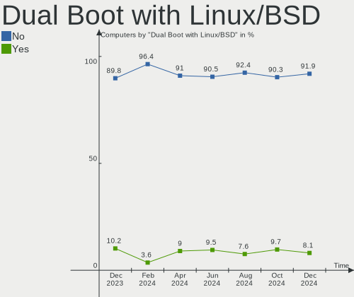
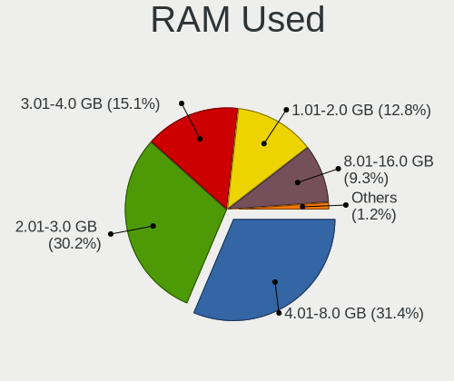
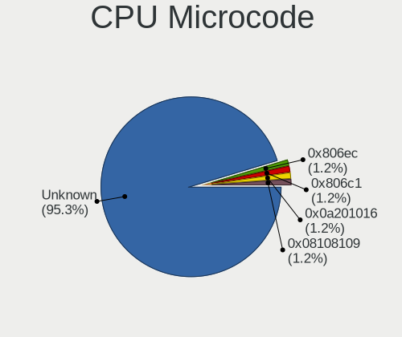
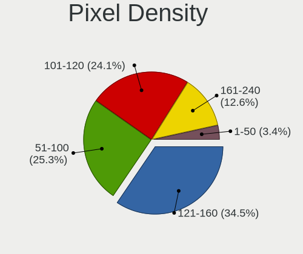
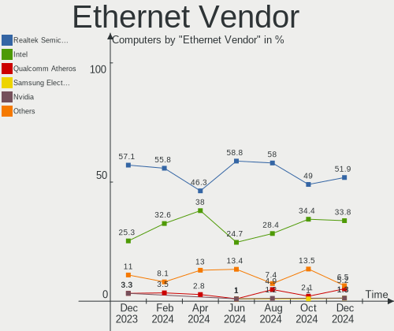
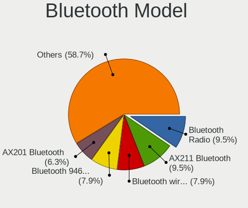

openSUSE Hardware Trends
------------------------

A project to identify most popular hardware characteristics and track their change
over time based on data collected by openSUSE users at https://Linux-Hardware.org.

Anyone can contribute to this report by the [hw-probe](https://github.com/linuxhw/hw-probe) tool:

    sudo -E hw-probe -all -upload

This is a report for all computer types. See also reports for [desktops](/Dist/openSUSE/Desktop/README.md) and [notebooks](/Dist/openSUSE/Notebook/README.md).

Full-feature report is available here: https://linux-hardware.org/?view=trends

Period: Oct, 2021.

Contents
--------

* [ System ](#system)
  - [ OS                       ](#os)
  - [ OS Family                ](#os-family)
  - [ Kernel                   ](#kernel)
  - [ Kernel Family            ](#kernel-family)
  - [ Kernel Major Ver.        ](#kernel-major-ver)
  - [ Arch                     ](#arch)
  - [ DE                       ](#de)
  - [ Display Server           ](#display-server)
  - [ Display Manager          ](#display-manager)
  - [ OS Lang                  ](#os-lang)
  - [ Boot Mode                ](#boot-mode)
  - [ Filesystem               ](#filesystem)
  - [ Part. scheme             ](#part-scheme)
  - [ Dual Boot with Linux/BSD ](#dual-boot-with-linuxbsd)
  - [ Dual Boot (Win)          ](#dual-boot-win)

* [ Board ](#board)
  - [ Vendor                   ](#vendor)
  - [ Model                    ](#model)
  - [ Model Family             ](#model-family)
  - [ MFG Year                 ](#mfg-year)
  - [ Form Factor              ](#form-factor)
  - [ Secure Boot              ](#secure-boot)
  - [ Coreboot                 ](#coreboot)
  - [ RAM Size                 ](#ram-size)
  - [ RAM Used                 ](#ram-used)
  - [ Total Drives             ](#total-drives)
  - [ Has CD-ROM               ](#has-cd-rom)
  - [ Has Ethernet             ](#has-ethernet)
  - [ Has WiFi                 ](#has-wifi)
  - [ Has Bluetooth            ](#has-bluetooth)

* [ Location ](#location)
  - [ Country                  ](#country)
  - [ City                     ](#city)

* [ Drives ](#drives)
  - [ Drive Vendor             ](#drive-vendor)
  - [ Drive Model              ](#drive-model)
  - [ HDD Vendor               ](#hdd-vendor)
  - [ SSD Vendor               ](#ssd-vendor)
  - [ Drive Kind               ](#drive-kind)
  - [ Drive Connector          ](#drive-connector)
  - [ Drive Size               ](#drive-size)
  - [ Space Total              ](#space-total)
  - [ Space Used               ](#space-used)
  - [ Malfunc. Drives          ](#malfunc-drives)
  - [ Malfunc. Drive Vendor    ](#malfunc-drive-vendor)
  - [ Malfunc. HDD Vendor      ](#malfunc-hdd-vendor)
  - [ Malfunc. Drive Kind      ](#malfunc-drive-kind)
  - [ Failed Drives            ](#failed-drives)
  - [ Failed Drive Vendor      ](#failed-drive-vendor)
  - [ Drive Status             ](#drive-status)

* [ Storage controller ](#storage-controller)
  - [ Storage Vendor           ](#storage-vendor)
  - [ Storage Model            ](#storage-model)
  - [ Storage Kind             ](#storage-kind)

* [ Processor ](#processor)
  - [ CPU Vendor               ](#cpu-vendor)
  - [ CPU Model                ](#cpu-model)
  - [ CPU Model Family         ](#cpu-model-family)
  - [ CPU Cores                ](#cpu-cores)
  - [ CPU Sockets              ](#cpu-sockets)
  - [ CPU Threads              ](#cpu-threads)
  - [ CPU Op-Modes             ](#cpu-op-modes)
  - [ CPU Microcode            ](#cpu-microcode)
  - [ CPU Microarch            ](#cpu-microarch)

* [ Graphics ](#graphics)
  - [ GPU Vendor               ](#gpu-vendor)
  - [ GPU Model                ](#gpu-model)
  - [ GPU Combo                ](#gpu-combo)
  - [ GPU Driver               ](#gpu-driver)
  - [ GPU Memory               ](#gpu-memory)

* [ Monitor ](#monitor)
  - [ Monitor Vendor           ](#monitor-vendor)
  - [ Monitor Model            ](#monitor-model)
  - [ Monitor Resolution       ](#monitor-resolution)
  - [ Monitor Diagonal         ](#monitor-diagonal)
  - [ Monitor Width            ](#monitor-width)
  - [ Aspect Ratio             ](#aspect-ratio)
  - [ Monitor Area             ](#monitor-area)
  - [ Pixel Density            ](#pixel-density)
  - [ Multiple Monitors        ](#multiple-monitors)

* [ Network ](#network)
  - [ Net Controller Vendor    ](#net-controller-vendor)
  - [ Net Controller Model     ](#net-controller-model)
  - [ Wireless Vendor          ](#wireless-vendor)
  - [ Wireless Model           ](#wireless-model)
  - [ Ethernet Vendor          ](#ethernet-vendor)
  - [ Ethernet Model           ](#ethernet-model)
  - [ Net Controller Kind      ](#net-controller-kind)
  - [ Used Controller          ](#used-controller)
  - [ NICs                     ](#nics)
  - [ IPv6                     ](#ipv6)

* [ Bluetooth ](#bluetooth)
  - [ Bluetooth Vendor         ](#bluetooth-vendor)
  - [ Bluetooth Model          ](#bluetooth-model)

* [ Sound ](#sound)
  - [ Sound Vendor             ](#sound-vendor)
  - [ Sound Model              ](#sound-model)

* [ Memory ](#memory)
  - [ Memory Vendor            ](#memory-vendor)
  - [ Memory Model             ](#memory-model)
  - [ Memory Kind              ](#memory-kind)
  - [ Memory Form Factor       ](#memory-form-factor)
  - [ Memory Size              ](#memory-size)
  - [ Memory Speed             ](#memory-speed)

* [ Printers & scanners ](#printers--scanners)
  - [ Printer Vendor           ](#printer-vendor)
  - [ Printer Model            ](#printer-model)
  - [ Scanner Vendor           ](#scanner-vendor)
  - [ Scanner Model            ](#scanner-model)

* [ Camera ](#camera)
  - [ Camera Vendor            ](#camera-vendor)
  - [ Camera Model             ](#camera-model)

* [ Security ](#security)
  - [ Fingerprint Vendor       ](#fingerprint-vendor)
  - [ Fingerprint Model        ](#fingerprint-model)
  - [ Chipcard Vendor          ](#chipcard-vendor)
  - [ Chipcard Model           ](#chipcard-model)

* [ Unsupported ](#unsupported)
  - [ Unsupported Devices      ](#unsupported-devices)
  - [ Unsupported Device Types ](#unsupported-device-types)

System
------

OS
--

Installed operating systems

| Name                         | Computers | Percent |
|------------------------------|-----------|---------|
| openSUSE Leap-15.3           | 16        | 24.62%  |
| openSUSE Leap-15.2           | 7         | 10.77%  |
| openSUSE 20211016            | 5         | 7.69%   |
| openSUSE Tumbleweed-20210929 | 3         | 4.62%   |
| openSUSE 20211025            | 3         | 4.62%   |
| openSUSE 20210929            | 3         | 4.62%   |
| openSUSE 20210916            | 3         | 4.62%   |
| openSUSE Tumbleweed-20211012 | 2         | 3.08%   |
| openSUSE Tumbleweed-20211005 | 2         | 3.08%   |
| openSUSE Leap-15.1           | 2         | 3.08%   |
| openSUSE 20211012            | 2         | 3.08%   |
| openSUSE 20210928            | 2         | 3.08%   |
| openSUSE 20210927            | 2         | 3.08%   |
| openSUSE Tumbleweed-20211028 | 1         | 1.54%   |
| openSUSE Tumbleweed-20211025 | 1         | 1.54%   |
| openSUSE Tumbleweed-20211021 | 1         | 1.54%   |
| openSUSE Tumbleweed-20211016 | 1         | 1.54%   |
| openSUSE Tumbleweed-20211001 | 1         | 1.54%   |
| openSUSE Tumbleweed-20210910 | 1         | 1.54%   |
| openSUSE Leap-15.0           | 1         | 1.54%   |
| openSUSE 20211027            | 1         | 1.54%   |
| openSUSE 20211024            | 1         | 1.54%   |
| openSUSE 20211021            | 1         | 1.54%   |
| openSUSE 20211019            | 1         | 1.54%   |
| openSUSE 20211008            | 1         | 1.54%   |
| openSUSE 20211005            | 1         | 1.54%   |

OS Family
---------

OS without a version

| Name     | Computers | Percent |
|----------|-----------|---------|
| openSUSE | 65        | 100%    |

Kernel
------

Version of the Linux kernel

| Version                     | Computers | Percent |
|-----------------------------|-----------|---------|
| 5.14.6-1-default            | 10        | 15.38%  |
| 5.3.18-59.27-default        | 7         | 10.77%  |
| 5.3.18-59.24-default        | 6         | 9.23%   |
| 5.14.11-2-default           | 6         | 9.23%   |
| 5.14.9-1-default            | 5         | 7.69%   |
| 5.14.6-2-default            | 5         | 7.69%   |
| 5.14.14-1-default           | 4         | 6.15%   |
| 5.14.11-1-default           | 4         | 6.15%   |
| 5.3.18-lp152.95-default     | 3         | 4.62%   |
| 5.3.18-lp152.92-default     | 3         | 4.62%   |
| 5.14.2-1-default            | 3         | 4.62%   |
| 5.3.18-57-default           | 2         | 3.08%   |
| 4.12.14-lp151.28.91-default | 2         | 3.08%   |
| 5.3.18-lp152.78-default     | 1         | 1.54%   |
| 5.3.18-59.19-preempt        | 1         | 1.54%   |
| 5.15.0-rc5-1-default+       | 1         | 1.54%   |
| 5.14.1-1-default            | 1         | 1.54%   |
| 4.12.14-lp150.12.82-default | 1         | 1.54%   |

Kernel Family
-------------

Linux kernel without a distro release

| Version | Computers | Percent |
|---------|-----------|---------|
| 5.3.18  | 23        | 35.38%  |
| 5.14.6  | 15        | 23.08%  |
| 5.14.11 | 10        | 15.38%  |
| 5.14.9  | 5         | 7.69%   |
| 5.14.14 | 4         | 6.15%   |
| 5.14.2  | 3         | 4.62%   |
| 4.12.14 | 3         | 4.62%   |
| 5.15.0  | 1         | 1.54%   |
| 5.14.1  | 1         | 1.54%   |

Kernel Major Ver.
-----------------

Linux kernel major version

| Version | Computers | Percent |
|---------|-----------|---------|
| 5.14    | 38        | 58.46%  |
| 5.3     | 23        | 35.38%  |
| 4.12    | 3         | 4.62%   |
| 5.15    | 1         | 1.54%   |

Arch
----

OS architecture (x86_64, i586, etc.)

| Name   | Computers | Percent |
|--------|-----------|---------|
| x86_64 | 65        | 100%    |

DE
--

Desktop Environment

| Name          | Computers | Percent |
|---------------|-----------|---------|
| KDE5          | 34        | 52.31%  |
| GNOME         | 17        | 26.15%  |
| Unknown       | 4         | 6.15%   |
| X-Cinnamon    | 3         | 4.62%   |
| XFCE          | 2         | 3.08%   |
| KDE           | 2         | 3.08%   |
| Pantheon      | 1         | 1.54%   |
| ICEWM         | 1         | 1.54%   |
| GNOME Classic | 1         | 1.54%   |

Display Server
--------------

X11 or Wayland

| Name    | Computers | Percent |
|---------|-----------|---------|
| X11     | 45        | 69.23%  |
| Wayland | 17        | 26.15%  |
| Unknown | 2         | 3.08%   |
| Tty     | 1         | 1.54%   |

Display Manager
---------------

SDDM, LightDM, etc.

| Name    | Computers | Percent |
|---------|-----------|---------|
| Unknown | 22        | 33.85%  |
| SDDM    | 18        | 27.69%  |
| LightDM | 17        | 26.15%  |
| XDM     | 6         | 9.23%   |
| GDM     | 2         | 3.08%   |

OS Lang
-------

Language

| Lang  | Computers | Percent |
|-------|-----------|---------|
| en_US | 22        | 33.85%  |
| de_DE | 10        | 15.38%  |
| POSIX | 7         | 10.77%  |
| en_GB | 6         | 9.23%   |
| it_IT | 5         | 7.69%   |
| fr_FR | 4         | 6.15%   |
| ru_RU | 3         | 4.62%   |
| es_ES | 3         | 4.62%   |
| pl_PL | 2         | 3.08%   |
| vi_VN | 1         | 1.54%   |
| nl_BE | 1         | 1.54%   |
| ko_KR | 1         | 1.54%   |

Boot Mode
---------

EFI or BIOS

| Mode | Computers | Percent |
|------|-----------|---------|
| EFI  | 44        | 67.69%  |
| BIOS | 21        | 32.31%  |

Filesystem
----------

Type of filesystem

| Type  | Computers | Percent |
|-------|-----------|---------|
| Btrfs | 48        | 73.85%  |
| Ext4  | 13        | 20%     |
| Xfs   | 4         | 6.15%   |

Part. scheme
------------

Scheme of partitioning

| Type    | Computers | Percent |
|---------|-----------|---------|
| GPT     | 43        | 66.15%  |
| Unknown | 20        | 30.77%  |
| MBR     | 2         | 3.08%   |

Dual Boot with Linux/BSD
------------------------

Hosting more than one Linux/BSD

| Dual boot | Computers | Percent |
|-----------|-----------|---------|
| No        | 59        | 90.77%  |
| Yes       | 6         | 9.23%   |

Dual Boot (Win)
---------------

Hosting Linux and Windows

| Dual boot | Computers | Percent |
|-----------|-----------|---------|
| No        | 44        | 67.69%  |
| Yes       | 21        | 32.31%  |

Board
-----

Vendor
------

Motherboard manufacturer

| Name                | Computers | Percent |
|---------------------|-----------|---------|
| Lenovo              | 17        | 26.15%  |
| Hewlett-Packard     | 9         | 13.85%  |
| ASUSTek Computer    | 8         | 12.31%  |
| MSI                 | 5         | 7.69%   |
| Dell                | 5         | 7.69%   |
| Acer                | 5         | 7.69%   |
| ASRock              | 4         | 6.15%   |
| HUAWEI              | 3         | 4.62%   |
| ZOTAC               | 1         | 1.54%   |
| TUXEDO              | 1         | 1.54%   |
| Medion              | 1         | 1.54%   |
| IP3 Tech            | 1         | 1.54%   |
| Google              | 1         | 1.54%   |
| Gigabyte Technology | 1         | 1.54%   |
| Fujitsu Siemens     | 1         | 1.54%   |
| Fujitsu             | 1         | 1.54%   |
| Apple               | 1         | 1.54%   |

Model
-----

Motherboard model

| Name                                         | Computers | Percent |
|----------------------------------------------|-----------|---------|
| Dell OptiPlex 9020                           | 2         | 3.08%   |
| ZOTAC ZBOX-MA320                             | 1         | 1.54%   |
| TUXEDO Aura 15 Gen1                          | 1         | 1.54%   |
| MSI MS-7D09                                  | 1         | 1.54%   |
| MSI MS-7B89                                  | 1         | 1.54%   |
| MSI MS-7A38                                  | 1         | 1.54%   |
| MSI MS-7522                                  | 1         | 1.54%   |
| MSI GP63 Leopard 8RD                         | 1         | 1.54%   |
| Medion E6436 MD61150                         | 1         | 1.54%   |
| Lenovo Yoga 710-11IKB 80V6                   | 1         | 1.54%   |
| Lenovo ThinkPad X13 Yoga Gen 1 20SX000MUE    | 1         | 1.54%   |
| Lenovo ThinkPad X1 Carbon Gen 9 20XW00A7TH   | 1         | 1.54%   |
| Lenovo ThinkPad W530 24475HU                 | 1         | 1.54%   |
| Lenovo ThinkPad T490s 20NYS1XK00             | 1         | 1.54%   |
| Lenovo ThinkPad T14 Gen 2i 20W0003LUS        | 1         | 1.54%   |
| Lenovo ThinkPad L15 Gen 1 20U4S88000         | 1         | 1.54%   |
| Lenovo ThinkPad L14 Gen 1 20U50004GE         | 1         | 1.54%   |
| Lenovo ThinkPad E560 20EV000NIV              | 1         | 1.54%   |
| Lenovo ThinkPad E15 20RD0015UK               | 1         | 1.54%   |
| Lenovo ThinkPad E14 Gen 3 20Y7CTO1WW         | 1         | 1.54%   |
| Lenovo ThinkCentre M720s 10ST0014MB          | 1         | 1.54%   |
| Lenovo IdeaPad S340-15IML 81NA               | 1         | 1.54%   |
| Lenovo IdeaPad S145-15AST 81N3               | 1         | 1.54%   |
| Lenovo IdeaPad Flex 5 14ALC05 82HU           | 1         | 1.54%   |
| Lenovo IdeaCentre Y710 Cube-15ISH 90FL004WGE | 1         | 1.54%   |
| Lenovo C40-05 F0B5004EUK                     | 1         | 1.54%   |
| IP3 Tech UNITY F24B                          | 1         | 1.54%   |
| HUAWEI NBLK-WAX9X                            | 1         | 1.54%   |
| HUAWEI KPL-W0X                               | 1         | 1.54%   |
| HUAWEI HVY-WXX9                              | 1         | 1.54%   |
| HP ZBook 14 G2                               | 1         | 1.54%   |
| HP Z1 Entry Tower G5                         | 1         | 1.54%   |
| HP ProBook 650 G1                            | 1         | 1.54%   |
| HP Pavilion tp01-1337c Desktop Rfrbd PC      | 1         | 1.54%   |
| HP Laptop 17-ca1xxx                          | 1         | 1.54%   |
| HP Laptop 15s-eq0xxx                         | 1         | 1.54%   |
| HP G61                                       | 1         | 1.54%   |
| HP EliteBook Folio 9470m                     | 1         | 1.54%   |
| HP Elite Dragonfly                           | 1         | 1.54%   |
| Google Pantheon                              | 1         | 1.54%   |
| Gigabyte AB350M-DS3H                         | 1         | 1.54%   |
| Fujitsu Siemens PRIMERGY RX300 S3            | 1         | 1.54%   |
| Fujitsu PRIMERGY RX300 S5                    | 1         | 1.54%   |
| Dell Vostro 3268                             | 1         | 1.54%   |
| Dell OptiPlex 330                            | 1         | 1.54%   |
| Dell Latitude 7420                           | 1         | 1.54%   |
| ASUS X751LK                                  | 1         | 1.54%   |
| ASUS X550CL                                  | 1         | 1.54%   |
| ASUS SABERTOOTH X79                          | 1         | 1.54%   |
| ASUS Q324UAK                                 | 1         | 1.54%   |
| ASUS PRIME Z390-A                            | 1         | 1.54%   |
| ASUS PRIME B460M-K                           | 1         | 1.54%   |
| ASUS P8Z77-M PRO                             | 1         | 1.54%   |
| ASUS Maximus VIII HERO                       | 1         | 1.54%   |
| ASRock Z68 Extreme4 Gen3                     | 1         | 1.54%   |
| ASRock M3A770DE                              | 1         | 1.54%   |
| ASRock H370M Pro4                            | 1         | 1.54%   |
| ASRock H110M-G/M.2                           | 1         | 1.54%   |
| Apple MacPro3,1                              | 1         | 1.54%   |
| Acer Swift SF314-43                          | 1         | 1.54%   |

Model Family
------------

Motherboard model prefix

| Name                     | Computers | Percent |
|--------------------------|-----------|---------|
| Lenovo ThinkPad          | 10        | 15.38%  |
| Lenovo IdeaPad           | 3         | 4.62%   |
| Dell OptiPlex            | 3         | 4.62%   |
| HP Laptop                | 2         | 3.08%   |
| ASUS PRIME               | 2         | 3.08%   |
| Acer Nitro               | 2         | 3.08%   |
| Acer Aspire              | 2         | 3.08%   |
| ZOTAC ZBOX-MA320         | 1         | 1.54%   |
| TUXEDO Aura              | 1         | 1.54%   |
| MSI MS-7D09              | 1         | 1.54%   |
| MSI MS-7B89              | 1         | 1.54%   |
| MSI MS-7A38              | 1         | 1.54%   |
| MSI MS-7522              | 1         | 1.54%   |
| MSI GP63                 | 1         | 1.54%   |
| Medion E6436             | 1         | 1.54%   |
| Lenovo Yoga              | 1         | 1.54%   |
| Lenovo ThinkCentre       | 1         | 1.54%   |
| Lenovo IdeaCentre        | 1         | 1.54%   |
| Lenovo C40-05            | 1         | 1.54%   |
| IP3 Tech UNITY           | 1         | 1.54%   |
| HUAWEI NBLK-WAX9X        | 1         | 1.54%   |
| HUAWEI KPL-W0X           | 1         | 1.54%   |
| HUAWEI HVY-WXX9          | 1         | 1.54%   |
| HP ZBook                 | 1         | 1.54%   |
| HP Z1                    | 1         | 1.54%   |
| HP ProBook               | 1         | 1.54%   |
| HP Pavilion              | 1         | 1.54%   |
| HP G61                   | 1         | 1.54%   |
| HP EliteBook             | 1         | 1.54%   |
| HP Elite                 | 1         | 1.54%   |
| Google Pantheon          | 1         | 1.54%   |
| Gigabyte AB350M-DS3H     | 1         | 1.54%   |
| Fujitsu Siemens PRIMERGY | 1         | 1.54%   |
| Fujitsu PRIMERGY         | 1         | 1.54%   |
| Dell Vostro              | 1         | 1.54%   |
| Dell Latitude            | 1         | 1.54%   |
| ASUS X751LK              | 1         | 1.54%   |
| ASUS X550CL              | 1         | 1.54%   |
| ASUS SABERTOOTH          | 1         | 1.54%   |
| ASUS Q324UAK             | 1         | 1.54%   |
| ASUS P8Z77-M             | 1         | 1.54%   |
| ASUS Maximus             | 1         | 1.54%   |
| ASRock Z68               | 1         | 1.54%   |
| ASRock M3A770DE          | 1         | 1.54%   |
| ASRock H370M             | 1         | 1.54%   |
| ASRock H110M-G           | 1         | 1.54%   |
| Apple MacPro3            | 1         | 1.54%   |
| Acer Swift               | 1         | 1.54%   |

MFG Year
--------

Motherboard manufacture year

| Year | Computers | Percent |
|------|-----------|---------|
| 2021 | 16        | 24.62%  |
| 2020 | 12        | 18.46%  |
| 2019 | 10        | 15.38%  |
| 2018 | 5         | 7.69%   |
| 2015 | 4         | 6.15%   |
| 2013 | 4         | 6.15%   |
| 2016 | 3         | 4.62%   |
| 2012 | 2         | 3.08%   |
| 2011 | 2         | 3.08%   |
| 2010 | 2         | 3.08%   |
| 2009 | 2         | 3.08%   |
| 2017 | 1         | 1.54%   |
| 2014 | 1         | 1.54%   |
| 2008 | 1         | 1.54%   |

Form Factor
-----------

Physical design of the computer

| Name        | Computers | Percent |
|-------------|-----------|---------|
| Notebook    | 33        | 50.77%  |
| Desktop     | 23        | 35.38%  |
| Convertible | 4         | 6.15%   |
| All in one  | 2         | 3.08%   |
| Server      | 2         | 3.08%   |
| Mini pc     | 1         | 1.54%   |

Secure Boot
-----------

Enabled or disabled

| State    | Computers | Percent |
|----------|-----------|---------|
| Disabled | 55        | 84.62%  |
| Enabled  | 10        | 15.38%  |

Coreboot
--------

Have coreboot on board

| Used | Computers | Percent |
|------|-----------|---------|
| No   | 64        | 98.46%  |
| Yes  | 1         | 1.54%   |

RAM Size
--------

Total RAM memory

| Size in GB  | Computers | Percent |
|-------------|-----------|---------|
| 8.01-16.0   | 18        | 27.69%  |
| 16.01-24.0  | 16        | 24.62%  |
| 4.01-8.0    | 13        | 20%     |
| 32.01-64.0  | 7         | 10.77%  |
| 3.01-4.0    | 6         | 9.23%   |
| 24.01-32.0  | 2         | 3.08%   |
| 64.01-256.0 | 2         | 3.08%   |
| 0.51-1.0    | 1         | 1.54%   |

RAM Used
--------

Used RAM memory

| Used GB   | Computers | Percent |
|-----------|-----------|---------|
| 1.01-2.0  | 17        | 26.15%  |
| 2.01-3.0  | 16        | 24.62%  |
| 4.01-8.0  | 15        | 23.08%  |
| 3.01-4.0  | 9         | 13.85%  |
| 8.01-16.0 | 4         | 6.15%   |
| 0.51-1.0  | 3         | 4.62%   |
| 0.01-0.5  | 1         | 1.54%   |

Total Drives
------------

Number of drives on board

| Drives | Computers | Percent |
|--------|-----------|---------|
| 1      | 27        | 41.54%  |
| 2      | 23        | 35.38%  |
| 4      | 8         | 12.31%  |
| 3      | 6         | 9.23%   |
| 5      | 1         | 1.54%   |

Has CD-ROM
----------

Has CD-ROM on board

| Presented | Computers | Percent |
|-----------|-----------|---------|
| No        | 45        | 69.23%  |
| Yes       | 20        | 30.77%  |

Has Ethernet
------------

Has Ethernet on board

| Presented | Computers | Percent |
|-----------|-----------|---------|
| Yes       | 53        | 81.54%  |
| No        | 12        | 18.46%  |

Has WiFi
--------

Has WiFi module

| Presented | Computers | Percent |
|-----------|-----------|---------|
| Yes       | 48        | 73.85%  |
| No        | 17        | 26.15%  |

Has Bluetooth
-------------

Has Bluetooth module

| Presented | Computers | Percent |
|-----------|-----------|---------|
| Yes       | 43        | 66.15%  |
| No        | 22        | 33.85%  |

Location
--------

Country
-------

Geographic location (country)

| Country     | Computers | Percent |
|-------------|-----------|---------|
| Germany     | 14        | 21.54%  |
| USA         | 8         | 12.31%  |
| France      | 5         | 7.69%   |
| Spain       | 4         | 6.15%   |
| Italy       | 4         | 6.15%   |
| UK          | 3         | 4.62%   |
| Belgium     | 3         | 4.62%   |
| Thailand    | 2         | 3.08%   |
| South Korea | 2         | 3.08%   |
| Russia      | 2         | 3.08%   |
| Poland      | 2         | 3.08%   |
| Netherlands | 2         | 3.08%   |
| India       | 2         | 3.08%   |
| Vietnam     | 1         | 1.54%   |
| Uruguay     | 1         | 1.54%   |
| Uganda      | 1         | 1.54%   |
| Switzerland | 1         | 1.54%   |
| Sweden      | 1         | 1.54%   |
| Peru        | 1         | 1.54%   |
| Norway      | 1         | 1.54%   |
| Mexico      | 1         | 1.54%   |
| Israel      | 1         | 1.54%   |
| Greece      | 1         | 1.54%   |
| Canada      | 1         | 1.54%   |
| Austria     | 1         | 1.54%   |

City
----

Geographic location (city)

| City                   | Computers | Percent |
|------------------------|-----------|---------|
| Nice                   | 2         | 3.08%   |
| Berlin                 | 2         | 3.08%   |
| Wroclaw                | 1         | 1.54%   |
| Wolkenstein            | 1         | 1.54%   |
| Vijayawada             | 1         | 1.54%   |
| Vienna                 | 1         | 1.54%   |
| Verona                 | 1         | 1.54%   |
| The Hague              | 1         | 1.54%   |
| Tel Aviv               | 1         | 1.54%   |
| St. Gallen             | 1         | 1.54%   |
| Rockville              | 1         | 1.54%   |
| Redmond                | 1         | 1.54%   |
| Rasskazovo             | 1         | 1.54%   |
| Pringy                 | 1         | 1.54%   |
| Portland               | 1         | 1.54%   |
| Nuremberg              | 1         | 1.54%   |
| Novara                 | 1         | 1.54%   |
| Nordenham              | 1         | 1.54%   |
| Montevideo             | 1         | 1.54%   |
| Monterrey              | 1         | 1.54%   |
| Milan                  | 1         | 1.54%   |
| M?©rida                | 1         | 1.54%   |
| Malmo                  | 1         | 1.54%   |
| Maisons-Alfort         | 1         | 1.54%   |
| Liss                   | 1         | 1.54%   |
| Letchworth Garden City | 1         | 1.54%   |
| Leiden                 | 1         | 1.54%   |
| Las Vegas              | 1         | 1.54%   |
| Kurgan                 | 1         | 1.54%   |
| Kolnes                 | 1         | 1.54%   |
| Koleczkowo             | 1         | 1.54%   |
| Kathu                  | 1         | 1.54%   |
| Karlsruhe              | 1         | 1.54%   |
| Kapellen               | 1         | 1.54%   |
| Kampala                | 1         | 1.54%   |
| Isernhagen             | 1         | 1.54%   |
| Incheon                | 1         | 1.54%   |
| Howick                 | 1         | 1.54%   |
| Hermersberg            | 1         | 1.54%   |
| Hemel Hempstead        | 1         | 1.54%   |
| Hasselt                | 1         | 1.54%   |
| Hanoi                  | 1         | 1.54%   |
| Hamm                   | 1         | 1.54%   |
| Halle                  | 1         | 1.54%   |
| Grand Junction         | 1         | 1.54%   |
| Gelnhausen             | 1         | 1.54%   |
| Fuenlabrada            | 1         | 1.54%   |
| Essen                  | 1         | 1.54%   |
| Durmersheim            | 1         | 1.54%   |
| Dover                  | 1         | 1.54%   |
| Coimbatore             | 1         | 1.54%   |
| Chaumont-en-Vexin      | 1         | 1.54%   |
| Chandler               | 1         | 1.54%   |
| Busan                  | 1         | 1.54%   |
| Bremen                 | 1         | 1.54%   |
| Bilbao                 | 1         | 1.54%   |
| Barcelona              | 1         | 1.54%   |
| Bangkok                | 1         | 1.54%   |
| Ball Ground            | 1         | 1.54%   |
| Athens                 | 1         | 1.54%   |

Drives
------

Drive Vendor
------------

Hard drive vendors

| Vendor              | Computers | Drives | Percent |
|---------------------|-----------|--------|---------|
| Samsung Electronics | 19        | 22     | 18.1%   |
| WDC                 | 16        | 17     | 15.24%  |
| Seagate             | 12        | 19     | 11.43%  |
| SanDisk             | 8         | 8      | 7.62%   |
| Toshiba             | 7         | 7      | 6.67%   |
| SK Hynix            | 5         | 5      | 4.76%   |
| Kingston            | 5         | 5      | 4.76%   |
| Crucial             | 4         | 5      | 3.81%   |
| Unknown             | 3         | 3      | 2.86%   |
| Micron Technology   | 3         | 3      | 2.86%   |
| Hitachi             | 3         | 3      | 2.86%   |
| HGST                | 3         | 4      | 2.86%   |
| JMicron             | 2         | 2      | 1.9%    |
| Intenso             | 2         | 2      | 1.9%    |
| Intel               | 2         | 3      | 1.9%    |
| Yangtze Memory      | 1         | 1      | 0.95%   |
| TO Exter            | 1         | 1      | 0.95%   |
| SABRENT             | 1         | 1      | 0.95%   |
| OCZ                 | 1         | 1      | 0.95%   |
| Netac               | 1         | 1      | 0.95%   |
| Mushkin             | 1         | 1      | 0.95%   |
| LITEONIT            | 1         | 1      | 0.95%   |
| Lite-On             | 1         | 1      | 0.95%   |
| Inateck             | 1         | 1      | 0.95%   |
| China               | 1         | 1      | 0.95%   |
| A-DATA Technology   | 1         | 1      | 0.95%   |

Drive Model
-----------

Hard drive models

| Model                                   | Computers | Percent |
|-----------------------------------------|-----------|---------|
| Seagate ST1000DM003-1CH162 1TB          | 3         | 2.59%   |
| Samsung SSD 860 EVO 500GB               | 3         | 2.59%   |
| WDC WDS100T3X0C-00SJG0 1TB              | 2         | 1.72%   |
| Samsung SSD 860 EVO 250GB               | 2         | 1.72%   |
| Samsung MZALQ256HAJD-000L1 256GB        | 2         | 1.72%   |
| Kingston SA400S37240G 240GB SSD         | 2         | 1.72%   |
| Yangtze Memory YMTC PC005 512GB         | 1         | 0.86%   |
| WDC WD3200BEVT-60ZCT1 320GB             | 1         | 0.86%   |
| WDC WD20EFRX-68EUZN0 2TB                | 1         | 0.86%   |
| WDC WD10SPZX-60Z10T0 1TB                | 1         | 0.86%   |
| WDC WD10SPZX-17Z10T0 1TB                | 1         | 0.86%   |
| WDC WD10JFCX-68N6GN0 1TB                | 1         | 0.86%   |
| WDC WD10EZEX-75WN4A0 1TB                | 1         | 0.86%   |
| WDC WD10EZEX-60WN4A0 1TB                | 1         | 0.86%   |
| WDC WD10EZEX-08WN4A0 1TB                | 1         | 0.86%   |
| WDC WD10EZEX-08M2NA0 1TB                | 1         | 0.86%   |
| WDC WD10EAVS-22D7B0 1TB                 | 1         | 0.86%   |
| WDC WD1002FBYS-01A6B0 1TB               | 1         | 0.86%   |
| WDC WD1002FAEX-00Z3A0 1TB               | 1         | 0.86%   |
| WDC PC SN730 SDBQNTY-256G-1001 256GB    | 1         | 0.86%   |
| WDC PC SN730 SDBPNTY-512G-1006 512GB    | 1         | 0.86%   |
| Unknown SD/MMC/MS PRO 128GB             | 1         | 0.86%   |
| Unknown MMC Card  128GB                 | 1         | 0.86%   |
| Unknown DA4032  32GB                    | 1         | 0.86%   |
| Toshiba MQ01ABF050 500GB                | 1         | 0.86%   |
| Toshiba MQ01ABD100 1TB                  | 1         | 0.86%   |
| Toshiba KXG6AZNV512G 512GB              | 1         | 0.86%   |
| Toshiba KXG5AZNV256G 256GB              | 1         | 0.86%   |
| Toshiba KBG20ZMS256G NVMe 256GB         | 1         | 0.86%   |
| Toshiba HDWD260 6TB                     | 1         | 0.86%   |
| Toshiba DT01ACA100 1TB                  | 1         | 0.86%   |
| TO Exter nal USB 3.0 160GB              | 1         | 0.86%   |
| SK Hynix NVMe SSD Drive 256GB           | 1         | 0.86%   |
| SK Hynix HFS128G39TND-N210A 128GB SSD   | 1         | 0.86%   |
| SK Hynix HFS128G39MND-3310A 128GB SSD   | 1         | 0.86%   |
| SK Hynix HFS032G34MNC-2200A 32GB SSD    | 1         | 0.86%   |
| SK Hynix BC511 HFM256GDJTNI-82A0A 256GB | 1         | 0.86%   |
| Seagate ST9320325AS 320GB               | 1         | 0.86%   |
| Seagate ST3500418AS 500GB               | 1         | 0.86%   |
| Seagate ST3500413AS 500GB               | 1         | 0.86%   |
| Seagate ST3320418AS 320GB               | 1         | 0.86%   |
| Seagate ST31000528AS 1TB                | 1         | 0.86%   |
| Seagate ST3000DM007-1WY10G 3TB          | 1         | 0.86%   |
| Seagate ST2000VX008-2E3164 2TB          | 1         | 0.86%   |
| Seagate ST2000DM006-2DM164 2TB          | 1         | 0.86%   |
| Seagate ST2000DM001-1ER164 2TB          | 1         | 0.86%   |
| Seagate ST2000DM001-1CH164 2TB          | 1         | 0.86%   |
| Seagate ST1000LM049-2GH172 1TB          | 1         | 0.86%   |
| Seagate ST1000LM035-1RK172 1TB          | 1         | 0.86%   |
| Seagate ST1000LM024 HN-M101MBB 1TB      | 1         | 0.86%   |
| Seagate Expansion 1TB                   | 1         | 0.86%   |
| SanDisk SSD U100 24GB                   | 1         | 0.86%   |
| SanDisk SSD PLUS 1000GB                 | 1         | 0.86%   |
| SanDisk SDSSDH3 1T00 1TB                | 1         | 0.86%   |
| SanDisk SDSSDA240G 240GB                | 1         | 0.86%   |
| SanDisk SD9SN8W256G 256GB SSD           | 1         | 0.86%   |
| SanDisk SD7SB6S256G1001 256GB SSD       | 1         | 0.86%   |
| SanDisk SD6SB2M-512G-1006 512GB SSD     | 1         | 0.86%   |
| Sandisk NVMe SSD Drive 256GB            | 1         | 0.86%   |
| Samsung SSD 970 EVO Plus 250GB          | 1         | 0.86%   |

HDD Vendor
----------

Hard disk drive vendors

| Vendor              | Computers | Drives | Percent |
|---------------------|-----------|--------|---------|
| WDC                 | 12        | 13     | 27.91%  |
| Seagate             | 12        | 19     | 27.91%  |
| Toshiba             | 4         | 4      | 9.3%    |
| Hitachi             | 3         | 3      | 6.98%   |
| HGST                | 3         | 4      | 6.98%   |
| Samsung Electronics | 2         | 3      | 4.65%   |
| JMicron             | 2         | 2      | 4.65%   |
| Unknown             | 1         | 1      | 2.33%   |
| TO Exter            | 1         | 1      | 2.33%   |
| SABRENT             | 1         | 1      | 2.33%   |
| Intenso             | 1         | 1      | 2.33%   |
| Inateck             | 1         | 1      | 2.33%   |

SSD Vendor
----------

Solid state drive vendors

| Vendor              | Computers | Drives | Percent |
|---------------------|-----------|--------|---------|
| SanDisk             | 7         | 7      | 23.33%  |
| Samsung Electronics | 7         | 8      | 23.33%  |
| SK Hynix            | 3         | 3      | 10%     |
| Kingston            | 3         | 3      | 10%     |
| Crucial             | 3         | 4      | 10%     |
| OCZ                 | 1         | 1      | 3.33%   |
| Netac               | 1         | 1      | 3.33%   |
| Mushkin             | 1         | 1      | 3.33%   |
| Micron Technology   | 1         | 1      | 3.33%   |
| LITEONIT            | 1         | 1      | 3.33%   |
| Intenso             | 1         | 1      | 3.33%   |
| China               | 1         | 1      | 3.33%   |

Drive Kind
----------

HDD or SSD

| Kind | Computers | Drives | Percent |
|------|-----------|--------|---------|
| HDD  | 35        | 53     | 36.84%  |
| NVMe | 31        | 32     | 32.63%  |
| SSD  | 27        | 32     | 28.42%  |
| MMC  | 2         | 2      | 2.11%   |

Drive Connector
---------------

SATA, SAS, NVMe, etc.

| Type | Computers | Drives | Percent |
|------|-----------|--------|---------|
| SATA | 45        | 78     | 53.57%  |
| NVMe | 31        | 32     | 36.9%   |
| SAS  | 6         | 7      | 7.14%   |
| MMC  | 2         | 2      | 2.38%   |

Drive Size
----------

Size of hard drive

| Size in TB | Computers | Drives | Percent |
|------------|-----------|--------|---------|
| 0.01-0.5   | 30        | 38     | 46.15%  |
| 0.51-1.0   | 28        | 37     | 43.08%  |
| 1.01-2.0   | 4         | 7      | 6.15%   |
| 3.01-4.0   | 1         | 1      | 1.54%   |
| 2.01-3.0   | 1         | 1      | 1.54%   |
| 4.01-10.0  | 1         | 1      | 1.54%   |

Space Total
-----------

Amount of disk space available on the file system

| Size in GB     | Computers | Percent |
|----------------|-----------|---------|
| More than 3000 | 18        | 27.69%  |
| 1001-2000      | 14        | 21.54%  |
| 2001-3000      | 12        | 18.46%  |
| 251-500        | 10        | 15.38%  |
| 501-1000       | 6         | 9.23%   |
| 101-250        | 3         | 4.62%   |
| 51-100         | 2         | 3.08%   |

Space Used
----------

Amount of used disk space

| Used GB        | Computers | Percent |
|----------------|-----------|---------|
| 101-250        | 11        | 16.92%  |
| 51-100         | 11        | 16.92%  |
| 501-1000       | 9         | 13.85%  |
| 251-500        | 8         | 12.31%  |
| 1001-2000      | 8         | 12.31%  |
| 1-20           | 7         | 10.77%  |
| 2001-3000      | 5         | 7.69%   |
| More than 3000 | 3         | 4.62%   |
| 21-50          | 3         | 4.62%   |

Malfunc. Drives
---------------

Drive models with a malfunction

| Model                                | Computers | Drives | Percent |
|--------------------------------------|-----------|--------|---------|
| WDC WD10JFCX-68N6GN0 1TB             | 1         | 1      | 11.11%  |
| SK Hynix HFS032G34MNC-2200A 32GB SSD | 1         | 1      | 11.11%  |
| Seagate ST3500418AS 500GB            | 1         | 1      | 11.11%  |
| Seagate ST2000DM006-2DM164 2TB       | 1         | 1      | 11.11%  |
| Seagate ST1000LM024 HN-M101MBB 1TB   | 1         | 1      | 11.11%  |
| SanDisk SSD U100 24GB                | 1         | 1      | 11.11%  |
| Samsung Electronics HD103SJ 1TB      | 1         | 1      | 11.11%  |
| LITEONIT LMT-256M3M 256GB SSD        | 1         | 1      | 11.11%  |
| HGST HTS725032A7E630 320GB           | 1         | 1      | 11.11%  |

Malfunc. Drive Vendor
---------------------

Vendors of faulty drives

| Vendor              | Computers | Drives | Percent |
|---------------------|-----------|--------|---------|
| Seagate             | 3         | 3      | 33.33%  |
| WDC                 | 1         | 1      | 11.11%  |
| SK Hynix            | 1         | 1      | 11.11%  |
| SanDisk             | 1         | 1      | 11.11%  |
| Samsung Electronics | 1         | 1      | 11.11%  |
| LITEONIT            | 1         | 1      | 11.11%  |
| HGST                | 1         | 1      | 11.11%  |

Malfunc. HDD Vendor
-------------------

Vendors of faulty HDD drives

| Vendor              | Computers | Drives | Percent |
|---------------------|-----------|--------|---------|
| Seagate             | 3         | 3      | 50%     |
| WDC                 | 1         | 1      | 16.67%  |
| Samsung Electronics | 1         | 1      | 16.67%  |
| HGST                | 1         | 1      | 16.67%  |

Malfunc. Drive Kind
-------------------

Kinds of faulty drives

| Kind | Computers | Drives | Percent |
|------|-----------|--------|---------|
| HDD  | 6         | 6      | 66.67%  |
| SSD  | 3         | 3      | 33.33%  |

Failed Drives
-------------

Failed drive models

Zero info for selected period =(

Failed Drive Vendor
-------------------

Failed drive vendors

Zero info for selected period =(

Drive Status
------------

Number of failed and malfunc. drives

| Status   | Computers | Drives | Percent |
|----------|-----------|--------|---------|
| Works    | 41        | 65     | 56.94%  |
| Detected | 24        | 45     | 33.33%  |
| Malfunc  | 7         | 9      | 9.72%   |

Storage controller
------------------

Storage Vendor
--------------

Storage controller vendors

| Vendor                       | Computers | Percent |
|------------------------------|-----------|---------|
| Intel                        | 39        | 43.82%  |
| AMD                          | 13        | 14.61%  |
| Samsung Electronics          | 11        | 12.36%  |
| Sandisk                      | 5         | 5.62%   |
| Toshiba America Info Systems | 3         | 3.37%   |
| ASMedia Technology           | 3         | 3.37%   |
| SK Hynix                     | 2         | 2.25%   |
| Micron Technology            | 2         | 2.25%   |
| Marvell Technology Group     | 2         | 2.25%   |
| Kingston Technology Company  | 2         | 2.25%   |
| Broadcom / LSI               | 2         | 2.25%   |
| Yangtze Memory Technologies  | 1         | 1.12%   |
| Promise Technology           | 1         | 1.12%   |
| Micron/Crucial Technology    | 1         | 1.12%   |
| Lite-On Technology           | 1         | 1.12%   |
| ADATA Technology             | 1         | 1.12%   |

Storage Model
-------------

Storage controller models

| Model                                                                            | Computers | Percent |
|----------------------------------------------------------------------------------|-----------|---------|
| AMD FCH SATA Controller [AHCI mode]                                              | 11        | 11.11%  |
| Samsung NVMe SSD Controller SM981/PM981/PM983                                    | 5         | 5.05%   |
| Sandisk WD Black SN750 / PC SN730 NVMe SSD                                       | 4         | 4.04%   |
| Samsung NVMe SSD Controller 980                                                  | 4         | 4.04%   |
| Intel Sunrise Point-LP SATA Controller [AHCI mode]                               | 4         | 4.04%   |
| Intel Q170/Q150/B150/H170/H110/Z170/CM236 Chipset SATA Controller [AHCI Mode]    | 4         | 4.04%   |
| Intel Cannon Lake PCH SATA AHCI Controller                                       | 4         | 4.04%   |
| Intel Comet Lake SATA AHCI Controller                                            | 3         | 3.03%   |
| Intel 8 Series/C220 Series Chipset Family 6-port SATA Controller 1 [AHCI mode]   | 3         | 3.03%   |
| Intel 7 Series Chipset Family 6-port SATA Controller [AHCI mode]                 | 3         | 3.03%   |
| ASMedia ASM1062 Serial ATA Controller                                            | 3         | 3.03%   |
| AMD 400 Series Chipset SATA Controller                                           | 3         | 3.03%   |
| SK Hynix BC511                                                                   | 2         | 2.02%   |
| Samsung NVMe SSD Controller PM9A1/PM9A3/980PRO                                   | 2         | 2.02%   |
| Micron Non-Volatile memory controller                                            | 2         | 2.02%   |
| Intel Cannon Lake Mobile PCH SATA AHCI Controller                                | 2         | 2.02%   |
| Intel 631xESB/632xESB IDE Controller                                             | 2         | 2.02%   |
| Yangtze Memory Non-Volatile memory controller                                    | 1         | 1.01%   |
| Toshiba America Info Systems XG6 NVMe SSD Controller                             | 1         | 1.01%   |
| Toshiba America Info Systems Toshiba America Info Non-Volatile memory controller | 1         | 1.01%   |
| Toshiba America Info Systems BG3 NVMe SSD Controller                             | 1         | 1.01%   |
| Sandisk WD Blue SN550 NVMe SSD                                                   | 1         | 1.01%   |
| Promise PDC40719 [FastTrak TX4300/TX4310]                                        | 1         | 1.01%   |
| Micron/Crucial Non-Volatile memory controller                                    | 1         | 1.01%   |
| Marvell Group 88SE912x SATA 6Gb/s Controller [IDE mode]                          | 1         | 1.01%   |
| Marvell Group 88SE9128 PCIe SATA 6 Gb/s RAID controller with HyperDuo            | 1         | 1.01%   |
| Lite-On Non-Volatile memory controller                                           | 1         | 1.01%   |
| Kingston Company OM3PDP3 NVMe SSD                                                | 1         | 1.01%   |
| Kingston Company A2000 NVMe SSD                                                  | 1         | 1.01%   |
| Intel Wildcat Point-LP SATA Controller [AHCI Mode]                               | 1         | 1.01%   |
| Intel SSD 600P Series                                                            | 1         | 1.01%   |
| Intel SATA Controller [RAID mode]                                                | 1         | 1.01%   |
| Intel Non-Volatile memory controller                                             | 1         | 1.01%   |
| Intel NM10/ICH7 Family SATA Controller [AHCI mode]                               | 1         | 1.01%   |
| Intel Celeron N3350/Pentium N4200/Atom E3900 Series SATA AHCI Controller         | 1         | 1.01%   |
| Intel C600/X79 series chipset 6-Port SATA AHCI Controller                        | 1         | 1.01%   |
| Intel 82801JI (ICH10 Family) SATA AHCI Controller                                | 1         | 1.01%   |
| Intel 82801JI (ICH10 Family) 4 port SATA IDE Controller #1                       | 1         | 1.01%   |
| Intel 82801JI (ICH10 Family) 2 port SATA IDE Controller #2                       | 1         | 1.01%   |
| Intel 82801IBM/IEM (ICH9M/ICH9M-E) 4 port SATA Controller [AHCI mode]            | 1         | 1.01%   |
| Intel 82801G (ICH7 Family) IDE Controller                                        | 1         | 1.01%   |
| Intel 82801 Mobile SATA Controller [RAID mode]                                   | 1         | 1.01%   |
| Intel 8 Series SATA Controller 1 [AHCI mode]                                     | 1         | 1.01%   |
| Intel 7 Series/C210 Series Chipset Family 6-port SATA Controller [AHCI mode]     | 1         | 1.01%   |
| Intel 631xESB/632xESB/3100 Chipset SATA IDE Controller                           | 1         | 1.01%   |
| Intel 631xESB/632xESB SATA AHCI Controller                                       | 1         | 1.01%   |
| Intel 6 Series/C200 Series Chipset Family 6 port Desktop SATA AHCI Controller    | 1         | 1.01%   |
| Intel 500 Series Chipset Family SATA AHCI Controller                             | 1         | 1.01%   |
| Intel 400 Series Chipset Family SATA AHCI Controller                             | 1         | 1.01%   |
| Broadcom / LSI SAS1068E PCI-Express Fusion-MPT SAS                               | 1         | 1.01%   |
| Broadcom / LSI SAS1068 PCI-X Fusion-MPT SAS                                      | 1         | 1.01%   |
| AMD X370 Series Chipset SATA Controller                                          | 1         | 1.01%   |
| AMD SB7x0/SB8x0/SB9x0 SATA Controller [IDE mode]                                 | 1         | 1.01%   |
| AMD SB7x0/SB8x0/SB9x0 IDE Controller                                             | 1         | 1.01%   |
| ADATA XPG SX8200 Pro PCIe Gen3x4 M.2 2280 Solid State Drive                      | 1         | 1.01%   |

Storage Kind
------------

Kind of storage controller (IDE, SATA, NVMe, SAS, ...)

| Kind | Computers | Percent |
|------|-----------|---------|
| SATA | 48        | 53.33%  |
| NVMe | 31        | 34.44%  |
| IDE  | 6         | 6.67%   |
| RAID | 3         | 3.33%   |
| SCSI | 2         | 2.22%   |

Processor
---------

CPU Vendor
----------

Processor vendors

| Vendor | Computers | Percent |
|--------|-----------|---------|
| Intel  | 45        | 69.23%  |
| AMD    | 20        | 30.77%  |

CPU Model
---------

Processor models

| Model                                         | Computers | Percent |
|-----------------------------------------------|-----------|---------|
| Intel Core i7-10510U CPU @ 1.80GHz            | 3         | 4.62%   |
| Intel Core i7-8700 CPU @ 3.20GHz              | 2         | 3.08%   |
| Intel Core i7-4770 CPU @ 3.40GHz              | 2         | 3.08%   |
| Intel 11th Gen Core i7-1165G7 @ 2.80GHz       | 2         | 3.08%   |
| AMD Ryzen 5 5500U with Radeon Graphics        | 2         | 3.08%   |
| AMD Ryzen 5 3500U with Radeon Vega Mobile Gfx | 2         | 3.08%   |
| Intel Xeon CPU E5520 @ 2.27GHz                | 1         | 1.54%   |
| Intel Xeon CPU E5462 @ 2.80GHz                | 1         | 1.54%   |
| Intel Xeon CPU 5150 @ 2.66GHz                 | 1         | 1.54%   |
| Intel Pentium Dual-Core CPU E5700 @ 3.00GHz   | 1         | 1.54%   |
| Intel Core i7-9750H CPU @ 2.60GHz             | 1         | 1.54%   |
| Intel Core i7-9700K CPU @ 3.60GHz             | 1         | 1.54%   |
| Intel Core i7-8750H CPU @ 2.20GHz             | 1         | 1.54%   |
| Intel Core i7-8550U CPU @ 1.80GHz             | 1         | 1.54%   |
| Intel Core i7-7700K CPU @ 4.20GHz             | 1         | 1.54%   |
| Intel Core i7-7700 CPU @ 3.60GHz              | 1         | 1.54%   |
| Intel Core i7-7500U CPU @ 2.70GHz             | 1         | 1.54%   |
| Intel Core i7-5600U CPU @ 2.60GHz             | 1         | 1.54%   |
| Intel Core i7-4510U CPU @ 2.00GHz             | 1         | 1.54%   |
| Intel Core i7-3930K CPU @ 3.20GHz             | 1         | 1.54%   |
| Intel Core i7-3840QM CPU @ 2.80GHz            | 1         | 1.54%   |
| Intel Core i7-3537U CPU @ 2.00GHz             | 1         | 1.54%   |
| Intel Core i7 CPU 920 @ 2.67GHz               | 1         | 1.54%   |
| Intel Core i5-8600K CPU @ 3.60GHz             | 1         | 1.54%   |
| Intel Core i5-8365U CPU @ 1.60GHz             | 1         | 1.54%   |
| Intel Core i5-8265U CPU @ 1.60GHz             | 1         | 1.54%   |
| Intel Core i5-7Y54 CPU @ 1.20GHz              | 1         | 1.54%   |
| Intel Core i5-7600K CPU @ 3.80GHz             | 1         | 1.54%   |
| Intel Core i5-6400 CPU @ 2.70GHz              | 1         | 1.54%   |
| Intel Core i5-6200U CPU @ 2.30GHz             | 1         | 1.54%   |
| Intel Core i5-4310M CPU @ 2.70GHz             | 1         | 1.54%   |
| Intel Core i5-4200M CPU @ 2.50GHz             | 1         | 1.54%   |
| Intel Core i5-3570K CPU @ 3.40GHz             | 1         | 1.54%   |
| Intel Core i5-3437U CPU @ 1.90GHz             | 1         | 1.54%   |
| Intel Core i5-10400F CPU @ 2.90GHz            | 1         | 1.54%   |
| Intel Core i5-10210U CPU @ 1.60GHz            | 1         | 1.54%   |
| Intel Core i3-7100U CPU @ 2.40GHz             | 1         | 1.54%   |
| Intel Core i3-2100 CPU @ 3.10GHz              | 1         | 1.54%   |
| Intel Core 2 Duo CPU T6600 @ 2.20GHz          | 1         | 1.54%   |
| Intel Celeron CPU J3455 @ 1.50GHz             | 1         | 1.54%   |
| Intel 11th Gen Core i7-1185G7 @ 3.00GHz       | 1         | 1.54%   |
| Intel 11th Gen Core i5-11600K @ 3.90GHz       | 1         | 1.54%   |
| AMD Ryzen 7 5700U with Radeon Graphics        | 1         | 1.54%   |
| AMD Ryzen 7 4700U with Radeon Graphics        | 1         | 1.54%   |
| AMD Ryzen 7 3800X 8-Core Processor            | 1         | 1.54%   |
| AMD Ryzen 5 5600H with Radeon Graphics        | 1         | 1.54%   |
| AMD Ryzen 5 4600H with Radeon Graphics        | 1         | 1.54%   |
| AMD Ryzen 5 4600G with Radeon Graphics        | 1         | 1.54%   |
| AMD Ryzen 5 4500U with Radeon Graphics        | 1         | 1.54%   |
| AMD Ryzen 5 3400G with Radeon Vega Graphics   | 1         | 1.54%   |
| AMD Ryzen 5 2500U with Radeon Vega Mobile Gfx | 1         | 1.54%   |
| AMD Ryzen 3 3200U with Radeon Vega Mobile Gfx | 1         | 1.54%   |
| AMD Ryzen 3 2200G with Radeon Vega Graphics   | 1         | 1.54%   |
| AMD Athlon II X2 250 Processor                | 1         | 1.54%   |
| AMD A6-9225 RADEON R4, 5 COMPUTE CORES 2C+3G  | 1         | 1.54%   |
| AMD A6-6310 APU with AMD Radeon R4 Graphics   | 1         | 1.54%   |
| AMD A6-3420M APU with Radeon HD Graphics      | 1         | 1.54%   |
| AMD A4-5000 APU with Radeon HD Graphics       | 1         | 1.54%   |

CPU Model Family
----------------

Processor model prefix

| Model                   | Computers | Percent |
|-------------------------|-----------|---------|
| Intel Core i7           | 20        | 30.77%  |
| Intel Core i5           | 13        | 20%     |
| AMD Ryzen 5             | 10        | 15.38%  |
| Other                   | 4         | 6.15%   |
| Intel Xeon              | 3         | 4.62%   |
| AMD Ryzen 7             | 3         | 4.62%   |
| AMD A6                  | 3         | 4.62%   |
| Intel Core i3           | 2         | 3.08%   |
| AMD Ryzen 3             | 2         | 3.08%   |
| Intel Pentium Dual-Core | 1         | 1.54%   |
| Intel Core 2 Duo        | 1         | 1.54%   |
| Intel Celeron           | 1         | 1.54%   |
| AMD Athlon II X2        | 1         | 1.54%   |
| AMD A4                  | 1         | 1.54%   |

CPU Cores
---------

Number of processor cores

| Number | Computers | Percent |
|--------|-----------|---------|
| 4      | 29        | 44.62%  |
| 2      | 16        | 24.62%  |
| 6      | 14        | 21.54%  |
| 8      | 6         | 9.23%   |

CPU Sockets
-----------

Number of sockets

| Number | Computers | Percent |
|--------|-----------|---------|
| 1      | 63        | 96.92%  |
| 2      | 2         | 3.08%   |

CPU Threads
-----------

Threads per core (Hyper-Threading)

| Number | Computers | Percent |
|--------|-----------|---------|
| 2      | 47        | 72.31%  |
| 1      | 18        | 27.69%  |

CPU Op-Modes
------------

CPU Operation Modes (32-bit, 64-bit)

| Op mode        | Computers | Percent |
|----------------|-----------|---------|
| 32-bit, 64-bit | 65        | 100%    |

CPU Microcode
-------------

Microcode number

| Number     | Computers | Percent |
|------------|-----------|---------|
| Unknown    | 9         | 13.85%  |
| 0x806ec    | 5         | 7.69%   |
| 0x906ea    | 4         | 6.15%   |
| 0x306a9    | 4         | 6.15%   |
| 0x806e9    | 3         | 4.62%   |
| 0x806c1    | 3         | 4.62%   |
| 0x306c3    | 3         | 4.62%   |
| 0x08600106 | 3         | 4.62%   |
| 0x08108109 | 3         | 4.62%   |
| 0x906e9    | 2         | 3.08%   |
| 0x1067a    | 2         | 3.08%   |
| 0x08608103 | 2         | 3.08%   |
| 0xa0671    | 1         | 1.54%   |
| 0xa0653    | 1         | 1.54%   |
| 0x906ed    | 1         | 1.54%   |
| 0x806ea    | 1         | 1.54%   |
| 0x506c9    | 1         | 1.54%   |
| 0x406e3    | 1         | 1.54%   |
| 0x40651    | 1         | 1.54%   |
| 0x306d4    | 1         | 1.54%   |
| 0x206d7    | 1         | 1.54%   |
| 0x206a7    | 1         | 1.54%   |
| 0x106a5    | 1         | 1.54%   |
| 0x106a4    | 1         | 1.54%   |
| 0x10676    | 1         | 1.54%   |
| 0x0a50000c | 1         | 1.54%   |
| 0x08608102 | 1         | 1.54%   |
| 0x08600103 | 1         | 1.54%   |
| 0x0810100b | 1         | 1.54%   |
| 0x08101007 | 1         | 1.54%   |
| 0x07030105 | 1         | 1.54%   |
| 0x0700010f | 1         | 1.54%   |
| 0x06006705 | 1         | 1.54%   |
| 0x010000c8 | 1         | 1.54%   |

CPU Microarch
-------------

Microarchitecture

| Name        | Computers | Percent |
|-------------|-----------|---------|
| KabyLake    | 19        | 29.23%  |
| Zen 2       | 5         | 7.69%   |
| Haswell     | 5         | 7.69%   |
| Zen+        | 4         | 6.15%   |
| IvyBridge   | 4         | 6.15%   |
| TigerLake   | 3         | 4.62%   |
| Penryn      | 3         | 4.62%   |
| Unknown     | 3         | 4.62%   |
| Zen         | 2         | 3.08%   |
| Skylake     | 2         | 3.08%   |
| SandyBridge | 2         | 3.08%   |
| Nehalem     | 2         | 3.08%   |
| Zen 3       | 1         | 1.54%   |
| Puma        | 1         | 1.54%   |
| K10 Llano   | 1         | 1.54%   |
| K10         | 1         | 1.54%   |
| Jaguar      | 1         | 1.54%   |
| Icelake     | 1         | 1.54%   |
| Goldmont    | 1         | 1.54%   |
| Excavator   | 1         | 1.54%   |
| Core        | 1         | 1.54%   |
| CometLake   | 1         | 1.54%   |
| Broadwell   | 1         | 1.54%   |

Graphics
--------

GPU Vendor
----------

Vendors of graphics cards

| Vendor                     | Computers | Percent |
|----------------------------|-----------|---------|
| Intel                      | 34        | 43.04%  |
| AMD                        | 28        | 35.44%  |
| Nvidia                     | 15        | 18.99%  |
| Matrox Electronics Systems | 2         | 2.53%   |

GPU Model
---------

Graphics card models

| Model                                                                       | Computers | Percent |
|-----------------------------------------------------------------------------|-----------|---------|
| Intel CometLake-U GT2 [UHD Graphics]                                        | 4         | 5%      |
| AMD Renoir                                                                  | 4         | 5%      |
| AMD Picasso                                                                 | 4         | 5%      |
| Intel TigerLake-LP GT2 [Iris Xe Graphics]                                   | 3         | 3.75%   |
| Intel HD Graphics 630                                                       | 3         | 3.75%   |
| Intel CometLake-S GT2 [UHD Graphics 630]                                    | 3         | 3.75%   |
| AMD Lucienne                                                                | 3         | 3.75%   |
| Nvidia GF117M [GeForce 610M/710M/810M/820M / GT 620M/625M/630M/720M]        | 2         | 2.5%    |
| Matrox Electronics Systems MGA G200e [Pilot] ServerEngines (SEP1)           | 2         | 2.5%    |
| Intel Xeon E3-1200 v3/4th Gen Core Processor Integrated Graphics Controller | 2         | 2.5%    |
| Intel WhiskeyLake-U GT2 [UHD Graphics 620]                                  | 2         | 2.5%    |
| Intel HD Graphics 620                                                       | 2         | 2.5%    |
| Intel CoffeeLake-H GT2 [UHD Graphics 630]                                   | 2         | 2.5%    |
| Intel 4th Gen Core Processor Integrated Graphics Controller                 | 2         | 2.5%    |
| Intel 3rd Gen Core processor Graphics Controller                            | 2         | 2.5%    |
| AMD Raven Ridge [Radeon Vega Series / Radeon Vega Mobile Series]            | 2         | 2.5%    |
| AMD Ellesmere [Radeon RX 470/480/570/570X/580/580X/590]                     | 2         | 2.5%    |
| AMD Caicos XTX [Radeon HD 8490 / R5 235X OEM]                               | 2         | 2.5%    |
| Nvidia TU116 [GeForce GTX 1660 SUPER]                                       | 1         | 1.25%   |
| Nvidia TU106 [GeForce RTX 2060 Rev. A]                                      | 1         | 1.25%   |
| Nvidia NV43 [GeForce 6600]                                                  | 1         | 1.25%   |
| Nvidia GP108M [GeForce MX230]                                               | 1         | 1.25%   |
| Nvidia GP107M [GeForce GTX 1050 Ti Mobile]                                  | 1         | 1.25%   |
| Nvidia GP107M [GeForce GTX 1050 3 GB Max-Q]                                 | 1         | 1.25%   |
| Nvidia GP104 [GeForce GTX 1070]                                             | 1         | 1.25%   |
| Nvidia GM206 [GeForce GTX 960]                                              | 1         | 1.25%   |
| Nvidia GM107M [GeForce GTX 850M]                                            | 1         | 1.25%   |
| Nvidia GK107GLM [Quadro K2000M]                                             | 1         | 1.25%   |
| Nvidia GK107 [GeForce GTX 650]                                              | 1         | 1.25%   |
| Nvidia GA106M [GeForce RTX 3060 Mobile / Max-Q]                             | 1         | 1.25%   |
| Nvidia G98M [GeForce G 103M]                                                | 1         | 1.25%   |
| Intel UHD Graphics 620                                                      | 1         | 1.25%   |
| Intel Skylake GT2 [HD Graphics 520]                                         | 1         | 1.25%   |
| Intel RocketLake-S GT1 [UHD Graphics 750]                                   | 1         | 1.25%   |
| Intel HD Graphics 615                                                       | 1         | 1.25%   |
| Intel HD Graphics 5500                                                      | 1         | 1.25%   |
| Intel HD Graphics 500                                                       | 1         | 1.25%   |
| Intel Haswell-ULT Integrated Graphics Controller                            | 1         | 1.25%   |
| Intel CoffeeLake-S GT2 [UHD Graphics 630]                                   | 1         | 1.25%   |
| Intel 2nd Generation Core Processor Family Integrated Graphics Controller   | 1         | 1.25%   |
| AMD Sumo [Radeon HD 6520G]                                                  | 1         | 1.25%   |
| AMD Stoney [Radeon R2/R3/R4/R5 Graphics]                                    | 1         | 1.25%   |
| AMD RV710 [Radeon HD 4350/4550]                                             | 1         | 1.25%   |
| AMD Opal PRO [Radeon R7 M260X]                                              | 1         | 1.25%   |
| AMD Mullins [Radeon R4/R5 Graphics]                                         | 1         | 1.25%   |
| AMD Mars [Radeon HD 8730M]                                                  | 1         | 1.25%   |
| AMD Kabini [Radeon HD 8330]                                                 | 1         | 1.25%   |
| AMD Juniper XT [Radeon HD 5770]                                             | 1         | 1.25%   |
| AMD Ellesmere [Radeon Pro WX 5100]                                          | 1         | 1.25%   |
| AMD Curacao PRO [Radeon R7 370 / R9 270/370 OEM]                            | 1         | 1.25%   |
| AMD Cezanne                                                                 | 1         | 1.25%   |
| AMD Baffin [Radeon RX 460/560D / Pro 450/455/460/555/555X/560/560X]         | 1         | 1.25%   |

GPU Combo
---------

Combinations of graphics cards

| Name           | Computers | Percent |
|----------------|-----------|---------|
| 1 x AMD        | 23        | 35.38%  |
| 1 x Intel      | 21        | 32.31%  |
| Intel + Nvidia | 8         | 12.31%  |
| 1 x Nvidia     | 6         | 9.23%   |
| Intel + AMD    | 3         | 4.62%   |
| 1 x Matrox     | 2         | 3.08%   |
| 2 x AMD        | 1         | 1.54%   |
| AMD + Nvidia   | 1         | 1.54%   |

GPU Driver
----------

Free vs proprietary

| Driver      | Computers | Percent |
|-------------|-----------|---------|
| Free        | 59        | 90.77%  |
| Proprietary | 5         | 7.69%   |
| Unknown     | 1         | 1.54%   |

GPU Memory
----------

Total video memory

| Size in GB | Computers | Percent |
|------------|-----------|---------|
| Unknown    | 31        | 47.69%  |
| 0.01-0.5   | 12        | 18.46%  |
| 0.51-1.0   | 11        | 16.92%  |
| 1.01-2.0   | 5         | 7.69%   |
| 7.01-8.0   | 3         | 4.62%   |
| 3.01-4.0   | 2         | 3.08%   |
| 5.01-6.0   | 1         | 1.54%   |

Monitor
-------

Monitor Vendor
--------------

Monitor vendors

| Vendor                  | Computers | Percent |
|-------------------------|-----------|---------|
| Chimei Innolux          | 12        | 16.44%  |
| AU Optronics            | 9         | 12.33%  |
| Dell                    | 7         | 9.59%   |
| LG Display              | 6         | 8.22%   |
| BOE                     | 6         | 8.22%   |
| Samsung Electronics     | 3         | 4.11%   |
| Philips                 | 3         | 4.11%   |
| Hewlett-Packard         | 3         | 4.11%   |
| Goldstar                | 3         | 4.11%   |
| Lenovo                  | 2         | 2.74%   |
| Chi Mei Optoelectronics | 2         | 2.74%   |
| BenQ                    | 2         | 2.74%   |
| Acer                    | 2         | 2.74%   |
| Vizio                   | 1         | 1.37%   |
| ViewSonic               | 1         | 1.37%   |
| TCL                     | 1         | 1.37%   |
| NECCI                   | 1         | 1.37%   |
| Lite-On                 | 1         | 1.37%   |
| HVT                     | 1         | 1.37%   |
| Eizo                    | 1         | 1.37%   |
| DEX                     | 1         | 1.37%   |
| Denver                  | 1         | 1.37%   |
| CSO                     | 1         | 1.37%   |
| Arnos Instruments       | 1         | 1.37%   |
| Apple                   | 1         | 1.37%   |
| AOC                     | 1         | 1.37%   |

Monitor Model
-------------

Monitor models

| Model                                                                     | Computers | Percent |
|---------------------------------------------------------------------------|-----------|---------|
| Chimei Innolux LCD Monitor CMN14D4 1920x1080 309x173mm 13.9-inch          | 3         | 3.9%    |
| Dell U2415 DELA0BA 1920x1080 518x324mm 24.1-inch                          | 2         | 2.6%    |
| Dell E2214H DELA09E 1920x1080 477x268mm 21.5-inch                         | 2         | 2.6%    |
| Vizio E601i-A3 VIZ0092 1920x1080 1329x748mm 60.0-inch                     | 1         | 1.3%    |
| ViewSonic VX3211-2K VSCF634 2560x1440 698x392mm 31.5-inch                 | 1         | 1.3%    |
| TCL LCD TV TCL0030 1920x1080 708x398mm 32.0-inch                          | 1         | 1.3%    |
| Samsung Electronics U28E590 SAM0C4E 3840x2160 608x345mm 27.5-inch         | 1         | 1.3%    |
| Samsung Electronics SyncMaster SAM036F 1440x900 428x255mm 19.6-inch       | 1         | 1.3%    |
| Samsung Electronics S24R65x SAM1027 1920x1080 527x296mm 23.8-inch         | 1         | 1.3%    |
| Samsung Electronics S24R65x SAM1022 1920x1080 527x296mm 23.8-inch         | 1         | 1.3%    |
| Samsung Electronics S24E450 SAM0C82 1920x1080 530x300mm 24.0-inch         | 1         | 1.3%    |
| Philips PHL 346P1C PHL093F 3440x1440 797x334mm 34.0-inch                  | 1         | 1.3%    |
| Philips PHL 258B6QU PHL08F5 2560x1440 553x311mm 25.0-inch                 | 1         | 1.3%    |
| Philips 150S PHL0812 1024x768 307x230mm 15.1-inch                         | 1         | 1.3%    |
| NECCI NEC LV17m NCI4017 1280x1024 337x270mm 17.0-inch                     | 1         | 1.3%    |
| Lite-On DC/EC150ATA LTN0208 1024x768 304x228mm 15.0-inch                  | 1         | 1.3%    |
| LG Display LCD Monitor LGD40A9 1920x1080 309x174mm 14.0-inch              | 1         | 1.3%    |
| LG Display LCD Monitor LGD059E 1920x1080 382x215mm 17.3-inch              | 1         | 1.3%    |
| LG Display LCD Monitor LGD0533 1920x1080 344x194mm 15.5-inch              | 1         | 1.3%    |
| LG Display LCD Monitor LGD04B7 1366x768 344x194mm 15.5-inch               | 1         | 1.3%    |
| LG Display LCD Monitor LGD040A 1920x1080 310x170mm 13.9-inch              | 1         | 1.3%    |
| LG Display LCD Monitor LGD02DC 1366x768 344x194mm 15.5-inch               | 1         | 1.3%    |
| Lenovo LEN L1900pA LEN114F 1280x1024 376x301mm 19.0-inch                  | 1         | 1.3%    |
| Lenovo LBG AIO PC LEN8000 1920x1080 521x293mm 23.5-inch                   | 1         | 1.3%    |
| HVT DVI HVT1901 1440x900 410x256mm 19.0-inch                              | 1         | 1.3%    |
| Hewlett-Packard vs19 HWP264C 1280x1024 376x301mm 19.0-inch                | 1         | 1.3%    |
| Hewlett-Packard E273m HPN346E 1920x1080 598x336mm 27.0-inch               | 1         | 1.3%    |
| Hewlett-Packard 27xi HWP3038 1920x1080 600x340mm 27.2-inch                | 1         | 1.3%    |
| Goldstar HDR 4K GSM7707 3840x2160 600x340mm 27.2-inch                     | 1         | 1.3%    |
| Goldstar FULL HD GSM5B55 1920x1080 480x270mm 21.7-inch                    | 1         | 1.3%    |
| Goldstar 2D FHD LG TV GSM59C6 1920x1080 509x286mm 23.0-inch               | 1         | 1.3%    |
| Eizo EV2333W ENC2069 1920x1080 510x287mm 23.0-inch                        | 1         | 1.3%    |
| DEX DEXA GRABBER DEX0001 1920x1080 477x268mm 21.5-inch                    | 1         | 1.3%    |
| Denver UWQHD-100-V2 LHC3500 3440x1440 798x342mm 34.2-inch                 | 1         | 1.3%    |
| Dell U2415 DELA0B8 1920x1080 520x320mm 24.0-inch                          | 1         | 1.3%    |
| Dell U2212HM DELD047 1920x1080 475x267mm 21.5-inch                        | 1         | 1.3%    |
| Dell S2216H DELD07A 1920x1080 476x268mm 21.5-inch                         | 1         | 1.3%    |
| Dell P2418D DELD0C2 2560x1440 526x296mm 23.8-inch                         | 1         | 1.3%    |
| Dell P2418D DELD0C1 2560x1440 526x296mm 23.8-inch                         | 1         | 1.3%    |
| CSO LCD Monitor CSO1404 1920x1200 302x189mm 14.0-inch                     | 1         | 1.3%    |
| Chimei Innolux LCD Monitor CMN1735 1920x1080 382x215mm 17.3-inch          | 1         | 1.3%    |
| Chimei Innolux LCD Monitor CMN15F6 1920x1080 344x193mm 15.5-inch          | 1         | 1.3%    |
| Chimei Innolux LCD Monitor CMN15F4 1920x1080 344x193mm 15.5-inch          | 1         | 1.3%    |
| Chimei Innolux LCD Monitor CMN15E6 1366x768 344x193mm 15.5-inch           | 1         | 1.3%    |
| Chimei Innolux LCD Monitor CMN15C2 1920x1080 344x194mm 15.5-inch          | 1         | 1.3%    |
| Chimei Innolux LCD Monitor CMN1521 1920x1080 344x193mm 15.5-inch          | 1         | 1.3%    |
| Chimei Innolux LCD Monitor CMN14F5 1920x1080 309x173mm 13.9-inch          | 1         | 1.3%    |
| Chimei Innolux LCD Monitor CMN1484 1600x900 310x174mm 14.0-inch           | 1         | 1.3%    |
| Chimei Innolux LCD Monitor CMN1137 1920x1080 256x144mm 11.6-inch          | 1         | 1.3%    |
| Chi Mei Optoelectronics LCD Monitor CMO1720 1920x1080 382x215mm 17.3-inch | 1         | 1.3%    |
| Chi Mei Optoelectronics LCD Monitor CMO15A7 1366x768 350x190mm 15.7-inch  | 1         | 1.3%    |
| BOE LCD Monitor BOE08D7 1920x1080 309x174mm 14.0-inch                     | 1         | 1.3%    |
| BOE LCD Monitor BOE0878 1920x1080 355x200mm 16.0-inch                     | 1         | 1.3%    |
| BOE LCD Monitor BOE0877 1920x1080 309x173mm 13.9-inch                     | 1         | 1.3%    |
| BOE LCD Monitor BOE085E 1920x1080 344x194mm 15.5-inch                     | 1         | 1.3%    |
| BOE LCD Monitor BOE0812 1920x1080 344x194mm 15.5-inch                     | 1         | 1.3%    |
| BOE LCD Monitor BOE06F4 3840x2160 345x194mm 15.6-inch                     | 1         | 1.3%    |
| BenQ VZ2770H BNQ7B3C 1920x1080 598x336mm 27.0-inch                        | 1         | 1.3%    |
| BenQ PD2500Q BNQ802A 2560x1440 553x311mm 25.0-inch                        | 1         | 1.3%    |
| AU Optronics LCD Monitor AUO81EC 1366x768 344x193mm 15.5-inch             | 1         | 1.3%    |

Monitor Resolution
------------------

Monitor screen resolution

| Resolution        | Computers | Percent |
|-------------------|-----------|---------|
| 1920x1080 (FHD)   | 43        | 61.43%  |
| 1366x768 (WXGA)   | 6         | 8.57%   |
| 3840x2160 (4K)    | 4         | 5.71%   |
| 2560x1440 (QHD)   | 4         | 5.71%   |
| 1280x1024 (SXGA)  | 3         | 4.29%   |
| 3440x1440         | 2         | 2.86%   |
| 1920x1200 (WUXGA) | 2         | 2.86%   |
| 1440x900 (WXGA+)  | 2         | 2.86%   |
| 1024x768 (XGA)    | 2         | 2.86%   |
| 2560x1600         | 1         | 1.43%   |
| 1600x900 (HD+)    | 1         | 1.43%   |

Monitor Diagonal
----------------

Diagonal size in inches

| Inches | Computers | Percent |
|--------|-----------|---------|
| 15     | 19        | 26.03%  |
| 13     | 8         | 10.96%  |
| 27     | 7         | 9.59%   |
| 21     | 7         | 9.59%   |
| 14     | 6         | 8.22%   |
| 23     | 5         | 6.85%   |
| 24     | 4         | 5.48%   |
| 17     | 4         | 5.48%   |
| 19     | 3         | 4.11%   |
| 34     | 2         | 2.74%   |
| 60     | 1         | 1.37%   |
| 32     | 1         | 1.37%   |
| 31     | 1         | 1.37%   |
| 29     | 1         | 1.37%   |
| 25     | 1         | 1.37%   |
| 20     | 1         | 1.37%   |
| 16     | 1         | 1.37%   |
| 11     | 1         | 1.37%   |

Monitor Width
-------------

Physical width

| Width in mm | Computers | Percent |
|-------------|-----------|---------|
| 301-350     | 31        | 42.47%  |
| 501-600     | 16        | 21.92%  |
| 401-500     | 9         | 12.33%  |
| 351-400     | 6         | 8.22%   |
| 201-300     | 4         | 5.48%   |
| 701-800     | 3         | 4.11%   |
| 601-700     | 3         | 4.11%   |
| 1001-1500   | 1         | 1.37%   |

Aspect Ratio
------------

Proportional relationship between the width and the height

| Ratio | Computers | Percent |
|-------|-----------|---------|
| 16/9  | 54        | 81.82%  |
| 16/10 | 5         | 7.58%   |
| 5/4   | 3         | 4.55%   |
| 4/3   | 2         | 3.03%   |
| 21/9  | 2         | 3.03%   |

Monitor Area
------------

Area in inch²

| Area in inch² | Computers | Percent |
|----------------|-----------|---------|
| 101-110        | 20        | 27.4%   |
| 201-250        | 12        | 16.44%  |
| 81-90          | 11        | 15.07%  |
| 301-350        | 7         | 9.59%   |
| 151-200        | 6         | 8.22%   |
| 351-500        | 5         | 6.85%   |
| 71-80          | 3         | 4.11%   |
| 251-300        | 3         | 4.11%   |
| 121-130        | 3         | 4.11%   |
| More than 1000 | 1         | 1.37%   |
| 51-60          | 1         | 1.37%   |
| 141-150        | 1         | 1.37%   |

Pixel Density
-------------

Pixels per inch

| Density       | Computers | Percent |
|---------------|-----------|---------|
| 121-160       | 25        | 36.23%  |
| 51-100        | 20        | 28.99%  |
| 101-120       | 16        | 23.19%  |
| 161-240       | 6         | 8.7%    |
| More than 240 | 1         | 1.45%   |
| 1-50          | 1         | 1.45%   |

Multiple Monitors
-----------------

Total monitors connected

| Total | Computers | Percent |
|-------|-----------|---------|
| 1     | 50        | 76.92%  |
| 2     | 9         | 13.85%  |
| 3     | 3         | 4.62%   |
| 0     | 3         | 4.62%   |

Network
-------

Net Controller Vendor
---------------------

Controller vendors

| Vendor                | Computers | Percent |
|-----------------------|-----------|---------|
| Intel                 | 35        | 37.23%  |
| Realtek Semiconductor | 29        | 30.85%  |
| Qualcomm Atheros      | 8         | 8.51%   |
| Broadcom              | 4         | 4.26%   |
| MEDIATEK              | 3         | 3.19%   |
| Broadcom Limited      | 3         | 3.19%   |
| ASIX Electronics      | 3         | 3.19%   |
| Hewlett-Packard       | 2         | 2.13%   |
| Xiaomi                | 1         | 1.06%   |
| Ralink                | 1         | 1.06%   |
| NetXen Incorporated   | 1         | 1.06%   |
| ICS Advent            | 1         | 1.06%   |
| HMD Global            | 1         | 1.06%   |
| D-Link System         | 1         | 1.06%   |
| BUFFALO               | 1         | 1.06%   |

Net Controller Model
--------------------

Controller models

| Model                                                                         | Computers | Percent |
|-------------------------------------------------------------------------------|-----------|---------|
| Realtek RTL8111/8168/8411 PCI Express Gigabit Ethernet Controller             | 20        | 18.52%  |
| Intel Wi-Fi 6 AX200                                                           | 5         | 4.63%   |
| Realtek RTL8821CE 802.11ac PCIe Wireless Network Adapter                      | 3         | 2.78%   |
| MEDIATEK Network controller                                                   | 3         | 2.78%   |
| Intel Ethernet Connection (7) I219-V                                          | 3         | 2.78%   |
| ASIX AX88179 Gigabit Ethernet                                                 | 3         | 2.78%   |
| Realtek RTL88x2bu [AC1200 Techkey]                                            | 2         | 1.85%   |
| Realtek RTL8852AE 802.11ax PCIe Wireless Network Adapter                      | 2         | 1.85%   |
| Realtek RTL8822CE 802.11ac PCIe Wireless Network Adapter                      | 2         | 1.85%   |
| Realtek RTL8153 Gigabit Ethernet Adapter                                      | 2         | 1.85%   |
| Qualcomm Atheros QCA9565 / AR9565 Wireless Network Adapter                    | 2         | 1.85%   |
| Qualcomm Atheros QCA6174 802.11ac Wireless Network Adapter                    | 2         | 1.85%   |
| Qualcomm Atheros Killer E2400 Gigabit Ethernet Controller                     | 2         | 1.85%   |
| Intel Wireless 3165                                                           | 2         | 1.85%   |
| Intel Wi-Fi 6 AX201                                                           | 2         | 1.85%   |
| Intel Ethernet Connection (2) I219-V                                          | 2         | 1.85%   |
| Intel Ethernet Connection (10) I219-V                                         | 2         | 1.85%   |
| Intel Comet Lake PCH-LP CNVi WiFi                                             | 2         | 1.85%   |
| Intel Centrino Advanced-N 6235                                                | 2         | 1.85%   |
| Intel 82579LM Gigabit Network Connection (Lewisville)                         | 2         | 1.85%   |
| Xiaomi MediaTek MT7601U [MI WiFi]                                             | 1         | 0.93%   |
| Realtek RTL810xE PCI Express Fast Ethernet controller                         | 1         | 0.93%   |
| Realtek Killer E2600 Gigabit Ethernet Controller                              | 1         | 0.93%   |
| Ralink RT5390 Wireless 802.11n 1T/1R PCIe                                     | 1         | 0.93%   |
| Qualcomm Atheros QCA9377 802.11ac Wireless Network Adapter                    | 1         | 0.93%   |
| Qualcomm Atheros AR9485 Wireless Network Adapter                              | 1         | 0.93%   |
| Qualcomm Atheros AR9285 Wireless Network Adapter (PCI-Express)                | 1         | 0.93%   |
| NetXen Incorporated NX3031 Multifunction 1/10-Gigabit Server Adapter          | 1         | 0.93%   |
| Intel Wireless-AC 9260                                                        | 1         | 0.93%   |
| Intel Wireless 8265 / 8275                                                    | 1         | 0.93%   |
| Intel Wireless 8260                                                           | 1         | 0.93%   |
| Intel Wireless 7265                                                           | 1         | 0.93%   |
| Intel Wireless 3160                                                           | 1         | 0.93%   |
| Intel Wi-Fi 6 AX210/AX211/AX411 160MHz                                        | 1         | 0.93%   |
| Intel Ethernet Controller I225-V                                              | 1         | 0.93%   |
| Intel Ethernet Connection I219-V                                              | 1         | 0.93%   |
| Intel Ethernet Connection I217-V                                              | 1         | 0.93%   |
| Intel Ethernet Connection I217-LM                                             | 1         | 0.93%   |
| Intel Ethernet Connection (7) I219-LM                                         | 1         | 0.93%   |
| Intel Ethernet Connection (6) I219-LM                                         | 1         | 0.93%   |
| Intel Ethernet Connection (3) I218-LM                                         | 1         | 0.93%   |
| Intel Ethernet Connection (13) I219-V                                         | 1         | 0.93%   |
| Intel Dual Band Wireless-AC 3165 Plus Bluetooth                               | 1         | 0.93%   |
| Intel Centrino Advanced-N 6205 [Taylor Peak]                                  | 1         | 0.93%   |
| Intel Cannon Point-LP CNVi [Wireless-AC]                                      | 1         | 0.93%   |
| Intel Cannon Lake PCH CNVi WiFi                                               | 1         | 0.93%   |
| Intel 82579V Gigabit Network Connection                                       | 1         | 0.93%   |
| Intel 82575EB Gigabit Network Connection                                      | 1         | 0.93%   |
| Intel 82571EB/82571GB Gigabit Ethernet Controller D0/D1 (copper applications) | 1         | 0.93%   |
| Intel 80003ES2LAN Gigabit Ethernet Controller (Copper)                        | 1         | 0.93%   |
| ICS Advent DM9601 Fast Ethernet Adapter                                       | 1         | 0.93%   |
| HMD Global Nokia7.2                                                           | 1         | 0.93%   |
| HP un2430 Mobile Broadband Module                                             | 1         | 0.93%   |
| HP lt4112 Gobi 4G Module Network Device                                       | 1         | 0.93%   |
| D-Link System AirPlus G DWL-G122 Wireless Adapter(rev.C1) [Ralink RT2571W]    | 1         | 0.93%   |
| BUFFALO Sony UWA-BR100 802.11abgn Wireless Adapter [Atheros AR7010+AR9280]    | 1         | 0.93%   |
| Broadcom NetXtreme BCM5715 Gigabit Ethernet                                   | 1         | 0.93%   |
| Broadcom NetLink BCM57781 Gigabit Ethernet PCIe                               | 1         | 0.93%   |
| Broadcom Limited NetLink BCM5787 Gigabit Ethernet PCI Express                 | 1         | 0.93%   |
| Broadcom Limited NetLink BCM57785 Gigabit Ethernet PCIe                       | 1         | 0.93%   |

Wireless Vendor
---------------

Wireless vendors

| Vendor                | Computers | Percent |
|-----------------------|-----------|---------|
| Intel                 | 23        | 46.94%  |
| Realtek Semiconductor | 9         | 18.37%  |
| Qualcomm Atheros      | 7         | 14.29%  |
| MEDIATEK              | 3         | 6.12%   |
| Broadcom              | 2         | 4.08%   |
| Xiaomi                | 1         | 2.04%   |
| Ralink                | 1         | 2.04%   |
| Hewlett-Packard       | 1         | 2.04%   |
| D-Link System         | 1         | 2.04%   |
| BUFFALO               | 1         | 2.04%   |

Wireless Model
--------------

Wireless models

| Model                                                                      | Computers | Percent |
|----------------------------------------------------------------------------|-----------|---------|
| Intel Wi-Fi 6 AX200                                                        | 5         | 10.2%   |
| Realtek RTL8821CE 802.11ac PCIe Wireless Network Adapter                   | 3         | 6.12%   |
| MEDIATEK Network controller                                                | 3         | 6.12%   |
| Realtek RTL88x2bu [AC1200 Techkey]                                         | 2         | 4.08%   |
| Realtek RTL8852AE 802.11ax PCIe Wireless Network Adapter                   | 2         | 4.08%   |
| Realtek RTL8822CE 802.11ac PCIe Wireless Network Adapter                   | 2         | 4.08%   |
| Qualcomm Atheros QCA9565 / AR9565 Wireless Network Adapter                 | 2         | 4.08%   |
| Qualcomm Atheros QCA6174 802.11ac Wireless Network Adapter                 | 2         | 4.08%   |
| Intel Wireless 3165                                                        | 2         | 4.08%   |
| Intel Wi-Fi 6 AX201                                                        | 2         | 4.08%   |
| Intel Comet Lake PCH-LP CNVi WiFi                                          | 2         | 4.08%   |
| Intel Centrino Advanced-N 6235                                             | 2         | 4.08%   |
| Xiaomi MediaTek MT7601U [MI WiFi]                                          | 1         | 2.04%   |
| Ralink RT5390 Wireless 802.11n 1T/1R PCIe                                  | 1         | 2.04%   |
| Qualcomm Atheros QCA9377 802.11ac Wireless Network Adapter                 | 1         | 2.04%   |
| Qualcomm Atheros AR9485 Wireless Network Adapter                           | 1         | 2.04%   |
| Qualcomm Atheros AR9285 Wireless Network Adapter (PCI-Express)             | 1         | 2.04%   |
| Intel Wireless-AC 9260                                                     | 1         | 2.04%   |
| Intel Wireless 8265 / 8275                                                 | 1         | 2.04%   |
| Intel Wireless 8260                                                        | 1         | 2.04%   |
| Intel Wireless 7265                                                        | 1         | 2.04%   |
| Intel Wireless 3160                                                        | 1         | 2.04%   |
| Intel Wi-Fi 6 AX210/AX211/AX411 160MHz                                     | 1         | 2.04%   |
| Intel Dual Band Wireless-AC 3165 Plus Bluetooth                            | 1         | 2.04%   |
| Intel Centrino Advanced-N 6205 [Taylor Peak]                               | 1         | 2.04%   |
| Intel Cannon Point-LP CNVi [Wireless-AC]                                   | 1         | 2.04%   |
| Intel Cannon Lake PCH CNVi WiFi                                            | 1         | 2.04%   |
| HP lt4112 Gobi 4G Module Network Device                                    | 1         | 2.04%   |
| D-Link System AirPlus G DWL-G122 Wireless Adapter(rev.C1) [Ralink RT2571W] | 1         | 2.04%   |
| BUFFALO Sony UWA-BR100 802.11abgn Wireless Adapter [Atheros AR7010+AR9280] | 1         | 2.04%   |
| Broadcom BCM4360 802.11ac Wireless Network Adapter                         | 1         | 2.04%   |
| Broadcom BCM43227 802.11b/g/n                                              | 1         | 2.04%   |

Ethernet Vendor
---------------

Ethernet vendors

| Vendor                | Computers | Percent |
|-----------------------|-----------|---------|
| Realtek Semiconductor | 23        | 41.07%  |
| Intel                 | 20        | 35.71%  |
| Broadcom Limited      | 3         | 5.36%   |
| ASIX Electronics      | 3         | 5.36%   |
| Qualcomm Atheros      | 2         | 3.57%   |
| Broadcom              | 2         | 3.57%   |
| NetXen Incorporated   | 1         | 1.79%   |
| ICS Advent            | 1         | 1.79%   |
| HMD Global            | 1         | 1.79%   |

Ethernet Model
--------------

Ethernet models

| Model                                                                         | Computers | Percent |
|-------------------------------------------------------------------------------|-----------|---------|
| Realtek RTL8111/8168/8411 PCI Express Gigabit Ethernet Controller             | 20        | 34.48%  |
| Intel Ethernet Connection (7) I219-V                                          | 3         | 5.17%   |
| ASIX AX88179 Gigabit Ethernet                                                 | 3         | 5.17%   |
| Realtek RTL8153 Gigabit Ethernet Adapter                                      | 2         | 3.45%   |
| Qualcomm Atheros Killer E2400 Gigabit Ethernet Controller                     | 2         | 3.45%   |
| Intel Ethernet Connection (2) I219-V                                          | 2         | 3.45%   |
| Intel Ethernet Connection (10) I219-V                                         | 2         | 3.45%   |
| Intel 82579LM Gigabit Network Connection (Lewisville)                         | 2         | 3.45%   |
| Realtek RTL810xE PCI Express Fast Ethernet controller                         | 1         | 1.72%   |
| Realtek Killer E2600 Gigabit Ethernet Controller                              | 1         | 1.72%   |
| NetXen Incorporated NX3031 Multifunction 1/10-Gigabit Server Adapter          | 1         | 1.72%   |
| Intel Ethernet Controller I225-V                                              | 1         | 1.72%   |
| Intel Ethernet Connection I219-V                                              | 1         | 1.72%   |
| Intel Ethernet Connection I217-V                                              | 1         | 1.72%   |
| Intel Ethernet Connection I217-LM                                             | 1         | 1.72%   |
| Intel Ethernet Connection (7) I219-LM                                         | 1         | 1.72%   |
| Intel Ethernet Connection (6) I219-LM                                         | 1         | 1.72%   |
| Intel Ethernet Connection (3) I218-LM                                         | 1         | 1.72%   |
| Intel Ethernet Connection (13) I219-V                                         | 1         | 1.72%   |
| Intel 82579V Gigabit Network Connection                                       | 1         | 1.72%   |
| Intel 82575EB Gigabit Network Connection                                      | 1         | 1.72%   |
| Intel 82571EB/82571GB Gigabit Ethernet Controller D0/D1 (copper applications) | 1         | 1.72%   |
| Intel 80003ES2LAN Gigabit Ethernet Controller (Copper)                        | 1         | 1.72%   |
| ICS Advent DM9601 Fast Ethernet Adapter                                       | 1         | 1.72%   |
| HMD Global Nokia7.2                                                           | 1         | 1.72%   |
| Broadcom NetXtreme BCM5715 Gigabit Ethernet                                   | 1         | 1.72%   |
| Broadcom NetLink BCM57781 Gigabit Ethernet PCIe                               | 1         | 1.72%   |
| Broadcom Limited NetLink BCM5787 Gigabit Ethernet PCI Express                 | 1         | 1.72%   |
| Broadcom Limited NetLink BCM57785 Gigabit Ethernet PCIe                       | 1         | 1.72%   |
| Broadcom Limited NetLink BCM57780 Gigabit Ethernet PCIe                       | 1         | 1.72%   |

Net Controller Kind
-------------------

Ethernet, WiFi or modem

| Kind     | Computers | Percent |
|----------|-----------|---------|
| Ethernet | 53        | 52.48%  |
| WiFi     | 47        | 46.53%  |
| Modem    | 1         | 0.99%   |

Used Controller
---------------

Currently used network controller

| Kind     | Computers | Percent |
|----------|-----------|---------|
| Ethernet | 47        | 52.22%  |
| WiFi     | 42        | 46.67%  |
| Modem    | 1         | 1.11%   |

NICs
----

Total network controllers on board

| Total | Computers | Percent |
|-------|-----------|---------|
| 1     | 32        | 49.23%  |
| 2     | 30        | 46.15%  |
| 5     | 1         | 1.54%   |
| 4     | 1         | 1.54%   |
| 0     | 1         | 1.54%   |

IPv6
----

IPv6 vs IPv4

| Used | Computers | Percent |
|------|-----------|---------|
| No   | 51        | 78.46%  |
| Yes  | 14        | 21.54%  |

Bluetooth
---------

Bluetooth Vendor
----------------

Controller vendors

| Vendor                          | Computers | Percent |
|---------------------------------|-----------|---------|
| Intel                           | 20        | 46.51%  |
| Realtek Semiconductor           | 7         | 16.28%  |
| Qualcomm Atheros Communications | 4         | 9.3%    |
| Cambridge Silicon Radio         | 4         | 9.3%    |
| Lite-On Technology              | 3         | 6.98%   |
| Apple                           | 2         | 4.65%   |
| Realtek                         | 1         | 2.33%   |
| IMC Networks                    | 1         | 2.33%   |
| Foxconn / Hon Hai               | 1         | 2.33%   |

Bluetooth Model
---------------

Controller models

| Model                                               | Computers | Percent |
|-----------------------------------------------------|-----------|---------|
| Intel Bluetooth wireless interface                  | 5         | 11.63%  |
| Realtek Bluetooth Radio                             | 4         | 9.3%    |
| Intel Bluetooth Device                              | 4         | 9.3%    |
| Intel AX201 Bluetooth                               | 4         | 9.3%    |
| Intel AX200 Bluetooth                               | 4         | 9.3%    |
| Cambridge Silicon Radio Bluetooth Dongle (HCI mode) | 4         | 9.3%    |
| Realtek  Bluetooth 4.2 Adapter                      | 2         | 4.65%   |
| Qualcomm Atheros  Bluetooth Device                  | 2         | 4.65%   |
| Qualcomm Atheros QCA61x4 Bluetooth 4.0              | 2         | 4.65%   |
| Lite-On Wireless_Device                             | 2         | 4.65%   |
| Realtek RTL8821A Bluetooth                          | 1         | 2.33%   |
| Realtek Bluetooth Radio                             | 1         | 2.33%   |
| Lite-On Atheros AR3012 Bluetooth                    | 1         | 2.33%   |
| Intel Wireless-AC 9260 Bluetooth Adapter            | 1         | 2.33%   |
| Intel Bluetooth 9460/9560 Jefferson Peak (JfP)      | 1         | 2.33%   |
| Intel AX210 Bluetooth                               | 1         | 2.33%   |
| IMC Networks Atheros AR3012 Bluetooth 4.0 Adapter   | 1         | 2.33%   |
| Foxconn / Hon Hai Wireless_Device                   | 1         | 2.33%   |
| Apple Bluetooth USB Host Controller                 | 1         | 2.33%   |
| Apple Bluetooth HCI                                 | 1         | 2.33%   |

Sound
-----

Sound Vendor
------------

Sound card vendors

| Vendor                  | Computers | Percent |
|-------------------------|-----------|---------|
| Intel                   | 42        | 48.28%  |
| AMD                     | 29        | 33.33%  |
| Nvidia                  | 6         | 6.9%    |
| C-Media Electronics     | 2         | 2.3%    |
| Texas Instruments       | 1         | 1.15%   |
| Realtek Semiconductor   | 1         | 1.15%   |
| JMTek                   | 1         | 1.15%   |
| Hewlett-Packard         | 1         | 1.15%   |
| Generalplus Technology  | 1         | 1.15%   |
| Dell                    | 1         | 1.15%   |
| Creative Labs           | 1         | 1.15%   |
| BEHRINGER International | 1         | 1.15%   |

Sound Model
-----------

Sound card models

| Model                                                                             | Computers | Percent |
|-----------------------------------------------------------------------------------|-----------|---------|
| AMD Family 17h (Models 10h-1fh) HD Audio Controller                               | 13        | 11.82%  |
| AMD Renoir Radeon High Definition Audio Controller                                | 7         | 6.36%   |
| Intel Cannon Lake PCH cAVS                                                        | 6         | 5.45%   |
| AMD Raven/Raven2/Fenghuang HDMI/DP Audio Controller                               | 6         | 5.45%   |
| Intel Sunrise Point-LP HD Audio                                                   | 5         | 4.55%   |
| Intel Xeon E3-1200 v3/4th Gen Core Processor HD Audio Controller                  | 4         | 3.64%   |
| Intel Comet Lake PCH-LP cAVS                                                      | 4         | 3.64%   |
| Intel 8 Series/C220 Series Chipset High Definition Audio Controller               | 4         | 3.64%   |
| Intel 7 Series/C216 Chipset Family High Definition Audio Controller               | 4         | 3.64%   |
| Intel 100 Series/C230 Series Chipset Family HD Audio Controller                   | 4         | 3.64%   |
| Intel Tiger Lake-LP Smart Sound Technology Audio Controller                       | 3         | 2.73%   |
| AMD FCH Azalia Controller                                                         | 3         | 2.73%   |
| AMD Ellesmere HDMI Audio [Radeon RX 470/480 / 570/580/590]                        | 3         | 2.73%   |
| Nvidia GK107 HDMI Audio Controller                                                | 2         | 1.82%   |
| Intel Cannon Point-LP High Definition Audio Controller                            | 2         | 1.82%   |
| AMD Oland/Hainan/Cape Verde/Pitcairn HDMI Audio [Radeon HD 7000 Series]           | 2         | 1.82%   |
| AMD Kabini HDMI/DP Audio                                                          | 2         | 1.82%   |
| AMD Caicos HDMI Audio [Radeon HD 6450 / 7450/8450/8490 OEM / R5 230/235/235X OEM] | 2         | 1.82%   |
| Texas Instruments PCM2904 Audio Codec                                             | 1         | 0.91%   |
| Realtek Semiconductor USB Audio                                                   | 1         | 0.91%   |
| Nvidia TU116 High Definition Audio Controller                                     | 1         | 0.91%   |
| Nvidia GP104 High Definition Audio Controller                                     | 1         | 0.91%   |
| Nvidia GM206 High Definition Audio Controller                                     | 1         | 0.91%   |
| Nvidia Audio device                                                               | 1         | 0.91%   |
| JMTek TKGOU PnP USB Microphone                                                    | 1         | 0.91%   |
| Intel Wildcat Point-LP High Definition Audio Controller                           | 1         | 0.91%   |
| Intel Tiger Lake-H HD Audio Controller                                            | 1         | 0.91%   |
| Intel NM10/ICH7 Family High Definition Audio Controller                           | 1         | 0.91%   |
| Intel Haswell-ULT HD Audio Controller                                             | 1         | 0.91%   |
| Intel Comet Lake PCH-V Smart Sound Technology Audio Controller                    | 1         | 0.91%   |
| Intel Celeron N3350/Pentium N4200/Atom E3900 Series Audio Cluster                 | 1         | 0.91%   |
| Intel Broadwell-U Audio Controller                                                | 1         | 0.91%   |
| Intel 82801JI (ICH10 Family) HD Audio Controller                                  | 1         | 0.91%   |
| Intel 82801I (ICH9 Family) HD Audio Controller                                    | 1         | 0.91%   |
| Intel 8 Series HD Audio Controller                                                | 1         | 0.91%   |
| Intel 631xESB/632xESB High Definition Audio Controller                            | 1         | 0.91%   |
| Intel 6 Series/C200 Series Chipset Family High Definition Audio Controller        | 1         | 0.91%   |
| Hewlett-Packard E273m                                                             | 1         | 0.91%   |
| Generalplus Technology Usb Audio Device                                           | 1         | 0.91%   |
| Dell AC511 USB SoundBar                                                           | 1         | 0.91%   |
| Creative Labs EMU10k2/CA0100/CA0102/CA10200 [Sound Blaster Audigy Series]         | 1         | 0.91%   |
| C-Media Electronics CMI8788 [Oxygen HD Audio]                                     | 1         | 0.91%   |
| C-Media Electronics 1MORE Spearhead Gaming Headphones                             | 1         | 0.91%   |
| BEHRINGER International UMC202HD 192k                                             | 1         | 0.91%   |
| AMD Starship/Matisse HD Audio Controller                                          | 1         | 0.91%   |
| AMD SBx00 Azalia (Intel HDA)                                                      | 1         | 0.91%   |
| AMD RV710/730 HDMI Audio [Radeon HD 4000 series]                                  | 1         | 0.91%   |
| AMD Juniper HDMI Audio [Radeon HD 5700 Series]                                    | 1         | 0.91%   |
| AMD High Definition Audio Controller                                              | 1         | 0.91%   |
| AMD Family 15h (Models 60h-6fh) Audio Controller                                  | 1         | 0.91%   |
| AMD BeaverCreek HDMI Audio [Radeon HD 6500D and 6400G-6600G series]               | 1         | 0.91%   |
| AMD Baffin HDMI/DP Audio [Radeon RX 550 640SP / RX 560/560X]                      | 1         | 0.91%   |

Memory
------

Memory Vendor
-------------

Memory module vendors

| Vendor              | Computers | Percent |
|---------------------|-----------|---------|
| Samsung Electronics | 17        | 30.91%  |
| Micron Technology   | 8         | 14.55%  |
| SK Hynix            | 7         | 12.73%  |
| Kingston            | 5         | 9.09%   |
| Unknown             | 3         | 5.45%   |
| Crucial             | 3         | 5.45%   |
| Corsair             | 3         | 5.45%   |
| A-DATA Technology   | 2         | 3.64%   |
| Unknown (ABCD)      | 1         | 1.82%   |
| Unknown (0x02BA)    | 1         | 1.82%   |
| Transcend           | 1         | 1.82%   |
| Ramaxel Technology  | 1         | 1.82%   |
| Patriot             | 1         | 1.82%   |
| Nanya Technology    | 1         | 1.82%   |
| G.Skill             | 1         | 1.82%   |

Memory Model
------------

Memory module models

| Model                                                             | Computers | Percent |
|-------------------------------------------------------------------|-----------|---------|
| SK Hynix RAM HMT451S6BFR8A-PB 4GB SODIMM DDR3 1600MT/s            | 2         | 3.45%   |
| Samsung RAM M471B1G73DB0-YK0 8GB SODIMM DDR3 1600MT/s             | 2         | 3.45%   |
| Micron RAM 4ATF1G64HZ-3G2E1 8192MB Row Of Chips DDR4 3200MT/s     | 2         | 3.45%   |
| Unknown RAM Module 4096MB DIMM 1066MT/s                           | 1         | 1.72%   |
| Unknown RAM Module 2048MB DIMM DDR2 667MT/s                       | 1         | 1.72%   |
| Unknown RAM 992124 (997124) 8GB DIMM DDR3 1600MT/s                | 1         | 1.72%   |
| Unknown (ABCD) RAM 123456789012345678 1GB DIMM DDR3 2400MT/s      | 1         | 1.72%   |
| Unknown (0x02BA) RAM Module 2048MB FB-DIMM DDR2 800MT/s           | 1         | 1.72%   |
| Transcend RAM JM800QSU-2G 2GB SODIMM DDR2 975MT/s                 | 1         | 1.72%   |
| SK Hynix RAM Module 4GB SODIMM DDR3 1600MT/s                      | 1         | 1.72%   |
| SK Hynix RAM Module 1024MB FB-DIMM DDR2 800MT/s                   | 1         | 1.72%   |
| SK Hynix RAM HMAA1GS6CJR6N-XN 8GB SODIMM DDR4 3200MT/s            | 1         | 1.72%   |
| SK Hynix RAM HMA851S6JJR6N-VK 4096MB SODIMM DDR4 2667MT/s         | 1         | 1.72%   |
| SK Hynix RAM HMA851S6CJR6N-VK 4GB Row Of Chips DDR4 2667MT/s      | 1         | 1.72%   |
| SK Hynix RAM HCNNNFAMBLHR-NEE 4096MB Row Of Chips LPDDR4 4267MT/s | 1         | 1.72%   |
| Samsung RAM Module 8192MB Row Of Chips LPDDR3 2133MT/s            | 1         | 1.72%   |
| Samsung RAM Module 16GB DIMM DDR4 2667MT/s                        | 1         | 1.72%   |
| Samsung RAM M471B5273CH0-CK0 4GB SODIMM DDR3 1600MT/s             | 1         | 1.72%   |
| Samsung RAM M471B5173QH0-YK0 4GB SODIMM DDR3 1600MT/s             | 1         | 1.72%   |
| Samsung RAM M471B5173EB0-YK0 4GB SODIMM DDR3 1600MT/s             | 1         | 1.72%   |
| Samsung RAM M471B5173BH0-YK0 4096MB SODIMM DDR3 1600MT/s          | 1         | 1.72%   |
| Samsung RAM M471B1G73EB0-YK0 8192MB SODIMM DDR3 1600MT/s          | 1         | 1.72%   |
| Samsung RAM M471A5244CB0-CWE 4GB SODIMM DDR4 3200MT/s             | 1         | 1.72%   |
| Samsung RAM M471A5244CB0-CRC 4GB SODIMM DDR4 2667MT/s             | 1         | 1.72%   |
| Samsung RAM M471A4G43AB1-CWE 32GB SODIMM DDR4 3200MT/s            | 1         | 1.72%   |
| Samsung RAM M471A2K43DB1-CWE 16GB SODIMM DDR4 3200MT/s            | 1         | 1.72%   |
| Samsung RAM M471A1K43EB1-CWE 8GB SODIMM DDR4 3200MT/s             | 1         | 1.72%   |
| Samsung RAM M471A1K43DB1-CTD 8192MB SODIMM DDR4 2667MT/s          | 1         | 1.72%   |
| Samsung RAM M471A1G44AB0-CWE 8GB SODIMM DDR4 3200MT/s             | 1         | 1.72%   |
| Samsung RAM M378B5173DB0-CK0 4096MB DIMM DDR3 1600MT/s            | 1         | 1.72%   |
| Samsung RAM K4UBE3D4AA-MGCR 8GB SODIMM LPDDR4 4266MT/s            | 1         | 1.72%   |
| Samsung RAM K4E6E304EB-EGCF 4GB Row Of Chips LPDDR3 1867MT/s      | 1         | 1.72%   |
| Ramaxel RAM RMSA3260NA78HAF-2400 8GB SODIMM DDR4 2400MT/s         | 1         | 1.72%   |
| Patriot RAM 2133 CL11 Series 4GB DIMM DDR3 2400MT/s               | 1         | 1.72%   |
| Nanya RAM NT2GC64B88G0NF-CG 2048MB DIMM DDR3 1333MT/s             | 1         | 1.72%   |
| Micron RAM MTA4ATF51264HZ-2G3B2 4GB Row Of Chips DDR4 2400MT/s    | 1         | 1.72%   |
| Micron RAM MT52L1G32D4PG-107 8GB Row Of Chips LPDDR3 1867MT/s     | 1         | 1.72%   |
| Micron RAM 53E1G32D2NP-046 2048MB Row Of Chips LPDDR4 4267MT/s    | 1         | 1.72%   |
| Micron RAM 4JTF25664AZ-1G6E1 2048MB DIMM DDR3 1600MT/s            | 1         | 1.72%   |
| Micron RAM 4ATS2G64HZ-3G2B1 16GB SODIMM DDR4 3200MT/s             | 1         | 1.72%   |
| Micron RAM 16ATF2G64HZ-2G3A1 16384MB DIMM DDR4 2400MT/s           | 1         | 1.72%   |
| Kingston RAM MSI26D4S9S8ME-8 8192MB SODIMM DDR4 2667MT/s          | 1         | 1.72%   |
| Kingston RAM Module 2048MB DIMM DDR2 800MT/s                      | 1         | 1.72%   |
| Kingston RAM KHX3333C16D4/8GX 8GB DIMM DDR4 3800MT/s              | 1         | 1.72%   |
| Kingston RAM KHX2400C15/8G 8192MB DIMM DDR4 2933MT/s              | 1         | 1.72%   |
| Kingston RAM 9905713-030.A00G 8GB DIMM DDR4 2667MT/s              | 1         | 1.72%   |
| G.Skill RAM F3-1600C9-8GRSL 8GB SODIMM DDR3 1600MT/s              | 1         | 1.72%   |
| Crucial RAM CT51264BD160B.C16F 4096MB DIMM DDR3 1600MT/s          | 1         | 1.72%   |
| Crucial RAM CT51264BA160BJ.8F1 4GB SODIMM DDR3 800MT/s            | 1         | 1.72%   |
| Crucial RAM BLS16G4D32AESB.M16FE 16GB DIMM DDR4 3400MT/s          | 1         | 1.72%   |
| Corsair RAM CMK32GX4M2B3200C16 16GB DIMM DDR4 3400MT/s            | 1         | 1.72%   |
| Corsair RAM CMK16GX4M2B3200C16 8GB DIMM DDR4 3600MT/s             | 1         | 1.72%   |
| Corsair RAM CMK16GX4M1E3200C16 16384MB DIMM DDR4 3000MT/s         | 1         | 1.72%   |
| A-DATA RAM Module 8192MB SODIMM DDR4 2133MT/s                     | 1         | 1.72%   |
| A-DATA RAM AM1L16BC8R2-B1QS 8GB SODIMM DDR3 1600MT/s              | 1         | 1.72%   |

Memory Kind
-----------

Memory module kinds

| Kind    | Computers | Percent |
|---------|-----------|---------|
| DDR4    | 24        | 52.17%  |
| DDR3    | 10        | 21.74%  |
| LPDDR4  | 4         | 8.7%    |
| LPDDR3  | 3         | 6.52%   |
| DDR2    | 3         | 6.52%   |
| SDRAM   | 1         | 2.17%   |
| Unknown | 1         | 2.17%   |

Memory Form Factor
------------------

Physical design of the memory module

| Name         | Computers | Percent |
|--------------|-----------|---------|
| SODIMM       | 20        | 43.48%  |
| DIMM         | 16        | 34.78%  |
| Row Of Chips | 9         | 19.57%  |
| FB-DIMM      | 1         | 2.17%   |

Memory Size
-----------

Memory module size

| Size  | Computers | Percent |
|-------|-----------|---------|
| 8192  | 22        | 42.31%  |
| 4096  | 15        | 28.85%  |
| 16384 | 8         | 15.38%  |
| 2048  | 5         | 9.62%   |
| 32768 | 1         | 1.92%   |
| 1024  | 1         | 1.92%   |

Memory Speed
------------

Memory module speed

| Speed | Computers | Percent |
|-------|-----------|---------|
| 1600  | 9         | 18.37%  |
| 3200  | 8         | 16.33%  |
| 2667  | 7         | 14.29%  |
| 2400  | 5         | 10.2%   |
| 800   | 3         | 6.12%   |
| 4267  | 2         | 4.08%   |
| 3400  | 2         | 4.08%   |
| 2133  | 2         | 4.08%   |
| 1867  | 2         | 4.08%   |
| 4266  | 1         | 2.04%   |
| 3800  | 1         | 2.04%   |
| 3600  | 1         | 2.04%   |
| 3000  | 1         | 2.04%   |
| 2933  | 1         | 2.04%   |
| 1333  | 1         | 2.04%   |
| 1066  | 1         | 2.04%   |
| 975   | 1         | 2.04%   |
| 667   | 1         | 2.04%   |

Printers & scanners
-------------------

Printer Vendor
--------------

Printer device vendors

Zero info for selected period =(

Printer Model
-------------

Printer device models

Zero info for selected period =(

Scanner Vendor
--------------

Scanner device vendors

Zero info for selected period =(

Scanner Model
-------------

Scanner device models

Zero info for selected period =(

Camera
------

Camera Vendor
-------------

Camera device vendors

| Vendor                                 | Computers | Percent |
|----------------------------------------|-----------|---------|
| Chicony Electronics                    | 10        | 22.73%  |
| IMC Networks                           | 5         | 11.36%  |
| Acer                                   | 5         | 11.36%  |
| Sunplus Innovation Technology          | 3         | 6.82%   |
| Realtek Semiconductor                  | 3         | 6.82%   |
| Quanta                                 | 3         | 6.82%   |
| Luxvisions Innotech Limited            | 3         | 6.82%   |
| Cheng Uei Precision Industry (Foxlink) | 3         | 6.82%   |
| Logitech                               | 2         | 4.55%   |
| Syntek                                 | 1         | 2.27%   |
| Silicon Motion                         | 1         | 2.27%   |
| Microsoft                              | 1         | 2.27%   |
| Microdia                               | 1         | 2.27%   |
| Lite-On Technology                     | 1         | 2.27%   |
| Creative Technology                    | 1         | 2.27%   |
| Apple                                  | 1         | 2.27%   |

Camera Model
------------

Camera device models

| Model                                                                    | Computers | Percent |
|--------------------------------------------------------------------------|-----------|---------|
| Chicony Integrated Camera                                                | 4         | 9.09%   |
| Quanta HD User Facing                                                    | 2         | 4.55%   |
| IMC Networks Integrated Camera                                           | 2         | 4.55%   |
| Chicony USB2.0 HD UVC WebCam                                             | 2         | 4.55%   |
| Syntek Integrated Camera                                                 | 1         | 2.27%   |
| Sunplus Integrated_Webcam_FHD                                            | 1         | 2.27%   |
| Sunplus HD WebCam                                                        | 1         | 2.27%   |
| Sunplus 1.3M HD WebCam                                                   | 1         | 2.27%   |
| Silicon Motion HP Webcam-101                                             | 1         | 2.27%   |
| Realtek USB2.0 HD UVC WebCam                                             | 1         | 2.27%   |
| Realtek USB Camera                                                       | 1         | 2.27%   |
| Realtek Integrated Camera                                                | 1         | 2.27%   |
| Quanta HP TrueVision HD Camera                                           | 1         | 2.27%   |
| Microsoft Microsoft?‚ LifeCam Cinema                                     | 1         | 2.27%   |
| Microdia USB 2.0 Camera                                                  | 1         | 2.27%   |
| Luxvisions Innotech Limited Integrated Camera                            | 1         | 2.27%   |
| Luxvisions Innotech Limited HP TrueVision HD Camera                      | 1         | 2.27%   |
| Luxvisions Innotech Limited HP HD Camera                                 | 1         | 2.27%   |
| Logitech Webcam C270                                                     | 1         | 2.27%   |
| Logitech HD Webcam C510                                                  | 1         | 2.27%   |
| Lite-On Integrated Camera                                                | 1         | 2.27%   |
| IMC Networks ov9734_azurewave_camera                                     | 1         | 2.27%   |
| IMC Networks imx188_azurewave(p)                                         | 1         | 2.27%   |
| IMC Networks EasyCamera                                                  | 1         | 2.27%   |
| Creative Live! Cam Sync 1080p                                            | 1         | 2.27%   |
| Chicony USB2.0 FHD UVC WebCam                                            | 1         | 2.27%   |
| Chicony Integrated Camera (1280x720@30)                                  | 1         | 2.27%   |
| Chicony HP HD Webcam                                                     | 1         | 2.27%   |
| Chicony HD User Facing                                                   | 1         | 2.27%   |
| Cheng Uei Precision Industry (Foxlink) HP HD Webcam [Fixed]              | 1         | 2.27%   |
| Cheng Uei Precision Industry (Foxlink) HP EliteBook integrated HD Webcam | 1         | 2.27%   |
| Cheng Uei Precision Industry (Foxlink) HD Camera                         | 1         | 2.27%   |
| Apple iPhone 5/5C/5S/6/SE                                                | 1         | 2.27%   |
| Acer ThinkPad Integrated Camera                                          | 1         | 2.27%   |
| Acer LENOVO LBG 720P CAM                                                 | 1         | 2.27%   |
| Acer Integrated Camera                                                   | 1         | 2.27%   |
| Acer HD Webcam                                                           | 1         | 2.27%   |
| Acer BisonCam,NB Pro                                                     | 1         | 2.27%   |

Security
--------

Fingerprint Vendor
------------------

Fingerprint sensor vendors

| Vendor                     | Computers | Percent |
|----------------------------|-----------|---------|
| Shenzhen Goodix Technology | 5         | 41.67%  |
| Synaptics                  | 4         | 33.33%  |
| Validity Sensors           | 2         | 16.67%  |
| Elan Microelectronics      | 1         | 8.33%   |

Fingerprint Model
-----------------

Fingerprint sensor models

| Model                                             | Computers | Percent |
|---------------------------------------------------|-----------|---------|
| Synaptics Prometheus MIS Touch Fingerprint Reader | 3         | 25%     |
| Shenzhen Goodix  FingerPrint Device               | 3         | 25%     |
| Shenzhen Goodix Fingerprint Reader                | 2         | 16.67%  |
| Validity Sensors VFS5011 Fingerprint Reader       | 1         | 8.33%   |
| Validity Sensors VFS495 Fingerprint Reader        | 1         | 8.33%   |
| Elan ELAN:Fingerprint                             | 1         | 8.33%   |
| Unknown                                           | 1         | 8.33%   |

Chipcard Vendor
---------------

Chipcard module vendors

| Vendor          | Computers | Percent |
|-----------------|-----------|---------|
| Alcor Micro     | 2         | 40%     |
| Upek            | 1         | 20%     |
| Hewlett-Packard | 1         | 20%     |
| Broadcom        | 1         | 20%     |

Chipcard Model
--------------

Chipcard module models

| Model                                                      | Computers | Percent |
|------------------------------------------------------------|-----------|---------|
| Alcor Micro AU9540 Smartcard Reader                        | 2         | 40%     |
| Upek TouchChip Fingerprint Coprocessor (WBF advanced mode) | 1         | 20%     |
| Hewlett-Packard SC Keyboard - Apollo (Liteon)              | 1         | 20%     |
| Broadcom 58200                                             | 1         | 20%     |

Unsupported
-----------

Unsupported Devices
-------------------

Total unsupported devices on board

| Total | Computers | Percent |
|-------|-----------|---------|
| 0     | 43        | 66.15%  |
| 1     | 17        | 26.15%  |
| 2     | 4         | 6.15%   |
| 3     | 1         | 1.54%   |

Unsupported Device Types
------------------------

Types of unsupported devices

| Type                  | Computers | Percent |
|-----------------------|-----------|---------|
| Fingerprint reader    | 12        | 41.38%  |
| Graphics card         | 6         | 20.69%  |
| Chipcard              | 5         | 17.24%  |
| Net/wireless          | 3         | 10.34%  |
| Multimedia controller | 1         | 3.45%   |
| Firewire controller   | 1         | 3.45%   |
| Camera                | 1         | 3.45%   |

