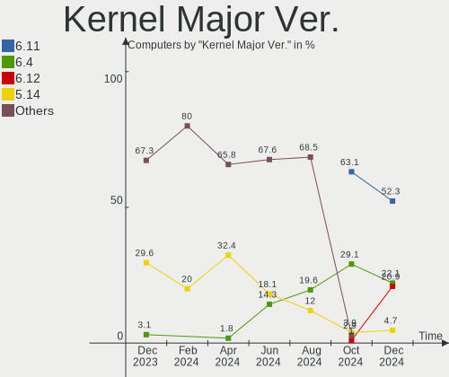
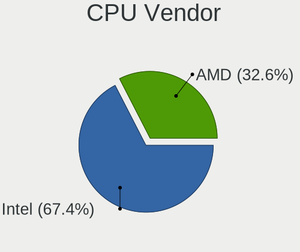
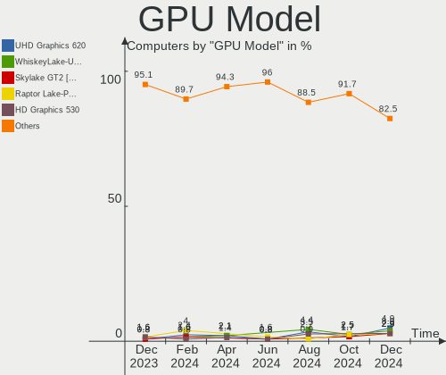
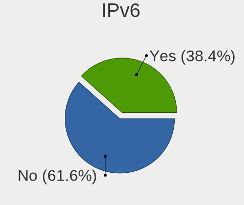
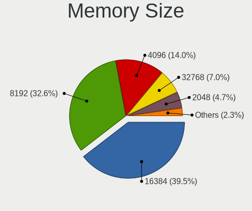
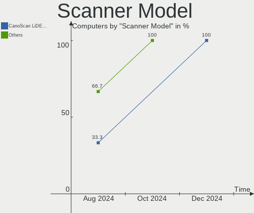

openSUSE Hardware Trends
------------------------

A project to identify most popular hardware characteristics and track their change
over time based on data collected by openSUSE users at https://Linux-Hardware.org.

Anyone can contribute to this report by the [hw-probe](https://github.com/linuxhw/hw-probe) tool:

    sudo -E hw-probe -all -upload

This is a report for all computer types. See also reports for [desktops](/Dist/openSUSE/Desktop/README.md) and [notebooks](/Dist/openSUSE/Notebook/README.md).

Full-feature report is available here: https://linux-hardware.org/?view=trends

Period: Nov, 2021.

Contents
--------

* [ System ](#system)
  - [ OS                       ](#os)
  - [ OS Family                ](#os-family)
  - [ Kernel                   ](#kernel)
  - [ Kernel Family            ](#kernel-family)
  - [ Kernel Major Ver.        ](#kernel-major-ver)
  - [ Arch                     ](#arch)
  - [ DE                       ](#de)
  - [ Display Server           ](#display-server)
  - [ Display Manager          ](#display-manager)
  - [ OS Lang                  ](#os-lang)
  - [ Boot Mode                ](#boot-mode)
  - [ Filesystem               ](#filesystem)
  - [ Part. scheme             ](#part-scheme)
  - [ Dual Boot with Linux/BSD ](#dual-boot-with-linuxbsd)
  - [ Dual Boot (Win)          ](#dual-boot-win)

* [ Board ](#board)
  - [ Vendor                   ](#vendor)
  - [ Model                    ](#model)
  - [ Model Family             ](#model-family)
  - [ MFG Year                 ](#mfg-year)
  - [ Form Factor              ](#form-factor)
  - [ Secure Boot              ](#secure-boot)
  - [ Coreboot                 ](#coreboot)
  - [ RAM Size                 ](#ram-size)
  - [ RAM Used                 ](#ram-used)
  - [ Total Drives             ](#total-drives)
  - [ Has CD-ROM               ](#has-cd-rom)
  - [ Has Ethernet             ](#has-ethernet)
  - [ Has WiFi                 ](#has-wifi)
  - [ Has Bluetooth            ](#has-bluetooth)

* [ Location ](#location)
  - [ Country                  ](#country)
  - [ City                     ](#city)

* [ Drives ](#drives)
  - [ Drive Vendor             ](#drive-vendor)
  - [ Drive Model              ](#drive-model)
  - [ HDD Vendor               ](#hdd-vendor)
  - [ SSD Vendor               ](#ssd-vendor)
  - [ Drive Kind               ](#drive-kind)
  - [ Drive Connector          ](#drive-connector)
  - [ Drive Size               ](#drive-size)
  - [ Space Total              ](#space-total)
  - [ Space Used               ](#space-used)
  - [ Malfunc. Drives          ](#malfunc-drives)
  - [ Malfunc. Drive Vendor    ](#malfunc-drive-vendor)
  - [ Malfunc. HDD Vendor      ](#malfunc-hdd-vendor)
  - [ Malfunc. Drive Kind      ](#malfunc-drive-kind)
  - [ Failed Drives            ](#failed-drives)
  - [ Failed Drive Vendor      ](#failed-drive-vendor)
  - [ Drive Status             ](#drive-status)

* [ Storage controller ](#storage-controller)
  - [ Storage Vendor           ](#storage-vendor)
  - [ Storage Model            ](#storage-model)
  - [ Storage Kind             ](#storage-kind)

* [ Processor ](#processor)
  - [ CPU Vendor               ](#cpu-vendor)
  - [ CPU Model                ](#cpu-model)
  - [ CPU Model Family         ](#cpu-model-family)
  - [ CPU Cores                ](#cpu-cores)
  - [ CPU Sockets              ](#cpu-sockets)
  - [ CPU Threads              ](#cpu-threads)
  - [ CPU Op-Modes             ](#cpu-op-modes)
  - [ CPU Microcode            ](#cpu-microcode)
  - [ CPU Microarch            ](#cpu-microarch)

* [ Graphics ](#graphics)
  - [ GPU Vendor               ](#gpu-vendor)
  - [ GPU Model                ](#gpu-model)
  - [ GPU Combo                ](#gpu-combo)
  - [ GPU Driver               ](#gpu-driver)
  - [ GPU Memory               ](#gpu-memory)

* [ Monitor ](#monitor)
  - [ Monitor Vendor           ](#monitor-vendor)
  - [ Monitor Model            ](#monitor-model)
  - [ Monitor Resolution       ](#monitor-resolution)
  - [ Monitor Diagonal         ](#monitor-diagonal)
  - [ Monitor Width            ](#monitor-width)
  - [ Aspect Ratio             ](#aspect-ratio)
  - [ Monitor Area             ](#monitor-area)
  - [ Pixel Density            ](#pixel-density)
  - [ Multiple Monitors        ](#multiple-monitors)

* [ Network ](#network)
  - [ Net Controller Vendor    ](#net-controller-vendor)
  - [ Net Controller Model     ](#net-controller-model)
  - [ Wireless Vendor          ](#wireless-vendor)
  - [ Wireless Model           ](#wireless-model)
  - [ Ethernet Vendor          ](#ethernet-vendor)
  - [ Ethernet Model           ](#ethernet-model)
  - [ Net Controller Kind      ](#net-controller-kind)
  - [ Used Controller          ](#used-controller)
  - [ NICs                     ](#nics)
  - [ IPv6                     ](#ipv6)

* [ Bluetooth ](#bluetooth)
  - [ Bluetooth Vendor         ](#bluetooth-vendor)
  - [ Bluetooth Model          ](#bluetooth-model)

* [ Sound ](#sound)
  - [ Sound Vendor             ](#sound-vendor)
  - [ Sound Model              ](#sound-model)

* [ Memory ](#memory)
  - [ Memory Vendor            ](#memory-vendor)
  - [ Memory Model             ](#memory-model)
  - [ Memory Kind              ](#memory-kind)
  - [ Memory Form Factor       ](#memory-form-factor)
  - [ Memory Size              ](#memory-size)
  - [ Memory Speed             ](#memory-speed)

* [ Printers & scanners ](#printers--scanners)
  - [ Printer Vendor           ](#printer-vendor)
  - [ Printer Model            ](#printer-model)
  - [ Scanner Vendor           ](#scanner-vendor)
  - [ Scanner Model            ](#scanner-model)

* [ Camera ](#camera)
  - [ Camera Vendor            ](#camera-vendor)
  - [ Camera Model             ](#camera-model)

* [ Security ](#security)
  - [ Fingerprint Vendor       ](#fingerprint-vendor)
  - [ Fingerprint Model        ](#fingerprint-model)
  - [ Chipcard Vendor          ](#chipcard-vendor)
  - [ Chipcard Model           ](#chipcard-model)

* [ Unsupported ](#unsupported)
  - [ Unsupported Devices      ](#unsupported-devices)
  - [ Unsupported Device Types ](#unsupported-device-types)

System
------

OS
--

Installed operating systems

| Name                         | Computers | Percent |
|------------------------------|-----------|---------|
| openSUSE Leap-15.3           | 13        | 18.84%  |
| openSUSE Leap-15.2           | 8         | 11.59%  |
| openSUSE 20211124            | 6         | 8.7%    |
| openSUSE 20211107            | 5         | 7.25%   |
| openSUSE Tumbleweed-20211111 | 3         | 4.35%   |
| openSUSE 20211102            | 3         | 4.35%   |
| openSUSE 20211120            | 2         | 2.9%    |
| openSUSE 20211117            | 2         | 2.9%    |
| openSUSE 20211111            | 2         | 2.9%    |
| openSUSE 20211110            | 2         | 2.9%    |
| openSUSE 20211106            | 2         | 2.9%    |
| openSUSE Tumbleweed-20211127 | 1         | 1.45%   |
| openSUSE Tumbleweed-20211125 | 1         | 1.45%   |
| openSUSE Tumbleweed-20211118 | 1         | 1.45%   |
| openSUSE Tumbleweed-20211116 | 1         | 1.45%   |
| openSUSE Tumbleweed-20211110 | 1         | 1.45%   |
| openSUSE Tumbleweed-20211102 | 1         | 1.45%   |
| openSUSE Tumbleweed-20211031 | 1         | 1.45%   |
| openSUSE Tumbleweed-20211030 | 1         | 1.45%   |
| openSUSE Tumbleweed-20211029 | 1         | 1.45%   |
| openSUSE Tumbleweed-20211028 | 1         | 1.45%   |
| openSUSE Microos-20210321    | 1         | 1.45%   |
| openSUSE 20211128            | 1         | 1.45%   |
| openSUSE 20211126            | 1         | 1.45%   |
| openSUSE 20211123            | 1         | 1.45%   |
| openSUSE 20211122            | 1         | 1.45%   |
| openSUSE 20211104            | 1         | 1.45%   |
| openSUSE 20211101            | 1         | 1.45%   |
| openSUSE 20211031            | 1         | 1.45%   |
| openSUSE 20211012            | 1         | 1.45%   |
| openSUSE 20210916            | 1         | 1.45%   |
| openSUSE 20210912            | 1         | 1.45%   |

OS Family
---------

OS without a version

| Name     | Computers | Percent |
|----------|-----------|---------|
| openSUSE | 69        | 100%    |

Kernel
------

Version of the Linux kernel

| Version                             | Computers | Percent |
|-------------------------------------|-----------|---------|
| 5.14.14-1-default                   | 17        | 24.64%  |
| 5.15.3-1-default                    | 9         | 13.04%  |
| 5.14.14-2-default                   | 8         | 11.59%  |
| 5.3.18-59.27-default                | 7         | 10.14%  |
| 5.3.18-lp152.95-default             | 4         | 5.8%    |
| 5.3.18-lp152.102-default            | 3         | 4.35%   |
| 5.3.18-59.34-default                | 3         | 4.35%   |
| 5.15.2-1-default                    | 3         | 4.35%   |
| 5.14.14-3-default                   | 3         | 4.35%   |
| 5.14.9-1-default                    | 2         | 2.9%    |
| 5.8.12-1-default                    | 1         | 1.45%   |
| 5.3.18-lp152.102-preempt            | 1         | 1.45%   |
| 5.3.18-59.34-preempt                | 1         | 1.45%   |
| 5.3.18-59.27-preempt                | 1         | 1.45%   |
| 5.16.0-rc2-lp153.2.g696d453-default | 1         | 1.45%   |
| 5.16.0-rc2-1.g696d453-default       | 1         | 1.45%   |
| 5.15.3-1-vanilla                    | 1         | 1.45%   |
| 5.14.2-1-default                    | 1         | 1.45%   |
| 5.14.1-1-default                    | 1         | 1.45%   |
| 5.11.6-1-default                    | 1         | 1.45%   |

Kernel Family
-------------

Linux kernel without a distro release

| Version | Computers | Percent |
|---------|-----------|---------|
| 5.14.14 | 28        | 40.58%  |
| 5.3.18  | 20        | 28.99%  |
| 5.15.3  | 10        | 14.49%  |
| 5.15.2  | 3         | 4.35%   |
| 5.16.0  | 2         | 2.9%    |
| 5.14.9  | 2         | 2.9%    |
| 5.8.12  | 1         | 1.45%   |
| 5.14.2  | 1         | 1.45%   |
| 5.14.1  | 1         | 1.45%   |
| 5.11.6  | 1         | 1.45%   |

Kernel Major Ver.
-----------------

Linux kernel major version

| Version | Computers | Percent |
|---------|-----------|---------|
| 5.14    | 32        | 46.38%  |
| 5.3     | 20        | 28.99%  |
| 5.15    | 13        | 18.84%  |
| 5.16    | 2         | 2.9%    |
| 5.8     | 1         | 1.45%   |
| 5.11    | 1         | 1.45%   |

Arch
----

OS architecture (x86_64, i586, etc.)

| Name    | Computers | Percent |
|---------|-----------|---------|
| x86_64  | 67        | 97.1%   |
| aarch64 | 2         | 2.9%    |

DE
--

Desktop Environment

| Name       | Computers | Percent |
|------------|-----------|---------|
| KDE5       | 47        | 68.12%  |
| GNOME      | 12        | 17.39%  |
| Unknown    | 3         | 4.35%   |
| XFCE       | 2         | 2.9%    |
| X-Cinnamon | 2         | 2.9%    |
| MATE       | 2         | 2.9%    |
| KDE        | 1         | 1.45%   |

Display Server
--------------

X11 or Wayland

| Name    | Computers | Percent |
|---------|-----------|---------|
| X11     | 49        | 71.01%  |
| Wayland | 16        | 23.19%  |
| Tty     | 4         | 5.8%    |

Display Manager
---------------

SDDM, LightDM, etc.

| Name    | Computers | Percent |
|---------|-----------|---------|
| Unknown | 25        | 36.23%  |
| LightDM | 20        | 28.99%  |
| SDDM    | 16        | 23.19%  |
| XDM     | 8         | 11.59%  |

OS Lang
-------

Language

| Lang  | Computers | Percent |
|-------|-----------|---------|
| en_US | 18        | 26.09%  |
| de_DE | 15        | 21.74%  |
| POSIX | 10        | 14.49%  |
| fr_FR | 5         | 7.25%   |
| es_ES | 3         | 4.35%   |
| en_GB | 3         | 4.35%   |
| zh_CN | 2         | 2.9%    |
| ru_RU | 2         | 2.9%    |
| pt_BR | 2         | 2.9%    |
| pl_PL | 2         | 2.9%    |
| nl_BE | 2         | 2.9%    |
| it_IT | 2         | 2.9%    |
| hr_HR | 1         | 1.45%   |
| cv_RU | 1         | 1.45%   |
| cs_CZ | 1         | 1.45%   |

Boot Mode
---------

EFI or BIOS

| Mode | Computers | Percent |
|------|-----------|---------|
| EFI  | 46        | 66.67%  |
| BIOS | 23        | 33.33%  |

Filesystem
----------

Type of filesystem

| Type    | Computers | Percent |
|---------|-----------|---------|
| Btrfs   | 50        | 72.46%  |
| Ext4    | 15        | 21.74%  |
| Xfs     | 3         | 4.35%   |
| Overlay | 1         | 1.45%   |

Part. scheme
------------

Scheme of partitioning

| Type    | Computers | Percent |
|---------|-----------|---------|
| GPT     | 40        | 57.97%  |
| Unknown | 21        | 30.43%  |
| MBR     | 8         | 11.59%  |

Dual Boot with Linux/BSD
------------------------

Hosting more than one Linux/BSD

| Dual boot | Computers | Percent |
|-----------|-----------|---------|
| No        | 60        | 86.96%  |
| Yes       | 9         | 13.04%  |

Dual Boot (Win)
---------------

Hosting Linux and Windows

| Dual boot | Computers | Percent |
|-----------|-----------|---------|
| No        | 49        | 71.01%  |
| Yes       | 20        | 28.99%  |

Board
-----

Vendor
------

Motherboard manufacturer

| Name                    | Computers | Percent |
|-------------------------|-----------|---------|
| Lenovo                  | 12        | 17.39%  |
| Dell                    | 11        | 15.94%  |
| ASUSTek Computer        | 10        | 14.49%  |
| MSI                     | 7         | 10.14%  |
| Hewlett-Packard         | 6         | 8.7%    |
| ASRock                  | 4         | 5.8%    |
| Fujitsu                 | 3         | 4.35%   |
| Acer                    | 3         | 4.35%   |
| Samsung Electronics     | 2         | 2.9%    |
| Raspberry Pi Foundation | 2         | 2.9%    |
| HUAWEI                  | 2         | 2.9%    |
| Gigabyte Technology     | 2         | 2.9%    |
| Toshiba                 | 1         | 1.45%   |
| Intel                   | 1         | 1.45%   |
| Chuwi                   | 1         | 1.45%   |
| Biostar                 | 1         | 1.45%   |
| Apple                   | 1         | 1.45%   |

Model
-----

Motherboard model

| Name                                     | Computers | Percent |
|------------------------------------------|-----------|---------|
| Dell OptiPlex 9020                       | 2         | 2.9%    |
| Toshiba Satellite C660                   | 1         | 1.45%   |
| Samsung 550XDA                           | 1         | 1.45%   |
| Samsung 355V4C/356V4C/3445VC/3545VC      | 1         | 1.45%   |
| RPi Raspberry Pi 4 Model B Rev 1.4       | 1         | 1.45%   |
| RPi Raspberry Pi 4 Model B Rev 1.1       | 1         | 1.45%   |
| MSI MS-7D16                              | 1         | 1.45%   |
| MSI MS-7C37                              | 1         | 1.45%   |
| MSI MS-7C35                              | 1         | 1.45%   |
| MSI MS-7B89                              | 1         | 1.45%   |
| MSI MS-7972                              | 1         | 1.45%   |
| MSI MS-7522                              | 1         | 1.45%   |
| MSI CX61 0OC/CX61 0OD/CX61 0OL           | 1         | 1.45%   |
| Lenovo Yoga 14sARH 2021 82LB             | 1         | 1.45%   |
| Lenovo ThinkPad X1 Carbon 4th 20FQ0041MS | 1         | 1.45%   |
| Lenovo ThinkPad T490s 20NYS1XK00         | 1         | 1.45%   |
| Lenovo ThinkPad Edge E430 3254TJY        | 1         | 1.45%   |
| Lenovo ThinkPad E495 20NES01600          | 1         | 1.45%   |
| Lenovo ThinkCentre M720s 10ST0014MB      | 1         | 1.45%   |
| Lenovo IdeaPad S340-15IML 81NA           | 1         | 1.45%   |
| Lenovo IdeaPad Gaming 3 15ARH05 82EY     | 1         | 1.45%   |
| Lenovo IdeaPad 330-15IKB 81DC            | 1         | 1.45%   |
| Lenovo IdeaPad 320-15IKB 80XL            | 1         | 1.45%   |
| Lenovo IdeaPad 3 17ADA05 81W2            | 1         | 1.45%   |
| Lenovo G50-45 80E3                       | 1         | 1.45%   |
| Intel NUC8i3BEH                          | 1         | 1.45%   |
| HUAWEI KPL-W0X                           | 1         | 1.45%   |
| HUAWEI KLVL-WXX9                         | 1         | 1.45%   |
| HP ZBook Fury 15 G7 Mobile Workstation   | 1         | 1.45%   |
| HP Pavilion Gaming Desktop 790-00xx      | 1         | 1.45%   |
| HP Pavilion dv6                          | 1         | 1.45%   |
| HP OMEN by Laptop                        | 1         | 1.45%   |
| HP EliteBook 8460p                       | 1         | 1.45%   |
| HP EliteBook 840 G7 Notebook PC          | 1         | 1.45%   |
| Gigabyte B85M-HD3                        | 1         | 1.45%   |
| Gigabyte AB350M-DS3H                     | 1         | 1.45%   |
| Fujitsu LIFEBOOK E782                    | 1         | 1.45%   |
| Fujitsu ESPRIMO P520                     | 1         | 1.45%   |
| Fujitsu ESPRIMO P410                     | 1         | 1.45%   |
| Dell Vostro 5471                         | 1         | 1.45%   |
| Dell Precision WorkStation T7400         | 1         | 1.45%   |
| Dell Precision M4800                     | 1         | 1.45%   |
| Dell Precision 7530                      | 1         | 1.45%   |
| Dell PowerEdge T420                      | 1         | 1.45%   |
| Dell PowerEdge R510                      | 1         | 1.45%   |
| Dell OptiPlex 330                        | 1         | 1.45%   |
| Dell Latitude E5440                      | 1         | 1.45%   |
| Dell G3 3590                             | 1         | 1.45%   |
| Chuwi Hi10 X                             | 1         | 1.45%   |
| Biostar H77MU3                           | 1         | 1.45%   |
| ASUS Z9PA-D8 Series                      | 1         | 1.45%   |
| ASUS TUF X299 MARK 2                     | 1         | 1.45%   |
| ASUS TUF GAMING B550-PLUS                | 1         | 1.45%   |
| ASUS PRO B460M-C                         | 1         | 1.45%   |
| ASUS PRIME X570-PRO                      | 1         | 1.45%   |
| ASUS PRIME B450M-K                       | 1         | 1.45%   |
| ASUS M4A78T-E                            | 1         | 1.45%   |
| ASUS K30BF_M32BF_A_F_K31BF_6             | 1         | 1.45%   |
| ASUS CROSSHAIR VI HERO                   | 1         | 1.45%   |
| ASUS All Series                          | 1         | 1.45%   |

Model Family
------------

Motherboard model prefix

| Name                 | Computers | Percent |
|----------------------|-----------|---------|
| Lenovo IdeaPad       | 5         | 7.25%   |
| Lenovo ThinkPad      | 4         | 5.8%    |
| Dell Precision       | 3         | 4.35%   |
| Dell OptiPlex        | 3         | 4.35%   |
| RPi Raspberry        | 2         | 2.9%    |
| HP Pavilion          | 2         | 2.9%    |
| HP EliteBook         | 2         | 2.9%    |
| Fujitsu ESPRIMO      | 2         | 2.9%    |
| Dell PowerEdge       | 2         | 2.9%    |
| ASUS TUF             | 2         | 2.9%    |
| ASUS PRIME           | 2         | 2.9%    |
| Acer Aspire          | 2         | 2.9%    |
| Toshiba Satellite    | 1         | 1.45%   |
| Samsung 550XDA       | 1         | 1.45%   |
| Samsung 355V4C       | 1         | 1.45%   |
| MSI MS-7D16          | 1         | 1.45%   |
| MSI MS-7C37          | 1         | 1.45%   |
| MSI MS-7C35          | 1         | 1.45%   |
| MSI MS-7B89          | 1         | 1.45%   |
| MSI MS-7972          | 1         | 1.45%   |
| MSI MS-7522          | 1         | 1.45%   |
| MSI CX61             | 1         | 1.45%   |
| Lenovo Yoga          | 1         | 1.45%   |
| Lenovo ThinkCentre   | 1         | 1.45%   |
| Lenovo G50-45        | 1         | 1.45%   |
| Intel NUC8i3BEH      | 1         | 1.45%   |
| HUAWEI KPL-W0X       | 1         | 1.45%   |
| HUAWEI KLVL-WXX9     | 1         | 1.45%   |
| HP ZBook             | 1         | 1.45%   |
| HP OMEN              | 1         | 1.45%   |
| Gigabyte B85M-HD3    | 1         | 1.45%   |
| Gigabyte AB350M-DS3H | 1         | 1.45%   |
| Fujitsu LIFEBOOK     | 1         | 1.45%   |
| Dell Vostro          | 1         | 1.45%   |
| Dell Latitude        | 1         | 1.45%   |
| Dell G3              | 1         | 1.45%   |
| Chuwi Hi10           | 1         | 1.45%   |
| Biostar H77MU3       | 1         | 1.45%   |
| ASUS Z9PA-D8         | 1         | 1.45%   |
| ASUS PRO             | 1         | 1.45%   |
| ASUS M4A78T-E        | 1         | 1.45%   |
| ASUS K30BF           | 1         | 1.45%   |
| ASUS CROSSHAIR       | 1         | 1.45%   |
| ASUS All             | 1         | 1.45%   |
| ASRock X570          | 1         | 1.45%   |
| ASRock N68C-GS4      | 1         | 1.45%   |
| ASRock J5040-ITX     | 1         | 1.45%   |
| ASRock H370M         | 1         | 1.45%   |
| Apple MacBookPro9    | 1         | 1.45%   |
| Acer Spin            | 1         | 1.45%   |

MFG Year
--------

Motherboard manufacture year

| Year | Computers | Percent |
|------|-----------|---------|
| 2021 | 18        | 26.09%  |
| 2020 | 12        | 17.39%  |
| 2019 | 10        | 14.49%  |
| 2015 | 6         | 8.7%    |
| 2013 | 6         | 8.7%    |
| 2017 | 3         | 4.35%   |
| 2016 | 3         | 4.35%   |
| 2018 | 2         | 2.9%    |
| 2012 | 2         | 2.9%    |
| 2010 | 2         | 2.9%    |
| 2009 | 2         | 2.9%    |
| 2014 | 1         | 1.45%   |
| 2011 | 1         | 1.45%   |
| 2008 | 1         | 1.45%   |

Form Factor
-----------

Physical design of the computer

| Name           | Computers | Percent |
|----------------|-----------|---------|
| Notebook       | 31        | 44.93%  |
| Desktop        | 30        | 43.48%  |
| Server         | 3         | 4.35%   |
| System on chip | 2         | 2.9%    |
| Tablet         | 1         | 1.45%   |
| Convertible    | 1         | 1.45%   |
| Mini pc        | 1         | 1.45%   |

Secure Boot
-----------

Enabled or disabled

| State    | Computers | Percent |
|----------|-----------|---------|
| Disabled | 59        | 85.51%  |
| Enabled  | 10        | 14.49%  |

Coreboot
--------

Have coreboot on board

| Used | Computers | Percent |
|------|-----------|---------|
| No   | 69        | 100%    |

RAM Size
--------

Total RAM memory

| Size in GB  | Computers | Percent |
|-------------|-----------|---------|
| 4.01-8.0    | 17        | 24.64%  |
| 8.01-16.0   | 15        | 21.74%  |
| 16.01-24.0  | 12        | 17.39%  |
| 3.01-4.0    | 10        | 14.49%  |
| 32.01-64.0  | 9         | 13.04%  |
| 64.01-256.0 | 4         | 5.8%    |
| 24.01-32.0  | 1         | 1.45%   |
| 1.01-2.0    | 1         | 1.45%   |

RAM Used
--------

Used RAM memory

| Used GB    | Computers | Percent |
|------------|-----------|---------|
| 2.01-3.0   | 16        | 23.19%  |
| 1.01-2.0   | 15        | 21.74%  |
| 4.01-8.0   | 14        | 20.29%  |
| 3.01-4.0   | 11        | 15.94%  |
| 8.01-16.0  | 6         | 8.7%    |
| 0.51-1.0   | 4         | 5.8%    |
| 16.01-24.0 | 2         | 2.9%    |
| 0.01-0.5   | 1         | 1.45%   |

Total Drives
------------

Number of drives on board

| Drives | Computers | Percent |
|--------|-----------|---------|
| 1      | 31        | 44.93%  |
| 2      | 20        | 28.99%  |
| 4      | 7         | 10.14%  |
| 3      | 7         | 10.14%  |
| 6      | 2         | 2.9%    |
| 9      | 1         | 1.45%   |
| 5      | 1         | 1.45%   |

Has CD-ROM
----------

Has CD-ROM on board

| Presented | Computers | Percent |
|-----------|-----------|---------|
| No        | 37        | 53.62%  |
| Yes       | 32        | 46.38%  |

Has Ethernet
------------

Has Ethernet on board

| Presented | Computers | Percent |
|-----------|-----------|---------|
| Yes       | 58        | 84.06%  |
| No        | 11        | 15.94%  |

Has WiFi
--------

Has WiFi module

| Presented | Computers | Percent |
|-----------|-----------|---------|
| Yes       | 43        | 62.32%  |
| No        | 26        | 37.68%  |

Has Bluetooth
-------------

Has Bluetooth module

| Presented | Computers | Percent |
|-----------|-----------|---------|
| Yes       | 44        | 63.77%  |
| No        | 25        | 36.23%  |

Location
--------

Country
-------

Geographic location (country)

| Country     | Computers | Percent |
|-------------|-----------|---------|
| Germany     | 16        | 23.19%  |
| USA         | 12        | 17.39%  |
| France      | 5         | 7.25%   |
| Russia      | 3         | 4.35%   |
| Netherlands | 3         | 4.35%   |
| Brazil      | 3         | 4.35%   |
| Belgium     | 3         | 4.35%   |
| Spain       | 2         | 2.9%    |
| Portugal    | 2         | 2.9%    |
| Israel      | 2         | 2.9%    |
| China       | 2         | 2.9%    |
| Switzerland | 1         | 1.45%   |
| Sweden      | 1         | 1.45%   |
| Poland      | 1         | 1.45%   |
| Peru        | 1         | 1.45%   |
| Mexico      | 1         | 1.45%   |
| Italy       | 1         | 1.45%   |
| India       | 1         | 1.45%   |
| Hungary     | 1         | 1.45%   |
| Greece      | 1         | 1.45%   |
| Finland     | 1         | 1.45%   |
| Czechia     | 1         | 1.45%   |
| Cyprus      | 1         | 1.45%   |
| Croatia     | 1         | 1.45%   |
| Austria     | 1         | 1.45%   |
| Australia   | 1         | 1.45%   |
| Argentina   | 1         | 1.45%   |

City
----

Geographic location (city)

| City                 | Computers | Percent |
|----------------------|-----------|---------|
| Paris                | 2         | 2.9%    |
| Madrid               | 2         | 2.9%    |
| Durmersheim          | 2         | 2.9%    |
| Chaumont-en-Vexin    | 2         | 2.9%    |
| Zurich               | 1         | 1.45%   |
| Zagreb               | 1         | 1.45%   |
| Yreka                | 1         | 1.45%   |
| Xi'an                | 1         | 1.45%   |
| Warsaw               | 1         | 1.45%   |
| Vila do Conde        | 1         | 1.45%   |
| Verona               | 1         | 1.45%   |
| Tlalnepantla         | 1         | 1.45%   |
| Tel Aviv             | 1         | 1.45%   |
| Staffanstorp         | 1         | 1.45%   |
| Somerville           | 1         | 1.45%   |
| Sehnde               | 1         | 1.45%   |
| Schaarbeek           | 1         | 1.45%   |
| Sao Joaquim da Barra | 1         | 1.45%   |
| Saint Albans         | 1         | 1.45%   |
| Rockville            | 1         | 1.45%   |
| Rio de Janeiro       | 1         | 1.45%   |
| Rendsburg            | 1         | 1.45%   |
| Petrozavodsk         | 1         | 1.45%   |
| New Braunfels        | 1         | 1.45%   |
| Netanya              | 1         | 1.45%   |
| Muecke               | 1         | 1.45%   |
| Moscow               | 1         | 1.45%   |
| Moonee Ponds         | 1         | 1.45%   |
| Miami                | 1         | 1.45%   |
| Mari??nsk?© L??zn?›  | 1         | 1.45%   |
| Mansfield            | 1         | 1.45%   |
| Limassol             | 1         | 1.45%   |
| Leeuwarden           | 1         | 1.45%   |
| Las Vegas            | 1         | 1.45%   |
| Kehl                 | 1         | 1.45%   |
| Kazan?ˆ™             | 1         | 1.45%   |
| Kapellen             | 1         | 1.45%   |
| Ingolstadt           | 1         | 1.45%   |
| Heddernheim          | 1         | 1.45%   |
| Hamelin              | 1         | 1.45%   |
| Hamburg              | 1         | 1.45%   |
| Haarlem              | 1         | 1.45%   |
| G?¶d?¶ll?‘           | 1         | 1.45%   |
| Flensburg            | 1         | 1.45%   |
| Fairfield            | 1         | 1.45%   |
| Espoo                | 1         | 1.45%   |
| Eppertshausen        | 1         | 1.45%   |
| Enns                 | 1         | 1.45%   |
| Dunkirk              | 1         | 1.45%   |
| Dresden              | 1         | 1.45%   |
| Dallas               | 1         | 1.45%   |
| Cusco                | 1         | 1.45%   |
| Curitiba             | 1         | 1.45%   |
| Cologne              | 1         | 1.45%   |
| Cleveland            | 1         | 1.45%   |
| Cerva                | 1         | 1.45%   |
| Buenos Aires         | 1         | 1.45%   |
| Bremen               | 1         | 1.45%   |
| Berlin               | 1         | 1.45%   |
| Bengaluru            | 1         | 1.45%   |

Drives
------

Drive Vendor
------------

Hard drive vendors

| Vendor                    | Computers | Drives | Percent |
|---------------------------|-----------|--------|---------|
| WDC                       | 21        | 30     | 18.26%  |
| Seagate                   | 20        | 35     | 17.39%  |
| Samsung Electronics       | 18        | 22     | 15.65%  |
| Kingston                  | 8         | 8      | 6.96%   |
| A-DATA Technology         | 6         | 6      | 5.22%   |
| Toshiba                   | 5         | 5      | 4.35%   |
| Crucial                   | 5         | 5      | 4.35%   |
| Unknown                   | 3         | 3      | 2.61%   |
| Intenso                   | 3         | 3      | 2.61%   |
| HGST                      | 3         | 3      | 2.61%   |
| XPG                       | 2         | 2      | 1.74%   |
| Transcend                 | 2         | 2      | 1.74%   |
| SK Hynix                  | 2         | 2      | 1.74%   |
| Phison                    | 2         | 2      | 1.74%   |
| Micron/Crucial Technology | 2         | 2      | 1.74%   |
| Intel                     | 2         | 2      | 1.74%   |
| Union Memory (Shenzhen)   | 1         | 1      | 0.87%   |
| SanDisk                   | 1         | 1      | 0.87%   |
| PNY                       | 1         | 2      | 0.87%   |
| OCZ                       | 1         | 1      | 0.87%   |
| LITEON                    | 1         | 1      | 0.87%   |
| KIOXIA                    | 1         | 1      | 0.87%   |
| Hitachi                   | 1         | 1      | 0.87%   |
| GOODRAM                   | 1         | 1      | 0.87%   |
| Gigabyte Technology       | 1         | 1      | 0.87%   |
| Fujitsu                   | 1         | 1      | 0.87%   |
| Corsair                   | 1         | 1      | 0.87%   |

Drive Model
-----------

Hard drive models

| Model                                        | Computers | Percent |
|----------------------------------------------|-----------|---------|
| Samsung SSD 860 EVO 500GB                    | 4         | 3.05%   |
| Seagate ST1000DM003-1CH162 1TB               | 3         | 2.29%   |
| WDC WD1002FAEX-00Z3A0 1TB                    | 2         | 1.53%   |
| Seagate ST2000DM001-1ER164 2TB               | 2         | 1.53%   |
| Seagate ST1000LM048-2E7172 1TB               | 2         | 1.53%   |
| Seagate ST1000LM035-1RK172 1TB               | 2         | 1.53%   |
| Seagate Expansion 1TB                        | 2         | 1.53%   |
| Samsung SSD 870 EVO 500GB                    | 2         | 1.53%   |
| Samsung SSD 850 EVO 250GB                    | 2         | 1.53%   |
| Micron/Crucial NVMe SSD Drive 1TB            | 2         | 1.53%   |
| Intenso External USB 3.0 2TB                 | 2         | 1.53%   |
| A-DATA SU650 120GB SSD                       | 2         | 1.53%   |
| XPG NVMe SSD Drive 512GB                     | 1         | 0.76%   |
| XPG GAMMIX S11 Pro 1TB                       | 1         | 0.76%   |
| WDC WDS500G2B0C-00PXH0 500GB                 | 1         | 0.76%   |
| WDC WDS500G2B0A-00SM50 500GB SSD             | 1         | 0.76%   |
| WDC WDS500G1B0B-00AS40 500GB SSD             | 1         | 0.76%   |
| WDC WDS250G1B0A-00H9H0 250GB SSD             | 1         | 0.76%   |
| WDC WDS100T3X0C-00SJG0 1TB                   | 1         | 0.76%   |
| WDC WDS100T2B0A-00SM50 1TB SSD               | 1         | 0.76%   |
| WDC WDS100T1X0E-00AFY0 1TB                   | 1         | 0.76%   |
| WDC WD80EFAX-68KNBN0 8TB                     | 1         | 0.76%   |
| WDC WD5000AAKX-07U6AA0 500GB                 | 1         | 0.76%   |
| WDC WD3200AACS-00M6B0 320GB                  | 1         | 0.76%   |
| WDC WD2500AAKS-00B3A0 250GB                  | 1         | 0.76%   |
| WDC WD20EZRZ-00Z5HB0 2TB                     | 1         | 0.76%   |
| WDC WD20EURS-63S48Y0 2TB                     | 1         | 0.76%   |
| WDC WD20EARX-00PASB0 2TB                     | 1         | 0.76%   |
| WDC WD2005FBYZ-01YCBB2 2TB                   | 1         | 0.76%   |
| WDC WD10SPZX-75Z10T1 1TB                     | 1         | 0.76%   |
| WDC WD10SPZX-35Z10T0 1TB                     | 1         | 0.76%   |
| WDC WD10SPZX-24Z10T0 1TB                     | 1         | 0.76%   |
| WDC WD10SPZX-24Z10 1TB                       | 1         | 0.76%   |
| WDC WD10SPZX-08Z10 1TB                       | 1         | 0.76%   |
| WDC WD10SPSX-60A6WT0 1TB                     | 1         | 0.76%   |
| WDC WD10EZEX-08WN4A0 1TB                     | 1         | 0.76%   |
| WDC WD10EZEX-00KUWA0 1TB                     | 1         | 0.76%   |
| WDC WD10EZEX-00BN5A0 1TB                     | 1         | 0.76%   |
| WDC WD10EARS-00Y5B1 1TB                      | 1         | 0.76%   |
| WDC PC SN530 SDBPNPZ-512G-1114 512GB         | 1         | 0.76%   |
| Unknown SC32G  32GB                          | 1         | 0.76%   |
| Unknown MMC Card  64GB                       | 1         | 0.76%   |
| Unknown MMC Card  128GB                      | 1         | 0.76%   |
| Union Memory (Shenzhen) NVMe SSD Drive 256GB | 1         | 0.76%   |
| Transcend TS256GMTE220S 256GB                | 1         | 0.76%   |
| Transcend TS128GSSD340 128GB                 | 1         | 0.76%   |
| Toshiba THNSN51T02DU7 NVMe 1024GB            | 1         | 0.76%   |
| Toshiba NVMe SSD Drive 256GB                 | 1         | 0.76%   |
| Toshiba KXG5AZNV256G 256GB                   | 1         | 0.76%   |
| Toshiba HDWD260 6TB                          | 1         | 0.76%   |
| Toshiba DT01ACA100 1TB                       | 1         | 0.76%   |
| SK Hynix SKHynix_HFS512GD9TNI-L2A0B 512GB    | 1         | 0.76%   |
| SK Hynix SKHynix_HFM256GDHTNI-87A0B 256GB    | 1         | 0.76%   |
| Seagate ST9320325AS 320GB                    | 1         | 0.76%   |
| Seagate ST500NM0011 500GB                    | 1         | 0.76%   |
| Seagate ST500LM000-SSHD-8GB                  | 1         | 0.76%   |
| Seagate ST500DM002-1BD142 500GB              | 1         | 0.76%   |
| Seagate ST4000DM005-2DP166 4TB               | 1         | 0.76%   |
| Seagate ST3500418AS 500GB                    | 1         | 0.76%   |
| Seagate ST3500413AS 500GB                    | 1         | 0.76%   |

HDD Vendor
----------

Hard disk drive vendors

| Vendor              | Computers | Drives | Percent |
|---------------------|-----------|--------|---------|
| Seagate             | 20        | 35     | 42.55%  |
| WDC                 | 16        | 22     | 34.04%  |
| HGST                | 3         | 3      | 6.38%   |
| Toshiba             | 2         | 2      | 4.26%   |
| Samsung Electronics | 2         | 2      | 4.26%   |
| Intenso             | 2         | 2      | 4.26%   |
| Hitachi             | 1         | 1      | 2.13%   |
| Fujitsu             | 1         | 1      | 2.13%   |

SSD Vendor
----------

Solid state drive vendors

| Vendor              | Computers | Drives | Percent |
|---------------------|-----------|--------|---------|
| Samsung Electronics | 10        | 14     | 24.39%  |
| Kingston            | 7         | 7      | 17.07%  |
| Crucial             | 5         | 5      | 12.2%   |
| A-DATA Technology   | 5         | 5      | 12.2%   |
| WDC                 | 4         | 4      | 9.76%   |
| Transcend           | 1         | 1      | 2.44%   |
| SanDisk             | 1         | 1      | 2.44%   |
| PNY                 | 1         | 2      | 2.44%   |
| OCZ                 | 1         | 1      | 2.44%   |
| LITEON              | 1         | 1      | 2.44%   |
| Intenso             | 1         | 1      | 2.44%   |
| Intel               | 1         | 1      | 2.44%   |
| GOODRAM             | 1         | 1      | 2.44%   |
| Gigabyte Technology | 1         | 1      | 2.44%   |
| Corsair             | 1         | 1      | 2.44%   |

Drive Kind
----------

HDD or SSD

| Kind | Computers | Drives | Percent |
|------|-----------|--------|---------|
| HDD  | 41        | 68     | 40.2%   |
| SSD  | 35        | 46     | 34.31%  |
| NVMe | 23        | 27     | 22.55%  |
| MMC  | 3         | 3      | 2.94%   |

Drive Connector
---------------

SATA, SAS, NVMe, etc.

| Type | Computers | Drives | Percent |
|------|-----------|--------|---------|
| SATA | 56        | 109    | 64.37%  |
| NVMe | 23        | 27     | 26.44%  |
| SAS  | 5         | 5      | 5.75%   |
| MMC  | 3         | 3      | 3.45%   |

Drive Size
----------

Size of hard drive

| Size in TB | Computers | Drives | Percent |
|------------|-----------|--------|---------|
| 0.01-0.5   | 39        | 56     | 46.43%  |
| 0.51-1.0   | 28        | 33     | 33.33%  |
| 1.01-2.0   | 12        | 19     | 14.29%  |
| 4.01-10.0  | 2         | 3      | 2.38%   |
| 3.01-4.0   | 1         | 1      | 1.19%   |
| 2.01-3.0   | 1         | 1      | 1.19%   |
| 10.01-20.0 | 1         | 1      | 1.19%   |

Space Total
-----------

Amount of disk space available on the file system

| Size in GB     | Computers | Percent |
|----------------|-----------|---------|
| More than 3000 | 27        | 39.13%  |
| 1001-2000      | 14        | 20.29%  |
| 501-1000       | 12        | 17.39%  |
| 2001-3000      | 6         | 8.7%    |
| 251-500        | 5         | 7.25%   |
| 101-250        | 2         | 2.9%    |
| 21-50          | 1         | 1.45%   |
| 1-20           | 1         | 1.45%   |
| 51-100         | 1         | 1.45%   |

Space Used
----------

Amount of used disk space

| Used GB        | Computers | Percent |
|----------------|-----------|---------|
| 251-500        | 14        | 20.29%  |
| 501-1000       | 14        | 20.29%  |
| 101-250        | 9         | 13.04%  |
| 1001-2000      | 7         | 10.14%  |
| 51-100         | 7         | 10.14%  |
| More than 3000 | 6         | 8.7%    |
| 2001-3000      | 5         | 7.25%   |
| 21-50          | 4         | 5.8%    |
| 1-20           | 3         | 4.35%   |

Malfunc. Drives
---------------

Drive models with a malfunction

| Model                             | Computers | Drives | Percent |
|-----------------------------------|-----------|--------|---------|
| WDC WD2500AAKS-00B3A0 250GB       | 1         | 1      | 7.69%   |
| WDC WD10EARS-00Y5B1 1TB           | 1         | 1      | 7.69%   |
| WDC WD1002FAEX-00Z3A0 1TB         | 1         | 1      | 7.69%   |
| Seagate ST500NM0011 500GB         | 1         | 4      | 7.69%   |
| Seagate ST500LM000-SSHD-8GB       | 1         | 1      | 7.69%   |
| Seagate ST500DM002-1BD142 500GB   | 1         | 1      | 7.69%   |
| Seagate ST3500418AS 500GB         | 1         | 1      | 7.69%   |
| Samsung Electronics HD501LJ 500GB | 1         | 1      | 7.69%   |
| Phison 311CD0512GB                | 1         | 1      | 7.69%   |
| Kingston SV300S37A120G 120GB SSD  | 1         | 1      | 7.69%   |
| Kingston SMS200S3240G 240GB SSD   | 1         | 1      | 7.69%   |
| HGST HTS725050A7E630 500GB        | 1         | 1      | 7.69%   |
| HGST HTS721010A9E630 1TB          | 1         | 1      | 7.69%   |

Malfunc. Drive Vendor
---------------------

Vendors of faulty drives

| Vendor              | Computers | Drives | Percent |
|---------------------|-----------|--------|---------|
| Seagate             | 4         | 7      | 30.77%  |
| WDC                 | 3         | 3      | 23.08%  |
| Kingston            | 2         | 2      | 15.38%  |
| HGST                | 2         | 2      | 15.38%  |
| Samsung Electronics | 1         | 1      | 7.69%   |
| Phison              | 1         | 1      | 7.69%   |

Malfunc. HDD Vendor
-------------------

Vendors of faulty HDD drives

| Vendor              | Computers | Drives | Percent |
|---------------------|-----------|--------|---------|
| Seagate             | 4         | 7      | 40%     |
| WDC                 | 3         | 3      | 30%     |
| HGST                | 2         | 2      | 20%     |
| Samsung Electronics | 1         | 1      | 10%     |

Malfunc. Drive Kind
-------------------

Kinds of faulty drives

| Kind | Computers | Drives | Percent |
|------|-----------|--------|---------|
| HDD  | 9         | 13     | 75%     |
| SSD  | 2         | 2      | 16.67%  |
| NVMe | 1         | 1      | 8.33%   |

Failed Drives
-------------

Failed drive models

Zero info for selected period =(

Failed Drive Vendor
-------------------

Failed drive vendors

Zero info for selected period =(

Drive Status
------------

Number of failed and malfunc. drives

| Status   | Computers | Drives | Percent |
|----------|-----------|--------|---------|
| Works    | 41        | 85     | 52.56%  |
| Detected | 25        | 43     | 32.05%  |
| Malfunc  | 12        | 16     | 15.38%  |

Storage controller
------------------

Storage Vendor
--------------

Storage controller vendors

| Vendor                       | Computers | Percent |
|------------------------------|-----------|---------|
| Intel                        | 45        | 49.45%  |
| AMD                          | 15        | 16.48%  |
| Samsung Electronics          | 6         | 6.59%   |
| Toshiba America Info Systems | 4         | 4.4%    |
| Sandisk                      | 4         | 4.4%    |
| SK Hynix                     | 2         | 2.2%    |
| Phison Electronics           | 2         | 2.2%    |
| Micron/Crucial Technology    | 2         | 2.2%    |
| LSI Logic / Symbios Logic    | 2         | 2.2%    |
| ASMedia Technology           | 2         | 2.2%    |
| ADATA Technology             | 2         | 2.2%    |
| Union Memory (Shenzhen)      | 1         | 1.1%    |
| Silicon Motion               | 1         | 1.1%    |
| Nvidia                       | 1         | 1.1%    |
| Kingston Technology Company  | 1         | 1.1%    |
| Broadcom / LSI               | 1         | 1.1%    |

Storage Model
-------------

Storage controller models

| Model                                                                            | Computers | Percent |
|----------------------------------------------------------------------------------|-----------|---------|
| AMD FCH SATA Controller [AHCI mode]                                              | 10        | 9.9%    |
| Intel 8 Series/C220 Series Chipset Family 6-port SATA Controller 1 [AHCI mode]   | 7         | 6.93%   |
| Intel 7 Series Chipset Family 6-port SATA Controller [AHCI mode]                 | 4         | 3.96%   |
| Samsung NVMe SSD Controller SM981/PM981/PM983                                    | 3         | 2.97%   |
| Intel Sunrise Point-LP SATA Controller [AHCI mode]                               | 3         | 2.97%   |
| Intel Cannon Lake PCH SATA AHCI Controller                                       | 3         | 2.97%   |
| Sandisk WD Blue SN550 NVMe SSD                                                   | 2         | 1.98%   |
| Samsung NVMe SSD Controller 980                                                  | 2         | 1.98%   |
| Phison PS5013 E13 NVMe Controller                                                | 2         | 1.98%   |
| Intel Celeron/Pentium Silver Processor SATA Controller                           | 2         | 1.98%   |
| Intel C600/X79 series chipset 6-Port SATA AHCI Controller                        | 2         | 1.98%   |
| Intel 82801 Mobile SATA Controller [RAID mode]                                   | 2         | 1.98%   |
| Intel 6 Series/C200 Series Chipset Family 6 port Mobile SATA AHCI Controller     | 2         | 1.98%   |
| Intel 400 Series Chipset Family SATA AHCI Controller                             | 2         | 1.98%   |
| ASMedia ASM1062 Serial ATA Controller                                            | 2         | 1.98%   |
| AMD X370 Series Chipset SATA Controller                                          | 2         | 1.98%   |
| AMD 400 Series Chipset SATA Controller                                           | 2         | 1.98%   |
| ADATA XPG SX8200 Pro PCIe Gen3x4 M.2 2280 Solid State Drive                      | 2         | 1.98%   |
| Union Memory (Shenzhen) Non-Volatile memory controller                           | 1         | 0.99%   |
| Toshiba America Info Systems XG6 NVMe SSD Controller                             | 1         | 0.99%   |
| Toshiba America Info Systems Toshiba America Info Non-Volatile memory controller | 1         | 0.99%   |
| Toshiba America Info Systems NVMe Controller                                     | 1         | 0.99%   |
| Toshiba America Info Systems BG3 NVMe SSD Controller                             | 1         | 0.99%   |
| SK Hynix Non-Volatile memory controller                                          | 1         | 0.99%   |
| SK Hynix BC511                                                                   | 1         | 0.99%   |
| Silicon Motion SM2262/SM2262EN SSD Controller                                    | 1         | 0.99%   |
| Sandisk WD PC SN810 / Black SN850 NVMe SSD                                       | 1         | 0.99%   |
| Sandisk WD Black SN750 / PC SN730 NVMe SSD                                       | 1         | 0.99%   |
| Samsung NVMe SSD Controller SM961/PM961/SM963                                    | 1         | 0.99%   |
| Nvidia MCP61 SATA Controller                                                     | 1         | 0.99%   |
| Nvidia MCP61 IDE                                                                 | 1         | 0.99%   |
| Micron/Crucial P1 NVMe PCIe SSD                                                  | 1         | 0.99%   |
| Micron/Crucial NVMe Controller                                                   | 1         | 0.99%   |
| LSI Logic / Symbios Logic SAS1068E PCI-Express Fusion-MPT SAS                    | 1         | 0.99%   |
| LSI Logic / Symbios Logic MegaRAID SAS 1078                                      | 1         | 0.99%   |
| Kingston Company A2000 NVMe SSD                                                  | 1         | 0.99%   |
| Intel Volume Management Device NVMe RAID Controller                              | 1         | 0.99%   |
| Intel Tiger Lake-LP SATA Controller [AHCI mode]                                  | 1         | 0.99%   |
| Intel Q170/Q150/B150/H170/H110/Z170/CM236 Chipset SATA Controller [AHCI Mode]    | 1         | 0.99%   |
| Intel NVMe Optane Memory Series                                                  | 1         | 0.99%   |
| Intel NM10/ICH7 Family SATA Controller [AHCI mode]                               | 1         | 0.99%   |
| Intel HM170/QM170 Chipset SATA Controller [AHCI Mode]                            | 1         | 0.99%   |
| Intel Comet Lake SATA AHCI Controller                                            | 1         | 0.99%   |
| Intel Cannon Point-LP SATA Controller [AHCI Mode]                                | 1         | 0.99%   |
| Intel Cannon Lake Mobile PCH SATA AHCI Controller                                | 1         | 0.99%   |
| Intel 82801JI (ICH10 Family) SATA AHCI Controller                                | 1         | 0.99%   |
| Intel 82801JI (ICH10 Family) 4 port SATA IDE Controller #1                       | 1         | 0.99%   |
| Intel 82801JI (ICH10 Family) 2 port SATA IDE Controller #2                       | 1         | 0.99%   |
| Intel 82801IBM/IEM (ICH9M/ICH9M-E) 4 port SATA Controller [AHCI mode]            | 1         | 0.99%   |
| Intel 82801G (ICH7 Family) IDE Controller                                        | 1         | 0.99%   |
| Intel 8 Series SATA Controller 1 [AHCI mode]                                     | 1         | 0.99%   |
| Intel 7 Series/C210 Series Chipset Family IDE-r Controller                       | 1         | 0.99%   |
| Intel 7 Series/C210 Series Chipset Family 4-port SATA Controller [IDE mode]      | 1         | 0.99%   |
| Intel 7 Series/C210 Series Chipset Family 2-port SATA Controller [IDE mode]      | 1         | 0.99%   |
| Intel 631xESB/632xESB SATA AHCI Controller                                       | 1         | 0.99%   |
| Intel 631xESB/632xESB IDE Controller                                             | 1         | 0.99%   |
| Intel 6 Series/C200 Series Chipset Family 6 port Desktop SATA AHCI Controller    | 1         | 0.99%   |
| Intel 500 Series Chipset Family SATA AHCI Controller                             | 1         | 0.99%   |
| Intel 5 Series/3400 Series Chipset 4 port SATA AHCI Controller                   | 1         | 0.99%   |
| Intel 200 Series PCH SATA controller [AHCI mode]                                 | 1         | 0.99%   |

Storage Kind
------------

Kind of storage controller (IDE, SATA, NVMe, SAS, ...)

| Kind | Computers | Percent |
|------|-----------|---------|
| SATA | 54        | 59.34%  |
| NVMe | 23        | 25.27%  |
| IDE  | 7         | 7.69%   |
| RAID | 6         | 6.59%   |
| SCSI | 1         | 1.1%    |

Processor
---------

CPU Vendor
----------

Processor vendors

| Vendor | Computers | Percent |
|--------|-----------|---------|
| Intel  | 47        | 68.12%  |
| AMD    | 20        | 28.99%  |
| ARM    | 2         | 2.9%    |

CPU Model
---------

Processor models

| Model                                          | Computers | Percent |
|------------------------------------------------|-----------|---------|
| Intel Core i7-8700 CPU @ 3.20GHz               | 3         | 4.35%   |
| Intel Core i7-4770 CPU @ 3.40GHz               | 2         | 2.9%    |
| Intel Core i5-7200U CPU @ 2.50GHz              | 2         | 2.9%    |
| Intel Core i5-3210M CPU @ 2.50GHz              | 2         | 2.9%    |
| ARM Processor                                  | 2         | 2.9%    |
| AMD Ryzen 7 4800H with Radeon Graphics         | 2         | 2.9%    |
| AMD Ryzen 3 2200G with Radeon Vega Graphics    | 2         | 2.9%    |
| Intel Xeon W-10885M CPU @ 2.40GHz              | 1         | 1.45%   |
| Intel Xeon E-2186M CPU @ 2.90GHz               | 1         | 1.45%   |
| Intel Xeon CPU X5675 @ 3.07GHz                 | 1         | 1.45%   |
| Intel Xeon CPU X5472 @ 3.00GHz                 | 1         | 1.45%   |
| Intel Xeon CPU E5-2670 0 @ 2.60GHz             | 1         | 1.45%   |
| Intel Xeon CPU E5-2470 v2 @ 2.40GHz            | 1         | 1.45%   |
| Intel Pentium Silver J5040 CPU @ 2.00GHz       | 1         | 1.45%   |
| Intel Pentium Dual-Core CPU E5700 @ 3.00GHz    | 1         | 1.45%   |
| Intel Core i7-7800X CPU @ 3.50GHz              | 1         | 1.45%   |
| Intel Core i7-6700HQ CPU @ 2.60GHz             | 1         | 1.45%   |
| Intel Core i7-6500U CPU @ 2.50GHz              | 1         | 1.45%   |
| Intel Core i7-4810MQ CPU @ 2.80GHz             | 1         | 1.45%   |
| Intel Core i7-4770K CPU @ 3.50GHz              | 1         | 1.45%   |
| Intel Core i7-3520M CPU @ 2.90GHz              | 1         | 1.45%   |
| Intel Core i7-10510U CPU @ 1.80GHz             | 1         | 1.45%   |
| Intel Core i7 CPU 920 @ 2.67GHz                | 1         | 1.45%   |
| Intel Core i5-9300H CPU @ 2.40GHz              | 1         | 1.45%   |
| Intel Core i5-8365U CPU @ 1.60GHz              | 1         | 1.45%   |
| Intel Core i5-8250U CPU @ 1.60GHz              | 1         | 1.45%   |
| Intel Core i5-6500 CPU @ 3.20GHz               | 1         | 1.45%   |
| Intel Core i5-4570 CPU @ 3.20GHz               | 1         | 1.45%   |
| Intel Core i5-4430 CPU @ 3.00GHz               | 1         | 1.45%   |
| Intel Core i5-4200M CPU @ 2.50GHz              | 1         | 1.45%   |
| Intel Core i5-3330 CPU @ 3.00GHz               | 1         | 1.45%   |
| Intel Core i5-3230M CPU @ 2.60GHz              | 1         | 1.45%   |
| Intel Core i5-2520M CPU @ 2.50GHz              | 1         | 1.45%   |
| Intel Core i5-2410M CPU @ 2.30GHz              | 1         | 1.45%   |
| Intel Core i5-2320 CPU @ 3.00GHz               | 1         | 1.45%   |
| Intel Core i5-10600K CPU @ 4.10GHz             | 1         | 1.45%   |
| Intel Core i5-10400 CPU @ 2.90GHz              | 1         | 1.45%   |
| Intel Core i5-10310U CPU @ 1.70GHz             | 1         | 1.45%   |
| Intel Core i5 CPU M 460 @ 2.53GHz              | 1         | 1.45%   |
| Intel Core i3-8109U CPU @ 3.00GHz              | 1         | 1.45%   |
| Intel Core i3-4030U CPU @ 1.90GHz              | 1         | 1.45%   |
| Intel Core 2 Duo CPU P7450 @ 2.13GHz           | 1         | 1.45%   |
| Intel Celeron N4120 CPU @ 1.10GHz              | 1         | 1.45%   |
| Intel 11th Gen Core i5-1135G7 @ 2.40GHz        | 1         | 1.45%   |
| Intel 11th Gen Core i3-1115G4 @ 3.00GHz        | 1         | 1.45%   |
| AMD Ryzen 9 5900X 12-Core Processor            | 1         | 1.45%   |
| AMD Ryzen 9 3900X 12-Core Processor            | 1         | 1.45%   |
| AMD Ryzen 7 2700X Eight-Core Processor         | 1         | 1.45%   |
| AMD Ryzen 5 5600G with Radeon Graphics         | 1         | 1.45%   |
| AMD Ryzen 5 4600H with Radeon Graphics         | 1         | 1.45%   |
| AMD Ryzen 5 3600X 6-Core Processor             | 1         | 1.45%   |
| AMD Ryzen 5 3500U with Radeon Vega Mobile Gfx  | 1         | 1.45%   |
| AMD Ryzen 5 3400G with Radeon Vega Graphics    | 1         | 1.45%   |
| AMD Ryzen 5 2500U with Radeon Vega Mobile Gfx  | 1         | 1.45%   |
| AMD Ryzen 3 PRO 3200GE w/ Radeon Vega Graphics | 1         | 1.45%   |
| AMD Phenom II X4 B50 Processor                 | 1         | 1.45%   |
| AMD FX-8350 Eight-Core Processor               | 1         | 1.45%   |
| AMD E2-1800 APU with Radeon HD Graphics        | 1         | 1.45%   |
| AMD Athlon Silver 3050U with Radeon Graphics   | 1         | 1.45%   |
| AMD A6-6310 APU with AMD Radeon R4 Graphics    | 1         | 1.45%   |

CPU Model Family
----------------

Processor model prefix

| Model                   | Computers | Percent |
|-------------------------|-----------|---------|
| Intel Core i5           | 20        | 28.99%  |
| Intel Core i7           | 13        | 18.84%  |
| Intel Xeon              | 6         | 8.7%    |
| AMD Ryzen 5             | 6         | 8.7%    |
| Other                   | 4         | 5.8%    |
| AMD Ryzen 7             | 3         | 4.35%   |
| Intel Core i3           | 2         | 2.9%    |
| AMD Ryzen 9             | 2         | 2.9%    |
| AMD Ryzen 3             | 2         | 2.9%    |
| Intel Pentium Silver    | 1         | 1.45%   |
| Intel Pentium Dual-Core | 1         | 1.45%   |
| Intel Core 2 Duo        | 1         | 1.45%   |
| Intel Celeron           | 1         | 1.45%   |
| AMD Ryzen 3 PRO         | 1         | 1.45%   |
| AMD Phenom II X4        | 1         | 1.45%   |
| AMD FX                  | 1         | 1.45%   |
| AMD E2                  | 1         | 1.45%   |
| AMD Athlon              | 1         | 1.45%   |
| AMD A6                  | 1         | 1.45%   |
| AMD A10                 | 1         | 1.45%   |

CPU Cores
---------

Number of processor cores

| Number  | Computers | Percent |
|---------|-----------|---------|
| 4       | 30        | 43.48%  |
| 2       | 18        | 26.09%  |
| 6       | 10        | 14.49%  |
| 8       | 5         | 7.25%   |
| 12      | 3         | 4.35%   |
| 20      | 1         | 1.45%   |
| 1       | 1         | 1.45%   |
| Unknown | 1         | 1.45%   |

CPU Sockets
-----------

Number of sockets

| Number  | Computers | Percent |
|---------|-----------|---------|
| 1       | 66        | 95.65%  |
| 2       | 2         | 2.9%    |
| Unknown | 1         | 1.45%   |

CPU Threads
-----------

Threads per core (Hyper-Threading)

| Number  | Computers | Percent |
|---------|-----------|---------|
| 2       | 47        | 68.12%  |
| 1       | 20        | 28.99%  |
| 4       | 1         | 1.45%   |
| Unknown | 1         | 1.45%   |

CPU Op-Modes
------------

CPU Operation Modes (32-bit, 64-bit)

| Op mode        | Computers | Percent |
|----------------|-----------|---------|
| 32-bit, 64-bit | 68        | 98.55%  |
| 64-bit         | 1         | 1.45%   |

CPU Microcode
-------------

Microcode number

| Number     | Computers | Percent |
|------------|-----------|---------|
| 0x306c3    | 7         | 10.14%  |
| Unknown    | 7         | 10.14%  |
| 0x306a9    | 5         | 7.25%   |
| 0x906ea    | 4         | 5.8%    |
| 0x08108109 | 3         | 4.35%   |
| 0x806ec    | 2         | 2.9%    |
| 0x806ea    | 2         | 2.9%    |
| 0x806e9    | 2         | 2.9%    |
| 0x806c1    | 2         | 2.9%    |
| 0x706a8    | 2         | 2.9%    |
| 0x506e3    | 2         | 2.9%    |
| 0x206a7    | 2         | 2.9%    |
| 0x1067a    | 2         | 2.9%    |
| 0x08701021 | 2         | 2.9%    |
| 0x08600106 | 2         | 2.9%    |
| 0xa0655    | 1         | 1.45%   |
| 0xa0653    | 1         | 1.45%   |
| 0xa0652    | 1         | 1.45%   |
| 0x50654    | 1         | 1.45%   |
| 0x406e3    | 1         | 1.45%   |
| 0x40651    | 1         | 1.45%   |
| 0x306e4    | 1         | 1.45%   |
| 0x206d6    | 1         | 1.45%   |
| 0x206c2    | 1         | 1.45%   |
| 0x106a4    | 1         | 1.45%   |
| 0x10676    | 1         | 1.45%   |
| 0x0a50000c | 1         | 1.45%   |
| 0x0a201009 | 1         | 1.45%   |
| 0x08600104 | 1         | 1.45%   |
| 0x08108102 | 1         | 1.45%   |
| 0x08101016 | 1         | 1.45%   |
| 0x0810100b | 1         | 1.45%   |
| 0x08101007 | 1         | 1.45%   |
| 0x0800820d | 1         | 1.45%   |
| 0x07030105 | 1         | 1.45%   |
| 0x06003106 | 1         | 1.45%   |
| 0x05000119 | 1         | 1.45%   |
| 0x010000db | 1         | 1.45%   |

CPU Microarch
-------------

Microarchitecture

| Name          | Computers | Percent |
|---------------|-----------|---------|
| KabyLake      | 12        | 17.39%  |
| Haswell       | 8         | 11.59%  |
| IvyBridge     | 6         | 8.7%    |
| Zen+          | 5         | 7.25%   |
| Zen 2         | 5         | 7.25%   |
| Skylake       | 4         | 5.8%    |
| SandyBridge   | 4         | 5.8%    |
| Zen           | 3         | 4.35%   |
| Penryn        | 3         | 4.35%   |
| CometLake     | 3         | 4.35%   |
| Zen 3         | 2         | 2.9%    |
| Westmere      | 2         | 2.9%    |
| TigerLake     | 2         | 2.9%    |
| Goldmont plus | 2         | 2.9%    |
| Unknown       | 2         | 2.9%    |
| Steamroller   | 1         | 1.45%   |
| Puma          | 1         | 1.45%   |
| Piledriver    | 1         | 1.45%   |
| Nehalem       | 1         | 1.45%   |
| K10           | 1         | 1.45%   |
| Bobcat        | 1         | 1.45%   |

Graphics
--------

GPU Vendor
----------

Vendors of graphics cards

| Vendor | Computers | Percent |
|--------|-----------|---------|
| Intel  | 33        | 40.74%  |
| AMD    | 29        | 35.8%   |
| Nvidia | 19        | 23.46%  |

GPU Model
---------

Graphics card models

| Model                                                                                 | Computers | Percent |
|---------------------------------------------------------------------------------------|-----------|---------|
| Intel 3rd Gen Core processor Graphics Controller                                      | 4         | 4.88%   |
| AMD Picasso/Raven 2 [Radeon Vega Series / Radeon Vega Mobile Series]                  | 4         | 4.88%   |
| Intel Xeon E3-1200 v3/4th Gen Core Processor Integrated Graphics Controller           | 3         | 3.66%   |
| AMD Tonga PRO [Radeon R9 285/380]                                                     | 3         | 3.66%   |
| AMD Renoir                                                                            | 3         | 3.66%   |
| AMD Raven Ridge [Radeon Vega Series / Radeon Vega Mobile Series]                      | 3         | 3.66%   |
| Intel HD Graphics 620                                                                 | 2         | 2.44%   |
| Intel CometLake-U GT2 [UHD Graphics]                                                  | 2         | 2.44%   |
| Intel CometLake-S GT2 [UHD Graphics 630]                                              | 2         | 2.44%   |
| Intel CoffeeLake-S GT2 [UHD Graphics 630]                                             | 2         | 2.44%   |
| Intel 2nd Generation Core Processor Family Integrated Graphics Controller             | 2         | 2.44%   |
| AMD Topaz XT [Radeon R7 M260/M265 / M340/M360 / M440/M445 / 530/535 / 620/625 Mobile] | 2         | 2.44%   |
| AMD Caicos XTX [Radeon HD 8490 / R5 235X OEM]                                         | 2         | 2.44%   |
| Nvidia TU117M [GeForce GTX 1650 Mobile / Max-Q]                                       | 1         | 1.22%   |
| Nvidia TU117M                                                                         | 1         | 1.22%   |
| Nvidia TU117 [GeForce GTX 1650]                                                       | 1         | 1.22%   |
| Nvidia TU116 [GeForce GTX 1660 Ti]                                                    | 1         | 1.22%   |
| Nvidia TU106 [GeForce RTX 2070]                                                       | 1         | 1.22%   |
| Nvidia TU104GLM [Quadro RTX 5000 Mobile / Max-Q]                                      | 1         | 1.22%   |
| Nvidia GT218M [GeForce 315M]                                                          | 1         | 1.22%   |
| Nvidia GP108M [GeForce MX230]                                                         | 1         | 1.22%   |
| Nvidia GP104GLM [Quadro P3200 Mobile]                                                 | 1         | 1.22%   |
| Nvidia GP104 [GeForce GTX 1070]                                                       | 1         | 1.22%   |
| Nvidia GM206M [GeForce GTX 965M]                                                      | 1         | 1.22%   |
| Nvidia GM108M [GeForce 920MX]                                                         | 1         | 1.22%   |
| Nvidia GK208M [GeForce GT 730M]                                                       | 1         | 1.22%   |
| Nvidia GK106GLM [Quadro K2100M]                                                       | 1         | 1.22%   |
| Nvidia GK106 [GeForce GTX 650 Ti Boost]                                               | 1         | 1.22%   |
| Nvidia GK104 [GeForce GTX 660 Ti]                                                     | 1         | 1.22%   |
| Nvidia GF117M [GeForce 610M/710M/810M/820M / GT 620M/625M/630M/720M]                  | 1         | 1.22%   |
| Nvidia GF100GL [Tesla C2050 / C2070]                                                  | 1         | 1.22%   |
| Nvidia G84GL [Quadro FX 1700]                                                         | 1         | 1.22%   |
| Intel Xeon E3-1200 v2/3rd Gen Core processor Graphics Controller                      | 1         | 1.22%   |
| Intel WhiskeyLake-U GT2 [UHD Graphics 620]                                            | 1         | 1.22%   |
| Intel UHD Graphics 620                                                                | 1         | 1.22%   |
| Intel TigerLake-LP GT2 [Iris Xe Graphics]                                             | 1         | 1.22%   |
| Intel Tiger Lake UHD Graphics                                                         | 1         | 1.22%   |
| Intel Skylake GT2 [HD Graphics 520]                                                   | 1         | 1.22%   |
| Intel HD Graphics 530                                                                 | 1         | 1.22%   |
| Intel Haswell-ULT Integrated Graphics Controller                                      | 1         | 1.22%   |
| Intel GeminiLake [UHD Graphics 605]                                                   | 1         | 1.22%   |
| Intel GeminiLake [UHD Graphics 600]                                                   | 1         | 1.22%   |
| Intel DG1 [Iris Xe Graphics]                                                          | 1         | 1.22%   |
| Intel Core Processor Integrated Graphics Controller                                   | 1         | 1.22%   |
| Intel Comet Lake-H WS GT2 Integrated UHD Graphics Controller                          | 1         | 1.22%   |
| Intel CoffeeLake-U GT3e [Iris Plus Graphics 655]                                      | 1         | 1.22%   |
| Intel CoffeeLake-H GT2 [UHD Graphics 630]                                             | 1         | 1.22%   |
| Intel Coffee Lake UHD Graphics P630                                                   | 1         | 1.22%   |
| Intel 4th Gen Core Processor Integrated Graphics Controller                           | 1         | 1.22%   |
| AMD Seymour [Radeon HD 6400M/7400M Series]                                            | 1         | 1.22%   |
| AMD RV730/M96 [Mobility Radeon HD 4650/5165]                                          | 1         | 1.22%   |
| AMD RV710 [Radeon HD 4350/4550]                                                       | 1         | 1.22%   |
| AMD Oland XT [Radeon HD 8670 / R5 340X OEM / R7 250/350/350X OEM]                     | 1         | 1.22%   |
| AMD Navi 10 [Radeon RX 5600 OEM/5600 XT / 5700/5700 XT]                               | 1         | 1.22%   |
| AMD Mullins [Radeon R4/R5 Graphics]                                                   | 1         | 1.22%   |
| AMD Madison [Mobility Radeon HD 5650/5750 / 6530M/6550M]                              | 1         | 1.22%   |
| AMD Kaveri [Radeon R7 Graphics]                                                       | 1         | 1.22%   |
| AMD Ellesmere [Radeon RX 470/480/570/570X/580/580X/590]                               | 1         | 1.22%   |
| AMD Cezanne                                                                           | 1         | 1.22%   |
| AMD Cape Verde XT [Radeon HD 7770/8760 / R7 250X]                                     | 1         | 1.22%   |

GPU Combo
---------

Combinations of graphics cards

| Name           | Computers | Percent |
|----------------|-----------|---------|
| 1 x AMD        | 25        | 36.23%  |
| 1 x Intel      | 19        | 27.54%  |
| 1 x Nvidia     | 9         | 13.04%  |
| Intel + Nvidia | 9         | 13.04%  |
| Intel + AMD    | 3         | 4.35%   |
| Other          | 2         | 2.9%    |
| 2 x Intel      | 1         | 1.45%   |
| AMD + Nvidia   | 1         | 1.45%   |

GPU Driver
----------

Free vs proprietary

| Driver      | Computers | Percent |
|-------------|-----------|---------|
| Free        | 58        | 84.06%  |
| Proprietary | 8         | 11.59%  |
| Unknown     | 3         | 4.35%   |

GPU Memory
----------

Total video memory

| Size in GB | Computers | Percent |
|------------|-----------|---------|
| Unknown    | 31        | 44.93%  |
| 1.01-2.0   | 12        | 17.39%  |
| 0.51-1.0   | 8         | 11.59%  |
| 0.01-0.5   | 7         | 10.14%  |
| 3.01-4.0   | 5         | 7.25%   |
| 7.01-8.0   | 3         | 4.35%   |
| 5.01-6.0   | 2         | 2.9%    |
| 2.01-3.0   | 1         | 1.45%   |

Monitor
-------

Monitor Vendor
--------------

Monitor vendors

| Vendor               | Computers | Percent |
|----------------------|-----------|---------|
| Samsung Electronics  | 14        | 18.42%  |
| Dell                 | 11        | 14.47%  |
| Chimei Innolux       | 7         | 9.21%   |
| BOE                  | 6         | 7.89%   |
| AU Optronics         | 5         | 6.58%   |
| LG Display           | 3         | 3.95%   |
| BenQ                 | 3         | 3.95%   |
| Philips              | 2         | 2.63%   |
| Lenovo               | 2         | 2.63%   |
| Hewlett-Packard      | 2         | 2.63%   |
| Goldstar             | 2         | 2.63%   |
| ASUSTek Computer     | 2         | 2.63%   |
| Ancor Communications | 2         | 2.63%   |
| Acer                 | 2         | 2.63%   |
| ___                  | 1         | 1.32%   |
| ViewSonic            | 1         | 1.32%   |
| Unknown              | 1         | 1.32%   |
| Sony                 | 1         | 1.32%   |
| Sharp                | 1         | 1.32%   |
| Panasonic            | 1         | 1.32%   |
| Lite-On              | 1         | 1.32%   |
| InfoVision           | 1         | 1.32%   |
| Iiyama               | 1         | 1.32%   |
| HKC                  | 1         | 1.32%   |
| CSO                  | 1         | 1.32%   |
| Apple                | 1         | 1.32%   |
| AOC                  | 1         | 1.32%   |

Monitor Model
-------------

Monitor models

| Model                                                                                 | Computers | Percent |
|---------------------------------------------------------------------------------------|-----------|---------|
| Philips PHL 243V5 PHLC0D1 1920x1080 521x293mm 23.5-inch                               | 2         | 2.47%   |
| Dell P2418D DELD0C1 2560x1440 526x296mm 23.8-inch                                     | 2         | 2.47%   |
| Dell E2214H DELA09E 1920x1080 477x268mm 21.5-inch                                     | 2         | 2.47%   |
| Chimei Innolux LCD Monitor CMN15D5 1920x1080 340x190mm 15.3-inch                      | 2         | 2.47%   |
| BOE LCD Monitor BOE0812 1920x1080 344x194mm 15.5-inch                                 | 2         | 2.47%   |
| ___ Monitor ranges (GTF): 48-62Hz V, 14-68kHz H, max dotclock 150MHz ___9000 1440x900 | 1         | 1.23%   |
| ViewSonic VX2753 SERIES VSC7228 1920x1080 597x336mm 27.0-inch                         | 1         | 1.23%   |
| Unknown LCD TV 9000 1360x768 1600x900mm 72.3-inch                                     | 1         | 1.23%   |
| Sony TV SNY6804 1680x1050 1600x900mm 72.3-inch                                        | 1         | 1.23%   |
| Sharp LCD Monitor SHP1430 3840x2160 350x190mm 15.7-inch                               | 1         | 1.23%   |
| Samsung Electronics U28E590 SAM0C4E 3840x2160 608x345mm 27.5-inch                     | 1         | 1.23%   |
| Samsung Electronics U28E590 SAM0C4D 3840x2160 607x345mm 27.5-inch                     | 1         | 1.23%   |
| Samsung Electronics SyncMaster SAM036F 1440x900 428x255mm 19.6-inch                   | 1         | 1.23%   |
| Samsung Electronics SyncMaster SAM011F 1280x1024 376x301mm 19.0-inch                  | 1         | 1.23%   |
| Samsung Electronics SyncMaster SAM0025 1152x864 267x200mm 13.1-inch                   | 1         | 1.23%   |
| Samsung Electronics SMEX2220 SAM0685 1920x1080 477x268mm 21.5-inch                    | 1         | 1.23%   |
| Samsung Electronics S34J55x SAM0F72 3440x1440 797x333mm 34.0-inch                     | 1         | 1.23%   |
| Samsung Electronics S34J55x SAM0F70 3440x1440 797x333mm 34.0-inch                     | 1         | 1.23%   |
| Samsung Electronics S24R65x SAM1027 1920x1080 527x296mm 23.8-inch                     | 1         | 1.23%   |
| Samsung Electronics S24R65x SAM1022 1920x1080 527x296mm 23.8-inch                     | 1         | 1.23%   |
| Samsung Electronics S24E450 SAM0C82 1920x1080 530x300mm 24.0-inch                     | 1         | 1.23%   |
| Samsung Electronics S23B550 SAM0919 1920x1080 510x287mm 23.0-inch                     | 1         | 1.23%   |
| Samsung Electronics LCD Monitor SEC5541 1366x768 344x193mm 15.5-inch                  | 1         | 1.23%   |
| Samsung Electronics LCD Monitor SEC364C 1366x768 309x174mm 14.0-inch                  | 1         | 1.23%   |
| Samsung Electronics LCD Monitor SEC3641 1366x768 353x198mm 15.9-inch                  | 1         | 1.23%   |
| Samsung Electronics LCD Monitor SAM7016 3840x2160 950x540mm 43.0-inch                 | 1         | 1.23%   |
| Samsung Electronics C24F390 SAM0D2C 1920x1080 520x290mm 23.4-inch                     | 1         | 1.23%   |
| Panasonic VVX13F009G00 MEI96A2 1920x1080 290x170mm 13.2-inch                          | 1         | 1.23%   |
| Lite-On DC/EC150ATA LTN0208 1024x768 304x228mm 15.0-inch                              | 1         | 1.23%   |
| LG Display LCD Monitor LGD06B8 1920x1080 344x194mm 15.5-inch                          | 1         | 1.23%   |
| LG Display LCD Monitor LGD05F2 1920x1080 344x194mm 15.5-inch                          | 1         | 1.23%   |
| LG Display LCD Monitor LGD038E 1366x768 340x190mm 15.3-inch                           | 1         | 1.23%   |
| Lenovo LEN LT2423wC LEN60A8 1920x1080 531x299mm 24.0-inch                             | 1         | 1.23%   |
| Lenovo LCD Monitor LEN40B1 1600x900 344x194mm 15.5-inch                               | 1         | 1.23%   |
| InfoVision LCD Monitor IVO3D40 1920x1080 344x194mm 15.5-inch                          | 1         | 1.23%   |
| Iiyama PL2492H IVM612F 1920x1080 530x300mm 24.0-inch                                  | 1         | 1.23%   |
| HKC CH70 HKC27A9 1920x1080 597x336mm 27.0-inch                                        | 1         | 1.23%   |
| Hewlett-Packard vs19 HWP264C 1280x1024 376x301mm 19.0-inch                            | 1         | 1.23%   |
| Hewlett-Packard E243i HPN3463 1920x1200 518x324mm 24.1-inch                           | 1         | 1.23%   |
| Hewlett-Packard E243i HPN3462 1920x1200 518x324mm 24.1-inch                           | 1         | 1.23%   |
| Goldstar MP59G GSM5B35 1920x1080 480x270mm 21.7-inch                                  | 1         | 1.23%   |
| Goldstar L226W GSM566B 1680x1050 474x296mm 22.0-inch                                  | 1         | 1.23%   |
| Dell U2715H DELD065 2560x1440 597x336mm 27.0-inch                                     | 1         | 1.23%   |
| Dell U2415 DELA0B8 1920x1080 520x320mm 24.0-inch                                      | 1         | 1.23%   |
| Dell P2715Q DEL40BD 3840x2160 597x336mm 27.0-inch                                     | 1         | 1.23%   |
| Dell P2418D DELD0C2 2560x1440 526x296mm 23.8-inch                                     | 1         | 1.23%   |
| Dell P2212H DELA07E 1920x1080 531x299mm 24.0-inch                                     | 1         | 1.23%   |
| Dell E2311H DELF035 1920x1080 510x287mm 23.0-inch                                     | 1         | 1.23%   |
| Dell AW2521HF DELA161 1920x1080 540x300mm 24.3-inch                                   | 1         | 1.23%   |
| Dell 1703FP DEL3011 1280x1024 338x270mm 17.0-inch                                     | 1         | 1.23%   |
| CSO LCD Monitor CSO1402 2880x1800 302x188mm 14.0-inch                                 | 1         | 1.23%   |
| Chimei Innolux LCD Monitor CMN1735 1920x1080 382x215mm 17.3-inch                      | 1         | 1.23%   |
| Chimei Innolux LCD Monitor CMN15B7 1366x768 340x190mm 15.3-inch                       | 1         | 1.23%   |
| Chimei Innolux LCD Monitor CMN14F5 1920x1080 309x173mm 13.9-inch                      | 1         | 1.23%   |
| Chimei Innolux LCD Monitor CMN14D4 1920x1080 309x173mm 13.9-inch                      | 1         | 1.23%   |
| Chimei Innolux LCD Monitor CMN14C3 1366x768 309x173mm 13.9-inch                       | 1         | 1.23%   |
| BOE LCD Monitor BOE08E4 1600x900 382x215mm 17.3-inch                                  | 1         | 1.23%   |
| BOE LCD Monitor BOE08BF 1920x1080 309x174mm 14.0-inch                                 | 1         | 1.23%   |
| BOE LCD Monitor BOE0893 2160x1440 296x197mm 14.0-inch                                 | 1         | 1.23%   |
| BOE LCD Monitor BOE05F6 1366x768 309x173mm 13.9-inch                                  | 1         | 1.23%   |

Monitor Resolution
------------------

Monitor screen resolution

| Resolution         | Computers | Percent |
|--------------------|-----------|---------|
| 1920x1080 (FHD)    | 33        | 46.48%  |
| 1366x768 (WXGA)    | 9         | 12.68%  |
| 2560x1440 (QHD)    | 5         | 7.04%   |
| 3840x2160 (4K)     | 4         | 5.63%   |
| 1600x900 (HD+)     | 3         | 4.23%   |
| 1440x900 (WXGA+)   | 3         | 4.23%   |
| 1280x1024 (SXGA)   | 3         | 4.23%   |
| 1920x1200 (WUXGA)  | 2         | 2.82%   |
| 3440x1440          | 1         | 1.41%   |
| 2880x1800          | 1         | 1.41%   |
| 2560x1600          | 1         | 1.41%   |
| 2160x1440          | 1         | 1.41%   |
| 1680x1050 (WSXGA+) | 1         | 1.41%   |
| 1360x768           | 1         | 1.41%   |
| 1280x800 (WXGA)    | 1         | 1.41%   |
| 1152x864           | 1         | 1.41%   |
| 1024x768 (XGA)     | 1         | 1.41%   |

Monitor Diagonal
----------------

Diagonal size in inches

| Inches  | Computers | Percent |
|---------|-----------|---------|
| 15      | 15        | 20%     |
| 27      | 10        | 13.33%  |
| 24      | 10        | 13.33%  |
| 23      | 9         | 12%     |
| 13      | 8         | 10.67%  |
| 17      | 5         | 6.67%   |
| 21      | 4         | 5.33%   |
| 19      | 4         | 5.33%   |
| 14      | 4         | 5.33%   |
| 72      | 2         | 2.67%   |
| 84      | 1         | 1.33%   |
| 34      | 1         | 1.33%   |
| 32      | 1         | 1.33%   |
| Unknown | 1         | 1.33%   |

Monitor Width
-------------

Physical width

| Width in mm | Computers | Percent |
|-------------|-----------|---------|
| 501-600     | 25        | 33.33%  |
| 301-350     | 24        | 32%     |
| 401-500     | 7         | 9.33%   |
| 351-400     | 7         | 9.33%   |
| 201-300     | 4         | 5.33%   |
| 1501-2000   | 3         | 4%      |
| 701-800     | 2         | 2.67%   |
| 601-700     | 2         | 2.67%   |
| Unknown     | 1         | 1.33%   |

Aspect Ratio
------------

Proportional relationship between the width and the height

| Ratio | Computers | Percent |
|-------|-----------|---------|
| 16/9  | 54        | 78.26%  |
| 16/10 | 7         | 10.14%  |
| 5/4   | 3         | 4.35%   |
| 4/3   | 2         | 2.9%    |
| 3/2   | 2         | 2.9%    |
| 21/9  | 1         | 1.45%   |

Monitor Area
------------

Area in inch²

| Area in inch² | Computers | Percent |
|----------------|-----------|---------|
| 201-250        | 19        | 25.33%  |
| 101-110        | 15        | 20%     |
| 81-90          | 11        | 14.67%  |
| 301-350        | 10        | 13.33%  |
| 151-200        | 4         | 5.33%   |
| 121-130        | 4         | 5.33%   |
| More than 1000 | 3         | 4%      |
| 251-300        | 3         | 4%      |
| 351-500        | 2         | 2.67%   |
| 71-80          | 1         | 1.33%   |
| 141-150        | 1         | 1.33%   |
| 91-100         | 1         | 1.33%   |
| Unknown        | 1         | 1.33%   |

Pixel Density
-------------

Pixels per inch

| Density       | Computers | Percent |
|---------------|-----------|---------|
| 51-100        | 31        | 41.89%  |
| 101-120       | 18        | 24.32%  |
| 121-160       | 16        | 21.62%  |
| More than 240 | 3         | 4.05%   |
| 161-240       | 3         | 4.05%   |
| 1-50          | 2         | 2.7%    |
| Unknown       | 1         | 1.35%   |

Multiple Monitors
-----------------

Total monitors connected

| Total | Computers | Percent |
|-------|-----------|---------|
| 1     | 55        | 79.71%  |
| 2     | 11        | 15.94%  |
| 3     | 2         | 2.9%    |
| 0     | 1         | 1.45%   |

Network
-------

Net Controller Vendor
---------------------

Controller vendors

| Vendor                          | Computers | Percent |
|---------------------------------|-----------|---------|
| Realtek Semiconductor           | 32        | 34.78%  |
| Intel                           | 30        | 32.61%  |
| Qualcomm Atheros                | 12        | 13.04%  |
| Broadcom                        | 6         | 6.52%   |
| Broadcom Limited                | 3         | 3.26%   |
| ASIX Electronics                | 2         | 2.17%   |
| Sierra Wireless                 | 1         | 1.09%   |
| Qualcomm Atheros Communications | 1         | 1.09%   |
| OnePlus Technology (Shenzhen)   | 1         | 1.09%   |
| MediaTek                        | 1         | 1.09%   |
| Linksys                         | 1         | 1.09%   |
| Lenovo                          | 1         | 1.09%   |
| Dell                            | 1         | 1.09%   |

Net Controller Model
--------------------

Controller models

| Model                                                             | Computers | Percent |
|-------------------------------------------------------------------|-----------|---------|
| Realtek RTL8111/8168/8411 PCI Express Gigabit Ethernet Controller | 25        | 22.94%  |
| Qualcomm Atheros QCA9377 802.11ac Wireless Network Adapter        | 4         | 3.67%   |
| Intel Wi-Fi 6 AX200                                               | 4         | 3.67%   |
| Realtek RTL8822CE 802.11ac PCIe Wireless Network Adapter          | 3         | 2.75%   |
| Realtek RTL8125 2.5GbE Controller                                 | 3         | 2.75%   |
| Intel I211 Gigabit Network Connection                             | 3         | 2.75%   |
| Realtek RTL8821CE 802.11ac PCIe Wireless Network Adapter          | 2         | 1.83%   |
| Intel Wireless-AC 9260                                            | 2         | 1.83%   |
| Intel Wi-Fi 6 AX201                                               | 2         | 1.83%   |
| Intel Ethernet Connection (7) I219-V                              | 2         | 1.83%   |
| Intel Centrino Advanced-N 6205 [Taylor Peak]                      | 2         | 1.83%   |
| Intel Cannon Point-LP CNVi [Wireless-AC]                          | 2         | 1.83%   |
| Intel 82579LM Gigabit Network Connection (Lewisville)             | 2         | 1.83%   |
| Intel 82574L Gigabit Network Connection                           | 2         | 1.83%   |
| ASIX AX88179 Gigabit Ethernet                                     | 2         | 1.83%   |
| Sierra Wireless EM7455                                            | 1         | 0.92%   |
| Realtek RTL8822BE 802.11a/b/g/n/ac WiFi adapter                   | 1         | 0.92%   |
| Realtek RTL8821AE 802.11ac PCIe Wireless Network Adapter          | 1         | 0.92%   |
| Realtek RTL8723BE PCIe Wireless Network Adapter                   | 1         | 0.92%   |
| Realtek RTL8188FTV 802.11b/g/n 1T1R 2.4G WLAN Adapter             | 1         | 0.92%   |
| Realtek RTL8187B Wireless 802.11g 54Mbps Network Adapter          | 1         | 0.92%   |
| Realtek RTL8153 Gigabit Ethernet Adapter                          | 1         | 0.92%   |
| Qualcomm Atheros QCA9565 / AR9565 Wireless Network Adapter        | 1         | 0.92%   |
| Qualcomm Atheros QCA8171 Gigabit Ethernet                         | 1         | 0.92%   |
| Qualcomm Atheros QCA6174 802.11ac Wireless Network Adapter        | 1         | 0.92%   |
| Qualcomm Atheros AR9271 802.11n                                   | 1         | 0.92%   |
| Qualcomm Atheros AR9485 Wireless Network Adapter                  | 1         | 0.92%   |
| Qualcomm Atheros AR9287 Wireless Network Adapter (PCI-Express)    | 1         | 0.92%   |
| Qualcomm Atheros AR9285 Wireless Network Adapter (PCI-Express)    | 1         | 0.92%   |
| Qualcomm Atheros AR8151 v1.0 Gigabit Ethernet                     | 1         | 0.92%   |
| Qualcomm Atheros AR8121/AR8113/AR8114 Gigabit or Fast Ethernet    | 1         | 0.92%   |
| OnePlus (Shenzhen) OnePlus                                        | 1         | 0.92%   |
| MediaTek REVVL V+ 5G                                              | 1         | 0.92%   |
| Linksys WUSB54GC v1 802.11g Adapter [Ralink RT73]                 | 1         | 0.92%   |
| Lenovo ThinkPad TBT 3 Dock                                        | 1         | 0.92%   |
| Intel Wireless 8265 / 8275                                        | 1         | 0.92%   |
| Intel Wireless 8260                                               | 1         | 0.92%   |
| Intel Wireless 7265                                               | 1         | 0.92%   |
| Intel Wireless 3160                                               | 1         | 0.92%   |
| Intel Tiger Lake PCH CNVi WiFi                                    | 1         | 0.92%   |
| Intel PRO/Wireless 5100 AGN [Shiloh] Network Connection           | 1         | 0.92%   |
| Intel Ethernet Connection I219-V                                  | 1         | 0.92%   |
| Intel Ethernet Connection I218-LM                                 | 1         | 0.92%   |
| Intel Ethernet Connection I217-LM                                 | 1         | 0.92%   |
| Intel Ethernet Connection (7) I219-LM                             | 1         | 0.92%   |
| Intel Ethernet Connection (6) I219-V                              | 1         | 0.92%   |
| Intel Ethernet Connection (6) I219-LM                             | 1         | 0.92%   |
| Intel Ethernet Connection (2) I219-V                              | 1         | 0.92%   |
| Intel Ethernet Connection (12) I219-V                             | 1         | 0.92%   |
| Intel Ethernet Connection (10) I219-LM                            | 1         | 0.92%   |
| Intel Comet Lake PCH-LP CNVi WiFi                                 | 1         | 0.92%   |
| Intel Comet Lake PCH CNVi WiFi                                    | 1         | 0.92%   |
| Intel Centrino Wireless-N 135                                     | 1         | 0.92%   |
| Dell iDRAC Virtual NIC                                            | 1         | 0.92%   |
| Broadcom NetXtreme II BCM5716 Gigabit Ethernet                    | 1         | 0.92%   |
| Broadcom NetXtreme BCM57765 Gigabit Ethernet PCIe                 | 1         | 0.92%   |
| Broadcom NetXtreme BCM5754 Gigabit Ethernet PCI Express           | 1         | 0.92%   |
| Broadcom NetXtreme BCM5720 Gigabit Ethernet PCIe                  | 1         | 0.92%   |
| Broadcom Limited NetLink BCM5787 Gigabit Ethernet PCI Express     | 1         | 0.92%   |
| Broadcom Limited NetLink BCM57780 Gigabit Ethernet PCIe           | 1         | 0.92%   |

Wireless Vendor
---------------

Wireless vendors

| Vendor                          | Computers | Percent |
|---------------------------------|-----------|---------|
| Intel                           | 21        | 44.68%  |
| Realtek Semiconductor           | 10        | 21.28%  |
| Qualcomm Atheros                | 9         | 19.15%  |
| Broadcom                        | 3         | 6.38%   |
| Sierra Wireless                 | 1         | 2.13%   |
| Qualcomm Atheros Communications | 1         | 2.13%   |
| Linksys                         | 1         | 2.13%   |
| Broadcom Limited                | 1         | 2.13%   |

Wireless Model
--------------

Wireless models

| Model                                                          | Computers | Percent |
|----------------------------------------------------------------|-----------|---------|
| Qualcomm Atheros QCA9377 802.11ac Wireless Network Adapter     | 4         | 8.51%   |
| Intel Wi-Fi 6 AX200                                            | 4         | 8.51%   |
| Realtek RTL8822CE 802.11ac PCIe Wireless Network Adapter       | 3         | 6.38%   |
| Realtek RTL8821CE 802.11ac PCIe Wireless Network Adapter       | 2         | 4.26%   |
| Intel Wireless-AC 9260                                         | 2         | 4.26%   |
| Intel Wi-Fi 6 AX201                                            | 2         | 4.26%   |
| Intel Centrino Advanced-N 6205 [Taylor Peak]                   | 2         | 4.26%   |
| Intel Cannon Point-LP CNVi [Wireless-AC]                       | 2         | 4.26%   |
| Sierra Wireless EM7455                                         | 1         | 2.13%   |
| Realtek RTL8822BE 802.11a/b/g/n/ac WiFi adapter                | 1         | 2.13%   |
| Realtek RTL8821AE 802.11ac PCIe Wireless Network Adapter       | 1         | 2.13%   |
| Realtek RTL8723BE PCIe Wireless Network Adapter                | 1         | 2.13%   |
| Realtek RTL8188FTV 802.11b/g/n 1T1R 2.4G WLAN Adapter          | 1         | 2.13%   |
| Realtek RTL8187B Wireless 802.11g 54Mbps Network Adapter       | 1         | 2.13%   |
| Qualcomm Atheros QCA9565 / AR9565 Wireless Network Adapter     | 1         | 2.13%   |
| Qualcomm Atheros QCA6174 802.11ac Wireless Network Adapter     | 1         | 2.13%   |
| Qualcomm Atheros AR9271 802.11n                                | 1         | 2.13%   |
| Qualcomm Atheros AR9485 Wireless Network Adapter               | 1         | 2.13%   |
| Qualcomm Atheros AR9287 Wireless Network Adapter (PCI-Express) | 1         | 2.13%   |
| Qualcomm Atheros AR9285 Wireless Network Adapter (PCI-Express) | 1         | 2.13%   |
| Linksys WUSB54GC v1 802.11g Adapter [Ralink RT73]              | 1         | 2.13%   |
| Intel Wireless 8265 / 8275                                     | 1         | 2.13%   |
| Intel Wireless 8260                                            | 1         | 2.13%   |
| Intel Wireless 7265                                            | 1         | 2.13%   |
| Intel Wireless 3160                                            | 1         | 2.13%   |
| Intel Tiger Lake PCH CNVi WiFi                                 | 1         | 2.13%   |
| Intel PRO/Wireless 5100 AGN [Shiloh] Network Connection        | 1         | 2.13%   |
| Intel Comet Lake PCH-LP CNVi WiFi                              | 1         | 2.13%   |
| Intel Comet Lake PCH CNVi WiFi                                 | 1         | 2.13%   |
| Intel Centrino Wireless-N 135                                  | 1         | 2.13%   |
| Broadcom Limited BCM4352 802.11ac Wireless Network Adapter     | 1         | 2.13%   |
| Broadcom BCM4331 802.11a/b/g/n                                 | 1         | 2.13%   |
| Broadcom BCM43225 802.11b/g/n                                  | 1         | 2.13%   |
| Broadcom BCM4313 802.11bgn Wireless Network Adapter            | 1         | 2.13%   |

Ethernet Vendor
---------------

Ethernet vendors

| Vendor                        | Computers | Percent |
|-------------------------------|-----------|---------|
| Realtek Semiconductor         | 28        | 46.67%  |
| Intel                         | 18        | 30%     |
| Broadcom                      | 4         | 6.67%   |
| Qualcomm Atheros              | 3         | 5%      |
| Broadcom Limited              | 2         | 3.33%   |
| ASIX Electronics              | 2         | 3.33%   |
| OnePlus Technology (Shenzhen) | 1         | 1.67%   |
| MediaTek                      | 1         | 1.67%   |
| Lenovo                        | 1         | 1.67%   |

Ethernet Model
--------------

Ethernet models

| Model                                                             | Computers | Percent |
|-------------------------------------------------------------------|-----------|---------|
| Realtek RTL8111/8168/8411 PCI Express Gigabit Ethernet Controller | 25        | 40.98%  |
| Realtek RTL8125 2.5GbE Controller                                 | 3         | 4.92%   |
| Intel I211 Gigabit Network Connection                             | 3         | 4.92%   |
| Intel Ethernet Connection (7) I219-V                              | 2         | 3.28%   |
| Intel 82579LM Gigabit Network Connection (Lewisville)             | 2         | 3.28%   |
| Intel 82574L Gigabit Network Connection                           | 2         | 3.28%   |
| ASIX AX88179 Gigabit Ethernet                                     | 2         | 3.28%   |
| Realtek RTL8153 Gigabit Ethernet Adapter                          | 1         | 1.64%   |
| Qualcomm Atheros QCA8171 Gigabit Ethernet                         | 1         | 1.64%   |
| Qualcomm Atheros AR8151 v1.0 Gigabit Ethernet                     | 1         | 1.64%   |
| Qualcomm Atheros AR8121/AR8113/AR8114 Gigabit or Fast Ethernet    | 1         | 1.64%   |
| OnePlus (Shenzhen) OnePlus                                        | 1         | 1.64%   |
| MediaTek REVVL V+ 5G                                              | 1         | 1.64%   |
| Lenovo ThinkPad TBT 3 Dock                                        | 1         | 1.64%   |
| Intel Ethernet Connection I219-V                                  | 1         | 1.64%   |
| Intel Ethernet Connection I218-LM                                 | 1         | 1.64%   |
| Intel Ethernet Connection I217-LM                                 | 1         | 1.64%   |
| Intel Ethernet Connection (7) I219-LM                             | 1         | 1.64%   |
| Intel Ethernet Connection (6) I219-V                              | 1         | 1.64%   |
| Intel Ethernet Connection (6) I219-LM                             | 1         | 1.64%   |
| Intel Ethernet Connection (2) I219-V                              | 1         | 1.64%   |
| Intel Ethernet Connection (12) I219-V                             | 1         | 1.64%   |
| Intel Ethernet Connection (10) I219-LM                            | 1         | 1.64%   |
| Broadcom NetXtreme II BCM5716 Gigabit Ethernet                    | 1         | 1.64%   |
| Broadcom NetXtreme BCM57765 Gigabit Ethernet PCIe                 | 1         | 1.64%   |
| Broadcom NetXtreme BCM5754 Gigabit Ethernet PCI Express           | 1         | 1.64%   |
| Broadcom NetXtreme BCM5720 Gigabit Ethernet PCIe                  | 1         | 1.64%   |
| Broadcom Limited NetLink BCM5787 Gigabit Ethernet PCI Express     | 1         | 1.64%   |
| Broadcom Limited NetLink BCM57780 Gigabit Ethernet PCIe           | 1         | 1.64%   |

Net Controller Kind
-------------------

Ethernet, WiFi or modem

| Kind     | Computers | Percent |
|----------|-----------|---------|
| Ethernet | 58        | 56.86%  |
| WiFi     | 43        | 42.16%  |
| Unknown  | 1         | 0.98%   |

Used Controller
---------------

Currently used network controller

| Kind     | Computers | Percent |
|----------|-----------|---------|
| Ethernet | 54        | 58.06%  |
| WiFi     | 39        | 41.94%  |

NICs
----

Total network controllers on board

| Total | Computers | Percent |
|-------|-----------|---------|
| 2     | 34        | 49.28%  |
| 1     | 30        | 43.48%  |
| 0     | 4         | 5.8%    |
| 3     | 1         | 1.45%   |

IPv6
----

IPv6 vs IPv4

| Used | Computers | Percent |
|------|-----------|---------|
| No   | 50        | 72.46%  |
| Yes  | 19        | 27.54%  |

Bluetooth
---------

Bluetooth Vendor
----------------

Controller vendors

| Vendor                          | Computers | Percent |
|---------------------------------|-----------|---------|
| Intel                           | 16        | 35.56%  |
| Realtek Semiconductor           | 7         | 15.56%  |
| Qualcomm Atheros Communications | 7         | 15.56%  |
| Cambridge Silicon Radio         | 5         | 11.11%  |
| Broadcom                        | 2         | 4.44%   |
| Realtek                         | 1         | 2.22%   |
| Lite-On Technology              | 1         | 2.22%   |
| IMC Networks                    | 1         | 2.22%   |
| Hewlett-Packard                 | 1         | 2.22%   |
| Foxconn / Hon Hai               | 1         | 2.22%   |
| Belkin Components               | 1         | 2.22%   |
| ASUSTek Computer                | 1         | 2.22%   |
| Apple                           | 1         | 2.22%   |

Bluetooth Model
---------------

Controller models

| Model                                                 | Computers | Percent |
|-------------------------------------------------------|-----------|---------|
| Cambridge Silicon Radio Bluetooth Dongle (HCI mode)   | 5         | 11.11%  |
| Realtek Bluetooth Radio                               | 4         | 8.89%   |
| Qualcomm Atheros  Bluetooth Device                    | 4         | 8.89%   |
| Intel Bluetooth wireless interface                    | 4         | 8.89%   |
| Intel Bluetooth Device                                | 4         | 8.89%   |
| Intel AX200 Bluetooth                                 | 4         | 8.89%   |
| Intel Wireless-AC 9260 Bluetooth Adapter              | 2         | 4.44%   |
| Intel Bluetooth 9460/9560 Jefferson Peak (JfP)        | 2         | 4.44%   |
| Realtek RTL8822BE Bluetooth 4.2 Adapter               | 1         | 2.22%   |
| Realtek RTL8723B Bluetooth                            | 1         | 2.22%   |
| Realtek  Bluetooth 4.2 Adapter                        | 1         | 2.22%   |
| Realtek Bluetooth Radio                               | 1         | 2.22%   |
| Qualcomm Atheros QCA61x4 Bluetooth 4.0                | 1         | 2.22%   |
| Qualcomm Atheros AR3012 Bluetooth 4.0                 | 1         | 2.22%   |
| Qualcomm Atheros AR3011 Bluetooth                     | 1         | 2.22%   |
| Lite-On Atheros AR3012 Bluetooth                      | 1         | 2.22%   |
| IMC Networks Bluetooth Radio                          | 1         | 2.22%   |
| HP Broadcom 2070 Bluetooth Combo                      | 1         | 2.22%   |
| Foxconn / Hon Hai Acer Bluetooth module               | 1         | 2.22%   |
| Broadcom BCM20702A0                                   | 1         | 2.22%   |
| Broadcom BCM2045 Bluetooth                            | 1         | 2.22%   |
| Belkin Components F8T065BF Mini Bluetooth 4.0 Adapter | 1         | 2.22%   |
| ASUS ASUS USB-BT500                                   | 1         | 2.22%   |
| Apple Bluetooth USB Host Controller                   | 1         | 2.22%   |

Sound
-----

Sound Vendor
------------

Sound card vendors

| Vendor              | Computers | Percent |
|---------------------|-----------|---------|
| Intel               | 43        | 48.31%  |
| AMD                 | 28        | 31.46%  |
| Nvidia              | 10        | 11.24%  |
| Creative Labs       | 3         | 3.37%   |
| Logitech            | 1         | 1.12%   |
| Lenovo              | 1         | 1.12%   |
| Creative Technology | 1         | 1.12%   |
| Corsair             | 1         | 1.12%   |
| C-Media Electronics | 1         | 1.12%   |

Sound Model
-----------

Sound card models

| Model                                                                             | Computers | Percent |
|-----------------------------------------------------------------------------------|-----------|---------|
| AMD Family 17h (Models 10h-1fh) HD Audio Controller                               | 10        | 9.09%   |
| Intel 8 Series/C220 Series Chipset High Definition Audio Controller               | 6         | 5.45%   |
| AMD Raven/Raven2/Fenghuang HDMI/DP Audio Controller                               | 6         | 5.45%   |
| Intel Cannon Lake PCH cAVS                                                        | 5         | 4.55%   |
| Intel 7 Series/C216 Chipset Family High Definition Audio Controller               | 5         | 4.55%   |
| Intel Xeon E3-1200 v3/4th Gen Core Processor HD Audio Controller                  | 4         | 3.64%   |
| Intel Sunrise Point-LP HD Audio                                                   | 4         | 3.64%   |
| Intel 6 Series/C200 Series Chipset Family High Definition Audio Controller        | 3         | 2.73%   |
| AMD Tonga HDMI Audio [Radeon R9 285/380]                                          | 3         | 2.73%   |
| AMD Starship/Matisse HD Audio Controller                                          | 3         | 2.73%   |
| AMD Renoir Radeon High Definition Audio Controller                                | 3         | 2.73%   |
| AMD FCH Azalia Controller                                                         | 3         | 2.73%   |
| AMD Caicos HDMI Audio [Radeon HD 6450 / 7450/8450/8490 OEM / R5 230/235/235X OEM] | 3         | 2.73%   |
| Nvidia TU107 GeForce GTX 1650 High Definition Audio Controller                    | 2         | 1.82%   |
| Intel Tiger Lake-LP Smart Sound Technology Audio Controller                       | 2         | 1.82%   |
| Intel Comet Lake PCH-LP cAVS                                                      | 2         | 1.82%   |
| Intel Celeron/Pentium Silver Processor High Definition Audio                      | 2         | 1.82%   |
| Intel Cannon Point-LP High Definition Audio Controller                            | 2         | 1.82%   |
| Intel 100 Series/C230 Series Chipset Family HD Audio Controller                   | 2         | 1.82%   |
| AMD RV710/730 HDMI Audio [Radeon HD 4000 series]                                  | 2         | 1.82%   |
| AMD Oland/Hainan/Cape Verde/Pitcairn HDMI Audio [Radeon HD 7000 Series]           | 2         | 1.82%   |
| Nvidia TU116 High Definition Audio Controller                                     | 1         | 0.91%   |
| Nvidia TU106 High Definition Audio Controller                                     | 1         | 0.91%   |
| Nvidia MCP61 High Definition Audio                                                | 1         | 0.91%   |
| Nvidia High Definition Audio Controller                                           | 1         | 0.91%   |
| Nvidia GP104 High Definition Audio Controller                                     | 1         | 0.91%   |
| Nvidia GK106 HDMI Audio Controller                                                | 1         | 0.91%   |
| Nvidia GK104 HDMI Audio Controller                                                | 1         | 0.91%   |
| Nvidia GF100 High Definition Audio Controller                                     | 1         | 0.91%   |
| Logitech Headset H340                                                             | 1         | 0.91%   |
| Lenovo ThinkPad Thunderbolt 3 Dock USB Audio                                      | 1         | 0.91%   |
| Intel NM10/ICH7 Family High Definition Audio Controller                           | 1         | 0.91%   |
| Intel HD Graphics D3COLD                                                          | 1         | 0.91%   |
| Intel Haswell-ULT HD Audio Controller                                             | 1         | 0.91%   |
| Intel Comet Lake PCH-V cAVS                                                       | 1         | 0.91%   |
| Intel Comet Lake PCH cAVS                                                         | 1         | 0.91%   |
| Intel C600/X79 series chipset High Definition Audio Controller                    | 1         | 0.91%   |
| Intel Audio device                                                                | 1         | 0.91%   |
| Intel 82801JI (ICH10 Family) HD Audio Controller                                  | 1         | 0.91%   |
| Intel 82801I (ICH9 Family) HD Audio Controller                                    | 1         | 0.91%   |
| Intel 8 Series HD Audio Controller                                                | 1         | 0.91%   |
| Intel 5 Series/3400 Series Chipset High Definition Audio                          | 1         | 0.91%   |
| Intel 200 Series PCH HD Audio                                                     | 1         | 0.91%   |
| Creative Technology Pebble V3                                                     | 1         | 0.91%   |
| Creative Labs Sound Core3D [Sound Blaster Recon3D / Z-Series]                     | 1         | 0.91%   |
| Creative Labs EMU20k1 [Sound Blaster X-Fi Series]                                 | 1         | 0.91%   |
| Creative Labs EMU10k2/CA0100/CA0102/CA10200 [Sound Blaster Audigy Series]         | 1         | 0.91%   |
| Corsair VOID Wireless Gaming Dongle                                               | 1         | 0.91%   |
| C-Media Electronics CM108 Audio Controller                                        | 1         | 0.91%   |
| AMD SBx00 Azalia (Intel HDA)                                                      | 1         | 0.91%   |
| AMD Redwood HDMI Audio [Radeon HD 5000 Series]                                    | 1         | 0.91%   |
| AMD Navi 10 HDMI Audio                                                            | 1         | 0.91%   |
| AMD Kaveri HDMI/DP Audio Controller                                               | 1         | 0.91%   |
| AMD Kabini HDMI/DP Audio                                                          | 1         | 0.91%   |
| AMD Family 17h (Models 00h-0fh) HD Audio Controller                               | 1         | 0.91%   |
| AMD Ellesmere HDMI Audio [Radeon RX 470/480 / 570/580/590]                        | 1         | 0.91%   |
| AMD Baffin HDMI/DP Audio [Radeon RX 550 640SP / RX 560/560X]                      | 1         | 0.91%   |

Memory
------

Memory Vendor
-------------

Memory module vendors

| Vendor                 | Computers | Percent |
|------------------------|-----------|---------|
| Kingston               | 12        | 19.67%  |
| Samsung Electronics    | 11        | 18.03%  |
| SK Hynix               | 9         | 14.75%  |
| Micron Technology      | 6         | 9.84%   |
| Crucial                | 6         | 9.84%   |
| Corsair                | 4         | 6.56%   |
| G.Skill                | 3         | 4.92%   |
| Ramaxel Technology     | 2         | 3.28%   |
| Nanya Technology       | 2         | 3.28%   |
| Unknown (ABCD)         | 1         | 1.64%   |
| Unknown (000004B30000) | 1         | 1.64%   |
| Unknown                | 1         | 1.64%   |
| Patriot                | 1         | 1.64%   |
| GOODRAM                | 1         | 1.64%   |
| Unknown                | 1         | 1.64%   |

Memory Model
------------

Memory module models

| Model                                                          | Computers | Percent |
|----------------------------------------------------------------|-----------|---------|
| Samsung RAM M471A5244CB0-CTD 4GB SODIMM DDR4 3266MT/s          | 2         | 3.03%   |
| Nanya RAM NT2GC64B88G0NF-CG 2048MB DIMM DDR3 1333MT/s          | 2         | 3.03%   |
| Crucial RAM CT51264BD160B.C16F 4096MB DIMM DDR3 1600MT/s       | 2         | 3.03%   |
| Unknown RAM Module 4GB SODIMM DDR4 2667MT/s                    | 1         | 1.52%   |
| Unknown (ABCD) RAM 123456789012345678 2GB SODIMM DDR4 2400MT/s | 1         | 1.52%   |
| Unknown (000004B30000) RAM Module 32GB DIMM DDR3 1333MT/s      | 1         | 1.52%   |
| SK Hynix RAM Module 4GB SODIMM DDR3 1600MT/s                   | 1         | 1.52%   |
| SK Hynix RAM HYMP112U64CP8-Y5 1024MB DIMM DDR2 1639MT/s        | 1         | 1.52%   |
| SK Hynix RAM HYMP112F72CP8D3-S5 1GB FB-DIMM DDR2 800MT/s       | 1         | 1.52%   |
| SK Hynix RAM HMT451U6AFR8C-PB 4GB DIMM DDR3 1600MT/s           | 1         | 1.52%   |
| SK Hynix RAM HMT351S6CFR8C-PB 4GB SODIMM DDR3 1600MT/s         | 1         | 1.52%   |
| SK Hynix RAM HMT351R7CFR8C-PB 4GB DIMM DDR3 1600MT/s           | 1         | 1.52%   |
| SK Hynix RAM HMT151R7BFR4C-G7 4GB DIMM DDR3 1066MT/s           | 1         | 1.52%   |
| SK Hynix RAM HMAA1GS6CMR6N-XN 8GB Row Of Chips DDR4 3200MT/s   | 1         | 1.52%   |
| SK Hynix RAM HMA851S6AFR6N-UH 4096MB SODIMM DDR4 2667MT/s      | 1         | 1.52%   |
| SK Hynix RAM HCNNNBKMBLHR-NEE 1GB Row Of Chips LPDDR4 4267MT/s | 1         | 1.52%   |
| Samsung RAM Module 16GB SODIMM DDR4 2667MT/s                   | 1         | 1.52%   |
| Samsung RAM M471A5244CB0-CRC 4GB SODIMM DDR4 2667MT/s          | 1         | 1.52%   |
| Samsung RAM M471A5143EB0-CPB 4GB SODIMM DDR4 2133MT/s          | 1         | 1.52%   |
| Samsung RAM M471A4G43MB1-CTD 32GB SODIMM DDR4 2667MT/s         | 1         | 1.52%   |
| Samsung RAM M471A1G44AB0-CWE 8192MB Row Of Chips DDR4 3200MT/s | 1         | 1.52%   |
| Samsung RAM M4 70T5663QZ3-CF7 2GB SODIMM DDR 2048MT/s          | 1         | 1.52%   |
| Samsung RAM M393B1K70DH0-YH9 8GB DIMM DDR3 1333MT/s            | 1         | 1.52%   |
| Samsung RAM M378B5173DB0-CK0 4GB DIMM DDR3 1600MT/s            | 1         | 1.52%   |
| Samsung RAM K4E6E304EE-EGCF 4GB Chip LPDDR3 1867MT/s           | 1         | 1.52%   |
| Ramaxel RAM RMT3170ME68F9F1600 4GB SODIMM DDR3 1600MT/s        | 1         | 1.52%   |
| Ramaxel RAM RMSA3260ME78HAF-2666 8GB SODIMM DDR4 2667MT/s      | 1         | 1.52%   |
| Patriot RAM PSD34G1600L81S 4GB SODIMM DDR3 1600MT/s            | 1         | 1.52%   |
| Micron RAM MTA4ATF51264HZ-2G3B2 4GB Row Of Chips DDR4 2400MT/s | 1         | 1.52%   |
| Micron RAM 4JTF25664AZ-1G6E1 2048MB DIMM DDR3 1600MT/s         | 1         | 1.52%   |
| Micron RAM 36JSZF51272PZ1G 4GB DIMM DDR3 1333MT/s              | 1         | 1.52%   |
| Micron RAM 16KTF1G64HZ-1G6E1 8192MB SODIMM DDR3 1600MT/s       | 1         | 1.52%   |
| Micron RAM 16JTF1G64AZ-1G6D1 8GB DIMM DDR3 1600MT/s            | 1         | 1.52%   |
| Micron RAM 16JSF51264HZ-1G4D1 4096MB SODIMM 1334MT/s           | 1         | 1.52%   |
| Kingston RAM Module 2048MB DIMM DDR2 800MT/s                   | 1         | 1.52%   |
| Kingston RAM Module 16GB SODIMM DDR4 2400MT/s                  | 1         | 1.52%   |
| Kingston RAM LV32D4S2S8HD-8 8192MB SODIMM DDR4 3200MT/s        | 1         | 1.52%   |
| Kingston RAM KHX3200C20S4/16GX 16GB SODIMM DDR4 3200MT/s       | 1         | 1.52%   |
| Kingston RAM KHX2400C15/8G 8GB DIMM DDR4 2933MT/s              | 1         | 1.52%   |
| Kingston RAM KHX2133C14D4/8G 8192MB DIMM DDR4 2667MT/s         | 1         | 1.52%   |
| Kingston RAM ACR16D3LS1KFG/8G 8192MB SODIMM DDR3 1600MT/s      | 1         | 1.52%   |
| Kingston RAM 99U5704-001.A00G 4GB SODIMM DDR4 2400MT/s         | 1         | 1.52%   |
| Kingston RAM 99U5471-040.A00LF 8192MB DIMM DDR3 1333MT/s       | 1         | 1.52%   |
| Kingston RAM 99U5471-037.A00LF 8192MB DIMM DDR3 1600MT/s       | 1         | 1.52%   |
| Kingston RAM 99U5471-036.A00LF 4GB DIMM DDR3 1600MT/s          | 1         | 1.52%   |
| Kingston RAM 99U5469-078.A00LF 4GB SODIMM DDR3 1600MT/s        | 1         | 1.52%   |
| Kingston RAM 9905711-035.A00G 8GB SODIMM DDR4 3200MT/s         | 1         | 1.52%   |
| Kingston RAM 9905471-084.A00LF 8GB DIMM DDR3 1600MT/s          | 1         | 1.52%   |
| Kingston RAM 9905428-123.A00LF 8192MB SODIMM DDR3 1600MT/s     | 1         | 1.52%   |
| Kingston RAM 9905428-086.A00LF 4GB SODIMM DDR3 1600MT/s        | 1         | 1.52%   |
| GOODRAM RAM IR2400S464L15S/8G 8192MB SODIMM DDR4 2133MT/s      | 1         | 1.52%   |
| G.Skill RAM F4-3200C16-16GVK 16GB DIMM DDR4 3600MT/s           | 1         | 1.52%   |
| G.Skill RAM F4-3200C15-16GTZKY 16384MB DIMM DDR4 3200MT/s      | 1         | 1.52%   |
| G.Skill RAM F3-1600C9-4GSL 4GB SODIMM DDR3 1600MT/s            | 1         | 1.52%   |
| Crucial RAM CT8G4DFRA32A.C4FE 8GB DIMM DDR4 3200MT/s           | 1         | 1.52%   |
| Crucial RAM CT51264BF160B.C16F 4GB SODIMM DDR3 1600MT/s        | 1         | 1.52%   |
| Crucial RAM CT16G4DFRA266.C16FE 16384MB DIMM DDR4 2667MT/s     | 1         | 1.52%   |
| Crucial RAM BLS8G4D32AESBK.M8FE1 8GB DIMM DDR4 3600MT/s        | 1         | 1.52%   |
| Corsair RAM CMX16GX3M2A1600C11 8GB DIMM DDR3 1600MT/s          | 1         | 1.52%   |
| Corsair RAM CMSX8GX4M1A2666C18 8GB SODIMM DDR4 2667MT/s        | 1         | 1.52%   |

Memory Kind
-----------

Memory module kinds

| Kind   | Computers | Percent |
|--------|-----------|---------|
| DDR4   | 25        | 50%     |
| DDR3   | 18        | 36%     |
| LPDDR4 | 3         | 6%      |
| DDR2   | 2         | 4%      |
| SDRAM  | 1         | 2%      |
| LPDDR3 | 1         | 2%      |

Memory Form Factor
------------------

Physical design of the memory module

| Name         | Computers | Percent |
|--------------|-----------|---------|
| SODIMM       | 23        | 46.94%  |
| DIMM         | 20        | 40.82%  |
| Row Of Chips | 4         | 8.16%   |
| FB-DIMM      | 1         | 2.04%   |
| Chip         | 1         | 2.04%   |

Memory Size
-----------

Memory module size

| Size  | Computers | Percent |
|-------|-----------|---------|
| 4096  | 21        | 38.18%  |
| 8192  | 17        | 30.91%  |
| 16384 | 8         | 14.55%  |
| 2048  | 4         | 7.27%   |
| 1024  | 3         | 5.45%   |
| 32768 | 2         | 3.64%   |

Memory Speed
------------

Memory module speed

| Speed | Computers | Percent |
|-------|-----------|---------|
| 1600  | 15        | 25.86%  |
| 2667  | 9         | 15.52%  |
| 3200  | 6         | 10.34%  |
| 1333  | 6         | 10.34%  |
| 2400  | 4         | 6.9%    |
| 3600  | 3         | 5.17%   |
| 3266  | 2         | 3.45%   |
| 2133  | 2         | 3.45%   |
| 800   | 2         | 3.45%   |
| 4267  | 1         | 1.72%   |
| 3800  | 1         | 1.72%   |
| 3000  | 1         | 1.72%   |
| 2933  | 1         | 1.72%   |
| 2048  | 1         | 1.72%   |
| 1867  | 1         | 1.72%   |
| 1639  | 1         | 1.72%   |
| 1334  | 1         | 1.72%   |
| 1066  | 1         | 1.72%   |

Printers & scanners
-------------------

Printer Vendor
--------------

Printer device vendors

| Vendor          | Computers | Percent |
|-----------------|-----------|---------|
| Hewlett-Packard | 1         | 100%    |

Printer Model
-------------

Printer device models

| Model                  | Computers | Percent |
|------------------------|-----------|---------|
| HP DeskJet 6940 series | 1         | 100%    |

Scanner Vendor
--------------

Scanner device vendors

| Vendor      | Computers | Percent |
|-------------|-----------|---------|
| Seiko Epson | 1         | 50%     |
| Canon       | 1         | 50%     |

Scanner Model
-------------

Scanner device models

| Model                                 | Computers | Percent |
|---------------------------------------|-----------|---------|
| Seiko Epson GT-X770 [Perfection V500] | 1         | 50%     |
| Canon CanoScan N1240U/LiDE 30         | 1         | 50%     |

Camera
------

Camera Vendor
-------------

Camera device vendors

| Vendor                                 | Computers | Percent |
|----------------------------------------|-----------|---------|
| Chicony Electronics                    | 7         | 18.92%  |
| Microdia                               | 4         | 10.81%  |
| Logitech                               | 4         | 10.81%  |
| IMC Networks                           | 4         | 10.81%  |
| Sunplus Innovation Technology          | 3         | 8.11%   |
| Cheng Uei Precision Industry (Foxlink) | 3         | 8.11%   |
| Realtek Semiconductor                  | 2         | 5.41%   |
| Acer                                   | 2         | 5.41%   |
| Z-Star Microelectronics                | 1         | 2.7%    |
| Syntek                                 | 1         | 2.7%    |
| Samsung Electronics                    | 1         | 2.7%    |
| Primax Electronics                     | 1         | 2.7%    |
| Mimaki Engineering                     | 1         | 2.7%    |
| Luxvisions Innotech Limited            | 1         | 2.7%    |
| Apple                                  | 1         | 2.7%    |
| ALi                                    | 1         | 2.7%    |

Camera Model
------------

Camera device models

| Model                                                                      | Computers | Percent |
|----------------------------------------------------------------------------|-----------|---------|
| Logitech Webcam C270                                                       | 3         | 8.11%   |
| IMC Networks Integrated Camera                                             | 3         | 8.11%   |
| Chicony EasyCamera                                                         | 2         | 5.41%   |
| Z-Star Venus USB2.0 Camera                                                 | 1         | 2.7%    |
| Syntek Integrated Camera                                                   | 1         | 2.7%    |
| Sunplus Integrated_Webcam_HD                                               | 1         | 2.7%    |
| Sunplus HD WebCam                                                          | 1         | 2.7%    |
| Sunplus CA FLINT                                                           | 1         | 2.7%    |
| Samsung Galaxy A5 (MTP)                                                    | 1         | 2.7%    |
| Realtek Lenovo EasyCamera                                                  | 1         | 2.7%    |
| Realtek Integrated_Webcam_HD                                               | 1         | 2.7%    |
| Primax HP HD Webcam [Fixed]                                                | 1         | 2.7%    |
| Mimaki Engineering USB 2.0 Camera                                          | 1         | 2.7%    |
| Microdia WebCam SC-13HDL12639P                                             | 1         | 2.7%    |
| Microdia USB Live camera                                                   | 1         | 2.7%    |
| Microdia Integrated_Webcam_HD                                              | 1         | 2.7%    |
| Microdia Integrated Webcam                                                 | 1         | 2.7%    |
| Luxvisions Innotech Limited HP HD Camera                                   | 1         | 2.7%    |
| Logitech C922 Pro Stream Webcam                                            | 1         | 2.7%    |
| IMC Networks imx188_azurewave(p)                                           | 1         | 2.7%    |
| Chicony ThinkPad T490 Webcam                                               | 1         | 2.7%    |
| Chicony Integrated Camera                                                  | 1         | 2.7%    |
| Chicony HP HD Camera                                                       | 1         | 2.7%    |
| Chicony HD WebCam                                                          | 1         | 2.7%    |
| Chicony CNF9055 Toshiba Webcam                                             | 1         | 2.7%    |
| Cheng Uei Precision Industry (Foxlink) VGA Camera                          | 1         | 2.7%    |
| Cheng Uei Precision Industry (Foxlink) HP Wide Vision HD integrated webcam | 1         | 2.7%    |
| Cheng Uei Precision Industry (Foxlink) HD Camera                           | 1         | 2.7%    |
| Apple FaceTime HD Camera                                                   | 1         | 2.7%    |
| ALi Gateway Webcam                                                         | 1         | 2.7%    |
| Acer Integrated Camera                                                     | 1         | 2.7%    |
| Acer HP Webcam                                                             | 1         | 2.7%    |

Security
--------

Fingerprint Vendor
------------------

Fingerprint sensor vendors

| Vendor                     | Computers | Percent |
|----------------------------|-----------|---------|
| Validity Sensors           | 3         | 37.5%   |
| Synaptics                  | 3         | 37.5%   |
| Upek                       | 1         | 12.5%   |
| Shenzhen Goodix Technology | 1         | 12.5%   |

Fingerprint Model
-----------------

Fingerprint sensor models

| Model                                                     | Computers | Percent |
|-----------------------------------------------------------|-----------|---------|
| Synaptics  FS7604 Touch Fingerprint Sensor with PurePrint | 2         | 25%     |
| Validity Sensors VFS7500 Touch Fingerprint Sensor         | 1         | 12.5%   |
| Validity Sensors VFS495 Fingerprint Reader                | 1         | 12.5%   |
| Validity Sensors VFS471 Fingerprint Reader                | 1         | 12.5%   |
| Upek Biometric Touchchip/Touchstrip Fingerprint Sensor    | 1         | 12.5%   |
| Synaptics Prometheus MIS Touch Fingerprint Reader         | 1         | 12.5%   |
| Shenzhen Goodix  Fingerprint Device                       | 1         | 12.5%   |

Chipcard Vendor
---------------

Chipcard module vendors

| Vendor          | Computers | Percent |
|-----------------|-----------|---------|
| Broadcom        | 2         | 50%     |
| Hewlett-Packard | 1         | 25%     |
| Alcor Micro     | 1         | 25%     |

Chipcard Model
--------------

Chipcard module models

| Model                                          | Computers | Percent |
|------------------------------------------------|-----------|---------|
| Hewlett-Packard SC Keyboard - Apollo (Liteon)  | 1         | 25%     |
| Broadcom BCM5880 Secure Applications Processor | 1         | 25%     |
| Broadcom 5880                                  | 1         | 25%     |
| Alcor Micro AU9540 Smartcard Reader            | 1         | 25%     |

Unsupported
-----------

Unsupported Devices
-------------------

Total unsupported devices on board

| Total | Computers | Percent |
|-------|-----------|---------|
| 0     | 44        | 63.77%  |
| 1     | 22        | 31.88%  |
| 2     | 3         | 4.35%   |

Unsupported Device Types
------------------------

Types of unsupported devices

| Type                     | Computers | Percent |
|--------------------------|-----------|---------|
| Graphics card            | 8         | 29.63%  |
| Fingerprint reader       | 8         | 29.63%  |
| Chipcard                 | 3         | 11.11%  |
| Net/wireless             | 2         | 7.41%   |
| Communication controller | 2         | 7.41%   |
| Multimedia controller    | 1         | 3.7%    |
| Firewire controller      | 1         | 3.7%    |
| Camera                   | 1         | 3.7%    |
| Bluetooth                | 1         | 3.7%    |

