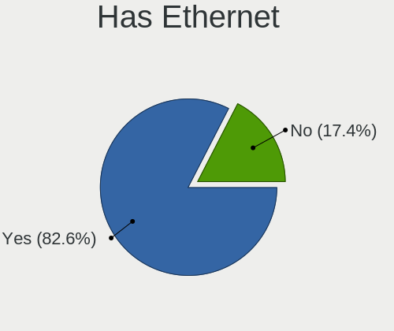
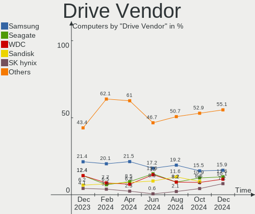
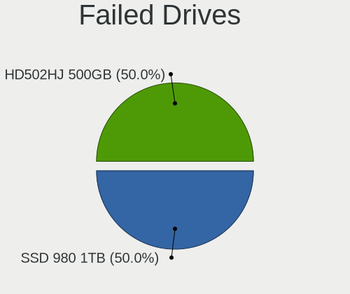
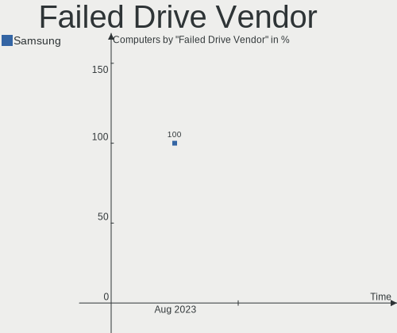
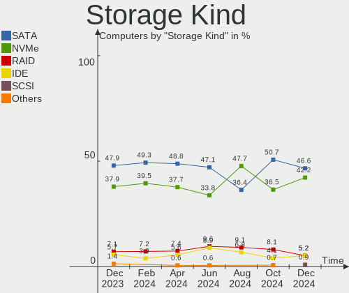
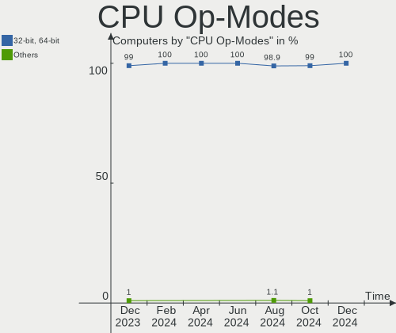
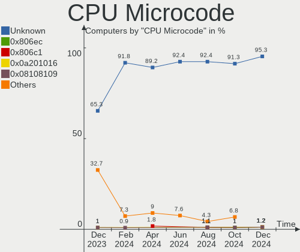
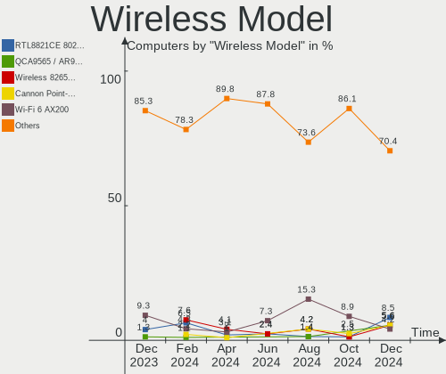
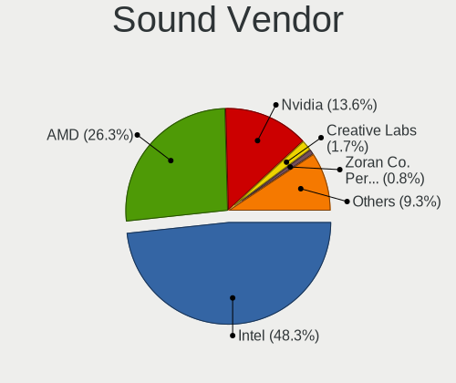

openSUSE - Hardware Trends
--------------------------

A project to identify most popular hardware characteristics and track their change
over time based on data collected by Linux users at https://Linux-Hardware.org.

Anyone can contribute to this report by the [hw-probe](https://github.com/linuxhw/hw-probe) tool:

    sudo -E hw-probe -all -upload

This is a report for all computer types. See also reports for [desktops](/Dist/openSUSE/Desktop/README.md) and [notebooks](/Dist/openSUSE/Notebook/README.md).

This report is for one last month. Overall report since the beginning of time: [TestDays](https://github.com/linuxhw/TestDays)

Period: Aug, 2023.

Contents
--------

* [ System ](#system)
  - [ OS                       ](#os)
  - [ OS Family                ](#os-family)
  - [ Kernel                   ](#kernel)
  - [ Kernel Family            ](#kernel-family)
  - [ Kernel Major Ver.        ](#kernel-major-ver)
  - [ Arch                     ](#arch)
  - [ DE                       ](#de)
  - [ Display Server           ](#display-server)
  - [ Display Manager          ](#display-manager)
  - [ OS Lang                  ](#os-lang)
  - [ Boot Mode                ](#boot-mode)
  - [ Filesystem               ](#filesystem)
  - [ Part. scheme             ](#part-scheme)
  - [ Dual Boot with Linux/BSD ](#dual-boot-with-linuxbsd)
  - [ Dual Boot (Win)          ](#dual-boot-win)

* [ Board ](#board)
  - [ Vendor                   ](#vendor)
  - [ Model                    ](#model)
  - [ Model Family             ](#model-family)
  - [ MFG Year                 ](#mfg-year)
  - [ Form Factor              ](#form-factor)
  - [ Secure Boot              ](#secure-boot)
  - [ Coreboot                 ](#coreboot)
  - [ RAM Size                 ](#ram-size)
  - [ RAM Used                 ](#ram-used)
  - [ Total Drives             ](#total-drives)
  - [ Has CD-ROM               ](#has-cd-rom)
  - [ Has Ethernet             ](#has-ethernet)
  - [ Has WiFi                 ](#has-wifi)
  - [ Has Bluetooth            ](#has-bluetooth)

* [ Location ](#location)
  - [ Country                  ](#country)
  - [ City                     ](#city)

* [ Drives ](#drives)
  - [ Drive Vendor             ](#drive-vendor)
  - [ Drive Model              ](#drive-model)
  - [ HDD Vendor               ](#hdd-vendor)
  - [ SSD Vendor               ](#ssd-vendor)
  - [ Drive Kind               ](#drive-kind)
  - [ Drive Connector          ](#drive-connector)
  - [ Drive Size               ](#drive-size)
  - [ Space Total              ](#space-total)
  - [ Space Used               ](#space-used)
  - [ Malfunc. Drives          ](#malfunc-drives)
  - [ Malfunc. Drive Vendor    ](#malfunc-drive-vendor)
  - [ Malfunc. HDD Vendor      ](#malfunc-hdd-vendor)
  - [ Malfunc. Drive Kind      ](#malfunc-drive-kind)
  - [ Failed Drives            ](#failed-drives)
  - [ Failed Drive Vendor      ](#failed-drive-vendor)
  - [ Drive Status             ](#drive-status)

* [ Storage controller ](#storage-controller)
  - [ Storage Vendor           ](#storage-vendor)
  - [ Storage Model            ](#storage-model)
  - [ Storage Kind             ](#storage-kind)

* [ Processor ](#processor)
  - [ CPU Vendor               ](#cpu-vendor)
  - [ CPU Model                ](#cpu-model)
  - [ CPU Model Family         ](#cpu-model-family)
  - [ CPU Cores                ](#cpu-cores)
  - [ CPU Sockets              ](#cpu-sockets)
  - [ CPU Threads              ](#cpu-threads)
  - [ CPU Op-Modes             ](#cpu-op-modes)
  - [ CPU Microcode            ](#cpu-microcode)
  - [ CPU Microarch            ](#cpu-microarch)

* [ Graphics ](#graphics)
  - [ GPU Vendor               ](#gpu-vendor)
  - [ GPU Model                ](#gpu-model)
  - [ GPU Combo                ](#gpu-combo)
  - [ GPU Driver               ](#gpu-driver)
  - [ GPU Memory               ](#gpu-memory)

* [ Monitor ](#monitor)
  - [ Monitor Vendor           ](#monitor-vendor)
  - [ Monitor Model            ](#monitor-model)
  - [ Monitor Resolution       ](#monitor-resolution)
  - [ Monitor Diagonal         ](#monitor-diagonal)
  - [ Monitor Width            ](#monitor-width)
  - [ Aspect Ratio             ](#aspect-ratio)
  - [ Monitor Area             ](#monitor-area)
  - [ Pixel Density            ](#pixel-density)
  - [ Multiple Monitors        ](#multiple-monitors)

* [ Network ](#network)
  - [ Net Controller Vendor    ](#net-controller-vendor)
  - [ Net Controller Model     ](#net-controller-model)
  - [ Wireless Vendor          ](#wireless-vendor)
  - [ Wireless Model           ](#wireless-model)
  - [ Ethernet Vendor          ](#ethernet-vendor)
  - [ Ethernet Model           ](#ethernet-model)
  - [ Net Controller Kind      ](#net-controller-kind)
  - [ Used Controller          ](#used-controller)
  - [ NICs                     ](#nics)
  - [ IPv6                     ](#ipv6)

* [ Bluetooth ](#bluetooth)
  - [ Bluetooth Vendor         ](#bluetooth-vendor)
  - [ Bluetooth Model          ](#bluetooth-model)

* [ Sound ](#sound)
  - [ Sound Vendor             ](#sound-vendor)
  - [ Sound Model              ](#sound-model)

* [ Memory ](#memory)
  - [ Memory Vendor            ](#memory-vendor)
  - [ Memory Model             ](#memory-model)
  - [ Memory Kind              ](#memory-kind)
  - [ Memory Form Factor       ](#memory-form-factor)
  - [ Memory Size              ](#memory-size)
  - [ Memory Speed             ](#memory-speed)

* [ Printers & scanners ](#printers--scanners)
  - [ Printer Vendor           ](#printer-vendor)
  - [ Printer Model            ](#printer-model)
  - [ Scanner Vendor           ](#scanner-vendor)
  - [ Scanner Model            ](#scanner-model)

* [ Camera ](#camera)
  - [ Camera Vendor            ](#camera-vendor)
  - [ Camera Model             ](#camera-model)

* [ Security ](#security)
  - [ Fingerprint Vendor       ](#fingerprint-vendor)
  - [ Fingerprint Model        ](#fingerprint-model)
  - [ Chipcard Vendor          ](#chipcard-vendor)
  - [ Chipcard Model           ](#chipcard-model)

* [ Unsupported ](#unsupported)
  - [ Unsupported Devices      ](#unsupported-devices)
  - [ Unsupported Device Types ](#unsupported-device-types)

System
------

OS
--

Installed operating systems

| Name                         | Computers | Percent |
|------------------------------|-----------|---------|
| openSUSE Tumbleweed-XXXXXXXX | 73        | 57.03%  |
| openSUSE Leap-15.5           | 34        | 26.56%  |
| openSUSE Microos-XXXXXXXX    | 12        | 9.38%   |
| openSUSE Leap-15.4           | 8         | 6.25%   |
| openSUSE 42.3                | 1         | 0.78%   |

OS Family
---------

OS without a version

| Name     | Computers | Percent |
|----------|-----------|---------|
| openSUSE | 128       | 100%    |

Kernel
------

Version of the Linux kernel

| Version                      | Computers | Percent |
|------------------------------|-----------|---------|
| 6.4.9-1-default              | 21        | 16.41%  |
| 6.4.6-1-default              | 19        | 14.84%  |
| 6.4.11-1-default             | 19        | 14.84%  |
| 6.4.8-1-default              | 18        | 14.06%  |
| 5.14.21-150500.55.19-default | 11        | 8.59%   |
| 5.14.21-150500.55.12-default | 11        | 8.59%   |
| 5.14.21-150500.55.7-default  | 7         | 5.47%   |
| 5.14.21-150500.53-default    | 5         | 3.91%   |
| 5.14.21-150400.24.69-default | 4         | 3.13%   |
| 6.4.3-1-default              | 2         | 1.56%   |
| 6.3.9-1-default              | 2         | 1.56%   |
| 6.4.6-1-pae                  | 1         | 0.78%   |
| 6.4.4-1-default              | 1         | 0.78%   |
| 6.2.9-1-default              | 1         | 0.78%   |
| 6.1.12-1-default             | 1         | 0.78%   |
| 5.3.18-lp152.72-default      | 1         | 0.78%   |
| 5.14.21-150400.24.81-default | 1         | 0.78%   |
| 5.14.21-150400.24.74-default | 1         | 0.78%   |
| 5.14.21-150400.24.38-default | 1         | 0.78%   |
| 5.14.21-150400.22-default    | 1         | 0.78%   |

Kernel Family
-------------

Linux kernel without a distro release

| Version | Computers | Percent |
|---------|-----------|---------|
| 5.14.21 | 42        | 32.81%  |
| 6.4.9   | 21        | 16.41%  |
| 6.4.6   | 20        | 15.63%  |
| 6.4.11  | 19        | 14.84%  |
| 6.4.8   | 18        | 14.06%  |
| 6.4.3   | 2         | 1.56%   |
| 6.3.9   | 2         | 1.56%   |
| 6.4.4   | 1         | 0.78%   |
| 6.2.9   | 1         | 0.78%   |
| 6.1.12  | 1         | 0.78%   |
| 5.3.18  | 1         | 0.78%   |

Kernel Major Ver.
-----------------

Linux kernel major version

| Version | Computers | Percent |
|---------|-----------|---------|
| 6.4     | 81        | 63.28%  |
| 5.14    | 42        | 32.81%  |
| 6.3     | 2         | 1.56%   |
| 6.2     | 1         | 0.78%   |
| 6.1     | 1         | 0.78%   |
| 5.3     | 1         | 0.78%   |

Arch
----

OS architecture (x86_64, i586, etc.)

| Name   | Computers | Percent |
|--------|-----------|---------|
| x86_64 | 126       | 98.44%  |
| i686   | 1         | 0.78%   |
| armv7l | 1         | 0.78%   |

DE
--

Desktop Environment

| Name     | Computers | Percent |
|----------|-----------|---------|
| KDE5     | 82        | 64.06%  |
| GNOME    | 35        | 27.34%  |
| Unknown  | 5         | 3.91%   |
| XFCE     | 4         | 3.13%   |
| sway     | 1         | 0.78%   |
| Hyprland | 1         | 0.78%   |

Display Server
--------------

X11 or Wayland

| Name    | Computers | Percent |
|---------|-----------|---------|
| X11     | 88        | 68.75%  |
| Wayland | 36        | 28.13%  |
| Tty     | 3         | 2.34%   |
| Unknown | 1         | 0.78%   |

Display Manager
---------------

SDDM, LightDM, etc.

| Name    | Computers | Percent |
|---------|-----------|---------|
| Unknown | 79        | 61.72%  |
| SDDM    | 33        | 25.78%  |
| LightDM | 8         | 6.25%   |
| GDM     | 4         | 3.13%   |
| XDM     | 3         | 2.34%   |
| GREETD  | 1         | 0.78%   |

OS Lang
-------

Language

| Lang            | Computers | Percent |
|-----------------|-----------|---------|
| en_US           | 56        | 43.75%  |
| de_DE           | 27        | 21.09%  |
| en_GB           | 9         | 7.03%   |
| POSIX           | 8         | 6.25%   |
| ru_RU           | 5         | 3.91%   |
| pt_BR           | 5         | 3.91%   |
| es_ES           | 4         | 3.13%   |
| pl_PL           | 2         | 1.56%   |
| es_DO           | 2         | 1.56%   |
| zh_CN           | 1         | 0.78%   |
| nb_NO           | 1         | 0.78%   |
| it_IT           | 1         | 0.78%   |
| fr_FR           | 1         | 0.78%   |
| es_MX           | 1         | 0.78%   |
| en_ZA           | 1         | 0.78%   |
| en_US.ISO8859-1 | 1         | 0.78%   |
| en_DK           | 1         | 0.78%   |
| el_GR           | 1         | 0.78%   |
| C               | 1         | 0.78%   |

Boot Mode
---------

EFI or BIOS

| Mode | Computers | Percent |
|------|-----------|---------|
| EFI  | 80        | 62.5%   |
| BIOS | 48        | 37.5%   |

Filesystem
----------

Type of filesystem

| Type    | Computers | Percent |
|---------|-----------|---------|
| Btrfs   | 102       | 79.69%  |
| Ext4    | 21        | 16.41%  |
| Xfs     | 2         | 1.56%   |
| Tmpfs   | 2         | 1.56%   |
| Overlay | 1         | 0.78%   |

Part. scheme
------------

Scheme of partitioning

| Type    | Computers | Percent |
|---------|-----------|---------|
| Unknown | 75        | 58.59%  |
| GPT     | 46        | 35.94%  |
| MBR     | 7         | 5.47%   |

Dual Boot with Linux/BSD
------------------------

Hosting more than one Linux/BSD

| Dual boot | Computers | Percent |
|-----------|-----------|---------|
| No        | 115       | 89.84%  |
| Yes       | 13        | 10.16%  |

Dual Boot (Win)
---------------

Hosting Linux and Windows

| Dual boot | Computers | Percent |
|-----------|-----------|---------|
| No        | 108       | 84.38%  |
| Yes       | 20        | 15.63%  |

Board
-----

Vendor
------

Motherboard manufacturer

| Name                | Computers | Percent |
|---------------------|-----------|---------|
| Dell                | 21        | 16.41%  |
| Hewlett-Packard     | 18        | 14.06%  |
| ASUSTek Computer    | 16        | 12.5%   |
| Lenovo              | 15        | 11.72%  |
| Gigabyte Technology | 9         | 7.03%   |
| Acer                | 7         | 5.47%   |
| MSI                 | 6         | 4.69%   |
| ASRock              | 6         | 4.69%   |
| Intel               | 3         | 2.34%   |
| Apple               | 3         | 2.34%   |
| Toshiba             | 2         | 1.56%   |
| Samsung Electronics | 2         | 1.56%   |
| Microsoft           | 2         | 1.56%   |
| Biostar             | 2         | 1.56%   |
| AZW                 | 2         | 1.56%   |
| Unknown             | 2         | 1.56%   |
| Supermicro          | 1         | 0.78%   |
| Sun Microsystems    | 1         | 0.78%   |
| SLIMBOOK            | 1         | 0.78%   |
| Schenker            | 1         | 0.78%   |
| Notebook            | 1         | 0.78%   |
| HUAWEI              | 1         | 0.78%   |
| Huanan              | 1         | 0.78%   |
| GPU Company         | 1         | 0.78%   |
| Fujitsu             | 1         | 0.78%   |
| Framework           | 1         | 0.78%   |
| Colorful Technology | 1         | 0.78%   |
| Alienware           | 1         | 0.78%   |

Model
-----

Motherboard model

| Name                                                                                     | Computers | Percent |
|------------------------------------------------------------------------------------------|-----------|---------|
| Lenovo ThinkCentre E73 10AS00DDUS                                                        | 2         | 1.56%   |
| Dell PowerEdge R815                                                                      | 2         | 1.56%   |
| Dell Latitude 5414                                                                       | 2         | 1.56%   |
| ASUS ROG STRIX B550-F GAMING                                                             | 2         | 1.56%   |
| Unknown                                                                                  | 2         | 1.56%   |
| Toshiba Satellite Pro C70-A                                                              | 1         | 0.78%   |
| Toshiba QOSMIO X775                                                                      | 1         | 0.78%   |
| Supermicro SSG-6047R-E1CR36N                                                             | 1         | 0.78%   |
| Sun Microsystems Ultra 24                                                                | 1         | 0.78%   |
| SLIMBOOK PROX-AMD5                                                                       | 1         | 0.78%   |
| Schenker XMG FOCUS (Mid 2021)                                                            | 1         | 0.78%   |
| Samsung 355V4C/355V4X/355V5C/355V5X/356V4C/356V4X/356V5C/356V5X/3445VC/3445VX/3545VC/354 | 1         | 0.78%   |
| Samsung 300E5M/300E5L                                                                    | 1         | 0.78%   |
| Notebook NLx0MU                                                                          | 1         | 0.78%   |
| MSI Sword 17 A11UD                                                                       | 1         | 0.78%   |
| MSI MS-7B85                                                                              | 1         | 0.78%   |
| MSI MS-7B78                                                                              | 1         | 0.78%   |
| MSI MS-7A34                                                                              | 1         | 0.78%   |
| MSI MS-7A33                                                                              | 1         | 0.78%   |
| MSI MS-7817                                                                              | 1         | 0.78%   |
| Microsoft Surface Pro 4                                                                  | 1         | 0.78%   |
| Microsoft Surface Laptop 3                                                               | 1         | 0.78%   |
| Lenovo Yoga 7 14ARB7 82QF                                                                | 1         | 0.78%   |
| Lenovo ThinkPad X270 20HMS12K00                                                          | 1         | 0.78%   |
| Lenovo ThinkPad X1 Carbon 7th 20QD001VUS                                                 | 1         | 0.78%   |
| Lenovo ThinkPad T480s 20L8S4GU00                                                         | 1         | 0.78%   |
| Lenovo ThinkPad T470p 20J60014PB                                                         | 1         | 0.78%   |
| Lenovo ThinkPad T440s 20AQ005TUS                                                         | 1         | 0.78%   |
| Lenovo ThinkPad T420 42364A1                                                             | 1         | 0.78%   |
| Lenovo ThinkPad P50 20EQS5C701                                                           | 1         | 0.78%   |
| Lenovo ThinkPad P15s Gen 1 20T40008UK                                                    | 1         | 0.78%   |
| Lenovo ThinkBook 16p Gen 2 20YM                                                          | 1         | 0.78%   |
| Lenovo K14 Gen 1 21CUS02600                                                              | 1         | 0.78%   |
| Lenovo IdeaPadFlex 5 14IAU7 82R7                                                         | 1         | 0.78%   |
| Lenovo IdeaPad 330-15IKB 81DE                                                            | 1         | 0.78%   |
| Intel Nobilis                                                                            | 1         | 0.78%   |
| Intel MAHOBAY                                                                            | 1         | 0.78%   |
| Intel DZ77SL-50K AAG55115-300                                                            | 1         | 0.78%   |
| HUAWEI CREF-XX                                                                           | 1         | 0.78%   |
| Huanan X99-ZD4 V2.1                                                                      | 1         | 0.78%   |

Model Family
------------

Motherboard model prefix

| Name                         | Computers | Percent |
|------------------------------|-----------|---------|
| Lenovo ThinkPad              | 8         | 6.25%   |
| Acer Aspire                  | 6         | 4.69%   |
| Dell Latitude                | 5         | 3.91%   |
| HP Laptop                    | 4         | 3.13%   |
| Dell PowerEdge               | 4         | 3.13%   |
| ASUS ROG                     | 4         | 3.13%   |
| HP EliteBook                 | 3         | 2.34%   |
| Dell XPS                     | 3         | 2.34%   |
| Dell Precision               | 3         | 2.34%   |
| Microsoft Surface            | 2         | 1.56%   |
| Lenovo ThinkCentre           | 2         | 1.56%   |
| HP OMEN                      | 2         | 1.56%   |
| Dell Vostro                  | 2         | 1.56%   |
| Dell Inspiron                | 2         | 1.56%   |
| ASUS ASUS                    | 2         | 1.56%   |
| Unknown                      | 2         | 1.56%   |
| Toshiba Satellite            | 1         | 0.78%   |
| Toshiba QOSMIO               | 1         | 0.78%   |
| Supermicro SSG-6047R-E1CR36N | 1         | 0.78%   |
| Sun Microsystems Ultra       | 1         | 0.78%   |
| SLIMBOOK PROX-AMD5           | 1         | 0.78%   |
| Schenker XMG                 | 1         | 0.78%   |
| Samsung 355V4C               | 1         | 0.78%   |
| Samsung 300E5M               | 1         | 0.78%   |
| Notebook NLx0MU              | 1         | 0.78%   |
| MSI Sword                    | 1         | 0.78%   |
| MSI MS-7B85                  | 1         | 0.78%   |
| MSI MS-7B78                  | 1         | 0.78%   |
| MSI MS-7A34                  | 1         | 0.78%   |
| MSI MS-7A33                  | 1         | 0.78%   |
| MSI MS-7817                  | 1         | 0.78%   |
| Lenovo Yoga                  | 1         | 0.78%   |
| Lenovo ThinkBook             | 1         | 0.78%   |
| Lenovo K14                   | 1         | 0.78%   |
| Lenovo IdeaPadFlex           | 1         | 0.78%   |
| Lenovo IdeaPad               | 1         | 0.78%   |
| Intel Nobilis                | 1         | 0.78%   |
| Intel MAHOBAY                | 1         | 0.78%   |
| Intel DZ77SL-50K             | 1         | 0.78%   |
| HUAWEI CREF-XX               | 1         | 0.78%   |

MFG Year
--------

Motherboard manufacture year

| Year | Computers | Percent |
|------|-----------|---------|
| 2022 | 15        | 11.72%  |
| 2018 | 13        | 10.16%  |
| 2021 | 12        | 9.38%   |
| 2019 | 12        | 9.38%   |
| 2013 | 11        | 8.59%   |
| 2020 | 9         | 7.03%   |
| 2017 | 9         | 7.03%   |
| 2012 | 8         | 6.25%   |
| 2016 | 7         | 5.47%   |
| 2015 | 7         | 5.47%   |
| 2023 | 6         | 4.69%   |
| 2014 | 6         | 4.69%   |
| 2010 | 5         | 3.91%   |
| 2008 | 3         | 2.34%   |
| 2011 | 2         | 1.56%   |
| 2009 | 2         | 1.56%   |
| 2007 | 1         | 0.78%   |

Form Factor
-----------

Physical design of the computer

| Name        | Computers | Percent |
|-------------|-----------|---------|
| Notebook    | 60        | 46.88%  |
| Desktop     | 54        | 42.19%  |
| Convertible | 5         | 3.91%   |
| Server      | 5         | 3.91%   |
| Tablet      | 2         | 1.56%   |
| Mini pc     | 1         | 0.78%   |
| All in one  | 1         | 0.78%   |

Secure Boot
-----------

Enabled or disabled

| State    | Computers | Percent |
|----------|-----------|---------|
| Disabled | 107       | 83.59%  |
| Enabled  | 21        | 16.41%  |

Coreboot
--------

Have coreboot on board

| Used | Computers | Percent |
|------|-----------|---------|
| No   | 128       | 100%    |

RAM Size
--------

Total RAM memory

| Size in GB      | Computers | Percent |
|-----------------|-----------|---------|
| 16.01-24.0      | 39        | 30.47%  |
| 32.01-64.0      | 24        | 18.75%  |
| 8.01-16.0       | 23        | 17.97%  |
| 4.01-8.0        | 22        | 17.19%  |
| 64.01-256.0     | 9         | 7.03%   |
| 3.01-4.0        | 6         | 4.69%   |
| 24.01-32.0      | 3         | 2.34%   |
| More than 256.0 | 1         | 0.78%   |
| 0.01-0.5        | 1         | 0.78%   |

RAM Used
--------

Used RAM memory

| Used GB    | Computers | Percent |
|------------|-----------|---------|
| 2.01-3.0   | 36        | 28.13%  |
| 4.01-8.0   | 34        | 26.56%  |
| 1.01-2.0   | 22        | 17.19%  |
| 3.01-4.0   | 20        | 15.63%  |
| 8.01-16.0  | 11        | 8.59%   |
| 0.51-1.0   | 3         | 2.34%   |
| 16.01-24.0 | 1         | 0.78%   |
| 0.01-0.5   | 1         | 0.78%   |

Total Drives
------------

Number of drives on board

| Drives | Computers | Percent |
|--------|-----------|---------|
| 1      | 55        | 42.97%  |
| 2      | 31        | 24.22%  |
| 3      | 17        | 13.28%  |
| 4      | 11        | 8.59%   |
| 6      | 5         | 3.91%   |
| 0      | 4         | 3.13%   |
| 5      | 3         | 2.34%   |
| 10     | 1         | 0.78%   |
| 8      | 1         | 0.78%   |

Has CD-ROM
----------

Has CD-ROM on board

| Presented | Computers | Percent |
|-----------|-----------|---------|
| No        | 81        | 63.28%  |
| Yes       | 47        | 36.72%  |

Has Ethernet
------------

Has Ethernet on board

| Presented | Computers | Percent |
|-----------|-----------|---------|
| Yes       | 112       | 87.5%   |
| No        | 16        | 12.5%   |

Has WiFi
--------

Has WiFi module

| Presented | Computers | Percent |
|-----------|-----------|---------|
| Yes       | 93        | 72.66%  |
| No        | 35        | 27.34%  |

Has Bluetooth
-------------

Has Bluetooth module

| Presented | Computers | Percent |
|-----------|-----------|---------|
| Yes       | 88        | 68.75%  |
| No        | 40        | 31.25%  |

Location
--------

Country
-------

Geographic location (country)

| Country      | Computers | Percent |
|--------------|-----------|---------|
| USA          | 29        | 22.66%  |
| Germany      | 27        | 21.09%  |
| Brazil       | 9         | 7.03%   |
| Russia       | 7         | 5.47%   |
| UK           | 5         | 3.91%   |
| Australia    | 5         | 3.91%   |
| Poland       | 4         | 3.13%   |
| Spain        | 3         | 2.34%   |
| Netherlands  | 3         | 2.34%   |
| Canada       | 3         | 2.34%   |
| Switzerland  | 2         | 1.56%   |
| Sweden       | 2         | 1.56%   |
| South Africa | 2         | 1.56%   |
| Serbia       | 2         | 1.56%   |
| Mexico       | 2         | 1.56%   |
| Greece       | 2         | 1.56%   |
| Finland      | 2         | 1.56%   |
| Colombia     | 2         | 1.56%   |
| Vietnam      | 1         | 0.78%   |
| Taiwan       | 1         | 0.78%   |
| Romania      | 1         | 0.78%   |
| Puerto Rico  | 1         | 0.78%   |
| Portugal     | 1         | 0.78%   |
| Norway       | 1         | 0.78%   |
| Italy        | 1         | 0.78%   |
| Ireland      | 1         | 0.78%   |
| Indonesia    | 1         | 0.78%   |
| France       | 1         | 0.78%   |
| Egypt        | 1         | 0.78%   |
| Czechia      | 1         | 0.78%   |
| China        | 1         | 0.78%   |
| Chile        | 1         | 0.78%   |
| Austria      | 1         | 0.78%   |
| Argentina    | 1         | 0.78%   |
| Afghanistan  | 1         | 0.78%   |

City
----

Geographic location (city)

| City                  | Computers | Percent |
|-----------------------|-----------|---------|
| Sydney                | 3         | 2.34%   |
| Hamburg               | 3         | 2.34%   |
| Cleveland             | 3         | 2.34%   |
| Stuttgart             | 2         | 1.56%   |
| Stockholm             | 2         | 1.56%   |
| Rotterdam             | 2         | 1.56%   |
| Rio de Janeiro        | 2         | 1.56%   |
| Melbourne             | 2         | 1.56%   |
| Johannesburg          | 2         | 1.56%   |
| Frankfurt am Main     | 2         | 1.56%   |
| Belgrade              | 2         | 1.56%   |
| Winston-Salem         | 1         | 0.78%   |
| West Jordan           | 1         | 0.78%   |
| West Bend             | 1         | 0.78%   |
| Welch                 | 1         | 0.78%   |
| Warsaw                | 1         | 0.78%   |
| Waidhofen an der Ybbs | 1         | 0.78%   |
| Vestal                | 1         | 0.78%   |
| Vantaa                | 1         | 0.78%   |
| Tucson                | 1         | 0.78%   |
| Trikala               | 1         | 0.78%   |
| Tolyatti              | 1         | 0.78%   |
| Tinjomoyo             | 1         | 0.78%   |
| Timmins               | 1         | 0.78%   |
| The Villages          | 1         | 0.78%   |
| Teaneck               | 1         | 0.78%   |
| Tay Ninh              | 1         | 0.78%   |
| Tampico               | 1         | 0.78%   |
| Taichung              | 1         | 0.78%   |
| Suceava               | 1         | 0.78%   |
| Staraya Russa         | 1         | 0.78%   |
| St Petersburg         | 1         | 0.78%   |
| Soest                 | 1         | 0.78%   |
| Shijiazhuang          | 1         | 0.78%   |
| Sao Luís             | 1         | 0.78%   |
| Sao José dos Campos  | 1         | 0.78%   |
| San Juan              | 1         | 0.78%   |
| Salvador              | 1         | 0.78%   |
| Sacramento            | 1         | 0.78%   |
| Rogers                | 1         | 0.78%   |

Drives
------

Drive Vendor
------------

Hard drive vendors

| Vendor                      | Computers | Drives | Percent |
|-----------------------------|-----------|--------|---------|
| Samsung Electronics         | 37        | 52     | 17.79%  |
| WDC                         | 26        | 41     | 12.5%   |
| Seagate                     | 25        | 31     | 12.02%  |
| SanDisk                     | 14        | 16     | 6.73%   |
| Crucial                     | 13        | 16     | 6.25%   |
| Kingston                    | 9         | 11     | 4.33%   |
| Unknown                     | 6         | 7      | 2.88%   |
| Toshiba                     | 5         | 9      | 2.4%    |
| SPCC                        | 5         | 5      | 2.4%    |
| SK hynix                    | 5         | 10     | 2.4%    |
| Micron Technology           | 5         | 5      | 2.4%    |
| KIOXIA                      | 5         | 5      | 2.4%    |
| Hitachi                     | 5         | 5      | 2.4%    |
| Silicon Motion              | 4         | 4      | 1.92%   |
| Phison Electronics          | 4         | 4      | 1.92%   |
| Intel                       | 4         | 5      | 1.92%   |
| Micron/Crucial Technology   | 3         | 3      | 1.44%   |
| Kingston Technology Company | 3         | 3      | 1.44%   |
| China                       | 3         | 3      | 1.44%   |
| Phison                      | 2         | 2      | 0.96%   |
| Fanxiang                    | 2         | 2      | 0.96%   |
| ADATA Technology            | 2         | 2      | 0.96%   |
| XrayDisk                    | 1         | 1      | 0.48%   |
| Wibtek                      | 1         | 1      | 0.48%   |
| VSP-128G                    | 1         | 1      | 0.48%   |
| Team                        | 1         | 4      | 0.48%   |
| Realtek                     | 1         | 1      | 0.48%   |
| Radeon                      | 1         | 1      | 0.48%   |
| Plextor                     | 1         | 1      | 0.48%   |
| Patriot                     | 1         | 1      | 0.48%   |
| OCZ                         | 1         | 1      | 0.48%   |
| MAXIO Technology (Hangzhou) | 1         | 1      | 0.48%   |
| LITEON                      | 1         | 1      | 0.48%   |
| KingSpec                    | 1         | 1      | 0.48%   |
| JMicron Technology          | 1         | 1      | 0.48%   |
| Intenso                     | 1         | 1      | 0.48%   |
| HS-SSD-C100                 | 1         | 1      | 0.48%   |
| HGST                        | 1         | 1      | 0.48%   |
| Gigabyte Technology         | 1         | 1      | 0.48%   |
| Fujitsu                     | 1         | 1      | 0.48%   |

Drive Model
-----------

Hard drive models

| Model                                                           | Computers | Percent |
|-----------------------------------------------------------------|-----------|---------|
| Samsung NVMe SSD Controller SM981/PM981/PM983 500GB             | 6         | 2.52%   |
| Samsung NVMe SSD Controller SM961/PM961/SM963 1024GB            | 5         | 2.1%    |
| Samsung NVMe SSD Controller PM9A1/PM9A3/980PRO 1024GB           | 4         | 1.68%   |
| Silicon Motion SM2262/SM2262EN SSD Controller 1024GB            | 3         | 1.26%   |
| Seagate ST1000DM010-2EP102 1TB                                  | 3         | 1.26%   |
| Sandisk WD Black SN850 256GB                                    | 3         | 1.26%   |
| Phison E12 NVMe Controller 256GB                                | 3         | 1.26%   |
| Kingston SA400S37240G 240GB SSD                                 | 3         | 1.26%   |
| Crucial CT500MX500SSD1 500GB                                    | 3         | 1.26%   |
| WDC WD10EADS-00M2B0 1TB                                         | 2         | 0.84%   |
| Unknown USB DISK 3.2 250GB                                      | 2         | 0.84%   |
| SPCC Solid State Disk 256GB                                     | 2         | 0.84%   |
| Seagate ST500DM002-1BD142 500GB                                 | 2         | 0.84%   |
| Seagate ST2000DM006-2DM164 2TB                                  | 2         | 0.84%   |
| Sandisk WD_BLACK SN850X 1000GB                                  | 2         | 0.84%   |
| Sandisk WD_BLACK SN770 1TB                                      | 2         | 0.84%   |
| Samsung SSD 870 QVO 2TB                                         | 2         | 0.84%   |
| Samsung SSD 870 EVO 500GB                                       | 2         | 0.84%   |
| Samsung SSD 870 EVO 2TB                                         | 2         | 0.84%   |
| Samsung SSD 860 EVO 1TB                                         | 2         | 0.84%   |
| Samsung SSD 850 EVO 500GB                                       | 2         | 0.84%   |
| Samsung SSD 850 EVO 250GB                                       | 2         | 0.84%   |
| Samsung SSD 830 Series 256GB                                    | 2         | 0.84%   |
| Samsung PM991a NVMe 512GB                                       | 2         | 0.84%   |
| Samsung MZVLQ512HBLU-00BH1 512GB                                | 2         | 0.84%   |
| Micron/Crucial P2 NVMe PCIe SSD 1TB                             | 2         | 0.84%   |
| Kingston SA400S37480G 480GB SSD                                 | 2         | 0.84%   |
| Intel SSD 660P Series 512GB                                     | 2         | 0.84%   |
| Crucial CT480BX500SSD1 480GB                                    | 2         | 0.84%   |
| Crucial CT250MX500SSD1 250GB                                    | 2         | 0.84%   |
| China SSD 240GB                                                 | 2         | 0.84%   |
| ADATA XPG SX8200 Pro PCIe Gen3x4 M.2 2280 Solid State Drive 2TB | 2         | 0.84%   |
| XrayDisk 512GB SSD                                              | 1         | 0.42%   |
| Wibtek W800S 512GB SSD                                          | 1         | 0.42%   |
| WDC WDS500G2B0A-00SM50 500GB SSD                                | 1         | 0.42%   |
| WDC WDS200T2B0B 2TB SSD                                         | 1         | 0.42%   |
| WDC WDS200T1R0A-68A4W0 2TB                                      | 1         | 0.42%   |
| WDC WD7500LPCX-60HWST0 752GB                                    | 1         | 0.42%   |
| WDC WD7500BPVX-75JC3T0 752GB                                    | 1         | 0.42%   |
| WDC WD740HLFS-01G6U4 74GB                                       | 1         | 0.42%   |

HDD Vendor
----------

Hard disk drive vendors

| Vendor              | Computers | Drives | Percent |
|---------------------|-----------|--------|---------|
| Seagate             | 25        | 31     | 39.68%  |
| WDC                 | 24        | 36     | 38.1%   |
| Hitachi             | 5         | 5      | 7.94%   |
| Toshiba             | 3         | 7      | 4.76%   |
| Samsung Electronics | 3         | 6      | 4.76%   |
| Unknown             | 1         | 1      | 1.59%   |
| HGST                | 1         | 1      | 1.59%   |
| Fujitsu             | 1         | 1      | 1.59%   |

SSD Vendor
----------

Solid state drive vendors

| Vendor              | Computers | Drives | Percent |
|---------------------|-----------|--------|---------|
| Samsung Electronics | 19        | 22     | 25.33%  |
| Crucial             | 13        | 16     | 17.33%  |
| Kingston            | 7         | 9      | 9.33%   |
| SPCC                | 5         | 5      | 6.67%   |
| WDC                 | 4         | 5      | 5.33%   |
| SanDisk             | 4         | 4      | 5.33%   |
| China               | 3         | 3      | 4%      |
| XrayDisk            | 1         | 1      | 1.33%   |
| Wibtek              | 1         | 1      | 1.33%   |
| VSP-128G            | 1         | 1      | 1.33%   |
| Unknown             | 1         | 1      | 1.33%   |
| Toshiba             | 1         | 1      | 1.33%   |
| Team                | 1         | 4      | 1.33%   |
| Radeon              | 1         | 1      | 1.33%   |
| Plextor             | 1         | 1      | 1.33%   |
| Phison              | 1         | 1      | 1.33%   |
| Patriot             | 1         | 1      | 1.33%   |
| OCZ                 | 1         | 1      | 1.33%   |
| Micron Technology   | 1         | 1      | 1.33%   |
| LITEON              | 1         | 1      | 1.33%   |
| KingSpec            | 1         | 1      | 1.33%   |
| JMicron Technology  | 1         | 1      | 1.33%   |
| Intenso             | 1         | 1      | 1.33%   |
| Intel               | 1         | 1      | 1.33%   |
| Gigabyte Technology | 1         | 1      | 1.33%   |
| Fanxiang            | 1         | 1      | 1.33%   |
| Drevo               | 1         | 2      | 1.33%   |

Drive Kind
----------

HDD or SSD

| Kind    | Computers | Drives | Percent |
|---------|-----------|--------|---------|
| NVMe    | 63        | 83     | 35%     |
| SSD     | 63        | 88     | 35%     |
| HDD     | 48        | 88     | 26.67%  |
| Unknown | 4         | 4      | 2.22%   |
| MMC     | 2         | 3      | 1.11%   |

Drive Connector
---------------

SATA, SAS, NVMe, etc.

| Type | Computers | Drives | Percent |
|------|-----------|--------|---------|
| SATA | 83        | 169    | 52.53%  |
| NVMe | 63        | 82     | 39.87%  |
| SAS  | 10        | 12     | 6.33%   |
| MMC  | 2         | 3      | 1.27%   |

Drive Size
----------

Size of hard drive

| Size in TB | Computers | Drives | Percent |
|------------|-----------|--------|---------|
| 0.01-0.5   | 53        | 92     | 47.75%  |
| 0.51-1.0   | 34        | 46     | 30.63%  |
| 1.01-2.0   | 15        | 24     | 13.51%  |
| 4.01-10.0  | 4         | 7      | 3.6%    |
| 3.01-4.0   | 3         | 5      | 2.7%    |
| 2.01-3.0   | 1         | 1      | 0.9%    |
| 10.01-20.0 | 1         | 1      | 0.9%    |

Space Total
-----------

Amount of disk space available on the file system

| Size in GB     | Computers | Percent |
|----------------|-----------|---------|
| More than 3000 | 52        | 40.63%  |
| 1001-2000      | 26        | 20.31%  |
| 501-1000       | 16        | 12.5%   |
| 2001-3000      | 14        | 10.94%  |
| 101-250        | 9         | 7.03%   |
| 251-500        | 7         | 5.47%   |
| Unknown        | 2         | 1.56%   |
| 21-50          | 1         | 0.78%   |
| 1-20           | 1         | 0.78%   |

Space Used
----------

Amount of used disk space

| Used GB        | Computers | Percent |
|----------------|-----------|---------|
| 251-500        | 23        | 17.97%  |
| 101-250        | 23        | 17.97%  |
| 51-100         | 21        | 16.41%  |
| 501-1000       | 16        | 12.5%   |
| 1001-2000      | 15        | 11.72%  |
| More than 3000 | 10        | 7.81%   |
| 21-50          | 7         | 5.47%   |
| 1-20           | 6         | 4.69%   |
| 2001-3000      | 5         | 3.91%   |
| Unknown        | 2         | 1.56%   |

Malfunc. Drives
---------------

Drive models with a malfunction

| Model                                               | Computers | Drives | Percent |
|-----------------------------------------------------|-----------|--------|---------|
| WDC WD60EFRX-68MYMN1 6TB                            | 1         | 1      | 14.29%  |
| WDC WD20EZRX-00D8PB0 2TB                            | 1         | 1      | 14.29%  |
| WDC WD10SPZX-60Z10T0 1TB                            | 1         | 1      | 14.29%  |
| WDC WD10EVDS-63N5B1 1TB                             | 1         | 2      | 14.29%  |
| Seagate ST500LM012 HN-M500MBB 500GB                 | 1         | 1      | 14.29%  |
| Micron Technology MTFDDAV512TBN-1AR15ABHA 512GB SSD | 1         | 1      | 14.29%  |
| Kingston SA400S37120G 120GB SSD                     | 1         | 3      | 14.29%  |

Malfunc. Drive Vendor
---------------------

Vendors of faulty drives

| Vendor            | Computers | Drives | Percent |
|-------------------|-----------|--------|---------|
| WDC               | 4         | 5      | 57.14%  |
| Seagate           | 1         | 1      | 14.29%  |
| Micron Technology | 1         | 1      | 14.29%  |
| Kingston          | 1         | 3      | 14.29%  |

Malfunc. HDD Vendor
-------------------

Vendors of faulty HDD drives

| Vendor  | Computers | Drives | Percent |
|---------|-----------|--------|---------|
| WDC     | 4         | 5      | 80%     |
| Seagate | 1         | 1      | 20%     |

Malfunc. Drive Kind
-------------------

Kinds of faulty drives

| Kind | Computers | Drives | Percent |
|------|-----------|--------|---------|
| HDD  | 5         | 6      | 71.43%  |
| SSD  | 2         | 4      | 28.57%  |

Failed Drives
-------------

Failed drive models

| Model                             | Computers | Drives | Percent |
|-----------------------------------|-----------|--------|---------|
| Samsung Electronics SSD 980 1TB   | 1         | 1      | 50%     |
| Samsung Electronics HD502HJ 500GB | 1         | 2      | 50%     |

Failed Drive Vendor
-------------------

Failed drive vendors

| Vendor              | Computers | Drives | Percent |
|---------------------|-----------|--------|---------|
| Samsung Electronics | 2         | 3      | 100%    |

Drive Status
------------

Number of failed and malfunc. drives

| Status   | Computers | Drives | Percent |
|----------|-----------|--------|---------|
| Detected | 75        | 161    | 58.14%  |
| Works    | 47        | 92     | 36.43%  |
| Malfunc  | 5         | 10     | 3.88%   |
| Failed   | 2         | 3      | 1.55%   |

Storage controller
------------------

Storage Vendor
--------------

Storage controller vendors

| Vendor                       | Computers | Percent |
|------------------------------|-----------|---------|
| Intel                        | 69        | 36.51%  |
| AMD                          | 31        | 16.4%   |
| Samsung Electronics          | 23        | 12.17%  |
| SanDisk                      | 10        | 5.29%   |
| SK hynix                     | 5         | 2.65%   |
| Marvell Technology Group     | 5         | 2.65%   |
| KIOXIA                       | 5         | 2.65%   |
| Kingston Technology Company  | 5         | 2.65%   |
| Silicon Motion               | 4         | 2.12%   |
| Phison Electronics           | 4         | 2.12%   |
| Micron Technology            | 4         | 2.12%   |
| ASMedia Technology           | 4         | 2.12%   |
| Micron/Crucial Technology    | 3         | 1.59%   |
| Broadcom / LSI               | 3         | 1.59%   |
| ADATA Technology             | 3         | 1.59%   |
| LSI Logic / Symbios Logic    | 2         | 1.06%   |
| JMicron Technology           | 2         | 1.06%   |
| Toshiba America Info Systems | 1         | 0.53%   |
| Silicon Image                | 1         | 0.53%   |
| Nvidia                       | 1         | 0.53%   |
| MAXIO Technology (Hangzhou)  | 1         | 0.53%   |
| INNOGRIT                     | 1         | 0.53%   |
| Dell                         | 1         | 0.53%   |
| Adaptec                      | 1         | 0.53%   |

Storage Model
-------------

Storage controller models

| Model                                                                          | Computers | Percent |
|--------------------------------------------------------------------------------|-----------|---------|
| AMD FCH SATA Controller [AHCI mode]                                            | 14        | 6.39%   |
| Samsung NVMe SSD Controller 980                                                | 8         | 3.65%   |
| Intel Sunrise Point-LP SATA Controller [AHCI mode]                             | 8         | 3.65%   |
| AMD 500 Series Chipset SATA Controller                                         | 7         | 3.2%    |
| Samsung NVMe SSD Controller SM981/PM981/PM983                                  | 6         | 2.74%   |
| Intel C600/X79 series chipset 6-Port SATA AHCI Controller                      | 6         | 2.74%   |
| Samsung NVMe SSD Controller SM961/PM961/SM963                                  | 5         | 2.28%   |
| Intel 82801 Mobile SATA Controller [RAID mode]                                 | 5         | 2.28%   |
| Intel 8 Series/C220 Series Chipset Family 6-port SATA Controller 1 [AHCI mode] | 5         | 2.28%   |
| Intel 6 Series/C200 Series Chipset Family 6 port Mobile SATA AHCI Controller   | 5         | 2.28%   |
| AMD SB7x0/SB8x0/SB9x0 SATA Controller [IDE mode]                               | 5         | 2.28%   |
| AMD SB7x0/SB8x0/SB9x0 IDE Controller                                           | 5         | 2.28%   |
| Samsung NVMe SSD Controller PM9A1/PM9A3/980PRO                                 | 4         | 1.83%   |
| Intel Volume Management Device NVMe RAID Controller                            | 4         | 1.83%   |
| Intel C602 chipset 4-Port SATA Storage Control Unit                            | 4         | 1.83%   |
| Intel 7 Series Chipset Family 6-port SATA Controller [AHCI mode]               | 4         | 1.83%   |
| AMD 400 Series Chipset SATA Controller                                         | 4         | 1.83%   |
| SK hynix Gold P31/BC711/PC711 NVMe Solid State Drive                           | 3         | 1.37%   |
| Silicon Motion SM2262/SM2262EN SSD Controller                                  | 3         | 1.37%   |
| Sandisk Western Digital WD Black SN850X NVMe SSD                               | 3         | 1.37%   |
| SanDisk WD PC SN810 / Black SN850 NVMe SSD                                     | 3         | 1.37%   |
| Phison E12 NVMe Controller                                                     | 3         | 1.37%   |
| KIOXIA NVMe SSD Controller BG5 (DRAM-less)                                     | 3         | 1.37%   |
| Intel Tiger Lake-LP SATA Controller                                            | 3         | 1.37%   |
| Intel 82801JI (ICH10 Family) SATA AHCI Controller                              | 3         | 1.37%   |
| Intel 8 Series SATA Controller 1 [AHCI mode]                                   | 3         | 1.37%   |
| ASMedia ASM1062 Serial ATA Controller                                          | 3         | 1.37%   |
| AMD 300 Series Chipset SATA Controller                                         | 3         | 1.37%   |
| SanDisk WD Black SN770 / PC SN740 256GB / PC SN560 (DRAM-less) NVMe SSD        | 2         | 0.91%   |
| Micron/Crucial P2 [Nick P2] / P3 / P3 Plus NVMe PCIe SSD (DRAM-less)           | 2         | 0.91%   |
| Micron 2450 NVMe SSD [HendrixV] (DRAM-less)                                    | 2         | 0.91%   |
| Marvell Group 88SE9215 PCIe 2.0 x1 4-port SATA 6 Gb/s Controller               | 2         | 0.91%   |
| Marvell Group 88SE9172 SATA 6Gb/s Controller                                   | 2         | 0.91%   |
| KIOXIA NVMe SSD Controller BG4 (DRAM-less)                                     | 2         | 0.91%   |
| Kingston Company Company Non-Volatile memory controller                        | 2         | 0.91%   |
| JMicron JMB368 IDE controller                                                  | 2         | 0.91%   |
| Intel Tiger Lake SATA AHCI Controller                                          | 2         | 0.91%   |
| Intel SSD 660P Series                                                          | 2         | 0.91%   |
| Intel SATA Controller [RAID mode]                                              | 2         | 0.91%   |
| Intel Q170/Q150/B150/H170/H110/Z170/CM236 Chipset SATA Controller [AHCI Mode]  | 2         | 0.91%   |

Storage Kind
------------

Kind of storage controller (IDE, SATA, NVMe, SAS, ...)

| Kind | Computers | Percent |
|------|-----------|---------|
| SATA | 88        | 47.06%  |
| NVMe | 63        | 33.69%  |
| RAID | 17        | 9.09%   |
| IDE  | 12        | 6.42%   |
| SAS  | 6         | 3.21%   |
| SCSI | 1         | 0.53%   |

Processor
---------

CPU Vendor
----------

Processor vendors

| Vendor | Computers | Percent |
|--------|-----------|---------|
| Intel  | 84        | 65.63%  |
| AMD    | 43        | 33.59%  |
| ARM    | 1         | 0.78%   |

CPU Model
---------

Processor models

| Model                                         | Computers | Percent |
|-----------------------------------------------|-----------|---------|
| Intel Core i7-9750H CPU @ 2.60GHz             | 3         | 2.34%   |
| AMD Ryzen 5 5600X 6-Core Processor            | 3         | 2.34%   |
| AMD Ryzen 5 2600 Six-Core Processor           | 3         | 2.34%   |
| Intel Core i7-7700HQ CPU @ 2.80GHz            | 2         | 1.56%   |
| Intel Core i7-6700 CPU @ 3.40GHz              | 2         | 1.56%   |
| Intel Core i7-6600U CPU @ 2.60GHz             | 2         | 1.56%   |
| Intel Core i7-1065G7 CPU @ 1.30GHz            | 2         | 1.56%   |
| Intel Core i5-8350U CPU @ 1.70GHz             | 2         | 1.56%   |
| Intel Core i5-6300U CPU @ 2.40GHz             | 2         | 1.56%   |
| Intel Core i5-4210U CPU @ 1.70GHz             | 2         | 1.56%   |
| Intel Core i3-4150 CPU @ 3.50GHz              | 2         | 1.56%   |
| Intel 11th Gen Core i7-11800H @ 2.30GHz       | 2         | 1.56%   |
| Intel 11th Gen Core i7-1165G7 @ 2.80GHz       | 2         | 1.56%   |
| AMD Ryzen 7 3700X 8-Core Processor            | 2         | 1.56%   |
| AMD Ryzen 7 3700U with Radeon Vega Mobile Gfx | 2         | 1.56%   |
| AMD Ryzen 7 1700 Eight-Core Processor         | 2         | 1.56%   |
| AMD Ryzen 5 5500U with Radeon Graphics        | 2         | 1.56%   |
| Intel Xeon CPU W3690 @ 3.47GHz                | 1         | 0.78%   |
| Intel Xeon CPU W3530 @ 2.80GHz                | 1         | 0.78%   |
| Intel Xeon CPU E5-2690 0 @ 2.90GHz            | 1         | 0.78%   |
| Intel Xeon CPU E5-2680 v4 @ 2.40GHz           | 1         | 0.78%   |
| Intel Xeon CPU E5-2667 v3 @ 3.20GHz           | 1         | 0.78%   |
| Intel Xeon CPU E5-2667 v2 @ 3.30GHz           | 1         | 0.78%   |
| Intel Xeon CPU E5-2630 v2 @ 2.60GHz           | 1         | 0.78%   |
| Intel Xeon CPU E5-2470 v2 @ 2.40GHz           | 1         | 0.78%   |
| Intel Xeon CPU E5-1607 v2 @ 3.00GHz           | 1         | 0.78%   |
| Intel Xeon CPU E5-1603 0 @ 2.80GHz            | 1         | 0.78%   |
| Intel Xeon CPU 5130 @ 2.00GHz                 | 1         | 0.78%   |
| Intel Pentium CPU G3240 @ 3.10GHz             | 1         | 0.78%   |
| Intel Pentium CPU 2020M @ 2.40GHz             | 1         | 0.78%   |
| Intel N100                                    | 1         | 0.78%   |
| Intel Core i7-8565U CPU @ 1.80GHz             | 1         | 0.78%   |
| Intel Core i7-8550U CPU @ 1.80GHz             | 1         | 0.78%   |
| Intel Core i7-6820HQ CPU @ 2.70GHz            | 1         | 0.78%   |
| Intel Core i7-6500U CPU @ 2.50GHz             | 1         | 0.78%   |
| Intel Core i7-4790K CPU @ 4.00GHz             | 1         | 0.78%   |
| Intel Core i7-4790 CPU @ 3.60GHz              | 1         | 0.78%   |
| Intel Core i7-3820 CPU @ 3.60GHz              | 1         | 0.78%   |
| Intel Core i7-3770K CPU @ 3.50GHz             | 1         | 0.78%   |
| Intel Core i7-3630QM CPU @ 2.40GHz            | 1         | 0.78%   |

CPU Model Family
----------------

Processor model prefix

| Model             | Computers | Percent |
|-------------------|-----------|---------|
| Intel Core i7     | 27        | 21.09%  |
| Intel Core i5     | 20        | 15.63%  |
| Other             | 15        | 11.72%  |
| AMD Ryzen 7       | 12        | 9.38%   |
| AMD Ryzen 5       | 12        | 9.38%   |
| Intel Xeon        | 11        | 8.59%   |
| Intel Core i3     | 7         | 5.47%   |
| AMD Ryzen 9       | 4         | 3.13%   |
| Intel Pentium     | 2         | 1.56%   |
| Intel Core 2 Quad | 2         | 1.56%   |
| AMD Ryzen 5 PRO   | 2         | 1.56%   |
| AMD Ryzen 3       | 2         | 1.56%   |
| AMD Phenom II X4  | 2         | 1.56%   |
| AMD Opteron       | 2         | 1.56%   |
| AMD FX            | 2         | 1.56%   |
| Intel Celeron     | 1         | 0.78%   |
| AMD Ryzen 7 PRO   | 1         | 0.78%   |
| AMD Athlon II X3  | 1         | 0.78%   |
| AMD Athlon 64 X2  | 1         | 0.78%   |
| AMD A6            | 1         | 0.78%   |
| AMD A4            | 1         | 0.78%   |

CPU Cores
---------

Number of processor cores

| Number | Computers | Percent |
|--------|-----------|---------|
| 4      | 45        | 35.16%  |
| 2      | 28        | 21.88%  |
| 6      | 19        | 14.84%  |
| 8      | 17        | 13.28%  |
| 16     | 5         | 3.91%   |
| 12     | 4         | 3.13%   |
| 10     | 3         | 2.34%   |
| 32     | 2         | 1.56%   |
| 14     | 2         | 1.56%   |
| 3      | 2         | 1.56%   |
| 1      | 1         | 0.78%   |

CPU Sockets
-----------

Number of sockets

| Number | Computers | Percent |
|--------|-----------|---------|
| 1      | 121       | 94.53%  |
| 2      | 5         | 3.91%   |
| 4      | 2         | 1.56%   |

CPU Threads
-----------

Threads per core (Hyper-Threading)

| Number | Computers | Percent |
|--------|-----------|---------|
| 2      | 106       | 82.81%  |
| 1      | 22        | 17.19%  |

CPU Op-Modes
------------

CPU Operation Modes (32-bit, 64-bit)

| Op mode        | Computers | Percent |
|----------------|-----------|---------|
| 32-bit, 64-bit | 127       | 99.22%  |
| Unknown        | 1         | 0.78%   |

CPU Microcode
-------------

Microcode number

| Number     | Computers | Percent |
|------------|-----------|---------|
| Unknown    | 82        | 64.06%  |
| 0x0a50000d | 4         | 3.13%   |
| 0x0a404102 | 3         | 2.34%   |
| 0x906ea    | 2         | 1.56%   |
| 0x906e9    | 2         | 1.56%   |
| 0x806ec    | 2         | 1.56%   |
| 0x206d7    | 2         | 1.56%   |
| 0x08701030 | 2         | 1.56%   |
| 0x08701021 | 2         | 1.56%   |
| 0x08608103 | 2         | 1.56%   |
| 0x08108109 | 2         | 1.56%   |
| 0x0800820d | 2         | 1.56%   |
| 0x08001138 | 2         | 1.56%   |
| 0x906a3    | 1         | 0.78%   |
| 0x806ea    | 1         | 0.78%   |
| 0x806c1    | 1         | 0.78%   |
| 0x406e3    | 1         | 0.78%   |
| 0x40651    | 1         | 0.78%   |
| 0x306e4    | 1         | 0.78%   |
| 0x306c3    | 1         | 0.78%   |
| 0x306a9    | 1         | 0.78%   |
| 0x0a601203 | 1         | 0.78%   |
| 0x0a50000c | 1         | 0.78%   |
| 0x0a404101 | 1         | 0.78%   |
| 0x0a20120a | 1         | 0.78%   |
| 0x0a201025 | 1         | 0.78%   |
| 0x0a201016 | 1         | 0.78%   |
| 0x0a201009 | 1         | 0.78%   |
| 0x08101016 | 1         | 0.78%   |
| 0x07000106 | 1         | 0.78%   |
| 0x06000852 | 1         | 0.78%   |
| 0x0600063e | 1         | 0.78%   |

CPU Microarch
-------------

Microarchitecture

| Name             | Computers | Percent |
|------------------|-----------|---------|
| KabyLake         | 17        | 13.28%  |
| Zen 3            | 11        | 8.59%   |
| IvyBridge        | 11        | 8.59%   |
| Haswell          | 11        | 8.59%   |
| Unknown          | 11        | 8.59%   |
| SandyBridge      | 9         | 7.03%   |
| Skylake          | 8         | 6.25%   |
| IceLake          | 7         | 5.47%   |
| Zen+             | 5         | 3.91%   |
| Zen 2            | 5         | 3.91%   |
| Zen              | 4         | 3.13%   |
| TigerLake        | 4         | 3.13%   |
| Piledriver       | 4         | 3.13%   |
| Alderlake Hybrid | 4         | 3.13%   |
| K10              | 3         | 2.34%   |
| Westmere         | 2         | 1.56%   |
| Penryn           | 2         | 1.56%   |
| Nehalem          | 2         | 1.56%   |
| Gracemont        | 2         | 1.56%   |
| K8 Hammer        | 1         | 0.78%   |
| Jaguar           | 1         | 0.78%   |
| Core             | 1         | 0.78%   |
| CometLake        | 1         | 0.78%   |
| Bulldozer        | 1         | 0.78%   |
| Broadwell        | 1         | 0.78%   |

Graphics
--------

GPU Vendor
----------

Vendors of graphics cards

| Vendor                     | Computers | Percent |
|----------------------------|-----------|---------|
| Intel                      | 63        | 41.18%  |
| AMD                        | 46        | 30.07%  |
| Nvidia                     | 41        | 26.8%   |
| Matrox Electronics Systems | 2         | 1.31%   |
| ASPEED Technology          | 1         | 0.65%   |

GPU Model
---------

Graphics card models

| Model                                                                       | Computers | Percent |
|-----------------------------------------------------------------------------|-----------|---------|
| Intel 2nd Generation Core Processor Family Integrated Graphics Controller   | 6         | 3.87%   |
| Intel Skylake GT2 [HD Graphics 520]                                         | 5         | 3.23%   |
| AMD Cezanne [Radeon Vega Series / Radeon Vega Mobile Series]                | 5         | 3.23%   |
| Intel UHD Graphics 620                                                      | 4         | 2.58%   |
| Intel TigerLake-LP GT2 [Iris Xe Graphics]                                   | 4         | 2.58%   |
| AMD Rembrandt [Radeon 680M]                                                 | 4         | 2.58%   |
| Nvidia TU106M [GeForce RTX 2060 Mobile]                                     | 3         | 1.94%   |
| Nvidia GA107M [GeForce RTX 3050 Ti Mobile]                                  | 3         | 1.94%   |
| Intel HD Graphics 620                                                       | 3         | 1.94%   |
| Intel Haswell-ULT Integrated Graphics Controller                            | 3         | 1.94%   |
| Intel CoffeeLake-H GT2 [UHD Graphics 630]                                   | 3         | 1.94%   |
| Intel 3rd Gen Core processor Graphics Controller                            | 3         | 1.94%   |
| AMD Navi 31 [Radeon RX 7900 XT/7900 XTX]                                    | 3         | 1.94%   |
| AMD Lucienne                                                                | 3         | 1.94%   |
| AMD Ellesmere [Radeon RX 470/480/570/570X/580/580X/590]                     | 3         | 1.94%   |
| Nvidia GP108 [GeForce GT 1030]                                              | 2         | 1.29%   |
| Nvidia GP104 [GeForce GTX 1080]                                             | 2         | 1.29%   |
| Nvidia GM108M [GeForce 840M]                                                | 2         | 1.29%   |
| Nvidia GK106GL [Quadro K4000]                                               | 2         | 1.29%   |
| Intel Xeon E3-1200 v3/4th Gen Core Processor Integrated Graphics Controller | 2         | 1.29%   |
| Intel WhiskeyLake-U GT2 [UHD Graphics 620]                                  | 2         | 1.29%   |
| Intel TigerLake-H GT1 [UHD Graphics]                                        | 2         | 1.29%   |
| Intel Raptor Lake-P [Iris Xe Graphics]                                      | 2         | 1.29%   |
| Intel Iris Plus Graphics G7                                                 | 2         | 1.29%   |
| Intel HD Graphics 630                                                       | 2         | 1.29%   |
| Intel HD Graphics 530                                                       | 2         | 1.29%   |
| Intel DG2 [Arc A750]                                                        | 2         | 1.29%   |
| Intel CometLake-U GT2 [UHD Graphics]                                        | 2         | 1.29%   |
| Intel Alder Lake-P Integrated Graphics Controller                           | 2         | 1.29%   |
| Intel Alder Lake-N [UHD Graphics]                                           | 2         | 1.29%   |
| Intel 4th Generation Core Processor Family Integrated Graphics Controller   | 2         | 1.29%   |
| AMD Picasso/Raven 2 [Radeon Vega Series / Radeon Vega Mobile Series]        | 2         | 1.29%   |
| AMD Navi 23 [Radeon RX 6600/6600 XT/6600M]                                  | 2         | 1.29%   |
| AMD Navi 21 [Radeon RX 6800/6800 XT / 6900 XT]                              | 2         | 1.29%   |
| AMD Ellesmere [Radeon Pro WX 5100]                                          | 2         | 1.29%   |
| Nvidia TU117 [GeForce GTX 1650]                                             | 1         | 0.65%   |
| Nvidia TU116 [GeForce GTX 1650]                                             | 1         | 0.65%   |
| Nvidia TU104 [GeForce RTX 2060]                                             | 1         | 0.65%   |
| Nvidia GT215 [GeForce GT 240]                                               | 1         | 0.65%   |
| Nvidia GP108GLM [Quadro P520]                                               | 1         | 0.65%   |

GPU Combo
---------

Combinations of graphics cards

| Name           | Computers | Percent |
|----------------|-----------|---------|
| 1 x Intel      | 39        | 30.47%  |
| 1 x AMD        | 35        | 27.34%  |
| 1 x Nvidia     | 22        | 17.19%  |
| Intel + Nvidia | 17        | 13.28%  |
| Intel + AMD    | 7         | 5.47%   |
| 2 x AMD        | 2         | 1.56%   |
| 1 x Matrox     | 2         | 1.56%   |
| AMD + Nvidia   | 2         | 1.56%   |
| Other          | 1         | 0.78%   |
| 1 x ASPEED     | 1         | 0.78%   |

GPU Driver
----------

Free vs proprietary

| Driver      | Computers | Percent |
|-------------|-----------|---------|
| Free        | 106       | 82.81%  |
| Proprietary | 18        | 14.06%  |
| Unknown     | 4         | 3.13%   |

GPU Memory
----------

Total video memory

| Size in GB | Computers | Percent |
|------------|-----------|---------|
| Unknown    | 69        | 53.91%  |
| 1.01-2.0   | 14        | 10.94%  |
| 0.01-0.5   | 10        | 7.81%   |
| 7.01-8.0   | 9         | 7.03%   |
| 3.01-4.0   | 8         | 6.25%   |
| 8.01-16.0  | 7         | 5.47%   |
| 0.51-1.0   | 5         | 3.91%   |
| 16.01-24.0 | 3         | 2.34%   |
| 5.01-6.0   | 2         | 1.56%   |
| 2.01-3.0   | 1         | 0.78%   |

Monitor
-------

Monitor Vendor
--------------

Monitor vendors

| Vendor                  | Computers | Percent |
|-------------------------|-----------|---------|
| Samsung Electronics     | 23        | 15.44%  |
| AU Optronics            | 19        | 12.75%  |
| Goldstar                | 17        | 11.41%  |
| BOE                     | 17        | 11.41%  |
| Chimei Innolux          | 11        | 7.38%   |
| Dell                    | 10        | 6.71%   |
| Sharp                   | 5         | 3.36%   |
| LG Display              | 5         | 3.36%   |
| BenQ                    | 5         | 3.36%   |
| Ancor Communications    | 5         | 3.36%   |
| Hewlett-Packard         | 4         | 2.68%   |
| AOC                     | 4         | 2.68%   |
| MStar                   | 2         | 1.34%   |
| HUAWEI                  | 2         | 1.34%   |
| Apple                   | 2         | 1.34%   |
| Videoseven              | 1         | 0.67%   |
| Sceptre Tech            | 1         | 0.67%   |
| Pixio                   | 1         | 0.67%   |
| Philips                 | 1         | 0.67%   |
| PANDA                   | 1         | 0.67%   |
| Panasonic               | 1         | 0.67%   |
| MSI                     | 1         | 0.67%   |
| LG Electronics          | 1         | 0.67%   |
| Lenovo                  | 1         | 0.67%   |
| JRY                     | 1         | 0.67%   |
| Insignia                | 1         | 0.67%   |
| InfoVision              | 1         | 0.67%   |
| HKC                     | 1         | 0.67%   |
| GDH                     | 1         | 0.67%   |
| CSO                     | 1         | 0.67%   |
| Chi Mei Optoelectronics | 1         | 0.67%   |
| ASUSTek Computer        | 1         | 0.67%   |
| Acer                    | 1         | 0.67%   |

Monitor Model
-------------

Monitor models

| Model                                                                  | Computers | Percent |
|------------------------------------------------------------------------|-----------|---------|
| Ancor Communications VE228 ACI22FA 1920x1080 477x268mm 21.5-inch       | 3         | 1.97%   |
| MStar ANALOG MST2150 1920x1080 340x255mm 16.7-inch                     | 2         | 1.32%   |
| LG Display LCD Monitor LGD065B 1920x1080 382x215mm 17.3-inch           | 2         | 1.32%   |
| AU Optronics LCD Monitor AUO213D 1920x1080 309x173mm 13.9-inch         | 2         | 1.32%   |
| Videoseven L236VA IGM2380 1920x1080 521x293mm 23.5-inch                | 1         | 0.66%   |
| Sharp LQ135P1JX51 SHP14B3 2256x1504 285x190mm 13.5-inch                | 1         | 0.66%   |
| Sharp LCD Monitor SHP14AF 1920x1200 288x180mm 13.4-inch                | 1         | 0.66%   |
| Sharp LCD Monitor SHP1449 1920x1080 294x165mm 13.3-inch                | 1         | 0.66%   |
| Sharp LCD Monitor SHP1446 3840x2160 382x215mm 17.3-inch                | 1         | 0.66%   |
| Sharp LCD Monitor SHP143B 3840x2160 346x194mm 15.6-inch                | 1         | 0.66%   |
| Sceptre Tech Sceptre M25 SPT0A05 1920x1080 698x393mm 31.5-inch         | 1         | 0.66%   |
| Samsung Electronics U32J59x SAM0F35 3840x2160 697x392mm 31.5-inch      | 1         | 0.66%   |
| Samsung Electronics U28E590 SAM0C4D 3840x2160 607x345mm 27.5-inch      | 1         | 0.66%   |
| Samsung Electronics U28D590 SAM0B80 3840x2160 607x345mm 27.5-inch      | 1         | 0.66%   |
| Samsung Electronics T27C350 SAM0AC5 1920x1080 598x336mm 27.0-inch      | 1         | 0.66%   |
| Samsung Electronics T24D390 SAM0B6E 1920x1080 521x293mm 23.5-inch      | 1         | 0.66%   |
| Samsung Electronics SyncMaster SAM05CD 1920x1080                       | 1         | 0.66%   |
| Samsung Electronics SyncMaster SAM0526 1920x1080 510x287mm 23.0-inch   | 1         | 0.66%   |
| Samsung Electronics SyncMaster SAM03E8 1920x1080                       | 1         | 0.66%   |
| Samsung Electronics SyncMaster SAM01B7 1280x1024 338x270mm 17.0-inch   | 1         | 0.66%   |
| Samsung Electronics SA300/SA350 SAM0788 1366x768 410x230mm 18.5-inch   | 1         | 0.66%   |
| Samsung Electronics S27D390 SAM0B67 1920x1080 598x336mm 27.0-inch      | 1         | 0.66%   |
| Samsung Electronics S24E650 SAM0CB8 1920x1080 521x293mm 23.5-inch      | 1         | 0.66%   |
| Samsung Electronics S24C36x SAM7314 1920x1080 521x293mm 23.5-inch      | 1         | 0.66%   |
| Samsung Electronics S22E450 SAM0C91 1920x1080 477x268mm 21.5-inch      | 1         | 0.66%   |
| Samsung Electronics S22C150 SAM0AE5 1920x1080 477x268mm 21.5-inch      | 1         | 0.66%   |
| Samsung Electronics LU28R55 SAM1017 3840x2160 632x360mm 28.6-inch      | 1         | 0.66%   |
| Samsung Electronics LCD Monitor SMS27A350H 1920x1080                   | 1         | 0.66%   |
| Samsung Electronics LCD Monitor SEC354E 1024x600 220x130mm 10.1-inch   | 1         | 0.66%   |
| Samsung Electronics LCD Monitor SEC314F 1600x900 382x215mm 17.3-inch   | 1         | 0.66%   |
| Samsung Electronics LCD Monitor SDC3853 2736x1824 260x173mm 12.3-inch  | 1         | 0.66%   |
| Samsung Electronics LCD Monitor SAM07C3 1920x1080 1020x570mm 46.0-inch | 1         | 0.66%   |
| Samsung Electronics LCD Monitor SAM0659 1920x1080                      | 1         | 0.66%   |
| Samsung Electronics C32JG5x SAM0F55 2560x1440 697x392mm 31.5-inch      | 1         | 0.66%   |
| Pixio U29I WAM2900 2560x1080 690x260mm 29.0-inch                       | 1         | 0.66%   |
| Philips PHL 276E8V PHLC18F 3840x2160 600x340mm 27.2-inch               | 1         | 0.66%   |
| PANDA LCD Monitor NCP006E 1920x1080 344x194mm 15.5-inch                | 1         | 0.66%   |
| Panasonic TV MEIC328 1920x1080 698x392mm 31.5-inch                     | 1         | 0.66%   |
| MSI G27CQ4 MSI3CB0 2560x1440 597x336mm 27.0-inch                       | 1         | 0.66%   |
| LG Electronics LCD Monitor LG ULTRAGEAR 1920x1080                      | 1         | 0.66%   |

Monitor Resolution
------------------

Monitor screen resolution

| Resolution         | Computers | Percent |
|--------------------|-----------|---------|
| 1920x1080 (FHD)    | 64        | 45.71%  |
| 3840x2160 (4K)     | 15        | 10.71%  |
| 1366x768 (WXGA)    | 14        | 10%     |
| 2560x1440 (QHD)    | 7         | 5%      |
| 1920x1200 (WUXGA)  | 7         | 5%      |
| 1600x900 (HD+)     | 7         | 5%      |
| 2560x1080          | 5         | 3.57%   |
| 1280x1024 (SXGA)   | 4         | 2.86%   |
| 2560x1600          | 3         | 2.14%   |
| 1440x900 (WXGA+)   | 3         | 2.14%   |
| 3440x1440          | 2         | 1.43%   |
| 2256x1504          | 2         | 1.43%   |
| 3840x1600          | 1         | 0.71%   |
| 2736x1824          | 1         | 0.71%   |
| 2520x1680          | 1         | 0.71%   |
| 2240x1400          | 1         | 0.71%   |
| 1920x540           | 1         | 0.71%   |
| 1680x1050 (WSXGA+) | 1         | 0.71%   |
| 1280x800 (WXGA)    | 1         | 0.71%   |

Monitor Diagonal
----------------

Diagonal size in inches

| Inches  | Computers | Percent |
|---------|-----------|---------|
| 15      | 18        | 12.24%  |
| 13      | 16        | 10.88%  |
| 17      | 15        | 10.2%   |
| 14      | 14        | 9.52%   |
| 27      | 13        | 8.84%   |
| 24      | 11        | 7.48%   |
| 23      | 9         | 6.12%   |
| 31      | 8         | 5.44%   |
| 21      | 7         | 4.76%   |
| 34      | 6         | 4.08%   |
| Unknown | 5         | 3.4%    |
| 19      | 4         | 2.72%   |
| 16      | 4         | 2.72%   |
| 12      | 3         | 2.04%   |
| 18      | 2         | 1.36%   |
| 54      | 1         | 0.68%   |
| 52      | 1         | 0.68%   |
| 48      | 1         | 0.68%   |
| 37      | 1         | 0.68%   |
| 36      | 1         | 0.68%   |
| 33      | 1         | 0.68%   |
| 30      | 1         | 0.68%   |
| 29      | 1         | 0.68%   |
| 28      | 1         | 0.68%   |
| 25      | 1         | 0.68%   |
| 22      | 1         | 0.68%   |
| 20      | 1         | 0.68%   |

Monitor Width
-------------

Physical width

| Width in mm | Computers | Percent |
|-------------|-----------|---------|
| 301-350     | 45        | 31.47%  |
| 501-600     | 27        | 18.88%  |
| 601-700     | 14        | 9.79%   |
| 401-500     | 14        | 9.79%   |
| 351-400     | 14        | 9.79%   |
| 201-300     | 12        | 8.39%   |
| 701-800     | 8         | 5.59%   |
| Unknown     | 5         | 3.5%    |
| 1001-1500   | 3         | 2.1%    |
| 801-900     | 1         | 0.7%    |

Aspect Ratio
------------

Proportional relationship between the width and the height

| Ratio   | Computers | Percent |
|---------|-----------|---------|
| 16/9    | 98        | 72.59%  |
| 16/10   | 18        | 13.33%  |
| 21/9    | 7         | 5.19%   |
| 3/2     | 4         | 2.96%   |
| 5/4     | 3         | 2.22%   |
| Unknown | 2         | 1.48%   |
| 6/5     | 1         | 0.74%   |
| 2.65    | 1         | 0.74%   |
| 1.96    | 1         | 0.74%   |

Monitor Area
------------

Area in inch²

| Area in inch² | Computers | Percent |
|----------------|-----------|---------|
| 81-90          | 25        | 17.24%  |
| 201-250        | 21        | 14.48%  |
| 101-110        | 19        | 13.1%   |
| 351-500        | 17        | 11.72%  |
| 301-350        | 13        | 8.97%   |
| 121-130        | 11        | 7.59%   |
| 151-200        | 8         | 5.52%   |
| 251-300        | 6         | 4.14%   |
| 71-80          | 5         | 3.45%   |
| Unknown        | 5         | 3.45%   |
| 141-150        | 4         | 2.76%   |
| 61-70          | 3         | 2.07%   |
| 111-120        | 3         | 2.07%   |
| More than 1000 | 2         | 1.38%   |
| 501-1000       | 2         | 1.38%   |
| 131-140        | 1         | 0.69%   |

Pixel Density
-------------

Pixels per inch

| Density       | Computers | Percent |
|---------------|-----------|---------|
| 51-100        | 41        | 29.08%  |
| 121-160       | 39        | 27.66%  |
| 101-120       | 33        | 23.4%   |
| 161-240       | 17        | 12.06%  |
| Unknown       | 5         | 3.55%   |
| More than 240 | 3         | 2.13%   |
| 1-50          | 3         | 2.13%   |

Multiple Monitors
-----------------

Total monitors connected

| Total | Computers | Percent |
|-------|-----------|---------|
| 1     | 96        | 75%     |
| 2     | 24        | 18.75%  |
| 3     | 4         | 3.13%   |
| 0     | 4         | 3.13%   |

Network
-------

Net Controller Vendor
---------------------

Controller vendors

| Vendor                            | Computers | Percent |
|-----------------------------------|-----------|---------|
| Realtek Semiconductor             | 73        | 38.62%  |
| Intel                             | 68        | 35.98%  |
| Broadcom                          | 13        | 6.88%   |
| Qualcomm Atheros                  | 9         | 4.76%   |
| MediaTek                          | 5         | 2.65%   |
| Ralink Technology                 | 2         | 1.06%   |
| Microsoft                         | 2         | 1.06%   |
| Dell                              | 2         | 1.06%   |
| U-Blox                            | 1         | 0.53%   |
| TP-Link                           | 1         | 0.53%   |
| Sierra Wireless                   | 1         | 0.53%   |
| Qualcomm                          | 1         | 0.53%   |
| QLogic                            | 1         | 0.53%   |
| OPPO Electronics                  | 1         | 0.53%   |
| Micro Star International          | 1         | 0.53%   |
| Marvell Technology Group          | 1         | 0.53%   |
| Linksys                           | 1         | 0.53%   |
| Lenovo                            | 1         | 0.53%   |
| Fibocom                           | 1         | 0.53%   |
| Ericsson Business Mobile Networks | 1         | 0.53%   |
| D-Link System                     | 1         | 0.53%   |
| Cypress Semiconductor             | 1         | 0.53%   |
| Broadcom Limited                  | 1         | 0.53%   |

Net Controller Model
--------------------

Controller models

| Model                                                             | Computers | Percent |
|-------------------------------------------------------------------|-----------|---------|
| Realtek RTL8111/8168/8411 PCI Express Gigabit Ethernet Controller | 51        | 22.67%  |
| Intel Wi-Fi 6 AX200                                               | 11        | 4.89%   |
| Intel Wireless 8265 / 8275                                        | 5         | 2.22%   |
| Intel Wireless 8260                                               | 5         | 2.22%   |
| Realtek RTL8821CE 802.11ac PCIe Wireless Network Adapter          | 4         | 1.78%   |
| Intel Ethernet Controller I225-V                                  | 4         | 1.78%   |
| Intel 82579LM Gigabit Network Connection (Lewisville)             | 4         | 1.78%   |
| Realtek RTL8153 Gigabit Ethernet Adapter                          | 3         | 1.33%   |
| MediaTek MT7922 802.11ax PCI Express Wireless Network Adapter     | 3         | 1.33%   |
| Intel Wireless-AC 9260                                            | 3         | 1.33%   |
| Intel Wi-Fi 6 AX201                                               | 3         | 1.33%   |
| Intel I211 Gigabit Network Connection                             | 3         | 1.33%   |
| Intel Ethernet Connection I219-LM                                 | 3         | 1.33%   |
| Intel Ethernet Connection (4) I219-LM                             | 3         | 1.33%   |
| Intel 82574L Gigabit Network Connection                           | 3         | 1.33%   |
| Realtek RTL88x2bu [AC1200 Techkey]                                | 2         | 0.89%   |
| Realtek RTL8852BE PCIe 802.11ax Wireless Network Controller       | 2         | 0.89%   |
| Realtek RTL8852AE 802.11ax PCIe Wireless Network Adapter          | 2         | 0.89%   |
| Realtek RTL8822CE 802.11ac PCIe Wireless Network Adapter          | 2         | 0.89%   |
| Realtek RTL8822BE 802.11a/b/g/n/ac WiFi adapter                   | 2         | 0.89%   |
| Realtek RTL8169 PCI Gigabit Ethernet Controller                   | 2         | 0.89%   |
| Realtek RTL8125 2.5GbE Controller                                 | 2         | 0.89%   |
| Realtek RTL810xE PCI Express Fast Ethernet controller             | 2         | 0.89%   |
| Realtek RTL-8100/8101L/8139 PCI Fast Ethernet Adapter             | 2         | 0.89%   |
| Realtek 802.11ac NIC                                              | 2         | 0.89%   |
| Qualcomm Atheros QCA9565 / AR9565 Wireless Network Adapter        | 2         | 0.89%   |
| Qualcomm Atheros QCA9377 802.11ac Wireless Network Adapter        | 2         | 0.89%   |
| Qualcomm Atheros AR9485 Wireless Network Adapter                  | 2         | 0.89%   |
| MediaTek MT7921 802.11ax PCI Express Wireless Network Adapter     | 2         | 0.89%   |
| Intel Wireless 7260                                               | 2         | 0.89%   |
| Intel Wi-Fi 6 AX210/AX211/AX411 160MHz                            | 2         | 0.89%   |
| Intel Ice Lake-LP PCH CNVi WiFi                                   | 2         | 0.89%   |
| Intel Ethernet Connection (2) I219-LM                             | 2         | 0.89%   |
| Intel Ethernet Connection (2) I218-V                              | 2         | 0.89%   |
| Intel Ethernet Connection (13) I219-V                             | 2         | 0.89%   |
| Intel Dual Band Wireless-AC 3168NGW [Stone Peak]                  | 2         | 0.89%   |
| Intel Comet Lake PCH-LP CNVi WiFi                                 | 2         | 0.89%   |
| Intel Comet Lake PCH CNVi WiFi                                    | 2         | 0.89%   |
| Intel CNVi: Wi-Fi                                                 | 2         | 0.89%   |
| Intel Alder Lake-P PCH CNVi WiFi                                  | 2         | 0.89%   |

Wireless Vendor
---------------

Wireless vendors

| Vendor                   | Computers | Percent |
|--------------------------|-----------|---------|
| Intel                    | 50        | 50.51%  |
| Realtek Semiconductor    | 17        | 17.17%  |
| Qualcomm Atheros         | 7         | 7.07%   |
| Broadcom                 | 7         | 7.07%   |
| MediaTek                 | 5         | 5.05%   |
| Ralink Technology        | 2         | 2.02%   |
| Dell                     | 2         | 2.02%   |
| TP-Link                  | 1         | 1.01%   |
| Sierra Wireless          | 1         | 1.01%   |
| Microsoft                | 1         | 1.01%   |
| Micro Star International | 1         | 1.01%   |
| Marvell Technology Group | 1         | 1.01%   |
| Linksys                  | 1         | 1.01%   |
| Fibocom                  | 1         | 1.01%   |
| D-Link System            | 1         | 1.01%   |
| Broadcom Limited         | 1         | 1.01%   |

Wireless Model
--------------

Wireless models

| Model                                                                      | Computers | Percent |
|----------------------------------------------------------------------------|-----------|---------|
| Intel Wi-Fi 6 AX200                                                        | 11        | 11.11%  |
| Intel Wireless 8265 / 8275                                                 | 5         | 5.05%   |
| Intel Wireless 8260                                                        | 5         | 5.05%   |
| Realtek RTL8821CE 802.11ac PCIe Wireless Network Adapter                   | 4         | 4.04%   |
| MediaTek MT7922 802.11ax PCI Express Wireless Network Adapter              | 3         | 3.03%   |
| Intel Wireless-AC 9260                                                     | 3         | 3.03%   |
| Intel Wi-Fi 6 AX201                                                        | 3         | 3.03%   |
| Realtek RTL88x2bu [AC1200 Techkey]                                         | 2         | 2.02%   |
| Realtek RTL8852BE PCIe 802.11ax Wireless Network Controller                | 2         | 2.02%   |
| Realtek RTL8852AE 802.11ax PCIe Wireless Network Adapter                   | 2         | 2.02%   |
| Realtek RTL8822CE 802.11ac PCIe Wireless Network Adapter                   | 2         | 2.02%   |
| Realtek RTL8822BE 802.11a/b/g/n/ac WiFi adapter                            | 2         | 2.02%   |
| Realtek 802.11ac NIC                                                       | 2         | 2.02%   |
| Qualcomm Atheros QCA9565 / AR9565 Wireless Network Adapter                 | 2         | 2.02%   |
| Qualcomm Atheros QCA9377 802.11ac Wireless Network Adapter                 | 2         | 2.02%   |
| Qualcomm Atheros AR9485 Wireless Network Adapter                           | 2         | 2.02%   |
| MediaTek MT7921 802.11ax PCI Express Wireless Network Adapter              | 2         | 2.02%   |
| Intel Wireless 7260                                                        | 2         | 2.02%   |
| Intel Wi-Fi 6 AX210/AX211/AX411 160MHz                                     | 2         | 2.02%   |
| Intel Ice Lake-LP PCH CNVi WiFi                                            | 2         | 2.02%   |
| Intel Dual Band Wireless-AC 3168NGW [Stone Peak]                           | 2         | 2.02%   |
| Intel Comet Lake PCH-LP CNVi WiFi                                          | 2         | 2.02%   |
| Intel Comet Lake PCH CNVi WiFi                                             | 2         | 2.02%   |
| Intel CNVi: Wi-Fi                                                          | 2         | 2.02%   |
| Intel Alder Lake-P PCH CNVi WiFi                                           | 2         | 2.02%   |
| Broadcom BCM4331 802.11a/b/g/n                                             | 2         | 2.02%   |
| Broadcom BCM43228 802.11a/b/g/n                                            | 2         | 2.02%   |
| Broadcom BCM4322 802.11a/b/g/n Wireless LAN Controller                     | 2         | 2.02%   |
| TP-Link RTL8812AU Archer T4U 802.11ac                                      | 1         | 1.01%   |
| Sierra Wireless EM7455                                                     | 1         | 1.01%   |
| Realtek RTL8812AE 802.11ac PCIe Wireless Network Adapter                   | 1         | 1.01%   |
| Ralink RT5370 Wireless Adapter                                             | 1         | 1.01%   |
| Ralink RT2870/RT3070 Wireless Adapter                                      | 1         | 1.01%   |
| Qualcomm Atheros AR9285 Wireless Network Adapter (PCI-Express)             | 1         | 1.01%   |
| Microsoft Xbox Wireless Adapter for Windows                                | 1         | 1.01%   |
| Micro Star International MS-3871 802.11bgn Wireless Module [Ralink RT8070] | 1         | 1.01%   |
| Marvell Group 88W8897 [AVASTAR] 802.11ac Wireless                          | 1         | 1.01%   |
| Linksys WUSB6300 802.11a/b/g/n/ac Wireless Adapter [Realtek RTL8812AU]     | 1         | 1.01%   |
| Intel Wireless 7265                                                        | 1         | 1.01%   |
| Intel Wireless 3165                                                        | 1         | 1.01%   |

Ethernet Vendor
---------------

Ethernet vendors

| Vendor                | Computers | Percent |
|-----------------------|-----------|---------|
| Realtek Semiconductor | 65        | 53.72%  |
| Intel                 | 40        | 33.06%  |
| Broadcom              | 8         | 6.61%   |
| Qualcomm Atheros      | 3         | 2.48%   |
| Qualcomm              | 1         | 0.83%   |
| OPPO Electronics      | 1         | 0.83%   |
| Microsoft             | 1         | 0.83%   |
| Lenovo                | 1         | 0.83%   |
| Cypress Semiconductor | 1         | 0.83%   |

Ethernet Model
--------------

Ethernet models

| Model                                                             | Computers | Percent |
|-------------------------------------------------------------------|-----------|---------|
| Realtek RTL8111/8168/8411 PCI Express Gigabit Ethernet Controller | 51        | 41.46%  |
| Intel Ethernet Controller I225-V                                  | 4         | 3.25%   |
| Intel 82579LM Gigabit Network Connection (Lewisville)             | 4         | 3.25%   |
| Realtek RTL8153 Gigabit Ethernet Adapter                          | 3         | 2.44%   |
| Intel I211 Gigabit Network Connection                             | 3         | 2.44%   |
| Intel Ethernet Connection I219-LM                                 | 3         | 2.44%   |
| Intel Ethernet Connection (4) I219-LM                             | 3         | 2.44%   |
| Intel 82574L Gigabit Network Connection                           | 3         | 2.44%   |
| Realtek RTL8169 PCI Gigabit Ethernet Controller                   | 2         | 1.63%   |
| Realtek RTL8125 2.5GbE Controller                                 | 2         | 1.63%   |
| Realtek RTL810xE PCI Express Fast Ethernet controller             | 2         | 1.63%   |
| Realtek RTL-8100/8101L/8139 PCI Fast Ethernet Adapter             | 2         | 1.63%   |
| Intel Ethernet Connection (2) I219-LM                             | 2         | 1.63%   |
| Intel Ethernet Connection (2) I218-V                              | 2         | 1.63%   |
| Intel Ethernet Connection (13) I219-V                             | 2         | 1.63%   |
| Intel 82579V Gigabit Network Connection                           | 2         | 1.63%   |
| Broadcom NetXtreme II BCM5709 Gigabit Ethernet                    | 2         | 1.63%   |
| Broadcom NetXtreme BCM57765 Gigabit Ethernet PCIe                 | 2         | 1.63%   |
| Broadcom NetXtreme BCM5720 Gigabit Ethernet PCIe                  | 2         | 1.63%   |
| Realtek RTL8152 Fast Ethernet Adapter                             | 1         | 0.81%   |
| Realtek Killer E2600 Gigabit Ethernet Controller                  | 1         | 0.81%   |
| Realtek Killer E2500 Gigabit Ethernet Controller                  | 1         | 0.81%   |
| Qualcomm Redmi Note 8                                             | 1         | 0.81%   |
| Qualcomm Atheros Killer E2500 Gigabit Ethernet Controller         | 1         | 0.81%   |
| Qualcomm Atheros AR8162 Fast Ethernet                             | 1         | 0.81%   |
| Qualcomm Atheros AR8121/AR8113/AR8114 Gigabit or Fast Ethernet    | 1         | 0.81%   |
| OPPO OnePlus Nord                                                 | 1         | 0.81%   |
| Microsoft RTL8153 GigE [Surface Ethernet Adapter]                 | 1         | 0.81%   |
| Lenovo USB-C Dock Ethernet                                        | 1         | 0.81%   |
| Intel I350 Gigabit Network Connection                             | 1         | 0.81%   |
| Intel I210 Gigabit Network Connection                             | 1         | 0.81%   |
| Intel Ethernet Connection I219-V                                  | 1         | 0.81%   |
| Intel Ethernet Connection I218-LM                                 | 1         | 0.81%   |
| Intel Ethernet Connection I217-LM                                 | 1         | 0.81%   |
| Intel Ethernet Connection (7) I219-LM                             | 1         | 0.81%   |
| Intel Ethernet Connection (6) I219-V                              | 1         | 0.81%   |
| Intel Ethernet Connection (5) I219-V                              | 1         | 0.81%   |
| Intel Ethernet Connection (2) I219-V                              | 1         | 0.81%   |
| Intel Ethernet Connection (2) I218-LM                             | 1         | 0.81%   |
| Intel Ethernet Connection (10) I219-LM                            | 1         | 0.81%   |

Net Controller Kind
-------------------

Ethernet, WiFi or modem

| Kind     | Computers | Percent |
|----------|-----------|---------|
| Ethernet | 112       | 53.85%  |
| WiFi     | 93        | 44.71%  |
| Modem    | 2         | 0.96%   |
| Unknown  | 1         | 0.48%   |

Used Controller
---------------

Currently used network controller

| Kind     | Computers | Percent |
|----------|-----------|---------|
| WiFi     | 68        | 52.71%  |
| Ethernet | 61        | 47.29%  |

NICs
----

Total network controllers on board

| Total | Computers | Percent |
|-------|-----------|---------|
| 2     | 71        | 55.47%  |
| 1     | 49        | 38.28%  |
| 4     | 3         | 2.34%   |
| 5     | 2         | 1.56%   |
| 0     | 2         | 1.56%   |
| 3     | 1         | 0.78%   |

IPv6
----

IPv6 vs IPv4

| Used | Computers | Percent |
|------|-----------|---------|
| No   | 83        | 64.84%  |
| Yes  | 45        | 35.16%  |

Bluetooth
---------

Bluetooth Vendor
----------------

Controller vendors

| Vendor                          | Computers | Percent |
|---------------------------------|-----------|---------|
| Intel                           | 47        | 53.41%  |
| Realtek Semiconductor           | 13        | 14.77%  |
| Cambridge Silicon Radio         | 7         | 7.95%   |
| Qualcomm Atheros Communications | 4         | 4.55%   |
| Lite-On Technology              | 3         | 3.41%   |
| Foxconn / Hon Hai               | 3         | 3.41%   |
| Broadcom                        | 3         | 3.41%   |
| Apple                           | 3         | 3.41%   |
| ASUSTek Computer                | 2         | 2.27%   |
| Micro Star International        | 1         | 1.14%   |
| Marvell Semiconductor           | 1         | 1.14%   |
| IMC Networks                    | 1         | 1.14%   |

Bluetooth Model
---------------

Controller models

| Model                                               | Computers | Percent |
|-----------------------------------------------------|-----------|---------|
| Intel Bluetooth wireless interface                  | 14        | 15.91%  |
| Intel AX201 Bluetooth                               | 12        | 13.64%  |
| Intel AX200 Bluetooth                               | 11        | 12.5%   |
| Realtek Bluetooth Radio                             | 10        | 11.36%  |
| Cambridge Silicon Radio Bluetooth Dongle (HCI mode) | 7         | 7.95%   |
| Realtek  Bluetooth 4.2 Adapter                      | 3         | 3.41%   |
| Intel Wireless-AC 9260 Bluetooth Adapter            | 3         | 3.41%   |
| Intel Bluetooth Device                              | 3         | 3.41%   |
| Foxconn / Hon Hai Wireless_Device                   | 3         | 3.41%   |
| Qualcomm Atheros  Bluetooth Device                  | 2         | 2.27%   |
| Intel Bluetooth 9460/9560 Jefferson Peak (JfP)      | 2         | 2.27%   |
| Intel AX210 Bluetooth                               | 2         | 2.27%   |
| ASUS BCM20702A0                                     | 2         | 2.27%   |
| Qualcomm Atheros AR3012 Bluetooth 4.0               | 1         | 1.14%   |
| Qualcomm Atheros AR3011 Bluetooth                   | 1         | 1.14%   |
| Micro Star International Bluetooth Device           | 1         | 1.14%   |
| Marvell Bluetooth and Wireless LAN Composite        | 1         | 1.14%   |
| Lite-On Wireless_Device                             | 1         | 1.14%   |
| Lite-On Bluetooth 4.0 [Broadcom BCM20702A0]         | 1         | 1.14%   |
| Lite-On Atheros AR3012 Bluetooth                    | 1         | 1.14%   |
| IMC Networks Wireless_Device                        | 1         | 1.14%   |
| Broadcom BCM20702A0 Bluetooth 4.0                   | 1         | 1.14%   |
| Broadcom BCM2070 Bluetooth 2.1 + EDR                | 1         | 1.14%   |
| Broadcom BCM2045B (BDC-2.1)                         | 1         | 1.14%   |
| Apple Built-in Bluetooth 2.0+EDR HCI                | 1         | 1.14%   |
| Apple Bluetooth USB Host Controller                 | 1         | 1.14%   |
| Apple Bluetooth Host Controller                     | 1         | 1.14%   |

Sound
-----

Sound Vendor
------------

Sound card vendors

| Vendor                                       | Computers | Percent |
|----------------------------------------------|-----------|---------|
| Intel                                        | 79        | 42.25%  |
| AMD                                          | 53        | 28.34%  |
| Nvidia                                       | 30        | 16.04%  |
| C-Media Electronics                          | 3         | 1.6%    |
| GN Netcom                                    | 2         | 1.07%   |
| BEHRINGER International                      | 2         | 1.07%   |
| Zoran Co. Personal Media Division (Nogatech) | 1         | 0.53%   |
| Texas Instruments                            | 1         | 0.53%   |
| TerraTec Electronic                          | 1         | 0.53%   |
| Tenx Technology                              | 1         | 0.53%   |
| TEAC                                         | 1         | 0.53%   |
| RODE Microphones                             | 1         | 0.53%   |
| Realtek Semiconductor                        | 1         | 0.53%   |
| Plantronics                                  | 1         | 0.53%   |
| Logitech                                     | 1         | 0.53%   |
| Lenovo                                       | 1         | 0.53%   |
| Kingston Technology                          | 1         | 0.53%   |
| JVC Kenwood                                  | 1         | 0.53%   |
| HiBy                                         | 1         | 0.53%   |
| Generalplus Technology                       | 1         | 0.53%   |
| FiiO Electronics Technology                  | 1         | 0.53%   |
| Creative Labs                                | 1         | 0.53%   |
| Corsair                                      | 1         | 0.53%   |
| Cambridge Silicon Radio                      | 1         | 0.53%   |

Sound Model
-----------

Sound card models

| Model                                                                      | Computers | Percent |
|----------------------------------------------------------------------------|-----------|---------|
| AMD Family 17h/19h HD Audio Controller                                     | 18        | 7.96%   |
| Intel Sunrise Point-LP HD Audio                                            | 12        | 5.31%   |
| AMD Starship/Matisse HD Audio Controller                                   | 9         | 3.98%   |
| AMD Renoir Radeon High Definition Audio Controller                         | 9         | 3.98%   |
| Intel 7 Series/C216 Chipset Family High Definition Audio Controller        | 7         | 3.1%    |
| Intel 8 Series/C220 Series Chipset High Definition Audio Controller        | 6         | 2.65%   |
| AMD Navi 21/23 HDMI/DP Audio Controller                                    | 6         | 2.65%   |
| AMD Ellesmere HDMI Audio [Radeon RX 470/480 / 570/580/590]                 | 6         | 2.65%   |
| Intel Xeon E3-1200 v3/4th Gen Core Processor HD Audio Controller           | 5         | 2.21%   |
| Intel 6 Series/C200 Series Chipset Family High Definition Audio Controller | 5         | 2.21%   |
| AMD SBx00 Azalia (Intel HDA)                                               | 5         | 2.21%   |
| AMD Rembrandt Radeon High Definition Audio Controller                      | 5         | 2.21%   |
| AMD Family 17h (Models 00h-0fh) HD Audio Controller                        | 5         | 2.21%   |
| Intel Tiger Lake-LP Smart Sound Technology Audio Controller                | 4         | 1.77%   |
| Intel C600/X79 series chipset High Definition Audio Controller             | 4         | 1.77%   |
| Intel 82801JI (ICH10 Family) HD Audio Controller                           | 4         | 1.77%   |
| Nvidia GP107GL High Definition Audio Controller                            | 3         | 1.33%   |
| Nvidia GF108 High Definition Audio Controller                              | 3         | 1.33%   |
| Intel Ice Lake-LP Smart Sound Technology Audio Controller                  | 3         | 1.33%   |
| Intel Haswell-ULT HD Audio Controller                                      | 3         | 1.33%   |
| Intel Cannon Lake PCH cAVS                                                 | 3         | 1.33%   |
| Intel Alder Lake PCH-P High Definition Audio Controller                    | 3         | 1.33%   |
| Intel 8 Series HD Audio Controller                                         | 3         | 1.33%   |
| Intel 100 Series/C230 Series Chipset Family HD Audio Controller            | 3         | 1.33%   |
| AMD Raven/Raven2/Fenghuang HDMI/DP Audio Controller                        | 3         | 1.33%   |
| AMD Oland/Hainan/Cape Verde/Pitcairn HDMI Audio [Radeon HD 7000 Series]    | 3         | 1.33%   |
| AMD Navi 31 HDMI/DP Audio                                                  | 3         | 1.33%   |
| Nvidia TU106 High Definition Audio Controller                              | 2         | 0.88%   |
| Nvidia GP108 High Definition Audio Controller                              | 2         | 0.88%   |
| Nvidia GP104 High Definition Audio Controller                              | 2         | 0.88%   |
| Nvidia GK106 HDMI Audio Controller                                         | 2         | 0.88%   |
| Nvidia GA106 High Definition Audio Controller                              | 2         | 0.88%   |
| Intel Tiger Lake-H HD Audio Controller                                     | 2         | 0.88%   |
| Intel Raptor Lake-P/U/H cAVS                                               | 2         | 0.88%   |
| Intel DG2 Audio Controller                                                 | 2         | 0.88%   |
| Intel Comet Lake PCH-LP cAVS                                               | 2         | 0.88%   |
| Intel CM238 HD Audio Controller                                            | 2         | 0.88%   |
| Intel Cannon Point-LP High Definition Audio Controller                     | 2         | 0.88%   |
| Intel Alder Lake-N HD Graphics SGPC                                        | 2         | 0.88%   |
| Intel 9 Series Chipset Family HD Audio Controller                          | 2         | 0.88%   |

Memory
------

Memory Vendor
-------------

Memory module vendors

| Vendor                       | Computers | Percent |
|------------------------------|-----------|---------|
| Kingston                     | 10        | 17.54%  |
| Samsung Electronics          | 9         | 15.79%  |
| SK hynix                     | 8         | 14.04%  |
| Micron Technology            | 8         | 14.04%  |
| Corsair                      | 5         | 8.77%   |
| Smart                        | 2         | 3.51%   |
| Ramaxel Technology           | 2         | 3.51%   |
| G.Skill                      | 2         | 3.51%   |
| Crucial                      | 2         | 3.51%   |
| Unknown                      | 2         | 3.51%   |
| PUSKILL                      | 1         | 1.75%   |
| Patriot Memory (PDP Systems) | 1         | 1.75%   |
| Patriot                      | 1         | 1.75%   |
| Hewlett-Packard              | 1         | 1.75%   |
| GOODRAM                      | 1         | 1.75%   |
| Elpida                       | 1         | 1.75%   |
| A-DATA Technology            | 1         | 1.75%   |

Memory Model
------------

Memory module models

| Model                                                                    | Computers | Percent |
|--------------------------------------------------------------------------|-----------|---------|
| SK hynix RAM HMA81GS6DJR8N-XN 8GB SODIMM DDR4 3200MT/s                   | 2         | 3.28%   |
| Samsung RAM Module 16GB SODIMM DDR4 3200MT/s                             | 2         | 3.28%   |
| Ramaxel RAM RMR5030KQ68F9F1600 4GB DIMM DDR3 1600MT/s                    | 2         | 3.28%   |
| Unknown                                                                  | 2         | 3.28%   |
| Smart RAM SF4642G8CK8IEHLSBG 16GB SODIMM DDR4 2667MT/s                   | 1         | 1.64%   |
| Smart RAM SF4641G8CKHIWDFSEG 8GB SODIMM DDR4 2133MT/s                    | 1         | 1.64%   |
| SK hynix RAM HMT451R7AFR8C-RD 4GB DIMM DDR3 1866MT/s                     | 1         | 1.64%   |
| SK hynix RAM HMT41GR7AFR4A-PB 8GB DIMM DDR3 1600MT/s                     | 1         | 1.64%   |
| SK hynix RAM HMAA1GS6CJR6N-XN 8GB SODIMM DDR4 3200MT/s                   | 1         | 1.64%   |
| SK hynix RAM HMA82GS6AFR8N-UH 16GB SODIMM DDR4 2667MT/s                  | 1         | 1.64%   |
| SK hynix RAM HMA81GS6JJR8N-VK 8GB SODIMM DDR4 2667MT/s                   | 1         | 1.64%   |
| SK hynix RAM HMA41GS6AFR8N-TF 8GB SODIMM DDR4 2667MT/s                   | 1         | 1.64%   |
| Samsung RAM Module 8GB SODIMM DDR4 2133MT/s                              | 1         | 1.64%   |
| Samsung RAM M471B5173QH0-YK0 4GB SODIMM DDR3 1600MT/s                    | 1         | 1.64%   |
| Samsung RAM M471B5173DB0-YK0 4GB SODIMM DDR3 1600MT/s                    | 1         | 1.64%   |
| Samsung RAM M471A2K43CB1-CRC 16GB SODIMM DDR4 2667MT/s                   | 1         | 1.64%   |
| Samsung RAM M471A1K43EB1-CWE 8GB SODIMM DDR4 3200MT/s                    | 1         | 1.64%   |
| Samsung RAM M471A1G44AB0-CWE 8GB SODIMM DDR4 3200MT/s                    | 1         | 1.64%   |
| Samsung RAM M471A1G44AB0-CWE 8GB Row Of Chips DDR4 3200MT/s              | 1         | 1.64%   |
| Samsung RAM M393B1K70QB0-YK 8GB DIMM DDR3 1333MT/s                       | 1         | 1.64%   |
| Ramaxel RAM RMR5040ED58E9W1600 4GB DIMM DDR3 1600MT/s                    | 1         | 1.64%   |
| PUSKILL RAM PJ8TFK512M8 4GB SODIMM DDR4 2400MT/s                         | 1         | 1.64%   |
| Patriot RAM PSD32G13332 2GB DIMM DDR3 1333MT/s                           | 1         | 1.64%   |
| Patriot Memory (PDP Systems) RAM 3600 C18 Series 32GB DIMM DDR4 3600MT/s | 1         | 1.64%   |
| Micron RAM MT53E512M32D2NP-046 4GB Row Of Chips LPDDR4 4267MT/s          | 1         | 1.64%   |
| Micron RAM 9JSF51272PZ-1G9E2 4GB DIMM DDR3 1866MT/s                      | 1         | 1.64%   |
| Micron RAM 8KTF51264HZ-1G6P1 4GB SODIMM DDR3 1600MT/s                    | 1         | 1.64%   |
| Micron RAM 8KTF25664HZ-1G4M1 2GB SODIMM DDR3 1334MT/s                    | 1         | 1.64%   |
| Micron RAM 8ATF2G64HZ-3G2E2 16GB SODIMM DDR4 3200MT/s                    | 1         | 1.64%   |
| Micron RAM 8ATF1G64HZ-3G2J1 8GB SODIMM DDR4 3200MT/s                     | 1         | 1.64%   |
| Micron RAM 8ATF1G64HZ-2G6E1 8GB SODIMM DDR4 2667MT/s                     | 1         | 1.64%   |
| Micron RAM 8ATF1G64HZ-2G3B2 8GB DIMM DDR4 2667MT/s                       | 1         | 1.64%   |
| Micron RAM 36JSZF1G72PZ-1G4D1 8GB DIMM DDR3 1333MT/s                     | 1         | 1.64%   |
| Kingston RAM KP223C-ELF 2GB DIMM DDR3 1333MT/s                           | 1         | 1.64%   |
| Kingston RAM KKRVFX-MIE 8GB SODIMM DDR4 3200MT/s                         | 1         | 1.64%   |
| Kingston RAM KHX2400C14S4/8G 8GB SODIMM DDR4 2400MT/s                    | 1         | 1.64%   |
| Kingston RAM KHX1600C10D3/8G 4GB DIMM DDR3 1600MT/s                      | 1         | 1.64%   |
| Kingston RAM 99U5584-005.A00LF 4GB DIMM DDR3 1600MT/s                    | 1         | 1.64%   |
| Kingston RAM 9905744-006.A00G 16GB SODIMM DDR4 2667MT/s                  | 1         | 1.64%   |
| Kingston RAM 9905700-122.A00G 16GB SODIMM DDR4 3200MT/s                  | 1         | 1.64%   |

Memory Kind
-----------

Memory module kinds

| Kind   | Computers | Percent |
|--------|-----------|---------|
| DDR4   | 33        | 66%     |
| DDR3   | 14        | 28%     |
| LPDDR5 | 1         | 2%      |
| LPDDR4 | 1         | 2%      |
| DDR5   | 1         | 2%      |

Memory Form Factor
------------------

Physical design of the memory module

| Name         | Computers | Percent |
|--------------|-----------|---------|
| SODIMM       | 30        | 57.69%  |
| DIMM         | 18        | 34.62%  |
| Row Of Chips | 3         | 5.77%   |
| Chip         | 1         | 1.92%   |

Memory Size
-----------

Memory module size

| Size  | Computers | Percent |
|-------|-----------|---------|
| 8192  | 22        | 40%     |
| 16384 | 17        | 30.91%  |
| 4096  | 10        | 18.18%  |
| 2048  | 4         | 7.27%   |
| 32768 | 2         | 3.64%   |

Memory Speed
------------

Memory module speed

| Speed | Computers | Percent |
|-------|-----------|---------|
| 3200  | 14        | 26.42%  |
| 2667  | 9         | 16.98%  |
| 1600  | 8         | 15.09%  |
| 3600  | 4         | 7.55%   |
| 2400  | 4         | 7.55%   |
| 1333  | 3         | 5.66%   |
| 2133  | 2         | 3.77%   |
| 1867  | 2         | 3.77%   |
| 6400  | 1         | 1.89%   |
| 4800  | 1         | 1.89%   |
| 4267  | 1         | 1.89%   |
| 3666  | 1         | 1.89%   |
| 2473  | 1         | 1.89%   |
| 1866  | 1         | 1.89%   |
| 1334  | 1         | 1.89%   |

Printers & scanners
-------------------

Printer Vendor
--------------

Printer device vendors

Zero info for selected period =(

Printer Model
-------------

Printer device models

Zero info for selected period =(

Scanner Vendor
--------------

Scanner device vendors

Zero info for selected period =(

Scanner Model
-------------

Scanner device models

Zero info for selected period =(

Camera
------

Camera Vendor
-------------

Camera device vendors

| Vendor                        | Computers | Percent |
|-------------------------------|-----------|---------|
| Chicony Electronics           | 16        | 22.86%  |
| Realtek Semiconductor         | 7         | 10%     |
| Quanta                        | 6         | 8.57%   |
| Sunplus Innovation Technology | 5         | 7.14%   |
| Microdia                      | 5         | 7.14%   |
| Luxvisions Innotech Limited   | 5         | 7.14%   |
| Logitech                      | 5         | 7.14%   |
| Apple                         | 4         | 5.71%   |
| IMC Networks                  | 3         | 4.29%   |
| Syntek                        | 2         | 2.86%   |
| Suyin                         | 2         | 2.86%   |
| Z-Star Microelectronics       | 1         | 1.43%   |
| Sonix Technology              | 1         | 1.43%   |
| Silicon Motion                | 1         | 1.43%   |
| Microsoft                     | 1         | 1.43%   |
| Lite-On Technology            | 1         | 1.43%   |
| HRY                           | 1         | 1.43%   |
| eMeet                         | 1         | 1.43%   |
| Creative Technology           | 1         | 1.43%   |
| Bison Electronics             | 1         | 1.43%   |
| Alcor Micro                   | 1         | 1.43%   |

Camera Model
------------

Camera device models

| Model                                                | Computers | Percent |
|------------------------------------------------------|-----------|---------|
| Chicony integrated camera                            | 7         | 10%     |
| Sunplus Laptop Integrated Webcam HD                  | 2         | 2.86%   |
| Realtek Integrated_Webcam_HD                         | 2         | 2.86%   |
| Quanta ACER HD User Facing                           | 2         | 2.86%   |
| Microdia Integrated_Webcam_HD                        | 2         | 2.86%   |
| Logitech HD Pro Webcam C920                          | 2         | 2.86%   |
| IMC Networks USB2.0 HD UVC WebCam                    | 2         | 2.86%   |
| Chicony HP HD Camera                                 | 2         | 2.86%   |
| Chicony HD WebCam                                    | 2         | 2.86%   |
| Apple FaceTime HD Camera                             | 2         | 2.86%   |
| Z-Star WebCam SC-03FFL11739P                         | 1         | 1.43%   |
| Syntek Integrated Camera                             | 1         | 1.43%   |
| Syntek EasyCamera                                    | 1         | 1.43%   |
| Suyin UVC HD Webcam                                  | 1         | 1.43%   |
| Suyin Asus Integrated Webcam                         | 1         | 1.43%   |
| Sunplus Integrated_Webcam_HD                         | 1         | 1.43%   |
| Sunplus Integrated_Webcam_FHD                        | 1         | 1.43%   |
| Sunplus FHD Camera Microphone                        | 1         | 1.43%   |
| Sonix Integrated Webcam_FHD                          | 1         | 1.43%   |
| Silicon Motion Web Camera                            | 1         | 1.43%   |
| Realtek USB Camera                                   | 1         | 1.43%   |
| Realtek USB 2.0 Camera                               | 1         | 1.43%   |
| Realtek Integrated Webcam HD                         | 1         | 1.43%   |
| Realtek Integrated Webcam                            | 1         | 1.43%   |
| Realtek Integrated Camera                            | 1         | 1.43%   |
| Quanta HP Webcam                                     | 1         | 1.43%   |
| Quanta HP TrueVision HD Camera                       | 1         | 1.43%   |
| Quanta HP HD Camera                                  | 1         | 1.43%   |
| Quanta HD User Facing                                | 1         | 1.43%   |
| Microsoft Surface Camera Front                       | 1         | 1.43%   |
| Microdia Webcam Vitade AF                            | 1         | 1.43%   |
| Microdia Integrated_Webcam_FHD                       | 1         | 1.43%   |
| Microdia Integrated Webcam                           | 1         | 1.43%   |
| Luxvisions Innotech Limited Integrated RGB Camera    | 1         | 1.43%   |
| Luxvisions Innotech Limited Integrated Camera        | 1         | 1.43%   |
| Luxvisions Innotech Limited HP Wide Vision HD Camera | 1         | 1.43%   |
| Luxvisions Innotech Limited HP TrueVision HD Camera  | 1         | 1.43%   |
| Luxvisions Innotech Limited HP 5MP Camera            | 1         | 1.43%   |
| Logitech Webcam C930e                                | 1         | 1.43%   |
| Logitech Webcam C925e                                | 1         | 1.43%   |

Security
--------

Fingerprint Vendor
------------------

Fingerprint sensor vendors

| Vendor                     | Computers | Percent |
|----------------------------|-----------|---------|
| Validity Sensors           | 4         | 28.57%  |
| Synaptics                  | 4         | 28.57%  |
| Elan Microelectronics      | 3         | 21.43%  |
| Shenzhen Goodix Technology | 2         | 14.29%  |
| Focal-systems.Corp         | 1         | 7.14%   |

Fingerprint Model
-----------------

Fingerprint sensor models

| Model                                                    | Computers | Percent |
|----------------------------------------------------------|-----------|---------|
| Synaptics Prometheus MIS Touch Fingerprint Reader        | 2         | 14.29%  |
| Shenzhen Goodix Fingerprint Reader                       | 2         | 14.29%  |
| Elan ELAN:ARM-M4                                         | 2         | 14.29%  |
| Validity Sensors VFS7500 Touch Fingerprint Sensor        | 1         | 7.14%   |
| Validity Sensors VFS495 Fingerprint Reader               | 1         | 7.14%   |
| Validity Sensors VFS 5011 fingerprint sensor             | 1         | 7.14%   |
| Validity Sensors Synaptics WBDI                          | 1         | 7.14%   |
| Synaptics UWP WBDI                                       | 1         | 7.14%   |
| Synaptics FS7604 Touch Fingerprint Sensor with PurePrint | 1         | 7.14%   |
| Focal-systems.Corp FT9201Fingerprint.                    | 1         | 7.14%   |
| Elan fingerprint sensor [FeinTech FPS00200]              | 1         | 7.14%   |

Chipcard Vendor
---------------

Chipcard module vendors

| Vendor      | Computers | Percent |
|-------------|-----------|---------|
| Broadcom    | 5         | 62.5%   |
| Alcor Micro | 3         | 37.5%   |

Chipcard Model
--------------

Chipcard module models

| Model                                                                        | Computers | Percent |
|------------------------------------------------------------------------------|-----------|---------|
| Broadcom 5880                                                                | 3         | 37.5%   |
| Alcor Micro AU9540 Smartcard Reader                                          | 3         | 37.5%   |
| Broadcom BCM5880 Secure Applications Processor with fingerprint swipe sensor | 1         | 12.5%   |
| Broadcom 58200                                                               | 1         | 12.5%   |

Unsupported
-----------

Unsupported Devices
-------------------

Total unsupported devices on board

| Total | Computers | Percent |
|-------|-----------|---------|
| 0     | 88        | 68.75%  |
| 1     | 35        | 27.34%  |
| 2     | 3         | 2.34%   |
| 3     | 2         | 1.56%   |

Unsupported Device Types
------------------------

Types of unsupported devices

| Type                     | Computers | Percent |
|--------------------------|-----------|---------|
| Fingerprint reader       | 14        | 30.43%  |
| Graphics card            | 12        | 26.09%  |
| Chipcard                 | 8         | 17.39%  |
| Net/wireless             | 3         | 6.52%   |
| Communication controller | 3         | 6.52%   |
| Sound                    | 2         | 4.35%   |
| Bluetooth                | 2         | 4.35%   |
| Unassigned class         | 1         | 2.17%   |
| Multimedia controller    | 1         | 2.17%   |

