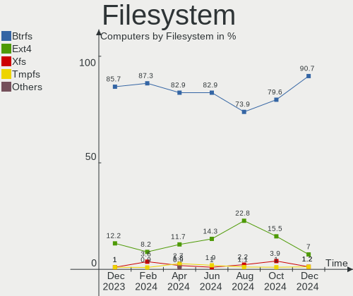
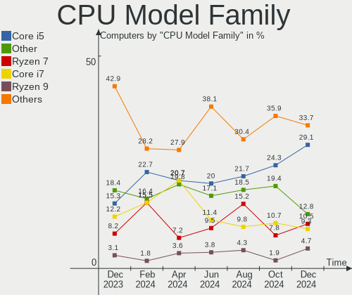
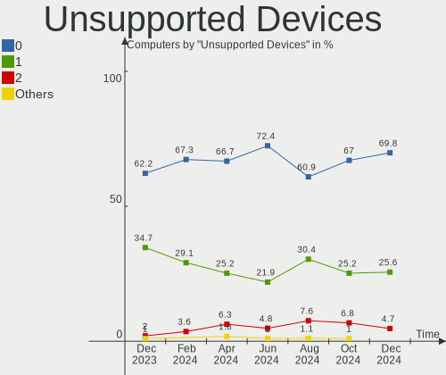

openSUSE Hardware Trends
------------------------

A project to identify most popular hardware characteristics and track their change
over time based on data collected by openSUSE users at https://Linux-Hardware.org.

Anyone can contribute to this report by the [hw-probe](https://github.com/linuxhw/hw-probe) tool:

    sudo -E hw-probe -all -upload

This is a report for all computer types. See also reports for [desktops](/Dist/openSUSE/Desktop/README.md) and [notebooks](/Dist/openSUSE/Notebook/README.md).

Full-feature report is available here: https://linux-hardware.org/?view=trends

Period: Jan, 2022.

Contents
--------

* [ System ](#system)
  - [ OS                       ](#os)
  - [ OS Family                ](#os-family)
  - [ Kernel                   ](#kernel)
  - [ Kernel Family            ](#kernel-family)
  - [ Kernel Major Ver.        ](#kernel-major-ver)
  - [ Arch                     ](#arch)
  - [ DE                       ](#de)
  - [ Display Server           ](#display-server)
  - [ Display Manager          ](#display-manager)
  - [ OS Lang                  ](#os-lang)
  - [ Boot Mode                ](#boot-mode)
  - [ Filesystem               ](#filesystem)
  - [ Part. scheme             ](#part-scheme)
  - [ Dual Boot with Linux/BSD ](#dual-boot-with-linuxbsd)
  - [ Dual Boot (Win)          ](#dual-boot-win)

* [ Board ](#board)
  - [ Vendor                   ](#vendor)
  - [ Model                    ](#model)
  - [ Model Family             ](#model-family)
  - [ MFG Year                 ](#mfg-year)
  - [ Form Factor              ](#form-factor)
  - [ Secure Boot              ](#secure-boot)
  - [ Coreboot                 ](#coreboot)
  - [ RAM Size                 ](#ram-size)
  - [ RAM Used                 ](#ram-used)
  - [ Total Drives             ](#total-drives)
  - [ Has CD-ROM               ](#has-cd-rom)
  - [ Has Ethernet             ](#has-ethernet)
  - [ Has WiFi                 ](#has-wifi)
  - [ Has Bluetooth            ](#has-bluetooth)

* [ Location ](#location)
  - [ Country                  ](#country)
  - [ City                     ](#city)

* [ Drives ](#drives)
  - [ Drive Vendor             ](#drive-vendor)
  - [ Drive Model              ](#drive-model)
  - [ HDD Vendor               ](#hdd-vendor)
  - [ SSD Vendor               ](#ssd-vendor)
  - [ Drive Kind               ](#drive-kind)
  - [ Drive Connector          ](#drive-connector)
  - [ Drive Size               ](#drive-size)
  - [ Space Total              ](#space-total)
  - [ Space Used               ](#space-used)
  - [ Malfunc. Drives          ](#malfunc-drives)
  - [ Malfunc. Drive Vendor    ](#malfunc-drive-vendor)
  - [ Malfunc. HDD Vendor      ](#malfunc-hdd-vendor)
  - [ Malfunc. Drive Kind      ](#malfunc-drive-kind)
  - [ Failed Drives            ](#failed-drives)
  - [ Failed Drive Vendor      ](#failed-drive-vendor)
  - [ Drive Status             ](#drive-status)

* [ Storage controller ](#storage-controller)
  - [ Storage Vendor           ](#storage-vendor)
  - [ Storage Model            ](#storage-model)
  - [ Storage Kind             ](#storage-kind)

* [ Processor ](#processor)
  - [ CPU Vendor               ](#cpu-vendor)
  - [ CPU Model                ](#cpu-model)
  - [ CPU Model Family         ](#cpu-model-family)
  - [ CPU Cores                ](#cpu-cores)
  - [ CPU Sockets              ](#cpu-sockets)
  - [ CPU Threads              ](#cpu-threads)
  - [ CPU Op-Modes             ](#cpu-op-modes)
  - [ CPU Microcode            ](#cpu-microcode)
  - [ CPU Microarch            ](#cpu-microarch)

* [ Graphics ](#graphics)
  - [ GPU Vendor               ](#gpu-vendor)
  - [ GPU Model                ](#gpu-model)
  - [ GPU Combo                ](#gpu-combo)
  - [ GPU Driver               ](#gpu-driver)
  - [ GPU Memory               ](#gpu-memory)

* [ Monitor ](#monitor)
  - [ Monitor Vendor           ](#monitor-vendor)
  - [ Monitor Model            ](#monitor-model)
  - [ Monitor Resolution       ](#monitor-resolution)
  - [ Monitor Diagonal         ](#monitor-diagonal)
  - [ Monitor Width            ](#monitor-width)
  - [ Aspect Ratio             ](#aspect-ratio)
  - [ Monitor Area             ](#monitor-area)
  - [ Pixel Density            ](#pixel-density)
  - [ Multiple Monitors        ](#multiple-monitors)

* [ Network ](#network)
  - [ Net Controller Vendor    ](#net-controller-vendor)
  - [ Net Controller Model     ](#net-controller-model)
  - [ Wireless Vendor          ](#wireless-vendor)
  - [ Wireless Model           ](#wireless-model)
  - [ Ethernet Vendor          ](#ethernet-vendor)
  - [ Ethernet Model           ](#ethernet-model)
  - [ Net Controller Kind      ](#net-controller-kind)
  - [ Used Controller          ](#used-controller)
  - [ NICs                     ](#nics)
  - [ IPv6                     ](#ipv6)

* [ Bluetooth ](#bluetooth)
  - [ Bluetooth Vendor         ](#bluetooth-vendor)
  - [ Bluetooth Model          ](#bluetooth-model)

* [ Sound ](#sound)
  - [ Sound Vendor             ](#sound-vendor)
  - [ Sound Model              ](#sound-model)

* [ Memory ](#memory)
  - [ Memory Vendor            ](#memory-vendor)
  - [ Memory Model             ](#memory-model)
  - [ Memory Kind              ](#memory-kind)
  - [ Memory Form Factor       ](#memory-form-factor)
  - [ Memory Size              ](#memory-size)
  - [ Memory Speed             ](#memory-speed)

* [ Printers & scanners ](#printers--scanners)
  - [ Printer Vendor           ](#printer-vendor)
  - [ Printer Model            ](#printer-model)
  - [ Scanner Vendor           ](#scanner-vendor)
  - [ Scanner Model            ](#scanner-model)

* [ Camera ](#camera)
  - [ Camera Vendor            ](#camera-vendor)
  - [ Camera Model             ](#camera-model)

* [ Security ](#security)
  - [ Fingerprint Vendor       ](#fingerprint-vendor)
  - [ Fingerprint Model        ](#fingerprint-model)
  - [ Chipcard Vendor          ](#chipcard-vendor)
  - [ Chipcard Model           ](#chipcard-model)

* [ Unsupported ](#unsupported)
  - [ Unsupported Devices      ](#unsupported-devices)
  - [ Unsupported Device Types ](#unsupported-device-types)

System
------

OS
--

Installed operating systems

| Name                         | Computers | Percent |
|------------------------------|-----------|---------|
| openSUSE Leap-15.3           | 11        | 23.91%  |
| openSUSE Tumbleweed-20220103 | 3         | 6.52%   |
| openSUSE Tumbleweed-20220128 | 2         | 4.35%   |
| openSUSE Leap-15.2           | 2         | 4.35%   |
| openSUSE 20220122            | 2         | 4.35%   |
| openSUSE 20220113            | 2         | 4.35%   |
| openSUSE 20220110            | 2         | 4.35%   |
| openSUSE 20220106            | 2         | 4.35%   |
| openSUSE Tumbleweed-20220125 | 1         | 2.17%   |
| openSUSE Tumbleweed-20220120 | 1         | 2.17%   |
| openSUSE Tumbleweed-20220118 | 1         | 2.17%   |
| openSUSE Tumbleweed-20220117 | 1         | 2.17%   |
| openSUSE Tumbleweed-20220114 | 1         | 2.17%   |
| openSUSE Tumbleweed-20220110 | 1         | 2.17%   |
| openSUSE Microos-20220128    | 1         | 2.17%   |
| openSUSE Microos-20211024    | 1         | 2.17%   |
| openSUSE 20220128            | 1         | 2.17%   |
| openSUSE 20220126            | 1         | 2.17%   |
| openSUSE 20220124            | 1         | 2.17%   |
| openSUSE 20220123            | 1         | 2.17%   |
| openSUSE 20220121            | 1         | 2.17%   |
| openSUSE 20220118            | 1         | 2.17%   |
| openSUSE 20220115            | 1         | 2.17%   |
| openSUSE 20220107            | 1         | 2.17%   |
| openSUSE 20220103            | 1         | 2.17%   |
| openSUSE 20220102            | 1         | 2.17%   |
| openSUSE 20220101            | 1         | 2.17%   |
| openSUSE 20211228            | 1         | 2.17%   |

OS Family
---------

OS without a version

| Name     | Computers | Percent |
|----------|-----------|---------|
| openSUSE | 46        | 100%    |

Kernel
------

Version of the Linux kernel

| Version                       | Computers | Percent |
|-------------------------------|-----------|---------|
| 5.15.12-1-default             | 11        | 23.91%  |
| 5.3.18-59.37-default          | 9         | 19.57%  |
| 5.16.1-1-default              | 7         | 15.22%  |
| 5.16.0-1-default              | 7         | 15.22%  |
| 5.16.2-1-default              | 3         | 6.52%   |
| 5.3.18-lp152.106-default      | 2         | 4.35%   |
| 5.3.18-59.37-preempt          | 1         | 2.17%   |
| 5.3.18-150300.59.43-default   | 1         | 2.17%   |
| 5.17.0-rc1-4.gf8aca60-default | 1         | 2.17%   |
| 5.16.0-rc8-1.gb59b474-vanilla | 1         | 2.17%   |
| 5.15.8-1-default              | 1         | 2.17%   |
| 5.15.5-1-default              | 1         | 2.17%   |
| 5.14.11-2-default             | 1         | 2.17%   |

Kernel Family
-------------

Linux kernel without a distro release

| Version | Computers | Percent |
|---------|-----------|---------|
| 5.3.18  | 13        | 28.26%  |
| 5.15.12 | 11        | 23.91%  |
| 5.16.0  | 8         | 17.39%  |
| 5.16.1  | 7         | 15.22%  |
| 5.16.2  | 3         | 6.52%   |
| 5.17.0  | 1         | 2.17%   |
| 5.15.8  | 1         | 2.17%   |
| 5.15.5  | 1         | 2.17%   |
| 5.14.11 | 1         | 2.17%   |

Kernel Major Ver.
-----------------

Linux kernel major version

| Version | Computers | Percent |
|---------|-----------|---------|
| 5.16    | 18        | 39.13%  |
| 5.3     | 13        | 28.26%  |
| 5.15    | 13        | 28.26%  |
| 5.17    | 1         | 2.17%   |
| 5.14    | 1         | 2.17%   |

Arch
----

OS architecture (x86_64, i586, etc.)

| Name   | Computers | Percent |
|--------|-----------|---------|
| x86_64 | 46        | 100%    |

DE
--

Desktop Environment

| Name    | Computers | Percent |
|---------|-----------|---------|
| KDE5    | 25        | 54.35%  |
| GNOME   | 13        | 28.26%  |
| Unknown | 5         | 10.87%  |
| XFCE    | 3         | 6.52%   |

Display Server
--------------

X11 or Wayland

| Name        | Computers | Percent |
|-------------|-----------|---------|
| X11         | 33        | 71.74%  |
| Wayland     | 10        | 21.74%  |
| Unspecified | 1         | 2.17%   |
| Tty         | 1         | 2.17%   |
| Unknown     | 1         | 2.17%   |

Display Manager
---------------

SDDM, LightDM, etc.

| Name    | Computers | Percent |
|---------|-----------|---------|
| Unknown | 19        | 41.3%   |
| SDDM    | 13        | 28.26%  |
| LightDM | 9         | 19.57%  |
| XDM     | 5         | 10.87%  |

OS Lang
-------

Language

| Lang    | Computers | Percent |
|---------|-----------|---------|
| en_US   | 12        | 26.09%  |
| de_DE   | 8         | 17.39%  |
| ru_RU   | 4         | 8.7%    |
| POSIX   | 4         | 8.7%    |
| Unknown | 3         | 6.52%   |
| pt_BR   | 2         | 4.35%   |
| it_IT   | 2         | 4.35%   |
| fi_FI   | 2         | 4.35%   |
| en_GB   | 2         | 4.35%   |
| zh_CN   | 1         | 2.17%   |
| sv_SE   | 1         | 2.17%   |
| nn_NO   | 1         | 2.17%   |
| nl_BE   | 1         | 2.17%   |
| fr_FR   | 1         | 2.17%   |
| es_ES   | 1         | 2.17%   |
| cv_RU   | 1         | 2.17%   |

Boot Mode
---------

EFI or BIOS

| Mode | Computers | Percent |
|------|-----------|---------|
| EFI  | 28        | 60.87%  |
| BIOS | 18        | 39.13%  |

Filesystem
----------

Type of filesystem

| Type    | Computers | Percent |
|---------|-----------|---------|
| Btrfs   | 34        | 73.91%  |
| Ext4    | 11        | 23.91%  |
| Overlay | 1         | 2.17%   |

Part. scheme
------------

Scheme of partitioning

| Type    | Computers | Percent |
|---------|-----------|---------|
| GPT     | 21        | 45.65%  |
| Unknown | 15        | 32.61%  |
| MBR     | 10        | 21.74%  |

Dual Boot with Linux/BSD
------------------------

Hosting more than one Linux/BSD

| Dual boot | Computers | Percent |
|-----------|-----------|---------|
| No        | 40        | 86.96%  |
| Yes       | 6         | 13.04%  |

Dual Boot (Win)
---------------

Hosting Linux and Windows

| Dual boot | Computers | Percent |
|-----------|-----------|---------|
| No        | 36        | 78.26%  |
| Yes       | 10        | 21.74%  |

Board
-----

Vendor
------

Motherboard manufacturer

| Name                | Computers | Percent |
|---------------------|-----------|---------|
| ASUSTek Computer    | 8         | 17.39%  |
| Hewlett-Packard     | 7         | 15.22%  |
| MSI                 | 4         | 8.7%    |
| Lenovo              | 4         | 8.7%    |
| Gigabyte Technology | 4         | 8.7%    |
| Razer               | 2         | 4.35%   |
| HUAWEI              | 2         | 4.35%   |
| Dell                | 2         | 4.35%   |
| Toshiba             | 1         | 2.17%   |
| Sony                | 1         | 2.17%   |
| Semp Toshiba        | 1         | 2.17%   |
| Notebook            | 1         | 2.17%   |
| Intel               | 1         | 2.17%   |
| Getac               | 1         | 2.17%   |
| Fujitsu             | 1         | 2.17%   |
| Corporativo Lanix   | 1         | 2.17%   |
| Chuwi               | 1         | 2.17%   |
| Biostar             | 1         | 2.17%   |
| ASRock              | 1         | 2.17%   |
| Apple               | 1         | 2.17%   |
| Acer                | 1         | 2.17%   |

Model
-----

Motherboard model

| Name                                             | Computers | Percent |
|--------------------------------------------------|-----------|---------|
| ASUS All Series                                  | 2         | 4.35%   |
| Toshiba Satellite C660D                          | 1         | 2.17%   |
| Sony VPCYB15AB                                   | 1         | 2.17%   |
| Semp Toshiba AS 1301                             | 1         | 2.17%   |
| Razer Blade 17 (Mid 2021) - RZ09-0406            | 1         | 2.17%   |
| Razer Blade 15 Base Model (Mid 2021) - RZ09-0410 | 1         | 2.17%   |
| Notebook NL5xRU                                  | 1         | 2.17%   |
| MSI Pulse GL66 11UDK                             | 1         | 2.17%   |
| MSI MS-7C02                                      | 1         | 2.17%   |
| MSI MS-7836                                      | 1         | 2.17%   |
| MSI MS-7673                                      | 1         | 2.17%   |
| Lenovo Yoga Slim 7 14ITL05 82A3                  | 1         | 2.17%   |
| Lenovo Legion S7 15ACH6 82K8                     | 1         | 2.17%   |
| Lenovo IdeaPad S145-15IWL 81MV                   | 1         | 2.17%   |
| Lenovo IdeaCentre 720-18APR 90HY000FIX           | 1         | 2.17%   |
| Intel NUC8i7HVK                                  | 1         | 2.17%   |
| HUAWEI KPL-W0X                                   | 1         | 2.17%   |
| HUAWEI HKD-WXX                                   | 1         | 2.17%   |
| HP ProBook x360 435 G7                           | 1         | 2.17%   |
| HP ProBook x360 11 G5 EE                         | 1         | 2.17%   |
| HP Laptop 17-ca0xxx                              | 1         | 2.17%   |
| HP ENVY 15                                       | 1         | 2.17%   |
| HP EliteDesk 800 G1 USDT                         | 1         | 2.17%   |
| HP Compaq 6830s                                  | 1         | 2.17%   |
| HP 550-a114                                      | 1         | 2.17%   |
| Gigabyte Z87X-UD3H                               | 1         | 2.17%   |
| Gigabyte GA-770TA-UD3                            | 1         | 2.17%   |
| Gigabyte G31M-ES2C                               | 1         | 2.17%   |
| Gigabyte B450 AORUS M                            | 1         | 2.17%   |
| Getac V200-G2                                    | 1         | 2.17%   |
| Fujitsu ESPRIMO P410                             | 1         | 2.17%   |
| Dell XPS 13 9343                                 | 1         | 2.17%   |
| Dell Latitude XT2                                | 1         | 2.17%   |
| Corporativo Lanix MB40II5                        | 1         | 2.17%   |
| Chuwi Hi10 X                                     | 1         | 2.17%   |
| Biostar H77MU3                                   | 1         | 2.17%   |
| ASUS TUF GAMING X570-PLUS                        | 1         | 2.17%   |
| ASUS SABERTOOTH 55i                              | 1         | 2.17%   |
| ASUS ROG STRIX X570-E GAMING                     | 1         | 2.17%   |
| ASUS PRO B460M-C                                 | 1         | 2.17%   |
| ASUS M5A99X EVO R2.0                             | 1         | 2.17%   |
| ASUS 970 PRO GAMING/AURA                         | 1         | 2.17%   |
| ASRock B450M Pro4-F                              | 1         | 2.17%   |
| Apple MacBookPro8,1                              | 1         | 2.17%   |
| Acer Aspire F5-572G                              | 1         | 2.17%   |

Model Family
------------

Motherboard model prefix

| Name                      | Computers | Percent |
|---------------------------|-----------|---------|
| Razer Blade               | 2         | 4.35%   |
| HP ProBook                | 2         | 4.35%   |
| ASUS All                  | 2         | 4.35%   |
| Toshiba Satellite         | 1         | 2.17%   |
| Sony VPCYB15AB            | 1         | 2.17%   |
| Semp Toshiba AS           | 1         | 2.17%   |
| Notebook NL5xRU           | 1         | 2.17%   |
| MSI Pulse                 | 1         | 2.17%   |
| MSI MS-7C02               | 1         | 2.17%   |
| MSI MS-7836               | 1         | 2.17%   |
| MSI MS-7673               | 1         | 2.17%   |
| Lenovo Yoga               | 1         | 2.17%   |
| Lenovo Legion             | 1         | 2.17%   |
| Lenovo IdeaPad            | 1         | 2.17%   |
| Lenovo IdeaCentre         | 1         | 2.17%   |
| Intel NUC8i7HVK           | 1         | 2.17%   |
| HUAWEI KPL-W0X            | 1         | 2.17%   |
| HUAWEI HKD-WXX            | 1         | 2.17%   |
| HP Laptop                 | 1         | 2.17%   |
| HP ENVY                   | 1         | 2.17%   |
| HP EliteDesk              | 1         | 2.17%   |
| HP Compaq                 | 1         | 2.17%   |
| HP 550-a114               | 1         | 2.17%   |
| Gigabyte Z87X-UD3H        | 1         | 2.17%   |
| Gigabyte GA-770TA-UD3     | 1         | 2.17%   |
| Gigabyte G31M-ES2C        | 1         | 2.17%   |
| Gigabyte B450             | 1         | 2.17%   |
| Getac V200-G2             | 1         | 2.17%   |
| Fujitsu ESPRIMO           | 1         | 2.17%   |
| Dell XPS                  | 1         | 2.17%   |
| Dell Latitude             | 1         | 2.17%   |
| Corporativo Lanix MB40II5 | 1         | 2.17%   |
| Chuwi Hi10                | 1         | 2.17%   |
| Biostar H77MU3            | 1         | 2.17%   |
| ASUS TUF                  | 1         | 2.17%   |
| ASUS SABERTOOTH           | 1         | 2.17%   |
| ASUS ROG                  | 1         | 2.17%   |
| ASUS PRO                  | 1         | 2.17%   |
| ASUS M5A99X               | 1         | 2.17%   |
| ASUS 970                  | 1         | 2.17%   |
| ASRock B450M              | 1         | 2.17%   |
| Apple MacBookPro8         | 1         | 2.17%   |
| Acer Aspire               | 1         | 2.17%   |

MFG Year
--------

Motherboard manufacture year

| Year | Computers | Percent |
|------|-----------|---------|
| 2020 | 7         | 15.22%  |
| 2021 | 5         | 10.87%  |
| 2018 | 5         | 10.87%  |
| 2013 | 5         | 10.87%  |
| 2019 | 4         | 8.7%    |
| 2011 | 4         | 8.7%    |
| 2010 | 4         | 8.7%    |
| 2015 | 3         | 6.52%   |
| 2014 | 2         | 4.35%   |
| 2012 | 2         | 4.35%   |
| 2009 | 2         | 4.35%   |
| 2008 | 2         | 4.35%   |
| 2016 | 1         | 2.17%   |

Form Factor
-----------

Physical design of the computer

| Name        | Computers | Percent |
|-------------|-----------|---------|
| Desktop     | 21        | 45.65%  |
| Notebook    | 21        | 45.65%  |
| Convertible | 2         | 4.35%   |
| Tablet      | 1         | 2.17%   |
| Mini pc     | 1         | 2.17%   |

Secure Boot
-----------

Enabled or disabled

| State    | Computers | Percent |
|----------|-----------|---------|
| Disabled | 39        | 84.78%  |
| Enabled  | 7         | 15.22%  |

Coreboot
--------

Have coreboot on board

| Used | Computers | Percent |
|------|-----------|---------|
| No   | 46        | 100%    |

RAM Size
--------

Total RAM memory

| Size in GB  | Computers | Percent |
|-------------|-----------|---------|
| 16.01-24.0  | 15        | 32.61%  |
| 4.01-8.0    | 13        | 28.26%  |
| 32.01-64.0  | 5         | 10.87%  |
| 3.01-4.0    | 5         | 10.87%  |
| 8.01-16.0   | 4         | 8.7%    |
| 24.01-32.0  | 1         | 2.17%   |
| 2.01-3.0    | 1         | 2.17%   |
| 64.01-256.0 | 1         | 2.17%   |
| 1.01-2.0    | 1         | 2.17%   |

RAM Used
--------

Used RAM memory

| Used GB    | Computers | Percent |
|------------|-----------|---------|
| 1.01-2.0   | 12        | 26.09%  |
| 2.01-3.0   | 11        | 23.91%  |
| 4.01-8.0   | 10        | 21.74%  |
| 3.01-4.0   | 6         | 13.04%  |
| 8.01-16.0  | 3         | 6.52%   |
| 0.51-1.0   | 3         | 6.52%   |
| 24.01-32.0 | 1         | 2.17%   |

Total Drives
------------

Number of drives on board

| Drives | Computers | Percent |
|--------|-----------|---------|
| 1      | 24        | 52.17%  |
| 2      | 16        | 34.78%  |
| 4      | 2         | 4.35%   |
| 3      | 2         | 4.35%   |
| 6      | 1         | 2.17%   |
| 5      | 1         | 2.17%   |

Has CD-ROM
----------

Has CD-ROM on board

| Presented | Computers | Percent |
|-----------|-----------|---------|
| No        | 28        | 60.87%  |
| Yes       | 18        | 39.13%  |

Has Ethernet
------------

Has Ethernet on board

| Presented | Computers | Percent |
|-----------|-----------|---------|
| Yes       | 39        | 84.78%  |
| No        | 7         | 15.22%  |

Has WiFi
--------

Has WiFi module

| Presented | Computers | Percent |
|-----------|-----------|---------|
| Yes       | 33        | 71.74%  |
| No        | 13        | 28.26%  |

Has Bluetooth
-------------

Has Bluetooth module

| Presented | Computers | Percent |
|-----------|-----------|---------|
| Yes       | 27        | 58.7%   |
| No        | 19        | 41.3%   |

Location
--------

Country
-------

Geographic location (country)

| Country     | Computers | Percent |
|-------------|-----------|---------|
| Germany     | 9         | 19.57%  |
| Russia      | 6         | 13.04%  |
| USA         | 4         | 8.7%    |
| Italy       | 4         | 8.7%    |
| Finland     | 3         | 6.52%   |
| Brazil      | 3         | 6.52%   |
| UK          | 2         | 4.35%   |
| Spain       | 2         | 4.35%   |
| Ukraine     | 1         | 2.17%   |
| Sweden      | 1         | 2.17%   |
| Romania     | 1         | 2.17%   |
| Poland      | 1         | 2.17%   |
| Norway      | 1         | 2.17%   |
| Netherlands | 1         | 2.17%   |
| Mexico      | 1         | 2.17%   |
| Malaysia    | 1         | 2.17%   |
| China       | 1         | 2.17%   |
| Chile       | 1         | 2.17%   |
| Belgium     | 1         | 2.17%   |
| Belarus     | 1         | 2.17%   |
| Australia   | 1         | 2.17%   |

City
----

Geographic location (city)

| City                  | Computers | Percent |
|-----------------------|-----------|---------|
| Voerde                | 2         | 4.35%   |
| Monza                 | 2         | 4.35%   |
| Kiel                  | 2         | 4.35%   |
| Helsinki              | 2         | 4.35%   |
| Worms                 | 1         | 2.17%   |
| Texarkana             | 1         | 2.17%   |
| Teresina              | 1         | 2.17%   |
| Stryi                 | 1         | 2.17%   |
| Rostov-on-Don         | 1         | 2.17%   |
| Rio de Janeiro        | 1         | 2.17%   |
| Pennsville            | 1         | 2.17%   |
| Oulu                  | 1         | 2.17%   |
| Odintsovo             | 1         | 2.17%   |
| Navashino             | 1         | 2.17%   |
| Munich                | 1         | 2.17%   |
| Moonee Ponds          | 1         | 2.17%   |
| Minsk                 | 1         | 2.17%   |
| Leeds                 | 1         | 2.17%   |
| Las Vegas             | 1         | 2.17%   |
| Kuala Lumpur          | 1         | 2.17%   |
| Kazan?ˆ™              | 1         | 2.17%   |
| Karlsruhe             | 1         | 2.17%   |
| Innopolis             | 1         | 2.17%   |
| Iasi                  | 1         | 2.17%   |
| Houston               | 1         | 2.17%   |
| Harrow                | 1         | 2.17%   |
| Goi??nia              | 1         | 2.17%   |
| Giugliano in Campania | 1         | 2.17%   |
| Elche                 | 1         | 2.17%   |
| Ecatepec              | 1         | 2.17%   |
| Concepci??n           | 1         | 2.17%   |
| Chelyabinsk           | 1         | 2.17%   |
| Bolzano               | 1         | 2.17%   |
| Blankenbach           | 1         | 2.17%   |
| Bialystok             | 1         | 2.17%   |
| Bergen                | 1         | 2.17%   |
| Beijing               | 1         | 2.17%   |
| Arboga                | 1         | 2.17%   |
| Antwerp               | 1         | 2.17%   |
| Amsterdam             | 1         | 2.17%   |
| Algermissen           | 1         | 2.17%   |
| A Coru?±a             | 1         | 2.17%   |

Drives
------

Drive Vendor
------------

Hard drive vendors

| Vendor              | Computers | Drives | Percent |
|---------------------|-----------|--------|---------|
| WDC                 | 15        | 20     | 22.39%  |
| Samsung Electronics | 13        | 16     | 19.4%   |
| Seagate             | 8         | 10     | 11.94%  |
| Kingston            | 7         | 8      | 10.45%  |
| Crucial             | 4         | 5      | 5.97%   |
| Sandisk             | 3         | 3      | 4.48%   |
| Unknown             | 2         | 2      | 2.99%   |
| Toshiba             | 2         | 2      | 2.99%   |
| Intel               | 2         | 2      | 2.99%   |
| YMTC                | 1         | 1      | 1.49%   |
| XPG                 | 1         | 1      | 1.49%   |
| SSSTC               | 1         | 1      | 1.49%   |
| SK Hynix            | 1         | 1      | 1.49%   |
| PLEXTOR             | 1         | 1      | 1.49%   |
| Phison              | 1         | 1      | 1.49%   |
| HGST                | 1         | 1      | 1.49%   |
| Fujitsu             | 1         | 1      | 1.49%   |
| China               | 1         | 1      | 1.49%   |
| Apacer              | 1         | 1      | 1.49%   |
| Advantech           | 1         | 1      | 1.49%   |

Drive Model
-----------

Hard drive models

| Model                                  | Computers | Percent |
|----------------------------------------|-----------|---------|
| Seagate ST3500418AS 500GB              | 2         | 2.7%    |
| Sandisk NVMe SSD Drive 1TB             | 2         | 2.7%    |
| YMTC PC005 1TB                         | 1         | 1.35%   |
| XPG NVMe SSD Drive 512GB               | 1         | 1.35%   |
| WDC WDS500G2B0A 500GB SSD              | 1         | 1.35%   |
| WDC WDS500G1X0E-00AFY0 500GB           | 1         | 1.35%   |
| WDC WDS250G1B0A-00H9H0 250GB SSD       | 1         | 1.35%   |
| WDC WDS100T2B0B-00YS70 1TB SSD         | 1         | 1.35%   |
| WDC WD6400AAKS-22A7B0 640GB            | 1         | 1.35%   |
| WDC WD5000AAKX-07U6AA0 500GB           | 1         | 1.35%   |
| WDC WD3200BEKT-60V5T1 320GB            | 1         | 1.35%   |
| WDC WD30EZRX-00DC0B0 3TB               | 1         | 1.35%   |
| WDC WD20SPZX-00UA7T0 2TB               | 1         | 1.35%   |
| WDC WD20EARX-00PASB0 2TB               | 1         | 1.35%   |
| WDC WD2003FYYS-05T9B0 2TB              | 1         | 1.35%   |
| WDC WD2003FYYS-01T8B0 2TB              | 1         | 1.35%   |
| WDC WD1600BEVT-08A23T1 160GB           | 1         | 1.35%   |
| WDC WD10SPZX-60Z10T0 1TB               | 1         | 1.35%   |
| WDC WD10JPVX-22JC3T0 1TB               | 1         | 1.35%   |
| WDC WD10EZEX-22MFCA0 1TB               | 1         | 1.35%   |
| WDC WD10EZEX-08WN4A0 1TB               | 1         | 1.35%   |
| WDC PC SN730 SDBPNTY-512G-1101 512GB   | 1         | 1.35%   |
| Unknown SD/MMC/MS PRO 128GB            | 1         | 1.35%   |
| Unknown MMC Card  128GB                | 1         | 1.35%   |
| Toshiba MK3275GSX 320GB                | 1         | 1.35%   |
| Toshiba HDWD110 1TB                    | 1         | 1.35%   |
| SSSTC CVB-8D128-HP 128GB               | 1         | 1.35%   |
| SK Hynix SKHynix_HFS512GDE9X084N 512GB | 1         | 1.35%   |
| Seagate ST9500325AS 500GB              | 1         | 1.35%   |
| Seagate ST500DM002-1BD142 500GB        | 1         | 1.35%   |
| Seagate ST3500413AS 500GB              | 1         | 1.35%   |
| Seagate ST2000DM006-2DM164 2TB         | 1         | 1.35%   |
| Seagate ST2000DM001-9YN164 2TB         | 1         | 1.35%   |
| Seagate ST2000DM001-1ER164 2TB         | 1         | 1.35%   |
| Seagate ST1000DM003-1SB102 1TB         | 1         | 1.35%   |
| SanDisk SDSSDH3500G 500GB              | 1         | 1.35%   |
| Samsung SSD PM851 M.2 2280 256GB       | 1         | 1.35%   |
| Samsung SSD 980 PRO 1TB                | 1         | 1.35%   |
| Samsung SSD 970 EVO Plus 1TB           | 1         | 1.35%   |
| Samsung SSD 970 EVO 1TB                | 1         | 1.35%   |
| Samsung SSD 860 EVO 1TB                | 1         | 1.35%   |
| Samsung NVMe SSD Drive 512GB           | 1         | 1.35%   |
| Samsung NVMe SSD Drive 500GB           | 1         | 1.35%   |
| Samsung NVMe SSD Drive 1024GB          | 1         | 1.35%   |
| Samsung MZNLN128HAHQ-000L2 128GB SSD   | 1         | 1.35%   |
| Samsung HS12RJF 120GB                  | 1         | 1.35%   |
| Samsung HM160HI 160GB                  | 1         | 1.35%   |
| Samsung HD642JJ 640GB                  | 1         | 1.35%   |
| Samsung HD501LJ 500GB                  | 1         | 1.35%   |
| Samsung 860-500GB SSD                  | 1         | 1.35%   |
| PLEXTOR PX-128M5S 128GB SSD            | 1         | 1.35%   |
| Phison NVMe SSD Drive 512GB            | 1         | 1.35%   |
| Kingston SV300S37A120G 120GB SSD       | 1         | 1.35%   |
| Kingston SUV500240G 240GB SSD          | 1         | 1.35%   |
| Kingston SUV400S37240G 240GB SSD       | 1         | 1.35%   |
| Kingston SNVS500G 500GB                | 1         | 1.35%   |
| Kingston SNVS250G 250GB                | 1         | 1.35%   |
| Kingston SA400S37480G 480GB SSD        | 1         | 1.35%   |
| Kingston SA400S37120G 120GB SSD        | 1         | 1.35%   |
| Kingston OM8PCP3512F-AI1 512GB         | 1         | 1.35%   |

HDD Vendor
----------

Hard disk drive vendors

| Vendor              | Computers | Drives | Percent |
|---------------------|-----------|--------|---------|
| WDC                 | 11        | 15     | 39.29%  |
| Seagate             | 8         | 10     | 28.57%  |
| Samsung Electronics | 4         | 4      | 14.29%  |
| Toshiba             | 2         | 2      | 7.14%   |
| Unknown             | 1         | 1      | 3.57%   |
| HGST                | 1         | 1      | 3.57%   |
| Fujitsu             | 1         | 1      | 3.57%   |

SSD Vendor
----------

Solid state drive vendors

| Vendor              | Computers | Drives | Percent |
|---------------------|-----------|--------|---------|
| Kingston            | 5         | 5      | 21.74%  |
| Samsung Electronics | 4         | 4      | 17.39%  |
| Crucial             | 4         | 5      | 17.39%  |
| WDC                 | 3         | 3      | 13.04%  |
| SSSTC               | 1         | 1      | 4.35%   |
| SanDisk             | 1         | 1      | 4.35%   |
| PLEXTOR             | 1         | 1      | 4.35%   |
| Intel               | 1         | 1      | 4.35%   |
| China               | 1         | 1      | 4.35%   |
| Apacer              | 1         | 1      | 4.35%   |
| Advantech           | 1         | 1      | 4.35%   |

Drive Kind
----------

HDD or SSD

| Kind | Computers | Drives | Percent |
|------|-----------|--------|---------|
| HDD  | 24        | 34     | 40%     |
| SSD  | 19        | 24     | 31.67%  |
| NVMe | 16        | 20     | 26.67%  |
| MMC  | 1         | 1      | 1.67%   |

Drive Connector
---------------

SATA, SAS, NVMe, etc.

| Type | Computers | Drives | Percent |
|------|-----------|--------|---------|
| SATA | 33        | 57     | 64.71%  |
| NVMe | 16        | 20     | 31.37%  |
| SAS  | 1         | 1      | 1.96%   |
| MMC  | 1         | 1      | 1.96%   |

Drive Size
----------

Size of hard drive

| Size in TB | Computers | Drives | Percent |
|------------|-----------|--------|---------|
| 0.01-0.5   | 26        | 36     | 60.47%  |
| 0.51-1.0   | 10        | 12     | 23.26%  |
| 1.01-2.0   | 6         | 8      | 13.95%  |
| 2.01-3.0   | 1         | 2      | 2.33%   |

Space Total
-----------

Amount of disk space available on the file system

| Size in GB     | Computers | Percent |
|----------------|-----------|---------|
| More than 3000 | 14        | 30.43%  |
| 2001-3000      | 8         | 17.39%  |
| 1001-2000      | 6         | 13.04%  |
| 501-1000       | 6         | 13.04%  |
| 251-500        | 4         | 8.7%    |
| Unknown        | 3         | 6.52%   |
| 101-250        | 2         | 4.35%   |
| 51-100         | 2         | 4.35%   |
| 1-20           | 1         | 2.17%   |

Space Used
----------

Amount of used disk space

| Used GB        | Computers | Percent |
|----------------|-----------|---------|
| 251-500        | 9         | 19.57%  |
| 1001-2000      | 8         | 17.39%  |
| 51-100         | 8         | 17.39%  |
| 101-250        | 5         | 10.87%  |
| 501-1000       | 4         | 8.7%    |
| More than 3000 | 3         | 6.52%   |
| Unknown        | 3         | 6.52%   |
| 21-50          | 2         | 4.35%   |
| 2001-3000      | 2         | 4.35%   |
| 1-20           | 2         | 4.35%   |

Malfunc. Drives
---------------

Drive models with a malfunction

| Model                                        | Computers | Drives | Percent |
|----------------------------------------------|-----------|--------|---------|
| WDC WD6400AAKS-22A7B0 640GB                  | 1         | 1      | 12.5%   |
| SSSTC CVB-8D128-HP 128GB                     | 1         | 1      | 12.5%   |
| Seagate ST500DM002-1BD142 500GB              | 1         | 1      | 12.5%   |
| Seagate ST1000DM003-1SB102 1TB               | 1         | 1      | 12.5%   |
| Samsung Electronics SSD PM851 M.2 2280 256GB | 1         | 1      | 12.5%   |
| Samsung Electronics HS12RJF 120GB            | 1         | 1      | 12.5%   |
| HGST HTS725050A7E630 500GB                   | 1         | 1      | 12.5%   |
| Fujitsu MHZ2250BH G2 250GB                   | 1         | 1      | 12.5%   |

Malfunc. Drive Vendor
---------------------

Vendors of faulty drives

| Vendor              | Computers | Drives | Percent |
|---------------------|-----------|--------|---------|
| Seagate             | 2         | 2      | 25%     |
| Samsung Electronics | 2         | 2      | 25%     |
| WDC                 | 1         | 1      | 12.5%   |
| SSSTC               | 1         | 1      | 12.5%   |
| HGST                | 1         | 1      | 12.5%   |
| Fujitsu             | 1         | 1      | 12.5%   |

Malfunc. HDD Vendor
-------------------

Vendors of faulty HDD drives

| Vendor              | Computers | Drives | Percent |
|---------------------|-----------|--------|---------|
| Seagate             | 2         | 2      | 33.33%  |
| WDC                 | 1         | 1      | 16.67%  |
| Samsung Electronics | 1         | 1      | 16.67%  |
| HGST                | 1         | 1      | 16.67%  |
| Fujitsu             | 1         | 1      | 16.67%  |

Malfunc. Drive Kind
-------------------

Kinds of faulty drives

| Kind | Computers | Drives | Percent |
|------|-----------|--------|---------|
| HDD  | 6         | 6      | 75%     |
| SSD  | 2         | 2      | 25%     |

Failed Drives
-------------

Failed drive models

Zero info for selected period =(

Failed Drive Vendor
-------------------

Failed drive vendors

Zero info for selected period =(

Drive Status
------------

Number of failed and malfunc. drives

| Status   | Computers | Drives | Percent |
|----------|-----------|--------|---------|
| Works    | 25        | 45     | 50%     |
| Detected | 17        | 26     | 34%     |
| Malfunc  | 8         | 8      | 16%     |

Storage controller
------------------

Storage Vendor
--------------

Storage controller vendors

| Vendor                      | Computers | Percent |
|-----------------------------|-----------|---------|
| Intel                       | 26        | 41.94%  |
| AMD                         | 15        | 24.19%  |
| Samsung Electronics         | 5         | 8.06%   |
| Sandisk                     | 4         | 6.45%   |
| Kingston Technology Company | 3         | 4.84%   |
| Marvell Technology Group    | 2         | 3.23%   |
| JMicron Technology          | 2         | 3.23%   |
| Yangtze Memory Technologies | 1         | 1.61%   |
| SK Hynix                    | 1         | 1.61%   |
| Phison Electronics          | 1         | 1.61%   |
| ASMedia Technology          | 1         | 1.61%   |
| ADATA Technology            | 1         | 1.61%   |

Storage Model
-------------

Storage controller models

| Model                                                                                  | Computers | Percent |
|----------------------------------------------------------------------------------------|-----------|---------|
| AMD FCH SATA Controller [AHCI mode]                                                    | 8         | 11.59%  |
| AMD SB7x0/SB8x0/SB9x0 SATA Controller [AHCI mode]                                      | 6         | 8.7%    |
| Intel 8 Series/C220 Series Chipset Family 6-port SATA Controller 1 [AHCI mode]         | 4         | 5.8%    |
| AMD 400 Series Chipset SATA Controller                                                 | 4         | 5.8%    |
| Samsung NVMe SSD Controller PM9A1/PM9A3/980PRO                                         | 3         | 4.35%   |
| Samsung NVMe SSD Controller SM981/PM981/PM983                                          | 2         | 2.9%    |
| Kingston Company SNVS2000G [NV1 NVMe PCIe SSD 2TB]                                     | 2         | 2.9%    |
| JMicron JMB363 SATA/IDE Controller                                                     | 2         | 2.9%    |
| Intel Celeron/Pentium Silver Processor SATA Controller                                 | 2         | 2.9%    |
| Intel 82801IBM/IEM (ICH9M/ICH9M-E) 4 port SATA Controller [AHCI mode]                  | 2         | 2.9%    |
| Intel 7 Series Chipset Family 6-port SATA Controller [AHCI mode]                       | 2         | 2.9%    |
| Intel 6 Series/C200 Series Chipset Family 6 port Desktop SATA AHCI Controller          | 2         | 2.9%    |
| Yangtze Memory Non-Volatile memory controller                                          | 1         | 1.45%   |
| SK Hynix Gold P31 SSD                                                                  | 1         | 1.45%   |
| Sandisk WD PC SN810 / Black SN850 NVMe SSD                                             | 1         | 1.45%   |
| Sandisk WD Black SN750 / PC SN730 NVMe SSD                                             | 1         | 1.45%   |
| Sandisk WD Black 2018/SN750 / PC SN720 NVMe SSD                                        | 1         | 1.45%   |
| Sandisk Non-Volatile memory controller                                                 | 1         | 1.45%   |
| Phison PS5013 E13 NVMe Controller                                                      | 1         | 1.45%   |
| Marvell Group 88SE9172 SATA 6Gb/s Controller                                           | 1         | 1.45%   |
| Marvell Group 88SE9128 PCIe SATA 6 Gb/s RAID controller                                | 1         | 1.45%   |
| Kingston Company Company Non-Volatile memory controller                                | 1         | 1.45%   |
| Intel Wildcat Point-LP SATA Controller [AHCI Mode]                                     | 1         | 1.45%   |
| Intel Volume Management Device NVMe RAID Controller                                    | 1         | 1.45%   |
| Intel Sunrise Point-LP SATA Controller [AHCI mode]                                     | 1         | 1.45%   |
| Intel SSD 660P Series                                                                  | 1         | 1.45%   |
| Intel NM10/ICH7 Family SATA Controller [IDE mode]                                      | 1         | 1.45%   |
| Intel HM170/QM170 Chipset SATA Controller [AHCI Mode]                                  | 1         | 1.45%   |
| Intel Cannon Point-LP SATA Controller [AHCI Mode]                                      | 1         | 1.45%   |
| Intel 9 Series Chipset Family SATA Controller [AHCI Mode]                              | 1         | 1.45%   |
| Intel 7 Series/C210 Series Chipset Family 4-port SATA Controller [IDE mode]            | 1         | 1.45%   |
| Intel 7 Series/C210 Series Chipset Family 2-port SATA Controller [IDE mode]            | 1         | 1.45%   |
| Intel 6 Series/C200 Series Chipset Family Mobile SATA Controller (IDE mode, ports 4-5) | 1         | 1.45%   |
| Intel 6 Series/C200 Series Chipset Family Mobile SATA Controller (IDE mode, ports 0-3) | 1         | 1.45%   |
| Intel 6 Series/C200 Series Chipset Family 6 port Mobile SATA AHCI Controller           | 1         | 1.45%   |
| Intel 500 Series Chipset Family SATA AHCI Controller                                   | 1         | 1.45%   |
| Intel 5 Series/3400 Series Chipset 4 port SATA IDE Controller                          | 1         | 1.45%   |
| Intel 5 Series/3400 Series Chipset 2 port SATA IDE Controller                          | 1         | 1.45%   |
| Intel 400 Series Chipset Family SATA AHCI Controller                                   | 1         | 1.45%   |
| ASMedia ASM1062 Serial ATA Controller                                                  | 1         | 1.45%   |
| AMD SB7x0/SB8x0/SB9x0 IDE Controller                                                   | 1         | 1.45%   |
| ADATA XPG SX8200 Pro PCIe Gen3x4 M.2 2280 Solid State Drive                            | 1         | 1.45%   |

Storage Kind
------------

Kind of storage controller (IDE, SATA, NVMe, SAS, ...)

| Kind | Computers | Percent |
|------|-----------|---------|
| SATA | 35        | 62.5%   |
| NVMe | 15        | 26.79%  |
| IDE  | 5         | 8.93%   |
| RAID | 1         | 1.79%   |

Processor
---------

CPU Vendor
----------

Processor vendors

| Vendor | Computers | Percent |
|--------|-----------|---------|
| Intel  | 28        | 60.87%  |
| AMD    | 18        | 39.13%  |

CPU Model
---------

Processor models

| Model                                           | Computers | Percent |
|-------------------------------------------------|-----------|---------|
| Intel 11th Gen Core i7-11800H @ 2.30GHz         | 3         | 6.52%   |
| Intel Pentium Silver N5030 CPU @ 1.10GHz        | 1         | 2.17%   |
| Intel Core i7-8809G CPU @ 3.10GHz               | 1         | 2.17%   |
| Intel Core i7-5500U CPU @ 2.40GHz               | 1         | 2.17%   |
| Intel Core i7-4771 CPU @ 3.50GHz                | 1         | 2.17%   |
| Intel Core i7-4712HQ CPU @ 2.30GHz              | 1         | 2.17%   |
| Intel Core i7-3520M CPU @ 2.90GHz               | 1         | 2.17%   |
| Intel Core i7-2620M CPU @ 2.70GHz               | 1         | 2.17%   |
| Intel Core i7 CPU 860 @ 2.80GHz                 | 1         | 2.17%   |
| Intel Core i5-8265U CPU @ 1.60GHz               | 1         | 2.17%   |
| Intel Core i5-6200U CPU @ 2.30GHz               | 1         | 2.17%   |
| Intel Core i5-4590 CPU @ 3.30GHz                | 1         | 2.17%   |
| Intel Core i5-4570S CPU @ 2.90GHz               | 1         | 2.17%   |
| Intel Core i5-4440 CPU @ 3.10GHz                | 1         | 2.17%   |
| Intel Core i5-3330 CPU @ 3.00GHz                | 1         | 2.17%   |
| Intel Core i5-2500 CPU @ 3.30GHz                | 1         | 2.17%   |
| Intel Core i5-2320 CPU @ 3.00GHz                | 1         | 2.17%   |
| Intel Core i5-10600K CPU @ 4.10GHz              | 1         | 2.17%   |
| Intel Core i3-2330M CPU @ 2.20GHz               | 1         | 2.17%   |
| Intel Core 2 Duo CPU U9600 @ 1.60GHz            | 1         | 2.17%   |
| Intel Core 2 Duo CPU T9400 @ 2.53GHz            | 1         | 2.17%   |
| Intel Core 2 Duo CPU E4500 @ 2.20GHz            | 1         | 2.17%   |
| Intel Celeron N4120 CPU @ 1.10GHz               | 1         | 2.17%   |
| Intel Celeron CPU 847 @ 1.10GHz                 | 1         | 2.17%   |
| Intel 11th Gen Core i7-11370H @ 3.30GHz         | 1         | 2.17%   |
| Intel 11th Gen Core i5-1135G7 @ 2.40GHz         | 1         | 2.17%   |
| AMD Ryzen 9 5900X 12-Core Processor             | 1         | 2.17%   |
| AMD Ryzen 7 5800H with Radeon Graphics          | 1         | 2.17%   |
| AMD Ryzen 7 4700U with Radeon Graphics          | 1         | 2.17%   |
| AMD Ryzen 7 3700X 8-Core Processor              | 1         | 2.17%   |
| AMD Ryzen 5 PRO 3400G with Radeon Vega Graphics | 1         | 2.17%   |
| AMD Ryzen 5 4500U with Radeon Graphics          | 1         | 2.17%   |
| AMD Ryzen 5 3600 6-Core Processor               | 1         | 2.17%   |
| AMD Ryzen 5 2500U with Radeon Vega Mobile Gfx   | 1         | 2.17%   |
| AMD Ryzen 3 3200G with Radeon Vega Graphics     | 1         | 2.17%   |
| AMD Ryzen 3 2200G with Radeon Vega Graphics     | 1         | 2.17%   |
| AMD Phenom II X4 955 Processor                  | 1         | 2.17%   |
| AMD FX-8350 Eight-Core Processor                | 1         | 2.17%   |
| AMD FX-6300 Six-Core Processor                  | 1         | 2.17%   |
| AMD E-450 APU with Radeon HD Graphics           | 1         | 2.17%   |
| AMD E-350 Processor                             | 1         | 2.17%   |
| AMD C-50 Processor                              | 1         | 2.17%   |
| AMD A8-6410 APU with AMD Radeon R5 Graphics     | 1         | 2.17%   |
| AMD A6-9225 RADEON R4, 5 COMPUTE CORES 2C+3G    | 1         | 2.17%   |

CPU Model Family
----------------

Processor model prefix

| Model                | Computers | Percent |
|----------------------|-----------|---------|
| Intel Core i5        | 9         | 19.57%  |
| Intel Core i7        | 7         | 15.22%  |
| Other                | 5         | 10.87%  |
| Intel Core 2 Duo     | 3         | 6.52%   |
| AMD Ryzen 7          | 3         | 6.52%   |
| AMD Ryzen 5          | 3         | 6.52%   |
| Intel Celeron        | 2         | 4.35%   |
| AMD Ryzen 3          | 2         | 4.35%   |
| AMD FX               | 2         | 4.35%   |
| AMD E                | 2         | 4.35%   |
| Intel Pentium Silver | 1         | 2.17%   |
| Intel Core i3        | 1         | 2.17%   |
| AMD Ryzen 9          | 1         | 2.17%   |
| AMD Ryzen 5 PRO      | 1         | 2.17%   |
| AMD Phenom II X4     | 1         | 2.17%   |
| AMD C-50             | 1         | 2.17%   |
| AMD A8               | 1         | 2.17%   |
| AMD A6               | 1         | 2.17%   |

CPU Cores
---------

Number of processor cores

| Number | Computers | Percent |
|--------|-----------|---------|
| 4      | 22        | 47.83%  |
| 2      | 13        | 28.26%  |
| 8      | 6         | 13.04%  |
| 6      | 3         | 6.52%   |
| 12     | 1         | 2.17%   |
| 3      | 1         | 2.17%   |

CPU Sockets
-----------

Number of sockets

| Number | Computers | Percent |
|--------|-----------|---------|
| 1      | 46        | 100%    |

CPU Threads
-----------

Threads per core (Hyper-Threading)

| Number | Computers | Percent |
|--------|-----------|---------|
| 2      | 24        | 52.17%  |
| 1      | 22        | 47.83%  |

CPU Op-Modes
------------

CPU Operation Modes (32-bit, 64-bit)

| Op mode        | Computers | Percent |
|----------------|-----------|---------|
| 32-bit, 64-bit | 46        | 100%    |

CPU Microcode
-------------

Microcode number

| Number     | Computers | Percent |
|------------|-----------|---------|
| 0x206a7    | 5         | 10.87%  |
| 0x306c3    | 4         | 8.7%    |
| 0x806d1    | 3         | 6.52%   |
| Unknown    | 3         | 6.52%   |
| 0x806c1    | 2         | 4.35%   |
| 0x706a8    | 2         | 4.35%   |
| 0x306a9    | 2         | 4.35%   |
| 0x1067a    | 2         | 4.35%   |
| 0x08701021 | 2         | 4.35%   |
| 0x08600106 | 2         | 4.35%   |
| 0x08108109 | 2         | 4.35%   |
| 0x06000852 | 2         | 4.35%   |
| 0xa0655    | 1         | 2.17%   |
| 0x906e9    | 1         | 2.17%   |
| 0x806ec    | 1         | 2.17%   |
| 0x406e3    | 1         | 2.17%   |
| 0x306d4    | 1         | 2.17%   |
| 0x106e5    | 1         | 2.17%   |
| 0x0a50000c | 1         | 2.17%   |
| 0x0a201204 | 1         | 2.17%   |
| 0x08101016 | 1         | 2.17%   |
| 0x08101007 | 1         | 2.17%   |
| 0x07030105 | 1         | 2.17%   |
| 0x06006705 | 1         | 2.17%   |
| 0x05000119 | 1         | 2.17%   |
| 0x05000029 | 1         | 2.17%   |
| 0x010000c8 | 1         | 2.17%   |

CPU Microarch
-------------

Microarchitecture

| Name          | Computers | Percent |
|---------------|-----------|---------|
| SandyBridge   | 5         | 10.87%  |
| Haswell       | 5         | 10.87%  |
| Zen 2         | 4         | 8.7%    |
| Icelake       | 3         | 6.52%   |
| Bobcat        | 3         | 6.52%   |
| Zen+          | 2         | 4.35%   |
| Zen 3         | 2         | 4.35%   |
| Zen           | 2         | 4.35%   |
| TigerLake     | 2         | 4.35%   |
| Piledriver    | 2         | 4.35%   |
| Penryn        | 2         | 4.35%   |
| KabyLake      | 2         | 4.35%   |
| IvyBridge     | 2         | 4.35%   |
| Goldmont plus | 2         | 4.35%   |
| Skylake       | 1         | 2.17%   |
| Puma          | 1         | 2.17%   |
| Nehalem       | 1         | 2.17%   |
| K10           | 1         | 2.17%   |
| Excavator     | 1         | 2.17%   |
| Core          | 1         | 2.17%   |
| CometLake     | 1         | 2.17%   |
| Broadwell     | 1         | 2.17%   |

Graphics
--------

GPU Vendor
----------

Vendors of graphics cards

| Vendor      | Computers | Percent |
|-------------|-----------|---------|
| Intel       | 22        | 41.51%  |
| Nvidia      | 15        | 28.3%   |
| AMD         | 15        | 28.3%   |
| S3 Graphics | 1         | 1.89%   |

GPU Model
---------

Graphics card models

| Model                                                                                 | Computers | Percent |
|---------------------------------------------------------------------------------------|-----------|---------|
| Intel 2nd Generation Core Processor Family Integrated Graphics Controller             | 4         | 7.27%   |
| Nvidia GP106 [GeForce GTX 1060 6GB]                                                   | 2         | 3.64%   |
| Nvidia GK106 [GeForce GTX 660]                                                        | 2         | 3.64%   |
| Nvidia GA104M [GeForce RTX 3070 Mobile / Max-Q]                                       | 2         | 3.64%   |
| Intel Xeon E3-1200 v3/4th Gen Core Processor Integrated Graphics Controller           | 2         | 3.64%   |
| Intel TigerLake-LP GT2 [Iris Xe Graphics]                                             | 2         | 3.64%   |
| Intel TigerLake-H GT1 [UHD Graphics]                                                  | 2         | 3.64%   |
| AMD Renoir                                                                            | 2         | 3.64%   |
| AMD Raven Ridge [Radeon Vega Series / Radeon Vega Mobile Series]                      | 2         | 3.64%   |
| S3 Graphics 86c764/765 [Trio32/64/64V+]                                               | 1         | 1.82%   |
| Nvidia GP106 [GeForce GTX 1060 3GB]                                                   | 1         | 1.82%   |
| Nvidia GP104 [GeForce GTX 1080]                                                       | 1         | 1.82%   |
| Nvidia GP104 [GeForce GTX 1070 Ti]                                                    | 1         | 1.82%   |
| Nvidia GM108M [GeForce 940M]                                                          | 1         | 1.82%   |
| Nvidia GM107M [GeForce GTX 850M]                                                      | 1         | 1.82%   |
| Nvidia GF108 [GeForce GT 630]                                                         | 1         | 1.82%   |
| Nvidia GA107M [GeForce RTX 3050 Ti Mobile]                                            | 1         | 1.82%   |
| Nvidia GA106M [GeForce RTX 3060 Mobile / Max-Q]                                       | 1         | 1.82%   |
| Nvidia GA106 [GeForce RTX 3060]                                                       | 1         | 1.82%   |
| Nvidia G92 [GeForce GTS 250]                                                          | 1         | 1.82%   |
| Intel Xeon E3-1200 v2/3rd Gen Core processor Graphics Controller                      | 1         | 1.82%   |
| Intel WhiskeyLake-U GT2 [UHD Graphics 620]                                            | 1         | 1.82%   |
| Intel Skylake GT2 [HD Graphics 520]                                                   | 1         | 1.82%   |
| Intel Mobile 4 Series Chipset Integrated Graphics Controller                          | 1         | 1.82%   |
| Intel HD Graphics 630                                                                 | 1         | 1.82%   |
| Intel HD Graphics 5500                                                                | 1         | 1.82%   |
| Intel GeminiLake [UHD Graphics 605]                                                   | 1         | 1.82%   |
| Intel GeminiLake [UHD Graphics 600]                                                   | 1         | 1.82%   |
| Intel CometLake-S GT2 [UHD Graphics 630]                                              | 1         | 1.82%   |
| Intel 82G33/G31 Express Integrated Graphics Controller                                | 1         | 1.82%   |
| Intel 4th Gen Core Processor Integrated Graphics Controller                           | 1         | 1.82%   |
| Intel 3rd Gen Core processor Graphics Controller                                      | 1         | 1.82%   |
| AMD Wrestler [Radeon HD 6320]                                                         | 1         | 1.82%   |
| AMD Wrestler [Radeon HD 6310]                                                         | 1         | 1.82%   |
| AMD Wrestler [Radeon HD 6250]                                                         | 1         | 1.82%   |
| AMD Topaz XT [Radeon R7 M260/M265 / M340/M360 / M440/M445 / 530/535 / 620/625 Mobile] | 1         | 1.82%   |
| AMD Stoney [Radeon R2/R3/R4/R5 Graphics]                                              | 1         | 1.82%   |
| AMD RV620/M82 [Mobility Radeon HD 3410/3430]                                          | 1         | 1.82%   |
| AMD RV620 GL [FirePro 2260]                                                           | 1         | 1.82%   |
| AMD Polaris 22 XT [Radeon RX Vega M GH]                                               | 1         | 1.82%   |
| AMD Picasso/Raven 2 [Radeon Vega Series / Radeon Vega Mobile Series]                  | 1         | 1.82%   |
| AMD Mullins [Radeon R4/R5 Graphics]                                                   | 1         | 1.82%   |
| AMD Lexa PRO [Radeon 540/540X/550/550X / RX 540X/550/550X]                            | 1         | 1.82%   |
| AMD Cezanne                                                                           | 1         | 1.82%   |

GPU Combo
---------

Combinations of graphics cards

| Name            | Computers | Percent |
|-----------------|-----------|---------|
| 1 x Intel       | 16        | 34.78%  |
| 1 x AMD         | 12        | 26.09%  |
| 1 x Nvidia      | 9         | 19.57%  |
| Intel + Nvidia  | 4         | 8.7%    |
| 2 x Nvidia      | 1         | 2.17%   |
| 2 x AMD         | 1         | 2.17%   |
| 1 x S3 Graphics | 1         | 2.17%   |
| Intel + AMD     | 1         | 2.17%   |
| AMD + Nvidia    | 1         | 2.17%   |

GPU Driver
----------

Free vs proprietary

| Driver      | Computers | Percent |
|-------------|-----------|---------|
| Free        | 35        | 76.09%  |
| Proprietary | 9         | 19.57%  |
| Unknown     | 2         | 4.35%   |

GPU Memory
----------

Total video memory

| Size in GB | Computers | Percent |
|------------|-----------|---------|
| Unknown    | 21        | 45.65%  |
| 0.01-0.5   | 9         | 19.57%  |
| 3.01-4.0   | 4         | 8.7%    |
| 1.01-2.0   | 4         | 8.7%    |
| 0.51-1.0   | 3         | 6.52%   |
| 7.01-8.0   | 2         | 4.35%   |
| 5.01-6.0   | 1         | 2.17%   |
| 2.01-3.0   | 1         | 2.17%   |
| 8.01-16.0  | 1         | 2.17%   |

Monitor
-------

Monitor Vendor
--------------

Monitor vendors

| Vendor                  | Computers | Percent |
|-------------------------|-----------|---------|
| Chimei Innolux          | 5         | 9.8%    |
| Samsung Electronics     | 4         | 7.84%   |
| BOE                     | 4         | 7.84%   |
| Hewlett-Packard         | 3         | 5.88%   |
| Goldstar                | 3         | 5.88%   |
| AU Optronics            | 3         | 5.88%   |
| Vizio                   | 2         | 3.92%   |
| ViewSonic               | 2         | 3.92%   |
| LG Display              | 2         | 3.92%   |
| Dell                    | 2         | 3.92%   |
| CPT                     | 2         | 3.92%   |
| BenQ                    | 2         | 3.92%   |
| Ancor Communications    | 2         | 3.92%   |
| Acer                    | 2         | 3.92%   |
| TMX                     | 1         | 1.96%   |
| Sharp                   | 1         | 1.96%   |
| Philips                 | 1         | 1.96%   |
| NEC Computers           | 1         | 1.96%   |
| Lenovo                  | 1         | 1.96%   |
| Iiyama                  | 1         | 1.96%   |
| GDH                     | 1         | 1.96%   |
| Eizo                    | 1         | 1.96%   |
| CSO                     | 1         | 1.96%   |
| Chi Mei Optoelectronics | 1         | 1.96%   |
| ASUSTek Computer        | 1         | 1.96%   |
| Apple                   | 1         | 1.96%   |
| AOC                     | 1         | 1.96%   |

Monitor Model
-------------

Monitor models

| Model                                                                    | Computers | Percent |
|--------------------------------------------------------------------------|-----------|---------|
| Vizio E60-E3 VIZ1018 3840x2160 1330x748mm 60.1-inch                      | 2         | 3.92%   |
| ViewSonic XG2401 SERIES VSCBB31 1920x1080 531x299mm 24.0-inch            | 1         | 1.96%   |
| ViewSonic VA2730 Series VSCA539 1920x1080 598x336mm 27.0-inch            | 1         | 1.96%   |
| TMX TL142GDXP02-0 TMX1420 2520x1680 300x200mm 14.2-inch                  | 1         | 1.96%   |
| Sharp LCD Monitor SHP1421 3200x1800 294x165mm 13.3-inch                  | 1         | 1.96%   |
| Samsung Electronics SyncMaster SAM036F 1440x900 428x255mm 19.6-inch      | 1         | 1.96%   |
| Samsung Electronics SyncMaster SAM022B 1280x1024 338x270mm 17.0-inch     | 1         | 1.96%   |
| Samsung Electronics SyncMaster SAM00A2 1024x768 304x228mm 15.0-inch      | 1         | 1.96%   |
| Samsung Electronics SMS27A850T SAM0887 2560x1440 518x324mm 24.1-inch     | 1         | 1.96%   |
| Philips PHL 243V5 PHLC0D1 1920x1080 521x293mm 23.5-inch                  | 1         | 1.96%   |
| NEC Computers LCD72VM NEC6659 1280x1024 338x270mm 17.0-inch              | 1         | 1.96%   |
| LG Display LCD Monitor LGD05E5 1920x1080 344x194mm 15.5-inch             | 1         | 1.96%   |
| LG Display LCD Monitor LGD02DC 1366x768 344x194mm 15.5-inch              | 1         | 1.96%   |
| Lenovo LEN T27i-10 LEN61C6 1920x1080 598x336mm 27.0-inch                 | 1         | 1.96%   |
| Iiyama PL2530H IVM6132 1920x1080 540x300mm 24.3-inch                     | 1         | 1.96%   |
| Hewlett-Packard E242 HWP326E 1920x1200 518x324mm 24.1-inch               | 1         | 1.96%   |
| Hewlett-Packard 32 Display HPN351A 1920x1080 698x393mm 31.5-inch         | 1         | 1.96%   |
| Hewlett-Packard 22y HPN3502 1920x1080 477x268mm 21.5-inch                | 1         | 1.96%   |
| Goldstar W2261 GSM56CF 1920x1080 477x268mm 21.5-inch                     | 1         | 1.96%   |
| Goldstar BN550Y GSM5BAB 1920x1080 600x340mm 27.2-inch                    | 1         | 1.96%   |
| Goldstar 22EA53 GSM59A5 1680x1050 480x270mm 21.7-inch                    | 1         | 1.96%   |
| GDH CHHWJT GDH0030 1920x540 1150x650mm 52.0-inch                         | 1         | 1.96%   |
| Eizo S2433W ENC2111 1920x1200 519x324mm 24.1-inch                        | 1         | 1.96%   |
| Dell U2312HM DEL4073 1920x1080 510x290mm 23.1-inch                       | 1         | 1.96%   |
| Dell S3422DWG DELD128 3440x1440 797x334mm 34.0-inch                      | 1         | 1.96%   |
| CSO LCD Monitor CSO1505 3840x2160 344x194mm 15.5-inch                    | 1         | 1.96%   |
| CPT LCD Monitor CPT17D8 1366x768 293x165mm 13.2-inch                     | 1         | 1.96%   |
| CPT LCD Monitor CPT17AB 1366x768 309x173mm 13.9-inch                     | 1         | 1.96%   |
| Chimei Innolux LCD Monitor CMN15C4 1920x1080 344x193mm 15.5-inch         | 1         | 1.96%   |
| Chimei Innolux LCD Monitor CMN15BB 1920x1080 344x194mm 15.5-inch         | 1         | 1.96%   |
| Chimei Innolux LCD Monitor CMN152A 2560x1440 344x193mm 15.5-inch         | 1         | 1.96%   |
| Chimei Innolux LCD Monitor CMN14D4 1920x1080 309x173mm 13.9-inch         | 1         | 1.96%   |
| Chimei Innolux LCD Monitor CMN1408 1920x1080 309x173mm 13.9-inch         | 1         | 1.96%   |
| Chi Mei Optoelectronics LCD Monitor CMO1113 1366x768 256x144mm 11.6-inch | 1         | 1.96%   |
| BOE LCD Monitor BOE09D9 2560x1440 381x214mm 17.2-inch                    | 1         | 1.96%   |
| BOE LCD Monitor BOE0966 1366x768 256x144mm 11.6-inch                     | 1         | 1.96%   |
| BOE LCD Monitor BOE0812 1920x1080 344x194mm 15.5-inch                    | 1         | 1.96%   |
| BOE LCD Monitor BOE0660 1600x900 382x215mm 17.3-inch                     | 1         | 1.96%   |
| BenQ GW2765 BNQ78D6 2560x1440 597x336mm 27.0-inch                        | 1         | 1.96%   |
| BenQ BenQG2222HDL BNQ785A 1920x1080 478x269mm 21.6-inch                  | 1         | 1.96%   |
| AU Optronics LCD Monitor AUOA114 1280x800 261x163mm 12.1-inch            | 1         | 1.96%   |
| AU Optronics LCD Monitor AUO80ED 1920x1080 344x193mm 15.5-inch           | 1         | 1.96%   |
| AU Optronics LCD Monitor AUO5D2D 1920x1080 293x165mm 13.2-inch           | 1         | 1.96%   |
| ASUSTek Computer VG245 AUS24A1 1920x1080 531x299mm 24.0-inch             | 1         | 1.96%   |
| Apple LCD Monitor APP9CC5 1280x800 286x179mm 13.3-inch                   | 1         | 1.96%   |
| AOC 24G2W1G4 AOC2402 1920x1080 527x296mm 23.8-inch                       | 1         | 1.96%   |
| Ancor Communications PA248 ACI24B1 1920x1200 546x352mm 25.6-inch         | 1         | 1.96%   |
| Ancor Communications ASUS VW197 ACI19EE 1366x768 410x230mm 18.5-inch     | 1         | 1.96%   |
| Acer EK240Y ACR0758 1920x1080 531x299mm 24.0-inch                        | 1         | 1.96%   |
| Acer AL1717 ACR1717 1280x1024 338x270mm 17.0-inch                        | 1         | 1.96%   |

Monitor Resolution
------------------

Monitor screen resolution

| Resolution        | Computers | Percent |
|-------------------|-----------|---------|
| 1920x1080 (FHD)   | 22        | 45.83%  |
| 1366x768 (WXGA)   | 6         | 12.5%   |
| 2560x1440 (QHD)   | 4         | 8.33%   |
| 3840x2160 (4K)    | 3         | 6.25%   |
| 1280x1024 (SXGA)  | 3         | 6.25%   |
| 1920x1200 (WUXGA) | 2         | 4.17%   |
| 1280x800 (WXGA)   | 2         | 4.17%   |
| 3440x1440         | 1         | 2.08%   |
| 3200x1800 (QHD+)  | 1         | 2.08%   |
| 2520x1680         | 1         | 2.08%   |
| 1600x900 (HD+)    | 1         | 2.08%   |
| 1440x900 (WXGA+)  | 1         | 2.08%   |
| 1024x768 (XGA)    | 1         | 2.08%   |

Monitor Diagonal
----------------

Diagonal size in inches

| Inches | Computers | Percent |
|--------|-----------|---------|
| 15     | 9         | 17.65%  |
| 24     | 8         | 15.69%  |
| 13     | 7         | 13.73%  |
| 17     | 5         | 9.8%    |
| 27     | 4         | 7.84%   |
| 23     | 3         | 5.88%   |
| 21     | 3         | 5.88%   |
| 74     | 2         | 3.92%   |
| 11     | 2         | 3.92%   |
| 52     | 1         | 1.96%   |
| 34     | 1         | 1.96%   |
| 31     | 1         | 1.96%   |
| 25     | 1         | 1.96%   |
| 19     | 1         | 1.96%   |
| 18     | 1         | 1.96%   |
| 14     | 1         | 1.96%   |
| 12     | 1         | 1.96%   |

Monitor Width
-------------

Physical width

| Width in mm | Computers | Percent |
|-------------|-----------|---------|
| 301-350     | 15        | 31.25%  |
| 501-600     | 14        | 29.17%  |
| 201-300     | 8         | 16.67%  |
| 401-500     | 4         | 8.33%   |
| 351-400     | 2         | 4.17%   |
| 1501-2000   | 2         | 4.17%   |
| 701-800     | 1         | 2.08%   |
| 601-700     | 1         | 2.08%   |
| 1001-1500   | 1         | 2.08%   |

Aspect Ratio
------------

Proportional relationship between the width and the height

| Ratio | Computers | Percent |
|-------|-----------|---------|
| 16/9  | 34        | 73.91%  |
| 16/10 | 6         | 13.04%  |
| 5/4   | 3         | 6.52%   |
| 4/3   | 1         | 2.17%   |
| 3/2   | 1         | 2.17%   |
| 21/9  | 1         | 2.17%   |

Monitor Area
------------

Area in inch²

| Area in inch² | Computers | Percent |
|----------------|-----------|---------|
| 201-250        | 9         | 17.65%  |
| 101-110        | 9         | 17.65%  |
| 251-300        | 5         | 9.8%    |
| 81-90          | 4         | 7.84%   |
| 301-350        | 4         | 7.84%   |
| 141-150        | 4         | 7.84%   |
| More than 1000 | 3         | 5.88%   |
| 71-80          | 3         | 5.88%   |
| 51-60          | 2         | 3.92%   |
| 351-500        | 2         | 3.92%   |
| 151-200        | 2         | 3.92%   |
| 121-130        | 2         | 3.92%   |
| 61-70          | 1         | 1.96%   |
| 91-100         | 1         | 1.96%   |

Pixel Density
-------------

Pixels per inch

| Density       | Computers | Percent |
|---------------|-----------|---------|
| 51-100        | 20        | 41.67%  |
| 121-160       | 11        | 22.92%  |
| 101-120       | 10        | 20.83%  |
| 161-240       | 4         | 8.33%   |
| More than 240 | 2         | 4.17%   |
| 1-50          | 1         | 2.08%   |

Multiple Monitors
-----------------

Total monitors connected

| Total | Computers | Percent |
|-------|-----------|---------|
| 1     | 36        | 78.26%  |
| 2     | 9         | 19.57%  |
| 0     | 1         | 2.17%   |

Network
-------

Net Controller Vendor
---------------------

Controller vendors

| Vendor                          | Computers | Percent |
|---------------------------------|-----------|---------|
| Realtek Semiconductor           | 31        | 46.97%  |
| Intel                           | 24        | 36.36%  |
| Qualcomm Atheros                | 3         | 4.55%   |
| Broadcom                        | 3         | 4.55%   |
| Qualcomm Atheros Communications | 1         | 1.52%   |
| Marvell Technology Group        | 1         | 1.52%   |
| DisplayLink                     | 1         | 1.52%   |
| Dell                            | 1         | 1.52%   |
| ASIX Electronics                | 1         | 1.52%   |

Net Controller Model
--------------------

Controller models

| Model                                                             | Computers | Percent |
|-------------------------------------------------------------------|-----------|---------|
| Realtek RTL8111/8168/8411 PCI Express Gigabit Ethernet Controller | 23        | 29.49%  |
| Intel Wi-Fi 6 AX200                                               | 5         | 6.41%   |
| Realtek RTL810xE PCI Express Fast Ethernet controller             | 3         | 3.85%   |
| Realtek RTL8188CE 802.11b/g/n WiFi Adapter                        | 2         | 2.56%   |
| Realtek RTL8125 2.5GbE Controller                                 | 2         | 2.56%   |
| Intel Wireless 8265 / 8275                                        | 2         | 2.56%   |
| Intel Wi-Fi 6 AX201                                               | 2         | 2.56%   |
| Intel Tiger Lake PCH CNVi WiFi                                    | 2         | 2.56%   |
| Intel I211 Gigabit Network Connection                             | 2         | 2.56%   |
| Realtek RTL8822CE 802.11ac PCIe Wireless Network Adapter          | 1         | 1.28%   |
| Realtek RTL8821CE 802.11ac PCIe Wireless Network Adapter          | 1         | 1.28%   |
| Realtek RTL8723DE Wireless Network Adapter                        | 1         | 1.28%   |
| Realtek RTL8191SEvB Wireless LAN Controller                       | 1         | 1.28%   |
| Realtek RTL8188FTV 802.11b/g/n 1T1R 2.4G WLAN Adapter             | 1         | 1.28%   |
| Realtek RTL8188EUS 802.11n Wireless Network Adapter               | 1         | 1.28%   |
| Realtek RTL8153 Gigabit Ethernet Adapter                          | 1         | 1.28%   |
| Qualcomm Atheros QCA9377 802.11ac Wireless Network Adapter        | 1         | 1.28%   |
| Qualcomm Atheros AR9271 802.11n                                   | 1         | 1.28%   |
| Qualcomm Atheros AR9285 Wireless Network Adapter (PCI-Express)    | 1         | 1.28%   |
| Qualcomm Atheros AR9227 Wireless Network Adapter                  | 1         | 1.28%   |
| Qualcomm Atheros AR8131 Gigabit Ethernet                          | 1         | 1.28%   |
| Marvell Group 88E8072 PCI-E Gigabit Ethernet Controller           | 1         | 1.28%   |
| Intel Wireless-AC 9260                                            | 1         | 1.28%   |
| Intel Wireless 7265                                               | 1         | 1.28%   |
| Intel Wireless 7260                                               | 1         | 1.28%   |
| Intel Wi-Fi 6 AX210/AX211/AX411 160MHz                            | 1         | 1.28%   |
| Intel PRO/Wireless 5100 AGN [Shiloh] Network Connection           | 1         | 1.28%   |
| Intel I210 Gigabit Network Connection                             | 1         | 1.28%   |
| Intel Ethernet Connection I217-V                                  | 1         | 1.28%   |
| Intel Ethernet Connection I217-LM                                 | 1         | 1.28%   |
| Intel Ethernet Connection (2) I219-LM                             | 1         | 1.28%   |
| Intel Ethernet Connection (12) I219-V                             | 1         | 1.28%   |
| Intel Centrino Advanced-N 6235                                    | 1         | 1.28%   |
| Intel Cannon Point-LP CNVi [Wireless-AC]                          | 1         | 1.28%   |
| Intel 82579LM Gigabit Network Connection (Lewisville)             | 1         | 1.28%   |
| Intel 82567LM Gigabit Network Connection                          | 1         | 1.28%   |
| Intel 82541PI Gigabit Ethernet Controller                         | 1         | 1.28%   |
| DisplayLink Dell 4-in-1 Adapter                                   | 1         | 1.28%   |
| Dell F3507g Mobile Broadband Module                               | 1         | 1.28%   |
| Broadcom NetXtreme BCM57765 Gigabit Ethernet PCIe                 | 1         | 1.28%   |
| Broadcom BCM4331 802.11a/b/g/n                                    | 1         | 1.28%   |
| Broadcom BCM4322 802.11a/b/g/n Wireless LAN Controller            | 1         | 1.28%   |
| Broadcom BCM43142 802.11b/g/n                                     | 1         | 1.28%   |
| ASIX AX88179 Gigabit Ethernet                                     | 1         | 1.28%   |

Wireless Vendor
---------------

Wireless vendors

| Vendor                          | Computers | Percent |
|---------------------------------|-----------|---------|
| Intel                           | 18        | 54.55%  |
| Realtek Semiconductor           | 8         | 24.24%  |
| Qualcomm Atheros                | 3         | 9.09%   |
| Broadcom                        | 3         | 9.09%   |
| Qualcomm Atheros Communications | 1         | 3.03%   |

Wireless Model
--------------

Wireless models

| Model                                                          | Computers | Percent |
|----------------------------------------------------------------|-----------|---------|
| Intel Wi-Fi 6 AX200                                            | 5         | 15.15%  |
| Realtek RTL8188CE 802.11b/g/n WiFi Adapter                     | 2         | 6.06%   |
| Intel Wireless 8265 / 8275                                     | 2         | 6.06%   |
| Intel Wi-Fi 6 AX201                                            | 2         | 6.06%   |
| Intel Tiger Lake PCH CNVi WiFi                                 | 2         | 6.06%   |
| Realtek RTL8822CE 802.11ac PCIe Wireless Network Adapter       | 1         | 3.03%   |
| Realtek RTL8821CE 802.11ac PCIe Wireless Network Adapter       | 1         | 3.03%   |
| Realtek RTL8723DE Wireless Network Adapter                     | 1         | 3.03%   |
| Realtek RTL8191SEvB Wireless LAN Controller                    | 1         | 3.03%   |
| Realtek RTL8188FTV 802.11b/g/n 1T1R 2.4G WLAN Adapter          | 1         | 3.03%   |
| Realtek RTL8188EUS 802.11n Wireless Network Adapter            | 1         | 3.03%   |
| Qualcomm Atheros QCA9377 802.11ac Wireless Network Adapter     | 1         | 3.03%   |
| Qualcomm Atheros AR9271 802.11n                                | 1         | 3.03%   |
| Qualcomm Atheros AR9285 Wireless Network Adapter (PCI-Express) | 1         | 3.03%   |
| Qualcomm Atheros AR9227 Wireless Network Adapter               | 1         | 3.03%   |
| Intel Wireless-AC 9260                                         | 1         | 3.03%   |
| Intel Wireless 7265                                            | 1         | 3.03%   |
| Intel Wireless 7260                                            | 1         | 3.03%   |
| Intel Wi-Fi 6 AX210/AX211/AX411 160MHz                         | 1         | 3.03%   |
| Intel PRO/Wireless 5100 AGN [Shiloh] Network Connection        | 1         | 3.03%   |
| Intel Centrino Advanced-N 6235                                 | 1         | 3.03%   |
| Intel Cannon Point-LP CNVi [Wireless-AC]                       | 1         | 3.03%   |
| Broadcom BCM4331 802.11a/b/g/n                                 | 1         | 3.03%   |
| Broadcom BCM4322 802.11a/b/g/n Wireless LAN Controller         | 1         | 3.03%   |
| Broadcom BCM43142 802.11b/g/n                                  | 1         | 3.03%   |

Ethernet Vendor
---------------

Ethernet vendors

| Vendor                   | Computers | Percent |
|--------------------------|-----------|---------|
| Realtek Semiconductor    | 29        | 67.44%  |
| Intel                    | 9         | 20.93%  |
| Qualcomm Atheros         | 1         | 2.33%   |
| Marvell Technology Group | 1         | 2.33%   |
| DisplayLink              | 1         | 2.33%   |
| Broadcom                 | 1         | 2.33%   |
| ASIX Electronics         | 1         | 2.33%   |

Ethernet Model
--------------

Ethernet models

| Model                                                             | Computers | Percent |
|-------------------------------------------------------------------|-----------|---------|
| Realtek RTL8111/8168/8411 PCI Express Gigabit Ethernet Controller | 23        | 52.27%  |
| Realtek RTL810xE PCI Express Fast Ethernet controller             | 3         | 6.82%   |
| Realtek RTL8125 2.5GbE Controller                                 | 2         | 4.55%   |
| Intel I211 Gigabit Network Connection                             | 2         | 4.55%   |
| Realtek RTL8153 Gigabit Ethernet Adapter                          | 1         | 2.27%   |
| Qualcomm Atheros AR8131 Gigabit Ethernet                          | 1         | 2.27%   |
| Marvell Group 88E8072 PCI-E Gigabit Ethernet Controller           | 1         | 2.27%   |
| Intel I210 Gigabit Network Connection                             | 1         | 2.27%   |
| Intel Ethernet Connection I217-V                                  | 1         | 2.27%   |
| Intel Ethernet Connection I217-LM                                 | 1         | 2.27%   |
| Intel Ethernet Connection (2) I219-LM                             | 1         | 2.27%   |
| Intel Ethernet Connection (12) I219-V                             | 1         | 2.27%   |
| Intel 82579LM Gigabit Network Connection (Lewisville)             | 1         | 2.27%   |
| Intel 82567LM Gigabit Network Connection                          | 1         | 2.27%   |
| Intel 82541PI Gigabit Ethernet Controller                         | 1         | 2.27%   |
| DisplayLink Dell 4-in-1 Adapter                                   | 1         | 2.27%   |
| Broadcom NetXtreme BCM57765 Gigabit Ethernet PCIe                 | 1         | 2.27%   |
| ASIX AX88179 Gigabit Ethernet                                     | 1         | 2.27%   |

Net Controller Kind
-------------------

Ethernet, WiFi or modem

| Kind     | Computers | Percent |
|----------|-----------|---------|
| Ethernet | 39        | 54.17%  |
| WiFi     | 32        | 44.44%  |
| Modem    | 1         | 1.39%   |

Used Controller
---------------

Currently used network controller

| Kind     | Computers | Percent |
|----------|-----------|---------|
| Ethernet | 36        | 57.14%  |
| WiFi     | 26        | 41.27%  |
| Modem    | 1         | 1.59%   |

NICs
----

Total network controllers on board

| Total | Computers | Percent |
|-------|-----------|---------|
| 1     | 23        | 50%     |
| 2     | 21        | 45.65%  |
| 3     | 2         | 4.35%   |

IPv6
----

IPv6 vs IPv4

| Used | Computers | Percent |
|------|-----------|---------|
| No   | 33        | 71.74%  |
| Yes  | 13        | 28.26%  |

Bluetooth
---------

Bluetooth Vendor
----------------

Controller vendors

| Vendor                  | Computers | Percent |
|-------------------------|-----------|---------|
| Intel                   | 17        | 65.38%  |
| Realtek Semiconductor   | 3         | 11.54%  |
| Lite-On Technology      | 1         | 3.85%   |
| Foxconn / Hon Hai       | 1         | 3.85%   |
| Cambridge Silicon Radio | 1         | 3.85%   |
| Broadcom                | 1         | 3.85%   |
| Belkin Components       | 1         | 3.85%   |
| Apple                   | 1         | 3.85%   |

Bluetooth Model
---------------

Controller models

| Model                                                                               | Computers | Percent |
|-------------------------------------------------------------------------------------|-----------|---------|
| Intel Bluetooth Device                                                              | 11        | 42.31%  |
| Realtek Bluetooth Radio                                                             | 2         | 7.69%   |
| Intel Bluetooth wireless interface                                                  | 2         | 7.69%   |
| Realtek  Bluetooth 4.2 Adapter                                                      | 1         | 3.85%   |
| Lite-On Qualcomm Atheros QCA9377 Bluetooth                                          | 1         | 3.85%   |
| Intel Wireless-AC 9260 Bluetooth Adapter                                            | 1         | 3.85%   |
| Intel Centrino Bluetooth Wireless Transceiver                                       | 1         | 3.85%   |
| Intel Bluetooth 9460/9560 Jefferson Peak (JfP)                                      | 1         | 3.85%   |
| Intel AX210 Bluetooth                                                               | 1         | 3.85%   |
| Foxconn / Hon Hai Foxconn T77H114 BCM2070 [Single-Chip Bluetooth 2.1 + EDR Adapter] | 1         | 3.85%   |
| Cambridge Silicon Radio Bluetooth Dongle (HCI mode)                                 | 1         | 3.85%   |
| Broadcom BCM43142A0 Bluetooth Device                                                | 1         | 3.85%   |
| Belkin Components Bluetooth Mini Dongle                                             | 1         | 3.85%   |
| Apple Bluetooth Host Controller                                                     | 1         | 3.85%   |

Sound
-----

Sound Vendor
------------

Sound card vendors

| Vendor                 | Computers | Percent |
|------------------------|-----------|---------|
| Intel                  | 26        | 41.94%  |
| AMD                    | 20        | 32.26%  |
| Nvidia                 | 8         | 12.9%   |
| Focusrite-Novation     | 2         | 3.23%   |
| Creative Technology    | 1         | 1.61%   |
| Creative Labs          | 1         | 1.61%   |
| C-Media Electronics    | 1         | 1.61%   |
| Blue Microphones       | 1         | 1.61%   |
| ASUSTek Computer       | 1         | 1.61%   |
| AKAI Professional M.I. | 1         | 1.61%   |

Sound Model
-----------

Sound card models

| Model                                                                      | Computers | Percent |
|----------------------------------------------------------------------------|-----------|---------|
| AMD Family 17h (Models 10h-1fh) HD Audio Controller                        | 7         | 9.09%   |
| AMD SBx00 Azalia (Intel HDA)                                               | 6         | 7.79%   |
| Intel Xeon E3-1200 v3/4th Gen Core Processor HD Audio Controller           | 3         | 3.9%    |
| Intel Tiger Lake-H HD Audio Controller                                     | 3         | 3.9%    |
| Intel 8 Series/C220 Series Chipset High Definition Audio Controller        | 3         | 3.9%    |
| Intel 7 Series/C216 Chipset Family High Definition Audio Controller        | 3         | 3.9%    |
| Intel 6 Series/C200 Series Chipset Family High Definition Audio Controller | 3         | 3.9%    |
| AMD Starship/Matisse HD Audio Controller                                   | 3         | 3.9%    |
| AMD Raven/Raven2/Fenghuang HDMI/DP Audio Controller                        | 3         | 3.9%    |
| Nvidia GP106 High Definition Audio Controller                              | 2         | 2.6%    |
| Nvidia GP104 High Definition Audio Controller                              | 2         | 2.6%    |
| Nvidia GK106 HDMI Audio Controller                                         | 2         | 2.6%    |
| Intel Tiger Lake-LP Smart Sound Technology Audio Controller                | 2         | 2.6%    |
| Intel Celeron/Pentium Silver Processor High Definition Audio               | 2         | 2.6%    |
| Intel 82801I (ICH9 Family) HD Audio Controller                             | 2         | 2.6%    |
| AMD Wrestler HDMI Audio                                                    | 2         | 2.6%    |
| AMD Renoir Radeon High Definition Audio Controller                         | 2         | 2.6%    |
| Nvidia GF108 High Definition Audio Controller                              | 1         | 1.3%    |
| Nvidia GA104 High Definition Audio Controller                              | 1         | 1.3%    |
| Nvidia Audio device                                                        | 1         | 1.3%    |
| Intel Wildcat Point-LP High Definition Audio Controller                    | 1         | 1.3%    |
| Intel Sunrise Point-LP HD Audio                                            | 1         | 1.3%    |
| Intel NM10/ICH7 Family High Definition Audio Controller                    | 1         | 1.3%    |
| Intel Comet Lake PCH-V cAVS                                                | 1         | 1.3%    |
| Intel CM238 HD Audio Controller                                            | 1         | 1.3%    |
| Intel Cannon Point-LP High Definition Audio Controller                     | 1         | 1.3%    |
| Intel Broadwell-U Audio Controller                                         | 1         | 1.3%    |
| Intel 9 Series Chipset Family HD Audio Controller                          | 1         | 1.3%    |
| Intel 5 Series/3400 Series Chipset High Definition Audio                   | 1         | 1.3%    |
| Focusrite-Novation Speedio                                                 | 1         | 1.3%    |
| Focusrite-Novation Scarlett Solo (3rd Gen.)                                | 1         | 1.3%    |
| Creative Technology SB Omni Surround 5.1                                   | 1         | 1.3%    |
| Creative Labs EMU10k1 [Sound Blaster Live! Series]                         | 1         | 1.3%    |
| C-Media Electronics Audio Adapter                                          | 1         | 1.3%    |
| Blue Microphones Yeti Stereo Microphone                                    | 1         | 1.3%    |
| ASUSTek Computer Xonar U7 MKII                                             | 1         | 1.3%    |
| AMD RV620 HDMI Audio [Radeon HD 3450/3470/3550/3570]                       | 1         | 1.3%    |
| AMD Polaris 22 HDMI Audio                                                  | 1         | 1.3%    |
| AMD Kabini HDMI/DP Audio                                                   | 1         | 1.3%    |
| AMD High Definition Audio Controller                                       | 1         | 1.3%    |
| AMD FCH Azalia Controller                                                  | 1         | 1.3%    |
| AMD Family 15h (Models 60h-6fh) Audio Controller                           | 1         | 1.3%    |
| AMD Baffin HDMI/DP Audio [Radeon RX 550 640SP / RX 560/560X]               | 1         | 1.3%    |
| AKAI Professional M.I. MPK mini 3                                          | 1         | 1.3%    |

Memory
------

Memory Vendor
-------------

Memory module vendors

| Vendor              | Computers | Percent |
|---------------------|-----------|---------|
| Kingston            | 10        | 23.26%  |
| Samsung Electronics | 8         | 18.6%   |
| SK Hynix            | 7         | 16.28%  |
| Elpida              | 3         | 6.98%   |
| Crucial             | 3         | 6.98%   |
| Corsair             | 3         | 6.98%   |
| Unknown             | 2         | 4.65%   |
| Smart               | 1         | 2.33%   |
| Ramaxel Technology  | 1         | 2.33%   |
| pqi                 | 1         | 2.33%   |
| Micron Technology   | 1         | 2.33%   |
| G.Skill             | 1         | 2.33%   |
| ChangXin Memory     | 1         | 2.33%   |
| ASint Technology    | 1         | 2.33%   |

Memory Model
------------

Memory module models

| Model                                                           | Computers | Percent |
|-----------------------------------------------------------------|-----------|---------|
| Unknown RAM Module 8GB DIMM DDR3 1600MT/s                       | 1         | 2.27%   |
| Unknown RAM Module 2048MB DIMM 1333MT/s                         | 1         | 2.27%   |
| Smart RAM SH564568FH8NZPHSCR 2GB SODIMM DDR3 1333MT/s           | 1         | 2.27%   |
| SK Hynix RAM Module 4GB SODIMM DDR3 1333MT/s                    | 1         | 2.27%   |
| SK Hynix RAM HMT451U6AFR8C-PB 4096MB DIMM DDR3 1600MT/s         | 1         | 2.27%   |
| SK Hynix RAM HMT451S6BFR8A-PB 4GB SODIMM DDR3 1600MT/s          | 1         | 2.27%   |
| SK Hynix RAM HMT41GS6AFR8A-PB 8GB SODIMM DDR3 1600MT/s          | 1         | 2.27%   |
| SK Hynix RAM HMT351S6EFR8C-PB 4GB SODIMM DDR3 1600MT/s          | 1         | 2.27%   |
| SK Hynix RAM HMT125S6BFR8C-G7 2GB SODIMM DDR3 1067MT/s          | 1         | 2.27%   |
| SK Hynix RAM HMAB2GS6AMR6N-XN 16GB Row Of Chips DDR4 3200MT/s   | 1         | 2.27%   |
| Samsung RAM Module 4096MB SODIMM DDR4 2400MT/s                  | 1         | 2.27%   |
| Samsung RAM M471B5773CHS-CH9 2GB SODIMM DDR3 4199MT/s           | 1         | 2.27%   |
| Samsung RAM M471B5273CH0-CH9 4GB SODIMM DDR3 1334MT/s           | 1         | 2.27%   |
| Samsung RAM M471B5173DB0-YK0 4GB SODIMM DDR3 1600MT/s           | 1         | 2.27%   |
| Samsung RAM M471A5244CB0-CTD 4GB SODIMM DDR4 3266MT/s           | 1         | 2.27%   |
| Samsung RAM M471A2G43AB2-CWE 16GB SODIMM DDR4 3200MT/s          | 1         | 2.27%   |
| Samsung RAM M471A1G44AB0-CWE 8GB Row Of Chips DDR4 3200MT/s     | 1         | 2.27%   |
| Samsung RAM M378B2873CZ0-CF7 1GB SODIMM DDR3 800MT/s            | 1         | 2.27%   |
| Samsung RAM M378B1G73EB0-YK0 8GB DIMM DDR3 1600MT/s             | 1         | 2.27%   |
| Ramaxel RAM RMUA5120ME86H9F-2666 4GB DIMM DDR4 2667MT/s         | 1         | 2.27%   |
| pqi RAM M0880008 2GB SODIMM DDR2 800MT/s                        | 1         | 2.27%   |
| Micron RAM 8ATF1G64HZ-3G2R1 8GB SODIMM DDR4 3200MT/s            | 1         | 2.27%   |
| Kingston RAM Module 8GB SODIMM DDR4 3200MT/s                    | 1         | 2.27%   |
| Kingston RAM Module 4GB SODIMM DDR3 1333MT/s                    | 1         | 2.27%   |
| Kingston RAM KHX3200C16D4/16GX 16GB DIMM DDR4 3600MT/s          | 1         | 2.27%   |
| Kingston RAM KHX1600C9S3L/8G 8GB SODIMM DDR3 1600MT/s           | 1         | 2.27%   |
| Kingston RAM KHX1600C10D3/8GX 8192MB DIMM DDR3 1600MT/s         | 1         | 2.27%   |
| Kingston RAM 99U5471-040.A00LF 8GB DIMM DDR3 1333MT/s           | 1         | 2.27%   |
| Kingston RAM 99U5469-045.A00LF 4GB SODIMM DDR3 1600MT/s         | 1         | 2.27%   |
| Kingston RAM 99U5458-005.A00LF 4GB DIMM DDR3 1333MT/s           | 1         | 2.27%   |
| Kingston RAM 99U5428-041.A01LF 4GB SODIMM DDR3 1067MT/s         | 1         | 2.27%   |
| Kingston RAM 9905471-028.A00LF 4096MB DIMM DDR3 1333MT/s        | 1         | 2.27%   |
| G.Skill RAM F3-1600C7-8GTX 8GB DIMM DDR3 1600MT/s               | 1         | 2.27%   |
| ELPIDA RAM EBJ20UF8BDU0-GN-F 2GB SODIMM DDR3 1600MT/s           | 1         | 2.27%   |
| Elpida RAM EBE21UE8ACUA-8G-E 2GB SODIMM DDR2 975MT/s            | 1         | 2.27%   |
| Elpida RAM 8KTS51264HDZ-1G6E1 4GB Chip DDR3 1600MT/s            | 1         | 2.27%   |
| Crucial RAM CT8G4SFRA266.M8FRS 8GB SODIMM DDR4 2667MT/s         | 1         | 2.27%   |
| Crucial RAM CT102464BA1339.C16 8GB DIMM DDR3 1333MT/s           | 1         | 2.27%   |
| Crucial RAM BL8G32C16U4B.M8FE1 8GB DIMM DDR4 3200MT/s           | 1         | 2.27%   |
| Corsair RAM CMZ8GX3M2A1866C9 4096MB DIMM DDR3 1867MT/s          | 1         | 2.27%   |
| Corsair RAM CML8GX3M2A1600C9 4GB DIMM DDR3 1867MT/s             | 1         | 2.27%   |
| Corsair RAM CMK32GX4M2Z3600C18 16384MB DIMM DDR4 3800MT/s       | 1         | 2.27%   |
| ChangXin Memory RAM DB5CCAM-MK 2GB Row Of Chips LPDDR4 3733MT/s | 1         | 2.27%   |
| ASint RAM SSAC02G08-GDJNG 4GB SODIMM DDR3 1067MT/s              | 1         | 2.27%   |

Memory Kind
-----------

Memory module kinds

| Kind    | Computers | Percent |
|---------|-----------|---------|
| DDR3    | 17        | 53.13%  |
| DDR4    | 11        | 34.38%  |
| SDRAM   | 1         | 3.13%   |
| LPDDR4  | 1         | 3.13%   |
| DDR2    | 1         | 3.13%   |
| Unknown | 1         | 3.13%   |

Memory Form Factor
------------------

Physical design of the memory module

| Name         | Computers | Percent |
|--------------|-----------|---------|
| SODIMM       | 15        | 46.88%  |
| DIMM         | 13        | 40.63%  |
| Row Of Chips | 3         | 9.38%   |
| Chip         | 1         | 3.13%   |

Memory Size
-----------

Memory module size

| Size  | Computers | Percent |
|-------|-----------|---------|
| 4096  | 13        | 38.24%  |
| 8192  | 11        | 32.35%  |
| 2048  | 6         | 17.65%  |
| 16384 | 3         | 8.82%   |
| 1024  | 1         | 2.94%   |

Memory Speed
------------

Memory module speed

| Speed | Computers | Percent |
|-------|-----------|---------|
| 1600  | 9         | 25%     |
| 3200  | 5         | 13.89%  |
| 1333  | 5         | 13.89%  |
| 2667  | 2         | 5.56%   |
| 1867  | 2         | 5.56%   |
| 1334  | 2         | 5.56%   |
| 1067  | 2         | 5.56%   |
| 800   | 2         | 5.56%   |
| 4199  | 1         | 2.78%   |
| 3800  | 1         | 2.78%   |
| 3733  | 1         | 2.78%   |
| 3600  | 1         | 2.78%   |
| 3266  | 1         | 2.78%   |
| 2400  | 1         | 2.78%   |
| 975   | 1         | 2.78%   |

Printers & scanners
-------------------

Printer Vendor
--------------

Printer device vendors

| Vendor          | Computers | Percent |
|-----------------|-----------|---------|
| Hewlett-Packard | 1         | 100%    |

Printer Model
-------------

Printer device models

| Model                  | Computers | Percent |
|------------------------|-----------|---------|
| HP DeskJet 6940 series | 1         | 100%    |

Scanner Vendor
--------------

Scanner device vendors

| Vendor      | Computers | Percent |
|-------------|-----------|---------|
| Seiko Epson | 1         | 50%     |
| Canon       | 1         | 50%     |

Scanner Model
-------------

Scanner device models

| Model                                 | Computers | Percent |
|---------------------------------------|-----------|---------|
| Seiko Epson GT-X770 [Perfection V500] | 1         | 50%     |
| Canon CanoScan LiDE 110               | 1         | 50%     |

Camera
------

Camera Vendor
-------------

Camera device vendors

| Vendor                                 | Computers | Percent |
|----------------------------------------|-----------|---------|
| Chicony Electronics                    | 6         | 21.43%  |
| IMC Networks                           | 5         | 17.86%  |
| Realtek Semiconductor                  | 3         | 10.71%  |
| Quanta                                 | 2         | 7.14%   |
| Acer                                   | 2         | 7.14%   |
| Unknown (3730304231393931305153)       | 1         | 3.57%   |
| Trust                                  | 1         | 3.57%   |
| Syntek                                 | 1         | 3.57%   |
| Mimaki Engineering                     | 1         | 3.57%   |
| Microsoft                              | 1         | 3.57%   |
| Microdia                               | 1         | 3.57%   |
| Logitech                               | 1         | 3.57%   |
| Lite-On Technology                     | 1         | 3.57%   |
| Cheng Uei Precision Industry (Foxlink) | 1         | 3.57%   |
| Apple                                  | 1         | 3.57%   |

Camera Model
------------

Camera device models

| Model                                               | Computers | Percent |
|-----------------------------------------------------|-----------|---------|
| Unknown (3730304231393931305153) USB Camera         | 1         | 3.57%   |
| Trust USB Camera                                    | 1         | 3.57%   |
| Syntek Integrated Camera                            | 1         | 3.57%   |
| Realtek NexiGo N660P FHD Webcam                     | 1         | 3.57%   |
| Realtek Integrated_Webcam_HD                        | 1         | 3.57%   |
| Realtek HD Webcam - Realtek                         | 1         | 3.57%   |
| Quanta HP Webcam                                    | 1         | 3.57%   |
| Quanta HP HD Camera                                 | 1         | 3.57%   |
| Mimaki Engineering USB 2.0 Camera                   | 1         | 3.57%   |
| Microsoft LifeCam VX-700                            | 1         | 3.57%   |
| Microdia USB Live camera                            | 1         | 3.57%   |
| Logitech Webcam C270                                | 1         | 3.57%   |
| Lite-On HP 5MP Camera                               | 1         | 3.57%   |
| IMC Networks USB2.0 UVC 2M WebCam                   | 1         | 3.57%   |
| IMC Networks USB Camera                             | 1         | 3.57%   |
| IMC Networks Integrated RGB Camera                  | 1         | 3.57%   |
| IMC Networks Integrated Camera                      | 1         | 3.57%   |
| IMC Networks imx188_azurewave(p)                    | 1         | 3.57%   |
| Chicony Sony Visual Communication Camera            | 1         | 3.57%   |
| Chicony Integrated Camera                           | 1         | 3.57%   |
| Chicony HP Truevision HD                            | 1         | 3.57%   |
| Chicony HP 5MP Camera                               | 1         | 3.57%   |
| Chicony CNF9055 Toshiba Webcam                      | 1         | 3.57%   |
| Chicony CKF7063 Webcam (HP)                         | 1         | 3.57%   |
| Cheng Uei Precision Industry (Foxlink) HP HD Camera | 1         | 3.57%   |
| Apple FaceTime HD Camera                            | 1         | 3.57%   |
| Acer HD Webcam                                      | 1         | 3.57%   |
| Acer BisonCam,NB Pro                                | 1         | 3.57%   |

Security
--------

Fingerprint Vendor
------------------

Fingerprint sensor vendors

| Vendor                     | Computers | Percent |
|----------------------------|-----------|---------|
| Synaptics                  | 1         | 33.33%  |
| Shenzhen Goodix Technology | 1         | 33.33%  |
| AuthenTec                  | 1         | 33.33%  |

Fingerprint Model
-----------------

Fingerprint sensor models

| Model                                                     | Computers | Percent |
|-----------------------------------------------------------|-----------|---------|
| Synaptics  FS7604 Touch Fingerprint Sensor with PurePrint | 1         | 33.33%  |
| Shenzhen Goodix  Fingerprint Device                       | 1         | 33.33%  |
| AuthenTec AES2550 Fingerprint Sensor                      | 1         | 33.33%  |

Chipcard Vendor
---------------

Chipcard module vendors

| Vendor      | Computers | Percent |
|-------------|-----------|---------|
| Broadcom    | 1         | 50%     |
| Alcor Micro | 1         | 50%     |

Chipcard Model
--------------

Chipcard module models

| Model                                                                        | Computers | Percent |
|------------------------------------------------------------------------------|-----------|---------|
| Broadcom BCM5880 Secure Applications Processor with fingerprint swipe sensor | 1         | 50%     |
| Alcor Micro Watchdata W 1981                                                 | 1         | 50%     |

Unsupported
-----------

Unsupported Devices
-------------------

Total unsupported devices on board

| Total | Computers | Percent |
|-------|-----------|---------|
| 0     | 33        | 71.74%  |
| 1     | 12        | 26.09%  |
| 2     | 1         | 2.17%   |

Unsupported Device Types
------------------------

Types of unsupported devices

| Type               | Computers | Percent |
|--------------------|-----------|---------|
| Graphics card      | 5         | 33.33%  |
| Sound              | 3         | 20%     |
| Fingerprint reader | 3         | 20%     |
| Chipcard           | 2         | 13.33%  |
| Net/wireless       | 1         | 6.67%   |
| Camera             | 1         | 6.67%   |

