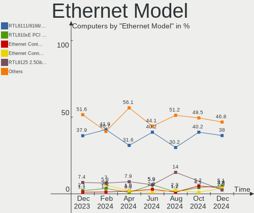
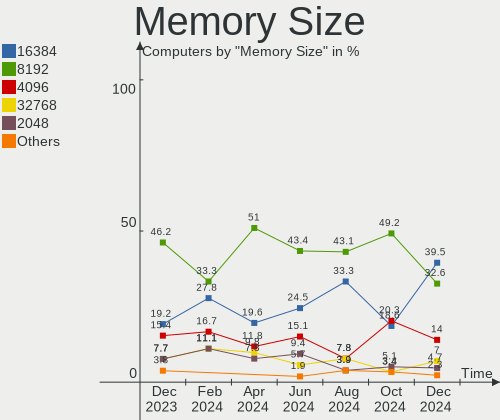
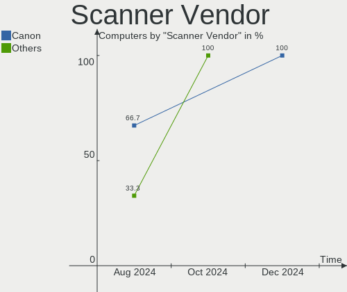

openSUSE Hardware Trends
------------------------

A project to identify most popular hardware characteristics and track their change
over time based on data collected by openSUSE users at https://Linux-Hardware.org.

Anyone can contribute to the study by uploading probes of their computers by
the [hw-probe](https://github.com/linuxhw/hw-probe) tool:

    sudo -E hw-probe -all -upload

This is a report for all computer types. See also reports for [desktops](/Dist/openSUSE/Desktop/README.md) and [notebooks](/Dist/openSUSE/Notebook/README.md).

Full-feature report is available here: https://linux-hardware.org/?view=trends

Period: May, 2021.

Contents
--------

- [ OS                       ](#os)
- [ OS Family                ](#os-family)
- [ Kernel                   ](#kernel)
- [ Kernel Family            ](#kernel-family)
- [ Kernel Major Ver.        ](#kernel-major-ver)
- [ Arch                     ](#arch)
- [ DE                       ](#de)
- [ Display Server           ](#display-server)
- [ Display Manager          ](#display-manager)
- [ OS Lang                  ](#os-lang)
- [ Boot Mode                ](#boot-mode)
- [ Filesystem               ](#filesystem)
- [ Part. scheme             ](#part-scheme)
- [ Dual Boot with Linux/BSD ](#dual-boot-with-linux/bsd)
- [ Dual Boot (Win)          ](#dual-boot-win)
- [ Country                  ](#country)
- [ City                     ](#city)
- [ Vendor                   ](#vendor)
- [ Model                    ](#model)
- [ Model Family             ](#model-family)
- [ MFG Year                 ](#mfg-year)
- [ Form Factor              ](#form-factor)
- [ Secure Boot              ](#secure-boot)
- [ Coreboot                 ](#coreboot)
- [ RAM Size                 ](#ram-size)
- [ RAM Used                 ](#ram-used)
- [ Has CD-ROM               ](#has-cd-rom)
- [ Total Drives             ](#total-drives)
- [ Has Ethernet             ](#has-ethernet)
- [ Has WiFi                 ](#has-wifi)
- [ Has Bluetooth            ](#has-bluetooth)
- [ Drive Vendor             ](#drive-vendor)
- [ Drive Model              ](#drive-model)
- [ HDD Vendor               ](#hdd-vendor)
- [ SSD Vendor               ](#ssd-vendor)
- [ Drive Kind               ](#drive-kind)
- [ Drive Connector          ](#drive-connector)
- [ Drive Size               ](#drive-size)
- [ Space Total              ](#space-total)
- [ Space Used               ](#space-used)
- [ Malfunc. Drives          ](#malfunc-drives)
- [ Malfunc. Drive Vendor    ](#malfunc-drive-vendor)
- [ Malfunc. HDD Vendor      ](#malfunc-hdd-vendor)
- [ Malfunc. Drive Kind      ](#malfunc-drive-kind)
- [ Failed Drives            ](#failed-drives)
- [ Failed Drive Vendor      ](#failed-drive-vendor)
- [ Drive Status             ](#drive-status)
- [ Storage Vendor           ](#storage-vendor)
- [ Storage Model            ](#storage-model)
- [ Storage Kind             ](#storage-kind)
- [ CPU Vendor               ](#cpu-vendor)
- [ CPU Model                ](#cpu-model)
- [ CPU Model Family         ](#cpu-model-family)
- [ CPU Cores                ](#cpu-cores)
- [ CPU Sockets              ](#cpu-sockets)
- [ CPU Threads              ](#cpu-threads)
- [ CPU Op-Modes             ](#cpu-op-modes)
- [ CPU Microcode            ](#cpu-microcode)
- [ CPU Microarch            ](#cpu-microarch)
- [ GPU Vendor               ](#gpu-vendor)
- [ GPU Model                ](#gpu-model)
- [ GPU Combo                ](#gpu-combo)
- [ GPU Driver               ](#gpu-driver)
- [ GPU Memory               ](#gpu-memory)
- [ Monitor Vendor           ](#monitor-vendor)
- [ Monitor Model            ](#monitor-model)
- [ Monitor Resolution       ](#monitor-resolution)
- [ Monitor Diagonal         ](#monitor-diagonal)
- [ Monitor Width            ](#monitor-width)
- [ Aspect Ratio             ](#aspect-ratio)
- [ Monitor Area             ](#monitor-area)
- [ Pixel Density            ](#pixel-density)
- [ Multiple Monitors        ](#multiple-monitors)
- [ Net Controller Vendor    ](#net-controller-vendor)
- [ Net Controller Model     ](#net-controller-model)
- [ Wireless Vendor          ](#wireless-vendor)
- [ Wireless Model           ](#wireless-model)
- [ Ethernet Vendor          ](#ethernet-vendor)
- [ Ethernet Model           ](#ethernet-model)
- [ Net Controller Kind      ](#net-controller-kind)
- [ Used Controller          ](#used-controller)
- [ NICs                     ](#nics)
- [ IPv6                     ](#ipv6)
- [ Memory Vendor            ](#memory-vendor)
- [ Memory Model             ](#memory-model)
- [ Memory Kind              ](#memory-kind)
- [ Memory Form Factor       ](#memory-form-factor)
- [ Memory Size              ](#memory-size)
- [ Memory Speed             ](#memory-speed)
- [ Sound Vendor             ](#sound-vendor)
- [ Sound Model              ](#sound-model)
- [ Camera Vendor            ](#camera-vendor)
- [ Camera Model             ](#camera-model)
- [ Fingerprint Vendor       ](#fingerprint-vendor)
- [ Fingerprint Model        ](#fingerprint-model)
- [ Chipcard Vendor          ](#chipcard-vendor)
- [ Chipcard Model           ](#chipcard-model)
- [ Printer Vendor           ](#printer-vendor)
- [ Printer Model            ](#printer-model)
- [ Scanner Vendor           ](#scanner-vendor)
- [ Scanner Model            ](#scanner-model)
- [ Bluetooth Vendor         ](#bluetooth-vendor)
- [ Bluetooth Model          ](#bluetooth-model)
- [ Unsupported Devices      ](#unsupported-devices)
- [ Unsupported Device Types ](#unsupported-device-types)

OS
--

Installed operating systems

| Name                         | Computers | Percent |
|------------------------------|-----------|---------|
| openSUSE Leap-15.2           | 17        | 29.31%  |
| openSUSE Tumbleweed-20210504 | 3         | 5.17%   |
| openSUSE Leap-15.3           | 3         | 5.17%   |
| openSUSE 20210524            | 3         | 5.17%   |
| openSUSE Tumbleweed-20210522 | 2         | 3.45%   |
| openSUSE Leap-15.1           | 2         | 3.45%   |
| openSUSE 20210521            | 2         | 3.45%   |
| openSUSE 20210511            | 2         | 3.45%   |
| openSUSE 20210427            | 2         | 3.45%   |
| openSUSE Tumbleweed-20210524 | 1         | 1.72%   |
| openSUSE Tumbleweed-20210521 | 1         | 1.72%   |
| openSUSE Tumbleweed-20210515 | 1         | 1.72%   |
| openSUSE Tumbleweed-20210512 | 1         | 1.72%   |
| openSUSE Tumbleweed-20210510 | 1         | 1.72%   |
| openSUSE Tumbleweed-20210506 | 1         | 1.72%   |
| openSUSE Tumbleweed-20210505 | 1         | 1.72%   |
| openSUSE Microos-20210414    | 1         | 1.72%   |
| openSUSE Microos-20210321    | 1         | 1.72%   |
| openSUSE 20210522            | 1         | 1.72%   |
| openSUSE 20210520            | 1         | 1.72%   |
| openSUSE 20210517            | 1         | 1.72%   |
| openSUSE 20210515            | 1         | 1.72%   |
| openSUSE 20210512            | 1         | 1.72%   |
| openSUSE 20210508            | 1         | 1.72%   |
| openSUSE 20210505            | 1         | 1.72%   |
| openSUSE 20210504            | 1         | 1.72%   |
| openSUSE 20210503            | 1         | 1.72%   |
| openSUSE 20210502            | 1         | 1.72%   |
| openSUSE 20210429            | 1         | 1.72%   |
| openSUSE 20210428            | 1         | 1.72%   |
| openSUSE 20210426            | 1         | 1.72%   |

OS Family
---------

OS without a version

| Name     | Computers | Percent |
|----------|-----------|---------|
| openSUSE | 58        | 100%    |

Kernel
------

Version of the Linux kernel

| Version                     | Computers | Percent |
|-----------------------------|-----------|---------|
| 5.12.0-2-default            | 10        | 17.24%  |
| 5.12.4-1-default            | 9         | 15.52%  |
| 5.3.18-lp152.75-default     | 7         | 12.07%  |
| 5.12.3-1-default            | 4         | 6.9%    |
| 5.11.16-1-default           | 4         | 6.9%    |
| 5.3.18-lp152.72-default     | 3         | 5.17%   |
| 5.3.18-lp152.75-preempt     | 2         | 3.45%   |
| 5.12.2-1-default            | 2         | 3.45%   |
| 5.12.0-1-default            | 2         | 3.45%   |
| 5.5.7-1.g1004bce-default    | 1         | 1.72%   |
| 5.3.18-lp152.77-preempt     | 1         | 1.72%   |
| 5.3.18-lp152.72-preempt     | 1         | 1.72%   |
| 5.3.18-lp152.33-default     | 1         | 1.72%   |
| 5.3.18-lp152.19-default     | 1         | 1.72%   |
| 5.3.18-57-preempt           | 1         | 1.72%   |
| 5.3.18-57-default           | 1         | 1.72%   |
| 5.3.18-56-default           | 1         | 1.72%   |
| 5.12.4-3-default            | 1         | 1.72%   |
| 5.12.2-1-pae                | 1         | 1.72%   |
| 5.12.1-uefi                 | 1         | 1.72%   |
| 5.11.6-1-default            | 1         | 1.72%   |
| 5.11.15-1-default           | 1         | 1.72%   |
| 5.11.12-1-default           | 1         | 1.72%   |
| 4.12.14-lp151.28.91-default | 1         | 1.72%   |

Kernel Family
-------------

Linux kernel without a distro release

| Version | Computers | Percent |
|---------|-----------|---------|
| 5.3.18  | 19        | 32.76%  |
| 5.12.0  | 12        | 20.69%  |
| 5.12.4  | 10        | 17.24%  |
| 5.12.3  | 4         | 6.9%    |
| 5.11.16 | 4         | 6.9%    |
| 5.12.2  | 3         | 5.17%   |
| 5.5.7   | 1         | 1.72%   |
| 5.12.1  | 1         | 1.72%   |
| 5.11.6  | 1         | 1.72%   |
| 5.11.15 | 1         | 1.72%   |
| 5.11.12 | 1         | 1.72%   |
| 4.12.14 | 1         | 1.72%   |

Kernel Major Ver.
-----------------

Linux kernel major version

| Version | Computers | Percent |
|---------|-----------|---------|
| 5.12    | 30        | 51.72%  |
| 5.3     | 19        | 32.76%  |
| 5.11    | 7         | 12.07%  |
| 5.5     | 1         | 1.72%   |
| 4.12    | 1         | 1.72%   |

Arch
----

OS architecture (x86_64, i586, etc.)

| Name    | Computers | Percent |
|---------|-----------|---------|
| x86_64  | 56        | 96.55%  |
| i686    | 1         | 1.72%   |
| aarch64 | 1         | 1.72%   |

DE
--

Desktop Environment

| Name     | Computers | Percent |
|----------|-----------|---------|
| KDE5     | 20        | 34.48%  |
| KDE      | 16        | 27.59%  |
| GNOME    | 11        | 18.97%  |
| XFCE     | 5         | 8.62%   |
| MATE     | 2         | 3.45%   |
| LXDE     | 1         | 1.72%   |
| fvwm2    | 1         | 1.72%   |
| Cinnamon | 1         | 1.72%   |
| Unknown  | 1         | 1.72%   |

Display Server
--------------

X11 or Wayland

| Name        | Computers | Percent |
|-------------|-----------|---------|
| X11         | 44        | 75.86%  |
| Wayland     | 12        | 20.69%  |
| Unspecified | 1         | 1.72%   |
| Tty         | 1         | 1.72%   |

Display Manager
---------------

SDDM, LightDM, etc.

| Name    | Computers | Percent |
|---------|-----------|---------|
| Unknown | 25        | 43.1%   |
| LightDM | 16        | 27.59%  |
| SDDM    | 12        | 20.69%  |
| XDM     | 5         | 8.62%   |

OS Lang
-------

Language

| Lang    | Computers | Percent |
|---------|-----------|---------|
| en_US   | 18        | 31.03%  |
| de_DE   | 7         | 12.07%  |
| POSIX   | 6         | 10.34%  |
| pt_BR   | 4         | 6.9%    |
| en_GB   | 4         | 6.9%    |
| Unknown | 3         | 5.17%   |
| zh_CN   | 2         | 3.45%   |
| pl_PL   | 2         | 3.45%   |
| fr_FR   | 2         | 3.45%   |
| es_ES   | 2         | 3.45%   |
| ru_RU   | 1         | 1.72%   |
| pt_PT   | 1         | 1.72%   |
| nl_NL   | 1         | 1.72%   |
| ja_JP   | 1         | 1.72%   |
| it_IT   | 1         | 1.72%   |
| fi_FI   | 1         | 1.72%   |
| en_CH   | 1         | 1.72%   |
| de_AT   | 1         | 1.72%   |

Boot Mode
---------

EFI or BIOS

| Mode | Computers | Percent |
|------|-----------|---------|
| EFI  | 40        | 68.97%  |
| BIOS | 18        | 31.03%  |

Filesystem
----------

Type of filesystem

| Type  | Computers | Percent |
|-------|-----------|---------|
| Btrfs | 39        | 67.24%  |
| Ext4  | 17        | 29.31%  |
| Xfs   | 1         | 1.72%   |
| F2fs  | 1         | 1.72%   |

Part. scheme
------------

Scheme of partitioning

| Type    | Computers | Percent |
|---------|-----------|---------|
| GPT     | 27        | 46.55%  |
| Unknown | 22        | 37.93%  |
| MBR     | 9         | 15.52%  |

Dual Boot with Linux/BSD
------------------------

Hosting more than one Linux/BSD

| Dual boot | Computers | Percent |
|-----------|-----------|---------|
| No        | 54        | 93.1%   |
| Yes       | 4         | 6.9%    |

Dual Boot (Win)
---------------

Hosting Linux and Windows

| Dual boot | Computers | Percent |
|-----------|-----------|---------|
| No        | 42        | 72.41%  |
| Yes       | 16        | 27.59%  |

Country
-------

Geographic location (country)

| Country     | Computers | Percent |
|-------------|-----------|---------|
| Germany     | 13        | 22.41%  |
| USA         | 6         | 10.34%  |
| Brazil      | 5         | 8.62%   |
| UK          | 2         | 3.45%   |
| Switzerland | 2         | 3.45%   |
| Russia      | 2         | 3.45%   |
| Portugal    | 2         | 3.45%   |
| Poland      | 2         | 3.45%   |
| France      | 2         | 3.45%   |
| China       | 2         | 3.45%   |
| Austria     | 2         | 3.45%   |
| Sweden      | 1         | 1.72%   |
| Spain       | 1         | 1.72%   |
| Serbia      | 1         | 1.72%   |
| Peru        | 1         | 1.72%   |
| Netherlands | 1         | 1.72%   |
| Mexico      | 1         | 1.72%   |
| Lebanon     | 1         | 1.72%   |
| Japan       | 1         | 1.72%   |
| Italy       | 1         | 1.72%   |
| Israel      | 1         | 1.72%   |
| Iceland     | 1         | 1.72%   |
| Finland     | 1         | 1.72%   |
| Czechia     | 1         | 1.72%   |
| Croatia     | 1         | 1.72%   |
| Costa Rica  | 1         | 1.72%   |
| Chile       | 1         | 1.72%   |
| Canada      | 1         | 1.72%   |
| Australia   | 1         | 1.72%   |

City
----

Geographic location (city)

| City                      | Computers | Percent |
|---------------------------|-----------|---------|
| Lisbon                    | 2         | 3.45%   |
| Zurich                    | 1         | 1.72%   |
| Zhuhai                    | 1         | 1.72%   |
| Yekaterinburg             | 1         | 1.72%   |
| Xiamen                    | 1         | 1.72%   |
| Wolgast                   | 1         | 1.72%   |
| Wickede                   | 1         | 1.72%   |
| Wels                      | 1         | 1.72%   |
| Vreden                    | 1         | 1.72%   |
| Umeå                     | 1         | 1.72%   |
| Twedt                     | 1         | 1.72%   |
| Toyota                    | 1         | 1.72%   |
| Toulouse                  | 1         | 1.72%   |
| Tel Aviv                  | 1         | 1.72%   |
| São Paulo                | 1         | 1.72%   |
| Sullana                   | 1         | 1.72%   |
| St Petersburg             | 1         | 1.72%   |
| Schlegel                  | 1         | 1.72%   |
| Santiago                  | 1         | 1.72%   |
| San Antonio               | 1         | 1.72%   |
| Rio de Janeiro            | 1         | 1.72%   |
| Reykjavik                 | 1         | 1.72%   |
| Rendsburg                 | 1         | 1.72%   |
| Prague                    | 1         | 1.72%   |
| Pouso Alegre              | 1         | 1.72%   |
| Osijek                    | 1         | 1.72%   |
| Osasco                    | 1         | 1.72%   |
| Offenbach                 | 1         | 1.72%   |
| Oberursel                 | 1         | 1.72%   |
| Naranjo                   | 1         | 1.72%   |
| Montreal                  | 1         | 1.72%   |
| Milan                     | 1         | 1.72%   |
| Miami                     | 1         | 1.72%   |
| Melbourne                 | 1         | 1.72%   |
| Madrid                    | 1         | 1.72%   |
| Lázaro Cárdenas         | 1         | 1.72%   |
| Letchworth Garden City    | 1         | 1.72%   |
| Lansing                   | 1         | 1.72%   |
| Kiel                      | 1         | 1.72%   |
| Järvenpää              | 1         | 1.72%   |
| Gdansk                    | 1         | 1.72%   |
| Frankfurt am Main         | 1         | 1.72%   |
| Fortaleza                 | 1         | 1.72%   |
| Erie                      | 1         | 1.72%   |
| Dietikon                  | 1         | 1.72%   |
| Daly City                 | 1         | 1.72%   |
| Cranberry Township        | 1         | 1.72%   |
| Buchholz in der Nordheide | 1         | 1.72%   |
| Bolszewo                  | 1         | 1.72%   |
| Bingley                   | 1         | 1.72%   |
| Belgrade                  | 1         | 1.72%   |
| Beirut                    | 1         | 1.72%   |
| Bayreuth                  | 1         | 1.72%   |
| Bad Zell                  | 1         | 1.72%   |
| Annequin                  | 1         | 1.72%   |
| Alphen aan den Rijn       | 1         | 1.72%   |
| Ahrensburg                | 1         | 1.72%   |

Vendor
------

Motherboard manufacturer

| Name                    | Computers | Percent |
|-------------------------|-----------|---------|
| Lenovo                  | 9         | 15.52%  |
| Hewlett-Packard         | 9         | 15.52%  |
| ASUSTek Computer        | 9         | 15.52%  |
| MSI                     | 8         | 13.79%  |
| Dell                    | 5         | 8.62%   |
| ASRock                  | 2         | 3.45%   |
| Apple                   | 2         | 3.45%   |
| TongFang                | 1         | 1.72%   |
| Sony                    | 1         | 1.72%   |
| Samsung Electronics     | 1         | 1.72%   |
| Raspberry Pi Foundation | 1         | 1.72%   |
| PCWare                  | 1         | 1.72%   |
| Medion                  | 1         | 1.72%   |
| Intel                   | 1         | 1.72%   |
| HUAWEI                  | 1         | 1.72%   |
| Gigabyte Technology     | 1         | 1.72%   |
| Fujitsu                 | 1         | 1.72%   |
| Foxconn                 | 1         | 1.72%   |
| Biostar                 | 1         | 1.72%   |
| Acer                    | 1         | 1.72%   |
| Unknown                 | 1         | 1.72%   |

Model
-----

Motherboard model

| Name                                        | Computers | Percent |
|---------------------------------------------|-----------|---------|
| MSI MS-7B86                                 | 2         | 3.45%   |
| TongFang GK7CP6S                            | 1         | 1.72%   |
| Sony VGN-Z570AN                             | 1         | 1.72%   |
| Samsung 355V4C/356V4C/3445VC/3545VC         | 1         | 1.72%   |
| RPi Raspberry Pi 4 Model B Rev 1.1          | 1         | 1.72%   |
| PCWare IPX4105G Pro                         | 1         | 1.72%   |
| MSI MS-7C02                                 | 1         | 1.72%   |
| MSI MS-7B10                                 | 1         | 1.72%   |
| MSI MS-7A72                                 | 1         | 1.72%   |
| MSI MS-7048                                 | 1         | 1.72%   |
| MSI GS60 6QE                                | 1         | 1.72%   |
| MSI CR500                                   | 1         | 1.72%   |
| Medion MS-7728                              | 1         | 1.72%   |
| Lenovo Yoga 6 13ARE05 82FN                  | 1         | 1.72%   |
| Lenovo V145-15AST 81MT                      | 1         | 1.72%   |
| Lenovo ThinkPad X1 Yoga Gen 5 20UBCTO1WW    | 1         | 1.72%   |
| Lenovo ThinkPad T480 20L5CTO1WW             | 1         | 1.72%   |
| Lenovo ThinkPad E15 20RD0015UK              | 1         | 1.72%   |
| Lenovo K450e 10181                          | 1         | 1.72%   |
| Lenovo IdeaPad S340-15IML 81NA              | 1         | 1.72%   |
| Lenovo IdeaPad S145-15API 81V7              | 1         | 1.72%   |
| Lenovo IdeaPad 3 15IIL05 81WE               | 1         | 1.72%   |
| Intel H61                                   | 1         | 1.72%   |
| HUAWEI BOHK-WAX9X                           | 1         | 1.72%   |
| HP ZBook 17 G2                              | 1         | 1.72%   |
| HP Z840 Workstation                         | 1         | 1.72%   |
| HP ProBook 430 G2                           | 1         | 1.72%   |
| HP Pavilion Laptop 15-eg0xxx                | 1         | 1.72%   |
| HP Pavilion Desktop TP01-2xxx               | 1         | 1.72%   |
| HP Laptop 17-ca3xxx                         | 1         | 1.72%   |
| HP ENVY x360 Convertible 13-ar0xxx          | 1         | 1.72%   |
| HP EliteBook 8570p                          | 1         | 1.72%   |
| HP EliteBook 850 G1                         | 1         | 1.72%   |
| Gigabyte B450 AORUS M                       | 1         | 1.72%   |
| Fujitsu ESPRIMO P558                        | 1         | 1.72%   |
| Foxconn p6-2452efm                          | 1         | 1.72%   |
| Dell PowerEdge T30                          | 1         | 1.72%   |
| Dell PowerEdge R530                         | 1         | 1.72%   |
| Dell OptiPlex 980                           | 1         | 1.72%   |
| Dell Inspiron 5584                          | 1         | 1.72%   |
| Dell Inspiron 3880                          | 1         | 1.72%   |
| Biostar H77MU3                              | 1         | 1.72%   |
| ASUS X55CR                                  | 1         | 1.72%   |
| ASUS VivoBook 12_ASUS Laptop E203MAS_E203MA | 1         | 1.72%   |
| ASUS ROG CROSSHAIR VIII DARK HERO           | 1         | 1.72%   |
| ASUS ProB                                   | 1         | 1.72%   |
| ASUS PRIME A320M-K                          | 1         | 1.72%   |
| ASUS MINIPC PN50                            | 1         | 1.72%   |
| ASUS F2A55                                  | 1         | 1.72%   |
| ASUS A0000001                               | 1         | 1.72%   |
| ASUS 970 PRO GAMING/AURA                    | 1         | 1.72%   |
| ASRock H370M Pro4                           | 1         | 1.72%   |
| ASRock 890GM Pro3                           | 1         | 1.72%   |
| Apple MacBookPro10,2                        | 1         | 1.72%   |
| Apple iMac20,1                              | 1         | 1.72%   |
| Acer Aspire A315-53                         | 1         | 1.72%   |
| Unknown                                     | 1         | 1.72%   |

Model Family
------------

Motherboard model prefix

| Name               | Computers | Percent |
|--------------------|-----------|---------|
| Lenovo ThinkPad    | 3         | 5.17%   |
| Lenovo IdeaPad     | 3         | 5.17%   |
| MSI MS-7B86        | 2         | 3.45%   |
| HP Pavilion        | 2         | 3.45%   |
| HP EliteBook       | 2         | 3.45%   |
| Dell PowerEdge     | 2         | 3.45%   |
| Dell Inspiron      | 2         | 3.45%   |
| TongFang GK7CP6S   | 1         | 1.72%   |
| Sony VGN-Z570AN    | 1         | 1.72%   |
| Samsung 355V4C     | 1         | 1.72%   |
| RPi Raspberry      | 1         | 1.72%   |
| PCWare IPX4105G    | 1         | 1.72%   |
| MSI MS-7C02        | 1         | 1.72%   |
| MSI MS-7B10        | 1         | 1.72%   |
| MSI MS-7A72        | 1         | 1.72%   |
| MSI MS-7048        | 1         | 1.72%   |
| MSI GS60           | 1         | 1.72%   |
| MSI CR500          | 1         | 1.72%   |
| Medion MS-7728     | 1         | 1.72%   |
| Lenovo Yoga        | 1         | 1.72%   |
| Lenovo V145-15AST  | 1         | 1.72%   |
| Lenovo K450e       | 1         | 1.72%   |
| Intel H61          | 1         | 1.72%   |
| HUAWEI BOHK-WAX9X  | 1         | 1.72%   |
| HP ZBook           | 1         | 1.72%   |
| HP Z840            | 1         | 1.72%   |
| HP ProBook         | 1         | 1.72%   |
| HP Laptop          | 1         | 1.72%   |
| HP ENVY            | 1         | 1.72%   |
| Gigabyte B450      | 1         | 1.72%   |
| Fujitsu ESPRIMO    | 1         | 1.72%   |
| Foxconn p6-2452efm | 1         | 1.72%   |
| Dell OptiPlex      | 1         | 1.72%   |
| Biostar H77MU3     | 1         | 1.72%   |
| ASUS X55CR         | 1         | 1.72%   |
| ASUS VivoBook      | 1         | 1.72%   |
| ASUS ROG           | 1         | 1.72%   |
| ASUS ProB          | 1         | 1.72%   |
| ASUS PRIME         | 1         | 1.72%   |
| ASUS MINIPC        | 1         | 1.72%   |
| ASUS F2A55         | 1         | 1.72%   |
| ASUS A0000001      | 1         | 1.72%   |
| ASUS 970           | 1         | 1.72%   |
| ASRock H370M       | 1         | 1.72%   |
| ASRock 890GM       | 1         | 1.72%   |
| Apple MacBookPro10 | 1         | 1.72%   |
| Apple iMac20       | 1         | 1.72%   |
| Acer Aspire        | 1         | 1.72%   |
| Unknown            | 1         | 1.72%   |

MFG Year
--------

Motherboard manufacture year

| Year | Computers | Percent |
|------|-----------|---------|
| 2020 | 17        | 29.31%  |
| 2019 | 14        | 24.14%  |
| 2021 | 7         | 12.07%  |
| 2018 | 4         | 6.9%    |
| 2017 | 3         | 5.17%   |
| 2016 | 2         | 3.45%   |
| 2014 | 2         | 3.45%   |
| 2013 | 2         | 3.45%   |
| 2012 | 2         | 3.45%   |
| 2009 | 2         | 3.45%   |
| 2015 | 1         | 1.72%   |
| 2010 | 1         | 1.72%   |
| 2004 | 1         | 1.72%   |

Form Factor
-----------

Physical design of the computer

| Name           | Computers | Percent |
|----------------|-----------|---------|
| Desktop        | 27        | 46.55%  |
| Notebook       | 24        | 41.38%  |
| Convertible    | 3         | 5.17%   |
| System on chip | 1         | 1.72%   |
| Mini pc        | 1         | 1.72%   |
| All in one     | 1         | 1.72%   |
| Server         | 1         | 1.72%   |

Secure Boot
-----------

Enabled or disabled

| State    | Computers | Percent |
|----------|-----------|---------|
| Disabled | 53        | 91.38%  |
| Enabled  | 5         | 8.62%   |

Coreboot
--------

Have coreboot on board

| Used | Computers | Percent |
|------|-----------|---------|
| No   | 58        | 100%    |

RAM Size
--------

Total RAM memory

| Size in GB  | Computers | Percent |
|-------------|-----------|---------|
| 4.01-8.0    | 13        | 22.41%  |
| 16.01-24.0  | 11        | 18.97%  |
| 32.01-64.0  | 9         | 15.52%  |
| 3.01-4.0    | 9         | 15.52%  |
| 8.01-16.0   | 8         | 13.79%  |
| 64.01-256.0 | 5         | 8.62%   |
| 24.01-32.0  | 2         | 3.45%   |
| 2.01-3.0    | 1         | 1.72%   |

RAM Used
--------

Used RAM memory

| Used GB    | Computers | Percent |
|------------|-----------|---------|
| 2.01-3.0   | 14        | 24.14%  |
| 4.01-8.0   | 13        | 22.41%  |
| 3.01-4.0   | 13        | 22.41%  |
| 1.01-2.0   | 11        | 18.97%  |
| 0.51-1.0   | 3         | 5.17%   |
| 8.01-16.0  | 2         | 3.45%   |
| 16.01-24.0 | 1         | 1.72%   |
| 0.01-0.5   | 1         | 1.72%   |

Has CD-ROM
----------

Has CD-ROM on board

| Presented | Computers | Percent |
|-----------|-----------|---------|
| No        | 36        | 62.07%  |
| Yes       | 22        | 37.93%  |

Total Drives
------------

Number of drives on board

| Drives | Computers | Percent |
|--------|-----------|---------|
| 2      | 24        | 41.38%  |
| 1      | 22        | 37.93%  |
| 3      | 6         | 10.34%  |
| 4      | 4         | 6.9%    |
| 6      | 1         | 1.72%   |
| 5      | 1         | 1.72%   |

Has Ethernet
------------

Has Ethernet on board

| Presented | Computers | Percent |
|-----------|-----------|---------|
| Yes       | 47        | 81.03%  |
| No        | 11        | 18.97%  |

Has WiFi
--------

Has WiFi module

| Presented | Computers | Percent |
|-----------|-----------|---------|
| Yes       | 37        | 63.79%  |
| No        | 21        | 36.21%  |

Has Bluetooth
-------------

Has Bluetooth module

| Presented | Computers | Percent |
|-----------|-----------|---------|
| Yes       | 34        | 58.62%  |
| No        | 24        | 41.38%  |

Drive Vendor
------------

Hard drive vendors

| Vendor              | Computers | Drives | Percent |
|---------------------|-----------|--------|---------|
| Samsung Electronics | 21        | 28     | 21.88%  |
| Seagate             | 16        | 19     | 16.67%  |
| WDC                 | 15        | 20     | 15.63%  |
| Toshiba             | 7         | 7      | 7.29%   |
| Unknown             | 5         | 5      | 5.21%   |
| Crucial             | 5         | 6      | 5.21%   |
| SanDisk             | 3         | 3      | 3.13%   |
| Intel               | 3         | 4      | 3.13%   |
| Micron Technology   | 2         | 2      | 2.08%   |
| LITEON              | 2         | 2      | 2.08%   |
| KIOXIA              | 2         | 2      | 2.08%   |
| Kingston            | 2         | 4      | 2.08%   |
| Hitachi             | 2         | 2      | 2.08%   |
| HGST                | 2         | 2      | 2.08%   |
| XPG                 | 1         | 1      | 1.04%   |
| Silicon Motion      | 1         | 1      | 1.04%   |
| ShanDianZhe         | 1         | 1      | 1.04%   |
| Phison              | 1         | 1      | 1.04%   |
| OYEN                | 1         | 1      | 1.04%   |
| Maxtor              | 1         | 1      | 1.04%   |
| GOODRAM             | 1         | 1      | 1.04%   |
| Apple               | 1         | 1      | 1.04%   |
| A-DATA Technology   | 1         | 2      | 1.04%   |

Drive Model
-----------

Hard drive models

| Model                                | Computers | Percent |
|--------------------------------------|-----------|---------|
| Samsung SSD 860 EVO 500GB            | 3         | 2.75%   |
| WDC WD10EZEX-08WN4A0 1TB             | 2         | 1.83%   |
| SanDisk SSD PLUS 1000GB              | 2         | 1.83%   |
| Samsung SSD 860 EVO 1TB              | 2         | 1.83%   |
| KIOXIA NVMe SSD Drive 256GB          | 2         | 1.83%   |
| Crucial CT500MX500SSD1 500GB         | 2         | 1.83%   |
| XPG GAMMIX S11 Pro 512GB             | 1         | 0.92%   |
| WDC WDS500G2B0A-00SM50 500GB SSD     | 1         | 0.92%   |
| WDC WDS250G1B0A-00H9H0 250GB SSD     | 1         | 0.92%   |
| WDC WDS240G2G0A-00JH30 240GB SSD     | 1         | 0.92%   |
| WDC WDS120G2G0A-00JH30 120GB SSD     | 1         | 0.92%   |
| WDC WDS100T3XHC-00SJG0 1TB           | 1         | 0.92%   |
| WDC WD80EZZX-11CSGA0 8TB             | 1         | 0.92%   |
| WDC WD80EFZX-68UW8N0 8TB             | 1         | 0.92%   |
| WDC WD5000LPLX-66ZNTT1 500GB         | 1         | 0.92%   |
| WDC WD5000AZLX-00K2TA0 500GB         | 1         | 0.92%   |
| WDC WD5000AAKS-00UU3A0 500GB         | 1         | 0.92%   |
| WDC WD20EZRX-00DC0B0 2TB             | 1         | 0.92%   |
| WDC WD1600AABS-56PRA0 160GB          | 1         | 0.92%   |
| WDC WD10EZEX-22MFCA0 1TB             | 1         | 0.92%   |
| WDC WD10EURX-63UY4Y0 1TB             | 1         | 0.92%   |
| WDC WD10EURS-730AB1 1TB              | 1         | 0.92%   |
| WDC WD1003FZEX-00K3CA0 1TB           | 1         | 0.92%   |
| WDC PC SN730 SDBPNTY-256G-1027 256GB | 1         | 0.92%   |
| WDC PC SN730 SDBPNTY-1T00-1101 1TB   | 1         | 0.92%   |
| Unknown SD01G  1GB                   | 1         | 0.92%   |
| Unknown SD/MMC/MS PRO 8GB            | 1         | 0.92%   |
| Unknown SC32G  32GB                  | 1         | 0.92%   |
| Unknown LX128  128GB                 | 1         | 0.92%   |
| Unknown DA4064  64GB                 | 1         | 0.92%   |
| Toshiba THNSNJ256G8NU 256GB SSD      | 1         | 0.92%   |
| Toshiba NVMe SSD Drive 256GB         | 1         | 0.92%   |
| Toshiba MQ04ABF100 1TB               | 1         | 0.92%   |
| Toshiba HDWD260 6TB                  | 1         | 0.92%   |
| Toshiba HDWD110 1TB                  | 1         | 0.92%   |
| Toshiba HDWD105 500GB                | 1         | 0.92%   |
| Toshiba DT01ACA100 1TB               | 1         | 0.92%   |
| Silicon Motion NE-128 128GB          | 1         | 0.92%   |
| ShanDianZhe SSD 256GB                | 1         | 0.92%   |
| Seagate ST8000DM004-2CX188 8TB       | 1         | 0.92%   |
| Seagate ST500LM021-1KJ152 500GB      | 1         | 0.92%   |
| Seagate ST4000DX001-1CE168 4TB       | 1         | 0.92%   |
| Seagate ST3200021A 200GB             | 1         | 0.92%   |
| Seagate ST3160318AS 160GB            | 1         | 0.92%   |
| Seagate ST31000525SV 1TB             | 1         | 0.92%   |
| Seagate ST2000LM015-2E8174 2TB       | 1         | 0.92%   |
| Seagate ST2000DM008-2FR102 2TB       | 1         | 0.92%   |
| Seagate ST2000DM001-1ER164 2TB       | 1         | 0.92%   |
| Seagate ST1000VM002-1SD102 1TB       | 1         | 0.92%   |
| Seagate ST1000LX015-1U7172 1TB       | 1         | 0.92%   |
| Seagate ST1000LM035-1RK172 1TB       | 1         | 0.92%   |
| Seagate ST1000LM024 HN-M101MBB 1TB   | 1         | 0.92%   |
| Seagate ST1000DX001-1CM162 1TB       | 1         | 0.92%   |
| Seagate ST1000DM010-2EP102 1TB       | 1         | 0.92%   |
| Seagate ST10000NM0086-2AA101 10TB    | 1         | 0.92%   |
| Seagate M3 Portable 2TB              | 1         | 0.92%   |
| Seagate Expansion 2TB                | 1         | 0.92%   |
| SanDisk Ultra II 480GB SSD           | 1         | 0.92%   |
| Samsung SSD 980 PRO 2TB              | 1         | 0.92%   |
| Samsung SSD 970 EVO Plus 500GB       | 1         | 0.92%   |

HDD Vendor
----------

Hard disk drive vendors

| Vendor              | Computers | Drives | Percent |
|---------------------|-----------|--------|---------|
| Seagate             | 15        | 18     | 39.47%  |
| WDC                 | 10        | 13     | 26.32%  |
| Toshiba             | 5         | 5      | 13.16%  |
| Samsung Electronics | 4         | 4      | 10.53%  |
| Hitachi             | 2         | 2      | 5.26%   |
| HGST                | 2         | 2      | 5.26%   |

SSD Vendor
----------

Solid state drive vendors

| Vendor              | Computers | Drives | Percent |
|---------------------|-----------|--------|---------|
| Samsung Electronics | 8         | 13     | 26.67%  |
| WDC                 | 4         | 4      | 13.33%  |
| Crucial             | 4         | 5      | 13.33%  |
| SanDisk             | 3         | 3      | 10%     |
| Micron Technology   | 2         | 2      | 6.67%   |
| LITEON              | 2         | 2      | 6.67%   |
| Kingston            | 2         | 4      | 6.67%   |
| Toshiba             | 1         | 1      | 3.33%   |
| ShanDianZhe         | 1         | 1      | 3.33%   |
| Maxtor              | 1         | 1      | 3.33%   |
| Intel               | 1         | 2      | 3.33%   |
| GOODRAM             | 1         | 1      | 3.33%   |

Drive Kind
----------

HDD or SSD

| Kind    | Computers | Drives | Percent |
|---------|-----------|--------|---------|
| HDD     | 33        | 44     | 36.26%  |
| SSD     | 27        | 39     | 29.67%  |
| NVMe    | 24        | 26     | 26.37%  |
| MMC     | 4         | 4      | 4.4%    |
| Unknown | 3         | 3      | 3.3%    |

Drive Connector
---------------

SATA, SAS, NVMe, etc.

| Type | Computers | Drives | Percent |
|------|-----------|--------|---------|
| SATA | 44        | 80     | 56.41%  |
| NVMe | 24        | 26     | 30.77%  |
| SAS  | 6         | 6      | 7.69%   |
| MMC  | 4         | 4      | 5.13%   |

Drive Size
----------

Size of hard drive

| Size in TB | Computers | Drives | Percent |
|------------|-----------|--------|---------|
| 0.01-0.5   | 28        | 44     | 45.16%  |
| 0.51-1.0   | 21        | 25     | 33.87%  |
| 1.01-2.0   | 7         | 8      | 11.29%  |
| 4.01-10.0  | 5         | 5      | 8.06%   |
| 3.01-4.0   | 1         | 1      | 1.61%   |

Space Total
-----------

Amount of disk space available on the file system

| Size in GB     | Computers | Percent |
|----------------|-----------|---------|
| More than 3000 | 21        | 36.21%  |
| 1001-2000      | 10        | 17.24%  |
| 2001-3000      | 9         | 15.52%  |
| 501-1000       | 7         | 12.07%  |
| 251-500        | 6         | 10.34%  |
| 101-250        | 3         | 5.17%   |
| 21-50          | 1         | 1.72%   |
| 51-100         | 1         | 1.72%   |

Space Used
----------

Amount of used disk space

| Used GB        | Computers | Percent |
|----------------|-----------|---------|
| 501-1000       | 11        | 18.97%  |
| 51-100         | 10        | 17.24%  |
| 251-500        | 9         | 15.52%  |
| 101-250        | 7         | 12.07%  |
| 1001-2000      | 7         | 12.07%  |
| 1-20           | 5         | 8.62%   |
| More than 3000 | 4         | 6.9%    |
| 2001-3000      | 3         | 5.17%   |
| 21-50          | 2         | 3.45%   |

Malfunc. Drives
---------------

Drive models with a malfunction

| Model                               | Computers | Drives | Percent |
|-------------------------------------|-----------|--------|---------|
| WDC WD20EZRX-00DC0B0 2TB            | 1         | 1      | 14.29%  |
| WDC WD10EZEX-08WN4A0 1TB            | 1         | 1      | 14.29%  |
| Seagate ST500LM021-1KJ152 500GB     | 1         | 1      | 14.29%  |
| Samsung Electronics SSD 850 EVO 1TB | 1         | 1      | 14.29%  |
| Samsung Electronics HM120JI 120GB   | 1         | 1      | 14.29%  |
| Intel SSDSC2BX400G4R 400GB          | 1         | 2      | 14.29%  |
| HGST HTS725050A7E630 500GB          | 1         | 1      | 14.29%  |

Malfunc. Drive Vendor
---------------------

Vendors of faulty drives

| Vendor              | Computers | Drives | Percent |
|---------------------|-----------|--------|---------|
| WDC                 | 2         | 2      | 28.57%  |
| Samsung Electronics | 2         | 2      | 28.57%  |
| Seagate             | 1         | 1      | 14.29%  |
| Intel               | 1         | 2      | 14.29%  |
| HGST                | 1         | 1      | 14.29%  |

Malfunc. HDD Vendor
-------------------

Vendors of faulty HDD drives

| Vendor              | Computers | Drives | Percent |
|---------------------|-----------|--------|---------|
| WDC                 | 2         | 2      | 40%     |
| Seagate             | 1         | 1      | 20%     |
| Samsung Electronics | 1         | 1      | 20%     |
| HGST                | 1         | 1      | 20%     |

Malfunc. Drive Kind
-------------------

Kinds of faulty drives

| Kind | Computers | Drives | Percent |
|------|-----------|--------|---------|
| HDD  | 5         | 5      | 71.43%  |
| SSD  | 2         | 3      | 28.57%  |

Failed Drives
-------------

Failed drive models

Zero info for selected period =(

Failed Drive Vendor
-------------------

Failed drive vendors

Zero info for selected period =(

Drive Status
------------

Number of failed and malfunc. drives

| Status   | Computers | Drives | Percent |
|----------|-----------|--------|---------|
| Works    | 30        | 56     | 46.88%  |
| Detected | 27        | 52     | 42.19%  |
| Malfunc  | 7         | 8      | 10.94%  |

Storage Vendor
--------------

Storage controller vendors

| Vendor                       | Computers | Percent |
|------------------------------|-----------|---------|
| Intel                        | 35        | 44.3%   |
| AMD                          | 17        | 21.52%  |
| Samsung Electronics          | 11        | 13.92%  |
| Sandisk                      | 3         | 3.8%    |
| KIOXIA                       | 2         | 2.53%   |
| Broadcom / LSI               | 2         | 2.53%   |
| Toshiba America Info Systems | 1         | 1.27%   |
| Silicon Motion               | 1         | 1.27%   |
| Realtek Semiconductor        | 1         | 1.27%   |
| Phison Electronics           | 1         | 1.27%   |
| Nvidia                       | 1         | 1.27%   |
| Micron/Crucial Technology    | 1         | 1.27%   |
| Lite-On Technology           | 1         | 1.27%   |
| Apple                        | 1         | 1.27%   |
| ADATA Technology             | 1         | 1.27%   |

Storage Model
-------------

Storage controller models

| Model                                                                          | Computers | Percent |
|--------------------------------------------------------------------------------|-----------|---------|
| AMD FCH SATA Controller [AHCI mode]                                            | 13        | 14.44%  |
| Samsung NVMe SSD Controller SM981/PM981/PM983                                  | 6         | 6.67%   |
| AMD 400 Series Chipset SATA Controller                                         | 6         | 6.67%   |
| Samsung NVMe Controller                                                        | 4         | 4.44%   |
| Intel Cannon Lake PCH SATA AHCI Controller                                     | 3         | 3.33%   |
| Intel 7 Series Chipset Family 6-port SATA Controller [AHCI mode]               | 3         | 3.33%   |
| Intel 6 Series/C200 Series Chipset Family 6 port Desktop SATA AHCI Controller  | 3         | 3.33%   |
| Sandisk WD Black SN750 / PC SN730 NVMe SSD                                     | 2         | 2.22%   |
| KIOXIA Non-Volatile memory controller                                          | 2         | 2.22%   |
| Intel SSD 660P Series                                                          | 2         | 2.22%   |
| Intel Comet Lake SATA AHCI Controller                                          | 2         | 2.22%   |
| Intel 8 Series/C220 Series Chipset Family 6-port SATA Controller 1 [AHCI mode] | 2         | 2.22%   |
| AMD SB7x0/SB8x0/SB9x0 SATA Controller [AHCI mode]                              | 2         | 2.22%   |
| Toshiba America Info Systems BG3 NVMe SSD Controller                           | 1         | 1.11%   |
| Silicon Motion SM2263EN/SM2263XT SSD Controller                                | 1         | 1.11%   |
| Sandisk WD Black 2018/SN750 / PC SN720 NVMe SSD                                | 1         | 1.11%   |
| Samsung NVMe SSD Controller PM9A1/PM9A3/980PRO                                 | 1         | 1.11%   |
| Realtek Realtek Non-Volatile memory controller                                 | 1         | 1.11%   |
| Phison E12 NVMe Controller                                                     | 1         | 1.11%   |
| Nvidia MCP79 AHCI Controller                                                   | 1         | 1.11%   |
| Micron/Crucial P1 NVMe PCIe SSD                                                | 1         | 1.11%   |
| Lite-On SATA controller                                                        | 1         | 1.11%   |
| Intel Wildcat Point-LP SATA Controller [AHCI Mode]                             | 1         | 1.11%   |
| Intel Volume Management Device NVMe RAID Controller                            | 1         | 1.11%   |
| Intel Sunrise Point-LP SATA Controller [AHCI mode]                             | 1         | 1.11%   |
| Intel SATA Controller [RAID mode]                                              | 1         | 1.11%   |
| Intel Q170/Q150/B150/H170/H110/Z170/CM236 Chipset SATA Controller [AHCI Mode]  | 1         | 1.11%   |
| Intel Ice Lake-LP SATA Controller [AHCI mode]                                  | 1         | 1.11%   |
| Intel HM170/QM170 Chipset SATA Controller [AHCI Mode]                          | 1         | 1.11%   |
| Intel Celeron/Pentium Silver Processor SATA Controller                         | 1         | 1.11%   |
| Intel Celeron N3350/Pentium N4200/Atom E3900 Series SATA AHCI Controller       | 1         | 1.11%   |
| Intel Cannon Point-LP SATA Controller [AHCI Mode]                              | 1         | 1.11%   |
| Intel Cannon Lake Mobile PCH SATA AHCI Controller                              | 1         | 1.11%   |
| Intel C610/X99 series chipset sSATA Controller [RAID mode]                     | 1         | 1.11%   |
| Intel C610/X99 series chipset sSATA Controller [AHCI mode]                     | 1         | 1.11%   |
| Intel C610/X99 series chipset 6-Port SATA Controller [AHCI mode]               | 1         | 1.11%   |
| Intel C600/X79 series chipset SATA RAID Controller                             | 1         | 1.11%   |
| Intel 82801IBM/IEM (ICH9M/ICH9M-E) 4 port SATA Controller [AHCI mode]          | 1         | 1.11%   |
| Intel 82801EB/ER (ICH5/ICH5R) IDE Controller                                   | 1         | 1.11%   |
| Intel 8 Series SATA Controller 1 [AHCI mode]                                   | 1         | 1.11%   |
| Intel 7 Series/C210 Series Chipset Family 4-port SATA Controller [IDE mode]    | 1         | 1.11%   |
| Intel 7 Series/C210 Series Chipset Family 2-port SATA Controller [IDE mode]    | 1         | 1.11%   |
| Intel 5 Series/3400 Series Chipset PT IDER Controller                          | 1         | 1.11%   |
| Intel 5 Series/3400 Series Chipset 6 port SATA AHCI Controller                 | 1         | 1.11%   |
| Intel 300 Series Chipset Family SATA RAID Controller                           | 1         | 1.11%   |
| Intel 200 Series PCH SATA controller [AHCI mode]                               | 1         | 1.11%   |
| Broadcom / LSI SAS2308 PCI-Express Fusion-MPT SAS-2                            | 1         | 1.11%   |
| Broadcom / LSI MegaRAID SAS-3 3108 [Invader]                                   | 1         | 1.11%   |
| Apple ANS2 NVMe Controller                                                     | 1         | 1.11%   |
| AMD SB7x0/SB8x0/SB9x0 IDE Controller                                           | 1         | 1.11%   |
| AMD FCH SATA Controller D                                                      | 1         | 1.11%   |
| AMD FCH IDE Controller                                                         | 1         | 1.11%   |
| ADATA XPG SX8200 Pro PCIe Gen3x4 M.2 2280 Solid State Drive                    | 1         | 1.11%   |

Storage Kind
------------

Kind of storage controller (IDE, SATA, NVMe, SAS, ...)

| Kind | Computers | Percent |
|------|-----------|---------|
| SATA | 45        | 56.25%  |
| NVMe | 24        | 30%     |
| RAID | 5         | 6.25%   |
| IDE  | 5         | 6.25%   |
| SAS  | 1         | 1.25%   |

CPU Vendor
----------

Processor vendors

| Vendor | Computers | Percent |
|--------|-----------|---------|
| Intel  | 38        | 65.52%  |
| AMD    | 19        | 32.76%  |
| ARM    | 1         | 1.72%   |

CPU Model
---------

Processor models

| Model                                         | Computers | Percent |
|-----------------------------------------------|-----------|---------|
| Intel Core i7-10510U CPU @ 1.80GHz            | 2         | 3.45%   |
| AMD Ryzen 7 4700U with Radeon Graphics        | 2         | 3.45%   |
| AMD Ryzen 7 3700U with Radeon Vega Mobile Gfx | 2         | 3.45%   |
| AMD Ryzen 5 3600 6-Core Processor             | 2         | 3.45%   |
| Intel Xeon CPU E5-2667 v3 @ 3.20GHz           | 1         | 1.72%   |
| Intel Xeon CPU E5-2609 v3 @ 1.90GHz           | 1         | 1.72%   |
| Intel Xeon CPU E3-1225 v5 @ 3.30GHz           | 1         | 1.72%   |
| Intel Pentium CPU G4400 @ 3.30GHz             | 1         | 1.72%   |
| Intel Pentium 4 CPU 3.00GHz                   | 1         | 1.72%   |
| Intel Core i9-9900K CPU @ 3.60GHz             | 1         | 1.72%   |
| Intel Core i9-10910 CPU @ 3.60GHz             | 1         | 1.72%   |
| Intel Core i7-9750H CPU @ 2.60GHz             | 1         | 1.72%   |
| Intel Core i7-8700 CPU @ 3.20GHz              | 1         | 1.72%   |
| Intel Core i7-8565U CPU @ 1.80GHz             | 1         | 1.72%   |
| Intel Core i7-6700HQ CPU @ 2.60GHz            | 1         | 1.72%   |
| Intel Core i7-4810MQ CPU @ 2.80GHz            | 1         | 1.72%   |
| Intel Core i7-3520M CPU @ 2.90GHz             | 1         | 1.72%   |
| Intel Core i5-8250U CPU @ 1.60GHz             | 1         | 1.72%   |
| Intel Core i5-4460 CPU @ 3.20GHz              | 1         | 1.72%   |
| Intel Core i5-4200U CPU @ 1.60GHz             | 1         | 1.72%   |
| Intel Core i5-3470 CPU @ 3.20GHz              | 1         | 1.72%   |
| Intel Core i5-3450 CPU @ 3.10GHz              | 1         | 1.72%   |
| Intel Core i5-3230M CPU @ 2.60GHz             | 1         | 1.72%   |
| Intel Core i5-2320 CPU @ 3.00GHz              | 1         | 1.72%   |
| Intel Core i5-10210U CPU @ 1.60GHz            | 1         | 1.72%   |
| Intel Core i5 CPU 750 @ 2.67GHz               | 1         | 1.72%   |
| Intel Core i3-9100 CPU @ 3.60GHz              | 1         | 1.72%   |
| Intel Core i3-7020U CPU @ 2.30GHz             | 1         | 1.72%   |
| Intel Core i3-6100 CPU @ 3.70GHz              | 1         | 1.72%   |
| Intel Core i3-3220 CPU @ 3.30GHz              | 1         | 1.72%   |
| Intel Core i3-2370M CPU @ 2.40GHz             | 1         | 1.72%   |
| Intel Core i3-10100 CPU @ 3.60GHz             | 1         | 1.72%   |
| Intel Core i3-1005G1 CPU @ 1.20GHz            | 1         | 1.72%   |
| Intel Core 2 Duo CPU T5750 @ 2.00GHz          | 1         | 1.72%   |
| Intel Core 2 Duo CPU P8600 @ 2.40GHz          | 1         | 1.72%   |
| Intel Celeron N4000 CPU @ 1.10GHz             | 1         | 1.72%   |
| Intel Celeron J4105 CPU @ 1.50GHz             | 1         | 1.72%   |
| Intel Celeron CPU N3450 @ 1.10GHz             | 1         | 1.72%   |
| Intel Celeron 3205U @ 1.50GHz                 | 1         | 1.72%   |
| Intel 11th Gen Core i5-1135G7 @ 2.40GHz       | 1         | 1.72%   |
| ARM Processor                                 | 1         | 1.72%   |
| AMD Ryzen 9 5900X 12-Core Processor           | 1         | 1.72%   |
| AMD Ryzen 7 5700G with Radeon Graphics        | 1         | 1.72%   |
| AMD Ryzen 7 4800U with Radeon Graphics        | 1         | 1.72%   |
| AMD Ryzen 7 3700X 8-Core Processor            | 1         | 1.72%   |
| AMD Ryzen 5 3600X 6-Core Processor            | 1         | 1.72%   |
| AMD Ryzen 5 3500U with Radeon Vega Mobile Gfx | 1         | 1.72%   |
| AMD Ryzen 5 2600 Six-Core Processor           | 1         | 1.72%   |
| AMD Ryzen 5 1600X Six-Core Processor          | 1         | 1.72%   |
| AMD Phenom II X6 1100T Processor              | 1         | 1.72%   |
| AMD FX-8350 Eight-Core Processor              | 1         | 1.72%   |
| AMD E2-1800 APU with Radeon HD Graphics       | 1         | 1.72%   |
| AMD A8-5600K APU with Radeon HD Graphics      | 1         | 1.72%   |
| AMD A4-9125 RADEON R3, 4 COMPUTE CORES 2C+2G  | 1         | 1.72%   |

CPU Model Family
----------------

Processor model prefix

| Model            | Computers | Percent |
|------------------|-----------|---------|
| Intel Core i5    | 9         | 15.52%  |
| Intel Core i7    | 8         | 13.79%  |
| Intel Core i3    | 7         | 12.07%  |
| AMD Ryzen 7      | 7         | 12.07%  |
| AMD Ryzen 5      | 6         | 10.34%  |
| Intel Celeron    | 4         | 6.9%    |
| Intel Xeon       | 3         | 5.17%   |
| Other            | 2         | 3.45%   |
| Intel Core i9    | 2         | 3.45%   |
| Intel Core 2 Duo | 2         | 3.45%   |
| Intel Pentium 4  | 1         | 1.72%   |
| Intel Pentium    | 1         | 1.72%   |
| AMD Ryzen 9      | 1         | 1.72%   |
| AMD Phenom II X6 | 1         | 1.72%   |
| AMD FX           | 1         | 1.72%   |
| AMD E2           | 1         | 1.72%   |
| AMD A8           | 1         | 1.72%   |
| AMD A4           | 1         | 1.72%   |

CPU Cores
---------

Number of processor cores

| Number | Computers | Percent |
|--------|-----------|---------|
| 4      | 23        | 39.66%  |
| 2      | 16        | 27.59%  |
| 6      | 9         | 15.52%  |
| 8      | 6         | 10.34%  |
| 16     | 1         | 1.72%   |
| 12     | 1         | 1.72%   |
| 10     | 1         | 1.72%   |
| 1      | 1         | 1.72%   |

CPU Sockets
-----------

Number of sockets

| Number | Computers | Percent |
|--------|-----------|---------|
| 1      | 57        | 98.28%  |
| 2      | 1         | 1.72%   |

CPU Threads
-----------

Threads per core (Hyper-Threading)

| Number | Computers | Percent |
|--------|-----------|---------|
| 2      | 37        | 63.79%  |
| 1      | 21        | 36.21%  |

CPU Op-Modes
------------

CPU Operation Modes (32-bit, 64-bit)

| Op mode        | Computers | Percent |
|----------------|-----------|---------|
| 32-bit, 64-bit | 57        | 98.28%  |
| 32-bit         | 1         | 1.72%   |

CPU Microcode
-------------

Microcode number

| Number     | Computers | Percent |
|------------|-----------|---------|
| 0x506e3    | 4         | 6.9%    |
| 0x306a9    | 4         | 6.9%    |
| 0x08600106 | 3         | 5.17%   |
| Unknown    | 3         | 5.17%   |
| 0x906ea    | 2         | 3.45%   |
| 0x806ec    | 2         | 3.45%   |
| 0x806ea    | 2         | 3.45%   |
| 0x706a1    | 2         | 3.45%   |
| 0x306f2    | 2         | 3.45%   |
| 0x306c3    | 2         | 3.45%   |
| 0x206a7    | 2         | 3.45%   |
| 0x08701021 | 2         | 3.45%   |
| 0x08701013 | 2         | 3.45%   |
| 0x08108109 | 2         | 3.45%   |
| 0xf29      | 1         | 1.72%   |
| 0xa0655    | 1         | 1.72%   |
| 0xa0653    | 1         | 1.72%   |
| 0x906ec    | 1         | 1.72%   |
| 0x906eb    | 1         | 1.72%   |
| 0x806eb    | 1         | 1.72%   |
| 0x806c1    | 1         | 1.72%   |
| 0x706e5    | 1         | 1.72%   |
| 0x6fd      | 1         | 1.72%   |
| 0x506c9    | 1         | 1.72%   |
| 0x40651    | 1         | 1.72%   |
| 0x306d4    | 1         | 1.72%   |
| 0x106e5    | 1         | 1.72%   |
| 0x10676    | 1         | 1.72%   |
| 0x0a50000b | 1         | 1.72%   |
| 0x0a201009 | 1         | 1.72%   |
| 0x08108102 | 1         | 1.72%   |
| 0x0800820d | 1         | 1.72%   |
| 0x08001138 | 1         | 1.72%   |
| 0x06006705 | 1         | 1.72%   |
| 0x06001119 | 1         | 1.72%   |
| 0x06000852 | 1         | 1.72%   |
| 0x05000119 | 1         | 1.72%   |
| 0x010000dc | 1         | 1.72%   |

CPU Microarch
-------------

Microarchitecture

| Name          | Computers | Percent |
|---------------|-----------|---------|
| KabyLake      | 10        | 17.24%  |
| Zen 2         | 7         | 12.07%  |
| IvyBridge     | 5         | 8.62%   |
| Haswell       | 5         | 8.62%   |
| Zen+          | 4         | 6.9%    |
| Skylake       | 4         | 6.9%    |
| Zen 3         | 2         | 3.45%   |
| SandyBridge   | 2         | 3.45%   |
| Piledriver    | 2         | 3.45%   |
| Goldmont plus | 2         | 3.45%   |
| CometLake     | 2         | 3.45%   |
| Zen           | 1         | 1.72%   |
| TigerLake     | 1         | 1.72%   |
| Penryn        | 1         | 1.72%   |
| NetBurst      | 1         | 1.72%   |
| Nehalem       | 1         | 1.72%   |
| K10           | 1         | 1.72%   |
| IceLake       | 1         | 1.72%   |
| Goldmont      | 1         | 1.72%   |
| Excavator     | 1         | 1.72%   |
| Core          | 1         | 1.72%   |
| Broadwell     | 1         | 1.72%   |
| Bobcat        | 1         | 1.72%   |
| Unknown       | 1         | 1.72%   |

GPU Vendor
----------

Vendors of graphics cards

| Vendor                     | Computers | Percent |
|----------------------------|-----------|---------|
| Intel                      | 28        | 43.75%  |
| AMD                        | 22        | 34.38%  |
| Nvidia                     | 13        | 20.31%  |
| Matrox Electronics Systems | 1         | 1.56%   |

GPU Model
---------

Graphics card models

| Model                                                                       | Computers | Percent |
|-----------------------------------------------------------------------------|-----------|---------|
| AMD Ellesmere [Radeon RX 470/480/570/570X/580/580X/590]                     | 4         | 6.06%   |
| Intel CometLake-U GT2 [UHD Graphics]                                        | 3         | 4.55%   |
| AMD Renoir                                                                  | 3         | 4.55%   |
| AMD Picasso                                                                 | 3         | 4.55%   |
| AMD Navi 10 [Radeon RX 5600 OEM/5600 XT / 5700/5700 XT]                     | 3         | 4.55%   |
| Nvidia GK208B [GeForce GT 710]                                              | 2         | 3.03%   |
| Intel Xeon E3-1200 v2/3rd Gen Core processor Graphics Controller            | 2         | 3.03%   |
| Intel GeminiLake [UHD Graphics 600]                                         | 2         | 3.03%   |
| Intel CometLake-S GT2 [UHD Graphics 630]                                    | 2         | 3.03%   |
| Intel 2nd Generation Core Processor Family Integrated Graphics Controller   | 2         | 3.03%   |
| Nvidia TU116M [GeForce GTX 1660 Ti Mobile]                                  | 1         | 1.52%   |
| Nvidia TU106 [GeForce RTX 2070]                                             | 1         | 1.52%   |
| Nvidia TU106 [GeForce RTX 2060 Rev. A]                                      | 1         | 1.52%   |
| Nvidia MCP79 [GeForce 8200M G]                                              | 1         | 1.52%   |
| Nvidia GP108M [GeForce MX230]                                               | 1         | 1.52%   |
| Nvidia GP106 [GeForce GTX 1060 6GB]                                         | 1         | 1.52%   |
| Nvidia GP104 [GeForce GTX 1070]                                             | 1         | 1.52%   |
| Nvidia GM204M [GeForce GTX 980M]                                            | 1         | 1.52%   |
| Nvidia GM204M [GeForce GTX 970M]                                            | 1         | 1.52%   |
| Nvidia GM204 [GeForce GTX 970]                                              | 1         | 1.52%   |
| Nvidia GK110GL [Quadro K6000]                                               | 1         | 1.52%   |
| Nvidia GF116 [GeForce GTX 550 Ti]                                           | 1         | 1.52%   |
| Nvidia G98M [GeForce 9300M GS]                                              | 1         | 1.52%   |
| Matrox Electronics Systems G200eR2                                          | 1         | 1.52%   |
| Intel Xeon E3-1200 v3/4th Gen Core Processor Integrated Graphics Controller | 1         | 1.52%   |
| Intel WhiskeyLake-U GT2 [UHD Graphics 620]                                  | 1         | 1.52%   |
| Intel UHD Graphics 620                                                      | 1         | 1.52%   |
| Intel TigerLake-LP GT2 [Iris Xe Graphics]                                   | 1         | 1.52%   |
| Intel Mobile 4 Series Chipset Integrated Graphics Controller                | 1         | 1.52%   |
| Intel Iris Plus Graphics G1 (Ice Lake)                                      | 1         | 1.52%   |
| Intel HD Graphics P530                                                      | 1         | 1.52%   |
| Intel HD Graphics 620                                                       | 1         | 1.52%   |
| Intel HD Graphics 530                                                       | 1         | 1.52%   |
| Intel HD Graphics 510                                                       | 1         | 1.52%   |
| Intel HD Graphics 500                                                       | 1         | 1.52%   |
| Intel HD Graphics                                                           | 1         | 1.52%   |
| Intel Haswell-ULT Integrated Graphics Controller                            | 1         | 1.52%   |
| Intel CoffeeLake-S GT2 [UHD Graphics 630]                                   | 1         | 1.52%   |
| Intel CoffeeLake-H GT2 [UHD Graphics 630]                                   | 1         | 1.52%   |
| Intel 4th Gen Core Processor Integrated Graphics Controller                 | 1         | 1.52%   |
| Intel 3rd Gen Core processor Graphics Controller                            | 1         | 1.52%   |
| AMD Trinity [Radeon HD 7560D]                                               | 1         | 1.52%   |
| AMD Thames [Radeon HD 7550M/7570M/7650M]                                    | 1         | 1.52%   |
| AMD Tahiti XT [Radeon HD 7970/8970 OEM / R9 280X]                           | 1         | 1.52%   |
| AMD Stoney [Radeon R2/R3/R4/R5 Graphics]                                    | 1         | 1.52%   |
| AMD Seymour [Radeon HD 6400M/7400M Series]                                  | 1         | 1.52%   |
| AMD RV670 [Radeon HD 3690/3850]                                             | 1         | 1.52%   |
| AMD RV620 LE [Radeon HD 3450]                                               | 1         | 1.52%   |
| AMD Navi 14 [Radeon RX 5500/5500M / Pro 5500M]                              | 1         | 1.52%   |
| AMD Cezanne                                                                 | 1         | 1.52%   |

GPU Combo
---------

Combinations of graphics cards

| Name           | Computers | Percent |
|----------------|-----------|---------|
| 1 x Intel      | 24        | 41.38%  |
| 1 x AMD        | 20        | 34.48%  |
| 1 x Nvidia     | 5         | 8.62%   |
| Intel + Nvidia | 4         | 6.9%    |
| 2 x Nvidia     | 2         | 3.45%   |
| Other          | 1         | 1.72%   |
| AMD + Nvidia   | 1         | 1.72%   |
| AMD + Matrox   | 1         | 1.72%   |

GPU Driver
----------

Free vs proprietary

| Driver      | Computers | Percent |
|-------------|-----------|---------|
| Free        | 46        | 79.31%  |
| Proprietary | 9         | 15.52%  |
| Unknown     | 3         | 5.17%   |

GPU Memory
----------

Total video memory

| Size in GB | Computers | Percent |
|------------|-----------|---------|
| Unknown    | 29        | 50%     |
| 7.01-8.0   | 9         | 15.52%  |
| 0.01-0.5   | 7         | 12.07%  |
| 1.01-2.0   | 4         | 6.9%    |
| 0.51-1.0   | 3         | 5.17%   |
| 5.01-6.0   | 2         | 3.45%   |
| 3.01-4.0   | 2         | 3.45%   |
| 2.01-3.0   | 1         | 1.72%   |
| 8.01-16.0  | 1         | 1.72%   |

Monitor Vendor
--------------

Monitor vendors

| Vendor               | Computers | Percent |
|----------------------|-----------|---------|
| AU Optronics         | 8         | 14.04%  |
| Samsung Electronics  | 5         | 8.77%   |
| Dell                 | 5         | 8.77%   |
| Chimei Innolux       | 5         | 8.77%   |
| BOE                  | 5         | 8.77%   |
| LG Display           | 4         | 7.02%   |
| Hewlett-Packard      | 4         | 7.02%   |
| Lenovo               | 3         | 5.26%   |
| Ancor Communications | 3         | 5.26%   |
| Goldstar             | 2         | 3.51%   |
| Apple                | 2         | 3.51%   |
| Vizio                | 1         | 1.75%   |
| Sony                 | 1         | 1.75%   |
| Sceptre Tech         | 1         | 1.75%   |
| Philips              | 1         | 1.75%   |
| MSI                  | 1         | 1.75%   |
| LG Electronics       | 1         | 1.75%   |
| Fujitsu Siemens      | 1         | 1.75%   |
| CPT                  | 1         | 1.75%   |
| BenQ                 | 1         | 1.75%   |
| AOC                  | 1         | 1.75%   |
| Acer                 | 1         | 1.75%   |

Monitor Model
-------------

Monitor models

| Model                                                                 | Computers | Percent |
|-----------------------------------------------------------------------|-----------|---------|
| BOE LCD Monitor BOE0812 1920x1080 344x194mm 15.5-inch                 | 2         | 3.39%   |
| Vizio V405-H9 VIZ1039 3840x2160 870x480mm 39.1-inch                   | 1         | 1.69%   |
| Sony Nvidia Defaul t Flat Panel SNY06FA 1600x900 360x200mm 16.2-inch  | 1         | 1.69%   |
| Sceptre Tech N43 SPT110C 3840x2160 575x323mm 26.0-inch                | 1         | 1.69%   |
| Samsung Electronics SyncMaster SAM021C 1400x1050 408x300mm 19.9-inch  | 1         | 1.69%   |
| Samsung Electronics SA300/SA350 SAM0788 1366x768 410x230mm 18.5-inch  | 1         | 1.69%   |
| Samsung Electronics S24E650 SAM0C86 1920x1200 518x324mm 24.1-inch     | 1         | 1.69%   |
| Samsung Electronics S24E450 SAM0C82 1920x1080 530x300mm 24.0-inch     | 1         | 1.69%   |
| Samsung Electronics LCD Monitor SyncMaster 1920x1080                  | 1         | 1.69%   |
| Samsung Electronics LCD Monitor SDC424B 3840x2160 344x194mm 15.5-inch | 1         | 1.69%   |
| Philips PHL 243V5 PHLC0D1 1920x1080 521x293mm 23.5-inch               | 1         | 1.69%   |
| MSI MAG342CQRV MSI3DB6 3440x1440 797x333mm 34.0-inch                  | 1         | 1.69%   |
| LG Electronics LCD Monitor IPS277 1920x1080                           | 1         | 1.69%   |
| LG Display LCD Monitor LGD0615 1920x1080 382x215mm 17.3-inch          | 1         | 1.69%   |
| LG Display LCD Monitor LGD0521 1920x1080 309x174mm 14.0-inch          | 1         | 1.69%   |
| LG Display LCD Monitor LGD0354 1366x768 293x165mm 13.2-inch           | 1         | 1.69%   |
| LG Display LCD Monitor LGD0259 1920x1080 350x190mm 15.7-inch          | 1         | 1.69%   |
| Lenovo T2224pD LEN60CA 1920x1080 476x267mm 21.5-inch                  | 1         | 1.69%   |
| Lenovo LEN L27q-10 LEN65CE 2560x1440 597x336mm 27.0-inch              | 1         | 1.69%   |
| Lenovo LEN D27-20B LEN65F5 1920x1080 598x336mm 27.0-inch              | 1         | 1.69%   |
| Lenovo L24q-10 LEN65CF 2560x1440 527x296mm 23.8-inch                  | 1         | 1.69%   |
| Hewlett-Packard V243 HWP334B 1920x1080 531x299mm 24.0-inch            | 1         | 1.69%   |
| Hewlett-Packard P221 HWP3057 1920x1080 480x270mm 21.7-inch            | 1         | 1.69%   |
| Hewlett-Packard 24f HPN3545 1920x1080 527x296mm 23.8-inch             | 1         | 1.69%   |
| Hewlett-Packard 23xi HWP3031 1920x1080 509x286mm 23.0-inch            | 1         | 1.69%   |
| Goldstar IPS FULLHD GSM5AB8 1920x1080 480x270mm 21.7-inch             | 1         | 1.69%   |
| Goldstar FULL HD GSM5B55 1920x1080 480x270mm 21.7-inch                | 1         | 1.69%   |
| Fujitsu Siemens P19-1 FUS0502 1280x1024 376x301mm 19.0-inch           | 1         | 1.69%   |
| Dell U3011 DEL4065 2560x1600 640x400mm 29.7-inch                      | 1         | 1.69%   |
| Dell U2719D DEL415A 2560x1440 597x336mm 27.0-inch                     | 1         | 1.69%   |
| Dell U2414H DELA0A4 1920x1080 530x300mm 24.0-inch                     | 1         | 1.69%   |
| Dell S2719DC DEL418B 2560x1440 597x336mm 27.0-inch                    | 1         | 1.69%   |
| Dell LCD Monitor DELA103 1920x1080 540x300mm 24.3-inch                | 1         | 1.69%   |
| CPT LCD Monitor CPT14BF 1366x768 344x193mm 15.5-inch                  | 1         | 1.69%   |
| Chimei Innolux LCD Monitor CMN175E 1920x1080 381x214mm 17.2-inch      | 1         | 1.69%   |
| Chimei Innolux LCD Monitor CMN15F5 1920x1080 344x193mm 15.5-inch      | 1         | 1.69%   |
| Chimei Innolux LCD Monitor CMN15D5 1920x1080 340x190mm 15.3-inch      | 1         | 1.69%   |
| Chimei Innolux LCD Monitor CMN1523 1920x1080 344x193mm 15.5-inch      | 1         | 1.69%   |
| Chimei Innolux LCD Monitor CMN14F7 1920x1080 309x173mm 13.9-inch      | 1         | 1.69%   |
| BOE LCD Monitor BOE08F2 1920x1080 310x174mm 14.0-inch                 | 1         | 1.69%   |
| BOE LCD Monitor BOE0872 1920x1080 344x194mm 15.5-inch                 | 1         | 1.69%   |
| BOE LCD Monitor BOE085E 1920x1080 344x194mm 15.5-inch                 | 1         | 1.69%   |
| BenQ GW2480 BNQ78E7 1920x1080 527x296mm 23.8-inch                     | 1         | 1.69%   |
| AU Optronics LCD Monitor AUO71EC 1366x768 340x190mm 15.3-inch         | 1         | 1.69%   |
| AU Optronics LCD Monitor AUO5F2D 1920x1080 293x165mm 13.2-inch        | 1         | 1.69%   |
| AU Optronics LCD Monitor AUO552D 1920x1080 293x165mm 13.2-inch        | 1         | 1.69%   |
| AU Optronics LCD Monitor AUO34ED 1920x1080 340x190mm 15.3-inch        | 1         | 1.69%   |
| AU Optronics LCD Monitor AUO25ED 1920x1080 344x193mm 15.5-inch        | 1         | 1.69%   |
| AU Optronics LCD Monitor AUO22EC 1366x768 344x193mm 15.5-inch         | 1         | 1.69%   |
| AU Optronics LCD Monitor AUO225C 1366x768 256x144mm 11.6-inch         | 1         | 1.69%   |
| AU Optronics LCD Monitor AUO219D 1920x1080 381x214mm 17.2-inch        | 1         | 1.69%   |
| Apple iMac APPAE31 3840x2160 597x336mm 27.0-inch                      | 1         | 1.69%   |
| Apple Color LCD APPA014 2560x1600 286x179mm 13.3-inch                 | 1         | 1.69%   |
| AOC U3277 AOC3277 3840x2160 710x400mm 32.1-inch                       | 1         | 1.69%   |
| Ancor Communications ASUS VS229 ACI22C2 1920x1080 477x268mm 21.5-inch | 1         | 1.69%   |
| Ancor Communications ASUS MG279 ACI27A7 2560x1440 597x336mm 27.0-inch | 1         | 1.69%   |
| Ancor Communications ASUS MG278 ACI27A8 2560x1440 597x336mm 27.0-inch | 1         | 1.69%   |
| Acer K242HL ACR03E3 1920x1080 531x299mm 24.0-inch                     | 1         | 1.69%   |

Monitor Resolution
------------------

Monitor screen resolution

| Resolution        | Computers | Percent |
|-------------------|-----------|---------|
| 1920x1080 (FHD)   | 33        | 58.93%  |
| 3840x2160 (4K)    | 6         | 10.71%  |
| 1366x768 (WXGA)   | 6         | 10.71%  |
| 2560x1440 (QHD)   | 4         | 7.14%   |
| 2560x1600         | 2         | 3.57%   |
| 3440x1440         | 1         | 1.79%   |
| 1920x1200 (WUXGA) | 1         | 1.79%   |
| 1600x900 (HD+)    | 1         | 1.79%   |
| 1400x1050         | 1         | 1.79%   |
| 1280x1024 (SXGA)  | 1         | 1.79%   |

Monitor Diagonal
----------------

Diagonal size in inches

| Inches  | Computers | Percent |
|---------|-----------|---------|
| 15      | 14        | 24.56%  |
| 24      | 9         | 15.79%  |
| 27      | 5         | 8.77%   |
| 13      | 5         | 8.77%   |
| 21      | 4         | 7.02%   |
| 17      | 4         | 7.02%   |
| 23      | 2         | 3.51%   |
| 14      | 2         | 3.51%   |
| Unknown | 2         | 3.51%   |
| 42      | 1         | 1.75%   |
| 40      | 1         | 1.75%   |
| 34      | 1         | 1.75%   |
| 32      | 1         | 1.75%   |
| 29      | 1         | 1.75%   |
| 26      | 1         | 1.75%   |
| 20      | 1         | 1.75%   |
| 19      | 1         | 1.75%   |
| 18      | 1         | 1.75%   |
| 11      | 1         | 1.75%   |

Monitor Width
-------------

Physical width

| Width in mm | Computers | Percent |
|-------------|-----------|---------|
| 301-350     | 17        | 30.36%  |
| 501-600     | 16        | 28.57%  |
| 401-500     | 6         | 10.71%  |
| 351-400     | 5         | 8.93%   |
| 201-300     | 5         | 8.93%   |
| 701-800     | 2         | 3.57%   |
| Unknown     | 2         | 3.57%   |
| 801-900     | 1         | 1.79%   |
| 601-700     | 1         | 1.79%   |
| 901-1000    | 1         | 1.79%   |

Aspect Ratio
------------

Proportional relationship between the width and the height

| Ratio   | Computers | Percent |
|---------|-----------|---------|
| 16/9    | 46        | 85.19%  |
| 16/10   | 3         | 5.56%   |
| Unknown | 2         | 3.7%    |
| 5/4     | 1         | 1.85%   |
| 4/3     | 1         | 1.85%   |
| 21/9    | 1         | 1.85%   |

Monitor Area
------------

Area in inch²

| Area in inch² | Computers | Percent |
|----------------|-----------|---------|
| 101-110        | 14        | 24.56%  |
| 201-250        | 13        | 22.81%  |
| 301-350        | 5         | 8.77%   |
| 71-80          | 4         | 7.02%   |
| 121-130        | 4         | 7.02%   |
| 81-90          | 3         | 5.26%   |
| 351-500        | 3         | 5.26%   |
| 251-300        | 3         | 5.26%   |
| 151-200        | 2         | 3.51%   |
| 501-1000       | 2         | 3.51%   |
| Unknown        | 2         | 3.51%   |
| 51-60          | 1         | 1.75%   |
| 141-150        | 1         | 1.75%   |

Pixel Density
-------------

Pixels per inch

| Density       | Computers | Percent |
|---------------|-----------|---------|
| 121-160       | 18        | 33.33%  |
| 101-120       | 16        | 29.63%  |
| 51-100        | 12        | 22.22%  |
| 161-240       | 5         | 9.26%   |
| Unknown       | 2         | 3.7%    |
| More than 240 | 1         | 1.85%   |

Multiple Monitors
-----------------

Total monitors connected

| Total | Computers | Percent |
|-------|-----------|---------|
| 1     | 47        | 81.03%  |
| 2     | 7         | 12.07%  |
| 0     | 4         | 6.9%    |

Net Controller Vendor
---------------------

Controller vendors

| Vendor                | Computers | Percent |
|-----------------------|-----------|---------|
| Realtek Semiconductor | 30        | 40.54%  |
| Intel                 | 24        | 32.43%  |
| Qualcomm Atheros      | 8         | 10.81%  |
| Broadcom              | 3         | 4.05%   |
| VIA Technologies      | 1         | 1.35%   |
| Ralink                | 1         | 1.35%   |
| Nvidia                | 1         | 1.35%   |
| Mellanox Technologies | 1         | 1.35%   |
| Intersil              | 1         | 1.35%   |
| IMC Networks          | 1         | 1.35%   |
| D-Link                | 1         | 1.35%   |
| Broadcom Limited      | 1         | 1.35%   |
| AVM                   | 1         | 1.35%   |

Net Controller Model
--------------------

Controller models

| Model                                                                                                                  | Computers | Percent |
|------------------------------------------------------------------------------------------------------------------------|-----------|---------|
| Realtek RTL8111/8168/8411 PCI Express Gigabit Ethernet Controller                                                      | 23        | 25.84%  |
| Intel Wi-Fi 6 AX200                                                                                                    | 5         | 5.62%   |
| Qualcomm Atheros QCA9377 802.11ac Wireless Network Adapter                                                             | 4         | 4.49%   |
| Realtek RTL8821CE 802.11ac PCIe Wireless Network Adapter                                                               | 3         | 3.37%   |
| Realtek RTL810xE PCI Express Fast Ethernet controller                                                                  | 2         | 2.25%   |
| Qualcomm Atheros AR9485 Wireless Network Adapter                                                                       | 2         | 2.25%   |
| Intel Wireless 3165                                                                                                    | 2         | 2.25%   |
| Intel I211 Gigabit Network Connection                                                                                  | 2         | 2.25%   |
| Intel Comet Lake PCH-LP CNVi WiFi                                                                                      | 2         | 2.25%   |
| VIA VT6105/VT6106S [Rhine-III]                                                                                         | 1         | 1.12%   |
| Realtek RTL8822CE 802.11ac PCIe Wireless Network Adapter                                                               | 1         | 1.12%   |
| Realtek RTL8822BE 802.11a/b/g/n/ac WiFi adapter                                                                        | 1         | 1.12%   |
| Realtek RTL8821AE 802.11ac PCIe Wireless Network Adapter                                                               | 1         | 1.12%   |
| Realtek RTL8723BE PCIe Wireless Network Adapter                                                                        | 1         | 1.12%   |
| Realtek RTL8153 Gigabit Ethernet Adapter                                                                               | 1         | 1.12%   |
| Realtek RTL8152 Fast Ethernet Adapter                                                                                  | 1         | 1.12%   |
| Realtek RTL8125 2.5GbE Controller                                                                                      | 1         | 1.12%   |
| Ralink RT3090 Wireless 802.11n 1T/1R PCIe                                                                              | 1         | 1.12%   |
| Qualcomm Atheros Killer E2500 Gigabit Ethernet Controller                                                              | 1         | 1.12%   |
| Qualcomm Atheros Killer E2400 Gigabit Ethernet Controller                                                              | 1         | 1.12%   |
| Qualcomm Atheros AR8161 Gigabit Ethernet                                                                               | 1         | 1.12%   |
| Nvidia MCP79 Ethernet                                                                                                  | 1         | 1.12%   |
| Mellanox MT25408A0-FCC-QI ConnectX, Dual Port 40Gb/s InfiniBand / 10GigE Adapter IC with PCIe 2.0 x8 5.0GT/s Interface | 1         | 1.12%   |
| Intersil ISL3886 [Prism Javelin/Prism Xbow]                                                                            | 1         | 1.12%   |
| Intel Wireless-AC 9260                                                                                                 | 1         | 1.12%   |
| Intel Wireless 8265 / 8275                                                                                             | 1         | 1.12%   |
| Intel Wireless 7260                                                                                                    | 1         | 1.12%   |
| Intel WiFi Link 5100                                                                                                   | 1         | 1.12%   |
| Intel Wi-Fi 6 AX201                                                                                                    | 1         | 1.12%   |
| Intel Ice Lake-LP PCH CNVi WiFi                                                                                        | 1         | 1.12%   |
| Intel I210 Gigabit Network Connection                                                                                  | 1         | 1.12%   |
| Intel Gemini Lake PCH CNVi WiFi                                                                                        | 1         | 1.12%   |
| Intel Ethernet Connection I218-LM                                                                                      | 1         | 1.12%   |
| Intel Ethernet Connection I217-LM                                                                                      | 1         | 1.12%   |
| Intel Ethernet Connection (7) I219-V                                                                                   | 1         | 1.12%   |
| Intel Ethernet Connection (4) I219-V                                                                                   | 1         | 1.12%   |
| Intel Ethernet Connection (2) I219-V                                                                                   | 1         | 1.12%   |
| Intel Ethernet Connection (2) I219-LM                                                                                  | 1         | 1.12%   |
| Intel Ethernet Connection (2) I218-LM                                                                                  | 1         | 1.12%   |
| Intel Ethernet Connection (10) I219-V                                                                                  | 1         | 1.12%   |
| Intel Centrino Ultimate-N 6300                                                                                         | 1         | 1.12%   |
| Intel 82579LM Gigabit Network Connection (Lewisville)                                                                  | 1         | 1.12%   |
| Intel 82578DM Gigabit Network Connection                                                                               | 1         | 1.12%   |
| Intel 82567LM Gigabit Network Connection                                                                               | 1         | 1.12%   |
| IMC Networks Mediao 802.11n WLAN [Realtek RTL8191SU]                                                                   | 1         | 1.12%   |
| D-Link DWA-140 RangeBooster N Adapter(rev.B3) [Ralink RT5372]                                                          | 1         | 1.12%   |
| Broadcom NetXtreme BCM57786 Gigabit Ethernet PCIe                                                                      | 1         | 1.12%   |
| Broadcom NetXtreme BCM57766 Gigabit Ethernet PCIe                                                                      | 1         | 1.12%   |
| Broadcom Limited NetXtreme BCM5720 Gigabit Ethernet PCIe                                                               | 1         | 1.12%   |
| Broadcom BCM4364 802.11ac Wireless Network Adapter                                                                     | 1         | 1.12%   |
| Broadcom BCM4331 802.11a/b/g/n                                                                                         | 1         | 1.12%   |
| Broadcom BCM43228 802.11a/b/g/n                                                                                        | 1         | 1.12%   |
| AVM FRITZ!WLAN AC 860                                                                                                  | 1         | 1.12%   |

Wireless Vendor
---------------

Wireless vendors

| Vendor                | Computers | Percent |
|-----------------------|-----------|---------|
| Intel                 | 17        | 44.74%  |
| Realtek Semiconductor | 7         | 18.42%  |
| Qualcomm Atheros      | 6         | 15.79%  |
| Broadcom              | 3         | 7.89%   |
| Ralink                | 1         | 2.63%   |
| Intersil              | 1         | 2.63%   |
| IMC Networks          | 1         | 2.63%   |
| D-Link                | 1         | 2.63%   |
| AVM                   | 1         | 2.63%   |

Wireless Model
--------------

Wireless models

| Model                                                         | Computers | Percent |
|---------------------------------------------------------------|-----------|---------|
| Intel Wi-Fi 6 AX200                                           | 5         | 13.16%  |
| Qualcomm Atheros QCA9377 802.11ac Wireless Network Adapter    | 4         | 10.53%  |
| Realtek RTL8821CE 802.11ac PCIe Wireless Network Adapter      | 3         | 7.89%   |
| Qualcomm Atheros AR9485 Wireless Network Adapter              | 2         | 5.26%   |
| Intel Wireless 3165                                           | 2         | 5.26%   |
| Intel Comet Lake PCH-LP CNVi WiFi                             | 2         | 5.26%   |
| Realtek RTL8822CE 802.11ac PCIe Wireless Network Adapter      | 1         | 2.63%   |
| Realtek RTL8822BE 802.11a/b/g/n/ac WiFi adapter               | 1         | 2.63%   |
| Realtek RTL8821AE 802.11ac PCIe Wireless Network Adapter      | 1         | 2.63%   |
| Realtek RTL8723BE PCIe Wireless Network Adapter               | 1         | 2.63%   |
| Ralink RT3090 Wireless 802.11n 1T/1R PCIe                     | 1         | 2.63%   |
| Intersil ISL3886 [Prism Javelin/Prism Xbow]                   | 1         | 2.63%   |
| Intel Wireless-AC 9260                                        | 1         | 2.63%   |
| Intel Wireless 8265 / 8275                                    | 1         | 2.63%   |
| Intel Wireless 7260                                           | 1         | 2.63%   |
| Intel WiFi Link 5100                                          | 1         | 2.63%   |
| Intel Wi-Fi 6 AX201                                           | 1         | 2.63%   |
| Intel Ice Lake-LP PCH CNVi WiFi                               | 1         | 2.63%   |
| Intel Gemini Lake PCH CNVi WiFi                               | 1         | 2.63%   |
| Intel Centrino Ultimate-N 6300                                | 1         | 2.63%   |
| IMC Networks Mediao 802.11n WLAN [Realtek RTL8191SU]          | 1         | 2.63%   |
| D-Link DWA-140 RangeBooster N Adapter(rev.B3) [Ralink RT5372] | 1         | 2.63%   |
| Broadcom BCM4364 802.11ac Wireless Network Adapter            | 1         | 2.63%   |
| Broadcom BCM4331 802.11a/b/g/n                                | 1         | 2.63%   |
| Broadcom BCM43228 802.11a/b/g/n                               | 1         | 2.63%   |
| AVM FRITZ!WLAN AC 860                                         | 1         | 2.63%   |

Ethernet Vendor
---------------

Ethernet vendors

| Vendor                | Computers | Percent |
|-----------------------|-----------|---------|
| Realtek Semiconductor | 28        | 57.14%  |
| Intel                 | 13        | 26.53%  |
| Qualcomm Atheros      | 3         | 6.12%   |
| Broadcom              | 2         | 4.08%   |
| VIA Technologies      | 1         | 2.04%   |
| Nvidia                | 1         | 2.04%   |
| Broadcom Limited      | 1         | 2.04%   |

Ethernet Model
--------------

Ethernet models

| Model                                                             | Computers | Percent |
|-------------------------------------------------------------------|-----------|---------|
| Realtek RTL8111/8168/8411 PCI Express Gigabit Ethernet Controller | 23        | 46%     |
| Realtek RTL810xE PCI Express Fast Ethernet controller             | 2         | 4%      |
| Intel I211 Gigabit Network Connection                             | 2         | 4%      |
| VIA VT6105/VT6106S [Rhine-III]                                    | 1         | 2%      |
| Realtek RTL8153 Gigabit Ethernet Adapter                          | 1         | 2%      |
| Realtek RTL8152 Fast Ethernet Adapter                             | 1         | 2%      |
| Realtek RTL8125 2.5GbE Controller                                 | 1         | 2%      |
| Qualcomm Atheros Killer E2500 Gigabit Ethernet Controller         | 1         | 2%      |
| Qualcomm Atheros Killer E2400 Gigabit Ethernet Controller         | 1         | 2%      |
| Qualcomm Atheros AR8161 Gigabit Ethernet                          | 1         | 2%      |
| Nvidia MCP79 Ethernet                                             | 1         | 2%      |
| Intel I210 Gigabit Network Connection                             | 1         | 2%      |
| Intel Ethernet Connection I218-LM                                 | 1         | 2%      |
| Intel Ethernet Connection I217-LM                                 | 1         | 2%      |
| Intel Ethernet Connection (7) I219-V                              | 1         | 2%      |
| Intel Ethernet Connection (4) I219-V                              | 1         | 2%      |
| Intel Ethernet Connection (2) I219-V                              | 1         | 2%      |
| Intel Ethernet Connection (2) I219-LM                             | 1         | 2%      |
| Intel Ethernet Connection (2) I218-LM                             | 1         | 2%      |
| Intel Ethernet Connection (10) I219-V                             | 1         | 2%      |
| Intel 82579LM Gigabit Network Connection (Lewisville)             | 1         | 2%      |
| Intel 82578DM Gigabit Network Connection                          | 1         | 2%      |
| Intel 82567LM Gigabit Network Connection                          | 1         | 2%      |
| Broadcom NetXtreme BCM57786 Gigabit Ethernet PCIe                 | 1         | 2%      |
| Broadcom NetXtreme BCM57766 Gigabit Ethernet PCIe                 | 1         | 2%      |
| Broadcom Limited NetXtreme BCM5720 Gigabit Ethernet PCIe          | 1         | 2%      |

Net Controller Kind
-------------------

Ethernet, WiFi or modem

| Kind     | Computers | Percent |
|----------|-----------|---------|
| Ethernet | 47        | 55.29%  |
| WiFi     | 37        | 43.53%  |
| Unknown  | 1         | 1.18%   |

Used Controller
---------------

Currently used network controller

| Kind     | Computers | Percent |
|----------|-----------|---------|
| Ethernet | 45        | 56.25%  |
| WiFi     | 35        | 43.75%  |

NICs
----

Total network controllers on board

| Total | Computers | Percent |
|-------|-----------|---------|
| 1     | 29        | 50%     |
| 2     | 23        | 39.66%  |
| 4     | 2         | 3.45%   |
| 3     | 2         | 3.45%   |
| 0     | 2         | 3.45%   |

IPv6
----

IPv6 vs IPv4

| Used | Computers | Percent |
|------|-----------|---------|
| No   | 39        | 67.24%  |
| Yes  | 19        | 32.76%  |

Memory Vendor
-------------

Memory module vendors

| Vendor              | Computers | Percent |
|---------------------|-----------|---------|
| Samsung Electronics | 8         | 20.51%  |
| Kingston            | 6         | 15.38%  |
| SK Hynix            | 5         | 12.82%  |
| G.Skill             | 5         | 12.82%  |
| Unknown             | 3         | 7.69%   |
| Micron Technology   | 3         | 7.69%   |
| Corsair             | 2         | 5.13%   |
| A-DATA Technology   | 2         | 5.13%   |
| Unknown (ABCD)      | 1         | 2.56%   |
| Silicon Power       | 1         | 2.56%   |
| SanDisk             | 1         | 2.56%   |
| Nanya Technology    | 1         | 2.56%   |
| Crucial             | 1         | 2.56%   |

Memory Model
------------

Memory module models

| Model                                                          | Computers | Percent |
|----------------------------------------------------------------|-----------|---------|
| G.Skill RAM F4-3000C16-8GISB 8GB DIMM DDR4 3200MT/s            | 2         | 4.88%   |
| Unknown RAM Module 8192MB DIMM DDR3 1333MT/s                   | 1         | 2.44%   |
| Unknown RAM Module 2048MB SODIMM 1067MT/s                      | 1         | 2.44%   |
| Unknown RAM Module 1GB DIMM SDRAM                              | 1         | 2.44%   |
| Unknown RAM Module 1024MB SODIMM 1067MT/s                      | 1         | 2.44%   |
| Unknown (ABCD) RAM 123456789012345678 3GB DIMM LPDDR3 2400MT/s | 1         | 2.44%   |
| SK Hynix RAM HYMP125S64CP8-S6 2GB SODIMM SDRAM 2048MT/s        | 1         | 2.44%   |
| SK Hynix RAM HMA851S6CJR6N-VK 4GB Row Of Chips DDR4 2667MT/s   | 1         | 2.44%   |
| SK Hynix RAM HMA82GS6DJR8N-VK 16384MB SODIMM DDR4 2667MT/s     | 1         | 2.44%   |
| SK Hynix RAM HMA42GR7MFR4N-TF 16384MB DIMM DDR4 2133MT/s       | 1         | 2.44%   |
| SK Hynix RAM HMA41GS6AFR8N-TF 8GB SODIMM DDR4 2133MT/s         | 1         | 2.44%   |
| Silicon Power RAM SP008GBLFU240B02 8GB DIMM DDR4 2400MT/s      | 1         | 2.44%   |
| SanDisk RAM MS401GNSE-CB3M2 0 8GB SODIMM DDR4 2400MT/s         | 1         | 2.44%   |
| Samsung RAM Module 8192MB Row Of Chips LPDDR3 2133MT/s         | 1         | 2.44%   |
| Samsung RAM M471B5173QH0-YK0 4GB SODIMM DDR3 1600MT/s          | 1         | 2.44%   |
| Samsung RAM M471B5173DB0-YK0 4096MB SODIMM DDR3 1600MT/s       | 1         | 2.44%   |
| Samsung RAM M471B1G73DB0-YK0 8192MB SODIMM DDR3 1600MT/s       | 1         | 2.44%   |
| Samsung RAM M471A5244CB0-CTD 4GB SODIMM DDR4 2667MT/s          | 1         | 2.44%   |
| Samsung RAM M471A1K43DB1-CTD 8192MB SODIMM DDR4 2667MT/s       | 1         | 2.44%   |
| Samsung RAM M393A2G40DB0-CPB 16384MB DIMM DDR4 2133MT/s        | 1         | 2.44%   |
| Samsung RAM K4F6E3S4HM-MGCJ 4096MB SODIMM LPDDR4 3733MT/s      | 1         | 2.44%   |
| Nanya RAM M2F4G64CB8HG5N-CG 4GB DIMM DDR3 1600MT/s             | 1         | 2.44%   |
| Micron RAM 9ASF1G72PZ-2G3B1 8GB DIMM DDR4 2400MT/s             | 1         | 2.44%   |
| Micron RAM 4ATF51264HZ-2G3B1 4096MB SODIMM DDR4 2400MT/s       | 1         | 2.44%   |
| Micron RAM 4ATF1G64HZ-3G2E1 8GB SODIMM DDR4 3200MT/s           | 1         | 2.44%   |
| Kingston RAM KP223C-ELD 2048MB DIMM DDR3 1333MT/s              | 1         | 2.44%   |
| Kingston RAM KHX3200C16D4/8GX 8GB DIMM DDR4 3533MT/s           | 1         | 2.44%   |
| Kingston RAM KHX2666C15S4/16G 16384MB SODIMM DDR4 2667MT/s     | 1         | 2.44%   |
| Kingston RAM KHX2400C15/8G 8192MB DIMM DDR4 2933MT/s           | 1         | 2.44%   |
| Kingston RAM 99U5471-051.A00LF 8192MB DIMM DDR3 1333MT/s       | 1         | 2.44%   |
| Kingston RAM 99U5471-040.A00LF 8192MB DIMM DDR3 1333MT/s       | 1         | 2.44%   |
| G.Skill RAM F4-3600C16-32GTZR 32GB DIMM DDR4 3600MT/s          | 1         | 2.44%   |
| G.Skill RAM F4-3200C22-32GRS 32GB SODIMM DDR4 3200MT/s         | 1         | 2.44%   |
| G.Skill RAM F3-1600C7-8GTX 8GB DIMM DDR3 1600MT/s              | 1         | 2.44%   |
| Crucial RAM CT16G4SFD8266.M16FJ 16GB SODIMM DDR4 2667MT/s      | 1         | 2.44%   |
| Corsair RAM CMW32GX4M2D3600C18 16GB DIMM DDR4 3600MT/s         | 1         | 2.44%   |
| Corsair RAM CMK16GX4M2B3200C16 8GB DIMM DDR4 3600MT/s          | 1         | 2.44%   |
| Corsair RAM CM4X8GD3200C16K4 8GB DIMM DDR4 2133MT/s            | 1         | 2.44%   |
| A-DATA RAM DDR4 3000 16GB DIMM DDR4 3200MT/s                   | 1         | 2.44%   |
| A-DATA RAM AO1P26KC8T1-BXPS 8192MB SODIMM DDR4 2667MT/s        | 1         | 2.44%   |

Memory Kind
-----------

Memory module kinds

| Kind    | Computers | Percent |
|---------|-----------|---------|
| DDR4    | 23        | 62.16%  |
| DDR3    | 8         | 21.62%  |
| SDRAM   | 2         | 5.41%   |
| LPDDR4  | 2         | 5.41%   |
| LPDDR3  | 1         | 2.7%    |
| Unknown | 1         | 2.7%    |

Memory Form Factor
------------------

Physical design of the memory module

| Name         | Computers | Percent |
|--------------|-----------|---------|
| DIMM         | 18        | 48.65%  |
| SODIMM       | 17        | 45.95%  |
| Row Of Chips | 2         | 5.41%   |

Memory Size
-----------

Memory module size

| Size  | Computers | Percent |
|-------|-----------|---------|
| 8192  | 18        | 47.37%  |
| 16384 | 7         | 18.42%  |
| 4096  | 6         | 15.79%  |
| 2048  | 3         | 7.89%   |
| 32768 | 2         | 5.26%   |
| 1024  | 2         | 5.26%   |

Memory Speed
------------

Memory module speed

| Speed   | Computers | Percent |
|---------|-----------|---------|
| 2667    | 7         | 18.42%  |
| 3200    | 5         | 13.16%  |
| 2400    | 5         | 13.16%  |
| 1600    | 5         | 13.16%  |
| 2133    | 4         | 10.53%  |
| 3600    | 3         | 7.89%   |
| 1333    | 3         | 7.89%   |
| 3733    | 1         | 2.63%   |
| 3533    | 1         | 2.63%   |
| 2933    | 1         | 2.63%   |
| 2048    | 1         | 2.63%   |
| 1067    | 1         | 2.63%   |
| Unknown | 1         | 2.63%   |

Sound Vendor
------------

Sound card vendors

| Vendor                                          | Computers | Percent |
|-------------------------------------------------|-----------|---------|
| Intel                                           | 35        | 43.21%  |
| AMD                                             | 22        | 27.16%  |
| Nvidia                                          | 9         | 11.11%  |
| Logitech                                        | 2         | 2.47%   |
| C-Media Electronics                             | 2         | 2.47%   |
| XMOS                                            | 1         | 1.23%   |
| Syntek                                          | 1         | 1.23%   |
| SAVITECH                                        | 1         | 1.23%   |
| Plantronics                                     | 1         | 1.23%   |
| Licensed by Sony Computer Entertainment America | 1         | 1.23%   |
| JMTek                                           | 1         | 1.23%   |
| Generalplus Technology                          | 1         | 1.23%   |
| FiiO Electronics Technology                     | 1         | 1.23%   |
| Creative Technology                             | 1         | 1.23%   |
| Creative Labs                                   | 1         | 1.23%   |
| Apple                                           | 1         | 1.23%   |

Sound Model
-----------

Sound card models

| Model                                                                      | Computers | Percent |
|----------------------------------------------------------------------------|-----------|---------|
| AMD Family 17h (Models 10h-1fh) HD Audio Controller                        | 7         | 7%      |
| AMD Starship/Matisse HD Audio Controller                                   | 5         | 5%      |
| Intel Cannon Lake PCH cAVS                                                 | 4         | 4%      |
| Intel 7 Series/C216 Chipset Family High Definition Audio Controller        | 4         | 4%      |
| AMD Renoir Radeon High Definition Audio Controller                         | 4         | 4%      |
| AMD Navi 10 HDMI Audio                                                     | 4         | 4%      |
| AMD Ellesmere HDMI Audio [Radeon RX 470/480 / 570/580/590]                 | 4         | 4%      |
| Intel Comet Lake PCH-LP cAVS                                               | 3         | 3%      |
| Intel 6 Series/C200 Series Chipset Family High Definition Audio Controller | 3         | 3%      |
| AMD Raven/Raven2/Fenghuang HDMI/DP Audio Controller                        | 3         | 3%      |
| Nvidia GK208 HDMI/DP Audio Controller                                      | 2         | 2%      |
| Logitech G935 Gaming Headset                                               | 2         | 2%      |
| Intel Sunrise Point-LP HD Audio                                            | 2         | 2%      |
| Intel Celeron/Pentium Silver Processor High Definition Audio               | 2         | 2%      |
| Intel 8 Series/C220 Series Chipset High Definition Audio Controller        | 2         | 2%      |
| Intel 100 Series/C230 Series Chipset Family HD Audio Controller            | 2         | 2%      |
| AMD SBx00 Azalia (Intel HDA)                                               | 2         | 2%      |
| AMD FCH Azalia Controller                                                  | 2         | 2%      |
| XMOS X1S USB DAC                                                           | 1         | 1%      |
| Syntek USB Ear-Microphone                                                  | 1         | 1%      |
| SAVITECH ODAC-revB                                                         | 1         | 1%      |
| Plantronics C320-M                                                         | 1         | 1%      |
| Nvidia TU116 High Definition Audio Controller                              | 1         | 1%      |
| Nvidia TU106 High Definition Audio Controller                              | 1         | 1%      |
| Nvidia MCP79 High Definition Audio                                         | 1         | 1%      |
| Nvidia GP106 High Definition Audio Controller                              | 1         | 1%      |
| Nvidia GP104 High Definition Audio Controller                              | 1         | 1%      |
| Nvidia GM204 High Definition Audio Controller                              | 1         | 1%      |
| Nvidia GK110 High Definition Audio Controller                              | 1         | 1%      |
| Nvidia GF116 High Definition Audio Controller                              | 1         | 1%      |
| Licensed by Sony Computer Entertainment America Wireless Stereo Headset    | 1         | 1%      |
| JMTek audio controller                                                     | 1         | 1%      |
| Intel Xeon E3-1200 v3/4th Gen Core Processor HD Audio Controller           | 1         | 1%      |
| Intel Wildcat Point-LP High Definition Audio Controller                    | 1         | 1%      |
| Intel Tiger Lake-LP Smart Sound Technology Audio Controller                | 1         | 1%      |
| Intel Ice Lake-LP Smart Sound Technology Audio Controller                  | 1         | 1%      |
| Intel Haswell-ULT HD Audio Controller                                      | 1         | 1%      |
| Intel Comet Lake PCH-V Smart Sound Technology Audio Controller             | 1         | 1%      |
| Intel Comet Lake PCH cAVS                                                  | 1         | 1%      |
| Intel Celeron N3350/Pentium N4200/Atom E3900 Series Audio Cluster          | 1         | 1%      |
| Intel Cannon Point-LP High Definition Audio Controller                     | 1         | 1%      |
| Intel C610/X99 series chipset HD Audio Controller                          | 1         | 1%      |
| Intel Broadwell-U Audio Controller                                         | 1         | 1%      |
| Intel 82801I (ICH9 Family) HD Audio Controller                             | 1         | 1%      |
| Intel 82801EB/ER (ICH5/ICH5R) AC'97 Audio Controller                       | 1         | 1%      |
| Intel 8 Series HD Audio Controller                                         | 1         | 1%      |
| Intel 5 Series/3400 Series Chipset High Definition Audio                   | 1         | 1%      |
| Intel 200 Series PCH HD Audio                                              | 1         | 1%      |
| Generalplus Technology USB Audio Device                                    | 1         | 1%      |
| FiiO Electronics Technology FiiO Q1                                        | 1         | 1%      |
| Creative Technology Sound Blaster Play! 3                                  | 1         | 1%      |
| Creative Labs Sound Core3D [Sound Blaster Recon3D / Z-Series]              | 1         | 1%      |
| C-Media Electronics USB PnP Audio Device                                   | 1         | 1%      |
| C-Media Electronics Blue Snowball                                          | 1         | 1%      |
| Apple Audio Device                                                         | 1         | 1%      |
| AMD Turks HDMI Audio [Radeon HD 6500/6600 / 6700M Series]                  | 1         | 1%      |
| AMD Tahiti HDMI Audio [Radeon HD 7870 XT / 7950/7970]                      | 1         | 1%      |
| AMD High Definition Audio Controller                                       | 1         | 1%      |
| AMD Family 17h (Models 00h-0fh) HD Audio Controller                        | 1         | 1%      |
| AMD Family 15h (Models 60h-6fh) Audio Controller                           | 1         | 1%      |

Camera Vendor
-------------

Camera device vendors

| Vendor                                 | Computers | Percent |
|----------------------------------------|-----------|---------|
| Chicony Electronics                    | 9         | 28.13%  |
| IMC Networks                           | 5         | 15.63%  |
| Microdia                               | 4         | 12.5%   |
| Cheng Uei Precision Industry (Foxlink) | 3         | 9.38%   |
| Syntek                                 | 2         | 6.25%   |
| Acer                                   | 2         | 6.25%   |
| SJ-180517-N                            | 1         | 3.13%   |
| Ricoh                                  | 1         | 3.13%   |
| Quanta                                 | 1         | 3.13%   |
| Microsoft                              | 1         | 3.13%   |
| Lite-On Technology                     | 1         | 3.13%   |
| Apple                                  | 1         | 3.13%   |
| Alcor Micro                            | 1         | 3.13%   |

Camera Model
------------

Camera device models

| Model                                                                    | Computers | Percent |
|--------------------------------------------------------------------------|-----------|---------|
| Syntek Integrated Camera                                                 | 2         | 6.06%   |
| Microdia Sonix USB 2.0 Camera                                            | 2         | 6.06%   |
| IMC Networks Integrated Camera                                           | 2         | 6.06%   |
| Chicony Integrated Camera                                                | 2         | 6.06%   |
| Chicony HP HD Webcam                                                     | 2         | 6.06%   |
| Acer BisonCam, NB Pro                                                    | 2         | 6.06%   |
| SJ-180517-N 1080P Webcam                                                 | 1         | 3.03%   |
| Ricoh Sony Vaio Integrated Webcam                                        | 1         | 3.03%   |
| Quanta VGA WebCam                                                        | 1         | 3.03%   |
| Microsoft Microsoft LifeCam Cinema                                     | 1         | 3.03%   |
| Microdia WebCam SC-13HDL12639P                                           | 1         | 3.03%   |
| Microdia Integrated_Webcam_HD                                            | 1         | 3.03%   |
| Microdia Integrated Camera                                               | 1         | 3.03%   |
| Lite-On HP Wide Vision HD Camera                                         | 1         | 3.03%   |
| IMC Networks USB2.0 VGA UVC WebCam                                       | 1         | 3.03%   |
| IMC Networks ov9734_azurewave_camera                                     | 1         | 3.03%   |
| IMC Networks EasyCamera                                                  | 1         | 3.03%   |
| Chicony UVC 1.00 device HD UVC WebCam                                    | 1         | 3.03%   |
| Chicony Integrated HP HD Webcam                                          | 1         | 3.03%   |
| Chicony Integrated Camera (1280x720@30)                                  | 1         | 3.03%   |
| Chicony HP Deluxe Webcam KQ246AA                                         | 1         | 3.03%   |
| Chicony HD Webcam                                                        | 1         | 3.03%   |
| Cheng Uei Precision Industry (Foxlink) HP Wide Vision HD Camera          | 1         | 3.03%   |
| Cheng Uei Precision Industry (Foxlink) HP TrueVision HD Camera           | 1         | 3.03%   |
| Cheng Uei Precision Industry (Foxlink) HP EliteBook integrated HD Webcam | 1         | 3.03%   |
| Apple FaceTime HD Camera (Built-in)                                      | 1         | 3.03%   |
| Alcor Micro USB 2.0 WebCamera                                            | 1         | 3.03%   |

Fingerprint Vendor
------------------

Fingerprint sensor vendors

| Vendor                     | Computers | Percent |
|----------------------------|-----------|---------|
| Validity Sensors           | 3         | 33.33%  |
| Shenzhen Goodix Technology | 3         | 33.33%  |
| Synaptics                  | 2         | 22.22%  |
| Upek                       | 1         | 11.11%  |

Fingerprint Model
-----------------

Fingerprint sensor models

| Model                                                  | Computers | Percent |
|--------------------------------------------------------|-----------|---------|
| Validity Sensors VFS495 Fingerprint Reader             | 2         | 22.22%  |
| Shenzhen Goodix  Fingerprint Device                    | 2         | 22.22%  |
| Validity Sensors VFS491                                | 1         | 11.11%  |
| Upek Biometric Touchchip/Touchstrip Fingerprint Sensor | 1         | 11.11%  |
| Synaptics Prometheus MIS Touch Fingerprint Reader      | 1         | 11.11%  |
| Shenzhen Goodix Fingerprint Reader                     | 1         | 11.11%  |
| Unknown                                                | 1         | 11.11%  |

Chipcard Vendor
---------------

Chipcard module vendors

Zero info for selected period =(

Chipcard Model
--------------

Chipcard module models

Zero info for selected period =(

Printer Vendor
--------------

Printer device vendors

| Vendor          | Computers | Percent |
|-----------------|-----------|---------|
| Seiko Epson     | 3         | 75%     |
| Hewlett-Packard | 1         | 25%     |

Printer Model
-------------

Printer device models

| Model                             | Computers | Percent |
|-----------------------------------|-----------|---------|
| Seiko Epson XP-243 245 247 Series | 1         | 20%     |
| Seiko Epson XP-230 Series         | 1         | 20%     |
| Seiko Epson L3150 Series          | 1         | 20%     |
| Seiko Epson L1300 Series          | 1         | 20%     |
| HP DeskJet 6940 series            | 1         | 20%     |

Scanner Vendor
--------------

Scanner device vendors

| Vendor      | Computers | Percent |
|-------------|-----------|---------|
| Seiko Epson | 1         | 100%    |

Scanner Model
-------------

Scanner device models

| Model                                 | Computers | Percent |
|---------------------------------------|-----------|---------|
| Seiko Epson GT-X770 [Perfection V500] | 1         | 100%    |

Bluetooth Vendor
----------------

Controller vendors

| Vendor                          | Computers | Percent |
|---------------------------------|-----------|---------|
| Intel                           | 15        | 44.12%  |
| Realtek Semiconductor           | 6         | 17.65%  |
| Qualcomm Atheros Communications | 4         | 11.76%  |
| Cambridge Silicon Radio         | 3         | 8.82%   |
| Broadcom                        | 2         | 5.88%   |
| Realtek                         | 1         | 2.94%   |
| Lite-On Technology              | 1         | 2.94%   |
| Apple                           | 1         | 2.94%   |
| Alps Electric                   | 1         | 2.94%   |

Bluetooth Model
---------------

Controller models

| Model                                               | Computers | Percent |
|-----------------------------------------------------|-----------|---------|
| Intel Bluetooth Device                              | 6         | 17.65%  |
| Realtek Bluetooth Radio                             | 5         | 14.71%  |
| Intel AX200 Bluetooth                               | 5         | 14.71%  |
| Qualcomm Atheros  Bluetooth Device                  | 3         | 8.82%   |
| Cambridge Silicon Radio Bluetooth Dongle (HCI mode) | 3         | 8.82%   |
| Intel Bluetooth wireless interface                  | 2         | 5.88%   |
| Realtek RTL8821A Bluetooth                          | 1         | 2.94%   |
| Realtek Bluetooth Radio                             | 1         | 2.94%   |
| Qualcomm Atheros AR3012 Bluetooth 4.0               | 1         | 2.94%   |
| Lite-On Qualcomm Atheros QCA9377 Bluetooth          | 1         | 2.94%   |
| Intel Wireless-AC 9260 Bluetooth Adapter            | 1         | 2.94%   |
| Intel Bluetooth 9460/9560 Jefferson Peak (JfP)      | 1         | 2.94%   |
| Broadcom HP Portable SoftSailing                    | 1         | 2.94%   |
| Broadcom HP Portable Bumble Bee                     | 1         | 2.94%   |
| Apple Bluetooth Host Controller                     | 1         | 2.94%   |
| Alps Electric BCM2046 Bluetooth Device              | 1         | 2.94%   |

Unsupported Devices
-------------------

Total unsupported devices on board

| Total | Computers | Percent |
|-------|-----------|---------|
| 0     | 43        | 74.14%  |
| 1     | 10        | 17.24%  |
| 2     | 3         | 5.17%   |
| 3     | 2         | 3.45%   |

Unsupported Device Types
------------------------

Types of unsupported devices

| Type                     | Computers | Percent |
|--------------------------|-----------|---------|
| Fingerprint reader       | 9         | 42.86%  |
| Graphics card            | 4         | 19.05%  |
| Unassigned class         | 2         | 9.52%   |
| Sound                    | 2         | 9.52%   |
| Net/wireless             | 2         | 9.52%   |
| Net/ethernet             | 1         | 4.76%   |
| Communication controller | 1         | 4.76%   |

