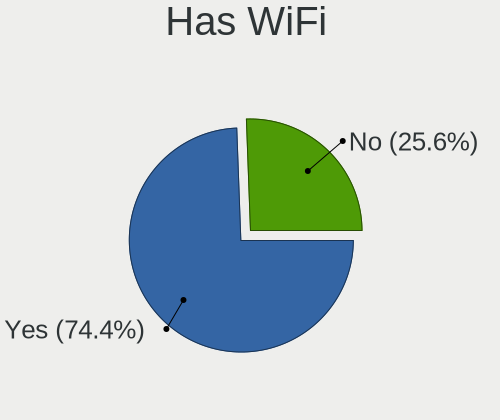
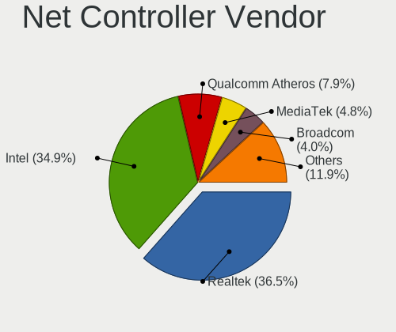

openSUSE Hardware Trends
------------------------

A project to identify most popular hardware characteristics and track their change
over time based on data collected by openSUSE users at https://Linux-Hardware.org.

Anyone can contribute to this report by the [hw-probe](https://github.com/linuxhw/hw-probe) tool:

    sudo -E hw-probe -all -upload

This is a report for all computer types. See also reports for [desktops](/Dist/openSUSE/Desktop/README.md) and [notebooks](/Dist/openSUSE/Notebook/README.md).

Full-feature report is available here: https://linux-hardware.org/?view=trends

Period: Dec, 2021.

Contents
--------

* [ System ](#system)
  - [ OS                       ](#os)
  - [ OS Family                ](#os-family)
  - [ Kernel                   ](#kernel)
  - [ Kernel Family            ](#kernel-family)
  - [ Kernel Major Ver.        ](#kernel-major-ver)
  - [ Arch                     ](#arch)
  - [ DE                       ](#de)
  - [ Display Server           ](#display-server)
  - [ Display Manager          ](#display-manager)
  - [ OS Lang                  ](#os-lang)
  - [ Boot Mode                ](#boot-mode)
  - [ Filesystem               ](#filesystem)
  - [ Part. scheme             ](#part-scheme)
  - [ Dual Boot with Linux/BSD ](#dual-boot-with-linuxbsd)
  - [ Dual Boot (Win)          ](#dual-boot-win)

* [ Board ](#board)
  - [ Vendor                   ](#vendor)
  - [ Model                    ](#model)
  - [ Model Family             ](#model-family)
  - [ MFG Year                 ](#mfg-year)
  - [ Form Factor              ](#form-factor)
  - [ Secure Boot              ](#secure-boot)
  - [ Coreboot                 ](#coreboot)
  - [ RAM Size                 ](#ram-size)
  - [ RAM Used                 ](#ram-used)
  - [ Total Drives             ](#total-drives)
  - [ Has CD-ROM               ](#has-cd-rom)
  - [ Has Ethernet             ](#has-ethernet)
  - [ Has WiFi                 ](#has-wifi)
  - [ Has Bluetooth            ](#has-bluetooth)

* [ Location ](#location)
  - [ Country                  ](#country)
  - [ City                     ](#city)

* [ Drives ](#drives)
  - [ Drive Vendor             ](#drive-vendor)
  - [ Drive Model              ](#drive-model)
  - [ HDD Vendor               ](#hdd-vendor)
  - [ SSD Vendor               ](#ssd-vendor)
  - [ Drive Kind               ](#drive-kind)
  - [ Drive Connector          ](#drive-connector)
  - [ Drive Size               ](#drive-size)
  - [ Space Total              ](#space-total)
  - [ Space Used               ](#space-used)
  - [ Malfunc. Drives          ](#malfunc-drives)
  - [ Malfunc. Drive Vendor    ](#malfunc-drive-vendor)
  - [ Malfunc. HDD Vendor      ](#malfunc-hdd-vendor)
  - [ Malfunc. Drive Kind      ](#malfunc-drive-kind)
  - [ Failed Drives            ](#failed-drives)
  - [ Failed Drive Vendor      ](#failed-drive-vendor)
  - [ Drive Status             ](#drive-status)

* [ Storage controller ](#storage-controller)
  - [ Storage Vendor           ](#storage-vendor)
  - [ Storage Model            ](#storage-model)
  - [ Storage Kind             ](#storage-kind)

* [ Processor ](#processor)
  - [ CPU Vendor               ](#cpu-vendor)
  - [ CPU Model                ](#cpu-model)
  - [ CPU Model Family         ](#cpu-model-family)
  - [ CPU Cores                ](#cpu-cores)
  - [ CPU Sockets              ](#cpu-sockets)
  - [ CPU Threads              ](#cpu-threads)
  - [ CPU Op-Modes             ](#cpu-op-modes)
  - [ CPU Microcode            ](#cpu-microcode)
  - [ CPU Microarch            ](#cpu-microarch)

* [ Graphics ](#graphics)
  - [ GPU Vendor               ](#gpu-vendor)
  - [ GPU Model                ](#gpu-model)
  - [ GPU Combo                ](#gpu-combo)
  - [ GPU Driver               ](#gpu-driver)
  - [ GPU Memory               ](#gpu-memory)

* [ Monitor ](#monitor)
  - [ Monitor Vendor           ](#monitor-vendor)
  - [ Monitor Model            ](#monitor-model)
  - [ Monitor Resolution       ](#monitor-resolution)
  - [ Monitor Diagonal         ](#monitor-diagonal)
  - [ Monitor Width            ](#monitor-width)
  - [ Aspect Ratio             ](#aspect-ratio)
  - [ Monitor Area             ](#monitor-area)
  - [ Pixel Density            ](#pixel-density)
  - [ Multiple Monitors        ](#multiple-monitors)

* [ Network ](#network)
  - [ Net Controller Vendor    ](#net-controller-vendor)
  - [ Net Controller Model     ](#net-controller-model)
  - [ Wireless Vendor          ](#wireless-vendor)
  - [ Wireless Model           ](#wireless-model)
  - [ Ethernet Vendor          ](#ethernet-vendor)
  - [ Ethernet Model           ](#ethernet-model)
  - [ Net Controller Kind      ](#net-controller-kind)
  - [ Used Controller          ](#used-controller)
  - [ NICs                     ](#nics)
  - [ IPv6                     ](#ipv6)

* [ Bluetooth ](#bluetooth)
  - [ Bluetooth Vendor         ](#bluetooth-vendor)
  - [ Bluetooth Model          ](#bluetooth-model)

* [ Sound ](#sound)
  - [ Sound Vendor             ](#sound-vendor)
  - [ Sound Model              ](#sound-model)

* [ Memory ](#memory)
  - [ Memory Vendor            ](#memory-vendor)
  - [ Memory Model             ](#memory-model)
  - [ Memory Kind              ](#memory-kind)
  - [ Memory Form Factor       ](#memory-form-factor)
  - [ Memory Size              ](#memory-size)
  - [ Memory Speed             ](#memory-speed)

* [ Printers & scanners ](#printers--scanners)
  - [ Printer Vendor           ](#printer-vendor)
  - [ Printer Model            ](#printer-model)
  - [ Scanner Vendor           ](#scanner-vendor)
  - [ Scanner Model            ](#scanner-model)

* [ Camera ](#camera)
  - [ Camera Vendor            ](#camera-vendor)
  - [ Camera Model             ](#camera-model)

* [ Security ](#security)
  - [ Fingerprint Vendor       ](#fingerprint-vendor)
  - [ Fingerprint Model        ](#fingerprint-model)
  - [ Chipcard Vendor          ](#chipcard-vendor)
  - [ Chipcard Model           ](#chipcard-model)

* [ Unsupported ](#unsupported)
  - [ Unsupported Devices      ](#unsupported-devices)
  - [ Unsupported Device Types ](#unsupported-device-types)

System
------

OS
--

Installed operating systems

| Name                         | Computers | Percent |
|------------------------------|-----------|---------|
| openSUSE Leap-15.3           | 11        | 19.3%   |
| openSUSE Leap-15.2           | 5         | 8.77%   |
| openSUSE 20211214            | 3         | 5.26%   |
| openSUSE Tumbleweed-20211203 | 2         | 3.51%   |
| openSUSE Tumbleweed-20211202 | 2         | 3.51%   |
| openSUSE Tumbleweed-20211201 | 2         | 3.51%   |
| openSUSE 20211222            | 2         | 3.51%   |
| openSUSE 20211215            | 2         | 3.51%   |
| openSUSE 20211209            | 2         | 3.51%   |
| openSUSE 20211207            | 2         | 3.51%   |
| openSUSE Tumbleweed-20211228 | 1         | 1.75%   |
| openSUSE Tumbleweed-20211227 | 1         | 1.75%   |
| openSUSE Tumbleweed-20211225 | 1         | 1.75%   |
| openSUSE Tumbleweed-20211222 | 1         | 1.75%   |
| openSUSE Tumbleweed-20211219 | 1         | 1.75%   |
| openSUSE Tumbleweed-20211130 | 1         | 1.75%   |
| openSUSE Leap-15.4           | 1         | 1.75%   |
| openSUSE 20211228            | 1         | 1.75%   |
| openSUSE 20211225            | 1         | 1.75%   |
| openSUSE 20211224            | 1         | 1.75%   |
| openSUSE 20211223            | 1         | 1.75%   |
| openSUSE 20211221            | 1         | 1.75%   |
| openSUSE 20211220            | 1         | 1.75%   |
| openSUSE 20211218            | 1         | 1.75%   |
| openSUSE 20211212            | 1         | 1.75%   |
| openSUSE 20211211            | 1         | 1.75%   |
| openSUSE 20211210            | 1         | 1.75%   |
| openSUSE 20211206            | 1         | 1.75%   |
| openSUSE 20211205            | 1         | 1.75%   |
| openSUSE 20211202            | 1         | 1.75%   |
| openSUSE 20211130            | 1         | 1.75%   |
| openSUSE 20211129            | 1         | 1.75%   |
| openSUSE 20211126            | 1         | 1.75%   |
| openSUSE 20211117            | 1         | 1.75%   |

OS Family
---------

OS without a version

| Name     | Computers | Percent |
|----------|-----------|---------|
| openSUSE | 57        | 100%    |

Kernel
------

Version of the Linux kernel

| Version                                     | Computers | Percent |
|---------------------------------------------|-----------|---------|
| 5.15.8-1-default                            | 12        | 21.05%  |
| 5.15.5-1-default                            | 10        | 17.54%  |
| 5.3.18-59.37-default                        | 8         | 14.04%  |
| 5.15.6-1-default                            | 8         | 14.04%  |
| 5.15.7-1-default                            | 7         | 12.28%  |
| 5.3.18-lp152.106-preempt                    | 3         | 5.26%   |
| 5.3.18-59.34-default                        | 2         | 3.51%   |
| 5.3.18-lp152.106-default                    | 1         | 1.75%   |
| 5.3.18-59.24-default                        | 1         | 1.75%   |
| 5.16.0-rc6-next-20211224-1.g3e9f616-vanilla | 1         | 1.75%   |
| 5.15.3-1-default                            | 1         | 1.75%   |
| 5.15.11-lp153.3.g730a488-default            | 1         | 1.75%   |
| 5.14.19-150400.1-default                    | 1         | 1.75%   |
| 5.14.14-3-default                           | 1         | 1.75%   |

Kernel Family
-------------

Linux kernel without a distro release

| Version | Computers | Percent |
|---------|-----------|---------|
| 5.3.18  | 15        | 26.32%  |
| 5.15.8  | 12        | 21.05%  |
| 5.15.5  | 10        | 17.54%  |
| 5.15.6  | 8         | 14.04%  |
| 5.15.7  | 7         | 12.28%  |
| 5.16.0  | 1         | 1.75%   |
| 5.15.3  | 1         | 1.75%   |
| 5.15.11 | 1         | 1.75%   |
| 5.14.19 | 1         | 1.75%   |
| 5.14.14 | 1         | 1.75%   |

Kernel Major Ver.
-----------------

Linux kernel major version

| Version | Computers | Percent |
|---------|-----------|---------|
| 5.15    | 39        | 68.42%  |
| 5.3     | 15        | 26.32%  |
| 5.14    | 2         | 3.51%   |
| 5.16    | 1         | 1.75%   |

Arch
----

OS architecture (x86_64, i586, etc.)

| Name    | Computers | Percent |
|---------|-----------|---------|
| x86_64  | 56        | 98.25%  |
| aarch64 | 1         | 1.75%   |

DE
--

Desktop Environment

| Name    | Computers | Percent |
|---------|-----------|---------|
| KDE5    | 37        | 64.91%  |
| GNOME   | 11        | 19.3%   |
| Unknown | 4         | 7.02%   |
| KDE     | 2         | 3.51%   |
| XFCE    | 1         | 1.75%   |
| sway    | 1         | 1.75%   |
| awesome | 1         | 1.75%   |

Display Server
--------------

X11 or Wayland

| Name        | Computers | Percent |
|-------------|-----------|---------|
| X11         | 43        | 75.44%  |
| Wayland     | 10        | 17.54%  |
| Tty         | 3         | 5.26%   |
| Unspecified | 1         | 1.75%   |

Display Manager
---------------

SDDM, LightDM, etc.

| Name    | Computers | Percent |
|---------|-----------|---------|
| Unknown | 19        | 33.33%  |
| SDDM    | 18        | 31.58%  |
| LightDM | 12        | 21.05%  |
| XDM     | 8         | 14.04%  |

OS Lang
-------

Language

| Lang    | Computers | Percent |
|---------|-----------|---------|
| en_US   | 19        | 33.33%  |
| de_DE   | 10        | 17.54%  |
| POSIX   | 6         | 10.53%  |
| en_GB   | 4         | 7.02%   |
| pt_BR   | 3         | 5.26%   |
| zh_CN   | 2         | 3.51%   |
| nl_BE   | 2         | 3.51%   |
| fr_FR   | 2         | 3.51%   |
| Unknown | 2         | 3.51%   |
| wbp_AU  | 1         | 1.75%   |
| tr_TR   | 1         | 1.75%   |
| nl_NL   | 1         | 1.75%   |
| it_IT   | 1         | 1.75%   |
| hu_HU   | 1         | 1.75%   |
| es_ES   | 1         | 1.75%   |
| ca_AD   | 1         | 1.75%   |

Boot Mode
---------

EFI or BIOS

| Mode | Computers | Percent |
|------|-----------|---------|
| EFI  | 42        | 73.68%  |
| BIOS | 15        | 26.32%  |

Filesystem
----------

Type of filesystem

| Type  | Computers | Percent |
|-------|-----------|---------|
| Btrfs | 47        | 82.46%  |
| Ext4  | 8         | 14.04%  |
| Xfs   | 2         | 3.51%   |

Part. scheme
------------

Scheme of partitioning

| Type    | Computers | Percent |
|---------|-----------|---------|
| GPT     | 35        | 61.4%   |
| Unknown | 18        | 31.58%  |
| MBR     | 4         | 7.02%   |

Dual Boot with Linux/BSD
------------------------

Hosting more than one Linux/BSD

| Dual boot | Computers | Percent |
|-----------|-----------|---------|
| No        | 53        | 92.98%  |
| Yes       | 4         | 7.02%   |

Dual Boot (Win)
---------------

Hosting Linux and Windows

| Dual boot | Computers | Percent |
|-----------|-----------|---------|
| No        | 41        | 71.93%  |
| Yes       | 16        | 28.07%  |

Board
-----

Vendor
------

Motherboard manufacturer

| Name                    | Computers | Percent |
|-------------------------|-----------|---------|
| ASUSTek Computer        | 12        | 21.05%  |
| Lenovo                  | 11        | 19.3%   |
| Hewlett-Packard         | 9         | 15.79%  |
| Dell                    | 5         | 8.77%   |
| MSI                     | 4         | 7.02%   |
| Google                  | 2         | 3.51%   |
| Fujitsu                 | 2         | 3.51%   |
| Acer                    | 2         | 3.51%   |
| TUXEDO                  | 1         | 1.75%   |
| Raspberry Pi Foundation | 1         | 1.75%   |
| Pegatron                | 1         | 1.75%   |
| Notebook                | 1         | 1.75%   |
| Intel                   | 1         | 1.75%   |
| Gigabyte Technology     | 1         | 1.75%   |
| Chuwi                   | 1         | 1.75%   |
| Biostar                 | 1         | 1.75%   |
| Avell High Performance  | 1         | 1.75%   |
| ASRock                  | 1         | 1.75%   |

Model
-----

Motherboard model

| Name                                   | Computers | Percent |
|----------------------------------------|-----------|---------|
| RPi Raspberry Pi 4 Model B Rev 1.1     | 1         | 1.75%   |
| Pegatron p2-1343w                      | 1         | 1.75%   |
| Notebook NL5xRU                        | 1         | 1.75%   |
| MSI MS-7B86                            | 1         | 1.75%   |
| MSI MS-7786                            | 1         | 1.75%   |
| MSI MS-7721                            | 1         | 1.75%   |
| MSI CX61 0OC/CX61 0OD/CX61 0OL         | 1         | 1.75%   |
| Lenovo Yoga 6 13ALC6 82ND              | 1         | 1.75%   |
| Lenovo ThinkPad Yoga 260 20FD002UGE    | 1         | 1.75%   |
| Lenovo ThinkPad T14 Gen 1 20UES47F00   | 1         | 1.75%   |
| Lenovo ThinkPad S3 Yoga 14 20DM000VUS  | 1         | 1.75%   |
| Lenovo ThinkPad E495 20NE001GGE        | 1         | 1.75%   |
| Lenovo ThinkPad E15 20RD0015UK         | 1         | 1.75%   |
| Lenovo ThinkPad E14 Gen 3 20Y70038US   | 1         | 1.75%   |
| Lenovo ThinkCentre M720s 10ST0014MB    | 1         | 1.75%   |
| Lenovo IdeaPad 5 14ARE05 81YM          | 1         | 1.75%   |
| Lenovo G500 20236                      | 1         | 1.75%   |
| Lenovo B41-80 80LG                     | 1         | 1.75%   |
| Intel DG965RY AAD41691-301             | 1         | 1.75%   |
| HP ZBook Fury 15 G7 Mobile Workstation | 1         | 1.75%   |
| HP xw6600 Workstation                  | 1         | 1.75%   |
| HP Victus by Laptop 16-e0xxx           | 1         | 1.75%   |
| HP Pavilion dv6                        | 1         | 1.75%   |
| HP ENVY x360 Convertible 15m-eu0xxx    | 1         | 1.75%   |
| HP EliteBook 8460p                     | 1         | 1.75%   |
| HP EliteBook 845 G8 Notebook PC        | 1         | 1.75%   |
| HP Elite Dragonfly                     | 1         | 1.75%   |
| HP 870-115ng                           | 1         | 1.75%   |
| Google Pantheon                        | 1         | 1.75%   |
| Google Kip                             | 1         | 1.75%   |
| Gigabyte B460MDS3HAC                   | 1         | 1.75%   |
| Fujitsu LIFEBOOK E746                  | 1         | 1.75%   |
| Fujitsu ESPRIMO P410                   | 1         | 1.75%   |
| Dell XPS 15 9510                       | 1         | 1.75%   |
| Dell Studio 1737                       | 1         | 1.75%   |
| Dell Inspiron N4030                    | 1         | 1.75%   |
| Dell Inspiron 530                      | 1         | 1.75%   |
| Dell Inspiron 15 3510                  | 1         | 1.75%   |
| Chuwi Hi10 X                           | 1         | 1.75%   |
| Biostar X370GT5                        | 1         | 1.75%   |
| Avell High Performance A62 LIV         | 1         | 1.75%   |
| ASUS VivoBook_ASUSLaptop X513EA_X513EA | 1         | 1.75%   |
| ASUS TUF Gaming FX705DY_FX705DY        | 1         | 1.75%   |
| ASUS TUF GAMING B550M-ZAKU             | 1         | 1.75%   |
| ASUS SABERTOOTH X79                    | 1         | 1.75%   |
| ASUS ROG CROSSHAIR VIII HERO           | 1         | 1.75%   |
| ASUS PRO B460M-C                       | 1         | 1.75%   |
| ASUS PRIME A320M-E                     | 1         | 1.75%   |
| ASUS P9X79 PRO                         | 1         | 1.75%   |
| ASUS P8Z77-V LX                        | 1         | 1.75%   |
| ASUS P8Z68-V                           | 1         | 1.75%   |
| ASUS 970 PRO GAMING/AURA               | 1         | 1.75%   |
| ASUS 5957                              | 1         | 1.75%   |
| ASRock Z68 Extreme4 Gen3               | 1         | 1.75%   |
| Acer Aspire E1-571                     | 1         | 1.75%   |
| Acer Aspire A315-21                    | 1         | 1.75%   |
| Unknown                                | 1         | 1.75%   |

Model Family
------------

Motherboard model prefix

| Name                       | Computers | Percent |
|----------------------------|-----------|---------|
| Lenovo ThinkPad            | 6         | 10.53%  |
| Dell Inspiron              | 3         | 5.26%   |
| HP EliteBook               | 2         | 3.51%   |
| ASUS TUF                   | 2         | 3.51%   |
| Acer Aspire                | 2         | 3.51%   |
| RPi Raspberry              | 1         | 1.75%   |
| Pegatron p2-1343w          | 1         | 1.75%   |
| Notebook NL5xRU            | 1         | 1.75%   |
| MSI MS-7B86                | 1         | 1.75%   |
| MSI MS-7786                | 1         | 1.75%   |
| MSI MS-7721                | 1         | 1.75%   |
| MSI CX61                   | 1         | 1.75%   |
| Lenovo Yoga                | 1         | 1.75%   |
| Lenovo ThinkCentre         | 1         | 1.75%   |
| Lenovo IdeaPad             | 1         | 1.75%   |
| Lenovo G500                | 1         | 1.75%   |
| Lenovo B41-80              | 1         | 1.75%   |
| Intel DG965RY              | 1         | 1.75%   |
| HP ZBook                   | 1         | 1.75%   |
| HP xw6600                  | 1         | 1.75%   |
| HP Victus                  | 1         | 1.75%   |
| HP Pavilion                | 1         | 1.75%   |
| HP ENVY                    | 1         | 1.75%   |
| HP Elite                   | 1         | 1.75%   |
| HP 870-115ng               | 1         | 1.75%   |
| Google Pantheon            | 1         | 1.75%   |
| Google Kip                 | 1         | 1.75%   |
| Gigabyte B460MDS3HAC       | 1         | 1.75%   |
| Fujitsu LIFEBOOK           | 1         | 1.75%   |
| Fujitsu ESPRIMO            | 1         | 1.75%   |
| Dell XPS                   | 1         | 1.75%   |
| Dell Studio                | 1         | 1.75%   |
| Chuwi Hi10                 | 1         | 1.75%   |
| Biostar X370GT5            | 1         | 1.75%   |
| Avell High Performance A62 | 1         | 1.75%   |
| ASUS VivoBook              | 1         | 1.75%   |
| ASUS SABERTOOTH            | 1         | 1.75%   |
| ASUS ROG                   | 1         | 1.75%   |
| ASUS PRO                   | 1         | 1.75%   |
| ASUS PRIME                 | 1         | 1.75%   |
| ASUS P9X79                 | 1         | 1.75%   |
| ASUS P8Z77-V               | 1         | 1.75%   |
| ASUS P8Z68-V               | 1         | 1.75%   |
| ASUS 970                   | 1         | 1.75%   |
| ASUS 5957                  | 1         | 1.75%   |
| ASRock Z68                 | 1         | 1.75%   |
| Unknown                    | 1         | 1.75%   |

MFG Year
--------

Motherboard manufacture year

| Year | Computers | Percent |
|------|-----------|---------|
| 2021 | 19        | 33.33%  |
| 2020 | 10        | 17.54%  |
| 2019 | 5         | 8.77%   |
| 2013 | 5         | 8.77%   |
| 2011 | 4         | 7.02%   |
| 2016 | 3         | 5.26%   |
| 2014 | 3         | 5.26%   |
| 2015 | 2         | 3.51%   |
| 2012 | 2         | 3.51%   |
| 2018 | 1         | 1.75%   |
| 2010 | 1         | 1.75%   |
| 2009 | 1         | 1.75%   |
| 2007 | 1         | 1.75%   |

Form Factor
-----------

Physical design of the computer

| Name           | Computers | Percent |
|----------------|-----------|---------|
| Notebook       | 28        | 49.12%  |
| Desktop        | 23        | 40.35%  |
| Convertible    | 4         | 7.02%   |
| System on chip | 1         | 1.75%   |
| Tablet         | 1         | 1.75%   |

Secure Boot
-----------

Enabled or disabled

| State    | Computers | Percent |
|----------|-----------|---------|
| Disabled | 51        | 89.47%  |
| Enabled  | 6         | 10.53%  |

Coreboot
--------

Have coreboot on board

| Used | Computers | Percent |
|------|-----------|---------|
| No   | 55        | 96.49%  |
| Yes  | 2         | 3.51%   |

RAM Size
--------

Total RAM memory

| Size in GB  | Computers | Percent |
|-------------|-----------|---------|
| 4.01-8.0    | 13        | 22.81%  |
| 8.01-16.0   | 13        | 22.81%  |
| 16.01-24.0  | 11        | 19.3%   |
| 32.01-64.0  | 8         | 14.04%  |
| 3.01-4.0    | 8         | 14.04%  |
| 24.01-32.0  | 2         | 3.51%   |
| 64.01-256.0 | 2         | 3.51%   |

RAM Used
--------

Used RAM memory

| Used GB    | Computers | Percent |
|------------|-----------|---------|
| 4.01-8.0   | 18        | 31.58%  |
| 1.01-2.0   | 16        | 28.07%  |
| 2.01-3.0   | 10        | 17.54%  |
| 3.01-4.0   | 4         | 7.02%   |
| 8.01-16.0  | 4         | 7.02%   |
| 0.51-1.0   | 3         | 5.26%   |
| 16.01-24.0 | 1         | 1.75%   |
| 0.01-0.5   | 1         | 1.75%   |

Total Drives
------------

Number of drives on board

| Drives | Computers | Percent |
|--------|-----------|---------|
| 1      | 32        | 56.14%  |
| 2      | 12        | 21.05%  |
| 3      | 7         | 12.28%  |
| 4      | 4         | 7.02%   |
| 7      | 1         | 1.75%   |
| 5      | 1         | 1.75%   |

Has CD-ROM
----------

Has CD-ROM on board

| Presented | Computers | Percent |
|-----------|-----------|---------|
| No        | 39        | 68.42%  |
| Yes       | 18        | 31.58%  |

Has Ethernet
------------

Has Ethernet on board

| Presented | Computers | Percent |
|-----------|-----------|---------|
| Yes       | 46        | 80.7%   |
| No        | 11        | 19.3%   |

Has WiFi
--------

Has WiFi module

| Presented | Computers | Percent |
|-----------|-----------|---------|
| Yes       | 42        | 73.68%  |
| No        | 15        | 26.32%  |

Has Bluetooth
-------------

Has Bluetooth module

| Presented | Computers | Percent |
|-----------|-----------|---------|
| Yes       | 38        | 66.67%  |
| No        | 19        | 33.33%  |

Location
--------

Country
-------

Geographic location (country)

| Country     | Computers | Percent |
|-------------|-----------|---------|
| Germany     | 15        | 26.32%  |
| USA         | 10        | 17.54%  |
| Brazil      | 4         | 7.02%   |
| UK          | 3         | 5.26%   |
| France      | 3         | 5.26%   |
| Belgium     | 3         | 5.26%   |
| Serbia      | 2         | 3.51%   |
| China       | 2         | 3.51%   |
| Australia   | 2         | 3.51%   |
| Turkey      | 1         | 1.75%   |
| Switzerland | 1         | 1.75%   |
| Spain       | 1         | 1.75%   |
| Portugal    | 1         | 1.75%   |
| New Zealand | 1         | 1.75%   |
| Netherlands | 1         | 1.75%   |
| Mexico      | 1         | 1.75%   |
| Italy       | 1         | 1.75%   |
| Hungary     | 1         | 1.75%   |
| Greece      | 1         | 1.75%   |
| Cyprus      | 1         | 1.75%   |
| Canada      | 1         | 1.75%   |
| Andorra     | 1         | 1.75%   |

City
----

Geographic location (city)

| City                    | Computers | Percent |
|-------------------------|-----------|---------|
| Sydney                  | 2         | 3.51%   |
| Gerbstedt               | 2         | 3.51%   |
| Belgrade                | 2         | 3.51%   |
| Bebedouro               | 2         | 3.51%   |
| Zurich                  | 1         | 1.75%   |
| Zierikzee               | 1         | 1.75%   |
| Xi'an                   | 1         | 1.75%   |
| Woodstock               | 1         | 1.75%   |
| West Chester            | 1         | 1.75%   |
| Warsaw                  | 1         | 1.75%   |
| Tours                   | 1         | 1.75%   |
| Tlalnepantla            | 1         | 1.75%   |
| Somerville              | 1         | 1.75%   |
| Seymour                 | 1         | 1.75%   |
| Schaumburg              | 1         | 1.75%   |
| Sartrouville            | 1         | 1.75%   |
| Riolo Terme             | 1         | 1.75%   |
| Ningbo                  | 1         | 1.75%   |
| Nicosia                 | 1         | 1.75%   |
| New Haven               | 1         | 1.75%   |
| Molenstede              | 1         | 1.75%   |
| Minneapolis             | 1         | 1.75%   |
| Mannheim                | 1         | 1.75%   |
| Letchworth Garden City  | 1         | 1.75%   |
| Kapellen                | 1         | 1.75%   |
| Huenfeld                | 1         | 1.75%   |
| Heraklion               | 1         | 1.75%   |
| Hamburg                 | 1         | 1.75%   |
| Halle                   | 1         | 1.75%   |
| Gifhorn                 | 1         | 1.75%   |
| Giessen                 | 1         | 1.75%   |
| Gernsbach               | 1         | 1.75%   |
| Esztergom               | 1         | 1.75%   |
| Eppertshausen           | 1         | 1.75%   |
| East Longmeadow         | 1         | 1.75%   |
| Christchurch            | 1         | 1.75%   |
| Chaumont-en-Vexin       | 1         | 1.75%   |
| Chapec??                | 1         | 1.75%   |
| Canoas                  | 1         | 1.75%   |
| Buford                  | 1         | 1.75%   |
| Brush                   | 1         | 1.75%   |
| Bragan?§a               | 1         | 1.75%   |
| Bonnybridge             | 1         | 1.75%   |
| Berlin                  | 1         | 1.75%   |
| Barcelona               | 1         | 1.75%   |
| Augsburg                | 1         | 1.75%   |
| Arnstadt                | 1         | 1.75%   |
| Antwerp                 | 1         | 1.75%   |
| Antalya                 | 1         | 1.75%   |
| Andorra la Vella        | 1         | 1.75%   |
| Amersham                | 1         | 1.75%   |
| Alzenau in Unterfranken | 1         | 1.75%   |
| Algermissen             | 1         | 1.75%   |

Drives
------

Drive Vendor
------------

Hard drive vendors

| Vendor              | Computers | Drives | Percent |
|---------------------|-----------|--------|---------|
| Seagate             | 15        | 21     | 16.67%  |
| WDC                 | 14        | 18     | 15.56%  |
| Samsung Electronics | 14        | 17     | 15.56%  |
| Toshiba             | 7         | 7      | 7.78%   |
| Unknown             | 6         | 6      | 6.67%   |
| Hitachi             | 5         | 5      | 5.56%   |
| Kingston            | 4         | 4      | 4.44%   |
| SanDisk             | 3         | 3      | 3.33%   |
| Crucial             | 3         | 3      | 3.33%   |
| A-DATA Technology   | 3         | 4      | 3.33%   |
| Silicon Motion      | 2         | 2      | 2.22%   |
| Micron Technology   | 2         | 2      | 2.22%   |
| KIOXIA              | 2         | 2      | 2.22%   |
| Biostar             | 2         | 2      | 2.22%   |
| SSSTC               | 1         | 1      | 1.11%   |
| SPCC                | 1         | 1      | 1.11%   |
| Phison              | 1         | 1      | 1.11%   |
| Patriot             | 1         | 1      | 1.11%   |
| Mushkin             | 1         | 1      | 1.11%   |
| Intel               | 1         | 1      | 1.11%   |
| Corsair             | 1         | 1      | 1.11%   |
| CHIPFANC            | 1         | 1      | 1.11%   |

Drive Model
-----------

Hard drive models

| Model                                      | Computers | Percent |
|--------------------------------------------|-----------|---------|
| Seagate ST2000DM008-2FR102 2TB             | 4         | 4%      |
| Seagate ST500DM002-1BD142 500GB            | 3         | 3%      |
| Toshiba HDWD110 1TB                        | 2         | 2%      |
| Hitachi HDS721050CLA360 500GB              | 2         | 2%      |
| Biostar S100-240GB PLUS SSD                | 2         | 2%      |
| WDC WDS240G2G0B-00EPW0 240GB SSD           | 1         | 1%      |
| WDC WDS200T3XHC-00SJG0 2TB                 | 1         | 1%      |
| WDC WDS200T2B0A-00SM50 2TB SSD             | 1         | 1%      |
| WDC WDBNCE5000PNC 500GB SSD                | 1         | 1%      |
| WDC WD80EFAX-68KNBN0 8TB                   | 1         | 1%      |
| WDC WD60EZRZ-00RWYB1 6TB                   | 1         | 1%      |
| WDC WD5000LPVX-00V0TT0 500GB               | 1         | 1%      |
| WDC WD5000AAKS-00A7B0 500GB                | 1         | 1%      |
| WDC WD40EFRX-68N32N0 4TB                   | 1         | 1%      |
| WDC WD2500BEVT-60ZCT1 250GB                | 1         | 1%      |
| WDC WD10SPZX-21Z10T0 1TB                   | 1         | 1%      |
| WDC WD10SPSX-60A6WT0 1TB                   | 1         | 1%      |
| WDC WD10EZEX-22MFCA0 1TB                   | 1         | 1%      |
| WDC WD10EZEX-08WN4A0 1TB                   | 1         | 1%      |
| WDC WD10EZEX-00BN5A0 1TB                   | 1         | 1%      |
| WDC WD10EAVS-22D7B0 1TB                    | 1         | 1%      |
| WDC PC SN530 SDBPMPZ-512G-1101 512GB       | 1         | 1%      |
| Unknown SD/MMC/MS PRO 7GB                  | 1         | 1%      |
| Unknown SC32G  32GB                        | 1         | 1%      |
| Unknown MMC Card  64GB                     | 1         | 1%      |
| Unknown MMC Card  128GB                    | 1         | 1%      |
| Unknown DA4128  128GB                      | 1         | 1%      |
| Unknown AJNB4R  16GB                       | 1         | 1%      |
| Toshiba TR200 240GB SSD                    | 1         | 1%      |
| Toshiba TL100 240GB SSD                    | 1         | 1%      |
| Toshiba Q300. 480GB SSD                    | 1         | 1%      |
| Toshiba MQ01ABD100 1TB                     | 1         | 1%      |
| Toshiba KXG5AZNV256G 256GB                 | 1         | 1%      |
| SSSTC CL1-3D128-Q11 NVMe 128GB             | 1         | 1%      |
| SPCC Solid State Disk 120GB                | 1         | 1%      |
| Silicon Motion SPT256L2-2IAS7G2 256GB      | 1         | 1%      |
| Silicon Motion NVMe SSD Drive 1024GB       | 1         | 1%      |
| Seagate ST500LT012-9WS142 500GB            | 1         | 1%      |
| Seagate ST500LT012-1DG142 500GB            | 1         | 1%      |
| Seagate ST4000DM004-2CV104 4TB             | 1         | 1%      |
| Seagate ST3500418AS 500GB                  | 1         | 1%      |
| Seagate ST3320620AS 320GB                  | 1         | 1%      |
| Seagate ST16000NM001G-2KK103 16TB          | 1         | 1%      |
| Seagate ST1000VX000-1CU162 1TB             | 1         | 1%      |
| Seagate ST1000LM024 HN-M101MBB 1TB         | 1         | 1%      |
| Seagate ST1000DX001-1CM162 1TB             | 1         | 1%      |
| Seagate NVMe SSD Drive 500GB               | 1         | 1%      |
| Seagate FireCuda 520 SSD ZP2000GM30002 2TB | 1         | 1%      |
| Seagate Expansion 1TB                      | 1         | 1%      |
| SanDisk Ultra II 1TB SSD                   | 1         | 1%      |
| SanDisk SSD U110 16GB                      | 1         | 1%      |
| SanDisk SSD PLUS 240GB                     | 1         | 1%      |
| Samsung SSD 970 EVO Plus 500GB             | 1         | 1%      |
| Samsung SSD 870 QVO 1TB                    | 1         | 1%      |
| Samsung SSD 870 EVO 1TB                    | 1         | 1%      |
| Samsung SSD 860 EVO M.2 500GB              | 1         | 1%      |
| Samsung SSD 860 EVO 500GB                  | 1         | 1%      |
| Samsung SSD 860 EVO 1TB                    | 1         | 1%      |
| Samsung SSD 850 PRO 256GB                  | 1         | 1%      |
| Samsung SSD 840 EVO 500GB                  | 1         | 1%      |

HDD Vendor
----------

Hard disk drive vendors

| Vendor              | Computers | Drives | Percent |
|---------------------|-----------|--------|---------|
| Seagate             | 15        | 19     | 42.86%  |
| WDC                 | 10        | 13     | 28.57%  |
| Hitachi             | 5         | 5      | 14.29%  |
| Toshiba             | 3         | 3      | 8.57%   |
| Unknown             | 1         | 1      | 2.86%   |
| Samsung Electronics | 1         | 2      | 2.86%   |

SSD Vendor
----------

Solid state drive vendors

| Vendor              | Computers | Drives | Percent |
|---------------------|-----------|--------|---------|
| Samsung Electronics | 8         | 8      | 28.57%  |
| WDC                 | 3         | 3      | 10.71%  |
| Toshiba             | 3         | 3      | 10.71%  |
| SanDisk             | 3         | 3      | 10.71%  |
| Kingston            | 2         | 2      | 7.14%   |
| Crucial             | 2         | 2      | 7.14%   |
| Biostar             | 2         | 2      | 7.14%   |
| A-DATA Technology   | 2         | 2      | 7.14%   |
| SPCC                | 1         | 1      | 3.57%   |
| Patriot             | 1         | 1      | 3.57%   |
| Mushkin             | 1         | 1      | 3.57%   |

Drive Kind
----------

HDD or SSD

| Kind    | Computers | Drives | Percent |
|---------|-----------|--------|---------|
| HDD     | 27        | 43     | 34.62%  |
| NVMe    | 24        | 27     | 30.77%  |
| SSD     | 21        | 28     | 26.92%  |
| MMC     | 5         | 5      | 6.41%   |
| Unknown | 1         | 1      | 1.28%   |

Drive Connector
---------------

SATA, SAS, NVMe, etc.

| Type | Computers | Drives | Percent |
|------|-----------|--------|---------|
| SATA | 37        | 69     | 53.62%  |
| NVMe | 24        | 27     | 34.78%  |
| MMC  | 5         | 5      | 7.25%   |
| SAS  | 3         | 3      | 4.35%   |

Drive Size
----------

Size of hard drive

| Size in TB | Computers | Drives | Percent |
|------------|-----------|--------|---------|
| 0.01-0.5   | 26        | 35     | 48.15%  |
| 0.51-1.0   | 18        | 22     | 33.33%  |
| 1.01-2.0   | 6         | 7      | 11.11%  |
| 3.01-4.0   | 2         | 3      | 3.7%    |
| 10.01-20.0 | 1         | 2      | 1.85%   |
| 4.01-10.0  | 1         | 2      | 1.85%   |

Space Total
-----------

Amount of disk space available on the file system

| Size in GB     | Computers | Percent |
|----------------|-----------|---------|
| More than 3000 | 23        | 40.35%  |
| 1001-2000      | 11        | 19.3%   |
| 501-1000       | 9         | 15.79%  |
| 2001-3000      | 7         | 12.28%  |
| 101-250        | 3         | 5.26%   |
| 251-500        | 2         | 3.51%   |
| 21-50          | 1         | 1.75%   |
| Unknown        | 1         | 1.75%   |

Space Used
----------

Amount of used disk space

| Used GB        | Computers | Percent |
|----------------|-----------|---------|
| 251-500        | 13        | 22.81%  |
| 1001-2000      | 11        | 19.3%   |
| 101-250        | 10        | 17.54%  |
| 501-1000       | 9         | 15.79%  |
| More than 3000 | 3         | 5.26%   |
| 21-50          | 3         | 5.26%   |
| 2001-3000      | 3         | 5.26%   |
| 1-20           | 2         | 3.51%   |
| 51-100         | 2         | 3.51%   |
| Unknown        | 1         | 1.75%   |

Malfunc. Drives
---------------

Drive models with a malfunction

| Model                           | Computers | Drives | Percent |
|---------------------------------|-----------|--------|---------|
| WDC WD5000LPVX-00V0TT0 500GB    | 1         | 1      | 20%     |
| WDC WD2500BEVT-60ZCT1 250GB     | 1         | 1      | 20%     |
| Seagate ST500DM002-1BD142 500GB | 1         | 1      | 20%     |
| Seagate ST3500418AS 500GB       | 1         | 1      | 20%     |
| Seagate ST3320620AS 320GB       | 1         | 1      | 20%     |

Malfunc. Drive Vendor
---------------------

Vendors of faulty drives

| Vendor  | Computers | Drives | Percent |
|---------|-----------|--------|---------|
| Seagate | 3         | 3      | 60%     |
| WDC     | 2         | 2      | 40%     |

Malfunc. HDD Vendor
-------------------

Vendors of faulty HDD drives

| Vendor  | Computers | Drives | Percent |
|---------|-----------|--------|---------|
| Seagate | 3         | 3      | 60%     |
| WDC     | 2         | 2      | 40%     |

Malfunc. Drive Kind
-------------------

Kinds of faulty drives

| Kind | Computers | Drives | Percent |
|------|-----------|--------|---------|
| HDD  | 5         | 5      | 100%    |

Failed Drives
-------------

Failed drive models

Zero info for selected period =(

Failed Drive Vendor
-------------------

Failed drive vendors

Zero info for selected period =(

Drive Status
------------

Number of failed and malfunc. drives

| Status   | Computers | Drives | Percent |
|----------|-----------|--------|---------|
| Works    | 34        | 65     | 56.67%  |
| Detected | 21        | 34     | 35%     |
| Malfunc  | 5         | 5      | 8.33%   |

Storage controller
------------------

Storage Vendor
--------------

Storage controller vendors

| Vendor                         | Computers | Percent |
|--------------------------------|-----------|---------|
| Intel                          | 31        | 40.26%  |
| AMD                            | 13        | 16.88%  |
| Samsung Electronics            | 7         | 9.09%   |
| Marvell Technology Group       | 3         | 3.9%    |
| Toshiba America Info Systems   | 2         | 2.6%    |
| Silicon Motion                 | 2         | 2.6%    |
| Seagate Technology             | 2         | 2.6%    |
| Sandisk                        | 2         | 2.6%    |
| Phison Electronics             | 2         | 2.6%    |
| Micron Technology              | 2         | 2.6%    |
| Kingston Technology Company    | 2         | 2.6%    |
| ASMedia Technology             | 2         | 2.6%    |
| Solid State Storage Technology | 1         | 1.3%    |
| Promise Technology             | 1         | 1.3%    |
| Micron/Crucial Technology      | 1         | 1.3%    |
| KIOXIA                         | 1         | 1.3%    |
| JMicron Technology             | 1         | 1.3%    |
| ADATA Technology               | 1         | 1.3%    |
| Adaptec                        | 1         | 1.3%    |

Storage Model
-------------

Storage controller models

| Model                                                                            | Computers | Percent |
|----------------------------------------------------------------------------------|-----------|---------|
| AMD FCH SATA Controller [AHCI mode]                                              | 9         | 10.84%  |
| Intel 400 Series Chipset Family SATA AHCI Controller                             | 4         | 4.82%   |
| Samsung NVMe SSD Controller SM981/PM981/PM983                                    | 3         | 3.61%   |
| Samsung NVMe SSD Controller 980                                                  | 3         | 3.61%   |
| Intel 7 Series Chipset Family 6-port SATA Controller [AHCI mode]                 | 3         | 3.61%   |
| Intel 6 Series/C200 Series Chipset Family 6 port Desktop SATA AHCI Controller    | 3         | 3.61%   |
| Silicon Motion SM2263EN/SM2263XT SSD Controller                                  | 2         | 2.41%   |
| Micron Non-Volatile memory controller                                            | 2         | 2.41%   |
| Intel Sunrise Point-LP SATA Controller [AHCI mode]                               | 2         | 2.41%   |
| Intel Celeron/Pentium Silver Processor SATA Controller                           | 2         | 2.41%   |
| Intel C600/X79 series chipset 6-Port SATA AHCI Controller                        | 2         | 2.41%   |
| Intel 5 Series/3400 Series Chipset 6 port SATA AHCI Controller                   | 2         | 2.41%   |
| ASMedia ASM1062 Serial ATA Controller                                            | 2         | 2.41%   |
| AMD Starship/Matisse Chipset SATA Controller [AHCI mode]                         | 2         | 2.41%   |
| Toshiba America Info Systems XG6 NVMe SSD Controller                             | 1         | 1.2%    |
| Toshiba America Info Systems Toshiba America Info Non-Volatile memory controller | 1         | 1.2%    |
| Solid State Storage Non-Volatile memory controller                               | 1         | 1.2%    |
| Seagate FireCuda 520 SSD                                                         | 1         | 1.2%    |
| Seagate FireCuda 510 SSD                                                         | 1         | 1.2%    |
| Sandisk WD Black 2018/SN750 / PC SN720 NVMe SSD                                  | 1         | 1.2%    |
| Sandisk Non-Volatile memory controller                                           | 1         | 1.2%    |
| Samsung NVMe SSD Controller PM9A1/PM9A3/980PRO                                   | 1         | 1.2%    |
| Promise PDC40719 [FastTrak TX4300/TX4310]                                        | 1         | 1.2%    |
| Phison PS5013 E13 NVMe Controller                                                | 1         | 1.2%    |
| Phison E16 PCIe4 NVMe Controller                                                 | 1         | 1.2%    |
| Micron/Crucial P2 NVMe PCIe SSD                                                  | 1         | 1.2%    |
| Marvell Group 88SE912x SATA 6Gb/s Controller [IDE mode]                          | 1         | 1.2%    |
| Marvell Group 88SE9128 PCIe SATA 6 Gb/s RAID controller with HyperDuo            | 1         | 1.2%    |
| Marvell Group 88SE6101/6102 single-port PATA133 interface                        | 1         | 1.2%    |
| KIOXIA Non-Volatile memory controller                                            | 1         | 1.2%    |
| Kingston Company U-SNS8154P3 NVMe SSD                                            | 1         | 1.2%    |
| Kingston Company SNVS2000G [NV1 NVMe PCIe SSD 2TB]                               | 1         | 1.2%    |
| JMicron JMB362 SATA Controller                                                   | 1         | 1.2%    |
| Intel Volume Management Device NVMe RAID Controller                              | 1         | 1.2%    |
| Intel Tiger Lake-LP SATA Controller [AHCI mode]                                  | 1         | 1.2%    |
| Intel SSD 660P Series                                                            | 1         | 1.2%    |
| Intel Q170/Q150/B150/H170/H110/Z170/CM236 Chipset SATA Controller [AHCI Mode]    | 1         | 1.2%    |
| Intel Comet Lake SATA AHCI Controller                                            | 1         | 1.2%    |
| Intel Cannon Lake PCH SATA AHCI Controller                                       | 1         | 1.2%    |
| Intel 82801IR/IO/IH (ICH9R/DO/DH) 4 port SATA Controller [IDE mode]              | 1         | 1.2%    |
| Intel 82801IBM/IEM (ICH9M/ICH9M-E) 4 port SATA Controller [AHCI mode]            | 1         | 1.2%    |
| Intel 82801I (ICH9 Family) 2 port SATA Controller [IDE mode]                     | 1         | 1.2%    |
| Intel 82801HB (ICH8) 4 port SATA Controller [AHCI mode]                          | 1         | 1.2%    |
| Intel 82801 Mobile SATA Controller [RAID mode]                                   | 1         | 1.2%    |
| Intel 8 Series SATA Controller 1 [AHCI mode]                                     | 1         | 1.2%    |
| Intel 7 Series/C210 Series Chipset Family 6-port SATA Controller [AHCI mode]     | 1         | 1.2%    |
| Intel 631xESB/632xESB SATA RAID Controller                                       | 1         | 1.2%    |
| Intel 631xESB/632xESB IDE Controller                                             | 1         | 1.2%    |
| Intel 6 Series/C200 Series Chipset Family 6 port Mobile SATA AHCI Controller     | 1         | 1.2%    |
| AMD X370 Series Chipset SATA Controller                                          | 1         | 1.2%    |
| AMD SB7x0/SB8x0/SB9x0 SATA Controller [IDE mode]                                 | 1         | 1.2%    |
| AMD SB7x0/SB8x0/SB9x0 SATA Controller [AHCI mode]                                | 1         | 1.2%    |
| AMD FCH SATA Controller D                                                        | 1         | 1.2%    |
| AMD 400 Series Chipset SATA Controller                                           | 1         | 1.2%    |
| ADATA XPG SX8200 Pro PCIe Gen3x4 M.2 2280 Solid State Drive                      | 1         | 1.2%    |
| Adaptec AIC-7892A U160/m                                                         | 1         | 1.2%    |

Storage Kind
------------

Kind of storage controller (IDE, SATA, NVMe, SAS, ...)

| Kind | Computers | Percent |
|------|-----------|---------|
| SATA | 40        | 54.79%  |
| NVMe | 24        | 32.88%  |
| RAID | 4         | 5.48%   |
| IDE  | 4         | 5.48%   |
| SCSI | 1         | 1.37%   |

Processor
---------

CPU Vendor
----------

Processor vendors

| Vendor | Computers | Percent |
|--------|-----------|---------|
| Intel  | 35        | 61.4%   |
| AMD    | 21        | 36.84%  |
| ARM    | 1         | 1.75%   |

CPU Model
---------

Processor models

| Model                                         | Computers | Percent |
|-----------------------------------------------|-----------|---------|
| Intel Core i5-6200U CPU @ 2.30GHz             | 3         | 5.26%   |
| Intel Core i5-3230M CPU @ 2.60GHz             | 2         | 3.51%   |
| AMD Ryzen 9 5950X 16-Core Processor           | 2         | 3.51%   |
| AMD Ryzen 5 5500U with Radeon Graphics        | 2         | 3.51%   |
| Intel Xeon W-10885M CPU @ 2.40GHz             | 1         | 1.75%   |
| Intel Xeon CPU E5450 @ 3.00GHz                | 1         | 1.75%   |
| Intel Xeon CPU E5-2687W v2 @ 3.40GHz          | 1         | 1.75%   |
| Intel Pentium Dual CPU E2160 @ 1.80GHz        | 1         | 1.75%   |
| Intel Core i7-8700 CPU @ 3.20GHz              | 1         | 1.75%   |
| Intel Core i7-8665U CPU @ 1.90GHz             | 1         | 1.75%   |
| Intel Core i7-8550U CPU @ 1.80GHz             | 1         | 1.75%   |
| Intel Core i7-6700 CPU @ 3.40GHz              | 1         | 1.75%   |
| Intel Core i7-4930K CPU @ 3.40GHz             | 1         | 1.75%   |
| Intel Core i7-10750H CPU @ 2.60GHz            | 1         | 1.75%   |
| Intel Core i7-10510U CPU @ 1.80GHz            | 1         | 1.75%   |
| Intel Core i5-8265U CPU @ 1.60GHz             | 1         | 1.75%   |
| Intel Core i5-4210U CPU @ 1.70GHz             | 1         | 1.75%   |
| Intel Core i5-3470 CPU @ 3.20GHz              | 1         | 1.75%   |
| Intel Core i5-3330 CPU @ 3.00GHz              | 1         | 1.75%   |
| Intel Core i5-2520M CPU @ 2.50GHz             | 1         | 1.75%   |
| Intel Core i5-2500 CPU @ 3.30GHz              | 1         | 1.75%   |
| Intel Core i5-10600K CPU @ 4.10GHz            | 1         | 1.75%   |
| Intel Core i5-10400F CPU @ 2.90GHz            | 1         | 1.75%   |
| Intel Core i5 CPU M 450 @ 2.40GHz             | 1         | 1.75%   |
| Intel Core i3-3110M CPU @ 2.40GHz             | 1         | 1.75%   |
| Intel Core i3-2100 CPU @ 3.10GHz              | 1         | 1.75%   |
| Intel Core i3 CPU M 380 @ 2.53GHz             | 1         | 1.75%   |
| Intel Core 2 Duo CPU T5800 @ 2.00GHz          | 1         | 1.75%   |
| Intel Core 2 CPU 6700 @ 2.66GHz               | 1         | 1.75%   |
| Intel Celeron N4120 CPU @ 1.10GHz             | 1         | 1.75%   |
| Intel Celeron N4020 CPU @ 1.10GHz             | 1         | 1.75%   |
| Intel Celeron CPU N2840 @ 2.16GHz             | 1         | 1.75%   |
| Intel 11th Gen Core i7-11800H @ 2.30GHz       | 1         | 1.75%   |
| Intel 11th Gen Core i5-1135G7 @ 2.40GHz       | 1         | 1.75%   |
| ARM Processor                                 | 1         | 1.75%   |
| AMD Ryzen 7 PRO 5850U with Radeon Graphics    | 1         | 1.75%   |
| AMD Ryzen 7 PRO 4750U with Radeon Graphics    | 1         | 1.75%   |
| AMD Ryzen 7 PRO 4750G with Radeon Graphics    | 1         | 1.75%   |
| AMD Ryzen 7 5800H with Radeon Graphics        | 1         | 1.75%   |
| AMD Ryzen 7 5700U with Radeon Graphics        | 1         | 1.75%   |
| AMD Ryzen 7 4700U with Radeon Graphics        | 1         | 1.75%   |
| AMD Ryzen 7 3700X 8-Core Processor            | 1         | 1.75%   |
| AMD Ryzen 5 4500U with Radeon Graphics        | 1         | 1.75%   |
| AMD Ryzen 5 3550H with Radeon Vega Mobile Gfx | 1         | 1.75%   |
| AMD Ryzen 5 3500U with Radeon Vega Mobile Gfx | 1         | 1.75%   |
| AMD Ryzen 5 2600 Six-Core Processor           | 1         | 1.75%   |
| AMD FX-8350 Eight-Core Processor              | 1         | 1.75%   |
| AMD E2-1800 APU with Radeon HD Graphics       | 1         | 1.75%   |
| AMD Athlon II X4 641 Quad-Core Processor      | 1         | 1.75%   |
| AMD Athlon 3000G with Radeon Vega Graphics    | 1         | 1.75%   |
| AMD A9-9420e RADEON R5, 5 COMPUTE CORES 2C+3G | 1         | 1.75%   |
| AMD A6-5400K APU with Radeon HD Graphics      | 1         | 1.75%   |

CPU Model Family
----------------

Processor model prefix

| Model              | Computers | Percent |
|--------------------|-----------|---------|
| Intel Core i5      | 14        | 24.56%  |
| Intel Core i7      | 7         | 12.28%  |
| AMD Ryzen 5        | 6         | 10.53%  |
| Other              | 4         | 7.02%   |
| AMD Ryzen 7        | 4         | 7.02%   |
| Intel Xeon         | 3         | 5.26%   |
| Intel Core i3      | 3         | 5.26%   |
| Intel Celeron      | 3         | 5.26%   |
| AMD Ryzen 7 PRO    | 3         | 5.26%   |
| AMD Ryzen 9        | 2         | 3.51%   |
| Intel Pentium Dual | 1         | 1.75%   |
| Intel Core 2 Duo   | 1         | 1.75%   |
| Intel Core 2       | 1         | 1.75%   |
| AMD FX             | 1         | 1.75%   |
| AMD E2             | 1         | 1.75%   |
| AMD Athlon II X4   | 1         | 1.75%   |
| AMD Athlon         | 1         | 1.75%   |
| AMD A6             | 1         | 1.75%   |

CPU Cores
---------

Number of processor cores

| Number  | Computers | Percent |
|---------|-----------|---------|
| 2       | 19        | 33.33%  |
| 4       | 14        | 24.56%  |
| 8       | 11        | 19.3%   |
| 6       | 9         | 15.79%  |
| 16      | 2         | 3.51%   |
| 1       | 1         | 1.75%   |
| Unknown | 1         | 1.75%   |

CPU Sockets
-----------

Number of sockets

| Number | Computers | Percent |
|--------|-----------|---------|
| 1      | 56        | 98.25%  |
| 2      | 1         | 1.75%   |

CPU Threads
-----------

Threads per core (Hyper-Threading)

| Number  | Computers | Percent |
|---------|-----------|---------|
| 2       | 41        | 71.93%  |
| 1       | 15        | 26.32%  |
| Unknown | 1         | 1.75%   |

CPU Op-Modes
------------

CPU Operation Modes (32-bit, 64-bit)

| Op mode        | Computers | Percent |
|----------------|-----------|---------|
| 32-bit, 64-bit | 57        | 100%    |

CPU Microcode
-------------

Microcode number

| Number     | Computers | Percent |
|------------|-----------|---------|
| Unknown    | 6         | 10.53%  |
| 0x406e3    | 3         | 5.26%   |
| 0x306a9    | 3         | 5.26%   |
| 0x08608103 | 3         | 5.26%   |
| 0x08600106 | 3         | 5.26%   |
| 0x08108102 | 3         | 5.26%   |
| 0xa0655    | 2         | 3.51%   |
| 0xa0652    | 2         | 3.51%   |
| 0x806ec    | 2         | 3.51%   |
| 0x706a8    | 2         | 3.51%   |
| 0x6fd      | 2         | 3.51%   |
| 0x206a7    | 2         | 3.51%   |
| 0x20655    | 2         | 3.51%   |
| 0x0a50000c | 2         | 3.51%   |
| 0x0a201016 | 2         | 3.51%   |
| 0x906ea    | 1         | 1.75%   |
| 0x806eb    | 1         | 1.75%   |
| 0x806ea    | 1         | 1.75%   |
| 0x806d1    | 1         | 1.75%   |
| 0x806c1    | 1         | 1.75%   |
| 0x6f6      | 1         | 1.75%   |
| 0x506e3    | 1         | 1.75%   |
| 0x40651    | 1         | 1.75%   |
| 0x306e4    | 1         | 1.75%   |
| 0x30678    | 1         | 1.75%   |
| 0x10676    | 1         | 1.75%   |
| 0x08701021 | 1         | 1.75%   |
| 0x08600104 | 1         | 1.75%   |
| 0x06006705 | 1         | 1.75%   |
| 0x06001119 | 1         | 1.75%   |
| 0x06000852 | 1         | 1.75%   |
| 0x05000119 | 1         | 1.75%   |
| 0x03000027 | 1         | 1.75%   |

CPU Microarch
-------------

Microarchitecture

| Name          | Computers | Percent |
|---------------|-----------|---------|
| IvyBridge     | 7         | 12.28%  |
| Zen 2         | 5         | 8.77%   |
| KabyLake      | 5         | 8.77%   |
| Zen+          | 4         | 7.02%   |
| Zen 3         | 4         | 7.02%   |
| Skylake       | 4         | 7.02%   |
| CometLake     | 4         | 7.02%   |
| Unknown       | 4         | 7.02%   |
| SandyBridge   | 3         | 5.26%   |
| Core          | 3         | 5.26%   |
| Westmere      | 2         | 3.51%   |
| Piledriver    | 2         | 3.51%   |
| Goldmont plus | 2         | 3.51%   |
| TigerLake     | 1         | 1.75%   |
| Silvermont    | 1         | 1.75%   |
| Penryn        | 1         | 1.75%   |
| K10 Llano     | 1         | 1.75%   |
| Icelake       | 1         | 1.75%   |
| Haswell       | 1         | 1.75%   |
| Excavator     | 1         | 1.75%   |
| Bobcat        | 1         | 1.75%   |

Graphics
--------

GPU Vendor
----------

Vendors of graphics cards

| Vendor | Computers | Percent |
|--------|-----------|---------|
| AMD    | 27        | 41.54%  |
| Intel  | 24        | 36.92%  |
| Nvidia | 14        | 21.54%  |

GPU Model
---------

Graphics card models

| Model                                                                         | Computers | Percent |
|-------------------------------------------------------------------------------|-----------|---------|
| AMD Renoir                                                                    | 4         | 5.88%   |
| Intel Skylake GT2 [HD Graphics 520]                                           | 3         | 4.41%   |
| Intel 3rd Gen Core processor Graphics Controller                              | 3         | 4.41%   |
| AMD Picasso/Raven 2 [Radeon Vega Series / Radeon Vega Mobile Series]          | 3         | 4.41%   |
| AMD Lucienne                                                                  | 3         | 4.41%   |
| AMD Ellesmere [Radeon RX 470/480/570/570X/580/580X/590]                       | 3         | 4.41%   |
| Nvidia GP104 [GeForce GTX 1080]                                               | 2         | 2.94%   |
| Nvidia GA107M [GeForce RTX 3050 Ti Mobile]                                    | 2         | 2.94%   |
| Intel WhiskeyLake-U GT2 [UHD Graphics 620]                                    | 2         | 2.94%   |
| Intel GeminiLake [UHD Graphics 600]                                           | 2         | 2.94%   |
| Intel 2nd Generation Core Processor Family Integrated Graphics Controller     | 2         | 2.94%   |
| AMD Turks PRO [Radeon HD 6570/7570/8550 / R5 230]                             | 2         | 2.94%   |
| AMD Navi 14 [Radeon RX 5500/5500M / Pro 5500M]                                | 2         | 2.94%   |
| AMD Cezanne                                                                   | 2         | 2.94%   |
| Nvidia TU116 [GeForce GTX 1660]                                               | 1         | 1.47%   |
| Nvidia TU106M [GeForce RTX 2060 Mobile]                                       | 1         | 1.47%   |
| Nvidia TU104GLM [Quadro RTX 5000 Mobile / Max-Q]                              | 1         | 1.47%   |
| Nvidia GT216M [GeForce GT 320M]                                               | 1         | 1.47%   |
| Nvidia GP106 [GeForce GTX 1060 6GB]                                           | 1         | 1.47%   |
| Nvidia GM108M [GeForce 840M]                                                  | 1         | 1.47%   |
| Nvidia GK208M [GeForce GT 730M]                                               | 1         | 1.47%   |
| Nvidia GK208B [GeForce GT 710]                                                | 1         | 1.47%   |
| Nvidia GF119 [GeForce GT 610]                                                 | 1         | 1.47%   |
| Nvidia GA104 [GeForce RTX 3070]                                               | 1         | 1.47%   |
| Nvidia G84 [GeForce 8600 GT]                                                  | 1         | 1.47%   |
| Intel Xeon E3-1200 v2/3rd Gen Core processor Graphics Controller              | 1         | 1.47%   |
| Intel UHD Graphics 620                                                        | 1         | 1.47%   |
| Intel TigerLake-LP GT2 [Iris Xe Graphics]                                     | 1         | 1.47%   |
| Intel TigerLake-H GT1 [UHD Graphics]                                          | 1         | 1.47%   |
| Intel Haswell-ULT Integrated Graphics Controller                              | 1         | 1.47%   |
| Intel DG1 [Iris Xe Graphics]                                                  | 1         | 1.47%   |
| Intel Core Processor Integrated Graphics Controller                           | 1         | 1.47%   |
| Intel CometLake-U GT2 [UHD Graphics]                                          | 1         | 1.47%   |
| Intel CometLake-S GT2 [UHD Graphics 630]                                      | 1         | 1.47%   |
| Intel CometLake-H GT2 [UHD Graphics]                                          | 1         | 1.47%   |
| Intel Comet Lake-H WS GT2 Integrated UHD Graphics Controller                  | 1         | 1.47%   |
| Intel CoffeeLake-S GT2 [UHD Graphics 630]                                     | 1         | 1.47%   |
| Intel Atom Processor Z36xxx/Z37xxx Series Graphics & Display                  | 1         | 1.47%   |
| AMD Wrestler [Radeon HD 7340]                                                 | 1         | 1.47%   |
| AMD Tobago PRO [Radeon R7 360 / R9 360 OEM]                                   | 1         | 1.47%   |
| AMD Sun XT [Radeon HD 8670A/8670M/8690M / R5 M330 / M430 / Radeon 520 Mobile] | 1         | 1.47%   |
| AMD Sun PRO [Radeon HD 8570A/8570M]                                           | 1         | 1.47%   |
| AMD Stoney [Radeon R2/R3/R4/R5 Graphics]                                      | 1         | 1.47%   |
| AMD RV635/M86 [Mobility Radeon HD 3650]                                       | 1         | 1.47%   |
| AMD Oland PRO [Radeon R7 240/340]                                             | 1         | 1.47%   |
| AMD Juniper XT [Radeon HD 5770]                                               | 1         | 1.47%   |
| AMD Baffin [Radeon RX 460/560D / Pro 450/455/460/555/555X/560/560X]           | 1         | 1.47%   |

GPU Combo
---------

Combinations of graphics cards

| Name           | Computers | Percent |
|----------------|-----------|---------|
| 1 x AMD        | 23        | 40.35%  |
| 1 x Intel      | 15        | 26.32%  |
| 1 x Nvidia     | 7         | 12.28%  |
| Intel + Nvidia | 5         | 8.77%   |
| Intel + AMD    | 2         | 3.51%   |
| Other          | 1         | 1.75%   |
| 2 x Nvidia     | 1         | 1.75%   |
| 2 x Intel      | 1         | 1.75%   |
| 2 x AMD        | 1         | 1.75%   |
| AMD + Nvidia   | 1         | 1.75%   |

GPU Driver
----------

Free vs proprietary

| Driver      | Computers | Percent |
|-------------|-----------|---------|
| Free        | 48        | 84.21%  |
| Proprietary | 7         | 12.28%  |
| Unknown     | 2         | 3.51%   |

GPU Memory
----------

Total video memory

| Size in GB | Computers | Percent |
|------------|-----------|---------|
| Unknown    | 26        | 45.61%  |
| 0.01-0.5   | 11        | 19.3%   |
| 1.01-2.0   | 6         | 10.53%  |
| 3.01-4.0   | 5         | 8.77%   |
| 0.51-1.0   | 4         | 7.02%   |
| 7.01-8.0   | 3         | 5.26%   |
| 5.01-6.0   | 2         | 3.51%   |

Monitor
-------

Monitor Vendor
--------------

Monitor vendors

| Vendor               | Computers | Percent |
|----------------------|-----------|---------|
| AU Optronics         | 9         | 13.85%  |
| Samsung Electronics  | 7         | 10.77%  |
| BOE                  | 7         | 10.77%  |
| LG Display           | 5         | 7.69%   |
| Goldstar             | 5         | 7.69%   |
| Chimei Innolux       | 3         | 4.62%   |
| Ancor Communications | 3         | 4.62%   |
| PANDA                | 2         | 3.08%   |
| Lenovo               | 2         | 3.08%   |
| InfoVision           | 2         | 3.08%   |
| Iiyama               | 2         | 3.08%   |
| Hewlett-Packard      | 2         | 3.08%   |
| ViewSonic            | 1         | 1.54%   |
| UGD                  | 1         | 1.54%   |
| Sony                 | 1         | 1.54%   |
| Sharp                | 1         | 1.54%   |
| Sceptre Tech         | 1         | 1.54%   |
| RS                   | 1         | 1.54%   |
| Philips              | 1         | 1.54%   |
| Panasonic            | 1         | 1.54%   |
| HKC                  | 1         | 1.54%   |
| Eizo                 | 1         | 1.54%   |
| Dell                 | 1         | 1.54%   |
| Compal               | 1         | 1.54%   |
| BenQ                 | 1         | 1.54%   |
| ASUSTek Computer     | 1         | 1.54%   |
| AOC                  | 1         | 1.54%   |
| Acer                 | 1         | 1.54%   |

Monitor Model
-------------

Monitor models

| Model                                                                 | Computers | Percent |
|-----------------------------------------------------------------------|-----------|---------|
| Samsung Electronics S22B300 SAM08AA 1920x1080 477x268mm 21.5-inch     | 2         | 2.94%   |
| ViewSonic VX3211-2K VSCF634 2560x1440 698x392mm 31.5-inch             | 1         | 1.47%   |
| UGD Artist15.6Pro UGD1503 1920x1080 344x193mm 15.5-inch               | 1         | 1.47%   |
| Sony SDM-S205F/K SNY4C00 1600x1200 410x310mm 20.2-inch                | 1         | 1.47%   |
| Sharp LCD Monitor SHP14D0 3840x2400 336x210mm 15.6-inch               | 1         | 1.47%   |
| Sceptre Tech E246BV-FMQC SPT09B4 1920x1080                            | 1         | 1.47%   |
| Samsung Electronics SyncMaster SAM0025 1152x864 267x200mm 13.1-inch   | 1         | 1.47%   |
| Samsung Electronics S24R65x SAM1027 1920x1080 527x296mm 23.8-inch     | 1         | 1.47%   |
| Samsung Electronics S24R65x SAM1022 1920x1080 527x296mm 23.8-inch     | 1         | 1.47%   |
| Samsung Electronics LCD Monitor SEC5442 1440x900 367x230mm 17.1-inch  | 1         | 1.47%   |
| Samsung Electronics LCD Monitor SEC3651 1366x768 344x194mm 15.5-inch  | 1         | 1.47%   |
| Samsung Electronics LCD Monitor SAM7106 1920x1080 600x340mm 27.2-inch | 1         | 1.47%   |
| RS LE2262 BTC2262 1680x1050 473x296mm 22.0-inch                       | 1         | 1.47%   |
| Philips 150S PHL0812 1024x768 307x230mm 15.1-inch                     | 1         | 1.47%   |
| PANDA LCD Monitor NCP004B 1920x1080 344x194mm 15.5-inch               | 1         | 1.47%   |
| PANDA LCD Monitor NCP0046 1920x1080 344x194mm 15.5-inch               | 1         | 1.47%   |
| Panasonic TV MEIC328 1920x1080 698x392mm 31.5-inch                    | 1         | 1.47%   |
| LG Display LCD Monitor LGD064C 1920x1080 344x194mm 15.5-inch          | 1         | 1.47%   |
| LG Display LCD Monitor LGD05FA 1920x1080 309x174mm 14.0-inch          | 1         | 1.47%   |
| LG Display LCD Monitor LGD046D 1920x1080 309x174mm 14.0-inch          | 1         | 1.47%   |
| LG Display LCD Monitor LGD038E 1366x768 340x190mm 15.3-inch           | 1         | 1.47%   |
| LG Display LCD Monitor LGD02DC 1366x768 344x194mm 15.5-inch           | 1         | 1.47%   |
| Lenovo M14t LEN62A3 1920x1080 309x174mm 14.0-inch                     | 1         | 1.47%   |
| Lenovo L2251p Wide LEN0A0C 1680x1050 474x296mm 22.0-inch              | 1         | 1.47%   |
| InfoVision LCD Monitor IVO8544 1920x1080 294x165mm 13.3-inch          | 1         | 1.47%   |
| InfoVision LCD Monitor IVO3D40 1920x1080 344x194mm 15.5-inch          | 1         | 1.47%   |
| Iiyama PLX2783H IVM6648 1920x1080 598x336mm 27.0-inch                 | 1         | 1.47%   |
| Iiyama PL2530H IVM6132 1920x1080 544x303mm 24.5-inch                  | 1         | 1.47%   |
| HKC CH70 HKC27A9 1920x1080 597x336mm 27.0-inch                        | 1         | 1.47%   |
| Hewlett-Packard w1907 HWP26A3 1440x900 410x260mm 19.1-inch            | 1         | 1.47%   |
| Hewlett-Packard L1740 HWP2649 1280x1024 330x270mm 16.8-inch           | 1         | 1.47%   |
| Goldstar Ultra HD GSM5B09 3840x2160 600x340mm 27.2-inch               | 1         | 1.47%   |
| Goldstar LG FULL HD GSM5ABB 1920x1080 480x270mm 21.7-inch             | 1         | 1.47%   |
| Goldstar HDR WFHD GSM7714 2560x1080 798x334mm 34.1-inch               | 1         | 1.47%   |
| Goldstar FULL HD GSM5B55 1920x1080 480x270mm 21.7-inch                | 1         | 1.47%   |
| Goldstar 24MP56 GSM5A56 1920x1080 510x290mm 23.1-inch                 | 1         | 1.47%   |
| Goldstar 24M45 GSM5A53 1920x1080 521x293mm 23.5-inch                  | 1         | 1.47%   |
| Eizo CS2730 ENC2780 2560x1440 597x336mm 27.0-inch                     | 1         | 1.47%   |
| Dell U2715H DELD067 2560x1440 597x336mm 27.0-inch                     | 1         | 1.47%   |
| Dell U2715H DELD066 1920x1080 600x340mm 27.2-inch                     | 1         | 1.47%   |
| Compal TERRA 2456WPV WOR2456 1920x1080 527x296mm 23.8-inch            | 1         | 1.47%   |
| Chimei Innolux LCD Monitor CMN15E8 1920x1080 344x193mm 15.5-inch      | 1         | 1.47%   |
| Chimei Innolux LCD Monitor CMN1490 1366x768 309x173mm 13.9-inch       | 1         | 1.47%   |
| Chimei Innolux LCD Monitor CMN141C 1920x1080 309x173mm 13.9-inch      | 1         | 1.47%   |
| BOE LCD Monitor BOE0A23 1366x768 344x194mm 15.5-inch                  | 1         | 1.47%   |
| BOE LCD Monitor BOE09AE 1920x1080 309x174mm 14.0-inch                 | 1         | 1.47%   |
| BOE LCD Monitor BOE099C 1920x1080 355x200mm 16.0-inch                 | 1         | 1.47%   |
| BOE LCD Monitor BOE08D7 1920x1080 309x174mm 14.0-inch                 | 1         | 1.47%   |
| BOE LCD Monitor BOE085E 1920x1080 344x194mm 15.5-inch                 | 1         | 1.47%   |
| BOE LCD Monitor BOE0742 1920x1080 309x173mm 13.9-inch                 | 1         | 1.47%   |
| BOE LCD Monitor BOE06F4 3840x2160 345x194mm 15.6-inch                 | 1         | 1.47%   |
| BenQ BenQT221W BNQ7719 1680x1050 470x290mm 21.7-inch                  | 1         | 1.47%   |
| AU Optronics LCD Monitor AUO70EC 1366x768 340x190mm 15.3-inch         | 1         | 1.47%   |
| AU Optronics LCD Monitor AUO5E2D 1920x1080 293x165mm 13.2-inch        | 1         | 1.47%   |
| AU Optronics LCD Monitor AUO429D 1920x1080 382x215mm 17.3-inch        | 1         | 1.47%   |
| AU Optronics LCD Monitor AUO313C 1366x768 310x170mm 13.9-inch         | 1         | 1.47%   |
| AU Optronics LCD Monitor AUO2E3C 1366x768 309x173mm 13.9-inch         | 1         | 1.47%   |
| AU Optronics LCD Monitor AUO226D 1920x1080 276x155mm 12.5-inch        | 1         | 1.47%   |
| AU Optronics LCD Monitor AUO20EC 1366x768 344x193mm 15.5-inch         | 1         | 1.47%   |
| AU Optronics LCD Monitor AUO183C 1366x768 309x173mm 13.9-inch         | 1         | 1.47%   |

Monitor Resolution
------------------

Monitor screen resolution

| Resolution         | Computers | Percent |
|--------------------|-----------|---------|
| 1920x1080 (FHD)    | 35        | 55.56%  |
| 1366x768 (WXGA)    | 10        | 15.87%  |
| 2560x1440 (QHD)    | 4         | 6.35%   |
| 3840x2160 (4K)     | 3         | 4.76%   |
| 1680x1050 (WSXGA+) | 3         | 4.76%   |
| 1440x900 (WXGA+)   | 2         | 3.17%   |
| 3840x2400          | 1         | 1.59%   |
| 2560x1080          | 1         | 1.59%   |
| 1600x1200          | 1         | 1.59%   |
| 1280x1024 (SXGA)   | 1         | 1.59%   |
| 1152x864           | 1         | 1.59%   |
| 1024x768 (XGA)     | 1         | 1.59%   |

Monitor Diagonal
----------------

Diagonal size in inches

| Inches | Computers | Percent |
|--------|-----------|---------|
| 15     | 16        | 25%     |
| 13     | 8         | 12.5%   |
| 23     | 7         | 10.94%  |
| 14     | 6         | 9.38%   |
| 27     | 5         | 7.81%   |
| 21     | 5         | 7.81%   |
| 31     | 3         | 4.69%   |
| 22     | 3         | 4.69%   |
| 17     | 3         | 4.69%   |
| 54     | 1         | 1.56%   |
| 34     | 1         | 1.56%   |
| 26     | 1         | 1.56%   |
| 24     | 1         | 1.56%   |
| 20     | 1         | 1.56%   |
| 19     | 1         | 1.56%   |
| 16     | 1         | 1.56%   |
| 12     | 1         | 1.56%   |

Monitor Width
-------------

Physical width

| Width in mm | Computers | Percent |
|-------------|-----------|---------|
| 301-350     | 28        | 43.75%  |
| 501-600     | 14        | 21.88%  |
| 401-500     | 10        | 15.63%  |
| 201-300     | 4         | 6.25%   |
| 601-700     | 3         | 4.69%   |
| 351-400     | 3         | 4.69%   |
| 701-800     | 1         | 1.56%   |
| 1001-1500   | 1         | 1.56%   |

Aspect Ratio
------------

Proportional relationship between the width and the height

| Ratio | Computers | Percent |
|-------|-----------|---------|
| 16/9  | 48        | 81.36%  |
| 16/10 | 6         | 10.17%  |
| 4/3   | 3         | 5.08%   |
| 5/4   | 1         | 1.69%   |
| 21/9  | 1         | 1.69%   |

Monitor Area
------------

Area in inch²

| Area in inch² | Computers | Percent |
|----------------|-----------|---------|
| 101-110        | 17        | 26.98%  |
| 201-250        | 13        | 20.63%  |
| 81-90          | 12        | 19.05%  |
| 301-350        | 5         | 7.94%   |
| 351-500        | 4         | 6.35%   |
| 71-80          | 2         | 3.17%   |
| 251-300        | 2         | 3.17%   |
| 151-200        | 2         | 3.17%   |
| More than 1000 | 1         | 1.59%   |
| 61-70          | 1         | 1.59%   |
| 141-150        | 1         | 1.59%   |
| 131-140        | 1         | 1.59%   |
| 121-130        | 1         | 1.59%   |
| 91-100         | 1         | 1.59%   |

Pixel Density
-------------

Pixels per inch

| Density       | Computers | Percent |
|---------------|-----------|---------|
| 51-100        | 19        | 32.2%   |
| 101-120       | 17        | 28.81%  |
| 121-160       | 16        | 27.12%  |
| 161-240       | 4         | 6.78%   |
| More than 240 | 2         | 3.39%   |
| 1-50          | 1         | 1.69%   |

Multiple Monitors
-----------------

Total monitors connected

| Total | Computers | Percent |
|-------|-----------|---------|
| 1     | 42        | 73.68%  |
| 2     | 10        | 17.54%  |
| 0     | 3         | 5.26%   |
| 3     | 2         | 3.51%   |

Network
-------

Net Controller Vendor
---------------------

Controller vendors

| Vendor                | Computers | Percent |
|-----------------------|-----------|---------|
| Intel                 | 32        | 38.55%  |
| Realtek Semiconductor | 30        | 36.14%  |
| Broadcom              | 5         | 6.02%   |
| Qualcomm Atheros      | 4         | 4.82%   |
| TP-Link               | 2         | 2.41%   |
| Broadcom Limited      | 2         | 2.41%   |
| ZyXEL Communications  | 1         | 1.2%    |
| TOMTOM                | 1         | 1.2%    |
| Sierra Wireless       | 1         | 1.2%    |
| Ralink Technology     | 1         | 1.2%    |
| NetXen Incorporated   | 1         | 1.2%    |
| Manta                 | 1         | 1.2%    |
| DisplayLink           | 1         | 1.2%    |
| D-Link System         | 1         | 1.2%    |

Net Controller Model
--------------------

Controller models

| Model                                                                      | Computers | Percent |
|----------------------------------------------------------------------------|-----------|---------|
| Realtek RTL8111/8168/8411 PCI Express Gigabit Ethernet Controller          | 23        | 23.96%  |
| Intel Wi-Fi 6 AX200                                                        | 6         | 6.25%   |
| Realtek RTL8852AE 802.11ax PCIe Wireless Network Adapter                   | 5         | 5.21%   |
| Intel Wireless-AC 9260                                                     | 3         | 3.13%   |
| Intel Wireless 7260                                                        | 3         | 3.13%   |
| Intel 82579V Gigabit Network Connection                                    | 3         | 3.13%   |
| Realtek RTL8822CE 802.11ac PCIe Wireless Network Adapter                   | 2         | 2.08%   |
| Realtek RTL8821CE 802.11ac PCIe Wireless Network Adapter                   | 2         | 2.08%   |
| Realtek RTL8153 Gigabit Ethernet Adapter                                   | 2         | 2.08%   |
| Realtek RTL8125 2.5GbE Controller                                          | 2         | 2.08%   |
| Qualcomm Atheros AR8152 v2.0 Fast Ethernet                                 | 2         | 2.08%   |
| Intel I211 Gigabit Network Connection                                      | 2         | 2.08%   |
| Intel Ethernet Connection I219-V                                           | 2         | 2.08%   |
| Intel Comet Lake PCH CNVi WiFi                                             | 2         | 2.08%   |
| Broadcom BCM4313 802.11bgn Wireless Network Adapter                        | 2         | 2.08%   |
| ZyXEL NWD2205 802.11n Wireless N Adapter [Realtek RTL8192CU]               | 1         | 1.04%   |
| TP-Link USB 10/100/1000 LAN                                                | 1         | 1.04%   |
| TP-Link TL-WN821N v5/v6 [RTL8192EU]                                        | 1         | 1.04%   |
| TOMTOM GO 60                                                               | 1         | 1.04%   |
| Sierra Wireless EM7455                                                     | 1         | 1.04%   |
| Ralink RT3072 Wireless Adapter                                             | 1         | 1.04%   |
| Qualcomm Atheros QCA9377 802.11ac Wireless Network Adapter                 | 1         | 1.04%   |
| Qualcomm Atheros QCA8172 Fast Ethernet                                     | 1         | 1.04%   |
| Qualcomm Atheros AR9485 Wireless Network Adapter                           | 1         | 1.04%   |
| NetXen Incorporated NX3031 Multifunction 1/10-Gigabit Server Adapter       | 1         | 1.04%   |
| Manta MM812                                                                | 1         | 1.04%   |
| Intel Wireless 8260                                                        | 1         | 1.04%   |
| Intel Wireless 7265                                                        | 1         | 1.04%   |
| Intel Wi-Fi 6 AX201                                                        | 1         | 1.04%   |
| Intel Tiger Lake PCH CNVi WiFi                                             | 1         | 1.04%   |
| Intel Gemini Lake PCH CNVi WiFi                                            | 1         | 1.04%   |
| Intel Ethernet Connection (7) I219-V                                       | 1         | 1.04%   |
| Intel Ethernet Connection (12) I219-V                                      | 1         | 1.04%   |
| Intel Ethernet Connection (10) I219-LM                                     | 1         | 1.04%   |
| Intel Dual Band Wireless-AC 3168NGW [Stone Peak]                           | 1         | 1.04%   |
| Intel Dual Band Wireless-AC 3165 Plus Bluetooth                            | 1         | 1.04%   |
| Intel Comet Lake PCH-LP CNVi WiFi                                          | 1         | 1.04%   |
| Intel Centrino Wireless-N 135                                              | 1         | 1.04%   |
| Intel Centrino Advanced-N 6205 [Taylor Peak]                               | 1         | 1.04%   |
| Intel 82579LM Gigabit Network Connection (Lewisville)                      | 1         | 1.04%   |
| Intel 82566DC Gigabit Network Connection                                   | 1         | 1.04%   |
| Intel 82562V-2 10/100 Network Connection                                   | 1         | 1.04%   |
| DisplayLink LAPDOCK                                                        | 1         | 1.04%   |
| D-Link System AirPlus G DWL-G122 Wireless Adapter(rev.C1) [Ralink RT2571W] | 1         | 1.04%   |
| Broadcom NetXtreme BCM5755 Gigabit Ethernet PCI Express                    | 1         | 1.04%   |
| Broadcom NetLink BCM5784M Gigabit Ethernet PCIe                            | 1         | 1.04%   |
| Broadcom NetLink BCM57785 Gigabit Ethernet PCIe                            | 1         | 1.04%   |
| Broadcom NetLink BCM57781 Gigabit Ethernet PCIe                            | 1         | 1.04%   |
| Broadcom Limited BCM43225 802.11b/g/n                                      | 1         | 1.04%   |
| Broadcom Limited BCM4312 802.11b/g LP-PHY                                  | 1         | 1.04%   |

Wireless Vendor
---------------

Wireless vendors

| Vendor                | Computers | Percent |
|-----------------------|-----------|---------|
| Intel                 | 24        | 54.55%  |
| Realtek Semiconductor | 9         | 20.45%  |
| Qualcomm Atheros      | 2         | 4.55%   |
| Broadcom Limited      | 2         | 4.55%   |
| Broadcom              | 2         | 4.55%   |
| ZyXEL Communications  | 1         | 2.27%   |
| TP-Link               | 1         | 2.27%   |
| Sierra Wireless       | 1         | 2.27%   |
| Ralink Technology     | 1         | 2.27%   |
| D-Link System         | 1         | 2.27%   |

Wireless Model
--------------

Wireless models

| Model                                                                      | Computers | Percent |
|----------------------------------------------------------------------------|-----------|---------|
| Intel Wi-Fi 6 AX200                                                        | 6         | 13.64%  |
| Realtek RTL8852AE 802.11ax PCIe Wireless Network Adapter                   | 5         | 11.36%  |
| Intel Wireless-AC 9260                                                     | 3         | 6.82%   |
| Intel Wireless 7260                                                        | 3         | 6.82%   |
| Realtek RTL8822CE 802.11ac PCIe Wireless Network Adapter                   | 2         | 4.55%   |
| Realtek RTL8821CE 802.11ac PCIe Wireless Network Adapter                   | 2         | 4.55%   |
| Intel Comet Lake PCH CNVi WiFi                                             | 2         | 4.55%   |
| Broadcom BCM4313 802.11bgn Wireless Network Adapter                        | 2         | 4.55%   |
| ZyXEL NWD2205 802.11n Wireless N Adapter [Realtek RTL8192CU]               | 1         | 2.27%   |
| TP-Link TL-WN821N v5/v6 [RTL8192EU]                                        | 1         | 2.27%   |
| Sierra Wireless EM7455                                                     | 1         | 2.27%   |
| Ralink RT3072 Wireless Adapter                                             | 1         | 2.27%   |
| Qualcomm Atheros QCA9377 802.11ac Wireless Network Adapter                 | 1         | 2.27%   |
| Qualcomm Atheros AR9485 Wireless Network Adapter                           | 1         | 2.27%   |
| Intel Wireless 8260                                                        | 1         | 2.27%   |
| Intel Wireless 7265                                                        | 1         | 2.27%   |
| Intel Wi-Fi 6 AX201                                                        | 1         | 2.27%   |
| Intel Tiger Lake PCH CNVi WiFi                                             | 1         | 2.27%   |
| Intel Gemini Lake PCH CNVi WiFi                                            | 1         | 2.27%   |
| Intel Dual Band Wireless-AC 3168NGW [Stone Peak]                           | 1         | 2.27%   |
| Intel Dual Band Wireless-AC 3165 Plus Bluetooth                            | 1         | 2.27%   |
| Intel Comet Lake PCH-LP CNVi WiFi                                          | 1         | 2.27%   |
| Intel Centrino Wireless-N 135                                              | 1         | 2.27%   |
| Intel Centrino Advanced-N 6205 [Taylor Peak]                               | 1         | 2.27%   |
| D-Link System AirPlus G DWL-G122 Wireless Adapter(rev.C1) [Ralink RT2571W] | 1         | 2.27%   |
| Broadcom Limited BCM43225 802.11b/g/n                                      | 1         | 2.27%   |
| Broadcom Limited BCM4312 802.11b/g LP-PHY                                  | 1         | 2.27%   |

Ethernet Vendor
---------------

Ethernet vendors

| Vendor                | Computers | Percent |
|-----------------------|-----------|---------|
| Realtek Semiconductor | 26        | 53.06%  |
| Intel                 | 13        | 26.53%  |
| Broadcom              | 4         | 8.16%   |
| Qualcomm Atheros      | 3         | 6.12%   |
| TP-Link               | 1         | 2.04%   |
| NetXen Incorporated   | 1         | 2.04%   |
| DisplayLink           | 1         | 2.04%   |

Ethernet Model
--------------

Ethernet models

| Model                                                                | Computers | Percent |
|----------------------------------------------------------------------|-----------|---------|
| Realtek RTL8111/8168/8411 PCI Express Gigabit Ethernet Controller    | 23        | 46%     |
| Intel 82579V Gigabit Network Connection                              | 3         | 6%      |
| Realtek RTL8153 Gigabit Ethernet Adapter                             | 2         | 4%      |
| Realtek RTL8125 2.5GbE Controller                                    | 2         | 4%      |
| Qualcomm Atheros AR8152 v2.0 Fast Ethernet                           | 2         | 4%      |
| Intel I211 Gigabit Network Connection                                | 2         | 4%      |
| Intel Ethernet Connection I219-V                                     | 2         | 4%      |
| TP-Link USB 10/100/1000 LAN                                          | 1         | 2%      |
| Qualcomm Atheros QCA8172 Fast Ethernet                               | 1         | 2%      |
| NetXen Incorporated NX3031 Multifunction 1/10-Gigabit Server Adapter | 1         | 2%      |
| Intel Ethernet Connection (7) I219-V                                 | 1         | 2%      |
| Intel Ethernet Connection (12) I219-V                                | 1         | 2%      |
| Intel Ethernet Connection (10) I219-LM                               | 1         | 2%      |
| Intel 82579LM Gigabit Network Connection (Lewisville)                | 1         | 2%      |
| Intel 82566DC Gigabit Network Connection                             | 1         | 2%      |
| Intel 82562V-2 10/100 Network Connection                             | 1         | 2%      |
| DisplayLink LAPDOCK                                                  | 1         | 2%      |
| Broadcom NetXtreme BCM5755 Gigabit Ethernet PCI Express              | 1         | 2%      |
| Broadcom NetLink BCM5784M Gigabit Ethernet PCIe                      | 1         | 2%      |
| Broadcom NetLink BCM57785 Gigabit Ethernet PCIe                      | 1         | 2%      |
| Broadcom NetLink BCM57781 Gigabit Ethernet PCIe                      | 1         | 2%      |

Net Controller Kind
-------------------

Ethernet, WiFi or modem

| Kind     | Computers | Percent |
|----------|-----------|---------|
| Ethernet | 46        | 51.11%  |
| WiFi     | 42        | 46.67%  |
| Unknown  | 2         | 2.22%   |

Used Controller
---------------

Currently used network controller

| Kind     | Computers | Percent |
|----------|-----------|---------|
| WiFi     | 42        | 50%     |
| Ethernet | 41        | 48.81%  |
| Unknown  | 1         | 1.19%   |

NICs
----

Total network controllers on board

| Total | Computers | Percent |
|-------|-----------|---------|
| 1     | 28        | 49.12%  |
| 2     | 25        | 43.86%  |
| 3     | 2         | 3.51%   |
| 5     | 1         | 1.75%   |
| 0     | 1         | 1.75%   |

IPv6
----

IPv6 vs IPv4

| Used | Computers | Percent |
|------|-----------|---------|
| No   | 38        | 66.67%  |
| Yes  | 19        | 33.33%  |

Bluetooth
---------

Bluetooth Vendor
----------------

Controller vendors

| Vendor                          | Computers | Percent |
|---------------------------------|-----------|---------|
| Intel                           | 22        | 57.89%  |
| Realtek Semiconductor           | 8         | 21.05%  |
| ASUSTek Computer                | 3         | 7.89%   |
| Qualcomm Atheros Communications | 1         | 2.63%   |
| Lite-On Technology              | 1         | 2.63%   |
| IMC Networks                    | 1         | 2.63%   |
| Cambridge Silicon Radio         | 1         | 2.63%   |
| Broadcom                        | 1         | 2.63%   |

Bluetooth Model
---------------

Controller models

| Model                                               | Computers | Percent |
|-----------------------------------------------------|-----------|---------|
| Realtek Bluetooth Radio                             | 8         | 21.05%  |
| Intel Bluetooth Device                              | 7         | 18.42%  |
| Intel AX200 Bluetooth                               | 6         | 15.79%  |
| Intel Bluetooth wireless interface                  | 5         | 13.16%  |
| Intel Wireless-AC 9260 Bluetooth Adapter            | 2         | 5.26%   |
| ASUS Bluetooth Adapter                              | 2         | 5.26%   |
| Qualcomm Atheros AR3012 Bluetooth 4.0               | 1         | 2.63%   |
| Lite-On Qualcomm Atheros QCA9377 Bluetooth          | 1         | 2.63%   |
| Intel Wireless-AC 3168 Bluetooth                    | 1         | 2.63%   |
| Intel Centrino Bluetooth Wireless Transceiver       | 1         | 2.63%   |
| IMC Networks Bluetooth Radio                        | 1         | 2.63%   |
| Cambridge Silicon Radio Bluetooth Dongle (HCI mode) | 1         | 2.63%   |
| Broadcom BCM2070 Bluetooth Device                   | 1         | 2.63%   |
| ASUS ASUS USB-BT500                                 | 1         | 2.63%   |

Sound
-----

Sound Vendor
------------

Sound card vendors

| Vendor                 | Computers | Percent |
|------------------------|-----------|---------|
| Intel                  | 35        | 44.87%  |
| AMD                    | 27        | 34.62%  |
| Nvidia                 | 7         | 8.97%   |
| Generalplus Technology | 2         | 2.56%   |
| Creative Labs          | 2         | 2.56%   |
| C-Media Electronics    | 2         | 2.56%   |
| Plantronics            | 1         | 1.28%   |
| Lenovo                 | 1         | 1.28%   |
| Hewlett-Packard        | 1         | 1.28%   |

Sound Model
-----------

Sound card models

| Model                                                                      | Computers | Percent |
|----------------------------------------------------------------------------|-----------|---------|
| AMD Family 17h (Models 10h-1fh) HD Audio Controller                        | 12        | 12.24%  |
| AMD Renoir Radeon High Definition Audio Controller                         | 9         | 9.18%   |
| Intel Sunrise Point-LP HD Audio                                            | 4         | 4.08%   |
| Intel 7 Series/C216 Chipset Family High Definition Audio Controller        | 4         | 4.08%   |
| Intel 6 Series/C200 Series Chipset Family High Definition Audio Controller | 4         | 4.08%   |
| AMD Starship/Matisse HD Audio Controller                                   | 3         | 3.06%   |
| AMD Raven/Raven2/Fenghuang HDMI/DP Audio Controller                        | 3         | 3.06%   |
| AMD Ellesmere HDMI Audio [Radeon RX 470/480 / 570/580/590]                 | 3         | 3.06%   |
| Nvidia GP104 High Definition Audio Controller                              | 2         | 2.04%   |
| Intel Comet Lake PCH-V cAVS                                                | 2         | 2.04%   |
| Intel Comet Lake PCH cAVS                                                  | 2         | 2.04%   |
| Intel Celeron/Pentium Silver Processor High Definition Audio               | 2         | 2.04%   |
| Intel Cannon Point-LP High Definition Audio Controller                     | 2         | 2.04%   |
| Intel C600/X79 series chipset High Definition Audio Controller             | 2         | 2.04%   |
| Intel 82801I (ICH9 Family) HD Audio Controller                             | 2         | 2.04%   |
| Intel 5 Series/3400 Series Chipset High Definition Audio                   | 2         | 2.04%   |
| Generalplus Technology USB Audio Device                                    | 2         | 2.04%   |
| AMD Turks HDMI Audio [Radeon HD 6500/6600 / 6700M Series]                  | 2         | 2.04%   |
| AMD SBx00 Azalia (Intel HDA)                                               | 2         | 2.04%   |
| AMD Navi 10 HDMI Audio                                                     | 2         | 2.04%   |
| Plantronics Savi 7xx-M                                                     | 1         | 1.02%   |
| Nvidia TU116 High Definition Audio Controller                              | 1         | 1.02%   |
| Nvidia GT216 HDMI Audio Controller                                         | 1         | 1.02%   |
| Nvidia GP106 High Definition Audio Controller                              | 1         | 1.02%   |
| Nvidia GK208 HDMI/DP Audio Controller                                      | 1         | 1.02%   |
| Nvidia GF119 HDMI Audio Controller                                         | 1         | 1.02%   |
| Nvidia GA104 High Definition Audio Controller                              | 1         | 1.02%   |
| Lenovo ThinkPad Thunderbolt 4 Dock USB Audio                               | 1         | 1.02%   |
| Intel Tiger Lake-LP Smart Sound Technology Audio Controller                | 1         | 1.02%   |
| Intel Tiger Lake-H HD Audio Controller                                     | 1         | 1.02%   |
| Intel HD Graphics D3COLD                                                   | 1         | 1.02%   |
| Intel Haswell-ULT HD Audio Controller                                      | 1         | 1.02%   |
| Intel Comet Lake PCH-LP cAVS                                               | 1         | 1.02%   |
| Intel Cannon Lake PCH cAVS                                                 | 1         | 1.02%   |
| Intel Atom Processor Z36xxx/Z37xxx Series High Definition Audio Controller | 1         | 1.02%   |
| Intel 82801H (ICH8 Family) HD Audio Controller                             | 1         | 1.02%   |
| Intel 8 Series HD Audio Controller                                         | 1         | 1.02%   |
| Intel 631xESB/632xESB High Definition Audio Controller                     | 1         | 1.02%   |
| Intel 100 Series/C230 Series Chipset Family HD Audio Controller            | 1         | 1.02%   |
| Hewlett-Packard USB Audio                                                  | 1         | 1.02%   |
| Creative Labs CA0108/CA10300 [Sound Blaster Audigy Series]                 | 1         | 1.02%   |
| Creative Labs CA0106/CA0111 [SB Live!/Audigy/X-Fi Series]                  | 1         | 1.02%   |
| C-Media Electronics Audio Device                                           | 1         | 1.02%   |
| C-Media Electronics Audio Adapter (Unitek Y-247A)                          | 1         | 1.02%   |
| AMD Tobago HDMI Audio [Radeon R7 360 / R9 360 OEM]                         | 1         | 1.02%   |
| AMD RV635 HDMI Audio [Radeon HD 3650/3730/3750]                            | 1         | 1.02%   |
| AMD Oland/Hainan/Cape Verde/Pitcairn HDMI Audio [Radeon HD 7000 Series]    | 1         | 1.02%   |
| AMD Juniper HDMI Audio [Radeon HD 5700 Series]                             | 1         | 1.02%   |
| AMD High Definition Audio Controller                                       | 1         | 1.02%   |
| AMD FCH Azalia Controller                                                  | 1         | 1.02%   |
| AMD Family 17h (Models 00h-0fh) HD Audio Controller                        | 1         | 1.02%   |
| AMD Family 15h (Models 60h-6fh) Audio Controller                           | 1         | 1.02%   |

Memory
------

Memory Vendor
-------------

Memory module vendors

| Vendor              | Computers | Percent |
|---------------------|-----------|---------|
| Samsung Electronics | 11        | 22%     |
| SK Hynix            | 9         | 18%     |
| Kingston            | 5         | 10%     |
| Crucial             | 5         | 10%     |
| Patriot             | 3         | 6%      |
| Unknown             | 2         | 4%      |
| Micron Technology   | 2         | 4%      |
| G.Skill             | 2         | 4%      |
| Corsair             | 2         | 4%      |
| Team                | 1         | 2%      |
| TakeMS              | 1         | 2%      |
| Smart Modular       | 1         | 2%      |
| Smart               | 1         | 2%      |
| Neo Forza           | 1         | 2%      |
| Lexar               | 1         | 2%      |
| Elpida              | 1         | 2%      |
| A-DATA Technology   | 1         | 2%      |
| Unknown             | 1         | 2%      |

Memory Model
------------

Memory module models

| Model                                                         | Computers | Percent |
|---------------------------------------------------------------|-----------|---------|
| SK Hynix RAM HMA851S6DJR6N-XN 4096MB SODIMM DDR4 3200MT/s     | 3         | 5.77%   |
| Patriot RAM PSD34G133381 4096MB DIMM DDR3 1333MT/s            | 2         | 3.85%   |
| Kingston RAM 9905458-026.A00LF 4096MB DIMM DDR3 1333MT/s      | 2         | 3.85%   |
| Unknown RAM Module 8GB Chip DDR4 2133MT/s                     | 1         | 1.92%   |
| Unknown RAM 992124 (997124) 8GB DIMM DDR3 1600MT/s            | 1         | 1.92%   |
| Team RAM TEAMGROUP-UD4-2400 8192MB DIMM DDR4 3007MT/s         | 1         | 1.92%   |
| TakeMS RAM Module 2048MB DIMM DDR2 800MT/s                    | 1         | 1.92%   |
| Smart RAM SH564568FH8NWPHSFG 2GB SODIMM DDR3 1333MT/s         | 1         | 1.92%   |
| Smart Modular RAM SMS4WEC3C0K0446SCG 4GB SODIMM DDR4 3200MT/s | 1         | 1.92%   |
| SK Hynix RAM Module 8GB Row Of Chips LPDDR3 2133MT/s          | 1         | 1.92%   |
| SK Hynix RAM HMT451U6AFR8C-PB 4GB DIMM DDR3 1600MT/s          | 1         | 1.92%   |
| SK Hynix RAM HMT325S6BFR8C-H9 2GB SODIMM DDR3 1334MT/s        | 1         | 1.92%   |
| SK Hynix RAM HMAB2GS6AMR6N-XN 16384MB SODIMM DDR4 3200MT/s    | 1         | 1.92%   |
| SK Hynix RAM HMA81GS6CJR8N-VK 8192MB SODIMM DDR4 2667MT/s     | 1         | 1.92%   |
| SK Hynix RAM H5ANAG6NCMR-VKC 8GB SODIMM DDR4 2400MT/s         | 1         | 1.92%   |
| Samsung RAM Module 16GB SODIMM DDR4 3200MT/s                  | 1         | 1.92%   |
| Samsung RAM Module 16GB SODIMM DDR4 2667MT/s                  | 1         | 1.92%   |
| Samsung RAM M471B5674QH0-YK0 2GB SODIMM DDR3 1600MT/s         | 1         | 1.92%   |
| Samsung RAM M471B5273DH0-CK0 4096MB SODIMM DDR3 1600MT/s      | 1         | 1.92%   |
| Samsung RAM M471B5273DH0-CH9 4096MB SODIMM DDR3 1334MT/s      | 1         | 1.92%   |
| Samsung RAM M471B1G73DB0-YK0 8192MB SODIMM DDR3 1600MT/s      | 1         | 1.92%   |
| Samsung RAM M471A5244CB0-CWE 4GB SODIMM DDR4 3200MT/s         | 1         | 1.92%   |
| Samsung RAM M471A2G43BB2-CWE 16384MB SODIMM DDR4 3200MT/s     | 1         | 1.92%   |
| Samsung RAM M471A1K43DB1-CTD 8GB SODIMM DDR4 2667MT/s         | 1         | 1.92%   |
| Samsung RAM M471A1G44AB0-CWE 8GB SODIMM DDR4 3200MT/s         | 1         | 1.92%   |
| Samsung RAM M4 70T5663RZ3-CF7 2048MB SODIMM DDR2 975MT/s      | 1         | 1.92%   |
| Patriot RAM PSD48G266681 8192MB DIMM DDR4 2934MT/s            | 1         | 1.92%   |
| Neo Forza RAM NMUD380D81-1333C 8GB DIMM DDR3 1333MT/s         | 1         | 1.92%   |
| Micron RAM 4ATF1G64HZ-3G2E1 8GB SODIMM DDR4 3200MT/s          | 1         | 1.92%   |
| Micron RAM 4ATF1G64HZ-3G2E1 8GB Row Of Chips DDR4 3200MT/s    | 1         | 1.92%   |
| Lexar RAM LD4AS016G-H3200GST 16GB SODIMM DDR4 3200MT/s        | 1         | 1.92%   |
| Kingston RAM Module 2048MB DIMM DDR2 800MT/s                  | 1         | 1.92%   |
| Kingston RAM KHX3200C16D4/8GX 8192MB DIMM DDR4 3533MT/s       | 1         | 1.92%   |
| Kingston RAM 99U5474-016.A00LF 4096MB DIMM DDR3 1333MT/s      | 1         | 1.92%   |
| Kingston RAM 9905474-012.A00LF 2048MB DIMM DDR3 1333MT/s      | 1         | 1.92%   |
| G.Skill RAM F3-1600C9-4GSL 4GB SODIMM DDR3 1600MT/s           | 1         | 1.92%   |
| G.Skill RAM F3-1600C7-8GTX 8GB DIMM DDR3 1600MT/s             | 1         | 1.92%   |
| Elpida RAM EBE11UD8AJWA-6E-E 1024MB DIMM DDR2 667MT/s         | 1         | 1.92%   |
| Crucial RAM CT8G4SFRA266.M8FRS 8GB SODIMM DDR4 2667MT/s       | 1         | 1.92%   |
| Crucial RAM CT16G4SFRA32A.M16FRS 16GB SODIMM DDR4 3200MT/s    | 1         | 1.92%   |
| Crucial RAM CT16G4SFD8266.M16FJ 16GB SODIMM DDR4 2667MT/s     | 1         | 1.92%   |
| Crucial RAM CT16G4DFD832A.M16FJ 16GB DIMM DDR4 3200MT/s       | 1         | 1.92%   |
| Crucial RAM CT16G4DFD8266.C16FJ 16GB DIMM DDR4 2667MT/s       | 1         | 1.92%   |
| Crucial RAM BLS8G3D18ADS3.16F 8GB DIMM DDR3 1066MT/s          | 1         | 1.92%   |
| Corsair RAM CMT64GX4M4E3200C16 16GB DIMM DDR4 3200MT/s        | 1         | 1.92%   |
| Corsair RAM CMK16GX4M2B3200C16 8GB DIMM DDR4 3600MT/s         | 1         | 1.92%   |
| A-DATA RAM AM1P26KCST2-BABS 16GB SODIMM DDR4 2667MT/s         | 1         | 1.92%   |
| Unknown                                                       | 1         | 1.92%   |

Memory Kind
-----------

Memory module kinds

| Kind   | Computers | Percent |
|--------|-----------|---------|
| DDR4   | 22        | 56.41%  |
| DDR3   | 13        | 33.33%  |
| DDR2   | 3         | 7.69%   |
| LPDDR3 | 1         | 2.56%   |

Memory Form Factor
------------------

Physical design of the memory module

| Name         | Computers | Percent |
|--------------|-----------|---------|
| SODIMM       | 21        | 53.85%  |
| DIMM         | 15        | 38.46%  |
| Row Of Chips | 2         | 5.13%   |
| Chip         | 1         | 2.56%   |

Memory Size
-----------

Memory module size

| Size  | Computers | Percent |
|-------|-----------|---------|
| 8192  | 16        | 36.36%  |
| 4096  | 11        | 25%     |
| 16384 | 10        | 22.73%  |
| 2048  | 6         | 13.64%  |
| 1024  | 1         | 2.27%   |

Memory Speed
------------

Memory module speed

| Speed | Computers | Percent |
|-------|-----------|---------|
| 3200  | 12        | 27.27%  |
| 2667  | 7         | 15.91%  |
| 1600  | 7         | 15.91%  |
| 1333  | 5         | 11.36%  |
| 2400  | 2         | 4.55%   |
| 2133  | 2         | 4.55%   |
| 3600  | 1         | 2.27%   |
| 3533  | 1         | 2.27%   |
| 3007  | 1         | 2.27%   |
| 2934  | 1         | 2.27%   |
| 1334  | 1         | 2.27%   |
| 1066  | 1         | 2.27%   |
| 975   | 1         | 2.27%   |
| 800   | 1         | 2.27%   |
| 667   | 1         | 2.27%   |

Printers & scanners
-------------------

Printer Vendor
--------------

Printer device vendors

| Vendor          | Computers | Percent |
|-----------------|-----------|---------|
| Hewlett-Packard | 1         | 100%    |

Printer Model
-------------

Printer device models

| Model                  | Computers | Percent |
|------------------------|-----------|---------|
| HP DeskJet 2700 series | 1         | 100%    |

Scanner Vendor
--------------

Scanner device vendors

Zero info for selected period =(

Scanner Model
-------------

Scanner device models

Zero info for selected period =(

Camera
------

Camera Vendor
-------------

Camera device vendors

| Vendor                        | Computers | Percent |
|-------------------------------|-----------|---------|
| Quanta                        | 6         | 17.65%  |
| Microdia                      | 5         | 14.71%  |
| Chicony Electronics           | 5         | 14.71%  |
| Acer                          | 4         | 11.76%  |
| Logitech                      | 3         | 8.82%   |
| IMC Networks                  | 3         | 8.82%   |
| Sunplus Innovation Technology | 2         | 5.88%   |
| Syntek                        | 1         | 2.94%   |
| Primax Electronics            | 1         | 2.94%   |
| Mimaki Engineering            | 1         | 2.94%   |
| Luxvisions Innotech Limited   | 1         | 2.94%   |
| Lite-On Technology            | 1         | 2.94%   |
| DJJHNA29IE9J88                | 1         | 2.94%   |

Camera Model
------------

Camera device models

| Model                                    | Computers | Percent |
|------------------------------------------|-----------|---------|
| Chicony Integrated Camera                | 3         | 8.82%   |
| Quanta HP Wide Vision HD Camera          | 2         | 5.88%   |
| Microdia Integrated_Webcam_HD            | 2         | 5.88%   |
| Logitech HD Pro Webcam C920              | 2         | 5.88%   |
| IMC Networks Integrated Camera           | 2         | 5.88%   |
| Syntek Lenovo EasyCamera                 | 1         | 2.94%   |
| Sunplus Integrated Camera                | 1         | 2.94%   |
| Sunplus HD WebCam                        | 1         | 2.94%   |
| Quanta VGA WebCam                        | 1         | 2.94%   |
| Quanta USB2.0 HD UVC WebCam              | 1         | 2.94%   |
| Quanta HP Webcam                         | 1         | 2.94%   |
| Quanta HP TrueVision HD Webcam           | 1         | 2.94%   |
| Primax HP HD Webcam [Fixed]              | 1         | 2.94%   |
| Mimaki Engineering USB 2.0 Camera        | 1         | 2.94%   |
| Microdia USB 2.0 Camera                  | 1         | 2.94%   |
| Microdia Laptop_Integrated_Webcam_2M     | 1         | 2.94%   |
| Microdia Laptop_Integrated_Webcam_0.3M   | 1         | 2.94%   |
| Luxvisions Innotech Limited HP HD Camera | 1         | 2.94%   |
| Logitech C922 Pro Stream Webcam          | 1         | 2.94%   |
| Lite-On Integrated Camera                | 1         | 2.94%   |
| IMC Networks USB2.0 HD UVC WebCam        | 1         | 2.94%   |
| DJJHNA29IE9J88 HP HD Camera              | 1         | 2.94%   |
| Chicony Integrated Camera (1280x720@30)  | 1         | 2.94%   |
| Chicony HP HD Camera                     | 1         | 2.94%   |
| Acer SunplusIT Integrated Camera         | 1         | 2.94%   |
| Acer Integrated Camera                   | 1         | 2.94%   |
| Acer HD Webcam                           | 1         | 2.94%   |
| Acer BisonCam,NB Pro                     | 1         | 2.94%   |

Security
--------

Fingerprint Vendor
------------------

Fingerprint sensor vendors

| Vendor                     | Computers | Percent |
|----------------------------|-----------|---------|
| Synaptics                  | 4         | 40%     |
| Validity Sensors           | 3         | 30%     |
| Shenzhen Goodix Technology | 2         | 20%     |
| Elan Microelectronics      | 1         | 10%     |

Fingerprint Model
-----------------

Fingerprint sensor models

| Model                                                     | Computers | Percent |
|-----------------------------------------------------------|-----------|---------|
| Shenzhen Goodix  FingerPrint Device                       | 2         | 20%     |
| Unknown                                                   | 2         | 20%     |
| Validity Sensors VFS7500 Touch Fingerprint Sensor         | 1         | 10%     |
| Validity Sensors VFS5011 Fingerprint Reader               | 1         | 10%     |
| Validity Sensors VFS471 Fingerprint Reader                | 1         | 10%     |
| Synaptics  FS7604 Touch Fingerprint Sensor with PurePrint | 1         | 10%     |
| Synaptics Prometheus MIS Touch Fingerprint Reader         | 1         | 10%     |
| Elan fingerprint sensor [FeinTech FPS00200]               | 1         | 10%     |

Chipcard Vendor
---------------

Chipcard module vendors

| Vendor      | Computers | Percent |
|-------------|-----------|---------|
| Alcor Micro | 2         | 100%    |

Chipcard Model
--------------

Chipcard module models

| Model                               | Computers | Percent |
|-------------------------------------|-----------|---------|
| Alcor Micro AU9540 Smartcard Reader | 2         | 100%    |

Unsupported
-----------

Unsupported Devices
-------------------

Total unsupported devices on board

| Total | Computers | Percent |
|-------|-----------|---------|
| 0     | 41        | 71.93%  |
| 1     | 11        | 19.3%   |
| 2     | 5         | 8.77%   |

Unsupported Device Types
------------------------

Types of unsupported devices

| Type               | Computers | Percent |
|--------------------|-----------|---------|
| Fingerprint reader | 10        | 47.62%  |
| Graphics card      | 6         | 28.57%  |
| Chipcard           | 2         | 9.52%   |
| Net/wireless       | 1         | 4.76%   |
| Card reader        | 1         | 4.76%   |
| Camera             | 1         | 4.76%   |

