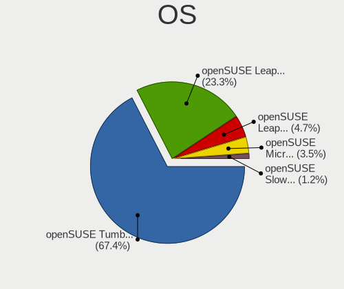
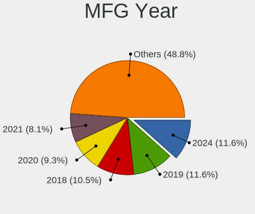
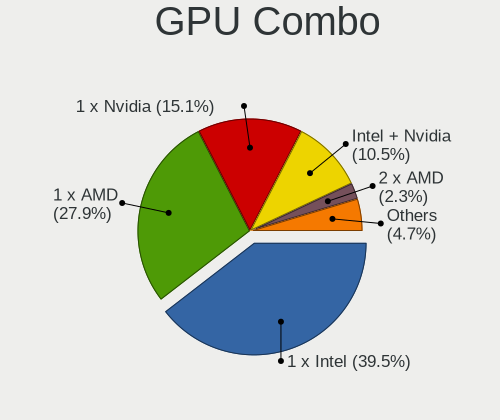
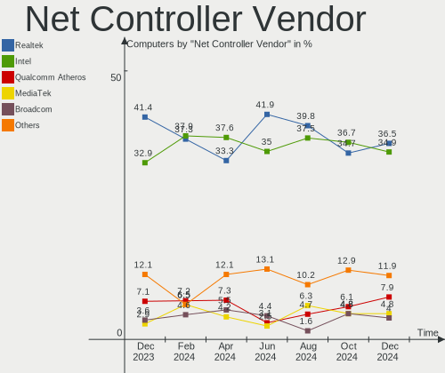
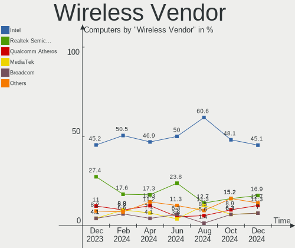
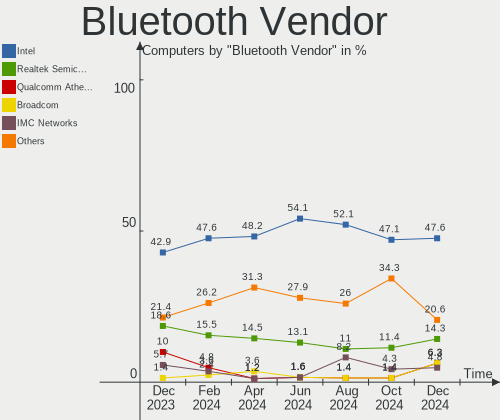

openSUSE - Hardware Trends
--------------------------

A project to identify most popular hardware characteristics and track their change
over time based on data collected by Linux users at https://Linux-Hardware.org.

Anyone can contribute to this report by the [hw-probe](https://github.com/linuxhw/hw-probe) tool:

    sudo -E hw-probe -all -upload

This is a report for all computer types. See also reports for [desktops](/Dist/openSUSE/Desktop/README.md) and [notebooks](/Dist/openSUSE/Notebook/README.md).

This report is for one last month. Overall report since the beginning of time: [TestCoverage](https://github.com/linuxhw/TestCoverage)

Period: Sep, 2022.

Contents
--------

* [ System ](#system)
  - [ OS                       ](#os)
  - [ OS Family                ](#os-family)
  - [ Kernel                   ](#kernel)
  - [ Kernel Family            ](#kernel-family)
  - [ Kernel Major Ver.        ](#kernel-major-ver)
  - [ Arch                     ](#arch)
  - [ DE                       ](#de)
  - [ Display Server           ](#display-server)
  - [ Display Manager          ](#display-manager)
  - [ OS Lang                  ](#os-lang)
  - [ Boot Mode                ](#boot-mode)
  - [ Filesystem               ](#filesystem)
  - [ Part. scheme             ](#part-scheme)
  - [ Dual Boot with Linux/BSD ](#dual-boot-with-linuxbsd)
  - [ Dual Boot (Win)          ](#dual-boot-win)

* [ Board ](#board)
  - [ Vendor                   ](#vendor)
  - [ Model                    ](#model)
  - [ Model Family             ](#model-family)
  - [ MFG Year                 ](#mfg-year)
  - [ Form Factor              ](#form-factor)
  - [ Secure Boot              ](#secure-boot)
  - [ Coreboot                 ](#coreboot)
  - [ RAM Size                 ](#ram-size)
  - [ RAM Used                 ](#ram-used)
  - [ Total Drives             ](#total-drives)
  - [ Has CD-ROM               ](#has-cd-rom)
  - [ Has Ethernet             ](#has-ethernet)
  - [ Has WiFi                 ](#has-wifi)
  - [ Has Bluetooth            ](#has-bluetooth)

* [ Location ](#location)
  - [ Country                  ](#country)
  - [ City                     ](#city)

* [ Drives ](#drives)
  - [ Drive Vendor             ](#drive-vendor)
  - [ Drive Model              ](#drive-model)
  - [ HDD Vendor               ](#hdd-vendor)
  - [ SSD Vendor               ](#ssd-vendor)
  - [ Drive Kind               ](#drive-kind)
  - [ Drive Connector          ](#drive-connector)
  - [ Drive Size               ](#drive-size)
  - [ Space Total              ](#space-total)
  - [ Space Used               ](#space-used)
  - [ Malfunc. Drives          ](#malfunc-drives)
  - [ Malfunc. Drive Vendor    ](#malfunc-drive-vendor)
  - [ Malfunc. HDD Vendor      ](#malfunc-hdd-vendor)
  - [ Malfunc. Drive Kind      ](#malfunc-drive-kind)
  - [ Failed Drives            ](#failed-drives)
  - [ Failed Drive Vendor      ](#failed-drive-vendor)
  - [ Drive Status             ](#drive-status)

* [ Storage controller ](#storage-controller)
  - [ Storage Vendor           ](#storage-vendor)
  - [ Storage Model            ](#storage-model)
  - [ Storage Kind             ](#storage-kind)

* [ Processor ](#processor)
  - [ CPU Vendor               ](#cpu-vendor)
  - [ CPU Model                ](#cpu-model)
  - [ CPU Model Family         ](#cpu-model-family)
  - [ CPU Cores                ](#cpu-cores)
  - [ CPU Sockets              ](#cpu-sockets)
  - [ CPU Threads              ](#cpu-threads)
  - [ CPU Op-Modes             ](#cpu-op-modes)
  - [ CPU Microcode            ](#cpu-microcode)
  - [ CPU Microarch            ](#cpu-microarch)

* [ Graphics ](#graphics)
  - [ GPU Vendor               ](#gpu-vendor)
  - [ GPU Model                ](#gpu-model)
  - [ GPU Combo                ](#gpu-combo)
  - [ GPU Driver               ](#gpu-driver)
  - [ GPU Memory               ](#gpu-memory)

* [ Monitor ](#monitor)
  - [ Monitor Vendor           ](#monitor-vendor)
  - [ Monitor Model            ](#monitor-model)
  - [ Monitor Resolution       ](#monitor-resolution)
  - [ Monitor Diagonal         ](#monitor-diagonal)
  - [ Monitor Width            ](#monitor-width)
  - [ Aspect Ratio             ](#aspect-ratio)
  - [ Monitor Area             ](#monitor-area)
  - [ Pixel Density            ](#pixel-density)
  - [ Multiple Monitors        ](#multiple-monitors)

* [ Network ](#network)
  - [ Net Controller Vendor    ](#net-controller-vendor)
  - [ Net Controller Model     ](#net-controller-model)
  - [ Wireless Vendor          ](#wireless-vendor)
  - [ Wireless Model           ](#wireless-model)
  - [ Ethernet Vendor          ](#ethernet-vendor)
  - [ Ethernet Model           ](#ethernet-model)
  - [ Net Controller Kind      ](#net-controller-kind)
  - [ Used Controller          ](#used-controller)
  - [ NICs                     ](#nics)
  - [ IPv6                     ](#ipv6)

* [ Bluetooth ](#bluetooth)
  - [ Bluetooth Vendor         ](#bluetooth-vendor)
  - [ Bluetooth Model          ](#bluetooth-model)

* [ Sound ](#sound)
  - [ Sound Vendor             ](#sound-vendor)
  - [ Sound Model              ](#sound-model)

* [ Memory ](#memory)
  - [ Memory Vendor            ](#memory-vendor)
  - [ Memory Model             ](#memory-model)
  - [ Memory Kind              ](#memory-kind)
  - [ Memory Form Factor       ](#memory-form-factor)
  - [ Memory Size              ](#memory-size)
  - [ Memory Speed             ](#memory-speed)

* [ Printers & scanners ](#printers--scanners)
  - [ Printer Vendor           ](#printer-vendor)
  - [ Printer Model            ](#printer-model)
  - [ Scanner Vendor           ](#scanner-vendor)
  - [ Scanner Model            ](#scanner-model)

* [ Camera ](#camera)
  - [ Camera Vendor            ](#camera-vendor)
  - [ Camera Model             ](#camera-model)

* [ Security ](#security)
  - [ Fingerprint Vendor       ](#fingerprint-vendor)
  - [ Fingerprint Model        ](#fingerprint-model)
  - [ Chipcard Vendor          ](#chipcard-vendor)
  - [ Chipcard Model           ](#chipcard-model)

* [ Unsupported ](#unsupported)
  - [ Unsupported Devices      ](#unsupported-devices)
  - [ Unsupported Device Types ](#unsupported-device-types)

System
------

OS
--

Installed operating systems

| Name                         | Computers | Percent |
|------------------------------|-----------|---------|
| openSUSE Tumbleweed-XXXXXXXX | 38        | 74.51%  |
| openSUSE Leap-15.4           | 8         | 15.69%  |
| openSUSE Leap-15.3           | 4         | 7.84%   |
| openSUSE Leap-15.5           | 1         | 1.96%   |

OS Family
---------

OS without a version

| Name     | Computers | Percent |
|----------|-----------|---------|
| openSUSE | 51        | 100%    |

Kernel
------

Version of the Linux kernel

| Version                      | Computers | Percent |
|------------------------------|-----------|---------|
| 5.19.2-1-default             | 17        | 33.33%  |
| 5.19.8-1-default             | 15        | 29.41%  |
| 5.14.21-150400.24.18-default | 5         | 9.8%    |
| 5.19.7-1-default             | 4         | 7.84%   |
| 5.14.21-150400.24.21-default | 4         | 7.84%   |
| 5.3.18-150300.59.93-default  | 1         | 1.96%   |
| 5.3.18-150300.59.90-default  | 1         | 1.96%   |
| 5.3.18-150300.59.87-default  | 1         | 1.96%   |
| 5.3.18-150300.59.76-default  | 1         | 1.96%   |
| 5.19.10-1-default            | 1         | 1.96%   |
| 5.18.1-1-default             | 1         | 1.96%   |

Kernel Family
-------------

Linux kernel without a distro release

| Version | Computers | Percent |
|---------|-----------|---------|
| 5.19.2  | 17        | 33.33%  |
| 5.19.8  | 15        | 29.41%  |
| 5.14.21 | 9         | 17.65%  |
| 5.3.18  | 4         | 7.84%   |
| 5.19.7  | 4         | 7.84%   |
| 5.19.10 | 1         | 1.96%   |
| 5.18.1  | 1         | 1.96%   |

Kernel Major Ver.
-----------------

Linux kernel major version

| Version | Computers | Percent |
|---------|-----------|---------|
| 5.19    | 37        | 72.55%  |
| 5.14    | 9         | 17.65%  |
| 5.3     | 4         | 7.84%   |
| 5.18    | 1         | 1.96%   |

Arch
----

OS architecture (x86_64, i586, etc.)

| Name   | Computers | Percent |
|--------|-----------|---------|
| x86_64 | 51        | 100%    |

DE
--

Desktop Environment

| Name       | Computers | Percent |
|------------|-----------|---------|
| KDE5       | 29        | 56.86%  |
| GNOME      | 12        | 23.53%  |
| XFCE       | 3         | 5.88%   |
| Budgie     | 3         | 5.88%   |
| Unknown    | 2         | 3.92%   |
| X-Cinnamon | 1         | 1.96%   |
| LXDE       | 1         | 1.96%   |

Display Server
--------------

X11 or Wayland

| Name    | Computers | Percent |
|---------|-----------|---------|
| X11     | 42        | 82.35%  |
| Wayland | 8         | 15.69%  |
| Tty     | 1         | 1.96%   |

Display Manager
---------------

SDDM, LightDM, etc.

| Name    | Computers | Percent |
|---------|-----------|---------|
| Unknown | 23        | 45.1%   |
| SDDM    | 12        | 23.53%  |
| LightDM | 9         | 17.65%  |
| XDM     | 5         | 9.8%    |
| GDM     | 2         | 3.92%   |

OS Lang
-------

Language

| Lang    | Computers | Percent |
|---------|-----------|---------|
| en_US   | 24        | 47.06%  |
| de_DE   | 11        | 21.57%  |
| ru_RU   | 3         | 5.88%   |
| en_GB   | 3         | 5.88%   |
| it_IT   | 2         | 3.92%   |
| Unknown | 2         | 3.92%   |
| pt_BR   | 1         | 1.96%   |
| nn_NO   | 1         | 1.96%   |
| nl_NL   | 1         | 1.96%   |
| fi_FI   | 1         | 1.96%   |
| es_ES   | 1         | 1.96%   |
| en_CA   | 1         | 1.96%   |

Boot Mode
---------

EFI or BIOS

| Mode | Computers | Percent |
|------|-----------|---------|
| EFI  | 36        | 70.59%  |
| BIOS | 15        | 29.41%  |

Filesystem
----------

Type of filesystem

| Type  | Computers | Percent |
|-------|-----------|---------|
| Btrfs | 44        | 86.27%  |
| Ext4  | 6         | 11.76%  |
| Xfs   | 1         | 1.96%   |

Part. scheme
------------

Scheme of partitioning

| Type    | Computers | Percent |
|---------|-----------|---------|
| GPT     | 26        | 50.98%  |
| Unknown | 22        | 43.14%  |
| MBR     | 3         | 5.88%   |

Dual Boot with Linux/BSD
------------------------

Hosting more than one Linux/BSD

| Dual boot | Computers | Percent |
|-----------|-----------|---------|
| No        | 45        | 88.24%  |
| Yes       | 6         | 11.76%  |

Dual Boot (Win)
---------------

Hosting Linux and Windows

| Dual boot | Computers | Percent |
|-----------|-----------|---------|
| No        | 41        | 80.39%  |
| Yes       | 10        | 19.61%  |

Board
-----

Vendor
------

Motherboard manufacturer

| Name                | Computers | Percent |
|---------------------|-----------|---------|
| ASUSTek Computer    | 14        | 27.45%  |
| Lenovo              | 9         | 17.65%  |
| Hewlett-Packard     | 7         | 13.73%  |
| MSI                 | 5         | 9.8%    |
| Dell                | 5         | 9.8%    |
| ASRock              | 2         | 3.92%   |
| Timi                | 1         | 1.96%   |
| SLIMBOOK            | 1         | 1.96%   |
| Samsung Electronics | 1         | 1.96%   |
| HUAWEI              | 1         | 1.96%   |
| Gigabyte Technology | 1         | 1.96%   |
| Biostar             | 1         | 1.96%   |
| BESSTAR Tech        | 1         | 1.96%   |
| Apple               | 1         | 1.96%   |
| Acer                | 1         | 1.96%   |

Model
-----

Motherboard model

| Name                                  | Computers | Percent |
|---------------------------------------|-----------|---------|
| HP ENVY x360 2-in-1 Laptop 15-ey0xxx  | 2         | 3.92%   |
| Timi A35S                             | 1         | 1.96%   |
| SLIMBOOK PROX-AMD5                    | 1         | 1.96%   |
| Samsung 550XBE/350XBE                 | 1         | 1.96%   |
| MSI MS-7D08                           | 1         | 1.96%   |
| MSI MS-7B79                           | 1         | 1.96%   |
| MSI MS-7673                           | 1         | 1.96%   |
| MSI MS-7522                           | 1         | 1.96%   |
| MSI Modern 14 B5M                     | 1         | 1.96%   |
| Lenovo ThinkStation P520 30BE008VGE   | 1         | 1.96%   |
| Lenovo ThinkPad W510 4391W3V          | 1         | 1.96%   |
| Lenovo ThinkPad T14s Gen 1 20UJS00K00 | 1         | 1.96%   |
| Lenovo ThinkPad T14 Gen 1 20S1S7NP00  | 1         | 1.96%   |
| Lenovo ThinkPad T14 Gen 1 20S0004BMH  | 1         | 1.96%   |
| Lenovo ThinkPad E14 Gen 4 21EB000HAU  | 1         | 1.96%   |
| Lenovo ThinkCentre M93p 10ABS00N00    | 1         | 1.96%   |
| Lenovo K14 Gen 1 21CUS02600           | 1         | 1.96%   |
| Lenovo IdeaPad 5 Pro 16ACH6 82L5      | 1         | 1.96%   |
| HUAWEI KLVD-WXX9                      | 1         | 1.96%   |
| HP ZBook 17 G2                        | 1         | 1.96%   |
| HP ProBook x360 435 G8 Notebook PC    | 1         | 1.96%   |
| HP ENVY x360 Convertible 13-ay0xxx    | 1         | 1.96%   |
| HP EliteBook 8470p                    | 1         | 1.96%   |
| HP 250 G8 Notebook PC                 | 1         | 1.96%   |
| Gigabyte Z77-DS3H                     | 1         | 1.96%   |
| Dell Precision 5530                   | 1         | 1.96%   |
| Dell Latitude E5250                   | 1         | 1.96%   |
| Dell Latitude 7400                    | 1         | 1.96%   |
| Dell Inspiron 5515                    | 1         | 1.96%   |
| Dell Inspiron 3542                    | 1         | 1.96%   |
| Biostar H77MU3                        | 1         | 1.96%   |
| BESSTAR Tech UM560                    | 1         | 1.96%   |
| ASUS Zenbook UX3402ZA_UX3402ZA        | 1         | 1.96%   |
| ASUS X55CR                            | 1         | 1.96%   |
| ASUS WS C422 PRO_SE                   | 1         | 1.96%   |
| ASUS Vivo AIO 16 V161GAR_A41GAR       | 1         | 1.96%   |
| ASUS TUF Gaming X570-PLUS             | 1         | 1.96%   |
| ASUS ROG STRIX X570-E GAMING          | 1         | 1.96%   |
| ASUS ROG CROSSHAIR VIII EXTREME       | 1         | 1.96%   |
| ASUS ROG CROSSHAIR VII HERO           | 1         | 1.96%   |

Model Family
------------

Motherboard model prefix

| Name                | Computers | Percent |
|---------------------|-----------|---------|
| Lenovo ThinkPad     | 5         | 9.8%    |
| HP ENVY             | 3         | 5.88%   |
| ASUS ROG            | 3         | 5.88%   |
| Dell Latitude       | 2         | 3.92%   |
| Dell Inspiron       | 2         | 3.92%   |
| Timi A35S           | 1         | 1.96%   |
| SLIMBOOK PROX-AMD5  | 1         | 1.96%   |
| Samsung 550XBE      | 1         | 1.96%   |
| MSI MS-7D08         | 1         | 1.96%   |
| MSI MS-7B79         | 1         | 1.96%   |
| MSI MS-7673         | 1         | 1.96%   |
| MSI MS-7522         | 1         | 1.96%   |
| MSI Modern          | 1         | 1.96%   |
| Lenovo ThinkStation | 1         | 1.96%   |
| Lenovo ThinkCentre  | 1         | 1.96%   |
| Lenovo K14          | 1         | 1.96%   |
| Lenovo IdeaPad      | 1         | 1.96%   |
| HUAWEI KLVD-WXX9    | 1         | 1.96%   |
| HP ZBook            | 1         | 1.96%   |
| HP ProBook          | 1         | 1.96%   |
| HP EliteBook        | 1         | 1.96%   |
| HP 250              | 1         | 1.96%   |
| Gigabyte Z77-DS3H   | 1         | 1.96%   |
| Dell Precision      | 1         | 1.96%   |
| Biostar H77MU3      | 1         | 1.96%   |
| BESSTAR Tech UM560  | 1         | 1.96%   |
| ASUS Zenbook        | 1         | 1.96%   |
| ASUS X55CR          | 1         | 1.96%   |
| ASUS WS             | 1         | 1.96%   |
| ASUS Vivo           | 1         | 1.96%   |
| ASUS TUF            | 1         | 1.96%   |
| ASUS PRIME          | 1         | 1.96%   |
| ASUS P5P43TD        | 1         | 1.96%   |
| ASUS Maximus        | 1         | 1.96%   |
| ASUS M5A97          | 1         | 1.96%   |
| ASUS M5A78L-M       | 1         | 1.96%   |
| ASUS All            | 1         | 1.96%   |
| ASRock Z170         | 1         | 1.96%   |
| ASRock B450         | 1         | 1.96%   |
| Apple MacBookPro8   | 1         | 1.96%   |

MFG Year
--------

Motherboard manufacture year

| Year | Computers | Percent |
|------|-----------|---------|
| 2020 | 11        | 21.57%  |
| 2022 | 8         | 15.69%  |
| 2021 | 6         | 11.76%  |
| 2019 | 6         | 11.76%  |
| 2014 | 5         | 9.8%    |
| 2012 | 5         | 9.8%    |
| 2018 | 3         | 5.88%   |
| 2011 | 3         | 5.88%   |
| 2009 | 2         | 3.92%   |
| 2016 | 1         | 1.96%   |
| 2010 | 1         | 1.96%   |

Form Factor
-----------

Physical design of the computer

| Name        | Computers | Percent |
|-------------|-----------|---------|
| Notebook    | 23        | 45.1%   |
| Desktop     | 22        | 43.14%  |
| Convertible | 5         | 9.8%    |
| All in one  | 1         | 1.96%   |

Secure Boot
-----------

Enabled or disabled

| State    | Computers | Percent |
|----------|-----------|---------|
| Disabled | 39        | 76.47%  |
| Enabled  | 12        | 23.53%  |

Coreboot
--------

Have coreboot on board

| Used | Computers | Percent |
|------|-----------|---------|
| No   | 51        | 100%    |

RAM Size
--------

Total RAM memory

| Size in GB  | Computers | Percent |
|-------------|-----------|---------|
| 16.01-24.0  | 13        | 25.49%  |
| 32.01-64.0  | 11        | 21.57%  |
| 8.01-16.0   | 8         | 15.69%  |
| 4.01-8.0    | 7         | 13.73%  |
| 24.01-32.0  | 5         | 9.8%    |
| 64.01-256.0 | 5         | 9.8%    |
| 3.01-4.0    | 2         | 3.92%   |

RAM Used
--------

Used RAM memory

| Used GB    | Computers | Percent |
|------------|-----------|---------|
| 4.01-8.0   | 14        | 27.45%  |
| 2.01-3.0   | 11        | 21.57%  |
| 1.01-2.0   | 8         | 15.69%  |
| 8.01-16.0  | 8         | 15.69%  |
| 3.01-4.0   | 7         | 13.73%  |
| 24.01-32.0 | 1         | 1.96%   |
| 16.01-24.0 | 1         | 1.96%   |
| 0.51-1.0   | 1         | 1.96%   |

Total Drives
------------

Number of drives on board

| Drives | Computers | Percent |
|--------|-----------|---------|
| 1      | 29        | 56.86%  |
| 2      | 14        | 27.45%  |
| 4      | 4         | 7.84%   |
| 3      | 2         | 3.92%   |
| 6      | 1         | 1.96%   |
| 5      | 1         | 1.96%   |

Has CD-ROM
----------

Has CD-ROM on board

| Presented | Computers | Percent |
|-----------|-----------|---------|
| No        | 37        | 72.55%  |
| Yes       | 14        | 27.45%  |

Has Ethernet
------------

Has Ethernet on board

| Presented | Computers | Percent |
|-----------|-----------|---------|
| Yes       | 40        | 78.43%  |
| No        | 11        | 21.57%  |

Has WiFi
--------

Has WiFi module

| Presented | Computers | Percent |
|-----------|-----------|---------|
| Yes       | 35        | 68.63%  |
| No        | 16        | 31.37%  |

Has Bluetooth
-------------

Has Bluetooth module

| Presented | Computers | Percent |
|-----------|-----------|---------|
| Yes       | 39        | 76.47%  |
| No        | 12        | 23.53%  |

Location
--------

Country
-------

Geographic location (country)

| Country     | Computers | Percent |
|-------------|-----------|---------|
| Germany     | 10        | 19.61%  |
| USA         | 6         | 11.76%  |
| Russia      | 6         | 11.76%  |
| Italy       | 4         | 7.84%   |
| Sweden      | 3         | 5.88%   |
| Austria     | 3         | 5.88%   |
| Switzerland | 2         | 3.92%   |
| Netherlands | 2         | 3.92%   |
| Bulgaria    | 2         | 3.92%   |
| Brazil      | 2         | 3.92%   |
| UK          | 1         | 1.96%   |
| Spain       | 1         | 1.96%   |
| Serbia      | 1         | 1.96%   |
| Norway      | 1         | 1.96%   |
| France      | 1         | 1.96%   |
| Finland     | 1         | 1.96%   |
| Croatia     | 1         | 1.96%   |
| Chile       | 1         | 1.96%   |
| Canada      | 1         | 1.96%   |
| Belgium     | 1         | 1.96%   |
| Australia   | 1         | 1.96%   |

City
----

Geographic location (city)

| City               | Computers | Percent |
|--------------------|-----------|---------|
| Moscow             | 2         | 3.92%   |
| Zagreb             | 1         | 1.96%   |
| Woellersdorf       | 1         | 1.96%   |
| West Chester       | 1         | 1.96%   |
| Vienna             | 1         | 1.96%   |
| Verona             | 1         | 1.96%   |
| Umeå              | 1         | 1.96%   |
| Ulyanovsk          | 1         | 1.96%   |
| Uberlândia        | 1         | 1.96%   |
| Teltow             | 1         | 1.96%   |
| Tarneit            | 1         | 1.96%   |
| Stockholm          | 1         | 1.96%   |
| Solna              | 1         | 1.96%   |
| Sofia              | 1         | 1.96%   |
| Skeie              | 1         | 1.96%   |
| Sesto San Giovanni | 1         | 1.96%   |
| Santiago           | 1         | 1.96%   |
| Saki               | 1         | 1.96%   |
| Rubí              | 1         | 1.96%   |
| Ronago             | 1         | 1.96%   |
| Rome               | 1         | 1.96%   |
| Plovdiv            | 1         | 1.96%   |
| Paris              | 1         | 1.96%   |
| Opelika            | 1         | 1.96%   |
| North Shields      | 1         | 1.96%   |
| New Maryland       | 1         | 1.96%   |
| Munich             | 1         | 1.96%   |
| Meulebeke          | 1         | 1.96%   |
| Mesa               | 1         | 1.96%   |
| Lindlar            | 1         | 1.96%   |
| Kurten             | 1         | 1.96%   |
| Kotel'niki         | 1         | 1.96%   |
| Hoffman            | 1         | 1.96%   |
| Helsinki           | 1         | 1.96%   |
| Hamburg            | 1         | 1.96%   |
| Göttingen         | 1         | 1.96%   |
| Glattfelden        | 1         | 1.96%   |
| Gerasdorf bei Wien | 1         | 1.96%   |
| Fürth             | 1         | 1.96%   |
| Froendenberg       | 1         | 1.96%   |

Drives
------

Drive Vendor
------------

Hard drive vendors

| Vendor                      | Computers | Drives | Percent |
|-----------------------------|-----------|--------|---------|
| Samsung Electronics         | 21        | 26     | 28%     |
| Seagate                     | 13        | 20     | 17.33%  |
| WDC                         | 6         | 9      | 8%      |
| Sandisk                     | 5         | 5      | 6.67%   |
| Toshiba                     | 3         | 4      | 4%      |
| SK hynix                    | 3         | 3      | 4%      |
| Micron Technology           | 3         | 3      | 4%      |
| Phison Electronics          | 2         | 2      | 2.67%   |
| Micron/Crucial Technology   | 2         | 3      | 2.67%   |
| KIOXIA                      | 2         | 2      | 2.67%   |
| Kingston                    | 2         | 2      | 2.67%   |
| Intel                       | 2         | 2      | 2.67%   |
| Crucial                     | 2         | 2      | 2.67%   |
| Unknown                     | 1         | 1      | 1.33%   |
| Smartbuy                    | 1         | 1      | 1.33%   |
| PNY                         | 1         | 1      | 1.33%   |
| LITEON                      | 1         | 1      | 1.33%   |
| Kingston Technology Company | 1         | 1      | 1.33%   |
| Intenso                     | 1         | 1      | 1.33%   |
| HGST                        | 1         | 1      | 1.33%   |
| AMD                         | 1         | 1      | 1.33%   |
| A-DATA Technology           | 1         | 1      | 1.33%   |

Drive Model
-----------

Hard drive models

| Model                                                 | Computers | Percent |
|-------------------------------------------------------|-----------|---------|
| Samsung NVMe SSD Controller SM981/PM981/PM983 256GB   | 5         | 5.81%   |
| Seagate ST2000DM001-1ER164 2TB                        | 2         | 2.33%   |
| Sandisk WD Blue SN550 NVMe SSD 1024GB                 | 2         | 2.33%   |
| Samsung NVMe SSD Drive 512GB                          | 2         | 2.33%   |
| WDC WDS500G2B0A-00SM50 500GB SSD                      | 1         | 1.16%   |
| WDC WDS250G1B0A-00H9H0 250GB SSD                      | 1         | 1.16%   |
| WDC WD4004FZWX-00GBGB0 4TB                            | 1         | 1.16%   |
| WDC WD30EZRX-00AZ6B0 3TB                              | 1         | 1.16%   |
| WDC WD2500BEVT-00ZCT0 250GB                           | 1         | 1.16%   |
| WDC WD20EZRZ-00Z5HB0 2TB                              | 1         | 1.16%   |
| WDC WD10EZEX-08WN4A0 1TB                              | 1         | 1.16%   |
| WDC WD10EARS-00MVWB0 1TB                              | 1         | 1.16%   |
| Unknown MMC Card  7GB                                 | 1         | 1.16%   |
| Toshiba MQ04ABF100 1TB                                | 1         | 1.16%   |
| Toshiba HDWU130 3TB                                   | 1         | 1.16%   |
| Toshiba HDWD120 2TB                                   | 1         | 1.16%   |
| Toshiba DT01ACA050 500GB                              | 1         | 1.16%   |
| Smartbuy SSD 240GB                                    | 1         | 1.16%   |
| SK hynix NVMe SSD Drive 512GB                         | 1         | 1.16%   |
| SK hynix BC711 NVMe 1TB                               | 1         | 1.16%   |
| SK hynix BC501 NVMe Solid State Drive 512GB           | 1         | 1.16%   |
| Seagate ST9500420AS 500GB                             | 1         | 1.16%   |
| Seagate ST8000NE001-2M7101 8TB                        | 1         | 1.16%   |
| Seagate ST6000VN0033-2EE110 6TB                       | 1         | 1.16%   |
| Seagate ST500DM002-1BD142 500GB                       | 1         | 1.16%   |
| Seagate ST4000VN008-2DR166 4TB                        | 1         | 1.16%   |
| Seagate ST4000DM004-2CV104 4TB                        | 1         | 1.16%   |
| Seagate ST31000528AS 1TB                              | 1         | 1.16%   |
| Seagate ST2000DM008-2FR102 2TB                        | 1         | 1.16%   |
| Seagate ST2000DM001-1CH164 2TB                        | 1         | 1.16%   |
| Seagate ST2000DM 001-9YN164 2TB                       | 1         | 1.16%   |
| Seagate ST1000LX015-1U7172 1TB                        | 1         | 1.16%   |
| Seagate ST1000LM024 HN-M101MBB 1TB                    | 1         | 1.16%   |
| Seagate ST1000DX002-2DV162 1TB                        | 1         | 1.16%   |
| Seagate FireCuda 530 ZP4000GM30013 4TB                | 1         | 1.16%   |
| Seagate Expansion 1TB                                 | 1         | 1.16%   |
| Seagate BarraCuda SSD ZA2000CM10002 2TB               | 1         | 1.16%   |
| Sandisk WD Black SN750 / PC SN730 NVMe SSD 1024GB     | 1         | 1.16%   |
| Sandisk WD Black 2018/SN750 / PC SN720 NVMe SSD 512GB | 1         | 1.16%   |
| SanDisk SDSSDH3 1T00 1TB                              | 1         | 1.16%   |

HDD Vendor
----------

Hard disk drive vendors

| Vendor              | Computers | Drives | Percent |
|---------------------|-----------|--------|---------|
| Seagate             | 12        | 18     | 57.14%  |
| WDC                 | 4         | 7      | 19.05%  |
| Toshiba             | 3         | 4      | 14.29%  |
| Samsung Electronics | 1         | 1      | 4.76%   |
| HGST                | 1         | 1      | 4.76%   |

SSD Vendor
----------

Solid state drive vendors

| Vendor              | Computers | Drives | Percent |
|---------------------|-----------|--------|---------|
| Samsung Electronics | 8         | 11     | 36.36%  |
| WDC                 | 2         | 2      | 9.09%   |
| Kingston            | 2         | 2      | 9.09%   |
| Crucial             | 2         | 2      | 9.09%   |
| Smartbuy            | 1         | 1      | 4.55%   |
| Seagate             | 1         | 1      | 4.55%   |
| SanDisk             | 1         | 1      | 4.55%   |
| Micron Technology   | 1         | 1      | 4.55%   |
| LITEON              | 1         | 1      | 4.55%   |
| Intenso             | 1         | 1      | 4.55%   |
| Intel               | 1         | 1      | 4.55%   |
| AMD                 | 1         | 1      | 4.55%   |

Drive Kind
----------

HDD or SSD

| Kind | Computers | Drives | Percent |
|------|-----------|--------|---------|
| NVMe | 30        | 35     | 41.1%   |
| SSD  | 21        | 25     | 28.77%  |
| HDD  | 21        | 31     | 28.77%  |
| MMC  | 1         | 1      | 1.37%   |

Drive Connector
---------------

SATA, SAS, NVMe, etc.

| Type | Computers | Drives | Percent |
|------|-----------|--------|---------|
| NVMe | 30        | 35     | 46.88%  |
| SATA | 29        | 52     | 45.31%  |
| SAS  | 4         | 4      | 6.25%   |
| MMC  | 1         | 1      | 1.56%   |

Drive Size
----------

Size of hard drive

| Size in TB | Computers | Drives | Percent |
|------------|-----------|--------|---------|
| 0.01-0.5   | 19        | 22     | 39.58%  |
| 0.51-1.0   | 13        | 14     | 27.08%  |
| 1.01-2.0   | 8         | 9      | 16.67%  |
| 3.01-4.0   | 4         | 5      | 8.33%   |
| 2.01-3.0   | 2         | 3      | 4.17%   |
| 4.01-10.0  | 2         | 3      | 4.17%   |

Space Total
-----------

Amount of disk space available on the file system

| Size in GB     | Computers | Percent |
|----------------|-----------|---------|
| More than 3000 | 24        | 47.06%  |
| 1001-2000      | 9         | 17.65%  |
| 501-1000       | 8         | 15.69%  |
| 2001-3000      | 5         | 9.8%    |
| 251-500        | 2         | 3.92%   |
| Unknown        | 2         | 3.92%   |
| 101-250        | 1         | 1.96%   |

Space Used
----------

Amount of used disk space

| Used GB        | Computers | Percent |
|----------------|-----------|---------|
| 1001-2000      | 11        | 21.57%  |
| 101-250        | 10        | 19.61%  |
| 51-100         | 9         | 17.65%  |
| More than 3000 | 6         | 11.76%  |
| 501-1000       | 6         | 11.76%  |
| 251-500        | 4         | 7.84%   |
| 2001-3000      | 3         | 5.88%   |
| Unknown        | 2         | 3.92%   |

Malfunc. Drives
---------------

Drive models with a malfunction

| Model                       | Computers | Drives | Percent |
|-----------------------------|-----------|--------|---------|
| Seagate ST9500420AS 500GB   | 1         | 1      | 50%     |
| Crucial CT960M500SSD1 960GB | 1         | 1      | 50%     |

Malfunc. Drive Vendor
---------------------

Vendors of faulty drives

| Vendor  | Computers | Drives | Percent |
|---------|-----------|--------|---------|
| Seagate | 1         | 1      | 50%     |
| Crucial | 1         | 1      | 50%     |

Malfunc. HDD Vendor
-------------------

Vendors of faulty HDD drives

| Vendor  | Computers | Drives | Percent |
|---------|-----------|--------|---------|
| Seagate | 1         | 1      | 100%    |

Malfunc. Drive Kind
-------------------

Kinds of faulty drives

| Kind | Computers | Drives | Percent |
|------|-----------|--------|---------|
| SSD  | 1         | 1      | 50%     |
| HDD  | 1         | 1      | 50%     |

Failed Drives
-------------

Failed drive models

Zero info for selected period =(

Failed Drive Vendor
-------------------

Failed drive vendors

Zero info for selected period =(

Drive Status
------------

Number of failed and malfunc. drives

| Status   | Computers | Drives | Percent |
|----------|-----------|--------|---------|
| Works    | 30        | 45     | 54.55%  |
| Detected | 23        | 45     | 41.82%  |
| Malfunc  | 2         | 2      | 3.64%   |

Storage controller
------------------

Storage Vendor
--------------

Storage controller vendors

| Vendor                      | Computers | Percent |
|-----------------------------|-----------|---------|
| Intel                       | 25        | 32.89%  |
| AMD                         | 15        | 19.74%  |
| Samsung Electronics         | 12        | 15.79%  |
| SanDisk                     | 4         | 5.26%   |
| SK hynix                    | 3         | 3.95%   |
| Phison Electronics          | 3         | 3.95%   |
| ASMedia Technology          | 3         | 3.95%   |
| Micron/Crucial Technology   | 2         | 2.63%   |
| Micron Technology           | 2         | 2.63%   |
| KIOXIA                      | 2         | 2.63%   |
| JMicron Technology          | 2         | 2.63%   |
| Seagate Technology          | 1         | 1.32%   |
| Kingston Technology Company | 1         | 1.32%   |
| ADATA Technology            | 1         | 1.32%   |

Storage Model
-------------

Storage controller models

| Model                                                                          | Computers | Percent |
|--------------------------------------------------------------------------------|-----------|---------|
| AMD FCH SATA Controller [AHCI mode]                                            | 12        | 14.29%  |
| Samsung NVMe SSD Controller SM981/PM981/PM983                                  | 8         | 9.52%   |
| ASMedia ASM1062 Serial ATA Controller                                          | 3         | 3.57%   |
| AMD 400 Series Chipset SATA Controller                                         | 3         | 3.57%   |
| SanDisk WD Blue SN550 NVMe SSD                                                 | 2         | 2.38%   |
| Samsung NVMe SSD Controller PM9A1/PM9A3/980PRO                                 | 2         | 2.38%   |
| Samsung NVMe SSD Controller 980                                                | 2         | 2.38%   |
| Phison E12 NVMe Controller                                                     | 2         | 2.38%   |
| Micron Non-Volatile memory controller                                          | 2         | 2.38%   |
| KIOXIA NVMe SSD Controller BG4                                                 | 2         | 2.38%   |
| Intel Volume Management Device NVMe RAID Controller                            | 2         | 2.38%   |
| Intel Q170/Q150/B150/H170/H110/Z170/CM236 Chipset SATA Controller [AHCI Mode]  | 2         | 2.38%   |
| Intel Cannon Lake Mobile PCH SATA AHCI Controller                              | 2         | 2.38%   |
| Intel 8 Series/C220 Series Chipset Family 6-port SATA Controller 1 [AHCI mode] | 2         | 2.38%   |
| Intel 7 Series Chipset Family 6-port SATA Controller [AHCI mode]               | 2         | 2.38%   |
| Intel 200 Series PCH SATA controller [AHCI mode]                               | 2         | 2.38%   |
| SK hynix PC401 NVMe Solid State Drive 256GB                                    | 1         | 1.19%   |
| SK hynix Gold P31 SSD                                                          | 1         | 1.19%   |
| SK hynix BC501 NVMe Solid State Drive                                          | 1         | 1.19%   |
| Seagate FireCuda 530 SSD                                                       | 1         | 1.19%   |
| SanDisk WD Black SN750 / PC SN730 NVMe SSD                                     | 1         | 1.19%   |
| SanDisk WD Black 2018/SN750 / PC SN720 NVMe SSD                                | 1         | 1.19%   |
| Phison E16 PCIe4 NVMe Controller                                               | 1         | 1.19%   |
| Micron/Crucial P2 NVMe PCIe SSD                                                | 1         | 1.19%   |
| Micron/Crucial NVMe Controller                                                 | 1         | 1.19%   |
| Kingston Company OM3PDP3 NVMe SSD                                              | 1         | 1.19%   |
| JMicron JMB363 SATA/IDE Controller                                             | 1         | 1.19%   |
| JMicron JMB361 AHCI/IDE                                                        | 1         | 1.19%   |
| Intel Wildcat Point-LP SATA Controller [AHCI Mode]                             | 1         | 1.19%   |
| Intel Tiger Lake-LP SATA Controller                                            | 1         | 1.19%   |
| Intel Optane SSD 900P Series                                                   | 1         | 1.19%   |
| Intel Celeron/Pentium Silver Processor SATA Controller                         | 1         | 1.19%   |
| Intel Cannon Point-LP SATA Controller [AHCI Mode]                              | 1         | 1.19%   |
| Intel 9 Series Chipset Family SATA Controller [AHCI Mode]                      | 1         | 1.19%   |
| Intel 82801JI (ICH10 Family) SATA AHCI Controller                              | 1         | 1.19%   |
| Intel 82801JI (ICH10 Family) 4 port SATA IDE Controller #1                     | 1         | 1.19%   |
| Intel 82801JI (ICH10 Family) 2 port SATA IDE Controller #2                     | 1         | 1.19%   |
| Intel 8 Series SATA Controller 1 [AHCI mode]                                   | 1         | 1.19%   |
| Intel 7 Series/C210 Series Chipset Family 6-port SATA Controller [AHCI mode]   | 1         | 1.19%   |
| Intel 7 Series/C210 Series Chipset Family 4-port SATA Controller [IDE mode]    | 1         | 1.19%   |

Storage Kind
------------

Kind of storage controller (IDE, SATA, NVMe, SAS, ...)

| Kind | Computers | Percent |
|------|-----------|---------|
| SATA | 37        | 50.68%  |
| NVMe | 30        | 41.1%   |
| IDE  | 4         | 5.48%   |
| RAID | 2         | 2.74%   |

Processor
---------

CPU Vendor
----------

Processor vendors

| Vendor | Computers | Percent |
|--------|-----------|---------|
| Intel  | 29        | 56.86%  |
| AMD    | 22        | 43.14%  |

CPU Model
---------

Processor models

| Model                                      | Computers | Percent |
|--------------------------------------------|-----------|---------|
| AMD Ryzen 7 5825U with Radeon Graphics     | 2         | 3.92%   |
| AMD Ryzen 5 5625U with Radeon Graphics     | 2         | 3.92%   |
| AMD Ryzen 5 5500U with Radeon Graphics     | 2         | 3.92%   |
| Intel Xeon W-2145 CPU @ 3.70GHz            | 1         | 1.96%   |
| Intel Xeon W-2135 CPU @ 3.70GHz            | 1         | 1.96%   |
| Intel Xeon CPU E5450 @ 3.00GHz             | 1         | 1.96%   |
| Intel Core i7-9750H CPU @ 2.60GHz          | 1         | 1.96%   |
| Intel Core i7-8850H CPU @ 2.60GHz          | 1         | 1.96%   |
| Intel Core i7-8665U CPU @ 1.90GHz          | 1         | 1.96%   |
| Intel Core i7-8565U CPU @ 1.80GHz          | 1         | 1.96%   |
| Intel Core i7-6700K CPU @ 4.00GHz          | 1         | 1.96%   |
| Intel Core i7-4810MQ CPU @ 2.80GHz         | 1         | 1.96%   |
| Intel Core i7-4790 CPU @ 3.60GHz           | 1         | 1.96%   |
| Intel Core i7-2720QM CPU @ 2.20GHz         | 1         | 1.96%   |
| Intel Core i7-10610U CPU @ 1.80GHz         | 1         | 1.96%   |
| Intel Core i7-10510U CPU @ 1.80GHz         | 1         | 1.96%   |
| Intel Core i7 CPU Q 720 @ 1.60GHz          | 1         | 1.96%   |
| Intel Core i7 CPU 920 @ 2.67GHz            | 1         | 1.96%   |
| Intel Core i5-6600K CPU @ 3.50GHz          | 1         | 1.96%   |
| Intel Core i5-5300U CPU @ 2.30GHz          | 1         | 1.96%   |
| Intel Core i5-4570T CPU @ 2.90GHz          | 1         | 1.96%   |
| Intel Core i5-3570 CPU @ 3.40GHz           | 1         | 1.96%   |
| Intel Core i5-3230M CPU @ 2.60GHz          | 1         | 1.96%   |
| Intel Core i5-2500 CPU @ 3.30GHz           | 1         | 1.96%   |
| Intel Core i5-2320 CPU @ 3.00GHz           | 1         | 1.96%   |
| Intel Core i3-4005U CPU @ 1.70GHz          | 1         | 1.96%   |
| Intel Core i3-2370M CPU @ 2.40GHz          | 1         | 1.96%   |
| Intel Celeron N4020 CPU @ 1.10GHz          | 1         | 1.96%   |
| Intel 12th Gen Core i5-1240P               | 1         | 1.96%   |
| Intel 11th Gen Core i7-11700KF @ 3.60GHz   | 1         | 1.96%   |
| Intel 11th Gen Core i7-1165G7 @ 2.80GHz    | 1         | 1.96%   |
| Intel 11th Gen Core i5-1135G7 @ 2.40GHz    | 1         | 1.96%   |
| AMD Ryzen 9 5950X 16-Core Processor        | 1         | 1.96%   |
| AMD Ryzen 9 5900HX with Radeon Graphics    | 1         | 1.96%   |
| AMD Ryzen 9 3900X 12-Core Processor        | 1         | 1.96%   |
| AMD Ryzen 7 PRO 5850U with Radeon Graphics | 1         | 1.96%   |
| AMD Ryzen 7 PRO 4750U with Radeon Graphics | 1         | 1.96%   |
| AMD Ryzen 7 5800H with Radeon Graphics     | 1         | 1.96%   |
| AMD Ryzen 7 5700U with Radeon Graphics     | 1         | 1.96%   |
| AMD Ryzen 7 4700U with Radeon Graphics     | 1         | 1.96%   |

CPU Model Family
----------------

Processor model prefix

| Model           | Computers | Percent |
|-----------------|-----------|---------|
| Intel Core i7   | 12        | 23.53%  |
| Intel Core i5   | 7         | 13.73%  |
| AMD Ryzen 7     | 7         | 13.73%  |
| AMD Ryzen 5     | 7         | 13.73%  |
| Other           | 4         | 7.84%   |
| Intel Xeon      | 3         | 5.88%   |
| AMD Ryzen 9     | 3         | 5.88%   |
| Intel Core i3   | 2         | 3.92%   |
| AMD Ryzen 7 PRO | 2         | 3.92%   |
| AMD FX          | 2         | 3.92%   |
| Intel Celeron   | 1         | 1.96%   |
| AMD Ryzen 5 PRO | 1         | 1.96%   |

CPU Cores
---------

Number of processor cores

| Number | Computers | Percent |
|--------|-----------|---------|
| 4      | 19        | 37.25%  |
| 8      | 12        | 23.53%  |
| 6      | 11        | 21.57%  |
| 2      | 6         | 11.76%  |
| 12     | 2         | 3.92%   |
| 16     | 1         | 1.96%   |

CPU Sockets
-----------

Number of sockets

| Number | Computers | Percent |
|--------|-----------|---------|
| 1      | 51        | 100%    |

CPU Threads
-----------

Threads per core (Hyper-Threading)

| Number | Computers | Percent |
|--------|-----------|---------|
| 2      | 44        | 86.27%  |
| 1      | 7         | 13.73%  |

CPU Op-Modes
------------

CPU Operation Modes (32-bit, 64-bit)

| Op mode        | Computers | Percent |
|----------------|-----------|---------|
| 32-bit, 64-bit | 51        | 100%    |

CPU Microcode
-------------

Microcode number

| Number     | Computers | Percent |
|------------|-----------|---------|
| 0x0a50000c | 7         | 13.73%  |
| Unknown    | 7         | 13.73%  |
| 0x806ec    | 4         | 7.84%   |
| 0x08701021 | 4         | 7.84%   |
| 0x206a7    | 3         | 5.88%   |
| 0x08608103 | 3         | 5.88%   |
| 0x806c1    | 2         | 3.92%   |
| 0x506e3    | 2         | 3.92%   |
| 0x306c3    | 2         | 3.92%   |
| 0x306a9    | 2         | 3.92%   |
| 0x08600106 | 2         | 3.92%   |
| 0x0800820d | 2         | 3.92%   |
| 0x06000852 | 2         | 3.92%   |
| 0xa0671    | 1         | 1.96%   |
| 0x906ea    | 1         | 1.96%   |
| 0x906a3    | 1         | 1.96%   |
| 0x706a8    | 1         | 1.96%   |
| 0x50654    | 1         | 1.96%   |
| 0x106e5    | 1         | 1.96%   |
| 0x106a4    | 1         | 1.96%   |
| 0x0a50000d | 1         | 1.96%   |
| 0x0a201016 | 1         | 1.96%   |

CPU Microarch
-------------

Microarchitecture

| Name             | Computers | Percent |
|------------------|-----------|---------|
| Zen 3            | 9         | 17.65%  |
| Zen 2            | 6         | 11.76%  |
| KabyLake         | 6         | 11.76%  |
| Skylake          | 4         | 7.84%   |
| SandyBridge      | 4         | 7.84%   |
| Haswell          | 4         | 7.84%   |
| Unknown          | 3         | 5.88%   |
| Zen+             | 2         | 3.92%   |
| TigerLake        | 2         | 3.92%   |
| Piledriver       | 2         | 3.92%   |
| Nehalem          | 2         | 3.92%   |
| IvyBridge        | 2         | 3.92%   |
| Penryn           | 1         | 1.96%   |
| Icelake          | 1         | 1.96%   |
| Goldmont plus    | 1         | 1.96%   |
| Broadwell        | 1         | 1.96%   |
| Alderlake Hybrid | 1         | 1.96%   |

Graphics
--------

GPU Vendor
----------

Vendors of graphics cards

| Vendor            | Computers | Percent |
|-------------------|-----------|---------|
| AMD               | 21        | 36.21%  |
| Nvidia            | 18        | 31.03%  |
| Intel             | 18        | 31.03%  |
| ASPEED Technology | 1         | 1.72%   |

GPU Model
---------

Graphics card models

| Model                                                                       | Computers | Percent |
|-----------------------------------------------------------------------------|-----------|---------|
| AMD Cezanne                                                                 | 4         | 6.9%    |
| AMD Barcelo                                                                 | 4         | 6.9%    |
| Nvidia GP107 [GeForce GTX 1050 Ti]                                          | 3         | 5.17%   |
| Intel 2nd Generation Core Processor Family Integrated Graphics Controller   | 3         | 5.17%   |
| AMD Lucienne                                                                | 3         | 5.17%   |
| Nvidia GP106 [GeForce GTX 1060 3GB]                                         | 2         | 3.45%   |
| Intel WhiskeyLake-U GT2 [UHD Graphics 620]                                  | 2         | 3.45%   |
| Intel TigerLake-LP GT2 [Iris Xe Graphics]                                   | 2         | 3.45%   |
| Intel CometLake-U GT2 [UHD Graphics]                                        | 2         | 3.45%   |
| Intel CoffeeLake-H GT2 [UHD Graphics 630]                                   | 2         | 3.45%   |
| AMD Renoir                                                                  | 2         | 3.45%   |
| Nvidia TU116M [GeForce GTX 1660 Ti Mobile]                                  | 1         | 1.72%   |
| Nvidia TU116 [GeForce GTX 1660 SUPER]                                       | 1         | 1.72%   |
| Nvidia TU104 [GeForce RTX 2080 SUPER]                                       | 1         | 1.72%   |
| Nvidia GT216GLM [Quadro FX 880M]                                            | 1         | 1.72%   |
| Nvidia GP108M [GeForce MX250]                                               | 1         | 1.72%   |
| Nvidia GP107GLM [Quadro P1000 Mobile]                                       | 1         | 1.72%   |
| Nvidia GP104 [GeForce GTX 1070]                                             | 1         | 1.72%   |
| Nvidia GM107 [GeForce GTX 750 Ti]                                           | 1         | 1.72%   |
| Nvidia GK208B [GeForce GT 710]                                              | 1         | 1.72%   |
| Nvidia GK107 [GeForce GT 640]                                               | 1         | 1.72%   |
| Nvidia GK106 [GeForce GTX 660]                                              | 1         | 1.72%   |
| Nvidia GK104GLM [Quadro K3100M]                                             | 1         | 1.72%   |
| Nvidia GA107M [GeForce RTX 3050 Mobile]                                     | 1         | 1.72%   |
| Intel Xeon E3-1200 v3/4th Gen Core Processor Integrated Graphics Controller | 1         | 1.72%   |
| Intel HD Graphics 5500                                                      | 1         | 1.72%   |
| Intel HD Graphics 530                                                       | 1         | 1.72%   |
| Intel Haswell-ULT Integrated Graphics Controller                            | 1         | 1.72%   |
| Intel GeminiLake [UHD Graphics 600]                                         | 1         | 1.72%   |
| Intel Alder Lake-P Integrated Graphics Controller                           | 1         | 1.72%   |
| Intel 3rd Gen Core processor Graphics Controller                            | 1         | 1.72%   |
| ASPEED Technology ASPEED Graphics Family                                    | 1         | 1.72%   |
| AMD Whistler [Radeon HD 6630M/6650M/6750M/7670M/7690M]                      | 1         | 1.72%   |
| AMD RV710 [Radeon HD 4350/4550]                                             | 1         | 1.72%   |
| AMD RS780L [Radeon 3000]                                                    | 1         | 1.72%   |
| AMD Navi 21 [Radeon RX 6800/6800 XT / 6900 XT]                              | 1         | 1.72%   |
| AMD Navi 14 [Radeon RX 5500/5500M / Pro 5500M]                              | 1         | 1.72%   |
| AMD Navi 10 [Radeon RX 5600 OEM/5600 XT / 5700/5700 XT]                     | 1         | 1.72%   |
| AMD Lexa PRO [Radeon 540/540X/550/550X / RX 540X/550/550X]                  | 1         | 1.72%   |
| AMD Ellesmere [Radeon RX 470/480/570/570X/580/580X/590]                     | 1         | 1.72%   |

GPU Combo
---------

Combinations of graphics cards

| Name            | Computers | Percent |
|-----------------|-----------|---------|
| 1 x AMD         | 19        | 37.25%  |
| 1 x Intel       | 13        | 25.49%  |
| 1 x Nvidia      | 12        | 23.53%  |
| Intel + Nvidia  | 4         | 7.84%   |
| Nvidia + ASPEED | 1         | 1.96%   |
| Intel + AMD     | 1         | 1.96%   |
| AMD + Nvidia    | 1         | 1.96%   |

GPU Driver
----------

Free vs proprietary

| Driver      | Computers | Percent |
|-------------|-----------|---------|
| Free        | 37        | 72.55%  |
| Proprietary | 13        | 25.49%  |
| Unknown     | 1         | 1.96%   |

GPU Memory
----------

Total video memory

| Size in GB | Computers | Percent |
|------------|-----------|---------|
| Unknown    | 16        | 31.37%  |
| 0.01-0.5   | 11        | 21.57%  |
| 3.01-4.0   | 6         | 11.76%  |
| 7.01-8.0   | 5         | 9.8%    |
| 0.51-1.0   | 5         | 9.8%    |
| 1.01-2.0   | 4         | 7.84%   |
| 2.01-3.0   | 2         | 3.92%   |
| 5.01-6.0   | 1         | 1.96%   |
| 8.01-16.0  | 1         | 1.96%   |

Monitor
-------

Monitor Vendor
--------------

Monitor vendors

| Vendor               | Computers | Percent |
|----------------------|-----------|---------|
| AU Optronics         | 13        | 21.31%  |
| Samsung Electronics  | 8         | 13.11%  |
| BOE                  | 6         | 9.84%   |
| Goldstar             | 5         | 8.2%    |
| Dell                 | 4         | 6.56%   |
| Chimei Innolux       | 3         | 4.92%   |
| AOC                  | 3         | 4.92%   |
| Ancor Communications | 3         | 4.92%   |
| BenQ                 | 2         | 3.28%   |
| ViewSonic            | 1         | 1.64%   |
| Sharp                | 1         | 1.64%   |
| Pixio                | 1         | 1.64%   |
| Philips              | 1         | 1.64%   |
| Medion               | 1         | 1.64%   |
| LG Electronics       | 1         | 1.64%   |
| Lenovo               | 1         | 1.64%   |
| InfoVision           | 1         | 1.64%   |
| Hewlett-Packard      | 1         | 1.64%   |
| GDH                  | 1         | 1.64%   |
| CSO                  | 1         | 1.64%   |
| ASUSTek Computer     | 1         | 1.64%   |
| Apple                | 1         | 1.64%   |
| Acer                 | 1         | 1.64%   |

Monitor Model
-------------

Monitor models

| Model                                                                 | Computers | Percent |
|-----------------------------------------------------------------------|-----------|---------|
| BOE LCD Monitor BOE08A8 1920x1080 344x194mm 15.5-inch                 | 2         | 3.13%   |
| ViewSonic LCD Monitor VSC8224 1680x1050 470x300mm 22.0-inch           | 1         | 1.56%   |
| Sharp LCD Monitor SHP149A 1920x1080 344x194mm 15.5-inch               | 1         | 1.56%   |
| Samsung Electronics SyncMaster SAM02B6 1920x1200 518x324mm 24.1-inch  | 1         | 1.56%   |
| Samsung Electronics S27F358 SAM0D72 1920x1080 598x336mm 27.0-inch     | 1         | 1.56%   |
| Samsung Electronics S27D590 SAM0B49 1920x1080 598x336mm 27.0-inch     | 1         | 1.56%   |
| Samsung Electronics S27C650 SAM09E1 1920x1080 600x340mm 27.2-inch     | 1         | 1.56%   |
| Samsung Electronics S27C450 SAM09D1 1920x1080 600x340mm 27.2-inch     | 1         | 1.56%   |
| Samsung Electronics S24R35A SAM729F 1920x1080 521x293mm 23.5-inch     | 1         | 1.56%   |
| Samsung Electronics S24F350 SAM0D20 1920x1080 521x293mm 23.5-inch     | 1         | 1.56%   |
| Samsung Electronics LU28R55 SAM1016 3840x2160 632x360mm 28.6-inch     | 1         | 1.56%   |
| Samsung Electronics LCD Monitor SDC4171 2880x1800 302x189mm 14.0-inch | 1         | 1.56%   |
| Samsung Electronics LCD Monitor SDC4150 3456x2160 336x210mm 15.6-inch | 1         | 1.56%   |
| Pixio U29I WAM2900 2560x1080 690x260mm 29.0-inch                      | 1         | 1.56%   |
| Philips PHL 223V5 PHLC0CF 1920x1080 477x268mm 21.5-inch               | 1         | 1.56%   |
| Medion MD20581 MED369A 1920x1080 597x336mm 27.0-inch                  | 1         | 1.56%   |
| LG Electronics LCD Monitor E2260 1920x1080                            | 1         | 1.56%   |
| Lenovo LCD Monitor LEN40B2 1920x1080 344x193mm 15.5-inch              | 1         | 1.56%   |
| InfoVision LCD Monitor IVO857B 1920x1080 294x165mm 13.3-inch          | 1         | 1.56%   |
| Hewlett-Packard vs19b HWP264C 1280x1024 376x301mm 19.0-inch           | 1         | 1.56%   |
| Goldstar Ultra HD GSM5B09 3840x2160 600x340mm 27.2-inch               | 1         | 1.56%   |
| Goldstar M2380D GSM57BC 1920x1080 598x336mm 27.0-inch                 | 1         | 1.56%   |
| Goldstar HDR WQHD GSM7756 3440x1440 820x346mm 35.0-inch               | 1         | 1.56%   |
| Goldstar HDR 4K GSM7707 3840x2160 600x340mm 27.2-inch                 | 1         | 1.56%   |
| Goldstar FULL HD GSM5ABB 1920x1080 480x270mm 21.7-inch                | 1         | 1.56%   |
| Goldstar 2D FHD TV GSM59C6 1920x1080 509x286mm 23.0-inch              | 1         | 1.56%   |
| GDH PHILCO GDH0030 1920x540 708x398mm 32.0-inch                       | 1         | 1.56%   |
| Dell SE2216H DELF071 1920x1080 476x268mm 21.5-inch                    | 1         | 1.56%   |
| Dell P4317Q DELD084 3840x2160 941x529mm 42.5-inch                     | 1         | 1.56%   |
| Dell P2212H DELA07F 1920x1080 531x299mm 24.0-inch                     | 1         | 1.56%   |
| Dell P2210 DEL404D 1680x1050 474x296mm 22.0-inch                      | 1         | 1.56%   |
| CSO LCD Monitor CSO160A 2560x1600 345x215mm 16.0-inch                 | 1         | 1.56%   |
| Chimei Innolux LCD Monitor CMN15DB 1366x768 344x193mm 15.5-inch       | 1         | 1.56%   |
| Chimei Innolux LCD Monitor CMN14F2 1920x1080 309x173mm 13.9-inch      | 1         | 1.56%   |
| Chimei Innolux LCD Monitor CMN1474 1366x768 309x174mm 14.0-inch       | 1         | 1.56%   |
| BOE LCD Monitor BOE09AE 1920x1080 309x174mm 14.0-inch                 | 1         | 1.56%   |
| BOE LCD Monitor BOE08EE 1920x1080 309x174mm 14.0-inch                 | 1         | 1.56%   |
| BOE LCD Monitor BOE0893 2160x1440 296x197mm 14.0-inch                 | 1         | 1.56%   |
| BOE LCD Monitor BOE07DB 1920x1080 309x174mm 14.0-inch                 | 1         | 1.56%   |
| BenQ GW2480 BNQ78E7 1920x1080 527x296mm 23.8-inch                     | 1         | 1.56%   |

Monitor Resolution
------------------

Monitor screen resolution

| Resolution         | Computers | Percent |
|--------------------|-----------|---------|
| 1920x1080 (FHD)    | 29        | 51.79%  |
| 3840x2160 (4K)     | 7         | 12.5%   |
| 1366x768 (WXGA)    | 5         | 8.93%   |
| 2560x1440 (QHD)    | 2         | 3.57%   |
| 1920x1200 (WUXGA)  | 2         | 3.57%   |
| 1680x1050 (WSXGA+) | 2         | 3.57%   |
| 1280x1024 (SXGA)   | 2         | 3.57%   |
| 3456x2160          | 1         | 1.79%   |
| 3440x1440          | 1         | 1.79%   |
| 2880x1800          | 1         | 1.79%   |
| 2560x1600          | 1         | 1.79%   |
| 2560x1080          | 1         | 1.79%   |
| 2160x1440          | 1         | 1.79%   |
| 1440x900 (WXGA+)   | 1         | 1.79%   |

Monitor Diagonal
----------------

Diagonal size in inches

| Inches  | Computers | Percent |
|---------|-----------|---------|
| 15      | 13        | 21.31%  |
| 14      | 10        | 16.39%  |
| 27      | 8         | 13.11%  |
| 24      | 4         | 6.56%   |
| 23      | 4         | 6.56%   |
| 21      | 3         | 4.92%   |
| 13      | 3         | 4.92%   |
| 32      | 2         | 3.28%   |
| 22      | 2         | 3.28%   |
| 17      | 2         | 3.28%   |
| 52      | 1         | 1.64%   |
| 42      | 1         | 1.64%   |
| 35      | 1         | 1.64%   |
| 29      | 1         | 1.64%   |
| 28      | 1         | 1.64%   |
| 25      | 1         | 1.64%   |
| 19      | 1         | 1.64%   |
| 16      | 1         | 1.64%   |
| 12      | 1         | 1.64%   |
| Unknown | 1         | 1.64%   |

Monitor Width
-------------

Physical width

| Width in mm | Computers | Percent |
|-------------|-----------|---------|
| 301-350     | 25        | 41.67%  |
| 501-600     | 16        | 26.67%  |
| 401-500     | 5         | 8.33%   |
| 201-300     | 4         | 6.67%   |
| 701-800     | 2         | 3.33%   |
| 601-700     | 2         | 3.33%   |
| 351-400     | 2         | 3.33%   |
| 801-900     | 1         | 1.67%   |
| 1001-1500   | 1         | 1.67%   |
| 901-1000    | 1         | 1.67%   |
| Unknown     | 1         | 1.67%   |

Aspect Ratio
------------

Proportional relationship between the width and the height

| Ratio   | Computers | Percent |
|---------|-----------|---------|
| 16/9    | 40        | 71.43%  |
| 16/10   | 10        | 17.86%  |
| 5/4     | 2         | 3.57%   |
| 3/2     | 1         | 1.79%   |
| 21/9    | 1         | 1.79%   |
| 2.65    | 1         | 1.79%   |
| Unknown | 1         | 1.79%   |

Monitor Area
------------

Area in inch²

| Area in inch² | Computers | Percent |
|----------------|-----------|---------|
| 101-110        | 13        | 21.67%  |
| 81-90          | 11        | 18.33%  |
| 201-250        | 10        | 16.67%  |
| 301-350        | 8         | 13.33%  |
| 351-500        | 4         | 6.67%   |
| 251-300        | 4         | 6.67%   |
| 71-80          | 2         | 3.33%   |
| More than 1000 | 1         | 1.67%   |
| 61-70          | 1         | 1.67%   |
| 151-200        | 1         | 1.67%   |
| 141-150        | 1         | 1.67%   |
| 121-130        | 1         | 1.67%   |
| 111-120        | 1         | 1.67%   |
| 501-1000       | 1         | 1.67%   |
| Unknown        | 1         | 1.67%   |

Pixel Density
-------------

Pixels per inch

| Density       | Computers | Percent |
|---------------|-----------|---------|
| 121-160       | 20        | 34.48%  |
| 51-100        | 19        | 32.76%  |
| 101-120       | 10        | 17.24%  |
| 161-240       | 5         | 8.62%   |
| More than 240 | 2         | 3.45%   |
| 1-50          | 1         | 1.72%   |
| Unknown       | 1         | 1.72%   |

Multiple Monitors
-----------------

Total monitors connected

| Total | Computers | Percent |
|-------|-----------|---------|
| 1     | 39        | 76.47%  |
| 2     | 9         | 17.65%  |
| 3     | 3         | 5.88%   |

Network
-------

Net Controller Vendor
---------------------

Controller vendors

| Vendor                | Computers | Percent |
|-----------------------|-----------|---------|
| Intel                 | 27        | 38.57%  |
| Realtek Semiconductor | 24        | 34.29%  |
| Qualcomm Atheros      | 6         | 8.57%   |
| MediaTek              | 5         | 7.14%   |
| Samsung Electronics   | 1         | 1.43%   |
| Ralink Technology     | 1         | 1.43%   |
| Microsoft             | 1         | 1.43%   |
| Hewlett-Packard       | 1         | 1.43%   |
| D-Link                | 1         | 1.43%   |
| Cypress Semiconductor | 1         | 1.43%   |
| Broadcom              | 1         | 1.43%   |
| Aquantia              | 1         | 1.43%   |

Net Controller Model
--------------------

Controller models

| Model                                                             | Computers | Percent |
|-------------------------------------------------------------------|-----------|---------|
| Realtek RTL8111/8168/8411 PCI Express Gigabit Ethernet Controller | 16        | 19.05%  |
| Intel Wi-Fi 6 AX200                                               | 6         | 7.14%   |
| Realtek RTL8153 Gigabit Ethernet Adapter                          | 4         | 4.76%   |
| Realtek RTL8822CE 802.11ac PCIe Wireless Network Adapter          | 2         | 2.38%   |
| Realtek RTL810xE PCI Express Fast Ethernet controller             | 2         | 2.38%   |
| Qualcomm Atheros AR8161 Gigabit Ethernet                          | 2         | 2.38%   |
| MediaTek MT7922 802.11ax PCI Express Wireless Network Adapter     | 2         | 2.38%   |
| MediaTek MT7921K (RZ608) Wi-Fi 6E 80MHz                           | 2         | 2.38%   |
| Intel Wi-Fi 6 AX210/AX211/AX411 160MHz                            | 2         | 2.38%   |
| Intel Ethernet Controller I225-V                                  | 2         | 2.38%   |
| Intel Ethernet Connection I217-LM                                 | 2         | 2.38%   |
| Intel Ethernet Connection (2) I219-V                              | 2         | 2.38%   |
| Intel Ethernet Connection (10) I219-V                             | 2         | 2.38%   |
| Intel Comet Lake PCH-LP CNVi WiFi                                 | 2         | 2.38%   |
| Samsung GT-I9070 (network tethering, USB debugging enabled)       | 1         | 1.19%   |
| Realtek RTL8852AE 802.11ax PCIe Wireless Network Adapter          | 1         | 1.19%   |
| Realtek RTL8822BE 802.11a/b/g/n/ac WiFi adapter                   | 1         | 1.19%   |
| Realtek RTL8821CE 802.11ac PCIe Wireless Network Adapter          | 1         | 1.19%   |
| Realtek RTL8125 2.5GbE Controller                                 | 1         | 1.19%   |
| Realtek Realtek Network controller                                | 1         | 1.19%   |
| Ralink RT5370 Wireless Adapter                                    | 1         | 1.19%   |
| Qualcomm Atheros QCA9565 / AR9565 Wireless Network Adapter        | 1         | 1.19%   |
| Qualcomm Atheros QCA9377 802.11ac Wireless Network Adapter        | 1         | 1.19%   |
| Qualcomm Atheros Killer E2500 Gigabit Ethernet Controller         | 1         | 1.19%   |
| Qualcomm Atheros AR9485 Wireless Network Adapter                  | 1         | 1.19%   |
| Qualcomm Atheros AR8121/AR8113/AR8114 Gigabit or Fast Ethernet    | 1         | 1.19%   |
| Microsoft Xbox 360 Wireless Adapter                               | 1         | 1.19%   |
| MediaTek MT7921 802.11ax PCI Express Wireless Network Adapter     | 1         | 1.19%   |
| Intel Wireless-AC 9260                                            | 1         | 1.19%   |
| Intel Wireless 7265                                               | 1         | 1.19%   |
| Intel Wi-Fi 6 AX201                                               | 1         | 1.19%   |
| Intel I350 Gigabit Network Connection                             | 1         | 1.19%   |
| Intel I211 Gigabit Network Connection                             | 1         | 1.19%   |
| Intel I210 Gigabit Network Connection                             | 1         | 1.19%   |
| Intel Ethernet Connection (3) I218-LM                             | 1         | 1.19%   |
| Intel Ethernet Connection (2) I218-V                              | 1         | 1.19%   |
| Intel Ethernet Connection (10) I219-LM                            | 1         | 1.19%   |
| Intel Centrino Ultimate-N 6300                                    | 1         | 1.19%   |
| Intel Centrino Advanced-N 6205 [Taylor Peak]                      | 1         | 1.19%   |
| Intel Cannon Point-LP CNVi [Wireless-AC]                          | 1         | 1.19%   |

Wireless Vendor
---------------

Wireless vendors

| Vendor                | Computers | Percent |
|-----------------------|-----------|---------|
| Intel                 | 18        | 50%     |
| Realtek Semiconductor | 6         | 16.67%  |
| MediaTek              | 5         | 13.89%  |
| Qualcomm Atheros      | 3         | 8.33%   |
| Ralink Technology     | 1         | 2.78%   |
| Microsoft             | 1         | 2.78%   |
| D-Link                | 1         | 2.78%   |
| Broadcom              | 1         | 2.78%   |

Wireless Model
--------------

Wireless models

| Model                                                         | Computers | Percent |
|---------------------------------------------------------------|-----------|---------|
| Intel Wi-Fi 6 AX200                                           | 6         | 16.67%  |
| Realtek RTL8822CE 802.11ac PCIe Wireless Network Adapter      | 2         | 5.56%   |
| MediaTek MT7922 802.11ax PCI Express Wireless Network Adapter | 2         | 5.56%   |
| MediaTek MT7921K (RZ608) Wi-Fi 6E 80MHz                       | 2         | 5.56%   |
| Intel Wi-Fi 6 AX210/AX211/AX411 160MHz                        | 2         | 5.56%   |
| Intel Comet Lake PCH-LP CNVi WiFi                             | 2         | 5.56%   |
| Realtek RTL8852AE 802.11ax PCIe Wireless Network Adapter      | 1         | 2.78%   |
| Realtek RTL8822BE 802.11a/b/g/n/ac WiFi adapter               | 1         | 2.78%   |
| Realtek RTL8821CE 802.11ac PCIe Wireless Network Adapter      | 1         | 2.78%   |
| Realtek Realtek Network controller                            | 1         | 2.78%   |
| Ralink RT5370 Wireless Adapter                                | 1         | 2.78%   |
| Qualcomm Atheros QCA9565 / AR9565 Wireless Network Adapter    | 1         | 2.78%   |
| Qualcomm Atheros QCA9377 802.11ac Wireless Network Adapter    | 1         | 2.78%   |
| Qualcomm Atheros AR9485 Wireless Network Adapter              | 1         | 2.78%   |
| Microsoft Xbox 360 Wireless Adapter                           | 1         | 2.78%   |
| MediaTek MT7921 802.11ax PCI Express Wireless Network Adapter | 1         | 2.78%   |
| Intel Wireless-AC 9260                                        | 1         | 2.78%   |
| Intel Wireless 7265                                           | 1         | 2.78%   |
| Intel Wi-Fi 6 AX201                                           | 1         | 2.78%   |
| Intel Centrino Ultimate-N 6300                                | 1         | 2.78%   |
| Intel Centrino Advanced-N 6205 [Taylor Peak]                  | 1         | 2.78%   |
| Intel Cannon Point-LP CNVi [Wireless-AC]                      | 1         | 2.78%   |
| Intel Cannon Lake PCH CNVi WiFi                               | 1         | 2.78%   |
| Intel Alder Lake-P PCH CNVi WiFi                              | 1         | 2.78%   |
| D-Link 11ac adapter                                           | 1         | 2.78%   |
| Broadcom BCM4331 802.11a/b/g/n                                | 1         | 2.78%   |

Ethernet Vendor
---------------

Ethernet vendors

| Vendor                | Computers | Percent |
|-----------------------|-----------|---------|
| Realtek Semiconductor | 21        | 46.67%  |
| Intel                 | 16        | 35.56%  |
| Qualcomm Atheros      | 4         | 8.89%   |
| Samsung Electronics   | 1         | 2.22%   |
| Cypress Semiconductor | 1         | 2.22%   |
| Broadcom              | 1         | 2.22%   |
| Aquantia              | 1         | 2.22%   |

Ethernet Model
--------------

Ethernet models

| Model                                                               | Computers | Percent |
|---------------------------------------------------------------------|-----------|---------|
| Realtek RTL8111/8168/8411 PCI Express Gigabit Ethernet Controller   | 16        | 34.04%  |
| Realtek RTL8153 Gigabit Ethernet Adapter                            | 4         | 8.51%   |
| Realtek RTL810xE PCI Express Fast Ethernet controller               | 2         | 4.26%   |
| Qualcomm Atheros AR8161 Gigabit Ethernet                            | 2         | 4.26%   |
| Intel Ethernet Controller I225-V                                    | 2         | 4.26%   |
| Intel Ethernet Connection I217-LM                                   | 2         | 4.26%   |
| Intel Ethernet Connection (2) I219-V                                | 2         | 4.26%   |
| Intel Ethernet Connection (10) I219-V                               | 2         | 4.26%   |
| Samsung GT-I9070 (network tethering, USB debugging enabled)         | 1         | 2.13%   |
| Realtek RTL8125 2.5GbE Controller                                   | 1         | 2.13%   |
| Qualcomm Atheros Killer E2500 Gigabit Ethernet Controller           | 1         | 2.13%   |
| Qualcomm Atheros AR8121/AR8113/AR8114 Gigabit or Fast Ethernet      | 1         | 2.13%   |
| Intel I350 Gigabit Network Connection                               | 1         | 2.13%   |
| Intel I211 Gigabit Network Connection                               | 1         | 2.13%   |
| Intel I210 Gigabit Network Connection                               | 1         | 2.13%   |
| Intel Ethernet Connection (3) I218-LM                               | 1         | 2.13%   |
| Intel Ethernet Connection (2) I218-V                                | 1         | 2.13%   |
| Intel Ethernet Connection (10) I219-LM                              | 1         | 2.13%   |
| Intel 82579LM Gigabit Network Connection (Lewisville)               | 1         | 2.13%   |
| Intel 82577LM Gigabit Network Connection                            | 1         | 2.13%   |
| Cypress K38231_03                                                   | 1         | 2.13%   |
| Broadcom NetXtreme BCM57765 Gigabit Ethernet PCIe                   | 1         | 2.13%   |
| Aquantia AQC113CS NBase-T/IEEE 802.3bz Ethernet Controller [AQtion] | 1         | 2.13%   |

Net Controller Kind
-------------------

Ethernet, WiFi or modem

| Kind     | Computers | Percent |
|----------|-----------|---------|
| Ethernet | 40        | 52.63%  |
| WiFi     | 35        | 46.05%  |
| Modem    | 1         | 1.32%   |

Used Controller
---------------

Currently used network controller

| Kind     | Computers | Percent |
|----------|-----------|---------|
| WiFi     | 29        | 51.79%  |
| Ethernet | 27        | 48.21%  |

NICs
----

Total network controllers on board

| Total | Computers | Percent |
|-------|-----------|---------|
| 1     | 28        | 54.9%   |
| 2     | 21        | 41.18%  |
| 4     | 1         | 1.96%   |
| 3     | 1         | 1.96%   |

IPv6
----

IPv6 vs IPv4

| Used | Computers | Percent |
|------|-----------|---------|
| No   | 39        | 76.47%  |
| Yes  | 12        | 23.53%  |

Bluetooth
---------

Bluetooth Vendor
----------------

Controller vendors

| Vendor                          | Computers | Percent |
|---------------------------------|-----------|---------|
| Intel                           | 17        | 42.5%   |
| Realtek Semiconductor           | 5         | 12.5%   |
| ASUSTek Computer                | 4         | 10%     |
| Foxconn / Hon Hai               | 3         | 7.5%    |
| Qualcomm Atheros Communications | 2         | 5%      |
| MediaTek                        | 2         | 5%      |
| Cambridge Silicon Radio         | 2         | 5%      |
| Broadcom                        | 2         | 5%      |
| IMC Networks                    | 1         | 2.5%    |
| Belkin Components               | 1         | 2.5%    |
| Apple                           | 1         | 2.5%    |

Bluetooth Model
---------------

Controller models

| Model                                               | Computers | Percent |
|-----------------------------------------------------|-----------|---------|
| Intel AX200 Bluetooth                               | 6         | 15%     |
| Realtek Bluetooth Radio                             | 5         | 12.5%   |
| Intel AX201 Bluetooth                               | 3         | 7.5%    |
| Foxconn / Hon Hai Wireless_Device                   | 3         | 7.5%    |
| ASUS Broadcom BCM20702A0 Bluetooth                  | 3         | 7.5%    |
| MediaTek Wireless_Device                            | 2         | 5%      |
| Intel Wireless-AC 9260 Bluetooth Adapter            | 2         | 5%      |
| Intel Bluetooth 9460/9560 Jefferson Peak (JfP)      | 2         | 5%      |
| Intel AX210 Bluetooth                               | 2         | 5%      |
| Cambridge Silicon Radio Bluetooth Dongle (HCI mode) | 2         | 5%      |
| Qualcomm Atheros  Bluetooth Device                  | 1         | 2.5%    |
| Qualcomm Atheros AR9462 Bluetooth                   | 1         | 2.5%    |
| Intel Bluetooth wireless interface                  | 1         | 2.5%    |
| Intel Bluetooth Device                              | 1         | 2.5%    |
| IMC Networks Bluetooth Radio                        | 1         | 2.5%    |
| Broadcom HP Portable SoftSailing                    | 1         | 2.5%    |
| Broadcom BCM2045B (BDC-2.1)                         | 1         | 2.5%    |
| Belkin Components Bluetooth Mini Dongle             | 1         | 2.5%    |
| ASUS Bluetooth Radio                                | 1         | 2.5%    |
| Apple Bluetooth Host Controller                     | 1         | 2.5%    |

Sound
-----

Sound Vendor
------------

Sound card vendors

| Vendor              | Computers | Percent |
|---------------------|-----------|---------|
| Intel               | 27        | 32.14%  |
| AMD                 | 25        | 29.76%  |
| Nvidia              | 13        | 15.48%  |
| Creative Labs       | 3         | 3.57%   |
| C-Media Electronics | 3         | 3.57%   |
| Texas Instruments   | 2         | 2.38%   |
| Kingston Technology | 2         | 2.38%   |
| Sony                | 1         | 1.19%   |
| Solid State Logic   | 1         | 1.19%   |
| ShareWave           | 1         | 1.19%   |
| RODE Microphones    | 1         | 1.19%   |
| Logitech            | 1         | 1.19%   |
| JMTek               | 1         | 1.19%   |
| Ensoniq             | 1         | 1.19%   |
| DSEA A/S            | 1         | 1.19%   |
| Creative Technology | 1         | 1.19%   |

Sound Model
-----------

Sound card models

| Model                                                               | Computers | Percent |
|---------------------------------------------------------------------|-----------|---------|
| AMD Renoir Radeon High Definition Audio Controller                  | 13        | 12.26%  |
| AMD Family 17h/19h HD Audio Controller                              | 13        | 12.26%  |
| AMD Starship/Matisse HD Audio Controller                            | 5         | 4.72%   |
| Intel 7 Series/C216 Chipset Family High Definition Audio Controller | 4         | 3.77%   |
| Nvidia GP107GL High Definition Audio Controller                     | 3         | 2.83%   |
| Texas Instruments PCM2912A Audio Codec                              | 2         | 1.89%   |
| Nvidia TU116 High Definition Audio Controller                       | 2         | 1.89%   |
| Nvidia GP106 High Definition Audio Controller                       | 2         | 1.89%   |
| Intel Tiger Lake-LP Smart Sound Technology Audio Controller         | 2         | 1.89%   |
| Intel Comet Lake PCH-LP cAVS                                        | 2         | 1.89%   |
| Intel Cannon Point-LP High Definition Audio Controller              | 2         | 1.89%   |
| Intel Cannon Lake PCH cAVS                                          | 2         | 1.89%   |
| Intel 82801JI (ICH10 Family) HD Audio Controller                    | 2         | 1.89%   |
| Intel 8 Series/C220 Series Chipset High Definition Audio Controller | 2         | 1.89%   |
| Intel 100 Series/C230 Series Chipset Family HD Audio Controller     | 2         | 1.89%   |
| Creative Labs Sound Core3D [Sound Blaster Recon3D / Z-Series]       | 2         | 1.89%   |
| AMD SBx00 Azalia (Intel HDA)                                        | 2         | 1.89%   |
| AMD Navi 10 HDMI Audio                                              | 2         | 1.89%   |
| AMD Family 17h (Models 00h-0fh) HD Audio Controller                 | 2         | 1.89%   |
| Texas Instruments PCM2902 Audio Codec                               | 1         | 0.94%   |
| Sony DualSense wireless controller (PS5)                            | 1         | 0.94%   |
| Solid State Logic SSL 2+                                            | 1         | 0.94%   |
| ShareWave Usb Audio Device                                          | 1         | 0.94%   |
| RODE Microphones RODE NT-USB                                        | 1         | 0.94%   |
| Nvidia TU104 HD Audio Controller                                    | 1         | 0.94%   |
| Nvidia GT216 HDMI Audio Controller                                  | 1         | 0.94%   |
| Nvidia GM107 High Definition Audio Controller [GeForce 940MX]       | 1         | 0.94%   |
| Nvidia GK208 HDMI/DP Audio Controller                               | 1         | 0.94%   |
| Nvidia GK107 HDMI Audio Controller                                  | 1         | 0.94%   |
| Nvidia GK106 HDMI Audio Controller                                  | 1         | 0.94%   |
| Logitech H600 [Wireless Headset]                                    | 1         | 0.94%   |
| Kingston Technology HyperX Cloud Stinger Core Wireless + 7.1        | 1         | 0.94%   |
| Kingston Technology HyperX Cloud Flight Wireless Headset            | 1         | 0.94%   |
| JMTek USB PnP Audio Device                                          | 1         | 0.94%   |
| Intel Xeon E3-1200 v3/4th Gen Core Processor HD Audio Controller    | 1         | 0.94%   |
| Intel Wildcat Point-LP High Definition Audio Controller             | 1         | 0.94%   |
| Intel Tiger Lake-H HD Audio Controller                              | 1         | 0.94%   |
| Intel Haswell-ULT HD Audio Controller                               | 1         | 0.94%   |
| Intel Celeron/Pentium Silver Processor High Definition Audio        | 1         | 0.94%   |
| Intel Broadwell-U Audio Controller                                  | 1         | 0.94%   |

Memory
------

Memory Vendor
-------------

Memory module vendors

| Vendor              | Computers | Percent |
|---------------------|-----------|---------|
| Samsung Electronics | 9         | 26.47%  |
| Kingston            | 7         | 20.59%  |
| G.Skill             | 4         | 11.76%  |
| Crucial             | 3         | 8.82%   |
| Corsair             | 3         | 8.82%   |
| Micron Technology   | 2         | 5.88%   |
| Transcend           | 1         | 2.94%   |
| Smart               | 1         | 2.94%   |
| SK hynix            | 1         | 2.94%   |
| Nanya Technology    | 1         | 2.94%   |
| GOODRAM             | 1         | 2.94%   |
| A-DATA Technology   | 1         | 2.94%   |

Memory Model
------------

Memory module models

| Model                                                        | Computers | Percent |
|--------------------------------------------------------------|-----------|---------|
| Transcend RAM Module 4GB SODIMM DDR3 1600MT/s                | 1         | 2.86%   |
| Smart RAM SF4641G8CK8IEHLSBG 8GB SODIMM DDR4 2667MT/s        | 1         | 2.86%   |
| SK hynix RAM HMAA1GS6CJR6N-XN 8GB SODIMM DDR4 3200MT/s       | 1         | 2.86%   |
| Samsung RAM M471B5173QH0-YK0 4GB SODIMM DDR3 1600MT/s        | 1         | 2.86%   |
| Samsung RAM M471B5173BH0-YK0 4GB SODIMM DDR3 1600MT/s        | 1         | 2.86%   |
| Samsung RAM M471A5244CB0-CWE 4GB SODIMM DDR4 3200MT/s        | 1         | 2.86%   |
| Samsung RAM M471A2G44AM0-CWE 16GB SODIMM DDR4 3200MT/s       | 1         | 2.86%   |
| Samsung RAM M471A2G44AM0-CWE 16GB Row Of Chips DDR4 3200MT/s | 1         | 2.86%   |
| Samsung RAM M471A1K43DB1-CWE 8192MB SODIMM DDR4 3200MT/s     | 1         | 2.86%   |
| Samsung RAM M471A1K43BB1-CRC 8GB SODIMM DDR4 2667MT/s        | 1         | 2.86%   |
| Samsung RAM M471A1G44BB0-CWE 8GB SODIMM DDR4 3200MT/s        | 1         | 2.86%   |
| Samsung RAM M471A1G44AB0-CWE 8GB Row Of Chips DDR4 3200MT/s  | 1         | 2.86%   |
| Nanya RAM NT8GA64D88CX3S-JR 8GB SODIMM DDR4 3200MT/s         | 1         | 2.86%   |
| Micron RAM MT40A1G16RC-062E:B 8GB SODIMM DDR4 3200MT/s       | 1         | 2.86%   |
| Micron RAM 8ATF2G64HZ-3G2E2 16GB SODIMM DDR4 3200MT/s        | 1         | 2.86%   |
| Kingston RAM KKRVFX-MIE 8192MB SODIMM DDR4 3200MT/s          | 1         | 2.86%   |
| Kingston RAM KHX2666C15D4/8G 8GB DIMM DDR4 3200MT/s          | 1         | 2.86%   |
| Kingston RAM KHX2400C15/16G 16GB DIMM DDR4 3334MT/s          | 1         | 2.86%   |
| Kingston RAM KHX1866C9D3/8GX 8GB DIMM DDR3 1866MT/s          | 1         | 2.86%   |
| Kingston RAM 99U5471-040.A00LF 8GB DIMM DDR3 1333MT/s        | 1         | 2.86%   |
| Kingston RAM 99U5458-005.A00LF 4GB DIMM DDR3 1333MT/s        | 1         | 2.86%   |
| Kingston RAM 9965698-001.A00G 16GB DIMM DDR4 2667MT/s        | 1         | 2.86%   |
| Kingston RAM 9905744-101.A00G 32GB SODIMM DDR4 3200MT/s      | 1         | 2.86%   |
| GOODRAM RAM GR3200S464L22S/16G 16GB SODIMM DDR4 3200MT/s     | 1         | 2.86%   |
| G.Skill RAM F4-3600C16-16GVKC 16GB DIMM DDR4 3866MT/s        | 1         | 2.86%   |
| G.Skill RAM F4-3600C14-16GTZNA 16384MB DIMM DDR4 2133MT/s    | 1         | 2.86%   |
| G.Skill RAM F4-3000C16-8GISB 8GB DIMM DDR4 3200MT/s          | 1         | 2.86%   |
| G.Skill RAM F3-10666CL9-4GBNT 4GB DIMM DDR3 1400MT/s         | 1         | 2.86%   |
| Crucial RAM CT8G4SFRA32A.M8FRS 8GB SODIMM DDR4 3200MT/s      | 1         | 2.86%   |
| Crucial RAM CT16G4DFD8266.C16FD1 16GB DIMM DDR4 2667MT/s     | 1         | 2.86%   |
| Crucial RAM CT102464BA1339.C16 8GB DIMM DDR3 1333MT/s        | 1         | 2.86%   |
| Corsair RAM CMK64GX4M2E3200C16 32GB DIMM DDR4 3200MT/s       | 1         | 2.86%   |
| Corsair RAM CMK32GX4M2B3200C16 16GB DIMM DDR4 3400MT/s       | 1         | 2.86%   |
| Corsair RAM CMK16GX4M2B3000C15 8GB DIMM DDR4 3200MT/s        | 1         | 2.86%   |
| A-DATA RAM Module 8192MB DIMM DDR3 1333MT/s                  | 1         | 2.86%   |

Memory Kind
-----------

Memory module kinds

| Kind | Computers | Percent |
|------|-----------|---------|
| DDR4 | 23        | 76.67%  |
| DDR3 | 7         | 23.33%  |

Memory Form Factor
------------------

Physical design of the memory module

| Name         | Computers | Percent |
|--------------|-----------|---------|
| SODIMM       | 15        | 50%     |
| DIMM         | 13        | 43.33%  |
| Row Of Chips | 2         | 6.67%   |

Memory Size
-----------

Memory module size

| Size  | Computers | Percent |
|-------|-----------|---------|
| 8192  | 15        | 44.12%  |
| 16384 | 11        | 32.35%  |
| 4096  | 6         | 17.65%  |
| 32768 | 2         | 5.88%   |

Memory Speed
------------

Memory module speed

| Speed | Computers | Percent |
|-------|-----------|---------|
| 3200  | 16        | 50%     |
| 2667  | 3         | 9.38%   |
| 1600  | 3         | 9.38%   |
| 1333  | 3         | 9.38%   |
| 3866  | 1         | 3.13%   |
| 3466  | 1         | 3.13%   |
| 3400  | 1         | 3.13%   |
| 3334  | 1         | 3.13%   |
| 2133  | 1         | 3.13%   |
| 1866  | 1         | 3.13%   |
| 1400  | 1         | 3.13%   |

Printers & scanners
-------------------

Printer Vendor
--------------

Printer device vendors

| Vendor | Computers | Percent |
|--------|-----------|---------|
| Canon  | 1         | 100%    |

Printer Model
-------------

Printer device models

| Model              | Computers | Percent |
|--------------------|-----------|---------|
| Canon G3020 series | 1         | 100%    |

Scanner Vendor
--------------

Scanner device vendors

Zero info for selected period =(

Scanner Model
-------------

Scanner device models

Zero info for selected period =(

Camera
------

Camera Vendor
-------------

Camera device vendors

| Vendor                        | Computers | Percent |
|-------------------------------|-----------|---------|
| IMC Networks                  | 6         | 18.75%  |
| Chicony Electronics           | 5         | 15.63%  |
| Logitech                      | 4         | 12.5%   |
| Microdia                      | 3         | 9.38%   |
| Sunplus Innovation Technology | 2         | 6.25%   |
| Quanta                        | 2         | 6.25%   |
| Luxvisions Innotech Limited   | 2         | 6.25%   |
| Syntek                        | 1         | 3.13%   |
| Silicon Motion                | 1         | 3.13%   |
| Realtek Semiconductor         | 1         | 3.13%   |
| Primax Electronics            | 1         | 3.13%   |
| Lite-On Technology            | 1         | 3.13%   |
| Lenovo                        | 1         | 3.13%   |
| Cubeternet                    | 1         | 3.13%   |
| Apple                         | 1         | 3.13%   |

Camera Model
------------

Camera device models

| Model                                               | Computers | Percent |
|-----------------------------------------------------|-----------|---------|
| Microdia Integrated_Webcam_HD                       | 3         | 9.09%   |
| IMC Networks Integrated Camera                      | 3         | 9.09%   |
| IMC Networks USB2.0 HD UVC WebCam                   | 2         | 6.06%   |
| Syntek Integrated Camera                            | 1         | 3.03%   |
| Sunplus Laptop Integrated Webcam HD                 | 1         | 3.03%   |
| Sunplus HK 1080P K20Pro                             | 1         | 3.03%   |
| Silicon Motion Web Camera                           | 1         | 3.03%   |
| Realtek Integrated_Webcam_HD                        | 1         | 3.03%   |
| Quanta HP True Vision 5MP Camera                    | 1         | 3.03%   |
| Quanta HD Camera                                    | 1         | 3.03%   |
| Primax HP HD Webcam [Fixed]                         | 1         | 3.03%   |
| Luxvisions Innotech Limited Integrated RGB Camera   | 1         | 3.03%   |
| Luxvisions Innotech Limited HP TrueVision HD Camera | 1         | 3.03%   |
| Logitech Webcam C300                                | 1         | 3.03%   |
| Logitech Webcam C270                                | 1         | 3.03%   |
| Logitech HD Pro Webcam C920                         | 1         | 3.03%   |
| Logitech CrystalCam                                 | 1         | 3.03%   |
| Lite-On HP HD Webcam                                | 1         | 3.03%   |
| Lenovo Integrated Webcam [R5U877]                   | 1         | 3.03%   |
| IMC Networks XiaoMi Webcam                          | 1         | 3.03%   |
| Cubeternet USB2.0 Camera                            | 1         | 3.03%   |
| Chicony UVC 1.00 device HD UVC WebCam               | 1         | 3.03%   |
| Chicony Integrated Camera                           | 1         | 3.03%   |
| Chicony HP HD Camera                                | 1         | 3.03%   |
| Chicony HP 5MP Camera                               | 1         | 3.03%   |
| Chicony HD Webcam                                   | 1         | 3.03%   |
| Chicony HD User Facing                              | 1         | 3.03%   |
| Apple FaceTime HD Camera                            | 1         | 3.03%   |

Security
--------

Fingerprint Vendor
------------------

Fingerprint sensor vendors

| Vendor                     | Computers | Percent |
|----------------------------|-----------|---------|
| Synaptics                  | 5         | 62.5%   |
| Validity Sensors           | 1         | 12.5%   |
| Upek                       | 1         | 12.5%   |
| Shenzhen Goodix Technology | 1         | 12.5%   |

Fingerprint Model
-----------------

Fingerprint sensor models

| Model                                                  | Computers | Percent |
|--------------------------------------------------------|-----------|---------|
| Synaptics Prometheus MIS Touch Fingerprint Reader      | 3         | 37.5%   |
| Unknown                                                | 2         | 25%     |
| Validity Sensors VFS495 Fingerprint Reader             | 1         | 12.5%   |
| Upek Biometric Touchchip/Touchstrip Fingerprint Sensor | 1         | 12.5%   |
| Shenzhen Goodix  Fingerprint Device                    | 1         | 12.5%   |

Chipcard Vendor
---------------

Chipcard module vendors

| Vendor                     | Computers | Percent |
|----------------------------|-----------|---------|
| Alcor Micro                | 2         | 50%     |
| Broadcom                   | 1         | 25%     |
| Athena Smartcard Solutions | 1         | 25%     |

Chipcard Model
--------------

Chipcard module models

| Model                                                                        | Computers | Percent |
|------------------------------------------------------------------------------|-----------|---------|
| Alcor Micro AU9540 Smartcard Reader                                          | 2         | 50%     |
| Broadcom BCM5880 Secure Applications Processor with fingerprint swipe sensor | 1         | 25%     |
| Athena Smartcard Solutions ASEDrive CCID                                     | 1         | 25%     |

Unsupported
-----------

Unsupported Devices
-------------------

Total unsupported devices on board

| Total | Computers | Percent |
|-------|-----------|---------|
| 0     | 29        | 56.86%  |
| 1     | 18        | 35.29%  |
| 2     | 4         | 7.84%   |

Unsupported Device Types
------------------------

Types of unsupported devices

| Type                  | Computers | Percent |
|-----------------------|-----------|---------|
| Fingerprint reader    | 8         | 30.77%  |
| Graphics card         | 5         | 19.23%  |
| Net/wireless          | 4         | 15.38%  |
| Chipcard              | 3         | 11.54%  |
| Camera                | 3         | 11.54%  |
| Sound                 | 1         | 3.85%   |
| Multimedia controller | 1         | 3.85%   |
| Firewire controller   | 1         | 3.85%   |

