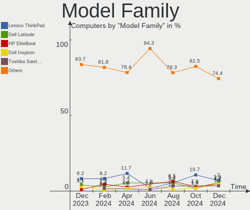
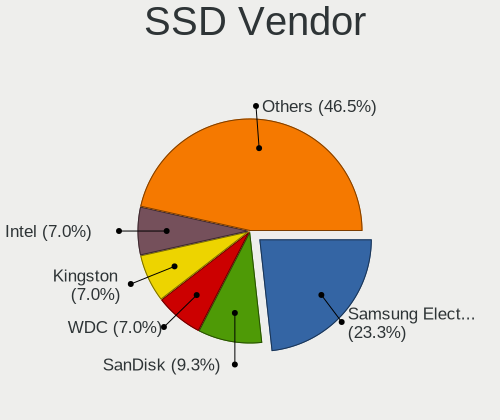
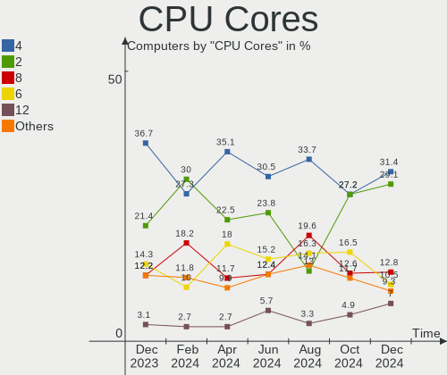
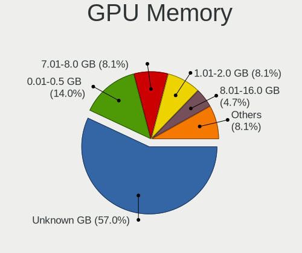

openSUSE - Hardware Trends
--------------------------

A project to identify most popular hardware characteristics and track their change
over time based on data collected by Linux users at https://Linux-Hardware.org.

Anyone can contribute to this report by the [hw-probe](https://github.com/linuxhw/hw-probe) tool:

    sudo -E hw-probe -all -upload

This is a report for all computer types. See also reports for [desktops](/Dist/openSUSE/Desktop/README.md) and [notebooks](/Dist/openSUSE/Notebook/README.md).

This report is for one last month. Overall report since the beginning of time: [TestDays](https://github.com/linuxhw/TestDays)

Period: Apr, 2023.

Contents
--------

* [ System ](#system)
  - [ OS                       ](#os)
  - [ OS Family                ](#os-family)
  - [ Kernel                   ](#kernel)
  - [ Kernel Family            ](#kernel-family)
  - [ Kernel Major Ver.        ](#kernel-major-ver)
  - [ Arch                     ](#arch)
  - [ DE                       ](#de)
  - [ Display Server           ](#display-server)
  - [ Display Manager          ](#display-manager)
  - [ OS Lang                  ](#os-lang)
  - [ Boot Mode                ](#boot-mode)
  - [ Filesystem               ](#filesystem)
  - [ Part. scheme             ](#part-scheme)
  - [ Dual Boot with Linux/BSD ](#dual-boot-with-linuxbsd)
  - [ Dual Boot (Win)          ](#dual-boot-win)

* [ Board ](#board)
  - [ Vendor                   ](#vendor)
  - [ Model                    ](#model)
  - [ Model Family             ](#model-family)
  - [ MFG Year                 ](#mfg-year)
  - [ Form Factor              ](#form-factor)
  - [ Secure Boot              ](#secure-boot)
  - [ Coreboot                 ](#coreboot)
  - [ RAM Size                 ](#ram-size)
  - [ RAM Used                 ](#ram-used)
  - [ Total Drives             ](#total-drives)
  - [ Has CD-ROM               ](#has-cd-rom)
  - [ Has Ethernet             ](#has-ethernet)
  - [ Has WiFi                 ](#has-wifi)
  - [ Has Bluetooth            ](#has-bluetooth)

* [ Location ](#location)
  - [ Country                  ](#country)
  - [ City                     ](#city)

* [ Drives ](#drives)
  - [ Drive Vendor             ](#drive-vendor)
  - [ Drive Model              ](#drive-model)
  - [ HDD Vendor               ](#hdd-vendor)
  - [ SSD Vendor               ](#ssd-vendor)
  - [ Drive Kind               ](#drive-kind)
  - [ Drive Connector          ](#drive-connector)
  - [ Drive Size               ](#drive-size)
  - [ Space Total              ](#space-total)
  - [ Space Used               ](#space-used)
  - [ Malfunc. Drives          ](#malfunc-drives)
  - [ Malfunc. Drive Vendor    ](#malfunc-drive-vendor)
  - [ Malfunc. HDD Vendor      ](#malfunc-hdd-vendor)
  - [ Malfunc. Drive Kind      ](#malfunc-drive-kind)
  - [ Failed Drives            ](#failed-drives)
  - [ Failed Drive Vendor      ](#failed-drive-vendor)
  - [ Drive Status             ](#drive-status)

* [ Storage controller ](#storage-controller)
  - [ Storage Vendor           ](#storage-vendor)
  - [ Storage Model            ](#storage-model)
  - [ Storage Kind             ](#storage-kind)

* [ Processor ](#processor)
  - [ CPU Vendor               ](#cpu-vendor)
  - [ CPU Model                ](#cpu-model)
  - [ CPU Model Family         ](#cpu-model-family)
  - [ CPU Cores                ](#cpu-cores)
  - [ CPU Sockets              ](#cpu-sockets)
  - [ CPU Threads              ](#cpu-threads)
  - [ CPU Op-Modes             ](#cpu-op-modes)
  - [ CPU Microcode            ](#cpu-microcode)
  - [ CPU Microarch            ](#cpu-microarch)

* [ Graphics ](#graphics)
  - [ GPU Vendor               ](#gpu-vendor)
  - [ GPU Model                ](#gpu-model)
  - [ GPU Combo                ](#gpu-combo)
  - [ GPU Driver               ](#gpu-driver)
  - [ GPU Memory               ](#gpu-memory)

* [ Monitor ](#monitor)
  - [ Monitor Vendor           ](#monitor-vendor)
  - [ Monitor Model            ](#monitor-model)
  - [ Monitor Resolution       ](#monitor-resolution)
  - [ Monitor Diagonal         ](#monitor-diagonal)
  - [ Monitor Width            ](#monitor-width)
  - [ Aspect Ratio             ](#aspect-ratio)
  - [ Monitor Area             ](#monitor-area)
  - [ Pixel Density            ](#pixel-density)
  - [ Multiple Monitors        ](#multiple-monitors)

* [ Network ](#network)
  - [ Net Controller Vendor    ](#net-controller-vendor)
  - [ Net Controller Model     ](#net-controller-model)
  - [ Wireless Vendor          ](#wireless-vendor)
  - [ Wireless Model           ](#wireless-model)
  - [ Ethernet Vendor          ](#ethernet-vendor)
  - [ Ethernet Model           ](#ethernet-model)
  - [ Net Controller Kind      ](#net-controller-kind)
  - [ Used Controller          ](#used-controller)
  - [ NICs                     ](#nics)
  - [ IPv6                     ](#ipv6)

* [ Bluetooth ](#bluetooth)
  - [ Bluetooth Vendor         ](#bluetooth-vendor)
  - [ Bluetooth Model          ](#bluetooth-model)

* [ Sound ](#sound)
  - [ Sound Vendor             ](#sound-vendor)
  - [ Sound Model              ](#sound-model)

* [ Memory ](#memory)
  - [ Memory Vendor            ](#memory-vendor)
  - [ Memory Model             ](#memory-model)
  - [ Memory Kind              ](#memory-kind)
  - [ Memory Form Factor       ](#memory-form-factor)
  - [ Memory Size              ](#memory-size)
  - [ Memory Speed             ](#memory-speed)

* [ Printers & scanners ](#printers--scanners)
  - [ Printer Vendor           ](#printer-vendor)
  - [ Printer Model            ](#printer-model)
  - [ Scanner Vendor           ](#scanner-vendor)
  - [ Scanner Model            ](#scanner-model)

* [ Camera ](#camera)
  - [ Camera Vendor            ](#camera-vendor)
  - [ Camera Model             ](#camera-model)

* [ Security ](#security)
  - [ Fingerprint Vendor       ](#fingerprint-vendor)
  - [ Fingerprint Model        ](#fingerprint-model)
  - [ Chipcard Vendor          ](#chipcard-vendor)
  - [ Chipcard Model           ](#chipcard-model)

* [ Unsupported ](#unsupported)
  - [ Unsupported Devices      ](#unsupported-devices)
  - [ Unsupported Device Types ](#unsupported-device-types)

System
------

OS
--

Installed operating systems

| Name                         | Computers | Percent |
|------------------------------|-----------|---------|
| openSUSE Tumbleweed-XXXXXXXX | 63        | 78.75%  |
| openSUSE Leap-15.4           | 13        | 16.25%  |
| openSUSE Microos-XXXXXXXX    | 2         | 2.5%    |
| openSUSE Leap-15.5           | 2         | 2.5%    |

OS Family
---------

OS without a version

| Name     | Computers | Percent |
|----------|-----------|---------|
| openSUSE | 80        | 100%    |

Kernel
------

Version of the Linux kernel

| Version                      | Computers | Percent |
|------------------------------|-----------|---------|
| 6.2.9-1-default              | 24        | 30%     |
| 6.2.12-1-default             | 16        | 20%     |
| 6.2.10-1-default             | 16        | 20%     |
| 5.14.21-150400.24.55-default | 9         | 11.25%  |
| 6.2.8-1-default              | 4         | 5%      |
| 5.14.21-150400.24.60-default | 4         | 5%      |
| 6.2.6-1-default              | 3         | 3.75%   |
| 6.2.9-1-vanilla              | 1         | 1.25%   |
| 5.5.7-1-default              | 1         | 1.25%   |
| 5.14.21-150500.49-default    | 1         | 1.25%   |
| 5.14.21-150400.24.46-default | 1         | 1.25%   |

Kernel Family
-------------

Linux kernel without a distro release

| Version | Computers | Percent |
|---------|-----------|---------|
| 6.2.9   | 25        | 31.25%  |
| 6.2.12  | 16        | 20%     |
| 6.2.10  | 16        | 20%     |
| 5.14.21 | 15        | 18.75%  |
| 6.2.8   | 4         | 5%      |
| 6.2.6   | 3         | 3.75%   |
| 5.5.7   | 1         | 1.25%   |

Kernel Major Ver.
-----------------

Linux kernel major version

| Version | Computers | Percent |
|---------|-----------|---------|
| 6.2     | 64        | 80%     |
| 5.14    | 15        | 18.75%  |
| 5.5     | 1         | 1.25%   |

Arch
----

OS architecture (x86_64, i586, etc.)

| Name   | Computers | Percent |
|--------|-----------|---------|
| x86_64 | 80        | 100%    |

DE
--

Desktop Environment

| Name          | Computers | Percent |
|---------------|-----------|---------|
| KDE5          | 54        | 67.5%   |
| GNOME         | 21        | 26.25%  |
| XFCE          | 2         | 2.5%    |
| LXDE          | 2         | 2.5%    |
| GNOME Classic | 1         | 1.25%   |

Display Server
--------------

X11 or Wayland

| Name    | Computers | Percent |
|---------|-----------|---------|
| X11     | 58        | 72.5%   |
| Wayland | 20        | 25%     |
| Tty     | 2         | 2.5%    |

Display Manager
---------------

SDDM, LightDM, etc.

| Name    | Computers | Percent |
|---------|-----------|---------|
| Unknown | 46        | 57.5%   |
| SDDM    | 16        | 20%     |
| LightDM | 9         | 11.25%  |
| XDM     | 8         | 10%     |
| GDM     | 1         | 1.25%   |

OS Lang
-------

Language

| Lang   | Computers | Percent |
|--------|-----------|---------|
| en_US  | 34        | 42.5%   |
| POSIX  | 8         | 10%     |
| de_DE  | 8         | 10%     |
| en_GB  | 5         | 6.25%   |
| pt_BR  | 4         | 5%      |
| es_ES  | 4         | 5%      |
| ru_RU  | 3         | 3.75%   |
| pl_PL  | 2         | 2.5%    |
| nn_NO  | 2         | 2.5%    |
| fr_FR  | 2         | 2.5%    |
| pt_PT  | 1         | 1.25%   |
| it_IT  | 1         | 1.25%   |
| es_PE  | 1         | 1.25%   |
| es_DO  | 1         | 1.25%   |
| en_BW  | 1         | 1.25%   |
| en_150 | 1         | 1.25%   |
| de_CH  | 1         | 1.25%   |
| cs_CZ  | 1         | 1.25%   |

Boot Mode
---------

EFI or BIOS

| Mode | Computers | Percent |
|------|-----------|---------|
| EFI  | 60        | 75%     |
| BIOS | 20        | 25%     |

Filesystem
----------

Type of filesystem

| Type  | Computers | Percent |
|-------|-----------|---------|
| Btrfs | 64        | 80%     |
| Ext4  | 12        | 15%     |
| Xfs   | 3         | 3.75%   |
| Ext2  | 1         | 1.25%   |

Part. scheme
------------

Scheme of partitioning

| Type    | Computers | Percent |
|---------|-----------|---------|
| Unknown | 46        | 57.5%   |
| GPT     | 30        | 37.5%   |
| MBR     | 4         | 5%      |

Dual Boot with Linux/BSD
------------------------

Hosting more than one Linux/BSD

| Dual boot | Computers | Percent |
|-----------|-----------|---------|
| No        | 75        | 93.75%  |
| Yes       | 5         | 6.25%   |

Dual Boot (Win)
---------------

Hosting Linux and Windows

| Dual boot | Computers | Percent |
|-----------|-----------|---------|
| No        | 67        | 83.75%  |
| Yes       | 13        | 16.25%  |

Board
-----

Vendor
------

Motherboard manufacturer

| Name                | Computers | Percent |
|---------------------|-----------|---------|
| Lenovo              | 14        | 17.5%   |
| Hewlett-Packard     | 14        | 17.5%   |
| ASUSTek Computer    | 14        | 17.5%   |
| MSI                 | 8         | 10%     |
| Gigabyte Technology | 6         | 7.5%    |
| Dell                | 5         | 6.25%   |
| ASRock              | 4         | 5%      |
| Apple               | 4         | 5%      |
| Acer                | 3         | 3.75%   |
| Toshiba             | 1         | 1.25%   |
| SLIMBOOK            | 1         | 1.25%   |
| Notebook            | 1         | 1.25%   |
| Microsoft           | 1         | 1.25%   |
| Google              | 1         | 1.25%   |
| Gateway             | 1         | 1.25%   |
| AMI                 | 1         | 1.25%   |
| Allview             | 1         | 1.25%   |

Model
-----

Motherboard model

| Name                                    | Computers | Percent |
|-----------------------------------------|-----------|---------|
| MSI MS-7673                             | 2         | 2.5%    |
| Toshiba Satellite C45-A                 | 1         | 1.25%   |
| SLIMBOOK PROX-AMD5                      | 1         | 1.25%   |
| Notebook W54_55_94_95_97AU,AUQ          | 1         | 1.25%   |
| MSI Vector GP76 12UHSO                  | 1         | 1.25%   |
| MSI Stealth 15M B12UE                   | 1         | 1.25%   |
| MSI Stealth 14Studio A13VF              | 1         | 1.25%   |
| MSI MS-7D91                             | 1         | 1.25%   |
| MSI MS-7C37                             | 1         | 1.25%   |
| MSI MS-7B10                             | 1         | 1.25%   |
| Microsoft Surface Pro 8                 | 1         | 1.25%   |
| Lenovo Yoga 9 14ITL5 82BG               | 1         | 1.25%   |
| Lenovo ThinkPad X201 3680HTG            | 1         | 1.25%   |
| Lenovo ThinkPad X1 Yoga 3rd 20LES2RG0Q  | 1         | 1.25%   |
| Lenovo ThinkPad T460s 20F9005CMN        | 1         | 1.25%   |
| Lenovo ThinkPad T440s 20AQ006HUS        | 1         | 1.25%   |
| Lenovo ThinkPad T16 Gen 1 21BVCTO1WW    | 1         | 1.25%   |
| Lenovo ThinkPad P50 20EQS5C701          | 1         | 1.25%   |
| Lenovo ThinkPad Edge E431 62779XP       | 1         | 1.25%   |
| Lenovo QIWY3                            | 1         | 1.25%   |
| Lenovo Legion Y540-15IRH-PG0 81SY       | 1         | 1.25%   |
| Lenovo IdeaPad 3 15ITL6 82H8            | 1         | 1.25%   |
| Lenovo IdeaCentre 720-18APR 90HY000FIX  | 1         | 1.25%   |
| Lenovo G50-45 80E3                      | 1         | 1.25%   |
| HP Spectre x360 Convertible             | 1         | 1.25%   |
| HP ProBook 645 G4                       | 1         | 1.25%   |
| HP Pavilion Laptop 15-eh1xxx            | 1         | 1.25%   |
| HP Pavilion Gaming Laptop 17-cd1xxx     | 1         | 1.25%   |
| HP Pavilion Gaming Laptop 15-ec2xxx     | 1         | 1.25%   |
| HP Mini 210-1000                        | 1         | 1.25%   |
| HP Laptop 17-ca0xxx                     | 1         | 1.25%   |
| HP ENVY x360 Convertible 13-ay1xxx      | 1         | 1.25%   |
| HP ENVY x360 Convertible 13-ay0xxx      | 1         | 1.25%   |
| HP ENVY Laptop 16-h0xxx                 | 1         | 1.25%   |
| HP EliteDesk 800 G1 SFF                 | 1         | 1.25%   |
| HP EliteBook x360 1040 G5               | 1         | 1.25%   |
| HP EliteBook 865 16 inch G9 Notebook PC | 1         | 1.25%   |
| HP 595-P0569NG                          | 1         | 1.25%   |
| Google Kefka                            | 1         | 1.25%   |
| Gigabyte Z97-HD3                        | 1         | 1.25%   |

Model Family
------------

Motherboard model prefix

| Name                | Computers | Percent |
|---------------------|-----------|---------|
| Lenovo ThinkPad     | 7         | 8.75%   |
| HP Pavilion         | 3         | 3.75%   |
| HP ENVY             | 3         | 3.75%   |
| ASUS PRIME          | 3         | 3.75%   |
| MSI Stealth         | 2         | 2.5%    |
| MSI MS-7673         | 2         | 2.5%    |
| HP EliteBook        | 2         | 2.5%    |
| Dell Latitude       | 2         | 2.5%    |
| Dell Inspiron       | 2         | 2.5%    |
| ASUS VivoBook       | 2         | 2.5%    |
| Acer Aspire         | 2         | 2.5%    |
| Toshiba Satellite   | 1         | 1.25%   |
| SLIMBOOK PROX-AMD5  | 1         | 1.25%   |
| Notebook W54        | 1         | 1.25%   |
| MSI Vector          | 1         | 1.25%   |
| MSI MS-7D91         | 1         | 1.25%   |
| MSI MS-7C37         | 1         | 1.25%   |
| MSI MS-7B10         | 1         | 1.25%   |
| Microsoft Surface   | 1         | 1.25%   |
| Lenovo Yoga         | 1         | 1.25%   |
| Lenovo QIWY3        | 1         | 1.25%   |
| Lenovo Legion       | 1         | 1.25%   |
| Lenovo IdeaPad      | 1         | 1.25%   |
| Lenovo IdeaCentre   | 1         | 1.25%   |
| Lenovo G50-45       | 1         | 1.25%   |
| HP Spectre          | 1         | 1.25%   |
| HP ProBook          | 1         | 1.25%   |
| HP Mini             | 1         | 1.25%   |
| HP Laptop           | 1         | 1.25%   |
| HP EliteDesk        | 1         | 1.25%   |
| HP 595-P0569NG      | 1         | 1.25%   |
| Google Kefka        | 1         | 1.25%   |
| Gigabyte Z97-HD3    | 1         | 1.25%   |
| Gigabyte Z390       | 1         | 1.25%   |
| Gigabyte X99-UD3-CF | 1         | 1.25%   |
| Gigabyte X570       | 1         | 1.25%   |
| Gigabyte H55M-S2H   | 1         | 1.25%   |
| Gigabyte G5         | 1         | 1.25%   |
| Gateway NV55C       | 1         | 1.25%   |
| Dell Precision      | 1         | 1.25%   |

MFG Year
--------

Motherboard manufacture year

| Year | Computers | Percent |
|------|-----------|---------|
| 2020 | 13        | 16.25%  |
| 2022 | 11        | 13.75%  |
| 2021 | 8         | 10%     |
| 2013 | 8         | 10%     |
| 2018 | 7         | 8.75%   |
| 2019 | 5         | 6.25%   |
| 2015 | 5         | 6.25%   |
| 2010 | 5         | 6.25%   |
| 2014 | 4         | 5%      |
| 2023 | 3         | 3.75%   |
| 2016 | 3         | 3.75%   |
| 2012 | 3         | 3.75%   |
| 2011 | 3         | 3.75%   |
| 2017 | 1         | 1.25%   |
| 2009 | 1         | 1.25%   |

Form Factor
-----------

Physical design of the computer

| Name        | Computers | Percent |
|-------------|-----------|---------|
| Notebook    | 47        | 58.75%  |
| Desktop     | 25        | 31.25%  |
| Convertible | 7         | 8.75%   |
| Tablet      | 1         | 1.25%   |

Secure Boot
-----------

Enabled or disabled

| State    | Computers | Percent |
|----------|-----------|---------|
| Disabled | 70        | 87.5%   |
| Enabled  | 10        | 12.5%   |

Coreboot
--------

Have coreboot on board

| Used | Computers | Percent |
|------|-----------|---------|
| No   | 79        | 98.75%  |
| Yes  | 1         | 1.25%   |

RAM Size
--------

Total RAM memory

| Size in GB  | Computers | Percent |
|-------------|-----------|---------|
| 4.01-8.0    | 19        | 23.75%  |
| 8.01-16.0   | 19        | 23.75%  |
| 16.01-24.0  | 17        | 21.25%  |
| 32.01-64.0  | 14        | 17.5%   |
| 3.01-4.0    | 5         | 6.25%   |
| 64.01-256.0 | 3         | 3.75%   |
| 24.01-32.0  | 2         | 2.5%    |
| 0.51-1.0    | 1         | 1.25%   |

RAM Used
--------

Used RAM memory

| Used GB    | Computers | Percent |
|------------|-----------|---------|
| 4.01-8.0   | 23        | 28.75%  |
| 2.01-3.0   | 22        | 27.5%   |
| 1.01-2.0   | 15        | 18.75%  |
| 3.01-4.0   | 12        | 15%     |
| 8.01-16.0  | 5         | 6.25%   |
| 16.01-24.0 | 1         | 1.25%   |
| 0.51-1.0   | 1         | 1.25%   |
| 0.01-0.5   | 1         | 1.25%   |

Total Drives
------------

Number of drives on board

| Drives | Computers | Percent |
|--------|-----------|---------|
| 1      | 45        | 56.25%  |
| 2      | 18        | 22.5%   |
| 4      | 7         | 8.75%   |
| 3      | 4         | 5%      |
| 5      | 3         | 3.75%   |
| 9      | 1         | 1.25%   |
| 7      | 1         | 1.25%   |
| 6      | 1         | 1.25%   |

Has CD-ROM
----------

Has CD-ROM on board

| Presented | Computers | Percent |
|-----------|-----------|---------|
| No        | 54        | 67.5%   |
| Yes       | 26        | 32.5%   |

Has Ethernet
------------

Has Ethernet on board

| Presented | Computers | Percent |
|-----------|-----------|---------|
| Yes       | 61        | 76.25%  |
| No        | 19        | 23.75%  |

Has WiFi
--------

Has WiFi module

| Presented | Computers | Percent |
|-----------|-----------|---------|
| Yes       | 67        | 83.75%  |
| No        | 13        | 16.25%  |

Has Bluetooth
-------------

Has Bluetooth module

| Presented | Computers | Percent |
|-----------|-----------|---------|
| Yes       | 62        | 77.5%   |
| No        | 18        | 22.5%   |

Location
--------

Country
-------

Geographic location (country)

| Country      | Computers | Percent |
|--------------|-----------|---------|
| USA          | 11        | 13.75%  |
| Germany      | 9         | 11.25%  |
| Brazil       | 6         | 7.5%    |
| Netherlands  | 5         | 6.25%   |
| Switzerland  | 4         | 5%      |
| Spain        | 3         | 3.75%   |
| Norway       | 3         | 3.75%   |
| Italy        | 3         | 3.75%   |
| India        | 3         | 3.75%   |
| Canada       | 3         | 3.75%   |
| UK           | 2         | 2.5%    |
| Russia       | 2         | 2.5%    |
| Romania      | 2         | 2.5%    |
| Poland       | 2         | 2.5%    |
| Finland      | 2         | 2.5%    |
| Australia    | 2         | 2.5%    |
| Argentina    | 2         | 2.5%    |
| Vietnam      | 1         | 1.25%   |
| Turkey       | 1         | 1.25%   |
| Taiwan       | 1         | 1.25%   |
| Sweden       | 1         | 1.25%   |
| South Africa | 1         | 1.25%   |
| Peru         | 1         | 1.25%   |
| Morocco      | 1         | 1.25%   |
| Hungary      | 1         | 1.25%   |
| France       | 1         | 1.25%   |
| El Salvador  | 1         | 1.25%   |
| Czechia      | 1         | 1.25%   |
| Croatia      | 1         | 1.25%   |
| Bulgaria     | 1         | 1.25%   |
| Belgium      | 1         | 1.25%   |
| Belarus      | 1         | 1.25%   |
| Austria      | 1         | 1.25%   |

City
----

Geographic location (city)

| City           | Computers | Percent |
|----------------|-----------|---------|
| Rotterdam      | 3         | 3.75%   |
| Berlin         | 3         | 3.75%   |
| Moscow         | 2         | 2.5%    |
| Helsinki       | 2         | 2.5%    |
| Fayetteville   | 2         | 2.5%    |
| Birmingham     | 2         | 2.5%    |
| Bergen         | 2         | 2.5%    |
| Zurich         | 1         | 1.25%   |
| Zagreb         | 1         | 1.25%   |
| Zafra          | 1         | 1.25%   |
| Wroclaw        | 1         | 1.25%   |
| Wakefield      | 1         | 1.25%   |
| Vitebsk        | 1         | 1.25%   |
| Veresegyhaz    | 1         | 1.25%   |
| Vancouver      | 1         | 1.25%   |
| Unterentfelden | 1         | 1.25%   |
| Umeå          | 1         | 1.25%   |
| Thrissur       | 1         | 1.25%   |
| Taichung       | 1         | 1.25%   |
| Sydney         | 1         | 1.25%   |
| Sarnia         | 1         | 1.25%   |
| Salzburg       | 1         | 1.25%   |
| Saint-Gilles   | 1         | 1.25%   |
| Rumburk        | 1         | 1.25%   |
| Rome           | 1         | 1.25%   |
| Richardson     | 1         | 1.25%   |
| Pouso Alegre   | 1         | 1.25%   |
| Perth          | 1         | 1.25%   |
| Pascani        | 1         | 1.25%   |
| Palma          | 1         | 1.25%   |
| Palatine       | 1         | 1.25%   |
| Ourinhos       | 1         | 1.25%   |
| Ottawa         | 1         | 1.25%   |
| Olin           | 1         | 1.25%   |
| Nannestad      | 1         | 1.25%   |
| Moosburg       | 1         | 1.25%   |
| Milan          | 1         | 1.25%   |
| Marrakesh      | 1         | 1.25%   |
| Marbella       | 1         | 1.25%   |
| Los Angeles    | 1         | 1.25%   |

Drives
------

Drive Vendor
------------

Hard drive vendors

| Vendor                         | Computers | Drives | Percent |
|--------------------------------|-----------|--------|---------|
| Samsung Electronics            | 25        | 36     | 19.84%  |
| Seagate                        | 15        | 20     | 11.9%   |
| WDC                            | 13        | 22     | 10.32%  |
| Sandisk                        | 10        | 13     | 7.94%   |
| Kingston                       | 8         | 9      | 6.35%   |
| Crucial                        | 8         | 11     | 6.35%   |
| Toshiba                        | 5         | 5      | 3.97%   |
| SK hynix                       | 5         | 5      | 3.97%   |
| Phison Electronics             | 4         | 4      | 3.17%   |
| Intel                          | 4         | 4      | 3.17%   |
| Unknown                        | 3         | 3      | 2.38%   |
| Micron Technology              | 3         | 3      | 2.38%   |
| Hitachi                        | 3         | 3      | 2.38%   |
| Intenso                        | 2         | 2      | 1.59%   |
| ADATA Technology               | 2         | 2      | 1.59%   |
| XrayDisk                       | 1         | 1      | 0.79%   |
| Wibtek                         | 1         | 1      | 0.79%   |
| Union Memory                   | 1         | 1      | 0.79%   |
| SPCC                           | 1         | 1      | 0.79%   |
| Solid State Storage Technology | 1         | 1      | 0.79%   |
| Silicon Motion                 | 1         | 1      | 0.79%   |
| PNY                            | 1         | 1      | 0.79%   |
| Phison                         | 1         | 1      | 0.79%   |
| Netac                          | 1         | 1      | 0.79%   |
| Micron/Crucial Technology      | 1         | 1      | 0.79%   |
| MAXIO Technology (Hangzhou)    | 1         | 1      | 0.79%   |
| MATSHITA                       | 1         | 1      | 0.79%   |
| KIOXIA                         | 1         | 1      | 0.79%   |
| AZAMOV                         | 1         | 1      | 0.79%   |
| Apple                          | 1         | 1      | 0.79%   |
| AMD                            | 1         | 1      | 0.79%   |

Drive Model
-----------

Hard drive models

| Model                                               | Computers | Percent |
|-----------------------------------------------------|-----------|---------|
| Samsung NVMe SSD Controller PM9A1/PM9A3/980PRO 2TB  | 7         | 4.73%   |
| Samsung SSD 860 EVO 1TB                             | 4         | 2.7%    |
| Samsung NVMe SSD Controller SM981/PM981/PM983 1TB   | 4         | 2.7%    |
| Samsung SSD 860 EVO 500GB                           | 3         | 2.03%   |
| Samsung NVMe SSD Controller SM961/PM961/SM963 500GB | 3         | 2.03%   |
| Kingston SA400S37480G 480GB SSD                     | 3         | 2.03%   |
| WDC WD40EFRX-68WT0N0 4TB                            | 2         | 1.35%   |
| Seagate ST9500325AS 500GB                           | 2         | 1.35%   |
| Seagate ST2000LM015-2E8174 2TB                      | 2         | 1.35%   |
| Seagate ST2000DM008-2FR102 2TB                      | 2         | 1.35%   |
| Sandisk WD Black SN850 1TB                          | 2         | 1.35%   |
| Samsung SSD 840 EVO 250GB                           | 2         | 1.35%   |
| Samsung HD204UI 2TB                                 | 2         | 1.35%   |
| Kingston SA400S37240G 240GB SSD                     | 2         | 1.35%   |
| Crucial CT1000MX500SSD1 1TB                         | 2         | 1.35%   |
| XrayDisk 1TB SSD                                    | 1         | 0.68%   |
| Wibtek W800S 256GB SSD                              | 1         | 0.68%   |
| WDC WDS250G1B0A-00H9H0 250GB SSD                    | 1         | 0.68%   |
| WDC WD5000LPCX-24C6HT0 500GB                        | 1         | 0.68%   |
| WDC WD50 00BPVT-80HXZT3 500GB                       | 1         | 0.68%   |
| WDC WD40EFRX-68N32N0 4TB                            | 1         | 0.68%   |
| WDC WD3200BPVT-24JJ5T0 320GB                        | 1         | 0.68%   |
| WDC WD3200BPVT-22JJ5T0 320GB                        | 1         | 0.68%   |
| WDC WD30EZRX-00SPEB0 3TB                            | 1         | 0.68%   |
| WDC WD20SPZX-22UA7T0 2TB                            | 1         | 0.68%   |
| WDC WD20EZAZ-00GGJB0 2TB                            | 1         | 0.68%   |
| WDC WD20EFRX-68AX9N0 2TB                            | 1         | 0.68%   |
| WDC WD20EARS-00MVWB0 2TB                            | 1         | 0.68%   |
| WDC WD120EDAZ-11F3RA0 12TB                          | 1         | 0.68%   |
| WDC WD10PURZ-85U8XY0 1TB                            | 1         | 0.68%   |
| WDC WD10EZEX-75M2NA0 1TB                            | 1         | 0.68%   |
| WDC WD10EZEX-08M2NA0 1TB                            | 1         | 0.68%   |
| WDC WD10EZEX-00BN5A0 1TB                            | 1         | 0.68%   |
| WDC WD10EARX-00N0YB0 1TB                            | 1         | 0.68%   |
| WDC WD1003FBYX-01Y7B1 1TB                           | 1         | 0.68%   |
| Unknown MMC Card  32GB                              | 1         | 0.68%   |
| Unknown MMC Card  16GB                              | 1         | 0.68%   |
| Unknown MMC Card  128GB                             | 1         | 0.68%   |
| Union Memory UMIS RPJTJ256MEE1OWX 256GB             | 1         | 0.68%   |
| Toshiba XG4 NVMe SSD Controller 512GB               | 1         | 0.68%   |

HDD Vendor
----------

Hard disk drive vendors

| Vendor              | Computers | Drives | Percent |
|---------------------|-----------|--------|---------|
| Seagate             | 14        | 17     | 41.18%  |
| WDC                 | 12        | 21     | 35.29%  |
| Toshiba             | 3         | 3      | 8.82%   |
| Hitachi             | 3         | 3      | 8.82%   |
| Samsung Electronics | 2         | 2      | 5.88%   |

SSD Vendor
----------

Solid state drive vendors

| Vendor              | Computers | Drives | Percent |
|---------------------|-----------|--------|---------|
| Samsung Electronics | 13        | 19     | 31.71%  |
| Crucial             | 8         | 11     | 19.51%  |
| Kingston            | 6         | 7      | 14.63%  |
| SanDisk             | 2         | 4      | 4.88%   |
| Intenso             | 2         | 2      | 4.88%   |
| XrayDisk            | 1         | 1      | 2.44%   |
| Wibtek              | 1         | 1      | 2.44%   |
| WDC                 | 1         | 1      | 2.44%   |
| Toshiba             | 1         | 1      | 2.44%   |
| SPCC                | 1         | 1      | 2.44%   |
| SK hynix            | 1         | 1      | 2.44%   |
| PNY                 | 1         | 1      | 2.44%   |
| Netac               | 1         | 1      | 2.44%   |
| Intel               | 1         | 1      | 2.44%   |
| Apple               | 1         | 1      | 2.44%   |

Drive Kind
----------

HDD or SSD

| Kind    | Computers | Drives | Percent |
|---------|-----------|--------|---------|
| NVMe    | 42        | 54     | 38.18%  |
| SSD     | 35        | 53     | 31.82%  |
| HDD     | 28        | 46     | 25.45%  |
| MMC     | 3         | 3      | 2.73%   |
| Unknown | 2         | 2      | 1.82%   |

Drive Connector
---------------

SATA, SAS, NVMe, etc.

| Type | Computers | Drives | Percent |
|------|-----------|--------|---------|
| SATA | 52        | 98     | 52%     |
| NVMe | 42        | 54     | 42%     |
| SAS  | 3         | 3      | 3%      |
| MMC  | 3         | 3      | 3%      |

Drive Size
----------

Size of hard drive

| Size in TB | Computers | Drives | Percent |
|------------|-----------|--------|---------|
| 0.01-0.5   | 36        | 44     | 47.37%  |
| 0.51-1.0   | 22        | 32     | 28.95%  |
| 1.01-2.0   | 12        | 16     | 15.79%  |
| 3.01-4.0   | 4         | 5      | 5.26%   |
| 2.01-3.0   | 1         | 1      | 1.32%   |
| 10.01-20.0 | 1         | 1      | 1.32%   |

Space Total
-----------

Amount of disk space available on the file system

| Size in GB     | Computers | Percent |
|----------------|-----------|---------|
| More than 3000 | 24        | 30%     |
| 1001-2000      | 19        | 23.75%  |
| 501-1000       | 14        | 17.5%   |
| 2001-3000      | 11        | 13.75%  |
| 251-500        | 8         | 10%     |
| 51-100         | 2         | 2.5%    |
| 101-250        | 1         | 1.25%   |
| 1-20           | 1         | 1.25%   |

Space Used
----------

Amount of used disk space

| Used GB        | Computers | Percent |
|----------------|-----------|---------|
| 101-250        | 16        | 20%     |
| 51-100         | 16        | 20%     |
| 501-1000       | 11        | 13.75%  |
| 1001-2000      | 10        | 12.5%   |
| 251-500        | 8         | 10%     |
| More than 3000 | 7         | 8.75%   |
| 21-50          | 4         | 5%      |
| 1-20           | 4         | 5%      |
| 2001-3000      | 3         | 3.75%   |
| 0              | 1         | 1.25%   |

Malfunc. Drives
---------------

Drive models with a malfunction

| Model                                 | Computers | Drives | Percent |
|---------------------------------------|-----------|--------|---------|
| Seagate ST1000DM003-1SB102 1TB        | 1         | 1      | 20%     |
| Samsung Electronics SSD 850 PRO 256GB | 1         | 1      | 20%     |
| Netac SSD 256GB                       | 1         | 1      | 20%     |
| Intel SSD 600P Series 256GB           | 1         | 1      | 20%     |
| Hitachi HTS725025A9A364 250GB         | 1         | 1      | 20%     |

Malfunc. Drive Vendor
---------------------

Vendors of faulty drives

| Vendor              | Computers | Drives | Percent |
|---------------------|-----------|--------|---------|
| Seagate             | 1         | 1      | 20%     |
| Samsung Electronics | 1         | 1      | 20%     |
| Netac               | 1         | 1      | 20%     |
| Intel               | 1         | 1      | 20%     |
| Hitachi             | 1         | 1      | 20%     |

Malfunc. HDD Vendor
-------------------

Vendors of faulty HDD drives

| Vendor  | Computers | Drives | Percent |
|---------|-----------|--------|---------|
| Seagate | 1         | 1      | 50%     |
| Hitachi | 1         | 1      | 50%     |

Malfunc. Drive Kind
-------------------

Kinds of faulty drives

| Kind | Computers | Drives | Percent |
|------|-----------|--------|---------|
| SSD  | 2         | 2      | 40%     |
| HDD  | 2         | 2      | 40%     |
| NVMe | 1         | 1      | 20%     |

Failed Drives
-------------

Failed drive models

Zero info for selected period =(

Failed Drive Vendor
-------------------

Failed drive vendors

Zero info for selected period =(

Drive Status
------------

Number of failed and malfunc. drives

| Status   | Computers | Drives | Percent |
|----------|-----------|--------|---------|
| Detected | 48        | 91     | 55.81%  |
| Works    | 33        | 62     | 38.37%  |
| Malfunc  | 5         | 5      | 5.81%   |

Storage controller
------------------

Storage Vendor
--------------

Storage controller vendors

| Vendor                         | Computers | Percent |
|--------------------------------|-----------|---------|
| Intel                          | 47        | 38.84%  |
| AMD                            | 18        | 14.88%  |
| Samsung Electronics            | 15        | 12.4%   |
| SanDisk                        | 8         | 6.61%   |
| Phison Electronics             | 5         | 4.13%   |
| SK hynix                       | 4         | 3.31%   |
| ASMedia Technology             | 4         | 3.31%   |
| Micron Technology              | 3         | 2.48%   |
| Marvell Technology Group       | 2         | 1.65%   |
| Kingston Technology Company    | 2         | 1.65%   |
| JMicron Technology             | 2         | 1.65%   |
| ADATA Technology               | 2         | 1.65%   |
| Union Memory (Shenzhen)        | 1         | 0.83%   |
| Toshiba America Info Systems   | 1         | 0.83%   |
| Solid State Storage Technology | 1         | 0.83%   |
| Silicon Motion                 | 1         | 0.83%   |
| Silicon Image                  | 1         | 0.83%   |
| Seagate Technology             | 1         | 0.83%   |
| Micron/Crucial Technology      | 1         | 0.83%   |
| MAXIO Technology (Hangzhou)    | 1         | 0.83%   |
| KIOXIA                         | 1         | 0.83%   |

Storage Model
-------------

Storage controller models

| Model                                                                          | Computers | Percent |
|--------------------------------------------------------------------------------|-----------|---------|
| AMD FCH SATA Controller [AHCI mode]                                            | 14        | 10.77%  |
| Samsung NVMe SSD Controller PM9A1/PM9A3/980PRO                                 | 6         | 4.62%   |
| Samsung NVMe SSD Controller SM981/PM981/PM983                                  | 4         | 3.08%   |
| Intel 8 Series/C220 Series Chipset Family 6-port SATA Controller 1 [AHCI mode] | 4         | 3.08%   |
| ASMedia ASM1062 Serial ATA Controller                                          | 4         | 3.08%   |
| Samsung NVMe SSD Controller SM961/PM961/SM963                                  | 3         | 2.31%   |
| Micron NVMe Storage Controller                                                 | 3         | 2.31%   |
| Intel Sunrise Point-LP SATA Controller [AHCI mode]                             | 3         | 2.31%   |
| Intel 8 Series SATA Controller 1 [AHCI mode]                                   | 3         | 2.31%   |
| AMD 400 Series Chipset SATA Controller                                         | 3         | 2.31%   |
| SanDisk WD PC SN810 / Black SN850 NVMe SSD                                     | 2         | 1.54%   |
| SanDisk WD Black 2018/SN750 / PC SN720 NVMe SSD                                | 2         | 1.54%   |
| Phison E12 NVMe Controller                                                     | 2         | 1.54%   |
| Kingston Company Company Non-Volatile memory controller                        | 2         | 1.54%   |
| Intel Tiger Lake-LP SATA Controller                                            | 2         | 1.54%   |
| Intel HM170/QM170 Chipset SATA Controller [AHCI Mode]                          | 2         | 1.54%   |
| Intel Cannon Lake PCH SATA AHCI Controller                                     | 2         | 1.54%   |
| Intel Cannon Lake Mobile PCH SATA AHCI Controller                              | 2         | 1.54%   |
| Intel 82801 Mobile SATA Controller [RAID mode]                                 | 2         | 1.54%   |
| Intel 7 Series Chipset Family 6-port SATA Controller [AHCI mode]               | 2         | 1.54%   |
| Intel 5 Series/3400 Series Chipset 4 port SATA AHCI Controller                 | 2         | 1.54%   |
| AMD 500 Series Chipset SATA Controller                                         | 2         | 1.54%   |
| Union Memory (Shenzhen) Non-Volatile memory controller                         | 1         | 0.77%   |
| Toshiba America Info Systems XG4 NVMe SSD Controller                           | 1         | 0.77%   |
| Solid State Storage Non-Volatile memory controller                             | 1         | 0.77%   |
| SK hynix Platinum P41 NVMe Solid State Drive 2TB                               | 1         | 0.77%   |
| SK hynix PC401 NVMe Solid State Drive 256GB                                    | 1         | 0.77%   |
| SK hynix BC511                                                                 | 1         | 0.77%   |
| SK hynix BC501 NVMe Solid State Drive                                          | 1         | 0.77%   |
| Silicon Motion SM2263EN/SM2263XT SSD Controller                                | 1         | 0.77%   |
| Silicon Image SiI 3132 Serial ATA Raid II Controller                           | 1         | 0.77%   |
| Seagate FireCuda 530 SSD                                                       | 1         | 0.77%   |
| SanDisk WD Blue SN550 NVMe SSD                                                 | 1         | 0.77%   |
| SanDisk WD Blue SN500 / PC SN520 NVMe SSD                                      | 1         | 0.77%   |
| SanDisk WD Black SN750 / PC SN730 NVMe SSD                                     | 1         | 0.77%   |
| SanDisk PC SN520 NVMe SSD                                                      | 1         | 0.77%   |
| SanDisk Non-Volatile memory controller                                         | 1         | 0.77%   |
| Samsung NVMe SSD Controller 980                                                | 1         | 0.77%   |
| Samsung Electronics SATA controller                                            | 1         | 0.77%   |
| Phison PS5013 E13 NVMe Controller                                              | 1         | 0.77%   |

Storage Kind
------------

Kind of storage controller (IDE, SATA, NVMe, SAS, ...)

| Kind | Computers | Percent |
|------|-----------|---------|
| SATA | 56        | 52.83%  |
| NVMe | 41        | 38.68%  |
| RAID | 6         | 5.66%   |
| IDE  | 3         | 2.83%   |

Processor
---------

CPU Vendor
----------

Processor vendors

| Vendor | Computers | Percent |
|--------|-----------|---------|
| Intel  | 57        | 71.25%  |
| AMD    | 23        | 28.75%  |

CPU Model
---------

Processor models

| Model                                       | Computers | Percent |
|---------------------------------------------|-----------|---------|
| Intel Core i5-8250U CPU @ 1.60GHz           | 2         | 2.5%    |
| Intel Core i5-2500 CPU @ 3.30GHz            | 2         | 2.5%    |
| Intel Core i5 CPU M 520 @ 2.40GHz           | 2         | 2.5%    |
| Intel 11th Gen Core i7-1185G7 @ 3.00GHz     | 2         | 2.5%    |
| Intel 11th Gen Core i5-1135G7 @ 2.40GHz     | 2         | 2.5%    |
| AMD Ryzen 7 5800H with Radeon Graphics      | 2         | 2.5%    |
| AMD Ryzen 5 2600 Six-Core Processor         | 2         | 2.5%    |
| AMD Ryzen 3 2200G with Radeon Vega Graphics | 2         | 2.5%    |
| Intel Xeon CPU W3530 @ 2.80GHz              | 1         | 1.25%   |
| Intel Pentium CPU P6200 @ 2.13GHz           | 1         | 1.25%   |
| Intel Pentium CPU G3250 @ 3.20GHz           | 1         | 1.25%   |
| Intel Core i9-9900K CPU @ 3.60GHz           | 1         | 1.25%   |
| Intel Core i7-9750H CPU @ 2.60GHz           | 1         | 1.25%   |
| Intel Core i7-9700K CPU @ 3.60GHz           | 1         | 1.25%   |
| Intel Core i7-8850H CPU @ 2.60GHz           | 1         | 1.25%   |
| Intel Core i7-8650U CPU @ 1.90GHz           | 1         | 1.25%   |
| Intel Core i7-7700K CPU @ 4.20GHz           | 1         | 1.25%   |
| Intel Core i7-7700HQ CPU @ 2.80GHz          | 1         | 1.25%   |
| Intel Core i7-6820HQ CPU @ 2.70GHz          | 1         | 1.25%   |
| Intel Core i7-6700HQ CPU @ 2.60GHz          | 1         | 1.25%   |
| Intel Core i7-6500U CPU @ 2.50GHz           | 1         | 1.25%   |
| Intel Core i7-5820K CPU @ 3.30GHz           | 1         | 1.25%   |
| Intel Core i7-4702MQ CPU @ 2.20GHz          | 1         | 1.25%   |
| Intel Core i7-4700HQ CPU @ 2.40GHz          | 1         | 1.25%   |
| Intel Core i7-4600U CPU @ 2.10GHz           | 1         | 1.25%   |
| Intel Core i7-3770K CPU @ 3.50GHz           | 1         | 1.25%   |
| Intel Core i7-10700 CPU @ 2.90GHz           | 1         | 1.25%   |
| Intel Core i7-10610U CPU @ 1.80GHz          | 1         | 1.25%   |
| Intel Core i5-7300HQ CPU @ 2.50GHz          | 1         | 1.25%   |
| Intel Core i5-6200U CPU @ 2.30GHz           | 1         | 1.25%   |
| Intel Core i5-5250U CPU @ 1.60GHz           | 1         | 1.25%   |
| Intel Core i5-4570 CPU @ 3.20GHz            | 1         | 1.25%   |
| Intel Core i5-4440 CPU @ 3.10GHz            | 1         | 1.25%   |
| Intel Core i5-4210U CPU @ 1.70GHz           | 1         | 1.25%   |
| Intel Core i5-4200U CPU @ 1.60GHz           | 1         | 1.25%   |
| Intel Core i5-3230M CPU @ 2.60GHz           | 1         | 1.25%   |
| Intel Core i5-3210M CPU @ 2.50GHz           | 1         | 1.25%   |
| Intel Core i5-2435M CPU @ 2.40GHz           | 1         | 1.25%   |
| Intel Core i5-10300H CPU @ 2.50GHz          | 1         | 1.25%   |
| Intel Core i3-6006U CPU @ 2.00GHz           | 1         | 1.25%   |

CPU Model Family
----------------

Processor model prefix

| Model           | Computers | Percent |
|-----------------|-----------|---------|
| Intel Core i5   | 17        | 21.25%  |
| Intel Core i7   | 16        | 20%     |
| Other           | 12        | 15%     |
| AMD Ryzen 7     | 7         | 8.75%   |
| AMD Ryzen 5     | 6         | 7.5%    |
| Intel Core i3   | 4         | 5%      |
| AMD Ryzen 3     | 4         | 5%      |
| Intel Celeron   | 3         | 3.75%   |
| Intel Pentium   | 2         | 2.5%    |
| AMD Ryzen 9     | 2         | 2.5%    |
| Intel Xeon      | 1         | 1.25%   |
| Intel Core i9   | 1         | 1.25%   |
| Intel Atom      | 1         | 1.25%   |
| AMD Ryzen 3 PRO | 1         | 1.25%   |
| AMD FX          | 1         | 1.25%   |
| AMD E1          | 1         | 1.25%   |
| AMD A10         | 1         | 1.25%   |

CPU Cores
---------

Number of processor cores

| Number | Computers | Percent |
|--------|-----------|---------|
| 4      | 29        | 36.25%  |
| 2      | 21        | 26.25%  |
| 8      | 12        | 15%     |
| 6      | 8         | 10%     |
| 14     | 3         | 3.75%   |
| 12     | 2         | 2.5%    |
| 10     | 2         | 2.5%    |
| 1      | 2         | 2.5%    |
| 24     | 1         | 1.25%   |

CPU Sockets
-----------

Number of sockets

| Number | Computers | Percent |
|--------|-----------|---------|
| 1      | 80        | 100%    |

CPU Threads
-----------

Threads per core (Hyper-Threading)

| Number | Computers | Percent |
|--------|-----------|---------|
| 2      | 64        | 80%     |
| 1      | 16        | 20%     |

CPU Op-Modes
------------

CPU Operation Modes (32-bit, 64-bit)

| Op mode        | Computers | Percent |
|----------------|-----------|---------|
| 32-bit, 64-bit | 80        | 100%    |

CPU Microcode
-------------

Microcode number

| Number     | Computers | Percent |
|------------|-----------|---------|
| Unknown    | 55        | 68.75%  |
| 0x08101016 | 4         | 5%      |
| 0x0a50000d | 3         | 3.75%   |
| 0x0a50000c | 2         | 2.5%    |
| 0x0800820d | 2         | 2.5%    |
| 0x906a4    | 1         | 1.25%   |
| 0x306c3    | 1         | 1.25%   |
| 0x206a7    | 1         | 1.25%   |
| 0x106ca    | 1         | 1.25%   |
| 0x0a601201 | 1         | 1.25%   |
| 0x0a404102 | 1         | 1.25%   |
| 0x0a20120a | 1         | 1.25%   |
| 0x08701021 | 1         | 1.25%   |
| 0x08608104 | 1         | 1.25%   |
| 0x08608103 | 1         | 1.25%   |
| 0x08600106 | 1         | 1.25%   |
| 0x08108109 | 1         | 1.25%   |
| 0x07030105 | 1         | 1.25%   |
| 0x06003106 | 1         | 1.25%   |

CPU Microarch
-------------

Microarchitecture

| Name             | Computers | Percent |
|------------------|-----------|---------|
| KabyLake         | 11        | 13.75%  |
| Haswell          | 9         | 11.25%  |
| Alderlake Hybrid | 8         | 10%     |
| Zen 3            | 7         | 8.75%   |
| Skylake          | 5         | 6.25%   |
| Zen              | 4         | 5%      |
| Westmere         | 4         | 5%      |
| TigerLake        | 4         | 5%      |
| IvyBridge        | 4         | 5%      |
| Unknown          | 4         | 5%      |
| Zen+             | 3         | 3.75%   |
| SandyBridge      | 3         | 3.75%   |
| Zen 2            | 2         | 2.5%    |
| CometLake        | 2         | 2.5%    |
| Broadwell        | 2         | 2.5%    |
| Tremont          | 1         | 1.25%   |
| Steamroller      | 1         | 1.25%   |
| Silvermont       | 1         | 1.25%   |
| Puma             | 1         | 1.25%   |
| Piledriver       | 1         | 1.25%   |
| Nehalem          | 1         | 1.25%   |
| Goldmont plus    | 1         | 1.25%   |
| Bonnell          | 1         | 1.25%   |

Graphics
--------

GPU Vendor
----------

Vendors of graphics cards

| Vendor | Computers | Percent |
|--------|-----------|---------|
| Intel  | 46        | 45.1%   |
| Nvidia | 33        | 32.35%  |
| AMD    | 23        | 22.55%  |

GPU Model
---------

Graphics card models

| Model                                                                       | Computers | Percent |
|-----------------------------------------------------------------------------|-----------|---------|
| AMD Cezanne [Radeon Vega Series / Radeon Vega Mobile Series]                | 6         | 5.71%   |
| Intel Alder Lake-P Integrated Graphics Controller                           | 5         | 4.76%   |
| Intel TigerLake-LP GT2 [Iris Xe Graphics]                                   | 4         | 3.81%   |
| Intel Xeon E3-1200 v3/4th Gen Core Processor Integrated Graphics Controller | 3         | 2.86%   |
| Intel UHD Graphics 620                                                      | 3         | 2.86%   |
| Intel Skylake GT2 [HD Graphics 520]                                         | 3         | 2.86%   |
| Intel Haswell-ULT Integrated Graphics Controller                            | 3         | 2.86%   |
| Intel Core Processor Integrated Graphics Controller                         | 3         | 2.86%   |
| Intel 3rd Gen Core processor Graphics Controller                            | 3         | 2.86%   |
| AMD Raven Ridge [Radeon Vega Series / Radeon Vega Mobile Series]            | 3         | 2.86%   |
| AMD Ellesmere [Radeon RX 470/480/570/570X/580/580X/590]                     | 3         | 2.86%   |
| Nvidia TU106 [GeForce RTX 2070]                                             | 2         | 1.9%    |
| Nvidia GK107M [GeForce GT 750M]                                             | 2         | 1.9%    |
| Nvidia AD107M [GeForce RTX 4060 Max-Q / Mobile]                             | 2         | 1.9%    |
| Intel CoffeeLake-H GT2 [UHD Graphics 630]                                   | 2         | 1.9%    |
| Intel 4th Gen Core Processor Integrated Graphics Controller                 | 2         | 1.9%    |
| AMD Lucienne                                                                | 2         | 1.9%    |
| Nvidia TU117M [GeForce GTX 1650 Ti Mobile]                                  | 1         | 0.95%   |
| Nvidia TU117M [GeForce GTX 1650 Mobile / Max-Q]                             | 1         | 0.95%   |
| Nvidia TU106 [GeForce RTX 2060 Rev. A]                                      | 1         | 0.95%   |
| Nvidia GT216M [GeForce GT 330M]                                             | 1         | 0.95%   |
| Nvidia GT216 [GeForce GT 220]                                               | 1         | 0.95%   |
| Nvidia GP108M [GeForce MX150]                                               | 1         | 0.95%   |
| Nvidia GP108 [GeForce GT 1030]                                              | 1         | 0.95%   |
| Nvidia GP107M [GeForce GTX 1050 Mobile]                                     | 1         | 0.95%   |
| Nvidia GP107GLM [Quadro P1000 Mobile]                                       | 1         | 0.95%   |
| Nvidia GP107 [GeForce GTX 1050 Ti]                                          | 1         | 0.95%   |
| Nvidia GP106M [GeForce GTX 1060 Mobile]                                     | 1         | 0.95%   |
| Nvidia GP106BM [GeForce GTX 1060 Mobile 6GB]                                | 1         | 0.95%   |
| Nvidia GP106 [GeForce GTX 1060 6GB]                                         | 1         | 0.95%   |
| Nvidia GP106 [GeForce GTX 1060 3GB]                                         | 1         | 0.95%   |
| Nvidia GP104 [GeForce GTX 1080]                                             | 1         | 0.95%   |
| Nvidia GP104 [GeForce GTX 1070]                                             | 1         | 0.95%   |
| Nvidia GM206 [GeForce GTX 960]                                              | 1         | 0.95%   |
| Nvidia GM204 [GeForce GTX 970]                                              | 1         | 0.95%   |
| Nvidia GM107GLM [Quadro M2000M]                                             | 1         | 0.95%   |
| Nvidia GK208B [GeForce GT 730]                                              | 1         | 0.95%   |
| Nvidia GK104GL [Quadro K5000]                                               | 1         | 0.95%   |
| Nvidia GF108 [GeForce GT 430]                                               | 1         | 0.95%   |
| Nvidia GA107M [GeForce RTX 3050 Ti Mobile]                                  | 1         | 0.95%   |

GPU Combo
---------

Combinations of graphics cards

| Name           | Computers | Percent |
|----------------|-----------|---------|
| 1 x Intel      | 29        | 36.25%  |
| Intel + Nvidia | 15        | 18.75%  |
| 1 x AMD        | 15        | 18.75%  |
| 1 x Nvidia     | 11        | 13.75%  |
| AMD + Nvidia   | 6         | 7.5%    |
| 2 x Nvidia     | 1         | 1.25%   |
| 2 x Intel      | 1         | 1.25%   |
| 2 x AMD        | 1         | 1.25%   |
| Intel + AMD    | 1         | 1.25%   |

GPU Driver
----------

Free vs proprietary

| Driver      | Computers | Percent |
|-------------|-----------|---------|
| Free        | 56        | 70%     |
| Proprietary | 21        | 26.25%  |
| Unknown     | 3         | 3.75%   |

GPU Memory
----------

Total video memory

| Size in GB | Computers | Percent |
|------------|-----------|---------|
| Unknown    | 42        | 52.5%   |
| 0.01-0.5   | 10        | 12.5%   |
| 3.01-4.0   | 8         | 10%     |
| 7.01-8.0   | 5         | 6.25%   |
| 1.01-2.0   | 5         | 6.25%   |
| 5.01-6.0   | 3         | 3.75%   |
| 8.01-16.0  | 3         | 3.75%   |
| 0.51-1.0   | 2         | 2.5%    |
| 2.01-3.0   | 1         | 1.25%   |
| 16.01-24.0 | 1         | 1.25%   |

Monitor
-------

Monitor Vendor
--------------

Monitor vendors

| Vendor                  | Computers | Percent |
|-------------------------|-----------|---------|
| AU Optronics            | 11        | 12.64%  |
| LG Display              | 9         | 10.34%  |
| BOE                     | 9         | 10.34%  |
| Samsung Electronics     | 8         | 9.2%    |
| Chimei Innolux          | 8         | 9.2%    |
| Philips                 | 3         | 3.45%   |
| Lenovo                  | 3         | 3.45%   |
| InfoVision              | 3         | 3.45%   |
| Goldstar                | 3         | 3.45%   |
| Dell                    | 3         | 3.45%   |
| Apple                   | 3         | 3.45%   |
| Sharp                   | 2         | 2.3%    |
| Hewlett-Packard         | 2         | 2.3%    |
| BenQ                    | 2         | 2.3%    |
| ASUSTek Computer        | 2         | 2.3%    |
| Ancor Communications    | 2         | 2.3%    |
| Acer                    | 2         | 2.3%    |
| ViewSonic               | 1         | 1.15%   |
| Unknown (XXX)           | 1         | 1.15%   |
| TMX                     | 1         | 1.15%   |
| SKY                     | 1         | 1.15%   |
| PANDA                   | 1         | 1.15%   |
| OLT                     | 1         | 1.15%   |
| Insignia                | 1         | 1.15%   |
| Hitachi                 | 1         | 1.15%   |
| HannStar                | 1         | 1.15%   |
| Grundig                 | 1         | 1.15%   |
| Gigabyte Technology     | 1         | 1.15%   |
| Chi Mei Optoelectronics | 1         | 1.15%   |

Monitor Model
-------------

Monitor models

| Model                                                                 | Computers | Percent |
|-----------------------------------------------------------------------|-----------|---------|
| ViewSonic LCD Monitor VA1912wSERIES 5280x2160                         | 1         | 1.11%   |
| Unknown (XXX) Union TV XXX2841 1920x1080 1209x680mm 54.6-inch         | 1         | 1.11%   |
| TMX TL156MDMP11-0 TMX1560 3200x2000 336x210mm 15.6-inch               | 1         | 1.11%   |
| SKY TV-monitor SKY0001 1360x768 890x500mm 40.2-inch                   | 1         | 1.11%   |
| Sharp LCD Monitor SHP149A 1920x1080 344x194mm 15.5-inch               | 1         | 1.11%   |
| Sharp LCD Monitor SHP143B 3840x2160 346x194mm 15.6-inch               | 1         | 1.11%   |
| Samsung Electronics SyncMaster SAM058F 1920x1080 477x268mm 21.5-inch  | 1         | 1.11%   |
| Samsung Electronics S32D850 SAM0BCC 2560x1440 708x398mm 32.0-inch     | 1         | 1.11%   |
| Samsung Electronics S27E450 SAM0C83 1920x1080 598x336mm 27.0-inch     | 1         | 1.11%   |
| Samsung Electronics S24D330 SAM0D92 1920x1080 531x299mm 24.0-inch     | 1         | 1.11%   |
| Samsung Electronics S24C650 SAM09E9 1920x1080 521x293mm 23.5-inch     | 1         | 1.11%   |
| Samsung Electronics S24C650 SAM09E8 1920x1080 521x293mm 23.5-inch     | 1         | 1.11%   |
| Samsung Electronics LCD Monitor SDC4174 3840x2400 344x215mm 16.0-inch | 1         | 1.11%   |
| Samsung Electronics LCD Monitor SDC4171 2880x1800 302x189mm 14.0-inch | 1         | 1.11%   |
| Samsung Electronics C24F390 SAM0D2C 1920x1080 521x293mm 23.5-inch     | 1         | 1.11%   |
| Philips PHL 438P1 PHL095B 3840x2160 941x529mm 42.5-inch               | 1         | 1.11%   |
| Philips LCD Monitor 288P6                                             | 1         | 1.11%   |
| Philips FTV PHL04C3 1920x1080 1440x810mm 65.0-inch                    | 1         | 1.11%   |
| PANDA LC116LF3L03 NCP000A 1920x1080 256x144mm 11.6-inch               | 1         | 1.11%   |
| OLT MR19F05N OLT2CC6 1280x1024 376x301mm 19.0-inch                    | 1         | 1.11%   |
| LG Display LCD Monitor LGD06E8 1920x1080 344x194mm 15.5-inch          | 1         | 1.11%   |
| LG Display LCD Monitor LGD06D6 1920x1080 309x174mm 14.0-inch          | 1         | 1.11%   |
| LG Display LCD Monitor LGD06B1 2880x1920 274x183mm 13.0-inch          | 1         | 1.11%   |
| LG Display LCD Monitor LGD05A7 2560x1440 309x174mm 14.0-inch          | 1         | 1.11%   |
| LG Display LCD Monitor LGD046F 1920x1080 345x194mm 15.6-inch          | 1         | 1.11%   |
| LG Display LCD Monitor LGD0468 1366x768 344x194mm 15.5-inch           | 1         | 1.11%   |
| LG Display LCD Monitor LGD0430 1366x768 345x194mm 15.6-inch           | 1         | 1.11%   |
| LG Display LCD Monitor LGD033C 1366x768 309x174mm 14.0-inch           | 1         | 1.11%   |
| LG Display LCD Monitor LGD0250 1366x768 345x194mm 15.6-inch           | 1         | 1.11%   |
| Lenovo LEN P32p-20 LEN62A2 3840x2160 697x392mm 31.5-inch              | 1         | 1.11%   |
| Lenovo LCD Monitor LEN4011 1280x800 261x163mm 12.1-inch               | 1         | 1.11%   |
| Lenovo LCD Monitor LEN1144 1920x1080 518x324mm 24.1-inch              | 1         | 1.11%   |
| Insignia NS39DR510NA17 BBY3963 1920x1080 853x480mm 38.5-inch          | 1         | 1.11%   |
| InfoVision LCD Monitor IVO3E94 1920x1200 345x215mm 16.0-inch          | 1         | 1.11%   |
| InfoVision LCD Monitor IVO057F 1920x1080 309x174mm 14.0-inch          | 1         | 1.11%   |
| InfoVision LCD Monitor IVO03F4 1024x600 223x125mm 10.1-inch           | 1         | 1.11%   |
| Hitachi HISENSE HEC0030 3840x2160 1872x1053mm 84.6-inch               | 1         | 1.11%   |
| Hewlett-Packard E242 HWP326F 1920x1080 518x324mm 24.1-inch            | 1         | 1.11%   |
| Hewlett-Packard E242 HWP326E 1920x1080 518x324mm 24.1-inch            | 1         | 1.11%   |
| Hewlett-Packard 27xq HPN3582 2560x1440 597x336mm 27.0-inch            | 1         | 1.11%   |

Monitor Resolution
------------------

Monitor screen resolution

| Resolution        | Computers | Percent |
|-------------------|-----------|---------|
| 1920x1080 (FHD)   | 37        | 44.05%  |
| 1366x768 (WXGA)   | 11        | 13.1%   |
| 3840x2160 (4K)    | 8         | 9.52%   |
| 2560x1440 (QHD)   | 7         | 8.33%   |
| 1920x1200 (WUXGA) | 3         | 3.57%   |
| 1600x900 (HD+)    | 3         | 3.57%   |
| 1440x900 (WXGA+)  | 2         | 2.38%   |
| 1280x800 (WXGA)   | 2         | 2.38%   |
| 5280x2160         | 1         | 1.19%   |
| 3840x2400         | 1         | 1.19%   |
| 3440x1440         | 1         | 1.19%   |
| 3200x2000         | 1         | 1.19%   |
| 2880x1920         | 1         | 1.19%   |
| 2880x1800         | 1         | 1.19%   |
| 2560x1600         | 1         | 1.19%   |
| 2560x1080         | 1         | 1.19%   |
| 1280x1024 (SXGA)  | 1         | 1.19%   |
| 1024x600          | 1         | 1.19%   |
| Unknown           | 1         | 1.19%   |

Monitor Diagonal
----------------

Diagonal size in inches

| Inches  | Computers | Percent |
|---------|-----------|---------|
| 15      | 23        | 26.44%  |
| 14      | 9         | 10.34%  |
| 13      | 8         | 9.2%    |
| 24      | 7         | 8.05%   |
| 27      | 6         | 6.9%    |
| 17      | 6         | 6.9%    |
| 21      | 4         | 4.6%    |
| 23      | 3         | 3.45%   |
| 54      | 2         | 2.3%    |
| 16      | 2         | 2.3%    |
| 11      | 2         | 2.3%    |
| 84      | 1         | 1.15%   |
| 65      | 1         | 1.15%   |
| 42      | 1         | 1.15%   |
| 40      | 1         | 1.15%   |
| 38      | 1         | 1.15%   |
| 35      | 1         | 1.15%   |
| 34      | 1         | 1.15%   |
| 32      | 1         | 1.15%   |
| 31      | 1         | 1.15%   |
| 30      | 1         | 1.15%   |
| 26      | 1         | 1.15%   |
| 19      | 1         | 1.15%   |
| 12      | 1         | 1.15%   |
| 10      | 1         | 1.15%   |
| Unknown | 1         | 1.15%   |

Monitor Width
-------------

Physical width

| Width in mm | Computers | Percent |
|-------------|-----------|---------|
| 301-350     | 37        | 43.02%  |
| 501-600     | 15        | 17.44%  |
| 201-300     | 9         | 10.47%  |
| 351-400     | 7         | 8.14%   |
| 401-500     | 4         | 4.65%   |
| 801-900     | 3         | 3.49%   |
| 601-700     | 3         | 3.49%   |
| 1001-1500   | 3         | 3.49%   |
| 701-800     | 2         | 2.33%   |
| 1501-2000   | 1         | 1.16%   |
| 901-1000    | 1         | 1.16%   |
| Unknown     | 1         | 1.16%   |

Aspect Ratio
------------

Proportional relationship between the width and the height

| Ratio   | Computers | Percent |
|---------|-----------|---------|
| 16/9    | 64        | 79.01%  |
| 16/10   | 11        | 13.58%  |
| 3/2     | 2         | 2.47%   |
| 21/9    | 2         | 2.47%   |
| 5/4     | 1         | 1.23%   |
| Unknown | 1         | 1.23%   |

Monitor Area
------------

Area in inch²

| Area in inch² | Computers | Percent |
|----------------|-----------|---------|
| 101-110        | 23        | 26.44%  |
| 81-90          | 14        | 16.09%  |
| 201-250        | 10        | 11.49%  |
| 301-350        | 7         | 8.05%   |
| 351-500        | 5         | 5.75%   |
| 121-130        | 5         | 5.75%   |
| More than 1000 | 4         | 4.6%    |
| 71-80          | 3         | 3.45%   |
| 251-300        | 3         | 3.45%   |
| 501-1000       | 3         | 3.45%   |
| 51-60          | 2         | 2.3%    |
| 151-200        | 2         | 2.3%    |
| 111-120        | 2         | 2.3%    |
| 61-70          | 1         | 1.15%   |
| 41-50          | 1         | 1.15%   |
| 131-140        | 1         | 1.15%   |
| Unknown        | 1         | 1.15%   |

Pixel Density
-------------

Pixels per inch

| Density       | Computers | Percent |
|---------------|-----------|---------|
| 121-160       | 25        | 30.12%  |
| 101-120       | 22        | 26.51%  |
| 51-100        | 20        | 24.1%   |
| 161-240       | 8         | 9.64%   |
| More than 240 | 5         | 6.02%   |
| 1-50          | 2         | 2.41%   |
| Unknown       | 1         | 1.2%    |

Multiple Monitors
-----------------

Total monitors connected

| Total | Computers | Percent |
|-------|-----------|---------|
| 1     | 64        | 80%     |
| 2     | 12        | 15%     |
| 3     | 2         | 2.5%    |
| 0     | 2         | 2.5%    |

Network
-------

Net Controller Vendor
---------------------

Controller vendors

| Vendor                | Computers | Percent |
|-----------------------|-----------|---------|
| Realtek Semiconductor | 48        | 41.38%  |
| Intel                 | 39        | 33.62%  |
| Qualcomm Atheros      | 9         | 7.76%   |
| Broadcom              | 5         | 4.31%   |
| Broadcom Limited      | 4         | 3.45%   |
| MediaTek              | 3         | 2.59%   |
| Ralink Technology     | 2         | 1.72%   |
| D-Link                | 2         | 1.72%   |
| TP-Link               | 1         | 0.86%   |
| Samsung Electronics   | 1         | 0.86%   |
| Qualcomm              | 1         | 0.86%   |
| Huawei Technologies   | 1         | 0.86%   |

Net Controller Model
--------------------

Controller models

| Model                                                             | Computers | Percent |
|-------------------------------------------------------------------|-----------|---------|
| Realtek RTL8111/8168/8411 PCI Express Gigabit Ethernet Controller | 37        | 28.03%  |
| Realtek RTL8821CE 802.11ac PCIe Wireless Network Adapter          | 6         | 4.55%   |
| Intel Alder Lake-P PCH CNVi WiFi                                  | 6         | 4.55%   |
| Intel Wireless 8265 / 8275                                        | 4         | 3.03%   |
| Intel Wireless 7265                                               | 4         | 3.03%   |
| Intel Wi-Fi 6 AX201                                               | 4         | 3.03%   |
| Qualcomm Atheros QCA9565 / AR9565 Wireless Network Adapter        | 3         | 2.27%   |
| Intel Wireless 8260                                               | 3         | 2.27%   |
| Intel Wi-Fi 6 AX200                                               | 3         | 2.27%   |
| Realtek RTL8153 Gigabit Ethernet Adapter                          | 2         | 1.52%   |
| Realtek RTL8125 2.5GbE Controller                                 | 2         | 1.52%   |
| Realtek RTL810xE PCI Express Fast Ethernet controller             | 2         | 1.52%   |
| Qualcomm Atheros QCA9377 802.11ac Wireless Network Adapter        | 2         | 1.52%   |
| Intel Wireless-AC 9260                                            | 2         | 1.52%   |
| Intel Wireless 7260                                               | 2         | 1.52%   |
| Broadcom Limited NetLink BCM57780 Gigabit Ethernet PCIe           | 2         | 1.52%   |
| TP-Link Archer T9UH v1 [Realtek RTL8814AU]                        | 1         | 0.76%   |
| Samsung Galaxy series, misc. (tethering mode)                     | 1         | 0.76%   |
| Realtek RTL8852AE 802.11ax PCIe Wireless Network Adapter          | 1         | 0.76%   |
| Realtek RTL8822CE 802.11ac PCIe Wireless Network Adapter          | 1         | 0.76%   |
| Realtek RTL8812AE 802.11ac PCIe Wireless Network Adapter          | 1         | 0.76%   |
| Realtek 802.11ac NIC                                              | 1         | 0.76%   |
| Ralink RT2070 Wireless Adapter                                    | 1         | 0.76%   |
| Ralink MT7601U Wireless Adapter                                   | 1         | 0.76%   |
| Qualcomm QCNFA765 Wireless Network Adapter                        | 1         | 0.76%   |
| Qualcomm Atheros Killer E2500 Gigabit Ethernet Controller         | 1         | 0.76%   |
| Qualcomm Atheros AR9462 Wireless Network Adapter                  | 1         | 0.76%   |
| Qualcomm Atheros AR9287 Wireless Network Adapter (PCI-Express)    | 1         | 0.76%   |
| Qualcomm Atheros AR8162 Fast Ethernet                             | 1         | 0.76%   |
| Qualcomm Atheros AR8161 Gigabit Ethernet                          | 1         | 0.76%   |
| MediaTek MT7922 802.11ax PCI Express Wireless Network Adapter     | 1         | 0.76%   |
| MediaTek MT7921 802.11ax PCI Express Wireless Network Adapter     | 1         | 0.76%   |
| MediaTek MT7630e 802.11bgn Wireless Network Adapter               | 1         | 0.76%   |
| Intel Wi-Fi 6 AX210/AX211/AX411 160MHz                            | 1         | 0.76%   |
| Intel Ethernet Controller I226-V                                  | 1         | 0.76%   |
| Intel Ethernet Connection I219-V                                  | 1         | 0.76%   |
| Intel Ethernet Connection I218-LM                                 | 1         | 0.76%   |
| Intel Ethernet Connection I217-LM                                 | 1         | 0.76%   |
| Intel Ethernet Connection (4) I219-LM                             | 1         | 0.76%   |
| Intel Ethernet Connection (2) I219-LM                             | 1         | 0.76%   |

Wireless Vendor
---------------

Wireless vendors

| Vendor                | Computers | Percent |
|-----------------------|-----------|---------|
| Intel                 | 36        | 52.94%  |
| Realtek Semiconductor | 10        | 14.71%  |
| Qualcomm Atheros      | 7         | 10.29%  |
| Broadcom              | 4         | 5.88%   |
| MediaTek              | 3         | 4.41%   |
| Ralink Technology     | 2         | 2.94%   |
| D-Link                | 2         | 2.94%   |
| Broadcom Limited      | 2         | 2.94%   |
| TP-Link               | 1         | 1.47%   |
| Qualcomm              | 1         | 1.47%   |

Wireless Model
--------------

Wireless models

| Model                                                                   | Computers | Percent |
|-------------------------------------------------------------------------|-----------|---------|
| Realtek RTL8821CE 802.11ac PCIe Wireless Network Adapter                | 6         | 8.82%   |
| Intel Alder Lake-P PCH CNVi WiFi                                        | 6         | 8.82%   |
| Intel Wireless 8265 / 8275                                              | 4         | 5.88%   |
| Intel Wireless 7265                                                     | 4         | 5.88%   |
| Intel Wi-Fi 6 AX201                                                     | 4         | 5.88%   |
| Qualcomm Atheros QCA9565 / AR9565 Wireless Network Adapter              | 3         | 4.41%   |
| Intel Wireless 8260                                                     | 3         | 4.41%   |
| Intel Wi-Fi 6 AX200                                                     | 3         | 4.41%   |
| Qualcomm Atheros QCA9377 802.11ac Wireless Network Adapter              | 2         | 2.94%   |
| Intel Wireless-AC 9260                                                  | 2         | 2.94%   |
| Intel Wireless 7260                                                     | 2         | 2.94%   |
| TP-Link Archer T9UH v1 [Realtek RTL8814AU]                              | 1         | 1.47%   |
| Realtek RTL8852AE 802.11ax PCIe Wireless Network Adapter                | 1         | 1.47%   |
| Realtek RTL8822CE 802.11ac PCIe Wireless Network Adapter                | 1         | 1.47%   |
| Realtek RTL8812AE 802.11ac PCIe Wireless Network Adapter                | 1         | 1.47%   |
| Realtek 802.11ac NIC                                                    | 1         | 1.47%   |
| Ralink RT2070 Wireless Adapter                                          | 1         | 1.47%   |
| Ralink MT7601U Wireless Adapter                                         | 1         | 1.47%   |
| Qualcomm QCNFA765 Wireless Network Adapter                              | 1         | 1.47%   |
| Qualcomm Atheros AR9462 Wireless Network Adapter                        | 1         | 1.47%   |
| Qualcomm Atheros AR9287 Wireless Network Adapter (PCI-Express)          | 1         | 1.47%   |
| MediaTek MT7922 802.11ax PCI Express Wireless Network Adapter           | 1         | 1.47%   |
| MediaTek MT7921 802.11ax PCI Express Wireless Network Adapter           | 1         | 1.47%   |
| MediaTek MT7630e 802.11bgn Wireless Network Adapter                     | 1         | 1.47%   |
| Intel Wi-Fi 6 AX210/AX211/AX411 160MHz                                  | 1         | 1.47%   |
| Intel Dual Band Wireless-AC 3168NGW [Stone Peak]                        | 1         | 1.47%   |
| Intel Comet Lake PCH-LP CNVi WiFi                                       | 1         | 1.47%   |
| Intel Comet Lake PCH CNVi WiFi                                          | 1         | 1.47%   |
| Intel Centrino Wireless-N 2200                                          | 1         | 1.47%   |
| Intel Centrino Wireless-N 1000 [Condor Peak]                            | 1         | 1.47%   |
| Intel Cannon Lake PCH CNVi WiFi                                         | 1         | 1.47%   |
| Intel Alder Lake-U CNVi: Wireless-AC                                    | 1         | 1.47%   |
| D-Link DWA-131 Wireless N Nano Adapter (Rev. E1) [Realtek RTL8192EU]    | 1         | 1.47%   |
| D-Link DWA-121 802.11n Wireless N 150 Pico Adapter [Realtek RTL8188CUS] | 1         | 1.47%   |
| Broadcom Limited BCM4360 802.11ac Wireless Network Adapter              | 1         | 1.47%   |
| Broadcom Limited BCM4312 802.11b/g LP-PHY                               | 1         | 1.47%   |
| Broadcom BCM4331 802.11a/b/g/n                                          | 1         | 1.47%   |
| Broadcom BCM43224 802.11a/b/g/n                                         | 1         | 1.47%   |
| Broadcom BCM4322 802.11a/b/g/n Wireless LAN Controller                  | 1         | 1.47%   |
| Broadcom BCM43142 802.11b/g/n                                           | 1         | 1.47%   |

Ethernet Vendor
---------------

Ethernet vendors

| Vendor                | Computers | Percent |
|-----------------------|-----------|---------|
| Realtek Semiconductor | 43        | 67.19%  |
| Intel                 | 11        | 17.19%  |
| Qualcomm Atheros      | 3         | 4.69%   |
| Broadcom              | 3         | 4.69%   |
| Broadcom Limited      | 2         | 3.13%   |
| Samsung Electronics   | 1         | 1.56%   |
| Huawei Technologies   | 1         | 1.56%   |

Ethernet Model
--------------

Ethernet models

| Model                                                             | Computers | Percent |
|-------------------------------------------------------------------|-----------|---------|
| Realtek RTL8111/8168/8411 PCI Express Gigabit Ethernet Controller | 37        | 57.81%  |
| Realtek RTL8153 Gigabit Ethernet Adapter                          | 2         | 3.13%   |
| Realtek RTL8125 2.5GbE Controller                                 | 2         | 3.13%   |
| Realtek RTL810xE PCI Express Fast Ethernet controller             | 2         | 3.13%   |
| Broadcom Limited NetLink BCM57780 Gigabit Ethernet PCIe           | 2         | 3.13%   |
| Samsung Galaxy series, misc. (tethering mode)                     | 1         | 1.56%   |
| Qualcomm Atheros Killer E2500 Gigabit Ethernet Controller         | 1         | 1.56%   |
| Qualcomm Atheros AR8162 Fast Ethernet                             | 1         | 1.56%   |
| Qualcomm Atheros AR8161 Gigabit Ethernet                          | 1         | 1.56%   |
| Intel Ethernet Controller I226-V                                  | 1         | 1.56%   |
| Intel Ethernet Connection I219-V                                  | 1         | 1.56%   |
| Intel Ethernet Connection I218-LM                                 | 1         | 1.56%   |
| Intel Ethernet Connection I217-LM                                 | 1         | 1.56%   |
| Intel Ethernet Connection (4) I219-LM                             | 1         | 1.56%   |
| Intel Ethernet Connection (2) I219-LM                             | 1         | 1.56%   |
| Intel Ethernet Connection (2) I218-V                              | 1         | 1.56%   |
| Intel Ethernet Connection (16) I219-V                             | 1         | 1.56%   |
| Intel Ethernet Connection (16) I219-LM                            | 1         | 1.56%   |
| Intel 82577LM Gigabit Network Connection                          | 1         | 1.56%   |
| Intel 82574L Gigabit Network Connection                           | 1         | 1.56%   |
| Huawei E353/E3131                                                 | 1         | 1.56%   |
| Broadcom NetXtreme BCM57786 Gigabit Ethernet PCIe                 | 1         | 1.56%   |
| Broadcom NetXtreme BCM57765 Gigabit Ethernet PCIe                 | 1         | 1.56%   |
| Broadcom NetXtreme BCM5764M Gigabit Ethernet PCIe                 | 1         | 1.56%   |

Net Controller Kind
-------------------

Ethernet, WiFi or modem

| Kind     | Computers | Percent |
|----------|-----------|---------|
| WiFi     | 67        | 52.34%  |
| Ethernet | 61        | 47.66%  |

Used Controller
---------------

Currently used network controller

| Kind     | Computers | Percent |
|----------|-----------|---------|
| WiFi     | 51        | 61.45%  |
| Ethernet | 32        | 38.55%  |

NICs
----

Total network controllers on board

| Total | Computers | Percent |
|-------|-----------|---------|
| 2     | 41        | 51.25%  |
| 1     | 36        | 45%     |
| 3     | 2         | 2.5%    |
| 0     | 1         | 1.25%   |

IPv6
----

IPv6 vs IPv4

| Used | Computers | Percent |
|------|-----------|---------|
| No   | 56        | 70%     |
| Yes  | 24        | 30%     |

Bluetooth
---------

Bluetooth Vendor
----------------

Controller vendors

| Vendor                          | Computers | Percent |
|---------------------------------|-----------|---------|
| Intel                           | 34        | 54.84%  |
| Realtek Semiconductor           | 8         | 12.9%   |
| Apple                           | 4         | 6.45%   |
| IMC Networks                    | 3         | 4.84%   |
| Cambridge Silicon Radio         | 3         | 4.84%   |
| Qualcomm Atheros Communications | 2         | 3.23%   |
| Foxconn / Hon Hai               | 2         | 3.23%   |
| Toshiba                         | 1         | 1.61%   |
| MediaTek                        | 1         | 1.61%   |
| Lite-On Technology              | 1         | 1.61%   |
| Hewlett-Packard                 | 1         | 1.61%   |
| Belkin Components               | 1         | 1.61%   |
| ASUSTek Computer                | 1         | 1.61%   |

Bluetooth Model
---------------

Controller models

| Model                                                       | Computers | Percent |
|-------------------------------------------------------------|-----------|---------|
| Intel Bluetooth wireless interface                          | 13        | 20.97%  |
| Realtek Bluetooth Radio                                     | 6         | 9.68%   |
| Intel Bluetooth Device                                      | 6         | 9.68%   |
| Intel AX201 Bluetooth                                       | 5         | 8.06%   |
| Intel Bluetooth 9460/9560 Jefferson Peak (JfP)              | 3         | 4.84%   |
| Intel AX200 Bluetooth                                       | 3         | 4.84%   |
| Cambridge Silicon Radio Bluetooth Dongle (HCI mode)         | 3         | 4.84%   |
| Realtek  Bluetooth 4.2 Adapter                              | 2         | 3.23%   |
| Intel Wireless-AC 9260 Bluetooth Adapter                    | 2         | 3.23%   |
| Apple Bluetooth Host Controller                             | 2         | 3.23%   |
| Toshiba Bluetooth Device                                    | 1         | 1.61%   |
| Qualcomm Atheros  Bluetooth Device                          | 1         | 1.61%   |
| Qualcomm Atheros AR3012 Bluetooth 4.0                       | 1         | 1.61%   |
| MediaTek Wireless_Device                                    | 1         | 1.61%   |
| Lite-On Atheros AR3012 Bluetooth                            | 1         | 1.61%   |
| Intel Wireless-AC 3168 Bluetooth                            | 1         | 1.61%   |
| Intel AX210 Bluetooth                                       | 1         | 1.61%   |
| IMC Networks Wireless_Device                                | 1         | 1.61%   |
| IMC Networks Bluetooth Radio                                | 1         | 1.61%   |
| IMC Networks Bluetooth Device                               | 1         | 1.61%   |
| HP Integrated Module with Bluetooth 2.1 Wireless technology | 1         | 1.61%   |
| Foxconn / Hon Hai BT                                        | 1         | 1.61%   |
| Foxconn / Hon Hai Bluetooth Device                          | 1         | 1.61%   |
| Belkin Components Bluetooth Mini Dongle                     | 1         | 1.61%   |
| ASUS ASUS USB-BT500                                         | 1         | 1.61%   |
| Apple Built-in Bluetooth 2.0+EDR HCI                        | 1         | 1.61%   |
| Apple Bluetooth USB Host Controller                         | 1         | 1.61%   |

Sound
-----

Sound Vendor
------------

Sound card vendors

| Vendor                      | Computers | Percent |
|-----------------------------|-----------|---------|
| Intel                       | 55        | 45.83%  |
| AMD                         | 23        | 19.17%  |
| Nvidia                      | 21        | 17.5%   |
| Creative Labs               | 4         | 3.33%   |
| C-Media Electronics         | 3         | 2.5%    |
| Texas Instruments           | 2         | 1.67%   |
| Tenx Technology             | 1         | 0.83%   |
| SteelSeries ApS             | 1         | 0.83%   |
| RODE Microphones            | 1         | 0.83%   |
| Razer USA                   | 1         | 0.83%   |
| Micro Star International    | 1         | 0.83%   |
| M-Audio                     | 1         | 0.83%   |
| Logitech                    | 1         | 0.83%   |
| Lenovo                      | 1         | 0.83%   |
| iCreate Technologies        | 1         | 0.83%   |
| FiiO Electronics Technology | 1         | 0.83%   |
| Elite Silicon               | 1         | 0.83%   |
| BEHRINGER International     | 1         | 0.83%   |

Sound Model
-----------

Sound card models

| Model                                                                      | Computers | Percent |
|----------------------------------------------------------------------------|-----------|---------|
| AMD Family 17h/19h HD Audio Controller                                     | 16        | 10.6%   |
| AMD Renoir Radeon High Definition Audio Controller                         | 8         | 5.3%    |
| Intel Sunrise Point-LP HD Audio                                            | 6         | 3.97%   |
| Intel Alder Lake PCH-P High Definition Audio Controller                    | 6         | 3.97%   |
| Nvidia GP106 High Definition Audio Controller                              | 4         | 2.65%   |
| Intel Xeon E3-1200 v3/4th Gen Core Processor HD Audio Controller           | 4         | 2.65%   |
| Intel Tiger Lake-LP Smart Sound Technology Audio Controller                | 4         | 2.65%   |
| Intel 8 Series/C220 Series Chipset High Definition Audio Controller        | 4         | 2.65%   |
| Intel 7 Series/C216 Chipset Family High Definition Audio Controller        | 4         | 2.65%   |
| Intel 5 Series/3400 Series Chipset High Definition Audio                   | 4         | 2.65%   |
| AMD Raven/Raven2/Fenghuang HDMI/DP Audio Controller                        | 4         | 2.65%   |
| Intel Haswell-ULT HD Audio Controller                                      | 3         | 1.99%   |
| Intel Cannon Lake PCH cAVS                                                 | 3         | 1.99%   |
| Intel 8 Series HD Audio Controller                                         | 3         | 1.99%   |
| AMD Ellesmere HDMI Audio [Radeon RX 470/480 / 570/580/590]                 | 3         | 1.99%   |
| Nvidia TU106 High Definition Audio Controller                              | 2         | 1.32%   |
| Nvidia GT216 HDMI Audio Controller                                         | 2         | 1.32%   |
| Nvidia GP107GL High Definition Audio Controller                            | 2         | 1.32%   |
| Nvidia GP104 High Definition Audio Controller                              | 2         | 1.32%   |
| Nvidia Audio device                                                        | 2         | 1.32%   |
| Intel Wildcat Point-LP High Definition Audio Controller                    | 2         | 1.32%   |
| Intel CM238 HD Audio Controller                                            | 2         | 1.32%   |
| Intel Broadwell-U Audio Controller                                         | 2         | 1.32%   |
| Intel 6 Series/C200 Series Chipset Family High Definition Audio Controller | 2         | 1.32%   |
| Intel 100 Series/C230 Series Chipset Family HD Audio Controller            | 2         | 1.32%   |
| AMD Starship/Matisse HD Audio Controller                                   | 2         | 1.32%   |
| AMD Rembrandt Radeon High Definition Audio Controller                      | 2         | 1.32%   |
| AMD Navi 21/23 HDMI/DP Audio Controller                                    | 2         | 1.32%   |
| AMD FCH Azalia Controller                                                  | 2         | 1.32%   |
| AMD Family 17h (Models 00h-0fh) HD Audio Controller                        | 2         | 1.32%   |
| Texas Instruments PCM2903B Audio CODEC                                     | 1         | 0.66%   |
| Texas Instruments PCM2902 Audio Codec                                      | 1         | 0.66%   |
| Tenx Technology USB AUDIO                                                  | 1         | 0.66%   |
| SteelSeries ApS SteelSeries Arctis 1 Wireless                              | 1         | 0.66%   |
| RODE Microphones RODE NT-USB                                               | 1         | 0.66%   |
| Razer USA Megalodon                                                        | 1         | 0.66%   |
| Nvidia GP108 High Definition Audio Controller                              | 1         | 0.66%   |
| Nvidia GM206 High Definition Audio Controller                              | 1         | 0.66%   |
| Nvidia GM204 High Definition Audio Controller                              | 1         | 0.66%   |
| Nvidia GM107 High Definition Audio Controller [GeForce 940MX]              | 1         | 0.66%   |

Memory
------

Memory Vendor
-------------

Memory module vendors

| Vendor              | Computers | Percent |
|---------------------|-----------|---------|
| Samsung Electronics | 8         | 17.78%  |
| Micron Technology   | 8         | 17.78%  |
| SK hynix            | 5         | 11.11%  |
| Crucial             | 5         | 11.11%  |
| Corsair             | 4         | 8.89%   |
| Unknown             | 2         | 4.44%   |
| Kingston            | 2         | 4.44%   |
| GOODRAM             | 2         | 4.44%   |
| G.Skill             | 2         | 4.44%   |
| A-DATA Technology   | 2         | 4.44%   |
| Unknown             | 2         | 4.44%   |
| Unknown (ABCD)      | 1         | 2.22%   |
| Kingmax             | 1         | 2.22%   |
| Apacer              | 1         | 2.22%   |

Memory Model
------------

Memory module models

| Model                                                            | Computers | Percent |
|------------------------------------------------------------------|-----------|---------|
| Samsung RAM M471A5244CB0-CRC 4GB SODIMM DDR4 2667MT/s            | 2         | 4.35%   |
| Crucial RAM CT102464BF160B.C16 8GB SODIMM DDR3 1600MT/s          | 2         | 4.35%   |
| Unknown                                                          | 2         | 4.35%   |
| Unknown RAM Module 8GB DIMM DDR3 1333MT/s                        | 1         | 2.17%   |
| Unknown RAM Module 4GB Chip DDR4 2133MT/s                        | 1         | 2.17%   |
| Unknown (ABCD) RAM 123456789012345678 3GB SODIMM LPDDR4 2400MT/s | 1         | 2.17%   |
| SK hynix RAM Module 4GB SODIMM DDR3 1600MT/s                     | 1         | 2.17%   |
| SK hynix RAM HMT851S6AMR6A-PB 4GB Chip DDR3 1600MT/s             | 1         | 2.17%   |
| SK hynix RAM HMT451U6AFR8A-PB 4GB DIMM DDR3 1600MT/s             | 1         | 2.17%   |
| SK hynix RAM HMCG78MEBSA092N 16GB SODIMM DDR5 4800MT/s           | 1         | 2.17%   |
| SK hynix RAM HMCG66AGBSA092N 8GB SODIMM DDR5 5600MT/s            | 1         | 2.17%   |
| Samsung RAM Module 8GB SODIMM DDR4 2400MT/s                      | 1         | 2.17%   |
| Samsung RAM Module 32GB SODIMM DDR5 4800MT/s                     | 1         | 2.17%   |
| Samsung RAM M471A2K43EB1-CWE 16GB SODIMM DDR4 3200MT/s           | 1         | 2.17%   |
| Samsung RAM M471A1K43EB1-CWE 8GB SODIMM DDR4 3200MT/s            | 1         | 2.17%   |
| Samsung RAM M471A1K43DB1-CTD 8GB SODIMM DDR4 2667MT/s            | 1         | 2.17%   |
| Samsung RAM M425R4GA3BB0-CQKOL 32GB SODIMM DDR5 4800MT/s         | 1         | 2.17%   |
| Micron RAM MT52L1G32D4PG-093 8GB Row Of Chips LPDDR3 2133MT/s    | 1         | 2.17%   |
| Micron RAM Module 8GB SODIMM DDR4 2400MT/s                       | 1         | 2.17%   |
| Micron RAM Module 4GB SODIMM DDR3 1600MT/s                       | 1         | 2.17%   |
| Micron RAM 8KTF51264HZ-1G6E1 4GB SODIMM DDR3 1600MT/s            | 1         | 2.17%   |
| Micron RAM 8JTF51264AZ-1G6E1 4GB DIMM DDR3 1600MT/s              | 1         | 2.17%   |
| Micron RAM 8ATF1G64HZ-2G3B1 8GB SODIMM DDR4 2400MT/s             | 1         | 2.17%   |
| Micron RAM 4ATS2G64HZ-3G2B1 16GB SODIMM DDR4 3200MT/s            | 1         | 2.17%   |
| Micron RAM 4ATF1G64HZ-3G2E2 8GB SODIMM DDR4 3200MT/s             | 1         | 2.17%   |
| Micron RAM 16KTF1G64HZ-1G6E1 8192MB SODIMM DDR3 1600MT/s         | 1         | 2.17%   |
| Kingston RAM 99U5458-005.A00LF 4GB DIMM DDR3 1333MT/s            | 1         | 2.17%   |
| Kingston RAM 9905471-061.A00LF 8GB DIMM DDR3 1333MT/s            | 1         | 2.17%   |
| Kingmax RAM FLFF65F-D8KM9 4GB DIMM DDR3 1333MT/s                 | 1         | 2.17%   |
| GOODRAM RAM GR3200S464L22S/16G 16GB SODIMM DDR4 3200MT/s         | 1         | 2.17%   |
| GOODRAM RAM GR2666S464L19S/8G 8GB SODIMM DDR4 2667MT/s           | 1         | 2.17%   |
| G.Skill RAM F4-3200C16-16GIS 16GB DIMM DDR4 3600MT/s             | 1         | 2.17%   |
| G.Skill RAM F3-2133C10-8GAB 8GB DIMM DDR3 1600MT/s               | 1         | 2.17%   |
| Crucial RAM CT8G4DFRA32A.M4FF 8GB DIMM DDR4 3200MT/s             | 1         | 2.17%   |
| Crucial RAM CT16G48C40S5.M8A1 16GB SODIMM DDR5 4800MT/s          | 1         | 2.17%   |
| Crucial RAM CT102464BA1339.C16 8GB DIMM DDR3 1333MT/s            | 1         | 2.17%   |
| Corsair RAM CMZ16GX3M2A1600C10 8GB DIMM DDR3 1600MT/s            | 1         | 2.17%   |
| Corsair RAM CMW32GX4M4A2666C16 8GB DIMM DDR4 2667MT/s            | 1         | 2.17%   |
| Corsair RAM CMK64GX4M2E3200C16 32GB DIMM DDR4 3200MT/s           | 1         | 2.17%   |
| Corsair RAM CMK32GX5M2B6400C32 16GB DIMM DDR5 4800MT/s           | 1         | 2.17%   |

Memory Kind
-----------

Memory module kinds

| Kind   | Computers | Percent |
|--------|-----------|---------|
| DDR4   | 16        | 44.44%  |
| DDR3   | 10        | 27.78%  |
| DDR5   | 6         | 16.67%  |
| LPDDR4 | 2         | 5.56%   |
| LPDDR3 | 1         | 2.78%   |
| DDR2   | 1         | 2.78%   |

Memory Form Factor
------------------

Physical design of the memory module

| Name         | Computers | Percent |
|--------------|-----------|---------|
| SODIMM       | 24        | 63.16%  |
| DIMM         | 10        | 26.32%  |
| Row Of Chips | 2         | 5.26%   |
| Chip         | 2         | 5.26%   |

Memory Size
-----------

Memory module size

| Size  | Computers | Percent |
|-------|-----------|---------|
| 8192  | 21        | 53.85%  |
| 16384 | 7         | 17.95%  |
| 4096  | 7         | 17.95%  |
| 32768 | 3         | 7.69%   |
| 1024  | 1         | 2.56%   |

Memory Speed
------------

Memory module speed

| Speed | Computers | Percent |
|-------|-----------|---------|
| 3200  | 7         | 17.07%  |
| 1600  | 7         | 17.07%  |
| 2667  | 6         | 14.63%  |
| 4800  | 5         | 12.2%   |
| 2400  | 4         | 9.76%   |
| 2133  | 4         | 9.76%   |
| 1333  | 4         | 9.76%   |
| 5600  | 1         | 2.44%   |
| 4267  | 1         | 2.44%   |
| 3600  | 1         | 2.44%   |
| 667   | 1         | 2.44%   |

Printers & scanners
-------------------

Printer Vendor
--------------

Printer device vendors

| Vendor             | Computers | Percent |
|--------------------|-----------|---------|
| Brother Industries | 2         | 100%    |

Printer Model
-------------

Printer device models

| Model                     | Computers | Percent |
|---------------------------|-----------|---------|
| Brother Printer           | 1         | 50%     |
| Brother HL-4150CDN series | 1         | 50%     |

Scanner Vendor
--------------

Scanner device vendors

| Vendor         | Computers | Percent |
|----------------|-----------|---------|
| Seiko Epson    | 1         | 50%     |
| Mustek Systems | 1         | 50%     |

Scanner Model
-------------

Scanner device models

| Model                                                         | Computers | Percent |
|---------------------------------------------------------------|-----------|---------|
| Seiko Epson GT-8700/GT-8700F [Perfection 1640SU/1640SU PHOTO] | 1         | 50%     |
| Mustek Systems ScanExpress A3 USB                             | 1         | 50%     |

Camera
------

Camera Vendor
-------------

Camera device vendors

| Vendor                        | Computers | Percent |
|-------------------------------|-----------|---------|
| Chicony Electronics           | 14        | 25.93%  |
| IMC Networks                  | 5         | 9.26%   |
| Realtek Semiconductor         | 4         | 7.41%   |
| Microdia                      | 4         | 7.41%   |
| Sunplus Innovation Technology | 3         | 5.56%   |
| Quanta                        | 3         | 5.56%   |
| Logitech                      | 3         | 5.56%   |
| Apple                         | 3         | 5.56%   |
| Alcor Micro                   | 3         | 5.56%   |
| Luxvisions Innotech Limited   | 2         | 3.7%    |
| Bison Electronics             | 2         | 3.7%    |
| Acer                          | 2         | 3.7%    |
| vivo                          | 1         | 1.85%   |
| Syntek                        | 1         | 1.85%   |
| Suyin                         | 1         | 1.85%   |
| Sonix Technology              | 1         | 1.85%   |
| Lite-On Technology            | 1         | 1.85%   |
| Generalplus Technology        | 1         | 1.85%   |

Camera Model
------------

Camera device models

| Model                                                | Computers | Percent |
|------------------------------------------------------|-----------|---------|
| Chicony Integrated Camera                            | 5         | 9.26%   |
| IMC Networks USB2.0 HD UVC WebCam                    | 3         | 5.56%   |
| Sunplus HD WebCam                                    | 2         | 3.7%    |
| Realtek Integrated_Webcam_HD                         | 2         | 3.7%    |
| Microdia Integrated_Webcam_HD                        | 2         | 3.7%    |
| Chicony HD Webcam                                    | 2         | 3.7%    |
| Alcor Micro SHUNCCM2MP                               | 2         | 3.7%    |
| vivo V2023                                           | 1         | 1.85%   |
| Syntek Integrated Camera                             | 1         | 1.85%   |
| Suyin HP Wide Vision FHD Camera                      | 1         | 1.85%   |
| Sunplus Integrated_Webcam_HD                         | 1         | 1.85%   |
| Sonix USB2.0 HD UVC WebCam                           | 1         | 1.85%   |
| Realtek USB Camera                                   | 1         | 1.85%   |
| Realtek Integrated_Webcam_FHD                        | 1         | 1.85%   |
| Quanta HP Webcam                                     | 1         | 1.85%   |
| Quanta HP True Vision 5MP Camera                     | 1         | 1.85%   |
| Quanta HD Webcam                                     | 1         | 1.85%   |
| Microdia USB 2.0 Camera                              | 1         | 1.85%   |
| Microdia Lenovo EasyCamera                           | 1         | 1.85%   |
| Luxvisions Innotech Limited Integrated Camera        | 1         | 1.85%   |
| Luxvisions Innotech Limited HP Wide Vision HD Camera | 1         | 1.85%   |
| Logitech Webcam C930e                                | 1         | 1.85%   |
| Logitech Webcam C270                                 | 1         | 1.85%   |
| Logitech Webcam C170                                 | 1         | 1.85%   |
| Lite-On HP HD Camera                                 | 1         | 1.85%   |
| IMC Networks USB2.0 UVC HD Webcam                    | 1         | 1.85%   |
| IMC Networks TOSHIBA Web Camera - HD                 | 1         | 1.85%   |
| Generalplus GENERAL WEBCAM                           | 1         | 1.85%   |
| Chicony USB 2.0 Camera                               | 1         | 1.85%   |
| Chicony Lenovo EasyCamera                            | 1         | 1.85%   |
| Chicony Integrated Camera (1280x720@30)              | 1         | 1.85%   |
| Chicony HP Wide Vision HD Camera                     | 1         | 1.85%   |
| Chicony HP TrueVision HD Camera                      | 1         | 1.85%   |
| Chicony HP Full-HD Camera                            | 1         | 1.85%   |
| Chicony HP 5MP Camera                                | 1         | 1.85%   |
| Bison HD Camera                                      | 1         | 1.85%   |
| Bison EasyCamera                                     | 1         | 1.85%   |
| Apple iPhone 5/5C/5S/6/SE/7/8/X                      | 1         | 1.85%   |
| Apple FaceTime HD Camera                             | 1         | 1.85%   |
| Apple Built-in iSight                                | 1         | 1.85%   |

Security
--------

Fingerprint Vendor
------------------

Fingerprint sensor vendors

| Vendor                     | Computers | Percent |
|----------------------------|-----------|---------|
| Validity Sensors           | 5         | 50%     |
| Synaptics                  | 4         | 40%     |
| Shenzhen Goodix Technology | 1         | 10%     |

Fingerprint Model
-----------------

Fingerprint sensor models

| Model                                                                      | Computers | Percent |
|----------------------------------------------------------------------------|-----------|---------|
| Validity Sensors VFS7500 Touch Fingerprint Sensor                          | 2         | 20%     |
| Synaptics UWP WBDI                                                         | 2         | 20%     |
| Validity Sensors VFS5011 Fingerprint Reader                                | 1         | 10%     |
| Validity Sensors VFS 5011 fingerprint sensor                               | 1         | 10%     |
| Validity Sensors Synaptics VFS7552 Touch Fingerprint Sensor with PurePrint | 1         | 10%     |
| Synaptics Metallica MIS Touch Fingerprint Reader                           | 1         | 10%     |
| Synaptics FS7604 Touch Fingerprint Sensor with PurePrint                   | 1         | 10%     |
| Shenzhen Goodix  FingerPrint Device                                        | 1         | 10%     |

Chipcard Vendor
---------------

Chipcard module vendors

| Vendor      | Computers | Percent |
|-------------|-----------|---------|
| Broadcom    | 2         | 66.67%  |
| Alcor Micro | 1         | 33.33%  |

Chipcard Model
--------------

Chipcard module models

| Model                               | Computers | Percent |
|-------------------------------------|-----------|---------|
| Broadcom 58200                      | 2         | 66.67%  |
| Alcor Micro AU9540 Smartcard Reader | 1         | 33.33%  |

Unsupported
-----------

Unsupported Devices
-------------------

Total unsupported devices on board

| Total | Computers | Percent |
|-------|-----------|---------|
| 0     | 51        | 63.75%  |
| 1     | 26        | 32.5%   |
| 2     | 2         | 2.5%    |
| 3     | 1         | 1.25%   |

Unsupported Device Types
------------------------

Types of unsupported devices

| Type                  | Computers | Percent |
|-----------------------|-----------|---------|
| Fingerprint reader    | 10        | 32.26%  |
| Graphics card         | 8         | 25.81%  |
| Net/wireless          | 3         | 9.68%   |
| Multimedia controller | 3         | 9.68%   |
| Chipcard              | 3         | 9.68%   |
| Unassigned class      | 1         | 3.23%   |
| Sound                 | 1         | 3.23%   |
| Card reader           | 1         | 3.23%   |
| Bluetooth             | 1         | 3.23%   |

