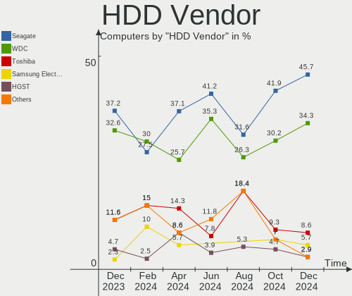
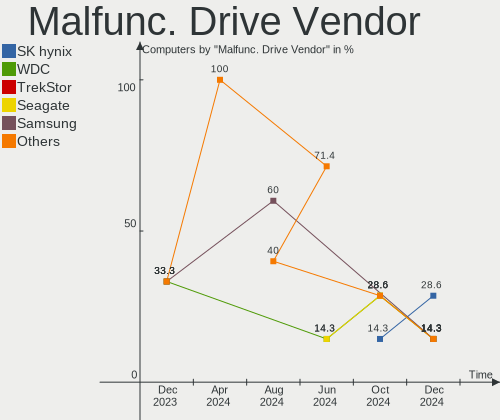
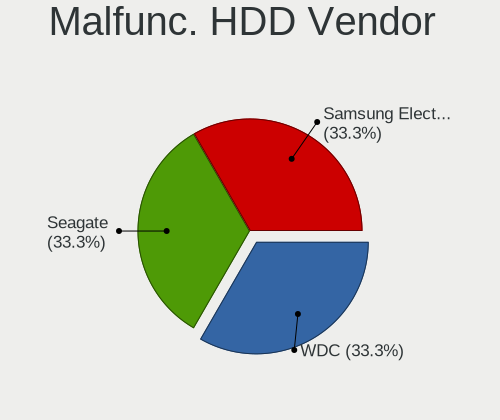
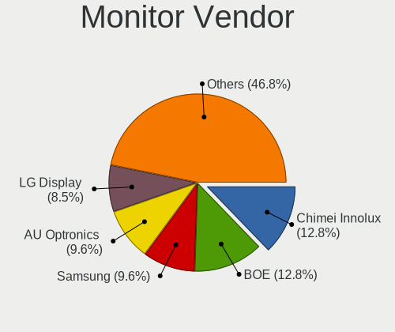
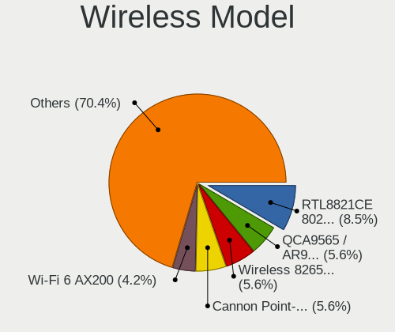
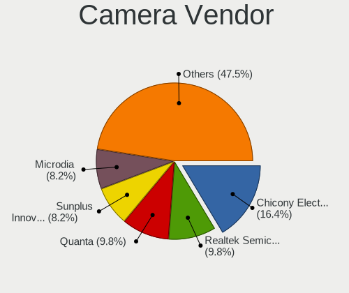

openSUSE - Hardware Trends
--------------------------

A project to identify most popular hardware characteristics and track their change
over time based on data collected by Linux users at https://Linux-Hardware.org.

Anyone can contribute to this report by the [hw-probe](https://github.com/linuxhw/hw-probe) tool:

    sudo -E hw-probe -all -upload

This is a report for all computer types. See also reports for [desktops](/Dist/openSUSE/Desktop/README.md) and [notebooks](/Dist/openSUSE/Notebook/README.md).

This report is for one last month. Overall report since the beginning of time: [TestDays](https://github.com/linuxhw/TestDays)

Period: Dec, 2023.

Contents
--------

* [ System ](#system)
  - [ OS                       ](#os)
  - [ OS Family                ](#os-family)
  - [ Kernel                   ](#kernel)
  - [ Kernel Family            ](#kernel-family)
  - [ Kernel Major Ver.        ](#kernel-major-ver)
  - [ Arch                     ](#arch)
  - [ DE                       ](#de)
  - [ Display Server           ](#display-server)
  - [ Display Manager          ](#display-manager)
  - [ OS Lang                  ](#os-lang)
  - [ Boot Mode                ](#boot-mode)
  - [ Filesystem               ](#filesystem)
  - [ Part. scheme             ](#part-scheme)
  - [ Dual Boot with Linux/BSD ](#dual-boot-with-linuxbsd)
  - [ Dual Boot (Win)          ](#dual-boot-win)

* [ Board ](#board)
  - [ Vendor                   ](#vendor)
  - [ Model                    ](#model)
  - [ Model Family             ](#model-family)
  - [ MFG Year                 ](#mfg-year)
  - [ Form Factor              ](#form-factor)
  - [ Secure Boot              ](#secure-boot)
  - [ Coreboot                 ](#coreboot)
  - [ RAM Size                 ](#ram-size)
  - [ RAM Used                 ](#ram-used)
  - [ Total Drives             ](#total-drives)
  - [ Has CD-ROM               ](#has-cd-rom)
  - [ Has Ethernet             ](#has-ethernet)
  - [ Has WiFi                 ](#has-wifi)
  - [ Has Bluetooth            ](#has-bluetooth)

* [ Location ](#location)
  - [ Country                  ](#country)
  - [ City                     ](#city)

* [ Drives ](#drives)
  - [ Drive Vendor             ](#drive-vendor)
  - [ Drive Model              ](#drive-model)
  - [ HDD Vendor               ](#hdd-vendor)
  - [ SSD Vendor               ](#ssd-vendor)
  - [ Drive Kind               ](#drive-kind)
  - [ Drive Connector          ](#drive-connector)
  - [ Drive Size               ](#drive-size)
  - [ Space Total              ](#space-total)
  - [ Space Used               ](#space-used)
  - [ Malfunc. Drives          ](#malfunc-drives)
  - [ Malfunc. Drive Vendor    ](#malfunc-drive-vendor)
  - [ Malfunc. HDD Vendor      ](#malfunc-hdd-vendor)
  - [ Malfunc. Drive Kind      ](#malfunc-drive-kind)
  - [ Failed Drives            ](#failed-drives)
  - [ Failed Drive Vendor      ](#failed-drive-vendor)
  - [ Drive Status             ](#drive-status)

* [ Storage controller ](#storage-controller)
  - [ Storage Vendor           ](#storage-vendor)
  - [ Storage Model            ](#storage-model)
  - [ Storage Kind             ](#storage-kind)

* [ Processor ](#processor)
  - [ CPU Vendor               ](#cpu-vendor)
  - [ CPU Model                ](#cpu-model)
  - [ CPU Model Family         ](#cpu-model-family)
  - [ CPU Cores                ](#cpu-cores)
  - [ CPU Sockets              ](#cpu-sockets)
  - [ CPU Threads              ](#cpu-threads)
  - [ CPU Op-Modes             ](#cpu-op-modes)
  - [ CPU Microcode            ](#cpu-microcode)
  - [ CPU Microarch            ](#cpu-microarch)

* [ Graphics ](#graphics)
  - [ GPU Vendor               ](#gpu-vendor)
  - [ GPU Model                ](#gpu-model)
  - [ GPU Combo                ](#gpu-combo)
  - [ GPU Driver               ](#gpu-driver)
  - [ GPU Memory               ](#gpu-memory)

* [ Monitor ](#monitor)
  - [ Monitor Vendor           ](#monitor-vendor)
  - [ Monitor Model            ](#monitor-model)
  - [ Monitor Resolution       ](#monitor-resolution)
  - [ Monitor Diagonal         ](#monitor-diagonal)
  - [ Monitor Width            ](#monitor-width)
  - [ Aspect Ratio             ](#aspect-ratio)
  - [ Monitor Area             ](#monitor-area)
  - [ Pixel Density            ](#pixel-density)
  - [ Multiple Monitors        ](#multiple-monitors)

* [ Network ](#network)
  - [ Net Controller Vendor    ](#net-controller-vendor)
  - [ Net Controller Model     ](#net-controller-model)
  - [ Wireless Vendor          ](#wireless-vendor)
  - [ Wireless Model           ](#wireless-model)
  - [ Ethernet Vendor          ](#ethernet-vendor)
  - [ Ethernet Model           ](#ethernet-model)
  - [ Net Controller Kind      ](#net-controller-kind)
  - [ Used Controller          ](#used-controller)
  - [ NICs                     ](#nics)
  - [ IPv6                     ](#ipv6)

* [ Bluetooth ](#bluetooth)
  - [ Bluetooth Vendor         ](#bluetooth-vendor)
  - [ Bluetooth Model          ](#bluetooth-model)

* [ Sound ](#sound)
  - [ Sound Vendor             ](#sound-vendor)
  - [ Sound Model              ](#sound-model)

* [ Memory ](#memory)
  - [ Memory Vendor            ](#memory-vendor)
  - [ Memory Model             ](#memory-model)
  - [ Memory Kind              ](#memory-kind)
  - [ Memory Form Factor       ](#memory-form-factor)
  - [ Memory Size              ](#memory-size)
  - [ Memory Speed             ](#memory-speed)

* [ Printers & scanners ](#printers--scanners)
  - [ Printer Vendor           ](#printer-vendor)
  - [ Printer Model            ](#printer-model)
  - [ Scanner Vendor           ](#scanner-vendor)
  - [ Scanner Model            ](#scanner-model)

* [ Camera ](#camera)
  - [ Camera Vendor            ](#camera-vendor)
  - [ Camera Model             ](#camera-model)

* [ Security ](#security)
  - [ Fingerprint Vendor       ](#fingerprint-vendor)
  - [ Fingerprint Model        ](#fingerprint-model)
  - [ Chipcard Vendor          ](#chipcard-vendor)
  - [ Chipcard Model           ](#chipcard-model)

* [ Unsupported ](#unsupported)
  - [ Unsupported Devices      ](#unsupported-devices)
  - [ Unsupported Device Types ](#unsupported-device-types)

System
------

OS
--

Installed operating systems

| Name                         | Computers | Percent |
|------------------------------|-----------|---------|
| openSUSE Tumbleweed-XXXXXXXX | 60        | 61.22%  |
| openSUSE Leap-15.5           | 29        | 29.59%  |
| openSUSE Microos-XXXXXXXX    | 5         | 5.1%    |
| openSUSE Leap-15.6           | 3         | 3.06%   |
| openSUSE Leap-15.4           | 1         | 1.02%   |

OS Family
---------

OS without a version

| Name     | Computers | Percent |
|----------|-----------|---------|
| openSUSE | 98        | 100%    |

Kernel
------

Version of the Linux kernel

| Version                      | Computers | Percent |
|------------------------------|-----------|---------|
| 6.6.6-1-default              | 29        | 29.59%  |
| 6.6.3-1-default              | 21        | 21.43%  |
| 5.14.21-150500.55.39-default | 14        | 14.29%  |
| 5.14.21-150500.55.36-default | 10        | 10.2%   |
| 6.6.7-1-default              | 7         | 7.14%   |
| 6.6.2-1-default              | 4         | 4.08%   |
| 6.5.9-1-default              | 3         | 3.06%   |
| 6.4.0-150600.4-default       | 2         | 2.04%   |
| 5.14.21-150500.53-default    | 2         | 2.04%   |
| 6.6.1-1-default              | 1         | 1.02%   |
| 6.5.6-1-default              | 1         | 1.02%   |
| 6.4.0-150600.1-default       | 1         | 1.02%   |
| 5.14.21-150500.55.31-default | 1         | 1.02%   |
| 5.14.21-150400.24.97-default | 1         | 1.02%   |
| 5.14.21-150400.24.55-default | 1         | 1.02%   |

Kernel Family
-------------

Linux kernel without a distro release

| Version | Computers | Percent |
|---------|-----------|---------|
| 6.6.6   | 29        | 29.59%  |
| 5.14.21 | 29        | 29.59%  |
| 6.6.3   | 21        | 21.43%  |
| 6.6.7   | 7         | 7.14%   |
| 6.6.2   | 4         | 4.08%   |
| 6.5.9   | 3         | 3.06%   |
| 6.4.0   | 3         | 3.06%   |
| 6.6.1   | 1         | 1.02%   |
| 6.5.6   | 1         | 1.02%   |

Kernel Major Ver.
-----------------

Linux kernel major version

| Version | Computers | Percent |
|---------|-----------|---------|
| 6.6     | 62        | 63.27%  |
| 5.14    | 29        | 29.59%  |
| 6.5     | 4         | 4.08%   |
| 6.4     | 3         | 3.06%   |

Arch
----

OS architecture (x86_64, i586, etc.)

| Name    | Computers | Percent |
|---------|-----------|---------|
| x86_64  | 97        | 98.98%  |
| aarch64 | 1         | 1.02%   |

DE
--

Desktop Environment

| Name    | Computers | Percent |
|---------|-----------|---------|
| KDE5    | 62        | 63.27%  |
| GNOME   | 25        | 25.51%  |
| XFCE    | 5         | 5.1%    |
| Unknown | 4         | 4.08%   |
| ICEWM   | 1         | 1.02%   |
| i3      | 1         | 1.02%   |

Display Server
--------------

X11 or Wayland

| Name    | Computers | Percent |
|---------|-----------|---------|
| X11     | 59        | 60.2%   |
| Wayland | 32        | 32.65%  |
| Tty     | 4         | 4.08%   |
| Unknown | 3         | 3.06%   |

Display Manager
---------------

SDDM, LightDM, etc.

| Name    | Computers | Percent |
|---------|-----------|---------|
| Unknown | 62        | 63.27%  |
| SDDM    | 26        | 26.53%  |
| GDM     | 6         | 6.12%   |
| LightDM | 4         | 4.08%   |

OS Lang
-------

Language

| Lang    | Computers | Percent |
|---------|-----------|---------|
| en_US   | 41        | 41.84%  |
| POSIX   | 14        | 14.29%  |
| de_DE   | 11        | 11.22%  |
| en_GB   | 8         | 8.16%   |
| pt_BR   | 6         | 6.12%   |
| fr_FR   | 4         | 4.08%   |
| es_ES   | 4         | 4.08%   |
| it_IT   | 2         | 2.04%   |
| cs_CZ   | 2         | 2.04%   |
| Unknown | 2         | 2.04%   |
| zh_CN   | 1         | 1.02%   |
| nn_NO   | 1         | 1.02%   |
| nl_NL   | 1         | 1.02%   |
| ar_AE   | 1         | 1.02%   |

Boot Mode
---------

EFI or BIOS

| Mode | Computers | Percent |
|------|-----------|---------|
| EFI  | 64        | 65.31%  |
| BIOS | 34        | 34.69%  |

Filesystem
----------

Type of filesystem

| Type  | Computers | Percent |
|-------|-----------|---------|
| Btrfs | 84        | 85.71%  |
| Ext4  | 12        | 12.24%  |
| Xfs   | 1         | 1.02%   |
| Tmpfs | 1         | 1.02%   |

Part. scheme
------------

Scheme of partitioning

| Type    | Computers | Percent |
|---------|-----------|---------|
| Unknown | 55        | 56.12%  |
| GPT     | 42        | 42.86%  |
| MBR     | 1         | 1.02%   |

Dual Boot with Linux/BSD
------------------------

Hosting more than one Linux/BSD

| Dual boot | Computers | Percent |
|-----------|-----------|---------|
| No        | 88        | 89.8%   |
| Yes       | 10        | 10.2%   |

Dual Boot (Win)
---------------

Hosting Linux and Windows

| Dual boot | Computers | Percent |
|-----------|-----------|---------|
| No        | 87        | 88.78%  |
| Yes       | 11        | 11.22%  |

Board
-----

Vendor
------

Motherboard manufacturer

| Name                                 | Computers | Percent |
|--------------------------------------|-----------|---------|
| ASUSTek Computer                     | 16        | 16.33%  |
| Hewlett-Packard                      | 14        | 14.29%  |
| Dell                                 | 14        | 14.29%  |
| Lenovo                               | 13        | 13.27%  |
| Gigabyte Technology                  | 8         | 8.16%   |
| MSI                                  | 7         | 7.14%   |
| Samsung Electronics                  | 3         | 3.06%   |
| Intel                                | 3         | 3.06%   |
| Acer                                 | 3         | 3.06%   |
| System76                             | 2         | 2.04%   |
| Medion                               | 2         | 2.04%   |
| Apple                                | 2         | 2.04%   |
| Wortmann AG                          | 1         | 1.02%   |
| Valve                                | 1         | 1.02%   |
| Supermicro                           | 1         | 1.02%   |
| Shenzhen Meigao Electronic Equipment | 1         | 1.02%   |
| Orange Pi                            | 1         | 1.02%   |
| HUAWEI                               | 1         | 1.02%   |
| Huanan                               | 1         | 1.02%   |
| Foxconn                              | 1         | 1.02%   |
| ASRock                               | 1         | 1.02%   |
| AMI                                  | 1         | 1.02%   |
| Alienware                            | 1         | 1.02%   |

Model
-----

Motherboard model

| Name                                                                                     | Computers | Percent |
|------------------------------------------------------------------------------------------|-----------|---------|
| Wortmann AG TERRA_MOBILE_1529H                                                           | 1         | 1.02%   |
| Valve Jupiter                                                                            | 1         | 1.02%   |
| System76 Lemur Pro                                                                       | 1         | 1.02%   |
| System76 Bonobo WS                                                                       | 1         | 1.02%   |
| Supermicro Super Server                                                                  | 1         | 1.02%   |
| Shenzhen Meigao Electronic Equipment Venus series                                        | 1         | 1.02%   |
| Samsung 730QFG                                                                           | 1         | 1.02%   |
| Samsung 550XDA                                                                           | 1         | 1.02%   |
| Samsung 355V4C/355V4X/355V5C/355V5X/356V4C/356V4X/356V5C/356V5X/3445VC/3445VX/3545VC/354 | 1         | 1.02%   |
| Orange Pi 5                                                                              | 1         | 1.02%   |
| MSI Thin GF63 12HW                                                                       | 1         | 1.02%   |
| MSI MS-7D74                                                                              | 1         | 1.02%   |
| MSI MS-7C91                                                                              | 1         | 1.02%   |
| MSI MS-7C56                                                                              | 1         | 1.02%   |
| MSI MS-7A34                                                                              | 1         | 1.02%   |
| MSI MS-7978                                                                              | 1         | 1.02%   |
| MSI MS-7673                                                                              | 1         | 1.02%   |
| Medion S17403                                                                            | 1         | 1.02%   |
| Lenovo ThinkPad X13 Gen 2a 20XH001KPB                                                    | 1         | 1.02%   |
| Lenovo ThinkPad X1 Yoga Gen 7 21CDCTO1WW                                                 | 1         | 1.02%   |
| Lenovo ThinkPad X1 Extreme 2nd 20QWS0M300                                                | 1         | 1.02%   |
| Lenovo ThinkPad T14 Gen 2i 20W1S1SN00                                                    | 1         | 1.02%   |
| Lenovo ThinkPad E14 Gen 3 20YD001DBO                                                     | 1         | 1.02%   |
| Lenovo ThinkPad E14 Gen 2 20TBS04X00                                                     | 1         | 1.02%   |
| Lenovo ThinkPad E14 20RA004YUS                                                           | 1         | 1.02%   |
| Lenovo ThinkPad A275 20KDS01T00                                                          | 1         | 1.02%   |
| Lenovo ThinkCentre M92p 3227GQ8                                                          | 1         | 1.02%   |
| Lenovo IdeaPad S340-15IML 81NA                                                           | 1         | 1.02%   |
| Lenovo IdeaPad Gaming 3 15ARH05 82EY                                                     | 1         | 1.02%   |
| Lenovo IdeaPad 5 14ALC05 82LM                                                            | 1         | 1.02%   |
| Lenovo IdeaPad 3 15ITL6 82H8                                                             | 1         | 1.02%   |
| Intel S1200RP                                                                            | 1         | 1.02%   |
| Intel KBL-R MRD                                                                          | 1         | 1.02%   |
| Intel B85                                                                                | 1         | 1.02%   |
| HUAWEI KLVL-WXXW                                                                         | 1         | 1.02%   |
| Huanan X99-QD4 V1.0                                                                      | 1         | 1.02%   |
| HP ZBook 15 G3                                                                           | 1         | 1.02%   |
| HP Z440 Workstation                                                                      | 1         | 1.02%   |
| HP Z400 Workstation                                                                      | 1         | 1.02%   |
| HP Victus by Laptop 16-e0xxx                                                             | 1         | 1.02%   |

Model Family
------------

Motherboard model prefix

| Name                                       | Computers | Percent |
|--------------------------------------------|-----------|---------|
| Lenovo ThinkPad                            | 8         | 8.16%   |
| Lenovo IdeaPad                             | 4         | 4.08%   |
| Dell Latitude                              | 4         | 4.08%   |
| ASUS ROG                                   | 4         | 4.08%   |
| HP Compaq                                  | 3         | 3.06%   |
| Dell Inspiron                              | 3         | 3.06%   |
| HP Victus                                  | 2         | 2.04%   |
| HP 250                                     | 2         | 2.04%   |
| Dell Precision                             | 2         | 2.04%   |
| Dell OptiPlex                              | 2         | 2.04%   |
| ASUS Vivobook                              | 2         | 2.04%   |
| ASUS PRIME                                 | 2         | 2.04%   |
| Wortmann AG TERRA                          | 1         | 1.02%   |
| Valve Jupiter                              | 1         | 1.02%   |
| System76 Lemur                             | 1         | 1.02%   |
| System76 Bonobo                            | 1         | 1.02%   |
| Supermicro Super                           | 1         | 1.02%   |
| Shenzhen Meigao Electronic Equipment Venus | 1         | 1.02%   |
| Samsung 730QFG                             | 1         | 1.02%   |
| Samsung 550XDA                             | 1         | 1.02%   |
| Samsung 355V4C                             | 1         | 1.02%   |
| Orange Pi 5                                | 1         | 1.02%   |
| MSI Thin                                   | 1         | 1.02%   |
| MSI MS-7D74                                | 1         | 1.02%   |
| MSI MS-7C91                                | 1         | 1.02%   |
| MSI MS-7C56                                | 1         | 1.02%   |
| MSI MS-7A34                                | 1         | 1.02%   |
| MSI MS-7978                                | 1         | 1.02%   |
| MSI MS-7673                                | 1         | 1.02%   |
| Medion S17403                              | 1         | 1.02%   |
| Lenovo ThinkCentre                         | 1         | 1.02%   |
| Intel S1200RP                              | 1         | 1.02%   |
| Intel KBL-R                                | 1         | 1.02%   |
| Intel B85                                  | 1         | 1.02%   |
| HUAWEI KLVL-WXXW                           | 1         | 1.02%   |
| Huanan X99-QD4                             | 1         | 1.02%   |
| HP ZBook                                   | 1         | 1.02%   |
| HP Z440                                    | 1         | 1.02%   |
| HP Z400                                    | 1         | 1.02%   |
| HP Notebook                                | 1         | 1.02%   |

MFG Year
--------

Motherboard manufacture year

| Year | Computers | Percent |
|------|-----------|---------|
| 2021 | 14        | 14.29%  |
| 2023 | 12        | 12.24%  |
| 2022 | 11        | 11.22%  |
| 2020 | 8         | 8.16%   |
| 2011 | 7         | 7.14%   |
| 2019 | 6         | 6.12%   |
| 2018 | 6         | 6.12%   |
| 2017 | 5         | 5.1%    |
| 2015 | 5         | 5.1%    |
| 2014 | 5         | 5.1%    |
| 2012 | 5         | 5.1%    |
| 2013 | 4         | 4.08%   |
| 2009 | 3         | 3.06%   |
| 2016 | 2         | 2.04%   |
| 2010 | 2         | 2.04%   |
| 2008 | 2         | 2.04%   |
| 2007 | 1         | 1.02%   |

Form Factor
-----------

Physical design of the computer

| Name           | Computers | Percent |
|----------------|-----------|---------|
| Notebook       | 53        | 54.08%  |
| Desktop        | 37        | 37.76%  |
| Convertible    | 3         | 3.06%   |
| Mini pc        | 2         | 2.04%   |
| Server         | 2         | 2.04%   |
| System on chip | 1         | 1.02%   |

Secure Boot
-----------

Enabled or disabled

| State    | Computers | Percent |
|----------|-----------|---------|
| Disabled | 81        | 82.65%  |
| Enabled  | 17        | 17.35%  |

Coreboot
--------

Have coreboot on board

| Used | Computers | Percent |
|------|-----------|---------|
| No   | 96        | 97.96%  |
| Yes  | 2         | 2.04%   |

RAM Size
--------

Total RAM memory

| Size in GB  | Computers | Percent |
|-------------|-----------|---------|
| 4.01-8.0    | 28        | 28.57%  |
| 32.01-64.0  | 22        | 22.45%  |
| 16.01-24.0  | 16        | 16.33%  |
| 3.01-4.0    | 11        | 11.22%  |
| 8.01-16.0   | 11        | 11.22%  |
| 64.01-256.0 | 6         | 6.12%   |
| 24.01-32.0  | 2         | 2.04%   |
| 1.01-2.0    | 2         | 2.04%   |

RAM Used
--------

Used RAM memory

| Used GB    | Computers | Percent |
|------------|-----------|---------|
| 2.01-3.0   | 33        | 33.67%  |
| 1.01-2.0   | 21        | 21.43%  |
| 4.01-8.0   | 20        | 20.41%  |
| 3.01-4.0   | 13        | 13.27%  |
| 8.01-16.0  | 5         | 5.1%    |
| 0.51-1.0   | 3         | 3.06%   |
| 16.01-24.0 | 2         | 2.04%   |
| 0.01-0.5   | 1         | 1.02%   |

Total Drives
------------

Number of drives on board

| Drives | Computers | Percent |
|--------|-----------|---------|
| 1      | 59        | 60.2%   |
| 2      | 21        | 21.43%  |
| 3      | 11        | 11.22%  |
| 5      | 5         | 5.1%    |
| 10     | 1         | 1.02%   |
| 4      | 1         | 1.02%   |

Has CD-ROM
----------

Has CD-ROM on board

| Presented | Computers | Percent |
|-----------|-----------|---------|
| No        | 65        | 66.33%  |
| Yes       | 33        | 33.67%  |

Has Ethernet
------------

Has Ethernet on board

| Presented | Computers | Percent |
|-----------|-----------|---------|
| Yes       | 82        | 83.67%  |
| No        | 16        | 16.33%  |

Has WiFi
--------

Has WiFi module

| Presented | Computers | Percent |
|-----------|-----------|---------|
| Yes       | 72        | 73.47%  |
| No        | 26        | 26.53%  |

Has Bluetooth
-------------

Has Bluetooth module

| Presented | Computers | Percent |
|-----------|-----------|---------|
| Yes       | 70        | 71.43%  |
| No        | 28        | 28.57%  |

Location
--------

Country
-------

Geographic location (country)

| Country     | Computers | Percent |
|-------------|-----------|---------|
| USA         | 15        | 15.31%  |
| Germany     | 12        | 12.24%  |
| Brazil      | 7         | 7.14%   |
| Canada      | 5         | 5.1%    |
| Spain       | 4         | 4.08%   |
| Italy       | 4         | 4.08%   |
| France      | 4         | 4.08%   |
| Argentina   | 4         | 4.08%   |
| UK          | 3         | 3.06%   |
| Sweden      | 3         | 3.06%   |
| Czechia     | 3         | 3.06%   |
| Bulgaria    | 3         | 3.06%   |
| Switzerland | 2         | 2.04%   |
| Romania     | 2         | 2.04%   |
| Mexico      | 2         | 2.04%   |
| Hungary     | 2         | 2.04%   |
| Finland     | 2         | 2.04%   |
| Cuba        | 2         | 2.04%   |
| Belgium     | 2         | 2.04%   |
| South Korea | 1         | 1.02%   |
| Russia      | 1         | 1.02%   |
| Portugal    | 1         | 1.02%   |
| Poland      | 1         | 1.02%   |
| Peru        | 1         | 1.02%   |
| Norway      | 1         | 1.02%   |
| Lithuania   | 1         | 1.02%   |
| Kazakhstan  | 1         | 1.02%   |
| Ireland     | 1         | 1.02%   |
| India       | 1         | 1.02%   |
| Denmark     | 1         | 1.02%   |
| Costa Rica  | 1         | 1.02%   |
| Colombia    | 1         | 1.02%   |
| China       | 1         | 1.02%   |
| Austria     | 1         | 1.02%   |
| Australia   | 1         | 1.02%   |
| Algeria     | 1         | 1.02%   |

City
----

Geographic location (city)

| City                  | Computers | Percent |
|-----------------------|-----------|---------|
| Buenos Aires          | 3         | 3.06%   |
| Winnipeg              | 2         | 2.04%   |
| Vancouver             | 2         | 2.04%   |
| Valencia              | 2         | 2.04%   |
| Sofia                 | 2         | 2.04%   |
| Seattle               | 2         | 2.04%   |
| Sanremo               | 2         | 2.04%   |
| Havana                | 2         | 2.04%   |
| Budapest              | 2         | 2.04%   |
| Avon                  | 2         | 2.04%   |
| West Bend             | 1         | 1.02%   |
| Warren                | 1         | 1.02%   |
| Waidhofen an der Ybbs | 1         | 1.02%   |
| Vitória              | 1         | 1.02%   |
| Västerås            | 1         | 1.02%   |
| Valby                 | 1         | 1.02%   |
| Uberlândia           | 1         | 1.02%   |
| Trier                 | 1         | 1.02%   |
| Timișoara            | 1         | 1.02%   |
| Stone Mountain        | 1         | 1.02%   |
| Stockholm             | 1         | 1.02%   |
| Staffanstorp          | 1         | 1.02%   |
| Springdale            | 1         | 1.02%   |
| Siebnen               | 1         | 1.02%   |
| Shanghai              | 1         | 1.02%   |
| Sene                  | 1         | 1.02%   |
| Seaford               | 1         | 1.02%   |
| Sao Paulo             | 1         | 1.02%   |
| Saint-Etienne         | 1         | 1.02%   |
| Rosario               | 1         | 1.02%   |
| Poznan                | 1         | 1.02%   |
| Porto                 | 1         | 1.02%   |
| Nizhniy Novgorod      | 1         | 1.02%   |
| Milwaukee             | 1         | 1.02%   |
| Milan                 | 1         | 1.02%   |
| Melbourne             | 1         | 1.02%   |
| Marina del Rey        | 1         | 1.02%   |
| Málaga               | 1         | 1.02%   |
| Maasmechelen          | 1         | 1.02%   |
| Lyss                  | 1         | 1.02%   |

Drives
------

Drive Vendor
------------

Hard drive vendors

| Vendor                         | Computers | Drives | Percent |
|--------------------------------|-----------|--------|---------|
| Samsung Electronics            | 31        | 39     | 21.38%  |
| WDC                            | 18        | 30     | 12.41%  |
| Seagate                        | 18        | 24     | 12.41%  |
| Sandisk                        | 9         | 9      | 6.21%   |
| Toshiba                        | 8         | 8      | 5.52%   |
| SK hynix                       | 6         | 6      | 4.14%   |
| Kingston                       | 6         | 6      | 4.14%   |
| Crucial                        | 6         | 6      | 4.14%   |
| Unknown                        | 4         | 4      | 2.76%   |
| Phison Electronics             | 4         | 5      | 2.76%   |
| Intel                          | 4         | 4      | 2.76%   |
| Hitachi                        | 3         | 4      | 2.07%   |
| China                          | 3         | 3      | 2.07%   |
| Team                           | 2         | 2      | 1.38%   |
| Micron/Crucial Technology      | 2         | 3      | 1.38%   |
| Kingston Technology Company    | 2         | 2      | 1.38%   |
| KingSpec                       | 2         | 2      | 1.38%   |
| HGST                           | 2         | 2      | 1.38%   |
| XrayDisk                       | 1         | 1      | 0.69%   |
| Union Memory                   | 1         | 1      | 0.69%   |
| SPCC                           | 1         | 1      | 0.69%   |
| Solid State Storage Technology | 1         | 1      | 0.69%   |
| Silicon Motion                 | 1         | 1      | 0.69%   |
| Phison                         | 1         | 1      | 0.69%   |
| Micron Technology              | 1         | 1      | 0.69%   |
| MAXIO Technology (Hangzhou)    | 1         | 1      | 0.69%   |
| KIOXIA                         | 1         | 1      | 0.69%   |
| Intenso                        | 1         | 1      | 0.69%   |
| IBM-ESXS                       | 1         | 6      | 0.69%   |
| GOODRAM                        | 1         | 1      | 0.69%   |
| AXAGON                         | 1         | 1      | 0.69%   |
| Apple                          | 1         | 1      | 0.69%   |
| A-DATA Technology              | 1         | 1      | 0.69%   |

Drive Model
-----------

Hard drive models

| Model                                               | Computers | Percent |
|-----------------------------------------------------|-----------|---------|
| Samsung NVMe SSD Controller SM981/PM981/PM983 512GB | 10        | 6.25%   |
| Samsung NVMe SSD Controller PM9A1/PM9A3/980PRO 2TB  | 6         | 3.75%   |
| Seagate ST4000DM004-2CV104 4TB                      | 3         | 1.88%   |
| WDC WD20EZRZ-00Z5HB0 2TB                            | 2         | 1.25%   |
| Unknown MMC Card  128GB                             | 2         | 1.25%   |
| Toshiba MQ01ABD100 1TB                              | 2         | 1.25%   |
| Seagate ST1000LM024 HN-M101MBB 1TB                  | 2         | 1.25%   |
| Samsung SSD 870 EVO 2TB                             | 2         | 1.25%   |
| Samsung SSD 860 EVO 1TB                             | 2         | 1.25%   |
| Samsung SSD 850 EVO 500GB                           | 2         | 1.25%   |
| Samsung SSD 850 EVO 250GB                           | 2         | 1.25%   |
| Samsung NVMe SSD Controller SM961/PM961/SM963 250GB | 2         | 1.25%   |
| Samsung MZALQ256HBJD-00BL2 256GB                    | 2         | 1.25%   |
| Micron/Crucial P2 NVMe PCIe SSD 4TB                 | 2         | 1.25%   |
| Kingston SA400S37480G 480GB SSD                     | 2         | 1.25%   |
| XrayDisk 480GB SSD                                  | 1         | 0.63%   |
| WDC WDS500G1B0A-00H9H0 500GB SSD                    | 1         | 0.63%   |
| WDC WDS250G2B0A-00SM50 250GB SSD                    | 1         | 0.63%   |
| WDC WDS240G2G0C-00AJM0 240GB                        | 1         | 0.63%   |
| WDC WD80EFAX-68KNBN0 8TB                            | 1         | 0.63%   |
| WDC WD5000AAKX-08ERMA0 500GB                        | 1         | 0.63%   |
| WDC WD40EZRZ-22GXCB0 4TB                            | 1         | 0.63%   |
| WDC WD3200AAKX-00ERMA0 320GB                        | 1         | 0.63%   |
| WDC WD32 00BPVT-80JJ5T0 320GB                       | 1         | 0.63%   |
| WDC WD30EZRZ-00Z5HB0 3TB                            | 1         | 0.63%   |
| WDC WD30EZRZ-00WN9B0 3TB                            | 1         | 0.63%   |
| WDC WD20EZBX-00AYRA0 2TB                            | 1         | 0.63%   |
| WDC WD20EARX-008FB0 2TB                             | 1         | 0.63%   |
| WDC WD2005FBYZ-01YCBB3 2TB                          | 1         | 0.63%   |
| WDC WD1600BB-22FTA0 160GB                           | 1         | 0.63%   |
| WDC WD10SPZX-00Z10T0 1TB                            | 1         | 0.63%   |
| WDC WD10JPVX-00JC3T0 1TB                            | 1         | 0.63%   |
| WDC WD10EZEX-75M2NA0 1TB                            | 1         | 0.63%   |
| WDC WD10EZEX-08WN4A0 1TB                            | 1         | 0.63%   |
| WDC WD10EZEX-08M2NA0 1TB                            | 1         | 0.63%   |
| WDC WD10EZEX-00WN4A0 1TB                            | 1         | 0.63%   |
| WDC WD1002FAEX-00Z3A0 1TB                           | 1         | 0.63%   |
| WDC PC SN530 NVMe 512GB                             | 1         | 0.63%   |
| Unknown NVMe SSD Drive 512GB                        | 1         | 0.63%   |
| Unknown MMC Card  256GB                             | 1         | 0.63%   |

HDD Vendor
----------

Hard disk drive vendors

| Vendor              | Computers | Drives | Percent |
|---------------------|-----------|--------|---------|
| Seagate             | 16        | 21     | 37.21%  |
| WDC                 | 14        | 26     | 32.56%  |
| Toshiba             | 5         | 5      | 11.63%  |
| Hitachi             | 3         | 4      | 6.98%   |
| HGST                | 2         | 2      | 4.65%   |
| Samsung Electronics | 1         | 1      | 2.33%   |
| AXAGON              | 1         | 1      | 2.33%   |
| Apple               | 1         | 1      | 2.33%   |

SSD Vendor
----------

Solid state drive vendors

| Vendor              | Computers | Drives | Percent |
|---------------------|-----------|--------|---------|
| Samsung Electronics | 11        | 13     | 27.5%   |
| Crucial             | 6         | 6      | 15%     |
| SanDisk             | 3         | 3      | 7.5%    |
| Kingston            | 3         | 3      | 7.5%    |
| China               | 3         | 3      | 7.5%    |
| WDC                 | 2         | 2      | 5%      |
| Team                | 2         | 2      | 5%      |
| KingSpec            | 2         | 2      | 5%      |
| Intel               | 2         | 2      | 5%      |
| XrayDisk            | 1         | 1      | 2.5%    |
| Toshiba             | 1         | 1      | 2.5%    |
| SPCC                | 1         | 1      | 2.5%    |
| Phison              | 1         | 1      | 2.5%    |
| Intenso             | 1         | 1      | 2.5%    |
| GOODRAM             | 1         | 1      | 2.5%    |

Drive Kind
----------

HDD or SSD

| Kind    | Computers | Drives | Percent |
|---------|-----------|--------|---------|
| NVMe    | 53        | 65     | 42.06%  |
| SSD     | 34        | 42     | 26.98%  |
| HDD     | 34        | 61     | 26.98%  |
| MMC     | 3         | 3      | 2.38%   |
| Unknown | 2         | 8      | 1.59%   |

Drive Connector
---------------

SATA, SAS, NVMe, etc.

| Type | Computers | Drives | Percent |
|------|-----------|--------|---------|
| SATA | 56        | 98     | 48.7%   |
| NVMe | 53        | 65     | 46.09%  |
| SAS  | 3         | 13     | 2.61%   |
| MMC  | 3         | 3      | 2.61%   |

Drive Size
----------

Size of hard drive

| Size in TB | Computers | Drives | Percent |
|------------|-----------|--------|---------|
| 0.01-0.5   | 32        | 38     | 40.51%  |
| 0.51-1.0   | 25        | 27     | 31.65%  |
| 1.01-2.0   | 11        | 20     | 13.92%  |
| 3.01-4.0   | 6         | 9      | 7.59%   |
| 4.01-10.0  | 3         | 3      | 3.8%    |
| 2.01-3.0   | 1         | 5      | 1.27%   |
| 10.01-20.0 | 1         | 1      | 1.27%   |

Space Total
-----------

Amount of disk space available on the file system

| Size in GB     | Computers | Percent |
|----------------|-----------|---------|
| More than 3000 | 47        | 47.96%  |
| 1001-2000      | 24        | 24.49%  |
| 2001-3000      | 8         | 8.16%   |
| 501-1000       | 8         | 8.16%   |
| 251-500        | 5         | 5.1%    |
| 101-250        | 2         | 2.04%   |
| Unknown        | 2         | 2.04%   |
| 1-20           | 1         | 1.02%   |
| 51-100         | 1         | 1.02%   |

Space Used
----------

Amount of used disk space

| Used GB        | Computers | Percent |
|----------------|-----------|---------|
| 101-250        | 27        | 27.55%  |
| 51-100         | 26        | 26.53%  |
| 251-500        | 11        | 11.22%  |
| 501-1000       | 10        | 10.2%   |
| More than 3000 | 9         | 9.18%   |
| 1001-2000      | 6         | 6.12%   |
| 1-20           | 4         | 4.08%   |
| 2001-3000      | 2         | 2.04%   |
| Unknown        | 2         | 2.04%   |
| 21-50          | 1         | 1.02%   |

Malfunc. Drives
---------------

Drive models with a malfunction

| Model                                        | Computers | Drives | Percent |
|----------------------------------------------|-----------|--------|---------|
| WDC WD30EZRZ-00Z5HB0 3TB                     | 1         | 2      | 25%     |
| Samsung Electronics MZALQ256HBJD-00BL2 256GB | 1         | 1      | 25%     |
| Hitachi HUS724030ALE641 3TB                  | 1         | 1      | 25%     |
| Hitachi HDS5C3030BLE630 3TB                  | 1         | 1      | 25%     |

Malfunc. Drive Vendor
---------------------

Vendors of faulty drives

| Vendor              | Computers | Drives | Percent |
|---------------------|-----------|--------|---------|
| WDC                 | 1         | 2      | 33.33%  |
| Samsung Electronics | 1         | 1      | 33.33%  |
| Hitachi             | 1         | 2      | 33.33%  |

Malfunc. HDD Vendor
-------------------

Vendors of faulty HDD drives

| Vendor  | Computers | Drives | Percent |
|---------|-----------|--------|---------|
| WDC     | 1         | 2      | 50%     |
| Hitachi | 1         | 2      | 50%     |

Malfunc. Drive Kind
-------------------

Kinds of faulty drives

| Kind | Computers | Drives | Percent |
|------|-----------|--------|---------|
| NVMe | 1         | 1      | 50%     |
| HDD  | 1         | 4      | 50%     |

Failed Drives
-------------

Failed drive models

Zero info for selected period =(

Failed Drive Vendor
-------------------

Failed drive vendors

Zero info for selected period =(

Drive Status
------------

Number of failed and malfunc. drives

| Status   | Computers | Drives | Percent |
|----------|-----------|--------|---------|
| Detected | 58        | 106    | 57.43%  |
| Works    | 41        | 68     | 40.59%  |
| Malfunc  | 2         | 5      | 1.98%   |

Storage controller
------------------

Storage Vendor
--------------

Storage controller vendors

| Vendor                         | Computers | Percent |
|--------------------------------|-----------|---------|
| Intel                          | 49        | 34.51%  |
| AMD                            | 24        | 16.9%   |
| Samsung Electronics            | 21        | 14.79%  |
| SanDisk                        | 8         | 5.63%   |
| SK hynix                       | 6         | 4.23%   |
| Kingston Technology Company    | 5         | 3.52%   |
| Phison Electronics             | 4         | 2.82%   |
| Nvidia                         | 3         | 2.11%   |
| Toshiba America Info Systems   | 2         | 1.41%   |
| Micron/Crucial Technology      | 2         | 1.41%   |
| Marvell Technology Group       | 2         | 1.41%   |
| LSI Logic / Symbios Logic      | 2         | 1.41%   |
| Broadcom / LSI                 | 2         | 1.41%   |
| Union Memory (Shenzhen)        | 1         | 0.7%    |
| Solidigm                       | 1         | 0.7%    |
| Solid State Storage Technology | 1         | 0.7%    |
| Silicon Motion                 | 1         | 0.7%    |
| Silicon Image                  | 1         | 0.7%    |
| Seagate Technology             | 1         | 0.7%    |
| Micron Technology              | 1         | 0.7%    |
| MAXIO Technology (Hangzhou)    | 1         | 0.7%    |
| KIOXIA                         | 1         | 0.7%    |
| JMicron Technology             | 1         | 0.7%    |
| ASMedia Technology             | 1         | 0.7%    |
| ADATA Technology               | 1         | 0.7%    |

Storage Model
-------------

Storage controller models

| Model                                                                          | Computers | Percent |
|--------------------------------------------------------------------------------|-----------|---------|
| AMD FCH SATA Controller [AHCI mode]                                            | 17        | 10.69%  |
| Samsung NVMe SSD Controller SM981/PM981/PM983                                  | 10        | 6.29%   |
| Samsung NVMe SSD Controller PM9A1/PM9A3/980PRO                                 | 6         | 3.77%   |
| Intel 8 Series/C220 Series Chipset Family 6-port SATA Controller 1 [AHCI mode] | 6         | 3.77%   |
| AMD SB7x0/SB8x0/SB9x0 IDE Controller                                           | 4         | 2.52%   |
| Samsung NVMe SSD Controller 980 (DRAM-less)                                    | 3         | 1.89%   |
| Intel Tiger Lake-LP SATA Controller                                            | 3         | 1.89%   |
| Intel Sunrise Point-LP SATA Controller [AHCI mode]                             | 3         | 1.89%   |
| Intel Cannon Lake Mobile PCH SATA AHCI Controller                              | 3         | 1.89%   |
| Intel 700 Series Chipset Family SATA AHCI Controller                           | 3         | 1.89%   |
| Intel 7 Series/C210 Series Chipset Family 6-port SATA Controller [AHCI mode]   | 3         | 1.89%   |
| Intel 6 Series/C200 Series Chipset Family 6 port Desktop SATA AHCI Controller  | 3         | 1.89%   |
| AMD SB7x0/SB8x0/SB9x0 SATA Controller [IDE mode]                               | 3         | 1.89%   |
| SanDisk IX SN530 NVMe SSD (DRAM-less)                                          | 2         | 1.26%   |
| Samsung NVMe SSD Controller SM961/PM961/SM963                                  | 2         | 1.26%   |
| Nvidia MCP79 AHCI Controller                                                   | 2         | 1.26%   |
| Micron/Crucial P2 [Nick P2] / P3 / P3 Plus NVMe PCIe SSD (DRAM-less)           | 2         | 1.26%   |
| Kingston Company NV1 NVMe SSD SM2263XT                                         | 2         | 1.26%   |
| Intel Volume Management Device NVMe RAID Controller Intel Corporation          | 2         | 1.26%   |
| Intel Q170/Q150/B150/H170/H110/Z170/CM236 Chipset SATA Controller [AHCI Mode]  | 2         | 1.26%   |
| Intel Comet Lake SATA AHCI Controller                                          | 2         | 1.26%   |
| Intel Alder Lake-P SATA AHCI Controller                                        | 2         | 1.26%   |
| Intel 82801 Mobile SATA Controller [RAID mode]                                 | 2         | 1.26%   |
| Intel 7 Series Chipset Family 6-port SATA Controller [AHCI mode]               | 2         | 1.26%   |
| Intel 6 Series/C200 Series Chipset Family 6 port Mobile SATA AHCI Controller   | 2         | 1.26%   |
| AMD SB7x0/SB8x0/SB9x0 SATA Controller [AHCI mode]                              | 2         | 1.26%   |
| Union Memory (Shenzhen) AM620 PCIe 3.0 NVMe SSD 512GB                          | 1         | 0.63%   |
| Toshiba America Info Systems XG5 NVMe SSD Controller                           | 1         | 0.63%   |
| Toshiba America Info Systems XG3 NVMe SSD Controller                           | 1         | 0.63%   |
| Solidigm P41 Plus NVMe SSD (DRAM-less) [Echo Harbor]                           | 1         | 0.63%   |
| Solid State Storage CL4-8D512 NVMe SSD M.2 (DRAM-less)                         | 1         | 0.63%   |
| SK hynix Platinum P41/PC801 NVMe Solid State Drive                             | 1         | 0.63%   |
| SK hynix PC611 NVMe Solid State Drive                                          | 1         | 0.63%   |
| SK hynix PC601 NVMe Solid State Drive                                          | 1         | 0.63%   |
| SK hynix Gold P31/BC711/PC711 NVMe Solid State Drive                           | 1         | 0.63%   |
| SK hynix BC511 NVMe SSD                                                        | 1         | 0.63%   |
| SK hynix BC501 NVMe Solid State Drive                                          | 1         | 0.63%   |
| Silicon Motion SM2263EN/SM2263XT (DRAM-less) NVMe SSD Controllers              | 1         | 0.63%   |
| Silicon Image SiI 3132 Serial ATA Raid II Controller                           | 1         | 0.63%   |
| Seagate FireCuda 530 SSD                                                       | 1         | 0.63%   |

Storage Kind
------------

Kind of storage controller (IDE, SATA, NVMe, SAS, ...)

| Kind | Computers | Percent |
|------|-----------|---------|
| SATA | 67        | 47.86%  |
| NVMe | 53        | 37.86%  |
| RAID | 10        | 7.14%   |
| IDE  | 8         | 5.71%   |
| SAS  | 2         | 1.43%   |

Processor
---------

CPU Vendor
----------

Processor vendors

| Vendor | Computers | Percent |
|--------|-----------|---------|
| Intel  | 62        | 63.27%  |
| AMD    | 35        | 35.71%  |
| ARM    | 1         | 1.02%   |

CPU Model
---------

Processor models

| Model                                   | Computers | Percent |
|-----------------------------------------|-----------|---------|
| Intel 11th Gen Core i7-1165G7 @ 2.80GHz | 3         | 3.06%   |
| Intel Core i5-4440 CPU @ 3.10GHz        | 2         | 2.04%   |
| Intel Core i5-3470 CPU @ 3.20GHz        | 2         | 2.04%   |
| AMD Ryzen 7 7800X3D 8-Core Processor    | 2         | 2.04%   |
| AMD Ryzen 3 5300U with Radeon Graphics  | 2         | 2.04%   |
| Intel Xeon E-2176M CPU @ 2.70GHz        | 1         | 1.02%   |
| Intel Xeon CPU W3530 @ 2.80GHz          | 1         | 1.02%   |
| Intel Xeon CPU E5-2690 v4 @ 2.60GHz     | 1         | 1.02%   |
| Intel Xeon CPU E5-1650 v4 @ 3.60GHz     | 1         | 1.02%   |
| Intel Xeon CPU E5-1620 v3 @ 3.50GHz     | 1         | 1.02%   |
| Intel Xeon CPU E5-1603 0 @ 2.80GHz      | 1         | 1.02%   |
| Intel Xeon CPU E3-1241 v3 @ 3.50GHz     | 1         | 1.02%   |
| Intel Pentium CPU G850 @ 2.90GHz        | 1         | 1.02%   |
| Intel Core i9-14900K                    | 1         | 1.02%   |
| Intel Core i7-9850H CPU @ 2.60GHz       | 1         | 1.02%   |
| Intel Core i7-9750H CPU @ 2.60GHz       | 1         | 1.02%   |
| Intel Core i7-8850H CPU @ 2.60GHz       | 1         | 1.02%   |
| Intel Core i7-8550U CPU @ 1.80GHz       | 1         | 1.02%   |
| Intel Core i7-6700K CPU @ 4.00GHz       | 1         | 1.02%   |
| Intel Core i7-6700HQ CPU @ 2.60GHz      | 1         | 1.02%   |
| Intel Core i7-4790 CPU @ 3.60GHz        | 1         | 1.02%   |
| Intel Core i7-4700HQ CPU @ 2.40GHz      | 1         | 1.02%   |
| Intel Core i7-3770 CPU @ 3.40GHz        | 1         | 1.02%   |
| Intel Core i7-3517U CPU @ 1.90GHz       | 1         | 1.02%   |
| Intel Core i7-2760QM CPU @ 2.40GHz      | 1         | 1.02%   |
| Intel Core i7-10510U CPU @ 1.80GHz      | 1         | 1.02%   |
| Intel Core i5-7300HQ CPU @ 2.50GHz      | 1         | 1.02%   |
| Intel Core i5-7200U CPU @ 2.50GHz       | 1         | 1.02%   |
| Intel Core i5-6200U CPU @ 2.30GHz       | 1         | 1.02%   |
| Intel Core i5-5200U CPU @ 2.20GHz       | 1         | 1.02%   |
| Intel Core i5-4278U CPU @ 2.60GHz       | 1         | 1.02%   |
| Intel Core i5-3570K CPU @ 3.40GHz       | 1         | 1.02%   |
| Intel Core i5-3337U CPU @ 1.80GHz       | 1         | 1.02%   |
| Intel Core i5-2520M CPU @ 2.50GHz       | 1         | 1.02%   |
| Intel Core i5-2500 CPU @ 3.30GHz        | 1         | 1.02%   |
| Intel Core i5-10210U CPU @ 1.60GHz      | 1         | 1.02%   |
| Intel Core i5 CPU M 560 @ 2.67GHz       | 1         | 1.02%   |
| Intel Core i3-N305                      | 1         | 1.02%   |
| Intel Core i3-4000M CPU @ 2.40GHz       | 1         | 1.02%   |
| Intel Core i3-10110U CPU @ 2.10GHz      | 1         | 1.02%   |

CPU Model Family
----------------

Processor model prefix

| Model                  | Computers | Percent |
|------------------------|-----------|---------|
| Other                  | 18        | 18.37%  |
| Intel Core i5          | 15        | 15.31%  |
| Intel Core i7          | 12        | 12.24%  |
| AMD Ryzen 7            | 8         | 8.16%   |
| AMD Ryzen 5            | 8         | 8.16%   |
| Intel Xeon             | 7         | 7.14%   |
| Intel Core i3          | 4         | 4.08%   |
| Intel Celeron          | 4         | 4.08%   |
| AMD Ryzen 9            | 3         | 3.06%   |
| AMD Ryzen 3            | 3         | 3.06%   |
| Intel Pentium          | 1         | 1.02%   |
| Intel Core i9          | 1         | 1.02%   |
| Intel Core 2 Quad      | 1         | 1.02%   |
| Intel Core 2 Duo       | 1         | 1.02%   |
| Intel Atom             | 1         | 1.02%   |
| AMD Ryzen Threadripper | 1         | 1.02%   |
| AMD Ryzen 7 PRO        | 1         | 1.02%   |
| AMD Ryzen 5 PRO        | 1         | 1.02%   |
| AMD Phenom II X6       | 1         | 1.02%   |
| AMD Phenom             | 1         | 1.02%   |
| AMD FX                 | 1         | 1.02%   |
| AMD E2                 | 1         | 1.02%   |
| AMD Athlon X2          | 1         | 1.02%   |
| AMD Athlon II X4       | 1         | 1.02%   |
| AMD Athlon 64          | 1         | 1.02%   |
| AMD A6                 | 1         | 1.02%   |

CPU Cores
---------

Number of processor cores

| Number | Computers | Percent |
|--------|-----------|---------|
| 4      | 36        | 36.73%  |
| 2      | 21        | 21.43%  |
| 6      | 14        | 14.29%  |
| 8      | 12        | 12.24%  |
| 16     | 3         | 3.06%   |
| 14     | 3         | 3.06%   |
| 12     | 3         | 3.06%   |
| 1      | 3         | 3.06%   |
| 24     | 2         | 2.04%   |
| 10     | 1         | 1.02%   |

CPU Sockets
-----------

Number of sockets

| Number | Computers | Percent |
|--------|-----------|---------|
| 1      | 98        | 100%    |

CPU Threads
-----------

Threads per core (Hyper-Threading)

| Number | Computers | Percent |
|--------|-----------|---------|
| 2      | 76        | 77.55%  |
| 1      | 22        | 22.45%  |

CPU Op-Modes
------------

CPU Operation Modes (32-bit, 64-bit)

| Op mode        | Computers | Percent |
|----------------|-----------|---------|
| 32-bit, 64-bit | 97        | 98.98%  |
| 64-bit         | 1         | 1.02%   |

CPU Microcode
-------------

Microcode number

| Number     | Computers | Percent |
|------------|-----------|---------|
| Unknown    | 64        | 65.31%  |
| 0x0a50000d | 3         | 3.06%   |
| 0x0a50000c | 2         | 2.04%   |
| 0x08608103 | 2         | 2.04%   |
| 0xb06a2    | 1         | 1.02%   |
| 0x806ea    | 1         | 1.02%   |
| 0x806c2    | 1         | 1.02%   |
| 0x706a1    | 1         | 1.02%   |
| 0x506e3    | 1         | 1.02%   |
| 0x406e3    | 1         | 1.02%   |
| 0x206a7    | 1         | 1.02%   |
| 0x0a704103 | 1         | 1.02%   |
| 0x0a601206 | 1         | 1.02%   |
| 0x0a601203 | 1         | 1.02%   |
| 0x0a50000f | 1         | 1.02%   |
| 0x0a404102 | 1         | 1.02%   |
| 0x0a201016 | 1         | 1.02%   |
| 0x08900201 | 1         | 1.02%   |
| 0x08701030 | 1         | 1.02%   |
| 0x08701021 | 1         | 1.02%   |
| 0x08701013 | 1         | 1.02%   |
| 0x08608102 | 1         | 1.02%   |
| 0x08600104 | 1         | 1.02%   |
| 0x0830107b | 1         | 1.02%   |
| 0x08108109 | 1         | 1.02%   |
| 0x08101007 | 1         | 1.02%   |
| 0x0800820d | 1         | 1.02%   |
| 0x08001138 | 1         | 1.02%   |
| 0x07030105 | 1         | 1.02%   |
| 0x0600611a | 1         | 1.02%   |
| 0x06000852 | 1         | 1.02%   |

CPU Microarch
-------------

Microarchitecture

| Name             | Computers | Percent |
|------------------|-----------|---------|
| Unknown          | 12        | 12.24%  |
| KabyLake         | 10        | 10.2%   |
| Haswell          | 8         | 8.16%   |
| Alderlake Hybrid | 8         | 8.16%   |
| Zen 3            | 7         | 7.14%   |
| TigerLake        | 7         | 7.14%   |
| SandyBridge      | 6         | 6.12%   |
| IvyBridge        | 6         | 6.12%   |
| Zen 2            | 5         | 5.1%    |
| Zen              | 3         | 3.06%   |
| Skylake          | 3         | 3.06%   |
| K10              | 3         | 3.06%   |
| Broadwell        | 3         | 3.06%   |
| Zen+             | 2         | 2.04%   |
| Piledriver       | 2         | 2.04%   |
| Westmere         | 1         | 1.02%   |
| Tremont          | 1         | 1.02%   |
| Puma             | 1         | 1.02%   |
| Penryn           | 1         | 1.02%   |
| Nehalem          | 1         | 1.02%   |
| K8 Hammer        | 1         | 1.02%   |
| K8 & K10 hybrid  | 1         | 1.02%   |
| IceLake          | 1         | 1.02%   |
| Gracemont        | 1         | 1.02%   |
| Goldmont plus    | 1         | 1.02%   |
| Excavator        | 1         | 1.02%   |
| Core             | 1         | 1.02%   |
| Bonnell          | 1         | 1.02%   |

Graphics
--------

GPU Vendor
----------

Vendors of graphics cards

| Vendor                     | Computers | Percent |
|----------------------------|-----------|---------|
| Intel                      | 49        | 41.18%  |
| AMD                        | 35        | 29.41%  |
| Nvidia                     | 33        | 27.73%  |
| Matrox Electronics Systems | 1         | 0.84%   |
| ASPEED Technology          | 1         | 0.84%   |

GPU Model
---------

Graphics card models

| Model                                                                       | Computers | Percent |
|-----------------------------------------------------------------------------|-----------|---------|
| Intel TigerLake-LP GT2 [Iris Xe Graphics]                                   | 5         | 4.07%   |
| AMD Cezanne [Radeon Vega Series / Radeon Vega Mobile Series]                | 5         | 4.07%   |
| Intel Xeon E3-1200 v3/4th Gen Core Processor Integrated Graphics Controller | 3         | 2.44%   |
| Intel CometLake-U GT2 [UHD Graphics]                                        | 3         | 2.44%   |
| Intel CoffeeLake-H GT2 [UHD Graphics 630]                                   | 3         | 2.44%   |
| Intel 2nd Generation Core Processor Family Integrated Graphics Controller   | 3         | 2.44%   |
| AMD Lucienne                                                                | 3         | 2.44%   |
| Nvidia TU117M [GeForce GTX 1650 Mobile / Max-Q]                             | 2         | 1.63%   |
| Nvidia GA107M [GeForce RTX 3050 Ti Mobile]                                  | 2         | 1.63%   |
| Intel Xeon E3-1200 v2/3rd Gen Core processor Graphics Controller            | 2         | 1.63%   |
| Intel Tiger Lake-LP GT2 [UHD Graphics G4]                                   | 2         | 1.63%   |
| Intel Raptor Lake-P [Iris Xe Graphics]                                      | 2         | 1.63%   |
| Intel IvyBridge GT2 [HD Graphics 4000]                                      | 2         | 1.63%   |
| Intel HD Graphics 530                                                       | 2         | 1.63%   |
| Intel Alder Lake-P GT2 [Iris Xe Graphics]                                   | 2         | 1.63%   |
| Intel 4th Gen Core Processor Integrated Graphics Controller                 | 2         | 1.63%   |
| Intel 3rd Gen Core processor Graphics Controller                            | 2         | 1.63%   |
| AMD Raven Ridge [Radeon Vega Series / Radeon Vega Mobile Series]            | 2         | 1.63%   |
| AMD Navi 10 [Radeon RX 5600 OEM/5600 XT / 5700/5700 XT]                     | 2         | 1.63%   |
| Nvidia TU117M [GeForce MX450]                                               | 1         | 0.81%   |
| Nvidia TU117M [GeForce GTX 1650 Ti Mobile]                                  | 1         | 0.81%   |
| Nvidia GP108M [GeForce MX230]                                               | 1         | 0.81%   |
| Nvidia GP108 [GeForce GT 1030]                                              | 1         | 0.81%   |
| Nvidia GP107M [GeForce GTX 1050 Mobile]                                     | 1         | 0.81%   |
| Nvidia GP107GLM [Quadro P2000 Mobile]                                       | 1         | 0.81%   |
| Nvidia GP106 [GeForce GTX 1060 3GB]                                         | 1         | 0.81%   |
| Nvidia GP104 [GeForce GTX 1080]                                             | 1         | 0.81%   |
| Nvidia GN21-X11                                                             | 1         | 0.81%   |
| Nvidia GM206 [GeForce GTX 950]                                              | 1         | 0.81%   |
| Nvidia GM200 [GeForce GTX TITAN X]                                          | 1         | 0.81%   |
| Nvidia GM108M [GeForce MX130]                                               | 1         | 0.81%   |
| Nvidia GM108M [GeForce 940MX]                                               | 1         | 0.81%   |
| Nvidia GM107GLM [Quadro M1000M]                                             | 1         | 0.81%   |
| Nvidia GM107GL [Quadro K620]                                                | 1         | 0.81%   |
| Nvidia GK208B [GeForce GT 730]                                              | 1         | 0.81%   |
| Nvidia GK107GL [Quadro K2000]                                               | 1         | 0.81%   |
| Nvidia GK104M [GeForce GTX 870M]                                            | 1         | 0.81%   |
| Nvidia GF108 [GeForce GT 430]                                               | 1         | 0.81%   |
| Nvidia GA106M [GeForce RTX 3060 Mobile / Max-Q]                             | 1         | 0.81%   |
| Nvidia GA104 [GeForce RTX 3070]                                             | 1         | 0.81%   |

GPU Combo
---------

Combinations of graphics cards

| Name            | Computers | Percent |
|-----------------|-----------|---------|
| 1 x Intel       | 34        | 34.69%  |
| 1 x AMD         | 27        | 27.55%  |
| Intel + Nvidia  | 14        | 14.29%  |
| 1 x Nvidia      | 10        | 10.2%   |
| AMD + Nvidia    | 6         | 6.12%   |
| 2 x Nvidia      | 2         | 2.04%   |
| Other           | 1         | 1.02%   |
| 2 x AMD         | 1         | 1.02%   |
| Nvidia + ASPEED | 1         | 1.02%   |
| 1 x Matrox      | 1         | 1.02%   |
| Intel + AMD     | 1         | 1.02%   |

GPU Driver
----------

Free vs proprietary

| Driver      | Computers | Percent |
|-------------|-----------|---------|
| Free        | 80        | 81.63%  |
| Proprietary | 15        | 15.31%  |
| Unknown     | 3         | 3.06%   |

GPU Memory
----------

Total video memory

| Size in GB | Computers | Percent |
|------------|-----------|---------|
| Unknown    | 61        | 62.24%  |
| 0.01-0.5   | 12        | 12.24%  |
| 1.01-2.0   | 7         | 7.14%   |
| 7.01-8.0   | 6         | 6.12%   |
| 8.01-16.0  | 5         | 5.1%    |
| 3.01-4.0   | 4         | 4.08%   |
| 0.51-1.0   | 3         | 3.06%   |

Monitor
-------

Monitor Vendor
--------------

Monitor vendors

| Vendor               | Computers | Percent |
|----------------------|-----------|---------|
| Chimei Innolux       | 18        | 16.36%  |
| Samsung Electronics  | 17        | 15.45%  |
| BOE                  | 12        | 10.91%  |
| Dell                 | 10        | 9.09%   |
| AU Optronics         | 8         | 7.27%   |
| LG Display           | 7         | 6.36%   |
| Goldstar             | 7         | 6.36%   |
| Philips              | 4         | 3.64%   |
| ViewSonic            | 3         | 2.73%   |
| Acer                 | 3         | 2.73%   |
| Sharp                | 2         | 1.82%   |
| Lenovo               | 2         | 1.82%   |
| BenQ                 | 2         | 1.82%   |
| Yuraku               | 1         | 0.91%   |
| Valve                | 1         | 0.91%   |
| RTK                  | 1         | 0.91%   |
| RTD                  | 1         | 0.91%   |
| Plain Tree Systems   | 1         | 0.91%   |
| Pixio                | 1         | 0.91%   |
| PANDA                | 1         | 0.91%   |
| Iiyama               | 1         | 0.91%   |
| Hitachi              | 1         | 0.91%   |
| Hewlett-Packard      | 1         | 0.91%   |
| Fujitsu Siemens      | 1         | 0.91%   |
| ASUSTek Computer     | 1         | 0.91%   |
| Apple                | 1         | 0.91%   |
| AOC                  | 1         | 0.91%   |
| Ancor Communications | 1         | 0.91%   |

Monitor Model
-------------

Monitor models

| Model                                                                 | Computers | Percent |
|-----------------------------------------------------------------------|-----------|---------|
| Samsung Electronics LCD Monitor SAM7103 3840x2160 950x540mm 43.0-inch | 2         | 1.72%   |
| Goldstar HDR WFHD GSM7714 2560x1080 798x334mm 34.1-inch               | 2         | 1.72%   |
| Chimei Innolux LCD Monitor CMN15F5 1920x1080 344x193mm 15.5-inch      | 2         | 1.72%   |
| Chimei Innolux LCD Monitor CMN15E7 1920x1080 344x193mm 15.5-inch      | 2         | 1.72%   |
| BOE LCD Monitor BOE0812 1920x1080 344x194mm 15.5-inch                 | 2         | 1.72%   |
| Yuraku ML2322 FAC2322 1600x900 490x270mm 22.0-inch                    | 1         | 0.86%   |
| ViewSonic VX3276-QHD VSCE635 2560x1440 698x393mm 31.5-inch            | 1         | 0.86%   |
| ViewSonic VX2409 SERIES VSC6C2E 1920x1080 521x293mm 23.5-inch         | 1         | 0.86%   |
| ViewSonic VA2265 SERIES VSCB330 1920x1080 476x268mm 21.5-inch         | 1         | 0.86%   |
| Valve ANX7530 U VLV3001 800x1280 100x150mm 7.1-inch                   | 1         | 0.86%   |
| Sharp LQ134N1JW52 SHP151E 1920x1200 288x180mm 13.4-inch               | 1         | 0.86%   |
| Sharp LCD Monitor SHP148D 3840x2160 344x194mm 15.5-inch               | 1         | 0.86%   |
| Samsung Electronics U28E590 SAM0C4E 3840x2160 608x345mm 27.5-inch     | 1         | 0.86%   |
| Samsung Electronics SyncMaster SAM05CD 1920x1080                      | 1         | 0.86%   |
| Samsung Electronics SyncMaster SAM0427 1920x1200                      | 1         | 0.86%   |
| Samsung Electronics S27E450 SAM0C83 1920x1080 598x336mm 27.0-inch     | 1         | 0.86%   |
| Samsung Electronics S24C31x SAM7311 1920x1080 521x293mm 23.5-inch     | 1         | 0.86%   |
| Samsung Electronics LCD Monitor SEC5244 1600x900 360x210mm 16.4-inch  | 1         | 0.86%   |
| Samsung Electronics LCD Monitor SDCA029 3840x2160 344x194mm 15.5-inch | 1         | 0.86%   |
| Samsung Electronics LCD Monitor SDC4751 1366x768 344x194mm 15.5-inch  | 1         | 0.86%   |
| Samsung Electronics LCD Monitor SDC4171 2880x1800 302x189mm 14.0-inch | 1         | 0.86%   |
| Samsung Electronics LCD Monitor SDC4156 1920x1080 294x165mm 13.3-inch | 1         | 0.86%   |
| Samsung Electronics LCD Monitor SAM07C3 1920x1080 700x390mm 31.5-inch | 1         | 0.86%   |
| Samsung Electronics LCD Monitor SAM0509 1920x1080                     | 1         | 0.86%   |
| Samsung Electronics LC32G7xT SAM7058 2560x1440 700x400mm 31.7-inch    | 1         | 0.86%   |
| Samsung Electronics LC32G5xT SAM7080 2560x1440 698x393mm 31.5-inch    | 1         | 0.86%   |
| Samsung Electronics C49HG9x SAM0E5E 1280x1080 1196x336mm 48.9-inch    | 1         | 0.86%   |
| Samsung Electronics C27R50x SAM0F9D 1920x1080 598x336mm 27.0-inch     | 1         | 0.86%   |
| RTK HDMI RTK0001 1920x1080 518x324mm 24.1-inch                        | 1         | 0.86%   |
| RTD ASM-156FCT RTD1560 1920x1080 344x195mm 15.6-inch                  | 1         | 0.86%   |
| Plain Tree Systems Monitor PTS05DD 1024x768 304x228mm 15.0-inch       | 1         | 0.86%   |
| Pixio Q32P WAM3150 3840x2160 700x390mm 31.5-inch                      | 1         | 0.86%   |
| Philips PHL 325B1L PHL095A 2560x1440 698x393mm 31.5-inch              | 1         | 0.86%   |
| Philips PHL 13B1K3300 PHL097B 1600x1200 270x202mm 13.3-inch           | 1         | 0.86%   |
| Philips FTV PHL0583 3840x2160 1440x810mm 65.0-inch                    | 1         | 0.86%   |
| Philips 227EQPH PHLC08E 1920x1080 480x268mm 21.6-inch                 | 1         | 0.86%   |
| PANDA LCD Monitor NCP004D 1920x1080 344x194mm 15.5-inch               | 1         | 0.86%   |
| LG Display LCD Monitor LGD06ED 1920x1200 302x188mm 14.0-inch          | 1         | 0.86%   |
| LG Display LCD Monitor LGD063F 1920x1080 382x215mm 17.3-inch          | 1         | 0.86%   |
| LG Display LCD Monitor LGD0493 1366x768 344x194mm 15.5-inch           | 1         | 0.86%   |

Monitor Resolution
------------------

Monitor screen resolution

| Resolution         | Computers | Percent |
|--------------------|-----------|---------|
| 1920x1080 (FHD)    | 52        | 49.06%  |
| 3840x2160 (4K)     | 11        | 10.38%  |
| 1366x768 (WXGA)    | 11        | 10.38%  |
| 2560x1440 (QHD)    | 8         | 7.55%   |
| 1920x1200 (WUXGA)  | 5         | 4.72%   |
| 2560x1080          | 3         | 2.83%   |
| 1600x900 (HD+)     | 3         | 2.83%   |
| 1440x900 (WXGA+)   | 2         | 1.89%   |
| 800x1280           | 1         | 0.94%   |
| 3840x1080          | 1         | 0.94%   |
| 3440x1440          | 1         | 0.94%   |
| 2880x1800          | 1         | 0.94%   |
| 2560x1600          | 1         | 0.94%   |
| 2160x1440          | 1         | 0.94%   |
| 1920x540           | 1         | 0.94%   |
| 1680x1050 (WSXGA+) | 1         | 0.94%   |
| 1600x1200          | 1         | 0.94%   |
| 1280x1024 (SXGA)   | 1         | 0.94%   |
| 1024x768 (XGA)     | 1         | 0.94%   |

Monitor Diagonal
----------------

Diagonal size in inches

| Inches  | Computers | Percent |
|---------|-----------|---------|
| 15      | 28        | 25.23%  |
| 13      | 12        | 10.81%  |
| 27      | 9         | 8.11%   |
| 24      | 9         | 8.11%   |
| 21      | 7         | 6.31%   |
| 14      | 7         | 6.31%   |
| 31      | 5         | 4.5%    |
| 17      | 5         | 4.5%    |
| 34      | 4         | 3.6%    |
| 23      | 4         | 3.6%    |
| 16      | 3         | 2.7%    |
| Unknown | 3         | 2.7%    |
| 72      | 2         | 1.8%    |
| 43      | 2         | 1.8%    |
| 19      | 2         | 1.8%    |
| 65      | 1         | 0.9%    |
| 54      | 1         | 0.9%    |
| 49      | 1         | 0.9%    |
| 32      | 1         | 0.9%    |
| 22      | 1         | 0.9%    |
| 20      | 1         | 0.9%    |
| 18      | 1         | 0.9%    |
| 12      | 1         | 0.9%    |
| 7       | 1         | 0.9%    |

Monitor Width
-------------

Physical width

| Width in mm | Computers | Percent |
|-------------|-----------|---------|
| 301-350     | 41        | 37.27%  |
| 501-600     | 20        | 18.18%  |
| 401-500     | 11        | 10%     |
| 351-400     | 8         | 7.27%   |
| 201-300     | 8         | 7.27%   |
| 601-700     | 6         | 5.45%   |
| 701-800     | 5         | 4.55%   |
| 1001-1500   | 3         | 2.73%   |
| Unknown     | 3         | 2.73%   |
| 1501-2000   | 2         | 1.82%   |
| 901-1000    | 2         | 1.82%   |
| 1-100       | 1         | 0.91%   |

Aspect Ratio
------------

Proportional relationship between the width and the height

| Ratio | Computers | Percent |
|-------|-----------|---------|
| 16/9  | 77        | 79.38%  |
| 16/10 | 10        | 10.31%  |
| 21/9  | 4         | 4.12%   |
| 4/3   | 2         | 2.06%   |
| 5/4   | 1         | 1.03%   |
| 32/9  | 1         | 1.03%   |
| 3/2   | 1         | 1.03%   |
| 0.67  | 1         | 1.03%   |

Monitor Area
------------

Area in inch²

| Area in inch² | Computers | Percent |
|----------------|-----------|---------|
| 101-110        | 29        | 26.13%  |
| 201-250        | 16        | 14.41%  |
| 81-90          | 14        | 12.61%  |
| 351-500        | 10        | 9.01%   |
| 301-350        | 9         | 8.11%   |
| 151-200        | 7         | 6.31%   |
| 71-80          | 5         | 4.5%    |
| 121-130        | 5         | 4.5%    |
| More than 1000 | 4         | 3.6%    |
| 501-1000       | 3         | 2.7%    |
| Unknown        | 3         | 2.7%    |
| 111-120        | 2         | 1.8%    |
| 61-70          | 1         | 0.9%    |
| 1-40           | 1         | 0.9%    |
| 251-300        | 1         | 0.9%    |
| 141-150        | 1         | 0.9%    |

Pixel Density
-------------

Pixels per inch

| Density       | Computers | Percent |
|---------------|-----------|---------|
| 51-100        | 33        | 30.56%  |
| 121-160       | 32        | 29.63%  |
| 101-120       | 23        | 21.3%   |
| 161-240       | 10        | 9.26%   |
| More than 240 | 4         | 3.7%    |
| 1-50          | 3         | 2.78%   |
| Unknown       | 3         | 2.78%   |

Multiple Monitors
-----------------

Total monitors connected

| Total | Computers | Percent |
|-------|-----------|---------|
| 1     | 70        | 71.43%  |
| 2     | 21        | 21.43%  |
| 3     | 4         | 4.08%   |
| 0     | 3         | 3.06%   |

Network
-------

Net Controller Vendor
---------------------

Controller vendors

| Vendor                   | Computers | Percent |
|--------------------------|-----------|---------|
| Realtek Semiconductor    | 58        | 41.43%  |
| Intel                    | 46        | 32.86%  |
| Qualcomm Atheros         | 10        | 7.14%   |
| Broadcom                 | 5         | 3.57%   |
| MediaTek                 | 4         | 2.86%   |
| Nvidia                   | 3         | 2.14%   |
| Marvell Technology Group | 2         | 1.43%   |
| ASUSTek Computer         | 2         | 1.43%   |
| Aquantia                 | 2         | 1.43%   |
| TP-Link                  | 1         | 0.71%   |
| Sierra Wireless          | 1         | 0.71%   |
| Qualcomm Technologies    | 1         | 0.71%   |
| NetGear                  | 1         | 0.71%   |
| Insyde Software          | 1         | 0.71%   |
| Dell                     | 1         | 0.71%   |
| Broadcom Limited         | 1         | 0.71%   |
| ASIX Electronics         | 1         | 0.71%   |

Net Controller Model
--------------------

Controller models

| Model                                                                   | Computers | Percent |
|-------------------------------------------------------------------------|-----------|---------|
| Realtek RTL8111/8168/8411 PCI Express Gigabit Ethernet Controller       | 36        | 21.05%  |
| Realtek RTL8822CE 802.11ac PCIe Wireless Network Adapter                | 7         | 4.09%   |
| Realtek RTL8125 2.5GbE Controller                                       | 7         | 4.09%   |
| Intel Wi-Fi 6 AX200                                                     | 7         | 4.09%   |
| Realtek RTL8153 Gigabit Ethernet Adapter                                | 6         | 3.51%   |
| Intel Wi-Fi 6 AX201                                                     | 6         | 3.51%   |
| Intel 82579LM Gigabit Network Connection (Lewisville)                   | 5         | 2.92%   |
| Realtek RTL8821CE 802.11ac PCIe Wireless Network Adapter                | 3         | 1.75%   |
| MediaTek MT7922 802.11ax PCI Express Wireless Network Adapter           | 3         | 1.75%   |
| Intel Wireless 3165                                                     | 3         | 1.75%   |
| Realtek RTL8852AE 802.11ax PCIe Wireless Network Adapter                | 2         | 1.17%   |
| Realtek RTL8822BE 802.11a/b/g/n/ac WiFi adapter                         | 2         | 1.17%   |
| Realtek RTL8152 Fast Ethernet Adapter                                   | 2         | 1.17%   |
| Realtek RTL810xE PCI Express Fast Ethernet controller                   | 2         | 1.17%   |
| Realtek Realtek WLAN controller                                         | 2         | 1.17%   |
| Qualcomm Atheros QCA9377 802.11ac Wireless Network Adapter              | 2         | 1.17%   |
| Qualcomm Atheros AR9485 Wireless Network Adapter                        | 2         | 1.17%   |
| Nvidia MCP79 Ethernet                                                   | 2         | 1.17%   |
| Intel Raptor Lake PCH CNVi WiFi                                         | 2         | 1.17%   |
| Intel I210 Gigabit Network Connection                                   | 2         | 1.17%   |
| Intel Ethernet Connection (7) I219-LM                                   | 2         | 1.17%   |
| Intel Alder Lake-P PCH CNVi WiFi                                        | 2         | 1.17%   |
| Intel 700 Series Chipset Family Wi-Fi                                   | 2         | 1.17%   |
| Aquantia AQC113C NBase-T/IEEE 802.3bz Ethernet Controller [AQtion]      | 2         | 1.17%   |
| TP-Link USB 10/100 LAN                                                  | 1         | 0.58%   |
| Sierra Wireless EM7455 Qualcomm Snapdragon X7 LTE-A                     | 1         | 0.58%   |
| Realtek RTL8723BE PCIe Wireless Network Adapter                         | 1         | 0.58%   |
| Realtek RTL8192EE PCIe Wireless Network Adapter                         | 1         | 0.58%   |
| Realtek RTL8192CE PCIe Wireless Network Adapter                         | 1         | 0.58%   |
| Realtek RTL8169 PCI Gigabit Ethernet Controller                         | 1         | 0.58%   |
| Realtek RTL-8185 IEEE 802.11a/b/g Wireless LAN Controller               | 1         | 0.58%   |
| Qualcomm Network controller                                             | 1         | 0.58%   |
| Qualcomm Atheros QCA9565 / AR9565 Wireless Network Adapter              | 1         | 0.58%   |
| Qualcomm Atheros QCA8171 Gigabit Ethernet                               | 1         | 0.58%   |
| Qualcomm Atheros QCA6174 802.11ac Wireless Network Adapter              | 1         | 0.58%   |
| Qualcomm Atheros Killer E2400 Gigabit Ethernet Controller               | 1         | 0.58%   |
| Qualcomm Atheros AR9462 Wireless Network Adapter                        | 1         | 0.58%   |
| Qualcomm Atheros AR8151 v2.0 Gigabit Ethernet                           | 1         | 0.58%   |
| Qualcomm Atheros AR242x / AR542x Wireless Network Adapter (PCI-Express) | 1         | 0.58%   |
| Nvidia CK804 Ethernet Controller                                        | 1         | 0.58%   |

Wireless Vendor
---------------

Wireless vendors

| Vendor                | Computers | Percent |
|-----------------------|-----------|---------|
| Intel                 | 33        | 45.21%  |
| Realtek Semiconductor | 20        | 27.4%   |
| Qualcomm Atheros      | 8         | 10.96%  |
| MediaTek              | 4         | 5.48%   |
| Broadcom              | 3         | 4.11%   |
| ASUSTek Computer      | 2         | 2.74%   |
| Sierra Wireless       | 1         | 1.37%   |
| NetGear               | 1         | 1.37%   |
| Broadcom Limited      | 1         | 1.37%   |

Wireless Model
--------------

Wireless models

| Model                                                                     | Computers | Percent |
|---------------------------------------------------------------------------|-----------|---------|
| Realtek RTL8822CE 802.11ac PCIe Wireless Network Adapter                  | 7         | 9.33%   |
| Intel Wi-Fi 6 AX200                                                       | 7         | 9.33%   |
| Intel Wi-Fi 6 AX201                                                       | 6         | 8%      |
| Realtek RTL8821CE 802.11ac PCIe Wireless Network Adapter                  | 3         | 4%      |
| MediaTek MT7922 802.11ax PCI Express Wireless Network Adapter             | 3         | 4%      |
| Intel Wireless 3165                                                       | 3         | 4%      |
| Realtek RTL8852AE 802.11ax PCIe Wireless Network Adapter                  | 2         | 2.67%   |
| Realtek RTL8822BE 802.11a/b/g/n/ac WiFi adapter                           | 2         | 2.67%   |
| Realtek Realtek WLAN controller                                           | 2         | 2.67%   |
| Qualcomm Atheros QCA9377 802.11ac Wireless Network Adapter                | 2         | 2.67%   |
| Qualcomm Atheros AR9485 Wireless Network Adapter                          | 2         | 2.67%   |
| Intel Raptor Lake PCH CNVi WiFi                                           | 2         | 2.67%   |
| Intel Alder Lake-P PCH CNVi WiFi                                          | 2         | 2.67%   |
| Intel 700 Series Chipset Family Wi-Fi                                     | 2         | 2.67%   |
| Sierra Wireless EM7455 Qualcomm Snapdragon X7 LTE-A                       | 1         | 1.33%   |
| Realtek RTL8723BE PCIe Wireless Network Adapter                           | 1         | 1.33%   |
| Realtek RTL8192EE PCIe Wireless Network Adapter                           | 1         | 1.33%   |
| Realtek RTL8192CE PCIe Wireless Network Adapter                           | 1         | 1.33%   |
| Realtek RTL-8185 IEEE 802.11a/b/g Wireless LAN Controller                 | 1         | 1.33%   |
| Qualcomm Atheros QCA9565 / AR9565 Wireless Network Adapter                | 1         | 1.33%   |
| Qualcomm Atheros QCA6174 802.11ac Wireless Network Adapter                | 1         | 1.33%   |
| Qualcomm Atheros AR9462 Wireless Network Adapter                          | 1         | 1.33%   |
| Qualcomm Atheros AR242x / AR542x Wireless Network Adapter (PCI-Express)   | 1         | 1.33%   |
| NetGear Nighthawk A7000 802.11ac Wireless Adapter AC1900 [Realtek 8814AU] | 1         | 1.33%   |
| NetGear A6210                                                             | 1         | 1.33%   |
| MediaTek MT7921 802.11ax PCI Express Wireless Network Adapter             | 1         | 1.33%   |
| Intel Wireless-AC 9260                                                    | 1         | 1.33%   |
| Intel Wireless Gigabit 17265                                              | 1         | 1.33%   |
| Intel Wireless 8260                                                       | 1         | 1.33%   |
| Intel Wireless 7265                                                       | 1         | 1.33%   |
| Intel Wireless 7260                                                       | 1         | 1.33%   |
| Intel Wi-Fi 6 AX210/AX211/AX411 160MHz                                    | 1         | 1.33%   |
| Intel Wi-Fi 6 AX201 160MHz                                                | 1         | 1.33%   |
| Intel Comet Lake PCH-LP CNVi WiFi                                         | 1         | 1.33%   |
| Intel Centrino Advanced-N 6235                                            | 1         | 1.33%   |
| Intel Centrino Advanced-N 6205 [Taylor Peak]                              | 1         | 1.33%   |
| Intel Centrino Advanced-N 6200                                            | 1         | 1.33%   |
| Intel Cannon Lake PCH CNVi WiFi                                           | 1         | 1.33%   |
| Broadcom Limited BCM4360 802.11ac Dual Band Wireless Network Adapter      | 1         | 1.33%   |
| Broadcom BCM4322 802.11a/b/g/n Wireless LAN Controller                    | 1         | 1.33%   |

Ethernet Vendor
---------------

Ethernet vendors

| Vendor                   | Computers | Percent |
|--------------------------|-----------|---------|
| Realtek Semiconductor    | 52        | 57.78%  |
| Intel                    | 23        | 25.56%  |
| Qualcomm Atheros         | 3         | 3.33%   |
| Nvidia                   | 3         | 3.33%   |
| Marvell Technology Group | 2         | 2.22%   |
| Broadcom                 | 2         | 2.22%   |
| Aquantia                 | 2         | 2.22%   |
| TP-Link                  | 1         | 1.11%   |
| Insyde Software          | 1         | 1.11%   |
| ASIX Electronics         | 1         | 1.11%   |

Ethernet Model
--------------

Ethernet models

| Model                                                              | Computers | Percent |
|--------------------------------------------------------------------|-----------|---------|
| Realtek RTL8111/8168/8411 PCI Express Gigabit Ethernet Controller  | 36        | 38.3%   |
| Realtek RTL8125 2.5GbE Controller                                  | 7         | 7.45%   |
| Realtek RTL8153 Gigabit Ethernet Adapter                           | 6         | 6.38%   |
| Intel 82579LM Gigabit Network Connection (Lewisville)              | 5         | 5.32%   |
| Realtek RTL8152 Fast Ethernet Adapter                              | 2         | 2.13%   |
| Realtek RTL810xE PCI Express Fast Ethernet controller              | 2         | 2.13%   |
| Nvidia MCP79 Ethernet                                              | 2         | 2.13%   |
| Intel I210 Gigabit Network Connection                              | 2         | 2.13%   |
| Intel Ethernet Connection (7) I219-LM                              | 2         | 2.13%   |
| Aquantia AQC113C NBase-T/IEEE 802.3bz Ethernet Controller [AQtion] | 2         | 2.13%   |
| TP-Link USB 10/100 LAN                                             | 1         | 1.06%   |
| Realtek RTL8169 PCI Gigabit Ethernet Controller                    | 1         | 1.06%   |
| Qualcomm Atheros QCA8171 Gigabit Ethernet                          | 1         | 1.06%   |
| Qualcomm Atheros Killer E2400 Gigabit Ethernet Controller          | 1         | 1.06%   |
| Qualcomm Atheros AR8151 v2.0 Gigabit Ethernet                      | 1         | 1.06%   |
| Nvidia CK804 Ethernet Controller                                   | 1         | 1.06%   |
| Marvell Group 88E8053 PCI-E Gigabit Ethernet Controller            | 1         | 1.06%   |
| Marvell Group 88E8042 PCI-E Fast Ethernet Controller               | 1         | 1.06%   |
| Intel Killer E3100X 2.5 Gigabit Ethernet Controller (3)            | 1         | 1.06%   |
| Intel I350 Gigabit Network Connection                              | 1         | 1.06%   |
| Intel I211 Gigabit Network Connection                              | 1         | 1.06%   |
| Intel Ethernet Controller I226-V                                   | 1         | 1.06%   |
| Intel Ethernet Controller I225-V                                   | 1         | 1.06%   |
| Intel Ethernet Connection I217-LM                                  | 1         | 1.06%   |
| Intel Ethernet Connection (2) I219-LM                              | 1         | 1.06%   |
| Intel Ethernet Connection (2) I218-V                               | 1         | 1.06%   |
| Intel Ethernet Connection (2) I218-LM                              | 1         | 1.06%   |
| Intel Ethernet Connection (13) I219-V                              | 1         | 1.06%   |
| Intel Ethernet Connection (13) I219-LM                             | 1         | 1.06%   |
| Intel 82579V Gigabit Network Connection                            | 1         | 1.06%   |
| Intel 82577LM Gigabit Network Connection                           | 1         | 1.06%   |
| Intel 82574L Gigabit Network Connection                            | 1         | 1.06%   |
| Intel 82566DM-2 Gigabit Network Connection                         | 1         | 1.06%   |
| Intel 82541PI Gigabit Ethernet Controller                          | 1         | 1.06%   |
| Insyde Software RNDIS/Ethernet Gadget                              | 1         | 1.06%   |
| Broadcom NetXtreme BCM57766 Gigabit Ethernet PCIe                  | 1         | 1.06%   |
| Broadcom NetXtreme BCM5764M Gigabit Ethernet PCIe                  | 1         | 1.06%   |
| ASIX AX88179 Gigabit Ethernet                                      | 1         | 1.06%   |

Net Controller Kind
-------------------

Ethernet, WiFi or modem

| Kind     | Computers | Percent |
|----------|-----------|---------|
| Ethernet | 82        | 52.56%  |
| WiFi     | 72        | 46.15%  |
| Modem    | 1         | 0.64%   |
| Unknown  | 1         | 0.64%   |

Used Controller
---------------

Currently used network controller

| Kind     | Computers | Percent |
|----------|-----------|---------|
| WiFi     | 54        | 52.94%  |
| Ethernet | 48        | 47.06%  |

NICs
----

Total network controllers on board

| Total | Computers | Percent |
|-------|-----------|---------|
| 2     | 52        | 53.06%  |
| 1     | 42        | 42.86%  |
| 3     | 2         | 2.04%   |
| 6     | 1         | 1.02%   |
| 0     | 1         | 1.02%   |

IPv6
----

IPv6 vs IPv4

| Used | Computers | Percent |
|------|-----------|---------|
| No   | 62        | 63.27%  |
| Yes  | 36        | 36.73%  |

Bluetooth
---------

Bluetooth Vendor
----------------

Controller vendors

| Vendor                          | Computers | Percent |
|---------------------------------|-----------|---------|
| Intel                           | 30        | 42.86%  |
| Realtek Semiconductor           | 13        | 18.57%  |
| Qualcomm Atheros Communications | 7         | 10%     |
| IMC Networks                    | 4         | 5.71%   |
| Cambridge Silicon Radio         | 4         | 5.71%   |
| Foxconn / Hon Hai               | 2         | 2.86%   |
| Apple                           | 2         | 2.86%   |
| TP-Link                         | 1         | 1.43%   |
| Realtek                         | 1         | 1.43%   |
| MediaTek                        | 1         | 1.43%   |
| Hewlett-Packard                 | 1         | 1.43%   |
| Dell                            | 1         | 1.43%   |
| Broadcom                        | 1         | 1.43%   |
| Belkin Components               | 1         | 1.43%   |
| ASUSTek Computer                | 1         | 1.43%   |

Bluetooth Model
---------------

Controller models

| Model                                               | Computers | Percent |
|-----------------------------------------------------|-----------|---------|
| Realtek Bluetooth Radio                             | 10        | 14.29%  |
| Intel Bluetooth Device                              | 10        | 14.29%  |
| Intel AX200 Bluetooth                               | 7         | 10%     |
| Intel Bluetooth wireless interface                  | 5         | 7.14%   |
| Intel Bluetooth 9460/9560 Jefferson Peak (JfP)      | 4         | 5.71%   |
| Cambridge Silicon Radio Bluetooth Dongle (HCI mode) | 4         | 5.71%   |
| Qualcomm Atheros  Bluetooth Device                  | 3         | 4.29%   |
| Realtek  Bluetooth 4.2 Adapter                      | 2         | 2.86%   |
| Qualcomm Atheros AR3012 Bluetooth 4.0               | 2         | 2.86%   |
| Intel AX210 Bluetooth                               | 2         | 2.86%   |
| IMC Networks Wireless_Device                        | 2         | 2.86%   |
| Apple Bluetooth Host Controller                     | 2         | 2.86%   |
| TP-Link UB500 Adapter                               | 1         | 1.43%   |
| Realtek RTL8822BE Bluetooth 4.2 Adapter             | 1         | 1.43%   |
| Realtek Bluetooth Radio                             | 1         | 1.43%   |
| Qualcomm Atheros AR9462 Bluetooth                   | 1         | 1.43%   |
| Qualcomm Atheros AR3011 Bluetooth                   | 1         | 1.43%   |
| MediaTek Wireless_Device                            | 1         | 1.43%   |
| Intel Wireless-AC 9260 Bluetooth Adapter            | 1         | 1.43%   |
| Intel Centrino Bluetooth Wireless Transceiver       | 1         | 1.43%   |
| IMC Networks Bluetooth Radio                        | 1         | 1.43%   |
| IMC Networks 802.11ac WLAN Adapter                  | 1         | 1.43%   |
| HP Broadcom 2070 Bluetooth Combo                    | 1         | 1.43%   |
| Foxconn / Hon Hai Wireless_Device                   | 1         | 1.43%   |
| Foxconn / Hon Hai Bluetooth Device                  | 1         | 1.43%   |
| Dell DW375 Bluetooth Module                         | 1         | 1.43%   |
| Broadcom BCM2070B0                                  | 1         | 1.43%   |
| Belkin Components Bluetooth Mini Dongle             | 1         | 1.43%   |
| ASUS Bluetooth Adapter                              | 1         | 1.43%   |

Sound
-----

Sound Vendor
------------

Sound card vendors

| Vendor                   | Computers | Percent |
|--------------------------|-----------|---------|
| Intel                    | 57        | 42.54%  |
| AMD                      | 38        | 28.36%  |
| Nvidia                   | 22        | 16.42%  |
| Creative Labs            | 3         | 2.24%   |
| Kingston Technology      | 2         | 1.49%   |
| Trust International      | 1         | 0.75%   |
| SteelSeries ApS          | 1         | 0.75%   |
| Realtek Semiconductor    | 1         | 0.75%   |
| Razer USA                | 1         | 0.75%   |
| Micro Star International | 1         | 0.75%   |
| Lenovo                   | 1         | 0.75%   |
| KORG                     | 1         | 0.75%   |
| JMTek                    | 1         | 0.75%   |
| GN Netcom                | 1         | 0.75%   |
| Generalplus Technology   | 1         | 0.75%   |
| Cambridge Silicon Radio  | 1         | 0.75%   |
| C-Media Electronics      | 1         | 0.75%   |

Sound Model
-----------

Sound card models

| Model                                                                                           | Computers | Percent |
|-------------------------------------------------------------------------------------------------|-----------|---------|
| AMD Family 17h/19h HD Audio Controller                                                          | 16        | 9.88%   |
| AMD Renoir Radeon High Definition Audio Controller                                              | 8         | 4.94%   |
| Intel Tiger Lake-LP Smart Sound Technology Audio Controller                                     | 7         | 4.32%   |
| Intel Xeon E3-1200 v3/4th Gen Core Processor HD Audio Controller                                | 5         | 3.09%   |
| Intel 8 Series/C220 Series Chipset High Definition Audio Controller                             | 5         | 3.09%   |
| Intel 7 Series/C216 Chipset Family High Definition Audio Controller                             | 5         | 3.09%   |
| AMD Starship/Matisse HD Audio Controller                                                        | 5         | 3.09%   |
| AMD SBx00 Azalia (Intel HDA)                                                                    | 5         | 3.09%   |
| Intel Cannon Lake PCH cAVS                                                                      | 4         | 2.47%   |
| Intel Alder Lake PCH-P High Definition Audio Controller                                         | 4         | 2.47%   |
| Intel 6 Series/C200 Series Chipset Family High Definition Audio Controller                      | 4         | 2.47%   |
| Nvidia Audio device                                                                             | 3         | 1.85%   |
| Intel Sunrise Point-LP HD Audio                                                                 | 3         | 1.85%   |
| Intel Comet Lake PCH-LP cAVS                                                                    | 3         | 1.85%   |
| Intel 700 Series Chipset Family Precise Touch and Stylus Port #1                                | 3         | 1.85%   |
| AMD Rembrandt Radeon High Definition Audio Controller                                           | 3         | 1.85%   |
| AMD Raven/Raven2/Fenghuang HDMI/DP Audio Controller                                             | 3         | 1.85%   |
| Nvidia MCP79 High Definition Audio                                                              | 2         | 1.23%   |
| Nvidia GM107 High Definition Audio Controller [GeForce 940MX]                                   | 2         | 1.23%   |
| Nvidia GA104 High Definition Audio Controller                                                   | 2         | 1.23%   |
| Nvidia GA102 High Definition Audio Controller                                                   | 2         | 1.23%   |
| Kingston Technology HyperX QuadCast                                                             | 2         | 1.23%   |
| Intel Raptor Lake-P/U/H cAVS                                                                    | 2         | 1.23%   |
| Intel C610/X99 series chipset HD Audio Controller                                               | 2         | 1.23%   |
| Intel 100 Series/C230 Series Chipset Family HD Audio Controller                                 | 2         | 1.23%   |
| Creative Labs CA0132 Sound Core3D [Sound Blaster Recon3D / Z-Series / Sound BlasterX AE-5 Plus] | 2         | 1.23%   |
| AMD Navi 21/23 HDMI/DP Audio Controller                                                         | 2         | 1.23%   |
| AMD Navi 10 HDMI Audio                                                                          | 2         | 1.23%   |
| AMD Kabini HDMI/DP Audio                                                                        | 2         | 1.23%   |
| AMD FCH Azalia Controller                                                                       | 2         | 1.23%   |
| AMD Family 17h (Models 00h-0fh) HD Audio Controller                                             | 2         | 1.23%   |
| AMD Ellesmere HDMI Audio [Radeon RX 470/480 / 570/580/590]                                      | 2         | 1.23%   |
| Trust International USB Audio                                                                   | 1         | 0.62%   |
| SteelSeries ApS Arctis 7+                                                                       | 1         | 0.62%   |
| Realtek Semiconductor USB Audio                                                                 | 1         | 0.62%   |
| Razer USA RC30-026902, Gaming Headset [Nari Essential, Wireless, Receiver]                      | 1         | 0.62%   |
| Nvidia TU107 GeForce GTX 1650 High Definition Audio Controller                                  | 1         | 0.62%   |
| Nvidia GP108 High Definition Audio Controller                                                   | 1         | 0.62%   |
| Nvidia GP107GL High Definition Audio Controller                                                 | 1         | 0.62%   |
| Nvidia GP106 High Definition Audio Controller                                                   | 1         | 0.62%   |

Memory
------

Memory Vendor
-------------

Memory module vendors

| Vendor              | Computers | Percent |
|---------------------|-----------|---------|
| SK hynix            | 13        | 24.53%  |
| Samsung Electronics | 12        | 22.64%  |
| Kingston            | 8         | 15.09%  |
| Micron Technology   | 5         | 9.43%   |
| Unknown             | 3         | 5.66%   |
| Corsair             | 3         | 5.66%   |
| Crucial             | 2         | 3.77%   |
| Unknown (ABCD)      | 1         | 1.89%   |
| Team                | 1         | 1.89%   |
| Nanya Technology    | 1         | 1.89%   |
| Lexar Co Limited    | 1         | 1.89%   |
| KingFast            | 1         | 1.89%   |
| G.Skill             | 1         | 1.89%   |
| A-DATA Technology   | 1         | 1.89%   |

Memory Model
------------

Memory module models

| Model                                                           | Computers | Percent |
|-----------------------------------------------------------------|-----------|---------|
| Samsung RAM M471A1K43DB1-CTD 8GB SODIMM DDR4 2667MT/s           | 2         | 3.64%   |
| Kingston RAM KKRVFX-MIE 8GB SODIMM DDR4 3200MT/s                | 2         | 3.64%   |
| Kingston RAM KF3200C20S4/32GX 32GB SODIMM DDR4 3200MT/s         | 2         | 3.64%   |
| Unknown RAM Module 8GB DIMM DDR4 3200MT/s                       | 1         | 1.82%   |
| Unknown RAM Module 8GB DIMM 1333MT/s                            | 1         | 1.82%   |
| Unknown RAM Module 1GB DIMM DDR 400MT/s                         | 1         | 1.82%   |
| Unknown (ABCD) RAM 123456789012345678 2GB DIMM LPDDR4 2400MT/s  | 1         | 1.82%   |
| Team RAM TEAMGROUP-SD4-3200 16GB SODIMM DDR4 3200MT/s           | 1         | 1.82%   |
| SK hynix RAM Module 2GB SODIMM DDR3 1067MT/s                    | 1         | 1.82%   |
| SK hynix RAM HMT451S6DFR8A-PB 4GB SODIMM DDR3 1600MT/s          | 1         | 1.82%   |
| SK hynix RAM HMT425S6CFR6A-PB 2GB SODIMM DDR3 1600MT/s          | 1         | 1.82%   |
| SK hynix RAM HMT325U6CFR8C-H9 2GB DIMM DDR3 1333MT/s            | 1         | 1.82%   |
| SK hynix RAM HMT325S6BFR8C-H9 2GB SODIMM DDR3 1600MT/s          | 1         | 1.82%   |
| SK hynix RAM HMAA1GS6CJR6N-XN 8GB SODIMM DDR4 3200MT/s          | 1         | 1.82%   |
| SK hynix RAM HMAA1GS6CJR6N-XN 8GB Row Of Chips DDR4 3200MT/s    | 1         | 1.82%   |
| SK hynix RAM HMA851S6DJR6N-XN 4GB Row Of Chips DDR4 3200MT/s    | 1         | 1.82%   |
| SK hynix RAM HMA851S6CJR6N-VK 4GB SODIMM DDR4 2667MT/s          | 1         | 1.82%   |
| SK hynix RAM HMA82GS6AFR8N-UH 16GB SODIMM DDR4 2667MT/s         | 1         | 1.82%   |
| SK hynix RAM HMA82GR7MFR4N-UH 16GB DIMM DDR4 2400MT/s           | 1         | 1.82%   |
| SK hynix RAM HMA81GS6CJR8N-VK 8GB SODIMM DDR4 2667MT/s          | 1         | 1.82%   |
| SK hynix RAM HMA81GS6AFR8N-UH 8GB SODIMM DDR4 2667MT/s          | 1         | 1.82%   |
| Samsung RAM Module 8GB SODIMM DDR4 2133MT/s                     | 1         | 1.82%   |
| Samsung RAM M471B1G73QH0-YK0 8GB SODIMM DDR3 1867MT/s           | 1         | 1.82%   |
| Samsung RAM M471A2K43CB1-CTD 16GB SODIMM DDR4 8400MT/s          | 1         | 1.82%   |
| Samsung RAM M471A1G44BB0-CWE 8GB SODIMM DDR4 3200MT/s           | 1         | 1.82%   |
| Samsung RAM M471A1G44AB0-CWE 8GB SODIMM DDR4 3200MT/s           | 1         | 1.82%   |
| Samsung RAM M425R2GA3BB0-CQKOL 16GB SODIMM DDR5 4800MT/s        | 1         | 1.82%   |
| Samsung RAM K4UBE3D4AA-MGCR 8GB SODIMM LPDDR4 4266MT/s          | 1         | 1.82%   |
| Samsung RAM K4U6E3S4AB-MGCL 1GB Row Of Chips LPDDR4 4267MT/s    | 1         | 1.82%   |
| Samsung RAM K3LKCKC0BM-MGCP 4GB Row Of Chips LPDDR5 6400MT/s    | 1         | 1.82%   |
| Samsung RAM K3LK7K70BM-BGCP000 4GB SODIMM LPDDR5 4266MT/s       | 1         | 1.82%   |
| Nanya RAM NT1GT64UH8D0FN-AD 1GB DIMM DDR2 2048MT/s              | 1         | 1.82%   |
| Micron RAM MT53E1G32D2NP-046 8GB SODIMM LPDDR4 4266MT/s         | 1         | 1.82%   |
| Micron RAM MT40A1G16TB-062E:F 8GB Row Of Chips DDR4 3200MT/s    | 1         | 1.82%   |
| Micron RAM 8KTF51264HZ-1G9P1 4GB SODIMM DDR3 1867MT/s           | 1         | 1.82%   |
| Micron RAM 8ATF1G64HZ-3G2R1 8GB SODIMM DDR4 3200MT/s            | 1         | 1.82%   |
| Micron RAM 4ATF1G64HZ-3G2E1 8GB SODIMM DDR4 3200MT/s            | 1         | 1.82%   |
| Lexar Co Limited RAM LD4AS016G-3200ST 16GB SODIMM DDR4 3200MT/s | 1         | 1.82%   |
| Kingston RAM LV32D4S2S8HD-8 8GB SODIMM DDR4 3200MT/s            | 1         | 1.82%   |
| Kingston RAM KHX2666C15D4/8G 8GB DIMM DDR4 3200MT/s             | 1         | 1.82%   |

Memory Kind
-----------

Memory module kinds

| Kind    | Computers | Percent |
|---------|-----------|---------|
| DDR4    | 26        | 57.78%  |
| DDR3    | 7         | 15.56%  |
| LPDDR4  | 4         | 8.89%   |
| LPDDR5  | 2         | 4.44%   |
| DDR5    | 2         | 4.44%   |
| SDRAM   | 1         | 2.22%   |
| DDR2    | 1         | 2.22%   |
| DDR     | 1         | 2.22%   |
| Unknown | 1         | 2.22%   |

Memory Form Factor
------------------

Physical design of the memory module

| Name         | Computers | Percent |
|--------------|-----------|---------|
| SODIMM       | 27        | 60%     |
| DIMM         | 13        | 28.89%  |
| Row Of Chips | 5         | 11.11%  |

Memory Size
-----------

Memory module size

| Size  | Computers | Percent |
|-------|-----------|---------|
| 8192  | 24        | 46.15%  |
| 16384 | 10        | 19.23%  |
| 4096  | 8         | 15.38%  |
| 32768 | 4         | 7.69%   |
| 2048  | 4         | 7.69%   |
| 1024  | 2         | 3.85%   |

Memory Speed
------------

Memory module speed

| Speed | Computers | Percent |
|-------|-----------|---------|
| 3200  | 16        | 33.33%  |
| 2667  | 8         | 16.67%  |
| 1600  | 4         | 8.33%   |
| 4266  | 3         | 6.25%   |
| 2400  | 3         | 6.25%   |
| 1333  | 3         | 6.25%   |
| 2133  | 2         | 4.17%   |
| 8400  | 1         | 2.08%   |
| 6400  | 1         | 2.08%   |
| 5600  | 1         | 2.08%   |
| 4800  | 1         | 2.08%   |
| 4267  | 1         | 2.08%   |
| 2048  | 1         | 2.08%   |
| 1867  | 1         | 2.08%   |
| 1067  | 1         | 2.08%   |
| 400   | 1         | 2.08%   |

Printers & scanners
-------------------

Printer Vendor
--------------

Printer device vendors

| Vendor             | Computers | Percent |
|--------------------|-----------|---------|
| Seiko Epson        | 1         | 25%     |
| Hewlett-Packard    | 1         | 25%     |
| Canon              | 1         | 25%     |
| Brother Industries | 1         | 25%     |

Printer Model
-------------

Printer device models

| Model                      | Computers | Percent |
|----------------------------|-----------|---------|
| Seiko Epson XP-4100 Series | 1         | 25%     |
| HP Ink Tank 310 series     | 1         | 25%     |
| Canon TS7400 series        | 1         | 25%     |
| Brother DCP-L2530DW series | 1         | 25%     |

Scanner Vendor
--------------

Scanner device vendors

Zero info for selected period =(

Scanner Model
-------------

Scanner device models

Zero info for selected period =(

Camera
------

Camera Vendor
-------------

Camera device vendors

| Vendor                                 | Computers | Percent |
|----------------------------------------|-----------|---------|
| Chicony Electronics                    | 11        | 21.57%  |
| IMC Networks                           | 6         | 11.76%  |
| Microdia                               | 5         | 9.8%    |
| Syntek                                 | 4         | 7.84%   |
| Cheng Uei Precision Industry (Foxlink) | 4         | 7.84%   |
| Sonix Technology                       | 3         | 5.88%   |
| Realtek Semiconductor                  | 3         | 5.88%   |
| Luxvisions Innotech Limited            | 3         | 5.88%   |
| Quanta                                 | 2         | 3.92%   |
| Primax Electronics                     | 2         | 3.92%   |
| Z-Star Microelectronics                | 1         | 1.96%   |
| Suyin                                  | 1         | 1.96%   |
| SunplusIT                              | 1         | 1.96%   |
| Sunplus Innovation Technology          | 1         | 1.96%   |
| Razer USA                              | 1         | 1.96%   |
| Microsoft                              | 1         | 1.96%   |
| Bison Electronics                      | 1         | 1.96%   |
| Apple                                  | 1         | 1.96%   |

Camera Model
------------

Camera device models

| Model                                                           | Computers | Percent |
|-----------------------------------------------------------------|-----------|---------|
| Syntek Integrated Camera                                        | 4         | 7.84%   |
| Microdia Integrated_Webcam_HD                                   | 4         | 7.84%   |
| Chicony Integrated Camera                                       | 3         | 5.88%   |
| Sonix USB2.0 FHD UVC WebCam                                     | 2         | 3.92%   |
| Realtek Integrated_Webcam_HD                                    | 2         | 3.92%   |
| Luxvisions Innotech Limited HP TrueVision HD Camera             | 2         | 3.92%   |
| IMC Networks USB2.0 UVC HD Webcam                               | 2         | 3.92%   |
| IMC Networks USB2.0 HD UVC WebCam                               | 2         | 3.92%   |
| IMC Networks Integrated Camera                                  | 2         | 3.92%   |
| Chicony USB2.0 Camera                                           | 2         | 3.92%   |
| Z-Star WebCam SC-03FFL11739P                                    | 1         | 1.96%   |
| Suyin Laptop_Integrated_Webcam_FHD                              | 1         | 1.96%   |
| SunplusIT 1080p FHD Camera                                      | 1         | 1.96%   |
| Sunplus Integrated_Webcam_FHD                                   | 1         | 1.96%   |
| Sonix USB2.0 VGAUVC WebCam                                      | 1         | 1.96%   |
| Realtek Integrated Webcam_HD                                    | 1         | 1.96%   |
| Razer USA Gaming Webcam [Kiyo]                                  | 1         | 1.96%   |
| Quanta HP Wide Vision HD Camera                                 | 1         | 1.96%   |
| Quanta HD Webcam                                                | 1         | 1.96%   |
| Primax HP HD Webcam [Fixed]                                     | 1         | 1.96%   |
| Primax Dell Laptop Integrated Webcam 2Mpix                      | 1         | 1.96%   |
| Microsoft LifeCam HD-3000                                       | 1         | 1.96%   |
| Microdia Laptop_Integrated_Webcam_1.3M                          | 1         | 1.96%   |
| Luxvisions Innotech Limited Integrated Camera                   | 1         | 1.96%   |
| Chicony USB2.0 HD UVC WebCam                                    | 1         | 1.96%   |
| Chicony USB 2.0 Camera                                          | 1         | 1.96%   |
| Chicony Integrated RGB Camera                                   | 1         | 1.96%   |
| Chicony HP Wide Vision FHD Camera                               | 1         | 1.96%   |
| Chicony HP Webcam                                               | 1         | 1.96%   |
| Chicony HD User Facing                                          | 1         | 1.96%   |
| Cheng Uei Precision Industry (Foxlink) VGA Camera               | 1         | 1.96%   |
| Cheng Uei Precision Industry (Foxlink) HP Wide Vision HD Camera | 1         | 1.96%   |
| Cheng Uei Precision Industry (Foxlink) HP Truevision HD         | 1         | 1.96%   |
| Cheng Uei Precision Industry (Foxlink) HD Camera                | 1         | 1.96%   |
| Bison Integrated Camera                                         | 1         | 1.96%   |
| Apple Built-in iSight                                           | 1         | 1.96%   |

Security
--------

Fingerprint Vendor
------------------

Fingerprint sensor vendors

| Vendor                     | Computers | Percent |
|----------------------------|-----------|---------|
| Shenzhen Goodix Technology | 3         | 60%     |
| Synaptics                  | 2         | 40%     |

Fingerprint Model
-----------------

Fingerprint sensor models

| Model                                             | Computers | Percent |
|---------------------------------------------------|-----------|---------|
| Shenzhen Goodix  Fingerprint Device               | 3         | 60%     |
| Synaptics Prometheus MIS Touch Fingerprint Reader | 2         | 40%     |

Chipcard Vendor
---------------

Chipcard module vendors

| Vendor           | Computers | Percent |
|------------------|-----------|---------|
| Broadcom         | 3         | 60%     |
| SCM Microsystems | 1         | 20%     |
| Alcor Micro      | 1         | 20%     |

Chipcard Model
--------------

Chipcard module models

| Model                                                  | Computers | Percent |
|--------------------------------------------------------|-----------|---------|
| SCM Microsystems SCR331-LC1 / SCR3310 SmartCard Reader | 1         | 20%     |
| Broadcom BCM5880 Secure Applications Processor         | 1         | 20%     |
| Broadcom 5880                                          | 1         | 20%     |
| Broadcom 58200                                         | 1         | 20%     |
| Alcor Micro AU9540 Smartcard Reader                    | 1         | 20%     |

Unsupported
-----------

Unsupported Devices
-------------------

Total unsupported devices on board

| Total | Computers | Percent |
|-------|-----------|---------|
| 0     | 62        | 63.27%  |
| 1     | 33        | 33.67%  |
| 2     | 2         | 2.04%   |
| 3     | 1         | 1.02%   |

Unsupported Device Types
------------------------

Types of unsupported devices

| Type                  | Computers | Percent |
|-----------------------|-----------|---------|
| Graphics card         | 13        | 32.5%   |
| Fingerprint reader    | 5         | 12.5%   |
| Chipcard              | 5         | 12.5%   |
| Sound                 | 4         | 10%     |
| Net/wireless          | 3         | 7.5%    |
| Multimedia controller | 3         | 7.5%    |
| Unassigned class      | 2         | 5%      |
| Modem                 | 2         | 5%      |
| Storage/raid          | 1         | 2.5%    |
| Network               | 1         | 2.5%    |
| Net/ethernet          | 1         | 2.5%    |

