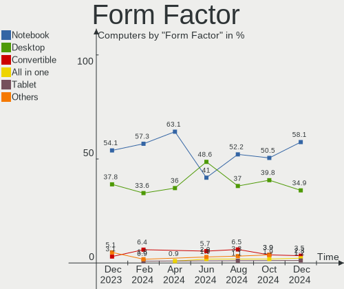
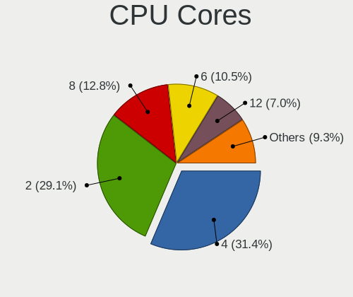
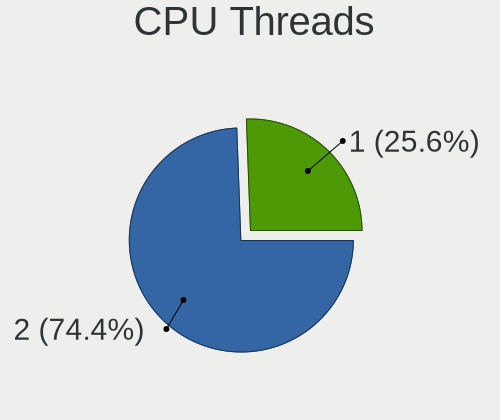
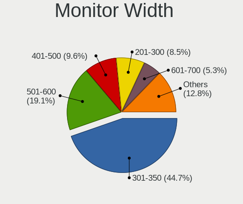
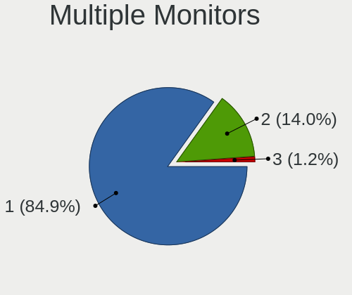
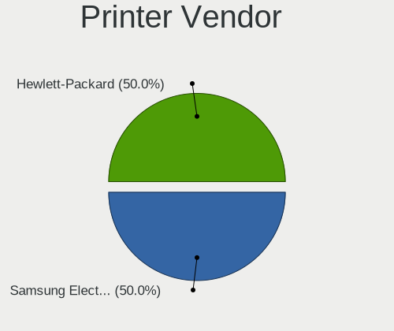

openSUSE - Hardware Trends
--------------------------

A project to identify most popular hardware characteristics and track their change
over time based on data collected by Linux users at https://Linux-Hardware.org.

Anyone can contribute to this report by the [hw-probe](https://github.com/linuxhw/hw-probe) tool:

    sudo -E hw-probe -all -upload

This is a report for all computer types. See also reports for [desktops](/Dist/openSUSE/Desktop/README.md) and [notebooks](/Dist/openSUSE/Notebook/README.md).

This report is for one last month. Overall report since the beginning of time: [TestCoverage](https://github.com/linuxhw/TestCoverage)

Period: Aug, 2022.

Contents
--------

* [ System ](#system)
  - [ OS                       ](#os)
  - [ OS Family                ](#os-family)
  - [ Kernel                   ](#kernel)
  - [ Kernel Family            ](#kernel-family)
  - [ Kernel Major Ver.        ](#kernel-major-ver)
  - [ Arch                     ](#arch)
  - [ DE                       ](#de)
  - [ Display Server           ](#display-server)
  - [ Display Manager          ](#display-manager)
  - [ OS Lang                  ](#os-lang)
  - [ Boot Mode                ](#boot-mode)
  - [ Filesystem               ](#filesystem)
  - [ Part. scheme             ](#part-scheme)
  - [ Dual Boot with Linux/BSD ](#dual-boot-with-linuxbsd)
  - [ Dual Boot (Win)          ](#dual-boot-win)

* [ Board ](#board)
  - [ Vendor                   ](#vendor)
  - [ Model                    ](#model)
  - [ Model Family             ](#model-family)
  - [ MFG Year                 ](#mfg-year)
  - [ Form Factor              ](#form-factor)
  - [ Secure Boot              ](#secure-boot)
  - [ Coreboot                 ](#coreboot)
  - [ RAM Size                 ](#ram-size)
  - [ RAM Used                 ](#ram-used)
  - [ Total Drives             ](#total-drives)
  - [ Has CD-ROM               ](#has-cd-rom)
  - [ Has Ethernet             ](#has-ethernet)
  - [ Has WiFi                 ](#has-wifi)
  - [ Has Bluetooth            ](#has-bluetooth)

* [ Location ](#location)
  - [ Country                  ](#country)
  - [ City                     ](#city)

* [ Drives ](#drives)
  - [ Drive Vendor             ](#drive-vendor)
  - [ Drive Model              ](#drive-model)
  - [ HDD Vendor               ](#hdd-vendor)
  - [ SSD Vendor               ](#ssd-vendor)
  - [ Drive Kind               ](#drive-kind)
  - [ Drive Connector          ](#drive-connector)
  - [ Drive Size               ](#drive-size)
  - [ Space Total              ](#space-total)
  - [ Space Used               ](#space-used)
  - [ Malfunc. Drives          ](#malfunc-drives)
  - [ Malfunc. Drive Vendor    ](#malfunc-drive-vendor)
  - [ Malfunc. HDD Vendor      ](#malfunc-hdd-vendor)
  - [ Malfunc. Drive Kind      ](#malfunc-drive-kind)
  - [ Failed Drives            ](#failed-drives)
  - [ Failed Drive Vendor      ](#failed-drive-vendor)
  - [ Drive Status             ](#drive-status)

* [ Storage controller ](#storage-controller)
  - [ Storage Vendor           ](#storage-vendor)
  - [ Storage Model            ](#storage-model)
  - [ Storage Kind             ](#storage-kind)

* [ Processor ](#processor)
  - [ CPU Vendor               ](#cpu-vendor)
  - [ CPU Model                ](#cpu-model)
  - [ CPU Model Family         ](#cpu-model-family)
  - [ CPU Cores                ](#cpu-cores)
  - [ CPU Sockets              ](#cpu-sockets)
  - [ CPU Threads              ](#cpu-threads)
  - [ CPU Op-Modes             ](#cpu-op-modes)
  - [ CPU Microcode            ](#cpu-microcode)
  - [ CPU Microarch            ](#cpu-microarch)

* [ Graphics ](#graphics)
  - [ GPU Vendor               ](#gpu-vendor)
  - [ GPU Model                ](#gpu-model)
  - [ GPU Combo                ](#gpu-combo)
  - [ GPU Driver               ](#gpu-driver)
  - [ GPU Memory               ](#gpu-memory)

* [ Monitor ](#monitor)
  - [ Monitor Vendor           ](#monitor-vendor)
  - [ Monitor Model            ](#monitor-model)
  - [ Monitor Resolution       ](#monitor-resolution)
  - [ Monitor Diagonal         ](#monitor-diagonal)
  - [ Monitor Width            ](#monitor-width)
  - [ Aspect Ratio             ](#aspect-ratio)
  - [ Monitor Area             ](#monitor-area)
  - [ Pixel Density            ](#pixel-density)
  - [ Multiple Monitors        ](#multiple-monitors)

* [ Network ](#network)
  - [ Net Controller Vendor    ](#net-controller-vendor)
  - [ Net Controller Model     ](#net-controller-model)
  - [ Wireless Vendor          ](#wireless-vendor)
  - [ Wireless Model           ](#wireless-model)
  - [ Ethernet Vendor          ](#ethernet-vendor)
  - [ Ethernet Model           ](#ethernet-model)
  - [ Net Controller Kind      ](#net-controller-kind)
  - [ Used Controller          ](#used-controller)
  - [ NICs                     ](#nics)
  - [ IPv6                     ](#ipv6)

* [ Bluetooth ](#bluetooth)
  - [ Bluetooth Vendor         ](#bluetooth-vendor)
  - [ Bluetooth Model          ](#bluetooth-model)

* [ Sound ](#sound)
  - [ Sound Vendor             ](#sound-vendor)
  - [ Sound Model              ](#sound-model)

* [ Memory ](#memory)
  - [ Memory Vendor            ](#memory-vendor)
  - [ Memory Model             ](#memory-model)
  - [ Memory Kind              ](#memory-kind)
  - [ Memory Form Factor       ](#memory-form-factor)
  - [ Memory Size              ](#memory-size)
  - [ Memory Speed             ](#memory-speed)

* [ Printers & scanners ](#printers--scanners)
  - [ Printer Vendor           ](#printer-vendor)
  - [ Printer Model            ](#printer-model)
  - [ Scanner Vendor           ](#scanner-vendor)
  - [ Scanner Model            ](#scanner-model)

* [ Camera ](#camera)
  - [ Camera Vendor            ](#camera-vendor)
  - [ Camera Model             ](#camera-model)

* [ Security ](#security)
  - [ Fingerprint Vendor       ](#fingerprint-vendor)
  - [ Fingerprint Model        ](#fingerprint-model)
  - [ Chipcard Vendor          ](#chipcard-vendor)
  - [ Chipcard Model           ](#chipcard-model)

* [ Unsupported ](#unsupported)
  - [ Unsupported Devices      ](#unsupported-devices)
  - [ Unsupported Device Types ](#unsupported-device-types)

System
------

OS
--

Installed operating systems

| Name                         | Computers | Percent |
|------------------------------|-----------|---------|
| openSUSE Tumbleweed-XXXXXXXX | 35        | 76.09%  |
| openSUSE Leap-15.4           | 8         | 17.39%  |
| openSUSE Leap-15.3           | 3         | 6.52%   |

OS Family
---------

OS without a version

| Name     | Computers | Percent |
|----------|-----------|---------|
| openSUSE | 46        | 100%    |

Kernel
------

Version of the Linux kernel

| Version                      | Computers | Percent |
|------------------------------|-----------|---------|
| 5.19.2-1-default             | 8         | 17.39%  |
| 5.18.15-1-default            | 8         | 17.39%  |
| 5.18.12-1-default            | 6         | 13.04%  |
| 5.14.21-150400.24.18-default | 6         | 13.04%  |
| 5.19.1-1-default             | 5         | 10.87%  |
| 5.19.0-1-default             | 4         | 8.7%    |
| 5.3.18-150300.59.87-default  | 3         | 6.52%   |
| 5.18.11-1-default            | 2         | 4.35%   |
| 5.14.21-150400.24.11-default | 2         | 4.35%   |
| 5.19.1-4.g4fdb301-default    | 1         | 2.17%   |
| 5.19.0-3.g35466a9-default    | 1         | 2.17%   |

Kernel Family
-------------

Linux kernel without a distro release

| Version | Computers | Percent |
|---------|-----------|---------|
| 5.19.2  | 8         | 17.39%  |
| 5.18.15 | 8         | 17.39%  |
| 5.14.21 | 8         | 17.39%  |
| 5.19.1  | 6         | 13.04%  |
| 5.18.12 | 6         | 13.04%  |
| 5.19.0  | 5         | 10.87%  |
| 5.3.18  | 3         | 6.52%   |
| 5.18.11 | 2         | 4.35%   |

Kernel Major Ver.
-----------------

Linux kernel major version

| Version | Computers | Percent |
|---------|-----------|---------|
| 5.19    | 19        | 41.3%   |
| 5.18    | 16        | 34.78%  |
| 5.14    | 8         | 17.39%  |
| 5.3     | 3         | 6.52%   |

Arch
----

OS architecture (x86_64, i586, etc.)

| Name   | Computers | Percent |
|--------|-----------|---------|
| x86_64 | 46        | 100%    |

DE
--

Desktop Environment

| Name    | Computers | Percent |
|---------|-----------|---------|
| KDE5    | 27        | 58.7%   |
| GNOME   | 14        | 30.43%  |
| Deepin  | 2         | 4.35%   |
| XFCE    | 1         | 2.17%   |
| KDE     | 1         | 2.17%   |
| Unknown | 1         | 2.17%   |

Display Server
--------------

X11 or Wayland

| Name    | Computers | Percent |
|---------|-----------|---------|
| X11     | 34        | 73.91%  |
| Wayland | 11        | 23.91%  |
| Tty     | 1         | 2.17%   |

Display Manager
---------------

SDDM, LightDM, etc.

| Name    | Computers | Percent |
|---------|-----------|---------|
| Unknown | 19        | 41.3%   |
| SDDM    | 14        | 30.43%  |
| XDM     | 7         | 15.22%  |
| LightDM | 6         | 13.04%  |

OS Lang
-------

Language

| Lang    | Computers | Percent |
|---------|-----------|---------|
| en_US   | 18        | 39.13%  |
| en_GB   | 4         | 8.7%    |
| ru_RU   | 3         | 6.52%   |
| pt_BR   | 3         | 6.52%   |
| POSIX   | 3         | 6.52%   |
| pl_PL   | 2         | 4.35%   |
| fr_FR   | 2         | 4.35%   |
| es_ES   | 2         | 4.35%   |
| de_DE   | 2         | 4.35%   |
| zh_CN   | 1         | 2.17%   |
| nn_NO   | 1         | 2.17%   |
| it_IT   | 1         | 2.17%   |
| en_AU   | 1         | 2.17%   |
| ca_ES   | 1         | 2.17%   |
| bg_BG   | 1         | 2.17%   |
| Unknown | 1         | 2.17%   |

Boot Mode
---------

EFI or BIOS

| Mode | Computers | Percent |
|------|-----------|---------|
| EFI  | 29        | 63.04%  |
| BIOS | 17        | 36.96%  |

Filesystem
----------

Type of filesystem

| Type  | Computers | Percent |
|-------|-----------|---------|
| Btrfs | 34        | 73.91%  |
| Ext4  | 9         | 19.57%  |
| Xfs   | 3         | 6.52%   |

Part. scheme
------------

Scheme of partitioning

| Type    | Computers | Percent |
|---------|-----------|---------|
| GPT     | 26        | 56.52%  |
| Unknown | 18        | 39.13%  |
| MBR     | 2         | 4.35%   |

Dual Boot with Linux/BSD
------------------------

Hosting more than one Linux/BSD

| Dual boot | Computers | Percent |
|-----------|-----------|---------|
| No        | 40        | 86.96%  |
| Yes       | 6         | 13.04%  |

Dual Boot (Win)
---------------

Hosting Linux and Windows

| Dual boot | Computers | Percent |
|-----------|-----------|---------|
| No        | 39        | 84.78%  |
| Yes       | 7         | 15.22%  |

Board
-----

Vendor
------

Motherboard manufacturer

| Name                | Computers | Percent |
|---------------------|-----------|---------|
| Lenovo              | 8         | 17.39%  |
| Hewlett-Packard     | 7         | 15.22%  |
| Gigabyte Technology | 6         | 13.04%  |
| ASRock              | 6         | 13.04%  |
| ASUSTek Computer    | 5         | 10.87%  |
| Dell                | 3         | 6.52%   |
| Notebook            | 2         | 4.35%   |
| Acer                | 2         | 4.35%   |
| Valve               | 1         | 2.17%   |
| Supermicro          | 1         | 2.17%   |
| SLIMBOOK            | 1         | 2.17%   |
| Positivo            | 1         | 2.17%   |
| MSI                 | 1         | 2.17%   |
| Apple               | 1         | 2.17%   |
| Unknown             | 1         | 2.17%   |

Model
-----

Motherboard model

| Name                                     | Computers | Percent |
|------------------------------------------|-----------|---------|
| Lenovo ThinkBook 14 G3 ACL 21A2          | 2         | 4.35%   |
| Valve Jupiter                            | 1         | 2.17%   |
| Supermicro SSG-6047R-E1CR36N             | 1         | 2.17%   |
| SLIMBOOK PROX-AMD5                       | 1         | 2.17%   |
| Positivo W942SW_SW1                      | 1         | 2.17%   |
| Notebook NLx0MU                          | 1         | 2.17%   |
| Notebook N24_25JU                        | 1         | 2.17%   |
| MSI MS-7673                              | 1         | 2.17%   |
| Lenovo Z51-70 80K6                       | 1         | 2.17%   |
| Lenovo ThinkPad X1 Yoga Gen 5 20UCS0JV00 | 1         | 2.17%   |
| Lenovo ThinkPad T460s 20F9004NUS         | 1         | 2.17%   |
| Lenovo ThinkPad T450 20BUS0EW1F          | 1         | 2.17%   |
| Lenovo ThinkBook 16p Gen 2 20YM          | 1         | 2.17%   |
| Lenovo IdeaPad L340-15IRH Gaming 81LK    | 1         | 2.17%   |
| HP ZBook 17                              | 1         | 2.17%   |
| HP Z240 Tower Workstation                | 1         | 2.17%   |
| HP Victus by Laptop 16-e0xxx             | 1         | 2.17%   |
| HP ProBook 640 G1                        | 1         | 2.17%   |
| HP Pavilion Notebook                     | 1         | 2.17%   |
| HP Laptop 17-ca0xxx                      | 1         | 2.17%   |
| HP Laptop 17-by1xxx                      | 1         | 2.17%   |
| Gigabyte H81M-S2H                        | 1         | 2.17%   |
| Gigabyte B85-HD3                         | 1         | 2.17%   |
| Gigabyte B550M DS3H                      | 1         | 2.17%   |
| Gigabyte B550 VISION D-P                 | 1         | 2.17%   |
| Gigabyte B450 AORUS M                    | 1         | 2.17%   |
| Gigabyte 965P-DS3                        | 1         | 2.17%   |
| Dell XPS 15 9530                         | 1         | 2.17%   |
| Dell OptiPlex 390                        | 1         | 2.17%   |
| Dell Latitude E6430                      | 1         | 2.17%   |
| ASUS ZenBook UX431DA_UM431DA             | 1         | 2.17%   |
| ASUS ROG Strix G513QY_G513QY             | 1         | 2.17%   |
| ASUS M5A78L-M/USB3                       | 1         | 2.17%   |
| ASUS M3A78-EM                            | 1         | 2.17%   |
| ASUS All Series                          | 1         | 2.17%   |
| ASRock Z97 Pro3                          | 1         | 2.17%   |
| ASRock Z490 Phantom Gaming 4             | 1         | 2.17%   |
| ASRock X570 Steel Legend WiFi ax         | 1         | 2.17%   |
| ASRock X570 Steel Legend                 | 1         | 2.17%   |
| ASRock J3355B-ITX                        | 1         | 2.17%   |
| ASRock B85 Pro4                          | 1         | 2.17%   |
| Apple Macmini8,1                         | 1         | 2.17%   |
| Acer Aspire A515-45                      | 1         | 2.17%   |
| Acer Aspire 4732Z                        | 1         | 2.17%   |
| Unknown                                  | 1         | 2.17%   |

Model Family
------------

Motherboard model prefix

| Name                         | Computers | Percent |
|------------------------------|-----------|---------|
| Lenovo ThinkPad              | 3         | 6.52%   |
| Lenovo ThinkBook             | 3         | 6.52%   |
| HP Laptop                    | 2         | 4.35%   |
| ASRock X570                  | 2         | 4.35%   |
| Acer Aspire                  | 2         | 4.35%   |
| Valve Jupiter                | 1         | 2.17%   |
| Supermicro SSG-6047R-E1CR36N | 1         | 2.17%   |
| SLIMBOOK PROX-AMD5           | 1         | 2.17%   |
| Positivo W942SW              | 1         | 2.17%   |
| Notebook NLx0MU              | 1         | 2.17%   |
| Notebook N24                 | 1         | 2.17%   |
| MSI MS-7673                  | 1         | 2.17%   |
| Lenovo Z51-70                | 1         | 2.17%   |
| Lenovo IdeaPad               | 1         | 2.17%   |
| HP ZBook                     | 1         | 2.17%   |
| HP Z240                      | 1         | 2.17%   |
| HP Victus                    | 1         | 2.17%   |
| HP ProBook                   | 1         | 2.17%   |
| HP Pavilion                  | 1         | 2.17%   |
| Gigabyte H81M-S2H            | 1         | 2.17%   |
| Gigabyte B85-HD3             | 1         | 2.17%   |
| Gigabyte B550M               | 1         | 2.17%   |
| Gigabyte B550                | 1         | 2.17%   |
| Gigabyte B450                | 1         | 2.17%   |
| Gigabyte 965P-DS3            | 1         | 2.17%   |
| Dell XPS                     | 1         | 2.17%   |
| Dell OptiPlex                | 1         | 2.17%   |
| Dell Latitude                | 1         | 2.17%   |
| ASUS ZenBook                 | 1         | 2.17%   |
| ASUS ROG                     | 1         | 2.17%   |
| ASUS M5A78L-M                | 1         | 2.17%   |
| ASUS M3A78-EM                | 1         | 2.17%   |
| ASUS All                     | 1         | 2.17%   |
| ASRock Z97                   | 1         | 2.17%   |
| ASRock Z490                  | 1         | 2.17%   |
| ASRock J3355B-ITX            | 1         | 2.17%   |
| ASRock B85                   | 1         | 2.17%   |
| Apple Macmini8               | 1         | 2.17%   |
| Unknown                      | 1         | 2.17%   |

MFG Year
--------

Motherboard manufacture year

| Year | Computers | Percent |
|------|-----------|---------|
| 2021 | 8         | 17.39%  |
| 2014 | 6         | 13.04%  |
| 2020 | 5         | 10.87%  |
| 2019 | 5         | 10.87%  |
| 2015 | 4         | 8.7%    |
| 2022 | 3         | 6.52%   |
| 2018 | 3         | 6.52%   |
| 2016 | 3         | 6.52%   |
| 2011 | 3         | 6.52%   |
| 2013 | 2         | 4.35%   |
| 2012 | 1         | 2.17%   |
| 2009 | 1         | 2.17%   |
| 2008 | 1         | 2.17%   |
| 2006 | 1         | 2.17%   |

Form Factor
-----------

Physical design of the computer

| Name        | Computers | Percent |
|-------------|-----------|---------|
| Notebook    | 25        | 54.35%  |
| Desktop     | 19        | 41.3%   |
| Convertible | 1         | 2.17%   |
| Mini pc     | 1         | 2.17%   |

Secure Boot
-----------

Enabled or disabled

| State    | Computers | Percent |
|----------|-----------|---------|
| Disabled | 42        | 91.3%   |
| Enabled  | 4         | 8.7%    |

Coreboot
--------

Have coreboot on board

| Used | Computers | Percent |
|------|-----------|---------|
| No   | 46        | 100%    |

RAM Size
--------

Total RAM memory

| Size in GB  | Computers | Percent |
|-------------|-----------|---------|
| 8.01-16.0   | 18        | 39.13%  |
| 16.01-24.0  | 11        | 23.91%  |
| 4.01-8.0    | 10        | 21.74%  |
| 32.01-64.0  | 3         | 6.52%   |
| 64.01-256.0 | 2         | 4.35%   |
| 3.01-4.0    | 1         | 2.17%   |
| 24.01-32.0  | 1         | 2.17%   |

RAM Used
--------

Used RAM memory

| Used GB   | Computers | Percent |
|-----------|-----------|---------|
| 4.01-8.0  | 14        | 30.43%  |
| 2.01-3.0  | 12        | 26.09%  |
| 1.01-2.0  | 10        | 21.74%  |
| 3.01-4.0  | 7         | 15.22%  |
| 8.01-16.0 | 3         | 6.52%   |

Total Drives
------------

Number of drives on board

| Drives | Computers | Percent |
|--------|-----------|---------|
| 1      | 23        | 50%     |
| 2      | 17        | 36.96%  |
| 3      | 3         | 6.52%   |
| 6      | 1         | 2.17%   |
| 5      | 1         | 2.17%   |
| 4      | 1         | 2.17%   |

Has CD-ROM
----------

Has CD-ROM on board

| Presented | Computers | Percent |
|-----------|-----------|---------|
| No        | 32        | 69.57%  |
| Yes       | 14        | 30.43%  |

Has Ethernet
------------

Has Ethernet on board

| Presented | Computers | Percent |
|-----------|-----------|---------|
| Yes       | 44        | 95.65%  |
| No        | 2         | 4.35%   |

Has WiFi
--------

Has WiFi module

| Presented | Computers | Percent |
|-----------|-----------|---------|
| Yes       | 34        | 73.91%  |
| No        | 12        | 26.09%  |

Has Bluetooth
-------------

Has Bluetooth module

| Presented | Computers | Percent |
|-----------|-----------|---------|
| Yes       | 27        | 58.7%   |
| No        | 19        | 41.3%   |

Location
--------

Country
-------

Geographic location (country)

| Country      | Computers | Percent |
|--------------|-----------|---------|
| USA          | 8         | 17.39%  |
| UK           | 4         | 8.7%    |
| Brazil       | 4         | 8.7%    |
| Russia       | 3         | 6.52%   |
| Germany      | 3         | 6.52%   |
| Romania      | 2         | 4.35%   |
| Poland       | 2         | 4.35%   |
| Italy        | 2         | 4.35%   |
| Indonesia    | 2         | 4.35%   |
| Canada       | 2         | 4.35%   |
| Sweden       | 1         | 2.17%   |
| Spain        | 1         | 2.17%   |
| South Africa | 1         | 2.17%   |
| Serbia       | 1         | 2.17%   |
| Peru         | 1         | 2.17%   |
| Norway       | 1         | 2.17%   |
| Mexico       | 1         | 2.17%   |
| Martinique   | 1         | 2.17%   |
| Greece       | 1         | 2.17%   |
| France       | 1         | 2.17%   |
| China        | 1         | 2.17%   |
| Bulgaria     | 1         | 2.17%   |
| Austria      | 1         | 2.17%   |
| Australia    | 1         | 2.17%   |

City
----

Geographic location (city)

| City             | Computers | Percent |
|------------------|-----------|---------|
| Iasi             | 2         | 4.35%   |
| Winnipeg         | 1         | 2.17%   |
| Vienna           | 1         | 2.17%   |
| Ufa              | 1         | 2.17%   |
| Udine            | 1         | 2.17%   |
| Sydney           | 1         | 2.17%   |
| Stockholm        | 1         | 2.17%   |
| Steszew          | 1         | 2.17%   |
| Spalding         | 1         | 2.17%   |
| Skeie            | 1         | 2.17%   |
| Sault Ste. Marie | 1         | 2.17%   |
| Roslindale       | 1         | 2.17%   |
| Puyallup         | 1         | 2.17%   |
| Paris            | 1         | 2.17%   |
| Paisley          | 1         | 2.17%   |
| Monroeville      | 1         | 2.17%   |
| Milan            | 1         | 2.17%   |
| Maringá         | 1         | 2.17%   |
| Manchester       | 1         | 2.17%   |
| Louisville       | 1         | 2.17%   |
| Los Angeles      | 1         | 2.17%   |
| Lodz             | 1         | 2.17%   |
| Lima             | 1         | 2.17%   |
| Le Lamentin      | 1         | 2.17%   |
| Jakarta          | 1         | 2.17%   |
| Iturama          | 1         | 2.17%   |
| Hanau            | 1         | 2.17%   |
| Guadalajara      | 1         | 2.17%   |
| Freital          | 1         | 2.17%   |
| Engel's          | 1         | 2.17%   |
| Dunfermline      | 1         | 2.17%   |
| Dover            | 1         | 2.17%   |
| Denver           | 1         | 2.17%   |
| Davenport        | 1         | 2.17%   |
| Chelyabinsk      | 1         | 2.17%   |
| Changsha         | 1         | 2.17%   |
| Cardedeu         | 1         | 2.17%   |
| Caraguatatuba    | 1         | 2.17%   |
| Burgas           | 1         | 2.17%   |
| Brasília        | 1         | 2.17%   |
| Brakpan          | 1         | 2.17%   |
| Bestwig          | 1         | 2.17%   |
| Belgrade         | 1         | 2.17%   |
| Bekasi           | 1         | 2.17%   |
| Athens           | 1         | 2.17%   |

Drives
------

Drive Vendor
------------

Hard drive vendors

| Vendor                | Computers | Drives | Percent |
|-----------------------|-----------|--------|---------|
| Samsung Electronics   | 16        | 17     | 21.05%  |
| WDC                   | 13        | 17     | 17.11%  |
| Seagate               | 11        | 12     | 14.47%  |
| Toshiba               | 6         | 6      | 7.89%   |
| SK hynix              | 5         | 6      | 6.58%   |
| Sandisk               | 3         | 4      | 3.95%   |
| Kingston              | 3         | 3      | 3.95%   |
| Unknown               | 2         | 2      | 2.63%   |
| Intel                 | 2         | 2      | 2.63%   |
| Hitachi               | 2         | 2      | 2.63%   |
| Hewlett-Packard       | 2         | 2      | 2.63%   |
| VISIPRO               | 1         | 1      | 1.32%   |
| Team                  | 1         | 1      | 1.32%   |
| Synology              | 1         | 1      | 1.32%   |
| Realtek Semiconductor | 1         | 1      | 1.32%   |
| PNY                   | 1         | 1      | 1.32%   |
| Maxtor                | 1         | 1      | 1.32%   |
| LEQIXIANG             | 1         | 1      | 1.32%   |
| GOODRAM               | 1         | 1      | 1.32%   |
| Crucial               | 1         | 1      | 1.32%   |
| Apple                 | 1         | 1      | 1.32%   |
| ADATA Technology      | 1         | 1      | 1.32%   |

Drive Model
-----------

Hard drive models

| Model                                            | Computers | Percent |
|--------------------------------------------------|-----------|---------|
| Toshiba MQ04ABF100 1TB                           | 2         | 2.47%   |
| SK hynix NVMe SSD Drive 512GB                    | 2         | 2.47%   |
| Seagate ST1000LM024 HN-M101MBB 1TB               | 2         | 2.47%   |
| Kingston SA400S37480G 480GB SSD                  | 2         | 2.47%   |
| WDC WDS240G2G0A-00JH30 240GB SSD                 | 1         | 1.23%   |
| WDC WDS200T2B0B 2TB SSD                          | 1         | 1.23%   |
| WDC WDS120G2G0B-00EPW0 120GB SSD                 | 1         | 1.23%   |
| WDC WD5000AAKS-00UU3A0 500GB                     | 1         | 1.23%   |
| WDC WD40EZRZ-00GXCB0 4TB                         | 1         | 1.23%   |
| WDC WD3200BEVT-00ZCT0 320GB                      | 1         | 1.23%   |
| WDC WD3200BEKX-60B7WT0 320GB                     | 1         | 1.23%   |
| WDC WD30EZRZ-00GXCB0 3TB                         | 1         | 1.23%   |
| WDC WD20EZAZ-00L9GB0 2TB                         | 1         | 1.23%   |
| WDC WD10SPZX-60Z10T0 1TB                         | 1         | 1.23%   |
| WDC WD10SPZX-24Z10 1TB                           | 1         | 1.23%   |
| WDC WD10EZEX-08M2NA0 1TB                         | 1         | 1.23%   |
| WDC WD10EFRX-68FYTN0 1TB                         | 1         | 1.23%   |
| WDC WD10EAVS-00D7B1 1TB                          | 1         | 1.23%   |
| WDC PC SN530 SDBPMPZ-512G-1101 512GB             | 1         | 1.23%   |
| VISIPRO SSD 256GB                                | 1         | 1.23%   |
| Unknown MMC Card  248GB                          | 1         | 1.23%   |
| Unknown MMC Card  128GB                          | 1         | 1.23%   |
| Toshiba XG6 NVMe SSD Controller 1TB              | 1         | 1.23%   |
| Toshiba MK3265GSX 320GB                          | 1         | 1.23%   |
| Toshiba HDWE140 4TB                              | 1         | 1.23%   |
| Toshiba DT01ACA200 2TB                           | 1         | 1.23%   |
| Team T253X1480G 480GB SSD                        | 1         | 1.23%   |
| Synology iSCSI Storage                           | 1         | 1.23%   |
| SK hynix SKHynix_HFM512GD3HX015N 512GB           | 1         | 1.23%   |
| SK hynix NVMe SSD Drive 2TB                      | 1         | 1.23%   |
| SK hynix HFM512GD3JX016N 512GB                   | 1         | 1.23%   |
| SK hynix BC501 NVMe Solid State Drive 512GB      | 1         | 1.23%   |
| Seagate ST500DM002-1BD142 500GB                  | 1         | 1.23%   |
| Seagate ST3000DM007-1WY10G 3TB                   | 1         | 1.23%   |
| Seagate ST2000VN004-2E4164 2TB                   | 1         | 1.23%   |
| Seagate ST2000LM015-2E8174 2TB                   | 1         | 1.23%   |
| Seagate ST2000LM007-1R8174 2TB                   | 1         | 1.23%   |
| Seagate ST2000DM006-2DM164 2TB                   | 1         | 1.23%   |
| Seagate ST2000DM001-1ER164 2TB                   | 1         | 1.23%   |
| Seagate ST1000LM048-2E7172 1TB                   | 1         | 1.23%   |
| Seagate ST1000DX002-2DV162 1TB                   | 1         | 1.23%   |
| Seagate ST1000DM003-1SB102 1TB                   | 1         | 1.23%   |
| Sandisk WD Blue SN550 NVMe SSD 256GB             | 1         | 1.23%   |
| Sandisk WD Black SN750 / PC SN730 NVMe SSD 512GB | 1         | 1.23%   |
| SanDisk SDSSDA120G 120GB                         | 1         | 1.23%   |
| Samsung SSD PM851 mSATA 512GB                    | 1         | 1.23%   |
| Samsung SSD 980 PRO 500GB                        | 1         | 1.23%   |
| Samsung SSD 980 250GB                            | 1         | 1.23%   |
| Samsung SSD 970 EVO Plus 500GB                   | 1         | 1.23%   |
| Samsung SSD 970 EVO Plus 1TB                     | 1         | 1.23%   |
| Samsung SSD 860 EVO 500GB                        | 1         | 1.23%   |
| Samsung SSD 860 EVO 250GB                        | 1         | 1.23%   |
| Samsung SSD 860 EVO 1TB                          | 1         | 1.23%   |
| Samsung SSD 850 EVO 500GB                        | 1         | 1.23%   |
| Samsung SM963 2.5" NVMe PCIe SSD 128GB           | 1         | 1.23%   |
| Samsung NVMe SSD Drive 500GB                     | 1         | 1.23%   |
| Samsung NVMe SSD Drive 256GB                     | 1         | 1.23%   |
| Samsung NVMe SSD Drive 1TB                       | 1         | 1.23%   |
| Samsung NVMe SSD Controller SM951/PM951 512GB    | 1         | 1.23%   |
| Samsung MZNLN256HMHQ-000L7 256GB SSD             | 1         | 1.23%   |

HDD Vendor
----------

Hard disk drive vendors

| Vendor              | Computers | Drives | Percent |
|---------------------|-----------|--------|---------|
| Seagate             | 11        | 12     | 34.38%  |
| WDC                 | 10        | 13     | 31.25%  |
| Toshiba             | 5         | 5      | 15.63%  |
| Samsung Electronics | 2         | 2      | 6.25%   |
| Hitachi             | 2         | 2      | 6.25%   |
| Synology            | 1         | 1      | 3.13%   |
| Maxtor              | 1         | 1      | 3.13%   |

SSD Vendor
----------

Solid state drive vendors

| Vendor              | Computers | Drives | Percent |
|---------------------|-----------|--------|---------|
| Samsung Electronics | 6         | 6      | 31.58%  |
| WDC                 | 3         | 3      | 15.79%  |
| Kingston            | 2         | 2      | 10.53%  |
| VISIPRO             | 1         | 1      | 5.26%   |
| Team                | 1         | 1      | 5.26%   |
| SanDisk             | 1         | 1      | 5.26%   |
| PNY                 | 1         | 1      | 5.26%   |
| LEQIXIANG           | 1         | 1      | 5.26%   |
| Intel               | 1         | 1      | 5.26%   |
| Hewlett-Packard     | 1         | 1      | 5.26%   |
| Crucial             | 1         | 1      | 5.26%   |

Drive Kind
----------

HDD or SSD

| Kind | Computers | Drives | Percent |
|------|-----------|--------|---------|
| HDD  | 28        | 36     | 41.18%  |
| NVMe | 21        | 27     | 30.88%  |
| SSD  | 17        | 19     | 25%     |
| MMC  | 2         | 2      | 2.94%   |

Drive Connector
---------------

SATA, SAS, NVMe, etc.

| Type | Computers | Drives | Percent |
|------|-----------|--------|---------|
| SATA | 35        | 55     | 60.34%  |
| NVMe | 21        | 27     | 36.21%  |
| MMC  | 2         | 2      | 3.45%   |

Drive Size
----------

Size of hard drive

| Size in TB | Computers | Drives | Percent |
|------------|-----------|--------|---------|
| 0.01-0.5   | 21        | 24     | 45.65%  |
| 0.51-1.0   | 14        | 17     | 30.43%  |
| 1.01-2.0   | 7         | 10     | 15.22%  |
| 3.01-4.0   | 2         | 2      | 4.35%   |
| 2.01-3.0   | 2         | 2      | 4.35%   |

Space Total
-----------

Amount of disk space available on the file system

| Size in GB     | Computers | Percent |
|----------------|-----------|---------|
| More than 3000 | 15        | 32.61%  |
| 1001-2000      | 11        | 23.91%  |
| 2001-3000      | 9         | 19.57%  |
| 501-1000       | 4         | 8.7%    |
| 251-500        | 3         | 6.52%   |
| 101-250        | 2         | 4.35%   |
| 1-20           | 1         | 2.17%   |
| Unknown        | 1         | 2.17%   |

Space Used
----------

Amount of used disk space

| Used GB        | Computers | Percent |
|----------------|-----------|---------|
| 251-500        | 9         | 19.57%  |
| 501-1000       | 8         | 17.39%  |
| More than 3000 | 5         | 10.87%  |
| 101-250        | 5         | 10.87%  |
| 51-100         | 5         | 10.87%  |
| 1001-2000      | 4         | 8.7%    |
| 1-20           | 4         | 8.7%    |
| 2001-3000      | 3         | 6.52%   |
| 21-50          | 2         | 4.35%   |
| Unknown        | 1         | 2.17%   |

Malfunc. Drives
---------------

Drive models with a malfunction

| Model                            | Computers | Drives | Percent |
|----------------------------------|-----------|--------|---------|
| WDC WD30EZRZ-00GXCB0 3TB         | 1         | 1      | 16.67%  |
| Toshiba DT01ACA200 2TB           | 1         | 1      | 16.67%  |
| Seagate ST1000DM003-1SB102 1TB   | 1         | 1      | 16.67%  |
| LEQIXIANG SSD 256GB              | 1         | 1      | 16.67%  |
| GOODRAM SSDPR-PX500-512-80 512GB | 1         | 1      | 16.67%  |
| Crucial CT1050MX300SSD1 1050GB   | 1         | 1      | 16.67%  |

Malfunc. Drive Vendor
---------------------

Vendors of faulty drives

| Vendor    | Computers | Drives | Percent |
|-----------|-----------|--------|---------|
| WDC       | 1         | 1      | 16.67%  |
| Toshiba   | 1         | 1      | 16.67%  |
| Seagate   | 1         | 1      | 16.67%  |
| LEQIXIANG | 1         | 1      | 16.67%  |
| GOODRAM   | 1         | 1      | 16.67%  |
| Crucial   | 1         | 1      | 16.67%  |

Malfunc. HDD Vendor
-------------------

Vendors of faulty HDD drives

| Vendor  | Computers | Drives | Percent |
|---------|-----------|--------|---------|
| WDC     | 1         | 1      | 33.33%  |
| Toshiba | 1         | 1      | 33.33%  |
| Seagate | 1         | 1      | 33.33%  |

Malfunc. Drive Kind
-------------------

Kinds of faulty drives

| Kind | Computers | Drives | Percent |
|------|-----------|--------|---------|
| HDD  | 3         | 3      | 50%     |
| SSD  | 2         | 2      | 33.33%  |
| NVMe | 1         | 1      | 16.67%  |

Failed Drives
-------------

Failed drive models

Zero info for selected period =(

Failed Drive Vendor
-------------------

Failed drive vendors

Zero info for selected period =(

Drive Status
------------

Number of failed and malfunc. drives

| Status   | Computers | Drives | Percent |
|----------|-----------|--------|---------|
| Works    | 28        | 42     | 51.85%  |
| Detected | 20        | 36     | 37.04%  |
| Malfunc  | 6         | 6      | 11.11%  |

Storage controller
------------------

Storage Vendor
--------------

Storage controller vendors

| Vendor                       | Computers | Percent |
|------------------------------|-----------|---------|
| Intel                        | 28        | 44.44%  |
| AMD                          | 12        | 19.05%  |
| Samsung Electronics          | 6         | 9.52%   |
| SK hynix                     | 5         | 7.94%   |
| SanDisk                      | 3         | 4.76%   |
| Toshiba America Info Systems | 1         | 1.59%   |
| Silicon Motion               | 1         | 1.59%   |
| Shenzhen Longsys Electronics | 1         | 1.59%   |
| Realtek Semiconductor        | 1         | 1.59%   |
| Kingston Technology Company  | 1         | 1.59%   |
| JMicron Technology           | 1         | 1.59%   |
| ASMedia Technology           | 1         | 1.59%   |
| Apple                        | 1         | 1.59%   |
| ADATA Technology             | 1         | 1.59%   |

Storage Model
-------------

Storage controller models

| Model                                                                                   | Computers | Percent |
|-----------------------------------------------------------------------------------------|-----------|---------|
| AMD FCH SATA Controller [AHCI mode]                                                     | 9         | 12.86%  |
| Intel 8 Series/C220 Series Chipset Family 6-port SATA Controller 1 [AHCI mode]          | 8         | 11.43%  |
| SK hynix Gold P31 SSD                                                                   | 4         | 5.71%   |
| Samsung NVMe SSD Controller SM981/PM981/PM983                                           | 3         | 4.29%   |
| Intel 82801 Mobile SATA Controller [RAID mode]                                          | 3         | 4.29%   |
| Samsung NVMe SSD Controller 980                                                         | 2         | 2.86%   |
| Intel Wildcat Point-LP SATA Controller [AHCI Mode]                                      | 2         | 2.86%   |
| Intel Sunrise Point-LP SATA Controller [AHCI mode]                                      | 2         | 2.86%   |
| AMD SB7x0/SB8x0/SB9x0 IDE Controller                                                    | 2         | 2.86%   |
| AMD 500 Series Chipset SATA Controller                                                  | 2         | 2.86%   |
| Toshiba America Info Systems XG6 NVMe SSD Controller                                    | 1         | 1.43%   |
| SK hynix Non-Volatile memory controller                                                 | 1         | 1.43%   |
| SK hynix BC501 NVMe Solid State Drive                                                   | 1         | 1.43%   |
| Silicon Motion SM2262/SM2262EN SSD Controller                                           | 1         | 1.43%   |
| Shenzhen Longsys SM2263EN/SM2263XT-based OEM SSD                                        | 1         | 1.43%   |
| SanDisk WD Blue SN550 NVMe SSD                                                          | 1         | 1.43%   |
| SanDisk WD Black SN750 / PC SN730 NVMe SSD                                              | 1         | 1.43%   |
| SanDisk Non-Volatile memory controller                                                  | 1         | 1.43%   |
| Samsung NVMe SSD Controller PM9A1/PM9A3/980PRO                                          | 1         | 1.43%   |
| Realtek Realtek Non-Volatile memory controller                                          | 1         | 1.43%   |
| Kingston Company OM3PDP3 NVMe SSD                                                       | 1         | 1.43%   |
| JMicron JMB363 SATA/IDE Controller                                                      | 1         | 1.43%   |
| Intel Tiger Lake-LP SATA Controller                                                     | 1         | 1.43%   |
| Intel Q170/Q150/B150/H170/H110/Z170/CM236 Chipset SATA Controller [AHCI Mode]           | 1         | 1.43%   |
| Intel Non-Volatile memory controller                                                    | 1         | 1.43%   |
| Intel Comet Lake SATA AHCI Controller                                                   | 1         | 1.43%   |
| Intel Celeron/Pentium Silver Processor SATA Controller                                  | 1         | 1.43%   |
| Intel Celeron N3350/Pentium N4200/Atom E3900 Series SATA AHCI Controller                | 1         | 1.43%   |
| Intel Cannon Lake Mobile PCH SATA AHCI Controller                                       | 1         | 1.43%   |
| Intel C602 chipset 4-Port SATA Storage Control Unit                                     | 1         | 1.43%   |
| Intel C600/X79 series chipset 6-Port SATA AHCI Controller                               | 1         | 1.43%   |
| Intel 9 Series Chipset Family SATA Controller [AHCI Mode]                               | 1         | 1.43%   |
| Intel 82801IBM/IEM (ICH9M/ICH9M-E) 4 port SATA Controller [AHCI mode]                   | 1         | 1.43%   |
| Intel 82801HB (ICH8) 4 port SATA Controller [AHCI mode]                                 | 1         | 1.43%   |
| Intel 6 Series/C200 Series Chipset Family Desktop SATA Controller (IDE mode, ports 4-5) | 1         | 1.43%   |
| Intel 6 Series/C200 Series Chipset Family Desktop SATA Controller (IDE mode, ports 0-3) | 1         | 1.43%   |
| Intel 6 Series/C200 Series Chipset Family 6 port Desktop SATA AHCI Controller           | 1         | 1.43%   |
| ASMedia ASM1062 Serial ATA Controller                                                   | 1         | 1.43%   |
| Apple ANS2 NVMe Controller                                                              | 1         | 1.43%   |
| AMD SB7x0/SB8x0/SB9x0 SATA Controller [IDE mode]                                        | 1         | 1.43%   |
| AMD SB7x0/SB8x0/SB9x0 SATA Controller [AHCI mode]                                       | 1         | 1.43%   |
| AMD 400 Series Chipset SATA Controller                                                  | 1         | 1.43%   |
| ADATA XPG SX8200 Pro PCIe Gen3x4 M.2 2280 Solid State Drive                             | 1         | 1.43%   |

Storage Kind
------------

Kind of storage controller (IDE, SATA, NVMe, SAS, ...)

| Kind | Computers | Percent |
|------|-----------|---------|
| SATA | 36        | 57.14%  |
| NVMe | 19        | 30.16%  |
| IDE  | 4         | 6.35%   |
| RAID | 3         | 4.76%   |
| SAS  | 1         | 1.59%   |

Processor
---------

CPU Vendor
----------

Processor vendors

| Vendor | Computers | Percent |
|--------|-----------|---------|
| Intel  | 29        | 63.04%  |
| AMD    | 17        | 36.96%  |

CPU Model
---------

Processor models

| Model                                           | Computers | Percent |
|-------------------------------------------------|-----------|---------|
| AMD Ryzen 7 5700U with Radeon Graphics          | 2         | 4.35%   |
| AMD Ryzen 5 5600X 6-Core Processor              | 2         | 4.35%   |
| AMD Ryzen 5 5500U with Radeon Graphics          | 2         | 4.35%   |
| Intel Xeon CPU E5-2667 v2 @ 3.30GHz             | 1         | 2.17%   |
| Intel Xeon CPU E3-1230 v5 @ 3.40GHz             | 1         | 2.17%   |
| Intel Xeon CPU E3-1230 v3 @ 3.30GHz             | 1         | 2.17%   |
| Intel Pentium Dual-Core CPU T4300 @ 2.10GHz     | 1         | 2.17%   |
| Intel Pentium Dual-Core CPU E6500 @ 2.93GHz     | 1         | 2.17%   |
| Intel Core i7-6500U CPU @ 2.50GHz               | 1         | 2.17%   |
| Intel Core i7-5500U CPU @ 2.40GHz               | 1         | 2.17%   |
| Intel Core i7-4790K CPU @ 4.00GHz               | 1         | 2.17%   |
| Intel Core i7-4790 CPU @ 3.60GHz                | 1         | 2.17%   |
| Intel Core i7-4712HQ CPU @ 2.30GHz              | 1         | 2.17%   |
| Intel Core i7-4700MQ CPU @ 2.40GHz              | 1         | 2.17%   |
| Intel Core i5-9300H CPU @ 2.40GHz               | 1         | 2.17%   |
| Intel Core i5-8500B CPU @ 3.00GHz               | 1         | 2.17%   |
| Intel Core i5-8300H CPU @ 2.30GHz               | 1         | 2.17%   |
| Intel Core i5-8265U CPU @ 1.60GHz               | 1         | 2.17%   |
| Intel Core i5-6300U CPU @ 2.40GHz               | 1         | 2.17%   |
| Intel Core i5-5300U CPU @ 2.30GHz               | 1         | 2.17%   |
| Intel Core i5-4690K CPU @ 3.50GHz               | 1         | 2.17%   |
| Intel Core i5-4590 CPU @ 3.30GHz                | 1         | 2.17%   |
| Intel Core i5-4210M CPU @ 2.60GHz               | 1         | 2.17%   |
| Intel Core i5-3340M CPU @ 2.70GHz               | 1         | 2.17%   |
| Intel Core i5-2500 CPU @ 3.30GHz                | 1         | 2.17%   |
| Intel Core i5-10500 CPU @ 3.10GHz               | 1         | 2.17%   |
| Intel Core i5-10210U CPU @ 1.60GHz              | 1         | 2.17%   |
| Intel Core i3-4000M CPU @ 2.40GHz               | 1         | 2.17%   |
| Intel Core i3-2100 CPU @ 3.10GHz                | 1         | 2.17%   |
| Intel Celeron J4125 CPU @ 2.00GHz               | 1         | 2.17%   |
| Intel Celeron CPU J3355 @ 2.00GHz               | 1         | 2.17%   |
| Intel 11th Gen Core i7-1165G7 @ 2.80GHz         | 1         | 2.17%   |
| AMD Ryzen 9 5980HX with Radeon Graphics         | 1         | 2.17%   |
| AMD Ryzen 9 5950X 16-Core Processor             | 1         | 2.17%   |
| AMD Ryzen 7 5800H with Radeon Graphics          | 1         | 2.17%   |
| AMD Ryzen 5 PRO 3400G with Radeon Vega Graphics | 1         | 2.17%   |
| AMD Ryzen 5 5600H with Radeon Graphics          | 1         | 2.17%   |
| AMD Ryzen 5 3500U with Radeon Vega Mobile Gfx   | 1         | 2.17%   |
| AMD Ryzen 5 1600 Six-Core Processor             | 1         | 2.17%   |
| AMD Phenom II X6 1090T Processor                | 1         | 2.17%   |
| AMD FX-8350 Eight-Core Processor                | 1         | 2.17%   |
| AMD Custom APU 0405                             | 1         | 2.17%   |
| AMD A6-9225 RADEON R4, 5 COMPUTE CORES 2C+3G    | 1         | 2.17%   |

CPU Model Family
----------------

Processor model prefix

| Model                   | Computers | Percent |
|-------------------------|-----------|---------|
| Intel Core i5           | 13        | 28.26%  |
| AMD Ryzen 5             | 7         | 15.22%  |
| Intel Core i7           | 6         | 13.04%  |
| Intel Xeon              | 3         | 6.52%   |
| AMD Ryzen 7             | 3         | 6.52%   |
| Other                   | 2         | 4.35%   |
| Intel Pentium Dual-Core | 2         | 4.35%   |
| Intel Core i3           | 2         | 4.35%   |
| Intel Celeron           | 2         | 4.35%   |
| AMD Ryzen 9             | 2         | 4.35%   |
| AMD Ryzen 5 PRO         | 1         | 2.17%   |
| AMD Phenom II X6        | 1         | 2.17%   |
| AMD FX                  | 1         | 2.17%   |
| AMD A6                  | 1         | 2.17%   |

CPU Cores
---------

Number of processor cores

| Number | Computers | Percent |
|--------|-----------|---------|
| 4      | 19        | 41.3%   |
| 2      | 12        | 26.09%  |
| 6      | 9         | 19.57%  |
| 8      | 4         | 8.7%    |
| 16     | 2         | 4.35%   |

CPU Sockets
-----------

Number of sockets

| Number | Computers | Percent |
|--------|-----------|---------|
| 1      | 45        | 97.83%  |
| 2      | 1         | 2.17%   |

CPU Threads
-----------

Threads per core (Hyper-Threading)

| Number | Computers | Percent |
|--------|-----------|---------|
| 2      | 36        | 78.26%  |
| 1      | 10        | 21.74%  |

CPU Op-Modes
------------

CPU Operation Modes (32-bit, 64-bit)

| Op mode        | Computers | Percent |
|----------------|-----------|---------|
| 32-bit, 64-bit | 46        | 100%    |

CPU Microcode
-------------

Microcode number

| Number     | Computers | Percent |
|------------|-----------|---------|
| Unknown    | 9         | 19.57%  |
| 0x306c3    | 6         | 13.04%  |
| 0x0a50000c | 3         | 6.52%   |
| 0x08608103 | 3         | 6.52%   |
| 0x906ea    | 2         | 4.35%   |
| 0x406e3    | 2         | 4.35%   |
| 0x306d4    | 2         | 4.35%   |
| 0x206a7    | 2         | 4.35%   |
| 0x08108109 | 2         | 4.35%   |
| 0x806ec    | 1         | 2.17%   |
| 0x806eb    | 1         | 2.17%   |
| 0x806c1    | 1         | 2.17%   |
| 0x706a8    | 1         | 2.17%   |
| 0x306e4    | 1         | 2.17%   |
| 0x306a9    | 1         | 2.17%   |
| 0x0a20120a | 1         | 2.17%   |
| 0x0a201016 | 1         | 2.17%   |
| 0x0a201009 | 1         | 2.17%   |
| 0x08900201 | 1         | 2.17%   |
| 0x08608102 | 1         | 2.17%   |
| 0x0800820d | 1         | 2.17%   |
| 0x06006705 | 1         | 2.17%   |
| 0x06000852 | 1         | 2.17%   |
| 0x010000dc | 1         | 2.17%   |

CPU Microarch
-------------

Microarchitecture

| Name          | Computers | Percent |
|---------------|-----------|---------|
| Haswell       | 9         | 19.57%  |
| Zen 3         | 6         | 13.04%  |
| KabyLake      | 5         | 10.87%  |
| Unknown       | 5         | 10.87%  |
| Zen+          | 3         | 6.52%   |
| Skylake       | 3         | 6.52%   |
| SandyBridge   | 2         | 4.35%   |
| Penryn        | 2         | 4.35%   |
| IvyBridge     | 2         | 4.35%   |
| Broadwell     | 2         | 4.35%   |
| TigerLake     | 1         | 2.17%   |
| Piledriver    | 1         | 2.17%   |
| K10           | 1         | 2.17%   |
| Goldmont plus | 1         | 2.17%   |
| Goldmont      | 1         | 2.17%   |
| Excavator     | 1         | 2.17%   |
| CometLake     | 1         | 2.17%   |

Graphics
--------

GPU Vendor
----------

Vendors of graphics cards

| Vendor | Computers | Percent |
|--------|-----------|---------|
| Intel  | 20        | 37.04%  |
| AMD    | 19        | 35.19%  |
| Nvidia | 15        | 27.78%  |

GPU Model
---------

Graphics card models

| Model                                                                                 | Computers | Percent |
|---------------------------------------------------------------------------------------|-----------|---------|
| AMD Lucienne                                                                          | 4         | 7.14%   |
| Intel Xeon E3-1200 v3/4th Gen Core Processor Integrated Graphics Controller           | 3         | 5.36%   |
| Intel CoffeeLake-H GT2 [UHD Graphics 630]                                             | 3         | 5.36%   |
| Intel 4th Gen Core Processor Integrated Graphics Controller                           | 3         | 5.36%   |
| AMD Cezanne                                                                           | 3         | 5.36%   |
| Intel Skylake GT2 [HD Graphics 520]                                                   | 2         | 3.57%   |
| Intel HD Graphics 5500                                                                | 2         | 3.57%   |
| AMD Topaz XT [Radeon R7 M260/M265 / M340/M360 / M440/M445 / 530/535 / 620/625 Mobile] | 2         | 3.57%   |
| AMD Picasso/Raven 2 [Radeon Vega Series / Radeon Vega Mobile Series]                  | 2         | 3.57%   |
| AMD Navi 22 [Radeon RX 6700/6700 XT/6750 XT / 6800M]                                  | 2         | 3.57%   |
| Nvidia TU117M [GeForce GTX 1650 Mobile / Max-Q]                                       | 1         | 1.79%   |
| Nvidia TU117 [GeForce GTX 1650]                                                       | 1         | 1.79%   |
| Nvidia GT218 [GeForce 210]                                                            | 1         | 1.79%   |
| Nvidia GP108 [GeForce GT 1030]                                                        | 1         | 1.79%   |
| Nvidia GP107M [GeForce GTX 1050 Ti Mobile]                                            | 1         | 1.79%   |
| Nvidia GP107M [GeForce GTX 1050 3 GB Max-Q]                                           | 1         | 1.79%   |
| Nvidia GP106 [GeForce GTX 1060 3GB]                                                   | 1         | 1.79%   |
| Nvidia GM107 [GeForce GTX 750 Ti]                                                     | 1         | 1.79%   |
| Nvidia GK208GLM [Quadro K610M]                                                        | 1         | 1.79%   |
| Nvidia GK107M [GeForce GT 750M]                                                       | 1         | 1.79%   |
| Nvidia GK107 [GeForce GT 640]                                                         | 1         | 1.79%   |
| Nvidia GF108GLM [NVS 5200M]                                                           | 1         | 1.79%   |
| Nvidia GA106M [GeForce RTX 3060 Mobile / Max-Q]                                       | 1         | 1.79%   |
| Nvidia GA104 [GeForce RTX 3070]                                                       | 1         | 1.79%   |
| Nvidia GA102 [GeForce RTX 3090]                                                       | 1         | 1.79%   |
| Intel WhiskeyLake-U GT2 [UHD Graphics 620]                                            | 1         | 1.79%   |
| Intel TigerLake-LP GT2 [Iris Xe Graphics]                                             | 1         | 1.79%   |
| Intel Mobile 4 Series Chipset Integrated Graphics Controller                          | 1         | 1.79%   |
| Intel HD Graphics 500                                                                 | 1         | 1.79%   |
| Intel GeminiLake [UHD Graphics 600]                                                   | 1         | 1.79%   |
| Intel CometLake-U GT2 [UHD Graphics]                                                  | 1         | 1.79%   |
| Intel 2nd Generation Core Processor Family Integrated Graphics Controller             | 1         | 1.79%   |
| AMD VanGogh [AMD Custom GPU 0405]                                                     | 1         | 1.79%   |
| AMD Turks PRO [Radeon HD 6570/7570/8550 / R5 230]                                     | 1         | 1.79%   |
| AMD Tonga PRO [Radeon R9 285/380]                                                     | 1         | 1.79%   |
| AMD Stoney [Radeon R2/R3/R4/R5 Graphics]                                              | 1         | 1.79%   |
| AMD RS780L [Radeon 3000]                                                              | 1         | 1.79%   |
| AMD Navi 21 [Radeon RX 6800/6800 XT / 6900 XT]                                        | 1         | 1.79%   |
| AMD Ellesmere [Radeon RX 470/480/570/570X/580/580X/590]                               | 1         | 1.79%   |
| AMD Cape Verde PRO / Venus LE / Tropo PRO-L [Radeon HD 8830M / R7 250 / R7 M465X]     | 1         | 1.79%   |

GPU Combo
---------

Combinations of graphics cards

| Name           | Computers | Percent |
|----------------|-----------|---------|
| 1 x Intel      | 14        | 30.43%  |
| 1 x AMD        | 13        | 28.26%  |
| 1 x Nvidia     | 9         | 19.57%  |
| Intel + Nvidia | 4         | 8.7%    |
| 2 x AMD        | 2         | 4.35%   |
| Intel + AMD    | 2         | 4.35%   |
| AMD + Nvidia   | 2         | 4.35%   |

GPU Driver
----------

Free vs proprietary

| Driver      | Computers | Percent |
|-------------|-----------|---------|
| Free        | 37        | 80.43%  |
| Proprietary | 9         | 19.57%  |

GPU Memory
----------

Total video memory

| Size in GB | Computers | Percent |
|------------|-----------|---------|
| Unknown    | 20        | 43.48%  |
| 1.01-2.0   | 7         | 15.22%  |
| 0.01-0.5   | 6         | 13.04%  |
| 0.51-1.0   | 4         | 8.7%    |
| 8.01-16.0  | 3         | 6.52%   |
| 3.01-4.0   | 2         | 4.35%   |
| 2.01-3.0   | 2         | 4.35%   |
| 7.01-8.0   | 1         | 2.17%   |
| 16.01-24.0 | 1         | 2.17%   |

Monitor
-------

Monitor Vendor
--------------

Monitor vendors

| Vendor               | Computers | Percent |
|----------------------|-----------|---------|
| Samsung Electronics  | 7         | 12.28%  |
| Dell                 | 7         | 12.28%  |
| Chimei Innolux       | 7         | 12.28%  |
| BOE                  | 7         | 12.28%  |
| AU Optronics         | 5         | 8.77%   |
| Goldstar             | 4         | 7.02%   |
| AOC                  | 3         | 5.26%   |
| PANDA                | 2         | 3.51%   |
| Unknown              | 1         | 1.75%   |
| Sharp                | 1         | 1.75%   |
| Pixio                | 1         | 1.75%   |
| Philips              | 1         | 1.75%   |
| MAG                  | 1         | 1.75%   |
| LG Display           | 1         | 1.75%   |
| Iiyama               | 1         | 1.75%   |
| Hewlett-Packard      | 1         | 1.75%   |
| HannStar             | 1         | 1.75%   |
| GDH                  | 1         | 1.75%   |
| DSC                  | 1         | 1.75%   |
| CSO                  | 1         | 1.75%   |
| BenQ                 | 1         | 1.75%   |
| ANX                  | 1         | 1.75%   |
| Ancor Communications | 1         | 1.75%   |

Monitor Model
-------------

Monitor models

| Model                                                                | Computers | Percent |
|----------------------------------------------------------------------|-----------|---------|
| Unknown SMART TV 0563 1920x1080 1209x680mm 54.6-inch                 | 1         | 1.64%   |
| Sharp LCD Monitor SHP13F8 3200x1800 346x194mm 15.6-inch              | 1         | 1.64%   |
| Samsung Electronics U28D590 SAM0B80 3840x2160 610x350mm 27.7-inch    | 1         | 1.64%   |
| Samsung Electronics SyncMaster SAM060D 1920x1080                     | 1         | 1.64%   |
| Samsung Electronics SyncMaster SAM0598 1360x768 410x230mm 18.5-inch  | 1         | 1.64%   |
| Samsung Electronics SyncMaster SAM0304 1680x1050 494x320mm 23.2-inch | 1         | 1.64%   |
| Samsung Electronics S23B370 SAM089B 1920x1080 510x287mm 23.0-inch    | 1         | 1.64%   |
| Samsung Electronics LCD Monitor SDC3754 1600x900 382x215mm 17.3-inch | 1         | 1.64%   |
| Samsung Electronics LCD Monitor SDC324E 1600x900 309x174mm 14.0-inch | 1         | 1.64%   |
| Samsung Electronics C24F390 SAM0D2C 1920x1080 520x290mm 23.4-inch    | 1         | 1.64%   |
| Pixio DP ICB3500 3440x1440 708x399mm 32.0-inch                       | 1         | 1.64%   |
| Philips PHL 243V7 PHLC155 1920x1080 527x296mm 23.8-inch              | 1         | 1.64%   |
| PANDA LCD Monitor NCP0063 1920x1080 344x194mm 15.5-inch              | 1         | 1.64%   |
| PANDA LCD Monitor NCP0035 1920x1080 309x174mm 14.0-inch              | 1         | 1.64%   |
| MAG MAG MAG2380 1920x1080 452x254mm 20.4-inch                        | 1         | 1.64%   |
| LG Display LCD Monitor LGD02DF 1600x900 310x174mm 14.0-inch          | 1         | 1.64%   |
| Iiyama PLE2207WS IVM5609 1680x1050 465x291mm 21.6-inch               | 1         | 1.64%   |
| Hewlett-Packard 27f HPN354A 1920x1080 598x336mm 27.0-inch            | 1         | 1.64%   |
| HannStar HH251 HSD2211 1920x1080 543x305mm 24.5-inch                 | 1         | 1.64%   |
| Goldstar ULTRAWIDE GSM76FE 2560x1080 798x334mm 34.1-inch             | 1         | 1.64%   |
| Goldstar Ultra HD GSM5B08 3840x2160 600x340mm 27.2-inch              | 1         | 1.64%   |
| Goldstar TV GSM2412 1920x1080 940x530mm 42.5-inch                    | 1         | 1.64%   |
| Goldstar 2D FHD TV GSM59C6 1920x1080 509x286mm 23.0-inch             | 1         | 1.64%   |
| GDH PHILCO GDH0030 1920x540 708x398mm 32.0-inch                      | 1         | 1.64%   |
| DSC Paperlike H D DSC0001 2200x1650 200x150mm 9.8-inch               | 1         | 1.64%   |
| Dell U2717D DEL40EB 2560x1440 597x336mm 27.0-inch                    | 1         | 1.64%   |
| Dell U2312HM DEL4072 1920x1080 510x287mm 23.0-inch                   | 1         | 1.64%   |
| Dell S3422DWG DELD12C 3440x1440 797x334mm 34.0-inch                  | 1         | 1.64%   |
| Dell S3422DWG DELD128 3440x1440 797x334mm 34.0-inch                  | 1         | 1.64%   |
| Dell S2721NX DEL41FF 1920x1080 598x336mm 27.0-inch                   | 1         | 1.64%   |
| Dell S2240L DELD054 1920x1080 476x267mm 21.5-inch                    | 1         | 1.64%   |
| Dell P2414H DELA09B 1920x1080 527x297mm 23.8-inch                    | 1         | 1.64%   |
| Dell P2414H DELA09A 1920x1080 527x297mm 23.8-inch                    | 1         | 1.64%   |
| Dell IN1920 DELF021 1366x768 410x230mm 18.5-inch                     | 1         | 1.64%   |
| Dell AW2518HF DELA103 1920x1080 544x303mm 24.5-inch                  | 1         | 1.64%   |
| CSO LCD Monitor CSO1603 2560x1600 344x215mm 16.0-inch                | 1         | 1.64%   |
| Chimei Innolux LCD Monitor CMN15E7 1920x1080 344x193mm 15.5-inch     | 1         | 1.64%   |
| Chimei Innolux LCD Monitor CMN15CB 1920x1080 344x193mm 15.5-inch     | 1         | 1.64%   |
| Chimei Innolux LCD Monitor CMN15C4 1920x1080 344x193mm 15.5-inch     | 1         | 1.64%   |
| Chimei Innolux LCD Monitor CMN1540 2560x1440 344x193mm 15.5-inch     | 1         | 1.64%   |
| Chimei Innolux LCD Monitor CMN14A3 1600x900 309x174mm 14.0-inch      | 1         | 1.64%   |
| Chimei Innolux LCD Monitor CMN140A 1920x1080 309x173mm 13.9-inch     | 1         | 1.64%   |
| Chimei Innolux LCD Monitor CMN1406 1920x1080 309x173mm 13.9-inch     | 1         | 1.64%   |
| BOE LCD Monitor BOE094A 1920x1080 344x194mm 15.5-inch                | 1         | 1.64%   |
| BOE LCD Monitor BOE08F6 1920x1080 355x200mm 16.0-inch                | 1         | 1.64%   |
| BOE LCD Monitor BOE08EE 1920x1080 309x174mm 14.0-inch                | 1         | 1.64%   |
| BOE LCD Monitor BOE07C8 3840x2160 309x174mm 14.0-inch                | 1         | 1.64%   |
| BOE LCD Monitor BOE0660 1600x900 382x215mm 17.3-inch                 | 1         | 1.64%   |
| BOE LCD Monitor BOE063F 1366x768 256x144mm 11.6-inch                 | 1         | 1.64%   |
| BOE LCD Monitor BOE05F6 1366x768 309x173mm 13.9-inch                 | 1         | 1.64%   |
| BenQ BenQG2222HDL BNQ785A 1920x1080 478x269mm 21.6-inch              | 1         | 1.64%   |
| AU Optronics LCD Monitor AUO403D 1920x1080 309x173mm 13.9-inch       | 1         | 1.64%   |
| AU Optronics LCD Monitor AUO243D 1920x1080 309x173mm 13.9-inch       | 1         | 1.64%   |
| AU Optronics LCD Monitor AUO229E 1600x900 382x214mm 17.2-inch        | 1         | 1.64%   |
| AU Optronics LCD Monitor AUO109D 1920x1080 381x214mm 17.2-inch       | 1         | 1.64%   |
| AU Optronics LCD Monitor AUO103C 1366x768 309x173mm 13.9-inch        | 1         | 1.64%   |
| AOC Monitor AOC0236 2560x1440 341x192mm 15.4-inch                    | 1         | 1.64%   |
| AOC D2367 AOC2367 1920x1080 509x286mm 23.0-inch                      | 1         | 1.64%   |
| AOC 2369 AOC2369 1920x1080 509x286mm 23.0-inch                       | 1         | 1.64%   |
| ANX ANX7530 U ANX7539 800x1280                                       | 1         | 1.64%   |

Monitor Resolution
------------------

Monitor screen resolution

| Resolution         | Computers | Percent |
|--------------------|-----------|---------|
| 1920x1080 (FHD)    | 29        | 51.79%  |
| 3840x2160 (4K)     | 5         | 8.93%   |
| 1600x900 (HD+)     | 5         | 8.93%   |
| 1366x768 (WXGA)    | 4         | 7.14%   |
| 2560x1440 (QHD)    | 3         | 5.36%   |
| 3440x1440          | 2         | 3.57%   |
| 1680x1050 (WSXGA+) | 2         | 3.57%   |
| 800x1280           | 1         | 1.79%   |
| 3200x1800 (QHD+)   | 1         | 1.79%   |
| 2560x1600          | 1         | 1.79%   |
| 2560x1080          | 1         | 1.79%   |
| 2200x1650          | 1         | 1.79%   |
| 1360x768           | 1         | 1.79%   |

Monitor Diagonal
----------------

Diagonal size in inches

| Inches  | Computers | Percent |
|---------|-----------|---------|
| 15      | 9         | 15.79%  |
| 14      | 7         | 12.28%  |
| 23      | 6         | 10.53%  |
| 27      | 5         | 8.77%   |
| 24      | 5         | 8.77%   |
| 17      | 4         | 7.02%   |
| 13      | 4         | 7.02%   |
| 21      | 3         | 5.26%   |
| 34      | 2         | 3.51%   |
| 18      | 2         | 3.51%   |
| 16      | 2         | 3.51%   |
| 54      | 1         | 1.75%   |
| 52      | 1         | 1.75%   |
| 42      | 1         | 1.75%   |
| 32      | 1         | 1.75%   |
| 22      | 1         | 1.75%   |
| 20      | 1         | 1.75%   |
| 11      | 1         | 1.75%   |
| Unknown | 1         | 1.75%   |

Monitor Width
-------------

Physical width

| Width in mm | Computers | Percent |
|-------------|-----------|---------|
| 301-350     | 21        | 38.89%  |
| 501-600     | 11        | 20.37%  |
| 401-500     | 7         | 12.96%  |
| 351-400     | 5         | 9.26%   |
| 701-800     | 3         | 5.56%   |
| 601-700     | 2         | 3.7%    |
| 1001-1500   | 2         | 3.7%    |
| 201-300     | 1         | 1.85%   |
| 901-1000    | 1         | 1.85%   |
| Unknown     | 1         | 1.85%   |

Aspect Ratio
------------

Proportional relationship between the width and the height

| Ratio | Computers | Percent |
|-------|-----------|---------|
| 16/9  | 46        | 88.46%  |
| 21/9  | 2         | 3.85%   |
| 16/10 | 2         | 3.85%   |
| 3/2   | 1         | 1.92%   |
| 0.62  | 1         | 1.92%   |

Monitor Area
------------

Area in inch²

| Area in inch² | Computers | Percent |
|----------------|-----------|---------|
| 201-250        | 12        | 21.05%  |
| 81-90          | 11        | 19.3%   |
| 101-110        | 10        | 17.54%  |
| 301-350        | 5         | 8.77%   |
| 121-130        | 4         | 7.02%   |
| 351-500        | 3         | 5.26%   |
| More than 1000 | 2         | 3.51%   |
| 251-300        | 2         | 3.51%   |
| 151-200        | 2         | 3.51%   |
| 141-150        | 2         | 3.51%   |
| 51-60          | 1         | 1.75%   |
| 111-120        | 1         | 1.75%   |
| 501-1000       | 1         | 1.75%   |
| Unknown        | 1         | 1.75%   |

Pixel Density
-------------

Pixels per inch

| Density       | Computers | Percent |
|---------------|-----------|---------|
| 121-160       | 19        | 34.55%  |
| 51-100        | 15        | 27.27%  |
| 101-120       | 12        | 21.82%  |
| 161-240       | 5         | 9.09%   |
| 1-50          | 2         | 3.64%   |
| More than 240 | 1         | 1.82%   |
| Unknown       | 1         | 1.82%   |

Multiple Monitors
-----------------

Total monitors connected

| Total | Computers | Percent |
|-------|-----------|---------|
| 1     | 32        | 69.57%  |
| 2     | 14        | 30.43%  |

Network
-------

Net Controller Vendor
---------------------

Controller vendors

| Vendor                          | Computers | Percent |
|---------------------------------|-----------|---------|
| Realtek Semiconductor           | 29        | 43.28%  |
| Intel                           | 24        | 35.82%  |
| MediaTek                        | 3         | 4.48%   |
| TP-Link                         | 2         | 2.99%   |
| Broadcom                        | 2         | 2.99%   |
| Ralink Technology               | 1         | 1.49%   |
| Ralink                          | 1         | 1.49%   |
| Qualcomm Atheros Communications | 1         | 1.49%   |
| Qualcomm Atheros                | 1         | 1.49%   |
| Marvell Technology Group        | 1         | 1.49%   |
| ICS Advent                      | 1         | 1.49%   |
| DisplayLink                     | 1         | 1.49%   |

Net Controller Model
--------------------

Controller models

| Model                                                             | Computers | Percent |
|-------------------------------------------------------------------|-----------|---------|
| Realtek RTL8111/8168/8411 PCI Express Gigabit Ethernet Controller | 22        | 26.83%  |
| Intel Wi-Fi 6 AX200                                               | 6         | 7.32%   |
| MediaTek MT7921 802.11ax PCI Express Wireless Network Adapter     | 3         | 3.66%   |
| Intel Ethernet Connection I217-V                                  | 3         | 3.66%   |
| Intel Wireless 8265 / 8275                                        | 2         | 2.44%   |
| Intel Wireless 7265                                               | 2         | 2.44%   |
| Intel I211 Gigabit Network Connection                             | 2         | 2.44%   |
| Intel Cannon Lake PCH CNVi WiFi                                   | 2         | 2.44%   |
| TP-Link UE300 10/100/1000 LAN (ethernet mode) [Realtek RTL8153]   | 1         | 1.22%   |
| TP-Link Archer T3U [Realtek RTL8812BU]                            | 1         | 1.22%   |
| Realtek RTL8852AE 802.11ax PCIe Wireless Network Adapter          | 1         | 1.22%   |
| Realtek RTL8822CE 802.11ac PCIe Wireless Network Adapter          | 1         | 1.22%   |
| Realtek RTL8822BE 802.11a/b/g/n/ac WiFi adapter                   | 1         | 1.22%   |
| Realtek RTL8723DE Wireless Network Adapter                        | 1         | 1.22%   |
| Realtek RTL8723BE PCIe Wireless Network Adapter                   | 1         | 1.22%   |
| Realtek RTL8192EE PCIe Wireless Network Adapter                   | 1         | 1.22%   |
| Realtek RTL8188ETV Wireless LAN 802.11n Network Adapter           | 1         | 1.22%   |
| Realtek RTL8169 PCI Gigabit Ethernet Controller                   | 1         | 1.22%   |
| Realtek RTL8153 Gigabit Ethernet Adapter                          | 1         | 1.22%   |
| Realtek RTL8125 2.5GbE Controller                                 | 1         | 1.22%   |
| Realtek 802.11ac NIC                                              | 1         | 1.22%   |
| Ralink RT5370 Wireless Adapter                                    | 1         | 1.22%   |
| Ralink RT5392 PCIe Wireless Network Adapter                       | 1         | 1.22%   |
| Qualcomm Atheros AR9271 802.11n                                   | 1         | 1.22%   |
| Qualcomm Atheros AR928X Wireless Network Adapter (PCI-Express)    | 1         | 1.22%   |
| Qualcomm Atheros AR8121/AR8113/AR8114 Gigabit or Fast Ethernet    | 1         | 1.22%   |
| Marvell Group 88E8056 PCI-E Gigabit Ethernet Controller           | 1         | 1.22%   |
| Intel Wireless 8260                                               | 1         | 1.22%   |
| Intel Wireless 7260                                               | 1         | 1.22%   |
| Intel I350 Gigabit Network Connection                             | 1         | 1.22%   |
| Intel Ethernet Controller I225-V                                  | 1         | 1.22%   |
| Intel Ethernet Connection I219-LM                                 | 1         | 1.22%   |
| Intel Ethernet Connection I217-LM                                 | 1         | 1.22%   |
| Intel Ethernet Connection (3) I218-LM                             | 1         | 1.22%   |
| Intel Ethernet Connection (2) I219-LM                             | 1         | 1.22%   |
| Intel Ethernet Connection (2) I218-V                              | 1         | 1.22%   |
| Intel Ethernet Connection (13) I219-V                             | 1         | 1.22%   |
| Intel Ethernet Connection (11) I219-V                             | 1         | 1.22%   |
| Intel Ethernet Connection (10) I219-V                             | 1         | 1.22%   |
| Intel Comet Lake PCH-LP CNVi WiFi                                 | 1         | 1.22%   |
| Intel Centrino Ultimate-N 6300                                    | 1         | 1.22%   |
| Intel Centrino Advanced-N 6235                                    | 1         | 1.22%   |
| Intel 82579LM Gigabit Network Connection (Lewisville)             | 1         | 1.22%   |
| ICS Advent USB 10/100 LAN                                         | 1         | 1.22%   |
| DisplayLink ThinkPad USB 3.0 Dock                                 | 1         | 1.22%   |
| Broadcom NetXtreme BCM57766 Gigabit Ethernet PCIe                 | 1         | 1.22%   |
| Broadcom BCM4364 802.11ac Wireless Network Adapter                | 1         | 1.22%   |
| Broadcom BCM43228 802.11a/b/g/n                                   | 1         | 1.22%   |

Wireless Vendor
---------------

Wireless vendors

| Vendor                          | Computers | Percent |
|---------------------------------|-----------|---------|
| Intel                           | 17        | 48.57%  |
| Realtek Semiconductor           | 8         | 22.86%  |
| MediaTek                        | 3         | 8.57%   |
| Broadcom                        | 2         | 5.71%   |
| TP-Link                         | 1         | 2.86%   |
| Ralink Technology               | 1         | 2.86%   |
| Ralink                          | 1         | 2.86%   |
| Qualcomm Atheros Communications | 1         | 2.86%   |
| Qualcomm Atheros                | 1         | 2.86%   |

Wireless Model
--------------

Wireless models

| Model                                                          | Computers | Percent |
|----------------------------------------------------------------|-----------|---------|
| Intel Wi-Fi 6 AX200                                            | 6         | 17.14%  |
| MediaTek MT7921 802.11ax PCI Express Wireless Network Adapter  | 3         | 8.57%   |
| Intel Wireless 8265 / 8275                                     | 2         | 5.71%   |
| Intel Wireless 7265                                            | 2         | 5.71%   |
| Intel Cannon Lake PCH CNVi WiFi                                | 2         | 5.71%   |
| TP-Link Archer T3U [Realtek RTL8812BU]                         | 1         | 2.86%   |
| Realtek RTL8852AE 802.11ax PCIe Wireless Network Adapter       | 1         | 2.86%   |
| Realtek RTL8822CE 802.11ac PCIe Wireless Network Adapter       | 1         | 2.86%   |
| Realtek RTL8822BE 802.11a/b/g/n/ac WiFi adapter                | 1         | 2.86%   |
| Realtek RTL8723DE Wireless Network Adapter                     | 1         | 2.86%   |
| Realtek RTL8723BE PCIe Wireless Network Adapter                | 1         | 2.86%   |
| Realtek RTL8192EE PCIe Wireless Network Adapter                | 1         | 2.86%   |
| Realtek RTL8188ETV Wireless LAN 802.11n Network Adapter        | 1         | 2.86%   |
| Realtek 802.11ac NIC                                           | 1         | 2.86%   |
| Ralink RT5370 Wireless Adapter                                 | 1         | 2.86%   |
| Ralink RT5392 PCIe Wireless Network Adapter                    | 1         | 2.86%   |
| Qualcomm Atheros AR9271 802.11n                                | 1         | 2.86%   |
| Qualcomm Atheros AR928X Wireless Network Adapter (PCI-Express) | 1         | 2.86%   |
| Intel Wireless 8260                                            | 1         | 2.86%   |
| Intel Wireless 7260                                            | 1         | 2.86%   |
| Intel Comet Lake PCH-LP CNVi WiFi                              | 1         | 2.86%   |
| Intel Centrino Ultimate-N 6300                                 | 1         | 2.86%   |
| Intel Centrino Advanced-N 6235                                 | 1         | 2.86%   |
| Broadcom BCM4364 802.11ac Wireless Network Adapter             | 1         | 2.86%   |
| Broadcom BCM43228 802.11a/b/g/n                                | 1         | 2.86%   |

Ethernet Vendor
---------------

Ethernet vendors

| Vendor                   | Computers | Percent |
|--------------------------|-----------|---------|
| Realtek Semiconductor    | 25        | 53.19%  |
| Intel                    | 16        | 34.04%  |
| TP-Link                  | 1         | 2.13%   |
| Qualcomm Atheros         | 1         | 2.13%   |
| Marvell Technology Group | 1         | 2.13%   |
| ICS Advent               | 1         | 2.13%   |
| DisplayLink              | 1         | 2.13%   |
| Broadcom                 | 1         | 2.13%   |

Ethernet Model
--------------

Ethernet models

| Model                                                             | Computers | Percent |
|-------------------------------------------------------------------|-----------|---------|
| Realtek RTL8111/8168/8411 PCI Express Gigabit Ethernet Controller | 22        | 46.81%  |
| Intel Ethernet Connection I217-V                                  | 3         | 6.38%   |
| Intel I211 Gigabit Network Connection                             | 2         | 4.26%   |
| TP-Link UE300 10/100/1000 LAN (ethernet mode) [Realtek RTL8153]   | 1         | 2.13%   |
| Realtek RTL8169 PCI Gigabit Ethernet Controller                   | 1         | 2.13%   |
| Realtek RTL8153 Gigabit Ethernet Adapter                          | 1         | 2.13%   |
| Realtek RTL8125 2.5GbE Controller                                 | 1         | 2.13%   |
| Qualcomm Atheros AR8121/AR8113/AR8114 Gigabit or Fast Ethernet    | 1         | 2.13%   |
| Marvell Group 88E8056 PCI-E Gigabit Ethernet Controller           | 1         | 2.13%   |
| Intel I350 Gigabit Network Connection                             | 1         | 2.13%   |
| Intel Ethernet Controller I225-V                                  | 1         | 2.13%   |
| Intel Ethernet Connection I219-LM                                 | 1         | 2.13%   |
| Intel Ethernet Connection I217-LM                                 | 1         | 2.13%   |
| Intel Ethernet Connection (3) I218-LM                             | 1         | 2.13%   |
| Intel Ethernet Connection (2) I219-LM                             | 1         | 2.13%   |
| Intel Ethernet Connection (2) I218-V                              | 1         | 2.13%   |
| Intel Ethernet Connection (13) I219-V                             | 1         | 2.13%   |
| Intel Ethernet Connection (11) I219-V                             | 1         | 2.13%   |
| Intel Ethernet Connection (10) I219-V                             | 1         | 2.13%   |
| Intel 82579LM Gigabit Network Connection (Lewisville)             | 1         | 2.13%   |
| ICS Advent USB 10/100 LAN                                         | 1         | 2.13%   |
| DisplayLink ThinkPad USB 3.0 Dock                                 | 1         | 2.13%   |
| Broadcom NetXtreme BCM57766 Gigabit Ethernet PCIe                 | 1         | 2.13%   |

Net Controller Kind
-------------------

Ethernet, WiFi or modem

| Kind     | Computers | Percent |
|----------|-----------|---------|
| Ethernet | 44        | 56.41%  |
| WiFi     | 34        | 43.59%  |

Used Controller
---------------

Currently used network controller

| Kind     | Computers | Percent |
|----------|-----------|---------|
| WiFi     | 25        | 52.08%  |
| Ethernet | 23        | 47.92%  |

NICs
----

Total network controllers on board

| Total | Computers | Percent |
|-------|-----------|---------|
| 2     | 26        | 56.52%  |
| 1     | 17        | 36.96%  |
| 4     | 1         | 2.17%   |
| 3     | 1         | 2.17%   |
| 0     | 1         | 2.17%   |

IPv6
----

IPv6 vs IPv4

| Used | Computers | Percent |
|------|-----------|---------|
| No   | 36        | 78.26%  |
| Yes  | 10        | 21.74%  |

Bluetooth
---------

Bluetooth Vendor
----------------

Controller vendors

| Vendor                  | Computers | Percent |
|-------------------------|-----------|---------|
| Intel                   | 15        | 53.57%  |
| Realtek Semiconductor   | 3         | 10.71%  |
| IMC Networks            | 2         | 7.14%   |
| Cambridge Silicon Radio | 2         | 7.14%   |
| Toshiba                 | 1         | 3.57%   |
| Lite-On Technology      | 1         | 3.57%   |
| Foxconn / Hon Hai       | 1         | 3.57%   |
| Dell                    | 1         | 3.57%   |
| Broadcom                | 1         | 3.57%   |
| Belkin Components       | 1         | 3.57%   |

Bluetooth Model
---------------

Controller models

| Model                                               | Computers | Percent |
|-----------------------------------------------------|-----------|---------|
| Intel AX200 Bluetooth                               | 6         | 21.43%  |
| Intel Bluetooth wireless interface                  | 5         | 17.86%  |
| Realtek  Bluetooth 4.2 Adapter                      | 2         | 7.14%   |
| Intel Bluetooth 9460/9560 Jefferson Peak (JfP)      | 2         | 7.14%   |
| Cambridge Silicon Radio Bluetooth Dongle (HCI mode) | 2         | 7.14%   |
| Toshiba Bluetooth Radio                             | 1         | 3.57%   |
| Realtek Bluetooth Radio                             | 1         | 3.57%   |
| Lite-On Wireless_Device                             | 1         | 3.57%   |
| Intel Centrino Bluetooth Wireless Transceiver       | 1         | 3.57%   |
| Intel AX201 Bluetooth                               | 1         | 3.57%   |
| IMC Networks Wireless_Device                        | 1         | 3.57%   |
| IMC Networks Bluetooth Radio                        | 1         | 3.57%   |
| Foxconn / Hon Hai Wireless_Device                   | 1         | 3.57%   |
| Dell BCM20702A0 Bluetooth Module                    | 1         | 3.57%   |
| Broadcom HP Portable Bumble Bee                     | 1         | 3.57%   |
| Belkin Components Bluetooth Mini Dongle             | 1         | 3.57%   |

Sound
-----

Sound Vendor
------------

Sound card vendors

| Vendor                  | Computers | Percent |
|-------------------------|-----------|---------|
| Intel                   | 27        | 40.3%   |
| AMD                     | 20        | 29.85%  |
| Nvidia                  | 11        | 16.42%  |
| Creative Labs           | 3         | 4.48%   |
| Hangzhou Worlde         | 1         | 1.49%   |
| Generalplus Technology  | 1         | 1.49%   |
| C-Media Electronics     | 1         | 1.49%   |
| BEHRINGER International | 1         | 1.49%   |
| AudioQuest              | 1         | 1.49%   |
| Apple                   | 1         | 1.49%   |

Sound Model
-----------

Sound card models

| Model                                                                      | Computers | Percent |
|----------------------------------------------------------------------------|-----------|---------|
| AMD Family 17h/19h HD Audio Controller                                     | 9         | 10.23%  |
| Intel 8 Series/C220 Series Chipset High Definition Audio Controller        | 8         | 9.09%   |
| Intel Xeon E3-1200 v3/4th Gen Core Processor HD Audio Controller           | 6         | 6.82%   |
| AMD Renoir Radeon High Definition Audio Controller                         | 6         | 6.82%   |
| Intel Cannon Lake PCH cAVS                                                 | 3         | 3.41%   |
| AMD Navi 21/23 HDMI/DP Audio Controller                                    | 3         | 3.41%   |
| Intel Wildcat Point-LP High Definition Audio Controller                    | 2         | 2.27%   |
| Intel Sunrise Point-LP HD Audio                                            | 2         | 2.27%   |
| Intel Broadwell-U Audio Controller                                         | 2         | 2.27%   |
| AMD Starship/Matisse HD Audio Controller                                   | 2         | 2.27%   |
| AMD SBx00 Azalia (Intel HDA)                                               | 2         | 2.27%   |
| AMD Raven/Raven2/Fenghuang HDMI/DP Audio Controller                        | 2         | 2.27%   |
| Nvidia TU107 GeForce GTX 1650 High Definition Audio Controller             | 1         | 1.14%   |
| Nvidia High Definition Audio Controller                                    | 1         | 1.14%   |
| Nvidia GP108 High Definition Audio Controller                              | 1         | 1.14%   |
| Nvidia GP107GL High Definition Audio Controller                            | 1         | 1.14%   |
| Nvidia GP106 High Definition Audio Controller                              | 1         | 1.14%   |
| Nvidia GK208 HDMI/DP Audio Controller                                      | 1         | 1.14%   |
| Nvidia GK107 HDMI Audio Controller                                         | 1         | 1.14%   |
| Nvidia GF108 High Definition Audio Controller                              | 1         | 1.14%   |
| Nvidia GA106 High Definition Audio Controller                              | 1         | 1.14%   |
| Nvidia GA104 High Definition Audio Controller                              | 1         | 1.14%   |
| Nvidia GA102 High Definition Audio Controller                              | 1         | 1.14%   |
| Intel Tiger Lake-LP Smart Sound Technology Audio Controller                | 1         | 1.14%   |
| Intel Comet Lake PCH-LP cAVS                                               | 1         | 1.14%   |
| Intel Comet Lake PCH cAVS                                                  | 1         | 1.14%   |
| Intel Celeron/Pentium Silver Processor High Definition Audio               | 1         | 1.14%   |
| Intel Celeron N3350/Pentium N4200/Atom E3900 Series Audio Cluster          | 1         | 1.14%   |
| Intel Cannon Point-LP High Definition Audio Controller                     | 1         | 1.14%   |
| Intel 9 Series Chipset Family HD Audio Controller                          | 1         | 1.14%   |
| Intel 82801I (ICH9 Family) HD Audio Controller                             | 1         | 1.14%   |
| Intel 82801H (ICH8 Family) HD Audio Controller                             | 1         | 1.14%   |
| Intel 7 Series/C216 Chipset Family High Definition Audio Controller        | 1         | 1.14%   |
| Intel 6 Series/C200 Series Chipset Family High Definition Audio Controller | 1         | 1.14%   |
| Intel 100 Series/C230 Series Chipset Family HD Audio Controller            | 1         | 1.14%   |
| Hangzhou Worlde WORLDE easy CTRL                                           | 1         | 1.14%   |
| Generalplus Technology USB Audio Device                                    | 1         | 1.14%   |
| Creative Labs EMU10k1 [Sound Blaster Live! Series]                         | 1         | 1.14%   |
| Creative Labs Creative Audio device                                        | 1         | 1.14%   |
| Creative Labs CA0110 [Sound Blaster X-Fi Xtreme Audio]                     | 1         | 1.14%   |
| C-Media Electronics USB Advanced Audio Device                              | 1         | 1.14%   |
| BEHRINGER International UMC404HD 192k                                      | 1         | 1.14%   |
| AudioQuest DragonFly Black v1.5                                            | 1         | 1.14%   |
| Apple Audio Device                                                         | 1         | 1.14%   |
| AMD Turks HDMI Audio [Radeon HD 6500/6600 / 6700M Series]                  | 1         | 1.14%   |
| AMD Tonga HDMI Audio [Radeon R9 285/380]                                   | 1         | 1.14%   |
| AMD RS780 HDMI Audio [Radeon 3000/3100 / HD 3200/3300]                     | 1         | 1.14%   |
| AMD Rembrandt Radeon High Definition Audio Controller                      | 1         | 1.14%   |
| AMD Oland/Hainan/Cape Verde/Pitcairn HDMI Audio [Radeon HD 7000 Series]    | 1         | 1.14%   |
| AMD High Definition Audio Controller                                       | 1         | 1.14%   |
| AMD Family 17h (Models 00h-0fh) HD Audio Controller                        | 1         | 1.14%   |
| AMD Family 15h (Models 60h-6fh) Audio Controller                           | 1         | 1.14%   |
| AMD Ellesmere HDMI Audio [Radeon RX 470/480 / 570/580/590]                 | 1         | 1.14%   |

Memory
------

Memory Vendor
-------------

Memory module vendors

| Vendor              | Computers | Percent |
|---------------------|-----------|---------|
| Kingston            | 8         | 22.22%  |
| Samsung Electronics | 7         | 19.44%  |
| SK hynix            | 4         | 11.11%  |
| Micron Technology   | 4         | 11.11%  |
| G.Skill             | 4         | 11.11%  |
| Crucial             | 2         | 5.56%   |
| Unknown (ABCD)      | 1         | 2.78%   |
| Unknown             | 1         | 2.78%   |
| Ramaxel Technology  | 1         | 2.78%   |
| Lexar               | 1         | 2.78%   |
| GOODRAM             | 1         | 2.78%   |
| Corsair             | 1         | 2.78%   |
| Unknown             | 1         | 2.78%   |

Memory Model
------------

Memory module models

| Model                                                               | Computers | Percent |
|---------------------------------------------------------------------|-----------|---------|
| Samsung RAM M471A1K43DB1-CTD 8GB SODIMM DDR4 2667MT/s               | 2         | 5.56%   |
| Micron RAM 4ATF1G64HZ-3G2E2 8GB SODIMM DDR4 3200MT/s                | 2         | 5.56%   |
| Unknown RAM Module 2048MB DIMM DDR2 800MT/s                         | 1         | 2.78%   |
| Unknown (ABCD) RAM 123456789012345678 2048MB SODIMM LPDDR4 2400MT/s | 1         | 2.78%   |
| SK hynix RAM Module 8GB Row Of Chips LPDDR3 2133MT/s                | 1         | 2.78%   |
| SK hynix RAM HMAA1GS6CJR6N-XN 8GB SODIMM DDR4 3200MT/s              | 1         | 2.78%   |
| SK hynix RAM HMAA1GS6CJR6N-XN 8GB Row Of Chips DDR4 3200MT/s        | 1         | 2.78%   |
| SK hynix RAM HMA81GS6AFR8N-UH 8GB SODIMM DDR4 2400MT/s              | 1         | 2.78%   |
| Samsung RAM M471B1G73EB0-YK0 8GB SODIMM DDR3 1600MT/s               | 1         | 2.78%   |
| Samsung RAM M471B1G73DB0-YK0 8GB SODIMM DDR3 1600MT/s               | 1         | 2.78%   |
| Samsung RAM M471A5244CB0-CTD 4096MB SODIMM DDR4 3266MT/s            | 1         | 2.78%   |
| Samsung RAM M471A1K43EB1-CWE 8GB SODIMM DDR4 3200MT/s               | 1         | 2.78%   |
| Samsung RAM M471A1G44AB0-CWE 8GB Row Of Chips DDR4 3200MT/s         | 1         | 2.78%   |
| Ramaxel RAM RMT3170MN68F9F1600 4GB SODIMM DDR3 1600MT/s             | 1         | 2.78%   |
| Micron RAM 4ATF51264HZ-2G6E3 4GB SODIMM DDR4 2667MT/s               | 1         | 2.78%   |
| Micron RAM 4ATF51264HZ-2G6E1 4GB SODIMM DDR4 2667MT/s               | 1         | 2.78%   |
| Lexar RAM LD4AS008G-3200ST 8GB SODIMM DDR4 3200MT/s                 | 1         | 2.78%   |
| Kingston RAM KHX3200C16D4/4GX 4GB DIMM DDR4 3600MT/s                | 1         | 2.78%   |
| Kingston RAM KHX1600C10D3/8GX 8192MB DIMM DDR3 1600MT/s             | 1         | 2.78%   |
| Kingston RAM HP16D3LS1KBG/8G 8GB SODIMM DDR3 1600MT/s               | 1         | 2.78%   |
| Kingston RAM 99U5471-058.A00LF 8GB DIMM DDR3 1600MT/s               | 1         | 2.78%   |
| Kingston RAM 99U5471-054.A00LF 8GB DIMM DDR3 1600MT/s               | 1         | 2.78%   |
| Kingston RAM 99U5458-005.A00LF 4GB DIMM DDR3 1333MT/s               | 1         | 2.78%   |
| Kingston RAM 9905700-086.A00G 8GB SODIMM DDR4 3200MT/s              | 1         | 2.78%   |
| Kingston RAM 9905471-084.A00LF 8GB DIMM DDR3 1600MT/s               | 1         | 2.78%   |
| GOODRAM RAM GR3200S464L22S/16G 16GB SODIMM DDR4 3200MT/s            | 1         | 2.78%   |
| G.Skill RAM F4-3600C18-32GVK 32GB DIMM DDR4 3600MT/s                | 1         | 2.78%   |
| G.Skill RAM F4-3600C16-8GVKC 8GB DIMM DDR4 3600MT/s                 | 1         | 2.78%   |
| G.Skill RAM F4-3600C16-16GTZNC 16GB DIMM DDR4 3600MT/s              | 1         | 2.78%   |
| G.Skill RAM F3-1600C11-8GNT 8GB DIMM DDR3 1600MT/s                  | 1         | 2.78%   |
| Crucial RAM CT102464BA1339.C16 8GB DIMM DDR3 1333MT/s               | 1         | 2.78%   |
| Crucial RAM BLS4G3D169DS3.16FE 4GB DIMM DDR3 1600MT/s               | 1         | 2.78%   |
| Corsair RAM CMK16GX4M2Z3600C20 8GB DIMM DDR4 3600MT/s               | 1         | 2.78%   |
| Unknown                                                             | 1         | 2.78%   |

Memory Kind
-----------

Memory module kinds

| Kind   | Computers | Percent |
|--------|-----------|---------|
| DDR4   | 17        | 56.67%  |
| DDR3   | 9         | 30%     |
| LPDDR5 | 1         | 3.33%   |
| LPDDR4 | 1         | 3.33%   |
| LPDDR3 | 1         | 3.33%   |
| DDR2   | 1         | 3.33%   |

Memory Form Factor
------------------

Physical design of the memory module

| Name         | Computers | Percent |
|--------------|-----------|---------|
| SODIMM       | 17        | 53.13%  |
| DIMM         | 12        | 37.5%   |
| Row Of Chips | 3         | 9.38%   |

Memory Size
-----------

Memory module size

| Size  | Computers | Percent |
|-------|-----------|---------|
| 8192  | 21        | 61.76%  |
| 4096  | 9         | 26.47%  |
| 16384 | 2         | 5.88%   |
| 32768 | 1         | 2.94%   |
| 2048  | 1         | 2.94%   |

Memory Speed
------------

Memory module speed

| Speed | Computers | Percent |
|-------|-----------|---------|
| 1600  | 8         | 25.81%  |
| 3200  | 7         | 22.58%  |
| 3600  | 5         | 16.13%  |
| 2667  | 4         | 12.9%   |
| 2400  | 2         | 6.45%   |
| 4266  | 1         | 3.23%   |
| 3266  | 1         | 3.23%   |
| 2133  | 1         | 3.23%   |
| 1333  | 1         | 3.23%   |
| 800   | 1         | 3.23%   |

Printers & scanners
-------------------

Printer Vendor
--------------

Printer device vendors

| Vendor          | Computers | Percent |
|-----------------|-----------|---------|
| Pantum          | 1         | 50%     |
| Hewlett-Packard | 1         | 50%     |

Printer Model
-------------

Printer device models

| Model                    | Computers | Percent |
|--------------------------|-----------|---------|
| Pantum P2500W-series     | 1         | 50%     |
| HP Color LaserJet CP1215 | 1         | 50%     |

Scanner Vendor
--------------

Scanner device vendors

Zero info for selected period =(

Scanner Model
-------------

Scanner device models

Zero info for selected period =(

Camera
------

Camera Vendor
-------------

Camera device vendors

| Vendor                                 | Computers | Percent |
|----------------------------------------|-----------|---------|
| Chicony Electronics                    | 10        | 32.26%  |
| Logitech                               | 3         | 9.68%   |
| Acer                                   | 3         | 9.68%   |
| Quanta                                 | 2         | 6.45%   |
| Luxvisions Innotech Limited            | 2         | 6.45%   |
| Sunplus Innovation Technology          | 1         | 3.23%   |
| Silicon Motion                         | 1         | 3.23%   |
| Realtek Semiconductor                  | 1         | 3.23%   |
| Microsoft                              | 1         | 3.23%   |
| Microdia                               | 1         | 3.23%   |
| LG Electronics                         | 1         | 3.23%   |
| Intel                                  | 1         | 3.23%   |
| IMC Networks                           | 1         | 3.23%   |
| Cheng Uei Precision Industry (Foxlink) | 1         | 3.23%   |
| ARC International                      | 1         | 3.23%   |
| Apple                                  | 1         | 3.23%   |

Camera Model
------------

Camera device models

| Model                                                 | Computers | Percent |
|-------------------------------------------------------|-----------|---------|
| Chicony Integrated Camera                             | 3         | 9.68%   |
| Sunplus Full HD webcam                                | 1         | 3.23%   |
| Silicon Motion 300k Pixel Camera                      | 1         | 3.23%   |
| Realtek Integrated_Webcam_HD                          | 1         | 3.23%   |
| Quanta HP Webcam                                      | 1         | 3.23%   |
| Quanta HP TrueVision HD Camera                        | 1         | 3.23%   |
| Microsoft LifeCam VX-700                              | 1         | 3.23%   |
| Microdia Dell Integrated HD Webcam                    | 1         | 3.23%   |
| Luxvisions Innotech Limited Integrated Camera         | 1         | 3.23%   |
| Luxvisions Innotech Limited HP Wide Vision HD Camera  | 1         | 3.23%   |
| Logitech Webcam C925e                                 | 1         | 3.23%   |
| Logitech Webcam C270                                  | 1         | 3.23%   |
| Logitech QuickCam Pro 4000                            | 1         | 3.23%   |
| LG LM-X420xxx/G2/G3 Android Phone (MTP/download mode) | 1         | 3.23%   |
| Intel RealSense 3D Camera (Front F200)                | 1         | 3.23%   |
| IMC Networks Integrated Camera                        | 1         | 3.23%   |
| Chicony USB 2.0 Camera                                | 1         | 3.23%   |
| Chicony Integrated Camera (1280x720@30)               | 1         | 3.23%   |
| Chicony HP Wide Vision HD                             | 1         | 3.23%   |
| Chicony HP HD Webcam                                  | 1         | 3.23%   |
| Chicony HD Webcam                                     | 1         | 3.23%   |
| Chicony HD User Facing                                | 1         | 3.23%   |
| Chicony Acer CrystalEye Webcam                        | 1         | 3.23%   |
| Cheng Uei Precision Industry (Foxlink) HP HD Webcam   | 1         | 3.23%   |
| ARC International Camera                              | 1         | 3.23%   |
| Apple iPhone 5/5C/5S/6/SE                             | 1         | 3.23%   |
| Acer Integrated Camera                                | 1         | 3.23%   |
| Acer BisonCam,NB Pro                                  | 1         | 3.23%   |
| Acer BisonCam, NB Pro                                 | 1         | 3.23%   |

Security
--------

Fingerprint Vendor
------------------

Fingerprint sensor vendors

| Vendor                     | Computers | Percent |
|----------------------------|-----------|---------|
| Validity Sensors           | 1         | 25%     |
| Synaptics                  | 1         | 25%     |
| Shenzhen Goodix Technology | 1         | 25%     |
| LighTuning Technology      | 1         | 25%     |

Fingerprint Model
-----------------

Fingerprint sensor models

| Model                                             | Computers | Percent |
|---------------------------------------------------|-----------|---------|
| Validity Sensors VFS7500 Touch Fingerprint Sensor | 1         | 25%     |
| Synaptics Prometheus MIS Touch Fingerprint Reader | 1         | 25%     |
| Shenzhen Goodix  FingerPrint Device               | 1         | 25%     |
| LighTuning ES603 Swipe Fingerprint Sensor         | 1         | 25%     |

Chipcard Vendor
---------------

Chipcard module vendors

Zero info for selected period =(

Chipcard Model
--------------

Chipcard module models

Zero info for selected period =(

Unsupported
-----------

Unsupported Devices
-------------------

Total unsupported devices on board

| Total | Computers | Percent |
|-------|-----------|---------|
| 0     | 30        | 65.22%  |
| 1     | 13        | 28.26%  |
| 2     | 3         | 6.52%   |

Unsupported Device Types
------------------------

Types of unsupported devices

| Type                     | Computers | Percent |
|--------------------------|-----------|---------|
| Sound                    | 4         | 25%     |
| Fingerprint reader       | 4         | 25%     |
| Graphics card            | 3         | 18.75%  |
| Multimedia controller    | 2         | 12.5%   |
| Network                  | 1         | 6.25%   |
| Communication controller | 1         | 6.25%   |
| Camera                   | 1         | 6.25%   |

