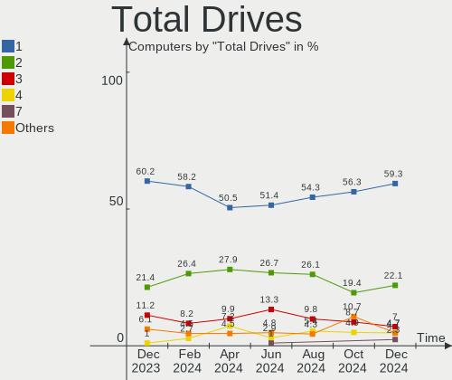
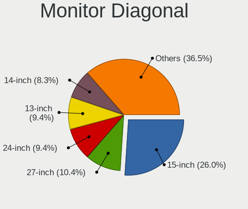

openSUSE Hardware Trends
------------------------

A project to identify most popular hardware characteristics and track their change
over time based on data collected by openSUSE users at https://Linux-Hardware.org.

Anyone can contribute to this report by the [hw-probe](https://github.com/linuxhw/hw-probe) tool:

    sudo -E hw-probe -all -upload

This is a report for all computer types. See also reports for [desktops](/Dist/openSUSE/Desktop/README.md) and [notebooks](/Dist/openSUSE/Notebook/README.md).

This report is for one last month. Overall report since the beginning of time: [TestCoverage](https://github.com/linuxhw/TestCoverage)

Period: Apr, 2022.

Contents
--------

* [ System ](#system)
  - [ OS                       ](#os)
  - [ OS Family                ](#os-family)
  - [ Kernel                   ](#kernel)
  - [ Kernel Family            ](#kernel-family)
  - [ Kernel Major Ver.        ](#kernel-major-ver)
  - [ Arch                     ](#arch)
  - [ DE                       ](#de)
  - [ Display Server           ](#display-server)
  - [ Display Manager          ](#display-manager)
  - [ OS Lang                  ](#os-lang)
  - [ Boot Mode                ](#boot-mode)
  - [ Filesystem               ](#filesystem)
  - [ Part. scheme             ](#part-scheme)
  - [ Dual Boot with Linux/BSD ](#dual-boot-with-linuxbsd)
  - [ Dual Boot (Win)          ](#dual-boot-win)

* [ Board ](#board)
  - [ Vendor                   ](#vendor)
  - [ Model                    ](#model)
  - [ Model Family             ](#model-family)
  - [ MFG Year                 ](#mfg-year)
  - [ Form Factor              ](#form-factor)
  - [ Secure Boot              ](#secure-boot)
  - [ Coreboot                 ](#coreboot)
  - [ RAM Size                 ](#ram-size)
  - [ RAM Used                 ](#ram-used)
  - [ Total Drives             ](#total-drives)
  - [ Has CD-ROM               ](#has-cd-rom)
  - [ Has Ethernet             ](#has-ethernet)
  - [ Has WiFi                 ](#has-wifi)
  - [ Has Bluetooth            ](#has-bluetooth)

* [ Location ](#location)
  - [ Country                  ](#country)
  - [ City                     ](#city)

* [ Drives ](#drives)
  - [ Drive Vendor             ](#drive-vendor)
  - [ Drive Model              ](#drive-model)
  - [ HDD Vendor               ](#hdd-vendor)
  - [ SSD Vendor               ](#ssd-vendor)
  - [ Drive Kind               ](#drive-kind)
  - [ Drive Connector          ](#drive-connector)
  - [ Drive Size               ](#drive-size)
  - [ Space Total              ](#space-total)
  - [ Space Used               ](#space-used)
  - [ Malfunc. Drives          ](#malfunc-drives)
  - [ Malfunc. Drive Vendor    ](#malfunc-drive-vendor)
  - [ Malfunc. HDD Vendor      ](#malfunc-hdd-vendor)
  - [ Malfunc. Drive Kind      ](#malfunc-drive-kind)
  - [ Failed Drives            ](#failed-drives)
  - [ Failed Drive Vendor      ](#failed-drive-vendor)
  - [ Drive Status             ](#drive-status)

* [ Storage controller ](#storage-controller)
  - [ Storage Vendor           ](#storage-vendor)
  - [ Storage Model            ](#storage-model)
  - [ Storage Kind             ](#storage-kind)

* [ Processor ](#processor)
  - [ CPU Vendor               ](#cpu-vendor)
  - [ CPU Model                ](#cpu-model)
  - [ CPU Model Family         ](#cpu-model-family)
  - [ CPU Cores                ](#cpu-cores)
  - [ CPU Sockets              ](#cpu-sockets)
  - [ CPU Threads              ](#cpu-threads)
  - [ CPU Op-Modes             ](#cpu-op-modes)
  - [ CPU Microcode            ](#cpu-microcode)
  - [ CPU Microarch            ](#cpu-microarch)

* [ Graphics ](#graphics)
  - [ GPU Vendor               ](#gpu-vendor)
  - [ GPU Model                ](#gpu-model)
  - [ GPU Combo                ](#gpu-combo)
  - [ GPU Driver               ](#gpu-driver)
  - [ GPU Memory               ](#gpu-memory)

* [ Monitor ](#monitor)
  - [ Monitor Vendor           ](#monitor-vendor)
  - [ Monitor Model            ](#monitor-model)
  - [ Monitor Resolution       ](#monitor-resolution)
  - [ Monitor Diagonal         ](#monitor-diagonal)
  - [ Monitor Width            ](#monitor-width)
  - [ Aspect Ratio             ](#aspect-ratio)
  - [ Monitor Area             ](#monitor-area)
  - [ Pixel Density            ](#pixel-density)
  - [ Multiple Monitors        ](#multiple-monitors)

* [ Network ](#network)
  - [ Net Controller Vendor    ](#net-controller-vendor)
  - [ Net Controller Model     ](#net-controller-model)
  - [ Wireless Vendor          ](#wireless-vendor)
  - [ Wireless Model           ](#wireless-model)
  - [ Ethernet Vendor          ](#ethernet-vendor)
  - [ Ethernet Model           ](#ethernet-model)
  - [ Net Controller Kind      ](#net-controller-kind)
  - [ Used Controller          ](#used-controller)
  - [ NICs                     ](#nics)
  - [ IPv6                     ](#ipv6)

* [ Bluetooth ](#bluetooth)
  - [ Bluetooth Vendor         ](#bluetooth-vendor)
  - [ Bluetooth Model          ](#bluetooth-model)

* [ Sound ](#sound)
  - [ Sound Vendor             ](#sound-vendor)
  - [ Sound Model              ](#sound-model)

* [ Memory ](#memory)
  - [ Memory Vendor            ](#memory-vendor)
  - [ Memory Model             ](#memory-model)
  - [ Memory Kind              ](#memory-kind)
  - [ Memory Form Factor       ](#memory-form-factor)
  - [ Memory Size              ](#memory-size)
  - [ Memory Speed             ](#memory-speed)

* [ Printers & scanners ](#printers--scanners)
  - [ Printer Vendor           ](#printer-vendor)
  - [ Printer Model            ](#printer-model)
  - [ Scanner Vendor           ](#scanner-vendor)
  - [ Scanner Model            ](#scanner-model)

* [ Camera ](#camera)
  - [ Camera Vendor            ](#camera-vendor)
  - [ Camera Model             ](#camera-model)

* [ Security ](#security)
  - [ Fingerprint Vendor       ](#fingerprint-vendor)
  - [ Fingerprint Model        ](#fingerprint-model)
  - [ Chipcard Vendor          ](#chipcard-vendor)
  - [ Chipcard Model           ](#chipcard-model)

* [ Unsupported ](#unsupported)
  - [ Unsupported Devices      ](#unsupported-devices)
  - [ Unsupported Device Types ](#unsupported-device-types)

System
------

OS
--

Installed operating systems

| Name                         | Computers | Percent |
|------------------------------|-----------|---------|
| openSUSE Leap-15.3           | 10        | 18.52%  |
| openSUSE 20220410            | 4         | 7.41%   |
| openSUSE Tumbleweed-20220427 | 2         | 3.7%    |
| openSUSE Tumbleweed-20220413 | 2         | 3.7%    |
| openSUSE Tumbleweed-20220412 | 2         | 3.7%    |
| openSUSE 20220425            | 2         | 3.7%    |
| openSUSE 20220420            | 2         | 3.7%    |
| openSUSE 20220419            | 2         | 3.7%    |
| openSUSE 20220414            | 2         | 3.7%    |
| openSUSE 20220406            | 2         | 3.7%    |
| openSUSE 20220403            | 2         | 3.7%    |
| openSUSE Tumbleweed-20220425 | 1         | 1.85%   |
| openSUSE Tumbleweed-20220420 | 1         | 1.85%   |
| openSUSE Tumbleweed-20220406 | 1         | 1.85%   |
| openSUSE Tumbleweed-20220404 | 1         | 1.85%   |
| openSUSE Tumbleweed-20220403 | 1         | 1.85%   |
| openSUSE Tumbleweed-20220401 | 1         | 1.85%   |
| openSUSE Tumbleweed-20220330 | 1         | 1.85%   |
| openSUSE Tumbleweed-20220324 | 1         | 1.85%   |
| openSUSE Microos-20220424    | 1         | 1.85%   |
| openSUSE Leap-15.4           | 1         | 1.85%   |
| openSUSE 20220426            | 1         | 1.85%   |
| openSUSE 20220424            | 1         | 1.85%   |
| openSUSE 20220423            | 1         | 1.85%   |
| openSUSE 20220422            | 1         | 1.85%   |
| openSUSE 20220421            | 1         | 1.85%   |
| openSUSE 20220411            | 1         | 1.85%   |
| openSUSE 20220409            | 1         | 1.85%   |
| openSUSE 20220407            | 1         | 1.85%   |
| openSUSE 20220402            | 1         | 1.85%   |
| openSUSE 20220324            | 1         | 1.85%   |
| openSUSE 20220223            | 1         | 1.85%   |
| openSUSE 20211228            | 1         | 1.85%   |

OS Family
---------

OS without a version

| Name     | Computers | Percent |
|----------|-----------|---------|
| openSUSE | 54        | 100%    |

Kernel
------

Version of the Linux kernel

| Version                     | Computers | Percent |
|-----------------------------|-----------|---------|
| 5.17.1-1-default            | 17        | 31.48%  |
| 5.17.4-1-default            | 10        | 18.52%  |
| 5.17.2-1-default            | 6         | 11.11%  |
| 5.17.3-1-default            | 5         | 9.26%   |
| 5.3.18-150300.59.60-default | 3         | 5.56%   |
| 5.16.15-1-default           | 3         | 5.56%   |
| 5.3.18-150300.59.63-default | 2         | 3.7%    |
| 5.3.18-150300.59.60-preempt | 1         | 1.85%   |
| 5.3.18-150300.59.54-default | 1         | 1.85%   |
| 5.3.18-150300.59.49-default | 1         | 1.85%   |
| 5.17.2-1.gb49cf22-default   | 1         | 1.85%   |
| 5.17.1-1.g47fa9ec-default   | 1         | 1.85%   |
| 5.16.10-1-default           | 1         | 1.85%   |
| 5.15.8-1-default            | 1         | 1.85%   |
| 5.14.21-150400.15-default   | 1         | 1.85%   |

Kernel Family
-------------

Linux kernel without a distro release

| Version | Computers | Percent |
|---------|-----------|---------|
| 5.17.1  | 18        | 33.33%  |
| 5.17.4  | 10        | 18.52%  |
| 5.3.18  | 8         | 14.81%  |
| 5.17.2  | 7         | 12.96%  |
| 5.17.3  | 5         | 9.26%   |
| 5.16.15 | 3         | 5.56%   |
| 5.16.10 | 1         | 1.85%   |
| 5.15.8  | 1         | 1.85%   |
| 5.14.21 | 1         | 1.85%   |

Kernel Major Ver.
-----------------

Linux kernel major version

| Version | Computers | Percent |
|---------|-----------|---------|
| 5.17    | 40        | 74.07%  |
| 5.3     | 8         | 14.81%  |
| 5.16    | 4         | 7.41%   |
| 5.15    | 1         | 1.85%   |
| 5.14    | 1         | 1.85%   |

Arch
----

OS architecture (x86_64, i586, etc.)

| Name   | Computers | Percent |
|--------|-----------|---------|
| x86_64 | 54        | 100%    |

DE
--

Desktop Environment

| Name       | Computers | Percent |
|------------|-----------|---------|
| KDE5       | 31        | 57.41%  |
| GNOME      | 15        | 27.78%  |
| XFCE       | 3         | 5.56%   |
| X-Cinnamon | 1         | 1.85%   |
| plasma5    | 1         | 1.85%   |
| LXDE       | 1         | 1.85%   |
| ICEWM      | 1         | 1.85%   |
| Budgie     | 1         | 1.85%   |

Display Server
--------------

X11 or Wayland

| Name        | Computers | Percent |
|-------------|-----------|---------|
| X11         | 33        | 61.11%  |
| Wayland     | 17        | 31.48%  |
| Tty         | 3         | 5.56%   |
| Unspecified | 1         | 1.85%   |

Display Manager
---------------

SDDM, LightDM, etc.

| Name    | Computers | Percent |
|---------|-----------|---------|
| SDDM    | 21        | 38.89%  |
| Unknown | 17        | 31.48%  |
| LightDM | 11        | 20.37%  |
| XDM     | 5         | 9.26%   |

OS Lang
-------

Language

| Lang    | Computers | Percent |
|---------|-----------|---------|
| en_US   | 18        | 33.33%  |
| en_GB   | 7         | 12.96%  |
| de_DE   | 7         | 12.96%  |
| pt_BR   | 4         | 7.41%   |
| POSIX   | 4         | 7.41%   |
| ru_RU   | 2         | 3.7%    |
| nl_NL   | 2         | 3.7%    |
| it_IT   | 2         | 3.7%    |
| es_ES   | 2         | 3.7%    |
| zh_CN   | 1         | 1.85%   |
| ro_RO   | 1         | 1.85%   |
| nb_NO   | 1         | 1.85%   |
| fr_FR   | 1         | 1.85%   |
| es_MX   | 1         | 1.85%   |
| Unknown | 1         | 1.85%   |

Boot Mode
---------

EFI or BIOS

| Mode | Computers | Percent |
|------|-----------|---------|
| EFI  | 38        | 70.37%  |
| BIOS | 16        | 29.63%  |

Filesystem
----------

Type of filesystem

| Type    | Computers | Percent |
|---------|-----------|---------|
| Btrfs   | 44        | 81.48%  |
| Ext4    | 6         | 11.11%  |
| Xfs     | 3         | 5.56%   |
| Overlay | 1         | 1.85%   |

Part. scheme
------------

Scheme of partitioning

| Type    | Computers | Percent |
|---------|-----------|---------|
| GPT     | 29        | 53.7%   |
| Unknown | 20        | 37.04%  |
| MBR     | 5         | 9.26%   |

Dual Boot with Linux/BSD
------------------------

Hosting more than one Linux/BSD

| Dual boot | Computers | Percent |
|-----------|-----------|---------|
| No        | 44        | 81.48%  |
| Yes       | 10        | 18.52%  |

Dual Boot (Win)
---------------

Hosting Linux and Windows

| Dual boot | Computers | Percent |
|-----------|-----------|---------|
| No        | 40        | 74.07%  |
| Yes       | 14        | 25.93%  |

Board
-----

Vendor
------

Motherboard manufacturer

| Name                | Computers | Percent |
|---------------------|-----------|---------|
| Lenovo              | 11        | 20.37%  |
| Hewlett-Packard     | 9         | 16.67%  |
| ASUSTek Computer    | 6         | 11.11%  |
| Acer                | 5         | 9.26%   |
| MSI                 | 4         | 7.41%   |
| Gigabyte Technology | 3         | 5.56%   |
| Dell                | 3         | 5.56%   |
| ASRock              | 3         | 5.56%   |
| HUAWEI              | 2         | 3.7%    |
| Toshiba             | 1         | 1.85%   |
| Supermicro          | 1         | 1.85%   |
| Shuttle             | 1         | 1.85%   |
| PCWare              | 1         | 1.85%   |
| LG Electronics      | 1         | 1.85%   |
| Itautec             | 1         | 1.85%   |
| Intel               | 1         | 1.85%   |
| Fujitsu             | 1         | 1.85%   |

Model
-----

Motherboard model

| Name                                   | Computers | Percent |
|----------------------------------------|-----------|---------|
| HP Laptop 17-ca0xxx                    | 2         | 3.7%    |
| Toshiba Satellite C55Dt-B              | 1         | 1.85%   |
| Supermicro SSG-6047R-E1CR36N           | 1         | 1.85%   |
| Shuttle XS35V4                         | 1         | 1.85%   |
| PCWare IPX4105G Pro                    | 1         | 1.85%   |
| MSI MS-7C94                            | 1         | 1.85%   |
| MSI MS-7A37                            | 1         | 1.85%   |
| MSI MS-7A15                            | 1         | 1.85%   |
| MSI Modern 15 A4M                      | 1         | 1.85%   |
| LG C400-G.BC22P1                       | 1         | 1.85%   |
| Lenovo Yoga 730-15IKB 81CU             | 1         | 1.85%   |
| Lenovo ThinkStation P520 30BE008VGE    | 1         | 1.85%   |
| Lenovo ThinkPad X201 Tablet 0831CTO    | 1         | 1.85%   |
| Lenovo ThinkPad X13 Gen 1 20UGS00800   | 1         | 1.85%   |
| Lenovo ThinkPad T460 20FMS25902        | 1         | 1.85%   |
| Lenovo ThinkPad T14s Gen 1 20UJS00K00  | 1         | 1.85%   |
| Lenovo ThinkPad L420 7829BH2           | 1         | 1.85%   |
| Lenovo ThinkCentre M93p 10AAS02P07     | 1         | 1.85%   |
| Lenovo IdeaPad 330-15IKB 81FE          | 1         | 1.85%   |
| Lenovo IdeaPad 320-15ABR 80XS          | 1         | 1.85%   |
| Lenovo IdeaPad 3 15ITL6 82H8           | 1         | 1.85%   |
| Itautec Infoway SM-3330                | 1         | 1.85%   |
| Intel D54250WYK H13922-303             | 1         | 1.85%   |
| HUAWEI KPL-W0X                         | 1         | 1.85%   |
| HUAWEI BOM-WXX9                        | 1         | 1.85%   |
| HP xw6600 Workstation                  | 1         | 1.85%   |
| HP Victus by Laptop 16-e0xxx           | 1         | 1.85%   |
| HP t610 WW Thin Client                 | 1         | 1.85%   |
| HP OMEN by Laptop                      | 1         | 1.85%   |
| HP Notebook                            | 1         | 1.85%   |
| HP Laptop 15s-eq2xxx                   | 1         | 1.85%   |
| HP ENVY x360 Convertible 15m-es0xxx    | 1         | 1.85%   |
| Gigabyte GA-880GM-UD2H                 | 1         | 1.85%   |
| Gigabyte B550M AORUS ELITE             | 1         | 1.85%   |
| Gigabyte 990FXA-UD3                    | 1         | 1.85%   |
| Fujitsu LIFEBOOK S762                  | 1         | 1.85%   |
| Dell System Inspiron N7110             | 1         | 1.85%   |
| Dell Precision T1650                   | 1         | 1.85%   |
| Dell Precision 5530                    | 1         | 1.85%   |
| ASUS Z170-A                            | 1         | 1.85%   |
| ASUS VivoBook_ASUSLaptop X512DA_X512DA | 1         | 1.85%   |
| ASUS VivoBook_ASUSLaptop X435EA_S435EA | 1         | 1.85%   |
| ASUS N551JW                            | 1         | 1.85%   |
| ASUS All Series                        | 1         | 1.85%   |
| ASUS 970 PRO GAMING/AURA               | 1         | 1.85%   |
| ASRock H170M Pro4                      | 1         | 1.85%   |
| ASRock H110M-DVS R2.0                  | 1         | 1.85%   |
| ASRock A320M-HDV R4.0                  | 1         | 1.85%   |
| Acer Veriton M2631                     | 1         | 1.85%   |
| Acer TravelMate Spin P614RN-52         | 1         | 1.85%   |
| Acer TravelMate P215-41-G2             | 1         | 1.85%   |
| Acer Extensa 2519                      | 1         | 1.85%   |
| Acer Aspire 3810TZ                     | 1         | 1.85%   |

Model Family
------------

Motherboard model prefix

| Name                         | Computers | Percent |
|------------------------------|-----------|---------|
| Lenovo ThinkPad              | 5         | 9.26%   |
| Lenovo IdeaPad               | 3         | 5.56%   |
| HP Laptop                    | 3         | 5.56%   |
| Dell Precision               | 2         | 3.7%    |
| ASUS VivoBook                | 2         | 3.7%    |
| Acer TravelMate              | 2         | 3.7%    |
| Toshiba Satellite            | 1         | 1.85%   |
| Supermicro SSG-6047R-E1CR36N | 1         | 1.85%   |
| Shuttle XS35V4               | 1         | 1.85%   |
| PCWare IPX4105G              | 1         | 1.85%   |
| MSI MS-7C94                  | 1         | 1.85%   |
| MSI MS-7A37                  | 1         | 1.85%   |
| MSI MS-7A15                  | 1         | 1.85%   |
| MSI Modern                   | 1         | 1.85%   |
| LG C400-G.BC22P1             | 1         | 1.85%   |
| Lenovo Yoga                  | 1         | 1.85%   |
| Lenovo ThinkStation          | 1         | 1.85%   |
| Lenovo ThinkCentre           | 1         | 1.85%   |
| Itautec Infoway              | 1         | 1.85%   |
| Intel D54250WYK              | 1         | 1.85%   |
| HUAWEI KPL-W0X               | 1         | 1.85%   |
| HUAWEI BOM-WXX9              | 1         | 1.85%   |
| HP xw6600                    | 1         | 1.85%   |
| HP Victus                    | 1         | 1.85%   |
| HP t610                      | 1         | 1.85%   |
| HP OMEN                      | 1         | 1.85%   |
| HP Notebook                  | 1         | 1.85%   |
| HP ENVY                      | 1         | 1.85%   |
| Gigabyte GA-880GM-UD2H       | 1         | 1.85%   |
| Gigabyte B550M               | 1         | 1.85%   |
| Gigabyte 990FXA-UD3          | 1         | 1.85%   |
| Fujitsu LIFEBOOK             | 1         | 1.85%   |
| Dell System                  | 1         | 1.85%   |
| ASUS Z170-A                  | 1         | 1.85%   |
| ASUS N551JW                  | 1         | 1.85%   |
| ASUS All                     | 1         | 1.85%   |
| ASUS 970                     | 1         | 1.85%   |
| ASRock H170M                 | 1         | 1.85%   |
| ASRock H110M-DVS             | 1         | 1.85%   |
| ASRock A320M-HDV             | 1         | 1.85%   |
| Acer Veriton                 | 1         | 1.85%   |
| Acer Extensa                 | 1         | 1.85%   |
| Acer Aspire                  | 1         | 1.85%   |

MFG Year
--------

Motherboard manufacture year

| Year | Computers | Percent |
|------|-----------|---------|
| 2021 | 8         | 14.81%  |
| 2018 | 8         | 14.81%  |
| 2020 | 6         | 11.11%  |
| 2016 | 6         | 11.11%  |
| 2014 | 5         | 9.26%   |
| 2017 | 4         | 7.41%   |
| 2011 | 4         | 7.41%   |
| 2015 | 3         | 5.56%   |
| 2019 | 2         | 3.7%    |
| 2013 | 2         | 3.7%    |
| 2012 | 2         | 3.7%    |
| 2010 | 2         | 3.7%    |
| 2009 | 1         | 1.85%   |
| 2008 | 1         | 1.85%   |

Form Factor
-----------

Physical design of the computer

| Name        | Computers | Percent |
|-------------|-----------|---------|
| Notebook    | 28        | 51.85%  |
| Desktop     | 22        | 40.74%  |
| Convertible | 3         | 5.56%   |
| Mini pc     | 1         | 1.85%   |

Secure Boot
-----------

Enabled or disabled

| State    | Computers | Percent |
|----------|-----------|---------|
| Disabled | 50        | 92.59%  |
| Enabled  | 4         | 7.41%   |

Coreboot
--------

Have coreboot on board

| Used | Computers | Percent |
|------|-----------|---------|
| No   | 54        | 100%    |

RAM Size
--------

Total RAM memory

| Size in GB  | Computers | Percent |
|-------------|-----------|---------|
| 16.01-24.0  | 19        | 35.19%  |
| 4.01-8.0    | 16        | 29.63%  |
| 8.01-16.0   | 7         | 12.96%  |
| 32.01-64.0  | 5         | 9.26%   |
| 3.01-4.0    | 4         | 7.41%   |
| 64.01-256.0 | 2         | 3.7%    |
| 2.01-3.0    | 1         | 1.85%   |

RAM Used
--------

Used RAM memory

| Used GB    | Computers | Percent |
|------------|-----------|---------|
| 4.01-8.0   | 14        | 25.93%  |
| 1.01-2.0   | 13        | 24.07%  |
| 2.01-3.0   | 12        | 22.22%  |
| 3.01-4.0   | 7         | 12.96%  |
| 0.51-1.0   | 3         | 5.56%   |
| 16.01-24.0 | 2         | 3.7%    |
| 8.01-16.0  | 2         | 3.7%    |
| 0.01-0.5   | 1         | 1.85%   |

Total Drives
------------

Number of drives on board

| Drives | Computers | Percent |
|--------|-----------|---------|
| 1      | 26        | 48.15%  |
| 2      | 21        | 38.89%  |
| 5      | 2         | 3.7%    |
| 4      | 2         | 3.7%    |
| 3      | 2         | 3.7%    |
| 6      | 1         | 1.85%   |

Has CD-ROM
----------

Has CD-ROM on board

| Presented | Computers | Percent |
|-----------|-----------|---------|
| No        | 35        | 64.81%  |
| Yes       | 19        | 35.19%  |

Has Ethernet
------------

Has Ethernet on board

| Presented | Computers | Percent |
|-----------|-----------|---------|
| Yes       | 45        | 83.33%  |
| No        | 9         | 16.67%  |

Has WiFi
--------

Has WiFi module

| Presented | Computers | Percent |
|-----------|-----------|---------|
| Yes       | 37        | 68.52%  |
| No        | 17        | 31.48%  |

Has Bluetooth
-------------

Has Bluetooth module

| Presented | Computers | Percent |
|-----------|-----------|---------|
| Yes       | 30        | 55.56%  |
| No        | 24        | 44.44%  |

Location
--------

Country
-------

Geographic location (country)

| Country     | Computers | Percent |
|-------------|-----------|---------|
| Germany     | 11        | 20.37%  |
| USA         | 6         | 11.11%  |
| Brazil      | 6         | 11.11%  |
| UK          | 3         | 5.56%   |
| France      | 3         | 5.56%   |
| Spain       | 2         | 3.7%    |
| Russia      | 2         | 3.7%    |
| Romania     | 2         | 3.7%    |
| Portugal    | 2         | 3.7%    |
| Netherlands | 2         | 3.7%    |
| Italy       | 2         | 3.7%    |
| Hungary     | 2         | 3.7%    |
| Canada      | 2         | 3.7%    |
| Belgium     | 2         | 3.7%    |
| Uzbekistan  | 1         | 1.85%   |
| Peru        | 1         | 1.85%   |
| Norway      | 1         | 1.85%   |
| Mexico      | 1         | 1.85%   |
| China       | 1         | 1.85%   |
| Bulgaria    | 1         | 1.85%   |
| Australia   | 1         | 1.85%   |

City
----

Geographic location (city)

| City                   | Computers | Percent |
|------------------------|-----------|---------|
| Woking                 | 2         | 3.7%    |
| Göttingen             | 2         | 3.7%    |
| Gatineau               | 2         | 3.7%    |
| Antwerp                | 2         | 3.7%    |
| Xi'an                  | 1         | 1.85%   |
| Weilheim               | 1         | 1.85%   |
| Wegberg                | 1         | 1.85%   |
| Vennesla               | 1         | 1.85%   |
| Tashkent               | 1         | 1.85%   |
| Sofia                  | 1         | 1.85%   |
| Sao Paulo              | 1         | 1.85%   |
| Rotterdam              | 1         | 1.85%   |
| Rome                   | 1         | 1.85%   |
| Rio Branco             | 1         | 1.85%   |
| Perkasie               | 1         | 1.85%   |
| Palm Bay               | 1         | 1.85%   |
| Osasco                 | 1         | 1.85%   |
| Moscow                 | 1         | 1.85%   |
| Melbourne              | 1         | 1.85%   |
| Matraverebely          | 1         | 1.85%   |
| Marseille              | 1         | 1.85%   |
| Maringá               | 1         | 1.85%   |
| Marietta               | 1         | 1.85%   |
| Loures                 | 1         | 1.85%   |
| Lochearnhead           | 1         | 1.85%   |
| Lima                   | 1         | 1.85%   |
| Leipzig                | 1         | 1.85%   |
| Iztacalco              | 1         | 1.85%   |
| Itajaí                | 1         | 1.85%   |
| Huettenberg            | 1         | 1.85%   |
| Hemmingen              | 1         | 1.85%   |
| Guerville              | 1         | 1.85%   |
| Gijón                 | 1         | 1.85%   |
| Froendenberg           | 1         | 1.85%   |
| Ferrara di Monte Baldo | 1         | 1.85%   |
| Eschenbergen           | 1         | 1.85%   |
| Dijon                  | 1         | 1.85%   |
| Dallas                 | 1         | 1.85%   |
| Conroe                 | 1         | 1.85%   |
| Chelyabinsk            | 1         | 1.85%   |
| Burnsville             | 1         | 1.85%   |
| Budapest               | 1         | 1.85%   |
| Bucharest              | 1         | 1.85%   |
| Brasov                 | 1         | 1.85%   |
| Bragança              | 1         | 1.85%   |
| Bergisch Gladbach      | 1         | 1.85%   |
| Bad Aibling            | 1         | 1.85%   |
| Aparecida de Goiania   | 1         | 1.85%   |
| Almelo                 | 1         | 1.85%   |
| A Coruña              | 1         | 1.85%   |

Drives
------

Drive Vendor
------------

Hard drive vendors

| Vendor                    | Computers | Drives | Percent |
|---------------------------|-----------|--------|---------|
| Samsung Electronics       | 14        | 16     | 16.87%  |
| Seagate                   | 13        | 20     | 15.66%  |
| WDC                       | 12        | 14     | 14.46%  |
| Kingston                  | 6         | 7      | 7.23%   |
| Toshiba                   | 4         | 4      | 4.82%   |
| SanDisk                   | 4         | 5      | 4.82%   |
| Intel                     | 4         | 5      | 4.82%   |
| Crucial                   | 4         | 6      | 4.82%   |
| Phison                    | 3         | 3      | 3.61%   |
| SK Hynix                  | 2         | 2      | 2.41%   |
| Silicon Motion            | 2         | 2      | 2.41%   |
| Unknown (1GB)             | 1         | 1      | 1.2%    |
| Unknown                   | 1         | 1      | 1.2%    |
| SABRENT                   | 1         | 1      | 1.2%    |
| OCZ                       | 1         | 1      | 1.2%    |
| Micron/Crucial Technology | 1         | 1      | 1.2%    |
| LITEON                    | 1         | 1      | 1.2%    |
| KIOXIA                    | 1         | 1      | 1.2%    |
| Intenso                   | 1         | 1      | 1.2%    |
| Hitachi                   | 1         | 1      | 1.2%    |
| HGST                      | 1         | 1      | 1.2%    |
| Gigabyte Technology       | 1         | 1      | 1.2%    |
| GALAX                     | 1         | 1      | 1.2%    |
| Galaird                   | 1         | 1      | 1.2%    |
| China                     | 1         | 1      | 1.2%    |
| Apacer                    | 1         | 1      | 1.2%    |

Drive Model
-----------

Hard drive models

| Model                               | Computers | Percent |
|-------------------------------------|-----------|---------|
| Seagate ST500DM002-1BD142 500GB     | 2         | 2.15%   |
| Seagate ST1000LM035-1RK172 1TB      | 2         | 2.15%   |
| Samsung SSD 860 EVO 500GB           | 2         | 2.15%   |
| Phison NVMe SSD Drive 512GB         | 2         | 2.15%   |
| WDC WDS250G2B0A-00SM50 250GB SSD    | 1         | 1.08%   |
| WDC WDS240G2G0A-00JH30 240GB SSD    | 1         | 1.08%   |
| WDC WDS200T2B0B 2TB SSD             | 1         | 1.08%   |
| WDC WD5000LPCX-60VHAT0 500GB        | 1         | 1.08%   |
| WDC WD5000LPCX-21VHAT0 500GB        | 1         | 1.08%   |
| WDC WD40 EZRZ-00GXCB0 4TB           | 1         | 1.08%   |
| WDC WD3200BEVT-22ZCT0 320GB         | 1         | 1.08%   |
| WDC WD20EFRX-68EUZN0 2TB            | 1         | 1.08%   |
| WDC WD15EARS-00MVWB0 1TB            | 1         | 1.08%   |
| WDC WD10SPZX-60Z10T0 1TB            | 1         | 1.08%   |
| WDC WD10EZEX-22MFCA0 1TB            | 1         | 1.08%   |
| WDC WD10EZEX-08WN4A0 1TB            | 1         | 1.08%   |
| WDC WD10EZEX-00BN5A0 1TB            | 1         | 1.08%   |
| Unknown MMC Card  8GB               | 1         | 1.08%   |
| Unknown (1GB) 1GB ATA Flash Disk    | 1         | 1.08%   |
| Toshiba MQ04ABF100 1TB              | 1         | 1.08%   |
| Toshiba MK3261GSYD 320GB            | 1         | 1.08%   |
| Toshiba HDWD110 1TB                 | 1         | 1.08%   |
| Toshiba DT01ACA050 500GB            | 1         | 1.08%   |
| SK Hynix NVMe SSD Drive 512GB       | 1         | 1.08%   |
| SK Hynix HFM256GD3JX016N 256GB      | 1         | 1.08%   |
| Silicon Motion NVMe SSD Drive 128GB | 1         | 1.08%   |
| Silicon Motion NE-128 128GB         | 1         | 1.08%   |
| Seagate ST6000VN0033-2EE110 6TB     | 1         | 1.08%   |
| Seagate ST500DM002-1BC142 500GB     | 1         | 1.08%   |
| Seagate ST4000VN008-2DR166 4TB      | 1         | 1.08%   |
| Seagate ST3000VX010-2E3166 3TB      | 1         | 1.08%   |
| Seagate ST2000VN004-2E4164 2TB      | 1         | 1.08%   |
| Seagate ST2000LM007-1R8174 2TB      | 1         | 1.08%   |
| Seagate ST2000DM008-2FR102 2TB      | 1         | 1.08%   |
| Seagate ST2000DM006-2DM164 2TB      | 1         | 1.08%   |
| Seagate ST1000LM048-2E7172 1TB      | 1         | 1.08%   |
| Seagate ST1000DX001-1NS162 1TB      | 1         | 1.08%   |
| Seagate ST1000DX001-1CM162 1TB      | 1         | 1.08%   |
| Seagate BUP Slim BL 2TB             | 1         | 1.08%   |
| SanDisk SSD PLUS 480GB              | 1         | 1.08%   |
| SanDisk SSD PLUS 120GB              | 1         | 1.08%   |
| SanDisk SD9SN8W256G1027 256GB SSD   | 1         | 1.08%   |
| SanDisk SD6SB1M128G1022I 128GB SSD  | 1         | 1.08%   |
| Sandisk NVMe SSD Drive 1024GB       | 1         | 1.08%   |
| Samsung SSD 960 EVO 250GB           | 1         | 1.08%   |
| Samsung SSD 870 EVO 1TB             | 1         | 1.08%   |
| Samsung SSD 850 PRO 128GB           | 1         | 1.08%   |
| Samsung SSD 850 EVO 500GB           | 1         | 1.08%   |
| Samsung SSD 850 EVO 250GB           | 1         | 1.08%   |
| Samsung SSD 840 EVO 250GB           | 1         | 1.08%   |
| Samsung PM981 NVMe 512GB            | 1         | 1.08%   |
| Samsung NVMe SSD Drive 512GB        | 1         | 1.08%   |
| Samsung NVMe SSD Drive 250GB        | 1         | 1.08%   |
| Samsung NVMe SSD Drive 1TB          | 1         | 1.08%   |
| Samsung MZVLQ512HALU-00000 512GB    | 1         | 1.08%   |
| Samsung MZVLB512HBJQ-000H1 512GB    | 1         | 1.08%   |
| Samsung MZVLB1T0HALR-000L2 1TB      | 1         | 1.08%   |
| SABRENT Disk 1TB                    | 1         | 1.08%   |
| Phison 311CD0512GB                  | 1         | 1.08%   |
| OCZ VERTEX2 180GB SSD               | 1         | 1.08%   |

HDD Vendor
----------

Hard disk drive vendors

| Vendor  | Computers | Drives | Percent |
|---------|-----------|--------|---------|
| Seagate | 13        | 20     | 44.83%  |
| WDC     | 9         | 11     | 31.03%  |
| Toshiba | 4         | 4      | 13.79%  |
| SABRENT | 1         | 1      | 3.45%   |
| Hitachi | 1         | 1      | 3.45%   |
| HGST    | 1         | 1      | 3.45%   |

SSD Vendor
----------

Solid state drive vendors

| Vendor              | Computers | Drives | Percent |
|---------------------|-----------|--------|---------|
| Samsung Electronics | 7         | 7      | 25.93%  |
| Kingston            | 4         | 4      | 14.81%  |
| WDC                 | 3         | 3      | 11.11%  |
| SanDisk             | 3         | 4      | 11.11%  |
| Crucial             | 3         | 3      | 11.11%  |
| OCZ                 | 1         | 1      | 3.7%    |
| LITEON              | 1         | 1      | 3.7%    |
| Intenso             | 1         | 1      | 3.7%    |
| Intel               | 1         | 1      | 3.7%    |
| GALAX               | 1         | 1      | 3.7%    |
| China               | 1         | 1      | 3.7%    |
| Apacer              | 1         | 1      | 3.7%    |

Drive Kind
----------

HDD or SSD

| Kind    | Computers | Drives | Percent |
|---------|-----------|--------|---------|
| HDD     | 27        | 38     | 35.53%  |
| SSD     | 24        | 28     | 31.58%  |
| NVMe    | 22        | 30     | 28.95%  |
| Unknown | 2         | 2      | 2.63%   |
| MMC     | 1         | 1      | 1.32%   |

Drive Connector
---------------

SATA, SAS, NVMe, etc.

| Type | Computers | Drives | Percent |
|------|-----------|--------|---------|
| SATA | 40        | 65     | 61.54%  |
| NVMe | 22        | 30     | 33.85%  |
| SAS  | 2         | 3      | 3.08%   |
| MMC  | 1         | 1      | 1.54%   |

Drive Size
----------

Size of hard drive

| Size in TB | Computers | Drives | Percent |
|------------|-----------|--------|---------|
| 0.01-0.5   | 30        | 36     | 57.69%  |
| 0.51-1.0   | 13        | 14     | 25%     |
| 1.01-2.0   | 5         | 11     | 9.62%   |
| 3.01-4.0   | 2         | 3      | 3.85%   |
| 2.01-3.0   | 1         | 1      | 1.92%   |
| 4.01-10.0  | 1         | 1      | 1.92%   |

Space Total
-----------

Amount of disk space available on the file system

| Size in GB     | Computers | Percent |
|----------------|-----------|---------|
| More than 3000 | 19        | 35.19%  |
| 1001-2000      | 11        | 20.37%  |
| 2001-3000      | 10        | 18.52%  |
| 251-500        | 6         | 11.11%  |
| 501-1000       | 5         | 9.26%   |
| 21-50          | 2         | 3.7%    |
| 101-250        | 1         | 1.85%   |

Space Used
----------

Amount of used disk space

| Used GB        | Computers | Percent |
|----------------|-----------|---------|
| 251-500        | 10        | 18.52%  |
| 1001-2000      | 10        | 18.52%  |
| 101-250        | 9         | 16.67%  |
| 501-1000       | 9         | 16.67%  |
| More than 3000 | 5         | 9.26%   |
| 51-100         | 5         | 9.26%   |
| 21-50          | 2         | 3.7%    |
| 2001-3000      | 2         | 3.7%    |
| 1-20           | 2         | 3.7%    |

Malfunc. Drives
---------------

Drive models with a malfunction

| Model                               | Computers | Drives | Percent |
|-------------------------------------|-----------|--------|---------|
| Samsung Electronics SSD 870 EVO 1TB | 1         | 1      | 33.33%  |
| Kingston SUV300S37A240G 240GB SSD   | 1         | 1      | 33.33%  |
| Hitachi HTS725050A9A364 500GB       | 1         | 1      | 33.33%  |

Malfunc. Drive Vendor
---------------------

Vendors of faulty drives

| Vendor              | Computers | Drives | Percent |
|---------------------|-----------|--------|---------|
| Samsung Electronics | 1         | 1      | 33.33%  |
| Kingston            | 1         | 1      | 33.33%  |
| Hitachi             | 1         | 1      | 33.33%  |

Malfunc. HDD Vendor
-------------------

Vendors of faulty HDD drives

| Vendor  | Computers | Drives | Percent |
|---------|-----------|--------|---------|
| Hitachi | 1         | 1      | 100%    |

Malfunc. Drive Kind
-------------------

Kinds of faulty drives

| Kind | Computers | Drives | Percent |
|------|-----------|--------|---------|
| SSD  | 2         | 2      | 66.67%  |
| HDD  | 1         | 1      | 33.33%  |

Failed Drives
-------------

Failed drive models

Zero info for selected period =(

Failed Drive Vendor
-------------------

Failed drive vendors

Zero info for selected period =(

Drive Status
------------

Number of failed and malfunc. drives

| Status   | Computers | Drives | Percent |
|----------|-----------|--------|---------|
| Works    | 32        | 48     | 54.24%  |
| Detected | 24        | 48     | 40.68%  |
| Malfunc  | 3         | 3      | 5.08%   |

Storage controller
------------------

Storage Vendor
--------------

Storage controller vendors

| Vendor                      | Computers | Percent |
|-----------------------------|-----------|---------|
| Intel                       | 31        | 44.93%  |
| AMD                         | 16        | 23.19%  |
| Samsung Electronics         | 7         | 10.14%  |
| Phison Electronics          | 3         | 4.35%   |
| SK Hynix                    | 2         | 2.9%    |
| Silicon Motion              | 2         | 2.9%    |
| Micron/Crucial Technology   | 2         | 2.9%    |
| Kingston Technology Company | 2         | 2.9%    |
| Sandisk                     | 1         | 1.45%   |
| Realtek Semiconductor       | 1         | 1.45%   |
| Marvell Technology Group    | 1         | 1.45%   |
| KIOXIA                      | 1         | 1.45%   |

Storage Model
-------------

Storage controller models

| Model                                                                            | Computers | Percent |
|----------------------------------------------------------------------------------|-----------|---------|
| AMD FCH SATA Controller [AHCI mode]                                              | 9         | 11.54%  |
| Samsung NVMe SSD Controller SM981/PM981/PM983                                    | 5         | 6.41%   |
| Intel Q170/Q150/B150/H170/H110/Z170/CM236 Chipset SATA Controller [AHCI Mode]    | 4         | 5.13%   |
| Intel 8 Series/C220 Series Chipset Family 6-port SATA Controller 1 [AHCI mode]   | 4         | 5.13%   |
| Intel Volume Management Device NVMe RAID Controller                              | 3         | 3.85%   |
| Intel Sunrise Point-LP SATA Controller [AHCI mode]                               | 3         | 3.85%   |
| AMD SB7x0/SB8x0/SB9x0 SATA Controller [AHCI mode]                                | 3         | 3.85%   |
| Silicon Motion SM2263EN/SM2263XT SSD Controller                                  | 2         | 2.56%   |
| Phison PS5013 E13 NVMe Controller                                                | 2         | 2.56%   |
| Intel SSD 660P Series                                                            | 2         | 2.56%   |
| Intel 6 Series/C200 Series Chipset Family 6 port Mobile SATA AHCI Controller     | 2         | 2.56%   |
| AMD SB7x0/SB8x0/SB9x0 SATA Controller [IDE mode]                                 | 2         | 2.56%   |
| AMD SB7x0/SB8x0/SB9x0 IDE Controller                                             | 2         | 2.56%   |
| AMD 500 Series Chipset SATA Controller                                           | 2         | 2.56%   |
| SK Hynix Non-Volatile memory controller                                          | 1         | 1.28%   |
| SK Hynix Gold P31 SSD                                                            | 1         | 1.28%   |
| Sandisk WD Black SN750 / PC SN730 NVMe SSD                                       | 1         | 1.28%   |
| Samsung NVMe SSD Controller SM961/PM961/SM963                                    | 1         | 1.28%   |
| Samsung NVMe SSD Controller 980                                                  | 1         | 1.28%   |
| Realtek RTS5763DL NVMe SSD Controller                                            | 1         | 1.28%   |
| Phison E16 PCIe4 NVMe Controller                                                 | 1         | 1.28%   |
| Micron/Crucial NVMe Controller                                                   | 1         | 1.28%   |
| Micron/Crucial Non-Volatile memory controller                                    | 1         | 1.28%   |
| Marvell Group 88SE9172 SATA 6Gb/s Controller                                     | 1         | 1.28%   |
| KIOXIA Non-Volatile memory controller                                            | 1         | 1.28%   |
| Kingston Company U-SNS8154P3 NVMe SSD                                            | 1         | 1.28%   |
| Kingston Company Company Non-Volatile memory controller                          | 1         | 1.28%   |
| Intel Tiger Lake-LP SATA Controller [AHCI mode]                                  | 1         | 1.28%   |
| Intel Non-Volatile memory controller                                             | 1         | 1.28%   |
| Intel HM170/QM170 Chipset SATA Controller [AHCI Mode]                            | 1         | 1.28%   |
| Intel Celeron/Pentium Silver Processor SATA Controller                           | 1         | 1.28%   |
| Intel Cannon Lake Mobile PCH SATA AHCI Controller                                | 1         | 1.28%   |
| Intel C602 chipset 4-Port SATA Storage Control Unit                              | 1         | 1.28%   |
| Intel C600/X79 series chipset 6-Port SATA AHCI Controller                        | 1         | 1.28%   |
| Intel Atom/Celeron/Pentium Processor x5-E8000/J3xxx/N3xxx Series SATA Controller | 1         | 1.28%   |
| Intel Atom Processor E3800 Series SATA AHCI Controller                           | 1         | 1.28%   |
| Intel 82801IBM/IEM (ICH9M/ICH9M-E) 4 port SATA Controller [AHCI mode]            | 1         | 1.28%   |
| Intel 8 Series SATA Controller 1 [AHCI mode]                                     | 1         | 1.28%   |
| Intel 7 Series/C210 Series Chipset Family 6-port SATA Controller [AHCI mode]     | 1         | 1.28%   |
| Intel 7 Series Chipset Family 6-port SATA Controller [AHCI mode]                 | 1         | 1.28%   |
| Intel 631xESB/632xESB SATA RAID Controller                                       | 1         | 1.28%   |
| Intel 631xESB/632xESB IDE Controller                                             | 1         | 1.28%   |
| Intel 5 Series/3400 Series Chipset 6 port SATA AHCI Controller                   | 1         | 1.28%   |
| Intel 5 Series/3400 Series Chipset 4 port SATA AHCI Controller                   | 1         | 1.28%   |
| Intel 200 Series PCH SATA controller [AHCI mode]                                 | 1         | 1.28%   |
| AMD FCH SATA Controller D                                                        | 1         | 1.28%   |
| AMD 300 Series Chipset SATA Controller                                           | 1         | 1.28%   |

Storage Kind
------------

Kind of storage controller (IDE, SATA, NVMe, SAS, ...)

| Kind | Computers | Percent |
|------|-----------|---------|
| SATA | 43        | 58.9%   |
| NVMe | 22        | 30.14%  |
| RAID | 4         | 5.48%   |
| IDE  | 3         | 4.11%   |
| SAS  | 1         | 1.37%   |

Processor
---------

CPU Vendor
----------

Processor vendors

| Vendor | Computers | Percent |
|--------|-----------|---------|
| Intel  | 32        | 59.26%  |
| AMD    | 22        | 40.74%  |

CPU Model
---------

Processor models

| Model                                           | Computers | Percent |
|-------------------------------------------------|-----------|---------|
| Intel 11th Gen Core i5-1135G7 @ 2.40GHz         | 3         | 5.56%   |
| Intel Core i7-8550U CPU @ 1.80GHz               | 2         | 3.7%    |
| Intel Core i5-2450M CPU @ 2.50GHz               | 2         | 3.7%    |
| AMD Ryzen 7 PRO 4750U with Radeon Graphics      | 2         | 3.7%    |
| AMD Ryzen 5 5500U with Radeon Graphics          | 2         | 3.7%    |
| Intel Xeon W-2135 CPU @ 3.70GHz                 | 1         | 1.85%   |
| Intel Xeon CPU E5450 @ 3.00GHz                  | 1         | 1.85%   |
| Intel Xeon CPU E5-2667 v2 @ 3.30GHz             | 1         | 1.85%   |
| Intel Pentium CPU P6200 @ 2.13GHz               | 1         | 1.85%   |
| Intel Pentium CPU N3710 @ 1.60GHz               | 1         | 1.85%   |
| Intel Pentium CPU G4560 @ 3.50GHz               | 1         | 1.85%   |
| Intel Genuine CPU U4100 @ 1.30GHz               | 1         | 1.85%   |
| Intel Core i7-8850H CPU @ 2.60GHz               | 1         | 1.85%   |
| Intel Core i7-6700 CPU @ 3.40GHz                | 1         | 1.85%   |
| Intel Core i7-3770 CPU @ 3.40GHz                | 1         | 1.85%   |
| Intel Core i7-2640M CPU @ 2.80GHz               | 1         | 1.85%   |
| Intel Core i7 CPU L 620 @ 2.00GHz               | 1         | 1.85%   |
| Intel Core i5-6400 CPU @ 2.70GHz                | 1         | 1.85%   |
| Intel Core i5-6300U CPU @ 2.40GHz               | 1         | 1.85%   |
| Intel Core i5-6300HQ CPU @ 2.30GHz              | 1         | 1.85%   |
| Intel Core i5-4570T CPU @ 2.90GHz               | 1         | 1.85%   |
| Intel Core i5-4440 CPU @ 3.10GHz                | 1         | 1.85%   |
| Intel Core i5-4250U CPU @ 1.30GHz               | 1         | 1.85%   |
| Intel Core i5-4200H CPU @ 2.80GHz               | 1         | 1.85%   |
| Intel Core i3-7320 CPU @ 4.10GHz                | 1         | 1.85%   |
| Intel Core i3-6100U CPU @ 2.30GHz               | 1         | 1.85%   |
| Intel Core i3-4130 CPU @ 3.40GHz                | 1         | 1.85%   |
| Intel Celeron J4105 CPU @ 1.50GHz               | 1         | 1.85%   |
| Intel Celeron CPU J1900 @ 1.99GHz               | 1         | 1.85%   |
| Intel 11th Gen Core i7-1165G7 @ 2.80GHz         | 1         | 1.85%   |
| AMD Ryzen 7 5800H with Radeon Graphics          | 1         | 1.85%   |
| AMD Ryzen 7 3700X 8-Core Processor              | 1         | 1.85%   |
| AMD Ryzen 5 5600X 6-Core Processor              | 1         | 1.85%   |
| AMD Ryzen 5 4500U with Radeon Graphics          | 1         | 1.85%   |
| AMD Ryzen 5 3600 6-Core Processor               | 1         | 1.85%   |
| AMD Ryzen 5 3500U with Radeon Vega Mobile Gfx   | 1         | 1.85%   |
| AMD Ryzen 5 2500U with Radeon Vega Mobile Gfx   | 1         | 1.85%   |
| AMD Ryzen 5 1500X Quad-Core Processor           | 1         | 1.85%   |
| AMD Ryzen 3 PRO 5450U with Radeon Graphics      | 1         | 1.85%   |
| AMD Phenom II X4 840 Processor                  | 1         | 1.85%   |
| AMD Phenom II X2 560 Processor                  | 1         | 1.85%   |
| AMD G-T56N Processor                            | 1         | 1.85%   |
| AMD FX-8350 Eight-Core Processor                | 1         | 1.85%   |
| AMD FX-8320 Eight-Core Processor                | 1         | 1.85%   |
| AMD A9-9425 RADEON R5, 5 COMPUTE CORES 2C+3G    | 1         | 1.85%   |
| AMD A8-6410 APU with AMD Radeon R5 Graphics     | 1         | 1.85%   |
| AMD A6-9225 RADEON R4, 5 COMPUTE CORES 2C+3G    | 1         | 1.85%   |
| AMD A12-9720P RADEON R7, 12 COMPUTE CORES 4C+8G | 1         | 1.85%   |

CPU Model Family
----------------

Processor model prefix

| Model            | Computers | Percent |
|------------------|-----------|---------|
| Intel Core i5    | 9         | 16.67%  |
| AMD Ryzen 5      | 8         | 14.81%  |
| Intel Core i7    | 7         | 12.96%  |
| Other            | 5         | 9.26%   |
| Intel Xeon       | 3         | 5.56%   |
| Intel Pentium    | 3         | 5.56%   |
| Intel Core i3    | 3         | 5.56%   |
| Intel Celeron    | 2         | 3.7%    |
| AMD Ryzen 7 PRO  | 2         | 3.7%    |
| AMD Ryzen 7      | 2         | 3.7%    |
| AMD FX           | 2         | 3.7%    |
| Intel Genuine    | 1         | 1.85%   |
| AMD Ryzen 3 PRO  | 1         | 1.85%   |
| AMD Phenom II X4 | 1         | 1.85%   |
| AMD Phenom II X2 | 1         | 1.85%   |
| AMD G            | 1         | 1.85%   |
| AMD A8           | 1         | 1.85%   |
| AMD A6           | 1         | 1.85%   |
| AMD A12          | 1         | 1.85%   |

CPU Cores
---------

Number of processor cores

| Number | Computers | Percent |
|--------|-----------|---------|
| 4      | 22        | 40.74%  |
| 2      | 19        | 35.19%  |
| 6      | 7         | 12.96%  |
| 8      | 5         | 9.26%   |
| 16     | 1         | 1.85%   |

CPU Sockets
-----------

Number of sockets

| Number | Computers | Percent |
|--------|-----------|---------|
| 1      | 52        | 96.3%   |
| 2      | 2         | 3.7%    |

CPU Threads
-----------

Threads per core (Hyper-Threading)

| Number | Computers | Percent |
|--------|-----------|---------|
| 2      | 38        | 70.37%  |
| 1      | 16        | 29.63%  |

CPU Op-Modes
------------

CPU Operation Modes (32-bit, 64-bit)

| Op mode        | Computers | Percent |
|----------------|-----------|---------|
| 32-bit, 64-bit | 54        | 100%    |

CPU Microcode
-------------

Microcode number

| Number     | Computers | Percent |
|------------|-----------|---------|
| Unknown    | 5         | 9.26%   |
| 0x806c1    | 4         | 7.41%   |
| 0x306c3    | 4         | 7.41%   |
| 0x506e3    | 3         | 5.56%   |
| 0x206a7    | 3         | 5.56%   |
| 0x906e9    | 2         | 3.7%    |
| 0x806ea    | 2         | 3.7%    |
| 0x406e3    | 2         | 3.7%    |
| 0x0a50000c | 2         | 3.7%    |
| 0x08701021 | 2         | 3.7%    |
| 0x08608103 | 2         | 3.7%    |
| 0x08600106 | 2         | 3.7%    |
| 0x06006705 | 2         | 3.7%    |
| 0x06000852 | 2         | 3.7%    |
| 0x906ea    | 1         | 1.85%   |
| 0x706a1    | 1         | 1.85%   |
| 0x406c4    | 1         | 1.85%   |
| 0x306e4    | 1         | 1.85%   |
| 0x306a9    | 1         | 1.85%   |
| 0x20655    | 1         | 1.85%   |
| 0x20652    | 1         | 1.85%   |
| 0x1067a    | 1         | 1.85%   |
| 0x10676    | 1         | 1.85%   |
| 0x0a201009 | 1         | 1.85%   |
| 0x08108102 | 1         | 1.85%   |
| 0x08101007 | 1         | 1.85%   |
| 0x08001138 | 1         | 1.85%   |
| 0x07030105 | 1         | 1.85%   |
| 0x0600611a | 1         | 1.85%   |
| 0x05000119 | 1         | 1.85%   |
| 0x010000c8 | 1         | 1.85%   |

CPU Microarch
-------------

Microarchitecture

| Name          | Computers | Percent |
|---------------|-----------|---------|
| Skylake       | 6         | 11.11%  |
| Zen 2         | 5         | 9.26%   |
| KabyLake      | 5         | 9.26%   |
| Haswell       | 5         | 9.26%   |
| TigerLake     | 4         | 7.41%   |
| Zen 3         | 3         | 5.56%   |
| SandyBridge   | 3         | 5.56%   |
| Excavator     | 3         | 5.56%   |
| Zen           | 2         | 3.7%    |
| Westmere      | 2         | 3.7%    |
| Silvermont    | 2         | 3.7%    |
| Piledriver    | 2         | 3.7%    |
| Penryn        | 2         | 3.7%    |
| K10           | 2         | 3.7%    |
| IvyBridge     | 2         | 3.7%    |
| Unknown       | 2         | 3.7%    |
| Zen+          | 1         | 1.85%   |
| Puma          | 1         | 1.85%   |
| Goldmont plus | 1         | 1.85%   |
| Bobcat        | 1         | 1.85%   |

Graphics
--------

GPU Vendor
----------

Vendors of graphics cards

| Vendor | Computers | Percent |
|--------|-----------|---------|
| Intel  | 26        | 43.33%  |
| AMD    | 20        | 33.33%  |
| Nvidia | 14        | 23.33%  |

GPU Model
---------

Graphics card models

| Model                                                                                    | Computers | Percent |
|------------------------------------------------------------------------------------------|-----------|---------|
| Intel TigerLake-LP GT2 [Iris Xe Graphics]                                                | 4         | 6.15%   |
| Intel 2nd Generation Core Processor Family Integrated Graphics Controller                | 3         | 4.62%   |
| AMD Renoir                                                                               | 3         | 4.62%   |
| Nvidia GP106 [GeForce GTX 1060 6GB]                                                      | 2         | 3.08%   |
| Nvidia GM107M [GeForce GTX 960M]                                                         | 2         | 3.08%   |
| Intel UHD Graphics 620                                                                   | 2         | 3.08%   |
| Intel Skylake GT2 [HD Graphics 520]                                                      | 2         | 3.08%   |
| Intel HD Graphics 530                                                                    | 2         | 3.08%   |
| Intel Core Processor Integrated Graphics Controller                                      | 2         | 3.08%   |
| AMD Topaz XT [Radeon R7 M260/M265 / M340/M360 / M440/M445 / 530/535 / 620/625 Mobile]    | 2         | 3.08%   |
| AMD Stoney [Radeon R2/R3/R4/R5 Graphics]                                                 | 2         | 3.08%   |
| AMD Lucienne                                                                             | 2         | 3.08%   |
| AMD Cezanne                                                                              | 2         | 3.08%   |
| Nvidia GP108M [GeForce MX150]                                                            | 1         | 1.54%   |
| Nvidia GP107M [GeForce GTX 1050 Mobile]                                                  | 1         | 1.54%   |
| Nvidia GP107GLM [Quadro P1000 Mobile]                                                    | 1         | 1.54%   |
| Nvidia GP107 [GeForce GTX 1050 Ti]                                                       | 1         | 1.54%   |
| Nvidia GP104 [GeForce GTX 1080]                                                          | 1         | 1.54%   |
| Nvidia GP102 [TITAN X]                                                                   | 1         | 1.54%   |
| Nvidia GM206GL [Quadro M2000]                                                            | 1         | 1.54%   |
| Nvidia GM107 [GeForce GTX 745]                                                           | 1         | 1.54%   |
| Nvidia GK107 [GeForce GTX 650]                                                           | 1         | 1.54%   |
| Nvidia GF108 [GeForce GT 630]                                                            | 1         | 1.54%   |
| Nvidia GA107M [GeForce RTX 3050 Ti Mobile]                                               | 1         | 1.54%   |
| Nvidia GA104 [GeForce RTX 3070]                                                          | 1         | 1.54%   |
| Intel Xeon E3-1200 v3/4th Gen Core Processor Integrated Graphics Controller              | 1         | 1.54%   |
| Intel Mobile 4 Series Chipset Integrated Graphics Controller                             | 1         | 1.54%   |
| Intel HD Graphics 630                                                                    | 1         | 1.54%   |
| Intel HD Graphics 610                                                                    | 1         | 1.54%   |
| Intel Haswell-ULT Integrated Graphics Controller                                         | 1         | 1.54%   |
| Intel GeminiLake [UHD Graphics 600]                                                      | 1         | 1.54%   |
| Intel CoffeeLake-H GT2 [UHD Graphics 630]                                                | 1         | 1.54%   |
| Intel Atom/Celeron/Pentium Processor x5-E8000/J3xxx/N3xxx Integrated Graphics Controller | 1         | 1.54%   |
| Intel Atom Processor Z36xxx/Z37xxx Series Graphics & Display                             | 1         | 1.54%   |
| Intel 4th Generation Core Processor Family Integrated Graphics Controller                | 1         | 1.54%   |
| Intel 4th Gen Core Processor Integrated Graphics Controller                              | 1         | 1.54%   |
| AMD Wrestler [Radeon HD 6320]                                                            | 1         | 1.54%   |
| AMD Wani [Radeon R5/R6/R7 Graphics]                                                      | 1         | 1.54%   |
| AMD Vega 10 XL/XT [Radeon RX Vega 56/64]                                                 | 1         | 1.54%   |
| AMD Tobago PRO [Radeon R7 360 / R9 360 OEM]                                              | 1         | 1.54%   |
| AMD RS880 [Radeon HD 4250]                                                               | 1         | 1.54%   |
| AMD Raven Ridge [Radeon Vega Series / Radeon Vega Mobile Series]                         | 1         | 1.54%   |
| AMD Picasso/Raven 2 [Radeon Vega Series / Radeon Vega Mobile Series]                     | 1         | 1.54%   |
| AMD Navi 21 [Radeon RX 6800/6800 XT / 6900 XT]                                           | 1         | 1.54%   |
| AMD Mullins [Radeon R4/R5 Graphics]                                                      | 1         | 1.54%   |
| AMD Cape Verde PRO [Radeon HD 7750/8740 / R7 250E]                                       | 1         | 1.54%   |
| AMD Bonaire XTX [Radeon R7 260X/360]                                                     | 1         | 1.54%   |
| AMD Baffin [Radeon RX 460/560D / Pro 450/455/460/555/555X/560/560X]                      | 1         | 1.54%   |

GPU Combo
---------

Combinations of graphics cards

| Name           | Computers | Percent |
|----------------|-----------|---------|
| 1 x Intel      | 21        | 38.89%  |
| 1 x AMD        | 16        | 29.63%  |
| 1 x Nvidia     | 7         | 12.96%  |
| Intel + Nvidia | 5         | 9.26%   |
| 2 x AMD        | 3         | 5.56%   |
| 2 x Nvidia     | 1         | 1.85%   |
| AMD + Nvidia   | 1         | 1.85%   |

GPU Driver
----------

Free vs proprietary

| Driver      | Computers | Percent |
|-------------|-----------|---------|
| Free        | 42        | 77.78%  |
| Proprietary | 11        | 20.37%  |
| Unknown     | 1         | 1.85%   |

GPU Memory
----------

Total video memory

| Size in GB | Computers | Percent |
|------------|-----------|---------|
| Unknown    | 28        | 51.85%  |
| 0.01-0.5   | 10        | 18.52%  |
| 1.01-2.0   | 6         | 11.11%  |
| 3.01-4.0   | 4         | 7.41%   |
| 7.01-8.0   | 2         | 3.7%    |
| 8.01-16.0  | 2         | 3.7%    |
| 0.51-1.0   | 2         | 3.7%    |

Monitor
-------

Monitor Vendor
--------------

Monitor vendors

| Vendor               | Computers | Percent |
|----------------------|-----------|---------|
| Samsung Electronics  | 10        | 15.15%  |
| Chimei Innolux       | 8         | 12.12%  |
| BOE                  | 7         | 10.61%  |
| AU Optronics         | 7         | 10.61%  |
| BenQ                 | 5         | 7.58%   |
| LG Display           | 4         | 6.06%   |
| Goldstar             | 4         | 6.06%   |
| Dell                 | 4         | 6.06%   |
| Iiyama               | 3         | 4.55%   |
| Hewlett-Packard      | 2         | 3.03%   |
| AOC                  | 2         | 3.03%   |
| Sharp                | 1         | 1.52%   |
| Sceptre Tech         | 1         | 1.52%   |
| Philips              | 1         | 1.52%   |
| NCS                  | 1         | 1.52%   |
| Medion               | 1         | 1.52%   |
| Lenovo               | 1         | 1.52%   |
| HUAWEI               | 1         | 1.52%   |
| HKC                  | 1         | 1.52%   |
| BIZ                  | 1         | 1.52%   |
| Ancor Communications | 1         | 1.52%   |

Monitor Model
-------------

Monitor models

| Model                                                                 | Computers | Percent |
|-----------------------------------------------------------------------|-----------|---------|
| Iiyama PLE2607WS IVM5608 1920x1200 550x344mm 25.5-inch                | 2         | 2.9%    |
| Chimei Innolux LCD Monitor CMN15F5 1920x1080 344x193mm 15.5-inch      | 2         | 2.9%    |
| BOE LCD Monitor BOE0660 1600x900 382x215mm 17.3-inch                  | 2         | 2.9%    |
| BenQ GL2250H BNQ78A1 1920x1080 477x268mm 21.5-inch                    | 2         | 2.9%    |
| Sharp LCD Monitor SHP149A 1920x1080 344x194mm 15.5-inch               | 1         | 1.45%   |
| Sceptre Tech Sceptre E19 SPT07A8 1366x768 575x323mm 26.0-inch         | 1         | 1.45%   |
| Samsung Electronics U28D590 SAM0B80 3840x2160 607x345mm 27.5-inch     | 1         | 1.45%   |
| Samsung Electronics S27D590 SAM0BE9 1920x1080 598x336mm 27.0-inch     | 1         | 1.45%   |
| Samsung Electronics LCD Monitor SyncMaster 1920x1080                  | 1         | 1.45%   |
| Samsung Electronics LCD Monitor SEC544B 1600x900 382x214mm 17.2-inch  | 1         | 1.45%   |
| Samsung Electronics LCD Monitor SDC4146 1366x768 344x194mm 15.5-inch  | 1         | 1.45%   |
| Samsung Electronics LCD Monitor SAM0E96 1920x1080 885x498mm 40.0-inch | 1         | 1.45%   |
| Samsung Electronics LCD Monitor SAM0B60 1920x1080 887x500mm 40.1-inch | 1         | 1.45%   |
| Samsung Electronics LCD Monitor SAM0902 1920x1080 700x390mm 31.5-inch | 1         | 1.45%   |
| Samsung Electronics LCD Monitor SAM08FC 1366x768                      | 1         | 1.45%   |
| Samsung Electronics LCD Monitor SAM03D4 1280x720                      | 1         | 1.45%   |
| Philips PHL 242S1 PHL0944 1920x1080 527x296mm 23.8-inch               | 1         | 1.45%   |
| NCS LCD Monitor NCS2275 1920x1080 256x192mm 12.6-inch                 | 1         | 1.45%   |
| Medion MD30999PE MED8928 1440x900 410x256mm 19.0-inch                 | 1         | 1.45%   |
| LG Display LCD Monitor LGD042C 1920x1080 345x194mm 15.6-inch          | 1         | 1.45%   |
| LG Display LCD Monitor LGD02EB 1366x768 309x174mm 14.0-inch           | 1         | 1.45%   |
| LG Display LCD Monitor LGD02E9 1366x768 309x174mm 14.0-inch           | 1         | 1.45%   |
| LG Display LCD Monitor LGD01DA 1366x768 294x166mm 13.3-inch           | 1         | 1.45%   |
| Lenovo LCD Monitor LEN4011 1280x800 261x163mm 12.1-inch               | 1         | 1.45%   |
| Iiyama PLX2783H IVM6611 1920x1080 598x336mm 27.0-inch                 | 1         | 1.45%   |
| Iiyama PL2273HD IVM561A 1920x1080 477x268mm 21.5-inch                 | 1         | 1.45%   |
| HUAWEI MateView HWV6E22 3840x2560 596x397mm 28.2-inch                 | 1         | 1.45%   |
| HKC CH70 HKC27A9 1920x1080 597x336mm 27.0-inch                        | 1         | 1.45%   |
| Hewlett-Packard 24es HWP3321 1920x1080 527x296mm 23.8-inch            | 1         | 1.45%   |
| Hewlett-Packard 24es HWP3320 1920x1080 527x296mm 23.8-inch            | 1         | 1.45%   |
| Goldstar W2243 GSM56FE 1920x1080 480x270mm 21.7-inch                  | 1         | 1.45%   |
| Goldstar ULTRAWIDE GSM76FE 2560x1080 798x334mm 34.1-inch              | 1         | 1.45%   |
| Goldstar M2380D GSM57BC 1920x1080 598x336mm 27.0-inch                 | 1         | 1.45%   |
| Goldstar FULL HD GSM5ABB 1920x1080 480x270mm 21.7-inch                | 1         | 1.45%   |
| Goldstar E2011 GSM4ED4 1600x900 443x249mm 20.0-inch                   | 1         | 1.45%   |
| Dell U2410 DELF017 1920x1200 518x324mm 24.1-inch                      | 1         | 1.45%   |
| Dell P2212H DELA07F 1920x1080 531x299mm 24.0-inch                     | 1         | 1.45%   |
| Dell P2210 DEL404D 1680x1050 474x296mm 22.0-inch                      | 1         | 1.45%   |
| Dell G2210 DELD01F 1680x1050 474x296mm 22.0-inch                      | 1         | 1.45%   |
| Chimei Innolux LCD Monitor CMN1738 1920x1080 381x214mm 17.2-inch      | 1         | 1.45%   |
| Chimei Innolux LCD Monitor CMN15E7 1920x1080 344x193mm 15.5-inch      | 1         | 1.45%   |
| Chimei Innolux LCD Monitor CMN15DB 1366x768 344x193mm 15.5-inch       | 1         | 1.45%   |
| Chimei Innolux LCD Monitor CMN15D5 1920x1080 344x193mm 15.5-inch      | 1         | 1.45%   |
| Chimei Innolux LCD Monitor CMN14F2 1920x1080 309x173mm 13.9-inch      | 1         | 1.45%   |
| Chimei Innolux LCD Monitor CMN1490 1366x768 309x173mm 13.9-inch       | 1         | 1.45%   |
| BOE LCD Monitor BOE099C 1920x1080 355x200mm 16.0-inch                 | 1         | 1.45%   |
| BOE LCD Monitor BOE08A8 1920x1080 344x194mm 15.5-inch                 | 1         | 1.45%   |
| BOE LCD Monitor BOE083C 1920x1080 309x173mm 13.9-inch                 | 1         | 1.45%   |
| BOE LCD Monitor BOE0729 1920x1080 344x193mm 15.5-inch                 | 1         | 1.45%   |
| BOE LCD Monitor BOE06F4 3840x2160 345x194mm 15.6-inch                 | 1         | 1.45%   |
| BIZ Bizlink VGA BIZ6506 1920x1200 600x340mm 27.2-inch                 | 1         | 1.45%   |
| BenQ GW2270 BNQ78DB 1920x1080 476x268mm 21.5-inch                     | 1         | 1.45%   |
| BenQ GL2780 BNQ78EC 1920x1080 600x340mm 27.2-inch                     | 1         | 1.45%   |
| BenQ GL2250H BNQ78A0 1920x1080 477x268mm 21.5-inch                    | 1         | 1.45%   |
| BenQ BenQG2222HDL BNQ785A 1920x1080 478x269mm 21.6-inch               | 1         | 1.45%   |
| AU Optronics LCD Monitor AUODF87 1920x1080 344x193mm 15.5-inch        | 1         | 1.45%   |
| AU Optronics LCD Monitor AUOA48F 1920x1080 309x174mm 14.0-inch        | 1         | 1.45%   |
| AU Optronics LCD Monitor AUO6F96 1920x1200 301x188mm 14.0-inch        | 1         | 1.45%   |
| AU Optronics LCD Monitor AUO5A2D 1920x1080 293x165mm 13.2-inch        | 1         | 1.45%   |
| AU Optronics LCD Monitor AUO499F 1920x1080 344x194mm 15.5-inch        | 1         | 1.45%   |

Monitor Resolution
------------------

Monitor screen resolution

| Resolution         | Computers | Percent |
|--------------------|-----------|---------|
| 1920x1080 (FHD)    | 35        | 59.32%  |
| 1366x768 (WXGA)    | 8         | 13.56%  |
| 1600x900 (HD+)     | 4         | 6.78%   |
| 3840x2160 (4K)     | 2         | 3.39%   |
| 1920x1200 (WUXGA)  | 2         | 3.39%   |
| 1680x1050 (WSXGA+) | 2         | 3.39%   |
| 3840x2560          | 1         | 1.69%   |
| 2560x1440 (QHD)    | 1         | 1.69%   |
| 2560x1080          | 1         | 1.69%   |
| 1440x900 (WXGA+)   | 1         | 1.69%   |
| 1360x768           | 1         | 1.69%   |
| 1280x800 (WXGA)    | 1         | 1.69%   |

Monitor Diagonal
----------------

Diagonal size in inches

| Inches  | Computers | Percent |
|---------|-----------|---------|
| 15      | 15        | 22.06%  |
| 27      | 8         | 11.76%  |
| 21      | 8         | 11.76%  |
| 14      | 5         | 7.35%   |
| 17      | 4         | 5.88%   |
| 13      | 4         | 5.88%   |
| 24      | 3         | 4.41%   |
| Unknown | 3         | 4.41%   |
| 54      | 2         | 2.94%   |
| 26      | 2         | 2.94%   |
| 25      | 2         | 2.94%   |
| 23      | 2         | 2.94%   |
| 22      | 2         | 2.94%   |
| 12      | 2         | 2.94%   |
| 40      | 1         | 1.47%   |
| 34      | 1         | 1.47%   |
| 28      | 1         | 1.47%   |
| 20      | 1         | 1.47%   |
| 19      | 1         | 1.47%   |
| 16      | 1         | 1.47%   |

Monitor Width
-------------

Physical width

| Width in mm | Computers | Percent |
|-------------|-----------|---------|
| 301-350     | 22        | 32.84%  |
| 501-600     | 16        | 23.88%  |
| 401-500     | 12        | 17.91%  |
| 351-400     | 5         | 7.46%   |
| 201-300     | 4         | 5.97%   |
| Unknown     | 3         | 4.48%   |
| 1001-1500   | 2         | 2.99%   |
| 801-900     | 1         | 1.49%   |
| 701-800     | 1         | 1.49%   |
| 601-700     | 1         | 1.49%   |

Aspect Ratio
------------

Proportional relationship between the width and the height

| Ratio   | Computers | Percent |
|---------|-----------|---------|
| 16/9    | 44        | 77.19%  |
| 16/10   | 8         | 14.04%  |
| 3/2     | 2         | 3.51%   |
| 4/3     | 1         | 1.75%   |
| 21/9    | 1         | 1.75%   |
| Unknown | 1         | 1.75%   |

Monitor Area
------------

Area in inch²

| Area in inch² | Computers | Percent |
|----------------|-----------|---------|
| 101-110        | 16        | 23.53%  |
| 201-250        | 14        | 20.59%  |
| 301-350        | 9         | 13.24%  |
| 81-90          | 7         | 10.29%  |
| 251-300        | 4         | 5.88%   |
| 121-130        | 4         | 5.88%   |
| 71-80          | 3         | 4.41%   |
| Unknown        | 3         | 4.41%   |
| More than 1000 | 2         | 2.94%   |
| 351-500        | 2         | 2.94%   |
| 151-200        | 2         | 2.94%   |
| 61-70          | 1         | 1.47%   |
| 501-1000       | 1         | 1.47%   |

Pixel Density
-------------

Pixels per inch

| Density       | Computers | Percent |
|---------------|-----------|---------|
| 51-100        | 21        | 31.34%  |
| 101-120       | 19        | 28.36%  |
| 121-160       | 18        | 26.87%  |
| 161-240       | 3         | 4.48%   |
| Unknown       | 3         | 4.48%   |
| 1-50          | 2         | 2.99%   |
| More than 240 | 1         | 1.49%   |

Multiple Monitors
-----------------

Total monitors connected

| Total | Computers | Percent |
|-------|-----------|---------|
| 1     | 36        | 66.67%  |
| 2     | 15        | 27.78%  |
| 0     | 2         | 3.7%    |
| 4     | 1         | 1.85%   |

Network
-------

Net Controller Vendor
---------------------

Controller vendors

| Vendor                                 | Computers | Percent |
|----------------------------------------|-----------|---------|
| Realtek Semiconductor                  | 38        | 49.35%  |
| Intel                                  | 26        | 33.77%  |
| Qualcomm Atheros                       | 6         | 7.79%   |
| Ralink                                 | 2         | 2.6%    |
| Broadcom                               | 2         | 2.6%    |
| Sony Ericsson Mobile Communications AB | 1         | 1.3%    |
| Sierra Wireless                        | 1         | 1.3%    |
| Microchip Technology                   | 1         | 1.3%    |

Net Controller Model
--------------------

Controller models

| Model                                                                                         | Computers | Percent |
|-----------------------------------------------------------------------------------------------|-----------|---------|
| Realtek RTL8111/8168/8411 PCI Express Gigabit Ethernet Controller                             | 26        | 28.89%  |
| Intel Wi-Fi 6 AX201                                                                           | 4         | 4.44%   |
| Realtek RTL8822CE 802.11ac PCIe Wireless Network Adapter                                      | 3         | 3.33%   |
| Realtek RTL8188EUS 802.11n Wireless Network Adapter                                           | 3         | 3.33%   |
| Realtek RTL8153 Gigabit Ethernet Adapter                                                      | 3         | 3.33%   |
| Realtek RTL810xE PCI Express Fast Ethernet controller                                         | 3         | 3.33%   |
| Intel Wi-Fi 6 AX200                                                                           | 3         | 3.33%   |
| Qualcomm Atheros QCA9377 802.11ac Wireless Network Adapter                                    | 2         | 2.22%   |
| Intel I350 Gigabit Network Connection                                                         | 2         | 2.22%   |
| Intel Ethernet Connection (2) I219-V                                                          | 2         | 2.22%   |
| Intel Centrino Advanced-N 6205 [Taylor Peak]                                                  | 2         | 2.22%   |
| Sony Ericsson Mobile AB H3213                                                                 | 1         | 1.11%   |
| Sierra Wireless MC8305 Modem                                                                  | 1         | 1.11%   |
| Realtek RTL8852AE 802.11ax PCIe Wireless Network Adapter                                      | 1         | 1.11%   |
| Realtek RTL8822BE 802.11a/b/g/n/ac WiFi adapter                                               | 1         | 1.11%   |
| Realtek RTL8821CE 802.11ac PCIe Wireless Network Adapter                                      | 1         | 1.11%   |
| Realtek RTL8821AE 802.11ac PCIe Wireless Network Adapter                                      | 1         | 1.11%   |
| Realtek RTL8723DE Wireless Network Adapter                                                    | 1         | 1.11%   |
| Realtek RTL8188EE Wireless Network Adapter                                                    | 1         | 1.11%   |
| Realtek RTL8125 2.5GbE Controller                                                             | 1         | 1.11%   |
| Realtek Realtek 8812AU/8821AU 802.11ac WLAN Adapter [USB Wireless Dual-Band Adapter 2.4/5Ghz] | 1         | 1.11%   |
| Ralink RT3090 Wireless 802.11n 1T/1R PCIe                                                     | 1         | 1.11%   |
| Ralink RT3062 Wireless 802.11n 2T/2R                                                          | 1         | 1.11%   |
| Qualcomm Atheros QCA9565 / AR9565 Wireless Network Adapter                                    | 1         | 1.11%   |
| Qualcomm Atheros AR9485 Wireless Network Adapter                                              | 1         | 1.11%   |
| Qualcomm Atheros AR9287 Wireless Network Adapter (PCI-Express)                                | 1         | 1.11%   |
| Qualcomm Atheros AR8131 Gigabit Ethernet                                                      | 1         | 1.11%   |
| Microchip HTC Hub Controller                                                                  | 1         | 1.11%   |
| Intel Wireless-AC 9260                                                                        | 1         | 1.11%   |
| Intel Wireless 8265 / 8275                                                                    | 1         | 1.11%   |
| Intel Wireless 8260                                                                           | 1         | 1.11%   |
| Intel Wireless 7265                                                                           | 1         | 1.11%   |
| Intel Wireless 7260                                                                           | 1         | 1.11%   |
| Intel Wireless 3165                                                                           | 1         | 1.11%   |
| Intel I211 Gigabit Network Connection                                                         | 1         | 1.11%   |
| Intel Ethernet Controller I225-V                                                              | 1         | 1.11%   |
| Intel Ethernet Connection I219-LM                                                             | 1         | 1.11%   |
| Intel Ethernet Connection I218-V                                                              | 1         | 1.11%   |
| Intel Ethernet Connection I217-LM                                                             | 1         | 1.11%   |
| Intel Dual Band Wireless-AC 3168NGW [Stone Peak]                                              | 1         | 1.11%   |
| Intel Centrino Wireless-N 1030 [Rainbow Peak]                                                 | 1         | 1.11%   |
| Intel Centrino Ultimate-N 6300                                                                | 1         | 1.11%   |
| Intel 82579V Gigabit Network Connection                                                       | 1         | 1.11%   |
| Intel 82579LM Gigabit Network Connection (Lewisville)                                         | 1         | 1.11%   |
| Intel 82577LM Gigabit Network Connection                                                      | 1         | 1.11%   |
| Intel 82571EB/82571GB Gigabit Ethernet Controller D0/D1 (copper applications)                 | 1         | 1.11%   |
| Broadcom NetXtreme BCM5755 Gigabit Ethernet PCI Express                                       | 1         | 1.11%   |
| Broadcom NetLink BCM57781 Gigabit Ethernet PCIe                                               | 1         | 1.11%   |

Wireless Vendor
---------------

Wireless vendors

| Vendor                | Computers | Percent |
|-----------------------|-----------|---------|
| Intel                 | 18        | 47.37%  |
| Realtek Semiconductor | 12        | 31.58%  |
| Qualcomm Atheros      | 5         | 13.16%  |
| Ralink                | 2         | 5.26%   |
| Sierra Wireless       | 1         | 2.63%   |

Wireless Model
--------------

Wireless models

| Model                                                                                         | Computers | Percent |
|-----------------------------------------------------------------------------------------------|-----------|---------|
| Intel Wi-Fi 6 AX201                                                                           | 4         | 10.26%  |
| Realtek RTL8822CE 802.11ac PCIe Wireless Network Adapter                                      | 3         | 7.69%   |
| Realtek RTL8188EUS 802.11n Wireless Network Adapter                                           | 3         | 7.69%   |
| Intel Wi-Fi 6 AX200                                                                           | 3         | 7.69%   |
| Qualcomm Atheros QCA9377 802.11ac Wireless Network Adapter                                    | 2         | 5.13%   |
| Intel Centrino Advanced-N 6205 [Taylor Peak]                                                  | 2         | 5.13%   |
| Sierra Wireless MC8305 Modem                                                                  | 1         | 2.56%   |
| Realtek RTL8852AE 802.11ax PCIe Wireless Network Adapter                                      | 1         | 2.56%   |
| Realtek RTL8822BE 802.11a/b/g/n/ac WiFi adapter                                               | 1         | 2.56%   |
| Realtek RTL8821CE 802.11ac PCIe Wireless Network Adapter                                      | 1         | 2.56%   |
| Realtek RTL8821AE 802.11ac PCIe Wireless Network Adapter                                      | 1         | 2.56%   |
| Realtek RTL8723DE Wireless Network Adapter                                                    | 1         | 2.56%   |
| Realtek RTL8188EE Wireless Network Adapter                                                    | 1         | 2.56%   |
| Realtek Realtek 8812AU/8821AU 802.11ac WLAN Adapter [USB Wireless Dual-Band Adapter 2.4/5Ghz] | 1         | 2.56%   |
| Ralink RT3090 Wireless 802.11n 1T/1R PCIe                                                     | 1         | 2.56%   |
| Ralink RT3062 Wireless 802.11n 2T/2R                                                          | 1         | 2.56%   |
| Qualcomm Atheros QCA9565 / AR9565 Wireless Network Adapter                                    | 1         | 2.56%   |
| Qualcomm Atheros AR9485 Wireless Network Adapter                                              | 1         | 2.56%   |
| Qualcomm Atheros AR9287 Wireless Network Adapter (PCI-Express)                                | 1         | 2.56%   |
| Intel Wireless-AC 9260                                                                        | 1         | 2.56%   |
| Intel Wireless 8265 / 8275                                                                    | 1         | 2.56%   |
| Intel Wireless 8260                                                                           | 1         | 2.56%   |
| Intel Wireless 7265                                                                           | 1         | 2.56%   |
| Intel Wireless 7260                                                                           | 1         | 2.56%   |
| Intel Wireless 3165                                                                           | 1         | 2.56%   |
| Intel Dual Band Wireless-AC 3168NGW [Stone Peak]                                              | 1         | 2.56%   |
| Intel Centrino Wireless-N 1030 [Rainbow Peak]                                                 | 1         | 2.56%   |
| Intel Centrino Ultimate-N 6300                                                                | 1         | 2.56%   |

Ethernet Vendor
---------------

Ethernet vendors

| Vendor                                 | Computers | Percent |
|----------------------------------------|-----------|---------|
| Realtek Semiconductor                  | 32        | 66.67%  |
| Intel                                  | 12        | 25%     |
| Broadcom                               | 2         | 4.17%   |
| Sony Ericsson Mobile Communications AB | 1         | 2.08%   |
| Qualcomm Atheros                       | 1         | 2.08%   |

Ethernet Model
--------------

Ethernet models

| Model                                                                         | Computers | Percent |
|-------------------------------------------------------------------------------|-----------|---------|
| Realtek RTL8111/8168/8411 PCI Express Gigabit Ethernet Controller             | 26        | 52%     |
| Realtek RTL8153 Gigabit Ethernet Adapter                                      | 3         | 6%      |
| Realtek RTL810xE PCI Express Fast Ethernet controller                         | 3         | 6%      |
| Intel I350 Gigabit Network Connection                                         | 2         | 4%      |
| Intel Ethernet Connection (2) I219-V                                          | 2         | 4%      |
| Sony Ericsson Mobile AB H3213                                                 | 1         | 2%      |
| Realtek RTL8125 2.5GbE Controller                                             | 1         | 2%      |
| Qualcomm Atheros AR8131 Gigabit Ethernet                                      | 1         | 2%      |
| Intel I211 Gigabit Network Connection                                         | 1         | 2%      |
| Intel Ethernet Controller I225-V                                              | 1         | 2%      |
| Intel Ethernet Connection I219-LM                                             | 1         | 2%      |
| Intel Ethernet Connection I218-V                                              | 1         | 2%      |
| Intel Ethernet Connection I217-LM                                             | 1         | 2%      |
| Intel 82579V Gigabit Network Connection                                       | 1         | 2%      |
| Intel 82579LM Gigabit Network Connection (Lewisville)                         | 1         | 2%      |
| Intel 82577LM Gigabit Network Connection                                      | 1         | 2%      |
| Intel 82571EB/82571GB Gigabit Ethernet Controller D0/D1 (copper applications) | 1         | 2%      |
| Broadcom NetXtreme BCM5755 Gigabit Ethernet PCI Express                       | 1         | 2%      |
| Broadcom NetLink BCM57781 Gigabit Ethernet PCIe                               | 1         | 2%      |

Net Controller Kind
-------------------

Ethernet, WiFi or modem

| Kind     | Computers | Percent |
|----------|-----------|---------|
| Ethernet | 45        | 54.22%  |
| WiFi     | 37        | 44.58%  |
| Modem    | 1         | 1.2%    |

Used Controller
---------------

Currently used network controller

| Kind     | Computers | Percent |
|----------|-----------|---------|
| Ethernet | 32        | 55.17%  |
| WiFi     | 26        | 44.83%  |

NICs
----

Total network controllers on board

| Total | Computers | Percent |
|-------|-----------|---------|
| 1     | 27        | 50%     |
| 2     | 23        | 42.59%  |
| 4     | 2         | 3.7%    |
| 3     | 2         | 3.7%    |

IPv6
----

IPv6 vs IPv4

| Used | Computers | Percent |
|------|-----------|---------|
| No   | 39        | 72.22%  |
| Yes  | 15        | 27.78%  |

Bluetooth
---------

Bluetooth Vendor
----------------

Controller vendors

| Vendor                   | Computers | Percent |
|--------------------------|-----------|---------|
| Intel                    | 14        | 45.16%  |
| Realtek Semiconductor    | 5         | 16.13%  |
| IMC Networks             | 3         | 9.68%   |
| Realtek                  | 2         | 6.45%   |
| Unknown                  | 1         | 3.23%   |
| TP-Link                  | 1         | 3.23%   |
| Lite-On Technology       | 1         | 3.23%   |
| HTC (High Tech Computer) | 1         | 3.23%   |
| Foxconn / Hon Hai        | 1         | 3.23%   |
| Cambridge Silicon Radio  | 1         | 3.23%   |
| ASUSTek Computer         | 1         | 3.23%   |

Bluetooth Model
---------------

Controller models

| Model                                                                | Computers | Percent |
|----------------------------------------------------------------------|-----------|---------|
| Intel Bluetooth wireless interface                                   | 5         | 16.13%  |
| Intel Bluetooth Device                                               | 4         | 12.9%   |
| Intel AX200 Bluetooth                                                | 3         | 9.68%   |
| Realtek Bluetooth Radio                                              | 2         | 6.45%   |
| Realtek Bluetooth Radio                                              | 2         | 6.45%   |
| Unknown Bluetooth Device                                             | 1         | 3.23%   |
| TP-Link UB500 Adapter                                                | 1         | 3.23%   |
| Realtek RTL8822BE Bluetooth 4.2 Adapter                              | 1         | 3.23%   |
| Realtek RTL8821A Bluetooth                                           | 1         | 3.23%   |
| Realtek  Bluetooth 4.2 Adapter                                       | 1         | 3.23%   |
| Lite-On Atheros AR3012 Bluetooth                                     | 1         | 3.23%   |
| Intel Wireless-AC 9260 Bluetooth Adapter                             | 1         | 3.23%   |
| Intel Centrino Advanced-N 6230 Bluetooth adapter                     | 1         | 3.23%   |
| IMC Networks Bluetooth USB Host Controller                           | 1         | 3.23%   |
| IMC Networks Bluetooth Radio                                         | 1         | 3.23%   |
| IMC Networks Bluetooth Device                                        | 1         | 3.23%   |
| HTC (High Tech Computer) Vive Hub Bluetooth 4.1 (Broadcom BCM920703) | 1         | 3.23%   |
| Foxconn / Hon Hai BCM20702A0                                         | 1         | 3.23%   |
| Cambridge Silicon Radio Bluetooth Dongle (HCI mode)                  | 1         | 3.23%   |
| ASUS ASUS USB-BT500                                                  | 1         | 3.23%   |

Sound
-----

Sound Vendor
------------

Sound card vendors

| Vendor                      | Computers | Percent |
|-----------------------------|-----------|---------|
| Intel                       | 29        | 42.65%  |
| AMD                         | 23        | 33.82%  |
| Nvidia                      | 8         | 11.76%  |
| Realtek Semiconductor       | 1         | 1.47%   |
| Huawei Technologies         | 1         | 1.47%   |
| GYROCOM C&C                 | 1         | 1.47%   |
| Generalplus Technology      | 1         | 1.47%   |
| Focusrite-Novation          | 1         | 1.47%   |
| FiiO Electronics Technology | 1         | 1.47%   |
| Creative Labs               | 1         | 1.47%   |
| C-Media Electronics         | 1         | 1.47%   |

Sound Model
-----------

Sound card models

| Model                                                                                             | Computers | Percent |
|---------------------------------------------------------------------------------------------------|-----------|---------|
| AMD Family 17h/19h HD Audio Controller                                                            | 8         | 8.7%    |
| AMD Renoir Radeon High Definition Audio Controller                                                | 7         | 7.61%   |
| Intel 100 Series/C230 Series Chipset Family HD Audio Controller                                   | 5         | 5.43%   |
| AMD SBx00 Azalia (Intel HDA)                                                                      | 5         | 5.43%   |
| Intel Tiger Lake-LP Smart Sound Technology Audio Controller                                       | 4         | 4.35%   |
| Intel Sunrise Point-LP HD Audio                                                                   | 4         | 4.35%   |
| Intel Xeon E3-1200 v3/4th Gen Core Processor HD Audio Controller                                  | 3         | 3.26%   |
| Intel 8 Series/C220 Series Chipset High Definition Audio Controller                               | 3         | 3.26%   |
| AMD Starship/Matisse HD Audio Controller                                                          | 3         | 3.26%   |
| AMD Family 15h (Models 60h-6fh) Audio Controller                                                  | 3         | 3.26%   |
| Nvidia GP106 High Definition Audio Controller                                                     | 2         | 2.17%   |
| Intel 7 Series/C216 Chipset Family High Definition Audio Controller                               | 2         | 2.17%   |
| Intel 6 Series/C200 Series Chipset Family High Definition Audio Controller                        | 2         | 2.17%   |
| Intel 5 Series/3400 Series Chipset High Definition Audio                                          | 2         | 2.17%   |
| AMD Tobago HDMI Audio [Radeon R7 360 / R9 360 OEM]                                                | 2         | 2.17%   |
| AMD Raven/Raven2/Fenghuang HDMI/DP Audio Controller                                               | 2         | 2.17%   |
| AMD Kabini HDMI/DP Audio                                                                          | 2         | 2.17%   |
| AMD High Definition Audio Controller                                                              | 2         | 2.17%   |
| Realtek Semiconductor USB Audio                                                                   | 1         | 1.09%   |
| Nvidia GP107GL High Definition Audio Controller                                                   | 1         | 1.09%   |
| Nvidia GP104 High Definition Audio Controller                                                     | 1         | 1.09%   |
| Nvidia GP102 HDMI Audio Controller                                                                | 1         | 1.09%   |
| Nvidia GM206 High Definition Audio Controller                                                     | 1         | 1.09%   |
| Nvidia GM107 High Definition Audio Controller [GeForce 940MX]                                     | 1         | 1.09%   |
| Nvidia GK107 HDMI Audio Controller                                                                | 1         | 1.09%   |
| Nvidia GF108 High Definition Audio Controller                                                     | 1         | 1.09%   |
| Nvidia GA104 High Definition Audio Controller                                                     | 1         | 1.09%   |
| Intel Celeron/Pentium Silver Processor High Definition Audio                                      | 1         | 1.09%   |
| Intel Cannon Lake PCH cAVS                                                                        | 1         | 1.09%   |
| Intel Atom/Celeron/Pentium Processor x5-E8000/J3xxx/N3xxx Series High Definition Audio Controller | 1         | 1.09%   |
| Intel Atom Processor Z36xxx/Z37xxx Series High Definition Audio Controller                        | 1         | 1.09%   |
| Intel 82801I (ICH9 Family) HD Audio Controller                                                    | 1         | 1.09%   |
| Intel 8 Series HD Audio Controller                                                                | 1         | 1.09%   |
| Intel 200 Series PCH HD Audio                                                                     | 1         | 1.09%   |
| Huawei Technologies MateView                                                                      | 1         | 1.09%   |
| GYROCOM C&C Audinst HUD-mx1                                                                       | 1         | 1.09%   |
| Generalplus Technology USB Audio Device                                                           | 1         | 1.09%   |
| Focusrite-Novation Speedio                                                                        | 1         | 1.09%   |
| FiiO Electronics Technology K3                                                                    | 1         | 1.09%   |
| Creative Labs CA0110 [Sound Blaster X-Fi Xtreme Audio]                                            | 1         | 1.09%   |
| C-Media Electronics Audio Adapter (Unitek Y-247A)                                                 | 1         | 1.09%   |
| AMD Wrestler HDMI Audio                                                                           | 1         | 1.09%   |
| AMD Vega 10 HDMI Audio [Radeon Vega 56/64]                                                        | 1         | 1.09%   |
| AMD RS880 HDMI Audio [Radeon HD 4200 Series]                                                      | 1         | 1.09%   |
| AMD Oland/Hainan/Cape Verde/Pitcairn HDMI Audio [Radeon HD 7000 Series]                           | 1         | 1.09%   |
| AMD Navi 21/23 HDMI/DP Audio Controller                                                           | 1         | 1.09%   |
| AMD FCH Azalia Controller                                                                         | 1         | 1.09%   |
| AMD Family 17h (Models 00h-0fh) HD Audio Controller                                               | 1         | 1.09%   |
| AMD Baffin HDMI/DP Audio [Radeon RX 550 640SP / RX 560/560X]                                      | 1         | 1.09%   |

Memory
------

Memory Vendor
-------------

Memory module vendors

| Vendor              | Computers | Percent |
|---------------------|-----------|---------|
| Samsung Electronics | 12        | 29.27%  |
| Kingston            | 7         | 17.07%  |
| SK Hynix            | 6         | 14.63%  |
| Crucial             | 3         | 7.32%   |
| Unknown             | 2         | 4.88%   |
| Micron Technology   | 2         | 4.88%   |
| Team                | 1         | 2.44%   |
| Smart               | 1         | 2.44%   |
| SanDisk             | 1         | 2.44%   |
| Ramaxel Technology  | 1         | 2.44%   |
| Klevv               | 1         | 2.44%   |
| HT Micron           | 1         | 2.44%   |
| G.Skill             | 1         | 2.44%   |
| Corsair             | 1         | 2.44%   |
| AMD                 | 1         | 2.44%   |

Memory Model
------------

Memory module models

| Model                                                         | Computers | Percent |
|---------------------------------------------------------------|-----------|---------|
| Unknown RAM Module 8192MB DIMM 1333MT/s                       | 1         | 2.33%   |
| Unknown RAM Module 16GB SODIMM DDR4 2133MT/s                  | 1         | 2.33%   |
| Team RAM TEAMGROUP-UD4-3600 16GB DIMM DDR4 3600MT/s           | 1         | 2.33%   |
| Smart RAM SH564568FH8NWPHSFG 2048MB SODIMM DDR3 1333MT/s      | 1         | 2.33%   |
| Smart RAM SH564288FH8NWPHSFR 1024MB SODIMM DDR3 1067MT/s      | 1         | 2.33%   |
| SK Hynix RAM HMT41GS6BFR8A-PB 8192MB SODIMM DDR3 1600MT/s     | 1         | 2.33%   |
| SK Hynix RAM HMT351U6CFR8C-PB 4GB DIMM DDR3 1800MT/s          | 1         | 2.33%   |
| SK Hynix RAM HMT351S6CFR8C-H9 4GB SODIMM DDR3 1333MT/s        | 1         | 2.33%   |
| SK Hynix RAM HMT351S6AFR8C-G7 4GB SODIMM DDR3 1067MT/s        | 1         | 2.33%   |
| SK Hynix RAM HMA81GS6DJR8N-XN 8GB SODIMM DDR4 3200MT/s        | 1         | 2.33%   |
| SK Hynix RAM HMA81GS6AFR8N-UH 8GB SODIMM DDR4 2667MT/s        | 1         | 2.33%   |
| SanDisk RAM MS401GNSE-CB3M2 0 8GB SODIMM DDR4 2400MT/s        | 1         | 2.33%   |
| Samsung RAM UBE3D4AA-MGCR 8GB Row Of Chips LPDDR4 4267MT/s    | 1         | 2.33%   |
| Samsung RAM M471B5273DH0-CK0 4GB SODIMM DDR3 1600MT/s         | 1         | 2.33%   |
| Samsung RAM M471B5173DB0-YK0 4096MB SODIMM DDR3 1600MT/s      | 1         | 2.33%   |
| Samsung RAM M471B1G73DB0-YK0 8GB SODIMM DDR3 1600MT/s         | 1         | 2.33%   |
| Samsung RAM M471A5244CB0-CWE 4GB SODIMM DDR4 3200MT/s         | 1         | 2.33%   |
| Samsung RAM M471A5244CB0-CRC 4GB SODIMM DDR4 2667MT/s         | 1         | 2.33%   |
| Samsung RAM M471A2K43CB1-CRC 16GB SODIMM DDR4 2667MT/s        | 1         | 2.33%   |
| Samsung RAM M471A1K43EB1-CWE 8GB SODIMM DDR4 3200MT/s         | 1         | 2.33%   |
| Samsung RAM M471A1K43DB1-CTD 8GB SODIMM DDR4 2667MT/s         | 1         | 2.33%   |
| Samsung RAM M471A1K43CB1-CRC 8GB SODIMM DDR4 2667MT/s         | 1         | 2.33%   |
| Samsung RAM M471A1K43BB1-CTD 8192MB SODIMM DDR4 2667MT/s      | 1         | 2.33%   |
| Samsung RAM K4A8G165WC-BCTD 4GB Row Of Chips DDR4 2667MT/s    | 1         | 2.33%   |
| Ramaxel RAM RMSA3260ME78HAF-2666 8192MB SODIMM DDR4 2667MT/s  | 1         | 2.33%   |
| Micron RAM 53E512M32D2NP-046 1GB Row Of Chips LPDDR4 4267MT/s | 1         | 2.33%   |
| Micron RAM 4ATF51264HZ-3G2J1 4GB Row Of Chips DDR4 3200MT/s   | 1         | 2.33%   |
| Klevv RAM KD4AGUA8A-26N1900 16GB DIMM DDR4 2667MT/s           | 1         | 2.33%   |
| Kingston RAM Module 4GB DIMM DDR3 1600MT/s                    | 1         | 2.33%   |
| Kingston RAM KHX2666C16/8G 8GB DIMM DDR4 3466MT/s             | 1         | 2.33%   |
| Kingston RAM KCRXJ6-MIE 16GB SODIMM DDR4 2667MT/s             | 1         | 2.33%   |
| Kingston RAM HP32D4S2S8MR-8 8GB SODIMM DDR4 3200MT/s          | 1         | 2.33%   |
| Kingston RAM 99U5428-018.A00LF 8GB SODIMM DDR3 1600MT/s       | 1         | 2.33%   |
| Kingston RAM 9905625-030.A00G 8GB DIMM DDR4 2133MT/s          | 1         | 2.33%   |
| Kingston RAM 9905428-155.A00LF 8GB SODIMM DDR3 1600MT/s       | 1         | 2.33%   |
| HT Micron RAM HTH5AN8G6NAFR-UHD 4GB SODIMM DDR4 2400MT/s      | 1         | 2.33%   |
| G.Skill RAM F3-1600C7-8GTX 8GB DIMM DDR3 1600MT/s             | 1         | 2.33%   |
| Crucial RAM CT25664BA160B.C8FE 2GB DIMM DDR3 1600MT/s         | 1         | 2.33%   |
| Crucial RAM CT102464BF160B.C16 8GB SODIMM DDR3 1600MT/s       | 1         | 2.33%   |
| Crucial RAM BL16G32C16S4B.16FE 16GB SODIMM DDR4 2667MT/s      | 1         | 2.33%   |
| Corsair RAM CMK16GX4M2B3200C16 8GB DIMM DDR4 3600MT/s         | 1         | 2.33%   |
| AMD RAM R538G1601U2S-U 8192MB DIMM DDR3 1600MT/s              | 1         | 2.33%   |
| AMD RAM R538G1601U2S 8GB DIMM DDR3 1600MT/s                   | 1         | 2.33%   |

Memory Kind
-----------

Memory module kinds

| Kind    | Computers | Percent |
|---------|-----------|---------|
| DDR4    | 19        | 55.88%  |
| DDR3    | 12        | 35.29%  |
| LPDDR4  | 2         | 5.88%   |
| Unknown | 1         | 2.94%   |

Memory Form Factor
------------------

Physical design of the memory module

| Name         | Computers | Percent |
|--------------|-----------|---------|
| SODIMM       | 21        | 60%     |
| DIMM         | 10        | 28.57%  |
| Row Of Chips | 4         | 11.43%  |

Memory Size
-----------

Memory module size

| Size  | Computers | Percent |
|-------|-----------|---------|
| 8192  | 18        | 47.37%  |
| 4096  | 11        | 28.95%  |
| 16384 | 6         | 15.79%  |
| 2048  | 2         | 5.26%   |
| 1024  | 1         | 2.63%   |

Memory Speed
------------

Memory module speed

| Speed | Computers | Percent |
|-------|-----------|---------|
| 2667  | 9         | 25%     |
| 1600  | 8         | 22.22%  |
| 3200  | 4         | 11.11%  |
| 1333  | 3         | 8.33%   |
| 4267  | 2         | 5.56%   |
| 3600  | 2         | 5.56%   |
| 2400  | 2         | 5.56%   |
| 2133  | 2         | 5.56%   |
| 3466  | 1         | 2.78%   |
| 1800  | 1         | 2.78%   |
| 1334  | 1         | 2.78%   |
| 1067  | 1         | 2.78%   |

Printers & scanners
-------------------

Printer Vendor
--------------

Printer device vendors

| Vendor          | Computers | Percent |
|-----------------|-----------|---------|
| Hewlett-Packard | 1         | 100%    |

Printer Model
-------------

Printer device models

| Model            | Computers | Percent |
|------------------|-----------|---------|
| HP LaserJet 1020 | 1         | 100%    |

Scanner Vendor
--------------

Scanner device vendors

| Vendor          | Computers | Percent |
|-----------------|-----------|---------|
| AGFA-Gevaert NV | 1         | 100%    |

Scanner Model
-------------

Scanner device models

| Model                              | Computers | Percent |
|------------------------------------|-----------|---------|
| AGFA-Gevaert NV SnapScan 1212U (?) | 1         | 100%    |

Camera
------

Camera Vendor
-------------

Camera device vendors

| Vendor                        | Computers | Percent |
|-------------------------------|-----------|---------|
| Chicony Electronics           | 9         | 29.03%  |
| IMC Networks                  | 6         | 19.35%  |
| Acer                          | 4         | 12.9%   |
| Sunplus Innovation Technology | 2         | 6.45%   |
| Quanta                        | 2         | 6.45%   |
| Logitech                      | 2         | 6.45%   |
| Microdia                      | 1         | 3.23%   |
| Luxvisions Innotech Limited   | 1         | 3.23%   |
| Lite-On Technology            | 1         | 3.23%   |
| Lenovo                        | 1         | 3.23%   |
| IPEVO                         | 1         | 3.23%   |
| Generalplus Technology        | 1         | 3.23%   |

Camera Model
------------

Camera device models

| Model                                               | Computers | Percent |
|-----------------------------------------------------|-----------|---------|
| IMC Networks Integrated Camera                      | 3         | 9.68%   |
| Chicony Integrated Camera                           | 2         | 6.45%   |
| Acer EasyCamera                                     | 2         | 6.45%   |
| Sunplus Laptop_Integrated_Webcam_HD                 | 1         | 3.23%   |
| Sunplus HP Wide Vision HD                           | 1         | 3.23%   |
| Quanta HP Wide Vision HD Camera                     | 1         | 3.23%   |
| Quanta HP Webcam                                    | 1         | 3.23%   |
| Microdia Integrated_Webcam_HD                       | 1         | 3.23%   |
| Luxvisions Innotech Limited HP TrueVision HD Camera | 1         | 3.23%   |
| Logitech Webcam C925e                               | 1         | 3.23%   |
| Logitech Webcam C250                                | 1         | 3.23%   |
| Lite-On HP Webcam                                   | 1         | 3.23%   |
| Lenovo Integrated Webcam                            | 1         | 3.23%   |
| IPEVO Point 2 View                                  | 1         | 3.23%   |
| IMC Networks USB2.0 UVC HD Webcam                   | 1         | 3.23%   |
| IMC Networks USB2.0 HD UVC WebCam                   | 1         | 3.23%   |
| IMC Networks HD Camera                              | 1         | 3.23%   |
| Generalplus GENERAL WEBCAM                          | 1         | 3.23%   |
| Chicony VGA Webcam                                  | 1         | 3.23%   |
| Chicony TOSHIBA Web Camera - HD                     | 1         | 3.23%   |
| Chicony HP TrueVision HD                            | 1         | 3.23%   |
| Chicony HD User Facing                              | 1         | 3.23%   |
| Chicony FJ Camera                                   | 1         | 3.23%   |
| Chicony CNFA023                                     | 1         | 3.23%   |
| Chicony CNF9113                                     | 1         | 3.23%   |
| Acer Integrated Camera                              | 1         | 3.23%   |
| Acer HD Webcam                                      | 1         | 3.23%   |

Security
--------

Fingerprint Vendor
------------------

Fingerprint sensor vendors

| Vendor                     | Computers | Percent |
|----------------------------|-----------|---------|
| Synaptics                  | 3         | 42.86%  |
| Upek                       | 2         | 28.57%  |
| Shenzhen Goodix Technology | 1         | 14.29%  |
| Elan Microelectronics      | 1         | 14.29%  |

Fingerprint Model
-----------------

Fingerprint sensor models

| Model                                                  | Computers | Percent |
|--------------------------------------------------------|-----------|---------|
| Upek Biometric Touchchip/Touchstrip Fingerprint Sensor | 2         | 28.57%  |
| Synaptics Prometheus MIS Touch Fingerprint Reader      | 2         | 28.57%  |
| Synaptics  WBDI                                        | 1         | 14.29%  |
| Shenzhen Goodix  Fingerprint Device                    | 1         | 14.29%  |
| Elan ELAN:ARM-M4                                       | 1         | 14.29%  |

Chipcard Vendor
---------------

Chipcard module vendors

| Vendor      | Computers | Percent |
|-------------|-----------|---------|
| Alcor Micro | 2         | 66.67%  |
| O2 Micro    | 1         | 33.33%  |

Chipcard Model
--------------

Chipcard module models

| Model                                | Computers | Percent |
|--------------------------------------|-----------|---------|
| Alcor Micro AU9540 Smartcard Reader  | 2         | 66.67%  |
| O2 Micro OZ776 CCID Smartcard Reader | 1         | 33.33%  |

Unsupported
-----------

Unsupported Devices
-------------------

Total unsupported devices on board

| Total | Computers | Percent |
|-------|-----------|---------|
| 0     | 39        | 72.22%  |
| 1     | 10        | 18.52%  |
| 2     | 4         | 7.41%   |
| 4     | 1         | 1.85%   |

Unsupported Device Types
------------------------

Types of unsupported devices

| Type                     | Computers | Percent |
|--------------------------|-----------|---------|
| Fingerprint reader       | 7         | 35%     |
| Multimedia controller    | 3         | 15%     |
| Chipcard                 | 3         | 15%     |
| Graphics card            | 2         | 10%     |
| Sound                    | 1         | 5%      |
| Net/wireless             | 1         | 5%      |
| Communication controller | 1         | 5%      |
| Camera                   | 1         | 5%      |
| Bluetooth                | 1         | 5%      |

