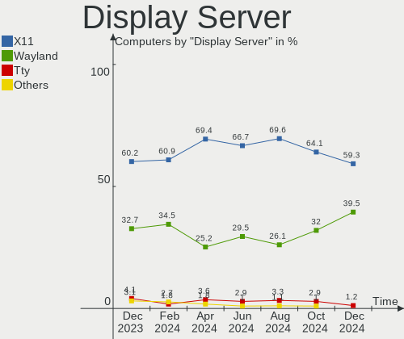
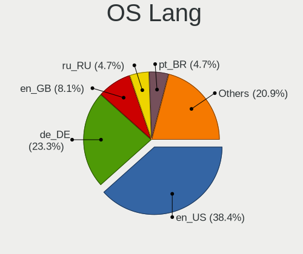
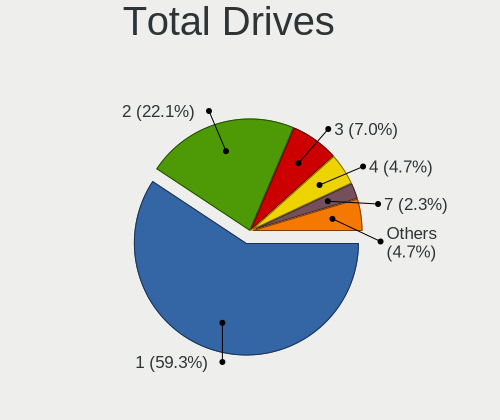
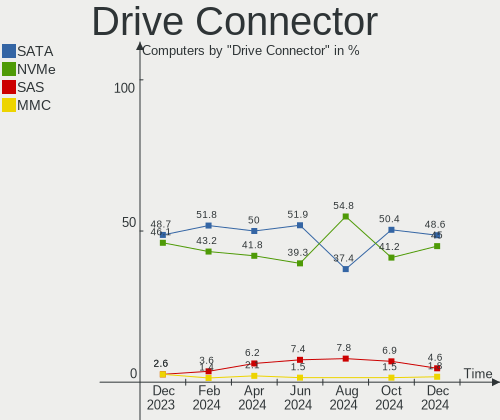
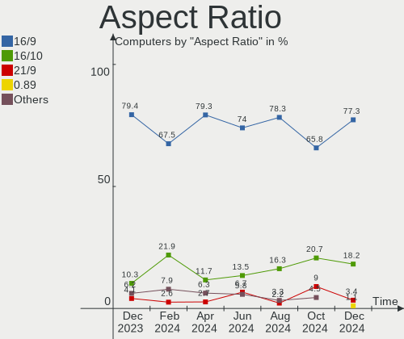
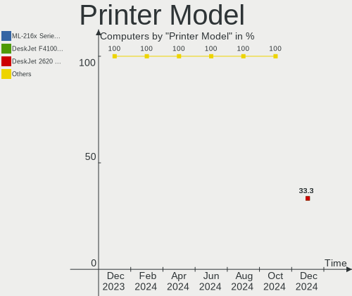
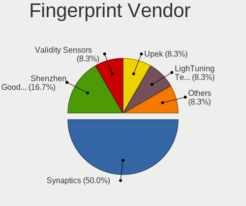
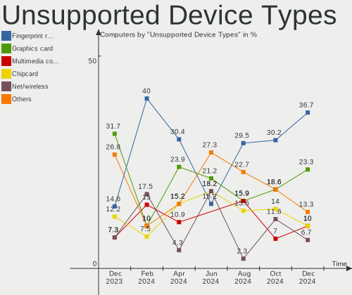

openSUSE - Hardware Trends
--------------------------

A project to identify most popular hardware characteristics and track their change
over time based on data collected by Linux users at https://Linux-Hardware.org.

Anyone can contribute to this report by the [hw-probe](https://github.com/linuxhw/hw-probe) tool:

    sudo -E hw-probe -all -upload

This is a report for all computer types. See also reports for [desktops](/Dist/openSUSE/Desktop/README.md) and [notebooks](/Dist/openSUSE/Notebook/README.md).

This report is for one last month. Overall report since the beginning of time: [TestDays](https://github.com/linuxhw/TestDays)

Period: Apr, 2024.

Contents
--------

* [ System ](#system)
  - [ OS                       ](#os)
  - [ OS Family                ](#os-family)
  - [ Kernel                   ](#kernel)
  - [ Kernel Family            ](#kernel-family)
  - [ Kernel Major Ver.        ](#kernel-major-ver)
  - [ Arch                     ](#arch)
  - [ DE                       ](#de)
  - [ Display Server           ](#display-server)
  - [ Display Manager          ](#display-manager)
  - [ OS Lang                  ](#os-lang)
  - [ Boot Mode                ](#boot-mode)
  - [ Filesystem               ](#filesystem)
  - [ Part. scheme             ](#part-scheme)
  - [ Dual Boot with Linux/BSD ](#dual-boot-with-linuxbsd)
  - [ Dual Boot (Win)          ](#dual-boot-win)

* [ Board ](#board)
  - [ Vendor                   ](#vendor)
  - [ Model                    ](#model)
  - [ Model Family             ](#model-family)
  - [ MFG Year                 ](#mfg-year)
  - [ Form Factor              ](#form-factor)
  - [ Secure Boot              ](#secure-boot)
  - [ Coreboot                 ](#coreboot)
  - [ RAM Size                 ](#ram-size)
  - [ RAM Used                 ](#ram-used)
  - [ Total Drives             ](#total-drives)
  - [ Has CD-ROM               ](#has-cd-rom)
  - [ Has Ethernet             ](#has-ethernet)
  - [ Has WiFi                 ](#has-wifi)
  - [ Has Bluetooth            ](#has-bluetooth)

* [ Location ](#location)
  - [ Country                  ](#country)
  - [ City                     ](#city)

* [ Drives ](#drives)
  - [ Drive Vendor             ](#drive-vendor)
  - [ Drive Model              ](#drive-model)
  - [ HDD Vendor               ](#hdd-vendor)
  - [ SSD Vendor               ](#ssd-vendor)
  - [ Drive Kind               ](#drive-kind)
  - [ Drive Connector          ](#drive-connector)
  - [ Drive Size               ](#drive-size)
  - [ Space Total              ](#space-total)
  - [ Space Used               ](#space-used)
  - [ Malfunc. Drives          ](#malfunc-drives)
  - [ Malfunc. Drive Vendor    ](#malfunc-drive-vendor)
  - [ Malfunc. HDD Vendor      ](#malfunc-hdd-vendor)
  - [ Malfunc. Drive Kind      ](#malfunc-drive-kind)
  - [ Failed Drives            ](#failed-drives)
  - [ Failed Drive Vendor      ](#failed-drive-vendor)
  - [ Drive Status             ](#drive-status)

* [ Storage controller ](#storage-controller)
  - [ Storage Vendor           ](#storage-vendor)
  - [ Storage Model            ](#storage-model)
  - [ Storage Kind             ](#storage-kind)

* [ Processor ](#processor)
  - [ CPU Vendor               ](#cpu-vendor)
  - [ CPU Model                ](#cpu-model)
  - [ CPU Model Family         ](#cpu-model-family)
  - [ CPU Cores                ](#cpu-cores)
  - [ CPU Sockets              ](#cpu-sockets)
  - [ CPU Threads              ](#cpu-threads)
  - [ CPU Op-Modes             ](#cpu-op-modes)
  - [ CPU Microcode            ](#cpu-microcode)
  - [ CPU Microarch            ](#cpu-microarch)

* [ Graphics ](#graphics)
  - [ GPU Vendor               ](#gpu-vendor)
  - [ GPU Model                ](#gpu-model)
  - [ GPU Combo                ](#gpu-combo)
  - [ GPU Driver               ](#gpu-driver)
  - [ GPU Memory               ](#gpu-memory)

* [ Monitor ](#monitor)
  - [ Monitor Vendor           ](#monitor-vendor)
  - [ Monitor Model            ](#monitor-model)
  - [ Monitor Resolution       ](#monitor-resolution)
  - [ Monitor Diagonal         ](#monitor-diagonal)
  - [ Monitor Width            ](#monitor-width)
  - [ Aspect Ratio             ](#aspect-ratio)
  - [ Monitor Area             ](#monitor-area)
  - [ Pixel Density            ](#pixel-density)
  - [ Multiple Monitors        ](#multiple-monitors)

* [ Network ](#network)
  - [ Net Controller Vendor    ](#net-controller-vendor)
  - [ Net Controller Model     ](#net-controller-model)
  - [ Wireless Vendor          ](#wireless-vendor)
  - [ Wireless Model           ](#wireless-model)
  - [ Ethernet Vendor          ](#ethernet-vendor)
  - [ Ethernet Model           ](#ethernet-model)
  - [ Net Controller Kind      ](#net-controller-kind)
  - [ Used Controller          ](#used-controller)
  - [ NICs                     ](#nics)
  - [ IPv6                     ](#ipv6)

* [ Bluetooth ](#bluetooth)
  - [ Bluetooth Vendor         ](#bluetooth-vendor)
  - [ Bluetooth Model          ](#bluetooth-model)

* [ Sound ](#sound)
  - [ Sound Vendor             ](#sound-vendor)
  - [ Sound Model              ](#sound-model)

* [ Memory ](#memory)
  - [ Memory Vendor            ](#memory-vendor)
  - [ Memory Model             ](#memory-model)
  - [ Memory Kind              ](#memory-kind)
  - [ Memory Form Factor       ](#memory-form-factor)
  - [ Memory Size              ](#memory-size)
  - [ Memory Speed             ](#memory-speed)

* [ Printers & scanners ](#printers--scanners)
  - [ Printer Vendor           ](#printer-vendor)
  - [ Printer Model            ](#printer-model)
  - [ Scanner Vendor           ](#scanner-vendor)
  - [ Scanner Model            ](#scanner-model)

* [ Camera ](#camera)
  - [ Camera Vendor            ](#camera-vendor)
  - [ Camera Model             ](#camera-model)

* [ Security ](#security)
  - [ Fingerprint Vendor       ](#fingerprint-vendor)
  - [ Fingerprint Model        ](#fingerprint-model)
  - [ Chipcard Vendor          ](#chipcard-vendor)
  - [ Chipcard Model           ](#chipcard-model)

* [ Unsupported ](#unsupported)
  - [ Unsupported Devices      ](#unsupported-devices)
  - [ Unsupported Device Types ](#unsupported-device-types)

System
------

OS
--

Installed operating systems

| Name                         | Computers | Percent |
|------------------------------|-----------|---------|
| openSUSE Tumbleweed-XXXXXXXX | 67        | 60.36%  |
| openSUSE Leap-15.5           | 35        | 31.53%  |
| openSUSE Microos-XXXXXXXX    | 6         | 5.41%   |
| openSUSE Leap-15.6           | 2         | 1.8%    |
| openSUSE Leap-15.4           | 1         | 0.9%    |

OS Family
---------

OS without a version

| Name     | Computers | Percent |
|----------|-----------|---------|
| openSUSE | 111       | 100%    |

Kernel
------

Version of the Linux kernel

| Version                      | Computers | Percent |
|------------------------------|-----------|---------|
| 5.14.21-150500.55.52-default | 32        | 28.83%  |
| 6.8.1-1-default              | 15        | 13.51%  |
| 6.8.7-1-default              | 14        | 12.61%  |
| 6.8.4-rc1-1-default          | 13        | 11.71%  |
| 6.8.5-1-default              | 12        | 10.81%  |
| 6.8.2-1-default              | 9         | 8.11%   |
| 6.8.6-1-default              | 7         | 6.31%   |
| 6.4.0-150600.12-default      | 2         | 1.8%    |
| 5.14.21-150500.55.49-default | 2         | 1.8%    |
| 6.7.9-1-default              | 1         | 0.9%    |
| 6.7.7-1-default              | 1         | 0.9%    |
| 6.7.6-1-default              | 1         | 0.9%    |
| 5.14.21-150500.53-default    | 1         | 0.9%    |
| 5.14.21-150400.24.33-default | 1         | 0.9%    |

Kernel Family
-------------

Linux kernel without a distro release

| Version | Computers | Percent |
|---------|-----------|---------|
| 5.14.21 | 36        | 32.43%  |
| 6.8.1   | 15        | 13.51%  |
| 6.8.7   | 14        | 12.61%  |
| 6.8.4   | 13        | 11.71%  |
| 6.8.5   | 12        | 10.81%  |
| 6.8.2   | 9         | 8.11%   |
| 6.8.6   | 7         | 6.31%   |
| 6.4.0   | 2         | 1.8%    |
| 6.7.9   | 1         | 0.9%    |
| 6.7.7   | 1         | 0.9%    |
| 6.7.6   | 1         | 0.9%    |

Kernel Major Ver.
-----------------

Linux kernel major version

| Version | Computers | Percent |
|---------|-----------|---------|
| 6.8     | 70        | 63.06%  |
| 5.14    | 36        | 32.43%  |
| 6.7     | 3         | 2.7%    |
| 6.4     | 2         | 1.8%    |

Arch
----

OS architecture (x86_64, i586, etc.)

| Name    | Computers | Percent |
|---------|-----------|---------|
| x86_64  | 110       | 99.1%   |
| aarch64 | 1         | 0.9%    |

DE
--

Desktop Environment

| Name    | Computers | Percent |
|---------|-----------|---------|
| KDE6    | 41        | 36.94%  |
| KDE5    | 34        | 30.63%  |
| GNOME   | 19        | 17.12%  |
| Unknown | 9         | 8.11%   |
| XFCE    | 5         | 4.5%    |
| sway    | 1         | 0.9%    |
| MATE    | 1         | 0.9%    |
| AsterDE | 1         | 0.9%    |

Display Server
--------------

X11 or Wayland

| Name    | Computers | Percent |
|---------|-----------|---------|
| X11     | 77        | 69.37%  |
| Wayland | 28        | 25.23%  |
| Tty     | 4         | 3.6%    |
| Unknown | 2         | 1.8%    |

Display Manager
---------------

SDDM, LightDM, etc.

| Name    | Computers | Percent |
|---------|-----------|---------|
| Unknown | 65        | 58.56%  |
| SDDM    | 37        | 33.33%  |
| GDM     | 5         | 4.5%    |
| LightDM | 4         | 3.6%    |

OS Lang
-------

Language

| Lang    | Computers | Percent |
|---------|-----------|---------|
| en_US   | 47        | 42.34%  |
| de_DE   | 22        | 19.82%  |
| POSIX   | 9         | 8.11%   |
| en_GB   | 7         | 6.31%   |
| it_IT   | 5         | 4.5%    |
| pl_PL   | 4         | 3.6%    |
| es_ES   | 4         | 3.6%    |
| ru_RU   | 3         | 2.7%    |
| pt_BR   | 3         | 2.7%    |
| nl_NL   | 2         | 1.8%    |
| id_ID   | 1         | 0.9%    |
| fr_FR   | 1         | 0.9%    |
| en_DK   | 1         | 0.9%    |
| cs_CZ   | 1         | 0.9%    |
| Unknown | 1         | 0.9%    |

Boot Mode
---------

EFI or BIOS

| Mode | Computers | Percent |
|------|-----------|---------|
| EFI  | 69        | 62.16%  |
| BIOS | 42        | 37.84%  |

Filesystem
----------

Type of filesystem

| Type    | Computers | Percent |
|---------|-----------|---------|
| Btrfs   | 92        | 82.88%  |
| Ext4    | 13        | 11.71%  |
| Tmpfs   | 3         | 2.7%    |
| Xfs     | 2         | 1.8%    |
| Overlay | 1         | 0.9%    |

Part. scheme
------------

Scheme of partitioning

| Type    | Computers | Percent |
|---------|-----------|---------|
| Unknown | 63        | 56.76%  |
| GPT     | 45        | 40.54%  |
| MBR     | 3         | 2.7%    |

Dual Boot with Linux/BSD
------------------------

Hosting more than one Linux/BSD

| Dual boot | Computers | Percent |
|-----------|-----------|---------|
| No        | 101       | 90.99%  |
| Yes       | 10        | 9.01%   |

Dual Boot (Win)
---------------

Hosting Linux and Windows

| Dual boot | Computers | Percent |
|-----------|-----------|---------|
| No        | 93        | 83.78%  |
| Yes       | 18        | 16.22%  |

Board
-----

Vendor
------

Motherboard manufacturer

| Name                | Computers | Percent |
|---------------------|-----------|---------|
| Lenovo              | 21        | 18.92%  |
| Hewlett-Packard     | 21        | 18.92%  |
| ASUSTek Computer    | 20        | 18.02%  |
| Dell                | 12        | 10.81%  |
| MSI                 | 6         | 5.41%   |
| Acer                | 6         | 5.41%   |
| ASRock              | 4         | 3.6%    |
| Gigabyte Technology | 3         | 2.7%    |
| Apple               | 3         | 2.7%    |
| Sony                | 2         | 1.8%    |
| Fujitsu             | 2         | 1.8%    |
| Timi                | 1         | 0.9%    |
| PC Specialist       | 1         | 0.9%    |
| LG Electronics      | 1         | 0.9%    |
| Intel               | 1         | 0.9%    |
| Huanan              | 1         | 0.9%    |
| Framework           | 1         | 0.9%    |
| DUEX                | 1         | 0.9%    |
| Clevo               | 1         | 0.9%    |
| Chuwi               | 1         | 0.9%    |
| Biostar             | 1         | 0.9%    |
| AXIOO               | 1         | 0.9%    |

Model
-----

Motherboard model

| Name                                        | Computers | Percent |
|---------------------------------------------|-----------|---------|
| Dell Precision 3561                         | 2         | 1.8%    |
| Dell Latitude 3420                          | 2         | 1.8%    |
| Timi RedmiBook Pro 14S                      | 1         | 0.9%    |
| Sony VPCCB4Q1E                              | 1         | 0.9%    |
| Sony SVE14A16FBW                            | 1         | 0.9%    |
| PC Specialist Standard                      | 1         | 0.9%    |
| MSI Summit E13FlipEvo A11MT                 | 1         | 0.9%    |
| MSI MS-7D08                                 | 1         | 0.9%    |
| MSI MS-7C94                                 | 1         | 0.9%    |
| MSI MS-7C91                                 | 1         | 0.9%    |
| MSI MS-7B17                                 | 1         | 0.9%    |
| MSI GE75 Raider 10SF                        | 1         | 0.9%    |
| LG 16Z90P-G.AA75A                           | 1         | 0.9%    |
| Lenovo U31-70 80M5                          | 1         | 0.9%    |
| Lenovo ThinkStation S20 4105E2G             | 1         | 0.9%    |
| Lenovo ThinkPad X13s Gen 1 21BYS00000       | 1         | 0.9%    |
| Lenovo ThinkPad X1 Carbon Gen 8 20U9001PUS  | 1         | 0.9%    |
| Lenovo ThinkPad X1 Carbon 2nd 20A8S00804    | 1         | 0.9%    |
| Lenovo ThinkPad W510 4391W3V                | 1         | 0.9%    |
| Lenovo ThinkPad T490 20N3SBU219             | 1         | 0.9%    |
| Lenovo ThinkPad T480 20L6S68A00             | 1         | 0.9%    |
| Lenovo ThinkPad T14s Gen 4 21F8CTO1WW       | 1         | 0.9%    |
| Lenovo ThinkPad T14 Gen 3 21AJS0Q204        | 1         | 0.9%    |
| Lenovo ThinkPad P15 Gen 1 20SU000000        | 1         | 0.9%    |
| Lenovo ThinkPad L520 786035U                | 1         | 0.9%    |
| Lenovo ThinkPad L15 Gen 3 21C3CTO1WW        | 1         | 0.9%    |
| Lenovo ThinkPad L13 Gen 2 20VJS22W00        | 1         | 0.9%    |
| Lenovo ThinkPad E15 Gen 3 20YG003VCK        | 1         | 0.9%    |
| Lenovo ThinkCentre M700 10KN003LBP          | 1         | 0.9%    |
| Lenovo Legion 5 Pro 16ACH6 82JS             | 1         | 0.9%    |
| Lenovo IdeaPad Gaming 3 15ACH6 82K2         | 1         | 0.9%    |
| Lenovo IdeaCentre Gaming5 17IAB7 90T100BHMZ | 1         | 0.9%    |
| Lenovo IdeaCentre 5 14IAB7 90T2000SUS       | 1         | 0.9%    |
| Lenovo B5400 80B6QB0                        | 1         | 0.9%    |
| Intel DG965RY AAD41691-301                  | 1         | 0.9%    |
| Huanan X99-F8D PLUS V1.3                    | 1         | 0.9%    |
| HP ZBook 15 G3                              | 1         | 0.9%    |
| HP ZBook 14u G6                             | 1         | 0.9%    |
| HP Z820 Workstation                         | 1         | 0.9%    |
| HP Victus by Gaming Laptop 15-fb0xxx        | 1         | 0.9%    |

Model Family
------------

Motherboard model prefix

| Name                   | Computers | Percent |
|------------------------|-----------|---------|
| Lenovo ThinkPad        | 13        | 11.71%  |
| Dell Latitude          | 6         | 5.41%   |
| ASUS ROG               | 5         | 4.5%    |
| HP Pavilion            | 4         | 3.6%    |
| HP Laptop              | 3         | 2.7%    |
| HP EliteBook           | 3         | 2.7%    |
| Dell Precision         | 3         | 2.7%    |
| ASUS TUF               | 3         | 2.7%    |
| ASUS PRIME             | 3         | 2.7%    |
| Acer Aspire            | 3         | 2.7%    |
| Lenovo IdeaCentre      | 2         | 1.8%    |
| HP ZBook               | 2         | 1.8%    |
| HP ProBook             | 2         | 1.8%    |
| HP Compaq              | 2         | 1.8%    |
| Dell Inspiron          | 2         | 1.8%    |
| ASUS VivoBook          | 2         | 1.8%    |
| Acer Swift             | 2         | 1.8%    |
| Timi RedmiBook         | 1         | 0.9%    |
| Sony VPCCB4Q1E         | 1         | 0.9%    |
| Sony SVE14A16FBW       | 1         | 0.9%    |
| PC Specialist Standard | 1         | 0.9%    |
| MSI Summit             | 1         | 0.9%    |
| MSI MS-7D08            | 1         | 0.9%    |
| MSI MS-7C94            | 1         | 0.9%    |
| MSI MS-7C91            | 1         | 0.9%    |
| MSI MS-7B17            | 1         | 0.9%    |
| MSI GE75               | 1         | 0.9%    |
| LG 16Z90P-G.AA75A      | 1         | 0.9%    |
| Lenovo U31-70          | 1         | 0.9%    |
| Lenovo ThinkStation    | 1         | 0.9%    |
| Lenovo ThinkCentre     | 1         | 0.9%    |
| Lenovo Legion          | 1         | 0.9%    |
| Lenovo IdeaPad         | 1         | 0.9%    |
| Lenovo B5400           | 1         | 0.9%    |
| Intel DG965RY          | 1         | 0.9%    |
| Huanan X99-F8D         | 1         | 0.9%    |
| HP Z820                | 1         | 0.9%    |
| HP Victus              | 1         | 0.9%    |
| HP ProLiant            | 1         | 0.9%    |
| HP OMEN                | 1         | 0.9%    |

MFG Year
--------

Motherboard manufacture year

| Year | Computers | Percent |
|------|-----------|---------|
| 2021 | 20        | 18.02%  |
| 2020 | 12        | 10.81%  |
| 2022 | 10        | 9.01%   |
| 2018 | 9         | 8.11%   |
| 2019 | 8         | 7.21%   |
| 2011 | 8         | 7.21%   |
| 2023 | 7         | 6.31%   |
| 2014 | 7         | 6.31%   |
| 2013 | 6         | 5.41%   |
| 2012 | 6         | 5.41%   |
| 2009 | 5         | 4.5%    |
| 2017 | 3         | 2.7%    |
| 2010 | 3         | 2.7%    |
| 2016 | 2         | 1.8%    |
| 2015 | 2         | 1.8%    |
| 2024 | 1         | 0.9%    |
| 2008 | 1         | 0.9%    |
| 2007 | 1         | 0.9%    |

Form Factor
-----------

Physical design of the computer

| Name       | Computers | Percent |
|------------|-----------|---------|
| Notebook   | 70        | 63.06%  |
| Desktop    | 40        | 36.04%  |
| All in one | 1         | 0.9%    |

Secure Boot
-----------

Enabled or disabled

| State    | Computers | Percent |
|----------|-----------|---------|
| Disabled | 92        | 82.88%  |
| Enabled  | 19        | 17.12%  |

Coreboot
--------

Have coreboot on board

| Used | Computers | Percent |
|------|-----------|---------|
| No   | 111       | 100%    |

RAM Size
--------

Total RAM memory

| Size in GB  | Computers | Percent |
|-------------|-----------|---------|
| 16.01-24.0  | 32        | 28.83%  |
| 4.01-8.0    | 24        | 21.62%  |
| 32.01-64.0  | 20        | 18.02%  |
| 8.01-16.0   | 16        | 14.41%  |
| 64.01-256.0 | 11        | 9.91%   |
| 3.01-4.0    | 5         | 4.5%    |
| 24.01-32.0  | 3         | 2.7%    |

RAM Used
--------

Used RAM memory

| Used GB    | Computers | Percent |
|------------|-----------|---------|
| 2.01-3.0   | 32        | 28.83%  |
| 4.01-8.0   | 31        | 27.93%  |
| 3.01-4.0   | 20        | 18.02%  |
| 1.01-2.0   | 20        | 18.02%  |
| 8.01-16.0  | 5         | 4.5%    |
| 24.01-32.0 | 1         | 0.9%    |
| 16.01-24.0 | 1         | 0.9%    |
| 0.51-1.0   | 1         | 0.9%    |

Total Drives
------------

Number of drives on board

| Drives | Computers | Percent |
|--------|-----------|---------|
| 1      | 56        | 50.45%  |
| 2      | 31        | 27.93%  |
| 3      | 11        | 9.91%   |
| 4      | 8         | 7.21%   |
| 5      | 3         | 2.7%    |
| 8      | 1         | 0.9%    |
| 6      | 1         | 0.9%    |

Has CD-ROM
----------

Has CD-ROM on board

| Presented | Computers | Percent |
|-----------|-----------|---------|
| No        | 66        | 59.46%  |
| Yes       | 45        | 40.54%  |

Has Ethernet
------------

Has Ethernet on board

| Presented | Computers | Percent |
|-----------|-----------|---------|
| Yes       | 96        | 86.49%  |
| No        | 15        | 13.51%  |

Has WiFi
--------

Has WiFi module

| Presented | Computers | Percent |
|-----------|-----------|---------|
| Yes       | 95        | 85.59%  |
| No        | 16        | 14.41%  |

Has Bluetooth
-------------

Has Bluetooth module

| Presented | Computers | Percent |
|-----------|-----------|---------|
| Yes       | 83        | 74.77%  |
| No        | 28        | 25.23%  |

Location
--------

Country
-------

Geographic location (country)

| Country                | Computers | Percent |
|------------------------|-----------|---------|
| USA                    | 23        | 20.72%  |
| Germany                | 23        | 20.72%  |
| Italy                  | 7         | 6.31%   |
| Poland                 | 6         | 5.41%   |
| UK                     | 5         | 4.5%    |
| Russia                 | 5         | 4.5%    |
| Brazil                 | 5         | 4.5%    |
| Switzerland            | 3         | 2.7%    |
| Spain                  | 3         | 2.7%    |
| France                 | 3         | 2.7%    |
| Czechia                | 3         | 2.7%    |
| Austria                | 3         | 2.7%    |
| Indonesia              | 2         | 1.8%    |
| Australia              | 2         | 1.8%    |
| Turkey                 | 1         | 0.9%    |
| Sweden                 | 1         | 0.9%    |
| Serbia                 | 1         | 0.9%    |
| Romania                | 1         | 0.9%    |
| Puerto Rico            | 1         | 0.9%    |
| Portugal               | 1         | 0.9%    |
| New Zealand            | 1         | 0.9%    |
| Netherlands            | 1         | 0.9%    |
| Mexico                 | 1         | 0.9%    |
| Malaysia               | 1         | 0.9%    |
| India                  | 1         | 0.9%    |
| Hong Kong              | 1         | 0.9%    |
| Denmark                | 1         | 0.9%    |
| Colombia               | 1         | 0.9%    |
| Bulgaria               | 1         | 0.9%    |
| Bosnia and Herzegovina | 1         | 0.9%    |
| Belgium                | 1         | 0.9%    |
| Argentina              | 1         | 0.9%    |

City
----

Geographic location (city)

| City                  | Computers | Percent |
|-----------------------|-----------|---------|
| Warsaw                | 3         | 2.7%    |
| Oleszyce              | 2         | 1.8%    |
| Oberhausen            | 2         | 1.8%    |
| Denver                | 2         | 1.8%    |
| Ballwin               | 2         | 1.8%    |
| Zuchwil               | 1         | 0.9%    |
| Zierikzee             | 1         | 0.9%    |
| Yekaterinburg         | 1         | 0.9%    |
| Wandsworth            | 1         | 0.9%    |
| Vilshofen             | 1         | 0.9%    |
| Villach               | 1         | 0.9%    |
| Vienna                | 1         | 0.9%    |
| Verdun                | 1         | 0.9%    |
| Ulm                   | 1         | 0.9%    |
| Tulsa                 | 1         | 0.9%    |
| Trieste               | 1         | 0.9%    |
| Sydney                | 1         | 0.9%    |
| Succivo               | 1         | 0.9%    |
| Stockholm             | 1         | 0.9%    |
| Sterling              | 1         | 0.9%    |
| Southampton           | 1         | 0.9%    |
| Sofia                 | 1         | 0.9%    |
| Sesto San Giovanni    | 1         | 0.9%    |
| Semarang              | 1         | 0.9%    |
| Seckau                | 1         | 0.9%    |
| Sao Jose do Rio Preto | 1         | 0.9%    |
| Santos                | 1         | 0.9%    |
| Santa Marta           | 1         | 0.9%    |
| San Juan              | 1         | 0.9%    |
| San Diego             | 1         | 0.9%    |
| Sacramento            | 1         | 0.9%    |
| Rüsselsheim am Main  | 1         | 0.9%    |
| Rochester             | 1         | 0.9%    |
| Rheine                | 1         | 0.9%    |
| Recife                | 1         | 0.9%    |
| Ravensburg            | 1         | 0.9%    |
| Ramenskoye            | 1         | 0.9%    |
| Płock                | 1         | 0.9%    |
| Prague                | 1         | 0.9%    |
| Porto Mantovano       | 1         | 0.9%    |

Drives
------

Drive Vendor
------------

Hard drive vendors

| Vendor                       | Computers | Drives | Percent |
|------------------------------|-----------|--------|---------|
| Samsung Electronics          | 38        | 57     | 21.47%  |
| Seagate                      | 15        | 20     | 8.47%   |
| Sandisk                      | 15        | 15     | 8.47%   |
| WDC                          | 12        | 16     | 6.78%   |
| Kingston                     | 11        | 14     | 6.21%   |
| Micron Technology            | 8         | 8      | 4.52%   |
| Crucial                      | 8         | 9      | 4.52%   |
| Toshiba                      | 7         | 8      | 3.95%   |
| Unknown                      | 6         | 6      | 3.39%   |
| Kingston Technology Company  | 5         | 5      | 2.82%   |
| SK hynix                     | 4         | 4      | 2.26%   |
| Intel                        | 4         | 4      | 2.26%   |
| SPCC                         | 3         | 3      | 1.69%   |
| Silicon Motion               | 3         | 3      | 1.69%   |
| HGST                         | 3         | 8      | 1.69%   |
| China                        | 3         | 4      | 1.69%   |
| Transcend                    | 2         | 2      | 1.13%   |
| Phison Electronics           | 2         | 2      | 1.13%   |
| LITEON                       | 2         | 2      | 1.13%   |
| KIOXIA                       | 2         | 2      | 1.13%   |
| ADATA Technology             | 2         | 2      | 1.13%   |
| Unknown                      | 2         | 2      | 1.13%   |
| USB3.0                       | 1         | 1      | 0.56%   |
| USB                          | 1         | 1      | 0.56%   |
| T-FORCE                      | 1         | 1      | 0.56%   |
| SXMicro                      | 1         | 1      | 0.56%   |
| SSK                          | 1         | 1      | 0.56%   |
| Shenzhen Longsys Electronics | 1         | 1      | 0.56%   |
| SABRENT                      | 1         | 1      | 0.56%   |
| Realtek Semiconductor        | 1         | 1      | 0.56%   |
| Neo                          | 1         | 1      | 0.56%   |
| MidasForce                   | 1         | 1      | 0.56%   |
| Micron/Crucial Technology    | 1         | 1      | 0.56%   |
| LITEONIT                     | 1         | 1      | 0.56%   |
| JMicron Technology           | 1         | 1      | 0.56%   |
| Intenso                      | 1         | 1      | 0.56%   |
| Hitachi                      | 1         | 1      | 0.56%   |
| Emtec                        | 1         | 1      | 0.56%   |
| Dogfish                      | 1         | 1      | 0.56%   |
| Apple                        | 1         | 1      | 0.56%   |

Drive Model
-----------

Hard drive models

| Model                                                 | Computers | Percent |
|-------------------------------------------------------|-----------|---------|
| Samsung NVMe SSD Controller SM981/PM981/PM983 1TB     | 13        | 6.74%   |
| Kingston SA400S37480G 480GB SSD                       | 5         | 2.59%   |
| Samsung NVMe SSD Controller PM9A1/PM9A3/980PRO 1TB    | 4         | 2.07%   |
| Silicon Motion SM2263EN/SM2263XT SSD Controller 256GB | 3         | 1.55%   |
| Seagate ST4000DM004-2CV104 4TB                        | 3         | 1.55%   |
| Sandisk WD Black SN750 / PC SN730 NVMe SSD 512GB      | 3         | 1.55%   |
| Kingston Company A2000 NVMe SSD 500GB                 | 3         | 1.55%   |
| Unknown MMC Card  32GB                                | 2         | 1.04%   |
| Toshiba XG6 NVMe SSD Controller 1024GB                | 2         | 1.04%   |
| SPCC Solid State Disk 1024GB                          | 2         | 1.04%   |
| Samsung SSD PM871 mSATA 256GB                         | 2         | 1.04%   |
| Samsung SSD 870 QVO 2TB                               | 2         | 1.04%   |
| Samsung SSD 870 EVO 500GB                             | 2         | 1.04%   |
| Samsung SSD 870 EVO 1TB                               | 2         | 1.04%   |
| Samsung SSD 840 EVO 250GB                             | 2         | 1.04%   |
| Kingston SKC3000S1024G 1TB                            | 2         | 1.04%   |
| Crucial CT500MX500SSD1 500GB                          | 2         | 1.04%   |
| Crucial CT240BX500SSD1 240GB                          | 2         | 1.04%   |
| Crucial CT2000MX500SSD1 2TB                           | 2         | 1.04%   |
| Unknown                                               | 2         | 1.04%   |
| WDC WDS250G1B0A-00H9H0 250GB SSD                      | 1         | 0.52%   |
| WDC WD40EFZX-68AWUN0 4TB                              | 1         | 0.52%   |
| WDC WD4005FZBX-00K5WB0 4TB                            | 1         | 0.52%   |
| WDC WD2500AAKX-083CA1 250GB                           | 1         | 0.52%   |
| WDC WD20EZRX-22D8PB0 2TB                              | 1         | 0.52%   |
| WDC WD20EZBX-00AYRA0 2TB                              | 1         | 0.52%   |
| WDC WD20EARX-00PASB0 2TB                              | 1         | 0.52%   |
| WDC WD2000FYYZ-01UL1B3 2TB                            | 1         | 0.52%   |
| WDC WD15NPVX-00EA4T0 1TB                              | 1         | 0.52%   |
| WDC WD10EZEX-08WN4A1 1TB                              | 1         | 0.52%   |
| WDC WD10EZEX-08M2NA0 1TB                              | 1         | 0.52%   |
| WDC WD1003FBYX-01Y7B1 1TB                             | 1         | 0.52%   |
| WDC WD Green M.2 2280 240GB                           | 1         | 0.52%   |
| WDC PC SN530 NVMe 512GB                               | 1         | 0.52%   |
| USB3.0 Super Speed 240GB                              | 1         | 0.52%   |
| USB SanDisk 3.2Gen1 128GB                             | 1         | 0.52%   |
| Unknown USB DISK 3.2 1TB                              | 1         | 0.52%   |
| Unknown SD/MMC/MS PRO 128GB                           | 1         | 0.52%   |
| Unknown NVMe SSD Drive 512GB                          | 1         | 0.52%   |
| Unknown NVMe SSD Drive 1TB                            | 1         | 0.52%   |

HDD Vendor
----------

Hard disk drive vendors

| Vendor              | Computers | Drives | Percent |
|---------------------|-----------|--------|---------|
| Seagate             | 13        | 18     | 36.11%  |
| WDC                 | 10        | 14     | 27.78%  |
| Toshiba             | 5         | 6      | 13.89%  |
| HGST                | 3         | 8      | 8.33%   |
| Samsung Electronics | 2         | 2      | 5.56%   |
| Unknown             | 1         | 1      | 2.78%   |
| SABRENT             | 1         | 1      | 2.78%   |
| Hitachi             | 1         | 1      | 2.78%   |

SSD Vendor
----------

Solid state drive vendors

| Vendor              | Computers | Drives | Percent |
|---------------------|-----------|--------|---------|
| Samsung Electronics | 18        | 25     | 26.87%  |
| Kingston            | 9         | 9      | 13.43%  |
| Crucial             | 8         | 9      | 11.94%  |
| SanDisk             | 5         | 5      | 7.46%   |
| Micron Technology   | 4         | 4      | 5.97%   |
| SPCC                | 3         | 3      | 4.48%   |
| China               | 3         | 4      | 4.48%   |
| Transcend           | 2         | 2      | 2.99%   |
| LITEON              | 2         | 2      | 2.99%   |
| WDC                 | 1         | 1      | 1.49%   |
| USB3.0              | 1         | 1      | 1.49%   |
| SXMicro             | 1         | 1      | 1.49%   |
| SK hynix            | 1         | 1      | 1.49%   |
| Neo                 | 1         | 1      | 1.49%   |
| MidasForce          | 1         | 1      | 1.49%   |
| LITEONIT            | 1         | 1      | 1.49%   |
| Intenso             | 1         | 1      | 1.49%   |
| Intel               | 1         | 1      | 1.49%   |
| Emtec               | 1         | 1      | 1.49%   |
| Dogfish             | 1         | 1      | 1.49%   |
| Apple               | 1         | 1      | 1.49%   |
| Apacer              | 1         | 1      | 1.49%   |

Drive Kind
----------

HDD or SSD

| Kind    | Computers | Drives | Percent |
|---------|-----------|--------|---------|
| NVMe    | 62        | 80     | 38.75%  |
| SSD     | 59        | 76     | 36.88%  |
| HDD     | 30        | 51     | 18.75%  |
| Unknown | 6         | 6      | 3.75%   |
| MMC     | 3         | 3      | 1.88%   |

Drive Connector
---------------

SATA, SAS, NVMe, etc.

| Type | Computers | Drives | Percent |
|------|-----------|--------|---------|
| SATA | 73        | 124    | 50%     |
| NVMe | 61        | 79     | 41.78%  |
| SAS  | 9         | 10     | 6.16%   |
| MMC  | 3         | 3      | 2.05%   |

Drive Size
----------

Size of hard drive

| Size in TB | Computers | Drives | Percent |
|------------|-----------|--------|---------|
| 0.01-0.5   | 44        | 53     | 44.9%   |
| 0.51-1.0   | 23        | 28     | 23.47%  |
| 1.01-2.0   | 15        | 19     | 15.31%  |
| 3.01-4.0   | 10        | 13     | 10.2%   |
| 4.01-10.0  | 3         | 7      | 3.06%   |
| 2.01-3.0   | 2         | 5      | 2.04%   |
| 10.01-20.0 | 1         | 2      | 1.02%   |

Space Total
-----------

Amount of disk space available on the file system

| Size in GB     | Computers | Percent |
|----------------|-----------|---------|
| More than 3000 | 48        | 43.24%  |
| 1001-2000      | 18        | 16.22%  |
| 2001-3000      | 16        | 14.41%  |
| 251-500        | 10        | 9.01%   |
| 501-1000       | 7         | 6.31%   |
| 101-250        | 4         | 3.6%    |
| Unknown        | 4         | 3.6%    |
| 51-100         | 2         | 1.8%    |
| 21-50          | 1         | 0.9%    |
| 1-20           | 1         | 0.9%    |

Space Used
----------

Amount of used disk space

| Used GB        | Computers | Percent |
|----------------|-----------|---------|
| 101-250        | 25        | 22.52%  |
| 51-100         | 20        | 18.02%  |
| 501-1000       | 17        | 15.32%  |
| More than 3000 | 15        | 13.51%  |
| 251-500        | 12        | 10.81%  |
| 1001-2000      | 6         | 5.41%   |
| 2001-3000      | 5         | 4.5%    |
| 21-50          | 4         | 3.6%    |
| Unknown        | 4         | 3.6%    |
| 1-20           | 3         | 2.7%    |

Malfunc. Drives
---------------

Drive models with a malfunction

| Model                       | Computers | Drives | Percent |
|-----------------------------|-----------|--------|---------|
| Intel SSD 600P Series 256GB | 1         | 1      | 50%     |
| Apacer AS340 480GB SSD      | 1         | 1      | 50%     |

Malfunc. Drive Vendor
---------------------

Vendors of faulty drives

| Vendor | Computers | Drives | Percent |
|--------|-----------|--------|---------|
| Intel  | 1         | 1      | 50%     |
| Apacer | 1         | 1      | 50%     |

Malfunc. HDD Vendor
-------------------

Vendors of faulty HDD drives

Zero info for selected period =(

Malfunc. Drive Kind
-------------------

Kinds of faulty drives

| Kind | Computers | Drives | Percent |
|------|-----------|--------|---------|
| NVMe | 1         | 1      | 50%     |
| SSD  | 1         | 1      | 50%     |

Failed Drives
-------------

Failed drive models

Zero info for selected period =(

Failed Drive Vendor
-------------------

Failed drive vendors

Zero info for selected period =(

Drive Status
------------

Number of failed and malfunc. drives

| Status   | Computers | Drives | Percent |
|----------|-----------|--------|---------|
| Detected | 70        | 145    | 60.34%  |
| Works    | 44        | 69     | 37.93%  |
| Malfunc  | 2         | 2      | 1.72%   |

Storage controller
------------------

Storage Vendor
--------------

Storage controller vendors

| Vendor                       | Computers | Percent |
|------------------------------|-----------|---------|
| Intel                        | 71        | 44.38%  |
| Samsung Electronics          | 23        | 14.38%  |
| AMD                          | 17        | 10.63%  |
| SanDisk                      | 11        | 6.88%   |
| Kingston Technology Company  | 7         | 4.38%   |
| Micron Technology            | 4         | 2.5%    |
| SK hynix                     | 3         | 1.88%   |
| Silicon Motion               | 3         | 1.88%   |
| ADATA Technology             | 3         | 1.88%   |
| Toshiba America Info Systems | 2         | 1.25%   |
| Phison Electronics           | 2         | 1.25%   |
| KIOXIA                       | 2         | 1.25%   |
| ASMedia Technology           | 2         | 1.25%   |
| Solidigm                     | 1         | 0.63%   |
| Shenzhen Longsys Electronics | 1         | 0.63%   |
| Seagate Technology           | 1         | 0.63%   |
| Realtek Semiconductor        | 1         | 0.63%   |
| Promise Technology           | 1         | 0.63%   |
| Micron/Crucial Technology    | 1         | 0.63%   |
| Marvell Technology Group     | 1         | 0.63%   |
| JMicron Technology           | 1         | 0.63%   |
| INNOGRIT                     | 1         | 0.63%   |
| Broadcom / LSI               | 1         | 0.63%   |

Storage Model
-------------

Storage controller models

| Model                                                                          | Computers | Percent |
|--------------------------------------------------------------------------------|-----------|---------|
| Samsung NVMe SSD Controller SM981/PM981/PM983                                  | 13        | 7.22%   |
| AMD FCH SATA Controller [AHCI mode]                                            | 8         | 4.44%   |
| Intel 6 Series/C200 Series Chipset Family 6 port Mobile SATA AHCI Controller   | 6         | 3.33%   |
| Intel Volume Management Device NVMe RAID Controller                            | 5         | 2.78%   |
| Intel 8 Series/C220 Series Chipset Family 6-port SATA Controller 1 [AHCI mode] | 5         | 2.78%   |
| Intel 7 Series Chipset Family 6-port SATA Controller [AHCI mode]               | 5         | 2.78%   |
| Samsung NVMe SSD Controller PM9A1/PM9A3/980PRO                                 | 4         | 2.22%   |
| Intel Tiger Lake-LP SATA Controller                                            | 4         | 2.22%   |
| Intel Alder Lake-S PCH SATA Controller [AHCI Mode]                             | 4         | 2.22%   |
| Intel 8 Series SATA Controller 1 [AHCI mode]                                   | 4         | 2.22%   |
| Intel 200 Series PCH SATA controller [AHCI mode]                               | 4         | 2.22%   |
| AMD 500 Series Chipset SATA Controller                                         | 4         | 2.22%   |
| Silicon Motion SM2263EN/SM2263XT (DRAM-less) NVMe SSD Controllers              | 3         | 1.67%   |
| SanDisk WD Black SN770 / PC SN740 256GB / PC SN560 (DRAM-less) NVMe SSD        | 3         | 1.67%   |
| SanDisk Extreme Pro / WD Black SN750 / PC SN730 / Red SN700 NVMe SSD           | 3         | 1.67%   |
| Samsung NVMe SSD Controller S4LV008[Pascal]                                    | 3         | 1.67%   |
| Samsung NVMe SSD Controller 980 (DRAM-less)                                    | 3         | 1.67%   |
| Kingston Company A2000 NVMe SSD SM2263EN                                       | 3         | 1.67%   |
| Intel SATA Controller [RAID Mode]                                              | 3         | 1.67%   |
| Intel Q170/Q150/B150/H170/H110/Z170/CM236 Chipset SATA Controller [AHCI Mode]  | 3         | 1.67%   |
| AMD 400 Series Chipset SATA Controller                                         | 3         | 1.67%   |
| Toshiba America Info Systems XG6 NVMe SSD Controller                           | 2         | 1.11%   |
| Kingston Company KC3000/FURY Renegade NVMe SSD E18                             | 2         | 1.11%   |
| Intel Wildcat Point-LP SATA Controller [AHCI Mode]                             | 2         | 1.11%   |
| Intel Tiger Lake SATA AHCI Controller                                          | 2         | 1.11%   |
| Intel Sunrise Point-LP SATA Controller [AHCI mode]                             | 2         | 1.11%   |
| Intel Cannon Point-LP SATA Controller [AHCI Mode]                              | 2         | 1.11%   |
| Intel Cannon Lake PCH SATA AHCI Controller                                     | 2         | 1.11%   |
| Intel Cannon Lake Mobile PCH SATA AHCI Controller                              | 2         | 1.11%   |
| Intel 9 Series Chipset Family SATA Controller [AHCI Mode]                      | 2         | 1.11%   |
| Intel 500 Series Chipset Family SATA RAID Controller                           | 2         | 1.11%   |
| Intel 400 Series Chipset Family SATA AHCI Controller                           | 2         | 1.11%   |
| ASMedia ASM1061/ASM1062 Serial ATA Controller                                  | 2         | 1.11%   |
| AMD SB7x0/SB8x0/SB9x0 SATA Controller [AHCI mode]                              | 2         | 1.11%   |
| AMD SB7x0/SB8x0/SB9x0 IDE Controller                                           | 2         | 1.11%   |
| AMD 600 Series Chipset SATA Controller                                         | 2         | 1.11%   |
| Solidigm P41 Plus NVMe SSD (DRAM-less) [Echo Harbor]                           | 1         | 0.56%   |
| SK hynix PC601 NVMe Solid State Drive                                          | 1         | 0.56%   |
| SK hynix Gold P31/BC711/PC711 NVMe Solid State Drive                           | 1         | 0.56%   |
| SK hynix BC511 NVMe SSD                                                        | 1         | 0.56%   |

Storage Kind
------------

Kind of storage controller (IDE, SATA, NVMe, SAS, ...)

| Kind | Computers | Percent |
|------|-----------|---------|
| SATA | 79        | 48.77%  |
| NVMe | 61        | 37.65%  |
| RAID | 12        | 7.41%   |
| IDE  | 9         | 5.56%   |
| SAS  | 1         | 0.62%   |

Processor
---------

CPU Vendor
----------

Processor vendors

| Vendor | Computers | Percent |
|--------|-----------|---------|
| Intel  | 82        | 73.87%  |
| AMD    | 28        | 25.23%  |
| ARM    | 1         | 0.9%    |

CPU Model
---------

Processor models

| Model                                       | Computers | Percent |
|---------------------------------------------|-----------|---------|
| Intel Core i7-8700 CPU @ 3.20GHz            | 3         | 2.7%    |
| Intel Core i7-4600U CPU @ 2.10GHz           | 2         | 1.8%    |
| Intel Core i5-8365U CPU @ 1.60GHz           | 2         | 1.8%    |
| Intel Core i5-2450M CPU @ 2.50GHz           | 2         | 1.8%    |
| Intel 11th Gen Core i7-1165G7 @ 2.80GHz     | 2         | 1.8%    |
| Intel 11th Gen Core i5-1135G7 @ 2.40GHz     | 2         | 1.8%    |
| AMD Ryzen 9 5900HX with Radeon Graphics     | 2         | 1.8%    |
| AMD Ryzen 7 5700U with Radeon Graphics      | 2         | 1.8%    |
| AMD Ryzen 5 5600H with Radeon Graphics      | 2         | 1.8%    |
| Intel Xeon CPU X5650 @ 2.67GHz              | 1         | 0.9%    |
| Intel Xeon CPU W3530 @ 2.80GHz              | 1         | 0.9%    |
| Intel Xeon CPU E5-2680 v4 @ 2.40GHz         | 1         | 0.9%    |
| Intel Xeon CPU E5-2680 0 @ 2.70GHz          | 1         | 0.9%    |
| Intel Pentium Dual-Core CPU E6500 @ 2.93GHz | 1         | 0.9%    |
| Intel Pentium CPU B980 @ 2.40GHz            | 1         | 0.9%    |
| Intel N100                                  | 1         | 0.9%    |
| Intel Core i9-9900X CPU @ 3.50GHz           | 1         | 0.9%    |
| Intel Core i7-9750H CPU @ 2.60GHz           | 1         | 0.9%    |
| Intel Core i7-8850H CPU @ 2.60GHz           | 1         | 0.9%    |
| Intel Core i7-8650U CPU @ 1.90GHz           | 1         | 0.9%    |
| Intel Core i7-8565U CPU @ 1.80GHz           | 1         | 0.9%    |
| Intel Core i7-8550U CPU @ 1.80GHz           | 1         | 0.9%    |
| Intel Core i7-8086K CPU @ 4.00GHz           | 1         | 0.9%    |
| Intel Core i7-6820HQ CPU @ 2.70GHz          | 1         | 0.9%    |
| Intel Core i7-6700 CPU @ 3.40GHz            | 1         | 0.9%    |
| Intel Core i7-4800MQ CPU @ 2.70GHz          | 1         | 0.9%    |
| Intel Core i7-4790K CPU @ 4.00GHz           | 1         | 0.9%    |
| Intel Core i7-4710HQ CPU @ 2.50GHz          | 1         | 0.9%    |
| Intel Core i7-3615QM CPU @ 2.30GHz          | 1         | 0.9%    |
| Intel Core i7-2670QM CPU @ 2.20GHz          | 1         | 0.9%    |
| Intel Core i7-2620M CPU @ 2.70GHz           | 1         | 0.9%    |
| Intel Core i7-10850H CPU @ 2.70GHz          | 1         | 0.9%    |
| Intel Core i7-10750H CPU @ 2.60GHz          | 1         | 0.9%    |
| Intel Core i7 CPU Q 720 @ 1.60GHz           | 1         | 0.9%    |
| Intel Core i7 CPU 880 @ 3.07GHz             | 1         | 0.9%    |
| Intel Core i5-8350U CPU @ 1.70GHz           | 1         | 0.9%    |
| Intel Core i5-7500 CPU @ 3.40GHz            | 1         | 0.9%    |
| Intel Core i5-7300U CPU @ 2.60GHz           | 1         | 0.9%    |
| Intel Core i5-6400 CPU @ 2.70GHz            | 1         | 0.9%    |
| Intel Core i5-5300U CPU @ 2.30GHz           | 1         | 0.9%    |

CPU Model Family
----------------

Processor model prefix

| Model                   | Computers | Percent |
|-------------------------|-----------|---------|
| Intel Core i7           | 23        | 20.72%  |
| Intel Core i5           | 23        | 20.72%  |
| Other                   | 22        | 19.82%  |
| AMD Ryzen 5             | 9         | 8.11%   |
| AMD Ryzen 7             | 8         | 7.21%   |
| Intel Core i3           | 5         | 4.5%    |
| Intel Xeon              | 4         | 3.6%    |
| AMD Ryzen 9             | 4         | 3.6%    |
| Intel Core 2 Duo        | 2         | 1.8%    |
| AMD Ryzen 3             | 2         | 1.8%    |
| AMD FX                  | 2         | 1.8%    |
| Intel Pentium Dual-Core | 1         | 0.9%    |
| Intel Pentium           | 1         | 0.9%    |
| Intel Core i9           | 1         | 0.9%    |
| Intel Core 2            | 1         | 0.9%    |
| AMD Ryzen 7 PRO         | 1         | 0.9%    |
| AMD Athlon II X3        | 1         | 0.9%    |
| AMD A6                  | 1         | 0.9%    |

CPU Cores
---------

Number of processor cores

| Number | Computers | Percent |
|--------|-----------|---------|
| 4      | 39        | 35.14%  |
| 2      | 25        | 22.52%  |
| 6      | 20        | 18.02%  |
| 8      | 13        | 11.71%  |
| 16     | 5         | 4.5%    |
| 10     | 4         | 3.6%    |
| 12     | 3         | 2.7%    |
| 28     | 1         | 0.9%    |
| 3      | 1         | 0.9%    |

CPU Sockets
-----------

Number of sockets

| Number | Computers | Percent |
|--------|-----------|---------|
| 1      | 108       | 97.3%   |
| 2      | 3         | 2.7%    |

CPU Threads
-----------

Threads per core (Hyper-Threading)

| Number | Computers | Percent |
|--------|-----------|---------|
| 2      | 92        | 82.88%  |
| 1      | 19        | 17.12%  |

CPU Op-Modes
------------

CPU Operation Modes (32-bit, 64-bit)

| Op mode        | Computers | Percent |
|----------------|-----------|---------|
| 32-bit, 64-bit | 111       | 100%    |

CPU Microcode
-------------

Microcode number

| Number     | Computers | Percent |
|------------|-----------|---------|
| Unknown    | 99        | 89.19%  |
| 0x906ea    | 2         | 1.8%    |
| 0x806c1    | 2         | 1.8%    |
| 0x1067a    | 2         | 1.8%    |
| 0xb0671    | 1         | 0.9%    |
| 0x806d1    | 1         | 0.9%    |
| 0x50654    | 1         | 0.9%    |
| 0x306d4    | 1         | 0.9%    |
| 0x0a704103 | 1         | 0.9%    |
| 0x0a50000f | 1         | 0.9%    |

CPU Microarch
-------------

Microarchitecture

| Name             | Computers | Percent |
|------------------|-----------|---------|
| KabyLake         | 15        | 13.51%  |
| SandyBridge      | 12        | 10.81%  |
| Zen 3            | 11        | 9.91%   |
| Haswell          | 11        | 9.91%   |
| Unknown          | 11        | 9.91%   |
| TigerLake        | 8         | 7.21%   |
| Alderlake Hybrid | 6         | 5.41%   |
| CometLake        | 5         | 4.5%    |
| Skylake          | 4         | 3.6%    |
| Icelake          | 4         | 3.6%    |
| Zen+             | 3         | 2.7%    |
| Nehalem          | 3         | 2.7%    |
| Broadwell        | 3         | 2.7%    |
| Zen 2            | 2         | 1.8%    |
| Westmere         | 2         | 1.8%    |
| Piledriver       | 2         | 1.8%    |
| Penryn           | 2         | 1.8%    |
| IvyBridge        | 2         | 1.8%    |
| Core             | 2         | 1.8%    |
| K10              | 1         | 0.9%    |
| Gracemont        | 1         | 0.9%    |
| Excavator        | 1         | 0.9%    |

Graphics
--------

GPU Vendor
----------

Vendors of graphics cards

| Vendor | Computers | Percent |
|--------|-----------|---------|
| Intel  | 62        | 45.26%  |
| Nvidia | 38        | 27.74%  |
| AMD    | 37        | 27.01%  |

GPU Model
---------

Graphics card models

| Model                                                                       | Computers | Percent |
|-----------------------------------------------------------------------------|-----------|---------|
| Intel 2nd Generation Core Processor Family Integrated Graphics Controller   | 9         | 6.43%   |
| Intel TigerLake-LP GT2 [Iris Xe Graphics]                                   | 7         | 5%      |
| AMD Cezanne [Radeon Vega Series / Radeon Vega Mobile Series]                | 5         | 3.57%   |
| Intel Haswell-ULT Integrated Graphics Controller                            | 4         | 2.86%   |
| Intel CometLake-H GT2 [UHD Graphics]                                        | 4         | 2.86%   |
| Intel 4th Gen Core Processor Integrated Graphics Controller                 | 4         | 2.86%   |
| AMD Lucienne                                                                | 4         | 2.86%   |
| Intel Xeon E3-1200 v3/4th Gen Core Processor Integrated Graphics Controller | 3         | 2.14%   |
| Intel WhiskeyLake-U GT2 [UHD Graphics 620]                                  | 3         | 2.14%   |
| Intel UHD Graphics 620                                                      | 3         | 2.14%   |
| Nvidia GF117M [GeForce 610M/710M/810M/820M / GT 620M/625M/630M/720M]        | 2         | 1.43%   |
| Intel TigerLake-H GT1 [UHD Graphics]                                        | 2         | 1.43%   |
| Intel HD Graphics 5500                                                      | 2         | 1.43%   |
| Intel HD Graphics 530                                                       | 2         | 1.43%   |
| Intel CoffeeLake-S GT2 [UHD Graphics 630]                                   | 2         | 1.43%   |
| Intel CoffeeLake-H GT2 [UHD Graphics 630]                                   | 2         | 1.43%   |
| Intel Alder Lake-UP3 GT2 [Iris Xe Graphics]                                 | 2         | 1.43%   |
| Intel 3rd Gen Core processor Graphics Controller                            | 2         | 1.43%   |
| AMD Whistler [Radeon HD 6630M/6650M/6750M/7670M/7690M]                      | 2         | 1.43%   |
| AMD Raphael                                                                 | 2         | 1.43%   |
| AMD Phoenix1                                                                | 2         | 1.43%   |
| AMD Barcelo                                                                 | 2         | 1.43%   |
| Nvidia TU117M [GeForce GTX 1650 Ti Mobile]                                  | 1         | 0.71%   |
| Nvidia TU117GLM [T600 Mobile]                                               | 1         | 0.71%   |
| Nvidia TU117GLM [T1200 Laptop GPU]                                          | 1         | 0.71%   |
| Nvidia TU117GLM [Quadro T1000 Mobile]                                       | 1         | 0.71%   |
| Nvidia TU116M [GeForce GTX 1660 Ti Mobile]                                  | 1         | 0.71%   |
| Nvidia TU116 [GeForce GTX 1660 SUPER]                                       | 1         | 0.71%   |
| Nvidia TU116 [GeForce GTX 1650 SUPER]                                       | 1         | 0.71%   |
| Nvidia TU106M [GeForce RTX 2070 Mobile / Max-Q Refresh]                     | 1         | 0.71%   |
| Nvidia TU106 [GeForce RTX 2070]                                             | 1         | 0.71%   |
| Nvidia TU104 [GeForce RTX 2070 SUPER]                                       | 1         | 0.71%   |
| Nvidia GT216GLM [Quadro FX 880M]                                            | 1         | 0.71%   |
| Nvidia GP108M [GeForce MX150]                                               | 1         | 0.71%   |
| Nvidia GP108 [GeForce GT 1030]                                              | 1         | 0.71%   |
| Nvidia GP107 [GeForce GTX 1050 Ti]                                          | 1         | 0.71%   |
| Nvidia GP104GLM [Quadro P3200 Mobile]                                       | 1         | 0.71%   |
| Nvidia GP104 [GeForce GTX 1070]                                             | 1         | 0.71%   |
| Nvidia GP102 [GeForce GTX 1080 Ti]                                          | 1         | 0.71%   |
| Nvidia GM206 [GeForce GTX 960]                                              | 1         | 0.71%   |

GPU Combo
---------

Combinations of graphics cards

| Name           | Computers | Percent |
|----------------|-----------|---------|
| 1 x Intel      | 39        | 35.14%  |
| 1 x AMD        | 26        | 23.42%  |
| 1 x Nvidia     | 17        | 15.32%  |
| Intel + Nvidia | 16        | 14.41%  |
| Intel + AMD    | 6         | 5.41%   |
| AMD + Nvidia   | 4         | 3.6%    |
| Other          | 1         | 0.9%    |
| 2 x Nvidia     | 1         | 0.9%    |
| 2 x AMD        | 1         | 0.9%    |

GPU Driver
----------

Free vs proprietary

| Driver      | Computers | Percent |
|-------------|-----------|---------|
| Free        | 85        | 76.58%  |
| Proprietary | 18        | 16.22%  |
| Unknown     | 8         | 7.21%   |

GPU Memory
----------

Total video memory

| Size in GB | Computers | Percent |
|------------|-----------|---------|
| Unknown    | 61        | 54.95%  |
| 7.01-8.0   | 10        | 9.01%   |
| 0.51-1.0   | 9         | 8.11%   |
| 0.01-0.5   | 9         | 8.11%   |
| 3.01-4.0   | 8         | 7.21%   |
| 1.01-2.0   | 7         | 6.31%   |
| 8.01-16.0  | 4         | 3.6%    |
| 5.01-6.0   | 2         | 1.8%    |
| 16.01-24.0 | 1         | 0.9%    |

Monitor
-------

Monitor Vendor
--------------

Monitor vendors

| Vendor                  | Computers | Percent |
|-------------------------|-----------|---------|
| LG Display              | 16        | 12.7%   |
| AU Optronics            | 16        | 12.7%   |
| BOE                     | 12        | 9.52%   |
| Samsung Electronics     | 11        | 8.73%   |
| Chimei Innolux          | 9         | 7.14%   |
| Goldstar                | 8         | 6.35%   |
| Dell                    | 6         | 4.76%   |
| Hewlett-Packard         | 5         | 3.97%   |
| AOC                     | 4         | 3.17%   |
| Acer                    | 4         | 3.17%   |
| Sharp                   | 3         | 2.38%   |
| Chi Mei Optoelectronics | 3         | 2.38%   |
| Apple                   | 3         | 2.38%   |
| Ancor Communications    | 3         | 2.38%   |
| Philips                 | 2         | 1.59%   |
| Lenovo                  | 2         | 1.59%   |
| Fujitsu Siemens         | 2         | 1.59%   |
| BenQ                    | 2         | 1.59%   |
| ASUSTek Computer        | 2         | 1.59%   |
| ViewSonic               | 1         | 0.79%   |
| Unknown                 | 1         | 0.79%   |
| Sceptre Tech            | 1         | 0.79%   |
| PXO                     | 1         | 0.79%   |
| PANDA                   | 1         | 0.79%   |
| NEC Computers           | 1         | 0.79%   |
| MSI                     | 1         | 0.79%   |
| Medion                  | 1         | 0.79%   |
| LG Electronics          | 1         | 0.79%   |
| InnoLux Display         | 1         | 0.79%   |
| InfoVision              | 1         | 0.79%   |
| Iiyama                  | 1         | 0.79%   |
| Eizo                    | 1         | 0.79%   |

Monitor Model
-------------

Monitor models

| Model                                                                  | Computers | Percent |
|------------------------------------------------------------------------|-----------|---------|
| Goldstar HDR WFHD GSM7714 2560x1080 798x334mm 34.1-inch                | 2         | 1.54%   |
| AU Optronics LCD Monitor AUO4599 1920x1080 344x194mm 15.5-inch         | 2         | 1.54%   |
| Ancor Communications ASUS VS247 ACI249A 1920x1080 521x293mm 23.5-inch  | 2         | 1.54%   |
| ViewSonic VA2452 SERIES VSC7931 1920x1080 521x293mm 23.5-inch          | 1         | 0.77%   |
| Unknown LCD Monitor FFFF 2288x1287 2550x2550mm 142.0-inch              | 1         | 0.77%   |
| Sharp LQ156M1JW25 SHP152C 1920x1080 344x194mm 15.5-inch                | 1         | 0.77%   |
| Sharp LQ134N1JW53 SHP1521 1920x1200 288x180mm 13.4-inch                | 1         | 0.77%   |
| Sharp LCD Monitor SHP1542 1920x1080 309x174mm 14.0-inch                | 1         | 0.77%   |
| Sceptre Tech Sceptre F24 SPT09AB 1920x1080 530x290mm 23.8-inch         | 1         | 0.77%   |
| Samsung Electronics SMT22A300 SAM087B 1920x1080 477x268mm 21.5-inch    | 1         | 0.77%   |
| Samsung Electronics S27E450 SAM0C83 1920x1080 598x336mm 27.0-inch      | 1         | 0.77%   |
| Samsung Electronics S27E330 SAM0D91 1920x1080 598x336mm 27.0-inch      | 1         | 0.77%   |
| Samsung Electronics S22E200 SAM0C6E 1920x1080 477x268mm 21.5-inch      | 1         | 0.77%   |
| Samsung Electronics S22C150 SAM0AE5 1920x1080 480x270mm 21.7-inch      | 1         | 0.77%   |
| Samsung Electronics LS32AG32x SAM71DE 1920x1080 698x393mm 31.5-inch    | 1         | 0.77%   |
| Samsung Electronics LCD Monitor SDC5344 1920x1080 344x194mm 15.5-inch  | 1         | 0.77%   |
| Samsung Electronics LCD Monitor SDC4161 1920x1080 344x194mm 15.5-inch  | 1         | 0.77%   |
| Samsung Electronics LCD Monitor SAM7016 3840x2160 950x540mm 43.0-inch  | 1         | 0.77%   |
| Samsung Electronics LCD Monitor SAM0D42 3840x2160 1210x680mm 54.6-inch | 1         | 0.77%   |
| Samsung Electronics B2430L SAM0644 1920x1080 521x293mm 23.5-inch       | 1         | 0.77%   |
| PXO Pixio PXC277A PXO2712 2560x1440 530x280mm 23.6-inch                | 1         | 0.77%   |
| Philips PHL 323E7 PHLC121 1920x1080 698x393mm 31.5-inch                | 1         | 0.77%   |
| Philips PHL 203V5 PHLC0CE 1600x900 434x236mm 19.4-inch                 | 1         | 0.77%   |
| PANDA LCD Monitor NCP006A 2560x1600 302x189mm 14.0-inch                | 1         | 0.77%   |
| NEC Computers EX231Wp NEC684E 1920x1080 510x287mm 23.0-inch            | 1         | 0.77%   |
| MSI G271 MSI3CB5 1920x1080 598x336mm 27.0-inch                         | 1         | 0.77%   |
| Medion MD20432 MED36A9 1920x1080 521x293mm 23.5-inch                   | 1         | 0.77%   |
| LG Electronics LCD Monitor LG ULTRAGEAR 2560x1440                      | 1         | 0.77%   |
| LG Display LCD Monitor LGD06F7 1920x1200 302x189mm 14.0-inch           | 1         | 0.77%   |
| LG Display LCD Monitor LGD06F0 1920x1080 309x174mm 14.0-inch           | 1         | 0.77%   |
| LG Display LCD Monitor LGD0694 2560x1600 344x215mm 16.0-inch           | 1         | 0.77%   |
| LG Display LCD Monitor LGD0683 1920x1080 344x194mm 15.5-inch           | 1         | 0.77%   |
| LG Display LCD Monitor LGD060F 1920x1080 309x174mm 14.0-inch           | 1         | 0.77%   |
| LG Display LCD Monitor LGD05F6 1920x1080 309x174mm 14.0-inch           | 1         | 0.77%   |
| LG Display LCD Monitor LGD048C 1920x1080 294x165mm 13.3-inch           | 1         | 0.77%   |
| LG Display LCD Monitor LGD046F 1920x1080 340x190mm 15.3-inch           | 1         | 0.77%   |
| LG Display LCD Monitor LGD046D 1920x1080 309x174mm 14.0-inch           | 1         | 0.77%   |
| LG Display LCD Monitor LGD0418 2560x1440 310x174mm 14.0-inch           | 1         | 0.77%   |
| LG Display LCD Monitor LGD03DC 1366x768 277x156mm 12.5-inch            | 1         | 0.77%   |
| LG Display LCD Monitor LGD0395 1366x768 344x194mm 15.5-inch            | 1         | 0.77%   |

Monitor Resolution
------------------

Monitor screen resolution

| Resolution         | Computers | Percent |
|--------------------|-----------|---------|
| 1920x1080 (FHD)    | 60        | 52.63%  |
| 1366x768 (WXGA)    | 13        | 11.4%   |
| 3840x2160 (4K)     | 8         | 7.02%   |
| 2560x1440 (QHD)    | 8         | 7.02%   |
| 1920x1200 (WUXGA)  | 5         | 4.39%   |
| 1600x900 (HD+)     | 5         | 4.39%   |
| 2560x1600          | 3         | 2.63%   |
| 2560x1080          | 3         | 2.63%   |
| 1280x1024 (SXGA)   | 3         | 2.63%   |
| 1280x800 (WXGA)    | 2         | 1.75%   |
| 2880x1800          | 1         | 0.88%   |
| 2288x1287          | 1         | 0.88%   |
| 2256x1504          | 1         | 0.88%   |
| 1680x1050 (WSXGA+) | 1         | 0.88%   |

Monitor Diagonal
----------------

Diagonal size in inches

| Inches  | Computers | Percent |
|---------|-----------|---------|
| 15      | 29        | 22.48%  |
| 14      | 14        | 10.85%  |
| 13      | 14        | 10.85%  |
| 21      | 11        | 8.53%   |
| 27      | 10        | 7.75%   |
| 23      | 10        | 7.75%   |
| 24      | 7         | 5.43%   |
| 17      | 7         | 5.43%   |
| 34      | 3         | 2.33%   |
| 31      | 3         | 2.33%   |
| 19      | 3         | 2.33%   |
| 84      | 2         | 1.55%   |
| 32      | 2         | 1.55%   |
| 12      | 2         | 1.55%   |
| Unknown | 2         | 1.55%   |
| 142     | 1         | 0.78%   |
| 54      | 1         | 0.78%   |
| 36      | 1         | 0.78%   |
| 29      | 1         | 0.78%   |
| 26      | 1         | 0.78%   |
| 25      | 1         | 0.78%   |
| 22      | 1         | 0.78%   |
| 20      | 1         | 0.78%   |
| 18      | 1         | 0.78%   |
| 16      | 1         | 0.78%   |

Monitor Width
-------------

Physical width

| Width in mm    | Computers | Percent |
|----------------|-----------|---------|
| 301-350        | 52        | 40.94%  |
| 501-600        | 26        | 20.47%  |
| 401-500        | 14        | 11.02%  |
| 201-300        | 9         | 7.09%   |
| 351-400        | 8         | 6.3%    |
| 701-800        | 6         | 4.72%   |
| 601-700        | 6         | 4.72%   |
| 1501-2000      | 2         | 1.57%   |
| Unknown        | 2         | 1.57%   |
| More than 2000 | 1         | 0.79%   |
| 1001-1500      | 1         | 0.79%   |

Aspect Ratio
------------

Proportional relationship between the width and the height

| Ratio   | Computers | Percent |
|---------|-----------|---------|
| 16/9    | 88        | 79.28%  |
| 16/10   | 13        | 11.71%  |
| 5/4     | 3         | 2.7%    |
| 21/9    | 3         | 2.7%    |
| Unknown | 2         | 1.8%    |
| 3/2     | 1         | 0.9%    |
| 1.00    | 1         | 0.9%    |

Monitor Area
------------

Area in inch²

| Area in inch² | Computers | Percent |
|----------------|-----------|---------|
| 101-110        | 28        | 22.22%  |
| 81-90          | 24        | 19.05%  |
| 201-250        | 21        | 16.67%  |
| 301-350        | 11        | 8.73%   |
| 351-500        | 9         | 7.14%   |
| 151-200        | 6         | 4.76%   |
| 121-130        | 6         | 4.76%   |
| More than 1000 | 4         | 3.17%   |
| 71-80          | 4         | 3.17%   |
| 251-300        | 4         | 3.17%   |
| 61-70          | 2         | 1.59%   |
| 141-150        | 2         | 1.59%   |
| Unknown        | 2         | 1.59%   |
| 111-120        | 1         | 0.79%   |
| 501-1000       | 1         | 0.79%   |
| 91-100         | 1         | 0.79%   |

Pixel Density
-------------

Pixels per inch

| Density | Computers | Percent |
|---------|-----------|---------|
| 121-160 | 41        | 33.06%  |
| 51-100  | 39        | 31.45%  |
| 101-120 | 27        | 21.77%  |
| 161-240 | 13        | 10.48%  |
| 1-50    | 2         | 1.61%   |
| Unknown | 2         | 1.61%   |

Multiple Monitors
-----------------

Total monitors connected

| Total | Computers | Percent |
|-------|-----------|---------|
| 1     | 88        | 79.28%  |
| 2     | 19        | 17.12%  |
| 3     | 2         | 1.8%    |
| 4     | 1         | 0.9%    |
| 0     | 1         | 0.9%    |

Network
-------

Net Controller Vendor
---------------------

Controller vendors

| Vendor                          | Computers | Percent |
|---------------------------------|-----------|---------|
| Intel                           | 62        | 37.58%  |
| Realtek Semiconductor           | 55        | 33.33%  |
| Qualcomm Atheros                | 12        | 7.27%   |
| Broadcom                        | 9         | 5.45%   |
| MediaTek                        | 7         | 4.24%   |
| TP-Link                         | 2         | 1.21%   |
| Qualcomm                        | 2         | 1.21%   |
| Broadcom Limited                | 2         | 1.21%   |
| AVM                             | 2         | 1.21%   |
| Aquantia                        | 2         | 1.21%   |
| Xiaomi                          | 1         | 0.61%   |
| Wilocity                        | 1         | 0.61%   |
| Qualcomm Atheros Communications | 1         | 0.61%   |
| Lenovo                          | 1         | 0.61%   |
| JMicron Technology              | 1         | 0.61%   |
| DisplayLink                     | 1         | 0.61%   |
| Dell                            | 1         | 0.61%   |
| D-Link System                   | 1         | 0.61%   |
| ASUSTek Computer                | 1         | 0.61%   |
| ASIX Electronics                | 1         | 0.61%   |

Net Controller Model
--------------------

Controller models

| Model                                                                          | Computers | Percent |
|--------------------------------------------------------------------------------|-----------|---------|
| Realtek RTL8111/8168/8211/8411 PCI Express Gigabit Ethernet Controller         | 36        | 16.98%  |
| Realtek RTL8125 2.5GbE Controller                                              | 9         | 4.25%   |
| Intel Wi-Fi 6 AX201                                                            | 6         | 2.83%   |
| Qualcomm Atheros AR9485 Wireless Network Adapter                               | 4         | 1.89%   |
| MediaTek MT7921 802.11ax PCI Express Wireless Network Adapter                  | 4         | 1.89%   |
| Intel Wireless 8265 / 8275                                                     | 4         | 1.89%   |
| Intel Wi-Fi 6E(802.11ax) AX210/AX1675* 2x2 [Typhoon Peak]                      | 4         | 1.89%   |
| Intel I211 Gigabit Network Connection                                          | 4         | 1.89%   |
| Realtek RTL8852BE PCIe 802.11ax Wireless Network Controller                    | 3         | 1.42%   |
| Realtek RTL8188CE 802.11b/g/n WiFi Adapter                                     | 3         | 1.42%   |
| Realtek RTL8153 Gigabit Ethernet Adapter                                       | 3         | 1.42%   |
| Intel Wireless 7260                                                            | 3         | 1.42%   |
| Intel Wi-Fi 6 AX200                                                            | 3         | 1.42%   |
| Intel Tiger Lake PCH CNVi WiFi                                                 | 3         | 1.42%   |
| Intel Ethernet Connection I217-LM                                              | 3         | 1.42%   |
| Intel Ethernet Connection (2) I219-V                                           | 3         | 1.42%   |
| Intel Comet Lake PCH CNVi WiFi                                                 | 3         | 1.42%   |
| Intel Cannon Lake PCH CNVi WiFi                                                | 3         | 1.42%   |
| Intel Alder Lake-P PCH CNVi WiFi                                               | 3         | 1.42%   |
| Realtek RTL8822CE 802.11ac PCIe Wireless Network Adapter                       | 2         | 0.94%   |
| Realtek RTL8821CE 802.11ac PCIe Wireless Network Adapter                       | 2         | 0.94%   |
| Qualcomm QCNFA765 Wireless Network Adapter                                     | 2         | 0.94%   |
| Qualcomm Atheros QCA6174 802.11ac Wireless Network Adapter                     | 2         | 0.94%   |
| Qualcomm Atheros AR93xx Wireless Network Adapter                               | 2         | 0.94%   |
| MediaTek MT7922 802.11ax PCI Express Wireless Network Adapter                  | 2         | 0.94%   |
| Intel Wireless 8260                                                            | 2         | 0.94%   |
| Intel Wireless 7265                                                            | 2         | 0.94%   |
| Intel Ethernet Controller I225-V                                               | 2         | 0.94%   |
| Intel Ethernet Connection I218-LM                                              | 2         | 0.94%   |
| Intel Ethernet Connection (7) I219-V                                           | 2         | 0.94%   |
| Intel Ethernet Connection (6) I219-LM                                          | 2         | 0.94%   |
| Intel Ethernet Connection (4) I219-LM                                          | 2         | 0.94%   |
| Intel Ethernet Connection (11) I219-LM                                         | 2         | 0.94%   |
| Intel Dual Band Wireless-AC 3168NGW [Stone Peak]                               | 2         | 0.94%   |
| Intel Alder Lake-S PCH CNVi WiFi                                               | 2         | 0.94%   |
| Intel 82579LM Gigabit Network Connection (Lewisville)                          | 2         | 0.94%   |
| Intel 82574L Gigabit Network Connection                                        | 2         | 0.94%   |
| Broadcom NetXtreme BCM57765 Gigabit Ethernet PCIe                              | 2         | 0.94%   |
| Aquantia AQtion AQC107 NBase-T/IEEE 802.3an Ethernet Controller [Atlantic 10G] | 2         | 0.94%   |
| Xiaomi Mi/Redmi series (RNDIS + ADB)                                           | 1         | 0.47%   |

Wireless Vendor
---------------

Wireless vendors

| Vendor                          | Computers | Percent |
|---------------------------------|-----------|---------|
| Intel                           | 48        | 48%     |
| Realtek Semiconductor           | 17        | 17%     |
| Qualcomm Atheros                | 11        | 11%     |
| MediaTek                        | 7         | 7%      |
| Broadcom                        | 4         | 4%      |
| TP-Link                         | 2         | 2%      |
| Qualcomm                        | 2         | 2%      |
| Broadcom Limited                | 2         | 2%      |
| AVM                             | 2         | 2%      |
| Wilocity                        | 1         | 1%      |
| Qualcomm Atheros Communications | 1         | 1%      |
| Dell                            | 1         | 1%      |
| D-Link System                   | 1         | 1%      |
| ASUSTek Computer                | 1         | 1%      |

Wireless Model
--------------

Wireless models

| Model                                                          | Computers | Percent |
|----------------------------------------------------------------|-----------|---------|
| Intel Wi-Fi 6 AX201                                            | 6         | 6%      |
| Qualcomm Atheros AR9485 Wireless Network Adapter               | 4         | 4%      |
| MediaTek MT7921 802.11ax PCI Express Wireless Network Adapter  | 4         | 4%      |
| Intel Wireless 8265 / 8275                                     | 4         | 4%      |
| Intel Wi-Fi 6E(802.11ax) AX210/AX1675* 2x2 [Typhoon Peak]      | 4         | 4%      |
| Realtek RTL8852BE PCIe 802.11ax Wireless Network Controller    | 3         | 3%      |
| Realtek RTL8188CE 802.11b/g/n WiFi Adapter                     | 3         | 3%      |
| Intel Wireless 7260                                            | 3         | 3%      |
| Intel Wi-Fi 6 AX200                                            | 3         | 3%      |
| Intel Tiger Lake PCH CNVi WiFi                                 | 3         | 3%      |
| Intel Comet Lake PCH CNVi WiFi                                 | 3         | 3%      |
| Intel Cannon Lake PCH CNVi WiFi                                | 3         | 3%      |
| Intel Alder Lake-P PCH CNVi WiFi                               | 3         | 3%      |
| Realtek RTL8822CE 802.11ac PCIe Wireless Network Adapter       | 2         | 2%      |
| Realtek RTL8821CE 802.11ac PCIe Wireless Network Adapter       | 2         | 2%      |
| Qualcomm QCNFA765 Wireless Network Adapter                     | 2         | 2%      |
| Qualcomm Atheros QCA6174 802.11ac Wireless Network Adapter     | 2         | 2%      |
| Qualcomm Atheros AR93xx Wireless Network Adapter               | 2         | 2%      |
| MediaTek MT7922 802.11ax PCI Express Wireless Network Adapter  | 2         | 2%      |
| Intel Wireless 8260                                            | 2         | 2%      |
| Intel Wireless 7265                                            | 2         | 2%      |
| Intel Dual Band Wireless-AC 3168NGW [Stone Peak]               | 2         | 2%      |
| Intel Alder Lake-S PCH CNVi WiFi                               | 2         | 2%      |
| Wilocity Wil6200 802.11ad Wireless Network Adapter             | 1         | 1%      |
| TP-Link TL-WN823N v2/v3 [Realtek RTL8192EU]                    | 1         | 1%      |
| TP-Link AC600 wireless Realtek RTL8811AU [Archer T2U Nano]     | 1         | 1%      |
| Realtek RTL8852AE 802.11ax PCIe Wireless Network Adapter       | 1         | 1%      |
| Realtek RTL8822BE 802.11a/b/g/n/ac WiFi adapter                | 1         | 1%      |
| Realtek RTL8723DE Wireless Network Adapter                     | 1         | 1%      |
| Realtek RTL8723BU 802.11b/g/n WLAN Adapter                     | 1         | 1%      |
| Realtek RTL8723BE PCIe Wireless Network Adapter                | 1         | 1%      |
| Realtek RTL8723AE PCIe Wireless Network Adapter                | 1         | 1%      |
| Realtek 802.11ac NIC                                           | 1         | 1%      |
| Qualcomm Atheros QCA6164 802.11ac Wireless Network Adapter     | 1         | 1%      |
| Qualcomm Atheros AR9271 802.11n                                | 1         | 1%      |
| Qualcomm Atheros AR9462 Wireless Network Adapter               | 1         | 1%      |
| Qualcomm Atheros AR9287 Wireless Network Adapter (PCI-Express) | 1         | 1%      |
| MediaTek MT7921K (RZ608) Wi-Fi 6E 80MHz                        | 1         | 1%      |
| Intel Wireless 3165                                            | 1         | 1%      |
| Intel PRO/Wireless 5100 AGN [Shiloh] Network Connection        | 1         | 1%      |

Ethernet Vendor
---------------

Ethernet vendors

| Vendor                | Computers | Percent |
|-----------------------|-----------|---------|
| Realtek Semiconductor | 50        | 47.17%  |
| Intel                 | 39        | 36.79%  |
| Broadcom              | 7         | 6.6%    |
| Qualcomm Atheros      | 3         | 2.83%   |
| Aquantia              | 2         | 1.89%   |
| Xiaomi                | 1         | 0.94%   |
| Lenovo                | 1         | 0.94%   |
| JMicron Technology    | 1         | 0.94%   |
| DisplayLink           | 1         | 0.94%   |
| ASIX Electronics      | 1         | 0.94%   |

Ethernet Model
--------------

Ethernet models

| Model                                                                          | Computers | Percent |
|--------------------------------------------------------------------------------|-----------|---------|
| Realtek RTL8111/8168/8211/8411 PCI Express Gigabit Ethernet Controller         | 36        | 32.14%  |
| Realtek RTL8125 2.5GbE Controller                                              | 9         | 8.04%   |
| Intel I211 Gigabit Network Connection                                          | 4         | 3.57%   |
| Realtek RTL8153 Gigabit Ethernet Adapter                                       | 3         | 2.68%   |
| Intel Ethernet Connection I217-LM                                              | 3         | 2.68%   |
| Intel Ethernet Connection (2) I219-V                                           | 3         | 2.68%   |
| Intel Ethernet Controller I225-V                                               | 2         | 1.79%   |
| Intel Ethernet Connection I218-LM                                              | 2         | 1.79%   |
| Intel Ethernet Connection (7) I219-V                                           | 2         | 1.79%   |
| Intel Ethernet Connection (6) I219-LM                                          | 2         | 1.79%   |
| Intel Ethernet Connection (4) I219-LM                                          | 2         | 1.79%   |
| Intel Ethernet Connection (11) I219-LM                                         | 2         | 1.79%   |
| Intel 82579LM Gigabit Network Connection (Lewisville)                          | 2         | 1.79%   |
| Intel 82574L Gigabit Network Connection                                        | 2         | 1.79%   |
| Broadcom NetXtreme BCM57765 Gigabit Ethernet PCIe                              | 2         | 1.79%   |
| Aquantia AQtion AQC107 NBase-T/IEEE 802.3an Ethernet Controller [Atlantic 10G] | 2         | 1.79%   |
| Xiaomi Mi/Redmi series (RNDIS + ADB)                                           | 1         | 0.89%   |
| Realtek RTL810xE PCI Express Fast Ethernet controller                          | 1         | 0.89%   |
| Realtek Killer E3000 2.5GbE Controller                                         | 1         | 0.89%   |
| Realtek Killer E2600 GbE Controller                                            | 1         | 0.89%   |
| Qualcomm Atheros Killer E2500 Gigabit Ethernet Controller                      | 1         | 0.89%   |
| Qualcomm Atheros AR8161 Gigabit Ethernet                                       | 1         | 0.89%   |
| Qualcomm Atheros AR8151 v2.0 Gigabit Ethernet                                  | 1         | 0.89%   |
| Lenovo RTL8153 Gigabit Ethernet [ThinkPad OneLink Pro Dock]                    | 1         | 0.89%   |
| JMicron JMC250 PCI Express Gigabit Ethernet Controller                         | 1         | 0.89%   |
| Intel I210 Gigabit Network Connection                                          | 1         | 0.89%   |
| Intel Ethernet Connection (7) I219-LM                                          | 1         | 0.89%   |
| Intel Ethernet Connection (6) I219-V                                           | 1         | 0.89%   |
| Intel Ethernet Connection (5) I219-LM                                          | 1         | 0.89%   |
| Intel Ethernet Connection (3) I218-LM                                          | 1         | 0.89%   |
| Intel Ethernet Connection (2) I219-LM                                          | 1         | 0.89%   |
| Intel Ethernet Connection (2) I218-V                                           | 1         | 0.89%   |
| Intel Ethernet Connection (16) I219-LM                                         | 1         | 0.89%   |
| Intel Ethernet Connection (14) I219-V                                          | 1         | 0.89%   |
| Intel Ethernet Connection (14) I219-LM                                         | 1         | 0.89%   |
| Intel Ethernet Connection (13) I219-V                                          | 1         | 0.89%   |
| Intel Ethernet Connection (13) I219-LM                                         | 1         | 0.89%   |
| Intel Ethernet Connection (10) I219-V                                          | 1         | 0.89%   |
| Intel 82577LM Gigabit Network Connection                                       | 1         | 0.89%   |
| Intel 82567LM-3 Gigabit Network Connection                                     | 1         | 0.89%   |

Net Controller Kind
-------------------

Ethernet, WiFi or modem

| Kind     | Computers | Percent |
|----------|-----------|---------|
| Ethernet | 97        | 50.52%  |
| WiFi     | 95        | 49.48%  |

Used Controller
---------------

Currently used network controller

| Kind     | Computers | Percent |
|----------|-----------|---------|
| WiFi     | 77        | 66.38%  |
| Ethernet | 39        | 33.62%  |

NICs
----

Total network controllers on board

| Total | Computers | Percent |
|-------|-----------|---------|
| 2     | 72        | 64.86%  |
| 1     | 33        | 29.73%  |
| 3     | 5         | 4.5%    |
| 5     | 1         | 0.9%    |

IPv6
----

IPv6 vs IPv4

| Used | Computers | Percent |
|------|-----------|---------|
| No   | 73        | 65.77%  |
| Yes  | 38        | 34.23%  |

Bluetooth
---------

Bluetooth Vendor
----------------

Controller vendors

| Vendor                          | Computers | Percent |
|---------------------------------|-----------|---------|
| Intel                           | 40        | 48.19%  |
| Realtek Semiconductor           | 12        | 14.46%  |
| Foxconn / Hon Hai               | 7         | 8.43%   |
| Cambridge Silicon Radio         | 5         | 6.02%   |
| Broadcom                        | 3         | 3.61%   |
| ASUSTek Computer                | 3         | 3.61%   |
| Apple                           | 3         | 3.61%   |
| MediaTek                        | 2         | 2.41%   |
| Lite-On Technology              | 2         | 2.41%   |
| USI                             | 1         | 1.2%    |
| Qualcomm Atheros Communications | 1         | 1.2%    |
| Opticis                         | 1         | 1.2%    |
| IMC Networks                    | 1         | 1.2%    |
| Hewlett-Packard                 | 1         | 1.2%    |
| Dell                            | 1         | 1.2%    |

Bluetooth Model
---------------

Controller models

| Model                                               | Computers | Percent |
|-----------------------------------------------------|-----------|---------|
| Intel AX201 Bluetooth                               | 12        | 14.46%  |
| Realtek Bluetooth Radio                             | 7         | 8.43%   |
| Intel Bluetooth wireless interface                  | 5         | 6.02%   |
| Intel Bluetooth Device                              | 5         | 6.02%   |
| Intel Bluetooth 9460/9560 Jefferson Peak (JfP)      | 5         | 6.02%   |
| Cambridge Silicon Radio Bluetooth Dongle (HCI mode) | 5         | 6.02%   |
| Intel AX210 Bluetooth                               | 4         | 4.82%   |
| Intel AX211 Bluetooth                               | 3         | 3.61%   |
| Intel AX200 Bluetooth                               | 3         | 3.61%   |
| Realtek 802.11ac WLAN Adapter                       | 2         | 2.41%   |
| MediaTek Wireless_Device                            | 2         | 2.41%   |
| Intel Wireless-AC 3168 Bluetooth                    | 2         | 2.41%   |
| Foxconn / Hon Hai MediaTek Bluetooth Adapter        | 2         | 2.41%   |
| Foxconn / Hon Hai Bluetooth USB Host Controller     | 2         | 2.41%   |
| Broadcom BCM2045B (BDC-2.1)                         | 2         | 2.41%   |
| Apple Bluetooth Host Controller                     | 2         | 2.41%   |
| USI Bluetooth Device                                | 1         | 1.2%    |
| Realtek RTL8723B Bluetooth                          | 1         | 1.2%    |
| Realtek RTL8723A Bluetooth                          | 1         | 1.2%    |
| Realtek  Bluetooth 4.2 Adapter                      | 1         | 1.2%    |
| Qualcomm Atheros QCA61x4 Bluetooth 4.0              | 1         | 1.2%    |
| Opticis Bluetooth Radio                             | 1         | 1.2%    |
| Lite-On Wireless_Device                             | 1         | 1.2%    |
| Lite-On Atheros Bluetooth                           | 1         | 1.2%    |
| Intel Centrino Bluetooth Wireless Transceiver       | 1         | 1.2%    |
| IMC Networks Wireless_Device                        | 1         | 1.2%    |
| HP Bluetooth 2.0 Interface [Broadcom BCM2045]       | 1         | 1.2%    |
| Foxconn / Hon Hai Wireless_Device                   | 1         | 1.2%    |
| Foxconn / Hon Hai Bluetooth Device                  | 1         | 1.2%    |
| Foxconn / Hon Hai Acer Module                       | 1         | 1.2%    |
| Dell Broadcom BCM20702A0 Bluetooth                  | 1         | 1.2%    |
| Broadcom BCM43142 Bluetooth 4.0                     | 1         | 1.2%    |
| ASUS BT-183 Bluetooth 2.0+EDR adapter               | 1         | 1.2%    |
| ASUS Bluetooth Device                               | 1         | 1.2%    |
| ASUS BCM20702A0                                     | 1         | 1.2%    |
| Apple Built-in Bluetooth 2.0+EDR HCI                | 1         | 1.2%    |

Sound
-----

Sound Vendor
------------

Sound card vendors

| Vendor                   | Computers | Percent |
|--------------------------|-----------|---------|
| Intel                    | 81        | 49.09%  |
| AMD                      | 39        | 23.64%  |
| Nvidia                   | 23        | 13.94%  |
| C-Media Electronics      | 2         | 1.21%   |
| VIA Technologies         | 1         | 0.61%   |
| TX                       | 1         | 0.61%   |
| Texas Instruments        | 1         | 0.61%   |
| Samson Technologies      | 1         | 0.61%   |
| RODE Microphones         | 1         | 0.61%   |
| Realtek Semiconductor    | 1         | 0.61%   |
| Plantronics              | 1         | 0.61%   |
| Micro Star International | 1         | 0.61%   |
| Lenovo                   | 1         | 0.61%   |
| Kingston Technology      | 1         | 0.61%   |
| Huawei Technologies      | 1         | 0.61%   |
| Hewlett-Packard          | 1         | 0.61%   |
| GN Netcom                | 1         | 0.61%   |
| Generalplus Technology   | 1         | 0.61%   |
| Elgato Systems           | 1         | 0.61%   |
| DSEA A/S                 | 1         | 0.61%   |
| Creative Labs            | 1         | 0.61%   |
| Corsair                  | 1         | 0.61%   |
| Audio-Technica           | 1         | 0.61%   |
| ASUSTek Computer         | 1         | 0.61%   |

Sound Model
-----------

Sound card models

| Model                                                                      | Computers | Percent |
|----------------------------------------------------------------------------|-----------|---------|
| AMD Family 17h/19h HD Audio Controller                                     | 19        | 9.31%   |
| AMD Renoir Radeon High Definition Audio Controller                         | 12        | 5.88%   |
| Intel Tiger Lake-LP Smart Sound Technology Audio Controller                | 8         | 3.92%   |
| Intel 6 Series/C200 Series Chipset Family High Definition Audio Controller | 8         | 3.92%   |
| Intel Xeon E3-1200 v3/4th Gen Core Processor HD Audio Controller           | 7         | 3.43%   |
| Intel 8 Series/C220 Series Chipset High Definition Audio Controller        | 5         | 2.45%   |
| Intel 7 Series/C216 Chipset Family High Definition Audio Controller        | 5         | 2.45%   |
| Nvidia Audio device                                                        | 4         | 1.96%   |
| Intel Tiger Lake-H HD Audio Controller                                     | 4         | 1.96%   |
| Intel Sunrise Point-LP HD Audio                                            | 4         | 1.96%   |
| Intel Haswell-ULT HD Audio Controller                                      | 4         | 1.96%   |
| Intel Comet Lake PCH cAVS                                                  | 4         | 1.96%   |
| Intel Cannon Lake PCH cAVS                                                 | 4         | 1.96%   |
| Intel Alder Lake-S HD Audio Controller                                     | 4         | 1.96%   |
| Intel 8 Series HD Audio Controller                                         | 4         | 1.96%   |
| Intel 200 Series PCH HD Audio                                              | 4         | 1.96%   |
| AMD Rembrandt Radeon High Definition Audio Controller                      | 4         | 1.96%   |
| AMD Oland/Hainan/Cape Verde/Pitcairn HDMI Audio [Radeon HD 7000 Series]    | 4         | 1.96%   |
| AMD Navi 21/23 HDMI/DP Audio Controller                                    | 4         | 1.96%   |
| Nvidia TU116 High Definition Audio Controller                              | 3         | 1.47%   |
| Intel Cannon Point-LP High Definition Audio Controller                     | 3         | 1.47%   |
| Intel Alder Lake PCH-P High Definition Audio Controller                    | 3         | 1.47%   |
| Intel 5 Series/3400 Series Chipset High Definition Audio                   | 3         | 1.47%   |
| Intel 100 Series/C230 Series Chipset Family HD Audio Controller            | 3         | 1.47%   |
| AMD Starship/Matisse HD Audio Controller                                   | 3         | 1.47%   |
| AMD SBx00 Azalia (Intel HDA)                                               | 3         | 1.47%   |
| Nvidia GK107 HDMI Audio Controller                                         | 2         | 0.98%   |
| Nvidia GA104 High Definition Audio Controller                              | 2         | 0.98%   |
| Intel Wildcat Point-LP High Definition Audio Controller                    | 2         | 0.98%   |
| Intel Broadwell-U Audio Controller                                         | 2         | 0.98%   |
| Intel 9 Series Chipset Family HD Audio Controller                          | 2         | 0.98%   |
| Intel 82801H (ICH8 Family) HD Audio Controller                             | 2         | 0.98%   |
| AMD Turks HDMI Audio [Radeon HD 6500/6600 / 6700M Series]                  | 2         | 0.98%   |
| AMD Family 17h (Models 00h-0fh) HD Audio Controller                        | 2         | 0.98%   |
| AMD Ellesmere HDMI Audio [Radeon RX 470/480 / 570/580/590]                 | 2         | 0.98%   |
| VIA Technologies ICE1712 [Envy24] PCI Multi-Channel I/O Controller         | 1         | 0.49%   |
| TX USB Audio                                                               | 1         | 0.49%   |
| Texas Instruments PCM2906C Audio CODEC                                     | 1         | 0.49%   |
| Samson Technologies Satellite condenser microphone                         | 1         | 0.49%   |
| RODE Microphones RODE NT-USB Mini                                          | 1         | 0.49%   |

Memory
------

Memory Vendor
-------------

Memory module vendors

| Vendor              | Computers | Percent |
|---------------------|-----------|---------|
| Samsung Electronics | 16        | 28.57%  |
| Micron Technology   | 10        | 17.86%  |
| Kingston            | 6         | 10.71%  |
| Corsair             | 5         | 8.93%   |
| SK hynix            | 4         | 7.14%   |
| G.Skill             | 3         | 5.36%   |
| Unknown             | 2         | 3.57%   |
| Crucial             | 2         | 3.57%   |
| A-DATA Technology   | 2         | 3.57%   |
| Transcend           | 1         | 1.79%   |
| Team                | 1         | 1.79%   |
| TakeMS              | 1         | 1.79%   |
| Silicon Power       | 1         | 1.79%   |
| Ramaxel Technology  | 1         | 1.79%   |
| Elpida              | 1         | 1.79%   |

Memory Model
------------

Memory module models

| Model                                                          | Computers | Percent |
|----------------------------------------------------------------|-----------|---------|
| Samsung RAM M471A1K43CB1-CRC 8GB SODIMM DDR4 2667MT/s          | 2         | 3.45%   |
| Samsung RAM M471A1G44AB0-CWE 8192MB SODIMM DDR4 3200MT/s       | 2         | 3.45%   |
| Micron RAM 8ATF1G64HZ-3G2R1 8GB SODIMM DDR4 3200MT/s           | 2         | 3.45%   |
| Unknown RAM Module 8GB DIMM 1333MT/s                           | 1         | 1.72%   |
| Unknown RAM Module 2GB SODIMM DDR2 667MT/s                     | 1         | 1.72%   |
| Unknown RAM Module 2GB DIMM 1333MT/s                           | 1         | 1.72%   |
| Transcend RAM JM3200HSE-16G 16GB SODIMM DDR4 3200MT/s          | 1         | 1.72%   |
| Team RAM TEAMGROUP-SD3-1600 8GB SODIMM DDR3 1600MT/s           | 1         | 1.72%   |
| TakeMS RAM Module 2GB DIMM DDR2 800MT/s                        | 1         | 1.72%   |
| SK hynix RAM Module 4GB SODIMM DDR3 1600MT/s                   | 1         | 1.72%   |
| SK hynix RAM HMA81GS6AFR8N-UH 8GB SODIMM DDR4 2667MT/s         | 1         | 1.72%   |
| SK hynix RAM HCNNNFAMMLXR-NEE 4GB Row Of Chips LPDDR4 4267MT/s | 1         | 1.72%   |
| SK hynix RAM HCNNNCPMMLXR-NEE 2GB Row Of Chips LPDDR4 4267MT/s | 1         | 1.72%   |
| Silicon Power RAM SP008GLSTU160N02 8GB SODIMM DDR3 1600MT/s    | 1         | 1.72%   |
| Samsung RAM Module 8GB Row Of Chips LPDDR3 2133MT/s            | 1         | 1.72%   |
| Samsung RAM M471B5674-H0-YK0--- 4GB Chip DDR3 1600MT/s         | 1         | 1.72%   |
| Samsung RAM M471B1G73BH0-YF8 8GB SODIMM DDR3 1067MT/s          | 1         | 1.72%   |
| Samsung RAM M471A5244CB0-CWE 4GB SODIMM DDR4 3200MT/s          | 1         | 1.72%   |
| Samsung RAM M471A2G43BB2-CWE 16GB SODIMM DDR4 3200MT/s         | 1         | 1.72%   |
| Samsung RAM M471A2G43AB2-CWE 16GB SODIMM DDR4 3200MT/s         | 1         | 1.72%   |
| Samsung RAM M471A1K43DB1-CWE 8GB SODIMM DDR4 3200MT/s          | 1         | 1.72%   |
| Samsung RAM M471A1K43DB1-CTD 8GB SODIMM DDR4 2667MT/s          | 1         | 1.72%   |
| Samsung RAM M471A1G44BB0-CWE 8GB SODIMM DDR4 3200MT/s          | 1         | 1.72%   |
| Samsung RAM M471A1G44AB0-CWE 8GB Row Of Chips DDR4 3200MT/s    | 1         | 1.72%   |
| Samsung RAM M378B2873EH1-CH9 1GB DIMM DDR3 1334MT/s            | 1         | 1.72%   |
| Samsung RAM K4UBE3D4AA-MGCR 2GB Row Of Chips LPDDR4 4267MT/s   | 1         | 1.72%   |
| Ramaxel RAM RMT3170EF68F9W1600 4GB SODIMM DDR3 1600MT/s        | 1         | 1.72%   |
| Micron RAM MT62F2G32D4DS-026 WT 8GB SODIMM LPDDR5 7500MT/s     | 1         | 1.72%   |
| Micron RAM MT53E512M32D2NP-046 4GB SODIMM LPDDR4 4266MT/s      | 1         | 1.72%   |
| Micron RAM 8ATF1G64HZ-2G3E1 8GB SODIMM DDR4 2400MT/s           | 1         | 1.72%   |
| Micron RAM 4ATS2G64HZ-3G2B1 16GB SODIMM DDR4 3200MT/s          | 1         | 1.72%   |
| Micron RAM 4ATS1G64HZ-2G6E1 8192MB SODIMM DDR4 2667MT/s        | 1         | 1.72%   |
| Micron RAM 4ATF1G64HZ-3G2F1 8GB SODIMM DDR4 3200MT/s           | 1         | 1.72%   |
| Micron RAM 4ATF1G64HZ-3G2E1 8GB SODIMM DDR4 3200MT/s           | 1         | 1.72%   |
| Micron RAM 16HTF25664HY-800J1 2GB SODIMM DDR2 800MT/s          | 1         | 1.72%   |
| Kingston RAM Module 2GB DIMM DDR2 800MT/s                      | 1         | 1.72%   |
| Kingston RAM KKRVFX-MIE 8GB SODIMM DDR4 3200MT/s               | 1         | 1.72%   |
| Kingston RAM KF3200C20S4/32GX 32GB SODIMM DDR4 3200MT/s        | 1         | 1.72%   |
| Kingston RAM 99U5428-063.A00LF 8GB SODIMM DDR3 2667MT/s        | 1         | 1.72%   |
| Kingston RAM 9905744-062.A00G 32GB SODIMM DDR4 3200MT/s        | 1         | 1.72%   |

Memory Kind
-----------

Memory module kinds

| Kind    | Computers | Percent |
|---------|-----------|---------|
| DDR4    | 28        | 58.33%  |
| DDR3    | 7         | 14.58%  |
| LPDDR4  | 4         | 8.33%   |
| DDR2    | 3         | 6.25%   |
| DDR5    | 2         | 4.17%   |
| SDRAM   | 1         | 2.08%   |
| LPDDR5  | 1         | 2.08%   |
| LPDDR3  | 1         | 2.08%   |
| Unknown | 1         | 2.08%   |

Memory Form Factor
------------------

Physical design of the memory module

| Name         | Computers | Percent |
|--------------|-----------|---------|
| SODIMM       | 31        | 65.96%  |
| DIMM         | 10        | 21.28%  |
| Row Of Chips | 5         | 10.64%  |
| Chip         | 1         | 2.13%   |

Memory Size
-----------

Memory module size

| Size  | Computers | Percent |
|-------|-----------|---------|
| 8192  | 26        | 50.98%  |
| 16384 | 10        | 19.61%  |
| 4096  | 6         | 11.76%  |
| 32768 | 5         | 9.8%    |
| 2048  | 4         | 7.84%   |

Memory Speed
------------

Memory module speed

| Speed | Computers | Percent |
|-------|-----------|---------|
| 3200  | 16        | 32.65%  |
| 2667  | 9         | 18.37%  |
| 1600  | 5         | 10.2%   |
| 4267  | 3         | 6.12%   |
| 4800  | 2         | 4.08%   |
| 7500  | 1         | 2.04%   |
| 4266  | 1         | 2.04%   |
| 3733  | 1         | 2.04%   |
| 3600  | 1         | 2.04%   |
| 3000  | 1         | 2.04%   |
| 2400  | 1         | 2.04%   |
| 2133  | 1         | 2.04%   |
| 2048  | 1         | 2.04%   |
| 1334  | 1         | 2.04%   |
| 1333  | 1         | 2.04%   |
| 1067  | 1         | 2.04%   |
| 975   | 1         | 2.04%   |
| 800   | 1         | 2.04%   |
| 667   | 1         | 2.04%   |

Printers & scanners
-------------------

Printer Vendor
--------------

Printer device vendors

| Vendor          | Computers | Percent |
|-----------------|-----------|---------|
| Hewlett-Packard | 1         | 100%    |

Printer Model
-------------

Printer device models

| Model             | Computers | Percent |
|-------------------|-----------|---------|
| HP OfficeJet 6950 | 1         | 100%    |

Scanner Vendor
--------------

Scanner device vendors

Zero info for selected period =(

Scanner Model
-------------

Scanner device models

Zero info for selected period =(

Camera
------

Camera Vendor
-------------

Camera device vendors

| Vendor                                 | Computers | Percent |
|----------------------------------------|-----------|---------|
| Chicony Electronics                    | 12        | 17.91%  |
| Sunplus Innovation Technology          | 9         | 13.43%  |
| IMC Networks                           | 8         | 11.94%  |
| Logitech                               | 5         | 7.46%   |
| Quanta                                 | 4         | 5.97%   |
| Lite-On Technology                     | 4         | 5.97%   |
| Bison Electronics                      | 4         | 5.97%   |
| Microdia                               | 3         | 4.48%   |
| Apple                                  | 3         | 4.48%   |
| Syntek                                 | 2         | 2.99%   |
| Realtek Semiconductor                  | 2         | 2.99%   |
| Cheng Uei Precision Industry (Foxlink) | 2         | 2.99%   |
| ValueHD                                | 1         | 1.49%   |
| Sunplus Technology                     | 1         | 1.49%   |
| ShineTech                              | 1         | 1.49%   |
| Ricoh                                  | 1         | 1.49%   |
| Primax Electronics                     | 1         | 1.49%   |
| Lenovo                                 | 1         | 1.49%   |
| HYGD-220831-A                          | 1         | 1.49%   |
| Generalplus Technology                 | 1         | 1.49%   |
| Acer                                   | 1         | 1.49%   |

Camera Model
------------

Camera device models

| Model                                 | Computers | Percent |
|---------------------------------------|-----------|---------|
| IMC Networks Integrated Camera        | 5         | 7.46%   |
| Sunplus Integrated_Webcam_HD          | 3         | 4.48%   |
| Sunplus Laptop Integrated Webcam HD   | 2         | 2.99%   |
| Quanta HP Wide Vision HD Camera       | 2         | 2.99%   |
| Microdia Integrated_Webcam_HD         | 2         | 2.99%   |
| Lite-On HP HD Webcam                  | 2         | 2.99%   |
| Chicony Integrated Camera             | 2         | 2.99%   |
| Chicony HP HD Camera                  | 2         | 2.99%   |
| Bison BisonCam, NB Pro                | 2         | 2.99%   |
| Apple FaceTime HD Camera (Built-in)   | 2         | 2.99%   |
| ValueHD Konftel Cam10                 | 1         | 1.49%   |
| Syntek USB2.0 UVC PC Camera           | 1         | 1.49%   |
| Syntek Lenovo EasyCamera              | 1         | 1.49%   |
| Sunplus 1.3M HD WebCam                | 1         | 1.49%   |
| Sunplus XiaoMi USB 2.0 Webcam         | 1         | 1.49%   |
| Sunplus USB2.0 Camera                 | 1         | 1.49%   |
| Sunplus Laptop_Integrated_Webcam_HD   | 1         | 1.49%   |
| Sunplus Asus Webcam                   | 1         | 1.49%   |
| ShineTech USB2.0 HD UVC WebCam        | 1         | 1.49%   |
| Ricoh USB2.0 Camera                   | 1         | 1.49%   |
| Realtek LG Camera                     | 1         | 1.49%   |
| Realtek Integrated_Webcam_HD          | 1         | 1.49%   |
| Quanta HP TrueVision HD Camera        | 1         | 1.49%   |
| Quanta HP HD Camera                   | 1         | 1.49%   |
| Primax HP HD Webcam [Fixed]           | 1         | 1.49%   |
| Microdia USB 2.0 Camera               | 1         | 1.49%   |
| Logitech QuickCam Orbit/Sphere AF     | 1         | 1.49%   |
| Logitech HD Webcam C525               | 1         | 1.49%   |
| Logitech CrystalCam                   | 1         | 1.49%   |
| Logitech C922 Pro Stream Webcam       | 1         | 1.49%   |
| Logitech C920 PRO HD Webcam           | 1         | 1.49%   |
| Lite-On Integrated Camera             | 1         | 1.49%   |
| Lite-On HP Wide Vision HD Camera      | 1         | 1.49%   |
| Lenovo Integrated Webcam [R5U877]     | 1         | 1.49%   |
| IMC Networks XHC Camera               | 1         | 1.49%   |
| IMC Networks USB2.0 HD UVC WebCam     | 1         | 1.49%   |
| IMC Networks HP TrueVision HD Camera  | 1         | 1.49%   |
| HYGD-220831-A Hy-Usb2.0-1*MIC         | 1         | 1.49%   |
| Generalplus CAMERA - UVC              | 1         | 1.49%   |
| Chicony UVC 1.00 device HD UVC WebCam | 1         | 1.49%   |

Security
--------

Fingerprint Vendor
------------------

Fingerprint sensor vendors

| Vendor                     | Computers | Percent |
|----------------------------|-----------|---------|
| Synaptics                  | 5         | 35.71%  |
| Validity Sensors           | 2         | 14.29%  |
| Upek                       | 2         | 14.29%  |
| AuthenTec                  | 2         | 14.29%  |
| Shenzhen Goodix Technology | 1         | 7.14%   |
| Next Biometrics            | 1         | 7.14%   |
| Elan Microelectronics      | 1         | 7.14%   |

Fingerprint Model
-----------------

Fingerprint sensor models

| Model                                                                      | Computers | Percent |
|----------------------------------------------------------------------------|-----------|---------|
| Synaptics Prometheus MIS Touch Fingerprint Reader                          | 4         | 28.57%  |
| Upek Biometric Touchchip/Touchstrip Fingerprint Sensor                     | 2         | 14.29%  |
| Validity Sensors VFS 5011 fingerprint sensor                               | 1         | 7.14%   |
| Validity Sensors Synaptics VFS7552 Touch Fingerprint Sensor with PurePrint | 1         | 7.14%   |
| Synaptics Fingerprint reader [HP G6]                                       | 1         | 7.14%   |
| Shenzhen Goodix  FingerPrint Device                                        | 1         | 7.14%   |
| Next Biometrics NB-2020-U Fingerprint Reader                               | 1         | 7.14%   |
| Elan ELAN:ARM-M4                                                           | 1         | 7.14%   |
| AuthenTec AES2810                                                          | 1         | 7.14%   |
| AuthenTec AES1600                                                          | 1         | 7.14%   |

Chipcard Vendor
---------------

Chipcard module vendors

| Vendor      | Computers | Percent |
|-------------|-----------|---------|
| Broadcom    | 6         | 75%     |
| O2 Micro    | 1         | 12.5%   |
| Alcor Micro | 1         | 12.5%   |

Chipcard Model
--------------

Chipcard module models

| Model                                                                        | Computers | Percent |
|------------------------------------------------------------------------------|-----------|---------|
| Broadcom 58200                                                               | 3         | 37.5%   |
| O2 Micro OZ776 CCID Smartcard Reader                                         | 1         | 12.5%   |
| Broadcom BCM5880 Secure Applications Processor with fingerprint swipe sensor | 1         | 12.5%   |
| Broadcom BCM5880 Secure Applications Processor                               | 1         | 12.5%   |
| Broadcom 5880                                                                | 1         | 12.5%   |
| Alcor Micro AU9540 Smartcard Reader                                          | 1         | 12.5%   |

Unsupported
-----------

Unsupported Devices
-------------------

Total unsupported devices on board

| Total | Computers | Percent |
|-------|-----------|---------|
| 0     | 74        | 66.67%  |
| 1     | 29        | 26.13%  |
| 2     | 6         | 5.41%   |
| 3     | 2         | 1.8%    |

Unsupported Device Types
------------------------

Types of unsupported devices

| Type                     | Computers | Percent |
|--------------------------|-----------|---------|
| Fingerprint reader       | 14        | 31.11%  |
| Graphics card            | 10        | 22.22%  |
| Chipcard                 | 7         | 15.56%  |
| Multimedia controller    | 5         | 11.11%  |
| Net/wireless             | 2         | 4.44%   |
| Unassigned class         | 1         | 2.22%   |
| Storage/raid             | 1         | 2.22%   |
| Net/ethernet             | 1         | 2.22%   |
| Communication controller | 1         | 2.22%   |
| Card reader              | 1         | 2.22%   |
| Camera                   | 1         | 2.22%   |
| Bluetooth                | 1         | 2.22%   |

