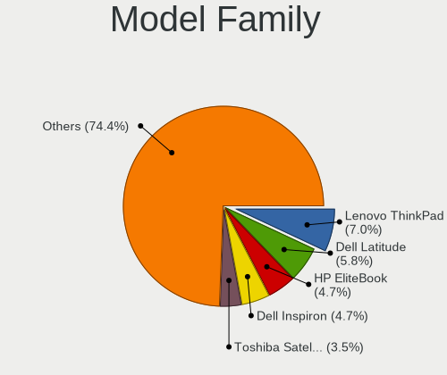
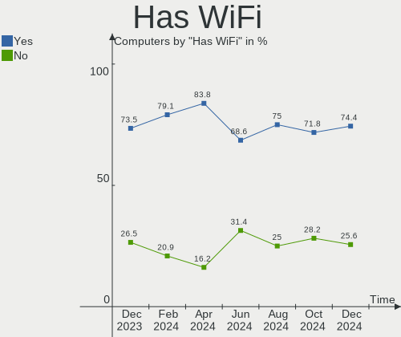
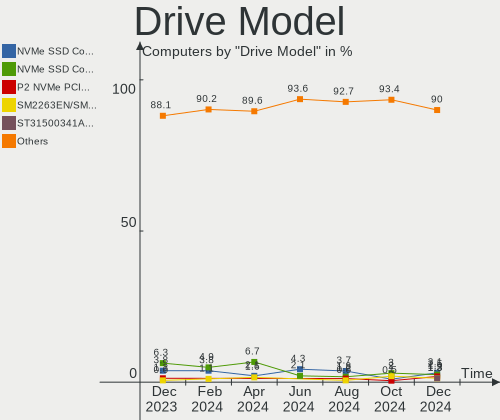
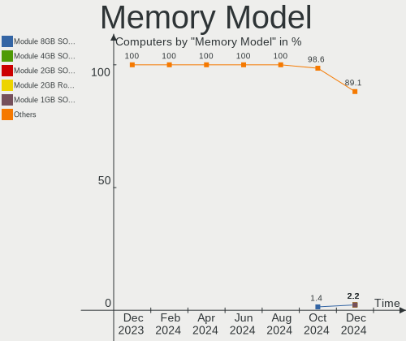

openSUSE - Hardware Trends
--------------------------

A project to identify most popular hardware characteristics and track their change
over time based on data collected by Linux users at https://Linux-Hardware.org.

Anyone can contribute to this report by the [hw-probe](https://github.com/linuxhw/hw-probe) tool:

    sudo -E hw-probe -all -upload

This is a report for all computer types. See also reports for [desktops](/Dist/openSUSE/Desktop/README.md) and [notebooks](/Dist/openSUSE/Notebook/README.md).

This report is for one last month. Overall report since the beginning of time: [TestCoverage](https://github.com/linuxhw/TestCoverage)

Period: Jul, 2022.

Contents
--------

* [ System ](#system)
  - [ OS                       ](#os)
  - [ OS Family                ](#os-family)
  - [ Kernel                   ](#kernel)
  - [ Kernel Family            ](#kernel-family)
  - [ Kernel Major Ver.        ](#kernel-major-ver)
  - [ Arch                     ](#arch)
  - [ DE                       ](#de)
  - [ Display Server           ](#display-server)
  - [ Display Manager          ](#display-manager)
  - [ OS Lang                  ](#os-lang)
  - [ Boot Mode                ](#boot-mode)
  - [ Filesystem               ](#filesystem)
  - [ Part. scheme             ](#part-scheme)
  - [ Dual Boot with Linux/BSD ](#dual-boot-with-linuxbsd)
  - [ Dual Boot (Win)          ](#dual-boot-win)

* [ Board ](#board)
  - [ Vendor                   ](#vendor)
  - [ Model                    ](#model)
  - [ Model Family             ](#model-family)
  - [ MFG Year                 ](#mfg-year)
  - [ Form Factor              ](#form-factor)
  - [ Secure Boot              ](#secure-boot)
  - [ Coreboot                 ](#coreboot)
  - [ RAM Size                 ](#ram-size)
  - [ RAM Used                 ](#ram-used)
  - [ Total Drives             ](#total-drives)
  - [ Has CD-ROM               ](#has-cd-rom)
  - [ Has Ethernet             ](#has-ethernet)
  - [ Has WiFi                 ](#has-wifi)
  - [ Has Bluetooth            ](#has-bluetooth)

* [ Location ](#location)
  - [ Country                  ](#country)
  - [ City                     ](#city)

* [ Drives ](#drives)
  - [ Drive Vendor             ](#drive-vendor)
  - [ Drive Model              ](#drive-model)
  - [ HDD Vendor               ](#hdd-vendor)
  - [ SSD Vendor               ](#ssd-vendor)
  - [ Drive Kind               ](#drive-kind)
  - [ Drive Connector          ](#drive-connector)
  - [ Drive Size               ](#drive-size)
  - [ Space Total              ](#space-total)
  - [ Space Used               ](#space-used)
  - [ Malfunc. Drives          ](#malfunc-drives)
  - [ Malfunc. Drive Vendor    ](#malfunc-drive-vendor)
  - [ Malfunc. HDD Vendor      ](#malfunc-hdd-vendor)
  - [ Malfunc. Drive Kind      ](#malfunc-drive-kind)
  - [ Failed Drives            ](#failed-drives)
  - [ Failed Drive Vendor      ](#failed-drive-vendor)
  - [ Drive Status             ](#drive-status)

* [ Storage controller ](#storage-controller)
  - [ Storage Vendor           ](#storage-vendor)
  - [ Storage Model            ](#storage-model)
  - [ Storage Kind             ](#storage-kind)

* [ Processor ](#processor)
  - [ CPU Vendor               ](#cpu-vendor)
  - [ CPU Model                ](#cpu-model)
  - [ CPU Model Family         ](#cpu-model-family)
  - [ CPU Cores                ](#cpu-cores)
  - [ CPU Sockets              ](#cpu-sockets)
  - [ CPU Threads              ](#cpu-threads)
  - [ CPU Op-Modes             ](#cpu-op-modes)
  - [ CPU Microcode            ](#cpu-microcode)
  - [ CPU Microarch            ](#cpu-microarch)

* [ Graphics ](#graphics)
  - [ GPU Vendor               ](#gpu-vendor)
  - [ GPU Model                ](#gpu-model)
  - [ GPU Combo                ](#gpu-combo)
  - [ GPU Driver               ](#gpu-driver)
  - [ GPU Memory               ](#gpu-memory)

* [ Monitor ](#monitor)
  - [ Monitor Vendor           ](#monitor-vendor)
  - [ Monitor Model            ](#monitor-model)
  - [ Monitor Resolution       ](#monitor-resolution)
  - [ Monitor Diagonal         ](#monitor-diagonal)
  - [ Monitor Width            ](#monitor-width)
  - [ Aspect Ratio             ](#aspect-ratio)
  - [ Monitor Area             ](#monitor-area)
  - [ Pixel Density            ](#pixel-density)
  - [ Multiple Monitors        ](#multiple-monitors)

* [ Network ](#network)
  - [ Net Controller Vendor    ](#net-controller-vendor)
  - [ Net Controller Model     ](#net-controller-model)
  - [ Wireless Vendor          ](#wireless-vendor)
  - [ Wireless Model           ](#wireless-model)
  - [ Ethernet Vendor          ](#ethernet-vendor)
  - [ Ethernet Model           ](#ethernet-model)
  - [ Net Controller Kind      ](#net-controller-kind)
  - [ Used Controller          ](#used-controller)
  - [ NICs                     ](#nics)
  - [ IPv6                     ](#ipv6)

* [ Bluetooth ](#bluetooth)
  - [ Bluetooth Vendor         ](#bluetooth-vendor)
  - [ Bluetooth Model          ](#bluetooth-model)

* [ Sound ](#sound)
  - [ Sound Vendor             ](#sound-vendor)
  - [ Sound Model              ](#sound-model)

* [ Memory ](#memory)
  - [ Memory Vendor            ](#memory-vendor)
  - [ Memory Model             ](#memory-model)
  - [ Memory Kind              ](#memory-kind)
  - [ Memory Form Factor       ](#memory-form-factor)
  - [ Memory Size              ](#memory-size)
  - [ Memory Speed             ](#memory-speed)

* [ Printers & scanners ](#printers--scanners)
  - [ Printer Vendor           ](#printer-vendor)
  - [ Printer Model            ](#printer-model)
  - [ Scanner Vendor           ](#scanner-vendor)
  - [ Scanner Model            ](#scanner-model)

* [ Camera ](#camera)
  - [ Camera Vendor            ](#camera-vendor)
  - [ Camera Model             ](#camera-model)

* [ Security ](#security)
  - [ Fingerprint Vendor       ](#fingerprint-vendor)
  - [ Fingerprint Model        ](#fingerprint-model)
  - [ Chipcard Vendor          ](#chipcard-vendor)
  - [ Chipcard Model           ](#chipcard-model)

* [ Unsupported ](#unsupported)
  - [ Unsupported Devices      ](#unsupported-devices)
  - [ Unsupported Device Types ](#unsupported-device-types)

System
------

OS
--

Installed operating systems

| Name                         | Computers | Percent |
|------------------------------|-----------|---------|
| openSUSE Tumbleweed-XXXXXXXX | 35        | 70%     |
| openSUSE Leap-15.4           | 12        | 24%     |
| openSUSE Leap-15.3           | 2         | 4%      |
| openSUSE Microos-XXXXXXXX    | 1         | 2%      |

OS Family
---------

OS without a version

| Name     | Computers | Percent |
|----------|-----------|---------|
| openSUSE | 50        | 100%    |

Kernel
------

Version of the Linux kernel

| Version                      | Computers | Percent |
|------------------------------|-----------|---------|
| 5.18.6-1-default             | 13        | 26%     |
| 5.14.21-150400.22-default    | 10        | 20%     |
| 5.18.11-1-default            | 9         | 18%     |
| 5.18.9-1-default             | 7         | 14%     |
| 5.18.9-2-default             | 6         | 12%     |
| 5.3.18-150300.59.49-default  | 2         | 4%      |
| 5.14.21-150400.24.11-default | 2         | 4%      |
| 5.17.9-1-default             | 1         | 2%      |

Kernel Family
-------------

Linux kernel without a distro release

| Version | Computers | Percent |
|---------|-----------|---------|
| 5.18.9  | 13        | 26%     |
| 5.18.6  | 13        | 26%     |
| 5.14.21 | 12        | 24%     |
| 5.18.11 | 9         | 18%     |
| 5.3.18  | 2         | 4%      |
| 5.17.9  | 1         | 2%      |

Kernel Major Ver.
-----------------

Linux kernel major version

| Version | Computers | Percent |
|---------|-----------|---------|
| 5.18    | 35        | 70%     |
| 5.14    | 12        | 24%     |
| 5.3     | 2         | 4%      |
| 5.17    | 1         | 2%      |

Arch
----

OS architecture (x86_64, i586, etc.)

| Name   | Computers | Percent |
|--------|-----------|---------|
| x86_64 | 50        | 100%    |

DE
--

Desktop Environment

| Name       | Computers | Percent |
|------------|-----------|---------|
| KDE5       | 33        | 66%     |
| GNOME      | 10        | 20%     |
| XFCE       | 2         | 4%      |
| X-Cinnamon | 1         | 2%      |
| MATE       | 1         | 2%      |
| KDE        | 1         | 2%      |
| i3         | 1         | 2%      |
| Unknown    | 1         | 2%      |

Display Server
--------------

X11 or Wayland

| Name    | Computers | Percent |
|---------|-----------|---------|
| X11     | 39        | 78%     |
| Wayland | 10        | 20%     |
| Unknown | 1         | 2%      |

Display Manager
---------------

SDDM, LightDM, etc.

| Name    | Computers | Percent |
|---------|-----------|---------|
| Unknown | 19        | 38%     |
| SDDM    | 14        | 28%     |
| LightDM | 12        | 24%     |
| XDM     | 5         | 10%     |

OS Lang
-------

Language

| Lang  | Computers | Percent |
|-------|-----------|---------|
| en_US | 17        | 34%     |
| POSIX | 8         | 16%     |
| de_DE | 5         | 10%     |
| pt_BR | 4         | 8%      |
| es_ES | 4         | 8%      |
| nl_NL | 3         | 6%      |
| fr_FR | 2         | 4%      |
| en_GB | 2         | 4%      |
| nn_NO | 1         | 2%      |
| it_IT | 1         | 2%      |
| fi_FI | 1         | 2%      |
| el_GR | 1         | 2%      |
| cs_CZ | 1         | 2%      |

Boot Mode
---------

EFI or BIOS

| Mode | Computers | Percent |
|------|-----------|---------|
| EFI  | 34        | 68%     |
| BIOS | 16        | 32%     |

Filesystem
----------

Type of filesystem

| Type  | Computers | Percent |
|-------|-----------|---------|
| Btrfs | 37        | 74%     |
| Ext4  | 11        | 22%     |
| Xfs   | 2         | 4%      |

Part. scheme
------------

Scheme of partitioning

| Type    | Computers | Percent |
|---------|-----------|---------|
| GPT     | 30        | 60%     |
| Unknown | 17        | 34%     |
| MBR     | 3         | 6%      |

Dual Boot with Linux/BSD
------------------------

Hosting more than one Linux/BSD

| Dual boot | Computers | Percent |
|-----------|-----------|---------|
| No        | 40        | 80%     |
| Yes       | 10        | 20%     |

Dual Boot (Win)
---------------

Hosting Linux and Windows

| Dual boot | Computers | Percent |
|-----------|-----------|---------|
| No        | 33        | 66%     |
| Yes       | 17        | 34%     |

Board
-----

Vendor
------

Motherboard manufacturer

| Name                | Computers | Percent |
|---------------------|-----------|---------|
| ASUSTek Computer    | 11        | 22%     |
| Lenovo              | 8         | 16%     |
| Dell                | 7         | 14%     |
| Hewlett-Packard     | 5         | 10%     |
| MSI                 | 4         | 8%      |
| Gigabyte Technology | 4         | 8%      |
| TUXEDO              | 2         | 4%      |
| Unknown             | 2         | 4%      |
| Toshiba             | 1         | 2%      |
| Purism              | 1         | 2%      |
| Notebook            | 1         | 2%      |
| Multilaser          | 1         | 2%      |
| Jumper              | 1         | 2%      |
| Biostar             | 1         | 2%      |
| Acidanthera         | 1         | 2%      |

Model
-----

Motherboard model

| Name                                     | Computers | Percent |
|------------------------------------------|-----------|---------|
| TUXEDO Pulse 15 Gen1                     | 2         | 4%      |
| HP ProDesk 600 G3 DM                     | 2         | 4%      |
| Unknown                                  | 2         | 4%      |
| Toshiba Satellite L500                   | 1         | 2%      |
| Purism Librem 15 v3                      | 1         | 2%      |
| Notebook NLx0MU                          | 1         | 2%      |
| Multilaser PC150                         | 1         | 2%      |
| MSI MS-7C91                              | 1         | 2%      |
| MSI MS-7B89                              | 1         | 2%      |
| MSI MS-7B85                              | 1         | 2%      |
| MSI MS-7B09                              | 1         | 2%      |
| Lenovo ThinkPad X1 Yoga 3rd 20LFCTR1WW   | 1         | 2%      |
| Lenovo ThinkPad X1 Carbon 6th 20KG0022US | 1         | 2%      |
| Lenovo ThinkPad W510 431965U             | 1         | 2%      |
| Lenovo ThinkPad T14 Gen 1 20UD000GUS     | 1         | 2%      |
| Lenovo ThinkPad L15 Gen 2 20X3005BMX     | 1         | 2%      |
| Lenovo ThinkPad Edge 0328A11             | 1         | 2%      |
| Lenovo ThinkBook 15 G2 ITL 20VE          | 1         | 2%      |
| Lenovo K14 Gen 1 21CUS02600              | 1         | 2%      |
| Jumper EZbook                            | 1         | 2%      |
| HP Z820 Workstation                      | 1         | 2%      |
| HP ProDesk 600 G6 Desktop Mini PC        | 1         | 2%      |
| HP Pavilion g6                           | 1         | 2%      |
| Gigabyte X570 I AORUS PRO WIFI           | 1         | 2%      |
| Gigabyte X570 GAMING X                   | 1         | 2%      |
| Gigabyte X570 AORUS ULTRA                | 1         | 2%      |
| Gigabyte W480 VISION D                   | 1         | 2%      |
| Dell XPS 15 9570                         | 1         | 2%      |
| Dell XPS 15 9510                         | 1         | 2%      |
| Dell Vostro 3268                         | 1         | 2%      |
| Dell PowerEdge R6515                     | 1         | 2%      |
| Dell Inspiron 7306 2n1                   | 1         | 2%      |
| Dell Inspiron 5584                       | 1         | 2%      |
| Dell Inspiron 13-7359                    | 1         | 2%      |
| Biostar B450MH                           | 1         | 2%      |
| ASUS Zenbook UX3402ZA_UX3402ZA           | 1         | 2%      |
| ASUS TUF Gaming X570-PRO                 | 1         | 2%      |
| ASUS T101HA                              | 1         | 2%      |
| ASUS ROG Zephyrus G14 GA401QM_GA401QM    | 1         | 2%      |
| ASUS ROG CROSSHAIR VIII HERO             | 1         | 2%      |
| ASUS ROG CROSSHAIR VII HERO              | 1         | 2%      |
| ASUS PRIME X370-PRO                      | 1         | 2%      |
| ASUS PRIME B550M-K                       | 1         | 2%      |
| ASUS PRIME B550-PLUS                     | 1         | 2%      |
| ASUS P5Q3                                | 1         | 2%      |
| ASUS M5A78L-M/USB3                       | 1         | 2%      |
| Acidanthera MacPro7,1                    | 1         | 2%      |

Model Family
------------

Motherboard model prefix

| Name                | Computers | Percent |
|---------------------|-----------|---------|
| Lenovo ThinkPad     | 6         | 12%     |
| HP ProDesk          | 3         | 6%      |
| Gigabyte X570       | 3         | 6%      |
| Dell Inspiron       | 3         | 6%      |
| ASUS ROG            | 3         | 6%      |
| ASUS PRIME          | 3         | 6%      |
| TUXEDO Pulse        | 2         | 4%      |
| Dell XPS            | 2         | 4%      |
| Unknown             | 2         | 4%      |
| Toshiba Satellite   | 1         | 2%      |
| Purism Librem       | 1         | 2%      |
| Notebook NLx0MU     | 1         | 2%      |
| Multilaser PC150    | 1         | 2%      |
| MSI MS-7C91         | 1         | 2%      |
| MSI MS-7B89         | 1         | 2%      |
| MSI MS-7B85         | 1         | 2%      |
| MSI MS-7B09         | 1         | 2%      |
| Lenovo ThinkBook    | 1         | 2%      |
| Lenovo K14          | 1         | 2%      |
| Jumper EZbook       | 1         | 2%      |
| HP Z820             | 1         | 2%      |
| HP Pavilion         | 1         | 2%      |
| Gigabyte W480       | 1         | 2%      |
| Dell Vostro         | 1         | 2%      |
| Dell PowerEdge      | 1         | 2%      |
| Biostar B450MH      | 1         | 2%      |
| ASUS Zenbook        | 1         | 2%      |
| ASUS TUF            | 1         | 2%      |
| ASUS T101HA         | 1         | 2%      |
| ASUS P5Q3           | 1         | 2%      |
| ASUS M5A78L-M       | 1         | 2%      |
| Acidanthera MacPro7 | 1         | 2%      |

MFG Year
--------

Motherboard manufacture year

| Year | Computers | Percent |
|------|-----------|---------|
| 2020 | 12        | 24%     |
| 2021 | 11        | 22%     |
| 2019 | 7         | 14%     |
| 2018 | 5         | 10%     |
| 2017 | 5         | 10%     |
| 2022 | 2         | 4%      |
| 2011 | 2         | 4%      |
| 2010 | 2         | 4%      |
| 2009 | 2         | 4%      |
| 2015 | 1         | 2%      |
| 2012 | 1         | 2%      |

Form Factor
-----------

Physical design of the computer

| Name        | Computers | Percent |
|-------------|-----------|---------|
| Notebook    | 22        | 44%     |
| Desktop     | 20        | 40%     |
| Convertible | 3         | 6%      |
| Mini pc     | 3         | 6%      |
| Tablet      | 1         | 2%      |
| Server      | 1         | 2%      |

Secure Boot
-----------

Enabled or disabled

| State    | Computers | Percent |
|----------|-----------|---------|
| Disabled | 43        | 86%     |
| Enabled  | 7         | 14%     |

Coreboot
--------

Have coreboot on board

| Used | Computers | Percent |
|------|-----------|---------|
| No   | 49        | 98%     |
| Yes  | 1         | 2%      |

RAM Size
--------

Total RAM memory

| Size in GB  | Computers | Percent |
|-------------|-----------|---------|
| 32.01-64.0  | 11        | 22%     |
| 16.01-24.0  | 11        | 22%     |
| 8.01-16.0   | 10        | 20%     |
| 4.01-8.0    | 5         | 10%     |
| 3.01-4.0    | 4         | 8%      |
| 24.01-32.0  | 4         | 8%      |
| 64.01-256.0 | 4         | 8%      |
| 1.01-2.0    | 1         | 2%      |

RAM Used
--------

Used RAM memory

| Used GB   | Computers | Percent |
|-----------|-----------|---------|
| 4.01-8.0  | 16        | 32%     |
| 2.01-3.0  | 12        | 24%     |
| 1.01-2.0  | 10        | 20%     |
| 3.01-4.0  | 9         | 18%     |
| 8.01-16.0 | 2         | 4%      |
| 0.51-1.0  | 1         | 2%      |

Total Drives
------------

Number of drives on board

| Drives | Computers | Percent |
|--------|-----------|---------|
| 1      | 22        | 44%     |
| 2      | 14        | 28%     |
| 3      | 6         | 12%     |
| 5      | 5         | 10%     |
| 16     | 1         | 2%      |
| 6      | 1         | 2%      |
| 4      | 1         | 2%      |

Has CD-ROM
----------

Has CD-ROM on board

| Presented | Computers | Percent |
|-----------|-----------|---------|
| No        | 41        | 82%     |
| Yes       | 9         | 18%     |

Has Ethernet
------------

Has Ethernet on board

| Presented | Computers | Percent |
|-----------|-----------|---------|
| Yes       | 38        | 76%     |
| No        | 12        | 24%     |

Has WiFi
--------

Has WiFi module

| Presented | Computers | Percent |
|-----------|-----------|---------|
| Yes       | 37        | 74%     |
| No        | 13        | 26%     |

Has Bluetooth
-------------

Has Bluetooth module

| Presented | Computers | Percent |
|-----------|-----------|---------|
| Yes       | 32        | 64%     |
| No        | 18        | 36%     |

Location
--------

Country
-------

Geographic location (country)

| Country     | Computers | Percent |
|-------------|-----------|---------|
| USA         | 10        | 20%     |
| Germany     | 7         | 14%     |
| Spain       | 4         | 8%      |
| Brazil      | 4         | 8%      |
| Netherlands | 3         | 6%      |
| France      | 3         | 6%      |
| Canada      | 3         | 6%      |
| Greece      | 2         | 4%      |
| Czechia     | 2         | 4%      |
| Ukraine     | 1         | 2%      |
| UK          | 1         | 2%      |
| Sweden      | 1         | 2%      |
| Russia      | 1         | 2%      |
| Romania     | 1         | 2%      |
| Norway      | 1         | 2%      |
| Italy       | 1         | 2%      |
| India       | 1         | 2%      |
| Hungary     | 1         | 2%      |
| Finland     | 1         | 2%      |
| China       | 1         | 2%      |
| Belgium     | 1         | 2%      |

City
----

Geographic location (city)

| City           | Computers | Percent |
|----------------|-----------|---------|
| Rio de Janeiro | 2         | 4%      |
| Paris          | 2         | 4%      |
| Madrid         | 2         | 4%      |
| Halle          | 2         | 4%      |
| Almere Stad    | 2         | 4%      |
| Willoughby     | 1         | 2%      |
| Wenzhou        | 1         | 2%      |
| Vaksdal        | 1         | 2%      |
| Thessaloniki   | 1         | 2%      |
| Southampton    | 1         | 2%      |
| Sacramento     | 1         | 2%      |
| Prague         | 1         | 2%      |
| Pátrai        | 1         | 2%      |
| Paranaiba      | 1         | 2%      |
| Osorio         | 1         | 2%      |
| Mytishchi      | 1         | 2%      |
| Montevrain     | 1         | 2%      |
| Miami          | 1         | 2%      |
| Mesa           | 1         | 2%      |
| Merano         | 1         | 2%      |
| Málaga        | 1         | 2%      |
| Louisville     | 1         | 2%      |
| Los Angeles    | 1         | 2%      |
| Kyiv           | 1         | 2%      |
| Kingston       | 1         | 2%      |
| Hyderabad      | 1         | 2%      |
| Helsinki       | 1         | 2%      |
| Harsefeld      | 1         | 2%      |
| Guelph         | 1         | 2%      |
| Gothenburg     | 1         | 2%      |
| Girona         | 1         | 2%      |
| Ghent          | 1         | 2%      |
| Gatineau       | 1         | 2%      |
| Falkenstein    | 1         | 2%      |
| Ettlingen      | 1         | 2%      |
| Erding         | 1         | 2%      |
| Enschede       | 1         | 2%      |
| Dundee         | 1         | 2%      |
| Downers Grove  | 1         | 2%      |
| Cedar City     | 1         | 2%      |
| Budapest       | 1         | 2%      |
| Bucharest      | 1         | 2%      |
| Brno           | 1         | 2%      |
| Böblingen     | 1         | 2%      |
| Alpharetta     | 1         | 2%      |

Drives
------

Drive Vendor
------------

Hard drive vendors

| Vendor                    | Computers | Drives | Percent |
|---------------------------|-----------|--------|---------|
| Samsung Electronics       | 17        | 21     | 18.48%  |
| Seagate                   | 14        | 23     | 15.22%  |
| WDC                       | 10        | 16     | 10.87%  |
| Crucial                   | 6         | 7      | 6.52%   |
| SanDisk                   | 5         | 6      | 5.43%   |
| Kingston                  | 5         | 5      | 5.43%   |
| Toshiba                   | 4         | 4      | 4.35%   |
| SK hynix                  | 4         | 5      | 4.35%   |
| Unknown                   | 3         | 4      | 3.26%   |
| Intel                     | 3         | 4      | 3.26%   |
| Intenso                   | 2         | 2      | 2.17%   |
| Unknown                   | 2         | 2      | 2.17%   |
| Verbatim                  | 1         | 1      | 1.09%   |
| UD0401                    | 1         | 1      | 1.09%   |
| Team                      | 1         | 1      | 1.09%   |
| T-CREATE                  | 1         | 1      | 1.09%   |
| Silicon Motion            | 1         | 1      | 1.09%   |
| SABRENT                   | 1         | 2      | 1.09%   |
| Realtek                   | 1         | 1      | 1.09%   |
| PNY                       | 1         | 1      | 1.09%   |
| Micron/Crucial Technology | 1         | 1      | 1.09%   |
| Hitachi                   | 1         | 1      | 1.09%   |
| HGST                      | 1         | 1      | 1.09%   |
| GOODRAM                   | 1         | 1      | 1.09%   |
| Fujitsu                   | 1         | 1      | 1.09%   |
| Corsair                   | 1         | 1      | 1.09%   |
| BIWIN                     | 1         | 1      | 1.09%   |
| ASMT                      | 1         | 1      | 1.09%   |
| ASMedia                   | 1         | 1      | 1.09%   |

Drive Model
-----------

Hard drive models

| Model                                      | Computers | Percent |
|--------------------------------------------|-----------|---------|
| Unknown MMC Card  32GB                     | 2         | 1.83%   |
| Seagate ST500DM002-1BD142 500GB            | 2         | 1.83%   |
| Seagate ST3000NM0053 3TB                   | 2         | 1.83%   |
| Seagate ST2000DM001-1ER164 2TB             | 2         | 1.83%   |
| SanDisk NVMe SSD Drive 240GB               | 2         | 1.83%   |
| Samsung SSD 860 EVO 500GB                  | 2         | 1.83%   |
| Samsung SSD 860 EVO 1TB                    | 2         | 1.83%   |
| Kingston NVMe SSD Drive 500GB              | 2         | 1.83%   |
| Unknown                                    | 2         | 1.83%   |
| WDC WDS500G2B0A-00SM50 500GB SSD           | 1         | 0.92%   |
| WDC WDS500G1B0B-00AS40 500GB SSD           | 1         | 0.92%   |
| WDC WDS200T2B0B-00YS70 2TB SSD             | 1         | 0.92%   |
| WDC WDS200T2B0A-00SM50 2TB SSD             | 1         | 0.92%   |
| WDC WDS100T2B0C-00PXH0 1TB                 | 1         | 0.92%   |
| WDC WDS100T1X0E-00AFY0 1TB                 | 1         | 0.92%   |
| WDC WD30EFRX-68EUZN0 3TB                   | 1         | 0.92%   |
| WDC WD20EARX-00PASB0 2TB                   | 1         | 0.92%   |
| WDC WD10EZRX-00A8LB0 1TB                   | 1         | 0.92%   |
| WDC WD10EZEX-75WN4A0 1TB                   | 1         | 0.92%   |
| WDC WD10EZEX-08M2NA0 1TB                   | 1         | 0.92%   |
| WDC WD10EZEX-07WN4A0 1TB                   | 1         | 0.92%   |
| WDC WD10EZEX-00BBHA0 1TB                   | 1         | 0.92%   |
| WDC WD1002FBYS-05A6B0 1TB                  | 1         | 0.92%   |
| WDC WD1002FAEX-00Z3A0 1TB                  | 1         | 0.92%   |
| Verbatim Vi550 S3 128GB SSD                | 1         | 0.92%   |
| Unknown MMC Card  64GB                     | 1         | 0.92%   |
| Unknown MMC Card  16GB                     | 1         | 0.92%   |
| UD0401 Disk 512GB                          | 1         | 0.92%   |
| Toshiba NVMe SSD Drive 1024GB              | 1         | 0.92%   |
| Toshiba MQ04ABD200 2TB                     | 1         | 0.92%   |
| Toshiba MK5055GSX 500GB                    | 1         | 0.92%   |
| Toshiba HDWE140 4TB                        | 1         | 0.92%   |
| Team T253A3001T 1TB SSD                    | 1         | 0.92%   |
| T-CREATE TM8FPF002T 2TB                    | 1         | 0.92%   |
| SK hynix PC711 NVMe 256GB                  | 1         | 0.92%   |
| SK hynix PC711 NVMe 1TB                    | 1         | 0.92%   |
| SK hynix HFS960G32FEH-7A10A 960GB          | 1         | 0.92%   |
| SK hynix BC711 NVMe 512GB                  | 1         | 0.92%   |
| Silicon Motion aigo NVMe SSD P2000 256GB   | 1         | 0.92%   |
| Seagate ST6000NM021A-2R7101 6TB            | 1         | 0.92%   |
| Seagate ST5000LM000-2U8170 5TB             | 1         | 0.92%   |
| Seagate ST4000LM024-2U817V 4TB             | 1         | 0.92%   |
| Seagate ST4000DM004-2CV104 4TB             | 1         | 0.92%   |
| Seagate ST3320620AS 320GB                  | 1         | 0.92%   |
| Seagate ST2000LM015-2E8174 2TB             | 1         | 0.92%   |
| Seagate ST2000DM008-2FR102 2TB             | 1         | 0.92%   |
| Seagate ST16000NM001G-2KK103 16TB          | 1         | 0.92%   |
| Seagate ST1000LM048-2E7172 1TB             | 1         | 0.92%   |
| Seagate ST1000LM035-1RK172 1TB             | 1         | 0.92%   |
| Seagate ST1000DX002-2DV162 1TB             | 1         | 0.92%   |
| Seagate FireCuda 520 SSD ZP2000GM30002 2TB | 1         | 0.92%   |
| Seagate Expansion 1TB                      | 1         | 0.92%   |
| SanDisk SSD PLUS 480GB                     | 1         | 0.92%   |
| SanDisk SDSSDH3 500G                       | 1         | 0.92%   |
| SanDisk NVMe SSD Drive 256GB               | 1         | 0.92%   |
| SanDisk NVMe SSD Drive 1TB                 | 1         | 0.92%   |
| Samsung SSD 980 250GB                      | 1         | 0.92%   |
| Samsung SSD 970 PRO 512GB                  | 1         | 0.92%   |
| Samsung SSD 970 EVO Plus 1TB               | 1         | 0.92%   |
| Samsung SSD 970 EVO 500GB                  | 1         | 0.92%   |

HDD Vendor
----------

Hard disk drive vendors

| Vendor  | Computers | Drives | Percent |
|---------|-----------|--------|---------|
| Seagate | 14        | 22     | 42.42%  |
| WDC     | 8         | 10     | 24.24%  |
| Toshiba | 3         | 3      | 9.09%   |
| UD0401  | 1         | 1      | 3.03%   |
| SABRENT | 1         | 2      | 3.03%   |
| Intenso | 1         | 1      | 3.03%   |
| Hitachi | 1         | 1      | 3.03%   |
| HGST    | 1         | 1      | 3.03%   |
| Fujitsu | 1         | 1      | 3.03%   |
| ASMT    | 1         | 1      | 3.03%   |
| ASMedia | 1         | 1      | 3.03%   |

SSD Vendor
----------

Solid state drive vendors

| Vendor              | Computers | Drives | Percent |
|---------------------|-----------|--------|---------|
| Samsung Electronics | 10        | 11     | 34.48%  |
| Crucial             | 4         | 5      | 13.79%  |
| WDC                 | 3         | 4      | 10.34%  |
| SanDisk             | 2         | 2      | 6.9%    |
| Unknown             | 2         | 2      | 6.9%    |
| Verbatim            | 1         | 1      | 3.45%   |
| Team                | 1         | 1      | 3.45%   |
| SK hynix            | 1         | 2      | 3.45%   |
| PNY                 | 1         | 1      | 3.45%   |
| Kingston            | 1         | 1      | 3.45%   |
| Intenso             | 1         | 1      | 3.45%   |
| GOODRAM             | 1         | 1      | 3.45%   |
| BIWIN               | 1         | 1      | 3.45%   |

Drive Kind
----------

HDD or SSD

| Kind | Computers | Drives | Percent |
|------|-----------|--------|---------|
| NVMe | 30        | 36     | 37.04%  |
| SSD  | 25        | 33     | 30.86%  |
| HDD  | 23        | 44     | 28.4%   |
| MMC  | 3         | 4      | 3.7%    |

Drive Connector
---------------

SATA, SAS, NVMe, etc.

| Type | Computers | Drives | Percent |
|------|-----------|--------|---------|
| SATA | 35        | 70     | 48.61%  |
| NVMe | 30        | 35     | 41.67%  |
| SAS  | 4         | 8      | 5.56%   |
| MMC  | 3         | 4      | 4.17%   |

Drive Size
----------

Size of hard drive

| Size in TB | Computers | Drives | Percent |
|------------|-----------|--------|---------|
| 0.01-0.5   | 20        | 27     | 37.04%  |
| 0.51-1.0   | 18        | 28     | 33.33%  |
| 1.01-2.0   | 7         | 10     | 12.96%  |
| 3.01-4.0   | 3         | 3      | 5.56%   |
| 2.01-3.0   | 3         | 3      | 5.56%   |
| 4.01-10.0  | 2         | 4      | 3.7%    |
| 10.01-20.0 | 1         | 2      | 1.85%   |

Space Total
-----------

Amount of disk space available on the file system

| Size in GB     | Computers | Percent |
|----------------|-----------|---------|
| More than 3000 | 23        | 46%     |
| 1001-2000      | 8         | 16%     |
| 101-250        | 6         | 12%     |
| 251-500        | 4         | 8%      |
| 2001-3000      | 4         | 8%      |
| 501-1000       | 4         | 8%      |
| 21-50          | 1         | 2%      |

Space Used
----------

Amount of used disk space

| Used GB        | Computers | Percent |
|----------------|-----------|---------|
| 101-250        | 9         | 18%     |
| 51-100         | 9         | 18%     |
| 251-500        | 8         | 16%     |
| 501-1000       | 7         | 14%     |
| More than 3000 | 5         | 10%     |
| 21-50          | 4         | 8%      |
| 1-20           | 4         | 8%      |
| 2001-3000      | 2         | 4%      |
| 1001-2000      | 2         | 4%      |

Malfunc. Drives
---------------

Drive models with a malfunction

| Model                            | Computers | Drives | Percent |
|----------------------------------|-----------|--------|---------|
| Seagate ST500DM002-1BD142 500GB  | 2         | 3      | 33.33%  |
| Toshiba MK5055GSX 500GB          | 1         | 1      | 16.67%  |
| Seagate ST2000DM008-2FR102 2TB   | 1         | 1      | 16.67%  |
| Seagate ST2000DM001-1ER164 2TB   | 1         | 1      | 16.67%  |
| Kingston SV300S37A120G 120GB SSD | 1         | 1      | 16.67%  |

Malfunc. Drive Vendor
---------------------

Vendors of faulty drives

| Vendor   | Computers | Drives | Percent |
|----------|-----------|--------|---------|
| Seagate  | 3         | 5      | 60%     |
| Toshiba  | 1         | 1      | 20%     |
| Kingston | 1         | 1      | 20%     |

Malfunc. HDD Vendor
-------------------

Vendors of faulty HDD drives

| Vendor  | Computers | Drives | Percent |
|---------|-----------|--------|---------|
| Seagate | 3         | 5      | 75%     |
| Toshiba | 1         | 1      | 25%     |

Malfunc. Drive Kind
-------------------

Kinds of faulty drives

| Kind | Computers | Drives | Percent |
|------|-----------|--------|---------|
| HDD  | 4         | 6      | 80%     |
| SSD  | 1         | 1      | 20%     |

Failed Drives
-------------

Failed drive models

Zero info for selected period =(

Failed Drive Vendor
-------------------

Failed drive vendors

Zero info for selected period =(

Drive Status
------------

Number of failed and malfunc. drives

| Status   | Computers | Drives | Percent |
|----------|-----------|--------|---------|
| Works    | 32        | 76     | 56.14%  |
| Detected | 20        | 34     | 35.09%  |
| Malfunc  | 5         | 7      | 8.77%   |

Storage controller
------------------

Storage Vendor
--------------

Storage controller vendors

| Vendor                       | Computers | Percent |
|------------------------------|-----------|---------|
| Intel                        | 24        | 31.17%  |
| AMD                          | 20        | 25.97%  |
| Samsung Electronics          | 9         | 11.69%  |
| SanDisk                      | 6         | 7.79%   |
| Kingston Technology Company  | 4         | 5.19%   |
| SK hynix                     | 3         | 3.9%    |
| Micron/Crucial Technology    | 3         | 3.9%    |
| Silicon Motion               | 2         | 2.6%    |
| Toshiba America Info Systems | 1         | 1.3%    |
| Seagate Technology           | 1         | 1.3%    |
| Phison Electronics           | 1         | 1.3%    |
| LSI Logic / Symbios Logic    | 1         | 1.3%    |
| JMicron Technology           | 1         | 1.3%    |
| Broadcom / LSI               | 1         | 1.3%    |

Storage Model
-------------

Storage controller models

| Model                                                                         | Computers | Percent |
|-------------------------------------------------------------------------------|-----------|---------|
| AMD FCH SATA Controller [AHCI mode]                                           | 15        | 16.67%  |
| Samsung NVMe SSD Controller SM981/PM981/PM983                                 | 6         | 6.67%   |
| SanDisk Non-Volatile memory controller                                        | 4         | 4.44%   |
| Intel Volume Management Device NVMe RAID Controller                           | 4         | 4.44%   |
| AMD 400 Series Chipset SATA Controller                                        | 4         | 4.44%   |
| SK hynix Gold P31 SSD                                                         | 3         | 3.33%   |
| Kingston Company Company Non-Volatile memory controller                       | 3         | 3.33%   |
| Intel Celeron/Pentium Silver Processor SATA Controller                        | 3         | 3.33%   |
| AMD 500 Series Chipset SATA Controller                                        | 3         | 3.33%   |
| Intel Tiger Lake-LP SATA Controller                                           | 2         | 2.22%   |
| Intel Sunrise Point-LP SATA Controller [AHCI mode]                            | 2         | 2.22%   |
| Intel Non-Volatile memory controller                                          | 2         | 2.22%   |
| Intel Comet Lake SATA AHCI Controller                                         | 2         | 2.22%   |
| Intel 200 Series PCH SATA controller [AHCI mode]                              | 2         | 2.22%   |
| Toshiba America Info Systems XG6 NVMe SSD Controller                          | 1         | 1.11%   |
| Silicon Motion SM2263EN/SM2263XT SSD Controller                               | 1         | 1.11%   |
| Silicon Motion SM2262/SM2262EN SSD Controller                                 | 1         | 1.11%   |
| Seagate FireCuda 520 SSD                                                      | 1         | 1.11%   |
| SanDisk WD PC SN810 / Black SN850 NVMe SSD                                    | 1         | 1.11%   |
| SanDisk PC SN520 NVMe SSD                                                     | 1         | 1.11%   |
| Samsung NVMe SSD Controller SM951/PM951                                       | 1         | 1.11%   |
| Samsung NVMe SSD Controller PM9A1/PM9A3/980PRO                                | 1         | 1.11%   |
| Samsung NVMe SSD Controller 980                                               | 1         | 1.11%   |
| Phison E16 PCIe4 NVMe Controller                                              | 1         | 1.11%   |
| Micron/Crucial P2 NVMe PCIe SSD                                               | 1         | 1.11%   |
| Micron/Crucial P1 NVMe PCIe SSD                                               | 1         | 1.11%   |
| Micron/Crucial Non-Volatile memory controller                                 | 1         | 1.11%   |
| LSI Logic / Symbios Logic MegaRAID SAS-3 3108 [Invader]                       | 1         | 1.11%   |
| Kingston Company KC2000 NVMe SSD                                              | 1         | 1.11%   |
| JMicron JMB363 SATA/IDE Controller                                            | 1         | 1.11%   |
| Intel SSD 600P Series                                                         | 1         | 1.11%   |
| Intel Q170/Q150/B150/H170/H110/Z170/CM236 Chipset SATA Controller [AHCI Mode] | 1         | 1.11%   |
| Intel Cannon Point-LP SATA Controller [AHCI Mode]                             | 1         | 1.11%   |
| Intel Cannon Lake Mobile PCH SATA AHCI Controller                             | 1         | 1.11%   |
| Intel C602 chipset 4-Port SATA Storage Control Unit                           | 1         | 1.11%   |
| Intel C600/X79 series chipset SATA RAID Controller                            | 1         | 1.11%   |
| Intel C600/X79 series chipset IDE-r Controller                                | 1         | 1.11%   |
| Intel 82801JI (ICH10 Family) SATA AHCI Controller                             | 1         | 1.11%   |
| Intel 82801IBM/IEM (ICH9M/ICH9M-E) 4 port SATA Controller [AHCI mode]         | 1         | 1.11%   |
| Intel 6 Series/C200 Series Chipset Family 6 port Mobile SATA AHCI Controller  | 1         | 1.11%   |
| Intel 5 Series/3400 Series Chipset 4 port SATA IDE Controller                 | 1         | 1.11%   |
| Intel 5 Series/3400 Series Chipset 4 port SATA AHCI Controller                | 1         | 1.11%   |
| Intel 5 Series/3400 Series Chipset 2 port SATA IDE Controller                 | 1         | 1.11%   |
| Broadcom / LSI SAS2308 PCI-Express Fusion-MPT SAS-2                           | 1         | 1.11%   |
| AMD X399 Series Chipset SATA Controller                                       | 1         | 1.11%   |
| AMD X370 Series Chipset SATA Controller                                       | 1         | 1.11%   |
| AMD SB7x0/SB8x0/SB9x0 SATA Controller [IDE mode]                              | 1         | 1.11%   |
| AMD SB7x0/SB8x0/SB9x0 IDE Controller                                          | 1         | 1.11%   |
| AMD 300 Series Chipset SATA Controller                                        | 1         | 1.11%   |

Storage Kind
------------

Kind of storage controller (IDE, SATA, NVMe, SAS, ...)

| Kind | Computers | Percent |
|------|-----------|---------|
| SATA | 38        | 48.1%   |
| NVMe | 30        | 37.97%  |
| RAID | 6         | 7.59%   |
| IDE  | 4         | 5.06%   |
| SAS  | 1         | 1.27%   |

Processor
---------

CPU Vendor
----------

Processor vendors

| Vendor | Computers | Percent |
|--------|-----------|---------|
| Intel  | 27        | 54%     |
| AMD    | 23        | 46%     |

CPU Model
---------

Processor models

| Model                                          | Computers | Percent |
|------------------------------------------------|-----------|---------|
| Intel Celeron N4020 CPU @ 1.10GHz              | 3         | 6%      |
| Intel 11th Gen Core i7-1165G7 @ 2.80GHz        | 2         | 4%      |
| Intel 11th Gen Core i5-1135G7 @ 2.40GHz        | 2         | 4%      |
| AMD Ryzen 7 5700G with Radeon Graphics         | 2         | 4%      |
| AMD Ryzen 7 4800H with Radeon Graphics         | 2         | 4%      |
| AMD Ryzen 7 3700X 8-Core Processor             | 2         | 4%      |
| AMD Ryzen 7 2700X Eight-Core Processor         | 2         | 4%      |
| AMD Ryzen 5 3600 6-Core Processor              | 2         | 4%      |
| Intel Xeon W-1250 CPU @ 3.30GHz                | 1         | 2%      |
| Intel Xeon CPU E5-2670 v2 @ 2.50GHz            | 1         | 2%      |
| Intel Core i7-8750H CPU @ 2.20GHz              | 1         | 2%      |
| Intel Core i7-8650U CPU @ 1.90GHz              | 1         | 2%      |
| Intel Core i7-8550U CPU @ 1.80GHz              | 1         | 2%      |
| Intel Core i7-6500U CPU @ 2.50GHz              | 1         | 2%      |
| Intel Core i5-8265U CPU @ 1.60GHz              | 1         | 2%      |
| Intel Core i5-7600K CPU @ 3.80GHz              | 1         | 2%      |
| Intel Core i5-6400T CPU @ 2.20GHz              | 1         | 2%      |
| Intel Core i5-6200U CPU @ 2.30GHz              | 1         | 2%      |
| Intel Core i5 CPU M 560 @ 2.67GHz              | 1         | 2%      |
| Intel Core i3-6100T CPU @ 3.20GHz              | 1         | 2%      |
| Intel Core i3-2350M CPU @ 2.30GHz              | 1         | 2%      |
| Intel Core i3-10100T CPU @ 3.00GHz             | 1         | 2%      |
| Intel Core 2 Quad CPU Q9550 @ 2.83GHz          | 1         | 2%      |
| Intel Core 2 Duo CPU T6500 @ 2.10GHz           | 1         | 2%      |
| Intel Celeron CPU U3400 @ 1.07GHz              | 1         | 2%      |
| Intel Atom x5-Z8350 CPU @ 1.44GHz              | 1         | 2%      |
| Intel 12th Gen Core i5-1240P                   | 1         | 2%      |
| Intel 11th Gen Core i9-11900H @ 2.50GHz        | 1         | 2%      |
| AMD Ryzen Threadripper 1950X 16-Core Processor | 1         | 2%      |
| AMD Ryzen 9 5950X 16-Core Processor            | 1         | 2%      |
| AMD Ryzen 9 5900HS with Radeon Graphics        | 1         | 2%      |
| AMD Ryzen 9 3900X 12-Core Processor            | 1         | 2%      |
| AMD Ryzen 7 PRO 4750U with Radeon Graphics     | 1         | 2%      |
| AMD Ryzen 7 5700X 8-Core Processor             | 1         | 2%      |
| AMD Ryzen 5 PRO 5650U with Radeon Graphics     | 1         | 2%      |
| AMD Ryzen 5 5600X 6-Core Processor             | 1         | 2%      |
| AMD Ryzen 5 5600G with Radeon Graphics         | 1         | 2%      |
| AMD Ryzen 5 2600 Six-Core Processor            | 1         | 2%      |
| AMD FX-8350 Eight-Core Processor               | 1         | 2%      |
| AMD EPYC 7502P 32-Core Processor               | 1         | 2%      |
| AMD A4-9120e RADEON R3, 4 COMPUTE CORES 2C+2G  | 1         | 2%      |

CPU Model Family
----------------

Processor model prefix

| Model                  | Computers | Percent |
|------------------------|-----------|---------|
| AMD Ryzen 7            | 9         | 18%     |
| Other                  | 6         | 12%     |
| Intel Core i5          | 5         | 10%     |
| AMD Ryzen 5            | 5         | 10%     |
| Intel Core i7          | 4         | 8%      |
| Intel Celeron          | 4         | 8%      |
| Intel Core i3          | 3         | 6%      |
| AMD Ryzen 9            | 3         | 6%      |
| Intel Xeon             | 2         | 4%      |
| Intel Core 2 Quad      | 1         | 2%      |
| Intel Core 2 Duo       | 1         | 2%      |
| Intel Atom             | 1         | 2%      |
| AMD Ryzen Threadripper | 1         | 2%      |
| AMD Ryzen 7 PRO        | 1         | 2%      |
| AMD Ryzen 5 PRO        | 1         | 2%      |
| AMD FX                 | 1         | 2%      |
| AMD EPYC               | 1         | 2%      |
| AMD A4                 | 1         | 2%      |

CPU Cores
---------

Number of processor cores

| Number | Computers | Percent |
|--------|-----------|---------|
| 4      | 13        | 26%     |
| 8      | 12        | 24%     |
| 2      | 11        | 22%     |
| 6      | 8         | 16%     |
| 16     | 2         | 4%      |
| 12     | 2         | 4%      |
| 32     | 1         | 2%      |
| 20     | 1         | 2%      |

CPU Sockets
-----------

Number of sockets

| Number | Computers | Percent |
|--------|-----------|---------|
| 1      | 49        | 98%     |
| 2      | 1         | 2%      |

CPU Threads
-----------

Threads per core (Hyper-Threading)

| Number | Computers | Percent |
|--------|-----------|---------|
| 2      | 40        | 80%     |
| 1      | 10        | 20%     |

CPU Op-Modes
------------

CPU Operation Modes (32-bit, 64-bit)

| Op mode        | Computers | Percent |
|----------------|-----------|---------|
| 32-bit, 64-bit | 50        | 100%    |

CPU Microcode
-------------

Microcode number

| Number     | Computers | Percent |
|------------|-----------|---------|
| Unknown    | 9         | 18%     |
| 0x806c1    | 4         | 8%      |
| 0x0a50000c | 4         | 8%      |
| 0x706a8    | 3         | 6%      |
| 0xa0653    | 2         | 4%      |
| 0x506e3    | 2         | 4%      |
| 0x406e3    | 2         | 4%      |
| 0x20655    | 2         | 4%      |
| 0x1067a    | 2         | 4%      |
| 0x08701013 | 2         | 4%      |
| 0x0800820d | 2         | 4%      |
| 0x906ea    | 1         | 2%      |
| 0x906e9    | 1         | 2%      |
| 0x906a3    | 1         | 2%      |
| 0x806ea    | 1         | 2%      |
| 0x806d1    | 1         | 2%      |
| 0x406c4    | 1         | 2%      |
| 0x306e4    | 1         | 2%      |
| 0x206a7    | 1         | 2%      |
| 0x0a50000d | 1         | 2%      |
| 0x0a20120a | 1         | 2%      |
| 0x0a201016 | 1         | 2%      |
| 0x08701021 | 1         | 2%      |
| 0x08600106 | 1         | 2%      |
| 0x08301055 | 1         | 2%      |
| 0x06000852 | 1         | 2%      |
| 0x00000000 | 1         | 2%      |

CPU Microarch
-------------

Microarchitecture

| Name             | Computers | Percent |
|------------------|-----------|---------|
| Zen 2            | 9         | 18%     |
| Zen 3            | 8         | 16%     |
| KabyLake         | 5         | 10%     |
| TigerLake        | 4         | 8%      |
| Skylake          | 4         | 8%      |
| Zen+             | 3         | 6%      |
| Goldmont plus    | 3         | 6%      |
| Westmere         | 2         | 4%      |
| Penryn           | 2         | 4%      |
| CometLake        | 2         | 4%      |
| Zen              | 1         | 2%      |
| Silvermont       | 1         | 2%      |
| SandyBridge      | 1         | 2%      |
| Piledriver       | 1         | 2%      |
| IvyBridge        | 1         | 2%      |
| Icelake          | 1         | 2%      |
| Excavator        | 1         | 2%      |
| Alderlake Hybrid | 1         | 2%      |

Graphics
--------

GPU Vendor
----------

Vendors of graphics cards

| Vendor                     | Computers | Percent |
|----------------------------|-----------|---------|
| Intel                      | 22        | 41.51%  |
| AMD                        | 21        | 39.62%  |
| Nvidia                     | 9         | 16.98%  |
| Matrox Electronics Systems | 1         | 1.89%   |

GPU Model
---------

Graphics card models

| Model                                                                                    | Computers | Percent |
|------------------------------------------------------------------------------------------|-----------|---------|
| AMD Cezanne                                                                              | 5         | 9.43%   |
| Intel TigerLake-LP GT2 [Iris Xe Graphics]                                                | 4         | 7.55%   |
| AMD Ellesmere [Radeon RX 470/480/570/570X/580/580X/590]                                  | 4         | 7.55%   |
| Intel GeminiLake [UHD Graphics 600]                                                      | 3         | 5.66%   |
| AMD Renoir                                                                               | 3         | 5.66%   |
| Intel UHD Graphics 620                                                                   | 2         | 3.77%   |
| Intel Skylake GT2 [HD Graphics 520]                                                      | 2         | 3.77%   |
| Intel HD Graphics 530                                                                    | 2         | 3.77%   |
| AMD Navi 23 [Radeon RX 6600/6600 XT/6600M]                                               | 2         | 3.77%   |
| Nvidia TU102 [GeForce RTX 2080 Ti Rev. A]                                                | 1         | 1.89%   |
| Nvidia GT216GLM [Quadro FX 880M]                                                         | 1         | 1.89%   |
| Nvidia GP107M [GeForce GTX 1050 Ti Mobile]                                               | 1         | 1.89%   |
| Nvidia GP107 [GeForce GTX 1050 Ti]                                                       | 1         | 1.89%   |
| Nvidia GK106GL [Quadro K4000]                                                            | 1         | 1.89%   |
| Nvidia GA107M [GeForce RTX 3050 Ti Mobile]                                               | 1         | 1.89%   |
| Nvidia GA106M [GeForce RTX 3060 Mobile / Max-Q]                                          | 1         | 1.89%   |
| Nvidia GA102 [GeForce RTX 3080 Ti]                                                       | 1         | 1.89%   |
| Nvidia G94 [GeForce 9600 GT]                                                             | 1         | 1.89%   |
| Matrox Electronics Systems Integrated Matrox G200eW3 Graphics Controller                 | 1         | 1.89%   |
| Intel WhiskeyLake-U GT2 [UHD Graphics 620]                                               | 1         | 1.89%   |
| Intel TigerLake-H GT1 [UHD Graphics]                                                     | 1         | 1.89%   |
| Intel HD Graphics 630                                                                    | 1         | 1.89%   |
| Intel Core Processor Integrated Graphics Controller                                      | 1         | 1.89%   |
| Intel CometLake-S GT2 [UHD Graphics 630]                                                 | 1         | 1.89%   |
| Intel CoffeeLake-H GT2 [UHD Graphics 630]                                                | 1         | 1.89%   |
| Intel Atom/Celeron/Pentium Processor x5-E8000/J3xxx/N3xxx Integrated Graphics Controller | 1         | 1.89%   |
| Intel Alder Lake-P Integrated Graphics Controller                                        | 1         | 1.89%   |
| Intel 2nd Generation Core Processor Family Integrated Graphics Controller                | 1         | 1.89%   |
| AMD Stoney [Radeon R2/R3/R4/R5 Graphics]                                                 | 1         | 1.89%   |
| AMD RV710/M92 [Mobility Radeon HD 4530/4570/545v]                                        | 1         | 1.89%   |
| AMD RS780L [Radeon 3000]                                                                 | 1         | 1.89%   |
| AMD Navi 24 [Radeon RX 6400 / 6500 XT]                                                   | 1         | 1.89%   |
| AMD Lexa XT [Radeon PRO WX 3200]                                                         | 1         | 1.89%   |
| AMD Lexa PRO [Radeon 540/540X/550/550X / RX 540X/550/550X]                               | 1         | 1.89%   |
| AMD Caicos [Radeon HD 6450/7450/8450 / R5 230 OEM]                                       | 1         | 1.89%   |

GPU Combo
---------

Combinations of graphics cards

| Name           | Computers | Percent |
|----------------|-----------|---------|
| 1 x Intel      | 20        | 40%     |
| 1 x AMD        | 20        | 40%     |
| 1 x Nvidia     | 6         | 12%     |
| Intel + Nvidia | 2         | 4%      |
| 1 x Matrox     | 1         | 2%      |
| AMD + Nvidia   | 1         | 2%      |

GPU Driver
----------

Free vs proprietary

| Driver      | Computers | Percent |
|-------------|-----------|---------|
| Free        | 46        | 92%     |
| Proprietary | 4         | 8%      |

GPU Memory
----------

Total video memory

| Size in GB | Computers | Percent |
|------------|-----------|---------|
| Unknown    | 29        | 58%     |
| 3.01-4.0   | 5         | 10%     |
| 0.01-0.5   | 5         | 10%     |
| 7.01-8.0   | 3         | 6%      |
| 0.51-1.0   | 3         | 6%      |
| 1.01-2.0   | 2         | 4%      |
| 8.01-16.0  | 2         | 4%      |
| 2.01-3.0   | 1         | 2%      |

Monitor
-------

Monitor Vendor
--------------

Monitor vendors

| Vendor              | Computers | Percent |
|---------------------|-----------|---------|
| BOE                 | 10        | 18.18%  |
| Samsung Electronics | 6         | 10.91%  |
| Acer                | 4         | 7.27%   |
| LG Display          | 3         | 5.45%   |
| Lenovo              | 3         | 5.45%   |
| Dell                | 3         | 5.45%   |
| AU Optronics        | 3         | 5.45%   |
| Philips             | 2         | 3.64%   |
| Eizo                | 2         | 3.64%   |
| BenQ                | 2         | 3.64%   |
| Vizio               | 1         | 1.82%   |
| ViewSonic           | 1         | 1.82%   |
| TMX                 | 1         | 1.82%   |
| Sharp               | 1         | 1.82%   |
| Pixio               | 1         | 1.82%   |
| MSI                 | 1         | 1.82%   |
| InfoVision          | 1         | 1.82%   |
| Iiyama              | 1         | 1.82%   |
| Hewlett-Packard     | 1         | 1.82%   |
| Goldstar            | 1         | 1.82%   |
| GDH                 | 1         | 1.82%   |
| Element             | 1         | 1.82%   |
| Chimei Innolux      | 1         | 1.82%   |
| ASUSTek Computer    | 1         | 1.82%   |
| Arnos Instruments   | 1         | 1.82%   |
| AOpen               | 1         | 1.82%   |
| AOC                 | 1         | 1.82%   |

Monitor Model
-------------

Monitor models

| Model                                                                 | Computers | Percent |
|-----------------------------------------------------------------------|-----------|---------|
| BOE LCD Monitor BOE0900 1920x1080 344x194mm 15.5-inch                 | 2         | 3.51%   |
| BOE LCD Monitor BOE08CD 1366x768 344x194mm 15.5-inch                  | 2         | 3.51%   |
| Vizio D32x-D1 VIZ1005 1920x1080 700x390mm 31.5-inch                   | 1         | 1.75%   |
| ViewSonic EP3220T VSC33F3 1920x1080 700x390mm 31.5-inch               | 1         | 1.75%   |
| TMX TL140BDXP01-0 TMX1400 2560x1440 310x174mm 14.0-inch               | 1         | 1.75%   |
| Sharp LCD Monitor SHP148D 3840x2160 344x194mm 15.5-inch               | 1         | 1.75%   |
| Samsung Electronics U28E590 SAM0C4D 3840x2160 607x345mm 27.5-inch     | 1         | 1.75%   |
| Samsung Electronics SyncMaster SAM0657 1920x1080                      | 1         | 1.75%   |
| Samsung Electronics SyncMaster SAM010F 1280x1024 376x301mm 19.0-inch  | 1         | 1.75%   |
| Samsung Electronics S34J55x SAM0F70 3440x1440 800x330mm 34.1-inch     | 1         | 1.75%   |
| Samsung Electronics LCD Monitor SDC4171 2880x1800 302x189mm 14.0-inch | 1         | 1.75%   |
| Samsung Electronics LCD Monitor SDC414D 3456x2160 336x210mm 15.6-inch | 1         | 1.75%   |
| Samsung Electronics C24F390 SAM0D2C 1920x1080 521x293mm 23.5-inch     | 1         | 1.75%   |
| Pixio U29I WAM2900 2560x1080 690x260mm 29.0-inch                      | 1         | 1.75%   |
| Philips PHL 276E9Q PHLC17B 1920x1080 598x336mm 27.0-inch              | 1         | 1.75%   |
| Philips 190V4 PHLC0B0 1440x900 408x255mm 18.9-inch                    | 1         | 1.75%   |
| MSI MD271QP MSI30A4 2560x1440 600x330mm 27.0-inch                     | 1         | 1.75%   |
| LG Display LCD Monitor LGDD801 1366x768 344x194mm 15.5-inch           | 1         | 1.75%   |
| LG Display LCD Monitor LGD04A1 1920x1080 294x165mm 13.3-inch          | 1         | 1.75%   |
| LG Display LCD Monitor LGD02F2 1366x768 344x194mm 15.5-inch           | 1         | 1.75%   |
| Lenovo LCD Monitor LEN40D1 1366x768 256x144mm 11.6-inch               | 1         | 1.75%   |
| Lenovo LCD Monitor LEN40B1 1600x900 344x193mm 15.5-inch               | 1         | 1.75%   |
| Lenovo G27-20 LEN66C2 1920x1080 598x336mm 27.0-inch                   | 1         | 1.75%   |
| InfoVision LCD Monitor IVO057D 1920x1080 309x174mm 14.0-inch          | 1         | 1.75%   |
| Iiyama PL2483H IVM6138 1920x1080 531x299mm 24.0-inch                  | 1         | 1.75%   |
| Hewlett-Packard w2207 HWP26A9 1680x1050 473x296mm 22.0-inch           | 1         | 1.75%   |
| Hewlett-Packard V22v HPN376A 1920x1080 479x260mm 21.5-inch            | 1         | 1.75%   |
| Goldstar ULTRAWIDE GSM7770 2560x1080 798x334mm 34.1-inch              | 1         | 1.75%   |
| GDH PHILCO GDH0030 1920x540 708x398mm 32.0-inch                       | 1         | 1.75%   |
| Element ELEFW328B ELE1366 1366x768 700x400mm 31.7-inch                | 1         | 1.75%   |
| Eizo M1700 ENC1788 1280x1024 338x271mm 17.1-inch                      | 1         | 1.75%   |
| Eizo EV2760 ENC3121 2560x1440 597x336mm 27.0-inch                     | 1         | 1.75%   |
| Dell U2713HM DEL4080 2560x1440 597x336mm 27.0-inch                    | 1         | 1.75%   |
| Dell P2418D DELD0C2 2560x1440 526x296mm 23.8-inch                     | 1         | 1.75%   |
| Dell E1916HV DELF06C 1366x768 410x230mm 18.5-inch                     | 1         | 1.75%   |
| Chimei Innolux LCD Monitor CMN14D6 1366x768 309x173mm 13.9-inch       | 1         | 1.75%   |
| BOE LCD Monitor BOE09AE 1920x1080 309x174mm 14.0-inch                 | 1         | 1.75%   |
| BOE LCD Monitor BOE094A 1920x1080 344x194mm 15.5-inch                 | 1         | 1.75%   |
| BOE LCD Monitor BOE08C6 1920x1080 344x194mm 15.5-inch                 | 1         | 1.75%   |
| BOE LCD Monitor BOE07F6 1920x1080 309x174mm 14.0-inch                 | 1         | 1.75%   |
| BOE LCD Monitor BOE06DF 1920x1080 309x173mm 13.9-inch                 | 1         | 1.75%   |
| BOE LCD Monitor BOE0641 1920x1080 344x193mm 15.5-inch                 | 1         | 1.75%   |
| BenQ VZ2770H BNQ7B3C 1920x1080 598x336mm 27.0-inch                    | 1         | 1.75%   |
| BenQ GW2765 BNQ78D6 2560x1440 597x336mm 27.0-inch                     | 1         | 1.75%   |
| AU Optronics LCD Monitor AUO2E8D 1920x1080 344x194mm 15.5-inch        | 1         | 1.75%   |
| AU Optronics LCD Monitor AUO2B2B 3840x2160 293x165mm 13.2-inch        | 1         | 1.75%   |
| AU Optronics LCD Monitor AUO25ED 1920x1080 344x193mm 15.5-inch        | 1         | 1.75%   |
| ASUSTek Computer VP28U AUS28B1 3840x2160 621x341mm 27.9-inch          | 1         | 1.75%   |
| Arnos Instruments QF-28 AIC1012 3840x2160 621x341mm 27.9-inch         | 1         | 1.75%   |
| AOpen 32HC1QUR P AOP069E 2560x1440 697x392mm 31.5-inch                | 1         | 1.75%   |
| AOC 1619w AOC1619 1366x768 340x190mm 15.3-inch                        | 1         | 1.75%   |
| Acer VG270U ACR06C9 2560x1440 597x336mm 27.0-inch                     | 1         | 1.75%   |
| Acer S201HL ACR01A5 1600x900 443x249mm 20.0-inch                      | 1         | 1.75%   |
| Acer KG241Q ACR0604 1920x1080 521x293mm 23.5-inch                     | 1         | 1.75%   |
| Acer K242HYL ACR0475 1920x1080 527x296mm 23.8-inch                    | 1         | 1.75%   |

Monitor Resolution
------------------

Monitor screen resolution

| Resolution         | Computers | Percent |
|--------------------|-----------|---------|
| 1920x1080 (FHD)    | 23        | 43.4%   |
| 1366x768 (WXGA)    | 8         | 15.09%  |
| 2560x1440 (QHD)    | 7         | 13.21%  |
| 3840x2160 (4K)     | 5         | 9.43%   |
| 2560x1080          | 2         | 3.77%   |
| 1280x1024 (SXGA)   | 2         | 3.77%   |
| 3456x2160          | 1         | 1.89%   |
| 3440x1440          | 1         | 1.89%   |
| 2880x1800          | 1         | 1.89%   |
| 1680x1050 (WSXGA+) | 1         | 1.89%   |
| 1600x900 (HD+)     | 1         | 1.89%   |
| 1440x900 (WXGA+)   | 1         | 1.89%   |

Monitor Diagonal
----------------

Diagonal size in inches

| Inches  | Computers | Percent |
|---------|-----------|---------|
| 15      | 15        | 26.79%  |
| 27      | 10        | 17.86%  |
| 14      | 5         | 8.93%   |
| 13      | 4         | 7.14%   |
| 31      | 3         | 5.36%   |
| 24      | 3         | 5.36%   |
| 34      | 2         | 3.57%   |
| 23      | 2         | 3.57%   |
| 18      | 2         | 3.57%   |
| 72      | 1         | 1.79%   |
| 52      | 1         | 1.79%   |
| 29      | 1         | 1.79%   |
| 22      | 1         | 1.79%   |
| 21      | 1         | 1.79%   |
| 20      | 1         | 1.79%   |
| 19      | 1         | 1.79%   |
| 17      | 1         | 1.79%   |
| 11      | 1         | 1.79%   |
| Unknown | 1         | 1.79%   |

Monitor Width
-------------

Physical width

| Width in mm | Computers | Percent |
|-------------|-----------|---------|
| 301-350     | 23        | 41.82%  |
| 501-600     | 13        | 23.64%  |
| 601-700     | 6         | 10.91%  |
| 401-500     | 4         | 7.27%   |
| 201-300     | 3         | 5.45%   |
| 701-800     | 2         | 3.64%   |
| 351-400     | 1         | 1.82%   |
| 1501-2000   | 1         | 1.82%   |
| 1001-1500   | 1         | 1.82%   |
| Unknown     | 1         | 1.82%   |

Aspect Ratio
------------

Proportional relationship between the width and the height

| Ratio | Computers | Percent |
|-------|-----------|---------|
| 16/9  | 42        | 82.35%  |
| 16/10 | 4         | 7.84%   |
| 21/9  | 2         | 3.92%   |
| 6/5   | 1         | 1.96%   |
| 5/4   | 1         | 1.96%   |
| 2.65  | 1         | 1.96%   |

Monitor Area
------------

Area in inch²

| Area in inch² | Computers | Percent |
|----------------|-----------|---------|
| 101-110        | 15        | 26.79%  |
| 301-350        | 10        | 17.86%  |
| 81-90          | 7         | 12.5%   |
| 201-250        | 6         | 10.71%  |
| 351-500        | 5         | 8.93%   |
| 151-200        | 4         | 7.14%   |
| More than 1000 | 2         | 3.57%   |
| 71-80          | 2         | 3.57%   |
| 141-150        | 2         | 3.57%   |
| 51-60          | 1         | 1.79%   |
| 251-300        | 1         | 1.79%   |
| Unknown        | 1         | 1.79%   |

Pixel Density
-------------

Pixels per inch

| Density       | Computers | Percent |
|---------------|-----------|---------|
| 51-100        | 17        | 30.91%  |
| 121-160       | 15        | 27.27%  |
| 101-120       | 14        | 25.45%  |
| More than 240 | 4         | 7.27%   |
| 1-50          | 2         | 3.64%   |
| 161-240       | 2         | 3.64%   |
| Unknown       | 1         | 1.82%   |

Multiple Monitors
-----------------

Total monitors connected

| Total | Computers | Percent |
|-------|-----------|---------|
| 1     | 38        | 76%     |
| 2     | 9         | 18%     |
| 0     | 2         | 4%      |
| 4     | 1         | 2%      |

Network
-------

Net Controller Vendor
---------------------

Controller vendors

| Vendor                | Computers | Percent |
|-----------------------|-----------|---------|
| Intel                 | 29        | 42.03%  |
| Realtek Semiconductor | 25        | 36.23%  |
| Qualcomm Atheros      | 5         | 7.25%   |
| Broadcom              | 3         | 4.35%   |
| TP-Link               | 2         | 2.9%    |
| Ralink Technology     | 1         | 1.45%   |
| Microchip Technology  | 1         | 1.45%   |
| MediaTek              | 1         | 1.45%   |
| Cypress Semiconductor | 1         | 1.45%   |
| Atmel                 | 1         | 1.45%   |

Net Controller Model
--------------------

Controller models

| Model                                                             | Computers | Percent |
|-------------------------------------------------------------------|-----------|---------|
| Realtek RTL8111/8168/8411 PCI Express Gigabit Ethernet Controller | 15        | 17.86%  |
| Intel Wi-Fi 6 AX200                                               | 10        | 11.9%   |
| Intel I211 Gigabit Network Connection                             | 7         | 8.33%   |
| Realtek RTL810xE PCI Express Fast Ethernet controller             | 3         | 3.57%   |
| Realtek RTL8125 2.5GbE Controller                                 | 2         | 2.38%   |
| Realtek 802.11n WLAN Adapter                                      | 2         | 2.38%   |
| Qualcomm Atheros QCA9377 802.11ac Wireless Network Adapter        | 2         | 2.38%   |
| Intel Wireless 3165                                               | 2         | 2.38%   |
| Intel Wi-Fi 6 AX201                                               | 2         | 2.38%   |
| Intel Ethernet Connection (5) I219-LM                             | 2         | 2.38%   |
| Intel Ethernet Connection (13) I219-V                             | 2         | 2.38%   |
| Intel Ethernet Connection (11) I219-LM                            | 2         | 2.38%   |
| TP-Link UE300 10/100/1000 LAN (ethernet mode) [Realtek RTL8153]   | 1         | 1.19%   |
| TP-Link TL-WN822N Version 4 RTL8192EU                             | 1         | 1.19%   |
| Realtek RTL8852AE 802.11ax PCIe Wireless Network Adapter          | 1         | 1.19%   |
| Realtek RTL8822BE 802.11a/b/g/n/ac WiFi adapter                   | 1         | 1.19%   |
| Realtek RTL8723BU 802.11b/g/n WLAN Adapter                        | 1         | 1.19%   |
| Realtek RTL8188EUS 802.11n Wireless Network Adapter               | 1         | 1.19%   |
| Realtek RTL8153 Gigabit Ethernet Adapter                          | 1         | 1.19%   |
| Ralink RT5370 Wireless Adapter                                    | 1         | 1.19%   |
| Qualcomm Atheros QCA9565 / AR9565 Wireless Network Adapter        | 1         | 1.19%   |
| Qualcomm Atheros QCA6174 802.11ac Wireless Network Adapter        | 1         | 1.19%   |
| Qualcomm Atheros AR9462 Wireless Network Adapter                  | 1         | 1.19%   |
| Microchip SPROG 3 DCC Programmer                                  | 1         | 1.19%   |
| MediaTek MT7921 802.11ax PCI Express Wireless Network Adapter     | 1         | 1.19%   |
| Intel Wireless-AC 9260                                            | 1         | 1.19%   |
| Intel Wireless 8265 / 8275                                        | 1         | 1.19%   |
| Intel Wireless 7260                                               | 1         | 1.19%   |
| Intel WiFi Link 5100                                              | 1         | 1.19%   |
| Intel Tiger Lake PCH CNVi WiFi                                    | 1         | 1.19%   |
| Intel Ethernet Controller I225-V                                  | 1         | 1.19%   |
| Intel Ethernet Controller I225-LM                                 | 1         | 1.19%   |
| Intel Ethernet Connection (4) I219-V                              | 1         | 1.19%   |
| Intel Ethernet Connection (4) I219-LM                             | 1         | 1.19%   |
| Intel Dual Band Wireless-AC 3165 Plus Bluetooth                   | 1         | 1.19%   |
| Intel Comet Lake PCH CNVi WiFi                                    | 1         | 1.19%   |
| Intel Alder Lake-P PCH CNVi WiFi                                  | 1         | 1.19%   |
| Intel 82579LM Gigabit Network Connection (Lewisville)             | 1         | 1.19%   |
| Intel 82577LM Gigabit Network Connection                          | 1         | 1.19%   |
| Intel 82574L Gigabit Network Connection                           | 1         | 1.19%   |
| Cypress K38231_03                                                 | 1         | 1.19%   |
| Broadcom NetXtreme BCM5720 Gigabit Ethernet PCIe                  | 1         | 1.19%   |
| Broadcom BCM43224 802.11a/b/g/n                                   | 1         | 1.19%   |
| Broadcom BCM4313 802.11bgn Wireless Network Adapter               | 1         | 1.19%   |
| Atmel DR5000 MultiBus Command Station                             | 1         | 1.19%   |

Wireless Vendor
---------------

Wireless vendors

| Vendor                | Computers | Percent |
|-----------------------|-----------|---------|
| Intel                 | 22        | 59.46%  |
| Realtek Semiconductor | 5         | 13.51%  |
| Qualcomm Atheros      | 5         | 13.51%  |
| Broadcom              | 2         | 5.41%   |
| TP-Link               | 1         | 2.7%    |
| Ralink Technology     | 1         | 2.7%    |
| MediaTek              | 1         | 2.7%    |

Wireless Model
--------------

Wireless models

| Model                                                         | Computers | Percent |
|---------------------------------------------------------------|-----------|---------|
| Intel Wi-Fi 6 AX200                                           | 10        | 26.32%  |
| Realtek 802.11n WLAN Adapter                                  | 2         | 5.26%   |
| Qualcomm Atheros QCA9377 802.11ac Wireless Network Adapter    | 2         | 5.26%   |
| Intel Wireless 3165                                           | 2         | 5.26%   |
| Intel Wi-Fi 6 AX201                                           | 2         | 5.26%   |
| TP-Link TL-WN822N Version 4 RTL8192EU                         | 1         | 2.63%   |
| Realtek RTL8852AE 802.11ax PCIe Wireless Network Adapter      | 1         | 2.63%   |
| Realtek RTL8822BE 802.11a/b/g/n/ac WiFi adapter               | 1         | 2.63%   |
| Realtek RTL8723BU 802.11b/g/n WLAN Adapter                    | 1         | 2.63%   |
| Realtek RTL8188EUS 802.11n Wireless Network Adapter           | 1         | 2.63%   |
| Ralink RT5370 Wireless Adapter                                | 1         | 2.63%   |
| Qualcomm Atheros QCA9565 / AR9565 Wireless Network Adapter    | 1         | 2.63%   |
| Qualcomm Atheros QCA6174 802.11ac Wireless Network Adapter    | 1         | 2.63%   |
| Qualcomm Atheros AR9462 Wireless Network Adapter              | 1         | 2.63%   |
| MediaTek MT7921 802.11ax PCI Express Wireless Network Adapter | 1         | 2.63%   |
| Intel Wireless-AC 9260                                        | 1         | 2.63%   |
| Intel Wireless 8265 / 8275                                    | 1         | 2.63%   |
| Intel Wireless 7260                                           | 1         | 2.63%   |
| Intel WiFi Link 5100                                          | 1         | 2.63%   |
| Intel Tiger Lake PCH CNVi WiFi                                | 1         | 2.63%   |
| Intel Dual Band Wireless-AC 3165 Plus Bluetooth               | 1         | 2.63%   |
| Intel Comet Lake PCH CNVi WiFi                                | 1         | 2.63%   |
| Intel Alder Lake-P PCH CNVi WiFi                              | 1         | 2.63%   |
| Broadcom BCM43224 802.11a/b/g/n                               | 1         | 2.63%   |
| Broadcom BCM4313 802.11bgn Wireless Network Adapter           | 1         | 2.63%   |

Ethernet Vendor
---------------

Ethernet vendors

| Vendor                | Computers | Percent |
|-----------------------|-----------|---------|
| Realtek Semiconductor | 20        | 48.78%  |
| Intel                 | 18        | 43.9%   |
| TP-Link               | 1         | 2.44%   |
| Cypress Semiconductor | 1         | 2.44%   |
| Broadcom              | 1         | 2.44%   |

Ethernet Model
--------------

Ethernet models

| Model                                                             | Computers | Percent |
|-------------------------------------------------------------------|-----------|---------|
| Realtek RTL8111/8168/8411 PCI Express Gigabit Ethernet Controller | 15        | 34.09%  |
| Intel I211 Gigabit Network Connection                             | 7         | 15.91%  |
| Realtek RTL810xE PCI Express Fast Ethernet controller             | 3         | 6.82%   |
| Realtek RTL8125 2.5GbE Controller                                 | 2         | 4.55%   |
| Intel Ethernet Connection (5) I219-LM                             | 2         | 4.55%   |
| Intel Ethernet Connection (13) I219-V                             | 2         | 4.55%   |
| Intel Ethernet Connection (11) I219-LM                            | 2         | 4.55%   |
| TP-Link UE300 10/100/1000 LAN (ethernet mode) [Realtek RTL8153]   | 1         | 2.27%   |
| Realtek RTL8153 Gigabit Ethernet Adapter                          | 1         | 2.27%   |
| Intel Ethernet Controller I225-V                                  | 1         | 2.27%   |
| Intel Ethernet Controller I225-LM                                 | 1         | 2.27%   |
| Intel Ethernet Connection (4) I219-V                              | 1         | 2.27%   |
| Intel Ethernet Connection (4) I219-LM                             | 1         | 2.27%   |
| Intel 82579LM Gigabit Network Connection (Lewisville)             | 1         | 2.27%   |
| Intel 82577LM Gigabit Network Connection                          | 1         | 2.27%   |
| Intel 82574L Gigabit Network Connection                           | 1         | 2.27%   |
| Cypress K38231_03                                                 | 1         | 2.27%   |
| Broadcom NetXtreme BCM5720 Gigabit Ethernet PCIe                  | 1         | 2.27%   |

Net Controller Kind
-------------------

Ethernet, WiFi or modem

| Kind     | Computers | Percent |
|----------|-----------|---------|
| Ethernet | 38        | 50%     |
| WiFi     | 37        | 48.68%  |
| Modem    | 1         | 1.32%   |

Used Controller
---------------

Currently used network controller

| Kind     | Computers | Percent |
|----------|-----------|---------|
| WiFi     | 31        | 58.49%  |
| Ethernet | 22        | 41.51%  |

NICs
----

Total network controllers on board

| Total | Computers | Percent |
|-------|-----------|---------|
| 2     | 23        | 46%     |
| 1     | 20        | 40%     |
| 0     | 4         | 8%      |
| 3     | 3         | 6%      |

IPv6
----

IPv6 vs IPv4

| Used | Computers | Percent |
|------|-----------|---------|
| No   | 37        | 74%     |
| Yes  | 13        | 26%     |

Bluetooth
---------

Bluetooth Vendor
----------------

Controller vendors

| Vendor                          | Computers | Percent |
|---------------------------------|-----------|---------|
| Intel                           | 20        | 60.61%  |
| Qualcomm Atheros Communications | 3         | 9.09%   |
| Broadcom                        | 3         | 9.09%   |
| IMC Networks                    | 2         | 6.06%   |
| Cambridge Silicon Radio         | 2         | 6.06%   |
| Foxconn / Hon Hai               | 1         | 3.03%   |
| Belkin Components               | 1         | 3.03%   |
| ASUSTek Computer                | 1         | 3.03%   |

Bluetooth Model
---------------

Controller models

| Model                                                 | Computers | Percent |
|-------------------------------------------------------|-----------|---------|
| Intel AX200 Bluetooth                                 | 10        | 30.3%   |
| Intel Bluetooth wireless interface                    | 5         | 15.15%  |
| Qualcomm Atheros  Bluetooth Device                    | 3         | 9.09%   |
| Intel AX201 Bluetooth                                 | 3         | 9.09%   |
| Intel Bluetooth Device                                | 2         | 6.06%   |
| Cambridge Silicon Radio Bluetooth Dongle (HCI mode)   | 2         | 6.06%   |
| Broadcom BCM2045B (BDC-2.1)                           | 2         | 6.06%   |
| IMC Networks Wireless_Device                          | 1         | 3.03%   |
| IMC Networks Bluetooth Device                         | 1         | 3.03%   |
| Foxconn / Hon Hai Bluetooth Device                    | 1         | 3.03%   |
| Broadcom HP Portable Valentine                        | 1         | 3.03%   |
| Belkin Components F8T065BF Mini Bluetooth 4.0 Adapter | 1         | 3.03%   |
| ASUS Bluetooth Radio                                  | 1         | 3.03%   |

Sound
-----

Sound Vendor
------------

Sound card vendors

| Vendor              | Computers | Percent |
|---------------------|-----------|---------|
| Intel               | 25        | 39.68%  |
| AMD                 | 24        | 38.1%   |
| Nvidia              | 6         | 9.52%   |
| C-Media Electronics | 4         | 6.35%   |
| Texas Instruments   | 1         | 1.59%   |
| Razer USA           | 1         | 1.59%   |
| Logitech            | 1         | 1.59%   |
| Creative Labs       | 1         | 1.59%   |

Sound Model
-----------

Sound card models

| Model                                                                             | Computers | Percent |
|-----------------------------------------------------------------------------------|-----------|---------|
| AMD Starship/Matisse HD Audio Controller                                          | 8         | 9.76%   |
| AMD Renoir Radeon High Definition Audio Controller                                | 8         | 9.76%   |
| AMD Family 17h/19h HD Audio Controller                                            | 8         | 9.76%   |
| Intel Tiger Lake-LP Smart Sound Technology Audio Controller                       | 4         | 4.88%   |
| Intel Sunrise Point-LP HD Audio                                                   | 4         | 4.88%   |
| AMD Family 17h (Models 00h-0fh) HD Audio Controller                               | 4         | 4.88%   |
| AMD Ellesmere HDMI Audio [Radeon RX 470/480 / 570/580/590]                        | 4         | 4.88%   |
| Intel Celeron/Pentium Silver Processor High Definition Audio                      | 3         | 3.66%   |
| AMD Navi 21/23 HDMI/DP Audio Controller                                           | 3         | 3.66%   |
| Intel Comet Lake PCH cAVS                                                         | 2         | 2.44%   |
| Intel 5 Series/3400 Series Chipset High Definition Audio                          | 2         | 2.44%   |
| Intel 200 Series PCH HD Audio                                                     | 2         | 2.44%   |
| AMD Baffin HDMI/DP Audio [Radeon RX 550 640SP / RX 560/560X]                      | 2         | 2.44%   |
| Texas Instruments PCM2912A Audio Codec                                            | 1         | 1.22%   |
| Razer USA Megalodon                                                               | 1         | 1.22%   |
| Nvidia TU102 High Definition Audio Controller                                     | 1         | 1.22%   |
| Nvidia GT216 HDMI Audio Controller                                                | 1         | 1.22%   |
| Nvidia GP107GL High Definition Audio Controller                                   | 1         | 1.22%   |
| Nvidia GK106 HDMI Audio Controller                                                | 1         | 1.22%   |
| Nvidia GA106 High Definition Audio Controller                                     | 1         | 1.22%   |
| Nvidia GA102 High Definition Audio Controller                                     | 1         | 1.22%   |
| Logitech Blue Microphones                                                         | 1         | 1.22%   |
| Intel Tiger Lake-H HD Audio Controller                                            | 1         | 1.22%   |
| Intel Cannon Point-LP High Definition Audio Controller                            | 1         | 1.22%   |
| Intel Cannon Lake PCH cAVS                                                        | 1         | 1.22%   |
| Intel C600/X79 series chipset High Definition Audio Controller                    | 1         | 1.22%   |
| Intel Alder Lake PCH-P High Definition Audio Controller                           | 1         | 1.22%   |
| Intel 82801I (ICH9 Family) HD Audio Controller                                    | 1         | 1.22%   |
| Intel 6 Series/C200 Series Chipset Family High Definition Audio Controller        | 1         | 1.22%   |
| Intel 100 Series/C230 Series Chipset Family HD Audio Controller                   | 1         | 1.22%   |
| Creative Labs CA0108/CA10300 [Sound Blaster Audigy Series]                        | 1         | 1.22%   |
| C-Media Electronics USB PnP Sound Device                                          | 1         | 1.22%   |
| C-Media Electronics USB Advanced Audio Device                                     | 1         | 1.22%   |
| C-Media Electronics CM8888 [Oxygen Express]                                       | 1         | 1.22%   |
| C-Media Electronics Audio Adapter (Unitek Y-247A)                                 | 1         | 1.22%   |
| AMD SBx00 Azalia (Intel HDA)                                                      | 1         | 1.22%   |
| AMD RV710/730 HDMI Audio [Radeon HD 4000 series]                                  | 1         | 1.22%   |
| AMD RS780 HDMI Audio [Radeon 3000/3100 / HD 3200/3300]                            | 1         | 1.22%   |
| AMD High Definition Audio Controller                                              | 1         | 1.22%   |
| AMD Family 15h (Models 60h-6fh) Audio Controller                                  | 1         | 1.22%   |
| AMD Caicos HDMI Audio [Radeon HD 6450 / 7450/8450/8490 OEM / R5 230/235/235X OEM] | 1         | 1.22%   |

Memory
------

Memory Vendor
-------------

Memory module vendors

| Vendor              | Computers | Percent |
|---------------------|-----------|---------|
| Samsung Electronics | 9         | 28.13%  |
| Kingston            | 4         | 12.5%   |
| Corsair             | 4         | 12.5%   |
| Unknown (ABCD)      | 3         | 9.38%   |
| Micron Technology   | 3         | 9.38%   |
| Unknown             | 2         | 6.25%   |
| SK hynix            | 2         | 6.25%   |
| G.Skill             | 2         | 6.25%   |
| Toshiba             | 1         | 3.13%   |
| PNY                 | 1         | 3.13%   |
| Crucial             | 1         | 3.13%   |

Memory Model
------------

Memory module models

| Model                                                            | Computers | Percent |
|------------------------------------------------------------------|-----------|---------|
| Unknown (ABCD) RAM 123456789012345678 4GB SODIMM LPDDR4 2400MT/s | 3         | 8.33%   |
| Samsung RAM K4EBE304EB-EGCG 8GB Row Of Chips LPDDR3 2133MT/s     | 2         | 5.56%   |
| Unknown RAM Module 4GB DIMM DDR 1333MT/s                         | 1         | 2.78%   |
| Unknown RAM 3600 C20 Series 32GB DIMM DDR4 3666MT/s              | 1         | 2.78%   |
| Toshiba RAM 8HTF12864HDY-800G1 2GB SODIMM 1066MT/s               | 1         | 2.78%   |
| Toshiba RAM 64T128020EDL2.5C2 2GB SODIMM 1066MT/s                | 1         | 2.78%   |
| SK hynix RAM HMAA4GS6AJR8N-XN 32GB SODIMM DDR4 3200MT/s          | 1         | 2.78%   |
| SK hynix RAM HMA81GU7DJR8N-VK 8GB DIMM DDR4 2666MT/s             | 1         | 2.78%   |
| Samsung RAM Module 4GB SODIMM DDR4 2133MT/s                      | 1         | 2.78%   |
| Samsung RAM M471B5273CH0-CH9 4GB SODIMM DDR3 1334MT/s            | 1         | 2.78%   |
| Samsung RAM M471B1G73QH0-YK0 8GB SODIMM DDR3 1600MT/s            | 1         | 2.78%   |
| Samsung RAM M471A2K43EB1-CWE 16GB SODIMM DDR4 3200MT/s           | 1         | 2.78%   |
| Samsung RAM M471A2G44AM0-CWE 16GB SODIMM DDR4 3200MT/s           | 1         | 2.78%   |
| Samsung RAM M471A2G43AB2-CWE 16GB SODIMM DDR4 3200MT/s           | 1         | 2.78%   |
| Samsung RAM M471A1G44AB0-CWE 8GB Row Of Chips DDR4 3200MT/s      | 1         | 2.78%   |
| Samsung RAM M393A4G43BB4-CWE 32GB DIMM DDR4 3200MT/s             | 1         | 2.78%   |
| Samsung RAM M391B5173QH0-CMA 4GB DIMM DDR3 1866MT/s              | 1         | 2.78%   |
| PNY RAM 8GBF1X08QFHH38-135-K 8GB DIMM DDR4 3200MT/s              | 1         | 2.78%   |
| Micron RAM 8ATF2G64HZ-3G2E2 16GB SODIMM DDR4 3200MT/s            | 1         | 2.78%   |
| Micron RAM 53E1G32D2NP-046 2GB Row Of Chips LPDDR4 4267MT/s      | 1         | 2.78%   |
| Micron RAM 4ATS2G64HZ-3G2B1 16384MB SODIMM DDR4 3200MT/s         | 1         | 2.78%   |
| Kingston RAM KHX3200C20S4/16GX 16GB SODIMM DDR4 3200MT/s         | 1         | 2.78%   |
| Kingston RAM 99P5663-005.A00G 16GB SODIMM DDR4 2133MT/s          | 1         | 2.78%   |
| Kingston RAM 9905744-086.A00G 16GB SODIMM DDR4 3200MT/s          | 1         | 2.78%   |
| Kingston RAM 9905744-035.A00G 16GB SODIMM DDR4 3200MT/s          | 1         | 2.78%   |
| Kingston RAM 9905700-086.A00G 8192MB SODIMM DDR4 3200MT/s        | 1         | 2.78%   |
| G.Skill RAM F4-3200C16-16GVK 16GB DIMM DDR4 3600MT/s             | 1         | 2.78%   |
| G.Skill RAM F4-3200C15-16GTZKY 16384MB DIMM DDR4 3200MT/s        | 1         | 2.78%   |
| Crucial RAM BL16G32C16U4W.16FE 16GB DIMM DDR4 3200MT/s           | 1         | 2.78%   |
| Corsair RAM CMT128GX4M4C3200C16 32GB DIMM DDR4 3200MT/s          | 1         | 2.78%   |
| Corsair RAM CMK8GX4M1A2400C14 8GB DIMM DDR4 2800MT/s             | 1         | 2.78%   |
| Corsair RAM CMK16GX4M2B3000C15 8GB DIMM DDR4 3000MT/s            | 1         | 2.78%   |
| Corsair RAM CMK16GX4M1E3200C16 16GB DIMM DDR4 3200MT/s           | 1         | 2.78%   |

Memory Kind
-----------

Memory module kinds

| Kind   | Computers | Percent |
|--------|-----------|---------|
| DDR4   | 20        | 64.52%  |
| LPDDR4 | 4         | 12.9%   |
| DDR3   | 3         | 9.68%   |
| LPDDR3 | 2         | 6.45%   |
| DDR2   | 1         | 3.23%   |
| DDR    | 1         | 3.23%   |

Memory Form Factor
------------------

Physical design of the memory module

| Name         | Computers | Percent |
|--------------|-----------|---------|
| SODIMM       | 15        | 46.88%  |
| DIMM         | 13        | 40.63%  |
| Row Of Chips | 4         | 12.5%   |

Memory Size
-----------

Memory module size

| Size  | Computers | Percent |
|-------|-----------|---------|
| 16384 | 10        | 31.25%  |
| 8192  | 10        | 31.25%  |
| 4096  | 8         | 25%     |
| 32768 | 4         | 12.5%   |

Memory Speed
------------

Memory module speed

| Speed | Computers | Percent |
|-------|-----------|---------|
| 3200  | 13        | 41.94%  |
| 2133  | 4         | 12.9%   |
| 2400  | 3         | 9.68%   |
| 4267  | 1         | 3.23%   |
| 3666  | 1         | 3.23%   |
| 3600  | 1         | 3.23%   |
| 3466  | 1         | 3.23%   |
| 2800  | 1         | 3.23%   |
| 2667  | 1         | 3.23%   |
| 2666  | 1         | 3.23%   |
| 1866  | 1         | 3.23%   |
| 1334  | 1         | 3.23%   |
| 1333  | 1         | 3.23%   |
| 1066  | 1         | 3.23%   |

Printers & scanners
-------------------

Printer Vendor
--------------

Printer device vendors

| Vendor             | Computers | Percent |
|--------------------|-----------|---------|
| Brother Industries | 1         | 100%    |

Printer Model
-------------

Printer device models

| Model              | Computers | Percent |
|--------------------|-----------|---------|
| Brother MFC-J485DW | 1         | 100%    |

Scanner Vendor
--------------

Scanner device vendors

Zero info for selected period =(

Scanner Model
-------------

Scanner device models

Zero info for selected period =(

Camera
------

Camera Vendor
-------------

Camera device vendors

| Vendor                        | Computers | Percent |
|-------------------------------|-----------|---------|
| Microdia                      | 4         | 15.38%  |
| Alcor Micro                   | 4         | 15.38%  |
| IMC Networks                  | 3         | 11.54%  |
| Chicony Electronics           | 3         | 11.54%  |
| Acer                          | 3         | 11.54%  |
| Logitech                      | 2         | 7.69%   |
| Y Media                       | 1         | 3.85%   |
| Syntek                        | 1         | 3.85%   |
| Suyin                         | 1         | 3.85%   |
| Sunplus Innovation Technology | 1         | 3.85%   |
| Realtek Semiconductor         | 1         | 3.85%   |
| AVerMedia Technologies        | 1         | 3.85%   |
| 2M UVC CAMERA                 | 1         | 3.85%   |

Camera Model
------------

Camera device models

| Model                                | Computers | Percent |
|--------------------------------------|-----------|---------|
| Microdia Integrated_Webcam_HD        | 3         | 11.54%  |
| Alcor Micro USB 2.0 PC cam           | 3         | 11.54%  |
| IMC Networks Integrated Camera       | 2         | 7.69%   |
| Chicony HD Webcam                    | 2         | 7.69%   |
| Y Media USB Camera                   | 1         | 3.85%   |
| Syntek Integrated Camera             | 1         | 3.85%   |
| Suyin USB 2.0 Camera                 | 1         | 3.85%   |
| Sunplus Integrated_Webcam_HD         | 1         | 3.85%   |
| Realtek Integrated_Webcam_HD         | 1         | 3.85%   |
| Microdia HP Integrated Webcam        | 1         | 3.85%   |
| Logitech Webcam C270                 | 1         | 3.85%   |
| Logitech Logi 4K Stream Edition      | 1         | 3.85%   |
| IMC Networks USB2.0 HD UVC WebCam    | 1         | 3.85%   |
| Chicony Integrated Camera            | 1         | 3.85%   |
| AVerMedia Live Streamer CAM 315      | 1         | 3.85%   |
| Alcor Micro HD WebCam                | 1         | 3.85%   |
| Acer Lenovo Integrated Webcam        | 1         | 3.85%   |
| Acer Integrated Camera               | 1         | 3.85%   |
| Acer BisonCam,NB Pro                 | 1         | 3.85%   |
| 2M UVC CAMERA NexiGo N660 FHD Webcam | 1         | 3.85%   |

Security
--------

Fingerprint Vendor
------------------

Fingerprint sensor vendors

| Vendor    | Computers | Percent |
|-----------|-----------|---------|
| Synaptics | 4         | 100%    |

Fingerprint Model
-----------------

Fingerprint sensor models

| Model                                             | Computers | Percent |
|---------------------------------------------------|-----------|---------|
| Synaptics Prometheus MIS Touch Fingerprint Reader | 2         | 50%     |
| Synaptics Metallica MIS Touch Fingerprint Reader  | 2         | 50%     |

Chipcard Vendor
---------------

Chipcard module vendors

| Vendor      | Computers | Percent |
|-------------|-----------|---------|
| Yubico.com  | 1         | 50%     |
| Alcor Micro | 1         | 50%     |

Chipcard Model
--------------

Chipcard module models

| Model                               | Computers | Percent |
|-------------------------------------|-----------|---------|
| Yubico.com Yubikey 4/5 U2F+CCID     | 1         | 50%     |
| Alcor Micro AU9540 Smartcard Reader | 1         | 50%     |

Unsupported
-----------

Unsupported Devices
-------------------

Total unsupported devices on board

| Total | Computers | Percent |
|-------|-----------|---------|
| 0     | 37        | 74%     |
| 1     | 11        | 22%     |
| 2     | 2         | 4%      |

Unsupported Device Types
------------------------

Types of unsupported devices

| Type                  | Computers | Percent |
|-----------------------|-----------|---------|
| Fingerprint reader    | 4         | 26.67%  |
| Multimedia controller | 3         | 20%     |
| Graphics card         | 3         | 20%     |
| Network               | 2         | 13.33%  |
| Net/ethernet          | 1         | 6.67%   |
| Modem                 | 1         | 6.67%   |
| Chipcard              | 1         | 6.67%   |

