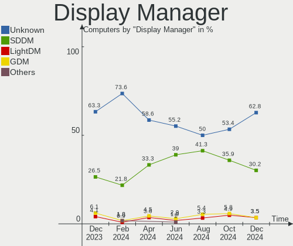
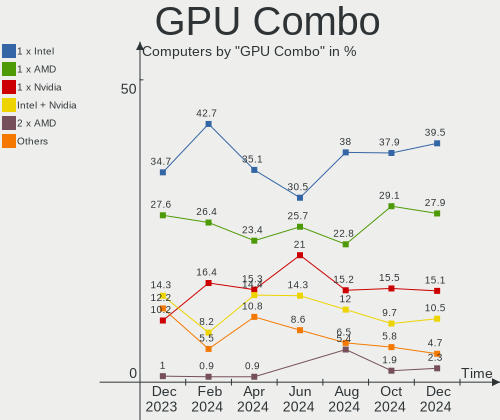
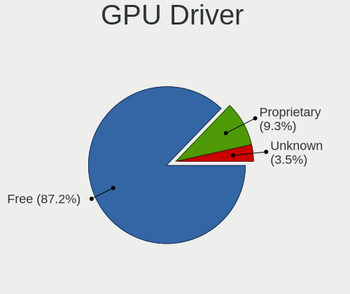

openSUSE Hardware Trends
------------------------

A project to identify most popular hardware characteristics and track their change
over time based on data collected by openSUSE users at https://Linux-Hardware.org.

Anyone can contribute to the study by uploading probes of their computers by
the [hw-probe](https://github.com/linuxhw/hw-probe) tool:

    sudo hw-probe -all -upload

This is a report for all computer types. See also reports for [desktops](/Dist/openSUSE/Desktop/README.md) and [notebooks](/Dist/openSUSE/Notebook/README.md).

Full-feature report is available here: https://linux-hardware.org/?view=trends

Period: Apr, 2020.

Contents
--------

- [ OS                       ](#os)
- [ OS Family                ](#os-family)
- [ Kernel                   ](#kernel)
- [ Kernel Family            ](#kernel-family)
- [ Kernel Major Ver.        ](#kernel-major-ver)
- [ Arch                     ](#arch)
- [ DE                       ](#de)
- [ Display Server           ](#display-server)
- [ Display Manager          ](#display-manager)
- [ OS Lang                  ](#os-lang)
- [ Boot Mode                ](#boot-mode)
- [ Filesystem               ](#filesystem)
- [ Dual Boot with Linux/BSD ](#dual-boot-with-linux/bsd)
- [ Dual Boot (Win)          ](#dual-boot-win)
- [ Country                  ](#country)
- [ City                     ](#city)
- [ Vendor                   ](#vendor)
- [ Model                    ](#model)
- [ Model Family             ](#model-family)
- [ MFG Year                 ](#mfg-year)
- [ Form Factor              ](#form-factor)
- [ Secure Boot              ](#secure-boot)
- [ Coreboot                 ](#coreboot)
- [ RAM Size                 ](#ram-size)
- [ RAM Used                 ](#ram-used)
- [ Drive Vendor             ](#drive-vendor)
- [ Drive Model              ](#drive-model)
- [ Drive Kind               ](#drive-kind)
- [ Drive Connector          ](#drive-connector)
- [ Drive Size               ](#drive-size)
- [ Space Total              ](#space-total)
- [ Space Used               ](#space-used)
- [ Malfunc. Drives          ](#malfunc-drives)
- [ Malfunc. Drive Vendor    ](#malfunc-drive-vendor)
- [ Malfunc. Drive Kind      ](#malfunc-drive-kind)
- [ Failed Drives            ](#failed-drives)
- [ Failed Drive Vendor      ](#failed-drive-vendor)
- [ Drive Status             ](#drive-status)
- [ Storage Vendor           ](#storage-vendor)
- [ Storage Model            ](#storage-model)
- [ Storage Kind             ](#storage-kind)
- [ CPU Vendor               ](#cpu-vendor)
- [ CPU Model                ](#cpu-model)
- [ CPU Model Family         ](#cpu-model-family)
- [ CPU Cores                ](#cpu-cores)
- [ CPU Sockets              ](#cpu-sockets)
- [ CPU Threads              ](#cpu-threads)
- [ CPU Op-Modes             ](#cpu-op-modes)
- [ CPU Microarch            ](#cpu-microarch)
- [ CPU Microcode            ](#cpu-microcode)
- [ GPU Vendor               ](#gpu-vendor)
- [ GPU Model                ](#gpu-model)
- [ GPU Combo                ](#gpu-combo)
- [ GPU Driver               ](#gpu-driver)
- [ GPU Memory               ](#gpu-memory)
- [ Monitor Vendor           ](#monitor-vendor)
- [ Monitor Model            ](#monitor-model)
- [ Monitor Resolution       ](#monitor-resolution)
- [ Monitor Diagonal         ](#monitor-diagonal)
- [ Monitor Width            ](#monitor-width)
- [ Aspect Ratio             ](#aspect-ratio)
- [ Monitor Area             ](#monitor-area)
- [ Pixel Density            ](#pixel-density)
- [ Multiple Monitors        ](#multiple-monitors)
- [ Net Controller Vendor    ](#net-controller-vendor)
- [ Net Controller Model     ](#net-controller-model)
- [ Net Controller Kind      ](#net-controller-kind)
- [ Used Controller          ](#used-controller)
- [ NICs                     ](#nics)
- [ Unsupported Devices      ](#unsupported-devices)
- [ Unsupported Device Types ](#unsupported-device-types)

OS
--

Installed operating systems

| Name                         | Computers | Percent |
|------------------------------|-----------|---------|
| openSUSE 15.1                | 44        | 35.2%   |
| openSUSE 20200405            | 24        | 19.2%   |
| openSUSE 20200407            | 10        | 8%      |
| openSUSE Leap-15.1           | 5         | 4%      |
| openSUSE 20200410            | 4         | 3.2%    |
| openSUSE 20200408            | 4         | 3.2%    |
| openSUSE 15.2                | 4         | 3.2%    |
| openSUSE 20200402            | 3         | 2.4%    |
| openSUSE Tumbleweed-20200422 | 2         | 1.6%    |
| openSUSE Tumbleweed-20200405 | 2         | 1.6%    |
| openSUSE 20200422            | 2         | 1.6%    |
| openSUSE 15.0                | 2         | 1.6%    |
| openSUSE Tumbleweed-20200421 | 1         | 0.8%    |
| openSUSE Tumbleweed-20200419 | 1         | 0.8%    |
| openSUSE Tumbleweed-20200416 | 1         | 0.8%    |
| openSUSE Tumbleweed-20200414 | 1         | 0.8%    |
| openSUSE Tumbleweed-20200410 | 1         | 0.8%    |
| openSUSE Tumbleweed-20200409 | 1         | 0.8%    |
| openSUSE Tumbleweed-20200408 | 1         | 0.8%    |
| openSUSE Tumbleweed-20200402 | 1         | 0.8%    |
| openSUSE Tumbleweed-20200331 | 1         | 0.8%    |
| openSUSE 20200425            | 1         | 0.8%    |
| openSUSE 20200416            | 1         | 0.8%    |
| openSUSE 20200413            | 1         | 0.8%    |
| openSUSE 20200409            | 1         | 0.8%    |
| openSUSE 20200326            | 1         | 0.8%    |
| openSUSE 20200325            | 1         | 0.8%    |
| openSUSE 20200322            | 1         | 0.8%    |
| openSUSE 20200320            | 1         | 0.8%    |
| openSUSE 20200307            | 1         | 0.8%    |
| openSUSE 20200211            | 1         | 0.8%    |

OS Family
---------

OS without a version

| Name     | Computers | Percent |
|----------|-----------|---------|
| openSUSE | 125       | 100%    |

Kernel
------

Version of the Linux kernel

| Version                     | Computers | Percent |
|-----------------------------|-----------|---------|
| 4.12.14-lp151.28.44-default | 40        | 32%     |
| 5.6.0-1-default             | 26        | 20.8%   |
| 5.6.2-1-default             | 21        | 16.8%   |
| 5.6.4-1-default             | 8         | 6.4%    |
| 4.12.14-lp151.28.40-default | 5         | 4%      |
| 5.5.13-1-default            | 3         | 2.4%    |
| 5.5.11-1-default            | 3         | 2.4%    |
| 5.3.18-lp152.10-default     | 3         | 2.4%    |
| 5.5.9-1-default             | 2         | 1.6%    |
| 4.12.14-lp151.28.48-default | 2         | 1.6%    |
| 5.6.6-1-default             | 1         | 0.8%    |
| 5.6.2-3.gb22bc26-default    | 1         | 0.8%    |
| 5.6.2-3.g7d8cfa8-default    | 1         | 0.8%    |
| 5.6.0-default               | 1         | 0.8%    |
| 5.5.4-1-default             | 1         | 0.8%    |
| 5.5.2-1-default             | 1         | 0.8%    |
| 5.4.13-1-default            | 1         | 0.8%    |
| 5.3.18-lp152.9-preempt      | 1         | 0.8%    |
| 4.18.12-2.ga880bd8-default  | 1         | 0.8%    |
| 4.12.14-lp151.28.36-default | 1         | 0.8%    |
| 4.12.14-lp150.12.82-default | 1         | 0.8%    |
| 4.12.14-lp150.12.79-default | 1         | 0.8%    |

Kernel Family
-------------

Linux kernel without a distro release

| Version | Computers | Percent |
|---------|-----------|---------|
| 4.12.14 | 50        | 40%     |
| 5.6.0   | 27        | 21.6%   |
| 5.6.2   | 23        | 18.4%   |
| 5.6.4   | 8         | 6.4%    |
| 5.3.18  | 4         | 3.2%    |
| 5.5.13  | 3         | 2.4%    |
| 5.5.11  | 3         | 2.4%    |
| 5.5.9   | 2         | 1.6%    |
| 5.6.6   | 1         | 0.8%    |
| 5.5.4   | 1         | 0.8%    |
| 5.5.2   | 1         | 0.8%    |
| 5.4.13  | 1         | 0.8%    |
| 4.18.12 | 1         | 0.8%    |

Kernel Major Ver.
-----------------

Linux kernel major version

| Version | Computers | Percent |
|---------|-----------|---------|
| 5.6     | 59        | 47.2%   |
| 4.12    | 50        | 40%     |
| 5.5     | 10        | 8%      |
| 5.3     | 4         | 3.2%    |
| 5.4     | 1         | 0.8%    |
| 4.18    | 1         | 0.8%    |

Arch
----

OS architecture (x86_64, i586, etc.)

| Name   | Computers | Percent |
|--------|-----------|---------|
| x86_64 | 125       | 100%    |

DE
--

Desktop Environment

| Name     | Computers | Percent |
|----------|-----------|---------|
| KDE5     | 79        | 63.2%   |
| KDE      | 16        | 12.8%   |
| GNOME    | 12        | 9.6%    |
| MATE     | 9         | 7.2%    |
| XFCE     | 5         | 4%      |
| Unknown  | 3         | 2.4%    |
| Cinnamon | 1         | 0.8%    |

Display Server
--------------

X11 or Wayland

| Name        | Computers | Percent |
|-------------|-----------|---------|
| X11         | 107       | 85.6%   |
| Wayland     | 11        | 8.8%    |
| Unspecified | 3         | 2.4%    |
| Unknown     | 3         | 2.4%    |
| Tty         | 1         | 0.8%    |

Display Manager
---------------

SDDM, LightDM, etc.

| Name    | Computers | Percent |
|---------|-----------|---------|
| LightDM | 102       | 81.6%   |
| Unknown | 20        | 16%     |
| SDDM    | 2         | 1.6%    |
| XDM     | 1         | 0.8%    |

OS Lang
-------

Language

| Lang       | Computers | Percent |
|------------|-----------|---------|
| en_US      | 26        | 20.8%   |
| de_DE      | 24        | 19.2%   |
| POSIX      | 17        | 13.6%   |
| en_GB      | 11        | 8.8%    |
| pt_PT      | 7         | 5.6%    |
| fr_FR      | 6         | 4.8%    |
| pt_BR      | 5         | 4%      |
| ru_RU      | 4         | 3.2%    |
| en_US.utf8 | 4         | 3.2%    |
| es_ES      | 3         | 2.4%    |
| pl_PL      | 2         | 1.6%    |
| nl_NL      | 2         | 1.6%    |
| hu_HU      | 2         | 1.6%    |
| sl_SI      | 1         | 0.8%    |
| sk_SK      | 1         | 0.8%    |
| nb_NO      | 1         | 0.8%    |
| it_IT      | 1         | 0.8%    |
| hr_HR      | 1         | 0.8%    |
| fr_CA      | 1         | 0.8%    |
| es_MX      | 1         | 0.8%    |
| es_AR      | 1         | 0.8%    |
| en_IE      | 1         | 0.8%    |
| en_CA      | 1         | 0.8%    |
| en_AU      | 1         | 0.8%    |
| Unknown    | 1         | 0.8%    |

Boot Mode
---------

EFI or BIOS

| Mode | Computers | Percent |
|------|-----------|---------|
| EFI  | 69        | 55.2%   |
| BIOS | 56        | 44.8%   |

Filesystem
----------

Type of filesystem

| Type  | Computers | Percent |
|-------|-----------|---------|
| Btrfs | 71        | 56.8%   |
| Ext4  | 49        | 39.2%   |
| Xfs   | 4         | 3.2%    |
| Tmpfs | 1         | 0.8%    |

Dual Boot with Linux/BSD
------------------------

Hosting more than one Linux/BSD

| Dual boot | Computers | Percent |
|-----------|-----------|---------|
| No        | 111       | 88.8%   |
| Yes       | 14        | 11.2%   |

Dual Boot (Win)
---------------

Hosting Linux and Windows

| Dual boot | Computers | Percent |
|-----------|-----------|---------|
| No        | 85        | 68%     |
| Yes       | 40        | 32%     |

Country
-------

Geographic location (country)

| Country     | Computers | Percent |
|-------------|-----------|---------|
| Germany     | 30        | 24%     |
| USA         | 29        | 23.2%   |
| Switzerland | 7         | 5.6%    |
| France      | 6         | 4.8%    |
| Brazil      | 5         | 4%      |
| UK          | 4         | 3.2%    |
| Serbia      | 3         | 2.4%    |
| Russia      | 3         | 2.4%    |
| Italy       | 3         | 2.4%    |
| Canada      | 3         | 2.4%    |
| Austria     | 3         | 2.4%    |
| Portugal    | 2         | 1.6%    |
| Poland      | 2         | 1.6%    |
| Netherlands | 2         | 1.6%    |
| Mexico      | 2         | 1.6%    |
| Hungary     | 2         | 1.6%    |
| Argentina   | 2         | 1.6%    |
| Vietnam     | 1         | 0.8%    |
| Uruguay     | 1         | 0.8%    |
| Ukraine     | 1         | 0.8%    |
| Turkey      | 1         | 0.8%    |
| Sweden      | 1         | 0.8%    |
| Slovenia    | 1         | 0.8%    |
| Slovakia    | 1         | 0.8%    |
| Peru        | 1         | 0.8%    |
| Norway      | 1         | 0.8%    |
| New Zealand | 1         | 0.8%    |
| Luxembourg  | 1         | 0.8%    |
| Israel      | 1         | 0.8%    |
| Ireland     | 1         | 0.8%    |
| Croatia     | 1         | 0.8%    |
| Belgium     | 1         | 0.8%    |
| Belarus     | 1         | 0.8%    |
| Australia   | 1         | 0.8%    |

City
----

Geographic location (city)

| City                | Computers | Percent |
|---------------------|-----------|---------|
| Joplin              | 8         | 6.4%    |
| Neuchatel           | 5         | 4%      |
| Schrobenhausen      | 4         | 3.2%    |
| Vienna              | 3         | 2.4%    |
| San Jose            | 3         | 2.4%    |
| Munich              | 3         | 2.4%    |
| Berlin              | 3         | 2.4%    |
| Augsburg            | 3         | 2.4%    |
| Rochester           | 2         | 1.6%    |
| Porto               | 2         | 1.6%    |
| Kiel                | 2         | 1.6%    |
| João Pessoa        | 2         | 1.6%    |
| Gateshead           | 2         | 1.6%    |
| Belgrade            | 2         | 1.6%    |
| Amsterdam           | 2         | 1.6%    |
| Zagreb              | 1         | 0.8%    |
| Yehud               | 1         | 0.8%    |
| Whitchurch          | 1         | 0.8%    |
| Weener              | 1         | 0.8%    |
| Waco                | 1         | 0.8%    |
| Villa Ballester     | 1         | 0.8%    |
| Vero Beach          | 1         | 0.8%    |
| Vechta              | 1         | 0.8%    |
| Sydney              | 1         | 0.8%    |
| Strasbourg          | 1         | 0.8%    |
| St Petersburg       | 1         | 0.8%    |
| Slavyanka           | 1         | 0.8%    |
| Seattle             | 1         | 0.8%    |
| Salvador            | 1         | 0.8%    |
| Rouen               | 1         | 0.8%    |
| Rio Rancho          | 1         | 0.8%    |
| Rio de Janeiro      | 1         | 0.8%    |
| Peiting             | 1         | 0.8%    |
| Paris               | 1         | 0.8%    |
| Oslo                | 1         | 0.8%    |
| Nottingham          | 1         | 0.8%    |
| North College Hill  | 1         | 0.8%    |
| Nordenham           | 1         | 0.8%    |
| Niederanven         | 1         | 0.8%    |
| Neuwied             | 1         | 0.8%    |
| Neupotz             | 1         | 0.8%    |
| Neggio              | 1         | 0.8%    |
| Montreal            | 1         | 0.8%    |
| Montevideo          | 1         | 0.8%    |
| Monte Porzio Catone | 1         | 0.8%    |
| Mexico City         | 1         | 0.8%    |
| Lviv                | 1         | 0.8%    |
| Lula                | 1         | 0.8%    |
| Ludwigsburg         | 1         | 0.8%    |
| Louvigne-du-Desert  | 1         | 0.8%    |
| Lombard             | 1         | 0.8%    |
| Livingston          | 1         | 0.8%    |
| Lima                | 1         | 0.8%    |
| Kessel              | 1         | 0.8%    |
| Kecskemét          | 1         | 0.8%    |
| Istanbul            | 1         | 0.8%    |
| Ilava               | 1         | 0.8%    |
| Huenfeld            | 1         | 0.8%    |
| Houston             | 1         | 0.8%    |
| Homer               | 1         | 0.8%    |

Vendor
------

Motherboard manufacturer

| Name                | Computers | Percent |
|---------------------|-----------|---------|
| ASUSTek Computer    | 21        | 16.8%   |
| Gigabyte Technology | 17        | 13.6%   |
| Lenovo              | 16        | 12.8%   |
| Hewlett-Packard     | 14        | 11.2%   |
| Dell                | 14        | 11.2%   |
| MSI                 | 10        | 8%      |
| ASRock              | 7         | 5.6%    |
| TUXEDO              | 3         | 2.4%    |
| Toshiba             | 3         | 2.4%    |
| Acer                | 3         | 2.4%    |
| Samsung Electronics | 2         | 1.6%    |
| Fujitsu Siemens     | 2         | 1.6%    |
| Biostar             | 2         | 1.6%    |
| Alienware           | 2         | 1.6%    |
| Unknown             | 2         | 1.6%    |
| Wortmann AG         | 1         | 0.8%    |
| Supermicro          | 1         | 0.8%    |
| Pegatron            | 1         | 0.8%    |
| INFORLANDIA         | 1         | 0.8%    |
| GPD                 | 1         | 0.8%    |
| Fujitsu             | 1         | 0.8%    |
| DIEBOLD             | 1         | 0.8%    |

Model
-----

Motherboard model

| Name                                   | Computers | Percent |
|----------------------------------------|-----------|---------|
| Dell Latitude 7490                     | 4         | 3.2%    |
| Unknown                                | 4         | 3.2%    |
| ASUS All Series                        | 3         | 2.4%    |
| MSI MS-7A33                            | 2         | 1.6%    |
| Gigabyte 970A-D3P                      | 2         | 1.6%    |
| Dell Latitude E5470                    | 2         | 1.6%    |
| Dell G3 3579                           | 2         | 1.6%    |
| ASRock B450M Pro4                      | 2         | 1.6%    |
| Wortmann AG TERRA_MOBILE_1541H         | 1         | 0.8%    |
| TUXEDO N550RC                          | 1         | 0.8%    |
| Toshiba Satellite PRO C50-A-1E2        | 1         | 0.8%    |
| Toshiba Satellite L770D-10M            | 1         | 0.8%    |
| Toshiba Satellite C855-112             | 1         | 0.8%    |
| Supermicro H8DCL                       | 1         | 0.8%    |
| Samsung Electronics RC530/RC730        | 1         | 0.8%    |
| Samsung Electronics 550P5C/550P7C      | 1         | 0.8%    |
| Pegatron Compaq dx2450 Microtower      | 1         | 0.8%    |
| MSI MS-7B86                            | 1         | 0.8%    |
| MSI MS-7B36                            | 1         | 0.8%    |
| MSI MS-7A34                            | 1         | 0.8%    |
| MSI MS-7721                            | 1         | 0.8%    |
| MSI MS-7676                            | 1         | 0.8%    |
| MSI MS-7673                            | 1         | 0.8%    |
| MSI GP63 Leopard 8RD                   | 1         | 0.8%    |
| MSI CX61 0OC/CX61 0OD/CX61 0OL         | 1         | 0.8%    |
| Lenovo Y520-15IKBN 80WK                | 1         | 0.8%    |
| Lenovo ThinkPad X230 2324BY9           | 1         | 0.8%    |
| Lenovo ThinkPad X220 4290Y11           | 1         | 0.8%    |
| Lenovo ThinkPad X1 Yoga 1st 20FQCTO1WW | 1         | 0.8%    |
| Lenovo ThinkPad W530 2441CTO           | 1         | 0.8%    |
| Lenovo ThinkPad T480s 20L7S1KW00       | 1         | 0.8%    |
| Lenovo ThinkPad T480 20L6S42000        | 1         | 0.8%    |
| Lenovo ThinkPad T430 2349U2B           | 1         | 0.8%    |
| Lenovo ThinkPad T430 2347AY1           | 1         | 0.8%    |
| Lenovo ThinkCentre M93p 10A8S0CE11     | 1         | 0.8%    |
| Lenovo ThinkCentre M78 10BR0005US      | 1         | 0.8%    |
| Lenovo Legion Y720T-34ASU 90H90015UK   | 1         | 0.8%    |
| Lenovo IdeaPad 320-15AST 80XV          | 1         | 0.8%    |
| Lenovo G505s 20255                     | 1         | 0.8%    |
| Lenovo B590 627439G                    | 1         | 0.8%    |
| Lenovo B5400 80B6QB0                   | 1         | 0.8%    |
| INFORLANDIA W65_67SB                   | 1         | 0.8%    |
| HP ZBook 15 G2                         | 1         | 0.8%    |
| HP Spectre x360 Convertible 13-w0XX    | 1         | 0.8%    |
| HP ProBook 4525s                       | 1         | 0.8%    |
| HP ProBook 450 G4                      | 1         | 0.8%    |
| HP ProBook 430 G5                      | 1         | 0.8%    |
| HP Pavilion g7                         | 1         | 0.8%    |
| HP Pavilion dv7                        | 1         | 0.8%    |
| HP Pavilion Desktop 590-p0xxx          | 1         | 0.8%    |
| HP Pavilion 14                         | 1         | 0.8%    |
| HP OMEN by HP Desktop PC 880-p1xx      | 1         | 0.8%    |
| HP Mini 110-3100                       | 1         | 0.8%    |
| HP EliteBook 840 G6                    | 1         | 0.8%    |
| HP EliteBook 840 G2                    | 1         | 0.8%    |
| HP EliteBook 820 G3                    | 1         | 0.8%    |
| GPD P2 MAX                             | 1         | 0.8%    |
| Gigabyte Z390 AORUS MASTER             | 1         | 0.8%    |
| Gigabyte Z170X-Gaming 7                | 1         | 0.8%    |
| Gigabyte Z170-HD3 DDR3-CF              | 1         | 0.8%    |

Model Family
------------

Motherboard model prefix

| Name                       | Computers | Percent |
|----------------------------|-----------|---------|
| Dell Latitude              | 10        | 8%      |
| Lenovo ThinkPad            | 8         | 6.4%    |
| HP Pavilion                | 4         | 3.2%    |
| Unknown                    | 4         | 3.2%    |
| Toshiba Satellite          | 3         | 2.4%    |
| HP ProBook                 | 3         | 2.4%    |
| HP EliteBook               | 3         | 2.4%    |
| ASUS All                   | 3         | 2.4%    |
| MSI MS-7A33                | 2         | 1.6%    |
| Lenovo ThinkCentre         | 2         | 1.6%    |
| Gigabyte 970A-D3P          | 2         | 1.6%    |
| Dell OptiPlex              | 2         | 1.6%    |
| Dell G3                    | 2         | 1.6%    |
| ASUS VivoBook              | 2         | 1.6%    |
| ASUS M5A78L-M              | 2         | 1.6%    |
| ASRock B450M               | 2         | 1.6%    |
| Acer Aspire                | 2         | 1.6%    |
| Wortmann AG TERRA          | 1         | 0.8%    |
| TUXEDO N550RC              | 1         | 0.8%    |
| Supermicro H8DCL           | 1         | 0.8%    |
| Samsung Electronics RC530  | 1         | 0.8%    |
| Samsung Electronics 550P5C | 1         | 0.8%    |
| Pegatron Compaq            | 1         | 0.8%    |
| MSI MS-7B86                | 1         | 0.8%    |
| MSI MS-7B36                | 1         | 0.8%    |
| MSI MS-7A34                | 1         | 0.8%    |
| MSI MS-7721                | 1         | 0.8%    |
| MSI MS-7676                | 1         | 0.8%    |
| MSI MS-7673                | 1         | 0.8%    |
| MSI GP63                   | 1         | 0.8%    |
| MSI CX61                   | 1         | 0.8%    |
| Lenovo Y520-15IKBN         | 1         | 0.8%    |
| Lenovo Legion              | 1         | 0.8%    |
| Lenovo IdeaPad             | 1         | 0.8%    |
| Lenovo G505s               | 1         | 0.8%    |
| Lenovo B590                | 1         | 0.8%    |
| Lenovo B5400               | 1         | 0.8%    |
| INFORLANDIA W65            | 1         | 0.8%    |
| HP ZBook                   | 1         | 0.8%    |
| HP Spectre                 | 1         | 0.8%    |
| HP OMEN                    | 1         | 0.8%    |
| HP Mini                    | 1         | 0.8%    |
| GPD P2                     | 1         | 0.8%    |
| Gigabyte Z390              | 1         | 0.8%    |
| Gigabyte Z170X-Gaming      | 1         | 0.8%    |
| Gigabyte Z170-HD3          | 1         | 0.8%    |
| Gigabyte X570              | 1         | 0.8%    |
| Gigabyte X399              | 1         | 0.8%    |
| Gigabyte M68MT-S2          | 1         | 0.8%    |
| Gigabyte H97-D3H           | 1         | 0.8%    |
| Gigabyte GA-MA790XT-UD4P   | 1         | 0.8%    |
| Gigabyte GA-880GA-UD3H     | 1         | 0.8%    |
| Gigabyte GA-770TA-UD3      | 1         | 0.8%    |
| Gigabyte F2A85XM-D3H       | 1         | 0.8%    |
| Gigabyte B450M             | 1         | 0.8%    |
| Gigabyte B250M-D2V         | 1         | 0.8%    |
| Gigabyte AX370-Gaming      | 1         | 0.8%    |
| Gigabyte 970A-DS3P         | 1         | 0.8%    |
| Fujitsu STYLISTIC          | 1         | 0.8%    |
| Fujitsu Siemens LIFEBOOK   | 1         | 0.8%    |

MFG Year
--------

Motherboard manufacture year

| Year | Computers | Percent |
|------|-----------|---------|
| 2019 | 46        | 36.8%   |
| 2018 | 14        | 11.2%   |
| 2013 | 13        | 10.4%   |
| 2015 | 9         | 7.2%    |
| 2012 | 9         | 7.2%    |
| 2014 | 8         | 6.4%    |
| 2016 | 6         | 4.8%    |
| 2011 | 6         | 4.8%    |
| 2017 | 5         | 4%      |
| 2010 | 4         | 3.2%    |
| 2020 | 2         | 1.6%    |
| 2009 | 1         | 0.8%    |
| 2008 | 1         | 0.8%    |
| 2005 | 1         | 0.8%    |

Form Factor
-----------

Physical design of the computer

| Name        | Computers | Percent |
|-------------|-----------|---------|
| Notebook    | 61        | 48.8%   |
| Desktop     | 60        | 48%     |
| Convertible | 3         | 2.4%    |
| Server      | 1         | 0.8%    |

Secure Boot
-----------

Enabled or disabled

| State    | Computers | Percent |
|----------|-----------|---------|
| Disabled | 107       | 85.6%   |
| Enabled  | 18        | 14.4%   |

Coreboot
--------

Have coreboot on board

| Used | Computers | Percent |
|------|-----------|---------|
| No   | 125       | 100%    |

RAM Size
--------

Total RAM memory

| Size in GB  | Computers | Percent |
|-------------|-----------|---------|
| 16.01-24.0  | 39        | 31.2%   |
| 4.01-8.0    | 30        | 24%     |
| 8.01-16.0   | 23        | 18.4%   |
| 32.01-64.0  | 16        | 12.8%   |
| 3.01-4.0    | 7         | 5.6%    |
| 64.01-256.0 | 4         | 3.2%    |
| 1.01-2.0    | 3         | 2.4%    |
| 24.01-32.0  | 2         | 1.6%    |
| 2.01-3.0    | 1         | 0.8%    |

RAM Used
--------

Used RAM memory

| Used GB    | Computers | Percent |
|------------|-----------|---------|
| 2.01-3.0   | 31        | 24.8%   |
| 4.01-8.0   | 27        | 21.6%   |
| 1.01-2.0   | 26        | 20.8%   |
| 3.01-4.0   | 16        | 12.8%   |
| 8.01-16.0  | 12        | 9.6%    |
| 0.01-1.0   | 9         | 7.2%    |
| 16.01-24.0 | 2         | 1.6%    |
| 32.01-64.0 | 1         | 0.8%    |
| 24.01-32.0 | 1         | 0.8%    |

Drive Vendor
------------

Hard drive vendors

| Vendor              | Computers | Drives | Percent |
|---------------------|-----------|--------|---------|
| Samsung Electronics | 51        | 61     | 24.64%  |
| Seagate             | 43        | 61     | 20.77%  |
| WDC                 | 27        | 41     | 13.04%  |
| Crucial             | 16        | 17     | 7.73%   |
| SanDisk             | 14        | 14     | 6.76%   |
| Toshiba             | 11        | 11     | 5.31%   |
| Kingston            | 7         | 7      | 3.38%   |
| PNY                 | 4         | 5      | 1.93%   |
| Hitachi             | 4         | 4      | 1.93%   |
| Micron Technology   | 3         | 3      | 1.45%   |
| SPCC                | 2         | 2      | 0.97%   |
| SK Hynix            | 2         | 2      | 0.97%   |
| OCZ                 | 2         | 2      | 0.97%   |
| LITEON              | 2         | 2      | 0.97%   |
| Intel               | 2         | 2      | 0.97%   |
| HGST                | 2         | 2      | 0.97%   |
| Corsair             | 2         | 2      | 0.97%   |
| Biostar             | 2         | 2      | 0.97%   |
| A-DATA Technology   | 2         | 2      | 0.97%   |
| SuperTalent         | 1         | 1      | 0.48%   |
| PLEXTOR             | 1         | 1      | 0.48%   |
| Phison Electronics  | 1         | 1      | 0.48%   |
| Patriot             | 1         | 1      | 0.48%   |
| Mushkin             | 1         | 1      | 0.48%   |
| Lenovo              | 1         | 1      | 0.48%   |
| JMicron             | 1         | 1      | 0.48%   |
| Hewlett-Packard     | 1         | 1      | 0.48%   |
| Generic             | 1         | 1      | 0.48%   |

Drive Model
-----------

Hard drive models

| Model                           | Computers | Percent |
|---------------------------------|-----------|---------|
| SSD 860 EVO 500GB               | 5         | 2.02%   |
| SSD 850 EVO 250GB               | 5         | 2.02%   |
| Expansion Desk 5TB              | 5         | 2.02%   |
| ST3500418AS 500GB               | 4         | 1.61%   |
| SSD 840 EVO 250GB               | 4         | 1.61%   |
| WD10EZEX-22MFCA0 1TB            | 3         | 1.21%   |
| WD10EZEX-08WN4A0 1TB            | 3         | 1.21%   |
| SSD 970 EVO 500GB               | 3         | 1.21%   |
| SSD 850 PRO 256GB               | 3         | 1.21%   |
| WDS480G2G0A-00JH30 480GB SSD    | 2         | 0.81%   |
| WD20SPZX-22UA7T0 2TB            | 2         | 0.81%   |
| WD20EZRZ-00Z5HB0 2TB            | 2         | 0.81%   |
| WD20EARS-00MVWB0 2TB            | 2         | 0.81%   |
| ST500LM000-1EJ162 500GB         | 2         | 0.81%   |
| ST500DM002-1BD142 500GB         | 2         | 0.81%   |
| ST32000641AS 2TB                | 2         | 0.81%   |
| ST3000DM008-2DM166 3TB          | 2         | 0.81%   |
| ST2000DM006-2DM164 2TB          | 2         | 0.81%   |
| ST1000LM035-1RK172 1TB          | 2         | 0.81%   |
| ST1000LM024 HN-M101MBB 1TB      | 2         | 0.81%   |
| ST1000DX002-2DV162 1TB          | 2         | 0.81%   |
| ST1000DM010-2EP102 1TB          | 2         | 0.81%   |
| SSD2SC480G1CS2754D117-514 480GB | 2         | 0.81%   |
| SSD 970 EVO Plus 1TB            | 2         | 0.81%   |
| SSD 970 EVO 1TB                 | 2         | 0.81%   |
| SSD 860 QVO 1TB                 | 2         | 0.81%   |
| SSD 850 EVO 500GB               | 2         | 0.81%   |
| SSD 850 EVO 120GB               | 2         | 0.81%   |
| SSD 840 Series 120GB            | 2         | 0.81%   |
| SSD 840 PRO Series 256GB        | 2         | 0.81%   |
| SDSSDA240G 240GB                | 2         | 0.81%   |
| SD8SB8U256G1122 256GB SSD       | 2         | 0.81%   |
| HDWD110 1TB                     | 2         | 0.81%   |
| HD502HI 500GB                   | 2         | 0.81%   |
| HD204UI 2TB                     | 2         | 0.81%   |
| CT500MX500SSD1 500GB            | 2         | 0.81%   |
| CT240BX500SSD1 240GB            | 2         | 0.81%   |
| CT1000P1SSD8 1TB                | 2         | 0.81%   |
| Backup+ Hub BK 8TB              | 2         | 0.81%   |
| X600 M.2 2280 SATA 256GB SSD    | 1         | 0.4%    |
| Wildfire 120GB SSD              | 1         | 0.4%    |
| WDS500G1B0C-00S6U0 500GB        | 1         | 0.4%    |
| WDS250G2B0B-00YS70 250GB SSD    | 1         | 0.4%    |
| WDS250G1B0C-00S6U0 250GB        | 1         | 0.4%    |
| WDS100T1B0A-00H9H0 1TB SSD      | 1         | 0.4%    |
| WD7500AYYS-01RCA0 752GB         | 1         | 0.4%    |
| WD6400BPVT-75HXZT1 640GB        | 1         | 0.4%    |
| WD60EFRX-68MYMN1 6TB            | 1         | 0.4%    |
| WD60EFRX-68L0BN1 6TB            | 1         | 0.4%    |
| WD50EZRX-00MVLB1 5TB            | 1         | 0.4%    |
| WD40EZRX-00SPEB0 4TB            | 1         | 0.4%    |
| WD40EFRX-68WT0N0 4TB            | 1         | 0.4%    |
| WD4004FZWX-00GBGB0 4TB          | 1         | 0.4%    |
| WD30EZRX-00SPEB0 3TB            | 1         | 0.4%    |
| WD20EZRX-00DC0B0 2TB            | 1         | 0.4%    |
| WD20EZRX-00D8PB0 2TB            | 1         | 0.4%    |
| WD2003FYYS-02W0B1 2TB           | 1         | 0.4%    |
| WD1600BEVT-22A23T0 160GB        | 1         | 0.4%    |
| WD10SPZX-21Z10T0 1TB            | 1         | 0.4%    |
| WD10SPZX-17Z10T0 1TB            | 1         | 0.4%    |

Drive Kind
----------

HDD or SSD

| Kind    | Computers | Drives | Percent |
|---------|-----------|--------|---------|
| SSD     | 73        | 97     | 39.89%  |
| HDD     | 73        | 115    | 39.89%  |
| NVMe    | 33        | 35     | 18.03%  |
| Unknown | 4         | 4      | 2.19%   |

Drive Connector
---------------

SATA, SAS, NVMe, etc.

| Type | Computers | Drives | Percent |
|------|-----------|--------|---------|
| SATA | 108       | 205    | 72.97%  |
| NVMe | 33        | 35     | 22.3%   |
| SAS  | 7         | 11     | 4.73%   |

Drive Size
----------

Size of hard drive

| Size in TB | Computers | Drives | Percent |
|------------|-----------|--------|---------|
| 0.01-0.5   | 86        | 123    | 45.99%  |
| 0.51-1.0   | 55        | 68     | 29.41%  |
| 1.01-2.0   | 23        | 33     | 12.3%   |
| 4.01-10.0  | 9         | 13     | 4.81%   |
| 2.01-3.0   | 8         | 8      | 4.28%   |
| 3.01-4.0   | 6         | 6      | 3.21%   |

Space Total
-----------

Amount of disk space available on the file system

| Size in GB     | Computers | Percent |
|----------------|-----------|---------|
| More than 3000 | 32        | 25.6%   |
| 1001-2000      | 26        | 20.8%   |
| 501-1000       | 20        | 16%     |
| 251-500        | 19        | 15.2%   |
| 2001-3000      | 14        | 11.2%   |
| 101-250        | 13        | 10.4%   |
| 1-20           | 1         | 0.8%    |

Space Used
----------

Amount of used disk space

| Used GB        | Computers | Percent |
|----------------|-----------|---------|
| 251-500        | 29        | 23.2%   |
| 501-1000       | 20        | 16%     |
| 101-250        | 19        | 15.2%   |
| 1001-2000      | 17        | 13.6%   |
| 51-100         | 13        | 10.4%   |
| More than 3000 | 10        | 8%      |
| 21-50          | 6         | 4.8%    |
| 1-20           | 6         | 4.8%    |
| 2001-3000      | 5         | 4%      |

Malfunc. Drives
---------------

Drive models with a malfunction

| Model                       | Computers | Drives | Percent |
|-----------------------------|-----------|--------|---------|
| ST3500418AS 500GB           | 2         | 2      | 8.33%   |
| Wildfire 120GB SSD          | 1         | 1      | 4.17%   |
| ST9500325AS 500GB           | 1         | 1      | 4.17%   |
| ST500DM002-1BD142 500GB     | 1         | 1      | 4.17%   |
| ST250DM000-1BD141 250GB     | 1         | 1      | 4.17%   |
| ST2000DM001-1CH164 2TB      | 1         | 1      | 4.17%   |
| ST1000LM044 HN-M101SAD 1TB  | 1         | 1      | 4.17%   |
| ST1000LM024 HN-M101MBB 1TB  | 1         | 1      | 4.17%   |
| SSD FTM32GX25H 32GB         | 1         | 1      | 4.17%   |
| SSD 850 PRO 256GB           | 1         | 1      | 4.17%   |
| SSD 840 EVO 250GB           | 1         | 1      | 4.17%   |
| SD8SN8U-256G-1006 256GB SSD | 1         | 1      | 4.17%   |
| MZVLW256HEHP-000L7 256GB    | 1         | 1      | 4.17%   |
| MK5075GSX 500GB             | 1         | 1      | 4.17%   |
| M4-CT256M4SSD2 256GB        | 1         | 1      | 4.17%   |
| HTS545050A7E380 500GB       | 1         | 1      | 4.17%   |
| HDS724040ALE640 4TB         | 1         | 1      | 4.17%   |
| HD502HI 500GB               | 1         | 1      | 4.17%   |
| HD501LJ 500GB               | 1         | 1      | 4.17%   |
| HD322HJ 320GB               | 1         | 1      | 4.17%   |
| CT960M500SSD1 960GB         | 1         | 1      | 4.17%   |
| CT250MX500SSD1 250GB        | 1         | 1      | 4.17%   |
| CT1000P1SSD8 1TB            | 1         | 1      | 4.17%   |

Malfunc. Drive Vendor
---------------------

Vendors of faulty drives

| Vendor              | Computers | Drives | Percent |
|---------------------|-----------|--------|---------|
| Seagate             | 8         | 8      | 34.78%  |
| Samsung Electronics | 5         | 6      | 21.74%  |
| Crucial             | 4         | 4      | 17.39%  |
| Hitachi             | 2         | 2      | 8.7%    |
| Toshiba             | 1         | 1      | 4.35%   |
| SuperTalent         | 1         | 1      | 4.35%   |
| SanDisk             | 1         | 1      | 4.35%   |
| Patriot             | 1         | 1      | 4.35%   |

Malfunc. Drive Kind
-------------------

Kinds of faulty drives

| Kind | Computers | Drives | Percent |
|------|-----------|--------|---------|
| HDD  | 12        | 14     | 57.14%  |
| SSD  | 7         | 8      | 33.33%  |
| NVMe | 2         | 2      | 9.52%   |

Failed Drives
-------------

Failed drive models

Zero info for selected period =(

Failed Drive Vendor
-------------------

Failed drive vendors

Zero info for selected period =(

Drive Status
------------

Number of failed and malfunc. drives

| Status   | Computers | Drives | Percent |
|----------|-----------|--------|---------|
| Works    | 103       | 187    | 70.55%  |
| Detected | 22        | 40     | 15.07%  |
| Malfunc  | 21        | 24     | 14.38%  |

Storage Vendor
--------------

Storage controller vendors

| Vendor                       | Computers | Percent |
|------------------------------|-----------|---------|
| Intel                        | 67        | 39.18%  |
| AMD                          | 46        | 26.9%   |
| Samsung Electronics          | 17        | 9.94%   |
| Phison Electronics           | 9         | 5.26%   |
| Sandisk                      | 5         | 2.92%   |
| Marvell Technology Group     | 5         | 2.92%   |
| ASMedia Technology           | 5         | 2.92%   |
| JMicron Technology           | 3         | 1.75%   |
| SK Hynix                     | 2         | 1.17%   |
| Silicon Image                | 2         | 1.17%   |
| Nvidia                       | 2         | 1.17%   |
| Micron/Crucial Technology    | 2         | 1.17%   |
| VIA Technologies             | 1         | 0.58%   |
| Toshiba America Info Systems | 1         | 0.58%   |
| Silicon Motion               | 1         | 0.58%   |
| Seagate Technology           | 1         | 0.58%   |
| Lenovo                       | 1         | 0.58%   |
| Broadcom / LSI               | 1         | 0.58%   |

Storage Model
-------------

Storage controller models

| Model                                                                             | Computers | Percent |
|-----------------------------------------------------------------------------------|-----------|---------|
| FCH SATA Controller [AHCI mode]                                                   | 31        | 15.12%  |
| NVMe SSD Controller SM981/PM981/PM983                                             | 11        | 5.37%   |
| 7 Series Chipset Family 6-port SATA Controller [AHCI mode]                        | 10        | 4.88%   |
| SB7x0/SB8x0/SB9x0 IDE Controller                                                  | 9         | 4.39%   |
| Sunrise Point-LP SATA Controller [AHCI mode]                                      | 8         | 3.9%    |
| SB7x0/SB8x0/SB9x0 SATA Controller [AHCI mode]                                     | 8         | 3.9%    |
| 8 Series/C220 Series Chipset Family 6-port SATA Controller 1 [AHCI mode]          | 8         | 3.9%    |
| SB7x0/SB8x0/SB9x0 SATA Controller [IDE mode]                                      | 7         | 3.41%   |
| E12 NVMe Controller                                                               | 7         | 3.41%   |
| 300 Series Chipset SATA Controller                                                | 6         | 2.93%   |
| X370 Series Chipset SATA Controller                                               | 5         | 2.44%   |
| WD Black 2018/PC SN520 NVMe SSD                                                   | 5         | 2.44%   |
| Non-Volatile memory controller                                                    | 5         | 2.44%   |
| ASM1062 Serial ATA Controller                                                     | 5         | 2.44%   |
| 82801 Mobile SATA Controller [RAID mode]                                          | 5         | 2.44%   |
| 400 Series Chipset SATA Controller                                                | 5         | 2.44%   |
| Q170/Q150/B150/H170/H110/Z170/CM236 Chipset SATA Controller [AHCI Mode]           | 4         | 1.95%   |
| NVMe SSD Controller SM961/PM961                                                   | 4         | 1.95%   |
| 6 Series/C200 Series Chipset Family 6 port Mobile SATA AHCI Controller            | 4         | 1.95%   |
| JMB363 SATA/IDE Controller                                                        | 3         | 1.46%   |
| Cannon Lake Mobile PCH SATA AHCI Controller                                       | 3         | 1.46%   |
| 92xx SATA 6G Controller                                                           | 3         | 1.46%   |
| 9 Series Chipset Family SATA Controller [AHCI Mode]                               | 3         | 1.46%   |
| 200 Series PCH SATA controller [AHCI mode]                                        | 3         | 1.46%   |
| P1 NVMe PCIe SSD                                                                  | 2         | 0.98%   |
| NVMe SSD Controller SM951/PM951                                                   | 2         | 0.98%   |
| NM10/ICH7 Family SATA Controller [AHCI mode]                                      | 2         | 0.98%   |
| MCP61 SATA Controller                                                             | 2         | 0.98%   |
| HM170/QM170 Chipset SATA Controller [AHCI Mode]                                   | 2         | 0.98%   |
| FCH SATA Controller D                                                             | 2         | 0.98%   |
| Cannon Point-LP SATA Controller [AHCI Mode]                                       | 2         | 0.98%   |
| Cannon Lake PCH SATA AHCI Controller                                              | 2         | 0.98%   |
| 82801HM/HEM (ICH8M/ICH8M-E) SATA Controller [AHCI mode]                           | 2         | 0.98%   |
| 82801HM/HEM (ICH8M/ICH8M-E) IDE Controller                                        | 2         | 0.98%   |
| 7 Series/C210 Series Chipset Family 6-port SATA Controller [AHCI mode]            | 2         | 0.98%   |
| 6 Series/C200 Series Chipset Family Desktop SATA Controller (IDE mode, ports 4-5) | 2         | 0.98%   |
| 6 Series/C200 Series Chipset Family Desktop SATA Controller (IDE mode, ports 0-3) | 2         | 0.98%   |
| X399 Series Chipset SATA Controller                                               | 1         | 0.49%   |
| Wildcat Point-LP SATA Controller [AHCI Mode]                                      | 1         | 0.49%   |
| VT82C586A/B/VT82C686/A/B/VT823x/A/C PIPC Bus Master IDE                           | 1         | 0.49%   |
| VIA VT6420 SATA RAID Controller                                                   | 1         | 0.49%   |
| Toshiba America Info Non-Volatile memory controller                               | 1         | 0.49%   |
| SSD Pro 7600p/760p/E 6100p Series                                                 | 1         | 0.49%   |
| SiI 3132 Serial ATA Raid II Controller                                            | 1         | 0.49%   |
| SiI 3114 [SATALink/SATARaid] Serial ATA Controller                                | 1         | 0.49%   |
| SATA Controller [RAID mode]                                                       | 1         | 0.49%   |
| MegaRAID SAS-3 3008 [Fury]                                                        | 1         | 0.49%   |
| FCH IDE Controller                                                                | 1         | 0.49%   |
| E7 NVMe Controller                                                                | 1         | 0.49%   |
| E16 PCIe4 NVMe Controller                                                         | 1         | 0.49%   |
| 88SE91A3 SATA-600 Controller                                                      | 1         | 0.49%   |
| 88SE9125 PCIe SATA 6.0 Gb/s controller                                            | 1         | 0.49%   |
| 8 Series SATA Controller 1 [AHCI mode]                                            | 1         | 0.49%   |
| 6 Series/C200 Series Chipset Family 6 port Desktop SATA AHCI Controller           | 1         | 0.49%   |

Storage Kind
------------

Kind of storage controller (IDE, SATA, NVMe, SAS, ...)

| Kind | Computers | Percent |
|------|-----------|---------|
| SATA | 105       | 62.5%   |
| NVMe | 38        | 22.62%  |
| IDE  | 17        | 10.12%  |
| RAID | 8         | 4.76%   |

CPU Vendor
----------

Processor vendors

| Vendor | Computers | Percent |
|--------|-----------|---------|
| Intel  | 76        | 60.8%   |
| AMD    | 49        | 39.2%   |

CPU Model
---------

Processor models

| Model                                       | Computers | Percent |
|---------------------------------------------|-----------|---------|
| Intel Core i7-8750H CPU @ 2.20GHz           | 4         | 3.2%    |
| AMD Ryzen 7 1800X Eight-Core Processor      | 4         | 3.2%    |
| AMD Ryzen 5 2600 Six-Core Processor         | 4         | 3.2%    |
| Intel Core i7-8650U CPU @ 1.90GHz           | 3         | 2.4%    |
| Intel Core i5-8265U CPU @ 1.60GHz           | 3         | 2.4%    |
| Intel Core i5-8250U CPU @ 1.60GHz           | 3         | 2.4%    |
| Intel Core i5-6300U CPU @ 2.40GHz           | 3         | 2.4%    |
| Intel Core i3-3110M CPU @ 2.40GHz           | 3         | 2.4%    |
| AMD Ryzen 7 1700 Eight-Core Processor       | 3         | 2.4%    |
| AMD FX-8320 Eight-Core Processor            | 3         | 2.4%    |
| Intel Core i7-8550U CPU @ 1.80GHz           | 2         | 1.6%    |
| Intel Core i7-7500U CPU @ 2.70GHz           | 2         | 1.6%    |
| Intel Core i7-6700K CPU @ 4.00GHz           | 2         | 1.6%    |
| Intel Core i7-2670QM CPU @ 2.20GHz          | 2         | 1.6%    |
| Intel Core i5-8350U CPU @ 1.70GHz           | 2         | 1.6%    |
| Intel Core i5-3320M CPU @ 2.60GHz           | 2         | 1.6%    |
| Intel Core i5-2500 CPU @ 3.30GHz            | 2         | 1.6%    |
| AMD Ryzen 7 1700X Eight-Core Processor      | 2         | 1.6%    |
| AMD Ryzen 5 2400G with Radeon Vega Graphics | 2         | 1.6%    |
| Intel Xeon CPU E3-1245 V2 @ 3.40GHz         | 1         | 0.8%    |
| Intel Core m3-8100Y CPU @ 1.10GHz           | 1         | 0.8%    |
| Intel Core i9-9900KF CPU @ 3.60GHz          | 1         | 0.8%    |
| Intel Core i7-9700 CPU @ 3.00GHz            | 1         | 0.8%    |
| Intel Core i7-8700K CPU @ 3.70GHz           | 1         | 0.8%    |
| Intel Core i7-8565U CPU @ 1.80GHz           | 1         | 0.8%    |
| Intel Core i7-7700HQ CPU @ 2.80GHz          | 1         | 0.8%    |
| Intel Core i7-6700HQ CPU @ 2.60GHz          | 1         | 0.8%    |
| Intel Core i7-6500U CPU @ 2.50GHz           | 1         | 0.8%    |
| Intel Core i7-4910MQ CPU @ 2.90GHz          | 1         | 0.8%    |
| Intel Core i7-4800MQ CPU @ 2.70GHz          | 1         | 0.8%    |
| Intel Core i7-4790 CPU @ 3.60GHz            | 1         | 0.8%    |
| Intel Core i7-4770K CPU @ 3.50GHz           | 1         | 0.8%    |
| Intel Core i7-4712MQ CPU @ 2.30GHz          | 1         | 0.8%    |
| Intel Core i7-3770 CPU @ 3.40GHz            | 1         | 0.8%    |
| Intel Core i7-3720QM CPU @ 2.60GHz          | 1         | 0.8%    |
| Intel Core i7-3630QM CPU @ 2.40GHz          | 1         | 0.8%    |
| Intel Core i5-8400H CPU @ 2.50GHz           | 1         | 0.8%    |
| Intel Core i5-7400 CPU @ 3.00GHz            | 1         | 0.8%    |
| Intel Core i5-7200U CPU @ 2.50GHz           | 1         | 0.8%    |
| Intel Core i5-6600 CPU @ 3.30GHz            | 1         | 0.8%    |
| Intel Core i5-6440HQ CPU @ 2.60GHz          | 1         | 0.8%    |
| Intel Core i5-6200U CPU @ 2.30GHz           | 1         | 0.8%    |
| Intel Core i5-5200U CPU @ 2.20GHz           | 1         | 0.8%    |
| Intel Core i5-4690 CPU @ 3.50GHz            | 1         | 0.8%    |
| Intel Core i5-4670 CPU @ 3.40GHz            | 1         | 0.8%    |
| Intel Core i5-4570 CPU @ 3.20GHz            | 1         | 0.8%    |
| Intel Core i5-4430 CPU @ 3.00GHz            | 1         | 0.8%    |
| Intel Core i5-4210M CPU @ 2.60GHz           | 1         | 0.8%    |
| Intel Core i5-4200U CPU @ 1.60GHz           | 1         | 0.8%    |
| Intel Core i5-4200M CPU @ 2.50GHz           | 1         | 0.8%    |
| Intel Core i5-3230M CPU @ 2.60GHz           | 1         | 0.8%    |
| Intel Core i5-3210M CPU @ 2.50GHz           | 1         | 0.8%    |
| Intel Core i5-2520M CPU @ 2.50GHz           | 1         | 0.8%    |
| Intel Core i5-2500K CPU @ 3.30GHz           | 1         | 0.8%    |
| Intel Core i5-2450M CPU @ 2.50GHz           | 1         | 0.8%    |
| Intel Core i5-2410M CPU @ 2.30GHz           | 1         | 0.8%    |
| Intel Core i3-6100 CPU @ 3.70GHz            | 1         | 0.8%    |
| Intel Core i3-2120 CPU @ 3.30GHz            | 1         | 0.8%    |
| Intel Core 2 Duo CPU T8300 @ 2.40GHz        | 1         | 0.8%    |
| Intel Core 2 Duo CPU T7700 @ 2.40GHz        | 1         | 0.8%    |

CPU Model Family
----------------

Processor model prefix

| Model                  | Computers | Percent |
|------------------------|-----------|---------|
| Intel Core i5          | 35        | 28%     |
| Intel Core i7          | 29        | 23.2%   |
| AMD Ryzen 7            | 11        | 8.8%    |
| AMD Ryzen 5            | 8         | 6.4%    |
| AMD FX                 | 8         | 6.4%    |
| Intel Core i3          | 5         | 4%      |
| AMD Phenom II X4       | 4         | 3.2%    |
| AMD A8                 | 4         | 3.2%    |
| Intel Core 2 Duo       | 2         | 1.6%    |
| Intel Atom             | 2         | 1.6%    |
| AMD Athlon             | 2         | 1.6%    |
| AMD A6                 | 2         | 1.6%    |
| Other                  | 1         | 0.8%    |
| Intel Xeon             | 1         | 0.8%    |
| Intel Core m3          | 1         | 0.8%    |
| Intel Core i9          | 1         | 0.8%    |
| AMD Ryzen Threadripper | 1         | 0.8%    |
| AMD Ryzen 9            | 1         | 0.8%    |
| AMD Ryzen 3            | 1         | 0.8%    |
| AMD Phenom             | 1         | 0.8%    |
| AMD Opteron            | 1         | 0.8%    |
| AMD Athlon II X2       | 1         | 0.8%    |
| AMD Athlon II          | 1         | 0.8%    |
| AMD Athlon 64          | 1         | 0.8%    |
| AMD A10                | 1         | 0.8%    |

CPU Cores
---------

Number of processor cores

| Number | Computers | Percent |
|--------|-----------|---------|
| 4      | 54        | 43.2%   |
| 2      | 38        | 30.4%   |
| 8      | 13        | 10.4%   |
| 6      | 11        | 8.8%    |
| 1      | 6         | 4.8%    |
| 32     | 1         | 0.8%    |
| 12     | 1         | 0.8%    |
| 3      | 1         | 0.8%    |

CPU Sockets
-----------

Number of sockets

| Number | Computers | Percent |
|--------|-----------|---------|
| 1      | 125       | 100%    |

CPU Threads
-----------

Threads per core (Hyper-Threading)

| Number | Computers | Percent |
|--------|-----------|---------|
| 2      | 97        | 77.6%   |
| 1      | 28        | 22.4%   |

CPU Op-Modes
------------

CPU Operation Modes (32-bit, 64-bit)

| Op mode        | Computers | Percent |
|----------------|-----------|---------|
| 32-bit, 64-bit | 125       | 100%    |

CPU Microarch
-------------

Microarchitecture

| Name        | Computers | Percent |
|-------------|-----------|---------|
| Skylake     | 39        | 31.2%   |
| Zen         | 13        | 10.4%   |
| Piledriver  | 12        | 9.6%    |
| Haswell     | 12        | 9.6%    |
| IvyBridge   | 11        | 8.8%    |
| SandyBridge | 9         | 7.2%    |
| K10         | 7         | 5.6%    |
| Zen+        | 6         | 4.8%    |
| Zen 2       | 4         | 3.2%    |
| K8 Hammer   | 2         | 1.6%    |
| Excavator   | 2         | 1.6%    |
| Core        | 2         | 1.6%    |
| Bulldozer   | 2         | 1.6%    |
| Bonnell     | 2         | 1.6%    |
| K10 Llano   | 1         | 0.8%    |
| Broadwell   | 1         | 0.8%    |

CPU Microcode
-------------

Microcode number

| Number     | Computers | Percent |
|------------|-----------|---------|
| 0x306c3    | 11        | 8.8%    |
| 0x306a9    | 11        | 8.8%    |
| 0x806ea    | 10        | 8%      |
| 0x206a7    | 9         | 7.2%    |
| 0x08001137 | 7         | 5.6%    |
| 0x906ea    | 6         | 4.8%    |
| 0x06000852 | 6         | 4.8%    |
| Unknown    | 6         | 4.8%    |
| 0x506e3    | 5         | 4%      |
| 0x406e3    | 5         | 4%      |
| 0x06001119 | 5         | 4%      |
| 0x010000c8 | 5         | 4%      |
| 0x806e9    | 4         | 3.2%    |
| 0x0800820d | 4         | 3.2%    |
| 0x08701013 | 3         | 2.4%    |
| 0x08001138 | 3         | 2.4%    |
| 0x906ed    | 2         | 1.6%    |
| 0x906e9    | 2         | 1.6%    |
| 0x806ec    | 2         | 1.6%    |
| 0x806eb    | 2         | 1.6%    |
| 0x106ca    | 2         | 1.6%    |
| 0x0810100b | 2         | 1.6%    |
| 0x06006705 | 2         | 1.6%    |
| 0x0600063e | 2         | 1.6%    |
| 0x6fb      | 1         | 0.8%    |
| 0x40651    | 1         | 0.8%    |
| 0x306d4    | 1         | 0.8%    |
| 0x10676    | 1         | 0.8%    |
| 0x08108102 | 1         | 0.8%    |
| 0x08101013 | 1         | 0.8%    |
| 0x03000027 | 1         | 0.8%    |
| 0x010000db | 1         | 0.8%    |
| 0x01000095 | 1         | 0.8%    |

GPU Vendor
----------

Vendors of graphics cards

| Vendor                     | Computers | Percent |
|----------------------------|-----------|---------|
| Intel                      | 61        | 42.07%  |
| Nvidia                     | 44        | 30.34%  |
| AMD                        | 38        | 26.21%  |
| S3 Graphics                | 1         | 0.69%   |
| Matrox Electronics Systems | 1         | 0.69%   |

GPU Model
---------

Graphics card models

| Model                                                                 | Computers | Percent |
|-----------------------------------------------------------------------|-----------|---------|
| UHD Graphics 620                                                      | 10        | 6.49%   |
| Ellesmere [Radeon RX 470/480/570/570X/580/580X/590]                   | 10        | 6.49%   |
| 3rd Gen Core processor Graphics Controller                            | 8         | 5.19%   |
| 2nd Generation Core Processor Family Integrated Graphics Controller   | 7         | 4.55%   |
| UHD Graphics 630 (Mobile)                                             | 5         | 3.25%   |
| Skylake GT2 [HD Graphics 520]                                         | 5         | 3.25%   |
| 4th Gen Core Processor Integrated Graphics Controller                 | 5         | 3.25%   |
| UHD Graphics 620 (Whiskey Lake)                                       | 4         | 2.6%    |
| GM204 [GeForce GTX 970]                                               | 4         | 2.6%    |
| Turks PRO [Radeon HD 6570/7570/8550]                                  | 3         | 1.95%   |
| Raven Ridge [Radeon Vega Series / Radeon Vega Mobile Series]          | 3         | 1.95%   |
| Navi 10 [Radeon RX 5600 OEM/5600 XT / 5700/5700 XT]                   | 3         | 1.95%   |
| HD Graphics 620                                                       | 3         | 1.95%   |
| GP108M [GeForce MX150]                                                | 3         | 1.95%   |
| GP107M [GeForce GTX 1050 Ti Mobile]                                   | 3         | 1.95%   |
| Baffin [Radeon RX 460/560D / Pro 450/455/460/555/555X/560/560X]       | 3         | 1.95%   |
| Xeon E3-1200 v2/3rd Gen Core processor Graphics Controller            | 2         | 1.3%    |
| Stoney [Radeon R2/R3/R4/R5 Graphics]                                  | 2         | 1.3%    |
| Mobile GM965/GL960 Integrated Graphics Controller (secondary)         | 2         | 1.3%    |
| Mobile GM965/GL960 Integrated Graphics Controller (primary)           | 2         | 1.3%    |
| HD Graphics 530                                                       | 2         | 1.3%    |
| GP108 [GeForce GT 1030]                                               | 2         | 1.3%    |
| GP107M [GeForce GTX 1050 Mobile]                                      | 2         | 1.3%    |
| GP106 [GeForce GTX 1060 6GB]                                          | 2         | 1.3%    |
| GP104 [GeForce GTX 1080]                                              | 2         | 1.3%    |
| Atom Processor D4xx/D5xx/N4xx/N5xx Integrated Graphics Controller     | 2         | 1.3%    |
| Xeon E3-1200 v3/4th Gen Core Processor Integrated Graphics Controller | 1         | 0.65%   |
| Whistler [Radeon HD 6730M/6770M/7690M XT]                             | 1         | 0.65%   |
| Vega 20 [Radeon VII]                                                  | 1         | 0.65%   |
| Vega 10 XL/XT [Radeon RX Vega 56/64]                                  | 1         | 0.65%   |
| UHD Graphics 630 (Desktop 9 Series)                                   | 1         | 0.65%   |
| UHD Graphics 615                                                      | 1         | 0.65%   |
| TU116 [GeForce GTX 1660 SUPER]                                        | 1         | 0.65%   |
| TU104 [GeForce RTX 2080]                                              | 1         | 0.65%   |
| Trinity [Radeon HD 7640G]                                             | 1         | 0.65%   |
| Trinity [Radeon HD 7560D]                                             | 1         | 0.65%   |
| Sun PRO [Radeon HD 8570A/8570M]                                       | 1         | 0.65%   |
| Sumo [Radeon HD 6620G]                                                | 1         | 0.65%   |
| RV730 XT [Radeon HD 4670]                                             | 1         | 0.65%   |
| RV710/M92 [Mobility Radeon HD 4350/4550]                              | 1         | 0.65%   |
| RS880 [Radeon HD 4250]                                                | 1         | 0.65%   |
| Richland [Radeon HD 8650G]                                            | 1         | 0.65%   |
| Richland [Radeon HD 8570D]                                            | 1         | 0.65%   |
| Picasso                                                               | 1         | 0.65%   |
| Oland PRO [Radeon R7 240/340]                                         | 1         | 0.65%   |
| MGA G200eW WPCM450                                                    | 1         | 0.65%   |
| Mars XTX [Radeon HD 8790M]                                            | 1         | 0.65%   |
| Lexa [Radeon 540X/550X/630 / RX 640 / E9171 MCM]                      | 1         | 0.65%   |
| Lexa PRO [Radeon 540/540X/550/550X / RX 540X/550/550X]                | 1         | 0.65%   |
| Jet PRO [Radeon R5 M230 / R7 M260DX / Radeon 520 Mobile]              | 1         | 0.65%   |
| HD Graphics 630                                                       | 1         | 0.65%   |
| HD Graphics 5500                                                      | 1         | 0.65%   |
| Haswell-ULT Integrated Graphics Controller                            | 1         | 0.65%   |
| GT218 [GeForce 210]                                                   | 1         | 0.65%   |
| GP107 [GeForce GTX 1050]                                              | 1         | 0.65%   |
| GP107 [GeForce GTX 1050 Ti]                                           | 1         | 0.65%   |
| GP106M [GeForce GTX 1060 Mobile]                                      | 1         | 0.65%   |
| GP106 [GeForce GTX 1060 3GB]                                          | 1         | 0.65%   |
| GP104 [GeForce GTX 1070]                                              | 1         | 0.65%   |
| GM206 [GeForce GTX 960]                                               | 1         | 0.65%   |

GPU Combo
---------

Combinations of graphics cards

| Name               | Computers | Percent |
|--------------------|-----------|---------|
| 1 x Intel          | 41        | 32.8%   |
| 1 x AMD            | 31        | 24.8%   |
| 1 x Nvidia         | 24        | 19.2%   |
| Intel + Nvidia     | 17        | 13.6%   |
| 2 x AMD            | 5         | 4%      |
| 2 x Nvidia         | 2         | 1.6%    |
| Intel + AMD        | 2         | 1.6%    |
| 1 x S3 Graphics    | 1         | 0.8%    |
| 1 x Matrox         | 1         | 0.8%    |
| Intel + 2 x Nvidia | 1         | 0.8%    |

GPU Driver
----------

Free vs proprietary

| Driver      | Computers | Percent |
|-------------|-----------|---------|
| Free        | 93        | 74.4%   |
| Proprietary | 30        | 24%     |
| Unknown     | 2         | 1.6%    |

GPU Memory
----------

Total video memory

| Size in GB | Computers | Percent |
|------------|-----------|---------|
| Unknown    | 55        | 44%     |
| 1.01-2.0   | 22        | 17.6%   |
| 3.01-4.0   | 13        | 10.4%   |
| 7.01-8.0   | 11        | 8.8%    |
| 0.51-1.0   | 11        | 8.8%    |
| 0.01-0.5   | 9         | 7.2%    |
| 5.01-6.0   | 2         | 1.6%    |
| 2.01-3.0   | 1         | 0.8%    |
| 8.01-16.0  | 1         | 0.8%    |

Monitor Vendor
--------------

Monitor vendors

| Vendor                  | Computers | Percent |
|-------------------------|-----------|---------|
| Samsung Electronics     | 28        | 19.58%  |
| LG Display              | 18        | 12.59%  |
| AU Optronics            | 13        | 9.09%   |
| Chimei Innolux          | 12        | 8.39%   |
| Goldstar                | 11        | 7.69%   |
| Hewlett-Packard         | 8         | 5.59%   |
| Ancor Communications    | 8         | 5.59%   |
| BOE                     | 7         | 4.9%    |
| Acer                    | 5         | 3.5%    |
| Philips                 | 4         | 2.8%    |
| Iiyama                  | 3         | 2.1%    |
| Dell                    | 3         | 2.1%    |
| Lenovo                  | 2         | 1.4%    |
| Fujitsu Siemens         | 2         | 1.4%    |
| Chi Mei Optoelectronics | 2         | 1.4%    |
| AOC                     | 2         | 1.4%    |
| ___                     | 1         | 0.7%    |
| ViewSonic               | 1         | 0.7%    |
| Vestel Elektronik       | 1         | 0.7%    |
| Unknown                 | 1         | 0.7%    |
| Sharp                   | 1         | 0.7%    |
| Sceptre Tech            | 1         | 0.7%    |
| PRI                     | 1         | 0.7%    |
| LG Electronics          | 1         | 0.7%    |
| InfoVision              | 1         | 0.7%    |
| Hitachi                 | 1         | 0.7%    |
| HannStar                | 1         | 0.7%    |
| Eizo                    | 1         | 0.7%    |
| BenQ                    | 1         | 0.7%    |
| ASUSTek Computer        | 1         | 0.7%    |
| Advanced Micro Devices  | 1         | 0.7%    |

Monitor Model
-------------

Monitor models

| Model                                               | Computers | Percent |
|-----------------------------------------------------|-----------|---------|
| Z27 HPN3537 3840x2160 597x336mm 27.0-inch           | 2         | 1.35%   |
| Ultra HD GSM5B09 3840x2160 600x340mm 27.2-inch      | 2         | 1.35%   |
| LG ULTRAWIDE GSM59F1 1920x1080 580x240mm 24.7-inch  | 2         | 1.35%   |
| LCD Monitor SEC324C 1366x768 353x198mm 15.9-inch    | 2         | 1.35%   |
| LCD Monitor SAM0F14 3840x2160 1872x1053mm 84.6-inch | 2         | 1.35%   |
| LCD Monitor LGD05D0 1920x1080 344x194mm 15.5-inch   | 2         | 1.35%   |
| LCD Monitor LGD046F 1920x1080 344x194mm 15.5-inch   | 2         | 1.35%   |
| LCD Monitor CMN1490 1366x768 309x173mm 13.9-inch    | 2         | 1.35%   |
| LCD Monitor BOE06EE 1920x1080 309x173mm 13.9-inch   | 2         | 1.35%   |
| LCD Monitor AUO21ED 1920x1080 344x194mm 15.5-inch   | 2         | 1.35%   |
| LCD Monitor AUO139E 1600x900 382x214mm 17.2-inch    | 2         | 1.35%   |
| Z27 HPN3536 3840x2160 597x336mm 27.0-inch           | 1         | 0.68%   |
| w1907 HWP26A2 1440x900 408x255mm 18.9-inch          | 1         | 0.68%   |
| VX228 ACI22C1 1920x1080 476x268mm 21.5-inch         | 1         | 0.68%   |
| VX2263 Series VSC692F 1920x1080 476x268mm 21.5-inch | 1         | 0.68%   |
| VA326 AUS32DA 1920x1080 698x393mm 31.5-inch         | 1         | 0.68%   |
| ULTRAWIDE GSM5A29 2560x1080 677x290mm 29.0-inch     | 1         | 0.68%   |
| U32J59x SAM0F34 3840x2160 697x392mm 31.5-inch       | 1         | 0.68%   |
| U28E590 SAM0C4D 3840x2160 607x345mm 27.5-inch       | 1         | 0.68%   |
| U2415 DELA0B9 1920x1080 518x324mm 24.1-inch         | 1         | 0.68%   |
| U2414H DELA0B2 1920x1080 530x300mm 24.0-inch        | 1         | 0.68%   |
| SyncMaster SAM0524 1920x1080 477x268mm 21.5-inch    | 1         | 0.68%   |
| SyncMaster SAM02D9 1680x1050 433x271mm 20.1-inch    | 1         | 0.68%   |
| SyncMaster SAM02B6 1920x1200 518x324mm 24.1-inch    | 1         | 0.68%   |
| SyncMaster SAM02B5 1920x1200 518x324mm 24.1-inch    | 1         | 0.68%   |
| SyncMaster SAM0214 1680x1050 408x306mm 20.1-inch    | 1         | 0.68%   |
| SyncMaster SAM011E 1280x1024 338x270mm 17.0-inch    | 1         | 0.68%   |
| SA300/SA350 SAM0789 1366x768 410x230mm 18.5-inch    | 1         | 0.68%   |
| S24E310 SAM0C2F 1920x1080 521x293mm 23.5-inch       | 1         | 0.68%   |
| S24D590 SAM0B47 1920x1080 520x290mm 23.4-inch       | 1         | 0.68%   |
| S24D330 SAM0D92 1920x1080 531x299mm 24.0-inch       | 1         | 0.68%   |
| S24B420 SAM097B 1920x1200 518x324mm 24.1-inch       | 1         | 0.68%   |
| S24B150 SAM0983 1680x1050 520x290mm 23.4-inch       | 1         | 0.68%   |
| S22D390 SAM0B62 1920x1080 477x268mm 21.5-inch       | 1         | 0.68%   |
| S22B300 SAM08AA 1920x1080 477x268mm 21.5-inch       | 1         | 0.68%   |
| PL2792Q IVM6630 2560x1440 597x336mm 27.0-inch       | 1         | 0.68%   |
| PL2783Q IVM661F 2560x1440 597x336mm 27.0-inch       | 1         | 0.68%   |
| PL2783Q IVM661D 2560x1440 597x336mm 27.0-inch       | 1         | 0.68%   |
| PHL 223V5 PHLC0CF 1920x1080 480x270mm 21.7-inch     | 1         | 0.68%   |
| LP156WH2-TLRA LGD026B 1366x768 344x194mm 15.5-inch  | 1         | 0.68%   |
| LG FULL HD GSM5ABB 1920x1080 480x270mm 21.7-inch    | 1         | 0.68%   |
| LE55G508 HTC010B 1920x1080                          | 1         | 0.68%   |
| LCDTV16 ___0101 1600x1200 1600x900mm 72.3-inch      | 1         | 0.68%   |
| LCDTV16 0101 1920x1080 1600x900mm 72.3-inch         | 1         | 0.68%   |
| LCD SHP0FEA 1360x768                                | 1         | 0.68%   |
| LCD Monitor TV 3840x1200                            | 1         | 0.68%   |
| LCD Monitor TV                                      | 1         | 0.68%   |
| LCD Monitor SyncMaster 1920x1080                    | 1         | 0.68%   |
| LCD Monitor SEC324A 1366x768 344x194mm 15.5-inch    | 1         | 0.68%   |
| LCD Monitor SEC3152 1366x768 344x194mm 15.5-inch    | 1         | 0.68%   |
| LCD Monitor SEC3150 1366x768 344x193mm 15.5-inch    | 1         | 0.68%   |
| LCD Monitor SEC3130 1024x600 223x125mm 10.1-inch    | 1         | 0.68%   |
| LCD Monitor SDC4652 1366x768 344x194mm 15.5-inch    | 1         | 0.68%   |
| LCD Monitor SDC4447 1366x768 340x190mm 15.3-inch    | 1         | 0.68%   |
| LCD Monitor SAM0B60 1920x1080 1060x590mm 47.8-inch  | 1         | 0.68%   |
| LCD Monitor S24D330 3840x1080                       | 1         | 0.68%   |
| LCD Monitor S24D330                                 | 1         | 0.68%   |
| LCD Monitor S2402W 1920x1200                        | 1         | 0.68%   |
| LCD Monitor LGD0590 1920x1080 344x194mm 15.5-inch   | 1         | 0.68%   |
| LCD Monitor LGD0563 1920x1080 344x194mm 15.5-inch   | 1         | 0.68%   |

Monitor Resolution
------------------

Monitor screen resolution

| Resolution         | Computers | Percent |
|--------------------|-----------|---------|
| 1920x1080 (FHD)    | 62        | 44.93%  |
| 1366x768 (WXGA)    | 22        | 15.94%  |
| 3840x2160 (4K)     | 9         | 6.52%   |
| 2560x1440 (QHD)    | 8         | 5.8%    |
| 1600x900 (HD+)     | 7         | 5.07%   |
| 2560x1080          | 5         | 3.62%   |
| 1920x1200 (WUXGA)  | 5         | 3.62%   |
| 1680x1050 (WSXGA+) | 5         | 3.62%   |
| 1280x1024 (SXGA)   | 3         | 2.17%   |
| 1440x900 (WXGA+)   | 2         | 1.45%   |
| 1360x768           | 2         | 1.45%   |
| Unknown            | 2         | 1.45%   |
| 3840x1200          | 1         | 0.72%   |
| 3840x1080          | 1         | 0.72%   |
| 1600x1200          | 1         | 0.72%   |
| 1280x800 (WXGA)    | 1         | 0.72%   |
| 1024x768 (XGA)     | 1         | 0.72%   |
| 1024x600           | 1         | 0.72%   |

Monitor Diagonal
----------------

Diagonal size in inches

| Inches  | Computers | Percent |
|---------|-----------|---------|
| 15      | 35        | 24.65%  |
| 27      | 16        | 11.27%  |
| 21      | 10        | 7.04%   |
| 13      | 10        | 7.04%   |
| 23      | 9         | 6.34%   |
| 14      | 9         | 6.34%   |
| 24      | 8         | 5.63%   |
| 17      | 8         | 5.63%   |
| Unknown | 8         | 5.63%   |
| 18      | 5         | 3.52%   |
| 12      | 4         | 2.82%   |
| 40      | 3         | 2.11%   |
| 31      | 3         | 2.11%   |
| 22      | 3         | 2.11%   |
| 32      | 2         | 1.41%   |
| 28      | 2         | 1.41%   |
| 20      | 2         | 1.41%   |
| 72      | 1         | 0.7%    |
| 34      | 1         | 0.7%    |
| 29      | 1         | 0.7%    |
| 19      | 1         | 0.7%    |
| 10      | 1         | 0.7%    |

Monitor Width
-------------

Physical width

| Width in mm | Computers | Percent |
|-------------|-----------|---------|
| 301-350     | 52        | 37.14%  |
| 501-600     | 32        | 22.86%  |
| 401-500     | 20        | 14.29%  |
| 201-300     | 8         | 5.71%   |
| Unknown     | 8         | 5.71%   |
| 601-700     | 7         | 5%      |
| 351-400     | 7         | 5%      |
| 801-900     | 3         | 2.14%   |
| 701-800     | 2         | 1.43%   |
| 1501-2000   | 1         | 0.71%   |

Aspect Ratio
------------

Proportional relationship between the width and the height

| Ratio   | Computers | Percent |
|---------|-----------|---------|
| 16/9    | 103       | 79.23%  |
| 16/10   | 11        | 8.46%   |
| Unknown | 6         | 4.62%   |
| 21/9    | 4         | 3.08%   |
| 5/4     | 3         | 2.31%   |
| 4/3     | 3         | 2.31%   |

Monitor Area
------------

Area in inch²

| Area in inch² | Computers | Percent |
|----------------|-----------|---------|
| 101-110        | 34        | 24.11%  |
| 201-250        | 20        | 14.18%  |
| 301-350        | 17        | 12.06%  |
| 81-90          | 16        | 11.35%  |
| 251-300        | 8         | 5.67%   |
| 151-200        | 8         | 5.67%   |
| Unknown        | 8         | 5.67%   |
| 141-150        | 6         | 4.26%   |
| 351-500        | 5         | 3.55%   |
| 121-130        | 5         | 3.55%   |
| 71-80          | 4         | 2.84%   |
| 61-70          | 3         | 2.13%   |
| 501-1000       | 3         | 2.13%   |
| More than 1000 | 1         | 0.71%   |
| 41-50          | 1         | 0.71%   |
| 131-140        | 1         | 0.71%   |
| 91-100         | 1         | 0.71%   |

Pixel Density
-------------

Pixels per inch

| Density | Computers | Percent |
|---------|-----------|---------|
| 101-120 | 39        | 29.1%   |
| 51-100  | 38        | 28.36%  |
| 121-160 | 35        | 26.12%  |
| 161-240 | 12        | 8.96%   |
| Unknown | 8         | 5.97%   |
| 1-50    | 2         | 1.49%   |

Multiple Monitors
-----------------

Total monitors connected

| Total | Computers | Percent |
|-------|-----------|---------|
| 1     | 98        | 78.4%   |
| 2     | 22        | 17.6%   |
| 0     | 3         | 2.4%    |
| 3     | 2         | 1.6%    |

Net Controller Vendor
---------------------

Controller vendors

| Vendor                         | Computers | Percent |
|--------------------------------|-----------|---------|
| Intel                          | 22        | 70.97%  |
| Realtek Semiconductor          | 2         | 6.45%   |
| Nvidia                         | 2         | 6.45%   |
| MediaTek                       | 1         | 3.23%   |
| Holtek Semiconductor           | 1         | 3.23%   |
| D-Link                         | 1         | 3.23%   |
| Broadcom Inc. and subsidiaries | 1         | 3.23%   |
| Arduino SA                     | 1         | 3.23%   |

Net Controller Model
--------------------

Controller models

| Model                                                  | Computers | Percent |
|--------------------------------------------------------|-----------|---------|
| 82579LM Gigabit Network Connection (Lewisville)        | 7         | 18.42%  |
| I211 Gigabit Network Connection                        | 6         | 15.79%  |
| Centrino Advanced-N 6205 [Taylor Peak]                 | 4         | 10.53%  |
| Wireless 8265 / 8275                                   | 3         | 7.89%   |
| MCP61 Ethernet                                         | 2         | 5.26%   |
| Centrino Ultimate-N 6300                               | 2         | 5.26%   |
| Centrino Advanced-N 6235                               | 2         | 5.26%   |
| 82574L Gigabit Network Connection                      | 2         | 5.26%   |
| Wireless Gigabit 17265 Device Driver                   | 1         | 2.63%   |
| Wi-Fi 6 AX200                                          | 1         | 2.63%   |
| Uno R3 (CDC ACM)                                       | 1         | 2.63%   |
| RTL8187 Wireless LAN Adapter                           | 1         | 2.63%   |
| RTL8153 Gigabit Ethernet Adapter                       | 1         | 2.63%   |
| Power Ice Evo                                          | 1         | 2.63%   |
| OSA Express Network card                               | 1         | 2.63%   |
| Network controller                                     | 1         | 2.63%   |
| I210 Gigabit Network Connection                        | 1         | 2.63%   |
| DWA-140 RangeBooster N Adapter(rev.B3) [Ralink RT5372] | 1         | 2.63%   |

Net Controller Kind
-------------------

Ethernet, WiFi or modem

| Kind     | Computers | Percent |
|----------|-----------|---------|
| Ethernet | 19        | 51.35%  |
| WiFi     | 15        | 40.54%  |
| Unknown  | 2         | 5.41%   |
| Modem    | 1         | 2.7%    |

Used Controller
---------------

Currently used network controller

| Kind     | Computers | Percent |
|----------|-----------|---------|
| Ethernet | 14        | 56%     |
| WiFi     | 11        | 44%     |

NICs
----

Total network controllers on board

| Total | Computers | Percent |
|-------|-----------|---------|
| 2     | 72        | 57.6%   |
| 1     | 50        | 40%     |
| 3     | 2         | 1.6%    |
| 4     | 1         | 0.8%    |

Unsupported Devices
-------------------

Total unsupported devices on board

| Total | Computers | Percent |
|-------|-----------|---------|
| 0     | 99        | 79.2%   |
| 1     | 23        | 18.4%   |
| 2     | 2         | 1.6%    |
| 3     | 1         | 0.8%    |

Unsupported Device Types
------------------------

Types of unsupported devices

| Type                     | Computers | Percent |
|--------------------------|-----------|---------|
| Fingerprint reader       | 8         | 27.59%  |
| Chipcard                 | 8         | 27.59%  |
| Graphics card            | 6         | 20.69%  |
| Net/wireless             | 2         | 6.9%    |
| Storage                  | 1         | 3.45%   |
| Sound                    | 1         | 3.45%   |
| Network                  | 1         | 3.45%   |
| Communication controller | 1         | 3.45%   |
| Card reader              | 1         | 3.45%   |

