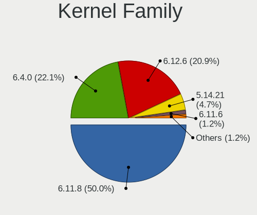
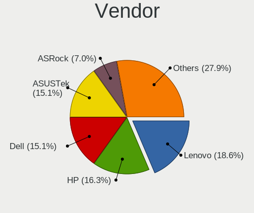
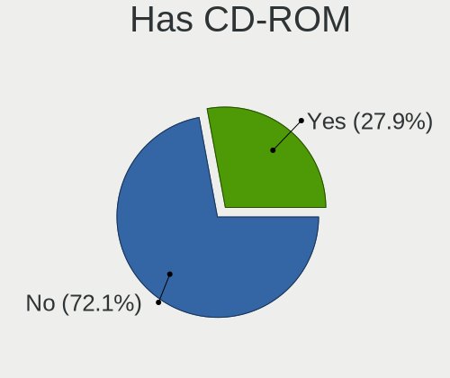
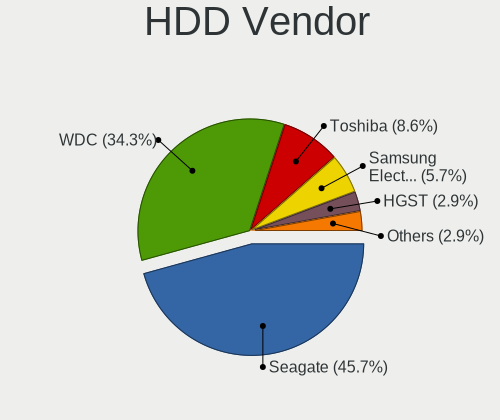
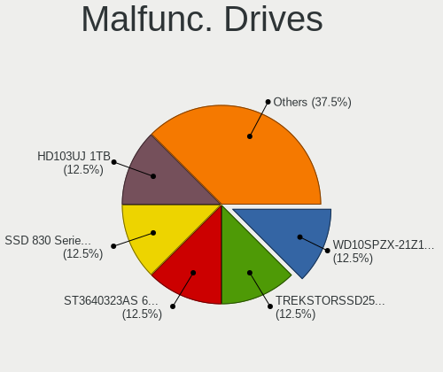
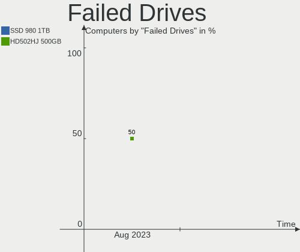
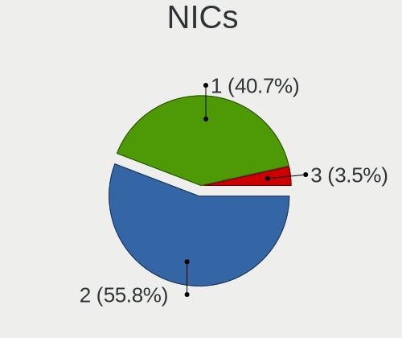

openSUSE Hardware Trends
------------------------

A project to identify most popular hardware characteristics and track their change
over time based on data collected by openSUSE users at https://Linux-Hardware.org.

Anyone can contribute to this report by the [hw-probe](https://github.com/linuxhw/hw-probe) tool:

    sudo -E hw-probe -all -upload

This is a report for all computer types. See also reports for [desktops](/Dist/openSUSE/Desktop/README.md) and [notebooks](/Dist/openSUSE/Notebook/README.md).

Full-feature report is available here: https://linux-hardware.org/?view=trends

Period: Mar, 2022.

Contents
--------

* [ System ](#system)
  - [ OS                       ](#os)
  - [ OS Family                ](#os-family)
  - [ Kernel                   ](#kernel)
  - [ Kernel Family            ](#kernel-family)
  - [ Kernel Major Ver.        ](#kernel-major-ver)
  - [ Arch                     ](#arch)
  - [ DE                       ](#de)
  - [ Display Server           ](#display-server)
  - [ Display Manager          ](#display-manager)
  - [ OS Lang                  ](#os-lang)
  - [ Boot Mode                ](#boot-mode)
  - [ Filesystem               ](#filesystem)
  - [ Part. scheme             ](#part-scheme)
  - [ Dual Boot with Linux/BSD ](#dual-boot-with-linuxbsd)
  - [ Dual Boot (Win)          ](#dual-boot-win)

* [ Board ](#board)
  - [ Vendor                   ](#vendor)
  - [ Model                    ](#model)
  - [ Model Family             ](#model-family)
  - [ MFG Year                 ](#mfg-year)
  - [ Form Factor              ](#form-factor)
  - [ Secure Boot              ](#secure-boot)
  - [ Coreboot                 ](#coreboot)
  - [ RAM Size                 ](#ram-size)
  - [ RAM Used                 ](#ram-used)
  - [ Total Drives             ](#total-drives)
  - [ Has CD-ROM               ](#has-cd-rom)
  - [ Has Ethernet             ](#has-ethernet)
  - [ Has WiFi                 ](#has-wifi)
  - [ Has Bluetooth            ](#has-bluetooth)

* [ Location ](#location)
  - [ Country                  ](#country)
  - [ City                     ](#city)

* [ Drives ](#drives)
  - [ Drive Vendor             ](#drive-vendor)
  - [ Drive Model              ](#drive-model)
  - [ HDD Vendor               ](#hdd-vendor)
  - [ SSD Vendor               ](#ssd-vendor)
  - [ Drive Kind               ](#drive-kind)
  - [ Drive Connector          ](#drive-connector)
  - [ Drive Size               ](#drive-size)
  - [ Space Total              ](#space-total)
  - [ Space Used               ](#space-used)
  - [ Malfunc. Drives          ](#malfunc-drives)
  - [ Malfunc. Drive Vendor    ](#malfunc-drive-vendor)
  - [ Malfunc. HDD Vendor      ](#malfunc-hdd-vendor)
  - [ Malfunc. Drive Kind      ](#malfunc-drive-kind)
  - [ Failed Drives            ](#failed-drives)
  - [ Failed Drive Vendor      ](#failed-drive-vendor)
  - [ Drive Status             ](#drive-status)

* [ Storage controller ](#storage-controller)
  - [ Storage Vendor           ](#storage-vendor)
  - [ Storage Model            ](#storage-model)
  - [ Storage Kind             ](#storage-kind)

* [ Processor ](#processor)
  - [ CPU Vendor               ](#cpu-vendor)
  - [ CPU Model                ](#cpu-model)
  - [ CPU Model Family         ](#cpu-model-family)
  - [ CPU Cores                ](#cpu-cores)
  - [ CPU Sockets              ](#cpu-sockets)
  - [ CPU Threads              ](#cpu-threads)
  - [ CPU Op-Modes             ](#cpu-op-modes)
  - [ CPU Microcode            ](#cpu-microcode)
  - [ CPU Microarch            ](#cpu-microarch)

* [ Graphics ](#graphics)
  - [ GPU Vendor               ](#gpu-vendor)
  - [ GPU Model                ](#gpu-model)
  - [ GPU Combo                ](#gpu-combo)
  - [ GPU Driver               ](#gpu-driver)
  - [ GPU Memory               ](#gpu-memory)

* [ Monitor ](#monitor)
  - [ Monitor Vendor           ](#monitor-vendor)
  - [ Monitor Model            ](#monitor-model)
  - [ Monitor Resolution       ](#monitor-resolution)
  - [ Monitor Diagonal         ](#monitor-diagonal)
  - [ Monitor Width            ](#monitor-width)
  - [ Aspect Ratio             ](#aspect-ratio)
  - [ Monitor Area             ](#monitor-area)
  - [ Pixel Density            ](#pixel-density)
  - [ Multiple Monitors        ](#multiple-monitors)

* [ Network ](#network)
  - [ Net Controller Vendor    ](#net-controller-vendor)
  - [ Net Controller Model     ](#net-controller-model)
  - [ Wireless Vendor          ](#wireless-vendor)
  - [ Wireless Model           ](#wireless-model)
  - [ Ethernet Vendor          ](#ethernet-vendor)
  - [ Ethernet Model           ](#ethernet-model)
  - [ Net Controller Kind      ](#net-controller-kind)
  - [ Used Controller          ](#used-controller)
  - [ NICs                     ](#nics)
  - [ IPv6                     ](#ipv6)

* [ Bluetooth ](#bluetooth)
  - [ Bluetooth Vendor         ](#bluetooth-vendor)
  - [ Bluetooth Model          ](#bluetooth-model)

* [ Sound ](#sound)
  - [ Sound Vendor             ](#sound-vendor)
  - [ Sound Model              ](#sound-model)

* [ Memory ](#memory)
  - [ Memory Vendor            ](#memory-vendor)
  - [ Memory Model             ](#memory-model)
  - [ Memory Kind              ](#memory-kind)
  - [ Memory Form Factor       ](#memory-form-factor)
  - [ Memory Size              ](#memory-size)
  - [ Memory Speed             ](#memory-speed)

* [ Printers & scanners ](#printers--scanners)
  - [ Printer Vendor           ](#printer-vendor)
  - [ Printer Model            ](#printer-model)
  - [ Scanner Vendor           ](#scanner-vendor)
  - [ Scanner Model            ](#scanner-model)

* [ Camera ](#camera)
  - [ Camera Vendor            ](#camera-vendor)
  - [ Camera Model             ](#camera-model)

* [ Security ](#security)
  - [ Fingerprint Vendor       ](#fingerprint-vendor)
  - [ Fingerprint Model        ](#fingerprint-model)
  - [ Chipcard Vendor          ](#chipcard-vendor)
  - [ Chipcard Model           ](#chipcard-model)

* [ Unsupported ](#unsupported)
  - [ Unsupported Devices      ](#unsupported-devices)
  - [ Unsupported Device Types ](#unsupported-device-types)

System
------

OS
--

Installed operating systems

| Name                         | Computers | Percent |
|------------------------------|-----------|---------|
| openSUSE Leap-15.3           | 10        | 23.81%  |
| openSUSE 20220311            | 4         | 9.52%   |
| openSUSE 20220310            | 4         | 9.52%   |
| openSUSE Tumbleweed-20220324 | 3         | 7.14%   |
| openSUSE Tumbleweed-20220311 | 2         | 4.76%   |
| openSUSE 20220320            | 2         | 4.76%   |
| openSUSE Tumbleweed-20220322 | 1         | 2.38%   |
| openSUSE Tumbleweed-20220317 | 1         | 2.38%   |
| openSUSE Tumbleweed-20220314 | 1         | 2.38%   |
| openSUSE Tumbleweed-20220306 | 1         | 2.38%   |
| openSUSE Tumbleweed-20220304 | 1         | 2.38%   |
| openSUSE Tumbleweed-20220303 | 1         | 2.38%   |
| openSUSE Tumbleweed-20220228 | 1         | 2.38%   |
| openSUSE Leap-15.2           | 1         | 2.38%   |
| openSUSE Leap-15.1           | 1         | 2.38%   |
| openSUSE 20220329            | 1         | 2.38%   |
| openSUSE 20220324            | 1         | 2.38%   |
| openSUSE 20220317            | 1         | 2.38%   |
| openSUSE 20220309            | 1         | 2.38%   |
| openSUSE 20220308            | 1         | 2.38%   |
| openSUSE 20220305            | 1         | 2.38%   |
| openSUSE 20220304            | 1         | 2.38%   |
| openSUSE 20220227            | 1         | 2.38%   |

OS Family
---------

OS without a version

| Name     | Computers | Percent |
|----------|-----------|---------|
| openSUSE | 42        | 100%    |

Kernel
------

Version of the Linux kernel

| Version                     | Computers | Percent |
|-----------------------------|-----------|---------|
| 5.16.11-1-default           | 18        | 42.86%  |
| 5.16.15-1-default           | 7         | 16.67%  |
| 5.3.18-150300.59.54-default | 5         | 11.9%   |
| 5.3.18-150300.59.49-default | 5         | 11.9%   |
| 5.16.14-1-default           | 3         | 7.14%   |
| 5.16.8-1-default            | 1         | 2.38%   |
| 5.13.4-1-default            | 1         | 2.38%   |
| 5.12.0-2.g5d43652-default   | 1         | 2.38%   |
| 4.12.14-lp151.28.25-default | 1         | 2.38%   |

Kernel Family
-------------

Linux kernel without a distro release

| Version | Computers | Percent |
|---------|-----------|---------|
| 5.16.11 | 18        | 42.86%  |
| 5.3.18  | 10        | 23.81%  |
| 5.16.15 | 7         | 16.67%  |
| 5.16.14 | 3         | 7.14%   |
| 5.16.8  | 1         | 2.38%   |
| 5.13.4  | 1         | 2.38%   |
| 5.12.0  | 1         | 2.38%   |
| 4.12.14 | 1         | 2.38%   |

Kernel Major Ver.
-----------------

Linux kernel major version

| Version | Computers | Percent |
|---------|-----------|---------|
| 5.16    | 29        | 69.05%  |
| 5.3     | 10        | 23.81%  |
| 5.13    | 1         | 2.38%   |
| 5.12    | 1         | 2.38%   |
| 4.12    | 1         | 2.38%   |

Arch
----

OS architecture (x86_64, i586, etc.)

| Name   | Computers | Percent |
|--------|-----------|---------|
| x86_64 | 42        | 100%    |

DE
--

Desktop Environment

| Name     | Computers | Percent |
|----------|-----------|---------|
| KDE5     | 32        | 76.19%  |
| GNOME    | 6         | 14.29%  |
| XFCE     | 2         | 4.76%   |
| KDE      | 1         | 2.38%   |
| Cinnamon | 1         | 2.38%   |

Display Server
--------------

X11 or Wayland

| Name    | Computers | Percent |
|---------|-----------|---------|
| X11     | 38        | 90.48%  |
| Wayland | 3         | 7.14%   |
| Tty     | 1         | 2.38%   |

Display Manager
---------------

SDDM, LightDM, etc.

| Name    | Computers | Percent |
|---------|-----------|---------|
| Unknown | 16        | 38.1%   |
| SDDM    | 15        | 35.71%  |
| LightDM | 10        | 23.81%  |
| XDM     | 1         | 2.38%   |

OS Lang
-------

Language

| Lang  | Computers | Percent |
|-------|-----------|---------|
| en_US | 13        | 30.95%  |
| de_DE | 7         | 16.67%  |
| POSIX | 5         | 11.9%   |
| ru_RU | 3         | 7.14%   |
| pt_BR | 3         | 7.14%   |
| en_GB | 2         | 4.76%   |
| sk_SK | 1         | 2.38%   |
| ro_RO | 1         | 2.38%   |
| pl_PL | 1         | 2.38%   |
| nl_NL | 1         | 2.38%   |
| es_ES | 1         | 2.38%   |
| en_IN | 1         | 2.38%   |
| en_DE | 1         | 2.38%   |
| en_CH | 1         | 2.38%   |
| ca_ES | 1         | 2.38%   |

Boot Mode
---------

EFI or BIOS

| Mode | Computers | Percent |
|------|-----------|---------|
| EFI  | 31        | 73.81%  |
| BIOS | 11        | 26.19%  |

Filesystem
----------

Type of filesystem

| Type    | Computers | Percent |
|---------|-----------|---------|
| Btrfs   | 32        | 76.19%  |
| Ext4    | 8         | 19.05%  |
| Xfs     | 1         | 2.38%   |
| Overlay | 1         | 2.38%   |

Part. scheme
------------

Scheme of partitioning

| Type    | Computers | Percent |
|---------|-----------|---------|
| GPT     | 22        | 52.38%  |
| Unknown | 16        | 38.1%   |
| MBR     | 4         | 9.52%   |

Dual Boot with Linux/BSD
------------------------

Hosting more than one Linux/BSD

| Dual boot | Computers | Percent |
|-----------|-----------|---------|
| No        | 33        | 78.57%  |
| Yes       | 9         | 21.43%  |

Dual Boot (Win)
---------------

Hosting Linux and Windows

| Dual boot | Computers | Percent |
|-----------|-----------|---------|
| No        | 29        | 69.05%  |
| Yes       | 13        | 30.95%  |

Board
-----

Vendor
------

Motherboard manufacturer

| Name                | Computers | Percent |
|---------------------|-----------|---------|
| Gigabyte Technology | 8         | 19.05%  |
| ASUSTek Computer    | 7         | 16.67%  |
| Dell                | 6         | 14.29%  |
| Lenovo              | 5         | 11.9%   |
| Acer                | 4         | 9.52%   |
| MSI                 | 2         | 4.76%   |
| Hewlett-Packard     | 2         | 4.76%   |
| ASRock              | 2         | 4.76%   |
| Pegatron            | 1         | 2.38%   |
| Microsoft           | 1         | 2.38%   |
| HUAWEI              | 1         | 2.38%   |
| Foxconn             | 1         | 2.38%   |
| Colorful Technology | 1         | 2.38%   |
| BESSTAR Tech        | 1         | 2.38%   |

Model
-----

Motherboard model

| Name                                   | Computers | Percent |
|----------------------------------------|-----------|---------|
| Dell Latitude E7470                    | 2         | 4.76%   |
| Pegatron 2AB6                          | 1         | 2.38%   |
| MSI MS-7C35                            | 1         | 2.38%   |
| MSI MS-7C02                            | 1         | 2.38%   |
| Microsoft Surface Book                 | 1         | 2.38%   |
| Lenovo Yoga Slim 7 15IIL05 82AA        | 1         | 2.38%   |
| Lenovo Yoga 310-11IAP 80U2             | 1         | 2.38%   |
| Lenovo ThinkStation P500 30A6S4JU00    | 1         | 2.38%   |
| Lenovo ThinkPad E580 20KS001RGE        | 1         | 2.38%   |
| Lenovo ThinkPad E550 20DF0030US        | 1         | 2.38%   |
| HUAWEI HVY-WXX9                        | 1         | 2.38%   |
| HP Z840 Workstation                    | 1         | 2.38%   |
| HP OMEN Laptop 15-en0xxx               | 1         | 2.38%   |
| Gigabyte X570 GAMING X                 | 1         | 2.38%   |
| Gigabyte W480 VISION D                 | 1         | 2.38%   |
| Gigabyte GA-770T-USB3                  | 1         | 2.38%   |
| Gigabyte F2A68HM-DS2                   | 1         | 2.38%   |
| Gigabyte B75M-D3H                      | 1         | 2.38%   |
| Gigabyte B550M AORUS ELITE             | 1         | 2.38%   |
| Gigabyte B550 AORUS PRO                | 1         | 2.38%   |
| Gigabyte B460MDS3HAC                   | 1         | 2.38%   |
| Foxconn p6-2277eg                      | 1         | 2.38%   |
| Dell XPS 15 9560                       | 1         | 2.38%   |
| Dell Precision 5540                    | 1         | 2.38%   |
| Dell OptiPlex 760                      | 1         | 2.38%   |
| Dell Latitude 7480                     | 1         | 2.38%   |
| Colorful A320M-K PRO YV14              | 1         | 2.38%   |
| BESSTAR Tech HM90                      | 1         | 2.38%   |
| ASUS ZenBook UX325SA_UM325SA           | 1         | 2.38%   |
| ASUS VivoBook_ASUSLaptop X513EA_X513EA | 1         | 2.38%   |
| ASUS TUF X299 MARK 2                   | 1         | 2.38%   |
| ASUS TUF Gaming B550M-ZAKU             | 1         | 2.38%   |
| ASUS ROG Zephyrus G15 GA503QM_GA503QM  | 1         | 2.38%   |
| ASUS M5A78L-M/USB3                     | 1         | 2.38%   |
| ASUS All Series                        | 1         | 2.38%   |
| ASRock Z370 Gaming K6                  | 1         | 2.38%   |
| ASRock H61M-S1 PLUS                    | 1         | 2.38%   |
| Acer Swift SF314-59                    | 1         | 2.38%   |
| Acer Swift SF314-43                    | 1         | 2.38%   |
| Acer Aspire E1-571                     | 1         | 2.38%   |
| Acer Aspire A315-41                    | 1         | 2.38%   |

Model Family
------------

Motherboard model prefix

| Name                  | Computers | Percent |
|-----------------------|-----------|---------|
| Dell Latitude         | 3         | 7.14%   |
| Lenovo Yoga           | 2         | 4.76%   |
| Lenovo ThinkPad       | 2         | 4.76%   |
| ASUS TUF              | 2         | 4.76%   |
| Acer Swift            | 2         | 4.76%   |
| Acer Aspire           | 2         | 4.76%   |
| Pegatron 2AB6         | 1         | 2.38%   |
| MSI MS-7C35           | 1         | 2.38%   |
| MSI MS-7C02           | 1         | 2.38%   |
| Microsoft Surface     | 1         | 2.38%   |
| Lenovo ThinkStation   | 1         | 2.38%   |
| HUAWEI HVY-WXX9       | 1         | 2.38%   |
| HP Z840               | 1         | 2.38%   |
| HP OMEN               | 1         | 2.38%   |
| Gigabyte X570         | 1         | 2.38%   |
| Gigabyte W480         | 1         | 2.38%   |
| Gigabyte GA-770T-USB3 | 1         | 2.38%   |
| Gigabyte F2A68HM-DS2  | 1         | 2.38%   |
| Gigabyte B75M-D3H     | 1         | 2.38%   |
| Gigabyte B550M        | 1         | 2.38%   |
| Gigabyte B550         | 1         | 2.38%   |
| Gigabyte B460MDS3HAC  | 1         | 2.38%   |
| Foxconn p6-2277eg     | 1         | 2.38%   |
| Dell XPS              | 1         | 2.38%   |
| Dell Precision        | 1         | 2.38%   |
| Dell OptiPlex         | 1         | 2.38%   |
| Colorful A320M-K      | 1         | 2.38%   |
| BESSTAR Tech HM90     | 1         | 2.38%   |
| ASUS ZenBook          | 1         | 2.38%   |
| ASUS VivoBook         | 1         | 2.38%   |
| ASUS ROG              | 1         | 2.38%   |
| ASUS M5A78L-M         | 1         | 2.38%   |
| ASUS All              | 1         | 2.38%   |
| ASRock Z370           | 1         | 2.38%   |
| ASRock H61M-S1        | 1         | 2.38%   |

MFG Year
--------

Motherboard manufacture year

| Year | Computers | Percent |
|------|-----------|---------|
| 2021 | 9         | 21.43%  |
| 2020 | 7         | 16.67%  |
| 2019 | 4         | 9.52%   |
| 2018 | 4         | 9.52%   |
| 2017 | 4         | 9.52%   |
| 2014 | 4         | 9.52%   |
| 2015 | 3         | 7.14%   |
| 2012 | 3         | 7.14%   |
| 2011 | 2         | 4.76%   |
| 2010 | 1         | 2.38%   |
| 2009 | 1         | 2.38%   |

Form Factor
-----------

Physical design of the computer

| Name        | Computers | Percent |
|-------------|-----------|---------|
| Desktop     | 23        | 54.76%  |
| Notebook    | 17        | 40.48%  |
| Tablet      | 1         | 2.38%   |
| Convertible | 1         | 2.38%   |

Secure Boot
-----------

Enabled or disabled

| State    | Computers | Percent |
|----------|-----------|---------|
| Disabled | 39        | 92.86%  |
| Enabled  | 3         | 7.14%   |

Coreboot
--------

Have coreboot on board

| Used | Computers | Percent |
|------|-----------|---------|
| No   | 42        | 100%    |

RAM Size
--------

Total RAM memory

| Size in GB  | Computers | Percent |
|-------------|-----------|---------|
| 16.01-24.0  | 14        | 33.33%  |
| 4.01-8.0    | 9         | 21.43%  |
| 8.01-16.0   | 9         | 21.43%  |
| 32.01-64.0  | 5         | 11.9%   |
| 3.01-4.0    | 3         | 7.14%   |
| 64.01-256.0 | 2         | 4.76%   |

RAM Used
--------

Used RAM memory

| Used GB    | Computers | Percent |
|------------|-----------|---------|
| 2.01-3.0   | 13        | 30.95%  |
| 4.01-8.0   | 10        | 23.81%  |
| 3.01-4.0   | 8         | 19.05%  |
| 1.01-2.0   | 7         | 16.67%  |
| 8.01-16.0  | 2         | 4.76%   |
| 32.01-64.0 | 1         | 2.38%   |
| 0.51-1.0   | 1         | 2.38%   |

Total Drives
------------

Number of drives on board

| Drives | Computers | Percent |
|--------|-----------|---------|
| 1      | 22        | 52.38%  |
| 2      | 11        | 26.19%  |
| 5      | 3         | 7.14%   |
| 4      | 3         | 7.14%   |
| 13     | 1         | 2.38%   |
| 6      | 1         | 2.38%   |
| 3      | 1         | 2.38%   |

Has CD-ROM
----------

Has CD-ROM on board

| Presented | Computers | Percent |
|-----------|-----------|---------|
| No        | 28        | 66.67%  |
| Yes       | 14        | 33.33%  |

Has Ethernet
------------

Has Ethernet on board

| Presented | Computers | Percent |
|-----------|-----------|---------|
| Yes       | 34        | 80.95%  |
| No        | 8         | 19.05%  |

Has WiFi
--------

Has WiFi module

| Presented | Computers | Percent |
|-----------|-----------|---------|
| Yes       | 29        | 69.05%  |
| No        | 13        | 30.95%  |

Has Bluetooth
-------------

Has Bluetooth module

| Presented | Computers | Percent |
|-----------|-----------|---------|
| Yes       | 29        | 69.05%  |
| No        | 13        | 30.95%  |

Location
--------

Country
-------

Geographic location (country)

| Country     | Computers | Percent |
|-------------|-----------|---------|
| USA         | 9         | 21.43%  |
| Germany     | 9         | 21.43%  |
| Brazil      | 3         | 7.14%   |
| Russia      | 2         | 4.76%   |
| India       | 2         | 4.76%   |
| Canada      | 2         | 4.76%   |
| UK          | 1         | 2.38%   |
| Switzerland | 1         | 2.38%   |
| Sweden      | 1         | 2.38%   |
| Spain       | 1         | 2.38%   |
| Slovakia    | 1         | 2.38%   |
| Romania     | 1         | 2.38%   |
| Poland      | 1         | 2.38%   |
| Peru        | 1         | 2.38%   |
| New Zealand | 1         | 2.38%   |
| Netherlands | 1         | 2.38%   |
| Italy       | 1         | 2.38%   |
| Israel      | 1         | 2.38%   |
| France      | 1         | 2.38%   |
| Czechia     | 1         | 2.38%   |
| Austria     | 1         | 2.38%   |

City
----

Geographic location (city)

| City              | Computers | Percent |
|-------------------|-----------|---------|
| Berlin            | 4         | 9.52%   |
| Montreal          | 2         | 4.76%   |
| Frankfurt am Main | 2         | 4.76%   |
| Zurich            | 1         | 2.38%   |
| Winter Park       | 1         | 2.38%   |
| Vienna            | 1         | 2.38%   |
| Vaennaes          | 1         | 2.38%   |
| Ufa               | 1         | 2.38%   |
| Torun             | 1         | 2.38%   |
| Tel Aviv          | 1         | 2.38%   |
| Tacna             | 1         | 2.38%   |
| St Petersburg     | 1         | 2.38%   |
| Reading           | 1         | 2.38%   |
| Prosper           | 1         | 2.38%   |
| Prague            | 1         | 2.38%   |
| Orlando           | 1         | 2.38%   |
| Miami             | 1         | 2.38%   |
| Ingolstadt        | 1         | 2.38%   |
| Hackney           | 1         | 2.38%   |
| Guaíba           | 1         | 2.38%   |
| Gaildorf          | 1         | 2.38%   |
| Dunedin           | 1         | 2.38%   |
| Dharamsala        | 1         | 2.38%   |
| Chicago           | 1         | 2.38%   |
| Chennai           | 1         | 2.38%   |
| Chapecó          | 1         | 2.38%   |
| Canoas            | 1         | 2.38%   |
| Čadca            | 1         | 2.38%   |
| Burbank           | 1         | 2.38%   |
| Brasov            | 1         | 2.38%   |
| Badalona          | 1         | 2.38%   |
| Bad Lauchstaedt   | 1         | 2.38%   |
| Arlington         | 1         | 2.38%   |
| Arab              | 1         | 2.38%   |
| Altamura          | 1         | 2.38%   |
| Almere Stad       | 1         | 2.38%   |
| Alfortville       | 1         | 2.38%   |

Drives
------

Drive Vendor
------------

Hard drive vendors

| Vendor                    | Computers | Drives | Percent |
|---------------------------|-----------|--------|---------|
| Samsung Electronics       | 17        | 21     | 25.37%  |
| Seagate                   | 11        | 27     | 16.42%  |
| WDC                       | 9         | 12     | 13.43%  |
| SK Hynix                  | 5         | 5      | 7.46%   |
| Kingston                  | 4         | 6      | 5.97%   |
| Toshiba                   | 3         | 3      | 4.48%   |
| Crucial                   | 3         | 3      | 4.48%   |
| Unknown                   | 2         | 2      | 2.99%   |
| Micron Technology         | 2         | 3      | 2.99%   |
| YMTC                      | 1         | 1      | 1.49%   |
| Team                      | 1         | 1      | 1.49%   |
| T-CREATE                  | 1         | 1      | 1.49%   |
| Silicon Motion            | 1         | 1      | 1.49%   |
| Sandisk                   | 1         | 1      | 1.49%   |
| Phison                    | 1         | 1      | 1.49%   |
| Mushkin                   | 1         | 1      | 1.49%   |
| Micron/Crucial Technology | 1         | 1      | 1.49%   |
| Intel                     | 1         | 1      | 1.49%   |
| Apacer                    | 1         | 1      | 1.49%   |
| A-DATA Technology         | 1         | 1      | 1.49%   |

Drive Model
-----------

Hard drive models

| Model                                 | Computers | Percent |
|---------------------------------------|-----------|---------|
| Samsung SSD 970 EVO Plus 500GB        | 2         | 2.56%   |
| YMTC PC005 512GB                      | 1         | 1.28%   |
| WDC WDS480G2G0A-00JH30 480GB SSD      | 1         | 1.28%   |
| WDC WD5000AVDS-63U7B1 500GB           | 1         | 1.28%   |
| WDC WD5000AAKX-08U6AA0 500GB          | 1         | 1.28%   |
| WDC WD40EZAZ-00SF3B0 4TB              | 1         | 1.28%   |
| WDC WD40EFRX-68N32N0 4TB              | 1         | 1.28%   |
| WDC WD3200AAJS-56M0A0 320GB           | 1         | 1.28%   |
| WDC WD20EFRX-68AX9N0 2TB              | 1         | 1.28%   |
| WDC WD1600AAJS-75M0A0 160GB           | 1         | 1.28%   |
| WDC WD10EZEX-22MFCA0 1TB              | 1         | 1.28%   |
| WDC WD10EZEX-08WN4A0 1TB              | 1         | 1.28%   |
| WDC WD10EZEX-00RKKA0 1TB              | 1         | 1.28%   |
| WDC WD102KRYZ-01A5AB0 10TB            | 1         | 1.28%   |
| Unknown SD/MMC/MS PRO 32GB            | 1         | 1.28%   |
| Unknown SC16G  16GB                   | 1         | 1.28%   |
| Toshiba NVMe SSD Drive 256GB          | 1         | 1.28%   |
| Toshiba DT01ACA200 2TB                | 1         | 1.28%   |
| Toshiba DT01ACA050 500GB              | 1         | 1.28%   |
| Team TM8FP6002T 2TB                   | 1         | 1.28%   |
| T-CREATE TM8FPF002T 2TB               | 1         | 1.28%   |
| SK Hynix PC711 NVMe 256GB             | 1         | 1.28%   |
| SK Hynix NVMe SSD Drive 512GB         | 1         | 1.28%   |
| SK Hynix NVMe SSD Drive 1TB           | 1         | 1.28%   |
| SK Hynix HFS256G39TND-N210A 256GB SSD | 1         | 1.28%   |
| SK Hynix HFM512GD3JX013N 512GB        | 1         | 1.28%   |
| Silicon Motion SPT256L2-2IAS7G2 256GB | 1         | 1.28%   |
| Seagate ST8000VN0022-2EL112 8TB       | 1         | 1.28%   |
| Seagate ST8000AS0002-1NA17Z 8TB       | 1         | 1.28%   |
| Seagate ST500LT012-9WS142 500GB       | 1         | 1.28%   |
| Seagate ST5000LM000-2U8170 5TB        | 1         | 1.28%   |
| Seagate ST3500413AS 500GB             | 1         | 1.28%   |
| Seagate ST3250310AS 250GB             | 1         | 1.28%   |
| Seagate ST2000DX002-2DV164 2TB        | 1         | 1.28%   |
| Seagate ST2000DM008-2FR102 2TB        | 1         | 1.28%   |
| Seagate ST2000DM001-9YN164 2TB        | 1         | 1.28%   |
| Seagate ST2000DM001-1ER164 2TB        | 1         | 1.28%   |
| Seagate ST2000DM001-1CH164 2TB        | 1         | 1.28%   |
| Seagate ST16000VN001-2RV103 16TB      | 1         | 1.28%   |
| Seagate ST1000LM 024 HN-M101MBB 1TB   | 1         | 1.28%   |
| Seagate ST1000DM003-1ER162 1TB        | 1         | 1.28%   |
| Seagate ST1000DM003-1CH162 1TB        | 1         | 1.28%   |
| Seagate ST10000VN0004-1ZD101 10TB     | 1         | 1.28%   |
| Seagate NVMe SSD Drive 500GB          | 1         | 1.28%   |
| Seagate BUP Portable 4TB              | 1         | 1.28%   |
| Sandisk NVMe SSD Drive 1TB            | 1         | 1.28%   |
| Samsung SSD 870 QVO 2TB               | 1         | 1.28%   |
| Samsung SSD 870 QVO 1TB               | 1         | 1.28%   |
| Samsung SSD 870 EVO 2TB               | 1         | 1.28%   |
| Samsung SSD 870 EVO 250GB             | 1         | 1.28%   |
| Samsung SSD 860 PRO 256GB             | 1         | 1.28%   |
| Samsung SSD 860 EVO 250GB             | 1         | 1.28%   |
| Samsung SSD 850 EVO M.2 500GB         | 1         | 1.28%   |
| Samsung SSD 840 Series 120GB          | 1         | 1.28%   |
| Samsung NVMe SSD Drive 250GB          | 1         | 1.28%   |
| Samsung MZVLW256HEHP-000L7 256GB      | 1         | 1.28%   |
| Samsung MZVLB256HBHQ-000L2 256GB      | 1         | 1.28%   |
| Samsung MZVLB1T0HBLR-000H1 1TB        | 1         | 1.28%   |
| Samsung MZNLN512HMJP-000H1 512GB SSD  | 1         | 1.28%   |
| Samsung MZHPV512HDGL-000H1 512GB SSD  | 1         | 1.28%   |

HDD Vendor
----------

Hard disk drive vendors

| Vendor              | Computers | Drives | Percent |
|---------------------|-----------|--------|---------|
| Seagate             | 11        | 26     | 44%     |
| WDC                 | 9         | 11     | 36%     |
| Toshiba             | 2         | 2      | 8%      |
| Samsung Electronics | 2         | 4      | 8%      |
| Unknown             | 1         | 1      | 4%      |

SSD Vendor
----------

Solid state drive vendors

| Vendor              | Computers | Drives | Percent |
|---------------------|-----------|--------|---------|
| Samsung Electronics | 9         | 11     | 47.37%  |
| Kingston            | 2         | 4      | 10.53%  |
| Crucial             | 2         | 2      | 10.53%  |
| WDC                 | 1         | 1      | 5.26%   |
| SK Hynix            | 1         | 1      | 5.26%   |
| Mushkin             | 1         | 1      | 5.26%   |
| Micron Technology   | 1         | 2      | 5.26%   |
| Apacer              | 1         | 1      | 5.26%   |
| A-DATA Technology   | 1         | 1      | 5.26%   |

Drive Kind
----------

HDD or SSD

| Kind | Computers | Drives | Percent |
|------|-----------|--------|---------|
| NVMe | 21        | 24     | 35.59%  |
| HDD  | 21        | 44     | 35.59%  |
| SSD  | 16        | 24     | 27.12%  |
| MMC  | 1         | 1      | 1.69%   |

Drive Connector
---------------

SATA, SAS, NVMe, etc.

| Type | Computers | Drives | Percent |
|------|-----------|--------|---------|
| SATA | 27        | 62     | 51.92%  |
| NVMe | 21        | 24     | 40.38%  |
| SAS  | 3         | 6      | 5.77%   |
| MMC  | 1         | 1      | 1.92%   |

Drive Size
----------

Size of hard drive

| Size in TB | Computers | Drives | Percent |
|------------|-----------|--------|---------|
| 0.01-0.5   | 16        | 27     | 36.36%  |
| 0.51-1.0   | 12        | 14     | 27.27%  |
| 1.01-2.0   | 8         | 9      | 18.18%  |
| 4.01-10.0  | 4         | 9      | 9.09%   |
| 3.01-4.0   | 3         | 6      | 6.82%   |
| 10.01-20.0 | 1         | 3      | 2.27%   |

Space Total
-----------

Amount of disk space available on the file system

| Size in GB     | Computers | Percent |
|----------------|-----------|---------|
| More than 3000 | 19        | 45.24%  |
| 1001-2000      | 8         | 19.05%  |
| 2001-3000      | 6         | 14.29%  |
| 251-500        | 3         | 7.14%   |
| 501-1000       | 3         | 7.14%   |
| 21-50          | 1         | 2.38%   |
| 101-250        | 1         | 2.38%   |
| 51-100         | 1         | 2.38%   |

Space Used
----------

Amount of used disk space

| Used GB        | Computers | Percent |
|----------------|-----------|---------|
| 251-500        | 10        | 23.81%  |
| 1001-2000      | 8         | 19.05%  |
| 501-1000       | 7         | 16.67%  |
| More than 3000 | 6         | 14.29%  |
| 101-250        | 6         | 14.29%  |
| 1-20           | 2         | 4.76%   |
| 21-50          | 1         | 2.38%   |
| 2001-3000      | 1         | 2.38%   |
| 51-100         | 1         | 2.38%   |

Malfunc. Drives
---------------

Drive models with a malfunction

| Model                                 | Computers | Drives | Percent |
|---------------------------------------|-----------|--------|---------|
| WDC WD5000AVDS-63U7B1 500GB           | 1         | 1      | 11.11%  |
| WDC WD3200AAJS-56M0A0 320GB           | 1         | 1      | 11.11%  |
| SK Hynix HFS256G39TND-N210A 256GB SSD | 1         | 1      | 11.11%  |
| Seagate ST8000AS0002-1NA17Z 8TB       | 1         | 1      | 11.11%  |
| Seagate ST2000DM001-1CH164 2TB        | 1         | 1      | 11.11%  |
| Seagate ST1000DM003-1ER162 1TB        | 1         | 1      | 11.11%  |
| Seagate ST1000DM003-1CH162 1TB        | 1         | 1      | 11.11%  |
| Samsung Electronics HD103SI 1TB       | 1         | 1      | 11.11%  |
| Kingston SA400S37120G 120GB SSD       | 1         | 3      | 11.11%  |

Malfunc. Drive Vendor
---------------------

Vendors of faulty drives

| Vendor              | Computers | Drives | Percent |
|---------------------|-----------|--------|---------|
| Seagate             | 4         | 4      | 44.44%  |
| WDC                 | 2         | 2      | 22.22%  |
| SK Hynix            | 1         | 1      | 11.11%  |
| Samsung Electronics | 1         | 1      | 11.11%  |
| Kingston            | 1         | 3      | 11.11%  |

Malfunc. HDD Vendor
-------------------

Vendors of faulty HDD drives

| Vendor              | Computers | Drives | Percent |
|---------------------|-----------|--------|---------|
| Seagate             | 4         | 4      | 57.14%  |
| WDC                 | 2         | 2      | 28.57%  |
| Samsung Electronics | 1         | 1      | 14.29%  |

Malfunc. Drive Kind
-------------------

Kinds of faulty drives

| Kind | Computers | Drives | Percent |
|------|-----------|--------|---------|
| HDD  | 5         | 7      | 71.43%  |
| SSD  | 2         | 4      | 28.57%  |

Failed Drives
-------------

Failed drive models

| Model                             | Computers | Drives | Percent |
|-----------------------------------|-----------|--------|---------|
| Samsung Electronics HD502HJ 500GB | 1         | 3      | 100%    |

Failed Drive Vendor
-------------------

Failed drive vendors

| Vendor              | Computers | Drives | Percent |
|---------------------|-----------|--------|---------|
| Samsung Electronics | 1         | 3      | 100%    |

Drive Status
------------

Number of failed and malfunc. drives

| Status   | Computers | Drives | Percent |
|----------|-----------|--------|---------|
| Works    | 24        | 42     | 48%     |
| Detected | 18        | 37     | 36%     |
| Malfunc  | 7         | 11     | 14%     |
| Failed   | 1         | 3      | 2%      |

Storage controller
------------------

Storage Vendor
--------------

Storage controller vendors

| Vendor                       | Computers | Percent |
|------------------------------|-----------|---------|
| Intel                        | 24        | 35.82%  |
| AMD                          | 14        | 20.9%   |
| Samsung Electronics          | 7         | 10.45%  |
| SK Hynix                     | 4         | 5.97%   |
| Silicon Motion               | 2         | 2.99%   |
| Micron/Crucial Technology    | 2         | 2.99%   |
| Kingston Technology Company  | 2         | 2.99%   |
| ASMedia Technology           | 2         | 2.99%   |
| Yangtze Memory Technologies  | 1         | 1.49%   |
| Toshiba America Info Systems | 1         | 1.49%   |
| Seagate Technology           | 1         | 1.49%   |
| Sandisk                      | 1         | 1.49%   |
| Realtek Semiconductor        | 1         | 1.49%   |
| Phison Electronics           | 1         | 1.49%   |
| Micron Technology            | 1         | 1.49%   |
| Marvell Technology Group     | 1         | 1.49%   |
| Broadcom / LSI               | 1         | 1.49%   |
| Adaptec                      | 1         | 1.49%   |

Storage Model
-------------

Storage controller models

| Model                                                                          | Computers | Percent |
|--------------------------------------------------------------------------------|-----------|---------|
| AMD FCH SATA Controller [AHCI mode]                                            | 8         | 10.53%  |
| Samsung NVMe SSD Controller SM981/PM981/PM983                                  | 4         | 5.26%   |
| SK Hynix Gold P31 SSD                                                          | 3         | 3.95%   |
| Intel Sunrise Point-LP SATA Controller [AHCI mode]                             | 3         | 3.95%   |
| Intel 6 Series/C200 Series Chipset Family 6 port Desktop SATA AHCI Controller  | 3         | 3.95%   |
| AMD 500 Series Chipset SATA Controller                                         | 3         | 3.95%   |
| Samsung NVMe SSD Controller SM961/PM961/SM963                                  | 2         | 2.63%   |
| Intel Volume Management Device NVMe RAID Controller                            | 2         | 2.63%   |
| Intel 200 Series PCH SATA controller [AHCI mode]                               | 2         | 2.63%   |
| ASMedia ASM1062 Serial ATA Controller                                          | 2         | 2.63%   |
| AMD SB7x0/SB8x0/SB9x0 IDE Controller                                           | 2         | 2.63%   |
| Yangtze Memory Non-Volatile memory controller                                  | 1         | 1.32%   |
| Toshiba America Info Systems NVMe Controller                                   | 1         | 1.32%   |
| SK Hynix Non-Volatile memory controller                                        | 1         | 1.32%   |
| Silicon Motion SM2263EN/SM2263XT SSD Controller                                | 1         | 1.32%   |
| Silicon Motion SM2262/SM2262EN SSD Controller                                  | 1         | 1.32%   |
| Seagate FireCuda 510 SSD                                                       | 1         | 1.32%   |
| Sandisk WD Black 2018/SN750 / PC SN720 NVMe SSD                                | 1         | 1.32%   |
| Samsung Electronics SATA controller                                            | 1         | 1.32%   |
| Realtek Realtek Non-Volatile memory controller                                 | 1         | 1.32%   |
| Phison E12 NVMe Controller                                                     | 1         | 1.32%   |
| Micron/Crucial P2 NVMe PCIe SSD                                                | 1         | 1.32%   |
| Micron/Crucial NVMe Controller                                                 | 1         | 1.32%   |
| Micron Non-Volatile memory controller                                          | 1         | 1.32%   |
| Marvell Group 88SE9215 PCIe 2.0 x1 4-port SATA 6 Gb/s Controller               | 1         | 1.32%   |
| Kingston Company Company Non-Volatile memory controller                        | 1         | 1.32%   |
| Kingston Company OM3PDP3 NVMe SSD                                              | 1         | 1.32%   |
| Intel Wildcat Point-LP SATA Controller [AHCI Mode]                             | 1         | 1.32%   |
| Intel Tiger Lake-LP SATA Controller [AHCI mode]                                | 1         | 1.32%   |
| Intel Non-Volatile memory controller                                           | 1         | 1.32%   |
| Intel HM170/QM170 Chipset SATA Controller [AHCI Mode]                          | 1         | 1.32%   |
| Intel Comet Lake SATA AHCI Controller                                          | 1         | 1.32%   |
| Intel Celeron N3350/Pentium N4200/Atom E3900 Series SATA AHCI Controller       | 1         | 1.32%   |
| Intel Cannon Lake Mobile PCH SATA AHCI Controller                              | 1         | 1.32%   |
| Intel C610/X99 series chipset sSATA Controller [RAID mode]                     | 1         | 1.32%   |
| Intel C610/X99 series chipset sSATA Controller [AHCI mode]                     | 1         | 1.32%   |
| Intel C610/X99 series chipset IDE-r Controller                                 | 1         | 1.32%   |
| Intel C610/X99 series chipset 6-Port SATA Controller [AHCI mode]               | 1         | 1.32%   |
| Intel C600/X79 series chipset SATA RAID Controller                             | 1         | 1.32%   |
| Intel 82801JD/DO (ICH10 Family) SATA AHCI Controller                           | 1         | 1.32%   |
| Intel 82801 Mobile SATA Controller [RAID mode]                                 | 1         | 1.32%   |
| Intel 8 Series/C220 Series Chipset Family 6-port SATA Controller 1 [AHCI mode] | 1         | 1.32%   |
| Intel 7 Series/C210 Series Chipset Family 6-port SATA Controller [AHCI mode]   | 1         | 1.32%   |
| Intel 7 Series Chipset Family 6-port SATA Controller [AHCI mode]               | 1         | 1.32%   |
| Intel 400 Series Chipset Family SATA AHCI Controller                           | 1         | 1.32%   |
| Intel 4 Series Chipset PT IDER Controller                                      | 1         | 1.32%   |
| Broadcom / LSI SAS2308 PCI-Express Fusion-MPT SAS-2                            | 1         | 1.32%   |
| AMD SB7x0/SB8x0/SB9x0 SATA Controller [IDE mode]                               | 1         | 1.32%   |
| AMD SB7x0/SB8x0/SB9x0 SATA Controller [AHCI mode]                              | 1         | 1.32%   |
| AMD FCH SATA Controller [RAID mode]                                            | 1         | 1.32%   |
| AMD FCH SATA Controller D                                                      | 1         | 1.32%   |
| AMD 400 Series Chipset SATA Controller                                         | 1         | 1.32%   |
| Adaptec AHA-2930CU                                                             | 1         | 1.32%   |

Storage Kind
------------

Kind of storage controller (IDE, SATA, NVMe, SAS, ...)

| Kind | Computers | Percent |
|------|-----------|---------|
| SATA | 34        | 51.52%  |
| NVMe | 21        | 31.82%  |
| RAID | 5         | 7.58%   |
| IDE  | 4         | 6.06%   |
| SAS  | 1         | 1.52%   |
| SCSI | 1         | 1.52%   |

Processor
---------

CPU Vendor
----------

Processor vendors

| Vendor | Computers | Percent |
|--------|-----------|---------|
| Intel  | 25        | 59.52%  |
| AMD    | 17        | 40.48%  |

CPU Model
---------

Processor models

| Model                                          | Computers | Percent |
|------------------------------------------------|-----------|---------|
| Intel Core i7-6600U CPU @ 2.60GHz              | 3         | 7.14%   |
| AMD Ryzen 5 3600 6-Core Processor              | 2         | 4.76%   |
| Intel Xeon W-1250 CPU @ 3.30GHz                | 1         | 2.38%   |
| Intel Xeon CPU E5-2667 v3 @ 3.20GHz            | 1         | 2.38%   |
| Intel Xeon CPU E5-1620 v3 @ 3.50GHz            | 1         | 2.38%   |
| Intel Core i7-9850H CPU @ 2.60GHz              | 1         | 2.38%   |
| Intel Core i7-8700K CPU @ 3.70GHz              | 1         | 2.38%   |
| Intel Core i7-8550U CPU @ 1.80GHz              | 1         | 2.38%   |
| Intel Core i7-7800X CPU @ 3.50GHz              | 1         | 2.38%   |
| Intel Core i7-7700HQ CPU @ 2.80GHz             | 1         | 2.38%   |
| Intel Core i7-2600 CPU @ 3.40GHz               | 1         | 2.38%   |
| Intel Core i5-6300U CPU @ 2.40GHz              | 1         | 2.38%   |
| Intel Core i5-5200U CPU @ 2.20GHz              | 1         | 2.38%   |
| Intel Core i5-4440 CPU @ 3.10GHz               | 1         | 2.38%   |
| Intel Core i5-3470 CPU @ 3.20GHz               | 1         | 2.38%   |
| Intel Core i5-3450 CPU @ 3.10GHz               | 1         | 2.38%   |
| Intel Core i5-3230M CPU @ 2.60GHz              | 1         | 2.38%   |
| Intel Core i5-10400F CPU @ 2.90GHz             | 1         | 2.38%   |
| Intel Core i5-1035G4 CPU @ 1.10GHz             | 1         | 2.38%   |
| Intel Core i3-2120 CPU @ 3.30GHz               | 1         | 2.38%   |
| Intel Core 2 Duo CPU E8500 @ 3.16GHz           | 1         | 2.38%   |
| Intel Celeron CPU N3350 @ 1.10GHz              | 1         | 2.38%   |
| Intel 11th Gen Core i7-1165G7 @ 2.80GHz        | 1         | 2.38%   |
| Intel 11th Gen Core i5-1135G7 @ 2.40GHz        | 1         | 2.38%   |
| AMD Ryzen 9 5950X 16-Core Processor            | 1         | 2.38%   |
| AMD Ryzen 9 5900HS with Radeon Graphics        | 1         | 2.38%   |
| AMD Ryzen 9 4900H with Radeon Graphics         | 1         | 2.38%   |
| AMD Ryzen 9 3950X 16-Core Processor            | 1         | 2.38%   |
| AMD Ryzen 7 5800U with Radeon Graphics         | 1         | 2.38%   |
| AMD Ryzen 7 4800H with Radeon Graphics         | 1         | 2.38%   |
| AMD Ryzen 5 5600X 6-Core Processor             | 1         | 2.38%   |
| AMD Ryzen 5 4600H with Radeon Graphics         | 1         | 2.38%   |
| AMD Ryzen 5 2600 Six-Core Processor            | 1         | 2.38%   |
| AMD Ryzen 5 2500U with Radeon Vega Mobile Gfx  | 1         | 2.38%   |
| AMD Ryzen 3 5300U with Radeon Graphics         | 1         | 2.38%   |
| AMD Ryzen 3 1200 Quad-Core Processor           | 1         | 2.38%   |
| AMD Phenom II X6 1055T Processor               | 1         | 2.38%   |
| AMD FX-8350 Eight-Core Processor               | 1         | 2.38%   |
| AMD A10-7800 Radeon R7, 12 Compute Cores 4C+8G | 1         | 2.38%   |

CPU Model Family
----------------

Processor model prefix

| Model            | Computers | Percent |
|------------------|-----------|---------|
| Intel Core i7    | 9         | 21.43%  |
| Intel Core i5    | 8         | 19.05%  |
| AMD Ryzen 5      | 6         | 14.29%  |
| AMD Ryzen 9      | 4         | 9.52%   |
| Intel Xeon       | 3         | 7.14%   |
| Other            | 2         | 4.76%   |
| AMD Ryzen 7      | 2         | 4.76%   |
| AMD Ryzen 3      | 2         | 4.76%   |
| Intel Core i3    | 1         | 2.38%   |
| Intel Core 2 Duo | 1         | 2.38%   |
| Intel Celeron    | 1         | 2.38%   |
| AMD Phenom II X6 | 1         | 2.38%   |
| AMD FX           | 1         | 2.38%   |
| AMD A10          | 1         | 2.38%   |

CPU Cores
---------

Number of processor cores

| Number | Computers | Percent |
|--------|-----------|---------|
| 4      | 14        | 33.33%  |
| 6      | 11        | 26.19%  |
| 2      | 10        | 23.81%  |
| 8      | 4         | 9.52%   |
| 16     | 3         | 7.14%   |

CPU Sockets
-----------

Number of sockets

| Number | Computers | Percent |
|--------|-----------|---------|
| 1      | 41        | 97.62%  |
| 2      | 1         | 2.38%   |

CPU Threads
-----------

Threads per core (Hyper-Threading)

| Number | Computers | Percent |
|--------|-----------|---------|
| 2      | 35        | 83.33%  |
| 1      | 7         | 16.67%  |

CPU Op-Modes
------------

CPU Operation Modes (32-bit, 64-bit)

| Op mode        | Computers | Percent |
|----------------|-----------|---------|
| 32-bit, 64-bit | 42        | 100%    |

CPU Microcode
-------------

Microcode number

| Number     | Computers | Percent |
|------------|-----------|---------|
| 0x406e3    | 4         | 9.52%   |
| Unknown    | 4         | 9.52%   |
| 0x806c1    | 2         | 4.76%   |
| 0x306a9    | 2         | 4.76%   |
| 0x206a7    | 2         | 4.76%   |
| 0x0a50000c | 2         | 4.76%   |
| 0x08701021 | 2         | 4.76%   |
| 0x08600106 | 2         | 4.76%   |
| 0xa0655    | 1         | 2.38%   |
| 0xa0653    | 1         | 2.38%   |
| 0x906ed    | 1         | 2.38%   |
| 0x906ea    | 1         | 2.38%   |
| 0x906e9    | 1         | 2.38%   |
| 0x806ea    | 1         | 2.38%   |
| 0x706e5    | 1         | 2.38%   |
| 0x506c9    | 1         | 2.38%   |
| 0x50654    | 1         | 2.38%   |
| 0x306f2    | 1         | 2.38%   |
| 0x306d4    | 1         | 2.38%   |
| 0x306c3    | 1         | 2.38%   |
| 0x1067a    | 1         | 2.38%   |
| 0x0a201016 | 1         | 2.38%   |
| 0x0a201009 | 1         | 2.38%   |
| 0x08701013 | 1         | 2.38%   |
| 0x08608102 | 1         | 2.38%   |
| 0x08600103 | 1         | 2.38%   |
| 0x0810100b | 1         | 2.38%   |
| 0x08001138 | 1         | 2.38%   |
| 0x06000852 | 1         | 2.38%   |
| 0x010000dc | 1         | 2.38%   |

CPU Microarch
-------------

Microarchitecture

| Name        | Computers | Percent |
|-------------|-----------|---------|
| Zen 2       | 6         | 14.29%  |
| Skylake     | 5         | 11.9%   |
| Zen 3       | 4         | 9.52%   |
| KabyLake    | 4         | 9.52%   |
| IvyBridge   | 3         | 7.14%   |
| Haswell     | 3         | 7.14%   |
| Zen         | 2         | 4.76%   |
| TigerLake   | 2         | 4.76%   |
| SandyBridge | 2         | 4.76%   |
| CometLake   | 2         | 4.76%   |
| Zen+        | 1         | 2.38%   |
| Steamroller | 1         | 2.38%   |
| Piledriver  | 1         | 2.38%   |
| Penryn      | 1         | 2.38%   |
| K10         | 1         | 2.38%   |
| IceLake     | 1         | 2.38%   |
| Goldmont    | 1         | 2.38%   |
| Broadwell   | 1         | 2.38%   |
| Unknown     | 1         | 2.38%   |

Graphics
--------

GPU Vendor
----------

Vendors of graphics cards

| Vendor | Computers | Percent |
|--------|-----------|---------|
| Intel  | 17        | 35.42%  |
| AMD    | 16        | 33.33%  |
| Nvidia | 15        | 31.25%  |

GPU Model
---------

Graphics card models

| Model                                                                     | Computers | Percent |
|---------------------------------------------------------------------------|-----------|---------|
| Intel Skylake GT2 [HD Graphics 520]                                       | 4         | 8.16%   |
| AMD Renoir                                                                | 3         | 6.12%   |
| Nvidia GP104 [GeForce GTX 1070]                                           | 2         | 4.08%   |
| Intel TigerLake-LP GT2 [Iris Xe Graphics]                                 | 2         | 4.08%   |
| AMD Ellesmere [Radeon RX 470/480/570/570X/580/580X/590]                   | 2         | 4.08%   |
| AMD Cezanne                                                               | 2         | 4.08%   |
| Nvidia TU117GLM [Quadro T1000 Mobile]                                     | 1         | 2.04%   |
| Nvidia TU116M [GeForce GTX 1660 Ti Mobile]                                | 1         | 2.04%   |
| Nvidia GT218 [GeForce 210]                                                | 1         | 2.04%   |
| Nvidia GP108 [GeForce GT 1030]                                            | 1         | 2.04%   |
| Nvidia GP107M [GeForce GTX 1050 Mobile]                                   | 1         | 2.04%   |
| Nvidia GP106 [GeForce GTX 1060 6GB]                                       | 1         | 2.04%   |
| Nvidia GM206 [GeForce GTX 950]                                            | 1         | 2.04%   |
| Nvidia GM204 [GeForce GTX 970]                                            | 1         | 2.04%   |
| Nvidia GM107GL [Quadro K2200]                                             | 1         | 2.04%   |
| Nvidia GK110GL [Quadro K5200]                                             | 1         | 2.04%   |
| Nvidia GF116 [GeForce GT 640 OEM]                                         | 1         | 2.04%   |
| Nvidia GF108 [GeForce GT 430]                                             | 1         | 2.04%   |
| Nvidia GA106M [GeForce RTX 3060 Mobile / Max-Q]                           | 1         | 2.04%   |
| Intel Xeon E3-1200 v2/3rd Gen Core processor Graphics Controller          | 1         | 2.04%   |
| Intel UHD Graphics 620                                                    | 1         | 2.04%   |
| Intel Iris Plus Graphics G4 (Ice Lake)                                    | 1         | 2.04%   |
| Intel HD Graphics 630                                                     | 1         | 2.04%   |
| Intel HD Graphics 5500                                                    | 1         | 2.04%   |
| Intel HD Graphics 500                                                     | 1         | 2.04%   |
| Intel CoffeeLake-S GT2 [UHD Graphics 630]                                 | 1         | 2.04%   |
| Intel CoffeeLake-H GT2 [UHD Graphics 630]                                 | 1         | 2.04%   |
| Intel 4 Series Chipset Integrated Graphics Controller                     | 1         | 2.04%   |
| Intel 3rd Gen Core processor Graphics Controller                          | 1         | 2.04%   |
| Intel 2nd Generation Core Processor Family Integrated Graphics Controller | 1         | 2.04%   |
| AMD Vega 10 XL/XT [Radeon RX Vega 56/64]                                  | 1         | 2.04%   |
| AMD Raven Ridge [Radeon Vega Series / Radeon Vega Mobile Series]          | 1         | 2.04%   |
| AMD Oland [Radeon HD 8570 / R5 430 OEM / R7 240/340 / Radeon 520 OEM]     | 1         | 2.04%   |
| AMD Navi 21 [Radeon RX 6800/6800 XT / 6900 XT]                            | 1         | 2.04%   |
| AMD Navi 14 [Radeon RX 5500/5500M / Pro 5500M]                            | 1         | 2.04%   |
| AMD Navi 10 [Radeon RX 5600 OEM/5600 XT / 5700/5700 XT]                   | 1         | 2.04%   |
| AMD Lucienne                                                              | 1         | 2.04%   |
| AMD Lexa XT [Radeon PRO WX 3200]                                          | 1         | 2.04%   |
| AMD Lexa PRO [Radeon 540/540X/550/550X / RX 540X/550/550X]                | 1         | 2.04%   |
| AMD Kaveri [Radeon R7 Graphics]                                           | 1         | 2.04%   |

GPU Combo
---------

Combinations of graphics cards

| Name           | Computers | Percent |
|----------------|-----------|---------|
| 1 x Intel      | 13        | 30.95%  |
| 1 x AMD        | 12        | 28.57%  |
| 1 x Nvidia     | 10        | 23.81%  |
| Intel + Nvidia | 3         | 7.14%   |
| AMD + Nvidia   | 2         | 4.76%   |
| 2 x AMD        | 1         | 2.38%   |
| Intel + AMD    | 1         | 2.38%   |

GPU Driver
----------

Free vs proprietary

| Driver      | Computers | Percent |
|-------------|-----------|---------|
| Free        | 32        | 76.19%  |
| Proprietary | 8         | 19.05%  |
| Unknown     | 2         | 4.76%   |

GPU Memory
----------

Total video memory

| Size in GB | Computers | Percent |
|------------|-----------|---------|
| Unknown    | 21        | 50%     |
| 7.01-8.0   | 5         | 11.9%   |
| 3.01-4.0   | 5         | 11.9%   |
| 0.01-0.5   | 4         | 9.52%   |
| 0.51-1.0   | 3         | 7.14%   |
| 5.01-6.0   | 2         | 4.76%   |
| 1.01-2.0   | 1         | 2.38%   |
| 8.01-16.0  | 1         | 2.38%   |

Monitor
-------

Monitor Vendor
--------------

Monitor vendors

| Vendor               | Computers | Percent |
|----------------------|-----------|---------|
| Dell                 | 8         | 16.33%  |
| Samsung Electronics  | 7         | 14.29%  |
| BOE                  | 5         | 10.2%   |
| Chimei Innolux       | 4         | 8.16%   |
| LG Display           | 3         | 6.12%   |
| AOC                  | 3         | 6.12%   |
| Acer                 | 3         | 6.12%   |
| Sharp                | 2         | 4.08%   |
| Lenovo               | 2         | 4.08%   |
| AU Optronics         | 2         | 4.08%   |
| PANDA                | 1         | 2.04%   |
| Panasonic            | 1         | 2.04%   |
| Iiyama               | 1         | 2.04%   |
| Hitachi              | 1         | 2.04%   |
| Hewlett-Packard      | 1         | 2.04%   |
| Goldstar             | 1         | 2.04%   |
| Fujitsu Siemens      | 1         | 2.04%   |
| Element              | 1         | 2.04%   |
| BenQ                 | 1         | 2.04%   |
| Ancor Communications | 1         | 2.04%   |

Monitor Model
-------------

Monitor models

| Model                                                                 | Computers | Percent |
|-----------------------------------------------------------------------|-----------|---------|
| Chimei Innolux LCD Monitor CMN14D4 1920x1080 309x173mm 13.9-inch      | 2         | 4%      |
| Sharp LCD Monitor SHP14BA 1920x1080 344x194mm 15.5-inch               | 1         | 2%      |
| Sharp LCD Monitor SHP1476 3840x2160 346x194mm 15.6-inch               | 1         | 2%      |
| Samsung Electronics S32D850 SAM0BCC 2560x1440 708x398mm 32.0-inch     | 1         | 2%      |
| Samsung Electronics S22F350 SAM0D1B 1920x1080 477x268mm 21.5-inch     | 1         | 2%      |
| Samsung Electronics LF32TU87 SAM706D 3840x2160 698x393mm 31.5-inch    | 1         | 2%      |
| Samsung Electronics LF24T450F SAM7094 1920x1080 527x296mm 23.8-inch   | 1         | 2%      |
| Samsung Electronics LCD Monitor SAM7106 1920x1080 600x340mm 27.2-inch | 1         | 2%      |
| Samsung Electronics LCD Monitor SAM0C39 1920x1080 885x498mm 40.0-inch | 1         | 2%      |
| Samsung Electronics LCD Monitor SAM0902 1920x1080 890x500mm 40.2-inch | 1         | 2%      |
| Samsung Electronics LC34G55T SAM7119 3440x1440 798x334mm 34.1-inch    | 1         | 2%      |
| PANDA LCD Monitor NCP0046 1920x1080 344x194mm 15.5-inch               | 1         | 2%      |
| Panasonic VVX13F009G00 MEI96A2 1920x1080 344x193mm 15.5-inch          | 1         | 2%      |
| LG Display LCD Monitor LGD05FE 1920x1080 344x194mm 15.5-inch          | 1         | 2%      |
| LG Display LCD Monitor LGD0490 1920x1080 309x174mm 14.0-inch          | 1         | 2%      |
| LG Display LCD Monitor LGD02DC 1366x768 344x194mm 15.5-inch           | 1         | 2%      |
| Lenovo P24q-10 LEN61A5 2560x1440 527x296mm 23.8-inch                  | 1         | 2%      |
| Lenovo L32p-30 LEN66DF 3840x2160 697x392mm 31.5-inch                  | 1         | 2%      |
| Iiyama PL2592H IVM6135 1920x1080 544x303mm 24.5-inch                  | 1         | 2%      |
| Hitachi X90W D-sub HIT6008 1440x900 410x257mm 19.1-inch               | 1         | 2%      |
| Hewlett-Packard w2007 HWP26A7 1680x1050 433x271mm 20.1-inch           | 1         | 2%      |
| Goldstar E2242 GSM58BF 1920x1080 477x268mm 21.5-inch                  | 1         | 2%      |
| Fujitsu Siemens B19-5 ECO FUS07C0 1280x1024 376x301mm 19.0-inch       | 1         | 2%      |
| Element ELEFW504A ELE1366 1920x1080                                   | 1         | 2%      |
| Dell U2717D DEL40EA 2560x1440 597x336mm 27.0-inch                     | 1         | 2%      |
| Dell U2410 DELF014 1920x1200 518x324mm 24.1-inch                      | 1         | 2%      |
| Dell SE2216H DELF071 1920x1080 476x268mm 21.5-inch                    | 1         | 2%      |
| Dell S3422DWG DELD12D 3440x1440 797x334mm 34.0-inch                   | 1         | 2%      |
| Dell INSPIRON ONE DELB123 1920x1080 510x287mm 23.0-inch               | 1         | 2%      |
| Dell E2313H DELF044 1920x1080 509x286mm 23.0-inch                     | 1         | 2%      |
| Dell E228WFP DELD015 1680x1050 473x296mm 22.0-inch                    | 1         | 2%      |
| Dell D2421H DEL2011 1920x1080 527x296mm 23.8-inch                     | 1         | 2%      |
| Chimei Innolux LCD Monitor CMN1540 2560x1440 344x193mm 15.5-inch      | 1         | 2%      |
| Chimei Innolux LCD Monitor CMN14D3 1920x1080 309x173mm 13.9-inch      | 1         | 2%      |
| BOE LCD Monitor BOE08B9 1920x1080 344x194mm 15.5-inch                 | 1         | 2%      |
| BOE LCD Monitor BOE0878 1920x1080 355x200mm 16.0-inch                 | 1         | 2%      |
| BOE LCD Monitor BOE0731 1366x768 256x144mm 11.6-inch                  | 1         | 2%      |
| BOE LCD Monitor BOE06FF 1920x1080 344x194mm 15.5-inch                 | 1         | 2%      |
| BOE LCD Monitor BOE0675 1366x768 344x194mm 15.5-inch                  | 1         | 2%      |
| BenQ GW2270 BNQ78DB 1920x1080 476x268mm 21.5-inch                     | 1         | 2%      |
| AU Optronics LCD Monitor AUO41EC 1366x768 344x193mm 15.5-inch         | 1         | 2%      |
| AU Optronics LCD Monitor AUO133D 1920x1080 309x173mm 13.9-inch        | 1         | 2%      |
| AOC AG271QG AOC2713 2560x1440 598x336mm 27.0-inch                     | 1         | 2%      |
| AOC 2778G5 AOC2778 1920x1080 598x336mm 27.0-inch                      | 1         | 2%      |
| AOC 2460G5 AOC246A 1920x1080 531x299mm 24.0-inch                      | 1         | 2%      |
| Ancor Communications ASUS PB278 ACI27A3 2560x1440 600x340mm 27.2-inch | 1         | 2%      |
| Acer XFA240 ACR062C 1920x1080 531x299mm 24.0-inch                     | 1         | 2%      |
| Acer K243Y ACR0826 1920x1080 527x296mm 23.8-inch                      | 1         | 2%      |
| Acer H276HL ACR03AA 1920x1080 598x336mm 27.0-inch                     | 1         | 2%      |

Monitor Resolution
------------------

Monitor screen resolution

| Resolution         | Computers | Percent |
|--------------------|-----------|---------|
| 1920x1080 (FHD)    | 26        | 55.32%  |
| 2560x1440 (QHD)    | 7         | 14.89%  |
| 1366x768 (WXGA)    | 4         | 8.51%   |
| 3840x2160 (4K)     | 3         | 6.38%   |
| 3440x1440          | 2         | 4.26%   |
| 1680x1050 (WSXGA+) | 2         | 4.26%   |
| 1920x1200 (WUXGA)  | 1         | 2.13%   |
| 1440x900 (WXGA+)   | 1         | 2.13%   |
| 1280x1024 (SXGA)   | 1         | 2.13%   |

Monitor Diagonal
----------------

Diagonal size in inches

| Inches | Computers | Percent |
|--------|-----------|---------|
| 15     | 10        | 20.83%  |
| 24     | 6         | 12.5%   |
| 27     | 4         | 8.33%   |
| 23     | 4         | 8.33%   |
| 21     | 4         | 8.33%   |
| 13     | 4         | 8.33%   |
| 54     | 2         | 4.17%   |
| 34     | 2         | 4.17%   |
| 31     | 2         | 4.17%   |
| 72     | 1         | 2.08%   |
| 47     | 1         | 2.08%   |
| 32     | 1         | 2.08%   |
| 22     | 1         | 2.08%   |
| 20     | 1         | 2.08%   |
| 19     | 1         | 2.08%   |
| 17     | 1         | 2.08%   |
| 16     | 1         | 2.08%   |
| 14     | 1         | 2.08%   |
| 11     | 1         | 2.08%   |

Monitor Width
-------------

Physical width

| Width in mm | Computers | Percent |
|-------------|-----------|---------|
| 301-350     | 15        | 30.61%  |
| 501-600     | 14        | 28.57%  |
| 401-500     | 7         | 14.29%  |
| 701-800     | 3         | 6.12%   |
| 351-400     | 3         | 6.12%   |
| 1001-1500   | 3         | 6.12%   |
| 601-700     | 2         | 4.08%   |
| 201-300     | 1         | 2.04%   |
| 1501-2000   | 1         | 2.04%   |

Aspect Ratio
------------

Proportional relationship between the width and the height

| Ratio | Computers | Percent |
|-------|-----------|---------|
| 16/9  | 34        | 80.95%  |
| 16/10 | 5         | 11.9%   |
| 21/9  | 2         | 4.76%   |
| 5/4   | 1         | 2.38%   |

Monitor Area
------------

Area in inch²

| Area in inch² | Computers | Percent |
|----------------|-----------|---------|
| 201-250        | 12        | 25%     |
| 101-110        | 11        | 22.92%  |
| 81-90          | 5         | 10.42%  |
| 351-500        | 5         | 10.42%  |
| 301-350        | 4         | 8.33%   |
| More than 1000 | 3         | 6.25%   |
| 251-300        | 3         | 6.25%   |
| 151-200        | 2         | 4.17%   |
| 51-60          | 1         | 2.08%   |
| 121-130        | 1         | 2.08%   |
| 501-1000       | 1         | 2.08%   |

Pixel Density
-------------

Pixels per inch

| Density       | Computers | Percent |
|---------------|-----------|---------|
| 121-160       | 14        | 30.43%  |
| 51-100        | 13        | 28.26%  |
| 101-120       | 12        | 26.09%  |
| 1-50          | 4         | 8.7%    |
| More than 240 | 2         | 4.35%   |
| 161-240       | 1         | 2.17%   |

Multiple Monitors
-----------------

Total monitors connected

| Total | Computers | Percent |
|-------|-----------|---------|
| 1     | 29        | 69.05%  |
| 2     | 8         | 19.05%  |
| 0     | 3         | 7.14%   |
| 3     | 2         | 4.76%   |

Network
-------

Net Controller Vendor
---------------------

Controller vendors

| Vendor                   | Computers | Percent |
|--------------------------|-----------|---------|
| Realtek Semiconductor    | 24        | 41.38%  |
| Intel                    | 23        | 39.66%  |
| Qualcomm Atheros         | 3         | 5.17%   |
| MEDIATEK                 | 3         | 5.17%   |
| Dell                     | 2         | 3.45%   |
| Microsoft                | 1         | 1.72%   |
| Marvell Technology Group | 1         | 1.72%   |
| Broadcom                 | 1         | 1.72%   |

Net Controller Model
--------------------

Controller models

| Model                                                             | Computers | Percent |
|-------------------------------------------------------------------|-----------|---------|
| Realtek RTL8111/8168/8411 PCI Express Gigabit Ethernet Controller | 19        | 26.39%  |
| Intel Wi-Fi 6 AX200                                               | 6         | 8.33%   |
| Realtek RTL8125 2.5GbE Controller                                 | 3         | 4.17%   |
| Intel Wireless-AC 9260                                            | 3         | 4.17%   |
| Qualcomm Atheros QCA9377 802.11ac Wireless Network Adapter        | 2         | 2.78%   |
| MEDIATEK MT7921 802.11ax PCI Express Wireless Network Adapter     | 2         | 2.78%   |
| Intel Wireless 8265 / 8275                                        | 2         | 2.78%   |
| Intel Wireless 8260                                               | 2         | 2.78%   |
| Intel Wi-Fi 6 AX201                                               | 2         | 2.78%   |
| Intel Ethernet Connection I219-LM                                 | 2         | 2.78%   |
| Intel Ethernet Connection (2) I219-V                              | 2         | 2.78%   |
| Intel Ethernet Connection (2) I218-LM                             | 2         | 2.78%   |
| Dell DW5811e Snapdragon™ X7 LTE                              | 2         | 2.78%   |
| Realtek RTL8192CU 802.11n WLAN Adapter                            | 1         | 1.39%   |
| Realtek RTL8188EUS 802.11n Wireless Network Adapter               | 1         | 1.39%   |
| Realtek RTL8169 PCI Gigabit Ethernet Controller                   | 1         | 1.39%   |
| Realtek RTL8153 Gigabit Ethernet Adapter                          | 1         | 1.39%   |
| Realtek Realtek Ethernet controller                               | 1         | 1.39%   |
| Qualcomm Atheros AR9285 Wireless Network Adapter (PCI-Express)    | 1         | 1.39%   |
| Microsoft RTL8153 GigE [Surface Ethernet Adapter]                 | 1         | 1.39%   |
| MEDIATEK RZ608 Wi-Fi 6E 80MHz                                     | 1         | 1.39%   |
| Marvell Group 88W8897 [AVASTAR] 802.11ac Wireless                 | 1         | 1.39%   |
| Intel Wireless 3160                                               | 1         | 1.39%   |
| Intel Ice Lake-LP PCH CNVi WiFi                                   | 1         | 1.39%   |
| Intel I211 Gigabit Network Connection                             | 1         | 1.39%   |
| Intel I210 Gigabit Network Connection                             | 1         | 1.39%   |
| Intel Ethernet Controller I225-V                                  | 1         | 1.39%   |
| Intel Ethernet Controller I225-LM                                 | 1         | 1.39%   |
| Intel Ethernet Connection (4) I219-LM                             | 1         | 1.39%   |
| Intel Ethernet Connection (3) I218-V                              | 1         | 1.39%   |
| Intel Ethernet Connection (11) I219-LM                            | 1         | 1.39%   |
| Intel Dual Band Wireless-AC 3165 Plus Bluetooth                   | 1         | 1.39%   |
| Intel Comet Lake PCH CNVi WiFi                                    | 1         | 1.39%   |
| Intel 82567LM-3 Gigabit Network Connection                        | 1         | 1.39%   |
| Broadcom NetLink BCM57785 Gigabit Ethernet PCIe                   | 1         | 1.39%   |
| Broadcom BCM4313 802.11bgn Wireless Network Adapter               | 1         | 1.39%   |

Wireless Vendor
---------------

Wireless vendors

| Vendor                   | Computers | Percent |
|--------------------------|-----------|---------|
| Intel                    | 19        | 61.29%  |
| Qualcomm Atheros         | 3         | 9.68%   |
| MEDIATEK                 | 3         | 9.68%   |
| Realtek Semiconductor    | 2         | 6.45%   |
| Dell                     | 2         | 6.45%   |
| Marvell Technology Group | 1         | 3.23%   |
| Broadcom                 | 1         | 3.23%   |

Wireless Model
--------------

Wireless models

| Model                                                          | Computers | Percent |
|----------------------------------------------------------------|-----------|---------|
| Intel Wi-Fi 6 AX200                                            | 6         | 19.35%  |
| Intel Wireless-AC 9260                                         | 3         | 9.68%   |
| Qualcomm Atheros QCA9377 802.11ac Wireless Network Adapter     | 2         | 6.45%   |
| MEDIATEK MT7921 802.11ax PCI Express Wireless Network Adapter  | 2         | 6.45%   |
| Intel Wireless 8265 / 8275                                     | 2         | 6.45%   |
| Intel Wireless 8260                                            | 2         | 6.45%   |
| Intel Wi-Fi 6 AX201                                            | 2         | 6.45%   |
| Dell DW5811e Snapdragon™ X7 LTE                           | 2         | 6.45%   |
| Realtek RTL8192CU 802.11n WLAN Adapter                         | 1         | 3.23%   |
| Realtek RTL8188EUS 802.11n Wireless Network Adapter            | 1         | 3.23%   |
| Qualcomm Atheros AR9285 Wireless Network Adapter (PCI-Express) | 1         | 3.23%   |
| MEDIATEK RZ608 Wi-Fi 6E 80MHz                                  | 1         | 3.23%   |
| Marvell Group 88W8897 [AVASTAR] 802.11ac Wireless              | 1         | 3.23%   |
| Intel Wireless 3160                                            | 1         | 3.23%   |
| Intel Ice Lake-LP PCH CNVi WiFi                                | 1         | 3.23%   |
| Intel Dual Band Wireless-AC 3165 Plus Bluetooth                | 1         | 3.23%   |
| Intel Comet Lake PCH CNVi WiFi                                 | 1         | 3.23%   |
| Broadcom BCM4313 802.11bgn Wireless Network Adapter            | 1         | 3.23%   |

Ethernet Vendor
---------------

Ethernet vendors

| Vendor                | Computers | Percent |
|-----------------------|-----------|---------|
| Realtek Semiconductor | 24        | 64.86%  |
| Intel                 | 11        | 29.73%  |
| Microsoft             | 1         | 2.7%    |
| Broadcom              | 1         | 2.7%    |

Ethernet Model
--------------

Ethernet models

| Model                                                             | Computers | Percent |
|-------------------------------------------------------------------|-----------|---------|
| Realtek RTL8111/8168/8411 PCI Express Gigabit Ethernet Controller | 19        | 46.34%  |
| Realtek RTL8125 2.5GbE Controller                                 | 3         | 7.32%   |
| Intel Ethernet Connection I219-LM                                 | 2         | 4.88%   |
| Intel Ethernet Connection (2) I219-V                              | 2         | 4.88%   |
| Intel Ethernet Connection (2) I218-LM                             | 2         | 4.88%   |
| Realtek RTL8169 PCI Gigabit Ethernet Controller                   | 1         | 2.44%   |
| Realtek RTL8153 Gigabit Ethernet Adapter                          | 1         | 2.44%   |
| Realtek Realtek Ethernet controller                               | 1         | 2.44%   |
| Microsoft RTL8153 GigE [Surface Ethernet Adapter]                 | 1         | 2.44%   |
| Intel I211 Gigabit Network Connection                             | 1         | 2.44%   |
| Intel I210 Gigabit Network Connection                             | 1         | 2.44%   |
| Intel Ethernet Controller I225-V                                  | 1         | 2.44%   |
| Intel Ethernet Controller I225-LM                                 | 1         | 2.44%   |
| Intel Ethernet Connection (4) I219-LM                             | 1         | 2.44%   |
| Intel Ethernet Connection (3) I218-V                              | 1         | 2.44%   |
| Intel Ethernet Connection (11) I219-LM                            | 1         | 2.44%   |
| Intel 82567LM-3 Gigabit Network Connection                        | 1         | 2.44%   |
| Broadcom NetLink BCM57785 Gigabit Ethernet PCIe                   | 1         | 2.44%   |

Net Controller Kind
-------------------

Ethernet, WiFi or modem

| Kind     | Computers | Percent |
|----------|-----------|---------|
| Ethernet | 34        | 53.97%  |
| WiFi     | 29        | 46.03%  |

Used Controller
---------------

Currently used network controller

| Kind     | Computers | Percent |
|----------|-----------|---------|
| WiFi     | 25        | 54.35%  |
| Ethernet | 21        | 45.65%  |

NICs
----

Total network controllers on board

| Total | Computers | Percent |
|-------|-----------|---------|
| 1     | 21        | 50%     |
| 2     | 18        | 42.86%  |
| 3     | 3         | 7.14%   |

IPv6
----

IPv6 vs IPv4

| Used | Computers | Percent |
|------|-----------|---------|
| No   | 27        | 64.29%  |
| Yes  | 15        | 35.71%  |

Bluetooth
---------

Bluetooth Vendor
----------------

Controller vendors

| Vendor                          | Computers | Percent |
|---------------------------------|-----------|---------|
| Intel                           | 17        | 58.62%  |
| Cambridge Silicon Radio         | 4         | 13.79%  |
| Lite-On Technology              | 2         | 6.9%    |
| Broadcom                        | 2         | 6.9%    |
| Qualcomm Atheros Communications | 1         | 3.45%   |
| MediaTek                        | 1         | 3.45%   |
| Marvell Semiconductor           | 1         | 3.45%   |
| IMC Networks                    | 1         | 3.45%   |

Bluetooth Model
---------------

Controller models

| Model                                               | Computers | Percent |
|-----------------------------------------------------|-----------|---------|
| Intel AX200 Bluetooth                               | 6         | 20.69%  |
| Intel Bluetooth wireless interface                  | 4         | 13.79%  |
| Cambridge Silicon Radio Bluetooth Dongle (HCI mode) | 4         | 13.79%  |
| Intel Bluetooth Device                              | 3         | 10.34%  |
| Intel AX201 Bluetooth                               | 3         | 10.34%  |
| Qualcomm Atheros  Bluetooth Device                  | 1         | 3.45%   |
| MediaTek Wireless_Device                            | 1         | 3.45%   |
| Marvell Bluetooth and Wireless LAN Composite        | 1         | 3.45%   |
| Lite-On Wireless_Device                             | 1         | 3.45%   |
| Lite-On Qualcomm Atheros QCA9377 Bluetooth          | 1         | 3.45%   |
| Intel Bluetooth 9460/9560 Jefferson Peak (JfP)      | 1         | 3.45%   |
| IMC Networks Wireless_Device                        | 1         | 3.45%   |
| Broadcom BCM20702A0 Bluetooth 4.0                   | 1         | 3.45%   |
| Broadcom BCM2070 Bluetooth Device                   | 1         | 3.45%   |

Sound
-----

Sound Vendor
------------

Sound card vendors

| Vendor                    | Computers | Percent |
|---------------------------|-----------|---------|
| Intel                     | 23        | 33.82%  |
| AMD                       | 19        | 27.94%  |
| Nvidia                    | 13        | 19.12%  |
| TerraTec Electronic       | 1         | 1.47%   |
| Sennheiser Communications | 1         | 1.47%   |
| SAVITECH                  | 1         | 1.47%   |
| Samson Technologies       | 1         | 1.47%   |
| RODE Microphones          | 1         | 1.47%   |
| Razer USA                 | 1         | 1.47%   |
| Microsoft                 | 1         | 1.47%   |
| Kingston Technology       | 1         | 1.47%   |
| ESS Technology            | 1         | 1.47%   |
| Creative Technology       | 1         | 1.47%   |
| Cooler Master             | 1         | 1.47%   |
| C-Media Electronics       | 1         | 1.47%   |
| ASUSTek Computer          | 1         | 1.47%   |

Sound Model
-----------

Sound card models

| Model                                                                      | Computers | Percent |
|----------------------------------------------------------------------------|-----------|---------|
| AMD Family 17h/19h HD Audio Controller                                     | 6         | 7.41%   |
| Intel Sunrise Point-LP HD Audio                                            | 5         | 6.17%   |
| AMD Starship/Matisse HD Audio Controller                                   | 5         | 6.17%   |
| AMD Renoir Radeon High Definition Audio Controller                         | 5         | 6.17%   |
| Nvidia GP104 High Definition Audio Controller                              | 2         | 2.47%   |
| Intel Tiger Lake-LP Smart Sound Technology Audio Controller                | 2         | 2.47%   |
| Intel C610/X99 series chipset HD Audio Controller                          | 2         | 2.47%   |
| Intel 7 Series/C216 Chipset Family High Definition Audio Controller        | 2         | 2.47%   |
| Intel 6 Series/C200 Series Chipset Family High Definition Audio Controller | 2         | 2.47%   |
| Intel 200 Series PCH HD Audio                                              | 2         | 2.47%   |
| AMD SBx00 Azalia (Intel HDA)                                               | 2         | 2.47%   |
| AMD Navi 10 HDMI Audio                                                     | 2         | 2.47%   |
| AMD Family 17h (Models 00h-0fh) HD Audio Controller                        | 2         | 2.47%   |
| AMD Ellesmere HDMI Audio [Radeon RX 470/480 / 570/580/590]                 | 2         | 2.47%   |
| TerraTec Electronic Aureon 5.1 MkII                                        | 1         | 1.23%   |
| Sennheiser Communications USB Headset                                      | 1         | 1.23%   |
| SAVITECH ODAC-revB                                                         | 1         | 1.23%   |
| Samson Technologies Q2U handheld mic with XLR                              | 1         | 1.23%   |
| RODE Microphones RODE NT-USB                                               | 1         | 1.23%   |
| Razer USA Razer Seiren Mini                                                | 1         | 1.23%   |
| Nvidia TU116 High Definition Audio Controller                              | 1         | 1.23%   |
| Nvidia High Definition Audio Controller                                    | 1         | 1.23%   |
| Nvidia GP108 High Definition Audio Controller                              | 1         | 1.23%   |
| Nvidia GP106 High Definition Audio Controller                              | 1         | 1.23%   |
| Nvidia GM206 High Definition Audio Controller                              | 1         | 1.23%   |
| Nvidia GM204 High Definition Audio Controller                              | 1         | 1.23%   |
| Nvidia GM107 High Definition Audio Controller [GeForce 940MX]              | 1         | 1.23%   |
| Nvidia GK110 High Definition Audio Controller                              | 1         | 1.23%   |
| Nvidia GF116 High Definition Audio Controller                              | 1         | 1.23%   |
| Nvidia GF108 High Definition Audio Controller                              | 1         | 1.23%   |
| Nvidia Audio device                                                        | 1         | 1.23%   |
| Microsoft Surface Dock Audio                                               | 1         | 1.23%   |
| Kingston Technology HyperX SoloCast                                        | 1         | 1.23%   |
| Intel Wildcat Point-LP High Definition Audio Controller                    | 1         | 1.23%   |
| Intel Ice Lake-LP Smart Sound Technology Audio Controller                  | 1         | 1.23%   |
| Intel Comet Lake PCH-V cAVS                                                | 1         | 1.23%   |
| Intel Comet Lake PCH cAVS                                                  | 1         | 1.23%   |
| Intel CM238 HD Audio Controller                                            | 1         | 1.23%   |
| Intel Celeron N3350/Pentium N4200/Atom E3900 Series Audio Cluster          | 1         | 1.23%   |
| Intel Cannon Lake PCH cAVS                                                 | 1         | 1.23%   |
| Intel Broadwell-U Audio Controller                                         | 1         | 1.23%   |
| Intel 82801JD/DO (ICH10 Family) HD Audio Controller                        | 1         | 1.23%   |
| ESS Technology Asus USB DAC                                                | 1         | 1.23%   |
| Creative Technology Pebble V3                                              | 1         | 1.23%   |
| Cooler Master MH650                                                        | 1         | 1.23%   |
| C-Media Electronics Audio Adapter (Unitek Y-247A)                          | 1         | 1.23%   |
| ASUSTek Computer Xonar U7 MKII                                             | 1         | 1.23%   |
| AMD Vega 10 HDMI Audio [Radeon Vega 56/64]                                 | 1         | 1.23%   |
| AMD Raven/Raven2/Fenghuang HDMI/DP Audio Controller                        | 1         | 1.23%   |
| AMD Oland/Hainan/Cape Verde/Pitcairn HDMI Audio [Radeon HD 7000 Series]    | 1         | 1.23%   |
| AMD Navi 21/23 HDMI/DP Audio Controller                                    | 1         | 1.23%   |
| AMD Kaveri HDMI/DP Audio Controller                                        | 1         | 1.23%   |
| AMD FCH Azalia Controller                                                  | 1         | 1.23%   |
| AMD Baffin HDMI/DP Audio [Radeon RX 550 640SP / RX 560/560X]               | 1         | 1.23%   |

Memory
------

Memory Vendor
-------------

Memory module vendors

| Vendor              | Computers | Percent |
|---------------------|-----------|---------|
| SK Hynix            | 7         | 25.93%  |
| Unknown             | 4         | 14.81%  |
| Micron Technology   | 4         | 14.81%  |
| Samsung Electronics | 3         | 11.11%  |
| Crucial             | 3         | 11.11%  |
| Kingston            | 2         | 7.41%   |
| Transcend           | 1         | 3.7%    |
| Smart Modular       | 1         | 3.7%    |
| G.Skill             | 1         | 3.7%    |
| AMD                 | 1         | 3.7%    |

Memory Model
------------

Memory module models

| Model                                                         | Computers | Percent |
|---------------------------------------------------------------|-----------|---------|
| SK Hynix RAM HMA81GS6CJR8N-VK 8192MB SODIMM DDR4 2667MT/s     | 2         | 6.25%   |
| Unknown RAM Module 8GB SODIMM DDR3 1600MT/s                   | 1         | 3.13%   |
| Unknown RAM Module 4GB DIMM 1600MT/s                          | 1         | 3.13%   |
| Unknown RAM Module 4096MB DIMM 1333MT/s                       | 1         | 3.13%   |
| Unknown RAM Module 2GB SODIMM DDR3 1600MT/s                   | 1         | 3.13%   |
| Unknown RAM Module 2048MB DIMM 1333MT/s                       | 1         | 3.13%   |
| Transcend RAM TS512MLK64V3H 4GB DIMM DDR3 1333MT/s            | 1         | 3.13%   |
| Smart Modular RAM SMS4WEC3C0K0446SCG 4GB SODIMM DDR4 3200MT/s | 1         | 3.13%   |
| SK Hynix RAM HMT125U6TFR8C-H9 2GB DIMM DDR3 1333MT/s          | 1         | 3.13%   |
| SK Hynix RAM HMP125U6EFR8C-S6 2GB DIMM DDR2 800MT/s           | 1         | 3.13%   |
| SK Hynix RAM HMA851S6AFR6N-UH 4GB SODIMM DDR4 2400MT/s        | 1         | 3.13%   |
| SK Hynix RAM HMA81GU7DJR8N-VK 8GB DIMM DDR4 2666MT/s          | 1         | 3.13%   |
| SK Hynix RAM H9HCNNNCPMMLXR-NEE 8192MB SODIMM LPDDR4 4266MT/s | 1         | 3.13%   |
| SK Hynix RAM H9HCNNNBKMMLXR-NEE 4GB SODIMM LPDDR4 4266MT/s    | 1         | 3.13%   |
| Samsung RAM M471A5244CB0-CWE 4GB SODIMM DDR4 3200MT/s         | 1         | 3.13%   |
| Samsung RAM M471A1K43DB1-CWE 8192MB SODIMM DDR4 3200MT/s      | 1         | 3.13%   |
| Samsung RAM M393A2G40DB0-CPB 16384MB DIMM DDR4 2133MT/s       | 1         | 3.13%   |
| Samsung RAM M393A1G40DB0-CPB 8192MB DIMM DDR4 2133MT/s        | 1         | 3.13%   |
| Micron RAM Module 4GB Row Of Chips LPDDR4 4267MT/s            | 1         | 3.13%   |
| Micron RAM 8ATF51264HZ-2G1B1 4GB SODIMM DDR4 2667MT/s         | 1         | 3.13%   |
| Micron RAM 8ATF1G64HZ-2G3B2 8192MB DIMM DDR4 2667MT/s         | 1         | 3.13%   |
| Micron RAM 4ATF1G64HZ-3G2E1 8GB Row Of Chips DDR4 3200MT/s    | 1         | 3.13%   |
| Kingston RAM KHX1866C10D3/8G 8192MB DIMM DDR3 1867MT/s        | 1         | 3.13%   |
| Kingston RAM KHX1600C9D3/4GX 4GB DIMM DDR3 2400MT/s           | 1         | 3.13%   |
| Kingston RAM KF3200C20S4/16G 16GB SODIMM DDR4 3200MT/s        | 1         | 3.13%   |
| G.Skill RAM F4-3600C17-16GTZ 16GB DIMM DDR4 2133MT/s          | 1         | 3.13%   |
| Crucial RAM CT8G4DFD8213.C16FHP 8GB DIMM DDR4 2133MT/s        | 1         | 3.13%   |
| Crucial RAM CT16G4SFRA32A.M16FRS 16GB SODIMM DDR4 3200MT/s    | 1         | 3.13%   |
| Crucial RAM CB16GS2666.C8ET 16GB SODIMM DDR4 2667MT/s         | 1         | 3.13%   |
| AMD RAM R538G1601U2S-U 8192MB DIMM DDR3 1600MT/s              | 1         | 3.13%   |
| AMD RAM R538G1601U2S 8GB DIMM DDR3 1600MT/s                   | 1         | 3.13%   |

Memory Kind
-----------

Memory module kinds

| Kind    | Computers | Percent |
|---------|-----------|---------|
| DDR4    | 14        | 53.85%  |
| DDR3    | 6         | 23.08%  |
| LPDDR4  | 3         | 11.54%  |
| Unknown | 2         | 7.69%   |
| DDR2    | 1         | 3.85%   |

Memory Form Factor
------------------

Physical design of the memory module

| Name         | Computers | Percent |
|--------------|-----------|---------|
| SODIMM       | 12        | 46.15%  |
| DIMM         | 12        | 46.15%  |
| Row Of Chips | 2         | 7.69%   |

Memory Size
-----------

Memory module size

| Size  | Computers | Percent |
|-------|-----------|---------|
| 8192  | 13        | 43.33%  |
| 4096  | 8         | 26.67%  |
| 16384 | 5         | 16.67%  |
| 2048  | 4         | 13.33%  |

Memory Speed
------------

Memory module speed

| Speed | Computers | Percent |
|-------|-----------|---------|
| 3200  | 5         | 17.86%  |
| 2667  | 5         | 17.86%  |
| 2133  | 4         | 14.29%  |
| 1600  | 4         | 14.29%  |
| 1333  | 3         | 10.71%  |
| 4266  | 2         | 7.14%   |
| 2400  | 2         | 7.14%   |
| 4267  | 1         | 3.57%   |
| 2666  | 1         | 3.57%   |
| 800   | 1         | 3.57%   |

Printers & scanners
-------------------

Printer Vendor
--------------

Printer device vendors

Zero info for selected period =(

Printer Model
-------------

Printer device models

Zero info for selected period =(

Scanner Vendor
--------------

Scanner device vendors

Zero info for selected period =(

Scanner Model
-------------

Scanner device models

Zero info for selected period =(

Camera
------

Camera Vendor
-------------

Camera device vendors

| Vendor                                 | Computers | Percent |
|----------------------------------------|-----------|---------|
| Chicony Electronics                    | 4         | 18.18%  |
| Quanta                                 | 3         | 13.64%  |
| Sunplus Innovation Technology          | 2         | 9.09%   |
| Realtek Semiconductor                  | 2         | 9.09%   |
| Microdia                               | 2         | 9.09%   |
| Logitech                               | 2         | 9.09%   |
| IMC Networks                           | 2         | 9.09%   |
| Microsoft                              | 1         | 4.55%   |
| Lenovo                                 | 1         | 4.55%   |
| DJKANA1BIFZTDM                         | 1         | 4.55%   |
| Cheng Uei Precision Industry (Foxlink) | 1         | 4.55%   |
| AVerMedia Technologies                 | 1         | 4.55%   |

Camera Model
------------

Camera device models

| Model                                            | Computers | Percent |
|--------------------------------------------------|-----------|---------|
| Microdia Integrated_Webcam_HD                    | 2         | 9.09%   |
| Sunplus Integrated_Webcam_HD                     | 1         | 4.55%   |
| Sunplus HD WebCam                                | 1         | 4.55%   |
| Realtek Integrated_Webcam_HD                     | 1         | 4.55%   |
| Realtek Integrated Webcam_HD                     | 1         | 4.55%   |
| Quanta VGA WebCam                                | 1         | 4.55%   |
| Quanta USB2.0 HD UVC WebCam                      | 1         | 4.55%   |
| Quanta HD User Facing                            | 1         | 4.55%   |
| Microsoft LifeCam VX-2000                        | 1         | 4.55%   |
| Logitech Webcam C270                             | 1         | 4.55%   |
| Logitech HD Pro Webcam C920                      | 1         | 4.55%   |
| Lenovo 50 Monitor Camera                         | 1         | 4.55%   |
| IMC Networks USB2.0 HD UVC WebCam                | 1         | 4.55%   |
| IMC Networks Integrated Camera                   | 1         | 4.55%   |
| DJKANA1BIFZTDM HP Wide Vision HD Camera          | 1         | 4.55%   |
| Chicony Lenovo Integrated Webcam                 | 1         | 4.55%   |
| Chicony Integrated Camera (1280x720@30)          | 1         | 4.55%   |
| Chicony HD User Facing                           | 1         | 4.55%   |
| Chicony EasyCamera                               | 1         | 4.55%   |
| Cheng Uei Precision Industry (Foxlink) HD Camera | 1         | 4.55%   |
| AVerMedia Live Streamer CAM 315                  | 1         | 4.55%   |

Security
--------

Fingerprint Vendor
------------------

Fingerprint sensor vendors

| Vendor                     | Computers | Percent |
|----------------------------|-----------|---------|
| Validity Sensors           | 2         | 40%     |
| Shenzhen Goodix Technology | 2         | 40%     |
| Synaptics                  | 1         | 20%     |

Fingerprint Model
-----------------

Fingerprint sensor models

| Model                                             | Computers | Percent |
|---------------------------------------------------|-----------|---------|
| Shenzhen Goodix  Fingerprint Device               | 2         | 40%     |
| Validity Sensors VFS7552 Touch Fingerprint Sensor | 1         | 20%     |
| Validity Sensors VFS5011 Fingerprint Reader       | 1         | 20%     |
| Synaptics Metallica MOH Touch Fingerprint Reader  | 1         | 20%     |

Chipcard Vendor
---------------

Chipcard module vendors

| Vendor     | Computers | Percent |
|------------|-----------|---------|
| Broadcom   | 3         | 75%     |
| Yubico.com | 1         | 25%     |

Chipcard Model
--------------

Chipcard module models

| Model                           | Computers | Percent |
|---------------------------------|-----------|---------|
| Broadcom 5880                   | 3         | 75%     |
| Yubico.com Yubikey 4/5 U2F+CCID | 1         | 25%     |

Unsupported
-----------

Unsupported Devices
-------------------

Total unsupported devices on board

| Total | Computers | Percent |
|-------|-----------|---------|
| 0     | 26        | 61.9%   |
| 1     | 15        | 35.71%  |
| 2     | 1         | 2.38%   |

Unsupported Device Types
------------------------

Types of unsupported devices

| Type                     | Computers | Percent |
|--------------------------|-----------|---------|
| Fingerprint reader       | 5         | 31.25%  |
| Graphics card            | 3         | 18.75%  |
| Chipcard                 | 3         | 18.75%  |
| Unassigned class         | 2         | 12.5%   |
| Net/wireless             | 1         | 6.25%   |
| Multimedia controller    | 1         | 6.25%   |
| Communication controller | 1         | 6.25%   |

