Linux in Australia - Hardware Trends
------------------------------------

A project to identify most popular hardware characteristics and track their change
over time based on data collected by Linux users at https://Linux-Hardware.org.

Anyone can contribute to this report by the [hw-probe](https://github.com/linuxhw/hw-probe) tool:

    sudo -E hw-probe -all -upload

This is a report for all computer types. See also reports for [desktops](/Location/Australia/Desktop/README.md) and [notebooks](/Location/Australia/Notebook/README.md).

Contents
--------

* [ System ](#system)
  - [ OS                       ](#os)
  - [ OS Family                ](#os-family)
  - [ Kernel                   ](#kernel)
  - [ Kernel Family            ](#kernel-family)
  - [ Kernel Major Ver.        ](#kernel-major-ver)
  - [ Arch                     ](#arch)
  - [ DE                       ](#de)
  - [ Display Server           ](#display-server)
  - [ Display Manager          ](#display-manager)
  - [ OS Lang                  ](#os-lang)
  - [ Boot Mode                ](#boot-mode)
  - [ Filesystem               ](#filesystem)
  - [ Part. scheme             ](#part-scheme)
  - [ Dual Boot with Linux/BSD ](#dual-boot-with-linuxbsd)
  - [ Dual Boot (Win)          ](#dual-boot-win)

* [ Board ](#board)
  - [ Vendor                   ](#vendor)
  - [ Model                    ](#model)
  - [ Model Family             ](#model-family)
  - [ MFG Year                 ](#mfg-year)
  - [ Form Factor              ](#form-factor)
  - [ Secure Boot              ](#secure-boot)
  - [ Coreboot                 ](#coreboot)
  - [ RAM Size                 ](#ram-size)
  - [ RAM Used                 ](#ram-used)
  - [ Total Drives             ](#total-drives)
  - [ Has CD-ROM               ](#has-cd-rom)
  - [ Has Ethernet             ](#has-ethernet)
  - [ Has WiFi                 ](#has-wifi)
  - [ Has Bluetooth            ](#has-bluetooth)

* [ Location ](#location)
  - [ Country                  ](#country)
  - [ City                     ](#city)

* [ Drives ](#drives)
  - [ Drive Vendor             ](#drive-vendor)
  - [ Drive Model              ](#drive-model)
  - [ HDD Vendor               ](#hdd-vendor)
  - [ SSD Vendor               ](#ssd-vendor)
  - [ Drive Kind               ](#drive-kind)
  - [ Drive Connector          ](#drive-connector)
  - [ Drive Size               ](#drive-size)
  - [ Space Total              ](#space-total)
  - [ Space Used               ](#space-used)
  - [ Malfunc. Drives          ](#malfunc-drives)
  - [ Malfunc. Drive Vendor    ](#malfunc-drive-vendor)
  - [ Malfunc. HDD Vendor      ](#malfunc-hdd-vendor)
  - [ Malfunc. Drive Kind      ](#malfunc-drive-kind)
  - [ Failed Drives            ](#failed-drives)
  - [ Failed Drive Vendor      ](#failed-drive-vendor)
  - [ Drive Status             ](#drive-status)

* [ Storage controller ](#storage-controller)
  - [ Storage Vendor           ](#storage-vendor)
  - [ Storage Model            ](#storage-model)
  - [ Storage Kind             ](#storage-kind)

* [ Processor ](#processor)
  - [ CPU Vendor               ](#cpu-vendor)
  - [ CPU Model                ](#cpu-model)
  - [ CPU Model Family         ](#cpu-model-family)
  - [ CPU Cores                ](#cpu-cores)
  - [ CPU Sockets              ](#cpu-sockets)
  - [ CPU Threads              ](#cpu-threads)
  - [ CPU Op-Modes             ](#cpu-op-modes)
  - [ CPU Microcode            ](#cpu-microcode)
  - [ CPU Microarch            ](#cpu-microarch)

* [ Graphics ](#graphics)
  - [ GPU Vendor               ](#gpu-vendor)
  - [ GPU Model                ](#gpu-model)
  - [ GPU Combo                ](#gpu-combo)
  - [ GPU Driver               ](#gpu-driver)
  - [ GPU Memory               ](#gpu-memory)

* [ Monitor ](#monitor)
  - [ Monitor Vendor           ](#monitor-vendor)
  - [ Monitor Model            ](#monitor-model)
  - [ Monitor Resolution       ](#monitor-resolution)
  - [ Monitor Diagonal         ](#monitor-diagonal)
  - [ Monitor Width            ](#monitor-width)
  - [ Aspect Ratio             ](#aspect-ratio)
  - [ Monitor Area             ](#monitor-area)
  - [ Pixel Density            ](#pixel-density)
  - [ Multiple Monitors        ](#multiple-monitors)

* [ Network ](#network)
  - [ Net Controller Vendor    ](#net-controller-vendor)
  - [ Net Controller Model     ](#net-controller-model)
  - [ Wireless Vendor          ](#wireless-vendor)
  - [ Wireless Model           ](#wireless-model)
  - [ Ethernet Vendor          ](#ethernet-vendor)
  - [ Ethernet Model           ](#ethernet-model)
  - [ Net Controller Kind      ](#net-controller-kind)
  - [ Used Controller          ](#used-controller)
  - [ NICs                     ](#nics)
  - [ IPv6                     ](#ipv6)

* [ Bluetooth ](#bluetooth)
  - [ Bluetooth Vendor         ](#bluetooth-vendor)
  - [ Bluetooth Model          ](#bluetooth-model)

* [ Sound ](#sound)
  - [ Sound Vendor             ](#sound-vendor)
  - [ Sound Model              ](#sound-model)

* [ Memory ](#memory)
  - [ Memory Vendor            ](#memory-vendor)
  - [ Memory Model             ](#memory-model)
  - [ Memory Kind              ](#memory-kind)
  - [ Memory Form Factor       ](#memory-form-factor)
  - [ Memory Size              ](#memory-size)
  - [ Memory Speed             ](#memory-speed)

* [ Printers & scanners ](#printers--scanners)
  - [ Printer Vendor           ](#printer-vendor)
  - [ Printer Model            ](#printer-model)
  - [ Scanner Vendor           ](#scanner-vendor)
  - [ Scanner Model            ](#scanner-model)

* [ Camera ](#camera)
  - [ Camera Vendor            ](#camera-vendor)
  - [ Camera Model             ](#camera-model)

* [ Security ](#security)
  - [ Fingerprint Vendor       ](#fingerprint-vendor)
  - [ Fingerprint Model        ](#fingerprint-model)
  - [ Chipcard Vendor          ](#chipcard-vendor)
  - [ Chipcard Model           ](#chipcard-model)

* [ Unsupported ](#unsupported)
  - [ Unsupported Devices      ](#unsupported-devices)
  - [ Unsupported Device Types ](#unsupported-device-types)

System
------

OS
--

Installed operating systems

| Name                | Computers | Percent |
|---------------------|-----------|---------|
| Ubuntu 20.04        | 18        | 15.79%  |
| Fedora 35           | 13        | 11.4%   |
| Linux Mint 20.3     | 9         | 7.89%   |
| Ubuntu 22.04        | 7         | 6.14%   |
| Zorin 16            | 5         | 4.39%   |
| OpenMandriva 4.3    | 5         | 4.39%   |
| Debian 11           | 5         | 4.39%   |
| Pop!_OS 21.10       | 4         | 3.51%   |
| Debian Testing      | 4         | 3.51%   |
| ClearOS 7           | 4         | 3.51%   |
| Ubuntu 21.10        | 3         | 2.63%   |
| Manjaro 21.2.5      | 3         | 2.63%   |
| Manjaro             | 3         | 2.63%   |
| Pop!_OS 22.04       | 2         | 1.75%   |
| KDE neon 20.04      | 2         | 1.75%   |
| Fedora 34           | 2         | 1.75%   |
| ArcoLinux Rolling   | 2         | 1.75%   |
| Ubuntu Studio 21.04 | 1         | 0.88%   |
| Ubuntu MATE 21.10   | 1         | 0.88%   |
| Ubuntu 21.04        | 1         | 0.88%   |
| Ubuntu 18.04        | 1         | 0.88%   |
| Solus 4.3           | 1         | 0.88%   |
| RHEL 8              | 1         | 0.88%   |
| Progress Linux 6.99 | 1         | 0.88%   |
| openSUSE 20220423   | 1         | 0.88%   |
| Lubuntu 20.04       | 1         | 0.88%   |
| Linux Mint 20.2     | 1         | 0.88%   |
| Kubuntu 22.04       | 1         | 0.88%   |
| Kali 2022.1         | 1         | 0.88%   |
| Gentoo 2.8          | 1         | 0.88%   |
| Gentoo 2.6          | 1         | 0.88%   |
| Endless 4.0.4       | 1         | 0.88%   |
| Elementary 6.1      | 1         | 0.88%   |
| Deepin 20.5         | 1         | 0.88%   |
| Debian Unstable     | 1         | 0.88%   |
| Clear Linux 36010   | 1         | 0.88%   |
| CentOS 7            | 1         | 0.88%   |
| BlackPanther 18.1   | 1         | 0.88%   |
| Artix               | 1         | 0.88%   |
| Arch                | 1         | 0.88%   |

OS Family
---------

OS without a version

| Name           | Computers | Percent |
|----------------|-----------|---------|
| Ubuntu         | 30        | 26.32%  |
| Fedora         | 15        | 13.16%  |
| Linux Mint     | 10        | 8.77%   |
| Debian         | 10        | 8.77%   |
| Pop!_OS        | 6         | 5.26%   |
| Manjaro        | 6         | 5.26%   |
| Zorin          | 5         | 4.39%   |
| OpenMandriva   | 5         | 4.39%   |
| ClearOS        | 4         | 3.51%   |
| KDE neon       | 2         | 1.75%   |
| Gentoo         | 2         | 1.75%   |
| ArcoLinux      | 2         | 1.75%   |
| Ubuntu Studio  | 1         | 0.88%   |
| Ubuntu MATE    | 1         | 0.88%   |
| Solus          | 1         | 0.88%   |
| RHEL           | 1         | 0.88%   |
| Progress Linux | 1         | 0.88%   |
| openSUSE       | 1         | 0.88%   |
| Lubuntu        | 1         | 0.88%   |
| Kubuntu        | 1         | 0.88%   |
| Kali           | 1         | 0.88%   |
| Endless        | 1         | 0.88%   |
| Elementary     | 1         | 0.88%   |
| Deepin         | 1         | 0.88%   |
| Clear Linux    | 1         | 0.88%   |
| CentOS         | 1         | 0.88%   |
| BlackPanther   | 1         | 0.88%   |
| Artix          | 1         | 0.88%   |
| Arch           | 1         | 0.88%   |

Kernel
------

Version of the Linux kernel

| Version                      | Computers | Percent |
|------------------------------|-----------|---------|
| 5.13.0-39-generic            | 13        | 11.4%   |
| 5.13.0-40-generic            | 7         | 6.14%   |
| 5.4.0-107-generic            | 6         | 5.26%   |
| 5.16.18-200.fc35.x86_64      | 6         | 5.26%   |
| 5.16.7-desktop-1omv4003      | 5         | 4.39%   |
| 5.15.0-25-generic            | 5         | 4.39%   |
| 3.10.0-1160.62.1.el7.x86_64  | 5         | 4.39%   |
| 5.16.19-76051619-generic     | 4         | 3.51%   |
| 5.15.28-1-MANJARO            | 3         | 2.63%   |
| 5.15.0-27-generic            | 3         | 2.63%   |
| 5.13.0-37-generic            | 3         | 2.63%   |
| 5.4.0-109-generic            | 2         | 1.75%   |
| 5.17.4-arch1-1               | 2         | 1.75%   |
| 5.16.20-200.fc35.x86_64      | 2         | 1.75%   |
| 5.16.19-200.fc35.x86_64      | 2         | 1.75%   |
| 5.10.0-13-amd64              | 2         | 1.75%   |
| 5.8.0-48-generic             | 1         | 0.88%   |
| 5.6.14-desktop-2bP           | 1         | 0.88%   |
| 5.4.0-91-generic             | 1         | 0.88%   |
| 5.4.0-88-generic             | 1         | 0.88%   |
| 5.4.0-42-generic             | 1         | 0.88%   |
| 5.4.0-104-generic            | 1         | 0.88%   |
| 5.17.4-200.fc35.x86_64       | 1         | 0.88%   |
| 5.17.4-1-default             | 1         | 0.88%   |
| 5.17.1-gentoo-r1             | 1         | 0.88%   |
| 5.17.1-artix1-1              | 1         | 0.88%   |
| 5.17.1-arch1-1               | 1         | 0.88%   |
| 5.17.0-genix_5.17+           | 1         | 0.88%   |
| 5.17.0-5.1-liquorix-amd64    | 1         | 0.88%   |
| 5.17.0-2.3-liquorix-amd64    | 1         | 0.88%   |
| 5.17.0-1-amd64               | 1         | 0.88%   |
| 5.17-rockchip                | 1         | 0.88%   |
| 5.16.8-200.fc35.x86_64       | 1         | 0.88%   |
| 5.16.20-100.fc34.x86_64      | 1         | 0.88%   |
| 5.16.19-100.fc34.x86_64      | 1         | 0.88%   |
| 5.16.18-1-MANJARO            | 1         | 0.88%   |
| 5.16.15-76051615-generic     | 1         | 0.88%   |
| 5.16.13-1132.native          | 1         | 0.88%   |
| 5.16.11-76051611-generic     | 1         | 0.88%   |
| 5.16.0-kali5-amd64           | 1         | 0.88%   |
| 5.16.0-6-amd64               | 1         | 0.88%   |
| 5.16.0-5-amd64               | 1         | 0.88%   |
| 5.16.0-18.1-liquorix-amd64   | 1         | 0.88%   |
| 5.15.32-213.current          | 1         | 0.88%   |
| 5.15.32-1-MANJARO            | 1         | 0.88%   |
| 5.15.0-0.bpo.3-amd64         | 1         | 0.88%   |
| 5.14.10-300.fc35.x86_64      | 1         | 0.88%   |
| 5.14.0-1032-oem              | 1         | 0.88%   |
| 5.14.0-1007-oem              | 1         | 0.88%   |
| 5.13.0-35-generic            | 1         | 0.88%   |
| 5.13.0-27-generic            | 1         | 0.88%   |
| 5.11.0-49-lowlatency         | 1         | 0.88%   |
| 5.11.0-49-generic            | 1         | 0.88%   |
| 5.11.0-35-generic            | 1         | 0.88%   |
| 5.11.0-27-generic            | 1         | 0.88%   |
| 5.10.105-1-MANJARO           | 1         | 0.88%   |
| 5.10.101-amd64-desktop       | 1         | 0.88%   |
| 5.10.100-rt62-xanmod1        | 1         | 0.88%   |
| 4.18.0-348.20.1.el8_5.x86_64 | 1         | 0.88%   |
| 4.15.0-175-generic           | 1         | 0.88%   |

Kernel Family
-------------

Linux kernel without a distro release

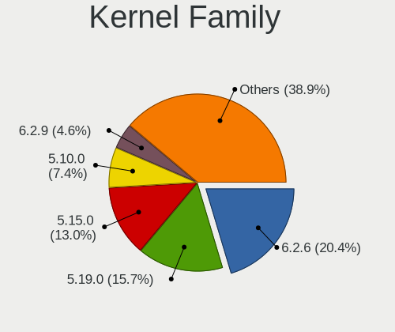

| Version  | Computers | Percent |
|----------|-----------|---------|
| 5.13.0   | 25        | 21.93%  |
| 5.4.0    | 12        | 10.53%  |
| 5.15.0   | 9         | 7.89%   |
| 5.16.19  | 7         | 6.14%   |
| 5.16.18  | 7         | 6.14%   |
| 5.16.7   | 5         | 4.39%   |
| 3.10.0   | 5         | 4.39%   |
| 5.17.4   | 4         | 3.51%   |
| 5.17.0   | 4         | 3.51%   |
| 5.16.0   | 4         | 3.51%   |
| 5.11.0   | 4         | 3.51%   |
| 5.17.1   | 3         | 2.63%   |
| 5.16.20  | 3         | 2.63%   |
| 5.15.28  | 3         | 2.63%   |
| 5.15.32  | 2         | 1.75%   |
| 5.14.0   | 2         | 1.75%   |
| 5.10.0   | 2         | 1.75%   |
| 5.8.0    | 1         | 0.88%   |
| 5.6.14   | 1         | 0.88%   |
| 5.17     | 1         | 0.88%   |
| 5.16.8   | 1         | 0.88%   |
| 5.16.15  | 1         | 0.88%   |
| 5.16.13  | 1         | 0.88%   |
| 5.16.11  | 1         | 0.88%   |
| 5.14.10  | 1         | 0.88%   |
| 5.10.105 | 1         | 0.88%   |
| 5.10.101 | 1         | 0.88%   |
| 5.10.100 | 1         | 0.88%   |
| 4.18.0   | 1         | 0.88%   |
| 4.15.0   | 1         | 0.88%   |

Kernel Major Ver.
-----------------

Linux kernel major version

| Version | Computers | Percent |
|---------|-----------|---------|
| 5.16    | 30        | 26.32%  |
| 5.13    | 25        | 21.93%  |
| 5.15    | 14        | 12.28%  |
| 5.4     | 12        | 10.53%  |
| 5.17    | 11        | 9.65%   |
| 5.10    | 5         | 4.39%   |
| 3.10    | 5         | 4.39%   |
| 5.11    | 4         | 3.51%   |
| 5.14    | 3         | 2.63%   |
| 5.8     | 1         | 0.88%   |
| 5.6     | 1         | 0.88%   |
| 5       | 1         | 0.88%   |
| 4.18    | 1         | 0.88%   |
| 4.15    | 1         | 0.88%   |

Arch
----

OS architecture (x86_64, i586, etc.)

| Name    | Computers | Percent |
|---------|-----------|---------|
| x86_64  | 112       | 98.25%  |
| i686    | 1         | 0.88%   |
| aarch64 | 1         | 0.88%   |

DE
--

Desktop Environment

| Name        | Computers | Percent |
|-------------|-----------|---------|
| GNOME       | 52        | 45.61%  |
| KDE5        | 18        | 15.79%  |
| X-Cinnamon  | 11        | 9.65%   |
| Cinnamon    | 10        | 8.77%   |
| Unknown     | 8         | 7.02%   |
| XFCE        | 4         | 3.51%   |
| MATE        | 2         | 1.75%   |
| LXQt        | 2         | 1.75%   |
| i3          | 2         | 1.75%   |
| Budgie      | 2         | 1.75%   |
| Phosh:GNOME | 1         | 0.88%   |
| Pantheon    | 1         | 0.88%   |
| Deepin      | 1         | 0.88%   |

Display Server
--------------

X11 or Wayland

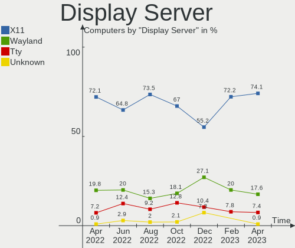

| Name    | Computers | Percent |
|---------|-----------|---------|
| X11     | 81        | 71.05%  |
| Wayland | 22        | 19.3%   |
| Tty     | 10        | 8.77%   |
| Unknown | 1         | 0.88%   |

Display Manager
---------------

SDDM, LightDM, etc.

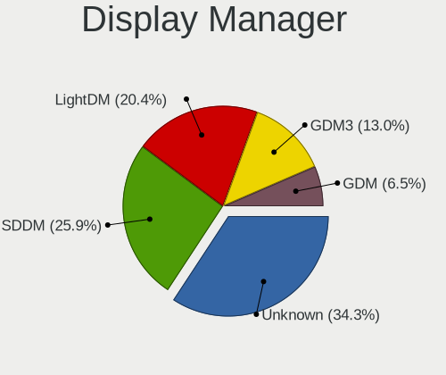

| Name    | Computers | Percent |
|---------|-----------|---------|
| Unknown | 39        | 34.21%  |
| LightDM | 22        | 19.3%   |
| GDM3    | 20        | 17.54%  |
| SDDM    | 17        | 14.91%  |
| GDM     | 16        | 14.04%  |

OS Lang
-------

Language

| Lang    | Computers | Percent |
|---------|-----------|---------|
| en_AU   | 88        | 77.19%  |
| en_US   | 21        | 18.42%  |
| en_GB   | 2         | 1.75%   |
| Unknown | 2         | 1.75%   |
| C       | 1         | 0.88%   |

Boot Mode
---------

EFI or BIOS

| Mode | Computers | Percent |
|------|-----------|---------|
| BIOS | 58        | 50.88%  |
| EFI  | 56        | 49.12%  |

Filesystem
----------

Type of filesystem

| Type    | Computers | Percent |
|---------|-----------|---------|
| Ext4    | 73        | 64.04%  |
| Xfs     | 18        | 15.79%  |
| Btrfs   | 10        | 8.77%   |
| Overlay | 8         | 7.02%   |
| Zfs     | 5         | 4.39%   |

Part. scheme
------------

Scheme of partitioning

| Type    | Computers | Percent |
|---------|-----------|---------|
| Unknown | 52        | 45.61%  |
| GPT     | 47        | 41.23%  |
| MBR     | 15        | 13.16%  |

Dual Boot with Linux/BSD
------------------------

Hosting more than one Linux/BSD

| Dual boot | Computers | Percent |
|-----------|-----------|---------|
| No        | 94        | 82.46%  |
| Yes       | 20        | 17.54%  |

Dual Boot (Win)
---------------

Hosting Linux and Windows

| Dual boot | Computers | Percent |
|-----------|-----------|---------|
| No        | 88        | 77.19%  |
| Yes       | 26        | 22.81%  |

Board
-----

Vendor
------

Motherboard manufacturer

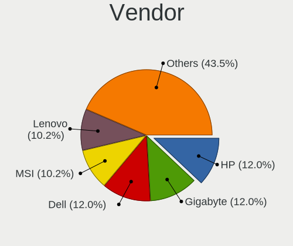

| Name                | Computers | Percent |
|---------------------|-----------|---------|
| Lenovo              | 17        | 14.91%  |
| Dell                | 17        | 14.91%  |
| ASUSTek Computer    | 17        | 14.91%  |
| Gigabyte Technology | 16        | 14.04%  |
| Hewlett-Packard     | 14        | 12.28%  |
| MSI                 | 7         | 6.14%   |
| ASRock              | 7         | 6.14%   |
| Apple               | 5         | 4.39%   |
| Acer                | 4         | 3.51%   |
| Toshiba             | 2         | 1.75%   |
| Microsoft           | 2         | 1.75%   |
| Timi                | 1         | 0.88%   |
| Razer               | 1         | 0.88%   |
| KOGAN               | 1         | 0.88%   |
| Intel               | 1         | 0.88%   |
| HUAWEI              | 1         | 0.88%   |
| Unknown             | 1         | 0.88%   |

Model
-----

Motherboard model

| Name                                               | Computers | Percent |
|----------------------------------------------------|-----------|---------|
| ASUS All Series                                    | 3         | 2.63%   |
| Lenovo IdeaPadFlex 5 14ITL05 82HS                  | 2         | 1.75%   |
| Gigabyte J1900M-D2P                                | 2         | 1.75%   |
| Toshiba TECRA M11                                  | 1         | 0.88%   |
| Toshiba Satellite L50-A                            | 1         | 0.88%   |
| Timi A35S                                          | 1         | 0.88%   |
| Razer Blade 15 Base Model (Early 2020) - RZ09-0328 | 1         | 0.88%   |
| MSI MS-7C84                                        | 1         | 0.88%   |
| MSI MS-7C82                                        | 1         | 0.88%   |
| MSI MS-7C52                                        | 1         | 0.88%   |
| MSI MS-7917                                        | 1         | 0.88%   |
| MSI MS-7850                                        | 1         | 0.88%   |
| MSI MS-7721                                        | 1         | 0.88%   |
| MSI GS65 Stealth Thin 8RE                          | 1         | 0.88%   |
| Microsoft Surface Pro 7                            | 1         | 0.88%   |
| Microsoft Surface Book 2                           | 1         | 0.88%   |
| Lenovo Yoga C740-14IML 81TC                        | 1         | 0.88%   |
| Lenovo ThinkStation E31 2552CTO                    | 1         | 0.88%   |
| Lenovo ThinkPad X250 20CLS52P0F                    | 1         | 0.88%   |
| Lenovo ThinkPad X220 4291IU6                       | 1         | 0.88%   |
| Lenovo ThinkPad T590 20N5S2NC0V                    | 1         | 0.88%   |
| Lenovo ThinkPad T470s W10DG 20JTS0K900             | 1         | 0.88%   |
| Lenovo ThinkPad T430 2350BC6                       | 1         | 0.88%   |
| Lenovo ThinkPad T410s 2912BR7                      | 1         | 0.88%   |
| Lenovo ThinkPad E570 20H5CTO1WW                    | 1         | 0.88%   |
| Lenovo ThinkPad E14 Gen 3 20YDCTO1WW               | 1         | 0.88%   |
| Lenovo ThinkCentre M93p 10A8S1K403                 | 1         | 0.88%   |
| Lenovo ThinkCentre M910s 10MLS0K701                | 1         | 0.88%   |
| Lenovo ThinkCentre M58p 7220A72                    | 1         | 0.88%   |
| Lenovo ThinkCentre A55 8982A48                     | 1         | 0.88%   |
| Lenovo IdeaCentre AIO 300-23ACL F0BC002MAU         | 1         | 0.88%   |
| KOGAN KAL11C250SB                                  | 1         | 0.88%   |
| Intel S5520UR                                      | 1         | 0.88%   |
| HUAWEI BOM-WXX9                                    | 1         | 0.88%   |
| HP ZBook 15 G6                                     | 1         | 0.88%   |
| HP Spectre x360 Convertible 13-aw0xxx              | 1         | 0.88%   |
| HP Spectre 13-SMB Pro Ultrabook                    | 1         | 0.88%   |
| HP ProLiant ML330 G6                               | 1         | 0.88%   |
| HP ProDesk 600 G2 SFF                              | 1         | 0.88%   |
| HP ProBook 4710s                                   | 1         | 0.88%   |
| HP ProBook 470 G5                                  | 1         | 0.88%   |
| HP Pavilion g6                                     | 1         | 0.88%   |
| HP Laptop 15s-eq2xxx                               | 1         | 0.88%   |
| HP Laptop 14s-dk0xxx                               | 1         | 0.88%   |
| HP EliteBook x360 1030 G2                          | 1         | 0.88%   |
| HP EliteBook 2530p                                 | 1         | 0.88%   |
| HP Compaq dc7800p Convertible Minitower            | 1         | 0.88%   |
| HP 250 G5 Notebook PC                              | 1         | 0.88%   |
| Gigabyte Z77M-D3H-MVP                              | 1         | 0.88%   |
| Gigabyte X570 GAMING X                             | 1         | 0.88%   |
| Gigabyte H77N-WIFI                                 | 1         | 0.88%   |
| Gigabyte H110M-S2PV                                | 1         | 0.88%   |
| Gigabyte GA-MA785G-UD3H                            | 1         | 0.88%   |
| Gigabyte GA-MA780G-UD3H                            | 1         | 0.88%   |
| Gigabyte GA-870A-UD3                               | 1         | 0.88%   |
| Gigabyte GA-78LMT-USB3 6.0                         | 1         | 0.88%   |
| Gigabyte G41MT-D3                                  | 1         | 0.88%   |
| Gigabyte EX58-UD4P                                 | 1         | 0.88%   |
| Gigabyte EP45-DS3L                                 | 1         | 0.88%   |
| Gigabyte B85M-D3H                                  | 1         | 0.88%   |

Model Family
------------

Motherboard model prefix

| Name                    | Computers | Percent |
|-------------------------|-----------|---------|
| Lenovo ThinkPad         | 8         | 7.02%   |
| Dell Latitude           | 6         | 5.26%   |
| Lenovo ThinkCentre      | 4         | 3.51%   |
| Dell Inspiron           | 4         | 3.51%   |
| Acer Aspire             | 4         | 3.51%   |
| Dell Precision          | 3         | 2.63%   |
| ASUS ROG                | 3         | 2.63%   |
| ASUS All                | 3         | 2.63%   |
| Microsoft Surface       | 2         | 1.75%   |
| Lenovo IdeaPadFlex      | 2         | 1.75%   |
| HP Spectre              | 2         | 1.75%   |
| HP ProBook              | 2         | 1.75%   |
| HP Laptop               | 2         | 1.75%   |
| HP EliteBook            | 2         | 1.75%   |
| Gigabyte J1900M-D2P     | 2         | 1.75%   |
| Dell OptiPlex           | 2         | 1.75%   |
| ASUS TUF                | 2         | 1.75%   |
| ASUS PRIME              | 2         | 1.75%   |
| Toshiba TECRA           | 1         | 0.88%   |
| Toshiba Satellite       | 1         | 0.88%   |
| Timi A35S               | 1         | 0.88%   |
| Razer Blade             | 1         | 0.88%   |
| MSI MS-7C84             | 1         | 0.88%   |
| MSI MS-7C82             | 1         | 0.88%   |
| MSI MS-7C52             | 1         | 0.88%   |
| MSI MS-7917             | 1         | 0.88%   |
| MSI MS-7850             | 1         | 0.88%   |
| MSI MS-7721             | 1         | 0.88%   |
| MSI GS65                | 1         | 0.88%   |
| Lenovo Yoga             | 1         | 0.88%   |
| Lenovo ThinkStation     | 1         | 0.88%   |
| Lenovo IdeaCentre       | 1         | 0.88%   |
| KOGAN KAL11C250SB       | 1         | 0.88%   |
| Intel S5520UR           | 1         | 0.88%   |
| HUAWEI BOM-WXX9         | 1         | 0.88%   |
| HP ZBook                | 1         | 0.88%   |
| HP ProLiant             | 1         | 0.88%   |
| HP ProDesk              | 1         | 0.88%   |
| HP Pavilion             | 1         | 0.88%   |
| HP Compaq               | 1         | 0.88%   |
| HP 250                  | 1         | 0.88%   |
| Gigabyte Z77M-D3H-MVP   | 1         | 0.88%   |
| Gigabyte X570           | 1         | 0.88%   |
| Gigabyte H77N-WIFI      | 1         | 0.88%   |
| Gigabyte H110M-S2PV     | 1         | 0.88%   |
| Gigabyte GA-MA785G-UD3H | 1         | 0.88%   |
| Gigabyte GA-MA780G-UD3H | 1         | 0.88%   |
| Gigabyte GA-870A-UD3    | 1         | 0.88%   |
| Gigabyte GA-78LMT-USB3  | 1         | 0.88%   |
| Gigabyte G41MT-D3       | 1         | 0.88%   |
| Gigabyte EX58-UD4P      | 1         | 0.88%   |
| Gigabyte EP45-DS3L      | 1         | 0.88%   |
| Gigabyte B85M-D3H       | 1         | 0.88%   |
| Gigabyte B365M          | 1         | 0.88%   |
| Gigabyte B360           | 1         | 0.88%   |
| Dell XPS                | 1         | 0.88%   |
| Dell Studio             | 1         | 0.88%   |
| ASUS X580VD             | 1         | 0.88%   |
| ASUS ProArt             | 1         | 0.88%   |
| ASUS P8Z77-V            | 1         | 0.88%   |

MFG Year
--------

Motherboard manufacture year

| Year    | Computers | Percent |
|---------|-----------|---------|
| 2019    | 13        | 11.4%   |
| 2018    | 10        | 8.77%   |
| 2012    | 10        | 8.77%   |
| 2021    | 9         | 7.89%   |
| 2017    | 9         | 7.89%   |
| 2014    | 9         | 7.89%   |
| 2011    | 9         | 7.89%   |
| 2020    | 8         | 7.02%   |
| 2009    | 7         | 6.14%   |
| 2013    | 6         | 5.26%   |
| 2010    | 6         | 5.26%   |
| 2015    | 5         | 4.39%   |
| 2016    | 4         | 3.51%   |
| 2008    | 4         | 3.51%   |
| 2007    | 2         | 1.75%   |
| 2022    | 1         | 0.88%   |
| 2006    | 1         | 0.88%   |
| Unknown | 1         | 0.88%   |

Form Factor
-----------

Physical design of the computer

| Name           | Computers | Percent |
|----------------|-----------|---------|
| Desktop        | 55        | 48.25%  |
| Notebook       | 42        | 36.84%  |
| Convertible    | 6         | 5.26%   |
| All in one     | 5         | 4.39%   |
| Tablet         | 3         | 2.63%   |
| Server         | 2         | 1.75%   |
| System on chip | 1         | 0.88%   |

Secure Boot
-----------

Enabled or disabled

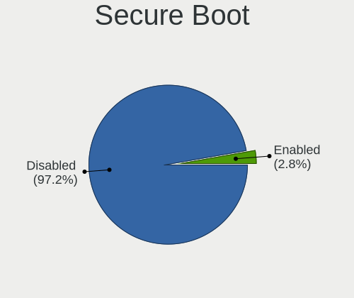

| State    | Computers | Percent |
|----------|-----------|---------|
| Disabled | 106       | 92.98%  |
| Enabled  | 8         | 7.02%   |

Coreboot
--------

Have coreboot on board

| Used | Computers | Percent |
|------|-----------|---------|
| No   | 114       | 100%    |

RAM Size
--------

Total RAM memory

| Size in GB  | Computers | Percent |
|-------------|-----------|---------|
| 16.01-24.0  | 29        | 25.44%  |
| 4.01-8.0    | 26        | 22.81%  |
| 3.01-4.0    | 16        | 14.04%  |
| 8.01-16.0   | 15        | 13.16%  |
| 32.01-64.0  | 14        | 12.28%  |
| 64.01-256.0 | 11        | 9.65%   |
| 24.01-32.0  | 2         | 1.75%   |
| 1.01-2.0    | 1         | 0.88%   |

RAM Used
--------

Used RAM memory

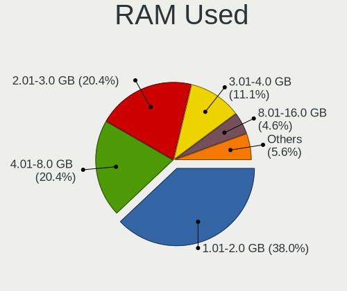

| Used GB     | Computers | Percent |
|-------------|-----------|---------|
| 1.01-2.0    | 30        | 26.32%  |
| 2.01-3.0    | 27        | 23.68%  |
| 4.01-8.0    | 20        | 17.54%  |
| 3.01-4.0    | 10        | 8.77%   |
| 8.01-16.0   | 10        | 8.77%   |
| 0.51-1.0    | 10        | 8.77%   |
| 16.01-24.0  | 5         | 4.39%   |
| 64.01-256.0 | 1         | 0.88%   |
| 0.01-0.5    | 1         | 0.88%   |

Total Drives
------------

Number of drives on board

| Drives | Computers | Percent |
|--------|-----------|---------|
| 1      | 66        | 57.89%  |
| 2      | 24        | 21.05%  |
| 3      | 9         | 7.89%   |
| 6      | 4         | 3.51%   |
| 4      | 4         | 3.51%   |
| 8      | 3         | 2.63%   |
| 5      | 2         | 1.75%   |
| 0      | 2         | 1.75%   |

Has CD-ROM
----------

Has CD-ROM on board

| Presented | Computers | Percent |
|-----------|-----------|---------|
| No        | 68        | 59.65%  |
| Yes       | 46        | 40.35%  |

Has Ethernet
------------

Has Ethernet on board

| Presented | Computers | Percent |
|-----------|-----------|---------|
| Yes       | 102       | 89.47%  |
| No        | 12        | 10.53%  |

Has WiFi
--------

Has WiFi module

| Presented | Computers | Percent |
|-----------|-----------|---------|
| Yes       | 76        | 66.67%  |
| No        | 38        | 33.33%  |

Has Bluetooth
-------------

Has Bluetooth module

| Presented | Computers | Percent |
|-----------|-----------|---------|
| Yes       | 64        | 56.14%  |
| No        | 50        | 43.86%  |

Location
--------

Country
-------

Geographic location (country)

| Country   | Computers | Percent |
|-----------|-----------|---------|
| Australia | 114       | 100%    |

City
----

Geographic location (city)

| City           | Computers | Percent |
|----------------|-----------|---------|
| Sydney         | 36        | 31.58%  |
| Melbourne      | 21        | 18.42%  |
| Brisbane       | 20        | 17.54%  |
| Perth          | 12        | 10.53%  |
| Adelaide       | 6         | 5.26%   |
| Canberra       | 4         | 3.51%   |
| Launceston     | 2         | 1.75%   |
| Brunswick West | 2         | 1.75%   |
| Warragul       | 1         | 0.88%   |
| Surry Hills    | 1         | 0.88%   |
| Saint Ives     | 1         | 0.88%   |
| Richmond       | 1         | 0.88%   |
| Redfern        | 1         | 0.88%   |
| Mount Waverley | 1         | 0.88%   |
| Mitcham        | 1         | 0.88%   |
| Gold Coast     | 1         | 0.88%   |
| Geelong        | 1         | 0.88%   |
| Brunswick      | 1         | 0.88%   |
| Airlie Beach   | 1         | 0.88%   |

Drives
------

Drive Vendor
------------

Hard drive vendors

| Vendor                    | Computers | Drives | Percent |
|---------------------------|-----------|--------|---------|
| Samsung Electronics       | 40        | 66     | 25.32%  |
| Seagate                   | 25        | 40     | 15.82%  |
| WDC                       | 20        | 34     | 12.66%  |
| Crucial                   | 11        | 11     | 6.96%   |
| Intel                     | 9         | 10     | 5.7%    |
| Toshiba                   | 7         | 7      | 4.43%   |
| Kingston                  | 7         | 7      | 4.43%   |
| SanDisk                   | 5         | 5      | 3.16%   |
| Hitachi                   | 5         | 5      | 3.16%   |
| Micron Technology         | 4         | 4      | 2.53%   |
| KIOXIA                    | 4         | 4      | 2.53%   |
| Unknown                   | 3         | 5      | 1.9%    |
| SK Hynix                  | 2         | 2      | 1.27%   |
| Apple                     | 2         | 2      | 1.27%   |
| Vaseky                    | 1         | 1      | 0.63%   |
| SSSTC                     | 1         | 1      | 0.63%   |
| SPCC                      | 1         | 1      | 0.63%   |
| SABRENT                   | 1         | 1      | 0.63%   |
| PNY                       | 1         | 1      | 0.63%   |
| Phison                    | 1         | 1      | 0.63%   |
| Micron/Crucial Technology | 1         | 1      | 0.63%   |
| LITEONIT                  | 1         | 1      | 0.63%   |
| HGST                      | 1         | 1      | 0.63%   |
| Fujitsu                   | 1         | 1      | 0.63%   |
| Corsair                   | 1         | 1      | 0.63%   |
| China                     | 1         | 1      | 0.63%   |
| A-DATA Technology         | 1         | 1      | 0.63%   |
| Unknown                   | 1         | 1      | 0.63%   |

Drive Model
-----------

Hard drive models

| Model                                | Computers | Percent |
|--------------------------------------|-----------|---------|
| Samsung SSD 850 EVO 250GB            | 5         | 2.6%    |
| WDC WD20EZRZ-00Z5HB0 2TB             | 4         | 2.08%   |
| Crucial CT500MX500SSD1 500GB         | 4         | 2.08%   |
| Unknown MMC Card  64GB               | 3         | 1.56%   |
| Seagate ST4000DM004-2CV104 4TB       | 3         | 1.56%   |
| Seagate ST3500418AS 500GB            | 3         | 1.56%   |
| Samsung SSD 980 PRO 1TB              | 3         | 1.56%   |
| Samsung SSD 860 EVO 500GB            | 3         | 1.56%   |
| Samsung SSD 850 EVO 500GB            | 3         | 1.56%   |
| Samsung NVMe SSD Drive 512GB         | 3         | 1.56%   |
| Crucial CT1000MX500SSD1 1TB          | 3         | 1.56%   |
| WDC WD80EFAX-68KNBN0 8TB             | 2         | 1.04%   |
| Toshiba MQ01ABD100 1TB               | 2         | 1.04%   |
| Samsung SSD 970 EVO Plus 500GB       | 2         | 1.04%   |
| Samsung SSD 860 EVO 250GB            | 2         | 1.04%   |
| Samsung SSD 850 PRO 128GB            | 2         | 1.04%   |
| Samsung SSD 840 EVO 250GB            | 2         | 1.04%   |
| Samsung SSD 840 EVO 120GB            | 2         | 1.04%   |
| Samsung HD501LJ 500GB                | 2         | 1.04%   |
| Kingston SA400S37120G 120GB SSD      | 2         | 1.04%   |
| Kingston NVMe SSD Drive 500GB        | 2         | 1.04%   |
| Intel SSDSC2CT120A3 120GB            | 2         | 1.04%   |
| Intel SSDSA2M080G2LE 80GB            | 2         | 1.04%   |
| Intel NVMe SSD Drive 512GB           | 2         | 1.04%   |
| WDC WDS500G3X0C-00SJG0 500GB         | 1         | 0.52%   |
| WDC WDS500G2B0A-00SM50 500GB SSD     | 1         | 0.52%   |
| WDC WDS480G2G0A-00JH30 480GB SSD     | 1         | 0.52%   |
| WDC WDS250G2B0A-00SM50 250GB SSD     | 1         | 0.52%   |
| WDC WDS240G1G0A-00SS50 240GB SSD     | 1         | 0.52%   |
| WDC WD80EFAX-68LHPN0 8TB             | 1         | 0.52%   |
| WDC WD5000LPVX-22V0TT0 500GB         | 1         | 0.52%   |
| WDC WD5000BEVT-60ZAT1 500GB          | 1         | 0.52%   |
| WDC WD5000AVCS-632DY1 500GB          | 1         | 0.52%   |
| WDC WD40EFRX-68N32N0 4TB             | 1         | 0.52%   |
| WDC WD20EZAZ-00GGJB0 2TB             | 1         | 0.52%   |
| WDC WD20EARX-00PASB0 2TB             | 1         | 0.52%   |
| WDC WD20EARS-00J2GB0 2TB             | 1         | 0.52%   |
| WDC WD2002FAEX-007BA0 2TB            | 1         | 0.52%   |
| WDC WD20 EZRZ-00Z5HB0 2TB            | 1         | 0.52%   |
| WDC WD1600BJKT-75F4T0 160GB          | 1         | 0.52%   |
| WDC WD10EZEX-08WN4A0 1TB             | 1         | 0.52%   |
| WDC WD10EZEX-00WN4A0 1TB             | 1         | 0.52%   |
| WDC WD101EFAX-68LDBN0 10TB           | 1         | 0.52%   |
| WDC WD1003FZEX-00K3CA0 1TB           | 1         | 0.52%   |
| WDC WD1001FAES-60Z2A0 1TB            | 1         | 0.52%   |
| WDC PC SN720 SDAPNTW-512G-1006 512GB | 1         | 0.52%   |
| Vaseky V850/64G 64GB SSD             | 1         | 0.52%   |
| Unknown MMC Card  128GB              | 1         | 0.52%   |
| Unknown EC1S5  64GB                  | 1         | 0.52%   |
| Toshiba THNS128GG4BBAA 128GB SSD     | 1         | 0.52%   |
| Toshiba NVMe SSD Drive 512GB         | 1         | 0.52%   |
| Toshiba NVMe SSD Drive 256GB         | 1         | 0.52%   |
| Toshiba MQ04ABF100 1TB               | 1         | 0.52%   |
| Toshiba MQ01ABB200 2TB               | 1         | 0.52%   |
| SSSTC CL1-3D512-Q11 NVMe 512GB       | 1         | 0.52%   |
| SPCC Solid State Disk 256GB          | 1         | 0.52%   |
| SK Hynix SHGP31-1000GM-2 1TB         | 1         | 0.52%   |
| SK Hynix NVMe SSD Drive 128GB        | 1         | 0.52%   |
| Seagate ST9500420ASG 500GB           | 1         | 0.52%   |
| Seagate ST9250315AS 250GB            | 1         | 0.52%   |

HDD Vendor
----------

Hard disk drive vendors

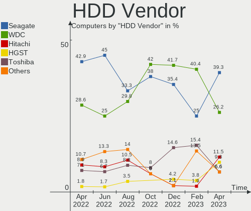

| Vendor              | Computers | Drives | Percent |
|---------------------|-----------|--------|---------|
| Seagate             | 24        | 38     | 41.38%  |
| WDC                 | 16        | 27     | 27.59%  |
| Samsung Electronics | 5         | 11     | 8.62%   |
| Hitachi             | 5         | 5      | 8.62%   |
| Toshiba             | 4         | 4      | 6.9%    |
| SABRENT             | 1         | 1      | 1.72%   |
| HGST                | 1         | 1      | 1.72%   |
| Fujitsu             | 1         | 1      | 1.72%   |
| Apple               | 1         | 1      | 1.72%   |

SSD Vendor
----------

Solid state drive vendors

| Vendor              | Computers | Drives | Percent |
|---------------------|-----------|--------|---------|
| Samsung Electronics | 26        | 34     | 40.63%  |
| Crucial             | 9         | 9      | 14.06%  |
| Intel               | 7         | 7      | 10.94%  |
| WDC                 | 4         | 4      | 6.25%   |
| SanDisk             | 4         | 4      | 6.25%   |
| Kingston            | 4         | 4      | 6.25%   |
| Micron Technology   | 3         | 3      | 4.69%   |
| Vaseky              | 1         | 1      | 1.56%   |
| Toshiba             | 1         | 1      | 1.56%   |
| SPCC                | 1         | 1      | 1.56%   |
| PNY                 | 1         | 1      | 1.56%   |
| LITEONIT            | 1         | 1      | 1.56%   |
| China               | 1         | 1      | 1.56%   |
| Apple               | 1         | 1      | 1.56%   |

Drive Kind
----------

HDD or SSD

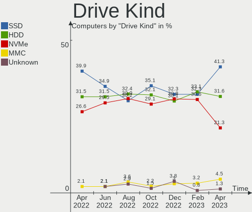

| Kind | Computers | Drives | Percent |
|------|-----------|--------|---------|
| SSD  | 60        | 72     | 40.54%  |
| HDD  | 47        | 89     | 31.76%  |
| NVMe | 38        | 49     | 25.68%  |
| MMC  | 3         | 6      | 2.03%   |

Drive Connector
---------------

SATA, SAS, NVMe, etc.

| Type | Computers | Drives | Percent |
|------|-----------|--------|---------|
| SATA | 83        | 154    | 64.34%  |
| NVMe | 38        | 49     | 29.46%  |
| SAS  | 5         | 7      | 3.88%   |
| MMC  | 3         | 6      | 2.33%   |

Drive Size
----------

Size of hard drive

| Size in TB | Computers | Drives | Percent |
|------------|-----------|--------|---------|
| 0.01-0.5   | 67        | 92     | 59.82%  |
| 0.51-1.0   | 20        | 25     | 17.86%  |
| 1.01-2.0   | 13        | 20     | 11.61%  |
| 4.01-10.0  | 6         | 16     | 5.36%   |
| 3.01-4.0   | 5         | 7      | 4.46%   |
| 2.01-3.0   | 1         | 1      | 0.89%   |

Space Total
-----------

Amount of disk space available on the file system

| Size in GB     | Computers | Percent |
|----------------|-----------|---------|
| 251-500        | 28        | 24.56%  |
| 101-250        | 27        | 23.68%  |
| 501-1000       | 11        | 9.65%   |
| 51-100         | 11        | 9.65%   |
| 1001-2000      | 10        | 8.77%   |
| 1-20           | 9         | 7.89%   |
| More than 3000 | 8         | 7.02%   |
| Unknown        | 5         | 4.39%   |
| 2001-3000      | 4         | 3.51%   |
| 21-50          | 1         | 0.88%   |

Space Used
----------

Amount of used disk space

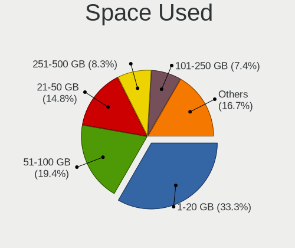

| Used GB        | Computers | Percent |
|----------------|-----------|---------|
| 1-20           | 40        | 35.09%  |
| 101-250        | 19        | 16.67%  |
| 21-50          | 16        | 14.04%  |
| 51-100         | 10        | 8.77%   |
| 251-500        | 9         | 7.89%   |
| 2001-3000      | 6         | 5.26%   |
| Unknown        | 5         | 4.39%   |
| More than 3000 | 3         | 2.63%   |
| 1001-2000      | 3         | 2.63%   |
| 501-1000       | 3         | 2.63%   |

Malfunc. Drives
---------------

Drive models with a malfunction

| Model                                   | Computers | Drives | Percent |
|-----------------------------------------|-----------|--------|---------|
| Intel SSDSC2CT120A3 120GB               | 2         | 2      | 12.5%   |
| WDC WD20EARS-00J2GB0 2TB                | 1         | 1      | 6.25%   |
| WDC WD2002FAEX-007BA0 2TB               | 1         | 1      | 6.25%   |
| Seagate ST500LT012-9WS142 500GB         | 1         | 1      | 6.25%   |
| Seagate ST3500418AS 500GB               | 1         | 1      | 6.25%   |
| Seagate ST2000DM001-9YN164 2TB          | 1         | 1      | 6.25%   |
| Samsung Electronics SSD 970 EVO 500GB   | 1         | 2      | 6.25%   |
| Samsung Electronics SSD 840 EVO 250GB   | 1         | 1      | 6.25%   |
| Samsung Electronics HD501LJ 500GB       | 1         | 2      | 6.25%   |
| Samsung Electronics HD203WI 2TB         | 1         | 1      | 6.25%   |
| Samsung Electronics HD103UJ 1TB         | 1         | 2      | 6.25%   |
| Kingston RBU-SNS8350DES3128GP 128GB SSD | 1         | 1      | 6.25%   |
| Intel SSDSA2M080G2LE 80GB               | 1         | 1      | 6.25%   |
| Hitachi HDS5C3020ALA632 2TB             | 1         | 1      | 6.25%   |
| Fujitsu MJA2250BH FFS G1 250GB          | 1         | 1      | 6.25%   |

Malfunc. Drive Vendor
---------------------

Vendors of faulty drives

| Vendor              | Computers | Drives | Percent |
|---------------------|-----------|--------|---------|
| Samsung Electronics | 5         | 8      | 33.33%  |
| Seagate             | 3         | 3      | 20%     |
| Intel               | 3         | 3      | 20%     |
| WDC                 | 1         | 2      | 6.67%   |
| Kingston            | 1         | 1      | 6.67%   |
| Hitachi             | 1         | 1      | 6.67%   |
| Fujitsu             | 1         | 1      | 6.67%   |

Malfunc. HDD Vendor
-------------------

Vendors of faulty HDD drives

| Vendor              | Computers | Drives | Percent |
|---------------------|-----------|--------|---------|
| Seagate             | 3         | 3      | 33.33%  |
| Samsung Electronics | 3         | 5      | 33.33%  |
| WDC                 | 1         | 2      | 11.11%  |
| Hitachi             | 1         | 1      | 11.11%  |
| Fujitsu             | 1         | 1      | 11.11%  |

Malfunc. Drive Kind
-------------------

Kinds of faulty drives

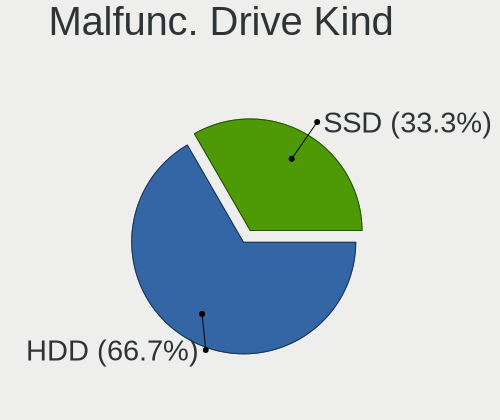

| Kind | Computers | Drives | Percent |
|------|-----------|--------|---------|
| HDD  | 7         | 12     | 53.85%  |
| SSD  | 5         | 5      | 38.46%  |
| NVMe | 1         | 2      | 7.69%   |

Failed Drives
-------------

Failed drive models

Zero info for selected period =(

Failed Drive Vendor
-------------------

Failed drive vendors

Zero info for selected period =(

Drive Status
------------

Number of failed and malfunc. drives

| Status   | Computers | Drives | Percent |
|----------|-----------|--------|---------|
| Works    | 56        | 104    | 46.67%  |
| Detected | 51        | 93     | 42.5%   |
| Malfunc  | 13        | 19     | 10.83%  |

Storage controller
------------------

Storage Vendor
--------------

Storage controller vendors

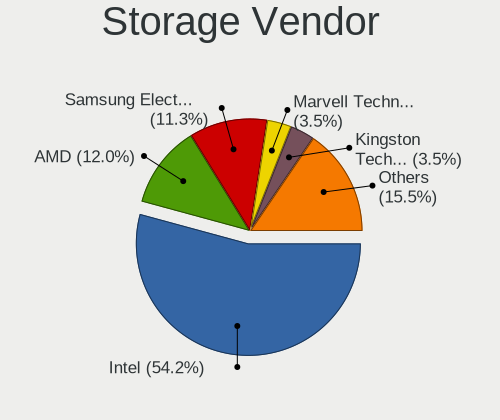

| Vendor                           | Computers | Percent |
|----------------------------------|-----------|---------|
| Intel                            | 77        | 51.33%  |
| AMD                              | 19        | 12.67%  |
| Samsung Electronics              | 15        | 10%     |
| Toshiba America Info Systems     | 4         | 2.67%   |
| Sandisk                          | 3         | 2%      |
| Micron/Crucial Technology        | 3         | 2%      |
| Kingston Technology Company      | 3         | 2%      |
| ASMedia Technology               | 3         | 2%      |
| SK Hynix                         | 2         | 1.33%   |
| Phison Electronics               | 2         | 1.33%   |
| Marvell Technology Group         | 2         | 1.33%   |
| KIOXIA                           | 2         | 1.33%   |
| JMicron Technology               | 2         | 1.33%   |
| Broadcom / LSI                   | 2         | 1.33%   |
| VIA Technologies                 | 1         | 0.67%   |
| ULi Electronics                  | 1         | 0.67%   |
| Solid State Storage Technology   | 1         | 0.67%   |
| Silicon Integrated Systems [SiS] | 1         | 0.67%   |
| Silicon Image                    | 1         | 0.67%   |
| Seagate Technology               | 1         | 0.67%   |
| Nvidia                           | 1         | 0.67%   |
| Micron Technology                | 1         | 0.67%   |
| LSI Logic / Symbios Logic        | 1         | 0.67%   |
| Hewlett-Packard                  | 1         | 0.67%   |
| ADATA Technology                 | 1         | 0.67%   |

Storage Model
-------------

Storage controller models

| Model                                                                            | Computers | Percent |
|----------------------------------------------------------------------------------|-----------|---------|
| AMD FCH SATA Controller [AHCI mode]                                              | 13        | 7.51%   |
| Samsung NVMe SSD Controller SM981/PM981/PM983                                    | 8         | 4.62%   |
| Intel 8 Series/C220 Series Chipset Family 6-port SATA Controller 1 [AHCI mode]   | 7         | 4.05%   |
| Intel SATA Controller [RAID mode]                                                | 5         | 2.89%   |
| Intel 82801 Mobile SATA Controller [RAID mode]                                   | 5         | 2.89%   |
| Samsung NVMe SSD Controller SM961/PM961/SM963                                    | 4         | 2.31%   |
| Samsung NVMe SSD Controller PM9A1/PM9A3/980PRO                                   | 4         | 2.31%   |
| Intel Sunrise Point-LP SATA Controller [AHCI mode]                               | 4         | 2.31%   |
| Intel 7 Series/C210 Series Chipset Family 6-port SATA Controller [AHCI mode]     | 4         | 2.31%   |
| Intel 200 Series PCH SATA controller [AHCI mode]                                 | 4         | 2.31%   |
| Samsung NVMe SSD Controller 980                                                  | 3         | 1.73%   |
| Kingston Company A2000 NVMe SSD                                                  | 3         | 1.73%   |
| Intel Wildcat Point-LP SATA Controller [AHCI Mode]                               | 3         | 1.73%   |
| Intel NM10/ICH7 Family SATA Controller [IDE mode]                                | 3         | 1.73%   |
| Intel 82801IBM/IEM (ICH9M/ICH9M-E) 4 port SATA Controller [AHCI mode]            | 3         | 1.73%   |
| Intel 6 Series/C200 Series Chipset Family 6 port Mobile SATA AHCI Controller     | 3         | 1.73%   |
| Intel 5 Series/3400 Series Chipset 6 port SATA AHCI Controller                   | 3         | 1.73%   |
| ASMedia ASM1062 Serial ATA Controller                                            | 3         | 1.73%   |
| AMD SB7x0/SB8x0/SB9x0 SATA Controller [AHCI mode]                                | 3         | 1.73%   |
| AMD SB7x0/SB8x0/SB9x0 IDE Controller                                             | 3         | 1.73%   |
| Toshiba America Info Systems XG6 NVMe SSD Controller                             | 2         | 1.16%   |
| Sandisk WD Black 2018/SN750 / PC SN720 NVMe SSD                                  | 2         | 1.16%   |
| KIOXIA Non-Volatile memory controller                                            | 2         | 1.16%   |
| JMicron JMB363 SATA/IDE Controller                                               | 2         | 1.16%   |
| Intel Q170/Q150/B150/H170/H110/Z170/CM236 Chipset SATA Controller [AHCI Mode]    | 2         | 1.16%   |
| Intel NM10/ICH7 Family SATA Controller [AHCI mode]                               | 2         | 1.16%   |
| Intel Cannon Lake Mobile PCH SATA AHCI Controller                                | 2         | 1.16%   |
| Intel Atom Processor E3800 Series SATA AHCI Controller                           | 2         | 1.16%   |
| Intel 9 Series Chipset Family SATA Controller [AHCI Mode]                        | 2         | 1.16%   |
| Intel 82801JI (ICH10 Family) SATA AHCI Controller                                | 2         | 1.16%   |
| Intel 8 Series SATA Controller 1 [AHCI mode]                                     | 2         | 1.16%   |
| Intel 7 Series/C210 Series Chipset Family 4-port SATA Controller [IDE mode]      | 2         | 1.16%   |
| Intel 7 Series/C210 Series Chipset Family 2-port SATA Controller [IDE mode]      | 2         | 1.16%   |
| Intel 7 Series Chipset Family 6-port SATA Controller [AHCI mode]                 | 2         | 1.16%   |
| Intel 6 Series/C200 Series Chipset Family 6 port Desktop SATA AHCI Controller    | 2         | 1.16%   |
| VIA VT6415 PATA IDE Host Controller                                              | 1         | 0.58%   |
| ULi ULi M5288 SATA                                                               | 1         | 0.58%   |
| ULi M5229 IDE                                                                    | 1         | 0.58%   |
| Toshiba America Info Systems XG4 NVMe SSD Controller                             | 1         | 0.58%   |
| Toshiba America Info Systems Toshiba America Info Non-Volatile memory controller | 1         | 0.58%   |
| Solid State Storage Non-Volatile memory controller                               | 1         | 0.58%   |
| SK Hynix Gold P31 SSD                                                            | 1         | 0.58%   |
| SK Hynix BC501 NVMe Solid State Drive                                            | 1         | 0.58%   |
| Silicon Integrated Systems [SiS] AHCI IDE Controller (0106)                      | 1         | 0.58%   |
| Silicon Image SiI 3132 Serial ATA Raid II Controller                             | 1         | 0.58%   |
| Seagate FireCuda 530 SSD                                                         | 1         | 0.58%   |
| Sandisk WD Black SN750 / PC SN730 NVMe SSD                                       | 1         | 0.58%   |
| Sandisk Non-Volatile memory controller                                           | 1         | 0.58%   |
| Phison PS5013 E13 NVMe Controller                                                | 1         | 0.58%   |
| Phison E16 PCIe4 NVMe Controller                                                 | 1         | 0.58%   |
| Nvidia MCP79 AHCI Controller                                                     | 1         | 0.58%   |
| Micron/Crucial P2 NVMe PCIe SSD                                                  | 1         | 0.58%   |
| Micron/Crucial P1 NVMe PCIe SSD                                                  | 1         | 0.58%   |
| Micron/Crucial NVMe Controller                                                   | 1         | 0.58%   |
| Micron Non-Volatile memory controller                                            | 1         | 0.58%   |
| Marvell Group 88SE9172 SATA 6Gb/s Controller                                     | 1         | 0.58%   |
| Marvell Group 88SE9128 PCIe SATA 6 Gb/s RAID controller with HyperDuo            | 1         | 0.58%   |
| LSI Logic / Symbios Logic SAS2008 PCI-Express Fusion-MPT SAS-2 [Falcon]          | 1         | 0.58%   |
| Intel Volume Management Device NVMe RAID Controller                              | 1         | 0.58%   |
| Intel SSD Pro 7600p/760p/E 6100p Series                                          | 1         | 0.58%   |

Storage Kind
------------

Kind of storage controller (IDE, SATA, NVMe, SAS, ...)

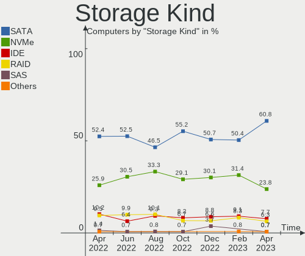

| Kind | Computers | Percent |
|------|-----------|---------|
| SATA | 80        | 52.98%  |
| NVMe | 38        | 25.17%  |
| IDE  | 16        | 10.6%   |
| RAID | 14        | 9.27%   |
| SAS  | 2         | 1.32%   |
| SCSI | 1         | 0.66%   |

Processor
---------

CPU Vendor
----------

Processor vendors

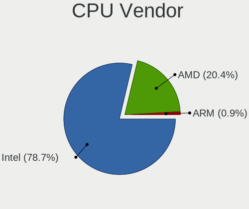

| Vendor | Computers | Percent |
|--------|-----------|---------|
| Intel  | 90        | 78.95%  |
| AMD    | 23        | 20.18%  |
| ARM    | 1         | 0.88%   |

CPU Model
---------

Processor models

| Model                                  | Computers | Percent |
|----------------------------------------|-----------|---------|
| Intel Core i7-8650U CPU @ 1.90GHz      | 3         | 2.63%   |
| Intel Core i7-4790K CPU @ 4.00GHz      | 3         | 2.63%   |
| Intel Core 2 Duo CPU P8700 @ 2.53GHz   | 3         | 2.63%   |
| AMD Ryzen 9 5950X 16-Core Processor    | 3         | 2.63%   |
| AMD Ryzen 5 5500U with Radeon Graphics | 3         | 2.63%   |
| Intel Core i7-7700HQ CPU @ 2.80GHz     | 2         | 1.75%   |
| Intel Core i5-9600K CPU @ 3.70GHz      | 2         | 1.75%   |
| Intel Core i5-2500 CPU @ 3.30GHz       | 2         | 1.75%   |
| Intel Core 2 Duo CPU E8400 @ 3.00GHz   | 2         | 1.75%   |
| Intel Celeron CPU J1900 @ 1.99GHz      | 2         | 1.75%   |
| Intel Xeon E-2276M CPU @ 2.80GHz       | 1         | 0.88%   |
| Intel Xeon CPU X5650 @ 2.67GHz         | 1         | 0.88%   |
| Intel Xeon CPU E5645 @ 2.40GHz         | 1         | 0.88%   |
| Intel Xeon CPU E5-2673 v3 @ 2.40GHz    | 1         | 0.88%   |
| Intel Xeon CPU E3-1270 V2 @ 3.50GHz    | 1         | 0.88%   |
| Intel Pentium D CPU 3.00GHz            | 1         | 0.88%   |
| Intel Pentium CPU N3700 @ 1.60GHz      | 1         | 0.88%   |
| Intel Core i7-9850H CPU @ 2.60GHz      | 1         | 0.88%   |
| Intel Core i7-9800X CPU @ 3.80GHz      | 1         | 0.88%   |
| Intel Core i7-8750H CPU @ 2.20GHz      | 1         | 0.88%   |
| Intel Core i7-8665U CPU @ 1.90GHz      | 1         | 0.88%   |
| Intel Core i7-8550U CPU @ 1.80GHz      | 1         | 0.88%   |
| Intel Core i7-7800X CPU @ 3.50GHz      | 1         | 0.88%   |
| Intel Core i7-7500U CPU @ 2.70GHz      | 1         | 0.88%   |
| Intel Core i7-6700 CPU @ 3.40GHz       | 1         | 0.88%   |
| Intel Core i7-6600U CPU @ 2.60GHz      | 1         | 0.88%   |
| Intel Core i7-4700MQ CPU @ 2.40GHz     | 1         | 0.88%   |
| Intel Core i7-3820QM CPU @ 2.70GHz     | 1         | 0.88%   |
| Intel Core i7-3770K CPU @ 3.50GHz      | 1         | 0.88%   |
| Intel Core i7-3770 CPU @ 3.40GHz       | 1         | 0.88%   |
| Intel Core i7-2600 CPU @ 3.40GHz       | 1         | 0.88%   |
| Intel Core i7-10810U CPU @ 1.10GHz     | 1         | 0.88%   |
| Intel Core i7-10750H CPU @ 2.60GHz     | 1         | 0.88%   |
| Intel Core i7-10710U CPU @ 1.10GHz     | 1         | 0.88%   |
| Intel Core i7-1065G7 CPU @ 1.30GHz     | 1         | 0.88%   |
| Intel Core i7-10510U CPU @ 1.80GHz     | 1         | 0.88%   |
| Intel Core i7 CPU Q 720 @ 1.60GHz      | 1         | 0.88%   |
| Intel Core i7 CPU M 620 @ 2.67GHz      | 1         | 0.88%   |
| Intel Core i7 CPU 920 @ 2.67GHz        | 1         | 0.88%   |
| Intel Core i5-7400 CPU @ 3.00GHz       | 1         | 0.88%   |
| Intel Core i5-7300U CPU @ 2.60GHz      | 1         | 0.88%   |
| Intel Core i5-6500 CPU @ 3.20GHz       | 1         | 0.88%   |
| Intel Core i5-6200U CPU @ 2.30GHz      | 1         | 0.88%   |
| Intel Core i5-5300U CPU @ 2.30GHz      | 1         | 0.88%   |
| Intel Core i5-5200U CPU @ 2.20GHz      | 1         | 0.88%   |
| Intel Core i5-4670 CPU @ 3.40GHz       | 1         | 0.88%   |
| Intel Core i5-4590 CPU @ 3.30GHz       | 1         | 0.88%   |
| Intel Core i5-4570 CPU @ 3.20GHz       | 1         | 0.88%   |
| Intel Core i5-4460 CPU @ 3.20GHz       | 1         | 0.88%   |
| Intel Core i5-4440 CPU @ 3.10GHz       | 1         | 0.88%   |
| Intel Core i5-4260U CPU @ 1.40GHz      | 1         | 0.88%   |
| Intel Core i5-4200U CPU @ 1.60GHz      | 1         | 0.88%   |
| Intel Core i5-3570 CPU @ 3.40GHz       | 1         | 0.88%   |
| Intel Core i5-3360M CPU @ 2.80GHz      | 1         | 0.88%   |
| Intel Core i5-3320M CPU @ 2.60GHz      | 1         | 0.88%   |
| Intel Core i5-3210M CPU @ 2.50GHz      | 1         | 0.88%   |
| Intel Core i5-2520M CPU @ 2.50GHz      | 1         | 0.88%   |
| Intel Core i5-2435M CPU @ 2.40GHz      | 1         | 0.88%   |
| Intel Core i5-2430M CPU @ 2.40GHz      | 1         | 0.88%   |
| Intel Core i5-2400S CPU @ 2.50GHz      | 1         | 0.88%   |

CPU Model Family
----------------

Processor model prefix

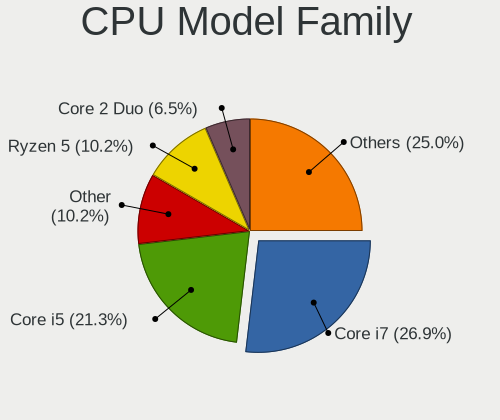

| Model                  | Computers | Percent |
|------------------------|-----------|---------|
| Intel Core i7          | 30        | 26.32%  |
| Intel Core i5          | 29        | 25.44%  |
| Intel Core 2 Duo       | 7         | 6.14%   |
| Other                  | 5         | 4.39%   |
| Intel Xeon             | 5         | 4.39%   |
| Intel Core i3          | 5         | 4.39%   |
| AMD Ryzen 9            | 5         | 4.39%   |
| AMD Ryzen 5            | 5         | 4.39%   |
| Intel Atom             | 4         | 3.51%   |
| Intel Celeron          | 3         | 2.63%   |
| AMD Ryzen 7            | 3         | 2.63%   |
| AMD Phenom II X2       | 2         | 1.75%   |
| AMD A8                 | 2         | 1.75%   |
| Intel Pentium D        | 1         | 0.88%   |
| Intel Pentium          | 1         | 0.88%   |
| Intel Core 2 Quad      | 1         | 0.88%   |
| AMD Ryzen Threadripper | 1         | 0.88%   |
| AMD Phenom II X4       | 1         | 0.88%   |
| AMD FX                 | 1         | 0.88%   |
| AMD Athlon 64 X2       | 1         | 0.88%   |
| AMD A6                 | 1         | 0.88%   |
| AMD A4                 | 1         | 0.88%   |

CPU Cores
---------

Number of processor cores

| Number | Computers | Percent |
|--------|-----------|---------|
| 4      | 43        | 37.72%  |
| 2      | 38        | 33.33%  |
| 6      | 15        | 13.16%  |
| 16     | 4         | 3.51%   |
| 12     | 4         | 3.51%   |
| 8      | 4         | 3.51%   |
| 10     | 2         | 1.75%   |
| 1      | 2         | 1.75%   |
| 24     | 1         | 0.88%   |
| 3      | 1         | 0.88%   |

CPU Sockets
-----------

Number of sockets

| Number | Computers | Percent |
|--------|-----------|---------|
| 1      | 111       | 97.37%  |
| 2      | 3         | 2.63%   |

CPU Threads
-----------

Threads per core (Hyper-Threading)

| Number | Computers | Percent |
|--------|-----------|---------|
| 2      | 78        | 68.42%  |
| 1      | 36        | 31.58%  |

CPU Op-Modes
------------

CPU Operation Modes (32-bit, 64-bit)

| Op mode        | Computers | Percent |
|----------------|-----------|---------|
| 32-bit, 64-bit | 113       | 99.12%  |
| 64-bit         | 1         | 0.88%   |

CPU Microcode
-------------

Microcode number

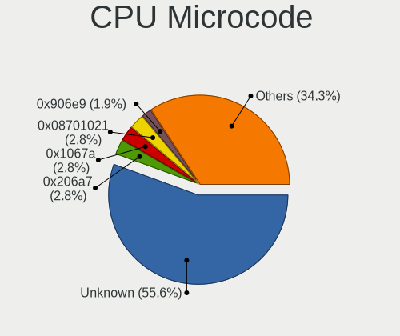

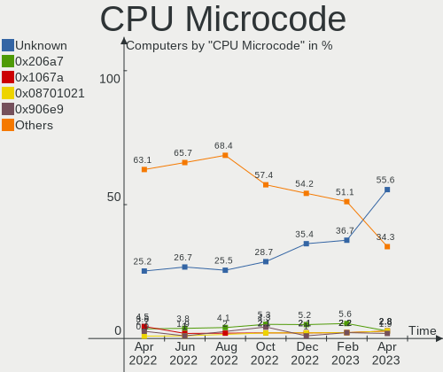

| Number     | Computers | Percent |
|------------|-----------|---------|
| Unknown    | 29        | 25.44%  |
| 0x306a9    | 8         | 7.02%   |
| 0x306c3    | 7         | 6.14%   |
| 0x1067a    | 6         | 5.26%   |
| 0x206a7    | 4         | 3.51%   |
| 0x0a201016 | 4         | 3.51%   |
| 0x906e9    | 3         | 2.63%   |
| 0xa0660    | 2         | 1.75%   |
| 0x806ec    | 2         | 1.75%   |
| 0x806ea    | 2         | 1.75%   |
| 0x806e9    | 2         | 1.75%   |
| 0x806c1    | 2         | 1.75%   |
| 0x6fb      | 2         | 1.75%   |
| 0x506e3    | 2         | 1.75%   |
| 0x50654    | 2         | 1.75%   |
| 0x406e3    | 2         | 1.75%   |
| 0x306d4    | 2         | 1.75%   |
| 0x30678    | 2         | 1.75%   |
| 0x106ca    | 2         | 1.75%   |
| 0x08608103 | 2         | 1.75%   |
| 0xf65      | 1         | 0.88%   |
| 0xa0653    | 1         | 0.88%   |
| 0xa0652    | 1         | 0.88%   |
| 0x906ed    | 1         | 0.88%   |
| 0x906ec    | 1         | 0.88%   |
| 0x906eb    | 1         | 0.88%   |
| 0x906ea    | 1         | 0.88%   |
| 0x906a4    | 1         | 0.88%   |
| 0x406c3    | 1         | 0.88%   |
| 0x306f2    | 1         | 0.88%   |
| 0x206c2    | 1         | 0.88%   |
| 0x20655    | 1         | 0.88%   |
| 0x20652    | 1         | 0.88%   |
| 0x106e5    | 1         | 0.88%   |
| 0x106a5    | 1         | 0.88%   |
| 0x0a201009 | 1         | 0.88%   |
| 0x08701021 | 1         | 0.88%   |
| 0x08701013 | 1         | 0.88%   |
| 0x0800820d | 1         | 0.88%   |
| 0x08001137 | 1         | 0.88%   |
| 0x07030105 | 1         | 0.88%   |
| 0x06006705 | 1         | 0.88%   |
| 0x06003106 | 1         | 0.88%   |
| 0x06000852 | 1         | 0.88%   |
| 0x010000c8 | 1         | 0.88%   |
| 0x010000c6 | 1         | 0.88%   |
| 0x00000000 | 1         | 0.88%   |

CPU Microarch
-------------

Microarchitecture

| Name             | Computers | Percent |
|------------------|-----------|---------|
| KabyLake         | 18        | 15.79%  |
| Haswell          | 13        | 11.4%   |
| IvyBridge        | 9         | 7.89%   |
| SandyBridge      | 8         | 7.02%   |
| Zen 3            | 6         | 5.26%   |
| Skylake          | 6         | 5.26%   |
| Penryn           | 6         | 5.26%   |
| Unknown          | 5         | 4.39%   |
| Westmere         | 4         | 3.51%   |
| CometLake        | 4         | 3.51%   |
| Bonnell          | 4         | 3.51%   |
| Silvermont       | 3         | 2.63%   |
| K10              | 3         | 2.63%   |
| Broadwell        | 3         | 2.63%   |
| Zen+             | 2         | 1.75%   |
| Zen 2            | 2         | 1.75%   |
| TigerLake        | 2         | 1.75%   |
| Piledriver       | 2         | 1.75%   |
| Nehalem          | 2         | 1.75%   |
| IceLake          | 2         | 1.75%   |
| Core             | 2         | 1.75%   |
| Zen              | 1         | 0.88%   |
| Steamroller      | 1         | 0.88%   |
| Puma             | 1         | 0.88%   |
| NetBurst         | 1         | 0.88%   |
| K8 Hammer        | 1         | 0.88%   |
| Goldmont         | 1         | 0.88%   |
| Excavator        | 1         | 0.88%   |
| Alderlake Hybrid | 1         | 0.88%   |

Graphics
--------

GPU Vendor
----------

Vendors of graphics cards

| Vendor                           | Computers | Percent |
|----------------------------------|-----------|---------|
| Intel                            | 64        | 48.85%  |
| Nvidia                           | 39        | 29.77%  |
| AMD                              | 26        | 19.85%  |
| Silicon Integrated Systems [SiS] | 1         | 0.76%   |
| Matrox Electronics Systems       | 1         | 0.76%   |

GPU Model
---------

Graphics card models

| Model                                                                       | Computers | Percent |
|-----------------------------------------------------------------------------|-----------|---------|
| Intel Xeon E3-1200 v3/4th Gen Core Processor Integrated Graphics Controller | 8         | 5.88%   |
| Intel 2nd Generation Core Processor Family Integrated Graphics Controller   | 6         | 4.41%   |
| Nvidia GK208B [GeForce GT 710]                                              | 4         | 2.94%   |
| Intel UHD Graphics 620                                                      | 4         | 2.94%   |
| Intel HD Graphics 630                                                       | 4         | 2.94%   |
| Intel 3rd Gen Core processor Graphics Controller                            | 4         | 2.94%   |
| Intel HD Graphics 5500                                                      | 3         | 2.21%   |
| Intel CoffeeLake-H GT2 [UHD Graphics 630]                                   | 3         | 2.21%   |
| AMD Lucienne                                                                | 3         | 2.21%   |
| Nvidia TU116 [GeForce GTX 1660 SUPER]                                       | 2         | 1.47%   |
| Nvidia GP108 [GeForce GT 1030]                                              | 2         | 1.47%   |
| Nvidia GP107M [GeForce GTX 1050 Mobile]                                     | 2         | 1.47%   |
| Nvidia GK104 [GeForce GTX 670]                                              | 2         | 1.47%   |
| Intel TigerLake-LP GT2 [Iris Xe Graphics]                                   | 2         | 1.47%   |
| Intel Skylake GT2 [HD Graphics 520]                                         | 2         | 1.47%   |
| Intel Mobile 4 Series Chipset Integrated Graphics Controller                | 2         | 1.47%   |
| Intel HD Graphics 620                                                       | 2         | 1.47%   |
| Intel Haswell-ULT Integrated Graphics Controller                            | 2         | 1.47%   |
| Intel Comet Lake UHD Graphics                                               | 2         | 1.47%   |
| Intel Atom Processor Z36xxx/Z37xxx Series Graphics & Display                | 2         | 1.47%   |
| Intel Atom Processor D4xx/D5xx/N4xx/N5xx Integrated Graphics Controller     | 2         | 1.47%   |
| AMD Navi 21 [Radeon RX 6800/6800 XT / 6900 XT]                              | 2         | 1.47%   |
| AMD Ellesmere [Radeon RX 470/480/570/570X/580/580X/590]                     | 2         | 1.47%   |
| Silicon Integrated Systems [SiS] 771/671 PCIE VGA Display Adapter           | 1         | 0.74%   |
| Nvidia TU117GLM [Quadro T2000 Mobile / Max-Q]                               | 1         | 0.74%   |
| Nvidia TU116 [GeForce GTX 1660 Ti]                                          | 1         | 0.74%   |
| Nvidia TU106M [GeForce RTX 2070 Mobile / Max-Q Refresh]                     | 1         | 0.74%   |
| Nvidia TU106 [GeForce RTX 2060 SUPER]                                       | 1         | 0.74%   |
| Nvidia TU106 [GeForce RTX 2060 Rev. A]                                      | 1         | 0.74%   |
| Nvidia TU104 [GeForce RTX 2080]                                             | 1         | 0.74%   |
| Nvidia GT218M [NVS 3100M]                                                   | 1         | 0.74%   |
| Nvidia GT218M [NVS 2100M]                                                   | 1         | 0.74%   |
| Nvidia GP107M [GeForce GTX 1050 Ti Mobile]                                  | 1         | 0.74%   |
| Nvidia GP107GL [Quadro P600]                                                | 1         | 0.74%   |
| Nvidia GP106M [GeForce GTX 1060 Mobile]                                     | 1         | 0.74%   |
| Nvidia GP104 [GeForce GTX 1080]                                             | 1         | 0.74%   |
| Nvidia GP104 [GeForce GTX 1070]                                             | 1         | 0.74%   |
| Nvidia GM206 [GeForce GTX 960]                                              | 1         | 0.74%   |
| Nvidia GM204 [GeForce GTX 970]                                              | 1         | 0.74%   |
| Nvidia GM108M [GeForce 930MX]                                               | 1         | 0.74%   |
| Nvidia GM107M [GeForce GTX 950M]                                            | 1         | 0.74%   |
| Nvidia GK208M [GeForce GT 740M]                                             | 1         | 0.74%   |
| Nvidia GK106 [GeForce GTX 660]                                              | 1         | 0.74%   |
| Nvidia GF119 [GeForce GT 520]                                               | 1         | 0.74%   |
| Nvidia GF117M [GeForce 610M/710M/810M/820M / GT 620M/625M/630M/720M]        | 1         | 0.74%   |
| Nvidia GF108M [GeForce GT 520M]                                             | 1         | 0.74%   |
| Nvidia GF108GLM [NVS 5200M]                                                 | 1         | 0.74%   |
| Nvidia GF108 [GeForce GT 730]                                               | 1         | 0.74%   |
| Nvidia GA104 [GeForce RTX 3060 Ti]                                          | 1         | 0.74%   |
| Nvidia GA102 [GeForce RTX 3090]                                             | 1         | 0.74%   |
| Nvidia G72 [GeForce 7300 GS]                                                | 1         | 0.74%   |
| Nvidia C79 [GeForce 9400M]                                                  | 1         | 0.74%   |
| Matrox Electronics Systems MGA G200e [Pilot] ServerEngines (SEP1)           | 1         | 0.74%   |
| Intel WhiskeyLake-U GT2 [UHD Graphics 620]                                  | 1         | 0.74%   |
| Intel VGA compatible controller                                             | 1         | 0.74%   |
| Intel Iris Plus Graphics G7                                                 | 1         | 0.74%   |
| Intel Iris Plus Graphics G4 (Ice Lake)                                      | 1         | 0.74%   |
| Intel HD Graphics 530                                                       | 1         | 0.74%   |
| Intel HD Graphics 500                                                       | 1         | 0.74%   |
| Intel Core Processor Integrated Graphics Controller                         | 1         | 0.74%   |

GPU Combo
---------

Combinations of graphics cards

| Name            | Computers | Percent |
|-----------------|-----------|---------|
| 1 x Intel       | 46        | 40.35%  |
| 1 x Nvidia      | 24        | 21.05%  |
| 1 x AMD         | 21        | 18.42%  |
| Intel + Nvidia  | 14        | 12.28%  |
| 2 x AMD         | 3         | 2.63%   |
| Other           | 1         | 0.88%   |
| 2 x Nvidia      | 1         | 0.88%   |
| 1 x SiS         | 1         | 0.88%   |
| 1 x Matrox      | 1         | 0.88%   |
| Intel + 2 x AMD | 1         | 0.88%   |
| Intel + AMD     | 1         | 0.88%   |

GPU Driver
----------

Free vs proprietary

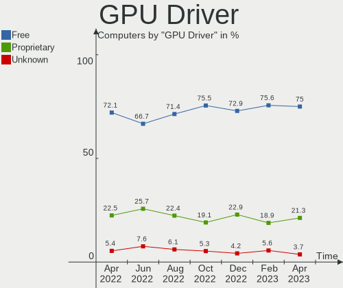

| Driver      | Computers | Percent |
|-------------|-----------|---------|
| Free        | 82        | 71.93%  |
| Proprietary | 25        | 21.93%  |
| Unknown     | 7         | 6.14%   |

GPU Memory
----------

Total video memory

| Size in GB | Computers | Percent |
|------------|-----------|---------|
| Unknown    | 65        | 57.02%  |
| 1.01-2.0   | 14        | 12.28%  |
| 0.01-0.5   | 11        | 9.65%   |
| 7.01-8.0   | 7         | 6.14%   |
| 0.51-1.0   | 7         | 6.14%   |
| 3.01-4.0   | 5         | 4.39%   |
| 5.01-6.0   | 2         | 1.75%   |
| 8.01-16.0  | 2         | 1.75%   |
| 16.01-24.0 | 1         | 0.88%   |

Monitor
-------

Monitor Vendor
--------------

Monitor vendors

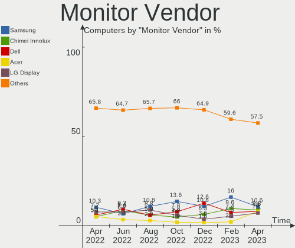

| Vendor                  | Computers | Percent |
|-------------------------|-----------|---------|
| AU Optronics            | 14        | 11.76%  |
| Samsung Electronics     | 13        | 10.92%  |
| LG Display              | 9         | 7.56%   |
| Dell                    | 8         | 6.72%   |
| BOE                     | 7         | 5.88%   |
| Chimei Innolux          | 6         | 5.04%   |
| AOC                     | 6         | 5.04%   |
| Acer                    | 6         | 5.04%   |
| Philips                 | 5         | 4.2%    |
| BenQ                    | 5         | 4.2%    |
| ViewSonic               | 4         | 3.36%   |
| Lenovo                  | 4         | 3.36%   |
| Hewlett-Packard         | 4         | 3.36%   |
| ASUSTek Computer        | 4         | 3.36%   |
| Apple                   | 4         | 3.36%   |
| Sharp                   | 2         | 1.68%   |
| Panasonic               | 2         | 1.68%   |
| Kogan                   | 2         | 1.68%   |
| Goldstar                | 2         | 1.68%   |
| Unknown                 | 1         | 0.84%   |
| Sony                    | 1         | 0.84%   |
| SAC                     | 1         | 0.84%   |
| PANDA                   | 1         | 0.84%   |
| LG Electronics          | 1         | 0.84%   |
| GKK                     | 1         | 0.84%   |
| Gateway                 | 1         | 0.84%   |
| Eizo                    | 1         | 0.84%   |
| CPT                     | 1         | 0.84%   |
| CHO                     | 1         | 0.84%   |
| Chi Mei Optoelectronics | 1         | 0.84%   |
| Ancor Communications    | 1         | 0.84%   |

Monitor Model
-------------

Monitor models

| Model                                                                 | Computers | Percent |
|-----------------------------------------------------------------------|-----------|---------|
| Philips 190S PHL082F 1280x1024 380x300mm 19.1-inch                    | 2         | 1.6%    |
| Lenovo LEN L1711pC LEN13B7 1280x1024 338x270mm 17.0-inch              | 2         | 1.6%    |
| Chimei Innolux LCD Monitor CMN1406 1920x1080 309x173mm 13.9-inch      | 2         | 1.6%    |
| AOC 2490W1 AOC2490 1920x1080 527x296mm 23.8-inch                      | 2         | 1.6%    |
| ViewSonic VA2719-2K VSC6B34 2560x1440 597x336mm 27.0-inch             | 1         | 0.8%    |
| ViewSonic VA2465 SERIES VSCB731 1920x1080 521x293mm 23.5-inch         | 1         | 0.8%    |
| ViewSonic VA2226w-3 VSC2051 1680x1050 490x290mm 22.4-inch             | 1         | 0.8%    |
| ViewSonic LCD Monitor VSCC132 1920x1080 600x340mm 27.2-inch           | 1         | 0.8%    |
| Unknown LCD Monitor SAMSUNG 1920x1080                                 | 1         | 0.8%    |
| Sony TV SNY2C02 1920x1080 1018x573mm 46.0-inch                        | 1         | 0.8%    |
| Sharp LCD Monitor SHP14E0 1920x1280 259x173mm 12.3-inch               | 1         | 0.8%    |
| Sharp LCD Monitor SHP14BA 1920x1080 344x194mm 15.5-inch               | 1         | 0.8%    |
| Samsung Electronics U28E590 SAM0C4C 3840x2160 608x345mm 27.5-inch     | 1         | 0.8%    |
| Samsung Electronics SyncMaster SAM7027 1920x1080 1074x604mm 48.5-inch | 1         | 0.8%    |
| Samsung Electronics SyncMaster SAM01D3 1440x900 408x225mm 18.3-inch   | 1         | 0.8%    |
| Samsung Electronics SMS27A850 SAM083C 2560x1440 520x320mm 24.0-inch   | 1         | 0.8%    |
| Samsung Electronics S32F351 SAM0D24 1920x1080 698x393mm 31.5-inch     | 1         | 0.8%    |
| Samsung Electronics S27H85x SAM0E0F 2560x1440 597x336mm 27.0-inch     | 1         | 0.8%    |
| Samsung Electronics S27H85x SAM0E0E 2560x1440 597x336mm 27.0-inch     | 1         | 0.8%    |
| Samsung Electronics LCD Monitor SEC5448 1920x1080 410x230mm 18.5-inch | 1         | 0.8%    |
| Samsung Electronics LCD Monitor SDC4150 3456x2160 336x210mm 15.6-inch | 1         | 0.8%    |
| Samsung Electronics LCD Monitor SDC4147 1366x768 344x194mm 15.5-inch  | 1         | 0.8%    |
| Samsung Electronics LCD Monitor SDC4142 3840x2160 294x165mm 13.3-inch | 1         | 0.8%    |
| Samsung Electronics LCD Monitor SAM7016 3840x2160 950x540mm 43.0-inch | 1         | 0.8%    |
| Samsung Electronics LC34G55T SAM711A 3440x1440 798x334mm 34.1-inch    | 1         | 0.8%    |
| Samsung Electronics C49HG9x SAM0E5E 3840x1080 1200x340mm 49.1-inch    | 1         | 0.8%    |
| SAC LED MONITOR SAC952D 1920x1080 443x249mm 20.0-inch                 | 1         | 0.8%    |
| Philips PHL BDM3270 PHL08E7 2560x1440 708x398mm 32.0-inch             | 1         | 0.8%    |
| Philips PHL 271V8 PHLC213 1920x1080 598x336mm 27.0-inch               | 1         | 0.8%    |
| Philips LCD Monitor PHL 328P6VU 3840x2160                             | 1         | 0.8%    |
| PANDA LM116LF3L02 NCP000A 1920x1080 256x144mm 11.6-inch               | 1         | 0.8%    |
| Panasonic TV MEIA096 1920x1080 698x392mm 31.5-inch                    | 1         | 0.8%    |
| Panasonic LCD Monitor MEI96A2 2880x1620 344x193mm 15.5-inch           | 1         | 0.8%    |
| LG Electronics LCD Monitor E2711                                      | 1         | 0.8%    |
| LG Display LCD Monitor LGD070B 1920x1080 309x174mm 14.0-inch          | 1         | 0.8%    |
| LG Display LCD Monitor LGD056D 1920x1080 382x215mm 17.3-inch          | 1         | 0.8%    |
| LG Display LCD Monitor LGD0555 1536x1024 263x175mm 12.4-inch          | 1         | 0.8%    |
| LG Display LCD Monitor LGD054C 1920x1080 276x156mm 12.5-inch          | 1         | 0.8%    |
| LG Display LCD Monitor LGD0538 1920x1080 344x194mm 15.5-inch          | 1         | 0.8%    |
| LG Display LCD Monitor LGD04D4 3840x2160 344x194mm 15.5-inch          | 1         | 0.8%    |
| LG Display LCD Monitor LGD0456 1366x768 344x194mm 15.5-inch           | 1         | 0.8%    |
| LG Display LCD Monitor LGD032C 1920x1080 344x194mm 15.5-inch          | 1         | 0.8%    |
| LG Display LCD Monitor LGD02D8 1366x768 277x156mm 12.5-inch           | 1         | 0.8%    |
| Lenovo LEN-C5130-B LEN5105 1920x1080 477x268mm 21.5-inch              | 1         | 0.8%    |
| Lenovo LCD Monitor LEN4036 1440x900 303x190mm 14.1-inch               | 1         | 0.8%    |
| Kogan KAMN27RQ1LA KGN0ABC 2560x1440 597x336mm 27.0-inch               | 1         | 0.8%    |
| Kogan KAMN27QFSA KGN0A8C 2560x1440 597x336mm 27.0-inch                | 1         | 0.8%    |
| Hewlett-Packard vs19 HWP264C 1280x1024 340x270mm 17.1-inch            | 1         | 0.8%    |
| Hewlett-Packard LCD Monitor vs19 3200x1080                            | 1         | 0.8%    |
| Hewlett-Packard LA2306 HWP2949 1920x1080 509x286mm 23.0-inch          | 1         | 0.8%    |
| Hewlett-Packard LA2205 HWP2848 1680x1050 473x296mm 22.0-inch          | 1         | 0.8%    |
| Hewlett-Packard 25x HPN357F 1920x1080 544x303mm 24.5-inch             | 1         | 0.8%    |
| Goldstar W2242 GSM4B6F 1680x1050 474x296mm 22.0-inch                  | 1         | 0.8%    |
| Goldstar LG FULL HD GSM5BDF 1920x1080 480x270mm 21.7-inch             | 1         | 0.8%    |
| GKK MONITOR GKK3535 1920x1080 886x498mm 40.0-inch                     | 1         | 0.8%    |
| Gateway FHX2300 GWY00BF 1920x1080 509x286mm 23.0-inch                 | 1         | 0.8%    |
| Eizo EV2450 ENC2531 1920x1080 528x297mm 23.9-inch                     | 1         | 0.8%    |
| Dell U3011 DEL4063 2560x1600 641x401mm 29.8-inch                      | 1         | 0.8%    |
| Dell U2720Q DEL41B3 3840x2160 600x340mm 27.2-inch                     | 1         | 0.8%    |
| Dell U2717D DEL40EA 2560x1440 597x336mm 27.0-inch                     | 1         | 0.8%    |

Monitor Resolution
------------------

Monitor screen resolution

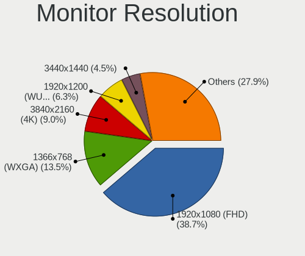

| Resolution         | Computers | Percent |
|--------------------|-----------|---------|
| 1920x1080 (FHD)    | 53        | 44.54%  |
| 3840x2160 (4K)     | 12        | 10.08%  |
| 2560x1440 (QHD)    | 12        | 10.08%  |
| 1366x768 (WXGA)    | 10        | 8.4%    |
| 1280x1024 (SXGA)   | 8         | 6.72%   |
| 1680x1050 (WSXGA+) | 4         | 3.36%   |
| 1280x800 (WXGA)    | 4         | 3.36%   |
| 1440x900 (WXGA+)   | 3         | 2.52%   |
| 1600x900 (HD+)     | 2         | 1.68%   |
| Unknown            | 2         | 1.68%   |
| 3840x1080          | 1         | 0.84%   |
| 3600x1080          | 1         | 0.84%   |
| 3456x2160          | 1         | 0.84%   |
| 3440x1440          | 1         | 0.84%   |
| 3200x1080          | 1         | 0.84%   |
| 2736x1824          | 1         | 0.84%   |
| 2560x1600          | 1         | 0.84%   |
| 1920x1280          | 1         | 0.84%   |
| 1920x1200 (WUXGA)  | 1         | 0.84%   |

Monitor Diagonal
----------------

Diagonal size in inches

| Inches  | Computers | Percent |
|---------|-----------|---------|
| 15      | 21        | 17.5%   |
| 27      | 13        | 10.83%  |
| 23      | 11        | 9.17%   |
| 13      | 10        | 8.33%   |
| 24      | 7         | 5.83%   |
| 19      | 7         | 5.83%   |
| 14      | 6         | 5%      |
| 12      | 6         | 5%      |
| Unknown | 6         | 5%      |
| 21      | 5         | 4.17%   |
| 31      | 4         | 3.33%   |
| 22      | 4         | 3.33%   |
| 18      | 3         | 2.5%    |
| 17      | 3         | 2.5%    |
| 32      | 2         | 1.67%   |
| 11      | 2         | 1.67%   |
| 84      | 1         | 0.83%   |
| 55      | 1         | 0.83%   |
| 49      | 1         | 0.83%   |
| 48      | 1         | 0.83%   |
| 42      | 1         | 0.83%   |
| 40      | 1         | 0.83%   |
| 34      | 1         | 0.83%   |
| 29      | 1         | 0.83%   |
| 26      | 1         | 0.83%   |
| 10      | 1         | 0.83%   |

Monitor Width
-------------

Physical width

| Width in mm | Computers | Percent |
|-------------|-----------|---------|
| 501-600     | 31        | 25.83%  |
| 301-350     | 31        | 25.83%  |
| 201-300     | 15        | 12.5%   |
| 401-500     | 11        | 9.17%   |
| 351-400     | 11        | 9.17%   |
| 601-700     | 6         | 5%      |
| Unknown     | 6         | 5%      |
| 701-800     | 3         | 2.5%    |
| 1001-1500   | 3         | 2.5%    |
| 801-900     | 1         | 0.83%   |
| 1501-2000   | 1         | 0.83%   |
| 901-1000    | 1         | 0.83%   |

Aspect Ratio
------------

Proportional relationship between the width and the height

| Ratio   | Computers | Percent |
|---------|-----------|---------|
| 16/9    | 78        | 70.27%  |
| 16/10   | 15        | 13.51%  |
| 5/4     | 6         | 5.41%   |
| Unknown | 6         | 5.41%   |
| 6/5     | 2         | 1.8%    |
| 3/2     | 2         | 1.8%    |
| 32/9    | 1         | 0.9%    |
| 21/9    | 1         | 0.9%    |

Monitor Area
------------

Area in inch

| Area in inch | Computers | Percent |
|----------------|-----------|---------|
| 201-250        | 23        | 19.49%  |
| 101-110        | 21        | 17.8%   |
| 301-350        | 14        | 11.86%  |
| 81-90          | 11        | 9.32%   |
| 151-200        | 9         | 7.63%   |
| 351-500        | 8         | 6.78%   |
| 71-80          | 6         | 5.08%   |
| Unknown        | 6         | 5.08%   |
| 61-70          | 5         | 4.24%   |
| More than 1000 | 3         | 2.54%   |
| 121-130        | 3         | 2.54%   |
| 501-1000       | 3         | 2.54%   |
| 51-60          | 2         | 1.69%   |
| 251-300        | 2         | 1.69%   |
| 41-50          | 1         | 0.85%   |
| 141-150        | 1         | 0.85%   |

Pixel Density
-------------

Pixels per inch

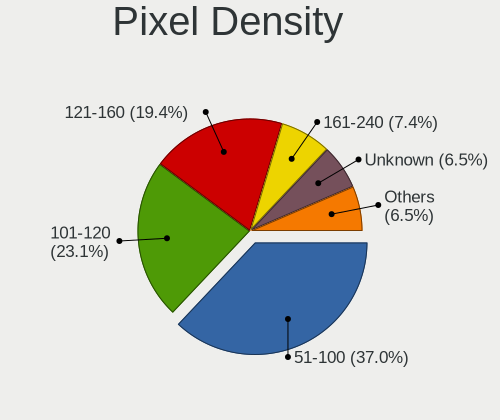

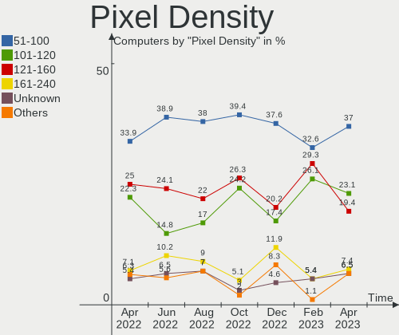

| Density       | Computers | Percent |
|---------------|-----------|---------|
| 51-100        | 39        | 34.21%  |
| 121-160       | 28        | 24.56%  |
| 101-120       | 25        | 21.93%  |
| 161-240       | 8         | 7.02%   |
| Unknown       | 6         | 5.26%   |
| More than 240 | 5         | 4.39%   |
| 1-50          | 3         | 2.63%   |

Multiple Monitors
-----------------

Total monitors connected

| Total | Computers | Percent |
|-------|-----------|---------|
| 1     | 91        | 79.82%  |
| 2     | 13        | 11.4%   |
| 0     | 7         | 6.14%   |
| 3     | 3         | 2.63%   |

Network
-------

Net Controller Vendor
---------------------

Controller vendors

| Vendor                   | Computers | Percent |
|--------------------------|-----------|---------|
| Intel                    | 67        | 38.29%  |
| Realtek Semiconductor    | 52        | 29.71%  |
| Broadcom                 | 15        | 8.57%   |
| Qualcomm Atheros         | 12        | 6.86%   |
| Marvell Technology Group | 3         | 1.71%   |
| Aquantia                 | 3         | 1.71%   |
| Samsung Electronics      | 2         | 1.14%   |
| Ralink Technology        | 2         | 1.14%   |
| Ralink                   | 2         | 1.14%   |
| Lenovo                   | 2         | 1.14%   |
| Dell                     | 2         | 1.14%   |
| ASUSTek Computer         | 2         | 1.14%   |
| TP-Link                  | 1         | 0.57%   |
| Texas Instruments        | 1         | 0.57%   |
| Sierra Wireless          | 1         | 0.57%   |
| Nvidia                   | 1         | 0.57%   |
| Microsoft                | 1         | 0.57%   |
| Google                   | 1         | 0.57%   |
| Edimax Technology        | 1         | 0.57%   |
| DisplayLink              | 1         | 0.57%   |
| D-Link System            | 1         | 0.57%   |
| Broadcom Limited         | 1         | 0.57%   |
| ASIX Electronics         | 1         | 0.57%   |

Net Controller Model
--------------------

Controller models

| Model                                                             | Computers | Percent |
|-------------------------------------------------------------------|-----------|---------|
| Realtek RTL8111/8168/8411 PCI Express Gigabit Ethernet Controller | 36        | 17.56%  |
| Intel Wi-Fi 6 AX200                                               | 7         | 3.41%   |
| Intel I211 Gigabit Network Connection                             | 6         | 2.93%   |
| Intel 82579LM Gigabit Network Connection (Lewisville)             | 6         | 2.93%   |
| Intel Wireless 8265 / 8275                                        | 5         | 2.44%   |
| Realtek RTL8822CE 802.11ac PCIe Wireless Network Adapter          | 4         | 1.95%   |
| Realtek RTL8125 2.5GbE Controller                                 | 4         | 1.95%   |
| Intel Wireless 3165                                               | 4         | 1.95%   |
| Realtek RTL8153 Gigabit Ethernet Adapter                          | 3         | 1.46%   |
| Realtek RTL810xE PCI Express Fast Ethernet controller             | 3         | 1.46%   |
| Qualcomm Atheros AR93xx Wireless Network Adapter                  | 3         | 1.46%   |
| Qualcomm Atheros AR8151 v2.0 Gigabit Ethernet                     | 3         | 1.46%   |
| Intel Centrino Advanced-N 6205 [Taylor Peak]                      | 3         | 1.46%   |
| Intel Cannon Lake PCH CNVi WiFi                                   | 3         | 1.46%   |
| Intel 82575EB Gigabit Network Connection                          | 3         | 1.46%   |
| Broadcom NetXtreme BCM57765 Gigabit Ethernet PCIe                 | 3         | 1.46%   |
| Samsung Galaxy series, misc. (tethering mode)                     | 2         | 0.98%   |
| Realtek RTL8821AE 802.11ac PCIe Wireless Network Adapter          | 2         | 0.98%   |
| Intel Wireless-AC 9260                                            | 2         | 0.98%   |
| Intel PRO/Wireless 5100 AGN [Shiloh] Network Connection           | 2         | 0.98%   |
| Intel Ice Lake-LP PCH CNVi WiFi                                   | 2         | 0.98%   |
| Intel Ethernet Connection I217-LM                                 | 2         | 0.98%   |
| Intel Ethernet Connection (7) I219-V                              | 2         | 0.98%   |
| Intel Ethernet Connection (4) I219-LM                             | 2         | 0.98%   |
| Intel Ethernet Connection (2) I219-V                              | 2         | 0.98%   |
| Intel Ethernet Connection (2) I219-LM                             | 2         | 0.98%   |
| Intel Comet Lake PCH-LP CNVi WiFi                                 | 2         | 0.98%   |
| Intel Centrino Advanced-N 6200                                    | 2         | 0.98%   |
| Intel 82577LM Gigabit Network Connection                          | 2         | 0.98%   |
| Intel 82541PI Gigabit Ethernet Controller                         | 2         | 0.98%   |
| Broadcom BCM4360 802.11ac Wireless Network Adapter                | 2         | 0.98%   |
| Broadcom BCM4331 802.11a/b/g/n                                    | 2         | 0.98%   |
| ASUS 802.11ac NIC                                                 | 2         | 0.98%   |
| TP-Link TL-WN821N Version 5 RTL8192EU                             | 1         | 0.49%   |
| Texas Instruments CC1352R1 Launchpad                              | 1         | 0.49%   |
| Sierra Wireless EM7430 Qualcomm Snapdragon X7 LTE-A               | 1         | 0.49%   |
| Realtek RTL8192EE PCIe Wireless Network Adapter                   | 1         | 0.49%   |
| Realtek RTL8188EUS 802.11n Wireless Network Adapter               | 1         | 0.49%   |
| Realtek RTL8131 PCIe Fast Ethernet Adapter                        | 1         | 0.49%   |
| Realtek RTL-8100/8101L/8139 PCI Fast Ethernet Adapter             | 1         | 0.49%   |
| Ralink RT5370 Wireless Adapter                                    | 1         | 0.49%   |
| Ralink RT2870/RT3070 Wireless Adapter                             | 1         | 0.49%   |
| Ralink RT3090 Wireless 802.11n 1T/1R PCIe                         | 1         | 0.49%   |
| Ralink RT2800 802.11n PCI                                         | 1         | 0.49%   |
| Qualcomm Atheros QCA9565 / AR9565 Wireless Network Adapter        | 1         | 0.49%   |
| Qualcomm Atheros QCA9377 802.11ac Wireless Network Adapter        | 1         | 0.49%   |
| Qualcomm Atheros QCA6174 802.11ac Wireless Network Adapter        | 1         | 0.49%   |
| Qualcomm Atheros Killer E2500 Gigabit Ethernet Controller         | 1         | 0.49%   |
| Qualcomm Atheros Killer E220x Gigabit Ethernet Controller         | 1         | 0.49%   |
| Qualcomm Atheros AR8161 Gigabit Ethernet                          | 1         | 0.49%   |
| Qualcomm Atheros AR5212/5213/2414 Wireless Network Adapter        | 1         | 0.49%   |
| Nvidia MCP79 Ethernet                                             | 1         | 0.49%   |
| Microsoft XBOX ACC                                                | 1         | 0.49%   |
| Marvell Group 88W8897 [AVASTAR] 802.11ac Wireless                 | 1         | 0.49%   |
| Marvell Group 88E8072 PCI-E Gigabit Ethernet Controller           | 1         | 0.49%   |
| Marvell Group 88E8053 PCI-E Gigabit Ethernet Controller           | 1         | 0.49%   |
| Marvell Group 88E8001 Gigabit Ethernet Controller                 | 1         | 0.49%   |
| Lenovo USB-C Dock Ethernet                                        | 1         | 0.49%   |
| Lenovo Powered Hub                                                | 1         | 0.49%   |
| Intel Wireless 8260                                               | 1         | 0.49%   |

Wireless Vendor
---------------

Wireless vendors

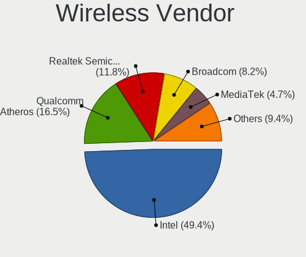

| Vendor                   | Computers | Percent |
|--------------------------|-----------|---------|
| Intel                    | 44        | 55.7%   |
| Realtek Semiconductor    | 8         | 10.13%  |
| Broadcom                 | 8         | 10.13%  |
| Qualcomm Atheros         | 7         | 8.86%   |
| Ralink Technology        | 2         | 2.53%   |
| Ralink                   | 2         | 2.53%   |
| ASUSTek Computer         | 2         | 2.53%   |
| TP-Link                  | 1         | 1.27%   |
| Sierra Wireless          | 1         | 1.27%   |
| Microsoft                | 1         | 1.27%   |
| Marvell Technology Group | 1         | 1.27%   |
| Edimax Technology        | 1         | 1.27%   |
| Broadcom Limited         | 1         | 1.27%   |

Wireless Model
--------------

Wireless models

| Model                                                      | Computers | Percent |
|------------------------------------------------------------|-----------|---------|
| Intel Wi-Fi 6 AX200                                        | 7         | 8.86%   |
| Intel Wireless 8265 / 8275                                 | 5         | 6.33%   |
| Realtek RTL8822CE 802.11ac PCIe Wireless Network Adapter   | 4         | 5.06%   |
| Intel Wireless 3165                                        | 4         | 5.06%   |
| Qualcomm Atheros AR93xx Wireless Network Adapter           | 3         | 3.8%    |
| Intel Centrino Advanced-N 6205 [Taylor Peak]               | 3         | 3.8%    |
| Intel Cannon Lake PCH CNVi WiFi                            | 3         | 3.8%    |
| Realtek RTL8821AE 802.11ac PCIe Wireless Network Adapter   | 2         | 2.53%   |
| Intel Wireless-AC 9260                                     | 2         | 2.53%   |
| Intel PRO/Wireless 5100 AGN [Shiloh] Network Connection    | 2         | 2.53%   |
| Intel Ice Lake-LP PCH CNVi WiFi                            | 2         | 2.53%   |
| Intel Comet Lake PCH-LP CNVi WiFi                          | 2         | 2.53%   |
| Intel Centrino Advanced-N 6200                             | 2         | 2.53%   |
| Broadcom BCM4360 802.11ac Wireless Network Adapter         | 2         | 2.53%   |
| Broadcom BCM4331 802.11a/b/g/n                             | 2         | 2.53%   |
| ASUS 802.11ac NIC                                          | 2         | 2.53%   |
| TP-Link TL-WN821N Version 5 RTL8192EU                      | 1         | 1.27%   |
| Sierra Wireless EM7430 Qualcomm Snapdragon X7 LTE-A        | 1         | 1.27%   |
| Realtek RTL8192EE PCIe Wireless Network Adapter            | 1         | 1.27%   |
| Realtek RTL8188EUS 802.11n Wireless Network Adapter        | 1         | 1.27%   |
| Ralink RT5370 Wireless Adapter                             | 1         | 1.27%   |
| Ralink RT2870/RT3070 Wireless Adapter                      | 1         | 1.27%   |
| Ralink RT3090 Wireless 802.11n 1T/1R PCIe                  | 1         | 1.27%   |
| Ralink RT2800 802.11n PCI                                  | 1         | 1.27%   |
| Qualcomm Atheros QCA9565 / AR9565 Wireless Network Adapter | 1         | 1.27%   |
| Qualcomm Atheros QCA9377 802.11ac Wireless Network Adapter | 1         | 1.27%   |
| Qualcomm Atheros QCA6174 802.11ac Wireless Network Adapter | 1         | 1.27%   |
| Qualcomm Atheros AR5212/5213/2414 Wireless Network Adapter | 1         | 1.27%   |
| Microsoft XBOX ACC                                         | 1         | 1.27%   |
| Marvell Group 88W8897 [AVASTAR] 802.11ac Wireless          | 1         | 1.27%   |
| Intel Wireless 8260                                        | 1         | 1.27%   |
| Intel Wireless 7265                                        | 1         | 1.27%   |
| Intel Wireless 7260                                        | 1         | 1.27%   |
| Intel WiFi Link 5100                                       | 1         | 1.27%   |
| Intel Wi-Fi 6 AX201                                        | 1         | 1.27%   |
| Intel Ultimate N WiFi Link 5300                            | 1         | 1.27%   |
| Intel Dual Band Wireless-AC 3168NGW [Stone Peak]           | 1         | 1.27%   |
| Intel Comet Lake PCH CNVi WiFi                             | 1         | 1.27%   |
| Intel Centrino Wireless-N 2230                             | 1         | 1.27%   |
| Intel Centrino Ultimate-N 6300                             | 1         | 1.27%   |
| Intel Cannon Point-LP CNVi [Wireless-AC]                   | 1         | 1.27%   |
| Intel Alder Lake-P PCH CNVi WiFi                           | 1         | 1.27%   |
| Edimax AC600 USB                                           | 1         | 1.27%   |
| Broadcom Limited BCM4312 802.11b/g LP-PHY                  | 1         | 1.27%   |
| Broadcom BCM43228 802.11a/b/g/n                            | 1         | 1.27%   |
| Broadcom BCM43227 802.11b/g/n                              | 1         | 1.27%   |
| Broadcom BCM4322 802.11a/b/g/n Wireless LAN Controller     | 1         | 1.27%   |
| Broadcom BCM43142 802.11b/g/n                              | 1         | 1.27%   |

Ethernet Vendor
---------------

Ethernet vendors

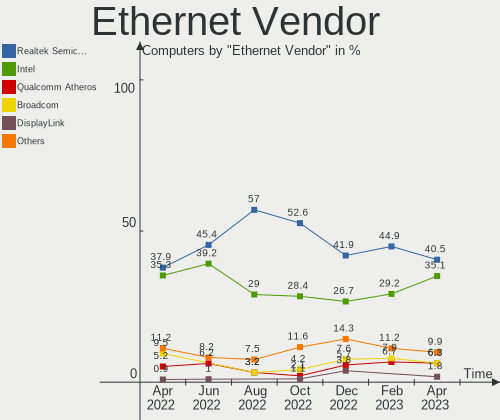

| Vendor                   | Computers | Percent |
|--------------------------|-----------|---------|
| Realtek Semiconductor    | 47        | 39.17%  |
| Intel                    | 42        | 35%     |
| Broadcom                 | 11        | 9.17%   |
| Qualcomm Atheros         | 6         | 5%      |
| Aquantia                 | 3         | 2.5%    |
| Samsung Electronics      | 2         | 1.67%   |
| Marvell Technology Group | 2         | 1.67%   |
| Lenovo                   | 2         | 1.67%   |
| Nvidia                   | 1         | 0.83%   |
| Google                   | 1         | 0.83%   |
| DisplayLink              | 1         | 0.83%   |
| D-Link System            | 1         | 0.83%   |
| ASIX Electronics         | 1         | 0.83%   |

Ethernet Model
--------------

Ethernet models

| Model                                                               | Computers | Percent |
|---------------------------------------------------------------------|-----------|---------|
| Realtek RTL8111/8168/8411 PCI Express Gigabit Ethernet Controller   | 36        | 29.27%  |
| Intel I211 Gigabit Network Connection                               | 6         | 4.88%   |
| Intel 82579LM Gigabit Network Connection (Lewisville)               | 6         | 4.88%   |
| Realtek RTL8125 2.5GbE Controller                                   | 4         | 3.25%   |
| Realtek RTL8153 Gigabit Ethernet Adapter                            | 3         | 2.44%   |
| Realtek RTL810xE PCI Express Fast Ethernet controller               | 3         | 2.44%   |
| Qualcomm Atheros AR8151 v2.0 Gigabit Ethernet                       | 3         | 2.44%   |
| Intel 82575EB Gigabit Network Connection                            | 3         | 2.44%   |
| Broadcom NetXtreme BCM57765 Gigabit Ethernet PCIe                   | 3         | 2.44%   |
| Samsung Galaxy series, misc. (tethering mode)                       | 2         | 1.63%   |
| Intel Ethernet Connection I217-LM                                   | 2         | 1.63%   |
| Intel Ethernet Connection (7) I219-V                                | 2         | 1.63%   |
| Intel Ethernet Connection (4) I219-LM                               | 2         | 1.63%   |
| Intel Ethernet Connection (2) I219-V                                | 2         | 1.63%   |
| Intel Ethernet Connection (2) I219-LM                               | 2         | 1.63%   |
| Intel 82577LM Gigabit Network Connection                            | 2         | 1.63%   |
| Intel 82541PI Gigabit Ethernet Controller                           | 2         | 1.63%   |
| Realtek RTL8131 PCIe Fast Ethernet Adapter                          | 1         | 0.81%   |
| Realtek RTL-8100/8101L/8139 PCI Fast Ethernet Adapter               | 1         | 0.81%   |
| Qualcomm Atheros Killer E2500 Gigabit Ethernet Controller           | 1         | 0.81%   |
| Qualcomm Atheros Killer E220x Gigabit Ethernet Controller           | 1         | 0.81%   |
| Qualcomm Atheros AR8161 Gigabit Ethernet                            | 1         | 0.81%   |
| Nvidia MCP79 Ethernet                                               | 1         | 0.81%   |
| Marvell Group 88E8072 PCI-E Gigabit Ethernet Controller             | 1         | 0.81%   |
| Marvell Group 88E8053 PCI-E Gigabit Ethernet Controller             | 1         | 0.81%   |
| Marvell Group 88E8001 Gigabit Ethernet Controller                   | 1         | 0.81%   |
| Lenovo USB-C Dock Ethernet                                          | 1         | 0.81%   |
| Lenovo Powered Hub                                                  | 1         | 0.81%   |
| Intel I350 Gigabit Network Connection                               | 1         | 0.81%   |
| Intel Ethernet Controller I225-V                                    | 1         | 0.81%   |
| Intel Ethernet Connection I219-LM                                   | 1         | 0.81%   |
| Intel Ethernet Connection I217-V                                    | 1         | 0.81%   |
| Intel Ethernet Connection (7) I219-LM                               | 1         | 0.81%   |
| Intel Ethernet Connection (6) I219-LM                               | 1         | 0.81%   |
| Intel Ethernet Connection (3) I218-LM                               | 1         | 0.81%   |
| Intel Ethernet Connection (17) I219-V                               | 1         | 0.81%   |
| Intel 82579V Gigabit Network Connection                             | 1         | 0.81%   |
| Intel 82574L Gigabit Network Connection                             | 1         | 0.81%   |
| Intel 82567LM-3 Gigabit Network Connection                          | 1         | 0.81%   |
| Intel 82567LM Gigabit Network Connection                            | 1         | 0.81%   |
| Intel 82566DM-2 Gigabit Network Connection                          | 1         | 0.81%   |
| Intel 82546EB Gigabit Ethernet Controller (Copper)                  | 1         | 0.81%   |
| Google Nexus/Pixel Device (tether)                                  | 1         | 0.81%   |
| DisplayLink Dell Universal Dock D6000                               | 1         | 0.81%   |
| D-Link System RTL8139 Ethernet                                      | 1         | 0.81%   |
| Broadcom NetXtreme BCM57766 Gigabit Ethernet PCIe                   | 1         | 0.81%   |
| Broadcom NetXtreme BCM5764M Gigabit Ethernet PCIe                   | 1         | 0.81%   |
| Broadcom NetXtreme BCM5761e Gigabit Ethernet PCIe                   | 1         | 0.81%   |
| Broadcom NetXtreme BCM5715 Gigabit Ethernet                         | 1         | 0.81%   |
| Broadcom NetLink BCM5786 Gigabit Ethernet PCI Express               | 1         | 0.81%   |
| Broadcom NetLink BCM5784M Gigabit Ethernet PCIe                     | 1         | 0.81%   |
| Broadcom NetLink BCM57785 Gigabit Ethernet PCIe                     | 1         | 0.81%   |
| Broadcom NetLink BCM57781 Gigabit Ethernet PCIe                     | 1         | 0.81%   |
| ASIX AX88772B                                                       | 1         | 0.81%   |
| Aquantia AQC113CS NBase-T/IEEE 802.3bz Ethernet Controller [AQtion] | 1         | 0.81%   |
| Aquantia AQC111 NBase-T/IEEE 802.3bz Ethernet Controller [AQtion]   | 1         | 0.81%   |
| Aquantia AQC107 NBase-T/IEEE 802.3bz Ethernet Controller [AQtion]   | 1         | 0.81%   |

Net Controller Kind
-------------------

Ethernet, WiFi or modem

| Kind     | Computers | Percent |
|----------|-----------|---------|
| Ethernet | 102       | 56.67%  |
| WiFi     | 75        | 41.67%  |
| Modem    | 2         | 1.11%   |
| Unknown  | 1         | 0.56%   |

Used Controller
---------------

Currently used network controller

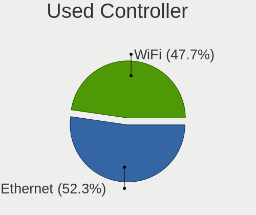

| Kind     | Computers | Percent |
|----------|-----------|---------|
| Ethernet | 66        | 53.23%  |
| WiFi     | 58        | 46.77%  |

NICs
----

Total network controllers on board

| Total | Computers | Percent |
|-------|-----------|---------|
| 2     | 58        | 50.88%  |
| 1     | 43        | 37.72%  |
| 3     | 9         | 7.89%   |
| 4     | 3         | 2.63%   |
| 0     | 1         | 0.88%   |

IPv6
----

IPv6 vs IPv4

| Used | Computers | Percent |
|------|-----------|---------|
| No   | 96        | 84.21%  |
| Yes  | 18        | 15.79%  |

Bluetooth
---------

Bluetooth Vendor
----------------

Controller vendors

| Vendor                          | Computers | Percent |
|---------------------------------|-----------|---------|
| Intel                           | 32        | 50%     |
| Realtek Semiconductor           | 6         | 9.38%   |
| Broadcom                        | 6         | 9.38%   |
| Apple                           | 6         | 9.38%   |
| Cambridge Silicon Radio         | 3         | 4.69%   |
| Toshiba                         | 2         | 3.13%   |
| Realtek                         | 1         | 1.56%   |
| Qualcomm Atheros Communications | 1         | 1.56%   |
| Marvell Semiconductor           | 1         | 1.56%   |
| Lite-On Technology              | 1         | 1.56%   |
| Integrated System Solution      | 1         | 1.56%   |
| Hewlett-Packard                 | 1         | 1.56%   |
| Foxconn / Hon Hai               | 1         | 1.56%   |
| Dell                            | 1         | 1.56%   |
| ASUSTek Computer                | 1         | 1.56%   |

Bluetooth Model
---------------

Controller models

| Model                                                 | Computers | Percent |
|-------------------------------------------------------|-----------|---------|
| Intel Bluetooth wireless interface                    | 10        | 15.63%  |
| Intel AX200 Bluetooth                                 | 7         | 10.94%  |
| Realtek Bluetooth Radio                               | 5         | 7.81%   |
| Intel Bluetooth 9460/9560 Jefferson Peak (JfP)        | 5         | 7.81%   |
| Intel AX201 Bluetooth                                 | 5         | 7.81%   |
| Apple Bluetooth USB Host Controller                   | 4         | 6.25%   |
| Cambridge Silicon Radio Bluetooth Dongle (HCI mode)   | 3         | 4.69%   |
| Intel Wireless-AC 9260 Bluetooth Adapter              | 2         | 3.13%   |
| Broadcom BCM20702A0 Bluetooth 4.0                     | 2         | 3.13%   |
| Broadcom BCM2045B (BDC-2.1)                           | 2         | 3.13%   |
| Toshiba Integrated Bluetooth HCI                      | 1         | 1.56%   |
| Toshiba Bluetooth Device                              | 1         | 1.56%   |
| Realtek RTL8821A Bluetooth                            | 1         | 1.56%   |
| Realtek Bluetooth Radio                               | 1         | 1.56%   |
| Qualcomm Atheros QCA61x4 Bluetooth 4.0                | 1         | 1.56%   |
| Marvell Bluetooth and Wireless LAN Composite          | 1         | 1.56%   |
| Lite-On Qualcomm Atheros QCA9377 Bluetooth            | 1         | 1.56%   |
| Intel Wireless-AC 3168 Bluetooth                      | 1         | 1.56%   |
| Intel Centrino Bluetooth Wireless Transceiver         | 1         | 1.56%   |
| Intel Bluetooth Device                                | 1         | 1.56%   |
| Integrated System Solution KY-BT100 Bluetooth Adapter | 1         | 1.56%   |
| HP Bluetooth 2.0 Interface [Broadcom BCM2045]         | 1         | 1.56%   |
| Foxconn / Hon Hai Acer Module                         | 1         | 1.56%   |
| Dell BCM20702A0 Bluetooth Module                      | 1         | 1.56%   |
| Broadcom BCM43142 Bluetooth 4.0                       | 1         | 1.56%   |
| Broadcom BCM20702 Bluetooth 4.0 [ThinkPad]            | 1         | 1.56%   |
| ASUS BCM20702A0                                       | 1         | 1.56%   |
| Apple Built-in Bluetooth 2.0+EDR HCI                  | 1         | 1.56%   |
| Apple Bluetooth Host Controller                       | 1         | 1.56%   |

Sound
-----

Sound Vendor
------------

Sound card vendors

| Vendor                           | Computers | Percent |
|----------------------------------|-----------|---------|
| Intel                            | 81        | 51.27%  |
| AMD                              | 32        | 20.25%  |
| Nvidia                           | 31        | 19.62%  |
| Realtek Semiconductor            | 2         | 1.27%   |
| Texas Instruments                | 1         | 0.63%   |
| Silicon Integrated Systems [SiS] | 1         | 0.63%   |
| Plantronics                      | 1         | 0.63%   |
| Micro Star International         | 1         | 0.63%   |
| Logitech                         | 1         | 0.63%   |
| Lenovo                           | 1         | 0.63%   |
| Focusrite-Novation               | 1         | 0.63%   |
| Creative Technology              | 1         | 0.63%   |
| Creative Labs                    | 1         | 0.63%   |
| Cambridge Silicon Radio          | 1         | 0.63%   |
| C-Media Electronics              | 1         | 0.63%   |
| Astro Gaming                     | 1         | 0.63%   |

Sound Model
-----------

Sound card models

| Model                                                                      | Computers | Percent |
|----------------------------------------------------------------------------|-----------|---------|
| Intel 7 Series/C216 Chipset Family High Definition Audio Controller        | 11        | 5.91%   |
| Intel Xeon E3-1200 v3/4th Gen Core Processor HD Audio Controller           | 9         | 4.84%   |
| Intel Sunrise Point-LP HD Audio                                            | 8         | 4.3%    |
| Intel 8 Series/C220 Series Chipset High Definition Audio Controller        | 8         | 4.3%    |
| AMD Starship/Matisse HD Audio Controller                                   | 7         | 3.76%   |
| Intel 6 Series/C200 Series Chipset Family High Definition Audio Controller | 6         | 3.23%   |
| Intel Cannon Lake PCH cAVS                                                 | 5         | 2.69%   |
| Intel 200 Series PCH HD Audio                                              | 5         | 2.69%   |
| Nvidia GK208 HDMI/DP Audio Controller                                      | 4         | 2.15%   |
| AMD Renoir Radeon High Definition Audio Controller                         | 4         | 2.15%   |
| Nvidia TU116 High Definition Audio Controller                              | 3         | 1.61%   |
| Nvidia TU106 High Definition Audio Controller                              | 3         | 1.61%   |
| Intel Wildcat Point-LP High Definition Audio Controller                    | 3         | 1.61%   |
| Intel NM10/ICH7 Family High Definition Audio Controller                    | 3         | 1.61%   |
| Intel Comet Lake PCH-LP cAVS                                               | 3         | 1.61%   |
| Intel Broadwell-U Audio Controller                                         | 3         | 1.61%   |
| Intel 82801I (ICH9 Family) HD Audio Controller                             | 3         | 1.61%   |
| Intel 5 Series/3400 Series Chipset High Definition Audio                   | 3         | 1.61%   |
| AMD SBx00 Azalia (Intel HDA)                                               | 3         | 1.61%   |
| AMD Navi 21/23 HDMI/DP Audio Controller                                    | 3         | 1.61%   |
| AMD FCH Azalia Controller                                                  | 3         | 1.61%   |
| AMD Family 17h/19h HD Audio Controller                                     | 3         | 1.61%   |
| AMD Family 17h (Models 00h-0fh) HD Audio Controller                        | 3         | 1.61%   |
| Realtek Semiconductor USB Audio                                            | 2         | 1.08%   |
| Nvidia High Definition Audio Controller                                    | 2         | 1.08%   |
| Nvidia GP108 High Definition Audio Controller                              | 2         | 1.08%   |
| Nvidia GP107GL High Definition Audio Controller                            | 2         | 1.08%   |
| Nvidia GP104 High Definition Audio Controller                              | 2         | 1.08%   |
| Nvidia GK104 HDMI Audio Controller                                         | 2         | 1.08%   |
| Nvidia GF119 HDMI Audio Controller                                         | 2         | 1.08%   |
| Nvidia GF108 High Definition Audio Controller                              | 2         | 1.08%   |
| Intel Tiger Lake-LP Smart Sound Technology Audio Controller                | 2         | 1.08%   |
| Intel Ice Lake-LP Smart Sound Technology Audio Controller                  | 2         | 1.08%   |
| Intel Haswell-ULT HD Audio Controller                                      | 2         | 1.08%   |
| Intel CM238 HD Audio Controller                                            | 2         | 1.08%   |
| Intel Atom Processor Z36xxx/Z37xxx Series High Definition Audio Controller | 2         | 1.08%   |
| Intel 9 Series Chipset Family HD Audio Controller                          | 2         | 1.08%   |
| Intel 8 Series HD Audio Controller                                         | 2         | 1.08%   |
| Intel 100 Series/C230 Series Chipset Family HD Audio Controller            | 2         | 1.08%   |
| AMD RV710/730 HDMI Audio [Radeon HD 4000 series]                           | 2         | 1.08%   |
| AMD Ellesmere HDMI Audio [Radeon RX 470/480 / 570/580/590]                 | 2         | 1.08%   |
| Texas Instruments PCM2902 Audio Codec                                      | 1         | 0.54%   |
| Silicon Integrated Systems [SiS] Azalia Audio Controller                   | 1         | 0.54%   |
| Plantronics HD1                                                            | 1         | 0.54%   |
| Nvidia TU104 HD Audio Controller                                           | 1         | 0.54%   |
| Nvidia MCP79 High Definition Audio                                         | 1         | 0.54%   |
| Nvidia GP106 High Definition Audio Controller                              | 1         | 0.54%   |
| Nvidia GM206 High Definition Audio Controller                              | 1         | 0.54%   |
| Nvidia GM204 High Definition Audio Controller                              | 1         | 0.54%   |
| Nvidia GK106 HDMI Audio Controller                                         | 1         | 0.54%   |
| Nvidia GA104 High Definition Audio Controller                              | 1         | 0.54%   |
| Nvidia GA102 High Definition Audio Controller                              | 1         | 0.54%   |
| Micro Star International MSI DOCK(Audio)                                   | 1         | 0.54%   |
| Logitech G935 Gaming Headset                                               | 1         | 0.54%   |
| Logitech G933 Wireless Headset Dongle                                      | 1         | 0.54%   |
| Lenovo ThinkPad USB-C Dock Gen2 USB Audio                                  | 1         | 0.54%   |
| Intel Comet Lake PCH-V cAVS                                                | 1         | 0.54%   |
| Intel Comet Lake PCH cAVS                                                  | 1         | 0.54%   |
| Intel Celeron N3350/Pentium N4200/Atom E3900 Series Audio Cluster          | 1         | 0.54%   |
| Intel Cannon Point-LP High Definition Audio Controller                     | 1         | 0.54%   |

Memory
------

Memory Vendor
-------------

Memory module vendors

| Vendor              | Computers | Percent |
|---------------------|-----------|---------|
| Samsung Electronics | 15        | 20.27%  |
| Unknown             | 14        | 18.92%  |
| Kingston            | 14        | 18.92%  |
| SK Hynix            | 9         | 12.16%  |
| Micron Technology   | 6         | 8.11%   |
| Corsair             | 5         | 6.76%   |
| Crucial             | 4         | 5.41%   |
| G.Skill             | 2         | 2.7%    |
| Unknown             | 2         | 2.7%    |
| Unknown (0x89AD)    | 1         | 1.35%   |
| PNY                 | 1         | 1.35%   |
| GeIL                | 1         | 1.35%   |

Memory Model
------------

Memory module models

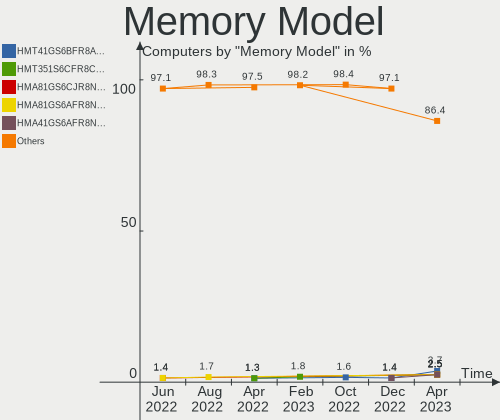

| Model                                                         | Computers | Percent |
|---------------------------------------------------------------|-----------|---------|
| Unknown RAM Module 4096MB DIMM DDR3 1333MT/s                  | 2         | 2.41%   |
| Unknown RAM Module 2GB DIMM 667MT/s                           | 2         | 2.41%   |
| Kingston RAM KHX3200C16D4/8GX 8GB DIMM DDR4 3533MT/s          | 2         | 2.41%   |
| Unknown                                                       | 2         | 2.41%   |
| Unknown RAM Module 8GB DIMM DDR3 1333MT/s                     | 1         | 1.2%    |
| Unknown RAM Module 8192MB DIMM 800MT/s                        | 1         | 1.2%    |
| Unknown RAM Module 4GB DIMM DDR3 1600MT/s                     | 1         | 1.2%    |
| Unknown RAM Module 4GB DIMM 800MT/s                           | 1         | 1.2%    |
| Unknown RAM Module 4GB DIMM 400MT/s                           | 1         | 1.2%    |
| Unknown RAM Module 4096MB DIMM 1333MT/s                       | 1         | 1.2%    |
| Unknown RAM Module 2GB DIMM DDR2 1067MT/s                     | 1         | 1.2%    |
| Unknown RAM Module 2048MB SODIMM DDR2 800MT/s                 | 1         | 1.2%    |
| Unknown RAM Module 2048MB DIMM 800MT/s                        | 1         | 1.2%    |
| Unknown RAM Module 1GB DIMM DDR2 800MT/s                      | 1         | 1.2%    |
| Unknown RAM Module 1GB DIMM DDR 333MT/s                       | 1         | 1.2%    |
| Unknown (0x89AD) RAM Module 8GB SODIMM DDR3 1600MT/s          | 1         | 1.2%    |
| SK Hynix RAM Module 8GB SODIMM DDR3 1600MT/s                  | 1         | 1.2%    |
| SK Hynix RAM Module 2GB SODIMM DDR3 1067MT/s                  | 1         | 1.2%    |
| SK Hynix RAM HMT41GS6BFR8A-PB 8GB SODIMM DDR3 1600MT/s        | 1         | 1.2%    |
| SK Hynix RAM HMT351S6EFR8C-PB 4096MB SODIMM DDR3 1600MT/s     | 1         | 1.2%    |
| SK Hynix RAM HMT351S6CFR8C-PB 4GB SODIMM DDR3 1600MT/s        | 1         | 1.2%    |
| SK Hynix RAM HMAA4GS6AJR8N-VK 32GB SODIMM DDR4 2667MT/s       | 1         | 1.2%    |
| SK Hynix RAM HMAA1GS6CJR6N-XN 8GB SODIMM DDR4 3200MT/s        | 1         | 1.2%    |
| SK Hynix RAM HMA851S6CJR6N-XN 4096MB SODIMM DDR4 3200MT/s     | 1         | 1.2%    |
| SK Hynix RAM HMA82GS6AFR8N-UH 16384MB SODIMM DDR4 2667MT/s    | 1         | 1.2%    |
| SK Hynix RAM HMA42GR7MFR4N-TF 16384MB DIMM DDR4 2133MT/s      | 1         | 1.2%    |
| Samsung RAM Module 4GB DIMM DDR4 2133MT/s                     | 1         | 1.2%    |
| Samsung RAM Module 32GB SODIMM DDR4 2667MT/s                  | 1         | 1.2%    |
| Samsung RAM M471B5273DH0-CK0 4GB SODIMM DDR3 1600MT/s         | 1         | 1.2%    |
| Samsung RAM M471B5173BH0-CK0 4GB SODIMM DDR3 1600MT/s         | 1         | 1.2%    |
| Samsung RAM M471B1G73EB0-YK0 8192MB SODIMM DDR3 1600MT/s      | 1         | 1.2%    |
| Samsung RAM M471B1G73DB0-YK0 8GB SODIMM DDR3 1600MT/s         | 1         | 1.2%    |
| Samsung RAM M471B1G73CB0-YK0 8192MB SODIMM DDR3 1600MT/s      | 1         | 1.2%    |
| Samsung RAM M471A5244CB0-CTD 4GB SODIMM DDR4 3266MT/s         | 1         | 1.2%    |
| Samsung RAM M471A5244CB0-CRC 4096MB SODIMM DDR4 2667MT/s      | 1         | 1.2%    |
| Samsung RAM M471A2K43CB1-CRC 16GB SODIMM DDR4 2667MT/s        | 1         | 1.2%    |
| Samsung RAM M471A2G43AB2-CWE 16GB SODIMM DDR4 3200MT/s        | 1         | 1.2%    |
| Samsung RAM M471A1K43DB1-CWE 8GB SODIMM DDR4 3200MT/s         | 1         | 1.2%    |
| Samsung RAM M471A1K43BB1-CRC 8GB SODIMM DDR4 2667MT/s         | 1         | 1.2%    |
| Samsung RAM M378B5173DB0-CK0 4GB DIMM DDR3 1600MT/s           | 1         | 1.2%    |
| Samsung RAM M378A1K43CB2-CRC 8192MB DIMM DDR4 3500MT/s        | 1         | 1.2%    |
| Samsung RAM K4EBE304EC-EGCG 8GB Row Of Chips LPDDR3 2133MT/s  | 1         | 1.2%    |
| Samsung RAM K4A8G165WC-BCTD 4096MB Row Of Chips DDR4 2667MT/s | 1         | 1.2%    |
| PNY RAM 8GBF1X08RHJJ40-135-K 8GB DIMM DDR4 3000MT/s           | 1         | 1.2%    |
| Micron RAM MT52L1G32D4PG-093 8GB Row Of Chips LPDDR3 2133MT/s | 1         | 1.2%    |
| Micron RAM 4ATS1G64HZ-2G6E1 8192MB Row Of Chips DDR4 2667MT/s | 1         | 1.2%    |
| Micron RAM 4ATF1G64HZ-3G2F1 8GB SODIMM DDR4 3200MT/s          | 1         | 1.2%    |
| Micron RAM 4ATF1G64HZ-3G2E1 8GB SODIMM DDR4 3200MT/s          | 1         | 1.2%    |
| Micron RAM 18ASF4G72AZ-3G2B1 32GB DIMM DDR4 3200MT/s          | 1         | 1.2%    |
| Micron RAM 16HTF25664HY-800J1 2048MB SODIMM DDR2 2048MT/s     | 1         | 1.2%    |
| Kingston RAM Module 4096MB SODIMM DDR3 1333MT/s               | 1         | 1.2%    |
| Kingston RAM Module 2048MB SODIMM DDR3 1333MT/s               | 1         | 1.2%    |
| Kingston RAM KHX1866C10D3/8G 8GB DIMM DDR3 1867MT/s           | 1         | 1.2%    |
| Kingston RAM KF3200C16D4/8GX 8192MB DIMM DDR4 3200MT/s        | 1         | 1.2%    |
| Kingston RAM HP32D4S2S8MR-8 8GB SODIMM DDR4 3200MT/s          | 1         | 1.2%    |
| Kingston RAM 99U5474-028.A00LF 4GB DIMM DDR3 1600MT/s         | 1         | 1.2%    |
| Kingston RAM 99U5471-036.A00LF 8GB DIMM DDR3 1600MT/s         | 1         | 1.2%    |
| Kingston RAM 99U5471-031.A00LF 8GB DIMM DDR3 1333MT/s         | 1         | 1.2%    |
| Kingston RAM 99U5471-020.A00LF 4GB DIMM DDR3 1600MT/s         | 1         | 1.2%    |
| Kingston RAM 99U5428-018.A00LF 8192MB SODIMM DDR3 1600MT/s    | 1         | 1.2%    |

Memory Kind
-----------

Memory module kinds

| Kind    | Computers | Percent |
|---------|-----------|---------|
| DDR4    | 29        | 44.62%  |
| DDR3    | 22        | 33.85%  |
| Unknown | 7         | 10.77%  |
| DDR2    | 3         | 4.62%   |
| LPDDR3  | 2         | 3.08%   |
| SDRAM   | 1         | 1.54%   |
| DDR     | 1         | 1.54%   |

Memory Form Factor
------------------

Physical design of the memory module

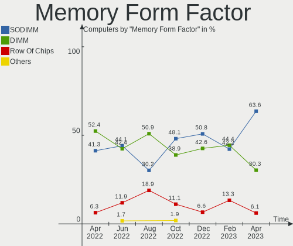

| Name         | Computers | Percent |
|--------------|-----------|---------|
| DIMM         | 35        | 53.85%  |
| SODIMM       | 26        | 40%     |
| Row Of Chips | 4         | 6.15%   |

Memory Size
-----------

Memory module size

| Size  | Computers | Percent |
|-------|-----------|---------|
| 8192  | 29        | 41.43%  |
| 4096  | 16        | 22.86%  |
| 2048  | 9         | 12.86%  |
| 16384 | 8         | 11.43%  |
| 32768 | 6         | 8.57%   |
| 1024  | 2         | 2.86%   |

Memory Speed
------------

Memory module speed

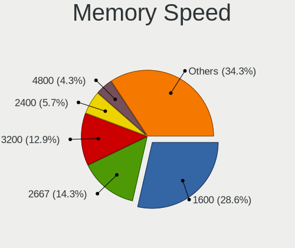

| Speed | Computers | Percent |
|-------|-----------|---------|
| 1600  | 15        | 20.55%  |
| 3200  | 10        | 13.7%   |
| 1333  | 10        | 13.7%   |
| 2667  | 8         | 10.96%  |
| 800   | 6         | 8.22%   |
| 2133  | 5         | 6.85%   |
| 3533  | 2         | 2.74%   |
| 1067  | 2         | 2.74%   |
| 667   | 2         | 2.74%   |
| 4000  | 1         | 1.37%   |
| 3600  | 1         | 1.37%   |
| 3500  | 1         | 1.37%   |
| 3266  | 1         | 1.37%   |
| 3066  | 1         | 1.37%   |
| 3000  | 1         | 1.37%   |
| 2666  | 1         | 1.37%   |
| 2400  | 1         | 1.37%   |
| 2048  | 1         | 1.37%   |
| 1866  | 1         | 1.37%   |
| 1334  | 1         | 1.37%   |
| 400   | 1         | 1.37%   |
| 333   | 1         | 1.37%   |

Printers & scanners
-------------------

Printer Vendor
--------------

Printer device vendors

| Vendor             | Computers | Percent |
|--------------------|-----------|---------|
| Hewlett-Packard    | 1         | 50%     |
| Brother Industries | 1         | 50%     |

Printer Model
-------------

Printer device models

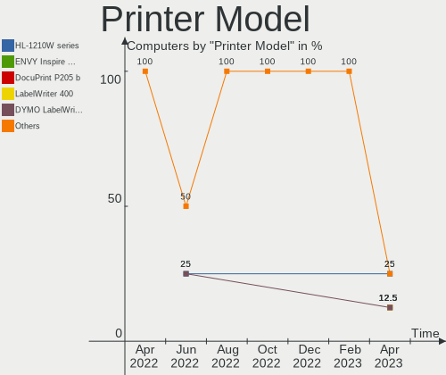

| Model                       | Computers | Percent |
|-----------------------------|-----------|---------|
| HP Deskjet 3520 series      | 1         | 50%     |
| Brother MFC-L8690CDW series | 1         | 50%     |

Scanner Vendor
--------------

Scanner device vendors

Zero info for selected period =(

Scanner Model
-------------

Scanner device models

Zero info for selected period =(

Camera
------

Camera Vendor
-------------

Camera device vendors

| Vendor                                 | Computers | Percent |
|----------------------------------------|-----------|---------|
| Chicony Electronics                    | 9         | 15%     |
| Microdia                               | 7         | 11.67%  |
| Logitech                               | 6         | 10%     |
| Realtek Semiconductor                  | 5         | 8.33%   |
| Apple                                  | 5         | 8.33%   |
| Sunplus Innovation Technology          | 4         | 6.67%   |
| Microsoft                              | 4         | 6.67%   |
| IMC Networks                           | 4         | 6.67%   |
| Acer                                   | 4         | 6.67%   |
| Syntek                                 | 2         | 3.33%   |
| Quanta                                 | 2         | 3.33%   |
| Lite-On Technology                     | 2         | 3.33%   |
| Cheng Uei Precision Industry (Foxlink) | 2         | 3.33%   |
| Luxvisions Innotech Limited            | 1         | 1.67%   |
| Lenovo                                 | 1         | 1.67%   |
| Importek                               | 1         | 1.67%   |
| GEMBIRD                                | 1         | 1.67%   |

Camera Model
------------

Camera device models

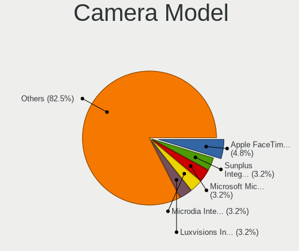

| Model                                                   | Computers | Percent |
|---------------------------------------------------------|-----------|---------|
| Acer Integrated Camera                                  | 4         | 6.45%   |
| Syntek Integrated Camera                                | 2         | 3.23%   |
| Sunplus Integrated_Webcam_HD                            | 2         | 3.23%   |
| Microsoft LifeCam HD-3000                               | 2         | 3.23%   |
| Microdia Integrated_Webcam_HD                           | 2         | 3.23%   |
| Logitech Webcam C270                                    | 2         | 3.23%   |
| Apple FaceTime HD Camera (Built-in)                     | 2         | 3.23%   |
| Apple FaceTime HD Camera                                | 2         | 3.23%   |
| Sunplus HD WebCam                                       | 1         | 1.61%   |
| Sunplus 1.3M HD WebCam                                  | 1         | 1.61%   |
| Realtek USB Camera                                      | 1         | 1.61%   |
| Realtek Integrated_Webcam_8M                            | 1         | 1.61%   |
| Realtek Integrated_Webcam_5M                            | 1         | 1.61%   |
| Realtek Integrated Webcam HD                            | 1         | 1.61%   |
| Realtek Integrated Camera                               | 1         | 1.61%   |
| Realtek HP TrueVision Full HD                           | 1         | 1.61%   |
| Quanta HP True Vision HD Camera                         | 1         | 1.61%   |
| Quanta HD Camera                                        | 1         | 1.61%   |
| Microsoft Microsoft LifeCam Studio                    | 1         | 1.61%   |
| Microsoft LifeCam Cinema                                | 1         | 1.61%   |
| Microdia Laptop_Integrated_Webcam_E4HD                  | 1         | 1.61%   |
| Microdia Laptop_Integrated_Webcam_2M                    | 1         | 1.61%   |
| Microdia Integrated_Webcam_FHD                          | 1         | 1.61%   |
| Microdia Integrated Webcam                              | 1         | 1.61%   |
| Microdia 1.3 MPixel Integrated Webcam                   | 1         | 1.61%   |
| Luxvisions Innotech Limited HP TrueVision HD Camera     | 1         | 1.61%   |
| Logitech Webcam C200                                    | 1         | 1.61%   |
| Logitech Webcam C170                                    | 1         | 1.61%   |
| Logitech QuickCam Pro 5000                              | 1         | 1.61%   |
| Logitech HD Pro Webcam C920                             | 1         | 1.61%   |
| Lite-On Integrated Camera                               | 1         | 1.61%   |
| Lite-On HP HD Camera                                    | 1         | 1.61%   |
| Lenovo Integrated Webcam [R5U877]                       | 1         | 1.61%   |
| Importek TOSHIBA Web Camera - HD                        | 1         | 1.61%   |
| IMC Networks XiaoMi Webcam                              | 1         | 1.61%   |
| IMC Networks USB2.0 HD UVC WebCam                       | 1         | 1.61%   |
| IMC Networks USB Camera                                 | 1         | 1.61%   |
| IMC Networks Integrated Camera                          | 1         | 1.61%   |
| GEMBIRD Generic UVC 1.00 camera [AppoTech AX2311]       | 1         | 1.61%   |
| Chicony USB2.0 UVC WebCam                               | 1         | 1.61%   |
| Chicony USB2.0 FHD Camera                               | 1         | 1.61%   |
| Chicony USB 2.0 camera                                  | 1         | 1.61%   |
| Chicony Lenovo Integrated Camera (0.3MP)                | 1         | 1.61%   |
| Chicony Integrated Camera                               | 1         | 1.61%   |
| Chicony HP Webcam                                       | 1         | 1.61%   |
| Chicony HP IR Camera                                    | 1         | 1.61%   |
| Chicony HP HD Camera                                    | 1         | 1.61%   |
| Chicony CNF8243 Webcam                                  | 1         | 1.61%   |
| Chicony CKA7227                                         | 1         | 1.61%   |
| Cheng Uei Precision Industry (Foxlink) HP Truevision HD | 1         | 1.61%   |
| Cheng Uei Precision Industry (Foxlink) HP HD Camera     | 1         | 1.61%   |
| Apple Built-in iSight                                   | 1         | 1.61%   |

Security
--------

Fingerprint Vendor
------------------

Fingerprint sensor vendors

| Vendor                     | Computers | Percent |
|----------------------------|-----------|---------|
| Validity Sensors           | 3         | 23.08%  |
| Synaptics                  | 3         | 23.08%  |
| Upek                       | 2         | 15.38%  |
| Shenzhen Goodix Technology | 2         | 15.38%  |
| AuthenTec                  | 2         | 15.38%  |
| Elan Microelectronics      | 1         | 7.69%   |

Fingerprint Model
-----------------

Fingerprint sensor models

| Model                                                       | Computers | Percent |
|-------------------------------------------------------------|-----------|---------|
| Unknown                                                     | 3         | 23.08%  |
| Upek Biometric Touchchip/Touchstrip Fingerprint Sensor      | 2         | 15.38%  |
| Shenzhen Goodix  Fingerprint Device                         | 2         | 15.38%  |
| Validity Sensors VFS495 Fingerprint Reader                  | 1         | 7.69%   |
| Validity Sensors Synaptics WBDI                             | 1         | 7.69%   |
| Validity Sensors Synaptics VFS7552 Touch Fingerprint Sensor | 1         | 7.69%   |
| Elan ELAN:ARM-M4                                            | 1         | 7.69%   |
| AuthenTec Fingerprint Sensor                                | 1         | 7.69%   |
| AuthenTec AES2810                                           | 1         | 7.69%   |

Chipcard Vendor
---------------

Chipcard module vendors

| Vendor      | Computers | Percent |
|-------------|-----------|---------|
| Broadcom    | 1         | 50%     |
| Alcor Micro | 1         | 50%     |

Chipcard Model
--------------

Chipcard module models

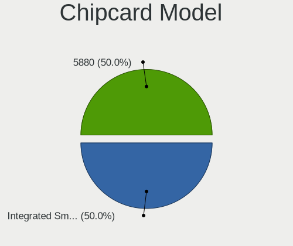

| Model                               | Computers | Percent |
|-------------------------------------|-----------|---------|
| Broadcom 5880                       | 1         | 50%     |
| Alcor Micro AU9540 Smartcard Reader | 1         | 50%     |

Unsupported
-----------

Unsupported Devices
-------------------

Total unsupported devices on board

| Total | Computers | Percent |
|-------|-----------|---------|
| 0     | 79        | 69.3%   |
| 1     | 28        | 24.56%  |
| 2     | 6         | 5.26%   |
| 4     | 1         | 0.88%   |

Unsupported Device Types
------------------------

Types of unsupported devices

| Type                     | Computers | Percent |
|--------------------------|-----------|---------|
| Fingerprint reader       | 13        | 30.95%  |
| Graphics card            | 10        | 23.81%  |
| Net/wireless             | 4         | 9.52%   |
| Multimedia controller    | 3         | 7.14%   |
| Communication controller | 3         | 7.14%   |
| Sound                    | 2         | 4.76%   |
| Chipcard                 | 2         | 4.76%   |
| Unassigned class         | 1         | 2.38%   |
| Storage/raid             | 1         | 2.38%   |
| Network                  | 1         | 2.38%   |
| Net/ethernet             | 1         | 2.38%   |
| Card reader              | 1         | 2.38%   |

