Linux in Australia - Hardware Trends
------------------------------------

A project to identify most popular hardware characteristics and track their change
over time based on data collected by Linux users at https://Linux-Hardware.org.

Anyone can contribute to this report by the [hw-probe](https://github.com/linuxhw/hw-probe) tool:

    sudo -E hw-probe -all -upload

This is a report for all computer types. See also reports for [desktops](/Location/Australia/Desktop/README.md) and [notebooks](/Location/Australia/Notebook/README.md).

Period: Jun, 2022.

Contents
--------

* [ System ](#system)
  - [ OS                       ](#os)
  - [ OS Family                ](#os-family)
  - [ Kernel                   ](#kernel)
  - [ Kernel Family            ](#kernel-family)
  - [ Kernel Major Ver.        ](#kernel-major-ver)
  - [ Arch                     ](#arch)
  - [ DE                       ](#de)
  - [ Display Server           ](#display-server)
  - [ Display Manager          ](#display-manager)
  - [ OS Lang                  ](#os-lang)
  - [ Boot Mode                ](#boot-mode)
  - [ Filesystem               ](#filesystem)
  - [ Part. scheme             ](#part-scheme)
  - [ Dual Boot with Linux/BSD ](#dual-boot-with-linuxbsd)
  - [ Dual Boot (Win)          ](#dual-boot-win)

* [ Board ](#board)
  - [ Vendor                   ](#vendor)
  - [ Model                    ](#model)
  - [ Model Family             ](#model-family)
  - [ MFG Year                 ](#mfg-year)
  - [ Form Factor              ](#form-factor)
  - [ Secure Boot              ](#secure-boot)
  - [ Coreboot                 ](#coreboot)
  - [ RAM Size                 ](#ram-size)
  - [ RAM Used                 ](#ram-used)
  - [ Total Drives             ](#total-drives)
  - [ Has CD-ROM               ](#has-cd-rom)
  - [ Has Ethernet             ](#has-ethernet)
  - [ Has WiFi                 ](#has-wifi)
  - [ Has Bluetooth            ](#has-bluetooth)

* [ Location ](#location)
  - [ Country                  ](#country)
  - [ City                     ](#city)

* [ Drives ](#drives)
  - [ Drive Vendor             ](#drive-vendor)
  - [ Drive Model              ](#drive-model)
  - [ HDD Vendor               ](#hdd-vendor)
  - [ SSD Vendor               ](#ssd-vendor)
  - [ Drive Kind               ](#drive-kind)
  - [ Drive Connector          ](#drive-connector)
  - [ Drive Size               ](#drive-size)
  - [ Space Total              ](#space-total)
  - [ Space Used               ](#space-used)
  - [ Malfunc. Drives          ](#malfunc-drives)
  - [ Malfunc. Drive Vendor    ](#malfunc-drive-vendor)
  - [ Malfunc. HDD Vendor      ](#malfunc-hdd-vendor)
  - [ Malfunc. Drive Kind      ](#malfunc-drive-kind)
  - [ Failed Drives            ](#failed-drives)
  - [ Failed Drive Vendor      ](#failed-drive-vendor)
  - [ Drive Status             ](#drive-status)

* [ Storage controller ](#storage-controller)
  - [ Storage Vendor           ](#storage-vendor)
  - [ Storage Model            ](#storage-model)
  - [ Storage Kind             ](#storage-kind)

* [ Processor ](#processor)
  - [ CPU Vendor               ](#cpu-vendor)
  - [ CPU Model                ](#cpu-model)
  - [ CPU Model Family         ](#cpu-model-family)
  - [ CPU Cores                ](#cpu-cores)
  - [ CPU Sockets              ](#cpu-sockets)
  - [ CPU Threads              ](#cpu-threads)
  - [ CPU Op-Modes             ](#cpu-op-modes)
  - [ CPU Microcode            ](#cpu-microcode)
  - [ CPU Microarch            ](#cpu-microarch)

* [ Graphics ](#graphics)
  - [ GPU Vendor               ](#gpu-vendor)
  - [ GPU Model                ](#gpu-model)
  - [ GPU Combo                ](#gpu-combo)
  - [ GPU Driver               ](#gpu-driver)
  - [ GPU Memory               ](#gpu-memory)

* [ Monitor ](#monitor)
  - [ Monitor Vendor           ](#monitor-vendor)
  - [ Monitor Model            ](#monitor-model)
  - [ Monitor Resolution       ](#monitor-resolution)
  - [ Monitor Diagonal         ](#monitor-diagonal)
  - [ Monitor Width            ](#monitor-width)
  - [ Aspect Ratio             ](#aspect-ratio)
  - [ Monitor Area             ](#monitor-area)
  - [ Pixel Density            ](#pixel-density)
  - [ Multiple Monitors        ](#multiple-monitors)

* [ Network ](#network)
  - [ Net Controller Vendor    ](#net-controller-vendor)
  - [ Net Controller Model     ](#net-controller-model)
  - [ Wireless Vendor          ](#wireless-vendor)
  - [ Wireless Model           ](#wireless-model)
  - [ Ethernet Vendor          ](#ethernet-vendor)
  - [ Ethernet Model           ](#ethernet-model)
  - [ Net Controller Kind      ](#net-controller-kind)
  - [ Used Controller          ](#used-controller)
  - [ NICs                     ](#nics)
  - [ IPv6                     ](#ipv6)

* [ Bluetooth ](#bluetooth)
  - [ Bluetooth Vendor         ](#bluetooth-vendor)
  - [ Bluetooth Model          ](#bluetooth-model)

* [ Sound ](#sound)
  - [ Sound Vendor             ](#sound-vendor)
  - [ Sound Model              ](#sound-model)

* [ Memory ](#memory)
  - [ Memory Vendor            ](#memory-vendor)
  - [ Memory Model             ](#memory-model)
  - [ Memory Kind              ](#memory-kind)
  - [ Memory Form Factor       ](#memory-form-factor)
  - [ Memory Size              ](#memory-size)
  - [ Memory Speed             ](#memory-speed)

* [ Printers & scanners ](#printers--scanners)
  - [ Printer Vendor           ](#printer-vendor)
  - [ Printer Model            ](#printer-model)
  - [ Scanner Vendor           ](#scanner-vendor)
  - [ Scanner Model            ](#scanner-model)

* [ Camera ](#camera)
  - [ Camera Vendor            ](#camera-vendor)
  - [ Camera Model             ](#camera-model)

* [ Security ](#security)
  - [ Fingerprint Vendor       ](#fingerprint-vendor)
  - [ Fingerprint Model        ](#fingerprint-model)
  - [ Chipcard Vendor          ](#chipcard-vendor)
  - [ Chipcard Model           ](#chipcard-model)

* [ Unsupported ](#unsupported)
  - [ Unsupported Devices      ](#unsupported-devices)
  - [ Unsupported Device Types ](#unsupported-device-types)

System
------

OS
--

Installed operating systems

| Name                         | Computers | Percent |
|------------------------------|-----------|---------|
| Ubuntu 22.04                 | 18        | 17.14%  |
| Fedora 36                    | 14        | 13.33%  |
| Linux Mint 20.3              | 11        | 10.48%  |
| Pop!_OS 22.04                | 10        | 9.52%   |
| Debian 11                    | 7         | 6.67%   |
| OpenMandriva 4.3             | 6         | 5.71%   |
| Ubuntu 20.04                 | 4         | 3.81%   |
| Fedora 35                    | 4         | 3.81%   |
| Arch                         | 4         | 3.81%   |
| Kali 2022.2                  | 3         | 2.86%   |
| ClearOS 7                    | 3         | 2.86%   |
| Manjaro                      | 2         | 1.9%    |
| Arch Rolling                 | 2         | 1.9%    |
| Zorin 16                     | 1         | 0.95%   |
| Ubuntu MATE 22.04            | 1         | 0.95%   |
| Ubuntu MATE 21.10            | 1         | 0.95%   |
| Ubuntu MATE 20.04            | 1         | 0.95%   |
| Ubuntu 21.10                 | 1         | 0.95%   |
| Raspbian 10                  | 1         | 0.95%   |
| Pop!_OS 21.10                | 1         | 0.95%   |
| Oracle Linux 8.6             | 1         | 0.95%   |
| Oracle Linux 7.9             | 1         | 0.95%   |
| openSUSE Tumbleweed-XXXXXXXX | 1         | 0.95%   |
| Manjaro 21.2.6               | 1         | 0.95%   |
| Linux Mint 20.1              | 1         | 0.95%   |
| KDE neon 20.04               | 1         | 0.95%   |
| Fedora 34                    | 1         | 0.95%   |
| Fedora 33                    | 1         | 0.95%   |
| Elementary 6.1               | 1         | 0.95%   |
| ArcoLinux Rolling            | 1         | 0.95%   |

OS Family
---------

OS without a version

| Name         | Computers | Percent |
|--------------|-----------|---------|
| Ubuntu       | 23        | 21.9%   |
| Fedora       | 20        | 19.05%  |
| Linux Mint   | 12        | 11.43%  |
| Pop!_OS      | 11        | 10.48%  |
| Debian       | 7         | 6.67%   |
| OpenMandriva | 6         | 5.71%   |
| Arch         | 6         | 5.71%   |
| Ubuntu MATE  | 3         | 2.86%   |
| Manjaro      | 3         | 2.86%   |
| Kali         | 3         | 2.86%   |
| ClearOS      | 3         | 2.86%   |
| Oracle Linux | 2         | 1.9%    |
| Zorin        | 1         | 0.95%   |
| Raspbian     | 1         | 0.95%   |
| openSUSE     | 1         | 0.95%   |
| KDE neon     | 1         | 0.95%   |
| Elementary   | 1         | 0.95%   |
| ArcoLinux    | 1         | 0.95%   |

Kernel
------

Version of the Linux kernel

| Version                           | Computers | Percent |
|-----------------------------------|-----------|---------|
| 5.17.5-76051705-generic           | 11        | 10.48%  |
| 5.18.6-200.fc36.x86_64            | 4         | 3.81%   |
| 5.17.12-200.fc35.x86_64           | 4         | 3.81%   |
| 5.16.7-desktop-1omv4003           | 4         | 3.81%   |
| 5.15.0-40-generic                 | 4         | 3.81%   |
| 5.15.0-37-generic                 | 4         | 3.81%   |
| 5.13.0-51-generic                 | 4         | 3.81%   |
| 5.4.0-121-generic                 | 3         | 2.86%   |
| 5.17.13-300.fc36.x86_64           | 3         | 2.86%   |
| 5.15.0-39-generic                 | 3         | 2.86%   |
| 3.10.0-1160.66.1.el7.x86_64       | 3         | 2.86%   |
| 5.4.0-117-generic                 | 2         | 1.9%    |
| 5.4.0-109-generic                 | 2         | 1.9%    |
| 5.18.1-arch1-1                    | 2         | 1.9%    |
| 5.17.9-arch1-1                    | 2         | 1.9%    |
| 5.17.5-300.fc36.x86_64            | 2         | 1.9%    |
| 5.17.12-300.fc36.x86_64           | 2         | 1.9%    |
| 5.17.0-kali3-amd64                | 2         | 1.9%    |
| 5.16.13-desktop-1omv4003          | 2         | 1.9%    |
| 5.15.41-1-MANJARO                 | 2         | 1.9%    |
| 5.15.0-33-generic                 | 2         | 1.9%    |
| 5.15.0-25-generic                 | 2         | 1.9%    |
| 5.13.0-48-generic                 | 2         | 1.9%    |
| 5.13.0-44-generic                 | 2         | 1.9%    |
| 5.10.0-15-amd64                   | 2         | 1.9%    |
| 5.4.197-tkg-bmq                   | 1         | 0.95%   |
| 5.4.17-2136.307.3.1.el8uek.x86_64 | 1         | 0.95%   |
| 5.4.0-113-generic                 | 1         | 0.95%   |
| 5.18.7-arch1-1                    | 1         | 0.95%   |
| 5.18.7-200.fc36.x86_64            | 1         | 0.95%   |
| 5.18.7-1.surface.fc36.x86_64      | 1         | 0.95%   |
| 5.18.5-200.fc36.x86_64            | 1         | 0.95%   |
| 5.18.4-xanmod1                    | 1         | 0.95%   |
| 5.18.2-arch1-1                    | 1         | 0.95%   |
| 5.18.1-1-default                  | 1         | 0.95%   |
| 5.17.15-hardened1-1-hardened      | 1         | 0.95%   |
| 5.17.11-051711-generic            | 1         | 0.95%   |
| 5.17.0-trunk-amd64                | 1         | 0.95%   |
| 5.17.0-3-amd64                    | 1         | 0.95%   |
| 5.16.12-100.fc34.x86_64           | 1         | 0.95%   |
| 5.16.0-kali7-amd64                | 1         | 0.95%   |
| 5.15.48-1-MANJARO                 | 1         | 0.95%   |
| 5.15.32-v8+                       | 1         | 0.95%   |
| 5.15.0-35-generic                 | 1         | 0.95%   |
| 5.15.0-23-generic                 | 1         | 0.95%   |
| 5.14.18-100.fc33.x86_64           | 1         | 0.95%   |
| 5.14.0-1042-oem                   | 1         | 0.95%   |
| 5.13.0-46-generic                 | 1         | 0.95%   |
| 5.13.0-41-generic                 | 1         | 0.95%   |
| 5.11.0-25-generic                 | 1         | 0.95%   |
| 5.10.103-v7+                      | 1         | 0.95%   |
| 5.10.0-14-amd64                   | 1         | 0.95%   |
| 5.10.0-13-amd64                   | 1         | 0.95%   |
| 4.9.277-122                       | 1         | 0.95%   |
| 4.1.12-124.63.2.1.el7uek.x86_64   | 1         | 0.95%   |

Kernel Family
-------------

Linux kernel without a distro release

| Version  | Computers | Percent |
|----------|-----------|---------|
| 5.15.0   | 17        | 16.19%  |
| 5.17.5   | 13        | 12.38%  |
| 5.13.0   | 10        | 9.52%   |
| 5.4.0    | 8         | 7.62%   |
| 5.17.12  | 6         | 5.71%   |
| 5.18.6   | 4         | 3.81%   |
| 5.17.0   | 4         | 3.81%   |
| 5.16.7   | 4         | 3.81%   |
| 5.10.0   | 4         | 3.81%   |
| 5.18.7   | 3         | 2.86%   |
| 5.18.1   | 3         | 2.86%   |
| 5.17.13  | 3         | 2.86%   |
| 3.10.0   | 3         | 2.86%   |
| 5.17.9   | 2         | 1.9%    |
| 5.16.13  | 2         | 1.9%    |
| 5.15.41  | 2         | 1.9%    |
| 5.4.197  | 1         | 0.95%   |
| 5.4.17   | 1         | 0.95%   |
| 5.18.5   | 1         | 0.95%   |
| 5.18.4   | 1         | 0.95%   |
| 5.18.2   | 1         | 0.95%   |
| 5.17.15  | 1         | 0.95%   |
| 5.17.11  | 1         | 0.95%   |
| 5.16.12  | 1         | 0.95%   |
| 5.16.0   | 1         | 0.95%   |
| 5.15.48  | 1         | 0.95%   |
| 5.15.32  | 1         | 0.95%   |
| 5.14.18  | 1         | 0.95%   |
| 5.14.0   | 1         | 0.95%   |
| 5.11.0   | 1         | 0.95%   |
| 5.10.103 | 1         | 0.95%   |
| 4.9.277  | 1         | 0.95%   |
| 4.1.12   | 1         | 0.95%   |

Kernel Major Ver.
-----------------

Linux kernel major version

| Version | Computers | Percent |
|---------|-----------|---------|
| 5.17    | 30        | 28.57%  |
| 5.15    | 21        | 20%     |
| 5.18    | 13        | 12.38%  |
| 5.4     | 10        | 9.52%   |
| 5.13    | 10        | 9.52%   |
| 5.16    | 8         | 7.62%   |
| 5.10    | 5         | 4.76%   |
| 3.10    | 3         | 2.86%   |
| 5.14    | 2         | 1.9%    |
| 5.11    | 1         | 0.95%   |
| 4.9     | 1         | 0.95%   |
| 4.1     | 1         | 0.95%   |

Arch
----

OS architecture (x86_64, i586, etc.)

| Name    | Computers | Percent |
|---------|-----------|---------|
| x86_64  | 102       | 97.14%  |
| aarch64 | 2         | 1.9%    |
| armv7l  | 1         | 0.95%   |

DE
--

Desktop Environment

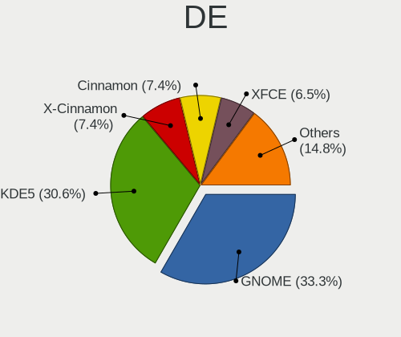

| Name          | Computers | Percent |
|---------------|-----------|---------|
| GNOME         | 47        | 44.76%  |
| KDE5          | 15        | 14.29%  |
| X-Cinnamon    | 10        | 9.52%   |
| Cinnamon      | 10        | 9.52%   |
| MATE          | 7         | 6.67%   |
| Unknown       | 7         | 6.67%   |
| XFCE          | 5         | 4.76%   |
| pop           | 1         | 0.95%   |
| Pantheon      | 1         | 0.95%   |
| KDE4          | 1         | 0.95%   |
| GNOME Classic | 1         | 0.95%   |

Display Server
--------------

X11 or Wayland

| Name    | Computers | Percent |
|---------|-----------|---------|
| X11     | 68        | 64.76%  |
| Wayland | 21        | 20%     |
| Tty     | 13        | 12.38%  |
| Unknown | 3         | 2.86%   |

Display Manager
---------------

SDDM, LightDM, etc.

| Name    | Computers | Percent |
|---------|-----------|---------|
| Unknown | 38        | 36.19%  |
| LightDM | 26        | 24.76%  |
| GDM3    | 22        | 20.95%  |
| SDDM    | 11        | 10.48%  |
| GDM     | 7         | 6.67%   |
| SLiM    | 1         | 0.95%   |

OS Lang
-------

Language

| Lang    | Computers | Percent |
|---------|-----------|---------|
| en_AU   | 79        | 75.24%  |
| en_US   | 16        | 15.24%  |
| en_GB   | 4         | 3.81%   |
| C       | 4         | 3.81%   |
| de_DE   | 1         | 0.95%   |
| Unknown | 1         | 0.95%   |

Boot Mode
---------

EFI or BIOS

| Mode | Computers | Percent |
|------|-----------|---------|
| EFI  | 59        | 56.19%  |
| BIOS | 46        | 43.81%  |

Filesystem
----------

Type of filesystem

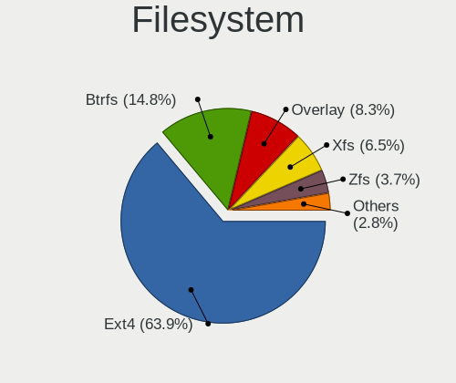

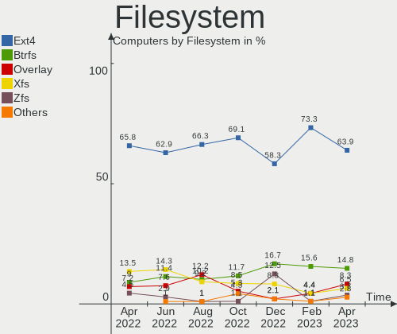

| Type    | Computers | Percent |
|---------|-----------|---------|
| Ext4    | 66        | 62.86%  |
| Xfs     | 15        | 14.29%  |
| Btrfs   | 12        | 11.43%  |
| Overlay | 8         | 7.62%   |
| Zfs     | 3         | 2.86%   |
| Ext3    | 1         | 0.95%   |

Part. scheme
------------

Scheme of partitioning

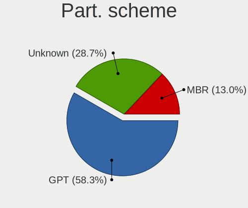

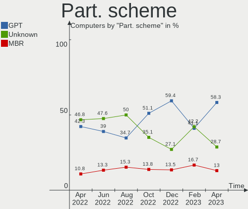

| Type    | Computers | Percent |
|---------|-----------|---------|
| Unknown | 50        | 47.62%  |
| GPT     | 41        | 39.05%  |
| MBR     | 14        | 13.33%  |

Dual Boot with Linux/BSD
------------------------

Hosting more than one Linux/BSD

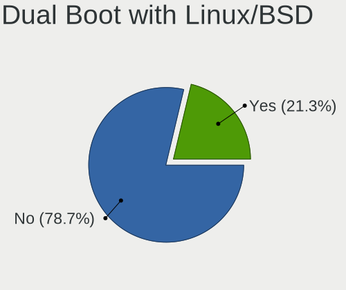

| Dual boot | Computers | Percent |
|-----------|-----------|---------|
| No        | 89        | 84.76%  |
| Yes       | 16        | 15.24%  |

Dual Boot (Win)
---------------

Hosting Linux and Windows

| Dual boot | Computers | Percent |
|-----------|-----------|---------|
| No        | 71        | 67.62%  |
| Yes       | 34        | 32.38%  |

Board
-----

Vendor
------

Motherboard manufacturer

| Name                    | Computers | Percent |
|-------------------------|-----------|---------|
| Gigabyte Technology     | 20        | 19.05%  |
| ASUSTek Computer        | 17        | 16.19%  |
| Lenovo                  | 16        | 15.24%  |
| Dell                    | 10        | 9.52%   |
| Hewlett-Packard         | 7         | 6.67%   |
| Acer                    | 7         | 6.67%   |
| MSI                     | 5         | 4.76%   |
| Apple                   | 4         | 3.81%   |
| Alienware               | 4         | 3.81%   |
| Toshiba                 | 2         | 1.9%    |
| Raspberry Pi Foundation | 2         | 1.9%    |
| Microsoft               | 2         | 1.9%    |
| Intel                   | 2         | 1.9%    |
| Timi                    | 1         | 0.95%   |
| HUAWEI                  | 1         | 0.95%   |
| Hardkernel              | 1         | 0.95%   |
| Framework               | 1         | 0.95%   |
| ASRock                  | 1         | 0.95%   |
| AMI                     | 1         | 0.95%   |
| Unknown                 | 1         | 0.95%   |

Model
-----

Motherboard model

| Name                                      | Computers | Percent |
|-------------------------------------------|-----------|---------|
| HP EliteBook 8470p                        | 2         | 1.9%    |
| Gigabyte J1900M-D2P                       | 2         | 1.9%    |
| Dell OptiPlex 9010                        | 2         | 1.9%    |
| Apple MacBookPro11,1                      | 2         | 1.9%    |
| Unknown                                   | 2         | 1.9%    |
| Toshiba TECRA A40-D                       | 1         | 0.95%   |
| Toshiba PORTEGE X20W-E                    | 1         | 0.95%   |
| Timi Redmi Book Pro 15 2022               | 1         | 0.95%   |
| RPi Raspberry Pi Compute Module 4 Rev 1.0 | 1         | 0.95%   |
| RPi Raspberry Pi                          | 1         | 0.95%   |
| MSI MS-7D25                               | 1         | 0.95%   |
| MSI MS-7C94                               | 1         | 0.95%   |
| MSI MS-7A37                               | 1         | 0.95%   |
| MSI MS-7758                               | 1         | 0.95%   |
| MSI Modern 15 A5M                         | 1         | 0.95%   |
| Microsoft Surface Pro 7                   | 1         | 0.95%   |
| Microsoft Surface Laptop 3                | 1         | 0.95%   |
| Lenovo Yoga710-14ISK 80TY                 | 1         | 0.95%   |
| Lenovo Yoga Slim 7 Pro 14ACH5 D 82NJ      | 1         | 0.95%   |
| Lenovo Yoga 520-14IKB 80X8                | 1         | 0.95%   |
| Lenovo ThinkStation C30 11361H1           | 1         | 0.95%   |
| Lenovo ThinkPad X1 Yoga 4th 20QFCTO1WW    | 1         | 0.95%   |
| Lenovo ThinkPad X1 Carbon 4th 20FBCTO1WW  | 1         | 0.95%   |
| Lenovo ThinkPad T470s 20HGS2KW16          | 1         | 0.95%   |
| Lenovo ThinkPad T410 2522PT3              | 1         | 0.95%   |
| Lenovo ThinkPad P15 Gen 2i 20YQCTO1WW     | 1         | 0.95%   |
| Lenovo ThinkPad Edge E531 6885CTO         | 1         | 0.95%   |
| Lenovo ThinkPad E490s 20NG0002AU          | 1         | 0.95%   |
| Lenovo ThinkCentre M720q 10T8SEYP00       | 1         | 0.95%   |
| Lenovo ThinkCentre M58p 7220A72           | 1         | 0.95%   |
| Lenovo Legion Y540-15IRH 81SX             | 1         | 0.95%   |
| Lenovo IdeaPad L340-17IWL 81M0            | 1         | 0.95%   |
| Lenovo IdeaPad 5 Pro 14ACN6 82L7          | 1         | 0.95%   |
| Intel NUC5i5RYB H40999-503                | 1         | 0.95%   |
| Intel DH67BL AAG10189-211                 | 1         | 0.95%   |
| HUAWEI KLVD-WXX9                          | 1         | 0.95%   |
| HP rp5800                                 | 1         | 0.95%   |
| HP Presario CQ62                          | 1         | 0.95%   |
| HP ENVY x360 Convertible 15-cp0xxx        | 1         | 0.95%   |
| HP Compaq 6730b                           | 1         | 0.95%   |
| HP 250 G6 Notebook PC                     | 1         | 0.95%   |
| Hardkernel ODROID-N2Plus                  | 1         | 0.95%   |
| Gigabyte Z77MX-D3H                        | 1         | 0.95%   |
| Gigabyte Z690 AORUS PRO DDR4              | 1         | 0.95%   |
| Gigabyte Z690 AORUS ELITE AX DDR4         | 1         | 0.95%   |
| Gigabyte X570 I AORUS PRO WIFI            | 1         | 0.95%   |
| Gigabyte H77N-WIFI                        | 1         | 0.95%   |
| Gigabyte H77M-D3H                         | 1         | 0.95%   |
| Gigabyte H61M-S2PV                        | 1         | 0.95%   |
| Gigabyte H110-D3A                         | 1         | 0.95%   |
| Gigabyte GA-MA785G-UD3H                   | 1         | 0.95%   |
| Gigabyte GA-990FXA-UD5                    | 1         | 0.95%   |
| Gigabyte GA-880GM-UD2H                    | 1         | 0.95%   |
| Gigabyte G41MT-D3                         | 1         | 0.95%   |
| Gigabyte D525TUD                          | 1         | 0.95%   |
| Gigabyte B85M-D3H                         | 1         | 0.95%   |
| Gigabyte B450 AORUS PRO                   | 1         | 0.95%   |
| Gigabyte B360M-D3H                        | 1         | 0.95%   |
| Gigabyte B250M-D3H                        | 1         | 0.95%   |
| Gigabyte AB350-Gaming 3                   | 1         | 0.95%   |

Model Family
------------

Motherboard model prefix

| Name                     | Computers | Percent |
|--------------------------|-----------|---------|
| Lenovo ThinkPad          | 7         | 6.67%   |
| ASUS PRIME               | 5         | 4.76%   |
| Dell OptiPlex            | 3         | 2.86%   |
| ASUS ROG                 | 3         | 2.86%   |
| Acer Aspire              | 3         | 2.86%   |
| RPi Raspberry            | 2         | 1.9%    |
| Microsoft Surface        | 2         | 1.9%    |
| Lenovo Yoga              | 2         | 1.9%    |
| Lenovo ThinkCentre       | 2         | 1.9%    |
| Lenovo IdeaPad           | 2         | 1.9%    |
| HP EliteBook             | 2         | 1.9%    |
| Gigabyte Z690            | 2         | 1.9%    |
| Gigabyte J1900M-D2P      | 2         | 1.9%    |
| Dell Latitude            | 2         | 1.9%    |
| ASUS VivoBook            | 2         | 1.9%    |
| Apple MacBookPro11       | 2         | 1.9%    |
| Unknown                  | 2         | 1.9%    |
| Toshiba TECRA            | 1         | 0.95%   |
| Toshiba PORTEGE          | 1         | 0.95%   |
| Timi Redmi               | 1         | 0.95%   |
| MSI MS-7D25              | 1         | 0.95%   |
| MSI MS-7C94              | 1         | 0.95%   |
| MSI MS-7A37              | 1         | 0.95%   |
| MSI MS-7758              | 1         | 0.95%   |
| MSI Modern               | 1         | 0.95%   |
| Lenovo Yoga710-14ISK     | 1         | 0.95%   |
| Lenovo ThinkStation      | 1         | 0.95%   |
| Lenovo Legion            | 1         | 0.95%   |
| Intel NUC5i5RYB          | 1         | 0.95%   |
| Intel DH67BL             | 1         | 0.95%   |
| HUAWEI KLVD-WXX9         | 1         | 0.95%   |
| HP rp5800                | 1         | 0.95%   |
| HP Presario              | 1         | 0.95%   |
| HP ENVY                  | 1         | 0.95%   |
| HP Compaq                | 1         | 0.95%   |
| HP 250                   | 1         | 0.95%   |
| Hardkernel ODROID-N2Plus | 1         | 0.95%   |
| Gigabyte Z77MX-D3H       | 1         | 0.95%   |
| Gigabyte X570            | 1         | 0.95%   |
| Gigabyte H77N-WIFI       | 1         | 0.95%   |
| Gigabyte H77M-D3H        | 1         | 0.95%   |
| Gigabyte H61M-S2PV       | 1         | 0.95%   |
| Gigabyte H110-D3A        | 1         | 0.95%   |
| Gigabyte GA-MA785G-UD3H  | 1         | 0.95%   |
| Gigabyte GA-990FXA-UD5   | 1         | 0.95%   |
| Gigabyte GA-880GM-UD2H   | 1         | 0.95%   |
| Gigabyte G41MT-D3        | 1         | 0.95%   |
| Gigabyte D525TUD         | 1         | 0.95%   |
| Gigabyte B85M-D3H        | 1         | 0.95%   |
| Gigabyte B450            | 1         | 0.95%   |
| Gigabyte B360M-D3H       | 1         | 0.95%   |
| Gigabyte B250M-D3H       | 1         | 0.95%   |
| Gigabyte AB350-Gaming    | 1         | 0.95%   |
| Framework Laptop         | 1         | 0.95%   |
| Dell XPS                 | 1         | 0.95%   |
| Dell Vostro              | 1         | 0.95%   |
| Dell Precision           | 1         | 0.95%   |
| Dell G3                  | 1         | 0.95%   |
| Dell G15                 | 1         | 0.95%   |
| ASUS TUF                 | 1         | 0.95%   |

MFG Year
--------

Motherboard manufacture year

| Year    | Computers | Percent |
|---------|-----------|---------|
| 2021    | 17        | 16.19%  |
| 2020    | 10        | 9.52%   |
| 2019    | 10        | 9.52%   |
| 2012    | 9         | 8.57%   |
| 2017    | 8         | 7.62%   |
| 2018    | 7         | 6.67%   |
| 2022    | 6         | 5.71%   |
| 2014    | 6         | 5.71%   |
| 2013    | 6         | 5.71%   |
| 2011    | 6         | 5.71%   |
| 2010    | 4         | 3.81%   |
| 2008    | 4         | 3.81%   |
| 2016    | 3         | 2.86%   |
| Unknown | 3         | 2.86%   |
| 2015    | 2         | 1.9%    |
| 2009    | 2         | 1.9%    |
| 2007    | 1         | 0.95%   |
| 2006    | 1         | 0.95%   |

Form Factor
-----------

Physical design of the computer

| Name           | Computers | Percent |
|----------------|-----------|---------|
| Desktop        | 50        | 47.62%  |
| Notebook       | 43        | 40.95%  |
| Convertible    | 5         | 4.76%   |
| System on chip | 3         | 2.86%   |
| Tablet         | 2         | 1.9%    |
| Mini pc        | 2         | 1.9%    |

Secure Boot
-----------

Enabled or disabled

| State    | Computers | Percent |
|----------|-----------|---------|
| Disabled | 93        | 88.57%  |
| Enabled  | 12        | 11.43%  |

Coreboot
--------

Have coreboot on board

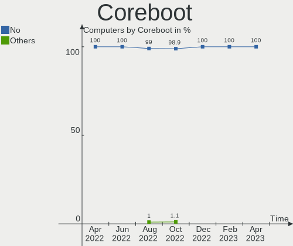

| Used | Computers | Percent |
|------|-----------|---------|
| No   | 105       | 100%    |

RAM Size
--------

Total RAM memory

| Size in GB  | Computers | Percent |
|-------------|-----------|---------|
| 16.01-24.0  | 29        | 27.62%  |
| 4.01-8.0    | 24        | 22.86%  |
| 8.01-16.0   | 18        | 17.14%  |
| 32.01-64.0  | 14        | 13.33%  |
| 3.01-4.0    | 12        | 11.43%  |
| 64.01-256.0 | 3         | 2.86%   |
| 1.01-2.0    | 3         | 2.86%   |
| 24.01-32.0  | 1         | 0.95%   |
| 0.01-0.5    | 1         | 0.95%   |

RAM Used
--------

Used RAM memory

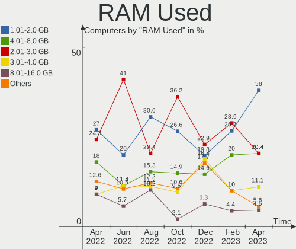

| Used GB    | Computers | Percent |
|------------|-----------|---------|
| 2.01-3.0   | 43        | 40.95%  |
| 1.01-2.0   | 21        | 20%     |
| 4.01-8.0   | 12        | 11.43%  |
| 3.01-4.0   | 12        | 11.43%  |
| 0.51-1.0   | 7         | 6.67%   |
| 8.01-16.0  | 6         | 5.71%   |
| 0.01-0.5   | 2         | 1.9%    |
| 24.01-32.0 | 1         | 0.95%   |
| 16.01-24.0 | 1         | 0.95%   |

Total Drives
------------

Number of drives on board

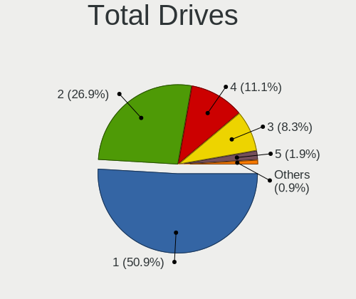

| Drives | Computers | Percent |
|--------|-----------|---------|
| 1      | 57        | 54.29%  |
| 2      | 27        | 25.71%  |
| 3      | 12        | 11.43%  |
| 4      | 3         | 2.86%   |
| 5      | 2         | 1.9%    |
| 9      | 1         | 0.95%   |
| 8      | 1         | 0.95%   |
| 7      | 1         | 0.95%   |
| 6      | 1         | 0.95%   |

Has CD-ROM
----------

Has CD-ROM on board

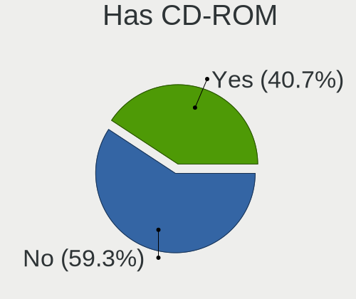

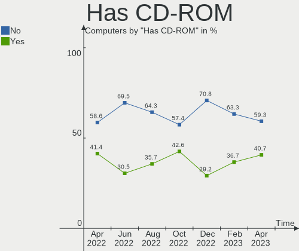

| Presented | Computers | Percent |
|-----------|-----------|---------|
| No        | 70        | 66.67%  |
| Yes       | 35        | 33.33%  |

Has Ethernet
------------

Has Ethernet on board

| Presented | Computers | Percent |
|-----------|-----------|---------|
| Yes       | 85        | 80.95%  |
| No        | 20        | 19.05%  |

Has WiFi
--------

Has WiFi module

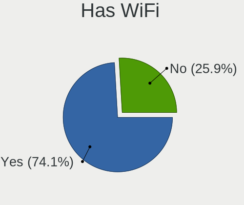

| Presented | Computers | Percent |
|-----------|-----------|---------|
| Yes       | 78        | 74.29%  |
| No        | 27        | 25.71%  |

Has Bluetooth
-------------

Has Bluetooth module

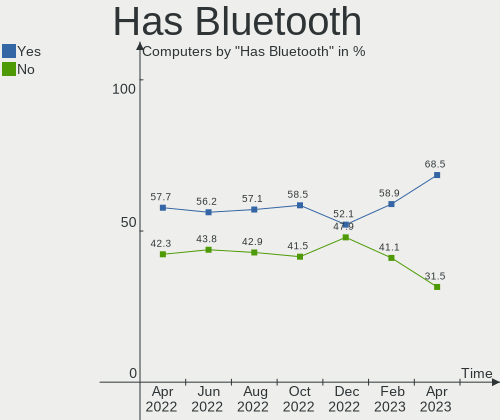

| Presented | Computers | Percent |
|-----------|-----------|---------|
| Yes       | 59        | 56.19%  |
| No        | 46        | 43.81%  |

Location
--------

Country
-------

Geographic location (country)

| Country   | Computers | Percent |
|-----------|-----------|---------|
| Australia | 105       | 100%    |

City
----

Geographic location (city)

| City             | Computers | Percent |
|------------------|-----------|---------|
| Sydney           | 23        | 21.9%   |
| Melbourne        | 19        | 18.1%   |
| Brisbane         | 12        | 11.43%  |
| Launceston       | 7         | 6.67%   |
| Adelaide         | 7         | 6.67%   |
| Perth            | 6         | 5.71%   |
| Lane Cove        | 6         | 5.71%   |
| Canberra         | 2         | 1.9%    |
| Warrnambool      | 1         | 0.95%   |
| Toowoomba        | 1         | 0.95%   |
| Taroona          | 1         | 0.95%   |
| South Yarra      | 1         | 0.95%   |
| Ryde             | 1         | 0.95%   |
| Queanbeyan       | 1         | 0.95%   |
| Peregian Beach   | 1         | 0.95%   |
| Orange           | 1         | 0.95%   |
| Mount Waverley   | 1         | 0.95%   |
| Mount Eliza      | 1         | 0.95%   |
| Kensington       | 1         | 0.95%   |
| Hoppers Crossing | 1         | 0.95%   |
| Hobart           | 1         | 0.95%   |
| Geelong          | 1         | 0.95%   |
| Doncaster        | 1         | 0.95%   |
| Cessnock         | 1         | 0.95%   |
| Central Coast    | 1         | 0.95%   |
| Campbell         | 1         | 0.95%   |
| Berwick          | 1         | 0.95%   |
| Bargo            | 1         | 0.95%   |
| Balwyn North     | 1         | 0.95%   |
| Ballarat         | 1         | 0.95%   |
| Aspendale        | 1         | 0.95%   |

Drives
------

Drive Vendor
------------

Hard drive vendors

| Vendor                    | Computers | Drives | Percent |
|---------------------------|-----------|--------|---------|
| Samsung Electronics       | 36        | 42     | 21.95%  |
| Seagate                   | 28        | 47     | 17.07%  |
| WDC                       | 23        | 33     | 14.02%  |
| Kingston                  | 11        | 12     | 6.71%   |
| Crucial                   | 9         | 10     | 5.49%   |
| SK hynix                  | 5         | 5      | 3.05%   |
| Hitachi                   | 5         | 5      | 3.05%   |
| Unknown                   | 4         | 4      | 2.44%   |
| Toshiba                   | 4         | 4      | 2.44%   |
| SanDisk                   | 4         | 4      | 2.44%   |
| Intel                     | 4         | 4      | 2.44%   |
| Gigabyte Technology       | 4         | 4      | 2.44%   |
| Apple                     | 3         | 4      | 1.83%   |
| A-DATA Technology         | 3         | 3      | 1.83%   |
| SPCC                      | 2         | 2      | 1.22%   |
| Phison                    | 2         | 2      | 1.22%   |
| Silicon Motion            | 1         | 1      | 0.61%   |
| Realtek Semiconductor     | 1         | 1      | 0.61%   |
| Patriot                   | 1         | 1      | 0.61%   |
| OWC                       | 1         | 1      | 0.61%   |
| OCZ                       | 1         | 1      | 0.61%   |
| Micron/Crucial Technology | 1         | 1      | 0.61%   |
| LITEONIT                  | 1         | 1      | 0.61%   |
| KUIJIA                    | 1         | 1      | 0.61%   |
| Kston                     | 1         | 1      | 0.61%   |
| KIOXIA                    | 1         | 1      | 0.61%   |
| KingSpec                  | 1         | 1      | 0.61%   |
| JMicron Technology        | 1         | 1      | 0.61%   |
| HGST                      | 1         | 1      | 0.61%   |
| Fujitsu                   | 1         | 1      | 0.61%   |
| Corsair                   | 1         | 1      | 0.61%   |
| BIWIN                     | 1         | 1      | 0.61%   |
| ASMT                      | 1         | 1      | 0.61%   |

Drive Model
-----------

Hard drive models

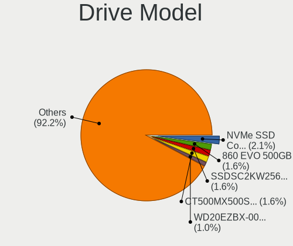

| Model                                 | Computers | Percent |
|---------------------------------------|-----------|---------|
| Samsung SSD 850 EVO 250GB             | 5         | 2.63%   |
| Crucial CT500MX500SSD1 500GB          | 3         | 1.58%   |
| WDC WD40EFRX-68N32N0 4TB              | 2         | 1.05%   |
| WDC WD10EZEX-60WN4A0 1TB              | 2         | 1.05%   |
| Seagate ST3500418AS 500GB             | 2         | 1.05%   |
| Seagate ST1000LM035-1RK172 1TB        | 2         | 1.05%   |
| Seagate ST1000DM010-2EP102 1TB        | 2         | 1.05%   |
| Seagate Basic 4TB                     | 2         | 1.05%   |
| Samsung SSD 980 500GB                 | 2         | 1.05%   |
| Samsung SSD 970 EVO Plus 1TB          | 2         | 1.05%   |
| Samsung NVMe SSD Drive 512GB          | 2         | 1.05%   |
| Kingston SA400S37120G 120GB SSD       | 2         | 1.05%   |
| Kingston NVMe SSD Drive 256GB         | 2         | 1.05%   |
| Intel SSDSC2KW256G8 256GB             | 2         | 1.05%   |
| Intel SSDSC2CT120A3 120GB             | 2         | 1.05%   |
| Hitachi HDS728080PLA380 82GB          | 2         | 1.05%   |
| Crucial CT1000MX500SSD1 1TB           | 2         | 1.05%   |
| WDC WDS500G2B0C-00PXH0 500GB          | 1         | 0.53%   |
| WDC WDS500G2B0A-00SM50 500GB SSD      | 1         | 0.53%   |
| WDC WDS250G2B0A 250GB SSD             | 1         | 0.53%   |
| WDC WDS200T1X0E-00AFY0 2TB            | 1         | 0.53%   |
| WDC WDS100T2B0C-00PXH0 1TB            | 1         | 0.53%   |
| WDC WDS100T1X0E-00AFY0 1TB            | 1         | 0.53%   |
| WDC WD5000LPVX-22V0TT0 500GB          | 1         | 0.53%   |
| WDC WD5000LPLX-08ZNTT0 500GB          | 1         | 0.53%   |
| WDC WD5000AVVS-63M8B0 500GB           | 1         | 0.53%   |
| WDC WD5000AURX-63UY4Y0 500GB          | 1         | 0.53%   |
| WDC WD5000AAKX-083CA1 500GB           | 1         | 0.53%   |
| WDC WD40EFRX-68WT0N0 4TB              | 1         | 0.53%   |
| WDC WD30EFRX-68EUZN0 3TB              | 1         | 0.53%   |
| WDC WD20SPZX-21UA7T0 2TB              | 1         | 0.53%   |
| WDC WD20EZRX-00D8PB0 2TB              | 1         | 0.53%   |
| WDC WD20EARX-00PASB0 2TB              | 1         | 0.53%   |
| WDC WD10EFRX-68PJCN0 1TB              | 1         | 0.53%   |
| WDC WD10EFRX-68FYTN0 1TB              | 1         | 0.53%   |
| WDC WD10EALX-009BA0 1TB               | 1         | 0.53%   |
| WDC WD1003FZEX-00MK2A0 1TB            | 1         | 0.53%   |
| WDC PC SN730 SDBPNTY-512G-1101 512GB  | 1         | 0.53%   |
| WDC PC SN720 SDAPNTW-256G-1014 256GB  | 1         | 0.53%   |
| WDC PC SN530 SDBPNPZ-256G-1002 256GB  | 1         | 0.53%   |
| WDC PC SN530 NVMe 512GB               | 1         | 0.53%   |
| Unknown SE32G  32GB                   | 1         | 0.53%   |
| Unknown SD/MMC/MS PRO 128GB           | 1         | 0.53%   |
| Unknown MMC Card  64GB                | 1         | 0.53%   |
| Unknown MMC Card  16GB                | 1         | 0.53%   |
| Toshiba MQ01ACF050 500GB              | 1         | 0.53%   |
| Toshiba MQ01ABF050 500GB              | 1         | 0.53%   |
| Toshiba MK2552GSX 250GB               | 1         | 0.53%   |
| Toshiba DT01ACA200 2TB                | 1         | 0.53%   |
| SPCC Solid State Disk 512GB           | 1         | 0.53%   |
| SPCC Solid State Disk 256GB           | 1         | 0.53%   |
| SK hynix NVMe SSD Drive 512GB         | 1         | 0.53%   |
| SK hynix NVMe SSD Drive 128GB         | 1         | 0.53%   |
| SK hynix HFS256G39TNH-73A0A 256GB SSD | 1         | 0.53%   |
| SK hynix HFS256G39MND-3310A 256GB SSD | 1         | 0.53%   |
| SK hynix HFM256GDGTNG-87A0A 256GB     | 1         | 0.53%   |
| Silicon Motion NVMe SSD Drive 500GB   | 1         | 0.53%   |
| Seagate ST_M13FQBL QNR 4GB            | 1         | 0.53%   |
| Seagate ST9500325AS 500GB             | 1         | 0.53%   |
| Seagate ST9160821AS 160GB             | 1         | 0.53%   |

HDD Vendor
----------

Hard disk drive vendors

| Vendor              | Computers | Drives | Percent |
|---------------------|-----------|--------|---------|
| Seagate             | 27        | 41     | 45%     |
| WDC                 | 15        | 22     | 25%     |
| Hitachi             | 5         | 5      | 8.33%   |
| Toshiba             | 4         | 4      | 6.67%   |
| Samsung Electronics | 4         | 4      | 6.67%   |
| Unknown             | 1         | 1      | 1.67%   |
| JMicron Technology  | 1         | 1      | 1.67%   |
| HGST                | 1         | 1      | 1.67%   |
| Fujitsu             | 1         | 1      | 1.67%   |
| ASMT                | 1         | 1      | 1.67%   |

SSD Vendor
----------

Solid state drive vendors

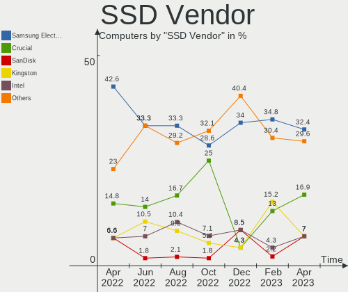

| Vendor              | Computers | Drives | Percent |
|---------------------|-----------|--------|---------|
| Samsung Electronics | 19        | 21     | 33.33%  |
| Crucial             | 8         | 9      | 14.04%  |
| Kingston            | 6         | 7      | 10.53%  |
| Intel               | 4         | 4      | 7.02%   |
| WDC                 | 2         | 2      | 3.51%   |
| SPCC                | 2         | 2      | 3.51%   |
| SK hynix            | 2         | 2      | 3.51%   |
| Gigabyte Technology | 2         | 2      | 3.51%   |
| Apple               | 2         | 2      | 3.51%   |
| Seagate             | 1         | 2      | 1.75%   |
| SanDisk             | 1         | 1      | 1.75%   |
| Patriot             | 1         | 1      | 1.75%   |
| OWC                 | 1         | 1      | 1.75%   |
| OCZ                 | 1         | 1      | 1.75%   |
| LITEONIT            | 1         | 1      | 1.75%   |
| KUIJIA              | 1         | 1      | 1.75%   |
| Kston               | 1         | 1      | 1.75%   |
| KingSpec            | 1         | 1      | 1.75%   |
| A-DATA Technology   | 1         | 1      | 1.75%   |

Drive Kind
----------

HDD or SSD

| Kind    | Computers | Drives | Percent |
|---------|-----------|--------|---------|
| SSD     | 51        | 62     | 34.93%  |
| HDD     | 46        | 81     | 31.51%  |
| NVMe    | 43        | 52     | 29.45%  |
| MMC     | 3         | 3      | 2.05%   |
| Unknown | 3         | 4      | 2.05%   |

Drive Connector
---------------

SATA, SAS, NVMe, etc.

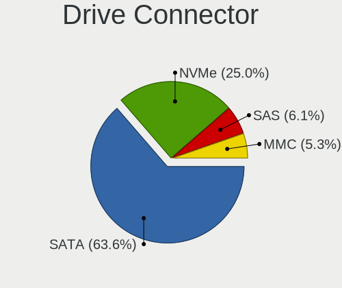

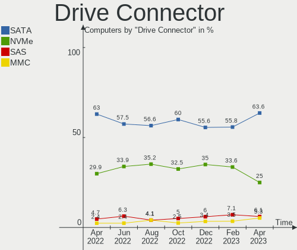

| Type | Computers | Drives | Percent |
|------|-----------|--------|---------|
| SATA | 73        | 135    | 57.48%  |
| NVMe | 43        | 52     | 33.86%  |
| SAS  | 8         | 12     | 6.3%    |
| MMC  | 3         | 3      | 2.36%   |

Drive Size
----------

Size of hard drive

| Size in TB | Computers | Drives | Percent |
|------------|-----------|--------|---------|
| 0.01-0.5   | 58        | 75     | 55.24%  |
| 0.51-1.0   | 25        | 37     | 23.81%  |
| 1.01-2.0   | 14        | 15     | 13.33%  |
| 3.01-4.0   | 4         | 12     | 3.81%   |
| 2.01-3.0   | 2         | 2      | 1.9%    |
| 4.01-10.0  | 2         | 2      | 1.9%    |

Space Total
-----------

Amount of disk space available on the file system

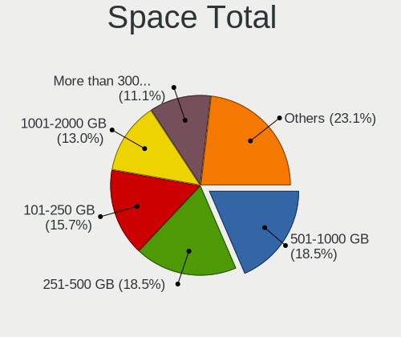

| Size in GB     | Computers | Percent |
|----------------|-----------|---------|
| 101-250        | 26        | 24.76%  |
| 251-500        | 22        | 20.95%  |
| 1001-2000      | 15        | 14.29%  |
| 1-20           | 12        | 11.43%  |
| 51-100         | 12        | 11.43%  |
| 501-1000       | 10        | 9.52%   |
| More than 3000 | 4         | 3.81%   |
| 21-50          | 2         | 1.9%    |
| 2001-3000      | 1         | 0.95%   |
| Unknown        | 1         | 0.95%   |

Space Used
----------

Amount of used disk space

| Used GB        | Computers | Percent |
|----------------|-----------|---------|
| 1-20           | 41        | 39.05%  |
| 21-50          | 18        | 17.14%  |
| 51-100         | 16        | 15.24%  |
| 101-250        | 10        | 9.52%   |
| 251-500        | 8         | 7.62%   |
| 1001-2000      | 5         | 4.76%   |
| 501-1000       | 3         | 2.86%   |
| More than 3000 | 2         | 1.9%    |
| 2001-3000      | 1         | 0.95%   |
| Unknown        | 1         | 0.95%   |

Malfunc. Drives
---------------

Drive models with a malfunction

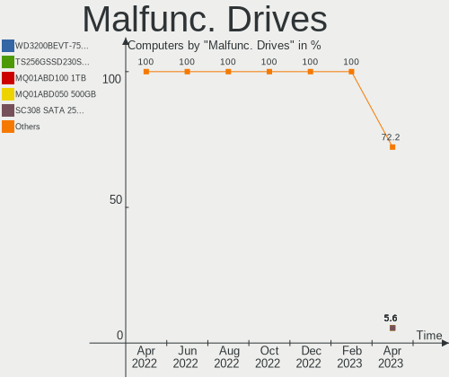

| Model                                   | Computers | Drives | Percent |
|-----------------------------------------|-----------|--------|---------|
| Intel SSDSC2CT120A3 120GB               | 2         | 2      | 28.57%  |
| WDC WD40EFRX-68WT0N0 4TB                | 1         | 4      | 14.29%  |
| Seagate ST500DM002-1BD142 500GB         | 1         | 1      | 14.29%  |
| Seagate ST3500418AS 500GB               | 1         | 1      | 14.29%  |
| Gigabyte Technology GP-GM30512G-G 512GB | 1         | 1      | 14.29%  |
| Apple SSD SM256C 256GB                  | 1         | 1      | 14.29%  |

Malfunc. Drive Vendor
---------------------

Vendors of faulty drives

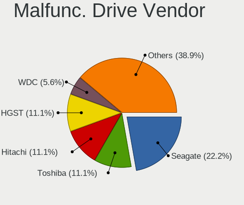

| Vendor              | Computers | Drives | Percent |
|---------------------|-----------|--------|---------|
| Seagate             | 2         | 2      | 28.57%  |
| Intel               | 2         | 2      | 28.57%  |
| WDC                 | 1         | 4      | 14.29%  |
| Gigabyte Technology | 1         | 1      | 14.29%  |
| Apple               | 1         | 1      | 14.29%  |

Malfunc. HDD Vendor
-------------------

Vendors of faulty HDD drives

| Vendor  | Computers | Drives | Percent |
|---------|-----------|--------|---------|
| Seagate | 2         | 2      | 66.67%  |
| WDC     | 1         | 4      | 33.33%  |

Malfunc. Drive Kind
-------------------

Kinds of faulty drives

| Kind | Computers | Drives | Percent |
|------|-----------|--------|---------|
| SSD  | 3         | 3      | 42.86%  |
| HDD  | 3         | 6      | 42.86%  |
| NVMe | 1         | 1      | 14.29%  |

Failed Drives
-------------

Failed drive models

Zero info for selected period =(

Failed Drive Vendor
-------------------

Failed drive vendors

Zero info for selected period =(

Drive Status
------------

Number of failed and malfunc. drives

| Status   | Computers | Drives | Percent |
|----------|-----------|--------|---------|
| Detected | 55        | 99     | 48.25%  |
| Works    | 52        | 93     | 45.61%  |
| Malfunc  | 7         | 10     | 6.14%   |

Storage controller
------------------

Storage Vendor
--------------

Storage controller vendors

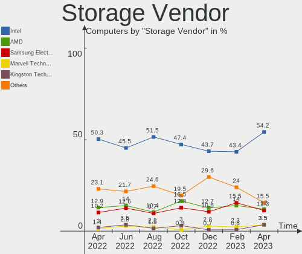

| Vendor                      | Computers | Percent |
|-----------------------------|-----------|---------|
| Intel                       | 65        | 45.45%  |
| AMD                         | 20        | 13.99%  |
| Samsung Electronics         | 18        | 12.59%  |
| SanDisk                     | 10        | 6.99%   |
| Kingston Technology Company | 5         | 3.5%    |
| Marvell Technology Group    | 4         | 2.8%    |
| SK hynix                    | 3         | 2.1%    |
| Phison Electronics          | 3         | 2.1%    |
| Realtek Semiconductor       | 2         | 1.4%    |
| Micron/Crucial Technology   | 2         | 1.4%    |
| ASMedia Technology          | 2         | 1.4%    |
| ADATA Technology            | 2         | 1.4%    |
| ULi Electronics             | 1         | 0.7%    |
| Silicon Motion              | 1         | 0.7%    |
| Silicon Image               | 1         | 0.7%    |
| KIOXIA                      | 1         | 0.7%    |
| JMicron Technology          | 1         | 0.7%    |
| Biwin Storage Technology    | 1         | 0.7%    |
| Apple                       | 1         | 0.7%    |

Storage Model
-------------

Storage controller models

| Model                                                                          | Computers | Percent |
|--------------------------------------------------------------------------------|-----------|---------|
| AMD FCH SATA Controller [AHCI mode]                                            | 12        | 7.59%   |
| Samsung NVMe SSD Controller SM981/PM981/PM983                                  | 7         | 4.43%   |
| Intel Volume Management Device NVMe RAID Controller                            | 6         | 3.8%    |
| Intel Cannon Lake PCH SATA AHCI Controller                                     | 5         | 3.16%   |
| AMD SB7x0/SB8x0/SB9x0 SATA Controller [AHCI mode]                              | 5         | 3.16%   |
| Samsung NVMe SSD Controller PM9A1/PM9A3/980PRO                                 | 4         | 2.53%   |
| Intel Sunrise Point-LP SATA Controller [AHCI mode]                             | 4         | 2.53%   |
| Intel SATA Controller [RAID mode]                                              | 4         | 2.53%   |
| Intel 7 Series/C210 Series Chipset Family 6-port SATA Controller [AHCI mode]   | 4         | 2.53%   |
| Intel 6 Series/C200 Series Chipset Family 6 port Desktop SATA AHCI Controller  | 4         | 2.53%   |
| SanDisk WD PC SN810 / Black SN850 NVMe SSD                                     | 3         | 1.9%    |
| SanDisk WD Blue SN550 NVMe SSD                                                 | 3         | 1.9%    |
| Samsung NVMe SSD Controller 980                                                | 3         | 1.9%    |
| Intel Cannon Lake Mobile PCH SATA AHCI Controller                              | 3         | 1.9%    |
| Intel Alder Lake-S PCH SATA Controller [AHCI Mode]                             | 3         | 1.9%    |
| Intel 7 Series Chipset Family 6-port SATA Controller [AHCI mode]               | 3         | 1.9%    |
| SK hynix BC501 NVMe Solid State Drive                                          | 2         | 1.27%   |
| SanDisk Non-Volatile memory controller                                         | 2         | 1.27%   |
| Samsung NVMe SSD Controller SM961/PM961/SM963                                  | 2         | 1.27%   |
| Kingston Company Company Non-Volatile memory controller                        | 2         | 1.27%   |
| Kingston Company OM3PDP3 NVMe SSD                                              | 2         | 1.27%   |
| Intel Tiger Lake-LP SATA Controller [AHCI mode]                                | 2         | 1.27%   |
| Intel NM10/ICH7 Family SATA Controller [IDE mode]                              | 2         | 1.27%   |
| Intel NM10/ICH7 Family SATA Controller [AHCI mode]                             | 2         | 1.27%   |
| Intel Atom Processor E3800 Series SATA AHCI Controller                         | 2         | 1.27%   |
| Intel 8 Series/C220 Series Chipset Family 6-port SATA Controller 1 [AHCI mode] | 2         | 1.27%   |
| Intel 500 Series Chipset Family SATA AHCI Controller                           | 2         | 1.27%   |
| Intel 400 Series Chipset Family SATA AHCI Controller                           | 2         | 1.27%   |
| ASMedia ASM1062 Serial ATA Controller                                          | 2         | 1.27%   |
| AMD SB7x0/SB8x0/SB9x0 IDE Controller                                           | 2         | 1.27%   |
| AMD 500 Series Chipset SATA Controller                                         | 2         | 1.27%   |
| AMD 300 Series Chipset SATA Controller                                         | 2         | 1.27%   |
| ADATA XPG SX8200 Pro PCIe Gen3x4 M.2 2280 Solid State Drive                    | 2         | 1.27%   |
| ULi ULi M5288 SATA                                                             | 1         | 0.63%   |
| ULi M5229 IDE                                                                  | 1         | 0.63%   |
| SK hynix Gold P31 SSD                                                          | 1         | 0.63%   |
| Silicon Motion SM2263EN/SM2263XT SSD Controller                                | 1         | 0.63%   |
| Silicon Image SiI 3132 Serial ATA Raid II Controller                           | 1         | 0.63%   |
| SanDisk WD Black SN750 / PC SN730 NVMe SSD                                     | 1         | 0.63%   |
| SanDisk WD Black 2018/SN750 / PC SN720 NVMe SSD                                | 1         | 0.63%   |
| Samsung NVMe SSD Controller SM951/PM951                                        | 1         | 0.63%   |
| Samsung Apple PCIe SSD                                                         | 1         | 0.63%   |
| Realtek RTS5763DL NVMe SSD Controller                                          | 1         | 0.63%   |
| Realtek Realtek Non-Volatile memory controller                                 | 1         | 0.63%   |
| Phison PS5013 E13 NVMe Controller                                              | 1         | 0.63%   |
| Phison E16 PCIe4 NVMe Controller                                               | 1         | 0.63%   |
| Phison E12 NVMe Controller                                                     | 1         | 0.63%   |
| Micron/Crucial P1 NVMe PCIe SSD                                                | 1         | 0.63%   |
| Micron/Crucial NVMe Controller                                                 | 1         | 0.63%   |
| Marvell Group 88SE9230 PCIe 2.0 x2 4-port SATA 6 Gb/s RAID Controller          | 1         | 0.63%   |
| Marvell Group 88SE9215 PCIe 2.0 x1 4-port SATA 6 Gb/s Controller               | 1         | 0.63%   |
| Marvell Group 88SE9172 SATA 6Gb/s Controller                                   | 1         | 0.63%   |
| Marvell Group 88SE6111/6121 SATA II / PATA Controller                          | 1         | 0.63%   |
| KIOXIA Non-Volatile memory controller                                          | 1         | 0.63%   |
| Kingston Company U-SNS8154P3 NVMe SSD                                          | 1         | 0.63%   |
| JMicron JMB363 SATA/IDE Controller                                             | 1         | 0.63%   |
| Intel Wildcat Point-LP SATA Controller [AHCI Mode]                             | 1         | 0.63%   |
| Intel Q170/Q150/B150/H170/H110/Z170/CM236 Chipset SATA Controller [AHCI Mode]  | 1         | 0.63%   |
| Intel Jasper Lake SATA AHCI Controller                                         | 1         | 0.63%   |
| Intel Comet Lake SATA AHCI Controller                                          | 1         | 0.63%   |

Storage Kind
------------

Kind of storage controller (IDE, SATA, NVMe, SAS, ...)

| Kind | Computers | Percent |
|------|-----------|---------|
| SATA | 75        | 52.82%  |
| NVMe | 43        | 30.28%  |
| RAID | 14        | 9.86%   |
| IDE  | 9         | 6.34%   |
| SAS  | 1         | 0.7%    |

Processor
---------

CPU Vendor
----------

Processor vendors

| Vendor | Computers | Percent |
|--------|-----------|---------|
| Intel  | 77        | 73.33%  |
| AMD    | 25        | 23.81%  |
| ARM    | 3         | 2.86%   |

CPU Model
---------

Processor models

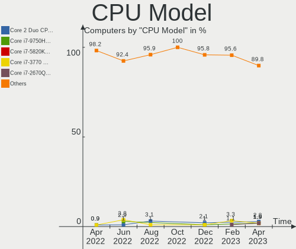

| Model                                   | Computers | Percent |
|-----------------------------------------|-----------|---------|
| Intel Core i7-3770 CPU @ 3.40GHz        | 4         | 3.81%   |
| Intel Core i7-9750H CPU @ 2.60GHz       | 3         | 2.86%   |
| Intel Pentium CPU G4560 @ 3.50GHz       | 2         | 1.9%    |
| Intel Core i5-8265U CPU @ 1.60GHz       | 2         | 1.9%    |
| Intel Core i5-3360M CPU @ 2.80GHz       | 2         | 1.9%    |
| Intel Core i5-10300H CPU @ 2.50GHz      | 2         | 1.9%    |
| Intel Celeron CPU J1900 @ 1.99GHz       | 2         | 1.9%    |
| Intel 11th Gen Core i7-1165G7 @ 2.80GHz | 2         | 1.9%    |
| Intel 11th Gen Core i5-1135G7 @ 2.40GHz | 2         | 1.9%    |
| ARM Processor                           | 2         | 1.9%    |
| AMD Ryzen 7 5700G with Radeon Graphics  | 2         | 1.9%    |
| Intel Xeon CPU E5-2620 v2 @ 2.10GHz     | 1         | 0.95%   |
| Intel Pentium CPU N3700 @ 1.60GHz       | 1         | 0.95%   |
| Intel Pentium CPU G850 @ 2.90GHz        | 1         | 0.95%   |
| Intel Core m5-6Y54 CPU @ 1.10GHz        | 1         | 0.95%   |
| Intel Core i9-9980HK CPU @ 2.40GHz      | 1         | 0.95%   |
| Intel Core i9-9900K CPU @ 3.60GHz       | 1         | 0.95%   |
| Intel Core i7-8700 CPU @ 3.20GHz        | 1         | 0.95%   |
| Intel Core i7-8565U CPU @ 1.80GHz       | 1         | 0.95%   |
| Intel Core i7-8550U CPU @ 1.80GHz       | 1         | 0.95%   |
| Intel Core i7-6600U CPU @ 2.60GHz       | 1         | 0.95%   |
| Intel Core i7-6500U CPU @ 2.50GHz       | 1         | 0.95%   |
| Intel Core i7-5930K CPU @ 3.50GHz       | 1         | 0.95%   |
| Intel Core i7-4800MQ CPU @ 2.70GHz      | 1         | 0.95%   |
| Intel Core i7-4790 CPU @ 3.60GHz        | 1         | 0.95%   |
| Intel Core i7-4700MQ CPU @ 2.40GHz      | 1         | 0.95%   |
| Intel Core i7-4578U CPU @ 3.00GHz       | 1         | 0.95%   |
| Intel Core i7-3632QM CPU @ 2.20GHz      | 1         | 0.95%   |
| Intel Core i7-2677M CPU @ 1.80GHz       | 1         | 0.95%   |
| Intel Core i7-2600 CPU @ 3.40GHz        | 1         | 0.95%   |
| Intel Core i7-10700KF CPU @ 3.80GHz     | 1         | 0.95%   |
| Intel Core i7-10700 CPU @ 2.90GHz       | 1         | 0.95%   |
| Intel Core i7 CPU 920 @ 2.67GHz         | 1         | 0.95%   |
| Intel Core i5-9500T CPU @ 2.20GHz       | 1         | 0.95%   |
| Intel Core i5-9400F CPU @ 2.90GHz       | 1         | 0.95%   |
| Intel Core i5-7300U CPU @ 2.60GHz       | 1         | 0.95%   |
| Intel Core i5-7200U CPU @ 2.50GHz       | 1         | 0.95%   |
| Intel Core i5-5250U CPU @ 1.60GHz       | 1         | 0.95%   |
| Intel Core i5-4288U CPU @ 2.60GHz       | 1         | 0.95%   |
| Intel Core i5-3470 CPU @ 3.20GHz        | 1         | 0.95%   |
| Intel Core i5-2400S CPU @ 2.50GHz       | 1         | 0.95%   |
| Intel Core i5-10400F CPU @ 2.90GHz      | 1         | 0.95%   |
| Intel Core i5-10400 CPU @ 2.90GHz       | 1         | 0.95%   |
| Intel Core i5-1035G7 CPU @ 1.20GHz      | 1         | 0.95%   |
| Intel Core i5 CPU M 540 @ 2.53GHz       | 1         | 0.95%   |
| Intel Core i5 CPU M 480 @ 2.67GHz       | 1         | 0.95%   |
| Intel Core i3-7100U CPU @ 2.40GHz       | 1         | 0.95%   |
| Intel Core i3-3220 CPU @ 3.30GHz        | 1         | 0.95%   |
| Intel Core i3-2120 CPU @ 3.30GHz        | 1         | 0.95%   |
| Intel Core i3-1005G1 CPU @ 1.20GHz      | 1         | 0.95%   |
| Intel Core 2 Quad CPU Q6600 @ 2.40GHz   | 1         | 0.95%   |
| Intel Core 2 Duo CPU T7250 @ 2.00GHz    | 1         | 0.95%   |
| Intel Core 2 Duo CPU P8400 @ 2.26GHz    | 1         | 0.95%   |
| Intel Core 2 Duo CPU E8400 @ 3.00GHz    | 1         | 0.95%   |
| Intel Core 2 Duo CPU E7500 @ 2.93GHz    | 1         | 0.95%   |
| Intel Celeron N5095 @ 2.00GHz           | 1         | 0.95%   |
| Intel Celeron CPU N3350 @ 1.10GHz       | 1         | 0.95%   |
| Intel Atom CPU D525 @ 1.80GHz           | 1         | 0.95%   |
| Intel Atom CPU D2700 @ 2.13GHz          | 1         | 0.95%   |
| Intel 12th Gen Core i9-12900K           | 1         | 0.95%   |

CPU Model Family
----------------

Processor model prefix

| Model             | Computers | Percent |
|-------------------|-----------|---------|
| Intel Core i7     | 23        | 21.9%   |
| Intel Core i5     | 19        | 18.1%   |
| Other             | 14        | 13.33%  |
| AMD Ryzen 7       | 9         | 8.57%   |
| Intel Pentium     | 4         | 3.81%   |
| Intel Core i3     | 4         | 3.81%   |
| Intel Core 2 Duo  | 4         | 3.81%   |
| Intel Celeron     | 4         | 3.81%   |
| AMD Ryzen 9       | 3         | 2.86%   |
| AMD Ryzen 5       | 3         | 2.86%   |
| Intel Core i9     | 2         | 1.9%    |
| Intel Atom        | 2         | 1.9%    |
| AMD Phenom II X2  | 2         | 1.9%    |
| AMD FX            | 2         | 1.9%    |
| Intel Xeon        | 1         | 0.95%   |
| Intel Core m5     | 1         | 0.95%   |
| Intel Core 2 Quad | 1         | 0.95%   |
| ARM BCM           | 1         | 0.95%   |
| AMD V140          | 1         | 0.95%   |
| AMD Ryzen 3       | 1         | 0.95%   |
| AMD Athlon X4     | 1         | 0.95%   |
| AMD Athlon 64 X2  | 1         | 0.95%   |
| AMD Athlon        | 1         | 0.95%   |
| AMD A4            | 1         | 0.95%   |

CPU Cores
---------

Number of processor cores

| Number | Computers | Percent |
|--------|-----------|---------|
| 4      | 35        | 33.33%  |
| 2      | 33        | 31.43%  |
| 8      | 14        | 13.33%  |
| 6      | 13        | 12.38%  |
| 12     | 3         | 2.86%   |
| 10     | 3         | 2.86%   |
| 14     | 2         | 1.9%    |
| 16     | 1         | 0.95%   |
| 1      | 1         | 0.95%   |

CPU Sockets
-----------

Number of sockets

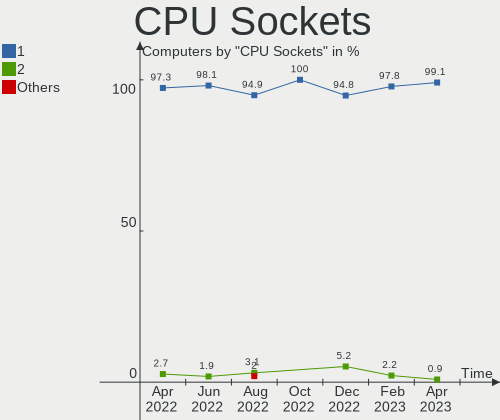

| Number | Computers | Percent |
|--------|-----------|---------|
| 1      | 103       | 98.1%   |
| 2      | 2         | 1.9%    |

CPU Threads
-----------

Threads per core (Hyper-Threading)

| Number | Computers | Percent |
|--------|-----------|---------|
| 2      | 77        | 73.33%  |
| 1      | 28        | 26.67%  |

CPU Op-Modes
------------

CPU Operation Modes (32-bit, 64-bit)

| Op mode        | Computers | Percent |
|----------------|-----------|---------|
| 32-bit, 64-bit | 104       | 99.05%  |
| Unknown        | 1         | 0.95%   |

CPU Microcode
-------------

Microcode number

| Number     | Computers | Percent |
|------------|-----------|---------|
| Unknown    | 28        | 26.67%  |
| 0x306a9    | 6         | 5.71%   |
| 0x806c1    | 5         | 4.76%   |
| 0x906ea    | 4         | 3.81%   |
| 0x206a7    | 4         | 3.81%   |
| 0x806e9    | 3         | 2.86%   |
| 0x406e3    | 3         | 2.86%   |
| 0x0a50000c | 3         | 2.86%   |
| 0x906ed    | 2         | 1.9%    |
| 0x906a3    | 2         | 1.9%    |
| 0x806ec    | 2         | 1.9%    |
| 0x706e5    | 2         | 1.9%    |
| 0x306c3    | 2         | 1.9%    |
| 0x30678    | 2         | 1.9%    |
| 0x1067a    | 2         | 1.9%    |
| 0x08101016 | 2         | 1.9%    |
| 0xa0655    | 1         | 0.95%   |
| 0xa0653    | 1         | 0.95%   |
| 0x906e9    | 1         | 0.95%   |
| 0x906c0    | 1         | 0.95%   |
| 0x906a4    | 1         | 0.95%   |
| 0x90672    | 1         | 0.95%   |
| 0x806eb    | 1         | 0.95%   |
| 0x806ea    | 1         | 0.95%   |
| 0x806d1    | 1         | 0.95%   |
| 0x6fb      | 1         | 0.95%   |
| 0x506c9    | 1         | 0.95%   |
| 0x406c3    | 1         | 0.95%   |
| 0x40651    | 1         | 0.95%   |
| 0x306f2    | 1         | 0.95%   |
| 0x306e4    | 1         | 0.95%   |
| 0x30661    | 1         | 0.95%   |
| 0x20652    | 1         | 0.95%   |
| 0x106ca    | 1         | 0.95%   |
| 0x10676    | 1         | 0.95%   |
| 0x0a50000d | 1         | 0.95%   |
| 0x0a404101 | 1         | 0.95%   |
| 0x0a201016 | 1         | 0.95%   |
| 0x08701021 | 1         | 0.95%   |
| 0x08608103 | 1         | 0.95%   |
| 0x0810100b | 1         | 0.95%   |
| 0x08001105 | 1         | 0.95%   |
| 0x07030105 | 1         | 0.95%   |
| 0x06003106 | 1         | 0.95%   |
| 0x06000852 | 1         | 0.95%   |
| 0x0600063e | 1         | 0.95%   |
| 0x010000c8 | 1         | 0.95%   |
| 0x010000c6 | 1         | 0.95%   |
| 0x010000b6 | 1         | 0.95%   |

CPU Microarch
-------------

Microarchitecture

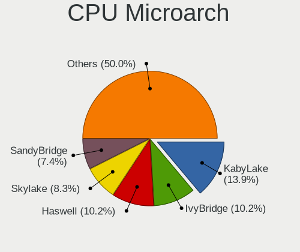

| Name             | Computers | Percent |
|------------------|-----------|---------|
| KabyLake         | 17        | 16.19%  |
| IvyBridge        | 10        | 9.52%   |
| Zen 3            | 8         | 7.62%   |
| Unknown          | 8         | 7.62%   |
| Haswell          | 6         | 5.71%   |
| CometLake        | 6         | 5.71%   |
| Zen              | 5         | 4.76%   |
| TigerLake        | 5         | 4.76%   |
| SandyBridge      | 5         | 4.76%   |
| Skylake          | 3         | 2.86%   |
| Silvermont       | 3         | 2.86%   |
| Penryn           | 3         | 2.86%   |
| K10              | 3         | 2.86%   |
| IceLake          | 3         | 2.86%   |
| Alderlake Hybrid | 3         | 2.86%   |
| Zen 2            | 2         | 1.9%    |
| Westmere         | 2         | 1.9%    |
| Core             | 2         | 1.9%    |
| Bonnell          | 2         | 1.9%    |
| Tremont          | 1         | 0.95%   |
| Steamroller      | 1         | 0.95%   |
| Puma             | 1         | 0.95%   |
| Piledriver       | 1         | 0.95%   |
| Nehalem          | 1         | 0.95%   |
| K8 Hammer        | 1         | 0.95%   |
| Goldmont         | 1         | 0.95%   |
| Bulldozer        | 1         | 0.95%   |
| Broadwell        | 1         | 0.95%   |

Graphics
--------

GPU Vendor
----------

Vendors of graphics cards

| Vendor | Computers | Percent |
|--------|-----------|---------|
| Intel  | 54        | 45.76%  |
| Nvidia | 41        | 34.75%  |
| AMD    | 23        | 19.49%  |

GPU Model
---------

Graphics card models

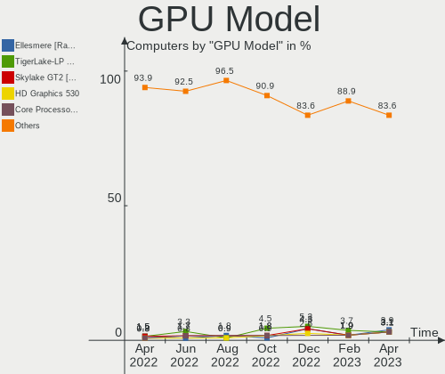

| Model                                                                     | Computers | Percent |
|---------------------------------------------------------------------------|-----------|---------|
| AMD Cezanne                                                               | 6         | 5%      |
| Intel TigerLake-LP GT2 [Iris Xe Graphics]                                 | 4         | 3.33%   |
| Intel 2nd Generation Core Processor Family Integrated Graphics Controller | 4         | 3.33%   |
| Nvidia GM107 [GeForce GTX 750 Ti]                                         | 3         | 2.5%    |
| Nvidia GK208B [GeForce GT 710]                                            | 3         | 2.5%    |
| Intel WhiskeyLake-U GT2 [UHD Graphics 620]                                | 3         | 2.5%    |
| Intel HD Graphics 620                                                     | 3         | 2.5%    |
| Intel CoffeeLake-H GT2 [UHD Graphics 630]                                 | 3         | 2.5%    |
| Intel 3rd Gen Core processor Graphics Controller                          | 3         | 2.5%    |
| Nvidia TU117 [GeForce GTX 1650]                                           | 2         | 1.67%   |
| Nvidia TU104 [GeForce RTX 2080 Rev. A]                                    | 2         | 1.67%   |
| Nvidia GM204 [GeForce GTX 970]                                            | 2         | 1.67%   |
| Nvidia GM108M [GeForce 940MX]                                             | 2         | 1.67%   |
| Intel Skylake GT2 [HD Graphics 520]                                       | 2         | 1.67%   |
| Intel Haswell-ULT Integrated Graphics Controller                          | 2         | 1.67%   |
| Intel Core Processor Integrated Graphics Controller                       | 2         | 1.67%   |
| Intel CometLake-H GT2 [UHD Graphics]                                      | 2         | 1.67%   |
| Intel Atom Processor Z36xxx/Z37xxx Series Graphics & Display              | 2         | 1.67%   |
| Intel AlderLake-S GT1                                                     | 2         | 1.67%   |
| Intel Alder Lake-P Integrated Graphics Controller                         | 2         | 1.67%   |
| Intel 4th Gen Core Processor Integrated Graphics Controller               | 2         | 1.67%   |
| AMD Raven Ridge [Radeon Vega Series / Radeon Vega Mobile Series]          | 2         | 1.67%   |
| Nvidia TU117M [GeForce MX450]                                             | 1         | 0.83%   |
| Nvidia TU117M [GeForce GTX 1650 Ti Mobile]                                | 1         | 0.83%   |
| Nvidia TU117M                                                             | 1         | 0.83%   |
| Nvidia TU117GLM [Quadro T2000 Mobile / Max-Q]                             | 1         | 0.83%   |
| Nvidia TU117GLM [Quadro T1000 Mobile]                                     | 1         | 0.83%   |
| Nvidia TU116M [GeForce GTX 1660 Ti Mobile]                                | 1         | 0.83%   |
| Nvidia TU116 [GeForce GTX 1650]                                           | 1         | 0.83%   |
| Nvidia TU104 [GeForce RTX 2070 SUPER]                                     | 1         | 0.83%   |
| Nvidia TU102 [GeForce RTX 2080 Ti]                                        | 1         | 0.83%   |
| Nvidia GT218 [GeForce 210]                                                | 1         | 0.83%   |
| Nvidia GP108M [GeForce MX230]                                             | 1         | 0.83%   |
| Nvidia GP107 [GeForce GTX 1050]                                           | 1         | 0.83%   |
| Nvidia GP107 [GeForce GTX 1050 Ti]                                        | 1         | 0.83%   |
| Nvidia GM107GL [Quadro K2200]                                             | 1         | 0.83%   |
| Nvidia GK104 [GeForce GTX 760]                                            | 1         | 0.83%   |
| Nvidia GF119 [GeForce GT 610]                                             | 1         | 0.83%   |
| Nvidia GF119 [GeForce GT 520]                                             | 1         | 0.83%   |
| Nvidia GF116 [GeForce GTX 550 Ti]                                         | 1         | 0.83%   |
| Nvidia GF108 [GeForce GT 430]                                             | 1         | 0.83%   |
| Nvidia GA107M [GeForce RTX 3050 Mobile]                                   | 1         | 0.83%   |
| Nvidia GA107GLM [RTX A2000 Mobile]                                        | 1         | 0.83%   |
| Nvidia GA106 [GeForce RTX 3060 Lite Hash Rate]                            | 1         | 0.83%   |
| Nvidia GA104M [Geforce RTX 3070 Ti Laptop GPU]                            | 1         | 0.83%   |
| Nvidia GA104 [GeForce RTX 3070 Ti]                                        | 1         | 0.83%   |
| Nvidia GA104 [GeForce RTX 3060 Ti Lite Hash Rate]                         | 1         | 0.83%   |
| Nvidia GA103M [GeForce RTX 3080 Ti Laptop GPU]                            | 1         | 0.83%   |
| Nvidia G84M [GeForce 8600M GT]                                            | 1         | 0.83%   |
| Intel VGA compatible controller                                           | 1         | 0.83%   |
| Intel UHD Graphics 620                                                    | 1         | 0.83%   |
| Intel TigerLake-H GT1 [UHD Graphics]                                      | 1         | 0.83%   |
| Intel Tiger Lake UHD Graphics                                             | 1         | 0.83%   |
| Intel Mobile 4 Series Chipset Integrated Graphics Controller              | 1         | 0.83%   |
| Intel JasperLake [UHD Graphics]                                           | 1         | 0.83%   |
| Intel IvyBridge GT2 [HD Graphics 4000]                                    | 1         | 0.83%   |
| Intel Iris Plus Graphics G7                                               | 1         | 0.83%   |
| Intel Iris Plus Graphics G1 (Ice Lake)                                    | 1         | 0.83%   |
| Intel HD Graphics 6000                                                    | 1         | 0.83%   |
| Intel HD Graphics 515                                                     | 1         | 0.83%   |

GPU Combo
---------

Combinations of graphics cards

| Name            | Computers | Percent |
|-----------------|-----------|---------|
| 1 x Intel       | 40        | 38.1%   |
| 1 x Nvidia      | 28        | 26.67%  |
| 1 x AMD         | 18        | 17.14%  |
| Intel + Nvidia  | 10        | 9.52%   |
| Other           | 3         | 2.86%   |
| AMD + Nvidia    | 2         | 1.9%    |
| 2 x Nvidia      | 1         | 0.95%   |
| 2 x AMD         | 1         | 0.95%   |
| Intel + 2 x AMD | 1         | 0.95%   |
| Intel + AMD     | 1         | 0.95%   |

GPU Driver
----------

Free vs proprietary

| Driver      | Computers | Percent |
|-------------|-----------|---------|
| Free        | 69        | 65.71%  |
| Proprietary | 28        | 26.67%  |
| Unknown     | 8         | 7.62%   |

GPU Memory
----------

Total video memory

| Size in GB | Computers | Percent |
|------------|-----------|---------|
| Unknown    | 58        | 55.24%  |
| 1.01-2.0   | 15        | 14.29%  |
| 0.01-0.5   | 9         | 8.57%   |
| 7.01-8.0   | 7         | 6.67%   |
| 3.01-4.0   | 7         | 6.67%   |
| 0.51-1.0   | 6         | 5.71%   |
| 8.01-16.0  | 2         | 1.9%    |
| 5.01-6.0   | 1         | 0.95%   |

Monitor
-------

Monitor Vendor
--------------

Monitor vendors

| Vendor               | Computers | Percent |
|----------------------|-----------|---------|
| AU Optronics         | 13        | 10.74%  |
| Dell                 | 11        | 9.09%   |
| Chimei Innolux       | 10        | 8.26%   |
| LG Display           | 9         | 7.44%   |
| Samsung Electronics  | 8         | 6.61%   |
| BenQ                 | 8         | 6.61%   |
| Lenovo               | 6         | 4.96%   |
| Goldstar             | 6         | 4.96%   |
| Panasonic            | 4         | 3.31%   |
| BOE                  | 4         | 3.31%   |
| Apple                | 4         | 3.31%   |
| Ancor Communications | 4         | 3.31%   |
| Acer                 | 4         | 3.31%   |
| Sharp                | 3         | 2.48%   |
| Philips              | 3         | 2.48%   |
| Hewlett-Packard      | 3         | 2.48%   |
| AOC                  | 3         | 2.48%   |
| SAC                  | 2         | 1.65%   |
| NEC Computers        | 2         | 1.65%   |
| LG Electronics       | 2         | 1.65%   |
| ASUSTek Computer     | 2         | 1.65%   |
| ViewSonic            | 1         | 0.83%   |
| Unknown (AAA)        | 1         | 0.83%   |
| TMX                  | 1         | 0.83%   |
| MLK                  | 1         | 0.83%   |
| Medion Akoya         | 1         | 0.83%   |
| IBM                  | 1         | 0.83%   |
| HPN                  | 1         | 0.83%   |
| CSO                  | 1         | 0.83%   |
| CHD                  | 1         | 0.83%   |
| AUS                  | 1         | 0.83%   |

Monitor Model
-------------

Monitor models

| Model                                                                 | Computers | Percent |
|-----------------------------------------------------------------------|-----------|---------|
| Philips 190S PHL082F 1280x1024 380x300mm 19.1-inch                    | 2         | 1.57%   |
| Lenovo LEN L1711pC LEN13B7 1280x1024 338x270mm 17.0-inch              | 2         | 1.57%   |
| Dell P1917S DELD091 1280x1024 380x300mm 19.1-inch                     | 2         | 1.57%   |
| Chimei Innolux LCD Monitor CMN1522 1920x1080 344x193mm 15.5-inch      | 2         | 1.57%   |
| BenQ G2420HD BNQ7840 1920x1080 531x299mm 24.0-inch                    | 2         | 1.57%   |
| AU Optronics LCD Monitor AUO223E 1600x900 309x174mm 14.0-inch         | 2         | 1.57%   |
| AU Optronics LCD Monitor AUO21ED 1920x1080 344x193mm 15.5-inch        | 2         | 1.57%   |
| Ancor Communications ASUS VC239 ACI23C4 1920x1080 509x286mm 23.0-inch | 2         | 1.57%   |
| Acer KA240H ACR0538 1920x1080 530x300mm 24.0-inch                     | 2         | 1.57%   |
| ViewSonic VX2235wm-EU VSC591E 1680x1050 474x296mm 22.0-inch           | 1         | 0.79%   |
| Unknown (AAA) Digital TV AAA0030 1920x1080 708x398mm 32.0-inch        | 1         | 0.79%   |
| TMX TL156MDMP01-1 TMX1560 3200x2000 336x210mm 15.6-inch               | 1         | 0.79%   |
| Sharp LQ135P1JX51 SHP14B3 2256x1504 285x190mm 13.5-inch               | 1         | 0.79%   |
| Sharp LCD Monitor SHP14F7 1920x1200 288x180mm 13.4-inch               | 1         | 0.79%   |
| Sharp LCD Monitor SHP14B9 3840x2160 344x194mm 15.5-inch               | 1         | 0.79%   |
| Samsung Electronics U28E590 SAM0C4D 3840x2160 607x345mm 27.5-inch     | 1         | 0.79%   |
| Samsung Electronics SyncMaster SAM01D3 1440x900 408x225mm 18.3-inch   | 1         | 0.79%   |
| Samsung Electronics SMS27A850T SAM0888 2560x1440 518x324mm 24.1-inch  | 1         | 0.79%   |
| Samsung Electronics S27R35x SAM1054 1920x1080 598x336mm 27.0-inch     | 1         | 0.79%   |
| Samsung Electronics S24F350 SAM0D20 1920x1080 521x293mm 23.5-inch     | 1         | 0.79%   |
| Samsung Electronics LCD Monitor SMBX2450 3200x1080                    | 1         | 0.79%   |
| Samsung Electronics LCD Monitor SEC3358 1280x800 330x210mm 15.4-inch  | 1         | 0.79%   |
| Samsung Electronics LCD Monitor SDC4161 1920x1080 344x194mm 15.5-inch | 1         | 0.79%   |
| Samsung Electronics LCD Monitor SAM0A7A 1920x1080 480x270mm 21.7-inch | 1         | 0.79%   |
| SAC LED MONITOR SAC952D 1920x1080 600x340mm 27.2-inch                 | 1         | 0.79%   |
| SAC LED MONITOR SAC952D 1920x1080 480x270mm 21.7-inch                 | 1         | 0.79%   |
| Philips PHL 243V7 PHLC155 1920x1080 527x296mm 23.8-inch               | 1         | 0.79%   |
| Panasonic TV MEIC136 1280x720 698x392mm 31.5-inch                     | 1         | 0.79%   |
| Panasonic TV MEIA296 3840x2160 698x392mm 31.5-inch                    | 1         | 0.79%   |
| Panasonic TV MEIA0CC 1920x1080 698x392mm 31.5-inch                    | 1         | 0.79%   |
| Panasonic TV MEIA063 1280x720 1434x806mm 64.8-inch                    | 1         | 0.79%   |
| NEC Computers PA301W NEC6811 2560x1600 641x400mm 29.7-inch            | 1         | 0.79%   |
| NEC Computers LCD2690WUXi2 NEC675D 1920x1200 550x344mm 25.5-inch      | 1         | 0.79%   |
| MLK MILKYWAY50PDP MLK9189 1920x540 708x398mm 32.0-inch                | 1         | 0.79%   |
| Medion Akoya MD20581 MEC7201 1920x1080 597x336mm 27.0-inch            | 1         | 0.79%   |
| LG Electronics LCD Monitor LG TV 1920x1080                            | 1         | 0.79%   |
| LG Electronics LCD Monitor LG HDR QHD 5120x1440                       | 1         | 0.79%   |
| LG Electronics LCD Monitor LG HDR QHD                                 | 1         | 0.79%   |
| LG Display LCD Monitor LGD05FD 1920x1080 309x174mm 14.0-inch          | 1         | 0.79%   |
| LG Display LCD Monitor LGD05E5 1920x1080 340x190mm 15.3-inch          | 1         | 0.79%   |
| LG Display LCD Monitor LGD05B9 1920x1080 382x215mm 17.3-inch          | 1         | 0.79%   |
| LG Display LCD Monitor LGD0555 2736x1824 260x173mm 12.3-inch          | 1         | 0.79%   |
| LG Display LCD Monitor LGD04F5 1920x1080 309x174mm 14.0-inch          | 1         | 0.79%   |
| LG Display LCD Monitor LGD049A 2560x1440 310x174mm 14.0-inch          | 1         | 0.79%   |
| LG Display LCD Monitor LGD0437 1920x1080 280x160mm 12.7-inch          | 1         | 0.79%   |
| LG Display LCD Monitor LGD03EA 1920x1080 309x174mm 14.0-inch          | 1         | 0.79%   |
| LG Display LCD Monitor LGD02AC 1366x768 344x194mm 15.5-inch           | 1         | 0.79%   |
| Lenovo TIO24Gen3 LEN10B4 1920x1080 527x296mm 23.8-inch                | 1         | 0.79%   |
| Lenovo LEN T23i-20 LEN61F6 1920x1080 509x286mm 23.0-inch              | 1         | 0.79%   |
| Lenovo LEN G34w-10 LEN66A1 3440x1440 797x334mm 34.0-inch              | 1         | 0.79%   |
| Lenovo LCD Monitor LEN4036 1440x900 304x190mm 14.1-inch               | 1         | 0.79%   |
| IBM IBML150/L150p IBMA151 1024x768 304x228mm 15.0-inch                | 1         | 0.79%   |
| HPN LCD Monitor HP 25x 1920x1080                                      | 1         | 0.79%   |
| Hewlett-Packard LCD Monitor LA1951                                    | 1         | 0.79%   |
| Hewlett-Packard E27 G4 HPN3693 1920x1080 598x337mm 27.0-inch          | 1         | 0.79%   |
| Hewlett-Packard 24fw HPN3545 1920x1080 527x296mm 23.8-inch            | 1         | 0.79%   |
| Goldstar W2753VC GSM5766 1920x1080 598x336mm 27.0-inch                | 1         | 0.79%   |
| Goldstar UltraFine GSM5B74 3840x2160 600x340mm 27.2-inch              | 1         | 0.79%   |
| Goldstar MP59HT GSM5B44 1920x1080 480x270mm 21.7-inch                 | 1         | 0.79%   |
| Goldstar HDR WFHD GSM7714 2560x1080 798x334mm 34.1-inch               | 1         | 0.79%   |

Monitor Resolution
------------------

Monitor screen resolution

| Resolution         | Computers | Percent |
|--------------------|-----------|---------|
| 1920x1080 (FHD)    | 51        | 45.13%  |
| 1366x768 (WXGA)    | 8         | 7.08%   |
| 1280x1024 (SXGA)   | 8         | 7.08%   |
| 3840x2160 (4K)     | 6         | 5.31%   |
| 2560x1440 (QHD)    | 5         | 4.42%   |
| 3440x1440          | 3         | 2.65%   |
| 2560x1600          | 3         | 2.65%   |
| 1920x1200 (WUXGA)  | 3         | 2.65%   |
| 1440x900 (WXGA+)   | 3         | 2.65%   |
| 2256x1504          | 2         | 1.77%   |
| 1680x1050 (WSXGA+) | 2         | 1.77%   |
| 1600x900 (HD+)     | 2         | 1.77%   |
| 1280x800 (WXGA)    | 2         | 1.77%   |
| 1280x720 (HD)      | 2         | 1.77%   |
| Unknown            | 2         | 1.77%   |
| 5120x1440          | 1         | 0.88%   |
| 3200x2000          | 1         | 0.88%   |
| 3200x1080          | 1         | 0.88%   |
| 2880x1800          | 1         | 0.88%   |
| 2736x1824          | 1         | 0.88%   |
| 2560x1080          | 1         | 0.88%   |
| 2304x1440          | 1         | 0.88%   |
| 2240x1400          | 1         | 0.88%   |
| 2160x1440          | 1         | 0.88%   |
| 1920x540           | 1         | 0.88%   |
| 1024x768 (XGA)     | 1         | 0.88%   |

Monitor Diagonal
----------------

Diagonal size in inches

| Inches  | Computers | Percent |
|---------|-----------|---------|
| 15      | 20        | 16.95%  |
| 27      | 12        | 10.17%  |
| 24      | 12        | 10.17%  |
| 14      | 11        | 9.32%   |
| 13      | 10        | 8.47%   |
| 23      | 7         | 5.93%   |
| Unknown | 7         | 5.93%   |
| 21      | 6         | 5.08%   |
| 19      | 6         | 5.08%   |
| 12      | 4         | 3.39%   |
| 34      | 3         | 2.54%   |
| 32      | 3         | 2.54%   |
| 31      | 3         | 2.54%   |
| 18      | 3         | 2.54%   |
| 22      | 2         | 1.69%   |
| 17      | 2         | 1.69%   |
| 84      | 1         | 0.85%   |
| 64      | 1         | 0.85%   |
| 48      | 1         | 0.85%   |
| 35      | 1         | 0.85%   |
| 29      | 1         | 0.85%   |
| 25      | 1         | 0.85%   |
| 11      | 1         | 0.85%   |

Monitor Width
-------------

Physical width

| Width in mm | Computers | Percent |
|-------------|-----------|---------|
| 301-350     | 34        | 30.09%  |
| 501-600     | 29        | 25.66%  |
| 201-300     | 11        | 9.73%   |
| 401-500     | 9         | 7.96%   |
| 351-400     | 9         | 7.96%   |
| Unknown     | 7         | 6.19%   |
| 701-800     | 5         | 4.42%   |
| 601-700     | 5         | 4.42%   |
| 1001-1500   | 2         | 1.77%   |
| 801-900     | 1         | 0.88%   |
| 1501-2000   | 1         | 0.88%   |

Aspect Ratio
------------

Proportional relationship between the width and the height

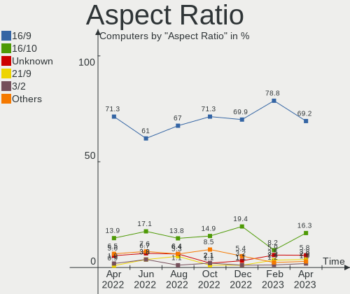

| Ratio   | Computers | Percent |
|---------|-----------|---------|
| 16/9    | 65        | 61.32%  |
| 16/10   | 18        | 16.98%  |
| Unknown | 7         | 6.6%    |
| 5/4     | 5         | 4.72%   |
| 3/2     | 4         | 3.77%   |
| 21/9    | 4         | 3.77%   |
| 6/5     | 2         | 1.89%   |
| 4/3     | 1         | 0.94%   |

Monitor Area
------------

Area in inch

| Area in inch | Computers | Percent |
|----------------|-----------|---------|
| 201-250        | 24        | 20.34%  |
| 101-110        | 20        | 16.95%  |
| 81-90          | 17        | 14.41%  |
| 301-350        | 12        | 10.17%  |
| 351-500        | 10        | 8.47%   |
| 151-200        | 10        | 8.47%   |
| Unknown        | 7         | 5.93%   |
| 71-80          | 5         | 4.24%   |
| More than 1000 | 3         | 2.54%   |
| 61-70          | 3         | 2.54%   |
| 251-300        | 3         | 2.54%   |
| 121-130        | 2         | 1.69%   |
| 51-60          | 1         | 0.85%   |
| 141-150        | 1         | 0.85%   |

Pixel Density
-------------

Pixels per inch

| Density       | Computers | Percent |
|---------------|-----------|---------|
| 51-100        | 43        | 39.45%  |
| 121-160       | 26        | 23.85%  |
| 101-120       | 16        | 14.68%  |
| 161-240       | 11        | 10.09%  |
| Unknown       | 7         | 6.42%   |
| More than 240 | 3         | 2.75%   |
| 1-50          | 3         | 2.75%   |

Multiple Monitors
-----------------

Total monitors connected

| Total | Computers | Percent |
|-------|-----------|---------|
| 1     | 73        | 69.52%  |
| 2     | 22        | 20.95%  |
| 0     | 6         | 5.71%   |
| 3     | 4         | 3.81%   |

Network
-------

Net Controller Vendor
---------------------

Controller vendors

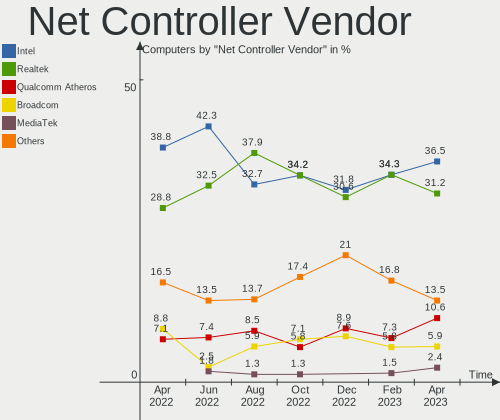

| Vendor                   | Computers | Percent |
|--------------------------|-----------|---------|
| Intel                    | 69        | 42.33%  |
| Realtek Semiconductor    | 53        | 32.52%  |
| Qualcomm Atheros         | 12        | 7.36%   |
| Broadcom Limited         | 5         | 3.07%   |
| Broadcom                 | 4         | 2.45%   |
| TP-Link                  | 3         | 1.84%   |
| MediaTek                 | 3         | 1.84%   |
| Marvell Technology Group | 2         | 1.23%   |
| Google                   | 2         | 1.23%   |
| Xiaomi                   | 1         | 0.61%   |
| Sierra Wireless          | 1         | 0.61%   |
| Samsung Electronics      | 1         | 0.61%   |
| Ralink Technology        | 1         | 0.61%   |
| Qualcomm                 | 1         | 0.61%   |
| Microsoft                | 1         | 0.61%   |
| ICS Advent               | 1         | 0.61%   |
| DisplayLink              | 1         | 0.61%   |
| Dell                     | 1         | 0.61%   |
| D-Link System            | 1         | 0.61%   |

Net Controller Model
--------------------

Controller models

| Model                                                             | Computers | Percent |
|-------------------------------------------------------------------|-----------|---------|
| Realtek RTL8111/8168/8411 PCI Express Gigabit Ethernet Controller | 32        | 17.02%  |
| Intel Wi-Fi 6 AX200                                               | 6         | 3.19%   |
| Intel 82579LM Gigabit Network Connection (Lewisville)             | 6         | 3.19%   |
| Intel I211 Gigabit Network Connection                             | 5         | 2.66%   |
| Realtek RTL8125 2.5GbE Controller                                 | 4         | 2.13%   |
| Intel Wireless 8265 / 8275                                        | 4         | 2.13%   |
| Intel Wi-Fi 6 AX201                                               | 4         | 2.13%   |
| Intel Comet Lake PCH CNVi WiFi                                    | 4         | 2.13%   |
| Qualcomm Atheros AR8151 v2.0 Gigabit Ethernet                     | 3         | 1.6%    |
| Intel Wi-Fi 6 AX210/AX211/AX411 160MHz                            | 3         | 1.6%    |
| Intel Ethernet Controller I225-V                                  | 3         | 1.6%    |
| Intel Ethernet Connection (7) I219-V                              | 3         | 1.6%    |
| Intel Centrino Ultimate-N 6300                                    | 3         | 1.6%    |
| Intel Alder Lake-P PCH CNVi WiFi                                  | 3         | 1.6%    |
| Intel 82574L Gigabit Network Connection                           | 3         | 1.6%    |
| Realtek RTL88x2bu [AC1200 Techkey]                                | 2         | 1.06%   |
| Realtek RTL8812AU 802.11a/b/g/n/ac 2T2R DB WLAN Adapter           | 2         | 1.06%   |
| Realtek RTL8153 Gigabit Ethernet Adapter                          | 2         | 1.06%   |
| Realtek Killer E3000 2.5GbE Controller                            | 2         | 1.06%   |
| Qualcomm Atheros Killer E220x Gigabit Ethernet Controller         | 2         | 1.06%   |
| Qualcomm Atheros AR9287 Wireless Network Adapter (PCI-Express)    | 2         | 1.06%   |
| MediaTek MT7921 802.11ax PCI Express Wireless Network Adapter     | 2         | 1.06%   |
| Intel Wireless-AC 9260                                            | 2         | 1.06%   |
| Intel Wireless 7265                                               | 2         | 1.06%   |
| Intel Ice Lake-LP PCH CNVi WiFi                                   | 2         | 1.06%   |
| Intel Ethernet Connection (6) I219-V                              | 2         | 1.06%   |
| Intel Dual Band Wireless-AC 3168NGW [Stone Peak]                  | 2         | 1.06%   |
| Intel Cannon Point-LP CNVi [Wireless-AC]                          | 2         | 1.06%   |
| Intel Cannon Lake PCH CNVi WiFi                                   | 2         | 1.06%   |
| Intel 82575EB Gigabit Network Connection                          | 2         | 1.06%   |
| Google Pixel 6                                                    | 2         | 1.06%   |
| Broadcom Limited BCM4360 802.11ac Wireless Network Adapter        | 2         | 1.06%   |
| Broadcom BCM4350 802.11ac Wireless Network Adapter                | 2         | 1.06%   |
| Xiaomi Mi/Redmi series (RNDIS + ADB)                              | 1         | 0.53%   |
| TP-Link TL-WN722N v2/v3 [Realtek RTL8188EUS]                      | 1         | 0.53%   |
| TP-Link Archer T9UH v1 [Realtek RTL8814AU]                        | 1         | 0.53%   |
| TP-Link 802.11ac WLAN Adapter                                     | 1         | 0.53%   |
| Sierra Wireless EM7430                                            | 1         | 0.53%   |
| Samsung GT-I9070 (network tethering, USB debugging enabled)       | 1         | 0.53%   |
| Realtek RTL8852AE 802.11ax PCIe Wireless Network Adapter          | 1         | 0.53%   |
| Realtek RTL8822BE 802.11a/b/g/n/ac WiFi adapter                   | 1         | 0.53%   |
| Realtek RTL8192EE PCIe Wireless Network Adapter                   | 1         | 0.53%   |
| Realtek RTL8191SU 802.11n WLAN Adapter                            | 1         | 0.53%   |
| Realtek RTL8188FTV 802.11b/g/n 1T1R 2.4G WLAN Adapter             | 1         | 0.53%   |
| Realtek RTL8152 Fast Ethernet Adapter                             | 1         | 0.53%   |
| Realtek RTL810xE PCI Express Fast Ethernet controller             | 1         | 0.53%   |
| Realtek RTL-8110SC/8169SC Gigabit Ethernet                        | 1         | 0.53%   |
| Realtek RTL-8100/8101L/8139 PCI Fast Ethernet Adapter             | 1         | 0.53%   |
| Realtek Realtek Network controller                                | 1         | 0.53%   |
| Realtek Killer E2600 Gigabit Ethernet Controller                  | 1         | 0.53%   |
| Realtek 802.11n WLAN Adapter                                      | 1         | 0.53%   |
| Realtek 802.11ac NIC                                              | 1         | 0.53%   |
| Ralink RT3072 Wireless Adapter                                    | 1         | 0.53%   |
| Qualcomm Atheros AR9485 Wireless Network Adapter                  | 1         | 0.53%   |
| Qualcomm Atheros AR9462 Wireless Network Adapter                  | 1         | 0.53%   |
| Qualcomm Atheros AR93xx Wireless Network Adapter                  | 1         | 0.53%   |
| Qualcomm Atheros AR9285 Wireless Network Adapter (PCI-Express)    | 1         | 0.53%   |
| Qualcomm Atheros AR8161 Gigabit Ethernet                          | 1         | 0.53%   |
| Qualcomm Atheros AR5212/5213/2414 Wireless Network Adapter        | 1         | 0.53%   |
| Qualcomm Android                                                  | 1         | 0.53%   |

Wireless Vendor
---------------

Wireless vendors

| Vendor                | Computers | Percent |
|-----------------------|-----------|---------|
| Intel                 | 49        | 57.65%  |
| Realtek Semiconductor | 11        | 12.94%  |
| Qualcomm Atheros      | 7         | 8.24%   |
| Broadcom              | 4         | 4.71%   |
| TP-Link               | 3         | 3.53%   |
| MediaTek              | 3         | 3.53%   |
| Broadcom Limited      | 3         | 3.53%   |
| Sierra Wireless       | 1         | 1.18%   |
| Ralink Technology     | 1         | 1.18%   |
| Microsoft             | 1         | 1.18%   |
| Dell                  | 1         | 1.18%   |
| D-Link System         | 1         | 1.18%   |

Wireless Model
--------------

Wireless models

| Model                                                                | Computers | Percent |
|----------------------------------------------------------------------|-----------|---------|
| Intel Wi-Fi 6 AX200                                                  | 6         | 7.06%   |
| Intel Wireless 8265 / 8275                                           | 4         | 4.71%   |
| Intel Wi-Fi 6 AX201                                                  | 4         | 4.71%   |
| Intel Comet Lake PCH CNVi WiFi                                       | 4         | 4.71%   |
| Intel Wi-Fi 6 AX210/AX211/AX411 160MHz                               | 3         | 3.53%   |
| Intel Centrino Ultimate-N 6300                                       | 3         | 3.53%   |
| Intel Alder Lake-P PCH CNVi WiFi                                     | 3         | 3.53%   |
| Realtek RTL88x2bu [AC1200 Techkey]                                   | 2         | 2.35%   |
| Realtek RTL8812AU 802.11a/b/g/n/ac 2T2R DB WLAN Adapter              | 2         | 2.35%   |
| Qualcomm Atheros AR9287 Wireless Network Adapter (PCI-Express)       | 2         | 2.35%   |
| MediaTek MT7921 802.11ax PCI Express Wireless Network Adapter        | 2         | 2.35%   |
| Intel Wireless-AC 9260                                               | 2         | 2.35%   |
| Intel Wireless 7265                                                  | 2         | 2.35%   |
| Intel Ice Lake-LP PCH CNVi WiFi                                      | 2         | 2.35%   |
| Intel Dual Band Wireless-AC 3168NGW [Stone Peak]                     | 2         | 2.35%   |
| Intel Cannon Point-LP CNVi [Wireless-AC]                             | 2         | 2.35%   |
| Intel Cannon Lake PCH CNVi WiFi                                      | 2         | 2.35%   |
| Broadcom Limited BCM4360 802.11ac Wireless Network Adapter           | 2         | 2.35%   |
| Broadcom BCM4350 802.11ac Wireless Network Adapter                   | 2         | 2.35%   |
| TP-Link TL-WN722N v2/v3 [Realtek RTL8188EUS]                         | 1         | 1.18%   |
| TP-Link Archer T9UH v1 [Realtek RTL8814AU]                           | 1         | 1.18%   |
| TP-Link 802.11ac WLAN Adapter                                        | 1         | 1.18%   |
| Sierra Wireless EM7430                                               | 1         | 1.18%   |
| Realtek RTL8852AE 802.11ax PCIe Wireless Network Adapter             | 1         | 1.18%   |
| Realtek RTL8822BE 802.11a/b/g/n/ac WiFi adapter                      | 1         | 1.18%   |
| Realtek RTL8192EE PCIe Wireless Network Adapter                      | 1         | 1.18%   |
| Realtek RTL8191SU 802.11n WLAN Adapter                               | 1         | 1.18%   |
| Realtek RTL8188FTV 802.11b/g/n 1T1R 2.4G WLAN Adapter                | 1         | 1.18%   |
| Realtek 802.11n WLAN Adapter                                         | 1         | 1.18%   |
| Realtek 802.11ac NIC                                                 | 1         | 1.18%   |
| Ralink RT3072 Wireless Adapter                                       | 1         | 1.18%   |
| Qualcomm Atheros AR9485 Wireless Network Adapter                     | 1         | 1.18%   |
| Qualcomm Atheros AR9462 Wireless Network Adapter                     | 1         | 1.18%   |
| Qualcomm Atheros AR93xx Wireless Network Adapter                     | 1         | 1.18%   |
| Qualcomm Atheros AR9285 Wireless Network Adapter (PCI-Express)       | 1         | 1.18%   |
| Qualcomm Atheros AR5212/5213/2414 Wireless Network Adapter           | 1         | 1.18%   |
| Microsoft XBOX ACC                                                   | 1         | 1.18%   |
| MediaTek MT7921K (RZ608) Wi-Fi 6E 80MHz                              | 1         | 1.18%   |
| Intel Wireless 8260                                                  | 1         | 1.18%   |
| Intel Wireless 7260                                                  | 1         | 1.18%   |
| Intel Wireless 3165                                                  | 1         | 1.18%   |
| Intel Wireless 3160                                                  | 1         | 1.18%   |
| Intel PRO/Wireless 5100 AGN [Shiloh] Network Connection              | 1         | 1.18%   |
| Intel PRO/Wireless 3945ABG [Golan] Network Connection                | 1         | 1.18%   |
| Intel Dual Band Wireless-AC 3165 Plus Bluetooth                      | 1         | 1.18%   |
| Intel Centrino Wireless-N 2230                                       | 1         | 1.18%   |
| Intel Centrino Advanced-N 6200                                       | 1         | 1.18%   |
| Intel Alder Lake-S PCH CNVi WiFi                                     | 1         | 1.18%   |
| Dell Hub of E-Port Replicator                                        | 1         | 1.18%   |
| D-Link System DWA-125 Wireless N 150 Adapter(rev.A1) [Ralink RT3070] | 1         | 1.18%   |
| Broadcom Limited BCM43228 802.11a/b/g/n                              | 1         | 1.18%   |
| Broadcom BCM43225 802.11b/g/n                                        | 1         | 1.18%   |
| Broadcom BCM43224 802.11a/b/g/n                                      | 1         | 1.18%   |

Ethernet Vendor
---------------

Ethernet vendors

| Vendor                   | Computers | Percent |
|--------------------------|-----------|---------|
| Realtek Semiconductor    | 44        | 44.9%   |
| Intel                    | 38        | 38.78%  |
| Qualcomm Atheros         | 6         | 6.12%   |
| Marvell Technology Group | 2         | 2.04%   |
| Google                   | 2         | 2.04%   |
| Broadcom Limited         | 2         | 2.04%   |
| Xiaomi                   | 1         | 1.02%   |
| Samsung Electronics      | 1         | 1.02%   |
| ICS Advent               | 1         | 1.02%   |
| DisplayLink              | 1         | 1.02%   |

Ethernet Model
--------------

Ethernet models

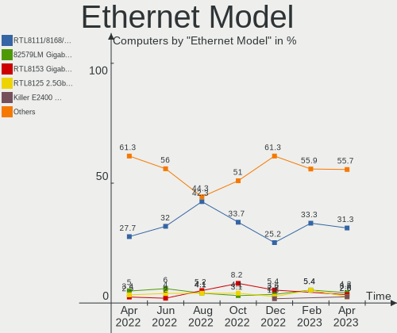

| Model                                                             | Computers | Percent |
|-------------------------------------------------------------------|-----------|---------|
| Realtek RTL8111/8168/8411 PCI Express Gigabit Ethernet Controller | 32        | 31.68%  |
| Intel 82579LM Gigabit Network Connection (Lewisville)             | 6         | 5.94%   |
| Intel I211 Gigabit Network Connection                             | 5         | 4.95%   |
| Realtek RTL8125 2.5GbE Controller                                 | 4         | 3.96%   |
| Qualcomm Atheros AR8151 v2.0 Gigabit Ethernet                     | 3         | 2.97%   |
| Intel Ethernet Controller I225-V                                  | 3         | 2.97%   |
| Intel Ethernet Connection (7) I219-V                              | 3         | 2.97%   |
| Intel 82574L Gigabit Network Connection                           | 3         | 2.97%   |
| Realtek RTL8153 Gigabit Ethernet Adapter                          | 2         | 1.98%   |
| Realtek Killer E3000 2.5GbE Controller                            | 2         | 1.98%   |
| Qualcomm Atheros Killer E220x Gigabit Ethernet Controller         | 2         | 1.98%   |
| Intel Ethernet Connection (6) I219-V                              | 2         | 1.98%   |
| Intel 82575EB Gigabit Network Connection                          | 2         | 1.98%   |
| Google Pixel 6                                                    | 2         | 1.98%   |
| Xiaomi Mi/Redmi series (RNDIS + ADB)                              | 1         | 0.99%   |
| Samsung GT-I9070 (network tethering, USB debugging enabled)       | 1         | 0.99%   |
| Realtek RTL8152 Fast Ethernet Adapter                             | 1         | 0.99%   |
| Realtek RTL810xE PCI Express Fast Ethernet controller             | 1         | 0.99%   |
| Realtek RTL-8110SC/8169SC Gigabit Ethernet                        | 1         | 0.99%   |
| Realtek RTL-8100/8101L/8139 PCI Fast Ethernet Adapter             | 1         | 0.99%   |
| Realtek Killer E2600 Gigabit Ethernet Controller                  | 1         | 0.99%   |
| Qualcomm Atheros AR8161 Gigabit Ethernet                          | 1         | 0.99%   |
| Marvell Group 88E8056 PCI-E Gigabit Ethernet Controller           | 1         | 0.99%   |
| Marvell Group 88E8053 PCI-E Gigabit Ethernet Controller           | 1         | 0.99%   |
| Marvell Group 88E8001 Gigabit Ethernet Controller                 | 1         | 0.99%   |
| Intel Ethernet Controller I225-LM                                 | 1         | 0.99%   |
| Intel Ethernet Connection I219-LM                                 | 1         | 0.99%   |
| Intel Ethernet Connection I217-LM                                 | 1         | 0.99%   |
| Intel Ethernet Connection (4) I219-V                              | 1         | 0.99%   |
| Intel Ethernet Connection (4) I219-LM                             | 1         | 0.99%   |
| Intel Ethernet Connection (3) I218-V                              | 1         | 0.99%   |
| Intel Ethernet Connection (2) I219-V                              | 1         | 0.99%   |
| Intel Ethernet Connection (16) I219-LM                            | 1         | 0.99%   |
| Intel Ethernet Connection (14) I219-V                             | 1         | 0.99%   |
| Intel Ethernet Connection (11) I219-V                             | 1         | 0.99%   |
| Intel 82579V Gigabit Network Connection                           | 1         | 0.99%   |
| Intel 82577LM Gigabit Network Connection                          | 1         | 0.99%   |
| Intel 82567LM-3 Gigabit Network Connection                        | 1         | 0.99%   |
| Intel 82557/8/9/0/1 Ethernet Pro 100                              | 1         | 0.99%   |
| Intel 82546EB Gigabit Ethernet Controller (Copper)                | 1         | 0.99%   |
| ICS Advent USB 10/100 LAN                                         | 1         | 0.99%   |
| DisplayLink USB3.0 Dual Video Dock                                | 1         | 0.99%   |
| Broadcom Limited NetLink BCM5787M Gigabit Ethernet PCI Express    | 1         | 0.99%   |
| Broadcom Limited BCM4401-B0 100Base-TX                            | 1         | 0.99%   |

Net Controller Kind
-------------------

Ethernet, WiFi or modem

| Kind     | Computers | Percent |
|----------|-----------|---------|
| Ethernet | 85        | 51.52%  |
| WiFi     | 78        | 47.27%  |
| Unknown  | 2         | 1.21%   |

Used Controller
---------------

Currently used network controller

| Kind     | Computers | Percent |
|----------|-----------|---------|
| Ethernet | 53        | 50.48%  |
| WiFi     | 52        | 49.52%  |

NICs
----

Total network controllers on board

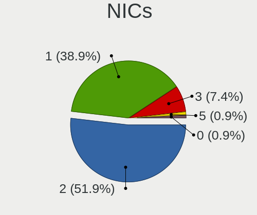

| Total | Computers | Percent |
|-------|-----------|---------|
| 2     | 52        | 49.52%  |
| 1     | 42        | 40%     |
| 3     | 7         | 6.67%   |
| 0     | 3         | 2.86%   |
| 5     | 1         | 0.95%   |

IPv6
----

IPv6 vs IPv4

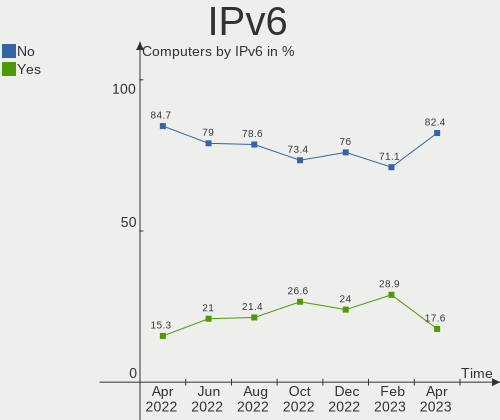

| Used | Computers | Percent |
|------|-----------|---------|
| No   | 83        | 79.05%  |
| Yes  | 22        | 20.95%  |

Bluetooth
---------

Bluetooth Vendor
----------------

Controller vendors

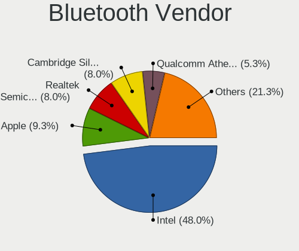

| Vendor                          | Computers | Percent |
|---------------------------------|-----------|---------|
| Intel                           | 41        | 68.33%  |
| Cambridge Silicon Radio         | 4         | 6.67%   |
| Broadcom                        | 4         | 6.67%   |
| Apple                           | 3         | 5%      |
| Realtek Semiconductor           | 2         | 3.33%   |
| Qualcomm Atheros Communications | 1         | 1.67%   |
| Opticis                         | 1         | 1.67%   |
| MediaTek                        | 1         | 1.67%   |
| IMC Networks                    | 1         | 1.67%   |
| Foxconn / Hon Hai               | 1         | 1.67%   |
| Edimax Technology               | 1         | 1.67%   |

Bluetooth Model
---------------

Controller models

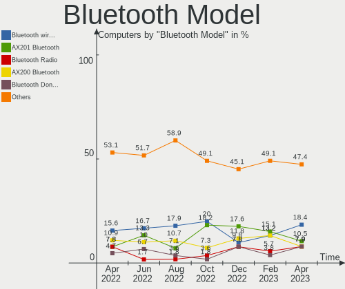

| Model                                               | Computers | Percent |
|-----------------------------------------------------|-----------|---------|
| Intel Bluetooth Device                              | 11        | 18.33%  |
| Intel Bluetooth wireless interface                  | 10        | 16.67%  |
| Intel Bluetooth 9460/9560 Jefferson Peak (JfP)      | 7         | 11.67%  |
| Intel AX200 Bluetooth                               | 6         | 10%     |
| Cambridge Silicon Radio Bluetooth Dongle (HCI mode) | 4         | 6.67%   |
| Intel AX210 Bluetooth                               | 3         | 5%      |
| Intel Wireless-AC 3168 Bluetooth                    | 2         | 3.33%   |
| Broadcom HP Portable SoftSailing                    | 2         | 3.33%   |
| Apple Bluetooth Host Controller                     | 2         | 3.33%   |
| Realtek  Bluetooth 4.2 Adapter                      | 1         | 1.67%   |
| Realtek Bluetooth Radio                             | 1         | 1.67%   |
| Qualcomm Atheros AR3012 Bluetooth 4.0               | 1         | 1.67%   |
| Opticis Bluetooth Radio                             | 1         | 1.67%   |
| MediaTek Wireless_Device                            | 1         | 1.67%   |
| Intel Wireless-AC 9260 Bluetooth Adapter            | 1         | 1.67%   |
| Intel Centrino Bluetooth Wireless Transceiver       | 1         | 1.67%   |
| IMC Networks Wireless_Device                        | 1         | 1.67%   |
| Foxconn / Hon Hai Wireless_Device                   | 1         | 1.67%   |
| Edimax Bluetooth Device                             | 1         | 1.67%   |
| Broadcom BCM20702A0 Bluetooth 4.0                   | 1         | 1.67%   |
| Broadcom BCM20702A0                                 | 1         | 1.67%   |
| Apple Built-in Bluetooth 2.0+EDR HCI                | 1         | 1.67%   |

Sound
-----

Sound Vendor
------------

Sound card vendors

| Vendor                                       | Computers | Percent |
|----------------------------------------------|-----------|---------|
| Intel                                        | 75        | 47.77%  |
| Nvidia                                       | 35        | 22.29%  |
| AMD                                          | 29        | 18.47%  |
| C-Media Electronics                          | 2         | 1.27%   |
| Zoran Co. Personal Media Division (Nogatech) | 1         | 0.64%   |
| Unknown                                      | 1         | 0.64%   |
| SteelSeries ApS                              | 1         | 0.64%   |
| PreSonus Audio Electronics                   | 1         | 0.64%   |
| Logitech                                     | 1         | 0.64%   |
| LG Electronics                               | 1         | 0.64%   |
| Lenovo                                       | 1         | 0.64%   |
| Kingston Technology                          | 1         | 0.64%   |
| GN Netcom                                    | 1         | 0.64%   |
| Giga-Byte Technology                         | 1         | 0.64%   |
| Focusrite-Novation                           | 1         | 0.64%   |
| FiiO Electronics Technology                  | 1         | 0.64%   |
| Creative Technology                          | 1         | 0.64%   |
| Blue Microphones                             | 1         | 0.64%   |
| AVer Information                             | 1         | 0.64%   |
| Audio-Technica                               | 1         | 0.64%   |

Sound Model
-----------

Sound card models

| Model                                                                                             | Computers | Percent |
|---------------------------------------------------------------------------------------------------|-----------|---------|
| AMD Family 17h/19h HD Audio Controller                                                            | 11        | 6.21%   |
| Intel Cannon Lake PCH cAVS                                                                        | 8         | 4.52%   |
| Intel 7 Series/C216 Chipset Family High Definition Audio Controller                               | 8         | 4.52%   |
| Intel Sunrise Point-LP HD Audio                                                                   | 7         | 3.95%   |
| AMD Renoir Radeon High Definition Audio Controller                                                | 7         | 3.95%   |
| Nvidia TU107 GeForce GTX 1650 High Definition Audio Controller                                    | 5         | 2.82%   |
| Intel Tiger Lake-LP Smart Sound Technology Audio Controller                                       | 5         | 2.82%   |
| Intel 6 Series/C200 Series Chipset Family High Definition Audio Controller                        | 5         | 2.82%   |
| AMD SBx00 Azalia (Intel HDA)                                                                      | 5         | 2.82%   |
| Nvidia GM107 High Definition Audio Controller [GeForce 940MX]                                     | 4         | 2.26%   |
| Nvidia Audio device                                                                               | 4         | 2.26%   |
| Intel Comet Lake PCH cAVS                                                                         | 4         | 2.26%   |
| AMD Starship/Matisse HD Audio Controller                                                          | 4         | 2.26%   |
| Nvidia TU104 HD Audio Controller                                                                  | 3         | 1.69%   |
| Nvidia GK208 HDMI/DP Audio Controller                                                             | 3         | 1.69%   |
| Nvidia GA104 High Definition Audio Controller                                                     | 3         | 1.69%   |
| Intel NM10/ICH7 Family High Definition Audio Controller                                           | 3         | 1.69%   |
| Intel Cannon Point-LP High Definition Audio Controller                                            | 3         | 1.69%   |
| Intel Alder Lake-S HD Audio Controller                                                            | 3         | 1.69%   |
| Intel Alder Lake PCH-P High Definition Audio Controller                                           | 3         | 1.69%   |
| Intel 8 Series/C220 Series Chipset High Definition Audio Controller                               | 3         | 1.69%   |
| AMD RS880 HDMI Audio [Radeon HD 4200 Series]                                                      | 3         | 1.69%   |
| Nvidia TU116 High Definition Audio Controller                                                     | 2         | 1.13%   |
| Nvidia GM204 High Definition Audio Controller                                                     | 2         | 1.13%   |
| Nvidia GF119 HDMI Audio Controller                                                                | 2         | 1.13%   |
| Intel Xeon E3-1200 v3/4th Gen Core Processor HD Audio Controller                                  | 2         | 1.13%   |
| Intel Ice Lake-LP Smart Sound Technology Audio Controller                                         | 2         | 1.13%   |
| Intel Haswell-ULT HD Audio Controller                                                             | 2         | 1.13%   |
| Intel Audio device                                                                                | 2         | 1.13%   |
| Intel Atom Processor Z36xxx/Z37xxx Series High Definition Audio Controller                        | 2         | 1.13%   |
| Intel 8 Series HD Audio Controller                                                                | 2         | 1.13%   |
| Intel 5 Series/3400 Series Chipset High Definition Audio                                          | 2         | 1.13%   |
| AMD Raven/Raven2/Fenghuang HDMI/DP Audio Controller                                               | 2         | 1.13%   |
| AMD FCH Azalia Controller                                                                         | 2         | 1.13%   |
| AMD Family 17h (Models 00h-0fh) HD Audio Controller                                               | 2         | 1.13%   |
| Zoran Co. Personal Media Division (Nogatech) USB Audio and HID                                    | 1         | 0.56%   |
| Unknown USB MIDI Interface                                                                        | 1         | 0.56%   |
| SteelSeries ApS SteelSeries Arctis 5                                                              | 1         | 0.56%   |
| PreSonus Audio Electronics PreSonus AudioBox iOne                                                 | 1         | 0.56%   |
| Nvidia TU102 High Definition Audio Controller                                                     | 1         | 0.56%   |
| Nvidia High Definition Audio Controller                                                           | 1         | 0.56%   |
| Nvidia GP107GL High Definition Audio Controller                                                   | 1         | 0.56%   |
| Nvidia GK104 HDMI Audio Controller                                                                | 1         | 0.56%   |
| Nvidia GF116 High Definition Audio Controller                                                     | 1         | 0.56%   |
| Nvidia GF108 High Definition Audio Controller                                                     | 1         | 0.56%   |
| Nvidia GF106 High Definition Audio Controller                                                     | 1         | 0.56%   |
| Logitech G432 Gaming Headset                                                                      | 1         | 0.56%   |
| LG Electronics LG UltraFine Display Audio                                                         | 1         | 0.56%   |
| Lenovo Thinkcentre TIO24Gen3 for USB-audio                                                        | 1         | 0.56%   |
| Kingston Technology HyperX Quadcast                                                               | 1         | 0.56%   |
| Intel Wildcat Point-LP High Definition Audio Controller                                           | 1         | 0.56%   |
| Intel Tiger Lake-H HD Audio Controller                                                            | 1         | 0.56%   |
| Intel Jasper Lake HD Audio                                                                        | 1         | 0.56%   |
| Intel Celeron N3350/Pentium N4200/Atom E3900 Series Audio Cluster                                 | 1         | 0.56%   |
| Intel C610/X99 series chipset HD Audio Controller                                                 | 1         | 0.56%   |
| Intel C600/X79 series chipset High Definition Audio Controller                                    | 1         | 0.56%   |
| Intel Broadwell-U Audio Controller                                                                | 1         | 0.56%   |
| Intel Atom/Celeron/Pentium Processor x5-E8000/J3xxx/N3xxx Series High Definition Audio Controller | 1         | 0.56%   |
| Intel 82801JI (ICH10 Family) HD Audio Controller                                                  | 1         | 0.56%   |
| Intel 82801JD/DO (ICH10 Family) HD Audio Controller                                               | 1         | 0.56%   |

Memory
------

Memory Vendor
-------------

Memory module vendors

| Vendor                     | Computers | Percent |
|----------------------------|-----------|---------|
| Unknown                    | 12        | 18.46%  |
| SK hynix                   | 12        | 18.46%  |
| Samsung Electronics        | 12        | 18.46%  |
| Micron Technology          | 6         | 9.23%   |
| Crucial                    | 6         | 9.23%   |
| Kingston                   | 4         | 6.15%   |
| G.Skill                    | 4         | 6.15%   |
| Corsair                    | 4         | 6.15%   |
| Patriot                    | 2         | 3.08%   |
| Elpida                     | 1         | 1.54%   |
| Anucell Technology Holding | 1         | 1.54%   |
| Unknown                    | 1         | 1.54%   |

Memory Model
------------

Memory module models

| Model                                                            | Computers | Percent |
|------------------------------------------------------------------|-----------|---------|
| Unknown RAM Module 4096MB DIMM DDR3 1333MT/s                     | 2         | 2.9%    |
| Samsung RAM Module 8GB Row Of Chips LPDDR3 2133MT/s              | 2         | 2.9%    |
| Samsung RAM M471A5244CB0-CWE 4GB SODIMM DDR4 3200MT/s            | 2         | 2.9%    |
| Micron RAM 4ATF1G64HZ-3G2E1 8GB SODIMM DDR4 3200MT/s             | 2         | 2.9%    |
| Unknown RAM Module 8GB DIMM 1600MT/s                             | 1         | 1.45%   |
| Unknown RAM Module 4GB DIMM 800MT/s                              | 1         | 1.45%   |
| Unknown RAM Module 4GB DIMM 400MT/s                              | 1         | 1.45%   |
| Unknown RAM Module 4GB DIMM 1333MT/s                             | 1         | 1.45%   |
| Unknown RAM Module 2GB Row Of Chips LPDDR4 4267MT/s              | 1         | 1.45%   |
| Unknown RAM Module 2GB DIMM DDR2 800MT/s                         | 1         | 1.45%   |
| Unknown RAM Module 2GB DIMM DDR2 1067MT/s                        | 1         | 1.45%   |
| Unknown RAM Module 2GB DIMM 667MT/s                              | 1         | 1.45%   |
| Unknown RAM Module 2GB DIMM 400MT/s                              | 1         | 1.45%   |
| Unknown RAM Module 1GB DIMM DDR 333MT/s                          | 1         | 1.45%   |
| Unknown RAM DDR4 NB 16G 2666 16384MB SODIMM DDR4 2667MT/s        | 1         | 1.45%   |
| SK hynix RAM Module 4GB SODIMM DDR3 1600MT/s                     | 1         | 1.45%   |
| SK hynix RAM Module 4GB SODIMM DDR3 1066MT/s                     | 1         | 1.45%   |
| SK hynix RAM Module 2048MB SODIMM DDR3 1333MT/s                  | 1         | 1.45%   |
| SK hynix RAM HMCG88MEBSA095N 32GB SODIMM 4800MT/s                | 1         | 1.45%   |
| SK hynix RAM HMCG66MEBSA095N 8GB SODIMM 4800MT/s                 | 1         | 1.45%   |
| SK hynix RAM HMAA1GS6CJR6N-XN 8192MB SODIMM DDR4 3200MT/s        | 1         | 1.45%   |
| SK hynix RAM HMA851S6DJR6N-XN 4GB SODIMM DDR4 3200MT/s           | 1         | 1.45%   |
| SK hynix RAM HMA81GS6JJR8N-VK 8GB SODIMM DDR4 2667MT/s           | 1         | 1.45%   |
| SK hynix RAM HMA81GS6CJR8N-VK 8GB SODIMM DDR4 2667MT/s           | 1         | 1.45%   |
| SK hynix RAM HMA81GS6AFR8N-UH 8GB SODIMM DDR4 2667MT/s           | 1         | 1.45%   |
| SK hynix RAM H9HCNNNCPMMLXR-NEE 8GB Row Of Chips LPDDR4 4266MT/s | 1         | 1.45%   |
| SK hynix RAM H9HCNNNBKNALHR-NEE 4GB Row Of Chips LPDDR4 3733MT/s | 1         | 1.45%   |
| Samsung RAM M471A5244BB0-CWE 4GB SODIMM DDR4 3200MT/s            | 1         | 1.45%   |
| Samsung RAM M471A4G43AB1-CWE 32GB SODIMM DDR4 3200MT/s           | 1         | 1.45%   |
| Samsung RAM M471A1K43DB1-CTD 8GB SODIMM DDR4 2667MT/s            | 1         | 1.45%   |
| Samsung RAM M471A1K43CB1-CRC 8192MB SODIMM DDR4 2667MT/s         | 1         | 1.45%   |
| Samsung RAM M471A1K43BB1-CRC 8GB SODIMM DDR4 2667MT/s            | 1         | 1.45%   |
| Samsung RAM M471A1K43BB0-CPB 8192MB SODIMM DDR4 2133MT/s         | 1         | 1.45%   |
| Samsung RAM M378B5273CH0-CK0 4GB DIMM DDR3 2000MT/s              | 1         | 1.45%   |
| Samsung RAM M378A5143DB0-CPB 4GB DIMM DDR4 2400MT/s              | 1         | 1.45%   |
| Samsung RAM K4A8G165WC-BCTD 4GB Row Of Chips DDR4 2667MT/s       | 1         | 1.45%   |
| Patriot RAM PSD48G266681 8GB DIMM DDR4 2934MT/s                  | 1         | 1.45%   |
| Patriot RAM PSD416G320081S 16GB SODIMM DDR4 3200MT/s             | 1         | 1.45%   |
| Micron RAM 8ATF1G64HZ-3G2R1 8GB SODIMM DDR4 3200MT/s             | 1         | 1.45%   |
| Micron RAM 8ATF1G64HZ-2G6J1 8GB SODIMM DDR4 2667MT/s             | 1         | 1.45%   |
| Micron RAM 8ATF1G64HZ-2G6D1 8GB SODIMM DDR4 2667MT/s             | 1         | 1.45%   |
| Micron RAM 16KTF1G64HZ-1G6E2 8GB SODIMM DDR3 1867MT/s            | 1         | 1.45%   |
| Micron RAM 16ATF2G64HZ-3G2J1 16GB SODIMM DDR4 3200MT/s           | 1         | 1.45%   |
| Kingston RAM 99U5471-020.A00LF 4096MB DIMM DDR3 1600MT/s         | 1         | 1.45%   |
| Kingston RAM 9905702-017.A00G 8GB DIMM DDR4 2933MT/s             | 1         | 1.45%   |
| Kingston RAM 9905700-070.A01G 16GB SODIMM DDR4 2667MT/s          | 1         | 1.45%   |
| Kingston RAM 9905471-006.A01LF 4GB DIMM DDR3 1333MT/s            | 1         | 1.45%   |
| G.Skill RAM F4-3600C18-8GTZRX 8GB DIMM DDR4 3600MT/s             | 1         | 1.45%   |
| G.Skill RAM F4-3600C16-16GTZNC 16GB DIMM DDR4 3600MT/s           | 1         | 1.45%   |
| G.Skill RAM F4-3200C16-16GVK 16GB DIMM DDR4 3600MT/s             | 1         | 1.45%   |
| G.Skill RAM F3-12800CL8-4GBXM 4096MB DIMM DDR3 1600MT/s          | 1         | 1.45%   |
| Elpida RAM EDFB232A1MA-JD-F 8GB SODIMM LPDDR3 1867MT/s           | 1         | 1.45%   |
| Elpida RAM EDFB232A1MA-JD-F 8GB Chip LPDDR3 1867MT/s             | 1         | 1.45%   |
| Crucial RAM CT51264BA160B.C16F 4096MB DIMM DDR3 1600MT/s         | 1         | 1.45%   |
| Crucial RAM CT32G4SFD832A.C16FE 32GB SODIMM DDR4 3200MT/s        | 1         | 1.45%   |
| Crucial RAM CT16G4SFRA32A.C8FE 16384MB SODIMM DDR4 3200MT/s      | 1         | 1.45%   |
| Crucial RAM CT102464BD160B.C16 8GB DIMM DDR3 1600MT/s            | 1         | 1.45%   |
| Crucial RAM BLS8G4D32AESBK.M8FE1 8GB DIMM DDR4 3600MT/s          | 1         | 1.45%   |
| Crucial RAM BL8G32C16U4BL.M8FE1 8GB DIMM DDR4 3200MT/s           | 1         | 1.45%   |
| Corsair RAM CMX8GX3M2A1600C9 4GB DIMM DDR3 1800MT/s              | 1         | 1.45%   |

Memory Kind
-----------

Memory module kinds

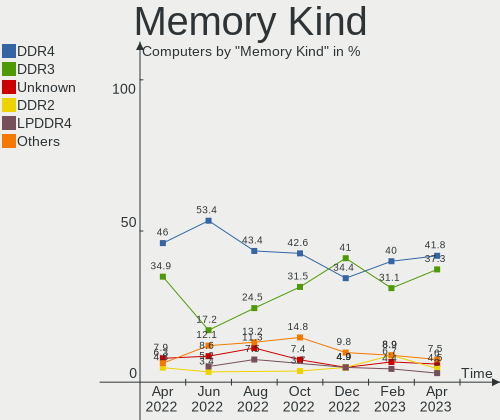

| Kind    | Computers | Percent |
|---------|-----------|---------|
| DDR4    | 31        | 53.45%  |
| DDR3    | 10        | 17.24%  |
| Unknown | 8         | 13.79%  |
| LPDDR4  | 3         | 5.17%   |
| LPDDR3  | 3         | 5.17%   |
| DDR2    | 2         | 3.45%   |
| DDR     | 1         | 1.72%   |

Memory Form Factor
------------------

Physical design of the memory module

| Name         | Computers | Percent |
|--------------|-----------|---------|
| SODIMM       | 26        | 44.07%  |
| DIMM         | 25        | 42.37%  |
| Row Of Chips | 7         | 11.86%  |
| Chip         | 1         | 1.69%   |

Memory Size
-----------

Memory module size

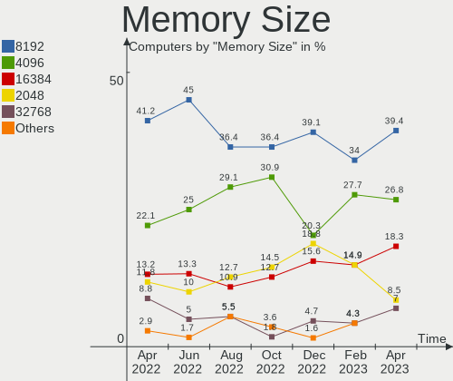

| Size  | Computers | Percent |
|-------|-----------|---------|
| 8192  | 27        | 45.76%  |
| 4096  | 15        | 25.42%  |
| 16384 | 7         | 11.86%  |
| 2048  | 6         | 10.17%  |
| 32768 | 3         | 5.08%   |
| 1024  | 1         | 1.69%   |

Memory Speed
------------

Memory module speed

| Speed | Computers | Percent |
|-------|-----------|---------|
| 3200  | 13        | 20.31%  |
| 2667  | 11        | 17.19%  |
| 1600  | 6         | 9.38%   |
| 1333  | 5         | 7.81%   |
| 3600  | 4         | 6.25%   |
| 2133  | 3         | 4.69%   |
| 4800  | 2         | 3.13%   |
| 1867  | 2         | 3.13%   |
| 800   | 2         | 3.13%   |
| 400   | 2         | 3.13%   |
| 6400  | 1         | 1.56%   |
| 4267  | 1         | 1.56%   |
| 4266  | 1         | 1.56%   |
| 3733  | 1         | 1.56%   |
| 3400  | 1         | 1.56%   |
| 2934  | 1         | 1.56%   |
| 2933  | 1         | 1.56%   |
| 2400  | 1         | 1.56%   |
| 2000  | 1         | 1.56%   |
| 1800  | 1         | 1.56%   |
| 1067  | 1         | 1.56%   |
| 1066  | 1         | 1.56%   |
| 667   | 1         | 1.56%   |
| 333   | 1         | 1.56%   |

Printers & scanners
-------------------

Printer Vendor
--------------

Printer device vendors

| Vendor             | Computers | Percent |
|--------------------|-----------|---------|
| Brother Industries | 2         | 66.67%  |
| Dymo-CoStar        | 1         | 33.33%  |

Printer Model
-------------

Printer device models

| Model                                  | Computers | Percent |
|----------------------------------------|-----------|---------|
| Dymo-CoStar DYMO LabelWriter 4XL       | 1         | 25%     |
| Dymo-CoStar DYMO LabelWriter 450 Turbo | 1         | 25%     |
| Brother HL-2130 series                 | 1         | 25%     |
| Brother HL-1210W series                | 1         | 25%     |

Scanner Vendor
--------------

Scanner device vendors

Zero info for selected period =(

Scanner Model
-------------

Scanner device models

Zero info for selected period =(

Camera
------

Camera Vendor
-------------

Camera device vendors

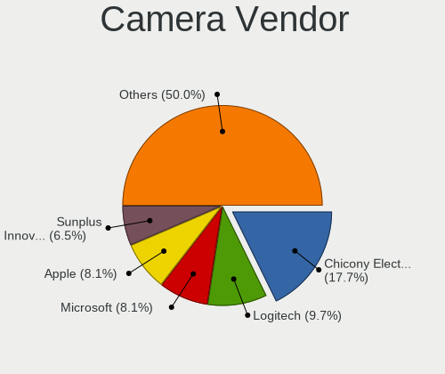

| Vendor                        | Computers | Percent |
|-------------------------------|-----------|---------|
| Chicony Electronics           | 10        | 17.24%  |
| Sunplus Innovation Technology | 8         | 13.79%  |
| Logitech                      | 7         | 12.07%  |
| Microdia                      | 6         | 10.34%  |
| IMC Networks                  | 5         | 8.62%   |
| Acer                          | 4         | 6.9%    |
| Realtek Semiconductor         | 2         | 3.45%   |
| Quanta                        | 2         | 3.45%   |
| Unknown                       | 1         | 1.72%   |
| SunplusIT                     | 1         | 1.72%   |
| Sonix Technology              | 1         | 1.72%   |
| Samsung Electronics           | 1         | 1.72%   |
| Primax Electronics            | 1         | 1.72%   |
| OmniVision Technologies       | 1         | 1.72%   |
| Microsoft                     | 1         | 1.72%   |
| Lite-On Technology            | 1         | 1.72%   |
| LG Electronics                | 1         | 1.72%   |
| Lenovo                        | 1         | 1.72%   |
| icSpring                      | 1         | 1.72%   |
| AVer Information              | 1         | 1.72%   |
| Apple                         | 1         | 1.72%   |
| 8SSC20F27145V1SR1BX02P8       | 1         | 1.72%   |

Camera Model
------------

Camera device models

| Model                                     | Computers | Percent |
|-------------------------------------------|-----------|---------|
| Sunplus Integrated_Webcam_HD              | 3         | 5.17%   |
| Microdia Integrated_Webcam_HD             | 3         | 5.17%   |
| IMC Networks Integrated Camera            | 3         | 5.17%   |
| Chicony Integrated Camera                 | 3         | 5.17%   |
| Logitech Webcam C170                      | 2         | 3.45%   |
| Chicony HD User Facing                    | 2         | 3.45%   |
| Unknown FULL HD 1080P Webcam              | 1         | 1.72%   |
| SunplusIT XiaoMi USB 2.0 Webcam           | 1         | 1.72%   |
| Sunplus Laptop Integrated Webcam FHD      | 1         | 1.72%   |
| Sunplus Integrated_Webcam_FHD             | 1         | 1.72%   |
| Sunplus HP HD Webcam [Fixed]              | 1         | 1.72%   |
| Sunplus HD WebCam                         | 1         | 1.72%   |
| Sunplus ezcap U3 capture-04               | 1         | 1.72%   |
| Sonix USB2.0 HD UVC WebCam                | 1         | 1.72%   |
| Samsung Galaxy series, misc. (MTP mode)   | 1         | 1.72%   |
| Realtek Laptop Camera                     | 1         | 1.72%   |
| Realtek EasyCamera                        | 1         | 1.72%   |
| Quanta HP Webcam                          | 1         | 1.72%   |
| Quanta HD User Facing                     | 1         | 1.72%   |
| Primax HP HD Webcam [Fixed]               | 1         | 1.72%   |
| OmniVision OV2640 Webcam                  | 1         | 1.72%   |
| Microsoft Surface Camera Front            | 1         | 1.72%   |
| Microdia Webcam Vitade AF                 | 1         | 1.72%   |
| Microdia USB 2.0 Camera                   | 1         | 1.72%   |
| Microdia Integrated Webcam                | 1         | 1.72%   |
| Logitech Webcam C930e                     | 1         | 1.72%   |
| Logitech Webcam C270                      | 1         | 1.72%   |
| Logitech HD Webcam C910                   | 1         | 1.72%   |
| Logitech HD Webcam C525                   | 1         | 1.72%   |
| Logitech C922 Pro Stream Webcam           | 1         | 1.72%   |
| Lite-On HP Wide Vision FHD Camera         | 1         | 1.72%   |
| LG LG UltraFine Display Camera            | 1         | 1.72%   |
| Lenovo Integrated Webcam [R5U877]         | 1         | 1.72%   |
| IMC Networks USB2.0 HD UVC WebCam         | 1         | 1.72%   |
| IMC Networks HD Camera                    | 1         | 1.72%   |
| icSpring camera                           | 1         | 1.72%   |
| Chicony Webcam-101                        | 1         | 1.72%   |
| Chicony TOSHIBA Web Camera - HD           | 1         | 1.72%   |
| Chicony TOSHIBA Web Camera - FHD          | 1         | 1.72%   |
| Chicony Integrated Camera (1280x720@30)   | 1         | 1.72%   |
| Chicony 1.3M Webcam                       | 1         | 1.72%   |
| AVer Information CAM340                   | 1         | 1.72%   |
| Apple FaceTime Camera                     | 1         | 1.72%   |
| Acer SunplusIT Integrated Camera          | 1         | 1.72%   |
| Acer Integrated Camera                    | 1         | 1.72%   |
| Acer HD Webcam                            | 1         | 1.72%   |
| Acer EasyCamera                           | 1         | 1.72%   |
| 8SSC20F27145V1SR1BX02P8 Integrated Camera | 1         | 1.72%   |

Security
--------

Fingerprint Vendor
------------------

Fingerprint sensor vendors

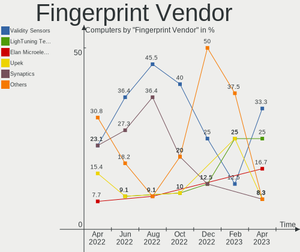

| Vendor                     | Computers | Percent |
|----------------------------|-----------|---------|
| Validity Sensors           | 4         | 36.36%  |
| Synaptics                  | 3         | 27.27%  |
| Shenzhen Goodix Technology | 2         | 18.18%  |
| Upek                       | 1         | 9.09%   |
| LighTuning Technology      | 1         | 9.09%   |

Fingerprint Model
-----------------

Fingerprint sensor models

| Model                                                  | Computers | Percent |
|--------------------------------------------------------|-----------|---------|
| Validity Sensors VFS491                                | 2         | 18.18%  |
| Synaptics Prometheus MIS Touch Fingerprint Reader      | 2         | 18.18%  |
| Validity Sensors VFS7500 Touch Fingerprint Sensor      | 1         | 9.09%   |
| Validity Sensors Synaptics WBDI                        | 1         | 9.09%   |
| Upek Biometric Touchchip/Touchstrip Fingerprint Sensor | 1         | 9.09%   |
| Synaptics  WBDI                                        | 1         | 9.09%   |
| Shenzhen Goodix  Fingerprint Device                    | 1         | 9.09%   |
| Shenzhen Goodix Fingerprint Reader                     | 1         | 9.09%   |
| LighTuning EgisTec Touch Fingerprint Sensor            | 1         | 9.09%   |

Chipcard Vendor
---------------

Chipcard module vendors

| Vendor | Computers | Percent |
|--------|-----------|---------|
| Lenovo | 1         | 100%    |

Chipcard Model
--------------

Chipcard module models

| Model                               | Computers | Percent |
|-------------------------------------|-----------|---------|
| Lenovo Integrated Smart Card Reader | 1         | 100%    |

Unsupported
-----------

Unsupported Devices
-------------------

Total unsupported devices on board

| Total | Computers | Percent |
|-------|-----------|---------|
| 0     | 68        | 64.76%  |
| 1     | 30        | 28.57%  |
| 2     | 5         | 4.76%   |
| 3     | 2         | 1.9%    |

Unsupported Device Types
------------------------

Types of unsupported devices

| Type                     | Computers | Percent |
|--------------------------|-----------|---------|
| Fingerprint reader       | 11        | 26.19%  |
| Graphics card            | 8         | 19.05%  |
| Net/wireless             | 7         | 16.67%  |
| Multimedia controller    | 6         | 14.29%  |
| Communication controller | 3         | 7.14%   |
| Camera                   | 2         | 4.76%   |
| Unassigned class         | 1         | 2.38%   |
| Sound                    | 1         | 2.38%   |
| Network                  | 1         | 2.38%   |
| Modem                    | 1         | 2.38%   |
| Chipcard                 | 1         | 2.38%   |

