Linux in Australia - Hardware Trends (Desktops)
-----------------------------------------------

A project to identify most popular hardware characteristics and track their change
over time based on data collected by Linux users at https://Linux-Hardware.org.

Anyone can contribute to this report by the [hw-probe](https://github.com/linuxhw/hw-probe) tool:

    sudo -E hw-probe -all -upload

Contents
--------

* [ System ](#system)
  - [ OS                       ](#os)
  - [ OS Family                ](#os-family)
  - [ Kernel                   ](#kernel)
  - [ Kernel Family            ](#kernel-family)
  - [ Kernel Major Ver.        ](#kernel-major-ver)
  - [ Arch                     ](#arch)
  - [ DE                       ](#de)
  - [ Display Server           ](#display-server)
  - [ Display Manager          ](#display-manager)
  - [ OS Lang                  ](#os-lang)
  - [ Boot Mode                ](#boot-mode)
  - [ Filesystem               ](#filesystem)
  - [ Part. scheme             ](#part-scheme)
  - [ Dual Boot with Linux/BSD ](#dual-boot-with-linuxbsd)
  - [ Dual Boot (Win)          ](#dual-boot-win)

* [ Board ](#board)
  - [ Vendor                   ](#vendor)
  - [ Model                    ](#model)
  - [ Model Family             ](#model-family)
  - [ MFG Year                 ](#mfg-year)
  - [ Form Factor              ](#form-factor)
  - [ Secure Boot              ](#secure-boot)
  - [ Coreboot                 ](#coreboot)
  - [ RAM Size                 ](#ram-size)
  - [ RAM Used                 ](#ram-used)
  - [ Total Drives             ](#total-drives)
  - [ Has CD-ROM               ](#has-cd-rom)
  - [ Has Ethernet             ](#has-ethernet)
  - [ Has WiFi                 ](#has-wifi)
  - [ Has Bluetooth            ](#has-bluetooth)

* [ Location ](#location)
  - [ Country                  ](#country)
  - [ City                     ](#city)

* [ Drives ](#drives)
  - [ Drive Vendor             ](#drive-vendor)
  - [ Drive Model              ](#drive-model)
  - [ HDD Vendor               ](#hdd-vendor)
  - [ SSD Vendor               ](#ssd-vendor)
  - [ Drive Kind               ](#drive-kind)
  - [ Drive Connector          ](#drive-connector)
  - [ Drive Size               ](#drive-size)
  - [ Space Total              ](#space-total)
  - [ Space Used               ](#space-used)
  - [ Malfunc. Drives          ](#malfunc-drives)
  - [ Malfunc. Drive Vendor    ](#malfunc-drive-vendor)
  - [ Malfunc. HDD Vendor      ](#malfunc-hdd-vendor)
  - [ Malfunc. Drive Kind      ](#malfunc-drive-kind)
  - [ Failed Drives            ](#failed-drives)
  - [ Failed Drive Vendor      ](#failed-drive-vendor)
  - [ Drive Status             ](#drive-status)

* [ Storage controller ](#storage-controller)
  - [ Storage Vendor           ](#storage-vendor)
  - [ Storage Model            ](#storage-model)
  - [ Storage Kind             ](#storage-kind)

* [ Processor ](#processor)
  - [ CPU Vendor               ](#cpu-vendor)
  - [ CPU Model                ](#cpu-model)
  - [ CPU Model Family         ](#cpu-model-family)
  - [ CPU Cores                ](#cpu-cores)
  - [ CPU Sockets              ](#cpu-sockets)
  - [ CPU Threads              ](#cpu-threads)
  - [ CPU Op-Modes             ](#cpu-op-modes)
  - [ CPU Microcode            ](#cpu-microcode)
  - [ CPU Microarch            ](#cpu-microarch)

* [ Graphics ](#graphics)
  - [ GPU Vendor               ](#gpu-vendor)
  - [ GPU Model                ](#gpu-model)
  - [ GPU Combo                ](#gpu-combo)
  - [ GPU Driver               ](#gpu-driver)
  - [ GPU Memory               ](#gpu-memory)

* [ Monitor ](#monitor)
  - [ Monitor Vendor           ](#monitor-vendor)
  - [ Monitor Model            ](#monitor-model)
  - [ Monitor Resolution       ](#monitor-resolution)
  - [ Monitor Diagonal         ](#monitor-diagonal)
  - [ Monitor Width            ](#monitor-width)
  - [ Aspect Ratio             ](#aspect-ratio)
  - [ Monitor Area             ](#monitor-area)
  - [ Pixel Density            ](#pixel-density)
  - [ Multiple Monitors        ](#multiple-monitors)

* [ Network ](#network)
  - [ Net Controller Vendor    ](#net-controller-vendor)
  - [ Net Controller Model     ](#net-controller-model)
  - [ Wireless Vendor          ](#wireless-vendor)
  - [ Wireless Model           ](#wireless-model)
  - [ Ethernet Vendor          ](#ethernet-vendor)
  - [ Ethernet Model           ](#ethernet-model)
  - [ Net Controller Kind      ](#net-controller-kind)
  - [ Used Controller          ](#used-controller)
  - [ NICs                     ](#nics)
  - [ IPv6                     ](#ipv6)

* [ Bluetooth ](#bluetooth)
  - [ Bluetooth Vendor         ](#bluetooth-vendor)
  - [ Bluetooth Model          ](#bluetooth-model)

* [ Sound ](#sound)
  - [ Sound Vendor             ](#sound-vendor)
  - [ Sound Model              ](#sound-model)

* [ Memory ](#memory)
  - [ Memory Vendor            ](#memory-vendor)
  - [ Memory Model             ](#memory-model)
  - [ Memory Kind              ](#memory-kind)
  - [ Memory Form Factor       ](#memory-form-factor)
  - [ Memory Size              ](#memory-size)
  - [ Memory Speed             ](#memory-speed)

* [ Printers & scanners ](#printers--scanners)
  - [ Printer Vendor           ](#printer-vendor)
  - [ Printer Model            ](#printer-model)
  - [ Scanner Vendor           ](#scanner-vendor)
  - [ Scanner Model            ](#scanner-model)

* [ Camera ](#camera)
  - [ Camera Vendor            ](#camera-vendor)
  - [ Camera Model             ](#camera-model)

* [ Security ](#security)
  - [ Fingerprint Vendor       ](#fingerprint-vendor)
  - [ Fingerprint Model        ](#fingerprint-model)
  - [ Chipcard Vendor          ](#chipcard-vendor)
  - [ Chipcard Model           ](#chipcard-model)

* [ Unsupported ](#unsupported)
  - [ Unsupported Devices      ](#unsupported-devices)
  - [ Unsupported Device Types ](#unsupported-device-types)

System
------

OS
--

Installed operating systems

| Name                | Desktops | Percent |
|---------------------|----------|---------|
| Fedora 35           | 9        | 16.36%  |
| Ubuntu 20.04        | 5        | 9.09%   |
| Linux Mint 20.3     | 5        | 9.09%   |
| Zorin 16            | 4        | 7.27%   |
| ClearOS 7           | 4        | 7.27%   |
| Ubuntu 22.04        | 3        | 5.45%   |
| Debian 11           | 3        | 5.45%   |
| Pop!_OS 21.10       | 2        | 3.64%   |
| OpenMandriva 4.3    | 2        | 3.64%   |
| Fedora 34           | 2        | 3.64%   |
| Debian Testing      | 2        | 3.64%   |
| Ubuntu Studio 21.04 | 1        | 1.82%   |
| Ubuntu MATE 21.10   | 1        | 1.82%   |
| Ubuntu 21.04        | 1        | 1.82%   |
| Ubuntu 18.04        | 1        | 1.82%   |
| Progress Linux 6.99 | 1        | 1.82%   |
| Pop!_OS 22.04       | 1        | 1.82%   |
| Manjaro 21.2.5      | 1        | 1.82%   |
| Kubuntu 22.04       | 1        | 1.82%   |
| KDE neon 20.04      | 1        | 1.82%   |
| Gentoo 2.8          | 1        | 1.82%   |
| Gentoo 2.6          | 1        | 1.82%   |
| Clear Linux 36010   | 1        | 1.82%   |
| CentOS 7            | 1        | 1.82%   |
| ArcoLinux Rolling   | 1        | 1.82%   |

OS Family
---------

OS without a version

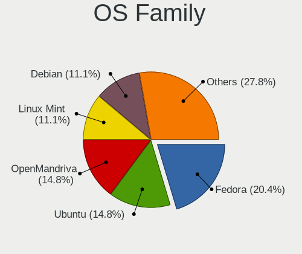

| Name           | Desktops | Percent |
|----------------|----------|---------|
| Fedora         | 11       | 20%     |
| Ubuntu         | 10       | 18.18%  |
| Linux Mint     | 5        | 9.09%   |
| Debian         | 5        | 9.09%   |
| Zorin          | 4        | 7.27%   |
| ClearOS        | 4        | 7.27%   |
| Pop!_OS        | 3        | 5.45%   |
| OpenMandriva   | 2        | 3.64%   |
| Gentoo         | 2        | 3.64%   |
| Ubuntu Studio  | 1        | 1.82%   |
| Ubuntu MATE    | 1        | 1.82%   |
| Progress Linux | 1        | 1.82%   |
| Manjaro        | 1        | 1.82%   |
| Kubuntu        | 1        | 1.82%   |
| KDE neon       | 1        | 1.82%   |
| Clear Linux    | 1        | 1.82%   |
| CentOS         | 1        | 1.82%   |
| ArcoLinux      | 1        | 1.82%   |

Kernel
------

Version of the Linux kernel

| Version                     | Desktops | Percent |
|-----------------------------|----------|---------|
| 5.13.0-39-generic           | 6        | 10.91%  |
| 3.10.0-1160.62.1.el7.x86_64 | 5        | 9.09%   |
| 5.4.0-107-generic           | 3        | 5.45%   |
| 5.16.18-200.fc35.x86_64     | 3        | 5.45%   |
| 5.15.0-25-generic           | 3        | 5.45%   |
| 5.13.0-40-generic           | 3        | 5.45%   |
| 5.16.7-desktop-1omv4003     | 2        | 3.64%   |
| 5.16.20-200.fc35.x86_64     | 2        | 3.64%   |
| 5.4.0-109-generic           | 1        | 1.82%   |
| 5.17.4-arch1-1              | 1        | 1.82%   |
| 5.17.4-200.fc35.x86_64      | 1        | 1.82%   |
| 5.17.1-gentoo-r1            | 1        | 1.82%   |
| 5.17.0-genix_5.17+          | 1        | 1.82%   |
| 5.17.0-2.3-liquorix-amd64   | 1        | 1.82%   |
| 5.16.8-200.fc35.x86_64      | 1        | 1.82%   |
| 5.16.20-100.fc34.x86_64     | 1        | 1.82%   |
| 5.16.19-76051619-generic    | 1        | 1.82%   |
| 5.16.19-200.fc35.x86_64     | 1        | 1.82%   |
| 5.16.19-100.fc34.x86_64     | 1        | 1.82%   |
| 5.16.15-76051615-generic    | 1        | 1.82%   |
| 5.16.13-1132.native         | 1        | 1.82%   |
| 5.16.11-76051611-generic    | 1        | 1.82%   |
| 5.16.0-5-amd64              | 1        | 1.82%   |
| 5.16.0-18.1-liquorix-amd64  | 1        | 1.82%   |
| 5.15.28-1-MANJARO           | 1        | 1.82%   |
| 5.15.0-27-generic           | 1        | 1.82%   |
| 5.15.0-0.bpo.3-amd64        | 1        | 1.82%   |
| 5.14.10-300.fc35.x86_64     | 1        | 1.82%   |
| 5.13.0-37-generic           | 1        | 1.82%   |
| 5.13.0-35-generic           | 1        | 1.82%   |
| 5.13.0-27-generic           | 1        | 1.82%   |
| 5.11.0-49-lowlatency        | 1        | 1.82%   |
| 5.11.0-49-generic           | 1        | 1.82%   |
| 5.10.100-rt62-xanmod1       | 1        | 1.82%   |
| 5.10.0-13-amd64             | 1        | 1.82%   |
| 4.15.0-175-generic          | 1        | 1.82%   |

Kernel Family
-------------

Linux kernel without a distro release

| Version  | Desktops | Percent |
|----------|----------|---------|
| 5.13.0   | 12       | 21.82%  |
| 5.15.0   | 5        | 9.09%   |
| 3.10.0   | 5        | 9.09%   |
| 5.4.0    | 4        | 7.27%   |
| 5.16.20  | 3        | 5.45%   |
| 5.16.19  | 3        | 5.45%   |
| 5.16.18  | 3        | 5.45%   |
| 5.17.4   | 2        | 3.64%   |
| 5.17.0   | 2        | 3.64%   |
| 5.16.7   | 2        | 3.64%   |
| 5.16.0   | 2        | 3.64%   |
| 5.11.0   | 2        | 3.64%   |
| 5.17.1   | 1        | 1.82%   |
| 5.16.8   | 1        | 1.82%   |
| 5.16.15  | 1        | 1.82%   |
| 5.16.13  | 1        | 1.82%   |
| 5.16.11  | 1        | 1.82%   |
| 5.15.28  | 1        | 1.82%   |
| 5.14.10  | 1        | 1.82%   |
| 5.10.100 | 1        | 1.82%   |
| 5.10.0   | 1        | 1.82%   |
| 4.15.0   | 1        | 1.82%   |

Kernel Major Ver.
-----------------

Linux kernel major version

| Version | Desktops | Percent |
|---------|----------|---------|
| 5.16    | 17       | 30.91%  |
| 5.13    | 12       | 21.82%  |
| 5.15    | 6        | 10.91%  |
| 5.17    | 5        | 9.09%   |
| 3.10    | 5        | 9.09%   |
| 5.4     | 4        | 7.27%   |
| 5.11    | 2        | 3.64%   |
| 5.10    | 2        | 3.64%   |
| 5.14    | 1        | 1.82%   |
| 4.15    | 1        | 1.82%   |

Arch
----

OS architecture (x86_64, i586, etc.)

| Name   | Desktops | Percent |
|--------|----------|---------|
| x86_64 | 54       | 98.18%  |
| i686   | 1        | 1.82%   |

DE
--

Desktop Environment

| Name       | Desktops | Percent |
|------------|----------|---------|
| GNOME      | 19       | 34.55%  |
| KDE5       | 8        | 14.55%  |
| Cinnamon   | 8        | 14.55%  |
| X-Cinnamon | 7        | 12.73%  |
| Unknown    | 7        | 12.73%  |
| XFCE       | 2        | 3.64%   |
| MATE       | 2        | 3.64%   |
| i3         | 1        | 1.82%   |
| Budgie     | 1        | 1.82%   |

Display Server
--------------

X11 or Wayland

| Name    | Desktops | Percent |
|---------|----------|---------|
| X11     | 40       | 72.73%  |
| Wayland | 8        | 14.55%  |
| Tty     | 6        | 10.91%  |
| Unknown | 1        | 1.82%   |

Display Manager
---------------

SDDM, LightDM, etc.

| Name    | Desktops | Percent |
|---------|----------|---------|
| Unknown | 20       | 36.36%  |
| LightDM | 12       | 21.82%  |
| SDDM    | 8        | 14.55%  |
| GDM3    | 8        | 14.55%  |
| GDM     | 7        | 12.73%  |

OS Lang
-------

Language

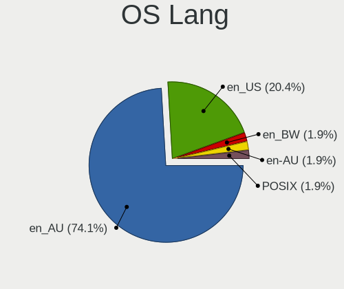

| Lang    | Desktops | Percent |
|---------|----------|---------|
| en_AU   | 45       | 81.82%  |
| en_US   | 9        | 16.36%  |
| Unknown | 1        | 1.82%   |

Boot Mode
---------

EFI or BIOS

| Mode | Desktops | Percent |
|------|----------|---------|
| BIOS | 33       | 60%     |
| EFI  | 22       | 40%     |

Filesystem
----------

Type of filesystem

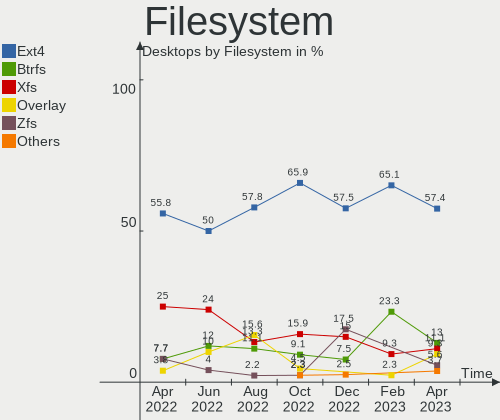

| Type    | Desktops | Percent |
|---------|----------|---------|
| Ext4    | 29       | 52.73%  |
| Xfs     | 16       | 29.09%  |
| Zfs     | 4        | 7.27%   |
| Btrfs   | 4        | 7.27%   |
| Overlay | 2        | 3.64%   |

Part. scheme
------------

Scheme of partitioning

| Type    | Desktops | Percent |
|---------|----------|---------|
| Unknown | 21       | 38.18%  |
| GPT     | 19       | 34.55%  |
| MBR     | 15       | 27.27%  |

Dual Boot with Linux/BSD
------------------------

Hosting more than one Linux/BSD

| Dual boot | Desktops | Percent |
|-----------|----------|---------|
| No        | 43       | 78.18%  |
| Yes       | 12       | 21.82%  |

Dual Boot (Win)
---------------

Hosting Linux and Windows

| Dual boot | Desktops | Percent |
|-----------|----------|---------|
| No        | 39       | 70.91%  |
| Yes       | 16       | 29.09%  |

Board
-----

Vendor
------

Motherboard manufacturer

| Name                | Desktops | Percent |
|---------------------|----------|---------|
| Gigabyte Technology | 16       | 29.09%  |
| ASUSTek Computer    | 15       | 27.27%  |
| ASRock              | 7        | 12.73%  |
| MSI                 | 6        | 10.91%  |
| Lenovo              | 5        | 9.09%   |
| Hewlett-Packard     | 3        | 5.45%   |
| Dell                | 3        | 5.45%   |

Model
-----

Motherboard model

| Name                                    | Desktops | Percent |
|-----------------------------------------|----------|---------|
| ASUS All Series                         | 3        | 5.45%   |
| Gigabyte J1900M-D2P                     | 2        | 3.64%   |
| MSI MS-7C84                             | 1        | 1.82%   |
| MSI MS-7C82                             | 1        | 1.82%   |
| MSI MS-7C52                             | 1        | 1.82%   |
| MSI MS-7917                             | 1        | 1.82%   |
| MSI MS-7850                             | 1        | 1.82%   |
| MSI MS-7721                             | 1        | 1.82%   |
| Lenovo ThinkStation E31 2552CTO         | 1        | 1.82%   |
| Lenovo ThinkCentre M93p 10A8S1K403      | 1        | 1.82%   |
| Lenovo ThinkCentre M910s 10MLS0K701     | 1        | 1.82%   |
| Lenovo ThinkCentre M58p 7220A72         | 1        | 1.82%   |
| Lenovo ThinkCentre A55 8982A48          | 1        | 1.82%   |
| HP ProLiant ML330 G6                    | 1        | 1.82%   |
| HP ProDesk 600 G2 SFF                   | 1        | 1.82%   |
| HP Compaq dc7800p Convertible Minitower | 1        | 1.82%   |
| Gigabyte Z77M-D3H-MVP                   | 1        | 1.82%   |
| Gigabyte X570 GAMING X                  | 1        | 1.82%   |
| Gigabyte H77N-WIFI                      | 1        | 1.82%   |
| Gigabyte H110M-S2PV                     | 1        | 1.82%   |
| Gigabyte GA-MA785G-UD3H                 | 1        | 1.82%   |
| Gigabyte GA-MA780G-UD3H                 | 1        | 1.82%   |
| Gigabyte GA-870A-UD3                    | 1        | 1.82%   |
| Gigabyte GA-78LMT-USB3 6.0              | 1        | 1.82%   |
| Gigabyte G41MT-D3                       | 1        | 1.82%   |
| Gigabyte EX58-UD4P                      | 1        | 1.82%   |
| Gigabyte EP45-DS3L                      | 1        | 1.82%   |
| Gigabyte B85M-D3H                       | 1        | 1.82%   |
| Gigabyte B365M H                        | 1        | 1.82%   |
| Gigabyte B360 AORUS GAMING 3 WIFI       | 1        | 1.82%   |
| Dell Precision T1650                    | 1        | 1.82%   |
| Dell OptiPlex 9020                      | 1        | 1.82%   |
| Dell OptiPlex 160                       | 1        | 1.82%   |
| ASUS TUF Z390-PLUS GAMING               | 1        | 1.82%   |
| ASUS TUF Gaming B550-PLUS               | 1        | 1.82%   |
| ASUS ROG STRIX X470-F GAMING            | 1        | 1.82%   |
| ASUS ROG CROSSHAIR VIII FORMULA         | 1        | 1.82%   |
| ASUS ROG CROSSHAIR VIII DARK HERO       | 1        | 1.82%   |
| ASUS ProArt X570-CREATOR WIFI           | 1        | 1.82%   |
| ASUS PRIME Z690M-PLUS D4                | 1        | 1.82%   |
| ASUS PRIME X299-A                       | 1        | 1.82%   |
| ASUS P8Z77-V DELUXE                     | 1        | 1.82%   |
| ASUS P8H67-V                            | 1        | 1.82%   |
| ASUS P8B75-M                            | 1        | 1.82%   |
| ASUS A8R32-MVP Deluxe                   | 1        | 1.82%   |
| ASRock Z77 Extreme4                     | 1        | 1.82%   |
| ASRock X570 Steel Legend                | 1        | 1.82%   |
| ASRock X399 Taichi                      | 1        | 1.82%   |
| ASRock X299 Gaming K6                   | 1        | 1.82%   |
| ASRock B85M Pro3                        | 1        | 1.82%   |
| ASRock AD525PV3                         | 1        | 1.82%   |
| ASRock AD2700-ITX                       | 1        | 1.82%   |

Model Family
------------

Motherboard model prefix

| Name                    | Desktops | Percent |
|-------------------------|----------|---------|
| Lenovo ThinkCentre      | 4        | 7.27%   |
| ASUS ROG                | 3        | 5.45%   |
| ASUS All                | 3        | 5.45%   |
| Gigabyte J1900M-D2P     | 2        | 3.64%   |
| Dell OptiPlex           | 2        | 3.64%   |
| ASUS TUF                | 2        | 3.64%   |
| ASUS PRIME              | 2        | 3.64%   |
| MSI MS-7C84             | 1        | 1.82%   |
| MSI MS-7C82             | 1        | 1.82%   |
| MSI MS-7C52             | 1        | 1.82%   |
| MSI MS-7917             | 1        | 1.82%   |
| MSI MS-7850             | 1        | 1.82%   |
| MSI MS-7721             | 1        | 1.82%   |
| Lenovo ThinkStation     | 1        | 1.82%   |
| HP ProLiant             | 1        | 1.82%   |
| HP ProDesk              | 1        | 1.82%   |
| HP Compaq               | 1        | 1.82%   |
| Gigabyte Z77M-D3H-MVP   | 1        | 1.82%   |
| Gigabyte X570           | 1        | 1.82%   |
| Gigabyte H77N-WIFI      | 1        | 1.82%   |
| Gigabyte H110M-S2PV     | 1        | 1.82%   |
| Gigabyte GA-MA785G-UD3H | 1        | 1.82%   |
| Gigabyte GA-MA780G-UD3H | 1        | 1.82%   |
| Gigabyte GA-870A-UD3    | 1        | 1.82%   |
| Gigabyte GA-78LMT-USB3  | 1        | 1.82%   |
| Gigabyte G41MT-D3       | 1        | 1.82%   |
| Gigabyte EX58-UD4P      | 1        | 1.82%   |
| Gigabyte EP45-DS3L      | 1        | 1.82%   |
| Gigabyte B85M-D3H       | 1        | 1.82%   |
| Gigabyte B365M          | 1        | 1.82%   |
| Gigabyte B360           | 1        | 1.82%   |
| Dell Precision          | 1        | 1.82%   |
| ASUS ProArt             | 1        | 1.82%   |
| ASUS P8Z77-V            | 1        | 1.82%   |
| ASUS P8H67-V            | 1        | 1.82%   |
| ASUS P8B75-M            | 1        | 1.82%   |
| ASUS A8R32-MVP          | 1        | 1.82%   |
| ASRock Z77              | 1        | 1.82%   |
| ASRock X570             | 1        | 1.82%   |
| ASRock X399             | 1        | 1.82%   |
| ASRock X299             | 1        | 1.82%   |
| ASRock B85M             | 1        | 1.82%   |
| ASRock AD525PV3         | 1        | 1.82%   |
| ASRock AD2700-ITX       | 1        | 1.82%   |

MFG Year
--------

Motherboard manufacture year

| Year | Desktops | Percent |
|------|----------|---------|
| 2014 | 8        | 14.55%  |
| 2012 | 6        | 10.91%  |
| 2019 | 5        | 9.09%   |
| 2018 | 5        | 9.09%   |
| 2021 | 4        | 7.27%   |
| 2013 | 4        | 7.27%   |
| 2009 | 4        | 7.27%   |
| 2020 | 3        | 5.45%   |
| 2017 | 3        | 5.45%   |
| 2010 | 3        | 5.45%   |
| 2015 | 2        | 3.64%   |
| 2011 | 2        | 3.64%   |
| 2008 | 2        | 3.64%   |
| 2007 | 2        | 3.64%   |
| 2016 | 1        | 1.82%   |
| 2006 | 1        | 1.82%   |

Form Factor
-----------

Physical design of the computer

| Name    | Desktops | Percent |
|---------|----------|---------|
| Desktop | 55       | 100%    |

Secure Boot
-----------

Enabled or disabled

| State    | Desktops | Percent |
|----------|----------|---------|
| Disabled | 53       | 96.36%  |
| Enabled  | 2        | 3.64%   |

Coreboot
--------

Have coreboot on board

| Used | Desktops | Percent |
|------|----------|---------|
| No   | 55       | 100%    |

RAM Size
--------

Total RAM memory

| Size in GB  | Desktops | Percent |
|-------------|----------|---------|
| 16.01-24.0  | 14       | 25.45%  |
| 32.01-64.0  | 11       | 20%     |
| 4.01-8.0    | 8        | 14.55%  |
| 8.01-16.0   | 8        | 14.55%  |
| 64.01-256.0 | 7        | 12.73%  |
| 3.01-4.0    | 5        | 9.09%   |
| 24.01-32.0  | 2        | 3.64%   |

RAM Used
--------

Used RAM memory

| Used GB    | Desktops | Percent |
|------------|----------|---------|
| 2.01-3.0   | 13       | 23.64%  |
| 1.01-2.0   | 12       | 21.82%  |
| 4.01-8.0   | 11       | 20%     |
| 0.51-1.0   | 6        | 10.91%  |
| 8.01-16.0  | 5        | 9.09%   |
| 3.01-4.0   | 4        | 7.27%   |
| 16.01-24.0 | 3        | 5.45%   |
| 0.01-0.5   | 1        | 1.82%   |

Total Drives
------------

Number of drives on board

| Drives | Desktops | Percent |
|--------|----------|---------|
| 1      | 20       | 36.36%  |
| 2      | 15       | 27.27%  |
| 3      | 8        | 14.55%  |
| 6      | 4        | 7.27%   |
| 4      | 4        | 7.27%   |
| 8      | 3        | 5.45%   |
| 5      | 1        | 1.82%   |

Has CD-ROM
----------

Has CD-ROM on board

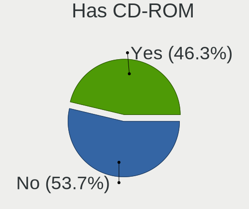

| Presented | Desktops | Percent |
|-----------|----------|---------|
| No        | 31       | 56.36%  |
| Yes       | 24       | 43.64%  |

Has Ethernet
------------

Has Ethernet on board

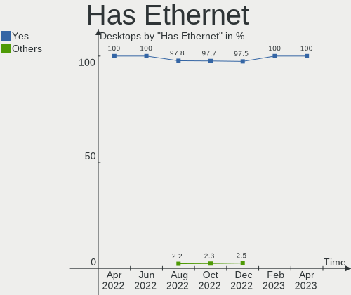

| Presented | Desktops | Percent |
|-----------|----------|---------|
| Yes       | 55       | 100%    |

Has WiFi
--------

Has WiFi module

| Presented | Desktops | Percent |
|-----------|----------|---------|
| No        | 35       | 63.64%  |
| Yes       | 20       | 36.36%  |

Has Bluetooth
-------------

Has Bluetooth module

| Presented | Desktops | Percent |
|-----------|----------|---------|
| No        | 37       | 67.27%  |
| Yes       | 18       | 32.73%  |

Location
--------

Country
-------

Geographic location (country)

| Country   | Desktops | Percent |
|-----------|----------|---------|
| Australia | 55       | 100%    |

City
----

Geographic location (city)

| City           | Desktops | Percent |
|----------------|----------|---------|
| Sydney         | 22       | 40%     |
| Melbourne      | 10       | 18.18%  |
| Brisbane       | 6        | 10.91%  |
| Perth          | 5        | 9.09%   |
| Adelaide       | 3        | 5.45%   |
| Canberra       | 2        | 3.64%   |
| Surry Hills    | 1        | 1.82%   |
| Richmond       | 1        | 1.82%   |
| Launceston     | 1        | 1.82%   |
| Gold Coast     | 1        | 1.82%   |
| Geelong        | 1        | 1.82%   |
| Brunswick West | 1        | 1.82%   |
| Airlie Beach   | 1        | 1.82%   |

Drives
------

Drive Vendor
------------

Hard drive vendors

| Vendor              | Desktops | Drives | Percent |
|---------------------|----------|--------|---------|
| Samsung Electronics | 29       | 50     | 31.18%  |
| Seagate             | 16       | 31     | 17.2%   |
| WDC                 | 15       | 29     | 16.13%  |
| Crucial             | 8        | 8      | 8.6%    |
| Intel               | 5        | 5      | 5.38%   |
| Kingston            | 4        | 4      | 4.3%    |
| Hitachi             | 4        | 4      | 4.3%    |
| SanDisk             | 3        | 3      | 3.23%   |
| Toshiba             | 2        | 2      | 2.15%   |
| Vaseky              | 1        | 1      | 1.08%   |
| SABRENT             | 1        | 1      | 1.08%   |
| PNY                 | 1        | 1      | 1.08%   |
| Micron Technology   | 1        | 1      | 1.08%   |
| LITEONIT            | 1        | 1      | 1.08%   |
| Corsair             | 1        | 1      | 1.08%   |
| A-DATA Technology   | 1        | 1      | 1.08%   |

Drive Model
-----------

Hard drive models

| Model                                  | Desktops | Percent |
|----------------------------------------|----------|---------|
| WDC WD20EZRZ-00Z5HB0 2TB               | 4        | 3.31%   |
| Crucial CT500MX500SSD1 500GB           | 4        | 3.31%   |
| Seagate ST4000DM004-2CV104 4TB         | 3        | 2.48%   |
| Seagate ST3500418AS 500GB              | 3        | 2.48%   |
| Samsung SSD 980 PRO 1TB                | 3        | 2.48%   |
| Samsung SSD 860 EVO 500GB              | 3        | 2.48%   |
| Samsung SSD 850 EVO 250GB              | 3        | 2.48%   |
| WDC WD80EFAX-68KNBN0 8TB               | 2        | 1.65%   |
| Samsung SSD 850 PRO 128GB              | 2        | 1.65%   |
| Samsung SSD 850 EVO 500GB              | 2        | 1.65%   |
| Samsung SSD 840 EVO 250GB              | 2        | 1.65%   |
| Samsung HD501LJ 500GB                  | 2        | 1.65%   |
| Kingston NVMe SSD Drive 500GB          | 2        | 1.65%   |
| Intel SSDSC2CT120A3 120GB              | 2        | 1.65%   |
| Intel SSDSA2M080G2LE 80GB              | 2        | 1.65%   |
| WDC WDS500G3X0C-00SJG0 500GB           | 1        | 0.83%   |
| WDC WDS500G2B0A-00SM50 500GB SSD       | 1        | 0.83%   |
| WDC WDS480G2G0A-00JH30 480GB SSD       | 1        | 0.83%   |
| WDC WD80EFAX-68LHPN0 8TB               | 1        | 0.83%   |
| WDC WD5000AVCS-632DY1 500GB            | 1        | 0.83%   |
| WDC WD40EFRX-68N32N0 4TB               | 1        | 0.83%   |
| WDC WD20EZAZ-00GGJB0 2TB               | 1        | 0.83%   |
| WDC WD20EARX-00PASB0 2TB               | 1        | 0.83%   |
| WDC WD20EARS-00J2GB0 2TB               | 1        | 0.83%   |
| WDC WD2002FAEX-007BA0 2TB              | 1        | 0.83%   |
| WDC WD20 EZRZ-00Z5HB0 2TB              | 1        | 0.83%   |
| WDC WD1600BJKT-75F4T0 160GB            | 1        | 0.83%   |
| WDC WD10EZEX-08WN4A0 1TB               | 1        | 0.83%   |
| WDC WD10EZEX-00WN4A0 1TB               | 1        | 0.83%   |
| WDC WD101EFAX-68LDBN0 10TB             | 1        | 0.83%   |
| WDC WD1003FZEX-00K3CA0 1TB             | 1        | 0.83%   |
| WDC WD1001FAES-60Z2A0 1TB              | 1        | 0.83%   |
| Vaseky V850/64G 64GB SSD               | 1        | 0.83%   |
| Toshiba NVMe SSD Drive 512GB           | 1        | 0.83%   |
| Toshiba MQ01ABB200 2TB                 | 1        | 0.83%   |
| Seagate ST8000VN004-2M2101 8TB         | 1        | 0.83%   |
| Seagate ST8000DM004-2U9188 8TB         | 1        | 0.83%   |
| Seagate ST8000DM004-2CX188 8TB         | 1        | 0.83%   |
| Seagate ST8000AS0002-1NA17Z 8TB        | 1        | 0.83%   |
| Seagate ST500LT012-9WS142 500GB        | 1        | 0.83%   |
| Seagate ST500DM002-1BD142 500GB        | 1        | 0.83%   |
| Seagate ST4000DM004-2U9104 4TB         | 1        | 0.83%   |
| Seagate ST4000DM000-1F2168 4TB         | 1        | 0.83%   |
| Seagate ST3500630NS 500GB              | 1        | 0.83%   |
| Seagate ST31000521AS 1TB               | 1        | 0.83%   |
| Seagate ST31000333AS 1TB               | 1        | 0.83%   |
| Seagate ST2000DM006-2DM164 2TB         | 1        | 0.83%   |
| Seagate ST2000DL003-9VT166 2TB         | 1        | 0.83%   |
| Seagate ST1000LM049-2GH172 1TB         | 1        | 0.83%   |
| Seagate ST1000DM010-2EP102 1TB         | 1        | 0.83%   |
| Seagate ST10000VN0004-1ZD101 10TB      | 1        | 0.83%   |
| Seagate ST10000DM0004-1ZC101 10TB      | 1        | 0.83%   |
| Seagate FireCuda 530 ZP4000GM30023 4TB | 1        | 0.83%   |
| Seagate Expansion HDD 10TB             | 1        | 0.83%   |
| Seagate Expansion Desk 3TB             | 1        | 0.83%   |
| SanDisk SDSSDXPS240G 240GB             | 1        | 0.83%   |
| SanDisk SDSSDHP128G 128GB              | 1        | 0.83%   |
| SanDisk SDSSDHII240G 240GB             | 1        | 0.83%   |
| Samsung SSD 980 500GB                  | 1        | 0.83%   |
| Samsung SSD 970 EVO Plus 500GB         | 1        | 0.83%   |

HDD Vendor
----------

Hard disk drive vendors

| Vendor              | Desktops | Drives | Percent |
|---------------------|----------|--------|---------|
| Seagate             | 15       | 29     | 37.5%   |
| WDC                 | 14       | 25     | 35%     |
| Samsung Electronics | 5        | 11     | 12.5%   |
| Hitachi             | 4        | 4      | 10%     |
| Toshiba             | 1        | 1      | 2.5%    |
| SABRENT             | 1        | 1      | 2.5%    |

SSD Vendor
----------

Solid state drive vendors

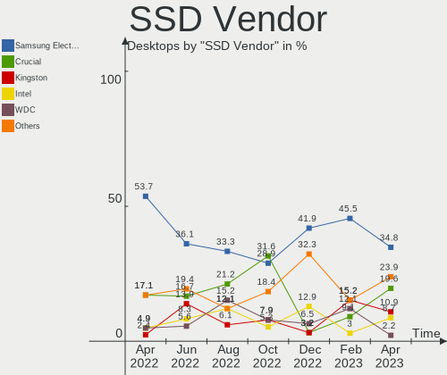

| Vendor              | Desktops | Drives | Percent |
|---------------------|----------|--------|---------|
| Samsung Electronics | 22       | 26     | 50%     |
| Crucial             | 7        | 7      | 15.91%  |
| Intel               | 5        | 5      | 11.36%  |
| SanDisk             | 3        | 3      | 6.82%   |
| WDC                 | 2        | 2      | 4.55%   |
| Vaseky              | 1        | 1      | 2.27%   |
| PNY                 | 1        | 1      | 2.27%   |
| Micron Technology   | 1        | 1      | 2.27%   |
| LITEONIT            | 1        | 1      | 2.27%   |
| Kingston            | 1        | 1      | 2.27%   |

Drive Kind
----------

HDD or SSD

| Kind | Desktops | Drives | Percent |
|------|----------|--------|---------|
| SSD  | 41       | 48     | 47.67%  |
| HDD  | 30       | 71     | 34.88%  |
| NVMe | 15       | 24     | 17.44%  |

Drive Connector
---------------

SATA, SAS, NVMe, etc.

| Type | Desktops | Drives | Percent |
|------|----------|--------|---------|
| SATA | 49       | 113    | 72.06%  |
| NVMe | 15       | 24     | 22.06%  |
| SAS  | 4        | 6      | 5.88%   |

Drive Size
----------

Size of hard drive

| Size in TB | Desktops | Drives | Percent |
|------------|----------|--------|---------|
| 0.01-0.5   | 41       | 61     | 54.67%  |
| 0.51-1.0   | 12       | 17     | 16%     |
| 1.01-2.0   | 10       | 17     | 13.33%  |
| 4.01-10.0  | 6        | 16     | 8%      |
| 3.01-4.0   | 5        | 7      | 6.67%   |
| 2.01-3.0   | 1        | 1      | 1.33%   |

Space Total
-----------

Amount of disk space available on the file system

| Size in GB     | Desktops | Percent |
|----------------|----------|---------|
| 101-250        | 11       | 20%     |
| 251-500        | 8        | 14.55%  |
| More than 3000 | 7        | 12.73%  |
| 501-1000       | 7        | 12.73%  |
| 51-100         | 7        | 12.73%  |
| 2001-3000      | 4        | 7.27%   |
| 1-20           | 4        | 7.27%   |
| 1001-2000      | 3        | 5.45%   |
| Unknown        | 3        | 5.45%   |
| 21-50          | 1        | 1.82%   |

Space Used
----------

Amount of used disk space

| Used GB        | Desktops | Percent |
|----------------|----------|---------|
| 1-20           | 17       | 30.91%  |
| 21-50          | 8        | 14.55%  |
| 101-250        | 6        | 10.91%  |
| 251-500        | 5        | 9.09%   |
| 2001-3000      | 5        | 9.09%   |
| 51-100         | 5        | 9.09%   |
| More than 3000 | 3        | 5.45%   |
| Unknown        | 3        | 5.45%   |
| 501-1000       | 2        | 3.64%   |
| 1001-2000      | 1        | 1.82%   |

Malfunc. Drives
---------------

Drive models with a malfunction

| Model                                 | Desktops | Drives | Percent |
|---------------------------------------|----------|--------|---------|
| Intel SSDSC2CT120A3 120GB             | 2        | 2      | 15.38%  |
| WDC WD20EARS-00J2GB0 2TB              | 1        | 1      | 7.69%   |
| WDC WD2002FAEX-007BA0 2TB             | 1        | 1      | 7.69%   |
| Seagate ST500LT012-9WS142 500GB       | 1        | 1      | 7.69%   |
| Seagate ST3500418AS 500GB             | 1        | 1      | 7.69%   |
| Samsung Electronics SSD 970 EVO 500GB | 1        | 2      | 7.69%   |
| Samsung Electronics SSD 840 EVO 250GB | 1        | 1      | 7.69%   |
| Samsung Electronics HD501LJ 500GB     | 1        | 2      | 7.69%   |
| Samsung Electronics HD203WI 2TB       | 1        | 1      | 7.69%   |
| Samsung Electronics HD103UJ 1TB       | 1        | 2      | 7.69%   |
| Intel SSDSA2M080G2LE 80GB             | 1        | 1      | 7.69%   |
| Hitachi HDS5C3020ALA632 2TB           | 1        | 1      | 7.69%   |

Malfunc. Drive Vendor
---------------------

Vendors of faulty drives

| Vendor              | Desktops | Drives | Percent |
|---------------------|----------|--------|---------|
| Samsung Electronics | 5        | 8      | 41.67%  |
| Intel               | 3        | 3      | 25%     |
| Seagate             | 2        | 2      | 16.67%  |
| WDC                 | 1        | 2      | 8.33%   |
| Hitachi             | 1        | 1      | 8.33%   |

Malfunc. HDD Vendor
-------------------

Vendors of faulty HDD drives

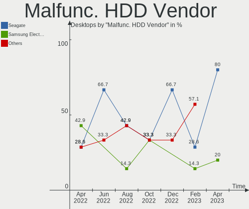

| Vendor              | Desktops | Drives | Percent |
|---------------------|----------|--------|---------|
| Samsung Electronics | 3        | 5      | 42.86%  |
| Seagate             | 2        | 2      | 28.57%  |
| WDC                 | 1        | 2      | 14.29%  |
| Hitachi             | 1        | 1      | 14.29%  |

Malfunc. Drive Kind
-------------------

Kinds of faulty drives

| Kind | Desktops | Drives | Percent |
|------|----------|--------|---------|
| HDD  | 5        | 10     | 50%     |
| SSD  | 4        | 4      | 40%     |
| NVMe | 1        | 2      | 10%     |

Failed Drives
-------------

Failed drive models

Zero info for selected period =(

Failed Drive Vendor
-------------------

Failed drive vendors

Zero info for selected period =(

Drive Status
------------

Number of failed and malfunc. drives

| Status   | Desktops | Drives | Percent |
|----------|----------|--------|---------|
| Works    | 31       | 72     | 49.21%  |
| Detected | 22       | 55     | 34.92%  |
| Malfunc  | 10       | 16     | 15.87%  |

Storage controller
------------------

Storage Vendor
--------------

Storage controller vendors

| Vendor                           | Desktops | Percent |
|----------------------------------|----------|---------|
| Intel                            | 38       | 45.24%  |
| AMD                              | 15       | 17.86%  |
| Samsung Electronics              | 8        | 9.52%   |
| Kingston Technology Company      | 3        | 3.57%   |
| ASMedia Technology               | 3        | 3.57%   |
| Marvell Technology Group         | 2        | 2.38%   |
| JMicron Technology               | 2        | 2.38%   |
| VIA Technologies                 | 1        | 1.19%   |
| ULi Electronics                  | 1        | 1.19%   |
| Toshiba America Info Systems     | 1        | 1.19%   |
| Silicon Integrated Systems [SiS] | 1        | 1.19%   |
| Silicon Image                    | 1        | 1.19%   |
| Seagate Technology               | 1        | 1.19%   |
| Sandisk                          | 1        | 1.19%   |
| Phison Electronics               | 1        | 1.19%   |
| Micron/Crucial Technology        | 1        | 1.19%   |
| LSI Logic / Symbios Logic        | 1        | 1.19%   |
| Hewlett-Packard                  | 1        | 1.19%   |
| Broadcom / LSI                   | 1        | 1.19%   |
| ADATA Technology                 | 1        | 1.19%   |

Storage Model
-------------

Storage controller models

| Model                                                                                   | Desktops | Percent |
|-----------------------------------------------------------------------------------------|----------|---------|
| AMD FCH SATA Controller [AHCI mode]                                                     | 9        | 8.74%   |
| Intel 8 Series/C220 Series Chipset Family 6-port SATA Controller 1 [AHCI mode]          | 6        | 5.83%   |
| Samsung NVMe SSD Controller SM981/PM981/PM983                                           | 4        | 3.88%   |
| Samsung NVMe SSD Controller PM9A1/PM9A3/980PRO                                          | 4        | 3.88%   |
| Intel SATA Controller [RAID mode]                                                       | 4        | 3.88%   |
| Intel 7 Series/C210 Series Chipset Family 6-port SATA Controller [AHCI mode]            | 4        | 3.88%   |
| Intel 200 Series PCH SATA controller [AHCI mode]                                        | 4        | 3.88%   |
| Kingston Company A2000 NVMe SSD                                                         | 3        | 2.91%   |
| Intel NM10/ICH7 Family SATA Controller [IDE mode]                                       | 3        | 2.91%   |
| ASMedia ASM1062 Serial ATA Controller                                                   | 3        | 2.91%   |
| AMD SB7x0/SB8x0/SB9x0 SATA Controller [AHCI mode]                                       | 3        | 2.91%   |
| AMD SB7x0/SB8x0/SB9x0 IDE Controller                                                    | 3        | 2.91%   |
| Samsung NVMe SSD Controller SM961/PM961/SM963                                           | 2        | 1.94%   |
| JMicron JMB363 SATA/IDE Controller                                                      | 2        | 1.94%   |
| Intel Q170/Q150/B150/H170/H110/Z170/CM236 Chipset SATA Controller [AHCI Mode]           | 2        | 1.94%   |
| Intel Atom Processor E3800 Series SATA AHCI Controller                                  | 2        | 1.94%   |
| Intel 9 Series Chipset Family SATA Controller [AHCI Mode]                               | 2        | 1.94%   |
| Intel 7 Series/C210 Series Chipset Family 4-port SATA Controller [IDE mode]             | 2        | 1.94%   |
| Intel 7 Series/C210 Series Chipset Family 2-port SATA Controller [IDE mode]             | 2        | 1.94%   |
| VIA VT6415 PATA IDE Host Controller                                                     | 1        | 0.97%   |
| ULi ULi M5288 SATA                                                                      | 1        | 0.97%   |
| ULi M5229 IDE                                                                           | 1        | 0.97%   |
| Toshiba America Info Systems Toshiba America Info Non-Volatile memory controller        | 1        | 0.97%   |
| Silicon Integrated Systems [SiS] AHCI IDE Controller (0106)                             | 1        | 0.97%   |
| Silicon Image SiI 3132 Serial ATA Raid II Controller                                    | 1        | 0.97%   |
| Seagate FireCuda 530 SSD                                                                | 1        | 0.97%   |
| Sandisk WD Black SN750 / PC SN730 NVMe SSD                                              | 1        | 0.97%   |
| Sandisk WD Black 2018/SN750 / PC SN720 NVMe SSD                                         | 1        | 0.97%   |
| Samsung NVMe SSD Controller 980                                                         | 1        | 0.97%   |
| Phison E16 PCIe4 NVMe Controller                                                        | 1        | 0.97%   |
| Micron/Crucial P2 NVMe PCIe SSD                                                         | 1        | 0.97%   |
| Marvell Group 88SE9172 SATA 6Gb/s Controller                                            | 1        | 0.97%   |
| Marvell Group 88SE9128 PCIe SATA 6 Gb/s RAID controller with HyperDuo                   | 1        | 0.97%   |
| LSI Logic / Symbios Logic SAS2008 PCI-Express Fusion-MPT SAS-2 [Falcon]                 | 1        | 0.97%   |
| Intel Volume Management Device NVMe RAID Controller                                     | 1        | 0.97%   |
| Intel NM10/ICH7 Family SATA Controller [AHCI mode]                                      | 1        | 0.97%   |
| Intel Cannon Lake PCH SATA AHCI Controller                                              | 1        | 0.97%   |
| Intel Alder Lake-S PCH SATA Controller [AHCI Mode]                                      | 1        | 0.97%   |
| Intel 82Q35 Express PT IDER Controller                                                  | 1        | 0.97%   |
| Intel 82801JI (ICH10 Family) SATA AHCI Controller                                       | 1        | 0.97%   |
| Intel 82801JI (ICH10 Family) 4 port SATA IDE Controller #1                              | 1        | 0.97%   |
| Intel 82801JI (ICH10 Family) 2 port SATA IDE Controller #2                              | 1        | 0.97%   |
| Intel 82801JD/DO (ICH10 Family) SATA AHCI Controller                                    | 1        | 0.97%   |
| Intel 82801IR/IO/IH (ICH9R/DO/DH) 4 port SATA Controller [IDE mode]                     | 1        | 0.97%   |
| Intel 82801I (ICH9 Family) 2 port SATA Controller [IDE mode]                            | 1        | 0.97%   |
| Intel 6 Series/C200 Series Chipset Family Desktop SATA Controller (IDE mode, ports 4-5) | 1        | 0.97%   |
| Intel 6 Series/C200 Series Chipset Family Desktop SATA Controller (IDE mode, ports 0-3) | 1        | 0.97%   |
| Intel 400 Series Chipset Family SATA AHCI Controller                                    | 1        | 0.97%   |
| Intel 4 Series Chipset PT IDER Controller                                               | 1        | 0.97%   |
| HP Smart Array G6 controllers                                                           | 1        | 0.97%   |
| Broadcom / LSI SAS2308 PCI-Express Fusion-MPT SAS-2                                     | 1        | 0.97%   |
| AMD X399 Series Chipset SATA Controller                                                 | 1        | 0.97%   |
| AMD SB7x0/SB8x0/SB9x0 SATA Controller [IDE mode]                                        | 1        | 0.97%   |
| AMD RS690 PCI to PCI Bridge (PCI Express Port 2)                                        | 1        | 0.97%   |
| AMD FCH SATA Controller D                                                               | 1        | 0.97%   |
| AMD FCH RAID Controller                                                                 | 1        | 0.97%   |
| AMD 500 Series Chipset SATA Controller                                                  | 1        | 0.97%   |
| ADATA XPG SX8200 Pro PCIe Gen3x4 M.2 2280 Solid State Drive                             | 1        | 0.97%   |

Storage Kind
------------

Kind of storage controller (IDE, SATA, NVMe, SAS, ...)

| Kind | Desktops | Percent |
|------|----------|---------|
| SATA | 43       | 51.81%  |
| NVMe | 15       | 18.07%  |
| IDE  | 15       | 18.07%  |
| RAID | 8        | 9.64%   |
| SAS  | 2        | 2.41%   |

Processor
---------

CPU Vendor
----------

Processor vendors

| Vendor | Desktops | Percent |
|--------|----------|---------|
| Intel  | 39       | 70.91%  |
| AMD    | 16       | 29.09%  |

CPU Model
---------

Processor models

| Model                                          | Desktops | Percent |
|------------------------------------------------|----------|---------|
| Intel Core i7-4790K CPU @ 4.00GHz              | 3        | 5.45%   |
| AMD Ryzen 9 5950X 16-Core Processor            | 3        | 5.45%   |
| Intel Core i5-9600K CPU @ 3.70GHz              | 2        | 3.64%   |
| Intel Core i5-2500 CPU @ 3.30GHz               | 2        | 3.64%   |
| Intel Core 2 Duo CPU E8400 @ 3.00GHz           | 2        | 3.64%   |
| Intel Celeron CPU J1900 @ 1.99GHz              | 2        | 3.64%   |
| Intel Xeon CPU X5650 @ 2.67GHz                 | 1        | 1.82%   |
| Intel Xeon CPU E3-1270 V2 @ 3.50GHz            | 1        | 1.82%   |
| Intel Pentium D CPU 3.00GHz                    | 1        | 1.82%   |
| Intel Core i7-9800X CPU @ 3.80GHz              | 1        | 1.82%   |
| Intel Core i7-7800X CPU @ 3.50GHz              | 1        | 1.82%   |
| Intel Core i7-6700 CPU @ 3.40GHz               | 1        | 1.82%   |
| Intel Core i7-3770K CPU @ 3.50GHz              | 1        | 1.82%   |
| Intel Core i7-3770 CPU @ 3.40GHz               | 1        | 1.82%   |
| Intel Core i7 CPU 920 @ 2.67GHz                | 1        | 1.82%   |
| Intel Core i5-7400 CPU @ 3.00GHz               | 1        | 1.82%   |
| Intel Core i5-6500 CPU @ 3.20GHz               | 1        | 1.82%   |
| Intel Core i5-4670 CPU @ 3.40GHz               | 1        | 1.82%   |
| Intel Core i5-4590 CPU @ 3.30GHz               | 1        | 1.82%   |
| Intel Core i5-4570 CPU @ 3.20GHz               | 1        | 1.82%   |
| Intel Core i5-4460 CPU @ 3.20GHz               | 1        | 1.82%   |
| Intel Core i5-4440 CPU @ 3.10GHz               | 1        | 1.82%   |
| Intel Core i5-3570 CPU @ 3.40GHz               | 1        | 1.82%   |
| Intel Core i5-2400S CPU @ 2.50GHz              | 1        | 1.82%   |
| Intel Core i5-10500 CPU @ 3.10GHz              | 1        | 1.82%   |
| Intel Core i3-9100F CPU @ 3.60GHz              | 1        | 1.82%   |
| Intel Core i3-4340 CPU @ 3.60GHz               | 1        | 1.82%   |
| Intel Core i3-3220 CPU @ 3.30GHz               | 1        | 1.82%   |
| Intel Core 2 Quad CPU Q6600 @ 2.40GHz          | 1        | 1.82%   |
| Intel Core 2 Duo CPU E6550 @ 2.33GHz           | 1        | 1.82%   |
| Intel Atom CPU D525 @ 1.80GHz                  | 1        | 1.82%   |
| Intel Atom CPU D2700 @ 2.13GHz                 | 1        | 1.82%   |
| Intel Atom CPU 330 @ 1.60GHz                   | 1        | 1.82%   |
| Intel 12th Gen Core i5-12600K                  | 1        | 1.82%   |
| AMD Ryzen Threadripper 1950X 16-Core Processor | 1        | 1.82%   |
| AMD Ryzen 9 5900X 12-Core Processor            | 1        | 1.82%   |
| AMD Ryzen 9 3900X 12-Core Processor            | 1        | 1.82%   |
| AMD Ryzen 7 5800X 8-Core Processor             | 1        | 1.82%   |
| AMD Ryzen 7 2700X Eight-Core Processor         | 1        | 1.82%   |
| AMD Ryzen 5 3600X 6-Core Processor             | 1        | 1.82%   |
| AMD Ryzen 5 2600 Six-Core Processor            | 1        | 1.82%   |
| AMD Phenom II X4 955 Processor                 | 1        | 1.82%   |
| AMD Phenom II X2 570 Processor                 | 1        | 1.82%   |
| AMD Phenom II X2 550 Processor                 | 1        | 1.82%   |
| AMD FX-6300 Six-Core Processor                 | 1        | 1.82%   |
| AMD Athlon 64 X2 Dual Core Processor 4400+     | 1        | 1.82%   |
| AMD A8-7650K Radeon R7, 10 Compute Cores 4C+6G | 1        | 1.82%   |

CPU Model Family
----------------

Processor model prefix

| Model                  | Desktops | Percent |
|------------------------|----------|---------|
| Intel Core i5          | 14       | 25.45%  |
| Intel Core i7          | 9        | 16.36%  |
| AMD Ryzen 9            | 5        | 9.09%   |
| Intel Core i3          | 3        | 5.45%   |
| Intel Core 2 Duo       | 3        | 5.45%   |
| Intel Atom             | 3        | 5.45%   |
| Intel Xeon             | 2        | 3.64%   |
| Intel Celeron          | 2        | 3.64%   |
| AMD Ryzen 7            | 2        | 3.64%   |
| AMD Ryzen 5            | 2        | 3.64%   |
| AMD Phenom II X2       | 2        | 3.64%   |
| Other                  | 1        | 1.82%   |
| Intel Pentium D        | 1        | 1.82%   |
| Intel Core 2 Quad      | 1        | 1.82%   |
| AMD Ryzen Threadripper | 1        | 1.82%   |
| AMD Phenom II X4       | 1        | 1.82%   |
| AMD FX                 | 1        | 1.82%   |
| AMD Athlon 64 X2       | 1        | 1.82%   |
| AMD A8                 | 1        | 1.82%   |

CPU Cores
---------

Number of processor cores

| Number | Desktops | Percent |
|--------|----------|---------|
| 4      | 24       | 43.64%  |
| 2      | 13       | 23.64%  |
| 6      | 6        | 10.91%  |
| 16     | 4        | 7.27%   |
| 12     | 3        | 5.45%   |
| 8      | 3        | 5.45%   |
| 10     | 1        | 1.82%   |
| 3      | 1        | 1.82%   |

CPU Sockets
-----------

Number of sockets

| Number | Desktops | Percent |
|--------|----------|---------|
| 1      | 54       | 98.18%  |
| 2      | 1        | 1.82%   |

CPU Threads
-----------

Threads per core (Hyper-Threading)

| Number | Desktops | Percent |
|--------|----------|---------|
| 2      | 29       | 52.73%  |
| 1      | 26       | 47.27%  |

CPU Op-Modes
------------

CPU Operation Modes (32-bit, 64-bit)

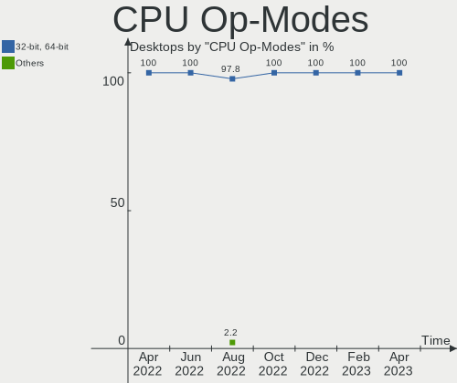

| Op mode        | Desktops | Percent |
|----------------|----------|---------|
| 32-bit, 64-bit | 55       | 100%    |

CPU Microcode
-------------

Microcode number

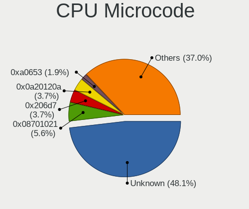

| Number     | Desktops | Percent |
|------------|----------|---------|
| Unknown    | 11       | 20%     |
| 0x306c3    | 7        | 12.73%  |
| 0x306a9    | 4        | 7.27%   |
| 0x0a201016 | 4        | 7.27%   |
| 0x6fb      | 2        | 3.64%   |
| 0x506e3    | 2        | 3.64%   |
| 0x50654    | 2        | 3.64%   |
| 0x30678    | 2        | 3.64%   |
| 0x206a7    | 2        | 3.64%   |
| 0x1067a    | 2        | 3.64%   |
| 0xf65      | 1        | 1.82%   |
| 0xa0653    | 1        | 1.82%   |
| 0x906ec    | 1        | 1.82%   |
| 0x906eb    | 1        | 1.82%   |
| 0x206c2    | 1        | 1.82%   |
| 0x106ca    | 1        | 1.82%   |
| 0x106a5    | 1        | 1.82%   |
| 0x0a201009 | 1        | 1.82%   |
| 0x08701021 | 1        | 1.82%   |
| 0x08701013 | 1        | 1.82%   |
| 0x0800820d | 1        | 1.82%   |
| 0x08001137 | 1        | 1.82%   |
| 0x06003106 | 1        | 1.82%   |
| 0x06000852 | 1        | 1.82%   |
| 0x010000c8 | 1        | 1.82%   |
| 0x010000c6 | 1        | 1.82%   |
| 0x00000000 | 1        | 1.82%   |

CPU Microarch
-------------

Microarchitecture

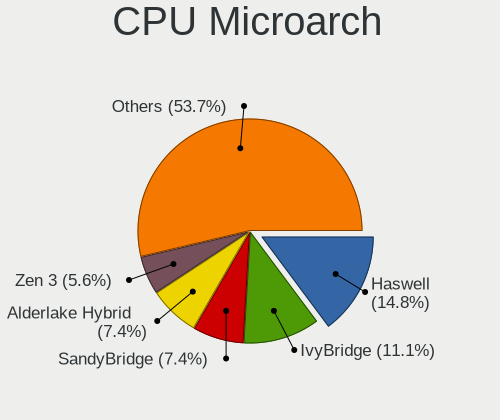

| Name        | Desktops | Percent |
|-------------|----------|---------|
| Haswell     | 9        | 16.36%  |
| Zen 3       | 5        | 9.09%   |
| IvyBridge   | 5        | 9.09%   |
| Skylake     | 4        | 7.27%   |
| KabyLake    | 4        | 7.27%   |
| SandyBridge | 3        | 5.45%   |
| K10         | 3        | 5.45%   |
| Bonnell     | 3        | 5.45%   |
| Zen+        | 2        | 3.64%   |
| Zen 2       | 2        | 3.64%   |
| Silvermont  | 2        | 3.64%   |
| Penryn      | 2        | 3.64%   |
| Core        | 2        | 3.64%   |
| Zen         | 1        | 1.82%   |
| Westmere    | 1        | 1.82%   |
| Steamroller | 1        | 1.82%   |
| Piledriver  | 1        | 1.82%   |
| NetBurst    | 1        | 1.82%   |
| Nehalem     | 1        | 1.82%   |
| K8 Hammer   | 1        | 1.82%   |
| CometLake   | 1        | 1.82%   |
| Unknown     | 1        | 1.82%   |

Graphics
--------

GPU Vendor
----------

Vendors of graphics cards

| Vendor                           | Desktops | Percent |
|----------------------------------|----------|---------|
| Nvidia                           | 24       | 40.68%  |
| Intel                            | 19       | 32.2%   |
| AMD                              | 15       | 25.42%  |
| Silicon Integrated Systems [SiS] | 1        | 1.69%   |

GPU Model
---------

Graphics card models

| Model                                                                       | Desktops | Percent |
|-----------------------------------------------------------------------------|----------|---------|
| Intel Xeon E3-1200 v3/4th Gen Core Processor Integrated Graphics Controller | 8        | 12.7%   |
| Nvidia GK208B [GeForce GT 710]                                              | 4        | 6.35%   |
| Nvidia TU116 [GeForce GTX 1660 SUPER]                                       | 2        | 3.17%   |
| Nvidia GP108 [GeForce GT 1030]                                              | 2        | 3.17%   |
| Nvidia GK104 [GeForce GTX 670]                                              | 2        | 3.17%   |
| Intel Atom Processor Z36xxx/Z37xxx Series Graphics & Display                | 2        | 3.17%   |
| AMD Navi 21 [Radeon RX 6800/6800 XT / 6900 XT]                              | 2        | 3.17%   |
| AMD Ellesmere [Radeon RX 470/480/570/570X/580/580X/590]                     | 2        | 3.17%   |
| Silicon Integrated Systems [SiS] 771/671 PCIE VGA Display Adapter           | 1        | 1.59%   |
| Nvidia TU116 [GeForce GTX 1660 Ti]                                          | 1        | 1.59%   |
| Nvidia TU106 [GeForce RTX 2060 SUPER]                                       | 1        | 1.59%   |
| Nvidia TU106 [GeForce RTX 2060 Rev. A]                                      | 1        | 1.59%   |
| Nvidia TU104 [GeForce RTX 2080]                                             | 1        | 1.59%   |
| Nvidia GP107GL [Quadro P600]                                                | 1        | 1.59%   |
| Nvidia GP104 [GeForce GTX 1080]                                             | 1        | 1.59%   |
| Nvidia GP104 [GeForce GTX 1070]                                             | 1        | 1.59%   |
| Nvidia GM206 [GeForce GTX 960]                                              | 1        | 1.59%   |
| Nvidia GM204 [GeForce GTX 970]                                              | 1        | 1.59%   |
| Nvidia GK106 [GeForce GTX 660]                                              | 1        | 1.59%   |
| Nvidia GF119 [GeForce GT 520]                                               | 1        | 1.59%   |
| Nvidia GF108 [GeForce GT 730]                                               | 1        | 1.59%   |
| Nvidia GA104 [GeForce RTX 3060 Ti]                                          | 1        | 1.59%   |
| Nvidia GA102 [GeForce RTX 3090]                                             | 1        | 1.59%   |
| Nvidia G72 [GeForce 7300 GS]                                                | 1        | 1.59%   |
| Intel HD Graphics 630                                                       | 1        | 1.59%   |
| Intel HD Graphics 530                                                       | 1        | 1.59%   |
| Intel CoffeeLake-S GT2 [UHD Graphics 630]                                   | 1        | 1.59%   |
| Intel Atom Processor D4xx/D5xx/N4xx/N5xx Integrated Graphics Controller     | 1        | 1.59%   |
| Intel Atom Processor D2xxx/N2xxx Integrated Graphics Controller             | 1        | 1.59%   |
| Intel AlderLake-S GT1                                                       | 1        | 1.59%   |
| Intel 82946GZ/GL Integrated Graphics Controller                             | 1        | 1.59%   |
| Intel 4 Series Chipset Integrated Graphics Controller                       | 1        | 1.59%   |
| Intel 2nd Generation Core Processor Family Integrated Graphics Controller   | 1        | 1.59%   |
| AMD Turks PRO [Radeon HD 6570/7570/8550 / R5 230]                           | 1        | 1.59%   |
| AMD RV530 [Radeon X1600] (Secondary)                                        | 1        | 1.59%   |
| AMD RV530 [Radeon X1600 PRO]                                                | 1        | 1.59%   |
| AMD RV380 [Radeon X300/X550/X1050 Series] (Secondary)                       | 1        | 1.59%   |
| AMD RV370 [Radeon X600/X600 SE]                                             | 1        | 1.59%   |
| AMD RV370 [Radeon X300]                                                     | 1        | 1.59%   |
| AMD RV370 [Radeon X300 SE]                                                  | 1        | 1.59%   |
| AMD RS880 [Radeon HD 4200]                                                  | 1        | 1.59%   |
| AMD Redwood XT [Radeon HD 5670/5690/5730]                                   | 1        | 1.59%   |
| AMD Pitcairn XT [Radeon HD 7870 GHz Edition]                                | 1        | 1.59%   |
| AMD Navi 23 [Radeon RX 6600/6600 XT/6600M]                                  | 1        | 1.59%   |
| AMD Kaveri [Radeon R7 Graphics]                                             | 1        | 1.59%   |
| AMD Caicos PRO [Radeon HD 7450]                                             | 1        | 1.59%   |
| AMD Baffin [Radeon RX 460/560D / Pro 450/455/460/555/555X/560/560X]         | 1        | 1.59%   |

GPU Combo
---------

Combinations of graphics cards

| Name            | Desktops | Percent |
|-----------------|----------|---------|
| 1 x Nvidia      | 22       | 40%     |
| 1 x Intel       | 15       | 27.27%  |
| 1 x AMD         | 11       | 20%     |
| 2 x AMD         | 2        | 3.64%   |
| 2 x Nvidia      | 1        | 1.82%   |
| 1 x SiS         | 1        | 1.82%   |
| Intel + 2 x AMD | 1        | 1.82%   |
| Intel + Nvidia  | 1        | 1.82%   |
| Intel + AMD     | 1        | 1.82%   |

GPU Driver
----------

Free vs proprietary

| Driver      | Desktops | Percent |
|-------------|----------|---------|
| Free        | 32       | 58.18%  |
| Proprietary | 18       | 32.73%  |
| Unknown     | 5        | 9.09%   |

GPU Memory
----------

Total video memory

| Size in GB | Desktops | Percent |
|------------|----------|---------|
| Unknown    | 21       | 38.18%  |
| 1.01-2.0   | 12       | 21.82%  |
| 7.01-8.0   | 6        | 10.91%  |
| 0.01-0.5   | 5        | 9.09%   |
| 0.51-1.0   | 4        | 7.27%   |
| 5.01-6.0   | 2        | 3.64%   |
| 3.01-4.0   | 2        | 3.64%   |
| 8.01-16.0  | 2        | 3.64%   |
| 16.01-24.0 | 1        | 1.82%   |

Monitor
-------

Monitor Vendor
--------------

Monitor vendors

| Vendor               | Desktops | Percent |
|----------------------|----------|---------|
| Dell                 | 7        | 12.96%  |
| Samsung Electronics  | 6        | 11.11%  |
| Philips              | 5        | 9.26%   |
| BenQ                 | 4        | 7.41%   |
| AOC                  | 4        | 7.41%   |
| Acer                 | 4        | 7.41%   |
| ViewSonic            | 3        | 5.56%   |
| Hewlett-Packard      | 3        | 5.56%   |
| ASUSTek Computer     | 3        | 5.56%   |
| Lenovo               | 2        | 3.7%    |
| Kogan                | 2        | 3.7%    |
| Unknown              | 1        | 1.85%   |
| Sony                 | 1        | 1.85%   |
| SAC                  | 1        | 1.85%   |
| Panasonic            | 1        | 1.85%   |
| LG Electronics       | 1        | 1.85%   |
| Goldstar             | 1        | 1.85%   |
| GKK                  | 1        | 1.85%   |
| Gateway              | 1        | 1.85%   |
| Eizo                 | 1        | 1.85%   |
| CHO                  | 1        | 1.85%   |
| Ancor Communications | 1        | 1.85%   |

Monitor Model
-------------

Monitor models

| Model                                                                 | Desktops | Percent |
|-----------------------------------------------------------------------|----------|---------|
| Philips 190S PHL082F 1280x1024 380x300mm 19.1-inch                    | 2        | 3.39%   |
| Lenovo LEN L1711pC LEN13B7 1280x1024 338x270mm 17.0-inch              | 2        | 3.39%   |
| ViewSonic VA2719-2K VSC6B34 2560x1440 597x336mm 27.0-inch             | 1        | 1.69%   |
| ViewSonic VA2226w-3 VSC2051 1680x1050 490x290mm 22.4-inch             | 1        | 1.69%   |
| ViewSonic LCD Monitor VSCC132 1920x1080 600x340mm 27.2-inch           | 1        | 1.69%   |
| Unknown LCD Monitor SAMSUNG 1920x1080                                 | 1        | 1.69%   |
| Sony TV SNY2C02 1920x1080 1018x573mm 46.0-inch                        | 1        | 1.69%   |
| Samsung Electronics SyncMaster SAM7027 1920x1080 1074x604mm 48.5-inch | 1        | 1.69%   |
| Samsung Electronics SyncMaster SAM01D3 1440x900 408x225mm 18.3-inch   | 1        | 1.69%   |
| Samsung Electronics SMS27A850 SAM083C 2560x1440 520x320mm 24.0-inch   | 1        | 1.69%   |
| Samsung Electronics S32F351 SAM0D24 1920x1080 698x393mm 31.5-inch     | 1        | 1.69%   |
| Samsung Electronics LC34G55T SAM711A 3440x1440 798x334mm 34.1-inch    | 1        | 1.69%   |
| Samsung Electronics C49HG9x SAM0E5E 3840x1080 1200x340mm 49.1-inch    | 1        | 1.69%   |
| SAC LED MONITOR SAC952D 1920x1080 443x249mm 20.0-inch                 | 1        | 1.69%   |
| Philips PHL BDM3270 PHL08E7 2560x1440 708x398mm 32.0-inch             | 1        | 1.69%   |
| Philips PHL 271V8 PHLC213 1920x1080 598x336mm 27.0-inch               | 1        | 1.69%   |
| Philips LCD Monitor PHL 328P6VU 3840x2160                             | 1        | 1.69%   |
| Panasonic TV MEIA096 1920x1080 698x392mm 31.5-inch                    | 1        | 1.69%   |
| LG Electronics LCD Monitor E2711                                      | 1        | 1.69%   |
| Kogan KAMN27RQ1LA KGN0ABC 2560x1440 597x336mm 27.0-inch               | 1        | 1.69%   |
| Kogan KAMN27QFSA KGN0A8C 2560x1440 597x336mm 27.0-inch                | 1        | 1.69%   |
| Hewlett-Packard vs19 HWP264C 1280x1024 340x270mm 17.1-inch            | 1        | 1.69%   |
| Hewlett-Packard LCD Monitor vs19 3200x1080                            | 1        | 1.69%   |
| Hewlett-Packard LA2306 HWP2949 1920x1080 509x286mm 23.0-inch          | 1        | 1.69%   |
| Hewlett-Packard LA2205 HWP2848 1680x1050 473x296mm 22.0-inch          | 1        | 1.69%   |
| Goldstar LG FULL HD GSM5BDF 1920x1080 480x270mm 21.7-inch             | 1        | 1.69%   |
| GKK MONITOR GKK3535 1920x1080 886x498mm 40.0-inch                     | 1        | 1.69%   |
| Gateway FHX2300 GWY00BF 1920x1080 509x286mm 23.0-inch                 | 1        | 1.69%   |
| Eizo EV2450 ENC2531 1920x1080 528x297mm 23.9-inch                     | 1        | 1.69%   |
| Dell U3011 DEL4063 2560x1600 641x401mm 29.8-inch                      | 1        | 1.69%   |
| Dell U2720Q DEL41B3 3840x2160 600x340mm 27.2-inch                     | 1        | 1.69%   |
| Dell U2717D DEL40EA 2560x1440 597x336mm 27.0-inch                     | 1        | 1.69%   |
| Dell U2713H DELA091 2560x1440 597x336mm 27.0-inch                     | 1        | 1.69%   |
| Dell S2721D DELA199 2560x1440 597x336mm 27.0-inch                     | 1        | 1.69%   |
| Dell P2319H DELD0D7 1920x1080 509x286mm 23.0-inch                     | 1        | 1.69%   |
| Dell P2319H DELD0D5 1920x1080 510x290mm 23.1-inch                     | 1        | 1.69%   |
| Dell P1917S DELD093 1280x1024 380x300mm 19.1-inch                     | 1        | 1.69%   |
| Dell P1917S DELD091 1280x1024 380x300mm 19.1-inch                     | 1        | 1.69%   |
| Dell LCD Monitor U2312HM 3600x1080                                    | 1        | 1.69%   |
| Dell LCD Monitor P2213                                                | 1        | 1.69%   |
| CHO Smart TV CHO0030 3840x2160 708x398mm 32.0-inch                    | 1        | 1.69%   |
| BenQ LCD Monitor G2420HD 1920x1080                                    | 1        | 1.69%   |
| BenQ GL2480 BNQ78ED 1920x1080 531x298mm 24.0-inch                     | 1        | 1.69%   |
| BenQ FP91G+ BNQ76A5 1280x1024 376x301mm 19.0-inch                     | 1        | 1.69%   |
| BenQ BenQG2110W BNQ7811 1680x1050 474x296mm 22.0-inch                 | 1        | 1.69%   |
| ASUSTek Computer XG27VQ AUS27A6 1920x1080 595x336mm 26.9-inch         | 1        | 1.69%   |
| ASUSTek Computer PG43U AUS43A1 3840x2160 941x529mm 42.5-inch          | 1        | 1.69%   |
| ASUSTek Computer PA279 AUS2768 3840x2160 597x336mm 27.0-inch          | 1        | 1.69%   |
| AOC LCD Monitor 2752 1920x1080                                        | 1        | 1.69%   |
| AOC AG322FWG4 AOC3220 1920x1080 698x393mm 31.5-inch                   | 1        | 1.69%   |
| AOC 2490W1 AOC2490 1920x1080 527x296mm 23.8-inch                      | 1        | 1.69%   |
| AOC 2470W AOC2470 1920x1080 521x293mm 23.5-inch                       | 1        | 1.69%   |
| Ancor Communications ASUS MG279 ACI27A7 2560x1440 597x336mm 27.0-inch | 1        | 1.69%   |
| Acer X233H ACR0093 1920x1080 510x287mm 23.0-inch                      | 1        | 1.69%   |
| Acer V233HL ACR0129 1920x1080 531x298mm 24.0-inch                     | 1        | 1.69%   |
| Acer KA270H ACR0469 1920x1080 598x336mm 27.0-inch                     | 1        | 1.69%   |
| Acer K222HQL ACR03E1 1920x1080 477x268mm 21.5-inch                    | 1        | 1.69%   |

Monitor Resolution
------------------

Monitor screen resolution

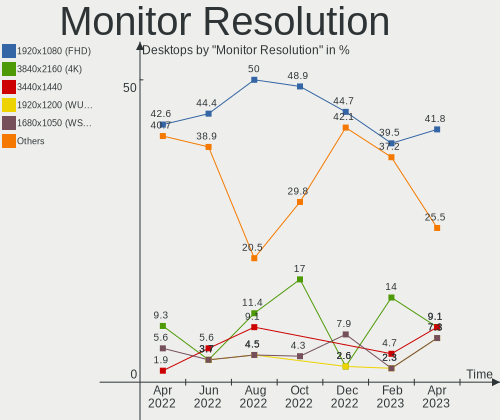

| Resolution         | Desktops | Percent |
|--------------------|----------|---------|
| 1920x1080 (FHD)    | 24       | 42.11%  |
| 2560x1440 (QHD)    | 9        | 15.79%  |
| 1280x1024 (SXGA)   | 8        | 14.04%  |
| 3840x2160 (4K)     | 5        | 8.77%   |
| 1680x1050 (WSXGA+) | 3        | 5.26%   |
| Unknown            | 2        | 3.51%   |
| 3840x1080          | 1        | 1.75%   |
| 3600x1080          | 1        | 1.75%   |
| 3440x1440          | 1        | 1.75%   |
| 3200x1080          | 1        | 1.75%   |
| 2560x1600          | 1        | 1.75%   |
| 1440x900 (WXGA+)   | 1        | 1.75%   |

Monitor Diagonal
----------------

Diagonal size in inches

| Inches  | Desktops | Percent |
|---------|----------|---------|
| 27      | 11       | 20%     |
| 23      | 7        | 12.73%  |
| 19      | 7        | 12.73%  |
| Unknown | 6        | 10.91%  |
| 24      | 4        | 7.27%   |
| 31      | 3        | 5.45%   |
| 22      | 3        | 5.45%   |
| 21      | 3        | 5.45%   |
| 32      | 2        | 3.64%   |
| 18      | 2        | 3.64%   |
| 55      | 1        | 1.82%   |
| 49      | 1        | 1.82%   |
| 48      | 1        | 1.82%   |
| 42      | 1        | 1.82%   |
| 40      | 1        | 1.82%   |
| 34      | 1        | 1.82%   |
| 29      | 1        | 1.82%   |

Monitor Width
-------------

Physical width

| Width in mm | Desktops | Percent |
|-------------|----------|---------|
| 501-600     | 22       | 40%     |
| 351-400     | 8        | 14.55%  |
| 401-500     | 7        | 12.73%  |
| Unknown     | 6        | 10.91%  |
| 601-700     | 4        | 7.27%   |
| 701-800     | 3        | 5.45%   |
| 1001-1500   | 3        | 5.45%   |
| 801-900     | 1        | 1.82%   |
| 901-1000    | 1        | 1.82%   |

Aspect Ratio
------------

Proportional relationship between the width and the height

| Ratio   | Desktops | Percent |
|---------|----------|---------|
| 16/9    | 33       | 61.11%  |
| 5/4     | 6        | 11.11%  |
| Unknown | 6        | 11.11%  |
| 16/10   | 5        | 9.26%   |
| 6/5     | 2        | 3.7%    |
| 32/9    | 1        | 1.85%   |
| 21/9    | 1        | 1.85%   |

Monitor Area
------------

Area in inch

| Area in inch | Desktops | Percent |
|----------------|----------|---------|
| 201-250        | 15       | 27.78%  |
| 301-350        | 11       | 20.37%  |
| 151-200        | 9        | 16.67%  |
| 351-500        | 7        | 12.96%  |
| Unknown        | 6        | 11.11%  |
| 501-1000       | 3        | 5.56%   |
| More than 1000 | 2        | 3.7%    |
| 251-300        | 1        | 1.85%   |

Pixel Density
-------------

Pixels per inch

| Density | Desktops | Percent |
|---------|----------|---------|
| 51-100  | 27       | 52.94%  |
| 101-120 | 12       | 23.53%  |
| Unknown | 6        | 11.76%  |
| 1-50    | 3        | 5.88%   |
| 161-240 | 2        | 3.92%   |
| 121-160 | 1        | 1.96%   |

Multiple Monitors
-----------------

Total monitors connected

| Total | Desktops | Percent |
|-------|----------|---------|
| 1     | 44       | 80%     |
| 2     | 6        | 10.91%  |
| 0     | 4        | 7.27%   |
| 3     | 1        | 1.82%   |

Network
-------

Net Controller Vendor
---------------------

Controller vendors

| Vendor                   | Desktops | Percent |
|--------------------------|----------|---------|
| Intel                    | 30       | 35.29%  |
| Realtek Semiconductor    | 29       | 34.12%  |
| Qualcomm Atheros         | 7        | 8.24%   |
| Broadcom                 | 6        | 7.06%   |
| Aquantia                 | 3        | 3.53%   |
| Ralink Technology        | 2        | 2.35%   |
| TP-Link                  | 1        | 1.18%   |
| Texas Instruments        | 1        | 1.18%   |
| Ralink                   | 1        | 1.18%   |
| Microsoft                | 1        | 1.18%   |
| Marvell Technology Group | 1        | 1.18%   |
| Edimax Technology        | 1        | 1.18%   |
| DisplayLink              | 1        | 1.18%   |
| D-Link System            | 1        | 1.18%   |

Net Controller Model
--------------------

Controller models

| Model                                                               | Desktops | Percent |
|---------------------------------------------------------------------|----------|---------|
| Realtek RTL8111/8168/8411 PCI Express Gigabit Ethernet Controller   | 23       | 24.21%  |
| Intel I211 Gigabit Network Connection                               | 6        | 6.32%   |
| Realtek RTL8125 2.5GbE Controller                                   | 4        | 4.21%   |
| Intel Wi-Fi 6 AX200                                                 | 4        | 4.21%   |
| Qualcomm Atheros AR8151 v2.0 Gigabit Ethernet                       | 3        | 3.16%   |
| Qualcomm Atheros AR93xx Wireless Network Adapter                    | 2        | 2.11%   |
| Intel Ethernet Connection I217-LM                                   | 2        | 2.11%   |
| Intel Ethernet Connection (7) I219-V                                | 2        | 2.11%   |
| Intel Ethernet Connection (2) I219-V                                | 2        | 2.11%   |
| Intel Ethernet Connection (2) I219-LM                               | 2        | 2.11%   |
| Intel Cannon Lake PCH CNVi WiFi                                     | 2        | 2.11%   |
| Intel 82579LM Gigabit Network Connection (Lewisville)               | 2        | 2.11%   |
| Intel 82575EB Gigabit Network Connection                            | 2        | 2.11%   |
| Intel 82541PI Gigabit Ethernet Controller                           | 2        | 2.11%   |
| TP-Link TL-WN821N Version 5 RTL8192EU                               | 1        | 1.05%   |
| Texas Instruments CC1352R1 Launchpad                                | 1        | 1.05%   |
| Realtek RTL8188EUS 802.11n Wireless Network Adapter                 | 1        | 1.05%   |
| Realtek RTL8131 PCIe Fast Ethernet Adapter                          | 1        | 1.05%   |
| Realtek RTL-8100/8101L/8139 PCI Fast Ethernet Adapter               | 1        | 1.05%   |
| Ralink RT5370 Wireless Adapter                                      | 1        | 1.05%   |
| Ralink RT2870/RT3070 Wireless Adapter                               | 1        | 1.05%   |
| Ralink RT2800 802.11n PCI                                           | 1        | 1.05%   |
| Qualcomm Atheros Killer E220x Gigabit Ethernet Controller           | 1        | 1.05%   |
| Qualcomm Atheros AR5212/5213/2414 Wireless Network Adapter          | 1        | 1.05%   |
| Microsoft XBOX ACC                                                  | 1        | 1.05%   |
| Marvell Group 88E8053 PCI-E Gigabit Ethernet Controller             | 1        | 1.05%   |
| Marvell Group 88E8001 Gigabit Ethernet Controller                   | 1        | 1.05%   |
| Intel Wireless-AC 9260                                              | 1        | 1.05%   |
| Intel Wireless 7265                                                 | 1        | 1.05%   |
| Intel Ethernet Controller I225-V                                    | 1        | 1.05%   |
| Intel Ethernet Connection I217-V                                    | 1        | 1.05%   |
| Intel Ethernet Connection (17) I219-V                               | 1        | 1.05%   |
| Intel Dual Band Wireless-AC 3168NGW [Stone Peak]                    | 1        | 1.05%   |
| Intel Centrino Wireless-N 2230                                      | 1        | 1.05%   |
| Intel 82579V Gigabit Network Connection                             | 1        | 1.05%   |
| Intel 82574L Gigabit Network Connection                             | 1        | 1.05%   |
| Intel 82567LM-3 Gigabit Network Connection                          | 1        | 1.05%   |
| Intel 82566DM-2 Gigabit Network Connection                          | 1        | 1.05%   |
| Intel 82546EB Gigabit Ethernet Controller (Copper)                  | 1        | 1.05%   |
| Edimax AC600 USB                                                    | 1        | 1.05%   |
| DisplayLink Dell Universal Dock D6000                               | 1        | 1.05%   |
| D-Link System RTL8139 Ethernet                                      | 1        | 1.05%   |
| Broadcom NetXtreme BCM5764M Gigabit Ethernet PCIe                   | 1        | 1.05%   |
| Broadcom NetXtreme BCM5715 Gigabit Ethernet                         | 1        | 1.05%   |
| Broadcom NetLink BCM5786 Gigabit Ethernet PCI Express               | 1        | 1.05%   |
| Broadcom NetLink BCM57781 Gigabit Ethernet PCIe                     | 1        | 1.05%   |
| Broadcom BCM4360 802.11ac Wireless Network Adapter                  | 1        | 1.05%   |
| Broadcom BCM43228 802.11a/b/g/n                                     | 1        | 1.05%   |
| Aquantia AQC113CS NBase-T/IEEE 802.3bz Ethernet Controller [AQtion] | 1        | 1.05%   |
| Aquantia AQC111 NBase-T/IEEE 802.3bz Ethernet Controller [AQtion]   | 1        | 1.05%   |
| Aquantia AQC107 NBase-T/IEEE 802.3bz Ethernet Controller [AQtion]   | 1        | 1.05%   |

Wireless Vendor
---------------

Wireless vendors

| Vendor                | Desktops | Percent |
|-----------------------|----------|---------|
| Intel                 | 10       | 45.45%  |
| Qualcomm Atheros      | 3        | 13.64%  |
| Ralink Technology     | 2        | 9.09%   |
| Broadcom              | 2        | 9.09%   |
| TP-Link               | 1        | 4.55%   |
| Realtek Semiconductor | 1        | 4.55%   |
| Ralink                | 1        | 4.55%   |
| Microsoft             | 1        | 4.55%   |
| Edimax Technology     | 1        | 4.55%   |

Wireless Model
--------------

Wireless models

| Model                                                      | Desktops | Percent |
|------------------------------------------------------------|----------|---------|
| Intel Wi-Fi 6 AX200                                        | 4        | 18.18%  |
| Qualcomm Atheros AR93xx Wireless Network Adapter           | 2        | 9.09%   |
| Intel Cannon Lake PCH CNVi WiFi                            | 2        | 9.09%   |
| TP-Link TL-WN821N Version 5 RTL8192EU                      | 1        | 4.55%   |
| Realtek RTL8188EUS 802.11n Wireless Network Adapter        | 1        | 4.55%   |
| Ralink RT5370 Wireless Adapter                             | 1        | 4.55%   |
| Ralink RT2870/RT3070 Wireless Adapter                      | 1        | 4.55%   |
| Ralink RT2800 802.11n PCI                                  | 1        | 4.55%   |
| Qualcomm Atheros AR5212/5213/2414 Wireless Network Adapter | 1        | 4.55%   |
| Microsoft XBOX ACC                                         | 1        | 4.55%   |
| Intel Wireless-AC 9260                                     | 1        | 4.55%   |
| Intel Wireless 7265                                        | 1        | 4.55%   |
| Intel Dual Band Wireless-AC 3168NGW [Stone Peak]           | 1        | 4.55%   |
| Intel Centrino Wireless-N 2230                             | 1        | 4.55%   |
| Edimax AC600 USB                                           | 1        | 4.55%   |
| Broadcom BCM4360 802.11ac Wireless Network Adapter         | 1        | 4.55%   |
| Broadcom BCM43228 802.11a/b/g/n                            | 1        | 4.55%   |

Ethernet Vendor
---------------

Ethernet vendors

| Vendor                   | Desktops | Percent |
|--------------------------|----------|---------|
| Realtek Semiconductor    | 28       | 40.58%  |
| Intel                    | 27       | 39.13%  |
| Qualcomm Atheros         | 4        | 5.8%    |
| Broadcom                 | 4        | 5.8%    |
| Aquantia                 | 3        | 4.35%   |
| Marvell Technology Group | 1        | 1.45%   |
| DisplayLink              | 1        | 1.45%   |
| D-Link System            | 1        | 1.45%   |

Ethernet Model
--------------

Ethernet models

| Model                                                               | Desktops | Percent |
|---------------------------------------------------------------------|----------|---------|
| Realtek RTL8111/8168/8411 PCI Express Gigabit Ethernet Controller   | 23       | 31.94%  |
| Intel I211 Gigabit Network Connection                               | 6        | 8.33%   |
| Realtek RTL8125 2.5GbE Controller                                   | 4        | 5.56%   |
| Qualcomm Atheros AR8151 v2.0 Gigabit Ethernet                       | 3        | 4.17%   |
| Intel Ethernet Connection I217-LM                                   | 2        | 2.78%   |
| Intel Ethernet Connection (7) I219-V                                | 2        | 2.78%   |
| Intel Ethernet Connection (2) I219-V                                | 2        | 2.78%   |
| Intel Ethernet Connection (2) I219-LM                               | 2        | 2.78%   |
| Intel 82579LM Gigabit Network Connection (Lewisville)               | 2        | 2.78%   |
| Intel 82575EB Gigabit Network Connection                            | 2        | 2.78%   |
| Intel 82541PI Gigabit Ethernet Controller                           | 2        | 2.78%   |
| Realtek RTL8131 PCIe Fast Ethernet Adapter                          | 1        | 1.39%   |
| Realtek RTL-8100/8101L/8139 PCI Fast Ethernet Adapter               | 1        | 1.39%   |
| Qualcomm Atheros Killer E220x Gigabit Ethernet Controller           | 1        | 1.39%   |
| Marvell Group 88E8053 PCI-E Gigabit Ethernet Controller             | 1        | 1.39%   |
| Marvell Group 88E8001 Gigabit Ethernet Controller                   | 1        | 1.39%   |
| Intel Ethernet Controller I225-V                                    | 1        | 1.39%   |
| Intel Ethernet Connection I217-V                                    | 1        | 1.39%   |
| Intel Ethernet Connection (17) I219-V                               | 1        | 1.39%   |
| Intel 82579V Gigabit Network Connection                             | 1        | 1.39%   |
| Intel 82574L Gigabit Network Connection                             | 1        | 1.39%   |
| Intel 82567LM-3 Gigabit Network Connection                          | 1        | 1.39%   |
| Intel 82566DM-2 Gigabit Network Connection                          | 1        | 1.39%   |
| Intel 82546EB Gigabit Ethernet Controller (Copper)                  | 1        | 1.39%   |
| DisplayLink Dell Universal Dock D6000                               | 1        | 1.39%   |
| D-Link System RTL8139 Ethernet                                      | 1        | 1.39%   |
| Broadcom NetXtreme BCM5764M Gigabit Ethernet PCIe                   | 1        | 1.39%   |
| Broadcom NetXtreme BCM5715 Gigabit Ethernet                         | 1        | 1.39%   |
| Broadcom NetLink BCM5786 Gigabit Ethernet PCI Express               | 1        | 1.39%   |
| Broadcom NetLink BCM57781 Gigabit Ethernet PCIe                     | 1        | 1.39%   |
| Aquantia AQC113CS NBase-T/IEEE 802.3bz Ethernet Controller [AQtion] | 1        | 1.39%   |
| Aquantia AQC111 NBase-T/IEEE 802.3bz Ethernet Controller [AQtion]   | 1        | 1.39%   |
| Aquantia AQC107 NBase-T/IEEE 802.3bz Ethernet Controller [AQtion]   | 1        | 1.39%   |

Net Controller Kind
-------------------

Ethernet, WiFi or modem

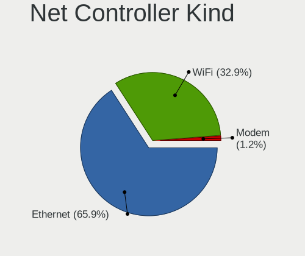

| Kind     | Desktops | Percent |
|----------|----------|---------|
| Ethernet | 55       | 72.37%  |
| WiFi     | 20       | 26.32%  |
| Modem    | 1        | 1.32%   |

Used Controller
---------------

Currently used network controller

| Kind     | Desktops | Percent |
|----------|----------|---------|
| Ethernet | 48       | 80%     |
| WiFi     | 12       | 20%     |

NICs
----

Total network controllers on board

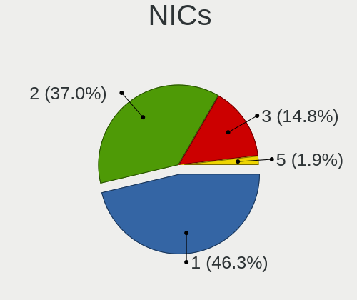

| Total | Desktops | Percent |
|-------|----------|---------|
| 1     | 25       | 45.45%  |
| 2     | 19       | 34.55%  |
| 3     | 9        | 16.36%  |
| 4     | 2        | 3.64%   |

IPv6
----

IPv6 vs IPv4

| Used | Desktops | Percent |
|------|----------|---------|
| No   | 43       | 78.18%  |
| Yes  | 12       | 21.82%  |

Bluetooth
---------

Bluetooth Vendor
----------------

Controller vendors

| Vendor                     | Desktops | Percent |
|----------------------------|----------|---------|
| Intel                      | 10       | 55.56%  |
| Cambridge Silicon Radio    | 2        | 11.11%  |
| Broadcom                   | 2        | 11.11%  |
| Realtek Semiconductor      | 1        | 5.56%   |
| Integrated System Solution | 1        | 5.56%   |
| ASUSTek Computer           | 1        | 5.56%   |
| Apple                      | 1        | 5.56%   |

Bluetooth Model
---------------

Controller models

| Model                                                 | Desktops | Percent |
|-------------------------------------------------------|----------|---------|
| Intel AX200 Bluetooth                                 | 4        | 22.22%  |
| Intel Bluetooth 9460/9560 Jefferson Peak (JfP)        | 2        | 11.11%  |
| Cambridge Silicon Radio Bluetooth Dongle (HCI mode)   | 2        | 11.11%  |
| Broadcom BCM20702A0 Bluetooth 4.0                     | 2        | 11.11%  |
| Realtek Bluetooth Radio                               | 1        | 5.56%   |
| Intel Wireless-AC 9260 Bluetooth Adapter              | 1        | 5.56%   |
| Intel Wireless-AC 3168 Bluetooth                      | 1        | 5.56%   |
| Intel Centrino Bluetooth Wireless Transceiver         | 1        | 5.56%   |
| Intel Bluetooth wireless interface                    | 1        | 5.56%   |
| Integrated System Solution KY-BT100 Bluetooth Adapter | 1        | 5.56%   |
| ASUS BCM20702A0                                       | 1        | 5.56%   |
| Apple Bluetooth USB Host Controller                   | 1        | 5.56%   |

Sound
-----

Sound Vendor
------------

Sound card vendors

| Vendor                           | Desktops | Percent |
|----------------------------------|----------|---------|
| Intel                            | 33       | 37.93%  |
| Nvidia                           | 23       | 26.44%  |
| AMD                              | 21       | 24.14%  |
| Texas Instruments                | 1        | 1.15%   |
| Silicon Integrated Systems [SiS] | 1        | 1.15%   |
| Plantronics                      | 1        | 1.15%   |
| Logitech                         | 1        | 1.15%   |
| Focusrite-Novation               | 1        | 1.15%   |
| Creative Technology              | 1        | 1.15%   |
| Creative Labs                    | 1        | 1.15%   |
| Cambridge Silicon Radio          | 1        | 1.15%   |
| C-Media Electronics              | 1        | 1.15%   |
| Astro Gaming                     | 1        | 1.15%   |

Sound Model
-----------

Sound card models

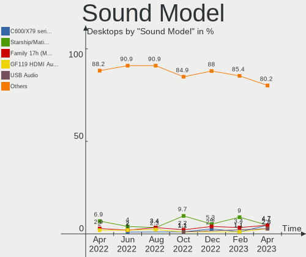

| Model                                                                             | Desktops | Percent |
|-----------------------------------------------------------------------------------|----------|---------|
| Intel Xeon E3-1200 v3/4th Gen Core Processor HD Audio Controller                  | 8        | 7.77%   |
| Intel 8 Series/C220 Series Chipset High Definition Audio Controller               | 7        | 6.8%    |
| Intel 7 Series/C216 Chipset Family High Definition Audio Controller               | 7        | 6.8%    |
| AMD Starship/Matisse HD Audio Controller                                          | 7        | 6.8%    |
| Nvidia GK208 HDMI/DP Audio Controller                                             | 4        | 3.88%   |
| Intel 200 Series PCH HD Audio                                                     | 4        | 3.88%   |
| Nvidia TU116 High Definition Audio Controller                                     | 3        | 2.91%   |
| AMD SBx00 Azalia (Intel HDA)                                                      | 3        | 2.91%   |
| AMD Navi 21/23 HDMI/DP Audio Controller                                           | 3        | 2.91%   |
| AMD Family 17h (Models 00h-0fh) HD Audio Controller                               | 3        | 2.91%   |
| Nvidia TU106 High Definition Audio Controller                                     | 2        | 1.94%   |
| Nvidia GP108 High Definition Audio Controller                                     | 2        | 1.94%   |
| Nvidia GP104 High Definition Audio Controller                                     | 2        | 1.94%   |
| Nvidia GK104 HDMI Audio Controller                                                | 2        | 1.94%   |
| Nvidia GF119 HDMI Audio Controller                                                | 2        | 1.94%   |
| Intel NM10/ICH7 Family High Definition Audio Controller                           | 2        | 1.94%   |
| Intel Cannon Lake PCH cAVS                                                        | 2        | 1.94%   |
| Intel Atom Processor Z36xxx/Z37xxx Series High Definition Audio Controller        | 2        | 1.94%   |
| Intel 9 Series Chipset Family HD Audio Controller                                 | 2        | 1.94%   |
| Intel 100 Series/C230 Series Chipset Family HD Audio Controller                   | 2        | 1.94%   |
| AMD Ellesmere HDMI Audio [Radeon RX 470/480 / 570/580/590]                        | 2        | 1.94%   |
| Texas Instruments PCM2902 Audio Codec                                             | 1        | 0.97%   |
| Silicon Integrated Systems [SiS] Azalia Audio Controller                          | 1        | 0.97%   |
| Plantronics HD1                                                                   | 1        | 0.97%   |
| Nvidia TU104 HD Audio Controller                                                  | 1        | 0.97%   |
| Nvidia GP107GL High Definition Audio Controller                                   | 1        | 0.97%   |
| Nvidia GM206 High Definition Audio Controller                                     | 1        | 0.97%   |
| Nvidia GM204 High Definition Audio Controller                                     | 1        | 0.97%   |
| Nvidia GK106 HDMI Audio Controller                                                | 1        | 0.97%   |
| Nvidia GA104 High Definition Audio Controller                                     | 1        | 0.97%   |
| Nvidia GA102 High Definition Audio Controller                                     | 1        | 0.97%   |
| Logitech G935 Gaming Headset                                                      | 1        | 0.97%   |
| Logitech G933 Wireless Headset Dongle                                             | 1        | 0.97%   |
| Intel Comet Lake PCH-V cAVS                                                       | 1        | 0.97%   |
| Intel Alder Lake-S HD Audio Controller                                            | 1        | 0.97%   |
| Intel 82801JI (ICH10 Family) HD Audio Controller                                  | 1        | 0.97%   |
| Intel 82801JD/DO (ICH10 Family) HD Audio Controller                               | 1        | 0.97%   |
| Intel 6 Series/C200 Series Chipset Family High Definition Audio Controller        | 1        | 0.97%   |
| Focusrite-Novation Scarlett 2i4 USB                                               | 1        | 0.97%   |
| Creative Technology Sound Blaster Play!                                           | 1        | 0.97%   |
| Creative Labs EMU10k1X / CA0103 [SB Live! OEM / SB 5.1 / Ectiva 5.1]              | 1        | 0.97%   |
| Creative Labs CA0106/CA0111 [SB Live!/Audigy/X-Fi Series]                         | 1        | 0.97%   |
| Cambridge Silicon Radio Audioengine HD3                                           | 1        | 0.97%   |
| C-Media Electronics Thronmax MDrill One                                           | 1        | 0.97%   |
| Astro Gaming Astro A50                                                            | 1        | 0.97%   |
| AMD Turks HDMI Audio [Radeon HD 6500/6600 / 6700M Series]                         | 1        | 0.97%   |
| AMD RS880 HDMI Audio [Radeon HD 4200 Series]                                      | 1        | 0.97%   |
| AMD Redwood HDMI Audio [Radeon HD 5000 Series]                                    | 1        | 0.97%   |
| AMD Oland/Hainan/Cape Verde/Pitcairn HDMI Audio [Radeon HD 7000 Series]           | 1        | 0.97%   |
| AMD Kaveri HDMI/DP Audio Controller                                               | 1        | 0.97%   |
| AMD FCH Azalia Controller                                                         | 1        | 0.97%   |
| AMD Caicos HDMI Audio [Radeon HD 6450 / 7450/8450/8490 OEM / R5 230/235/235X OEM] | 1        | 0.97%   |
| AMD Baffin HDMI/DP Audio [Radeon RX 550 640SP / RX 560/560X]                      | 1        | 0.97%   |

Memory
------

Memory Vendor
-------------

Memory module vendors

| Vendor              | Desktops | Percent |
|---------------------|----------|---------|
| Unknown             | 14       | 35%     |
| Kingston            | 7        | 17.5%   |
| Corsair             | 5        | 12.5%   |
| Crucial             | 4        | 10%     |
| Samsung Electronics | 3        | 7.5%    |
| G.Skill             | 2        | 5%      |
| Unknown             | 2        | 5%      |
| PNY                 | 1        | 2.5%    |
| Micron Technology   | 1        | 2.5%    |
| GeIL                | 1        | 2.5%    |

Memory Model
------------

Memory module models

| Model                                                    | Desktops | Percent |
|----------------------------------------------------------|----------|---------|
| Unknown RAM Module 4096MB DIMM DDR3 1333MT/s             | 2        | 4.55%   |
| Unknown RAM Module 2GB DIMM 667MT/s                      | 2        | 4.55%   |
| Kingston RAM KHX3200C16D4/8GX 8GB DIMM DDR4 3533MT/s     | 2        | 4.55%   |
| Unknown                                                  | 2        | 4.55%   |
| Unknown RAM Module 8GB DIMM DDR3 1333MT/s                | 1        | 2.27%   |
| Unknown RAM Module 8192MB DIMM 800MT/s                   | 1        | 2.27%   |
| Unknown RAM Module 4GB DIMM DDR3 1600MT/s                | 1        | 2.27%   |
| Unknown RAM Module 4GB DIMM 800MT/s                      | 1        | 2.27%   |
| Unknown RAM Module 4GB DIMM 400MT/s                      | 1        | 2.27%   |
| Unknown RAM Module 4096MB DIMM 1333MT/s                  | 1        | 2.27%   |
| Unknown RAM Module 2GB DIMM DDR2 1067MT/s                | 1        | 2.27%   |
| Unknown RAM Module 2048MB SODIMM DDR2 800MT/s            | 1        | 2.27%   |
| Unknown RAM Module 2048MB DIMM 800MT/s                   | 1        | 2.27%   |
| Unknown RAM Module 1GB DIMM DDR2 800MT/s                 | 1        | 2.27%   |
| Unknown RAM Module 1GB DIMM DDR 333MT/s                  | 1        | 2.27%   |
| Samsung RAM Module 4GB DIMM DDR4 2133MT/s                | 1        | 2.27%   |
| Samsung RAM M378B5173DB0-CK0 4GB DIMM DDR3 1600MT/s      | 1        | 2.27%   |
| Samsung RAM M378A1K43CB2-CRC 8192MB DIMM DDR4 3500MT/s   | 1        | 2.27%   |
| PNY RAM 8GBF1X08RHJJ40-135-K 8GB DIMM DDR4 3000MT/s      | 1        | 2.27%   |
| Micron RAM 18ASF4G72AZ-3G2B1 32GB DIMM DDR4 3200MT/s     | 1        | 2.27%   |
| Kingston RAM KHX1866C10D3/8G 8GB DIMM DDR3 1867MT/s      | 1        | 2.27%   |
| Kingston RAM KF3200C16D4/8GX 8192MB DIMM DDR4 3200MT/s   | 1        | 2.27%   |
| Kingston RAM 99U5474-028.A00LF 4GB DIMM DDR3 1600MT/s    | 1        | 2.27%   |
| Kingston RAM 99U5471-036.A00LF 8GB DIMM DDR3 1600MT/s    | 1        | 2.27%   |
| Kingston RAM 99U5471-031.A00LF 8GB DIMM DDR3 1333MT/s    | 1        | 2.27%   |
| Kingston RAM 99U5471-020.A00LF 4GB DIMM DDR3 1600MT/s    | 1        | 2.27%   |
| Kingston RAM 9905474-027.A00LF 4GB DIMM DDR3 1333MT/s    | 1        | 2.27%   |
| Kingston RAM 9905316-174.A00LF 2GB DIMM DDR2 800MT/s     | 1        | 2.27%   |
| GeIL RAM CL9-9-9 D3-1600 8GB DIMM DDR3 1600MT/s          | 1        | 2.27%   |
| G.Skill RAM F4-3200C14-32GVK 32GB DIMM DDR4 2666MT/s     | 1        | 2.27%   |
| G.Skill RAM F3-1600C11-8GNT 8GB DIMM DDR3 1600MT/s       | 1        | 2.27%   |
| Crucial RAM CT8G4DFS8266.C8FD1 8GB DIMM DDR4 2667MT/s    | 1        | 2.27%   |
| Crucial RAM CT51264BA160B.C16F 4GB DIMM DDR3 1600MT/s    | 1        | 2.27%   |
| Crucial RAM CT102464BD160B.C16 8GB DIMM DDR3 1600MT/s    | 1        | 2.27%   |
| Crucial RAM BL32G36C16U4B.M16FB1 32GB DIMM DDR4 3600MT/s | 1        | 2.27%   |
| Corsair RAM CMZ8GX3M1A1600C9 8GB DIMM DDR3 1866MT/s      | 1        | 2.27%   |
| Corsair RAM CMX8GX3M1A1333C9 8192MB DIMM DDR3 1333MT/s   | 1        | 2.27%   |
| Corsair RAM CMK64GX4M2E3200C16 32GB DIMM DDR4 3200MT/s   | 1        | 2.27%   |
| Corsair RAM CMK32GX4M2D3000C16 16GB DIMM DDR4 3066MT/s   | 1        | 2.27%   |
| Corsair RAM CMK16GX4M2Z4000C16 8192MB DIMM DDR4 4000MT/s | 1        | 2.27%   |

Memory Kind
-----------

Memory module kinds

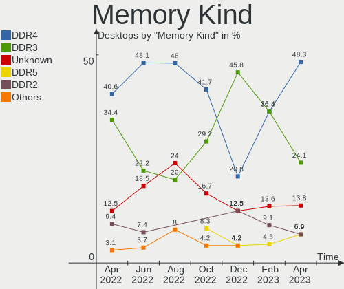

| Kind    | Desktops | Percent |
|---------|----------|---------|
| DDR4    | 13       | 38.24%  |
| DDR3    | 11       | 32.35%  |
| Unknown | 6        | 17.65%  |
| DDR2    | 3        | 8.82%   |
| DDR     | 1        | 2.94%   |

Memory Form Factor
------------------

Physical design of the memory module

| Name   | Desktops | Percent |
|--------|----------|---------|
| DIMM   | 33       | 97.06%  |
| SODIMM | 1        | 2.94%   |

Memory Size
-----------

Memory module size

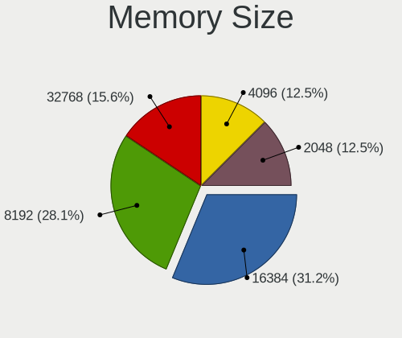

| Size  | Desktops | Percent |
|-------|----------|---------|
| 8192  | 15       | 40.54%  |
| 4096  | 8        | 21.62%  |
| 2048  | 6        | 16.22%  |
| 32768 | 4        | 10.81%  |
| 16384 | 2        | 5.41%   |
| 1024  | 2        | 5.41%   |

Memory Speed
------------

Memory module speed

| Speed | Desktops | Percent |
|-------|----------|---------|
| 1600  | 8        | 19.05%  |
| 1333  | 7        | 16.67%  |
| 800   | 6        | 14.29%  |
| 3200  | 4        | 9.52%   |
| 3533  | 2        | 4.76%   |
| 2133  | 2        | 4.76%   |
| 667   | 2        | 4.76%   |
| 4000  | 1        | 2.38%   |
| 3600  | 1        | 2.38%   |
| 3500  | 1        | 2.38%   |
| 3066  | 1        | 2.38%   |
| 3000  | 1        | 2.38%   |
| 2667  | 1        | 2.38%   |
| 2666  | 1        | 2.38%   |
| 1866  | 1        | 2.38%   |
| 1067  | 1        | 2.38%   |
| 400   | 1        | 2.38%   |
| 333   | 1        | 2.38%   |

Printers & scanners
-------------------

Printer Vendor
--------------

Printer device vendors

| Vendor             | Desktops | Percent |
|--------------------|----------|---------|
| Hewlett-Packard    | 1        | 50%     |
| Brother Industries | 1        | 50%     |

Printer Model
-------------

Printer device models

| Model                       | Desktops | Percent |
|-----------------------------|----------|---------|
| HP Deskjet 3520 series      | 1        | 50%     |
| Brother MFC-L8690CDW series | 1        | 50%     |

Scanner Vendor
--------------

Scanner device vendors

Zero info for selected period =(

Scanner Model
-------------

Scanner device models

Zero info for selected period =(

Camera
------

Camera Vendor
-------------

Camera device vendors

| Vendor    | Desktops | Percent |
|-----------|----------|---------|
| Microsoft | 4        | 50%     |
| Logitech  | 4        | 50%     |

Camera Model
------------

Camera device models

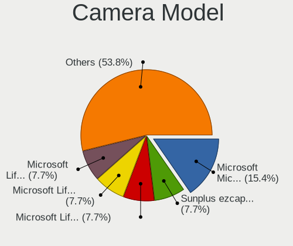

| Model                                | Desktops | Percent |
|--------------------------------------|----------|---------|
| Microsoft LifeCam HD-3000            | 2        | 25%     |
| Microsoft Microsoft LifeCam Studio | 1        | 12.5%   |
| Microsoft LifeCam Cinema             | 1        | 12.5%   |
| Logitech Webcam C270                 | 1        | 12.5%   |
| Logitech Webcam C200                 | 1        | 12.5%   |
| Logitech Webcam C170                 | 1        | 12.5%   |
| Logitech QuickCam Pro 5000           | 1        | 12.5%   |

Security
--------

Fingerprint Vendor
------------------

Fingerprint sensor vendors

Zero info for selected period =(

Fingerprint Model
-----------------

Fingerprint sensor models

Zero info for selected period =(

Chipcard Vendor
---------------

Chipcard module vendors

Zero info for selected period =(

Chipcard Model
--------------

Chipcard module models

Zero info for selected period =(

Unsupported
-----------

Unsupported Devices
-------------------

Total unsupported devices on board

| Total | Desktops | Percent |
|-------|----------|---------|
| 0     | 46       | 83.64%  |
| 1     | 6        | 10.91%  |
| 2     | 3        | 5.45%   |

Unsupported Device Types
------------------------

Types of unsupported devices

| Type                     | Desktops | Percent |
|--------------------------|----------|---------|
| Graphics card            | 5        | 45.45%  |
| Net/wireless             | 2        | 18.18%  |
| Storage/raid             | 1        | 9.09%   |
| Network                  | 1        | 9.09%   |
| Net/ethernet             | 1        | 9.09%   |
| Communication controller | 1        | 9.09%   |

