Linux in Australia - Hardware Trends (Desktops)
-----------------------------------------------

A project to identify most popular hardware characteristics and track their change
over time based on data collected by Linux users at https://Linux-Hardware.org.

Anyone can contribute to this report by the [hw-probe](https://github.com/linuxhw/hw-probe) tool:

    sudo -E hw-probe -all -upload

Period: Apr, 2023.

Contents
--------

* [ System ](#system)
  - [ OS                       ](#os)
  - [ OS Family                ](#os-family)
  - [ Kernel                   ](#kernel)
  - [ Kernel Family            ](#kernel-family)
  - [ Kernel Major Ver.        ](#kernel-major-ver)
  - [ Arch                     ](#arch)
  - [ DE                       ](#de)
  - [ Display Server           ](#display-server)
  - [ Display Manager          ](#display-manager)
  - [ OS Lang                  ](#os-lang)
  - [ Boot Mode                ](#boot-mode)
  - [ Filesystem               ](#filesystem)
  - [ Part. scheme             ](#part-scheme)
  - [ Dual Boot with Linux/BSD ](#dual-boot-with-linuxbsd)
  - [ Dual Boot (Win)          ](#dual-boot-win)

* [ Board ](#board)
  - [ Vendor                   ](#vendor)
  - [ Model                    ](#model)
  - [ Model Family             ](#model-family)
  - [ MFG Year                 ](#mfg-year)
  - [ Form Factor              ](#form-factor)
  - [ Secure Boot              ](#secure-boot)
  - [ Coreboot                 ](#coreboot)
  - [ RAM Size                 ](#ram-size)
  - [ RAM Used                 ](#ram-used)
  - [ Total Drives             ](#total-drives)
  - [ Has CD-ROM               ](#has-cd-rom)
  - [ Has Ethernet             ](#has-ethernet)
  - [ Has WiFi                 ](#has-wifi)
  - [ Has Bluetooth            ](#has-bluetooth)

* [ Location ](#location)
  - [ Country                  ](#country)
  - [ City                     ](#city)

* [ Drives ](#drives)
  - [ Drive Vendor             ](#drive-vendor)
  - [ Drive Model              ](#drive-model)
  - [ HDD Vendor               ](#hdd-vendor)
  - [ SSD Vendor               ](#ssd-vendor)
  - [ Drive Kind               ](#drive-kind)
  - [ Drive Connector          ](#drive-connector)
  - [ Drive Size               ](#drive-size)
  - [ Space Total              ](#space-total)
  - [ Space Used               ](#space-used)
  - [ Malfunc. Drives          ](#malfunc-drives)
  - [ Malfunc. Drive Vendor    ](#malfunc-drive-vendor)
  - [ Malfunc. HDD Vendor      ](#malfunc-hdd-vendor)
  - [ Malfunc. Drive Kind      ](#malfunc-drive-kind)
  - [ Failed Drives            ](#failed-drives)
  - [ Failed Drive Vendor      ](#failed-drive-vendor)
  - [ Drive Status             ](#drive-status)

* [ Storage controller ](#storage-controller)
  - [ Storage Vendor           ](#storage-vendor)
  - [ Storage Model            ](#storage-model)
  - [ Storage Kind             ](#storage-kind)

* [ Processor ](#processor)
  - [ CPU Vendor               ](#cpu-vendor)
  - [ CPU Model                ](#cpu-model)
  - [ CPU Model Family         ](#cpu-model-family)
  - [ CPU Cores                ](#cpu-cores)
  - [ CPU Sockets              ](#cpu-sockets)
  - [ CPU Threads              ](#cpu-threads)
  - [ CPU Op-Modes             ](#cpu-op-modes)
  - [ CPU Microcode            ](#cpu-microcode)
  - [ CPU Microarch            ](#cpu-microarch)

* [ Graphics ](#graphics)
  - [ GPU Vendor               ](#gpu-vendor)
  - [ GPU Model                ](#gpu-model)
  - [ GPU Combo                ](#gpu-combo)
  - [ GPU Driver               ](#gpu-driver)
  - [ GPU Memory               ](#gpu-memory)

* [ Monitor ](#monitor)
  - [ Monitor Vendor           ](#monitor-vendor)
  - [ Monitor Model            ](#monitor-model)
  - [ Monitor Resolution       ](#monitor-resolution)
  - [ Monitor Diagonal         ](#monitor-diagonal)
  - [ Monitor Width            ](#monitor-width)
  - [ Aspect Ratio             ](#aspect-ratio)
  - [ Monitor Area             ](#monitor-area)
  - [ Pixel Density            ](#pixel-density)
  - [ Multiple Monitors        ](#multiple-monitors)

* [ Network ](#network)
  - [ Net Controller Vendor    ](#net-controller-vendor)
  - [ Net Controller Model     ](#net-controller-model)
  - [ Wireless Vendor          ](#wireless-vendor)
  - [ Wireless Model           ](#wireless-model)
  - [ Ethernet Vendor          ](#ethernet-vendor)
  - [ Ethernet Model           ](#ethernet-model)
  - [ Net Controller Kind      ](#net-controller-kind)
  - [ Used Controller          ](#used-controller)
  - [ NICs                     ](#nics)
  - [ IPv6                     ](#ipv6)

* [ Bluetooth ](#bluetooth)
  - [ Bluetooth Vendor         ](#bluetooth-vendor)
  - [ Bluetooth Model          ](#bluetooth-model)

* [ Sound ](#sound)
  - [ Sound Vendor             ](#sound-vendor)
  - [ Sound Model              ](#sound-model)

* [ Memory ](#memory)
  - [ Memory Vendor            ](#memory-vendor)
  - [ Memory Model             ](#memory-model)
  - [ Memory Kind              ](#memory-kind)
  - [ Memory Form Factor       ](#memory-form-factor)
  - [ Memory Size              ](#memory-size)
  - [ Memory Speed             ](#memory-speed)

* [ Printers & scanners ](#printers--scanners)
  - [ Printer Vendor           ](#printer-vendor)
  - [ Printer Model            ](#printer-model)
  - [ Scanner Vendor           ](#scanner-vendor)
  - [ Scanner Model            ](#scanner-model)

* [ Camera ](#camera)
  - [ Camera Vendor            ](#camera-vendor)
  - [ Camera Model             ](#camera-model)

* [ Security ](#security)
  - [ Fingerprint Vendor       ](#fingerprint-vendor)
  - [ Fingerprint Model        ](#fingerprint-model)
  - [ Chipcard Vendor          ](#chipcard-vendor)
  - [ Chipcard Model           ](#chipcard-model)

* [ Unsupported ](#unsupported)
  - [ Unsupported Devices      ](#unsupported-devices)
  - [ Unsupported Device Types ](#unsupported-device-types)

System
------

OS
--

Installed operating systems

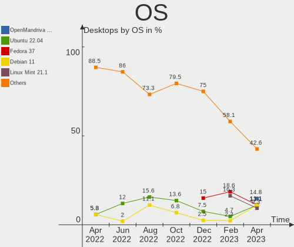

| Name                         | Desktops | Percent |
|------------------------------|----------|---------|
| OpenMandriva 23.03           | 8        | 14.81%  |
| Ubuntu 22.04                 | 6        | 11.11%  |
| Fedora 37                    | 6        | 11.11%  |
| Debian 11                    | 6        | 11.11%  |
| Linux Mint 21.1              | 5        | 9.26%   |
| Fedora 38                    | 5        | 9.26%   |
| Pop!_OS 22.04                | 2        | 3.7%    |
| openSUSE Tumbleweed-XXXXXXXX | 2        | 3.7%    |
| KDE neon 22.04               | 2        | 3.7%    |
| Zorin 16                     | 1        | 1.85%   |
| Ubuntu 23.04                 | 1        | 1.85%   |
| Ubuntu 20.04                 | 1        | 1.85%   |
| PureOS 10.0                  | 1        | 1.85%   |
| NixOS 22.11                  | 1        | 1.85%   |
| MX 21                        | 1        | 1.85%   |
| Manjaro 22.1.0               | 1        | 1.85%   |
| Manjaro                      | 1        | 1.85%   |
| Linux Mint 20.3              | 1        | 1.85%   |
| Kubuntu 22.10                | 1        | 1.85%   |
| EuroLinux 9.1                | 1        | 1.85%   |
| Arch Rolling                 | 1        | 1.85%   |

OS Family
---------

OS without a version

| Name         | Desktops | Percent |
|--------------|----------|---------|
| Fedora       | 11       | 20.37%  |
| Ubuntu       | 8        | 14.81%  |
| OpenMandriva | 8        | 14.81%  |
| Linux Mint   | 6        | 11.11%  |
| Debian       | 6        | 11.11%  |
| Pop!_OS      | 2        | 3.7%    |
| openSUSE     | 2        | 3.7%    |
| Manjaro      | 2        | 3.7%    |
| KDE neon     | 2        | 3.7%    |
| Zorin        | 1        | 1.85%   |
| PureOS       | 1        | 1.85%   |
| NixOS        | 1        | 1.85%   |
| MX           | 1        | 1.85%   |
| Kubuntu      | 1        | 1.85%   |
| EuroLinux    | 1        | 1.85%   |
| Arch         | 1        | 1.85%   |

Kernel
------

Version of the Linux kernel

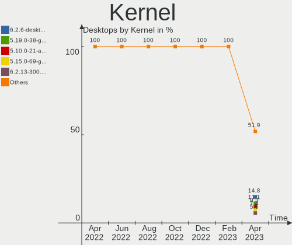

| Version                      | Desktops | Percent |
|------------------------------|----------|---------|
| 6.2.6-desktop-1omv2390       | 8        | 14.81%  |
| 5.19.0-38-generic            | 6        | 11.11%  |
| 5.10.0-21-amd64              | 5        | 9.26%   |
| 5.15.0-69-generic            | 4        | 7.41%   |
| 6.2.13-300.fc38.x86_64       | 3        | 5.56%   |
| 6.2.10-200.fc37.x86_64       | 3        | 5.56%   |
| 6.2.6-76060206-generic       | 2        | 3.7%    |
| 5.15.104-1-pve               | 2        | 3.7%    |
| 6.2.9-200.fc37.x86_64        | 1        | 1.85%   |
| 6.2.6-1-default              | 1        | 1.85%   |
| 6.2.13-1-liquorix-amd64      | 1        | 1.85%   |
| 6.2.12-arch1-1               | 1        | 1.85%   |
| 6.2.12-300.fc38.x86_64       | 1        | 1.85%   |
| 6.2.12-1-default             | 1        | 1.85%   |
| 6.2.11-300.fc38.x86_64       | 1        | 1.85%   |
| 6.2.11-200.fc37.x86_64       | 1        | 1.85%   |
| 6.2.0-20-generic             | 1        | 1.85%   |
| 6.1.23-1-MANJARO             | 1        | 1.85%   |
| 6.0.7-301.fc37.x86_64        | 1        | 1.85%   |
| 5.9.16-1-MANJARO             | 1        | 1.85%   |
| 5.4.0-146-generic            | 1        | 1.85%   |
| 5.19.0-41-generic            | 1        | 1.85%   |
| 5.19.0-40-generic            | 1        | 1.85%   |
| 5.19.0-32-generic            | 1        | 1.85%   |
| 5.15.107                     | 1        | 1.85%   |
| 5.15.102-1-pve               | 1        | 1.85%   |
| 5.15.0-70-generic            | 1        | 1.85%   |
| 5.15.0-67-generic            | 1        | 1.85%   |
| 5.14.0-162.23.1.el9_1.x86_64 | 1        | 1.85%   |

Kernel Family
-------------

Linux kernel without a distro release

| Version  | Desktops | Percent |
|----------|----------|---------|
| 6.2.6    | 11       | 20.37%  |
| 5.19.0   | 9        | 16.67%  |
| 5.15.0   | 6        | 11.11%  |
| 5.10.0   | 5        | 9.26%   |
| 6.2.13   | 4        | 7.41%   |
| 6.2.12   | 3        | 5.56%   |
| 6.2.10   | 3        | 5.56%   |
| 6.2.11   | 2        | 3.7%    |
| 5.15.104 | 2        | 3.7%    |
| 6.2.9    | 1        | 1.85%   |
| 6.2.0    | 1        | 1.85%   |
| 6.1.23   | 1        | 1.85%   |
| 6.0.7    | 1        | 1.85%   |
| 5.9.16   | 1        | 1.85%   |
| 5.4.0    | 1        | 1.85%   |
| 5.15.107 | 1        | 1.85%   |
| 5.15.102 | 1        | 1.85%   |
| 5.14.0   | 1        | 1.85%   |

Kernel Major Ver.
-----------------

Linux kernel major version

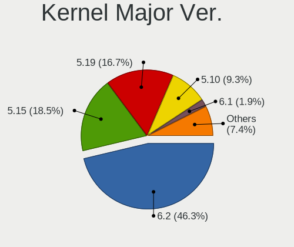

| Version | Desktops | Percent |
|---------|----------|---------|
| 6.2     | 25       | 46.3%   |
| 5.15    | 10       | 18.52%  |
| 5.19    | 9        | 16.67%  |
| 5.10    | 5        | 9.26%   |
| 6.1     | 1        | 1.85%   |
| 6.0     | 1        | 1.85%   |
| 5.9     | 1        | 1.85%   |
| 5.4     | 1        | 1.85%   |
| 5.14    | 1        | 1.85%   |

Arch
----

OS architecture (x86_64, i586, etc.)

| Name   | Desktops | Percent |
|--------|----------|---------|
| x86_64 | 54       | 100%    |

DE
--

Desktop Environment

| Name       | Desktops | Percent |
|------------|----------|---------|
| GNOME      | 20       | 37.04%  |
| KDE5       | 13       | 24.07%  |
| Cinnamon   | 6        | 11.11%  |
| X-Cinnamon | 5        | 9.26%   |
| XFCE       | 4        | 7.41%   |
| Unknown    | 4        | 7.41%   |
| MATE       | 1        | 1.85%   |
| awesome    | 1        | 1.85%   |

Display Server
--------------

X11 or Wayland

| Name    | Desktops | Percent |
|---------|----------|---------|
| X11     | 36       | 66.67%  |
| Wayland | 9        | 16.67%  |
| Tty     | 8        | 14.81%  |
| Unknown | 1        | 1.85%   |

Display Manager
---------------

SDDM, LightDM, etc.

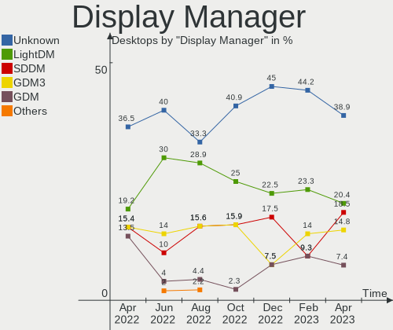

| Name    | Desktops | Percent |
|---------|----------|---------|
| Unknown | 21       | 38.89%  |
| LightDM | 11       | 20.37%  |
| SDDM    | 10       | 18.52%  |
| GDM3    | 8        | 14.81%  |
| GDM     | 4        | 7.41%   |

OS Lang
-------

Language

| Lang  | Desktops | Percent |
|-------|----------|---------|
| en_AU | 40       | 74.07%  |
| en_US | 11       | 20.37%  |
| POSIX | 1        | 1.85%   |
| en_BW | 1        | 1.85%   |
| en-AU | 1        | 1.85%   |

Boot Mode
---------

EFI or BIOS

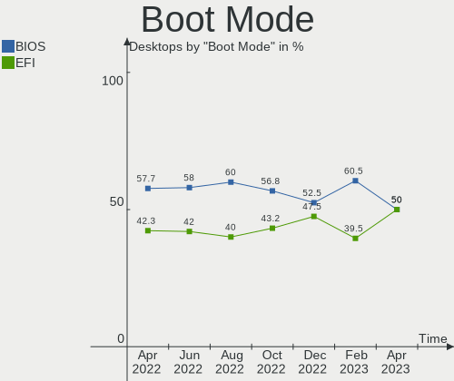

| Mode | Desktops | Percent |
|------|----------|---------|
| BIOS | 27       | 50%     |
| EFI  | 27       | 50%     |

Filesystem
----------

Type of filesystem

| Type    | Desktops | Percent |
|---------|----------|---------|
| Ext4    | 31       | 57.41%  |
| Btrfs   | 7        | 12.96%  |
| Xfs     | 6        | 11.11%  |
| Overlay | 5        | 9.26%   |
| Zfs     | 3        | 5.56%   |
| Tmpfs   | 2        | 3.7%    |

Part. scheme
------------

Scheme of partitioning

| Type    | Desktops | Percent |
|---------|----------|---------|
| GPT     | 29       | 53.7%   |
| Unknown | 16       | 29.63%  |
| MBR     | 9        | 16.67%  |

Dual Boot with Linux/BSD
------------------------

Hosting more than one Linux/BSD

| Dual boot | Desktops | Percent |
|-----------|----------|---------|
| No        | 38       | 70.37%  |
| Yes       | 16       | 29.63%  |

Dual Boot (Win)
---------------

Hosting Linux and Windows

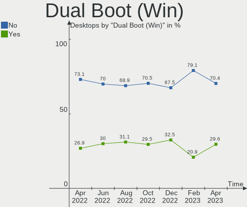

| Dual boot | Desktops | Percent |
|-----------|----------|---------|
| No        | 38       | 70.37%  |
| Yes       | 16       | 29.63%  |

Board
-----

Vendor
------

Motherboard manufacturer

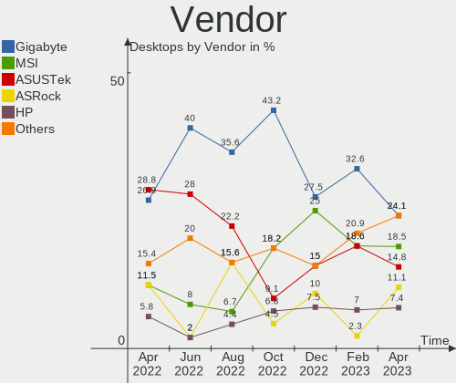

| Name                                 | Desktops | Percent |
|--------------------------------------|----------|---------|
| Gigabyte Technology                  | 13       | 24.07%  |
| MSI                                  | 10       | 18.52%  |
| ASUSTek Computer                     | 8        | 14.81%  |
| ASRock                               | 6        | 11.11%  |
| Hewlett-Packard                      | 4        | 7.41%   |
| Dell                                 | 3        | 5.56%   |
| Shuttle                              | 2        | 3.7%    |
| Lenovo                               | 2        | 3.7%    |
| SYWZ                                 | 1        | 1.85%   |
| Shenzhen Meigao Electronic Equipment | 1        | 1.85%   |
| Intel                                | 1        | 1.85%   |
| ECS                                  | 1        | 1.85%   |
| Acer                                 | 1        | 1.85%   |
| Unknown                              | 1        | 1.85%   |

Model
-----

Motherboard model

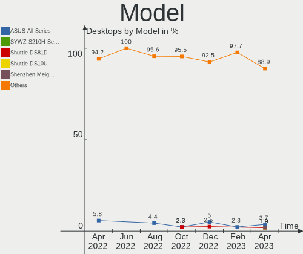

| Name                                            | Desktops | Percent |
|-------------------------------------------------|----------|---------|
| ASUS All Series                                 | 2        | 3.7%    |
| SYWZ S210H Series                               | 1        | 1.85%   |
| Shuttle DS81D                                   | 1        | 1.85%   |
| Shuttle DS10U                                   | 1        | 1.85%   |
| Shenzhen Meigao Electronic Equipment UM773 Lite | 1        | 1.85%   |
| MSI PRO H510 DP21 (MS-B0A4)                     | 1        | 1.85%   |
| MSI MS-7D91                                     | 1        | 1.85%   |
| MSI MS-7D73                                     | 1        | 1.85%   |
| MSI MS-7D52                                     | 1        | 1.85%   |
| MSI MS-7C96                                     | 1        | 1.85%   |
| MSI MS-7B89                                     | 1        | 1.85%   |
| MSI MS-7922                                     | 1        | 1.85%   |
| MSI MS-7817                                     | 1        | 1.85%   |
| MSI MS-7721                                     | 1        | 1.85%   |
| MSI CML-U PRO Cubi 5 (MS-B183)                  | 1        | 1.85%   |
| Lenovo ThinkStation D30 42234T7                 | 1        | 1.85%   |
| Lenovo ThinkCentre M58p 7220A72                 | 1        | 1.85%   |
| Intel DZ68DB AAG27985-101                       | 1        | 1.85%   |
| HP Z440 Workstation                             | 1        | 1.85%   |
| HP Pavilion Desktop 590-p0xxx                   | 1        | 1.85%   |
| HP Compaq dc7800 Small Form Factor              | 1        | 1.85%   |
| HP 3646h                                        | 1        | 1.85%   |
| Gigabyte Z97X-Gaming 3                          | 1        | 1.85%   |
| Gigabyte Z77X-UD5H                              | 1        | 1.85%   |
| Gigabyte Z77MX-D3H                              | 1        | 1.85%   |
| Gigabyte Z690 UD DDR4                           | 1        | 1.85%   |
| Gigabyte X99-UD3-CF                             | 1        | 1.85%   |
| Gigabyte X79-UP4                                | 1        | 1.85%   |
| Gigabyte X79-UD5                                | 1        | 1.85%   |
| Gigabyte X79-UD3                                | 1        | 1.85%   |
| Gigabyte H77N-WIFI                              | 1        | 1.85%   |
| Gigabyte GA-MA780G-UD3H                         | 1        | 1.85%   |
| Gigabyte GA-880GM-UD2H                          | 1        | 1.85%   |
| Gigabyte B560M DS3H V2                          | 1        | 1.85%   |
| Gigabyte AB350-Gaming 3                         | 1        | 1.85%   |
| ECS H61H2-MV                                    | 1        | 1.85%   |
| Dell Precision T3610                            | 1        | 1.85%   |
| Dell Precision 3460                             | 1        | 1.85%   |
| Dell OptiPlex 7040                              | 1        | 1.85%   |
| ASUS Z170M-PLUS                                 | 1        | 1.85%   |

Model Family
------------

Motherboard model prefix

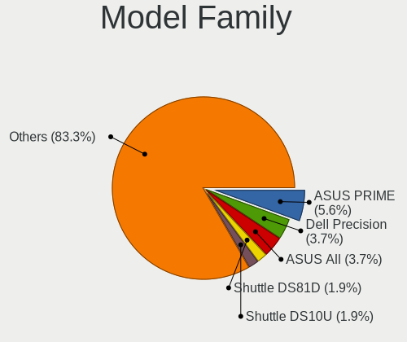

| Name                                       | Desktops | Percent |
|--------------------------------------------|----------|---------|
| ASUS PRIME                                 | 3        | 5.56%   |
| Dell Precision                             | 2        | 3.7%    |
| ASUS All                                   | 2        | 3.7%    |
| SYWZ S210H                                 | 1        | 1.85%   |
| Shuttle DS81D                              | 1        | 1.85%   |
| Shuttle DS10U                              | 1        | 1.85%   |
| Shenzhen Meigao Electronic Equipment UM773 | 1        | 1.85%   |
| MSI PRO                                    | 1        | 1.85%   |
| MSI MS-7D91                                | 1        | 1.85%   |
| MSI MS-7D73                                | 1        | 1.85%   |
| MSI MS-7D52                                | 1        | 1.85%   |
| MSI MS-7C96                                | 1        | 1.85%   |
| MSI MS-7B89                                | 1        | 1.85%   |
| MSI MS-7922                                | 1        | 1.85%   |
| MSI MS-7817                                | 1        | 1.85%   |
| MSI MS-7721                                | 1        | 1.85%   |
| MSI CML-U                                  | 1        | 1.85%   |
| Lenovo ThinkStation                        | 1        | 1.85%   |
| Lenovo ThinkCentre                         | 1        | 1.85%   |
| Intel DZ68DB                               | 1        | 1.85%   |
| HP Z440                                    | 1        | 1.85%   |
| HP Pavilion                                | 1        | 1.85%   |
| HP Compaq                                  | 1        | 1.85%   |
| HP 3646h                                   | 1        | 1.85%   |
| Gigabyte Z97X-Gaming                       | 1        | 1.85%   |
| Gigabyte Z77X-UD5H                         | 1        | 1.85%   |
| Gigabyte Z77MX-D3H                         | 1        | 1.85%   |
| Gigabyte Z690                              | 1        | 1.85%   |
| Gigabyte X99-UD3-CF                        | 1        | 1.85%   |
| Gigabyte X79-UP4                           | 1        | 1.85%   |
| Gigabyte X79-UD5                           | 1        | 1.85%   |
| Gigabyte X79-UD3                           | 1        | 1.85%   |
| Gigabyte H77N-WIFI                         | 1        | 1.85%   |
| Gigabyte GA-MA780G-UD3H                    | 1        | 1.85%   |
| Gigabyte GA-880GM-UD2H                     | 1        | 1.85%   |
| Gigabyte B560M                             | 1        | 1.85%   |
| Gigabyte AB350-Gaming                      | 1        | 1.85%   |
| ECS H61H2-MV                               | 1        | 1.85%   |
| Dell OptiPlex                              | 1        | 1.85%   |
| ASUS Z170M-PLUS                            | 1        | 1.85%   |

MFG Year
--------

Motherboard manufacture year

| Year | Desktops | Percent |
|------|----------|---------|
| 2012 | 9        | 16.67%  |
| 2021 | 6        | 11.11%  |
| 2015 | 5        | 9.26%   |
| 2020 | 4        | 7.41%   |
| 2019 | 4        | 7.41%   |
| 2014 | 4        | 7.41%   |
| 2022 | 3        | 5.56%   |
| 2017 | 3        | 5.56%   |
| 2013 | 3        | 5.56%   |
| 2011 | 3        | 5.56%   |
| 2008 | 3        | 5.56%   |
| 2023 | 2        | 3.7%    |
| 2018 | 2        | 3.7%    |
| 2016 | 1        | 1.85%   |
| 2010 | 1        | 1.85%   |
| 2007 | 1        | 1.85%   |

Form Factor
-----------

Physical design of the computer

| Name    | Desktops | Percent |
|---------|----------|---------|
| Desktop | 54       | 100%    |

Secure Boot
-----------

Enabled or disabled

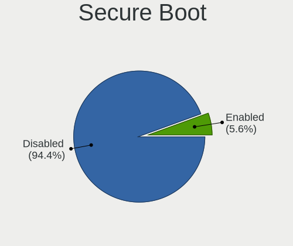

| State    | Desktops | Percent |
|----------|----------|---------|
| Disabled | 51       | 94.44%  |
| Enabled  | 3        | 5.56%   |

Coreboot
--------

Have coreboot on board

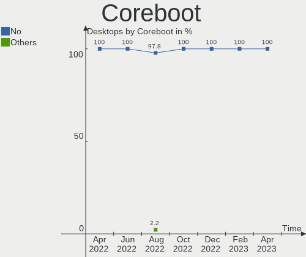

| Used | Desktops | Percent |
|------|----------|---------|
| No   | 54       | 100%    |

RAM Size
--------

Total RAM memory

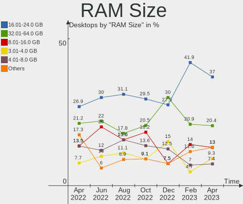

| Size in GB  | Desktops | Percent |
|-------------|----------|---------|
| 16.01-24.0  | 20       | 37.04%  |
| 32.01-64.0  | 11       | 20.37%  |
| 8.01-16.0   | 7        | 12.96%  |
| 3.01-4.0    | 5        | 9.26%   |
| 4.01-8.0    | 4        | 7.41%   |
| 64.01-256.0 | 4        | 7.41%   |
| 24.01-32.0  | 3        | 5.56%   |

RAM Used
--------

Used RAM memory

| Used GB    | Desktops | Percent |
|------------|----------|---------|
| 1.01-2.0   | 18       | 33.33%  |
| 2.01-3.0   | 12       | 22.22%  |
| 4.01-8.0   | 10       | 18.52%  |
| 3.01-4.0   | 7        | 12.96%  |
| 0.51-1.0   | 3        | 5.56%   |
| 8.01-16.0  | 2        | 3.7%    |
| 32.01-64.0 | 1        | 1.85%   |
| 24.01-32.0 | 1        | 1.85%   |

Total Drives
------------

Number of drives on board

| Drives | Desktops | Percent |
|--------|----------|---------|
| 1      | 18       | 33.33%  |
| 2      | 13       | 24.07%  |
| 4      | 12       | 22.22%  |
| 3      | 8        | 14.81%  |
| 5      | 2        | 3.7%    |
| 7      | 1        | 1.85%   |

Has CD-ROM
----------

Has CD-ROM on board

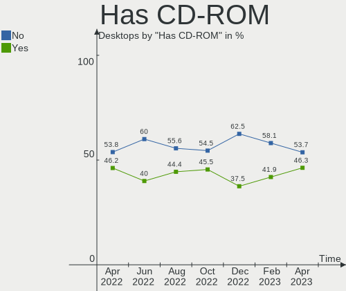

| Presented | Desktops | Percent |
|-----------|----------|---------|
| No        | 29       | 53.7%   |
| Yes       | 25       | 46.3%   |

Has Ethernet
------------

Has Ethernet on board

| Presented | Desktops | Percent |
|-----------|----------|---------|
| Yes       | 54       | 100%    |

Has WiFi
--------

Has WiFi module

| Presented | Desktops | Percent |
|-----------|----------|---------|
| Yes       | 27       | 50%     |
| No        | 27       | 50%     |

Has Bluetooth
-------------

Has Bluetooth module

| Presented | Desktops | Percent |
|-----------|----------|---------|
| No        | 29       | 53.7%   |
| Yes       | 25       | 46.3%   |

Location
--------

Country
-------

Geographic location (country)

| Country   | Desktops | Percent |
|-----------|----------|---------|
| Australia | 54       | 100%    |

City
----

Geographic location (city)

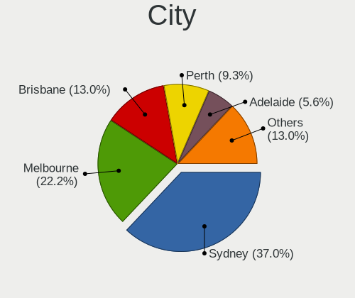

| City        | Desktops | Percent |
|-------------|----------|---------|
| Sydney      | 20       | 37.04%  |
| Melbourne   | 12       | 22.22%  |
| Brisbane    | 7        | 12.96%  |
| Perth       | 5        | 9.26%   |
| Adelaide    | 3        | 5.56%   |
| Warragul    | 1        | 1.85%   |
| St Leonards | 1        | 1.85%   |
| Morwell     | 1        | 1.85%   |
| Hobart      | 1        | 1.85%   |
| Canberra    | 1        | 1.85%   |
| Cairns      | 1        | 1.85%   |
| Alexandria  | 1        | 1.85%   |

Drives
------

Drive Vendor
------------

Hard drive vendors

| Vendor                      | Desktops | Drives | Percent |
|-----------------------------|----------|--------|---------|
| Samsung Electronics         | 20       | 30     | 18.69%  |
| Seagate                     | 19       | 26     | 17.76%  |
| WDC                         | 14       | 18     | 13.08%  |
| Crucial                     | 10       | 13     | 9.35%   |
| Kingston                    | 7        | 7      | 6.54%   |
| Intel                       | 5        | 5      | 4.67%   |
| Hitachi                     | 5        | 5      | 4.67%   |
| SanDisk                     | 3        | 5      | 2.8%    |
| Micron/Crucial Technology   | 3        | 3      | 2.8%    |
| HGST                        | 2        | 2      | 1.87%   |
| USB                         | 1        | 1      | 0.93%   |
| Toshiba                     | 1        | 1      | 0.93%   |
| Team                        | 1        | 1      | 0.93%   |
| SPCC                        | 1        | 1      | 0.93%   |
| Silicon Motion              | 1        | 1      | 0.93%   |
| Realtek                     | 1        | 1      | 0.93%   |
| PNY                         | 1        | 1      | 0.93%   |
| Patriot                     | 1        | 1      | 0.93%   |
| Micron Technology           | 1        | 1      | 0.93%   |
| LITEONIT                    | 1        | 1      | 0.93%   |
| LITEON                      | 1        | 1      | 0.93%   |
| KIOXIA                      | 1        | 1      | 0.93%   |
| Kingston Technology Company | 1        | 1      | 0.93%   |
| KingSpec                    | 1        | 1      | 0.93%   |
| HUAWEI                      | 1        | 1      | 0.93%   |
| Corsair                     | 1        | 1      | 0.93%   |
| China                       | 1        | 1      | 0.93%   |
| ASint Technology            | 1        | 1      | 0.93%   |
| A-DATA Technology           | 1        | 1      | 0.93%   |

Drive Model
-----------

Hard drive models

| Model                                             | Desktops | Percent |
|---------------------------------------------------|----------|---------|
| Crucial CT500MX500SSD1 500GB                      | 3        | 2.44%   |
| WDC WD20EZBX-00AYRA0 2TB                          | 2        | 1.63%   |
| WDC WD1200JD-00HBB0 120GB                         | 2        | 1.63%   |
| Seagate ST500DM002-1BD142 500GB                   | 2        | 1.63%   |
| Seagate ST4000DM000-1F2168 4TB                    | 2        | 1.63%   |
| Seagate ST31000528AS 1TB                          | 2        | 1.63%   |
| Seagate ST2000DM001-1ER164 2TB                    | 2        | 1.63%   |
| Samsung SSD 980 PRO 1TB                           | 2        | 1.63%   |
| Samsung SSD 860 EVO 500GB                         | 2        | 1.63%   |
| Samsung SSD 850 EVO 250GB                         | 2        | 1.63%   |
| Samsung SSD 840 EVO 120GB                         | 2        | 1.63%   |
| Samsung NVMe SSD Controller SM981/PM981/PM983 1TB | 2        | 1.63%   |
| Kingston SA400S37240G 240GB SSD                   | 2        | 1.63%   |
| Intel SSDSC2KW256G8 256GB                         | 2        | 1.63%   |
| Hitachi HTS547575A9E384 752GB                     | 2        | 1.63%   |
| Crucial CT2000MX500SSD1 2TB                       | 2        | 1.63%   |
| WDC WDS100T2B0B-00YS70 1TB SSD                    | 1        | 0.81%   |
| WDC WD60PURX-64LZMY0 6TB                          | 1        | 0.81%   |
| WDC WD5000AVCS-632DY1 500GB                       | 1        | 0.81%   |
| WDC WD5000AAVS-00G9B0 500GB                       | 1        | 0.81%   |
| WDC WD5000AAKS-75V0A0 500GB                       | 1        | 0.81%   |
| WDC WD40EFRX-68WT0N0 4TB                          | 1        | 0.81%   |
| WDC WD1600AAJS-75M0A0 160GB                       | 1        | 0.81%   |
| WDC WD10EZEX-60ZF5A0 1TB                          | 1        | 0.81%   |
| WDC WD10EZEX-60M2NA0 1TB                          | 1        | 0.81%   |
| WDC WD10EZEX-08WN4A0 1TB                          | 1        | 0.81%   |
| WDC WD10EZEX-00BN5A0 1TB                          | 1        | 0.81%   |
| WDC WD10EFRX-68PJCN0 1TB                          | 1        | 0.81%   |
| WDC WD10EFRX-68FYTN0 1TB                          | 1        | 0.81%   |
| USB 3.0 480GB                                     | 1        | 0.81%   |
| Toshiba DT01ACA200 2TB                            | 1        | 0.81%   |
| Team TM8FP6256G 256GB                             | 1        | 0.81%   |
| SPCC Solid State Disk 256GB                       | 1        | 0.81%   |
| Silicon Motion EX-1TB PRO                         | 1        | 0.81%   |
| Seagate ST9500325AS 500GB                         | 1        | 0.81%   |
| Seagate ST8000VN004-2M2101 8TB                    | 1        | 0.81%   |
| Seagate ST4000DM004-2CV104 4TB                    | 1        | 0.81%   |
| Seagate ST3500418AS 500GB                         | 1        | 0.81%   |
| Seagate ST3320813AS 320GB                         | 1        | 0.81%   |
| Seagate ST3250620AS 250GB                         | 1        | 0.81%   |

HDD Vendor
----------

Hard disk drive vendors

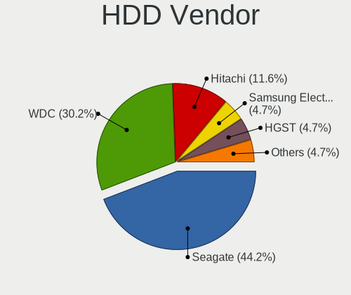

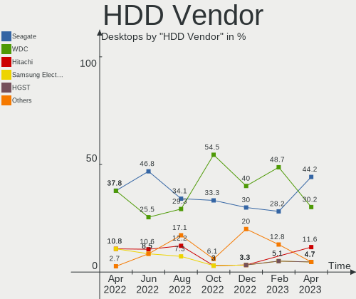

| Vendor              | Desktops | Drives | Percent |
|---------------------|----------|--------|---------|
| Seagate             | 19       | 26     | 44.19%  |
| WDC                 | 13       | 17     | 30.23%  |
| Hitachi             | 5        | 5      | 11.63%  |
| Samsung Electronics | 2        | 3      | 4.65%   |
| HGST                | 2        | 2      | 4.65%   |
| USB                 | 1        | 1      | 2.33%   |
| Toshiba             | 1        | 1      | 2.33%   |

SSD Vendor
----------

Solid state drive vendors

| Vendor              | Desktops | Drives | Percent |
|---------------------|----------|--------|---------|
| Samsung Electronics | 16       | 21     | 34.78%  |
| Crucial             | 9        | 12     | 19.57%  |
| Kingston            | 5        | 5      | 10.87%  |
| Intel               | 4        | 4      | 8.7%    |
| WDC                 | 1        | 1      | 2.17%   |
| SPCC                | 1        | 1      | 2.17%   |
| SanDisk             | 1        | 2      | 2.17%   |
| PNY                 | 1        | 1      | 2.17%   |
| Patriot             | 1        | 1      | 2.17%   |
| Micron Technology   | 1        | 1      | 2.17%   |
| LITEONIT            | 1        | 1      | 2.17%   |
| LITEON              | 1        | 1      | 2.17%   |
| KingSpec            | 1        | 1      | 2.17%   |
| Corsair             | 1        | 1      | 2.17%   |
| China               | 1        | 1      | 2.17%   |
| A-DATA Technology   | 1        | 1      | 2.17%   |

Drive Kind
----------

HDD or SSD

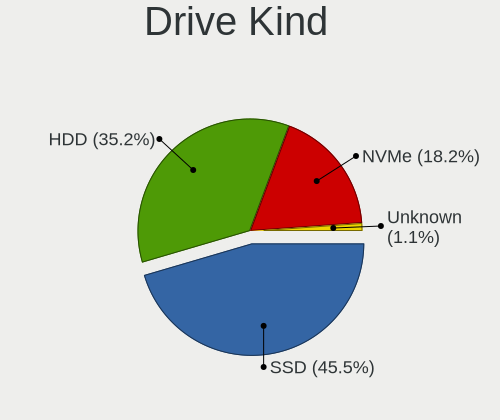

| Kind    | Desktops | Drives | Percent |
|---------|----------|--------|---------|
| SSD     | 40       | 55     | 45.45%  |
| HDD     | 31       | 55     | 35.23%  |
| NVMe    | 16       | 22     | 18.18%  |
| Unknown | 1        | 1      | 1.14%   |

Drive Connector
---------------

SATA, SAS, NVMe, etc.

| Type | Desktops | Drives | Percent |
|------|----------|--------|---------|
| SATA | 48       | 107    | 69.57%  |
| NVMe | 16       | 21     | 23.19%  |
| SAS  | 5        | 5      | 7.25%   |

Drive Size
----------

Size of hard drive

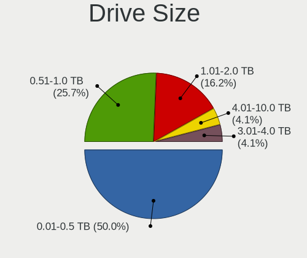

| Size in TB | Desktops | Drives | Percent |
|------------|----------|--------|---------|
| 0.01-0.5   | 37       | 61     | 50%     |
| 0.51-1.0   | 19       | 26     | 25.68%  |
| 1.01-2.0   | 12       | 16     | 16.22%  |
| 3.01-4.0   | 3        | 4      | 4.05%   |
| 4.01-10.0  | 3        | 3      | 4.05%   |

Space Total
-----------

Amount of disk space available on the file system

| Size in GB     | Desktops | Percent |
|----------------|----------|---------|
| 501-1000       | 11       | 20.37%  |
| More than 3000 | 9        | 16.67%  |
| 1001-2000      | 9        | 16.67%  |
| 251-500        | 6        | 11.11%  |
| 101-250        | 6        | 11.11%  |
| 51-100         | 6        | 11.11%  |
| 1-20           | 4        | 7.41%   |
| Unknown        | 2        | 3.7%    |
| 21-50          | 1        | 1.85%   |

Space Used
----------

Amount of used disk space

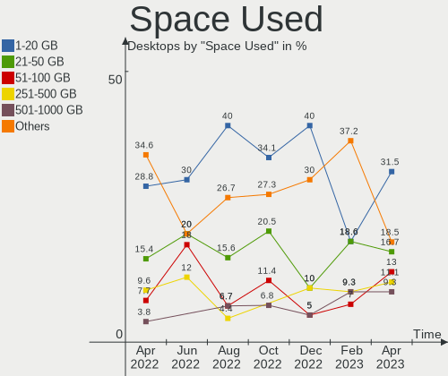

| Used GB        | Desktops | Percent |
|----------------|----------|---------|
| 1-20           | 17       | 31.48%  |
| 21-50          | 9        | 16.67%  |
| 51-100         | 7        | 12.96%  |
| 251-500        | 6        | 11.11%  |
| 501-1000       | 5        | 9.26%   |
| 1001-2000      | 4        | 7.41%   |
| More than 3000 | 2        | 3.7%    |
| 101-250        | 2        | 3.7%    |
| Unknown        | 2        | 3.7%    |

Malfunc. Drives
---------------

Drive models with a malfunction

| Model                             | Desktops | Drives | Percent |
|-----------------------------------|----------|--------|---------|
| Seagate ST500DM002-1BD142 500GB   | 1        | 3      | 12.5%   |
| Seagate ST3500418AS 500GB         | 1        | 1      | 12.5%   |
| Seagate ST3320813AS 320GB         | 1        | 1      | 12.5%   |
| Seagate ST31000520AS 1TB          | 1        | 1      | 12.5%   |
| Samsung Electronics HD501LJ 500GB | 1        | 2      | 12.5%   |
| Kingston SA400S37480G 480GB SSD   | 1        | 1      | 12.5%   |
| Intel SSDSC2CT120A3 120GB         | 1        | 1      | 12.5%   |
| Crucial CT525MX300SSD1 528GB      | 1        | 1      | 12.5%   |

Malfunc. Drive Vendor
---------------------

Vendors of faulty drives

| Vendor              | Desktops | Drives | Percent |
|---------------------|----------|--------|---------|
| Seagate             | 4        | 6      | 50%     |
| Samsung Electronics | 1        | 2      | 12.5%   |
| Kingston            | 1        | 1      | 12.5%   |
| Intel               | 1        | 1      | 12.5%   |
| Crucial             | 1        | 1      | 12.5%   |

Malfunc. HDD Vendor
-------------------

Vendors of faulty HDD drives

| Vendor              | Desktops | Drives | Percent |
|---------------------|----------|--------|---------|
| Seagate             | 4        | 6      | 80%     |
| Samsung Electronics | 1        | 2      | 20%     |

Malfunc. Drive Kind
-------------------

Kinds of faulty drives

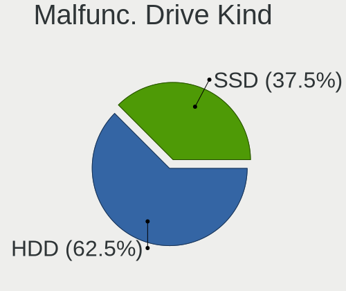

| Kind | Desktops | Drives | Percent |
|------|----------|--------|---------|
| HDD  | 5        | 8      | 62.5%   |
| SSD  | 3        | 3      | 37.5%   |

Failed Drives
-------------

Failed drive models

Zero info for selected period =(

Failed Drive Vendor
-------------------

Failed drive vendors

Zero info for selected period =(

Drive Status
------------

Number of failed and malfunc. drives

| Status   | Desktops | Drives | Percent |
|----------|----------|--------|---------|
| Works    | 28       | 54     | 45.16%  |
| Detected | 27       | 68     | 43.55%  |
| Malfunc  | 7        | 11     | 11.29%  |

Storage controller
------------------

Storage Vendor
--------------

Storage controller vendors

| Vendor                      | Desktops | Percent |
|-----------------------------|----------|---------|
| Intel                       | 36       | 45%     |
| AMD                         | 16       | 20%     |
| Samsung Electronics         | 6        | 7.5%    |
| Marvell Technology Group    | 5        | 6.25%   |
| Micron/Crucial Technology   | 3        | 3.75%   |
| Kingston Technology Company | 3        | 3.75%   |
| Silicon Motion              | 2        | 2.5%    |
| SanDisk                     | 2        | 2.5%    |
| ASMedia Technology          | 2        | 2.5%    |
| Phison Electronics          | 1        | 1.25%   |
| LSI Logic / Symbios Logic   | 1        | 1.25%   |
| KIOXIA                      | 1        | 1.25%   |
| JMicron Technology          | 1        | 1.25%   |
| Broadcom / LSI              | 1        | 1.25%   |

Storage Model
-------------

Storage controller models

| Model                                                                          | Desktops | Percent |
|--------------------------------------------------------------------------------|----------|---------|
| AMD FCH SATA Controller [AHCI mode]                                            | 11       | 10.78%  |
| Intel C600/X79 series chipset 6-Port SATA AHCI Controller                      | 5        | 4.9%    |
| Marvell Group 88SE9172 SATA 6Gb/s Controller                                   | 4        | 3.92%   |
| Intel 82801JD/DO (ICH10 Family) SATA AHCI Controller                           | 3        | 2.94%   |
| Intel 8 Series/C220 Series Chipset Family 6-port SATA Controller 1 [AHCI mode] | 3        | 2.94%   |
| Intel 7 Series/C210 Series Chipset Family 6-port SATA Controller [AHCI mode]   | 3        | 2.94%   |
| Intel 500 Series Chipset Family SATA AHCI Controller                           | 3        | 2.94%   |
| AMD 500 Series Chipset SATA Controller                                         | 3        | 2.94%   |
| AMD 400 Series Chipset SATA Controller                                         | 3        | 2.94%   |
| Samsung NVMe SSD Controller SM981/PM981/PM983                                  | 2        | 1.96%   |
| Samsung NVMe SSD Controller PM9A1/PM9A3/980PRO                                 | 2        | 1.96%   |
| Samsung NVMe SSD Controller 980                                                | 2        | 1.96%   |
| Micron/Crucial P2 NVMe PCIe SSD                                                | 2        | 1.96%   |
| Kingston Company Company Non-Volatile memory controller                        | 2        | 1.96%   |
| Intel Volume Management Device NVMe RAID Controller                            | 2        | 1.96%   |
| Intel Q170/Q150/B150/H170/H110/Z170/CM236 Chipset SATA Controller [AHCI Mode]  | 2        | 1.96%   |
| Intel Comet Lake SATA AHCI Controller                                          | 2        | 1.96%   |
| Intel C610/X99 series chipset sSATA Controller [AHCI mode]                     | 2        | 1.96%   |
| Intel C600/X79 series chipset IDE-r Controller                                 | 2        | 1.96%   |
| Intel Alder Lake-S PCH SATA Controller [AHCI Mode]                             | 2        | 1.96%   |
| Intel 9 Series Chipset Family SATA Controller [AHCI Mode]                      | 2        | 1.96%   |
| Intel 4 Series Chipset PT IDER Controller                                      | 2        | 1.96%   |
| ASMedia ASM1062 Serial ATA Controller                                          | 2        | 1.96%   |
| AMD SB7x0/SB8x0/SB9x0 SATA Controller [AHCI mode]                              | 2        | 1.96%   |
| AMD SB7x0/SB8x0/SB9x0 IDE Controller                                           | 2        | 1.96%   |
| AMD 300 Series Chipset SATA Controller                                         | 2        | 1.96%   |
| Silicon Motion SM2263EN/SM2263XT SSD Controller                                | 1        | 0.98%   |
| Silicon Motion SM2262/SM2262EN SSD Controller                                  | 1        | 0.98%   |
| SanDisk WD Blue SN570 NVMe SSD 1TB                                             | 1        | 0.98%   |
| SanDisk Non-Volatile memory controller                                         | 1        | 0.98%   |
| Phison PS5013 E13 NVMe Controller                                              | 1        | 0.98%   |
| Micron/Crucial P1 NVMe PCIe SSD                                                | 1        | 0.98%   |
| Marvell Group 88SE9123 PCIe SATA 6.0 Gb/s controller                           | 1        | 0.98%   |
| LSI Logic / Symbios Logic SAS1068E PCI-Express Fusion-MPT SAS                  | 1        | 0.98%   |
| KIOXIA Non-Volatile memory controller                                          | 1        | 0.98%   |
| Kingston Company SNVS2000G [NV1 NVMe PCIe SSD 2TB]                             | 1        | 0.98%   |
| JMicron JMB58x AHCI SATA controller                                            | 1        | 0.98%   |
| Intel SSD 600P Series                                                          | 1        | 0.98%   |
| Intel SATA Controller [RAID mode]                                              | 1        | 0.98%   |
| Intel NM10/ICH7 Family SATA Controller [AHCI mode]                             | 1        | 0.98%   |

Storage Kind
------------

Kind of storage controller (IDE, SATA, NVMe, SAS, ...)

| Kind | Desktops | Percent |
|------|----------|---------|
| SATA | 48       | 59.26%  |
| NVMe | 17       | 20.99%  |
| IDE  | 9        | 11.11%  |
| RAID | 5        | 6.17%   |
| SAS  | 1        | 1.23%   |
| SCSI | 1        | 1.23%   |

Processor
---------

CPU Vendor
----------

Processor vendors

| Vendor | Desktops | Percent |
|--------|----------|---------|
| Intel  | 37       | 68.52%  |
| AMD    | 17       | 31.48%  |

CPU Model
---------

Processor models

| Model                                   | Desktops | Percent |
|-----------------------------------------|----------|---------|
| Intel Core 2 Duo CPU E8400 @ 3.00GHz    | 3        | 5.56%   |
| Intel Core i7-5820K CPU @ 3.30GHz       | 2        | 3.7%    |
| Intel Core i7-3770 CPU @ 3.40GHz        | 2        | 3.7%    |
| AMD Ryzen 5 3600 6-Core Processor       | 2        | 3.7%    |
| AMD Ryzen 5 1600 Six-Core Processor     | 2        | 3.7%    |
| AMD Phenom II X2 570 Processor          | 2        | 3.7%    |
| Intel Xeon CPU E5-2670 0 @ 2.60GHz      | 1        | 1.85%   |
| Intel Xeon CPU E5-1620 v3 @ 3.50GHz     | 1        | 1.85%   |
| Intel Xeon CPU E5-1620 v2 @ 3.70GHz     | 1        | 1.85%   |
| Intel Core i9-10980HK CPU @ 2.40GHz     | 1        | 1.85%   |
| Intel Core i7-4960X CPU @ 3.60GHz       | 1        | 1.85%   |
| Intel Core i7-4790K CPU @ 4.00GHz       | 1        | 1.85%   |
| Intel Core i7-4770K CPU @ 3.50GHz       | 1        | 1.85%   |
| Intel Core i7-4770 CPU @ 3.40GHz        | 1        | 1.85%   |
| Intel Core i7-3930K CPU @ 3.20GHz       | 1        | 1.85%   |
| Intel Core i7-3820 CPU @ 3.60GHz        | 1        | 1.85%   |
| Intel Core i7-3770K CPU @ 3.50GHz       | 1        | 1.85%   |
| Intel Core i7-2600K CPU @ 3.40GHz       | 1        | 1.85%   |
| Intel Core i7-10510U CPU @ 1.80GHz      | 1        | 1.85%   |
| Intel Core i5-8400 CPU @ 2.80GHz        | 1        | 1.85%   |
| Intel Core i5-6600K CPU @ 3.50GHz       | 1        | 1.85%   |
| Intel Core i5-6500T CPU @ 2.50GHz       | 1        | 1.85%   |
| Intel Core i5-6400 CPU @ 2.70GHz        | 1        | 1.85%   |
| Intel Core i5-10600 CPU @ 3.30GHz       | 1        | 1.85%   |
| Intel Core i3-4160 CPU @ 3.60GHz        | 1        | 1.85%   |
| Intel Core i3-3220 CPU @ 3.30GHz        | 1        | 1.85%   |
| Intel Core i3-10105F CPU @ 3.70GHz      | 1        | 1.85%   |
| Intel Core 2 Duo CPU E6550 @ 2.33GHz    | 1        | 1.85%   |
| Intel Celeron CPU G1850 @ 2.90GHz       | 1        | 1.85%   |
| Intel Celeron CPU 4205U @ 1.80GHz       | 1        | 1.85%   |
| Intel Atom CPU D2700 @ 2.13GHz          | 1        | 1.85%   |
| Intel 13th Gen Core i9-13900KS          | 1        | 1.85%   |
| Intel 12th Gen Core i9-12900            | 1        | 1.85%   |
| Intel 12th Gen Core i7-12700K           | 1        | 1.85%   |
| Intel 12th Gen Core i7-12700            | 1        | 1.85%   |
| Intel 11th Gen Core i7-11700 @ 2.50GHz  | 1        | 1.85%   |
| AMD Ryzen 9 7900X3D 12-Core Processor   | 1        | 1.85%   |
| AMD Ryzen 9 5950X 16-Core Processor     | 1        | 1.85%   |
| AMD Ryzen 9 5900HX with Radeon Graphics | 1        | 1.85%   |
| AMD Ryzen 7 7735HS with Radeon Graphics | 1        | 1.85%   |

CPU Model Family
----------------

Processor model prefix

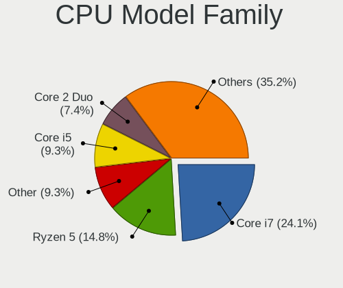

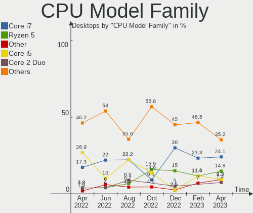

| Model            | Desktops | Percent |
|------------------|----------|---------|
| Intel Core i7    | 13       | 24.07%  |
| AMD Ryzen 5      | 8        | 14.81%  |
| Other            | 5        | 9.26%   |
| Intel Core i5    | 5        | 9.26%   |
| Intel Core 2 Duo | 4        | 7.41%   |
| Intel Xeon       | 3        | 5.56%   |
| Intel Core i3    | 3        | 5.56%   |
| AMD Ryzen 9      | 3        | 5.56%   |
| Intel Celeron    | 2        | 3.7%    |
| AMD Ryzen 7      | 2        | 3.7%    |
| AMD Phenom II X2 | 2        | 3.7%    |
| Intel Core i9    | 1        | 1.85%   |
| Intel Atom       | 1        | 1.85%   |
| AMD A8           | 1        | 1.85%   |
| AMD A4           | 1        | 1.85%   |

CPU Cores
---------

Number of processor cores

| Number | Desktops | Percent |
|--------|----------|---------|
| 4      | 15       | 27.78%  |
| 6      | 14       | 25.93%  |
| 2      | 12       | 22.22%  |
| 8      | 6        | 11.11%  |
| 16     | 3        | 5.56%   |
| 12     | 2        | 3.7%    |
| 24     | 1        | 1.85%   |
| 1      | 1        | 1.85%   |

CPU Sockets
-----------

Number of sockets

| Number | Desktops | Percent |
|--------|----------|---------|
| 1      | 53       | 98.15%  |
| 2      | 1        | 1.85%   |

CPU Threads
-----------

Threads per core (Hyper-Threading)

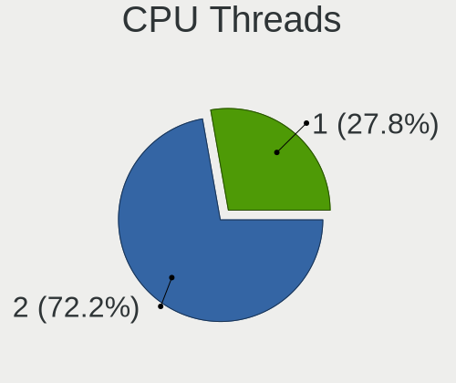

| Number | Desktops | Percent |
|--------|----------|---------|
| 2      | 39       | 72.22%  |
| 1      | 15       | 27.78%  |

CPU Op-Modes
------------

CPU Operation Modes (32-bit, 64-bit)

| Op mode        | Desktops | Percent |
|----------------|----------|---------|
| 32-bit, 64-bit | 54       | 100%    |

CPU Microcode
-------------

Microcode number

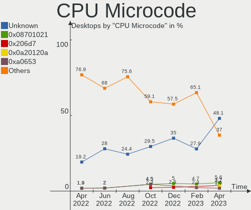

| Number     | Desktops | Percent |
|------------|----------|---------|
| Unknown    | 26       | 48.15%  |
| 0x08701021 | 3        | 5.56%   |
| 0x206d7    | 2        | 3.7%    |
| 0x0a20120a | 2        | 3.7%    |
| 0xa0653    | 1        | 1.85%   |
| 0x906ea    | 1        | 1.85%   |
| 0x90672    | 1        | 1.85%   |
| 0x806ec    | 1        | 1.85%   |
| 0x6fb      | 1        | 1.85%   |
| 0x506e3    | 1        | 1.85%   |
| 0x306f2    | 1        | 1.85%   |
| 0x306c3    | 1        | 1.85%   |
| 0x206a7    | 1        | 1.85%   |
| 0x1067a    | 1        | 1.85%   |
| 0x0a601203 | 1        | 1.85%   |
| 0x0a50000c | 1        | 1.85%   |
| 0x0a404102 | 1        | 1.85%   |
| 0x0800820d | 1        | 1.85%   |
| 0x08008206 | 1        | 1.85%   |
| 0x08001138 | 1        | 1.85%   |
| 0x08001126 | 1        | 1.85%   |
| 0x06003106 | 1        | 1.85%   |
| 0x06001119 | 1        | 1.85%   |
| 0x010000b6 | 1        | 1.85%   |
| 0x00000000 | 1        | 1.85%   |

CPU Microarch
-------------

Microarchitecture

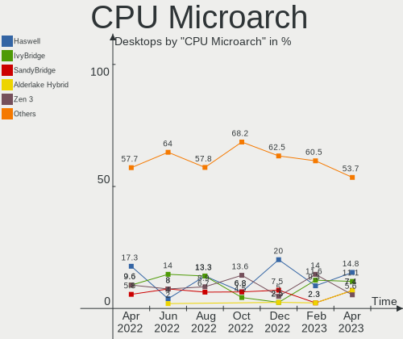

| Name             | Desktops | Percent |
|------------------|----------|---------|
| Haswell          | 8        | 14.81%  |
| IvyBridge        | 6        | 11.11%  |
| SandyBridge      | 4        | 7.41%   |
| Alderlake Hybrid | 4        | 7.41%   |
| Zen 3            | 3        | 5.56%   |
| Zen 2            | 3        | 5.56%   |
| Zen              | 3        | 5.56%   |
| Skylake          | 3        | 5.56%   |
| Penryn           | 3        | 5.56%   |
| KabyLake         | 3        | 5.56%   |
| CometLake        | 3        | 5.56%   |
| Unknown          | 3        | 5.56%   |
| Zen+             | 2        | 3.7%    |
| K10              | 2        | 3.7%    |
| Steamroller      | 1        | 1.85%   |
| Piledriver       | 1        | 1.85%   |
| Core             | 1        | 1.85%   |
| Bonnell          | 1        | 1.85%   |

Graphics
--------

GPU Vendor
----------

Vendors of graphics cards

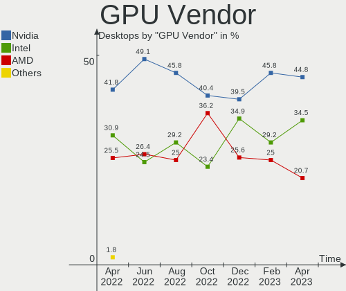

| Vendor | Desktops | Percent |
|--------|----------|---------|
| Nvidia | 26       | 44.83%  |
| Intel  | 20       | 34.48%  |
| AMD    | 12       | 20.69%  |

GPU Model
---------

Graphics card models

| Model                                                                       | Desktops | Percent |
|-----------------------------------------------------------------------------|----------|---------|
| Intel AlderLake-S GT1                                                       | 3        | 5.17%   |
| AMD Ellesmere [Radeon RX 470/480/570/570X/580/580X/590]                     | 3        | 5.17%   |
| Nvidia TU116 [GeForce GTX 1660 Ti]                                          | 2        | 3.45%   |
| Nvidia GP106 [GeForce GTX 1060 6GB]                                         | 2        | 3.45%   |
| Nvidia GK106 [GeForce GTX 660]                                              | 2        | 3.45%   |
| Intel Xeon E3-1200 v3/4th Gen Core Processor Integrated Graphics Controller | 2        | 3.45%   |
| Intel HD Graphics 530                                                       | 2        | 3.45%   |
| Intel 4 Series Chipset Integrated Graphics Controller                       | 2        | 3.45%   |
| Nvidia TU102 [GeForce RTX 2080 Ti Rev. A]                                   | 1        | 1.72%   |
| Nvidia GP104 [GeForce GTX 1080]                                             | 1        | 1.72%   |
| Nvidia GM206 [GeForce GTX 960]                                              | 1        | 1.72%   |
| Nvidia GM204 [GeForce GTX 980]                                              | 1        | 1.72%   |
| Nvidia GM204 [GeForce GTX 970]                                              | 1        | 1.72%   |
| Nvidia GM200 [GeForce GTX 980 Ti]                                           | 1        | 1.72%   |
| Nvidia GM107GL [Quadro K2200]                                               | 1        | 1.72%   |
| Nvidia GM107 [GeForce GTX 750 Ti]                                           | 1        | 1.72%   |
| Nvidia GK208B [GeForce GT 730]                                              | 1        | 1.72%   |
| Nvidia GK208B [GeForce GT 710]                                              | 1        | 1.72%   |
| Nvidia GK104 [GeForce GTX 760]                                              | 1        | 1.72%   |
| Nvidia GF119 [GeForce GT 610]                                               | 1        | 1.72%   |
| Nvidia GF119 [GeForce GT 520]                                               | 1        | 1.72%   |
| Nvidia GF116 [GeForce GTX 550 Ti]                                           | 1        | 1.72%   |
| Nvidia GF108 [GeForce GT 730]                                               | 1        | 1.72%   |
| Nvidia GF108 [GeForce GT 630]                                               | 1        | 1.72%   |
| Nvidia GA106 [GeForce RTX 3060]                                             | 1        | 1.72%   |
| Nvidia GA106 [GeForce RTX 3060 Lite Hash Rate]                              | 1        | 1.72%   |
| Nvidia GA104 [GeForce RTX 3070]                                             | 1        | 1.72%   |
| Nvidia AD102 [GeForce RTX 4090]                                             | 1        | 1.72%   |
| Intel Whiskey Lake-U GT1 [UHD Graphics 610]                                 | 1        | 1.72%   |
| Intel RocketLake-S GT1 [UHD Graphics 750]                                   | 1        | 1.72%   |
| Intel Raptor Lake-S GT1 [UHD Graphics 770]                                  | 1        | 1.72%   |
| Intel IvyBridge GT2 [HD Graphics 4000]                                      | 1        | 1.72%   |
| Intel DG2 [Arc A750]                                                        | 1        | 1.72%   |
| Intel CometLake-U GT2 [UHD Graphics]                                        | 1        | 1.72%   |
| Intel CometLake-H GT2 [UHD Graphics]                                        | 1        | 1.72%   |
| Intel CoffeeLake-S GT2 [UHD Graphics 630]                                   | 1        | 1.72%   |
| Intel Atom Processor D2xxx/N2xxx Integrated Graphics Controller             | 1        | 1.72%   |
| Intel 82Q35 Express Integrated Graphics Controller                          | 1        | 1.72%   |
| Intel 4th Generation Core Processor Family Integrated Graphics Controller   | 1        | 1.72%   |
| AMD RS880 [Radeon HD 4250]                                                  | 1        | 1.72%   |

GPU Combo
---------

Combinations of graphics cards

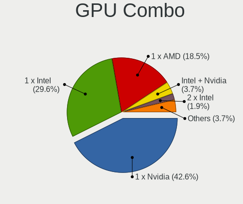

| Name           | Desktops | Percent |
|----------------|----------|---------|
| 1 x Nvidia     | 23       | 42.59%  |
| 1 x Intel      | 16       | 29.63%  |
| 1 x AMD        | 10       | 18.52%  |
| Intel + Nvidia | 2        | 3.7%    |
| 2 x Intel      | 1        | 1.85%   |
| Intel + AMD    | 1        | 1.85%   |
| AMD + Nvidia   | 1        | 1.85%   |

GPU Driver
----------

Free vs proprietary

| Driver      | Desktops | Percent |
|-------------|----------|---------|
| Free        | 36       | 66.67%  |
| Proprietary | 15       | 27.78%  |
| Unknown     | 3        | 5.56%   |

GPU Memory
----------

Total video memory

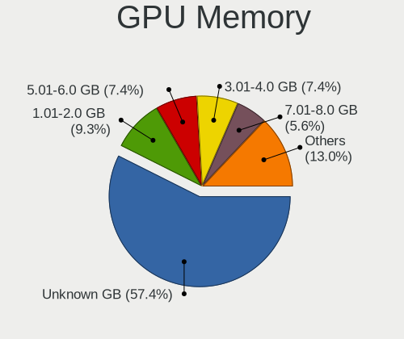

| Size in GB | Desktops | Percent |
|------------|----------|---------|
| Unknown    | 31       | 57.41%  |
| 1.01-2.0   | 5        | 9.26%   |
| 5.01-6.0   | 4        | 7.41%   |
| 3.01-4.0   | 4        | 7.41%   |
| 7.01-8.0   | 3        | 5.56%   |
| 0.51-1.0   | 3        | 5.56%   |
| 0.01-0.5   | 2        | 3.7%    |
| 16.01-24.0 | 1        | 1.85%   |
| 8.01-16.0  | 1        | 1.85%   |

Monitor
-------

Monitor Vendor
--------------

Monitor vendors

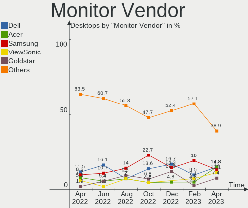

| Vendor               | Desktops | Percent |
|----------------------|----------|---------|
| Dell                 | 8        | 14.81%  |
| Acer                 | 8        | 14.81%  |
| Samsung Electronics  | 7        | 12.96%  |
| ViewSonic            | 6        | 11.11%  |
| Goldstar             | 4        | 7.41%   |
| AOC                  | 4        | 7.41%   |
| Philips              | 3        | 5.56%   |
| PRI                  | 2        | 3.7%    |
| Hewlett-Packard      | 2        | 3.7%    |
| Ancor Communications | 2        | 3.7%    |
| Xiaomi               | 1        | 1.85%   |
| Unknown              | 1        | 1.85%   |
| MSI                  | 1        | 1.85%   |
| MiTAC                | 1        | 1.85%   |
| Kogan                | 1        | 1.85%   |
| GDH                  | 1        | 1.85%   |
| CHD                  | 1        | 1.85%   |
| Unknown              | 1        | 1.85%   |

Monitor Model
-------------

Monitor models

| Model                                                                  | Desktops | Percent |
|------------------------------------------------------------------------|----------|---------|
| Xiaomi Mi TV XMD009A 3440x1440 480x270mm 21.7-inch                     | 1        | 1.79%   |
| ViewSonic VX2758-Series VSCA738 2560x1440 598x336mm 27.0-inch          | 1        | 1.79%   |
| ViewSonic VX2457 VSCB931 1920x1080 521x293mm 23.5-inch                 | 1        | 1.79%   |
| ViewSonic VX2235wm VSC591E 1680x1050 474x296mm 22.0-inch               | 1        | 1.79%   |
| ViewSonic VA2448 SERIES VSC3828 1920x1080 521x293mm 23.5-inch          | 1        | 1.79%   |
| ViewSonic LCD Monitor VA2226w-3 1680x1050                              | 1        | 1.79%   |
| ViewSonic LCD Monitor VA1912wSERIES 5280x2160                          | 1        | 1.79%   |
| Unknown LCD Monitor SAMSUNG 1920x1080                                  | 1        | 1.79%   |
| Samsung Electronics U28E590 SAM0C4D 3840x2160 607x345mm 27.5-inch      | 1        | 1.79%   |
| Samsung Electronics SyncMaster SAM0587 1920x1200 518x324mm 24.1-inch   | 1        | 1.79%   |
| Samsung Electronics SyncMaster SAM03E3 1680x1050 433x271mm 20.1-inch   | 1        | 1.79%   |
| Samsung Electronics SE790C SAM0BFD 3440x1440 797x333mm 34.0-inch       | 1        | 1.79%   |
| Samsung Electronics S24B300 SAM08CE 1920x1080 531x299mm 24.0-inch      | 1        | 1.79%   |
| Samsung Electronics LCD Monitor SyncMaster 3200x1200                   | 1        | 1.79%   |
| Samsung Electronics LCD Monitor SAM0E33 1920x1080 1210x680mm 54.6-inch | 1        | 1.79%   |
| Samsung Electronics C34H89x SAM0E25 3440x1440 797x333mm 34.0-inch      | 1        | 1.79%   |
| PRI TV PRI1040 1920x1080 819x460mm 37.0-inch                           | 1        | 1.79%   |
| PRI Prima TV PRI1600 1920x1080                                         | 1        | 1.79%   |
| Philips PHL 438P1 PHL095B 3840x2160 941x529mm 42.5-inch                | 1        | 1.79%   |
| Philips PHL 243V7 PHLC155 1920x1080 527x296mm 23.8-inch                | 1        | 1.79%   |
| Philips LCD Monitor 288P6                                              | 1        | 1.79%   |
| MSI MP271 MSI30A2 1920x1080 598x336mm 27.0-inch                        | 1        | 1.79%   |
| MiTAC Smart TV MTC0030 3840x2160 708x398mm 32.0-inch                   | 1        | 1.79%   |
| Kogan HDMI1 KGN3400 3440x1440 796x334mm 34.0-inch                      | 1        | 1.79%   |
| Hewlett-Packard L2335 HWP2614 1920x1200 495x310mm 23.0-inch            | 1        | 1.79%   |
| Hewlett-Packard 22fw HPN3541 1920x1080 476x268mm 21.5-inch             | 1        | 1.79%   |
| Goldstar W2242 GSM5678 1680x1050 474x296mm 22.0-inch                   | 1        | 1.79%   |
| Goldstar ULTRAWIDE GSM7767 3440x1440 800x334mm 34.1-inch               | 1        | 1.79%   |
| Goldstar ULTRAWIDE GSM59F1 2560x1080 673x284mm 28.8-inch               | 1        | 1.79%   |
| Goldstar IPS FULLHD GSM5AB7 1920x1080 480x270mm 21.7-inch              | 1        | 1.79%   |
| GDH PHILCO GDH0030 1920x540 708x398mm 32.0-inch                        | 1        | 1.79%   |
| Dell U2412M DELA07B 1920x1200 518x324mm 24.1-inch                      | 1        | 1.79%   |
| Dell P4317Q DELD084 3840x2160 941x529mm 42.5-inch                      | 1        | 1.79%   |
| Dell P2417H DELA0DC 1920x1080 527x296mm 23.8-inch                      | 1        | 1.79%   |
| Dell P2211H DEL4061 1920x1080 477x268mm 21.5-inch                      | 1        | 1.79%   |
| Dell P1917S DELD091 1280x1024 375x300mm 18.9-inch                      | 1        | 1.79%   |
| Dell OptiPlex 7440 DEL93EC 1920x1080 510x287mm 23.0-inch               | 1        | 1.79%   |
| Dell LCD Monitor P2319H 3200x1080                                      | 1        | 1.79%   |
| Dell LCD Monitor P1917S                                                | 1        | 1.79%   |
| Dell 2407WFP DELA017 1920x1200 519x324mm 24.1-inch                     | 1        | 1.79%   |

Monitor Resolution
------------------

Monitor screen resolution

| Resolution         | Desktops | Percent |
|--------------------|----------|---------|
| 1920x1080 (FHD)    | 23       | 41.82%  |
| 3840x2160 (4K)     | 5        | 9.09%   |
| 3440x1440          | 5        | 9.09%   |
| 1920x1200 (WUXGA)  | 4        | 7.27%   |
| 1680x1050 (WSXGA+) | 4        | 7.27%   |
| 2560x1440 (QHD)    | 3        | 5.45%   |
| Unknown            | 3        | 5.45%   |
| 1280x1024 (SXGA)   | 2        | 3.64%   |
| 5280x2160          | 1        | 1.82%   |
| 3200x1200          | 1        | 1.82%   |
| 3200x1080          | 1        | 1.82%   |
| 2560x1080          | 1        | 1.82%   |
| 2048x1152          | 1        | 1.82%   |
| 1600x900 (HD+)     | 1        | 1.82%   |

Monitor Diagonal
----------------

Diagonal size in inches

| Inches  | Desktops | Percent |
|---------|----------|---------|
| 24      | 10       | 20%     |
| 23      | 10       | 20%     |
| 27      | 7        | 14%     |
| Unknown | 6        | 12%     |
| 34      | 4        | 8%      |
| 52      | 2        | 4%      |
| 42      | 2        | 4%      |
| 21      | 2        | 4%      |
| 19      | 2        | 4%      |
| 54      | 1        | 2%      |
| 37      | 1        | 2%      |
| 32      | 1        | 2%      |
| 22      | 1        | 2%      |
| 20      | 1        | 2%      |

Monitor Width
-------------

Physical width

| Width in mm | Desktops | Percent |
|-------------|----------|---------|
| 501-600     | 24       | 47.06%  |
| 401-500     | 8        | 15.69%  |
| Unknown     | 6        | 11.76%  |
| 701-800     | 5        | 9.8%    |
| 1001-1500   | 3        | 5.88%   |
| 901-1000    | 2        | 3.92%   |
| 801-900     | 1        | 1.96%   |
| 601-700     | 1        | 1.96%   |
| 351-400     | 1        | 1.96%   |

Aspect Ratio
------------

Proportional relationship between the width and the height

| Ratio   | Desktops | Percent |
|---------|----------|---------|
| 16/9    | 34       | 66.67%  |
| 16/10   | 6        | 11.76%  |
| Unknown | 5        | 9.8%    |
| 21/9    | 4        | 7.84%   |
| 5/4     | 1        | 1.96%   |
| 3/2     | 1        | 1.96%   |

Monitor Area
------------

Area in inch

| Area in inch | Desktops | Percent |
|----------------|----------|---------|
| 201-250        | 20       | 40%     |
| 301-350        | 7        | 14%     |
| Unknown        | 6        | 12%     |
| 351-500        | 5        | 10%     |
| More than 1000 | 3        | 6%      |
| 251-300        | 3        | 6%      |
| 151-200        | 3        | 6%      |
| 501-1000       | 3        | 6%      |

Pixel Density
-------------

Pixels per inch

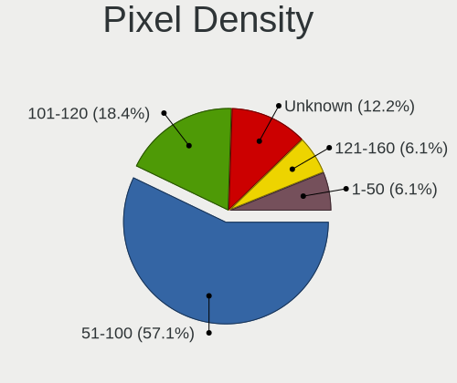

| Density | Desktops | Percent |
|---------|----------|---------|
| 51-100  | 28       | 57.14%  |
| 101-120 | 9        | 18.37%  |
| Unknown | 6        | 12.24%  |
| 1-50    | 3        | 6.12%   |
| 121-160 | 3        | 6.12%   |

Multiple Monitors
-----------------

Total monitors connected

| Total | Desktops | Percent |
|-------|----------|---------|
| 1     | 42       | 77.78%  |
| 2     | 7        | 12.96%  |
| 0     | 5        | 9.26%   |

Network
-------

Net Controller Vendor
---------------------

Controller vendors

| Vendor                          | Desktops | Percent |
|---------------------------------|----------|---------|
| Intel                           | 34       | 40.48%  |
| Realtek Semiconductor           | 31       | 36.9%   |
| Qualcomm Atheros                | 7        | 8.33%   |
| MediaTek                        | 3        | 3.57%   |
| Sigma Designs                   | 1        | 1.19%   |
| Samsung Electronics             | 1        | 1.19%   |
| Qualcomm Atheros Communications | 1        | 1.19%   |
| NetGear                         | 1        | 1.19%   |
| DisplayLink                     | 1        | 1.19%   |
| D-Link                          | 1        | 1.19%   |
| Broadcom                        | 1        | 1.19%   |
| ASUSTek Computer                | 1        | 1.19%   |
| Aquantia                        | 1        | 1.19%   |

Net Controller Model
--------------------

Controller models

| Model                                                             | Desktops | Percent |
|-------------------------------------------------------------------|----------|---------|
| Realtek RTL8111/8168/8411 PCI Express Gigabit Ethernet Controller | 25       | 25.51%  |
| Intel 82579LM Gigabit Network Connection (Lewisville)             | 4        | 4.08%   |
| Realtek RTL8125 2.5GbE Controller                                 | 3        | 3.06%   |
| Intel Wi-Fi 6 AX210/AX211/AX411 160MHz                            | 3        | 3.06%   |
| Intel Wi-Fi 6 AX200                                               | 3        | 3.06%   |
| Intel I211 Gigabit Network Connection                             | 3        | 3.06%   |
| Intel 82579V Gigabit Network Connection                           | 3        | 3.06%   |
| Intel 82574L Gigabit Network Connection                           | 3        | 3.06%   |
| Intel 82567LM-3 Gigabit Network Connection                        | 3        | 3.06%   |
| Realtek RTL8821CE 802.11ac PCIe Wireless Network Adapter          | 2        | 2.04%   |
| Qualcomm Atheros AR93xx Wireless Network Adapter                  | 2        | 2.04%   |
| MediaTek MT7921K (RZ608) Wi-Fi 6E 80MHz                           | 2        | 2.04%   |
| Intel Ethernet Controller I225-V                                  | 2        | 2.04%   |
| Intel Ethernet Connection (2) I218-V                              | 2        | 2.04%   |
| Intel Alder Lake-S PCH CNVi WiFi                                  | 2        | 2.04%   |
| Sigma Designs Aeotec Z-Stick Gen5 (ZW090) - UZB                   | 1        | 1.02%   |
| Samsung Galaxy series, misc. (tethering mode)                     | 1        | 1.02%   |
| Realtek USB 10/100/1G/2.5G LAN                                    | 1        | 1.02%   |
| Realtek RTL8192EU 802.11b/g/n WLAN Adapter                        | 1        | 1.02%   |
| Realtek RTL8153 Gigabit Ethernet Adapter                          | 1        | 1.02%   |
| Realtek 8821CE PCIe 802.11ac Wireless Network Controller          | 1        | 1.02%   |
| Qualcomm Atheros Killer E2400 Gigabit Ethernet Controller         | 1        | 1.02%   |
| Qualcomm Atheros Killer E220x Gigabit Ethernet Controller         | 1        | 1.02%   |
| Qualcomm Atheros AR9271 802.11n                                   | 1        | 1.02%   |
| Qualcomm Atheros AR9485 Wireless Network Adapter                  | 1        | 1.02%   |
| Qualcomm Atheros AR9287 Wireless Network Adapter (PCI-Express)    | 1        | 1.02%   |
| Qualcomm Atheros AR8161 Gigabit Ethernet                          | 1        | 1.02%   |
| Qualcomm Atheros AR8151 v2.0 Gigabit Ethernet                     | 1        | 1.02%   |
| NetGear A6100 AC600 DB Wireless Adapter [Realtek RTL8811AU]       | 1        | 1.02%   |
| MediaTek MT7922 802.11ax PCI Express Wireless Network Adapter     | 1        | 1.02%   |
| Intel Wireless 8265 / 8275                                        | 1        | 1.02%   |
| Intel Wireless 7260                                               | 1        | 1.02%   |
| Intel Tiger Lake PCH CNVi WiFi                                    | 1        | 1.02%   |
| Intel Ethernet Controller I226-V                                  | 1        | 1.02%   |
| Intel Ethernet Connection (6) I219-V                              | 1        | 1.02%   |
| Intel Ethernet Connection (6) I219-LM                             | 1        | 1.02%   |
| Intel Ethernet Connection (2) I219-V                              | 1        | 1.02%   |
| Intel Ethernet Connection (2) I219-LM                             | 1        | 1.02%   |
| Intel Ethernet Connection (2) I218-LM                             | 1        | 1.02%   |
| Intel Ethernet Connection (17) I219-LM                            | 1        | 1.02%   |

Wireless Vendor
---------------

Wireless vendors

| Vendor                          | Desktops | Percent |
|---------------------------------|----------|---------|
| Intel                           | 14       | 48.28%  |
| Realtek Semiconductor           | 4        | 13.79%  |
| Qualcomm Atheros                | 4        | 13.79%  |
| MediaTek                        | 3        | 10.34%  |
| Qualcomm Atheros Communications | 1        | 3.45%   |
| NetGear                         | 1        | 3.45%   |
| Broadcom                        | 1        | 3.45%   |
| ASUSTek Computer                | 1        | 3.45%   |

Wireless Model
--------------

Wireless models

| Model                                                                     | Desktops | Percent |
|---------------------------------------------------------------------------|----------|---------|
| Intel Wi-Fi 6 AX210/AX211/AX411 160MHz                                    | 3        | 10.34%  |
| Intel Wi-Fi 6 AX200                                                       | 3        | 10.34%  |
| Realtek RTL8821CE 802.11ac PCIe Wireless Network Adapter                  | 2        | 6.9%    |
| Qualcomm Atheros AR93xx Wireless Network Adapter                          | 2        | 6.9%    |
| MediaTek MT7921K (RZ608) Wi-Fi 6E 80MHz                                   | 2        | 6.9%    |
| Intel Alder Lake-S PCH CNVi WiFi                                          | 2        | 6.9%    |
| Realtek RTL8192EU 802.11b/g/n WLAN Adapter                                | 1        | 3.45%   |
| Realtek 8821CE PCIe 802.11ac Wireless Network Controller                  | 1        | 3.45%   |
| Qualcomm Atheros AR9271 802.11n                                           | 1        | 3.45%   |
| Qualcomm Atheros AR9485 Wireless Network Adapter                          | 1        | 3.45%   |
| Qualcomm Atheros AR9287 Wireless Network Adapter (PCI-Express)            | 1        | 3.45%   |
| NetGear A6100 AC600 DB Wireless Adapter [Realtek RTL8811AU]               | 1        | 3.45%   |
| MediaTek MT7922 802.11ax PCI Express Wireless Network Adapter             | 1        | 3.45%   |
| Intel Wireless 8265 / 8275                                                | 1        | 3.45%   |
| Intel Wireless 7260                                                       | 1        | 3.45%   |
| Intel Tiger Lake PCH CNVi WiFi                                            | 1        | 3.45%   |
| Intel Dual Band Wireless-AC 3168NGW [Stone Peak]                          | 1        | 3.45%   |
| Intel Comet Lake PCH-LP CNVi WiFi                                         | 1        | 3.45%   |
| Intel Centrino Wireless-N 2230                                            | 1        | 3.45%   |
| Broadcom BCM4352 802.11ac Wireless Network Adapter                        | 1        | 3.45%   |
| ASUS USB-AC68 802.11a/b/g/n/ac (4x4) Wireless Adapter [Realtek RTL8814AU] | 1        | 3.45%   |

Ethernet Vendor
---------------

Ethernet vendors

| Vendor                | Desktops | Percent |
|-----------------------|----------|---------|
| Realtek Semiconductor | 28       | 43.75%  |
| Intel                 | 28       | 43.75%  |
| Qualcomm Atheros      | 4        | 6.25%   |
| Samsung Electronics   | 1        | 1.56%   |
| DisplayLink           | 1        | 1.56%   |
| D-Link                | 1        | 1.56%   |
| Aquantia              | 1        | 1.56%   |

Ethernet Model
--------------

Ethernet models

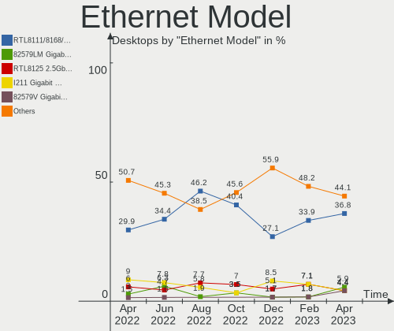

| Model                                                             | Desktops | Percent |
|-------------------------------------------------------------------|----------|---------|
| Realtek RTL8111/8168/8411 PCI Express Gigabit Ethernet Controller | 25       | 36.76%  |
| Intel 82579LM Gigabit Network Connection (Lewisville)             | 4        | 5.88%   |
| Realtek RTL8125 2.5GbE Controller                                 | 3        | 4.41%   |
| Intel I211 Gigabit Network Connection                             | 3        | 4.41%   |
| Intel 82579V Gigabit Network Connection                           | 3        | 4.41%   |
| Intel 82574L Gigabit Network Connection                           | 3        | 4.41%   |
| Intel 82567LM-3 Gigabit Network Connection                        | 3        | 4.41%   |
| Intel Ethernet Controller I225-V                                  | 2        | 2.94%   |
| Intel Ethernet Connection (2) I218-V                              | 2        | 2.94%   |
| Samsung Galaxy series, misc. (tethering mode)                     | 1        | 1.47%   |
| Realtek USB 10/100/1G/2.5G LAN                                    | 1        | 1.47%   |
| Realtek RTL8153 Gigabit Ethernet Adapter                          | 1        | 1.47%   |
| Qualcomm Atheros Killer E2400 Gigabit Ethernet Controller         | 1        | 1.47%   |
| Qualcomm Atheros Killer E220x Gigabit Ethernet Controller         | 1        | 1.47%   |
| Qualcomm Atheros AR8161 Gigabit Ethernet                          | 1        | 1.47%   |
| Qualcomm Atheros AR8151 v2.0 Gigabit Ethernet                     | 1        | 1.47%   |
| Intel Ethernet Controller I226-V                                  | 1        | 1.47%   |
| Intel Ethernet Connection (6) I219-V                              | 1        | 1.47%   |
| Intel Ethernet Connection (6) I219-LM                             | 1        | 1.47%   |
| Intel Ethernet Connection (2) I219-V                              | 1        | 1.47%   |
| Intel Ethernet Connection (2) I219-LM                             | 1        | 1.47%   |
| Intel Ethernet Connection (2) I218-LM                             | 1        | 1.47%   |
| Intel Ethernet Connection (17) I219-LM                            | 1        | 1.47%   |
| Intel Ethernet Connection (11) I219-V                             | 1        | 1.47%   |
| Intel 82566DM-2 Gigabit Network Connection                        | 1        | 1.47%   |
| Intel 82546EB Gigabit Ethernet Controller (Copper)                | 1        | 1.47%   |
| DisplayLink dynadock U3.0                                         | 1        | 1.47%   |
| D-Link DUB-1312 Gigabit Ethernet Adapter                          | 1        | 1.47%   |
| Aquantia AQC107 NBase-T/IEEE 802.3bz Ethernet Controller [AQtion] | 1        | 1.47%   |

Net Controller Kind
-------------------

Ethernet, WiFi or modem

| Kind     | Desktops | Percent |
|----------|----------|---------|
| Ethernet | 54       | 65.85%  |
| WiFi     | 27       | 32.93%  |
| Modem    | 1        | 1.22%   |

Used Controller
---------------

Currently used network controller

| Kind     | Desktops | Percent |
|----------|----------|---------|
| Ethernet | 45       | 80.36%  |
| WiFi     | 11       | 19.64%  |

NICs
----

Total network controllers on board

| Total | Desktops | Percent |
|-------|----------|---------|
| 1     | 25       | 46.3%   |
| 2     | 20       | 37.04%  |
| 3     | 8        | 14.81%  |
| 5     | 1        | 1.85%   |

IPv6
----

IPv6 vs IPv4

| Used | Desktops | Percent |
|------|----------|---------|
| No   | 46       | 85.19%  |
| Yes  | 8        | 14.81%  |

Bluetooth
---------

Bluetooth Vendor
----------------

Controller vendors

| Vendor                  | Desktops | Percent |
|-------------------------|----------|---------|
| Intel                   | 13       | 52%     |
| Cambridge Silicon Radio | 4        | 16%     |
| MediaTek                | 3        | 12%     |
| Realtek Semiconductor   | 2        | 8%      |
| TP-Link                 | 1        | 4%      |
| IMC Networks            | 1        | 4%      |
| Broadcom                | 1        | 4%      |

Bluetooth Model
---------------

Controller models

| Model                                               | Desktops | Percent |
|-----------------------------------------------------|----------|---------|
| Cambridge Silicon Radio Bluetooth Dongle (HCI mode) | 4        | 15.38%  |
| MediaTek Wireless_Device                            | 3        | 11.54%  |
| Intel AX210 Bluetooth                               | 3        | 11.54%  |
| Intel AX201 Bluetooth                               | 3        | 11.54%  |
| Intel AX200 Bluetooth                               | 3        | 11.54%  |
| Realtek Bluetooth Radio                             | 2        | 7.69%   |
| Intel Bluetooth wireless interface                  | 2        | 7.69%   |
| TP-Link UB500 Adapter                               | 1        | 3.85%   |
| Realtek  Bluetooth 4.2 Adapter                      | 1        | 3.85%   |
| Intel Wireless-AC 3168 Bluetooth                    | 1        | 3.85%   |
| Intel Centrino Bluetooth Wireless Transceiver       | 1        | 3.85%   |
| IMC Networks Bluetooth Radio                        | 1        | 3.85%   |
| Broadcom BCM20702A0 Bluetooth 4.0                   | 1        | 3.85%   |

Sound
-----

Sound Vendor
------------

Sound card vendors

| Vendor                               | Desktops | Percent |
|--------------------------------------|----------|---------|
| Intel                                | 36       | 37.5%   |
| Nvidia                               | 25       | 26.04%  |
| AMD                                  | 20       | 20.83%  |
| Micro Star International             | 3        | 3.13%   |
| Logitech                             | 3        | 3.13%   |
| C-Media Electronics                  | 3        | 3.13%   |
| Thesycon Systemsoftware & Consulting | 1        | 1.04%   |
| Razer USA                            | 1        | 1.04%   |
| GN Netcom                            | 1        | 1.04%   |
| Focusrite-Novation                   | 1        | 1.04%   |
| Creative Labs                        | 1        | 1.04%   |
| Astro Gaming                         | 1        | 1.04%   |

Sound Model
-----------

Sound card models

| Model                                                                      | Desktops | Percent |
|----------------------------------------------------------------------------|----------|---------|
| Intel C600/X79 series chipset High Definition Audio Controller             | 5        | 4.72%   |
| AMD Starship/Matisse HD Audio Controller                                   | 5        | 4.72%   |
| AMD Family 17h (Models 00h-0fh) HD Audio Controller                        | 5        | 4.72%   |
| Nvidia GF119 HDMI Audio Controller                                         | 3        | 2.83%   |
| Micro Star International USB Audio                                         | 3        | 2.83%   |
| Intel C610/X99 series chipset HD Audio Controller                          | 3        | 2.83%   |
| Intel 82801JD/DO (ICH10 Family) HD Audio Controller                        | 3        | 2.83%   |
| Intel 8 Series/C220 Series Chipset High Definition Audio Controller        | 3        | 2.83%   |
| Intel 7 Series/C216 Chipset Family High Definition Audio Controller        | 3        | 2.83%   |
| Intel 100 Series/C230 Series Chipset Family HD Audio Controller            | 3        | 2.83%   |
| AMD Family 17h/19h HD Audio Controller                                     | 3        | 2.83%   |
| AMD Ellesmere HDMI Audio [Radeon RX 470/480 / 570/580/590]                 | 3        | 2.83%   |
| Nvidia TU116 High Definition Audio Controller                              | 2        | 1.89%   |
| Nvidia GP106 High Definition Audio Controller                              | 2        | 1.89%   |
| Nvidia GM204 High Definition Audio Controller                              | 2        | 1.89%   |
| Nvidia GM107 High Definition Audio Controller [GeForce 940MX]              | 2        | 1.89%   |
| Nvidia GK208 HDMI/DP Audio Controller                                      | 2        | 1.89%   |
| Nvidia GK106 HDMI Audio Controller                                         | 2        | 1.89%   |
| Nvidia GA106 High Definition Audio Controller                              | 2        | 1.89%   |
| Intel Xeon E3-1200 v3/4th Gen Core Processor HD Audio Controller           | 2        | 1.89%   |
| Intel Smart Sound Technology (SST) Audio Controller                        | 2        | 1.89%   |
| Intel Alder Lake-S HD Audio Controller                                     | 2        | 1.89%   |
| Intel 9 Series Chipset Family HD Audio Controller                          | 2        | 1.89%   |
| Intel 6 Series/C200 Series Chipset Family High Definition Audio Controller | 2        | 1.89%   |
| C-Media Electronics Blue Snowball                                          | 2        | 1.89%   |
| AMD SBx00 Azalia (Intel HDA)                                               | 2        | 1.89%   |
| AMD Rembrandt Radeon High Definition Audio Controller                      | 2        | 1.89%   |
| AMD FCH Azalia Controller                                                  | 2        | 1.89%   |
| Thesycon Systemsoftware & Consulting D50s                                  | 1        | 0.94%   |
| Razer USA Megalodon                                                        | 1        | 0.94%   |
| Nvidia TU102 High Definition Audio Controller                              | 1        | 0.94%   |
| Nvidia GP104 High Definition Audio Controller                              | 1        | 0.94%   |
| Nvidia GM206 High Definition Audio Controller                              | 1        | 0.94%   |
| Nvidia GM200 High Definition Audio                                         | 1        | 0.94%   |
| Nvidia GK104 HDMI Audio Controller                                         | 1        | 0.94%   |
| Nvidia GF116 High Definition Audio Controller                              | 1        | 0.94%   |
| Nvidia GF108 High Definition Audio Controller                              | 1        | 0.94%   |
| Nvidia GA104 High Definition Audio Controller                              | 1        | 0.94%   |
| Logitech Z-10 Speakers                                                     | 1        | 0.94%   |
| Logitech G433 Gaming Headset                                               | 1        | 0.94%   |

Memory
------

Memory Vendor
-------------

Memory module vendors

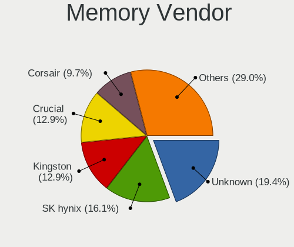

| Vendor              | Desktops | Percent |
|---------------------|----------|---------|
| Unknown             | 6        | 19.35%  |
| SK hynix            | 5        | 16.13%  |
| Kingston            | 4        | 12.9%   |
| Crucial             | 4        | 12.9%   |
| Corsair             | 3        | 9.68%   |
| G.Skill             | 2        | 6.45%   |
| Unknown             | 2        | 6.45%   |
| Team                | 1        | 3.23%   |
| Samsung Electronics | 1        | 3.23%   |
| Micron Technology   | 1        | 3.23%   |
| ASint Technology    | 1        | 3.23%   |
| Apacer              | 1        | 3.23%   |

Memory Model
------------

Memory module models

| Model                                                     | Desktops | Percent |
|-----------------------------------------------------------|----------|---------|
| Unknown                                                   | 2        | 6.06%   |
| Unknown RAM Module 8GB DIMM 1600MT/s                      | 1        | 3.03%   |
| Unknown RAM Module 4GB DIMM DDR3 1600MT/s                 | 1        | 3.03%   |
| Unknown RAM Module 2GB SODIMM DDR2 667MT/s                | 1        | 3.03%   |
| Unknown RAM Module 2GB DIMM DDR2 1067MT/s                 | 1        | 3.03%   |
| Unknown RAM Module 2GB DIMM 667MT/s                       | 1        | 3.03%   |
| Unknown RAM CL17-17-17 D4-2400 16384MB DIMM DDR4 2400MT/s | 1        | 3.03%   |
| Team RAM TEAMGROUP-UD4-3200 8GB DIMM DDR4 3733MT/s        | 1        | 3.03%   |
| Team RAM TEAMGROUP-UD4-3000 8GB DIMM DDR4 3000MT/s        | 1        | 3.03%   |
| SK hynix RAM HMT42GR7AFR4A 16GB DIMM DDR3 1600MT/s        | 1        | 3.03%   |
| SK hynix RAM HMT41GS6BFR8A-PB 8GB SODIMM DDR3 1600MT/s    | 1        | 3.03%   |
| SK hynix RAM HMT351U6CFR8C-PB 4GB DIMM DDR3 1600MT/s      | 1        | 3.03%   |
| SK hynix RAM HMT125U6TFR8C-H9 2GB DIMM DDR3 1333MT/s      | 1        | 3.03%   |
| SK hynix RAM HMCG88MEBSA095N 32GB SODIMM DDR5 4800MT/s    | 1        | 3.03%   |
| SK hynix RAM HMA41GS6AFR8N-TF 8GB SODIMM DDR4 2667MT/s    | 1        | 3.03%   |
| Samsung RAM M471A1K43EB1-CWE 8GB SODIMM DDR4 3200MT/s     | 1        | 3.03%   |
| Micron RAM 16G2666MHz 16GB SODIMM DDR4 2667MT/s           | 1        | 3.03%   |
| Kingston RAM Module 16GB DIMM 5200MT/s                    | 1        | 3.03%   |
| Kingston RAM KF3200C16D4/8GX 8GB DIMM DDR4 3600MT/s       | 1        | 3.03%   |
| Kingston RAM CL16-18-18 D4-3200 8GB DIMM DDR4 3200MT/s    | 1        | 3.03%   |
| Kingston RAM 9905471-011.A00LF 4096MB DIMM DDR3 1600MT/s  | 1        | 3.03%   |
| G.Skill RAM F4-2400C15-8GFX 8GB DIMM DDR4 3000MT/s        | 1        | 3.03%   |
| G.Skill RAM F3-12800CL8-4GBXM 4GB DIMM DDR3 1600MT/s      | 1        | 3.03%   |
| Crucial RAM CT8G4DFS824A.C8FR 8GB DIMM DDR4 2400MT/s      | 1        | 3.03%   |
| Crucial RAM CT16G4SFRA266.C8FB 16GB SODIMM DDR4 2667MT/s  | 1        | 3.03%   |
| Crucial RAM CT16G4DFRA32A.C8FE 16GB DIMM DDR4 3200MT/s    | 1        | 3.03%   |
| Crucial RAM CT102464BD160B.C16 8GB DIMM DDR3 1600MT/s     | 1        | 3.03%   |
| Corsair RAM CMK64GX5M2B5200Z40 32GB DIMM DDR5 4800MT/s    | 1        | 3.03%   |
| Corsair RAM CMK64GX4M2E3200C16 32GB DIMM DDR4 3200MT/s    | 1        | 3.03%   |
| Corsair RAM CMK16GX4M2Z3200C16 8GB DIMM DDR4 3200MT/s     | 1        | 3.03%   |
| ASint RAM ASDD416GB-WIN 16GB SODIMM DDR4 3200MT/s         | 1        | 3.03%   |
| Apacer RAM 78.A2G86.9K5 2GB SODIMM DDR2 667MT/s           | 1        | 3.03%   |

Memory Kind
-----------

Memory module kinds

| Kind    | Desktops | Percent |
|---------|----------|---------|
| DDR4    | 14       | 48.28%  |
| DDR3    | 7        | 24.14%  |
| Unknown | 4        | 13.79%  |
| DDR5    | 2        | 6.9%    |
| DDR2    | 2        | 6.9%    |

Memory Form Factor
------------------

Physical design of the memory module

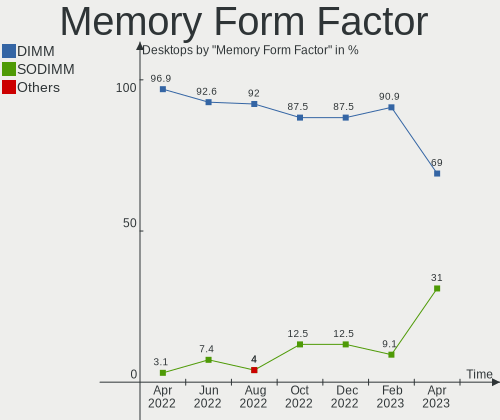

| Name   | Desktops | Percent |
|--------|----------|---------|
| DIMM   | 20       | 68.97%  |
| SODIMM | 9        | 31.03%  |

Memory Size
-----------

Memory module size

| Size  | Desktops | Percent |
|-------|----------|---------|
| 16384 | 10       | 31.25%  |
| 8192  | 9        | 28.13%  |
| 32768 | 5        | 15.63%  |
| 4096  | 4        | 12.5%   |
| 2048  | 4        | 12.5%   |

Memory Speed
------------

Memory module speed

| Speed | Desktops | Percent |
|-------|----------|---------|
| 1600  | 8        | 25%     |
| 3200  | 6        | 18.75%  |
| 4800  | 3        | 9.38%   |
| 2667  | 3        | 9.38%   |
| 3000  | 2        | 6.25%   |
| 667   | 2        | 6.25%   |
| 5200  | 1        | 3.13%   |
| 3733  | 1        | 3.13%   |
| 3600  | 1        | 3.13%   |
| 2800  | 1        | 3.13%   |
| 2400  | 1        | 3.13%   |
| 1333  | 1        | 3.13%   |
| 1067  | 1        | 3.13%   |
| 800   | 1        | 3.13%   |

Printers & scanners
-------------------

Printer Vendor
--------------

Printer device vendors

| Vendor             | Desktops | Percent |
|--------------------|----------|---------|
| Brother Industries | 2        | 66.67%  |
| Dymo-CoStar        | 1        | 33.33%  |

Printer Model
-------------

Printer device models

| Model                                  | Desktops | Percent |
|----------------------------------------|----------|---------|
| Dymo-CoStar LabelWriter 400            | 1        | 25%     |
| Dymo-CoStar DYMO LabelWriter 450 Turbo | 1        | 25%     |
| Brother MFC-J4440DW                    | 1        | 25%     |
| Brother HL-1210W series                | 1        | 25%     |

Scanner Vendor
--------------

Scanner device vendors

Zero info for selected period =(

Scanner Model
-------------

Scanner device models

Zero info for selected period =(

Camera
------

Camera Vendor
-------------

Camera device vendors

| Vendor                        | Desktops | Percent |
|-------------------------------|----------|---------|
| Microsoft                     | 5        | 38.46%  |
| Logitech                      | 5        | 38.46%  |
| Sunplus Innovation Technology | 1        | 7.69%   |
| Microdia                      | 1        | 7.69%   |
| ARC International             | 1        | 7.69%   |

Camera Model
------------

Camera device models

| Model                                | Desktops | Percent |
|--------------------------------------|----------|---------|
| Microsoft Microsoft LifeCam Studio | 2        | 15.38%  |
| Sunplus ezcap U3 capture-04          | 1        | 7.69%   |
| Microsoft LifeCam Studio             | 1        | 7.69%   |
| Microsoft LifeCam HD-3000            | 1        | 7.69%   |
| Microsoft LifeCam Cinema             | 1        | 7.69%   |
| Microdia Webcam Vitade AF            | 1        | 7.69%   |
| Logitech Webcam Pro 9000             | 1        | 7.69%   |
| Logitech Webcam C930e                | 1        | 7.69%   |
| Logitech QuickCam Pro 5000           | 1        | 7.69%   |
| Logitech HD Pro Webcam C920          | 1        | 7.69%   |
| Logitech C922 Pro Stream Webcam      | 1        | 7.69%   |
| ARC International Camera             | 1        | 7.69%   |

Security
--------

Fingerprint Vendor
------------------

Fingerprint sensor vendors

Zero info for selected period =(

Fingerprint Model
-----------------

Fingerprint sensor models

Zero info for selected period =(

Chipcard Vendor
---------------

Chipcard module vendors

Zero info for selected period =(

Chipcard Model
--------------

Chipcard module models

Zero info for selected period =(

Unsupported
-----------

Unsupported Devices
-------------------

Total unsupported devices on board

| Total | Desktops | Percent |
|-------|----------|---------|
| 0     | 42       | 77.78%  |
| 1     | 10       | 18.52%  |
| 2     | 2        | 3.7%    |

Unsupported Device Types
------------------------

Types of unsupported devices

| Type             | Desktops | Percent |
|------------------|----------|---------|
| Graphics card    | 5        | 38.46%  |
| Net/wireless     | 4        | 30.77%  |
| Unassigned class | 3        | 23.08%  |
| Net/ethernet     | 1        | 7.69%   |

