Linux in Australia - Hardware Trends (Desktops)
-----------------------------------------------

A project to identify most popular hardware characteristics and track their change
over time based on data collected by Linux users at https://Linux-Hardware.org.

Anyone can contribute to this report by the [hw-probe](https://github.com/linuxhw/hw-probe) tool:

    sudo -E hw-probe -all -upload

Contents
--------

* [ System ](#system)
  - [ OS                       ](#os)
  - [ OS Family                ](#os-family)
  - [ Kernel                   ](#kernel)
  - [ Kernel Family            ](#kernel-family)
  - [ Kernel Major Ver.        ](#kernel-major-ver)
  - [ Arch                     ](#arch)
  - [ DE                       ](#de)
  - [ Display Server           ](#display-server)
  - [ Display Manager          ](#display-manager)
  - [ OS Lang                  ](#os-lang)
  - [ Boot Mode                ](#boot-mode)
  - [ Filesystem               ](#filesystem)
  - [ Part. scheme             ](#part-scheme)
  - [ Dual Boot with Linux/BSD ](#dual-boot-with-linuxbsd)
  - [ Dual Boot (Win)          ](#dual-boot-win)

* [ Board ](#board)
  - [ Vendor                   ](#vendor)
  - [ Model                    ](#model)
  - [ Model Family             ](#model-family)
  - [ MFG Year                 ](#mfg-year)
  - [ Form Factor              ](#form-factor)
  - [ Secure Boot              ](#secure-boot)
  - [ Coreboot                 ](#coreboot)
  - [ RAM Size                 ](#ram-size)
  - [ RAM Used                 ](#ram-used)
  - [ Total Drives             ](#total-drives)
  - [ Has CD-ROM               ](#has-cd-rom)
  - [ Has Ethernet             ](#has-ethernet)
  - [ Has WiFi                 ](#has-wifi)
  - [ Has Bluetooth            ](#has-bluetooth)

* [ Location ](#location)
  - [ Country                  ](#country)
  - [ City                     ](#city)

* [ Drives ](#drives)
  - [ Drive Vendor             ](#drive-vendor)
  - [ Drive Model              ](#drive-model)
  - [ HDD Vendor               ](#hdd-vendor)
  - [ SSD Vendor               ](#ssd-vendor)
  - [ Drive Kind               ](#drive-kind)
  - [ Drive Connector          ](#drive-connector)
  - [ Drive Size               ](#drive-size)
  - [ Space Total              ](#space-total)
  - [ Space Used               ](#space-used)
  - [ Malfunc. Drives          ](#malfunc-drives)
  - [ Malfunc. Drive Vendor    ](#malfunc-drive-vendor)
  - [ Malfunc. HDD Vendor      ](#malfunc-hdd-vendor)
  - [ Malfunc. Drive Kind      ](#malfunc-drive-kind)
  - [ Failed Drives            ](#failed-drives)
  - [ Failed Drive Vendor      ](#failed-drive-vendor)
  - [ Drive Status             ](#drive-status)

* [ Storage controller ](#storage-controller)
  - [ Storage Vendor           ](#storage-vendor)
  - [ Storage Model            ](#storage-model)
  - [ Storage Kind             ](#storage-kind)

* [ Processor ](#processor)
  - [ CPU Vendor               ](#cpu-vendor)
  - [ CPU Model                ](#cpu-model)
  - [ CPU Model Family         ](#cpu-model-family)
  - [ CPU Cores                ](#cpu-cores)
  - [ CPU Sockets              ](#cpu-sockets)
  - [ CPU Threads              ](#cpu-threads)
  - [ CPU Op-Modes             ](#cpu-op-modes)
  - [ CPU Microcode            ](#cpu-microcode)
  - [ CPU Microarch            ](#cpu-microarch)

* [ Graphics ](#graphics)
  - [ GPU Vendor               ](#gpu-vendor)
  - [ GPU Model                ](#gpu-model)
  - [ GPU Combo                ](#gpu-combo)
  - [ GPU Driver               ](#gpu-driver)
  - [ GPU Memory               ](#gpu-memory)

* [ Monitor ](#monitor)
  - [ Monitor Vendor           ](#monitor-vendor)
  - [ Monitor Model            ](#monitor-model)
  - [ Monitor Resolution       ](#monitor-resolution)
  - [ Monitor Diagonal         ](#monitor-diagonal)
  - [ Monitor Width            ](#monitor-width)
  - [ Aspect Ratio             ](#aspect-ratio)
  - [ Monitor Area             ](#monitor-area)
  - [ Pixel Density            ](#pixel-density)
  - [ Multiple Monitors        ](#multiple-monitors)

* [ Network ](#network)
  - [ Net Controller Vendor    ](#net-controller-vendor)
  - [ Net Controller Model     ](#net-controller-model)
  - [ Wireless Vendor          ](#wireless-vendor)
  - [ Wireless Model           ](#wireless-model)
  - [ Ethernet Vendor          ](#ethernet-vendor)
  - [ Ethernet Model           ](#ethernet-model)
  - [ Net Controller Kind      ](#net-controller-kind)
  - [ Used Controller          ](#used-controller)
  - [ NICs                     ](#nics)
  - [ IPv6                     ](#ipv6)

* [ Bluetooth ](#bluetooth)
  - [ Bluetooth Vendor         ](#bluetooth-vendor)
  - [ Bluetooth Model          ](#bluetooth-model)

* [ Sound ](#sound)
  - [ Sound Vendor             ](#sound-vendor)
  - [ Sound Model              ](#sound-model)

* [ Memory ](#memory)
  - [ Memory Vendor            ](#memory-vendor)
  - [ Memory Model             ](#memory-model)
  - [ Memory Kind              ](#memory-kind)
  - [ Memory Form Factor       ](#memory-form-factor)
  - [ Memory Size              ](#memory-size)
  - [ Memory Speed             ](#memory-speed)

* [ Printers & scanners ](#printers--scanners)
  - [ Printer Vendor           ](#printer-vendor)
  - [ Printer Model            ](#printer-model)
  - [ Scanner Vendor           ](#scanner-vendor)
  - [ Scanner Model            ](#scanner-model)

* [ Camera ](#camera)
  - [ Camera Vendor            ](#camera-vendor)
  - [ Camera Model             ](#camera-model)

* [ Security ](#security)
  - [ Fingerprint Vendor       ](#fingerprint-vendor)
  - [ Fingerprint Model        ](#fingerprint-model)
  - [ Chipcard Vendor          ](#chipcard-vendor)
  - [ Chipcard Model           ](#chipcard-model)

* [ Unsupported ](#unsupported)
  - [ Unsupported Devices      ](#unsupported-devices)
  - [ Unsupported Device Types ](#unsupported-device-types)

System
------

OS
--

Installed operating systems

| Name                | Desktops | Percent |
|---------------------|----------|---------|
| Fedora 35           | 7        | 12.73%  |
| Ubuntu 22.04        | 6        | 10.91%  |
| Pop!_OS 22.04       | 6        | 10.91%  |
| Zorin 16            | 4        | 7.27%   |
| Ubuntu 20.04        | 4        | 7.27%   |
| ClearOS 7           | 3        | 5.45%   |
| LMDE 5              | 2        | 3.64%   |
| Linux Mint 20.3     | 2        | 3.64%   |
| Linux Mint 19.3     | 2        | 3.64%   |
| KDE neon 20.04      | 2        | 3.64%   |
| Fedora 34           | 2        | 3.64%   |
| Debian Unstable     | 2        | 3.64%   |
| Debian 11           | 2        | 3.64%   |
| Xubuntu 21.04       | 1        | 1.82%   |
| Xubuntu 20.04       | 1        | 1.82%   |
| SteamOS Snapshot    | 1        | 1.82%   |
| Kali 2022.2         | 1        | 1.82%   |
| Fedora 36           | 1        | 1.82%   |
| EndeavourOS Rolling | 1        | 1.82%   |
| Devuan 4            | 1        | 1.82%   |
| Debian 10           | 1        | 1.82%   |
| CentOS 7            | 1        | 1.82%   |
| ArcoLinux Rolling   | 1        | 1.82%   |
| Arch                | 1        | 1.82%   |

OS Family
---------

OS without a version

| Name        | Desktops | Percent |
|-------------|----------|---------|
| Ubuntu      | 10       | 18.18%  |
| Fedora      | 10       | 18.18%  |
| Pop!_OS     | 6        | 10.91%  |
| Debian      | 5        | 9.09%   |
| Zorin       | 4        | 7.27%   |
| Linux Mint  | 4        | 7.27%   |
| ClearOS     | 3        | 5.45%   |
| Xubuntu     | 2        | 3.64%   |
| LMDE        | 2        | 3.64%   |
| KDE neon    | 2        | 3.64%   |
| SteamOS     | 1        | 1.82%   |
| Kali        | 1        | 1.82%   |
| EndeavourOS | 1        | 1.82%   |
| Devuan      | 1        | 1.82%   |
| CentOS      | 1        | 1.82%   |
| ArcoLinux   | 1        | 1.82%   |
| Arch        | 1        | 1.82%   |

Kernel
------

Version of the Linux kernel

| Version                                            | Desktops | Percent |
|----------------------------------------------------|----------|---------|
| 5.17.5-76051705-generic                            | 5        | 9.09%   |
| 5.13.0-44-generic                                  | 3        | 5.45%   |
| 5.13.0-41-generic                                  | 3        | 5.45%   |
| 5.13.0-40-generic                                  | 3        | 5.45%   |
| 5.10.0-14-amd64                                    | 3        | 5.45%   |
| 5.17.8-arch1-1                                     | 2        | 3.64%   |
| 5.17.7-200.fc35.x86_64                             | 2        | 3.64%   |
| 5.17.6-200.fc35.x86_64                             | 2        | 3.64%   |
| 5.17.5-100.fc34.x86_64                             | 2        | 3.64%   |
| 5.17.11-200.fc35.x86_64                            | 2        | 3.64%   |
| 5.15.0-30-generic                                  | 2        | 3.64%   |
| 5.15.0-27-generic                                  | 2        | 3.64%   |
| 5.15.0-25-generic                                  | 2        | 3.64%   |
| 3.10.0-1160.66.1.el7.x86_64                        | 2        | 3.64%   |
| 3.10.0-1160.62.1.el7.x86_64                        | 2        | 3.64%   |
| 5.4.0-113-generic                                  | 1        | 1.82%   |
| 5.4.0-110-generic                                  | 1        | 1.82%   |
| 5.18.0-arch1-1                                     | 1        | 1.82%   |
| 5.17.9-200.fc35.x86_64                             | 1        | 1.82%   |
| 5.17.6-300.fc36.x86_64                             | 1        | 1.82%   |
| 5.17.0-5.2-liquorix-amd64                          | 1        | 1.82%   |
| 5.17.0-2-rt-amd64                                  | 1        | 1.82%   |
| 5.16.19-76051619-generic                           | 1        | 1.82%   |
| 5.16.0-kali7-amd64                                 | 1        | 1.82%   |
| 5.16.0-6-amd64                                     | 1        | 1.82%   |
| 5.13.0-valve10.1-2-neptune-dri-02144-g7fffaf925dfb | 1        | 1.82%   |
| 5.13.0-27-generic                                  | 1        | 1.82%   |
| 5.11.0-49-generic                                  | 1        | 1.82%   |
| 5.11.0-44-generic                                  | 1        | 1.82%   |
| 5.11.0-41-generic                                  | 1        | 1.82%   |
| 5.10.0-9-amd64                                     | 1        | 1.82%   |
| 5.10.0-13-amd64                                    | 1        | 1.82%   |
| 4.19.0-13-amd64                                    | 1        | 1.82%   |

Kernel Family
-------------

Linux kernel without a distro release

| Version | Desktops | Percent |
|---------|----------|---------|
| 5.13.0  | 11       | 20%     |
| 5.17.5  | 7        | 12.73%  |
| 5.15.0  | 6        | 10.91%  |
| 5.10.0  | 5        | 9.09%   |
| 3.10.0  | 4        | 7.27%   |
| 5.17.6  | 3        | 5.45%   |
| 5.11.0  | 3        | 5.45%   |
| 5.4.0   | 2        | 3.64%   |
| 5.17.8  | 2        | 3.64%   |
| 5.17.7  | 2        | 3.64%   |
| 5.17.11 | 2        | 3.64%   |
| 5.17.0  | 2        | 3.64%   |
| 5.16.0  | 2        | 3.64%   |
| 5.18.0  | 1        | 1.82%   |
| 5.17.9  | 1        | 1.82%   |
| 5.16.19 | 1        | 1.82%   |
| 4.19.0  | 1        | 1.82%   |

Kernel Major Ver.
-----------------

Linux kernel major version

| Version | Desktops | Percent |
|---------|----------|---------|
| 5.17    | 19       | 34.55%  |
| 5.13    | 11       | 20%     |
| 5.15    | 6        | 10.91%  |
| 5.10    | 5        | 9.09%   |
| 3.10    | 4        | 7.27%   |
| 5.16    | 3        | 5.45%   |
| 5.11    | 3        | 5.45%   |
| 5.4     | 2        | 3.64%   |
| 5.18    | 1        | 1.82%   |
| 4.19    | 1        | 1.82%   |

Arch
----

OS architecture (x86_64, i586, etc.)

| Name   | Desktops | Percent |
|--------|----------|---------|
| x86_64 | 55       | 100%    |

DE
--

Desktop Environment

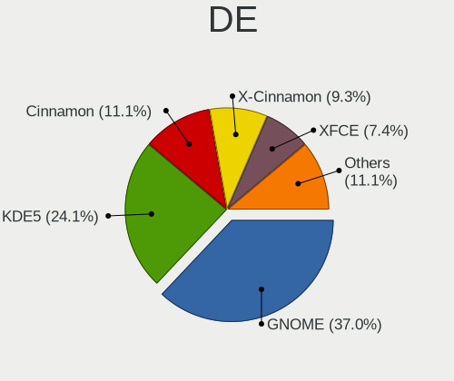

| Name          | Desktops | Percent |
|---------------|----------|---------|
| GNOME         | 20       | 36.36%  |
| KDE5          | 8        | 14.55%  |
| Cinnamon      | 7        | 12.73%  |
| Unknown       | 7        | 12.73%  |
| XFCE          | 6        | 10.91%  |
| X-Cinnamon    | 4        | 7.27%   |
| MATE          | 1        | 1.82%   |
| GNOME Classic | 1        | 1.82%   |
| awesome       | 1        | 1.82%   |

Display Server
--------------

X11 or Wayland

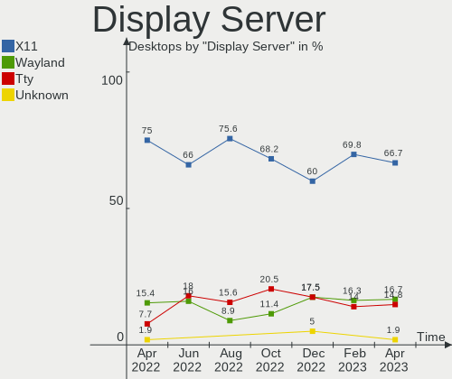

| Name    | Desktops | Percent |
|---------|----------|---------|
| X11     | 44       | 80%     |
| Tty     | 7        | 12.73%  |
| Wayland | 2        | 3.64%   |
| Unknown | 2        | 3.64%   |

Display Manager
---------------

SDDM, LightDM, etc.

| Name    | Desktops | Percent |
|---------|----------|---------|
| Unknown | 24       | 43.64%  |
| LightDM | 10       | 18.18%  |
| GDM3    | 10       | 18.18%  |
| SDDM    | 6        | 10.91%  |
| GDM     | 4        | 7.27%   |
| SLiM    | 1        | 1.82%   |

OS Lang
-------

Language

| Lang  | Desktops | Percent |
|-------|----------|---------|
| en_AU | 51       | 92.73%  |
| en_US | 4        | 7.27%   |

Boot Mode
---------

EFI or BIOS

| Mode | Desktops | Percent |
|------|----------|---------|
| BIOS | 36       | 65.45%  |
| EFI  | 19       | 34.55%  |

Filesystem
----------

Type of filesystem

| Type  | Desktops | Percent |
|-------|----------|---------|
| Ext4  | 34       | 61.82%  |
| Xfs   | 11       | 20%     |
| Btrfs | 7        | 12.73%  |
| Zfs   | 2        | 3.64%   |
| Ext3  | 1        | 1.82%   |

Part. scheme
------------

Scheme of partitioning

| Type    | Desktops | Percent |
|---------|----------|---------|
| Unknown | 25       | 45.45%  |
| GPT     | 16       | 29.09%  |
| MBR     | 14       | 25.45%  |

Dual Boot with Linux/BSD
------------------------

Hosting more than one Linux/BSD

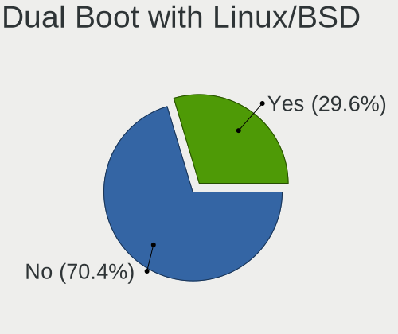

| Dual boot | Desktops | Percent |
|-----------|----------|---------|
| No        | 48       | 87.27%  |
| Yes       | 7        | 12.73%  |

Dual Boot (Win)
---------------

Hosting Linux and Windows

| Dual boot | Desktops | Percent |
|-----------|----------|---------|
| No        | 43       | 78.18%  |
| Yes       | 12       | 21.82%  |

Board
-----

Vendor
------

Motherboard manufacturer

| Name                | Desktops | Percent |
|---------------------|----------|---------|
| Gigabyte Technology | 18       | 32.73%  |
| ASUSTek Computer    | 11       | 20%     |
| MSI                 | 7        | 12.73%  |
| Hewlett-Packard     | 5        | 9.09%   |
| Dell                | 4        | 7.27%   |
| ASRock              | 3        | 5.45%   |
| Acer                | 3        | 5.45%   |
| Intel               | 2        | 3.64%   |
| Lenovo              | 1        | 1.82%   |
| ECS                 | 1        | 1.82%   |

Model
-----

Motherboard model

| Name                             | Desktops | Percent |
|----------------------------------|----------|---------|
| MSI MS-7D54                      | 1        | 1.82%   |
| MSI MS-7C92                      | 1        | 1.82%   |
| MSI MS-7C52                      | 1        | 1.82%   |
| MSI MS-7B89                      | 1        | 1.82%   |
| MSI MS-7998                      | 1        | 1.82%   |
| MSI MS-7846                      | 1        | 1.82%   |
| MSI MS-7693                      | 1        | 1.82%   |
| Lenovo ThinkCentre M58p 7220A72  | 1        | 1.82%   |
| Intel LADPNVMO AAE76523-300      | 1        | 1.82%   |
| Intel DH67BL AAG10189-210        | 1        | 1.82%   |
| HP Z800 Workstation              | 1        | 1.82%   |
| HP xw8400 Workstation            | 1        | 1.82%   |
| HP ProDesk 600 G3 SFF            | 1        | 1.82%   |
| HP EliteDesk 800 G2 TWR          | 1        | 1.82%   |
| HP Desktop 190-0xxx              | 1        | 1.82%   |
| Gigabyte Z77MX-D3H               | 1        | 1.82%   |
| Gigabyte Z68A-D3H-B3             | 1        | 1.82%   |
| Gigabyte X570S AORUS MASTER      | 1        | 1.82%   |
| Gigabyte H77N-WIFI               | 1        | 1.82%   |
| Gigabyte H77M-D3H                | 1        | 1.82%   |
| Gigabyte H370M-D3H               | 1        | 1.82%   |
| Gigabyte GB-BXi7-5500            | 1        | 1.82%   |
| Gigabyte GA-MA785G-UD3H          | 1        | 1.82%   |
| Gigabyte GA-870A-UD3             | 1        | 1.82%   |
| Gigabyte GA-78LMT-USB3 6.0       | 1        | 1.82%   |
| Gigabyte GA-78LMT-USB3           | 1        | 1.82%   |
| Gigabyte G41MT-D3                | 1        | 1.82%   |
| Gigabyte EX58-UD4P               | 1        | 1.82%   |
| Gigabyte EP45-DS3L               | 1        | 1.82%   |
| Gigabyte B560M AORUS PRO         | 1        | 1.82%   |
| Gigabyte B450 AORUS PRO WIFI     | 1        | 1.82%   |
| Gigabyte AX370M-DS3H             | 1        | 1.82%   |
| Gigabyte AB350-Gaming 3          | 1        | 1.82%   |
| ECS P67H2-A3                     | 1        | 1.82%   |
| Dell Precision WorkStation T5500 | 1        | 1.82%   |
| Dell OptiPlex 980                | 1        | 1.82%   |
| Dell OptiPlex 9020               | 1        | 1.82%   |
| Dell OptiPlex 7060               | 1        | 1.82%   |
| ASUS Z170I PRO GAMING            | 1        | 1.82%   |
| ASUS TUF Z390-PLUS GAMING        | 1        | 1.82%   |
| ASUS SABERTOOTH Z77              | 1        | 1.82%   |
| ASUS SABERTOOTH 990FX R2.0       | 1        | 1.82%   |
| ASUS ROG CROSSHAIR VIII IMPACT   | 1        | 1.82%   |
| ASUS PRIME B250M-K               | 1        | 1.82%   |
| ASUS P8Z68-V                     | 1        | 1.82%   |
| ASUS P8H61                       | 1        | 1.82%   |
| ASUS M4A785TD-V EVO              | 1        | 1.82%   |
| ASUS All Series                  | 1        | 1.82%   |
| ASUS A8R32-MVP Deluxe            | 1        | 1.82%   |
| ASRock X570M Pro4                | 1        | 1.82%   |
| ASRock H87M                      | 1        | 1.82%   |
| ASRock AD2700-ITX                | 1        | 1.82%   |
| Acer Veriton L6610G              | 1        | 1.82%   |
| Acer Aspire XC-603               | 1        | 1.82%   |
| Acer Aspire X3990                | 1        | 1.82%   |

Model Family
------------

Motherboard model prefix

| Name                    | Desktops | Percent |
|-------------------------|----------|---------|
| Dell OptiPlex           | 3        | 5.45%   |
| Gigabyte GA-78LMT-USB3  | 2        | 3.64%   |
| ASUS SABERTOOTH         | 2        | 3.64%   |
| Acer Aspire             | 2        | 3.64%   |
| MSI MS-7D54             | 1        | 1.82%   |
| MSI MS-7C92             | 1        | 1.82%   |
| MSI MS-7C52             | 1        | 1.82%   |
| MSI MS-7B89             | 1        | 1.82%   |
| MSI MS-7998             | 1        | 1.82%   |
| MSI MS-7846             | 1        | 1.82%   |
| MSI MS-7693             | 1        | 1.82%   |
| Lenovo ThinkCentre      | 1        | 1.82%   |
| Intel LADPNVMO          | 1        | 1.82%   |
| Intel DH67BL            | 1        | 1.82%   |
| HP Z800                 | 1        | 1.82%   |
| HP xw8400               | 1        | 1.82%   |
| HP ProDesk              | 1        | 1.82%   |
| HP EliteDesk            | 1        | 1.82%   |
| HP Desktop              | 1        | 1.82%   |
| Gigabyte Z77MX-D3H      | 1        | 1.82%   |
| Gigabyte Z68A-D3H-B3    | 1        | 1.82%   |
| Gigabyte X570S          | 1        | 1.82%   |
| Gigabyte H77N-WIFI      | 1        | 1.82%   |
| Gigabyte H77M-D3H       | 1        | 1.82%   |
| Gigabyte H370M-D3H      | 1        | 1.82%   |
| Gigabyte GB-BXi7-5500   | 1        | 1.82%   |
| Gigabyte GA-MA785G-UD3H | 1        | 1.82%   |
| Gigabyte GA-870A-UD3    | 1        | 1.82%   |
| Gigabyte G41MT-D3       | 1        | 1.82%   |
| Gigabyte EX58-UD4P      | 1        | 1.82%   |
| Gigabyte EP45-DS3L      | 1        | 1.82%   |
| Gigabyte B560M          | 1        | 1.82%   |
| Gigabyte B450           | 1        | 1.82%   |
| Gigabyte AX370M-DS3H    | 1        | 1.82%   |
| Gigabyte AB350-Gaming   | 1        | 1.82%   |
| ECS P67H2-A3            | 1        | 1.82%   |
| Dell Precision          | 1        | 1.82%   |
| ASUS Z170I              | 1        | 1.82%   |
| ASUS TUF                | 1        | 1.82%   |
| ASUS ROG                | 1        | 1.82%   |
| ASUS PRIME              | 1        | 1.82%   |
| ASUS P8Z68-V            | 1        | 1.82%   |
| ASUS P8H61              | 1        | 1.82%   |
| ASUS M4A785TD-V         | 1        | 1.82%   |
| ASUS All                | 1        | 1.82%   |
| ASUS A8R32-MVP          | 1        | 1.82%   |
| ASRock X570M            | 1        | 1.82%   |
| ASRock H87M             | 1        | 1.82%   |
| ASRock AD2700-ITX       | 1        | 1.82%   |
| Acer Veriton            | 1        | 1.82%   |

MFG Year
--------

Motherboard manufacture year

| Year | Desktops | Percent |
|------|----------|---------|
| 2012 | 8        | 14.55%  |
| 2011 | 7        | 12.73%  |
| 2018 | 6        | 10.91%  |
| 2010 | 4        | 7.27%   |
| 2009 | 4        | 7.27%   |
| 2019 | 3        | 5.45%   |
| 2017 | 3        | 5.45%   |
| 2015 | 3        | 5.45%   |
| 2014 | 3        | 5.45%   |
| 2013 | 3        | 5.45%   |
| 2022 | 2        | 3.64%   |
| 2020 | 2        | 3.64%   |
| 2016 | 2        | 3.64%   |
| 2008 | 2        | 3.64%   |
| 2021 | 1        | 1.82%   |
| 2007 | 1        | 1.82%   |
| 2006 | 1        | 1.82%   |

Form Factor
-----------

Physical design of the computer

| Name    | Desktops | Percent |
|---------|----------|---------|
| Desktop | 55       | 100%    |

Secure Boot
-----------

Enabled or disabled

| State    | Desktops | Percent |
|----------|----------|---------|
| Disabled | 53       | 96.36%  |
| Enabled  | 2        | 3.64%   |

Coreboot
--------

Have coreboot on board

| Used | Desktops | Percent |
|------|----------|---------|
| No   | 55       | 100%    |

RAM Size
--------

Total RAM memory

| Size in GB  | Desktops | Percent |
|-------------|----------|---------|
| 16.01-24.0  | 17       | 30.91%  |
| 32.01-64.0  | 11       | 20%     |
| 4.01-8.0    | 9        | 16.36%  |
| 8.01-16.0   | 6        | 10.91%  |
| 3.01-4.0    | 5        | 9.09%   |
| 24.01-32.0  | 4        | 7.27%   |
| 64.01-256.0 | 3        | 5.45%   |

RAM Used
--------

Used RAM memory

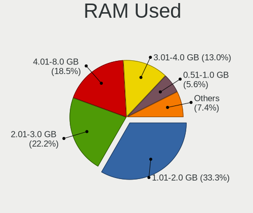

| Used GB    | Desktops | Percent |
|------------|----------|---------|
| 2.01-3.0   | 14       | 25.45%  |
| 4.01-8.0   | 12       | 21.82%  |
| 1.01-2.0   | 12       | 21.82%  |
| 3.01-4.0   | 6        | 10.91%  |
| 0.51-1.0   | 6        | 10.91%  |
| 8.01-16.0  | 3        | 5.45%   |
| 24.01-32.0 | 1        | 1.82%   |
| 0.01-0.5   | 1        | 1.82%   |

Total Drives
------------

Number of drives on board

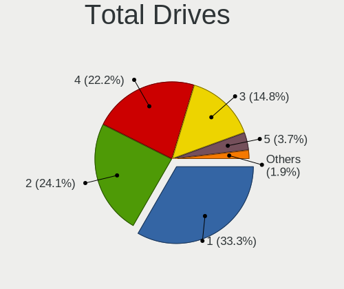

| Drives | Desktops | Percent |
|--------|----------|---------|
| 2      | 19       | 34.55%  |
| 1      | 14       | 25.45%  |
| 3      | 11       | 20%     |
| 4      | 8        | 14.55%  |
| 8      | 1        | 1.82%   |
| 6      | 1        | 1.82%   |
| 5      | 1        | 1.82%   |

Has CD-ROM
----------

Has CD-ROM on board

| Presented | Desktops | Percent |
|-----------|----------|---------|
| Yes       | 28       | 50.91%  |
| No        | 27       | 49.09%  |

Has Ethernet
------------

Has Ethernet on board

| Presented | Desktops | Percent |
|-----------|----------|---------|
| Yes       | 55       | 100%    |

Has WiFi
--------

Has WiFi module

| Presented | Desktops | Percent |
|-----------|----------|---------|
| No        | 35       | 63.64%  |
| Yes       | 20       | 36.36%  |

Has Bluetooth
-------------

Has Bluetooth module

| Presented | Desktops | Percent |
|-----------|----------|---------|
| No        | 40       | 72.73%  |
| Yes       | 15       | 27.27%  |

Location
--------

Country
-------

Geographic location (country)

| Country   | Desktops | Percent |
|-----------|----------|---------|
| Australia | 55       | 100%    |

City
----

Geographic location (city)

| City         | Desktops | Percent |
|--------------|----------|---------|
| Sydney       | 11       | 20%     |
| Brisbane     | 11       | 20%     |
| Launceston   | 8        | 14.55%  |
| Melbourne    | 7        | 12.73%  |
| Adelaide     | 4        | 7.27%   |
| Perth        | 3        | 5.45%   |
| Lane Cove    | 2        | 3.64%   |
| Subiaco      | 1        | 1.82%   |
| Spring Field | 1        | 1.82%   |
| Point Cook   | 1        | 1.82%   |
| Long Jetty   | 1        | 1.82%   |
| Lithgow      | 1        | 1.82%   |
| Canberra     | 1        | 1.82%   |
| Blackburn    | 1        | 1.82%   |
| Bargo        | 1        | 1.82%   |
| Ballarat     | 1        | 1.82%   |

Drives
------

Drive Vendor
------------

Hard drive vendors

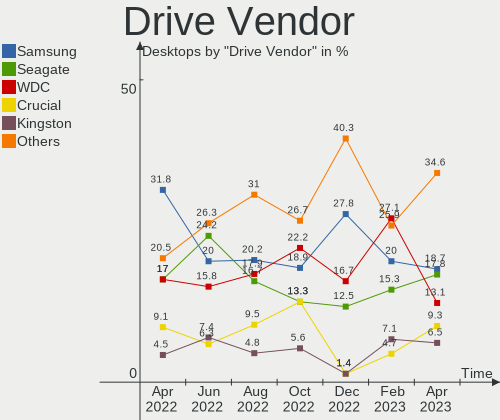

| Vendor                    | Desktops | Drives | Percent |
|---------------------------|----------|--------|---------|
| Seagate                   | 23       | 33     | 22.77%  |
| Samsung Electronics       | 21       | 35     | 20.79%  |
| WDC                       | 18       | 30     | 17.82%  |
| Crucial                   | 10       | 11     | 9.9%    |
| Intel                     | 5        | 5      | 4.95%   |
| Sandisk                   | 3        | 3      | 2.97%   |
| Kingston                  | 3        | 3      | 2.97%   |
| Hitachi                   | 3        | 3      | 2.97%   |
| Toshiba                   | 2        | 2      | 1.98%   |
| SPCC                      | 2        | 3      | 1.98%   |
| Patriot                   | 2        | 2      | 1.98%   |
| Fujitsu                   | 2        | 2      | 1.98%   |
| Unknown                   | 1        | 1      | 0.99%   |
| PLEXTOR                   | 1        | 1      | 0.99%   |
| Phison                    | 1        | 1      | 0.99%   |
| Micron/Crucial Technology | 1        | 1      | 0.99%   |
| KUIJIA                    | 1        | 1      | 0.99%   |
| KingSpec                  | 1        | 1      | 0.99%   |
| Gigabyte Technology       | 1        | 1      | 0.99%   |

Drive Model
-----------

Hard drive models

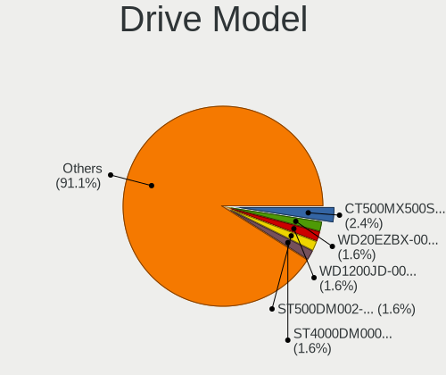

| Model                            | Desktops | Percent |
|----------------------------------|----------|---------|
| Samsung SSD 850 EVO 250GB        | 7        | 5.51%   |
| WDC WD10EZEX-00BN5A0 1TB         | 3        | 2.36%   |
| Seagate ST2000DM001-1CH164 2TB   | 3        | 2.36%   |
| Seagate ST2000DL003-9VT166 2TB   | 3        | 2.36%   |
| WDC WD10EFRX-68FYTN0 1TB         | 2        | 1.57%   |
| SanDisk SDSSDHII240G 240GB       | 2        | 1.57%   |
| Samsung SSD 860 QVO 1TB          | 2        | 1.57%   |
| Samsung SSD 850 EVO mSATA 500GB  | 2        | 1.57%   |
| Samsung SSD 840 EVO 120GB        | 2        | 1.57%   |
| Intel SSDSC2CT120A3 120GB        | 2        | 1.57%   |
| Crucial CT500MX500SSD1 500GB     | 2        | 1.57%   |
| Crucial CT240BX500SSD1 240GB     | 2        | 1.57%   |
| WDC WDS500G2X0C-00L350 500GB     | 1        | 0.79%   |
| WDC WDS480G2G0A-00JH30 480GB SSD | 1        | 0.79%   |
| WDC WDS100T3X0C-00SJG0 1TB       | 1        | 0.79%   |
| WDC WDS100T2B0A-00SM50 1TB SSD   | 1        | 0.79%   |
| WDC WD8001PURP-74B6RY0 8TB       | 1        | 0.79%   |
| WDC WD5000AZLX-08K2TA0 500GB     | 1        | 0.79%   |
| WDC WD40EZRZ-19GXCB0 4TB         | 1        | 0.79%   |
| WDC WD40EFRX-68N32N0 4TB         | 1        | 0.79%   |
| WDC WD2500AAKS-60VYA0 250GB      | 1        | 0.79%   |
| WDC WD20EZBX-00AYRA0 2TB         | 1        | 0.79%   |
| WDC WD20EFRX-68EUZN0 2TB         | 1        | 0.79%   |
| WDC WD20EARX-00PASB0 2TB         | 1        | 0.79%   |
| WDC WD20EARS-00MVWB0 2TB         | 1        | 0.79%   |
| WDC WD2002FAEX-007BA0 2TB        | 1        | 0.79%   |
| WDC WD15EARS-00MVWB0 1TB         | 1        | 0.79%   |
| WDC WD10EZEX-60ZF5A0 1TB         | 1        | 0.79%   |
| WDC WD10EZEX-60WN4A0 1TB         | 1        | 0.79%   |
| WDC WD10EZEX-21M2NA0 1TB         | 1        | 0.79%   |
| WDC WD10EZEX-08WN4A0 1TB         | 1        | 0.79%   |
| WDC WD10EZEX-00WN4A0 1TB         | 1        | 0.79%   |
| WDC WD10EFRX-68PJCN0 1TB         | 1        | 0.79%   |
| WDC WD10EALX-759BA0 1TB          | 1        | 0.79%   |
| WDC WD1003FBYZ-010FB0 1TB        | 1        | 0.79%   |
| WDC WD1000DHTZ-04N21V0 1TB       | 1        | 0.79%   |
| Unknown SD/MMC/MS PRO 999GB      | 1        | 0.79%   |
| Toshiba MK5059GSXP 500GB         | 1        | 0.79%   |
| Toshiba KXG60ZNV512G NVMe 512GB  | 1        | 0.79%   |
| SPCC Solid State Disk 512GB      | 1        | 0.79%   |
| SPCC Solid State Disk 120GB      | 1        | 0.79%   |
| SPCC M.2 PCIe SSD 1TB            | 1        | 0.79%   |
| Seagate ST9160412AS 160GB        | 1        | 0.79%   |
| Seagate ST8000DM004-2CX188 8TB   | 1        | 0.79%   |
| Seagate ST6000DM003-2CY186 6TB   | 1        | 0.79%   |
| Seagate ST500DM002-1BD142 500GB  | 1        | 0.79%   |
| Seagate ST4000NM0033-9ZM170 4TB  | 1        | 0.79%   |
| Seagate ST4000DM004-2CV104 4TB   | 1        | 0.79%   |
| Seagate ST380817AS 80GB          | 1        | 0.79%   |
| Seagate ST3500630NS 500GB        | 1        | 0.79%   |
| Seagate ST3500418AS 500GB        | 1        | 0.79%   |
| Seagate ST3250318AS 250GB        | 1        | 0.79%   |
| Seagate ST3200820A 200GB         | 1        | 0.79%   |
| Seagate ST3160812AS 160GB        | 1        | 0.79%   |
| Seagate ST3160318AS 160GB        | 1        | 0.79%   |
| Seagate ST31000524AS 1TB         | 1        | 0.79%   |
| Seagate ST31000333AS 1TB         | 1        | 0.79%   |
| Seagate ST3000DM003-1F216N 3TB   | 1        | 0.79%   |
| Seagate ST2000LM007-1R8174 2TB   | 1        | 0.79%   |
| Seagate ST2000DM006-2DM164 2TB   | 1        | 0.79%   |

HDD Vendor
----------

Hard disk drive vendors

| Vendor              | Desktops | Drives | Percent |
|---------------------|----------|--------|---------|
| Seagate             | 23       | 33     | 46%     |
| WDC                 | 17       | 26     | 34%     |
| Samsung Electronics | 4        | 9      | 8%      |
| Hitachi             | 3        | 3      | 6%      |
| Unknown             | 1        | 1      | 2%      |
| Toshiba             | 1        | 1      | 2%      |
| Fujitsu             | 1        | 1      | 2%      |

SSD Vendor
----------

Solid state drive vendors

| Vendor              | Desktops | Drives | Percent |
|---------------------|----------|--------|---------|
| Samsung Electronics | 16       | 20     | 38.1%   |
| Crucial             | 8        | 9      | 19.05%  |
| Intel               | 4        | 4      | 9.52%   |
| WDC                 | 2        | 2      | 4.76%   |
| SPCC                | 2        | 2      | 4.76%   |
| SanDisk             | 2        | 2      | 4.76%   |
| Patriot             | 2        | 2      | 4.76%   |
| Kingston            | 2        | 2      | 4.76%   |
| PLEXTOR             | 1        | 1      | 2.38%   |
| KUIJIA              | 1        | 1      | 2.38%   |
| KingSpec            | 1        | 1      | 2.38%   |
| Fujitsu             | 1        | 1      | 2.38%   |

Drive Kind
----------

HDD or SSD

| Kind | Desktops | Drives | Percent |
|------|----------|--------|---------|
| SSD  | 39       | 47     | 43.82%  |
| HDD  | 37       | 74     | 41.57%  |
| NVMe | 13       | 18     | 14.61%  |

Drive Connector
---------------

SATA, SAS, NVMe, etc.

| Type | Desktops | Drives | Percent |
|------|----------|--------|---------|
| SATA | 53       | 118    | 76.81%  |
| NVMe | 13       | 18     | 18.84%  |
| SAS  | 3        | 3      | 4.35%   |

Drive Size
----------

Size of hard drive

| Size in TB | Desktops | Drives | Percent |
|------------|----------|--------|---------|
| 0.01-0.5   | 40       | 61     | 48.19%  |
| 0.51-1.0   | 22       | 36     | 26.51%  |
| 1.01-2.0   | 13       | 15     | 15.66%  |
| 4.01-10.0  | 4        | 4      | 4.82%   |
| 3.01-4.0   | 3        | 4      | 3.61%   |
| 2.01-3.0   | 1        | 1      | 1.2%    |

Space Total
-----------

Amount of disk space available on the file system

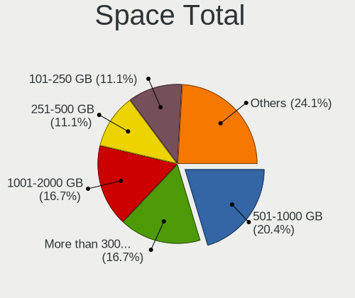

| Size in GB     | Desktops | Percent |
|----------------|----------|---------|
| 101-250        | 13       | 23.64%  |
| 251-500        | 10       | 18.18%  |
| More than 3000 | 8        | 14.55%  |
| 1001-2000      | 7        | 12.73%  |
| 51-100         | 7        | 12.73%  |
| 501-1000       | 5        | 9.09%   |
| 21-50          | 2        | 3.64%   |
| 2001-3000      | 2        | 3.64%   |
| Unknown        | 1        | 1.82%   |

Space Used
----------

Amount of used disk space

| Used GB        | Desktops | Percent |
|----------------|----------|---------|
| 21-50          | 14       | 25.45%  |
| 1-20           | 10       | 18.18%  |
| 51-100         | 10       | 18.18%  |
| 251-500        | 5        | 9.09%   |
| 101-250        | 5        | 9.09%   |
| 1001-2000      | 5        | 9.09%   |
| More than 3000 | 3        | 5.45%   |
| 501-1000       | 2        | 3.64%   |
| Unknown        | 1        | 1.82%   |

Malfunc. Drives
---------------

Drive models with a malfunction

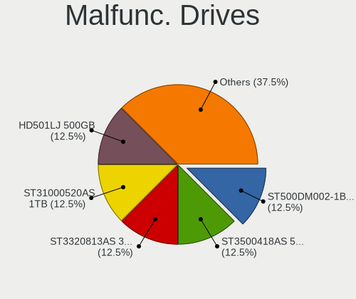

| Model                           | Desktops | Drives | Percent |
|---------------------------------|----------|--------|---------|
| Intel SSDSC2CT120A3 120GB       | 2        | 2      | 20%     |
| WDC WD20EARS-00MVWB0 2TB        | 1        | 1      | 10%     |
| WDC WD10EFRX-68FYTN0 1TB        | 1        | 1      | 10%     |
| Seagate ST3160812AS 160GB       | 1        | 1      | 10%     |
| Seagate ST2000DM001-1CH164 2TB  | 1        | 1      | 10%     |
| Seagate ST2000DL003-9VT166 2TB  | 1        | 1      | 10%     |
| Seagate ST1000NC000-1CX162 1TB  | 1        | 2      | 10%     |
| Samsung Electronics HD103UJ 1TB | 1        | 2      | 10%     |
| Intel SSDSA2M080G2LE 80GB       | 1        | 1      | 10%     |

Malfunc. Drive Vendor
---------------------

Vendors of faulty drives

| Vendor              | Desktops | Drives | Percent |
|---------------------|----------|--------|---------|
| Seagate             | 3        | 5      | 33.33%  |
| Intel               | 3        | 3      | 33.33%  |
| WDC                 | 2        | 2      | 22.22%  |
| Samsung Electronics | 1        | 2      | 11.11%  |

Malfunc. HDD Vendor
-------------------

Vendors of faulty HDD drives

| Vendor              | Desktops | Drives | Percent |
|---------------------|----------|--------|---------|
| Seagate             | 3        | 5      | 50%     |
| WDC                 | 2        | 2      | 33.33%  |
| Samsung Electronics | 1        | 2      | 16.67%  |

Malfunc. Drive Kind
-------------------

Kinds of faulty drives

| Kind | Desktops | Drives | Percent |
|------|----------|--------|---------|
| HDD  | 6        | 9      | 66.67%  |
| SSD  | 3        | 3      | 33.33%  |

Failed Drives
-------------

Failed drive models

Zero info for selected period =(

Failed Drive Vendor
-------------------

Failed drive vendors

Zero info for selected period =(

Drive Status
------------

Number of failed and malfunc. drives

| Status   | Desktops | Drives | Percent |
|----------|----------|--------|---------|
| Works    | 31       | 76     | 47.69%  |
| Detected | 25       | 51     | 38.46%  |
| Malfunc  | 9        | 12     | 13.85%  |

Storage controller
------------------

Storage Vendor
--------------

Storage controller vendors

| Vendor                       | Desktops | Percent |
|------------------------------|----------|---------|
| Intel                        | 38       | 48.1%   |
| AMD                          | 17       | 21.52%  |
| Samsung Electronics          | 5        | 6.33%   |
| Phison Electronics           | 3        | 3.8%    |
| Micron/Crucial Technology    | 3        | 3.8%    |
| JMicron Technology           | 3        | 3.8%    |
| ASMedia Technology           | 3        | 3.8%    |
| Sandisk                      | 2        | 2.53%   |
| ULi Electronics              | 1        | 1.27%   |
| Toshiba America Info Systems | 1        | 1.27%   |
| Silicon Image                | 1        | 1.27%   |
| LSI Logic / Symbios Logic    | 1        | 1.27%   |
| Kingston Technology Company  | 1        | 1.27%   |

Storage Model
-------------

Storage controller models

| Model                                                                                   | Desktops | Percent |
|-----------------------------------------------------------------------------------------|----------|---------|
| AMD FCH SATA Controller [AHCI mode]                                                     | 8        | 8.42%   |
| Intel SATA Controller [RAID mode]                                                       | 5        | 5.26%   |
| Intel Cannon Lake PCH SATA AHCI Controller                                              | 4        | 4.21%   |
| Intel 7 Series/C210 Series Chipset Family 6-port SATA Controller [AHCI mode]            | 4        | 4.21%   |
| Intel 6 Series/C200 Series Chipset Family 6 port Desktop SATA AHCI Controller           | 4        | 4.21%   |
| AMD SB7x0/SB8x0/SB9x0 SATA Controller [AHCI mode]                                       | 4        | 4.21%   |
| AMD SB7x0/SB8x0/SB9x0 IDE Controller                                                    | 4        | 4.21%   |
| Intel 6 Series/C200 Series Chipset Family Desktop SATA Controller (IDE mode, ports 4-5) | 3        | 3.16%   |
| Intel 6 Series/C200 Series Chipset Family Desktop SATA Controller (IDE mode, ports 0-3) | 3        | 3.16%   |
| ASMedia ASM1062 Serial ATA Controller                                                   | 3        | 3.16%   |
| AMD SB7x0/SB8x0/SB9x0 SATA Controller [IDE mode]                                        | 3        | 3.16%   |
| Samsung NVMe SSD Controller SM981/PM981/PM983                                           | 2        | 2.11%   |
| Samsung NVMe SSD Controller SM961/PM961/SM963                                           | 2        | 2.11%   |
| Phison E16 PCIe4 NVMe Controller                                                        | 2        | 2.11%   |
| Micron/Crucial NVMe Controller                                                          | 2        | 2.11%   |
| JMicron JMB363 SATA/IDE Controller                                                      | 2        | 2.11%   |
| Intel Q170/Q150/B150/H170/H110/Z170/CM236 Chipset SATA Controller [AHCI Mode]           | 2        | 2.11%   |
| Intel NM10/ICH7 Family SATA Controller [AHCI mode]                                      | 2        | 2.11%   |
| Intel 82801JI (ICH10 Family) SATA AHCI Controller                                       | 2        | 2.11%   |
| Intel 8 Series/C220 Series Chipset Family 6-port SATA Controller 1 [AHCI mode]          | 2        | 2.11%   |
| Intel 200 Series PCH SATA controller [AHCI mode]                                        | 2        | 2.11%   |
| AMD 400 Series Chipset SATA Controller                                                  | 2        | 2.11%   |
| ULi ULi M5288 SATA                                                                      | 1        | 1.05%   |
| ULi M5229 IDE                                                                           | 1        | 1.05%   |
| Toshiba America Info Systems XG6 NVMe SSD Controller                                    | 1        | 1.05%   |
| Silicon Image SiI 3132 Serial ATA Raid II Controller                                    | 1        | 1.05%   |
| Sandisk WD PC SN810 / Black SN850 NVMe SSD                                              | 1        | 1.05%   |
| Sandisk WD Black SN750 / PC SN730 NVMe SSD                                              | 1        | 1.05%   |
| Sandisk WD Black 2018/SN750 / PC SN720 NVMe SSD                                         | 1        | 1.05%   |
| Samsung NVMe SSD Controller PM9A1/PM9A3/980PRO                                          | 1        | 1.05%   |
| Phison Electronics Non-Volatile memory controller                                       | 1        | 1.05%   |
| Micron/Crucial Non-Volatile memory controller                                           | 1        | 1.05%   |
| LSI Logic / Symbios Logic SAS1068E PCI-Express Fusion-MPT SAS                           | 1        | 1.05%   |
| Kingston Company A2000 NVMe SSD                                                         | 1        | 1.05%   |
| JMicron JMB362 SATA Controller                                                          | 1        | 1.05%   |
| Intel Wildcat Point-LP SATA Controller [AHCI Mode]                                      | 1        | 1.05%   |
| Intel SSD 660P Series                                                                   | 1        | 1.05%   |
| Intel NM10/ICH7 Family SATA Controller [IDE mode]                                       | 1        | 1.05%   |
| Intel Atom Processor E3800 Series SATA AHCI Controller                                  | 1        | 1.05%   |
| Intel 9 Series Chipset Family SATA Controller [AHCI Mode]                               | 1        | 1.05%   |
| Intel 82801JD/DO (ICH10 Family) SATA AHCI Controller                                    | 1        | 1.05%   |
| Intel 631xESB/632xESB/3100 Chipset SATA IDE Controller                                  | 1        | 1.05%   |
| Intel 631xESB/632xESB IDE Controller                                                    | 1        | 1.05%   |
| Intel 6 Series/C200 Series Chipset Family IDE-r Controller                              | 1        | 1.05%   |
| Intel 500 Series Chipset Family SATA AHCI Controller                                    | 1        | 1.05%   |
| Intel 4 Series Chipset PT IDER Controller                                               | 1        | 1.05%   |
| AMD X370 Series Chipset SATA Controller                                                 | 1        | 1.05%   |
| AMD FCH SATA Controller D                                                               | 1        | 1.05%   |
| AMD 500 Series Chipset SATA Controller                                                  | 1        | 1.05%   |
| AMD 300 Series Chipset SATA Controller                                                  | 1        | 1.05%   |

Storage Kind
------------

Kind of storage controller (IDE, SATA, NVMe, SAS, ...)

| Kind | Desktops | Percent |
|------|----------|---------|
| SATA | 45       | 56.96%  |
| IDE  | 14       | 17.72%  |
| NVMe | 13       | 16.46%  |
| RAID | 6        | 7.59%   |
| SCSI | 1        | 1.27%   |

Processor
---------

CPU Vendor
----------

Processor vendors

| Vendor | Desktops | Percent |
|--------|----------|---------|
| Intel  | 37       | 67.27%  |
| AMD    | 18       | 32.73%  |

CPU Model
---------

Processor models

| Model                                      | Desktops | Percent |
|--------------------------------------------|----------|---------|
| Intel Core i7-2600 CPU @ 3.40GHz           | 4        | 7.27%   |
| Intel Core i7-8700 CPU @ 3.20GHz           | 2        | 3.64%   |
| Intel Core i7-7700 CPU @ 3.60GHz           | 2        | 3.64%   |
| Intel Core i5-3470 CPU @ 3.20GHz           | 2        | 3.64%   |
| Intel Core i3-2120 CPU @ 3.30GHz           | 2        | 3.64%   |
| Intel Core 2 Duo CPU E8400 @ 3.00GHz       | 2        | 3.64%   |
| AMD Ryzen 9 5950X 16-Core Processor        | 2        | 3.64%   |
| Intel Xeon CPU X5675 @ 3.07GHz             | 1        | 1.82%   |
| Intel Xeon CPU X5670 @ 2.93GHz             | 1        | 1.82%   |
| Intel Xeon CPU E3-1245 v5 @ 3.50GHz        | 1        | 1.82%   |
| Intel Xeon CPU 5160 @ 3.00GHz              | 1        | 1.82%   |
| Intel Pentium Gold G5400 CPU @ 3.70GHz     | 1        | 1.82%   |
| Intel Genuine CPU @ 1.66GHz                | 1        | 1.82%   |
| Intel Core i7-6700 CPU @ 3.40GHz           | 1        | 1.82%   |
| Intel Core i7-5500U CPU @ 2.40GHz          | 1        | 1.82%   |
| Intel Core i7-4770K CPU @ 3.50GHz          | 1        | 1.82%   |
| Intel Core i7-3770 CPU @ 3.40GHz           | 1        | 1.82%   |
| Intel Core i7 CPU 920 @ 2.67GHz            | 1        | 1.82%   |
| Intel Core i7 CPU 880 @ 3.07GHz            | 1        | 1.82%   |
| Intel Core i5-9600K CPU @ 3.70GHz          | 1        | 1.82%   |
| Intel Core i5-4670 CPU @ 3.40GHz           | 1        | 1.82%   |
| Intel Core i5-4590 CPU @ 3.30GHz           | 1        | 1.82%   |
| Intel Core i5-2500 CPU @ 3.30GHz           | 1        | 1.82%   |
| Intel Core i3-7100 CPU @ 3.90GHz           | 1        | 1.82%   |
| Intel Core i3-4170 CPU @ 3.70GHz           | 1        | 1.82%   |
| Intel Core i3-3220 CPU @ 3.30GHz           | 1        | 1.82%   |
| Intel Core 2 Quad CPU Q6600 @ 2.40GHz      | 1        | 1.82%   |
| Intel Celeron CPU J1900 @ 1.99GHz          | 1        | 1.82%   |
| Intel Atom CPU D2700 @ 2.13GHz             | 1        | 1.82%   |
| Intel 11th Gen Core i5-11400F @ 2.60GHz    | 1        | 1.82%   |
| AMD Ryzen 9 3900X 12-Core Processor        | 1        | 1.82%   |
| AMD Ryzen 5 5600X 6-Core Processor         | 1        | 1.82%   |
| AMD Ryzen 5 5600G with Radeon Graphics     | 1        | 1.82%   |
| AMD Ryzen 5 3600 6-Core Processor          | 1        | 1.82%   |
| AMD Ryzen 5 3500X 6-Core Processor         | 1        | 1.82%   |
| AMD Ryzen 5 2600X Six-Core Processor       | 1        | 1.82%   |
| AMD Ryzen 5 2600 Six-Core Processor        | 1        | 1.82%   |
| AMD Ryzen 5 1600X Six-Core Processor       | 1        | 1.82%   |
| AMD Phenom II X6 1090T Processor           | 1        | 1.82%   |
| AMD Phenom II X4 955 Processor             | 1        | 1.82%   |
| AMD Phenom II X2 550 Processor             | 1        | 1.82%   |
| AMD FX-8350 Eight-Core Processor           | 1        | 1.82%   |
| AMD FX-8320 Eight-Core Processor           | 1        | 1.82%   |
| AMD FX-6300 Six-Core Processor             | 1        | 1.82%   |
| AMD Athlon II X2 270 Processor             | 1        | 1.82%   |
| AMD Athlon 64 X2 Dual Core Processor 4400+ | 1        | 1.82%   |

CPU Model Family
----------------

Processor model prefix

| Model              | Desktops | Percent |
|--------------------|----------|---------|
| Intel Core i7      | 14       | 25.45%  |
| AMD Ryzen 5        | 7        | 12.73%  |
| Intel Core i5      | 6        | 10.91%  |
| Intel Core i3      | 5        | 9.09%   |
| Intel Xeon         | 4        | 7.27%   |
| AMD Ryzen 9        | 3        | 5.45%   |
| AMD FX             | 3        | 5.45%   |
| Intel Core 2 Duo   | 2        | 3.64%   |
| Other              | 1        | 1.82%   |
| Intel Pentium Gold | 1        | 1.82%   |
| Intel Genuine      | 1        | 1.82%   |
| Intel Core 2 Quad  | 1        | 1.82%   |
| Intel Celeron      | 1        | 1.82%   |
| Intel Atom         | 1        | 1.82%   |
| AMD Phenom II X6   | 1        | 1.82%   |
| AMD Phenom II X4   | 1        | 1.82%   |
| AMD Phenom II X2   | 1        | 1.82%   |
| AMD Athlon II X2   | 1        | 1.82%   |
| AMD Athlon 64 X2   | 1        | 1.82%   |

CPU Cores
---------

Number of processor cores

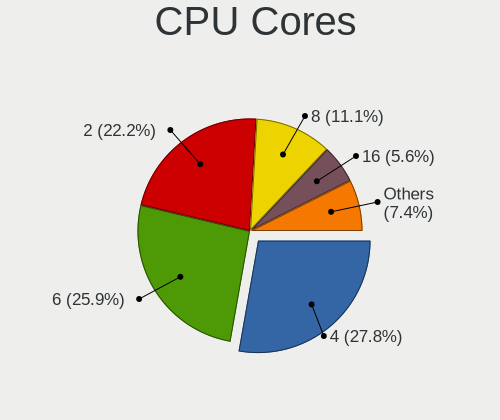

| Number | Desktops | Percent |
|--------|----------|---------|
| 4      | 22       | 40%     |
| 2      | 14       | 25.45%  |
| 6      | 12       | 21.82%  |
| 12     | 3        | 5.45%   |
| 16     | 2        | 3.64%   |
| 3      | 1        | 1.82%   |
| 1      | 1        | 1.82%   |

CPU Sockets
-----------

Number of sockets

| Number | Desktops | Percent |
|--------|----------|---------|
| 1      | 52       | 94.55%  |
| 2      | 3        | 5.45%   |

CPU Threads
-----------

Threads per core (Hyper-Threading)

| Number | Desktops | Percent |
|--------|----------|---------|
| 2      | 35       | 63.64%  |
| 1      | 19       | 34.55%  |
| 8      | 1        | 1.82%   |

CPU Op-Modes
------------

CPU Operation Modes (32-bit, 64-bit)

| Op mode        | Desktops | Percent |
|----------------|----------|---------|
| 32-bit, 64-bit | 55       | 100%    |

CPU Microcode
-------------

Microcode number

| Number     | Desktops | Percent |
|------------|----------|---------|
| Unknown    | 17       | 30.91%  |
| 0x206a7    | 5        | 9.09%   |
| 0x306a9    | 4        | 7.27%   |
| 0x06000852 | 3        | 5.45%   |
| 0x906ea    | 2        | 3.64%   |
| 0x906e9    | 2        | 3.64%   |
| 0x506e3    | 2        | 3.64%   |
| 0x1067a    | 2        | 3.64%   |
| 0x08701021 | 2        | 3.64%   |
| 0x906ec    | 1        | 1.82%   |
| 0x6fb      | 1        | 1.82%   |
| 0x6f6      | 1        | 1.82%   |
| 0x306d4    | 1        | 1.82%   |
| 0x306c3    | 1        | 1.82%   |
| 0x30678    | 1        | 1.82%   |
| 0x30661    | 1        | 1.82%   |
| 0x206c2    | 1        | 1.82%   |
| 0x106ca    | 1        | 1.82%   |
| 0x106a5    | 1        | 1.82%   |
| 0x0a50000c | 1        | 1.82%   |
| 0x0a201016 | 1        | 1.82%   |
| 0x0a201009 | 1        | 1.82%   |
| 0x0800820d | 1        | 1.82%   |
| 0x010000c8 | 1        | 1.82%   |
| 0x010000c6 | 1        | 1.82%   |

CPU Microarch
-------------

Microarchitecture

| Name        | Desktops | Percent |
|-------------|----------|---------|
| SandyBridge | 7        | 12.73%  |
| KabyLake    | 7        | 12.73%  |
| Zen 3       | 4        | 7.27%   |
| K10         | 4        | 7.27%   |
| IvyBridge   | 4        | 7.27%   |
| Haswell     | 4        | 7.27%   |
| Zen 2       | 3        | 5.45%   |
| Piledriver  | 3        | 5.45%   |
| Zen+        | 2        | 3.64%   |
| Westmere    | 2        | 3.64%   |
| Skylake     | 2        | 3.64%   |
| Penryn      | 2        | 3.64%   |
| Nehalem     | 2        | 3.64%   |
| Core        | 2        | 3.64%   |
| Bonnell     | 2        | 3.64%   |
| Zen         | 1        | 1.82%   |
| Silvermont  | 1        | 1.82%   |
| K8 Hammer   | 1        | 1.82%   |
| Broadwell   | 1        | 1.82%   |
| Unknown     | 1        | 1.82%   |

Graphics
--------

GPU Vendor
----------

Vendors of graphics cards

| Vendor | Desktops | Percent |
|--------|----------|---------|
| Nvidia | 26       | 44.83%  |
| Intel  | 16       | 27.59%  |
| AMD    | 16       | 27.59%  |

GPU Model
---------

Graphics card models

| Model                                                                       | Desktops | Percent |
|-----------------------------------------------------------------------------|----------|---------|
| Intel CoffeeLake-S GT2 [UHD Graphics 630]                                   | 3        | 4.84%   |
| Nvidia TU104 [GeForce RTX 2070 SUPER]                                       | 2        | 3.23%   |
| Nvidia GK208B [GeForce GT 710]                                              | 2        | 3.23%   |
| Nvidia GK107GL [Quadro K600]                                                | 2        | 3.23%   |
| Intel 2nd Generation Core Processor Family Integrated Graphics Controller   | 2        | 3.23%   |
| AMD Ellesmere [Radeon RX 470/480/570/570X/580/580X/590]                     | 2        | 3.23%   |
| Nvidia TU116 [GeForce GTX 1660]                                             | 1        | 1.61%   |
| Nvidia TU116 [GeForce GTX 1660 Ti]                                          | 1        | 1.61%   |
| Nvidia TU116 [GeForce GTX 1660 SUPER]                                       | 1        | 1.61%   |
| Nvidia GT216 [GeForce GT 220]                                               | 1        | 1.61%   |
| Nvidia GT200 [GeForce GTX 260]                                              | 1        | 1.61%   |
| Nvidia GP108 [GeForce GT 1030]                                              | 1        | 1.61%   |
| Nvidia GP106 [GeForce GTX 1060 3GB]                                         | 1        | 1.61%   |
| Nvidia GM206 [GeForce GTX 960]                                              | 1        | 1.61%   |
| Nvidia GM206 [GeForce GTX 950]                                              | 1        | 1.61%   |
| Nvidia GM204 [GeForce GTX 970]                                              | 1        | 1.61%   |
| Nvidia GK106 [GeForce GTX 650 Ti]                                           | 1        | 1.61%   |
| Nvidia GK104 [GeForce GTX 670]                                              | 1        | 1.61%   |
| Nvidia GF119 [GeForce GT 520]                                               | 1        | 1.61%   |
| Nvidia GF114 [GeForce GTX 560 Ti]                                           | 1        | 1.61%   |
| Nvidia GF110 [GeForce GTX 570 Rev. 2]                                       | 1        | 1.61%   |
| Nvidia GF100GL [Quadro 5000]                                                | 1        | 1.61%   |
| Nvidia GA106 [GeForce RTX 3060 Lite Hash Rate]                              | 1        | 1.61%   |
| Nvidia G98 [GeForce 8400 GS Rev. 2]                                         | 1        | 1.61%   |
| Nvidia G72 [GeForce 7300 GS]                                                | 1        | 1.61%   |
| Nvidia G70GL [Quadro FX 4500]                                               | 1        | 1.61%   |
| Intel Xeon E3-1200 v3/4th Gen Core Processor Integrated Graphics Controller | 1        | 1.61%   |
| Intel IvyBridge GT2 [HD Graphics 4000]                                      | 1        | 1.61%   |
| Intel HD Graphics 630                                                       | 1        | 1.61%   |
| Intel HD Graphics 5500                                                      | 1        | 1.61%   |
| Intel HD Graphics 530                                                       | 1        | 1.61%   |
| Intel CoffeeLake-S GT1 [UHD Graphics 610]                                   | 1        | 1.61%   |
| Intel Atom Processor Z36xxx/Z37xxx Series Graphics & Display                | 1        | 1.61%   |
| Intel Atom Processor D4xx/D5xx/N4xx/N5xx Integrated Graphics Controller     | 1        | 1.61%   |
| Intel Atom Processor D2xxx/N2xxx Integrated Graphics Controller             | 1        | 1.61%   |
| Intel 4th Generation Core Processor Family Integrated Graphics Controller   | 1        | 1.61%   |
| Intel 4 Series Chipset Integrated Graphics Controller                       | 1        | 1.61%   |
| AMD Tonga PRO [Radeon R9 285/380]                                           | 1        | 1.61%   |
| AMD Tahiti XT [Radeon HD 7970/8970 OEM / R9 280X]                           | 1        | 1.61%   |
| AMD RV530 [Radeon X1600] (Secondary)                                        | 1        | 1.61%   |
| AMD RV530 [Radeon X1600 PRO]                                                | 1        | 1.61%   |
| AMD RV380 [Radeon X300/X550/X1050 Series] (Secondary)                       | 1        | 1.61%   |
| AMD RV370 [Radeon X600/X600 SE]                                             | 1        | 1.61%   |
| AMD RV370 [Radeon X300]                                                     | 1        | 1.61%   |
| AMD RV370 [Radeon X300 SE]                                                  | 1        | 1.61%   |
| AMD RS880 [Radeon HD 4200]                                                  | 1        | 1.61%   |
| AMD RS780L [Radeon 3000]                                                    | 1        | 1.61%   |
| AMD Navi 22 [Radeon RX 6700/6700 XT/6750 XT / 6800M]                        | 1        | 1.61%   |
| AMD Navi 14 [Radeon RX 5500/5500M / Pro 5500M]                              | 1        | 1.61%   |
| AMD Navi 10 [Radeon RX 5600 OEM/5600 XT / 5700/5700 XT]                     | 1        | 1.61%   |
| AMD Juniper XT [Radeon HD 6770]                                             | 1        | 1.61%   |
| AMD Cezanne                                                                 | 1        | 1.61%   |
| AMD Cedar [Radeon HD 7350/8350 / R5 220]                                    | 1        | 1.61%   |
| AMD Cedar [Radeon HD 5000/6000/7350/8350 Series]                            | 1        | 1.61%   |
| AMD Barts LE [Radeon HD 6790]                                               | 1        | 1.61%   |

GPU Combo
---------

Combinations of graphics cards

| Name            | Desktops | Percent |
|-----------------|----------|---------|
| 1 x Nvidia      | 25       | 45.45%  |
| 1 x Intel       | 14       | 25.45%  |
| 1 x AMD         | 10       | 18.18%  |
| 2 x AMD         | 3        | 5.45%   |
| Intel + 2 x AMD | 1        | 1.82%   |
| Intel + AMD     | 1        | 1.82%   |
| AMD + Nvidia    | 1        | 1.82%   |

GPU Driver
----------

Free vs proprietary

| Driver      | Desktops | Percent |
|-------------|----------|---------|
| Free        | 34       | 61.82%  |
| Proprietary | 16       | 29.09%  |
| Unknown     | 5        | 9.09%   |

GPU Memory
----------

Total video memory

| Size in GB | Desktops | Percent |
|------------|----------|---------|
| Unknown    | 25       | 45.45%  |
| 1.01-2.0   | 6        | 10.91%  |
| 0.01-0.5   | 6        | 10.91%  |
| 7.01-8.0   | 5        | 9.09%   |
| 0.51-1.0   | 5        | 9.09%   |
| 2.01-3.0   | 3        | 5.45%   |
| 5.01-6.0   | 2        | 3.64%   |
| 3.01-4.0   | 2        | 3.64%   |
| 8.01-16.0  | 1        | 1.82%   |

Monitor
-------

Monitor Vendor
--------------

Monitor vendors

| Vendor               | Desktops | Percent |
|----------------------|----------|---------|
| Samsung Electronics  | 11       | 18.97%  |
| Dell                 | 7        | 12.07%  |
| BenQ                 | 7        | 12.07%  |
| Acer                 | 7        | 12.07%  |
| Philips              | 4        | 6.9%    |
| Goldstar             | 4        | 6.9%    |
| Lenovo               | 3        | 5.17%   |
| Hewlett-Packard      | 3        | 5.17%   |
| AOC                  | 3        | 5.17%   |
| Ancor Communications | 3        | 5.17%   |
| ___                  | 1        | 1.72%   |
| ViewSonic            | 1        | 1.72%   |
| Unknown (XXX)        | 1        | 1.72%   |
| Unknown              | 1        | 1.72%   |
| LG Electronics       | 1        | 1.72%   |
| Compaq Computer      | 1        | 1.72%   |

Monitor Model
-------------

Monitor models

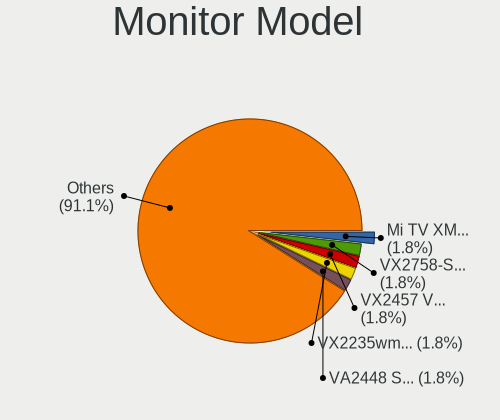

| Model                                                                   | Desktops | Percent |
|-------------------------------------------------------------------------|----------|---------|
| Dell P1917S DELD091 1280x1024 380x300mm 19.1-inch                       | 2        | 3.23%   |
| ___ LCDTV14 ___0101 1920x1080                                           | 1        | 1.61%   |
| ViewSonic VG2448 VSC3B35 1920x1080 530x300mm 24.0-inch                  | 1        | 1.61%   |
| Unknown LCDTV14 0101 1360x768 1600x900mm 72.3-inch                      | 1        | 1.61%   |
| Unknown (XXX) Beyond TV XXX2851 3840x2160 1210x680mm 54.6-inch          | 1        | 1.61%   |
| Samsung Electronics SyncMaster SAM0522 1600x900 443x249mm 20.0-inch     | 1        | 1.61%   |
| Samsung Electronics SyncMaster SAM027F 1680x1050 474x296mm 22.0-inch    | 1        | 1.61%   |
| Samsung Electronics SyncMaster SAM01D3 1440x900 408x225mm 18.3-inch     | 1        | 1.61%   |
| Samsung Electronics S24E450 SAM0CA1 1920x1080 531x299mm 24.0-inch       | 1        | 1.61%   |
| Samsung Electronics S24E450 SAM0CA0 1920x1080 531x299mm 24.0-inch       | 1        | 1.61%   |
| Samsung Electronics LCD Monitor SMBX2450                                | 1        | 1.61%   |
| Samsung Electronics LCD Monitor SAM0FA5 3840x2160 1872x1053mm 84.6-inch | 1        | 1.61%   |
| Samsung Electronics LCD Monitor SAM0F9F 3840x2160 1210x680mm 54.6-inch  | 1        | 1.61%   |
| Samsung Electronics LCD Monitor SAM0F17 3840x2160 1872x1053mm 84.6-inch | 1        | 1.61%   |
| Samsung Electronics LCD Monitor SAM0A7A 1920x1080 890x500mm 40.2-inch   | 1        | 1.61%   |
| Samsung Electronics LCD Monitor SAM03D4 1280x720                        | 1        | 1.61%   |
| Samsung Electronics C34H89x SAM0E25 3440x1440 797x333mm 34.0-inch       | 1        | 1.61%   |
| Philips PHL 328P6V PHL090B 3840x2160 700x400mm 31.7-inch                | 1        | 1.61%   |
| Philips PHL 322E1 PHLC20F 1920x1080 698x393mm 31.5-inch                 | 1        | 1.61%   |
| Philips PHL 247E6 PHLC0E7 1920x1080 521x293mm 23.5-inch                 | 1        | 1.61%   |
| Philips 247EL PHLC084 1920x1080 521x293mm 23.5-inch                     | 1        | 1.61%   |
| LG Electronics LCD Monitor E2441 1920x1080                              | 1        | 1.61%   |
| Lenovo LEN L28u-30 LEN65FA 3840x2160 621x341mm 27.9-inch                | 1        | 1.61%   |
| Lenovo LEN L1711pC LEN13B7 1280x1024 338x270mm 17.0-inch                | 1        | 1.61%   |
| Lenovo LCD Monitor LEN60A1 1920x1080 480x270mm 21.7-inch                | 1        | 1.61%   |
| Hewlett-Packard N270 HPN340C 1920x1080 598x336mm 27.0-inch              | 1        | 1.61%   |
| Hewlett-Packard LCD Monitor LA1951 3200x1080                            | 1        | 1.61%   |
| Hewlett-Packard 23fi HWP3075 1920x1080 509x286mm 23.0-inch              | 1        | 1.61%   |
| Goldstar TV SSCR GSMC0C8 3840x2160                                      | 1        | 1.61%   |
| Goldstar LG HDR 4K GSM7707 3840x2160 600x340mm 27.2-inch                | 1        | 1.61%   |
| Goldstar FULL HD GSM5B55 1920x1080 480x270mm 21.7-inch                  | 1        | 1.61%   |
| Goldstar 24MP56 GSM5A56 1920x1080 510x290mm 23.1-inch                   | 1        | 1.61%   |
| Goldstar 24M45 GSM5A53 1920x1080 520x290mm 23.4-inch                    | 1        | 1.61%   |
| Dell P2719H DEL4184 1920x1080 598x336mm 27.0-inch                       | 1        | 1.61%   |
| Dell P2418HT DEL4114 1920x1080 527x296mm 23.8-inch                      | 1        | 1.61%   |
| Dell P2418HT DEL4113 1920x1080 527x296mm 23.8-inch                      | 1        | 1.61%   |
| Dell P2319H DELD0D7 1920x1080 510x290mm 23.1-inch                       | 1        | 1.61%   |
| Dell P2319H DELD0D5 1920x1080 510x290mm 23.1-inch                       | 1        | 1.61%   |
| Dell P1917S DELD093 1280x1024 380x300mm 19.1-inch                       | 1        | 1.61%   |
| Dell AW3821DW DELA17F 3840x1600 880x367mm 37.5-inch                     | 1        | 1.61%   |
| Compaq Computer P920 CPQ1420 1920x1440 356x266mm 17.5-inch              | 1        | 1.61%   |
| BenQ RL2755 BNQ7F41 1920x1080 598x336mm 27.0-inch                       | 1        | 1.61%   |
| BenQ RL2450H BNQ7F0E 1920x1080 531x298mm 24.0-inch                      | 1        | 1.61%   |
| BenQ LCD Monitor G2420HD 1920x1080                                      | 1        | 1.61%   |
| BenQ GL2750H BNQ78AD 1920x1080 598x336mm 27.0-inch                      | 1        | 1.61%   |
| BenQ G2420HD BNQ7840 1920x1080 531x299mm 24.0-inch                      | 1        | 1.61%   |
| BenQ G2220HD BNQ7821 1920x1080 478x269mm 21.6-inch                      | 1        | 1.61%   |
| BenQ FP91G+ BNQ76A5 1280x1024 380x300mm 19.1-inch                       | 1        | 1.61%   |
| AOC 27B1 AOC2701 1920x1080 598x336mm 27.0-inch                          | 1        | 1.61%   |
| AOC 2770G4 AOC2770 1920x1080 598x336mm 27.0-inch                        | 1        | 1.61%   |
| AOC 2490W1 AOC2490 1920x1080 527x296mm 23.8-inch                        | 1        | 1.61%   |
| Ancor Communications VE248 ACI2494 1920x1080 531x299mm 24.0-inch        | 1        | 1.61%   |
| Ancor Communications ASUS VP228 ACI22C3 1920x1080 476x268mm 21.5-inch   | 1        | 1.61%   |
| Ancor Communications ASUS VE278 ACI27F6 1920x1080 598x336mm 27.0-inch   | 1        | 1.61%   |
| Acer X233H ACR0093 1920x1080 510x287mm 23.0-inch                        | 1        | 1.61%   |
| Acer S232HL ACR0203 1920x1080 510x287mm 23.0-inch                       | 1        | 1.61%   |
| Acer LCD Monitor S240HL 1920x1080                                       | 1        | 1.61%   |
| Acer KG281K ACR062D 3840x2160 621x341mm 27.9-inch                       | 1        | 1.61%   |
| Acer KA270H ACR0469 1920x1080 598x336mm 27.0-inch                       | 1        | 1.61%   |
| Acer G225HQ ACR0108 1920x1080 477x268mm 21.5-inch                       | 1        | 1.61%   |

Monitor Resolution
------------------

Monitor screen resolution

| Resolution         | Desktops | Percent |
|--------------------|----------|---------|
| 1920x1080 (FHD)    | 30       | 52.63%  |
| 3840x2160 (4K)     | 10       | 17.54%  |
| 1280x1024 (SXGA)   | 7        | 12.28%  |
| 2560x1440 (QHD)    | 2        | 3.51%   |
| 3840x1600          | 1        | 1.75%   |
| 3440x1440          | 1        | 1.75%   |
| 3200x1080          | 1        | 1.75%   |
| 1680x1050 (WSXGA+) | 1        | 1.75%   |
| 1600x900 (HD+)     | 1        | 1.75%   |
| 1440x900 (WXGA+)   | 1        | 1.75%   |
| 1360x768           | 1        | 1.75%   |
| Unknown            | 1        | 1.75%   |

Monitor Diagonal
----------------

Diagonal size in inches

| Inches  | Desktops | Percent |
|---------|----------|---------|
| 27      | 11       | 18.97%  |
| 23      | 9        | 15.52%  |
| 24      | 7        | 12.07%  |
| 21      | 5        | 8.62%   |
| 19      | 5        | 8.62%   |
| Unknown | 5        | 8.62%   |
| 84      | 3        | 5.17%   |
| 72      | 2        | 3.45%   |
| 31      | 2        | 3.45%   |
| 17      | 2        | 3.45%   |
| 54      | 1        | 1.72%   |
| 48      | 1        | 1.72%   |
| 37      | 1        | 1.72%   |
| 34      | 1        | 1.72%   |
| 22      | 1        | 1.72%   |
| 20      | 1        | 1.72%   |
| 18      | 1        | 1.72%   |

Monitor Width
-------------

Physical width

| Width in mm | Desktops | Percent |
|-------------|----------|---------|
| 501-600     | 24       | 42.11%  |
| 401-500     | 8        | 14.04%  |
| 351-400     | 6        | 10.53%  |
| 1501-2000   | 5        | 8.77%   |
| Unknown     | 5        | 8.77%   |
| 601-700     | 4        | 7.02%   |
| 1001-1500   | 2        | 3.51%   |
| 801-900     | 1        | 1.75%   |
| 701-800     | 1        | 1.75%   |
| 301-350     | 1        | 1.75%   |

Aspect Ratio
------------

Proportional relationship between the width and the height

| Ratio   | Desktops | Percent |
|---------|----------|---------|
| 16/9    | 37       | 71.15%  |
| 5/4     | 5        | 9.62%   |
| Unknown | 4        | 7.69%   |
| 21/9    | 2        | 3.85%   |
| 16/10   | 2        | 3.85%   |
| 6/5     | 1        | 1.92%   |
| 4/3     | 1        | 1.92%   |

Monitor Area
------------

Area in inch

| Area in inch | Desktops | Percent |
|----------------|----------|---------|
| 201-250        | 20       | 35.09%  |
| 301-350        | 11       | 19.3%   |
| 151-200        | 8        | 14.04%  |
| More than 1000 | 7        | 12.28%  |
| Unknown        | 5        | 8.77%   |
| 351-500        | 3        | 5.26%   |
| 141-150        | 2        | 3.51%   |
| 501-1000       | 1        | 1.75%   |

Pixel Density
-------------

Pixels per inch

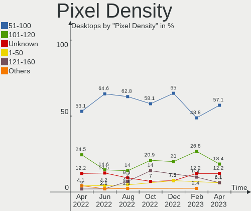

| Density | Desktops | Percent |
|---------|----------|---------|
| 51-100  | 37       | 67.27%  |
| 101-120 | 7        | 12.73%  |
| Unknown | 5        | 9.09%   |
| 121-160 | 3        | 5.45%   |
| 1-50    | 2        | 3.64%   |
| 161-240 | 1        | 1.82%   |

Multiple Monitors
-----------------

Total monitors connected

| Total | Desktops | Percent |
|-------|----------|---------|
| 1     | 38       | 69.09%  |
| 2     | 11       | 20%     |
| 0     | 5        | 9.09%   |
| 3     | 1        | 1.82%   |

Network
-------

Net Controller Vendor
---------------------

Controller vendors

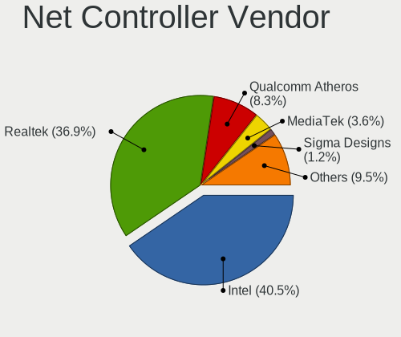

| Vendor                   | Desktops | Percent |
|--------------------------|----------|---------|
| Realtek Semiconductor    | 30       | 37.97%  |
| Intel                    | 30       | 37.97%  |
| Qualcomm Atheros         | 6        | 7.59%   |
| Broadcom                 | 4        | 5.06%   |
| TP-Link                  | 2        | 2.53%   |
| D-Link                   | 2        | 2.53%   |
| Ralink Technology        | 1        | 1.27%   |
| Motorola PCS             | 1        | 1.27%   |
| Marvell Technology Group | 1        | 1.27%   |
| Google                   | 1        | 1.27%   |
| D-Link System            | 1        | 1.27%   |

Net Controller Model
--------------------

Controller models

| Model                                                               | Desktops | Percent |
|---------------------------------------------------------------------|----------|---------|
| Realtek RTL8111/8168/8411 PCI Express Gigabit Ethernet Controller   | 27       | 30%     |
| Intel Wi-Fi 6 AX200                                                 | 4        | 4.44%   |
| Intel 82579V Gigabit Network Connection                             | 4        | 4.44%   |
| Intel I211 Gigabit Network Connection                               | 3        | 3.33%   |
| Realtek RTL8153 Gigabit Ethernet Adapter                            | 2        | 2.22%   |
| Realtek RTL8125 2.5GbE Controller                                   | 2        | 2.22%   |
| Intel Ethernet Controller I225-V                                    | 2        | 2.22%   |
| Intel Ethernet Connection (7) I219-V                                | 2        | 2.22%   |
| Intel Ethernet Connection (2) I219-V                                | 2        | 2.22%   |
| Intel 82574L Gigabit Network Connection                             | 2        | 2.22%   |
| TP-Link TL-WN823N v2/v3 [Realtek RTL8192EU]                         | 1        | 1.11%   |
| TP-Link Archer T1U 802.11a/n/ac Wireless Adapter [MediaTek MT7610U] | 1        | 1.11%   |
| Realtek RTL8821CE 802.11ac PCIe Wireless Network Adapter            | 1        | 1.11%   |
| Realtek RTL8188EE Wireless Network Adapter                          | 1        | 1.11%   |
| Realtek RTL-8100/8101L/8139 PCI Fast Ethernet Adapter               | 1        | 1.11%   |
| Realtek 802.11ac NIC                                                | 1        | 1.11%   |
| Ralink RT5370 Wireless Adapter                                      | 1        | 1.11%   |
| Qualcomm Atheros QCA8171 Gigabit Ethernet                           | 1        | 1.11%   |
| Qualcomm Atheros QCA6174 802.11ac Wireless Network Adapter          | 1        | 1.11%   |
| Qualcomm Atheros AR9285 Wireless Network Adapter (PCI-Express)      | 1        | 1.11%   |
| Qualcomm Atheros AR8161 Gigabit Ethernet                            | 1        | 1.11%   |
| Qualcomm Atheros AR8151 v2.0 Gigabit Ethernet                       | 1        | 1.11%   |
| Qualcomm Atheros AR5212/5213/2414 Wireless Network Adapter          | 1        | 1.11%   |
| Motorola PCS motorola edge 20 fusion                                | 1        | 1.11%   |
| Marvell Group 88E8053 PCI-E Gigabit Ethernet Controller             | 1        | 1.11%   |
| Marvell Group 88E8001 Gigabit Ethernet Controller                   | 1        | 1.11%   |
| Intel Wireless 8265 / 8275                                          | 1        | 1.11%   |
| Intel Wireless 3160                                                 | 1        | 1.11%   |
| Intel Wi-Fi 6 AX210/AX211/AX411 160MHz                              | 1        | 1.11%   |
| Intel Ethernet Connection I217-LM                                   | 1        | 1.11%   |
| Intel Ethernet Connection (7) I219-LM                               | 1        | 1.11%   |
| Intel Ethernet Connection (5) I219-LM                               | 1        | 1.11%   |
| Intel Ethernet Connection (2) I219-LM                               | 1        | 1.11%   |
| Intel Dual Band Wireless-AC 3168NGW [Stone Peak]                    | 1        | 1.11%   |
| Intel Centrino Wireless-N 2230                                      | 1        | 1.11%   |
| Intel Cannon Lake PCH CNVi WiFi                                     | 1        | 1.11%   |
| Intel 82579LM Gigabit Network Connection (Lewisville)               | 1        | 1.11%   |
| Intel 82578DM Gigabit Network Connection                            | 1        | 1.11%   |
| Intel 82567LM-3 Gigabit Network Connection                          | 1        | 1.11%   |
| Intel 82557/8/9/0/1 Ethernet Pro 100                                | 1        | 1.11%   |
| Intel 82546EB Gigabit Ethernet Controller (Copper)                  | 1        | 1.11%   |
| Intel 82541PI Gigabit Ethernet Controller                           | 1        | 1.11%   |
| Google Nexus/Pixel Device (tether)                                  | 1        | 1.11%   |
| D-Link System RTL8139 Ethernet                                      | 1        | 1.11%   |
| D-Link DWA-171                                                      | 1        | 1.11%   |
| D-Link DUB-1312 Gigabit Ethernet Adapter                            | 1        | 1.11%   |
| Broadcom NetXtreme II BCM5706 Gigabit Ethernet                      | 1        | 1.11%   |
| Broadcom NetXtreme BCM5764M Gigabit Ethernet PCIe                   | 1        | 1.11%   |
| Broadcom NetXtreme BCM5761 Gigabit Ethernet PCIe                    | 1        | 1.11%   |
| Broadcom NetXtreme BCM5752 Gigabit Ethernet PCI Express             | 1        | 1.11%   |

Wireless Vendor
---------------

Wireless vendors

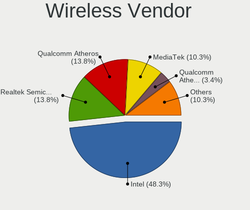

| Vendor                | Desktops | Percent |
|-----------------------|----------|---------|
| Intel                 | 10       | 50%     |
| Realtek Semiconductor | 3        | 15%     |
| Qualcomm Atheros      | 3        | 15%     |
| TP-Link               | 2        | 10%     |
| Ralink Technology     | 1        | 5%      |
| D-Link                | 1        | 5%      |

Wireless Model
--------------

Wireless models

| Model                                                               | Desktops | Percent |
|---------------------------------------------------------------------|----------|---------|
| Intel Wi-Fi 6 AX200                                                 | 4        | 20%     |
| TP-Link TL-WN823N v2/v3 [Realtek RTL8192EU]                         | 1        | 5%      |
| TP-Link Archer T1U 802.11a/n/ac Wireless Adapter [MediaTek MT7610U] | 1        | 5%      |
| Realtek RTL8821CE 802.11ac PCIe Wireless Network Adapter            | 1        | 5%      |
| Realtek RTL8188EE Wireless Network Adapter                          | 1        | 5%      |
| Realtek 802.11ac NIC                                                | 1        | 5%      |
| Ralink RT5370 Wireless Adapter                                      | 1        | 5%      |
| Qualcomm Atheros QCA6174 802.11ac Wireless Network Adapter          | 1        | 5%      |
| Qualcomm Atheros AR9285 Wireless Network Adapter (PCI-Express)      | 1        | 5%      |
| Qualcomm Atheros AR5212/5213/2414 Wireless Network Adapter          | 1        | 5%      |
| Intel Wireless 8265 / 8275                                          | 1        | 5%      |
| Intel Wireless 3160                                                 | 1        | 5%      |
| Intel Wi-Fi 6 AX210/AX211/AX411 160MHz                              | 1        | 5%      |
| Intel Dual Band Wireless-AC 3168NGW [Stone Peak]                    | 1        | 5%      |
| Intel Centrino Wireless-N 2230                                      | 1        | 5%      |
| Intel Cannon Lake PCH CNVi WiFi                                     | 1        | 5%      |
| D-Link DWA-171                                                      | 1        | 5%      |

Ethernet Vendor
---------------

Ethernet vendors

| Vendor                   | Desktops | Percent |
|--------------------------|----------|---------|
| Realtek Semiconductor    | 29       | 44.62%  |
| Intel                    | 25       | 38.46%  |
| Broadcom                 | 4        | 6.15%   |
| Qualcomm Atheros         | 3        | 4.62%   |
| Marvell Technology Group | 1        | 1.54%   |
| Google                   | 1        | 1.54%   |
| D-Link System            | 1        | 1.54%   |
| D-Link                   | 1        | 1.54%   |

Ethernet Model
--------------

Ethernet models

| Model                                                             | Desktops | Percent |
|-------------------------------------------------------------------|----------|---------|
| Realtek RTL8111/8168/8411 PCI Express Gigabit Ethernet Controller | 27       | 39.13%  |
| Intel 82579V Gigabit Network Connection                           | 4        | 5.8%    |
| Intel I211 Gigabit Network Connection                             | 3        | 4.35%   |
| Realtek RTL8153 Gigabit Ethernet Adapter                          | 2        | 2.9%    |
| Realtek RTL8125 2.5GbE Controller                                 | 2        | 2.9%    |
| Intel Ethernet Controller I225-V                                  | 2        | 2.9%    |
| Intel Ethernet Connection (7) I219-V                              | 2        | 2.9%    |
| Intel Ethernet Connection (2) I219-V                              | 2        | 2.9%    |
| Intel 82574L Gigabit Network Connection                           | 2        | 2.9%    |
| Realtek RTL-8100/8101L/8139 PCI Fast Ethernet Adapter             | 1        | 1.45%   |
| Qualcomm Atheros QCA8171 Gigabit Ethernet                         | 1        | 1.45%   |
| Qualcomm Atheros AR8161 Gigabit Ethernet                          | 1        | 1.45%   |
| Qualcomm Atheros AR8151 v2.0 Gigabit Ethernet                     | 1        | 1.45%   |
| Marvell Group 88E8053 PCI-E Gigabit Ethernet Controller           | 1        | 1.45%   |
| Marvell Group 88E8001 Gigabit Ethernet Controller                 | 1        | 1.45%   |
| Intel Ethernet Connection I217-LM                                 | 1        | 1.45%   |
| Intel Ethernet Connection (7) I219-LM                             | 1        | 1.45%   |
| Intel Ethernet Connection (5) I219-LM                             | 1        | 1.45%   |
| Intel Ethernet Connection (2) I219-LM                             | 1        | 1.45%   |
| Intel 82579LM Gigabit Network Connection (Lewisville)             | 1        | 1.45%   |
| Intel 82578DM Gigabit Network Connection                          | 1        | 1.45%   |
| Intel 82567LM-3 Gigabit Network Connection                        | 1        | 1.45%   |
| Intel 82557/8/9/0/1 Ethernet Pro 100                              | 1        | 1.45%   |
| Intel 82546EB Gigabit Ethernet Controller (Copper)                | 1        | 1.45%   |
| Intel 82541PI Gigabit Ethernet Controller                         | 1        | 1.45%   |
| Google Nexus/Pixel Device (tether)                                | 1        | 1.45%   |
| D-Link System RTL8139 Ethernet                                    | 1        | 1.45%   |
| D-Link DUB-1312 Gigabit Ethernet Adapter                          | 1        | 1.45%   |
| Broadcom NetXtreme II BCM5706 Gigabit Ethernet                    | 1        | 1.45%   |
| Broadcom NetXtreme BCM5764M Gigabit Ethernet PCIe                 | 1        | 1.45%   |
| Broadcom NetXtreme BCM5761 Gigabit Ethernet PCIe                  | 1        | 1.45%   |
| Broadcom NetXtreme BCM5752 Gigabit Ethernet PCI Express           | 1        | 1.45%   |

Net Controller Kind
-------------------

Ethernet, WiFi or modem

| Kind     | Desktops | Percent |
|----------|----------|---------|
| Ethernet | 55       | 72.37%  |
| WiFi     | 20       | 26.32%  |
| Unknown  | 1        | 1.32%   |

Used Controller
---------------

Currently used network controller

| Kind     | Desktops | Percent |
|----------|----------|---------|
| Ethernet | 50       | 87.72%  |
| WiFi     | 7        | 12.28%  |

NICs
----

Total network controllers on board

| Total | Desktops | Percent |
|-------|----------|---------|
| 1     | 29       | 52.73%  |
| 2     | 19       | 34.55%  |
| 3     | 5        | 9.09%   |
| 5     | 1        | 1.82%   |
| 4     | 1        | 1.82%   |

IPv6
----

IPv6 vs IPv4

| Used | Desktops | Percent |
|------|----------|---------|
| No   | 47       | 85.45%  |
| Yes  | 8        | 14.55%  |

Bluetooth
---------

Bluetooth Vendor
----------------

Controller vendors

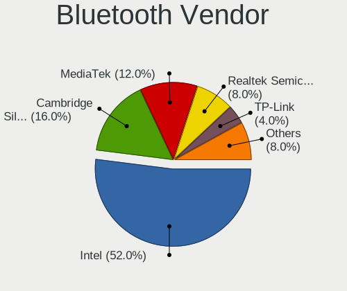

| Vendor                  | Desktops | Percent |
|-------------------------|----------|---------|
| Intel                   | 8        | 53.33%  |
| Realtek Semiconductor   | 2        | 13.33%  |
| Cambridge Silicon Radio | 2        | 13.33%  |
| Edimax Technology       | 1        | 6.67%   |
| Broadcom                | 1        | 6.67%   |
| ASUSTek Computer        | 1        | 6.67%   |

Bluetooth Model
---------------

Controller models

| Model                                               | Desktops | Percent |
|-----------------------------------------------------|----------|---------|
| Intel AX200 Bluetooth                               | 3        | 20%     |
| Cambridge Silicon Radio Bluetooth Dongle (HCI mode) | 2        | 13.33%  |
| Realtek  Bluetooth 4.2 Adapter                      | 1        | 6.67%   |
| Realtek Bluetooth Radio                             | 1        | 6.67%   |
| Intel Wireless-AC 3168 Bluetooth                    | 1        | 6.67%   |
| Intel Centrino Bluetooth Wireless Transceiver       | 1        | 6.67%   |
| Intel Bluetooth wireless interface                  | 1        | 6.67%   |
| Intel Bluetooth 9460/9560 Jefferson Peak (JfP)      | 1        | 6.67%   |
| Intel AX210 Bluetooth                               | 1        | 6.67%   |
| Edimax Bluetooth Device                             | 1        | 6.67%   |
| Broadcom BCM20702A0 Bluetooth 4.0                   | 1        | 6.67%   |
| ASUS Qualcomm Bluetooth 4.1                         | 1        | 6.67%   |

Sound
-----

Sound Vendor
------------

Sound card vendors

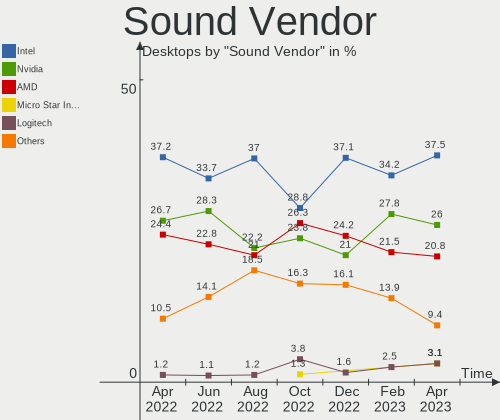

| Vendor                    | Desktops | Percent |
|---------------------------|----------|---------|
| Intel                     | 32       | 39.51%  |
| Nvidia                    | 22       | 27.16%  |
| AMD                       | 19       | 23.46%  |
| C-Media Electronics       | 2        | 2.47%   |
| Texas Instruments         | 1        | 1.23%   |
| SteelSeries ApS           | 1        | 1.23%   |
| Sennheiser Communications | 1        | 1.23%   |
| RODE Microphones          | 1        | 1.23%   |
| BEHRINGER International   | 1        | 1.23%   |
| Apple                     | 1        | 1.23%   |

Sound Model
-----------

Sound card models

| Model                                                                      | Desktops | Percent |
|----------------------------------------------------------------------------|----------|---------|
| Intel 6 Series/C200 Series Chipset Family High Definition Audio Controller | 6        | 6.45%   |
| AMD SBx00 Azalia (Intel HDA)                                               | 6        | 6.45%   |
| AMD Starship/Matisse HD Audio Controller                                   | 5        | 5.38%   |
| Intel Cannon Lake PCH cAVS                                                 | 4        | 4.3%    |
| Nvidia TU116 High Definition Audio Controller                              | 3        | 3.23%   |
| Intel 82801JI (ICH10 Family) HD Audio Controller                           | 3        | 3.23%   |
| Intel 8 Series/C220 Series Chipset High Definition Audio Controller        | 3        | 3.23%   |
| Intel 7 Series/C216 Chipset Family High Definition Audio Controller        | 3        | 3.23%   |
| Intel 100 Series/C230 Series Chipset Family HD Audio Controller            | 3        | 3.23%   |
| AMD Family 17h (Models 00h-0fh) HD Audio Controller                        | 3        | 3.23%   |
| Nvidia TU104 HD Audio Controller                                           | 2        | 2.15%   |
| Nvidia GM206 High Definition Audio Controller                              | 2        | 2.15%   |
| Nvidia GK208 HDMI/DP Audio Controller                                      | 2        | 2.15%   |
| Nvidia GK107 HDMI Audio Controller                                         | 2        | 2.15%   |
| Intel Xeon E3-1200 v3/4th Gen Core Processor HD Audio Controller           | 2        | 2.15%   |
| Intel 200 Series PCH HD Audio                                              | 2        | 2.15%   |
| AMD Navi 10 HDMI Audio                                                     | 2        | 2.15%   |
| AMD Ellesmere HDMI Audio [Radeon RX 470/480 / 570/580/590]                 | 2        | 2.15%   |
| Texas Instruments PCM2902 Audio Codec                                      | 1        | 1.08%   |
| SteelSeries ApS SteelSeries Arctis 5                                       | 1        | 1.08%   |
| Sennheiser Communications GSP 370                                          | 1        | 1.08%   |
| RODE Microphones RODE NT-USB                                               | 1        | 1.08%   |
| Nvidia GT216 HDMI Audio Controller                                         | 1        | 1.08%   |
| Nvidia GP108 High Definition Audio Controller                              | 1        | 1.08%   |
| Nvidia GP106 High Definition Audio Controller                              | 1        | 1.08%   |
| Nvidia GM204 High Definition Audio Controller                              | 1        | 1.08%   |
| Nvidia GK106 HDMI Audio Controller                                         | 1        | 1.08%   |
| Nvidia GK104 HDMI Audio Controller                                         | 1        | 1.08%   |
| Nvidia GF119 HDMI Audio Controller                                         | 1        | 1.08%   |
| Nvidia GF114 HDMI Audio Controller                                         | 1        | 1.08%   |
| Nvidia GF110 High Definition Audio Controller                              | 1        | 1.08%   |
| Nvidia GF100 High Definition Audio Controller                              | 1        | 1.08%   |
| Nvidia Audio device                                                        | 1        | 1.08%   |
| Intel Wildcat Point-LP High Definition Audio Controller                    | 1        | 1.08%   |
| Intel Tiger Lake-H HD Audio Controller                                     | 1        | 1.08%   |
| Intel NM10/ICH7 Family High Definition Audio Controller                    | 1        | 1.08%   |
| Intel Broadwell-U Audio Controller                                         | 1        | 1.08%   |
| Intel Atom Processor Z36xxx/Z37xxx Series High Definition Audio Controller | 1        | 1.08%   |
| Intel 9 Series Chipset Family HD Audio Controller                          | 1        | 1.08%   |
| Intel 82801JD/DO (ICH10 Family) HD Audio Controller                        | 1        | 1.08%   |
| Intel 631xESB/632xESB High Definition Audio Controller                     | 1        | 1.08%   |
| Intel 5 Series/3400 Series Chipset High Definition Audio                   | 1        | 1.08%   |
| C-Media Electronics REIYIN Audio DA-02                                     | 1        | 1.08%   |
| C-Media Electronics ATGM1-USB                                              | 1        | 1.08%   |
| BEHRINGER International UMC204HD 192k                                      | 1        | 1.08%   |
| Apple USB-C to 3.5mm Headphone Jack Adapter                                | 1        | 1.08%   |
| AMD Tonga HDMI Audio [Radeon R9 285/380]                                   | 1        | 1.08%   |
| AMD Tahiti HDMI Audio [Radeon HD 7870 XT / 7950/7970]                      | 1        | 1.08%   |
| AMD RS880 HDMI Audio [Radeon HD 4200 Series]                               | 1        | 1.08%   |
| AMD RS780 HDMI Audio [Radeon 3000/3100 / HD 3200/3300]                     | 1        | 1.08%   |
| AMD Renoir Radeon High Definition Audio Controller                         | 1        | 1.08%   |
| AMD Navi 21/23 HDMI/DP Audio Controller                                    | 1        | 1.08%   |
| AMD Juniper HDMI Audio [Radeon HD 5700 Series]                             | 1        | 1.08%   |
| AMD Family 17h/19h HD Audio Controller                                     | 1        | 1.08%   |
| AMD Cedar HDMI Audio [Radeon HD 5400/6300/7300 Series]                     | 1        | 1.08%   |
| AMD Barts HDMI Audio [Radeon HD 6790/6850/6870 / 7720 OEM]                 | 1        | 1.08%   |

Memory
------

Memory Vendor
-------------

Memory module vendors

| Vendor              | Desktops | Percent |
|---------------------|----------|---------|
| Unknown             | 8        | 22.86%  |
| SK Hynix            | 5        | 14.29%  |
| Kingston            | 5        | 14.29%  |
| Corsair             | 5        | 14.29%  |
| G.Skill             | 4        | 11.43%  |
| Samsung Electronics | 3        | 8.57%   |
| Crucial             | 2        | 5.71%   |
| Team                | 1        | 2.86%   |
| Neo Forza           | 1        | 2.86%   |
| Nanya Technology    | 1        | 2.86%   |

Memory Model
------------

Memory module models

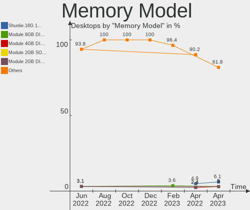

| Model                                                     | Desktops | Percent |
|-----------------------------------------------------------|----------|---------|
| Corsair RAM CMK32GX4M2A2666C16 16GB DIMM DDR4 3100MT/s    | 2        | 5.26%   |
| Unknown RAM Module 8192MB DIMM 800MT/s                    | 1        | 2.63%   |
| Unknown RAM Module 4GB DIMM 800MT/s                       | 1        | 2.63%   |
| Unknown RAM Module 4GB DIMM 400MT/s                       | 1        | 2.63%   |
| Unknown RAM Module 4096MB DIMM 1333MT/s                   | 1        | 2.63%   |
| Unknown RAM Module 2GB DIMM DDR2 1067MT/s                 | 1        | 2.63%   |
| Unknown RAM Module 2GB DIMM 667MT/s                       | 1        | 2.63%   |
| Unknown RAM Module 2048MB DIMM 800MT/s                    | 1        | 2.63%   |
| Unknown RAM Module 1GB DIMM DDR 333MT/s                   | 1        | 2.63%   |
| Unknown RAM 3600 C18 Series 16GB DIMM DDR4 2933MT/s       | 1        | 2.63%   |
| Team RAM Module 16GB DIMM DDR4 2133MT/s                   | 1        | 2.63%   |
| SK Hynix RAM Module 8GB DIMM DDR4 2133MT/s                | 1        | 2.63%   |
| SK Hynix RAM Module 8192MB DIMM DDR4 2400MT/s             | 1        | 2.63%   |
| SK Hynix RAM Module 4GB SODIMM DDR3 1333MT/s              | 1        | 2.63%   |
| SK Hynix RAM HYMP151F72CP4N3-Y5 4GB FB-DIMM DDR2 667MT/s  | 1        | 2.63%   |
| SK Hynix RAM HYMP151F72CP4D3-Y5 4GB FB-DIMM DDR2 667MT/s  | 1        | 2.63%   |
| SK Hynix RAM HMA81GU6JJR8N-VK 8GB DIMM DDR4 2666MT/s      | 1        | 2.63%   |
| Samsung RAM Module 8GB DIMM DDR4 2133MT/s                 | 1        | 2.63%   |
| Samsung RAM Module 4GB SODIMM DDR3 1333MT/s               | 1        | 2.63%   |
| Samsung RAM M395T5160QZ4-CE66 4GB FB-DIMM DDR2 667MT/s    | 1        | 2.63%   |
| Neo Forza RAM NMUD380D81-1333C 8GB DIMM DDR3 1333MT/s     | 1        | 2.63%   |
| Nanya RAM Module 2048MB DIMM DDR2 800MT/s                 | 1        | 2.63%   |
| Kingston RAM KHX3200C16D4/16GX 16GB DIMM DDR4 3600MT/s    | 1        | 2.63%   |
| Kingston RAM KHX2666C16/16G 16GB DIMM DDR4 3200MT/s       | 1        | 2.63%   |
| Kingston RAM KHX1866C10D3/8G 8GB DIMM DDR3 1867MT/s       | 1        | 2.63%   |
| Kingston RAM KHX1600C10D3/4G 4GB DIMM DDR3 1866MT/s       | 1        | 2.63%   |
| Kingston RAM KF3200C16D4/8GX 8GB DIMM DDR4 3200MT/s       | 1        | 2.63%   |
| Kingston RAM HX318C10F/8 8192MB DIMM DDR3 933MT/s         | 1        | 2.63%   |
| G.Skill RAM F4-3200C16-8GTZR 8192MB DIMM DDR4 3200MT/s    | 1        | 2.63%   |
| G.Skill RAM F3-1600C11-8GRSL 8GB SODIMM DDR3 1600MT/s     | 1        | 2.63%   |
| G.Skill RAM F3-12800CL8-4GBXM 4096MB DIMM DDR3 1600MT/s   | 1        | 2.63%   |
| G.Skill RAM F3-12800CL10-8GBXL 8GB DIMM DDR3 1600MT/s     | 1        | 2.63%   |
| Crucial RAM CT8G4DFS8213.C8FDD1 8192MB DIMM DDR4 2133MT/s | 1        | 2.63%   |
| Crucial RAM CT102464BD160B.C16 8GB DIMM DDR3 1600MT/s     | 1        | 2.63%   |
| Corsair RAM CMT64GX4M4Z3600C16 16GB DIMM DDR4 3600MT/s    | 1        | 2.63%   |
| Corsair RAM CMK32GX4M2B3200C16 16GB DIMM DDR4 3400MT/s    | 1        | 2.63%   |
| Corsair RAM CMK16GX4M2B3200C16 8GB DIMM DDR4 3600MT/s     | 1        | 2.63%   |

Memory Kind
-----------

Memory module kinds

| Kind    | Desktops | Percent |
|---------|----------|---------|
| DDR4    | 14       | 45.16%  |
| DDR3    | 8        | 25.81%  |
| Unknown | 5        | 16.13%  |
| DDR2    | 3        | 9.68%   |
| DDR     | 1        | 3.23%   |

Memory Form Factor
------------------

Physical design of the memory module

| Name    | Desktops | Percent |
|---------|----------|---------|
| DIMM    | 28       | 90.32%  |
| SODIMM  | 2        | 6.45%   |
| FB-DIMM | 1        | 3.23%   |

Memory Size
-----------

Memory module size

| Size  | Desktops | Percent |
|-------|----------|---------|
| 8192  | 13       | 40.63%  |
| 16384 | 7        | 21.88%  |
| 4096  | 6        | 18.75%  |
| 2048  | 4        | 12.5%   |
| 32768 | 1        | 3.13%   |
| 1024  | 1        | 3.13%   |

Memory Speed
------------

Memory module speed

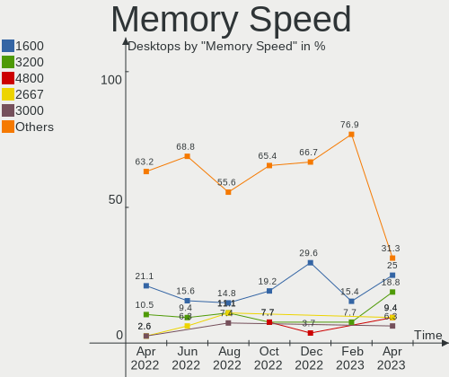

| Speed | Desktops | Percent |
|-------|----------|---------|
| 3600  | 5        | 15.15%  |
| 1600  | 4        | 12.12%  |
| 800   | 4        | 12.12%  |
| 2133  | 3        | 9.09%   |
| 1333  | 3        | 9.09%   |
| 3200  | 2        | 6.06%   |
| 3100  | 2        | 6.06%   |
| 667   | 2        | 6.06%   |
| 3400  | 1        | 3.03%   |
| 2666  | 1        | 3.03%   |
| 2400  | 1        | 3.03%   |
| 1866  | 1        | 3.03%   |
| 1067  | 1        | 3.03%   |
| 933   | 1        | 3.03%   |
| 400   | 1        | 3.03%   |
| 333   | 1        | 3.03%   |

Printers & scanners
-------------------

Printer Vendor
--------------

Printer device vendors

| Vendor             | Desktops | Percent |
|--------------------|----------|---------|
| Brother Industries | 1        | 100%    |

Printer Model
-------------

Printer device models

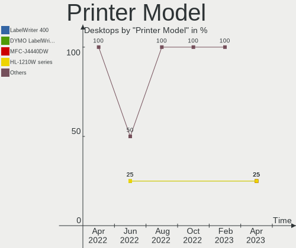

| Model                  | Desktops | Percent |
|------------------------|----------|---------|
| Brother HL-2130 series | 1        | 100%    |

Scanner Vendor
--------------

Scanner device vendors

| Vendor      | Desktops | Percent |
|-------------|----------|---------|
| Seiko Epson | 1        | 100%    |

Scanner Model
-------------

Scanner device models

| Model                                       | Desktops | Percent |
|---------------------------------------------|----------|---------|
| Seiko Epson GT-X820 [Perfection V600 Photo] | 1        | 100%    |

Camera
------

Camera Vendor
-------------

Camera device vendors

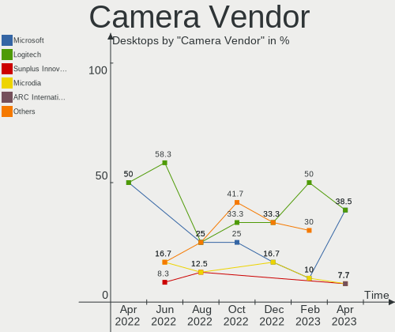

| Vendor          | Desktops | Percent |
|-----------------|----------|---------|
| Logitech        | 3        | 50%     |
| Microsoft       | 1        | 16.67%  |
| Microdia        | 1        | 16.67%  |
| Asuscom Network | 1        | 16.67%  |

Camera Model
------------

Camera device models

| Model                              | Desktops | Percent |
|------------------------------------|----------|---------|
| Microsoft LifeCam Studio           | 1        | 16.67%  |
| Microdia Sonix USB 2.0 Camera      | 1        | 16.67%  |
| Logitech Webcam C270               | 1        | 16.67%  |
| Logitech Webcam C210               | 1        | 16.67%  |
| Logitech C922 Pro Stream Webcam    | 1        | 16.67%  |
| Asuscom Network HD 1080P PC-Camera | 1        | 16.67%  |

Security
--------

Fingerprint Vendor
------------------

Fingerprint sensor vendors

Zero info for selected period =(

Fingerprint Model
-----------------

Fingerprint sensor models

Zero info for selected period =(

Chipcard Vendor
---------------

Chipcard module vendors

Zero info for selected period =(

Chipcard Model
--------------

Chipcard module models

Zero info for selected period =(

Unsupported
-----------

Unsupported Devices
-------------------

Total unsupported devices on board

| Total | Desktops | Percent |
|-------|----------|---------|
| 0     | 44       | 80%     |
| 1     | 10       | 18.18%  |
| 2     | 1        | 1.82%   |

Unsupported Device Types
------------------------

Types of unsupported devices

| Type          | Desktops | Percent |
|---------------|----------|---------|
| Graphics card | 7        | 63.64%  |
| Net/wireless  | 3        | 27.27%  |
| Net/ethernet  | 1        | 9.09%   |

