Linux in Australia - Hardware Trends (Desktops)
-----------------------------------------------

A project to identify most popular hardware characteristics and track their change
over time based on data collected by Linux users at https://Linux-Hardware.org.

Anyone can contribute to this report by the [hw-probe](https://github.com/linuxhw/hw-probe) tool:

    sudo -E hw-probe -all -upload

Period: Mar, 2023.

Contents
--------

* [ System ](#system)
  - [ OS                       ](#os)
  - [ OS Family                ](#os-family)
  - [ Kernel                   ](#kernel)
  - [ Kernel Family            ](#kernel-family)
  - [ Kernel Major Ver.        ](#kernel-major-ver)
  - [ Arch                     ](#arch)
  - [ DE                       ](#de)
  - [ Display Server           ](#display-server)
  - [ Display Manager          ](#display-manager)
  - [ OS Lang                  ](#os-lang)
  - [ Boot Mode                ](#boot-mode)
  - [ Filesystem               ](#filesystem)
  - [ Part. scheme             ](#part-scheme)
  - [ Dual Boot with Linux/BSD ](#dual-boot-with-linuxbsd)
  - [ Dual Boot (Win)          ](#dual-boot-win)

* [ Board ](#board)
  - [ Vendor                   ](#vendor)
  - [ Model                    ](#model)
  - [ Model Family             ](#model-family)
  - [ MFG Year                 ](#mfg-year)
  - [ Form Factor              ](#form-factor)
  - [ Secure Boot              ](#secure-boot)
  - [ Coreboot                 ](#coreboot)
  - [ RAM Size                 ](#ram-size)
  - [ RAM Used                 ](#ram-used)
  - [ Total Drives             ](#total-drives)
  - [ Has CD-ROM               ](#has-cd-rom)
  - [ Has Ethernet             ](#has-ethernet)
  - [ Has WiFi                 ](#has-wifi)
  - [ Has Bluetooth            ](#has-bluetooth)

* [ Location ](#location)
  - [ Country                  ](#country)
  - [ City                     ](#city)

* [ Drives ](#drives)
  - [ Drive Vendor             ](#drive-vendor)
  - [ Drive Model              ](#drive-model)
  - [ HDD Vendor               ](#hdd-vendor)
  - [ SSD Vendor               ](#ssd-vendor)
  - [ Drive Kind               ](#drive-kind)
  - [ Drive Connector          ](#drive-connector)
  - [ Drive Size               ](#drive-size)
  - [ Space Total              ](#space-total)
  - [ Space Used               ](#space-used)
  - [ Malfunc. Drives          ](#malfunc-drives)
  - [ Malfunc. Drive Vendor    ](#malfunc-drive-vendor)
  - [ Malfunc. HDD Vendor      ](#malfunc-hdd-vendor)
  - [ Malfunc. Drive Kind      ](#malfunc-drive-kind)
  - [ Failed Drives            ](#failed-drives)
  - [ Failed Drive Vendor      ](#failed-drive-vendor)
  - [ Drive Status             ](#drive-status)

* [ Storage controller ](#storage-controller)
  - [ Storage Vendor           ](#storage-vendor)
  - [ Storage Model            ](#storage-model)
  - [ Storage Kind             ](#storage-kind)

* [ Processor ](#processor)
  - [ CPU Vendor               ](#cpu-vendor)
  - [ CPU Model                ](#cpu-model)
  - [ CPU Model Family         ](#cpu-model-family)
  - [ CPU Cores                ](#cpu-cores)
  - [ CPU Sockets              ](#cpu-sockets)
  - [ CPU Threads              ](#cpu-threads)
  - [ CPU Op-Modes             ](#cpu-op-modes)
  - [ CPU Microcode            ](#cpu-microcode)
  - [ CPU Microarch            ](#cpu-microarch)

* [ Graphics ](#graphics)
  - [ GPU Vendor               ](#gpu-vendor)
  - [ GPU Model                ](#gpu-model)
  - [ GPU Combo                ](#gpu-combo)
  - [ GPU Driver               ](#gpu-driver)
  - [ GPU Memory               ](#gpu-memory)

* [ Monitor ](#monitor)
  - [ Monitor Vendor           ](#monitor-vendor)
  - [ Monitor Model            ](#monitor-model)
  - [ Monitor Resolution       ](#monitor-resolution)
  - [ Monitor Diagonal         ](#monitor-diagonal)
  - [ Monitor Width            ](#monitor-width)
  - [ Aspect Ratio             ](#aspect-ratio)
  - [ Monitor Area             ](#monitor-area)
  - [ Pixel Density            ](#pixel-density)
  - [ Multiple Monitors        ](#multiple-monitors)

* [ Network ](#network)
  - [ Net Controller Vendor    ](#net-controller-vendor)
  - [ Net Controller Model     ](#net-controller-model)
  - [ Wireless Vendor          ](#wireless-vendor)
  - [ Wireless Model           ](#wireless-model)
  - [ Ethernet Vendor          ](#ethernet-vendor)
  - [ Ethernet Model           ](#ethernet-model)
  - [ Net Controller Kind      ](#net-controller-kind)
  - [ Used Controller          ](#used-controller)
  - [ NICs                     ](#nics)
  - [ IPv6                     ](#ipv6)

* [ Bluetooth ](#bluetooth)
  - [ Bluetooth Vendor         ](#bluetooth-vendor)
  - [ Bluetooth Model          ](#bluetooth-model)

* [ Sound ](#sound)
  - [ Sound Vendor             ](#sound-vendor)
  - [ Sound Model              ](#sound-model)

* [ Memory ](#memory)
  - [ Memory Vendor            ](#memory-vendor)
  - [ Memory Model             ](#memory-model)
  - [ Memory Kind              ](#memory-kind)
  - [ Memory Form Factor       ](#memory-form-factor)
  - [ Memory Size              ](#memory-size)
  - [ Memory Speed             ](#memory-speed)

* [ Printers & scanners ](#printers--scanners)
  - [ Printer Vendor           ](#printer-vendor)
  - [ Printer Model            ](#printer-model)
  - [ Scanner Vendor           ](#scanner-vendor)
  - [ Scanner Model            ](#scanner-model)

* [ Camera ](#camera)
  - [ Camera Vendor            ](#camera-vendor)
  - [ Camera Model             ](#camera-model)

* [ Security ](#security)
  - [ Fingerprint Vendor       ](#fingerprint-vendor)
  - [ Fingerprint Model        ](#fingerprint-model)
  - [ Chipcard Vendor          ](#chipcard-vendor)
  - [ Chipcard Model           ](#chipcard-model)

* [ Unsupported ](#unsupported)
  - [ Unsupported Devices      ](#unsupported-devices)
  - [ Unsupported Device Types ](#unsupported-device-types)

System
------

OS
--

Installed operating systems

| Name                      | Desktops | Percent |
|---------------------------|----------|---------|
| OpenMandriva 23.03        | 7        | 13.21%  |
| Fedora 37                 | 7        | 13.21%  |
| Ubuntu 22.04              | 6        | 11.32%  |
| Pop!_OS 22.04             | 4        | 7.55%   |
| Linux Mint 20.3           | 4        | 7.55%   |
| Zorin 16                  | 3        | 5.66%   |
| Debian 11                 | 3        | 5.66%   |
| Ubuntu 22.10              | 2        | 3.77%   |
| Linux Mint 21.1           | 2        | 3.77%   |
| Ubuntu MATE 22.04         | 1        | 1.89%   |
| Rocky Linux 8.7           | 1        | 1.89%   |
| QTS 4.3.3                 | 1        | 1.89%   |
| openSUSE Microos-XXXXXXXX | 1        | 1.89%   |
| OpenMandriva 4.2          | 1        | 1.89%   |
| OpenMandriva 23.01        | 1        | 1.89%   |
| Nobara 37                 | 1        | 1.89%   |
| Manjaro                   | 1        | 1.89%   |
| Kubuntu 22.10             | 1        | 1.89%   |
| Gentoo 2.9                | 1        | 1.89%   |
| Fedora 35                 | 1        | 1.89%   |
| ClearOS 7                 | 1        | 1.89%   |
| ChimeraOS 39              | 1        | 1.89%   |
| CentOS 7                  | 1        | 1.89%   |
| ArcoLinux Rolling         | 1        | 1.89%   |

OS Family
---------

OS without a version

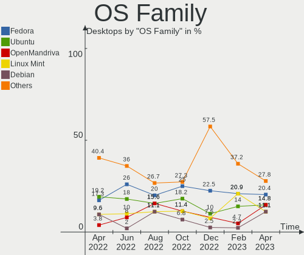

| Name         | Desktops | Percent |
|--------------|----------|---------|
| OpenMandriva | 9        | 16.98%  |
| Ubuntu       | 8        | 15.09%  |
| Fedora       | 8        | 15.09%  |
| Linux Mint   | 6        | 11.32%  |
| Pop!_OS      | 4        | 7.55%   |
| Zorin        | 3        | 5.66%   |
| Debian       | 3        | 5.66%   |
| Ubuntu MATE  | 1        | 1.89%   |
| Rocky Linux  | 1        | 1.89%   |
| QTS          | 1        | 1.89%   |
| openSUSE     | 1        | 1.89%   |
| Nobara       | 1        | 1.89%   |
| Manjaro      | 1        | 1.89%   |
| Kubuntu      | 1        | 1.89%   |
| Gentoo       | 1        | 1.89%   |
| ClearOS      | 1        | 1.89%   |
| ChimeraOS    | 1        | 1.89%   |
| CentOS       | 1        | 1.89%   |
| ArcoLinux    | 1        | 1.89%   |

Kernel
------

Version of the Linux kernel

| Version                      | Desktops | Percent |
|------------------------------|----------|---------|
| 5.19.0-35-generic            | 6        | 11.32%  |
| 6.2.6-desktop-1omv2390       | 5        | 9.43%   |
| 6.1.14-200.fc37.x86_64       | 3        | 5.66%   |
| 5.4.0-144-generic            | 3        | 5.66%   |
| 5.15.0-67-generic            | 3        | 5.66%   |
| 6.2.2-desktop-1omv2390       | 2        | 3.77%   |
| 6.2.0-76060200-generic       | 2        | 3.77%   |
| 5.19.0-38-generic            | 2        | 3.77%   |
| 5.15.0-69-generic            | 2        | 3.77%   |
| 5.15.0-60-generic            | 2        | 3.77%   |
| 6.2.7-200.fc37.x86_64        | 1        | 1.89%   |
| 6.2.6-76060206-generic       | 1        | 1.89%   |
| 6.2.6-1-default              | 1        | 1.89%   |
| 6.1.8-200.fc37.x86_64        | 1        | 1.89%   |
| 6.1.3-gentoo                 | 1        | 1.89%   |
| 6.1.18-200.fc37.x86_64       | 1        | 1.89%   |
| 6.1.14-201.fsync.fc37.x86_64 | 1        | 1.89%   |
| 6.1.12-arch1-1               | 1        | 1.89%   |
| 6.1.11-arch1-1               | 1        | 1.89%   |
| 6.1.1-desktop-1omv2290       | 1        | 1.89%   |
| 6.0.7-301.fc37.x86_64        | 1        | 1.89%   |
| 6.0.6-76060006-generic       | 1        | 1.89%   |
| 6.0.12-100.fc35.x86_64       | 1        | 1.89%   |
| 5.9.16-1-MANJARO             | 1        | 1.89%   |
| 5.19.0-32-generic            | 1        | 1.89%   |
| 5.15.85-1-pve                | 1        | 1.89%   |
| 5.15.102-1-pve               | 1        | 1.89%   |
| 5.10.60-qnap                 | 1        | 1.89%   |
| 5.10.14-desktop-1omv4002     | 1        | 1.89%   |
| 5.10.0-15-amd64              | 1        | 1.89%   |
| 4.18.0-425.13.1.el8_7.x86_64 | 1        | 1.89%   |
| 3.10.0-1160.88.1.el7.x86_64  | 1        | 1.89%   |
| 3.10.0-1160.71.1.el7.x86_64  | 1        | 1.89%   |

Kernel Family
-------------

Linux kernel without a distro release

| Version  | Desktops | Percent |
|----------|----------|---------|
| 5.19.0   | 9        | 16.98%  |
| 6.2.6    | 7        | 13.21%  |
| 5.15.0   | 7        | 13.21%  |
| 6.1.14   | 4        | 7.55%   |
| 5.4.0    | 3        | 5.66%   |
| 6.2.2    | 2        | 3.77%   |
| 6.2.0    | 2        | 3.77%   |
| 3.10.0   | 2        | 3.77%   |
| 6.2.7    | 1        | 1.89%   |
| 6.1.8    | 1        | 1.89%   |
| 6.1.3    | 1        | 1.89%   |
| 6.1.18   | 1        | 1.89%   |
| 6.1.12   | 1        | 1.89%   |
| 6.1.11   | 1        | 1.89%   |
| 6.1.1    | 1        | 1.89%   |
| 6.0.7    | 1        | 1.89%   |
| 6.0.6    | 1        | 1.89%   |
| 6.0.12   | 1        | 1.89%   |
| 5.9.16   | 1        | 1.89%   |
| 5.15.85  | 1        | 1.89%   |
| 5.15.102 | 1        | 1.89%   |
| 5.10.60  | 1        | 1.89%   |
| 5.10.14  | 1        | 1.89%   |
| 5.10.0   | 1        | 1.89%   |
| 4.18.0   | 1        | 1.89%   |

Kernel Major Ver.
-----------------

Linux kernel major version

| Version | Desktops | Percent |
|---------|----------|---------|
| 6.2     | 12       | 22.64%  |
| 6.1     | 10       | 18.87%  |
| 5.19    | 9        | 16.98%  |
| 5.15    | 9        | 16.98%  |
| 6.0     | 3        | 5.66%   |
| 5.4     | 3        | 5.66%   |
| 5.10    | 3        | 5.66%   |
| 3.10    | 2        | 3.77%   |
| 5.9     | 1        | 1.89%   |
| 4.18    | 1        | 1.89%   |

Arch
----

OS architecture (x86_64, i586, etc.)

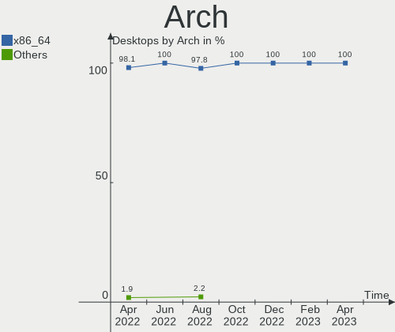

| Name   | Desktops | Percent |
|--------|----------|---------|
| x86_64 | 53       | 100%    |

DE
--

Desktop Environment

| Name       | Desktops | Percent |
|------------|----------|---------|
| GNOME      | 21       | 39.62%  |
| KDE5       | 10       | 18.87%  |
| Cinnamon   | 7        | 13.21%  |
| MATE       | 4        | 7.55%   |
| Unknown    | 4        | 7.55%   |
| XFCE       | 3        | 5.66%   |
| X-Cinnamon | 3        | 5.66%   |
| Hyprland   | 1        | 1.89%   |

Display Server
--------------

X11 or Wayland

| Name    | Desktops | Percent |
|---------|----------|---------|
| X11     | 32       | 60.38%  |
| Wayland | 13       | 24.53%  |
| Tty     | 7        | 13.21%  |
| Unknown | 1        | 1.89%   |

Display Manager
---------------

SDDM, LightDM, etc.

| Name    | Desktops | Percent |
|---------|----------|---------|
| Unknown | 25       | 47.17%  |
| SDDM    | 11       | 20.75%  |
| GDM3    | 8        | 15.09%  |
| LightDM | 7        | 13.21%  |
| GDM     | 2        | 3.77%   |

OS Lang
-------

Language

| Lang    | Desktops | Percent |
|---------|----------|---------|
| en_AU   | 42       | 79.25%  |
| en_US   | 7        | 13.21%  |
| en_GB   | 2        | 3.77%   |
| en_CA   | 1        | 1.89%   |
| Unknown | 1        | 1.89%   |

Boot Mode
---------

EFI or BIOS

| Mode | Desktops | Percent |
|------|----------|---------|
| BIOS | 30       | 56.6%   |
| EFI  | 23       | 43.4%   |

Filesystem
----------

Type of filesystem

| Type    | Desktops | Percent |
|---------|----------|---------|
| Ext4    | 35       | 66.04%  |
| Btrfs   | 8        | 15.09%  |
| Xfs     | 6        | 11.32%  |
| Overlay | 3        | 5.66%   |
| Ext2    | 1        | 1.89%   |

Part. scheme
------------

Scheme of partitioning

| Type    | Desktops | Percent |
|---------|----------|---------|
| GPT     | 23       | 43.4%   |
| Unknown | 20       | 37.74%  |
| MBR     | 10       | 18.87%  |

Dual Boot with Linux/BSD
------------------------

Hosting more than one Linux/BSD

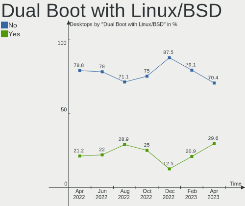

| Dual boot | Desktops | Percent |
|-----------|----------|---------|
| No        | 44       | 83.02%  |
| Yes       | 9        | 16.98%  |

Dual Boot (Win)
---------------

Hosting Linux and Windows

| Dual boot | Desktops | Percent |
|-----------|----------|---------|
| No        | 47       | 88.68%  |
| Yes       | 6        | 11.32%  |

Board
-----

Vendor
------

Motherboard manufacturer

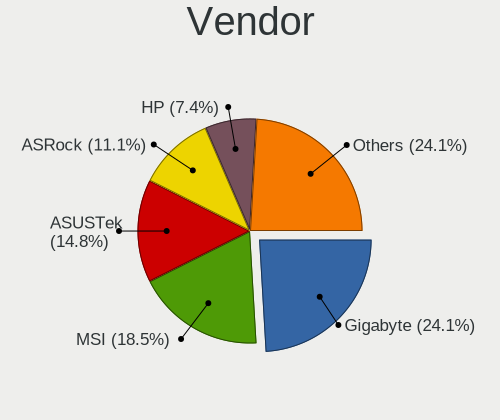

| Name                | Desktops | Percent |
|---------------------|----------|---------|
| Gigabyte Technology | 15       | 28.3%   |
| ASUSTek Computer    | 12       | 22.64%  |
| MSI                 | 5        | 9.43%   |
| ASRock              | 5        | 9.43%   |
| Dell                | 4        | 7.55%   |
| Lenovo              | 3        | 5.66%   |
| QIYIDA              | 1        | 1.89%   |
| MACHINIST           | 1        | 1.89%   |
| Intel               | 1        | 1.89%   |
| Huanan              | 1        | 1.89%   |
| Hewlett-Packard     | 1        | 1.89%   |
| Biostar             | 1        | 1.89%   |
| AMI                 | 1        | 1.89%   |
| Acer                | 1        | 1.89%   |
| Unknown             | 1        | 1.89%   |

Model
-----

Motherboard model

| Name                            | Desktops | Percent |
|---------------------------------|----------|---------|
| Dell OptiPlex 9020              | 3        | 5.66%   |
| QIYIDA X99-H9 V2.0              | 1        | 1.89%   |
| MSI MS-7D46                     | 1        | 1.89%   |
| MSI MS-7C94                     | 1        | 1.89%   |
| MSI MS-7C37                     | 1        | 1.89%   |
| MSI MS-7B89                     | 1        | 1.89%   |
| MSI MS-7142                     | 1        | 1.89%   |
| MACHINIST X99-RS9 V2.0          | 1        | 1.89%   |
| Lenovo ThinkStation D30 42234T7 | 1        | 1.89%   |
| Lenovo H50-55 90BF005HAU        | 1        | 1.89%   |
| Lenovo H50-50 90B6009AAU        | 1        | 1.89%   |
| Intel DB85FL AAG89861-203       | 1        | 1.89%   |
| Huanan X99-AD3 GAMING V2.0      | 1        | 1.89%   |
| HP Z600 Workstation             | 1        | 1.89%   |
| Gigabyte Z97X-Gaming 3          | 1        | 1.89%   |
| Gigabyte Z77MX-D3H              | 1        | 1.89%   |
| Gigabyte Z590I AORUS ULTRA      | 1        | 1.89%   |
| Gigabyte Z590 AORUS ELITE       | 1        | 1.89%   |
| Gigabyte X670E AORUS XTREME     | 1        | 1.89%   |
| Gigabyte X570 AORUS ULTRA       | 1        | 1.89%   |
| Gigabyte X570 AORUS ELITE       | 1        | 1.89%   |
| Gigabyte J1900M-D2P             | 1        | 1.89%   |
| Gigabyte H77N-WIFI              | 1        | 1.89%   |
| Gigabyte H610M H DDR4           | 1        | 1.89%   |
| Gigabyte H55M-USB3              | 1        | 1.89%   |
| Gigabyte G41MT-D3               | 1        | 1.89%   |
| Gigabyte EP45-DS3L              | 1        | 1.89%   |
| Gigabyte B85M-HD3               | 1        | 1.89%   |
| Gigabyte B450 AORUS PRO WIFI    | 1        | 1.89%   |
| Dell Precision T3610            | 1        | 1.89%   |
| Biostar B450MH                  | 1        | 1.89%   |
| ASUS Z170M-PLUS                 | 1        | 1.89%   |
| ASUS TUF Gaming B550M-PLUS      | 1        | 1.89%   |
| ASUS PRIME Z270-A               | 1        | 1.89%   |
| ASUS PRIME B450M-A II           | 1        | 1.89%   |
| ASUS PRIME B250M-K              | 1        | 1.89%   |
| ASUS PRIME A520M-K              | 1        | 1.89%   |
| ASUS Maximus VIII HERO ALPHA    | 1        | 1.89%   |
| ASUS Maximus Extreme            | 1        | 1.89%   |
| ASUS M5A99FX PRO R2.0           | 1        | 1.89%   |

Model Family
------------

Motherboard model prefix

| Name                 | Desktops | Percent |
|----------------------|----------|---------|
| ASUS PRIME           | 4        | 7.55%   |
| Dell OptiPlex        | 3        | 5.66%   |
| Gigabyte X570        | 2        | 3.77%   |
| ASUS Maximus         | 2        | 3.77%   |
| QIYIDA X99-H9        | 1        | 1.89%   |
| MSI MS-7D46          | 1        | 1.89%   |
| MSI MS-7C94          | 1        | 1.89%   |
| MSI MS-7C37          | 1        | 1.89%   |
| MSI MS-7B89          | 1        | 1.89%   |
| MSI MS-7142          | 1        | 1.89%   |
| MACHINIST X99-RS9    | 1        | 1.89%   |
| Lenovo ThinkStation  | 1        | 1.89%   |
| Lenovo H50-55        | 1        | 1.89%   |
| Lenovo H50-50        | 1        | 1.89%   |
| Intel DB85FL         | 1        | 1.89%   |
| Huanan X99-AD3       | 1        | 1.89%   |
| HP Z600              | 1        | 1.89%   |
| Gigabyte Z97X-Gaming | 1        | 1.89%   |
| Gigabyte Z77MX-D3H   | 1        | 1.89%   |
| Gigabyte Z590I       | 1        | 1.89%   |
| Gigabyte Z590        | 1        | 1.89%   |
| Gigabyte X670E       | 1        | 1.89%   |
| Gigabyte J1900M-D2P  | 1        | 1.89%   |
| Gigabyte H77N-WIFI   | 1        | 1.89%   |
| Gigabyte H610M       | 1        | 1.89%   |
| Gigabyte H55M-USB3   | 1        | 1.89%   |
| Gigabyte G41MT-D3    | 1        | 1.89%   |
| Gigabyte EP45-DS3L   | 1        | 1.89%   |
| Gigabyte B85M-HD3    | 1        | 1.89%   |
| Gigabyte B450        | 1        | 1.89%   |
| Dell Precision       | 1        | 1.89%   |
| Biostar B450MH       | 1        | 1.89%   |
| ASUS Z170M-PLUS      | 1        | 1.89%   |
| ASUS TUF             | 1        | 1.89%   |
| ASUS M5A99FX         | 1        | 1.89%   |
| ASUS All             | 1        | 1.89%   |
| ASUS A8R32-MVP       | 1        | 1.89%   |
| ASUS A88X-PLUS       | 1        | 1.89%   |
| ASRock FM2A88X+      | 1        | 1.89%   |
| ASRock FM2A55M-DGS   | 1        | 1.89%   |

MFG Year
--------

Motherboard manufacture year

| Year | Desktops | Percent |
|------|----------|---------|
| 2013 | 7        | 13.21%  |
| 2021 | 5        | 9.43%   |
| 2020 | 5        | 9.43%   |
| 2014 | 5        | 9.43%   |
| 2012 | 5        | 9.43%   |
| 2022 | 4        | 7.55%   |
| 2019 | 4        | 7.55%   |
| 2018 | 4        | 7.55%   |
| 2016 | 4        | 7.55%   |
| 2010 | 3        | 5.66%   |
| 2015 | 2        | 3.77%   |
| 2008 | 2        | 3.77%   |
| 2011 | 1        | 1.89%   |
| 2006 | 1        | 1.89%   |
| 2005 | 1        | 1.89%   |

Form Factor
-----------

Physical design of the computer

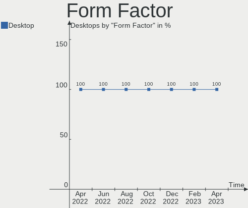

| Name    | Desktops | Percent |
|---------|----------|---------|
| Desktop | 53       | 100%    |

Secure Boot
-----------

Enabled or disabled

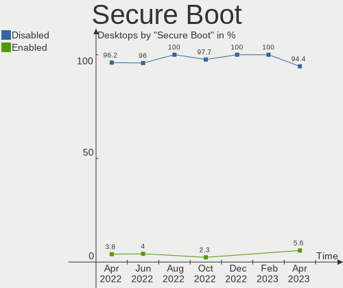

| State    | Desktops | Percent |
|----------|----------|---------|
| Disabled | 52       | 98.11%  |
| Enabled  | 1        | 1.89%   |

Coreboot
--------

Have coreboot on board

| Used | Desktops | Percent |
|------|----------|---------|
| No   | 53       | 100%    |

RAM Size
--------

Total RAM memory

| Size in GB  | Desktops | Percent |
|-------------|----------|---------|
| 32.01-64.0  | 13       | 24.53%  |
| 16.01-24.0  | 12       | 22.64%  |
| 4.01-8.0    | 10       | 18.87%  |
| 8.01-16.0   | 9        | 16.98%  |
| 64.01-256.0 | 4        | 7.55%   |
| 3.01-4.0    | 2        | 3.77%   |
| 24.01-32.0  | 2        | 3.77%   |
| 1.01-2.0    | 1        | 1.89%   |

RAM Used
--------

Used RAM memory

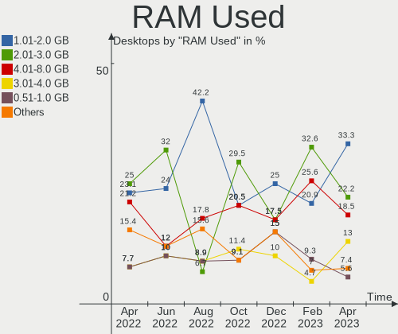

| Used GB    | Desktops | Percent |
|------------|----------|---------|
| 1.01-2.0   | 19       | 35.85%  |
| 2.01-3.0   | 11       | 20.75%  |
| 4.01-8.0   | 9        | 16.98%  |
| 3.01-4.0   | 5        | 9.43%   |
| 8.01-16.0  | 3        | 5.66%   |
| 24.01-32.0 | 2        | 3.77%   |
| 0.51-1.0   | 2        | 3.77%   |
| 0.01-0.5   | 2        | 3.77%   |

Total Drives
------------

Number of drives on board

| Drives | Desktops | Percent |
|--------|----------|---------|
| 1      | 19       | 35.85%  |
| 2      | 18       | 33.96%  |
| 4      | 6        | 11.32%  |
| 5      | 4        | 7.55%   |
| 6      | 2        | 3.77%   |
| 3      | 2        | 3.77%   |
| 10     | 1        | 1.89%   |
| 8      | 1        | 1.89%   |

Has CD-ROM
----------

Has CD-ROM on board

| Presented | Desktops | Percent |
|-----------|----------|---------|
| No        | 38       | 71.7%   |
| Yes       | 15       | 28.3%   |

Has Ethernet
------------

Has Ethernet on board

| Presented | Desktops | Percent |
|-----------|----------|---------|
| Yes       | 53       | 100%    |

Has WiFi
--------

Has WiFi module

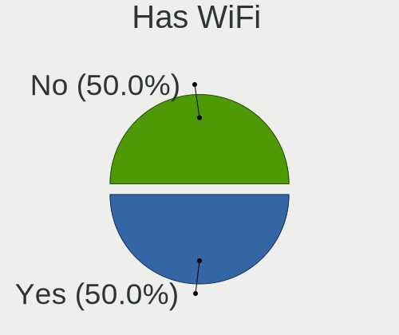

| Presented | Desktops | Percent |
|-----------|----------|---------|
| No        | 28       | 52.83%  |
| Yes       | 25       | 47.17%  |

Has Bluetooth
-------------

Has Bluetooth module

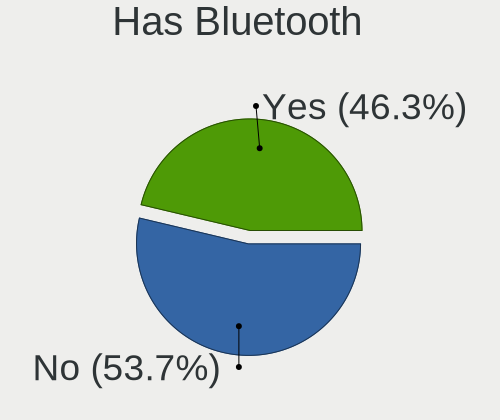

| Presented | Desktops | Percent |
|-----------|----------|---------|
| No        | 31       | 58.49%  |
| Yes       | 22       | 41.51%  |

Location
--------

Country
-------

Geographic location (country)

| Country   | Desktops | Percent |
|-----------|----------|---------|
| Australia | 53       | 100%    |

City
----

Geographic location (city)

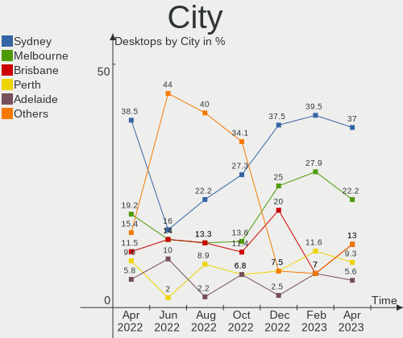

| City       | Desktops | Percent |
|------------|----------|---------|
| Sydney     | 18       | 33.96%  |
| Melbourne  | 10       | 18.87%  |
| Brisbane   | 10       | 18.87%  |
| Perth      | 6        | 11.32%  |
| Canberra   | 2        | 3.77%   |
| Adelaide   | 2        | 3.77%   |
| Shepparton | 1        | 1.89%   |
| Newcastle  | 1        | 1.89%   |
| Hobart     | 1        | 1.89%   |
| Greenwich  | 1        | 1.89%   |
| Gold Coast | 1        | 1.89%   |

Drives
------

Drive Vendor
------------

Hard drive vendors

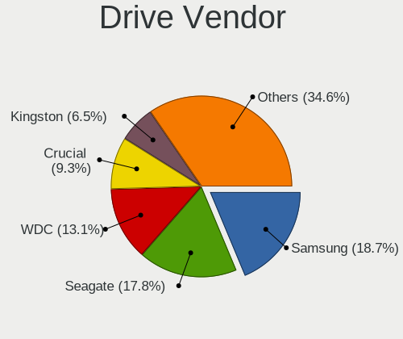

| Vendor                      | Desktops | Drives | Percent |
|-----------------------------|----------|--------|---------|
| Samsung Electronics         | 19       | 26     | 17.92%  |
| Seagate                     | 17       | 34     | 16.04%  |
| WDC                         | 16       | 21     | 15.09%  |
| Crucial                     | 10       | 10     | 9.43%   |
| Kingston                    | 7        | 8      | 6.6%    |
| Toshiba                     | 6        | 6      | 5.66%   |
| SPCC                        | 3        | 4      | 2.83%   |
| Intel                       | 3        | 3      | 2.83%   |
| Sandisk                     | 2        | 2      | 1.89%   |
| Micron/Crucial Technology   | 2        | 2      | 1.89%   |
| Micron Technology           | 2        | 2      | 1.89%   |
| Hitachi                     | 2        | 2      | 1.89%   |
| A-DATA Technology           | 2        | 2      | 1.89%   |
| Vaseky                      | 1        | 1      | 0.94%   |
| Unknown                     | 1        | 1      | 0.94%   |
| QNAP                        | 1        | 2      | 0.94%   |
| Phison Electronics          | 1        | 1      | 0.94%   |
| Maxtor                      | 1        | 1      | 0.94%   |
| MAXIO Technology (Hangzhou) | 1        | 1      | 0.94%   |
| LITEONIT                    | 1        | 1      | 0.94%   |
| LITEON                      | 1        | 1      | 0.94%   |
| Lexar                       | 1        | 1      | 0.94%   |
| KUIJIA                      | 1        | 1      | 0.94%   |
| Kingston Technology Company | 1        | 1      | 0.94%   |
| KingFast                    | 1        | 1      | 0.94%   |
| IET                         | 1        | 1      | 0.94%   |
| Corsair                     | 1        | 1      | 0.94%   |
| China                       | 1        | 1      | 0.94%   |

Drive Model
-----------

Hard drive models

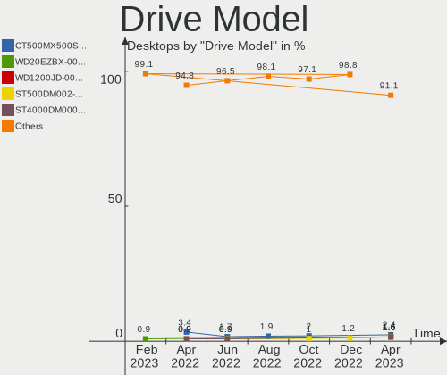

| Model                                               | Desktops | Percent |
|-----------------------------------------------------|----------|---------|
| Samsung NVMe SSD Controller SM981/PM981/PM983 250GB | 4        | 3.39%   |
| Kingston SA400S37480G 480GB SSD                     | 3        | 2.54%   |
| Crucial CT500MX500SSD1 500GB                        | 3        | 2.54%   |
| WDC WD10EZEX-00BN5A0 1TB                            | 2        | 1.69%   |
| WDC WD10EARS-00Y5B1 1TB                             | 2        | 1.69%   |
| SPCC M.2 PCIe SSD 1TB                               | 2        | 1.69%   |
| Seagate ST500DM002-1BD142 500GB                     | 2        | 1.69%   |
| Seagate ST2000DM006-2DM164 2TB                      | 2        | 1.69%   |
| Seagate ST2000DM001-1ER164 2TB                      | 2        | 1.69%   |
| Seagate ST1000DM010-2EP102 1TB                      | 2        | 1.69%   |
| Samsung NVMe SSD Controller SM961/PM961/SM963 256GB | 2        | 1.69%   |
| Kingston SV300S37A120G 120GB SSD                    | 2        | 1.69%   |
| Crucial CT1000P1SSD8 1TB                            | 2        | 1.69%   |
| WDC WDS480G2G0B-00EPW0 480GB SSD                    | 1        | 0.85%   |
| WDC WD5001AALS-00L3B2 500GB                         | 1        | 0.85%   |
| WDC WD5001AALS-00J7B1 500GB                         | 1        | 0.85%   |
| WDC WD40EZRZ-00GXCB0 4TB                            | 1        | 0.85%   |
| WDC WD30EZRX-00D8PB0 3TB                            | 1        | 0.85%   |
| WDC WD20EZRZ-00Z5HB0 2TB                            | 1        | 0.85%   |
| WDC WD20EARX-008FB0 2TB                             | 1        | 0.85%   |
| WDC WD2003FZEX-00SRLA0 2TB                          | 1        | 0.85%   |
| WDC WD1200JD-00HBB0 120GB                           | 1        | 0.85%   |
| WDC WD10EZEX-60M2NA0 1TB                            | 1        | 0.85%   |
| WDC WD10EZEX-22MFCA0 1TB                            | 1        | 0.85%   |
| WDC WD10EZEX-08WN4A0 1TB                            | 1        | 0.85%   |
| WDC WD10EURX-63UY4Y0 1TB                            | 1        | 0.85%   |
| WDC WD10EFRX-68PJCN0 1TB                            | 1        | 0.85%   |
| WDC WD10EFRX-68FYTN0 1TB                            | 1        | 0.85%   |
| WDC WD10EADS-00P8B0 1TB                             | 1        | 0.85%   |
| Vaseky V850/64G 64GB SSD                            | 1        | 0.85%   |
| Unknown SD/MMC/MS PRO 64GB                          | 1        | 0.85%   |
| Toshiba MQ04ABF100 1TB                              | 1        | 0.85%   |
| Toshiba MQ01ABF050 500GB                            | 1        | 0.85%   |
| Toshiba MQ01ABD100 1TB                              | 1        | 0.85%   |
| Toshiba KXG50ZNV512G NVMe 512GB                     | 1        | 0.85%   |
| Toshiba DT01ACA200 2TB                              | 1        | 0.85%   |
| Toshiba DT01ACA050 500GB                            | 1        | 0.85%   |
| SPCC Solid State Disk 512GB                         | 1        | 0.85%   |
| Seagate ST9750422AS 752GB                           | 1        | 0.85%   |
| Seagate ST9500325AS 500GB                           | 1        | 0.85%   |

HDD Vendor
----------

Hard disk drive vendors

| Vendor              | Desktops | Drives | Percent |
|---------------------|----------|--------|---------|
| Seagate             | 17       | 34     | 37.78%  |
| WDC                 | 15       | 20     | 33.33%  |
| Toshiba             | 5        | 5      | 11.11%  |
| Samsung Electronics | 2        | 6      | 4.44%   |
| Hitachi             | 2        | 2      | 4.44%   |
| Unknown             | 1        | 1      | 2.22%   |
| QNAP                | 1        | 2      | 2.22%   |
| Maxtor              | 1        | 1      | 2.22%   |
| IET                 | 1        | 1      | 2.22%   |

SSD Vendor
----------

Solid state drive vendors

| Vendor              | Desktops | Drives | Percent |
|---------------------|----------|--------|---------|
| Samsung Electronics | 9        | 9      | 22.5%   |
| Crucial             | 8        | 8      | 20%     |
| Kingston            | 6        | 7      | 15%     |
| Micron Technology   | 2        | 2      | 5%      |
| Intel               | 2        | 2      | 5%      |
| A-DATA Technology   | 2        | 2      | 5%      |
| WDC                 | 1        | 1      | 2.5%    |
| Vaseky              | 1        | 1      | 2.5%    |
| SPCC                | 1        | 1      | 2.5%    |
| SanDisk             | 1        | 1      | 2.5%    |
| LITEONIT            | 1        | 1      | 2.5%    |
| LITEON              | 1        | 1      | 2.5%    |
| Lexar               | 1        | 1      | 2.5%    |
| KUIJIA              | 1        | 1      | 2.5%    |
| KingFast            | 1        | 1      | 2.5%    |
| Corsair             | 1        | 1      | 2.5%    |
| China               | 1        | 1      | 2.5%    |

Drive Kind
----------

HDD or SSD

| Kind | Desktops | Drives | Percent |
|------|----------|--------|---------|
| HDD  | 35       | 72     | 41.18%  |
| SSD  | 33       | 41     | 38.82%  |
| NVMe | 17       | 25     | 20%     |

Drive Connector
---------------

SATA, SAS, NVMe, etc.

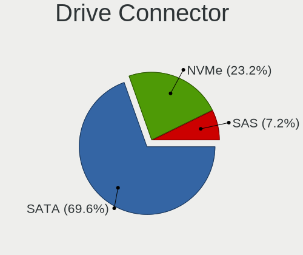

| Type | Desktops | Drives | Percent |
|------|----------|--------|---------|
| SATA | 48       | 105    | 71.64%  |
| NVMe | 17       | 25     | 25.37%  |
| SAS  | 2        | 8      | 2.99%   |

Drive Size
----------

Size of hard drive

| Size in TB | Desktops | Drives | Percent |
|------------|----------|--------|---------|
| 0.01-0.5   | 34       | 53     | 47.22%  |
| 0.51-1.0   | 21       | 32     | 29.17%  |
| 1.01-2.0   | 11       | 17     | 15.28%  |
| 4.01-10.0  | 3        | 8      | 4.17%   |
| 2.01-3.0   | 2        | 2      | 2.78%   |
| 3.01-4.0   | 1        | 1      | 1.39%   |

Space Total
-----------

Amount of disk space available on the file system

| Size in GB     | Desktops | Percent |
|----------------|----------|---------|
| 251-500        | 11       | 20.75%  |
| 101-250        | 10       | 18.87%  |
| 501-1000       | 9        | 16.98%  |
| 1001-2000      | 7        | 13.21%  |
| More than 3000 | 6        | 11.32%  |
| 51-100         | 6        | 11.32%  |
| 21-50          | 1        | 1.89%   |
| 2001-3000      | 1        | 1.89%   |
| 1-20           | 1        | 1.89%   |
| Unknown        | 1        | 1.89%   |

Space Used
----------

Amount of used disk space

| Used GB        | Desktops | Percent |
|----------------|----------|---------|
| 1-20           | 18       | 33.96%  |
| 21-50          | 7        | 13.21%  |
| 251-500        | 6        | 11.32%  |
| 501-1000       | 6        | 11.32%  |
| 51-100         | 6        | 11.32%  |
| 101-250        | 5        | 9.43%   |
| More than 3000 | 3        | 5.66%   |
| 1001-2000      | 1        | 1.89%   |
| Unknown        | 1        | 1.89%   |

Malfunc. Drives
---------------

Drive models with a malfunction

| Model                           | Desktops | Drives | Percent |
|---------------------------------|----------|--------|---------|
| WDC WD10EADS-00P8B0 1TB         | 1        | 1      | 16.67%  |
| Seagate ST500DM002-1BD142 500GB | 1        | 4      | 16.67%  |
| Maxtor 6Y080L0 82GB             | 1        | 1      | 16.67%  |
| Intel SSDSC2CT120A3 120GB       | 1        | 1      | 16.67%  |
| Intel SSDSA2M080G2LE 80GB       | 1        | 1      | 16.67%  |
| Crucial CT525MX300SSD1 528GB    | 1        | 1      | 16.67%  |

Malfunc. Drive Vendor
---------------------

Vendors of faulty drives

| Vendor  | Desktops | Drives | Percent |
|---------|----------|--------|---------|
| Intel   | 2        | 2      | 33.33%  |
| WDC     | 1        | 1      | 16.67%  |
| Seagate | 1        | 4      | 16.67%  |
| Maxtor  | 1        | 1      | 16.67%  |
| Crucial | 1        | 1      | 16.67%  |

Malfunc. HDD Vendor
-------------------

Vendors of faulty HDD drives

| Vendor  | Desktops | Drives | Percent |
|---------|----------|--------|---------|
| WDC     | 1        | 1      | 33.33%  |
| Seagate | 1        | 4      | 33.33%  |
| Maxtor  | 1        | 1      | 33.33%  |

Malfunc. Drive Kind
-------------------

Kinds of faulty drives

| Kind | Desktops | Drives | Percent |
|------|----------|--------|---------|
| SSD  | 3        | 3      | 50%     |
| HDD  | 3        | 6      | 50%     |

Failed Drives
-------------

Failed drive models

Zero info for selected period =(

Failed Drive Vendor
-------------------

Failed drive vendors

Zero info for selected period =(

Drive Status
------------

Number of failed and malfunc. drives

| Status   | Desktops | Drives | Percent |
|----------|----------|--------|---------|
| Detected | 27       | 67     | 45.76%  |
| Works    | 27       | 62     | 45.76%  |
| Malfunc  | 5        | 9      | 8.47%   |

Storage controller
------------------

Storage Vendor
--------------

Storage controller vendors

| Vendor                       | Desktops | Percent |
|------------------------------|----------|---------|
| Intel                        | 31       | 37.35%  |
| AMD                          | 19       | 22.89%  |
| Samsung Electronics          | 9        | 10.84%  |
| ASMedia Technology           | 5        | 6.02%   |
| Micron/Crucial Technology    | 4        | 4.82%   |
| Kingston Technology Company  | 2        | 2.41%   |
| JMicron Technology           | 2        | 2.41%   |
| VIA Technologies             | 1        | 1.2%    |
| ULi Electronics              | 1        | 1.2%    |
| Toshiba America Info Systems | 1        | 1.2%    |
| Silicon Motion               | 1        | 1.2%    |
| Silicon Image                | 1        | 1.2%    |
| SanDisk                      | 1        | 1.2%    |
| Realtek Semiconductor        | 1        | 1.2%    |
| Phison Electronics           | 1        | 1.2%    |
| MAXIO Technology (Hangzhou)  | 1        | 1.2%    |
| Marvell Technology Group     | 1        | 1.2%    |
| 3ware                        | 1        | 1.2%    |

Storage Model
-------------

Storage controller models

| Model                                                                          | Desktops | Percent |
|--------------------------------------------------------------------------------|----------|---------|
| AMD FCH SATA Controller [AHCI mode]                                            | 14       | 14.14%  |
| Intel 8 Series/C220 Series Chipset Family 6-port SATA Controller 1 [AHCI mode] | 9        | 9.09%   |
| Samsung NVMe SSD Controller SM981/PM981/PM983                                  | 4        | 4.04%   |
| AMD 500 Series Chipset SATA Controller                                         | 4        | 4.04%   |
| AMD 400 Series Chipset SATA Controller                                         | 4        | 4.04%   |
| Intel Q170/Q150/B150/H170/H110/Z170/CM236 Chipset SATA Controller [AHCI Mode]  | 3        | 3.03%   |
| ASMedia ASM1062 Serial ATA Controller                                          | 3        | 3.03%   |
| Samsung NVMe SSD Controller SM961/PM961/SM963                                  | 2        | 2.02%   |
| Samsung NVMe SSD Controller PM9A1/PM9A3/980PRO                                 | 2        | 2.02%   |
| Micron/Crucial NVMe Storage Controller                                         | 2        | 2.02%   |
| JMicron JMB363 SATA/IDE Controller                                             | 2        | 2.02%   |
| Intel SATA Controller [RAID mode]                                              | 2        | 2.02%   |
| Intel C600/X79 series chipset IDE-r Controller                                 | 2        | 2.02%   |
| Intel C600/X79 series chipset 6-Port SATA AHCI Controller                      | 2        | 2.02%   |
| Intel Alder Lake-S PCH SATA Controller [AHCI Mode]                             | 2        | 2.02%   |
| Intel 7 Series/C210 Series Chipset Family 6-port SATA Controller [AHCI mode]   | 2        | 2.02%   |
| Intel 500 Series Chipset Family SATA AHCI Controller                           | 2        | 2.02%   |
| AMD SB7x0/SB8x0/SB9x0 SATA Controller [AHCI mode]                              | 2        | 2.02%   |
| AMD FCH IDE Controller                                                         | 2        | 2.02%   |
| VIA VT82C586A/B/VT82C686/A/B/VT823x/A/C PIPC Bus Master IDE                    | 1        | 1.01%   |
| ULi ULi M5288 SATA                                                             | 1        | 1.01%   |
| ULi M5229 IDE                                                                  | 1        | 1.01%   |
| Toshiba America Info Systems XG5 NVMe SSD Controller                           | 1        | 1.01%   |
| Silicon Motion SM2263EN/SM2263XT SSD Controller                                | 1        | 1.01%   |
| Silicon Image SiI 3132 Serial ATA Raid II Controller                           | 1        | 1.01%   |
| SanDisk Non-Volatile memory controller                                         | 1        | 1.01%   |
| Samsung NVMe SSD Controller 980                                                | 1        | 1.01%   |
| Realtek RTS5763DL NVMe SSD Controller                                          | 1        | 1.01%   |
| Phison PS5013 E13 NVMe Controller                                              | 1        | 1.01%   |
| Micron/Crucial P2 NVMe PCIe SSD                                                | 1        | 1.01%   |
| Micron/Crucial P1 NVMe PCIe SSD                                                | 1        | 1.01%   |
| MAXIO (Hangzhou) NVMe SSD Controller MAP1202                                   | 1        | 1.01%   |
| Marvell Group 88SE9125 PCIe SATA 6.0 Gb/s controller                           | 1        | 1.01%   |
| Kingston Company NVMe Controller                                               | 1        | 1.01%   |
| Kingston Company A2000 NVMe SSD                                                | 1        | 1.01%   |
| Intel Volume Management Device NVMe RAID Controller                            | 1        | 1.01%   |
| Intel SSD 600P Series                                                          | 1        | 1.01%   |
| Intel NM10/ICH7 Family SATA Controller [IDE mode]                              | 1        | 1.01%   |
| Intel NM10/ICH7 Family SATA Controller [AHCI mode]                             | 1        | 1.01%   |
| Intel Celeron N3350/Pentium N4200/Atom E3900 Series SATA AHCI Controller       | 1        | 1.01%   |

Storage Kind
------------

Kind of storage controller (IDE, SATA, NVMe, SAS, ...)

| Kind | Desktops | Percent |
|------|----------|---------|
| SATA | 46       | 58.23%  |
| NVMe | 17       | 21.52%  |
| IDE  | 10       | 12.66%  |
| RAID | 5        | 6.33%   |
| SAS  | 1        | 1.27%   |

Processor
---------

CPU Vendor
----------

Processor vendors

| Vendor | Desktops | Percent |
|--------|----------|---------|
| Intel  | 32       | 60.38%  |
| AMD    | 21       | 39.62%  |

CPU Model
---------

Processor models

| Model                                             | Desktops | Percent |
|---------------------------------------------------|----------|---------|
| Intel Core i7-4790 CPU @ 3.60GHz                  | 4        | 7.55%   |
| Intel Core i7-6700K CPU @ 4.00GHz                 | 2        | 3.77%   |
| Intel Core i5-6400 CPU @ 2.70GHz                  | 2        | 3.77%   |
| Intel 12th Gen Core i7-12700                      | 2        | 3.77%   |
| AMD Ryzen 5 5600X 6-Core Processor                | 2        | 3.77%   |
| AMD FX-8320 Eight-Core Processor                  | 2        | 3.77%   |
| Intel Xeon CPU E5620 @ 2.40GHz                    | 1        | 1.89%   |
| Intel Xeon CPU E5-2678 v3 @ 2.50GHz               | 1        | 1.89%   |
| Intel Xeon CPU E5-2670 0 @ 2.60GHz                | 1        | 1.89%   |
| Intel Xeon CPU E5-2620 v3 @ 2.40GHz               | 1        | 1.89%   |
| Intel Xeon CPU E5-1650 v3 @ 3.50GHz               | 1        | 1.89%   |
| Intel Xeon CPU E5-1620 v2 @ 3.70GHz               | 1        | 1.89%   |
| Intel Pentium CPU G4560 @ 3.50GHz                 | 1        | 1.89%   |
| Intel Pentium CPU G3420 @ 3.20GHz                 | 1        | 1.89%   |
| Intel Core i7-4790K CPU @ 4.00GHz                 | 1        | 1.89%   |
| Intel Core i7-3770 CPU @ 3.40GHz                  | 1        | 1.89%   |
| Intel Core i7-10700K CPU @ 3.80GHz                | 1        | 1.89%   |
| Intel Core i5-4570S CPU @ 2.90GHz                 | 1        | 1.89%   |
| Intel Core i5-4570 CPU @ 3.20GHz                  | 1        | 1.89%   |
| Intel Core i3-3220 CPU @ 3.30GHz                  | 1        | 1.89%   |
| Intel Core i3 CPU 530 @ 2.93GHz                   | 1        | 1.89%   |
| Intel Core 2 Quad CPU Q9550 @ 2.83GHz             | 1        | 1.89%   |
| Intel Core 2 Quad CPU Q6600 @ 2.40GHz             | 1        | 1.89%   |
| Intel Core 2 Duo CPU E8400 @ 3.00GHz              | 1        | 1.89%   |
| Intel Celeron CPU N3350 @ 1.10GHz                 | 1        | 1.89%   |
| Intel Celeron CPU J1900 @ 1.99GHz                 | 1        | 1.89%   |
| Intel Atom CPU D525 @ 1.80GHz                     | 1        | 1.89%   |
| Intel 11th Gen Core i5-11500 @ 2.70GHz            | 1        | 1.89%   |
| AMD Sempron Processor 3000+                       | 1        | 1.89%   |
| AMD Ryzen Embedded V1500B Quad-core CPU @ 2.20GHz | 1        | 1.89%   |
| AMD Ryzen 9 7950X 16-Core Processor               | 1        | 1.89%   |
| AMD Ryzen 9 5950X 16-Core Processor               | 1        | 1.89%   |
| AMD Ryzen 9 3900XT 12-Core Processor              | 1        | 1.89%   |
| AMD Ryzen 7 5800X 8-Core Processor                | 1        | 1.89%   |
| AMD Ryzen 7 3700X 8-Core Processor                | 1        | 1.89%   |
| AMD Ryzen 7 1700 Eight-Core Processor             | 1        | 1.89%   |
| AMD Ryzen 5 5600G with Radeon Graphics            | 1        | 1.89%   |
| AMD Ryzen 5 5500                                  | 1        | 1.89%   |
| AMD Ryzen 5 3600 6-Core Processor                 | 1        | 1.89%   |
| AMD Ryzen 5 3500X 6-Core Processor                | 1        | 1.89%   |

CPU Model Family
----------------

Processor model prefix

| Model              | Desktops | Percent |
|--------------------|----------|---------|
| Intel Core i7      | 9        | 16.98%  |
| Intel Xeon         | 6        | 11.32%  |
| AMD Ryzen 5        | 6        | 11.32%  |
| Intel Core i5      | 4        | 7.55%   |
| Other              | 3        | 5.66%   |
| AMD Ryzen 9        | 3        | 5.66%   |
| AMD Ryzen 7        | 3        | 5.66%   |
| Intel Pentium      | 2        | 3.77%   |
| Intel Core i3      | 2        | 3.77%   |
| Intel Core 2 Quad  | 2        | 3.77%   |
| Intel Celeron      | 2        | 3.77%   |
| AMD FX             | 2        | 3.77%   |
| AMD A4             | 2        | 3.77%   |
| Intel Core 2 Duo   | 1        | 1.89%   |
| Intel Atom         | 1        | 1.89%   |
| AMD Sempron        | 1        | 1.89%   |
| AMD Ryzen Embedded | 1        | 1.89%   |
| AMD Athlon 64 X2   | 1        | 1.89%   |
| AMD A8             | 1        | 1.89%   |
| AMD A10            | 1        | 1.89%   |

CPU Cores
---------

Number of processor cores

| Number | Desktops | Percent |
|--------|----------|---------|
| 4      | 19       | 35.85%  |
| 2      | 10       | 18.87%  |
| 6      | 9        | 16.98%  |
| 8      | 6        | 11.32%  |
| 16     | 3        | 5.66%   |
| 12     | 3        | 5.66%   |
| 1      | 3        | 5.66%   |

CPU Sockets
-----------

Number of sockets

| Number | Desktops | Percent |
|--------|----------|---------|
| 1      | 51       | 96.23%  |
| 2      | 2        | 3.77%   |

CPU Threads
-----------

Threads per core (Hyper-Threading)

| Number | Desktops | Percent |
|--------|----------|---------|
| 2      | 39       | 73.58%  |
| 1      | 14       | 26.42%  |

CPU Op-Modes
------------

CPU Operation Modes (32-bit, 64-bit)

| Op mode        | Desktops | Percent |
|----------------|----------|---------|
| 32-bit, 64-bit | 53       | 100%    |

CPU Microcode
-------------

Microcode number

| Number     | Desktops | Percent |
|------------|----------|---------|
| Unknown    | 26       | 49.06%  |
| 0x506e3    | 2        | 3.77%   |
| 0x306c3    | 2        | 3.77%   |
| 0x0a201016 | 2        | 3.77%   |
| 0x06003106 | 2        | 3.77%   |
| 0x06001119 | 2        | 3.77%   |
| 0xa0655    | 1        | 1.89%   |
| 0x6fb      | 1        | 1.89%   |
| 0x506c9    | 1        | 1.89%   |
| 0x306f2    | 1        | 1.89%   |
| 0x306e4    | 1        | 1.89%   |
| 0x306a9    | 1        | 1.89%   |
| 0x30678    | 1        | 1.89%   |
| 0x206d7    | 1        | 1.89%   |
| 0x1067a    | 1        | 1.89%   |
| 0x10677    | 1        | 1.89%   |
| 0x0a601203 | 1        | 1.89%   |
| 0x0a50000d | 1        | 1.89%   |
| 0x08701021 | 1        | 1.89%   |
| 0x08701013 | 1        | 1.89%   |
| 0x08001138 | 1        | 1.89%   |
| 0x06000852 | 1        | 1.89%   |
| 0x06000817 | 1        | 1.89%   |

CPU Microarch
-------------

Microarchitecture

| Name             | Desktops | Percent |
|------------------|----------|---------|
| Haswell          | 11       | 20.75%  |
| Zen 3            | 6        | 11.32%  |
| Zen 2            | 4        | 7.55%   |
| Skylake          | 4        | 7.55%   |
| Piledriver       | 4        | 7.55%   |
| IvyBridge        | 3        | 5.66%   |
| Unknown          | 3        | 5.66%   |
| Zen              | 2        | 3.77%   |
| Westmere         | 2        | 3.77%   |
| Steamroller      | 2        | 3.77%   |
| Penryn           | 2        | 3.77%   |
| K8 Hammer        | 2        | 3.77%   |
| Silvermont       | 1        | 1.89%   |
| SandyBridge      | 1        | 1.89%   |
| KabyLake         | 1        | 1.89%   |
| Goldmont         | 1        | 1.89%   |
| Core             | 1        | 1.89%   |
| CometLake        | 1        | 1.89%   |
| Bonnell          | 1        | 1.89%   |
| Alderlake Hybrid | 1        | 1.89%   |

Graphics
--------

GPU Vendor
----------

Vendors of graphics cards

| Vendor           | Desktops | Percent |
|------------------|----------|---------|
| Nvidia           | 28       | 46.67%  |
| AMD              | 16       | 26.67%  |
| Intel            | 15       | 25%     |
| VIA Technologies | 1        | 1.67%   |

GPU Model
---------

Graphics card models

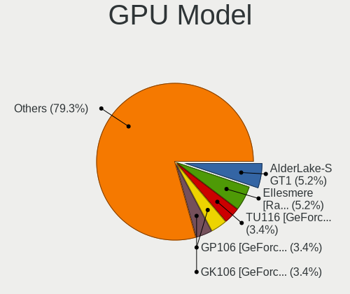

| Model                                                                       | Desktops | Percent |
|-----------------------------------------------------------------------------|----------|---------|
| Intel Xeon E3-1200 v3/4th Gen Core Processor Integrated Graphics Controller | 6        | 9.68%   |
| AMD Ellesmere [Radeon RX 470/480/570/570X/580/580X/590]                     | 4        | 6.45%   |
| Intel HD Graphics 530                                                       | 3        | 4.84%   |
| Nvidia TU117 [GeForce GTX 1650]                                             | 2        | 3.23%   |
| Nvidia GP107 [GeForce GTX 1050]                                             | 2        | 3.23%   |
| Nvidia GM107 [GeForce GTX 750 Ti]                                           | 2        | 3.23%   |
| Nvidia GK208B [GeForce GT 710]                                              | 2        | 3.23%   |
| Nvidia GF108 [GeForce GT 630]                                               | 2        | 3.23%   |
| Nvidia GA104 [GeForce RTX 3060]                                             | 2        | 3.23%   |
| AMD Oland [Radeon HD 8570 / R5 430 OEM / R7 240/340 / Radeon 520 OEM]       | 2        | 3.23%   |
| VIA Technologies K8M800/K8N800/K8N800A [S3 UniChrome Pro]                   | 1        | 1.61%   |
| Nvidia TU117 [GeForce GTX 1630]                                             | 1        | 1.61%   |
| Nvidia TU116 [GeForce GTX 1660]                                             | 1        | 1.61%   |
| Nvidia TU116 [GeForce GTX 1650 SUPER]                                       | 1        | 1.61%   |
| Nvidia GT216 [GeForce GT 220]                                               | 1        | 1.61%   |
| Nvidia GT200 [GeForce GTX 280]                                              | 1        | 1.61%   |
| Nvidia GP104 [GeForce GTX 1080]                                             | 1        | 1.61%   |
| Nvidia GM206 [GeForce GTX 960]                                              | 1        | 1.61%   |
| Nvidia GM204 [GeForce GTX 970]                                              | 1        | 1.61%   |
| Nvidia GK208B [GeForce GT 720]                                              | 1        | 1.61%   |
| Nvidia GK104 [GeForce GTX 760]                                              | 1        | 1.61%   |
| Nvidia GF119 [GeForce GT 705]                                               | 1        | 1.61%   |
| Nvidia GF104 [GeForce GTX 460]                                              | 1        | 1.61%   |
| Nvidia GA106 [GeForce RTX 3060 Lite Hash Rate]                              | 1        | 1.61%   |
| Nvidia GA106 [Geforce RTX 3050]                                             | 1        | 1.61%   |
| Nvidia GA104 [GeForce RTX 3070 Ti]                                          | 1        | 1.61%   |
| Nvidia G72 [GeForce 7300 GS]                                                | 1        | 1.61%   |
| Intel IvyBridge GT2 [HD Graphics 4000]                                      | 1        | 1.61%   |
| Intel HD Graphics 610                                                       | 1        | 1.61%   |
| Intel HD Graphics 500                                                       | 1        | 1.61%   |
| Intel Atom Processor Z36xxx/Z37xxx Series Graphics & Display                | 1        | 1.61%   |
| Intel Atom Processor D4xx/D5xx/N4xx/N5xx Integrated Graphics Controller     | 1        | 1.61%   |
| Intel AlderLake-S GT1                                                       | 1        | 1.61%   |
| AMD Vega 10 XL/XT [Radeon RX Vega 56/64]                                    | 1        | 1.61%   |
| AMD Trinity 2 [Radeon HD 7480D]                                             | 1        | 1.61%   |
| AMD RV530 [Radeon X1600] (Secondary)                                        | 1        | 1.61%   |
| AMD RV530 [Radeon X1600 PRO]                                                | 1        | 1.61%   |
| AMD RV380 [Radeon X300/X550/X1050 Series] (Secondary)                       | 1        | 1.61%   |
| AMD RV370 [Radeon X600/X600 SE]                                             | 1        | 1.61%   |
| AMD Raphael                                                                 | 1        | 1.61%   |

GPU Combo
---------

Combinations of graphics cards

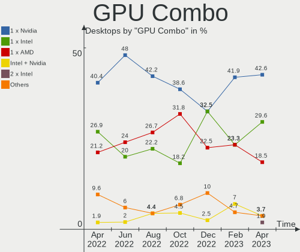

| Name           | Desktops | Percent |
|----------------|----------|---------|
| 1 x Nvidia     | 22       | 41.51%  |
| 1 x Intel      | 10       | 18.87%  |
| 1 x AMD        | 10       | 18.87%  |
| Intel + Nvidia | 3        | 5.66%   |
| AMD + Nvidia   | 3        | 5.66%   |
| 2 x AMD        | 2        | 3.77%   |
| Other          | 1        | 1.89%   |
| 1 x VIA        | 1        | 1.89%   |
| Intel + AMD    | 1        | 1.89%   |

GPU Driver
----------

Free vs proprietary

| Driver      | Desktops | Percent |
|-------------|----------|---------|
| Free        | 37       | 69.81%  |
| Proprietary | 12       | 22.64%  |
| Unknown     | 4        | 7.55%   |

GPU Memory
----------

Total video memory

| Size in GB | Desktops | Percent |
|------------|----------|---------|
| Unknown    | 30       | 56.6%   |
| 1.01-2.0   | 7        | 13.21%  |
| 7.01-8.0   | 4        | 7.55%   |
| 3.01-4.0   | 4        | 7.55%   |
| 0.51-1.0   | 4        | 7.55%   |
| 0.01-0.5   | 3        | 5.66%   |
| 8.01-16.0  | 1        | 1.89%   |

Monitor
-------

Monitor Vendor
--------------

Monitor vendors

| Vendor               | Desktops | Percent |
|----------------------|----------|---------|
| Samsung Electronics  | 10       | 22.22%  |
| Hewlett-Packard      | 5        | 11.11%  |
| Dell                 | 5        | 11.11%  |
| Acer                 | 4        | 8.89%   |
| Philips              | 3        | 6.67%   |
| AOC                  | 3        | 6.67%   |
| Ancor Communications | 3        | 6.67%   |
| Unknown              | 2        | 4.44%   |
| Goldstar             | 2        | 4.44%   |
| BenQ                 | 2        | 4.44%   |
| Unknown (XXX)        | 1        | 2.22%   |
| Toshiba              | 1        | 2.22%   |
| Kogan                | 1        | 2.22%   |
| Impression           | 1        | 2.22%   |
| GKK                  | 1        | 2.22%   |
| Gigabyte Technology  | 1        | 2.22%   |

Monitor Model
-------------

Monitor models

| Model                                                                | Desktops | Percent |
|----------------------------------------------------------------------|----------|---------|
| Dell E228WFP DELD014 1680x1050 473x296mm 22.0-inch                   | 2        | 4.08%   |
| Unknown LCDTV16 0101 1920x1080 1600x900mm 72.3-inch                  | 1        | 2.04%   |
| Unknown LCD Monitor FFFF 2288x1287 2550x2550mm 142.0-inch            | 1        | 2.04%   |
| Unknown (XXX) Beyond TV XXX2851 1920x1080 1209x680mm 54.6-inch       | 1        | 2.04%   |
| Toshiba TV TSB002F 3840x2160 1872x1053mm 84.6-inch                   | 1        | 2.04%   |
| Samsung Electronics SyncMaster SAM0587 1920x1200 518x324mm 24.1-inch | 1        | 2.04%   |
| Samsung Electronics SyncMaster SAM01D3 1440x900 408x225mm 18.3-inch  | 1        | 2.04%   |
| Samsung Electronics SMART TV SAM7129 3840x2160 1210x680mm 54.6-inch  | 1        | 2.04%   |
| Samsung Electronics S27E310 SAM0C31 1920x1080 598x336mm 27.0-inch    | 1        | 2.04%   |
| Samsung Electronics S24E390 SAM0C1A 1920x1080 521x293mm 23.5-inch    | 1        | 2.04%   |
| Samsung Electronics LCD Monitor SyncMaster                           | 1        | 2.04%   |
| Samsung Electronics LCD Monitor S23B300 5760x1080                    | 1        | 2.04%   |
| Samsung Electronics LCD Monitor S23B300                              | 1        | 2.04%   |
| Samsung Electronics C34H89x SAM0E25 3440x1440 797x333mm 34.0-inch    | 1        | 2.04%   |
| Samsung Electronics C32F391 SAM0D34 1920x1080 698x393mm 31.5-inch    | 1        | 2.04%   |
| Samsung Electronics C27JG5x SAM0F58 2560x1440 597x336mm 27.0-inch    | 1        | 2.04%   |
| Samsung Electronics C27HG7x SAM0E16 2560x1440 598x336mm 27.0-inch    | 1        | 2.04%   |
| Philips PHL 243V7 PHLC155 1920x1080 527x296mm 23.8-inch              | 1        | 2.04%   |
| Philips PHL 241V8 PHLC212 1920x1080 527x296mm 23.8-inch              | 1        | 2.04%   |
| Philips 32 LCD TV PHL4650 1280x1024 760x450mm 34.8-inch              | 1        | 2.04%   |
| Kogan DP KGN0AF0 3840x2160 620x341mm 27.9-inch                       | 1        | 2.04%   |
| Impression R19W12-A1 IMP1912 1440x900 410x257mm 19.1-inch            | 1        | 2.04%   |
| Hewlett-Packard ZR30w HWP286E 2560x1600 641x400mm 29.7-inch          | 1        | 2.04%   |
| Hewlett-Packard X34 HPN3728 3440x1440 800x335mm 34.1-inch            | 1        | 2.04%   |
| Hewlett-Packard LCD Monitor LE1901w 2580x1440                        | 1        | 2.04%   |
| Hewlett-Packard LA2306 HWP2949 1920x1080 509x286mm 23.0-inch         | 1        | 2.04%   |
| Hewlett-Packard E242 HWP326F 1920x1080 518x324mm 24.1-inch           | 1        | 2.04%   |
| Hewlett-Packard E220t HWP3252 1920x1080 476x267mm 21.5-inch          | 1        | 2.04%   |
| Goldstar ULTRAGEAR GSM5BB3 2560x1440 597x336mm 27.0-inch             | 1        | 2.04%   |
| Goldstar HDR 4K GSM7706 3840x2160 600x340mm 27.2-inch                | 1        | 2.04%   |
| GKK MONITOR GKK0509 1920x1080                                        | 1        | 2.04%   |
| Gigabyte Technology M27Q GBT270D 2560x1440 596x335mm 26.9-inch       | 1        | 2.04%   |
| Dell U2312HM DEL4072 1920x1080 510x287mm 23.0-inch                   | 1        | 2.04%   |
| Dell P2214H DELA098 1920x1080 477x268mm 21.5-inch                    | 1        | 2.04%   |
| Dell LCD Monitor P2319H 3200x1080                                    | 1        | 2.04%   |
| Dell LCD Monitor P1917S                                              | 1        | 2.04%   |
| BenQ GW2270 BNQ78DB 1920x1080 476x268mm 21.5-inch                    | 1        | 2.04%   |
| BenQ GL2460 BNQ78CE 1920x1080 531x299mm 24.0-inch                    | 1        | 2.04%   |
| AOC U34G2G4R3 AOC3402 3440x1440 797x334mm 34.0-inch                  | 1        | 2.04%   |
| AOC Q32P2WG5B AOC3202 2560x1440 698x393mm 31.5-inch                  | 1        | 2.04%   |

Monitor Resolution
------------------

Monitor screen resolution

| Resolution         | Desktops | Percent |
|--------------------|----------|---------|
| 1920x1080 (FHD)    | 16       | 34.78%  |
| 3840x2160 (4K)     | 6        | 13.04%  |
| 2560x1440 (QHD)    | 6        | 13.04%  |
| 3440x1440          | 3        | 6.52%   |
| Unknown            | 3        | 6.52%   |
| 1680x1050 (WSXGA+) | 2        | 4.35%   |
| 1440x900 (WXGA+)   | 2        | 4.35%   |
| 5760x1080          | 1        | 2.17%   |
| 3200x1080          | 1        | 2.17%   |
| 2580x1440          | 1        | 2.17%   |
| 2560x1600          | 1        | 2.17%   |
| 2288x1287          | 1        | 2.17%   |
| 1920x1200 (WUXGA)  | 1        | 2.17%   |
| 1600x900 (HD+)     | 1        | 2.17%   |
| 1280x768           | 1        | 2.17%   |

Monitor Diagonal
----------------

Diagonal size in inches

| Inches  | Desktops | Percent |
|---------|----------|---------|
| 27      | 7        | 15.22%  |
| 24      | 7        | 15.22%  |
| 23      | 5        | 10.87%  |
| Unknown | 5        | 10.87%  |
| 34      | 4        | 8.7%    |
| 21      | 4        | 8.7%    |
| 31      | 3        | 6.52%   |
| 19      | 3        | 6.52%   |
| 84      | 2        | 4.35%   |
| 22      | 2        | 4.35%   |
| 142     | 1        | 2.17%   |
| 72      | 1        | 2.17%   |
| 54      | 1        | 2.17%   |
| 29      | 1        | 2.17%   |

Monitor Width
-------------

Physical width

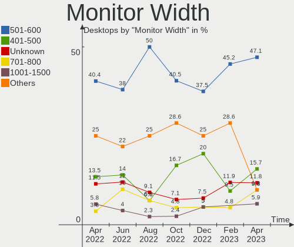

| Width in mm    | Desktops | Percent |
|----------------|----------|---------|
| 501-600        | 18       | 39.13%  |
| 401-500        | 9        | 19.57%  |
| 601-700        | 5        | 10.87%  |
| Unknown        | 5        | 10.87%  |
| 701-800        | 4        | 8.7%    |
| 1501-2000      | 3        | 6.52%   |
| More than 2000 | 1        | 2.17%   |
| 1001-1500      | 1        | 2.17%   |

Aspect Ratio
------------

Proportional relationship between the width and the height

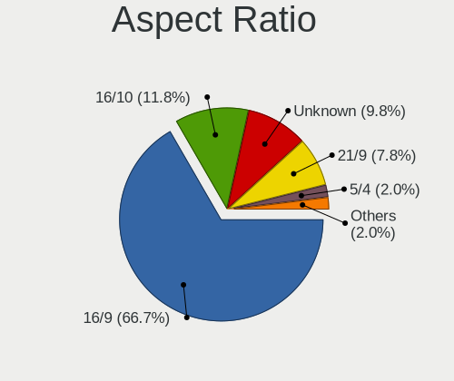

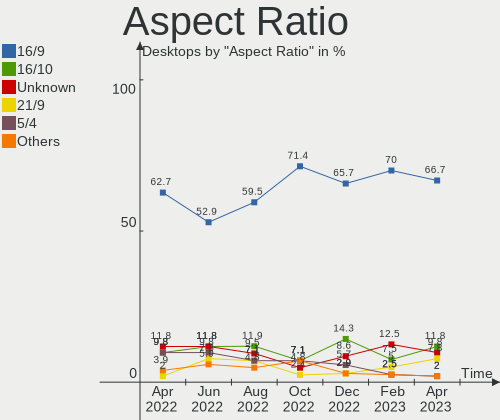

| Ratio   | Desktops | Percent |
|---------|----------|---------|
| 16/9    | 27       | 64.29%  |
| 16/10   | 7        | 16.67%  |
| Unknown | 4        | 9.52%   |
| 21/9    | 3        | 7.14%   |
| 1.00    | 1        | 2.38%   |

Monitor Area
------------

Area in inch

| Area in inch | Desktops | Percent |
|----------------|----------|---------|
| 201-250        | 13       | 28.89%  |
| 351-500        | 7        | 15.56%  |
| 301-350        | 7        | 15.56%  |
| More than 1000 | 5        | 11.11%  |
| Unknown        | 5        | 11.11%  |
| 151-200        | 4        | 8.89%   |
| 251-300        | 3        | 6.67%   |
| 501-1000       | 1        | 2.22%   |

Pixel Density
-------------

Pixels per inch

| Density | Desktops | Percent |
|---------|----------|---------|
| 51-100  | 23       | 53.49%  |
| 101-120 | 10       | 23.26%  |
| Unknown | 5        | 11.63%  |
| 1-50    | 3        | 6.98%   |
| 161-240 | 1        | 2.33%   |
| 121-160 | 1        | 2.33%   |

Multiple Monitors
-----------------

Total monitors connected

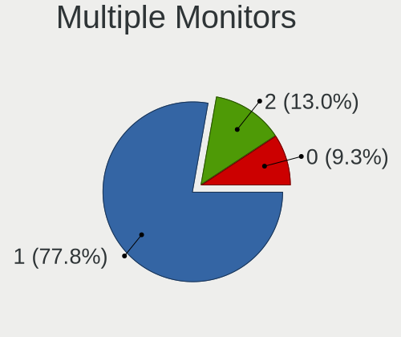

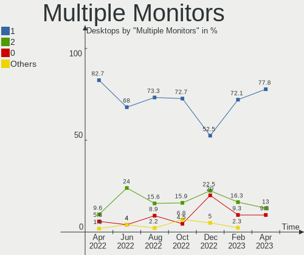

| Total | Desktops | Percent |
|-------|----------|---------|
| 1     | 34       | 64.15%  |
| 0     | 10       | 18.87%  |
| 2     | 9        | 16.98%  |

Network
-------

Net Controller Vendor
---------------------

Controller vendors

| Vendor                   | Desktops | Percent |
|--------------------------|----------|---------|
| Realtek Semiconductor    | 32       | 38.1%   |
| Intel                    | 26       | 30.95%  |
| Qualcomm Atheros         | 9        | 10.71%  |
| Ralink Technology        | 4        | 4.76%   |
| Aquantia                 | 3        | 3.57%   |
| Marvell Technology Group | 2        | 2.38%   |
| VIA Technologies         | 1        | 1.19%   |
| Ralink                   | 1        | 1.19%   |
| ICS Advent               | 1        | 1.19%   |
| DisplayLink              | 1        | 1.19%   |
| D-Link System            | 1        | 1.19%   |
| D-Link                   | 1        | 1.19%   |
| Broadcom Limited         | 1        | 1.19%   |
| Broadcom                 | 1        | 1.19%   |

Net Controller Model
--------------------

Controller models

| Model                                                                  | Desktops | Percent |
|------------------------------------------------------------------------|----------|---------|
| Realtek RTL8111/8168/8411 PCI Express Gigabit Ethernet Controller      | 27       | 27.27%  |
| Intel Wi-Fi 6 AX200                                                    | 5        | 5.05%   |
| Realtek RTL8125 2.5GbE Controller                                      | 3        | 3.03%   |
| Qualcomm Atheros Killer E220x Gigabit Ethernet Controller              | 3        | 3.03%   |
| Intel Wi-Fi 6 AX210/AX211/AX411 160MHz                                 | 3        | 3.03%   |
| Intel I211 Gigabit Network Connection                                  | 3        | 3.03%   |
| Intel Ethernet Connection I217-LM                                      | 3        | 3.03%   |
| Ralink MT7601U Wireless Adapter                                        | 2        | 2.02%   |
| Qualcomm Atheros AR8151 v2.0 Gigabit Ethernet                          | 2        | 2.02%   |
| Intel Ethernet Controller I225-V                                       | 2        | 2.02%   |
| Intel Ethernet Connection (2) I219-V                                   | 2        | 2.02%   |
| Intel 82579LM Gigabit Network Connection (Lewisville)                  | 2        | 2.02%   |
| Intel 82574L Gigabit Network Connection                                | 2        | 2.02%   |
| Aquantia AQC107 NBase-T/IEEE 802.3bz Ethernet Controller [AQtion]      | 2        | 2.02%   |
| VIA VT6102/VT6103 [Rhine-II]                                           | 1        | 1.01%   |
| Realtek USB 10/100/1G/2.5G LAN                                         | 1        | 1.01%   |
| Realtek RTL8821CE 802.11ac PCIe Wireless Network Adapter               | 1        | 1.01%   |
| Realtek RTL8821AE 802.11ac PCIe Wireless Network Adapter               | 1        | 1.01%   |
| Realtek RTL8812AE 802.11ac PCIe Wireless Network Adapter               | 1        | 1.01%   |
| Realtek RTL8153 Gigabit Ethernet Adapter                               | 1        | 1.01%   |
| Realtek RTL8150 Fast Ethernet Adapter                                  | 1        | 1.01%   |
| Realtek RTL-8185 IEEE 802.11a/b/g Wireless LAN Controller              | 1        | 1.01%   |
| Realtek RTL-8100/8101L/8139 PCI Fast Ethernet Adapter                  | 1        | 1.01%   |
| Realtek Realtek Ethernet controller                                    | 1        | 1.01%   |
| Ralink RT5370 Wireless Adapter                                         | 1        | 1.01%   |
| Ralink RT3572 Wireless Adapter                                         | 1        | 1.01%   |
| Ralink RT5392 PCIe Wireless Network Adapter                            | 1        | 1.01%   |
| Qualcomm Atheros QCA9565 / AR9565 Wireless Network Adapter             | 1        | 1.01%   |
| Qualcomm Atheros AR9485 Wireless Network Adapter                       | 1        | 1.01%   |
| Qualcomm Atheros AR9287 Wireless Network Adapter (PCI-Express)         | 1        | 1.01%   |
| Qualcomm Atheros AR5416 Wireless Network Adapter [AR5008 802.11(a)bgn] | 1        | 1.01%   |
| Marvell Group 88E8056 PCI-E Gigabit Ethernet Controller                | 1        | 1.01%   |
| Marvell Group 88E8053 PCI-E Gigabit Ethernet Controller                | 1        | 1.01%   |
| Marvell Group 88E8001 Gigabit Ethernet Controller                      | 1        | 1.01%   |
| Intel Wireless-AC 9260                                                 | 1        | 1.01%   |
| Intel Wireless 8265 / 8275                                             | 1        | 1.01%   |
| Intel Ethernet Connection I217-V                                       | 1        | 1.01%   |
| Intel Ethernet Connection (5) I219-V                                   | 1        | 1.01%   |
| Intel Ethernet Connection (17) I219-V                                  | 1        | 1.01%   |
| Intel Dual Band Wireless-AC 3168NGW [Stone Peak]                       | 1        | 1.01%   |

Wireless Vendor
---------------

Wireless vendors

| Vendor                | Desktops | Percent |
|-----------------------|----------|---------|
| Intel                 | 12       | 46.15%  |
| Realtek Semiconductor | 4        | 15.38%  |
| Ralink Technology     | 4        | 15.38%  |
| Qualcomm Atheros      | 4        | 15.38%  |
| Ralink                | 1        | 3.85%   |
| Broadcom Limited      | 1        | 3.85%   |

Wireless Model
--------------

Wireless models

| Model                                                                  | Desktops | Percent |
|------------------------------------------------------------------------|----------|---------|
| Intel Wi-Fi 6 AX200                                                    | 5        | 19.23%  |
| Intel Wi-Fi 6 AX210/AX211/AX411 160MHz                                 | 3        | 11.54%  |
| Ralink MT7601U Wireless Adapter                                        | 2        | 7.69%   |
| Realtek RTL8821CE 802.11ac PCIe Wireless Network Adapter               | 1        | 3.85%   |
| Realtek RTL8821AE 802.11ac PCIe Wireless Network Adapter               | 1        | 3.85%   |
| Realtek RTL8812AE 802.11ac PCIe Wireless Network Adapter               | 1        | 3.85%   |
| Realtek RTL-8185 IEEE 802.11a/b/g Wireless LAN Controller              | 1        | 3.85%   |
| Ralink RT5370 Wireless Adapter                                         | 1        | 3.85%   |
| Ralink RT3572 Wireless Adapter                                         | 1        | 3.85%   |
| Ralink RT5392 PCIe Wireless Network Adapter                            | 1        | 3.85%   |
| Qualcomm Atheros QCA9565 / AR9565 Wireless Network Adapter             | 1        | 3.85%   |
| Qualcomm Atheros AR9485 Wireless Network Adapter                       | 1        | 3.85%   |
| Qualcomm Atheros AR9287 Wireless Network Adapter (PCI-Express)         | 1        | 3.85%   |
| Qualcomm Atheros AR5416 Wireless Network Adapter [AR5008 802.11(a)bgn] | 1        | 3.85%   |
| Intel Wireless-AC 9260                                                 | 1        | 3.85%   |
| Intel Wireless 8265 / 8275                                             | 1        | 3.85%   |
| Intel Dual Band Wireless-AC 3168NGW [Stone Peak]                       | 1        | 3.85%   |
| Intel Centrino Wireless-N 2230                                         | 1        | 3.85%   |
| Broadcom Limited BCM4331 802.11a/b/g/n                                 | 1        | 3.85%   |

Ethernet Vendor
---------------

Ethernet vendors

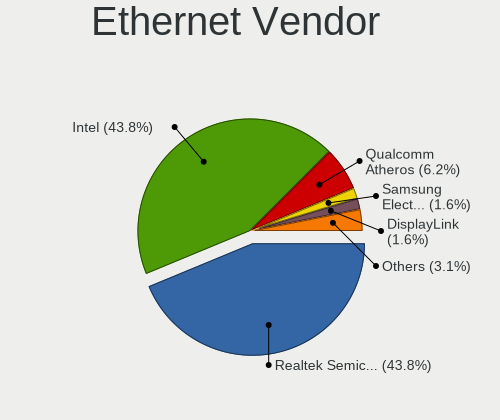

| Vendor                   | Desktops | Percent |
|--------------------------|----------|---------|
| Realtek Semiconductor    | 32       | 47.06%  |
| Intel                    | 20       | 29.41%  |
| Qualcomm Atheros         | 5        | 7.35%   |
| Aquantia                 | 3        | 4.41%   |
| Marvell Technology Group | 2        | 2.94%   |
| VIA Technologies         | 1        | 1.47%   |
| ICS Advent               | 1        | 1.47%   |
| DisplayLink              | 1        | 1.47%   |
| D-Link System            | 1        | 1.47%   |
| D-Link                   | 1        | 1.47%   |
| Broadcom                 | 1        | 1.47%   |

Ethernet Model
--------------

Ethernet models

| Model                                                             | Desktops | Percent |
|-------------------------------------------------------------------|----------|---------|
| Realtek RTL8111/8168/8411 PCI Express Gigabit Ethernet Controller | 27       | 36.99%  |
| Realtek RTL8125 2.5GbE Controller                                 | 3        | 4.11%   |
| Qualcomm Atheros Killer E220x Gigabit Ethernet Controller         | 3        | 4.11%   |
| Intel I211 Gigabit Network Connection                             | 3        | 4.11%   |
| Intel Ethernet Connection I217-LM                                 | 3        | 4.11%   |
| Qualcomm Atheros AR8151 v2.0 Gigabit Ethernet                     | 2        | 2.74%   |
| Intel Ethernet Controller I225-V                                  | 2        | 2.74%   |
| Intel Ethernet Connection (2) I219-V                              | 2        | 2.74%   |
| Intel 82579LM Gigabit Network Connection (Lewisville)             | 2        | 2.74%   |
| Intel 82574L Gigabit Network Connection                           | 2        | 2.74%   |
| Aquantia AQC107 NBase-T/IEEE 802.3bz Ethernet Controller [AQtion] | 2        | 2.74%   |
| VIA VT6102/VT6103 [Rhine-II]                                      | 1        | 1.37%   |
| Realtek USB 10/100/1G/2.5G LAN                                    | 1        | 1.37%   |
| Realtek RTL8153 Gigabit Ethernet Adapter                          | 1        | 1.37%   |
| Realtek RTL8150 Fast Ethernet Adapter                             | 1        | 1.37%   |
| Realtek RTL-8100/8101L/8139 PCI Fast Ethernet Adapter             | 1        | 1.37%   |
| Realtek Realtek Ethernet controller                               | 1        | 1.37%   |
| Marvell Group 88E8056 PCI-E Gigabit Ethernet Controller           | 1        | 1.37%   |
| Marvell Group 88E8053 PCI-E Gigabit Ethernet Controller           | 1        | 1.37%   |
| Marvell Group 88E8001 Gigabit Ethernet Controller                 | 1        | 1.37%   |
| Intel Ethernet Connection I217-V                                  | 1        | 1.37%   |
| Intel Ethernet Connection (5) I219-V                              | 1        | 1.37%   |
| Intel Ethernet Connection (17) I219-V                             | 1        | 1.37%   |
| Intel 82575EB Gigabit Network Connection                          | 1        | 1.37%   |
| Intel 82557/8/9/0/1 Ethernet Pro 100                              | 1        | 1.37%   |
| Intel 82546GB Gigabit Ethernet Controller                         | 1        | 1.37%   |
| Intel 82546EB Gigabit Ethernet Controller (Copper)                | 1        | 1.37%   |
| ICS Advent DM9601 Fast Ethernet Adapter                           | 1        | 1.37%   |
| DisplayLink dynadock U3.0                                         | 1        | 1.37%   |
| D-Link System RTL8139 Ethernet                                    | 1        | 1.37%   |
| D-Link DUB-1312 Gigabit Ethernet Adapter                          | 1        | 1.37%   |
| Broadcom NetXtreme BCM5764M Gigabit Ethernet PCIe                 | 1        | 1.37%   |
| Aquantia FastLinQ Edge 10Gbit Network Adapter                     | 1        | 1.37%   |

Net Controller Kind
-------------------

Ethernet, WiFi or modem

| Kind     | Desktops | Percent |
|----------|----------|---------|
| Ethernet | 53       | 67.95%  |
| WiFi     | 25       | 32.05%  |

Used Controller
---------------

Currently used network controller

| Kind     | Desktops | Percent |
|----------|----------|---------|
| Ethernet | 41       | 70.69%  |
| WiFi     | 17       | 29.31%  |

NICs
----

Total network controllers on board

| Total | Desktops | Percent |
|-------|----------|---------|
| 2     | 23       | 43.4%   |
| 1     | 21       | 39.62%  |
| 3     | 7        | 13.21%  |
| 5     | 1        | 1.89%   |
| 4     | 1        | 1.89%   |

IPv6
----

IPv6 vs IPv4

| Used | Desktops | Percent |
|------|----------|---------|
| No   | 42       | 79.25%  |
| Yes  | 11       | 20.75%  |

Bluetooth
---------

Bluetooth Vendor
----------------

Controller vendors

| Vendor                          | Desktops | Percent |
|---------------------------------|----------|---------|
| Intel                           | 10       | 45.45%  |
| Realtek Semiconductor           | 5        | 22.73%  |
| Cambridge Silicon Radio         | 2        | 9.09%   |
| Broadcom                        | 2        | 9.09%   |
| TP-Link                         | 1        | 4.55%   |
| Qualcomm Atheros Communications | 1        | 4.55%   |
| Apple                           | 1        | 4.55%   |

Bluetooth Model
---------------

Controller models

| Model                                               | Desktops | Percent |
|-----------------------------------------------------|----------|---------|
| Realtek Bluetooth Radio                             | 4        | 18.18%  |
| Intel AX200 Bluetooth                               | 4        | 18.18%  |
| Intel AX210 Bluetooth                               | 2        | 9.09%   |
| Cambridge Silicon Radio Bluetooth Dongle (HCI mode) | 2        | 9.09%   |
| Broadcom BCM20702A0 Bluetooth 4.0                   | 2        | 9.09%   |
| TP-Link UB500 Adapter                               | 1        | 4.55%   |
| Realtek RTL8821A Bluetooth                          | 1        | 4.55%   |
| Qualcomm Atheros AR3012 Bluetooth 4.0               | 1        | 4.55%   |
| Intel Wireless-AC 9260 Bluetooth Adapter            | 1        | 4.55%   |
| Intel Wireless-AC 3168 Bluetooth                    | 1        | 4.55%   |
| Intel Centrino Bluetooth Wireless Transceiver       | 1        | 4.55%   |
| Intel Bluetooth wireless interface                  | 1        | 4.55%   |
| Apple Bluetooth USB Host Controller                 | 1        | 4.55%   |

Sound
-----

Sound Vendor
------------

Sound card vendors

| Vendor              | Desktops | Percent |
|---------------------|----------|---------|
| Intel               | 31       | 33.33%  |
| Nvidia              | 26       | 27.96%  |
| AMD                 | 25       | 26.88%  |
| Logitech            | 2        | 2.15%   |
| C-Media Electronics | 2        | 2.15%   |
| XMOS                | 1        | 1.08%   |
| VIA Technologies    | 1        | 1.08%   |
| ULi Electronics     | 1        | 1.08%   |
| Texas Instruments   | 1        | 1.08%   |
| GN Netcom           | 1        | 1.08%   |
| Focusrite-Novation  | 1        | 1.08%   |
| Creative Labs       | 1        | 1.08%   |

Sound Model
-----------

Sound card models

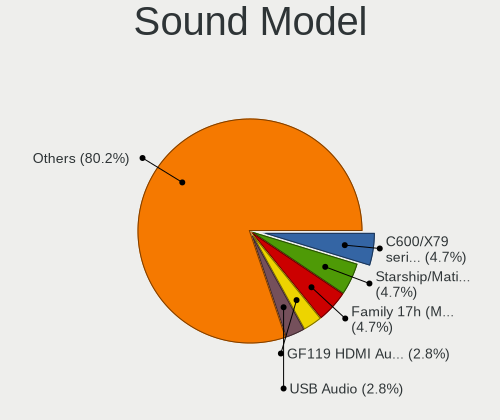

| Model                                                                   | Desktops | Percent |
|-------------------------------------------------------------------------|----------|---------|
| Intel 8 Series/C220 Series Chipset High Definition Audio Controller     | 9        | 8.41%   |
| AMD Starship/Matisse HD Audio Controller                                | 8        | 7.48%   |
| Intel Xeon E3-1200 v3/4th Gen Core Processor HD Audio Controller        | 6        | 5.61%   |
| AMD FCH Azalia Controller                                               | 4        | 3.74%   |
| AMD Family 17h/19h HD Audio Controller                                  | 4        | 3.74%   |
| AMD Ellesmere HDMI Audio [Radeon RX 470/480 / 570/580/590]              | 4        | 3.74%   |
| Nvidia TU107 GeForce GTX 1650 High Definition Audio Controller          | 3        | 2.8%    |
| Nvidia GK208 HDMI/DP Audio Controller                                   | 3        | 2.8%    |
| Nvidia GA104 High Definition Audio Controller                           | 3        | 2.8%    |
| Intel 100 Series/C230 Series Chipset Family HD Audio Controller         | 3        | 2.8%    |
| Nvidia TU116 High Definition Audio Controller                           | 2        | 1.87%   |
| Nvidia GP107GL High Definition Audio Controller                         | 2        | 1.87%   |
| Nvidia GM107 High Definition Audio Controller [GeForce 940MX]           | 2        | 1.87%   |
| Nvidia GF108 High Definition Audio Controller                           | 2        | 1.87%   |
| Nvidia GA106 High Definition Audio Controller                           | 2        | 1.87%   |
| Intel NM10/ICH7 Family High Definition Audio Controller                 | 2        | 1.87%   |
| Intel C600/X79 series chipset High Definition Audio Controller          | 2        | 1.87%   |
| Intel Alder Lake-S HD Audio Controller                                  | 2        | 1.87%   |
| Intel 7 Series/C216 Chipset Family High Definition Audio Controller     | 2        | 1.87%   |
| Intel 200 Series PCH HD Audio                                           | 2        | 1.87%   |
| AMD Renoir Radeon High Definition Audio Controller                      | 2        | 1.87%   |
| AMD Oland/Hainan/Cape Verde/Pitcairn HDMI Audio [Radeon HD 7000 Series] | 2        | 1.87%   |
| AMD Navi 21/23 HDMI/DP Audio Controller                                 | 2        | 1.87%   |
| XMOS iFi (by AMR) HD USB Audio                                          | 1        | 0.93%   |
| VIA Technologies VT8233/A/8235/8237 AC97 Audio Controller               | 1        | 0.93%   |
| ULi Electronics HD Audio Controller                                     | 1        | 0.93%   |
| Texas Instruments PCM2904 Audio Codec                                   | 1        | 0.93%   |
| Nvidia GT216 HDMI Audio Controller                                      | 1        | 0.93%   |
| Nvidia GP104 High Definition Audio Controller                           | 1        | 0.93%   |
| Nvidia GM206 High Definition Audio Controller                           | 1        | 0.93%   |
| Nvidia GM204 High Definition Audio Controller                           | 1        | 0.93%   |
| Nvidia GK104 HDMI Audio Controller                                      | 1        | 0.93%   |
| Nvidia GF119 HDMI Audio Controller                                      | 1        | 0.93%   |
| Nvidia GF104 High Definition Audio Controller                           | 1        | 0.93%   |
| Logitech G933 Wireless Headset Dongle                                   | 1        | 0.93%   |
| Logitech Blue Microphones                                               | 1        | 0.93%   |
| Intel Tiger Lake-H HD Audio Controller                                  | 1        | 0.93%   |
| Intel Smart Sound Technology (SST) Audio Controller                     | 1        | 0.93%   |
| Intel Celeron N3350/Pentium N4200/Atom E3900 Series Audio Cluster       | 1        | 0.93%   |
| Intel C610/X99 series chipset HD Audio Controller                       | 1        | 0.93%   |

Memory
------

Memory Vendor
-------------

Memory module vendors

| Vendor              | Desktops | Percent |
|---------------------|----------|---------|
| Unknown             | 8        | 23.53%  |
| Crucial             | 5        | 14.71%  |
| G.Skill             | 4        | 11.76%  |
| SK hynix            | 3        | 8.82%   |
| Samsung Electronics | 3        | 8.82%   |
| Micron Technology   | 2        | 5.88%   |
| Corsair             | 2        | 5.88%   |
| Unknown (ABCD)      | 1        | 2.94%   |
| Transcend           | 1        | 2.94%   |
| Ramaxel Technology  | 1        | 2.94%   |
| Patriot             | 1        | 2.94%   |
| Kingston            | 1        | 2.94%   |
| A-DATA Technology   | 1        | 2.94%   |
| Unknown             | 1        | 2.94%   |

Memory Model
------------

Memory module models

| Model                                                        | Desktops | Percent |
|--------------------------------------------------------------|----------|---------|
| Unknown RAM Module 4GB DIMM DDR3 1333MT/s                    | 2        | 5.56%   |
| G.Skill RAM F3-12800CL8-4GBXM 4GB DIMM DDR3 1600MT/s         | 2        | 5.56%   |
| Unknown RAM Module 8192MB DIMM                               | 1        | 2.78%   |
| Unknown RAM Module 4GB DIMM 400MT/s                          | 1        | 2.78%   |
| Unknown RAM Module 2GB SODIMM DDR2 800MT/s                   | 1        | 2.78%   |
| Unknown RAM Module 2GB DIMM 1333MT/s                         | 1        | 2.78%   |
| Unknown RAM Module 2048MB DIMM 800MT/s                       | 1        | 2.78%   |
| Unknown RAM Module 1GB DIMM DDR 333MT/s                      | 1        | 2.78%   |
| Unknown (ABCD) RAM 123456789012345678 1GB DIMM DDR3 2400MT/s | 1        | 2.78%   |
| Transcend RAM TS2GSH64V6B 16GB SODIMM DDR4 2667MT/s          | 1        | 2.78%   |
| SK hynix RAM HMT84GL7DMR4A-PB 32GB DIMM DDR3 1600MT/s        | 1        | 2.78%   |
| SK hynix RAM HMT451U6BFR8C-PB 4GB DIMM DDR3 1600MT/s         | 1        | 2.78%   |
| SK hynix RAM HMT42GR7AFR4A 16GB DIMM DDR3 1600MT/s           | 1        | 2.78%   |
| SK hynix RAM HMT41GU6BFR8C-PB 8GB DIMM DDR3 1600MT/s         | 1        | 2.78%   |
| Samsung RAM M391B5773CH0-YH9 2GB DIMM DDR3 1333MT/s          | 1        | 2.78%   |
| Samsung RAM M378B5173QH0-CK0 4GB DIMM DDR3 1600MT/s          | 1        | 2.78%   |
| Samsung RAM M378B1G73EB0-YK0 8GB DIMM DDR3 1600MT/s          | 1        | 2.78%   |
| Ramaxel RAM RMR5030KD68F9F1600 4GB DIMM DDR3 1600MT/s        | 1        | 2.78%   |
| Patriot RAM PSD34G133381 4GB DIMM DDR3 1333MT/s              | 1        | 2.78%   |
| Micron RAM 8KTF51264AZ-1G6E1 4GB DIMM DDR3 1600MT/s          | 1        | 2.78%   |
| Micron RAM 16JTF51264AZ-1G4M1 4GB DIMM DDR3 1333MT/s         | 1        | 2.78%   |
| Kingston RAM 9965525-111.A00LF 8GB DIMM DDR3 1600MT/s        | 1        | 2.78%   |
| G.Skill RAM F4-3600C17-8GTZR 8GB DIMM DDR4 3600MT/s          | 1        | 2.78%   |
| G.Skill RAM F4-3600C16-32GTZN 32GB DIMM DDR4 3600MT/s        | 1        | 2.78%   |
| Crucial RAM CT51264BA160B.C16F 4GB DIMM DDR3 1600MT/s        | 1        | 2.78%   |
| Crucial RAM CT4G4DFS824A.C8FBD2 4GB DIMM DDR4 2733MT/s       | 1        | 2.78%   |
| Crucial RAM CT4G4DFS8213.C8FAR11 4GB DIMM DDR4 2133MT/s      | 1        | 2.78%   |
| Crucial RAM CT16G4DFD8266.C16FP 16GB DIMM DDR4 2667MT/s      | 1        | 2.78%   |
| Crucial RAM CT102464BD160B.C16 8GB DIMM DDR3 1600MT/s        | 1        | 2.78%   |
| Crucial RAM BLS4G3D1609DS1S00. 4GB DIMM DDR3 1600MT/s        | 1        | 2.78%   |
| Corsair RAM CMW64GX4M2E3200C16 32GB DIMM DDR4 3200MT/s       | 1        | 2.78%   |
| Corsair RAM CMK16GX4M2B3000C15 8GB DIMM DDR4 3200MT/s        | 1        | 2.78%   |
| A-DATA RAM DDR4 3200 8GB DIMM DDR4 3400MT/s                  | 1        | 2.78%   |
| Unknown                                                      | 1        | 2.78%   |

Memory Kind
-----------

Memory module kinds

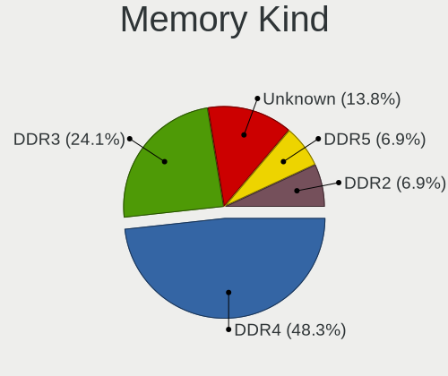

| Kind    | Desktops | Percent |
|---------|----------|---------|
| DDR3    | 14       | 46.67%  |
| DDR4    | 8        | 26.67%  |
| Unknown | 4        | 13.33%  |
| DDR     | 2        | 6.67%   |
| LPDDR4  | 1        | 3.33%   |
| DDR2    | 1        | 3.33%   |

Memory Form Factor
------------------

Physical design of the memory module

| Name   | Desktops | Percent |
|--------|----------|---------|
| DIMM   | 28       | 93.33%  |
| SODIMM | 2        | 6.67%   |

Memory Size
-----------

Memory module size

| Size  | Desktops | Percent |
|-------|----------|---------|
| 4096  | 10       | 32.26%  |
| 8192  | 7        | 22.58%  |
| 2048  | 5        | 16.13%  |
| 32768 | 4        | 12.9%   |
| 16384 | 4        | 12.9%   |
| 1024  | 1        | 3.23%   |

Memory Speed
------------

Memory module speed

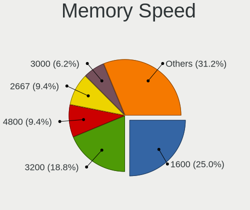

| Speed   | Desktops | Percent |
|---------|----------|---------|
| 1600    | 12       | 35.29%  |
| 1333    | 5        | 14.71%  |
| 2667    | 2        | 5.88%   |
| 800     | 2        | 5.88%   |
| 59392   | 1        | 2.94%   |
| 4133    | 1        | 2.94%   |
| 3600    | 1        | 2.94%   |
| 3466    | 1        | 2.94%   |
| 3400    | 1        | 2.94%   |
| 3200    | 1        | 2.94%   |
| 2733    | 1        | 2.94%   |
| 2400    | 1        | 2.94%   |
| 2133    | 1        | 2.94%   |
| 1866    | 1        | 2.94%   |
| 400     | 1        | 2.94%   |
| 333     | 1        | 2.94%   |
| Unknown | 1        | 2.94%   |

Printers & scanners
-------------------

Printer Vendor
--------------

Printer device vendors

| Vendor             | Desktops | Percent |
|--------------------|----------|---------|
| Brother Industries | 2        | 50%     |
| Hewlett-Packard    | 1        | 25%     |
| Canon              | 1        | 25%     |

Printer Model
-------------

Printer device models

| Model                    | Desktops | Percent |
|--------------------------|----------|---------|
| HP OfficeJet 5200 series | 1        | 25%     |
| Canon PIXMA TS6250       | 1        | 25%     |
| Brother MFC-J4440DW      | 1        | 25%     |
| Brother DCP-J140W        | 1        | 25%     |

Scanner Vendor
--------------

Scanner device vendors

| Vendor           | Desktops | Percent |
|------------------|----------|---------|
| Salix Technology | 1        | 100%    |

Scanner Model
-------------

Scanner device models

| Model              | Desktops | Percent |
|--------------------|----------|---------|
| Salix USB Scanner. | 1        | 100%    |

Camera
------

Camera Vendor
-------------

Camera device vendors

| Vendor                 | Desktops | Percent |
|------------------------|----------|---------|
| Logitech               | 3        | 33.33%  |
| Microdia               | 2        | 22.22%  |
| Realtek Semiconductor  | 1        | 11.11%  |
| Microsoft              | 1        | 11.11%  |
| MacroSilicon           | 1        | 11.11%  |
| Generalplus Technology | 1        | 11.11%  |

Camera Model
------------

Camera device models

| Model                                    | Desktops | Percent |
|------------------------------------------|----------|---------|
| Logitech HD Webcam C615                  | 2        | 22.22%  |
| Realtek FULL HD 1080P Webcam             | 1        | 11.11%  |
| Microsoft LifeCam Cinema                 | 1        | 11.11%  |
| Microdia USB 2.0 Camera                  | 1        | 11.11%  |
| Microdia Camera                          | 1        | 11.11%  |
| MacroSilicon USB Video                   | 1        | 11.11%  |
| Logitech Webcam C270                     | 1        | 11.11%  |
| Generalplus 808 Camera #9 (web-cam mode) | 1        | 11.11%  |

Security
--------

Fingerprint Vendor
------------------

Fingerprint sensor vendors

Zero info for selected period =(

Fingerprint Model
-----------------

Fingerprint sensor models

Zero info for selected period =(

Chipcard Vendor
---------------

Chipcard module vendors

Zero info for selected period =(

Chipcard Model
--------------

Chipcard module models

Zero info for selected period =(

Unsupported
-----------

Unsupported Devices
-------------------

Total unsupported devices on board

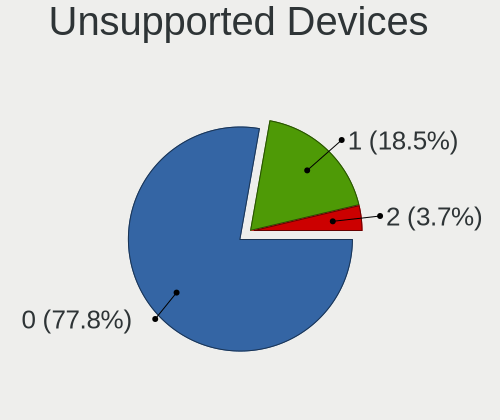

| Total | Desktops | Percent |
|-------|----------|---------|
| 0     | 39       | 73.58%  |
| 1     | 9        | 16.98%  |
| 2     | 5        | 9.43%   |

Unsupported Device Types
------------------------

Types of unsupported devices

| Type                     | Desktops | Percent |
|--------------------------|----------|---------|
| Graphics card            | 9        | 52.94%  |
| Multimedia controller    | 2        | 11.76%  |
| Communication controller | 2        | 11.76%  |
| Unassigned class         | 1        | 5.88%   |
| Network                  | 1        | 5.88%   |
| Net/ethernet             | 1        | 5.88%   |
| Bluetooth                | 1        | 5.88%   |

