Linux in Australia - Hardware Trends (Desktops)
-----------------------------------------------

A project to identify most popular hardware characteristics and track their change
over time based on data collected by Linux users at https://Linux-Hardware.org.

Anyone can contribute to this report by the [hw-probe](https://github.com/linuxhw/hw-probe) tool:

    sudo -E hw-probe -all -upload

Period: Jul, 2022.

Contents
--------

* [ System ](#system)
  - [ OS                       ](#os)
  - [ OS Family                ](#os-family)
  - [ Kernel                   ](#kernel)
  - [ Kernel Family            ](#kernel-family)
  - [ Kernel Major Ver.        ](#kernel-major-ver)
  - [ Arch                     ](#arch)
  - [ DE                       ](#de)
  - [ Display Server           ](#display-server)
  - [ Display Manager          ](#display-manager)
  - [ OS Lang                  ](#os-lang)
  - [ Boot Mode                ](#boot-mode)
  - [ Filesystem               ](#filesystem)
  - [ Part. scheme             ](#part-scheme)
  - [ Dual Boot with Linux/BSD ](#dual-boot-with-linuxbsd)
  - [ Dual Boot (Win)          ](#dual-boot-win)

* [ Board ](#board)
  - [ Vendor                   ](#vendor)
  - [ Model                    ](#model)
  - [ Model Family             ](#model-family)
  - [ MFG Year                 ](#mfg-year)
  - [ Form Factor              ](#form-factor)
  - [ Secure Boot              ](#secure-boot)
  - [ Coreboot                 ](#coreboot)
  - [ RAM Size                 ](#ram-size)
  - [ RAM Used                 ](#ram-used)
  - [ Total Drives             ](#total-drives)
  - [ Has CD-ROM               ](#has-cd-rom)
  - [ Has Ethernet             ](#has-ethernet)
  - [ Has WiFi                 ](#has-wifi)
  - [ Has Bluetooth            ](#has-bluetooth)

* [ Location ](#location)
  - [ Country                  ](#country)
  - [ City                     ](#city)

* [ Drives ](#drives)
  - [ Drive Vendor             ](#drive-vendor)
  - [ Drive Model              ](#drive-model)
  - [ HDD Vendor               ](#hdd-vendor)
  - [ SSD Vendor               ](#ssd-vendor)
  - [ Drive Kind               ](#drive-kind)
  - [ Drive Connector          ](#drive-connector)
  - [ Drive Size               ](#drive-size)
  - [ Space Total              ](#space-total)
  - [ Space Used               ](#space-used)
  - [ Malfunc. Drives          ](#malfunc-drives)
  - [ Malfunc. Drive Vendor    ](#malfunc-drive-vendor)
  - [ Malfunc. HDD Vendor      ](#malfunc-hdd-vendor)
  - [ Malfunc. Drive Kind      ](#malfunc-drive-kind)
  - [ Failed Drives            ](#failed-drives)
  - [ Failed Drive Vendor      ](#failed-drive-vendor)
  - [ Drive Status             ](#drive-status)

* [ Storage controller ](#storage-controller)
  - [ Storage Vendor           ](#storage-vendor)
  - [ Storage Model            ](#storage-model)
  - [ Storage Kind             ](#storage-kind)

* [ Processor ](#processor)
  - [ CPU Vendor               ](#cpu-vendor)
  - [ CPU Model                ](#cpu-model)
  - [ CPU Model Family         ](#cpu-model-family)
  - [ CPU Cores                ](#cpu-cores)
  - [ CPU Sockets              ](#cpu-sockets)
  - [ CPU Threads              ](#cpu-threads)
  - [ CPU Op-Modes             ](#cpu-op-modes)
  - [ CPU Microcode            ](#cpu-microcode)
  - [ CPU Microarch            ](#cpu-microarch)

* [ Graphics ](#graphics)
  - [ GPU Vendor               ](#gpu-vendor)
  - [ GPU Model                ](#gpu-model)
  - [ GPU Combo                ](#gpu-combo)
  - [ GPU Driver               ](#gpu-driver)
  - [ GPU Memory               ](#gpu-memory)

* [ Monitor ](#monitor)
  - [ Monitor Vendor           ](#monitor-vendor)
  - [ Monitor Model            ](#monitor-model)
  - [ Monitor Resolution       ](#monitor-resolution)
  - [ Monitor Diagonal         ](#monitor-diagonal)
  - [ Monitor Width            ](#monitor-width)
  - [ Aspect Ratio             ](#aspect-ratio)
  - [ Monitor Area             ](#monitor-area)
  - [ Pixel Density            ](#pixel-density)
  - [ Multiple Monitors        ](#multiple-monitors)

* [ Network ](#network)
  - [ Net Controller Vendor    ](#net-controller-vendor)
  - [ Net Controller Model     ](#net-controller-model)
  - [ Wireless Vendor          ](#wireless-vendor)
  - [ Wireless Model           ](#wireless-model)
  - [ Ethernet Vendor          ](#ethernet-vendor)
  - [ Ethernet Model           ](#ethernet-model)
  - [ Net Controller Kind      ](#net-controller-kind)
  - [ Used Controller          ](#used-controller)
  - [ NICs                     ](#nics)
  - [ IPv6                     ](#ipv6)

* [ Bluetooth ](#bluetooth)
  - [ Bluetooth Vendor         ](#bluetooth-vendor)
  - [ Bluetooth Model          ](#bluetooth-model)

* [ Sound ](#sound)
  - [ Sound Vendor             ](#sound-vendor)
  - [ Sound Model              ](#sound-model)

* [ Memory ](#memory)
  - [ Memory Vendor            ](#memory-vendor)
  - [ Memory Model             ](#memory-model)
  - [ Memory Kind              ](#memory-kind)
  - [ Memory Form Factor       ](#memory-form-factor)
  - [ Memory Size              ](#memory-size)
  - [ Memory Speed             ](#memory-speed)

* [ Printers & scanners ](#printers--scanners)
  - [ Printer Vendor           ](#printer-vendor)
  - [ Printer Model            ](#printer-model)
  - [ Scanner Vendor           ](#scanner-vendor)
  - [ Scanner Model            ](#scanner-model)

* [ Camera ](#camera)
  - [ Camera Vendor            ](#camera-vendor)
  - [ Camera Model             ](#camera-model)

* [ Security ](#security)
  - [ Fingerprint Vendor       ](#fingerprint-vendor)
  - [ Fingerprint Model        ](#fingerprint-model)
  - [ Chipcard Vendor          ](#chipcard-vendor)
  - [ Chipcard Model           ](#chipcard-model)

* [ Unsupported ](#unsupported)
  - [ Unsupported Devices      ](#unsupported-devices)
  - [ Unsupported Device Types ](#unsupported-device-types)

System
------

OS
--

Installed operating systems

| Name                         | Desktops | Percent |
|------------------------------|----------|---------|
| Fedora 36                    | 8        | 17.78%  |
| OpenMandriva 4.3             | 6        | 13.33%  |
| Debian 11                    | 4        | 8.89%   |
| ClearOS 7                    | 4        | 8.89%   |
| Zorin 16                     | 3        | 6.67%   |
| Ubuntu 22.04                 | 2        | 4.44%   |
| SteamOS 3.2 (steamdeck-main) | 2        | 4.44%   |
| OpenMandriva 4.90            | 2        | 4.44%   |
| KDE neon 20.04               | 2        | 4.44%   |
| Fedora 35                    | 2        | 4.44%   |
| Xubuntu 20.04                | 1        | 2.22%   |
| Ubuntu MATE 22.04            | 1        | 2.22%   |
| Ubuntu 20.04                 | 1        | 2.22%   |
| Pop!_OS 22.04                | 1        | 2.22%   |
| Manjaro 21.3.5               | 1        | 2.22%   |
| Linux Mint 20.3              | 1        | 2.22%   |
| Kali 2022.2                  | 1        | 2.22%   |
| CentOS 7                     | 1        | 2.22%   |
| ArcoLinux Rolling            | 1        | 2.22%   |
| Arch Rolling                 | 1        | 2.22%   |

OS Family
---------

OS without a version

| Name         | Desktops | Percent |
|--------------|----------|---------|
| Fedora       | 10       | 22.22%  |
| OpenMandriva | 8        | 17.78%  |
| Debian       | 4        | 8.89%   |
| ClearOS      | 4        | 8.89%   |
| Zorin        | 3        | 6.67%   |
| Ubuntu       | 3        | 6.67%   |
| SteamOS      | 2        | 4.44%   |
| KDE neon     | 2        | 4.44%   |
| Xubuntu      | 1        | 2.22%   |
| Ubuntu MATE  | 1        | 2.22%   |
| Pop!_OS      | 1        | 2.22%   |
| Manjaro      | 1        | 2.22%   |
| Linux Mint   | 1        | 2.22%   |
| Kali         | 1        | 2.22%   |
| CentOS       | 1        | 2.22%   |
| ArcoLinux    | 1        | 2.22%   |
| Arch         | 1        | 2.22%   |

Kernel
------

Version of the Linux kernel

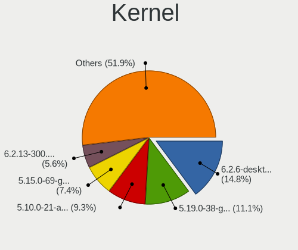

| Version                                            | Desktops | Percent |
|----------------------------------------------------|----------|---------|
| 5.16.7-desktop-1omv4003                            | 5        | 11.11%  |
| 5.15.0-41-generic                                  | 5        | 11.11%  |
| 3.10.0-1160.71.1.el7.x86_64                        | 5        | 11.11%  |
| 5.18.11-200.fc36.x86_64                            | 4        | 8.89%   |
| 5.18.13-200.fc36.x86_64                            | 2        | 4.44%   |
| 5.18.12-desktop-3omv4090                           | 2        | 4.44%   |
| 5.13.0-52-generic                                  | 2        | 4.44%   |
| 5.10.0-15-amd64                                    | 2        | 4.44%   |
| 5.7.0-050700-generic                               | 1        | 2.22%   |
| 5.4.0-121-generic                                  | 1        | 2.22%   |
| 5.18.9-arch1-1                                     | 1        | 2.22%   |
| 5.18.9-200.fc36.x86_64                             | 1        | 2.22%   |
| 5.18.5-100.fc35.x86_64                             | 1        | 2.22%   |
| 5.18.12-3-MANJARO                                  | 1        | 2.22%   |
| 5.18.11-100.fc35.x86_64                            | 1        | 2.22%   |
| 5.18.10-arch1-1-51810-01                           | 1        | 2.22%   |
| 5.18.10-200.fc36.x86_64                            | 1        | 2.22%   |
| 5.18.1-arch1_testHoloISO_20220606.1811             | 1        | 2.22%   |
| 5.18.0-kali2-amd64                                 | 1        | 2.22%   |
| 5.17.15-76051715-generic                           | 1        | 2.22%   |
| 5.16.13-desktop-1omv4003                           | 1        | 2.22%   |
| 5.15.0-40-generic                                  | 1        | 2.22%   |
| 5.15.0-0.bpo.2-amd64                               | 1        | 2.22%   |
| 5.13.0-valve10.1-2-neptune-dri-02144-g7fffaf925dfb | 1        | 2.22%   |
| 5.13.0-52-lowlatency                               | 1        | 2.22%   |
| 5.10.0-16-amd64                                    | 1        | 2.22%   |

Kernel Family
-------------

Linux kernel without a distro release

| Version | Desktops | Percent |
|---------|----------|---------|
| 5.15.0  | 7        | 15.56%  |
| 5.18.11 | 5        | 11.11%  |
| 5.16.7  | 5        | 11.11%  |
| 3.10.0  | 5        | 11.11%  |
| 5.13.0  | 4        | 8.89%   |
| 5.18.12 | 3        | 6.67%   |
| 5.10.0  | 3        | 6.67%   |
| 5.18.9  | 2        | 4.44%   |
| 5.18.13 | 2        | 4.44%   |
| 5.18.10 | 2        | 4.44%   |
| 5.7.0   | 1        | 2.22%   |
| 5.4.0   | 1        | 2.22%   |
| 5.18.5  | 1        | 2.22%   |
| 5.18.1  | 1        | 2.22%   |
| 5.18.0  | 1        | 2.22%   |
| 5.17.15 | 1        | 2.22%   |
| 5.16.13 | 1        | 2.22%   |

Kernel Major Ver.
-----------------

Linux kernel major version

| Version | Desktops | Percent |
|---------|----------|---------|
| 5.18    | 17       | 37.78%  |
| 5.15    | 7        | 15.56%  |
| 5.16    | 6        | 13.33%  |
| 3.10    | 5        | 11.11%  |
| 5.13    | 4        | 8.89%   |
| 5.10    | 3        | 6.67%   |
| 5.7     | 1        | 2.22%   |
| 5.4     | 1        | 2.22%   |
| 5.17    | 1        | 2.22%   |

Arch
----

OS architecture (x86_64, i586, etc.)

| Name   | Desktops | Percent |
|--------|----------|---------|
| x86_64 | 45       | 100%    |

DE
--

Desktop Environment

| Name          | Desktops | Percent |
|---------------|----------|---------|
| KDE5          | 14       | 31.11%  |
| GNOME         | 9        | 20%     |
| Cinnamon      | 7        | 15.56%  |
| XFCE          | 5        | 11.11%  |
| Unknown       | 4        | 8.89%   |
| X-Cinnamon    | 2        | 4.44%   |
| MATE          | 2        | 4.44%   |
| xmonad        | 1        | 2.22%   |
| GNOME Classic | 1        | 2.22%   |

Display Server
--------------

X11 or Wayland

| Name    | Desktops | Percent |
|---------|----------|---------|
| X11     | 37       | 82.22%  |
| Tty     | 5        | 11.11%  |
| Wayland | 3        | 6.67%   |

Display Manager
---------------

SDDM, LightDM, etc.

| Name    | Desktops | Percent |
|---------|----------|---------|
| Unknown | 19       | 42.22%  |
| LightDM | 12       | 26.67%  |
| SDDM    | 11       | 24.44%  |
| GDM3    | 2        | 4.44%   |
| GDM     | 1        | 2.22%   |

OS Lang
-------

Language

| Lang  | Desktops | Percent |
|-------|----------|---------|
| en_AU | 38       | 84.44%  |
| en_US | 7        | 15.56%  |

Boot Mode
---------

EFI or BIOS

| Mode | Desktops | Percent |
|------|----------|---------|
| BIOS | 30       | 66.67%  |
| EFI  | 15       | 33.33%  |

Filesystem
----------

Type of filesystem

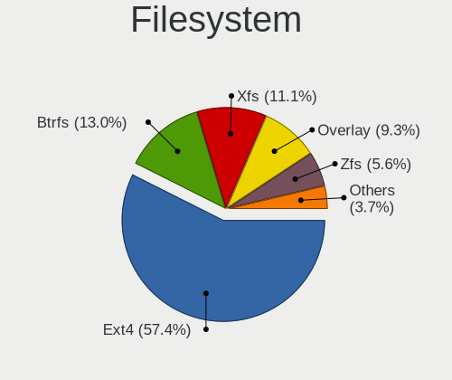

| Type    | Desktops | Percent |
|---------|----------|---------|
| Ext4    | 27       | 60%     |
| Xfs     | 10       | 22.22%  |
| Overlay | 4        | 8.89%   |
| Btrfs   | 4        | 8.89%   |

Part. scheme
------------

Scheme of partitioning

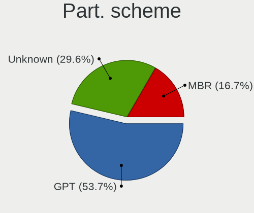

| Type    | Desktops | Percent |
|---------|----------|---------|
| Unknown | 18       | 40%     |
| MBR     | 15       | 33.33%  |
| GPT     | 12       | 26.67%  |

Dual Boot with Linux/BSD
------------------------

Hosting more than one Linux/BSD

| Dual boot | Desktops | Percent |
|-----------|----------|---------|
| No        | 34       | 75.56%  |
| Yes       | 11       | 24.44%  |

Dual Boot (Win)
---------------

Hosting Linux and Windows

| Dual boot | Desktops | Percent |
|-----------|----------|---------|
| No        | 32       | 71.11%  |
| Yes       | 13       | 28.89%  |

Board
-----

Vendor
------

Motherboard manufacturer

| Name                | Desktops | Percent |
|---------------------|----------|---------|
| Gigabyte Technology | 21       | 46.67%  |
| ASRock              | 5        | 11.11%  |
| Hewlett-Packard     | 4        | 8.89%   |
| Dell                | 4        | 8.89%   |
| MSI                 | 3        | 6.67%   |
| ASUSTek Computer    | 3        | 6.67%   |
| Lenovo              | 2        | 4.44%   |
| Intel               | 2        | 4.44%   |
| Unknown             | 1        | 2.22%   |

Model
-----

Motherboard model

| Name                                | Desktops | Percent |
|-------------------------------------|----------|---------|
| Gigabyte X570 AORUS PRO WIFI        | 2        | 4.44%   |
| Gigabyte J1900M-D2P                 | 2        | 4.44%   |
| Gigabyte GA-880GM-UD2H              | 2        | 4.44%   |
| Gigabyte B75M-D3H                   | 2        | 4.44%   |
| MSI MS-7B89                         | 1        | 2.22%   |
| MSI MS-7917                         | 1        | 2.22%   |
| MSI MS-7882                         | 1        | 2.22%   |
| Lenovo ThinkCentre M58p 7220A72     | 1        | 2.22%   |
| Lenovo Legion T5 28IMB05 90NC00AFAU | 1        | 2.22%   |
| Intel LADPNVMO AAE76523-300         | 1        | 2.22%   |
| Intel DH67BL AAG10189-211           | 1        | 2.22%   |
| HP Z400 Workstation                 | 1        | 2.22%   |
| HP Z240 SFF Workstation             | 1        | 2.22%   |
| HP Pavilion Desktop PC 570-p0xx     | 1        | 2.22%   |
| HP Compaq 8000 Elite SFF PC         | 1        | 2.22%   |
| Gigabyte Z97X-Gaming 3              | 1        | 2.22%   |
| Gigabyte X570 I AORUS PRO WIFI      | 1        | 2.22%   |
| Gigabyte X570 AORUS ULTRA           | 1        | 2.22%   |
| Gigabyte X570 AORUS MASTER          | 1        | 2.22%   |
| Gigabyte H77N-WIFI                  | 1        | 2.22%   |
| Gigabyte H170N-WIFI                 | 1        | 2.22%   |
| Gigabyte GA-MA785G-UD3H             | 1        | 2.22%   |
| Gigabyte GA-MA780G-UD3H             | 1        | 2.22%   |
| Gigabyte GA-A55M-S2V                | 1        | 2.22%   |
| Gigabyte GA-870A-UD3                | 1        | 2.22%   |
| Gigabyte EP45-DS3L                  | 1        | 2.22%   |
| Gigabyte B550 AORUS PRO AX          | 1        | 2.22%   |
| Gigabyte B450M H                    | 1        | 2.22%   |
| Dell OptiPlex 9020M                 | 1        | 2.22%   |
| Dell OptiPlex 9010                  | 1        | 2.22%   |
| Dell OptiPlex 7010                  | 1        | 2.22%   |
| Dell OptiPlex 3010                  | 1        | 2.22%   |
| ASUS Z170M-PLUS                     | 1        | 2.22%   |
| ASUS ROG STRIX B660-I GAMING WIFI   | 1        | 2.22%   |
| ASUS P8Z77-M PRO                    | 1        | 2.22%   |
| ASRock Z77 Extreme6                 | 1        | 2.22%   |
| ASRock Z390 Pro4                    | 1        | 2.22%   |
| ASRock Z170 Pro4                    | 1        | 2.22%   |
| ASRock AD2700-ITX                   | 1        | 2.22%   |
| ASRock 990FX Killer                 | 1        | 2.22%   |
| Unknown                             | 1        | 2.22%   |

Model Family
------------

Motherboard model prefix

| Name                    | Desktops | Percent |
|-------------------------|----------|---------|
| Gigabyte X570           | 5        | 11.11%  |
| Dell OptiPlex           | 4        | 8.89%   |
| Gigabyte J1900M-D2P     | 2        | 4.44%   |
| Gigabyte GA-880GM-UD2H  | 2        | 4.44%   |
| Gigabyte B75M-D3H       | 2        | 4.44%   |
| MSI MS-7B89             | 1        | 2.22%   |
| MSI MS-7917             | 1        | 2.22%   |
| MSI MS-7882             | 1        | 2.22%   |
| Lenovo ThinkCentre      | 1        | 2.22%   |
| Lenovo Legion           | 1        | 2.22%   |
| Intel LADPNVMO          | 1        | 2.22%   |
| Intel DH67BL            | 1        | 2.22%   |
| HP Z400                 | 1        | 2.22%   |
| HP Z240                 | 1        | 2.22%   |
| HP Pavilion             | 1        | 2.22%   |
| HP Compaq               | 1        | 2.22%   |
| Gigabyte Z97X-Gaming    | 1        | 2.22%   |
| Gigabyte H77N-WIFI      | 1        | 2.22%   |
| Gigabyte H170N-WIFI     | 1        | 2.22%   |
| Gigabyte GA-MA785G-UD3H | 1        | 2.22%   |
| Gigabyte GA-MA780G-UD3H | 1        | 2.22%   |
| Gigabyte GA-A55M-S2V    | 1        | 2.22%   |
| Gigabyte GA-870A-UD3    | 1        | 2.22%   |
| Gigabyte EP45-DS3L      | 1        | 2.22%   |
| Gigabyte B550           | 1        | 2.22%   |
| Gigabyte B450M          | 1        | 2.22%   |
| ASUS Z170M-PLUS         | 1        | 2.22%   |
| ASUS ROG                | 1        | 2.22%   |
| ASUS P8Z77-M            | 1        | 2.22%   |
| ASRock Z77              | 1        | 2.22%   |
| ASRock Z390             | 1        | 2.22%   |
| ASRock Z170             | 1        | 2.22%   |
| ASRock AD2700-ITX       | 1        | 2.22%   |
| ASRock 990FX            | 1        | 2.22%   |
| Unknown                 | 1        | 2.22%   |

MFG Year
--------

Motherboard manufacture year

| Year | Desktops | Percent |
|------|----------|---------|
| 2012 | 8        | 17.78%  |
| 2019 | 7        | 15.56%  |
| 2018 | 4        | 8.89%   |
| 2014 | 4        | 8.89%   |
| 2010 | 4        | 8.89%   |
| 2021 | 3        | 6.67%   |
| 2009 | 3        | 6.67%   |
| 2008 | 3        | 6.67%   |
| 2016 | 2        | 4.44%   |
| 2015 | 2        | 4.44%   |
| 2013 | 2        | 4.44%   |
| 2011 | 2        | 4.44%   |
| 2020 | 1        | 2.22%   |

Form Factor
-----------

Physical design of the computer

| Name    | Desktops | Percent |
|---------|----------|---------|
| Desktop | 45       | 100%    |

Secure Boot
-----------

Enabled or disabled

| State    | Desktops | Percent |
|----------|----------|---------|
| Disabled | 44       | 97.78%  |
| Enabled  | 1        | 2.22%   |

Coreboot
--------

Have coreboot on board

| Used | Desktops | Percent |
|------|----------|---------|
| No   | 45       | 100%    |

RAM Size
--------

Total RAM memory

| Size in GB  | Desktops | Percent |
|-------------|----------|---------|
| 16.01-24.0  | 11       | 24.44%  |
| 8.01-16.0   | 9        | 20%     |
| 32.01-64.0  | 8        | 17.78%  |
| 4.01-8.0    | 7        | 15.56%  |
| 3.01-4.0    | 5        | 11.11%  |
| 64.01-256.0 | 4        | 8.89%   |
| 24.01-32.0  | 1        | 2.22%   |

RAM Used
--------

Used RAM memory

| Used GB    | Desktops | Percent |
|------------|----------|---------|
| 1.01-2.0   | 12       | 26.67%  |
| 2.01-3.0   | 11       | 24.44%  |
| 0.51-1.0   | 7        | 15.56%  |
| 3.01-4.0   | 6        | 13.33%  |
| 4.01-8.0   | 4        | 8.89%   |
| 16.01-24.0 | 2        | 4.44%   |
| 24.01-32.0 | 1        | 2.22%   |
| 8.01-16.0  | 1        | 2.22%   |
| 0.01-0.5   | 1        | 2.22%   |

Total Drives
------------

Number of drives on board

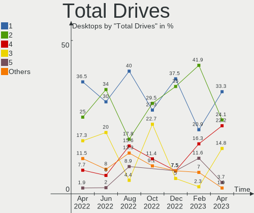

| Drives | Desktops | Percent |
|--------|----------|---------|
| 1      | 18       | 40%     |
| 2      | 9        | 20%     |
| 3      | 7        | 15.56%  |
| 6      | 5        | 11.11%  |
| 5      | 2        | 4.44%   |
| 4      | 2        | 4.44%   |
| 9      | 1        | 2.22%   |
| 8      | 1        | 2.22%   |

Has CD-ROM
----------

Has CD-ROM on board

| Presented | Desktops | Percent |
|-----------|----------|---------|
| No        | 26       | 57.78%  |
| Yes       | 19       | 42.22%  |

Has Ethernet
------------

Has Ethernet on board

| Presented | Desktops | Percent |
|-----------|----------|---------|
| Yes       | 44       | 97.78%  |
| No        | 1        | 2.22%   |

Has WiFi
--------

Has WiFi module

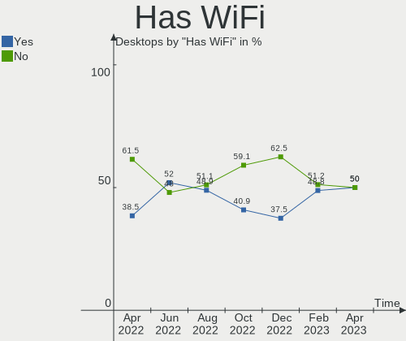

| Presented | Desktops | Percent |
|-----------|----------|---------|
| No        | 23       | 51.11%  |
| Yes       | 22       | 48.89%  |

Has Bluetooth
-------------

Has Bluetooth module

| Presented | Desktops | Percent |
|-----------|----------|---------|
| No        | 32       | 71.11%  |
| Yes       | 13       | 28.89%  |

Location
--------

Country
-------

Geographic location (country)

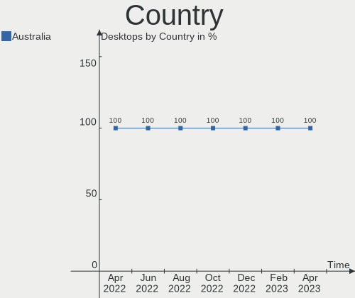

| Country   | Desktops | Percent |
|-----------|----------|---------|
| Australia | 45       | 100%    |

City
----

Geographic location (city)

| City            | Desktops | Percent |
|-----------------|----------|---------|
| Sydney          | 7        | 15.56%  |
| Launceston      | 7        | 15.56%  |
| Melbourne       | 6        | 13.33%  |
| Brisbane        | 6        | 13.33%  |
| Lane Cove       | 4        | 8.89%   |
| Yarragon        | 1        | 2.22%   |
| Toowoomba       | 1        | 2.22%   |
| Pittsworth      | 1        | 2.22%   |
| Perth           | 1        | 2.22%   |
| Noble Park      | 1        | 2.22%   |
| Mt Coolum       | 1        | 2.22%   |
| Mascot          | 1        | 2.22%   |
| Grovedale       | 1        | 2.22%   |
| Emerald         | 1        | 2.22%   |
| Canberra        | 1        | 2.22%   |
| Cairns          | 1        | 2.22%   |
| Blacktown       | 1        | 2.22%   |
| Bennett Springs | 1        | 2.22%   |
| Adelaide        | 1        | 2.22%   |
| Abbotsford      | 1        | 2.22%   |

Drives
------

Drive Vendor
------------

Hard drive vendors

| Vendor                    | Desktops | Drives | Percent |
|---------------------------|----------|--------|---------|
| Samsung Electronics       | 24       | 42     | 28.92%  |
| Seagate                   | 17       | 28     | 20.48%  |
| WDC                       | 13       | 20     | 15.66%  |
| Crucial                   | 6        | 7      | 7.23%   |
| Intel                     | 5        | 5      | 6.02%   |
| Toshiba                   | 3        | 3      | 3.61%   |
| Hitachi                   | 3        | 5      | 3.61%   |
| Unknown                   | 1        | 1      | 1.2%    |
| SPCC                      | 1        | 1      | 1.2%    |
| SanDisk                   | 1        | 1      | 1.2%    |
| OCZ                       | 1        | 1      | 1.2%    |
| Micron/Crucial Technology | 1        | 1      | 1.2%    |
| Kingston                  | 1        | 1      | 1.2%    |
| KingSpec                  | 1        | 1      | 1.2%    |
| Gigabyte Technology       | 1        | 1      | 1.2%    |
| GALAX                     | 1        | 1      | 1.2%    |
| Corsair                   | 1        | 1      | 1.2%    |
| Apple                     | 1        | 1      | 1.2%    |
| A-DATA Technology         | 1        | 1      | 1.2%    |

Drive Model
-----------

Hard drive models

| Model                                       | Desktops | Percent |
|---------------------------------------------|----------|---------|
| Samsung SSD 860 EVO 500GB                   | 4        | 3.74%   |
| Samsung SSD 850 EVO 250GB                   | 4        | 3.74%   |
| Seagate ST500DM002-1BD142 500GB             | 2        | 1.87%   |
| Seagate ST2000DL003-9VT166 2TB              | 2        | 1.87%   |
| Seagate ST1000DM003-1ER162 1TB              | 2        | 1.87%   |
| Samsung SSD 840 PRO Series 256GB            | 2        | 1.87%   |
| Samsung NVMe SSD Drive 2TB                  | 2        | 1.87%   |
| Samsung HD501LJ 500GB                       | 2        | 1.87%   |
| Crucial CT500MX500SSD1 500GB                | 2        | 1.87%   |
| WDC WDS500G2B0A-00SM50 500GB SSD            | 1        | 0.93%   |
| WDC WDS500G1X0E-00AFY0 500GB                | 1        | 0.93%   |
| WDC WDS100T2G0A-00JH30 1TB SSD              | 1        | 0.93%   |
| WDC WD7500BPKX-22HPJT0 752GB                | 1        | 0.93%   |
| WDC WD5000AVCS-632DY1 500GB                 | 1        | 0.93%   |
| WDC WD5000AAKX-329BA0 500GB                 | 1        | 0.93%   |
| WDC WD40EZRZ-00GXCB0 4TB                    | 1        | 0.93%   |
| WDC WD3200AVVS-63L2B0 320GB                 | 1        | 0.93%   |
| WDC WD3200AAKS-75VYA0 320GB                 | 1        | 0.93%   |
| WDC WD30EZRX-00SPEB0 3TB                    | 1        | 0.93%   |
| WDC WD20EZRZ-60Z5HB0 2TB                    | 1        | 0.93%   |
| WDC WD20EFRX-68EUZN0 2TB                    | 1        | 0.93%   |
| WDC WD20EARX-00PASB0 2TB                    | 1        | 0.93%   |
| WDC WD10EZEX-08WN4A0 1TB                    | 1        | 0.93%   |
| WDC WD10EADS-11M2B1 1TB                     | 1        | 0.93%   |
| WDC WD100EFAX-68LHPN0 10TB                  | 1        | 0.93%   |
| WDC WD1003FZEX-00K3CA0 1TB                  | 1        | 0.93%   |
| WDC WD1003FBYX-01Y7B1 752GB                 | 1        | 0.93%   |
| WDC WD Green M.2 2280 240GB                 | 1        | 0.93%   |
| Unknown SD/MMC/MS PRO 64GB                  | 1        | 0.93%   |
| Toshiba MK5065GSX 500GB                     | 1        | 0.93%   |
| Toshiba MK1665GSX 160GB                     | 1        | 0.93%   |
| Toshiba MG04ACA400N 4TB                     | 1        | 0.93%   |
| SPCC 2.5" SSD 512GB                         | 1        | 0.93%   |
| Seagate ST9500423AS 500GB                   | 1        | 0.93%   |
| Seagate ST9500420AS 500GB                   | 1        | 0.93%   |
| Seagate ST9320325AS 320GB                   | 1        | 0.93%   |
| Seagate ST6000DM003-2CY186 6TB              | 1        | 0.93%   |
| Seagate ST4000DM000-1F2168 4TB              | 1        | 0.93%   |
| Seagate ST3500418AS 500GB                   | 1        | 0.93%   |
| Seagate ST3500413AS 500GB                   | 1        | 0.93%   |
| Seagate ST3320418AS 320GB                   | 1        | 0.93%   |
| Seagate ST31000333AS 1TB                    | 1        | 0.93%   |
| Seagate ST2000DM001-1ER164 2TB              | 1        | 0.93%   |
| Seagate ST2000DM001-1CH164 2TB              | 1        | 0.93%   |
| Seagate ST16000NE000-2RW103 16TB            | 1        | 0.93%   |
| Seagate ST1000LM014-1EJ164 1TB              | 1        | 0.93%   |
| Seagate ST1000DM003-1CH162 1TB              | 1        | 0.93%   |
| Seagate ST10000VN0008-2JJ101 10TB           | 1        | 0.93%   |
| Seagate FireCuda 520 SSD ZP500GM30002 500GB | 1        | 0.93%   |
| SanDisk NVMe SSD Drive 512GB                | 1        | 0.93%   |
| Samsung SSD 980 1TB                         | 1        | 0.93%   |
| Samsung SSD 970 PRO 512GB                   | 1        | 0.93%   |
| Samsung SSD 970 EVO Plus 500GB              | 1        | 0.93%   |
| Samsung SSD 970 EVO 250GB                   | 1        | 0.93%   |
| Samsung SSD 960 EVO 250GB                   | 1        | 0.93%   |
| Samsung SSD 950 PRO 512GB                   | 1        | 0.93%   |
| Samsung SSD 860 EVO M.2 500GB               | 1        | 0.93%   |
| Samsung SSD 860 EVO 250GB                   | 1        | 0.93%   |
| Samsung SSD 860 EVO 1TB                     | 1        | 0.93%   |
| Samsung SSD 850 PRO 128GB                   | 1        | 0.93%   |

HDD Vendor
----------

Hard disk drive vendors

| Vendor              | Desktops | Drives | Percent |
|---------------------|----------|--------|---------|
| Seagate             | 16       | 27     | 41.03%  |
| WDC                 | 10       | 16     | 25.64%  |
| Samsung Electronics | 5        | 11     | 12.82%  |
| Toshiba             | 3        | 3      | 7.69%   |
| Hitachi             | 3        | 5      | 7.69%   |
| Unknown             | 1        | 1      | 2.56%   |
| Apple               | 1        | 1      | 2.56%   |

SSD Vendor
----------

Solid state drive vendors

| Vendor              | Desktops | Drives | Percent |
|---------------------|----------|--------|---------|
| Samsung Electronics | 15       | 19     | 45.45%  |
| Intel               | 5        | 5      | 15.15%  |
| Crucial             | 5        | 5      | 15.15%  |
| WDC                 | 2        | 2      | 6.06%   |
| SPCC                | 1        | 1      | 3.03%   |
| OCZ                 | 1        | 1      | 3.03%   |
| KingSpec            | 1        | 1      | 3.03%   |
| Gigabyte Technology | 1        | 1      | 3.03%   |
| Corsair             | 1        | 1      | 3.03%   |
| A-DATA Technology   | 1        | 1      | 3.03%   |

Drive Kind
----------

HDD or SSD

| Kind    | Desktops | Drives | Percent |
|---------|----------|--------|---------|
| SSD     | 30       | 37     | 41.67%  |
| HDD     | 27       | 64     | 37.5%   |
| NVMe    | 13       | 19     | 18.06%  |
| Unknown | 2        | 2      | 2.78%   |

Drive Connector
---------------

SATA, SAS, NVMe, etc.

| Type | Desktops | Drives | Percent |
|------|----------|--------|---------|
| SATA | 43       | 102    | 75.44%  |
| NVMe | 13       | 19     | 22.81%  |
| SAS  | 1        | 1      | 1.75%   |

Drive Size
----------

Size of hard drive

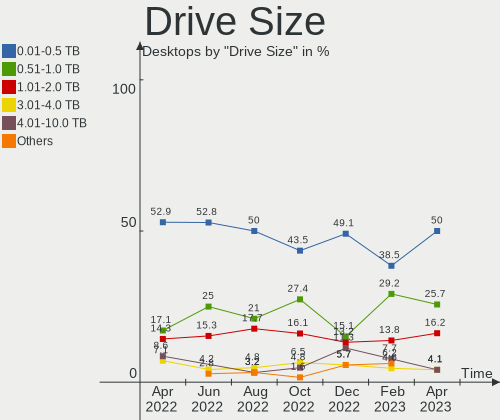

| Size in TB | Desktops | Drives | Percent |
|------------|----------|--------|---------|
| 0.01-0.5   | 35       | 57     | 53.85%  |
| 0.51-1.0   | 17       | 25     | 26.15%  |
| 1.01-2.0   | 6        | 8      | 9.23%   |
| 4.01-10.0  | 3        | 4      | 4.62%   |
| 3.01-4.0   | 2        | 4      | 3.08%   |
| 2.01-3.0   | 1        | 1      | 1.54%   |
| 10.01-20.0 | 1        | 2      | 1.54%   |

Space Total
-----------

Amount of disk space available on the file system

| Size in GB     | Desktops | Percent |
|----------------|----------|---------|
| 251-500        | 9        | 20%     |
| 501-1000       | 8        | 17.78%  |
| 51-100         | 7        | 15.56%  |
| More than 3000 | 5        | 11.11%  |
| 101-250        | 5        | 11.11%  |
| 21-50          | 4        | 8.89%   |
| 1-20           | 3        | 6.67%   |
| 1001-2000      | 2        | 4.44%   |
| 2001-3000      | 1        | 2.22%   |
| Unknown        | 1        | 2.22%   |

Space Used
----------

Amount of used disk space

| Used GB        | Desktops | Percent |
|----------------|----------|---------|
| 1-20           | 17       | 37.78%  |
| 21-50          | 8        | 17.78%  |
| 101-250        | 7        | 15.56%  |
| More than 3000 | 4        | 8.89%   |
| 251-500        | 4        | 8.89%   |
| 501-1000       | 2        | 4.44%   |
| 51-100         | 2        | 4.44%   |
| Unknown        | 1        | 2.22%   |

Malfunc. Drives
---------------

Drive models with a malfunction

| Model                             | Desktops | Drives | Percent |
|-----------------------------------|----------|--------|---------|
| WDC WDS500G1X0E-00AFY0 500GB      | 1        | 1      | 6.25%   |
| WDC WD20EFRX-68EUZN0 2TB          | 1        | 1      | 6.25%   |
| WDC WD10EADS-11M2B1 1TB           | 1        | 1      | 6.25%   |
| WDC WD1003FZEX-00K3CA0 1TB        | 1        | 1      | 6.25%   |
| WDC WD1003FBYX-01Y7B1 752GB       | 1        | 1      | 6.25%   |
| Toshiba MK1665GSX 160GB           | 1        | 1      | 6.25%   |
| SPCC 2.5" SSD 512GB               | 1        | 1      | 6.25%   |
| Seagate ST3500418AS 500GB         | 1        | 1      | 6.25%   |
| Seagate ST3320418AS 320GB         | 1        | 1      | 6.25%   |
| Seagate ST2000DM001-1ER164 2TB    | 1        | 1      | 6.25%   |
| Samsung Electronics SSD 980 1TB   | 1        | 1      | 6.25%   |
| Samsung Electronics HD502HI 500GB | 1        | 1      | 6.25%   |
| Samsung Electronics HD501LJ 500GB | 1        | 2      | 6.25%   |
| Samsung Electronics HD103UJ 1TB   | 1        | 2      | 6.25%   |
| Intel SSDSC2CT120A3 120GB         | 1        | 1      | 6.25%   |
| Intel SSDSA2M080G2LE 80GB         | 1        | 1      | 6.25%   |

Malfunc. Drive Vendor
---------------------

Vendors of faulty drives

| Vendor              | Desktops | Drives | Percent |
|---------------------|----------|--------|---------|
| Samsung Electronics | 4        | 6      | 30.77%  |
| Seagate             | 3        | 3      | 23.08%  |
| WDC                 | 2        | 5      | 15.38%  |
| Intel               | 2        | 2      | 15.38%  |
| Toshiba             | 1        | 1      | 7.69%   |
| SPCC                | 1        | 1      | 7.69%   |

Malfunc. HDD Vendor
-------------------

Vendors of faulty HDD drives

| Vendor              | Desktops | Drives | Percent |
|---------------------|----------|--------|---------|
| Seagate             | 3        | 3      | 33.33%  |
| Samsung Electronics | 3        | 5      | 33.33%  |
| WDC                 | 2        | 4      | 22.22%  |
| Toshiba             | 1        | 1      | 11.11%  |

Malfunc. Drive Kind
-------------------

Kinds of faulty drives

| Kind | Desktops | Drives | Percent |
|------|----------|--------|---------|
| HDD  | 8        | 13     | 61.54%  |
| SSD  | 3        | 3      | 23.08%  |
| NVMe | 2        | 2      | 15.38%  |

Failed Drives
-------------

Failed drive models

Zero info for selected period =(

Failed Drive Vendor
-------------------

Failed drive vendors

Zero info for selected period =(

Drive Status
------------

Number of failed and malfunc. drives

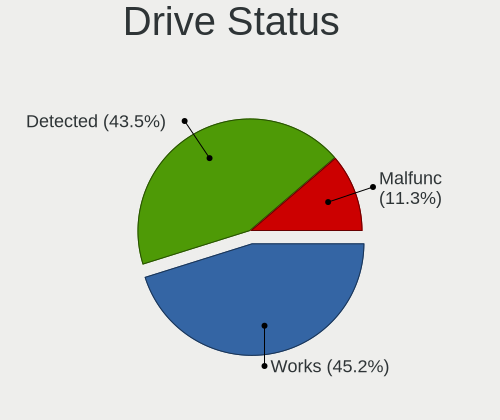

| Status   | Desktops | Drives | Percent |
|----------|----------|--------|---------|
| Works    | 25       | 60     | 46.3%   |
| Detected | 18       | 44     | 33.33%  |
| Malfunc  | 11       | 18     | 20.37%  |

Storage controller
------------------

Storage Vendor
--------------

Storage controller vendors

| Vendor                      | Desktops | Percent |
|-----------------------------|----------|---------|
| Intel                       | 29       | 44.62%  |
| AMD                         | 16       | 24.62%  |
| Samsung Electronics         | 9        | 13.85%  |
| Micron/Crucial Technology   | 3        | 4.62%   |
| SanDisk                     | 2        | 3.08%   |
| ASMedia Technology          | 2        | 3.08%   |
| Seagate Technology          | 1        | 1.54%   |
| Marvell Technology Group    | 1        | 1.54%   |
| Kingston Technology Company | 1        | 1.54%   |
| JMicron Technology          | 1        | 1.54%   |

Storage Model
-------------

Storage controller models

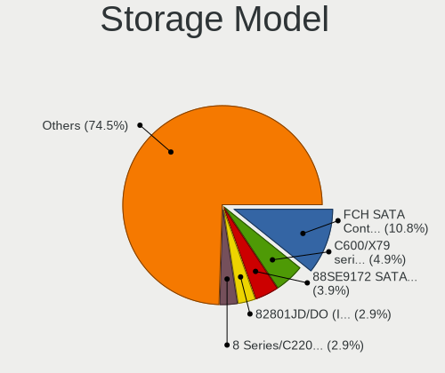

| Model                                                                          | Desktops | Percent |
|--------------------------------------------------------------------------------|----------|---------|
| AMD FCH SATA Controller [AHCI mode]                                            | 8        | 9.88%   |
| Samsung NVMe SSD Controller SM981/PM981/PM983                                  | 6        | 7.41%   |
| AMD SB7x0/SB8x0/SB9x0 SATA Controller [AHCI mode]                              | 6        | 7.41%   |
| AMD SB7x0/SB8x0/SB9x0 IDE Controller                                           | 5        | 6.17%   |
| Intel SATA Controller [RAID mode]                                              | 4        | 4.94%   |
| Intel 7 Series/C210 Series Chipset Family 6-port SATA Controller [AHCI mode]   | 4        | 4.94%   |
| Intel Q170/Q150/B150/H170/H110/Z170/CM236 Chipset SATA Controller [AHCI Mode]  | 3        | 3.7%    |
| Samsung NVMe SSD Controller SM961/PM961/SM963                                  | 2        | 2.47%   |
| Samsung NVMe SSD Controller 980                                                | 2        | 2.47%   |
| Micron/Crucial NVMe Controller                                                 | 2        | 2.47%   |
| Intel NM10/ICH7 Family SATA Controller [AHCI mode]                             | 2        | 2.47%   |
| Intel Atom Processor E3800 Series SATA AHCI Controller                         | 2        | 2.47%   |
| Intel 9 Series Chipset Family SATA Controller [AHCI Mode]                      | 2        | 2.47%   |
| Intel 7 Series/C210 Series Chipset Family 4-port SATA Controller [IDE mode]    | 2        | 2.47%   |
| Intel 7 Series/C210 Series Chipset Family 2-port SATA Controller [IDE mode]    | 2        | 2.47%   |
| Intel 6 Series/C200 Series Chipset Family 6 port Desktop SATA AHCI Controller  | 2        | 2.47%   |
| Intel 4 Series Chipset PT IDER Controller                                      | 2        | 2.47%   |
| ASMedia ASM1062 Serial ATA Controller                                          | 2        | 2.47%   |
| AMD 400 Series Chipset SATA Controller                                         | 2        | 2.47%   |
| Seagate FireCuda 520 SSD                                                       | 1        | 1.23%   |
| SanDisk WD PC SN810 / Black SN850 NVMe SSD                                     | 1        | 1.23%   |
| SanDisk WD Black SN750 / PC SN730 NVMe SSD                                     | 1        | 1.23%   |
| Samsung NVMe SSD Controller SM951/PM951                                        | 1        | 1.23%   |
| Micron/Crucial Non-Volatile memory controller                                  | 1        | 1.23%   |
| Marvell Group 88SE9230 PCIe 2.0 x2 4-port SATA 6 Gb/s RAID Controller          | 1        | 1.23%   |
| Kingston Company A2000 NVMe SSD                                                | 1        | 1.23%   |
| JMicron JMB363 SATA/IDE Controller                                             | 1        | 1.23%   |
| Intel Volume Management Device NVMe RAID Controller                            | 1        | 1.23%   |
| Intel Cannon Lake PCH SATA AHCI Controller                                     | 1        | 1.23%   |
| Intel C610/X99 series chipset sSATA Controller [AHCI mode]                     | 1        | 1.23%   |
| Intel C610/X99 series chipset 6-Port SATA Controller [AHCI mode]               | 1        | 1.23%   |
| Intel Alder Lake-S PCH SATA Controller [AHCI Mode]                             | 1        | 1.23%   |
| Intel 82801JI (ICH10 Family) SATA AHCI Controller                              | 1        | 1.23%   |
| Intel 82801JD/DO (ICH10 Family) SATA AHCI Controller                           | 1        | 1.23%   |
| Intel 8 Series/C220 Series Chipset Family 6-port SATA Controller 1 [AHCI mode] | 1        | 1.23%   |
| Intel 400 Series Chipset Family SATA AHCI Controller                           | 1        | 1.23%   |
| Intel 200 Series PCH SATA controller [AHCI mode]                               | 1        | 1.23%   |
| AMD FCH SATA Controller [IDE mode]                                             | 1        | 1.23%   |
| AMD FCH IDE Controller                                                         | 1        | 1.23%   |
| AMD 500 Series Chipset SATA Controller                                         | 1        | 1.23%   |

Storage Kind
------------

Kind of storage controller (IDE, SATA, NVMe, SAS, ...)

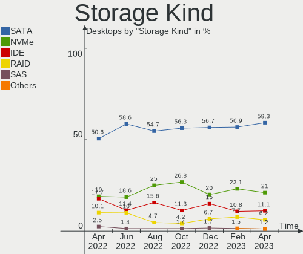

| Kind | Desktops | Percent |
|------|----------|---------|
| SATA | 39       | 57.35%  |
| NVMe | 13       | 19.12%  |
| IDE  | 11       | 16.18%  |
| RAID | 5        | 7.35%   |

Processor
---------

CPU Vendor
----------

Processor vendors

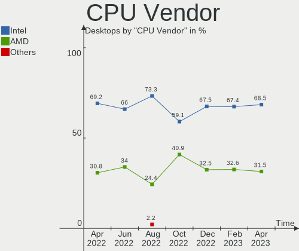

| Vendor | Desktops | Percent |
|--------|----------|---------|
| Intel  | 29       | 64.44%  |
| AMD    | 16       | 35.56%  |

CPU Model
---------

Processor models

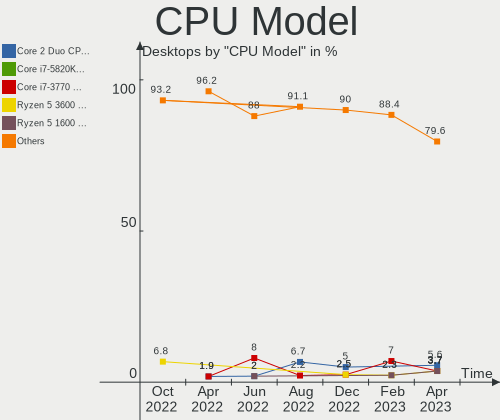

| Model                                   | Desktops | Percent |
|-----------------------------------------|----------|---------|
| Intel Core 2 Duo CPU E8400 @ 3.00GHz    | 3        | 6.67%   |
| Intel Core i7-3770K CPU @ 3.50GHz       | 2        | 4.44%   |
| Intel Core i7-3770 CPU @ 3.40GHz        | 2        | 4.44%   |
| Intel Core i5-6600 CPU @ 3.30GHz        | 2        | 4.44%   |
| Intel Celeron CPU J1900 @ 1.99GHz       | 2        | 4.44%   |
| AMD Ryzen 9 3900X 12-Core Processor     | 2        | 4.44%   |
| AMD Ryzen 7 3700X 8-Core Processor      | 2        | 4.44%   |
| AMD Ryzen 5 3600 6-Core Processor       | 2        | 4.44%   |
| AMD Phenom II X2 570 Processor          | 2        | 4.44%   |
| Intel Xeon CPU W3670 @ 3.20GHz          | 1        | 2.22%   |
| Intel Genuine CPU @ 1.66GHz             | 1        | 2.22%   |
| Intel Core i7-8700 CPU @ 3.20GHz        | 1        | 2.22%   |
| Intel Core i7-6900K CPU @ 3.20GHz       | 1        | 2.22%   |
| Intel Core i7-6700 CPU @ 3.40GHz        | 1        | 2.22%   |
| Intel Core i7-4790K CPU @ 4.00GHz       | 1        | 2.22%   |
| Intel Core i7-4790 CPU @ 3.60GHz        | 1        | 2.22%   |
| Intel Core i7-2600 CPU @ 3.40GHz        | 1        | 2.22%   |
| Intel Core i7-10700 CPU @ 2.90GHz       | 1        | 2.22%   |
| Intel Core i5-7400 CPU @ 3.00GHz        | 1        | 2.22%   |
| Intel Core i5-6500 CPU @ 3.20GHz        | 1        | 2.22%   |
| Intel Core i5-4590T CPU @ 2.00GHz       | 1        | 2.22%   |
| Intel Core i5-3570K CPU @ 3.40GHz       | 1        | 2.22%   |
| Intel Core i5-3470 CPU @ 3.20GHz        | 1        | 2.22%   |
| Intel Core i5-2400S CPU @ 2.50GHz       | 1        | 2.22%   |
| Intel Core i3-3220 CPU @ 3.30GHz        | 1        | 2.22%   |
| Intel Atom CPU D2700 @ 2.13GHz          | 1        | 2.22%   |
| Intel 12th Gen Core i5-12600K           | 1        | 2.22%   |
| AMD Ryzen 9 5950X 16-Core Processor     | 1        | 2.22%   |
| AMD Ryzen 9 5900HX with Radeon Graphics | 1        | 2.22%   |
| AMD Ryzen 5 5600X 6-Core Processor      | 1        | 2.22%   |
| AMD Phenom II X6 1055T Processor        | 1        | 2.22%   |
| AMD Phenom II X4 955 Processor          | 1        | 2.22%   |
| AMD Phenom II X2 550 Processor          | 1        | 2.22%   |
| AMD FX-8320 Eight-Core Processor        | 1        | 2.22%   |
| AMD A8-3870 APU with Radeon HD Graphics | 1        | 2.22%   |

CPU Model Family
----------------

Processor model prefix

| Model            | Desktops | Percent |
|------------------|----------|---------|
| Intel Core i7    | 11       | 24.44%  |
| Intel Core i5    | 8        | 17.78%  |
| AMD Ryzen 9      | 4        | 8.89%   |
| Intel Core 2 Duo | 3        | 6.67%   |
| AMD Ryzen 5      | 3        | 6.67%   |
| AMD Phenom II X2 | 3        | 6.67%   |
| Intel Celeron    | 2        | 4.44%   |
| AMD Ryzen 7      | 2        | 4.44%   |
| Other            | 1        | 2.22%   |
| Intel Xeon       | 1        | 2.22%   |
| Intel Genuine    | 1        | 2.22%   |
| Intel Core i3    | 1        | 2.22%   |
| Intel Atom       | 1        | 2.22%   |
| AMD Phenom II X6 | 1        | 2.22%   |
| AMD Phenom II X4 | 1        | 2.22%   |
| AMD FX           | 1        | 2.22%   |
| AMD A8           | 1        | 2.22%   |

CPU Cores
---------

Number of processor cores

| Number | Desktops | Percent |
|--------|----------|---------|
| 4      | 21       | 46.67%  |
| 2      | 9        | 20%     |
| 6      | 6        | 13.33%  |
| 8      | 5        | 11.11%  |
| 12     | 2        | 4.44%   |
| 16     | 1        | 2.22%   |
| 10     | 1        | 2.22%   |

CPU Sockets
-----------

Number of sockets

| Number | Desktops | Percent |
|--------|----------|---------|
| 1      | 45       | 100%    |

CPU Threads
-----------

Threads per core (Hyper-Threading)

| Number | Desktops | Percent |
|--------|----------|---------|
| 2      | 24       | 53.33%  |
| 1      | 21       | 46.67%  |

CPU Op-Modes
------------

CPU Operation Modes (32-bit, 64-bit)

| Op mode        | Desktops | Percent |
|----------------|----------|---------|
| 32-bit, 64-bit | 45       | 100%    |

CPU Microcode
-------------

Microcode number

| Number     | Desktops | Percent |
|------------|----------|---------|
| Unknown    | 8        | 17.78%  |
| 0x306a9    | 6        | 13.33%  |
| 0x08701021 | 3        | 6.67%   |
| 0x506e3    | 2        | 4.44%   |
| 0x306c3    | 2        | 4.44%   |
| 0x30678    | 2        | 4.44%   |
| 0x1067a    | 2        | 4.44%   |
| 0xa0655    | 1        | 2.22%   |
| 0x906ea    | 1        | 2.22%   |
| 0x906e9    | 1        | 2.22%   |
| 0x90672    | 1        | 2.22%   |
| 0x406f1    | 1        | 2.22%   |
| 0x30661    | 1        | 2.22%   |
| 0x206c2    | 1        | 2.22%   |
| 0x206a7    | 1        | 2.22%   |
| 0x106ca    | 1        | 2.22%   |
| 0x0a50000c | 1        | 2.22%   |
| 0x0a201009 | 1        | 2.22%   |
| 0x08701013 | 1        | 2.22%   |
| 0x08701012 | 1        | 2.22%   |
| 0x06000817 | 1        | 2.22%   |
| 0x03000027 | 1        | 2.22%   |
| 0x010000c8 | 1        | 2.22%   |
| 0x010000c6 | 1        | 2.22%   |
| 0x010000bf | 1        | 2.22%   |
| 0x010000b6 | 1        | 2.22%   |
| 0x00000000 | 1        | 2.22%   |

CPU Microarch
-------------

Microarchitecture

| Name        | Desktops | Percent |
|-------------|----------|---------|
| IvyBridge   | 7        | 15.56%  |
| Zen 2       | 6        | 13.33%  |
| K10         | 5        | 11.11%  |
| Skylake     | 4        | 8.89%   |
| Zen 3       | 3        | 6.67%   |
| Penryn      | 3        | 6.67%   |
| Haswell     | 3        | 6.67%   |
| Silvermont  | 2        | 4.44%   |
| SandyBridge | 2        | 4.44%   |
| KabyLake    | 2        | 4.44%   |
| Bonnell     | 2        | 4.44%   |
| Westmere    | 1        | 2.22%   |
| Piledriver  | 1        | 2.22%   |
| K10 Llano   | 1        | 2.22%   |
| CometLake   | 1        | 2.22%   |
| Broadwell   | 1        | 2.22%   |
| Unknown     | 1        | 2.22%   |

Graphics
--------

GPU Vendor
----------

Vendors of graphics cards

| Vendor | Desktops | Percent |
|--------|----------|---------|
| Nvidia | 24       | 52.17%  |
| AMD    | 12       | 26.09%  |
| Intel  | 10       | 21.74%  |

GPU Model
---------

Graphics card models

| Model                                                                       | Desktops | Percent |
|-----------------------------------------------------------------------------|----------|---------|
| Nvidia GK208B [GeForce GT 710]                                              | 3        | 6.25%   |
| Nvidia GM204 [GeForce GTX 970]                                              | 2        | 4.17%   |
| Nvidia GM107 [GeForce GTX 750 Ti]                                           | 2        | 4.17%   |
| Intel Xeon E3-1200 v3/4th Gen Core Processor Integrated Graphics Controller | 2        | 4.17%   |
| Intel Atom Processor Z36xxx/Z37xxx Series Graphics & Display                | 2        | 4.17%   |
| AMD RS880 [Radeon HD 4250]                                                  | 2        | 4.17%   |
| Nvidia TU117 [GeForce GTX 1650]                                             | 1        | 2.08%   |
| Nvidia TU116 [GeForce GTX 1660 SUPER]                                       | 1        | 2.08%   |
| Nvidia TU106 [GeForce RTX 2070]                                             | 1        | 2.08%   |
| Nvidia GT218 [GeForce 210]                                                  | 1        | 2.08%   |
| Nvidia GT200 [GeForce GTX 260]                                              | 1        | 2.08%   |
| Nvidia GP107GL [Quadro P620]                                                | 1        | 2.08%   |
| Nvidia GP107 [GeForce GTX 1050 Ti]                                          | 1        | 2.08%   |
| Nvidia GM204 [GeForce GTX 980]                                              | 1        | 2.08%   |
| Nvidia GK208B [GeForce GT 730]                                              | 1        | 2.08%   |
| Nvidia GK104 [GeForce GTX 660 Ti]                                           | 1        | 2.08%   |
| Nvidia GF119 [GeForce GT 520]                                               | 1        | 2.08%   |
| Nvidia GF108 [GeForce GT 730]                                               | 1        | 2.08%   |
| Nvidia GA106 [GeForce RTX 3060 Lite Hash Rate]                              | 1        | 2.08%   |
| Nvidia GA104 [GeForce RTX 3060 Ti Lite Hash Rate]                           | 1        | 2.08%   |
| Nvidia GA102 [GeForce RTX 3080 Lite Hash Rate]                              | 1        | 2.08%   |
| Nvidia G98 [GeForce 8400 GS Rev. 2]                                         | 1        | 2.08%   |
| Nvidia G84GL [Quadro FX 1700]                                               | 1        | 2.08%   |
| Nvidia G72 [GeForce 7300 GS]                                                | 1        | 2.08%   |
| Intel Xeon E3-1200 v2/3rd Gen Core processor Graphics Controller            | 1        | 2.08%   |
| Intel IvyBridge GT2 [HD Graphics 4000]                                      | 1        | 2.08%   |
| Intel HD Graphics 530                                                       | 1        | 2.08%   |
| Intel Atom Processor D4xx/D5xx/N4xx/N5xx Integrated Graphics Controller     | 1        | 2.08%   |
| Intel Atom Processor D2xxx/N2xxx Integrated Graphics Controller             | 1        | 2.08%   |
| Intel 2nd Generation Core Processor Family Integrated Graphics Controller   | 1        | 2.08%   |
| AMD RV370 [Radeon X300]                                                     | 1        | 2.08%   |
| AMD RV370 [Radeon X300 SE]                                                  | 1        | 2.08%   |
| AMD RS880 [Radeon HD 4200]                                                  | 1        | 2.08%   |
| AMD Navi 22 [Radeon RX 6700/6700 XT/6750 XT / 6800M]                        | 1        | 2.08%   |
| AMD Navi 14 [Radeon RX 5500/5500M / Pro 5500M]                              | 1        | 2.08%   |
| AMD Juniper XT [Radeon HD 5770]                                             | 1        | 2.08%   |
| AMD Hawaii PRO [Radeon R9 290/390]                                          | 1        | 2.08%   |
| AMD Ellesmere [Radeon RX 470/480/570/570X/580/580X/590]                     | 1        | 2.08%   |
| AMD Cezanne                                                                 | 1        | 2.08%   |
| AMD Cedar [Radeon HD 5000/6000/7350/8350 Series]                            | 1        | 2.08%   |
| AMD Baffin [Radeon RX 550 640SP / RX 560/560X]                              | 1        | 2.08%   |

GPU Combo
---------

Combinations of graphics cards

| Name           | Desktops | Percent |
|----------------|----------|---------|
| 1 x Nvidia     | 23       | 51.11%  |
| 1 x AMD        | 11       | 24.44%  |
| 1 x Intel      | 9        | 20%     |
| 2 x AMD        | 1        | 2.22%   |
| Intel + Nvidia | 1        | 2.22%   |

GPU Driver
----------

Free vs proprietary

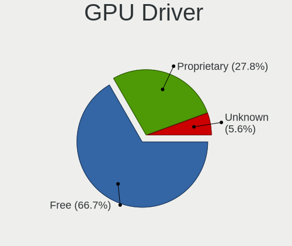

| Driver      | Desktops | Percent |
|-------------|----------|---------|
| Free        | 26       | 57.78%  |
| Proprietary | 12       | 26.67%  |
| Unknown     | 7        | 15.56%  |

GPU Memory
----------

Total video memory

| Size in GB | Desktops | Percent |
|------------|----------|---------|
| Unknown    | 19       | 42.22%  |
| 1.01-2.0   | 7        | 15.56%  |
| 0.01-0.5   | 5        | 11.11%  |
| 3.01-4.0   | 4        | 8.89%   |
| 7.01-8.0   | 3        | 6.67%   |
| 0.51-1.0   | 3        | 6.67%   |
| 8.01-16.0  | 2        | 4.44%   |
| 5.01-6.0   | 1        | 2.22%   |
| 2.01-3.0   | 1        | 2.22%   |

Monitor
-------

Monitor Vendor
--------------

Monitor vendors

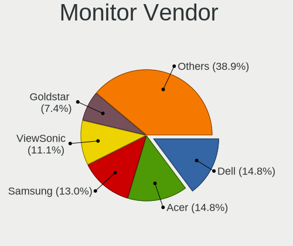

| Vendor              | Desktops | Percent |
|---------------------|----------|---------|
| Samsung Electronics | 8        | 20.51%  |
| Lenovo              | 5        | 12.82%  |
| Dell                | 4        | 10.26%  |
| BenQ                | 3        | 7.69%   |
| ViewSonic           | 2        | 5.13%   |
| Philips             | 2        | 5.13%   |
| Hewlett-Packard     | 2        | 5.13%   |
| Goldstar            | 2        | 5.13%   |
| AOC                 | 2        | 5.13%   |
| Acer                | 2        | 5.13%   |
| Unknown             | 1        | 2.56%   |
| Panasonic           | 1        | 2.56%   |
| NEC Computers       | 1        | 2.56%   |
| DPL                 | 1        | 2.56%   |
| Denver              | 1        | 2.56%   |
| ASUSTek Computer    | 1        | 2.56%   |
| Unknown             | 1        | 2.56%   |

Monitor Model
-------------

Monitor models

| Model                                                                 | Desktops | Percent |
|-----------------------------------------------------------------------|----------|---------|
| Philips 190S PHL082F 1280x1024 380x300mm 19.1-inch                    | 2        | 4.55%   |
| Lenovo LEN L1711pC LEN13B7 1280x1024 360x300mm 18.4-inch              | 2        | 4.55%   |
| ViewSonic VX3276-QHD VSCE635 2560x1440 698x393mm 31.5-inch            | 1        | 2.27%   |
| ViewSonic LCD Monitor VA2226w-3 1680x1050                             | 1        | 2.27%   |
| Unknown LCD Monitor XMI Mi Monitor 3440x1440                          | 1        | 2.27%   |
| Samsung Electronics SyncMaster SAM04DE 1920x1080 477x268mm 21.5-inch  | 1        | 2.27%   |
| Samsung Electronics SyncMaster SAM01E1 1280x1024 376x301mm 19.0-inch  | 1        | 2.27%   |
| Samsung Electronics S27A950D SAM079F 1920x1080 598x336mm 27.0-inch    | 1        | 2.27%   |
| Samsung Electronics S24D300 SAM0B43 1920x1080 531x299mm 24.0-inch     | 1        | 2.27%   |
| Samsung Electronics LU28R55 SAM1018 3840x2160 632x360mm 28.6-inch     | 1        | 2.27%   |
| Samsung Electronics LU28R55 SAM1016 3840x2160 632x360mm 28.6-inch     | 1        | 2.27%   |
| Samsung Electronics LCD Monitor SAM0A7D 1920x1080 890x500mm 40.2-inch | 1        | 2.27%   |
| Samsung Electronics LCD Monitor SAM0A7A 1920x1080 890x500mm 40.2-inch | 1        | 2.27%   |
| Samsung Electronics LCD Monitor SAM0509 1920x1080                     | 1        | 2.27%   |
| Panasonic TV MEIA0CC 1920x1080 698x392mm 31.5-inch                    | 1        | 2.27%   |
| NEC Computers LCD2690WUXi2 NEC675D 1920x1200 550x344mm 25.5-inch      | 1        | 2.27%   |
| Lenovo Pro2840m LEN60B4 3840x2160 621x341mm 27.9-inch                 | 1        | 2.27%   |
| Lenovo LEN T24i-10 LEN61CE 1920x1080 527x296mm 23.8-inch              | 1        | 2.27%   |
| Lenovo LEN G34w-10 LEN66A1 3440x1440 797x334mm 34.0-inch              | 1        | 2.27%   |
| Hewlett-Packard ZR30w HWP286E 2560x1600 641x400mm 29.7-inch           | 1        | 2.27%   |
| Hewlett-Packard 23er HWP331E 1920x1080 509x286mm 23.0-inch            | 1        | 2.27%   |
| Goldstar FULL HD GSM5B54 1920x1080 480x270mm 21.7-inch                | 1        | 2.27%   |
| Goldstar 32inch FHD GSM76F5 1920x1080 698x392mm 31.5-inch             | 1        | 2.27%   |
| DPL DVI DPL2700 2560x1440 480x270mm 21.7-inch                         | 1        | 2.27%   |
| Denver X300 LHCFFFF 2560x1080 690x291mm 29.5-inch                     | 1        | 2.27%   |
| Dell U2419HC DEL4168 1920x1080 527x296mm 23.8-inch                    | 1        | 2.27%   |
| Dell S3222HS DELD11B 1920x1080 698x393mm 31.5-inch                    | 1        | 2.27%   |
| Dell S2722QC DELA1CE 3840x2160 597x336mm 27.0-inch                    | 1        | 2.27%   |
| Dell P2319H DELD0D7 1920x1080 509x286mm 23.0-inch                     | 1        | 2.27%   |
| Dell P1917S DELD091 1280x1024 380x300mm 19.1-inch                     | 1        | 2.27%   |
| Dell 2208WFP DEL403C 1680x1050 473x296mm 22.0-inch                    | 1        | 2.27%   |
| Dell 1905FP DEL400D 1280x1024 380x310mm 19.3-inch                     | 1        | 2.27%   |
| BenQ RL2755 BNQ7F41 1920x1080 598x336mm 27.0-inch                     | 1        | 2.27%   |
| BenQ PD3200U BNQ8025 3840x2160 708x399mm 32.0-inch                    | 1        | 2.27%   |
| BenQ FP91G+ BNQ76A5 1280x1024 380x300mm 19.1-inch                     | 1        | 2.27%   |
| ASUSTek Computer VZ279HE AUS27C0 1920x1080 598x336mm 27.0-inch        | 1        | 2.27%   |
| ASUSTek Computer VG279 AUS2782 1920x1080 598x336mm 27.0-inch          | 1        | 2.27%   |
| AOC 24G1WG4 AOC2401 1920x1080 521x293mm 23.5-inch                     | 1        | 2.27%   |
| AOC 2470W AOC2470 1920x1080 521x293mm 23.5-inch                       | 1        | 2.27%   |
| Acer XR341CK ACR044F 3440x1440 819x363mm 35.3-inch                    | 1        | 2.27%   |
| Acer KA240H ACR0538 1920x1080 531x299mm 24.0-inch                     | 1        | 2.27%   |
| Unknown                                                               | 1        | 2.27%   |

Monitor Resolution
------------------

Monitor screen resolution

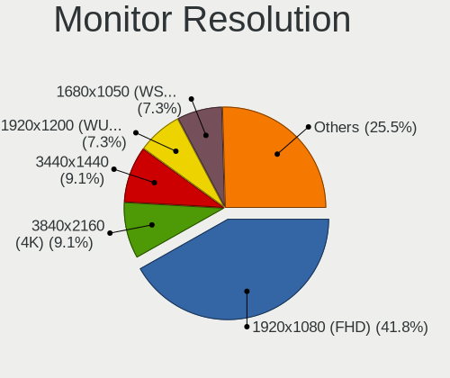

| Resolution         | Desktops | Percent |
|--------------------|----------|---------|
| 1920x1080 (FHD)    | 18       | 42.86%  |
| 1280x1024 (SXGA)   | 8        | 19.05%  |
| 3840x2160 (4K)     | 5        | 11.9%   |
| 3440x1440          | 3        | 7.14%   |
| 2560x1440 (QHD)    | 3        | 7.14%   |
| 1680x1050 (WSXGA+) | 2        | 4.76%   |
| 2560x1600          | 1        | 2.38%   |
| 2560x1080          | 1        | 2.38%   |
| 1920x1200 (WUXGA)  | 1        | 2.38%   |

Monitor Diagonal
----------------

Diagonal size in inches

| Inches  | Desktops | Percent |
|---------|----------|---------|
| 19      | 6        | 14.63%  |
| 27      | 5        | 12.2%   |
| 31      | 4        | 9.76%   |
| 24      | 4        | 9.76%   |
| 23      | 4        | 9.76%   |
| Unknown | 4        | 9.76%   |
| 48      | 2        | 4.88%   |
| 29      | 2        | 4.88%   |
| 21      | 2        | 4.88%   |
| 18      | 2        | 4.88%   |
| 35      | 1        | 2.44%   |
| 34      | 1        | 2.44%   |
| 32      | 1        | 2.44%   |
| 28      | 1        | 2.44%   |
| 25      | 1        | 2.44%   |
| 22      | 1        | 2.44%   |

Monitor Width
-------------

Physical width

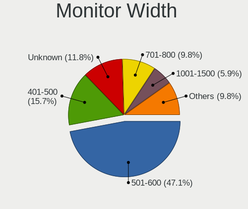

| Width in mm | Desktops | Percent |
|-------------|----------|---------|
| 501-600     | 12       | 30%     |
| 601-700     | 8        | 20%     |
| 351-400     | 8        | 20%     |
| Unknown     | 4        | 10%     |
| 401-500     | 3        | 7.5%    |
| 701-800     | 2        | 5%      |
| 1001-1500   | 2        | 5%      |
| 801-900     | 1        | 2.5%    |

Aspect Ratio
------------

Proportional relationship between the width and the height

| Ratio   | Desktops | Percent |
|---------|----------|---------|
| 16/9    | 23       | 56.1%   |
| 5/4     | 5        | 12.2%   |
| 16/10   | 4        | 9.76%   |
| 6/5     | 3        | 7.32%   |
| 21/9    | 3        | 7.32%   |
| Unknown | 3        | 7.32%   |

Monitor Area
------------

Area in inch

| Area in inch | Desktops | Percent |
|----------------|----------|---------|
| 201-250        | 11       | 26.19%  |
| 351-500        | 9        | 21.43%  |
| 151-200        | 8        | 19.05%  |
| 301-350        | 6        | 14.29%  |
| Unknown        | 4        | 9.52%   |
| More than 1000 | 2        | 4.76%   |
| 251-300        | 2        | 4.76%   |

Pixel Density
-------------

Pixels per inch

| Density | Desktops | Percent |
|---------|----------|---------|
| 51-100  | 24       | 61.54%  |
| 121-160 | 4        | 10.26%  |
| 101-120 | 4        | 10.26%  |
| Unknown | 4        | 10.26%  |
| 1-50    | 2        | 5.13%   |
| 161-240 | 1        | 2.56%   |

Multiple Monitors
-----------------

Total monitors connected

| Total | Desktops | Percent |
|-------|----------|---------|
| 1     | 34       | 75.56%  |
| 2     | 7        | 15.56%  |
| 0     | 4        | 8.89%   |

Network
-------

Net Controller Vendor
---------------------

Controller vendors

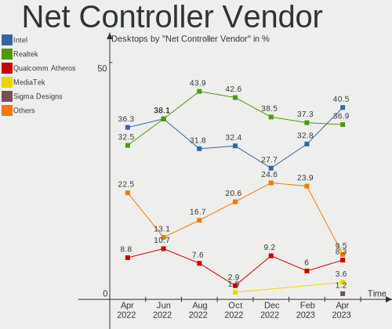

| Vendor                | Desktops | Percent |
|-----------------------|----------|---------|
| Intel                 | 28       | 40%     |
| Realtek Semiconductor | 26       | 37.14%  |
| Qualcomm Atheros      | 4        | 5.71%   |
| Broadcom              | 4        | 5.71%   |
| TP-Link               | 2        | 2.86%   |
| D-Link System         | 2        | 2.86%   |
| Samsung Electronics   | 1        | 1.43%   |
| Ralink Technology     | 1        | 1.43%   |
| Ralink                | 1        | 1.43%   |
| D-Link                | 1        | 1.43%   |

Net Controller Model
--------------------

Controller models

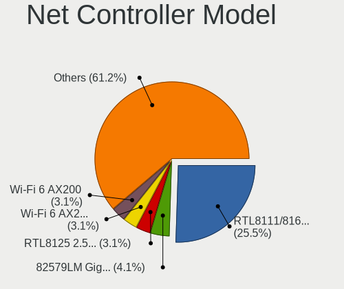

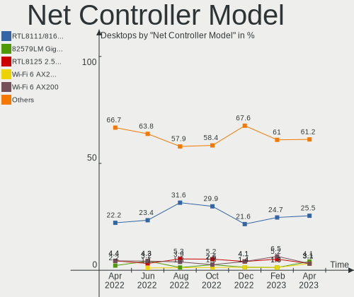

| Model                                                                         | Desktops | Percent |
|-------------------------------------------------------------------------------|----------|---------|
| Realtek RTL8111/8168/8411 PCI Express Gigabit Ethernet Controller             | 20       | 24.1%   |
| Intel Wi-Fi 6 AX200                                                           | 7        | 8.43%   |
| Intel I211 Gigabit Network Connection                                         | 6        | 7.23%   |
| Qualcomm Atheros Killer E220x Gigabit Ethernet Controller                     | 4        | 4.82%   |
| Intel Ethernet Connection (2) I219-V                                          | 3        | 3.61%   |
| Realtek RTL8125 2.5GbE Controller                                             | 2        | 2.41%   |
| Intel Ethernet Controller I225-V                                              | 2        | 2.41%   |
| Intel 82579LM Gigabit Network Connection (Lewisville)                         | 2        | 2.41%   |
| Intel 82575EB Gigabit Network Connection                                      | 2        | 2.41%   |
| Intel 82567LM-3 Gigabit Network Connection                                    | 2        | 2.41%   |
| Intel 82557/8/9/0/1 Ethernet Pro 100                                          | 2        | 2.41%   |
| Broadcom BCM4360 802.11ac Wireless Network Adapter                            | 2        | 2.41%   |
| TP-Link TL-WN821N v5/v6 [RTL8192EU]                                           | 1        | 1.2%    |
| TP-Link AC600 wireless Realtek RTL8811AU [Archer T2U Nano]                    | 1        | 1.2%    |
| Samsung Galaxy series, misc. (tethering mode)                                 | 1        | 1.2%    |
| Realtek RTL88x2bu [AC1200 Techkey]                                            | 1        | 1.2%    |
| Realtek RTL8821CE 802.11ac PCIe Wireless Network Adapter                      | 1        | 1.2%    |
| Realtek RTL8812AU 802.11a/b/g/n/ac 2T2R DB WLAN Adapter                       | 1        | 1.2%    |
| Realtek RTL8188FTV 802.11b/g/n 1T1R 2.4G WLAN Adapter                         | 1        | 1.2%    |
| Realtek RTL8188CUS 802.11n WLAN Adapter                                       | 1        | 1.2%    |
| Realtek RTL8153 Gigabit Ethernet Adapter                                      | 1        | 1.2%    |
| Realtek 802.11ac NIC                                                          | 1        | 1.2%    |
| Ralink RT5372 Wireless Adapter                                                | 1        | 1.2%    |
| Ralink RT5392 PCIe Wireless Network Adapter                                   | 1        | 1.2%    |
| Intel Wireless 8260                                                           | 1        | 1.2%    |
| Intel Ultimate N WiFi Link 5300                                               | 1        | 1.2%    |
| Intel Ethernet Connection I217-LM                                             | 1        | 1.2%    |
| Intel Ethernet Connection (7) I219-V                                          | 1        | 1.2%    |
| Intel Ethernet Connection (2) I219-LM                                         | 1        | 1.2%    |
| Intel Centrino Wireless-N 2230                                                | 1        | 1.2%    |
| Intel Alder Lake-S PCH CNVi WiFi                                              | 1        | 1.2%    |
| Intel 82579V Gigabit Network Connection                                       | 1        | 1.2%    |
| Intel 82574L Gigabit Network Connection                                       | 1        | 1.2%    |
| Intel 82571EB/82571GB Gigabit Ethernet Controller D0/D1 (copper applications) | 1        | 1.2%    |
| Intel 82546EB Gigabit Ethernet Controller (Copper)                            | 1        | 1.2%    |
| Intel 82541PI Gigabit Ethernet Controller                                     | 1        | 1.2%    |
| D-Link System RTL8139 Ethernet                                                | 1        | 1.2%    |
| D-Link System AirPlus G DWL-G122 Wireless Adapter(rev.C1) [Ralink RT2571W]    | 1        | 1.2%    |
| D-Link DUB-1312 Gigabit Ethernet Adapter                                      | 1        | 1.2%    |
| Broadcom NetXtreme BCM5764M Gigabit Ethernet PCIe                             | 1        | 1.2%    |
| Broadcom NetLink BCM57781 Gigabit Ethernet PCIe                               | 1        | 1.2%    |

Wireless Vendor
---------------

Wireless vendors

| Vendor                | Desktops | Percent |
|-----------------------|----------|---------|
| Intel                 | 11       | 45.83%  |
| Realtek Semiconductor | 6        | 25%     |
| TP-Link               | 2        | 8.33%   |
| Broadcom              | 2        | 8.33%   |
| Ralink Technology     | 1        | 4.17%   |
| Ralink                | 1        | 4.17%   |
| D-Link System         | 1        | 4.17%   |

Wireless Model
--------------

Wireless models

| Model                                                                      | Desktops | Percent |
|----------------------------------------------------------------------------|----------|---------|
| Intel Wi-Fi 6 AX200                                                        | 7        | 29.17%  |
| Broadcom BCM4360 802.11ac Wireless Network Adapter                         | 2        | 8.33%   |
| TP-Link TL-WN821N v5/v6 [RTL8192EU]                                        | 1        | 4.17%   |
| TP-Link AC600 wireless Realtek RTL8811AU [Archer T2U Nano]                 | 1        | 4.17%   |
| Realtek RTL88x2bu [AC1200 Techkey]                                         | 1        | 4.17%   |
| Realtek RTL8821CE 802.11ac PCIe Wireless Network Adapter                   | 1        | 4.17%   |
| Realtek RTL8812AU 802.11a/b/g/n/ac 2T2R DB WLAN Adapter                    | 1        | 4.17%   |
| Realtek RTL8188FTV 802.11b/g/n 1T1R 2.4G WLAN Adapter                      | 1        | 4.17%   |
| Realtek RTL8188CUS 802.11n WLAN Adapter                                    | 1        | 4.17%   |
| Realtek 802.11ac NIC                                                       | 1        | 4.17%   |
| Ralink RT5372 Wireless Adapter                                             | 1        | 4.17%   |
| Ralink RT5392 PCIe Wireless Network Adapter                                | 1        | 4.17%   |
| Intel Wireless 8260                                                        | 1        | 4.17%   |
| Intel Ultimate N WiFi Link 5300                                            | 1        | 4.17%   |
| Intel Centrino Wireless-N 2230                                             | 1        | 4.17%   |
| Intel Alder Lake-S PCH CNVi WiFi                                           | 1        | 4.17%   |
| D-Link System AirPlus G DWL-G122 Wireless Adapter(rev.C1) [Ralink RT2571W] | 1        | 4.17%   |

Ethernet Vendor
---------------

Ethernet vendors

| Vendor                | Desktops | Percent |
|-----------------------|----------|---------|
| Intel                 | 24       | 43.64%  |
| Realtek Semiconductor | 22       | 40%     |
| Qualcomm Atheros      | 4        | 7.27%   |
| Broadcom              | 2        | 3.64%   |
| Samsung Electronics   | 1        | 1.82%   |
| D-Link System         | 1        | 1.82%   |
| D-Link                | 1        | 1.82%   |

Ethernet Model
--------------

Ethernet models

| Model                                                                         | Desktops | Percent |
|-------------------------------------------------------------------------------|----------|---------|
| Realtek RTL8111/8168/8411 PCI Express Gigabit Ethernet Controller             | 20       | 33.9%   |
| Intel I211 Gigabit Network Connection                                         | 6        | 10.17%  |
| Qualcomm Atheros Killer E220x Gigabit Ethernet Controller                     | 4        | 6.78%   |
| Intel Ethernet Connection (2) I219-V                                          | 3        | 5.08%   |
| Realtek RTL8125 2.5GbE Controller                                             | 2        | 3.39%   |
| Intel Ethernet Controller I225-V                                              | 2        | 3.39%   |
| Intel 82579LM Gigabit Network Connection (Lewisville)                         | 2        | 3.39%   |
| Intel 82575EB Gigabit Network Connection                                      | 2        | 3.39%   |
| Intel 82567LM-3 Gigabit Network Connection                                    | 2        | 3.39%   |
| Intel 82557/8/9/0/1 Ethernet Pro 100                                          | 2        | 3.39%   |
| Samsung Galaxy series, misc. (tethering mode)                                 | 1        | 1.69%   |
| Realtek RTL8153 Gigabit Ethernet Adapter                                      | 1        | 1.69%   |
| Intel Ethernet Connection I217-LM                                             | 1        | 1.69%   |
| Intel Ethernet Connection (7) I219-V                                          | 1        | 1.69%   |
| Intel Ethernet Connection (2) I219-LM                                         | 1        | 1.69%   |
| Intel 82579V Gigabit Network Connection                                       | 1        | 1.69%   |
| Intel 82574L Gigabit Network Connection                                       | 1        | 1.69%   |
| Intel 82571EB/82571GB Gigabit Ethernet Controller D0/D1 (copper applications) | 1        | 1.69%   |
| Intel 82546EB Gigabit Ethernet Controller (Copper)                            | 1        | 1.69%   |
| Intel 82541PI Gigabit Ethernet Controller                                     | 1        | 1.69%   |
| D-Link System RTL8139 Ethernet                                                | 1        | 1.69%   |
| D-Link DUB-1312 Gigabit Ethernet Adapter                                      | 1        | 1.69%   |
| Broadcom NetXtreme BCM5764M Gigabit Ethernet PCIe                             | 1        | 1.69%   |
| Broadcom NetLink BCM57781 Gigabit Ethernet PCIe                               | 1        | 1.69%   |

Net Controller Kind
-------------------

Ethernet, WiFi or modem

| Kind     | Desktops | Percent |
|----------|----------|---------|
| Ethernet | 44       | 66.67%  |
| WiFi     | 22       | 33.33%  |

Used Controller
---------------

Currently used network controller

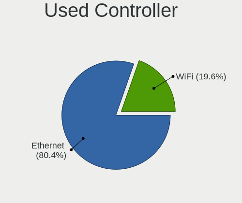

| Kind     | Desktops | Percent |
|----------|----------|---------|
| Ethernet | 38       | 73.08%  |
| WiFi     | 14       | 26.92%  |

NICs
----

Total network controllers on board

| Total | Desktops | Percent |
|-------|----------|---------|
| 1     | 18       | 40%     |
| 2     | 17       | 37.78%  |
| 3     | 7        | 15.56%  |
| 4     | 2        | 4.44%   |
| 0     | 1        | 2.22%   |

IPv6
----

IPv6 vs IPv4

| Used | Desktops | Percent |
|------|----------|---------|
| No   | 34       | 75.56%  |
| Yes  | 11       | 24.44%  |

Bluetooth
---------

Bluetooth Vendor
----------------

Controller vendors

| Vendor                  | Desktops | Percent |
|-------------------------|----------|---------|
| Intel                   | 9        | 69.23%  |
| Realtek Semiconductor   | 1        | 7.69%   |
| Cambridge Silicon Radio | 1        | 7.69%   |
| Broadcom                | 1        | 7.69%   |
| Apple                   | 1        | 7.69%   |

Bluetooth Model
---------------

Controller models

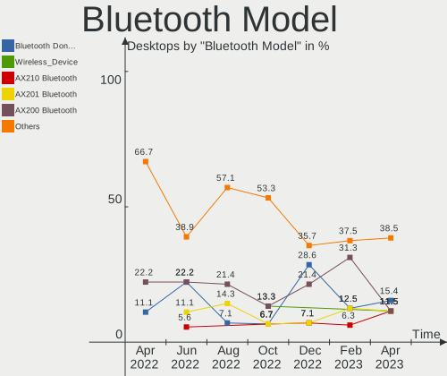

| Model                                               | Desktops | Percent |
|-----------------------------------------------------|----------|---------|
| Intel AX200 Bluetooth                               | 7        | 53.85%  |
| Realtek  Bluetooth 4.2 Adapter                      | 1        | 7.69%   |
| Intel Centrino Bluetooth Wireless Transceiver       | 1        | 7.69%   |
| Intel Bluetooth wireless interface                  | 1        | 7.69%   |
| Cambridge Silicon Radio Bluetooth Dongle (HCI mode) | 1        | 7.69%   |
| Broadcom BCM20702A0 Bluetooth 4.0                   | 1        | 7.69%   |
| Apple Bluetooth USB Host Controller                 | 1        | 7.69%   |

Sound
-----

Sound Vendor
------------

Sound card vendors

| Vendor                               | Desktops | Percent |
|--------------------------------------|----------|---------|
| Intel                                | 26       | 34.67%  |
| Nvidia                               | 21       | 28%     |
| AMD                                  | 16       | 21.33%  |
| C-Media Electronics                  | 3        | 4%      |
| Texas Instruments                    | 2        | 2.67%   |
| Plantronics                          | 2        | 2.67%   |
| Logitech                             | 2        | 2.67%   |
| Thesycon Systemsoftware & Consulting | 1        | 1.33%   |
| M-Audio                              | 1        | 1.33%   |
| Generalplus Technology               | 1        | 1.33%   |

Sound Model
-----------

Sound card models

| Model                                                                      | Desktops | Percent |
|----------------------------------------------------------------------------|----------|---------|
| AMD Starship/Matisse HD Audio Controller                                   | 8        | 9.41%   |
| Intel 7 Series/C216 Chipset Family High Definition Audio Controller        | 7        | 8.24%   |
| Nvidia GK208 HDMI/DP Audio Controller                                      | 4        | 4.71%   |
| Intel 100 Series/C230 Series Chipset Family HD Audio Controller            | 4        | 4.71%   |
| AMD SBx00 Azalia (Intel HDA)                                               | 4        | 4.71%   |
| Nvidia GM204 High Definition Audio Controller                              | 3        | 3.53%   |
| AMD RS880 HDMI Audio [Radeon HD 4200 Series]                               | 3        | 3.53%   |
| Nvidia GP107GL High Definition Audio Controller                            | 2        | 2.35%   |
| Nvidia GM107 High Definition Audio Controller [GeForce 940MX]              | 2        | 2.35%   |
| Nvidia GF119 HDMI Audio Controller                                         | 2        | 2.35%   |
| Logitech Headset H340                                                      | 2        | 2.35%   |
| Intel Xeon E3-1200 v3/4th Gen Core Processor HD Audio Controller           | 2        | 2.35%   |
| Intel Atom Processor Z36xxx/Z37xxx Series High Definition Audio Controller | 2        | 2.35%   |
| Intel 9 Series Chipset Family HD Audio Controller                          | 2        | 2.35%   |
| Intel 82801JD/DO (ICH10 Family) HD Audio Controller                        | 2        | 2.35%   |
| Intel 6 Series/C200 Series Chipset Family High Definition Audio Controller | 2        | 2.35%   |
| C-Media Electronics CMI8788 [Oxygen HD Audio]                              | 2        | 2.35%   |
| Thesycon Systemsoftware & Consulting DX3 Pro                               | 1        | 1.18%   |
| Texas Instruments PCM2902 Audio Codec                                      | 1        | 1.18%   |
| Texas Instruments PCM2704 16-bit stereo audio DAC                          | 1        | 1.18%   |
| Plantronics RIG 800HD                                                      | 1        | 1.18%   |
| Plantronics BT600                                                          | 1        | 1.18%   |
| Nvidia TU116 High Definition Audio Controller                              | 1        | 1.18%   |
| Nvidia TU107 GeForce GTX 1650 High Definition Audio Controller             | 1        | 1.18%   |
| Nvidia TU106 High Definition Audio Controller                              | 1        | 1.18%   |
| Nvidia High Definition Audio Controller                                    | 1        | 1.18%   |
| Nvidia GK104 HDMI Audio Controller                                         | 1        | 1.18%   |
| Nvidia GA106 High Definition Audio Controller                              | 1        | 1.18%   |
| Nvidia GA104 High Definition Audio Controller                              | 1        | 1.18%   |
| Nvidia GA102 High Definition Audio Controller                              | 1        | 1.18%   |
| M-Audio M-Track                                                            | 1        | 1.18%   |
| Intel Comet Lake PCH-V cAVS                                                | 1        | 1.18%   |
| Intel Cannon Lake PCH cAVS                                                 | 1        | 1.18%   |
| Intel C610/X99 series chipset HD Audio Controller                          | 1        | 1.18%   |
| Intel Alder Lake-S HD Audio Controller                                     | 1        | 1.18%   |
| Intel 82801JI (ICH10 Family) HD Audio Controller                           | 1        | 1.18%   |
| Intel 8 Series/C220 Series Chipset High Definition Audio Controller        | 1        | 1.18%   |
| Intel 200 Series PCH HD Audio                                              | 1        | 1.18%   |
| Generalplus Technology USB Audio Device                                    | 1        | 1.18%   |
| C-Media Electronics Audio Adapter (Unitek Y-247A)                          | 1        | 1.18%   |
| AMD Renoir Radeon High Definition Audio Controller                         | 1        | 1.18%   |
| AMD Navi 21/23 HDMI/DP Audio Controller                                    | 1        | 1.18%   |
| AMD Navi 10 HDMI Audio                                                     | 1        | 1.18%   |
| AMD Juniper HDMI Audio [Radeon HD 5700 Series]                             | 1        | 1.18%   |
| AMD Hawaii HDMI Audio [Radeon R9 290/290X / 390/390X]                      | 1        | 1.18%   |
| AMD FCH Azalia Controller                                                  | 1        | 1.18%   |
| AMD Family 17h/19h HD Audio Controller                                     | 1        | 1.18%   |
| AMD Ellesmere HDMI Audio [Radeon RX 470/480 / 570/580/590]                 | 1        | 1.18%   |
| AMD Baffin HDMI/DP Audio [Radeon RX 550 640SP / RX 560/560X]               | 1        | 1.18%   |

Memory
------

Memory Vendor
-------------

Memory module vendors

| Vendor              | Desktops | Percent |
|---------------------|----------|---------|
| Unknown             | 9        | 29.03%  |
| Kingston            | 6        | 19.35%  |
| Corsair             | 5        | 16.13%  |
| Team                | 2        | 6.45%   |
| G.Skill             | 2        | 6.45%   |
| Crucial             | 2        | 6.45%   |
| SK hynix            | 1        | 3.23%   |
| Samsung Electronics | 1        | 3.23%   |
| Nanya Technology    | 1        | 3.23%   |
| Elpida              | 1        | 3.23%   |
| Unknown             | 1        | 3.23%   |

Memory Model
------------

Memory module models

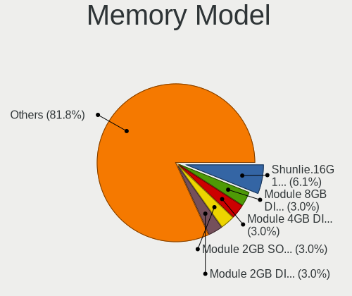

| Model                                                    | Desktops | Percent |
|----------------------------------------------------------|----------|---------|
| Unknown RAM Module 4096MB DIMM DDR3 1333MT/s             | 2        | 6.06%   |
| Unknown RAM Module 2GB DIMM 667MT/s                      | 2        | 6.06%   |
| Unknown RAM Module 8GB DIMM 1600MT/s                     | 1        | 3.03%   |
| Unknown RAM Module 4GB DIMM 1333MT/s                     | 1        | 3.03%   |
| Unknown RAM Module 4096MB DIMM 1333MT/s                  | 1        | 3.03%   |
| Unknown RAM Module 2GB DIMM DDR2 1067MT/s                | 1        | 3.03%   |
| Unknown RAM Module 2048MB DIMM 800MT/s                   | 1        | 3.03%   |
| Team RAM TEAMGROUP-UD4-3000 8GB DIMM DDR4 3067MT/s       | 1        | 3.03%   |
| Team RAM TEAMGROUP-UD4-2666 8GB DIMM DDR4 2667MT/s       | 1        | 3.03%   |
| SK hynix RAM HMT451S6BFR8A-PB 4GB SODIMM DDR3 1600MT/s   | 1        | 3.03%   |
| Samsung RAM M378B5773DH0-CH9 2GB DIMM DDR3 1333MT/s      | 1        | 3.03%   |
| Samsung RAM M378B5673FH0-CH9 2GB DIMM DDR3 1600MT/s      | 1        | 3.03%   |
| Samsung RAM M378B5673EH1-CH9 2GB DIMM 1333MT/s           | 1        | 3.03%   |
| Nanya RAM Module 2048MB DIMM DDR2 800MT/s                | 1        | 3.03%   |
| Kingston RAM KNWMX1-ETF 4GB SODIMM DDR3 1600MT/s         | 1        | 3.03%   |
| Kingston RAM KHX2666C16/8G 8GB DIMM DDR4 3466MT/s        | 1        | 3.03%   |
| Kingston RAM KF552C40-16 16384MB DIMM 5200MT/s           | 1        | 3.03%   |
| Kingston RAM 99U5471-020.A00LF 4096MB DIMM DDR3 1600MT/s | 1        | 3.03%   |
| Kingston RAM 9905744-077.A00G 16GB SODIMM DDR4 3200MT/s  | 1        | 3.03%   |
| Kingston RAM 9905471-006.A01LF 4GB DIMM DDR3 1333MT/s    | 1        | 3.03%   |
| G.Skill RAM F3-2400C10-8GTX 8GB DIMM DDR3 2400MT/s       | 1        | 3.03%   |
| G.Skill RAM F3-12800CL9-4GBRL 4GB DIMM DDR3 1866MT/s     | 1        | 3.03%   |
| Elpida RAM EBJ21EE8BAWA-DJ-E 2GB DIMM DDR3 1333MT/s      | 1        | 3.03%   |
| Crucial RAM CT51264BA160B.C16F 4GB DIMM DDR3 1600MT/s    | 1        | 3.03%   |
| Crucial RAM CT102464BD160B.C16 8GB DIMM DDR3 1600MT/s    | 1        | 3.03%   |
| Corsair RAM CMZ8GX3M2A1600C9 4GB DIMM DDR3 1600MT/s      | 1        | 3.03%   |
| Corsair RAM CMW32GX4M2C3200C16 16GB DIMM DDR4 3200MT/s   | 1        | 3.03%   |
| Corsair RAM CMV4GX3M1A1600C11 4GB DIMM DDR3 1600MT/s     | 1        | 3.03%   |
| Corsair RAM CMK16GX4M2B3200C16 8GB DIMM DDR4 3600MT/s    | 1        | 3.03%   |
| Corsair RAM CMK16GX4M2B3000C15 8GB DIMM DDR4 3000MT/s    | 1        | 3.03%   |
| Unknown                                                  | 1        | 3.03%   |

Memory Kind
-----------

Memory module kinds

| Kind    | Desktops | Percent |
|---------|----------|---------|
| DDR3    | 9        | 33.33%  |
| DDR4    | 8        | 29.63%  |
| Unknown | 7        | 25.93%  |
| DDR2    | 2        | 7.41%   |
| SDRAM   | 1        | 3.7%    |

Memory Form Factor
------------------

Physical design of the memory module

| Name   | Desktops | Percent |
|--------|----------|---------|
| DIMM   | 24       | 92.31%  |
| SODIMM | 2        | 7.69%   |

Memory Size
-----------

Memory module size

| Size  | Desktops | Percent |
|-------|----------|---------|
| 4096  | 8        | 30.77%  |
| 8192  | 6        | 23.08%  |
| 2048  | 6        | 23.08%  |
| 16384 | 5        | 19.23%  |
| 32768 | 1        | 3.85%   |

Memory Speed
------------

Memory module speed

| Speed | Desktops | Percent |
|-------|----------|---------|
| 1600  | 8        | 26.67%  |
| 1333  | 6        | 20%     |
| 3200  | 3        | 10%     |
| 3466  | 2        | 6.67%   |
| 800   | 2        | 6.67%   |
| 667   | 2        | 6.67%   |
| 5200  | 1        | 3.33%   |
| 3600  | 1        | 3.33%   |
| 3067  | 1        | 3.33%   |
| 2667  | 1        | 3.33%   |
| 2400  | 1        | 3.33%   |
| 1866  | 1        | 3.33%   |
| 1067  | 1        | 3.33%   |

Printers & scanners
-------------------

Printer Vendor
--------------

Printer device vendors

| Vendor             | Desktops | Percent |
|--------------------|----------|---------|
| Brother Industries | 2        | 100%    |

Printer Model
-------------

Printer device models

| Model                       | Desktops | Percent |
|-----------------------------|----------|---------|
| Brother MFC-L8690CDW series | 1        | 50%     |
| Brother HL-L2305 series     | 1        | 50%     |

Scanner Vendor
--------------

Scanner device vendors

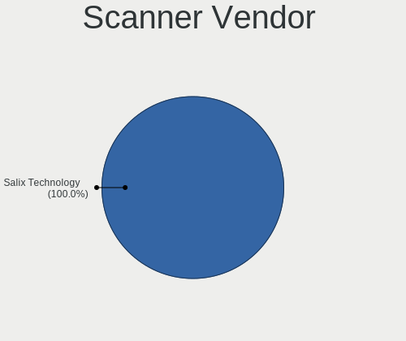

| Vendor | Desktops | Percent |
|--------|----------|---------|
| Canon  | 1        | 100%    |

Scanner Model
-------------

Scanner device models

| Model                   | Desktops | Percent |
|-------------------------|----------|---------|
| Canon CanoScan LiDE 210 | 1        | 100%    |

Camera
------

Camera Vendor
-------------

Camera device vendors

| Vendor                        | Desktops | Percent |
|-------------------------------|----------|---------|
| Logitech                      | 2        | 50%     |
| Sunplus Innovation Technology | 1        | 25%     |
| Microdia                      | 1        | 25%     |

Camera Model
------------

Camera device models

| Model                       | Desktops | Percent |
|-----------------------------|----------|---------|
| Sunplus ezcap U3 capture-04 | 1        | 25%     |
| Microdia HDP Webcam USB     | 1        | 25%     |
| Logitech Webcam C930e       | 1        | 25%     |
| Logitech HD Pro Webcam C920 | 1        | 25%     |

Security
--------

Fingerprint Vendor
------------------

Fingerprint sensor vendors

Zero info for selected period =(

Fingerprint Model
-----------------

Fingerprint sensor models

Zero info for selected period =(

Chipcard Vendor
---------------

Chipcard module vendors

Zero info for selected period =(

Chipcard Model
--------------

Chipcard module models

Zero info for selected period =(

Unsupported
-----------

Unsupported Devices
-------------------

Total unsupported devices on board

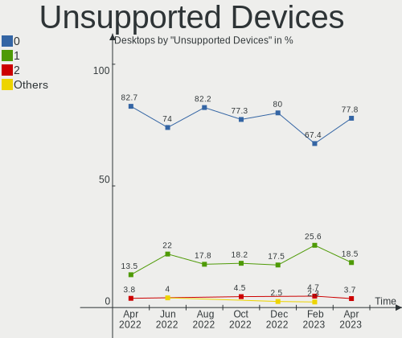

| Total | Desktops | Percent |
|-------|----------|---------|
| 0     | 32       | 71.11%  |
| 1     | 11       | 24.44%  |
| 3     | 1        | 2.22%   |
| 2     | 1        | 2.22%   |

Unsupported Device Types
------------------------

Types of unsupported devices

| Type                     | Desktops | Percent |
|--------------------------|----------|---------|
| Graphics card            | 7        | 46.67%  |
| Net/wireless             | 4        | 26.67%  |
| Communication controller | 2        | 13.33%  |
| Unassigned class         | 1        | 6.67%   |
| Storage/ata              | 1        | 6.67%   |

