Linux in Australia - Hardware Trends (Desktops)
-----------------------------------------------

A project to identify most popular hardware characteristics and track their change
over time based on data collected by Linux users at https://Linux-Hardware.org.

Anyone can contribute to this report by the [hw-probe](https://github.com/linuxhw/hw-probe) tool:

    sudo -E hw-probe -all -upload

Period: Jun, 2022.

Contents
--------

* [ System ](#system)
  - [ OS                       ](#os)
  - [ OS Family                ](#os-family)
  - [ Kernel                   ](#kernel)
  - [ Kernel Family            ](#kernel-family)
  - [ Kernel Major Ver.        ](#kernel-major-ver)
  - [ Arch                     ](#arch)
  - [ DE                       ](#de)
  - [ Display Server           ](#display-server)
  - [ Display Manager          ](#display-manager)
  - [ OS Lang                  ](#os-lang)
  - [ Boot Mode                ](#boot-mode)
  - [ Filesystem               ](#filesystem)
  - [ Part. scheme             ](#part-scheme)
  - [ Dual Boot with Linux/BSD ](#dual-boot-with-linuxbsd)
  - [ Dual Boot (Win)          ](#dual-boot-win)

* [ Board ](#board)
  - [ Vendor                   ](#vendor)
  - [ Model                    ](#model)
  - [ Model Family             ](#model-family)
  - [ MFG Year                 ](#mfg-year)
  - [ Form Factor              ](#form-factor)
  - [ Secure Boot              ](#secure-boot)
  - [ Coreboot                 ](#coreboot)
  - [ RAM Size                 ](#ram-size)
  - [ RAM Used                 ](#ram-used)
  - [ Total Drives             ](#total-drives)
  - [ Has CD-ROM               ](#has-cd-rom)
  - [ Has Ethernet             ](#has-ethernet)
  - [ Has WiFi                 ](#has-wifi)
  - [ Has Bluetooth            ](#has-bluetooth)

* [ Location ](#location)
  - [ Country                  ](#country)
  - [ City                     ](#city)

* [ Drives ](#drives)
  - [ Drive Vendor             ](#drive-vendor)
  - [ Drive Model              ](#drive-model)
  - [ HDD Vendor               ](#hdd-vendor)
  - [ SSD Vendor               ](#ssd-vendor)
  - [ Drive Kind               ](#drive-kind)
  - [ Drive Connector          ](#drive-connector)
  - [ Drive Size               ](#drive-size)
  - [ Space Total              ](#space-total)
  - [ Space Used               ](#space-used)
  - [ Malfunc. Drives          ](#malfunc-drives)
  - [ Malfunc. Drive Vendor    ](#malfunc-drive-vendor)
  - [ Malfunc. HDD Vendor      ](#malfunc-hdd-vendor)
  - [ Malfunc. Drive Kind      ](#malfunc-drive-kind)
  - [ Failed Drives            ](#failed-drives)
  - [ Failed Drive Vendor      ](#failed-drive-vendor)
  - [ Drive Status             ](#drive-status)

* [ Storage controller ](#storage-controller)
  - [ Storage Vendor           ](#storage-vendor)
  - [ Storage Model            ](#storage-model)
  - [ Storage Kind             ](#storage-kind)

* [ Processor ](#processor)
  - [ CPU Vendor               ](#cpu-vendor)
  - [ CPU Model                ](#cpu-model)
  - [ CPU Model Family         ](#cpu-model-family)
  - [ CPU Cores                ](#cpu-cores)
  - [ CPU Sockets              ](#cpu-sockets)
  - [ CPU Threads              ](#cpu-threads)
  - [ CPU Op-Modes             ](#cpu-op-modes)
  - [ CPU Microcode            ](#cpu-microcode)
  - [ CPU Microarch            ](#cpu-microarch)

* [ Graphics ](#graphics)
  - [ GPU Vendor               ](#gpu-vendor)
  - [ GPU Model                ](#gpu-model)
  - [ GPU Combo                ](#gpu-combo)
  - [ GPU Driver               ](#gpu-driver)
  - [ GPU Memory               ](#gpu-memory)

* [ Monitor ](#monitor)
  - [ Monitor Vendor           ](#monitor-vendor)
  - [ Monitor Model            ](#monitor-model)
  - [ Monitor Resolution       ](#monitor-resolution)
  - [ Monitor Diagonal         ](#monitor-diagonal)
  - [ Monitor Width            ](#monitor-width)
  - [ Aspect Ratio             ](#aspect-ratio)
  - [ Monitor Area             ](#monitor-area)
  - [ Pixel Density            ](#pixel-density)
  - [ Multiple Monitors        ](#multiple-monitors)

* [ Network ](#network)
  - [ Net Controller Vendor    ](#net-controller-vendor)
  - [ Net Controller Model     ](#net-controller-model)
  - [ Wireless Vendor          ](#wireless-vendor)
  - [ Wireless Model           ](#wireless-model)
  - [ Ethernet Vendor          ](#ethernet-vendor)
  - [ Ethernet Model           ](#ethernet-model)
  - [ Net Controller Kind      ](#net-controller-kind)
  - [ Used Controller          ](#used-controller)
  - [ NICs                     ](#nics)
  - [ IPv6                     ](#ipv6)

* [ Bluetooth ](#bluetooth)
  - [ Bluetooth Vendor         ](#bluetooth-vendor)
  - [ Bluetooth Model          ](#bluetooth-model)

* [ Sound ](#sound)
  - [ Sound Vendor             ](#sound-vendor)
  - [ Sound Model              ](#sound-model)

* [ Memory ](#memory)
  - [ Memory Vendor            ](#memory-vendor)
  - [ Memory Model             ](#memory-model)
  - [ Memory Kind              ](#memory-kind)
  - [ Memory Form Factor       ](#memory-form-factor)
  - [ Memory Size              ](#memory-size)
  - [ Memory Speed             ](#memory-speed)

* [ Printers & scanners ](#printers--scanners)
  - [ Printer Vendor           ](#printer-vendor)
  - [ Printer Model            ](#printer-model)
  - [ Scanner Vendor           ](#scanner-vendor)
  - [ Scanner Model            ](#scanner-model)

* [ Camera ](#camera)
  - [ Camera Vendor            ](#camera-vendor)
  - [ Camera Model             ](#camera-model)

* [ Security ](#security)
  - [ Fingerprint Vendor       ](#fingerprint-vendor)
  - [ Fingerprint Model        ](#fingerprint-model)
  - [ Chipcard Vendor          ](#chipcard-vendor)
  - [ Chipcard Model           ](#chipcard-model)

* [ Unsupported ](#unsupported)
  - [ Unsupported Devices      ](#unsupported-devices)
  - [ Unsupported Device Types ](#unsupported-device-types)

System
------

OS
--

Installed operating systems

| Name              | Desktops | Percent |
|-------------------|----------|---------|
| Fedora 36         | 8        | 16%     |
| Ubuntu 22.04      | 6        | 12%     |
| OpenMandriva 4.3  | 4        | 8%      |
| Linux Mint 20.3   | 4        | 8%      |
| Pop!_OS 22.04     | 3        | 6%      |
| Kali 2022.2       | 3        | 6%      |
| Fedora 35         | 3        | 6%      |
| ClearOS 7         | 3        | 6%      |
| Ubuntu 20.04      | 2        | 4%      |
| Arch Rolling      | 2        | 4%      |
| Arch              | 2        | 4%      |
| Ubuntu MATE 22.04 | 1        | 2%      |
| Ubuntu MATE 21.10 | 1        | 2%      |
| Ubuntu 21.10      | 1        | 2%      |
| Oracle Linux 8.6  | 1        | 2%      |
| Manjaro           | 1        | 2%      |
| Linux Mint 20.1   | 1        | 2%      |
| KDE neon 20.04    | 1        | 2%      |
| Fedora 34         | 1        | 2%      |
| Fedora 33         | 1        | 2%      |
| Debian 11         | 1        | 2%      |

OS Family
---------

OS without a version

| Name         | Desktops | Percent |
|--------------|----------|---------|
| Fedora       | 13       | 26%     |
| Ubuntu       | 9        | 18%     |
| Linux Mint   | 5        | 10%     |
| OpenMandriva | 4        | 8%      |
| Arch         | 4        | 8%      |
| Pop!_OS      | 3        | 6%      |
| Kali         | 3        | 6%      |
| ClearOS      | 3        | 6%      |
| Ubuntu MATE  | 2        | 4%      |
| Oracle Linux | 1        | 2%      |
| Manjaro      | 1        | 2%      |
| KDE neon     | 1        | 2%      |
| Debian       | 1        | 2%      |

Kernel
------

Version of the Linux kernel

| Version                           | Desktops | Percent |
|-----------------------------------|----------|---------|
| 5.17.5-76051705-generic           | 3        | 6%      |
| 5.17.12-200.fc35.x86_64           | 3        | 6%      |
| 5.16.7-desktop-1omv4003           | 3        | 6%      |
| 3.10.0-1160.66.1.el7.x86_64       | 3        | 6%      |
| 5.4.0-117-generic                 | 2        | 4%      |
| 5.18.6-200.fc36.x86_64            | 2        | 4%      |
| 5.17.9-arch1-1                    | 2        | 4%      |
| 5.17.13-300.fc36.x86_64           | 2        | 4%      |
| 5.17.12-300.fc36.x86_64           | 2        | 4%      |
| 5.17.0-kali3-amd64                | 2        | 4%      |
| 5.15.0-40-generic                 | 2        | 4%      |
| 5.15.0-37-generic                 | 2        | 4%      |
| 5.4.197-tkg-bmq                   | 1        | 2%      |
| 5.4.17-2136.307.3.1.el8uek.x86_64 | 1        | 2%      |
| 5.4.0-109-generic                 | 1        | 2%      |
| 5.18.7-200.fc36.x86_64            | 1        | 2%      |
| 5.18.5-200.fc36.x86_64            | 1        | 2%      |
| 5.18.2-arch1-1                    | 1        | 2%      |
| 5.18.1-arch1-1                    | 1        | 2%      |
| 5.17.0-trunk-amd64                | 1        | 2%      |
| 5.16.13-desktop-1omv4003          | 1        | 2%      |
| 5.16.12-100.fc34.x86_64           | 1        | 2%      |
| 5.16.0-kali7-amd64                | 1        | 2%      |
| 5.15.41-1-MANJARO                 | 1        | 2%      |
| 5.15.0-39-generic                 | 1        | 2%      |
| 5.15.0-33-generic                 | 1        | 2%      |
| 5.15.0-23-generic                 | 1        | 2%      |
| 5.14.18-100.fc33.x86_64           | 1        | 2%      |
| 5.14.0-1042-oem                   | 1        | 2%      |
| 5.13.0-51-generic                 | 1        | 2%      |
| 5.13.0-48-generic                 | 1        | 2%      |
| 5.13.0-46-generic                 | 1        | 2%      |
| 5.13.0-44-generic                 | 1        | 2%      |
| 5.11.0-25-generic                 | 1        | 2%      |

Kernel Family
-------------

Linux kernel without a distro release

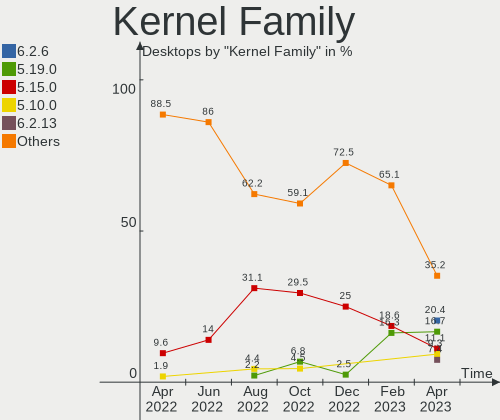

| Version | Desktops | Percent |
|---------|----------|---------|
| 5.15.0  | 7        | 14%     |
| 5.17.12 | 5        | 10%     |
| 5.13.0  | 4        | 8%      |
| 5.4.0   | 3        | 6%      |
| 5.17.5  | 3        | 6%      |
| 5.17.0  | 3        | 6%      |
| 5.16.7  | 3        | 6%      |
| 3.10.0  | 3        | 6%      |
| 5.18.6  | 2        | 4%      |
| 5.17.9  | 2        | 4%      |
| 5.17.13 | 2        | 4%      |
| 5.4.197 | 1        | 2%      |
| 5.4.17  | 1        | 2%      |
| 5.18.7  | 1        | 2%      |
| 5.18.5  | 1        | 2%      |
| 5.18.2  | 1        | 2%      |
| 5.18.1  | 1        | 2%      |
| 5.16.13 | 1        | 2%      |
| 5.16.12 | 1        | 2%      |
| 5.16.0  | 1        | 2%      |
| 5.15.41 | 1        | 2%      |
| 5.14.18 | 1        | 2%      |
| 5.14.0  | 1        | 2%      |
| 5.11.0  | 1        | 2%      |

Kernel Major Ver.
-----------------

Linux kernel major version

| Version | Desktops | Percent |
|---------|----------|---------|
| 5.17    | 15       | 30%     |
| 5.15    | 8        | 16%     |
| 5.18    | 6        | 12%     |
| 5.16    | 6        | 12%     |
| 5.4     | 5        | 10%     |
| 5.13    | 4        | 8%      |
| 3.10    | 3        | 6%      |
| 5.14    | 2        | 4%      |
| 5.11    | 1        | 2%      |

Arch
----

OS architecture (x86_64, i586, etc.)

| Name   | Desktops | Percent |
|--------|----------|---------|
| x86_64 | 50       | 100%    |

DE
--

Desktop Environment

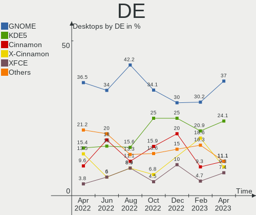

| Name          | Desktops | Percent |
|---------------|----------|---------|
| GNOME         | 17       | 34%     |
| Cinnamon      | 9        | 18%     |
| KDE5          | 8        | 16%     |
| MATE          | 6        | 12%     |
| XFCE          | 3        | 6%      |
| X-Cinnamon    | 3        | 6%      |
| Unknown       | 3        | 6%      |
| GNOME Classic | 1        | 2%      |

Display Server
--------------

X11 or Wayland

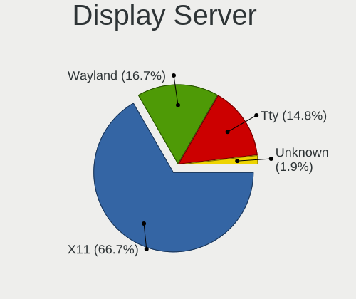

| Name    | Desktops | Percent |
|---------|----------|---------|
| X11     | 33       | 66%     |
| Tty     | 9        | 18%     |
| Wayland | 8        | 16%     |

Display Manager
---------------

SDDM, LightDM, etc.

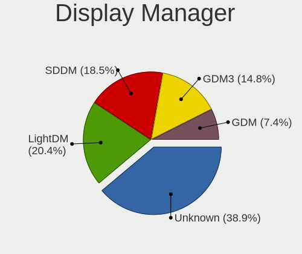

| Name    | Desktops | Percent |
|---------|----------|---------|
| Unknown | 20       | 40%     |
| LightDM | 15       | 30%     |
| GDM3    | 7        | 14%     |
| SDDM    | 5        | 10%     |
| GDM     | 2        | 4%      |
| SLiM    | 1        | 2%      |

OS Lang
-------

Language

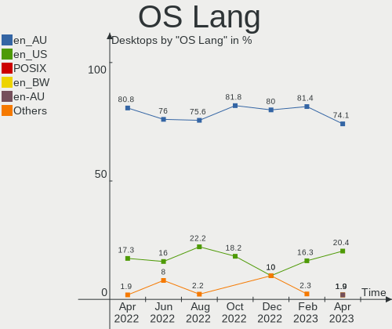

| Lang  | Desktops | Percent |
|-------|----------|---------|
| en_AU | 38       | 76%     |
| en_US | 8        | 16%     |
| C     | 2        | 4%      |
| en_GB | 1        | 2%      |
| de_DE | 1        | 2%      |

Boot Mode
---------

EFI or BIOS

| Mode | Desktops | Percent |
|------|----------|---------|
| BIOS | 29       | 58%     |
| EFI  | 21       | 42%     |

Filesystem
----------

Type of filesystem

| Type    | Desktops | Percent |
|---------|----------|---------|
| Ext4    | 25       | 50%     |
| Xfs     | 12       | 24%     |
| Btrfs   | 6        | 12%     |
| Overlay | 5        | 10%     |
| Zfs     | 2        | 4%      |

Part. scheme
------------

Scheme of partitioning

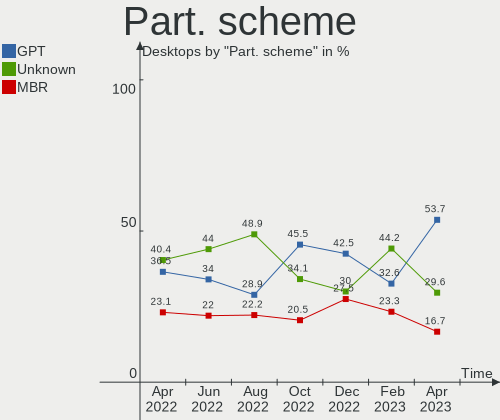

| Type    | Desktops | Percent |
|---------|----------|---------|
| Unknown | 22       | 44%     |
| GPT     | 17       | 34%     |
| MBR     | 11       | 22%     |

Dual Boot with Linux/BSD
------------------------

Hosting more than one Linux/BSD

| Dual boot | Desktops | Percent |
|-----------|----------|---------|
| No        | 39       | 78%     |
| Yes       | 11       | 22%     |

Dual Boot (Win)
---------------

Hosting Linux and Windows

| Dual boot | Desktops | Percent |
|-----------|----------|---------|
| No        | 35       | 70%     |
| Yes       | 15       | 30%     |

Board
-----

Vendor
------

Motherboard manufacturer

| Name                | Desktops | Percent |
|---------------------|----------|---------|
| Gigabyte Technology | 20       | 40%     |
| ASUSTek Computer    | 14       | 28%     |
| MSI                 | 4        | 8%      |
| Dell                | 3        | 6%      |
| Lenovo              | 2        | 4%      |
| Acer                | 2        | 4%      |
| Intel               | 1        | 2%      |
| Hewlett-Packard     | 1        | 2%      |
| ASRock              | 1        | 2%      |
| Alienware           | 1        | 2%      |
| Unknown             | 1        | 2%      |

Model
-----

Motherboard model

| Name                              | Desktops | Percent |
|-----------------------------------|----------|---------|
| Gigabyte J1900M-D2P               | 2        | 4%      |
| Dell OptiPlex 9010                | 2        | 4%      |
| MSI MS-7D25                       | 1        | 2%      |
| MSI MS-7C94                       | 1        | 2%      |
| MSI MS-7A37                       | 1        | 2%      |
| MSI MS-7758                       | 1        | 2%      |
| Lenovo ThinkStation C30 11361H1   | 1        | 2%      |
| Lenovo ThinkCentre M58p 7220A72   | 1        | 2%      |
| Intel DH67BL AAG10189-211         | 1        | 2%      |
| HP rp5800                         | 1        | 2%      |
| Gigabyte Z77MX-D3H                | 1        | 2%      |
| Gigabyte Z690 AORUS PRO DDR4      | 1        | 2%      |
| Gigabyte Z690 AORUS ELITE AX DDR4 | 1        | 2%      |
| Gigabyte X570 I AORUS PRO WIFI    | 1        | 2%      |
| Gigabyte H77N-WIFI                | 1        | 2%      |
| Gigabyte H77M-D3H                 | 1        | 2%      |
| Gigabyte H61M-S2PV                | 1        | 2%      |
| Gigabyte H110-D3A                 | 1        | 2%      |
| Gigabyte GA-MA785G-UD3H           | 1        | 2%      |
| Gigabyte GA-990FXA-UD5            | 1        | 2%      |
| Gigabyte GA-880GM-UD2H            | 1        | 2%      |
| Gigabyte G41MT-D3                 | 1        | 2%      |
| Gigabyte D525TUD                  | 1        | 2%      |
| Gigabyte B85M-D3H                 | 1        | 2%      |
| Gigabyte B450 AORUS PRO           | 1        | 2%      |
| Gigabyte B360M-D3H                | 1        | 2%      |
| Gigabyte B250M-D3H                | 1        | 2%      |
| Gigabyte AB350-Gaming 3           | 1        | 2%      |
| Dell OptiPlex 3010                | 1        | 2%      |
| ASUS TUF B360M-E GAMING           | 1        | 2%      |
| ASUS ROG STRIX Z390-E GAMING      | 1        | 2%      |
| ASUS ROG STRIX B560-F GAMING WIFI | 1        | 2%      |
| ASUS ROG CROSSHAIR VIII DARK HERO | 1        | 2%      |
| ASUS PRIME X570-PRO               | 1        | 2%      |
| ASUS PRIME X570-P                 | 1        | 2%      |
| ASUS PRIME H510M-E                | 1        | 2%      |
| ASUS PRIME B550M-A                | 1        | 2%      |
| ASUS PRIME A320M-K                | 1        | 2%      |
| ASUS P6T DELUXE V2                | 1        | 2%      |
| ASUS P5KPL/1600                   | 1        | 2%      |
| ASUS M5A99X EVO R2.0              | 1        | 2%      |
| ASUS A8R32-MVP Deluxe             | 1        | 2%      |
| ASUS A88X-GAMER                   | 1        | 2%      |
| ASRock AD2700-ITX                 | 1        | 2%      |
| Alienware Area-51 R2              | 1        | 2%      |
| Acer Veriton N4670G               | 1        | 2%      |
| Acer Aspire TC-230                | 1        | 2%      |
| Unknown                           | 1        | 2%      |

Model Family
------------

Motherboard model prefix

| Name                    | Desktops | Percent |
|-------------------------|----------|---------|
| ASUS PRIME              | 5        | 10%     |
| Dell OptiPlex           | 3        | 6%      |
| ASUS ROG                | 3        | 6%      |
| Gigabyte Z690           | 2        | 4%      |
| Gigabyte J1900M-D2P     | 2        | 4%      |
| MSI MS-7D25             | 1        | 2%      |
| MSI MS-7C94             | 1        | 2%      |
| MSI MS-7A37             | 1        | 2%      |
| MSI MS-7758             | 1        | 2%      |
| Lenovo ThinkStation     | 1        | 2%      |
| Lenovo ThinkCentre      | 1        | 2%      |
| Intel DH67BL            | 1        | 2%      |
| HP rp5800               | 1        | 2%      |
| Gigabyte Z77MX-D3H      | 1        | 2%      |
| Gigabyte X570           | 1        | 2%      |
| Gigabyte H77N-WIFI      | 1        | 2%      |
| Gigabyte H77M-D3H       | 1        | 2%      |
| Gigabyte H61M-S2PV      | 1        | 2%      |
| Gigabyte H110-D3A       | 1        | 2%      |
| Gigabyte GA-MA785G-UD3H | 1        | 2%      |
| Gigabyte GA-990FXA-UD5  | 1        | 2%      |
| Gigabyte GA-880GM-UD2H  | 1        | 2%      |
| Gigabyte G41MT-D3       | 1        | 2%      |
| Gigabyte D525TUD        | 1        | 2%      |
| Gigabyte B85M-D3H       | 1        | 2%      |
| Gigabyte B450           | 1        | 2%      |
| Gigabyte B360M-D3H      | 1        | 2%      |
| Gigabyte B250M-D3H      | 1        | 2%      |
| Gigabyte AB350-Gaming   | 1        | 2%      |
| ASUS TUF                | 1        | 2%      |
| ASUS P6T                | 1        | 2%      |
| ASUS P5KPL              | 1        | 2%      |
| ASUS M5A99X             | 1        | 2%      |
| ASUS A8R32-MVP          | 1        | 2%      |
| ASUS A88X-GAMER         | 1        | 2%      |
| ASRock AD2700-ITX       | 1        | 2%      |
| Alienware Area-51       | 1        | 2%      |
| Acer Veriton            | 1        | 2%      |
| Acer Aspire             | 1        | 2%      |
| Unknown                 | 1        | 2%      |

MFG Year
--------

Motherboard manufacture year

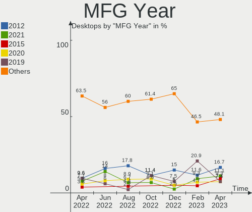

| Year | Desktops | Percent |
|------|----------|---------|
| 2012 | 8        | 16%     |
| 2021 | 7        | 14%     |
| 2020 | 4        | 8%      |
| 2019 | 4        | 8%      |
| 2017 | 4        | 8%      |
| 2014 | 4        | 8%      |
| 2018 | 3        | 6%      |
| 2013 | 3        | 6%      |
| 2011 | 3        | 6%      |
| 2010 | 3        | 6%      |
| 2008 | 3        | 6%      |
| 2016 | 2        | 4%      |
| 2009 | 1        | 2%      |
| 2006 | 1        | 2%      |

Form Factor
-----------

Physical design of the computer

| Name    | Desktops | Percent |
|---------|----------|---------|
| Desktop | 50       | 100%    |

Secure Boot
-----------

Enabled or disabled

| State    | Desktops | Percent |
|----------|----------|---------|
| Disabled | 48       | 96%     |
| Enabled  | 2        | 4%      |

Coreboot
--------

Have coreboot on board

| Used | Desktops | Percent |
|------|----------|---------|
| No   | 50       | 100%    |

RAM Size
--------

Total RAM memory

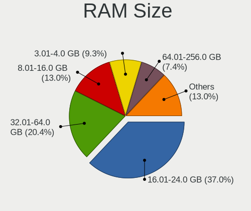

| Size in GB  | Desktops | Percent |
|-------------|----------|---------|
| 16.01-24.0  | 15       | 30%     |
| 32.01-64.0  | 11       | 22%     |
| 8.01-16.0   | 10       | 20%     |
| 4.01-8.0    | 6        | 12%     |
| 3.01-4.0    | 5        | 10%     |
| 24.01-32.0  | 1        | 2%      |
| 64.01-256.0 | 1        | 2%      |
| 1.01-2.0    | 1        | 2%      |

RAM Used
--------

Used RAM memory

| Used GB    | Desktops | Percent |
|------------|----------|---------|
| 2.01-3.0   | 16       | 32%     |
| 1.01-2.0   | 12       | 24%     |
| 4.01-8.0   | 6        | 12%     |
| 3.01-4.0   | 5        | 10%     |
| 0.51-1.0   | 5        | 10%     |
| 8.01-16.0  | 4        | 8%      |
| 24.01-32.0 | 1        | 2%      |
| 16.01-24.0 | 1        | 2%      |

Total Drives
------------

Number of drives on board

| Drives | Desktops | Percent |
|--------|----------|---------|
| 2      | 17       | 34%     |
| 1      | 15       | 30%     |
| 3      | 10       | 20%     |
| 4      | 3        | 6%      |
| 9      | 1        | 2%      |
| 8      | 1        | 2%      |
| 7      | 1        | 2%      |
| 6      | 1        | 2%      |
| 5      | 1        | 2%      |

Has CD-ROM
----------

Has CD-ROM on board

| Presented | Desktops | Percent |
|-----------|----------|---------|
| No        | 29       | 58%     |
| Yes       | 21       | 42%     |

Has Ethernet
------------

Has Ethernet on board

| Presented | Desktops | Percent |
|-----------|----------|---------|
| Yes       | 50       | 100%    |

Has WiFi
--------

Has WiFi module

| Presented | Desktops | Percent |
|-----------|----------|---------|
| Yes       | 26       | 52%     |
| No        | 24       | 48%     |

Has Bluetooth
-------------

Has Bluetooth module

| Presented | Desktops | Percent |
|-----------|----------|---------|
| No        | 33       | 66%     |
| Yes       | 17       | 34%     |

Location
--------

Country
-------

Geographic location (country)

| Country   | Desktops | Percent |
|-----------|----------|---------|
| Australia | 50       | 100%    |

City
----

Geographic location (city)

| City             | Desktops | Percent |
|------------------|----------|---------|
| Sydney           | 8        | 16%     |
| Melbourne        | 7        | 14%     |
| Brisbane         | 7        | 14%     |
| Launceston       | 6        | 12%     |
| Lane Cove        | 5        | 10%     |
| Adelaide         | 5        | 10%     |
| Toowoomba        | 1        | 2%      |
| Queanbeyan       | 1        | 2%      |
| Perth            | 1        | 2%      |
| Mount Waverley   | 1        | 2%      |
| Kensington       | 1        | 2%      |
| Hoppers Crossing | 1        | 2%      |
| Geelong          | 1        | 2%      |
| Canberra         | 1        | 2%      |
| Berwick          | 1        | 2%      |
| Bargo            | 1        | 2%      |
| Ballarat         | 1        | 2%      |
| Aspendale        | 1        | 2%      |

Drives
------

Drive Vendor
------------

Hard drive vendors

| Vendor                    | Desktops | Drives | Percent |
|---------------------------|----------|--------|---------|
| Seagate                   | 23       | 39     | 24.21%  |
| Samsung Electronics       | 19       | 24     | 20%     |
| WDC                       | 15       | 23     | 15.79%  |
| Kingston                  | 7        | 8      | 7.37%   |
| Crucial                   | 6        | 7      | 6.32%   |
| Hitachi                   | 5        | 5      | 5.26%   |
| Intel                     | 3        | 3      | 3.16%   |
| Toshiba                   | 2        | 2      | 2.11%   |
| SPCC                      | 2        | 2      | 2.11%   |
| Gigabyte Technology       | 2        | 2      | 2.11%   |
| Unknown                   | 1        | 1      | 1.05%   |
| Silicon Motion            | 1        | 1      | 1.05%   |
| Realtek Semiconductor     | 1        | 1      | 1.05%   |
| OCZ                       | 1        | 1      | 1.05%   |
| Micron/Crucial Technology | 1        | 1      | 1.05%   |
| KUIJIA                    | 1        | 1      | 1.05%   |
| KingSpec                  | 1        | 1      | 1.05%   |
| Corsair                   | 1        | 1      | 1.05%   |
| BIWIN                     | 1        | 1      | 1.05%   |
| ASMT                      | 1        | 1      | 1.05%   |
| A-DATA Technology         | 1        | 1      | 1.05%   |

Drive Model
-----------

Hard drive models

| Model                                       | Desktops | Percent |
|---------------------------------------------|----------|---------|
| Samsung SSD 850 EVO 250GB                   | 4        | 3.48%   |
| WDC WD40EFRX-68N32N0 4TB                    | 2        | 1.74%   |
| WDC WD10EZEX-60WN4A0 1TB                    | 2        | 1.74%   |
| Seagate ST3500418AS 500GB                   | 2        | 1.74%   |
| Seagate ST1000DM010-2EP102 1TB              | 2        | 1.74%   |
| Kingston SA400S37120G 120GB SSD             | 2        | 1.74%   |
| Intel SSDSC2CT120A3 120GB                   | 2        | 1.74%   |
| Hitachi HDS728080PLA380 82GB                | 2        | 1.74%   |
| Crucial CT500MX500SSD1 500GB                | 2        | 1.74%   |
| WDC WDS500G2B0C-00PXH0 500GB                | 1        | 0.87%   |
| WDC WDS500G2B0A-00SM50 500GB SSD            | 1        | 0.87%   |
| WDC WDS250G2B0A 250GB SSD                   | 1        | 0.87%   |
| WDC WDS100T1X0E-00AFY0 1TB                  | 1        | 0.87%   |
| WDC WD5000AVVS-63M8B0 500GB                 | 1        | 0.87%   |
| WDC WD5000AURX-63UY4Y0 500GB                | 1        | 0.87%   |
| WDC WD5000AAKX-083CA1 500GB                 | 1        | 0.87%   |
| WDC WD40EFRX-68WT0N0 4TB                    | 1        | 0.87%   |
| WDC WD30EFRX-68EUZN0 3TB                    | 1        | 0.87%   |
| WDC WD20EZRX-00D8PB0 2TB                    | 1        | 0.87%   |
| WDC WD20EARX-00PASB0 2TB                    | 1        | 0.87%   |
| WDC WD10EFRX-68PJCN0 1TB                    | 1        | 0.87%   |
| WDC WD10EFRX-68FYTN0 1TB                    | 1        | 0.87%   |
| WDC WD10EALX-009BA0 1TB                     | 1        | 0.87%   |
| WDC WD1003FZEX-00MK2A0 1TB                  | 1        | 0.87%   |
| Unknown SD/MMC/MS PRO 128GB                 | 1        | 0.87%   |
| Toshiba MQ01ACF050 500GB                    | 1        | 0.87%   |
| Toshiba DT01ACA200 2TB                      | 1        | 0.87%   |
| SPCC Solid State Disk 512GB                 | 1        | 0.87%   |
| SPCC Solid State Disk 256GB                 | 1        | 0.87%   |
| Silicon Motion NVMe SSD Drive 500GB         | 1        | 0.87%   |
| Seagate ST_M13FQBL QNR 4GB                  | 1        | 0.87%   |
| Seagate ST500DM002-1BD142 500GB             | 1        | 0.87%   |
| Seagate ST4000VN008-2DR166 4TB              | 1        | 0.87%   |
| Seagate ST4000DM004-2CV104 4TB              | 1        | 0.87%   |
| Seagate ST4000DM000-1F2168 4TB              | 1        | 0.87%   |
| Seagate ST3750528AS 752GB                   | 1        | 0.87%   |
| Seagate ST3500413AS 500GB                   | 1        | 0.87%   |
| Seagate ST3250318AS 250GB                   | 1        | 0.87%   |
| Seagate ST3250312AS 250GB                   | 1        | 0.87%   |
| Seagate ST3250310AS 250GB                   | 1        | 0.87%   |
| Seagate ST3000DM001-1ER166 3TB              | 1        | 0.87%   |
| Seagate ST250DM000-1BD141 250GB             | 1        | 0.87%   |
| Seagate ST2000LM007-1R8174 2TB              | 1        | 0.87%   |
| Seagate ST2000DX001-1NS164 2TB              | 1        | 0.87%   |
| Seagate ST2000DM008-2UB102 2TB              | 1        | 0.87%   |
| Seagate ST2000DM008-2FR102 2TB              | 1        | 0.87%   |
| Seagate ST2000DM006-2DM164 2TB              | 1        | 0.87%   |
| Seagate ST2000DM001-1CH164 2TB              | 1        | 0.87%   |
| Seagate ST2000DM001 4GB                     | 1        | 0.87%   |
| Seagate ST1000NM0033-9ZM173 1TB             | 1        | 0.87%   |
| Seagate ST1000LM035-1RK172 1TB              | 1        | 0.87%   |
| Seagate ST1000LM010-9YH146 1TB              | 1        | 0.87%   |
| Seagate ST1000DM003-1SB10C 1TB              | 1        | 0.87%   |
| Seagate ST1000DM003-1SB102 1TB              | 1        | 0.87%   |
| Seagate ST1000DM003-1ER162 1TB              | 1        | 0.87%   |
| Seagate ST1000DM 003-1ER162 1TB             | 1        | 0.87%   |
| Seagate One Touch w/PW 5TB                  | 1        | 0.87%   |
| Seagate Basic 4TB                           | 1        | 0.87%   |
| Seagate BarraCuda Q1 SSD ZA240CV10001 240GB | 1        | 0.87%   |
| Samsung SSD PM851 2.5 7mm 128GB             | 1        | 0.87%   |

HDD Vendor
----------

Hard disk drive vendors

| Vendor              | Desktops | Drives | Percent |
|---------------------|----------|--------|---------|
| Seagate             | 22       | 34     | 46.81%  |
| WDC                 | 12       | 19     | 25.53%  |
| Hitachi             | 5        | 5      | 10.64%  |
| Samsung Electronics | 4        | 4      | 8.51%   |
| Toshiba             | 2        | 2      | 4.26%   |
| Unknown             | 1        | 1      | 2.13%   |
| ASMT                | 1        | 1      | 2.13%   |

SSD Vendor
----------

Solid state drive vendors

| Vendor              | Desktops | Drives | Percent |
|---------------------|----------|--------|---------|
| Samsung Electronics | 13       | 15     | 36.11%  |
| Crucial             | 6        | 7      | 16.67%  |
| Kingston            | 5        | 6      | 13.89%  |
| Intel               | 3        | 3      | 8.33%   |
| WDC                 | 2        | 2      | 5.56%   |
| SPCC                | 2        | 2      | 5.56%   |
| Seagate             | 1        | 2      | 2.78%   |
| OCZ                 | 1        | 1      | 2.78%   |
| KUIJIA              | 1        | 1      | 2.78%   |
| KingSpec            | 1        | 1      | 2.78%   |
| Gigabyte Technology | 1        | 1      | 2.78%   |

Drive Kind
----------

HDD or SSD

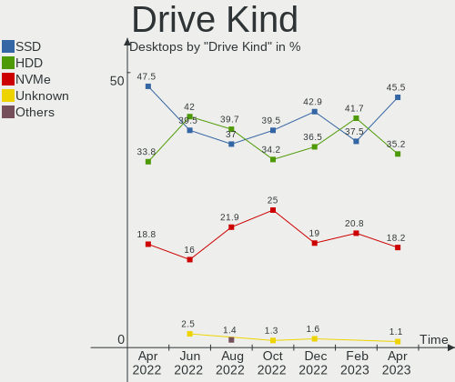

| Kind    | Desktops | Drives | Percent |
|---------|----------|--------|---------|
| HDD     | 34       | 66     | 41.98%  |
| SSD     | 32       | 41     | 39.51%  |
| NVMe    | 13       | 16     | 16.05%  |
| Unknown | 2        | 3      | 2.47%   |

Drive Connector
---------------

SATA, SAS, NVMe, etc.

| Type | Desktops | Drives | Percent |
|------|----------|--------|---------|
| SATA | 46       | 105    | 73.02%  |
| NVMe | 13       | 16     | 20.63%  |
| SAS  | 4        | 5      | 6.35%   |

Drive Size
----------

Size of hard drive

| Size in TB | Desktops | Drives | Percent |
|------------|----------|--------|---------|
| 0.01-0.5   | 38       | 52     | 52.78%  |
| 0.51-1.0   | 18       | 30     | 25%     |
| 1.01-2.0   | 11       | 12     | 15.28%  |
| 3.01-4.0   | 3        | 11     | 4.17%   |
| 2.01-3.0   | 2        | 2      | 2.78%   |

Space Total
-----------

Amount of disk space available on the file system

| Size in GB     | Desktops | Percent |
|----------------|----------|---------|
| 251-500        | 11       | 22%     |
| 101-250        | 10       | 20%     |
| 1001-2000      | 8        | 16%     |
| 1-20           | 7        | 14%     |
| 51-100         | 7        | 14%     |
| 501-1000       | 5        | 10%     |
| More than 3000 | 2        | 4%      |

Space Used
----------

Amount of used disk space

| Used GB        | Desktops | Percent |
|----------------|----------|---------|
| 1-20           | 15       | 30%     |
| 21-50          | 10       | 20%     |
| 51-100         | 9        | 18%     |
| 251-500        | 6        | 12%     |
| 101-250        | 4        | 8%      |
| 1001-2000      | 4        | 8%      |
| More than 3000 | 2        | 4%      |

Malfunc. Drives
---------------

Drive models with a malfunction

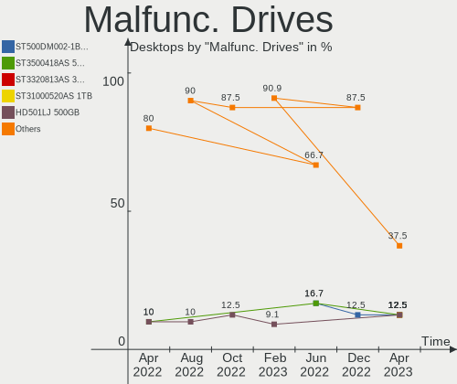

| Model                                   | Desktops | Drives | Percent |
|-----------------------------------------|----------|--------|---------|
| Intel SSDSC2CT120A3 120GB               | 2        | 2      | 33.33%  |
| WDC WD40EFRX-68WT0N0 4TB                | 1        | 4      | 16.67%  |
| Seagate ST500DM002-1BD142 500GB         | 1        | 1      | 16.67%  |
| Seagate ST3500418AS 500GB               | 1        | 1      | 16.67%  |
| Gigabyte Technology GP-GM30512G-G 512GB | 1        | 1      | 16.67%  |

Malfunc. Drive Vendor
---------------------

Vendors of faulty drives

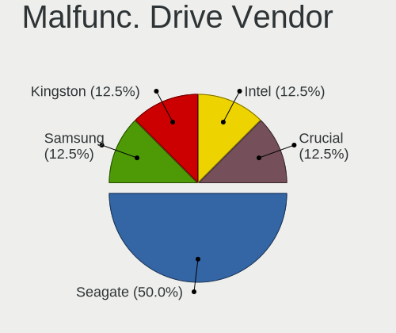

| Vendor              | Desktops | Drives | Percent |
|---------------------|----------|--------|---------|
| Seagate             | 2        | 2      | 33.33%  |
| Intel               | 2        | 2      | 33.33%  |
| WDC                 | 1        | 4      | 16.67%  |
| Gigabyte Technology | 1        | 1      | 16.67%  |

Malfunc. HDD Vendor
-------------------

Vendors of faulty HDD drives

| Vendor  | Desktops | Drives | Percent |
|---------|----------|--------|---------|
| Seagate | 2        | 2      | 66.67%  |
| WDC     | 1        | 4      | 33.33%  |

Malfunc. Drive Kind
-------------------

Kinds of faulty drives

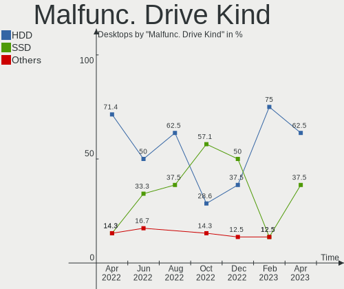

| Kind | Desktops | Drives | Percent |
|------|----------|--------|---------|
| HDD  | 3        | 6      | 50%     |
| SSD  | 2        | 2      | 33.33%  |
| NVMe | 1        | 1      | 16.67%  |

Failed Drives
-------------

Failed drive models

Zero info for selected period =(

Failed Drive Vendor
-------------------

Failed drive vendors

Zero info for selected period =(

Drive Status
------------

Number of failed and malfunc. drives

| Status   | Desktops | Drives | Percent |
|----------|----------|--------|---------|
| Works    | 27       | 61     | 48.21%  |
| Detected | 23       | 56     | 41.07%  |
| Malfunc  | 6        | 9      | 10.71%  |

Storage controller
------------------

Storage Vendor
--------------

Storage controller vendors

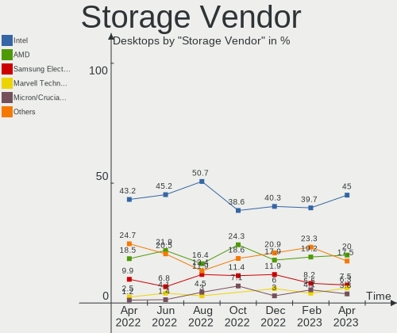

| Vendor                      | Desktops | Percent |
|-----------------------------|----------|---------|
| Intel                       | 33       | 45.21%  |
| AMD                         | 16       | 21.92%  |
| Samsung Electronics         | 5        | 6.85%   |
| Marvell Technology Group    | 3        | 4.11%   |
| SanDisk                     | 2        | 2.74%   |
| Realtek Semiconductor       | 2        | 2.74%   |
| Kingston Technology Company | 2        | 2.74%   |
| ASMedia Technology          | 2        | 2.74%   |
| ULi Electronics             | 1        | 1.37%   |
| Silicon Motion              | 1        | 1.37%   |
| Silicon Image               | 1        | 1.37%   |
| Phison Electronics          | 1        | 1.37%   |
| Micron/Crucial Technology   | 1        | 1.37%   |
| JMicron Technology          | 1        | 1.37%   |
| Biwin Storage Technology    | 1        | 1.37%   |
| ADATA Technology            | 1        | 1.37%   |

Storage Model
-------------

Storage controller models

| Model                                                                          | Desktops | Percent |
|--------------------------------------------------------------------------------|----------|---------|
| AMD FCH SATA Controller [AHCI mode]                                            | 9        | 10.59%  |
| Intel SATA Controller [RAID mode]                                              | 4        | 4.71%   |
| Intel Cannon Lake PCH SATA AHCI Controller                                     | 4        | 4.71%   |
| Intel 7 Series/C210 Series Chipset Family 6-port SATA Controller [AHCI mode]   | 4        | 4.71%   |
| Intel 6 Series/C200 Series Chipset Family 6 port Desktop SATA AHCI Controller  | 4        | 4.71%   |
| AMD SB7x0/SB8x0/SB9x0 SATA Controller [AHCI mode]                              | 4        | 4.71%   |
| Intel Alder Lake-S PCH SATA Controller [AHCI Mode]                             | 3        | 3.53%   |
| Samsung NVMe SSD Controller SM981/PM981/PM983                                  | 2        | 2.35%   |
| Intel NM10/ICH7 Family SATA Controller [IDE mode]                              | 2        | 2.35%   |
| Intel NM10/ICH7 Family SATA Controller [AHCI mode]                             | 2        | 2.35%   |
| Intel Atom Processor E3800 Series SATA AHCI Controller                         | 2        | 2.35%   |
| Intel 500 Series Chipset Family SATA AHCI Controller                           | 2        | 2.35%   |
| ASMedia ASM1062 Serial ATA Controller                                          | 2        | 2.35%   |
| AMD SB7x0/SB8x0/SB9x0 IDE Controller                                           | 2        | 2.35%   |
| AMD 500 Series Chipset SATA Controller                                         | 2        | 2.35%   |
| AMD 300 Series Chipset SATA Controller                                         | 2        | 2.35%   |
| ULi ULi M5288 SATA                                                             | 1        | 1.18%   |
| ULi M5229 IDE                                                                  | 1        | 1.18%   |
| Silicon Motion SM2263EN/SM2263XT SSD Controller                                | 1        | 1.18%   |
| Silicon Image SiI 3132 Serial ATA Raid II Controller                           | 1        | 1.18%   |
| SanDisk WD PC SN810 / Black SN850 NVMe SSD                                     | 1        | 1.18%   |
| SanDisk Non-Volatile memory controller                                         | 1        | 1.18%   |
| Samsung NVMe SSD Controller SM951/PM951                                        | 1        | 1.18%   |
| Samsung NVMe SSD Controller PM9A1/PM9A3/980PRO                                 | 1        | 1.18%   |
| Samsung NVMe SSD Controller 980                                                | 1        | 1.18%   |
| Realtek RTS5763DL NVMe SSD Controller                                          | 1        | 1.18%   |
| Realtek Realtek Non-Volatile memory controller                                 | 1        | 1.18%   |
| Phison E16 PCIe4 NVMe Controller                                               | 1        | 1.18%   |
| Micron/Crucial NVMe Controller                                                 | 1        | 1.18%   |
| Marvell Group 88SE9215 PCIe 2.0 x1 4-port SATA 6 Gb/s Controller               | 1        | 1.18%   |
| Marvell Group 88SE9172 SATA 6Gb/s Controller                                   | 1        | 1.18%   |
| Marvell Group 88SE6111/6121 SATA II / PATA Controller                          | 1        | 1.18%   |
| Kingston Company U-SNS8154P3 NVMe SSD                                          | 1        | 1.18%   |
| Kingston Company Company Non-Volatile memory controller                        | 1        | 1.18%   |
| JMicron JMB363 SATA/IDE Controller                                             | 1        | 1.18%   |
| Intel Q170/Q150/B150/H170/H110/Z170/CM236 Chipset SATA Controller [AHCI Mode]  | 1        | 1.18%   |
| Intel Comet Lake PCH-H RAID                                                    | 1        | 1.18%   |
| Intel C610/X99 series chipset sSATA Controller [AHCI mode]                     | 1        | 1.18%   |
| Intel C602 chipset 4-Port SATA Storage Control Unit                            | 1        | 1.18%   |
| Intel C600/X79 series chipset SATA RAID Controller                             | 1        | 1.18%   |
| Intel 82801JI (ICH10 Family) 4 port SATA IDE Controller #1                     | 1        | 1.18%   |
| Intel 82801JI (ICH10 Family) 2 port SATA IDE Controller #2                     | 1        | 1.18%   |
| Intel 82801JD/DO (ICH10 Family) SATA AHCI Controller                           | 1        | 1.18%   |
| Intel 82801G (ICH7 Family) IDE Controller                                      | 1        | 1.18%   |
| Intel 8 Series/C220 Series Chipset Family 6-port SATA Controller 1 [AHCI mode] | 1        | 1.18%   |
| Intel 4 Series Chipset PT IDER Controller                                      | 1        | 1.18%   |
| Biwin Storage Non-Volatile memory controller                                   | 1        | 1.18%   |
| AMD FCH SATA Controller [IDE mode]                                             | 1        | 1.18%   |
| AMD FCH SATA Controller D                                                      | 1        | 1.18%   |
| AMD 400 Series Chipset SATA Controller                                         | 1        | 1.18%   |
| ADATA XPG SX8200 Pro PCIe Gen3x4 M.2 2280 Solid State Drive                    | 1        | 1.18%   |

Storage Kind
------------

Kind of storage controller (IDE, SATA, NVMe, SAS, ...)

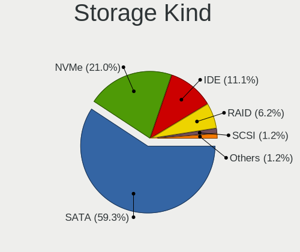

| Kind | Desktops | Percent |
|------|----------|---------|
| SATA | 42       | 59.15%  |
| NVMe | 13       | 18.31%  |
| IDE  | 8        | 11.27%  |
| RAID | 7        | 9.86%   |
| SAS  | 1        | 1.41%   |

Processor
---------

CPU Vendor
----------

Processor vendors

| Vendor | Desktops | Percent |
|--------|----------|---------|
| Intel  | 33       | 66%     |
| AMD    | 17       | 34%     |

CPU Model
---------

Processor models

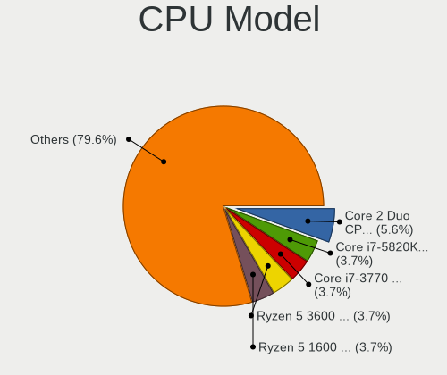

| Model                                       | Desktops | Percent |
|---------------------------------------------|----------|---------|
| Intel Core i7-3770 CPU @ 3.40GHz            | 4        | 8%      |
| Intel Pentium CPU G4560 @ 3.50GHz           | 2        | 4%      |
| Intel Celeron CPU J1900 @ 1.99GHz           | 2        | 4%      |
| AMD Ryzen 7 5700G with Radeon Graphics      | 2        | 4%      |
| Intel Xeon CPU E5-2620 v2 @ 2.10GHz         | 1        | 2%      |
| Intel Pentium CPU G850 @ 2.90GHz            | 1        | 2%      |
| Intel Core i9-9900K CPU @ 3.60GHz           | 1        | 2%      |
| Intel Core i7-9750H CPU @ 2.60GHz           | 1        | 2%      |
| Intel Core i7-8700 CPU @ 3.20GHz            | 1        | 2%      |
| Intel Core i7-5930K CPU @ 3.50GHz           | 1        | 2%      |
| Intel Core i7-4790 CPU @ 3.60GHz            | 1        | 2%      |
| Intel Core i7-2600 CPU @ 3.40GHz            | 1        | 2%      |
| Intel Core i7-10700KF CPU @ 3.80GHz         | 1        | 2%      |
| Intel Core i7 CPU 920 @ 2.67GHz             | 1        | 2%      |
| Intel Core i5-9400F CPU @ 2.90GHz           | 1        | 2%      |
| Intel Core i5-3470 CPU @ 3.20GHz            | 1        | 2%      |
| Intel Core i5-2400S CPU @ 2.50GHz           | 1        | 2%      |
| Intel Core i5-10400F CPU @ 2.90GHz          | 1        | 2%      |
| Intel Core i5-10400 CPU @ 2.90GHz           | 1        | 2%      |
| Intel Core i3-3220 CPU @ 3.30GHz            | 1        | 2%      |
| Intel Core i3-2120 CPU @ 3.30GHz            | 1        | 2%      |
| Intel Core 2 Quad CPU Q6600 @ 2.40GHz       | 1        | 2%      |
| Intel Core 2 Duo CPU E8400 @ 3.00GHz        | 1        | 2%      |
| Intel Core 2 Duo CPU E7500 @ 2.93GHz        | 1        | 2%      |
| Intel Atom CPU D525 @ 1.80GHz               | 1        | 2%      |
| Intel Atom CPU D2700 @ 2.13GHz              | 1        | 2%      |
| Intel 12th Gen Core i9-12900K               | 1        | 2%      |
| Intel 12th Gen Core i5-12600KF              | 1        | 2%      |
| Intel 12th Gen Core i5-12600K               | 1        | 2%      |
| AMD Ryzen 9 5900X 12-Core Processor         | 1        | 2%      |
| AMD Ryzen 9 3900X 12-Core Processor         | 1        | 2%      |
| AMD Ryzen 7 5800X 8-Core Processor          | 1        | 2%      |
| AMD Ryzen 7 3700X 8-Core Processor          | 1        | 2%      |
| AMD Ryzen 5 1600X Six-Core Processor        | 1        | 2%      |
| AMD Ryzen 5 1600 Six-Core Processor         | 1        | 2%      |
| AMD Ryzen 3 2200G with Radeon Vega Graphics | 1        | 2%      |
| AMD Phenom II X2 570 Processor              | 1        | 2%      |
| AMD Phenom II X2 550 Processor              | 1        | 2%      |
| AMD FX-8320 Eight-Core Processor            | 1        | 2%      |
| AMD FX-8120 Eight-Core Processor            | 1        | 2%      |
| AMD Athlon X4 860K Quad Core Processor      | 1        | 2%      |
| AMD Athlon 64 X2 Dual Core Processor 4400+  | 1        | 2%      |
| AMD Athlon 200GE with Radeon Vega Graphics  | 1        | 2%      |
| AMD A4-7210 APU with AMD Radeon R3 Graphics | 1        | 2%      |

CPU Model Family
----------------

Processor model prefix

| Model             | Desktops | Percent |
|-------------------|----------|---------|
| Intel Core i7     | 11       | 22%     |
| Intel Core i5     | 5        | 10%     |
| AMD Ryzen 7       | 4        | 8%      |
| Other             | 3        | 6%      |
| Intel Pentium     | 3        | 6%      |
| Intel Core i3     | 2        | 4%      |
| Intel Core 2 Duo  | 2        | 4%      |
| Intel Celeron     | 2        | 4%      |
| Intel Atom        | 2        | 4%      |
| AMD Ryzen 9       | 2        | 4%      |
| AMD Ryzen 5       | 2        | 4%      |
| AMD Phenom II X2  | 2        | 4%      |
| AMD FX            | 2        | 4%      |
| Intel Xeon        | 1        | 2%      |
| Intel Core i9     | 1        | 2%      |
| Intel Core 2 Quad | 1        | 2%      |
| AMD Ryzen 3       | 1        | 2%      |
| AMD Athlon X4     | 1        | 2%      |
| AMD Athlon 64 X2  | 1        | 2%      |
| AMD Athlon        | 1        | 2%      |
| AMD A4            | 1        | 2%      |

CPU Cores
---------

Number of processor cores

| Number | Desktops | Percent |
|--------|----------|---------|
| 4      | 16       | 32%     |
| 2      | 14       | 28%     |
| 6      | 8        | 16%     |
| 8      | 6        | 12%     |
| 12     | 3        | 6%      |
| 10     | 2        | 4%      |
| 16     | 1        | 2%      |

CPU Sockets
-----------

Number of sockets

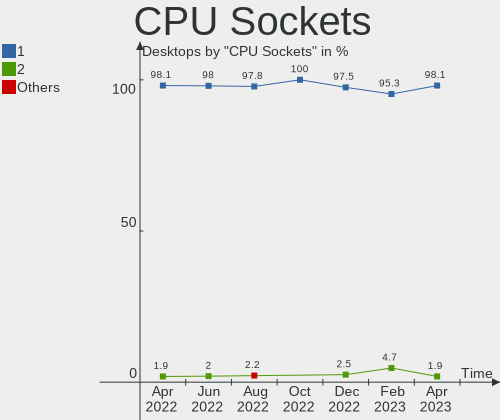

| Number | Desktops | Percent |
|--------|----------|---------|
| 1      | 49       | 98%     |
| 2      | 1        | 2%      |

CPU Threads
-----------

Threads per core (Hyper-Threading)

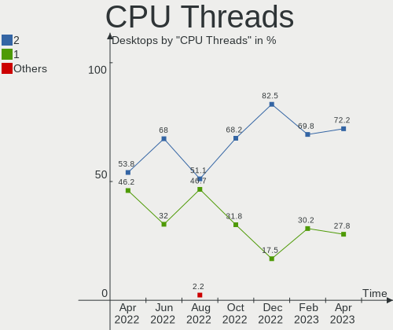

| Number | Desktops | Percent |
|--------|----------|---------|
| 2      | 34       | 68%     |
| 1      | 16       | 32%     |

CPU Op-Modes
------------

CPU Operation Modes (32-bit, 64-bit)

| Op mode        | Desktops | Percent |
|----------------|----------|---------|
| 32-bit, 64-bit | 50       | 100%    |

CPU Microcode
-------------

Microcode number

| Number     | Desktops | Percent |
|------------|----------|---------|
| Unknown    | 14       | 28%     |
| 0x306a9    | 4        | 8%      |
| 0x206a7    | 3        | 6%      |
| 0x906ed    | 2        | 4%      |
| 0x30678    | 2        | 4%      |
| 0x1067a    | 2        | 4%      |
| 0xa0655    | 1        | 2%      |
| 0xa0653    | 1        | 2%      |
| 0x906ea    | 1        | 2%      |
| 0x906e9    | 1        | 2%      |
| 0x90672    | 1        | 2%      |
| 0x6fb      | 1        | 2%      |
| 0x306f2    | 1        | 2%      |
| 0x306e4    | 1        | 2%      |
| 0x306c3    | 1        | 2%      |
| 0x30661    | 1        | 2%      |
| 0x106ca    | 1        | 2%      |
| 0x0a50000d | 1        | 2%      |
| 0x0a201016 | 1        | 2%      |
| 0x08701021 | 1        | 2%      |
| 0x08101016 | 1        | 2%      |
| 0x0810100b | 1        | 2%      |
| 0x08001105 | 1        | 2%      |
| 0x07030105 | 1        | 2%      |
| 0x06003106 | 1        | 2%      |
| 0x06000852 | 1        | 2%      |
| 0x0600063e | 1        | 2%      |
| 0x010000c6 | 1        | 2%      |
| 0x010000b6 | 1        | 2%      |

CPU Microarch
-------------

Microarchitecture

| Name             | Desktops | Percent |
|------------------|----------|---------|
| IvyBridge        | 7        | 14%     |
| KabyLake         | 6        | 12%     |
| Zen 3            | 4        | 8%      |
| Zen              | 4        | 8%      |
| SandyBridge      | 4        | 8%      |
| CometLake        | 3        | 6%      |
| Zen 2            | 2        | 4%      |
| Silvermont       | 2        | 4%      |
| Penryn           | 2        | 4%      |
| K10              | 2        | 4%      |
| Haswell          | 2        | 4%      |
| Bonnell          | 2        | 4%      |
| Unknown          | 2        | 4%      |
| Steamroller      | 1        | 2%      |
| Puma             | 1        | 2%      |
| Piledriver       | 1        | 2%      |
| Nehalem          | 1        | 2%      |
| K8 Hammer        | 1        | 2%      |
| Core             | 1        | 2%      |
| Bulldozer        | 1        | 2%      |
| Alderlake Hybrid | 1        | 2%      |

Graphics
--------

GPU Vendor
----------

Vendors of graphics cards

| Vendor | Desktops | Percent |
|--------|----------|---------|
| Nvidia | 26       | 49.06%  |
| AMD    | 14       | 26.42%  |
| Intel  | 13       | 24.53%  |

GPU Model
---------

Graphics card models

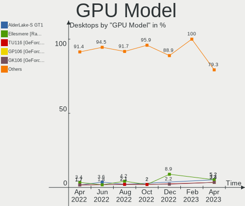

| Model                                                                     | Desktops | Percent |
|---------------------------------------------------------------------------|----------|---------|
| Nvidia GM107 [GeForce GTX 750 Ti]                                         | 3        | 5.45%   |
| Nvidia GK208B [GeForce GT 710]                                            | 3        | 5.45%   |
| Intel 2nd Generation Core Processor Family Integrated Graphics Controller | 3        | 5.45%   |
| Nvidia TU117 [GeForce GTX 1650]                                           | 2        | 3.64%   |
| Nvidia TU104 [GeForce RTX 2080 Rev. A]                                    | 2        | 3.64%   |
| Nvidia GM204 [GeForce GTX 970]                                            | 2        | 3.64%   |
| Intel Atom Processor Z36xxx/Z37xxx Series Graphics & Display              | 2        | 3.64%   |
| Intel AlderLake-S GT1                                                     | 2        | 3.64%   |
| AMD Cezanne                                                               | 2        | 3.64%   |
| Nvidia TU116 [GeForce GTX 1650]                                           | 1        | 1.82%   |
| Nvidia TU102 [GeForce RTX 2080 Ti]                                        | 1        | 1.82%   |
| Nvidia GT218 [GeForce 210]                                                | 1        | 1.82%   |
| Nvidia GP107 [GeForce GTX 1050]                                           | 1        | 1.82%   |
| Nvidia GP107 [GeForce GTX 1050 Ti]                                        | 1        | 1.82%   |
| Nvidia GM107GL [Quadro K2200]                                             | 1        | 1.82%   |
| Nvidia GK104 [GeForce GTX 760]                                            | 1        | 1.82%   |
| Nvidia GF119 [GeForce GT 610]                                             | 1        | 1.82%   |
| Nvidia GF119 [GeForce GT 520]                                             | 1        | 1.82%   |
| Nvidia GF116 [GeForce GTX 550 Ti]                                         | 1        | 1.82%   |
| Nvidia GF108 [GeForce GT 430]                                             | 1        | 1.82%   |
| Nvidia GA106 [GeForce RTX 3060 Lite Hash Rate]                            | 1        | 1.82%   |
| Nvidia GA104 [GeForce RTX 3070 Ti]                                        | 1        | 1.82%   |
| Nvidia GA104 [GeForce RTX 3060 Ti Lite Hash Rate]                         | 1        | 1.82%   |
| Intel IvyBridge GT2 [HD Graphics 4000]                                    | 1        | 1.82%   |
| Intel CometLake-S GT2 [UHD Graphics 630]                                  | 1        | 1.82%   |
| Intel CoffeeLake-H GT2 [UHD Graphics 630]                                 | 1        | 1.82%   |
| Intel Atom Processor D4xx/D5xx/N4xx/N5xx Integrated Graphics Controller   | 1        | 1.82%   |
| Intel Atom Processor D2xxx/N2xxx Integrated Graphics Controller           | 1        | 1.82%   |
| Intel 4 Series Chipset Integrated Graphics Controller                     | 1        | 1.82%   |
| AMD Turks [Radeon HD 7600 Series]                                         | 1        | 1.82%   |
| AMD Tonga PRO [Radeon R9 285/380]                                         | 1        | 1.82%   |
| AMD RV530 [Radeon X1600] (Secondary)                                      | 1        | 1.82%   |
| AMD RV530 [Radeon X1600 PRO]                                              | 1        | 1.82%   |
| AMD RV380 [Radeon X300/X550/X1050 Series] (Secondary)                     | 1        | 1.82%   |
| AMD RV370 [Radeon X600/X600 SE]                                           | 1        | 1.82%   |
| AMD RS880 [Radeon HD 4250]                                                | 1        | 1.82%   |
| AMD RS880 [Radeon HD 4200]                                                | 1        | 1.82%   |
| AMD Raven Ridge [Radeon Vega Series / Radeon Vega Mobile Series]          | 1        | 1.82%   |
| AMD Navi 23 [Radeon RX 6600/6600 XT/6600M]                                | 1        | 1.82%   |
| AMD Mullins [Radeon R3 Graphics]                                          | 1        | 1.82%   |
| AMD Ellesmere [Radeon RX 470/480/570/570X/580/580X/590]                   | 1        | 1.82%   |
| AMD Cypress XT [Radeon HD 5870]                                           | 1        | 1.82%   |
| AMD Caicos XT [Radeon HD 7470/8470 / R5 235/310 OEM]                      | 1        | 1.82%   |

GPU Combo
---------

Combinations of graphics cards

| Name            | Desktops | Percent |
|-----------------|----------|---------|
| 1 x Nvidia      | 24       | 48%     |
| 1 x AMD         | 12       | 24%     |
| 1 x Intel       | 10       | 20%     |
| 2 x Nvidia      | 1        | 2%      |
| 2 x AMD         | 1        | 2%      |
| Intel + 2 x AMD | 1        | 2%      |
| Intel + Nvidia  | 1        | 2%      |

GPU Driver
----------

Free vs proprietary

| Driver      | Desktops | Percent |
|-------------|----------|---------|
| Free        | 30       | 60%     |
| Proprietary | 16       | 32%     |
| Unknown     | 4        | 8%      |

GPU Memory
----------

Total video memory

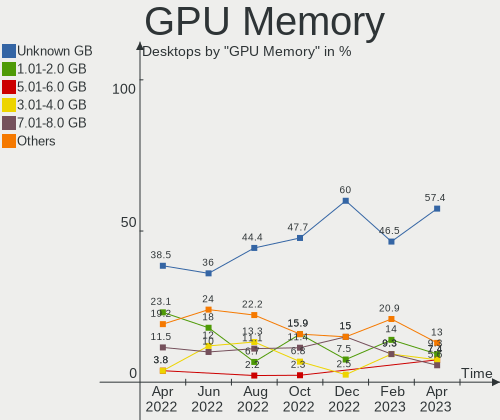

| Size in GB | Desktops | Percent |
|------------|----------|---------|
| Unknown    | 18       | 36%     |
| 1.01-2.0   | 9        | 18%     |
| 3.01-4.0   | 6        | 12%     |
| 7.01-8.0   | 5        | 10%     |
| 0.51-1.0   | 5        | 10%     |
| 0.01-0.5   | 5        | 10%     |
| 8.01-16.0  | 2        | 4%      |

Monitor
-------

Monitor Vendor
--------------

Monitor vendors

| Vendor               | Desktops | Percent |
|----------------------|----------|---------|
| Dell                 | 9        | 15.52%  |
| BenQ                 | 7        | 12.07%  |
| Samsung Electronics  | 6        | 10.34%  |
| Lenovo               | 4        | 6.9%    |
| Philips              | 3        | 5.17%   |
| Goldstar             | 3        | 5.17%   |
| Ancor Communications | 3        | 5.17%   |
| Acer                 | 3        | 5.17%   |
| SAC                  | 2        | 3.45%   |
| Panasonic            | 2        | 3.45%   |
| LG Electronics       | 2        | 3.45%   |
| ASUSTek Computer     | 2        | 3.45%   |
| AOC                  | 2        | 3.45%   |
| ViewSonic            | 1        | 1.72%   |
| Unknown (AAA)        | 1        | 1.72%   |
| NEC Computers        | 1        | 1.72%   |
| MLK                  | 1        | 1.72%   |
| Medion Akoya         | 1        | 1.72%   |
| IBM                  | 1        | 1.72%   |
| HPN                  | 1        | 1.72%   |
| Hewlett-Packard      | 1        | 1.72%   |
| CHD                  | 1        | 1.72%   |
| AUS                  | 1        | 1.72%   |

Monitor Model
-------------

Monitor models

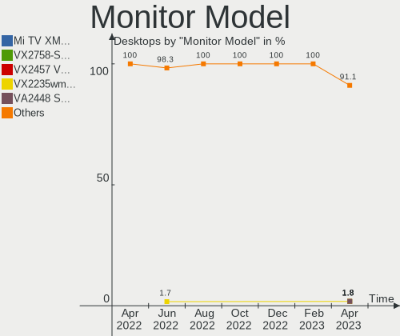

| Model                                                                 | Desktops | Percent |
|-----------------------------------------------------------------------|----------|---------|
| Philips 190S PHL082F 1280x1024 380x300mm 19.1-inch                    | 2        | 3.23%   |
| Lenovo LEN L1711pC LEN13B7 1280x1024 338x270mm 17.0-inch              | 2        | 3.23%   |
| Dell P1917S DELD091 1280x1024 380x300mm 19.1-inch                     | 2        | 3.23%   |
| Ancor Communications ASUS VC239 ACI23C4 1920x1080 509x286mm 23.0-inch | 2        | 3.23%   |
| Acer KA240H ACR0538 1920x1080 530x300mm 24.0-inch                     | 2        | 3.23%   |
| ViewSonic VX2235wm-EU VSC591E 1680x1050 474x296mm 22.0-inch           | 1        | 1.61%   |
| Unknown (AAA) Digital TV AAA0030 1920x1080 708x398mm 32.0-inch        | 1        | 1.61%   |
| Samsung Electronics U28E590 SAM0C4D 3840x2160 607x345mm 27.5-inch     | 1        | 1.61%   |
| Samsung Electronics SyncMaster SAM01D3 1440x900 408x225mm 18.3-inch   | 1        | 1.61%   |
| Samsung Electronics SMS27A850T SAM0888 2560x1440 518x324mm 24.1-inch  | 1        | 1.61%   |
| Samsung Electronics S27R35x SAM1054 1920x1080 598x336mm 27.0-inch     | 1        | 1.61%   |
| Samsung Electronics S24F350 SAM0D20 1920x1080 521x293mm 23.5-inch     | 1        | 1.61%   |
| Samsung Electronics LCD Monitor SMBX2450 3200x1080                    | 1        | 1.61%   |
| Samsung Electronics LCD Monitor SAM0A7A 1920x1080 480x270mm 21.7-inch | 1        | 1.61%   |
| SAC LED MONITOR SAC952D 1920x1080 600x340mm 27.2-inch                 | 1        | 1.61%   |
| SAC LED MONITOR SAC952D 1920x1080 480x270mm 21.7-inch                 | 1        | 1.61%   |
| Philips PHL 243V7 PHLC155 1920x1080 527x296mm 23.8-inch               | 1        | 1.61%   |
| Panasonic TV MEIA0CC 1920x1080 698x392mm 31.5-inch                    | 1        | 1.61%   |
| Panasonic TV MEIA063 1280x720 1434x806mm 64.8-inch                    | 1        | 1.61%   |
| NEC Computers LCD2690WUXi2 NEC675D 1920x1200 550x344mm 25.5-inch      | 1        | 1.61%   |
| MLK MILKYWAY50PDP MLK9189 1920x540 708x398mm 32.0-inch                | 1        | 1.61%   |
| Medion Akoya MD20581 MEC7201 1920x1080 597x336mm 27.0-inch            | 1        | 1.61%   |
| LG Electronics LCD Monitor LG TV 1920x1080                            | 1        | 1.61%   |
| LG Electronics LCD Monitor LG HDR QHD 5120x1440                       | 1        | 1.61%   |
| LG Electronics LCD Monitor LG HDR QHD                                 | 1        | 1.61%   |
| Lenovo LEN T23i-20 LEN61F6 1920x1080 509x286mm 23.0-inch              | 1        | 1.61%   |
| Lenovo LEN G34w-10 LEN66A1 3440x1440 797x334mm 34.0-inch              | 1        | 1.61%   |
| IBM IBML150/L150p IBMA151 1024x768 304x228mm 15.0-inch                | 1        | 1.61%   |
| HPN LCD Monitor HP 25x 1920x1080                                      | 1        | 1.61%   |
| Hewlett-Packard LCD Monitor LA1951                                    | 1        | 1.61%   |
| Goldstar W2753VC GSM5766 1920x1080 598x336mm 27.0-inch                | 1        | 1.61%   |
| Goldstar HDR WFHD GSM7714 2560x1080 798x334mm 34.1-inch               | 1        | 1.61%   |
| Goldstar HDR 4K GSM7706 3840x2160 600x340mm 27.2-inch                 | 1        | 1.61%   |
| Dell U2412M DELA07A 1920x1200 518x324mm 24.1-inch                     | 1        | 1.61%   |
| Dell S2421HS DEL41F3 1920x1080 527x296mm 23.8-inch                    | 1        | 1.61%   |
| Dell P2419HC DELA11E 1920x1080 527x296mm 23.8-inch                    | 1        | 1.61%   |
| Dell P2419H DELD0DA 1920x1080 530x300mm 24.0-inch                     | 1        | 1.61%   |
| Dell P2319H DELD0D7 1920x1080 510x290mm 23.1-inch                     | 1        | 1.61%   |
| Dell P2319H DELD0D5 1920x1080 510x290mm 23.1-inch                     | 1        | 1.61%   |
| Dell P1917S DELD093 1280x1024 380x300mm 19.1-inch                     | 1        | 1.61%   |
| Dell E228WFP DELD015 1680x1050 473x296mm 22.0-inch                    | 1        | 1.61%   |
| Dell E2210H DELD031 1920x1080 477x268mm 21.5-inch                     | 1        | 1.61%   |
| CHD LS13_LS18 CHD9021 1280x1024 708x398mm 32.0-inch                   | 1        | 1.61%   |
| BenQ T2200HD BNQ7726 1920x1080 477x268mm 21.5-inch                    | 1        | 1.61%   |
| BenQ M2700HD BNQ7C06 1920x1080 600x340mm 27.2-inch                    | 1        | 1.61%   |
| BenQ LCD Monitor GW2450H 1920x1080                                    | 1        | 1.61%   |
| BenQ GW2760 BNQ78C6 1920x1080 598x336mm 27.0-inch                     | 1        | 1.61%   |
| BenQ GW2480 BNQ78E7 1920x1080 527x296mm 23.8-inch                     | 1        | 1.61%   |
| BenQ G2420HD BNQ7840 1920x1080 531x299mm 24.0-inch                    | 1        | 1.61%   |
| BenQ E2200HD BNQ790C 1920x1080 470x260mm 21.1-inch                    | 1        | 1.61%   |
| AUS LCD Monitor VG27AQL1A 2560x1440                                   | 1        | 1.61%   |
| ASUSTek Computer VG34V AUS3435 3440x1440 797x334mm 34.0-inch          | 1        | 1.61%   |
| ASUSTek Computer VG245 AUS24A1 1920x1080 531x299mm 24.0-inch          | 1        | 1.61%   |
| AOC G2770 AOC2770 1920x1080 598x336mm 27.0-inch                       | 1        | 1.61%   |
| AOC AG352UCG6 AOC3525 3440x1440 819x346mm 35.0-inch                   | 1        | 1.61%   |
| Ancor Communications ASUS VH192 ACI19E4 1366x768 410x230mm 18.5-inch  | 1        | 1.61%   |
| Acer ED272 ACR0649 1920x1080 598x336mm 27.0-inch                      | 1        | 1.61%   |

Monitor Resolution
------------------

Monitor screen resolution

| Resolution         | Desktops | Percent |
|--------------------|----------|---------|
| 1920x1080 (FHD)    | 25       | 45.45%  |
| 1280x1024 (SXGA)   | 8        | 14.55%  |
| 3440x1440          | 3        | 5.45%   |
| 2560x1440 (QHD)    | 3        | 5.45%   |
| 3840x2160 (4K)     | 2        | 3.64%   |
| 1920x1200 (WUXGA)  | 2        | 3.64%   |
| 1680x1050 (WSXGA+) | 2        | 3.64%   |
| Unknown            | 2        | 3.64%   |
| 5120x1440          | 1        | 1.82%   |
| 3200x1080          | 1        | 1.82%   |
| 2560x1080          | 1        | 1.82%   |
| 1920x540           | 1        | 1.82%   |
| 1440x900 (WXGA+)   | 1        | 1.82%   |
| 1366x768 (WXGA)    | 1        | 1.82%   |
| 1280x720 (HD)      | 1        | 1.82%   |
| 1024x768 (XGA)     | 1        | 1.82%   |

Monitor Diagonal
----------------

Diagonal size in inches

| Inches  | Desktops | Percent |
|---------|----------|---------|
| 27      | 9        | 16.36%  |
| 24      | 8        | 14.55%  |
| 19      | 6        | 10.91%  |
| Unknown | 6        | 10.91%  |
| 23      | 5        | 9.09%   |
| 21      | 4        | 7.27%   |
| 34      | 3        | 5.45%   |
| 32      | 3        | 5.45%   |
| 18      | 3        | 5.45%   |
| 22      | 2        | 3.64%   |
| 64      | 1        | 1.82%   |
| 48      | 1        | 1.82%   |
| 35      | 1        | 1.82%   |
| 31      | 1        | 1.82%   |
| 25      | 1        | 1.82%   |
| 15      | 1        | 1.82%   |

Monitor Width
-------------

Physical width

| Width in mm | Desktops | Percent |
|-------------|----------|---------|
| 501-600     | 20       | 39.22%  |
| 401-500     | 7        | 13.73%  |
| 351-400     | 7        | 13.73%  |
| Unknown     | 6        | 11.76%  |
| 701-800     | 5        | 9.8%    |
| 601-700     | 2        | 3.92%   |
| 1001-1500   | 2        | 3.92%   |
| 801-900     | 1        | 1.96%   |
| 301-350     | 1        | 1.96%   |

Aspect Ratio
------------

Proportional relationship between the width and the height

| Ratio   | Desktops | Percent |
|---------|----------|---------|
| 16/9    | 28       | 53.85%  |
| 16/10   | 6        | 11.54%  |
| Unknown | 6        | 11.54%  |
| 5/4     | 5        | 9.62%   |
| 21/9    | 4        | 7.69%   |
| 6/5     | 2        | 3.85%   |
| 4/3     | 1        | 1.92%   |

Monitor Area
------------

Area in inch

| Area in inch | Desktops | Percent |
|----------------|----------|---------|
| 201-250        | 16       | 29.63%  |
| 301-350        | 9        | 16.67%  |
| 151-200        | 9        | 16.67%  |
| 351-500        | 7        | 12.96%  |
| Unknown        | 6        | 11.11%  |
| 251-300        | 3        | 5.56%   |
| More than 1000 | 2        | 3.7%    |
| 141-150        | 1        | 1.85%   |
| 101-110        | 1        | 1.85%   |

Pixel Density
-------------

Pixels per inch

| Density | Desktops | Percent |
|---------|----------|---------|
| 51-100  | 32       | 65.31%  |
| 101-120 | 7        | 14.29%  |
| Unknown | 6        | 12.24%  |
| 1-50    | 2        | 4.08%   |
| 161-240 | 1        | 2.04%   |
| 121-160 | 1        | 2.04%   |

Multiple Monitors
-----------------

Total monitors connected

| Total | Desktops | Percent |
|-------|----------|---------|
| 1     | 34       | 68%     |
| 2     | 12       | 24%     |
| 3     | 2        | 4%      |
| 0     | 2        | 4%      |

Network
-------

Net Controller Vendor
---------------------

Controller vendors

| Vendor                   | Desktops | Percent |
|--------------------------|----------|---------|
| Realtek Semiconductor    | 32       | 38.1%   |
| Intel                    | 32       | 38.1%   |
| Qualcomm Atheros         | 9        | 10.71%  |
| TP-Link                  | 2        | 2.38%   |
| Marvell Technology Group | 2        | 2.38%   |
| Google                   | 2        | 2.38%   |
| Samsung Electronics      | 1        | 1.19%   |
| Ralink Technology        | 1        | 1.19%   |
| Microsoft                | 1        | 1.19%   |
| DisplayLink              | 1        | 1.19%   |
| D-Link System            | 1        | 1.19%   |

Net Controller Model
--------------------

Controller models

| Model                                                                | Desktops | Percent |
|----------------------------------------------------------------------|----------|---------|
| Realtek RTL8111/8168/8411 PCI Express Gigabit Ethernet Controller    | 22       | 23.4%   |
| Intel I211 Gigabit Network Connection                                | 5        | 5.32%   |
| Intel Wi-Fi 6 AX200                                                  | 4        | 4.26%   |
| Intel 82579LM Gigabit Network Connection (Lewisville)                | 4        | 4.26%   |
| Realtek RTL8125 2.5GbE Controller                                    | 3        | 3.19%   |
| Intel Ethernet Controller I225-V                                     | 3        | 3.19%   |
| Intel 82574L Gigabit Network Connection                              | 3        | 3.19%   |
| Realtek RTL8812AU 802.11a/b/g/n/ac 2T2R DB WLAN Adapter              | 2        | 2.13%   |
| Qualcomm Atheros AR9287 Wireless Network Adapter (PCI-Express)       | 2        | 2.13%   |
| Qualcomm Atheros AR8151 v2.0 Gigabit Ethernet                        | 2        | 2.13%   |
| Intel Ethernet Connection (7) I219-V                                 | 2        | 2.13%   |
| Intel 82575EB Gigabit Network Connection                             | 2        | 2.13%   |
| Google Pixel 6                                                       | 2        | 2.13%   |
| TP-Link Archer T9UH v1 [Realtek RTL8814AU]                           | 1        | 1.06%   |
| TP-Link 802.11ac WLAN Adapter                                        | 1        | 1.06%   |
| Samsung GT-I9070 (network tethering, USB debugging enabled)          | 1        | 1.06%   |
| Realtek RTL8192EE PCIe Wireless Network Adapter                      | 1        | 1.06%   |
| Realtek RTL8191SU 802.11n WLAN Adapter                               | 1        | 1.06%   |
| Realtek RTL8188FTV 802.11b/g/n 1T1R 2.4G WLAN Adapter                | 1        | 1.06%   |
| Realtek RTL8153 Gigabit Ethernet Adapter                             | 1        | 1.06%   |
| Realtek RTL-8110SC/8169SC Gigabit Ethernet                           | 1        | 1.06%   |
| Realtek RTL-8100/8101L/8139 PCI Fast Ethernet Adapter                | 1        | 1.06%   |
| Realtek 802.11n WLAN Adapter                                         | 1        | 1.06%   |
| Realtek 802.11ac NIC                                                 | 1        | 1.06%   |
| Ralink RT3072 Wireless Adapter                                       | 1        | 1.06%   |
| Qualcomm Atheros Killer E220x Gigabit Ethernet Controller            | 1        | 1.06%   |
| Qualcomm Atheros AR9485 Wireless Network Adapter                     | 1        | 1.06%   |
| Qualcomm Atheros AR93xx Wireless Network Adapter                     | 1        | 1.06%   |
| Qualcomm Atheros AR8161 Gigabit Ethernet                             | 1        | 1.06%   |
| Qualcomm Atheros AR5212/5213/2414 Wireless Network Adapter           | 1        | 1.06%   |
| Microsoft XBOX ACC                                                   | 1        | 1.06%   |
| Marvell Group 88E8056 PCI-E Gigabit Ethernet Controller              | 1        | 1.06%   |
| Marvell Group 88E8053 PCI-E Gigabit Ethernet Controller              | 1        | 1.06%   |
| Marvell Group 88E8001 Gigabit Ethernet Controller                    | 1        | 1.06%   |
| Intel Wireless 7260                                                  | 1        | 1.06%   |
| Intel Wireless 3160                                                  | 1        | 1.06%   |
| Intel Wi-Fi 6 AX210/AX211/AX411 160MHz                               | 1        | 1.06%   |
| Intel Ethernet Connection (6) I219-V                                 | 1        | 1.06%   |
| Intel Ethernet Connection (2) I219-V                                 | 1        | 1.06%   |
| Intel Ethernet Connection (14) I219-V                                | 1        | 1.06%   |
| Intel Dual Band Wireless-AC 3168NGW [Stone Peak]                     | 1        | 1.06%   |
| Intel Comet Lake PCH CNVi WiFi                                       | 1        | 1.06%   |
| Intel Centrino Wireless-N 2230                                       | 1        | 1.06%   |
| Intel Cannon Lake PCH CNVi WiFi                                      | 1        | 1.06%   |
| Intel Alder Lake-S PCH CNVi WiFi                                     | 1        | 1.06%   |
| Intel 82579V Gigabit Network Connection                              | 1        | 1.06%   |
| Intel 82567LM-3 Gigabit Network Connection                           | 1        | 1.06%   |
| Intel 82557/8/9/0/1 Ethernet Pro 100                                 | 1        | 1.06%   |
| Intel 82546EB Gigabit Ethernet Controller (Copper)                   | 1        | 1.06%   |
| DisplayLink USB3.0 Dual Video Dock                                   | 1        | 1.06%   |
| D-Link System DWA-125 Wireless N 150 Adapter(rev.A1) [Ralink RT3070] | 1        | 1.06%   |

Wireless Vendor
---------------

Wireless vendors

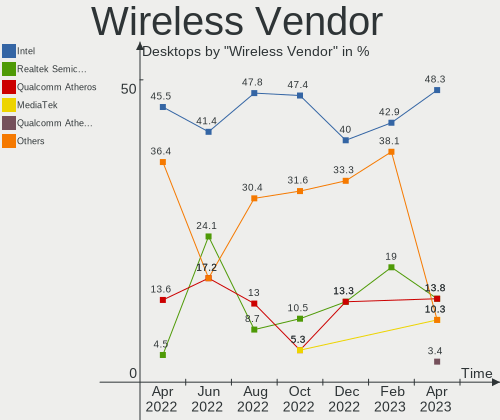

| Vendor                | Desktops | Percent |
|-----------------------|----------|---------|
| Intel                 | 12       | 41.38%  |
| Realtek Semiconductor | 7        | 24.14%  |
| Qualcomm Atheros      | 5        | 17.24%  |
| TP-Link               | 2        | 6.9%    |
| Ralink Technology     | 1        | 3.45%   |
| Microsoft             | 1        | 3.45%   |
| D-Link System         | 1        | 3.45%   |

Wireless Model
--------------

Wireless models

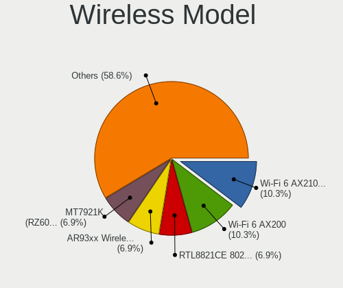

| Model                                                                | Desktops | Percent |
|----------------------------------------------------------------------|----------|---------|
| Intel Wi-Fi 6 AX200                                                  | 4        | 13.79%  |
| Realtek RTL8812AU 802.11a/b/g/n/ac 2T2R DB WLAN Adapter              | 2        | 6.9%    |
| Qualcomm Atheros AR9287 Wireless Network Adapter (PCI-Express)       | 2        | 6.9%    |
| TP-Link Archer T9UH v1 [Realtek RTL8814AU]                           | 1        | 3.45%   |
| TP-Link 802.11ac WLAN Adapter                                        | 1        | 3.45%   |
| Realtek RTL8192EE PCIe Wireless Network Adapter                      | 1        | 3.45%   |
| Realtek RTL8191SU 802.11n WLAN Adapter                               | 1        | 3.45%   |
| Realtek RTL8188FTV 802.11b/g/n 1T1R 2.4G WLAN Adapter                | 1        | 3.45%   |
| Realtek 802.11n WLAN Adapter                                         | 1        | 3.45%   |
| Realtek 802.11ac NIC                                                 | 1        | 3.45%   |
| Ralink RT3072 Wireless Adapter                                       | 1        | 3.45%   |
| Qualcomm Atheros AR9485 Wireless Network Adapter                     | 1        | 3.45%   |
| Qualcomm Atheros AR93xx Wireless Network Adapter                     | 1        | 3.45%   |
| Qualcomm Atheros AR5212/5213/2414 Wireless Network Adapter           | 1        | 3.45%   |
| Microsoft XBOX ACC                                                   | 1        | 3.45%   |
| Intel Wireless 7260                                                  | 1        | 3.45%   |
| Intel Wireless 3160                                                  | 1        | 3.45%   |
| Intel Wi-Fi 6 AX210/AX211/AX411 160MHz                               | 1        | 3.45%   |
| Intel Dual Band Wireless-AC 3168NGW [Stone Peak]                     | 1        | 3.45%   |
| Intel Comet Lake PCH CNVi WiFi                                       | 1        | 3.45%   |
| Intel Centrino Wireless-N 2230                                       | 1        | 3.45%   |
| Intel Cannon Lake PCH CNVi WiFi                                      | 1        | 3.45%   |
| Intel Alder Lake-S PCH CNVi WiFi                                     | 1        | 3.45%   |
| D-Link System DWA-125 Wireless N 150 Adapter(rev.A1) [Ralink RT3070] | 1        | 3.45%   |

Ethernet Vendor
---------------

Ethernet vendors

| Vendor                   | Desktops | Percent |
|--------------------------|----------|---------|
| Realtek Semiconductor    | 27       | 43.55%  |
| Intel                    | 25       | 40.32%  |
| Qualcomm Atheros         | 4        | 6.45%   |
| Marvell Technology Group | 2        | 3.23%   |
| Google                   | 2        | 3.23%   |
| Samsung Electronics      | 1        | 1.61%   |
| DisplayLink              | 1        | 1.61%   |

Ethernet Model
--------------

Ethernet models

| Model                                                             | Desktops | Percent |
|-------------------------------------------------------------------|----------|---------|
| Realtek RTL8111/8168/8411 PCI Express Gigabit Ethernet Controller | 22       | 33.85%  |
| Intel I211 Gigabit Network Connection                             | 5        | 7.69%   |
| Intel 82579LM Gigabit Network Connection (Lewisville)             | 4        | 6.15%   |
| Realtek RTL8125 2.5GbE Controller                                 | 3        | 4.62%   |
| Intel Ethernet Controller I225-V                                  | 3        | 4.62%   |
| Intel 82574L Gigabit Network Connection                           | 3        | 4.62%   |
| Qualcomm Atheros AR8151 v2.0 Gigabit Ethernet                     | 2        | 3.08%   |
| Intel Ethernet Connection (7) I219-V                              | 2        | 3.08%   |
| Intel 82575EB Gigabit Network Connection                          | 2        | 3.08%   |
| Google Pixel 6                                                    | 2        | 3.08%   |
| Samsung GT-I9070 (network tethering, USB debugging enabled)       | 1        | 1.54%   |
| Realtek RTL8153 Gigabit Ethernet Adapter                          | 1        | 1.54%   |
| Realtek RTL-8110SC/8169SC Gigabit Ethernet                        | 1        | 1.54%   |
| Realtek RTL-8100/8101L/8139 PCI Fast Ethernet Adapter             | 1        | 1.54%   |
| Qualcomm Atheros Killer E220x Gigabit Ethernet Controller         | 1        | 1.54%   |
| Qualcomm Atheros AR8161 Gigabit Ethernet                          | 1        | 1.54%   |
| Marvell Group 88E8056 PCI-E Gigabit Ethernet Controller           | 1        | 1.54%   |
| Marvell Group 88E8053 PCI-E Gigabit Ethernet Controller           | 1        | 1.54%   |
| Marvell Group 88E8001 Gigabit Ethernet Controller                 | 1        | 1.54%   |
| Intel Ethernet Connection (6) I219-V                              | 1        | 1.54%   |
| Intel Ethernet Connection (2) I219-V                              | 1        | 1.54%   |
| Intel Ethernet Connection (14) I219-V                             | 1        | 1.54%   |
| Intel 82579V Gigabit Network Connection                           | 1        | 1.54%   |
| Intel 82567LM-3 Gigabit Network Connection                        | 1        | 1.54%   |
| Intel 82557/8/9/0/1 Ethernet Pro 100                              | 1        | 1.54%   |
| Intel 82546EB Gigabit Ethernet Controller (Copper)                | 1        | 1.54%   |
| DisplayLink USB3.0 Dual Video Dock                                | 1        | 1.54%   |

Net Controller Kind
-------------------

Ethernet, WiFi or modem

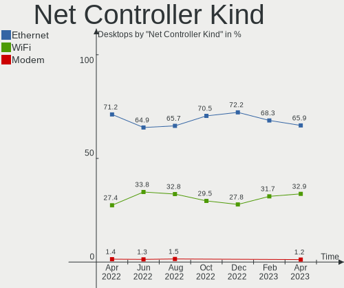

| Kind     | Desktops | Percent |
|----------|----------|---------|
| Ethernet | 50       | 65.79%  |
| WiFi     | 26       | 34.21%  |

Used Controller
---------------

Currently used network controller

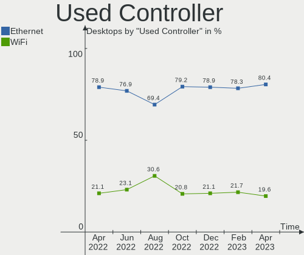

| Kind     | Desktops | Percent |
|----------|----------|---------|
| Ethernet | 40       | 76.92%  |
| WiFi     | 12       | 23.08%  |

NICs
----

Total network controllers on board

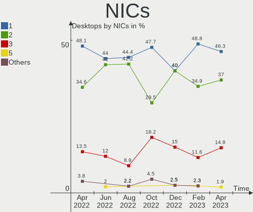

| Total | Desktops | Percent |
|-------|----------|---------|
| 1     | 22       | 44%     |
| 2     | 21       | 42%     |
| 3     | 6        | 12%     |
| 5     | 1        | 2%      |

IPv6
----

IPv6 vs IPv4

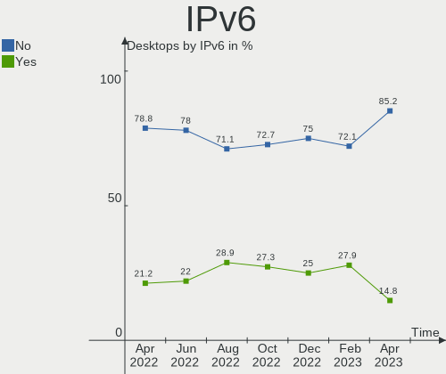

| Used | Desktops | Percent |
|------|----------|---------|
| No   | 39       | 78%     |
| Yes  | 11       | 22%     |

Bluetooth
---------

Bluetooth Vendor
----------------

Controller vendors

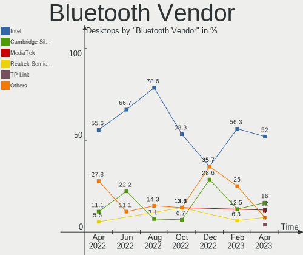

| Vendor                  | Desktops | Percent |
|-------------------------|----------|---------|
| Intel                   | 12       | 66.67%  |
| Cambridge Silicon Radio | 4        | 22.22%  |
| Edimax Technology       | 1        | 5.56%   |
| Broadcom                | 1        | 5.56%   |

Bluetooth Model
---------------

Controller models

| Model                                               | Desktops | Percent |
|-----------------------------------------------------|----------|---------|
| Intel AX200 Bluetooth                               | 4        | 22.22%  |
| Cambridge Silicon Radio Bluetooth Dongle (HCI mode) | 4        | 22.22%  |
| Intel Bluetooth wireless interface                  | 2        | 11.11%  |
| Intel Bluetooth Device                              | 2        | 11.11%  |
| Intel Wireless-AC 3168 Bluetooth                    | 1        | 5.56%   |
| Intel Centrino Bluetooth Wireless Transceiver       | 1        | 5.56%   |
| Intel Bluetooth 9460/9560 Jefferson Peak (JfP)      | 1        | 5.56%   |
| Intel AX210 Bluetooth                               | 1        | 5.56%   |
| Edimax Bluetooth Device                             | 1        | 5.56%   |
| Broadcom BCM20702A0 Bluetooth 4.0                   | 1        | 5.56%   |

Sound
-----

Sound Vendor
------------

Sound card vendors

| Vendor                      | Desktops | Percent |
|-----------------------------|----------|---------|
| Intel                       | 31       | 33.7%   |
| Nvidia                      | 26       | 28.26%  |
| AMD                         | 21       | 22.83%  |
| Unknown                     | 1        | 1.09%   |
| SteelSeries ApS             | 1        | 1.09%   |
| PreSonus Audio Electronics  | 1        | 1.09%   |
| Logitech                    | 1        | 1.09%   |
| Kingston Technology         | 1        | 1.09%   |
| GN Netcom                   | 1        | 1.09%   |
| Giga-Byte Technology        | 1        | 1.09%   |
| Focusrite-Novation          | 1        | 1.09%   |
| FiiO Electronics Technology | 1        | 1.09%   |
| Creative Technology         | 1        | 1.09%   |
| C-Media Electronics         | 1        | 1.09%   |
| Blue Microphones            | 1        | 1.09%   |
| AVer Information            | 1        | 1.09%   |
| Audio-Technica              | 1        | 1.09%   |

Sound Model
-----------

Sound card models

| Model                                                                             | Desktops | Percent |
|-----------------------------------------------------------------------------------|----------|---------|
| Intel 7 Series/C216 Chipset Family High Definition Audio Controller               | 5        | 5.05%   |
| Nvidia GM107 High Definition Audio Controller [GeForce 940MX]                     | 4        | 4.04%   |
| Intel Cannon Lake PCH cAVS                                                        | 4        | 4.04%   |
| Intel 6 Series/C200 Series Chipset Family High Definition Audio Controller        | 4        | 4.04%   |
| AMD Starship/Matisse HD Audio Controller                                          | 4        | 4.04%   |
| AMD SBx00 Azalia (Intel HDA)                                                      | 4        | 4.04%   |
| AMD Family 17h/19h HD Audio Controller                                            | 4        | 4.04%   |
| Nvidia GK208 HDMI/DP Audio Controller                                             | 3        | 3.03%   |
| Intel NM10/ICH7 Family High Definition Audio Controller                           | 3        | 3.03%   |
| Intel Alder Lake-S HD Audio Controller                                            | 3        | 3.03%   |
| Nvidia TU107 GeForce GTX 1650 High Definition Audio Controller                    | 2        | 2.02%   |
| Nvidia TU104 HD Audio Controller                                                  | 2        | 2.02%   |
| Nvidia GM204 High Definition Audio Controller                                     | 2        | 2.02%   |
| Nvidia GF119 HDMI Audio Controller                                                | 2        | 2.02%   |
| Nvidia GA104 High Definition Audio Controller                                     | 2        | 2.02%   |
| Intel Audio device                                                                | 2        | 2.02%   |
| Intel Atom Processor Z36xxx/Z37xxx Series High Definition Audio Controller        | 2        | 2.02%   |
| AMD RS880 HDMI Audio [Radeon HD 4200 Series]                                      | 2        | 2.02%   |
| AMD Renoir Radeon High Definition Audio Controller                                | 2        | 2.02%   |
| AMD FCH Azalia Controller                                                         | 2        | 2.02%   |
| AMD Family 17h (Models 00h-0fh) HD Audio Controller                               | 2        | 2.02%   |
| Unknown USB MIDI Interface                                                        | 1        | 1.01%   |
| SteelSeries ApS SteelSeries Arctis 5                                              | 1        | 1.01%   |
| PreSonus Audio Electronics PreSonus AudioBox iOne                                 | 1        | 1.01%   |
| Nvidia TU116 High Definition Audio Controller                                     | 1        | 1.01%   |
| Nvidia TU102 High Definition Audio Controller                                     | 1        | 1.01%   |
| Nvidia High Definition Audio Controller                                           | 1        | 1.01%   |
| Nvidia GP107GL High Definition Audio Controller                                   | 1        | 1.01%   |
| Nvidia GK104 HDMI Audio Controller                                                | 1        | 1.01%   |
| Nvidia GF116 High Definition Audio Controller                                     | 1        | 1.01%   |
| Nvidia GF108 High Definition Audio Controller                                     | 1        | 1.01%   |
| Nvidia GF106 High Definition Audio Controller                                     | 1        | 1.01%   |
| Nvidia Audio device                                                               | 1        | 1.01%   |
| Logitech G432 Gaming Headset                                                      | 1        | 1.01%   |
| Kingston Technology HyperX Quadcast                                               | 1        | 1.01%   |
| Intel Comet Lake PCH cAVS                                                         | 1        | 1.01%   |
| Intel C610/X99 series chipset HD Audio Controller                                 | 1        | 1.01%   |
| Intel C600/X79 series chipset High Definition Audio Controller                    | 1        | 1.01%   |
| Intel 82801JI (ICH10 Family) HD Audio Controller                                  | 1        | 1.01%   |
| Intel 82801JD/DO (ICH10 Family) HD Audio Controller                               | 1        | 1.01%   |
| Intel 8 Series/C220 Series Chipset High Definition Audio Controller               | 1        | 1.01%   |
| Intel 200 Series PCH HD Audio                                                     | 1        | 1.01%   |
| Intel 100 Series/C230 Series Chipset Family HD Audio Controller                   | 1        | 1.01%   |
| GN Netcom Jabra LINK 230                                                          | 1        | 1.01%   |
| Giga-Byte Technology USB Audio                                                    | 1        | 1.01%   |
| Focusrite-Novation Speedio                                                        | 1        | 1.01%   |
| FiiO Electronics Technology K3                                                    | 1        | 1.01%   |
| Creative Technology Sound BlasterX Katana                                         | 1        | 1.01%   |
| C-Media Electronics CM106 Like Sound Device                                       | 1        | 1.01%   |
| Blue Microphones Yeti Stereo Microphone                                           | 1        | 1.01%   |
| AVer Information CAM340                                                           | 1        | 1.01%   |
| Audio-Technica AT2020USB+                                                         | 1        | 1.01%   |
| AMD Turks HDMI Audio [Radeon HD 6500/6600 / 6700M Series]                         | 1        | 1.01%   |
| AMD Tonga HDMI Audio [Radeon R9 285/380]                                          | 1        | 1.01%   |
| AMD Raven/Raven2/Fenghuang HDMI/DP Audio Controller                               | 1        | 1.01%   |
| AMD Navi 21/23 HDMI/DP Audio Controller                                           | 1        | 1.01%   |
| AMD Kabini HDMI/DP Audio                                                          | 1        | 1.01%   |
| AMD Ellesmere HDMI Audio [Radeon RX 470/480 / 570/580/590]                        | 1        | 1.01%   |
| AMD Cypress HDMI Audio [Radeon HD 5830/5850/5870 / 6850/6870 Rebrand]             | 1        | 1.01%   |
| AMD Caicos HDMI Audio [Radeon HD 6450 / 7450/8450/8490 OEM / R5 230/235/235X OEM] | 1        | 1.01%   |

Memory
------

Memory Vendor
-------------

Memory module vendors

| Vendor              | Desktops | Percent |
|---------------------|----------|---------|
| Unknown             | 11       | 36.67%  |
| G.Skill             | 4        | 13.33%  |
| Crucial             | 4        | 13.33%  |
| Corsair             | 4        | 13.33%  |
| Kingston            | 3        | 10%     |
| Samsung Electronics | 2        | 6.67%   |
| Patriot             | 1        | 3.33%   |
| Micron Technology   | 1        | 3.33%   |

Memory Model
------------

Memory module models

| Model                                                     | Desktops | Percent |
|-----------------------------------------------------------|----------|---------|
| Unknown RAM Module 4096MB DIMM DDR3 1333MT/s              | 2        | 6.25%   |
| Unknown RAM Module 8GB DIMM 1600MT/s                      | 1        | 3.13%   |
| Unknown RAM Module 4GB DIMM 800MT/s                       | 1        | 3.13%   |
| Unknown RAM Module 4GB DIMM 400MT/s                       | 1        | 3.13%   |
| Unknown RAM Module 4GB DIMM 1333MT/s                      | 1        | 3.13%   |
| Unknown RAM Module 2GB DIMM DDR2 800MT/s                  | 1        | 3.13%   |
| Unknown RAM Module 2GB DIMM DDR2 1067MT/s                 | 1        | 3.13%   |
| Unknown RAM Module 2GB DIMM 667MT/s                       | 1        | 3.13%   |
| Unknown RAM Module 2GB DIMM 400MT/s                       | 1        | 3.13%   |
| Unknown RAM Module 1GB DIMM DDR 333MT/s                   | 1        | 3.13%   |
| Unknown RAM DDR4 NB 16G 2666 16384MB SODIMM DDR4 2667MT/s | 1        | 3.13%   |
| Samsung RAM M378B5273CH0-CK0 4GB DIMM DDR3 2000MT/s       | 1        | 3.13%   |
| Samsung RAM M378A5143DB0-CPB 4GB DIMM DDR4 2400MT/s       | 1        | 3.13%   |
| Patriot RAM PSD48G266681 8GB DIMM DDR4 2934MT/s           | 1        | 3.13%   |
| Micron RAM 8ATF1G64HZ-2G6J1 8GB SODIMM DDR4 2667MT/s      | 1        | 3.13%   |
| Micron RAM 4ATF1G64HZ-3G2E1 8GB SODIMM DDR4 3200MT/s      | 1        | 3.13%   |
| Kingston RAM 99U5471-020.A00LF 4096MB DIMM DDR3 1600MT/s  | 1        | 3.13%   |
| Kingston RAM 9905702-017.A00G 8GB DIMM DDR4 2933MT/s      | 1        | 3.13%   |
| Kingston RAM 9905471-006.A01LF 4GB DIMM DDR3 1333MT/s     | 1        | 3.13%   |
| G.Skill RAM F4-3600C18-8GTZRX 8GB DIMM DDR4 3600MT/s      | 1        | 3.13%   |
| G.Skill RAM F4-3600C16-16GTZNC 16GB DIMM DDR4 3600MT/s    | 1        | 3.13%   |
| G.Skill RAM F4-3200C16-16GVK 16GB DIMM DDR4 3600MT/s      | 1        | 3.13%   |
| G.Skill RAM F3-12800CL8-4GBXM 4096MB DIMM DDR3 1600MT/s   | 1        | 3.13%   |
| Crucial RAM CT51264BA160B.C16F 4096MB DIMM DDR3 1600MT/s  | 1        | 3.13%   |
| Crucial RAM CT102464BD160B.C16 8GB DIMM DDR3 1600MT/s     | 1        | 3.13%   |
| Crucial RAM BLS8G4D32AESBK.M8FE1 8GB DIMM DDR4 3600MT/s   | 1        | 3.13%   |
| Crucial RAM BL8G32C16U4BL.M8FE1 8GB DIMM DDR4 3200MT/s    | 1        | 3.13%   |
| Corsair RAM CMX8GX3M2A1600C9 4GB DIMM DDR3 1800MT/s       | 1        | 3.13%   |
| Corsair RAM CMK32GX4M2B3200C16 16GB DIMM DDR4 3400MT/s    | 1        | 3.13%   |
| Corsair RAM CMK16GX4M2E3200C16 8GB DIMM DDR4 3200MT/s     | 1        | 3.13%   |
| Corsair RAM CMK16GX4M2A2666C16 8GB DIMM DDR4 3200MT/s     | 1        | 3.13%   |

Memory Kind
-----------

Memory module kinds

| Kind    | Desktops | Percent |
|---------|----------|---------|
| DDR4    | 13       | 48.15%  |
| DDR3    | 6        | 22.22%  |
| Unknown | 5        | 18.52%  |
| DDR2    | 2        | 7.41%   |
| DDR     | 1        | 3.7%    |

Memory Form Factor
------------------

Physical design of the memory module

| Name   | Desktops | Percent |
|--------|----------|---------|
| DIMM   | 25       | 92.59%  |
| SODIMM | 2        | 7.41%   |

Memory Size
-----------

Memory module size

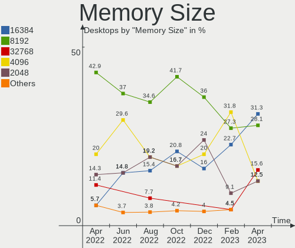

| Size  | Desktops | Percent |
|-------|----------|---------|
| 8192  | 10       | 37.04%  |
| 4096  | 8        | 29.63%  |
| 16384 | 4        | 14.81%  |
| 2048  | 4        | 14.81%  |
| 1024  | 1        | 3.7%    |

Memory Speed
------------

Memory module speed

| Speed | Desktops | Percent |
|-------|----------|---------|
| 1600  | 5        | 15.63%  |
| 3600  | 4        | 12.5%   |
| 3200  | 4        | 12.5%   |
| 1333  | 4        | 12.5%   |
| 2667  | 2        | 6.25%   |
| 800   | 2        | 6.25%   |
| 400   | 2        | 6.25%   |
| 3400  | 1        | 3.13%   |
| 2934  | 1        | 3.13%   |
| 2933  | 1        | 3.13%   |
| 2400  | 1        | 3.13%   |
| 2000  | 1        | 3.13%   |
| 1800  | 1        | 3.13%   |
| 1067  | 1        | 3.13%   |
| 667   | 1        | 3.13%   |
| 333   | 1        | 3.13%   |

Printers & scanners
-------------------

Printer Vendor
--------------

Printer device vendors

| Vendor             | Desktops | Percent |
|--------------------|----------|---------|
| Brother Industries | 2        | 66.67%  |
| Dymo-CoStar        | 1        | 33.33%  |

Printer Model
-------------

Printer device models

| Model                                  | Desktops | Percent |
|----------------------------------------|----------|---------|
| Dymo-CoStar DYMO LabelWriter 4XL       | 1        | 25%     |
| Dymo-CoStar DYMO LabelWriter 450 Turbo | 1        | 25%     |
| Brother HL-2130 series                 | 1        | 25%     |
| Brother HL-1210W series                | 1        | 25%     |

Scanner Vendor
--------------

Scanner device vendors

Zero info for selected period =(

Scanner Model
-------------

Scanner device models

Zero info for selected period =(

Camera
------

Camera Vendor
-------------

Camera device vendors

| Vendor                        | Desktops | Percent |
|-------------------------------|----------|---------|
| Logitech                      | 7        | 58.33%  |
| Microdia                      | 2        | 16.67%  |
| Sunplus Innovation Technology | 1        | 8.33%   |
| icSpring                      | 1        | 8.33%   |
| AVer Information              | 1        | 8.33%   |

Camera Model
------------

Camera device models

| Model                           | Desktops | Percent |
|---------------------------------|----------|---------|
| Logitech Webcam C170            | 2        | 16.67%  |
| Sunplus ezcap U3 capture-04     | 1        | 8.33%   |
| Microdia Webcam Vitade AF       | 1        | 8.33%   |
| Microdia USB 2.0 Camera         | 1        | 8.33%   |
| Logitech Webcam C930e           | 1        | 8.33%   |
| Logitech Webcam C270            | 1        | 8.33%   |
| Logitech HD Webcam C910         | 1        | 8.33%   |
| Logitech HD Webcam C525         | 1        | 8.33%   |
| Logitech C922 Pro Stream Webcam | 1        | 8.33%   |
| icSpring camera                 | 1        | 8.33%   |
| AVer Information CAM340         | 1        | 8.33%   |

Security
--------

Fingerprint Vendor
------------------

Fingerprint sensor vendors

Zero info for selected period =(

Fingerprint Model
-----------------

Fingerprint sensor models

Zero info for selected period =(

Chipcard Vendor
---------------

Chipcard module vendors

Zero info for selected period =(

Chipcard Model
--------------

Chipcard module models

Zero info for selected period =(

Unsupported
-----------

Unsupported Devices
-------------------

Total unsupported devices on board

| Total | Desktops | Percent |
|-------|----------|---------|
| 0     | 38       | 76%     |
| 1     | 10       | 20%     |
| 3     | 1        | 2%      |
| 2     | 1        | 2%      |

Unsupported Device Types
------------------------

Types of unsupported devices

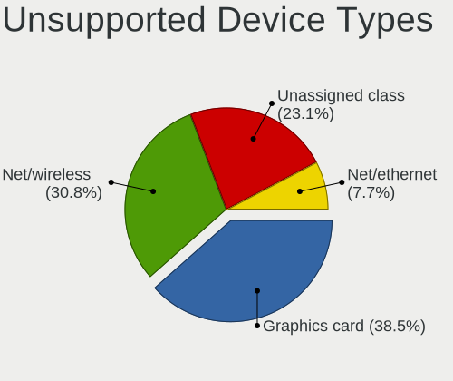

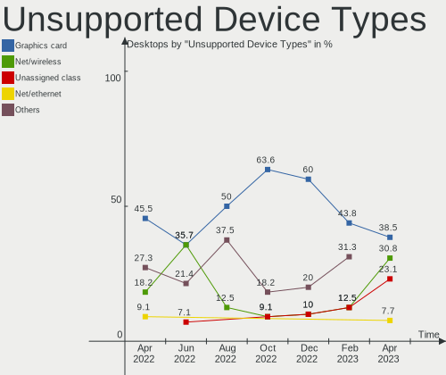

| Type                     | Desktops | Percent |
|--------------------------|----------|---------|
| Net/wireless             | 5        | 38.46%  |
| Graphics card            | 4        | 30.77%  |
| Unassigned class         | 1        | 7.69%   |
| Sound                    | 1        | 7.69%   |
| Multimedia controller    | 1        | 7.69%   |
| Communication controller | 1        | 7.69%   |

