Linux in Australia - Hardware Trends (Notebooks)
------------------------------------------------

A project to identify most popular hardware characteristics and track their change
over time based on data collected by Linux users at https://Linux-Hardware.org.

Anyone can contribute to this report by the [hw-probe](https://github.com/linuxhw/hw-probe) tool:

    sudo -E hw-probe -all -upload

Period: Jul, 2022.

Contents
--------

* [ System ](#system)
  - [ OS                       ](#os)
  - [ OS Family                ](#os-family)
  - [ Kernel                   ](#kernel)
  - [ Kernel Family            ](#kernel-family)
  - [ Kernel Major Ver.        ](#kernel-major-ver)
  - [ Arch                     ](#arch)
  - [ DE                       ](#de)
  - [ Display Server           ](#display-server)
  - [ Display Manager          ](#display-manager)
  - [ OS Lang                  ](#os-lang)
  - [ Boot Mode                ](#boot-mode)
  - [ Filesystem               ](#filesystem)
  - [ Part. scheme             ](#part-scheme)
  - [ Dual Boot with Linux/BSD ](#dual-boot-with-linuxbsd)
  - [ Dual Boot (Win)          ](#dual-boot-win)

* [ Board ](#board)
  - [ Vendor                   ](#vendor)
  - [ Model                    ](#model)
  - [ Model Family             ](#model-family)
  - [ MFG Year                 ](#mfg-year)
  - [ Form Factor              ](#form-factor)
  - [ Secure Boot              ](#secure-boot)
  - [ Coreboot                 ](#coreboot)
  - [ RAM Size                 ](#ram-size)
  - [ RAM Used                 ](#ram-used)
  - [ Total Drives             ](#total-drives)
  - [ Has CD-ROM               ](#has-cd-rom)
  - [ Has Ethernet             ](#has-ethernet)
  - [ Has WiFi                 ](#has-wifi)
  - [ Has Bluetooth            ](#has-bluetooth)

* [ Location ](#location)
  - [ Country                  ](#country)
  - [ City                     ](#city)

* [ Drives ](#drives)
  - [ Drive Vendor             ](#drive-vendor)
  - [ Drive Model              ](#drive-model)
  - [ HDD Vendor               ](#hdd-vendor)
  - [ SSD Vendor               ](#ssd-vendor)
  - [ Drive Kind               ](#drive-kind)
  - [ Drive Connector          ](#drive-connector)
  - [ Drive Size               ](#drive-size)
  - [ Space Total              ](#space-total)
  - [ Space Used               ](#space-used)
  - [ Malfunc. Drives          ](#malfunc-drives)
  - [ Malfunc. Drive Vendor    ](#malfunc-drive-vendor)
  - [ Malfunc. HDD Vendor      ](#malfunc-hdd-vendor)
  - [ Malfunc. Drive Kind      ](#malfunc-drive-kind)
  - [ Failed Drives            ](#failed-drives)
  - [ Failed Drive Vendor      ](#failed-drive-vendor)
  - [ Drive Status             ](#drive-status)

* [ Storage controller ](#storage-controller)
  - [ Storage Vendor           ](#storage-vendor)
  - [ Storage Model            ](#storage-model)
  - [ Storage Kind             ](#storage-kind)

* [ Processor ](#processor)
  - [ CPU Vendor               ](#cpu-vendor)
  - [ CPU Model                ](#cpu-model)
  - [ CPU Model Family         ](#cpu-model-family)
  - [ CPU Cores                ](#cpu-cores)
  - [ CPU Sockets              ](#cpu-sockets)
  - [ CPU Threads              ](#cpu-threads)
  - [ CPU Op-Modes             ](#cpu-op-modes)
  - [ CPU Microcode            ](#cpu-microcode)
  - [ CPU Microarch            ](#cpu-microarch)

* [ Graphics ](#graphics)
  - [ GPU Vendor               ](#gpu-vendor)
  - [ GPU Model                ](#gpu-model)
  - [ GPU Combo                ](#gpu-combo)
  - [ GPU Driver               ](#gpu-driver)
  - [ GPU Memory               ](#gpu-memory)

* [ Monitor ](#monitor)
  - [ Monitor Vendor           ](#monitor-vendor)
  - [ Monitor Model            ](#monitor-model)
  - [ Monitor Resolution       ](#monitor-resolution)
  - [ Monitor Diagonal         ](#monitor-diagonal)
  - [ Monitor Width            ](#monitor-width)
  - [ Aspect Ratio             ](#aspect-ratio)
  - [ Monitor Area             ](#monitor-area)
  - [ Pixel Density            ](#pixel-density)
  - [ Multiple Monitors        ](#multiple-monitors)

* [ Network ](#network)
  - [ Net Controller Vendor    ](#net-controller-vendor)
  - [ Net Controller Model     ](#net-controller-model)
  - [ Wireless Vendor          ](#wireless-vendor)
  - [ Wireless Model           ](#wireless-model)
  - [ Ethernet Vendor          ](#ethernet-vendor)
  - [ Ethernet Model           ](#ethernet-model)
  - [ Net Controller Kind      ](#net-controller-kind)
  - [ Used Controller          ](#used-controller)
  - [ NICs                     ](#nics)
  - [ IPv6                     ](#ipv6)

* [ Bluetooth ](#bluetooth)
  - [ Bluetooth Vendor         ](#bluetooth-vendor)
  - [ Bluetooth Model          ](#bluetooth-model)

* [ Sound ](#sound)
  - [ Sound Vendor             ](#sound-vendor)
  - [ Sound Model              ](#sound-model)

* [ Memory ](#memory)
  - [ Memory Vendor            ](#memory-vendor)
  - [ Memory Model             ](#memory-model)
  - [ Memory Kind              ](#memory-kind)
  - [ Memory Form Factor       ](#memory-form-factor)
  - [ Memory Size              ](#memory-size)
  - [ Memory Speed             ](#memory-speed)

* [ Printers & scanners ](#printers--scanners)
  - [ Printer Vendor           ](#printer-vendor)
  - [ Printer Model            ](#printer-model)
  - [ Scanner Vendor           ](#scanner-vendor)
  - [ Scanner Model            ](#scanner-model)

* [ Camera ](#camera)
  - [ Camera Vendor            ](#camera-vendor)
  - [ Camera Model             ](#camera-model)

* [ Security ](#security)
  - [ Fingerprint Vendor       ](#fingerprint-vendor)
  - [ Fingerprint Model        ](#fingerprint-model)
  - [ Chipcard Vendor          ](#chipcard-vendor)
  - [ Chipcard Model           ](#chipcard-model)

* [ Unsupported ](#unsupported)
  - [ Unsupported Devices      ](#unsupported-devices)
  - [ Unsupported Device Types ](#unsupported-device-types)

System
------

OS
--

Installed operating systems

| Name              | Notebooks | Percent |
|-------------------|-----------|---------|
| Ubuntu 22.04      | 5         | 11.9%   |
| Pop!_OS 22.04     | 5         | 11.9%   |
| Linux Mint 20.3   | 5         | 11.9%   |
| Fedora 36         | 5         | 11.9%   |
| KDE neon 20.04    | 4         | 9.52%   |
| OpenMandriva 4.90 | 3         | 7.14%   |
| Kali 2022.2       | 2         | 4.76%   |
| Zorin 16          | 1         | 2.38%   |
| Ubuntu MATE 18.04 | 1         | 2.38%   |
| Ubuntu 20.04      | 1         | 2.38%   |
| OpenMandriva 4.3  | 1         | 2.38%   |
| MX 21             | 1         | 2.38%   |
| Manjaro           | 1         | 2.38%   |
| Linux Lite 5.8    | 1         | 2.38%   |
| Kaisen 2.0        | 1         | 2.38%   |
| Fedora 35         | 1         | 2.38%   |
| Endless 4.0.7     | 1         | 2.38%   |
| Elementary 6.1    | 1         | 2.38%   |
| Debian 11         | 1         | 2.38%   |
| Arch              | 1         | 2.38%   |

OS Family
---------

OS without a version

| Name         | Notebooks | Percent |
|--------------|-----------|---------|
| Ubuntu       | 6         | 14.29%  |
| Fedora       | 6         | 14.29%  |
| Pop!_OS      | 5         | 11.9%   |
| Linux Mint   | 5         | 11.9%   |
| OpenMandriva | 4         | 9.52%   |
| KDE neon     | 4         | 9.52%   |
| Kali         | 2         | 4.76%   |
| Zorin        | 1         | 2.38%   |
| Ubuntu MATE  | 1         | 2.38%   |
| MX           | 1         | 2.38%   |
| Manjaro      | 1         | 2.38%   |
| Linux Lite   | 1         | 2.38%   |
| Kaisen       | 1         | 2.38%   |
| Endless      | 1         | 2.38%   |
| Elementary   | 1         | 2.38%   |
| Debian       | 1         | 2.38%   |
| Arch         | 1         | 2.38%   |

Kernel
------

Version of the Linux kernel

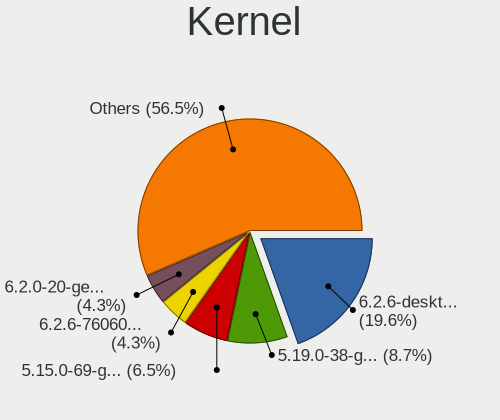

| Version                       | Notebooks | Percent |
|-------------------------------|-----------|---------|
| 5.4.0-122-generic             | 5         | 11.9%   |
| 5.17.15-76051715-generic      | 5         | 11.9%   |
| 5.18.7-200.fc36.x86_64        | 3         | 7.14%   |
| 5.18.12-desktop-3omv4090      | 3         | 7.14%   |
| 5.13.0-52-generic             | 3         | 7.14%   |
| 5.15.0-41-generic             | 2         | 4.76%   |
| 5.13.0-51-generic             | 2         | 4.76%   |
| 5.4.0-121-generic             | 1         | 2.38%   |
| 5.18.9-arch1-1                | 1         | 2.38%   |
| 5.18.4-051804-generic         | 1         | 2.38%   |
| 5.18.11-xanmod1               | 1         | 2.38%   |
| 5.18.10-201.fsync.fc36.x86_64 | 1         | 2.38%   |
| 5.18.10-200.fc36.x86_64       | 1         | 2.38%   |
| 5.18.10-100.fc35.x86_64       | 1         | 2.38%   |
| 5.18.0-kali5-amd64            | 1         | 2.38%   |
| 5.18.0-kali2-amd64            | 1         | 2.38%   |
| 5.17.0-3-amd64                | 1         | 2.38%   |
| 5.16.7-desktop-1omv4003       | 1         | 2.38%   |
| 5.15.0-kaisen1-amd64          | 1         | 2.38%   |
| 5.15.0-40-generic             | 1         | 2.38%   |
| 5.15.0-33-generic             | 1         | 2.38%   |
| 5.13.19-2-MANJARO             | 1         | 2.38%   |
| 5.13.0-40-generic             | 1         | 2.38%   |
| 5.13.0-30-generic             | 1         | 2.38%   |
| 5.11.0-35-generic             | 1         | 2.38%   |
| 5.10.0-16-amd64               | 1         | 2.38%   |

Kernel Family
-------------

Linux kernel without a distro release

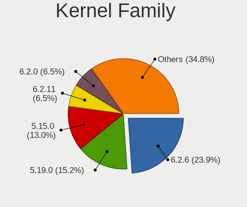

| Version | Notebooks | Percent |
|---------|-----------|---------|
| 5.13.0  | 7         | 16.67%  |
| 5.4.0   | 6         | 14.29%  |
| 5.17.15 | 5         | 11.9%   |
| 5.15.0  | 5         | 11.9%   |
| 5.18.7  | 3         | 7.14%   |
| 5.18.12 | 3         | 7.14%   |
| 5.18.10 | 3         | 7.14%   |
| 5.18.0  | 2         | 4.76%   |
| 5.18.9  | 1         | 2.38%   |
| 5.18.4  | 1         | 2.38%   |
| 5.18.11 | 1         | 2.38%   |
| 5.17.0  | 1         | 2.38%   |
| 5.16.7  | 1         | 2.38%   |
| 5.13.19 | 1         | 2.38%   |
| 5.11.0  | 1         | 2.38%   |
| 5.10.0  | 1         | 2.38%   |

Kernel Major Ver.
-----------------

Linux kernel major version

| Version | Notebooks | Percent |
|---------|-----------|---------|
| 5.18    | 14        | 33.33%  |
| 5.13    | 8         | 19.05%  |
| 5.4     | 6         | 14.29%  |
| 5.17    | 6         | 14.29%  |
| 5.15    | 5         | 11.9%   |
| 5.16    | 1         | 2.38%   |
| 5.11    | 1         | 2.38%   |
| 5.10    | 1         | 2.38%   |

Arch
----

OS architecture (x86_64, i586, etc.)

| Name   | Notebooks | Percent |
|--------|-----------|---------|
| x86_64 | 41        | 97.62%  |
| i686   | 1         | 2.38%   |

DE
--

Desktop Environment

| Name       | Notebooks | Percent |
|------------|-----------|---------|
| GNOME      | 19        | 45.24%  |
| KDE5       | 11        | 26.19%  |
| XFCE       | 4         | 9.52%   |
| X-Cinnamon | 4         | 9.52%   |
| MATE       | 2         | 4.76%   |
| Pantheon   | 1         | 2.38%   |
| Cinnamon   | 1         | 2.38%   |

Display Server
--------------

X11 or Wayland

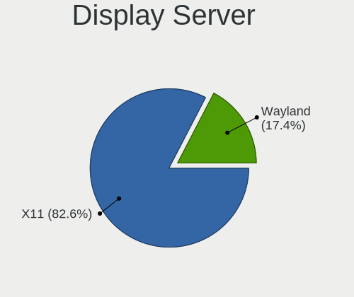

| Name    | Notebooks | Percent |
|---------|-----------|---------|
| X11     | 32        | 76.19%  |
| Wayland | 8         | 19.05%  |
| Tty     | 2         | 4.76%   |

Display Manager
---------------

SDDM, LightDM, etc.

| Name    | Notebooks | Percent |
|---------|-----------|---------|
| Unknown | 20        | 47.62%  |
| LightDM | 8         | 19.05%  |
| GDM3    | 6         | 14.29%  |
| SDDM    | 5         | 11.9%   |
| GDM     | 3         | 7.14%   |

OS Lang
-------

Language

| Lang  | Notebooks | Percent |
|-------|-----------|---------|
| en_AU | 33        | 78.57%  |
| en_US | 9         | 21.43%  |

Boot Mode
---------

EFI or BIOS

| Mode | Notebooks | Percent |
|------|-----------|---------|
| EFI  | 22        | 52.38%  |
| BIOS | 20        | 47.62%  |

Filesystem
----------

Type of filesystem

| Type    | Notebooks | Percent |
|---------|-----------|---------|
| Ext4    | 29        | 69.05%  |
| Overlay | 6         | 14.29%  |
| Btrfs   | 6         | 14.29%  |
| Zfs     | 1         | 2.38%   |

Part. scheme
------------

Scheme of partitioning

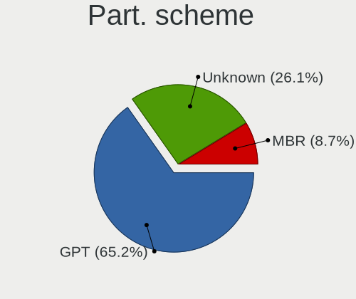

| Type    | Notebooks | Percent |
|---------|-----------|---------|
| Unknown | 26        | 61.9%   |
| GPT     | 13        | 30.95%  |
| MBR     | 3         | 7.14%   |

Dual Boot with Linux/BSD
------------------------

Hosting more than one Linux/BSD

| Dual boot | Notebooks | Percent |
|-----------|-----------|---------|
| No        | 37        | 88.1%   |
| Yes       | 5         | 11.9%   |

Dual Boot (Win)
---------------

Hosting Linux and Windows

| Dual boot | Notebooks | Percent |
|-----------|-----------|---------|
| No        | 38        | 90.48%  |
| Yes       | 4         | 9.52%   |

Board
-----

Vendor
------

Motherboard manufacturer

| Name             | Notebooks | Percent |
|------------------|-----------|---------|
| Acer             | 11        | 26.19%  |
| Dell             | 9         | 21.43%  |
| Hewlett-Packard  | 7         | 16.67%  |
| Apple            | 6         | 14.29%  |
| Lenovo           | 4         | 9.52%   |
| ASUSTek Computer | 2         | 4.76%   |
| HUAWEI           | 1         | 2.38%   |
| Google           | 1         | 2.38%   |
| Alienware        | 1         | 2.38%   |

Model
-----

Motherboard model

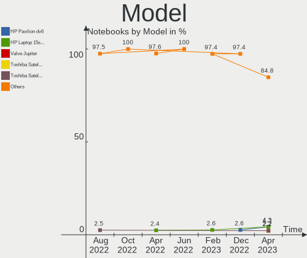

| Name                                   | Notebooks | Percent |
|----------------------------------------|-----------|---------|
| HP EliteBook 8470p                     | 2         | 4.76%   |
| Apple MacBookPro9,2                    | 2         | 4.76%   |
| Acer ConceptD CN315-71P                | 2         | 4.76%   |
| Lenovo ThinkPad X1 Carbon 3460AE4      | 1         | 2.38%   |
| Lenovo ThinkPad T470s W10DG 20JTS0HT00 | 1         | 2.38%   |
| Lenovo Legion S7 15ACH6 82K8           | 1         | 2.38%   |
| Lenovo G570 4334                       | 1         | 2.38%   |
| HUAWEI KLVD-WXX9                       | 1         | 2.38%   |
| HP Spectre 13-SMB Pro Ultrabook        | 1         | 2.38%   |
| HP Pavilion g6                         | 1         | 2.38%   |
| HP Laptop 17-cp0xxx                    | 1         | 2.38%   |
| HP EliteBook 850 G1                    | 1         | 2.38%   |
| HP EliteBook 840 G6                    | 1         | 2.38%   |
| Google Peppy                           | 1         | 2.38%   |
| Dell XPS 13 9360                       | 1         | 2.38%   |
| Dell Precision M4700                   | 1         | 2.38%   |
| Dell Latitude E7250                    | 1         | 2.38%   |
| Dell Latitude 5430                     | 1         | 2.38%   |
| Dell Latitude 3400                     | 1         | 2.38%   |
| Dell Inspiron MM061                    | 1         | 2.38%   |
| Dell Inspiron M5010                    | 1         | 2.38%   |
| Dell Inspiron 16 Plus 7620             | 1         | 2.38%   |
| Dell Inspiron 1545                     | 1         | 2.38%   |
| ASUS X555YA                            | 1         | 2.38%   |
| ASUS GL702ZC                           | 1         | 2.38%   |
| Apple MacBookPro10,2                   | 1         | 2.38%   |
| Apple MacBookAir7,2                    | 1         | 2.38%   |
| Apple MacBookAir6,1                    | 1         | 2.38%   |
| Apple MacBook9,1                       | 1         | 2.38%   |
| Alienware x17 R1                       | 1         | 2.38%   |
| Acer TravelMate 8572T                  | 1         | 2.38%   |
| Acer Swift SF114-34                    | 1         | 2.38%   |
| Acer Nitro AN515-56                    | 1         | 2.38%   |
| Acer Nitro AN515-55                    | 1         | 2.38%   |
| Acer Aspire R3-131T                    | 1         | 2.38%   |
| Acer Aspire One 753                    | 1         | 2.38%   |
| Acer Aspire A315-21G                   | 1         | 2.38%   |
| Acer Aspire 5742G                      | 1         | 2.38%   |
| Acer Aspire 1830T                      | 1         | 2.38%   |

Model Family
------------

Motherboard model prefix

| Name               | Notebooks | Percent |
|--------------------|-----------|---------|
| Acer Aspire        | 5         | 11.9%   |
| HP EliteBook       | 4         | 9.52%   |
| Dell Inspiron      | 4         | 9.52%   |
| Dell Latitude      | 3         | 7.14%   |
| Lenovo ThinkPad    | 2         | 4.76%   |
| Apple MacBookPro9  | 2         | 4.76%   |
| Acer Nitro         | 2         | 4.76%   |
| Acer ConceptD      | 2         | 4.76%   |
| Lenovo Legion      | 1         | 2.38%   |
| Lenovo G570        | 1         | 2.38%   |
| HUAWEI KLVD-WXX9   | 1         | 2.38%   |
| HP Spectre         | 1         | 2.38%   |
| HP Pavilion        | 1         | 2.38%   |
| HP Laptop          | 1         | 2.38%   |
| Google Peppy       | 1         | 2.38%   |
| Dell XPS           | 1         | 2.38%   |
| Dell Precision     | 1         | 2.38%   |
| ASUS X555YA        | 1         | 2.38%   |
| ASUS GL702ZC       | 1         | 2.38%   |
| Apple MacBookPro10 | 1         | 2.38%   |
| Apple MacBookAir7  | 1         | 2.38%   |
| Apple MacBookAir6  | 1         | 2.38%   |
| Apple MacBook9     | 1         | 2.38%   |
| Alienware x17      | 1         | 2.38%   |
| Acer TravelMate    | 1         | 2.38%   |
| Acer Swift         | 1         | 2.38%   |

MFG Year
--------

Motherboard manufacture year

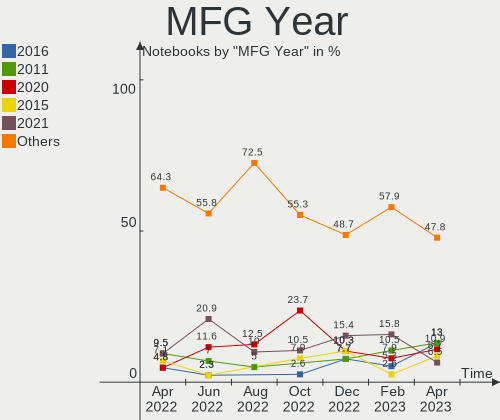

| Year | Notebooks | Percent |
|------|-----------|---------|
| 2021 | 5         | 11.9%   |
| 2020 | 5         | 11.9%   |
| 2010 | 5         | 11.9%   |
| 2012 | 4         | 9.52%   |
| 2011 | 4         | 9.52%   |
| 2022 | 3         | 7.14%   |
| 2017 | 3         | 7.14%   |
| 2015 | 3         | 7.14%   |
| 2014 | 3         | 7.14%   |
| 2019 | 2         | 4.76%   |
| 2018 | 1         | 2.38%   |
| 2016 | 1         | 2.38%   |
| 2013 | 1         | 2.38%   |
| 2008 | 1         | 2.38%   |
| 2006 | 1         | 2.38%   |

Form Factor
-----------

Physical design of the computer

| Name     | Notebooks | Percent |
|----------|-----------|---------|
| Notebook | 42        | 100%    |

Secure Boot
-----------

Enabled or disabled

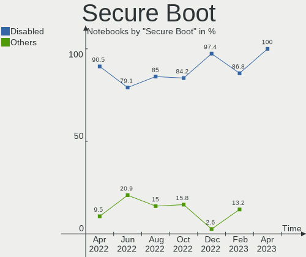

| State    | Notebooks | Percent |
|----------|-----------|---------|
| Disabled | 35        | 83.33%  |
| Enabled  | 7         | 16.67%  |

Coreboot
--------

Have coreboot on board

| Used | Notebooks | Percent |
|------|-----------|---------|
| No   | 41        | 97.62%  |
| Yes  | 1         | 2.38%   |

RAM Size
--------

Total RAM memory

| Size in GB | Notebooks | Percent |
|------------|-----------|---------|
| 4.01-8.0   | 20        | 47.62%  |
| 3.01-4.0   | 9         | 21.43%  |
| 32.01-64.0 | 4         | 9.52%   |
| 16.01-24.0 | 4         | 9.52%   |
| 8.01-16.0  | 3         | 7.14%   |
| 2.01-3.0   | 1         | 2.38%   |
| 1.01-2.0   | 1         | 2.38%   |

RAM Used
--------

Used RAM memory

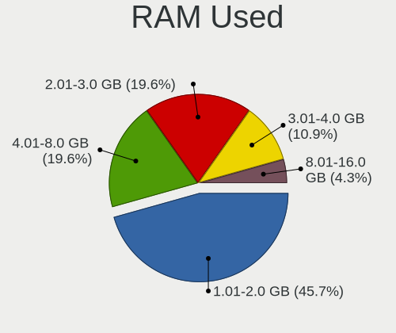

| Used GB    | Notebooks | Percent |
|------------|-----------|---------|
| 2.01-3.0   | 12        | 28.57%  |
| 1.01-2.0   | 12        | 28.57%  |
| 4.01-8.0   | 8         | 19.05%  |
| 3.01-4.0   | 4         | 9.52%   |
| 0.51-1.0   | 4         | 9.52%   |
| 24.01-32.0 | 1         | 2.38%   |
| 8.01-16.0  | 1         | 2.38%   |

Total Drives
------------

Number of drives on board

| Drives | Notebooks | Percent |
|--------|-----------|---------|
| 1      | 32        | 76.19%  |
| 2      | 9         | 21.43%  |
| 3      | 1         | 2.38%   |

Has CD-ROM
----------

Has CD-ROM on board

| Presented | Notebooks | Percent |
|-----------|-----------|---------|
| No        | 29        | 69.05%  |
| Yes       | 13        | 30.95%  |

Has Ethernet
------------

Has Ethernet on board

| Presented | Notebooks | Percent |
|-----------|-----------|---------|
| Yes       | 31        | 73.81%  |
| No        | 11        | 26.19%  |

Has WiFi
--------

Has WiFi module

| Presented | Notebooks | Percent |
|-----------|-----------|---------|
| Yes       | 42        | 100%    |

Has Bluetooth
-------------

Has Bluetooth module

| Presented | Notebooks | Percent |
|-----------|-----------|---------|
| Yes       | 35        | 83.33%  |
| No        | 7         | 16.67%  |

Location
--------

Country
-------

Geographic location (country)

| Country   | Notebooks | Percent |
|-----------|-----------|---------|
| Australia | 42        | 100%    |

City
----

Geographic location (city)

| City           | Notebooks | Percent |
|----------------|-----------|---------|
| Sydney         | 11        | 26.19%  |
| Brisbane       | 11        | 26.19%  |
| Melbourne      | 7         | 16.67%  |
| Perth          | 4         | 9.52%   |
| Wentworthville | 1         | 2.38%   |
| Port Sorell    | 1         | 2.38%   |
| Newnham        | 1         | 2.38%   |
| Launceston     | 1         | 2.38%   |
| Kiama          | 1         | 2.38%   |
| Gold Coast     | 1         | 2.38%   |
| Eltham         | 1         | 2.38%   |
| Cessnock       | 1         | 2.38%   |
| Berwick        | 1         | 2.38%   |

Drives
------

Drive Vendor
------------

Hard drive vendors

| Vendor              | Notebooks | Drives | Percent |
|---------------------|-----------|--------|---------|
| SanDisk             | 7         | 7      | 13.46%  |
| Samsung Electronics | 7         | 7      | 13.46%  |
| Seagate             | 5         | 5      | 9.62%   |
| Apple               | 5         | 6      | 9.62%   |
| WDC                 | 4         | 4      | 7.69%   |
| Patriot             | 3         | 3      | 5.77%   |
| Unknown             | 2         | 2      | 3.85%   |
| SK hynix            | 2         | 2      | 3.85%   |
| Phison              | 2         | 2      | 3.85%   |
| Kingston            | 2         | 2      | 3.85%   |
| Intel               | 2         | 2      | 3.85%   |
| Hitachi             | 2         | 2      | 3.85%   |
| HGST                | 2         | 2      | 3.85%   |
| Toshiba             | 1         | 1      | 1.92%   |
| OWC                 | 1         | 1      | 1.92%   |
| Micron Technology   | 1         | 1      | 1.92%   |
| KIOXIA              | 1         | 1      | 1.92%   |
| Gigabyte Technology | 1         | 1      | 1.92%   |
| Fujitsu             | 1         | 1      | 1.92%   |
| Crucial             | 1         | 1      | 1.92%   |

Drive Model
-----------

Hard drive models

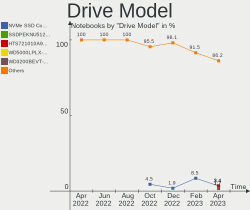

| Model                                | Notebooks | Percent |
|--------------------------------------|-----------|---------|
| Seagate ST9250315AS 250GB            | 2         | 3.77%   |
| Seagate Expansion 1TB                | 2         | 3.77%   |
| SanDisk NVMe SSD Drive 512GB         | 2         | 3.77%   |
| SanDisk NVMe SSD Drive 256GB         | 2         | 3.77%   |
| Phison NVMe SSD Drive 1024GB         | 2         | 3.77%   |
| Patriot Blaze 120GB SSD              | 2         | 3.77%   |
| WDC WD5000LPVX-22V0TT0 500GB         | 1         | 1.89%   |
| WDC WD3200BPVT-22ZEST0 320GB         | 1         | 1.89%   |
| WDC PC SN720 SDAPNTW-256G-1014 256GB | 1         | 1.89%   |
| WDC PC SN530 NVMe 256GB              | 1         | 1.89%   |
| Unknown MMC Card  64GB               | 1         | 1.89%   |
| Unknown 00000  64GB                  | 1         | 1.89%   |
| Toshiba MQ04ABF100 1TB               | 1         | 1.89%   |
| SK hynix SKHynix_HFS001TDE9X084N 1TB | 1         | 1.89%   |
| SK hynix NVMe SSD Drive 256GB        | 1         | 1.89%   |
| Seagate Portable 2TB                 | 1         | 1.89%   |
| SanDisk SD6SN1M-256G-1006 256GB SSD  | 1         | 1.89%   |
| SanDisk SD5SG2128G1052E 128GB SSD    | 1         | 1.89%   |
| SanDisk NVMe SSD Drive 1TB           | 1         | 1.89%   |
| Samsung SSD 870 EVO 500GB            | 1         | 1.89%   |
| Samsung SSD 860 EVO mSATA 500GB      | 1         | 1.89%   |
| Samsung SSD 860 EVO 250GB            | 1         | 1.89%   |
| Samsung SSD 650 120GB                | 1         | 1.89%   |
| Samsung PM961 NVMe 256GB             | 1         | 1.89%   |
| Samsung NVMe SSD Drive 2TB           | 1         | 1.89%   |
| Samsung MZVLQ512HALU-00000 512GB     | 1         | 1.89%   |
| Patriot P200 256GB SSD               | 1         | 1.89%   |
| OWC Mercury Electra 3G SSD           | 1         | 1.89%   |
| Micron NVMe SSD Drive 1024GB         | 1         | 1.89%   |
| KIOXIA KBG30ZMV256G 256GB            | 1         | 1.89%   |
| Kingston SNS4151S316G 16GB SSD       | 1         | 1.89%   |
| Kingston NVMe SSD Drive 500GB        | 1         | 1.89%   |
| Intel SSDSA1M160G2LE 160GB           | 1         | 1.89%   |
| Intel SSDPEKKF256G7L 256GB           | 1         | 1.89%   |
| Hitachi HTS547550A9E384 500GB        | 1         | 1.89%   |
| Hitachi HTS543232A7A384 320GB        | 1         | 1.89%   |
| HGST HTS721010A9E630 1TB             | 1         | 1.89%   |
| HGST HTS541010A9E680 1TB             | 1         | 1.89%   |
| Gigabyte GP-GSM2NE3100TNTD 1TB       | 1         | 1.89%   |
| Fujitsu MHV2080BH 80GB               | 1         | 1.89%   |
| Crucial CT250MX500SSD1 250GB         | 1         | 1.89%   |
| Apple SSD SM128E 121GB               | 1         | 1.89%   |
| Apple SSD SM0128G 121GB              | 1         | 1.89%   |
| Apple SSD SD0128F 121GB              | 1         | 1.89%   |
| Apple NVMe SSD Drive 8KB             | 1         | 1.89%   |
| Apple NVMe SSD Drive 500GB           | 1         | 1.89%   |
| Apple HDD HTS727575A9E362 752GB      | 1         | 1.89%   |

HDD Vendor
----------

Hard disk drive vendors

| Vendor  | Notebooks | Drives | Percent |
|---------|-----------|--------|---------|
| Seagate | 4         | 4      | 30.77%  |
| WDC     | 2         | 2      | 15.38%  |
| Hitachi | 2         | 2      | 15.38%  |
| HGST    | 2         | 2      | 15.38%  |
| Toshiba | 1         | 1      | 7.69%   |
| Fujitsu | 1         | 1      | 7.69%   |
| Apple   | 1         | 1      | 7.69%   |

SSD Vendor
----------

Solid state drive vendors

| Vendor              | Notebooks | Drives | Percent |
|---------------------|-----------|--------|---------|
| Samsung Electronics | 4         | 4      | 25%     |
| Patriot             | 3         | 3      | 18.75%  |
| Apple               | 3         | 3      | 18.75%  |
| SanDisk             | 2         | 2      | 12.5%   |
| OWC                 | 1         | 1      | 6.25%   |
| Kingston            | 1         | 1      | 6.25%   |
| Intel               | 1         | 1      | 6.25%   |
| Crucial             | 1         | 1      | 6.25%   |

Drive Kind
----------

HDD or SSD

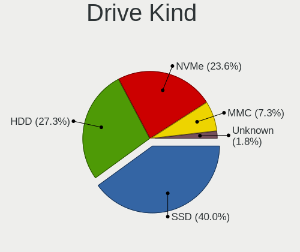

| Kind    | Notebooks | Drives | Percent |
|---------|-----------|--------|---------|
| SSD     | 16        | 16     | 34.78%  |
| NVMe    | 15        | 21     | 32.61%  |
| HDD     | 12        | 13     | 26.09%  |
| MMC     | 2         | 2      | 4.35%   |
| Unknown | 1         | 1      | 2.17%   |

Drive Connector
---------------

SATA, SAS, NVMe, etc.

| Type | Notebooks | Drives | Percent |
|------|-----------|--------|---------|
| SATA | 27        | 27     | 57.45%  |
| NVMe | 15        | 21     | 31.91%  |
| SAS  | 3         | 3      | 6.38%   |
| MMC  | 2         | 2      | 4.26%   |

Drive Size
----------

Size of hard drive

| Size in TB | Notebooks | Drives | Percent |
|------------|-----------|--------|---------|
| 0.01-0.5   | 23        | 23     | 79.31%  |
| 0.51-1.0   | 6         | 6      | 20.69%  |

Space Total
-----------

Amount of disk space available on the file system

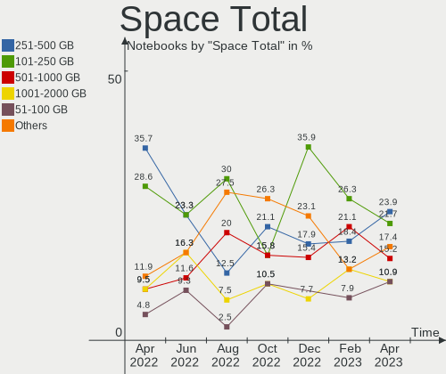

| Size in GB     | Notebooks | Percent |
|----------------|-----------|---------|
| 101-250        | 13        | 30.95%  |
| 251-500        | 8         | 19.05%  |
| 1-20           | 5         | 11.9%   |
| More than 3000 | 4         | 9.52%   |
| 1001-2000      | 3         | 7.14%   |
| 501-1000       | 3         | 7.14%   |
| 51-100         | 3         | 7.14%   |
| 21-50          | 2         | 4.76%   |
| 2001-3000      | 1         | 2.38%   |

Space Used
----------

Amount of used disk space

| Used GB        | Notebooks | Percent |
|----------------|-----------|---------|
| 1-20           | 22        | 52.38%  |
| 21-50          | 10        | 23.81%  |
| 51-100         | 4         | 9.52%   |
| 501-1000       | 3         | 7.14%   |
| More than 3000 | 1         | 2.38%   |
| 251-500        | 1         | 2.38%   |
| 1001-2000      | 1         | 2.38%   |

Malfunc. Drives
---------------

Drive models with a malfunction

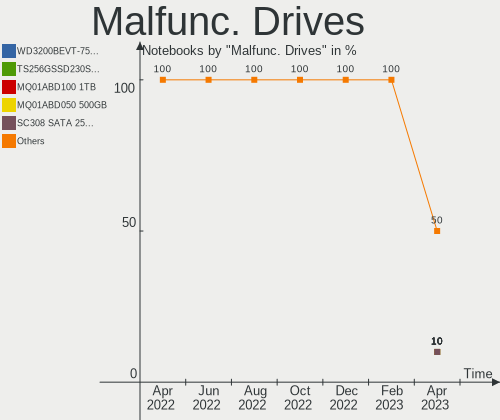

| Model                         | Notebooks | Drives | Percent |
|-------------------------------|-----------|--------|---------|
| WDC WD3200BPVT-22ZEST0 320GB  | 1         | 1      | 33.33%  |
| Seagate ST9250315AS 250GB     | 1         | 1      | 33.33%  |
| Hitachi HTS543232A7A384 320GB | 1         | 1      | 33.33%  |

Malfunc. Drive Vendor
---------------------

Vendors of faulty drives

| Vendor  | Notebooks | Drives | Percent |
|---------|-----------|--------|---------|
| WDC     | 1         | 1      | 33.33%  |
| Seagate | 1         | 1      | 33.33%  |
| Hitachi | 1         | 1      | 33.33%  |

Malfunc. HDD Vendor
-------------------

Vendors of faulty HDD drives

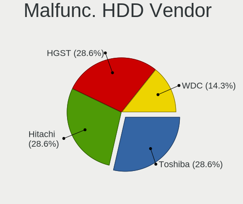

| Vendor  | Notebooks | Drives | Percent |
|---------|-----------|--------|---------|
| WDC     | 1         | 1      | 33.33%  |
| Seagate | 1         | 1      | 33.33%  |
| Hitachi | 1         | 1      | 33.33%  |

Malfunc. Drive Kind
-------------------

Kinds of faulty drives

| Kind | Notebooks | Drives | Percent |
|------|-----------|--------|---------|
| HDD  | 3         | 3      | 100%    |

Failed Drives
-------------

Failed drive models

Zero info for selected period =(

Failed Drive Vendor
-------------------

Failed drive vendors

Zero info for selected period =(

Drive Status
------------

Number of failed and malfunc. drives

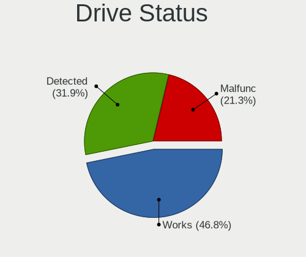

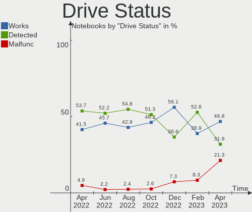

| Status   | Notebooks | Drives | Percent |
|----------|-----------|--------|---------|
| Detected | 28        | 36     | 63.64%  |
| Works    | 13        | 14     | 29.55%  |
| Malfunc  | 3         | 3      | 6.82%   |

Storage controller
------------------

Storage Vendor
--------------

Storage controller vendors

| Vendor                       | Notebooks | Percent |
|------------------------------|-----------|---------|
| Intel                        | 28        | 53.85%  |
| Sandisk                      | 6         | 11.54%  |
| AMD                          | 5         | 9.62%   |
| Samsung Electronics          | 4         | 7.69%   |
| SK hynix                     | 2         | 3.85%   |
| Phison Electronics           | 2         | 3.85%   |
| Toshiba America Info Systems | 1         | 1.92%   |
| Micron Technology            | 1         | 1.92%   |
| Marvell Technology Group     | 1         | 1.92%   |
| Kingston Technology Company  | 1         | 1.92%   |
| Apple                        | 1         | 1.92%   |

Storage Model
-------------

Storage controller models

| Model                                                                            | Notebooks | Percent |
|----------------------------------------------------------------------------------|-----------|---------|
| Intel 7 Series Chipset Family 6-port SATA Controller [AHCI mode]                 | 7         | 12.96%  |
| Intel 5 Series/3400 Series Chipset 4 port SATA AHCI Controller                   | 4         | 7.41%   |
| AMD FCH SATA Controller [AHCI mode]                                              | 4         | 7.41%   |
| Intel Volume Management Device NVMe RAID Controller                              | 3         | 5.56%   |
| Intel 8 Series SATA Controller 1 [AHCI mode]                                     | 3         | 5.56%   |
| SanDisk WD Blue SN550 NVMe SSD                                                   | 2         | 3.7%    |
| SanDisk WD Black 2018/SN750 / PC SN720 NVMe SSD                                  | 2         | 3.7%    |
| SanDisk Non-Volatile memory controller                                           | 2         | 3.7%    |
| Phison PS5013 E13 NVMe Controller                                                | 2         | 3.7%    |
| Intel Cannon Lake Mobile PCH SATA AHCI Controller                                | 2         | 3.7%    |
| Toshiba America Info Systems BG3 NVMe SSD Controller                             | 1         | 1.85%   |
| SK hynix Non-Volatile memory controller                                          | 1         | 1.85%   |
| SK hynix Gold P31 SSD                                                            | 1         | 1.85%   |
| Samsung NVMe SSD Controller SM981/PM981/PM983                                    | 1         | 1.85%   |
| Samsung NVMe SSD Controller SM961/PM961/SM963                                    | 1         | 1.85%   |
| Samsung NVMe SSD Controller 980                                                  | 1         | 1.85%   |
| Samsung Electronics SATA controller                                              | 1         | 1.85%   |
| Micron Non-Volatile memory controller                                            | 1         | 1.85%   |
| Marvell Group 88SS9183 PCIe SSD Controller                                       | 1         | 1.85%   |
| Kingston Company SNVS2000G [NV1 NVMe PCIe SSD 2TB]                               | 1         | 1.85%   |
| Intel Wildcat Point-LP SATA Controller [AHCI Mode]                               | 1         | 1.85%   |
| Intel Tiger Lake-LP SATA Controller                                              | 1         | 1.85%   |
| Intel SSD 600P Series                                                            | 1         | 1.85%   |
| Intel Cannon Point-LP SATA Controller [AHCI Mode]                                | 1         | 1.85%   |
| Intel Atom/Celeron/Pentium Processor x5-E8000/J3xxx/N3xxx Series SATA Controller | 1         | 1.85%   |
| Intel 82801IBM/IEM (ICH9M/ICH9M-E) 2 port SATA Controller [IDE mode]             | 1         | 1.85%   |
| Intel 82801GBM/GHM (ICH7-M Family) SATA Controller [IDE mode]                    | 1         | 1.85%   |
| Intel 82801 Mobile SATA Controller [RAID mode]                                   | 1         | 1.85%   |
| Intel 6 Series/C200 Series Chipset Family 6 port Mobile SATA AHCI Controller     | 1         | 1.85%   |
| Intel 400 Series Chipset Family SATA AHCI Controller                             | 1         | 1.85%   |
| Apple S3X NVMe Controller                                                        | 1         | 1.85%   |
| AMD SB7x0/SB8x0/SB9x0 SATA Controller [AHCI mode]                                | 1         | 1.85%   |
| AMD 300 Series Chipset SATA Controller                                           | 1         | 1.85%   |

Storage Kind
------------

Kind of storage controller (IDE, SATA, NVMe, SAS, ...)

| Kind | Notebooks | Percent |
|------|-----------|---------|
| SATA | 29        | 58%     |
| NVMe | 15        | 30%     |
| RAID | 4         | 8%      |
| IDE  | 2         | 4%      |

Processor
---------

CPU Vendor
----------

Processor vendors

| Vendor | Notebooks | Percent |
|--------|-----------|---------|
| Intel  | 36        | 85.71%  |
| AMD    | 6         | 14.29%  |

CPU Model
---------

Processor models

| Model                                        | Notebooks | Percent |
|----------------------------------------------|-----------|---------|
| Intel Core i7-9750H CPU @ 2.60GHz            | 2         | 4.76%   |
| Intel Core i5-3360M CPU @ 2.80GHz            | 2         | 4.76%   |
| Intel Core i5-3210M CPU @ 2.50GHz            | 2         | 4.76%   |
| Intel Pentium CPU N3700 @ 1.60GHz            | 1         | 2.38%   |
| Intel Pentium CPU B960 @ 2.20GHz             | 1         | 2.38%   |
| Intel Genuine CPU T2400 @ 1.83GHz            | 1         | 2.38%   |
| Intel Core m5-6Y54 CPU @ 1.10GHz             | 1         | 2.38%   |
| Intel Core i7-8565U CPU @ 1.80GHz            | 1         | 2.38%   |
| Intel Core i7-6600U CPU @ 2.60GHz            | 1         | 2.38%   |
| Intel Core i7-4600U CPU @ 2.10GHz            | 1         | 2.38%   |
| Intel Core i7-3740QM CPU @ 2.70GHz           | 1         | 2.38%   |
| Intel Core i7-3632QM CPU @ 2.20GHz           | 1         | 2.38%   |
| Intel Core i7-3520M CPU @ 2.90GHz            | 1         | 2.38%   |
| Intel Core i5-8365U CPU @ 1.60GHz            | 1         | 2.38%   |
| Intel Core i5-8250U CPU @ 1.60GHz            | 1         | 2.38%   |
| Intel Core i5-5350U CPU @ 1.80GHz            | 1         | 2.38%   |
| Intel Core i5-5300U CPU @ 2.30GHz            | 1         | 2.38%   |
| Intel Core i5-4260U CPU @ 1.40GHz            | 1         | 2.38%   |
| Intel Core i5-4200U CPU @ 1.60GHz            | 1         | 2.38%   |
| Intel Core i5-3427U CPU @ 1.80GHz            | 1         | 2.38%   |
| Intel Core i5-10300H CPU @ 2.50GHz           | 1         | 2.38%   |
| Intel Core i5 CPU M 540 @ 2.53GHz            | 1         | 2.38%   |
| Intel Core i3 CPU U 380 @ 1.33GHz            | 1         | 2.38%   |
| Intel Core i3 CPU M 370 @ 2.40GHz            | 1         | 2.38%   |
| Intel Core 2 Duo CPU T6400 @ 2.00GHz         | 1         | 2.38%   |
| Intel Celeron N4500 @ 1.10GHz                | 1         | 2.38%   |
| Intel Celeron CPU U3600 @ 1.20GHz            | 1         | 2.38%   |
| Intel Celeron 2955U @ 1.40GHz                | 1         | 2.38%   |
| Intel 12th Gen Core i7-12700H                | 1         | 2.38%   |
| Intel 12th Gen Core i5-1245U                 | 1         | 2.38%   |
| Intel 11th Gen Core i7-11800H @ 2.30GHz      | 1         | 2.38%   |
| Intel 11th Gen Core i5-1135G7 @ 2.40GHz      | 1         | 2.38%   |
| Intel 11th Gen Core i5-11300H @ 3.10GHz      | 1         | 2.38%   |
| AMD Ryzen 9 5900HX with Radeon Graphics      | 1         | 2.38%   |
| AMD Ryzen 7 1700 Eight-Core Processor        | 1         | 2.38%   |
| AMD Ryzen 5 5500U with Radeon Graphics       | 1         | 2.38%   |
| AMD Athlon II P360 Dual-Core Processor       | 1         | 2.38%   |
| AMD A9-9420 RADEON R5, 5 COMPUTE CORES 2C+3G | 1         | 2.38%   |
| AMD A6-7310 APU with AMD Radeon R4 Graphics  | 1         | 2.38%   |

CPU Model Family
----------------

Processor model prefix

| Model            | Notebooks | Percent |
|------------------|-----------|---------|
| Intel Core i5    | 13        | 30.95%  |
| Intel Core i7    | 8         | 19.05%  |
| Other            | 6         | 14.29%  |
| Intel Celeron    | 3         | 7.14%   |
| Intel Pentium    | 2         | 4.76%   |
| Intel Core i3    | 2         | 4.76%   |
| Intel Genuine    | 1         | 2.38%   |
| Intel Core m5    | 1         | 2.38%   |
| Intel Core 2 Duo | 1         | 2.38%   |
| AMD Ryzen 9      | 1         | 2.38%   |
| AMD Ryzen 7      | 1         | 2.38%   |
| AMD Ryzen 5      | 1         | 2.38%   |
| AMD Athlon II    | 1         | 2.38%   |
| AMD A6           | 1         | 2.38%   |

CPU Cores
---------

Number of processor cores

| Number | Notebooks | Percent |
|--------|-----------|---------|
| 2      | 24        | 57.14%  |
| 4      | 10        | 23.81%  |
| 8      | 3         | 7.14%   |
| 6      | 3         | 7.14%   |
| 14     | 1         | 2.38%   |
| 10     | 1         | 2.38%   |

CPU Sockets
-----------

Number of sockets

| Number | Notebooks | Percent |
|--------|-----------|---------|
| 1      | 42        | 100%    |

CPU Threads
-----------

Threads per core (Hyper-Threading)

| Number | Notebooks | Percent |
|--------|-----------|---------|
| 2      | 32        | 76.19%  |
| 1      | 10        | 23.81%  |

CPU Op-Modes
------------

CPU Operation Modes (32-bit, 64-bit)

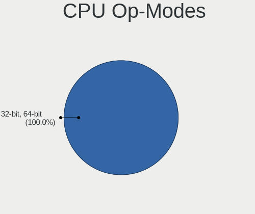

| Op mode        | Notebooks | Percent |
|----------------|-----------|---------|
| 32-bit, 64-bit | 41        | 97.62%  |
| 32-bit         | 1         | 2.38%   |

CPU Microcode
-------------

Microcode number

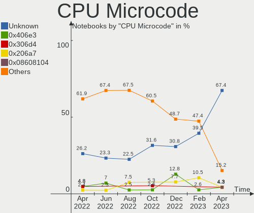

| Number     | Notebooks | Percent |
|------------|-----------|---------|
| Unknown    | 11        | 26.19%  |
| 0x40651    | 3         | 7.14%   |
| 0x306a9    | 3         | 7.14%   |
| 0x20655    | 3         | 7.14%   |
| 0x806c1    | 2         | 4.76%   |
| 0x406e3    | 2         | 4.76%   |
| 0x906c0    | 1         | 2.38%   |
| 0x906a4    | 1         | 2.38%   |
| 0x906a3    | 1         | 2.38%   |
| 0x806ec    | 1         | 2.38%   |
| 0x806ea    | 1         | 2.38%   |
| 0x806d1    | 1         | 2.38%   |
| 0x6e8      | 1         | 2.38%   |
| 0x406c3    | 1         | 2.38%   |
| 0x306d4    | 1         | 2.38%   |
| 0x206a7    | 1         | 2.38%   |
| 0x20652    | 1         | 2.38%   |
| 0x1067a    | 1         | 2.38%   |
| 0x0a50000c | 1         | 2.38%   |
| 0x08608103 | 1         | 2.38%   |
| 0x08001137 | 1         | 2.38%   |
| 0x07030105 | 1         | 2.38%   |
| 0x06006704 | 1         | 2.38%   |
| 0x010000c8 | 1         | 2.38%   |

CPU Microarch
-------------

Microarchitecture

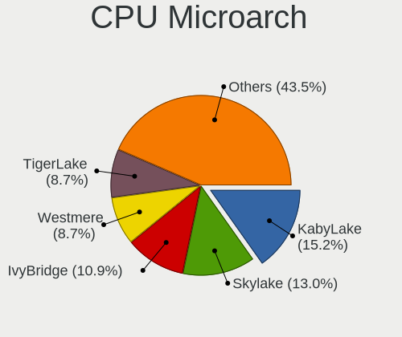

| Name             | Notebooks | Percent |
|------------------|-----------|---------|
| IvyBridge        | 8         | 19.05%  |
| KabyLake         | 5         | 11.9%   |
| Westmere         | 4         | 9.52%   |
| Haswell          | 4         | 9.52%   |
| TigerLake        | 2         | 4.76%   |
| Skylake          | 2         | 4.76%   |
| Broadwell        | 2         | 4.76%   |
| Alderlake Hybrid | 2         | 4.76%   |
| Zen 3            | 1         | 2.38%   |
| Zen              | 1         | 2.38%   |
| Tremont          | 1         | 2.38%   |
| Silvermont       | 1         | 2.38%   |
| SandyBridge      | 1         | 2.38%   |
| Puma             | 1         | 2.38%   |
| Penryn           | 1         | 2.38%   |
| P6               | 1         | 2.38%   |
| K10              | 1         | 2.38%   |
| Icelake          | 1         | 2.38%   |
| Excavator        | 1         | 2.38%   |
| CometLake        | 1         | 2.38%   |
| Unknown          | 1         | 2.38%   |

Graphics
--------

GPU Vendor
----------

Vendors of graphics cards

| Vendor | Notebooks | Percent |
|--------|-----------|---------|
| Intel  | 35        | 66.04%  |
| Nvidia | 9         | 16.98%  |
| AMD    | 9         | 16.98%  |

GPU Model
---------

Graphics card models

| Model                                                                                    | Notebooks | Percent |
|------------------------------------------------------------------------------------------|-----------|---------|
| Intel 3rd Gen Core processor Graphics Controller                                         | 8         | 14.81%  |
| Intel Haswell-ULT Integrated Graphics Controller                                         | 4         | 7.41%   |
| Intel Core Processor Integrated Graphics Controller                                      | 4         | 7.41%   |
| Nvidia TU117GLM [Quadro T1000 Mobile]                                                    | 2         | 3.7%    |
| Intel WhiskeyLake-U GT2 [UHD Graphics 620]                                               | 2         | 3.7%    |
| Intel TigerLake-LP GT2 [Iris Xe Graphics]                                                | 2         | 3.7%    |
| Intel CoffeeLake-H GT2 [UHD Graphics 630]                                                | 2         | 3.7%    |
| Nvidia TU117M [GeForce GTX 1650 Ti Mobile]                                               | 1         | 1.85%   |
| Nvidia TU117M [GeForce GTX 1650 Mobile / Max-Q]                                          | 1         | 1.85%   |
| Nvidia GM108M [GeForce MX130]                                                            | 1         | 1.85%   |
| Nvidia GF108M [GeForce GT 420M]                                                          | 1         | 1.85%   |
| Nvidia GA106M [GeForce RTX 3060 Mobile / Max-Q]                                          | 1         | 1.85%   |
| Nvidia GA106M [GeForce RTX 3050 Ti Mobile / Max-Q]                                       | 1         | 1.85%   |
| Nvidia GA104M [GeForce RTX 3080 Mobile / Max-Q 8GB/16GB]                                 | 1         | 1.85%   |
| Intel UHD Graphics 620                                                                   | 1         | 1.85%   |
| Intel TigerLake-H GT1 [UHD Graphics]                                                     | 1         | 1.85%   |
| Intel Skylake GT2 [HD Graphics 520]                                                      | 1         | 1.85%   |
| Intel Mobile 4 Series Chipset Integrated Graphics Controller                             | 1         | 1.85%   |
| Intel JasperLake [UHD Graphics]                                                          | 1         | 1.85%   |
| Intel HD Graphics 6000                                                                   | 1         | 1.85%   |
| Intel HD Graphics 5500                                                                   | 1         | 1.85%   |
| Intel HD Graphics 515                                                                    | 1         | 1.85%   |
| Intel CometLake-H GT2 [UHD Graphics]                                                     | 1         | 1.85%   |
| Intel Atom/Celeron/Pentium Processor x5-E8000/J3xxx/N3xxx Integrated Graphics Controller | 1         | 1.85%   |
| Intel Alder Lake-UP3 GT2 [UHD Graphics]                                                  | 1         | 1.85%   |
| Intel Alder Lake-P Integrated Graphics Controller                                        | 1         | 1.85%   |
| Intel 2nd Generation Core Processor Family Integrated Graphics Controller                | 1         | 1.85%   |
| AMD Thames [Radeon HD 7500M/7600M Series]                                                | 1         | 1.85%   |
| AMD Stoney [Radeon R2/R3/R4/R5 Graphics]                                                 | 1         | 1.85%   |
| AMD RV515/M54 [Mobility Radeon X1400]                                                    | 1         | 1.85%   |
| AMD RS880M [Mobility Radeon HD 4225/4250]                                                | 1         | 1.85%   |
| AMD Mullins [Radeon R4/R5 Graphics]                                                      | 1         | 1.85%   |
| AMD Mars [Radeon HD 8730M]                                                               | 1         | 1.85%   |
| AMD Lucienne                                                                             | 1         | 1.85%   |
| AMD Jet PRO [Radeon R5 M230 / R7 M260DX / Radeon 520 Mobile]                             | 1         | 1.85%   |
| AMD Ellesmere [Radeon RX 470/480/570/570X/580/580X/590]                                  | 1         | 1.85%   |
| AMD Cezanne                                                                              | 1         | 1.85%   |

GPU Combo
---------

Combinations of graphics cards

| Name           | Notebooks | Percent |
|----------------|-----------|---------|
| 1 x Intel      | 25        | 59.52%  |
| Intel + Nvidia | 8         | 19.05%  |
| 1 x AMD        | 5         | 11.9%   |
| Intel + AMD    | 2         | 4.76%   |
| 2 x AMD        | 1         | 2.38%   |
| AMD + Nvidia   | 1         | 2.38%   |

GPU Driver
----------

Free vs proprietary

| Driver      | Notebooks | Percent |
|-------------|-----------|---------|
| Free        | 34        | 80.95%  |
| Proprietary | 6         | 14.29%  |
| Unknown     | 2         | 4.76%   |

GPU Memory
----------

Total video memory

| Size in GB | Notebooks | Percent |
|------------|-----------|---------|
| Unknown    | 30        | 71.43%  |
| 3.01-4.0   | 5         | 11.9%   |
| 0.01-0.5   | 4         | 9.52%   |
| 0.51-1.0   | 2         | 4.76%   |
| 1.01-2.0   | 1         | 2.38%   |

Monitor
-------

Monitor Vendor
--------------

Monitor vendors

| Vendor                  | Notebooks | Percent |
|-------------------------|-----------|---------|
| LG Display              | 9         | 16.98%  |
| Chimei Innolux          | 8         | 15.09%  |
| AU Optronics            | 8         | 15.09%  |
| Apple                   | 6         | 11.32%  |
| Samsung Electronics     | 5         | 9.43%   |
| Goldstar                | 4         | 7.55%   |
| Dell                    | 4         | 7.55%   |
| BOE                     | 4         | 7.55%   |
| Chi Mei Optoelectronics | 2         | 3.77%   |
| Sharp                   | 1         | 1.89%   |
| Panasonic               | 1         | 1.89%   |
| CSO                     | 1         | 1.89%   |

Monitor Model
-------------

Monitor models

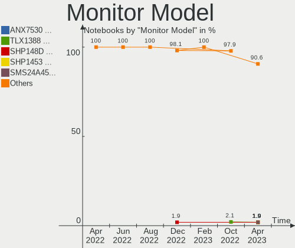

| Model                                                                    | Notebooks | Percent |
|--------------------------------------------------------------------------|-----------|---------|
| Goldstar MP59HT GSM5B44 1920x1080 480x270mm 21.7-inch                    | 2         | 3.64%   |
| Chimei Innolux LCD Monitor CMN1514 1920x1080 344x193mm 15.5-inch         | 2         | 3.64%   |
| Chi Mei Optoelectronics LCD Monitor CMO1100 1366x768 256x144mm 11.6-inch | 2         | 3.64%   |
| Sharp LCD Monitor SHP1449 1920x1080 294x165mm 13.3-inch                  | 1         | 1.82%   |
| Samsung Electronics LCD Monitor SEC5441 1366x768 344x194mm 15.5-inch     | 1         | 1.82%   |
| Samsung Electronics LCD Monitor SEC3250 1680x1050 331x207mm 15.4-inch    | 1         | 1.82%   |
| Samsung Electronics LCD Monitor SAM7002 3840x2160 1872x1053mm 84.6-inch  | 1         | 1.82%   |
| Samsung Electronics LC32T55 SAM7024 1920x1080 699x393mm 31.6-inch        | 1         | 1.82%   |
| Samsung Electronics C27F591 SAM0D37 1920x1080 598x336mm 27.0-inch        | 1         | 1.82%   |
| Samsung Electronics C27F591 SAM0D36 1920x1080 600x340mm 27.2-inch        | 1         | 1.82%   |
| Panasonic TV MEIA296 1280x1024 698x392mm 31.5-inch                       | 1         | 1.82%   |
| LG Display LCD Monitor LGD7001 1366x768 340x190mm 15.3-inch              | 1         | 1.82%   |
| LG Display LCD Monitor LGD05F3 1920x1080 309x174mm 14.0-inch             | 1         | 1.82%   |
| LG Display LCD Monitor LGD0521 1920x1080 309x174mm 14.0-inch             | 1         | 1.82%   |
| LG Display LCD Monitor LGD04E8 1920x1080 382x215mm 17.3-inch             | 1         | 1.82%   |
| LG Display LCD Monitor LGD0382 1600x900 309x174mm 14.0-inch              | 1         | 1.82%   |
| LG Display LCD Monitor LGD034D 1366x768 344x194mm 15.5-inch              | 1         | 1.82%   |
| LG Display LCD Monitor LGD032C 1920x1080 344x194mm 15.5-inch             | 1         | 1.82%   |
| LG Display LCD Monitor LGD0306 1600x900 310x174mm 14.0-inch              | 1         | 1.82%   |
| LG Display LCD Monitor LGD02DC 1366x768 344x194mm 15.5-inch              | 1         | 1.82%   |
| Goldstar HDR 4K GSM774F 3840x2160 697x392mm 31.5-inch                    | 1         | 1.82%   |
| Goldstar 23MB35 GSM5A3E 1920x1080 510x290mm 23.1-inch                    | 1         | 1.82%   |
| Dell P2422H DELA1C4 1920x1080 527x296mm 23.8-inch                        | 1         | 1.82%   |
| Dell P2319H DELD0D7 1920x1080 509x286mm 23.0-inch                        | 1         | 1.82%   |
| Dell E2219HN DEL2009 1920x1080 476x268mm 21.5-inch                       | 1         | 1.82%   |
| Dell E2216H DELF069 1920x1080 476x268mm 21.5-inch                        | 1         | 1.82%   |
| Dell C2423H DELA1D4 1920x1080 527x296mm 23.8-inch                        | 1         | 1.82%   |
| CSO LCD Monitor CSO1505 3840x2160 344x194mm 15.5-inch                    | 1         | 1.82%   |
| Chimei Innolux LCD Monitor CMN15E7 1920x1080 344x193mm 15.5-inch         | 1         | 1.82%   |
| Chimei Innolux LCD Monitor CMN15C9 1366x768 344x193mm 15.5-inch          | 1         | 1.82%   |
| Chimei Innolux LCD Monitor CMN14FF 1920x1080 309x173mm 13.9-inch         | 1         | 1.82%   |
| Chimei Innolux LCD Monitor CMN142B 1920x1080 309x173mm 13.9-inch         | 1         | 1.82%   |
| Chimei Innolux LCD Monitor CMN1357 1920x1080 293x165mm 13.2-inch         | 1         | 1.82%   |
| Chimei Innolux LCD Monitor CMN1132 1366x768 256x144mm 11.6-inch          | 1         | 1.82%   |
| BOE LCD Monitor BOE09D5 3072x1920 345x215mm 16.0-inch                    | 1         | 1.82%   |
| BOE LCD Monitor BOE091D 1920x1080 309x174mm 14.0-inch                    | 1         | 1.82%   |
| BOE LCD Monitor BOE0893 2160x1440 296x197mm 14.0-inch                    | 1         | 1.82%   |
| BOE LCD Monitor BOE05F4 1366x768 277x156mm 12.5-inch                     | 1         | 1.82%   |
| AU Optronics LCD Monitor AUOAF90 1920x1080 344x193mm 15.5-inch           | 1         | 1.82%   |
| AU Optronics LCD Monitor AUO70EC 1366x768 344x193mm 15.5-inch            | 1         | 1.82%   |
| AU Optronics LCD Monitor AUO41EC 1366x768 344x193mm 15.5-inch            | 1         | 1.82%   |
| AU Optronics LCD Monitor AUO34ED 1920x1080 344x193mm 15.5-inch           | 1         | 1.82%   |
| AU Optronics LCD Monitor AUO2892 3840x2160 381x214mm 17.2-inch           | 1         | 1.82%   |
| AU Optronics LCD Monitor AUO22EC 1366x768 344x193mm 15.5-inch            | 1         | 1.82%   |
| AU Optronics LCD Monitor AUO223E 1600x900 309x174mm 14.0-inch            | 1         | 1.82%   |
| AU Optronics LCD Monitor AUO105C 1366x768 256x144mm 11.6-inch            | 1         | 1.82%   |
| Apple LCD Monitor APP9CC5 1280x800 286x179mm 13.3-inch                   | 1         | 1.82%   |
| Apple LCD Monitor APP9CC3 1280x800 286x179mm 13.3-inch                   | 1         | 1.82%   |
| Apple Color LCD APPA027 2304x1440 259x162mm 12.0-inch                    | 1         | 1.82%   |
| Apple Color LCD APPA01B 1440x900 286x179mm 13.3-inch                     | 1         | 1.82%   |
| Apple Color LCD APPA013 2560x1600 286x179mm 13.3-inch                    | 1         | 1.82%   |
| Apple Color LCD APP9CF3 1366x768 260x140mm 11.6-inch                     | 1         | 1.82%   |

Monitor Resolution
------------------

Monitor screen resolution

| Resolution         | Notebooks | Percent |
|--------------------|-----------|---------|
| 1920x1080 (FHD)    | 16        | 35.56%  |
| 1366x768 (WXGA)    | 14        | 31.11%  |
| 3840x2160 (4K)     | 4         | 8.89%   |
| 1600x900 (HD+)     | 3         | 6.67%   |
| 1280x800 (WXGA)    | 2         | 4.44%   |
| 3072x1920          | 1         | 2.22%   |
| 2560x1600          | 1         | 2.22%   |
| 2304x1440          | 1         | 2.22%   |
| 2160x1440          | 1         | 2.22%   |
| 1680x1050 (WSXGA+) | 1         | 2.22%   |
| 1440x900 (WXGA+)   | 1         | 2.22%   |

Monitor Diagonal
----------------

Diagonal size in inches

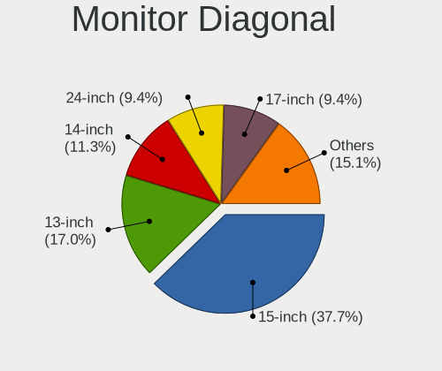

| Inches | Notebooks | Percent |
|--------|-----------|---------|
| 15     | 16        | 30.19%  |
| 13     | 8         | 15.09%  |
| 14     | 7         | 13.21%  |
| 11     | 5         | 9.43%   |
| 21     | 4         | 7.55%   |
| 23     | 3         | 5.66%   |
| 84     | 2         | 3.77%   |
| 31     | 2         | 3.77%   |
| 17     | 2         | 3.77%   |
| 12     | 2         | 3.77%   |
| 27     | 1         | 1.89%   |
| 16     | 1         | 1.89%   |

Monitor Width
-------------

Physical width

| Width in mm | Notebooks | Percent |
|-------------|-----------|---------|
| 301-350     | 24        | 45.28%  |
| 201-300     | 14        | 26.42%  |
| 501-600     | 4         | 7.55%   |
| 401-500     | 4         | 7.55%   |
| 351-400     | 3         | 5.66%   |
| 601-700     | 2         | 3.77%   |
| 1501-2000   | 2         | 3.77%   |

Aspect Ratio
------------

Proportional relationship between the width and the height

| Ratio | Notebooks | Percent |
|-------|-----------|---------|
| 16/9  | 35        | 83.33%  |
| 16/10 | 6         | 14.29%  |
| 3/2   | 1         | 2.38%   |

Monitor Area
------------

Area in inch

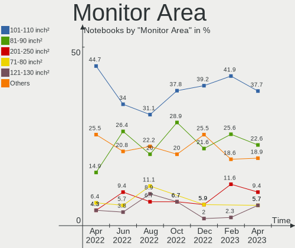

| Area in inch | Notebooks | Percent |
|----------------|-----------|---------|
| 101-110        | 16        | 30.19%  |
| 81-90          | 12        | 22.64%  |
| 201-250        | 6         | 11.32%  |
| 51-60          | 5         | 9.43%   |
| 71-80          | 3         | 5.66%   |
| More than 1000 | 2         | 3.77%   |
| 61-70          | 2         | 3.77%   |
| 351-500        | 2         | 3.77%   |
| 121-130        | 2         | 3.77%   |
| 301-350        | 1         | 1.89%   |
| 151-200        | 1         | 1.89%   |
| 111-120        | 1         | 1.89%   |

Pixel Density
-------------

Pixels per inch

| Density       | Notebooks | Percent |
|---------------|-----------|---------|
| 121-160       | 23        | 43.4%   |
| 101-120       | 14        | 26.42%  |
| 51-100        | 8         | 15.09%  |
| 161-240       | 6         | 11.32%  |
| More than 240 | 2         | 3.77%   |

Multiple Monitors
-----------------

Total monitors connected

| Total | Notebooks | Percent |
|-------|-----------|---------|
| 1     | 29        | 69.05%  |
| 2     | 10        | 23.81%  |
| 4     | 1         | 2.38%   |
| 3     | 1         | 2.38%   |
| 0     | 1         | 2.38%   |

Network
-------

Net Controller Vendor
---------------------

Controller vendors

| Vendor                   | Notebooks | Percent |
|--------------------------|-----------|---------|
| Intel                    | 23        | 34.85%  |
| Realtek Semiconductor    | 16        | 24.24%  |
| Broadcom                 | 9         | 13.64%  |
| Qualcomm Atheros         | 8         | 12.12%  |
| Broadcom Limited         | 3         | 4.55%   |
| DisplayLink              | 2         | 3.03%   |
| Sierra Wireless          | 1         | 1.52%   |
| Ralink                   | 1         | 1.52%   |
| Qualcomm                 | 1         | 1.52%   |
| Marvell Technology Group | 1         | 1.52%   |
| Lenovo                   | 1         | 1.52%   |

Net Controller Model
--------------------

Controller models

| Model                                                             | Notebooks | Percent |
|-------------------------------------------------------------------|-----------|---------|
| Realtek RTL8111/8168/8411 PCI Express Gigabit Ethernet Controller | 7         | 8.75%   |
| Intel Wi-Fi 6 AX200                                               | 3         | 3.75%   |
| Intel Centrino Ultimate-N 6300                                    | 3         | 3.75%   |
| Intel Centrino Advanced-N 6205 [Taylor Peak]                      | 3         | 3.75%   |
| Intel 82579LM Gigabit Network Connection (Lewisville)             | 3         | 3.75%   |
| Broadcom BCM4331 802.11a/b/g/n                                    | 3         | 3.75%   |
| Realtek RTL8153 Gigabit Ethernet Adapter                          | 2         | 2.5%    |
| Realtek RTL810xE PCI Express Fast Ethernet controller             | 2         | 2.5%    |
| Realtek Killer E2600 Gigabit Ethernet Controller                  | 2         | 2.5%    |
| Qualcomm Atheros QCA9377 802.11ac Wireless Network Adapter        | 2         | 2.5%    |
| Intel Wireless 7260                                               | 2         | 2.5%    |
| Intel Wi-Fi 6 AX201                                               | 2         | 2.5%    |
| Intel Alder Lake-P PCH CNVi WiFi                                  | 2         | 2.5%    |
| DisplayLink USB-C Hybrid UHD Video Dock                           | 2         | 2.5%    |
| Broadcom NetXtreme BCM57765 Gigabit Ethernet PCIe                 | 2         | 2.5%    |
| Broadcom Limited BCM4360 802.11ac Wireless Network Adapter        | 2         | 2.5%    |
| Broadcom BCM4313 802.11bgn Wireless Network Adapter               | 2         | 2.5%    |
| Sierra Wireless EM7430 Qualcomm Snapdragon X7 LTE-A               | 1         | 1.25%   |
| Realtek RTL88x2bu [AC1200 Techkey]                                | 1         | 1.25%   |
| Realtek RTL8852AE 802.11ax PCIe Wireless Network Adapter          | 1         | 1.25%   |
| Realtek RTL8822CE 802.11ac PCIe Wireless Network Adapter          | 1         | 1.25%   |
| Realtek RTL8822BE 802.11a/b/g/n/ac WiFi adapter                   | 1         | 1.25%   |
| Realtek Killer E3000 2.5GbE Controller                            | 1         | 1.25%   |
| Ralink RT3290 Wireless 802.11n 1T/1R PCIe                         | 1         | 1.25%   |
| Qualcomm BENGAL-QRD _SN:C5464635                                  | 1         | 1.25%   |
| Qualcomm Atheros QCA6174 802.11ac Wireless Network Adapter        | 1         | 1.25%   |
| Qualcomm Atheros AR9485 Wireless Network Adapter                  | 1         | 1.25%   |
| Qualcomm Atheros AR9462 Wireless Network Adapter                  | 1         | 1.25%   |
| Qualcomm Atheros AR8152 v2.0 Fast Ethernet                        | 1         | 1.25%   |
| Qualcomm Atheros AR8151 v2.0 Gigabit Ethernet                     | 1         | 1.25%   |
| Qualcomm Atheros AR8151 v1.0 Gigabit Ethernet                     | 1         | 1.25%   |
| Marvell Group 88E8040 PCI-E Fast Ethernet Controller              | 1         | 1.25%   |
| Lenovo ThinkPad Lan                                               | 1         | 1.25%   |
| Intel Wireless 8260                                               | 1         | 1.25%   |
| Intel Wireless 7265                                               | 1         | 1.25%   |
| Intel Wireless 3165                                               | 1         | 1.25%   |
| Intel Wi-Fi 6 AX210/AX211/AX411 160MHz                            | 1         | 1.25%   |
| Intel Wi-Fi 6 AX201 160MHz                                        | 1         | 1.25%   |
| Intel PRO/Wireless 3945ABG [Golan] Network Connection             | 1         | 1.25%   |
| Intel Ethernet Connection I219-LM                                 | 1         | 1.25%   |
| Intel Ethernet Connection I218-LM                                 | 1         | 1.25%   |
| Intel Ethernet Connection (6) I219-LM                             | 1         | 1.25%   |
| Intel Ethernet Connection (3) I218-LM                             | 1         | 1.25%   |
| Intel Ethernet Connection (16) I219-LM                            | 1         | 1.25%   |
| Intel Comet Lake PCH CNVi WiFi                                    | 1         | 1.25%   |
| Intel Centrino Advanced-N 6200                                    | 1         | 1.25%   |
| Broadcom NetXtreme BCM57786 Gigabit Ethernet PCIe                 | 1         | 1.25%   |
| Broadcom NetLink BCM57780 Gigabit Ethernet PCIe                   | 1         | 1.25%   |
| Broadcom Limited NetXtreme BCM57760 Gigabit Ethernet PCIe         | 1         | 1.25%   |
| Broadcom BCM4401-B0 100Base-TX                                    | 1         | 1.25%   |
| Broadcom BCM4350 802.11ac Wireless Network Adapter                | 1         | 1.25%   |
| Broadcom BCM43225 802.11b/g/n                                     | 1         | 1.25%   |
| Broadcom BCM4322 802.11a/b/g/n Wireless LAN Controller            | 1         | 1.25%   |

Wireless Vendor
---------------

Wireless vendors

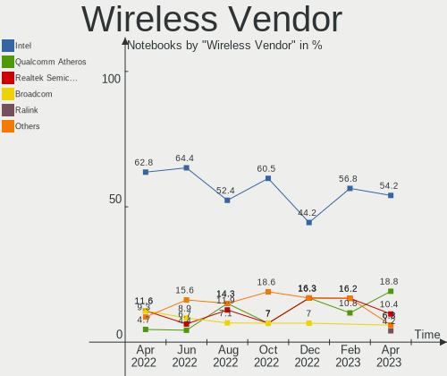

| Vendor                | Notebooks | Percent |
|-----------------------|-----------|---------|
| Intel                 | 23        | 52.27%  |
| Broadcom              | 8         | 18.18%  |
| Qualcomm Atheros      | 5         | 11.36%  |
| Realtek Semiconductor | 4         | 9.09%   |
| Broadcom Limited      | 2         | 4.55%   |
| Sierra Wireless       | 1         | 2.27%   |
| Ralink                | 1         | 2.27%   |

Wireless Model
--------------

Wireless models

| Model                                                      | Notebooks | Percent |
|------------------------------------------------------------|-----------|---------|
| Intel Wi-Fi 6 AX200                                        | 3         | 6.82%   |
| Intel Centrino Ultimate-N 6300                             | 3         | 6.82%   |
| Intel Centrino Advanced-N 6205 [Taylor Peak]               | 3         | 6.82%   |
| Broadcom BCM4331 802.11a/b/g/n                             | 3         | 6.82%   |
| Qualcomm Atheros QCA9377 802.11ac Wireless Network Adapter | 2         | 4.55%   |
| Intel Wireless 7260                                        | 2         | 4.55%   |
| Intel Wi-Fi 6 AX201                                        | 2         | 4.55%   |
| Intel Alder Lake-P PCH CNVi WiFi                           | 2         | 4.55%   |
| Broadcom Limited BCM4360 802.11ac Wireless Network Adapter | 2         | 4.55%   |
| Broadcom BCM4313 802.11bgn Wireless Network Adapter        | 2         | 4.55%   |
| Sierra Wireless EM7430 Qualcomm Snapdragon X7 LTE-A        | 1         | 2.27%   |
| Realtek RTL88x2bu [AC1200 Techkey]                         | 1         | 2.27%   |
| Realtek RTL8852AE 802.11ax PCIe Wireless Network Adapter   | 1         | 2.27%   |
| Realtek RTL8822CE 802.11ac PCIe Wireless Network Adapter   | 1         | 2.27%   |
| Realtek RTL8822BE 802.11a/b/g/n/ac WiFi adapter            | 1         | 2.27%   |
| Ralink RT3290 Wireless 802.11n 1T/1R PCIe                  | 1         | 2.27%   |
| Qualcomm Atheros QCA6174 802.11ac Wireless Network Adapter | 1         | 2.27%   |
| Qualcomm Atheros AR9485 Wireless Network Adapter           | 1         | 2.27%   |
| Qualcomm Atheros AR9462 Wireless Network Adapter           | 1         | 2.27%   |
| Intel Wireless 8260                                        | 1         | 2.27%   |
| Intel Wireless 7265                                        | 1         | 2.27%   |
| Intel Wireless 3165                                        | 1         | 2.27%   |
| Intel Wi-Fi 6 AX210/AX211/AX411 160MHz                     | 1         | 2.27%   |
| Intel Wi-Fi 6 AX201 160MHz                                 | 1         | 2.27%   |
| Intel PRO/Wireless 3945ABG [Golan] Network Connection      | 1         | 2.27%   |
| Intel Comet Lake PCH CNVi WiFi                             | 1         | 2.27%   |
| Intel Centrino Advanced-N 6200                             | 1         | 2.27%   |
| Broadcom BCM4350 802.11ac Wireless Network Adapter         | 1         | 2.27%   |
| Broadcom BCM43225 802.11b/g/n                              | 1         | 2.27%   |
| Broadcom BCM4322 802.11a/b/g/n Wireless LAN Controller     | 1         | 2.27%   |

Ethernet Vendor
---------------

Ethernet vendors

| Vendor                   | Notebooks | Percent |
|--------------------------|-----------|---------|
| Realtek Semiconductor    | 14        | 38.89%  |
| Intel                    | 8         | 22.22%  |
| Broadcom                 | 5         | 13.89%  |
| Qualcomm Atheros         | 3         | 8.33%   |
| DisplayLink              | 2         | 5.56%   |
| Qualcomm                 | 1         | 2.78%   |
| Marvell Technology Group | 1         | 2.78%   |
| Lenovo                   | 1         | 2.78%   |
| Broadcom Limited         | 1         | 2.78%   |

Ethernet Model
--------------

Ethernet models

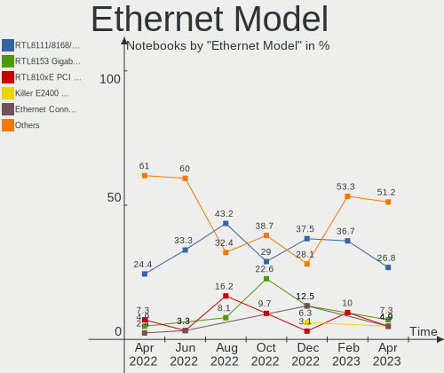

| Model                                                             | Notebooks | Percent |
|-------------------------------------------------------------------|-----------|---------|
| Realtek RTL8111/8168/8411 PCI Express Gigabit Ethernet Controller | 7         | 19.44%  |
| Intel 82579LM Gigabit Network Connection (Lewisville)             | 3         | 8.33%   |
| Realtek RTL8153 Gigabit Ethernet Adapter                          | 2         | 5.56%   |
| Realtek RTL810xE PCI Express Fast Ethernet controller             | 2         | 5.56%   |
| Realtek Killer E2600 Gigabit Ethernet Controller                  | 2         | 5.56%   |
| DisplayLink USB-C Hybrid UHD Video Dock                           | 2         | 5.56%   |
| Broadcom NetXtreme BCM57765 Gigabit Ethernet PCIe                 | 2         | 5.56%   |
| Realtek Killer E3000 2.5GbE Controller                            | 1         | 2.78%   |
| Qualcomm BENGAL-QRD _SN:C5464635                                  | 1         | 2.78%   |
| Qualcomm Atheros AR8152 v2.0 Fast Ethernet                        | 1         | 2.78%   |
| Qualcomm Atheros AR8151 v2.0 Gigabit Ethernet                     | 1         | 2.78%   |
| Qualcomm Atheros AR8151 v1.0 Gigabit Ethernet                     | 1         | 2.78%   |
| Marvell Group 88E8040 PCI-E Fast Ethernet Controller              | 1         | 2.78%   |
| Lenovo ThinkPad Lan                                               | 1         | 2.78%   |
| Intel Ethernet Connection I219-LM                                 | 1         | 2.78%   |
| Intel Ethernet Connection I218-LM                                 | 1         | 2.78%   |
| Intel Ethernet Connection (6) I219-LM                             | 1         | 2.78%   |
| Intel Ethernet Connection (3) I218-LM                             | 1         | 2.78%   |
| Intel Ethernet Connection (16) I219-LM                            | 1         | 2.78%   |
| Broadcom NetXtreme BCM57786 Gigabit Ethernet PCIe                 | 1         | 2.78%   |
| Broadcom NetLink BCM57780 Gigabit Ethernet PCIe                   | 1         | 2.78%   |
| Broadcom Limited NetXtreme BCM57760 Gigabit Ethernet PCIe         | 1         | 2.78%   |
| Broadcom BCM4401-B0 100Base-TX                                    | 1         | 2.78%   |

Net Controller Kind
-------------------

Ethernet, WiFi or modem

| Kind     | Notebooks | Percent |
|----------|-----------|---------|
| WiFi     | 42        | 57.53%  |
| Ethernet | 31        | 42.47%  |

Used Controller
---------------

Currently used network controller

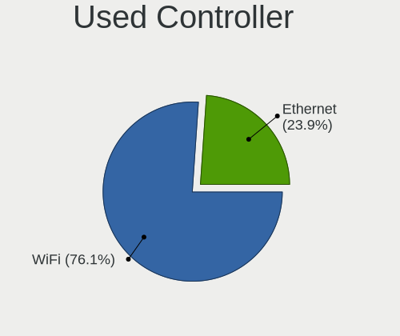

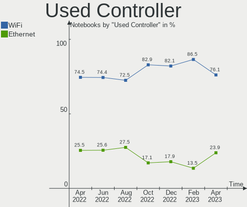

| Kind     | Notebooks | Percent |
|----------|-----------|---------|
| WiFi     | 34        | 75.56%  |
| Ethernet | 11        | 24.44%  |

NICs
----

Total network controllers on board

| Total | Notebooks | Percent |
|-------|-----------|---------|
| 2     | 30        | 71.43%  |
| 1     | 12        | 28.57%  |

IPv6
----

IPv6 vs IPv4

| Used | Notebooks | Percent |
|------|-----------|---------|
| No   | 35        | 83.33%  |
| Yes  | 7         | 16.67%  |

Bluetooth
---------

Bluetooth Vendor
----------------

Controller vendors

| Vendor                          | Notebooks | Percent |
|---------------------------------|-----------|---------|
| Intel                           | 15        | 42.86%  |
| Apple                           | 5         | 14.29%  |
| Foxconn / Hon Hai               | 4         | 11.43%  |
| Broadcom                        | 4         | 11.43%  |
| Realtek Semiconductor           | 2         | 5.71%   |
| Qualcomm Atheros Communications | 2         | 5.71%   |
| Ralink                          | 1         | 2.86%   |
| Lite-On Technology              | 1         | 2.86%   |
| IMC Networks                    | 1         | 2.86%   |

Bluetooth Model
---------------

Controller models

| Model                                           | Notebooks | Percent |
|-------------------------------------------------|-----------|---------|
| Intel Bluetooth wireless interface              | 5         | 14.29%  |
| Intel AX201 Bluetooth                           | 4         | 11.43%  |
| Apple Bluetooth USB Host Controller             | 4         | 11.43%  |
| Intel AX200 Bluetooth                           | 3         | 8.57%   |
| Realtek Bluetooth Radio                         | 2         | 5.71%   |
| Qualcomm Atheros  Bluetooth Device              | 2         | 5.71%   |
| Intel Bluetooth Device                          | 2         | 5.71%   |
| Broadcom HP Portable SoftSailing                | 2         | 5.71%   |
| Ralink RT3290 Bluetooth                         | 1         | 2.86%   |
| Lite-On Qualcomm Atheros QCA9377 Bluetooth      | 1         | 2.86%   |
| Intel AX210 Bluetooth                           | 1         | 2.86%   |
| IMC Networks Bluetooth Radio                    | 1         | 2.86%   |
| Foxconn / Hon Hai Bluetooth USB Host Controller | 1         | 2.86%   |
| Foxconn / Hon Hai Bluetooth Device              | 1         | 2.86%   |
| Foxconn / Hon Hai Acer Module                   | 1         | 2.86%   |
| Foxconn / Hon Hai Acer Bluetooth module         | 1         | 2.86%   |
| Broadcom BCM20702A0 Bluetooth 4.0               | 1         | 2.86%   |
| Broadcom BCM20702 Bluetooth 4.0 [ThinkPad]      | 1         | 2.86%   |
| Apple Bluetooth Host Controller                 | 1         | 2.86%   |

Sound
-----

Sound Vendor
------------

Sound card vendors

| Vendor                | Notebooks | Percent |
|-----------------------|-----------|---------|
| Intel                 | 36        | 63.16%  |
| Nvidia                | 8         | 14.04%  |
| AMD                   | 7         | 12.28%  |
| Plantronics           | 2         | 3.51%   |
| Realtek Semiconductor | 1         | 1.75%   |
| Microsoft             | 1         | 1.75%   |
| Dell                  | 1         | 1.75%   |
| Blue Microphones      | 1         | 1.75%   |

Sound Model
-----------

Sound card models

| Model                                                                                             | Notebooks | Percent |
|---------------------------------------------------------------------------------------------------|-----------|---------|
| Intel 7 Series/C216 Chipset Family High Definition Audio Controller                               | 8         | 11.59%  |
| Nvidia TU107 GeForce GTX 1650 High Definition Audio Controller                                    | 4         | 5.8%    |
| Intel Haswell-ULT HD Audio Controller                                                             | 4         | 5.8%    |
| Intel 8 Series HD Audio Controller                                                                | 4         | 5.8%    |
| Intel 5 Series/3400 Series Chipset High Definition Audio                                          | 4         | 5.8%    |
| Intel Sunrise Point-LP HD Audio                                                                   | 3         | 4.35%   |
| Plantronics Blackwire 5220 Series                                                                 | 2         | 2.9%    |
| Nvidia GA106 High Definition Audio Controller                                                     | 2         | 2.9%    |
| Intel Wildcat Point-LP High Definition Audio Controller                                           | 2         | 2.9%    |
| Intel Tiger Lake-LP Smart Sound Technology Audio Controller                                       | 2         | 2.9%    |
| Intel Cannon Point-LP High Definition Audio Controller                                            | 2         | 2.9%    |
| Intel Cannon Lake PCH cAVS                                                                        | 2         | 2.9%    |
| Intel Broadwell-U Audio Controller                                                                | 2         | 2.9%    |
| Intel Alder Lake PCH-P High Definition Audio Controller                                           | 2         | 2.9%    |
| AMD Family 17h/19h HD Audio Controller                                                            | 2         | 2.9%    |
| Realtek Semiconductor USB Audio                                                                   | 1         | 1.45%   |
| Nvidia GF108 High Definition Audio Controller                                                     | 1         | 1.45%   |
| Nvidia GA104 High Definition Audio Controller                                                     | 1         | 1.45%   |
| Microsoft LifeChat LX-3000 Headset                                                                | 1         | 1.45%   |
| Intel USB PnP Sound Device                                                                        | 1         | 1.45%   |
| Intel Tiger Lake-H HD Audio Controller                                                            | 1         | 1.45%   |
| Intel NM10/ICH7 Family High Definition Audio Controller                                           | 1         | 1.45%   |
| Intel Jasper Lake HD Audio                                                                        | 1         | 1.45%   |
| Intel Comet Lake PCH cAVS                                                                         | 1         | 1.45%   |
| Intel Atom/Celeron/Pentium Processor x5-E8000/J3xxx/N3xxx Series High Definition Audio Controller | 1         | 1.45%   |
| Intel 82801I (ICH9 Family) HD Audio Controller                                                    | 1         | 1.45%   |
| Intel 6 Series/C200 Series Chipset Family High Definition Audio Controller                        | 1         | 1.45%   |
| Dell C2423H                                                                                       | 1         | 1.45%   |
| Blue Microphones Yeti Nano                                                                        | 1         | 1.45%   |
| AMD SBx00 Azalia (Intel HDA)                                                                      | 1         | 1.45%   |
| AMD RS880 HDMI Audio [Radeon HD 4200 Series]                                                      | 1         | 1.45%   |
| AMD Renoir Radeon High Definition Audio Controller                                                | 1         | 1.45%   |
| AMD Oland/Hainan/Cape Verde/Pitcairn HDMI Audio [Radeon HD 7000 Series]                           | 1         | 1.45%   |
| AMD Kabini HDMI/DP Audio                                                                          | 1         | 1.45%   |
| AMD High Definition Audio Controller                                                              | 1         | 1.45%   |
| AMD FCH Azalia Controller                                                                         | 1         | 1.45%   |
| AMD Family 17h (Models 00h-0fh) HD Audio Controller                                               | 1         | 1.45%   |
| AMD Family 15h (Models 60h-6fh) Audio Controller                                                  | 1         | 1.45%   |
| AMD Ellesmere HDMI Audio [Radeon RX 470/480 / 570/580/590]                                        | 1         | 1.45%   |

Memory
------

Memory Vendor
-------------

Memory module vendors

| Vendor              | Notebooks | Percent |
|---------------------|-----------|---------|
| SK hynix            | 8         | 34.78%  |
| Samsung Electronics | 8         | 34.78%  |
| Micron Technology   | 3         | 13.04%  |
| Ramaxel Technology  | 1         | 4.35%   |
| Kingston            | 1         | 4.35%   |
| Elpida              | 1         | 4.35%   |
| Apacer              | 1         | 4.35%   |

Memory Model
------------

Memory module models

| Model                                                        | Notebooks | Percent |
|--------------------------------------------------------------|-----------|---------|
| SK hynix RAM HMAA1GS6CJR6N-XN 8GB SODIMM DDR4 3200MT/s       | 2         | 8%      |
| SK hynix RAM HYMP112S64CP6-S6 1GB SODIMM DDR2 975MT/s        | 1         | 4%      |
| SK hynix RAM HMT451S6CFR6A-PB 4GB SODIMM DDR3 1600MT/s       | 1         | 4%      |
| SK hynix RAM HMT451S6BFR8A-PB 4GB SODIMM DDR3 1600MT/s       | 1         | 4%      |
| SK hynix RAM HMT351S6CFR8A-PB 4GB SODIMM DDR3 1600MT/s       | 1         | 4%      |
| SK hynix RAM HMT351S6BFR8C-H9 4GB SODIMM DDR3 1334MT/s       | 1         | 4%      |
| SK hynix RAM HMCG78MEBSA095N 16GB SODIMM 4800MT/s            | 1         | 4%      |
| SK hynix RAM HMA851S6AFR6N-UH 4GB SODIMM DDR4 2667MT/s       | 1         | 4%      |
| Samsung RAM M471B5674BH0-YH9 2GB Chip DDR3 1333MT/s          | 1         | 4%      |
| Samsung RAM M471B5273DH0-YK0 4GB SODIMM DDR3 1600MT/s        | 1         | 4%      |
| Samsung RAM M471B5273CH0-CH9 4GB SODIMM DDR3 1334MT/s        | 1         | 4%      |
| Samsung RAM M471B1G73DB0-YK0 8GB SODIMM DDR3 1600MT/s        | 1         | 4%      |
| Samsung RAM M471A5244BB0-CRC 4096MB SODIMM DDR4 2667MT/s     | 1         | 4%      |
| Samsung RAM M471A1G44AB0-CWE 8GB Row Of Chips DDR4 3200MT/s  | 1         | 4%      |
| Samsung RAM K4E6E304EB-EGCF 4GB Row Of Chips LPDDR3 1867MT/s | 1         | 4%      |
| Samsung RAM K4A8G165WC-BCTD 4GB Row Of Chips DDR4 2667MT/s   | 1         | 4%      |
| Ramaxel RAM Module 8192MB SODIMM DDR4 2667MT/s               | 1         | 4%      |
| Micron RAM Module 4GB SODIMM DDR3 1600MT/s                   | 1         | 4%      |
| Micron RAM 16HTF25664HY-667E1 2048MB SODIMM DDR 667MT/s      | 1         | 4%      |
| Micron RAM 16ATF2G64HZ-3G2J1 16GB SODIMM DDR4 3200MT/s       | 1         | 4%      |
| Kingston RAM 9905700-070.A01G 16GB SODIMM DDR4 2667MT/s      | 1         | 4%      |
| Elpida RAM Module 2048MB SODIMM DDR3 1600MT/s                | 1         | 4%      |
| Apacer RAM 78.A2GC8.CY00C 2GB SODIMM DDR3 800MT/s            | 1         | 4%      |
| Apacer RAM 78.A2GC8.9L00C 2GB SODIMM DDR3 800MT/s            | 1         | 4%      |

Memory Kind
-----------

Memory module kinds

| Kind    | Notebooks | Percent |
|---------|-----------|---------|
| DDR3    | 9         | 47.37%  |
| DDR4    | 6         | 31.58%  |
| LPDDR4  | 1         | 5.26%   |
| LPDDR3  | 1         | 5.26%   |
| DDR2    | 1         | 5.26%   |
| Unknown | 1         | 5.26%   |

Memory Form Factor
------------------

Physical design of the memory module

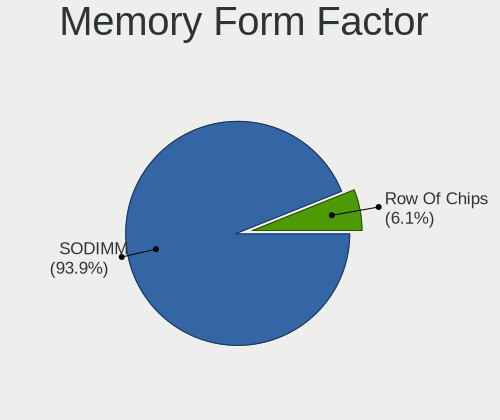

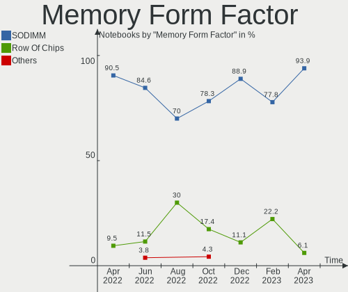

| Name         | Notebooks | Percent |
|--------------|-----------|---------|
| SODIMM       | 15        | 78.95%  |
| Row Of Chips | 3         | 15.79%  |
| Chip         | 1         | 5.26%   |

Memory Size
-----------

Memory module size

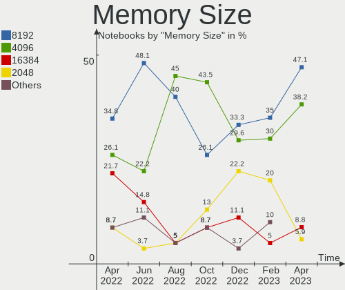

| Size  | Notebooks | Percent |
|-------|-----------|---------|
| 4096  | 8         | 40%     |
| 8192  | 5         | 25%     |
| 2048  | 4         | 20%     |
| 16384 | 2         | 10%     |
| 1024  | 1         | 5%      |

Memory Speed
------------

Memory module speed

| Speed | Notebooks | Percent |
|-------|-----------|---------|
| 1600  | 6         | 30%     |
| 2667  | 4         | 20%     |
| 3200  | 3         | 15%     |
| 4800  | 1         | 5%      |
| 1867  | 1         | 5%      |
| 1334  | 1         | 5%      |
| 1333  | 1         | 5%      |
| 975   | 1         | 5%      |
| 800   | 1         | 5%      |
| 667   | 1         | 5%      |

Printers & scanners
-------------------

Printer Vendor
--------------

Printer device vendors

Zero info for selected period =(

Printer Model
-------------

Printer device models

Zero info for selected period =(

Scanner Vendor
--------------

Scanner device vendors

Zero info for selected period =(

Scanner Model
-------------

Scanner device models

Zero info for selected period =(

Camera
------

Camera Vendor
-------------

Camera device vendors

| Vendor                        | Notebooks | Percent |
|-------------------------------|-----------|---------|
| Chicony Electronics           | 12        | 30%     |
| Microdia                      | 6         | 15%     |
| Sunplus Innovation Technology | 4         | 10%     |
| Apple                         | 4         | 10%     |
| Suyin                         | 2         | 5%      |
| Realtek Semiconductor         | 2         | 5%      |
| Quanta                        | 2         | 5%      |
| Acer                          | 2         | 5%      |
| Ricoh                         | 1         | 2.5%    |
| Primax Electronics            | 1         | 2.5%    |
| Logitech                      | 1         | 2.5%    |
| IMC Networks                  | 1         | 2.5%    |
| Dell                          | 1         | 2.5%    |
| ALi                           | 1         | 2.5%    |

Camera Model
------------

Camera device models

| Model                                                       | Notebooks | Percent |
|-------------------------------------------------------------|-----------|---------|
| Chicony HD User Facing                                      | 3         | 7.5%    |
| Sunplus HD WebCam                                           | 2         | 5%      |
| Quanta HD User Facing                                       | 2         | 5%      |
| Microdia Integrated_Webcam_HD                               | 2         | 5%      |
| Apple FaceTime HD Camera                                    | 2         | 5%      |
| Acer Integrated Camera                                      | 2         | 5%      |
| Suyin Acer/Lenovo Webcam [CN0316]                           | 1         | 2.5%    |
| Suyin 1.3M WebCam (notebook emachines E730, Acer sub-brand) | 1         | 2.5%    |
| Sunplus Laptop Integrated Webcam HD                         | 1         | 2.5%    |
| Sunplus Integrated_Webcam_FHD                               | 1         | 2.5%    |
| Ricoh Integrated Webcam                                     | 1         | 2.5%    |
| Realtek USB2.0 HD UVC WebCam                                | 1         | 2.5%    |
| Realtek HP TrueVision Full HD                               | 1         | 2.5%    |
| Primax HP HD Webcam [Fixed]                                 | 1         | 2.5%    |
| Microdia Integrated_Webcam_FHD                              | 1         | 2.5%    |
| Microdia Integrated Webcam HD                               | 1         | 2.5%    |
| Microdia Dell Integrated HD Webcam                          | 1         | 2.5%    |
| Microdia 1.3 MPixel Integrated Webcam                       | 1         | 2.5%    |
| Logitech StreamCam                                          | 1         | 2.5%    |
| IMC Networks HD Camera                                      | 1         | 2.5%    |
| Dell Integrated_Webcam_5M_IR                                | 1         | 2.5%    |
| Chicony VGA WebCam                                          | 1         | 2.5%    |
| Chicony USB2.0 VGA UVC WebCam                               | 1         | 2.5%    |
| Chicony Lenovo EasyCamera                                   | 1         | 2.5%    |
| Chicony Integrated HP HD Webcam                             | 1         | 2.5%    |
| Chicony HP TrueVision HD Camera                             | 1         | 2.5%    |
| Chicony HP Truevision HD                                    | 1         | 2.5%    |
| Chicony HP HD Webcam                                        | 1         | 2.5%    |
| Chicony HP HD Camera                                        | 1         | 2.5%    |
| Chicony 1.3M Webcam                                         | 1         | 2.5%    |
| Apple iPad 3 (3G, 16 GB)                                    | 1         | 2.5%    |
| Apple FaceTime HD Camera (Built-in)                         | 1         | 2.5%    |
| ALi Gateway Webcam                                          | 1         | 2.5%    |

Security
--------

Fingerprint Vendor
------------------

Fingerprint sensor vendors

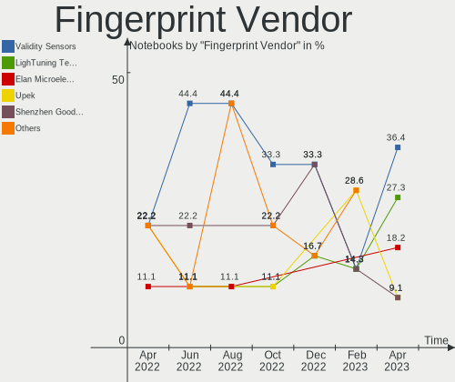

| Vendor                     | Notebooks | Percent |
|----------------------------|-----------|---------|
| Validity Sensors           | 4         | 50%     |
| LighTuning Technology      | 3         | 37.5%   |
| Shenzhen Goodix Technology | 1         | 12.5%   |

Fingerprint Model
-----------------

Fingerprint sensor models

| Model                                             | Notebooks | Percent |
|---------------------------------------------------|-----------|---------|
| Validity Sensors VFS491                           | 2         | 25%     |
| LighTuning EgisTec Touch Fingerprint Sensor       | 2         | 25%     |
| Validity Sensors VFS7552 Touch Fingerprint Sensor | 1         | 12.5%   |
| Validity Sensors VFS495 Fingerprint Reader        | 1         | 12.5%   |
| Shenzhen Goodix  Fingerprint Device               | 1         | 12.5%   |
| LighTuning Fingerprint Reader                     | 1         | 12.5%   |

Chipcard Vendor
---------------

Chipcard module vendors

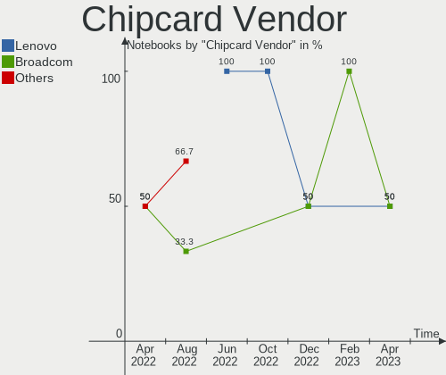

| Vendor                | Notebooks | Percent |
|-----------------------|-----------|---------|
| Upek                  | 1         | 25%     |
| Broadcom              | 1         | 25%     |
| Alcor Micro           | 1         | 25%     |
| Advanced Card Systems | 1         | 25%     |

Chipcard Model
--------------

Chipcard module models

| Model                                                      | Notebooks | Percent |
|------------------------------------------------------------|-----------|---------|
| Upek TouchChip Fingerprint Coprocessor (WBF advanced mode) | 1         | 25%     |
| Broadcom BCM5880 Secure Applications Processor             | 1         | 25%     |
| Alcor Micro AU9540 Smartcard Reader                        | 1         | 25%     |
| Advanced Card Systems ACR122U                              | 1         | 25%     |

Unsupported
-----------

Unsupported Devices
-------------------

Total unsupported devices on board

| Total | Notebooks | Percent |
|-------|-----------|---------|
| 1     | 21        | 50%     |
| 0     | 20        | 47.62%  |
| 2     | 1         | 2.38%   |

Unsupported Device Types
------------------------

Types of unsupported devices

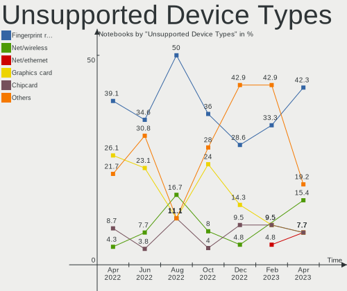

| Type                  | Notebooks | Percent |
|-----------------------|-----------|---------|
| Fingerprint reader    | 8         | 34.78%  |
| Graphics card         | 5         | 21.74%  |
| Multimedia controller | 3         | 13.04%  |
| Chipcard              | 3         | 13.04%  |
| Net/ethernet          | 1         | 4.35%   |
| Card reader           | 1         | 4.35%   |
| Camera                | 1         | 4.35%   |
| Bluetooth             | 1         | 4.35%   |

