Linux in Australia - Hardware Trends (Notebooks)
------------------------------------------------

A project to identify most popular hardware characteristics and track their change
over time based on data collected by Linux users at https://Linux-Hardware.org.

Anyone can contribute to this report by the [hw-probe](https://github.com/linuxhw/hw-probe) tool:

    sudo -E hw-probe -all -upload

Period: Apr, 2023.

Contents
--------

* [ System ](#system)
  - [ OS                       ](#os)
  - [ OS Family                ](#os-family)
  - [ Kernel                   ](#kernel)
  - [ Kernel Family            ](#kernel-family)
  - [ Kernel Major Ver.        ](#kernel-major-ver)
  - [ Arch                     ](#arch)
  - [ DE                       ](#de)
  - [ Display Server           ](#display-server)
  - [ Display Manager          ](#display-manager)
  - [ OS Lang                  ](#os-lang)
  - [ Boot Mode                ](#boot-mode)
  - [ Filesystem               ](#filesystem)
  - [ Part. scheme             ](#part-scheme)
  - [ Dual Boot with Linux/BSD ](#dual-boot-with-linuxbsd)
  - [ Dual Boot (Win)          ](#dual-boot-win)

* [ Board ](#board)
  - [ Vendor                   ](#vendor)
  - [ Model                    ](#model)
  - [ Model Family             ](#model-family)
  - [ MFG Year                 ](#mfg-year)
  - [ Form Factor              ](#form-factor)
  - [ Secure Boot              ](#secure-boot)
  - [ Coreboot                 ](#coreboot)
  - [ RAM Size                 ](#ram-size)
  - [ RAM Used                 ](#ram-used)
  - [ Total Drives             ](#total-drives)
  - [ Has CD-ROM               ](#has-cd-rom)
  - [ Has Ethernet             ](#has-ethernet)
  - [ Has WiFi                 ](#has-wifi)
  - [ Has Bluetooth            ](#has-bluetooth)

* [ Location ](#location)
  - [ Country                  ](#country)
  - [ City                     ](#city)

* [ Drives ](#drives)
  - [ Drive Vendor             ](#drive-vendor)
  - [ Drive Model              ](#drive-model)
  - [ HDD Vendor               ](#hdd-vendor)
  - [ SSD Vendor               ](#ssd-vendor)
  - [ Drive Kind               ](#drive-kind)
  - [ Drive Connector          ](#drive-connector)
  - [ Drive Size               ](#drive-size)
  - [ Space Total              ](#space-total)
  - [ Space Used               ](#space-used)
  - [ Malfunc. Drives          ](#malfunc-drives)
  - [ Malfunc. Drive Vendor    ](#malfunc-drive-vendor)
  - [ Malfunc. HDD Vendor      ](#malfunc-hdd-vendor)
  - [ Malfunc. Drive Kind      ](#malfunc-drive-kind)
  - [ Failed Drives            ](#failed-drives)
  - [ Failed Drive Vendor      ](#failed-drive-vendor)
  - [ Drive Status             ](#drive-status)

* [ Storage controller ](#storage-controller)
  - [ Storage Vendor           ](#storage-vendor)
  - [ Storage Model            ](#storage-model)
  - [ Storage Kind             ](#storage-kind)

* [ Processor ](#processor)
  - [ CPU Vendor               ](#cpu-vendor)
  - [ CPU Model                ](#cpu-model)
  - [ CPU Model Family         ](#cpu-model-family)
  - [ CPU Cores                ](#cpu-cores)
  - [ CPU Sockets              ](#cpu-sockets)
  - [ CPU Threads              ](#cpu-threads)
  - [ CPU Op-Modes             ](#cpu-op-modes)
  - [ CPU Microcode            ](#cpu-microcode)
  - [ CPU Microarch            ](#cpu-microarch)

* [ Graphics ](#graphics)
  - [ GPU Vendor               ](#gpu-vendor)
  - [ GPU Model                ](#gpu-model)
  - [ GPU Combo                ](#gpu-combo)
  - [ GPU Driver               ](#gpu-driver)
  - [ GPU Memory               ](#gpu-memory)

* [ Monitor ](#monitor)
  - [ Monitor Vendor           ](#monitor-vendor)
  - [ Monitor Model            ](#monitor-model)
  - [ Monitor Resolution       ](#monitor-resolution)
  - [ Monitor Diagonal         ](#monitor-diagonal)
  - [ Monitor Width            ](#monitor-width)
  - [ Aspect Ratio             ](#aspect-ratio)
  - [ Monitor Area             ](#monitor-area)
  - [ Pixel Density            ](#pixel-density)
  - [ Multiple Monitors        ](#multiple-monitors)

* [ Network ](#network)
  - [ Net Controller Vendor    ](#net-controller-vendor)
  - [ Net Controller Model     ](#net-controller-model)
  - [ Wireless Vendor          ](#wireless-vendor)
  - [ Wireless Model           ](#wireless-model)
  - [ Ethernet Vendor          ](#ethernet-vendor)
  - [ Ethernet Model           ](#ethernet-model)
  - [ Net Controller Kind      ](#net-controller-kind)
  - [ Used Controller          ](#used-controller)
  - [ NICs                     ](#nics)
  - [ IPv6                     ](#ipv6)

* [ Bluetooth ](#bluetooth)
  - [ Bluetooth Vendor         ](#bluetooth-vendor)
  - [ Bluetooth Model          ](#bluetooth-model)

* [ Sound ](#sound)
  - [ Sound Vendor             ](#sound-vendor)
  - [ Sound Model              ](#sound-model)

* [ Memory ](#memory)
  - [ Memory Vendor            ](#memory-vendor)
  - [ Memory Model             ](#memory-model)
  - [ Memory Kind              ](#memory-kind)
  - [ Memory Form Factor       ](#memory-form-factor)
  - [ Memory Size              ](#memory-size)
  - [ Memory Speed             ](#memory-speed)

* [ Printers & scanners ](#printers--scanners)
  - [ Printer Vendor           ](#printer-vendor)
  - [ Printer Model            ](#printer-model)
  - [ Scanner Vendor           ](#scanner-vendor)
  - [ Scanner Model            ](#scanner-model)

* [ Camera ](#camera)
  - [ Camera Vendor            ](#camera-vendor)
  - [ Camera Model             ](#camera-model)

* [ Security ](#security)
  - [ Fingerprint Vendor       ](#fingerprint-vendor)
  - [ Fingerprint Model        ](#fingerprint-model)
  - [ Chipcard Vendor          ](#chipcard-vendor)
  - [ Chipcard Model           ](#chipcard-model)

* [ Unsupported ](#unsupported)
  - [ Unsupported Devices      ](#unsupported-devices)
  - [ Unsupported Device Types ](#unsupported-device-types)

System
------

OS
--

Installed operating systems

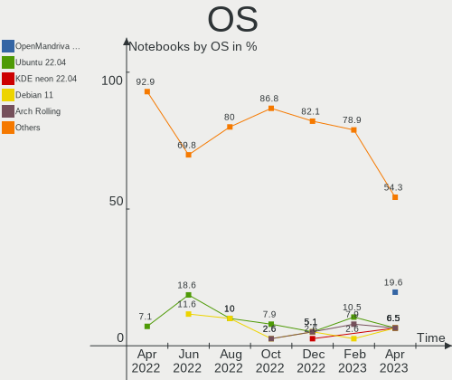

| Name                | Notebooks | Percent |
|---------------------|-----------|---------|
| OpenMandriva 23.03  | 9         | 19.57%  |
| Ubuntu 22.04        | 3         | 6.52%   |
| KDE neon 22.04      | 3         | 6.52%   |
| Debian 11           | 3         | 6.52%   |
| Arch Rolling        | 3         | 6.52%   |
| Ubuntu 23.04        | 2         | 4.35%   |
| Pop!_OS 22.04       | 2         | 4.35%   |
| Linux Mint 21.1     | 2         | 4.35%   |
| ArcoLinux Rolling   | 2         | 4.35%   |
| Zorin 16            | 1         | 2.17%   |
| Xubuntu 23.04       | 1         | 2.17%   |
| Ubuntu 22.10        | 1         | 2.17%   |
| Ubuntu 20.04        | 1         | 2.17%   |
| SteamOS 3.4.6       | 1         | 2.17%   |
| Parrot 5.2          | 1         | 2.17%   |
| OpenMandriva 4.3    | 1         | 2.17%   |
| Nobara 36           | 1         | 2.17%   |
| Lubuntu 22.04       | 1         | 2.17%   |
| Linux Mint 20.3     | 1         | 2.17%   |
| Kubuntu 23.04       | 1         | 2.17%   |
| Kali 2023.1         | 1         | 2.17%   |
| Gentoo 2.9          | 1         | 2.17%   |
| Fedora 38           | 1         | 2.17%   |
| Fedora 37           | 1         | 2.17%   |
| EndeavourOS Rolling | 1         | 2.17%   |
| Elementary 7        | 1         | 2.17%   |

OS Family
---------

OS without a version

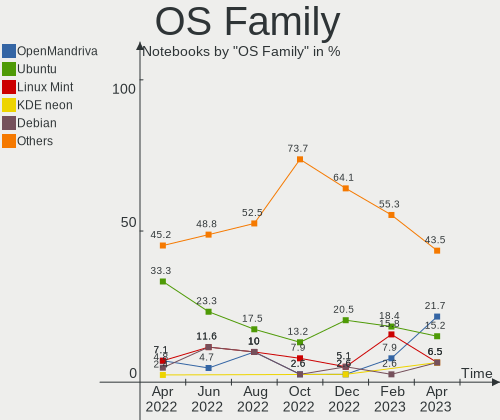

| Name         | Notebooks | Percent |
|--------------|-----------|---------|
| OpenMandriva | 10        | 21.74%  |
| Ubuntu       | 7         | 15.22%  |
| Linux Mint   | 3         | 6.52%   |
| KDE neon     | 3         | 6.52%   |
| Debian       | 3         | 6.52%   |
| Arch         | 3         | 6.52%   |
| Pop!_OS      | 2         | 4.35%   |
| Fedora       | 2         | 4.35%   |
| ArcoLinux    | 2         | 4.35%   |
| Zorin        | 1         | 2.17%   |
| Xubuntu      | 1         | 2.17%   |
| SteamOS      | 1         | 2.17%   |
| Parrot       | 1         | 2.17%   |
| Nobara       | 1         | 2.17%   |
| Lubuntu      | 1         | 2.17%   |
| Kubuntu      | 1         | 2.17%   |
| Kali         | 1         | 2.17%   |
| Gentoo       | 1         | 2.17%   |
| EndeavourOS  | 1         | 2.17%   |
| Elementary   | 1         | 2.17%   |

Kernel
------

Version of the Linux kernel

| Version                      | Notebooks | Percent |
|------------------------------|-----------|---------|
| 6.2.6-desktop-1omv2390       | 9         | 19.57%  |
| 5.19.0-38-generic            | 4         | 8.7%    |
| 5.15.0-69-generic            | 3         | 6.52%   |
| 6.2.6-76060206-generic       | 2         | 4.35%   |
| 6.2.0-20-generic             | 2         | 4.35%   |
| 5.19.0-40-generic            | 2         | 4.35%   |
| 5.10.0-20-amd64              | 2         | 4.35%   |
| 6.2.9-arch1-1                | 1         | 2.17%   |
| 6.2.9-200.fc37.x86_64        | 1         | 2.17%   |
| 6.2.2-gentoo                 | 1         | 2.17%   |
| 6.2.11-zen1-1-zen            | 1         | 2.17%   |
| 6.2.11-arch1-1               | 1         | 2.17%   |
| 6.2.11-300.fc38.x86_64       | 1         | 2.17%   |
| 6.2.10-zen1-1-zen            | 1         | 2.17%   |
| 6.2.10-arch1-1               | 1         | 2.17%   |
| 6.2.0-1002-lowlatency        | 1         | 2.17%   |
| 6.1.25-1-lts                 | 1         | 2.17%   |
| 6.1.0-kali7-amd64            | 1         | 2.17%   |
| 6.0.14-201.fsync.fc36.x86_64 | 1         | 2.17%   |
| 6.0.0-12parrot1-amd64        | 1         | 2.17%   |
| 5.4.0-122-generic            | 1         | 2.17%   |
| 5.19.0-42-generic            | 1         | 2.17%   |
| 5.16.7-desktop-1omv4003      | 1         | 2.17%   |
| 5.15.0-58-generic            | 1         | 2.17%   |
| 5.15.0-56-generic            | 1         | 2.17%   |
| 5.15.0-52-generic            | 1         | 2.17%   |
| 5.14.0-1059-oem              | 1         | 2.17%   |
| 5.13.0-valve36-1-neptune     | 1         | 2.17%   |
| 5.10.0-21-amd64              | 1         | 2.17%   |

Kernel Family
-------------

Linux kernel without a distro release

| Version | Notebooks | Percent |
|---------|-----------|---------|
| 6.2.6   | 11        | 23.91%  |
| 5.19.0  | 7         | 15.22%  |
| 5.15.0  | 6         | 13.04%  |
| 6.2.11  | 3         | 6.52%   |
| 6.2.0   | 3         | 6.52%   |
| 5.10.0  | 3         | 6.52%   |
| 6.2.9   | 2         | 4.35%   |
| 6.2.10  | 2         | 4.35%   |
| 6.2.2   | 1         | 2.17%   |
| 6.1.25  | 1         | 2.17%   |
| 6.1.0   | 1         | 2.17%   |
| 6.0.14  | 1         | 2.17%   |
| 6.0.0   | 1         | 2.17%   |
| 5.4.0   | 1         | 2.17%   |
| 5.16.7  | 1         | 2.17%   |
| 5.14.0  | 1         | 2.17%   |
| 5.13.0  | 1         | 2.17%   |

Kernel Major Ver.
-----------------

Linux kernel major version

| Version | Notebooks | Percent |
|---------|-----------|---------|
| 6.2     | 22        | 47.83%  |
| 5.19    | 7         | 15.22%  |
| 5.15    | 6         | 13.04%  |
| 5.10    | 3         | 6.52%   |
| 6.1     | 2         | 4.35%   |
| 6.0     | 2         | 4.35%   |
| 5.4     | 1         | 2.17%   |
| 5.16    | 1         | 2.17%   |
| 5.14    | 1         | 2.17%   |
| 5.13    | 1         | 2.17%   |

Arch
----

OS architecture (x86_64, i586, etc.)

| Name   | Notebooks | Percent |
|--------|-----------|---------|
| x86_64 | 46        | 100%    |

DE
--

Desktop Environment

| Name         | Notebooks | Percent |
|--------------|-----------|---------|
| KDE5         | 17        | 36.96%  |
| GNOME        | 13        | 28.26%  |
| XFCE         | 3         | 6.52%   |
| X-Cinnamon   | 2         | 4.35%   |
| Cinnamon     | 2         | 4.35%   |
| BunsenLabs   | 2         | 4.35%   |
| Pantheon     | 1         | 2.17%   |
| MATE         | 1         | 2.17%   |
| LXQt         | 1         | 2.17%   |
| i3           | 1         | 2.17%   |
| Hyprland     | 1         | 2.17%   |
| herbstluftwm | 1         | 2.17%   |
| Unknown      | 1         | 2.17%   |

Display Server
--------------

X11 or Wayland

| Name    | Notebooks | Percent |
|---------|-----------|---------|
| X11     | 38        | 82.61%  |
| Wayland | 8         | 17.39%  |

Display Manager
---------------

SDDM, LightDM, etc.

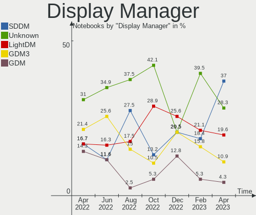

| Name    | Notebooks | Percent |
|---------|-----------|---------|
| SDDM    | 17        | 36.96%  |
| Unknown | 13        | 28.26%  |
| LightDM | 9         | 19.57%  |
| GDM3    | 5         | 10.87%  |
| GDM     | 2         | 4.35%   |

OS Lang
-------

Language

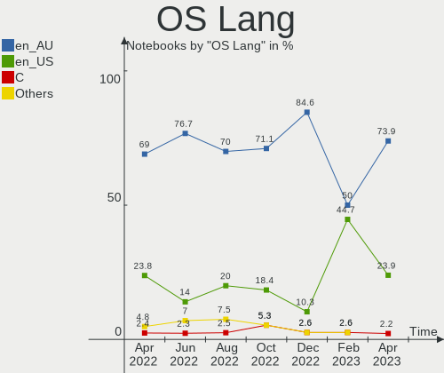

| Lang  | Notebooks | Percent |
|-------|-----------|---------|
| en_AU | 34        | 73.91%  |
| en_US | 11        | 23.91%  |
| C     | 1         | 2.17%   |

Boot Mode
---------

EFI or BIOS

| Mode | Notebooks | Percent |
|------|-----------|---------|
| BIOS | 23        | 50%     |
| EFI  | 23        | 50%     |

Filesystem
----------

Type of filesystem

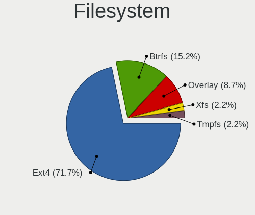

| Type    | Notebooks | Percent |
|---------|-----------|---------|
| Ext4    | 33        | 71.74%  |
| Btrfs   | 7         | 15.22%  |
| Overlay | 4         | 8.7%    |
| Xfs     | 1         | 2.17%   |
| Tmpfs   | 1         | 2.17%   |

Part. scheme
------------

Scheme of partitioning

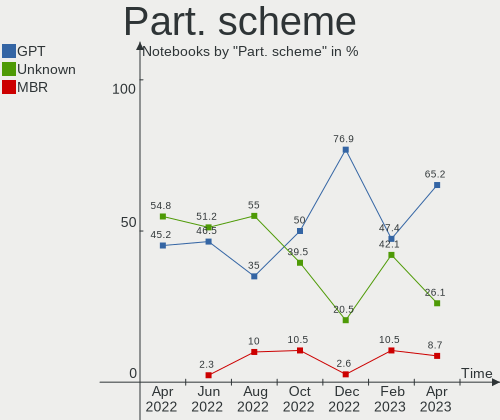

| Type    | Notebooks | Percent |
|---------|-----------|---------|
| GPT     | 30        | 65.22%  |
| Unknown | 12        | 26.09%  |
| MBR     | 4         | 8.7%    |

Dual Boot with Linux/BSD
------------------------

Hosting more than one Linux/BSD

| Dual boot | Notebooks | Percent |
|-----------|-----------|---------|
| No        | 39        | 84.78%  |
| Yes       | 7         | 15.22%  |

Dual Boot (Win)
---------------

Hosting Linux and Windows

| Dual boot | Notebooks | Percent |
|-----------|-----------|---------|
| No        | 36        | 78.26%  |
| Yes       | 10        | 21.74%  |

Board
-----

Vendor
------

Motherboard manufacturer

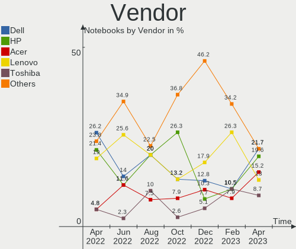

| Name             | Notebooks | Percent |
|------------------|-----------|---------|
| Dell             | 10        | 21.74%  |
| Hewlett-Packard  | 9         | 19.57%  |
| Acer             | 7         | 15.22%  |
| Lenovo           | 6         | 13.04%  |
| Toshiba          | 4         | 8.7%    |
| Apple            | 4         | 8.7%    |
| ASUSTek Computer | 3         | 6.52%   |
| Valve            | 1         | 2.17%   |
| MSI              | 1         | 2.17%   |
| HUAWEI           | 1         | 2.17%   |

Model
-----

Motherboard model

| Name                                        | Notebooks | Percent |
|---------------------------------------------|-----------|---------|
| HP Pavilion dv6                             | 2         | 4.35%   |
| HP Laptop 15s-eq2xxx                        | 2         | 4.35%   |
| Valve Jupiter                               | 1         | 2.17%   |
| Toshiba Satellite P70-A                     | 1         | 2.17%   |
| Toshiba Satellite L850                      | 1         | 2.17%   |
| Toshiba Satellite E45-B                     | 1         | 2.17%   |
| Toshiba QOSMIO F750                         | 1         | 2.17%   |
| MSI GE72VR 6RF                              | 1         | 2.17%   |
| Lenovo ThinkPad X1 Carbon Gen 10 21CBCTO1WW | 1         | 2.17%   |
| Lenovo ThinkPad T410 2522PT3                | 1         | 2.17%   |
| Lenovo ThinkPad E460 20ETA05KAU             | 1         | 2.17%   |
| Lenovo ThinkPad E14 Gen 2 20TA00JLAU        | 1         | 2.17%   |
| Lenovo ThinkBook 13s G2 ITL 20V9            | 1         | 2.17%   |
| Lenovo IdeaPad 110S-11IBR 80WG              | 1         | 2.17%   |
| HUAWEI MACHD-WXX9                           | 1         | 2.17%   |
| HP ZBook 17 G2                              | 1         | 2.17%   |
| HP Stream Laptop 11-ak0xxx                  | 1         | 2.17%   |
| HP ProBook 650 G2                           | 1         | 2.17%   |
| HP Notebook                                 | 1         | 2.17%   |
| HP EliteBook Folio 1040 G3                  | 1         | 2.17%   |
| Dell XPS 15 9570                            | 1         | 2.17%   |
| Dell Vostro 7590                            | 1         | 2.17%   |
| Dell System XPS L702X                       | 1         | 2.17%   |
| Dell Precision 5520                         | 1         | 2.17%   |
| Dell Latitude E6540                         | 1         | 2.17%   |
| Dell Latitude E5470                         | 1         | 2.17%   |
| Dell Latitude 5420                          | 1         | 2.17%   |
| Dell Inspiron 5548                          | 1         | 2.17%   |
| Dell Inspiron 1720                          | 1         | 2.17%   |
| Dell Inspiron 13-5378                       | 1         | 2.17%   |
| ASUS X550CA                                 | 1         | 2.17%   |
| ASUS X501A1                                 | 1         | 2.17%   |
| ASUS VivoBook 15_ASUS Laptop X507UAR        | 1         | 2.17%   |
| Apple MacBookPro8,1                         | 1         | 2.17%   |
| Apple MacBookPro7,1                         | 1         | 2.17%   |
| Apple MacBookPro10,1                        | 1         | 2.17%   |
| Apple MacBookAir7,2                         | 1         | 2.17%   |
| Acer TravelMate 8572T                       | 1         | 2.17%   |
| Acer TM6495T                                | 1         | 2.17%   |
| Acer Predator G9-793                        | 1         | 2.17%   |

Model Family
------------

Motherboard model prefix

| Name               | Notebooks | Percent |
|--------------------|-----------|---------|
| Lenovo ThinkPad    | 4         | 8.7%    |
| Toshiba Satellite  | 3         | 6.52%   |
| Dell Latitude      | 3         | 6.52%   |
| Dell Inspiron      | 3         | 6.52%   |
| HP Pavilion        | 2         | 4.35%   |
| HP Laptop          | 2         | 4.35%   |
| Acer Aspire        | 2         | 4.35%   |
| Valve Jupiter      | 1         | 2.17%   |
| Toshiba QOSMIO     | 1         | 2.17%   |
| MSI GE72VR         | 1         | 2.17%   |
| Lenovo ThinkBook   | 1         | 2.17%   |
| Lenovo IdeaPad     | 1         | 2.17%   |
| HUAWEI MACHD-WXX9  | 1         | 2.17%   |
| HP ZBook           | 1         | 2.17%   |
| HP Stream          | 1         | 2.17%   |
| HP ProBook         | 1         | 2.17%   |
| HP Notebook        | 1         | 2.17%   |
| HP EliteBook       | 1         | 2.17%   |
| Dell XPS           | 1         | 2.17%   |
| Dell Vostro        | 1         | 2.17%   |
| Dell System        | 1         | 2.17%   |
| Dell Precision     | 1         | 2.17%   |
| ASUS X550CA        | 1         | 2.17%   |
| ASUS X501A1        | 1         | 2.17%   |
| ASUS VivoBook      | 1         | 2.17%   |
| Apple MacBookPro8  | 1         | 2.17%   |
| Apple MacBookPro7  | 1         | 2.17%   |
| Apple MacBookPro10 | 1         | 2.17%   |
| Apple MacBookAir7  | 1         | 2.17%   |
| Acer TravelMate    | 1         | 2.17%   |
| Acer TM6495T       | 1         | 2.17%   |
| Acer Predator      | 1         | 2.17%   |
| Acer E5-551G-871W  | 1         | 2.17%   |
| Acer ConceptD      | 1         | 2.17%   |

MFG Year
--------

Motherboard manufacture year

| Year | Notebooks | Percent |
|------|-----------|---------|
| 2016 | 6         | 13.04%  |
| 2011 | 6         | 13.04%  |
| 2020 | 5         | 10.87%  |
| 2015 | 4         | 8.7%    |
| 2021 | 3         | 6.52%   |
| 2014 | 3         | 6.52%   |
| 2013 | 3         | 6.52%   |
| 2012 | 3         | 6.52%   |
| 2019 | 2         | 4.35%   |
| 2018 | 2         | 4.35%   |
| 2010 | 2         | 4.35%   |
| 2008 | 2         | 4.35%   |
| 2007 | 2         | 4.35%   |
| 2022 | 1         | 2.17%   |
| 2017 | 1         | 2.17%   |
| 2009 | 1         | 2.17%   |

Form Factor
-----------

Physical design of the computer

| Name     | Notebooks | Percent |
|----------|-----------|---------|
| Notebook | 46        | 100%    |

Secure Boot
-----------

Enabled or disabled

| State    | Notebooks | Percent |
|----------|-----------|---------|
| Disabled | 46        | 100%    |

Coreboot
--------

Have coreboot on board

| Used | Notebooks | Percent |
|------|-----------|---------|
| No   | 46        | 100%    |

RAM Size
--------

Total RAM memory

| Size in GB | Notebooks | Percent |
|------------|-----------|---------|
| 4.01-8.0   | 18        | 39.13%  |
| 16.01-24.0 | 9         | 19.57%  |
| 8.01-16.0  | 8         | 17.39%  |
| 32.01-64.0 | 5         | 10.87%  |
| 3.01-4.0   | 4         | 8.7%    |
| 2.01-3.0   | 1         | 2.17%   |
| 1.01-2.0   | 1         | 2.17%   |

RAM Used
--------

Used RAM memory

| Used GB   | Notebooks | Percent |
|-----------|-----------|---------|
| 1.01-2.0  | 21        | 45.65%  |
| 4.01-8.0  | 9         | 19.57%  |
| 2.01-3.0  | 9         | 19.57%  |
| 3.01-4.0  | 5         | 10.87%  |
| 8.01-16.0 | 2         | 4.35%   |

Total Drives
------------

Number of drives on board

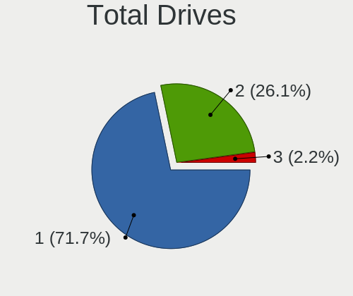

| Drives | Notebooks | Percent |
|--------|-----------|---------|
| 1      | 33        | 71.74%  |
| 2      | 12        | 26.09%  |
| 3      | 1         | 2.17%   |

Has CD-ROM
----------

Has CD-ROM on board

| Presented | Notebooks | Percent |
|-----------|-----------|---------|
| No        | 28        | 60.87%  |
| Yes       | 18        | 39.13%  |

Has Ethernet
------------

Has Ethernet on board

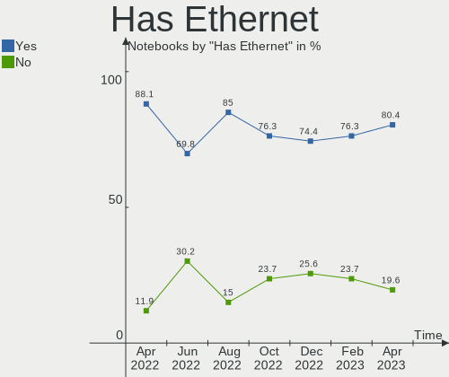

| Presented | Notebooks | Percent |
|-----------|-----------|---------|
| Yes       | 37        | 80.43%  |
| No        | 9         | 19.57%  |

Has WiFi
--------

Has WiFi module

| Presented | Notebooks | Percent |
|-----------|-----------|---------|
| Yes       | 46        | 100%    |

Has Bluetooth
-------------

Has Bluetooth module

| Presented | Notebooks | Percent |
|-----------|-----------|---------|
| Yes       | 42        | 91.3%   |
| No        | 4         | 8.7%    |

Location
--------

Country
-------

Geographic location (country)

| Country   | Notebooks | Percent |
|-----------|-----------|---------|
| Australia | 46        | 100%    |

City
----

Geographic location (city)

| City           | Notebooks | Percent |
|----------------|-----------|---------|
| Melbourne      | 15        | 32.61%  |
| Sydney         | 9         | 19.57%  |
| Brisbane       | 6         | 13.04%  |
| Perth          | 4         | 8.7%    |
| Adelaide       | 2         | 4.35%   |
| Sunshine Coast | 1         | 2.17%   |
| Newcastle      | 1         | 2.17%   |
| Macquarie Park | 1         | 2.17%   |
| Leinster       | 1         | 2.17%   |
| Hobart         | 1         | 2.17%   |
| Geelong        | 1         | 2.17%   |
| Dorrigo        | 1         | 2.17%   |
| Central Coast  | 1         | 2.17%   |
| Canberra       | 1         | 2.17%   |
| Ballarat       | 1         | 2.17%   |

Drives
------

Drive Vendor
------------

Hard drive vendors

| Vendor                    | Notebooks | Drives | Percent |
|---------------------------|-----------|--------|---------|
| Samsung Electronics       | 12        | 12     | 20.69%  |
| SK hynix                  | 6         | 6      | 10.34%  |
| SanDisk                   | 5         | 5      | 8.62%   |
| Unknown                   | 4         | 4      | 6.9%    |
| Seagate                   | 4         | 4      | 6.9%    |
| HGST                      | 4         | 4      | 6.9%    |
| WDC                       | 3         | 3      | 5.17%   |
| Intel                     | 3         | 3      | 5.17%   |
| Toshiba                   | 2         | 2      | 3.45%   |
| Hitachi                   | 2         | 2      | 3.45%   |
| Crucial                   | 2         | 2      | 3.45%   |
| Apple                     | 2         | 2      | 3.45%   |
| Transcend                 | 1         | 1      | 1.72%   |
| Phison Electronics        | 1         | 1      | 1.72%   |
| OWC                       | 1         | 1      | 1.72%   |
| Micron/Crucial Technology | 1         | 1      | 1.72%   |
| LITEON                    | 1         | 1      | 1.72%   |
| Kingston                  | 1         | 1      | 1.72%   |
| Gigabyte Technology       | 1         | 1      | 1.72%   |
| G-TECH                    | 1         | 1      | 1.72%   |
| A-DATA Technology         | 1         | 1      | 1.72%   |

Drive Model
-----------

Hard drive models

| Model                                                 | Notebooks | Percent |
|-------------------------------------------------------|-----------|---------|
| Samsung NVMe SSD Controller SM981/PM981/PM983 1TB     | 2         | 3.45%   |
| Intel SSDPEKNU512GZH 512GB                            | 2         | 3.45%   |
| HGST HTS721010A9E630 1TB                              | 2         | 3.45%   |
| WDC WD5000LPLX-08ZNTT0 500GB                          | 1         | 1.72%   |
| WDC WD3200BEVT-75ZCT0 320GB                           | 1         | 1.72%   |
| WDC WD10JPVX-75JC3T0 1TB                              | 1         | 1.72%   |
| Unknown MMC32G  32GB                                  | 1         | 1.72%   |
| Unknown MMC Card  7GB                                 | 1         | 1.72%   |
| Unknown MMC Card  64GB                                | 1         | 1.72%   |
| Unknown MMC Card  256GB                               | 1         | 1.72%   |
| Transcend TS256GSSD230S 256GB                         | 1         | 1.72%   |
| Toshiba MQ01ABD100 1TB                                | 1         | 1.72%   |
| Toshiba MQ01ABD050 500GB                              | 1         | 1.72%   |
| SK hynix SKHynix_HFM512GD3HX015N 512GB                | 1         | 1.72%   |
| SK hynix SC308 SATA 256GB SSD                         | 1         | 1.72%   |
| SK hynix SC210 mSATA 128GB SSD                        | 1         | 1.72%   |
| SK hynix SC210 2.5 7MM 128GB SSD                      | 1         | 1.72%   |
| SK hynix PC711 NVMe 512GB                             | 1         | 1.72%   |
| SK hynix HFS256G39MND-3510A 256GB SSD                 | 1         | 1.72%   |
| Seagate ST9750420AS 752GB                             | 1         | 1.72%   |
| Seagate ST2000LM007-1R8174 2TB                        | 1         | 1.72%   |
| Seagate ST1000LM024 HN-M101MBB 1TB                    | 1         | 1.72%   |
| Seagate Expansion 4TB                                 | 1         | 1.72%   |
| Sandisk WD Black 2018/SN750 / PC SN720 NVMe SSD 500GB | 1         | 1.72%   |
| SanDisk SSD PLUS 240 GB                               | 1         | 1.72%   |
| SanDisk SD9SN8W256G1102 256GB SSD                     | 1         | 1.72%   |
| SanDisk SD7SN6S-256G-1006 256GB SSD                   | 1         | 1.72%   |
| SanDisk SD7SB2Q-512G-1006 512GB SSD                   | 1         | 1.72%   |
| Samsung SSD PM830 2.5 7mm 256GB                       | 1         | 1.72%   |
| Samsung SSD 870 EVO 500GB                             | 1         | 1.72%   |
| Samsung SSD 860 EVO 500GB                             | 1         | 1.72%   |
| Samsung SSD 850 EVO 500GB                             | 1         | 1.72%   |
| Samsung NVMe SSD Controller SM961/PM961/SM963 500GB   | 1         | 1.72%   |
| Samsung MZVL2512HCJQ-00BL7 512GB                      | 1         | 1.72%   |
| Samsung MZNLN256HCHP-000H1 256GB SSD                  | 1         | 1.72%   |
| Samsung MZALQ512HALU-000L2 512GB                      | 1         | 1.72%   |
| Samsung MZ9LQ256HBJD-00BVL 256GB                      | 1         | 1.72%   |
| Samsung MZ7TY256HDHP-000L7 256GB SSD                  | 1         | 1.72%   |
| Phison PS5013 E13 NVMe Controller 500GB               | 1         | 1.72%   |
| OWC Mercury Electra 3G SSD                            | 1         | 1.72%   |

HDD Vendor
----------

Hard disk drive vendors

| Vendor  | Notebooks | Drives | Percent |
|---------|-----------|--------|---------|
| Seagate | 4         | 4      | 26.67%  |
| HGST    | 4         | 4      | 26.67%  |
| WDC     | 3         | 3      | 20%     |
| Toshiba | 2         | 2      | 13.33%  |
| Hitachi | 2         | 2      | 13.33%  |

SSD Vendor
----------

Solid state drive vendors

| Vendor              | Notebooks | Drives | Percent |
|---------------------|-----------|--------|---------|
| Samsung Electronics | 6         | 6      | 26.09%  |
| SK hynix            | 4         | 4      | 17.39%  |
| SanDisk             | 4         | 4      | 17.39%  |
| Crucial             | 2         | 2      | 8.7%    |
| Apple               | 2         | 2      | 8.7%    |
| Transcend           | 1         | 1      | 4.35%   |
| OWC                 | 1         | 1      | 4.35%   |
| LITEON              | 1         | 1      | 4.35%   |
| Intel               | 1         | 1      | 4.35%   |
| Gigabyte Technology | 1         | 1      | 4.35%   |

Drive Kind
----------

HDD or SSD

| Kind    | Notebooks | Drives | Percent |
|---------|-----------|--------|---------|
| SSD     | 22        | 23     | 40%     |
| HDD     | 15        | 15     | 27.27%  |
| NVMe    | 13        | 15     | 23.64%  |
| MMC     | 4         | 4      | 7.27%   |
| Unknown | 1         | 1      | 1.82%   |

Drive Connector
---------------

SATA, SAS, NVMe, etc.

| Type | Notebooks | Drives | Percent |
|------|-----------|--------|---------|
| SATA | 32        | 37     | 62.75%  |
| NVMe | 13        | 15     | 25.49%  |
| MMC  | 4         | 4      | 7.84%   |
| SAS  | 2         | 2      | 3.92%   |

Drive Size
----------

Size of hard drive

| Size in TB | Notebooks | Drives | Percent |
|------------|-----------|--------|---------|
| 0.01-0.5   | 22        | 23     | 61.11%  |
| 0.51-1.0   | 12        | 13     | 33.33%  |
| 3.01-4.0   | 1         | 1      | 2.78%   |
| 1.01-2.0   | 1         | 1      | 2.78%   |

Space Total
-----------

Amount of disk space available on the file system

| Size in GB     | Notebooks | Percent |
|----------------|-----------|---------|
| 251-500        | 11        | 23.91%  |
| 101-250        | 10        | 21.74%  |
| 501-1000       | 7         | 15.22%  |
| 1001-2000      | 5         | 10.87%  |
| 51-100         | 5         | 10.87%  |
| More than 3000 | 3         | 6.52%   |
| 21-50          | 2         | 4.35%   |
| 2001-3000      | 2         | 4.35%   |
| Unknown        | 1         | 2.17%   |

Space Used
----------

Amount of used disk space

| Used GB   | Notebooks | Percent |
|-----------|-----------|---------|
| 1-20      | 18        | 39.13%  |
| 51-100    | 11        | 23.91%  |
| 21-50     | 5         | 10.87%  |
| 101-250   | 4         | 8.7%    |
| 251-500   | 3         | 6.52%   |
| 1001-2000 | 2         | 4.35%   |
| 2001-3000 | 1         | 2.17%   |
| 501-1000  | 1         | 2.17%   |
| Unknown   | 1         | 2.17%   |

Malfunc. Drives
---------------

Drive models with a malfunction

| Model                         | Notebooks | Drives | Percent |
|-------------------------------|-----------|--------|---------|
| WDC WD3200BEVT-75ZCT0 320GB   | 1         | 1      | 10%     |
| Transcend TS256GSSD230S 256GB | 1         | 1      | 10%     |
| Toshiba MQ01ABD100 1TB        | 1         | 1      | 10%     |
| Toshiba MQ01ABD050 500GB      | 1         | 1      | 10%     |
| SK hynix SC308 SATA 256GB SSD | 1         | 1      | 10%     |
| SanDisk SSD PLUS 240 GB       | 1         | 1      | 10%     |
| Hitachi HTS547564A9E384 640GB | 1         | 1      | 10%     |
| Hitachi HTS541010A9E680 1TB   | 1         | 1      | 10%     |
| HGST HTS545050A7E680 500GB    | 1         | 1      | 10%     |
| HGST HTS541010A9E680 1TB      | 1         | 1      | 10%     |

Malfunc. Drive Vendor
---------------------

Vendors of faulty drives

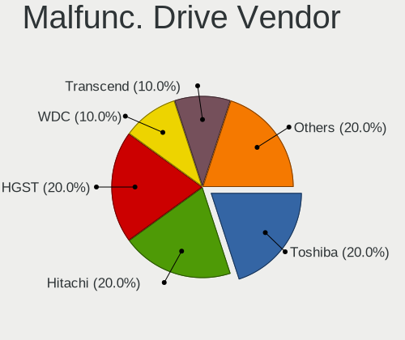

| Vendor    | Notebooks | Drives | Percent |
|-----------|-----------|--------|---------|
| Toshiba   | 2         | 2      | 20%     |
| Hitachi   | 2         | 2      | 20%     |
| HGST      | 2         | 2      | 20%     |
| WDC       | 1         | 1      | 10%     |
| Transcend | 1         | 1      | 10%     |
| SK hynix  | 1         | 1      | 10%     |
| SanDisk   | 1         | 1      | 10%     |

Malfunc. HDD Vendor
-------------------

Vendors of faulty HDD drives

| Vendor  | Notebooks | Drives | Percent |
|---------|-----------|--------|---------|
| Toshiba | 2         | 2      | 28.57%  |
| Hitachi | 2         | 2      | 28.57%  |
| HGST    | 2         | 2      | 28.57%  |
| WDC     | 1         | 1      | 14.29%  |

Malfunc. Drive Kind
-------------------

Kinds of faulty drives

| Kind | Notebooks | Drives | Percent |
|------|-----------|--------|---------|
| HDD  | 7         | 7      | 70%     |
| SSD  | 3         | 3      | 30%     |

Failed Drives
-------------

Failed drive models

Zero info for selected period =(

Failed Drive Vendor
-------------------

Failed drive vendors

Zero info for selected period =(

Drive Status
------------

Number of failed and malfunc. drives

| Status   | Notebooks | Drives | Percent |
|----------|-----------|--------|---------|
| Works    | 22        | 26     | 46.81%  |
| Detected | 15        | 22     | 31.91%  |
| Malfunc  | 10        | 10     | 21.28%  |

Storage controller
------------------

Storage Vendor
--------------

Storage controller vendors

| Vendor                      | Notebooks | Percent |
|-----------------------------|-----------|---------|
| Intel                       | 37        | 69.81%  |
| Samsung Electronics         | 7         | 13.21%  |
| SK hynix                    | 2         | 3.77%   |
| SanDisk                     | 1         | 1.89%   |
| Phison Electronics          | 1         | 1.89%   |
| Nvidia                      | 1         | 1.89%   |
| Micron/Crucial Technology   | 1         | 1.89%   |
| Kingston Technology Company | 1         | 1.89%   |
| AMD                         | 1         | 1.89%   |
| ADATA Technology            | 1         | 1.89%   |

Storage Model
-------------

Storage controller models

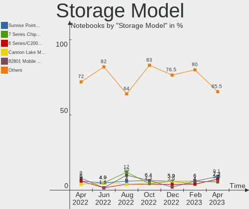

| Model                                                                            | Notebooks | Percent |
|----------------------------------------------------------------------------------|-----------|---------|
| Intel Sunrise Point-LP SATA Controller [AHCI mode]                               | 5         | 9.09%   |
| Intel 7 Series Chipset Family 6-port SATA Controller [AHCI mode]                 | 4         | 7.27%   |
| Intel 6 Series/C200 Series Chipset Family 6 port Mobile SATA AHCI Controller     | 4         | 7.27%   |
| Intel Cannon Lake Mobile PCH SATA AHCI Controller                                | 3         | 5.45%   |
| Intel 82801 Mobile SATA Controller [RAID mode]                                   | 3         | 5.45%   |
| Intel 8 Series/C220 Series Chipset Family 6-port SATA Controller 1 [AHCI mode]   | 3         | 5.45%   |
| Intel 5 Series/3400 Series Chipset 4 port SATA AHCI Controller                   | 3         | 5.45%   |
| SK hynix Gold P31/PC711 NVMe Solid State Drive                                   | 2         | 3.64%   |
| Samsung NVMe SSD Controller SM981/PM981/PM983                                    | 2         | 3.64%   |
| Samsung NVMe SSD Controller 980                                                  | 2         | 3.64%   |
| Intel Wildcat Point-LP SATA Controller [AHCI Mode]                               | 2         | 3.64%   |
| Intel Q170/Q150/B150/H170/H110/Z170/CM236 Chipset SATA Controller [AHCI Mode]    | 2         | 3.64%   |
| Intel Non-Volatile memory controller                                             | 2         | 3.64%   |
| Intel 82801HM/HEM (ICH8M/ICH8M-E) SATA Controller [AHCI mode]                    | 2         | 3.64%   |
| Intel 82801HM/HEM (ICH8M/ICH8M-E) IDE Controller                                 | 2         | 3.64%   |
| SanDisk WD Black 2018/SN750 / PC SN720 NVMe SSD                                  | 1         | 1.82%   |
| Samsung NVMe SSD Controller SM961/PM961/SM963                                    | 1         | 1.82%   |
| Samsung NVMe SSD Controller PM9A1/PM9A3/980PRO                                   | 1         | 1.82%   |
| Samsung Electronics SATA controller                                              | 1         | 1.82%   |
| Phison PS5013 E13 NVMe Controller                                                | 1         | 1.82%   |
| Nvidia MCP89 SATA Controller (AHCI mode)                                         | 1         | 1.82%   |
| Micron/Crucial NVMe Storage Controller                                           | 1         | 1.82%   |
| Kingston Company NVMe Controller                                                 | 1         | 1.82%   |
| Intel Volume Management Device NVMe RAID Controller                              | 1         | 1.82%   |
| Intel HM170/QM170 Chipset SATA Controller [AHCI Mode]                            | 1         | 1.82%   |
| Intel Atom/Celeron/Pentium Processor x5-E8000/J3xxx/N3xxx Series SATA Controller | 1         | 1.82%   |
| Intel 5 Series/3400 Series Chipset 6 port SATA AHCI Controller                   | 1         | 1.82%   |
| AMD FCH SATA Controller [AHCI mode]                                              | 1         | 1.82%   |
| ADATA XPG SX8200 Pro PCIe Gen3x4 M.2 2280 Solid State Drive                      | 1         | 1.82%   |

Storage Kind
------------

Kind of storage controller (IDE, SATA, NVMe, SAS, ...)

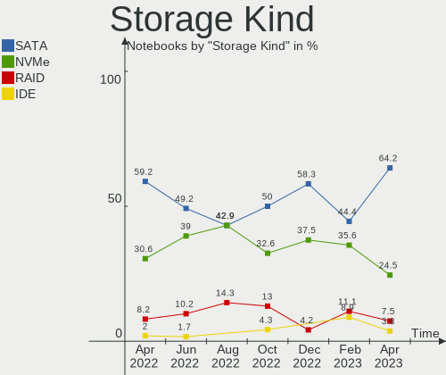

| Kind | Notebooks | Percent |
|------|-----------|---------|
| SATA | 34        | 64.15%  |
| NVMe | 13        | 24.53%  |
| RAID | 4         | 7.55%   |
| IDE  | 2         | 3.77%   |

Processor
---------

CPU Vendor
----------

Processor vendors

| Vendor | Notebooks | Percent |
|--------|-----------|---------|
| Intel  | 42        | 91.3%   |
| AMD    | 4         | 8.7%    |

CPU Model
---------

Processor models

| Model                                        | Notebooks | Percent |
|----------------------------------------------|-----------|---------|
| Intel Core i7-9750H CPU @ 2.60GHz            | 2         | 4.35%   |
| Intel Core i7-2670QM CPU @ 2.20GHz           | 2         | 4.35%   |
| Intel Core i5-6300U CPU @ 2.40GHz            | 2         | 4.35%   |
| Intel Core i5-5200U CPU @ 2.20GHz            | 2         | 4.35%   |
| Intel Core i5 CPU M 540 @ 2.53GHz            | 2         | 4.35%   |
| Intel 11th Gen Core i7-1165G7 @ 2.80GHz      | 2         | 4.35%   |
| Intel 11th Gen Core i5-1135G7 @ 2.40GHz      | 2         | 4.35%   |
| AMD Ryzen 5 5500U with Radeon Graphics       | 2         | 4.35%   |
| Intel Pentium Dual CPU T2330 @ 1.60GHz       | 1         | 2.17%   |
| Intel Pentium CPU P6200 @ 2.13GHz            | 1         | 2.17%   |
| Intel Pentium CPU 2020M @ 2.40GHz            | 1         | 2.17%   |
| Intel Core i7-8750H CPU @ 2.20GHz            | 1         | 2.17%   |
| Intel Core i7-7820HQ CPU @ 2.90GHz           | 1         | 2.17%   |
| Intel Core i7-7700HQ CPU @ 2.80GHz           | 1         | 2.17%   |
| Intel Core i7-7500U CPU @ 2.70GHz            | 1         | 2.17%   |
| Intel Core i7-6700HQ CPU @ 2.60GHz           | 1         | 2.17%   |
| Intel Core i7-6500U CPU @ 2.50GHz            | 1         | 2.17%   |
| Intel Core i7-4810MQ CPU @ 2.80GHz           | 1         | 2.17%   |
| Intel Core i7-4710MQ CPU @ 2.50GHz           | 1         | 2.17%   |
| Intel Core i7-4700MQ CPU @ 2.40GHz           | 1         | 2.17%   |
| Intel Core i7-3720QM CPU @ 2.60GHz           | 1         | 2.17%   |
| Intel Core i7-3610QM CPU @ 2.30GHz           | 1         | 2.17%   |
| Intel Core i7-2620M CPU @ 2.70GHz            | 1         | 2.17%   |
| Intel Core i5-8250U CPU @ 1.60GHz            | 1         | 2.17%   |
| Intel Core i5-6300HQ CPU @ 2.30GHz           | 1         | 2.17%   |
| Intel Core i5-6200U CPU @ 2.30GHz            | 1         | 2.17%   |
| Intel Core i5-5250U CPU @ 1.60GHz            | 1         | 2.17%   |
| Intel Core i5-3210M CPU @ 2.50GHz            | 1         | 2.17%   |
| Intel Core i5-2520M CPU @ 2.50GHz            | 1         | 2.17%   |
| Intel Core i5 CPU M 460 @ 2.53GHz            | 1         | 2.17%   |
| Intel Core i3-3217U CPU @ 1.80GHz            | 1         | 2.17%   |
| Intel Core 2 Duo CPU T8300 @ 2.40GHz         | 1         | 2.17%   |
| Intel Core 2 Duo CPU P8600 @ 2.40GHz         | 1         | 2.17%   |
| Intel Celeron N4000 CPU @ 1.10GHz            | 1         | 2.17%   |
| Intel Celeron CPU N3060 @ 1.60GHz            | 1         | 2.17%   |
| Intel 12th Gen Core i7-1260P                 | 1         | 2.17%   |
| AMD Custom APU 0405                          | 1         | 2.17%   |
| AMD A8-7100 Radeon R5, 8 Compute Cores 4C+4G | 1         | 2.17%   |

CPU Model Family
----------------

Processor model prefix

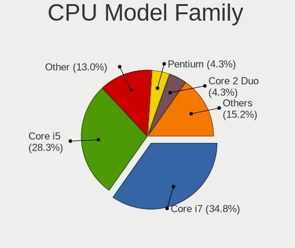

| Model              | Notebooks | Percent |
|--------------------|-----------|---------|
| Intel Core i7      | 16        | 34.78%  |
| Intel Core i5      | 13        | 28.26%  |
| Other              | 6         | 13.04%  |
| Intel Pentium      | 2         | 4.35%   |
| Intel Core 2 Duo   | 2         | 4.35%   |
| Intel Celeron      | 2         | 4.35%   |
| AMD Ryzen 5        | 2         | 4.35%   |
| Intel Pentium Dual | 1         | 2.17%   |
| Intel Core i3      | 1         | 2.17%   |
| AMD A8             | 1         | 2.17%   |

CPU Cores
---------

Number of processor cores

| Number | Notebooks | Percent |
|--------|-----------|---------|
| 2      | 23        | 50%     |
| 4      | 17        | 36.96%  |
| 6      | 5         | 10.87%  |
| 12     | 1         | 2.17%   |

CPU Sockets
-----------

Number of sockets

| Number | Notebooks | Percent |
|--------|-----------|---------|
| 1      | 46        | 100%    |

CPU Threads
-----------

Threads per core (Hyper-Threading)

| Number | Notebooks | Percent |
|--------|-----------|---------|
| 2      | 37        | 80.43%  |
| 1      | 9         | 19.57%  |

CPU Op-Modes
------------

CPU Operation Modes (32-bit, 64-bit)

| Op mode        | Notebooks | Percent |
|----------------|-----------|---------|
| 32-bit, 64-bit | 46        | 100%    |

CPU Microcode
-------------

Microcode number

| Number     | Notebooks | Percent |
|------------|-----------|---------|
| Unknown    | 31        | 67.39%  |
| 0x406e3    | 2         | 4.35%   |
| 0x306d4    | 2         | 4.35%   |
| 0x206a7    | 2         | 4.35%   |
| 0x08608104 | 2         | 4.35%   |
| 0x906a3    | 1         | 2.17%   |
| 0x806e9    | 1         | 2.17%   |
| 0x6fd      | 1         | 2.17%   |
| 0x506e3    | 1         | 2.17%   |
| 0x406c4    | 1         | 2.17%   |
| 0x306c3    | 1         | 2.17%   |
| 0x1067a    | 1         | 2.17%   |

CPU Microarch
-------------

Microarchitecture

| Name             | Notebooks | Percent |
|------------------|-----------|---------|
| KabyLake         | 7         | 15.22%  |
| Skylake          | 6         | 13.04%  |
| IvyBridge        | 5         | 10.87%  |
| Westmere         | 4         | 8.7%    |
| TigerLake        | 4         | 8.7%    |
| SandyBridge      | 4         | 8.7%    |
| Haswell          | 3         | 6.52%   |
| Broadwell        | 3         | 6.52%   |
| Unknown          | 3         | 6.52%   |
| Penryn           | 2         | 4.35%   |
| Steamroller      | 1         | 2.17%   |
| Silvermont       | 1         | 2.17%   |
| Goldmont plus    | 1         | 2.17%   |
| Core             | 1         | 2.17%   |
| Alderlake Hybrid | 1         | 2.17%   |

Graphics
--------

GPU Vendor
----------

Vendors of graphics cards

| Vendor | Notebooks | Percent |
|--------|-----------|---------|
| Intel  | 38        | 62.3%   |
| Nvidia | 14        | 22.95%  |
| AMD    | 9         | 14.75%  |

GPU Model
---------

Graphics card models

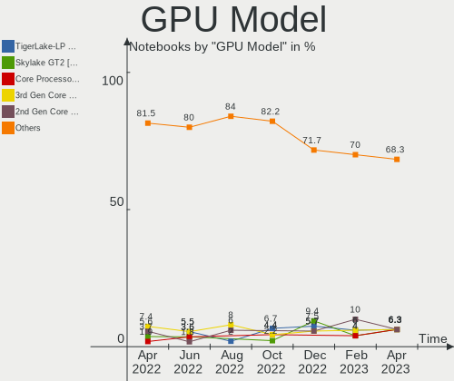

| Model                                                                                    | Notebooks | Percent |
|------------------------------------------------------------------------------------------|-----------|---------|
| Intel TigerLake-LP GT2 [Iris Xe Graphics]                                                | 4         | 6.35%   |
| Intel Skylake GT2 [HD Graphics 520]                                                      | 4         | 6.35%   |
| Intel Core Processor Integrated Graphics Controller                                      | 4         | 6.35%   |
| Intel 3rd Gen Core processor Graphics Controller                                         | 4         | 6.35%   |
| Intel 2nd Generation Core Processor Family Integrated Graphics Controller                | 4         | 6.35%   |
| Intel CoffeeLake-H GT2 [UHD Graphics 630]                                                | 3         | 4.76%   |
| Intel 4th Gen Core Processor Integrated Graphics Controller                              | 3         | 4.76%   |
| Intel HD Graphics 5500                                                                   | 2         | 3.17%   |
| Intel HD Graphics 530                                                                    | 2         | 3.17%   |
| AMD Lucienne                                                                             | 2         | 3.17%   |
| Nvidia TU117M [GeForce GTX 1650 Mobile / Max-Q]                                          | 1         | 1.59%   |
| Nvidia TU117GLM [Quadro T1000 Mobile]                                                    | 1         | 1.59%   |
| Nvidia MCP89 [GeForce 320M]                                                              | 1         | 1.59%   |
| Nvidia GP107M [GeForce GTX 1050 Ti Mobile]                                               | 1         | 1.59%   |
| Nvidia GP106M [GeForce GTX 1060 Mobile]                                                  | 1         | 1.59%   |
| Nvidia GP104BM [GeForce GTX 1070 Mobile]                                                 | 1         | 1.59%   |
| Nvidia GM107GLM [Quadro M1200 Mobile]                                                    | 1         | 1.59%   |
| Nvidia GK208M [GeForce GT 740M]                                                          | 1         | 1.59%   |
| Nvidia GK107M [GeForce GT 650M Mac Edition]                                              | 1         | 1.59%   |
| Nvidia GK107GLM [Quadro K1100M]                                                          | 1         | 1.59%   |
| Nvidia GF116M [GeForce GT 555M/635M]                                                     | 1         | 1.59%   |
| Nvidia GF108M [GeForce GT 620M/630M/635M/640M LE]                                        | 1         | 1.59%   |
| Nvidia GF108M [GeForce GT 540M]                                                          | 1         | 1.59%   |
| Nvidia G84M [GeForce 8600M GT]                                                           | 1         | 1.59%   |
| Intel UHD Graphics 620                                                                   | 1         | 1.59%   |
| Intel Mobile GM965/GL960 Integrated Graphics Controller (secondary)                      | 1         | 1.59%   |
| Intel Mobile GM965/GL960 Integrated Graphics Controller (primary)                        | 1         | 1.59%   |
| Intel HD Graphics 630                                                                    | 1         | 1.59%   |
| Intel HD Graphics 620                                                                    | 1         | 1.59%   |
| Intel HD Graphics 6000                                                                   | 1         | 1.59%   |
| Intel GeminiLake [UHD Graphics 600]                                                      | 1         | 1.59%   |
| Intel Atom/Celeron/Pentium Processor x5-E8000/J3xxx/N3xxx Integrated Graphics Controller | 1         | 1.59%   |
| Intel Alder Lake-P Integrated Graphics Controller                                        | 1         | 1.59%   |
| AMD VanGogh [AMD Custom GPU 0405]                                                        | 1         | 1.59%   |
| AMD Topaz XT [Radeon R7 M260/M265 / M340/M360 / M440/M445 / 530/535 / 620/625 Mobile]    | 1         | 1.59%   |
| AMD Thames [Radeon HD 7500M/7600M Series]                                                | 1         | 1.59%   |
| AMD Sun XT [Radeon HD 8670A/8670M/8690M / R5 M330 / M430 / Radeon 520 Mobile]            | 1         | 1.59%   |
| AMD Opal XT [Radeon R7 M265/M365X/M465]                                                  | 1         | 1.59%   |
| AMD Mars XTX [Radeon HD 8790M]                                                           | 1         | 1.59%   |
| AMD Madison [Mobility Radeon HD 5650/5750 / 6530M/6550M]                                 | 1         | 1.59%   |

GPU Combo
---------

Combinations of graphics cards

| Name           | Notebooks | Percent |
|----------------|-----------|---------|
| 1 x Intel      | 23        | 50%     |
| Intel + Nvidia | 11        | 23.91%  |
| Intel + AMD    | 4         | 8.7%    |
| 1 x AMD        | 4         | 8.7%    |
| 1 x Nvidia     | 3         | 6.52%   |
| 2 x AMD        | 1         | 2.17%   |

GPU Driver
----------

Free vs proprietary

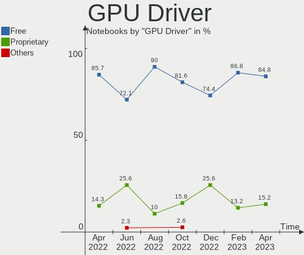

| Driver      | Notebooks | Percent |
|-------------|-----------|---------|
| Free        | 39        | 84.78%  |
| Proprietary | 7         | 15.22%  |

GPU Memory
----------

Total video memory

| Size in GB | Notebooks | Percent |
|------------|-----------|---------|
| Unknown    | 36        | 78.26%  |
| 1.01-2.0   | 5         | 10.87%  |
| 0.01-0.5   | 3         | 6.52%   |
| 7.01-8.0   | 1         | 2.17%   |
| 3.01-4.0   | 1         | 2.17%   |

Monitor
-------

Monitor Vendor
--------------

Monitor vendors

| Vendor                  | Notebooks | Percent |
|-------------------------|-----------|---------|
| Chimei Innolux          | 9         | 17.31%  |
| LG Display              | 8         | 15.38%  |
| AU Optronics            | 8         | 15.38%  |
| BOE                     | 5         | 9.62%   |
| Samsung Electronics     | 4         | 7.69%   |
| Apple                   | 4         | 7.69%   |
| Sharp                   | 2         | 3.85%   |
| Valve                   | 1         | 1.92%   |
| Tianma XM               | 1         | 1.92%   |
| QUS                     | 1         | 1.92%   |
| Philips                 | 1         | 1.92%   |
| Lenovo                  | 1         | 1.92%   |
| InfoVision              | 1         | 1.92%   |
| Goldstar                | 1         | 1.92%   |
| Dell                    | 1         | 1.92%   |
| Chi Mei Optoelectronics | 1         | 1.92%   |
| BenQ                    | 1         | 1.92%   |
| Acer                    | 1         | 1.92%   |
| Unknown                 | 1         | 1.92%   |

Monitor Model
-------------

Monitor models

| Model                                                                    | Notebooks | Percent |
|--------------------------------------------------------------------------|-----------|---------|
| Valve ANX7530 U VLV3001 800x1280 100x150mm 7.1-inch                      | 1         | 1.89%   |
| Tianma XM LCD Monitor TLX1388 3000x2000 293x196mm 13.9-inch              | 1         | 1.89%   |
| Sharp LCD Monitor SHP148D 3840x2160 344x194mm 15.5-inch                  | 1         | 1.89%   |
| Sharp LCD Monitor SHP1453 1920x1080 346x194mm 15.6-inch                  | 1         | 1.89%   |
| Samsung Electronics SMS24A450 SAM083A 1920x1200 518x324mm 24.1-inch      | 1         | 1.89%   |
| Samsung Electronics LCD Monitor SEC3258 1440x900 367x230mm 17.1-inch     | 1         | 1.89%   |
| Samsung Electronics LCD Monitor SDC4152 2880x1800 302x189mm 14.0-inch    | 1         | 1.89%   |
| Samsung Electronics C49RG9x SAM0F99 3840x1080 1193x336mm 48.8-inch       | 1         | 1.89%   |
| Samsung Electronics C24F390 SAM0D2C 1920x1080 521x293mm 23.5-inch        | 1         | 1.89%   |
| QUS MONITOR QUS3536 3840x2160                                            | 1         | 1.89%   |
| Philips PHL 241B8Q PHL0929 1920x1080 527x296mm 23.8-inch                 | 1         | 1.89%   |
| LG Display LP140WH2-TLB1 LGD0243 1366x768 310x174mm 14.0-inch            | 1         | 1.89%   |
| LG Display LCD Monitor LGD0521 1920x1080 309x174mm 14.0-inch             | 1         | 1.89%   |
| LG Display LCD Monitor LGD0479 1920x1080 309x174mm 14.0-inch             | 1         | 1.89%   |
| LG Display LCD Monitor LGD0469 1920x1080 382x215mm 17.3-inch             | 1         | 1.89%   |
| LG Display LCD Monitor LGD045C 1366x768 345x194mm 15.6-inch              | 1         | 1.89%   |
| LG Display LCD Monitor LGD0430 1366x768 345x194mm 15.6-inch              | 1         | 1.89%   |
| LG Display LCD Monitor LGD03FB 1920x1080 382x215mm 17.3-inch             | 1         | 1.89%   |
| LG Display LCD Monitor LGD02AC 1366x768 344x194mm 15.5-inch              | 1         | 1.89%   |
| Lenovo LCD Monitor LEN4036 1440x900 304x190mm 14.1-inch                  | 1         | 1.89%   |
| InfoVision LCD Monitor IVO854A 1920x1200 286x179mm 13.3-inch             | 1         | 1.89%   |
| Goldstar MP59HT GSM5B44 1920x1080 480x270mm 21.7-inch                    | 1         | 1.89%   |
| Dell DELL2407WFPHC DELA026 1920x1200 519x324mm 24.1-inch                 | 1         | 1.89%   |
| Chimei Innolux LCD Monitor CMN1728 1600x900 382x215mm 17.3-inch          | 1         | 1.89%   |
| Chimei Innolux LCD Monitor CMN15C6 1366x768 344x193mm 15.5-inch          | 1         | 1.89%   |
| Chimei Innolux LCD Monitor CMN15BE 1366x768 344x194mm 15.5-inch          | 1         | 1.89%   |
| Chimei Innolux LCD Monitor CMN15BA 1920x1080 344x194mm 15.5-inch         | 1         | 1.89%   |
| Chimei Innolux LCD Monitor CMN15B6 1366x768 344x193mm 15.5-inch          | 1         | 1.89%   |
| Chimei Innolux LCD Monitor CMN1538 1920x1080 344x193mm 15.5-inch         | 1         | 1.89%   |
| Chimei Innolux LCD Monitor CMN1514 1920x1080 344x193mm 15.5-inch         | 1         | 1.89%   |
| Chimei Innolux LCD Monitor CMN14D4 1920x1080 309x173mm 13.9-inch         | 1         | 1.89%   |
| Chimei Innolux LCD Monitor CMN14C0 1920x1080 308x173mm 13.9-inch         | 1         | 1.89%   |
| Chi Mei Optoelectronics LCD Monitor CMO1718 1600x900 382x215mm 17.3-inch | 1         | 1.89%   |
| BOE LCD Monitor BOE0860 1920x1080 344x194mm 15.5-inch                    | 1         | 1.89%   |
| BOE LCD Monitor BOE0704 1366x768 344x194mm 15.5-inch                     | 1         | 1.89%   |
| BOE LCD Monitor BOE06B6 1366x768 309x173mm 13.9-inch                     | 1         | 1.89%   |
| BOE LCD Monitor BOE06A7 1920x1080 294x165mm 13.3-inch                    | 1         | 1.89%   |
| BOE LCD Monitor BOE0609 1366x768 256x144mm 11.6-inch                     | 1         | 1.89%   |
| BenQ RL2455 BNQ7F1C 1920x1080 531x298mm 24.0-inch                        | 1         | 1.89%   |
| AU Optronics LCD Monitor AUO5799 1920x1080 344x194mm 15.5-inch           | 1         | 1.89%   |

Monitor Resolution
------------------

Monitor screen resolution

| Resolution        | Notebooks | Percent |
|-------------------|-----------|---------|
| 1920x1080 (FHD)   | 18        | 36%     |
| 1366x768 (WXGA)   | 15        | 30%     |
| 1440x900 (WXGA+)  | 3         | 6%      |
| 1280x800 (WXGA)   | 3         | 6%      |
| 3840x2160 (4K)    | 2         | 4%      |
| 2880x1800         | 2         | 4%      |
| 1920x1200 (WUXGA) | 2         | 4%      |
| 1600x900 (HD+)    | 2         | 4%      |
| 800x1280          | 1         | 2%      |
| 3840x1080         | 1         | 2%      |
| 3000x2000         | 1         | 2%      |

Monitor Diagonal
----------------

Diagonal size in inches

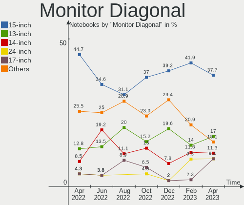

| Inches  | Notebooks | Percent |
|---------|-----------|---------|
| 15      | 20        | 37.74%  |
| 13      | 9         | 16.98%  |
| 14      | 6         | 11.32%  |
| 24      | 5         | 9.43%   |
| 17      | 5         | 9.43%   |
| 11      | 2         | 3.77%   |
| 48      | 1         | 1.89%   |
| 36      | 1         | 1.89%   |
| 23      | 1         | 1.89%   |
| 21      | 1         | 1.89%   |
| 7       | 1         | 1.89%   |
| Unknown | 1         | 1.89%   |

Monitor Width
-------------

Physical width

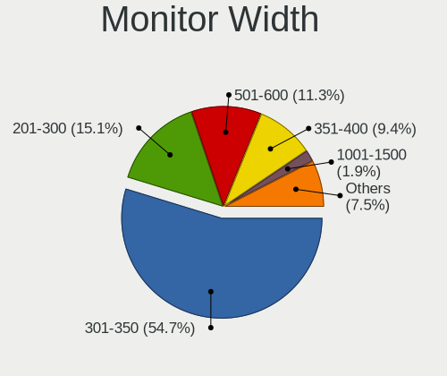

| Width in mm | Notebooks | Percent |
|-------------|-----------|---------|
| 301-350     | 29        | 54.72%  |
| 201-300     | 8         | 15.09%  |
| 501-600     | 6         | 11.32%  |
| 351-400     | 5         | 9.43%   |
| 701-800     | 1         | 1.89%   |
| 401-500     | 1         | 1.89%   |
| 1001-1500   | 1         | 1.89%   |
| 1-100       | 1         | 1.89%   |
| Unknown     | 1         | 1.89%   |

Aspect Ratio
------------

Proportional relationship between the width and the height

| Ratio   | Notebooks | Percent |
|---------|-----------|---------|
| 16/9    | 33        | 70.21%  |
| 16/10   | 10        | 21.28%  |
| 32/9    | 1         | 2.13%   |
| 3/2     | 1         | 2.13%   |
| 0.67    | 1         | 2.13%   |
| Unknown | 1         | 2.13%   |

Monitor Area
------------

Area in inch

| Area in inch | Notebooks | Percent |
|----------------|-----------|---------|
| 101-110        | 20        | 37.74%  |
| 81-90          | 12        | 22.64%  |
| 201-250        | 5         | 9.43%   |
| 71-80          | 3         | 5.66%   |
| 121-130        | 3         | 5.66%   |
| 51-60          | 2         | 3.77%   |
| 251-300        | 2         | 3.77%   |
| 131-140        | 2         | 3.77%   |
| 501-1000       | 2         | 3.77%   |
| 1-40           | 1         | 1.89%   |
| Unknown        | 1         | 1.89%   |

Pixel Density
-------------

Pixels per inch

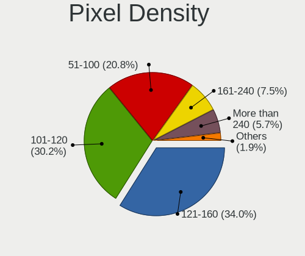

| Density       | Notebooks | Percent |
|---------------|-----------|---------|
| 121-160       | 18        | 33.96%  |
| 101-120       | 16        | 30.19%  |
| 51-100        | 11        | 20.75%  |
| 161-240       | 4         | 7.55%   |
| More than 240 | 3         | 5.66%   |
| Unknown       | 1         | 1.89%   |

Multiple Monitors
-----------------

Total monitors connected

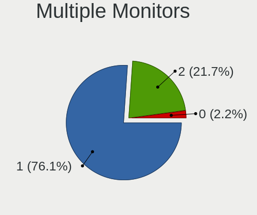

| Total | Notebooks | Percent |
|-------|-----------|---------|
| 1     | 35        | 76.09%  |
| 2     | 10        | 21.74%  |
| 0     | 1         | 2.17%   |

Network
-------

Net Controller Vendor
---------------------

Controller vendors

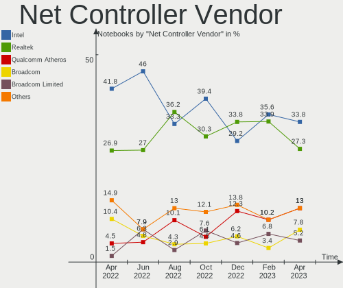

| Vendor                | Notebooks | Percent |
|-----------------------|-----------|---------|
| Intel                 | 26        | 33.77%  |
| Realtek Semiconductor | 21        | 27.27%  |
| Qualcomm Atheros      | 10        | 12.99%  |
| Broadcom              | 6         | 7.79%   |
| Broadcom Limited      | 4         | 5.19%   |
| Ralink                | 2         | 2.6%    |
| Xiaomi                | 1         | 1.3%    |
| Raspberry Pi          | 1         | 1.3%    |
| Ralink Technology     | 1         | 1.3%    |
| OPPO Electronics      | 1         | 1.3%    |
| Lenovo                | 1         | 1.3%    |
| Hewlett-Packard       | 1         | 1.3%    |
| DisplayLink           | 1         | 1.3%    |
| ASIX Electronics      | 1         | 1.3%    |

Net Controller Model
--------------------

Controller models

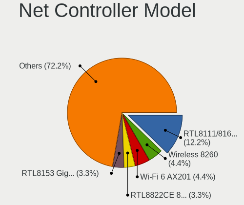

| Model                                                                   | Notebooks | Percent |
|-------------------------------------------------------------------------|-----------|---------|
| Realtek RTL8111/8168/8411 PCI Express Gigabit Ethernet Controller       | 11        | 12.22%  |
| Intel Wireless 8260                                                     | 4         | 4.44%   |
| Intel Wi-Fi 6 AX201                                                     | 4         | 4.44%   |
| Realtek RTL8822CE 802.11ac PCIe Wireless Network Adapter                | 3         | 3.33%   |
| Realtek RTL8153 Gigabit Ethernet Adapter                                | 3         | 3.33%   |
| Qualcomm Atheros AR9485 Wireless Network Adapter                        | 3         | 3.33%   |
| Intel Wireless 3165                                                     | 3         | 3.33%   |
| Intel Wi-Fi 6 AX200                                                     | 3         | 3.33%   |
| Realtek RTL810xE PCI Express Fast Ethernet controller                   | 2         | 2.22%   |
| Qualcomm Atheros QCA9565 / AR9565 Wireless Network Adapter              | 2         | 2.22%   |
| Qualcomm Atheros Killer E2400 Gigabit Ethernet Controller               | 2         | 2.22%   |
| Intel Wireless 7260                                                     | 2         | 2.22%   |
| Intel Wireless 3160                                                     | 2         | 2.22%   |
| Intel Ethernet Connection I219-LM                                       | 2         | 2.22%   |
| Intel Ethernet Connection I217-LM                                       | 2         | 2.22%   |
| Intel Centrino Advanced-N 6200                                          | 2         | 2.22%   |
| Xiaomi Mi/Redmi series (RNDIS)                                          | 1         | 1.11%   |
| Realtek RTL8852AE WiFi 6 802.11ax PCIe Adapter                          | 1         | 1.11%   |
| Realtek RTL8188GU 802.11n WLAN Adapter (After Modeswitch)               | 1         | 1.11%   |
| Raspberry Pi Pico                                                       | 1         | 1.11%   |
| Ralink MT7601U Wireless Adapter                                         | 1         | 1.11%   |
| Ralink RT5390 Wireless 802.11n 1T/1R PCIe                               | 1         | 1.11%   |
| Ralink RT3090 Wireless 802.11n 1T/1R PCIe                               | 1         | 1.11%   |
| Qualcomm Atheros QCA9377 802.11ac Wireless Network Adapter              | 1         | 1.11%   |
| Qualcomm Atheros QCA6174 802.11ac Wireless Network Adapter              | 1         | 1.11%   |
| Qualcomm Atheros AR9285 Wireless Network Adapter (PCI-Express)          | 1         | 1.11%   |
| Qualcomm Atheros AR8161 Gigabit Ethernet                                | 1         | 1.11%   |
| Qualcomm Atheros AR242x / AR542x Wireless Network Adapter (PCI-Express) | 1         | 1.11%   |
| OPPO KALAMA-MTP_CID:0437_SN:AEEEF597                                    | 1         | 1.11%   |
| Lenovo USB-C Dock Ethernet                                              | 1         | 1.11%   |
| Intel Wireless 8265 / 8275                                              | 1         | 1.11%   |
| Intel PRO/Wireless 3945ABG [Golan] Network Connection                   | 1         | 1.11%   |
| Intel Ethernet Connection I219-V                                        | 1         | 1.11%   |
| Intel Ethernet Connection (2) I219-LM                                   | 1         | 1.11%   |
| Intel Ethernet Connection (13) I219-V                                   | 1         | 1.11%   |
| Intel Centrino Advanced-N 6235                                          | 1         | 1.11%   |
| Intel Centrino Advanced-N 6230 [Rainbow Peak]                           | 1         | 1.11%   |
| Intel Centrino Advanced-N 6205 [Taylor Peak]                            | 1         | 1.11%   |
| Intel Alder Lake-P PCH CNVi WiFi                                        | 1         | 1.11%   |
| Intel 82579LM Gigabit Network Connection (Lewisville)                   | 1         | 1.11%   |

Wireless Vendor
---------------

Wireless vendors

| Vendor                | Notebooks | Percent |
|-----------------------|-----------|---------|
| Intel                 | 26        | 54.17%  |
| Qualcomm Atheros      | 9         | 18.75%  |
| Realtek Semiconductor | 5         | 10.42%  |
| Broadcom              | 3         | 6.25%   |
| Ralink                | 2         | 4.17%   |
| Broadcom Limited      | 2         | 4.17%   |
| Ralink Technology     | 1         | 2.08%   |

Wireless Model
--------------

Wireless models

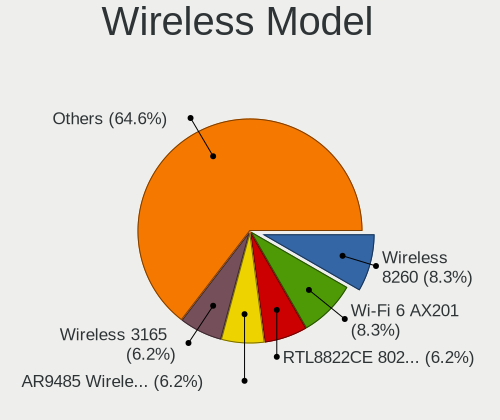

| Model                                                                   | Notebooks | Percent |
|-------------------------------------------------------------------------|-----------|---------|
| Intel Wireless 8260                                                     | 4         | 8.33%   |
| Intel Wi-Fi 6 AX201                                                     | 4         | 8.33%   |
| Realtek RTL8822CE 802.11ac PCIe Wireless Network Adapter                | 3         | 6.25%   |
| Qualcomm Atheros AR9485 Wireless Network Adapter                        | 3         | 6.25%   |
| Intel Wireless 3165                                                     | 3         | 6.25%   |
| Intel Wi-Fi 6 AX200                                                     | 3         | 6.25%   |
| Qualcomm Atheros QCA9565 / AR9565 Wireless Network Adapter              | 2         | 4.17%   |
| Intel Wireless 7260                                                     | 2         | 4.17%   |
| Intel Wireless 3160                                                     | 2         | 4.17%   |
| Intel Centrino Advanced-N 6200                                          | 2         | 4.17%   |
| Realtek RTL8852AE WiFi 6 802.11ax PCIe Adapter                          | 1         | 2.08%   |
| Realtek RTL8188GU 802.11n WLAN Adapter (After Modeswitch)               | 1         | 2.08%   |
| Ralink MT7601U Wireless Adapter                                         | 1         | 2.08%   |
| Ralink RT5390 Wireless 802.11n 1T/1R PCIe                               | 1         | 2.08%   |
| Ralink RT3090 Wireless 802.11n 1T/1R PCIe                               | 1         | 2.08%   |
| Qualcomm Atheros QCA9377 802.11ac Wireless Network Adapter              | 1         | 2.08%   |
| Qualcomm Atheros QCA6174 802.11ac Wireless Network Adapter              | 1         | 2.08%   |
| Qualcomm Atheros AR9285 Wireless Network Adapter (PCI-Express)          | 1         | 2.08%   |
| Qualcomm Atheros AR242x / AR542x Wireless Network Adapter (PCI-Express) | 1         | 2.08%   |
| Intel Wireless 8265 / 8275                                              | 1         | 2.08%   |
| Intel PRO/Wireless 3945ABG [Golan] Network Connection                   | 1         | 2.08%   |
| Intel Centrino Advanced-N 6235                                          | 1         | 2.08%   |
| Intel Centrino Advanced-N 6230 [Rainbow Peak]                           | 1         | 2.08%   |
| Intel Centrino Advanced-N 6205 [Taylor Peak]                            | 1         | 2.08%   |
| Intel Alder Lake-P PCH CNVi WiFi                                        | 1         | 2.08%   |
| Broadcom Limited BCM4360 802.11ac Wireless Network Adapter              | 1         | 2.08%   |
| Broadcom Limited BCM4331 802.11a/b/g/n                                  | 1         | 2.08%   |
| Broadcom BCM4331 802.11a/b/g/n                                          | 1         | 2.08%   |
| Broadcom BCM4322 802.11a/b/g/n Wireless LAN Controller                  | 1         | 2.08%   |
| Broadcom BCM4313 802.11bgn Wireless Network Adapter                     | 1         | 2.08%   |

Ethernet Vendor
---------------

Ethernet vendors

| Vendor                | Notebooks | Percent |
|-----------------------|-----------|---------|
| Realtek Semiconductor | 16        | 39.02%  |
| Intel                 | 9         | 21.95%  |
| Broadcom              | 5         | 12.2%   |
| Qualcomm Atheros      | 3         | 7.32%   |
| Broadcom Limited      | 2         | 4.88%   |
| Xiaomi                | 1         | 2.44%   |
| OPPO Electronics      | 1         | 2.44%   |
| Lenovo                | 1         | 2.44%   |
| Hewlett-Packard       | 1         | 2.44%   |
| DisplayLink           | 1         | 2.44%   |
| ASIX Electronics      | 1         | 2.44%   |

Ethernet Model
--------------

Ethernet models

| Model                                                             | Notebooks | Percent |
|-------------------------------------------------------------------|-----------|---------|
| Realtek RTL8111/8168/8411 PCI Express Gigabit Ethernet Controller | 11        | 26.83%  |
| Realtek RTL8153 Gigabit Ethernet Adapter                          | 3         | 7.32%   |
| Realtek RTL810xE PCI Express Fast Ethernet controller             | 2         | 4.88%   |
| Qualcomm Atheros Killer E2400 Gigabit Ethernet Controller         | 2         | 4.88%   |
| Intel Ethernet Connection I219-LM                                 | 2         | 4.88%   |
| Intel Ethernet Connection I217-LM                                 | 2         | 4.88%   |
| Xiaomi Mi/Redmi series (RNDIS)                                    | 1         | 2.44%   |
| Qualcomm Atheros AR8161 Gigabit Ethernet                          | 1         | 2.44%   |
| OPPO KALAMA-MTP_CID:0437_SN:AEEEF597                              | 1         | 2.44%   |
| Lenovo USB-C Dock Ethernet                                        | 1         | 2.44%   |
| Intel Ethernet Connection I219-V                                  | 1         | 2.44%   |
| Intel Ethernet Connection (2) I219-LM                             | 1         | 2.44%   |
| Intel Ethernet Connection (13) I219-V                             | 1         | 2.44%   |
| Intel 82579LM Gigabit Network Connection (Lewisville)             | 1         | 2.44%   |
| Intel 82577LM Gigabit Network Connection                          | 1         | 2.44%   |
| HP lt4120 Snapdragon X5 LTE                                       | 1         | 2.44%   |
| DisplayLink USB-C Hybrid UHD Video Dock                           | 1         | 2.44%   |
| Broadcom NetXtreme BCM57786 Gigabit Ethernet PCIe                 | 1         | 2.44%   |
| Broadcom NetXtreme BCM57765 Gigabit Ethernet PCIe                 | 1         | 2.44%   |
| Broadcom NetXtreme BCM5764M Gigabit Ethernet PCIe                 | 1         | 2.44%   |
| Broadcom NetLink BCM5787M Gigabit Ethernet PCI Express            | 1         | 2.44%   |
| Broadcom NetLink BCM57780 Gigabit Ethernet PCIe                   | 1         | 2.44%   |
| Broadcom Limited NetXtreme BCM57760 Gigabit Ethernet PCIe         | 1         | 2.44%   |
| Broadcom Limited BCM4401-B0 100Base-TX                            | 1         | 2.44%   |
| ASIX AX88179 Gigabit Ethernet                                     | 1         | 2.44%   |

Net Controller Kind
-------------------

Ethernet, WiFi or modem

| Kind     | Notebooks | Percent |
|----------|-----------|---------|
| WiFi     | 46        | 54.76%  |
| Ethernet | 37        | 44.05%  |
| Modem    | 1         | 1.19%   |

Used Controller
---------------

Currently used network controller

| Kind     | Notebooks | Percent |
|----------|-----------|---------|
| WiFi     | 35        | 76.09%  |
| Ethernet | 11        | 23.91%  |

NICs
----

Total network controllers on board

| Total | Notebooks | Percent |
|-------|-----------|---------|
| 2     | 32        | 69.57%  |
| 1     | 14        | 30.43%  |

IPv6
----

IPv6 vs IPv4

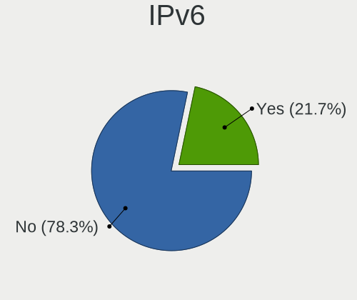

| Used | Notebooks | Percent |
|------|-----------|---------|
| No   | 36        | 78.26%  |
| Yes  | 10        | 21.74%  |

Bluetooth
---------

Bluetooth Vendor
----------------

Controller vendors

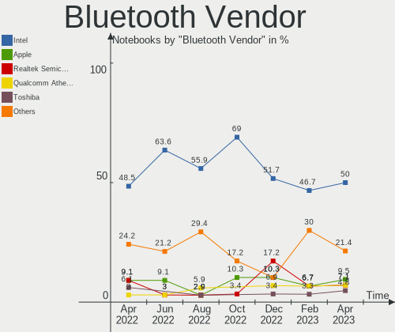

| Vendor                          | Notebooks | Percent |
|---------------------------------|-----------|---------|
| Intel                           | 21        | 50%     |
| Apple                           | 4         | 9.52%   |
| Realtek Semiconductor           | 3         | 7.14%   |
| Qualcomm Atheros Communications | 3         | 7.14%   |
| Toshiba                         | 2         | 4.76%   |
| Cambridge Silicon Radio         | 2         | 4.76%   |
| Ralink Technology               | 1         | 2.38%   |
| Lite-On Technology              | 1         | 2.38%   |
| IMC Networks                    | 1         | 2.38%   |
| Foxconn / Hon Hai               | 1         | 2.38%   |
| Dell                            | 1         | 2.38%   |
| Broadcom                        | 1         | 2.38%   |
| ASUSTek Computer                | 1         | 2.38%   |

Bluetooth Model
---------------

Controller models

| Model                                               | Notebooks | Percent |
|-----------------------------------------------------|-----------|---------|
| Intel Bluetooth wireless interface                  | 11        | 26.19%  |
| Intel AX201 Bluetooth                               | 4         | 9.52%   |
| Realtek Bluetooth Radio                             | 3         | 7.14%   |
| Intel AX200 Bluetooth                               | 3         | 7.14%   |
| Apple Bluetooth Host Controller                     | 3         | 7.14%   |
| Qualcomm Atheros  Bluetooth Device                  | 2         | 4.76%   |
| Cambridge Silicon Radio Bluetooth Dongle (HCI mode) | 2         | 4.76%   |
| Toshiba Bluetooth USB Host Controller               | 1         | 2.38%   |
| Toshiba Bluetooth Device                            | 1         | 2.38%   |
| Ralink Motorola BC4 Bluetooth 3.0+HS Adapter        | 1         | 2.38%   |
| Qualcomm Atheros AR3011 Bluetooth                   | 1         | 2.38%   |
| Lite-On Atheros AR3012 Bluetooth                    | 1         | 2.38%   |
| Intel Centrino Bluetooth Wireless Transceiver       | 1         | 2.38%   |
| Intel Centrino Advanced-N 6230 Bluetooth adapter    | 1         | 2.38%   |
| Intel Bluetooth Device                              | 1         | 2.38%   |
| IMC Networks Bluetooth Radio                        | 1         | 2.38%   |
| Foxconn / Hon Hai Acer Bluetooth module             | 1         | 2.38%   |
| Dell Wireless 355 Bluetooth                         | 1         | 2.38%   |
| Broadcom HP Portable Valentine                      | 1         | 2.38%   |
| ASUS ASUS USB-BT500                                 | 1         | 2.38%   |
| Apple Bluetooth USB Host Controller                 | 1         | 2.38%   |

Sound
-----

Sound Vendor
------------

Sound card vendors

| Vendor             | Notebooks | Percent |
|--------------------|-----------|---------|
| Intel              | 41        | 67.21%  |
| Nvidia             | 8         | 13.11%  |
| AMD                | 6         | 9.84%   |
| Plantronics        | 1         | 1.64%   |
| Logitech           | 1         | 1.64%   |
| Lenovo             | 1         | 1.64%   |
| GN Netcom          | 1         | 1.64%   |
| Focusrite-Novation | 1         | 1.64%   |
| Bose               | 1         | 1.64%   |

Sound Model
-----------

Sound card models

| Model                                                                                             | Notebooks | Percent |
|---------------------------------------------------------------------------------------------------|-----------|---------|
| Intel Sunrise Point-LP HD Audio                                                                   | 6         | 8.7%    |
| Intel 7 Series/C216 Chipset Family High Definition Audio Controller                               | 5         | 7.25%   |
| Intel Tiger Lake-LP Smart Sound Technology Audio Controller                                       | 4         | 5.8%    |
| Intel 6 Series/C200 Series Chipset Family High Definition Audio Controller                        | 4         | 5.8%    |
| Intel 5 Series/3400 Series Chipset High Definition Audio                                          | 4         | 5.8%    |
| Intel Wildcat Point-LP High Definition Audio Controller                                           | 3         | 4.35%   |
| Intel Cannon Lake PCH cAVS                                                                        | 3         | 4.35%   |
| Intel Broadwell-U Audio Controller                                                                | 3         | 4.35%   |
| Intel 8 Series/C220 Series Chipset High Definition Audio Controller                               | 3         | 4.35%   |
| Nvidia GF108 High Definition Audio Controller                                                     | 2         | 2.9%    |
| Intel Xeon E3-1200 v3/4th Gen Core Processor HD Audio Controller                                  | 2         | 2.9%    |
| Intel CM238 HD Audio Controller                                                                   | 2         | 2.9%    |
| Intel 82801H (ICH8 Family) HD Audio Controller                                                    | 2         | 2.9%    |
| Intel 100 Series/C230 Series Chipset Family HD Audio Controller                                   | 2         | 2.9%    |
| AMD Renoir Radeon High Definition Audio Controller                                                | 2         | 2.9%    |
| AMD Family 17h/19h HD Audio Controller                                                            | 2         | 2.9%    |
| Plantronics Blackwire 5220 Series                                                                 | 1         | 1.45%   |
| Nvidia TU107 GeForce GTX 1650 High Definition Audio Controller                                    | 1         | 1.45%   |
| Nvidia MCP89 High Definition Audio                                                                | 1         | 1.45%   |
| Nvidia GP106 High Definition Audio Controller                                                     | 1         | 1.45%   |
| Nvidia GP104 High Definition Audio Controller                                                     | 1         | 1.45%   |
| Nvidia GK107 HDMI Audio Controller                                                                | 1         | 1.45%   |
| Nvidia GF116 High Definition Audio Controller                                                     | 1         | 1.45%   |
| Logitech G433 Gaming Headset                                                                      | 1         | 1.45%   |
| Lenovo ThinkPad USB-C Dock Gen2 USB Audio                                                         | 1         | 1.45%   |
| Intel Celeron/Pentium Silver Processor High Definition Audio                                      | 1         | 1.45%   |
| Intel Atom/Celeron/Pentium Processor x5-E8000/J3xxx/N3xxx Series High Definition Audio Controller | 1         | 1.45%   |
| Intel Alder Lake PCH-P High Definition Audio Controller                                           | 1         | 1.45%   |
| GN Netcom enc060:Buttons Volume up/down/mute + phone [Jabra]                                      | 1         | 1.45%   |
| Focusrite-Novation Scarlett 2i2 Camera                                                            | 1         | 1.45%   |
| Bose USB Audio                                                                                    | 1         | 1.45%   |
| AMD Turks HDMI Audio [Radeon HD 6500/6600 / 6700M Series]                                         | 1         | 1.45%   |
| AMD Rembrandt Radeon High Definition Audio Controller                                             | 1         | 1.45%   |
| AMD Redwood HDMI Audio [Radeon HD 5000 Series]                                                    | 1         | 1.45%   |
| AMD Kaveri HDMI/DP Audio Controller                                                               | 1         | 1.45%   |
| AMD FCH Azalia Controller                                                                         | 1         | 1.45%   |

Memory
------

Memory Vendor
-------------

Memory module vendors

| Vendor              | Notebooks | Percent |
|---------------------|-----------|---------|
| SK hynix            | 18        | 41.86%  |
| Samsung Electronics | 8         | 18.6%   |
| Micron Technology   | 7         | 16.28%  |
| Kingston            | 5         | 11.63%  |
| Team                | 1         | 2.33%   |
| Nanya Technology    | 1         | 2.33%   |
| Elpida              | 1         | 2.33%   |
| Crucial             | 1         | 2.33%   |
| Apacer              | 1         | 2.33%   |

Memory Model
------------

Memory module models

| Model                                                        | Notebooks | Percent |
|--------------------------------------------------------------|-----------|---------|
| SK hynix RAM HMT41GS6BFR8A-PB 8GB SODIMM DDR3 1600MT/s       | 2         | 4.65%   |
| SK hynix RAM HMT351S6CFR8C-PB 4GB SODIMM DDR3 1600MT/s       | 2         | 4.65%   |
| SK hynix RAM HMA81GS6AFR8N-UH 8GB SODIMM DDR4 2667MT/s       | 2         | 4.65%   |
| Micron RAM 8ATF1G64HZ-3G2R1 8GB SODIMM DDR4 3200MT/s         | 2         | 4.65%   |
| Team RAM Elite-1333 8192MB SODIMM DDR3 1334MT/s              | 1         | 2.33%   |
| SK hynix RAM Module 8GB SODIMM DDR4 2133MT/s                 | 1         | 2.33%   |
| SK hynix RAM Module 4GB SODIMM DDR3 1333MT/s                 | 1         | 2.33%   |
| SK hynix RAM Module 4GB SODIMM DDR3 1066MT/s                 | 1         | 2.33%   |
| SK hynix RAM HYMP125S64CP8-Y5 2048MB SODIMM DDR 667MT/s      | 1         | 2.33%   |
| SK hynix RAM HMT451S6BFR8A-PB 4GB SODIMM DDR3 1600MT/s       | 1         | 2.33%   |
| SK hynix RAM HMT41GS6AFR8A-PB 8GB SODIMM DDR3 1600MT/s       | 1         | 2.33%   |
| SK hynix RAM HMT351S6BFR8C-H9 4GB SODIMM DDR3 1334MT/s       | 1         | 2.33%   |
| SK hynix RAM HMT351S6BFR8C-H9 4GB SODIMM DDR3 1333MT/s       | 1         | 2.33%   |
| SK hynix RAM HMA82GS6AFR8N-UH 16GB SODIMM DDR4 2667MT/s      | 1         | 2.33%   |
| SK hynix RAM HMA81GS6CJR8N-VK 8GB SODIMM DDR4 2667MT/s       | 1         | 2.33%   |
| SK hynix RAM HMA41GS6AFR8N-TF 8GB SODIMM DDR4 2667MT/s       | 1         | 2.33%   |
| SK hynix RAM H9JCNNNFA5MLYR-N6E 4096MB Row Of Chips 6400MT/s | 1         | 2.33%   |
| Samsung RAM Module 4GB SODIMM DDR3 1600MT/s                  | 1         | 2.33%   |
| Samsung RAM M471B5273CH0-CK0 4GB SODIMM DDR3 1600MT/s        | 1         | 2.33%   |
| Samsung RAM M471B1G73EB0-YK0 8GB SODIMM DDR3 1600MT/s        | 1         | 2.33%   |
| Samsung RAM M471B1G73CB0-YK0 8GB SODIMM DDR3 1600MT/s        | 1         | 2.33%   |
| Samsung RAM M471A2K43BB1-CRC 16GB SODIMM DDR4 2400MT/s       | 1         | 2.33%   |
| Samsung RAM M471A1K43EB1-CWE 8GB SODIMM DDR4 3200MT/s        | 1         | 2.33%   |
| Samsung RAM M471A1K43CB1-CRC 8GB SODIMM DDR4 2667MT/s        | 1         | 2.33%   |
| Samsung RAM K4UBE3D4AA-MGCR 2GB Row Of Chips LPDDR4 4267MT/s | 1         | 2.33%   |
| Nanya RAM NT4GC64B8HG0NS-DI 4GB SODIMM DDR3 1600MT/s         | 1         | 2.33%   |
| Micron RAM Module 4GB SODIMM DDR4 2133MT/s                   | 1         | 2.33%   |
| Micron RAM Module 4GB SODIMM DDR3 1067MT/s                   | 1         | 2.33%   |
| Micron RAM Module 2GB SODIMM DDR3 1600MT/s                   | 1         | 2.33%   |
| Micron RAM 8ATF1G64HZ-2G6D1 8GB SODIMM DDR4 2667MT/s         | 1         | 2.33%   |
| Micron RAM 16KTF1G64HZ-1G6E1 8192MB SODIMM DDR3 1600MT/s     | 1         | 2.33%   |
| Kingston RAM Module 4GB SODIMM DDR3 1333MT/s                 | 1         | 2.33%   |
| Kingston RAM 99U5428-078.A00LF 8GB SODIMM DDR3 1600MT/s      | 1         | 2.33%   |
| Kingston RAM 99U5428-046.A00LF 4GB SODIMM 1600MT/s           | 1         | 2.33%   |
| Kingston RAM 9905703-002.A00G 16GB SODIMM DDR4 2400MT/s      | 1         | 2.33%   |
| Kingston RAM 9905700-011.A00G 8GB SODIMM DDR4 2400MT/s       | 1         | 2.33%   |
| Elpida RAM EBJ40UG8EFU0 4GB SODIMM DDR3 1600MT/s             | 1         | 2.33%   |
| Crucial RAM Module 2GB SODIMM DDR 667MT/s                    | 1         | 2.33%   |
| Apacer RAM 78.B2GC9.9L10C 4GB SODIMM DDR3 1333MT/s           | 1         | 2.33%   |

Memory Kind
-----------

Memory module kinds

| Kind   | Notebooks | Percent |
|--------|-----------|---------|
| DDR3   | 18        | 52.94%  |
| DDR4   | 12        | 35.29%  |
| LPDDR5 | 1         | 2.94%   |
| LPDDR4 | 1         | 2.94%   |
| DDR2   | 1         | 2.94%   |
| DDR    | 1         | 2.94%   |

Memory Form Factor
------------------

Physical design of the memory module

| Name         | Notebooks | Percent |
|--------------|-----------|---------|
| SODIMM       | 31        | 93.94%  |
| Row Of Chips | 2         | 6.06%   |

Memory Size
-----------

Memory module size

| Size  | Notebooks | Percent |
|-------|-----------|---------|
| 8192  | 16        | 47.06%  |
| 4096  | 13        | 38.24%  |
| 16384 | 3         | 8.82%   |
| 2048  | 2         | 5.88%   |

Memory Speed
------------

Memory module speed

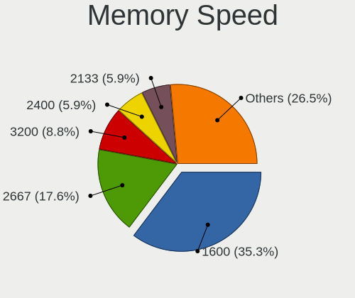

| Speed | Notebooks | Percent |
|-------|-----------|---------|
| 1600  | 12        | 35.29%  |
| 2667  | 6         | 17.65%  |
| 3200  | 3         | 8.82%   |
| 2400  | 2         | 5.88%   |
| 2133  | 2         | 5.88%   |
| 1334  | 2         | 5.88%   |
| 1333  | 2         | 5.88%   |
| 6400  | 1         | 2.94%   |
| 4267  | 1         | 2.94%   |
| 1067  | 1         | 2.94%   |
| 1066  | 1         | 2.94%   |
| 667   | 1         | 2.94%   |

Printers & scanners
-------------------

Printer Vendor
--------------

Printer device vendors

| Vendor          | Notebooks | Percent |
|-----------------|-----------|---------|
| Hewlett-Packard | 1         | 100%    |

Printer Model
-------------

Printer device models

| Model                       | Notebooks | Percent |
|-----------------------------|-----------|---------|
| HP ENVY Inspire 7900 series | 1         | 100%    |

Scanner Vendor
--------------

Scanner device vendors

Zero info for selected period =(

Scanner Model
-------------

Scanner device models

Zero info for selected period =(

Camera
------

Camera Vendor
-------------

Camera device vendors

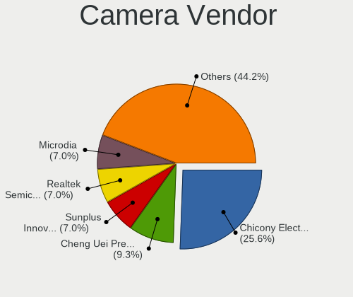

| Vendor                                 | Notebooks | Percent |
|----------------------------------------|-----------|---------|
| Chicony Electronics                    | 11        | 25.58%  |
| Cheng Uei Precision Industry (Foxlink) | 4         | 9.3%    |
| Sunplus Innovation Technology          | 3         | 6.98%   |
| Realtek Semiconductor                  | 3         | 6.98%   |
| Microdia                               | 3         | 6.98%   |
| Luxvisions Innotech Limited            | 3         | 6.98%   |
| IMC Networks                           | 3         | 6.98%   |
| Apple                                  | 3         | 6.98%   |
| Quanta                                 | 2         | 4.65%   |
| Bison Electronics                      | 2         | 4.65%   |
| Suyin                                  | 1         | 2.33%   |
| Razer USA                              | 1         | 2.33%   |
| OmniVision Technologies                | 1         | 2.33%   |
| Lenovo                                 | 1         | 2.33%   |
| ALi                                    | 1         | 2.33%   |
| Alcor Micro                            | 1         | 2.33%   |

Camera Model
------------

Camera device models

| Model                                                                    | Notebooks | Percent |
|--------------------------------------------------------------------------|-----------|---------|
| Sunplus Integrated_Webcam_HD                                             | 2         | 4.55%   |
| Microdia Integrated_Webcam_HD                                            | 2         | 4.55%   |
| Luxvisions Innotech Limited HP TrueVision HD Camera                      | 2         | 4.55%   |
| Chicony TOSHIBA Web Camera - HD                                          | 2         | 4.55%   |
| Chicony HD WebCam                                                        | 2         | 4.55%   |
| Suyin Acer CrystalEye Webcam                                             | 1         | 2.27%   |
| Sunplus Integrated_Webcam_FHD                                            | 1         | 2.27%   |
| Realtek Integrated_Webcam_HD                                             | 1         | 2.27%   |
| Realtek Integrated Webcam HD                                             | 1         | 2.27%   |
| Realtek HP Webcam                                                        | 1         | 2.27%   |
| Razer USA Razer Kiyo X                                                   | 1         | 2.27%   |
| Quanta Laptop_Integrated_Webcam_2HDM                                     | 1         | 2.27%   |
| Quanta HP Webcam                                                         | 1         | 2.27%   |
| OmniVision OV2640 Webcam                                                 | 1         | 2.27%   |
| Microdia Integrated Webcam                                               | 1         | 2.27%   |
| Luxvisions Innotech Limited Integrated Camera                            | 1         | 2.27%   |
| Lenovo Integrated Webcam [R5U877]                                        | 1         | 2.27%   |
| IMC Networks USB2.0 VGA UVC WebCam                                       | 1         | 2.27%   |
| IMC Networks USB Camera                                                  | 1         | 2.27%   |
| IMC Networks TOSHIBA Web Camera - HD                                     | 1         | 2.27%   |
| Chicony USB2.0 HD UVC WebCam                                             | 1         | 2.27%   |
| Chicony Lenovo EasyCamera                                                | 1         | 2.27%   |
| Chicony Integrated Camera                                                | 1         | 2.27%   |
| Chicony HP Truevision HD                                                 | 1         | 2.27%   |
| Chicony HP HD Camera                                                     | 1         | 2.27%   |
| Chicony HD User Facing                                                   | 1         | 2.27%   |
| Chicony 1.3M Webcam                                                      | 1         | 2.27%   |
| Cheng Uei Precision Industry (Foxlink) HP TrueVision HD                  | 1         | 2.27%   |
| Cheng Uei Precision Industry (Foxlink) HP HD Camera                      | 1         | 2.27%   |
| Cheng Uei Precision Industry (Foxlink) HP EliteBook integrated HD Webcam | 1         | 2.27%   |
| Cheng Uei Precision Industry (Foxlink) HD Camera                         | 1         | 2.27%   |
| Bison Integrated Camera                                                  | 1         | 2.27%   |
| Bison BisonCam, NB Pro                                                   | 1         | 2.27%   |
| Apple iPhone 5/5C/5S/6/SE/7/8/X                                          | 1         | 2.27%   |
| Apple FaceTime HD Camera (Built-in)                                      | 1         | 2.27%   |
| Apple FaceTime HD Camera                                                 | 1         | 2.27%   |
| Apple Built-in iSight                                                    | 1         | 2.27%   |
| ALi WebCam                                                               | 1         | 2.27%   |
| Alcor Micro Acer Integrated Webcam                                       | 1         | 2.27%   |

Security
--------

Fingerprint Vendor
------------------

Fingerprint sensor vendors

| Vendor                     | Notebooks | Percent |
|----------------------------|-----------|---------|
| Validity Sensors           | 4         | 36.36%  |
| LighTuning Technology      | 3         | 27.27%  |
| Elan Microelectronics      | 2         | 18.18%  |
| Upek                       | 1         | 9.09%   |
| Shenzhen Goodix Technology | 1         | 9.09%   |

Fingerprint Model
-----------------

Fingerprint sensor models

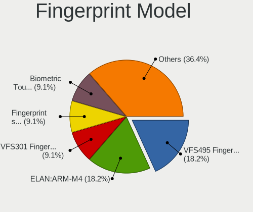

| Model                                                  | Notebooks | Percent |
|--------------------------------------------------------|-----------|---------|
| Validity Sensors VFS495 Fingerprint Reader             | 2         | 18.18%  |
| Elan ELAN:ARM-M4                                       | 2         | 18.18%  |
| Validity Sensors VFS301 Fingerprint Reader             | 1         | 9.09%   |
| Validity Sensors Fingerprint scanner                   | 1         | 9.09%   |
| Upek Biometric Touchchip/Touchstrip Fingerprint Sensor | 1         | 9.09%   |
| Shenzhen Goodix  Fingerprint Device                    | 1         | 9.09%   |
| LighTuning Fingerprint Reader                          | 1         | 9.09%   |
| LighTuning ES603 Swipe Fingerprint Sensor              | 1         | 9.09%   |
| LighTuning EgisTec Touch Fingerprint Sensor            | 1         | 9.09%   |

Chipcard Vendor
---------------

Chipcard module vendors

| Vendor   | Notebooks | Percent |
|----------|-----------|---------|
| Lenovo   | 1         | 50%     |
| Broadcom | 1         | 50%     |

Chipcard Model
--------------

Chipcard module models

| Model                               | Notebooks | Percent |
|-------------------------------------|-----------|---------|
| Lenovo Integrated Smart Card Reader | 1         | 50%     |
| Broadcom 5880                       | 1         | 50%     |

Unsupported
-----------

Unsupported Devices
-------------------

Total unsupported devices on board

| Total | Notebooks | Percent |
|-------|-----------|---------|
| 0     | 27        | 58.7%   |
| 1     | 14        | 30.43%  |
| 2     | 4         | 8.7%    |
| 4     | 1         | 2.17%   |

Unsupported Device Types
------------------------

Types of unsupported devices

| Type                  | Notebooks | Percent |
|-----------------------|-----------|---------|
| Fingerprint reader    | 11        | 42.31%  |
| Net/wireless          | 4         | 15.38%  |
| Net/ethernet          | 2         | 7.69%   |
| Graphics card         | 2         | 7.69%   |
| Chipcard              | 2         | 7.69%   |
| Multimedia controller | 1         | 3.85%   |
| Modem                 | 1         | 3.85%   |
| Card reader           | 1         | 3.85%   |
| Camera                | 1         | 3.85%   |
| Bluetooth             | 1         | 3.85%   |

