Linux in Australia - Hardware Trends (Notebooks)
------------------------------------------------

A project to identify most popular hardware characteristics and track their change
over time based on data collected by Linux users at https://Linux-Hardware.org.

Anyone can contribute to this report by the [hw-probe](https://github.com/linuxhw/hw-probe) tool:

    sudo -E hw-probe -all -upload

Period: Mar, 2023.

Contents
--------

* [ System ](#system)
  - [ OS                       ](#os)
  - [ OS Family                ](#os-family)
  - [ Kernel                   ](#kernel)
  - [ Kernel Family            ](#kernel-family)
  - [ Kernel Major Ver.        ](#kernel-major-ver)
  - [ Arch                     ](#arch)
  - [ DE                       ](#de)
  - [ Display Server           ](#display-server)
  - [ Display Manager          ](#display-manager)
  - [ OS Lang                  ](#os-lang)
  - [ Boot Mode                ](#boot-mode)
  - [ Filesystem               ](#filesystem)
  - [ Part. scheme             ](#part-scheme)
  - [ Dual Boot with Linux/BSD ](#dual-boot-with-linuxbsd)
  - [ Dual Boot (Win)          ](#dual-boot-win)

* [ Board ](#board)
  - [ Vendor                   ](#vendor)
  - [ Model                    ](#model)
  - [ Model Family             ](#model-family)
  - [ MFG Year                 ](#mfg-year)
  - [ Form Factor              ](#form-factor)
  - [ Secure Boot              ](#secure-boot)
  - [ Coreboot                 ](#coreboot)
  - [ RAM Size                 ](#ram-size)
  - [ RAM Used                 ](#ram-used)
  - [ Total Drives             ](#total-drives)
  - [ Has CD-ROM               ](#has-cd-rom)
  - [ Has Ethernet             ](#has-ethernet)
  - [ Has WiFi                 ](#has-wifi)
  - [ Has Bluetooth            ](#has-bluetooth)

* [ Location ](#location)
  - [ Country                  ](#country)
  - [ City                     ](#city)

* [ Drives ](#drives)
  - [ Drive Vendor             ](#drive-vendor)
  - [ Drive Model              ](#drive-model)
  - [ HDD Vendor               ](#hdd-vendor)
  - [ SSD Vendor               ](#ssd-vendor)
  - [ Drive Kind               ](#drive-kind)
  - [ Drive Connector          ](#drive-connector)
  - [ Drive Size               ](#drive-size)
  - [ Space Total              ](#space-total)
  - [ Space Used               ](#space-used)
  - [ Malfunc. Drives          ](#malfunc-drives)
  - [ Malfunc. Drive Vendor    ](#malfunc-drive-vendor)
  - [ Malfunc. HDD Vendor      ](#malfunc-hdd-vendor)
  - [ Malfunc. Drive Kind      ](#malfunc-drive-kind)
  - [ Failed Drives            ](#failed-drives)
  - [ Failed Drive Vendor      ](#failed-drive-vendor)
  - [ Drive Status             ](#drive-status)

* [ Storage controller ](#storage-controller)
  - [ Storage Vendor           ](#storage-vendor)
  - [ Storage Model            ](#storage-model)
  - [ Storage Kind             ](#storage-kind)

* [ Processor ](#processor)
  - [ CPU Vendor               ](#cpu-vendor)
  - [ CPU Model                ](#cpu-model)
  - [ CPU Model Family         ](#cpu-model-family)
  - [ CPU Cores                ](#cpu-cores)
  - [ CPU Sockets              ](#cpu-sockets)
  - [ CPU Threads              ](#cpu-threads)
  - [ CPU Op-Modes             ](#cpu-op-modes)
  - [ CPU Microcode            ](#cpu-microcode)
  - [ CPU Microarch            ](#cpu-microarch)

* [ Graphics ](#graphics)
  - [ GPU Vendor               ](#gpu-vendor)
  - [ GPU Model                ](#gpu-model)
  - [ GPU Combo                ](#gpu-combo)
  - [ GPU Driver               ](#gpu-driver)
  - [ GPU Memory               ](#gpu-memory)

* [ Monitor ](#monitor)
  - [ Monitor Vendor           ](#monitor-vendor)
  - [ Monitor Model            ](#monitor-model)
  - [ Monitor Resolution       ](#monitor-resolution)
  - [ Monitor Diagonal         ](#monitor-diagonal)
  - [ Monitor Width            ](#monitor-width)
  - [ Aspect Ratio             ](#aspect-ratio)
  - [ Monitor Area             ](#monitor-area)
  - [ Pixel Density            ](#pixel-density)
  - [ Multiple Monitors        ](#multiple-monitors)

* [ Network ](#network)
  - [ Net Controller Vendor    ](#net-controller-vendor)
  - [ Net Controller Model     ](#net-controller-model)
  - [ Wireless Vendor          ](#wireless-vendor)
  - [ Wireless Model           ](#wireless-model)
  - [ Ethernet Vendor          ](#ethernet-vendor)
  - [ Ethernet Model           ](#ethernet-model)
  - [ Net Controller Kind      ](#net-controller-kind)
  - [ Used Controller          ](#used-controller)
  - [ NICs                     ](#nics)
  - [ IPv6                     ](#ipv6)

* [ Bluetooth ](#bluetooth)
  - [ Bluetooth Vendor         ](#bluetooth-vendor)
  - [ Bluetooth Model          ](#bluetooth-model)

* [ Sound ](#sound)
  - [ Sound Vendor             ](#sound-vendor)
  - [ Sound Model              ](#sound-model)

* [ Memory ](#memory)
  - [ Memory Vendor            ](#memory-vendor)
  - [ Memory Model             ](#memory-model)
  - [ Memory Kind              ](#memory-kind)
  - [ Memory Form Factor       ](#memory-form-factor)
  - [ Memory Size              ](#memory-size)
  - [ Memory Speed             ](#memory-speed)

* [ Printers & scanners ](#printers--scanners)
  - [ Printer Vendor           ](#printer-vendor)
  - [ Printer Model            ](#printer-model)
  - [ Scanner Vendor           ](#scanner-vendor)
  - [ Scanner Model            ](#scanner-model)

* [ Camera ](#camera)
  - [ Camera Vendor            ](#camera-vendor)
  - [ Camera Model             ](#camera-model)

* [ Security ](#security)
  - [ Fingerprint Vendor       ](#fingerprint-vendor)
  - [ Fingerprint Model        ](#fingerprint-model)
  - [ Chipcard Vendor          ](#chipcard-vendor)
  - [ Chipcard Model           ](#chipcard-model)

* [ Unsupported ](#unsupported)
  - [ Unsupported Devices      ](#unsupported-devices)
  - [ Unsupported Device Types ](#unsupported-device-types)

System
------

OS
--

Installed operating systems

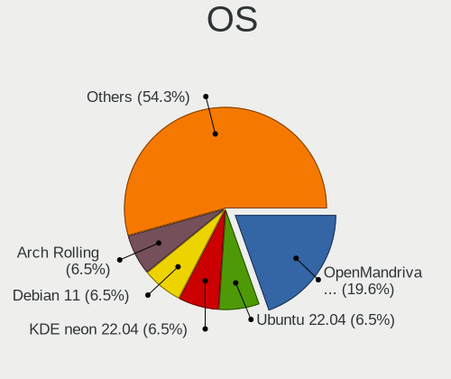

| Name                | Notebooks | Percent |
|---------------------|-----------|---------|
| Ubuntu 22.04        | 5         | 12.2%   |
| Fedora 37           | 3         | 7.32%   |
| Arch Rolling        | 3         | 7.32%   |
| Ubuntu 22.10        | 2         | 4.88%   |
| Ubuntu 20.04        | 2         | 4.88%   |
| SteamOS 3.4.6       | 2         | 4.88%   |
| Linux Mint 21.1     | 2         | 4.88%   |
| KDE neon 22.04      | 2         | 4.88%   |
| Xubuntu 16.04       | 1         | 2.44%   |
| Ubuntu MATE 22.04   | 1         | 2.44%   |
| Pop!_OS 22.04       | 1         | 2.44%   |
| Pop!_OS 20.04       | 1         | 2.44%   |
| Parrot 5.2          | 1         | 2.44%   |
| openSUSE Leap-15.4  | 1         | 2.44%   |
| OpenMandriva 23.03  | 1         | 2.44%   |
| OpenMandriva 23.01  | 1         | 2.44%   |
| Manjaro 22.0.4      | 1         | 2.44%   |
| LMDE 5              | 1         | 2.44%   |
| Linux Mint 20.3     | 1         | 2.44%   |
| Linux Mint 20.2     | 1         | 2.44%   |
| Kubuntu 22.10       | 1         | 2.44%   |
| Gentoo 2.9          | 1         | 2.44%   |
| Feren OS 20.04      | 1         | 2.44%   |
| Fedora 36           | 1         | 2.44%   |
| EndeavourOS Rolling | 1         | 2.44%   |
| Elementary 7        | 1         | 2.44%   |
| Debian 12           | 1         | 2.44%   |
| Debian 11           | 1         | 2.44%   |

OS Family
---------

OS without a version

| Name         | Notebooks | Percent |
|--------------|-----------|---------|
| Ubuntu       | 9         | 21.95%  |
| Linux Mint   | 4         | 9.76%   |
| Fedora       | 4         | 9.76%   |
| Arch         | 3         | 7.32%   |
| SteamOS      | 2         | 4.88%   |
| Pop!_OS      | 2         | 4.88%   |
| OpenMandriva | 2         | 4.88%   |
| KDE neon     | 2         | 4.88%   |
| Debian       | 2         | 4.88%   |
| Xubuntu      | 1         | 2.44%   |
| Ubuntu MATE  | 1         | 2.44%   |
| Parrot       | 1         | 2.44%   |
| openSUSE     | 1         | 2.44%   |
| Manjaro      | 1         | 2.44%   |
| LMDE         | 1         | 2.44%   |
| Kubuntu      | 1         | 2.44%   |
| Gentoo       | 1         | 2.44%   |
| Feren OS     | 1         | 2.44%   |
| EndeavourOS  | 1         | 2.44%   |
| Elementary   | 1         | 2.44%   |

Kernel
------

Version of the Linux kernel

| Version                      | Notebooks | Percent |
|------------------------------|-----------|---------|
| 5.19.0-35-generic            | 5         | 12.2%   |
| 5.15.0-67-generic            | 4         | 9.76%   |
| 5.19.0-38-generic            | 3         | 7.32%   |
| 6.1.18-200.fc37.x86_64       | 2         | 4.88%   |
| 5.4.0-144-generic            | 2         | 4.88%   |
| 5.19.0-32-generic            | 2         | 4.88%   |
| 5.13.0-valve36-1-neptune     | 2         | 4.88%   |
| 5.10.0-21-amd64              | 2         | 4.88%   |
| 6.2.7-arch1-1                | 1         | 2.44%   |
| 6.2.6-desktop-1omv2390       | 1         | 2.44%   |
| 6.2.2-gentoo                 | 1         | 2.44%   |
| 6.2.2-arch1-g14-1            | 1         | 2.44%   |
| 6.2.0-060200-generic         | 1         | 2.44%   |
| 6.1.4-desktop-1omv2301       | 1         | 2.44%   |
| 6.1.20-1-lts                 | 1         | 2.44%   |
| 6.1.15-100.fc36.x86_64       | 1         | 2.44%   |
| 6.1.14-200.fc37.x86_64       | 1         | 2.44%   |
| 6.1.11-arch1-1               | 1         | 2.44%   |
| 6.1.0-6-amd64                | 1         | 2.44%   |
| 6.0.12-76060012-generic      | 1         | 2.44%   |
| 6.0.12-76060006-generic      | 1         | 2.44%   |
| 6.0.0-12parrot1-amd64        | 1         | 2.44%   |
| 5.19.7-1-MANJARO             | 1         | 2.44%   |
| 5.15.0-69-generic            | 1         | 2.44%   |
| 5.15.0-46-generic            | 1         | 2.44%   |
| 5.14.21-150400.24.46-default | 1         | 2.44%   |
| 4.4.0-210-generic            | 1         | 2.44%   |

Kernel Family
-------------

Linux kernel without a distro release

| Version | Notebooks | Percent |
|---------|-----------|---------|
| 5.19.0  | 10        | 24.39%  |
| 5.15.0  | 6         | 14.63%  |
| 6.2.2   | 2         | 4.88%   |
| 6.1.18  | 2         | 4.88%   |
| 6.0.12  | 2         | 4.88%   |
| 5.4.0   | 2         | 4.88%   |
| 5.13.0  | 2         | 4.88%   |
| 5.10.0  | 2         | 4.88%   |
| 6.2.7   | 1         | 2.44%   |
| 6.2.6   | 1         | 2.44%   |
| 6.2.0   | 1         | 2.44%   |
| 6.1.4   | 1         | 2.44%   |
| 6.1.20  | 1         | 2.44%   |
| 6.1.15  | 1         | 2.44%   |
| 6.1.14  | 1         | 2.44%   |
| 6.1.11  | 1         | 2.44%   |
| 6.1.0   | 1         | 2.44%   |
| 6.0.0   | 1         | 2.44%   |
| 5.19.7  | 1         | 2.44%   |
| 5.14.21 | 1         | 2.44%   |
| 4.4.0   | 1         | 2.44%   |

Kernel Major Ver.
-----------------

Linux kernel major version

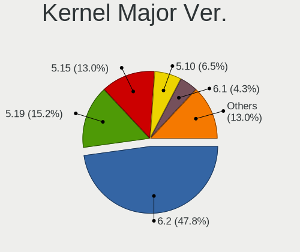

| Version | Notebooks | Percent |
|---------|-----------|---------|
| 5.19    | 11        | 26.83%  |
| 6.1     | 8         | 19.51%  |
| 5.15    | 6         | 14.63%  |
| 6.2     | 5         | 12.2%   |
| 6.0     | 3         | 7.32%   |
| 5.4     | 2         | 4.88%   |
| 5.13    | 2         | 4.88%   |
| 5.10    | 2         | 4.88%   |
| 5.14    | 1         | 2.44%   |
| 4.4     | 1         | 2.44%   |

Arch
----

OS architecture (x86_64, i586, etc.)

| Name   | Notebooks | Percent |
|--------|-----------|---------|
| x86_64 | 41        | 100%    |

DE
--

Desktop Environment

| Name       | Notebooks | Percent |
|------------|-----------|---------|
| GNOME      | 15        | 36.59%  |
| KDE5       | 12        | 29.27%  |
| X-Cinnamon | 6         | 14.63%  |
| XFCE       | 2         | 4.88%   |
| MATE       | 2         | 4.88%   |
| Pantheon   | 1         | 2.44%   |
| LXQt       | 1         | 2.44%   |
| Cinnamon   | 1         | 2.44%   |
| Unknown    | 1         | 2.44%   |

Display Server
--------------

X11 or Wayland

| Name    | Notebooks | Percent |
|---------|-----------|---------|
| X11     | 29        | 70.73%  |
| Wayland | 10        | 24.39%  |
| Tty     | 2         | 4.88%   |

Display Manager
---------------

SDDM, LightDM, etc.

| Name    | Notebooks | Percent |
|---------|-----------|---------|
| Unknown | 17        | 41.46%  |
| SDDM    | 8         | 19.51%  |
| GDM3    | 7         | 17.07%  |
| LightDM | 6         | 14.63%  |
| GDM     | 3         | 7.32%   |

OS Lang
-------

Language

| Lang        | Notebooks | Percent |
|-------------|-----------|---------|
| en_AU       | 31        | 75.61%  |
| en_US       | 5         | 12.2%   |
| C           | 2         | 4.88%   |
| it_IT       | 1         | 2.44%   |
| en_GB       | 1         | 2.44%   |
| en_AU.UFT-8 | 1         | 2.44%   |

Boot Mode
---------

EFI or BIOS

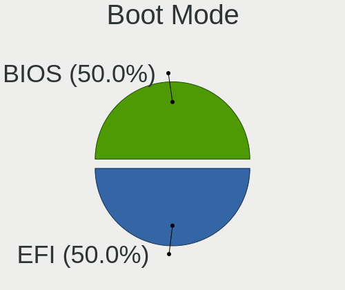

| Mode | Notebooks | Percent |
|------|-----------|---------|
| EFI  | 24        | 58.54%  |
| BIOS | 17        | 41.46%  |

Filesystem
----------

Type of filesystem

| Type    | Notebooks | Percent |
|---------|-----------|---------|
| Ext4    | 31        | 75.61%  |
| Btrfs   | 8         | 19.51%  |
| Overlay | 2         | 4.88%   |

Part. scheme
------------

Scheme of partitioning

| Type    | Notebooks | Percent |
|---------|-----------|---------|
| GPT     | 20        | 48.78%  |
| Unknown | 16        | 39.02%  |
| MBR     | 5         | 12.2%   |

Dual Boot with Linux/BSD
------------------------

Hosting more than one Linux/BSD

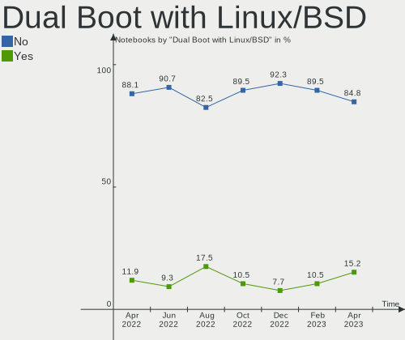

| Dual boot | Notebooks | Percent |
|-----------|-----------|---------|
| No        | 35        | 85.37%  |
| Yes       | 6         | 14.63%  |

Dual Boot (Win)
---------------

Hosting Linux and Windows

| Dual boot | Notebooks | Percent |
|-----------|-----------|---------|
| No        | 33        | 80.49%  |
| Yes       | 8         | 19.51%  |

Board
-----

Vendor
------

Motherboard manufacturer

| Name             | Notebooks | Percent |
|------------------|-----------|---------|
| Lenovo           | 9         | 21.95%  |
| Hewlett-Packard  | 9         | 21.95%  |
| Dell             | 9         | 21.95%  |
| ASUSTek Computer | 3         | 7.32%   |
| Acer             | 3         | 7.32%   |
| Valve            | 2         | 4.88%   |
| Toshiba          | 1         | 2.44%   |
| MSI              | 1         | 2.44%   |
| Maibenben        | 1         | 2.44%   |
| HUAWEI           | 1         | 2.44%   |
| Google           | 1         | 2.44%   |
| Apple            | 1         | 2.44%   |

Model
-----

Motherboard model

| Name                                     | Notebooks | Percent |
|------------------------------------------|-----------|---------|
| Valve Jupiter                            | 2         | 4.88%   |
| Dell XPS 15 9570                         | 2         | 4.88%   |
| Dell G3 3590                             | 2         | 4.88%   |
| Toshiba TECRA Z50-C                      | 1         | 2.44%   |
| MSI Delta 15 A5EFK                       | 1         | 2.44%   |
| Maibenben P748                           | 1         | 2.44%   |
| Lenovo V14-ADA 82C6                      | 1         | 2.44%   |
| Lenovo ThinkPad T14 Gen 1 20UDS11900     | 1         | 2.44%   |
| Lenovo ThinkPad P15s Gen 2i 20W6S04Y00   | 1         | 2.44%   |
| Lenovo ThinkPad E590 20NBA000AU          | 1         | 2.44%   |
| Lenovo IdeaPad 520-15IKB 81BF            | 1         | 2.44%   |
| Lenovo IdeaPad 5 Pro 14ARH7 82SJ         | 1         | 2.44%   |
| Lenovo IdeaPad 5 15IAL7 82SF             | 1         | 2.44%   |
| Lenovo IdeaPad 320-15AST 80XV            | 1         | 2.44%   |
| Lenovo IdeaPad 3 15IGL05 81WQ            | 1         | 2.44%   |
| HUAWEI NBD-WXX9                          | 1         | 2.44%   |
| HP Stream Laptop 11-ah1XX                | 1         | 2.44%   |
| HP ProBook 470 G5                        | 1         | 2.44%   |
| HP ProBook 450 G5                        | 1         | 2.44%   |
| HP ProBook 430 G8 Notebook PC            | 1         | 2.44%   |
| HP Pavilion Notebook                     | 1         | 2.44%   |
| HP Laptop 15-db0xxx                      | 1         | 2.44%   |
| HP ENVY 17                               | 1         | 2.44%   |
| HP EliteBook 8470p                       | 1         | 2.44%   |
| HP Compaq Presario C700                  | 1         | 2.44%   |
| Google Ultima                            | 1         | 2.44%   |
| Dell XPS 13 9360                         | 1         | 2.44%   |
| Dell Precision 5550                      | 1         | 2.44%   |
| Dell Latitude E6520                      | 1         | 2.44%   |
| Dell Inspiron M5010                      | 1         | 2.44%   |
| Dell Inspiron 5559                       | 1         | 2.44%   |
| ASUS ZenBook UX425UA_UM425UA             | 1         | 2.44%   |
| ASUS VivoBook_ASUSLaptop X712EA_S712EA   | 1         | 2.44%   |
| ASUS ROG Zephyrus Duo 16 GX650RX_GX650RX | 1         | 2.44%   |
| Apple MacBookPro14,3                     | 1         | 2.44%   |
| Acer Swift SFX14-41G                     | 1         | 2.44%   |
| Acer ConceptD CN315-71P                  | 1         | 2.44%   |
| Acer Aspire E5-511                       | 1         | 2.44%   |

Model Family
------------

Motherboard model prefix

| Name               | Notebooks | Percent |
|--------------------|-----------|---------|
| Lenovo IdeaPad     | 5         | 12.2%   |
| Lenovo ThinkPad    | 3         | 7.32%   |
| HP ProBook         | 3         | 7.32%   |
| Dell XPS           | 3         | 7.32%   |
| Valve Jupiter      | 2         | 4.88%   |
| Dell Inspiron      | 2         | 4.88%   |
| Dell G3            | 2         | 4.88%   |
| Toshiba TECRA      | 1         | 2.44%   |
| MSI Delta          | 1         | 2.44%   |
| Maibenben P748     | 1         | 2.44%   |
| Lenovo V14-ADA     | 1         | 2.44%   |
| HUAWEI NBD-WXX9    | 1         | 2.44%   |
| HP Stream          | 1         | 2.44%   |
| HP Pavilion        | 1         | 2.44%   |
| HP Laptop          | 1         | 2.44%   |
| HP ENVY            | 1         | 2.44%   |
| HP EliteBook       | 1         | 2.44%   |
| HP Compaq          | 1         | 2.44%   |
| Google Ultima      | 1         | 2.44%   |
| Dell Precision     | 1         | 2.44%   |
| Dell Latitude      | 1         | 2.44%   |
| ASUS ZenBook       | 1         | 2.44%   |
| ASUS VivoBook      | 1         | 2.44%   |
| ASUS ROG           | 1         | 2.44%   |
| Apple MacBookPro14 | 1         | 2.44%   |
| Acer Swift         | 1         | 2.44%   |
| Acer ConceptD      | 1         | 2.44%   |
| Acer Aspire        | 1         | 2.44%   |

MFG Year
--------

Motherboard manufacture year

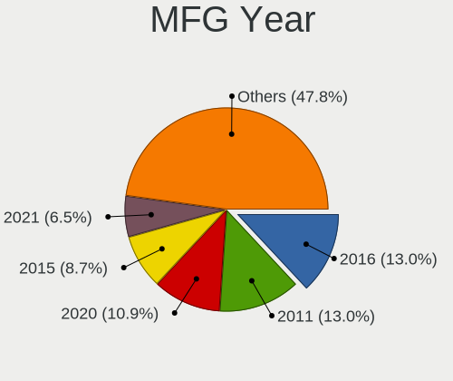

| Year | Notebooks | Percent |
|------|-----------|---------|
| 2020 | 9         | 21.95%  |
| 2018 | 7         | 17.07%  |
| 2021 | 6         | 14.63%  |
| 2022 | 4         | 9.76%   |
| 2019 | 3         | 7.32%   |
| 2017 | 3         | 7.32%   |
| 2015 | 2         | 4.88%   |
| 2011 | 2         | 4.88%   |
| 2010 | 2         | 4.88%   |
| 2016 | 1         | 2.44%   |
| 2014 | 1         | 2.44%   |
| 2007 | 1         | 2.44%   |

Form Factor
-----------

Physical design of the computer

| Name     | Notebooks | Percent |
|----------|-----------|---------|
| Notebook | 41        | 100%    |

Secure Boot
-----------

Enabled or disabled

| State    | Notebooks | Percent |
|----------|-----------|---------|
| Disabled | 34        | 82.93%  |
| Enabled  | 7         | 17.07%  |

Coreboot
--------

Have coreboot on board

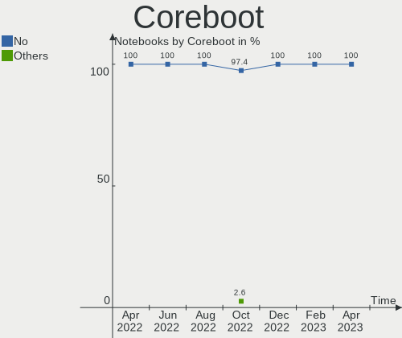

| Used | Notebooks | Percent |
|------|-----------|---------|
| No   | 40        | 97.56%  |
| Yes  | 1         | 2.44%   |

RAM Size
--------

Total RAM memory

| Size in GB  | Notebooks | Percent |
|-------------|-----------|---------|
| 16.01-24.0  | 12        | 29.27%  |
| 8.01-16.0   | 9         | 21.95%  |
| 4.01-8.0    | 7         | 17.07%  |
| 3.01-4.0    | 6         | 14.63%  |
| 32.01-64.0  | 5         | 12.2%   |
| 64.01-256.0 | 1         | 2.44%   |
| 1.01-2.0    | 1         | 2.44%   |

RAM Used
--------

Used RAM memory

| Used GB   | Notebooks | Percent |
|-----------|-----------|---------|
| 1.01-2.0  | 12        | 29.27%  |
| 3.01-4.0  | 11        | 26.83%  |
| 4.01-8.0  | 8         | 19.51%  |
| 2.01-3.0  | 7         | 17.07%  |
| 8.01-16.0 | 3         | 7.32%   |

Total Drives
------------

Number of drives on board

| Drives | Notebooks | Percent |
|--------|-----------|---------|
| 1      | 23        | 56.1%   |
| 2      | 15        | 36.59%  |
| 4      | 2         | 4.88%   |
| 3      | 1         | 2.44%   |

Has CD-ROM
----------

Has CD-ROM on board

| Presented | Notebooks | Percent |
|-----------|-----------|---------|
| No        | 30        | 73.17%  |
| Yes       | 11        | 26.83%  |

Has Ethernet
------------

Has Ethernet on board

| Presented | Notebooks | Percent |
|-----------|-----------|---------|
| Yes       | 26        | 63.41%  |
| No        | 15        | 36.59%  |

Has WiFi
--------

Has WiFi module

| Presented | Notebooks | Percent |
|-----------|-----------|---------|
| Yes       | 41        | 100%    |

Has Bluetooth
-------------

Has Bluetooth module

| Presented | Notebooks | Percent |
|-----------|-----------|---------|
| Yes       | 37        | 90.24%  |
| No        | 4         | 9.76%   |

Location
--------

Country
-------

Geographic location (country)

| Country   | Notebooks | Percent |
|-----------|-----------|---------|
| Australia | 41        | 100%    |

City
----

Geographic location (city)

| City       | Notebooks | Percent |
|------------|-----------|---------|
| Sydney     | 12        | 29.27%  |
| Melbourne  | 10        | 24.39%  |
| Perth      | 7         | 17.07%  |
| Brisbane   | 4         | 9.76%   |
| Adelaide   | 3         | 7.32%   |
| Leinster   | 1         | 2.44%   |
| Lara       | 1         | 2.44%   |
| Lancefield | 1         | 2.44%   |
| Greenwich  | 1         | 2.44%   |
| Canberra   | 1         | 2.44%   |

Drives
------

Drive Vendor
------------

Hard drive vendors

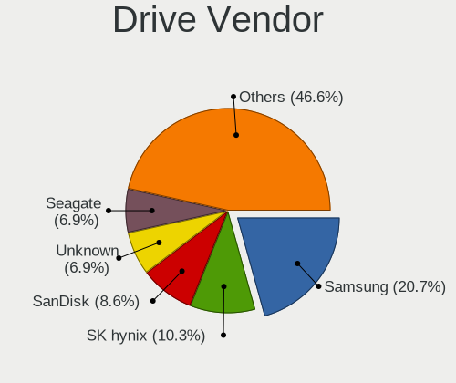

| Vendor                         | Notebooks | Drives | Percent |
|--------------------------------|-----------|--------|---------|
| Samsung Electronics            | 13        | 14     | 21.67%  |
| Seagate                        | 7         | 7      | 11.67%  |
| Unknown                        | 6         | 8      | 10%     |
| Toshiba                        | 4         | 4      | 6.67%   |
| SanDisk                        | 4         | 4      | 6.67%   |
| Phison Electronics             | 4         | 4      | 6.67%   |
| SK hynix                       | 3         | 3      | 5%      |
| T-FORCE                        | 2         | 2      | 3.33%   |
| Solid State Storage            | 2         | 2      | 3.33%   |
| Micron Technology              | 2         | 2      | 3.33%   |
| Unknown                        | 2         | 2      | 3.33%   |
| WDC                            | 1         | 1      | 1.67%   |
| SPCC                           | 1         | 1      | 1.67%   |
| Solid State Storage Technology | 1         | 1      | 1.67%   |
| Patriot                        | 1         | 1      | 1.67%   |
| Kingston                       | 1         | 1      | 1.67%   |
| Kingmax                        | 1         | 1      | 1.67%   |
| Intel                          | 1         | 1      | 1.67%   |
| Hitachi                        | 1         | 1      | 1.67%   |
| Biwin Storage Technology       | 1         | 1      | 1.67%   |
| BIWIN                          | 1         | 1      | 1.67%   |
| ASMT                           | 1         | 2      | 1.67%   |

Drive Model
-----------

Hard drive models

| Model                                                 | Notebooks | Percent |
|-------------------------------------------------------|-----------|---------|
| Samsung NVMe SSD Controller SM981/PM981/PM983 250GB   | 3         | 4.92%   |
| Phison PS5013 E13 NVMe Controller 256GB               | 3         | 4.92%   |
| Unknown MMC Card  256GB                               | 2         | 3.28%   |
| T-FORCE 2TB                                           | 2         | 3.28%   |
| Solid State Storage CL1-3D512-Q11 NVMe SSSTC 512GB    | 2         | 3.28%   |
| Unknown                                               | 2         | 3.28%   |
| WDC WD10SPZX-00Z10T0 1TB                              | 1         | 1.64%   |
| Unknown SM16G  16GB                                   | 1         | 1.64%   |
| Unknown SD/MMC/MS PRO 64GB                            | 1         | 1.64%   |
| Unknown SC64G  64GB                                   | 1         | 1.64%   |
| Unknown MMC Card  16GB                                | 1         | 1.64%   |
| Unknown CJTD4R  64GB                                  | 1         | 1.64%   |
| Toshiba XG4 NVMe SSD Controller 256GB                 | 1         | 1.64%   |
| Toshiba MQ04ABF100 1TB                                | 1         | 1.64%   |
| Toshiba MQ01ABD075 752GB                              | 1         | 1.64%   |
| Toshiba KXG50ZNV512G 512GB                            | 1         | 1.64%   |
| SPCC Solid State Disk 1TB                             | 1         | 1.64%   |
| Solid State Storage SSSTC CL1-4D128 128GB             | 1         | 1.64%   |
| SK hynix PC601 NVMe 512GB                             | 1         | 1.64%   |
| SK hynix HFM512GDHTNG-8710B 512GB                     | 1         | 1.64%   |
| SK hynix HFM512GD3JX016N 512GB                        | 1         | 1.64%   |
| Seagate ST9250315AS 250GB                             | 1         | 1.64%   |
| Seagate ST500LT012-1DG142 500GB                       | 1         | 1.64%   |
| Seagate ST320LT020-9YG142 320GB                       | 1         | 1.64%   |
| Seagate ST2000LM007-1R8174 2TB                        | 1         | 1.64%   |
| Seagate ST2000LM003 HN-M201RAD 2TB                    | 1         | 1.64%   |
| Seagate OneTouch HDD 2TB                              | 1         | 1.64%   |
| Seagate Backup+ Hub BK 8TB                            | 1         | 1.64%   |
| Sandisk WD Black SN750 / PC SN730 NVMe SSD 1TB        | 1         | 1.64%   |
| Sandisk WD Black 2018/SN750 / PC SN720 NVMe SSD 256GB | 1         | 1.64%   |
| SanDisk SD9SN8W-128G-1006 128GB SSD                   | 1         | 1.64%   |
| SanDisk Portable SSD 1TB                              | 1         | 1.64%   |
| Samsung SSD 850 EVO 500GB                             | 1         | 1.64%   |
| Samsung SSD 850 EVO 1TB                               | 1         | 1.64%   |
| Samsung NVMe SSD Controller SM961/PM961/SM963 256GB   | 1         | 1.64%   |
| Samsung NVMe SSD Controller PM9A1/PM9A3/980PRO 1TB    | 1         | 1.64%   |
| Samsung MZVLQ512HALU-000H1 512GB                      | 1         | 1.64%   |
| Samsung MZVLB512HBJQ-000L2 512GB                      | 1         | 1.64%   |
| Samsung MZVLB512HAJQ-00000 512GB                      | 1         | 1.64%   |
| Samsung MZALQ256HBJD-00BL2 256GB                      | 1         | 1.64%   |

HDD Vendor
----------

Hard disk drive vendors

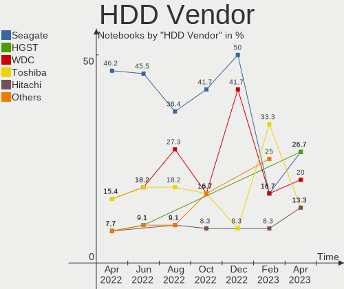

| Vendor  | Notebooks | Drives | Percent |
|---------|-----------|--------|---------|
| Seagate | 7         | 7      | 53.85%  |
| Toshiba | 2         | 2      | 15.38%  |
| WDC     | 1         | 1      | 7.69%   |
| Unknown | 1         | 1      | 7.69%   |
| Hitachi | 1         | 1      | 7.69%   |
| ASMT    | 1         | 2      | 7.69%   |

SSD Vendor
----------

Solid state drive vendors

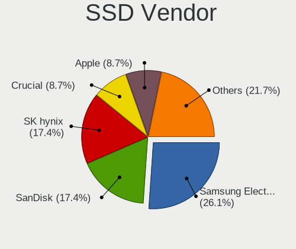

| Vendor              | Notebooks | Drives | Percent |
|---------------------|-----------|--------|---------|
| SanDisk             | 2         | 2      | 28.57%  |
| Samsung Electronics | 2         | 2      | 28.57%  |
| SPCC                | 1         | 1      | 14.29%  |
| Patriot             | 1         | 1      | 14.29%  |
| Kingmax             | 1         | 1      | 14.29%  |

Drive Kind
----------

HDD or SSD

| Kind    | Notebooks | Drives | Percent |
|---------|-----------|--------|---------|
| NVMe    | 26        | 32     | 49.06%  |
| HDD     | 12        | 14     | 22.64%  |
| MMC     | 7         | 9      | 13.21%  |
| SSD     | 6         | 7      | 11.32%  |
| Unknown | 2         | 2      | 3.77%   |

Drive Connector
---------------

SATA, SAS, NVMe, etc.

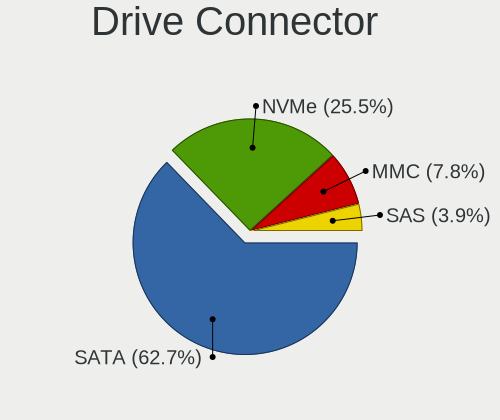

| Type | Notebooks | Drives | Percent |
|------|-----------|--------|---------|
| NVMe | 26        | 32     | 49.06%  |
| SATA | 16        | 17     | 30.19%  |
| MMC  | 7         | 9      | 13.21%  |
| SAS  | 4         | 6      | 7.55%   |

Drive Size
----------

Size of hard drive

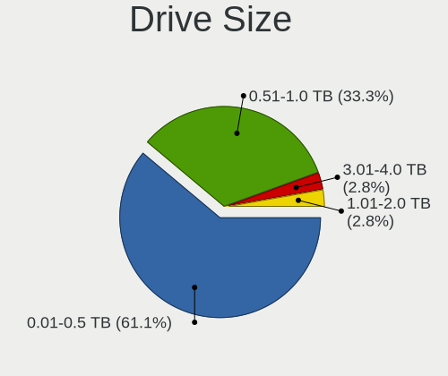

| Size in TB | Notebooks | Drives | Percent |
|------------|-----------|--------|---------|
| 0.01-0.5   | 8         | 9      | 44.44%  |
| 0.51-1.0   | 5         | 6      | 27.78%  |
| 1.01-2.0   | 4         | 5      | 22.22%  |
| 4.01-10.0  | 1         | 1      | 5.56%   |

Space Total
-----------

Amount of disk space available on the file system

| Size in GB     | Notebooks | Percent |
|----------------|-----------|---------|
| 251-500        | 10        | 24.39%  |
| 101-250        | 9         | 21.95%  |
| 1001-2000      | 6         | 14.63%  |
| More than 3000 | 4         | 9.76%   |
| 1-20           | 4         | 9.76%   |
| 501-1000       | 4         | 9.76%   |
| 51-100         | 2         | 4.88%   |
| 21-50          | 1         | 2.44%   |
| 2001-3000      | 1         | 2.44%   |

Space Used
----------

Amount of used disk space

| Used GB   | Notebooks | Percent |
|-----------|-----------|---------|
| 21-50     | 9         | 21.95%  |
| 101-250   | 9         | 21.95%  |
| 1-20      | 9         | 21.95%  |
| 51-100    | 4         | 9.76%   |
| 251-500   | 3         | 7.32%   |
| 501-1000  | 3         | 7.32%   |
| 2001-3000 | 2         | 4.88%   |
| 1001-2000 | 1         | 2.44%   |
| 0         | 1         | 2.44%   |

Malfunc. Drives
---------------

Drive models with a malfunction

| Model                                     | Notebooks | Drives | Percent |
|-------------------------------------------|-----------|--------|---------|
| Biwin Storage Technology HP SSD EX900 1TB | 1         | 1      | 100%    |

Malfunc. Drive Vendor
---------------------

Vendors of faulty drives

| Vendor                   | Notebooks | Drives | Percent |
|--------------------------|-----------|--------|---------|
| Biwin Storage Technology | 1         | 1      | 100%    |

Malfunc. HDD Vendor
-------------------

Vendors of faulty HDD drives

Zero info for selected period =(

Malfunc. Drive Kind
-------------------

Kinds of faulty drives

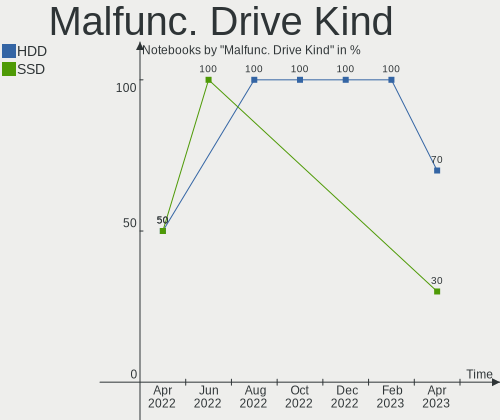

| Kind | Notebooks | Drives | Percent |
|------|-----------|--------|---------|
| NVMe | 1         | 1      | 100%    |

Failed Drives
-------------

Failed drive models

Zero info for selected period =(

Failed Drive Vendor
-------------------

Failed drive vendors

Zero info for selected period =(

Drive Status
------------

Number of failed and malfunc. drives

| Status   | Notebooks | Drives | Percent |
|----------|-----------|--------|---------|
| Detected | 28        | 41     | 59.57%  |
| Works    | 18        | 22     | 38.3%   |
| Malfunc  | 1         | 1      | 2.13%   |

Storage controller
------------------

Storage Vendor
--------------

Storage controller vendors

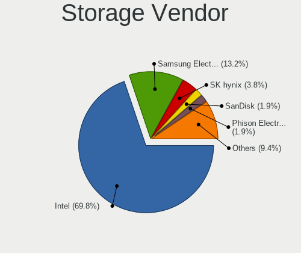

| Vendor                         | Notebooks | Percent |
|--------------------------------|-----------|---------|
| Intel                          | 20        | 36.36%  |
| Samsung Electronics            | 11        | 20%     |
| AMD                            | 5         | 9.09%   |
| Phison Electronics             | 4         | 7.27%   |
| Solid State Storage Technology | 3         | 5.45%   |
| SK hynix                       | 3         | 5.45%   |
| Toshiba America Info Systems   | 2         | 3.64%   |
| SanDisk                        | 2         | 3.64%   |
| Micron Technology              | 2         | 3.64%   |
| Silicon Motion                 | 1         | 1.82%   |
| Kingston Technology Company    | 1         | 1.82%   |
| Biwin Storage Technology       | 1         | 1.82%   |

Storage Model
-------------

Storage controller models

| Model                                                            | Notebooks | Percent |
|------------------------------------------------------------------|-----------|---------|
| Samsung NVMe SSD Controller SM981/PM981/PM983                    | 5         | 8.93%   |
| Intel Cannon Lake Mobile PCH SATA AHCI Controller                | 5         | 8.93%   |
| AMD FCH SATA Controller [AHCI mode]                              | 4         | 7.14%   |
| Solid State Storage Non-Volatile memory controller               | 3         | 5.36%   |
| Samsung NVMe SSD Controller 980                                  | 3         | 5.36%   |
| Phison PS5013 E13 NVMe Controller                                | 3         | 5.36%   |
| Intel Sunrise Point-LP SATA Controller [AHCI mode]               | 3         | 5.36%   |
| Intel 82801 Mobile SATA Controller [RAID mode]                   | 3         | 5.36%   |
| Micron NVMe Storage Controller                                   | 2         | 3.57%   |
| Toshiba America Info Systems XG5 NVMe SSD Controller             | 1         | 1.79%   |
| Toshiba America Info Systems XG4 NVMe SSD Controller             | 1         | 1.79%   |
| SK hynix Non-Volatile memory controller                          | 1         | 1.79%   |
| SK hynix Gold P31/PC711 NVMe Solid State Drive                   | 1         | 1.79%   |
| SK hynix BC501 NVMe Solid State Drive                            | 1         | 1.79%   |
| Silicon Motion SM2263EN/SM2263XT SSD Controller                  | 1         | 1.79%   |
| SanDisk WD Black SN750 / PC SN730 NVMe SSD                       | 1         | 1.79%   |
| SanDisk WD Black 2018/SN750 / PC SN720 NVMe SSD                  | 1         | 1.79%   |
| Samsung NVMe SSD Controller SM961/PM961/SM963                    | 1         | 1.79%   |
| Samsung NVMe SSD Controller PM9B1                                | 1         | 1.79%   |
| Samsung NVMe SSD Controller PM9A1/PM9A3/980PRO                   | 1         | 1.79%   |
| Phison E16 PCIe4 NVMe Controller                                 | 1         | 1.79%   |
| Kingston Company NVMe Controller                                 | 1         | 1.79%   |
| Intel Volume Management Device NVMe RAID Controller              | 1         | 1.79%   |
| Intel Tiger Lake-LP SATA Controller                              | 1         | 1.79%   |
| Intel SSD Pro 7600p/760p/E 6100p Series                          | 1         | 1.79%   |
| Intel Celeron/Pentium Silver Processor SATA Controller           | 1         | 1.79%   |
| Intel Atom Processor E3800 Series SATA AHCI Controller           | 1         | 1.79%   |
| Intel Alder Lake-P SATA AHCI Controller                          | 1         | 1.79%   |
| Intel 82801HM/HEM (ICH8M/ICH8M-E) SATA Controller [AHCI mode]    | 1         | 1.79%   |
| Intel 82801HM/HEM (ICH8M/ICH8M-E) IDE Controller                 | 1         | 1.79%   |
| Intel 8 Series SATA Controller 1 [AHCI mode]                     | 1         | 1.79%   |
| Intel 7 Series Chipset Family 6-port SATA Controller [AHCI mode] | 1         | 1.79%   |
| Biwin Storage Non-Volatile memory controller                     | 1         | 1.79%   |
| AMD SB7x0/SB8x0/SB9x0 SATA Controller [AHCI mode]                | 1         | 1.79%   |

Storage Kind
------------

Kind of storage controller (IDE, SATA, NVMe, SAS, ...)

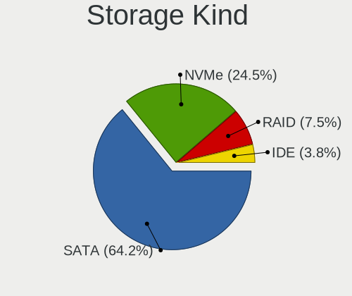

| Kind | Notebooks | Percent |
|------|-----------|---------|
| NVMe | 26        | 50.98%  |
| SATA | 20        | 39.22%  |
| RAID | 4         | 7.84%   |
| IDE  | 1         | 1.96%   |

Processor
---------

CPU Vendor
----------

Processor vendors

| Vendor | Notebooks | Percent |
|--------|-----------|---------|
| Intel  | 27        | 65.85%  |
| AMD    | 14        | 34.15%  |

CPU Model
---------

Processor models

| Model                                           | Notebooks | Percent |
|-------------------------------------------------|-----------|---------|
| Intel Core i7-9750H CPU @ 2.60GHz               | 3         | 7.32%   |
| Intel Core i7-8550U CPU @ 1.80GHz               | 3         | 7.32%   |
| Intel 11th Gen Core i7-1165G7 @ 2.80GHz         | 3         | 7.32%   |
| Intel Core i7-8750H CPU @ 2.20GHz               | 2         | 4.88%   |
| AMD Ryzen 7 5700U with Radeon Graphics          | 2         | 4.88%   |
| AMD Custom APU 0405                             | 2         | 4.88%   |
| Intel Pentium Dual CPU T2370 @ 1.73GHz          | 1         | 2.44%   |
| Intel Core i7-7820HQ CPU @ 2.90GHz              | 1         | 2.44%   |
| Intel Core i7-7560U CPU @ 2.40GHz               | 1         | 2.44%   |
| Intel Core i7-6500U CPU @ 2.50GHz               | 1         | 2.44%   |
| Intel Core i7-4510U CPU @ 2.00GHz               | 1         | 2.44%   |
| Intel Core i7-10750H CPU @ 2.60GHz              | 1         | 2.44%   |
| Intel Core i5-8265U CPU @ 1.60GHz               | 1         | 2.44%   |
| Intel Core i5-6300U CPU @ 2.40GHz               | 1         | 2.44%   |
| Intel Core i5-3360M CPU @ 2.80GHz               | 1         | 2.44%   |
| Intel Core i5-2540M CPU @ 2.60GHz               | 1         | 2.44%   |
| Intel Celeron N4020 CPU @ 1.10GHz               | 1         | 2.44%   |
| Intel Celeron N4000 CPU @ 1.10GHz               | 1         | 2.44%   |
| Intel Celeron CPU N3150 @ 1.60GHz               | 1         | 2.44%   |
| Intel Celeron CPU N2930 @ 1.83GHz               | 1         | 2.44%   |
| Intel 12th Gen Core i5-1235U                    | 1         | 2.44%   |
| Intel 11th Gen Core i5-1135G7 @ 2.40GHz         | 1         | 2.44%   |
| AMD Ryzen 9 6900HX with Radeon Graphics         | 1         | 2.44%   |
| AMD Ryzen 7 6800HS Creator Edition              | 1         | 2.44%   |
| AMD Ryzen 7 5800H with Radeon Graphics          | 1         | 2.44%   |
| AMD Ryzen 7 4800H with Radeon Graphics          | 1         | 2.44%   |
| AMD Ryzen 5 PRO 4650U with Radeon Graphics      | 1         | 2.44%   |
| AMD E2-9000 RADEON R2, 4 COMPUTE CORES 2C+2G    | 1         | 2.44%   |
| AMD Athlon II P360 Dual-Core Processor          | 1         | 2.44%   |
| AMD A6-9225 RADEON R4, 5 COMPUTE CORES 2C+3G    | 1         | 2.44%   |
| AMD A10-8700P Radeon R6, 10 Compute Cores 4C+6G | 1         | 2.44%   |
| AMD 3020e with Radeon Graphics                  | 1         | 2.44%   |

CPU Model Family
----------------

Processor model prefix

| Model              | Notebooks | Percent |
|--------------------|-----------|---------|
| Intel Core i7      | 13        | 31.71%  |
| Other              | 8         | 19.51%  |
| AMD Ryzen 7        | 5         | 12.2%   |
| Intel Core i5      | 4         | 9.76%   |
| Intel Celeron      | 4         | 9.76%   |
| Intel Pentium Dual | 1         | 2.44%   |
| AMD Ryzen 9        | 1         | 2.44%   |
| AMD Ryzen 5 PRO    | 1         | 2.44%   |
| AMD E2             | 1         | 2.44%   |
| AMD Athlon II      | 1         | 2.44%   |
| AMD A6             | 1         | 2.44%   |
| AMD A10            | 1         | 2.44%   |

CPU Cores
---------

Number of processor cores

| Number | Notebooks | Percent |
|--------|-----------|---------|
| 2      | 14        | 34.15%  |
| 4      | 13        | 31.71%  |
| 8      | 6         | 14.63%  |
| 6      | 6         | 14.63%  |
| 10     | 1         | 2.44%   |
| 5      | 1         | 2.44%   |

CPU Sockets
-----------

Number of sockets

| Number | Notebooks | Percent |
|--------|-----------|---------|
| 1      | 41        | 100%    |

CPU Threads
-----------

Threads per core (Hyper-Threading)

| Number | Notebooks | Percent |
|--------|-----------|---------|
| 2      | 31        | 75.61%  |
| 1      | 10        | 24.39%  |

CPU Op-Modes
------------

CPU Operation Modes (32-bit, 64-bit)

| Op mode        | Notebooks | Percent |
|----------------|-----------|---------|
| 32-bit, 64-bit | 41        | 100%    |

CPU Microcode
-------------

Microcode number

| Number     | Notebooks | Percent |
|------------|-----------|---------|
| Unknown    | 20        | 48.78%  |
| 0x806c1    | 3         | 7.32%   |
| 0x906a4    | 1         | 2.44%   |
| 0x806eb    | 1         | 2.44%   |
| 0x806ea    | 1         | 2.44%   |
| 0x706a8    | 1         | 2.44%   |
| 0x706a1    | 1         | 2.44%   |
| 0x6fd      | 1         | 2.44%   |
| 0x406e3    | 1         | 2.44%   |
| 0x40651    | 1         | 2.44%   |
| 0x306a9    | 1         | 2.44%   |
| 0x30678    | 1         | 2.44%   |
| 0x0a50000c | 1         | 2.44%   |
| 0x0a404102 | 1         | 2.44%   |
| 0x08608103 | 1         | 2.44%   |
| 0x08600103 | 1         | 2.44%   |
| 0x08200103 | 1         | 2.44%   |
| 0x06006705 | 1         | 2.44%   |
| 0x06006110 | 1         | 2.44%   |
| 0x010000c8 | 1         | 2.44%   |

CPU Microarch
-------------

Microarchitecture

| Name             | Notebooks | Percent |
|------------------|-----------|---------|
| KabyLake         | 11        | 26.83%  |
| Unknown          | 6         | 14.63%  |
| TigerLake        | 4         | 9.76%   |
| Excavator        | 3         | 7.32%   |
| Zen 2            | 2         | 4.88%   |
| Skylake          | 2         | 4.88%   |
| Silvermont       | 2         | 4.88%   |
| Goldmont plus    | 2         | 4.88%   |
| Zen 3            | 1         | 2.44%   |
| Zen              | 1         | 2.44%   |
| SandyBridge      | 1         | 2.44%   |
| K10              | 1         | 2.44%   |
| IvyBridge        | 1         | 2.44%   |
| Haswell          | 1         | 2.44%   |
| Core             | 1         | 2.44%   |
| CometLake        | 1         | 2.44%   |
| Alderlake Hybrid | 1         | 2.44%   |

Graphics
--------

GPU Vendor
----------

Vendors of graphics cards

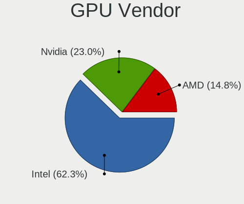

| Vendor | Notebooks | Percent |
|--------|-----------|---------|
| Intel  | 26        | 46.43%  |
| AMD    | 16        | 28.57%  |
| Nvidia | 14        | 25%     |

GPU Model
---------

Graphics card models

| Model                                                                                    | Notebooks | Percent |
|------------------------------------------------------------------------------------------|-----------|---------|
| Intel CoffeeLake-H GT2 [UHD Graphics 630]                                                | 5         | 8.47%   |
| Intel TigerLake-LP GT2 [Iris Xe Graphics]                                                | 4         | 6.78%   |
| Intel UHD Graphics 620                                                                   | 3         | 5.08%   |
| Nvidia TU117GLM [Quadro T1000 Mobile]                                                    | 2         | 3.39%   |
| Nvidia TU116M [GeForce GTX 1660 Ti Mobile]                                               | 2         | 3.39%   |
| Nvidia GP107M [GeForce GTX 1050 Ti Mobile]                                               | 2         | 3.39%   |
| Nvidia GM108M [GeForce 930MX]                                                            | 2         | 3.39%   |
| Intel Skylake GT2 [HD Graphics 520]                                                      | 2         | 3.39%   |
| Intel GeminiLake [UHD Graphics 600]                                                      | 2         | 3.39%   |
| AMD VanGogh [AMD Custom GPU 0405]                                                        | 2         | 3.39%   |
| AMD Stoney [Radeon R2/R3/R4/R5 Graphics]                                                 | 2         | 3.39%   |
| AMD Renoir                                                                               | 2         | 3.39%   |
| AMD Rembrandt [Radeon 680M]                                                              | 2         | 3.39%   |
| AMD Lucienne                                                                             | 2         | 3.39%   |
| Nvidia TU117M [GeForce GTX 1650 Mobile / Max-Q]                                          | 1         | 1.69%   |
| Nvidia TU117GLM [Quadro T500 Mobile]                                                     | 1         | 1.69%   |
| Nvidia TU106M [GeForce RTX 2060 Mobile]                                                  | 1         | 1.69%   |
| Nvidia GP108M [GeForce MX150]                                                            | 1         | 1.69%   |
| Nvidia GM107M [GeForce GTX 850M]                                                         | 1         | 1.69%   |
| Nvidia GA103M [GeForce RTX 3080 Ti Mobile]                                               | 1         | 1.69%   |
| Intel WhiskeyLake-U GT2 [UHD Graphics 620]                                               | 1         | 1.69%   |
| Intel Mobile GM965/GL960 Integrated Graphics Controller (secondary)                      | 1         | 1.69%   |
| Intel Mobile GM965/GL960 Integrated Graphics Controller (primary)                        | 1         | 1.69%   |
| Intel Iris Plus Graphics 640                                                             | 1         | 1.69%   |
| Intel Haswell-ULT Integrated Graphics Controller                                         | 1         | 1.69%   |
| Intel CometLake-H GT2 [UHD Graphics]                                                     | 1         | 1.69%   |
| Intel Atom/Celeron/Pentium Processor x5-E8000/J3xxx/N3xxx Integrated Graphics Controller | 1         | 1.69%   |
| Intel Atom Processor Z36xxx/Z37xxx Series Graphics & Display                             | 1         | 1.69%   |
| Intel Alder Lake-UP3 GT2 [Iris Xe Graphics]                                              | 1         | 1.69%   |
| Intel 3rd Gen Core processor Graphics Controller                                         | 1         | 1.69%   |
| Intel 2nd Generation Core Processor Family Integrated Graphics Controller                | 1         | 1.69%   |
| AMD Wani [Radeon R5/R6/R7 Graphics]                                                      | 1         | 1.69%   |
| AMD Topaz XT [Radeon R7 M260/M265 / M340/M360 / M440/M445 / 530/535 / 620/625 Mobile]    | 1         | 1.69%   |
| AMD Sun XT [Radeon HD 8670A/8670M/8690M / R5 M330 / M430 / Radeon 520 Mobile]            | 1         | 1.69%   |
| AMD RS880M [Mobility Radeon HD 4225/4250]                                                | 1         | 1.69%   |
| AMD Picasso/Raven 2 [Radeon Vega Series / Radeon Vega Mobile Series]                     | 1         | 1.69%   |
| AMD Navi 22 [Radeon RX 6700/6700 XT/6750 XT / 6800M/6850M XT]                            | 1         | 1.69%   |
| AMD Cezanne [Radeon Vega Series / Radeon Vega Mobile Series]                             | 1         | 1.69%   |
| AMD Baffin [Radeon RX 460/560D / Pro 450/455/460/555/555X/560/560X]                      | 1         | 1.69%   |

GPU Combo
---------

Combinations of graphics cards

| Name           | Notebooks | Percent |
|----------------|-----------|---------|
| 1 x Intel      | 14        | 34.15%  |
| Intel + Nvidia | 11        | 26.83%  |
| 1 x AMD        | 10        | 24.39%  |
| AMD + Nvidia   | 3         | 7.32%   |
| 2 x AMD        | 2         | 4.88%   |
| Intel + AMD    | 1         | 2.44%   |

GPU Driver
----------

Free vs proprietary

| Driver      | Notebooks | Percent |
|-------------|-----------|---------|
| Free        | 36        | 87.8%   |
| Proprietary | 5         | 12.2%   |

GPU Memory
----------

Total video memory

| Size in GB | Notebooks | Percent |
|------------|-----------|---------|
| Unknown    | 28        | 68.29%  |
| 0.01-0.5   | 6         | 14.63%  |
| 3.01-4.0   | 5         | 12.2%   |
| 1.01-2.0   | 1         | 2.44%   |
| 8.01-16.0  | 1         | 2.44%   |

Monitor
-------

Monitor Vendor
--------------

Monitor vendors

| Vendor               | Notebooks | Percent |
|----------------------|-----------|---------|
| BOE                  | 11        | 21.15%  |
| AU Optronics         | 9         | 17.31%  |
| Chimei Innolux       | 6         | 11.54%  |
| Sharp                | 5         | 9.62%   |
| LG Display           | 3         | 5.77%   |
| Goldstar             | 3         | 5.77%   |
| Dell                 | 3         | 5.77%   |
| Valve                | 2         | 3.85%   |
| Samsung Electronics  | 2         | 3.85%   |
| PANDA                | 1         | 1.92%   |
| MiTAC                | 1         | 1.92%   |
| Lenovo               | 1         | 1.92%   |
| GDH                  | 1         | 1.92%   |
| Apple                | 1         | 1.92%   |
| AOC                  | 1         | 1.92%   |
| Ancor Communications | 1         | 1.92%   |
| Acer                 | 1         | 1.92%   |

Monitor Model
-------------

Monitor models

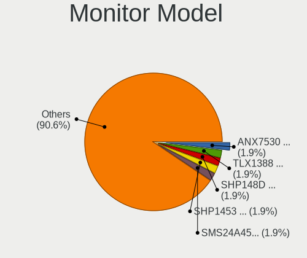

| Model                                                                | Notebooks | Percent |
|----------------------------------------------------------------------|-----------|---------|
| Valve ANX7530 U VLV3001 800x1280 100x150mm 7.1-inch                  | 2         | 3.77%   |
| BOE LCD Monitor BOE0819 1920x1080 344x194mm 15.5-inch                | 2         | 3.77%   |
| Sharp LQ156M1JW03 SHP155D 1920x1080 344x194mm 15.5-inch              | 1         | 1.89%   |
| Sharp LCD Monitor SHP14D0 3840x2400 336x210mm 15.6-inch              | 1         | 1.89%   |
| Sharp LCD Monitor SHP149A 1920x1080 344x194mm 15.5-inch              | 1         | 1.89%   |
| Sharp LCD Monitor SHP148D 3840x2160 344x194mm 15.5-inch              | 1         | 1.89%   |
| Sharp LCD Monitor SHP144A 3200x1800 294x165mm 13.3-inch              | 1         | 1.89%   |
| Samsung Electronics LCD Monitor SEC5441 1366x768 344x194mm 15.5-inch | 1         | 1.89%   |
| Samsung Electronics LCD Monitor SDC5441 1366x768 309x174mm 14.0-inch | 1         | 1.89%   |
| PANDA LCD Monitor NCP0035 1920x1080 309x174mm 14.0-inch              | 1         | 1.89%   |
| MiTAC TV MTCEE01 1920x1080                                           | 1         | 1.89%   |
| LG Display LCD Monitor LGD056D 1920x1080 382x215mm 17.3-inch         | 1         | 1.89%   |
| LG Display LCD Monitor LGD04D5 1920x1080 344x194mm 15.5-inch         | 1         | 1.89%   |
| LG Display LCD Monitor LGD02D9 1920x1080 344x194mm 15.5-inch         | 1         | 1.89%   |
| Lenovo LCD Monitor LEN40BA 1920x1080 344x194mm 15.5-inch             | 1         | 1.89%   |
| Goldstar MP59HT GSM5B44 1920x1080 480x270mm 21.7-inch                | 1         | 1.89%   |
| Goldstar IPS FULLHD GSM5AB8 1920x1080 480x270mm 21.7-inch            | 1         | 1.89%   |
| Goldstar HDR 4K GSM7706 3840x2160 600x340mm 27.2-inch                | 1         | 1.89%   |
| GDH TV PHILCO GDH0030 1920x540                                       | 1         | 1.89%   |
| Dell U3219Q DELA134 3840x2160 697x392mm 31.5-inch                    | 1         | 1.89%   |
| Dell U2720Q DEL41B3 3840x2160 597x336mm 27.0-inch                    | 1         | 1.89%   |
| Dell E2420H DELF11B 1920x1080 527x296mm 23.8-inch                    | 1         | 1.89%   |
| Chimei Innolux LCD Monitor CMN15E6 1366x768 344x193mm 15.5-inch      | 1         | 1.89%   |
| Chimei Innolux LCD Monitor CMN15DB 1366x768 344x193mm 15.5-inch      | 1         | 1.89%   |
| Chimei Innolux LCD Monitor CMN15CA 1366x768 344x193mm 15.5-inch      | 1         | 1.89%   |
| Chimei Innolux LCD Monitor CMN1514 1920x1080 344x193mm 15.5-inch     | 1         | 1.89%   |
| Chimei Innolux LCD Monitor CMN14D6 1366x768 309x173mm 13.9-inch      | 1         | 1.89%   |
| Chimei Innolux LCD Monitor CMN1404 1920x1080 309x173mm 13.9-inch     | 1         | 1.89%   |
| BOE LCD Monitor BOE0AB0 1920x1080 344x194mm 15.5-inch                | 1         | 1.89%   |
| BOE LCD Monitor BOE0A68 3840x1100 340x100mm 14.0-inch                | 1         | 1.89%   |
| BOE LCD Monitor BOE0A19 3840x2400 344x215mm 16.0-inch                | 1         | 1.89%   |
| BOE LCD Monitor BOE09DC 1920x1080 344x194mm 15.5-inch                | 1         | 1.89%   |
| BOE LCD Monitor BOE0931 2240x1400 302x189mm 14.0-inch                | 1         | 1.89%   |
| BOE LCD Monitor BOE084E 1920x1080 382x215mm 17.3-inch                | 1         | 1.89%   |
| BOE LCD Monitor BOE07F5 1920x1080 293x165mm 13.2-inch                | 1         | 1.89%   |
| BOE LCD Monitor BOE07B6 1920x1080 382x215mm 17.3-inch                | 1         | 1.89%   |
| BOE LCD Monitor BOE06C6 1920x1080 344x194mm 15.5-inch                | 1         | 1.89%   |
| BOE LCD Monitor BOE06A4 1366x768 344x194mm 15.5-inch                 | 1         | 1.89%   |
| AU Optronics LCD Monitor AUO71EC 1366x768 344x193mm 15.5-inch        | 1         | 1.89%   |
| AU Optronics LCD Monitor AUO683D 1920x1080 309x174mm 14.0-inch       | 1         | 1.89%   |

Monitor Resolution
------------------

Monitor screen resolution

| Resolution       | Notebooks | Percent |
|------------------|-----------|---------|
| 1920x1080 (FHD)  | 24        | 47.06%  |
| 1366x768 (WXGA)  | 11        | 21.57%  |
| 3840x2160 (4K)   | 5         | 9.8%    |
| 800x1280         | 2         | 3.92%   |
| 3840x2400        | 2         | 3.92%   |
| 3840x1100        | 1         | 1.96%   |
| 3440x1440        | 1         | 1.96%   |
| 3200x1800 (QHD+) | 1         | 1.96%   |
| 2880x1800        | 1         | 1.96%   |
| 2240x1400        | 1         | 1.96%   |
| 1600x900 (HD+)   | 1         | 1.96%   |
| 1280x800 (WXGA)  | 1         | 1.96%   |

Monitor Diagonal
----------------

Diagonal size in inches

| Inches | Notebooks | Percent |
|--------|-----------|---------|
| 15     | 24        | 45.28%  |
| 14     | 5         | 9.43%   |
| 17     | 4         | 7.55%   |
| 13     | 4         | 7.55%   |
| 27     | 2         | 3.77%   |
| 24     | 2         | 3.77%   |
| 21     | 2         | 3.77%   |
| 11     | 2         | 3.77%   |
| 7      | 2         | 3.77%   |
| 72     | 1         | 1.89%   |
| 52     | 1         | 1.89%   |
| 35     | 1         | 1.89%   |
| 31     | 1         | 1.89%   |
| 23     | 1         | 1.89%   |
| 16     | 1         | 1.89%   |

Monitor Width
-------------

Physical width

| Width in mm | Notebooks | Percent |
|-------------|-----------|---------|
| 301-350     | 30        | 58.82%  |
| 351-400     | 5         | 9.8%    |
| 501-600     | 4         | 7.84%   |
| 201-300     | 4         | 7.84%   |
| 401-500     | 2         | 3.92%   |
| 1-100       | 2         | 3.92%   |
| 801-900     | 1         | 1.96%   |
| 601-700     | 1         | 1.96%   |
| 1501-2000   | 1         | 1.96%   |
| 1001-1500   | 1         | 1.96%   |

Aspect Ratio
------------

Proportional relationship between the width and the height

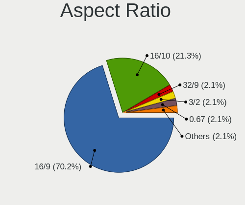

| Ratio | Notebooks | Percent |
|-------|-----------|---------|
| 16/9  | 37        | 80.43%  |
| 16/10 | 5         | 10.87%  |
| 0.67  | 2         | 4.35%   |
| 3.40  | 1         | 2.17%   |
| 21/9  | 1         | 2.17%   |

Monitor Area
------------

Area in inch

| Area in inch | Notebooks | Percent |
|----------------|-----------|---------|
| 101-110        | 24        | 45.28%  |
| 81-90          | 6         | 11.32%  |
| 201-250        | 5         | 9.43%   |
| 121-130        | 4         | 7.55%   |
| 51-60          | 3         | 5.66%   |
| More than 1000 | 2         | 3.77%   |
| 71-80          | 2         | 3.77%   |
| 351-500        | 2         | 3.77%   |
| 1-40           | 2         | 3.77%   |
| 301-350        | 2         | 3.77%   |
| 111-120        | 1         | 1.89%   |

Pixel Density
-------------

Pixels per inch

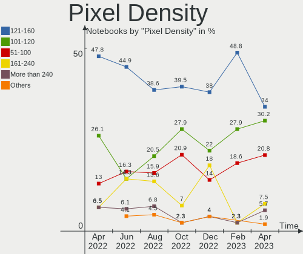

| Density       | Notebooks | Percent |
|---------------|-----------|---------|
| 121-160       | 23        | 45.1%   |
| 101-120       | 10        | 19.61%  |
| 161-240       | 7         | 13.73%  |
| 51-100        | 5         | 9.8%    |
| More than 240 | 4         | 7.84%   |
| 1-50          | 2         | 3.92%   |

Multiple Monitors
-----------------

Total monitors connected

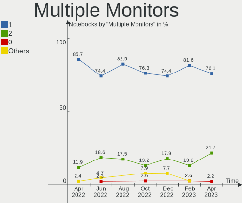

| Total | Notebooks | Percent |
|-------|-----------|---------|
| 1     | 29        | 70.73%  |
| 2     | 11        | 26.83%  |
| 3     | 1         | 2.44%   |

Network
-------

Net Controller Vendor
---------------------

Controller vendors

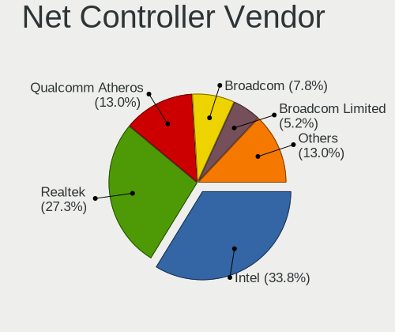

| Vendor                     | Notebooks | Percent |
|----------------------------|-----------|---------|
| Intel                      | 23        | 36.51%  |
| Realtek Semiconductor      | 21        | 33.33%  |
| Qualcomm Atheros           | 7         | 11.11%  |
| MediaTek                   | 3         | 4.76%   |
| Broadcom                   | 3         | 4.76%   |
| DisplayLink                | 2         | 3.17%   |
| ZTE WCDMA Technologies MSM | 1         | 1.59%   |
| Sierra Wireless            | 1         | 1.59%   |
| Motorola PCS               | 1         | 1.59%   |
| Edimax Technology          | 1         | 1.59%   |

Net Controller Model
--------------------

Controller models

| Model                                                                   | Notebooks | Percent |
|-------------------------------------------------------------------------|-----------|---------|
| Realtek RTL8111/8168/8411 PCI Express Gigabit Ethernet Controller       | 11        | 15.71%  |
| Realtek RTL810xE PCI Express Fast Ethernet controller                   | 4         | 5.71%   |
| Intel Wi-Fi 6 AX201                                                     | 4         | 5.71%   |
| Intel Wi-Fi 6 AX200                                                     | 4         | 5.71%   |
| Qualcomm Atheros QCA6174 802.11ac Wireless Network Adapter              | 3         | 4.29%   |
| Realtek RTL8822CE 802.11ac PCIe Wireless Network Adapter                | 2         | 2.86%   |
| Qualcomm Atheros QCA9377 802.11ac Wireless Network Adapter              | 2         | 2.86%   |
| MediaTek MT7921 802.11ax PCI Express Wireless Network Adapter           | 2         | 2.86%   |
| Intel Wireless 8265 / 8275                                              | 2         | 2.86%   |
| Intel 82579LM Gigabit Network Connection (Lewisville)                   | 2         | 2.86%   |
| ZTE WCDMA MSM ZTE BLADE A530                                            | 1         | 1.43%   |
| Sierra Wireless EM7305                                                  | 1         | 1.43%   |
| Realtek RTL8822BE 802.11a/b/g/n/ac WiFi adapter                         | 1         | 1.43%   |
| Realtek RTL8821CE 802.11ac PCIe Wireless Network Adapter                | 1         | 1.43%   |
| Realtek RTL8821AE 802.11ac PCIe Wireless Network Adapter                | 1         | 1.43%   |
| Realtek RTL8153 Gigabit Ethernet Adapter                                | 1         | 1.43%   |
| Realtek RTL8125 2.5GbE Controller                                       | 1         | 1.43%   |
| Realtek RTL-8100/8101L/8139 PCI Fast Ethernet Adapter                   | 1         | 1.43%   |
| Qualcomm Atheros QCA9565 / AR9565 Wireless Network Adapter              | 1         | 1.43%   |
| Qualcomm Atheros AR242x / AR542x Wireless Network Adapter (PCI-Express) | 1         | 1.43%   |
| Motorola PCS moto g pure                                                | 1         | 1.43%   |
| MediaTek MT7922 802.11ax PCI Express Wireless Network Adapter           | 1         | 1.43%   |
| Intel Wireless-AC 9260                                                  | 1         | 1.43%   |
| Intel Wireless 8260                                                     | 1         | 1.43%   |
| Intel Wireless 7265                                                     | 1         | 1.43%   |
| Intel Wireless 3165                                                     | 1         | 1.43%   |
| Intel Wireless 3160                                                     | 1         | 1.43%   |
| Intel Wi-Fi 6 AX210/AX211/AX411 160MHz                                  | 1         | 1.43%   |
| Intel I210 Gigabit Network Connection                                   | 1         | 1.43%   |
| Intel Gemini Lake PCH CNVi WiFi                                         | 1         | 1.43%   |
| Intel Ethernet Connection I219-LM                                       | 1         | 1.43%   |
| Intel Ethernet Connection (13) I219-V                                   | 1         | 1.43%   |
| Intel Dual Band Wireless-AC 3168NGW [Stone Peak]                        | 1         | 1.43%   |
| Intel Dual Band Wireless-AC 3165 Plus Bluetooth                         | 1         | 1.43%   |
| Intel Comet Lake PCH CNVi WiFi                                          | 1         | 1.43%   |
| Intel Centrino Ultimate-N 6300                                          | 1         | 1.43%   |
| Intel Centrino Advanced-N 6205 [Taylor Peak]                            | 1         | 1.43%   |
| Intel Alder Lake-P PCH CNVi WiFi                                        | 1         | 1.43%   |
| Edimax EW-7822ULC 802.11ac Wireless Adapter [Realtek RTL8812AU]         | 1         | 1.43%   |
| DisplayLink USB-C Hybrid UHD Video Dock                                 | 1         | 1.43%   |

Wireless Vendor
---------------

Wireless vendors

| Vendor                | Notebooks | Percent |
|-----------------------|-----------|---------|
| Intel                 | 23        | 53.49%  |
| Qualcomm Atheros      | 7         | 16.28%  |
| Realtek Semiconductor | 5         | 11.63%  |
| MediaTek              | 3         | 6.98%   |
| Broadcom              | 3         | 6.98%   |
| Sierra Wireless       | 1         | 2.33%   |
| Edimax Technology     | 1         | 2.33%   |

Wireless Model
--------------

Wireless models

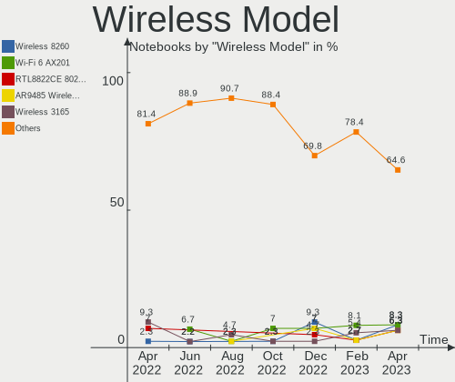

| Model                                                                   | Notebooks | Percent |
|-------------------------------------------------------------------------|-----------|---------|
| Intel Wi-Fi 6 AX201                                                     | 4         | 9.3%    |
| Intel Wi-Fi 6 AX200                                                     | 4         | 9.3%    |
| Qualcomm Atheros QCA6174 802.11ac Wireless Network Adapter              | 3         | 6.98%   |
| Realtek RTL8822CE 802.11ac PCIe Wireless Network Adapter                | 2         | 4.65%   |
| Qualcomm Atheros QCA9377 802.11ac Wireless Network Adapter              | 2         | 4.65%   |
| MediaTek MT7921 802.11ax PCI Express Wireless Network Adapter           | 2         | 4.65%   |
| Intel Wireless 8265 / 8275                                              | 2         | 4.65%   |
| Sierra Wireless EM7305                                                  | 1         | 2.33%   |
| Realtek RTL8822BE 802.11a/b/g/n/ac WiFi adapter                         | 1         | 2.33%   |
| Realtek RTL8821CE 802.11ac PCIe Wireless Network Adapter                | 1         | 2.33%   |
| Realtek RTL8821AE 802.11ac PCIe Wireless Network Adapter                | 1         | 2.33%   |
| Qualcomm Atheros QCA9565 / AR9565 Wireless Network Adapter              | 1         | 2.33%   |
| Qualcomm Atheros AR242x / AR542x Wireless Network Adapter (PCI-Express) | 1         | 2.33%   |
| MediaTek MT7922 802.11ax PCI Express Wireless Network Adapter           | 1         | 2.33%   |
| Intel Wireless-AC 9260                                                  | 1         | 2.33%   |
| Intel Wireless 8260                                                     | 1         | 2.33%   |
| Intel Wireless 7265                                                     | 1         | 2.33%   |
| Intel Wireless 3165                                                     | 1         | 2.33%   |
| Intel Wireless 3160                                                     | 1         | 2.33%   |
| Intel Wi-Fi 6 AX210/AX211/AX411 160MHz                                  | 1         | 2.33%   |
| Intel Gemini Lake PCH CNVi WiFi                                         | 1         | 2.33%   |
| Intel Dual Band Wireless-AC 3168NGW [Stone Peak]                        | 1         | 2.33%   |
| Intel Dual Band Wireless-AC 3165 Plus Bluetooth                         | 1         | 2.33%   |
| Intel Comet Lake PCH CNVi WiFi                                          | 1         | 2.33%   |
| Intel Centrino Ultimate-N 6300                                          | 1         | 2.33%   |
| Intel Centrino Advanced-N 6205 [Taylor Peak]                            | 1         | 2.33%   |
| Intel Alder Lake-P PCH CNVi WiFi                                        | 1         | 2.33%   |
| Edimax EW-7822ULC 802.11ac Wireless Adapter [Realtek RTL8812AU]         | 1         | 2.33%   |
| Broadcom BCM43602 802.11ac Wireless LAN SoC                             | 1         | 2.33%   |
| Broadcom BCM43142 802.11b/g/n                                           | 1         | 2.33%   |
| Broadcom BCM4313 802.11bgn Wireless Network Adapter                     | 1         | 2.33%   |

Ethernet Vendor
---------------

Ethernet vendors

| Vendor                     | Notebooks | Percent |
|----------------------------|-----------|---------|
| Realtek Semiconductor      | 18        | 66.67%  |
| Intel                      | 5         | 18.52%  |
| DisplayLink                | 2         | 7.41%   |
| ZTE WCDMA Technologies MSM | 1         | 3.7%    |
| Motorola PCS               | 1         | 3.7%    |

Ethernet Model
--------------

Ethernet models

| Model                                                             | Notebooks | Percent |
|-------------------------------------------------------------------|-----------|---------|
| Realtek RTL8111/8168/8411 PCI Express Gigabit Ethernet Controller | 11        | 40.74%  |
| Realtek RTL810xE PCI Express Fast Ethernet controller             | 4         | 14.81%  |
| Intel 82579LM Gigabit Network Connection (Lewisville)             | 2         | 7.41%   |
| ZTE WCDMA MSM ZTE BLADE A530                                      | 1         | 3.7%    |
| Realtek RTL8153 Gigabit Ethernet Adapter                          | 1         | 3.7%    |
| Realtek RTL8125 2.5GbE Controller                                 | 1         | 3.7%    |
| Realtek RTL-8100/8101L/8139 PCI Fast Ethernet Adapter             | 1         | 3.7%    |
| Motorola PCS moto g pure                                          | 1         | 3.7%    |
| Intel I210 Gigabit Network Connection                             | 1         | 3.7%    |
| Intel Ethernet Connection I219-LM                                 | 1         | 3.7%    |
| Intel Ethernet Connection (13) I219-V                             | 1         | 3.7%    |
| DisplayLink USB-C Hybrid UHD Video Dock                           | 1         | 3.7%    |
| DisplayLink Dell D3100 Docking Station                            | 1         | 3.7%    |

Net Controller Kind
-------------------

Ethernet, WiFi or modem

| Kind     | Notebooks | Percent |
|----------|-----------|---------|
| WiFi     | 41        | 62.12%  |
| Ethernet | 25        | 37.88%  |

Used Controller
---------------

Currently used network controller

| Kind     | Notebooks | Percent |
|----------|-----------|---------|
| WiFi     | 34        | 85%     |
| Ethernet | 6         | 15%     |

NICs
----

Total network controllers on board

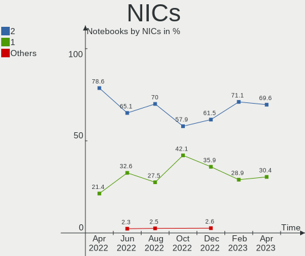

| Total | Notebooks | Percent |
|-------|-----------|---------|
| 2     | 21        | 51.22%  |
| 1     | 19        | 46.34%  |
| 3     | 1         | 2.44%   |

IPv6
----

IPv6 vs IPv4

| Used | Notebooks | Percent |
|------|-----------|---------|
| No   | 36        | 87.8%   |
| Yes  | 5         | 12.2%   |

Bluetooth
---------

Bluetooth Vendor
----------------

Controller vendors

| Vendor                          | Notebooks | Percent |
|---------------------------------|-----------|---------|
| Intel                           | 20        | 52.63%  |
| Qualcomm Atheros Communications | 5         | 13.16%  |
| Realtek Semiconductor           | 3         | 7.89%   |
| Lite-On Technology              | 2         | 5.26%   |
| IMC Networks                    | 2         | 5.26%   |
| Foxconn / Hon Hai               | 2         | 5.26%   |
| Broadcom                        | 2         | 5.26%   |
| Dell                            | 1         | 2.63%   |
| Cambridge Silicon Radio         | 1         | 2.63%   |

Bluetooth Model
---------------

Controller models

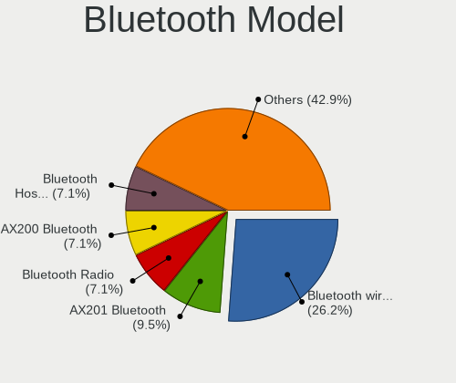

| Model                                               | Notebooks | Percent |
|-----------------------------------------------------|-----------|---------|
| Intel Bluetooth wireless interface                  | 7         | 18.42%  |
| Intel AX201 Bluetooth                               | 6         | 15.79%  |
| Intel AX200 Bluetooth                               | 4         | 10.53%  |
| Qualcomm Atheros  Bluetooth Device                  | 3         | 7.89%   |
| Realtek  Bluetooth 4.2 Adapter                      | 2         | 5.26%   |
| Qualcomm Atheros QCA61x4 Bluetooth 4.0              | 2         | 5.26%   |
| IMC Networks Bluetooth Radio                        | 2         | 5.26%   |
| Foxconn / Hon Hai Wireless_Device                   | 2         | 5.26%   |
| Realtek RTL8821A Bluetooth                          | 1         | 2.63%   |
| Lite-On Wireless_Device                             | 1         | 2.63%   |
| Lite-On Atheros AR3012 Bluetooth                    | 1         | 2.63%   |
| Intel Wireless-AC 3168 Bluetooth                    | 1         | 2.63%   |
| Intel Bluetooth 9460/9560 Jefferson Peak (JfP)      | 1         | 2.63%   |
| Intel AX210 Bluetooth                               | 1         | 2.63%   |
| Dell DW375 Bluetooth Module                         | 1         | 2.63%   |
| Cambridge Silicon Radio Bluetooth Dongle (HCI mode) | 1         | 2.63%   |
| Broadcom HP Portable SoftSailing                    | 1         | 2.63%   |
| Broadcom BCM43142A0 Bluetooth Device                | 1         | 2.63%   |

Sound
-----

Sound Vendor
------------

Sound card vendors

| Vendor            | Notebooks | Percent |
|-------------------|-----------|---------|
| Intel             | 27        | 52.94%  |
| AMD               | 15        | 29.41%  |
| Nvidia            | 5         | 9.8%    |
| Texas Instruments | 1         | 1.96%   |
| Plantronics       | 1         | 1.96%   |
| No brand          | 1         | 1.96%   |
| JMTek             | 1         | 1.96%   |

Sound Model
-----------

Sound card models

| Model                                                                                             | Notebooks | Percent |
|---------------------------------------------------------------------------------------------------|-----------|---------|
| AMD Family 17h/19h HD Audio Controller                                                            | 8         | 12.5%   |
| Intel Sunrise Point-LP HD Audio                                                                   | 6         | 9.38%   |
| Intel Cannon Lake PCH cAVS                                                                        | 5         | 7.81%   |
| Intel Tiger Lake-LP Smart Sound Technology Audio Controller                                       | 4         | 6.25%   |
| AMD Renoir Radeon High Definition Audio Controller                                                | 4         | 6.25%   |
| AMD Rembrandt Radeon High Definition Audio Controller                                             | 4         | 6.25%   |
| AMD Family 15h (Models 60h-6fh) Audio Controller                                                  | 3         | 4.69%   |
| Nvidia TU116 High Definition Audio Controller                                                     | 2         | 3.13%   |
| Intel Celeron/Pentium Silver Processor High Definition Audio                                      | 2         | 3.13%   |
| AMD High Definition Audio Controller                                                              | 2         | 3.13%   |
| Texas Instruments PCM2902 Audio Codec                                                             | 1         | 1.56%   |
| Plantronics Blackwire 5220 Series                                                                 | 1         | 1.56%   |
| Nvidia TU107 GeForce GTX 1650 High Definition Audio Controller                                    | 1         | 1.56%   |
| Nvidia TU106 High Definition Audio Controller                                                     | 1         | 1.56%   |
| Nvidia Audio device                                                                               | 1         | 1.56%   |
| No brand Thunderbolt 3 Audio                                                                      | 1         | 1.56%   |
| JMTek AM4137                                                                                      | 1         | 1.56%   |
| Intel Haswell-ULT HD Audio Controller                                                             | 1         | 1.56%   |
| Intel Comet Lake PCH cAVS                                                                         | 1         | 1.56%   |
| Intel Cannon Point-LP High Definition Audio Controller                                            | 1         | 1.56%   |
| Intel Atom/Celeron/Pentium Processor x5-E8000/J3xxx/N3xxx Series High Definition Audio Controller | 1         | 1.56%   |
| Intel Atom Processor Z36xxx/Z37xxx Series High Definition Audio Controller                        | 1         | 1.56%   |
| Intel Alder Lake PCH-P High Definition Audio Controller                                           | 1         | 1.56%   |
| Intel 82801H (ICH8 Family) HD Audio Controller                                                    | 1         | 1.56%   |
| Intel 8 Series HD Audio Controller                                                                | 1         | 1.56%   |
| Intel 7 Series/C216 Chipset Family High Definition Audio Controller                               | 1         | 1.56%   |
| Intel 6 Series/C200 Series Chipset Family High Definition Audio Controller                        | 1         | 1.56%   |
| Intel 100 Series/C230 Series Chipset Family HD Audio Controller                                   | 1         | 1.56%   |
| AMD SBx00 Azalia (Intel HDA)                                                                      | 1         | 1.56%   |
| AMD RS880 HDMI Audio [Radeon HD 4200 Series]                                                      | 1         | 1.56%   |
| AMD Raven/Raven2/Fenghuang HDMI/DP Audio Controller                                               | 1         | 1.56%   |
| AMD Navi 21/23 HDMI/DP Audio Controller                                                           | 1         | 1.56%   |
| AMD Kabini HDMI/DP Audio                                                                          | 1         | 1.56%   |
| AMD Baffin HDMI/DP Audio [Radeon RX 550 640SP / RX 560/560X]                                      | 1         | 1.56%   |

Memory
------

Memory Vendor
-------------

Memory module vendors

| Vendor              | Notebooks | Percent |
|---------------------|-----------|---------|
| Samsung Electronics | 7         | 31.82%  |
| Micron Technology   | 6         | 27.27%  |
| SK hynix            | 3         | 13.64%  |
| Crucial             | 2         | 9.09%   |
| Corsair             | 2         | 9.09%   |
| Silicon Power       | 1         | 4.55%   |
| Kingston            | 1         | 4.55%   |

Memory Model
------------

Memory module models

| Model                                                            | Notebooks | Percent |
|------------------------------------------------------------------|-----------|---------|
| SK hynix RAM HMA81GS6CJR8N-VK 8GB SODIMM DDR4 2667MT/s           | 2         | 9.09%   |
| Micron RAM 8ATF1G64HZ-2G6D1 8GB SODIMM DDR4 2667MT/s             | 2         | 9.09%   |
| SK hynix RAM HMA82GS6DJR8N-XN 16GB SODIMM DDR4 3200MT/s          | 1         | 4.55%   |
| Silicon Power RAM SP008GLSTU160N02 8GB SODIMM DDR3 1600MT/s      | 1         | 4.55%   |
| Samsung RAM Module 16GB SODIMM DDR4 3200MT/s                     | 1         | 4.55%   |
| Samsung RAM M471B5273DH0-YK0 4GB SODIMM DDR3 1600MT/s            | 1         | 4.55%   |
| Samsung RAM M471B1G73DB0-YK0 8GB SODIMM DDR3 1600MT/s            | 1         | 4.55%   |
| Samsung RAM M471A2K43DB1-CWE 16GB SODIMM DDR4 3200MT/s           | 1         | 4.55%   |
| Samsung RAM M471A1K43DB1-CWE 8GB Row Of Chips DDR4 2400MT/s      | 1         | 4.55%   |
| Samsung RAM K4UBE3D4AA-MGCR 8GB SODIMM LPDDR4 4266MT/s           | 1         | 4.55%   |
| Samsung RAM K4A4G165WE-BCRC 2GB Row Of Chips DDR4 2400MT/s       | 1         | 4.55%   |
| Micron RAM MT62F1G32D4DR-031 WT 4GB Row Of Chips LPDDR5 6400MT/s | 1         | 4.55%   |
| Micron RAM MT52L1G32D4PG-093 8GB Row Of Chips LPDDR3 2133MT/s    | 1         | 4.55%   |
| Micron RAM MT40A1G16RC-062E:B 8GB Row Of Chips DDR4 3200MT/s     | 1         | 4.55%   |
| Micron RAM 8ATF2G64HZ-3G2E1 8GB Row Of Chips DDR4 3200MT/s       | 1         | 4.55%   |
| Kingston RAM ACR16D3LS1KFG/4G 4GB SODIMM DDR3 1600MT/s           | 1         | 4.55%   |
| Crucial RAM CT8G4SFS8266.C8FJ 8GB SODIMM DDR4 2667MT/s           | 1         | 4.55%   |
| Crucial RAM CT32G48C40S5.M16A1 32GB SODIMM DDR5 4800MT/s         | 1         | 4.55%   |
| Corsair RAM CMSX64GX4M2A3200C22 32GB SODIMM DDR4 3200MT/s        | 1         | 4.55%   |
| Corsair RAM CMSO8GX3M1C1600C11 8GB SODIMM DDR3 1600MT/s          | 1         | 4.55%   |

Memory Kind
-----------

Memory module kinds

| Kind   | Notebooks | Percent |
|--------|-----------|---------|
| DDR4   | 11        | 57.89%  |
| DDR3   | 4         | 21.05%  |
| LPDDR5 | 1         | 5.26%   |
| LPDDR4 | 1         | 5.26%   |
| LPDDR3 | 1         | 5.26%   |
| DDR5   | 1         | 5.26%   |

Memory Form Factor
------------------

Physical design of the memory module

| Name         | Notebooks | Percent |
|--------------|-----------|---------|
| SODIMM       | 13        | 68.42%  |
| Row Of Chips | 6         | 31.58%  |

Memory Size
-----------

Memory module size

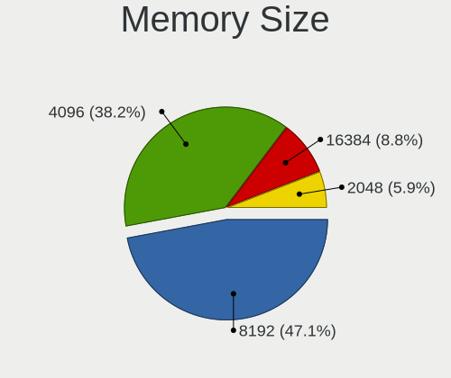

| Size  | Notebooks | Percent |
|-------|-----------|---------|
| 8192  | 10        | 52.63%  |
| 16384 | 3         | 15.79%  |
| 4096  | 3         | 15.79%  |
| 32768 | 2         | 10.53%  |
| 2048  | 1         | 5.26%   |

Memory Speed
------------

Memory module speed

| Speed | Notebooks | Percent |
|-------|-----------|---------|
| 3200  | 6         | 31.58%  |
| 1600  | 4         | 21.05%  |
| 2667  | 3         | 15.79%  |
| 2400  | 2         | 10.53%  |
| 6400  | 1         | 5.26%   |
| 4800  | 1         | 5.26%   |
| 4266  | 1         | 5.26%   |
| 2133  | 1         | 5.26%   |

Printers & scanners
-------------------

Printer Vendor
--------------

Printer device vendors

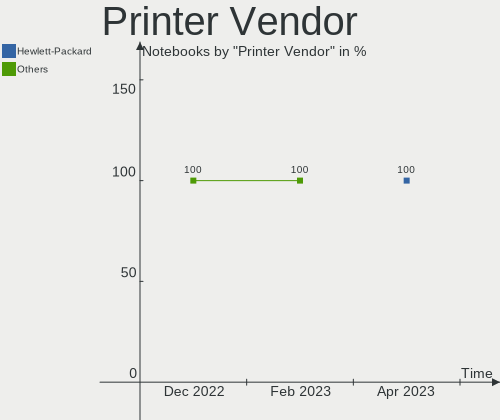

| Vendor             | Notebooks | Percent |
|--------------------|-----------|---------|
| Brother Industries | 1         | 100%    |

Printer Model
-------------

Printer device models

| Model            | Notebooks | Percent |
|------------------|-----------|---------|
| Brother MFC-1810 | 1         | 100%    |

Scanner Vendor
--------------

Scanner device vendors

Zero info for selected period =(

Scanner Model
-------------

Scanner device models

Zero info for selected period =(

Camera
------

Camera Vendor
-------------

Camera device vendors

| Vendor                                 | Notebooks | Percent |
|----------------------------------------|-----------|---------|
| Chicony Electronics                    | 9         | 25%     |
| Microdia                               | 4         | 11.11%  |
| Acer                                   | 4         | 11.11%  |
| Syntek                                 | 3         | 8.33%   |
| Quanta                                 | 3         | 8.33%   |
| IMC Networks                           | 3         | 8.33%   |
| Suyin                                  | 2         | 5.56%   |
| Logitech                               | 2         | 5.56%   |
| Cheng Uei Precision Industry (Foxlink) | 2         | 5.56%   |
| Realtek Semiconductor                  | 1         | 2.78%   |
| Primax Electronics                     | 1         | 2.78%   |
| Luxvisions Innotech Limited            | 1         | 2.78%   |
| Lite-On Technology                     | 1         | 2.78%   |

Camera Model
------------

Camera device models

| Model                                                   | Notebooks | Percent |
|---------------------------------------------------------|-----------|---------|
| Chicony Integrated Camera                               | 4         | 11.11%  |
| Syntek EasyCamera                                       | 2         | 5.56%   |
| Microdia Integrated_Webcam_HD                           | 2         | 5.56%   |
| IMC Networks USB2.0 HD UVC WebCam                       | 2         | 5.56%   |
| Chicony HD User Facing                                  | 2         | 5.56%   |
| Syntek USB 2.0 UVC PC Camera                            | 1         | 2.78%   |
| Suyin Integrated_Webcam_HD                              | 1         | 2.78%   |
| Suyin HP Truevision HD                                  | 1         | 2.78%   |
| Realtek Integrated_Webcam_HD                            | 1         | 2.78%   |
| Quanta USB2.0 HD UVC WebCam                             | 1         | 2.78%   |
| Quanta HP TrueVision HD Camera                          | 1         | 2.78%   |
| Quanta HP HD Camera                                     | 1         | 2.78%   |
| Primax HP HD Webcam [Fixed]                             | 1         | 2.78%   |
| Microdia Integrated Webcam HD                           | 1         | 2.78%   |
| Microdia 1.3 MPixel Integrated Webcam                   | 1         | 2.78%   |
| Luxvisions Innotech Limited Integrated Camera           | 1         | 2.78%   |
| Logitech Webcam C925e                                   | 1         | 2.78%   |
| Logitech Webcam C270                                    | 1         | 2.78%   |
| Lite-On HP HD Camera                                    | 1         | 2.78%   |
| IMC Networks HD Camera                                  | 1         | 2.78%   |
| Chicony TOSHIBA Web Camera - FHD                        | 1         | 2.78%   |
| Chicony HP Webcam                                       | 1         | 2.78%   |
| Chicony HD Webcam                                       | 1         | 2.78%   |
| Cheng Uei Precision Industry (Foxlink) HP Truevision HD | 1         | 2.78%   |
| Cheng Uei Precision Industry (Foxlink) HP HD Camera     | 1         | 2.78%   |
| Acer SunplusIT Integrated Camera                        | 1         | 2.78%   |
| Acer Integrated RGB Camera                              | 1         | 2.78%   |
| Acer Integrated Camera                                  | 1         | 2.78%   |
| Acer HD Webcam                                          | 1         | 2.78%   |

Security
--------

Fingerprint Vendor
------------------

Fingerprint sensor vendors

| Vendor                     | Notebooks | Percent |
|----------------------------|-----------|---------|
| Validity Sensors           | 6         | 50%     |
| Synaptics                  | 3         | 25%     |
| Shenzhen Goodix Technology | 2         | 16.67%  |
| LighTuning Technology      | 1         | 8.33%   |

Fingerprint Model
-----------------

Fingerprint sensor models

| Model                                             | Notebooks | Percent |
|---------------------------------------------------|-----------|---------|
| Validity Sensors VFS495 Fingerprint Reader        | 2         | 16.67%  |
| Synaptics Prometheus MIS Touch Fingerprint Reader | 2         | 16.67%  |
| Validity Sensors VFS7552 Touch Fingerprint Sensor | 1         | 8.33%   |
| Validity Sensors VFS491                           | 1         | 8.33%   |
| Validity Sensors VFS Fingerprint sensor           | 1         | 8.33%   |
| Validity Sensors Swipe Fingerprint Sensor         | 1         | 8.33%   |
| Synaptics  WBDI                                   | 1         | 8.33%   |
| Shenzhen Goodix  Fingerprint Device               | 1         | 8.33%   |
| Shenzhen Goodix FingerPrint                       | 1         | 8.33%   |
| LighTuning EgisTec Touch Fingerprint Sensor       | 1         | 8.33%   |

Chipcard Vendor
---------------

Chipcard module vendors

| Vendor      | Notebooks | Percent |
|-------------|-----------|---------|
| Broadcom    | 1         | 50%     |
| Alcor Micro | 1         | 50%     |

Chipcard Model
--------------

Chipcard module models

| Model                                          | Notebooks | Percent |
|------------------------------------------------|-----------|---------|
| Broadcom BCM5880 Secure Applications Processor | 1         | 50%     |
| Alcor Micro AU9540 Smartcard Reader            | 1         | 50%     |

Unsupported
-----------

Unsupported Devices
-------------------

Total unsupported devices on board

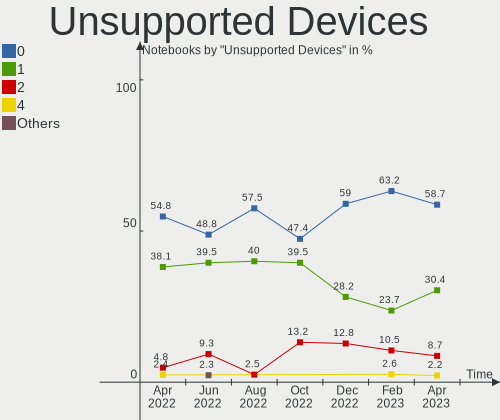

| Total | Notebooks | Percent |
|-------|-----------|---------|
| 0     | 24        | 58.54%  |
| 1     | 12        | 29.27%  |
| 2     | 4         | 9.76%   |
| 5     | 1         | 2.44%   |

Unsupported Device Types
------------------------

Types of unsupported devices

| Type                     | Notebooks | Percent |
|--------------------------|-----------|---------|
| Fingerprint reader       | 12        | 48%     |
| Graphics card            | 4         | 16%     |
| Net/wireless             | 3         | 12%     |
| Storage                  | 1         | 4%      |
| Modem                    | 1         | 4%      |
| Communication controller | 1         | 4%      |
| Chipcard                 | 1         | 4%      |
| Camera                   | 1         | 4%      |
| Bluetooth                | 1         | 4%      |

