Linux in Australia - Hardware Trends (Notebooks)
------------------------------------------------

A project to identify most popular hardware characteristics and track their change
over time based on data collected by Linux users at https://Linux-Hardware.org.

Anyone can contribute to this report by the [hw-probe](https://github.com/linuxhw/hw-probe) tool:

    sudo -E hw-probe -all -upload

Period: Jun, 2022.

Contents
--------

* [ System ](#system)
  - [ OS                       ](#os)
  - [ OS Family                ](#os-family)
  - [ Kernel                   ](#kernel)
  - [ Kernel Family            ](#kernel-family)
  - [ Kernel Major Ver.        ](#kernel-major-ver)
  - [ Arch                     ](#arch)
  - [ DE                       ](#de)
  - [ Display Server           ](#display-server)
  - [ Display Manager          ](#display-manager)
  - [ OS Lang                  ](#os-lang)
  - [ Boot Mode                ](#boot-mode)
  - [ Filesystem               ](#filesystem)
  - [ Part. scheme             ](#part-scheme)
  - [ Dual Boot with Linux/BSD ](#dual-boot-with-linuxbsd)
  - [ Dual Boot (Win)          ](#dual-boot-win)

* [ Board ](#board)
  - [ Vendor                   ](#vendor)
  - [ Model                    ](#model)
  - [ Model Family             ](#model-family)
  - [ MFG Year                 ](#mfg-year)
  - [ Form Factor              ](#form-factor)
  - [ Secure Boot              ](#secure-boot)
  - [ Coreboot                 ](#coreboot)
  - [ RAM Size                 ](#ram-size)
  - [ RAM Used                 ](#ram-used)
  - [ Total Drives             ](#total-drives)
  - [ Has CD-ROM               ](#has-cd-rom)
  - [ Has Ethernet             ](#has-ethernet)
  - [ Has WiFi                 ](#has-wifi)
  - [ Has Bluetooth            ](#has-bluetooth)

* [ Location ](#location)
  - [ Country                  ](#country)
  - [ City                     ](#city)

* [ Drives ](#drives)
  - [ Drive Vendor             ](#drive-vendor)
  - [ Drive Model              ](#drive-model)
  - [ HDD Vendor               ](#hdd-vendor)
  - [ SSD Vendor               ](#ssd-vendor)
  - [ Drive Kind               ](#drive-kind)
  - [ Drive Connector          ](#drive-connector)
  - [ Drive Size               ](#drive-size)
  - [ Space Total              ](#space-total)
  - [ Space Used               ](#space-used)
  - [ Malfunc. Drives          ](#malfunc-drives)
  - [ Malfunc. Drive Vendor    ](#malfunc-drive-vendor)
  - [ Malfunc. HDD Vendor      ](#malfunc-hdd-vendor)
  - [ Malfunc. Drive Kind      ](#malfunc-drive-kind)
  - [ Failed Drives            ](#failed-drives)
  - [ Failed Drive Vendor      ](#failed-drive-vendor)
  - [ Drive Status             ](#drive-status)

* [ Storage controller ](#storage-controller)
  - [ Storage Vendor           ](#storage-vendor)
  - [ Storage Model            ](#storage-model)
  - [ Storage Kind             ](#storage-kind)

* [ Processor ](#processor)
  - [ CPU Vendor               ](#cpu-vendor)
  - [ CPU Model                ](#cpu-model)
  - [ CPU Model Family         ](#cpu-model-family)
  - [ CPU Cores                ](#cpu-cores)
  - [ CPU Sockets              ](#cpu-sockets)
  - [ CPU Threads              ](#cpu-threads)
  - [ CPU Op-Modes             ](#cpu-op-modes)
  - [ CPU Microcode            ](#cpu-microcode)
  - [ CPU Microarch            ](#cpu-microarch)

* [ Graphics ](#graphics)
  - [ GPU Vendor               ](#gpu-vendor)
  - [ GPU Model                ](#gpu-model)
  - [ GPU Combo                ](#gpu-combo)
  - [ GPU Driver               ](#gpu-driver)
  - [ GPU Memory               ](#gpu-memory)

* [ Monitor ](#monitor)
  - [ Monitor Vendor           ](#monitor-vendor)
  - [ Monitor Model            ](#monitor-model)
  - [ Monitor Resolution       ](#monitor-resolution)
  - [ Monitor Diagonal         ](#monitor-diagonal)
  - [ Monitor Width            ](#monitor-width)
  - [ Aspect Ratio             ](#aspect-ratio)
  - [ Monitor Area             ](#monitor-area)
  - [ Pixel Density            ](#pixel-density)
  - [ Multiple Monitors        ](#multiple-monitors)

* [ Network ](#network)
  - [ Net Controller Vendor    ](#net-controller-vendor)
  - [ Net Controller Model     ](#net-controller-model)
  - [ Wireless Vendor          ](#wireless-vendor)
  - [ Wireless Model           ](#wireless-model)
  - [ Ethernet Vendor          ](#ethernet-vendor)
  - [ Ethernet Model           ](#ethernet-model)
  - [ Net Controller Kind      ](#net-controller-kind)
  - [ Used Controller          ](#used-controller)
  - [ NICs                     ](#nics)
  - [ IPv6                     ](#ipv6)

* [ Bluetooth ](#bluetooth)
  - [ Bluetooth Vendor         ](#bluetooth-vendor)
  - [ Bluetooth Model          ](#bluetooth-model)

* [ Sound ](#sound)
  - [ Sound Vendor             ](#sound-vendor)
  - [ Sound Model              ](#sound-model)

* [ Memory ](#memory)
  - [ Memory Vendor            ](#memory-vendor)
  - [ Memory Model             ](#memory-model)
  - [ Memory Kind              ](#memory-kind)
  - [ Memory Form Factor       ](#memory-form-factor)
  - [ Memory Size              ](#memory-size)
  - [ Memory Speed             ](#memory-speed)

* [ Printers & scanners ](#printers--scanners)
  - [ Printer Vendor           ](#printer-vendor)
  - [ Printer Model            ](#printer-model)
  - [ Scanner Vendor           ](#scanner-vendor)
  - [ Scanner Model            ](#scanner-model)

* [ Camera ](#camera)
  - [ Camera Vendor            ](#camera-vendor)
  - [ Camera Model             ](#camera-model)

* [ Security ](#security)
  - [ Fingerprint Vendor       ](#fingerprint-vendor)
  - [ Fingerprint Model        ](#fingerprint-model)
  - [ Chipcard Vendor          ](#chipcard-vendor)
  - [ Chipcard Model           ](#chipcard-model)

* [ Unsupported ](#unsupported)
  - [ Unsupported Devices      ](#unsupported-devices)
  - [ Unsupported Device Types ](#unsupported-device-types)

System
------

OS
--

Installed operating systems

| Name              | Notebooks | Percent |
|-------------------|-----------|---------|
| Ubuntu 22.04      | 8         | 18.6%   |
| Pop!_OS 22.04     | 7         | 16.28%  |
| Linux Mint 20.3   | 5         | 11.63%  |
| Fedora 36         | 5         | 11.63%  |
| Debian 11         | 5         | 11.63%  |
| Ubuntu 20.04      | 2         | 4.65%   |
| OpenMandriva 4.3  | 2         | 4.65%   |
| Arch              | 2         | 4.65%   |
| Zorin 16          | 1         | 2.33%   |
| Oracle Linux 7.9  | 1         | 2.33%   |
| Manjaro 21.2.6    | 1         | 2.33%   |
| Manjaro           | 1         | 2.33%   |
| Fedora 35         | 1         | 2.33%   |
| Elementary 6.1    | 1         | 2.33%   |
| ArcoLinux Rolling | 1         | 2.33%   |

OS Family
---------

OS without a version

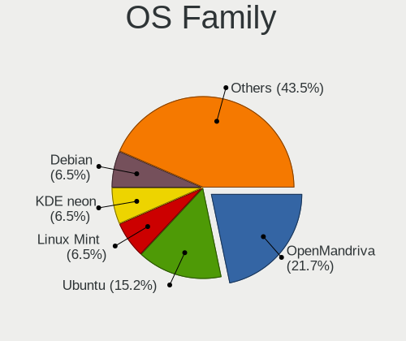

| Name         | Notebooks | Percent |
|--------------|-----------|---------|
| Ubuntu       | 10        | 23.26%  |
| Pop!_OS      | 7         | 16.28%  |
| Fedora       | 6         | 13.95%  |
| Linux Mint   | 5         | 11.63%  |
| Debian       | 5         | 11.63%  |
| OpenMandriva | 2         | 4.65%   |
| Manjaro      | 2         | 4.65%   |
| Arch         | 2         | 4.65%   |
| Zorin        | 1         | 2.33%   |
| Oracle Linux | 1         | 2.33%   |
| Elementary   | 1         | 2.33%   |
| ArcoLinux    | 1         | 2.33%   |

Kernel
------

Version of the Linux kernel

| Version                         | Notebooks | Percent |
|---------------------------------|-----------|---------|
| 5.17.5-76051705-generic         | 7         | 16.28%  |
| 5.4.0-121-generic               | 3         | 6.98%   |
| 5.18.6-200.fc36.x86_64          | 2         | 4.65%   |
| 5.17.5-300.fc36.x86_64          | 2         | 4.65%   |
| 5.15.0-37-generic               | 2         | 4.65%   |
| 5.13.0-51-generic               | 2         | 4.65%   |
| 5.10.0-15-amd64                 | 2         | 4.65%   |
| 5.4.0-113-generic               | 1         | 2.33%   |
| 5.18.7-arch1-1                  | 1         | 2.33%   |
| 5.18.4-xanmod1                  | 1         | 2.33%   |
| 5.18.1-arch1-1                  | 1         | 2.33%   |
| 5.17.15-hardened1-1-hardened    | 1         | 2.33%   |
| 5.17.13-300.fc36.x86_64         | 1         | 2.33%   |
| 5.17.12-200.fc35.x86_64         | 1         | 2.33%   |
| 5.17.11-051711-generic          | 1         | 2.33%   |
| 5.17.0-3-amd64                  | 1         | 2.33%   |
| 5.16.7-desktop-1omv4003         | 1         | 2.33%   |
| 5.16.13-desktop-1omv4003        | 1         | 2.33%   |
| 5.15.48-1-MANJARO               | 1         | 2.33%   |
| 5.15.41-1-MANJARO               | 1         | 2.33%   |
| 5.15.0-40-generic               | 1         | 2.33%   |
| 5.15.0-35-generic               | 1         | 2.33%   |
| 5.15.0-33-generic               | 1         | 2.33%   |
| 5.15.0-25-generic               | 1         | 2.33%   |
| 5.13.0-48-generic               | 1         | 2.33%   |
| 5.13.0-44-generic               | 1         | 2.33%   |
| 5.13.0-41-generic               | 1         | 2.33%   |
| 5.10.0-14-amd64                 | 1         | 2.33%   |
| 5.10.0-13-amd64                 | 1         | 2.33%   |
| 4.1.12-124.63.2.1.el7uek.x86_64 | 1         | 2.33%   |

Kernel Family
-------------

Linux kernel without a distro release

| Version | Notebooks | Percent |
|---------|-----------|---------|
| 5.17.5  | 9         | 20.93%  |
| 5.15.0  | 6         | 13.95%  |
| 5.13.0  | 5         | 11.63%  |
| 5.4.0   | 4         | 9.3%    |
| 5.10.0  | 4         | 9.3%    |
| 5.18.6  | 2         | 4.65%   |
| 5.18.7  | 1         | 2.33%   |
| 5.18.4  | 1         | 2.33%   |
| 5.18.1  | 1         | 2.33%   |
| 5.17.15 | 1         | 2.33%   |
| 5.17.13 | 1         | 2.33%   |
| 5.17.12 | 1         | 2.33%   |
| 5.17.11 | 1         | 2.33%   |
| 5.17.0  | 1         | 2.33%   |
| 5.16.7  | 1         | 2.33%   |
| 5.16.13 | 1         | 2.33%   |
| 5.15.48 | 1         | 2.33%   |
| 5.15.41 | 1         | 2.33%   |
| 4.1.12  | 1         | 2.33%   |

Kernel Major Ver.
-----------------

Linux kernel major version

| Version | Notebooks | Percent |
|---------|-----------|---------|
| 5.17    | 14        | 32.56%  |
| 5.15    | 8         | 18.6%   |
| 5.18    | 5         | 11.63%  |
| 5.13    | 5         | 11.63%  |
| 5.4     | 4         | 9.3%    |
| 5.10    | 4         | 9.3%    |
| 5.16    | 2         | 4.65%   |
| 4.1     | 1         | 2.33%   |

Arch
----

OS architecture (x86_64, i586, etc.)

| Name   | Notebooks | Percent |
|--------|-----------|---------|
| x86_64 | 43        | 100%    |

DE
--

Desktop Environment

| Name       | Notebooks | Percent |
|------------|-----------|---------|
| GNOME      | 26        | 60.47%  |
| KDE5       | 6         | 13.95%  |
| X-Cinnamon | 5         | 11.63%  |
| XFCE       | 2         | 4.65%   |
| Pantheon   | 1         | 2.33%   |
| KDE4       | 1         | 2.33%   |
| Cinnamon   | 1         | 2.33%   |
| Unknown    | 1         | 2.33%   |

Display Server
--------------

X11 or Wayland

| Name    | Notebooks | Percent |
|---------|-----------|---------|
| X11     | 29        | 67.44%  |
| Wayland | 9         | 20.93%  |
| Unknown | 3         | 6.98%   |
| Tty     | 2         | 4.65%   |

Display Manager
---------------

SDDM, LightDM, etc.

| Name    | Notebooks | Percent |
|---------|-----------|---------|
| Unknown | 15        | 34.88%  |
| GDM3    | 11        | 25.58%  |
| LightDM | 7         | 16.28%  |
| SDDM    | 5         | 11.63%  |
| GDM     | 5         | 11.63%  |

OS Lang
-------

Language

| Lang    | Notebooks | Percent |
|---------|-----------|---------|
| en_AU   | 33        | 76.74%  |
| en_US   | 6         | 13.95%  |
| en_GB   | 2         | 4.65%   |
| C       | 1         | 2.33%   |
| Unknown | 1         | 2.33%   |

Boot Mode
---------

EFI or BIOS

| Mode | Notebooks | Percent |
|------|-----------|---------|
| EFI  | 28        | 65.12%  |
| BIOS | 15        | 34.88%  |

Filesystem
----------

Type of filesystem

| Type    | Notebooks | Percent |
|---------|-----------|---------|
| Ext4    | 31        | 72.09%  |
| Btrfs   | 5         | 11.63%  |
| Xfs     | 3         | 6.98%   |
| Overlay | 2         | 4.65%   |
| Zfs     | 1         | 2.33%   |
| Ext3    | 1         | 2.33%   |

Part. scheme
------------

Scheme of partitioning

| Type    | Notebooks | Percent |
|---------|-----------|---------|
| Unknown | 22        | 51.16%  |
| GPT     | 20        | 46.51%  |
| MBR     | 1         | 2.33%   |

Dual Boot with Linux/BSD
------------------------

Hosting more than one Linux/BSD

| Dual boot | Notebooks | Percent |
|-----------|-----------|---------|
| No        | 39        | 90.7%   |
| Yes       | 4         | 9.3%    |

Dual Boot (Win)
---------------

Hosting Linux and Windows

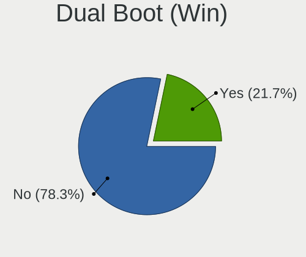

| Dual boot | Notebooks | Percent |
|-----------|-----------|---------|
| No        | 27        | 62.79%  |
| Yes       | 16        | 37.21%  |

Board
-----

Vendor
------

Motherboard manufacturer

| Name             | Notebooks | Percent |
|------------------|-----------|---------|
| Lenovo           | 11        | 25.58%  |
| Dell             | 6         | 13.95%  |
| Hewlett-Packard  | 5         | 11.63%  |
| Acer             | 5         | 11.63%  |
| Apple            | 4         | 9.3%    |
| ASUSTek Computer | 3         | 6.98%   |
| Alienware        | 3         | 6.98%   |
| Toshiba          | 1         | 2.33%   |
| Timi             | 1         | 2.33%   |
| MSI              | 1         | 2.33%   |
| HUAWEI           | 1         | 2.33%   |
| Framework        | 1         | 2.33%   |
| AMI              | 1         | 2.33%   |

Model
-----

Motherboard model

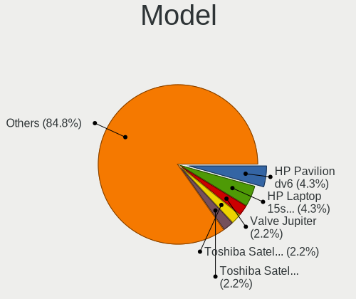

| Name                                     | Notebooks | Percent |
|------------------------------------------|-----------|---------|
| HP EliteBook 8470p                       | 2         | 4.65%   |
| Apple MacBookPro11,1                     | 2         | 4.65%   |
| Toshiba TECRA A40-D                      | 1         | 2.33%   |
| Timi Redmi Book Pro 15 2022              | 1         | 2.33%   |
| MSI Modern 15 A5M                        | 1         | 2.33%   |
| Lenovo Yoga710-14ISK 80TY                | 1         | 2.33%   |
| Lenovo Yoga Slim 7 Pro 14ACH5 D 82NJ     | 1         | 2.33%   |
| Lenovo ThinkPad X1 Carbon 4th 20FBCTO1WW | 1         | 2.33%   |
| Lenovo ThinkPad T470s 20HGS2KW16         | 1         | 2.33%   |
| Lenovo ThinkPad T410 2522PT3             | 1         | 2.33%   |
| Lenovo ThinkPad P15 Gen 2i 20YQCTO1WW    | 1         | 2.33%   |
| Lenovo ThinkPad Edge E531 6885CTO        | 1         | 2.33%   |
| Lenovo ThinkPad E490s 20NG0002AU         | 1         | 2.33%   |
| Lenovo Legion Y540-15IRH 81SX            | 1         | 2.33%   |
| Lenovo IdeaPad L340-17IWL 81M0           | 1         | 2.33%   |
| Lenovo IdeaPad 5 Pro 14ACN6 82L7         | 1         | 2.33%   |
| HUAWEI KLVD-WXX9                         | 1         | 2.33%   |
| HP Presario CQ62                         | 1         | 2.33%   |
| HP Compaq 6730b                          | 1         | 2.33%   |
| HP 250 G6 Notebook PC                    | 1         | 2.33%   |
| Framework Laptop                         | 1         | 2.33%   |
| Dell Vostro 1500                         | 1         | 2.33%   |
| Dell Precision 5540                      | 1         | 2.33%   |
| Dell Latitude E6540                      | 1         | 2.33%   |
| Dell Latitude 5430                       | 1         | 2.33%   |
| Dell G3 3500                             | 1         | 2.33%   |
| Dell G15 5515                            | 1         | 2.33%   |
| ASUS VivoBook_ASUSLaptop X515EA_F1500EA  | 1         | 2.33%   |
| ASUS VivoBook_ASUSLaptop M3500QA_M3500QA | 1         | 2.33%   |
| Apple MacBookAir4,2                      | 1         | 2.33%   |
| Apple MacBook9,1                         | 1         | 2.33%   |
| AMI Intel                                | 1         | 2.33%   |
| Alienware x17 R2                         | 1         | 2.33%   |
| Alienware m15 R7                         | 1         | 2.33%   |
| Alienware 14                             | 1         | 2.33%   |
| Acer Nitro AN515-55                      | 1         | 2.33%   |
| Acer Iconia                              | 1         | 2.33%   |
| Acer ConceptD CN315-71P                  | 1         | 2.33%   |
| Acer Aspire R3-131T                      | 1         | 2.33%   |
| Acer Aspire A315-58                      | 1         | 2.33%   |
| Unknown                                  | 1         | 2.33%   |

Model Family
------------

Motherboard model prefix

| Name                 | Notebooks | Percent |
|----------------------|-----------|---------|
| Lenovo ThinkPad      | 6         | 13.95%  |
| Lenovo IdeaPad       | 2         | 4.65%   |
| HP EliteBook         | 2         | 4.65%   |
| Dell Latitude        | 2         | 4.65%   |
| ASUS VivoBook        | 2         | 4.65%   |
| Apple MacBookPro11   | 2         | 4.65%   |
| Acer Aspire          | 2         | 4.65%   |
| Toshiba TECRA        | 1         | 2.33%   |
| Timi Redmi           | 1         | 2.33%   |
| MSI Modern           | 1         | 2.33%   |
| Lenovo Yoga710-14ISK | 1         | 2.33%   |
| Lenovo Yoga          | 1         | 2.33%   |
| Lenovo Legion        | 1         | 2.33%   |
| HUAWEI KLVD-WXX9     | 1         | 2.33%   |
| HP Presario          | 1         | 2.33%   |
| HP Compaq            | 1         | 2.33%   |
| HP 250               | 1         | 2.33%   |
| Framework Laptop     | 1         | 2.33%   |
| Dell Vostro          | 1         | 2.33%   |
| Dell Precision       | 1         | 2.33%   |
| Dell G3              | 1         | 2.33%   |
| Dell G15             | 1         | 2.33%   |
| Apple MacBookAir4    | 1         | 2.33%   |
| Apple MacBook9       | 1         | 2.33%   |
| AMI Intel            | 1         | 2.33%   |
| Alienware x17        | 1         | 2.33%   |
| Alienware m15        | 1         | 2.33%   |
| Alienware 14         | 1         | 2.33%   |
| Acer Nitro           | 1         | 2.33%   |
| Acer Iconia          | 1         | 2.33%   |
| Acer ConceptD        | 1         | 2.33%   |
| Unknown              | 1         | 2.33%   |

MFG Year
--------

Motherboard manufacture year

| Year | Notebooks | Percent |
|------|-----------|---------|
| 2021 | 9         | 20.93%  |
| 2022 | 6         | 13.95%  |
| 2020 | 5         | 11.63%  |
| 2019 | 3         | 6.98%   |
| 2017 | 3         | 6.98%   |
| 2013 | 3         | 6.98%   |
| 2011 | 3         | 6.98%   |
| 2018 | 2         | 4.65%   |
| 2014 | 2         | 4.65%   |
| 2016 | 1         | 2.33%   |
| 2015 | 1         | 2.33%   |
| 2012 | 1         | 2.33%   |
| 2010 | 1         | 2.33%   |
| 2009 | 1         | 2.33%   |
| 2008 | 1         | 2.33%   |
| 2007 | 1         | 2.33%   |

Form Factor
-----------

Physical design of the computer

| Name     | Notebooks | Percent |
|----------|-----------|---------|
| Notebook | 43        | 100%    |

Secure Boot
-----------

Enabled or disabled

| State    | Notebooks | Percent |
|----------|-----------|---------|
| Disabled | 34        | 79.07%  |
| Enabled  | 9         | 20.93%  |

Coreboot
--------

Have coreboot on board

| Used | Notebooks | Percent |
|------|-----------|---------|
| No   | 43        | 100%    |

RAM Size
--------

Total RAM memory

| Size in GB  | Notebooks | Percent |
|-------------|-----------|---------|
| 4.01-8.0    | 14        | 32.56%  |
| 16.01-24.0  | 12        | 27.91%  |
| 8.01-16.0   | 6         | 13.95%  |
| 3.01-4.0    | 5         | 11.63%  |
| 32.01-64.0  | 3         | 6.98%   |
| 64.01-256.0 | 2         | 4.65%   |
| 1.01-2.0    | 1         | 2.33%   |

RAM Used
--------

Used RAM memory

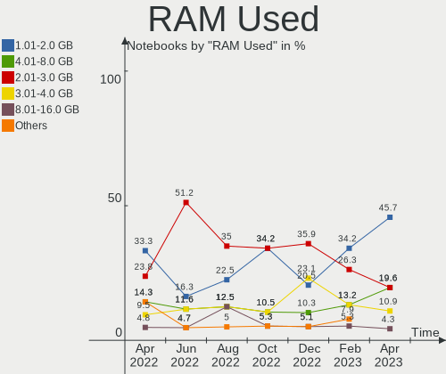

| Used GB   | Notebooks | Percent |
|-----------|-----------|---------|
| 2.01-3.0  | 22        | 51.16%  |
| 1.01-2.0  | 7         | 16.28%  |
| 4.01-8.0  | 5         | 11.63%  |
| 3.01-4.0  | 5         | 11.63%  |
| 8.01-16.0 | 2         | 4.65%   |
| 0.51-1.0  | 2         | 4.65%   |

Total Drives
------------

Number of drives on board

| Drives | Notebooks | Percent |
|--------|-----------|---------|
| 1      | 33        | 76.74%  |
| 2      | 7         | 16.28%  |
| 3      | 2         | 4.65%   |
| 5      | 1         | 2.33%   |

Has CD-ROM
----------

Has CD-ROM on board

| Presented | Notebooks | Percent |
|-----------|-----------|---------|
| No        | 30        | 69.77%  |
| Yes       | 13        | 30.23%  |

Has Ethernet
------------

Has Ethernet on board

| Presented | Notebooks | Percent |
|-----------|-----------|---------|
| Yes       | 30        | 69.77%  |
| No        | 13        | 30.23%  |

Has WiFi
--------

Has WiFi module

| Presented | Notebooks | Percent |
|-----------|-----------|---------|
| Yes       | 42        | 97.67%  |
| No        | 1         | 2.33%   |

Has Bluetooth
-------------

Has Bluetooth module

| Presented | Notebooks | Percent |
|-----------|-----------|---------|
| Yes       | 33        | 76.74%  |
| No        | 10        | 23.26%  |

Location
--------

Country
-------

Geographic location (country)

| Country   | Notebooks | Percent |
|-----------|-----------|---------|
| Australia | 43        | 100%    |

City
----

Geographic location (city)

| City           | Notebooks | Percent |
|----------------|-----------|---------|
| Sydney         | 11        | 25.58%  |
| Melbourne      | 11        | 25.58%  |
| Perth          | 5         | 11.63%  |
| Brisbane       | 4         | 9.3%    |
| Warrnambool    | 1         | 2.33%   |
| Taroona        | 1         | 2.33%   |
| South Yarra    | 1         | 2.33%   |
| Ryde           | 1         | 2.33%   |
| Peregian Beach | 1         | 2.33%   |
| Mount Eliza    | 1         | 2.33%   |
| Launceston     | 1         | 2.33%   |
| Hobart         | 1         | 2.33%   |
| Cessnock       | 1         | 2.33%   |
| Central Coast  | 1         | 2.33%   |
| Campbell       | 1         | 2.33%   |
| Balwyn North   | 1         | 2.33%   |

Drives
------

Drive Vendor
------------

Hard drive vendors

| Vendor              | Notebooks | Drives | Percent |
|---------------------|-----------|--------|---------|
| Samsung Electronics | 12        | 12     | 21.82%  |
| WDC                 | 7         | 9      | 12.73%  |
| Seagate             | 5         | 8      | 9.09%   |
| SanDisk             | 4         | 4      | 7.27%   |
| Kingston            | 4         | 4      | 7.27%   |
| SK hynix            | 3         | 3      | 5.45%   |
| Crucial             | 3         | 3      | 5.45%   |
| Apple               | 3         | 4      | 5.45%   |
| Toshiba             | 2         | 2      | 3.64%   |
| Phison              | 2         | 2      | 3.64%   |
| A-DATA Technology   | 2         | 2      | 3.64%   |
| Patriot             | 1         | 1      | 1.82%   |
| OWC                 | 1         | 1      | 1.82%   |
| LITEONIT            | 1         | 1      | 1.82%   |
| Kston               | 1         | 1      | 1.82%   |
| Intel               | 1         | 1      | 1.82%   |
| HGST                | 1         | 1      | 1.82%   |
| Gigabyte Technology | 1         | 1      | 1.82%   |
| Fujitsu             | 1         | 1      | 1.82%   |

Drive Model
-----------

Hard drive models

| Model                                 | Notebooks | Percent |
|---------------------------------------|-----------|---------|
| Kingston NVMe SSD Drive 256GB         | 2         | 3.33%   |
| WDC WDS200T1X0E-00AFY0 2TB            | 1         | 1.67%   |
| WDC WDS100T2B0C-00PXH0 1TB            | 1         | 1.67%   |
| WDC WD5000LPVX-22V0TT0 500GB          | 1         | 1.67%   |
| WDC WD20SPZX-21UA7T0 2TB              | 1         | 1.67%   |
| WDC PC SN730 SDBPNTY-512G-1101 512GB  | 1         | 1.67%   |
| WDC PC SN720 SDAPNTW-256G-1014 256GB  | 1         | 1.67%   |
| WDC PC SN530 SDBPNPZ-256G-1002 256GB  | 1         | 1.67%   |
| WDC PC SN530 NVMe 512GB               | 1         | 1.67%   |
| Toshiba MQ01ABF050 500GB              | 1         | 1.67%   |
| Toshiba MK2552GSX 250GB               | 1         | 1.67%   |
| SK hynix NVMe SSD Drive 512GB         | 1         | 1.67%   |
| SK hynix HFS256G39TNH-73A0A 256GB SSD | 1         | 1.67%   |
| SK hynix HFS256G39MND-3310A 256GB SSD | 1         | 1.67%   |
| Seagate ST9500325AS 500GB             | 1         | 1.67%   |
| Seagate ST9160821AS 160GB             | 1         | 1.67%   |
| Seagate ST1000LM035-1RK172 1TB        | 1         | 1.67%   |
| Seagate One Touch HDD 5TB             | 1         | 1.67%   |
| Seagate Expansion 1TB                 | 1         | 1.67%   |
| Seagate BUP Slim 2TB                  | 1         | 1.67%   |
| Seagate BUP Portable 5TB              | 1         | 1.67%   |
| Seagate Basic 4TB                     | 1         | 1.67%   |
| SanDisk SDSSDA240G 240GB              | 1         | 1.67%   |
| SanDisk NVMe SSD Drive 512GB          | 1         | 1.67%   |
| SanDisk NVMe SSD Drive 256GB          | 1         | 1.67%   |
| SanDisk NVMe SSD Drive 1024GB         | 1         | 1.67%   |
| Samsung SSD 980 500GB                 | 1         | 1.67%   |
| Samsung SSD 970 EVO Plus 1TB          | 1         | 1.67%   |
| Samsung SSD 860 QVO 1TB               | 1         | 1.67%   |
| Samsung SSD 860 EVO M.2 1TB           | 1         | 1.67%   |
| Samsung Portable SSD T5 250GB         | 1         | 1.67%   |
| Samsung PM9A1 NVMe 1024GB             | 1         | 1.67%   |
| Samsung NVMe SSD Drive 512GB          | 1         | 1.67%   |
| Samsung NVMe SSD Drive 2TB            | 1         | 1.67%   |
| Samsung MZVLQ512HALU-00000 512GB      | 1         | 1.67%   |
| Samsung MZVLB512HBJQ-000L2 512GB      | 1         | 1.67%   |
| Samsung MZVL21T0HCLR-00BL7 1TB        | 1         | 1.67%   |
| Samsung MZNLN256HAJQ-00000 256GB SSD  | 1         | 1.67%   |
| Phison NVMe SSD Drive 2TB             | 1         | 1.67%   |
| Phison NVMe SSD Drive 1024GB          | 1         | 1.67%   |
| Patriot Blaze 120GB SSD               | 1         | 1.67%   |
| OWC Aura SSD 960GB                    | 1         | 1.67%   |
| LITEONIT LMT-256M6M mSATA 256GB SSD   | 1         | 1.67%   |
| Kston SSD 256GB                       | 1         | 1.67%   |
| Kingston SA400S37480G 480GB SSD       | 1         | 1.67%   |
| Kingston OM8PCP3512F-AI1 512GB        | 1         | 1.67%   |
| Intel SSDSC2KW256G8 256GB             | 1         | 1.67%   |
| HGST HTS725050A7E630 500GB            | 1         | 1.67%   |
| Gigabyte GP-GSM2NE3100TNTD 1TB        | 1         | 1.67%   |
| Fujitsu MHZ2160BH G2 160GB            | 1         | 1.67%   |
| Crucial CT500MX500SSD1 500GB          | 1         | 1.67%   |
| Crucial CT1000P1SSD8 1TB              | 1         | 1.67%   |
| Crucial CT1000MX500SSD1 1TB           | 1         | 1.67%   |
| Apple SSD SM256C 256GB                | 1         | 1.67%   |
| Apple SSD SM0512F 500GB               | 1         | 1.67%   |
| Apple NVMe SSD Drive 8KB              | 1         | 1.67%   |
| Apple NVMe SSD Drive 500GB            | 1         | 1.67%   |
| A-DATA SX8200PNP 1TB                  | 1         | 1.67%   |
| A-DATA SU630 960GB SSD                | 1         | 1.67%   |

HDD Vendor
----------

Hard disk drive vendors

| Vendor  | Notebooks | Drives | Percent |
|---------|-----------|--------|---------|
| Seagate | 5         | 7      | 45.45%  |
| WDC     | 2         | 2      | 18.18%  |
| Toshiba | 2         | 2      | 18.18%  |
| HGST    | 1         | 1      | 9.09%   |
| Fujitsu | 1         | 1      | 9.09%   |

SSD Vendor
----------

Solid state drive vendors

| Vendor              | Notebooks | Drives | Percent |
|---------------------|-----------|--------|---------|
| Samsung Electronics | 4         | 4      | 22.22%  |
| SK hynix            | 2         | 2      | 11.11%  |
| Crucial             | 2         | 2      | 11.11%  |
| Apple               | 2         | 2      | 11.11%  |
| SanDisk             | 1         | 1      | 5.56%   |
| Patriot             | 1         | 1      | 5.56%   |
| OWC                 | 1         | 1      | 5.56%   |
| LITEONIT            | 1         | 1      | 5.56%   |
| Kston               | 1         | 1      | 5.56%   |
| Kingston            | 1         | 1      | 5.56%   |
| Intel               | 1         | 1      | 5.56%   |
| A-DATA Technology   | 1         | 1      | 5.56%   |

Drive Kind
----------

HDD or SSD

| Kind    | Notebooks | Drives | Percent |
|---------|-----------|--------|---------|
| NVMe    | 23        | 29     | 46%     |
| SSD     | 16        | 18     | 32%     |
| HDD     | 10        | 13     | 20%     |
| Unknown | 1         | 1      | 2%      |

Drive Connector
---------------

SATA, SAS, NVMe, etc.

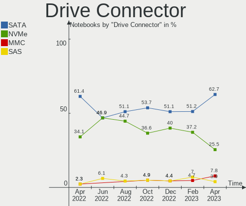

| Type | Notebooks | Drives | Percent |
|------|-----------|--------|---------|
| NVMe | 23        | 29     | 46.94%  |
| SATA | 23        | 26     | 46.94%  |
| SAS  | 3         | 6      | 6.12%   |

Drive Size
----------

Size of hard drive

| Size in TB | Notebooks | Drives | Percent |
|------------|-----------|--------|---------|
| 0.01-0.5   | 17        | 20     | 60.71%  |
| 0.51-1.0   | 7         | 7      | 25%     |
| 1.01-2.0   | 2         | 2      | 7.14%   |
| 4.01-10.0  | 2         | 2      | 7.14%   |

Space Total
-----------

Amount of disk space available on the file system

| Size in GB     | Notebooks | Percent |
|----------------|-----------|---------|
| 251-500        | 10        | 23.26%  |
| 101-250        | 10        | 23.26%  |
| 1001-2000      | 7         | 16.28%  |
| 501-1000       | 5         | 11.63%  |
| 1-20           | 4         | 9.3%    |
| 51-100         | 4         | 9.3%    |
| More than 3000 | 1         | 2.33%   |
| 2001-3000      | 1         | 2.33%   |
| Unknown        | 1         | 2.33%   |

Space Used
----------

Amount of used disk space

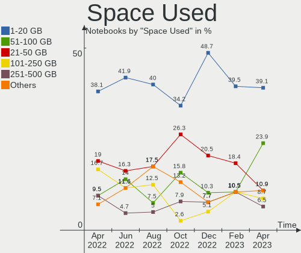

| Used GB   | Notebooks | Percent |
|-----------|-----------|---------|
| 1-20      | 18        | 41.86%  |
| 21-50     | 7         | 16.28%  |
| 51-100    | 6         | 13.95%  |
| 101-250   | 5         | 11.63%  |
| 501-1000  | 3         | 6.98%   |
| 251-500   | 2         | 4.65%   |
| 1001-2000 | 1         | 2.33%   |
| Unknown   | 1         | 2.33%   |

Malfunc. Drives
---------------

Drive models with a malfunction

| Model                  | Notebooks | Drives | Percent |
|------------------------|-----------|--------|---------|
| Apple SSD SM256C 256GB | 1         | 1      | 100%    |

Malfunc. Drive Vendor
---------------------

Vendors of faulty drives

| Vendor | Notebooks | Drives | Percent |
|--------|-----------|--------|---------|
| Apple  | 1         | 1      | 100%    |

Malfunc. HDD Vendor
-------------------

Vendors of faulty HDD drives

Zero info for selected period =(

Malfunc. Drive Kind
-------------------

Kinds of faulty drives

| Kind | Notebooks | Drives | Percent |
|------|-----------|--------|---------|
| SSD  | 1         | 1      | 100%    |

Failed Drives
-------------

Failed drive models

Zero info for selected period =(

Failed Drive Vendor
-------------------

Failed drive vendors

Zero info for selected period =(

Drive Status
------------

Number of failed and malfunc. drives

| Status   | Notebooks | Drives | Percent |
|----------|-----------|--------|---------|
| Detected | 24        | 33     | 52.17%  |
| Works    | 21        | 27     | 45.65%  |
| Malfunc  | 1         | 1      | 2.17%   |

Storage controller
------------------

Storage Vendor
--------------

Storage controller vendors

| Vendor                      | Notebooks | Percent |
|-----------------------------|-----------|---------|
| Intel                       | 28        | 48.28%  |
| Samsung Electronics         | 9         | 15.52%  |
| SanDisk                     | 8         | 13.79%  |
| Kingston Technology Company | 3         | 5.17%   |
| AMD                         | 3         | 5.17%   |
| Phison Electronics          | 2         | 3.45%   |
| SK hynix                    | 1         | 1.72%   |
| Micron/Crucial Technology   | 1         | 1.72%   |
| Marvell Technology Group    | 1         | 1.72%   |
| Apple                       | 1         | 1.72%   |
| ADATA Technology            | 1         | 1.72%   |

Storage Model
-------------

Storage controller models

| Model                                                                            | Notebooks | Percent |
|----------------------------------------------------------------------------------|-----------|---------|
| Intel Volume Management Device NVMe RAID Controller                              | 5         | 8.2%    |
| SanDisk WD Blue SN550 NVMe SSD                                                   | 3         | 4.92%   |
| Samsung NVMe SSD Controller SM981/PM981/PM983                                    | 3         | 4.92%   |
| Intel Sunrise Point-LP SATA Controller [AHCI mode]                               | 3         | 4.92%   |
| Intel Cannon Lake Mobile PCH SATA AHCI Controller                                | 3         | 4.92%   |
| Intel 7 Series Chipset Family 6-port SATA Controller [AHCI mode]                 | 3         | 4.92%   |
| SanDisk WD PC SN810 / Black SN850 NVMe SSD                                       | 2         | 3.28%   |
| Samsung NVMe SSD Controller PM9A1/PM9A3/980PRO                                   | 2         | 3.28%   |
| Samsung NVMe SSD Controller 980                                                  | 2         | 3.28%   |
| Kingston Company OM3PDP3 NVMe SSD                                                | 2         | 3.28%   |
| Intel Tiger Lake-LP SATA Controller [AHCI mode]                                  | 2         | 3.28%   |
| Intel 400 Series Chipset Family SATA AHCI Controller                             | 2         | 3.28%   |
| AMD FCH SATA Controller [AHCI mode]                                              | 2         | 3.28%   |
| SK hynix Gold P31 SSD                                                            | 1         | 1.64%   |
| SanDisk WD Black SN750 / PC SN730 NVMe SSD                                       | 1         | 1.64%   |
| SanDisk WD Black 2018/SN750 / PC SN720 NVMe SSD                                  | 1         | 1.64%   |
| SanDisk Non-Volatile memory controller                                           | 1         | 1.64%   |
| Samsung NVMe SSD Controller SM961/PM961/SM963                                    | 1         | 1.64%   |
| Samsung Apple PCIe SSD                                                           | 1         | 1.64%   |
| Phison PS5013 E13 NVMe Controller                                                | 1         | 1.64%   |
| Phison E12 NVMe Controller                                                       | 1         | 1.64%   |
| Micron/Crucial P1 NVMe PCIe SSD                                                  | 1         | 1.64%   |
| Marvell Group 88SE9230 PCIe 2.0 x2 4-port SATA 6 Gb/s RAID Controller            | 1         | 1.64%   |
| Kingston Company Company Non-Volatile memory controller                          | 1         | 1.64%   |
| Intel Jasper Lake SATA AHCI Controller                                           | 1         | 1.64%   |
| Intel Comet Lake SATA AHCI Controller                                            | 1         | 1.64%   |
| Intel Celeron N3350/Pentium N4200/Atom E3900 Series SATA AHCI Controller         | 1         | 1.64%   |
| Intel Cannon Point-LP SATA Controller [AHCI Mode]                                | 1         | 1.64%   |
| Intel Atom/Celeron/Pentium Processor x5-E8000/J3xxx/N3xxx Series SATA Controller | 1         | 1.64%   |
| Intel 82801IBM/IEM (ICH9M/ICH9M-E) 4 port SATA Controller [AHCI mode]            | 1         | 1.64%   |
| Intel 82801HM/HEM (ICH8M/ICH8M-E) SATA Controller [AHCI mode]                    | 1         | 1.64%   |
| Intel 82801HM/HEM (ICH8M/ICH8M-E) IDE Controller                                 | 1         | 1.64%   |
| Intel 82801 Mobile SATA Controller [RAID mode]                                   | 1         | 1.64%   |
| Intel 8 Series/C220 Series Chipset Family 6-port SATA Controller 1 [AHCI mode]   | 1         | 1.64%   |
| Intel 6 Series/C200 Series Chipset Family 6 port Mobile SATA AHCI Controller     | 1         | 1.64%   |
| Intel 5 Series/3400 Series Chipset 6 port SATA AHCI Controller                   | 1         | 1.64%   |
| Intel 5 Series/3400 Series Chipset 4 port SATA AHCI Controller                   | 1         | 1.64%   |
| Apple S3X NVMe Controller                                                        | 1         | 1.64%   |
| AMD SB7x0/SB8x0/SB9x0 SATA Controller [AHCI mode]                                | 1         | 1.64%   |
| ADATA XPG SX8200 Pro PCIe Gen3x4 M.2 2280 Solid State Drive                      | 1         | 1.64%   |

Storage Kind
------------

Kind of storage controller (IDE, SATA, NVMe, SAS, ...)

| Kind | Notebooks | Percent |
|------|-----------|---------|
| SATA | 29        | 49.15%  |
| NVMe | 23        | 38.98%  |
| RAID | 6         | 10.17%  |
| IDE  | 1         | 1.69%   |

Processor
---------

CPU Vendor
----------

Processor vendors

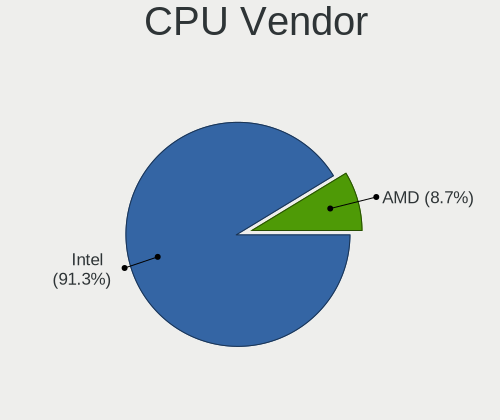

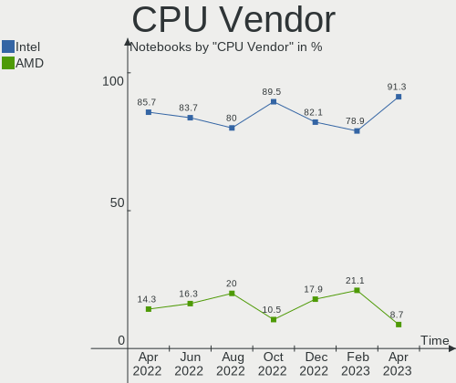

| Vendor | Notebooks | Percent |
|--------|-----------|---------|
| Intel  | 36        | 83.72%  |
| AMD    | 7         | 16.28%  |

CPU Model
---------

Processor models

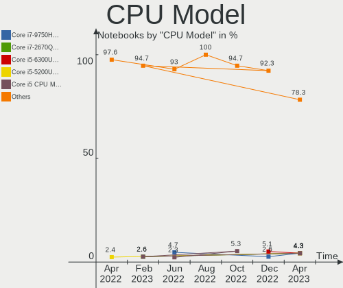

| Model                                   | Notebooks | Percent |
|-----------------------------------------|-----------|---------|
| Intel Core i7-9750H CPU @ 2.60GHz       | 2         | 4.65%   |
| Intel Core i5-8265U CPU @ 1.60GHz       | 2         | 4.65%   |
| Intel Core i5-3360M CPU @ 2.80GHz       | 2         | 4.65%   |
| Intel Core i5-10300H CPU @ 2.50GHz      | 2         | 4.65%   |
| Intel 11th Gen Core i5-1135G7 @ 2.40GHz | 2         | 4.65%   |
| Intel Pentium CPU N3700 @ 1.60GHz       | 1         | 2.33%   |
| Intel Core m5-6Y54 CPU @ 1.10GHz        | 1         | 2.33%   |
| Intel Core i9-9980HK CPU @ 2.40GHz      | 1         | 2.33%   |
| Intel Core i7-6600U CPU @ 2.60GHz       | 1         | 2.33%   |
| Intel Core i7-6500U CPU @ 2.50GHz       | 1         | 2.33%   |
| Intel Core i7-4800MQ CPU @ 2.70GHz      | 1         | 2.33%   |
| Intel Core i7-4700MQ CPU @ 2.40GHz      | 1         | 2.33%   |
| Intel Core i7-4578U CPU @ 3.00GHz       | 1         | 2.33%   |
| Intel Core i7-3632QM CPU @ 2.20GHz      | 1         | 2.33%   |
| Intel Core i7-2677M CPU @ 1.80GHz       | 1         | 2.33%   |
| Intel Core i7-10700 CPU @ 2.90GHz       | 1         | 2.33%   |
| Intel Core i5-7300U CPU @ 2.60GHz       | 1         | 2.33%   |
| Intel Core i5-7200U CPU @ 2.50GHz       | 1         | 2.33%   |
| Intel Core i5-4288U CPU @ 2.60GHz       | 1         | 2.33%   |
| Intel Core i5 CPU M 540 @ 2.53GHz       | 1         | 2.33%   |
| Intel Core i5 CPU M 480 @ 2.67GHz       | 1         | 2.33%   |
| Intel Core 2 Duo CPU T7250 @ 2.00GHz    | 1         | 2.33%   |
| Intel Core 2 Duo CPU P8400 @ 2.26GHz    | 1         | 2.33%   |
| Intel Celeron N5095 @ 2.00GHz           | 1         | 2.33%   |
| Intel Celeron CPU N3350 @ 1.10GHz       | 1         | 2.33%   |
| Intel 12th Gen Core i9-12900HK          | 1         | 2.33%   |
| Intel 12th Gen Core i7-12700H           | 1         | 2.33%   |
| Intel 12th Gen Core i7-1265U            | 1         | 2.33%   |
| Intel 11th Gen Core i9-11950H @ 2.60GHz | 1         | 2.33%   |
| Intel 11th Gen Core i7-1165G7 @ 2.80GHz | 1         | 2.33%   |
| Intel 11th Gen Core i3-1115G4 @ 3.00GHz | 1         | 2.33%   |
| AMD V140 Processor                      | 1         | 2.33%   |
| AMD Ryzen 9 5900HX with Radeon Graphics | 1         | 2.33%   |
| AMD Ryzen 7 6800H with Radeon Graphics  | 1         | 2.33%   |
| AMD Ryzen 7 5800U with Radeon Graphics  | 1         | 2.33%   |
| AMD Ryzen 7 5800HS Creator Edition      | 1         | 2.33%   |
| AMD Ryzen 7 5700U with Radeon Graphics  | 1         | 2.33%   |
| AMD Ryzen 5 5600H with Radeon Graphics  | 1         | 2.33%   |

CPU Model Family
----------------

Processor model prefix

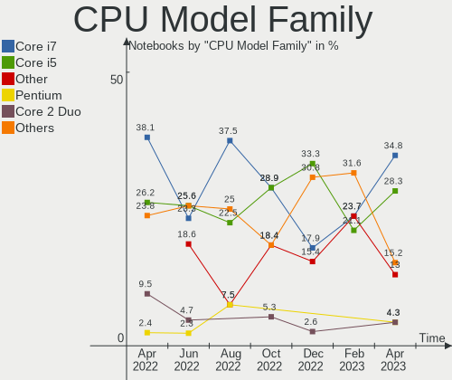

| Model            | Notebooks | Percent |
|------------------|-----------|---------|
| Intel Core i5    | 11        | 25.58%  |
| Intel Core i7    | 10        | 23.26%  |
| Other            | 8         | 18.6%   |
| AMD Ryzen 7      | 4         | 9.3%    |
| Intel Core 2 Duo | 2         | 4.65%   |
| Intel Celeron    | 2         | 4.65%   |
| Intel Pentium    | 1         | 2.33%   |
| Intel Core m5    | 1         | 2.33%   |
| Intel Core i9    | 1         | 2.33%   |
| AMD V140         | 1         | 2.33%   |
| AMD Ryzen 9      | 1         | 2.33%   |
| AMD Ryzen 5      | 1         | 2.33%   |

CPU Cores
---------

Number of processor cores

| Number | Notebooks | Percent |
|--------|-----------|---------|
| 2      | 16        | 37.21%  |
| 4      | 12        | 27.91%  |
| 8      | 8         | 18.6%   |
| 6      | 3         | 6.98%   |
| 14     | 2         | 4.65%   |
| 10     | 1         | 2.33%   |
| 1      | 1         | 2.33%   |

CPU Sockets
-----------

Number of sockets

| Number | Notebooks | Percent |
|--------|-----------|---------|
| 1      | 43        | 100%    |

CPU Threads
-----------

Threads per core (Hyper-Threading)

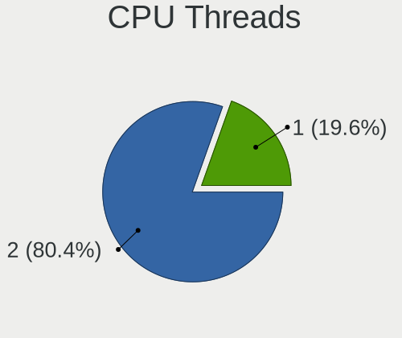

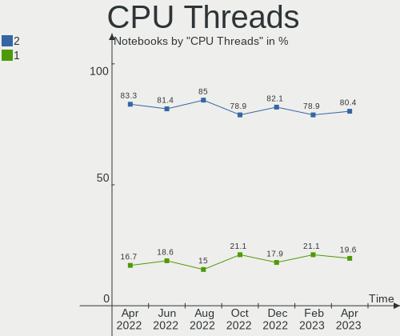

| Number | Notebooks | Percent |
|--------|-----------|---------|
| 2      | 35        | 81.4%   |
| 1      | 8         | 18.6%   |

CPU Op-Modes
------------

CPU Operation Modes (32-bit, 64-bit)

| Op mode        | Notebooks | Percent |
|----------------|-----------|---------|
| 32-bit, 64-bit | 43        | 100%    |

CPU Microcode
-------------

Microcode number

| Number     | Notebooks | Percent |
|------------|-----------|---------|
| Unknown    | 10        | 23.26%  |
| 0x806c1    | 4         | 9.3%    |
| 0x406e3    | 3         | 6.98%   |
| 0x0a50000c | 3         | 6.98%   |
| 0x906ea    | 2         | 4.65%   |
| 0x906a3    | 2         | 4.65%   |
| 0x806e9    | 2         | 4.65%   |
| 0x306a9    | 2         | 4.65%   |
| 0x906c0    | 1         | 2.33%   |
| 0x906a4    | 1         | 2.33%   |
| 0x806ec    | 1         | 2.33%   |
| 0x806eb    | 1         | 2.33%   |
| 0x806d1    | 1         | 2.33%   |
| 0x506c9    | 1         | 2.33%   |
| 0x406c3    | 1         | 2.33%   |
| 0x40651    | 1         | 2.33%   |
| 0x306c3    | 1         | 2.33%   |
| 0x206a7    | 1         | 2.33%   |
| 0x20652    | 1         | 2.33%   |
| 0x10676    | 1         | 2.33%   |
| 0x0a404101 | 1         | 2.33%   |
| 0x08608103 | 1         | 2.33%   |
| 0x010000c8 | 1         | 2.33%   |

CPU Microarch
-------------

Microarchitecture

| Name             | Notebooks | Percent |
|------------------|-----------|---------|
| KabyLake         | 7         | 16.28%  |
| Zen 3            | 4         | 9.3%    |
| TigerLake        | 4         | 9.3%    |
| Haswell          | 4         | 9.3%    |
| Skylake          | 3         | 6.98%   |
| IvyBridge        | 3         | 6.98%   |
| CometLake        | 3         | 6.98%   |
| Unknown          | 3         | 6.98%   |
| Westmere         | 2         | 4.65%   |
| Alderlake Hybrid | 2         | 4.65%   |
| Tremont          | 1         | 2.33%   |
| Silvermont       | 1         | 2.33%   |
| SandyBridge      | 1         | 2.33%   |
| Penryn           | 1         | 2.33%   |
| K10              | 1         | 2.33%   |
| Icelake          | 1         | 2.33%   |
| Goldmont         | 1         | 2.33%   |
| Core             | 1         | 2.33%   |

Graphics
--------

GPU Vendor
----------

Vendors of graphics cards

| Vendor | Notebooks | Percent |
|--------|-----------|---------|
| Intel  | 33        | 60%     |
| Nvidia | 14        | 25.45%  |
| AMD    | 8         | 14.55%  |

GPU Model
---------

Graphics card models

| Model                                                                                    | Notebooks | Percent |
|------------------------------------------------------------------------------------------|-----------|---------|
| AMD Cezanne                                                                              | 4         | 7.27%   |
| Intel TigerLake-LP GT2 [Iris Xe Graphics]                                                | 3         | 5.45%   |
| Intel 3rd Gen Core processor Graphics Controller                                         | 3         | 5.45%   |
| Intel WhiskeyLake-U GT2 [UHD Graphics 620]                                               | 2         | 3.64%   |
| Intel Skylake GT2 [HD Graphics 520]                                                      | 2         | 3.64%   |
| Intel HD Graphics 620                                                                    | 2         | 3.64%   |
| Intel Haswell-ULT Integrated Graphics Controller                                         | 2         | 3.64%   |
| Intel Core Processor Integrated Graphics Controller                                      | 2         | 3.64%   |
| Intel CometLake-H GT2 [UHD Graphics]                                                     | 2         | 3.64%   |
| Intel CoffeeLake-H GT2 [UHD Graphics 630]                                                | 2         | 3.64%   |
| Intel Alder Lake-P Integrated Graphics Controller                                        | 2         | 3.64%   |
| Intel 4th Gen Core Processor Integrated Graphics Controller                              | 2         | 3.64%   |
| Nvidia TU117M [GeForce MX450]                                                            | 1         | 1.82%   |
| Nvidia TU117M [GeForce GTX 1650 Ti Mobile]                                               | 1         | 1.82%   |
| Nvidia TU117M                                                                            | 1         | 1.82%   |
| Nvidia TU117GLM [Quadro T2000 Mobile / Max-Q]                                            | 1         | 1.82%   |
| Nvidia TU117GLM [Quadro T1000 Mobile]                                                    | 1         | 1.82%   |
| Nvidia TU116M [GeForce GTX 1660 Ti Mobile]                                               | 1         | 1.82%   |
| Nvidia TU104 [GeForce RTX 2070 SUPER]                                                    | 1         | 1.82%   |
| Nvidia GP108M [GeForce MX230]                                                            | 1         | 1.82%   |
| Nvidia GM108M [GeForce 940MX]                                                            | 1         | 1.82%   |
| Nvidia GA107M [GeForce RTX 3050 Mobile]                                                  | 1         | 1.82%   |
| Nvidia GA107GLM [RTX A2000 Mobile]                                                       | 1         | 1.82%   |
| Nvidia GA104M [Geforce RTX 3070 Ti Laptop GPU]                                           | 1         | 1.82%   |
| Nvidia GA103M [GeForce RTX 3080 Ti Laptop GPU]                                           | 1         | 1.82%   |
| Nvidia G84M [GeForce 8600M GT]                                                           | 1         | 1.82%   |
| Intel VGA compatible controller                                                          | 1         | 1.82%   |
| Intel TigerLake-H GT1 [UHD Graphics]                                                     | 1         | 1.82%   |
| Intel Tiger Lake UHD Graphics                                                            | 1         | 1.82%   |
| Intel Mobile 4 Series Chipset Integrated Graphics Controller                             | 1         | 1.82%   |
| Intel JasperLake [UHD Graphics]                                                          | 1         | 1.82%   |
| Intel HD Graphics 515                                                                    | 1         | 1.82%   |
| Intel HD Graphics 500                                                                    | 1         | 1.82%   |
| Intel Atom/Celeron/Pentium Processor x5-E8000/J3xxx/N3xxx Integrated Graphics Controller | 1         | 1.82%   |
| Intel 2nd Generation Core Processor Family Integrated Graphics Controller                | 1         | 1.82%   |
| AMD RS880M [Mobility Radeon HD 4225/4250]                                                | 1         | 1.82%   |
| AMD Rembrandt [Radeon 680M]                                                              | 1         | 1.82%   |
| AMD Mars XTX [Radeon HD 8790M]                                                           | 1         | 1.82%   |
| AMD Lucienne                                                                             | 1         | 1.82%   |

GPU Combo
---------

Combinations of graphics cards

| Name           | Notebooks | Percent |
|----------------|-----------|---------|
| 1 x Intel      | 23        | 53.49%  |
| Intel + Nvidia | 8         | 18.6%   |
| 1 x AMD        | 5         | 11.63%  |
| 1 x Nvidia     | 4         | 9.3%    |
| AMD + Nvidia   | 2         | 4.65%   |
| Intel + AMD    | 1         | 2.33%   |

GPU Driver
----------

Free vs proprietary

| Driver      | Notebooks | Percent |
|-------------|-----------|---------|
| Free        | 31        | 72.09%  |
| Proprietary | 11        | 25.58%  |
| Unknown     | 1         | 2.33%   |

GPU Memory
----------

Total video memory

| Size in GB | Notebooks | Percent |
|------------|-----------|---------|
| Unknown    | 30        | 69.77%  |
| 1.01-2.0   | 5         | 11.63%  |
| 0.01-0.5   | 4         | 9.3%    |
| 7.01-8.0   | 2         | 4.65%   |
| 5.01-6.0   | 1         | 2.33%   |
| 3.01-4.0   | 1         | 2.33%   |

Monitor
-------

Monitor Vendor
--------------

Monitor vendors

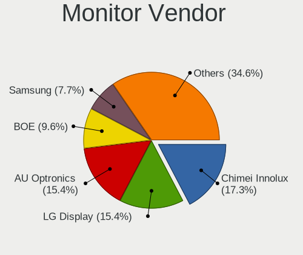

| Vendor              | Notebooks | Percent |
|---------------------|-----------|---------|
| AU Optronics        | 12        | 23.08%  |
| Chimei Innolux      | 8         | 15.38%  |
| LG Display          | 7         | 13.46%  |
| BOE                 | 4         | 7.69%   |
| Apple               | 4         | 7.69%   |
| Goldstar            | 3         | 5.77%   |
| Samsung Electronics | 2         | 3.85%   |
| Panasonic           | 2         | 3.85%   |
| Hewlett-Packard     | 2         | 3.85%   |
| Dell                | 2         | 3.85%   |
| TMX                 | 1         | 1.92%   |
| Sharp               | 1         | 1.92%   |
| Lenovo              | 1         | 1.92%   |
| CSO                 | 1         | 1.92%   |
| AOC                 | 1         | 1.92%   |
| Acer                | 1         | 1.92%   |

Monitor Model
-------------

Monitor models

| Model                                                                 | Notebooks | Percent |
|-----------------------------------------------------------------------|-----------|---------|
| Chimei Innolux LCD Monitor CMN1522 1920x1080 344x193mm 15.5-inch      | 2         | 3.7%    |
| AU Optronics LCD Monitor AUO223E 1600x900 309x174mm 14.0-inch         | 2         | 3.7%    |
| AU Optronics LCD Monitor AUO21ED 1920x1080 344x193mm 15.5-inch        | 2         | 3.7%    |
| TMX TL156MDMP01-1 TMX1560 3200x2000 336x210mm 15.6-inch               | 1         | 1.85%   |
| Sharp LCD Monitor SHP14B9 3840x2160 344x194mm 15.5-inch               | 1         | 1.85%   |
| Samsung Electronics LCD Monitor SEC3358 1280x800 330x210mm 15.4-inch  | 1         | 1.85%   |
| Samsung Electronics LCD Monitor SDC4161 1920x1080 344x194mm 15.5-inch | 1         | 1.85%   |
| Panasonic TV MEIC136 1280x720 698x392mm 31.5-inch                     | 1         | 1.85%   |
| Panasonic TV MEIA296 3840x2160 698x392mm 31.5-inch                    | 1         | 1.85%   |
| LG Display LCD Monitor LGD05E5 1920x1080 340x190mm 15.3-inch          | 1         | 1.85%   |
| LG Display LCD Monitor LGD05B9 1920x1080 382x215mm 17.3-inch          | 1         | 1.85%   |
| LG Display LCD Monitor LGD04F5 1920x1080 309x174mm 14.0-inch          | 1         | 1.85%   |
| LG Display LCD Monitor LGD049A 2560x1440 310x174mm 14.0-inch          | 1         | 1.85%   |
| LG Display LCD Monitor LGD0437 1920x1080 280x160mm 12.7-inch          | 1         | 1.85%   |
| LG Display LCD Monitor LGD03EA 1920x1080 309x174mm 14.0-inch          | 1         | 1.85%   |
| LG Display LCD Monitor LGD02AC 1366x768 344x194mm 15.5-inch           | 1         | 1.85%   |
| Lenovo LCD Monitor LEN4036 1440x900 304x190mm 14.1-inch               | 1         | 1.85%   |
| Hewlett-Packard E27 G4 HPN3693 1920x1080 598x337mm 27.0-inch          | 1         | 1.85%   |
| Hewlett-Packard 24fw HPN3545 1920x1080 527x296mm 23.8-inch            | 1         | 1.85%   |
| Goldstar UltraFine GSM5B74 3840x2160 600x340mm 27.2-inch              | 1         | 1.85%   |
| Goldstar MP59HT GSM5B44 1920x1080 480x270mm 21.7-inch                 | 1         | 1.85%   |
| Goldstar 23MB35 GSM5A3E 1920x1080 510x290mm 23.1-inch                 | 1         | 1.85%   |
| Dell P2414H DELA09C 1920x1080 527x297mm 23.8-inch                     | 1         | 1.85%   |
| Dell E2219HN DEL2009 1920x1080 476x268mm 21.5-inch                    | 1         | 1.85%   |
| Dell E2216H DELF069 1920x1080 476x268mm 21.5-inch                     | 1         | 1.85%   |
| CSO LCD Monitor CSO140C 2880x1800 302x188mm 14.0-inch                 | 1         | 1.85%   |
| Chimei Innolux LCD Monitor CMN15F5 1920x1080 344x193mm 15.5-inch      | 1         | 1.85%   |
| Chimei Innolux LCD Monitor CMN15E7 1920x1080 344x193mm 15.5-inch      | 1         | 1.85%   |
| Chimei Innolux LCD Monitor CMN15DB 1366x768 344x193mm 15.5-inch       | 1         | 1.85%   |
| Chimei Innolux LCD Monitor CMN1520 1920x1080 344x193mm 15.5-inch      | 1         | 1.85%   |
| Chimei Innolux LCD Monitor CMN1514 1920x1080 344x193mm 15.5-inch      | 1         | 1.85%   |
| Chimei Innolux LCD Monitor CMN14C3 1366x768 309x173mm 13.9-inch       | 1         | 1.85%   |
| BOE LCD Monitor BOE095F 2256x1504 285x190mm 13.5-inch                 | 1         | 1.85%   |
| BOE LCD Monitor BOE0931 2240x1400 302x189mm 14.0-inch                 | 1         | 1.85%   |
| BOE LCD Monitor BOE0893 2160x1440 296x197mm 14.0-inch                 | 1         | 1.85%   |
| BOE LCD Monitor BOE07C9 1920x1080 309x173mm 13.9-inch                 | 1         | 1.85%   |
| AU Optronics LCD Monitor AUO8074 1280x800 331x207mm 15.4-inch         | 1         | 1.85%   |
| AU Optronics LCD Monitor AUO46EC 1366x768 344x193mm 15.5-inch         | 1         | 1.85%   |
| AU Optronics LCD Monitor AUO323C 1366x768 309x173mm 13.9-inch         | 1         | 1.85%   |
| AU Optronics LCD Monitor AUO303C 1366x768 309x173mm 13.9-inch         | 1         | 1.85%   |
| AU Optronics LCD Monitor AUO2E8D 1920x1080 344x194mm 15.5-inch        | 1         | 1.85%   |
| AU Optronics LCD Monitor AUO299C 1920x1080 382x215mm 17.3-inch        | 1         | 1.85%   |
| AU Optronics LCD Monitor AUO243D 1920x1080 309x173mm 13.9-inch        | 1         | 1.85%   |
| AU Optronics LCD Monitor AUO105C 1366x768 256x144mm 11.6-inch         | 1         | 1.85%   |
| AU Optronics LCD Monitor 1920x1080                                    | 1         | 1.85%   |
| Apple Color LCD APPA027 2304x1440 259x162mm 12.0-inch                 | 1         | 1.85%   |
| Apple Color LCD APPA020 2560x1600 286x179mm 13.3-inch                 | 1         | 1.85%   |
| Apple Color LCD APPA018 2560x1600 286x179mm 13.3-inch                 | 1         | 1.85%   |
| Apple Color LCD APP9CDF 1440x900 286x179mm 13.3-inch                  | 1         | 1.85%   |
| AOC U2790B AOC2790 3840x2160 597x336mm 27.0-inch                      | 1         | 1.85%   |
| Acer EB321HQU C ACR0507 2560x1440 699x393mm 31.6-inch                 | 1         | 1.85%   |

Monitor Resolution
------------------

Monitor screen resolution

| Resolution       | Notebooks | Percent |
|------------------|-----------|---------|
| 1920x1080 (FHD)  | 21        | 43.75%  |
| 1366x768 (WXGA)  | 6         | 12.5%   |
| 3840x2160 (4K)   | 4         | 8.33%   |
| 2560x1600        | 2         | 4.17%   |
| 2560x1440 (QHD)  | 2         | 4.17%   |
| 1600x900 (HD+)   | 2         | 4.17%   |
| 1440x900 (WXGA+) | 2         | 4.17%   |
| 1280x800 (WXGA)  | 2         | 4.17%   |
| 3200x2000        | 1         | 2.08%   |
| 2880x1800        | 1         | 2.08%   |
| 2304x1440        | 1         | 2.08%   |
| 2256x1504        | 1         | 2.08%   |
| 2240x1400        | 1         | 2.08%   |
| 2160x1440        | 1         | 2.08%   |
| 1280x720 (HD)    | 1         | 2.08%   |

Monitor Diagonal
----------------

Diagonal size in inches

| Inches  | Notebooks | Percent |
|---------|-----------|---------|
| 15      | 18        | 34.62%  |
| 14      | 10        | 19.23%  |
| 13      | 7         | 13.46%  |
| 27      | 3         | 5.77%   |
| 31      | 2         | 3.85%   |
| 24      | 2         | 3.85%   |
| 21      | 2         | 3.85%   |
| 17      | 2         | 3.85%   |
| 12      | 2         | 3.85%   |
| 84      | 1         | 1.92%   |
| 23      | 1         | 1.92%   |
| 11      | 1         | 1.92%   |
| Unknown | 1         | 1.92%   |

Monitor Width
-------------

Physical width

| Width in mm | Notebooks | Percent |
|-------------|-----------|---------|
| 301-350     | 30        | 58.82%  |
| 201-300     | 7         | 13.73%  |
| 501-600     | 6         | 11.76%  |
| 601-700     | 2         | 3.92%   |
| 401-500     | 2         | 3.92%   |
| 351-400     | 2         | 3.92%   |
| 1501-2000   | 1         | 1.96%   |
| Unknown     | 1         | 1.96%   |

Aspect Ratio
------------

Proportional relationship between the width and the height

| Ratio   | Notebooks | Percent |
|---------|-----------|---------|
| 16/9    | 31        | 70.45%  |
| 16/10   | 10        | 22.73%  |
| 3/2     | 2         | 4.55%   |
| Unknown | 1         | 2.27%   |

Monitor Area
------------

Area in inch

| Area in inch | Notebooks | Percent |
|----------------|-----------|---------|
| 101-110        | 18        | 33.96%  |
| 81-90          | 14        | 26.42%  |
| 201-250        | 5         | 9.43%   |
| 71-80          | 3         | 5.66%   |
| 301-350        | 3         | 5.66%   |
| 61-70          | 2         | 3.77%   |
| 351-500        | 2         | 3.77%   |
| 121-130        | 2         | 3.77%   |
| More than 1000 | 1         | 1.89%   |
| 51-60          | 1         | 1.89%   |
| 151-200        | 1         | 1.89%   |
| Unknown        | 1         | 1.89%   |

Pixel Density
-------------

Pixels per inch

| Density       | Notebooks | Percent |
|---------------|-----------|---------|
| 121-160       | 22        | 44.9%   |
| 51-100        | 8         | 16.33%  |
| 161-240       | 7         | 14.29%  |
| 101-120       | 7         | 14.29%  |
| More than 240 | 3         | 6.12%   |
| 1-50          | 1         | 2.04%   |
| Unknown       | 1         | 2.04%   |

Multiple Monitors
-----------------

Total monitors connected

| Total | Notebooks | Percent |
|-------|-----------|---------|
| 1     | 32        | 74.42%  |
| 2     | 8         | 18.6%   |
| 3     | 2         | 4.65%   |
| 0     | 1         | 2.33%   |

Network
-------

Net Controller Vendor
---------------------

Controller vendors

| Vendor                | Notebooks | Percent |
|-----------------------|-----------|---------|
| Intel                 | 29        | 46.03%  |
| Realtek Semiconductor | 17        | 26.98%  |
| Broadcom Limited      | 5         | 7.94%   |
| Broadcom              | 4         | 6.35%   |
| Qualcomm Atheros      | 3         | 4.76%   |
| MediaTek              | 3         | 4.76%   |
| Xiaomi                | 1         | 1.59%   |
| Dell                  | 1         | 1.59%   |

Net Controller Model
--------------------

Controller models

| Model                                                             | Notebooks | Percent |
|-------------------------------------------------------------------|-----------|---------|
| Realtek RTL8111/8168/8411 PCI Express Gigabit Ethernet Controller | 10        | 13.33%  |
| Intel Wi-Fi 6 AX201                                               | 3         | 4%      |
| Intel Comet Lake PCH CNVi WiFi                                    | 3         | 4%      |
| Intel Centrino Ultimate-N 6300                                    | 3         | 4%      |
| Intel Alder Lake-P PCH CNVi WiFi                                  | 3         | 4%      |
| Realtek Killer E3000 2.5GbE Controller                            | 2         | 2.67%   |
| MediaTek MT7921 802.11ax PCI Express Wireless Network Adapter     | 2         | 2.67%   |
| Intel Wireless-AC 9260                                            | 2         | 2.67%   |
| Intel Wireless 8265 / 8275                                        | 2         | 2.67%   |
| Intel Wi-Fi 6 AX210/AX211/AX411 160MHz                            | 2         | 2.67%   |
| Intel Wi-Fi 6 AX200                                               | 2         | 2.67%   |
| Intel 82579LM Gigabit Network Connection (Lewisville)             | 2         | 2.67%   |
| Broadcom Limited BCM4360 802.11ac Wireless Network Adapter        | 2         | 2.67%   |
| Broadcom BCM4350 802.11ac Wireless Network Adapter                | 2         | 2.67%   |
| Xiaomi Mi/Redmi series (RNDIS + ADB)                              | 1         | 1.33%   |
| Realtek RTL88x2bu [AC1200 Techkey]                                | 1         | 1.33%   |
| Realtek RTL8852AE 802.11ax PCIe Wireless Network Adapter          | 1         | 1.33%   |
| Realtek RTL8125 2.5GbE Controller                                 | 1         | 1.33%   |
| Realtek RTL810xE PCI Express Fast Ethernet controller             | 1         | 1.33%   |
| Realtek Realtek Network controller                                | 1         | 1.33%   |
| Realtek Killer E2600 Gigabit Ethernet Controller                  | 1         | 1.33%   |
| Qualcomm Atheros Killer E220x Gigabit Ethernet Controller         | 1         | 1.33%   |
| Qualcomm Atheros AR9462 Wireless Network Adapter                  | 1         | 1.33%   |
| Qualcomm Atheros AR9285 Wireless Network Adapter (PCI-Express)    | 1         | 1.33%   |
| Qualcomm Atheros AR8151 v2.0 Gigabit Ethernet                     | 1         | 1.33%   |
| MediaTek MT7921K (RZ608) Wi-Fi 6E 80MHz                           | 1         | 1.33%   |
| Intel Wireless 8260                                               | 1         | 1.33%   |
| Intel Wireless 7265                                               | 1         | 1.33%   |
| Intel Wireless 3165                                               | 1         | 1.33%   |
| Intel PRO/Wireless 5100 AGN [Shiloh] Network Connection           | 1         | 1.33%   |
| Intel PRO/Wireless 3945ABG [Golan] Network Connection             | 1         | 1.33%   |
| Intel Ethernet Controller I225-LM                                 | 1         | 1.33%   |
| Intel Ethernet Connection I219-LM                                 | 1         | 1.33%   |
| Intel Ethernet Connection I217-LM                                 | 1         | 1.33%   |
| Intel Ethernet Connection (4) I219-V                              | 1         | 1.33%   |
| Intel Ethernet Connection (4) I219-LM                             | 1         | 1.33%   |
| Intel Ethernet Connection (16) I219-LM                            | 1         | 1.33%   |
| Intel Ethernet Connection (11) I219-V                             | 1         | 1.33%   |
| Intel Dual Band Wireless-AC 3168NGW [Stone Peak]                  | 1         | 1.33%   |
| Intel Centrino Advanced-N 6200                                    | 1         | 1.33%   |
| Intel Cannon Point-LP CNVi [Wireless-AC]                          | 1         | 1.33%   |
| Intel Cannon Lake PCH CNVi WiFi                                   | 1         | 1.33%   |
| Intel 82577LM Gigabit Network Connection                          | 1         | 1.33%   |
| Dell Hub of E-Port Replicator                                     | 1         | 1.33%   |
| Broadcom Limited NetLink BCM5787M Gigabit Ethernet PCI Express    | 1         | 1.33%   |
| Broadcom Limited BCM4401-B0 100Base-TX                            | 1         | 1.33%   |
| Broadcom Limited BCM43228 802.11a/b/g/n                           | 1         | 1.33%   |
| Broadcom BCM43225 802.11b/g/n                                     | 1         | 1.33%   |
| Broadcom BCM43224 802.11a/b/g/n                                   | 1         | 1.33%   |

Wireless Vendor
---------------

Wireless vendors

| Vendor                | Notebooks | Percent |
|-----------------------|-----------|---------|
| Intel                 | 29        | 65.91%  |
| Broadcom              | 4         | 9.09%   |
| MediaTek              | 3         | 6.82%   |
| Broadcom Limited      | 3         | 6.82%   |
| Realtek Semiconductor | 2         | 4.55%   |
| Qualcomm Atheros      | 2         | 4.55%   |
| Dell                  | 1         | 2.27%   |

Wireless Model
--------------

Wireless models

| Model                                                          | Notebooks | Percent |
|----------------------------------------------------------------|-----------|---------|
| Intel Wi-Fi 6 AX201                                            | 3         | 6.82%   |
| Intel Comet Lake PCH CNVi WiFi                                 | 3         | 6.82%   |
| Intel Centrino Ultimate-N 6300                                 | 3         | 6.82%   |
| Intel Alder Lake-P PCH CNVi WiFi                               | 3         | 6.82%   |
| MediaTek MT7921 802.11ax PCI Express Wireless Network Adapter  | 2         | 4.55%   |
| Intel Wireless-AC 9260                                         | 2         | 4.55%   |
| Intel Wireless 8265 / 8275                                     | 2         | 4.55%   |
| Intel Wi-Fi 6 AX210/AX211/AX411 160MHz                         | 2         | 4.55%   |
| Intel Wi-Fi 6 AX200                                            | 2         | 4.55%   |
| Broadcom Limited BCM4360 802.11ac Wireless Network Adapter     | 2         | 4.55%   |
| Broadcom BCM4350 802.11ac Wireless Network Adapter             | 2         | 4.55%   |
| Realtek RTL88x2bu [AC1200 Techkey]                             | 1         | 2.27%   |
| Realtek RTL8852AE 802.11ax PCIe Wireless Network Adapter       | 1         | 2.27%   |
| Qualcomm Atheros AR9462 Wireless Network Adapter               | 1         | 2.27%   |
| Qualcomm Atheros AR9285 Wireless Network Adapter (PCI-Express) | 1         | 2.27%   |
| MediaTek MT7921K (RZ608) Wi-Fi 6E 80MHz                        | 1         | 2.27%   |
| Intel Wireless 8260                                            | 1         | 2.27%   |
| Intel Wireless 7265                                            | 1         | 2.27%   |
| Intel Wireless 3165                                            | 1         | 2.27%   |
| Intel PRO/Wireless 5100 AGN [Shiloh] Network Connection        | 1         | 2.27%   |
| Intel PRO/Wireless 3945ABG [Golan] Network Connection          | 1         | 2.27%   |
| Intel Dual Band Wireless-AC 3168NGW [Stone Peak]               | 1         | 2.27%   |
| Intel Centrino Advanced-N 6200                                 | 1         | 2.27%   |
| Intel Cannon Point-LP CNVi [Wireless-AC]                       | 1         | 2.27%   |
| Intel Cannon Lake PCH CNVi WiFi                                | 1         | 2.27%   |
| Dell Hub of E-Port Replicator                                  | 1         | 2.27%   |
| Broadcom Limited BCM43228 802.11a/b/g/n                        | 1         | 2.27%   |
| Broadcom BCM43225 802.11b/g/n                                  | 1         | 2.27%   |
| Broadcom BCM43224 802.11a/b/g/n                                | 1         | 2.27%   |

Ethernet Vendor
---------------

Ethernet vendors

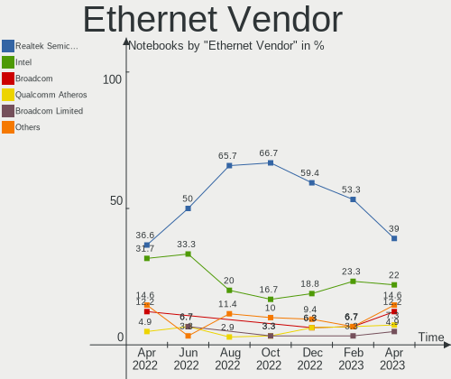

| Vendor                | Notebooks | Percent |
|-----------------------|-----------|---------|
| Realtek Semiconductor | 15        | 50%     |
| Intel                 | 10        | 33.33%  |
| Qualcomm Atheros      | 2         | 6.67%   |
| Broadcom Limited      | 2         | 6.67%   |
| Xiaomi                | 1         | 3.33%   |

Ethernet Model
--------------

Ethernet models

| Model                                                             | Notebooks | Percent |
|-------------------------------------------------------------------|-----------|---------|
| Realtek RTL8111/8168/8411 PCI Express Gigabit Ethernet Controller | 10        | 33.33%  |
| Realtek Killer E3000 2.5GbE Controller                            | 2         | 6.67%   |
| Intel 82579LM Gigabit Network Connection (Lewisville)             | 2         | 6.67%   |
| Xiaomi Mi/Redmi series (RNDIS + ADB)                              | 1         | 3.33%   |
| Realtek RTL8125 2.5GbE Controller                                 | 1         | 3.33%   |
| Realtek RTL810xE PCI Express Fast Ethernet controller             | 1         | 3.33%   |
| Realtek Killer E2600 Gigabit Ethernet Controller                  | 1         | 3.33%   |
| Qualcomm Atheros Killer E220x Gigabit Ethernet Controller         | 1         | 3.33%   |
| Qualcomm Atheros AR8151 v2.0 Gigabit Ethernet                     | 1         | 3.33%   |
| Intel Ethernet Controller I225-LM                                 | 1         | 3.33%   |
| Intel Ethernet Connection I219-LM                                 | 1         | 3.33%   |
| Intel Ethernet Connection I217-LM                                 | 1         | 3.33%   |
| Intel Ethernet Connection (4) I219-V                              | 1         | 3.33%   |
| Intel Ethernet Connection (4) I219-LM                             | 1         | 3.33%   |
| Intel Ethernet Connection (16) I219-LM                            | 1         | 3.33%   |
| Intel Ethernet Connection (11) I219-V                             | 1         | 3.33%   |
| Intel 82577LM Gigabit Network Connection                          | 1         | 3.33%   |
| Broadcom Limited NetLink BCM5787M Gigabit Ethernet PCI Express    | 1         | 3.33%   |
| Broadcom Limited BCM4401-B0 100Base-TX                            | 1         | 3.33%   |

Net Controller Kind
-------------------

Ethernet, WiFi or modem

| Kind     | Notebooks | Percent |
|----------|-----------|---------|
| WiFi     | 42        | 57.53%  |
| Ethernet | 30        | 41.1%   |
| Unknown  | 1         | 1.37%   |

Used Controller
---------------

Currently used network controller

| Kind     | Notebooks | Percent |
|----------|-----------|---------|
| WiFi     | 32        | 74.42%  |
| Ethernet | 11        | 25.58%  |

NICs
----

Total network controllers on board

| Total | Notebooks | Percent |
|-------|-----------|---------|
| 2     | 28        | 65.12%  |
| 1     | 14        | 32.56%  |
| 3     | 1         | 2.33%   |

IPv6
----

IPv6 vs IPv4

| Used | Notebooks | Percent |
|------|-----------|---------|
| No   | 34        | 79.07%  |
| Yes  | 9         | 20.93%  |

Bluetooth
---------

Bluetooth Vendor
----------------

Controller vendors

| Vendor                          | Notebooks | Percent |
|---------------------------------|-----------|---------|
| Intel                           | 21        | 63.64%  |
| Broadcom                        | 3         | 9.09%   |
| Apple                           | 3         | 9.09%   |
| Realtek Semiconductor           | 1         | 3.03%   |
| Qualcomm Atheros Communications | 1         | 3.03%   |
| Opticis                         | 1         | 3.03%   |
| MediaTek                        | 1         | 3.03%   |
| IMC Networks                    | 1         | 3.03%   |
| Foxconn / Hon Hai               | 1         | 3.03%   |

Bluetooth Model
---------------

Controller models

| Model                                          | Notebooks | Percent |
|------------------------------------------------|-----------|---------|
| Intel Bluetooth Device                         | 6         | 18.18%  |
| Intel Bluetooth 9460/9560 Jefferson Peak (JfP) | 5         | 15.15%  |
| Intel Bluetooth wireless interface             | 4         | 12.12%  |
| Intel AX210 Bluetooth                          | 2         | 6.06%   |
| Intel AX200 Bluetooth                          | 2         | 6.06%   |
| Broadcom HP Portable SoftSailing               | 2         | 6.06%   |
| Apple Bluetooth Host Controller                | 2         | 6.06%   |
| Realtek Bluetooth Radio                        | 1         | 3.03%   |
| Qualcomm Atheros AR3012 Bluetooth 4.0          | 1         | 3.03%   |
| Opticis Bluetooth Radio                        | 1         | 3.03%   |
| MediaTek Wireless_Device                       | 1         | 3.03%   |
| Intel Wireless-AC 9260 Bluetooth Adapter       | 1         | 3.03%   |
| Intel Wireless-AC 3168 Bluetooth               | 1         | 3.03%   |
| IMC Networks Wireless_Device                   | 1         | 3.03%   |
| Foxconn / Hon Hai Wireless_Device              | 1         | 3.03%   |
| Broadcom BCM20702A0                            | 1         | 3.03%   |
| Apple Built-in Bluetooth 2.0+EDR HCI           | 1         | 3.03%   |

Sound
-----

Sound Vendor
------------

Sound card vendors

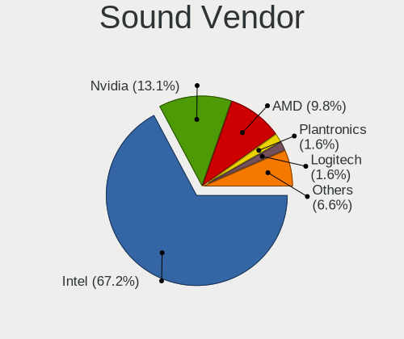

| Vendor                                       | Notebooks | Percent |
|----------------------------------------------|-----------|---------|
| Intel                                        | 36        | 66.67%  |
| Nvidia                                       | 9         | 16.67%  |
| AMD                                          | 7         | 12.96%  |
| Zoran Co. Personal Media Division (Nogatech) | 1         | 1.85%   |
| LG Electronics                               | 1         | 1.85%   |

Sound Model
-----------

Sound card models

| Model                                                                                             | Notebooks | Percent |
|---------------------------------------------------------------------------------------------------|-----------|---------|
| AMD Family 17h/19h HD Audio Controller                                                            | 6         | 9.23%   |
| Intel Sunrise Point-LP HD Audio                                                                   | 5         | 7.69%   |
| AMD Renoir Radeon High Definition Audio Controller                                                | 5         | 7.69%   |
| Intel Tiger Lake-LP Smart Sound Technology Audio Controller                                       | 4         | 6.15%   |
| Nvidia TU107 GeForce GTX 1650 High Definition Audio Controller                                    | 3         | 4.62%   |
| Nvidia Audio device                                                                               | 3         | 4.62%   |
| Intel Comet Lake PCH cAVS                                                                         | 3         | 4.62%   |
| Intel Cannon Lake PCH cAVS                                                                        | 3         | 4.62%   |
| Intel Alder Lake PCH-P High Definition Audio Controller                                           | 3         | 4.62%   |
| Intel 7 Series/C216 Chipset Family High Definition Audio Controller                               | 3         | 4.62%   |
| Intel Xeon E3-1200 v3/4th Gen Core Processor HD Audio Controller                                  | 2         | 3.08%   |
| Intel Haswell-ULT HD Audio Controller                                                             | 2         | 3.08%   |
| Intel Cannon Point-LP High Definition Audio Controller                                            | 2         | 3.08%   |
| Intel 8 Series/C220 Series Chipset High Definition Audio Controller                               | 2         | 3.08%   |
| Intel 8 Series HD Audio Controller                                                                | 2         | 3.08%   |
| Intel 5 Series/3400 Series Chipset High Definition Audio                                          | 2         | 3.08%   |
| Zoran Co. Personal Media Division (Nogatech) USB Audio and HID                                    | 1         | 1.54%   |
| Nvidia TU116 High Definition Audio Controller                                                     | 1         | 1.54%   |
| Nvidia TU104 HD Audio Controller                                                                  | 1         | 1.54%   |
| Nvidia GA104 High Definition Audio Controller                                                     | 1         | 1.54%   |
| LG Electronics LG UltraFine Display Audio                                                         | 1         | 1.54%   |
| Intel Tiger Lake-H HD Audio Controller                                                            | 1         | 1.54%   |
| Intel Jasper Lake HD Audio                                                                        | 1         | 1.54%   |
| Intel Celeron N3350/Pentium N4200/Atom E3900 Series Audio Cluster                                 | 1         | 1.54%   |
| Intel Atom/Celeron/Pentium Processor x5-E8000/J3xxx/N3xxx Series High Definition Audio Controller | 1         | 1.54%   |
| Intel 82801I (ICH9 Family) HD Audio Controller                                                    | 1         | 1.54%   |
| Intel 82801H (ICH8 Family) HD Audio Controller                                                    | 1         | 1.54%   |
| Intel 6 Series/C200 Series Chipset Family High Definition Audio Controller                        | 1         | 1.54%   |
| AMD SBx00 Azalia (Intel HDA)                                                                      | 1         | 1.54%   |
| AMD RS880 HDMI Audio [Radeon HD 4200 Series]                                                      | 1         | 1.54%   |
| AMD Rembrandt Radeon High Definition Audio Controller                                             | 1         | 1.54%   |

Memory
------

Memory Vendor
-------------

Memory module vendors

| Vendor                     | Notebooks | Percent |
|----------------------------|-----------|---------|
| SK hynix                   | 10        | 34.48%  |
| Samsung Electronics        | 7         | 24.14%  |
| Micron Technology          | 5         | 17.24%  |
| Crucial                    | 2         | 6.9%    |
| Patriot                    | 1         | 3.45%   |
| Kingston                   | 1         | 3.45%   |
| Elpida                     | 1         | 3.45%   |
| Anucell Technology Holding | 1         | 3.45%   |
| Unknown                    | 1         | 3.45%   |

Memory Model
------------

Memory module models

| Model                                                            | Notebooks | Percent |
|------------------------------------------------------------------|-----------|---------|
| Samsung RAM M471A5244CB0-CWE 4GB SODIMM DDR4 3200MT/s            | 2         | 6.45%   |
| SK hynix RAM Module 4GB SODIMM DDR3 1600MT/s                     | 1         | 3.23%   |
| SK hynix RAM Module 4GB SODIMM DDR3 1066MT/s                     | 1         | 3.23%   |
| SK hynix RAM Module 2048MB SODIMM DDR3 1333MT/s                  | 1         | 3.23%   |
| SK hynix RAM HMCG88MEBSA095N 32GB SODIMM 4800MT/s                | 1         | 3.23%   |
| SK hynix RAM HMCG66MEBSA095N 8GB SODIMM 4800MT/s                 | 1         | 3.23%   |
| SK hynix RAM HMAA1GS6CJR6N-XN 8192MB SODIMM DDR4 3200MT/s        | 1         | 3.23%   |
| SK hynix RAM HMA851S6DJR6N-XN 4GB SODIMM DDR4 3200MT/s           | 1         | 3.23%   |
| SK hynix RAM HMA81GS6JJR8N-VK 8GB SODIMM DDR4 2667MT/s           | 1         | 3.23%   |
| SK hynix RAM HMA81GS6AFR8N-UH 8GB SODIMM DDR4 2667MT/s           | 1         | 3.23%   |
| SK hynix RAM H9HCNNNCPMMLXR-NEE 8GB Row Of Chips LPDDR4 4266MT/s | 1         | 3.23%   |
| Samsung RAM M471A5244BB0-CWE 4GB SODIMM DDR4 3200MT/s            | 1         | 3.23%   |
| Samsung RAM M471A4G43AB1-CWE 32GB SODIMM DDR4 3200MT/s           | 1         | 3.23%   |
| Samsung RAM M471A1K43DB1-CTD 8GB SODIMM DDR4 2667MT/s            | 1         | 3.23%   |
| Samsung RAM M471A1K43BB1-CRC 8GB SODIMM DDR4 2667MT/s            | 1         | 3.23%   |
| Samsung RAM M471A1K43BB0-CPB 8192MB SODIMM DDR4 2133MT/s         | 1         | 3.23%   |
| Samsung RAM K4A8G165WC-BCTD 4GB Row Of Chips DDR4 2667MT/s       | 1         | 3.23%   |
| Patriot RAM PSD416G320081S 16GB SODIMM DDR4 3200MT/s             | 1         | 3.23%   |
| Micron RAM 8ATF1G64HZ-3G2R1 8GB SODIMM DDR4 3200MT/s             | 1         | 3.23%   |
| Micron RAM 8ATF1G64HZ-2G6D1 8GB SODIMM DDR4 2667MT/s             | 1         | 3.23%   |
| Micron RAM 4ATF1G64HZ-3G2E1 8GB SODIMM DDR4 3200MT/s             | 1         | 3.23%   |
| Micron RAM 16KTF1G64HZ-1G6E2 8GB SODIMM DDR3 1867MT/s            | 1         | 3.23%   |
| Micron RAM 16ATF2G64HZ-3G2J1 16GB SODIMM DDR4 3200MT/s           | 1         | 3.23%   |
| Kingston RAM 9905700-070.A01G 16GB SODIMM DDR4 2667MT/s          | 1         | 3.23%   |
| Elpida RAM EDFB232A1MA-JD-F 8GB SODIMM LPDDR3 1867MT/s           | 1         | 3.23%   |
| Elpida RAM EDFB232A1MA-JD-F 8GB Chip LPDDR3 1867MT/s             | 1         | 3.23%   |
| Crucial RAM CT32G4SFD832A.C16FE 32GB SODIMM DDR4 3200MT/s        | 1         | 3.23%   |
| Crucial RAM CT16G4SFRA32A.C8FE 16384MB SODIMM DDR4 3200MT/s      | 1         | 3.23%   |
| Anucell Holding RAM Module 8GB SODIMM DDR4 2667MT/s              | 1         | 3.23%   |
| Unknown                                                          | 1         | 3.23%   |

Memory Kind
-----------

Memory module kinds

| Kind    | Notebooks | Percent |
|---------|-----------|---------|
| DDR4    | 16        | 64%     |
| DDR3    | 4         | 16%     |
| Unknown | 3         | 12%     |
| LPDDR4  | 1         | 4%      |
| LPDDR3  | 1         | 4%      |

Memory Form Factor
------------------

Physical design of the memory module

| Name         | Notebooks | Percent |
|--------------|-----------|---------|
| SODIMM       | 22        | 84.62%  |
| Row Of Chips | 3         | 11.54%  |
| Chip         | 1         | 3.85%   |

Memory Size
-----------

Memory module size

| Size  | Notebooks | Percent |
|-------|-----------|---------|
| 8192  | 13        | 50%     |
| 4096  | 6         | 23.08%  |
| 32768 | 3         | 11.54%  |
| 16384 | 3         | 11.54%  |
| 2048  | 1         | 3.85%   |

Memory Speed
------------

Memory module speed

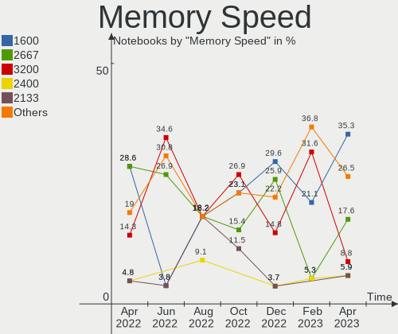

| Speed | Notebooks | Percent |
|-------|-----------|---------|
| 3200  | 9         | 34.62%  |
| 2667  | 7         | 26.92%  |
| 4800  | 2         | 7.69%   |
| 1867  | 2         | 7.69%   |
| 6400  | 1         | 3.85%   |
| 4266  | 1         | 3.85%   |
| 2133  | 1         | 3.85%   |
| 1600  | 1         | 3.85%   |
| 1333  | 1         | 3.85%   |
| 1066  | 1         | 3.85%   |

Printers & scanners
-------------------

Printer Vendor
--------------

Printer device vendors

Zero info for selected period =(

Printer Model
-------------

Printer device models

Zero info for selected period =(

Scanner Vendor
--------------

Scanner device vendors

Zero info for selected period =(

Scanner Model
-------------

Scanner device models

Zero info for selected period =(

Camera
------

Camera Vendor
-------------

Camera device vendors

| Vendor                        | Notebooks | Percent |
|-------------------------------|-----------|---------|
| Chicony Electronics           | 9         | 23.08%  |
| Sunplus Innovation Technology | 7         | 17.95%  |
| IMC Networks                  | 4         | 10.26%  |
| Microdia                      | 3         | 7.69%   |
| Acer                          | 3         | 7.69%   |
| Realtek Semiconductor         | 2         | 5.13%   |
| Quanta                        | 2         | 5.13%   |
| SunplusIT                     | 1         | 2.56%   |
| Sonix Technology              | 1         | 2.56%   |
| Samsung Electronics           | 1         | 2.56%   |
| Primax Electronics            | 1         | 2.56%   |
| OmniVision Technologies       | 1         | 2.56%   |
| LG Electronics                | 1         | 2.56%   |
| Lenovo                        | 1         | 2.56%   |
| Apple                         | 1         | 2.56%   |
| 8SSC20F27145V1SR1BX02P8       | 1         | 2.56%   |

Camera Model
------------

Camera device models

| Model                                     | Notebooks | Percent |
|-------------------------------------------|-----------|---------|
| Sunplus Integrated_Webcam_HD              | 3         | 7.69%   |
| Chicony Integrated Camera                 | 3         | 7.69%   |
| Microdia Integrated_Webcam_HD             | 2         | 5.13%   |
| IMC Networks Integrated Camera            | 2         | 5.13%   |
| Chicony HD User Facing                    | 2         | 5.13%   |
| SunplusIT XiaoMi USB 2.0 Webcam           | 1         | 2.56%   |
| Sunplus Laptop Integrated Webcam FHD      | 1         | 2.56%   |
| Sunplus Integrated_Webcam_FHD             | 1         | 2.56%   |
| Sunplus HP HD Webcam [Fixed]              | 1         | 2.56%   |
| Sunplus HD WebCam                         | 1         | 2.56%   |
| Sonix USB2.0 HD UVC WebCam                | 1         | 2.56%   |
| Samsung Galaxy series, misc. (MTP mode)   | 1         | 2.56%   |
| Realtek Laptop Camera                     | 1         | 2.56%   |
| Realtek EasyCamera                        | 1         | 2.56%   |
| Quanta HP Webcam                          | 1         | 2.56%   |
| Quanta HD User Facing                     | 1         | 2.56%   |
| Primax HP HD Webcam [Fixed]               | 1         | 2.56%   |
| OmniVision OV2640 Webcam                  | 1         | 2.56%   |
| Microdia Integrated Webcam                | 1         | 2.56%   |
| LG LG UltraFine Display Camera            | 1         | 2.56%   |
| Lenovo Integrated Webcam [R5U877]         | 1         | 2.56%   |
| IMC Networks USB2.0 HD UVC WebCam         | 1         | 2.56%   |
| IMC Networks HD Camera                    | 1         | 2.56%   |
| Chicony Webcam-101                        | 1         | 2.56%   |
| Chicony TOSHIBA Web Camera - FHD          | 1         | 2.56%   |
| Chicony Integrated Camera (1280x720@30)   | 1         | 2.56%   |
| Chicony 1.3M Webcam                       | 1         | 2.56%   |
| Apple FaceTime Camera                     | 1         | 2.56%   |
| Acer SunplusIT Integrated Camera          | 1         | 2.56%   |
| Acer Integrated Camera                    | 1         | 2.56%   |
| Acer HD Webcam                            | 1         | 2.56%   |
| 8SSC20F27145V1SR1BX02P8 Integrated Camera | 1         | 2.56%   |

Security
--------

Fingerprint Vendor
------------------

Fingerprint sensor vendors

| Vendor                     | Notebooks | Percent |
|----------------------------|-----------|---------|
| Validity Sensors           | 4         | 44.44%  |
| Shenzhen Goodix Technology | 2         | 22.22%  |
| Upek                       | 1         | 11.11%  |
| Synaptics                  | 1         | 11.11%  |
| LighTuning Technology      | 1         | 11.11%  |

Fingerprint Model
-----------------

Fingerprint sensor models

| Model                                                  | Notebooks | Percent |
|--------------------------------------------------------|-----------|---------|
| Validity Sensors VFS491                                | 2         | 22.22%  |
| Validity Sensors VFS7500 Touch Fingerprint Sensor      | 1         | 11.11%  |
| Validity Sensors Synaptics WBDI                        | 1         | 11.11%  |
| Upek Biometric Touchchip/Touchstrip Fingerprint Sensor | 1         | 11.11%  |
| Synaptics Prometheus MIS Touch Fingerprint Reader      | 1         | 11.11%  |
| Shenzhen Goodix  Fingerprint Device                    | 1         | 11.11%  |
| Shenzhen Goodix Fingerprint Reader                     | 1         | 11.11%  |
| LighTuning EgisTec Touch Fingerprint Sensor            | 1         | 11.11%  |

Chipcard Vendor
---------------

Chipcard module vendors

| Vendor | Notebooks | Percent |
|--------|-----------|---------|
| Lenovo | 1         | 100%    |

Chipcard Model
--------------

Chipcard module models

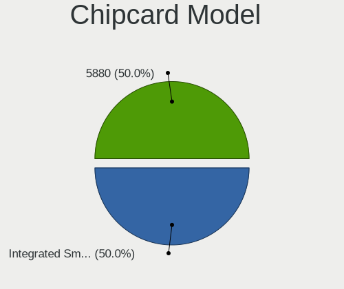

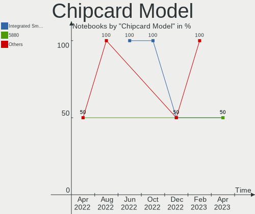

| Model                               | Notebooks | Percent |
|-------------------------------------|-----------|---------|
| Lenovo Integrated Smart Card Reader | 1         | 100%    |

Unsupported
-----------

Unsupported Devices
-------------------

Total unsupported devices on board

| Total | Notebooks | Percent |
|-------|-----------|---------|
| 0     | 23        | 53.49%  |
| 1     | 15        | 34.88%  |
| 2     | 4         | 9.3%    |
| 3     | 1         | 2.33%   |

Unsupported Device Types
------------------------

Types of unsupported devices

| Type                     | Notebooks | Percent |
|--------------------------|-----------|---------|
| Fingerprint reader       | 9         | 37.5%   |
| Multimedia controller    | 4         | 16.67%  |
| Graphics card            | 4         | 16.67%  |
| Camera                   | 2         | 8.33%   |
| Network                  | 1         | 4.17%   |
| Net/wireless             | 1         | 4.17%   |
| Modem                    | 1         | 4.17%   |
| Communication controller | 1         | 4.17%   |
| Chipcard                 | 1         | 4.17%   |

