Linux in Australia - Hardware Trends (Notebooks)
------------------------------------------------

A project to identify most popular hardware characteristics and track their change
over time based on data collected by Linux users at https://Linux-Hardware.org.

Anyone can contribute to this report by the [hw-probe](https://github.com/linuxhw/hw-probe) tool:

    sudo -E hw-probe -all -upload

Contents
--------

* [ System ](#system)
  - [ OS                       ](#os)
  - [ OS Family                ](#os-family)
  - [ Kernel                   ](#kernel)
  - [ Kernel Family            ](#kernel-family)
  - [ Kernel Major Ver.        ](#kernel-major-ver)
  - [ Arch                     ](#arch)
  - [ DE                       ](#de)
  - [ Display Server           ](#display-server)
  - [ Display Manager          ](#display-manager)
  - [ OS Lang                  ](#os-lang)
  - [ Boot Mode                ](#boot-mode)
  - [ Filesystem               ](#filesystem)
  - [ Part. scheme             ](#part-scheme)
  - [ Dual Boot with Linux/BSD ](#dual-boot-with-linuxbsd)
  - [ Dual Boot (Win)          ](#dual-boot-win)

* [ Board ](#board)
  - [ Vendor                   ](#vendor)
  - [ Model                    ](#model)
  - [ Model Family             ](#model-family)
  - [ MFG Year                 ](#mfg-year)
  - [ Form Factor              ](#form-factor)
  - [ Secure Boot              ](#secure-boot)
  - [ Coreboot                 ](#coreboot)
  - [ RAM Size                 ](#ram-size)
  - [ RAM Used                 ](#ram-used)
  - [ Total Drives             ](#total-drives)
  - [ Has CD-ROM               ](#has-cd-rom)
  - [ Has Ethernet             ](#has-ethernet)
  - [ Has WiFi                 ](#has-wifi)
  - [ Has Bluetooth            ](#has-bluetooth)

* [ Location ](#location)
  - [ Country                  ](#country)
  - [ City                     ](#city)

* [ Drives ](#drives)
  - [ Drive Vendor             ](#drive-vendor)
  - [ Drive Model              ](#drive-model)
  - [ HDD Vendor               ](#hdd-vendor)
  - [ SSD Vendor               ](#ssd-vendor)
  - [ Drive Kind               ](#drive-kind)
  - [ Drive Connector          ](#drive-connector)
  - [ Drive Size               ](#drive-size)
  - [ Space Total              ](#space-total)
  - [ Space Used               ](#space-used)
  - [ Malfunc. Drives          ](#malfunc-drives)
  - [ Malfunc. Drive Vendor    ](#malfunc-drive-vendor)
  - [ Malfunc. HDD Vendor      ](#malfunc-hdd-vendor)
  - [ Malfunc. Drive Kind      ](#malfunc-drive-kind)
  - [ Failed Drives            ](#failed-drives)
  - [ Failed Drive Vendor      ](#failed-drive-vendor)
  - [ Drive Status             ](#drive-status)

* [ Storage controller ](#storage-controller)
  - [ Storage Vendor           ](#storage-vendor)
  - [ Storage Model            ](#storage-model)
  - [ Storage Kind             ](#storage-kind)

* [ Processor ](#processor)
  - [ CPU Vendor               ](#cpu-vendor)
  - [ CPU Model                ](#cpu-model)
  - [ CPU Model Family         ](#cpu-model-family)
  - [ CPU Cores                ](#cpu-cores)
  - [ CPU Sockets              ](#cpu-sockets)
  - [ CPU Threads              ](#cpu-threads)
  - [ CPU Op-Modes             ](#cpu-op-modes)
  - [ CPU Microcode            ](#cpu-microcode)
  - [ CPU Microarch            ](#cpu-microarch)

* [ Graphics ](#graphics)
  - [ GPU Vendor               ](#gpu-vendor)
  - [ GPU Model                ](#gpu-model)
  - [ GPU Combo                ](#gpu-combo)
  - [ GPU Driver               ](#gpu-driver)
  - [ GPU Memory               ](#gpu-memory)

* [ Monitor ](#monitor)
  - [ Monitor Vendor           ](#monitor-vendor)
  - [ Monitor Model            ](#monitor-model)
  - [ Monitor Resolution       ](#monitor-resolution)
  - [ Monitor Diagonal         ](#monitor-diagonal)
  - [ Monitor Width            ](#monitor-width)
  - [ Aspect Ratio             ](#aspect-ratio)
  - [ Monitor Area             ](#monitor-area)
  - [ Pixel Density            ](#pixel-density)
  - [ Multiple Monitors        ](#multiple-monitors)

* [ Network ](#network)
  - [ Net Controller Vendor    ](#net-controller-vendor)
  - [ Net Controller Model     ](#net-controller-model)
  - [ Wireless Vendor          ](#wireless-vendor)
  - [ Wireless Model           ](#wireless-model)
  - [ Ethernet Vendor          ](#ethernet-vendor)
  - [ Ethernet Model           ](#ethernet-model)
  - [ Net Controller Kind      ](#net-controller-kind)
  - [ Used Controller          ](#used-controller)
  - [ NICs                     ](#nics)
  - [ IPv6                     ](#ipv6)

* [ Bluetooth ](#bluetooth)
  - [ Bluetooth Vendor         ](#bluetooth-vendor)
  - [ Bluetooth Model          ](#bluetooth-model)

* [ Sound ](#sound)
  - [ Sound Vendor             ](#sound-vendor)
  - [ Sound Model              ](#sound-model)

* [ Memory ](#memory)
  - [ Memory Vendor            ](#memory-vendor)
  - [ Memory Model             ](#memory-model)
  - [ Memory Kind              ](#memory-kind)
  - [ Memory Form Factor       ](#memory-form-factor)
  - [ Memory Size              ](#memory-size)
  - [ Memory Speed             ](#memory-speed)

* [ Printers & scanners ](#printers--scanners)
  - [ Printer Vendor           ](#printer-vendor)
  - [ Printer Model            ](#printer-model)
  - [ Scanner Vendor           ](#scanner-vendor)
  - [ Scanner Model            ](#scanner-model)

* [ Camera ](#camera)
  - [ Camera Vendor            ](#camera-vendor)
  - [ Camera Model             ](#camera-model)

* [ Security ](#security)
  - [ Fingerprint Vendor       ](#fingerprint-vendor)
  - [ Fingerprint Model        ](#fingerprint-model)
  - [ Chipcard Vendor          ](#chipcard-vendor)
  - [ Chipcard Model           ](#chipcard-model)

* [ Unsupported ](#unsupported)
  - [ Unsupported Devices      ](#unsupported-devices)
  - [ Unsupported Device Types ](#unsupported-device-types)

System
------

OS
--

Installed operating systems

| Name              | Notebooks | Percent |
|-------------------|-----------|---------|
| Ubuntu 20.04      | 9         | 21.43%  |
| Ubuntu 22.04      | 3         | 7.14%   |
| OpenMandriva 4.3  | 3         | 7.14%   |
| Manjaro           | 3         | 7.14%   |
| Linux Mint 20.3   | 3         | 7.14%   |
| Fedora 35         | 3         | 7.14%   |
| Ubuntu 21.10      | 2         | 4.76%   |
| Zorin 16          | 1         | 2.38%   |
| Solus 4.3         | 1         | 2.38%   |
| RHEL 8            | 1         | 2.38%   |
| Pop!_OS 21.10     | 1         | 2.38%   |
| openSUSE 20220423 | 1         | 2.38%   |
| Manjaro 21.2.5    | 1         | 2.38%   |
| Lubuntu 20.04     | 1         | 2.38%   |
| KDE neon 20.04    | 1         | 2.38%   |
| Kali 2022.1       | 1         | 2.38%   |
| Endless 4.0.4     | 1         | 2.38%   |
| Elementary 6.1    | 1         | 2.38%   |
| Deepin 20.5       | 1         | 2.38%   |
| Debian Unstable   | 1         | 2.38%   |
| Debian Testing    | 1         | 2.38%   |
| Artix             | 1         | 2.38%   |
| ArcoLinux Rolling | 1         | 2.38%   |

OS Family
---------

OS without a version

| Name         | Notebooks | Percent |
|--------------|-----------|---------|
| Ubuntu       | 14        | 33.33%  |
| Manjaro      | 4         | 9.52%   |
| OpenMandriva | 3         | 7.14%   |
| Linux Mint   | 3         | 7.14%   |
| Fedora       | 3         | 7.14%   |
| Debian       | 2         | 4.76%   |
| Zorin        | 1         | 2.38%   |
| Solus        | 1         | 2.38%   |
| RHEL         | 1         | 2.38%   |
| Pop!_OS      | 1         | 2.38%   |
| openSUSE     | 1         | 2.38%   |
| Lubuntu      | 1         | 2.38%   |
| KDE neon     | 1         | 2.38%   |
| Kali         | 1         | 2.38%   |
| Endless      | 1         | 2.38%   |
| Elementary   | 1         | 2.38%   |
| Deepin       | 1         | 2.38%   |
| Artix        | 1         | 2.38%   |
| ArcoLinux    | 1         | 2.38%   |

Kernel
------

Version of the Linux kernel

| Version                      | Notebooks | Percent |
|------------------------------|-----------|---------|
| 5.13.0-39-generic            | 5         | 11.9%   |
| 5.13.0-40-generic            | 4         | 9.52%   |
| 5.16.7-desktop-1omv4003      | 3         | 7.14%   |
| 5.4.0-107-generic            | 2         | 4.76%   |
| 5.16.18-200.fc35.x86_64      | 2         | 4.76%   |
| 5.15.0-27-generic            | 2         | 4.76%   |
| 5.8.0-48-generic             | 1         | 2.38%   |
| 5.4.0-91-generic             | 1         | 2.38%   |
| 5.4.0-42-generic             | 1         | 2.38%   |
| 5.4.0-109-generic            | 1         | 2.38%   |
| 5.17.4-1-default             | 1         | 2.38%   |
| 5.17.1-artix1-1              | 1         | 2.38%   |
| 5.17.1-arch1-1               | 1         | 2.38%   |
| 5.17.0-5.1-liquorix-amd64    | 1         | 2.38%   |
| 5.16.19-76051619-generic     | 1         | 2.38%   |
| 5.16.19-200.fc35.x86_64      | 1         | 2.38%   |
| 5.16.18-1-MANJARO            | 1         | 2.38%   |
| 5.16.0-kali5-amd64           | 1         | 2.38%   |
| 5.16.0-6-amd64               | 1         | 2.38%   |
| 5.15.32-213.current          | 1         | 2.38%   |
| 5.15.32-1-MANJARO            | 1         | 2.38%   |
| 5.15.28-1-MANJARO            | 1         | 2.38%   |
| 5.15.0-25-generic            | 1         | 2.38%   |
| 5.14.0-1007-oem              | 1         | 2.38%   |
| 5.13.0-37-generic            | 1         | 2.38%   |
| 5.11.0-35-generic            | 1         | 2.38%   |
| 5.11.0-27-generic            | 1         | 2.38%   |
| 5.10.105-1-MANJARO           | 1         | 2.38%   |
| 5.10.101-amd64-desktop       | 1         | 2.38%   |
| 4.18.0-348.20.1.el8_5.x86_64 | 1         | 2.38%   |

Kernel Family
-------------

Linux kernel without a distro release

| Version  | Notebooks | Percent |
|----------|-----------|---------|
| 5.13.0   | 10        | 23.81%  |
| 5.4.0    | 5         | 11.9%   |
| 5.16.7   | 3         | 7.14%   |
| 5.16.18  | 3         | 7.14%   |
| 5.15.0   | 3         | 7.14%   |
| 5.17.1   | 2         | 4.76%   |
| 5.16.19  | 2         | 4.76%   |
| 5.16.0   | 2         | 4.76%   |
| 5.15.32  | 2         | 4.76%   |
| 5.11.0   | 2         | 4.76%   |
| 5.8.0    | 1         | 2.38%   |
| 5.17.4   | 1         | 2.38%   |
| 5.17.0   | 1         | 2.38%   |
| 5.15.28  | 1         | 2.38%   |
| 5.14.0   | 1         | 2.38%   |
| 5.10.105 | 1         | 2.38%   |
| 5.10.101 | 1         | 2.38%   |
| 4.18.0   | 1         | 2.38%   |

Kernel Major Ver.
-----------------

Linux kernel major version

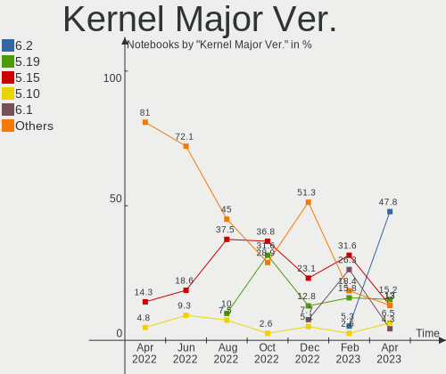

| Version | Notebooks | Percent |
|---------|-----------|---------|
| 5.16    | 10        | 23.81%  |
| 5.13    | 10        | 23.81%  |
| 5.15    | 6         | 14.29%  |
| 5.4     | 5         | 11.9%   |
| 5.17    | 4         | 9.52%   |
| 5.11    | 2         | 4.76%   |
| 5.10    | 2         | 4.76%   |
| 5.8     | 1         | 2.38%   |
| 5.14    | 1         | 2.38%   |
| 4.18    | 1         | 2.38%   |

Arch
----

OS architecture (x86_64, i586, etc.)

| Name   | Notebooks | Percent |
|--------|-----------|---------|
| x86_64 | 42        | 100%    |

DE
--

Desktop Environment

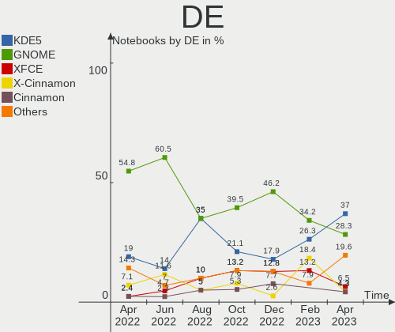

| Name       | Notebooks | Percent |
|------------|-----------|---------|
| GNOME      | 23        | 54.76%  |
| KDE5       | 8         | 19.05%  |
| X-Cinnamon | 3         | 7.14%   |
| LXQt       | 2         | 4.76%   |
| XFCE       | 1         | 2.38%   |
| Pantheon   | 1         | 2.38%   |
| i3         | 1         | 2.38%   |
| Deepin     | 1         | 2.38%   |
| Cinnamon   | 1         | 2.38%   |
| Budgie     | 1         | 2.38%   |

Display Server
--------------

X11 or Wayland

| Name    | Notebooks | Percent |
|---------|-----------|---------|
| X11     | 32        | 76.19%  |
| Wayland | 8         | 19.05%  |
| Tty     | 2         | 4.76%   |

Display Manager
---------------

SDDM, LightDM, etc.

| Name    | Notebooks | Percent |
|---------|-----------|---------|
| Unknown | 13        | 30.95%  |
| GDM3    | 9         | 21.43%  |
| SDDM    | 7         | 16.67%  |
| LightDM | 7         | 16.67%  |
| GDM     | 6         | 14.29%  |

OS Lang
-------

Language

| Lang  | Notebooks | Percent |
|-------|-----------|---------|
| en_AU | 29        | 69.05%  |
| en_US | 10        | 23.81%  |
| en_GB | 2         | 4.76%   |
| C     | 1         | 2.38%   |

Boot Mode
---------

EFI or BIOS

| Mode | Notebooks | Percent |
|------|-----------|---------|
| EFI  | 25        | 59.52%  |
| BIOS | 17        | 40.48%  |

Filesystem
----------

Type of filesystem

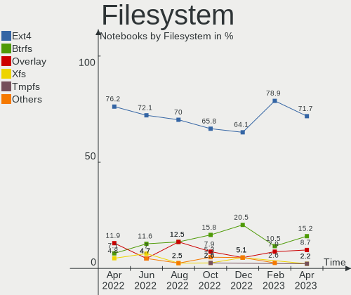

| Type    | Notebooks | Percent |
|---------|-----------|---------|
| Ext4    | 32        | 76.19%  |
| Overlay | 5         | 11.9%   |
| Btrfs   | 3         | 7.14%   |
| Xfs     | 2         | 4.76%   |

Part. scheme
------------

Scheme of partitioning

| Type    | Notebooks | Percent |
|---------|-----------|---------|
| Unknown | 23        | 54.76%  |
| GPT     | 19        | 45.24%  |

Dual Boot with Linux/BSD
------------------------

Hosting more than one Linux/BSD

| Dual boot | Notebooks | Percent |
|-----------|-----------|---------|
| No        | 37        | 88.1%   |
| Yes       | 5         | 11.9%   |

Dual Boot (Win)
---------------

Hosting Linux and Windows

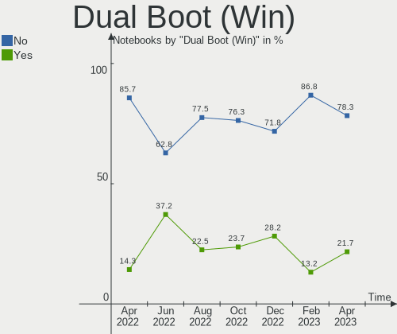

| Dual boot | Notebooks | Percent |
|-----------|-----------|---------|
| No        | 36        | 85.71%  |
| Yes       | 6         | 14.29%  |

Board
-----

Vendor
------

Motherboard manufacturer

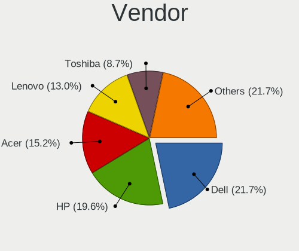

| Name             | Notebooks | Percent |
|------------------|-----------|---------|
| Dell             | 11        | 26.19%  |
| Hewlett-Packard  | 9         | 21.43%  |
| Lenovo           | 8         | 19.05%  |
| Apple            | 3         | 7.14%   |
| Toshiba          | 2         | 4.76%   |
| ASUSTek Computer | 2         | 4.76%   |
| Acer             | 2         | 4.76%   |
| Timi             | 1         | 2.38%   |
| Razer            | 1         | 2.38%   |
| MSI              | 1         | 2.38%   |
| KOGAN            | 1         | 2.38%   |
| HUAWEI           | 1         | 2.38%   |

Model
-----

Motherboard model

| Name                                               | Notebooks | Percent |
|----------------------------------------------------|-----------|---------|
| Toshiba TECRA M11                                  | 1         | 2.38%   |
| Toshiba Satellite L50-A                            | 1         | 2.38%   |
| Timi A35S                                          | 1         | 2.38%   |
| Razer Blade 15 Base Model (Early 2020) - RZ09-0328 | 1         | 2.38%   |
| MSI GS65 Stealth Thin 8RE                          | 1         | 2.38%   |
| Lenovo ThinkPad X250 20CLS52P0F                    | 1         | 2.38%   |
| Lenovo ThinkPad X220 4291IU6                       | 1         | 2.38%   |
| Lenovo ThinkPad T590 20N5S2NC0V                    | 1         | 2.38%   |
| Lenovo ThinkPad T470s W10DG 20JTS0K900             | 1         | 2.38%   |
| Lenovo ThinkPad T430 2350BC6                       | 1         | 2.38%   |
| Lenovo ThinkPad T410s 2912BR7                      | 1         | 2.38%   |
| Lenovo ThinkPad E570 20H5CTO1WW                    | 1         | 2.38%   |
| Lenovo ThinkPad E14 Gen 3 20YDCTO1WW               | 1         | 2.38%   |
| KOGAN KAL11C250SB                                  | 1         | 2.38%   |
| HUAWEI BOM-WXX9                                    | 1         | 2.38%   |
| HP ZBook 15 G6                                     | 1         | 2.38%   |
| HP Spectre 13-SMB Pro Ultrabook                    | 1         | 2.38%   |
| HP ProBook 4710s                                   | 1         | 2.38%   |
| HP ProBook 470 G5                                  | 1         | 2.38%   |
| HP Pavilion g6                                     | 1         | 2.38%   |
| HP Laptop 15s-eq2xxx                               | 1         | 2.38%   |
| HP Laptop 14s-dk0xxx                               | 1         | 2.38%   |
| HP EliteBook 2530p                                 | 1         | 2.38%   |
| HP 250 G5 Notebook PC                              | 1         | 2.38%   |
| Dell XPS 13 7390                                   | 1         | 2.38%   |
| Dell Studio XPS 1645                               | 1         | 2.38%   |
| Dell Precision 5540                                | 1         | 2.38%   |
| Dell Latitude E6530                                | 1         | 2.38%   |
| Dell Latitude E6230                                | 1         | 2.38%   |
| Dell Latitude E5500                                | 1         | 2.38%   |
| Dell Latitude 7490                                 | 1         | 2.38%   |
| Dell Latitude 5590                                 | 1         | 2.38%   |
| Dell Inspiron 3543                                 | 1         | 2.38%   |
| Dell Inspiron 15 7000 Gaming                       | 1         | 2.38%   |
| Dell Inspiron 1012                                 | 1         | 2.38%   |
| ASUS X580VD                                        | 1         | 2.38%   |
| ASUS P552LA                                        | 1         | 2.38%   |
| Apple MacBookPro9,2                                | 1         | 2.38%   |
| Apple MacBookPro8,1                                | 1         | 2.38%   |
| Apple MacBookPro5,4                                | 1         | 2.38%   |
| Acer Aspire R3-131T                                | 1         | 2.38%   |
| Acer Aspire 5750G                                  | 1         | 2.38%   |

Model Family
------------

Motherboard model prefix

| Name              | Notebooks | Percent |
|-------------------|-----------|---------|
| Lenovo ThinkPad   | 8         | 19.05%  |
| Dell Latitude     | 5         | 11.9%   |
| Dell Inspiron     | 3         | 7.14%   |
| HP ProBook        | 2         | 4.76%   |
| HP Laptop         | 2         | 4.76%   |
| Acer Aspire       | 2         | 4.76%   |
| Toshiba TECRA     | 1         | 2.38%   |
| Toshiba Satellite | 1         | 2.38%   |
| Timi A35S         | 1         | 2.38%   |
| Razer Blade       | 1         | 2.38%   |
| MSI GS65          | 1         | 2.38%   |
| KOGAN KAL11C250SB | 1         | 2.38%   |
| HUAWEI BOM-WXX9   | 1         | 2.38%   |
| HP ZBook          | 1         | 2.38%   |
| HP Spectre        | 1         | 2.38%   |
| HP Pavilion       | 1         | 2.38%   |
| HP EliteBook      | 1         | 2.38%   |
| HP 250            | 1         | 2.38%   |
| Dell XPS          | 1         | 2.38%   |
| Dell Studio       | 1         | 2.38%   |
| Dell Precision    | 1         | 2.38%   |
| ASUS X580VD       | 1         | 2.38%   |
| ASUS P552LA       | 1         | 2.38%   |
| Apple MacBookPro9 | 1         | 2.38%   |
| Apple MacBookPro8 | 1         | 2.38%   |
| Apple MacBookPro5 | 1         | 2.38%   |

MFG Year
--------

Motherboard manufacture year

| Year | Notebooks | Percent |
|------|-----------|---------|
| 2019 | 5         | 11.9%   |
| 2021 | 4         | 9.52%   |
| 2018 | 4         | 9.52%   |
| 2012 | 4         | 9.52%   |
| 2011 | 4         | 9.52%   |
| 2017 | 3         | 7.14%   |
| 2015 | 3         | 7.14%   |
| 2010 | 3         | 7.14%   |
| 2009 | 3         | 7.14%   |
| 2020 | 2         | 4.76%   |
| 2016 | 2         | 4.76%   |
| 2013 | 2         | 4.76%   |
| 2008 | 2         | 4.76%   |
| 2014 | 1         | 2.38%   |

Form Factor
-----------

Physical design of the computer

| Name     | Notebooks | Percent |
|----------|-----------|---------|
| Notebook | 42        | 100%    |

Secure Boot
-----------

Enabled or disabled

| State    | Notebooks | Percent |
|----------|-----------|---------|
| Disabled | 38        | 90.48%  |
| Enabled  | 4         | 9.52%   |

Coreboot
--------

Have coreboot on board

| Used | Notebooks | Percent |
|------|-----------|---------|
| No   | 42        | 100%    |

RAM Size
--------

Total RAM memory

| Size in GB  | Notebooks | Percent |
|-------------|-----------|---------|
| 4.01-8.0    | 12        | 28.57%  |
| 16.01-24.0  | 11        | 26.19%  |
| 3.01-4.0    | 10        | 23.81%  |
| 32.01-64.0  | 3         | 7.14%   |
| 8.01-16.0   | 3         | 7.14%   |
| 64.01-256.0 | 2         | 4.76%   |
| 1.01-2.0    | 1         | 2.38%   |

RAM Used
--------

Used RAM memory

| Used GB    | Notebooks | Percent |
|------------|-----------|---------|
| 1.01-2.0   | 14        | 33.33%  |
| 2.01-3.0   | 10        | 23.81%  |
| 4.01-8.0   | 6         | 14.29%  |
| 3.01-4.0   | 4         | 9.52%   |
| 0.51-1.0   | 4         | 9.52%   |
| 16.01-24.0 | 2         | 4.76%   |
| 8.01-16.0  | 2         | 4.76%   |

Total Drives
------------

Number of drives on board

| Drives | Notebooks | Percent |
|--------|-----------|---------|
| 1      | 34        | 80.95%  |
| 2      | 7         | 16.67%  |
| 0      | 1         | 2.38%   |

Has CD-ROM
----------

Has CD-ROM on board

| Presented | Notebooks | Percent |
|-----------|-----------|---------|
| No        | 26        | 61.9%   |
| Yes       | 16        | 38.1%   |

Has Ethernet
------------

Has Ethernet on board

| Presented | Notebooks | Percent |
|-----------|-----------|---------|
| Yes       | 37        | 88.1%   |
| No        | 5         | 11.9%   |

Has WiFi
--------

Has WiFi module

| Presented | Notebooks | Percent |
|-----------|-----------|---------|
| Yes       | 41        | 97.62%  |
| No        | 1         | 2.38%   |

Has Bluetooth
-------------

Has Bluetooth module

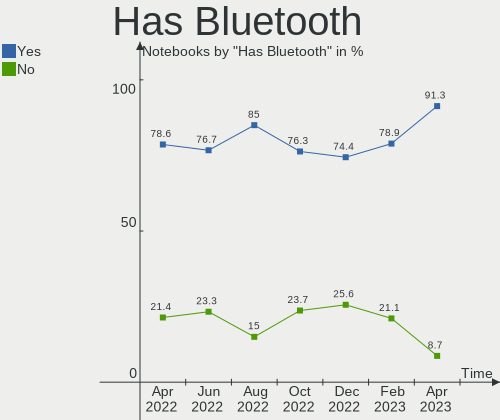

| Presented | Notebooks | Percent |
|-----------|-----------|---------|
| Yes       | 33        | 78.57%  |
| No        | 9         | 21.43%  |

Location
--------

Country
-------

Geographic location (country)

| Country   | Notebooks | Percent |
|-----------|-----------|---------|
| Australia | 42        | 100%    |

City
----

Geographic location (city)

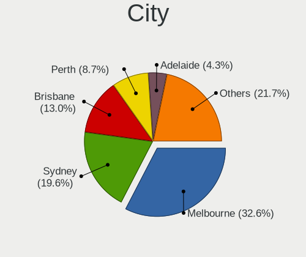

| City           | Notebooks | Percent |
|----------------|-----------|---------|
| Brisbane       | 11        | 26.19%  |
| Sydney         | 10        | 23.81%  |
| Melbourne      | 9         | 21.43%  |
| Perth          | 3         | 7.14%   |
| Adelaide       | 2         | 4.76%   |
| Saint Ives     | 1         | 2.38%   |
| Redfern        | 1         | 2.38%   |
| Mount Waverley | 1         | 2.38%   |
| Launceston     | 1         | 2.38%   |
| Canberra       | 1         | 2.38%   |
| Brunswick West | 1         | 2.38%   |
| Brunswick      | 1         | 2.38%   |

Drives
------

Drive Vendor
------------

Hard drive vendors

| Vendor                    | Notebooks | Drives | Percent |
|---------------------------|-----------|--------|---------|
| Samsung Electronics       | 8         | 9      | 17.39%  |
| Seagate                   | 6         | 6      | 13.04%  |
| WDC                       | 5         | 5      | 10.87%  |
| Toshiba                   | 4         | 4      | 8.7%    |
| KIOXIA                    | 3         | 3      | 6.52%   |
| Kingston                  | 3         | 3      | 6.52%   |
| Intel                     | 3         | 3      | 6.52%   |
| Crucial                   | 3         | 3      | 6.52%   |
| Sandisk                   | 2         | 2      | 4.35%   |
| Unknown                   | 1         | 1      | 2.17%   |
| SPCC                      | 1         | 1      | 2.17%   |
| Phison                    | 1         | 1      | 2.17%   |
| Micron/Crucial Technology | 1         | 1      | 2.17%   |
| Micron Technology         | 1         | 1      | 2.17%   |
| Hitachi                   | 1         | 1      | 2.17%   |
| HGST                      | 1         | 1      | 2.17%   |
| Fujitsu                   | 1         | 1      | 2.17%   |
| China                     | 1         | 1      | 2.17%   |

Drive Model
-----------

Hard drive models

| Model                                   | Notebooks | Percent |
|-----------------------------------------|-----------|---------|
| Crucial CT1000MX500SSD1 1TB             | 2         | 4.26%   |
| WDC WDS250G2B0A-00SM50 250GB SSD        | 1         | 2.13%   |
| WDC WDS240G1G0A-00SS50 240GB SSD        | 1         | 2.13%   |
| WDC WD5000LPVX-22V0TT0 500GB            | 1         | 2.13%   |
| WDC WD5000BEVT-60ZAT1 500GB             | 1         | 2.13%   |
| WDC PC SN720 SDAPNTW-512G-1006 512GB    | 1         | 2.13%   |
| Unknown MMC Card  64GB                  | 1         | 2.13%   |
| Toshiba THNS128GG4BBAA 128GB SSD        | 1         | 2.13%   |
| Toshiba NVMe SSD Drive 256GB            | 1         | 2.13%   |
| Toshiba MQ04ABF100 1TB                  | 1         | 2.13%   |
| Toshiba MQ01ABD100 1TB                  | 1         | 2.13%   |
| SPCC Solid State Disk 256GB             | 1         | 2.13%   |
| Seagate ST9500420ASG 500GB              | 1         | 2.13%   |
| Seagate ST9250315AS 250GB               | 1         | 2.13%   |
| Seagate ST500LT012-1DG142 500GB         | 1         | 2.13%   |
| Seagate ST500LM012 HN-M500MBB 500GB     | 1         | 2.13%   |
| Seagate ST1000LM035-1RK172 1TB          | 1         | 2.13%   |
| Seagate Expansion+ 2TB                  | 1         | 2.13%   |
| SanDisk SD6SN1M-256G-1006 256GB SSD     | 1         | 2.13%   |
| Sandisk NVMe SSD Drive 512GB            | 1         | 2.13%   |
| Samsung SSD 970 EVO Plus 500GB          | 1         | 2.13%   |
| Samsung SSD 970 EVO 1TB                 | 1         | 2.13%   |
| Samsung SSD 850 EVO 250GB               | 1         | 2.13%   |
| Samsung SSD 840 EVO 120GB               | 1         | 2.13%   |
| Samsung NVMe SSD Drive 512GB            | 1         | 2.13%   |
| Samsung MZVLW1T0HMLH-000H1 1TB          | 1         | 2.13%   |
| Samsung MZVLB512HBJQ-00A00 512GB        | 1         | 2.13%   |
| Samsung MZVLB256HAHQ-00000 256GB        | 1         | 2.13%   |
| Samsung MZ7LN256HCHP-000L7 256GB SSD    | 1         | 2.13%   |
| Phison 311CD0512GB                      | 1         | 2.13%   |
| Micron/Crucial NVMe SSD Drive 1TB       | 1         | 2.13%   |
| Micron 1100 SATA 256GB SSD              | 1         | 2.13%   |
| KIOXIA KXG60ZNV512G NVMe 512GB          | 1         | 2.13%   |
| KIOXIA KXG60PNV2T04 NVMe 2048GB         | 1         | 2.13%   |
| KIOXIA KBG40ZNV256G 256GB               | 1         | 2.13%   |
| Kingston SHFS37A240G 240GB SSD          | 1         | 2.13%   |
| Kingston SA400S37120G 120GB SSD         | 1         | 2.13%   |
| Kingston RBU-SNS8350DES3128GP 128GB SSD | 1         | 2.13%   |
| Intel SSDSC2CW180A3 180GB               | 1         | 2.13%   |
| Intel SSDSA1M160G2LE 160GB              | 1         | 2.13%   |
| Intel NVMe SSD Drive 512GB              | 1         | 2.13%   |
| Hitachi HTS545025B9A300 250GB           | 1         | 2.13%   |
| HGST HTS541075A9E680 752GB              | 1         | 2.13%   |
| Fujitsu MJA2250BH FFS G1 250GB          | 1         | 2.13%   |
| Crucial CT500P1SSD8 500GB               | 1         | 2.13%   |
| China SATA SSD 240GB                    | 1         | 2.13%   |

HDD Vendor
----------

Hard disk drive vendors

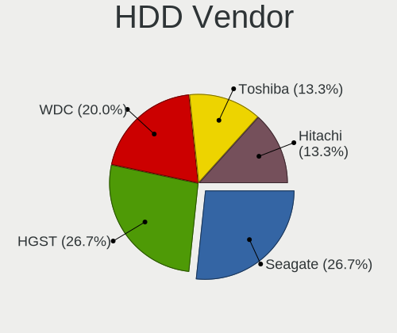

| Vendor  | Notebooks | Drives | Percent |
|---------|-----------|--------|---------|
| Seagate | 6         | 6      | 46.15%  |
| WDC     | 2         | 2      | 15.38%  |
| Toshiba | 2         | 2      | 15.38%  |
| Hitachi | 1         | 1      | 7.69%   |
| HGST    | 1         | 1      | 7.69%   |
| Fujitsu | 1         | 1      | 7.69%   |

SSD Vendor
----------

Solid state drive vendors

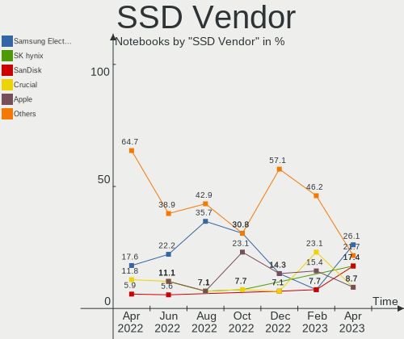

| Vendor              | Notebooks | Drives | Percent |
|---------------------|-----------|--------|---------|
| Samsung Electronics | 3         | 3      | 17.65%  |
| Kingston            | 3         | 3      | 17.65%  |
| WDC                 | 2         | 2      | 11.76%  |
| Intel               | 2         | 2      | 11.76%  |
| Crucial             | 2         | 2      | 11.76%  |
| Toshiba             | 1         | 1      | 5.88%   |
| SPCC                | 1         | 1      | 5.88%   |
| SanDisk             | 1         | 1      | 5.88%   |
| Micron Technology   | 1         | 1      | 5.88%   |
| China               | 1         | 1      | 5.88%   |

Drive Kind
----------

HDD or SSD

| Kind | Notebooks | Drives | Percent |
|------|-----------|--------|---------|
| SSD  | 16        | 17     | 36.36%  |
| NVMe | 15        | 16     | 34.09%  |
| HDD  | 12        | 13     | 27.27%  |
| MMC  | 1         | 1      | 2.27%   |

Drive Connector
---------------

SATA, SAS, NVMe, etc.

| Type | Notebooks | Drives | Percent |
|------|-----------|--------|---------|
| SATA | 27        | 29     | 61.36%  |
| NVMe | 15        | 16     | 34.09%  |
| SAS  | 1         | 1      | 2.27%   |
| MMC  | 1         | 1      | 2.27%   |

Drive Size
----------

Size of hard drive

| Size in TB | Notebooks | Drives | Percent |
|------------|-----------|--------|---------|
| 0.01-0.5   | 22        | 23     | 75.86%  |
| 0.51-1.0   | 6         | 6      | 20.69%  |
| 1.01-2.0   | 1         | 1      | 3.45%   |

Space Total
-----------

Amount of disk space available on the file system

| Size in GB | Notebooks | Percent |
|------------|-----------|---------|
| 251-500    | 15        | 35.71%  |
| 101-250    | 12        | 28.57%  |
| 1001-2000  | 4         | 9.52%   |
| 1-20       | 4         | 9.52%   |
| 501-1000   | 4         | 9.52%   |
| 51-100     | 2         | 4.76%   |
| Unknown    | 1         | 2.38%   |

Space Used
----------

Amount of used disk space

| Used GB   | Notebooks | Percent |
|-----------|-----------|---------|
| 1-20      | 16        | 38.1%   |
| 21-50     | 8         | 19.05%  |
| 101-250   | 7         | 16.67%  |
| 251-500   | 4         | 9.52%   |
| 51-100    | 4         | 9.52%   |
| 1001-2000 | 1         | 2.38%   |
| 501-1000  | 1         | 2.38%   |
| Unknown   | 1         | 2.38%   |

Malfunc. Drives
---------------

Drive models with a malfunction

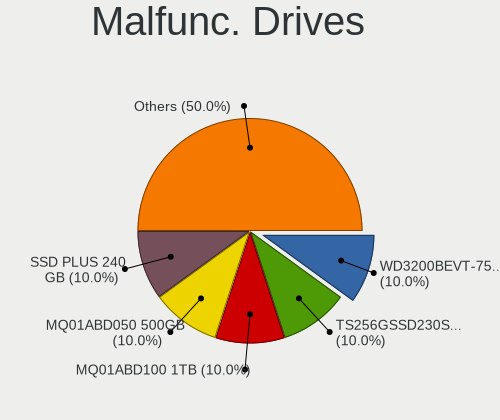

| Model                                   | Notebooks | Drives | Percent |
|-----------------------------------------|-----------|--------|---------|
| Kingston RBU-SNS8350DES3128GP 128GB SSD | 1         | 1      | 50%     |
| Fujitsu MJA2250BH FFS G1 250GB          | 1         | 1      | 50%     |

Malfunc. Drive Vendor
---------------------

Vendors of faulty drives

| Vendor   | Notebooks | Drives | Percent |
|----------|-----------|--------|---------|
| Kingston | 1         | 1      | 50%     |
| Fujitsu  | 1         | 1      | 50%     |

Malfunc. HDD Vendor
-------------------

Vendors of faulty HDD drives

| Vendor  | Notebooks | Drives | Percent |
|---------|-----------|--------|---------|
| Fujitsu | 1         | 1      | 100%    |

Malfunc. Drive Kind
-------------------

Kinds of faulty drives

| Kind | Notebooks | Drives | Percent |
|------|-----------|--------|---------|
| SSD  | 1         | 1      | 50%     |
| HDD  | 1         | 1      | 50%     |

Failed Drives
-------------

Failed drive models

Zero info for selected period =(

Failed Drive Vendor
-------------------

Failed drive vendors

Zero info for selected period =(

Drive Status
------------

Number of failed and malfunc. drives

| Status   | Notebooks | Drives | Percent |
|----------|-----------|--------|---------|
| Detected | 22        | 26     | 53.66%  |
| Works    | 17        | 19     | 41.46%  |
| Malfunc  | 2         | 2      | 4.88%   |

Storage controller
------------------

Storage Vendor
--------------

Storage controller vendors

| Vendor                       | Notebooks | Percent |
|------------------------------|-----------|---------|
| Intel                        | 30        | 62.5%   |
| Samsung Electronics          | 5         | 10.42%  |
| Toshiba America Info Systems | 3         | 6.25%   |
| AMD                          | 3         | 6.25%   |
| Sandisk                      | 2         | 4.17%   |
| Micron/Crucial Technology    | 2         | 4.17%   |
| Phison Electronics           | 1         | 2.08%   |
| Nvidia                       | 1         | 2.08%   |
| KIOXIA                       | 1         | 2.08%   |

Storage Model
-------------

Storage controller models

| Model                                                                            | Notebooks | Percent |
|----------------------------------------------------------------------------------|-----------|---------|
| Samsung NVMe SSD Controller SM981/PM981/PM983                                    | 4         | 8%      |
| Intel 82801 Mobile SATA Controller [RAID mode]                                   | 4         | 8%      |
| Intel Wildcat Point-LP SATA Controller [AHCI Mode]                               | 3         | 6%      |
| Intel Sunrise Point-LP SATA Controller [AHCI mode]                               | 3         | 6%      |
| Intel 82801IBM/IEM (ICH9M/ICH9M-E) 4 port SATA Controller [AHCI mode]            | 3         | 6%      |
| Intel 6 Series/C200 Series Chipset Family 6 port Mobile SATA AHCI Controller     | 3         | 6%      |
| Intel 5 Series/3400 Series Chipset 6 port SATA AHCI Controller                   | 3         | 6%      |
| AMD FCH SATA Controller [AHCI mode]                                              | 3         | 6%      |
| Toshiba America Info Systems XG6 NVMe SSD Controller                             | 2         | 4%      |
| Intel Cannon Lake Mobile PCH SATA AHCI Controller                                | 2         | 4%      |
| Intel 7 Series Chipset Family 6-port SATA Controller [AHCI mode]                 | 2         | 4%      |
| Toshiba America Info Systems XG4 NVMe SSD Controller                             | 1         | 2%      |
| Sandisk WD Black 2018/SN750 / PC SN720 NVMe SSD                                  | 1         | 2%      |
| Sandisk Non-Volatile memory controller                                           | 1         | 2%      |
| Samsung NVMe SSD Controller SM961/PM961/SM963                                    | 1         | 2%      |
| Samsung NVMe SSD Controller 980                                                  | 1         | 2%      |
| Phison PS5013 E13 NVMe Controller                                                | 1         | 2%      |
| Nvidia MCP79 AHCI Controller                                                     | 1         | 2%      |
| Micron/Crucial P1 NVMe PCIe SSD                                                  | 1         | 2%      |
| Micron/Crucial NVMe Controller                                                   | 1         | 2%      |
| KIOXIA Non-Volatile memory controller                                            | 1         | 2%      |
| Intel SSD Pro 7600p/760p/E 6100p Series                                          | 1         | 2%      |
| Intel NM10/ICH7 Family SATA Controller [AHCI mode]                               | 1         | 2%      |
| Intel Mobile 4 Series Chipset PT IDER Controller                                 | 1         | 2%      |
| Intel HM170/QM170 Chipset SATA Controller [AHCI Mode]                            | 1         | 2%      |
| Intel Celeron N3350/Pentium N4200/Atom E3900 Series SATA AHCI Controller         | 1         | 2%      |
| Intel Atom/Celeron/Pentium Processor x5-E8000/J3xxx/N3xxx Series SATA Controller | 1         | 2%      |
| Intel 8 Series/C220 Series Chipset Family 6-port SATA Controller 1 [AHCI mode]   | 1         | 2%      |
| Intel 8 Series SATA Controller 1 [AHCI mode]                                     | 1         | 2%      |

Storage Kind
------------

Kind of storage controller (IDE, SATA, NVMe, SAS, ...)

| Kind | Notebooks | Percent |
|------|-----------|---------|
| SATA | 29        | 59.18%  |
| NVMe | 15        | 30.61%  |
| RAID | 4         | 8.16%   |
| IDE  | 1         | 2.04%   |

Processor
---------

CPU Vendor
----------

Processor vendors

| Vendor | Notebooks | Percent |
|--------|-----------|---------|
| Intel  | 36        | 85.71%  |
| AMD    | 6         | 14.29%  |

CPU Model
---------

Processor models

| Model                                        | Notebooks | Percent |
|----------------------------------------------|-----------|---------|
| Intel Core 2 Duo CPU P8700 @ 2.53GHz         | 3         | 7.14%   |
| AMD Ryzen 5 5500U with Radeon Graphics       | 3         | 7.14%   |
| Intel Core i7-8650U CPU @ 1.90GHz            | 2         | 4.76%   |
| Intel Core i7-7700HQ CPU @ 2.80GHz           | 2         | 4.76%   |
| Intel Xeon E-2276M CPU @ 2.80GHz             | 1         | 2.38%   |
| Intel Pentium CPU N3700 @ 1.60GHz            | 1         | 2.38%   |
| Intel Core i7-9850H CPU @ 2.60GHz            | 1         | 2.38%   |
| Intel Core i7-8750H CPU @ 2.20GHz            | 1         | 2.38%   |
| Intel Core i7-8665U CPU @ 1.90GHz            | 1         | 2.38%   |
| Intel Core i7-8550U CPU @ 1.80GHz            | 1         | 2.38%   |
| Intel Core i7-7500U CPU @ 2.70GHz            | 1         | 2.38%   |
| Intel Core i7-6600U CPU @ 2.60GHz            | 1         | 2.38%   |
| Intel Core i7-4700MQ CPU @ 2.40GHz           | 1         | 2.38%   |
| Intel Core i7-3820QM CPU @ 2.70GHz           | 1         | 2.38%   |
| Intel Core i7-10750H CPU @ 2.60GHz           | 1         | 2.38%   |
| Intel Core i7-10510U CPU @ 1.80GHz           | 1         | 2.38%   |
| Intel Core i7 CPU Q 720 @ 1.60GHz            | 1         | 2.38%   |
| Intel Core i7 CPU M 620 @ 2.67GHz            | 1         | 2.38%   |
| Intel Core i5-6200U CPU @ 2.30GHz            | 1         | 2.38%   |
| Intel Core i5-5300U CPU @ 2.30GHz            | 1         | 2.38%   |
| Intel Core i5-5200U CPU @ 2.20GHz            | 1         | 2.38%   |
| Intel Core i5-4200U CPU @ 1.60GHz            | 1         | 2.38%   |
| Intel Core i5-3360M CPU @ 2.80GHz            | 1         | 2.38%   |
| Intel Core i5-3320M CPU @ 2.60GHz            | 1         | 2.38%   |
| Intel Core i5-3210M CPU @ 2.50GHz            | 1         | 2.38%   |
| Intel Core i5-2520M CPU @ 2.50GHz            | 1         | 2.38%   |
| Intel Core i5-2435M CPU @ 2.40GHz            | 1         | 2.38%   |
| Intel Core i5-2430M CPU @ 2.40GHz            | 1         | 2.38%   |
| Intel Core i5 CPU M 560 @ 2.67GHz            | 1         | 2.38%   |
| Intel Core i3-5005U CPU @ 2.00GHz            | 1         | 2.38%   |
| Intel Core 2 Duo CPU L9600 @ 2.13GHz         | 1         | 2.38%   |
| Intel Celeron CPU N3350 @ 1.10GHz            | 1         | 2.38%   |
| Intel Atom CPU N450 @ 1.66GHz                | 1         | 2.38%   |
| AMD Ryzen 7 5800H with Radeon Graphics       | 1         | 2.38%   |
| AMD A6-4400M APU with Radeon HD Graphics     | 1         | 2.38%   |
| AMD A4-9125 RADEON R3, 4 COMPUTE CORES 2C+2G | 1         | 2.38%   |

CPU Model Family
----------------

Processor model prefix

| Model            | Notebooks | Percent |
|------------------|-----------|---------|
| Intel Core i7    | 16        | 38.1%   |
| Intel Core i5    | 11        | 26.19%  |
| Intel Core 2 Duo | 4         | 9.52%   |
| AMD Ryzen 5      | 3         | 7.14%   |
| Intel Xeon       | 1         | 2.38%   |
| Intel Pentium    | 1         | 2.38%   |
| Intel Core i3    | 1         | 2.38%   |
| Intel Celeron    | 1         | 2.38%   |
| Intel Atom       | 1         | 2.38%   |
| AMD Ryzen 7      | 1         | 2.38%   |
| AMD A6           | 1         | 2.38%   |
| AMD A4           | 1         | 2.38%   |

CPU Cores
---------

Number of processor cores

| Number | Notebooks | Percent |
|--------|-----------|---------|
| 2      | 21        | 50%     |
| 4      | 11        | 26.19%  |
| 6      | 7         | 16.67%  |
| 1      | 2         | 4.76%   |
| 8      | 1         | 2.38%   |

CPU Sockets
-----------

Number of sockets

| Number | Notebooks | Percent |
|--------|-----------|---------|
| 1      | 42        | 100%    |

CPU Threads
-----------

Threads per core (Hyper-Threading)

| Number | Notebooks | Percent |
|--------|-----------|---------|
| 2      | 35        | 83.33%  |
| 1      | 7         | 16.67%  |

CPU Op-Modes
------------

CPU Operation Modes (32-bit, 64-bit)

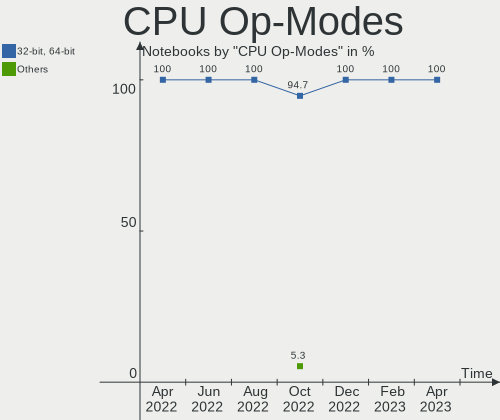

| Op mode        | Notebooks | Percent |
|----------------|-----------|---------|
| 32-bit, 64-bit | 42        | 100%    |

CPU Microcode
-------------

Microcode number

| Number     | Notebooks | Percent |
|------------|-----------|---------|
| Unknown    | 11        | 26.19%  |
| 0x306a9    | 4         | 9.52%   |
| 0x1067a    | 4         | 9.52%   |
| 0x906e9    | 2         | 4.76%   |
| 0x806ec    | 2         | 4.76%   |
| 0x806ea    | 2         | 4.76%   |
| 0x406e3    | 2         | 4.76%   |
| 0x306d4    | 2         | 4.76%   |
| 0x08608103 | 2         | 4.76%   |
| 0xa0652    | 1         | 2.38%   |
| 0x906ed    | 1         | 2.38%   |
| 0x906ea    | 1         | 2.38%   |
| 0x806e9    | 1         | 2.38%   |
| 0x406c3    | 1         | 2.38%   |
| 0x206a7    | 1         | 2.38%   |
| 0x20655    | 1         | 2.38%   |
| 0x20652    | 1         | 2.38%   |
| 0x106e5    | 1         | 2.38%   |
| 0x106ca    | 1         | 2.38%   |
| 0x06006705 | 1         | 2.38%   |

CPU Microarch
-------------

Microarchitecture

| Name        | Notebooks | Percent |
|-------------|-----------|---------|
| KabyLake    | 11        | 26.19%  |
| Penryn      | 4         | 9.52%   |
| IvyBridge   | 4         | 9.52%   |
| SandyBridge | 3         | 7.14%   |
| Broadwell   | 3         | 7.14%   |
| Unknown     | 3         | 7.14%   |
| Westmere    | 2         | 4.76%   |
| Skylake     | 2         | 4.76%   |
| Haswell     | 2         | 4.76%   |
| Zen 3       | 1         | 2.38%   |
| Silvermont  | 1         | 2.38%   |
| Piledriver  | 1         | 2.38%   |
| Nehalem     | 1         | 2.38%   |
| Goldmont    | 1         | 2.38%   |
| Excavator   | 1         | 2.38%   |
| CometLake   | 1         | 2.38%   |
| Bonnell     | 1         | 2.38%   |

Graphics
--------

GPU Vendor
----------

Vendors of graphics cards

| Vendor | Notebooks | Percent |
|--------|-----------|---------|
| Intel  | 32        | 59.26%  |
| Nvidia | 14        | 25.93%  |
| AMD    | 8         | 14.81%  |

GPU Model
---------

Graphics card models

| Model                                                                                    | Notebooks | Percent |
|------------------------------------------------------------------------------------------|-----------|---------|
| Intel 3rd Gen Core processor Graphics Controller                                         | 4         | 7.41%   |
| Intel UHD Graphics 620                                                                   | 3         | 5.56%   |
| Intel HD Graphics 5500                                                                   | 3         | 5.56%   |
| Intel CoffeeLake-H GT2 [UHD Graphics 630]                                                | 3         | 5.56%   |
| Intel 2nd Generation Core Processor Family Integrated Graphics Controller                | 3         | 5.56%   |
| AMD Lucienne                                                                             | 3         | 5.56%   |
| Intel Skylake GT2 [HD Graphics 520]                                                      | 2         | 3.7%    |
| Intel Mobile 4 Series Chipset Integrated Graphics Controller                             | 2         | 3.7%    |
| Intel HD Graphics 630                                                                    | 2         | 3.7%    |
| Nvidia TU117GLM [Quadro T2000 Mobile / Max-Q]                                            | 1         | 1.85%   |
| Nvidia TU106M [GeForce RTX 2070 Mobile / Max-Q Refresh]                                  | 1         | 1.85%   |
| Nvidia GT218M [NVS 3100M]                                                                | 1         | 1.85%   |
| Nvidia GT218M [NVS 2100M]                                                                | 1         | 1.85%   |
| Nvidia GP107M [GeForce GTX 1050 Ti Mobile]                                               | 1         | 1.85%   |
| Nvidia GP107M [GeForce GTX 1050 Mobile]                                                  | 1         | 1.85%   |
| Nvidia GP106M [GeForce GTX 1060 Mobile]                                                  | 1         | 1.85%   |
| Nvidia GM108M [GeForce 930MX]                                                            | 1         | 1.85%   |
| Nvidia GM107M [GeForce GTX 950M]                                                         | 1         | 1.85%   |
| Nvidia GK208M [GeForce GT 740M]                                                          | 1         | 1.85%   |
| Nvidia GF117M [GeForce 610M/710M/810M/820M / GT 620M/625M/630M/720M]                     | 1         | 1.85%   |
| Nvidia GF108M [GeForce GT 520M]                                                          | 1         | 1.85%   |
| Nvidia GF108GLM [NVS 5200M]                                                              | 1         | 1.85%   |
| Nvidia C79 [GeForce 9400M]                                                               | 1         | 1.85%   |
| Intel WhiskeyLake-U GT2 [UHD Graphics 620]                                               | 1         | 1.85%   |
| Intel HD Graphics 620                                                                    | 1         | 1.85%   |
| Intel HD Graphics 500                                                                    | 1         | 1.85%   |
| Intel Haswell-ULT Integrated Graphics Controller                                         | 1         | 1.85%   |
| Intel Core Processor Integrated Graphics Controller                                      | 1         | 1.85%   |
| Intel CometLake-U GT2 [UHD Graphics]                                                     | 1         | 1.85%   |
| Intel CometLake-H GT2 [UHD Graphics]                                                     | 1         | 1.85%   |
| Intel Atom/Celeron/Pentium Processor x5-E8000/J3xxx/N3xxx Integrated Graphics Controller | 1         | 1.85%   |
| Intel Atom Processor D4xx/D5xx/N4xx/N5xx Integrated Graphics Controller                  | 1         | 1.85%   |
| Intel 4th Gen Core Processor Integrated Graphics Controller                              | 1         | 1.85%   |
| AMD Trinity 2 [Radeon HD 7520G]                                                          | 1         | 1.85%   |
| AMD Stoney [Radeon R2/R3/R4/R5 Graphics]                                                 | 1         | 1.85%   |
| AMD RV730/M96-XT [Mobility Radeon HD 4670]                                               | 1         | 1.85%   |
| AMD RV710/M92 [Mobility Radeon HD 4330/4350/4550]                                        | 1         | 1.85%   |
| AMD Cezanne                                                                              | 1         | 1.85%   |

GPU Combo
---------

Combinations of graphics cards

| Name           | Notebooks | Percent |
|----------------|-----------|---------|
| 1 x Intel      | 20        | 47.62%  |
| Intel + Nvidia | 12        | 28.57%  |
| 1 x AMD        | 8         | 19.05%  |
| 1 x Nvidia     | 2         | 4.76%   |

GPU Driver
----------

Free vs proprietary

| Driver      | Notebooks | Percent |
|-------------|-----------|---------|
| Free        | 36        | 85.71%  |
| Proprietary | 6         | 14.29%  |

GPU Memory
----------

Total video memory

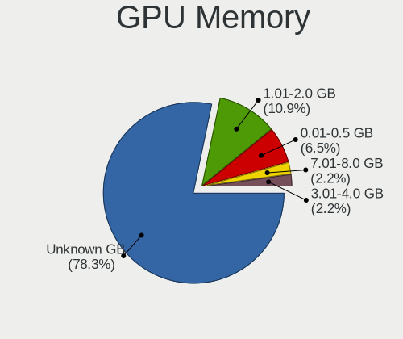

| Size in GB | Notebooks | Percent |
|------------|-----------|---------|
| Unknown    | 30        | 71.43%  |
| 0.01-0.5   | 6         | 14.29%  |
| 3.01-4.0   | 3         | 7.14%   |
| 0.51-1.0   | 2         | 4.76%   |
| 1.01-2.0   | 1         | 2.38%   |

Monitor
-------

Monitor Vendor
--------------

Monitor vendors

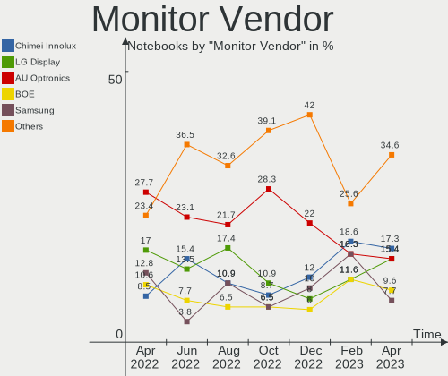

| Vendor                  | Notebooks | Percent |
|-------------------------|-----------|---------|
| AU Optronics            | 13        | 27.66%  |
| LG Display              | 8         | 17.02%  |
| Samsung Electronics     | 6         | 12.77%  |
| BOE                     | 5         | 10.64%  |
| Chimei Innolux          | 4         | 8.51%   |
| Apple                   | 3         | 6.38%   |
| Sharp                   | 1         | 2.13%   |
| PANDA                   | 1         | 2.13%   |
| Lenovo                  | 1         | 2.13%   |
| Hewlett-Packard         | 1         | 2.13%   |
| Dell                    | 1         | 2.13%   |
| CPT                     | 1         | 2.13%   |
| Chi Mei Optoelectronics | 1         | 2.13%   |
| ASUSTek Computer        | 1         | 2.13%   |

Monitor Model
-------------

Monitor models

| Model                                                                    | Notebooks | Percent |
|--------------------------------------------------------------------------|-----------|---------|
| Sharp LCD Monitor SHP14BA 1920x1080 344x194mm 15.5-inch                  | 1         | 2.08%   |
| Samsung Electronics U28E590 SAM0C4C 3840x2160 608x345mm 27.5-inch        | 1         | 2.08%   |
| Samsung Electronics S27H85x SAM0E0F 2560x1440 597x336mm 27.0-inch        | 1         | 2.08%   |
| Samsung Electronics S27H85x SAM0E0E 2560x1440 597x336mm 27.0-inch        | 1         | 2.08%   |
| Samsung Electronics LCD Monitor SEC5448 1920x1080 410x230mm 18.5-inch    | 1         | 2.08%   |
| Samsung Electronics LCD Monitor SDC4150 3456x2160 336x210mm 15.6-inch    | 1         | 2.08%   |
| Samsung Electronics LCD Monitor SDC4147 1366x768 344x194mm 15.5-inch     | 1         | 2.08%   |
| Samsung Electronics LCD Monitor SAM7016 3840x2160 950x540mm 43.0-inch    | 1         | 2.08%   |
| PANDA LM116LF3L02 NCP000A 1920x1080 256x144mm 11.6-inch                  | 1         | 2.08%   |
| LG Display LCD Monitor LGD070B 1920x1080 309x174mm 14.0-inch             | 1         | 2.08%   |
| LG Display LCD Monitor LGD056D 1920x1080 382x215mm 17.3-inch             | 1         | 2.08%   |
| LG Display LCD Monitor LGD054C 1920x1080 276x156mm 12.5-inch             | 1         | 2.08%   |
| LG Display LCD Monitor LGD0538 1920x1080 344x194mm 15.5-inch             | 1         | 2.08%   |
| LG Display LCD Monitor LGD04D4 3840x2160 344x194mm 15.5-inch             | 1         | 2.08%   |
| LG Display LCD Monitor LGD0456 1366x768 344x194mm 15.5-inch              | 1         | 2.08%   |
| LG Display LCD Monitor LGD032C 1920x1080 344x194mm 15.5-inch             | 1         | 2.08%   |
| LG Display LCD Monitor LGD02D8 1366x768 277x156mm 12.5-inch              | 1         | 2.08%   |
| Lenovo LCD Monitor LEN4036 1440x900 303x190mm 14.1-inch                  | 1         | 2.08%   |
| Hewlett-Packard 25x HPN357F 1920x1080 544x303mm 24.5-inch                | 1         | 2.08%   |
| Dell P2314H DEL4098 1920x1080 509x286mm 23.0-inch                        | 1         | 2.08%   |
| CPT LCD Monitor CPT1C85 1366x768 223x125mm 10.1-inch                     | 1         | 2.08%   |
| Chimei Innolux LCD Monitor CMN15F6 1920x1080 344x193mm 15.5-inch         | 1         | 2.08%   |
| Chimei Innolux LCD Monitor CMN15C9 1366x768 344x193mm 15.5-inch          | 1         | 2.08%   |
| Chimei Innolux LCD Monitor CMN15C5 1366x768 344x193mm 15.5-inch          | 1         | 2.08%   |
| Chimei Innolux LCD Monitor CMN1357 1920x1080 293x165mm 13.2-inch         | 1         | 2.08%   |
| Chi Mei Optoelectronics LCD Monitor CMO15A2 1366x768 344x193mm 15.5-inch | 1         | 2.08%   |
| BOE LCD Monitor BOE0872 1920x1080 344x194mm 15.5-inch                    | 1         | 2.08%   |
| BOE LCD Monitor BOE0804 1920x1080 344x193mm 15.5-inch                    | 1         | 2.08%   |
| BOE LCD Monitor BOE07B5 1366x768 309x173mm 13.9-inch                     | 1         | 2.08%   |
| BOE LCD Monitor BOE06CB 1920x1080 344x194mm 15.5-inch                    | 1         | 2.08%   |
| BOE LCD Monitor BOE0690 1920x1080 344x193mm 15.5-inch                    | 1         | 2.08%   |
| AU Optronics LCD Monitor AUO9314 1280x800 261x163mm 12.1-inch            | 1         | 2.08%   |
| AU Optronics LCD Monitor AUO80ED 1920x1080 344x193mm 15.5-inch           | 1         | 2.08%   |
| AU Optronics LCD Monitor AUO8074 1280x800 331x207mm 15.4-inch            | 1         | 2.08%   |
| AU Optronics LCD Monitor AUO499F 1920x1080 344x194mm 15.5-inch           | 1         | 2.08%   |
| AU Optronics LCD Monitor AUO282B 3840x2160 293x165mm 13.2-inch           | 1         | 2.08%   |
| AU Optronics LCD Monitor AUO26EC 1366x768 344x193mm 15.5-inch            | 1         | 2.08%   |
| AU Optronics LCD Monitor AUO223D 1920x1080 309x174mm 14.0-inch           | 1         | 2.08%   |
| AU Optronics LCD Monitor AUO21ED 1920x1080 344x193mm 15.5-inch           | 1         | 2.08%   |
| AU Optronics LCD Monitor AUO213E 1600x900 309x174mm 14.0-inch            | 1         | 2.08%   |
| AU Optronics LCD Monitor AUO119E 1600x900 382x214mm 17.2-inch            | 1         | 2.08%   |
| AU Optronics LCD Monitor AUO106C 1366x768 277x156mm 12.5-inch            | 1         | 2.08%   |
| AU Optronics LCD Monitor AUO105C 1366x768 256x144mm 11.6-inch            | 1         | 2.08%   |
| AU Optronics LCD Monitor AUO103D 1920x1080 309x173mm 13.9-inch           | 1         | 2.08%   |
| ASUSTek Computer VG245 AUS24A1 1920x1080 531x299mm 24.0-inch             | 1         | 2.08%   |
| Apple LCD Monitor APP9CCB 1280x800 286x179mm 13.3-inch                   | 1         | 2.08%   |
| Apple LCD Monitor APP9CB1 1440x900 331x207mm 15.4-inch                   | 1         | 2.08%   |
| Apple Color LCD APP9CC7 1280x800 286x179mm 13.3-inch                     | 1         | 2.08%   |

Monitor Resolution
------------------

Monitor screen resolution

| Resolution       | Notebooks | Percent |
|------------------|-----------|---------|
| 1920x1080 (FHD)  | 20        | 44.44%  |
| 1366x768 (WXGA)  | 10        | 22.22%  |
| 3840x2160 (4K)   | 5         | 11.11%  |
| 1280x800 (WXGA)  | 4         | 8.89%   |
| 1600x900 (HD+)   | 2         | 4.44%   |
| 1440x900 (WXGA+) | 2         | 4.44%   |
| 3456x2160        | 1         | 2.22%   |
| 2560x1440 (QHD)  | 1         | 2.22%   |

Monitor Diagonal
----------------

Diagonal size in inches

| Inches | Notebooks | Percent |
|--------|-----------|---------|
| 15     | 21        | 44.68%  |
| 13     | 6         | 12.77%  |
| 14     | 4         | 8.51%   |
| 12     | 4         | 8.51%   |
| 27     | 2         | 4.26%   |
| 24     | 2         | 4.26%   |
| 17     | 2         | 4.26%   |
| 11     | 2         | 4.26%   |
| 84     | 1         | 2.13%   |
| 23     | 1         | 2.13%   |
| 18     | 1         | 2.13%   |
| 10     | 1         | 2.13%   |

Monitor Width
-------------

Physical width

| Width in mm | Notebooks | Percent |
|-------------|-----------|---------|
| 301-350     | 27        | 57.45%  |
| 201-300     | 11        | 23.4%   |
| 501-600     | 4         | 8.51%   |
| 351-400     | 2         | 4.26%   |
| 601-700     | 1         | 2.13%   |
| 401-500     | 1         | 2.13%   |
| 1501-2000   | 1         | 2.13%   |

Aspect Ratio
------------

Proportional relationship between the width and the height

| Ratio | Notebooks | Percent |
|-------|-----------|---------|
| 16/9  | 35        | 83.33%  |
| 16/10 | 7         | 16.67%  |

Monitor Area
------------

Area in inch

| Area in inch | Notebooks | Percent |
|----------------|-----------|---------|
| 101-110        | 21        | 44.68%  |
| 81-90          | 7         | 14.89%  |
| 61-70          | 4         | 8.51%   |
| 71-80          | 3         | 6.38%   |
| 51-60          | 2         | 4.26%   |
| 301-350        | 2         | 4.26%   |
| 201-250        | 2         | 4.26%   |
| 121-130        | 2         | 4.26%   |
| More than 1000 | 1         | 2.13%   |
| 41-50          | 1         | 2.13%   |
| 251-300        | 1         | 2.13%   |
| 141-150        | 1         | 2.13%   |

Pixel Density
-------------

Pixels per inch

| Density       | Notebooks | Percent |
|---------------|-----------|---------|
| 121-160       | 22        | 47.83%  |
| 101-120       | 12        | 26.09%  |
| 51-100        | 6         | 13.04%  |
| More than 240 | 3         | 6.52%   |
| 161-240       | 3         | 6.52%   |

Multiple Monitors
-----------------

Total monitors connected

| Total | Notebooks | Percent |
|-------|-----------|---------|
| 1     | 36        | 85.71%  |
| 2     | 5         | 11.9%   |
| 3     | 1         | 2.38%   |

Network
-------

Net Controller Vendor
---------------------

Controller vendors

| Vendor                   | Notebooks | Percent |
|--------------------------|-----------|---------|
| Intel                    | 28        | 41.79%  |
| Realtek Semiconductor    | 18        | 26.87%  |
| Broadcom                 | 7         | 10.45%  |
| Qualcomm Atheros         | 3         | 4.48%   |
| Samsung Electronics      | 2         | 2.99%   |
| ASUSTek Computer         | 2         | 2.99%   |
| Sierra Wireless          | 1         | 1.49%   |
| Nvidia                   | 1         | 1.49%   |
| Marvell Technology Group | 1         | 1.49%   |
| Lenovo                   | 1         | 1.49%   |
| Dell                     | 1         | 1.49%   |
| Broadcom Limited         | 1         | 1.49%   |
| ASIX Electronics         | 1         | 1.49%   |

Net Controller Model
--------------------

Controller models

| Model                                                             | Notebooks | Percent |
|-------------------------------------------------------------------|-----------|---------|
| Realtek RTL8111/8168/8411 PCI Express Gigabit Ethernet Controller | 10        | 11.76%  |
| Intel Wireless 8265 / 8275                                        | 4         | 4.71%   |
| Intel Wireless 3165                                               | 4         | 4.71%   |
| Intel 82579LM Gigabit Network Connection (Lewisville)             | 4         | 4.71%   |
| Realtek RTL8822CE 802.11ac PCIe Wireless Network Adapter          | 3         | 3.53%   |
| Realtek RTL810xE PCI Express Fast Ethernet controller             | 3         | 3.53%   |
| Intel Wi-Fi 6 AX200                                               | 3         | 3.53%   |
| Intel Centrino Advanced-N 6205 [Taylor Peak]                      | 3         | 3.53%   |
| Samsung Galaxy series, misc. (tethering mode)                     | 2         | 2.35%   |
| Realtek RTL8153 Gigabit Ethernet Adapter                          | 2         | 2.35%   |
| Intel PRO/Wireless 5100 AGN [Shiloh] Network Connection           | 2         | 2.35%   |
| Intel Ethernet Connection (4) I219-LM                             | 2         | 2.35%   |
| Intel Centrino Advanced-N 6200                                    | 2         | 2.35%   |
| Intel 82577LM Gigabit Network Connection                          | 2         | 2.35%   |
| Broadcom NetXtreme BCM57765 Gigabit Ethernet PCIe                 | 2         | 2.35%   |
| Broadcom BCM4331 802.11a/b/g/n                                    | 2         | 2.35%   |
| ASUS 802.11ac NIC                                                 | 2         | 2.35%   |
| Sierra Wireless EM7430 Qualcomm Snapdragon X7 LTE-A               | 1         | 1.18%   |
| Realtek RTL8821AE 802.11ac PCIe Wireless Network Adapter          | 1         | 1.18%   |
| Realtek RTL8192EE PCIe Wireless Network Adapter                   | 1         | 1.18%   |
| Qualcomm Atheros QCA9565 / AR9565 Wireless Network Adapter        | 1         | 1.18%   |
| Qualcomm Atheros QCA6174 802.11ac Wireless Network Adapter        | 1         | 1.18%   |
| Qualcomm Atheros Killer E2500 Gigabit Ethernet Controller         | 1         | 1.18%   |
| Qualcomm Atheros AR8161 Gigabit Ethernet                          | 1         | 1.18%   |
| Nvidia MCP79 Ethernet                                             | 1         | 1.18%   |
| Marvell Group 88E8072 PCI-E Gigabit Ethernet Controller           | 1         | 1.18%   |
| Lenovo USB-C Dock Ethernet                                        | 1         | 1.18%   |
| Intel Wireless-AC 9260                                            | 1         | 1.18%   |
| Intel Wireless 8260                                               | 1         | 1.18%   |
| Intel Wireless 7260                                               | 1         | 1.18%   |
| Intel WiFi Link 5100                                              | 1         | 1.18%   |
| Intel Ultimate N WiFi Link 5300                                   | 1         | 1.18%   |
| Intel Ethernet Connection I219-LM                                 | 1         | 1.18%   |
| Intel Ethernet Connection (7) I219-LM                             | 1         | 1.18%   |
| Intel Ethernet Connection (6) I219-LM                             | 1         | 1.18%   |
| Intel Ethernet Connection (3) I218-LM                             | 1         | 1.18%   |
| Intel Comet Lake PCH CNVi WiFi                                    | 1         | 1.18%   |
| Intel Centrino Ultimate-N 6300                                    | 1         | 1.18%   |
| Intel Cannon Point-LP CNVi [Wireless-AC]                          | 1         | 1.18%   |
| Intel Cannon Lake PCH CNVi WiFi                                   | 1         | 1.18%   |
| Intel 82567LM Gigabit Network Connection                          | 1         | 1.18%   |
| Dell DW5560 miniPCIe HSPA+ Mobile Broadband Modem                 | 1         | 1.18%   |
| Broadcom NetXtreme BCM5761e Gigabit Ethernet PCIe                 | 1         | 1.18%   |
| Broadcom NetLink BCM5784M Gigabit Ethernet PCIe                   | 1         | 1.18%   |
| Broadcom NetLink BCM57785 Gigabit Ethernet PCIe                   | 1         | 1.18%   |
| Broadcom Limited BCM4312 802.11b/g LP-PHY                         | 1         | 1.18%   |
| Broadcom BCM43227 802.11b/g/n                                     | 1         | 1.18%   |
| Broadcom BCM4322 802.11a/b/g/n Wireless LAN Controller            | 1         | 1.18%   |
| Broadcom BCM43142 802.11b/g/n                                     | 1         | 1.18%   |
| ASIX AX88772B                                                     | 1         | 1.18%   |

Wireless Vendor
---------------

Wireless vendors

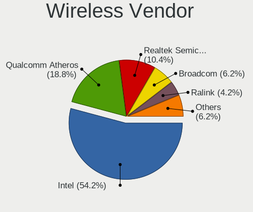

| Vendor                | Notebooks | Percent |
|-----------------------|-----------|---------|
| Intel                 | 27        | 62.79%  |
| Realtek Semiconductor | 5         | 11.63%  |
| Broadcom              | 5         | 11.63%  |
| Qualcomm Atheros      | 2         | 4.65%   |
| ASUSTek Computer      | 2         | 4.65%   |
| Sierra Wireless       | 1         | 2.33%   |
| Broadcom Limited      | 1         | 2.33%   |

Wireless Model
--------------

Wireless models

| Model                                                      | Notebooks | Percent |
|------------------------------------------------------------|-----------|---------|
| Intel Wireless 8265 / 8275                                 | 4         | 9.3%    |
| Intel Wireless 3165                                        | 4         | 9.3%    |
| Realtek RTL8822CE 802.11ac PCIe Wireless Network Adapter   | 3         | 6.98%   |
| Intel Wi-Fi 6 AX200                                        | 3         | 6.98%   |
| Intel Centrino Advanced-N 6205 [Taylor Peak]               | 3         | 6.98%   |
| Intel PRO/Wireless 5100 AGN [Shiloh] Network Connection    | 2         | 4.65%   |
| Intel Centrino Advanced-N 6200                             | 2         | 4.65%   |
| Broadcom BCM4331 802.11a/b/g/n                             | 2         | 4.65%   |
| ASUS 802.11ac NIC                                          | 2         | 4.65%   |
| Sierra Wireless EM7430 Qualcomm Snapdragon X7 LTE-A        | 1         | 2.33%   |
| Realtek RTL8821AE 802.11ac PCIe Wireless Network Adapter   | 1         | 2.33%   |
| Realtek RTL8192EE PCIe Wireless Network Adapter            | 1         | 2.33%   |
| Qualcomm Atheros QCA9565 / AR9565 Wireless Network Adapter | 1         | 2.33%   |
| Qualcomm Atheros QCA6174 802.11ac Wireless Network Adapter | 1         | 2.33%   |
| Intel Wireless-AC 9260                                     | 1         | 2.33%   |
| Intel Wireless 8260                                        | 1         | 2.33%   |
| Intel Wireless 7260                                        | 1         | 2.33%   |
| Intel WiFi Link 5100                                       | 1         | 2.33%   |
| Intel Ultimate N WiFi Link 5300                            | 1         | 2.33%   |
| Intel Comet Lake PCH CNVi WiFi                             | 1         | 2.33%   |
| Intel Centrino Ultimate-N 6300                             | 1         | 2.33%   |
| Intel Cannon Point-LP CNVi [Wireless-AC]                   | 1         | 2.33%   |
| Intel Cannon Lake PCH CNVi WiFi                            | 1         | 2.33%   |
| Broadcom Limited BCM4312 802.11b/g LP-PHY                  | 1         | 2.33%   |
| Broadcom BCM43227 802.11b/g/n                              | 1         | 2.33%   |
| Broadcom BCM4322 802.11a/b/g/n Wireless LAN Controller     | 1         | 2.33%   |
| Broadcom BCM43142 802.11b/g/n                              | 1         | 2.33%   |

Ethernet Vendor
---------------

Ethernet vendors

| Vendor                   | Notebooks | Percent |
|--------------------------|-----------|---------|
| Realtek Semiconductor    | 15        | 36.59%  |
| Intel                    | 13        | 31.71%  |
| Broadcom                 | 5         | 12.2%   |
| Samsung Electronics      | 2         | 4.88%   |
| Qualcomm Atheros         | 2         | 4.88%   |
| Nvidia                   | 1         | 2.44%   |
| Marvell Technology Group | 1         | 2.44%   |
| Lenovo                   | 1         | 2.44%   |
| ASIX Electronics         | 1         | 2.44%   |

Ethernet Model
--------------

Ethernet models

| Model                                                             | Notebooks | Percent |
|-------------------------------------------------------------------|-----------|---------|
| Realtek RTL8111/8168/8411 PCI Express Gigabit Ethernet Controller | 10        | 24.39%  |
| Intel 82579LM Gigabit Network Connection (Lewisville)             | 4         | 9.76%   |
| Realtek RTL810xE PCI Express Fast Ethernet controller             | 3         | 7.32%   |
| Samsung Galaxy series, misc. (tethering mode)                     | 2         | 4.88%   |
| Realtek RTL8153 Gigabit Ethernet Adapter                          | 2         | 4.88%   |
| Intel Ethernet Connection (4) I219-LM                             | 2         | 4.88%   |
| Intel 82577LM Gigabit Network Connection                          | 2         | 4.88%   |
| Broadcom NetXtreme BCM57765 Gigabit Ethernet PCIe                 | 2         | 4.88%   |
| Qualcomm Atheros Killer E2500 Gigabit Ethernet Controller         | 1         | 2.44%   |
| Qualcomm Atheros AR8161 Gigabit Ethernet                          | 1         | 2.44%   |
| Nvidia MCP79 Ethernet                                             | 1         | 2.44%   |
| Marvell Group 88E8072 PCI-E Gigabit Ethernet Controller           | 1         | 2.44%   |
| Lenovo USB-C Dock Ethernet                                        | 1         | 2.44%   |
| Intel Ethernet Connection I219-LM                                 | 1         | 2.44%   |
| Intel Ethernet Connection (7) I219-LM                             | 1         | 2.44%   |
| Intel Ethernet Connection (6) I219-LM                             | 1         | 2.44%   |
| Intel Ethernet Connection (3) I218-LM                             | 1         | 2.44%   |
| Intel 82567LM Gigabit Network Connection                          | 1         | 2.44%   |
| Broadcom NetXtreme BCM5761e Gigabit Ethernet PCIe                 | 1         | 2.44%   |
| Broadcom NetLink BCM5784M Gigabit Ethernet PCIe                   | 1         | 2.44%   |
| Broadcom NetLink BCM57785 Gigabit Ethernet PCIe                   | 1         | 2.44%   |
| ASIX AX88772B                                                     | 1         | 2.44%   |

Net Controller Kind
-------------------

Ethernet, WiFi or modem

| Kind     | Notebooks | Percent |
|----------|-----------|---------|
| WiFi     | 41        | 51.9%   |
| Ethernet | 37        | 46.84%  |
| Modem    | 1         | 1.27%   |

Used Controller
---------------

Currently used network controller

| Kind     | Notebooks | Percent |
|----------|-----------|---------|
| WiFi     | 35        | 74.47%  |
| Ethernet | 12        | 25.53%  |

NICs
----

Total network controllers on board

| Total | Notebooks | Percent |
|-------|-----------|---------|
| 2     | 33        | 78.57%  |
| 1     | 9         | 21.43%  |

IPv6
----

IPv6 vs IPv4

| Used | Notebooks | Percent |
|------|-----------|---------|
| No   | 37        | 88.1%   |
| Yes  | 5         | 11.9%   |

Bluetooth
---------

Bluetooth Vendor
----------------

Controller vendors

| Vendor                          | Notebooks | Percent |
|---------------------------------|-----------|---------|
| Intel                           | 16        | 48.48%  |
| Broadcom                        | 4         | 12.12%  |
| Realtek Semiconductor           | 3         | 9.09%   |
| Apple                           | 3         | 9.09%   |
| Toshiba                         | 2         | 6.06%   |
| Realtek                         | 1         | 3.03%   |
| Qualcomm Atheros Communications | 1         | 3.03%   |
| Hewlett-Packard                 | 1         | 3.03%   |
| Foxconn / Hon Hai               | 1         | 3.03%   |
| Dell                            | 1         | 3.03%   |

Bluetooth Model
---------------

Controller models

| Model                                          | Notebooks | Percent |
|------------------------------------------------|-----------|---------|
| Intel Bluetooth wireless interface             | 9         | 27.27%  |
| Realtek Bluetooth Radio                        | 3         | 9.09%   |
| Intel AX200 Bluetooth                          | 3         | 9.09%   |
| Intel Bluetooth 9460/9560 Jefferson Peak (JfP) | 2         | 6.06%   |
| Broadcom BCM2045B (BDC-2.1)                    | 2         | 6.06%   |
| Apple Bluetooth USB Host Controller            | 2         | 6.06%   |
| Toshiba Integrated Bluetooth HCI               | 1         | 3.03%   |
| Toshiba Bluetooth Device                       | 1         | 3.03%   |
| Realtek Bluetooth Radio                        | 1         | 3.03%   |
| Qualcomm Atheros QCA61x4 Bluetooth 4.0         | 1         | 3.03%   |
| Intel Wireless-AC 9260 Bluetooth Adapter       | 1         | 3.03%   |
| Intel AX201 Bluetooth                          | 1         | 3.03%   |
| HP Bluetooth 2.0 Interface [Broadcom BCM2045]  | 1         | 3.03%   |
| Foxconn / Hon Hai Acer Module                  | 1         | 3.03%   |
| Dell BCM20702A0 Bluetooth Module               | 1         | 3.03%   |
| Broadcom BCM43142 Bluetooth 4.0                | 1         | 3.03%   |
| Broadcom BCM20702 Bluetooth 4.0 [ThinkPad]     | 1         | 3.03%   |
| Apple Bluetooth Host Controller                | 1         | 3.03%   |

Sound
-----

Sound Vendor
------------

Sound card vendors

| Vendor                   | Notebooks | Percent |
|--------------------------|-----------|---------|
| Intel                    | 35        | 64.81%  |
| Nvidia                   | 8         | 14.81%  |
| AMD                      | 8         | 14.81%  |
| Realtek Semiconductor    | 1         | 1.85%   |
| Micro Star International | 1         | 1.85%   |
| Lenovo                   | 1         | 1.85%   |

Sound Model
-----------

Sound card models

| Model                                                                                             | Notebooks | Percent |
|---------------------------------------------------------------------------------------------------|-----------|---------|
| Intel Sunrise Point-LP HD Audio                                                                   | 6         | 9.38%   |
| Intel 7 Series/C216 Chipset Family High Definition Audio Controller                               | 4         | 6.25%   |
| AMD Renoir Radeon High Definition Audio Controller                                                | 4         | 6.25%   |
| Intel Wildcat Point-LP High Definition Audio Controller                                           | 3         | 4.69%   |
| Intel Cannon Lake PCH cAVS                                                                        | 3         | 4.69%   |
| Intel Broadwell-U Audio Controller                                                                | 3         | 4.69%   |
| Intel 82801I (ICH9 Family) HD Audio Controller                                                    | 3         | 4.69%   |
| Intel 6 Series/C200 Series Chipset Family High Definition Audio Controller                        | 3         | 4.69%   |
| Intel 5 Series/3400 Series Chipset High Definition Audio                                          | 3         | 4.69%   |
| AMD Family 17h/19h HD Audio Controller                                                            | 3         | 4.69%   |
| Nvidia High Definition Audio Controller                                                           | 2         | 3.13%   |
| Nvidia GF108 High Definition Audio Controller                                                     | 2         | 3.13%   |
| Intel CM238 HD Audio Controller                                                                   | 2         | 3.13%   |
| AMD RV710/730 HDMI Audio [Radeon HD 4000 series]                                                  | 2         | 3.13%   |
| Realtek Semiconductor USB Audio                                                                   | 1         | 1.56%   |
| Nvidia TU106 High Definition Audio Controller                                                     | 1         | 1.56%   |
| Nvidia MCP79 High Definition Audio                                                                | 1         | 1.56%   |
| Nvidia GP107GL High Definition Audio Controller                                                   | 1         | 1.56%   |
| Nvidia GP106 High Definition Audio Controller                                                     | 1         | 1.56%   |
| Micro Star International MSI DOCK(Audio)                                                          | 1         | 1.56%   |
| Lenovo ThinkPad USB-C Dock Gen2 USB Audio                                                         | 1         | 1.56%   |
| Intel Xeon E3-1200 v3/4th Gen Core Processor HD Audio Controller                                  | 1         | 1.56%   |
| Intel NM10/ICH7 Family High Definition Audio Controller                                           | 1         | 1.56%   |
| Intel Haswell-ULT HD Audio Controller                                                             | 1         | 1.56%   |
| Intel Comet Lake PCH-LP cAVS                                                                      | 1         | 1.56%   |
| Intel Comet Lake PCH cAVS                                                                         | 1         | 1.56%   |
| Intel Celeron N3350/Pentium N4200/Atom E3900 Series Audio Cluster                                 | 1         | 1.56%   |
| Intel Cannon Point-LP High Definition Audio Controller                                            | 1         | 1.56%   |
| Intel Atom/Celeron/Pentium Processor x5-E8000/J3xxx/N3xxx Series High Definition Audio Controller | 1         | 1.56%   |
| Intel 8 Series/C220 Series Chipset High Definition Audio Controller                               | 1         | 1.56%   |
| Intel 8 Series HD Audio Controller                                                                | 1         | 1.56%   |
| AMD Trinity HDMI Audio Controller                                                                 | 1         | 1.56%   |
| AMD High Definition Audio Controller                                                              | 1         | 1.56%   |
| AMD FCH Azalia Controller                                                                         | 1         | 1.56%   |
| AMD Family 15h (Models 60h-6fh) Audio Controller                                                  | 1         | 1.56%   |

Memory
------

Memory Vendor
-------------

Memory module vendors

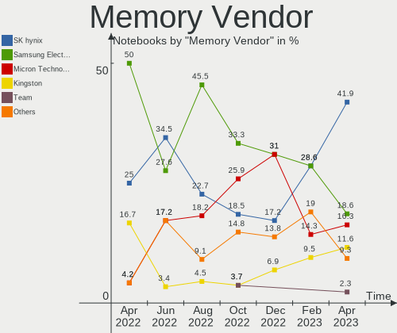

| Vendor              | Notebooks | Percent |
|---------------------|-----------|---------|
| Samsung Electronics | 12        | 50%     |
| SK Hynix            | 6         | 25%     |
| Kingston            | 4         | 16.67%  |
| Unknown (0x89AD)    | 1         | 4.17%   |
| Micron Technology   | 1         | 4.17%   |

Memory Model
------------

Memory module models

| Model                                                         | Notebooks | Percent |
|---------------------------------------------------------------|-----------|---------|
| Unknown (0x89AD) RAM Module 8GB SODIMM DDR3 1600MT/s          | 1         | 3.45%   |
| SK Hynix RAM Module 8GB SODIMM DDR3 1600MT/s                  | 1         | 3.45%   |
| SK Hynix RAM Module 2GB SODIMM DDR3 1067MT/s                  | 1         | 3.45%   |
| SK Hynix RAM HMT351S6EFR8C-PB 4096MB SODIMM DDR3 1600MT/s     | 1         | 3.45%   |
| SK Hynix RAM HMT351S6CFR8C-PB 4GB SODIMM DDR3 1600MT/s        | 1         | 3.45%   |
| SK Hynix RAM HMAA4GS6AJR8N-VK 32GB SODIMM DDR4 2667MT/s       | 1         | 3.45%   |
| SK Hynix RAM HMAA1GS6CJR6N-XN 8GB SODIMM DDR4 3200MT/s        | 1         | 3.45%   |
| SK Hynix RAM HMA82GS6AFR8N-UH 16384MB SODIMM DDR4 2667MT/s    | 1         | 3.45%   |
| Samsung RAM Module 32GB SODIMM DDR4 2667MT/s                  | 1         | 3.45%   |
| Samsung RAM M471B5273DH0-CK0 4GB SODIMM DDR3 1600MT/s         | 1         | 3.45%   |
| Samsung RAM M471B5173BH0-CK0 4GB SODIMM DDR3 1600MT/s         | 1         | 3.45%   |
| Samsung RAM M471B1G73EB0-YK0 8192MB SODIMM DDR3 1600MT/s      | 1         | 3.45%   |
| Samsung RAM M471B1G73DB0-YK0 8GB SODIMM DDR3 1600MT/s         | 1         | 3.45%   |
| Samsung RAM M471B1G73CB0-YK0 8192MB SODIMM DDR3 1600MT/s      | 1         | 3.45%   |
| Samsung RAM M471A5244CB0-CTD 4GB SODIMM DDR4 3266MT/s         | 1         | 3.45%   |
| Samsung RAM M471A5244CB0-CRC 4096MB SODIMM DDR4 2667MT/s      | 1         | 3.45%   |
| Samsung RAM M471A2K43CB1-CRC 16GB SODIMM DDR4 2667MT/s        | 1         | 3.45%   |
| Samsung RAM M471A2G43AB2-CWE 16GB SODIMM DDR4 3200MT/s        | 1         | 3.45%   |
| Samsung RAM M471A1K43DB1-CWE 8GB SODIMM DDR4 3200MT/s         | 1         | 3.45%   |
| Samsung RAM M471A1K43BB1-CRC 8GB SODIMM DDR4 2667MT/s         | 1         | 3.45%   |
| Samsung RAM K4EBE304EC-EGCG 8GB Row Of Chips LPDDR3 2133MT/s  | 1         | 3.45%   |
| Samsung RAM K4A8G165WC-BCTD 4096MB Row Of Chips DDR4 2667MT/s | 1         | 3.45%   |
| Micron RAM 16HTF25664HY-800J1 2048MB SODIMM DDR2 2048MT/s     | 1         | 3.45%   |
| Kingston RAM HP32D4S2S8MR-8 8GB SODIMM DDR4 3200MT/s          | 1         | 3.45%   |
| Kingston RAM 99U5428-018.A00LF 8192MB SODIMM DDR3 1600MT/s    | 1         | 3.45%   |
| Kingston RAM 9905703-011.A00G 16GB SODIMM DDR4 2400MT/s       | 1         | 3.45%   |
| Kingston RAM 9905630-059.A00G 16GB SODIMM DDR4 2400MT/s       | 1         | 3.45%   |
| Kingston RAM 9905428-073.A00LF 4GB SODIMM DDR3 1334MT/s       | 1         | 3.45%   |
| Kingston RAM 9905428-051.A00LF 4GB SODIMM DDR3 1334MT/s       | 1         | 3.45%   |

Memory Kind
-----------

Memory module kinds

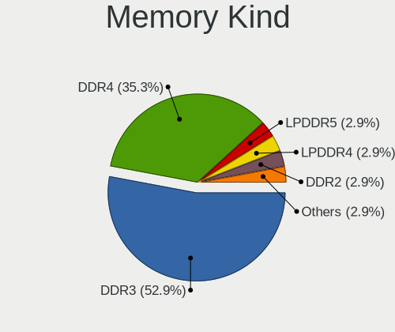

| Kind   | Notebooks | Percent |
|--------|-----------|---------|
| DDR4   | 11        | 52.38%  |
| DDR3   | 8         | 38.1%   |
| SDRAM  | 1         | 4.76%   |
| LPDDR3 | 1         | 4.76%   |

Memory Form Factor
------------------

Physical design of the memory module

| Name         | Notebooks | Percent |
|--------------|-----------|---------|
| SODIMM       | 19        | 90.48%  |
| Row Of Chips | 2         | 9.52%   |

Memory Size
-----------

Memory module size

| Size  | Notebooks | Percent |
|-------|-----------|---------|
| 8192  | 9         | 39.13%  |
| 4096  | 6         | 26.09%  |
| 16384 | 4         | 17.39%  |
| 32768 | 2         | 8.7%    |
| 2048  | 2         | 8.7%    |

Memory Speed
------------

Memory module speed

| Speed | Notebooks | Percent |
|-------|-----------|---------|
| 2667  | 6         | 28.57%  |
| 1600  | 6         | 28.57%  |
| 3200  | 3         | 14.29%  |
| 3266  | 1         | 4.76%   |
| 2400  | 1         | 4.76%   |
| 2133  | 1         | 4.76%   |
| 2048  | 1         | 4.76%   |
| 1334  | 1         | 4.76%   |
| 1067  | 1         | 4.76%   |

Printers & scanners
-------------------

Printer Vendor
--------------

Printer device vendors

Zero info for selected period =(

Printer Model
-------------

Printer device models

Zero info for selected period =(

Scanner Vendor
--------------

Scanner device vendors

Zero info for selected period =(

Scanner Model
-------------

Scanner device models

Zero info for selected period =(

Camera
------

Camera Vendor
-------------

Camera device vendors

| Vendor                                 | Notebooks | Percent |
|----------------------------------------|-----------|---------|
| Microdia                               | 6         | 15%     |
| Chicony Electronics                    | 6         | 15%     |
| Sunplus Innovation Technology          | 4         | 10%     |
| Realtek Semiconductor                  | 4         | 10%     |
| IMC Networks                           | 4         | 10%     |
| Apple                                  | 3         | 7.5%    |
| Logitech                               | 2         | 5%      |
| Lite-On Technology                     | 2         | 5%      |
| Cheng Uei Precision Industry (Foxlink) | 2         | 5%      |
| Acer                                   | 2         | 5%      |
| Quanta                                 | 1         | 2.5%    |
| Luxvisions Innotech Limited            | 1         | 2.5%    |
| Lenovo                                 | 1         | 2.5%    |
| Importek                               | 1         | 2.5%    |
| GEMBIRD                                | 1         | 2.5%    |

Camera Model
------------

Camera device models

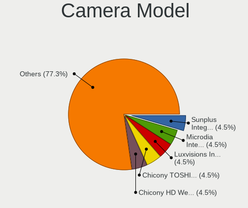

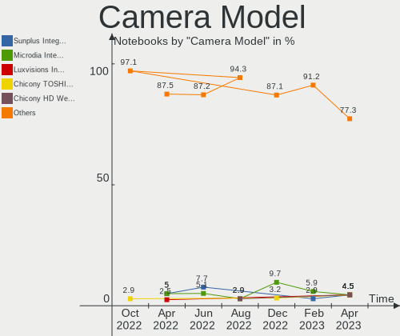

| Model                                                   | Notebooks | Percent |
|---------------------------------------------------------|-----------|---------|
| Sunplus Integrated_Webcam_HD                            | 2         | 5%      |
| Microdia Integrated_Webcam_HD                           | 2         | 5%      |
| Apple FaceTime HD Camera                                | 2         | 5%      |
| Acer Integrated Camera                                  | 2         | 5%      |
| Sunplus HD WebCam                                       | 1         | 2.5%    |
| Sunplus 1.3M HD WebCam                                  | 1         | 2.5%    |
| Realtek USB Camera                                      | 1         | 2.5%    |
| Realtek Integrated Webcam HD                            | 1         | 2.5%    |
| Realtek Integrated Camera                               | 1         | 2.5%    |
| Realtek HP TrueVision Full HD                           | 1         | 2.5%    |
| Quanta HD Camera                                        | 1         | 2.5%    |
| Microdia Laptop_Integrated_Webcam_E4HD                  | 1         | 2.5%    |
| Microdia Laptop_Integrated_Webcam_2M                    | 1         | 2.5%    |
| Microdia Integrated Webcam                              | 1         | 2.5%    |
| Microdia 1.3 MPixel Integrated Webcam                   | 1         | 2.5%    |
| Luxvisions Innotech Limited HP TrueVision HD Camera     | 1         | 2.5%    |
| Logitech Webcam C270                                    | 1         | 2.5%    |
| Logitech HD Pro Webcam C920                             | 1         | 2.5%    |
| Lite-On Integrated Camera                               | 1         | 2.5%    |
| Lite-On HP HD Camera                                    | 1         | 2.5%    |
| Lenovo Integrated Webcam [R5U877]                       | 1         | 2.5%    |
| Importek TOSHIBA Web Camera - HD                        | 1         | 2.5%    |
| IMC Networks XiaoMi Webcam                              | 1         | 2.5%    |
| IMC Networks USB2.0 HD UVC WebCam                       | 1         | 2.5%    |
| IMC Networks USB Camera                                 | 1         | 2.5%    |
| IMC Networks Integrated Camera                          | 1         | 2.5%    |
| GEMBIRD Generic UVC 1.00 camera [AppoTech AX2311]       | 1         | 2.5%    |
| Chicony USB2.0 UVC WebCam                               | 1         | 2.5%    |
| Chicony Lenovo Integrated Camera (0.3MP)                | 1         | 2.5%    |
| Chicony Integrated Camera                               | 1         | 2.5%    |
| Chicony HP Webcam                                       | 1         | 2.5%    |
| Chicony CNF8243 Webcam                                  | 1         | 2.5%    |
| Chicony CKA7227                                         | 1         | 2.5%    |
| Cheng Uei Precision Industry (Foxlink) HP Truevision HD | 1         | 2.5%    |
| Cheng Uei Precision Industry (Foxlink) HP HD Camera     | 1         | 2.5%    |
| Apple Built-in iSight                                   | 1         | 2.5%    |

Security
--------

Fingerprint Vendor
------------------

Fingerprint sensor vendors

| Vendor                     | Notebooks | Percent |
|----------------------------|-----------|---------|
| Validity Sensors           | 2         | 22.22%  |
| Upek                       | 2         | 22.22%  |
| Shenzhen Goodix Technology | 2         | 22.22%  |
| AuthenTec                  | 2         | 22.22%  |
| Elan Microelectronics      | 1         | 11.11%  |

Fingerprint Model
-----------------

Fingerprint sensor models

| Model                                                  | Notebooks | Percent |
|--------------------------------------------------------|-----------|---------|
| Upek Biometric Touchchip/Touchstrip Fingerprint Sensor | 2         | 22.22%  |
| Shenzhen Goodix  Fingerprint Device                    | 2         | 22.22%  |
| Validity Sensors VFS495 Fingerprint Reader             | 1         | 11.11%  |
| Validity Sensors Synaptics WBDI                        | 1         | 11.11%  |
| Elan ELAN:ARM-M4                                       | 1         | 11.11%  |
| AuthenTec Fingerprint Sensor                           | 1         | 11.11%  |
| AuthenTec AES2810                                      | 1         | 11.11%  |

Chipcard Vendor
---------------

Chipcard module vendors

| Vendor      | Notebooks | Percent |
|-------------|-----------|---------|
| Broadcom    | 1         | 50%     |
| Alcor Micro | 1         | 50%     |

Chipcard Model
--------------

Chipcard module models

| Model                               | Notebooks | Percent |
|-------------------------------------|-----------|---------|
| Broadcom 5880                       | 1         | 50%     |
| Alcor Micro AU9540 Smartcard Reader | 1         | 50%     |

Unsupported
-----------

Unsupported Devices
-------------------

Total unsupported devices on board

| Total | Notebooks | Percent |
|-------|-----------|---------|
| 0     | 23        | 54.76%  |
| 1     | 17        | 40.48%  |
| 4     | 1         | 2.38%   |
| 2     | 1         | 2.38%   |

Unsupported Device Types
------------------------

Types of unsupported devices

| Type                  | Notebooks | Percent |
|-----------------------|-----------|---------|
| Fingerprint reader    | 9         | 40.91%  |
| Graphics card         | 4         | 18.18%  |
| Sound                 | 2         | 9.09%   |
| Net/wireless          | 2         | 9.09%   |
| Multimedia controller | 2         | 9.09%   |
| Chipcard              | 2         | 9.09%   |
| Card reader           | 1         | 4.55%   |

