Linux in Australia - Hardware Trends (Notebooks)
------------------------------------------------

A project to identify most popular hardware characteristics and track their change
over time based on data collected by Linux users at https://Linux-Hardware.org.

Anyone can contribute to this report by the [hw-probe](https://github.com/linuxhw/hw-probe) tool:

    sudo -E hw-probe -all -upload

Contents
--------

* [ System ](#system)
  - [ OS                       ](#os)
  - [ OS Family                ](#os-family)
  - [ Kernel                   ](#kernel)
  - [ Kernel Family            ](#kernel-family)
  - [ Kernel Major Ver.        ](#kernel-major-ver)
  - [ Arch                     ](#arch)
  - [ DE                       ](#de)
  - [ Display Server           ](#display-server)
  - [ Display Manager          ](#display-manager)
  - [ OS Lang                  ](#os-lang)
  - [ Boot Mode                ](#boot-mode)
  - [ Filesystem               ](#filesystem)
  - [ Part. scheme             ](#part-scheme)
  - [ Dual Boot with Linux/BSD ](#dual-boot-with-linuxbsd)
  - [ Dual Boot (Win)          ](#dual-boot-win)

* [ Board ](#board)
  - [ Vendor                   ](#vendor)
  - [ Model                    ](#model)
  - [ Model Family             ](#model-family)
  - [ MFG Year                 ](#mfg-year)
  - [ Form Factor              ](#form-factor)
  - [ Secure Boot              ](#secure-boot)
  - [ Coreboot                 ](#coreboot)
  - [ RAM Size                 ](#ram-size)
  - [ RAM Used                 ](#ram-used)
  - [ Total Drives             ](#total-drives)
  - [ Has CD-ROM               ](#has-cd-rom)
  - [ Has Ethernet             ](#has-ethernet)
  - [ Has WiFi                 ](#has-wifi)
  - [ Has Bluetooth            ](#has-bluetooth)

* [ Location ](#location)
  - [ Country                  ](#country)
  - [ City                     ](#city)

* [ Drives ](#drives)
  - [ Drive Vendor             ](#drive-vendor)
  - [ Drive Model              ](#drive-model)
  - [ HDD Vendor               ](#hdd-vendor)
  - [ SSD Vendor               ](#ssd-vendor)
  - [ Drive Kind               ](#drive-kind)
  - [ Drive Connector          ](#drive-connector)
  - [ Drive Size               ](#drive-size)
  - [ Space Total              ](#space-total)
  - [ Space Used               ](#space-used)
  - [ Malfunc. Drives          ](#malfunc-drives)
  - [ Malfunc. Drive Vendor    ](#malfunc-drive-vendor)
  - [ Malfunc. HDD Vendor      ](#malfunc-hdd-vendor)
  - [ Malfunc. Drive Kind      ](#malfunc-drive-kind)
  - [ Failed Drives            ](#failed-drives)
  - [ Failed Drive Vendor      ](#failed-drive-vendor)
  - [ Drive Status             ](#drive-status)

* [ Storage controller ](#storage-controller)
  - [ Storage Vendor           ](#storage-vendor)
  - [ Storage Model            ](#storage-model)
  - [ Storage Kind             ](#storage-kind)

* [ Processor ](#processor)
  - [ CPU Vendor               ](#cpu-vendor)
  - [ CPU Model                ](#cpu-model)
  - [ CPU Model Family         ](#cpu-model-family)
  - [ CPU Cores                ](#cpu-cores)
  - [ CPU Sockets              ](#cpu-sockets)
  - [ CPU Threads              ](#cpu-threads)
  - [ CPU Op-Modes             ](#cpu-op-modes)
  - [ CPU Microcode            ](#cpu-microcode)
  - [ CPU Microarch            ](#cpu-microarch)

* [ Graphics ](#graphics)
  - [ GPU Vendor               ](#gpu-vendor)
  - [ GPU Model                ](#gpu-model)
  - [ GPU Combo                ](#gpu-combo)
  - [ GPU Driver               ](#gpu-driver)
  - [ GPU Memory               ](#gpu-memory)

* [ Monitor ](#monitor)
  - [ Monitor Vendor           ](#monitor-vendor)
  - [ Monitor Model            ](#monitor-model)
  - [ Monitor Resolution       ](#monitor-resolution)
  - [ Monitor Diagonal         ](#monitor-diagonal)
  - [ Monitor Width            ](#monitor-width)
  - [ Aspect Ratio             ](#aspect-ratio)
  - [ Monitor Area             ](#monitor-area)
  - [ Pixel Density            ](#pixel-density)
  - [ Multiple Monitors        ](#multiple-monitors)

* [ Network ](#network)
  - [ Net Controller Vendor    ](#net-controller-vendor)
  - [ Net Controller Model     ](#net-controller-model)
  - [ Wireless Vendor          ](#wireless-vendor)
  - [ Wireless Model           ](#wireless-model)
  - [ Ethernet Vendor          ](#ethernet-vendor)
  - [ Ethernet Model           ](#ethernet-model)
  - [ Net Controller Kind      ](#net-controller-kind)
  - [ Used Controller          ](#used-controller)
  - [ NICs                     ](#nics)
  - [ IPv6                     ](#ipv6)

* [ Bluetooth ](#bluetooth)
  - [ Bluetooth Vendor         ](#bluetooth-vendor)
  - [ Bluetooth Model          ](#bluetooth-model)

* [ Sound ](#sound)
  - [ Sound Vendor             ](#sound-vendor)
  - [ Sound Model              ](#sound-model)

* [ Memory ](#memory)
  - [ Memory Vendor            ](#memory-vendor)
  - [ Memory Model             ](#memory-model)
  - [ Memory Kind              ](#memory-kind)
  - [ Memory Form Factor       ](#memory-form-factor)
  - [ Memory Size              ](#memory-size)
  - [ Memory Speed             ](#memory-speed)

* [ Printers & scanners ](#printers--scanners)
  - [ Printer Vendor           ](#printer-vendor)
  - [ Printer Model            ](#printer-model)
  - [ Scanner Vendor           ](#scanner-vendor)
  - [ Scanner Model            ](#scanner-model)

* [ Camera ](#camera)
  - [ Camera Vendor            ](#camera-vendor)
  - [ Camera Model             ](#camera-model)

* [ Security ](#security)
  - [ Fingerprint Vendor       ](#fingerprint-vendor)
  - [ Fingerprint Model        ](#fingerprint-model)
  - [ Chipcard Vendor          ](#chipcard-vendor)
  - [ Chipcard Model           ](#chipcard-model)

* [ Unsupported ](#unsupported)
  - [ Unsupported Devices      ](#unsupported-devices)
  - [ Unsupported Device Types ](#unsupported-device-types)

System
------

OS
--

Installed operating systems

| Name             | Notebooks | Percent |
|------------------|-----------|---------|
| Pop!_OS 22.04    | 5         | 10.42%  |
| Fedora 36        | 5         | 10.42%  |
| Ubuntu 22.04     | 4         | 8.33%   |
| Ubuntu 20.04     | 4         | 8.33%   |
| Linux Mint 20.3  | 4         | 8.33%   |
| KDE neon 20.04   | 4         | 8.33%   |
| Debian 11        | 3         | 6.25%   |
| Zorin 16         | 2         | 4.17%   |
| OpenMandriva 4.3 | 2         | 4.17%   |
| Linux Mint 19.3  | 2         | 4.17%   |
| Kubuntu 22.04    | 2         | 4.17%   |
| PureOS 10.0      | 1         | 2.08%   |
| Pop!_OS 21.10    | 1         | 2.08%   |
| Manjaro 21.2.6   | 1         | 2.08%   |
| Manjaro          | 1         | 2.08%   |
| Lubuntu 22.04    | 1         | 2.08%   |
| LinuxFX 11       | 1         | 2.08%   |
| Kubuntu 11       | 1         | 2.08%   |
| Kali 2022.2      | 1         | 2.08%   |
| Fedora 34        | 1         | 2.08%   |
| Endless 4.0.4    | 1         | 2.08%   |
| Arch             | 1         | 2.08%   |

OS Family
---------

OS without a version

| Name         | Notebooks | Percent |
|--------------|-----------|---------|
| Ubuntu       | 8         | 16.67%  |
| Pop!_OS      | 6         | 12.5%   |
| Linux Mint   | 6         | 12.5%   |
| Fedora       | 6         | 12.5%   |
| KDE neon     | 4         | 8.33%   |
| Kubuntu      | 3         | 6.25%   |
| Debian       | 3         | 6.25%   |
| Zorin        | 2         | 4.17%   |
| OpenMandriva | 2         | 4.17%   |
| Manjaro      | 2         | 4.17%   |
| PureOS       | 1         | 2.08%   |
| Lubuntu      | 1         | 2.08%   |
| LinuxFX      | 1         | 2.08%   |
| Kali         | 1         | 2.08%   |
| Endless      | 1         | 2.08%   |
| Arch         | 1         | 2.08%   |

Kernel
------

Version of the Linux kernel

| Version                                    | Notebooks | Percent |
|--------------------------------------------|-----------|---------|
| 5.4.0-109-generic                          | 4         | 8.33%   |
| 5.17.5-76051705-generic                    | 4         | 8.33%   |
| 5.10.0-14-amd64                            | 4         | 8.33%   |
| 5.13.0-44-generic                          | 3         | 6.25%   |
| 5.13.0-41-generic                          | 3         | 6.25%   |
| 5.13.0-40-generic                          | 3         | 6.25%   |
| 5.17.8-300.fc36.x86_64                     | 2         | 4.17%   |
| 5.16.7-desktop-1omv4003                    | 2         | 4.17%   |
| 5.16.19-76051619-generic                   | 2         | 4.17%   |
| 5.15.0-30-generic                          | 2         | 4.17%   |
| 5.15.0-27-generic                          | 2         | 4.17%   |
| 5.4.0-92-generic                           | 1         | 2.08%   |
| 5.4.0-91-generic                           | 1         | 2.08%   |
| 5.4.0-113-generic                          | 1         | 2.08%   |
| 5.4.0-110-generic                          | 1         | 2.08%   |
| 5.18.0-rc5-1-git-rtw89-00178-g30c8e80f7932 | 1         | 2.08%   |
| 5.17.9-arch1-1                             | 1         | 2.08%   |
| 5.17.8-100.fc34.x86_64                     | 1         | 2.08%   |
| 5.17.7-300.fc36.x86_64                     | 1         | 2.08%   |
| 5.17.6-051706-generic                      | 1         | 2.08%   |
| 5.17.5-300.fc36.x86_64                     | 1         | 2.08%   |
| 5.17.11-300.fc36.x86_64                    | 1         | 2.08%   |
| 5.16.2-051602-generic                      | 1         | 2.08%   |
| 5.16.0-kali7-amd64                         | 1         | 2.08%   |
| 5.15.0-33-generic                          | 1         | 2.08%   |
| 5.13.19-2-MANJARO                          | 1         | 2.08%   |
| 5.13.0-30-generic                          | 1         | 2.08%   |
| 5.11.0-35-generic                          | 1         | 2.08%   |

Kernel Family
-------------

Linux kernel without a distro release

| Version | Notebooks | Percent |
|---------|-----------|---------|
| 5.13.0  | 10        | 20.83%  |
| 5.4.0   | 8         | 16.67%  |
| 5.17.5  | 5         | 10.42%  |
| 5.15.0  | 5         | 10.42%  |
| 5.10.0  | 4         | 8.33%   |
| 5.17.8  | 3         | 6.25%   |
| 5.16.7  | 2         | 4.17%   |
| 5.16.19 | 2         | 4.17%   |
| 5.18.0  | 1         | 2.08%   |
| 5.17.9  | 1         | 2.08%   |
| 5.17.7  | 1         | 2.08%   |
| 5.17.6  | 1         | 2.08%   |
| 5.17.11 | 1         | 2.08%   |
| 5.16.2  | 1         | 2.08%   |
| 5.16.0  | 1         | 2.08%   |
| 5.13.19 | 1         | 2.08%   |
| 5.11.0  | 1         | 2.08%   |

Kernel Major Ver.
-----------------

Linux kernel major version

| Version | Notebooks | Percent |
|---------|-----------|---------|
| 5.17    | 12        | 25%     |
| 5.13    | 11        | 22.92%  |
| 5.4     | 8         | 16.67%  |
| 5.16    | 6         | 12.5%   |
| 5.15    | 5         | 10.42%  |
| 5.10    | 4         | 8.33%   |
| 5.18    | 1         | 2.08%   |
| 5.11    | 1         | 2.08%   |

Arch
----

OS architecture (x86_64, i586, etc.)

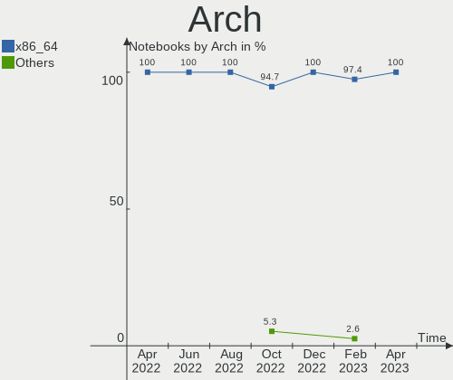

| Name   | Notebooks | Percent |
|--------|-----------|---------|
| x86_64 | 48        | 100%    |

DE
--

Desktop Environment

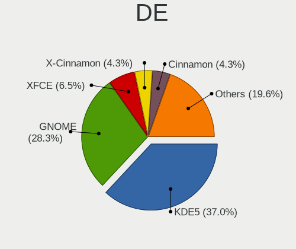

| Name       | Notebooks | Percent |
|------------|-----------|---------|
| GNOME      | 23        | 47.92%  |
| KDE5       | 13        | 27.08%  |
| XFCE       | 3         | 6.25%   |
| X-Cinnamon | 3         | 6.25%   |
| MATE       | 3         | 6.25%   |
| LXQt       | 1         | 2.08%   |
| i3         | 1         | 2.08%   |
| awesome    | 1         | 2.08%   |

Display Server
--------------

X11 or Wayland

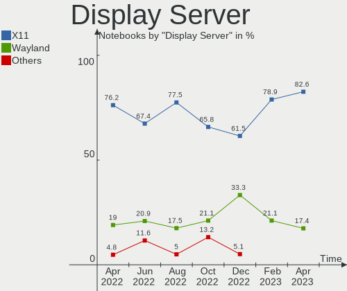

| Name    | Notebooks | Percent |
|---------|-----------|---------|
| X11     | 36        | 75%     |
| Wayland | 12        | 25%     |

Display Manager
---------------

SDDM, LightDM, etc.

| Name    | Notebooks | Percent |
|---------|-----------|---------|
| Unknown | 25        | 52.08%  |
| GDM3    | 8         | 16.67%  |
| SDDM    | 7         | 14.58%  |
| GDM     | 5         | 10.42%  |
| LightDM | 3         | 6.25%   |

OS Lang
-------

Language

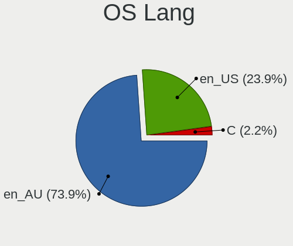

| Lang  | Notebooks | Percent |
|-------|-----------|---------|
| en_AU | 38        | 79.17%  |
| en_US | 10        | 20.83%  |

Boot Mode
---------

EFI or BIOS

| Mode | Notebooks | Percent |
|------|-----------|---------|
| EFI  | 26        | 54.17%  |
| BIOS | 22        | 45.83%  |

Filesystem
----------

Type of filesystem

| Type    | Notebooks | Percent |
|---------|-----------|---------|
| Ext4    | 41        | 85.42%  |
| Btrfs   | 5         | 10.42%  |
| Overlay | 2         | 4.17%   |

Part. scheme
------------

Scheme of partitioning

| Type    | Notebooks | Percent |
|---------|-----------|---------|
| Unknown | 34        | 70.83%  |
| GPT     | 10        | 20.83%  |
| MBR     | 4         | 8.33%   |

Dual Boot with Linux/BSD
------------------------

Hosting more than one Linux/BSD

| Dual boot | Notebooks | Percent |
|-----------|-----------|---------|
| No        | 45        | 93.75%  |
| Yes       | 3         | 6.25%   |

Dual Boot (Win)
---------------

Hosting Linux and Windows

| Dual boot | Notebooks | Percent |
|-----------|-----------|---------|
| No        | 40        | 83.33%  |
| Yes       | 8         | 16.67%  |

Board
-----

Vendor
------

Motherboard manufacturer

| Name                | Notebooks | Percent |
|---------------------|-----------|---------|
| Lenovo              | 11        | 22.92%  |
| Dell                | 11        | 22.92%  |
| Hewlett-Packard     | 7         | 14.58%  |
| Toshiba             | 4         | 8.33%   |
| Apple               | 4         | 8.33%   |
| Acer                | 4         | 8.33%   |
| Gigabyte Technology | 2         | 4.17%   |
| ASUSTek Computer    | 2         | 4.17%   |
| MSI                 | 1         | 2.08%   |
| IT Channel Pty      | 1         | 2.08%   |
| Framework           | 1         | 2.08%   |

Model
-----

Motherboard model

| Name                                     | Notebooks | Percent |
|------------------------------------------|-----------|---------|
| Lenovo ThinkPad E595 20NFA000AU          | 2         | 4.17%   |
| ASUS ROG Zephyrus G14 GA401QM_GA401QM    | 2         | 4.17%   |
| Toshiba TECRA R850                       | 1         | 2.08%   |
| Toshiba Satellite P850                   | 1         | 2.08%   |
| Toshiba Satellite L50-A                  | 1         | 2.08%   |
| Toshiba Satellite C850                   | 1         | 2.08%   |
| MSI GT70 2OC/2OD                         | 1         | 2.08%   |
| Lenovo ThinkPad X1 Extreme 20MFCTO1WW    | 1         | 2.08%   |
| Lenovo ThinkPad X1 Carbon 7th 20QDS00M00 | 1         | 2.08%   |
| Lenovo ThinkPad T14 Gen 1 20UDCTO1WW     | 1         | 2.08%   |
| Lenovo ThinkPad E570 20H5CTO1WW          | 1         | 2.08%   |
| Lenovo Legion Y9000X 2020 81TH           | 1         | 2.08%   |
| Lenovo Legion S7 15ACH6 82K8             | 1         | 2.08%   |
| Lenovo IdeaPad Gaming 3 15IHU6 82K1      | 1         | 2.08%   |
| Lenovo IdeaPad 520-15IKB 81BF            | 1         | 2.08%   |
| Lenovo IdeaPad 3 15ALC6 82KU             | 1         | 2.08%   |
| IT Channel Pty PA70Hx                    | 1         | 2.08%   |
| HP Pavilion g6                           | 1         | 2.08%   |
| HP Folio 13 - 2000                       | 1         | 2.08%   |
| HP EW7-I7D22875GR1                       | 1         | 2.08%   |
| HP EliteBook 850 G3                      | 1         | 2.08%   |
| HP Compaq Presario CQ60                  | 1         | 2.08%   |
| HP 250 G6 Notebook PC                    | 1         | 2.08%   |
| HP 250 G5 Notebook PC                    | 1         | 2.08%   |
| Gigabyte P34V5                           | 1         | 2.08%   |
| Gigabyte A7 K1                           | 1         | 2.08%   |
| Framework Laptop                         | 1         | 2.08%   |
| Dell XPS 15 9560                         | 1         | 2.08%   |
| Dell XPS 13 7390                         | 1         | 2.08%   |
| Dell Studio XPS 1645                     | 1         | 2.08%   |
| Dell Studio 1555                         | 1         | 2.08%   |
| Dell Latitude E7450                      | 1         | 2.08%   |
| Dell Inspiron 7572                       | 1         | 2.08%   |
| Dell Inspiron 5770                       | 1         | 2.08%   |
| Dell Inspiron 5570                       | 1         | 2.08%   |
| Dell Inspiron 1545                       | 1         | 2.08%   |
| Dell Inspiron 15 3515                    | 1         | 2.08%   |
| Dell G3 3500                             | 1         | 2.08%   |
| Apple MacBookPro9,1                      | 1         | 2.08%   |
| Apple MacBookPro7,1                      | 1         | 2.08%   |
| Apple MacBookPro6,1                      | 1         | 2.08%   |
| Apple MacBookPro12,1                     | 1         | 2.08%   |
| Acer Nitro AN515-45                      | 1         | 2.08%   |
| Acer Aspire V5-573G                      | 1         | 2.08%   |
| Acer Aspire A515-55                      | 1         | 2.08%   |
| Acer Aspire A315-34                      | 1         | 2.08%   |

Model Family
------------

Motherboard model prefix

| Name                  | Notebooks | Percent |
|-----------------------|-----------|---------|
| Lenovo ThinkPad       | 6         | 12.5%   |
| Dell Inspiron         | 5         | 10.42%  |
| Toshiba Satellite     | 3         | 6.25%   |
| Lenovo IdeaPad        | 3         | 6.25%   |
| Acer Aspire           | 3         | 6.25%   |
| Lenovo Legion         | 2         | 4.17%   |
| HP 250                | 2         | 4.17%   |
| Dell XPS              | 2         | 4.17%   |
| Dell Studio           | 2         | 4.17%   |
| ASUS ROG              | 2         | 4.17%   |
| Toshiba TECRA         | 1         | 2.08%   |
| MSI GT70              | 1         | 2.08%   |
| IT Channel Pty PA70Hx | 1         | 2.08%   |
| HP Pavilion           | 1         | 2.08%   |
| HP Folio              | 1         | 2.08%   |
| HP EW7-I7D22875GR1    | 1         | 2.08%   |
| HP EliteBook          | 1         | 2.08%   |
| HP Compaq             | 1         | 2.08%   |
| Gigabyte P34V5        | 1         | 2.08%   |
| Gigabyte A7           | 1         | 2.08%   |
| Framework Laptop      | 1         | 2.08%   |
| Dell Latitude         | 1         | 2.08%   |
| Dell G3               | 1         | 2.08%   |
| Apple MacBookPro9     | 1         | 2.08%   |
| Apple MacBookPro7     | 1         | 2.08%   |
| Apple MacBookPro6     | 1         | 2.08%   |
| Apple MacBookPro12    | 1         | 2.08%   |
| Acer Nitro            | 1         | 2.08%   |

MFG Year
--------

Motherboard manufacture year

| Year | Notebooks | Percent |
|------|-----------|---------|
| 2021 | 9         | 18.75%  |
| 2017 | 7         | 14.58%  |
| 2019 | 6         | 12.5%   |
| 2012 | 4         | 8.33%   |
| 2020 | 3         | 6.25%   |
| 2016 | 3         | 6.25%   |
| 2013 | 3         | 6.25%   |
| 2011 | 3         | 6.25%   |
| 2018 | 2         | 4.17%   |
| 2015 | 2         | 4.17%   |
| 2010 | 2         | 4.17%   |
| 2008 | 2         | 4.17%   |
| 2014 | 1         | 2.08%   |
| 2009 | 1         | 2.08%   |

Form Factor
-----------

Physical design of the computer

| Name     | Notebooks | Percent |
|----------|-----------|---------|
| Notebook | 48        | 100%    |

Secure Boot
-----------

Enabled or disabled

| State    | Notebooks | Percent |
|----------|-----------|---------|
| Disabled | 41        | 85.42%  |
| Enabled  | 7         | 14.58%  |

Coreboot
--------

Have coreboot on board

| Used | Notebooks | Percent |
|------|-----------|---------|
| No   | 48        | 100%    |

RAM Size
--------

Total RAM memory

| Size in GB  | Notebooks | Percent |
|-------------|-----------|---------|
| 4.01-8.0    | 13        | 27.08%  |
| 16.01-24.0  | 10        | 20.83%  |
| 3.01-4.0    | 9         | 18.75%  |
| 8.01-16.0   | 8         | 16.67%  |
| 32.01-64.0  | 5         | 10.42%  |
| 24.01-32.0  | 2         | 4.17%   |
| 64.01-256.0 | 1         | 2.08%   |

RAM Used
--------

Used RAM memory

| Used GB   | Notebooks | Percent |
|-----------|-----------|---------|
| 1.01-2.0  | 15        | 31.25%  |
| 2.01-3.0  | 13        | 27.08%  |
| 4.01-8.0  | 7         | 14.58%  |
| 3.01-4.0  | 6         | 12.5%   |
| 8.01-16.0 | 5         | 10.42%  |
| 0.51-1.0  | 2         | 4.17%   |

Total Drives
------------

Number of drives on board

| Drives | Notebooks | Percent |
|--------|-----------|---------|
| 1      | 29        | 60.42%  |
| 2      | 14        | 29.17%  |
| 0      | 3         | 6.25%   |
| 4      | 1         | 2.08%   |
| 3      | 1         | 2.08%   |

Has CD-ROM
----------

Has CD-ROM on board

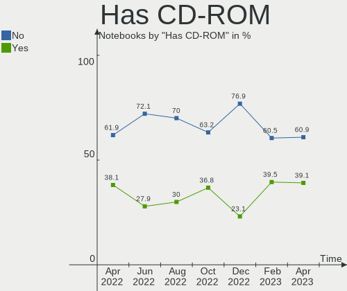

| Presented | Notebooks | Percent |
|-----------|-----------|---------|
| No        | 28        | 58.33%  |
| Yes       | 20        | 41.67%  |

Has Ethernet
------------

Has Ethernet on board

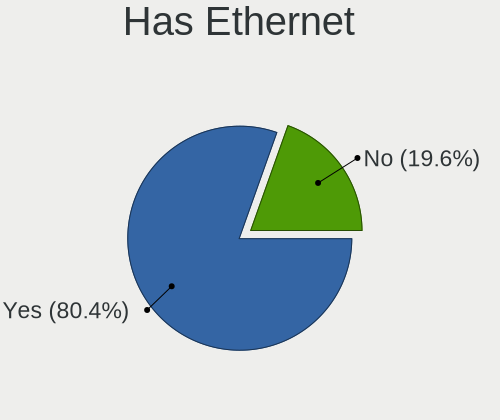

| Presented | Notebooks | Percent |
|-----------|-----------|---------|
| Yes       | 38        | 79.17%  |
| No        | 10        | 20.83%  |

Has WiFi
--------

Has WiFi module

| Presented | Notebooks | Percent |
|-----------|-----------|---------|
| Yes       | 48        | 100%    |

Has Bluetooth
-------------

Has Bluetooth module

| Presented | Notebooks | Percent |
|-----------|-----------|---------|
| Yes       | 41        | 85.42%  |
| No        | 7         | 14.58%  |

Location
--------

Country
-------

Geographic location (country)

| Country   | Notebooks | Percent |
|-----------|-----------|---------|
| Australia | 48        | 100%    |

City
----

Geographic location (city)

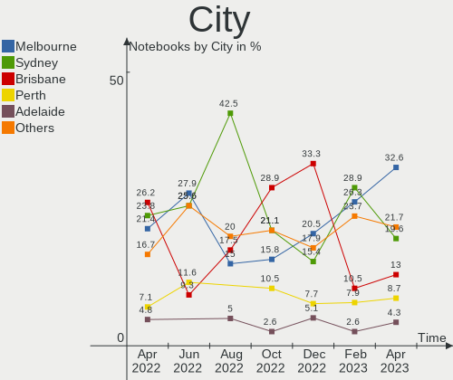

| City           | Notebooks | Percent |
|----------------|-----------|---------|
| Melbourne      | 14        | 29.17%  |
| Sydney         | 11        | 22.92%  |
| Brisbane       | 9         | 18.75%  |
| Perth          | 3         | 6.25%   |
| Adelaide       | 3         | 6.25%   |
| Point Cook     | 2         | 4.17%   |
| Spring Field   | 1         | 2.08%   |
| Newcastle      | 1         | 2.08%   |
| Mount Waverley | 1         | 2.08%   |
| Mackay         | 1         | 2.08%   |
| Gold Coast     | 1         | 2.08%   |
| Brownlow Hill  | 1         | 2.08%   |

Drives
------

Drive Vendor
------------

Hard drive vendors

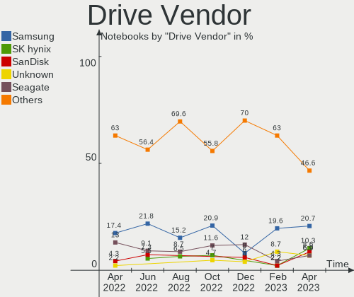

| Vendor                | Notebooks | Drives | Percent |
|-----------------------|-----------|--------|---------|
| Toshiba               | 8         | 8      | 13.56%  |
| Samsung Electronics   | 8         | 8      | 13.56%  |
| Seagate               | 7         | 7      | 11.86%  |
| WDC                   | 5         | 5      | 8.47%   |
| SK Hynix              | 4         | 4      | 6.78%   |
| SanDisk               | 4         | 4      | 6.78%   |
| Kingston              | 4         | 4      | 6.78%   |
| Hitachi               | 3         | 3      | 5.08%   |
| Unknown               | 2         | 2      | 3.39%   |
| Realtek Semiconductor | 2         | 2      | 3.39%   |
| LITEON                | 2         | 2      | 3.39%   |
| Apple                 | 2         | 2      | 3.39%   |
| SSSTC                 | 1         | 1      | 1.69%   |
| PLEXTOR               | 1         | 3      | 1.69%   |
| Phison                | 1         | 1      | 1.69%   |
| KIOXIA                | 1         | 1      | 1.69%   |
| JMicron               | 1         | 1      | 1.69%   |
| HGST                  | 1         | 1      | 1.69%   |
| Crucial               | 1         | 1      | 1.69%   |
| Corsair               | 1         | 1      | 1.69%   |

Drive Model
-----------

Hard drive models

| Model                                | Notebooks | Percent |
|--------------------------------------|-----------|---------|
| Toshiba MK5059GSXP 500GB             | 2         | 3.39%   |
| Toshiba KBG30ZMS128G 128GB NVMe SSD  | 2         | 3.39%   |
| SK Hynix NVMe SSD Drive 1024GB       | 2         | 3.39%   |
| Seagate ST2000LM007-1R8174 2TB       | 2         | 3.39%   |
| Samsung NVMe SSD Drive 256GB         | 2         | 3.39%   |
| Realtek NVMe SSD Drive 1024GB        | 2         | 3.39%   |
| Hitachi HTS547550A9E384 500GB        | 2         | 3.39%   |
| WDC WDS500G2B0A 500GB SSD            | 1         | 1.69%   |
| WDC WDS240G1G0A-00SS50 240GB SSD     | 1         | 1.69%   |
| WDC WD7500BPVT-22HXZT3 752GB         | 1         | 1.69%   |
| WDC WD Green 2.5 1000GB              | 1         | 1.69%   |
| WDC PC SN720 SDAQNTW-256G-1001 256GB | 1         | 1.69%   |
| Unknown SD/MMC/MS PRO 999GB          | 1         | 1.69%   |
| Unknown 00000  64GB                  | 1         | 1.69%   |
| Toshiba MQ01ABF050 500GB             | 1         | 1.69%   |
| Toshiba MQ01ABD100 1TB               | 1         | 1.69%   |
| Toshiba MQ01ABD075 752GB             | 1         | 1.69%   |
| Toshiba MK1059GSMP 1TB               | 1         | 1.69%   |
| SSSTC CL1-3D256-Q11 NVMe 256GB       | 1         | 1.69%   |
| SK Hynix SKHynix_HFS001TDE9X084N 1TB | 1         | 1.69%   |
| SK Hynix HFM256GDHTNG-8510B 256GB    | 1         | 1.69%   |
| Seagate ST9500420ASG 500GB           | 1         | 1.69%   |
| Seagate ST750LM022 HN-M750MBB 752GB  | 1         | 1.69%   |
| Seagate ST2000LM003 HN-M201RAD 2TB   | 1         | 1.69%   |
| Seagate ST1000LM035-1RK172 1TB       | 1         | 1.69%   |
| Seagate SSD 1TB                      | 1         | 1.69%   |
| SanDisk SD8SN8U-256G-1006 256GB SSD  | 1         | 1.69%   |
| Sandisk NVMe SSD Drive 512GB         | 1         | 1.69%   |
| Sandisk NVMe SSD Drive 256GB         | 1         | 1.69%   |
| Sandisk NVMe SSD Drive 1TB           | 1         | 1.69%   |
| Samsung SSD 850 EVO 500GB            | 1         | 1.69%   |
| Samsung NVMe SSD Drive 512GB         | 1         | 1.69%   |
| Samsung MZVLB512HBJQ-000L7 512GB     | 1         | 1.69%   |
| Samsung MZVLB512HBJQ-000L2 512GB     | 1         | 1.69%   |
| Samsung MZMPC128HBFU-000H1 128GB SSD | 1         | 1.69%   |
| Samsung HM501II 500GB                | 1         | 1.69%   |
| PLEXTOR PX-128M5M 128GB SSD          | 1         | 1.69%   |
| Phison NVMe SSD Drive 1024GB         | 1         | 1.69%   |
| LITEON IT LCS-128L9S 128GB SSD       | 1         | 1.69%   |
| LITEON CV3-8D128-11 SATA 128GB SSD   | 1         | 1.69%   |
| KIOXIA KXG60ZNV512G NVMe 512GB       | 1         | 1.69%   |
| Kingston SHFS37A240G 240GB SSD       | 1         | 1.69%   |
| Kingston SA400S37960G 960GB SSD      | 1         | 1.69%   |
| Kingston RBUSNS8154P3128GJ1 128GB    | 1         | 1.69%   |
| Kingston OM8PDP3512B-AA1 512GB       | 1         | 1.69%   |
| JMicron Generic 128GB                | 1         | 1.69%   |
| Hitachi HTS545025B9A300 250GB        | 1         | 1.69%   |
| HGST HTS541010A9E680 1TB             | 1         | 1.69%   |
| Crucial CT525MX300SSD4 528GB         | 1         | 1.69%   |
| Corsair Force MP510 240GB            | 1         | 1.69%   |
| Apple HDD HTS547550A9E384 500GB      | 1         | 1.69%   |
| Apple HDD HTS545050A7E362 500GB      | 1         | 1.69%   |

HDD Vendor
----------

Hard disk drive vendors

| Vendor              | Notebooks | Drives | Percent |
|---------------------|-----------|--------|---------|
| Toshiba             | 6         | 6      | 28.57%  |
| Seagate             | 6         | 6      | 28.57%  |
| Hitachi             | 3         | 3      | 14.29%  |
| Apple               | 2         | 2      | 9.52%   |
| WDC                 | 1         | 1      | 4.76%   |
| Unknown             | 1         | 1      | 4.76%   |
| Samsung Electronics | 1         | 1      | 4.76%   |
| HGST                | 1         | 1      | 4.76%   |

SSD Vendor
----------

Solid state drive vendors

| Vendor              | Notebooks | Drives | Percent |
|---------------------|-----------|--------|---------|
| WDC                 | 2         | 2      | 15.38%  |
| Samsung Electronics | 2         | 2      | 15.38%  |
| LITEON              | 2         | 2      | 15.38%  |
| Kingston            | 2         | 2      | 15.38%  |
| Seagate             | 1         | 1      | 7.69%   |
| SanDisk             | 1         | 1      | 7.69%   |
| PLEXTOR             | 1         | 3      | 7.69%   |
| JMicron             | 1         | 1      | 7.69%   |
| Crucial             | 1         | 1      | 7.69%   |

Drive Kind
----------

HDD or SSD

| Kind    | Notebooks | Drives | Percent |
|---------|-----------|--------|---------|
| NVMe    | 21        | 23     | 38.89%  |
| HDD     | 21        | 21     | 38.89%  |
| SSD     | 10        | 15     | 18.52%  |
| MMC     | 1         | 1      | 1.85%   |
| Unknown | 1         | 1      | 1.85%   |

Drive Connector
---------------

SATA, SAS, NVMe, etc.

| Type | Notebooks | Drives | Percent |
|------|-----------|--------|---------|
| SATA | 28        | 35     | 53.85%  |
| NVMe | 21        | 23     | 40.38%  |
| SAS  | 2         | 2      | 3.85%   |
| MMC  | 1         | 1      | 1.92%   |

Drive Size
----------

Size of hard drive

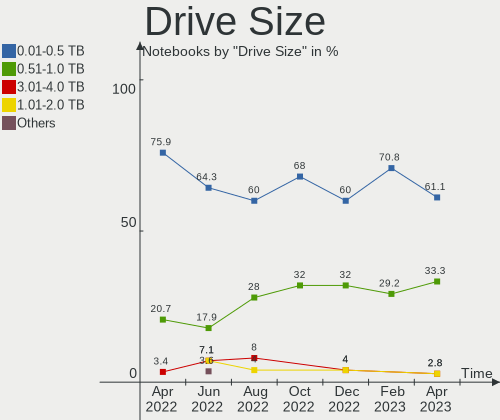

| Size in TB | Notebooks | Drives | Percent |
|------------|-----------|--------|---------|
| 0.01-0.5   | 19        | 22     | 59.38%  |
| 0.51-1.0   | 10        | 11     | 31.25%  |
| 1.01-2.0   | 3         | 3      | 9.38%   |

Space Total
-----------

Amount of disk space available on the file system

| Size in GB | Notebooks | Percent |
|------------|-----------|---------|
| 501-1000   | 15        | 31.25%  |
| 101-250    | 13        | 27.08%  |
| 251-500    | 10        | 20.83%  |
| 1-20       | 5         | 10.42%  |
| 2001-3000  | 3         | 6.25%   |
| 1001-2000  | 1         | 2.08%   |
| 51-100     | 1         | 2.08%   |

Space Used
----------

Amount of used disk space

| Used GB   | Notebooks | Percent |
|-----------|-----------|---------|
| 1-20      | 16        | 33.33%  |
| 51-100    | 9         | 18.75%  |
| 21-50     | 7         | 14.58%  |
| 101-250   | 6         | 12.5%   |
| 251-500   | 5         | 10.42%  |
| 1001-2000 | 3         | 6.25%   |
| 501-1000  | 2         | 4.17%   |

Malfunc. Drives
---------------

Drive models with a malfunction

Zero info for selected period =(

Malfunc. Drive Vendor
---------------------

Vendors of faulty drives

Zero info for selected period =(

Malfunc. HDD Vendor
-------------------

Vendors of faulty HDD drives

Zero info for selected period =(

Malfunc. Drive Kind
-------------------

Kinds of faulty drives

Zero info for selected period =(

Failed Drives
-------------

Failed drive models

Zero info for selected period =(

Failed Drive Vendor
-------------------

Failed drive vendors

Zero info for selected period =(

Drive Status
------------

Number of failed and malfunc. drives

| Status   | Notebooks | Drives | Percent |
|----------|-----------|--------|---------|
| Detected | 33        | 45     | 71.74%  |
| Works    | 13        | 16     | 28.26%  |

Storage controller
------------------

Storage Vendor
--------------

Storage controller vendors

| Vendor                         | Notebooks | Percent |
|--------------------------------|-----------|---------|
| Intel                          | 30        | 50.85%  |
| Samsung Electronics            | 6         | 10.17%  |
| SK Hynix                       | 4         | 6.78%   |
| Sandisk                        | 4         | 6.78%   |
| Toshiba America Info Systems   | 3         | 5.08%   |
| AMD                            | 3         | 5.08%   |
| Realtek Semiconductor          | 2         | 3.39%   |
| Phison Electronics             | 2         | 3.39%   |
| Nvidia                         | 2         | 3.39%   |
| Kingston Technology Company    | 2         | 3.39%   |
| Solid State Storage Technology | 1         | 1.69%   |

Storage Model
-------------

Storage controller models

| Model                                                                          | Notebooks | Percent |
|--------------------------------------------------------------------------------|-----------|---------|
| Intel 82801 Mobile SATA Controller [RAID mode]                                 | 6         | 10%     |
| Intel Sunrise Point-LP SATA Controller [AHCI mode]                             | 4         | 6.67%   |
| Intel 7 Series Chipset Family 6-port SATA Controller [AHCI mode]               | 4         | 6.67%   |
| SK Hynix Gold P31 SSD                                                          | 3         | 5%      |
| Intel HM170/QM170 Chipset SATA Controller [AHCI Mode]                          | 3         | 5%      |
| Intel 6 Series/C200 Series Chipset Family 6 port Mobile SATA AHCI Controller   | 3         | 5%      |
| AMD FCH SATA Controller [AHCI mode]                                            | 3         | 5%      |
| Sandisk WD Black 2018/SN750 / PC SN720 NVMe SSD                                | 2         | 3.33%   |
| Samsung NVMe SSD Controller SM981/PM981/PM983                                  | 2         | 3.33%   |
| Intel 82801IBM/IEM (ICH9M/ICH9M-E) 4 port SATA Controller [AHCI mode]          | 2         | 3.33%   |
| Toshiba America Info Systems XG6 NVMe SSD Controller                           | 1         | 1.67%   |
| Toshiba America Info Systems XG4 NVMe SSD Controller                           | 1         | 1.67%   |
| Toshiba America Info Systems BG3 NVMe SSD Controller                           | 1         | 1.67%   |
| Solid State Storage Non-Volatile memory controller                             | 1         | 1.67%   |
| SK Hynix BC501 NVMe Solid State Drive                                          | 1         | 1.67%   |
| Sandisk WD Black SN750 / PC SN730 NVMe SSD                                     | 1         | 1.67%   |
| Sandisk PC SN520 NVMe SSD                                                      | 1         | 1.67%   |
| Samsung NVMe SSD Controller SM961/PM961/SM963                                  | 1         | 1.67%   |
| Samsung NVMe SSD Controller SM951/PM951                                        | 1         | 1.67%   |
| Samsung NVMe SSD Controller 980                                                | 1         | 1.67%   |
| Samsung Electronics SATA controller                                            | 1         | 1.67%   |
| Realtek RTS5763DL NVMe SSD Controller                                          | 1         | 1.67%   |
| Realtek Realtek Non-Volatile memory controller                                 | 1         | 1.67%   |
| Phison E18 PCIe4 NVMe Controller                                               | 1         | 1.67%   |
| Phison E12 NVMe Controller                                                     | 1         | 1.67%   |
| Nvidia MCP89 SATA Controller (AHCI mode)                                       | 1         | 1.67%   |
| Nvidia MCP78S [GeForce 8200] SATA Controller (non-AHCI mode)                   | 1         | 1.67%   |
| Nvidia MCP78S [GeForce 8200] IDE                                               | 1         | 1.67%   |
| Kingston Company U-SNS8154P3 NVMe SSD                                          | 1         | 1.67%   |
| Kingston Company OM3PDP3 NVMe SSD                                              | 1         | 1.67%   |
| Intel Tiger Lake-LP SATA Controller [AHCI mode]                                | 1         | 1.67%   |
| Intel Comet Lake PCH-H RAID                                                    | 1         | 1.67%   |
| Intel Celeron/Pentium Silver Processor SATA Controller                         | 1         | 1.67%   |
| Intel Celeron N3350/Pentium N4200/Atom E3900 Series SATA AHCI Controller       | 1         | 1.67%   |
| Intel 8 Series/C220 Series Chipset Family 6-port SATA Controller 1 [AHCI mode] | 1         | 1.67%   |
| Intel 8 Series SATA Controller 1 [AHCI mode]                                   | 1         | 1.67%   |
| Intel 5 Series/3400 Series Chipset 6 port SATA AHCI Controller                 | 1         | 1.67%   |
| Intel 5 Series/3400 Series Chipset 4 port SATA AHCI Controller                 | 1         | 1.67%   |

Storage Kind
------------

Kind of storage controller (IDE, SATA, NVMe, SAS, ...)

| Kind | Notebooks | Percent |
|------|-----------|---------|
| SATA | 28        | 49.12%  |
| NVMe | 21        | 36.84%  |
| RAID | 7         | 12.28%  |
| IDE  | 1         | 1.75%   |

Processor
---------

CPU Vendor
----------

Processor vendors

| Vendor | Notebooks | Percent |
|--------|-----------|---------|
| Intel  | 37        | 77.08%  |
| AMD    | 11        | 22.92%  |

CPU Model
---------

Processor models

| Model                                         | Notebooks | Percent |
|-----------------------------------------------|-----------|---------|
| Intel Core i7-8550U CPU @ 1.80GHz             | 3         | 6.25%   |
| Intel Core i5-6200U CPU @ 2.30GHz             | 2         | 4.17%   |
| AMD Ryzen 9 5900HS with Radeon Graphics       | 2         | 4.17%   |
| AMD Ryzen 5 3500U with Radeon Vega Mobile Gfx | 2         | 4.17%   |
| Intel Core i7-8850H CPU @ 2.60GHz             | 1         | 2.08%   |
| Intel Core i7-7820HK CPU @ 2.90GHz            | 1         | 2.08%   |
| Intel Core i7-7700HQ CPU @ 2.80GHz            | 1         | 2.08%   |
| Intel Core i7-7500U CPU @ 2.70GHz             | 1         | 2.08%   |
| Intel Core i7-6700HQ CPU @ 2.60GHz            | 1         | 2.08%   |
| Intel Core i7-5557U CPU @ 3.10GHz             | 1         | 2.08%   |
| Intel Core i7-4930MX CPU @ 3.00GHz            | 1         | 2.08%   |
| Intel Core i7-4700MQ CPU @ 2.40GHz            | 1         | 2.08%   |
| Intel Core i7-3632QM CPU @ 2.20GHz            | 1         | 2.08%   |
| Intel Core i7-3615QM CPU @ 2.30GHz            | 1         | 2.08%   |
| Intel Core i7-3610QM CPU @ 2.30GHz            | 1         | 2.08%   |
| Intel Core i7-2630QM CPU @ 2.00GHz            | 1         | 2.08%   |
| Intel Core i7-10750H CPU @ 2.60GHz            | 1         | 2.08%   |
| Intel Core i7-1065G7 CPU @ 1.30GHz            | 1         | 2.08%   |
| Intel Core i7-10510U CPU @ 1.80GHz            | 1         | 2.08%   |
| Intel Core i7 CPU Q 720 @ 1.60GHz             | 1         | 2.08%   |
| Intel Core i5-9300H CPU @ 2.40GHz             | 1         | 2.08%   |
| Intel Core i5-8265U CPU @ 1.60GHz             | 1         | 2.08%   |
| Intel Core i5-8250U CPU @ 1.60GHz             | 1         | 2.08%   |
| Intel Core i5-5300U CPU @ 2.30GHz             | 1         | 2.08%   |
| Intel Core i5-4200U CPU @ 1.60GHz             | 1         | 2.08%   |
| Intel Core i5-2520M CPU @ 2.50GHz             | 1         | 2.08%   |
| Intel Core i5-2467M CPU @ 1.60GHz             | 1         | 2.08%   |
| Intel Core i5-2450M CPU @ 2.50GHz             | 1         | 2.08%   |
| Intel Core i5 CPU M 540 @ 2.53GHz             | 1         | 2.08%   |
| Intel Core 2 Duo CPU T6400 @ 2.00GHz          | 1         | 2.08%   |
| Intel Core 2 Duo CPU P8600 @ 2.40GHz          | 1         | 2.08%   |
| Intel Celeron N4020 CPU @ 1.10GHz             | 1         | 2.08%   |
| Intel Celeron CPU N3350 @ 1.10GHz             | 1         | 2.08%   |
| Intel Celeron CPU 900 @ 2.20GHz               | 1         | 2.08%   |
| Intel 11th Gen Core i7-1185G7 @ 3.00GHz       | 1         | 2.08%   |
| Intel 11th Gen Core i5-11300H @ 3.10GHz       | 1         | 2.08%   |
| AMD Sempron SI-42                             | 1         | 2.08%   |
| AMD Ryzen 9 5900HX with Radeon Graphics       | 1         | 2.08%   |
| AMD Ryzen 7 PRO 4750U with Radeon Graphics    | 1         | 2.08%   |
| AMD Ryzen 7 5800H with Radeon Graphics        | 1         | 2.08%   |
| AMD Ryzen 5 5600H with Radeon Graphics        | 1         | 2.08%   |
| AMD Ryzen 5 5500U with Radeon Graphics        | 1         | 2.08%   |
| AMD Ryzen 5 3450U with Radeon Vega Mobile Gfx | 1         | 2.08%   |

CPU Model Family
----------------

Processor model prefix

| Model            | Notebooks | Percent |
|------------------|-----------|---------|
| Intel Core i7    | 19        | 39.58%  |
| Intel Core i5    | 11        | 22.92%  |
| AMD Ryzen 5      | 5         | 10.42%  |
| Intel Celeron    | 3         | 6.25%   |
| AMD Ryzen 9      | 3         | 6.25%   |
| Other            | 2         | 4.17%   |
| Intel Core 2 Duo | 2         | 4.17%   |
| AMD Sempron      | 1         | 2.08%   |
| AMD Ryzen 7 PRO  | 1         | 2.08%   |
| AMD Ryzen 7      | 1         | 2.08%   |

CPU Cores
---------

Number of processor cores

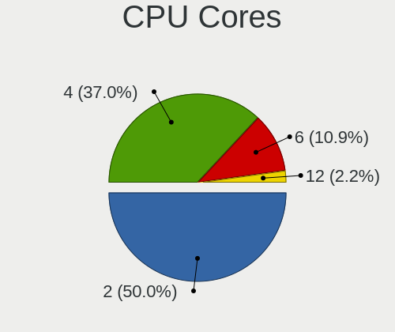

| Number | Notebooks | Percent |
|--------|-----------|---------|
| 4      | 23        | 47.92%  |
| 2      | 13        | 27.08%  |
| 8      | 5         | 10.42%  |
| 6      | 4         | 8.33%   |
| 1      | 3         | 6.25%   |

CPU Sockets
-----------

Number of sockets

| Number | Notebooks | Percent |
|--------|-----------|---------|
| 1      | 48        | 100%    |

CPU Threads
-----------

Threads per core (Hyper-Threading)

| Number | Notebooks | Percent |
|--------|-----------|---------|
| 2      | 41        | 85.42%  |
| 1      | 6         | 12.5%   |
| 4      | 1         | 2.08%   |

CPU Op-Modes
------------

CPU Operation Modes (32-bit, 64-bit)

| Op mode        | Notebooks | Percent |
|----------------|-----------|---------|
| 32-bit, 64-bit | 48        | 100%    |

CPU Microcode
-------------

Microcode number

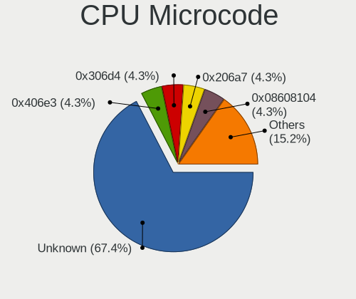

| Number     | Notebooks | Percent |
|------------|-----------|---------|
| Unknown    | 17        | 35.42%  |
| 0x0a50000c | 5         | 10.42%  |
| 0x206a7    | 3         | 6.25%   |
| 0x806ec    | 2         | 4.17%   |
| 0x806ea    | 2         | 4.17%   |
| 0x306d4    | 2         | 4.17%   |
| 0x306c3    | 2         | 4.17%   |
| 0x08108102 | 2         | 4.17%   |
| 0x906ea    | 1         | 2.08%   |
| 0x906e9    | 1         | 2.08%   |
| 0x806e9    | 1         | 2.08%   |
| 0x706e5    | 1         | 2.08%   |
| 0x706a8    | 1         | 2.08%   |
| 0x506e3    | 1         | 2.08%   |
| 0x406e3    | 1         | 2.08%   |
| 0x40651    | 1         | 2.08%   |
| 0x106e5    | 1         | 2.08%   |
| 0x08608103 | 1         | 2.08%   |
| 0x08600106 | 1         | 2.08%   |
| 0x08108109 | 1         | 2.08%   |
| 0x02000057 | 1         | 2.08%   |

CPU Microarch
-------------

Microarchitecture

| Name            | Notebooks | Percent |
|-----------------|-----------|---------|
| KabyLake        | 11        | 22.92%  |
| Zen 3           | 5         | 10.42%  |
| SandyBridge     | 4         | 8.33%   |
| Zen+            | 3         | 6.25%   |
| Skylake         | 3         | 6.25%   |
| Penryn          | 3         | 6.25%   |
| IvyBridge       | 3         | 6.25%   |
| Haswell         | 3         | 6.25%   |
| TigerLake       | 2         | 4.17%   |
| Broadwell       | 2         | 4.17%   |
| Zen 2           | 1         | 2.08%   |
| Westmere        | 1         | 2.08%   |
| Nehalem         | 1         | 2.08%   |
| K8 & K10 hybrid | 1         | 2.08%   |
| IceLake         | 1         | 2.08%   |
| Goldmont plus   | 1         | 2.08%   |
| Goldmont        | 1         | 2.08%   |
| CometLake       | 1         | 2.08%   |
| Unknown         | 1         | 2.08%   |

Graphics
--------

GPU Vendor
----------

Vendors of graphics cards

| Vendor | Notebooks | Percent |
|--------|-----------|---------|
| Intel  | 32        | 47.06%  |
| Nvidia | 20        | 29.41%  |
| AMD    | 16        | 23.53%  |

GPU Model
---------

Graphics card models

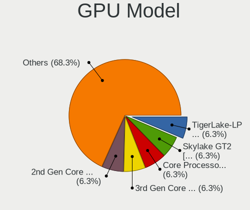

| Model                                                                                 | Notebooks | Percent |
|---------------------------------------------------------------------------------------|-----------|---------|
| AMD Cezanne                                                                           | 5         | 7.35%   |
| Intel UHD Graphics 620                                                                | 4         | 5.88%   |
| Nvidia GA106M [GeForce RTX 3060 Mobile / Max-Q]                                       | 3         | 4.41%   |
| Intel 3rd Gen Core processor Graphics Controller                                      | 3         | 4.41%   |
| Intel 2nd Generation Core Processor Family Integrated Graphics Controller             | 3         | 4.41%   |
| AMD Picasso/Raven 2 [Radeon Vega Series / Radeon Vega Mobile Series]                  | 3         | 4.41%   |
| Nvidia GP108M [GeForce MX150]                                                         | 2         | 2.94%   |
| Intel TigerLake-LP GT2 [Iris Xe Graphics]                                             | 2         | 2.94%   |
| Intel Skylake GT2 [HD Graphics 520]                                                   | 2         | 2.94%   |
| Intel CoffeeLake-H GT2 [UHD Graphics 630]                                             | 2         | 2.94%   |
| Intel 4th Gen Core Processor Integrated Graphics Controller                           | 2         | 2.94%   |
| Nvidia TU117M                                                                         | 1         | 1.47%   |
| Nvidia MCP89 [GeForce 320M]                                                           | 1         | 1.47%   |
| Nvidia GT216M [GeForce GT 330M]                                                       | 1         | 1.47%   |
| Nvidia GP107M [GeForce GTX 1050 Ti Mobile]                                            | 1         | 1.47%   |
| Nvidia GP107M [GeForce GTX 1050 Mobile]                                               | 1         | 1.47%   |
| Nvidia GP104BM [GeForce GTX 1070 Mobile]                                              | 1         | 1.47%   |
| Nvidia GM107M [GeForce GTX 960M]                                                      | 1         | 1.47%   |
| Nvidia GM107M [GeForce GTX 950M]                                                      | 1         | 1.47%   |
| Nvidia GK208M [GeForce GT 740M]                                                       | 1         | 1.47%   |
| Nvidia GK107M [GeForce GT 650M Mac Edition]                                           | 1         | 1.47%   |
| Nvidia GK104M [GeForce GTX 780M]                                                      | 1         | 1.47%   |
| Nvidia GF117M [GeForce 610M/710M/810M/820M / GT 620M/625M/630M/720M]                  | 1         | 1.47%   |
| Nvidia GA107M [GeForce RTX 3050 Mobile]                                               | 1         | 1.47%   |
| Nvidia GA106M [GeForce RTX 3050 Ti Mobile / Max-Q]                                    | 1         | 1.47%   |
| Nvidia C77 [GeForce 8200M G]                                                          | 1         | 1.47%   |
| Intel WhiskeyLake-U GT2 [UHD Graphics 620]                                            | 1         | 1.47%   |
| Intel Mobile 4 Series Chipset Integrated Graphics Controller                          | 1         | 1.47%   |
| Intel Iris Plus Graphics G7                                                           | 1         | 1.47%   |
| Intel Iris Graphics 6100                                                              | 1         | 1.47%   |
| Intel HD Graphics 630                                                                 | 1         | 1.47%   |
| Intel HD Graphics 620                                                                 | 1         | 1.47%   |
| Intel HD Graphics 5500                                                                | 1         | 1.47%   |
| Intel HD Graphics 530                                                                 | 1         | 1.47%   |
| Intel HD Graphics 500                                                                 | 1         | 1.47%   |
| Intel Haswell-ULT Integrated Graphics Controller                                      | 1         | 1.47%   |
| Intel GeminiLake [UHD Graphics 600]                                                   | 1         | 1.47%   |
| Intel Core Processor Integrated Graphics Controller                                   | 1         | 1.47%   |
| Intel CometLake-U GT2 [UHD Graphics]                                                  | 1         | 1.47%   |
| Intel CometLake-H GT2 [UHD Graphics]                                                  | 1         | 1.47%   |
| AMD Whistler [Radeon HD 6730M/6770M/7690M XT]                                         | 1         | 1.47%   |
| AMD Whistler LE [Radeon HD 6610M/7610M]                                               | 1         | 1.47%   |
| AMD Topaz XT [Radeon R7 M260/M265 / M340/M360 / M440/M445 / 530/535 / 620/625 Mobile] | 1         | 1.47%   |
| AMD Thames [Radeon HD 7500M/7600M Series]                                             | 1         | 1.47%   |
| AMD RV730/M96-XT [Mobility Radeon HD 4670]                                            | 1         | 1.47%   |
| AMD RV710/M92 [Mobility Radeon HD 4530/4570/545v]                                     | 1         | 1.47%   |
| AMD Renoir                                                                            | 1         | 1.47%   |
| AMD Lucienne                                                                          | 1         | 1.47%   |

GPU Combo
---------

Combinations of graphics cards

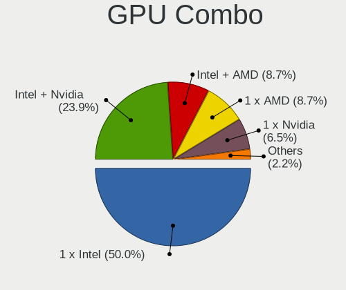

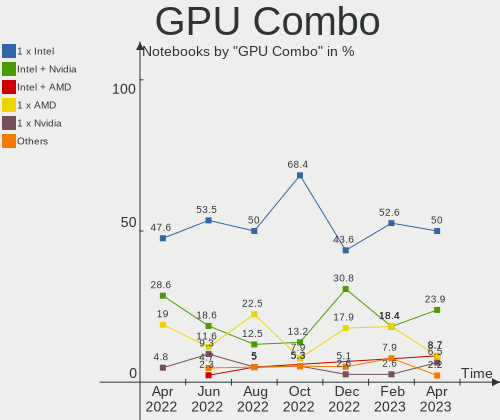

| Name           | Notebooks | Percent |
|----------------|-----------|---------|
| 1 x Intel      | 16        | 33.33%  |
| Intel + Nvidia | 13        | 27.08%  |
| 1 x AMD        | 9         | 18.75%  |
| AMD + Nvidia   | 4         | 8.33%   |
| 1 x Nvidia     | 3         | 6.25%   |
| Intel + AMD    | 3         | 6.25%   |

GPU Driver
----------

Free vs proprietary

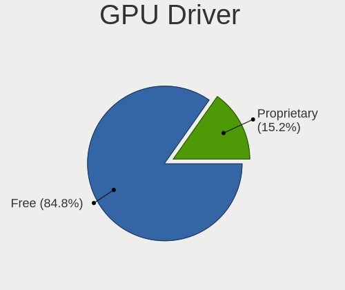

| Driver      | Notebooks | Percent |
|-------------|-----------|---------|
| Free        | 38        | 79.17%  |
| Proprietary | 7         | 14.58%  |
| Unknown     | 3         | 6.25%   |

GPU Memory
----------

Total video memory

| Size in GB | Notebooks | Percent |
|------------|-----------|---------|
| Unknown    | 29        | 60.42%  |
| 1.01-2.0   | 7         | 14.58%  |
| 0.01-0.5   | 5         | 10.42%  |
| 3.01-4.0   | 4         | 8.33%   |
| 0.51-1.0   | 2         | 4.17%   |
| 7.01-8.0   | 1         | 2.08%   |

Monitor
-------

Monitor Vendor
--------------

Monitor vendors

| Vendor              | Notebooks | Percent |
|---------------------|-----------|---------|
| AU Optronics        | 12        | 26.09%  |
| LG Display          | 10        | 21.74%  |
| Chimei Innolux      | 5         | 10.87%  |
| Samsung Electronics | 4         | 8.7%    |
| Apple               | 4         | 8.7%    |
| BOE                 | 3         | 6.52%   |
| Lenovo              | 2         | 4.35%   |
| Sharp               | 1         | 2.17%   |
| PANDA               | 1         | 2.17%   |
| Hewlett-Packard     | 1         | 2.17%   |
| CSO                 | 1         | 2.17%   |
| BenQ                | 1         | 2.17%   |
| Acer                | 1         | 2.17%   |

Monitor Model
-------------

Monitor models

| Model                                                                 | Notebooks | Percent |
|-----------------------------------------------------------------------|-----------|---------|
| Lenovo LCD Monitor LEN40BA 1920x1080 344x194mm 15.5-inch              | 2         | 4.35%   |
| Sharp LCD Monitor SHP1476 3840x2160 346x194mm 15.6-inch               | 1         | 2.17%   |
| Samsung Electronics LCD Monitor SEC5448 1920x1080 353x198mm 15.9-inch | 1         | 2.17%   |
| Samsung Electronics LCD Monitor SEC5441 1366x768 309x174mm 14.0-inch  | 1         | 2.17%   |
| Samsung Electronics LCD Monitor SEC3150 1366x768 344x193mm 15.5-inch  | 1         | 2.17%   |
| Samsung Electronics LCD Monitor SDC4445 1366x768 344x194mm 15.5-inch  | 1         | 2.17%   |
| PANDA LCD Monitor NCP004D 1920x1080 344x194mm 15.5-inch               | 1         | 2.17%   |
| LG Display LP156WH1-TLA3 LGD01C2 1366x768 344x194mm 15.5-inch         | 1         | 2.17%   |
| LG Display LCD Monitor LGD0608 1920x1080 309x174mm 14.0-inch          | 1         | 2.17%   |
| LG Display LCD Monitor LGD05FA 1920x1080 309x174mm 14.0-inch          | 1         | 2.17%   |
| LG Display LCD Monitor LGD05F2 1920x1080 344x194mm 15.5-inch          | 1         | 2.17%   |
| LG Display LCD Monitor LGD0538 1920x1080 344x194mm 15.5-inch          | 1         | 2.17%   |
| LG Display LCD Monitor LGD03E9 1366x768 345x194mm 15.6-inch           | 1         | 2.17%   |
| LG Display LCD Monitor LGD034D 1366x768 344x194mm 15.5-inch           | 1         | 2.17%   |
| LG Display LCD Monitor LGD0312 1366x768 294x166mm 13.3-inch           | 1         | 2.17%   |
| LG Display LCD Monitor LGD0283 1920x1080 383x215mm 17.3-inch          | 1         | 2.17%   |
| LG Display LCD Monitor LGD0266 1366x768 344x194mm 15.5-inch           | 1         | 2.17%   |
| Hewlett-Packard LA2306 HWP294B 1920x1080 509x286mm 23.0-inch          | 1         | 2.17%   |
| CSO LCD Monitor CSO1505 3840x2160 344x194mm 15.5-inch                 | 1         | 2.17%   |
| Chimei Innolux LCD Monitor CMN1738 1920x1080 381x214mm 17.2-inch      | 1         | 2.17%   |
| Chimei Innolux LCD Monitor CMN15DB 1366x768 344x193mm 15.5-inch       | 1         | 2.17%   |
| Chimei Innolux LCD Monitor CMN15C5 1366x768 344x193mm 15.5-inch       | 1         | 2.17%   |
| Chimei Innolux LCD Monitor CMN15C3 1920x1080 344x193mm 15.5-inch      | 1         | 2.17%   |
| Chimei Innolux LCD Monitor CMN1490 1366x768 309x173mm 13.9-inch       | 1         | 2.17%   |
| BOE LCD Monitor BOE095F 2256x1504 285x190mm 13.5-inch                 | 1         | 2.17%   |
| BOE LCD Monitor BOE06C6 1920x1080 344x194mm 15.5-inch                 | 1         | 2.17%   |
| BOE LCD Monitor BOE06B4 1920x1080 344x194mm 15.5-inch                 | 1         | 2.17%   |
| BenQ GW2780 BNQ78E6 1920x1080 600x340mm 27.2-inch                     | 1         | 2.17%   |
| AU Optronics LCD Monitor AUOED8F 1920x1080 344x193mm 15.5-inch        | 1         | 2.17%   |
| AU Optronics LCD Monitor AUOE997 1920x1080 344x194mm 15.5-inch        | 1         | 2.17%   |
| AU Optronics LCD Monitor AUOD1ED 1920x1080 344x193mm 15.5-inch        | 1         | 2.17%   |
| AU Optronics LCD Monitor AUO61ED 1920x1080 344x194mm 15.5-inch        | 1         | 2.17%   |
| AU Optronics LCD Monitor AUO369F 1920x1080 344x194mm 15.5-inch        | 1         | 2.17%   |
| AU Optronics LCD Monitor AUO32EB 3840x2160 344x193mm 15.5-inch        | 1         | 2.17%   |
| AU Optronics LCD Monitor AUO282B 3840x2160 293x165mm 13.2-inch        | 1         | 2.17%   |
| AU Optronics LCD Monitor AUO20ED 1920x1080 344x193mm 15.5-inch        | 1         | 2.17%   |
| AU Optronics LCD Monitor AUO159D 1920x1080 381x214mm 17.2-inch        | 1         | 2.17%   |
| AU Optronics LCD Monitor AUO113D 1920x1080 309x173mm 13.9-inch        | 1         | 2.17%   |
| AU Optronics LCD Monitor AUO10ED 1920x1080 344x193mm 15.5-inch        | 1         | 2.17%   |
| AU Optronics LCD Monitor AUO109B 3840x2160 382x214mm 17.2-inch        | 1         | 2.17%   |
| Apple LCD Monitor APP9CA3 1440x900 331x207mm 15.4-inch                | 1         | 2.17%   |
| Apple Color LCD APPA02A 2560x1600 286x179mm 13.3-inch                 | 1         | 2.17%   |
| Apple Color LCD APP9CCF 1920x1200 367x230mm 17.1-inch                 | 1         | 2.17%   |
| Apple Color LCD APP9CC7 1280x800 286x179mm 13.3-inch                  | 1         | 2.17%   |
| Acer EG270 ACR074B 1920x1080 598x336mm 27.0-inch                      | 1         | 2.17%   |

Monitor Resolution
------------------

Monitor screen resolution

| Resolution        | Notebooks | Percent |
|-------------------|-----------|---------|
| 1920x1080 (FHD)   | 23        | 52.27%  |
| 1366x768 (WXGA)   | 11        | 25%     |
| 3840x2160 (4K)    | 5         | 11.36%  |
| 2560x1600         | 1         | 2.27%   |
| 2256x1504         | 1         | 2.27%   |
| 1920x1200 (WUXGA) | 1         | 2.27%   |
| 1440x900 (WXGA+)  | 1         | 2.27%   |
| 1280x800 (WXGA)   | 1         | 2.27%   |

Monitor Diagonal
----------------

Diagonal size in inches

| Inches | Notebooks | Percent |
|--------|-----------|---------|
| 15     | 28        | 60.87%  |
| 13     | 6         | 13.04%  |
| 17     | 5         | 10.87%  |
| 14     | 3         | 6.52%   |
| 27     | 2         | 4.35%   |
| 23     | 1         | 2.17%   |
| 18     | 1         | 2.17%   |

Monitor Width
-------------

Physical width

| Width in mm | Notebooks | Percent |
|-------------|-----------|---------|
| 301-350     | 31        | 67.39%  |
| 351-400     | 6         | 13.04%  |
| 201-300     | 5         | 10.87%  |
| 501-600     | 3         | 6.52%   |
| 401-500     | 1         | 2.17%   |

Aspect Ratio
------------

Proportional relationship between the width and the height

| Ratio | Notebooks | Percent |
|-------|-----------|---------|
| 16/9  | 38        | 88.37%  |
| 16/10 | 4         | 9.3%    |
| 3/2   | 1         | 2.33%   |

Monitor Area
------------

Area in inch

| Area in inch | Notebooks | Percent |
|----------------|-----------|---------|
| 101-110        | 28        | 60.87%  |
| 81-90          | 7         | 15.22%  |
| 121-130        | 4         | 8.7%    |
| 71-80          | 2         | 4.35%   |
| 301-350        | 2         | 4.35%   |
| 201-250        | 1         | 2.17%   |
| 141-150        | 1         | 2.17%   |
| 131-140        | 1         | 2.17%   |

Pixel Density
-------------

Pixels per inch

| Density       | Notebooks | Percent |
|---------------|-----------|---------|
| 121-160       | 22        | 47.83%  |
| 101-120       | 12        | 26.09%  |
| More than 240 | 5         | 10.87%  |
| 51-100        | 5         | 10.87%  |
| 161-240       | 2         | 4.35%   |

Multiple Monitors
-----------------

Total monitors connected

| Total | Notebooks | Percent |
|-------|-----------|---------|
| 1     | 41        | 85.42%  |
| 2     | 4         | 8.33%   |
| 0     | 3         | 6.25%   |

Network
-------

Net Controller Vendor
---------------------

Controller vendors

| Vendor                   | Notebooks | Percent |
|--------------------------|-----------|---------|
| Realtek Semiconductor    | 28        | 35.44%  |
| Intel                    | 27        | 34.18%  |
| Qualcomm Atheros         | 7         | 8.86%   |
| Broadcom                 | 5         | 6.33%   |
| MediaTek                 | 2         | 2.53%   |
| Broadcom Limited         | 2         | 2.53%   |
| Toshiba                  | 1         | 1.27%   |
| Ralink                   | 1         | 1.27%   |
| Nvidia                   | 1         | 1.27%   |
| NetGear                  | 1         | 1.27%   |
| Marvell Technology Group | 1         | 1.27%   |
| Edimax Technology        | 1         | 1.27%   |
| DisplayLink              | 1         | 1.27%   |
| Dell                     | 1         | 1.27%   |

Net Controller Model
--------------------

Controller models

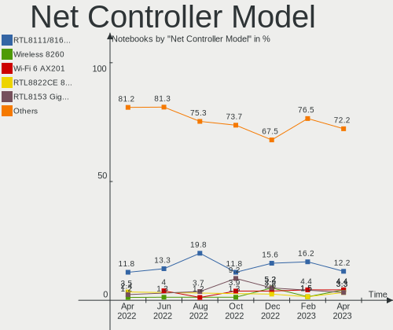

| Model                                                                   | Notebooks | Percent |
|-------------------------------------------------------------------------|-----------|---------|
| Realtek RTL8111/8168/8411 PCI Express Gigabit Ethernet Controller       | 18        | 19.35%  |
| Intel Wi-Fi 6 AX200                                                     | 6         | 6.45%   |
| Realtek RTL810xE PCI Express Fast Ethernet controller                   | 4         | 4.3%    |
| Qualcomm Atheros QCA6174 802.11ac Wireless Network Adapter              | 3         | 3.23%   |
| Intel Wireless 3165                                                     | 3         | 3.23%   |
| Realtek RTL8822BE 802.11a/b/g/n/ac WiFi adapter                         | 2         | 2.15%   |
| Realtek RTL8723AE PCIe Wireless Network Adapter                         | 2         | 2.15%   |
| Qualcomm Atheros AR9462 Wireless Network Adapter                        | 2         | 2.15%   |
| Intel Wireless 8260                                                     | 2         | 2.15%   |
| Intel Centrino Wireless-N 1030 [Rainbow Peak]                           | 2         | 2.15%   |
| Broadcom NetXtreme BCM5764M Gigabit Ethernet PCIe                       | 2         | 2.15%   |
| Toshiba F5521gw                                                         | 1         | 1.08%   |
| Realtek RTL8852AE 802.11ax PCIe Wireless Network Adapter                | 1         | 1.08%   |
| Realtek RTL8822CE 802.11ac PCIe Wireless Network Adapter                | 1         | 1.08%   |
| Realtek RTL8821CE 802.11ac PCIe Wireless Network Adapter                | 1         | 1.08%   |
| Realtek RTL8153 Gigabit Ethernet Adapter                                | 1         | 1.08%   |
| Realtek RTL8125 2.5GbE Controller                                       | 1         | 1.08%   |
| Realtek Killer E2600 Gigabit Ethernet Controller                        | 1         | 1.08%   |
| Ralink RT3290 Wireless 802.11n 1T/1R PCIe                               | 1         | 1.08%   |
| Qualcomm Atheros QCA9565 / AR9565 Wireless Network Adapter              | 1         | 1.08%   |
| Qualcomm Atheros Killer E220x Gigabit Ethernet Controller               | 1         | 1.08%   |
| Qualcomm Atheros AR8161 Gigabit Ethernet                                | 1         | 1.08%   |
| Qualcomm Atheros AR242x / AR542x Wireless Network Adapter (PCI-Express) | 1         | 1.08%   |
| Nvidia MCP77 Ethernet                                                   | 1         | 1.08%   |
| NetGear A6210                                                           | 1         | 1.08%   |
| MEDIATEK MT7921 802.11ax PCI Express Wireless Network Adapter           | 1         | 1.08%   |
| MediaTek MT65xx Preloader                                               | 1         | 1.08%   |
| Marvell Group 88E8040 PCI-E Fast Ethernet Controller                    | 1         | 1.08%   |
| Intel Wireless 8265 / 8275                                              | 1         | 1.08%   |
| Intel Wireless 7265                                                     | 1         | 1.08%   |
| Intel WiFi Link 5100                                                    | 1         | 1.08%   |
| Intel Wi-Fi 6 AX210/AX211/AX411 160MHz                                  | 1         | 1.08%   |
| Intel Wi-Fi 6 AX201                                                     | 1         | 1.08%   |
| Intel Ultimate N WiFi Link 5300                                         | 1         | 1.08%   |
| Intel Ice Lake-LP PCH CNVi WiFi                                         | 1         | 1.08%   |
| Intel Gemini Lake PCH CNVi WiFi                                         | 1         | 1.08%   |
| Intel Ethernet Connection I219-V                                        | 1         | 1.08%   |
| Intel Ethernet Connection (7) I219-LM                                   | 1         | 1.08%   |
| Intel Ethernet Connection (6) I219-V                                    | 1         | 1.08%   |
| Intel Ethernet Connection (3) I218-LM                                   | 1         | 1.08%   |
| Intel Dual Band Wireless-AC 3168NGW [Stone Peak]                        | 1         | 1.08%   |
| Intel Dual Band Wireless-AC 3165 Plus Bluetooth                         | 1         | 1.08%   |
| Intel Comet Lake PCH CNVi WiFi                                          | 1         | 1.08%   |
| Intel Centrino Advanced-N 6230 [Rainbow Peak]                           | 1         | 1.08%   |
| Intel Cannon Point-LP CNVi [Wireless-AC]                                | 1         | 1.08%   |
| Intel Cannon Lake PCH CNVi WiFi                                         | 1         | 1.08%   |
| Intel 82579LM Gigabit Network Connection (Lewisville)                   | 1         | 1.08%   |
| Edimax AC1200 MU-MIMO USB3.0 Adapter                                    | 1         | 1.08%   |
| DisplayLink Dell Universal Dock D6000                                   | 1         | 1.08%   |
| Dell Wireless 5809e Gobi 4G LTE Mobile Broadband Card             | 1         | 1.08%   |
| Broadcom NetXtreme BCM57765 Gigabit Ethernet PCIe                       | 1         | 1.08%   |
| Broadcom NetLink BCM5784M Gigabit Ethernet PCIe                         | 1         | 1.08%   |
| Broadcom Limited NetLink BCM5784M Gigabit Ethernet PCIe                 | 1         | 1.08%   |
| Broadcom Limited BCM4312 802.11b/g LP-PHY                               | 1         | 1.08%   |
| Broadcom BCM43602 802.11ac Wireless LAN SoC                             | 1         | 1.08%   |
| Broadcom BCM4331 802.11a/b/g/n                                          | 1         | 1.08%   |
| Broadcom BCM43224 802.11a/b/g/n                                         | 1         | 1.08%   |
| Broadcom BCM4322 802.11a/b/g/n Wireless LAN Controller                  | 1         | 1.08%   |

Wireless Vendor
---------------

Wireless vendors

| Vendor                | Notebooks | Percent |
|-----------------------|-----------|---------|
| Intel                 | 27        | 52.94%  |
| Realtek Semiconductor | 7         | 13.73%  |
| Qualcomm Atheros      | 7         | 13.73%  |
| Broadcom              | 4         | 7.84%   |
| Ralink                | 1         | 1.96%   |
| NetGear               | 1         | 1.96%   |
| MEDIATEK              | 1         | 1.96%   |
| Edimax Technology     | 1         | 1.96%   |
| Dell                  | 1         | 1.96%   |
| Broadcom Limited      | 1         | 1.96%   |

Wireless Model
--------------

Wireless models

| Model                                                                   | Notebooks | Percent |
|-------------------------------------------------------------------------|-----------|---------|
| Intel Wi-Fi 6 AX200                                                     | 6         | 11.76%  |
| Qualcomm Atheros QCA6174 802.11ac Wireless Network Adapter              | 3         | 5.88%   |
| Intel Wireless 3165                                                     | 3         | 5.88%   |
| Realtek RTL8822BE 802.11a/b/g/n/ac WiFi adapter                         | 2         | 3.92%   |
| Realtek RTL8723AE PCIe Wireless Network Adapter                         | 2         | 3.92%   |
| Qualcomm Atheros AR9462 Wireless Network Adapter                        | 2         | 3.92%   |
| Intel Wireless 8260                                                     | 2         | 3.92%   |
| Intel Centrino Wireless-N 1030 [Rainbow Peak]                           | 2         | 3.92%   |
| Realtek RTL8852AE 802.11ax PCIe Wireless Network Adapter                | 1         | 1.96%   |
| Realtek RTL8822CE 802.11ac PCIe Wireless Network Adapter                | 1         | 1.96%   |
| Realtek RTL8821CE 802.11ac PCIe Wireless Network Adapter                | 1         | 1.96%   |
| Ralink RT3290 Wireless 802.11n 1T/1R PCIe                               | 1         | 1.96%   |
| Qualcomm Atheros QCA9565 / AR9565 Wireless Network Adapter              | 1         | 1.96%   |
| Qualcomm Atheros AR242x / AR542x Wireless Network Adapter (PCI-Express) | 1         | 1.96%   |
| NetGear A6210                                                           | 1         | 1.96%   |
| MEDIATEK MT7921 802.11ax PCI Express Wireless Network Adapter           | 1         | 1.96%   |
| Intel Wireless 8265 / 8275                                              | 1         | 1.96%   |
| Intel Wireless 7265                                                     | 1         | 1.96%   |
| Intel WiFi Link 5100                                                    | 1         | 1.96%   |
| Intel Wi-Fi 6 AX210/AX211/AX411 160MHz                                  | 1         | 1.96%   |
| Intel Wi-Fi 6 AX201                                                     | 1         | 1.96%   |
| Intel Ultimate N WiFi Link 5300                                         | 1         | 1.96%   |
| Intel Ice Lake-LP PCH CNVi WiFi                                         | 1         | 1.96%   |
| Intel Gemini Lake PCH CNVi WiFi                                         | 1         | 1.96%   |
| Intel Dual Band Wireless-AC 3168NGW [Stone Peak]                        | 1         | 1.96%   |
| Intel Dual Band Wireless-AC 3165 Plus Bluetooth                         | 1         | 1.96%   |
| Intel Comet Lake PCH CNVi WiFi                                          | 1         | 1.96%   |
| Intel Centrino Advanced-N 6230 [Rainbow Peak]                           | 1         | 1.96%   |
| Intel Cannon Point-LP CNVi [Wireless-AC]                                | 1         | 1.96%   |
| Intel Cannon Lake PCH CNVi WiFi                                         | 1         | 1.96%   |
| Edimax AC1200 MU-MIMO USB3.0 Adapter                                    | 1         | 1.96%   |
| Dell Wireless 5809e Gobi 4G LTE Mobile Broadband Card             | 1         | 1.96%   |
| Broadcom Limited BCM4312 802.11b/g LP-PHY                               | 1         | 1.96%   |
| Broadcom BCM43602 802.11ac Wireless LAN SoC                             | 1         | 1.96%   |
| Broadcom BCM4331 802.11a/b/g/n                                          | 1         | 1.96%   |
| Broadcom BCM43224 802.11a/b/g/n                                         | 1         | 1.96%   |
| Broadcom BCM4322 802.11a/b/g/n Wireless LAN Controller                  | 1         | 1.96%   |

Ethernet Vendor
---------------

Ethernet vendors

| Vendor                   | Notebooks | Percent |
|--------------------------|-----------|---------|
| Realtek Semiconductor    | 25        | 62.5%   |
| Intel                    | 5         | 12.5%   |
| Broadcom                 | 4         | 10%     |
| Qualcomm Atheros         | 2         | 5%      |
| Nvidia                   | 1         | 2.5%    |
| Marvell Technology Group | 1         | 2.5%    |
| DisplayLink              | 1         | 2.5%    |
| Broadcom Limited         | 1         | 2.5%    |

Ethernet Model
--------------

Ethernet models

| Model                                                             | Notebooks | Percent |
|-------------------------------------------------------------------|-----------|---------|
| Realtek RTL8111/8168/8411 PCI Express Gigabit Ethernet Controller | 18        | 45%     |
| Realtek RTL810xE PCI Express Fast Ethernet controller             | 4         | 10%     |
| Broadcom NetXtreme BCM5764M Gigabit Ethernet PCIe                 | 2         | 5%      |
| Realtek RTL8153 Gigabit Ethernet Adapter                          | 1         | 2.5%    |
| Realtek RTL8125 2.5GbE Controller                                 | 1         | 2.5%    |
| Realtek Killer E2600 Gigabit Ethernet Controller                  | 1         | 2.5%    |
| Qualcomm Atheros Killer E220x Gigabit Ethernet Controller         | 1         | 2.5%    |
| Qualcomm Atheros AR8161 Gigabit Ethernet                          | 1         | 2.5%    |
| Nvidia MCP77 Ethernet                                             | 1         | 2.5%    |
| Marvell Group 88E8040 PCI-E Fast Ethernet Controller              | 1         | 2.5%    |
| Intel Ethernet Connection I219-V                                  | 1         | 2.5%    |
| Intel Ethernet Connection (7) I219-LM                             | 1         | 2.5%    |
| Intel Ethernet Connection (6) I219-V                              | 1         | 2.5%    |
| Intel Ethernet Connection (3) I218-LM                             | 1         | 2.5%    |
| Intel 82579LM Gigabit Network Connection (Lewisville)             | 1         | 2.5%    |
| DisplayLink Dell Universal Dock D6000                             | 1         | 2.5%    |
| Broadcom NetXtreme BCM57765 Gigabit Ethernet PCIe                 | 1         | 2.5%    |
| Broadcom NetLink BCM5784M Gigabit Ethernet PCIe                   | 1         | 2.5%    |
| Broadcom Limited NetLink BCM5784M Gigabit Ethernet PCIe           | 1         | 2.5%    |

Net Controller Kind
-------------------

Ethernet, WiFi or modem

| Kind     | Notebooks | Percent |
|----------|-----------|---------|
| WiFi     | 48        | 54.55%  |
| Ethernet | 38        | 43.18%  |
| Modem    | 2         | 2.27%   |

Used Controller
---------------

Currently used network controller

| Kind     | Notebooks | Percent |
|----------|-----------|---------|
| WiFi     | 46        | 93.88%  |
| Ethernet | 3         | 6.12%   |

NICs
----

Total network controllers on board

| Total | Notebooks | Percent |
|-------|-----------|---------|
| 2     | 37        | 77.08%  |
| 1     | 10        | 20.83%  |
| 3     | 1         | 2.08%   |

IPv6
----

IPv6 vs IPv4

| Used | Notebooks | Percent |
|------|-----------|---------|
| No   | 46        | 95.83%  |
| Yes  | 2         | 4.17%   |

Bluetooth
---------

Bluetooth Vendor
----------------

Controller vendors

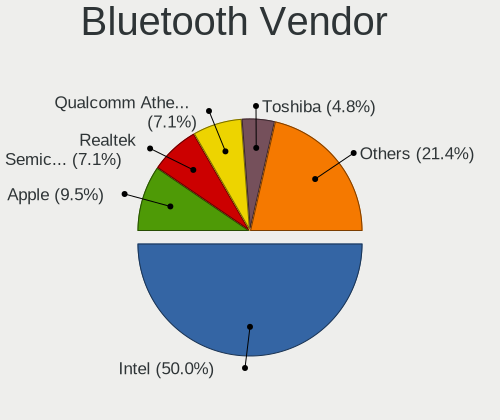

| Vendor                          | Notebooks | Percent |
|---------------------------------|-----------|---------|
| Intel                           | 23        | 56.1%   |
| Realtek Semiconductor           | 5         | 12.2%   |
| Qualcomm Atheros Communications | 4         | 9.76%   |
| Apple                           | 4         | 9.76%   |
| Toshiba                         | 2         | 4.88%   |
| Ralink                          | 1         | 2.44%   |
| IMC Networks                    | 1         | 2.44%   |
| Foxconn / Hon Hai               | 1         | 2.44%   |

Bluetooth Model
---------------

Controller models

| Model                                            | Notebooks | Percent |
|--------------------------------------------------|-----------|---------|
| Intel Bluetooth wireless interface               | 8         | 19.51%  |
| Intel AX200 Bluetooth                            | 6         | 14.63%  |
| Realtek Bluetooth Radio                          | 3         | 7.32%   |
| Intel Bluetooth 9460/9560 Jefferson Peak (JfP)   | 3         | 7.32%   |
| Apple Bluetooth Host Controller                  | 3         | 7.32%   |
| Realtek RTL8822BE Bluetooth 4.2 Adapter          | 2         | 4.88%   |
| Qualcomm Atheros QCA61x4 Bluetooth 4.0           | 2         | 4.88%   |
| Intel Centrino Advanced-N 6230 Bluetooth adapter | 2         | 4.88%   |
| Intel AX201 Bluetooth                            | 2         | 4.88%   |
| Toshiba RT Bluetooth Radio                       | 1         | 2.44%   |
| Toshiba Bluetooth Device                         | 1         | 2.44%   |
| Ralink RT3290 Bluetooth                          | 1         | 2.44%   |
| Qualcomm Atheros  Bluetooth Device               | 1         | 2.44%   |
| Qualcomm Atheros AR3012 Bluetooth 4.0            | 1         | 2.44%   |
| Intel Wireless-AC 3168 Bluetooth                 | 1         | 2.44%   |
| Intel AX210 Bluetooth                            | 1         | 2.44%   |
| IMC Networks Wireless_Device                     | 1         | 2.44%   |
| Foxconn / Hon Hai Bluetooth Device               | 1         | 2.44%   |
| Apple Bluetooth USB Host Controller              | 1         | 2.44%   |

Sound
-----

Sound Vendor
------------

Sound card vendors

| Vendor              | Notebooks | Percent |
|---------------------|-----------|---------|
| Intel               | 36        | 56.25%  |
| AMD                 | 13        | 20.31%  |
| Nvidia              | 12        | 18.75%  |
| XMOS                | 1         | 1.56%   |
| C-Media Electronics | 1         | 1.56%   |
| Antlion Audio       | 1         | 1.56%   |

Sound Model
-----------

Sound card models

| Model                                                                      | Notebooks | Percent |
|----------------------------------------------------------------------------|-----------|---------|
| AMD Family 17h/19h HD Audio Controller                                     | 10        | 13.16%  |
| Intel Sunrise Point-LP HD Audio                                            | 7         | 9.21%   |
| AMD Renoir Radeon High Definition Audio Controller                         | 5         | 6.58%   |
| Nvidia Audio device                                                        | 4         | 5.26%   |
| Intel 7 Series/C216 Chipset Family High Definition Audio Controller        | 4         | 5.26%   |
| Intel 6 Series/C200 Series Chipset Family High Definition Audio Controller | 3         | 3.95%   |
| AMD Raven/Raven2/Fenghuang HDMI/DP Audio Controller                        | 3         | 3.95%   |
| Intel Wildcat Point-LP High Definition Audio Controller                    | 2         | 2.63%   |
| Intel Tiger Lake-LP Smart Sound Technology Audio Controller                | 2         | 2.63%   |
| Intel CM238 HD Audio Controller                                            | 2         | 2.63%   |
| Intel Cannon Lake PCH cAVS                                                 | 2         | 2.63%   |
| Intel Broadwell-U Audio Controller                                         | 2         | 2.63%   |
| Intel 82801I (ICH9 Family) HD Audio Controller                             | 2         | 2.63%   |
| Intel 8 Series/C220 Series Chipset High Definition Audio Controller        | 2         | 2.63%   |
| Intel 5 Series/3400 Series Chipset High Definition Audio                   | 2         | 2.63%   |
| AMD RV710/730 HDMI Audio [Radeon HD 4000 series]                           | 2         | 2.63%   |
| XMOS iFi (by AMR) HD USB Audio                                             | 1         | 1.32%   |
| Nvidia TU107 GeForce GTX 1650 High Definition Audio Controller             | 1         | 1.32%   |
| Nvidia MCP89 High Definition Audio                                         | 1         | 1.32%   |
| Nvidia MCP72XE/MCP72P/MCP78U/MCP78S High Definition Audio                  | 1         | 1.32%   |
| Nvidia GT216 HDMI Audio Controller                                         | 1         | 1.32%   |
| Nvidia GP107GL High Definition Audio Controller                            | 1         | 1.32%   |
| Nvidia GP104 High Definition Audio Controller                              | 1         | 1.32%   |
| Nvidia GK107 HDMI Audio Controller                                         | 1         | 1.32%   |
| Nvidia GK104 HDMI Audio Controller                                         | 1         | 1.32%   |
| Intel Xeon E3-1200 v3/4th Gen Core Processor HD Audio Controller           | 1         | 1.32%   |
| Intel Ice Lake-LP Smart Sound Technology Audio Controller                  | 1         | 1.32%   |
| Intel Haswell-ULT HD Audio Controller                                      | 1         | 1.32%   |
| Intel Comet Lake PCH-LP cAVS                                               | 1         | 1.32%   |
| Intel Comet Lake PCH cAVS                                                  | 1         | 1.32%   |
| Intel Celeron/Pentium Silver Processor High Definition Audio               | 1         | 1.32%   |
| Intel Celeron N3350/Pentium N4200/Atom E3900 Series Audio Cluster          | 1         | 1.32%   |
| Intel Cannon Point-LP High Definition Audio Controller                     | 1         | 1.32%   |
| Intel 8 Series HD Audio Controller                                         | 1         | 1.32%   |
| Intel 100 Series/C230 Series Chipset Family HD Audio Controller            | 1         | 1.32%   |
| C-Media Electronics Audio Adapter (Unitek Y-247A)                          | 1         | 1.32%   |
| Antlion Audio Antlion Wireless Microphone                                  | 1         | 1.32%   |
| AMD Turks HDMI Audio [Radeon HD 6500/6600 / 6700M Series]                  | 1         | 1.32%   |

Memory
------

Memory Vendor
-------------

Memory module vendors

| Vendor              | Notebooks | Percent |
|---------------------|-----------|---------|
| Samsung Electronics | 7         | 31.82%  |
| SK Hynix            | 5         | 22.73%  |
| Micron Technology   | 5         | 22.73%  |
| Team                | 2         | 9.09%   |
| Crucial             | 2         | 9.09%   |
| Elpida              | 1         | 4.55%   |

Memory Model
------------

Memory module models

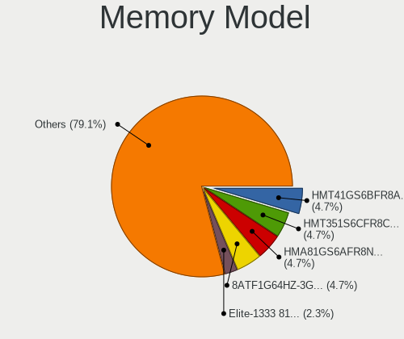

| Model                                                           | Notebooks | Percent |
|-----------------------------------------------------------------|-----------|---------|
| Team RAM TEAMGROUP-SD4-3200 16GB SODIMM DDR4 3200MT/s           | 2         | 9.09%   |
| Micron RAM 4ATF1G64HZ-3G2E1 8GB SODIMM DDR4 3200MT/s            | 2         | 9.09%   |
| SK Hynix RAM HMT451S6MFR6A-PB 4GB SODIMM DDR3 1600MT/s          | 1         | 4.55%   |
| SK Hynix RAM HMT41GS6AFR8A-PB 8GB SODIMM DDR3 1600MT/s          | 1         | 4.55%   |
| SK Hynix RAM HMAA1GS6CMR8N-VK 8192MB Row Of Chips DDR4 2667MT/s | 1         | 4.55%   |
| SK Hynix RAM HMAA1GS6CJR6N-XN 8192MB SODIMM DDR4 3200MT/s       | 1         | 4.55%   |
| SK Hynix RAM HMA82GS6AFR8N-UH 16384MB SODIMM DDR4 2667MT/s      | 1         | 4.55%   |
| Samsung RAM Module 4GB Row Of Chips LPDDR3 2133MT/s             | 1         | 4.55%   |
| Samsung RAM M471B5273DH0-CH9 4GB SODIMM DDR3 1334MT/s           | 1         | 4.55%   |
| Samsung RAM M471A2K43EB1-CWE 16GB SODIMM DDR4 3200MT/s          | 1         | 4.55%   |
| Samsung RAM M471A2G44AM0-CWE 16GB SODIMM DDR4 3200MT/s          | 1         | 4.55%   |
| Samsung RAM M471A1G44AB0-CWE 8GB SODIMM DDR4 3200MT/s           | 1         | 4.55%   |
| Samsung RAM M471A1G44AB0-CWE 8GB Row Of Chips DDR4 3200MT/s     | 1         | 4.55%   |
| Samsung RAM K4EBE304EC-EGCG 8GB Row Of Chips LPDDR3 2133MT/s    | 1         | 4.55%   |
| Micron RAM Module 4096MB SODIMM DDR4 2400MT/s                   | 1         | 4.55%   |
| Micron RAM 8ATF1G64HZ-2G6E1 8GB SODIMM DDR4 2667MT/s            | 1         | 4.55%   |
| Micron RAM 16KTF51264HZ-1G6M1 4GB SODIMM DDR3 1600MT/s          | 1         | 4.55%   |
| Elpida RAM Module 8GB SODIMM DDR3 1867MT/s                      | 1         | 4.55%   |
| Crucial RAM CT8G4SFS824A.M8FRS 8192MB SODIMM DDR4 2400MT/s      | 1         | 4.55%   |
| Crucial RAM CT16G4SFD824A.M16FB 16GB SODIMM DDR4 2400MT/s       | 1         | 4.55%   |

Memory Kind
-----------

Memory module kinds

| Kind   | Notebooks | Percent |
|--------|-----------|---------|
| DDR4   | 11        | 61.11%  |
| DDR3   | 5         | 27.78%  |
| LPDDR3 | 2         | 11.11%  |

Memory Form Factor
------------------

Physical design of the memory module

| Name         | Notebooks | Percent |
|--------------|-----------|---------|
| SODIMM       | 15        | 78.95%  |
| Row Of Chips | 4         | 21.05%  |

Memory Size
-----------

Memory module size

| Size  | Notebooks | Percent |
|-------|-----------|---------|
| 8192  | 9         | 45%     |
| 4096  | 5         | 25%     |
| 16384 | 4         | 20%     |
| 32768 | 2         | 10%     |

Memory Speed
------------

Memory module speed

| Speed | Notebooks | Percent |
|-------|-----------|---------|
| 3200  | 6         | 31.58%  |
| 2667  | 3         | 15.79%  |
| 2400  | 3         | 15.79%  |
| 1600  | 3         | 15.79%  |
| 2133  | 2         | 10.53%  |
| 1867  | 1         | 5.26%   |
| 1334  | 1         | 5.26%   |

Printers & scanners
-------------------

Printer Vendor
--------------

Printer device vendors

Zero info for selected period =(

Printer Model
-------------

Printer device models

Zero info for selected period =(

Scanner Vendor
--------------

Scanner device vendors

Zero info for selected period =(

Scanner Model
-------------

Scanner device models

Zero info for selected period =(

Camera
------

Camera Vendor
-------------

Camera device vendors

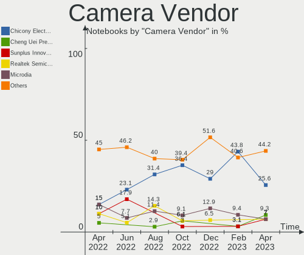

| Vendor                        | Notebooks | Percent |
|-------------------------------|-----------|---------|
| Chicony Electronics           | 11        | 26.83%  |
| Sunplus Innovation Technology | 5         | 12.2%   |
| Microdia                      | 5         | 12.2%   |
| Realtek Semiconductor         | 4         | 9.76%   |
| Quanta                        | 4         | 9.76%   |
| Apple                         | 3         | 7.32%   |
| Acer                          | 3         | 7.32%   |
| Syntek                        | 2         | 4.88%   |
| IMC Networks                  | 2         | 4.88%   |
| Logitech                      | 1         | 2.44%   |
| Lite-On Technology            | 1         | 2.44%   |

Camera Model
------------

Camera device models

| Model                                | Notebooks | Percent |
|--------------------------------------|-----------|---------|
| Sunplus Integrated_Webcam_HD         | 3         | 7.14%   |
| Chicony Integrated Camera            | 3         | 7.14%   |
| Quanta HD User Facing                | 2         | 4.76%   |
| Microdia Laptop_Integrated_Webcam_2M | 2         | 4.76%   |
| Microdia Integrated_Webcam_HD        | 2         | 4.76%   |
| IMC Networks Integrated Camera       | 2         | 4.76%   |
| Apple Built-in iSight                | 2         | 4.76%   |
| Acer Integrated Camera               | 2         | 4.76%   |
| Syntek Integrated Camera             | 1         | 2.38%   |
| Syntek EasyCamera                    | 1         | 2.38%   |
| Sunplus HP TrueVision HD             | 1         | 2.38%   |
| Sunplus HD WebCam                    | 1         | 2.38%   |
| Realtek Laptop Camera                | 1         | 2.38%   |
| Realtek Integrated_Webcam_HD         | 1         | 2.38%   |
| Realtek Integrated Webcam            | 1         | 2.38%   |
| Realtek Integrated Camera            | 1         | 2.38%   |
| Quanta VGA WebCam                    | 1         | 2.38%   |
| Quanta HP Webcam                     | 1         | 2.38%   |
| Microdia Integrated_Webcam_1.3M      | 1         | 2.38%   |
| Logitech C922 Pro Stream Webcam      | 1         | 2.38%   |
| Lite-On TOSHIBA Web Camera           | 1         | 2.38%   |
| Chicony USB2.0 Camera                | 1         | 2.38%   |
| Chicony USB 2.0 Camera               | 1         | 2.38%   |
| Chicony TOSHIBA Web Camera - HD      | 1         | 2.38%   |
| Chicony HP Webcam                    | 1         | 2.38%   |
| Chicony HP Truevision HD             | 1         | 2.38%   |
| Chicony HP HD Camera                 | 1         | 2.38%   |
| Chicony HD WebCam                    | 1         | 2.38%   |
| Chicony CNF9055 Toshiba Webcam       | 1         | 2.38%   |
| Apple FaceTime HD Camera             | 1         | 2.38%   |
| Acer Integrated IR Camera            | 1         | 2.38%   |
| Acer HP TrueVision HD Webcam         | 1         | 2.38%   |

Security
--------

Fingerprint Vendor
------------------

Fingerprint sensor vendors

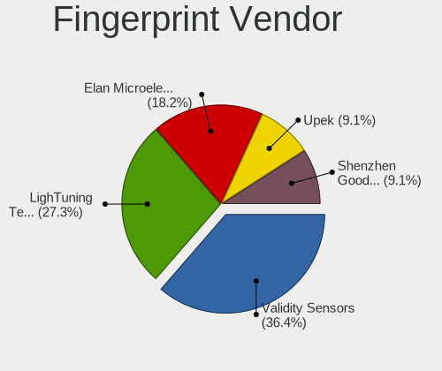

| Vendor                     | Notebooks | Percent |
|----------------------------|-----------|---------|
| Synaptics                  | 5         | 50%     |
| Validity Sensors           | 2         | 20%     |
| Shenzhen Goodix Technology | 1         | 10%     |
| Elan Microelectronics      | 1         | 10%     |
| AuthenTec                  | 1         | 10%     |

Fingerprint Model
-----------------

Fingerprint sensor models

| Model                                             | Notebooks | Percent |
|---------------------------------------------------|-----------|---------|
| Synaptics Prometheus MIS Touch Fingerprint Reader | 2         | 20%     |
| Validity Sensors VFS495 Fingerprint Reader        | 1         | 10%     |
| Validity Sensors Fingerprint scanner              | 1         | 10%     |
| Synaptics WBDI Device                             | 1         | 10%     |
| Synaptics  WBDI                                   | 1         | 10%     |
| Synaptics Metallica MIS Touch Fingerprint Reader  | 1         | 10%     |
| Shenzhen Goodix  FingerPrint Device               | 1         | 10%     |
| Elan ELAN:Fingerprint                             | 1         | 10%     |
| AuthenTec Fingerprint Sensor                      | 1         | 10%     |

Chipcard Vendor
---------------

Chipcard module vendors

Zero info for selected period =(

Chipcard Model
--------------

Chipcard module models

Zero info for selected period =(

Unsupported
-----------

Unsupported Devices
-------------------

Total unsupported devices on board

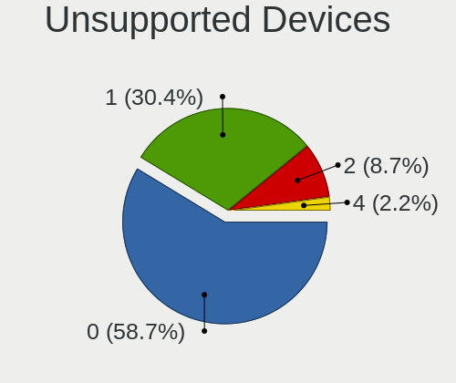

| Total | Notebooks | Percent |
|-------|-----------|---------|
| 0     | 28        | 58.33%  |
| 1     | 15        | 31.25%  |
| 2     | 5         | 10.42%  |

Unsupported Device Types
------------------------

Types of unsupported devices

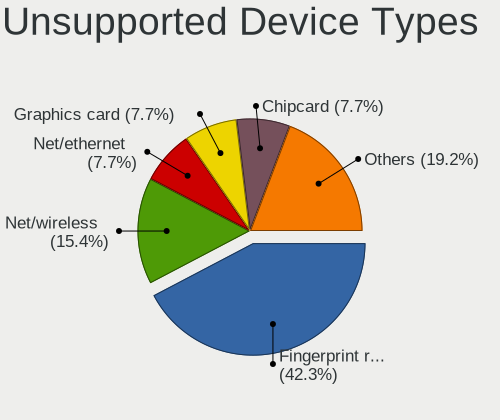

| Type                     | Notebooks | Percent |
|--------------------------|-----------|---------|
| Fingerprint reader       | 10        | 45.45%  |
| Graphics card            | 7         | 31.82%  |
| Multimedia controller    | 2         | 9.09%   |
| Net/wireless             | 1         | 4.55%   |
| Communication controller | 1         | 4.55%   |
| Bluetooth                | 1         | 4.55%   |

