Linux in Australia - Hardware Trends
------------------------------------

A project to identify most popular hardware characteristics and track their change
over time based on data collected by Linux users at https://Linux-Hardware.org.

Anyone can contribute to this report by the [hw-probe](https://github.com/linuxhw/hw-probe) tool:

    sudo -E hw-probe -all -upload

This is a report for all computer types. See also reports for [desktops](/Location/Australia/Desktop/README.md) and [notebooks](/Location/Australia/Notebook/README.md).

Period: Jul, 2022.

Contents
--------

* [ System ](#system)
  - [ OS                       ](#os)
  - [ OS Family                ](#os-family)
  - [ Kernel                   ](#kernel)
  - [ Kernel Family            ](#kernel-family)
  - [ Kernel Major Ver.        ](#kernel-major-ver)
  - [ Arch                     ](#arch)
  - [ DE                       ](#de)
  - [ Display Server           ](#display-server)
  - [ Display Manager          ](#display-manager)
  - [ OS Lang                  ](#os-lang)
  - [ Boot Mode                ](#boot-mode)
  - [ Filesystem               ](#filesystem)
  - [ Part. scheme             ](#part-scheme)
  - [ Dual Boot with Linux/BSD ](#dual-boot-with-linuxbsd)
  - [ Dual Boot (Win)          ](#dual-boot-win)

* [ Board ](#board)
  - [ Vendor                   ](#vendor)
  - [ Model                    ](#model)
  - [ Model Family             ](#model-family)
  - [ MFG Year                 ](#mfg-year)
  - [ Form Factor              ](#form-factor)
  - [ Secure Boot              ](#secure-boot)
  - [ Coreboot                 ](#coreboot)
  - [ RAM Size                 ](#ram-size)
  - [ RAM Used                 ](#ram-used)
  - [ Total Drives             ](#total-drives)
  - [ Has CD-ROM               ](#has-cd-rom)
  - [ Has Ethernet             ](#has-ethernet)
  - [ Has WiFi                 ](#has-wifi)
  - [ Has Bluetooth            ](#has-bluetooth)

* [ Location ](#location)
  - [ Country                  ](#country)
  - [ City                     ](#city)

* [ Drives ](#drives)
  - [ Drive Vendor             ](#drive-vendor)
  - [ Drive Model              ](#drive-model)
  - [ HDD Vendor               ](#hdd-vendor)
  - [ SSD Vendor               ](#ssd-vendor)
  - [ Drive Kind               ](#drive-kind)
  - [ Drive Connector          ](#drive-connector)
  - [ Drive Size               ](#drive-size)
  - [ Space Total              ](#space-total)
  - [ Space Used               ](#space-used)
  - [ Malfunc. Drives          ](#malfunc-drives)
  - [ Malfunc. Drive Vendor    ](#malfunc-drive-vendor)
  - [ Malfunc. HDD Vendor      ](#malfunc-hdd-vendor)
  - [ Malfunc. Drive Kind      ](#malfunc-drive-kind)
  - [ Failed Drives            ](#failed-drives)
  - [ Failed Drive Vendor      ](#failed-drive-vendor)
  - [ Drive Status             ](#drive-status)

* [ Storage controller ](#storage-controller)
  - [ Storage Vendor           ](#storage-vendor)
  - [ Storage Model            ](#storage-model)
  - [ Storage Kind             ](#storage-kind)

* [ Processor ](#processor)
  - [ CPU Vendor               ](#cpu-vendor)
  - [ CPU Model                ](#cpu-model)
  - [ CPU Model Family         ](#cpu-model-family)
  - [ CPU Cores                ](#cpu-cores)
  - [ CPU Sockets              ](#cpu-sockets)
  - [ CPU Threads              ](#cpu-threads)
  - [ CPU Op-Modes             ](#cpu-op-modes)
  - [ CPU Microcode            ](#cpu-microcode)
  - [ CPU Microarch            ](#cpu-microarch)

* [ Graphics ](#graphics)
  - [ GPU Vendor               ](#gpu-vendor)
  - [ GPU Model                ](#gpu-model)
  - [ GPU Combo                ](#gpu-combo)
  - [ GPU Driver               ](#gpu-driver)
  - [ GPU Memory               ](#gpu-memory)

* [ Monitor ](#monitor)
  - [ Monitor Vendor           ](#monitor-vendor)
  - [ Monitor Model            ](#monitor-model)
  - [ Monitor Resolution       ](#monitor-resolution)
  - [ Monitor Diagonal         ](#monitor-diagonal)
  - [ Monitor Width            ](#monitor-width)
  - [ Aspect Ratio             ](#aspect-ratio)
  - [ Monitor Area             ](#monitor-area)
  - [ Pixel Density            ](#pixel-density)
  - [ Multiple Monitors        ](#multiple-monitors)

* [ Network ](#network)
  - [ Net Controller Vendor    ](#net-controller-vendor)
  - [ Net Controller Model     ](#net-controller-model)
  - [ Wireless Vendor          ](#wireless-vendor)
  - [ Wireless Model           ](#wireless-model)
  - [ Ethernet Vendor          ](#ethernet-vendor)
  - [ Ethernet Model           ](#ethernet-model)
  - [ Net Controller Kind      ](#net-controller-kind)
  - [ Used Controller          ](#used-controller)
  - [ NICs                     ](#nics)
  - [ IPv6                     ](#ipv6)

* [ Bluetooth ](#bluetooth)
  - [ Bluetooth Vendor         ](#bluetooth-vendor)
  - [ Bluetooth Model          ](#bluetooth-model)

* [ Sound ](#sound)
  - [ Sound Vendor             ](#sound-vendor)
  - [ Sound Model              ](#sound-model)

* [ Memory ](#memory)
  - [ Memory Vendor            ](#memory-vendor)
  - [ Memory Model             ](#memory-model)
  - [ Memory Kind              ](#memory-kind)
  - [ Memory Form Factor       ](#memory-form-factor)
  - [ Memory Size              ](#memory-size)
  - [ Memory Speed             ](#memory-speed)

* [ Printers & scanners ](#printers--scanners)
  - [ Printer Vendor           ](#printer-vendor)
  - [ Printer Model            ](#printer-model)
  - [ Scanner Vendor           ](#scanner-vendor)
  - [ Scanner Model            ](#scanner-model)

* [ Camera ](#camera)
  - [ Camera Vendor            ](#camera-vendor)
  - [ Camera Model             ](#camera-model)

* [ Security ](#security)
  - [ Fingerprint Vendor       ](#fingerprint-vendor)
  - [ Fingerprint Model        ](#fingerprint-model)
  - [ Chipcard Vendor          ](#chipcard-vendor)
  - [ Chipcard Model           ](#chipcard-model)

* [ Unsupported ](#unsupported)
  - [ Unsupported Devices      ](#unsupported-devices)
  - [ Unsupported Device Types ](#unsupported-device-types)

System
------

OS
--

Installed operating systems

| Name                         | Computers | Percent |
|------------------------------|-----------|---------|
| Fedora 36                    | 14        | 14.29%  |
| Linux Mint 20.3              | 9         | 9.18%   |
| OpenMandriva 4.3             | 8         | 8.16%   |
| Ubuntu 22.04                 | 7         | 7.14%   |
| KDE neon 20.04               | 7         | 7.14%   |
| Debian 11                    | 7         | 7.14%   |
| Pop!_OS 22.04                | 6         | 6.12%   |
| OpenMandriva 4.90            | 5         | 5.1%    |
| Zorin 16                     | 4         | 4.08%   |
| ClearOS 7                    | 4         | 4.08%   |
| Kali 2022.2                  | 3         | 3.06%   |
| Fedora 35                    | 3         | 3.06%   |
| Ubuntu 22.10                 | 2         | 2.04%   |
| Ubuntu 20.04                 | 2         | 2.04%   |
| SteamOS 3.2 (steamdeck-main) | 2         | 2.04%   |
| Xubuntu 20.04                | 1         | 1.02%   |
| Ubuntu MATE 22.04            | 1         | 1.02%   |
| Ubuntu MATE 18.04            | 1         | 1.02%   |
| MX 21                        | 1         | 1.02%   |
| Manjaro 21.3.5               | 1         | 1.02%   |
| Manjaro                      | 1         | 1.02%   |
| Linux Lite 5.8               | 1         | 1.02%   |
| Kaisen 2.0                   | 1         | 1.02%   |
| Endless 4.0.7                | 1         | 1.02%   |
| Elementary 6.1               | 1         | 1.02%   |
| CentOS 7                     | 1         | 1.02%   |
| ArcoLinux Rolling            | 1         | 1.02%   |
| Arch Rolling                 | 1         | 1.02%   |
| Arch                         | 1         | 1.02%   |
| Alpine 3.16.1                | 1         | 1.02%   |

OS Family
---------

OS without a version

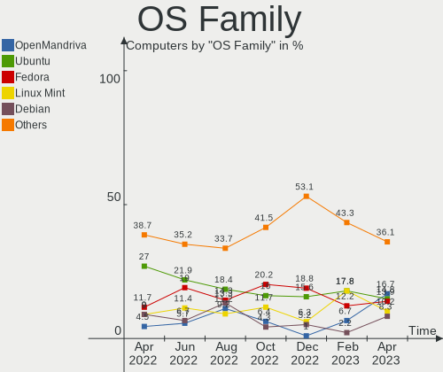

| Name         | Computers | Percent |
|--------------|-----------|---------|
| Fedora       | 17        | 17.35%  |
| OpenMandriva | 13        | 13.27%  |
| Ubuntu       | 11        | 11.22%  |
| Linux Mint   | 9         | 9.18%   |
| KDE neon     | 7         | 7.14%   |
| Debian       | 7         | 7.14%   |
| Pop!_OS      | 6         | 6.12%   |
| Zorin        | 4         | 4.08%   |
| ClearOS      | 4         | 4.08%   |
| Kali         | 3         | 3.06%   |
| Ubuntu MATE  | 2         | 2.04%   |
| SteamOS      | 2         | 2.04%   |
| Manjaro      | 2         | 2.04%   |
| Arch         | 2         | 2.04%   |
| Xubuntu      | 1         | 1.02%   |
| MX           | 1         | 1.02%   |
| Linux Lite   | 1         | 1.02%   |
| Kaisen       | 1         | 1.02%   |
| Endless      | 1         | 1.02%   |
| Elementary   | 1         | 1.02%   |
| CentOS       | 1         | 1.02%   |
| ArcoLinux    | 1         | 1.02%   |
| Alpine       | 1         | 1.02%   |

Kernel
------

Version of the Linux kernel

| Version                                            | Computers | Percent |
|----------------------------------------------------|-----------|---------|
| 5.15.0-41-generic                                  | 8         | 8.16%   |
| 5.16.7-desktop-1omv4003                            | 7         | 7.14%   |
| 5.4.0-122-generic                                  | 6         | 6.12%   |
| 5.17.15-76051715-generic                           | 6         | 6.12%   |
| 5.18.12-desktop-3omv4090                           | 5         | 5.1%    |
| 5.18.11-200.fc36.x86_64                            | 5         | 5.1%    |
| 5.13.0-52-generic                                  | 5         | 5.1%    |
| 3.10.0-1160.71.1.el7.x86_64                        | 5         | 5.1%    |
| 5.18.7-200.fc36.x86_64                             | 3         | 3.06%   |
| 5.10.0-16-amd64                                    | 3         | 3.06%   |
| 5.4.0-121-generic                                  | 2         | 2.04%   |
| 5.18.9-arch1-1                                     | 2         | 2.04%   |
| 5.18.13-200.fc36.x86_64                            | 2         | 2.04%   |
| 5.18.10-200.fc36.x86_64                            | 2         | 2.04%   |
| 5.18.0-kali2-amd64                                 | 2         | 2.04%   |
| 5.15.0-40-generic                                  | 2         | 2.04%   |
| 5.13.0-51-generic                                  | 2         | 2.04%   |
| 5.10.0-15-amd64                                    | 2         | 2.04%   |
| 5.7.0-050700-generic                               | 1         | 1.02%   |
| 5.4.0-91-generic                                   | 1         | 1.02%   |
| 5.19.0-rc8-kukui+                                  | 1         | 1.02%   |
| 5.18.9-200.fc36.x86_64                             | 1         | 1.02%   |
| 5.18.5-100.fc35.x86_64                             | 1         | 1.02%   |
| 5.18.4-051804-generic                              | 1         | 1.02%   |
| 5.18.12-3-MANJARO                                  | 1         | 1.02%   |
| 5.18.11-xanmod1                                    | 1         | 1.02%   |
| 5.18.11-100.fc35.x86_64                            | 1         | 1.02%   |
| 5.18.10-arch1-1-51810-01                           | 1         | 1.02%   |
| 5.18.10-201.fsync.fc36.x86_64                      | 1         | 1.02%   |
| 5.18.10-100.fc35.x86_64                            | 1         | 1.02%   |
| 5.18.1-arch1_testHoloISO_20220606.1811             | 1         | 1.02%   |
| 5.18.0-kali5-amd64                                 | 1         | 1.02%   |
| 5.17.0-3-amd64                                     | 1         | 1.02%   |
| 5.17-rockchip                                      | 1         | 1.02%   |
| 5.16.13-desktop-1omv4003                           | 1         | 1.02%   |
| 5.15.0-kaisen1-amd64                               | 1         | 1.02%   |
| 5.15.0-33-generic                                  | 1         | 1.02%   |
| 5.15.0-1006-raspi                                  | 1         | 1.02%   |
| 5.15.0-1004-intel-iotg                             | 1         | 1.02%   |
| 5.15.0-0.bpo.2-amd64                               | 1         | 1.02%   |
| 5.14.0-1044-oem                                    | 1         | 1.02%   |
| 5.13.19-2-MANJARO                                  | 1         | 1.02%   |
| 5.13.0-valve10.1-2-neptune-dri-02144-g7fffaf925dfb | 1         | 1.02%   |
| 5.13.0-52-lowlatency                               | 1         | 1.02%   |
| 5.13.0-40-generic                                  | 1         | 1.02%   |
| 5.13.0-30-generic                                  | 1         | 1.02%   |
| 5.11.0-35-generic                                  | 1         | 1.02%   |

Kernel Family
-------------

Linux kernel without a distro release

| Version | Computers | Percent |
|---------|-----------|---------|
| 5.15.0  | 15        | 15.31%  |
| 5.13.0  | 11        | 11.22%  |
| 5.4.0   | 9         | 9.18%   |
| 5.18.11 | 7         | 7.14%   |
| 5.16.7  | 7         | 7.14%   |
| 5.18.12 | 6         | 6.12%   |
| 5.17.15 | 6         | 6.12%   |
| 5.18.10 | 5         | 5.1%    |
| 5.10.0  | 5         | 5.1%    |
| 3.10.0  | 5         | 5.1%    |
| 5.18.9  | 3         | 3.06%   |
| 5.18.7  | 3         | 3.06%   |
| 5.18.0  | 3         | 3.06%   |
| 5.18.13 | 2         | 2.04%   |
| 5.7.0   | 1         | 1.02%   |
| 5.19.0  | 1         | 1.02%   |
| 5.18.5  | 1         | 1.02%   |
| 5.18.4  | 1         | 1.02%   |
| 5.18.1  | 1         | 1.02%   |
| 5.17.0  | 1         | 1.02%   |
| 5.17    | 1         | 1.02%   |
| 5.16.13 | 1         | 1.02%   |
| 5.14.0  | 1         | 1.02%   |
| 5.13.19 | 1         | 1.02%   |
| 5.11.0  | 1         | 1.02%   |

Kernel Major Ver.
-----------------

Linux kernel major version

| Version | Computers | Percent |
|---------|-----------|---------|
| 5.18    | 32        | 32.65%  |
| 5.15    | 15        | 15.31%  |
| 5.13    | 12        | 12.24%  |
| 5.4     | 9         | 9.18%   |
| 5.16    | 8         | 8.16%   |
| 5.17    | 7         | 7.14%   |
| 5.10    | 5         | 5.1%    |
| 3.10    | 5         | 5.1%    |
| 5.7     | 1         | 1.02%   |
| 5.19    | 1         | 1.02%   |
| 5.14    | 1         | 1.02%   |
| 5.11    | 1         | 1.02%   |
| 5       | 1         | 1.02%   |

Arch
----

OS architecture (x86_64, i586, etc.)

| Name    | Computers | Percent |
|---------|-----------|---------|
| x86_64  | 94        | 95.92%  |
| aarch64 | 3         | 3.06%   |
| i686    | 1         | 1.02%   |

DE
--

Desktop Environment

| Name          | Computers | Percent |
|---------------|-----------|---------|
| GNOME         | 31        | 31.63%  |
| KDE5          | 27        | 27.55%  |
| XFCE          | 9         | 9.18%   |
| X-Cinnamon    | 8         | 8.16%   |
| Cinnamon      | 8         | 8.16%   |
| Unknown       | 7         | 7.14%   |
| MATE          | 4         | 4.08%   |
| xmonad        | 1         | 1.02%   |
| Phosh:GNOME   | 1         | 1.02%   |
| Pantheon      | 1         | 1.02%   |
| GNOME Classic | 1         | 1.02%   |

Display Server
--------------

X11 or Wayland

| Name    | Computers | Percent |
|---------|-----------|---------|
| X11     | 74        | 75.51%  |
| Wayland | 15        | 15.31%  |
| Tty     | 8         | 8.16%   |
| Unknown | 1         | 1.02%   |

Display Manager
---------------

SDDM, LightDM, etc.

| Name    | Computers | Percent |
|---------|-----------|---------|
| Unknown | 46        | 46.94%  |
| LightDM | 20        | 20.41%  |
| SDDM    | 17        | 17.35%  |
| GDM3    | 10        | 10.2%   |
| GDM     | 5         | 5.1%    |

OS Lang
-------

Language

| Lang    | Computers | Percent |
|---------|-----------|---------|
| en_AU   | 78        | 79.59%  |
| en_US   | 18        | 18.37%  |
| Unknown | 2         | 2.04%   |

Boot Mode
---------

EFI or BIOS

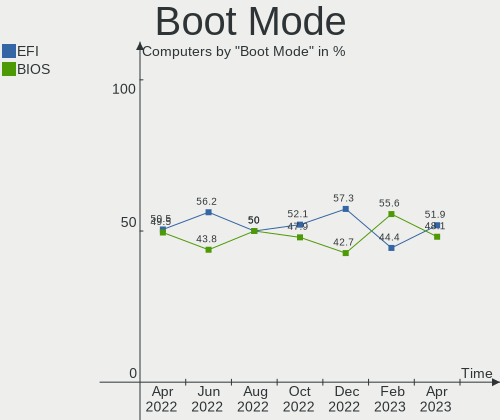

| Mode | Computers | Percent |
|------|-----------|---------|
| BIOS | 56        | 57.14%  |
| EFI  | 42        | 42.86%  |

Filesystem
----------

Type of filesystem

| Type    | Computers | Percent |
|---------|-----------|---------|
| Ext4    | 63        | 64.29%  |
| Btrfs   | 12        | 12.24%  |
| Overlay | 11        | 11.22%  |
| Xfs     | 10        | 10.2%   |
| Zfs     | 1         | 1.02%   |
| F2fs    | 1         | 1.02%   |

Part. scheme
------------

Scheme of partitioning

| Type    | Computers | Percent |
|---------|-----------|---------|
| Unknown | 50        | 51.02%  |
| GPT     | 29        | 29.59%  |
| MBR     | 19        | 19.39%  |

Dual Boot with Linux/BSD
------------------------

Hosting more than one Linux/BSD

| Dual boot | Computers | Percent |
|-----------|-----------|---------|
| No        | 81        | 82.65%  |
| Yes       | 17        | 17.35%  |

Dual Boot (Win)
---------------

Hosting Linux and Windows

| Dual boot | Computers | Percent |
|-----------|-----------|---------|
| No        | 79        | 80.61%  |
| Yes       | 19        | 19.39%  |

Board
-----

Vendor
------

Motherboard manufacturer

| Name                    | Computers | Percent |
|-------------------------|-----------|---------|
| Gigabyte Technology     | 21        | 21.43%  |
| Dell                    | 14        | 14.29%  |
| Acer                    | 12        | 12.24%  |
| Hewlett-Packard         | 11        | 11.22%  |
| Lenovo                  | 8         | 8.16%   |
| Apple                   | 6         | 6.12%   |
| Intel                   | 5         | 5.1%    |
| ASUSTek Computer        | 5         | 5.1%    |
| ASRock                  | 5         | 5.1%    |
| MSI                     | 3         | 3.06%   |
| Unknown                 | 3         | 3.06%   |
| ReachingTech            | 1         | 1.02%   |
| Raspberry Pi Foundation | 1         | 1.02%   |
| HUAWEI                  | 1         | 1.02%   |
| Google                  | 1         | 1.02%   |
| Alienware               | 1         | 1.02%   |

Model
-----

Motherboard model

| Name                                    | Computers | Percent |
|-----------------------------------------|-----------|---------|
| Unknown                                 | 3         | 3.06%   |
| HP EliteBook 8470p                      | 2         | 2.04%   |
| Gigabyte X570 AORUS PRO WIFI            | 2         | 2.04%   |
| Gigabyte J1900M-D2P                     | 2         | 2.04%   |
| Gigabyte GA-880GM-UD2H                  | 2         | 2.04%   |
| Gigabyte B75M-D3H                       | 2         | 2.04%   |
| Apple MacBookPro9,2                     | 2         | 2.04%   |
| Acer ConceptD CN315-71P                 | 2         | 2.04%   |
| ReachingTech Dream Quest Office 2021    | 1         | 1.02%   |
| RPi Raspberry Pi                        | 1         | 1.02%   |
| MSI MS-7B89                             | 1         | 1.02%   |
| MSI MS-7917                             | 1         | 1.02%   |
| MSI MS-7882                             | 1         | 1.02%   |
| Lenovo Yoga 9 14IAP7 82LU               | 1         | 1.02%   |
| Lenovo ThinkPad X1 Carbon 3460AE4       | 1         | 1.02%   |
| Lenovo ThinkPad T470s W10DG 20JTS0HT00  | 1         | 1.02%   |
| Lenovo ThinkCentre M58p 7220A72         | 1         | 1.02%   |
| Lenovo Legion T5 28IMB05 90NC00AFAU     | 1         | 1.02%   |
| Lenovo Legion S7 15ACH6 82K8            | 1         | 1.02%   |
| Lenovo IdeaCentre A540-24ICB F0EL002EAU | 1         | 1.02%   |
| Lenovo G570 4334                        | 1         | 1.02%   |
| Intel NUC7i5BNB J31144-302              | 1         | 1.02%   |
| Intel NUC6i5SYB H81131-505              | 1         | 1.02%   |
| Intel NUC10i7FNH                        | 1         | 1.02%   |
| Intel LADPNVMO AAE76523-300             | 1         | 1.02%   |
| Intel DH67BL AAG10189-211               | 1         | 1.02%   |
| HUAWEI KLVD-WXX9                        | 1         | 1.02%   |
| HP Z400 Workstation                     | 1         | 1.02%   |
| HP Z240 SFF Workstation                 | 1         | 1.02%   |
| HP Spectre 13-SMB Pro Ultrabook         | 1         | 1.02%   |
| HP Pavilion g6                          | 1         | 1.02%   |
| HP Pavilion Desktop PC 570-p0xx         | 1         | 1.02%   |
| HP Laptop 17-cp0xxx                     | 1         | 1.02%   |
| HP EliteBook 850 G1                     | 1         | 1.02%   |
| HP EliteBook 840 G6                     | 1         | 1.02%   |
| HP Compaq 8000 Elite SFF PC             | 1         | 1.02%   |
| Google Peppy                            | 1         | 1.02%   |
| Gigabyte Z97X-Gaming 3                  | 1         | 1.02%   |
| Gigabyte X570 I AORUS PRO WIFI          | 1         | 1.02%   |
| Gigabyte X570 AORUS ULTRA               | 1         | 1.02%   |
| Gigabyte X570 AORUS MASTER              | 1         | 1.02%   |
| Gigabyte H77N-WIFI                      | 1         | 1.02%   |
| Gigabyte H170N-WIFI                     | 1         | 1.02%   |
| Gigabyte GA-MA785G-UD3H                 | 1         | 1.02%   |
| Gigabyte GA-MA780G-UD3H                 | 1         | 1.02%   |
| Gigabyte GA-A55M-S2V                    | 1         | 1.02%   |
| Gigabyte GA-870A-UD3                    | 1         | 1.02%   |
| Gigabyte EP45-DS3L                      | 1         | 1.02%   |
| Gigabyte B550 AORUS PRO AX              | 1         | 1.02%   |
| Gigabyte B450M H                        | 1         | 1.02%   |
| Dell XPS 13 9360                        | 1         | 1.02%   |
| Dell Precision M4700                    | 1         | 1.02%   |
| Dell OptiPlex 9020M                     | 1         | 1.02%   |
| Dell OptiPlex 9010                      | 1         | 1.02%   |
| Dell OptiPlex 7010                      | 1         | 1.02%   |
| Dell OptiPlex 3010                      | 1         | 1.02%   |
| Dell Latitude E7250                     | 1         | 1.02%   |
| Dell Latitude 5430                      | 1         | 1.02%   |
| Dell Latitude 3400                      | 1         | 1.02%   |
| Dell Inspiron MM061                     | 1         | 1.02%   |

Model Family
------------

Motherboard model prefix

| Name                    | Computers | Percent |
|-------------------------|-----------|---------|
| Acer Aspire             | 6         | 6.12%   |
| Gigabyte X570           | 5         | 5.1%    |
| Dell Inspiron           | 5         | 5.1%    |
| HP EliteBook            | 4         | 4.08%   |
| Dell OptiPlex           | 4         | 4.08%   |
| Dell Latitude           | 3         | 3.06%   |
| Unknown                 | 3         | 3.06%   |
| Lenovo ThinkPad         | 2         | 2.04%   |
| Lenovo Legion           | 2         | 2.04%   |
| HP Pavilion             | 2         | 2.04%   |
| Gigabyte J1900M-D2P     | 2         | 2.04%   |
| Gigabyte GA-880GM-UD2H  | 2         | 2.04%   |
| Gigabyte B75M-D3H       | 2         | 2.04%   |
| Apple MacBookPro9       | 2         | 2.04%   |
| Acer Nitro              | 2         | 2.04%   |
| Acer ConceptD           | 2         | 2.04%   |
| ReachingTech Dream      | 1         | 1.02%   |
| RPi Raspberry           | 1         | 1.02%   |
| MSI MS-7B89             | 1         | 1.02%   |
| MSI MS-7917             | 1         | 1.02%   |
| MSI MS-7882             | 1         | 1.02%   |
| Lenovo Yoga             | 1         | 1.02%   |
| Lenovo ThinkCentre      | 1         | 1.02%   |
| Lenovo IdeaCentre       | 1         | 1.02%   |
| Lenovo G570             | 1         | 1.02%   |
| Intel NUC7i5BNB         | 1         | 1.02%   |
| Intel NUC6i5SYB         | 1         | 1.02%   |
| Intel NUC10i7FNH        | 1         | 1.02%   |
| Intel LADPNVMO          | 1         | 1.02%   |
| Intel DH67BL            | 1         | 1.02%   |
| HUAWEI KLVD-WXX9        | 1         | 1.02%   |
| HP Z400                 | 1         | 1.02%   |
| HP Z240                 | 1         | 1.02%   |
| HP Spectre              | 1         | 1.02%   |
| HP Laptop               | 1         | 1.02%   |
| HP Compaq               | 1         | 1.02%   |
| Google Peppy            | 1         | 1.02%   |
| Gigabyte Z97X-Gaming    | 1         | 1.02%   |
| Gigabyte H77N-WIFI      | 1         | 1.02%   |
| Gigabyte H170N-WIFI     | 1         | 1.02%   |
| Gigabyte GA-MA785G-UD3H | 1         | 1.02%   |
| Gigabyte GA-MA780G-UD3H | 1         | 1.02%   |
| Gigabyte GA-A55M-S2V    | 1         | 1.02%   |
| Gigabyte GA-870A-UD3    | 1         | 1.02%   |
| Gigabyte EP45-DS3L      | 1         | 1.02%   |
| Gigabyte B550           | 1         | 1.02%   |
| Gigabyte B450M          | 1         | 1.02%   |
| Dell XPS                | 1         | 1.02%   |
| Dell Precision          | 1         | 1.02%   |
| ASUS Z170M-PLUS         | 1         | 1.02%   |
| ASUS X555YA             | 1         | 1.02%   |
| ASUS ROG                | 1         | 1.02%   |
| ASUS P8Z77-M            | 1         | 1.02%   |
| ASUS GL702ZC            | 1         | 1.02%   |
| ASRock Z77              | 1         | 1.02%   |
| ASRock Z390             | 1         | 1.02%   |
| ASRock Z170             | 1         | 1.02%   |
| ASRock AD2700-ITX       | 1         | 1.02%   |
| ASRock 990FX            | 1         | 1.02%   |
| Apple MacBookPro10      | 1         | 1.02%   |

MFG Year
--------

Motherboard manufacture year

| Year    | Computers | Percent |
|---------|-----------|---------|
| 2012    | 12        | 12.24%  |
| 2019    | 10        | 10.2%   |
| 2021    | 9         | 9.18%   |
| 2010    | 9         | 9.18%   |
| 2020    | 7         | 7.14%   |
| 2014    | 7         | 7.14%   |
| 2015    | 6         | 6.12%   |
| 2011    | 6         | 6.12%   |
| 2022    | 5         | 5.1%    |
| 2018    | 5         | 5.1%    |
| 2017    | 4         | 4.08%   |
| 2016    | 4         | 4.08%   |
| 2008    | 4         | 4.08%   |
| 2013    | 3         | 3.06%   |
| 2009    | 3         | 3.06%   |
| Unknown | 3         | 3.06%   |
| 2006    | 1         | 1.02%   |

Form Factor
-----------

Physical design of the computer

| Name           | Computers | Percent |
|----------------|-----------|---------|
| Desktop        | 45        | 45.92%  |
| Notebook       | 42        | 42.86%  |
| Mini pc        | 4         | 4.08%   |
| System on chip | 3         | 3.06%   |
| Convertible    | 2         | 2.04%   |
| All in one     | 2         | 2.04%   |

Secure Boot
-----------

Enabled or disabled

| State    | Computers | Percent |
|----------|-----------|---------|
| Disabled | 89        | 90.82%  |
| Enabled  | 9         | 9.18%   |

Coreboot
--------

Have coreboot on board

| Used | Computers | Percent |
|------|-----------|---------|
| No   | 97        | 98.98%  |
| Yes  | 1         | 1.02%   |

RAM Size
--------

Total RAM memory

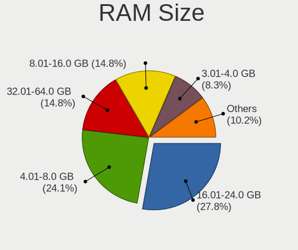

| Size in GB  | Computers | Percent |
|-------------|-----------|---------|
| 4.01-8.0    | 30        | 30.61%  |
| 3.01-4.0    | 18        | 18.37%  |
| 16.01-24.0  | 18        | 18.37%  |
| 32.01-64.0  | 13        | 13.27%  |
| 8.01-16.0   | 12        | 12.24%  |
| 64.01-256.0 | 4         | 4.08%   |
| 24.01-32.0  | 1         | 1.02%   |
| 2.01-3.0    | 1         | 1.02%   |
| 1.01-2.0    | 1         | 1.02%   |

RAM Used
--------

Used RAM memory

| Used GB    | Computers | Percent |
|------------|-----------|---------|
| 1.01-2.0   | 29        | 29.59%  |
| 2.01-3.0   | 26        | 26.53%  |
| 4.01-8.0   | 13        | 13.27%  |
| 3.01-4.0   | 12        | 12.24%  |
| 0.51-1.0   | 11        | 11.22%  |
| 24.01-32.0 | 2         | 2.04%   |
| 16.01-24.0 | 2         | 2.04%   |
| 8.01-16.0  | 2         | 2.04%   |
| 0.01-0.5   | 1         | 1.02%   |

Total Drives
------------

Number of drives on board

| Drives | Computers | Percent |
|--------|-----------|---------|
| 1      | 57        | 58.16%  |
| 2      | 22        | 22.45%  |
| 3      | 8         | 8.16%   |
| 6      | 5         | 5.1%    |
| 5      | 2         | 2.04%   |
| 4      | 2         | 2.04%   |
| 9      | 1         | 1.02%   |
| 8      | 1         | 1.02%   |

Has CD-ROM
----------

Has CD-ROM on board

| Presented | Computers | Percent |
|-----------|-----------|---------|
| No        | 64        | 65.31%  |
| Yes       | 34        | 34.69%  |

Has Ethernet
------------

Has Ethernet on board

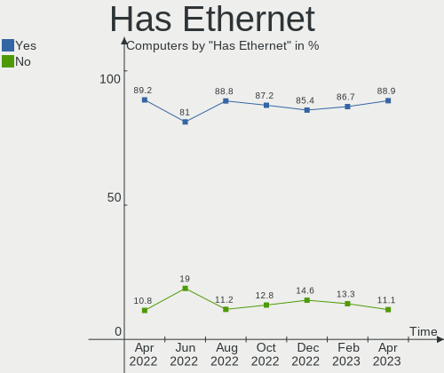

| Presented | Computers | Percent |
|-----------|-----------|---------|
| Yes       | 81        | 82.65%  |
| No        | 17        | 17.35%  |

Has WiFi
--------

Has WiFi module

| Presented | Computers | Percent |
|-----------|-----------|---------|
| Yes       | 72        | 73.47%  |
| No        | 26        | 26.53%  |

Has Bluetooth
-------------

Has Bluetooth module

| Presented | Computers | Percent |
|-----------|-----------|---------|
| Yes       | 56        | 57.14%  |
| No        | 42        | 42.86%  |

Location
--------

Country
-------

Geographic location (country)

| Country   | Computers | Percent |
|-----------|-----------|---------|
| Australia | 98        | 100%    |

City
----

Geographic location (city)

| City            | Computers | Percent |
|-----------------|-----------|---------|
| Sydney          | 24        | 24.49%  |
| Brisbane        | 18        | 18.37%  |
| Melbourne       | 13        | 13.27%  |
| Launceston      | 8         | 8.16%   |
| Perth           | 7         | 7.14%   |
| Lane Cove       | 4         | 4.08%   |
| Adelaide        | 2         | 2.04%   |
| Yarragon        | 1         | 1.02%   |
| Wentworthville  | 1         | 1.02%   |
| Toowoomba       | 1         | 1.02%   |
| Port Sorell     | 1         | 1.02%   |
| Pittsworth      | 1         | 1.02%   |
| Noble Park      | 1         | 1.02%   |
| Newnham         | 1         | 1.02%   |
| Mt Coolum       | 1         | 1.02%   |
| Mascot          | 1         | 1.02%   |
| Kiama           | 1         | 1.02%   |
| Hobart          | 1         | 1.02%   |
| Grovedale       | 1         | 1.02%   |
| Gold Coast      | 1         | 1.02%   |
| Emerald         | 1         | 1.02%   |
| Eltham          | 1         | 1.02%   |
| Cessnock        | 1         | 1.02%   |
| Canberra        | 1         | 1.02%   |
| Cairns          | 1         | 1.02%   |
| Blacktown       | 1         | 1.02%   |
| Berwick         | 1         | 1.02%   |
| Bennett Springs | 1         | 1.02%   |
| Abbotsford      | 1         | 1.02%   |

Drives
------

Drive Vendor
------------

Hard drive vendors

| Vendor                    | Computers | Drives | Percent |
|---------------------------|-----------|--------|---------|
| Samsung Electronics       | 34        | 52     | 22.82%  |
| Seagate                   | 24        | 35     | 16.11%  |
| WDC                       | 18        | 25     | 12.08%  |
| SanDisk                   | 8         | 8      | 5.37%   |
| Crucial                   | 8         | 9      | 5.37%   |
| Intel                     | 7         | 7      | 4.7%    |
| Unknown                   | 6         | 7      | 4.03%   |
| Apple                     | 6         | 7      | 4.03%   |
| Hitachi                   | 5         | 7      | 3.36%   |
| Toshiba                   | 4         | 4      | 2.68%   |
| Patriot                   | 3         | 3      | 2.01%   |
| Kingston                  | 3         | 3      | 2.01%   |
| SPCC                      | 2         | 2      | 1.34%   |
| SK hynix                  | 2         | 2      | 1.34%   |
| Phison                    | 2         | 2      | 1.34%   |
| HGST                      | 2         | 2      | 1.34%   |
| Gigabyte Technology       | 2         | 2      | 1.34%   |
| XPG                       | 1         | 1      | 0.67%   |
| OWC                       | 1         | 1      | 0.67%   |
| OCZ                       | 1         | 1      | 0.67%   |
| Micron/Crucial Technology | 1         | 1      | 0.67%   |
| Micron Technology         | 1         | 1      | 0.67%   |
| KIOXIA                    | 1         | 1      | 0.67%   |
| KingSpec                  | 1         | 1      | 0.67%   |
| GALAX                     | 1         | 1      | 0.67%   |
| Fujitsu                   | 1         | 1      | 0.67%   |
| CT480BX5                  | 1         | 1      | 0.67%   |
| Corsair                   | 1         | 1      | 0.67%   |
| A-DATA Technology         | 1         | 1      | 0.67%   |
| Unknown                   | 1         | 1      | 0.67%   |

Drive Model
-----------

Hard drive models

| Model                                | Computers | Percent |
|--------------------------------------|-----------|---------|
| Samsung SSD 860 EVO 500GB            | 4         | 2.29%   |
| Samsung SSD 850 EVO 250GB            | 4         | 2.29%   |
| SanDisk NVMe SSD Drive 512GB         | 3         | 1.71%   |
| Samsung NVMe SSD Drive 2TB           | 3         | 1.71%   |
| Unknown SD/MMC/MS PRO 64GB           | 2         | 1.14%   |
| Unknown MMC Card  64GB               | 2         | 1.14%   |
| Unknown MMC Card  128GB              | 2         | 1.14%   |
| Seagate ST9250315AS 250GB            | 2         | 1.14%   |
| Seagate ST500DM002-1BD142 500GB      | 2         | 1.14%   |
| Seagate ST2000DL003-9VT166 2TB       | 2         | 1.14%   |
| Seagate ST1000DM003-1ER162 1TB       | 2         | 1.14%   |
| Seagate Expansion 1TB                | 2         | 1.14%   |
| SanDisk NVMe SSD Drive 256GB         | 2         | 1.14%   |
| Samsung SSD 860 EVO 250GB            | 2         | 1.14%   |
| Samsung SSD 860 EVO 1TB              | 2         | 1.14%   |
| Samsung SSD 840 PRO Series 256GB     | 2         | 1.14%   |
| Samsung NVMe SSD Drive 1024GB        | 2         | 1.14%   |
| Samsung HD501LJ 500GB                | 2         | 1.14%   |
| Phison NVMe SSD Drive 1024GB         | 2         | 1.14%   |
| Patriot Blaze 120GB SSD              | 2         | 1.14%   |
| Hitachi HTS547550A9E384 500GB        | 2         | 1.14%   |
| Crucial CT500MX500SSD1 500GB         | 2         | 1.14%   |
| XPG NVMe SSD Drive 512GB             | 1         | 0.57%   |
| WDC WDS500G2B0A-00SM50 500GB SSD     | 1         | 0.57%   |
| WDC WDS500G1X0E-00AFY0 500GB         | 1         | 0.57%   |
| WDC WDS100T2G0A-00JH30 1TB SSD       | 1         | 0.57%   |
| WDC WD7500BPKX-22HPJT0 752GB         | 1         | 0.57%   |
| WDC WD5000LPVX-22V0TT0 500GB         | 1         | 0.57%   |
| WDC WD5000AVCS-632DY1 500GB          | 1         | 0.57%   |
| WDC WD5000AAKX-329BA0 500GB          | 1         | 0.57%   |
| WDC WD40EZRZ-00GXCB0 4TB             | 1         | 0.57%   |
| WDC WD3200BPVT-22ZEST0 320GB         | 1         | 0.57%   |
| WDC WD3200AVVS-63L2B0 320GB          | 1         | 0.57%   |
| WDC WD3200AAKS-75VYA0 320GB          | 1         | 0.57%   |
| WDC WD30EZRX-00SPEB0 3TB             | 1         | 0.57%   |
| WDC WD20EZRZ-60Z5HB0 2TB             | 1         | 0.57%   |
| WDC WD20EFRX-68EUZN0 2TB             | 1         | 0.57%   |
| WDC WD20EARX-00PASB0 2TB             | 1         | 0.57%   |
| WDC WD10J31X-00U3VT0 1TB             | 1         | 0.57%   |
| WDC WD10EZEX-08WN4A0 1TB             | 1         | 0.57%   |
| WDC WD10EADS-11M2B1 1TB              | 1         | 0.57%   |
| WDC WD100EFAX-68LHPN0 10TB           | 1         | 0.57%   |
| WDC WD1003FZEX-00K3CA0 1TB           | 1         | 0.57%   |
| WDC WD1003FBYX-01Y7B1 752GB          | 1         | 0.57%   |
| WDC WD Green M.2 2280 240GB          | 1         | 0.57%   |
| WDC PC SN720 SDAPNTW-256G-1014 256GB | 1         | 0.57%   |
| WDC PC SN530 NVMe 256GB              | 1         | 0.57%   |
| Unknown 00000  64GB                  | 1         | 0.57%   |
| Toshiba MQ04ABF100 1TB               | 1         | 0.57%   |
| Toshiba MK5065GSX 500GB              | 1         | 0.57%   |
| Toshiba MK1665GSX 160GB              | 1         | 0.57%   |
| Toshiba MG04ACA400N 4TB              | 1         | 0.57%   |
| SPCC Solid State Disk 120GB          | 1         | 0.57%   |
| SPCC 2.5" SSD 512GB                  | 1         | 0.57%   |
| SK hynix SKHynix_HFS001TDE9X084N 1TB | 1         | 0.57%   |
| SK hynix NVMe SSD Drive 256GB        | 1         | 0.57%   |
| Seagate ST9500423AS 500GB            | 1         | 0.57%   |
| Seagate ST9500420AS 500GB            | 1         | 0.57%   |
| Seagate ST9320325AS 320GB            | 1         | 0.57%   |
| Seagate ST6000DM003-2CY186 6TB       | 1         | 0.57%   |

HDD Vendor
----------

Hard disk drive vendors

| Vendor              | Computers | Drives | Percent |
|---------------------|-----------|--------|---------|
| Seagate             | 22        | 33     | 39.29%  |
| WDC                 | 13        | 19     | 23.21%  |
| Samsung Electronics | 5         | 11     | 8.93%   |
| Hitachi             | 5         | 7      | 8.93%   |
| Toshiba             | 4         | 4      | 7.14%   |
| Unknown             | 2         | 2      | 3.57%   |
| HGST                | 2         | 2      | 3.57%   |
| Apple               | 2         | 2      | 3.57%   |
| Fujitsu             | 1         | 1      | 1.79%   |

SSD Vendor
----------

Solid state drive vendors

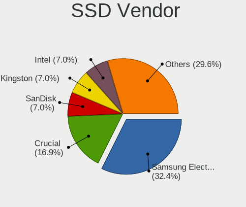

| Vendor              | Computers | Drives | Percent |
|---------------------|-----------|--------|---------|
| Samsung Electronics | 20        | 24     | 37.74%  |
| Crucial             | 7         | 7      | 13.21%  |
| Intel               | 6         | 6      | 11.32%  |
| Patriot             | 3         | 3      | 5.66%   |
| Apple               | 3         | 3      | 5.66%   |
| WDC                 | 2         | 2      | 3.77%   |
| SPCC                | 2         | 2      | 3.77%   |
| SanDisk             | 2         | 2      | 3.77%   |
| OWC                 | 1         | 1      | 1.89%   |
| OCZ                 | 1         | 1      | 1.89%   |
| Kingston            | 1         | 1      | 1.89%   |
| KingSpec            | 1         | 1      | 1.89%   |
| Gigabyte Technology | 1         | 1      | 1.89%   |
| CT480BX5            | 1         | 1      | 1.89%   |
| Corsair             | 1         | 1      | 1.89%   |
| A-DATA Technology   | 1         | 1      | 1.89%   |

Drive Kind
----------

HDD or SSD

| Kind    | Computers | Drives | Percent |
|---------|-----------|--------|---------|
| SSD     | 50        | 57     | 38.17%  |
| HDD     | 42        | 81     | 32.06%  |
| NVMe    | 31        | 43     | 23.66%  |
| MMC     | 5         | 6      | 3.82%   |
| Unknown | 3         | 3      | 2.29%   |

Drive Connector
---------------

SATA, SAS, NVMe, etc.

| Type | Computers | Drives | Percent |
|------|-----------|--------|---------|
| SATA | 75        | 134    | 63.56%  |
| NVMe | 31        | 43     | 26.27%  |
| SAS  | 7         | 7      | 5.93%   |
| MMC  | 5         | 6      | 4.24%   |

Drive Size
----------

Size of hard drive

| Size in TB | Computers | Drives | Percent |
|------------|-----------|--------|---------|
| 0.01-0.5   | 62        | 84     | 60.78%  |
| 0.51-1.0   | 27        | 35     | 26.47%  |
| 1.01-2.0   | 6         | 8      | 5.88%   |
| 4.01-10.0  | 3         | 4      | 2.94%   |
| 3.01-4.0   | 2         | 4      | 1.96%   |
| 2.01-3.0   | 1         | 1      | 0.98%   |
| 10.01-20.0 | 1         | 2      | 0.98%   |

Space Total
-----------

Amount of disk space available on the file system

| Size in GB     | Computers | Percent |
|----------------|-----------|---------|
| 251-500        | 21        | 21.43%  |
| 101-250        | 20        | 20.41%  |
| 501-1000       | 11        | 11.22%  |
| 51-100         | 11        | 11.22%  |
| More than 3000 | 9         | 9.18%   |
| 1-20           | 9         | 9.18%   |
| 1001-2000      | 7         | 7.14%   |
| 21-50          | 6         | 6.12%   |
| 2001-3000      | 2         | 2.04%   |
| Unknown        | 2         | 2.04%   |

Space Used
----------

Amount of used disk space

| Used GB        | Computers | Percent |
|----------------|-----------|---------|
| 1-20           | 43        | 43.88%  |
| 21-50          | 20        | 20.41%  |
| 51-100         | 9         | 9.18%   |
| 101-250        | 8         | 8.16%   |
| More than 3000 | 5         | 5.1%    |
| 251-500        | 5         | 5.1%    |
| 501-1000       | 5         | 5.1%    |
| Unknown        | 2         | 2.04%   |
| 1001-2000      | 1         | 1.02%   |

Malfunc. Drives
---------------

Drive models with a malfunction

| Model                             | Computers | Drives | Percent |
|-----------------------------------|-----------|--------|---------|
| WDC WDS500G1X0E-00AFY0 500GB      | 1         | 1      | 5.26%   |
| WDC WD3200BPVT-22ZEST0 320GB      | 1         | 1      | 5.26%   |
| WDC WD20EFRX-68EUZN0 2TB          | 1         | 1      | 5.26%   |
| WDC WD10EADS-11M2B1 1TB           | 1         | 1      | 5.26%   |
| WDC WD1003FZEX-00K3CA0 1TB        | 1         | 1      | 5.26%   |
| WDC WD1003FBYX-01Y7B1 752GB       | 1         | 1      | 5.26%   |
| Toshiba MK1665GSX 160GB           | 1         | 1      | 5.26%   |
| SPCC 2.5" SSD 512GB               | 1         | 1      | 5.26%   |
| Seagate ST9250315AS 250GB         | 1         | 1      | 5.26%   |
| Seagate ST3500418AS 500GB         | 1         | 1      | 5.26%   |
| Seagate ST3320418AS 320GB         | 1         | 1      | 5.26%   |
| Seagate ST2000DM001-1ER164 2TB    | 1         | 1      | 5.26%   |
| Samsung Electronics SSD 980 1TB   | 1         | 1      | 5.26%   |
| Samsung Electronics HD502HI 500GB | 1         | 1      | 5.26%   |
| Samsung Electronics HD501LJ 500GB | 1         | 2      | 5.26%   |
| Samsung Electronics HD103UJ 1TB   | 1         | 2      | 5.26%   |
| Intel SSDSC2CT120A3 120GB         | 1         | 1      | 5.26%   |
| Intel SSDSA2M080G2LE 80GB         | 1         | 1      | 5.26%   |
| Hitachi HTS543232A7A384 320GB     | 1         | 1      | 5.26%   |

Malfunc. Drive Vendor
---------------------

Vendors of faulty drives

| Vendor              | Computers | Drives | Percent |
|---------------------|-----------|--------|---------|
| Seagate             | 4         | 4      | 25%     |
| Samsung Electronics | 4         | 6      | 25%     |
| WDC                 | 3         | 6      | 18.75%  |
| Intel               | 2         | 2      | 12.5%   |
| Toshiba             | 1         | 1      | 6.25%   |
| SPCC                | 1         | 1      | 6.25%   |
| Hitachi             | 1         | 1      | 6.25%   |

Malfunc. HDD Vendor
-------------------

Vendors of faulty HDD drives

| Vendor              | Computers | Drives | Percent |
|---------------------|-----------|--------|---------|
| Seagate             | 4         | 4      | 33.33%  |
| WDC                 | 3         | 5      | 25%     |
| Samsung Electronics | 3         | 5      | 25%     |
| Toshiba             | 1         | 1      | 8.33%   |
| Hitachi             | 1         | 1      | 8.33%   |

Malfunc. Drive Kind
-------------------

Kinds of faulty drives

| Kind | Computers | Drives | Percent |
|------|-----------|--------|---------|
| HDD  | 11        | 16     | 68.75%  |
| SSD  | 3         | 3      | 18.75%  |
| NVMe | 2         | 2      | 12.5%   |

Failed Drives
-------------

Failed drive models

Zero info for selected period =(

Failed Drive Vendor
-------------------

Failed drive vendors

Zero info for selected period =(

Drive Status
------------

Number of failed and malfunc. drives

| Status   | Computers | Drives | Percent |
|----------|-----------|--------|---------|
| Detected | 54        | 91     | 49.09%  |
| Works    | 42        | 78     | 38.18%  |
| Malfunc  | 14        | 21     | 12.73%  |

Storage controller
------------------

Storage Vendor
--------------

Storage controller vendors

| Vendor                       | Computers | Percent |
|------------------------------|-----------|---------|
| Intel                        | 63        | 50%     |
| AMD                          | 21        | 16.67%  |
| Samsung Electronics          | 15        | 11.9%   |
| Sandisk                      | 8         | 6.35%   |
| Micron/Crucial Technology    | 3         | 2.38%   |
| SK hynix                     | 2         | 1.59%   |
| Phison Electronics           | 2         | 1.59%   |
| Marvell Technology Group     | 2         | 1.59%   |
| Kingston Technology Company  | 2         | 1.59%   |
| ASMedia Technology           | 2         | 1.59%   |
| Toshiba America Info Systems | 1         | 0.79%   |
| Seagate Technology           | 1         | 0.79%   |
| Micron Technology            | 1         | 0.79%   |
| JMicron Technology           | 1         | 0.79%   |
| Apple                        | 1         | 0.79%   |
| ADATA Technology             | 1         | 0.79%   |

Storage Model
-------------

Storage controller models

| Model                                                                            | Computers | Percent |
|----------------------------------------------------------------------------------|-----------|---------|
| AMD FCH SATA Controller [AHCI mode]                                              | 12        | 8.33%   |
| Samsung NVMe SSD Controller SM981/PM981/PM983                                    | 8         | 5.56%   |
| Intel 7 Series Chipset Family 6-port SATA Controller [AHCI mode]                 | 7         | 4.86%   |
| AMD SB7x0/SB8x0/SB9x0 SATA Controller [AHCI mode]                                | 7         | 4.86%   |
| AMD SB7x0/SB8x0/SB9x0 IDE Controller                                             | 5         | 3.47%   |
| Intel Volume Management Device NVMe RAID Controller                              | 4         | 2.78%   |
| Intel SATA Controller [RAID mode]                                                | 4         | 2.78%   |
| Intel 7 Series/C210 Series Chipset Family 6-port SATA Controller [AHCI mode]     | 4         | 2.78%   |
| Intel 5 Series/3400 Series Chipset 4 port SATA AHCI Controller                   | 4         | 2.78%   |
| Samsung NVMe SSD Controller SM961/PM961/SM963                                    | 3         | 2.08%   |
| Samsung NVMe SSD Controller 980                                                  | 3         | 2.08%   |
| Intel Q170/Q150/B150/H170/H110/Z170/CM236 Chipset SATA Controller [AHCI Mode]    | 3         | 2.08%   |
| Intel 8 Series SATA Controller 1 [AHCI mode]                                     | 3         | 2.08%   |
| SanDisk WD Blue SN550 NVMe SSD                                                   | 2         | 1.39%   |
| SanDisk WD Black 2018/SN750 / PC SN720 NVMe SSD                                  | 2         | 1.39%   |
| SanDisk Non-Volatile memory controller                                           | 2         | 1.39%   |
| Phison PS5013 E13 NVMe Controller                                                | 2         | 1.39%   |
| Micron/Crucial NVMe Controller                                                   | 2         | 1.39%   |
| Intel Sunrise Point-LP SATA Controller [AHCI mode]                               | 2         | 1.39%   |
| Intel NM10/ICH7 Family SATA Controller [AHCI mode]                               | 2         | 1.39%   |
| Intel Cannon Lake PCH SATA AHCI Controller                                       | 2         | 1.39%   |
| Intel Cannon Lake Mobile PCH SATA AHCI Controller                                | 2         | 1.39%   |
| Intel Atom Processor E3800 Series SATA AHCI Controller                           | 2         | 1.39%   |
| Intel 9 Series Chipset Family SATA Controller [AHCI Mode]                        | 2         | 1.39%   |
| Intel 8 Series/C220 Series Chipset Family 6-port SATA Controller 1 [AHCI mode]   | 2         | 1.39%   |
| Intel 7 Series/C210 Series Chipset Family 4-port SATA Controller [IDE mode]      | 2         | 1.39%   |
| Intel 7 Series/C210 Series Chipset Family 2-port SATA Controller [IDE mode]      | 2         | 1.39%   |
| Intel 6 Series/C200 Series Chipset Family 6 port Desktop SATA AHCI Controller    | 2         | 1.39%   |
| Intel 400 Series Chipset Family SATA AHCI Controller                             | 2         | 1.39%   |
| Intel 4 Series Chipset PT IDER Controller                                        | 2         | 1.39%   |
| ASMedia ASM1062 Serial ATA Controller                                            | 2         | 1.39%   |
| AMD 400 Series Chipset SATA Controller                                           | 2         | 1.39%   |
| Toshiba America Info Systems BG3 NVMe SSD Controller                             | 1         | 0.69%   |
| SK hynix Non-Volatile memory controller                                          | 1         | 0.69%   |
| SK hynix Gold P31 SSD                                                            | 1         | 0.69%   |
| Seagate FireCuda 520 SSD                                                         | 1         | 0.69%   |
| SanDisk WD PC SN810 / Black SN850 NVMe SSD                                       | 1         | 0.69%   |
| SanDisk WD Black SN750 / PC SN730 NVMe SSD                                       | 1         | 0.69%   |
| Samsung NVMe SSD Controller SM951/PM951                                          | 1         | 0.69%   |
| Samsung NVMe SSD Controller PM9A1/PM9A3/980PRO                                   | 1         | 0.69%   |
| Samsung Electronics SATA controller                                              | 1         | 0.69%   |
| Micron/Crucial Non-Volatile memory controller                                    | 1         | 0.69%   |
| Micron Non-Volatile memory controller                                            | 1         | 0.69%   |
| Marvell Group 88SS9183 PCIe SSD Controller                                       | 1         | 0.69%   |
| Marvell Group 88SE9230 PCIe 2.0 x2 4-port SATA 6 Gb/s RAID Controller            | 1         | 0.69%   |
| Kingston Company SNVS2000G [NV1 NVMe PCIe SSD 2TB]                               | 1         | 0.69%   |
| Kingston Company A2000 NVMe SSD                                                  | 1         | 0.69%   |
| JMicron JMB363 SATA/IDE Controller                                               | 1         | 0.69%   |
| Intel Wildcat Point-LP SATA Controller [AHCI Mode]                               | 1         | 0.69%   |
| Intel Tiger Lake-LP SATA Controller                                              | 1         | 0.69%   |
| Intel SSD 600P Series                                                            | 1         | 0.69%   |
| Intel Comet Lake SATA AHCI Controller                                            | 1         | 0.69%   |
| Intel Celeron/Pentium Silver Processor SATA Controller                           | 1         | 0.69%   |
| Intel Cannon Point-LP SATA Controller [AHCI Mode]                                | 1         | 0.69%   |
| Intel C610/X99 series chipset sSATA Controller [AHCI mode]                       | 1         | 0.69%   |
| Intel C610/X99 series chipset 6-Port SATA Controller [AHCI mode]                 | 1         | 0.69%   |
| Intel Atom/Celeron/Pentium Processor x5-E8000/J3xxx/N3xxx Series SATA Controller | 1         | 0.69%   |
| Intel Alder Lake-S PCH SATA Controller [AHCI Mode]                               | 1         | 0.69%   |
| Intel 82801JI (ICH10 Family) SATA AHCI Controller                                | 1         | 0.69%   |
| Intel 82801JD/DO (ICH10 Family) SATA AHCI Controller                             | 1         | 0.69%   |

Storage Kind
------------

Kind of storage controller (IDE, SATA, NVMe, SAS, ...)

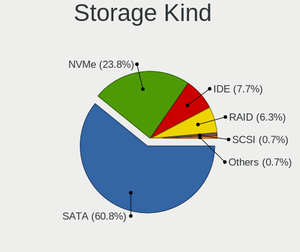

| Kind | Computers | Percent |
|------|-----------|---------|
| SATA | 74        | 58.27%  |
| NVMe | 31        | 24.41%  |
| IDE  | 13        | 10.24%  |
| RAID | 9         | 7.09%   |

Processor
---------

CPU Vendor
----------

Processor vendors

| Vendor | Computers | Percent |
|--------|-----------|---------|
| Intel  | 73        | 74.49%  |
| AMD    | 22        | 22.45%  |
| ARM    | 3         | 3.06%   |

CPU Model
---------

Processor models

| Model                                   | Computers | Percent |
|-----------------------------------------|-----------|---------|
| Intel Core 2 Duo CPU E8400 @ 3.00GHz    | 3         | 3.06%   |
| ARM Processor                           | 3         | 3.06%   |
| Intel Core i7-9750H CPU @ 2.60GHz       | 2         | 2.04%   |
| Intel Core i7-3770K CPU @ 3.50GHz       | 2         | 2.04%   |
| Intel Core i7-3770 CPU @ 3.40GHz        | 2         | 2.04%   |
| Intel Core i5-6600 CPU @ 3.30GHz        | 2         | 2.04%   |
| Intel Core i5-3360M CPU @ 2.80GHz       | 2         | 2.04%   |
| Intel Core i5-3210M CPU @ 2.50GHz       | 2         | 2.04%   |
| Intel Celeron CPU J1900 @ 1.99GHz       | 2         | 2.04%   |
| AMD Ryzen 9 5900HX with Radeon Graphics | 2         | 2.04%   |
| AMD Ryzen 9 3900X 12-Core Processor     | 2         | 2.04%   |
| AMD Ryzen 7 3700X 8-Core Processor      | 2         | 2.04%   |
| AMD Ryzen 5 3600 6-Core Processor       | 2         | 2.04%   |
| AMD Phenom II X2 570 Processor          | 2         | 2.04%   |
| Intel Xeon CPU W3670 @ 3.20GHz          | 1         | 1.02%   |
| Intel Pentium CPU N3700 @ 1.60GHz       | 1         | 1.02%   |
| Intel Pentium CPU G3260T @ 2.90GHz      | 1         | 1.02%   |
| Intel Pentium CPU B960 @ 2.20GHz        | 1         | 1.02%   |
| Intel Genuine CPU T2400 @ 1.83GHz       | 1         | 1.02%   |
| Intel Genuine CPU @ 1.66GHz             | 1         | 1.02%   |
| Intel Core m5-6Y54 CPU @ 1.10GHz        | 1         | 1.02%   |
| Intel Core i7-8700 CPU @ 3.20GHz        | 1         | 1.02%   |
| Intel Core i7-8565U CPU @ 1.80GHz       | 1         | 1.02%   |
| Intel Core i7-6900K CPU @ 3.20GHz       | 1         | 1.02%   |
| Intel Core i7-6700 CPU @ 3.40GHz        | 1         | 1.02%   |
| Intel Core i7-6600U CPU @ 2.60GHz       | 1         | 1.02%   |
| Intel Core i7-4790K CPU @ 4.00GHz       | 1         | 1.02%   |
| Intel Core i7-4790 CPU @ 3.60GHz        | 1         | 1.02%   |
| Intel Core i7-4600U CPU @ 2.10GHz       | 1         | 1.02%   |
| Intel Core i7-3740QM CPU @ 2.70GHz      | 1         | 1.02%   |
| Intel Core i7-3632QM CPU @ 2.20GHz      | 1         | 1.02%   |
| Intel Core i7-3520M CPU @ 2.90GHz       | 1         | 1.02%   |
| Intel Core i7-2600 CPU @ 3.40GHz        | 1         | 1.02%   |
| Intel Core i7-10710U CPU @ 1.10GHz      | 1         | 1.02%   |
| Intel Core i7-10700 CPU @ 2.90GHz       | 1         | 1.02%   |
| Intel Core i5-9400T CPU @ 1.80GHz       | 1         | 1.02%   |
| Intel Core i5-8365U CPU @ 1.60GHz       | 1         | 1.02%   |
| Intel Core i5-8250U CPU @ 1.60GHz       | 1         | 1.02%   |
| Intel Core i5-7400 CPU @ 3.00GHz        | 1         | 1.02%   |
| Intel Core i5-7260U CPU @ 2.20GHz       | 1         | 1.02%   |
| Intel Core i5-6500 CPU @ 3.20GHz        | 1         | 1.02%   |
| Intel Core i5-6260U CPU @ 1.80GHz       | 1         | 1.02%   |
| Intel Core i5-5350U CPU @ 1.80GHz       | 1         | 1.02%   |
| Intel Core i5-5300U CPU @ 2.30GHz       | 1         | 1.02%   |
| Intel Core i5-4590T CPU @ 2.00GHz       | 1         | 1.02%   |
| Intel Core i5-4260U CPU @ 1.40GHz       | 1         | 1.02%   |
| Intel Core i5-4200U CPU @ 1.60GHz       | 1         | 1.02%   |
| Intel Core i5-3570K CPU @ 3.40GHz       | 1         | 1.02%   |
| Intel Core i5-3470 CPU @ 3.20GHz        | 1         | 1.02%   |
| Intel Core i5-3427U CPU @ 1.80GHz       | 1         | 1.02%   |
| Intel Core i5-2400S CPU @ 2.50GHz       | 1         | 1.02%   |
| Intel Core i5-10300H CPU @ 2.50GHz      | 1         | 1.02%   |
| Intel Core i5 CPU M 540 @ 2.53GHz       | 1         | 1.02%   |
| Intel Core i3-3220 CPU @ 3.30GHz        | 1         | 1.02%   |
| Intel Core i3 CPU U 380 @ 1.33GHz       | 1         | 1.02%   |
| Intel Core i3 CPU M 370 @ 2.40GHz       | 1         | 1.02%   |
| Intel Core 2 Duo CPU T6400 @ 2.00GHz    | 1         | 1.02%   |
| Intel Celeron N4500 @ 1.10GHz           | 1         | 1.02%   |
| Intel Celeron J4125 CPU @ 2.00GHz       | 1         | 1.02%   |
| Intel Celeron CPU U3600 @ 1.20GHz       | 1         | 1.02%   |

CPU Model Family
----------------

Processor model prefix

| Model            | Computers | Percent |
|------------------|-----------|---------|
| Intel Core i5    | 24        | 24.49%  |
| Intel Core i7    | 20        | 20.41%  |
| Other            | 12        | 12.24%  |
| Intel Celeron    | 6         | 6.12%   |
| AMD Ryzen 9      | 5         | 5.1%    |
| Intel Core 2 Duo | 4         | 4.08%   |
| AMD Ryzen 5      | 4         | 4.08%   |
| Intel Pentium    | 3         | 3.06%   |
| Intel Core i3    | 3         | 3.06%   |
| AMD Ryzen 7      | 3         | 3.06%   |
| AMD Phenom II X2 | 3         | 3.06%   |
| Intel Genuine    | 2         | 2.04%   |
| Intel Xeon       | 1         | 1.02%   |
| Intel Core m5    | 1         | 1.02%   |
| Intel Atom       | 1         | 1.02%   |
| AMD Phenom II X6 | 1         | 1.02%   |
| AMD Phenom II X4 | 1         | 1.02%   |
| AMD FX           | 1         | 1.02%   |
| AMD Athlon II    | 1         | 1.02%   |
| AMD A8           | 1         | 1.02%   |
| AMD A6           | 1         | 1.02%   |

CPU Cores
---------

Number of processor cores

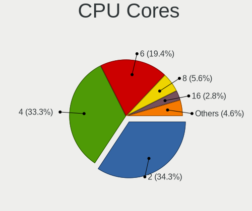

| Number | Computers | Percent |
|--------|-----------|---------|
| 2      | 37        | 37.76%  |
| 4      | 34        | 34.69%  |
| 6      | 11        | 11.22%  |
| 8      | 8         | 8.16%   |
| 12     | 3         | 3.06%   |
| 10     | 3         | 3.06%   |
| 16     | 1         | 1.02%   |
| 14     | 1         | 1.02%   |

CPU Sockets
-----------

Number of sockets

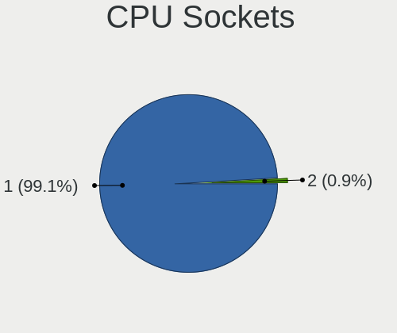

| Number | Computers | Percent |
|--------|-----------|---------|
| 1      | 98        | 100%    |

CPU Threads
-----------

Threads per core (Hyper-Threading)

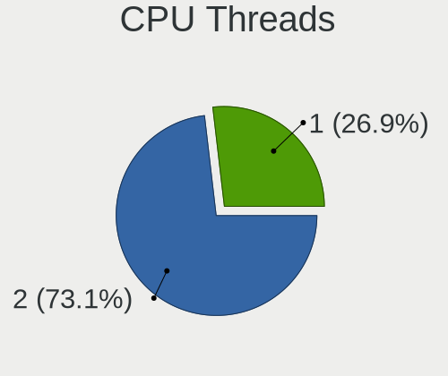

| Number | Computers | Percent |
|--------|-----------|---------|
| 2      | 61        | 62.24%  |
| 1      | 37        | 37.76%  |

CPU Op-Modes
------------

CPU Operation Modes (32-bit, 64-bit)

| Op mode        | Computers | Percent |
|----------------|-----------|---------|
| 32-bit, 64-bit | 95        | 96.94%  |
| 64-bit         | 1         | 1.02%   |
| 32-bit         | 1         | 1.02%   |
| Unknown        | 1         | 1.02%   |

CPU Microcode
-------------

Microcode number

| Number     | Computers | Percent |
|------------|-----------|---------|
| Unknown    | 22        | 22.45%  |
| 0x306a9    | 9         | 9.18%   |
| 0x406e3    | 3         | 3.06%   |
| 0x40651    | 3         | 3.06%   |
| 0x306c3    | 3         | 3.06%   |
| 0x20655    | 3         | 3.06%   |
| 0x1067a    | 3         | 3.06%   |
| 0x08701021 | 3         | 3.06%   |
| 0x906ea    | 2         | 2.04%   |
| 0x906a4    | 2         | 2.04%   |
| 0x906a3    | 2         | 2.04%   |
| 0x806c1    | 2         | 2.04%   |
| 0x506e3    | 2         | 2.04%   |
| 0x30678    | 2         | 2.04%   |
| 0x206a7    | 2         | 2.04%   |
| 0x0a50000c | 2         | 2.04%   |
| 0x010000c8 | 2         | 2.04%   |
| 0xa0660    | 1         | 1.02%   |
| 0xa0655    | 1         | 1.02%   |
| 0x906e9    | 1         | 1.02%   |
| 0x906c0    | 1         | 1.02%   |
| 0x90672    | 1         | 1.02%   |
| 0x806ec    | 1         | 1.02%   |
| 0x806ea    | 1         | 1.02%   |
| 0x806e9    | 1         | 1.02%   |
| 0x806d1    | 1         | 1.02%   |
| 0x706a8    | 1         | 1.02%   |
| 0x6e8      | 1         | 1.02%   |
| 0x406f1    | 1         | 1.02%   |
| 0x406c3    | 1         | 1.02%   |
| 0x306d4    | 1         | 1.02%   |
| 0x30661    | 1         | 1.02%   |
| 0x206c2    | 1         | 1.02%   |
| 0x20652    | 1         | 1.02%   |
| 0x106ca    | 1         | 1.02%   |
| 0x0a201009 | 1         | 1.02%   |
| 0x08701013 | 1         | 1.02%   |
| 0x08701012 | 1         | 1.02%   |
| 0x08608103 | 1         | 1.02%   |
| 0x08001137 | 1         | 1.02%   |
| 0x07030105 | 1         | 1.02%   |
| 0x06006704 | 1         | 1.02%   |
| 0x06000817 | 1         | 1.02%   |
| 0x03000027 | 1         | 1.02%   |
| 0x010000c6 | 1         | 1.02%   |
| 0x010000bf | 1         | 1.02%   |
| 0x010000b6 | 1         | 1.02%   |
| 0x00000000 | 1         | 1.02%   |

CPU Microarch
-------------

Microarchitecture

| Name             | Computers | Percent |
|------------------|-----------|---------|
| IvyBridge        | 15        | 15.31%  |
| KabyLake         | 9         | 9.18%   |
| Haswell          | 8         | 8.16%   |
| Skylake          | 7         | 7.14%   |
| Zen 2            | 6         | 6.12%   |
| K10              | 6         | 6.12%   |
| Westmere         | 5         | 5.1%    |
| Unknown          | 5         | 5.1%    |
| Zen 3            | 4         | 4.08%   |
| Penryn           | 4         | 4.08%   |
| Alderlake Hybrid | 4         | 4.08%   |
| Silvermont       | 3         | 3.06%   |
| SandyBridge      | 3         | 3.06%   |
| CometLake        | 3         | 3.06%   |
| Broadwell        | 3         | 3.06%   |
| TigerLake        | 2         | 2.04%   |
| Bonnell          | 2         | 2.04%   |
| Zen              | 1         | 1.02%   |
| Tremont          | 1         | 1.02%   |
| Puma             | 1         | 1.02%   |
| Piledriver       | 1         | 1.02%   |
| P6               | 1         | 1.02%   |
| K10 Llano        | 1         | 1.02%   |
| Icelake          | 1         | 1.02%   |
| Goldmont plus    | 1         | 1.02%   |
| Excavator        | 1         | 1.02%   |

Graphics
--------

GPU Vendor
----------

Vendors of graphics cards

| Vendor | Computers | Percent |
|--------|-----------|---------|
| Intel  | 53        | 49.53%  |
| Nvidia | 33        | 30.84%  |
| AMD    | 21        | 19.63%  |

GPU Model
---------

Graphics card models

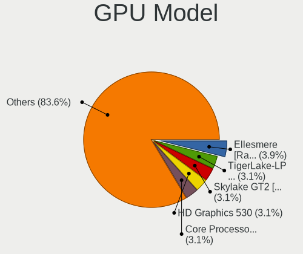

| Model                                                                       | Computers | Percent |
|-----------------------------------------------------------------------------|-----------|---------|
| Intel 3rd Gen Core processor Graphics Controller                            | 8         | 7.27%   |
| Intel Haswell-ULT Integrated Graphics Controller                            | 4         | 3.64%   |
| Intel Core Processor Integrated Graphics Controller                         | 4         | 3.64%   |
| Nvidia GK208B [GeForce GT 710]                                              | 3         | 2.73%   |
| Intel Xeon E3-1200 v3/4th Gen Core Processor Integrated Graphics Controller | 3         | 2.73%   |
| Nvidia TU117GLM [Quadro T1000 Mobile]                                       | 2         | 1.82%   |
| Nvidia GM204 [GeForce GTX 970]                                              | 2         | 1.82%   |
| Nvidia GM107 [GeForce GTX 750 Ti]                                           | 2         | 1.82%   |
| Intel WhiskeyLake-U GT2 [UHD Graphics 620]                                  | 2         | 1.82%   |
| Intel TigerLake-LP GT2 [Iris Xe Graphics]                                   | 2         | 1.82%   |
| Intel CoffeeLake-H GT2 [UHD Graphics 630]                                   | 2         | 1.82%   |
| Intel Atom Processor Z36xxx/Z37xxx Series Graphics & Display                | 2         | 1.82%   |
| Intel Alder Lake-P Integrated Graphics Controller                           | 2         | 1.82%   |
| Intel 2nd Generation Core Processor Family Integrated Graphics Controller   | 2         | 1.82%   |
| AMD RS880 [Radeon HD 4250]                                                  | 2         | 1.82%   |
| AMD Ellesmere [Radeon RX 470/480/570/570X/580/580X/590]                     | 2         | 1.82%   |
| AMD Cezanne                                                                 | 2         | 1.82%   |
| Nvidia TU117M [GeForce GTX 1650 Ti Mobile]                                  | 1         | 0.91%   |
| Nvidia TU117M [GeForce GTX 1650 Mobile / Max-Q]                             | 1         | 0.91%   |
| Nvidia TU117 [GeForce GTX 1650]                                             | 1         | 0.91%   |
| Nvidia TU116 [GeForce GTX 1660 SUPER]                                       | 1         | 0.91%   |
| Nvidia TU106 [GeForce RTX 2070]                                             | 1         | 0.91%   |
| Nvidia GT218 [GeForce 210]                                                  | 1         | 0.91%   |
| Nvidia GT200 [GeForce GTX 260]                                              | 1         | 0.91%   |
| Nvidia GP107GL [Quadro P620]                                                | 1         | 0.91%   |
| Nvidia GP107 [GeForce GTX 1050 Ti]                                          | 1         | 0.91%   |
| Nvidia GM204 [GeForce GTX 980]                                              | 1         | 0.91%   |
| Nvidia GM108M [GeForce MX130]                                               | 1         | 0.91%   |
| Nvidia GK208B [GeForce GT 730]                                              | 1         | 0.91%   |
| Nvidia GK104 [GeForce GTX 660 Ti]                                           | 1         | 0.91%   |
| Nvidia GF119 [GeForce GT 520]                                               | 1         | 0.91%   |
| Nvidia GF108M [GeForce GT 420M]                                             | 1         | 0.91%   |
| Nvidia GF108 [GeForce GT 730]                                               | 1         | 0.91%   |
| Nvidia GA106M [GeForce RTX 3060 Mobile / Max-Q]                             | 1         | 0.91%   |
| Nvidia GA106M [GeForce RTX 3050 Ti Mobile / Max-Q]                          | 1         | 0.91%   |
| Nvidia GA106 [GeForce RTX 3060 Lite Hash Rate]                              | 1         | 0.91%   |
| Nvidia GA104M [GeForce RTX 3080 Mobile / Max-Q 8GB/16GB]                    | 1         | 0.91%   |
| Nvidia GA104 [GeForce RTX 3060 Ti Lite Hash Rate]                           | 1         | 0.91%   |
| Nvidia GA102 [GeForce RTX 3080 Lite Hash Rate]                              | 1         | 0.91%   |
| Nvidia G98 [GeForce 8400 GS Rev. 2]                                         | 1         | 0.91%   |
| Nvidia G84GL [Quadro FX 1700]                                               | 1         | 0.91%   |
| Nvidia G72 [GeForce 7300 GS]                                                | 1         | 0.91%   |
| Intel Xeon E3-1200 v2/3rd Gen Core processor Graphics Controller            | 1         | 0.91%   |
| Intel VGA compatible controller                                             | 1         | 0.91%   |
| Intel UHD Graphics 620                                                      | 1         | 0.91%   |
| Intel TigerLake-H GT1 [UHD Graphics]                                        | 1         | 0.91%   |
| Intel Skylake GT2 [HD Graphics 520]                                         | 1         | 0.91%   |
| Intel Mobile 4 Series Chipset Integrated Graphics Controller                | 1         | 0.91%   |
| Intel JasperLake [UHD Graphics]                                             | 1         | 0.91%   |
| Intel IvyBridge GT2 [HD Graphics 4000]                                      | 1         | 0.91%   |
| Intel Iris Plus Graphics 640                                                | 1         | 0.91%   |
| Intel Iris Graphics 540                                                     | 1         | 0.91%   |
| Intel HD Graphics 6000                                                      | 1         | 0.91%   |
| Intel HD Graphics 5500                                                      | 1         | 0.91%   |
| Intel HD Graphics 530                                                       | 1         | 0.91%   |
| Intel HD Graphics 515                                                       | 1         | 0.91%   |
| Intel GeminiLake [UHD Graphics 600]                                         | 1         | 0.91%   |
| Intel CometLake-H GT2 [UHD Graphics]                                        | 1         | 0.91%   |
| Intel Comet Lake UHD Graphics                                               | 1         | 0.91%   |
| Intel CoffeeLake-S GT2 [UHD Graphics 630]                                   | 1         | 0.91%   |

GPU Combo
---------

Combinations of graphics cards

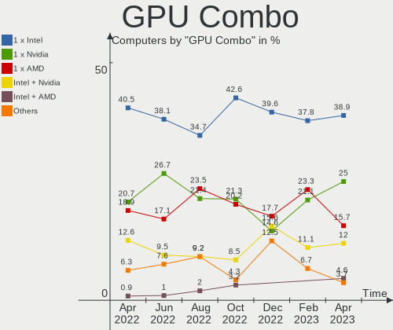

| Name           | Computers | Percent |
|----------------|-----------|---------|
| 1 x Intel      | 42        | 42.86%  |
| 1 x Nvidia     | 23        | 23.47%  |
| 1 x AMD        | 16        | 16.33%  |
| Intel + Nvidia | 9         | 9.18%   |
| Other          | 3         | 3.06%   |
| 2 x AMD        | 2         | 2.04%   |
| Intel + AMD    | 2         | 2.04%   |
| AMD + Nvidia   | 1         | 1.02%   |

GPU Driver
----------

Free vs proprietary

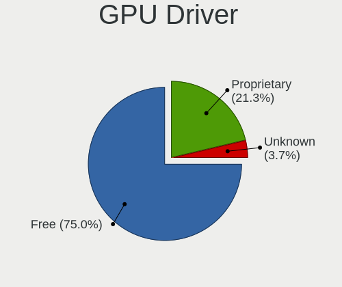

| Driver      | Computers | Percent |
|-------------|-----------|---------|
| Free        | 68        | 69.39%  |
| Proprietary | 18        | 18.37%  |
| Unknown     | 12        | 12.24%  |

GPU Memory
----------

Total video memory

| Size in GB | Computers | Percent |
|------------|-----------|---------|
| Unknown    | 60        | 61.22%  |
| 3.01-4.0   | 9         | 9.18%   |
| 0.01-0.5   | 9         | 9.18%   |
| 1.01-2.0   | 8         | 8.16%   |
| 0.51-1.0   | 5         | 5.1%    |
| 7.01-8.0   | 3         | 3.06%   |
| 8.01-16.0  | 2         | 2.04%   |
| 5.01-6.0   | 1         | 1.02%   |
| 2.01-3.0   | 1         | 1.02%   |

Monitor
-------

Monitor Vendor
--------------

Monitor vendors

| Vendor                  | Computers | Percent |
|-------------------------|-----------|---------|
| Samsung Electronics     | 15        | 14.85%  |
| LG Display              | 9         | 8.91%   |
| Dell                    | 8         | 7.92%   |
| Chimei Innolux          | 8         | 7.92%   |
| AU Optronics            | 8         | 7.92%   |
| Goldstar                | 7         | 6.93%   |
| Lenovo                  | 6         | 5.94%   |
| Apple                   | 6         | 5.94%   |
| BOE                     | 5         | 4.95%   |
| Acer                    | 4         | 3.96%   |
| Philips                 | 3         | 2.97%   |
| BenQ                    | 3         | 2.97%   |
| ViewSonic               | 2         | 1.98%   |
| Panasonic               | 2         | 1.98%   |
| Hewlett-Packard         | 2         | 1.98%   |
| Chi Mei Optoelectronics | 2         | 1.98%   |
| AOC                     | 2         | 1.98%   |
| Unknown                 | 1         | 0.99%   |
| Sharp                   | 1         | 0.99%   |
| NEC Computers           | 1         | 0.99%   |
| DPL                     | 1         | 0.99%   |
| Denver                  | 1         | 0.99%   |
| CSO                     | 1         | 0.99%   |
| ASUSTek Computer        | 1         | 0.99%   |
| Ancor Communications    | 1         | 0.99%   |
| Unknown                 | 1         | 0.99%   |

Monitor Model
-------------

Monitor models

| Model                                                                    | Computers | Percent |
|--------------------------------------------------------------------------|-----------|---------|
| Philips 190S PHL082F 1280x1024 380x300mm 19.1-inch                       | 2         | 1.85%   |
| Lenovo LEN L1711pC LEN13B7 1280x1024 360x300mm 18.4-inch                 | 2         | 1.85%   |
| Goldstar MP59HT GSM5B44 1920x1080 480x270mm 21.7-inch                    | 2         | 1.85%   |
| Dell P2319H DELD0D7 1920x1080 509x286mm 23.0-inch                        | 2         | 1.85%   |
| Chimei Innolux LCD Monitor CMN1514 1920x1080 344x193mm 15.5-inch         | 2         | 1.85%   |
| Chi Mei Optoelectronics LCD Monitor CMO1100 1366x768 256x144mm 11.6-inch | 2         | 1.85%   |
| ViewSonic VX3276-QHD VSCE635 2560x1440 698x393mm 31.5-inch               | 1         | 0.93%   |
| ViewSonic LCD Monitor VA2226w-3 1680x1050                                | 1         | 0.93%   |
| Unknown LCD Monitor XMI Mi Monitor 3440x1440                             | 1         | 0.93%   |
| Sharp LCD Monitor SHP1449 1920x1080 294x165mm 13.3-inch                  | 1         | 0.93%   |
| Samsung Electronics SyncMaster SAM04DE 1920x1080 477x268mm 21.5-inch     | 1         | 0.93%   |
| Samsung Electronics SyncMaster SAM01E1 1280x1024 376x301mm 19.0-inch     | 1         | 0.93%   |
| Samsung Electronics S27A950D SAM079F 1920x1080 598x336mm 27.0-inch       | 1         | 0.93%   |
| Samsung Electronics S24D300 SAM0B43 1920x1080 531x299mm 24.0-inch        | 1         | 0.93%   |
| Samsung Electronics LU28R55 SAM1018 3840x2160 632x360mm 28.6-inch        | 1         | 0.93%   |
| Samsung Electronics LU28R55 SAM1016 3840x2160 632x360mm 28.6-inch        | 1         | 0.93%   |
| Samsung Electronics LCD Monitor SEC5441 1366x768 344x194mm 15.5-inch     | 1         | 0.93%   |
| Samsung Electronics LCD Monitor SEC3250 1680x1050 331x207mm 15.4-inch    | 1         | 0.93%   |
| Samsung Electronics LCD Monitor SDC415A 3200x1800 293x165mm 13.2-inch    | 1         | 0.93%   |
| Samsung Electronics LCD Monitor SAM7002 3840x2160 1872x1053mm 84.6-inch  | 1         | 0.93%   |
| Samsung Electronics LCD Monitor SAM0A7D 1920x1080 890x500mm 40.2-inch    | 1         | 0.93%   |
| Samsung Electronics LCD Monitor SAM0A7A 1920x1080 890x500mm 40.2-inch    | 1         | 0.93%   |
| Samsung Electronics LCD Monitor SAM0509 1920x1080                        | 1         | 0.93%   |
| Samsung Electronics LC32T55 SAM7024 1920x1080 699x393mm 31.6-inch        | 1         | 0.93%   |
| Samsung Electronics C27F591 SAM0D37 1920x1080 598x336mm 27.0-inch        | 1         | 0.93%   |
| Samsung Electronics C27F591 SAM0D36 1920x1080 600x340mm 27.2-inch        | 1         | 0.93%   |
| Samsung Electronics C27F390 SAM0D32 1920x1080 598x336mm 27.0-inch        | 1         | 0.93%   |
| Philips PHL 499P9 PHL092A 3840x1080 1193x336mm 48.8-inch                 | 1         | 0.93%   |
| Panasonic TV MEIA296 1280x1024 698x392mm 31.5-inch                       | 1         | 0.93%   |
| Panasonic TV MEIA0CC 1920x1080 698x392mm 31.5-inch                       | 1         | 0.93%   |
| NEC Computers LCD2690WUXi2 NEC675D 1920x1200 550x344mm 25.5-inch         | 1         | 0.93%   |
| LG Display LCD Monitor LGD7001 1366x768 340x190mm 15.3-inch              | 1         | 0.93%   |
| LG Display LCD Monitor LGD05F3 1920x1080 309x174mm 14.0-inch             | 1         | 0.93%   |
| LG Display LCD Monitor LGD0521 1920x1080 309x174mm 14.0-inch             | 1         | 0.93%   |
| LG Display LCD Monitor LGD04E8 1920x1080 382x215mm 17.3-inch             | 1         | 0.93%   |
| LG Display LCD Monitor LGD0382 1600x900 309x174mm 14.0-inch              | 1         | 0.93%   |
| LG Display LCD Monitor LGD034D 1366x768 344x194mm 15.5-inch              | 1         | 0.93%   |
| LG Display LCD Monitor LGD032C 1920x1080 344x194mm 15.5-inch             | 1         | 0.93%   |
| LG Display LCD Monitor LGD0306 1600x900 310x174mm 14.0-inch              | 1         | 0.93%   |
| LG Display LCD Monitor LGD02DC 1366x768 344x194mm 15.5-inch              | 1         | 0.93%   |
| Lenovo Pro2840m LEN60B4 3840x2160 621x341mm 27.9-inch                    | 1         | 0.93%   |
| Lenovo LEN-A540-B LEN0540 1920x1080 527x296mm 23.8-inch                  | 1         | 0.93%   |
| Lenovo LEN T24i-10 LEN61CE 1920x1080 527x296mm 23.8-inch                 | 1         | 0.93%   |
| Lenovo LEN G34w-10 LEN66A1 3440x1440 797x334mm 34.0-inch                 | 1         | 0.93%   |
| Hewlett-Packard ZR30w HWP286E 2560x1600 641x400mm 29.7-inch              | 1         | 0.93%   |
| Hewlett-Packard 23er HWP331E 1920x1080 509x286mm 23.0-inch               | 1         | 0.93%   |
| Goldstar HDR 4K GSM774F 3840x2160 697x392mm 31.5-inch                    | 1         | 0.93%   |
| Goldstar FULL HD GSM5B55 1920x1080 480x270mm 21.7-inch                   | 1         | 0.93%   |
| Goldstar FULL HD GSM5B54 1920x1080 480x270mm 21.7-inch                   | 1         | 0.93%   |
| Goldstar 32inch FHD GSM76F5 1920x1080 698x392mm 31.5-inch                | 1         | 0.93%   |
| Goldstar 23MB35 GSM5A3E 1920x1080 510x290mm 23.1-inch                    | 1         | 0.93%   |
| DPL DVI DPL2700 2560x1440 480x270mm 21.7-inch                            | 1         | 0.93%   |
| Denver X300 LHCFFFF 2560x1080 690x291mm 29.5-inch                        | 1         | 0.93%   |
| Dell U2419HC DEL4168 1920x1080 527x296mm 23.8-inch                       | 1         | 0.93%   |
| Dell S3222HS DELD11B 1920x1080 698x393mm 31.5-inch                       | 1         | 0.93%   |
| Dell S2722QC DELA1CE 3840x2160 597x336mm 27.0-inch                       | 1         | 0.93%   |
| Dell P2422H DELA1C4 1920x1080 527x296mm 23.8-inch                        | 1         | 0.93%   |
| Dell P1917S DELD091 1280x1024 380x300mm 19.1-inch                        | 1         | 0.93%   |
| Dell E2219HN DEL2009 1920x1080 476x268mm 21.5-inch                       | 1         | 0.93%   |
| Dell E2216H DELF069 1920x1080 476x268mm 21.5-inch                        | 1         | 0.93%   |

Monitor Resolution
------------------

Monitor screen resolution

| Resolution         | Computers | Percent |
|--------------------|-----------|---------|
| 1920x1080 (FHD)    | 37        | 38.54%  |
| 1366x768 (WXGA)    | 14        | 14.58%  |
| 3840x2160 (4K)     | 10        | 10.42%  |
| 1280x1024 (SXGA)   | 8         | 8.33%   |
| 2560x1440 (QHD)    | 4         | 4.17%   |
| 3440x1440          | 3         | 3.13%   |
| 1680x1050 (WSXGA+) | 3         | 3.13%   |
| 1600x900 (HD+)     | 3         | 3.13%   |
| 2560x1600          | 2         | 2.08%   |
| 1920x1200 (WUXGA)  | 2         | 2.08%   |
| 1440x900 (WXGA+)   | 2         | 2.08%   |
| 1280x800 (WXGA)    | 2         | 2.08%   |
| 3840x2400          | 1         | 1.04%   |
| 3840x1080          | 1         | 1.04%   |
| 3072x1920          | 1         | 1.04%   |
| 2560x1080          | 1         | 1.04%   |
| 2304x1440          | 1         | 1.04%   |
| 2160x1440          | 1         | 1.04%   |

Monitor Diagonal
----------------

Diagonal size in inches

| Inches  | Computers | Percent |
|---------|-----------|---------|
| 15      | 16        | 15.53%  |
| 14      | 9         | 8.74%   |
| 23      | 8         | 7.77%   |
| 13      | 8         | 7.77%   |
| 27      | 7         | 6.8%    |
| 21      | 7         | 6.8%    |
| 19      | 7         | 6.8%    |
| 31      | 6         | 5.83%   |
| 11      | 5         | 4.85%   |
| 24      | 4         | 3.88%   |
| Unknown | 4         | 3.88%   |
| 48      | 3         | 2.91%   |
| 84      | 2         | 1.94%   |
| 29      | 2         | 1.94%   |
| 26      | 2         | 1.94%   |
| 18      | 2         | 1.94%   |
| 17      | 2         | 1.94%   |
| 12      | 2         | 1.94%   |
| 35      | 1         | 0.97%   |
| 34      | 1         | 0.97%   |
| 32      | 1         | 0.97%   |
| 28      | 1         | 0.97%   |
| 25      | 1         | 0.97%   |
| 22      | 1         | 0.97%   |
| 16      | 1         | 0.97%   |

Monitor Width
-------------

Physical width

| Width in mm | Computers | Percent |
|-------------|-----------|---------|
| 301-350     | 26        | 25.49%  |
| 501-600     | 20        | 19.61%  |
| 201-300     | 14        | 13.73%  |
| 351-400     | 11        | 10.78%  |
| 601-700     | 10        | 9.8%    |
| 401-500     | 9         | 8.82%   |
| Unknown     | 4         | 3.92%   |
| 1001-1500   | 3         | 2.94%   |
| 701-800     | 2         | 1.96%   |
| 1501-2000   | 2         | 1.96%   |
| 801-900     | 1         | 0.98%   |

Aspect Ratio
------------

Proportional relationship between the width and the height

| Ratio   | Computers | Percent |
|---------|-----------|---------|
| 16/9    | 62        | 67.39%  |
| 16/10   | 14        | 15.22%  |
| 5/4     | 5         | 5.43%   |
| 6/5     | 3         | 3.26%   |
| 21/9    | 3         | 3.26%   |
| Unknown | 3         | 3.26%   |
| 32/9    | 1         | 1.09%   |
| 3/2     | 1         | 1.09%   |

Monitor Area
------------

Area in inch

| Area in inch | Computers | Percent |
|----------------|-----------|---------|
| 201-250        | 19        | 18.27%  |
| 101-110        | 16        | 15.38%  |
| 81-90          | 14        | 13.46%  |
| 351-500        | 11        | 10.58%  |
| 301-350        | 10        | 9.62%   |
| 151-200        | 10        | 9.62%   |
| 51-60          | 5         | 4.81%   |
| More than 1000 | 4         | 3.85%   |
| Unknown        | 4         | 3.85%   |
| 71-80          | 3         | 2.88%   |
| 61-70          | 2         | 1.92%   |
| 251-300        | 2         | 1.92%   |
| 121-130        | 2         | 1.92%   |
| 111-120        | 1         | 0.96%   |
| 501-1000       | 1         | 0.96%   |

Pixel Density
-------------

Pixels per inch

| Density       | Computers | Percent |
|---------------|-----------|---------|
| 51-100        | 36        | 36%     |
| 121-160       | 27        | 27%     |
| 101-120       | 20        | 20%     |
| 161-240       | 8         | 8%      |
| Unknown       | 4         | 4%      |
| More than 240 | 3         | 3%      |
| 1-50          | 2         | 2%      |

Multiple Monitors
-----------------

Total monitors connected

| Total | Computers | Percent |
|-------|-----------|---------|
| 1     | 70        | 71.43%  |
| 2     | 18        | 18.37%  |
| 0     | 8         | 8.16%   |
| 4     | 1         | 1.02%   |
| 3     | 1         | 1.02%   |

Network
-------

Net Controller Vendor
---------------------

Controller vendors

| Vendor                   | Computers | Percent |
|--------------------------|-----------|---------|
| Intel                    | 58        | 39.46%  |
| Realtek Semiconductor    | 45        | 30.61%  |
| Qualcomm Atheros         | 13        | 8.84%   |
| Broadcom                 | 13        | 8.84%   |
| Broadcom Limited         | 3         | 2.04%   |
| TP-Link                  | 2         | 1.36%   |
| Ralink                   | 2         | 1.36%   |
| DisplayLink              | 2         | 1.36%   |
| D-Link System            | 2         | 1.36%   |
| Sierra Wireless          | 1         | 0.68%   |
| Samsung Electronics      | 1         | 0.68%   |
| Ralink Technology        | 1         | 0.68%   |
| Qualcomm                 | 1         | 0.68%   |
| Marvell Technology Group | 1         | 0.68%   |
| Lenovo                   | 1         | 0.68%   |
| D-Link                   | 1         | 0.68%   |

Net Controller Model
--------------------

Controller models

| Model                                                             | Computers | Percent |
|-------------------------------------------------------------------|-----------|---------|
| Realtek RTL8111/8168/8411 PCI Express Gigabit Ethernet Controller | 29        | 16.38%  |
| Intel Wi-Fi 6 AX200                                               | 10        | 5.65%   |
| Intel I211 Gigabit Network Connection                             | 6         | 3.39%   |
| Intel 82579LM Gigabit Network Connection (Lewisville)             | 5         | 2.82%   |
| Realtek RTL8153 Gigabit Ethernet Adapter                          | 4         | 2.26%   |
| Qualcomm Atheros Killer E220x Gigabit Ethernet Controller         | 4         | 2.26%   |
| Intel Alder Lake-P PCH CNVi WiFi                                  | 4         | 2.26%   |
| Intel Wireless 8260                                               | 3         | 1.69%   |
| Intel Ethernet Controller I225-V                                  | 3         | 1.69%   |
| Intel Ethernet Connection (2) I219-V                              | 3         | 1.69%   |
| Intel Centrino Ultimate-N 6300                                    | 3         | 1.69%   |
| Intel Centrino Advanced-N 6205 [Taylor Peak]                      | 3         | 1.69%   |
| Broadcom BCM4331 802.11a/b/g/n                                    | 3         | 1.69%   |
| Realtek RTL88x2bu [AC1200 Techkey]                                | 2         | 1.13%   |
| Realtek RTL8125 2.5GbE Controller                                 | 2         | 1.13%   |
| Realtek RTL810xE PCI Express Fast Ethernet controller             | 2         | 1.13%   |
| Realtek Killer E2600 Gigabit Ethernet Controller                  | 2         | 1.13%   |
| Qualcomm Atheros QCA9377 802.11ac Wireless Network Adapter        | 2         | 1.13%   |
| Intel Wireless 7260                                               | 2         | 1.13%   |
| Intel Wireless 3165                                               | 2         | 1.13%   |
| Intel Wi-Fi 6 AX201                                               | 2         | 1.13%   |
| Intel 82575EB Gigabit Network Connection                          | 2         | 1.13%   |
| Intel 82567LM-3 Gigabit Network Connection                        | 2         | 1.13%   |
| Intel 82557/8/9/0/1 Ethernet Pro 100                              | 2         | 1.13%   |
| DisplayLink USB-C Hybrid UHD Video Dock                           | 2         | 1.13%   |
| Broadcom NetXtreme BCM57765 Gigabit Ethernet PCIe                 | 2         | 1.13%   |
| Broadcom Limited BCM4360 802.11ac Wireless Network Adapter        | 2         | 1.13%   |
| Broadcom BCM4360 802.11ac Wireless Network Adapter                | 2         | 1.13%   |
| Broadcom BCM4313 802.11bgn Wireless Network Adapter               | 2         | 1.13%   |
| TP-Link TL-WN821N v5/v6 [RTL8192EU]                               | 1         | 0.56%   |
| TP-Link AC600 wireless Realtek RTL8811AU [Archer T2U Nano]        | 1         | 0.56%   |
| Sierra Wireless EM7430 Qualcomm Snapdragon X7 LTE-A               | 1         | 0.56%   |
| Samsung Galaxy series, misc. (tethering mode)                     | 1         | 0.56%   |
| Realtek RTL8852AE 802.11ax PCIe Wireless Network Adapter          | 1         | 0.56%   |
| Realtek RTL8822CE 802.11ac PCIe Wireless Network Adapter          | 1         | 0.56%   |
| Realtek RTL8822BE 802.11a/b/g/n/ac WiFi adapter                   | 1         | 0.56%   |
| Realtek RTL8821CE 802.11ac PCIe Wireless Network Adapter          | 1         | 0.56%   |
| Realtek RTL8812AU 802.11a/b/g/n/ac 2T2R DB WLAN Adapter           | 1         | 0.56%   |
| Realtek RTL8188FTV 802.11b/g/n 1T1R 2.4G WLAN Adapter             | 1         | 0.56%   |
| Realtek RTL8188CUS 802.11n WLAN Adapter                           | 1         | 0.56%   |
| Realtek Killer E3000 2.5GbE Controller                            | 1         | 0.56%   |
| Realtek 802.11ac NIC                                              | 1         | 0.56%   |
| Ralink RT5372 Wireless Adapter                                    | 1         | 0.56%   |
| Ralink RT5392 PCIe Wireless Network Adapter                       | 1         | 0.56%   |
| Ralink RT3290 Wireless 802.11n 1T/1R PCIe                         | 1         | 0.56%   |
| Qualcomm BENGAL-QRD _SN:C5464635                                  | 1         | 0.56%   |
| Qualcomm Atheros QCA9565 / AR9565 Wireless Network Adapter        | 1         | 0.56%   |
| Qualcomm Atheros QCA6174 802.11ac Wireless Network Adapter        | 1         | 0.56%   |
| Qualcomm Atheros AR9485 Wireless Network Adapter                  | 1         | 0.56%   |
| Qualcomm Atheros AR9462 Wireless Network Adapter                  | 1         | 0.56%   |
| Qualcomm Atheros AR8152 v2.0 Fast Ethernet                        | 1         | 0.56%   |
| Qualcomm Atheros AR8151 v2.0 Gigabit Ethernet                     | 1         | 0.56%   |
| Qualcomm Atheros AR8151 v1.0 Gigabit Ethernet                     | 1         | 0.56%   |
| Marvell Group 88E8040 PCI-E Fast Ethernet Controller              | 1         | 0.56%   |
| Lenovo ThinkPad Lan                                               | 1         | 0.56%   |
| Intel Wireless 7265                                               | 1         | 0.56%   |
| Intel Wi-Fi 6 AX210/AX211/AX411 160MHz                            | 1         | 0.56%   |
| Intel Wi-Fi 6 AX201 160MHz                                        | 1         | 0.56%   |
| Intel Ultimate N WiFi Link 5300                                   | 1         | 0.56%   |
| Intel PRO/Wireless 3945ABG [Golan] Network Connection             | 1         | 0.56%   |

Wireless Vendor
---------------

Wireless vendors

| Vendor                | Computers | Percent |
|-----------------------|-----------|---------|
| Intel                 | 40        | 53.33%  |
| Realtek Semiconductor | 10        | 13.33%  |
| Broadcom              | 10        | 13.33%  |
| Qualcomm Atheros      | 6         | 8%      |
| TP-Link               | 2         | 2.67%   |
| Ralink                | 2         | 2.67%   |
| Broadcom Limited      | 2         | 2.67%   |
| Sierra Wireless       | 1         | 1.33%   |
| Ralink Technology     | 1         | 1.33%   |
| D-Link System         | 1         | 1.33%   |

Wireless Model
--------------

Wireless models

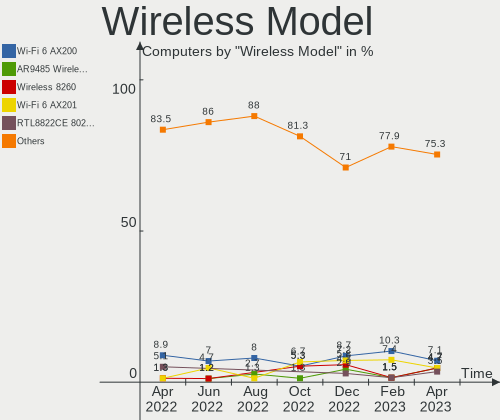

| Model                                                                      | Computers | Percent |
|----------------------------------------------------------------------------|-----------|---------|
| Intel Wi-Fi 6 AX200                                                        | 10        | 13.33%  |
| Intel Alder Lake-P PCH CNVi WiFi                                           | 4         | 5.33%   |
| Intel Wireless 8260                                                        | 3         | 4%      |
| Intel Centrino Ultimate-N 6300                                             | 3         | 4%      |
| Intel Centrino Advanced-N 6205 [Taylor Peak]                               | 3         | 4%      |
| Broadcom BCM4331 802.11a/b/g/n                                             | 3         | 4%      |
| Realtek RTL88x2bu [AC1200 Techkey]                                         | 2         | 2.67%   |
| Qualcomm Atheros QCA9377 802.11ac Wireless Network Adapter                 | 2         | 2.67%   |
| Intel Wireless 7260                                                        | 2         | 2.67%   |
| Intel Wireless 3165                                                        | 2         | 2.67%   |
| Intel Wi-Fi 6 AX201                                                        | 2         | 2.67%   |
| Broadcom Limited BCM4360 802.11ac Wireless Network Adapter                 | 2         | 2.67%   |
| Broadcom BCM4360 802.11ac Wireless Network Adapter                         | 2         | 2.67%   |
| Broadcom BCM4313 802.11bgn Wireless Network Adapter                        | 2         | 2.67%   |
| TP-Link TL-WN821N v5/v6 [RTL8192EU]                                        | 1         | 1.33%   |
| TP-Link AC600 wireless Realtek RTL8811AU [Archer T2U Nano]                 | 1         | 1.33%   |
| Sierra Wireless EM7430 Qualcomm Snapdragon X7 LTE-A                        | 1         | 1.33%   |
| Realtek RTL8852AE 802.11ax PCIe Wireless Network Adapter                   | 1         | 1.33%   |
| Realtek RTL8822CE 802.11ac PCIe Wireless Network Adapter                   | 1         | 1.33%   |
| Realtek RTL8822BE 802.11a/b/g/n/ac WiFi adapter                            | 1         | 1.33%   |
| Realtek RTL8821CE 802.11ac PCIe Wireless Network Adapter                   | 1         | 1.33%   |
| Realtek RTL8812AU 802.11a/b/g/n/ac 2T2R DB WLAN Adapter                    | 1         | 1.33%   |
| Realtek RTL8188FTV 802.11b/g/n 1T1R 2.4G WLAN Adapter                      | 1         | 1.33%   |
| Realtek RTL8188CUS 802.11n WLAN Adapter                                    | 1         | 1.33%   |
| Realtek 802.11ac NIC                                                       | 1         | 1.33%   |
| Ralink RT5372 Wireless Adapter                                             | 1         | 1.33%   |
| Ralink RT5392 PCIe Wireless Network Adapter                                | 1         | 1.33%   |
| Ralink RT3290 Wireless 802.11n 1T/1R PCIe                                  | 1         | 1.33%   |
| Qualcomm Atheros QCA9565 / AR9565 Wireless Network Adapter                 | 1         | 1.33%   |
| Qualcomm Atheros QCA6174 802.11ac Wireless Network Adapter                 | 1         | 1.33%   |
| Qualcomm Atheros AR9485 Wireless Network Adapter                           | 1         | 1.33%   |
| Qualcomm Atheros AR9462 Wireless Network Adapter                           | 1         | 1.33%   |
| Intel Wireless 7265                                                        | 1         | 1.33%   |
| Intel Wi-Fi 6 AX210/AX211/AX411 160MHz                                     | 1         | 1.33%   |
| Intel Wi-Fi 6 AX201 160MHz                                                 | 1         | 1.33%   |
| Intel Ultimate N WiFi Link 5300                                            | 1         | 1.33%   |
| Intel PRO/Wireless 3945ABG [Golan] Network Connection                      | 1         | 1.33%   |
| Intel Comet Lake PCH-LP CNVi WiFi                                          | 1         | 1.33%   |
| Intel Comet Lake PCH CNVi WiFi                                             | 1         | 1.33%   |
| Intel Centrino Wireless-N 2230                                             | 1         | 1.33%   |
| Intel Centrino Advanced-N 6200                                             | 1         | 1.33%   |
| Intel Cannon Lake PCH CNVi WiFi                                            | 1         | 1.33%   |
| Intel Alder Lake-S PCH CNVi WiFi                                           | 1         | 1.33%   |
| D-Link System AirPlus G DWL-G122 Wireless Adapter(rev.C1) [Ralink RT2571W] | 1         | 1.33%   |
| Broadcom BCM4350 802.11ac Wireless Network Adapter                         | 1         | 1.33%   |
| Broadcom BCM43225 802.11b/g/n                                              | 1         | 1.33%   |
| Broadcom BCM4322 802.11a/b/g/n Wireless LAN Controller                     | 1         | 1.33%   |

Ethernet Vendor
---------------

Ethernet vendors

| Vendor                   | Computers | Percent |
|--------------------------|-----------|---------|
| Realtek Semiconductor    | 39        | 39.8%   |
| Intel                    | 36        | 36.73%  |
| Qualcomm Atheros         | 7         | 7.14%   |
| Broadcom                 | 7         | 7.14%   |
| DisplayLink              | 2         | 2.04%   |
| Samsung Electronics      | 1         | 1.02%   |
| Qualcomm                 | 1         | 1.02%   |
| Marvell Technology Group | 1         | 1.02%   |
| Lenovo                   | 1         | 1.02%   |
| D-Link System            | 1         | 1.02%   |
| D-Link                   | 1         | 1.02%   |
| Broadcom Limited         | 1         | 1.02%   |

Ethernet Model
--------------

Ethernet models

| Model                                                                         | Computers | Percent |
|-------------------------------------------------------------------------------|-----------|---------|
| Realtek RTL8111/8168/8411 PCI Express Gigabit Ethernet Controller             | 29        | 28.43%  |
| Intel I211 Gigabit Network Connection                                         | 6         | 5.88%   |
| Intel 82579LM Gigabit Network Connection (Lewisville)                         | 5         | 4.9%    |
| Realtek RTL8153 Gigabit Ethernet Adapter                                      | 4         | 3.92%   |
| Qualcomm Atheros Killer E220x Gigabit Ethernet Controller                     | 4         | 3.92%   |
| Intel Ethernet Controller I225-V                                              | 3         | 2.94%   |
| Intel Ethernet Connection (2) I219-V                                          | 3         | 2.94%   |
| Realtek RTL8125 2.5GbE Controller                                             | 2         | 1.96%   |
| Realtek RTL810xE PCI Express Fast Ethernet controller                         | 2         | 1.96%   |
| Realtek Killer E2600 Gigabit Ethernet Controller                              | 2         | 1.96%   |
| Intel 82575EB Gigabit Network Connection                                      | 2         | 1.96%   |
| Intel 82567LM-3 Gigabit Network Connection                                    | 2         | 1.96%   |
| Intel 82557/8/9/0/1 Ethernet Pro 100                                          | 2         | 1.96%   |
| DisplayLink USB-C Hybrid UHD Video Dock                                       | 2         | 1.96%   |
| Broadcom NetXtreme BCM57765 Gigabit Ethernet PCIe                             | 2         | 1.96%   |
| Samsung Galaxy series, misc. (tethering mode)                                 | 1         | 0.98%   |
| Realtek Killer E3000 2.5GbE Controller                                        | 1         | 0.98%   |
| Qualcomm BENGAL-QRD _SN:C5464635                                              | 1         | 0.98%   |
| Qualcomm Atheros AR8152 v2.0 Fast Ethernet                                    | 1         | 0.98%   |
| Qualcomm Atheros AR8151 v2.0 Gigabit Ethernet                                 | 1         | 0.98%   |
| Qualcomm Atheros AR8151 v1.0 Gigabit Ethernet                                 | 1         | 0.98%   |
| Marvell Group 88E8040 PCI-E Fast Ethernet Controller                          | 1         | 0.98%   |
| Lenovo ThinkPad Lan                                                           | 1         | 0.98%   |
| Intel Ethernet Connection I219-V                                              | 1         | 0.98%   |
| Intel Ethernet Connection I219-LM                                             | 1         | 0.98%   |
| Intel Ethernet Connection I218-LM                                             | 1         | 0.98%   |
| Intel Ethernet Connection I217-LM                                             | 1         | 0.98%   |
| Intel Ethernet Connection (7) I219-V                                          | 1         | 0.98%   |
| Intel Ethernet Connection (6) I219-LM                                         | 1         | 0.98%   |
| Intel Ethernet Connection (4) I219-V                                          | 1         | 0.98%   |
| Intel Ethernet Connection (3) I218-LM                                         | 1         | 0.98%   |
| Intel Ethernet Connection (2) I219-LM                                         | 1         | 0.98%   |
| Intel Ethernet Connection (16) I219-LM                                        | 1         | 0.98%   |
| Intel Ethernet Connection (10) I219-V                                         | 1         | 0.98%   |
| Intel 82579V Gigabit Network Connection                                       | 1         | 0.98%   |
| Intel 82574L Gigabit Network Connection                                       | 1         | 0.98%   |
| Intel 82571EB/82571GB Gigabit Ethernet Controller D0/D1 (copper applications) | 1         | 0.98%   |
| Intel 82546EB Gigabit Ethernet Controller (Copper)                            | 1         | 0.98%   |
| Intel 82541PI Gigabit Ethernet Controller                                     | 1         | 0.98%   |
| D-Link System RTL8139 Ethernet                                                | 1         | 0.98%   |
| D-Link DUB-1312 Gigabit Ethernet Adapter                                      | 1         | 0.98%   |
| Broadcom NetXtreme BCM57786 Gigabit Ethernet PCIe                             | 1         | 0.98%   |
| Broadcom NetXtreme BCM5764M Gigabit Ethernet PCIe                             | 1         | 0.98%   |
| Broadcom NetLink BCM57781 Gigabit Ethernet PCIe                               | 1         | 0.98%   |
| Broadcom NetLink BCM57780 Gigabit Ethernet PCIe                               | 1         | 0.98%   |
| Broadcom Limited NetXtreme BCM57760 Gigabit Ethernet PCIe                     | 1         | 0.98%   |
| Broadcom BCM4401-B0 100Base-TX                                                | 1         | 0.98%   |

Net Controller Kind
-------------------

Ethernet, WiFi or modem

| Kind     | Computers | Percent |
|----------|-----------|---------|
| Ethernet | 81        | 53.29%  |
| WiFi     | 71        | 46.71%  |

Used Controller
---------------

Currently used network controller

| Kind     | Computers | Percent |
|----------|-----------|---------|
| WiFi     | 54        | 51.43%  |
| Ethernet | 51        | 48.57%  |

NICs
----

Total network controllers on board

| Total | Computers | Percent |
|-------|-----------|---------|
| 2     | 52        | 53.06%  |
| 1     | 33        | 33.67%  |
| 3     | 7         | 7.14%   |
| 0     | 4         | 4.08%   |
| 4     | 2         | 2.04%   |

IPv6
----

IPv6 vs IPv4

| Used | Computers | Percent |
|------|-----------|---------|
| No   | 79        | 80.61%  |
| Yes  | 19        | 19.39%  |

Bluetooth
---------

Bluetooth Vendor
----------------

Controller vendors

| Vendor                          | Computers | Percent |
|---------------------------------|-----------|---------|
| Intel                           | 31        | 55.36%  |
| Apple                           | 6         | 10.71%  |
| Broadcom                        | 5         | 8.93%   |
| Foxconn / Hon Hai               | 4         | 7.14%   |
| Realtek Semiconductor           | 3         | 5.36%   |
| Qualcomm Atheros Communications | 2         | 3.57%   |
| IMC Networks                    | 2         | 3.57%   |
| Ralink                          | 1         | 1.79%   |
| Lite-On Technology              | 1         | 1.79%   |
| Cambridge Silicon Radio         | 1         | 1.79%   |

Bluetooth Model
---------------

Controller models

| Model                                               | Computers | Percent |
|-----------------------------------------------------|-----------|---------|
| Intel AX200 Bluetooth                               | 10        | 17.86%  |
| Intel Bluetooth wireless interface                  | 9         | 16.07%  |
| Intel AX201 Bluetooth                               | 5         | 8.93%   |
| Apple Bluetooth USB Host Controller                 | 5         | 8.93%   |
| Intel Bluetooth Device                              | 4         | 7.14%   |
| Realtek Bluetooth Radio                             | 2         | 3.57%   |
| Qualcomm Atheros  Bluetooth Device                  | 2         | 3.57%   |
| Broadcom HP Portable SoftSailing                    | 2         | 3.57%   |
| Broadcom BCM20702A0 Bluetooth 4.0                   | 2         | 3.57%   |
| Realtek  Bluetooth 4.2 Adapter                      | 1         | 1.79%   |
| Ralink RT3290 Bluetooth                             | 1         | 1.79%   |
| Lite-On Qualcomm Atheros QCA9377 Bluetooth          | 1         | 1.79%   |
| Intel Centrino Bluetooth Wireless Transceiver       | 1         | 1.79%   |
| Intel Bluetooth 9460/9560 Jefferson Peak (JfP)      | 1         | 1.79%   |
| Intel AX210 Bluetooth                               | 1         | 1.79%   |
| IMC Networks Bluetooth Radio                        | 1         | 1.79%   |
| IMC Networks Bluetooth Device                       | 1         | 1.79%   |
| Foxconn / Hon Hai Bluetooth USB Host Controller     | 1         | 1.79%   |
| Foxconn / Hon Hai Bluetooth Device                  | 1         | 1.79%   |
| Foxconn / Hon Hai Acer Module                       | 1         | 1.79%   |
| Foxconn / Hon Hai Acer Bluetooth module             | 1         | 1.79%   |
| Cambridge Silicon Radio Bluetooth Dongle (HCI mode) | 1         | 1.79%   |
| Broadcom BCM20702 Bluetooth 4.0 [ThinkPad]          | 1         | 1.79%   |
| Apple Bluetooth Host Controller                     | 1         | 1.79%   |

Sound
-----

Sound Vendor
------------

Sound card vendors

| Vendor                               | Computers | Percent |
|--------------------------------------|-----------|---------|
| Intel                                | 70        | 49.3%   |
| Nvidia                               | 29        | 20.42%  |
| AMD                                  | 23        | 16.2%   |
| Plantronics                          | 4         | 2.82%   |
| C-Media Electronics                  | 3         | 2.11%   |
| Texas Instruments                    | 2         | 1.41%   |
| Realtek Semiconductor                | 2         | 1.41%   |
| Logitech                             | 2         | 1.41%   |
| Dell                                 | 2         | 1.41%   |
| Thesycon Systemsoftware & Consulting | 1         | 0.7%    |
| Microsoft                            | 1         | 0.7%    |
| M-Audio                              | 1         | 0.7%    |
| Generalplus Technology               | 1         | 0.7%    |
| Blue Microphones                     | 1         | 0.7%    |

Sound Model
-----------

Sound card models

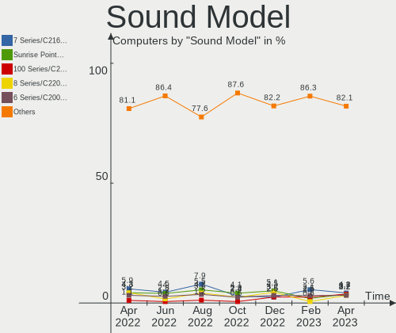

| Model                                                                                             | Computers | Percent |
|---------------------------------------------------------------------------------------------------|-----------|---------|
| Intel 7 Series/C216 Chipset Family High Definition Audio Controller                               | 15        | 9.09%   |
| AMD Starship/Matisse HD Audio Controller                                                          | 8         | 4.85%   |
| Nvidia TU107 GeForce GTX 1650 High Definition Audio Controller                                    | 5         | 3.03%   |
| Intel Sunrise Point-LP HD Audio                                                                   | 5         | 3.03%   |
| AMD SBx00 Azalia (Intel HDA)                                                                      | 5         | 3.03%   |
| Nvidia GK208 HDMI/DP Audio Controller                                                             | 4         | 2.42%   |
| Intel Haswell-ULT HD Audio Controller                                                             | 4         | 2.42%   |
| Intel Cannon Lake PCH cAVS                                                                        | 4         | 2.42%   |
| Intel Alder Lake PCH-P High Definition Audio Controller                                           | 4         | 2.42%   |
| Intel 8 Series HD Audio Controller                                                                | 4         | 2.42%   |
| Intel 5 Series/3400 Series Chipset High Definition Audio                                          | 4         | 2.42%   |
| Intel 100 Series/C230 Series Chipset Family HD Audio Controller                                   | 4         | 2.42%   |
| AMD RS880 HDMI Audio [Radeon HD 4200 Series]                                                      | 4         | 2.42%   |
| Nvidia GM204 High Definition Audio Controller                                                     | 3         | 1.82%   |
| Nvidia GA106 High Definition Audio Controller                                                     | 3         | 1.82%   |
| Intel Xeon E3-1200 v3/4th Gen Core Processor HD Audio Controller                                  | 3         | 1.82%   |
| Intel 6 Series/C200 Series Chipset Family High Definition Audio Controller                        | 3         | 1.82%   |
| AMD Family 17h/19h HD Audio Controller                                                            | 3         | 1.82%   |
| Realtek Semiconductor USB Audio                                                                   | 2         | 1.21%   |
| Plantronics Blackwire 5220 Series                                                                 | 2         | 1.21%   |
| Nvidia GP107GL High Definition Audio Controller                                                   | 2         | 1.21%   |
| Nvidia GM107 High Definition Audio Controller [GeForce 940MX]                                     | 2         | 1.21%   |
| Nvidia GF119 HDMI Audio Controller                                                                | 2         | 1.21%   |
| Nvidia GA104 High Definition Audio Controller                                                     | 2         | 1.21%   |
| Logitech Headset H340                                                                             | 2         | 1.21%   |
| Intel Wildcat Point-LP High Definition Audio Controller                                           | 2         | 1.21%   |
| Intel Tiger Lake-LP Smart Sound Technology Audio Controller                                       | 2         | 1.21%   |
| Intel Cannon Point-LP High Definition Audio Controller                                            | 2         | 1.21%   |
| Intel Broadwell-U Audio Controller                                                                | 2         | 1.21%   |
| Intel Atom Processor Z36xxx/Z37xxx Series High Definition Audio Controller                        | 2         | 1.21%   |
| Intel 9 Series Chipset Family HD Audio Controller                                                 | 2         | 1.21%   |
| Intel 82801JD/DO (ICH10 Family) HD Audio Controller                                               | 2         | 1.21%   |
| Intel 8 Series/C220 Series Chipset High Definition Audio Controller                               | 2         | 1.21%   |
| C-Media Electronics CMI8788 [Oxygen HD Audio]                                                     | 2         | 1.21%   |
| AMD Renoir Radeon High Definition Audio Controller                                                | 2         | 1.21%   |
| AMD FCH Azalia Controller                                                                         | 2         | 1.21%   |
| AMD Ellesmere HDMI Audio [Radeon RX 470/480 / 570/580/590]                                        | 2         | 1.21%   |
| Thesycon Systemsoftware & Consulting DX3 Pro                                                      | 1         | 0.61%   |
| Texas Instruments PCM2902 Audio Codec                                                             | 1         | 0.61%   |
| Texas Instruments PCM2704 16-bit stereo audio DAC                                                 | 1         | 0.61%   |
| Plantronics RIG 800HD                                                                             | 1         | 0.61%   |
| Plantronics BT600                                                                                 | 1         | 0.61%   |
| Nvidia TU116 High Definition Audio Controller                                                     | 1         | 0.61%   |
| Nvidia TU106 High Definition Audio Controller                                                     | 1         | 0.61%   |
| Nvidia High Definition Audio Controller                                                           | 1         | 0.61%   |
| Nvidia GK104 HDMI Audio Controller                                                                | 1         | 0.61%   |
| Nvidia GF108 High Definition Audio Controller                                                     | 1         | 0.61%   |
| Nvidia GA102 High Definition Audio Controller                                                     | 1         | 0.61%   |
| Microsoft LifeChat LX-3000 Headset                                                                | 1         | 0.61%   |
| M-Audio M-Track                                                                                   | 1         | 0.61%   |
| Intel USB PnP Sound Device                                                                        | 1         | 0.61%   |
| Intel Tiger Lake-H HD Audio Controller                                                            | 1         | 0.61%   |
| Intel NM10/ICH7 Family High Definition Audio Controller                                           | 1         | 0.61%   |
| Intel Jasper Lake HD Audio                                                                        | 1         | 0.61%   |
| Intel Comet Lake PCH-V cAVS                                                                       | 1         | 0.61%   |
| Intel Comet Lake PCH-LP cAVS                                                                      | 1         | 0.61%   |
| Intel Comet Lake PCH cAVS                                                                         | 1         | 0.61%   |
| Intel Celeron/Pentium Silver Processor High Definition Audio                                      | 1         | 0.61%   |
| Intel C610/X99 series chipset HD Audio Controller                                                 | 1         | 0.61%   |
| Intel Atom/Celeron/Pentium Processor x5-E8000/J3xxx/N3xxx Series High Definition Audio Controller | 1         | 0.61%   |

Memory
------

Memory Vendor
-------------

Memory module vendors

| Vendor              | Computers | Percent |
|---------------------|-----------|---------|
| SK hynix            | 11        | 18.97%  |
| Unknown             | 9         | 15.52%  |
| Samsung Electronics | 9         | 15.52%  |
| Kingston            | 7         | 12.07%  |
| Corsair             | 6         | 10.34%  |
| Micron Technology   | 4         | 6.9%    |
| Team                | 2         | 3.45%   |
| G.Skill             | 2         | 3.45%   |
| Elpida              | 2         | 3.45%   |
| Crucial             | 2         | 3.45%   |
| Ramaxel Technology  | 1         | 1.72%   |
| Nanya Technology    | 1         | 1.72%   |
| Apacer              | 1         | 1.72%   |
| Unknown             | 1         | 1.72%   |

Memory Model
------------

Memory module models

| Model                                                        | Computers | Percent |
|--------------------------------------------------------------|-----------|---------|
| SK hynix RAM HMT451S6BFR8A-PB 4GB SODIMM DDR3 1600MT/s       | 3         | 4.84%   |
| Unknown RAM Module 4096MB DIMM DDR3 1333MT/s                 | 2         | 3.23%   |
| Unknown RAM Module 2GB DIMM 667MT/s                          | 2         | 3.23%   |
| SK hynix RAM HMAA1GS6CJR6N-XN 8GB SODIMM DDR4 3200MT/s       | 2         | 3.23%   |
| Unknown RAM Module 8GB DIMM 1600MT/s                         | 1         | 1.61%   |
| Unknown RAM Module 4GB DIMM 1333MT/s                         | 1         | 1.61%   |
| Unknown RAM Module 4096MB DIMM 1333MT/s                      | 1         | 1.61%   |
| Unknown RAM Module 2GB DIMM DDR2 1067MT/s                    | 1         | 1.61%   |
| Unknown RAM Module 2048MB DIMM 800MT/s                       | 1         | 1.61%   |
| Team RAM TEAMGROUP-UD4-3000 8GB DIMM DDR4 3067MT/s           | 1         | 1.61%   |
| Team RAM TEAMGROUP-UD4-2666 8GB DIMM DDR4 2667MT/s           | 1         | 1.61%   |
| SK hynix RAM HYMP112S64CP6-S6 1GB SODIMM DDR2 975MT/s        | 1         | 1.61%   |
| SK hynix RAM HMT451S6CFR6A-PB 4GB SODIMM DDR3 1600MT/s       | 1         | 1.61%   |
| SK hynix RAM HMT351S6CFR8A-PB 4GB SODIMM DDR3 1600MT/s       | 1         | 1.61%   |
| SK hynix RAM HMT351S6BFR8C-H9 4GB SODIMM DDR3 1334MT/s       | 1         | 1.61%   |
| SK hynix RAM HMCG78MEBSA095N 16GB SODIMM 4800MT/s            | 1         | 1.61%   |
| SK hynix RAM HMA851S6AFR6N-UH 4GB SODIMM DDR4 2667MT/s       | 1         | 1.61%   |
| SK hynix RAM H9JCNNNCP3MLYR-N6E 2GB Row Of Chips 6400MT/s    | 1         | 1.61%   |
| Samsung RAM M471B5674BH0-YH9 2GB Chip DDR3 1333MT/s          | 1         | 1.61%   |
| Samsung RAM M471B5273DH0-YK0 4GB SODIMM DDR3 1600MT/s        | 1         | 1.61%   |
| Samsung RAM M471B5273CH0-CH9 4GB SODIMM DDR3 1334MT/s        | 1         | 1.61%   |
| Samsung RAM M471B1G73DB0-YK0 8GB SODIMM DDR3 1600MT/s        | 1         | 1.61%   |
| Samsung RAM M471A5244BB0-CRC 4096MB SODIMM DDR4 2667MT/s     | 1         | 1.61%   |
| Samsung RAM M471A1G44AB0-CWE 8GB Row Of Chips DDR4 3200MT/s  | 1         | 1.61%   |
| Samsung RAM M378B5773DH0-CH9 2GB DIMM DDR3 1333MT/s          | 1         | 1.61%   |
| Samsung RAM M378B5673FH0-CH9 2GB DIMM DDR3 1600MT/s          | 1         | 1.61%   |
| Samsung RAM M378B5673EH1-CH9 2GB DIMM 1333MT/s               | 1         | 1.61%   |
| Samsung RAM K4E6E304EB-EGCF 4GB Row Of Chips LPDDR3 1867MT/s | 1         | 1.61%   |
| Samsung RAM K4A8G165WC-BCTD 4GB Row Of Chips DDR4 2667MT/s   | 1         | 1.61%   |
| Ramaxel RAM Module 8192MB SODIMM DDR4 2667MT/s               | 1         | 1.61%   |
| Nanya RAM Module 2048MB DIMM DDR2 800MT/s                    | 1         | 1.61%   |
| Micron RAM Module 4GB SODIMM DDR3 1600MT/s                   | 1         | 1.61%   |
| Micron RAM 16HTF25664HY-667E1 2048MB SODIMM DDR 667MT/s      | 1         | 1.61%   |
| Micron RAM 16ATF2G64HZ-3G2J1 16GB SODIMM DDR4 3200MT/s       | 1         | 1.61%   |
| Micron RAM 16ATF2G64HZ-2G6J1 16GB SODIMM DDR4 2667MT/s       | 1         | 1.61%   |
| Kingston RAM KNWMX1-ETF 4GB SODIMM DDR3 1600MT/s             | 1         | 1.61%   |
| Kingston RAM KHX2666C16/8G 8GB DIMM DDR4 3466MT/s            | 1         | 1.61%   |
| Kingston RAM KF552C40-16 16384MB DIMM 5200MT/s               | 1         | 1.61%   |
| Kingston RAM 99U5471-020.A00LF 4096MB DIMM DDR3 1600MT/s     | 1         | 1.61%   |
| Kingston RAM 9905744-077.A00G 16GB SODIMM DDR4 3200MT/s      | 1         | 1.61%   |
| Kingston RAM 9905700-070.A01G 16GB SODIMM DDR4 2667MT/s      | 1         | 1.61%   |
| Kingston RAM 9905471-006.A01LF 4GB DIMM DDR3 1333MT/s        | 1         | 1.61%   |
| G.Skill RAM F3-2400C10-8GTX 8GB DIMM DDR3 2400MT/s           | 1         | 1.61%   |
| G.Skill RAM F3-12800CL9-4GBRL 4GB DIMM DDR3 1866MT/s         | 1         | 1.61%   |
| Elpida RAM Module 2048MB SODIMM DDR3 1600MT/s                | 1         | 1.61%   |
| Elpida RAM EBJ21EE8BAWA-DJ-E 2GB DIMM DDR3 1333MT/s          | 1         | 1.61%   |
| Crucial RAM CT51264BA160B.C16F 4GB DIMM DDR3 1600MT/s        | 1         | 1.61%   |
| Crucial RAM CT102464BD160B.C16 8GB DIMM DDR3 1600MT/s        | 1         | 1.61%   |
| Corsair RAM CMZ8GX3M2A1600C9 4GB DIMM DDR3 1600MT/s          | 1         | 1.61%   |
| Corsair RAM CMW32GX4M2C3200C16 16GB DIMM DDR4 3200MT/s       | 1         | 1.61%   |
| Corsair RAM CMV4GX3M1A1600C11 4GB DIMM DDR3 1600MT/s         | 1         | 1.61%   |
| Corsair RAM CMSO8GX4M2A2133C15 4GB SODIMM DDR4 2133MT/s      | 1         | 1.61%   |
| Corsair RAM CMK16GX4M2B3200C16 8GB DIMM DDR4 3600MT/s        | 1         | 1.61%   |
| Corsair RAM CMK16GX4M2B3000C15 8GB DIMM DDR4 3000MT/s        | 1         | 1.61%   |
| Apacer RAM 78.A2GC8.CY00C 2GB SODIMM DDR3 800MT/s            | 1         | 1.61%   |
| Apacer RAM 78.A2GC8.9L00C 2GB SODIMM DDR3 800MT/s            | 1         | 1.61%   |
| Unknown                                                      | 1         | 1.61%   |

Memory Kind
-----------

Memory module kinds

| Kind    | Computers | Percent |
|---------|-----------|---------|
| DDR3    | 19        | 38%     |
| DDR4    | 16        | 32%     |
| Unknown | 8         | 16%     |
| DDR2    | 3         | 6%      |
| SDRAM   | 1         | 2%      |
| LPDDR5  | 1         | 2%      |
| LPDDR4  | 1         | 2%      |
| LPDDR3  | 1         | 2%      |

Memory Form Factor
------------------

Physical design of the memory module

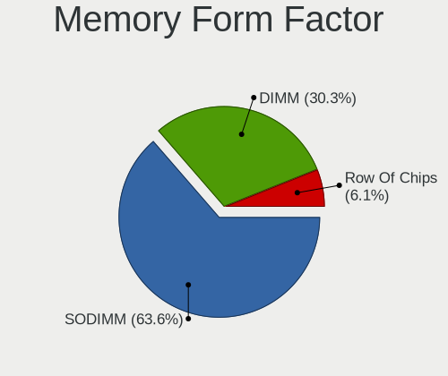

| Name         | Computers | Percent |
|--------------|-----------|---------|
| DIMM         | 24        | 48.98%  |
| SODIMM       | 20        | 40.82%  |
| Row Of Chips | 4         | 8.16%   |
| Chip         | 1         | 2.04%   |

Memory Size
-----------

Memory module size

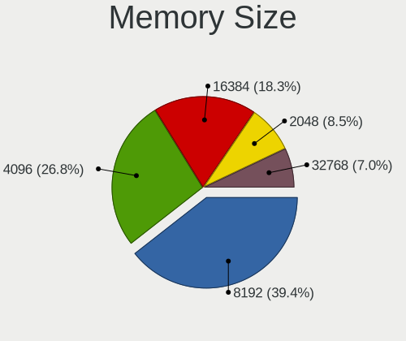

| Size  | Computers | Percent |
|-------|-----------|---------|
| 4096  | 18        | 36%     |
| 8192  | 11        | 22%     |
| 2048  | 11        | 22%     |
| 16384 | 8         | 16%     |
| 32768 | 1         | 2%      |
| 1024  | 1         | 2%      |

Memory Speed
------------

Memory module speed

| Speed | Computers | Percent |
|-------|-----------|---------|
| 1600  | 15        | 27.78%  |
| 1333  | 7         | 12.96%  |
| 3200  | 6         | 11.11%  |
| 2667  | 6         | 11.11%  |
| 800   | 3         | 5.56%   |
| 667   | 3         | 5.56%   |
| 3466  | 2         | 3.7%    |
| 6400  | 1         | 1.85%   |
| 5200  | 1         | 1.85%   |
| 4800  | 1         | 1.85%   |
| 3600  | 1         | 1.85%   |
| 3067  | 1         | 1.85%   |
| 2400  | 1         | 1.85%   |
| 2133  | 1         | 1.85%   |
| 1867  | 1         | 1.85%   |
| 1866  | 1         | 1.85%   |
| 1334  | 1         | 1.85%   |
| 1067  | 1         | 1.85%   |
| 975   | 1         | 1.85%   |

Printers & scanners
-------------------

Printer Vendor
--------------

Printer device vendors

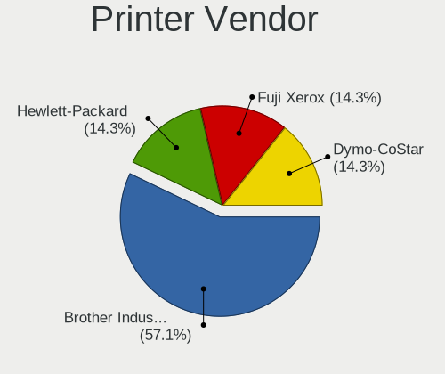

| Vendor             | Computers | Percent |
|--------------------|-----------|---------|
| Brother Industries | 2         | 100%    |

Printer Model
-------------

Printer device models

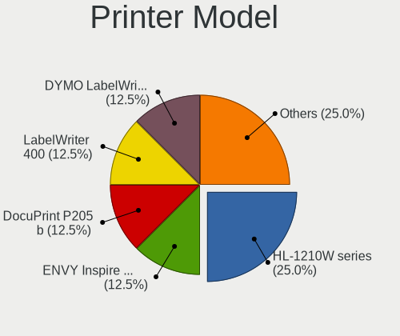

| Model                       | Computers | Percent |
|-----------------------------|-----------|---------|
| Brother MFC-L8690CDW series | 1         | 50%     |
| Brother HL-L2305 series     | 1         | 50%     |

Scanner Vendor
--------------

Scanner device vendors

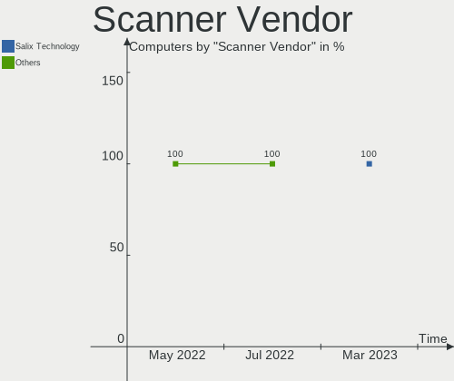

| Vendor | Computers | Percent |
|--------|-----------|---------|
| Canon  | 2         | 100%    |

Scanner Model
-------------

Scanner device models

| Model                   | Computers | Percent |
|-------------------------|-----------|---------|
| Canon CanoScan LiDE 210 | 1         | 50%     |
| Canon CanoScan LiDE 110 | 1         | 50%     |

Camera
------

Camera Vendor
-------------

Camera device vendors

| Vendor                        | Computers | Percent |
|-------------------------------|-----------|---------|
| Chicony Electronics           | 14        | 28.57%  |
| Microdia                      | 8         | 16.33%  |
| Sunplus Innovation Technology | 5         | 10.2%   |
| Apple                         | 4         | 8.16%   |
| Logitech                      | 3         | 6.12%   |
| Suyin                         | 2         | 4.08%   |
| Realtek Semiconductor         | 2         | 4.08%   |
| Quanta                        | 2         | 4.08%   |
| Acer                          | 2         | 4.08%   |
| Syntek                        | 1         | 2.04%   |
| Ricoh                         | 1         | 2.04%   |
| Primax Electronics            | 1         | 2.04%   |
| Luxvisions Innotech Limited   | 1         | 2.04%   |
| IMC Networks                  | 1         | 2.04%   |
| Dell                          | 1         | 2.04%   |
| ALi                           | 1         | 2.04%   |

Camera Model
------------

Camera device models

| Model                                                       | Computers | Percent |
|-------------------------------------------------------------|-----------|---------|
| Chicony HD User Facing                                      | 3         | 6.12%   |
| Sunplus HD WebCam                                           | 2         | 4.08%   |
| Quanta HD User Facing                                       | 2         | 4.08%   |
| Microdia Integrated_Webcam_HD                               | 2         | 4.08%   |
| Microdia Integrated_Webcam_FHD                              | 2         | 4.08%   |
| Apple FaceTime HD Camera                                    | 2         | 4.08%   |
| Acer Integrated Camera                                      | 2         | 4.08%   |
| Syntek Integrated Camera                                    | 1         | 2.04%   |
| Suyin Acer/Lenovo Webcam [CN0316]                           | 1         | 2.04%   |
| Suyin 1.3M WebCam (notebook emachines E730, Acer sub-brand) | 1         | 2.04%   |
| Sunplus Laptop Integrated Webcam HD                         | 1         | 2.04%   |
| Sunplus Integrated_Webcam_FHD                               | 1         | 2.04%   |
| Sunplus ezcap U3 capture-04                                 | 1         | 2.04%   |
| Ricoh Integrated Webcam                                     | 1         | 2.04%   |
| Realtek USB2.0 HD UVC WebCam                                | 1         | 2.04%   |
| Realtek HP TrueVision Full HD                               | 1         | 2.04%   |
| Primax HP HD Webcam [Fixed]                                 | 1         | 2.04%   |
| Microdia Integrated Webcam HD                               | 1         | 2.04%   |
| Microdia HDP Webcam USB                                     | 1         | 2.04%   |
| Microdia Dell Integrated HD Webcam                          | 1         | 2.04%   |
| Microdia 1.3 MPixel Integrated Webcam                       | 1         | 2.04%   |
| Luxvisions Innotech Limited Integrated RGB Camera           | 1         | 2.04%   |
| Logitech Webcam C930e                                       | 1         | 2.04%   |
| Logitech StreamCam                                          | 1         | 2.04%   |
| Logitech HD Pro Webcam C920                                 | 1         | 2.04%   |
| IMC Networks HD Camera                                      | 1         | 2.04%   |
| Dell Integrated_Webcam_5M_IR                                | 1         | 2.04%   |
| Chicony VGA WebCam                                          | 1         | 2.04%   |
| Chicony USB2.0 VGA UVC WebCam                               | 1         | 2.04%   |
| Chicony USB2.0 FHD UVC WebCam                               | 1         | 2.04%   |
| Chicony USB2.0 FHD Camera                                   | 1         | 2.04%   |
| Chicony Lenovo EasyCamera                                   | 1         | 2.04%   |
| Chicony Integrated HP HD Webcam                             | 1         | 2.04%   |
| Chicony HP TrueVision HD Camera                             | 1         | 2.04%   |
| Chicony HP Truevision HD                                    | 1         | 2.04%   |
| Chicony HP HD Webcam                                        | 1         | 2.04%   |
| Chicony HP HD Camera                                        | 1         | 2.04%   |
| Chicony 1.3M Webcam                                         | 1         | 2.04%   |
| Apple iPad 3 (3G, 16 GB)                                    | 1         | 2.04%   |
| Apple FaceTime HD Camera (Built-in)                         | 1         | 2.04%   |
| ALi Gateway Webcam                                          | 1         | 2.04%   |

Security
--------

Fingerprint Vendor
------------------

Fingerprint sensor vendors

| Vendor                     | Computers | Percent |
|----------------------------|-----------|---------|
| Validity Sensors           | 4         | 50%     |
| LighTuning Technology      | 3         | 37.5%   |
| Shenzhen Goodix Technology | 1         | 12.5%   |

Fingerprint Model
-----------------

Fingerprint sensor models

| Model                                             | Computers | Percent |
|---------------------------------------------------|-----------|---------|
| Validity Sensors VFS491                           | 2         | 25%     |
| LighTuning EgisTec Touch Fingerprint Sensor       | 2         | 25%     |
| Validity Sensors VFS7552 Touch Fingerprint Sensor | 1         | 12.5%   |
| Validity Sensors VFS495 Fingerprint Reader        | 1         | 12.5%   |
| Shenzhen Goodix  Fingerprint Device               | 1         | 12.5%   |
| LighTuning Fingerprint Reader                     | 1         | 12.5%   |

Chipcard Vendor
---------------

Chipcard module vendors

| Vendor                | Computers | Percent |
|-----------------------|-----------|---------|
| Upek                  | 1         | 25%     |
| Broadcom              | 1         | 25%     |
| Alcor Micro           | 1         | 25%     |
| Advanced Card Systems | 1         | 25%     |

Chipcard Model
--------------

Chipcard module models

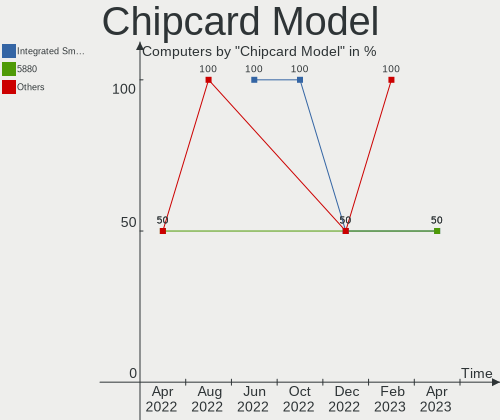

| Model                                                      | Computers | Percent |
|------------------------------------------------------------|-----------|---------|
| Upek TouchChip Fingerprint Coprocessor (WBF advanced mode) | 1         | 25%     |
| Broadcom BCM5880 Secure Applications Processor             | 1         | 25%     |
| Alcor Micro AU9540 Smartcard Reader                        | 1         | 25%     |
| Advanced Card Systems ACR122U                              | 1         | 25%     |

Unsupported
-----------

Unsupported Devices
-------------------

Total unsupported devices on board

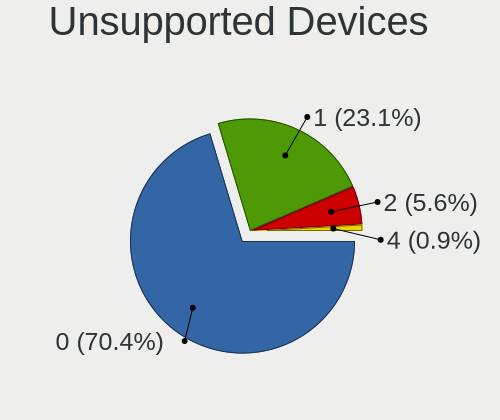

| Total | Computers | Percent |
|-------|-----------|---------|
| 0     | 62        | 63.27%  |
| 1     | 33        | 33.67%  |
| 2     | 2         | 2.04%   |
| 3     | 1         | 1.02%   |

Unsupported Device Types
------------------------

Types of unsupported devices

| Type                     | Computers | Percent |
|--------------------------|-----------|---------|
| Graphics card            | 12        | 30.77%  |
| Fingerprint reader       | 8         | 20.51%  |
| Net/wireless             | 4         | 10.26%  |
| Multimedia controller    | 3         | 7.69%   |
| Chipcard                 | 3         | 7.69%   |
| Communication controller | 2         | 5.13%   |
| Camera                   | 2         | 5.13%   |
| Unassigned class         | 1         | 2.56%   |
| Storage/ata              | 1         | 2.56%   |
| Net/ethernet             | 1         | 2.56%   |
| Card reader              | 1         | 2.56%   |
| Bluetooth                | 1         | 2.56%   |

