Linux in Australia - Hardware Trends
------------------------------------

A project to identify most popular hardware characteristics and track their change
over time based on data collected by Linux users at https://Linux-Hardware.org.

Anyone can contribute to this report by the [hw-probe](https://github.com/linuxhw/hw-probe) tool:

    sudo -E hw-probe -all -upload

This is a report for all computer types. See also reports for [desktops](/Location/Australia/Desktop/README.md) and [notebooks](/Location/Australia/Notebook/README.md).

Contents
--------

* [ System ](#system)
  - [ OS                       ](#os)
  - [ OS Family                ](#os-family)
  - [ Kernel                   ](#kernel)
  - [ Kernel Family            ](#kernel-family)
  - [ Kernel Major Ver.        ](#kernel-major-ver)
  - [ Arch                     ](#arch)
  - [ DE                       ](#de)
  - [ Display Server           ](#display-server)
  - [ Display Manager          ](#display-manager)
  - [ OS Lang                  ](#os-lang)
  - [ Boot Mode                ](#boot-mode)
  - [ Filesystem               ](#filesystem)
  - [ Part. scheme             ](#part-scheme)
  - [ Dual Boot with Linux/BSD ](#dual-boot-with-linuxbsd)
  - [ Dual Boot (Win)          ](#dual-boot-win)

* [ Board ](#board)
  - [ Vendor                   ](#vendor)
  - [ Model                    ](#model)
  - [ Model Family             ](#model-family)
  - [ MFG Year                 ](#mfg-year)
  - [ Form Factor              ](#form-factor)
  - [ Secure Boot              ](#secure-boot)
  - [ Coreboot                 ](#coreboot)
  - [ RAM Size                 ](#ram-size)
  - [ RAM Used                 ](#ram-used)
  - [ Total Drives             ](#total-drives)
  - [ Has CD-ROM               ](#has-cd-rom)
  - [ Has Ethernet             ](#has-ethernet)
  - [ Has WiFi                 ](#has-wifi)
  - [ Has Bluetooth            ](#has-bluetooth)

* [ Location ](#location)
  - [ Country                  ](#country)
  - [ City                     ](#city)

* [ Drives ](#drives)
  - [ Drive Vendor             ](#drive-vendor)
  - [ Drive Model              ](#drive-model)
  - [ HDD Vendor               ](#hdd-vendor)
  - [ SSD Vendor               ](#ssd-vendor)
  - [ Drive Kind               ](#drive-kind)
  - [ Drive Connector          ](#drive-connector)
  - [ Drive Size               ](#drive-size)
  - [ Space Total              ](#space-total)
  - [ Space Used               ](#space-used)
  - [ Malfunc. Drives          ](#malfunc-drives)
  - [ Malfunc. Drive Vendor    ](#malfunc-drive-vendor)
  - [ Malfunc. HDD Vendor      ](#malfunc-hdd-vendor)
  - [ Malfunc. Drive Kind      ](#malfunc-drive-kind)
  - [ Failed Drives            ](#failed-drives)
  - [ Failed Drive Vendor      ](#failed-drive-vendor)
  - [ Drive Status             ](#drive-status)

* [ Storage controller ](#storage-controller)
  - [ Storage Vendor           ](#storage-vendor)
  - [ Storage Model            ](#storage-model)
  - [ Storage Kind             ](#storage-kind)

* [ Processor ](#processor)
  - [ CPU Vendor               ](#cpu-vendor)
  - [ CPU Model                ](#cpu-model)
  - [ CPU Model Family         ](#cpu-model-family)
  - [ CPU Cores                ](#cpu-cores)
  - [ CPU Sockets              ](#cpu-sockets)
  - [ CPU Threads              ](#cpu-threads)
  - [ CPU Op-Modes             ](#cpu-op-modes)
  - [ CPU Microcode            ](#cpu-microcode)
  - [ CPU Microarch            ](#cpu-microarch)

* [ Graphics ](#graphics)
  - [ GPU Vendor               ](#gpu-vendor)
  - [ GPU Model                ](#gpu-model)
  - [ GPU Combo                ](#gpu-combo)
  - [ GPU Driver               ](#gpu-driver)
  - [ GPU Memory               ](#gpu-memory)

* [ Monitor ](#monitor)
  - [ Monitor Vendor           ](#monitor-vendor)
  - [ Monitor Model            ](#monitor-model)
  - [ Monitor Resolution       ](#monitor-resolution)
  - [ Monitor Diagonal         ](#monitor-diagonal)
  - [ Monitor Width            ](#monitor-width)
  - [ Aspect Ratio             ](#aspect-ratio)
  - [ Monitor Area             ](#monitor-area)
  - [ Pixel Density            ](#pixel-density)
  - [ Multiple Monitors        ](#multiple-monitors)

* [ Network ](#network)
  - [ Net Controller Vendor    ](#net-controller-vendor)
  - [ Net Controller Model     ](#net-controller-model)
  - [ Wireless Vendor          ](#wireless-vendor)
  - [ Wireless Model           ](#wireless-model)
  - [ Ethernet Vendor          ](#ethernet-vendor)
  - [ Ethernet Model           ](#ethernet-model)
  - [ Net Controller Kind      ](#net-controller-kind)
  - [ Used Controller          ](#used-controller)
  - [ NICs                     ](#nics)
  - [ IPv6                     ](#ipv6)

* [ Bluetooth ](#bluetooth)
  - [ Bluetooth Vendor         ](#bluetooth-vendor)
  - [ Bluetooth Model          ](#bluetooth-model)

* [ Sound ](#sound)
  - [ Sound Vendor             ](#sound-vendor)
  - [ Sound Model              ](#sound-model)

* [ Memory ](#memory)
  - [ Memory Vendor            ](#memory-vendor)
  - [ Memory Model             ](#memory-model)
  - [ Memory Kind              ](#memory-kind)
  - [ Memory Form Factor       ](#memory-form-factor)
  - [ Memory Size              ](#memory-size)
  - [ Memory Speed             ](#memory-speed)

* [ Printers & scanners ](#printers--scanners)
  - [ Printer Vendor           ](#printer-vendor)
  - [ Printer Model            ](#printer-model)
  - [ Scanner Vendor           ](#scanner-vendor)
  - [ Scanner Model            ](#scanner-model)

* [ Camera ](#camera)
  - [ Camera Vendor            ](#camera-vendor)
  - [ Camera Model             ](#camera-model)

* [ Security ](#security)
  - [ Fingerprint Vendor       ](#fingerprint-vendor)
  - [ Fingerprint Model        ](#fingerprint-model)
  - [ Chipcard Vendor          ](#chipcard-vendor)
  - [ Chipcard Model           ](#chipcard-model)

* [ Unsupported ](#unsupported)
  - [ Unsupported Devices      ](#unsupported-devices)
  - [ Unsupported Device Types ](#unsupported-device-types)

System
------

OS
--

Installed operating systems

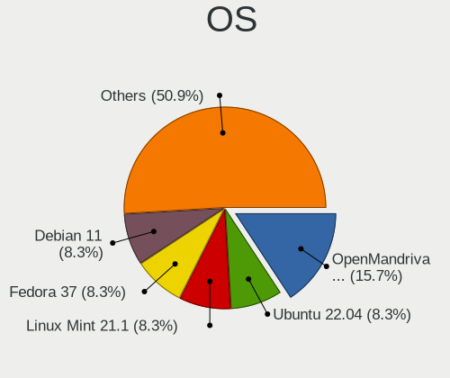

| Name                | Computers | Percent |
|---------------------|-----------|---------|
| Pop!_OS 22.04       | 13        | 10.83%  |
| Ubuntu 22.04        | 10        | 8.33%   |
| Ubuntu 20.04        | 10        | 8.33%   |
| Zorin 16            | 9         | 7.5%    |
| Fedora 35           | 8         | 6.67%   |
| Linux Mint 20.3     | 7         | 5.83%   |
| Fedora 36           | 7         | 5.83%   |
| Debian 11           | 7         | 5.83%   |
| KDE neon 20.04      | 6         | 5%      |
| Linux Mint 19.3     | 4         | 3.33%   |
| Fedora 34           | 3         | 2.5%    |
| ClearOS 7           | 3         | 2.5%    |
| Arch                | 3         | 2.5%    |
| OpenMandriva 4.3    | 2         | 1.67%   |
| LMDE 5              | 2         | 1.67%   |
| Kubuntu 22.04       | 2         | 1.67%   |
| Kali 2022.2         | 2         | 1.67%   |
| EndeavourOS Rolling | 2         | 1.67%   |
| Debian Unstable     | 2         | 1.67%   |
| Xubuntu 21.04       | 1         | 0.83%   |
| Xubuntu 20.04       | 1         | 0.83%   |
| SteamOS Snapshot    | 1         | 0.83%   |
| ROSA 12.2           | 1         | 0.83%   |
| PureOS 10.0         | 1         | 0.83%   |
| Pop!_OS 21.10       | 1         | 0.83%   |
| openSUSE Leap-15.3  | 1         | 0.83%   |
| Manjaro 21.2.6      | 1         | 0.83%   |
| Manjaro             | 1         | 0.83%   |
| Lubuntu 22.04       | 1         | 0.83%   |
| LinuxFX 11          | 1         | 0.83%   |
| Kubuntu 11          | 1         | 0.83%   |
| Endless 4.0.4       | 1         | 0.83%   |
| Devuan 4            | 1         | 0.83%   |
| Debian Testing      | 1         | 0.83%   |
| Debian 10           | 1         | 0.83%   |
| CentOS 7            | 1         | 0.83%   |
| ArcoLinux Rolling   | 1         | 0.83%   |

OS Family
---------

OS without a version

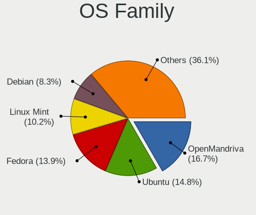

| Name         | Computers | Percent |
|--------------|-----------|---------|
| Ubuntu       | 20        | 16.67%  |
| Fedora       | 18        | 15%     |
| Pop!_OS      | 14        | 11.67%  |
| Linux Mint   | 11        | 9.17%   |
| Debian       | 11        | 9.17%   |
| Zorin        | 9         | 7.5%    |
| KDE neon     | 6         | 5%      |
| Kubuntu      | 3         | 2.5%    |
| ClearOS      | 3         | 2.5%    |
| Arch         | 3         | 2.5%    |
| Xubuntu      | 2         | 1.67%   |
| OpenMandriva | 2         | 1.67%   |
| Manjaro      | 2         | 1.67%   |
| LMDE         | 2         | 1.67%   |
| Kali         | 2         | 1.67%   |
| EndeavourOS  | 2         | 1.67%   |
| SteamOS      | 1         | 0.83%   |
| ROSA         | 1         | 0.83%   |
| PureOS       | 1         | 0.83%   |
| openSUSE     | 1         | 0.83%   |
| Lubuntu      | 1         | 0.83%   |
| LinuxFX      | 1         | 0.83%   |
| Endless      | 1         | 0.83%   |
| Devuan       | 1         | 0.83%   |
| CentOS       | 1         | 0.83%   |
| ArcoLinux    | 1         | 0.83%   |

Kernel
------

Version of the Linux kernel

| Version                                            | Computers | Percent |
|----------------------------------------------------|-----------|---------|
| 5.17.5-76051705-generic                            | 11        | 9.17%   |
| 5.13.0-44-generic                                  | 8         | 6.67%   |
| 5.13.0-40-generic                                  | 8         | 6.67%   |
| 5.13.0-41-generic                                  | 7         | 5.83%   |
| 5.10.0-14-amd64                                    | 7         | 5.83%   |
| 5.4.0-109-generic                                  | 4         | 3.33%   |
| 5.15.0-30-generic                                  | 4         | 3.33%   |
| 5.15.0-27-generic                                  | 4         | 3.33%   |
| 5.4.0-110-generic                                  | 3         | 2.5%    |
| 5.16.19-76051619-generic                           | 3         | 2.5%    |
| 5.4.0-113-generic                                  | 2         | 1.67%   |
| 5.17.9-arch1-1                                     | 2         | 1.67%   |
| 5.17.8-arch1-1                                     | 2         | 1.67%   |
| 5.17.8-300.fc36.x86_64                             | 2         | 1.67%   |
| 5.17.7-200.fc35.x86_64                             | 2         | 1.67%   |
| 5.17.6-300.fc36.x86_64                             | 2         | 1.67%   |
| 5.17.6-200.fc35.x86_64                             | 2         | 1.67%   |
| 5.17.5-100.fc34.x86_64                             | 2         | 1.67%   |
| 5.17.11-200.fc35.x86_64                            | 2         | 1.67%   |
| 5.16.7-desktop-1omv4003                            | 2         | 1.67%   |
| 5.16.0-kali7-amd64                                 | 2         | 1.67%   |
| 5.15.0-25-generic                                  | 2         | 1.67%   |
| 3.10.0-1160.66.1.el7.x86_64                        | 2         | 1.67%   |
| 3.10.0-1160.62.1.el7.x86_64                        | 2         | 1.67%   |
| 5.4.0-92-generic                                   | 1         | 0.83%   |
| 5.4.0-91-generic                                   | 1         | 0.83%   |
| 5.3.18-59.27-preempt                               | 1         | 0.83%   |
| 5.18.0-rc5-1-git-rtw89-00178-g30c8e80f7932         | 1         | 0.83%   |
| 5.18.0-arch1-1                                     | 1         | 0.83%   |
| 5.17.9-200.fc35.x86_64                             | 1         | 0.83%   |
| 5.17.8-100.fc34.x86_64                             | 1         | 0.83%   |
| 5.17.7-300.fc36.x86_64                             | 1         | 0.83%   |
| 5.17.6-051706-generic                              | 1         | 0.83%   |
| 5.17.5-arch1-1                                     | 1         | 0.83%   |
| 5.17.5-300.fc36.x86_64                             | 1         | 0.83%   |
| 5.17.11-300.fc36.x86_64                            | 1         | 0.83%   |
| 5.17.0-5.2-liquorix-amd64                          | 1         | 0.83%   |
| 5.17.0-2-rt-amd64                                  | 1         | 0.83%   |
| 5.17.0-1-amd64                                     | 1         | 0.83%   |
| 5.17-rockchip                                      | 1         | 0.83%   |
| 5.16.2-051602-generic                              | 1         | 0.83%   |
| 5.16.0-6-amd64                                     | 1         | 0.83%   |
| 5.15.32-v8+                                        | 1         | 0.83%   |
| 5.15.0-33-generic                                  | 1         | 0.83%   |
| 5.14.10-300.fc35.x86_64                            | 1         | 0.83%   |
| 5.13.19-2-MANJARO                                  | 1         | 0.83%   |
| 5.13.0-valve10.1-2-neptune-dri-02144-g7fffaf925dfb | 1         | 0.83%   |
| 5.13.0-30-generic                                  | 1         | 0.83%   |
| 5.13.0-27-generic                                  | 1         | 0.83%   |
| 5.11.0-49-generic                                  | 1         | 0.83%   |
| 5.11.0-44-generic                                  | 1         | 0.83%   |
| 5.11.0-41-generic                                  | 1         | 0.83%   |
| 5.11.0-35-generic                                  | 1         | 0.83%   |
| 5.10.74-generic-2rosa2021.1-x86_64                 | 1         | 0.83%   |
| 5.10.0-9-amd64                                     | 1         | 0.83%   |
| 5.10.0-13-amd64                                    | 1         | 0.83%   |
| 4.19.0-13-amd64                                    | 1         | 0.83%   |

Kernel Family
-------------

Linux kernel without a distro release

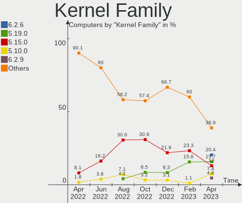

| Version | Computers | Percent |
|---------|-----------|---------|
| 5.13.0  | 26        | 21.67%  |
| 5.17.5  | 15        | 12.5%   |
| 5.4.0   | 11        | 9.17%   |
| 5.15.0  | 11        | 9.17%   |
| 5.10.0  | 9         | 7.5%    |
| 5.17.8  | 5         | 4.17%   |
| 5.17.6  | 5         | 4.17%   |
| 5.11.0  | 4         | 3.33%   |
| 3.10.0  | 4         | 3.33%   |
| 5.17.9  | 3         | 2.5%    |
| 5.17.7  | 3         | 2.5%    |
| 5.17.11 | 3         | 2.5%    |
| 5.17.0  | 3         | 2.5%    |
| 5.16.19 | 3         | 2.5%    |
| 5.16.0  | 3         | 2.5%    |
| 5.18.0  | 2         | 1.67%   |
| 5.16.7  | 2         | 1.67%   |
| 5.3.18  | 1         | 0.83%   |
| 5.17    | 1         | 0.83%   |
| 5.16.2  | 1         | 0.83%   |
| 5.15.32 | 1         | 0.83%   |
| 5.14.10 | 1         | 0.83%   |
| 5.13.19 | 1         | 0.83%   |
| 5.10.74 | 1         | 0.83%   |
| 4.19.0  | 1         | 0.83%   |

Kernel Major Ver.
-----------------

Linux kernel major version

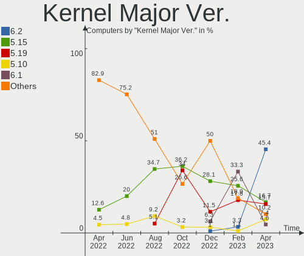

| Version | Computers | Percent |
|---------|-----------|---------|
| 5.17    | 37        | 30.83%  |
| 5.13    | 27        | 22.5%   |
| 5.15    | 12        | 10%     |
| 5.4     | 11        | 9.17%   |
| 5.10    | 10        | 8.33%   |
| 5.16    | 9         | 7.5%    |
| 5.11    | 4         | 3.33%   |
| 3.10    | 4         | 3.33%   |
| 5.18    | 2         | 1.67%   |
| 5.3     | 1         | 0.83%   |
| 5.14    | 1         | 0.83%   |
| 5       | 1         | 0.83%   |
| 4.19    | 1         | 0.83%   |

Arch
----

OS architecture (x86_64, i586, etc.)

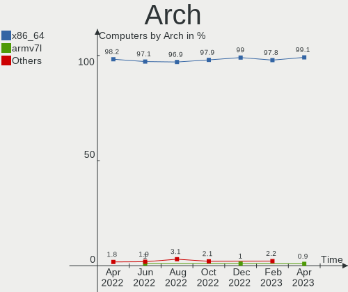

| Name    | Computers | Percent |
|---------|-----------|---------|
| x86_64  | 118       | 98.33%  |
| aarch64 | 2         | 1.67%   |

DE
--

Desktop Environment

| Name          | Computers | Percent |
|---------------|-----------|---------|
| GNOME         | 54        | 45%     |
| KDE5          | 22        | 18.33%  |
| XFCE          | 9         | 7.5%    |
| X-Cinnamon    | 8         | 6.67%   |
| Cinnamon      | 7         | 5.83%   |
| Unknown       | 7         | 5.83%   |
| MATE          | 4         | 3.33%   |
| LXDE          | 2         | 1.67%   |
| awesome       | 2         | 1.67%   |
| Unity         | 1         | 0.83%   |
| Phosh:GNOME   | 1         | 0.83%   |
| LXQt          | 1         | 0.83%   |
| i3            | 1         | 0.83%   |
| GNOME Classic | 1         | 0.83%   |

Display Server
--------------

X11 or Wayland

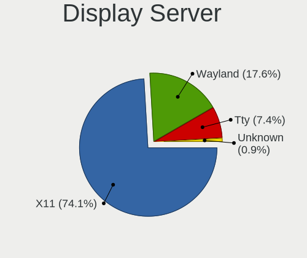

| Name    | Computers | Percent |
|---------|-----------|---------|
| X11     | 92        | 76.67%  |
| Wayland | 18        | 15%     |
| Tty     | 8         | 6.67%   |
| Unknown | 2         | 1.67%   |

Display Manager
---------------

SDDM, LightDM, etc.

| Name    | Computers | Percent |
|---------|-----------|---------|
| Unknown | 56        | 46.67%  |
| GDM3    | 20        | 16.67%  |
| LightDM | 15        | 12.5%   |
| SDDM    | 14        | 11.67%  |
| GDM     | 13        | 10.83%  |
| SLiM    | 1         | 0.83%   |
| LXDM    | 1         | 0.83%   |

OS Lang
-------

Language

| Lang  | Computers | Percent |
|-------|-----------|---------|
| en_AU | 101       | 84.17%  |
| en_US | 19        | 15.83%  |

Boot Mode
---------

EFI or BIOS

| Mode | Computers | Percent |
|------|-----------|---------|
| BIOS | 64        | 53.33%  |
| EFI  | 56        | 46.67%  |

Filesystem
----------

Type of filesystem

| Type    | Computers | Percent |
|---------|-----------|---------|
| Ext4    | 87        | 72.5%   |
| Btrfs   | 15        | 12.5%   |
| Xfs     | 12        | 10%     |
| Zfs     | 3         | 2.5%    |
| Overlay | 2         | 1.67%   |
| Ext3    | 1         | 0.83%   |

Part. scheme
------------

Scheme of partitioning

| Type    | Computers | Percent |
|---------|-----------|---------|
| Unknown | 68        | 56.67%  |
| GPT     | 34        | 28.33%  |
| MBR     | 18        | 15%     |

Dual Boot with Linux/BSD
------------------------

Hosting more than one Linux/BSD

| Dual boot | Computers | Percent |
|-----------|-----------|---------|
| No        | 110       | 91.67%  |
| Yes       | 10        | 8.33%   |

Dual Boot (Win)
---------------

Hosting Linux and Windows

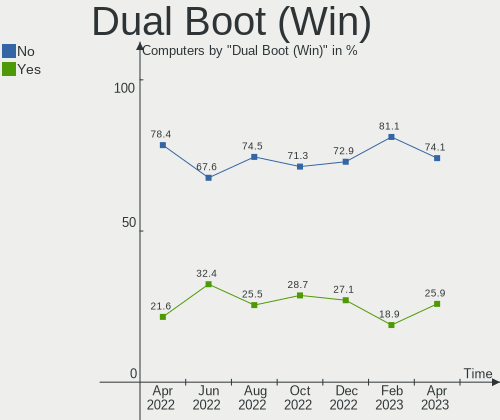

| Dual boot | Computers | Percent |
|-----------|-----------|---------|
| No        | 98        | 81.67%  |
| Yes       | 22        | 18.33%  |

Board
-----

Vendor
------

Motherboard manufacturer

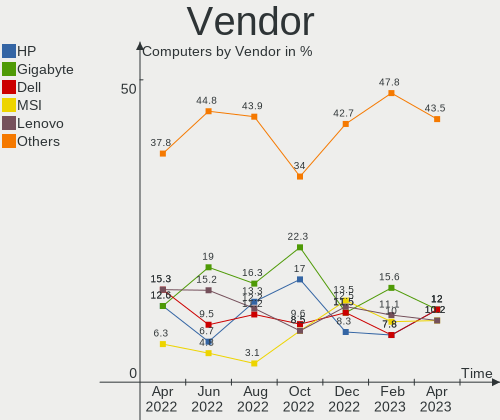

| Name                    | Computers | Percent |
|-------------------------|-----------|---------|
| Gigabyte Technology     | 20        | 16.67%  |
| Hewlett-Packard         | 17        | 14.17%  |
| Dell                    | 16        | 13.33%  |
| Lenovo                  | 15        | 12.5%   |
| ASUSTek Computer        | 13        | 10.83%  |
| MSI                     | 8         | 6.67%   |
| Acer                    | 7         | 5.83%   |
| Apple                   | 6         | 5%      |
| Toshiba                 | 4         | 3.33%   |
| Intel                   | 4         | 3.33%   |
| ASRock                  | 3         | 2.5%    |
| AMI                     | 2         | 1.67%   |
| Raspberry Pi Foundation | 1         | 0.83%   |
| IT Channel Pty          | 1         | 0.83%   |
| Framework               | 1         | 0.83%   |
| ECS                     | 1         | 0.83%   |
| Unknown                 | 1         | 0.83%   |

Model
-----

Motherboard model

| Name                                     | Computers | Percent |
|------------------------------------------|-----------|---------|
| Lenovo ThinkPad E595 20NFA000AU          | 2         | 1.67%   |
| ASUS ROG Zephyrus G14 GA401QM_GA401QM    | 2         | 1.67%   |
| AMI Aptio CRB                            | 2         | 1.67%   |
| Toshiba TECRA R850                       | 1         | 0.83%   |
| Toshiba Satellite P850                   | 1         | 0.83%   |
| Toshiba Satellite L50-A                  | 1         | 0.83%   |
| Toshiba Satellite C850                   | 1         | 0.83%   |
| RPi Raspberry Pi 4 Model B Rev 1.5       | 1         | 0.83%   |
| MSI MS-7D54                              | 1         | 0.83%   |
| MSI MS-7C92                              | 1         | 0.83%   |
| MSI MS-7C52                              | 1         | 0.83%   |
| MSI MS-7B89                              | 1         | 0.83%   |
| MSI MS-7998                              | 1         | 0.83%   |
| MSI MS-7846                              | 1         | 0.83%   |
| MSI MS-7693                              | 1         | 0.83%   |
| MSI GT70 2OC/2OD                         | 1         | 0.83%   |
| Lenovo Yoga C930-13IKB 81C4              | 1         | 0.83%   |
| Lenovo Yoga 720-15IKB 80X7               | 1         | 0.83%   |
| Lenovo Yoga 720-13IKB 80X6               | 1         | 0.83%   |
| Lenovo ThinkPad X1 Extreme 20MFCTO1WW    | 1         | 0.83%   |
| Lenovo ThinkPad X1 Carbon 7th 20QDS00M00 | 1         | 0.83%   |
| Lenovo ThinkPad T14 Gen 1 20UDCTO1WW     | 1         | 0.83%   |
| Lenovo ThinkPad E570 20H5CTO1WW          | 1         | 0.83%   |
| Lenovo ThinkCentre M58p 7220A72          | 1         | 0.83%   |
| Lenovo Legion Y9000X 2020 81TH           | 1         | 0.83%   |
| Lenovo Legion S7 15ACH6 82K8             | 1         | 0.83%   |
| Lenovo IdeaPad Gaming 3 15IHU6 82K1      | 1         | 0.83%   |
| Lenovo IdeaPad 520-15IKB 81BF            | 1         | 0.83%   |
| Lenovo IdeaPad 3 15ALC6 82KU             | 1         | 0.83%   |
| IT Channel Pty PA70Hx                    | 1         | 0.83%   |
| Intel NUC8i3BEH                          | 1         | 0.83%   |
| Intel NUC11PAHi5                         | 1         | 0.83%   |
| Intel LADPNVMO AAE76523-300              | 1         | 0.83%   |
| Intel DH67BL AAG10189-210                | 1         | 0.83%   |
| HP Z800 Workstation                      | 1         | 0.83%   |
| HP xw8400 Workstation                    | 1         | 0.83%   |
| HP ProDesk 600 G3 SFF                    | 1         | 0.83%   |
| HP Pavilion x360 Convertible             | 1         | 0.83%   |
| HP Pavilion g6                           | 1         | 0.83%   |
| HP Folio 13 - 2000                       | 1         | 0.83%   |
| HP EW7-I7D22875GR1                       | 1         | 0.83%   |
| HP ENVY x360 Convertible 15-bp1xx        | 1         | 0.83%   |
| HP EliteDesk 800 G2 TWR                  | 1         | 0.83%   |
| HP EliteBook x360 1030 G3                | 1         | 0.83%   |
| HP EliteBook x360 1030 G2                | 1         | 0.83%   |
| HP EliteBook 850 G3                      | 1         | 0.83%   |
| HP Desktop 190-0xxx                      | 1         | 0.83%   |
| HP Compaq Presario CQ60                  | 1         | 0.83%   |
| HP All-in-One                            | 1         | 0.83%   |
| HP 250 G6 Notebook PC                    | 1         | 0.83%   |
| HP 250 G5 Notebook PC                    | 1         | 0.83%   |
| Gigabyte Z77MX-D3H                       | 1         | 0.83%   |
| Gigabyte Z68A-D3H-B3                     | 1         | 0.83%   |
| Gigabyte X570S AORUS MASTER              | 1         | 0.83%   |
| Gigabyte P34V5                           | 1         | 0.83%   |
| Gigabyte H77N-WIFI                       | 1         | 0.83%   |
| Gigabyte H77M-D3H                        | 1         | 0.83%   |
| Gigabyte H370M-D3H                       | 1         | 0.83%   |
| Gigabyte GB-BXi7-5500                    | 1         | 0.83%   |
| Gigabyte GA-MA785G-UD3H                  | 1         | 0.83%   |

Model Family
------------

Motherboard model prefix

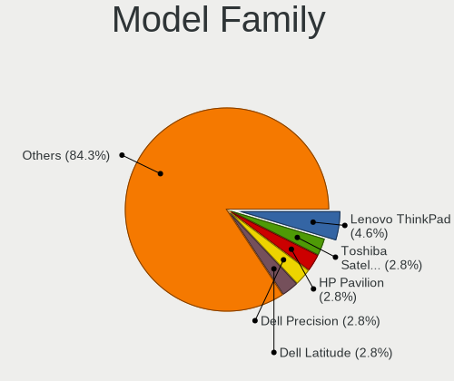

| Name                    | Computers | Percent |
|-------------------------|-----------|---------|
| Lenovo ThinkPad         | 6         | 5%      |
| Dell Inspiron           | 6         | 5%      |
| Acer Aspire             | 5         | 4.17%   |
| Toshiba Satellite       | 3         | 2.5%    |
| Lenovo Yoga             | 3         | 2.5%    |
| Lenovo IdeaPad          | 3         | 2.5%    |
| HP EliteBook            | 3         | 2.5%    |
| Dell OptiPlex           | 3         | 2.5%    |
| ASUS ROG                | 3         | 2.5%    |
| Lenovo Legion           | 2         | 1.67%   |
| HP Pavilion             | 2         | 1.67%   |
| HP 250                  | 2         | 1.67%   |
| Gigabyte GA-78LMT-USB3  | 2         | 1.67%   |
| Dell XPS                | 2         | 1.67%   |
| Dell Studio             | 2         | 1.67%   |
| ASUS SABERTOOTH         | 2         | 1.67%   |
| AMI Aptio               | 2         | 1.67%   |
| Toshiba TECRA           | 1         | 0.83%   |
| RPi Raspberry           | 1         | 0.83%   |
| MSI MS-7D54             | 1         | 0.83%   |
| MSI MS-7C92             | 1         | 0.83%   |
| MSI MS-7C52             | 1         | 0.83%   |
| MSI MS-7B89             | 1         | 0.83%   |
| MSI MS-7998             | 1         | 0.83%   |
| MSI MS-7846             | 1         | 0.83%   |
| MSI MS-7693             | 1         | 0.83%   |
| MSI GT70                | 1         | 0.83%   |
| Lenovo ThinkCentre      | 1         | 0.83%   |
| IT Channel Pty PA70Hx   | 1         | 0.83%   |
| Intel NUC8i3BEH         | 1         | 0.83%   |
| Intel NUC11PAHi5        | 1         | 0.83%   |
| Intel LADPNVMO          | 1         | 0.83%   |
| Intel DH67BL            | 1         | 0.83%   |
| HP Z800                 | 1         | 0.83%   |
| HP xw8400               | 1         | 0.83%   |
| HP ProDesk              | 1         | 0.83%   |
| HP Folio                | 1         | 0.83%   |
| HP EW7-I7D22875GR1      | 1         | 0.83%   |
| HP ENVY                 | 1         | 0.83%   |
| HP EliteDesk            | 1         | 0.83%   |
| HP Desktop              | 1         | 0.83%   |
| HP Compaq               | 1         | 0.83%   |
| HP All-in-One           | 1         | 0.83%   |
| Gigabyte Z77MX-D3H      | 1         | 0.83%   |
| Gigabyte Z68A-D3H-B3    | 1         | 0.83%   |
| Gigabyte X570S          | 1         | 0.83%   |
| Gigabyte P34V5          | 1         | 0.83%   |
| Gigabyte H77N-WIFI      | 1         | 0.83%   |
| Gigabyte H77M-D3H       | 1         | 0.83%   |
| Gigabyte H370M-D3H      | 1         | 0.83%   |
| Gigabyte GB-BXi7-5500   | 1         | 0.83%   |
| Gigabyte GA-MA785G-UD3H | 1         | 0.83%   |
| Gigabyte GA-870A-UD3    | 1         | 0.83%   |
| Gigabyte G41MT-D3       | 1         | 0.83%   |
| Gigabyte EX58-UD4P      | 1         | 0.83%   |
| Gigabyte EP45-DS3L      | 1         | 0.83%   |
| Gigabyte B560M          | 1         | 0.83%   |
| Gigabyte B450           | 1         | 0.83%   |
| Gigabyte AX370M-DS3H    | 1         | 0.83%   |
| Gigabyte AB350-Gaming   | 1         | 0.83%   |

MFG Year
--------

Motherboard manufacture year

| Year    | Computers | Percent |
|---------|-----------|---------|
| 2019    | 13        | 10.83%  |
| 2017    | 13        | 10.83%  |
| 2012    | 12        | 10%     |
| 2021    | 11        | 9.17%   |
| 2018    | 11        | 9.17%   |
| 2011    | 11        | 9.17%   |
| 2015    | 7         | 5.83%   |
| 2013    | 6         | 5%      |
| 2010    | 6         | 5%      |
| 2020    | 5         | 4.17%   |
| 2016    | 5         | 4.17%   |
| 2009    | 5         | 4.17%   |
| 2014    | 4         | 3.33%   |
| 2008    | 4         | 3.33%   |
| 2022    | 3         | 2.5%    |
| Unknown | 2         | 1.67%   |
| 2007    | 1         | 0.83%   |
| 2006    | 1         | 0.83%   |

Form Factor
-----------

Physical design of the computer

| Name           | Computers | Percent |
|----------------|-----------|---------|
| Desktop        | 55        | 45.83%  |
| Notebook       | 48        | 40%     |
| Convertible    | 8         | 6.67%   |
| Mini pc        | 4         | 3.33%   |
| All in one     | 3         | 2.5%    |
| System on chip | 2         | 1.67%   |

Secure Boot
-----------

Enabled or disabled

| State    | Computers | Percent |
|----------|-----------|---------|
| Disabled | 108       | 90%     |
| Enabled  | 12        | 10%     |

Coreboot
--------

Have coreboot on board

| Used | Computers | Percent |
|------|-----------|---------|
| No   | 120       | 100%    |

RAM Size
--------

Total RAM memory

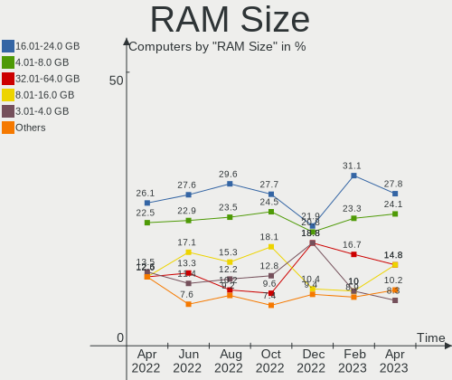

| Size in GB  | Computers | Percent |
|-------------|-----------|---------|
| 16.01-24.0  | 33        | 27.5%   |
| 4.01-8.0    | 26        | 21.67%  |
| 32.01-64.0  | 17        | 14.17%  |
| 3.01-4.0    | 17        | 14.17%  |
| 8.01-16.0   | 15        | 12.5%   |
| 24.01-32.0  | 6         | 5%      |
| 64.01-256.0 | 5         | 4.17%   |
| 1.01-2.0    | 1         | 0.83%   |

RAM Used
--------

Used RAM memory

| Used GB    | Computers | Percent |
|------------|-----------|---------|
| 1.01-2.0   | 34        | 28.33%  |
| 2.01-3.0   | 33        | 27.5%   |
| 4.01-8.0   | 21        | 17.5%   |
| 3.01-4.0   | 14        | 11.67%  |
| 8.01-16.0  | 8         | 6.67%   |
| 0.51-1.0   | 8         | 6.67%   |
| 24.01-32.0 | 1         | 0.83%   |
| 0.01-0.5   | 1         | 0.83%   |

Total Drives
------------

Number of drives on board

| Drives | Computers | Percent |
|--------|-----------|---------|
| 1      | 52        | 43.33%  |
| 2      | 39        | 32.5%   |
| 3      | 13        | 10.83%  |
| 4      | 9         | 7.5%    |
| 0      | 3         | 2.5%    |
| 8      | 1         | 0.83%   |
| 7      | 1         | 0.83%   |
| 6      | 1         | 0.83%   |
| 5      | 1         | 0.83%   |

Has CD-ROM
----------

Has CD-ROM on board

| Presented | Computers | Percent |
|-----------|-----------|---------|
| No        | 70        | 58.33%  |
| Yes       | 50        | 41.67%  |

Has Ethernet
------------

Has Ethernet on board

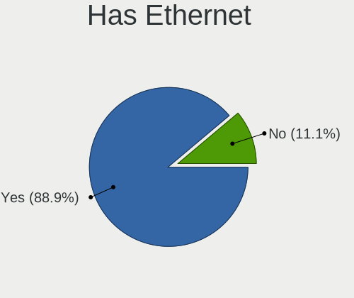

| Presented | Computers | Percent |
|-----------|-----------|---------|
| Yes       | 101       | 84.17%  |
| No        | 19        | 15.83%  |

Has WiFi
--------

Has WiFi module

| Presented | Computers | Percent |
|-----------|-----------|---------|
| Yes       | 83        | 69.17%  |
| No        | 37        | 30.83%  |

Has Bluetooth
-------------

Has Bluetooth module

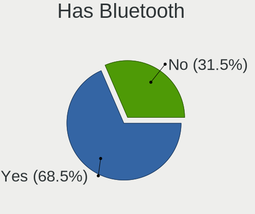

| Presented | Computers | Percent |
|-----------|-----------|---------|
| Yes       | 69        | 57.5%   |
| No        | 51        | 42.5%   |

Location
--------

Country
-------

Geographic location (country)

| Country   | Computers | Percent |
|-----------|-----------|---------|
| Australia | 120       | 100%    |

City
----

Geographic location (city)

| City           | Computers | Percent |
|----------------|-----------|---------|
| Sydney         | 28        | 23.33%  |
| Melbourne      | 22        | 18.33%  |
| Brisbane       | 21        | 17.5%   |
| Adelaide       | 10        | 8.33%   |
| Perth          | 9         | 7.5%    |
| Launceston     | 8         | 6.67%   |
| Point Cook     | 3         | 2.5%    |
| Spring Field   | 2         | 1.67%   |
| Lane Cove      | 2         | 1.67%   |
| Brownlow Hill  | 2         | 1.67%   |
| Subiaco        | 1         | 0.83%   |
| Newcastle      | 1         | 0.83%   |
| Mount Waverley | 1         | 0.83%   |
| Mackay         | 1         | 0.83%   |
| Long Jetty     | 1         | 0.83%   |
| Lithgow        | 1         | 0.83%   |
| Grange         | 1         | 0.83%   |
| Gold Coast     | 1         | 0.83%   |
| Elwood         | 1         | 0.83%   |
| Canberra       | 1         | 0.83%   |
| Blackburn      | 1         | 0.83%   |
| Bargo          | 1         | 0.83%   |
| Ballarat       | 1         | 0.83%   |

Drives
------

Drive Vendor
------------

Hard drive vendors

| Vendor                    | Computers | Drives | Percent |
|---------------------------|-----------|--------|---------|
| Seagate                   | 35        | 45     | 18.52%  |
| Samsung Electronics       | 33        | 47     | 17.46%  |
| WDC                       | 26        | 38     | 13.76%  |
| Toshiba                   | 11        | 11     | 5.82%   |
| Crucial                   | 11        | 12     | 5.82%   |
| Unknown                   | 8         | 9      | 4.23%   |
| Kingston                  | 8         | 8      | 4.23%   |
| Sandisk                   | 7         | 7      | 3.7%    |
| Hitachi                   | 6         | 6      | 3.17%   |
| SK Hynix                  | 5         | 5      | 2.65%   |
| Intel                     | 5         | 5      | 2.65%   |
| Apple                     | 5         | 6      | 2.65%   |
| SPCC                      | 2         | 3      | 1.06%   |
| Realtek Semiconductor     | 2         | 2      | 1.06%   |
| PLEXTOR                   | 2         | 4      | 1.06%   |
| Phison                    | 2         | 2      | 1.06%   |
| Patriot                   | 2         | 2      | 1.06%   |
| LITEON                    | 2         | 2      | 1.06%   |
| KIOXIA                    | 2         | 2      | 1.06%   |
| JMicron                   | 2         | 2      | 1.06%   |
| Fujitsu                   | 2         | 2      | 1.06%   |
| Corsair                   | 2         | 2      | 1.06%   |
| SSSTC                     | 1         | 1      | 0.53%   |
| OCZ                       | 1         | 1      | 0.53%   |
| Micron/Crucial Technology | 1         | 1      | 0.53%   |
| Micron Technology         | 1         | 1      | 0.53%   |
| KUIJIA                    | 1         | 1      | 0.53%   |
| KingSpec                  | 1         | 1      | 0.53%   |
| HGST                      | 1         | 1      | 0.53%   |
| Gigabyte Technology       | 1         | 1      | 0.53%   |
| faspeed                   | 1         | 1      | 0.53%   |

Drive Model
-----------

Hard drive models

| Model                                | Computers | Percent |
|--------------------------------------|-----------|---------|
| Samsung SSD 850 EVO 250GB            | 7         | 3.23%   |
| Samsung NVMe SSD Drive 256GB         | 4         | 1.84%   |
| WDC WD10EZEX-00BN5A0 1TB             | 3         | 1.38%   |
| Unknown SD/MMC/MS PRO 999GB          | 3         | 1.38%   |
| Toshiba MK5059GSXP 500GB             | 3         | 1.38%   |
| Seagate ST2000LM007-1R8174 2TB       | 3         | 1.38%   |
| Seagate ST2000DM001-1CH164 2TB       | 3         | 1.38%   |
| Seagate ST2000DL003-9VT166 2TB       | 3         | 1.38%   |
| WDC WD10EFRX-68FYTN0 1TB             | 2         | 0.92%   |
| Toshiba KBG30ZMS128G 128GB NVMe SSD  | 2         | 0.92%   |
| SK Hynix NVMe SSD Drive 1024GB       | 2         | 0.92%   |
| Seagate ST31000528AS 1TB             | 2         | 0.92%   |
| SanDisk SDSSDHII240G 240GB           | 2         | 0.92%   |
| Samsung SSD 860 QVO 1TB              | 2         | 0.92%   |
| Samsung SSD 850 EVO mSATA 500GB      | 2         | 0.92%   |
| Samsung SSD 840 EVO 120GB            | 2         | 0.92%   |
| Realtek NVMe SSD Drive 1024GB        | 2         | 0.92%   |
| JMicron Generic 128GB                | 2         | 0.92%   |
| Intel SSDSC2CT120A3 120GB            | 2         | 0.92%   |
| Hitachi HTS547550A9E384 500GB        | 2         | 0.92%   |
| Crucial CT500MX500SSD1 500GB         | 2         | 0.92%   |
| Crucial CT240BX500SSD1 240GB         | 2         | 0.92%   |
| WDC WDS500G2X0C-00L350 500GB         | 1         | 0.46%   |
| WDC WDS500G2B0A 500GB SSD            | 1         | 0.46%   |
| WDC WDS480G2G0A-00JH30 480GB SSD     | 1         | 0.46%   |
| WDC WDS240G2G0B-00EPW0 240GB SSD     | 1         | 0.46%   |
| WDC WDS240G1G0A-00SS50 240GB SSD     | 1         | 0.46%   |
| WDC WDS120G2G0B-00EPW0 120GB SSD     | 1         | 0.46%   |
| WDC WDS100T3X0C-00SJG0 1TB           | 1         | 0.46%   |
| WDC WDS100T2B0A-00SM50 1TB SSD       | 1         | 0.46%   |
| WDC WD8001PURP-74B6RY0 8TB           | 1         | 0.46%   |
| WDC WD7500BPVT-22HXZT3 752GB         | 1         | 0.46%   |
| WDC WD5000AZLX-08K2TA0 500GB         | 1         | 0.46%   |
| WDC WD40EZRZ-19GXCB0 4TB             | 1         | 0.46%   |
| WDC WD40EFRX-68N32N0 4TB             | 1         | 0.46%   |
| WDC WD2500AAKS-60VYA0 250GB          | 1         | 0.46%   |
| WDC WD20EZBX-00AYRA0 2TB             | 1         | 0.46%   |
| WDC WD20EFRX-68EUZN0 2TB             | 1         | 0.46%   |
| WDC WD20EARX-00PASB0 2TB             | 1         | 0.46%   |
| WDC WD20EARS-00MVWB0 2TB             | 1         | 0.46%   |
| WDC WD2002FAEX-007BA0 2TB            | 1         | 0.46%   |
| WDC WD15EARS-00MVWB0 1TB             | 1         | 0.46%   |
| WDC WD10EZEX-60ZF5A0 1TB             | 1         | 0.46%   |
| WDC WD10EZEX-60WN4A0 1TB             | 1         | 0.46%   |
| WDC WD10EZEX-21M2NA0 1TB             | 1         | 0.46%   |
| WDC WD10EZEX-08WN4A0 1TB             | 1         | 0.46%   |
| WDC WD10EZEX-00WN4A0 1TB             | 1         | 0.46%   |
| WDC WD10EFRX-68PJCN0 1TB             | 1         | 0.46%   |
| WDC WD10EALX-759BA0 1TB              | 1         | 0.46%   |
| WDC WD10EACS-00ZJB0 1TB              | 1         | 0.46%   |
| WDC WD1003FBYZ-010FB0 1TB            | 1         | 0.46%   |
| WDC WD1000DHTZ-04N21V0 1TB           | 1         | 0.46%   |
| WDC WD Green 2.5 1000GB              | 1         | 0.46%   |
| WDC PC SN720 SDAQNTW-256G-1001 256GB | 1         | 0.46%   |
| Unknown SE64G  64GB                  | 1         | 0.46%   |
| Unknown MMC Card  64GB               | 1         | 0.46%   |
| Unknown MMC Card  32GB               | 1         | 0.46%   |
| Unknown MMC Card  128GB              | 1         | 0.46%   |
| Unknown 032GE4  32GB                 | 1         | 0.46%   |
| Unknown 00000  64GB                  | 1         | 0.46%   |

HDD Vendor
----------

Hard disk drive vendors

| Vendor              | Computers | Drives | Percent |
|---------------------|-----------|--------|---------|
| Seagate             | 34        | 44     | 41.98%  |
| WDC                 | 19        | 28     | 23.46%  |
| Toshiba             | 7         | 7      | 8.64%   |
| Samsung Electronics | 6         | 11     | 7.41%   |
| Hitachi             | 6         | 6      | 7.41%   |
| Apple               | 4         | 4      | 4.94%   |
| Unknown             | 3         | 3      | 3.7%    |
| HGST                | 1         | 1      | 1.23%   |
| Fujitsu             | 1         | 1      | 1.23%   |

SSD Vendor
----------

Solid state drive vendors

| Vendor              | Computers | Drives | Percent |
|---------------------|-----------|--------|---------|
| Samsung Electronics | 18        | 22     | 28.57%  |
| Crucial             | 9         | 10     | 14.29%  |
| WDC                 | 6         | 6      | 9.52%   |
| Kingston            | 5         | 5      | 7.94%   |
| Intel               | 4         | 4      | 6.35%   |
| SanDisk             | 3         | 3      | 4.76%   |
| SPCC                | 2         | 2      | 3.17%   |
| PLEXTOR             | 2         | 4      | 3.17%   |
| Patriot             | 2         | 2      | 3.17%   |
| LITEON              | 2         | 2      | 3.17%   |
| JMicron             | 2         | 2      | 3.17%   |
| Seagate             | 1         | 1      | 1.59%   |
| OCZ                 | 1         | 1      | 1.59%   |
| Micron Technology   | 1         | 1      | 1.59%   |
| KUIJIA              | 1         | 1      | 1.59%   |
| KingSpec            | 1         | 1      | 1.59%   |
| Fujitsu             | 1         | 1      | 1.59%   |
| faspeed             | 1         | 1      | 1.59%   |
| Apple               | 1         | 1      | 1.59%   |

Drive Kind
----------

HDD or SSD

| Kind    | Computers | Drives | Percent |
|---------|-----------|--------|---------|
| HDD     | 64        | 105    | 38.55%  |
| SSD     | 54        | 70     | 32.53%  |
| NVMe    | 42        | 49     | 25.3%   |
| MMC     | 5         | 6      | 3.01%   |
| Unknown | 1         | 1      | 0.6%    |

Drive Connector
---------------

SATA, SAS, NVMe, etc.

| Type | Computers | Drives | Percent |
|------|-----------|--------|---------|
| SATA | 89        | 168    | 61.81%  |
| NVMe | 42        | 49     | 29.17%  |
| SAS  | 8         | 8      | 5.56%   |
| MMC  | 5         | 6      | 3.47%   |

Drive Size
----------

Size of hard drive

| Size in TB | Computers | Drives | Percent |
|------------|-----------|--------|---------|
| 0.01-0.5   | 64        | 91     | 50.79%  |
| 0.51-1.0   | 37        | 56     | 29.37%  |
| 1.01-2.0   | 16        | 18     | 12.7%   |
| 3.01-4.0   | 4         | 5      | 3.17%   |
| 4.01-10.0  | 4         | 4      | 3.17%   |
| 2.01-3.0   | 1         | 1      | 0.79%   |

Space Total
-----------

Amount of disk space available on the file system

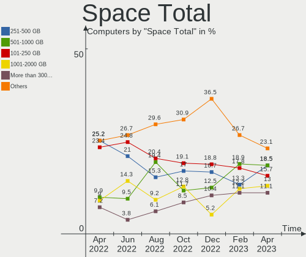

| Size in GB     | Computers | Percent |
|----------------|-----------|---------|
| 101-250        | 31        | 25.83%  |
| 251-500        | 24        | 20%     |
| 501-1000       | 20        | 16.67%  |
| 1001-2000      | 10        | 8.33%   |
| 51-100         | 10        | 8.33%   |
| More than 3000 | 9         | 7.5%    |
| 1-20           | 6         | 5%      |
| 2001-3000      | 5         | 4.17%   |
| 21-50          | 4         | 3.33%   |
| Unknown        | 1         | 0.83%   |

Space Used
----------

Amount of used disk space

| Used GB        | Computers | Percent |
|----------------|-----------|---------|
| 1-20           | 35        | 29.17%  |
| 21-50          | 23        | 19.17%  |
| 51-100         | 21        | 17.5%   |
| 101-250        | 13        | 10.83%  |
| 251-500        | 11        | 9.17%   |
| 1001-2000      | 8         | 6.67%   |
| 501-1000       | 5         | 4.17%   |
| More than 3000 | 3         | 2.5%    |
| Unknown        | 1         | 0.83%   |

Malfunc. Drives
---------------

Drive models with a malfunction

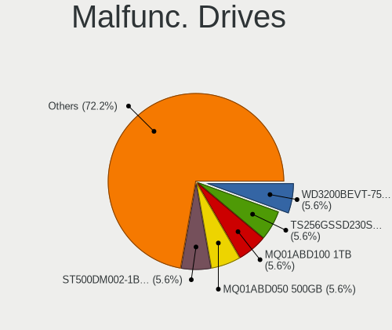

| Model                           | Computers | Drives | Percent |
|---------------------------------|-----------|--------|---------|
| Intel SSDSC2CT120A3 120GB       | 2         | 2      | 20%     |
| WDC WD20EARS-00MVWB0 2TB        | 1         | 1      | 10%     |
| WDC WD10EFRX-68FYTN0 1TB        | 1         | 1      | 10%     |
| Seagate ST3160812AS 160GB       | 1         | 1      | 10%     |
| Seagate ST2000DM001-1CH164 2TB  | 1         | 1      | 10%     |
| Seagate ST2000DL003-9VT166 2TB  | 1         | 1      | 10%     |
| Seagate ST1000NC000-1CX162 1TB  | 1         | 2      | 10%     |
| Samsung Electronics HD103UJ 1TB | 1         | 2      | 10%     |
| Intel SSDSA2M080G2LE 80GB       | 1         | 1      | 10%     |

Malfunc. Drive Vendor
---------------------

Vendors of faulty drives

| Vendor              | Computers | Drives | Percent |
|---------------------|-----------|--------|---------|
| Seagate             | 3         | 5      | 33.33%  |
| Intel               | 3         | 3      | 33.33%  |
| WDC                 | 2         | 2      | 22.22%  |
| Samsung Electronics | 1         | 2      | 11.11%  |

Malfunc. HDD Vendor
-------------------

Vendors of faulty HDD drives

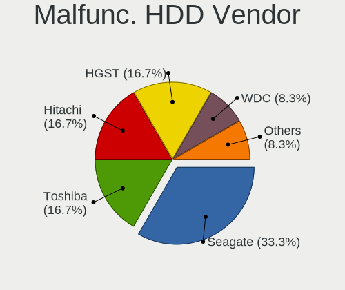

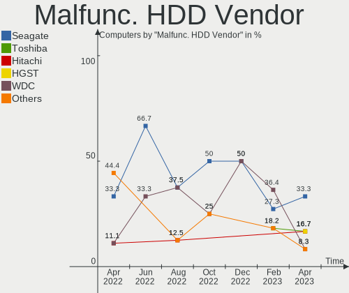

| Vendor              | Computers | Drives | Percent |
|---------------------|-----------|--------|---------|
| Seagate             | 3         | 5      | 50%     |
| WDC                 | 2         | 2      | 33.33%  |
| Samsung Electronics | 1         | 2      | 16.67%  |

Malfunc. Drive Kind
-------------------

Kinds of faulty drives

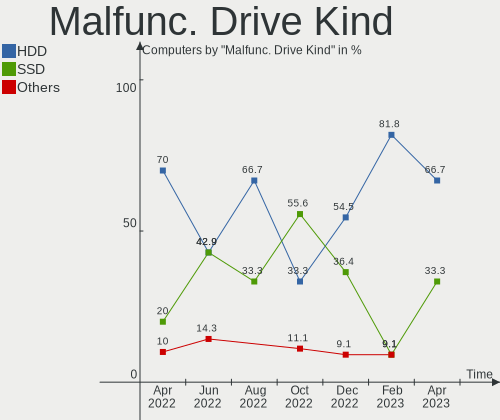

| Kind | Computers | Drives | Percent |
|------|-----------|--------|---------|
| HDD  | 6         | 9      | 66.67%  |
| SSD  | 3         | 3      | 33.33%  |

Failed Drives
-------------

Failed drive models

Zero info for selected period =(

Failed Drive Vendor
-------------------

Failed drive vendors

Zero info for selected period =(

Drive Status
------------

Number of failed and malfunc. drives

| Status   | Computers | Drives | Percent |
|----------|-----------|--------|---------|
| Detected | 70        | 118    | 53.85%  |
| Works    | 51        | 101    | 39.23%  |
| Malfunc  | 9         | 12     | 6.92%   |

Storage controller
------------------

Storage Vendor
--------------

Storage controller vendors

| Vendor                         | Computers | Percent |
|--------------------------------|-----------|---------|
| Intel                          | 76        | 48.72%  |
| AMD                            | 21        | 13.46%  |
| Samsung Electronics            | 15        | 9.62%   |
| Sandisk                        | 6         | 3.85%   |
| Phison Electronics             | 6         | 3.85%   |
| Toshiba America Info Systems   | 5         | 3.21%   |
| SK Hynix                       | 5         | 3.21%   |
| Micron/Crucial Technology      | 3         | 1.92%   |
| Kingston Technology Company    | 3         | 1.92%   |
| JMicron Technology             | 3         | 1.92%   |
| ASMedia Technology             | 3         | 1.92%   |
| Realtek Semiconductor          | 2         | 1.28%   |
| Nvidia                         | 2         | 1.28%   |
| ULi Electronics                | 1         | 0.64%   |
| Solid State Storage Technology | 1         | 0.64%   |
| Silicon Image                  | 1         | 0.64%   |
| Marvell Technology Group       | 1         | 0.64%   |
| LSI Logic / Symbios Logic      | 1         | 0.64%   |
| KIOXIA                         | 1         | 0.64%   |

Storage Model
-------------

Storage controller models

| Model                                                                                   | Computers | Percent |
|-----------------------------------------------------------------------------------------|-----------|---------|
| AMD FCH SATA Controller [AHCI mode]                                                     | 12        | 6.94%   |
| Intel Sunrise Point-LP SATA Controller [AHCI mode]                                      | 7         | 4.05%   |
| Intel 82801 Mobile SATA Controller [RAID mode]                                          | 6         | 3.47%   |
| Samsung NVMe SSD Controller SM981/PM981/PM983                                           | 5         | 2.89%   |
| Samsung NVMe SSD Controller SM961/PM961/SM963                                           | 5         | 2.89%   |
| Intel SATA Controller [RAID mode]                                                       | 5         | 2.89%   |
| Intel Cannon Lake PCH SATA AHCI Controller                                              | 5         | 2.89%   |
| Intel 7 Series/C210 Series Chipset Family 6-port SATA Controller [AHCI mode]            | 4         | 2.31%   |
| Intel 7 Series Chipset Family 6-port SATA Controller [AHCI mode]                        | 4         | 2.31%   |
| Intel 6 Series/C200 Series Chipset Family Desktop SATA Controller (IDE mode, ports 0-3) | 4         | 2.31%   |
| Intel 6 Series/C200 Series Chipset Family 6 port Desktop SATA AHCI Controller           | 4         | 2.31%   |
| AMD SB7x0/SB8x0/SB9x0 SATA Controller [AHCI mode]                                       | 4         | 2.31%   |
| AMD SB7x0/SB8x0/SB9x0 IDE Controller                                                    | 4         | 2.31%   |
| SK Hynix Gold P31 SSD                                                                   | 3         | 1.73%   |
| Sandisk WD Black 2018/SN750 / PC SN720 NVMe SSD                                         | 3         | 1.73%   |
| Phison E16 PCIe4 NVMe Controller                                                        | 3         | 1.73%   |
| Intel HM170/QM170 Chipset SATA Controller [AHCI Mode]                                   | 3         | 1.73%   |
| Intel 8 Series/C220 Series Chipset Family 6-port SATA Controller 1 [AHCI mode]          | 3         | 1.73%   |
| Intel 6 Series/C200 Series Chipset Family Desktop SATA Controller (IDE mode, ports 4-5) | 3         | 1.73%   |
| Intel 6 Series/C200 Series Chipset Family 6 port Mobile SATA AHCI Controller            | 3         | 1.73%   |
| ASMedia ASM1062 Serial ATA Controller                                                   | 3         | 1.73%   |
| AMD SB7x0/SB8x0/SB9x0 SATA Controller [IDE mode]                                        | 3         | 1.73%   |
| Toshiba America Info Systems XG6 NVMe SSD Controller                                    | 2         | 1.16%   |
| Sandisk WD Black SN750 / PC SN730 NVMe SSD                                              | 2         | 1.16%   |
| Micron/Crucial NVMe Controller                                                          | 2         | 1.16%   |
| JMicron JMB363 SATA/IDE Controller                                                      | 2         | 1.16%   |
| Intel Tiger Lake-LP SATA Controller [AHCI mode]                                         | 2         | 1.16%   |
| Intel Q170/Q150/B150/H170/H110/Z170/CM236 Chipset SATA Controller [AHCI Mode]           | 2         | 1.16%   |
| Intel NM10/ICH7 Family SATA Controller [AHCI mode]                                      | 2         | 1.16%   |
| Intel Atom Processor E3800 Series SATA AHCI Controller                                  | 2         | 1.16%   |
| Intel 82801JI (ICH10 Family) SATA AHCI Controller                                       | 2         | 1.16%   |
| Intel 82801IBM/IEM (ICH9M/ICH9M-E) 4 port SATA Controller [AHCI mode]                   | 2         | 1.16%   |
| Intel 200 Series PCH SATA controller [AHCI mode]                                        | 2         | 1.16%   |
| AMD 400 Series Chipset SATA Controller                                                  | 2         | 1.16%   |
| ULi ULi M5288 SATA                                                                      | 1         | 0.58%   |
| ULi M5229 IDE                                                                           | 1         | 0.58%   |
| Toshiba America Info Systems XG4 NVMe SSD Controller                                    | 1         | 0.58%   |
| Toshiba America Info Systems Toshiba America Info Non-Volatile memory controller        | 1         | 0.58%   |
| Toshiba America Info Systems BG3 NVMe SSD Controller                                    | 1         | 0.58%   |
| Solid State Storage Non-Volatile memory controller                                      | 1         | 0.58%   |
| SK Hynix PC401 NVMe Solid State Drive 256GB                                             | 1         | 0.58%   |
| SK Hynix BC501 NVMe Solid State Drive                                                   | 1         | 0.58%   |
| Silicon Image SiI 3132 Serial ATA Raid II Controller                                    | 1         | 0.58%   |
| Sandisk WD PC SN810 / Black SN850 NVMe SSD                                              | 1         | 0.58%   |
| Sandisk PC SN520 NVMe SSD                                                               | 1         | 0.58%   |
| Samsung NVMe SSD Controller SM951/PM951                                                 | 1         | 0.58%   |
| Samsung NVMe SSD Controller PM9A1/PM9A3/980PRO                                          | 1         | 0.58%   |
| Samsung NVMe SSD Controller 980                                                         | 1         | 0.58%   |
| Samsung Electronics SATA controller                                                     | 1         | 0.58%   |
| Samsung Electronics Non-Volatile memory controller                                      | 1         | 0.58%   |
| Realtek RTS5763DL NVMe SSD Controller                                                   | 1         | 0.58%   |
| Realtek Realtek Non-Volatile memory controller                                          | 1         | 0.58%   |
| Phison Electronics Non-Volatile memory controller                                       | 1         | 0.58%   |
| Phison E18 PCIe4 NVMe Controller                                                        | 1         | 0.58%   |
| Phison E12 NVMe Controller                                                              | 1         | 0.58%   |
| Nvidia MCP89 SATA Controller (AHCI mode)                                                | 1         | 0.58%   |
| Nvidia MCP78S [GeForce 8200] SATA Controller (non-AHCI mode)                            | 1         | 0.58%   |
| Nvidia MCP78S [GeForce 8200] IDE                                                        | 1         | 0.58%   |
| Micron/Crucial Non-Volatile memory controller                                           | 1         | 0.58%   |
| Marvell Group 88SE9215 PCIe 2.0 x1 4-port SATA 6 Gb/s Controller                        | 1         | 0.58%   |

Storage Kind
------------

Kind of storage controller (IDE, SATA, NVMe, SAS, ...)

| Kind | Computers | Percent |
|------|-----------|---------|
| SATA | 81        | 52.94%  |
| NVMe | 42        | 27.45%  |
| IDE  | 16        | 10.46%  |
| RAID | 13        | 8.5%    |
| SCSI | 1         | 0.65%   |

Processor
---------

CPU Vendor
----------

Processor vendors

| Vendor | Computers | Percent |
|--------|-----------|---------|
| Intel  | 88        | 73.33%  |
| AMD    | 30        | 25%     |
| ARM    | 2         | 1.67%   |

CPU Model
---------

Processor models

| Model                                         | Computers | Percent |
|-----------------------------------------------|-----------|---------|
| Intel Core i7-8550U CPU @ 1.80GHz             | 5         | 4.17%   |
| Intel Core i7-2600 CPU @ 3.40GHz              | 4         | 3.33%   |
| Intel Core i7-8700 CPU @ 3.20GHz              | 2         | 1.67%   |
| Intel Core i7-7700HQ CPU @ 2.80GHz            | 2         | 1.67%   |
| Intel Core i7-7700 CPU @ 3.60GHz              | 2         | 1.67%   |
| Intel Core i7-7500U CPU @ 2.70GHz             | 2         | 1.67%   |
| Intel Core i5-8250U CPU @ 1.60GHz             | 2         | 1.67%   |
| Intel Core i5-6200U CPU @ 2.30GHz             | 2         | 1.67%   |
| Intel Core i5-3470 CPU @ 3.20GHz              | 2         | 1.67%   |
| Intel Core i3-2120 CPU @ 3.30GHz              | 2         | 1.67%   |
| Intel Core 2 Duo CPU E8400 @ 3.00GHz          | 2         | 1.67%   |
| Intel Celeron CPU J1900 @ 1.99GHz             | 2         | 1.67%   |
| ARM Processor                                 | 2         | 1.67%   |
| AMD Ryzen 9 5950X 16-Core Processor           | 2         | 1.67%   |
| AMD Ryzen 9 5900HS with Radeon Graphics       | 2         | 1.67%   |
| AMD Ryzen 5 3500U with Radeon Vega Mobile Gfx | 2         | 1.67%   |
| Intel Xeon CPU X5675 @ 3.07GHz                | 1         | 0.83%   |
| Intel Xeon CPU X5670 @ 2.93GHz                | 1         | 0.83%   |
| Intel Xeon CPU E3-1245 v5 @ 3.50GHz           | 1         | 0.83%   |
| Intel Xeon CPU 5160 @ 3.00GHz                 | 1         | 0.83%   |
| Intel Pentium Gold G5400 CPU @ 3.70GHz        | 1         | 0.83%   |
| Intel Genuine CPU @ 1.66GHz                   | 1         | 0.83%   |
| Intel Core i7-8850H CPU @ 2.60GHz             | 1         | 0.83%   |
| Intel Core i7-7820HK CPU @ 2.90GHz            | 1         | 0.83%   |
| Intel Core i7-6700HQ CPU @ 2.60GHz            | 1         | 0.83%   |
| Intel Core i7-6700 CPU @ 3.40GHz              | 1         | 0.83%   |
| Intel Core i7-5557U CPU @ 3.10GHz             | 1         | 0.83%   |
| Intel Core i7-5500U CPU @ 2.40GHz             | 1         | 0.83%   |
| Intel Core i7-4930MX CPU @ 3.00GHz            | 1         | 0.83%   |
| Intel Core i7-4770K CPU @ 3.50GHz             | 1         | 0.83%   |
| Intel Core i7-4700MQ CPU @ 2.40GHz            | 1         | 0.83%   |
| Intel Core i7-3770 CPU @ 3.40GHz              | 1         | 0.83%   |
| Intel Core i7-3632QM CPU @ 2.20GHz            | 1         | 0.83%   |
| Intel Core i7-3615QM CPU @ 2.30GHz            | 1         | 0.83%   |
| Intel Core i7-3610QM CPU @ 2.30GHz            | 1         | 0.83%   |
| Intel Core i7-2630QM CPU @ 2.00GHz            | 1         | 0.83%   |
| Intel Core i7-10750H CPU @ 2.60GHz            | 1         | 0.83%   |
| Intel Core i7-1065G7 CPU @ 1.30GHz            | 1         | 0.83%   |
| Intel Core i7-10510U CPU @ 1.80GHz            | 1         | 0.83%   |
| Intel Core i7 CPU Q 720 @ 1.60GHz             | 1         | 0.83%   |
| Intel Core i7 CPU 920 @ 2.67GHz               | 1         | 0.83%   |
| Intel Core i7 CPU 880 @ 3.07GHz               | 1         | 0.83%   |
| Intel Core i5-9600K CPU @ 3.70GHz             | 1         | 0.83%   |
| Intel Core i5-9300H CPU @ 2.40GHz             | 1         | 0.83%   |
| Intel Core i5-8600 CPU @ 3.10GHz              | 1         | 0.83%   |
| Intel Core i5-8265U CPU @ 1.60GHz             | 1         | 0.83%   |
| Intel Core i5-7300U CPU @ 2.60GHz             | 1         | 0.83%   |
| Intel Core i5-7200U CPU @ 2.50GHz             | 1         | 0.83%   |
| Intel Core i5-5300U CPU @ 2.30GHz             | 1         | 0.83%   |
| Intel Core i5-4670 CPU @ 3.40GHz              | 1         | 0.83%   |
| Intel Core i5-4590 CPU @ 3.30GHz              | 1         | 0.83%   |
| Intel Core i5-4200U CPU @ 1.60GHz             | 1         | 0.83%   |
| Intel Core i5-2520M CPU @ 2.50GHz             | 1         | 0.83%   |
| Intel Core i5-2500 CPU @ 3.30GHz              | 1         | 0.83%   |
| Intel Core i5-2467M CPU @ 1.60GHz             | 1         | 0.83%   |
| Intel Core i5-2450M CPU @ 2.50GHz             | 1         | 0.83%   |
| Intel Core i5-2400 CPU @ 3.10GHz              | 1         | 0.83%   |
| Intel Core i5 CPU M 540 @ 2.53GHz             | 1         | 0.83%   |
| Intel Core i3-8109U CPU @ 3.00GHz             | 1         | 0.83%   |
| Intel Core i3-7100 CPU @ 3.90GHz              | 1         | 0.83%   |

CPU Model Family
----------------

Processor model prefix

| Model              | Computers | Percent |
|--------------------|-----------|---------|
| Intel Core i7      | 37        | 30.83%  |
| Intel Core i5      | 22        | 18.33%  |
| AMD Ryzen 5        | 12        | 10%     |
| Other              | 7         | 5.83%   |
| Intel Core i3      | 6         | 5%      |
| AMD Ryzen 9        | 6         | 5%      |
| Intel Celeron      | 5         | 4.17%   |
| Intel Xeon         | 4         | 3.33%   |
| Intel Core 2 Duo   | 4         | 3.33%   |
| AMD FX             | 3         | 2.5%    |
| Intel Atom         | 2         | 1.67%   |
| Intel Pentium Gold | 1         | 0.83%   |
| Intel Genuine      | 1         | 0.83%   |
| Intel Core 2 Quad  | 1         | 0.83%   |
| AMD Sempron        | 1         | 0.83%   |
| AMD Ryzen 7 PRO    | 1         | 0.83%   |
| AMD Ryzen 7        | 1         | 0.83%   |
| AMD Phenom II X6   | 1         | 0.83%   |
| AMD Phenom II X4   | 1         | 0.83%   |
| AMD Phenom II X2   | 1         | 0.83%   |
| AMD E2             | 1         | 0.83%   |
| AMD Athlon II X2   | 1         | 0.83%   |
| AMD Athlon 64 X2   | 1         | 0.83%   |

CPU Cores
---------

Number of processor cores

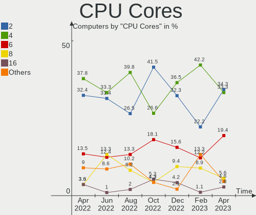

| Number | Computers | Percent |
|--------|-----------|---------|
| 4      | 54        | 45%     |
| 2      | 33        | 27.5%   |
| 6      | 17        | 14.17%  |
| 8      | 5         | 4.17%   |
| 1      | 4         | 3.33%   |
| 12     | 3         | 2.5%    |
| 16     | 2         | 1.67%   |
| 10     | 1         | 0.83%   |
| 3      | 1         | 0.83%   |

CPU Sockets
-----------

Number of sockets

| Number | Computers | Percent |
|--------|-----------|---------|
| 1      | 117       | 97.5%   |
| 2      | 3         | 2.5%    |

CPU Threads
-----------

Threads per core (Hyper-Threading)

| Number | Computers | Percent |
|--------|-----------|---------|
| 2      | 86        | 71.67%  |
| 1      | 32        | 26.67%  |
| 8      | 1         | 0.83%   |
| 4      | 1         | 0.83%   |

CPU Op-Modes
------------

CPU Operation Modes (32-bit, 64-bit)

| Op mode        | Computers | Percent |
|----------------|-----------|---------|
| 32-bit, 64-bit | 118       | 98.33%  |
| 64-bit         | 1         | 0.83%   |
| Unknown        | 1         | 0.83%   |

CPU Microcode
-------------

Microcode number

| Number     | Computers | Percent |
|------------|-----------|---------|
| Unknown    | 39        | 32.5%   |
| 0x206a7    | 9         | 7.5%    |
| 0x0a50000c | 6         | 5%      |
| 0x806ea    | 5         | 4.17%   |
| 0x906ea    | 4         | 3.33%   |
| 0x306a9    | 4         | 3.33%   |
| 0x906e9    | 3         | 2.5%    |
| 0x806e9    | 3         | 2.5%    |
| 0x506e3    | 3         | 2.5%    |
| 0x306d4    | 3         | 2.5%    |
| 0x306c3    | 3         | 2.5%    |
| 0x06000852 | 3         | 2.5%    |
| 0x806ec    | 2         | 1.67%   |
| 0x30678    | 2         | 1.67%   |
| 0x1067a    | 2         | 1.67%   |
| 0x08701021 | 2         | 1.67%   |
| 0x08108102 | 2         | 1.67%   |
| 0x906ec    | 1         | 0.83%   |
| 0x906a4    | 1         | 0.83%   |
| 0x806c1    | 1         | 0.83%   |
| 0x706e5    | 1         | 0.83%   |
| 0x706a8    | 1         | 0.83%   |
| 0x6fb      | 1         | 0.83%   |
| 0x6f6      | 1         | 0.83%   |
| 0x406e3    | 1         | 0.83%   |
| 0x40651    | 1         | 0.83%   |
| 0x30679    | 1         | 0.83%   |
| 0x30661    | 1         | 0.83%   |
| 0x206c2    | 1         | 0.83%   |
| 0x106e5    | 1         | 0.83%   |
| 0x106ca    | 1         | 0.83%   |
| 0x106a5    | 1         | 0.83%   |
| 0x0a201016 | 1         | 0.83%   |
| 0x0a201009 | 1         | 0.83%   |
| 0x08608103 | 1         | 0.83%   |
| 0x08600106 | 1         | 0.83%   |
| 0x08108109 | 1         | 0.83%   |
| 0x0800820d | 1         | 0.83%   |
| 0x06006705 | 1         | 0.83%   |
| 0x02000057 | 1         | 0.83%   |
| 0x010000c8 | 1         | 0.83%   |
| 0x010000c6 | 1         | 0.83%   |

CPU Microarch
-------------

Microarchitecture

| Name             | Computers | Percent |
|------------------|-----------|---------|
| KabyLake         | 27        | 22.5%   |
| SandyBridge      | 12        | 10%     |
| Zen 3            | 9         | 7.5%    |
| IvyBridge        | 7         | 5.83%   |
| Haswell          | 7         | 5.83%   |
| Zen+             | 5         | 4.17%   |
| Skylake          | 5         | 4.17%   |
| Penryn           | 5         | 4.17%   |
| Zen 2            | 4         | 3.33%   |
| K10              | 4         | 3.33%   |
| Unknown          | 4         | 3.33%   |
| Westmere         | 3         | 2.5%    |
| TigerLake        | 3         | 2.5%    |
| Silvermont       | 3         | 2.5%    |
| Piledriver       | 3         | 2.5%    |
| Nehalem          | 3         | 2.5%    |
| Broadwell        | 3         | 2.5%    |
| Core             | 2         | 1.67%   |
| Bonnell          | 2         | 1.67%   |
| Zen              | 1         | 0.83%   |
| K8 Hammer        | 1         | 0.83%   |
| K8 & K10 hybrid  | 1         | 0.83%   |
| IceLake          | 1         | 0.83%   |
| Goldmont plus    | 1         | 0.83%   |
| Goldmont         | 1         | 0.83%   |
| Excavator        | 1         | 0.83%   |
| CometLake        | 1         | 0.83%   |
| Alderlake Hybrid | 1         | 0.83%   |

Graphics
--------

GPU Vendor
----------

Vendors of graphics cards

| Vendor | Computers | Percent |
|--------|-----------|---------|
| Intel  | 60        | 41.96%  |
| Nvidia | 48        | 33.57%  |
| AMD    | 35        | 24.48%  |

GPU Model
---------

Graphics card models

| Model                                                                       | Computers | Percent |
|-----------------------------------------------------------------------------|-----------|---------|
| Intel UHD Graphics 620                                                      | 7         | 4.76%   |
| AMD Cezanne                                                                 | 6         | 4.08%   |
| Intel 2nd Generation Core Processor Family Integrated Graphics Controller   | 5         | 3.4%    |
| Intel HD Graphics 620                                                       | 4         | 2.72%   |
| Nvidia GP108M [GeForce MX150]                                               | 3         | 2.04%   |
| Nvidia GA106M [GeForce RTX 3060 Mobile / Max-Q]                             | 3         | 2.04%   |
| Intel TigerLake-LP GT2 [Iris Xe Graphics]                                   | 3         | 2.04%   |
| Intel HD Graphics 630                                                       | 3         | 2.04%   |
| Intel CoffeeLake-S GT2 [UHD Graphics 630]                                   | 3         | 2.04%   |
| Intel Atom Processor Z36xxx/Z37xxx Series Graphics & Display                | 3         | 2.04%   |
| Intel 3rd Gen Core processor Graphics Controller                            | 3         | 2.04%   |
| AMD Picasso/Raven 2 [Radeon Vega Series / Radeon Vega Mobile Series]        | 3         | 2.04%   |
| AMD Ellesmere [Radeon RX 470/480/570/570X/580/580X/590]                     | 3         | 2.04%   |
| Nvidia TU104 [GeForce RTX 2070 SUPER]                                       | 2         | 1.36%   |
| Nvidia GP107M [GeForce GTX 1050 Mobile]                                     | 2         | 1.36%   |
| Nvidia GK208B [GeForce GT 710]                                              | 2         | 1.36%   |
| Nvidia GK107GL [Quadro K600]                                                | 2         | 1.36%   |
| Intel Skylake GT2 [HD Graphics 520]                                         | 2         | 1.36%   |
| Intel HD Graphics 5500                                                      | 2         | 1.36%   |
| Intel HD Graphics 530                                                       | 2         | 1.36%   |
| Intel CoffeeLake-H GT2 [UHD Graphics 630]                                   | 2         | 1.36%   |
| Intel 4th Gen Core Processor Integrated Graphics Controller                 | 2         | 1.36%   |
| Nvidia TU117M                                                               | 1         | 0.68%   |
| Nvidia TU116 [GeForce GTX 1660]                                             | 1         | 0.68%   |
| Nvidia TU116 [GeForce GTX 1660 Ti]                                          | 1         | 0.68%   |
| Nvidia TU116 [GeForce GTX 1660 SUPER]                                       | 1         | 0.68%   |
| Nvidia MCP89 [GeForce 320M]                                                 | 1         | 0.68%   |
| Nvidia GT216M [GeForce GT 330M]                                             | 1         | 0.68%   |
| Nvidia GT216 [GeForce GT 220]                                               | 1         | 0.68%   |
| Nvidia GT200 [GeForce GTX 260]                                              | 1         | 0.68%   |
| Nvidia GP108 [GeForce GT 1030]                                              | 1         | 0.68%   |
| Nvidia GP107M [GeForce GTX 1050 Ti Mobile]                                  | 1         | 0.68%   |
| Nvidia GP106 [GeForce GTX 1060 3GB]                                         | 1         | 0.68%   |
| Nvidia GP104BM [GeForce GTX 1070 Mobile]                                    | 1         | 0.68%   |
| Nvidia GM206 [GeForce GTX 960]                                              | 1         | 0.68%   |
| Nvidia GM206 [GeForce GTX 950]                                              | 1         | 0.68%   |
| Nvidia GM204 [GeForce GTX 970]                                              | 1         | 0.68%   |
| Nvidia GM107M [GeForce GTX 960M]                                            | 1         | 0.68%   |
| Nvidia GM107M [GeForce GTX 950M]                                            | 1         | 0.68%   |
| Nvidia GK208M [GeForce GT 740M]                                             | 1         | 0.68%   |
| Nvidia GK107M [GeForce GT 650M Mac Edition]                                 | 1         | 0.68%   |
| Nvidia GK106 [GeForce GTX 650 Ti]                                           | 1         | 0.68%   |
| Nvidia GK104M [GeForce GTX 780M]                                            | 1         | 0.68%   |
| Nvidia GK104 [GeForce GTX 670]                                              | 1         | 0.68%   |
| Nvidia GF119 [GeForce GT 520]                                               | 1         | 0.68%   |
| Nvidia GF117M [GeForce 610M/710M/810M/820M / GT 620M/625M/630M/720M]        | 1         | 0.68%   |
| Nvidia GF114 [GeForce GTX 560 Ti]                                           | 1         | 0.68%   |
| Nvidia GF110 [GeForce GTX 570 Rev. 2]                                       | 1         | 0.68%   |
| Nvidia GF100GL [Quadro 5000]                                                | 1         | 0.68%   |
| Nvidia GA107M [GeForce RTX 3050 Mobile]                                     | 1         | 0.68%   |
| Nvidia GA106M [GeForce RTX 3050 Ti Mobile / Max-Q]                          | 1         | 0.68%   |
| Nvidia GA106 [GeForce RTX 3060 Lite Hash Rate]                              | 1         | 0.68%   |
| Nvidia G98 [GeForce 8400 GS Rev. 2]                                         | 1         | 0.68%   |
| Nvidia G72 [GeForce 7300 GS]                                                | 1         | 0.68%   |
| Nvidia G70GL [Quadro FX 4500]                                               | 1         | 0.68%   |
| Nvidia C77 [GeForce 8200M G]                                                | 1         | 0.68%   |
| Intel Xeon E3-1200 v3/4th Gen Core Processor Integrated Graphics Controller | 1         | 0.68%   |
| Intel WhiskeyLake-U GT2 [UHD Graphics 620]                                  | 1         | 0.68%   |
| Intel VGA compatible controller                                             | 1         | 0.68%   |
| Intel Mobile 4 Series Chipset Integrated Graphics Controller                | 1         | 0.68%   |

GPU Combo
---------

Combinations of graphics cards

| Name            | Computers | Percent |
|-----------------|-----------|---------|
| 1 x Intel       | 40        | 33.33%  |
| 1 x Nvidia      | 28        | 23.33%  |
| 1 x AMD         | 22        | 18.33%  |
| Intel + Nvidia  | 15        | 12.5%   |
| AMD + Nvidia    | 5         | 4.17%   |
| Intel + AMD     | 4         | 3.33%   |
| 2 x AMD         | 3         | 2.5%    |
| Other           | 2         | 1.67%   |
| Intel + 2 x AMD | 1         | 0.83%   |

GPU Driver
----------

Free vs proprietary

| Driver      | Computers | Percent |
|-------------|-----------|---------|
| Free        | 86        | 71.67%  |
| Proprietary | 24        | 20%     |
| Unknown     | 10        | 8.33%   |

GPU Memory
----------

Total video memory

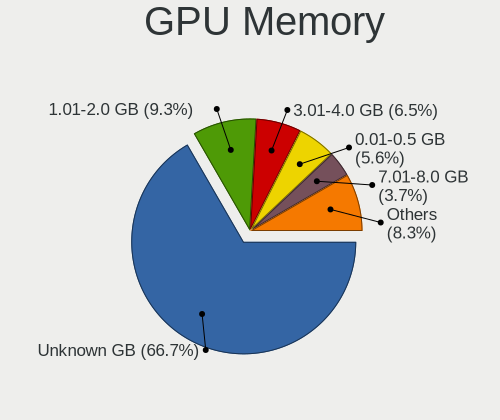

| Size in GB | Computers | Percent |
|------------|-----------|---------|
| Unknown    | 69        | 57.5%   |
| 1.01-2.0   | 14        | 11.67%  |
| 0.01-0.5   | 11        | 9.17%   |
| 3.01-4.0   | 7         | 5.83%   |
| 0.51-1.0   | 7         | 5.83%   |
| 7.01-8.0   | 6         | 5%      |
| 2.01-3.0   | 3         | 2.5%    |
| 5.01-6.0   | 2         | 1.67%   |
| 8.01-16.0  | 1         | 0.83%   |

Monitor
-------

Monitor Vendor
--------------

Monitor vendors

| Vendor               | Computers | Percent |
|----------------------|-----------|---------|
| Samsung Electronics  | 15        | 12.5%   |
| LG Display           | 13        | 10.83%  |
| AU Optronics         | 13        | 10.83%  |
| Dell                 | 9         | 7.5%    |
| Acer                 | 9         | 7.5%    |
| BenQ                 | 8         | 6.67%   |
| Chimei Innolux       | 7         | 5.83%   |
| Apple                | 6         | 5%      |
| Philips              | 5         | 4.17%   |
| Lenovo               | 5         | 4.17%   |
| Hewlett-Packard      | 5         | 4.17%   |
| BOE                  | 5         | 4.17%   |
| Goldstar             | 4         | 3.33%   |
| AOC                  | 3         | 2.5%    |
| Ancor Communications | 3         | 2.5%    |
| ___                  | 1         | 0.83%   |
| ViewSonic            | 1         | 0.83%   |
| Unknown (XXX)        | 1         | 0.83%   |
| Unknown              | 1         | 0.83%   |
| Sharp                | 1         | 0.83%   |
| PANDA                | 1         | 0.83%   |
| LG Electronics       | 1         | 0.83%   |
| Eizo                 | 1         | 0.83%   |
| CSO                  | 1         | 0.83%   |
| Compaq Computer      | 1         | 0.83%   |

Monitor Model
-------------

Monitor models

| Model                                                                   | Computers | Percent |
|-------------------------------------------------------------------------|-----------|---------|
| Lenovo LCD Monitor LEN40BA 1920x1080 344x194mm 15.5-inch                | 2         | 1.61%   |
| Dell P1917S DELD091 1280x1024 380x300mm 19.1-inch                       | 2         | 1.61%   |
| ___ LCDTV14 ___0101 1920x1080                                           | 1         | 0.81%   |
| ViewSonic VG2448 VSC3B35 1920x1080 530x300mm 24.0-inch                  | 1         | 0.81%   |
| Unknown LCDTV14 0101 1360x768 1600x900mm 72.3-inch                      | 1         | 0.81%   |
| Unknown (XXX) Beyond TV XXX2851 3840x2160 1210x680mm 54.6-inch          | 1         | 0.81%   |
| Sharp LCD Monitor SHP1476 3840x2160 346x194mm 15.6-inch                 | 1         | 0.81%   |
| Samsung Electronics SyncMaster SAM0522 1600x900 443x249mm 20.0-inch     | 1         | 0.81%   |
| Samsung Electronics SyncMaster SAM027F 1680x1050 474x296mm 22.0-inch    | 1         | 0.81%   |
| Samsung Electronics SyncMaster SAM01D3 1440x900 408x225mm 18.3-inch     | 1         | 0.81%   |
| Samsung Electronics S24E450 SAM0CA1 1920x1080 531x299mm 24.0-inch       | 1         | 0.81%   |
| Samsung Electronics S24E450 SAM0CA0 1920x1080 531x299mm 24.0-inch       | 1         | 0.81%   |
| Samsung Electronics LCD Monitor SMBX2450                                | 1         | 0.81%   |
| Samsung Electronics LCD Monitor SEC5448 1920x1080 353x198mm 15.9-inch   | 1         | 0.81%   |
| Samsung Electronics LCD Monitor SEC5441 1366x768 309x174mm 14.0-inch    | 1         | 0.81%   |
| Samsung Electronics LCD Monitor SEC3150 1366x768 344x193mm 15.5-inch    | 1         | 0.81%   |
| Samsung Electronics LCD Monitor SDC4445 1366x768 344x194mm 15.5-inch    | 1         | 0.81%   |
| Samsung Electronics LCD Monitor SAM0FA5 3840x2160 1872x1053mm 84.6-inch | 1         | 0.81%   |
| Samsung Electronics LCD Monitor SAM0F9F 3840x2160 1210x680mm 54.6-inch  | 1         | 0.81%   |
| Samsung Electronics LCD Monitor SAM0F17 3840x2160 1872x1053mm 84.6-inch | 1         | 0.81%   |
| Samsung Electronics LCD Monitor SAM0A7A 1920x1080 890x500mm 40.2-inch   | 1         | 0.81%   |
| Samsung Electronics LCD Monitor SAM03D4 1280x720                        | 1         | 0.81%   |
| Samsung Electronics C34H89x SAM0E25 3440x1440 797x333mm 34.0-inch       | 1         | 0.81%   |
| Philips PHL 328P6V PHL090B 3840x2160 700x400mm 31.7-inch                | 1         | 0.81%   |
| Philips PHL 322E1 PHLC20F 1920x1080 698x393mm 31.5-inch                 | 1         | 0.81%   |
| Philips PHL 247E6 PHLC0E7 1920x1080 521x293mm 23.5-inch                 | 1         | 0.81%   |
| Philips PHL 243B9 PHL0941 1920x1080 527x296mm 23.8-inch                 | 1         | 0.81%   |
| Philips 247EL PHLC084 1920x1080 521x293mm 23.5-inch                     | 1         | 0.81%   |
| PANDA LCD Monitor NCP004D 1920x1080 344x194mm 15.5-inch                 | 1         | 0.81%   |
| LG Electronics LCD Monitor E2441 1920x1080                              | 1         | 0.81%   |
| LG Display LP156WH1-TLA3 LGD01C2 1366x768 344x194mm 15.5-inch           | 1         | 0.81%   |
| LG Display LCD Monitor LGD0608 1920x1080 309x174mm 14.0-inch            | 1         | 0.81%   |
| LG Display LCD Monitor LGD05FA 1920x1080 309x174mm 14.0-inch            | 1         | 0.81%   |
| LG Display LCD Monitor LGD05F2 1920x1080 344x194mm 15.5-inch            | 1         | 0.81%   |
| LG Display LCD Monitor LGD05BC 3840x2160 309x174mm 14.0-inch            | 1         | 0.81%   |
| LG Display LCD Monitor LGD0538 1920x1080 344x194mm 15.5-inch            | 1         | 0.81%   |
| LG Display LCD Monitor LGD052D 1920x1080 294x165mm 13.3-inch            | 1         | 0.81%   |
| LG Display LCD Monitor LGD04EF 1920x1080 294x165mm 13.3-inch            | 1         | 0.81%   |
| LG Display LCD Monitor LGD03E9 1366x768 345x194mm 15.6-inch             | 1         | 0.81%   |
| LG Display LCD Monitor LGD034D 1366x768 344x194mm 15.5-inch             | 1         | 0.81%   |
| LG Display LCD Monitor LGD0312 1366x768 294x166mm 13.3-inch             | 1         | 0.81%   |
| LG Display LCD Monitor LGD0283 1920x1080 383x215mm 17.3-inch            | 1         | 0.81%   |
| LG Display LCD Monitor LGD0266 1366x768 344x194mm 15.5-inch             | 1         | 0.81%   |
| Lenovo LEN L28u-30 LEN65FA 3840x2160 621x341mm 27.9-inch                | 1         | 0.81%   |
| Lenovo LEN L1711pC LEN13B7 1280x1024 338x270mm 17.0-inch                | 1         | 0.81%   |
| Lenovo LCD Monitor LEN60A1 1920x1080 480x270mm 21.7-inch                | 1         | 0.81%   |
| Hewlett-Packard N270 HPN340C 1920x1080 598x336mm 27.0-inch              | 1         | 0.81%   |
| Hewlett-Packard LCD Monitor LA1951 3200x1080                            | 1         | 0.81%   |
| Hewlett-Packard LA2306 HWP294B 1920x1080 509x286mm 23.0-inch            | 1         | 0.81%   |
| Hewlett-Packard ALL-in-One HWP425B 1920x1080 435x239mm 19.5-inch        | 1         | 0.81%   |
| Hewlett-Packard 23fi HWP3075 1920x1080 509x286mm 23.0-inch              | 1         | 0.81%   |
| Goldstar TV SSCR GSMC0C8 3840x2160                                      | 1         | 0.81%   |
| Goldstar LG HDR 4K GSM7707 3840x2160 600x340mm 27.2-inch                | 1         | 0.81%   |
| Goldstar FULL HD GSM5B55 1920x1080 480x270mm 21.7-inch                  | 1         | 0.81%   |
| Goldstar 24MP56 GSM5A56 1920x1080 510x290mm 23.1-inch                   | 1         | 0.81%   |
| Goldstar 24M45 GSM5A53 1920x1080 520x290mm 23.4-inch                    | 1         | 0.81%   |
| Eizo EV2450 ENC2531 1920x1080 528x297mm 23.9-inch                       | 1         | 0.81%   |
| Dell U2419H DEL415D 1920x1080 527x296mm 23.8-inch                       | 1         | 0.81%   |
| Dell P2719H DEL4184 1920x1080 598x336mm 27.0-inch                       | 1         | 0.81%   |
| Dell P2418HT DEL4114 1920x1080 527x296mm 23.8-inch                      | 1         | 0.81%   |

Monitor Resolution
------------------

Monitor screen resolution

| Resolution         | Computers | Percent |
|--------------------|-----------|---------|
| 1920x1080 (FHD)    | 63        | 54.31%  |
| 3840x2160 (4K)     | 17        | 14.66%  |
| 1366x768 (WXGA)    | 11        | 9.48%   |
| 1280x1024 (SXGA)   | 7         | 6.03%   |
| 2560x1440 (QHD)    | 3         | 2.59%   |
| 1920x1200 (WUXGA)  | 3         | 2.59%   |
| 1440x900 (WXGA+)   | 2         | 1.72%   |
| 3840x1600          | 1         | 0.86%   |
| 3440x1440          | 1         | 0.86%   |
| 3200x1080          | 1         | 0.86%   |
| 2560x1600          | 1         | 0.86%   |
| 2256x1504          | 1         | 0.86%   |
| 1680x1050 (WSXGA+) | 1         | 0.86%   |
| 1600x900 (HD+)     | 1         | 0.86%   |
| 1360x768           | 1         | 0.86%   |
| 1280x800 (WXGA)    | 1         | 0.86%   |
| Unknown            | 1         | 0.86%   |

Monitor Diagonal
----------------

Diagonal size in inches

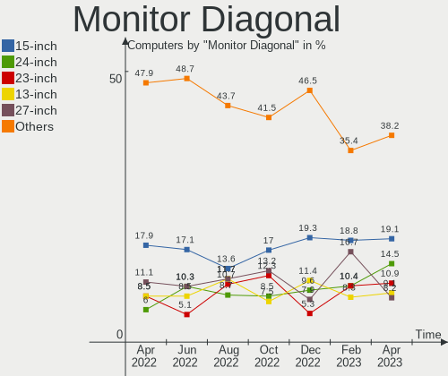

| Inches  | Computers | Percent |
|---------|-----------|---------|
| 15      | 30        | 25%     |
| 27      | 15        | 12.5%   |
| 23      | 11        | 9.17%   |
| 24      | 10        | 8.33%   |
| 13      | 10        | 8.33%   |
| 17      | 7         | 5.83%   |
| 21      | 6         | 5%      |
| 19      | 6         | 5%      |
| 14      | 5         | 4.17%   |
| Unknown | 5         | 4.17%   |
| 84      | 3         | 2.5%    |
| 72      | 2         | 1.67%   |
| 31      | 2         | 1.67%   |
| 18      | 2         | 1.67%   |
| 54      | 1         | 0.83%   |
| 48      | 1         | 0.83%   |
| 37      | 1         | 0.83%   |
| 34      | 1         | 0.83%   |
| 22      | 1         | 0.83%   |
| 20      | 1         | 0.83%   |

Monitor Width
-------------

Physical width

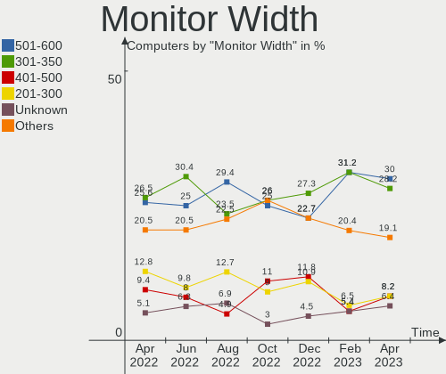

| Width in mm | Computers | Percent |
|-------------|-----------|---------|
| 301-350     | 36        | 30.51%  |
| 501-600     | 32        | 27.12%  |
| 351-400     | 12        | 10.17%  |
| 401-500     | 11        | 9.32%   |
| 201-300     | 9         | 7.63%   |
| 1501-2000   | 5         | 4.24%   |
| Unknown     | 5         | 4.24%   |
| 601-700     | 4         | 3.39%   |
| 1001-1500   | 2         | 1.69%   |
| 801-900     | 1         | 0.85%   |
| 701-800     | 1         | 0.85%   |

Aspect Ratio
------------

Proportional relationship between the width and the height

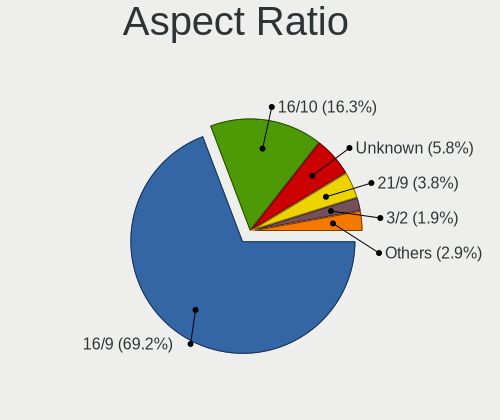

| Ratio   | Computers | Percent |
|---------|-----------|---------|
| 16/9    | 88        | 80%     |
| 16/10   | 8         | 7.27%   |
| 5/4     | 5         | 4.55%   |
| Unknown | 4         | 3.64%   |
| 21/9    | 2         | 1.82%   |
| 6/5     | 1         | 0.91%   |
| 4/3     | 1         | 0.91%   |
| 3/2     | 1         | 0.91%   |

Monitor Area
------------

Area in inch

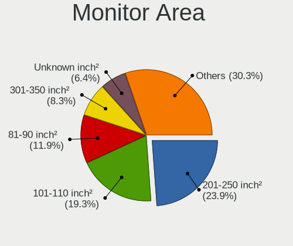

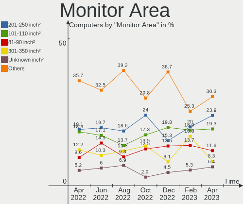

| Area in inch | Computers | Percent |
|----------------|-----------|---------|
| 101-110        | 30        | 25.42%  |
| 201-250        | 24        | 20.34%  |
| 301-350        | 15        | 12.71%  |
| 81-90          | 9         | 7.63%   |
| 151-200        | 9         | 7.63%   |
| More than 1000 | 7         | 5.93%   |
| 71-80          | 6         | 5.08%   |
| Unknown        | 5         | 4.24%   |
| 121-130        | 4         | 3.39%   |
| 351-500        | 3         | 2.54%   |
| 141-150        | 3         | 2.54%   |
| 251-300        | 1         | 0.85%   |
| 131-140        | 1         | 0.85%   |
| 501-1000       | 1         | 0.85%   |

Pixel Density
-------------

Pixels per inch

| Density       | Computers | Percent |
|---------------|-----------|---------|
| 51-100        | 45        | 38.79%  |
| 121-160       | 27        | 23.28%  |
| 101-120       | 22        | 18.97%  |
| 161-240       | 9         | 7.76%   |
| More than 240 | 6         | 5.17%   |
| Unknown       | 5         | 4.31%   |
| 1-50          | 2         | 1.72%   |

Multiple Monitors
-----------------

Total monitors connected

| Total | Computers | Percent |
|-------|-----------|---------|
| 1     | 94        | 78.33%  |
| 2     | 16        | 13.33%  |
| 0     | 9         | 7.5%    |
| 3     | 1         | 0.83%   |

Network
-------

Net Controller Vendor
---------------------

Controller vendors

| Vendor                          | Computers | Percent |
|---------------------------------|-----------|---------|
| Intel                           | 67        | 37.22%  |
| Realtek Semiconductor           | 62        | 34.44%  |
| Qualcomm Atheros                | 15        | 8.33%   |
| Broadcom                        | 11        | 6.11%   |
| D-Link                          | 3         | 1.67%   |
| TP-Link                         | 2         | 1.11%   |
| Ralink Technology               | 2         | 1.11%   |
| MEDIATEK                        | 2         | 1.11%   |
| Marvell Technology Group        | 2         | 1.11%   |
| Broadcom Limited                | 2         | 1.11%   |
| Toshiba                         | 1         | 0.56%   |
| Ralink                          | 1         | 0.56%   |
| Qualcomm Atheros Communications | 1         | 0.56%   |
| Nvidia                          | 1         | 0.56%   |
| NetGear                         | 1         | 0.56%   |
| Motorola PCS                    | 1         | 0.56%   |
| Lenovo                          | 1         | 0.56%   |
| Google                          | 1         | 0.56%   |
| Edimax Technology               | 1         | 0.56%   |
| DisplayLink                     | 1         | 0.56%   |
| Dell                            | 1         | 0.56%   |
| D-Link System                   | 1         | 0.56%   |

Net Controller Model
--------------------

Controller models

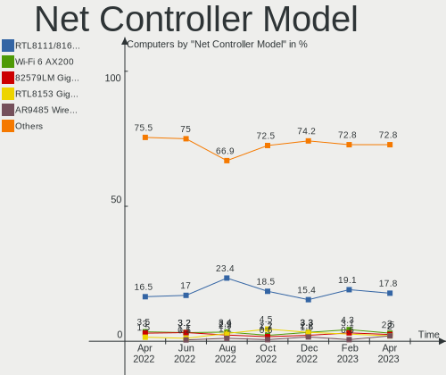

| Model                                                                                | Computers | Percent |
|--------------------------------------------------------------------------------------|-----------|---------|
| Realtek RTL8111/8168/8411 PCI Express Gigabit Ethernet Controller                    | 46        | 22.01%  |
| Intel Wi-Fi 6 AX200                                                                  | 11        | 5.26%   |
| Realtek RTL8153 Gigabit Ethernet Adapter                                             | 6         | 2.87%   |
| Qualcomm Atheros QCA6174 802.11ac Wireless Network Adapter                           | 5         | 2.39%   |
| Realtek RTL810xE PCI Express Fast Ethernet controller                                | 4         | 1.91%   |
| Intel Wireless 8265 / 8275                                                           | 4         | 1.91%   |
| Intel I211 Gigabit Network Connection                                                | 4         | 1.91%   |
| Intel 82579V Gigabit Network Connection                                              | 4         | 1.91%   |
| Realtek RTL8821CE 802.11ac PCIe Wireless Network Adapter                             | 3         | 1.44%   |
| Realtek RTL8125 2.5GbE Controller                                                    | 3         | 1.44%   |
| Intel Wireless 3165                                                                  | 3         | 1.44%   |
| Intel Ethernet Controller I225-V                                                     | 3         | 1.44%   |
| Intel Dual Band Wireless-AC 3168NGW [Stone Peak]                                     | 3         | 1.44%   |
| Broadcom NetXtreme BCM5764M Gigabit Ethernet PCIe                                    | 3         | 1.44%   |
| Realtek RTL8822BE 802.11a/b/g/n/ac WiFi adapter                                      | 2         | 0.96%   |
| Realtek RTL8723AE PCIe Wireless Network Adapter                                      | 2         | 0.96%   |
| Ralink RT5370 Wireless Adapter                                                       | 2         | 0.96%   |
| Qualcomm Atheros AR9462 Wireless Network Adapter                                     | 2         | 0.96%   |
| Qualcomm Atheros AR8161 Gigabit Ethernet                                             | 2         | 0.96%   |
| Intel Wireless 8260                                                                  | 2         | 0.96%   |
| Intel Wireless 7265                                                                  | 2         | 0.96%   |
| Intel Wi-Fi 6 AX210/AX211/AX411 160MHz                                               | 2         | 0.96%   |
| Intel Wi-Fi 6 AX201                                                                  | 2         | 0.96%   |
| Intel Ethernet Connection (7) I219-V                                                 | 2         | 0.96%   |
| Intel Ethernet Connection (7) I219-LM                                                | 2         | 0.96%   |
| Intel Ethernet Connection (6) I219-V                                                 | 2         | 0.96%   |
| Intel Ethernet Connection (2) I219-V                                                 | 2         | 0.96%   |
| Intel Centrino Wireless-N 1030 [Rainbow Peak]                                        | 2         | 0.96%   |
| Intel Cannon Point-LP CNVi [Wireless-AC]                                             | 2         | 0.96%   |
| Intel Cannon Lake PCH CNVi WiFi                                                      | 2         | 0.96%   |
| Intel 82579LM Gigabit Network Connection (Lewisville)                                | 2         | 0.96%   |
| Intel 82574L Gigabit Network Connection                                              | 2         | 0.96%   |
| Broadcom NetXtreme BCM57765 Gigabit Ethernet PCIe                                    | 2         | 0.96%   |
| TP-Link TL-WN823N v2/v3 [Realtek RTL8192EU]                                          | 1         | 0.48%   |
| TP-Link Archer T1U 802.11a/n/ac Wireless Adapter [MediaTek MT7610U]                  | 1         | 0.48%   |
| Toshiba F5521gw                                                                      | 1         | 0.48%   |
| Realtek RTL8852AE 802.11ax PCIe Wireless Network Adapter                             | 1         | 0.48%   |
| Realtek RTL8822CE 802.11ac PCIe Wireless Network Adapter                             | 1         | 0.48%   |
| Realtek RTL8188EE Wireless Network Adapter                                           | 1         | 0.48%   |
| Realtek RTL-8100/8101L/8139 PCI Fast Ethernet Adapter                                | 1         | 0.48%   |
| Realtek Killer E2600 Gigabit Ethernet Controller                                     | 1         | 0.48%   |
| Realtek 802.11ac NIC                                                                 | 1         | 0.48%   |
| Ralink RT3290 Wireless 802.11n 1T/1R PCIe                                            | 1         | 0.48%   |
| Qualcomm Atheros QCA9565 / AR9565 Wireless Network Adapter                           | 1         | 0.48%   |
| Qualcomm Atheros QCA8171 Gigabit Ethernet                                            | 1         | 0.48%   |
| Qualcomm Atheros Killer E220x Gigabit Ethernet Controller                            | 1         | 0.48%   |
| Qualcomm Atheros TP-Link TL-WN821N v3 / TL-WN822N v2 802.11n [Atheros AR7010+AR9287] | 1         | 0.48%   |
| Qualcomm Atheros AR93xx Wireless Network Adapter                                     | 1         | 0.48%   |
| Qualcomm Atheros AR9285 Wireless Network Adapter (PCI-Express)                       | 1         | 0.48%   |
| Qualcomm Atheros AR8151 v2.0 Gigabit Ethernet                                        | 1         | 0.48%   |
| Qualcomm Atheros AR5212/5213/2414 Wireless Network Adapter                           | 1         | 0.48%   |
| Qualcomm Atheros AR242x / AR542x Wireless Network Adapter (PCI-Express)              | 1         | 0.48%   |
| Nvidia MCP77 Ethernet                                                                | 1         | 0.48%   |
| NetGear A6210                                                                        | 1         | 0.48%   |
| Motorola PCS motorola edge 20 fusion                                                 | 1         | 0.48%   |
| MEDIATEK MT7921 802.11ax PCI Express Wireless Network Adapter                        | 1         | 0.48%   |
| MediaTek MT65xx Preloader                                                            | 1         | 0.48%   |
| Marvell Group 88E8053 PCI-E Gigabit Ethernet Controller                              | 1         | 0.48%   |
| Marvell Group 88E8040 PCI-E Fast Ethernet Controller                                 | 1         | 0.48%   |
| Marvell Group 88E8001 Gigabit Ethernet Controller                                    | 1         | 0.48%   |

Wireless Vendor
---------------

Wireless vendors

| Vendor                          | Computers | Percent |
|---------------------------------|-----------|---------|
| Intel                           | 46        | 52.87%  |
| Qualcomm Atheros                | 12        | 13.79%  |
| Realtek Semiconductor           | 11        | 12.64%  |
| Broadcom                        | 5         | 5.75%   |
| TP-Link                         | 2         | 2.3%    |
| Ralink Technology               | 2         | 2.3%    |
| D-Link                          | 2         | 2.3%    |
| Ralink                          | 1         | 1.15%   |
| Qualcomm Atheros Communications | 1         | 1.15%   |
| NetGear                         | 1         | 1.15%   |
| MEDIATEK                        | 1         | 1.15%   |
| Edimax Technology               | 1         | 1.15%   |
| Dell                            | 1         | 1.15%   |
| Broadcom Limited                | 1         | 1.15%   |

Wireless Model
--------------

Wireless models

| Model                                                                                | Computers | Percent |
|--------------------------------------------------------------------------------------|-----------|---------|
| Intel Wi-Fi 6 AX200                                                                  | 11        | 12.64%  |
| Qualcomm Atheros QCA6174 802.11ac Wireless Network Adapter                           | 5         | 5.75%   |
| Intel Wireless 8265 / 8275                                                           | 4         | 4.6%    |
| Realtek RTL8821CE 802.11ac PCIe Wireless Network Adapter                             | 3         | 3.45%   |
| Intel Wireless 3165                                                                  | 3         | 3.45%   |
| Intel Dual Band Wireless-AC 3168NGW [Stone Peak]                                     | 3         | 3.45%   |
| Realtek RTL8822BE 802.11a/b/g/n/ac WiFi adapter                                      | 2         | 2.3%    |
| Realtek RTL8723AE PCIe Wireless Network Adapter                                      | 2         | 2.3%    |
| Ralink RT5370 Wireless Adapter                                                       | 2         | 2.3%    |
| Qualcomm Atheros AR9462 Wireless Network Adapter                                     | 2         | 2.3%    |
| Intel Wireless 8260                                                                  | 2         | 2.3%    |
| Intel Wireless 7265                                                                  | 2         | 2.3%    |
| Intel Wi-Fi 6 AX210/AX211/AX411 160MHz                                               | 2         | 2.3%    |
| Intel Wi-Fi 6 AX201                                                                  | 2         | 2.3%    |
| Intel Centrino Wireless-N 1030 [Rainbow Peak]                                        | 2         | 2.3%    |
| Intel Cannon Point-LP CNVi [Wireless-AC]                                             | 2         | 2.3%    |
| Intel Cannon Lake PCH CNVi WiFi                                                      | 2         | 2.3%    |
| TP-Link TL-WN823N v2/v3 [Realtek RTL8192EU]                                          | 1         | 1.15%   |
| TP-Link Archer T1U 802.11a/n/ac Wireless Adapter [MediaTek MT7610U]                  | 1         | 1.15%   |
| Realtek RTL8852AE 802.11ax PCIe Wireless Network Adapter                             | 1         | 1.15%   |
| Realtek RTL8822CE 802.11ac PCIe Wireless Network Adapter                             | 1         | 1.15%   |
| Realtek RTL8188EE Wireless Network Adapter                                           | 1         | 1.15%   |
| Realtek 802.11ac NIC                                                                 | 1         | 1.15%   |
| Ralink RT3290 Wireless 802.11n 1T/1R PCIe                                            | 1         | 1.15%   |
| Qualcomm Atheros QCA9565 / AR9565 Wireless Network Adapter                           | 1         | 1.15%   |
| Qualcomm Atheros TP-Link TL-WN821N v3 / TL-WN822N v2 802.11n [Atheros AR7010+AR9287] | 1         | 1.15%   |
| Qualcomm Atheros AR93xx Wireless Network Adapter                                     | 1         | 1.15%   |
| Qualcomm Atheros AR9285 Wireless Network Adapter (PCI-Express)                       | 1         | 1.15%   |
| Qualcomm Atheros AR5212/5213/2414 Wireless Network Adapter                           | 1         | 1.15%   |
| Qualcomm Atheros AR242x / AR542x Wireless Network Adapter (PCI-Express)              | 1         | 1.15%   |
| NetGear A6210                                                                        | 1         | 1.15%   |
| MEDIATEK MT7921 802.11ax PCI Express Wireless Network Adapter                        | 1         | 1.15%   |
| Intel Wireless-AC 9260                                                               | 1         | 1.15%   |
| Intel Wireless 3160                                                                  | 1         | 1.15%   |
| Intel WiFi Link 5100                                                                 | 1         | 1.15%   |
| Intel Ultimate N WiFi Link 5300                                                      | 1         | 1.15%   |
| Intel Ice Lake-LP PCH CNVi WiFi                                                      | 1         | 1.15%   |
| Intel Gemini Lake PCH CNVi WiFi                                                      | 1         | 1.15%   |
| Intel Dual Band Wireless-AC 3165 Plus Bluetooth                                      | 1         | 1.15%   |
| Intel Comet Lake PCH CNVi WiFi                                                       | 1         | 1.15%   |
| Intel Centrino Wireless-N 2230                                                       | 1         | 1.15%   |
| Intel Centrino Advanced-N 6230 [Rainbow Peak]                                        | 1         | 1.15%   |
| Intel Alder Lake-P PCH CNVi WiFi                                                     | 1         | 1.15%   |
| Edimax AC1200 MU-MIMO USB3.0 Adapter                                                 | 1         | 1.15%   |
| Dell Wireless 5809e Gobi 4G LTE Mobile Broadband Card                          | 1         | 1.15%   |
| D-Link DWA-171                                                                       | 1         | 1.15%   |
| D-Link AirPlus G DWL-G122 Wireless Adapter(rev.B1) [Ralink RT2571]                   | 1         | 1.15%   |
| Broadcom Limited BCM4312 802.11b/g LP-PHY                                            | 1         | 1.15%   |
| Broadcom BCM4364 802.11ac Wireless Network Adapter                                   | 1         | 1.15%   |
| Broadcom BCM43602 802.11ac Wireless LAN SoC                                          | 1         | 1.15%   |
| Broadcom BCM4331 802.11a/b/g/n                                                       | 1         | 1.15%   |
| Broadcom BCM43224 802.11a/b/g/n                                                      | 1         | 1.15%   |
| Broadcom BCM4322 802.11a/b/g/n Wireless LAN Controller                               | 1         | 1.15%   |

Ethernet Vendor
---------------

Ethernet vendors

| Vendor                   | Computers | Percent |
|--------------------------|-----------|---------|
| Realtek Semiconductor    | 58        | 50.43%  |
| Intel                    | 33        | 28.7%   |
| Broadcom                 | 10        | 8.7%    |
| Qualcomm Atheros         | 5         | 4.35%   |
| Marvell Technology Group | 2         | 1.74%   |
| Nvidia                   | 1         | 0.87%   |
| Lenovo                   | 1         | 0.87%   |
| Google                   | 1         | 0.87%   |
| DisplayLink              | 1         | 0.87%   |
| D-Link System            | 1         | 0.87%   |
| D-Link                   | 1         | 0.87%   |
| Broadcom Limited         | 1         | 0.87%   |

Ethernet Model
--------------

Ethernet models

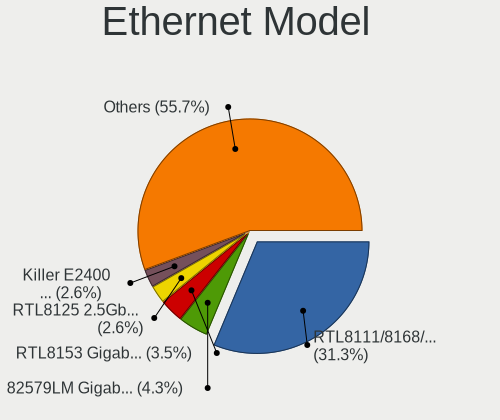

| Model                                                             | Computers | Percent |
|-------------------------------------------------------------------|-----------|---------|
| Realtek RTL8111/8168/8411 PCI Express Gigabit Ethernet Controller | 46        | 38.66%  |
| Realtek RTL8153 Gigabit Ethernet Adapter                          | 6         | 5.04%   |
| Realtek RTL810xE PCI Express Fast Ethernet controller             | 4         | 3.36%   |
| Intel I211 Gigabit Network Connection                             | 4         | 3.36%   |
| Intel 82579V Gigabit Network Connection                           | 4         | 3.36%   |
| Realtek RTL8125 2.5GbE Controller                                 | 3         | 2.52%   |
| Intel Ethernet Controller I225-V                                  | 3         | 2.52%   |
| Broadcom NetXtreme BCM5764M Gigabit Ethernet PCIe                 | 3         | 2.52%   |
| Qualcomm Atheros AR8161 Gigabit Ethernet                          | 2         | 1.68%   |
| Intel Ethernet Connection (7) I219-V                              | 2         | 1.68%   |
| Intel Ethernet Connection (7) I219-LM                             | 2         | 1.68%   |
| Intel Ethernet Connection (6) I219-V                              | 2         | 1.68%   |
| Intel Ethernet Connection (2) I219-V                              | 2         | 1.68%   |
| Intel 82579LM Gigabit Network Connection (Lewisville)             | 2         | 1.68%   |
| Intel 82574L Gigabit Network Connection                           | 2         | 1.68%   |
| Broadcom NetXtreme BCM57765 Gigabit Ethernet PCIe                 | 2         | 1.68%   |
| Realtek RTL-8100/8101L/8139 PCI Fast Ethernet Adapter             | 1         | 0.84%   |
| Realtek Killer E2600 Gigabit Ethernet Controller                  | 1         | 0.84%   |
| Qualcomm Atheros QCA8171 Gigabit Ethernet                         | 1         | 0.84%   |
| Qualcomm Atheros Killer E220x Gigabit Ethernet Controller         | 1         | 0.84%   |
| Qualcomm Atheros AR8151 v2.0 Gigabit Ethernet                     | 1         | 0.84%   |
| Nvidia MCP77 Ethernet                                             | 1         | 0.84%   |
| Marvell Group 88E8053 PCI-E Gigabit Ethernet Controller           | 1         | 0.84%   |
| Marvell Group 88E8040 PCI-E Fast Ethernet Controller              | 1         | 0.84%   |
| Marvell Group 88E8001 Gigabit Ethernet Controller                 | 1         | 0.84%   |
| Lenovo ThinkPad TBT3 LAN                                          | 1         | 0.84%   |
| Intel Ethernet Connection I219-V                                  | 1         | 0.84%   |
| Intel Ethernet Connection I217-LM                                 | 1         | 0.84%   |
| Intel Ethernet Connection (5) I219-LM                             | 1         | 0.84%   |
| Intel Ethernet Connection (3) I218-LM                             | 1         | 0.84%   |
| Intel Ethernet Connection (2) I219-LM                             | 1         | 0.84%   |
| Intel 82578DM Gigabit Network Connection                          | 1         | 0.84%   |
| Intel 82567LM-3 Gigabit Network Connection                        | 1         | 0.84%   |
| Intel 82557/8/9/0/1 Ethernet Pro 100                              | 1         | 0.84%   |
| Intel 82546EB Gigabit Ethernet Controller (Copper)                | 1         | 0.84%   |
| Intel 82541PI Gigabit Ethernet Controller                         | 1         | 0.84%   |
| Google Nexus/Pixel Device (tether)                                | 1         | 0.84%   |
| DisplayLink Dell Universal Dock D6000                             | 1         | 0.84%   |
| D-Link System RTL8139 Ethernet                                    | 1         | 0.84%   |
| D-Link DUB-1312 Gigabit Ethernet Adapter                          | 1         | 0.84%   |
| Broadcom NetXtreme II BCM5706 Gigabit Ethernet                    | 1         | 0.84%   |
| Broadcom NetXtreme BCM57766 Gigabit Ethernet PCIe                 | 1         | 0.84%   |
| Broadcom NetXtreme BCM5761 Gigabit Ethernet PCIe                  | 1         | 0.84%   |
| Broadcom NetXtreme BCM5752 Gigabit Ethernet PCI Express           | 1         | 0.84%   |
| Broadcom NetLink BCM5784M Gigabit Ethernet PCIe                   | 1         | 0.84%   |
| Broadcom Limited NetLink BCM5784M Gigabit Ethernet PCIe           | 1         | 0.84%   |

Net Controller Kind
-------------------

Ethernet, WiFi or modem

| Kind     | Computers | Percent |
|----------|-----------|---------|
| Ethernet | 101       | 54.3%   |
| WiFi     | 82        | 44.09%  |
| Modem    | 2         | 1.08%   |
| Unknown  | 1         | 0.54%   |

Used Controller
---------------

Currently used network controller

| Kind     | Computers | Percent |
|----------|-----------|---------|
| WiFi     | 63        | 52.07%  |
| Ethernet | 58        | 47.93%  |

NICs
----

Total network controllers on board

| Total | Computers | Percent |
|-------|-----------|---------|
| 2     | 61        | 50.83%  |
| 1     | 48        | 40%     |
| 3     | 6         | 5%      |
| 0     | 3         | 2.5%    |
| 5     | 1         | 0.83%   |
| 4     | 1         | 0.83%   |

IPv6
----

IPv6 vs IPv4

| Used | Computers | Percent |
|------|-----------|---------|
| No   | 109       | 90.83%  |
| Yes  | 11        | 9.17%   |

Bluetooth
---------

Bluetooth Vendor
----------------

Controller vendors

| Vendor                          | Computers | Percent |
|---------------------------------|-----------|---------|
| Intel                           | 39        | 56.52%  |
| Realtek Semiconductor           | 9         | 13.04%  |
| Qualcomm Atheros Communications | 5         | 7.25%   |
| Apple                           | 5         | 7.25%   |
| Toshiba                         | 2         | 2.9%    |
| Cambridge Silicon Radio         | 2         | 2.9%    |
| Broadcom                        | 2         | 2.9%    |
| Ralink                          | 1         | 1.45%   |
| IMC Networks                    | 1         | 1.45%   |
| Foxconn / Hon Hai               | 1         | 1.45%   |
| Edimax Technology               | 1         | 1.45%   |
| ASUSTek Computer                | 1         | 1.45%   |

Bluetooth Model
---------------

Controller models

| Model                                               | Computers | Percent |
|-----------------------------------------------------|-----------|---------|
| Intel Bluetooth wireless interface                  | 12        | 17.39%  |
| Intel AX200 Bluetooth                               | 10        | 14.49%  |
| Realtek Bluetooth Radio                             | 5         | 7.25%   |
| Intel Bluetooth 9460/9560 Jefferson Peak (JfP)      | 4         | 5.8%    |
| Qualcomm Atheros QCA61x4 Bluetooth 4.0              | 3         | 4.35%   |
| Intel Wireless-AC 3168 Bluetooth                    | 3         | 4.35%   |
| Intel AX201 Bluetooth                               | 3         | 4.35%   |
| Apple Bluetooth Host Controller                     | 3         | 4.35%   |
| Realtek RTL8822BE Bluetooth 4.2 Adapter             | 2         | 2.9%    |
| Realtek  Bluetooth 4.2 Adapter                      | 2         | 2.9%    |
| Intel Centrino Advanced-N 6230 Bluetooth adapter    | 2         | 2.9%    |
| Intel AX210 Bluetooth                               | 2         | 2.9%    |
| Cambridge Silicon Radio Bluetooth Dongle (HCI mode) | 2         | 2.9%    |
| Toshiba RT Bluetooth Radio                          | 1         | 1.45%   |
| Toshiba Bluetooth Device                            | 1         | 1.45%   |
| Ralink RT3290 Bluetooth                             | 1         | 1.45%   |
| Qualcomm Atheros  Bluetooth Device                  | 1         | 1.45%   |
| Qualcomm Atheros AR3012 Bluetooth 4.0               | 1         | 1.45%   |
| Intel Wireless-AC 9260 Bluetooth Adapter            | 1         | 1.45%   |
| Intel Centrino Bluetooth Wireless Transceiver       | 1         | 1.45%   |
| Intel Bluetooth Device                              | 1         | 1.45%   |
| IMC Networks Wireless_Device                        | 1         | 1.45%   |
| Foxconn / Hon Hai Bluetooth Device                  | 1         | 1.45%   |
| Edimax Bluetooth Device                             | 1         | 1.45%   |
| Broadcom Bluetooth 3.0+HS USB Adapter               | 1         | 1.45%   |
| Broadcom BCM20702A0 Bluetooth 4.0                   | 1         | 1.45%   |
| ASUS Qualcomm Bluetooth 4.1                         | 1         | 1.45%   |
| Apple Built-in Bluetooth 2.0+EDR HCI                | 1         | 1.45%   |
| Apple Bluetooth USB Host Controller                 | 1         | 1.45%   |

Sound
-----

Sound Vendor
------------

Sound card vendors

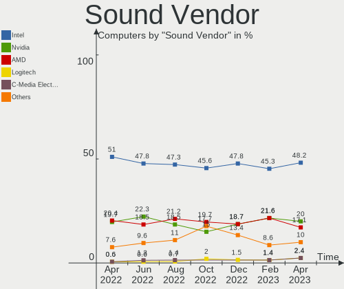

| Vendor                    | Computers | Percent |
|---------------------------|-----------|---------|
| Intel                     | 81        | 49.69%  |
| AMD                       | 35        | 21.47%  |
| Nvidia                    | 34        | 20.86%  |
| C-Media Electronics       | 3         | 1.84%   |
| XMOS                      | 1         | 0.61%   |
| Texas Instruments         | 1         | 0.61%   |
| SteelSeries ApS           | 1         | 0.61%   |
| Sennheiser Communications | 1         | 0.61%   |
| RODE Microphones          | 1         | 0.61%   |
| Realtek Semiconductor     | 1         | 0.61%   |
| Lenovo                    | 1         | 0.61%   |
| BEHRINGER International   | 1         | 0.61%   |
| Apple                     | 1         | 0.61%   |
| Antlion Audio             | 1         | 0.61%   |

Sound Model
-----------

Sound card models

| Model                                                                      | Computers | Percent |
|----------------------------------------------------------------------------|-----------|---------|
| Intel Sunrise Point-LP HD Audio                                            | 13        | 6.91%   |
| AMD Family 17h/19h HD Audio Controller                                     | 11        | 5.85%   |
| Intel 6 Series/C200 Series Chipset Family High Definition Audio Controller | 10        | 5.32%   |
| Intel Cannon Lake PCH cAVS                                                 | 7         | 3.72%   |
| Intel 7 Series/C216 Chipset Family High Definition Audio Controller        | 7         | 3.72%   |
| AMD SBx00 Azalia (Intel HDA)                                               | 6         | 3.19%   |
| AMD Renoir Radeon High Definition Audio Controller                         | 6         | 3.19%   |
| Nvidia Audio device                                                        | 5         | 2.66%   |
| Intel 8 Series/C220 Series Chipset High Definition Audio Controller        | 5         | 2.66%   |
| AMD Starship/Matisse HD Audio Controller                                   | 5         | 2.66%   |
| Intel 100 Series/C230 Series Chipset Family HD Audio Controller            | 4         | 2.13%   |
| Nvidia TU116 High Definition Audio Controller                              | 3         | 1.6%    |
| Nvidia GK107 HDMI Audio Controller                                         | 3         | 1.6%    |
| Intel Xeon E3-1200 v3/4th Gen Core Processor HD Audio Controller           | 3         | 1.6%    |
| Intel Wildcat Point-LP High Definition Audio Controller                    | 3         | 1.6%    |
| Intel Tiger Lake-LP Smart Sound Technology Audio Controller                | 3         | 1.6%    |
| Intel CM238 HD Audio Controller                                            | 3         | 1.6%    |
| Intel Broadwell-U Audio Controller                                         | 3         | 1.6%    |
| Intel 82801JI (ICH10 Family) HD Audio Controller                           | 3         | 1.6%    |
| Intel 5 Series/3400 Series Chipset High Definition Audio                   | 3         | 1.6%    |
| AMD Raven/Raven2/Fenghuang HDMI/DP Audio Controller                        | 3         | 1.6%    |
| AMD Family 17h (Models 00h-0fh) HD Audio Controller                        | 3         | 1.6%    |
| AMD Ellesmere HDMI Audio [Radeon RX 470/480 / 570/580/590]                 | 3         | 1.6%    |
| Nvidia TU104 HD Audio Controller                                           | 2         | 1.06%   |
| Nvidia GT216 HDMI Audio Controller                                         | 2         | 1.06%   |
| Nvidia GM206 High Definition Audio Controller                              | 2         | 1.06%   |
| Nvidia GK208 HDMI/DP Audio Controller                                      | 2         | 1.06%   |
| Nvidia GK104 HDMI Audio Controller                                         | 2         | 1.06%   |
| Intel Cannon Point-LP High Definition Audio Controller                     | 2         | 1.06%   |
| Intel Atom Processor Z36xxx/Z37xxx Series High Definition Audio Controller | 2         | 1.06%   |
| Intel 82801I (ICH9 Family) HD Audio Controller                             | 2         | 1.06%   |
| Intel 200 Series PCH HD Audio                                              | 2         | 1.06%   |
| AMD RV710/730 HDMI Audio [Radeon HD 4000 series]                           | 2         | 1.06%   |
| AMD Navi 10 HDMI Audio                                                     | 2         | 1.06%   |
| AMD Barts HDMI Audio [Radeon HD 6790/6850/6870 / 7720 OEM]                 | 2         | 1.06%   |
| XMOS iFi (by AMR) HD USB Audio                                             | 1         | 0.53%   |
| Texas Instruments PCM2902 Audio Codec                                      | 1         | 0.53%   |
| SteelSeries ApS SteelSeries Arctis 5                                       | 1         | 0.53%   |
| Sennheiser Communications GSP 370                                          | 1         | 0.53%   |
| RODE Microphones RODE NT-USB                                               | 1         | 0.53%   |
| Realtek Semiconductor USB Audio                                            | 1         | 0.53%   |
| Nvidia TU107 GeForce GTX 1650 High Definition Audio Controller             | 1         | 0.53%   |
| Nvidia MCP89 High Definition Audio                                         | 1         | 0.53%   |
| Nvidia MCP72XE/MCP72P/MCP78U/MCP78S High Definition Audio                  | 1         | 0.53%   |
| Nvidia GP108 High Definition Audio Controller                              | 1         | 0.53%   |
| Nvidia GP107GL High Definition Audio Controller                            | 1         | 0.53%   |
| Nvidia GP106 High Definition Audio Controller                              | 1         | 0.53%   |
| Nvidia GP104 High Definition Audio Controller                              | 1         | 0.53%   |
| Nvidia GM204 High Definition Audio Controller                              | 1         | 0.53%   |
| Nvidia GK106 HDMI Audio Controller                                         | 1         | 0.53%   |
| Nvidia GF119 HDMI Audio Controller                                         | 1         | 0.53%   |
| Nvidia GF114 HDMI Audio Controller                                         | 1         | 0.53%   |
| Nvidia GF110 High Definition Audio Controller                              | 1         | 0.53%   |
| Nvidia GF100 High Definition Audio Controller                              | 1         | 0.53%   |
| Lenovo ThinkPad Thunderbolt 3 Dock Audio                                   | 1         | 0.53%   |
| Intel Tiger Lake-H HD Audio Controller                                     | 1         | 0.53%   |
| Intel NM10/ICH7 Family High Definition Audio Controller                    | 1         | 0.53%   |
| Intel Ice Lake-LP Smart Sound Technology Audio Controller                  | 1         | 0.53%   |
| Intel Haswell-ULT HD Audio Controller                                      | 1         | 0.53%   |
| Intel Comet Lake PCH-LP cAVS                                               | 1         | 0.53%   |

Memory
------

Memory Vendor
-------------

Memory module vendors

| Vendor              | Computers | Percent |
|---------------------|-----------|---------|
| Samsung Electronics | 13        | 19.7%   |
| SK Hynix            | 11        | 16.67%  |
| Unknown             | 9         | 13.64%  |
| Micron Technology   | 7         | 10.61%  |
| Kingston            | 5         | 7.58%   |
| Crucial             | 5         | 7.58%   |
| Corsair             | 5         | 7.58%   |
| G.Skill             | 4         | 6.06%   |
| Team                | 3         | 4.55%   |
| Neo Forza           | 1         | 1.52%   |
| Nanya Technology    | 1         | 1.52%   |
| Elpida              | 1         | 1.52%   |
| A-DATA Technology   | 1         | 1.52%   |

Memory Model
------------

Memory module models

| Model                                                           | Computers | Percent |
|-----------------------------------------------------------------|-----------|---------|
| Team RAM TEAMGROUP-SD4-3200 16GB SODIMM DDR4 3200MT/s           | 2         | 2.9%    |
| SK Hynix RAM HMA82GS6AFR8N-UH 16384MB SODIMM DDR4 2667MT/s      | 2         | 2.9%    |
| Micron RAM 4ATF1G64HZ-3G2E1 8GB SODIMM DDR4 3200MT/s            | 2         | 2.9%    |
| Corsair RAM CMK32GX4M2A2666C16 16GB DIMM DDR4 3100MT/s          | 2         | 2.9%    |
| Unknown RAM Module 8192MB DIMM 800MT/s                          | 1         | 1.45%   |
| Unknown RAM Module 4GB DIMM 800MT/s                             | 1         | 1.45%   |
| Unknown RAM Module 4GB DIMM 400MT/s                             | 1         | 1.45%   |
| Unknown RAM Module 4096MB DIMM 1333MT/s                         | 1         | 1.45%   |
| Unknown RAM Module 2GB DIMM DDR3 1333MT/s                       | 1         | 1.45%   |
| Unknown RAM Module 2GB DIMM DDR2 1067MT/s                       | 1         | 1.45%   |
| Unknown RAM Module 2GB DIMM 667MT/s                             | 1         | 1.45%   |
| Unknown RAM Module 2048MB DIMM 800MT/s                          | 1         | 1.45%   |
| Unknown RAM Module 1GB DIMM DDR 333MT/s                         | 1         | 1.45%   |
| Unknown RAM 3600 C18 Series 16GB DIMM DDR4 2933MT/s             | 1         | 1.45%   |
| Team RAM Module 16GB DIMM DDR4 2133MT/s                         | 1         | 1.45%   |
| SK Hynix RAM Module 8GB DIMM DDR4 2133MT/s                      | 1         | 1.45%   |
| SK Hynix RAM Module 8192MB DIMM DDR4 2400MT/s                   | 1         | 1.45%   |
| SK Hynix RAM Module 4GB SODIMM DDR3 1333MT/s                    | 1         | 1.45%   |
| SK Hynix RAM HYMP151F72CP4N3-Y5 4GB FB-DIMM DDR2 667MT/s        | 1         | 1.45%   |
| SK Hynix RAM HYMP151F72CP4D3-Y5 4GB FB-DIMM DDR2 667MT/s        | 1         | 1.45%   |
| SK Hynix RAM HMT451S6MFR6A-PB 4GB SODIMM DDR3 1600MT/s          | 1         | 1.45%   |
| SK Hynix RAM HMT41GS6AFR8A-PB 8GB SODIMM DDR3 1600MT/s          | 1         | 1.45%   |
| SK Hynix RAM HMAA1GS6CMR8N-VK 8192MB Row Of Chips DDR4 2667MT/s | 1         | 1.45%   |
| SK Hynix RAM HMAA1GS6CJR6N-XN 8192MB SODIMM DDR4 3200MT/s       | 1         | 1.45%   |
| SK Hynix RAM HMA81GU6JJR8N-VK 8GB DIMM DDR4 2666MT/s            | 1         | 1.45%   |
| Samsung RAM Module 8GB DIMM DDR4 2133MT/s                       | 1         | 1.45%   |
| Samsung RAM Module 4GB SODIMM DDR3 1333MT/s                     | 1         | 1.45%   |
| Samsung RAM Module 4GB Row Of Chips LPDDR3 2133MT/s             | 1         | 1.45%   |
| Samsung RAM M471B5273DH0-CH9 4GB SODIMM DDR3 1334MT/s           | 1         | 1.45%   |
| Samsung RAM M471B1G73DB0-YK0 8192MB DIMM DDR3 1600MT/s          | 1         | 1.45%   |
| Samsung RAM M471A2K43EB1-CWE 16GB SODIMM DDR4 3200MT/s          | 1         | 1.45%   |
| Samsung RAM M471A2G44AM0-CWE 16GB SODIMM DDR4 3200MT/s          | 1         | 1.45%   |
| Samsung RAM M471A1K43BB1-CTD 8GB SODIMM DDR4 2667MT/s           | 1         | 1.45%   |
| Samsung RAM M471A1K43BB1-CRC 8GB SODIMM DDR4 2667MT/s           | 1         | 1.45%   |
| Samsung RAM M471A1G44AB0-CWE 8GB SODIMM DDR4 3200MT/s           | 1         | 1.45%   |
| Samsung RAM M471A1G44AB0-CWE 8GB Row Of Chips DDR4 3200MT/s     | 1         | 1.45%   |
| Samsung RAM M395T5160QZ4-CE66 4GB FB-DIMM DDR2 667MT/s          | 1         | 1.45%   |
| Samsung RAM K4EBE304EC-EGCG 8GB Row Of Chips LPDDR3 2133MT/s    | 1         | 1.45%   |
| Neo Forza RAM NMUD380D81-1333C 8GB DIMM DDR3 1333MT/s           | 1         | 1.45%   |
| Nanya RAM Module 2048MB DIMM DDR2 800MT/s                       | 1         | 1.45%   |
| Micron RAM Module 4096MB SODIMM DDR4 2400MT/s                   | 1         | 1.45%   |
| Micron RAM 8ATF2G64HZ-3G2F1 16384MB SODIMM DDR4 3200MT/s        | 1         | 1.45%   |
| Micron RAM 8ATF1G64HZ-2G6E1 8GB SODIMM DDR4 2667MT/s            | 1         | 1.45%   |
| Micron RAM 4ATF1G64HZ-3G2F1 8GB SODIMM DDR4 3200MT/s            | 1         | 1.45%   |
| Micron RAM 16KTF51264HZ-1G6M1 4GB SODIMM DDR3 1600MT/s          | 1         | 1.45%   |
| Kingston RAM KHX3200C16D4/16GX 16GB DIMM DDR4 3600MT/s          | 1         | 1.45%   |
| Kingston RAM KHX2666C16/16G 16GB DIMM DDR4 3200MT/s             | 1         | 1.45%   |
| Kingston RAM KHX1866C10D3/8G 8GB DIMM DDR3 1867MT/s             | 1         | 1.45%   |
| Kingston RAM KHX1600C10D3/4G 4GB DIMM DDR3 1866MT/s             | 1         | 1.45%   |
| Kingston RAM KF3200C16D4/8GX 8GB DIMM DDR4 3200MT/s             | 1         | 1.45%   |
| Kingston RAM HX318C10F/8 8192MB DIMM DDR3 933MT/s               | 1         | 1.45%   |
| G.Skill RAM F4-3200C16-8GTZR 8192MB DIMM DDR4 3200MT/s          | 1         | 1.45%   |
| G.Skill RAM F3-1600C11-8GRSL 8GB SODIMM DDR3 1600MT/s           | 1         | 1.45%   |
| G.Skill RAM F3-12800CL8-4GBXM 4096MB DIMM DDR3 1600MT/s         | 1         | 1.45%   |
| G.Skill RAM F3-12800CL10-8GBXL 8GB DIMM DDR3 1600MT/s           | 1         | 1.45%   |
| Elpida RAM Module 8GB SODIMM DDR3 1867MT/s                      | 1         | 1.45%   |
| Crucial RAM CT8G4SFS824A.M8FRS 8192MB SODIMM DDR4 2400MT/s      | 1         | 1.45%   |
| Crucial RAM CT8G4DFS8213.C8FDD1 8192MB DIMM DDR4 2133MT/s       | 1         | 1.45%   |
| Crucial RAM CT16G4SFD824A.M16FR 16384MB SODIMM DDR4 2400MT/s    | 1         | 1.45%   |
| Crucial RAM CT16G4SFD824A.M16FB 16GB SODIMM DDR4 2400MT/s       | 1         | 1.45%   |

Memory Kind
-----------

Memory module kinds

| Kind    | Computers | Percent |
|---------|-----------|---------|
| DDR4    | 32        | 55.17%  |
| DDR3    | 15        | 25.86%  |
| Unknown | 5         | 8.62%   |
| DDR2    | 3         | 5.17%   |
| LPDDR3  | 2         | 3.45%   |
| DDR     | 1         | 1.72%   |

Memory Form Factor
------------------

Physical design of the memory module

| Name         | Computers | Percent |
|--------------|-----------|---------|
| DIMM         | 30        | 50.85%  |
| SODIMM       | 24        | 40.68%  |
| Row Of Chips | 4         | 6.78%   |
| FB-DIMM      | 1         | 1.69%   |

Memory Size
-----------

Memory module size

| Size  | Computers | Percent |
|-------|-----------|---------|
| 8192  | 26        | 42.62%  |
| 16384 | 14        | 22.95%  |
| 4096  | 12        | 19.67%  |
| 2048  | 5         | 8.2%    |
| 32768 | 3         | 4.92%   |
| 1024  | 1         | 1.64%   |

Memory Speed
------------

Memory module speed

| Speed | Computers | Percent |
|-------|-----------|---------|
| 3200  | 10        | 16.39%  |
| 1600  | 8         | 13.11%  |
| 2667  | 7         | 11.48%  |
| 3600  | 5         | 8.2%    |
| 2400  | 5         | 8.2%    |
| 2133  | 5         | 8.2%    |
| 1333  | 4         | 6.56%   |
| 800   | 4         | 6.56%   |
| 3100  | 2         | 3.28%   |
| 667   | 2         | 3.28%   |
| 3400  | 1         | 1.64%   |
| 2666  | 1         | 1.64%   |
| 1867  | 1         | 1.64%   |
| 1866  | 1         | 1.64%   |
| 1334  | 1         | 1.64%   |
| 1067  | 1         | 1.64%   |
| 933   | 1         | 1.64%   |
| 400   | 1         | 1.64%   |
| 333   | 1         | 1.64%   |

Printers & scanners
-------------------

Printer Vendor
--------------

Printer device vendors

| Vendor             | Computers | Percent |
|--------------------|-----------|---------|
| Brother Industries | 1         | 100%    |

Printer Model
-------------

Printer device models

| Model                  | Computers | Percent |
|------------------------|-----------|---------|
| Brother HL-2130 series | 1         | 100%    |

Scanner Vendor
--------------

Scanner device vendors

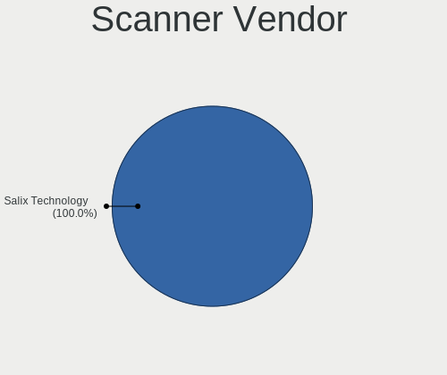

| Vendor      | Computers | Percent |
|-------------|-----------|---------|
| Seiko Epson | 1         | 100%    |

Scanner Model
-------------

Scanner device models

| Model                                       | Computers | Percent |
|---------------------------------------------|-----------|---------|
| Seiko Epson GT-X820 [Perfection V600 Photo] | 1         | 100%    |

Camera
------

Camera Vendor
-------------

Camera device vendors

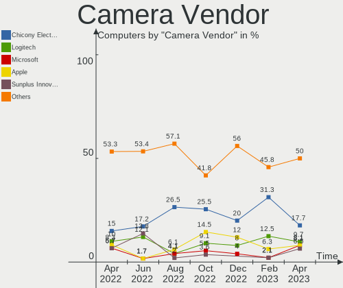

| Vendor                        | Computers | Percent |
|-------------------------------|-----------|---------|
| Chicony Electronics           | 15        | 25.86%  |
| Microdia                      | 7         | 12.07%  |
| Sunplus Innovation Technology | 5         | 8.62%   |
| Realtek Semiconductor         | 5         | 8.62%   |
| Quanta                        | 5         | 8.62%   |
| Logitech                      | 5         | 8.62%   |
| Acer                          | 5         | 8.62%   |
| Apple                         | 4         | 6.9%    |
| Syntek                        | 2         | 3.45%   |
| IMC Networks                  | 2         | 3.45%   |
| Microsoft                     | 1         | 1.72%   |
| Lite-On Technology            | 1         | 1.72%   |
| Asuscom Network               | 1         | 1.72%   |

Camera Model
------------

Camera device models

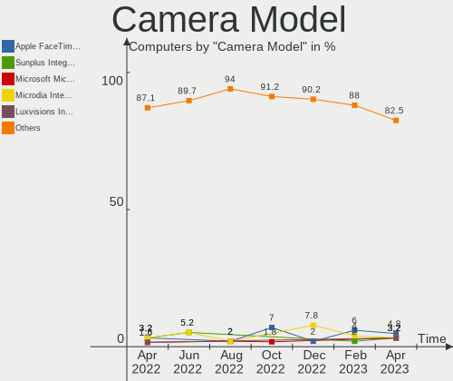

| Model                                | Computers | Percent |
|--------------------------------------|-----------|---------|
| Sunplus Integrated_Webcam_HD         | 3         | 5%      |
| Chicony Integrated Camera            | 3         | 5%      |
| Acer Integrated Camera               | 3         | 5%      |
| Quanta HP Webcam                     | 2         | 3.33%   |
| Quanta HD User Facing                | 2         | 3.33%   |
| Microdia Laptop_Integrated_Webcam_2M | 2         | 3.33%   |
| Microdia Integrated_Webcam_HD        | 2         | 3.33%   |
| Logitech C922 Pro Stream Webcam      | 2         | 3.33%   |
| IMC Networks Integrated Camera       | 2         | 3.33%   |
| Chicony HP HD Camera                 | 2         | 3.33%   |
| Apple Built-in iSight                | 2         | 3.33%   |
| Syntek Integrated Camera             | 1         | 1.67%   |
| Syntek EasyCamera                    | 1         | 1.67%   |
| Sunplus HP TrueVision HD             | 1         | 1.67%   |
| Sunplus HD WebCam                    | 1         | 1.67%   |
| Realtek Laptop Camera                | 1         | 1.67%   |
| Realtek Integrated_Webcam_HD         | 1         | 1.67%   |
| Realtek Integrated Webcam            | 1         | 1.67%   |
| Realtek Integrated Camera            | 1         | 1.67%   |
| Realtek HP Wide Vision FHD Camera    | 1         | 1.67%   |
| Quanta VGA WebCam                    | 1         | 1.67%   |
| Microsoft LifeCam Studio             | 1         | 1.67%   |
| Microdia Sonix USB 2.0 Camera        | 1         | 1.67%   |
| Microdia Integrated_Webcam_FHD       | 1         | 1.67%   |
| Microdia Integrated_Webcam_1.3M      | 1         | 1.67%   |
| Logitech Webcam C270                 | 1         | 1.67%   |
| Logitech Webcam C210                 | 1         | 1.67%   |
| Logitech QuickCam Pro 9000           | 1         | 1.67%   |
| Lite-On TOSHIBA Web Camera           | 1         | 1.67%   |
| Chicony USB2.0 Camera                | 1         | 1.67%   |
| Chicony USB 2.0 Camera               | 1         | 1.67%   |
| Chicony TOSHIBA Web Camera - HD      | 1         | 1.67%   |
| Chicony HP Wide Vision HD            | 1         | 1.67%   |
| Chicony HP Webcam                    | 1         | 1.67%   |
| Chicony HP Truevision HD             | 1         | 1.67%   |
| Chicony HP IR Camera                 | 1         | 1.67%   |
| Chicony HP Full-HD Camera            | 1         | 1.67%   |
| Chicony HD WebCam                    | 1         | 1.67%   |
| Chicony EasyCamera                   | 1         | 1.67%   |
| Chicony CNF9055 Toshiba Webcam       | 1         | 1.67%   |
| Asuscom Network HD 1080P PC-Camera   | 1         | 1.67%   |
| Apple FaceTime HD Camera (Built-in)  | 1         | 1.67%   |
| Apple FaceTime HD Camera             | 1         | 1.67%   |
| Acer Integrated IR Camera            | 1         | 1.67%   |
| Acer HP TrueVision HD Webcam         | 1         | 1.67%   |
| Acer EasyCamera                      | 1         | 1.67%   |

Security
--------

Fingerprint Vendor
------------------

Fingerprint sensor vendors

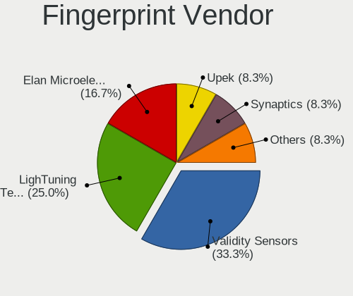

| Vendor                     | Computers | Percent |
|----------------------------|-----------|---------|
| Synaptics                  | 8         | 53.33%  |
| Validity Sensors           | 4         | 26.67%  |
| Shenzhen Goodix Technology | 1         | 6.67%   |
| Elan Microelectronics      | 1         | 6.67%   |
| AuthenTec                  | 1         | 6.67%   |

Fingerprint Model
-----------------

Fingerprint sensor models

| Model                                                                      | Computers | Percent |
|----------------------------------------------------------------------------|-----------|---------|
| Synaptics  WBDI                                                            | 4         | 26.67%  |
| Synaptics Prometheus MIS Touch Fingerprint Reader                          | 2         | 13.33%  |
| Validity Sensors VFS495 Fingerprint Reader                                 | 1         | 6.67%   |
| Validity Sensors Synaptics VFS7552 Touch Fingerprint Sensor with PurePrint | 1         | 6.67%   |
| Validity Sensors Synaptics VFS7552 Touch Fingerprint Sensor                | 1         | 6.67%   |
| Validity Sensors Fingerprint scanner                                       | 1         | 6.67%   |
| Synaptics WBDI Device                                                      | 1         | 6.67%   |
| Synaptics Metallica MIS Touch Fingerprint Reader                           | 1         | 6.67%   |
| Shenzhen Goodix  FingerPrint Device                                        | 1         | 6.67%   |
| Elan ELAN:Fingerprint                                                      | 1         | 6.67%   |
| AuthenTec Fingerprint Sensor                                               | 1         | 6.67%   |

Chipcard Vendor
---------------

Chipcard module vendors

Zero info for selected period =(

Chipcard Model
--------------

Chipcard module models

Zero info for selected period =(

Unsupported
-----------

Unsupported Devices
-------------------

Total unsupported devices on board

| Total | Computers | Percent |
|-------|-----------|---------|
| 0     | 81        | 67.5%   |
| 1     | 33        | 27.5%   |
| 2     | 6         | 5%      |

Unsupported Device Types
------------------------

Types of unsupported devices

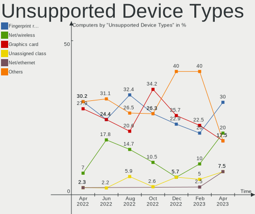

| Type                     | Computers | Percent |
|--------------------------|-----------|---------|
| Graphics card            | 15        | 36.59%  |
| Fingerprint reader       | 15        | 36.59%  |
| Net/wireless             | 5         | 12.2%   |
| Multimedia controller    | 2         | 4.88%   |
| Bluetooth                | 2         | 4.88%   |
| Net/ethernet             | 1         | 2.44%   |
| Communication controller | 1         | 2.44%   |

