Linux in Australia - Hardware Trends
------------------------------------

A project to identify most popular hardware characteristics and track their change
over time based on data collected by Linux users at https://Linux-Hardware.org.

Anyone can contribute to this report by the [hw-probe](https://github.com/linuxhw/hw-probe) tool:

    sudo -E hw-probe -all -upload

This is a report for all computer types. See also reports for [desktops](/Location/Australia/Desktop/README.md) and [notebooks](/Location/Australia/Notebook/README.md).

Period: Apr, 2023.

Contents
--------

* [ System ](#system)
  - [ OS                       ](#os)
  - [ OS Family                ](#os-family)
  - [ Kernel                   ](#kernel)
  - [ Kernel Family            ](#kernel-family)
  - [ Kernel Major Ver.        ](#kernel-major-ver)
  - [ Arch                     ](#arch)
  - [ DE                       ](#de)
  - [ Display Server           ](#display-server)
  - [ Display Manager          ](#display-manager)
  - [ OS Lang                  ](#os-lang)
  - [ Boot Mode                ](#boot-mode)
  - [ Filesystem               ](#filesystem)
  - [ Part. scheme             ](#part-scheme)
  - [ Dual Boot with Linux/BSD ](#dual-boot-with-linuxbsd)
  - [ Dual Boot (Win)          ](#dual-boot-win)

* [ Board ](#board)
  - [ Vendor                   ](#vendor)
  - [ Model                    ](#model)
  - [ Model Family             ](#model-family)
  - [ MFG Year                 ](#mfg-year)
  - [ Form Factor              ](#form-factor)
  - [ Secure Boot              ](#secure-boot)
  - [ Coreboot                 ](#coreboot)
  - [ RAM Size                 ](#ram-size)
  - [ RAM Used                 ](#ram-used)
  - [ Total Drives             ](#total-drives)
  - [ Has CD-ROM               ](#has-cd-rom)
  - [ Has Ethernet             ](#has-ethernet)
  - [ Has WiFi                 ](#has-wifi)
  - [ Has Bluetooth            ](#has-bluetooth)

* [ Location ](#location)
  - [ Country                  ](#country)
  - [ City                     ](#city)

* [ Drives ](#drives)
  - [ Drive Vendor             ](#drive-vendor)
  - [ Drive Model              ](#drive-model)
  - [ HDD Vendor               ](#hdd-vendor)
  - [ SSD Vendor               ](#ssd-vendor)
  - [ Drive Kind               ](#drive-kind)
  - [ Drive Connector          ](#drive-connector)
  - [ Drive Size               ](#drive-size)
  - [ Space Total              ](#space-total)
  - [ Space Used               ](#space-used)
  - [ Malfunc. Drives          ](#malfunc-drives)
  - [ Malfunc. Drive Vendor    ](#malfunc-drive-vendor)
  - [ Malfunc. HDD Vendor      ](#malfunc-hdd-vendor)
  - [ Malfunc. Drive Kind      ](#malfunc-drive-kind)
  - [ Failed Drives            ](#failed-drives)
  - [ Failed Drive Vendor      ](#failed-drive-vendor)
  - [ Drive Status             ](#drive-status)

* [ Storage controller ](#storage-controller)
  - [ Storage Vendor           ](#storage-vendor)
  - [ Storage Model            ](#storage-model)
  - [ Storage Kind             ](#storage-kind)

* [ Processor ](#processor)
  - [ CPU Vendor               ](#cpu-vendor)
  - [ CPU Model                ](#cpu-model)
  - [ CPU Model Family         ](#cpu-model-family)
  - [ CPU Cores                ](#cpu-cores)
  - [ CPU Sockets              ](#cpu-sockets)
  - [ CPU Threads              ](#cpu-threads)
  - [ CPU Op-Modes             ](#cpu-op-modes)
  - [ CPU Microcode            ](#cpu-microcode)
  - [ CPU Microarch            ](#cpu-microarch)

* [ Graphics ](#graphics)
  - [ GPU Vendor               ](#gpu-vendor)
  - [ GPU Model                ](#gpu-model)
  - [ GPU Combo                ](#gpu-combo)
  - [ GPU Driver               ](#gpu-driver)
  - [ GPU Memory               ](#gpu-memory)

* [ Monitor ](#monitor)
  - [ Monitor Vendor           ](#monitor-vendor)
  - [ Monitor Model            ](#monitor-model)
  - [ Monitor Resolution       ](#monitor-resolution)
  - [ Monitor Diagonal         ](#monitor-diagonal)
  - [ Monitor Width            ](#monitor-width)
  - [ Aspect Ratio             ](#aspect-ratio)
  - [ Monitor Area             ](#monitor-area)
  - [ Pixel Density            ](#pixel-density)
  - [ Multiple Monitors        ](#multiple-monitors)

* [ Network ](#network)
  - [ Net Controller Vendor    ](#net-controller-vendor)
  - [ Net Controller Model     ](#net-controller-model)
  - [ Wireless Vendor          ](#wireless-vendor)
  - [ Wireless Model           ](#wireless-model)
  - [ Ethernet Vendor          ](#ethernet-vendor)
  - [ Ethernet Model           ](#ethernet-model)
  - [ Net Controller Kind      ](#net-controller-kind)
  - [ Used Controller          ](#used-controller)
  - [ NICs                     ](#nics)
  - [ IPv6                     ](#ipv6)

* [ Bluetooth ](#bluetooth)
  - [ Bluetooth Vendor         ](#bluetooth-vendor)
  - [ Bluetooth Model          ](#bluetooth-model)

* [ Sound ](#sound)
  - [ Sound Vendor             ](#sound-vendor)
  - [ Sound Model              ](#sound-model)

* [ Memory ](#memory)
  - [ Memory Vendor            ](#memory-vendor)
  - [ Memory Model             ](#memory-model)
  - [ Memory Kind              ](#memory-kind)
  - [ Memory Form Factor       ](#memory-form-factor)
  - [ Memory Size              ](#memory-size)
  - [ Memory Speed             ](#memory-speed)

* [ Printers & scanners ](#printers--scanners)
  - [ Printer Vendor           ](#printer-vendor)
  - [ Printer Model            ](#printer-model)
  - [ Scanner Vendor           ](#scanner-vendor)
  - [ Scanner Model            ](#scanner-model)

* [ Camera ](#camera)
  - [ Camera Vendor            ](#camera-vendor)
  - [ Camera Model             ](#camera-model)

* [ Security ](#security)
  - [ Fingerprint Vendor       ](#fingerprint-vendor)
  - [ Fingerprint Model        ](#fingerprint-model)
  - [ Chipcard Vendor          ](#chipcard-vendor)
  - [ Chipcard Model           ](#chipcard-model)

* [ Unsupported ](#unsupported)
  - [ Unsupported Devices      ](#unsupported-devices)
  - [ Unsupported Device Types ](#unsupported-device-types)

System
------

OS
--

Installed operating systems

| Name                         | Computers | Percent |
|------------------------------|-----------|---------|
| OpenMandriva 23.03           | 17        | 15.74%  |
| Ubuntu 22.04                 | 9         | 8.33%   |
| Linux Mint 21.1              | 9         | 8.33%   |
| Fedora 37                    | 9         | 8.33%   |
| Debian 11                    | 9         | 8.33%   |
| Fedora 38                    | 6         | 5.56%   |
| KDE neon 22.04               | 5         | 4.63%   |
| Arch Rolling                 | 5         | 4.63%   |
| Pop!_OS 22.04                | 4         | 3.7%    |
| Zorin 16                     | 3         | 2.78%   |
| Ubuntu 23.04                 | 3         | 2.78%   |
| Ubuntu 22.10                 | 2         | 1.85%   |
| Ubuntu 20.04                 | 2         | 1.85%   |
| openSUSE Tumbleweed-XXXXXXXX | 2         | 1.85%   |
| Linux Mint 20.3              | 2         | 1.85%   |
| ArcoLinux Rolling            | 2         | 1.85%   |
| Xubuntu 23.04                | 1         | 0.93%   |
| SteamOS 3.4.6                | 1         | 0.93%   |
| Raspbian 11                  | 1         | 0.93%   |
| PureOS 10.0                  | 1         | 0.93%   |
| Parrot 5.2                   | 1         | 0.93%   |
| OpenMandriva 4.3             | 1         | 0.93%   |
| Nobara 36                    | 1         | 0.93%   |
| NixOS 22.11                  | 1         | 0.93%   |
| MX 21                        | 1         | 0.93%   |
| Manjaro 22.1.0               | 1         | 0.93%   |
| Manjaro                      | 1         | 0.93%   |
| Lubuntu 22.04                | 1         | 0.93%   |
| Kubuntu 23.04                | 1         | 0.93%   |
| Kubuntu 22.10                | 1         | 0.93%   |
| Kali 2023.1                  | 1         | 0.93%   |
| Gentoo 2.9                   | 1         | 0.93%   |
| EuroLinux 9.1                | 1         | 0.93%   |
| EndeavourOS Rolling          | 1         | 0.93%   |
| Elementary 7                 | 1         | 0.93%   |

OS Family
---------

OS without a version

| Name         | Computers | Percent |
|--------------|-----------|---------|
| OpenMandriva | 18        | 16.67%  |
| Ubuntu       | 16        | 14.81%  |
| Fedora       | 15        | 13.89%  |
| Linux Mint   | 11        | 10.19%  |
| Debian       | 9         | 8.33%   |
| KDE neon     | 5         | 4.63%   |
| Arch         | 5         | 4.63%   |
| Pop!_OS      | 4         | 3.7%    |
| Zorin        | 3         | 2.78%   |
| openSUSE     | 2         | 1.85%   |
| Manjaro      | 2         | 1.85%   |
| Kubuntu      | 2         | 1.85%   |
| ArcoLinux    | 2         | 1.85%   |
| Xubuntu      | 1         | 0.93%   |
| SteamOS      | 1         | 0.93%   |
| Raspbian     | 1         | 0.93%   |
| PureOS       | 1         | 0.93%   |
| Parrot       | 1         | 0.93%   |
| Nobara       | 1         | 0.93%   |
| NixOS        | 1         | 0.93%   |
| MX           | 1         | 0.93%   |
| Lubuntu      | 1         | 0.93%   |
| Kali         | 1         | 0.93%   |
| Gentoo       | 1         | 0.93%   |
| EuroLinux    | 1         | 0.93%   |
| EndeavourOS  | 1         | 0.93%   |
| Elementary   | 1         | 0.93%   |

Kernel
------

Version of the Linux kernel

| Version                      | Computers | Percent |
|------------------------------|-----------|---------|
| 6.2.6-desktop-1omv2390       | 17        | 15.74%  |
| 5.19.0-38-generic            | 10        | 9.26%   |
| 5.15.0-69-generic            | 8         | 7.41%   |
| 5.10.0-21-amd64              | 6         | 5.56%   |
| 6.2.6-76060206-generic       | 4         | 3.7%    |
| 6.2.9-200.fc37.x86_64        | 3         | 2.78%   |
| 6.2.13-300.fc38.x86_64       | 3         | 2.78%   |
| 6.2.10-200.fc37.x86_64       | 3         | 2.78%   |
| 6.2.0-20-generic             | 3         | 2.78%   |
| 5.19.0-40-generic            | 3         | 2.78%   |
| 6.2.9-arch1-1                | 2         | 1.85%   |
| 6.2.11-300.fc38.x86_64       | 2         | 1.85%   |
| 6.0.7-301.fc37.x86_64        | 2         | 1.85%   |
| 5.15.104-1-pve               | 2         | 1.85%   |
| 5.10.0-20-amd64              | 2         | 1.85%   |
| 6.2.6-1-default              | 1         | 0.93%   |
| 6.2.2-gentoo                 | 1         | 0.93%   |
| 6.2.13-1-liquorix-amd64      | 1         | 0.93%   |
| 6.2.12-arch1-1               | 1         | 0.93%   |
| 6.2.12-300.fc38.x86_64       | 1         | 0.93%   |
| 6.2.12-1-default             | 1         | 0.93%   |
| 6.2.11-zen1-1-zen            | 1         | 0.93%   |
| 6.2.11-arch1-1               | 1         | 0.93%   |
| 6.2.11-200.fc37.x86_64       | 1         | 0.93%   |
| 6.2.10-zen1-1-zen            | 1         | 0.93%   |
| 6.2.10-arch1-1               | 1         | 0.93%   |
| 6.2.0-1002-lowlatency        | 1         | 0.93%   |
| 6.1.25-1-lts                 | 1         | 0.93%   |
| 6.1.23-1-MANJARO             | 1         | 0.93%   |
| 6.1.21-v7+                   | 1         | 0.93%   |
| 6.1.0-kali7-amd64            | 1         | 0.93%   |
| 6.1.0-1008-oem               | 1         | 0.93%   |
| 6.0.14-201.fsync.fc36.x86_64 | 1         | 0.93%   |
| 6.0.0-12parrot1-amd64        | 1         | 0.93%   |
| 5.9.16-1-MANJARO             | 1         | 0.93%   |
| 5.4.0-146-generic            | 1         | 0.93%   |
| 5.4.0-122-generic            | 1         | 0.93%   |
| 5.19.0-42-generic            | 1         | 0.93%   |
| 5.19.0-41-generic            | 1         | 0.93%   |
| 5.19.0-32-generic            | 1         | 0.93%   |

Kernel Family
-------------

Linux kernel without a distro release

| Version  | Computers | Percent |
|----------|-----------|---------|
| 6.2.6    | 22        | 20.37%  |
| 5.19.0   | 17        | 15.74%  |
| 5.15.0   | 14        | 12.96%  |
| 5.10.0   | 8         | 7.41%   |
| 6.2.9    | 5         | 4.63%   |
| 6.2.11   | 5         | 4.63%   |
| 6.2.10   | 5         | 4.63%   |
| 6.2.13   | 4         | 3.7%    |
| 6.2.0    | 4         | 3.7%    |
| 6.2.12   | 3         | 2.78%   |
| 6.1.0    | 2         | 1.85%   |
| 6.0.7    | 2         | 1.85%   |
| 5.4.0    | 2         | 1.85%   |
| 5.15.104 | 2         | 1.85%   |
| 5.14.0   | 2         | 1.85%   |
| 6.2.2    | 1         | 0.93%   |
| 6.1.25   | 1         | 0.93%   |
| 6.1.23   | 1         | 0.93%   |
| 6.1.21   | 1         | 0.93%   |
| 6.0.14   | 1         | 0.93%   |
| 6.0.0    | 1         | 0.93%   |
| 5.9.16   | 1         | 0.93%   |
| 5.16.7   | 1         | 0.93%   |
| 5.15.107 | 1         | 0.93%   |
| 5.15.102 | 1         | 0.93%   |
| 5.13.0   | 1         | 0.93%   |

Kernel Major Ver.
-----------------

Linux kernel major version

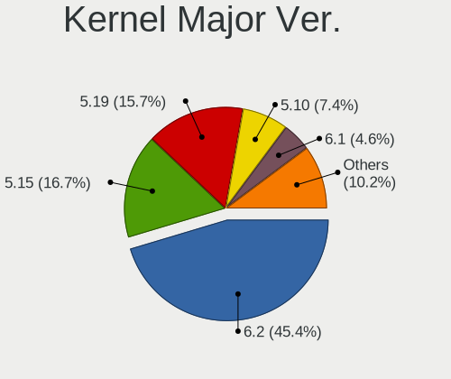

| Version | Computers | Percent |
|---------|-----------|---------|
| 6.2     | 49        | 45.37%  |
| 5.15    | 18        | 16.67%  |
| 5.19    | 17        | 15.74%  |
| 5.10    | 8         | 7.41%   |
| 6.1     | 5         | 4.63%   |
| 6.0     | 4         | 3.7%    |
| 5.4     | 2         | 1.85%   |
| 5.14    | 2         | 1.85%   |
| 5.9     | 1         | 0.93%   |
| 5.16    | 1         | 0.93%   |
| 5.13    | 1         | 0.93%   |

Arch
----

OS architecture (x86_64, i586, etc.)

| Name   | Computers | Percent |
|--------|-----------|---------|
| x86_64 | 107       | 99.07%  |
| armv7l | 1         | 0.93%   |

DE
--

Desktop Environment

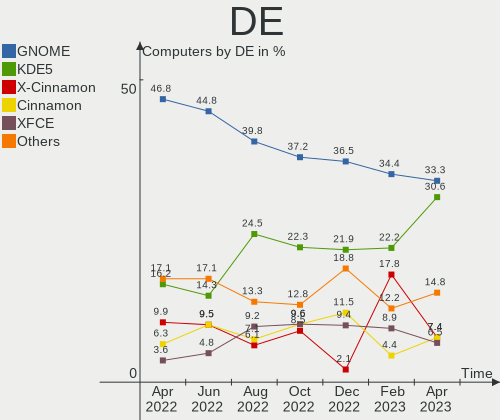

| Name         | Computers | Percent |
|--------------|-----------|---------|
| GNOME        | 36        | 33.33%  |
| KDE5         | 33        | 30.56%  |
| X-Cinnamon   | 8         | 7.41%   |
| Cinnamon     | 8         | 7.41%   |
| XFCE         | 7         | 6.48%   |
| Unknown      | 5         | 4.63%   |
| MATE         | 2         | 1.85%   |
| BunsenLabs   | 2         | 1.85%   |
| Pantheon     | 1         | 0.93%   |
| LXQt         | 1         | 0.93%   |
| LXDE         | 1         | 0.93%   |
| i3           | 1         | 0.93%   |
| Hyprland     | 1         | 0.93%   |
| herbstluftwm | 1         | 0.93%   |
| awesome      | 1         | 0.93%   |

Display Server
--------------

X11 or Wayland

| Name    | Computers | Percent |
|---------|-----------|---------|
| X11     | 80        | 74.07%  |
| Wayland | 19        | 17.59%  |
| Tty     | 8         | 7.41%   |
| Unknown | 1         | 0.93%   |

Display Manager
---------------

SDDM, LightDM, etc.

| Name    | Computers | Percent |
|---------|-----------|---------|
| Unknown | 37        | 34.26%  |
| SDDM    | 28        | 25.93%  |
| LightDM | 22        | 20.37%  |
| GDM3    | 14        | 12.96%  |
| GDM     | 7         | 6.48%   |

OS Lang
-------

Language

| Lang  | Computers | Percent |
|-------|-----------|---------|
| en_AU | 79        | 73.15%  |
| en_US | 25        | 23.15%  |
| POSIX | 1         | 0.93%   |
| en_BW | 1         | 0.93%   |
| en-AU | 1         | 0.93%   |
| C     | 1         | 0.93%   |

Boot Mode
---------

EFI or BIOS

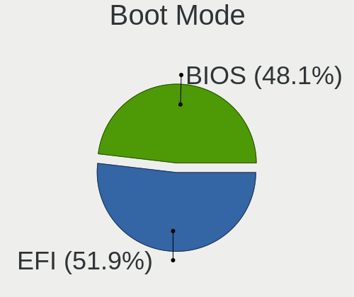

| Mode | Computers | Percent |
|------|-----------|---------|
| EFI  | 56        | 51.85%  |
| BIOS | 52        | 48.15%  |

Filesystem
----------

Type of filesystem

| Type    | Computers | Percent |
|---------|-----------|---------|
| Ext4    | 69        | 63.89%  |
| Btrfs   | 16        | 14.81%  |
| Overlay | 9         | 8.33%   |
| Xfs     | 7         | 6.48%   |
| Zfs     | 4         | 3.7%    |
| Tmpfs   | 3         | 2.78%   |

Part. scheme
------------

Scheme of partitioning

| Type    | Computers | Percent |
|---------|-----------|---------|
| GPT     | 63        | 58.33%  |
| Unknown | 31        | 28.7%   |
| MBR     | 14        | 12.96%  |

Dual Boot with Linux/BSD
------------------------

Hosting more than one Linux/BSD

| Dual boot | Computers | Percent |
|-----------|-----------|---------|
| No        | 85        | 78.7%   |
| Yes       | 23        | 21.3%   |

Dual Boot (Win)
---------------

Hosting Linux and Windows

| Dual boot | Computers | Percent |
|-----------|-----------|---------|
| No        | 80        | 74.07%  |
| Yes       | 28        | 25.93%  |

Board
-----

Vendor
------

Motherboard manufacturer

| Name                                 | Computers | Percent |
|--------------------------------------|-----------|---------|
| Hewlett-Packard                      | 13        | 12.04%  |
| Gigabyte Technology                  | 13        | 12.04%  |
| Dell                                 | 13        | 12.04%  |
| MSI                                  | 11        | 10.19%  |
| Lenovo                               | 11        | 10.19%  |
| ASUSTek Computer                     | 11        | 10.19%  |
| Acer                                 | 8         | 7.41%   |
| Apple                                | 7         | 6.48%   |
| ASRock                               | 6         | 5.56%   |
| Toshiba                              | 4         | 3.7%    |
| Shuttle                              | 2         | 1.85%   |
| Valve                                | 1         | 0.93%   |
| SYWZ                                 | 1         | 0.93%   |
| Shenzhen Meigao Electronic Equipment | 1         | 0.93%   |
| Samsung Electronics                  | 1         | 0.93%   |
| Raspberry Pi Foundation              | 1         | 0.93%   |
| Intel                                | 1         | 0.93%   |
| HUAWEI                               | 1         | 0.93%   |
| ECS                                  | 1         | 0.93%   |
| Unknown                              | 1         | 0.93%   |

Model
-----

Motherboard model

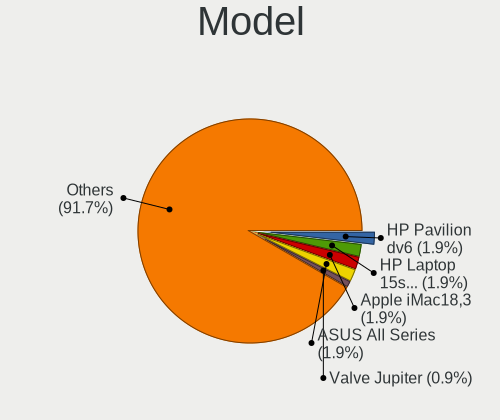

| Name                                            | Computers | Percent |
|-------------------------------------------------|-----------|---------|
| HP Pavilion dv6                                 | 2         | 1.85%   |
| HP Laptop 15s-eq2xxx                            | 2         | 1.85%   |
| ASUS All Series                                 | 2         | 1.85%   |
| Apple iMac18,3                                  | 2         | 1.85%   |
| Valve Jupiter                                   | 1         | 0.93%   |
| Toshiba Satellite P70-A                         | 1         | 0.93%   |
| Toshiba Satellite L850                          | 1         | 0.93%   |
| Toshiba Satellite E45-B                         | 1         | 0.93%   |
| Toshiba QOSMIO F750                             | 1         | 0.93%   |
| SYWZ S210H Series                               | 1         | 0.93%   |
| Shuttle DS81D                                   | 1         | 0.93%   |
| Shuttle DS10U                                   | 1         | 0.93%   |
| Shenzhen Meigao Electronic Equipment UM773 Lite | 1         | 0.93%   |
| Samsung Galaxy Book 12                          | 1         | 0.93%   |
| RPi Raspberry Pi 3 Model B Plus Rev 1.3         | 1         | 0.93%   |
| MSI PRO H510 DP21 (MS-B0A4)                     | 1         | 0.93%   |
| MSI MS-7D91                                     | 1         | 0.93%   |
| MSI MS-7D73                                     | 1         | 0.93%   |
| MSI MS-7D52                                     | 1         | 0.93%   |
| MSI MS-7C96                                     | 1         | 0.93%   |
| MSI MS-7B89                                     | 1         | 0.93%   |
| MSI MS-7922                                     | 1         | 0.93%   |
| MSI MS-7817                                     | 1         | 0.93%   |
| MSI MS-7721                                     | 1         | 0.93%   |
| MSI GE72VR 6RF                                  | 1         | 0.93%   |
| MSI CML-U PRO Cubi 5 (MS-B183)                  | 1         | 0.93%   |
| Lenovo ThinkStation D30 42234T7                 | 1         | 0.93%   |
| Lenovo ThinkPad X1 Carbon Gen 10 21CBCTO1WW     | 1         | 0.93%   |
| Lenovo ThinkPad T410 2522PT3                    | 1         | 0.93%   |
| Lenovo ThinkPad L13 Yoga 20R6S1MG00             | 1         | 0.93%   |
| Lenovo ThinkPad E460 20ETA05KAU                 | 1         | 0.93%   |
| Lenovo ThinkPad E14 Gen 2 20TA00JLAU            | 1         | 0.93%   |
| Lenovo ThinkCentre M720q 10T8SEYP00             | 1         | 0.93%   |
| Lenovo ThinkCentre M58p 7220A72                 | 1         | 0.93%   |
| Lenovo ThinkBook 13s G2 ITL 20V9                | 1         | 0.93%   |
| Lenovo IdeaPadFlex 5 14ABR8 82XX                | 1         | 0.93%   |
| Lenovo IdeaPad 110S-11IBR 80WG                  | 1         | 0.93%   |
| Intel DZ68DB AAG27985-101                       | 1         | 0.93%   |
| HUAWEI MACHD-WXX9                               | 1         | 0.93%   |
| HP ZBook 17 G2                                  | 1         | 0.93%   |

Model Family
------------

Motherboard model prefix

| Name                                       | Computers | Percent |
|--------------------------------------------|-----------|---------|
| Lenovo ThinkPad                            | 5         | 4.63%   |
| Toshiba Satellite                          | 3         | 2.78%   |
| HP Pavilion                                | 3         | 2.78%   |
| Dell Precision                             | 3         | 2.78%   |
| Dell Latitude                              | 3         | 2.78%   |
| Dell Inspiron                              | 3         | 2.78%   |
| ASUS PRIME                                 | 3         | 2.78%   |
| Lenovo ThinkCentre                         | 2         | 1.85%   |
| HP Laptop                                  | 2         | 1.85%   |
| ASUS All                                   | 2         | 1.85%   |
| Apple iMac18                               | 2         | 1.85%   |
| Acer Aspire                                | 2         | 1.85%   |
| Valve Jupiter                              | 1         | 0.93%   |
| Toshiba QOSMIO                             | 1         | 0.93%   |
| SYWZ S210H                                 | 1         | 0.93%   |
| Shuttle DS81D                              | 1         | 0.93%   |
| Shuttle DS10U                              | 1         | 0.93%   |
| Shenzhen Meigao Electronic Equipment UM773 | 1         | 0.93%   |
| Samsung Galaxy                             | 1         | 0.93%   |
| RPi Raspberry                              | 1         | 0.93%   |
| MSI PRO                                    | 1         | 0.93%   |
| MSI MS-7D91                                | 1         | 0.93%   |
| MSI MS-7D73                                | 1         | 0.93%   |
| MSI MS-7D52                                | 1         | 0.93%   |
| MSI MS-7C96                                | 1         | 0.93%   |
| MSI MS-7B89                                | 1         | 0.93%   |
| MSI MS-7922                                | 1         | 0.93%   |
| MSI MS-7817                                | 1         | 0.93%   |
| MSI MS-7721                                | 1         | 0.93%   |
| MSI GE72VR                                 | 1         | 0.93%   |
| MSI CML-U                                  | 1         | 0.93%   |
| Lenovo ThinkStation                        | 1         | 0.93%   |
| Lenovo ThinkBook                           | 1         | 0.93%   |
| Lenovo IdeaPadFlex                         | 1         | 0.93%   |
| Lenovo IdeaPad                             | 1         | 0.93%   |
| Intel DZ68DB                               | 1         | 0.93%   |
| HUAWEI MACHD-WXX9                          | 1         | 0.93%   |
| HP ZBook                                   | 1         | 0.93%   |
| HP Z440                                    | 1         | 0.93%   |
| HP Stream                                  | 1         | 0.93%   |

MFG Year
--------

Motherboard manufacture year

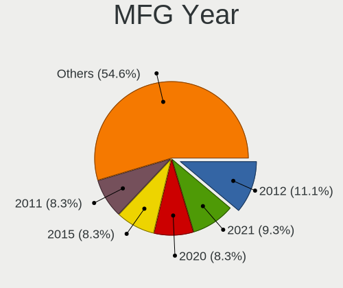

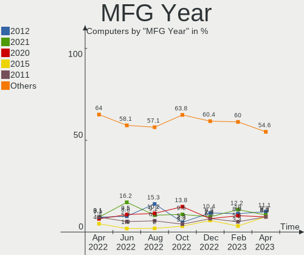

| Year    | Computers | Percent |
|---------|-----------|---------|
| 2012    | 12        | 11.11%  |
| 2021    | 10        | 9.26%   |
| 2020    | 9         | 8.33%   |
| 2015    | 9         | 8.33%   |
| 2011    | 9         | 8.33%   |
| 2019    | 7         | 6.48%   |
| 2017    | 7         | 6.48%   |
| 2016    | 7         | 6.48%   |
| 2014    | 7         | 6.48%   |
| 2013    | 6         | 5.56%   |
| 2022    | 5         | 4.63%   |
| 2008    | 5         | 4.63%   |
| 2018    | 4         | 3.7%    |
| 2010    | 4         | 3.7%    |
| 2007    | 3         | 2.78%   |
| 2023    | 2         | 1.85%   |
| 2009    | 1         | 0.93%   |
| Unknown | 1         | 0.93%   |

Form Factor
-----------

Physical design of the computer

| Name           | Computers | Percent |
|----------------|-----------|---------|
| Desktop        | 54        | 50%     |
| Notebook       | 46        | 42.59%  |
| Convertible    | 2         | 1.85%   |
| Mini pc        | 2         | 1.85%   |
| All in one     | 2         | 1.85%   |
| System on chip | 1         | 0.93%   |
| Tablet         | 1         | 0.93%   |

Secure Boot
-----------

Enabled or disabled

| State    | Computers | Percent |
|----------|-----------|---------|
| Disabled | 105       | 97.22%  |
| Enabled  | 3         | 2.78%   |

Coreboot
--------

Have coreboot on board

| Used | Computers | Percent |
|------|-----------|---------|
| No   | 108       | 100%    |

RAM Size
--------

Total RAM memory

| Size in GB  | Computers | Percent |
|-------------|-----------|---------|
| 16.01-24.0  | 30        | 27.78%  |
| 4.01-8.0    | 26        | 24.07%  |
| 32.01-64.0  | 16        | 14.81%  |
| 8.01-16.0   | 16        | 14.81%  |
| 3.01-4.0    | 9         | 8.33%   |
| 24.01-32.0  | 4         | 3.7%    |
| 64.01-256.0 | 4         | 3.7%    |
| 2.01-3.0    | 1         | 0.93%   |
| 1.01-2.0    | 1         | 0.93%   |
| 0.51-1.0    | 1         | 0.93%   |

RAM Used
--------

Used RAM memory

| Used GB    | Computers | Percent |
|------------|-----------|---------|
| 1.01-2.0   | 41        | 37.96%  |
| 4.01-8.0   | 22        | 20.37%  |
| 2.01-3.0   | 22        | 20.37%  |
| 3.01-4.0   | 12        | 11.11%  |
| 8.01-16.0  | 5         | 4.63%   |
| 0.51-1.0   | 3         | 2.78%   |
| 32.01-64.0 | 1         | 0.93%   |
| 24.01-32.0 | 1         | 0.93%   |
| 0.01-0.5   | 1         | 0.93%   |

Total Drives
------------

Number of drives on board

| Drives | Computers | Percent |
|--------|-----------|---------|
| 1      | 55        | 50.93%  |
| 2      | 29        | 26.85%  |
| 4      | 12        | 11.11%  |
| 3      | 9         | 8.33%   |
| 5      | 2         | 1.85%   |
| 7      | 1         | 0.93%   |

Has CD-ROM
----------

Has CD-ROM on board

| Presented | Computers | Percent |
|-----------|-----------|---------|
| No        | 64        | 59.26%  |
| Yes       | 44        | 40.74%  |

Has Ethernet
------------

Has Ethernet on board

| Presented | Computers | Percent |
|-----------|-----------|---------|
| Yes       | 96        | 88.89%  |
| No        | 12        | 11.11%  |

Has WiFi
--------

Has WiFi module

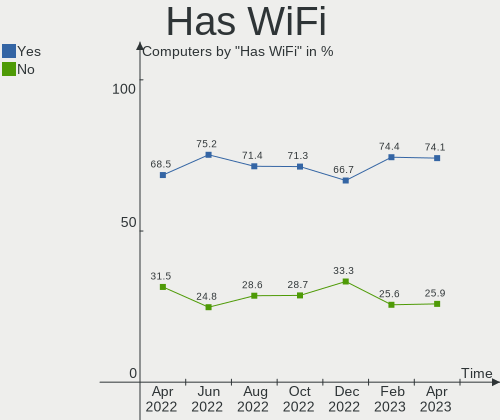

| Presented | Computers | Percent |
|-----------|-----------|---------|
| Yes       | 80        | 74.07%  |
| No        | 28        | 25.93%  |

Has Bluetooth
-------------

Has Bluetooth module

| Presented | Computers | Percent |
|-----------|-----------|---------|
| Yes       | 74        | 68.52%  |
| No        | 34        | 31.48%  |

Location
--------

Country
-------

Geographic location (country)

| Country   | Computers | Percent |
|-----------|-----------|---------|
| Australia | 108       | 100%    |

City
----

Geographic location (city)

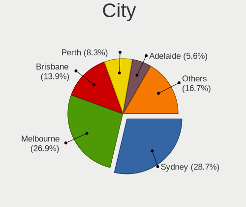

| City           | Computers | Percent |
|----------------|-----------|---------|
| Sydney         | 31        | 28.7%   |
| Melbourne      | 29        | 26.85%  |
| Brisbane       | 15        | 13.89%  |
| Perth          | 9         | 8.33%   |
| Adelaide       | 6         | 5.56%   |
| Hobart         | 2         | 1.85%   |
| Canberra       | 2         | 1.85%   |
| Warragul       | 1         | 0.93%   |
| Sunshine Coast | 1         | 0.93%   |
| St Leonards    | 1         | 0.93%   |
| Newcastle      | 1         | 0.93%   |
| Morwell        | 1         | 0.93%   |
| Macquarie Park | 1         | 0.93%   |
| Long Beach     | 1         | 0.93%   |
| Leinster       | 1         | 0.93%   |
| Geelong        | 1         | 0.93%   |
| Dorrigo        | 1         | 0.93%   |
| Central Coast  | 1         | 0.93%   |
| Cairns         | 1         | 0.93%   |
| Ballarat       | 1         | 0.93%   |
| Alexandria     | 1         | 0.93%   |

Drives
------

Drive Vendor
------------

Hard drive vendors

| Vendor                      | Computers | Drives | Percent |
|-----------------------------|-----------|--------|---------|
| Samsung Electronics         | 35        | 45     | 19.89%  |
| Seagate                     | 24        | 31     | 13.64%  |
| WDC                         | 17        | 21     | 9.66%   |
| Crucial                     | 13        | 16     | 7.39%   |
| SanDisk                     | 8         | 10     | 4.55%   |
| Kingston                    | 8         | 8      | 4.55%   |
| Intel                       | 8         | 8      | 4.55%   |
| Unknown                     | 7         | 7      | 3.98%   |
| Hitachi                     | 7         | 7      | 3.98%   |
| SK hynix                    | 6         | 6      | 3.41%   |
| HGST                        | 6         | 6      | 3.41%   |
| Toshiba                     | 4         | 4      | 2.27%   |
| Micron/Crucial Technology   | 4         | 4      | 2.27%   |
| Apple                       | 3         | 4      | 1.7%    |
| LITEON                      | 2         | 2      | 1.14%   |
| Kingston Technology Company | 2         | 2      | 1.14%   |
| A-DATA Technology           | 2         | 2      | 1.14%   |
| USB                         | 1         | 1      | 0.57%   |
| Transcend                   | 1         | 1      | 0.57%   |
| Team                        | 1         | 1      | 0.57%   |
| SPCC                        | 1         | 1      | 0.57%   |
| Silicon Motion              | 1         | 1      | 0.57%   |
| Realtek                     | 1         | 1      | 0.57%   |
| PNY                         | 1         | 1      | 0.57%   |
| Phison Electronics          | 1         | 1      | 0.57%   |
| Patriot                     | 1         | 1      | 0.57%   |
| OWC                         | 1         | 1      | 0.57%   |
| Micron Technology           | 1         | 1      | 0.57%   |
| LITEONIT                    | 1         | 1      | 0.57%   |
| KIOXIA                      | 1         | 1      | 0.57%   |
| KingSpec                    | 1         | 1      | 0.57%   |
| HUAWEI                      | 1         | 1      | 0.57%   |
| Gigabyte Technology         | 1         | 1      | 0.57%   |
| G-TECH                      | 1         | 1      | 0.57%   |
| Corsair                     | 1         | 1      | 0.57%   |
| China                       | 1         | 1      | 0.57%   |
| ASint Technology            | 1         | 1      | 0.57%   |

Drive Model
-----------

Hard drive models

| Model                                               | Computers | Percent |
|-----------------------------------------------------|-----------|---------|
| Samsung NVMe SSD Controller SM981/PM981/PM983 1TB   | 4         | 2.07%   |
| Samsung SSD 860 EVO 500GB                           | 3         | 1.55%   |
| Intel SSDSC2KW256G8 256GB                           | 3         | 1.55%   |
| Crucial CT500MX500SSD1 500GB                        | 3         | 1.55%   |
| WDC WD20EZBX-00AYRA0 2TB                            | 2         | 1.04%   |
| WDC WD1200JD-00HBB0 120GB                           | 2         | 1.04%   |
| Seagate ST500DM002-1BD142 500GB                     | 2         | 1.04%   |
| Seagate ST4000DM000-1F2168 4TB                      | 2         | 1.04%   |
| Seagate ST31000528AS 1TB                            | 2         | 1.04%   |
| Seagate ST2000DM001-1ER164 2TB                      | 2         | 1.04%   |
| Seagate Expansion Desk 8TB                          | 2         | 1.04%   |
| Samsung SSD 980 PRO 1TB                             | 2         | 1.04%   |
| Samsung SSD 870 EVO 500GB                           | 2         | 1.04%   |
| Samsung SSD 850 EVO 500GB                           | 2         | 1.04%   |
| Samsung SSD 850 EVO 250GB                           | 2         | 1.04%   |
| Samsung SSD 840 EVO 120GB                           | 2         | 1.04%   |
| Samsung NVMe SSD Controller SM961/PM961/SM963 500GB | 2         | 1.04%   |
| Kingston Company SNV2S1000G 1TB                     | 2         | 1.04%   |
| Kingston SA400S37240G 240GB SSD                     | 2         | 1.04%   |
| Intel SSDPEKNU512GZH 512GB                          | 2         | 1.04%   |
| Hitachi HTS547575A9E384 752GB                       | 2         | 1.04%   |
| HGST HTS721010A9E630 1TB                            | 2         | 1.04%   |
| HGST HTS541010A9E680 1TB                            | 2         | 1.04%   |
| Crucial CT525MX300SSD1 528GB                        | 2         | 1.04%   |
| Crucial CT2000MX500SSD1 2TB                         | 2         | 1.04%   |
| Crucial CT1000BX500SSD1 1TB                         | 2         | 1.04%   |
| WDC WDS100T2B0B-00YS70 1TB SSD                      | 1         | 0.52%   |
| WDC WD60PURX-64LZMY0 6TB                            | 1         | 0.52%   |
| WDC WD5000LPLX-08ZNTT0 500GB                        | 1         | 0.52%   |
| WDC WD5000AVCS-632DY1 500GB                         | 1         | 0.52%   |
| WDC WD5000AAVS-00G9B0 500GB                         | 1         | 0.52%   |
| WDC WD5000AAKS-75V0A0 500GB                         | 1         | 0.52%   |
| WDC WD40EFRX-68WT0N0 4TB                            | 1         | 0.52%   |
| WDC WD3200BEVT-75ZCT0 320GB                         | 1         | 0.52%   |
| WDC WD1600AAJS-75M0A0 160GB                         | 1         | 0.52%   |
| WDC WD10JPVX-75JC3T0 1TB                            | 1         | 0.52%   |
| WDC WD10EZEX-60ZF5A0 1TB                            | 1         | 0.52%   |
| WDC WD10EZEX-60M2NA0 1TB                            | 1         | 0.52%   |
| WDC WD10EZEX-08WN4A0 1TB                            | 1         | 0.52%   |
| WDC WD10EZEX-00BN5A0 1TB                            | 1         | 0.52%   |

HDD Vendor
----------

Hard disk drive vendors

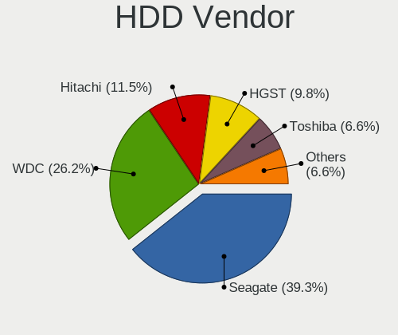

| Vendor              | Computers | Drives | Percent |
|---------------------|-----------|--------|---------|
| Seagate             | 24        | 31     | 39.34%  |
| WDC                 | 16        | 20     | 26.23%  |
| Hitachi             | 7         | 7      | 11.48%  |
| HGST                | 6         | 6      | 9.84%   |
| Toshiba             | 4         | 4      | 6.56%   |
| Samsung Electronics | 2         | 3      | 3.28%   |
| USB                 | 1         | 1      | 1.64%   |
| Apple               | 1         | 1      | 1.64%   |

SSD Vendor
----------

Solid state drive vendors

| Vendor              | Computers | Drives | Percent |
|---------------------|-----------|--------|---------|
| Samsung Electronics | 23        | 28     | 32.39%  |
| Crucial             | 12        | 15     | 16.9%   |
| SanDisk             | 5         | 6      | 7.04%   |
| Kingston            | 5         | 5      | 7.04%   |
| Intel               | 5         | 5      | 7.04%   |
| SK hynix            | 4         | 4      | 5.63%   |
| LITEON              | 2         | 2      | 2.82%   |
| Apple               | 2         | 2      | 2.82%   |
| WDC                 | 1         | 1      | 1.41%   |
| Transcend           | 1         | 1      | 1.41%   |
| SPCC                | 1         | 1      | 1.41%   |
| PNY                 | 1         | 1      | 1.41%   |
| Patriot             | 1         | 1      | 1.41%   |
| OWC                 | 1         | 1      | 1.41%   |
| Micron Technology   | 1         | 1      | 1.41%   |
| LITEONIT            | 1         | 1      | 1.41%   |
| KingSpec            | 1         | 1      | 1.41%   |
| Gigabyte Technology | 1         | 1      | 1.41%   |
| Corsair             | 1         | 1      | 1.41%   |
| China               | 1         | 1      | 1.41%   |
| A-DATA Technology   | 1         | 1      | 1.41%   |

Drive Kind
----------

HDD or SSD

| Kind    | Computers | Drives | Percent |
|---------|-----------|--------|---------|
| SSD     | 64        | 80     | 41.29%  |
| HDD     | 49        | 73     | 31.61%  |
| NVMe    | 33        | 41     | 21.29%  |
| MMC     | 7         | 7      | 4.52%   |
| Unknown | 2         | 2      | 1.29%   |

Drive Connector
---------------

SATA, SAS, NVMe, etc.

| Type | Computers | Drives | Percent |
|------|-----------|--------|---------|
| SATA | 84        | 148    | 63.64%  |
| NVMe | 33        | 40     | 25%     |
| SAS  | 8         | 8      | 6.06%   |
| MMC  | 7         | 7      | 5.3%    |

Drive Size
----------

Size of hard drive

| Size in TB | Computers | Drives | Percent |
|------------|-----------|--------|---------|
| 0.01-0.5   | 62        | 87     | 53.91%  |
| 0.51-1.0   | 32        | 40     | 27.83%  |
| 1.01-2.0   | 13        | 17     | 11.3%   |
| 3.01-4.0   | 4         | 5      | 3.48%   |
| 4.01-10.0  | 4         | 4      | 3.48%   |

Space Total
-----------

Amount of disk space available on the file system

| Size in GB     | Computers | Percent |
|----------------|-----------|---------|
| 251-500        | 20        | 18.52%  |
| 501-1000       | 20        | 18.52%  |
| 101-250        | 17        | 15.74%  |
| 1001-2000      | 14        | 12.96%  |
| More than 3000 | 12        | 11.11%  |
| 51-100         | 12        | 11.11%  |
| 21-50          | 4         | 3.7%    |
| 1-20           | 4         | 3.7%    |
| Unknown        | 3         | 2.78%   |
| 2001-3000      | 2         | 1.85%   |

Space Used
----------

Amount of used disk space

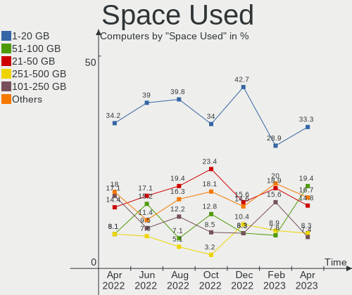

| Used GB        | Computers | Percent |
|----------------|-----------|---------|
| 1-20           | 36        | 33.33%  |
| 51-100         | 21        | 19.44%  |
| 21-50          | 16        | 14.81%  |
| 251-500        | 9         | 8.33%   |
| 101-250        | 8         | 7.41%   |
| 1001-2000      | 6         | 5.56%   |
| 501-1000       | 6         | 5.56%   |
| Unknown        | 3         | 2.78%   |
| More than 3000 | 2         | 1.85%   |
| 2001-3000      | 1         | 0.93%   |

Malfunc. Drives
---------------

Drive models with a malfunction

| Model                             | Computers | Drives | Percent |
|-----------------------------------|-----------|--------|---------|
| WDC WD3200BEVT-75ZCT0 320GB       | 1         | 1      | 5.56%   |
| Transcend TS256GSSD230S 256GB     | 1         | 1      | 5.56%   |
| Toshiba MQ01ABD100 1TB            | 1         | 1      | 5.56%   |
| Toshiba MQ01ABD050 500GB          | 1         | 1      | 5.56%   |
| SK hynix SC308 SATA 256GB SSD     | 1         | 1      | 5.56%   |
| Seagate ST500DM002-1BD142 500GB   | 1         | 3      | 5.56%   |
| Seagate ST3500418AS 500GB         | 1         | 1      | 5.56%   |
| Seagate ST3320813AS 320GB         | 1         | 1      | 5.56%   |
| Seagate ST31000520AS 1TB          | 1         | 1      | 5.56%   |
| SanDisk SSD PLUS 240 GB           | 1         | 1      | 5.56%   |
| Samsung Electronics HD501LJ 500GB | 1         | 2      | 5.56%   |
| Kingston SA400S37480G 480GB SSD   | 1         | 1      | 5.56%   |
| Intel SSDSC2CT120A3 120GB         | 1         | 1      | 5.56%   |
| Hitachi HTS547564A9E384 640GB     | 1         | 1      | 5.56%   |
| Hitachi HTS541010A9E680 1TB       | 1         | 1      | 5.56%   |
| HGST HTS545050A7E680 500GB        | 1         | 1      | 5.56%   |
| HGST HTS541010A9E680 1TB          | 1         | 1      | 5.56%   |
| Crucial CT525MX300SSD1 528GB      | 1         | 1      | 5.56%   |

Malfunc. Drive Vendor
---------------------

Vendors of faulty drives

| Vendor              | Computers | Drives | Percent |
|---------------------|-----------|--------|---------|
| Seagate             | 4         | 6      | 22.22%  |
| Toshiba             | 2         | 2      | 11.11%  |
| Hitachi             | 2         | 2      | 11.11%  |
| HGST                | 2         | 2      | 11.11%  |
| WDC                 | 1         | 1      | 5.56%   |
| Transcend           | 1         | 1      | 5.56%   |
| SK hynix            | 1         | 1      | 5.56%   |
| SanDisk             | 1         | 1      | 5.56%   |
| Samsung Electronics | 1         | 2      | 5.56%   |
| Kingston            | 1         | 1      | 5.56%   |
| Intel               | 1         | 1      | 5.56%   |
| Crucial             | 1         | 1      | 5.56%   |

Malfunc. HDD Vendor
-------------------

Vendors of faulty HDD drives

| Vendor              | Computers | Drives | Percent |
|---------------------|-----------|--------|---------|
| Seagate             | 4         | 6      | 33.33%  |
| Toshiba             | 2         | 2      | 16.67%  |
| Hitachi             | 2         | 2      | 16.67%  |
| HGST                | 2         | 2      | 16.67%  |
| WDC                 | 1         | 1      | 8.33%   |
| Samsung Electronics | 1         | 2      | 8.33%   |

Malfunc. Drive Kind
-------------------

Kinds of faulty drives

| Kind | Computers | Drives | Percent |
|------|-----------|--------|---------|
| HDD  | 12        | 15     | 66.67%  |
| SSD  | 6         | 6      | 33.33%  |

Failed Drives
-------------

Failed drive models

Zero info for selected period =(

Failed Drive Vendor
-------------------

Failed drive vendors

Zero info for selected period =(

Drive Status
------------

Number of failed and malfunc. drives

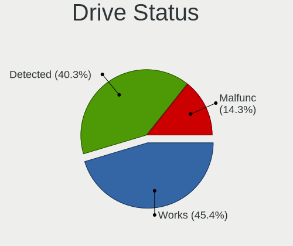

| Status   | Computers | Drives | Percent |
|----------|-----------|--------|---------|
| Works    | 54        | 85     | 45.38%  |
| Detected | 48        | 97     | 40.34%  |
| Malfunc  | 17        | 21     | 14.29%  |

Storage controller
------------------

Storage Vendor
--------------

Storage controller vendors

| Vendor                      | Computers | Percent |
|-----------------------------|-----------|---------|
| Intel                       | 77        | 54.23%  |
| AMD                         | 17        | 11.97%  |
| Samsung Electronics         | 16        | 11.27%  |
| Marvell Technology Group    | 5         | 3.52%   |
| Kingston Technology Company | 5         | 3.52%   |
| Micron/Crucial Technology   | 4         | 2.82%   |
| SanDisk                     | 3         | 2.11%   |
| SK hynix                    | 2         | 1.41%   |
| Silicon Motion              | 2         | 1.41%   |
| Phison Electronics          | 2         | 1.41%   |
| Nvidia                      | 2         | 1.41%   |
| ASMedia Technology          | 2         | 1.41%   |
| LSI Logic / Symbios Logic   | 1         | 0.7%    |
| KIOXIA                      | 1         | 0.7%    |
| JMicron Technology          | 1         | 0.7%    |
| Broadcom / LSI              | 1         | 0.7%    |
| ADATA Technology            | 1         | 0.7%    |

Storage Model
-------------

Storage controller models

| Model                                                                          | Computers | Percent |
|--------------------------------------------------------------------------------|-----------|---------|
| AMD FCH SATA Controller [AHCI mode]                                            | 12        | 7.23%   |
| Intel Sunrise Point-LP SATA Controller [AHCI mode]                             | 6         | 3.61%   |
| Intel Q170/Q150/B150/H170/H110/Z170/CM236 Chipset SATA Controller [AHCI Mode]  | 6         | 3.61%   |
| Intel 8 Series/C220 Series Chipset Family 6-port SATA Controller 1 [AHCI mode] | 6         | 3.61%   |
| Intel C600/X79 series chipset 6-Port SATA AHCI Controller                      | 5         | 3.01%   |
| Samsung NVMe SSD Controller SM981/PM981/PM983                                  | 4         | 2.41%   |
| Samsung NVMe SSD Controller 980                                                | 4         | 2.41%   |
| Marvell Group 88SE9172 SATA 6Gb/s Controller                                   | 4         | 2.41%   |
| Intel 7 Series Chipset Family 6-port SATA Controller [AHCI mode]               | 4         | 2.41%   |
| Intel 6 Series/C200 Series Chipset Family 6 port Mobile SATA AHCI Controller   | 4         | 2.41%   |
| Samsung NVMe SSD Controller PM9A1/PM9A3/980PRO                                 | 3         | 1.81%   |
| Kingston Company Company Non-Volatile memory controller                        | 3         | 1.81%   |
| Intel Volume Management Device NVMe RAID Controller                            | 3         | 1.81%   |
| Intel Cannon Lake Mobile PCH SATA AHCI Controller                              | 3         | 1.81%   |
| Intel 82801JD/DO (ICH10 Family) SATA AHCI Controller                           | 3         | 1.81%   |
| Intel 82801 Mobile SATA Controller [RAID mode]                                 | 3         | 1.81%   |
| Intel 7 Series/C210 Series Chipset Family 6-port SATA Controller [AHCI mode]   | 3         | 1.81%   |
| Intel 500 Series Chipset Family SATA AHCI Controller                           | 3         | 1.81%   |
| Intel 5 Series/3400 Series Chipset 4 port SATA AHCI Controller                 | 3         | 1.81%   |
| AMD 500 Series Chipset SATA Controller                                         | 3         | 1.81%   |
| AMD 400 Series Chipset SATA Controller                                         | 3         | 1.81%   |
| SK hynix Gold P31/PC711 NVMe Solid State Drive                                 | 2         | 1.2%    |
| Samsung NVMe SSD Controller SM961/PM961/SM963                                  | 2         | 1.2%    |
| Phison PS5013 E13 NVMe Controller                                              | 2         | 1.2%    |
| Nvidia MCP89 SATA Controller (AHCI mode)                                       | 2         | 1.2%    |
| Micron/Crucial P2 NVMe PCIe SSD                                                | 2         | 1.2%    |
| Intel Wildcat Point-LP SATA Controller [AHCI Mode]                             | 2         | 1.2%    |
| Intel Non-Volatile memory controller                                           | 2         | 1.2%    |
| Intel Comet Lake SATA AHCI Controller                                          | 2         | 1.2%    |
| Intel Cannon Lake PCH SATA AHCI Controller                                     | 2         | 1.2%    |
| Intel C610/X99 series chipset sSATA Controller [AHCI mode]                     | 2         | 1.2%    |
| Intel C600/X79 series chipset IDE-r Controller                                 | 2         | 1.2%    |
| Intel Alder Lake-S PCH SATA Controller [AHCI Mode]                             | 2         | 1.2%    |
| Intel 9 Series Chipset Family SATA Controller [AHCI Mode]                      | 2         | 1.2%    |
| Intel 82801HM/HEM (ICH8M/ICH8M-E) SATA Controller [AHCI mode]                  | 2         | 1.2%    |
| Intel 82801HM/HEM (ICH8M/ICH8M-E) IDE Controller                               | 2         | 1.2%    |
| Intel 4 Series Chipset PT IDER Controller                                      | 2         | 1.2%    |
| ASMedia ASM1062 Serial ATA Controller                                          | 2         | 1.2%    |
| AMD SB7x0/SB8x0/SB9x0 SATA Controller [AHCI mode]                              | 2         | 1.2%    |
| AMD SB7x0/SB8x0/SB9x0 IDE Controller                                           | 2         | 1.2%    |

Storage Kind
------------

Kind of storage controller (IDE, SATA, NVMe, SAS, ...)

| Kind | Computers | Percent |
|------|-----------|---------|
| SATA | 87        | 60.84%  |
| NVMe | 34        | 23.78%  |
| IDE  | 11        | 7.69%   |
| RAID | 9         | 6.29%   |
| SAS  | 1         | 0.7%    |
| SCSI | 1         | 0.7%    |

Processor
---------

CPU Vendor
----------

Processor vendors

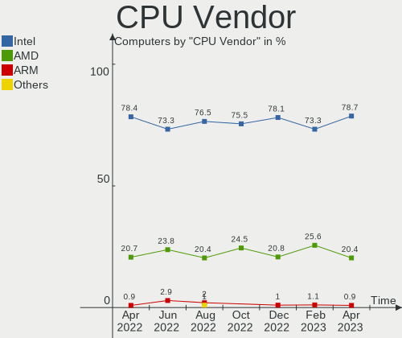

| Vendor | Computers | Percent |
|--------|-----------|---------|
| Intel  | 85        | 78.7%   |
| AMD    | 22        | 20.37%  |
| ARM    | 1         | 0.93%   |

CPU Model
---------

Processor models

| Model                                   | Computers | Percent |
|-----------------------------------------|-----------|---------|
| Intel Core 2 Duo CPU E8400 @ 3.00GHz    | 3         | 2.78%   |
| Intel Core i7-9750H CPU @ 2.60GHz       | 2         | 1.85%   |
| Intel Core i7-5820K CPU @ 3.30GHz       | 2         | 1.85%   |
| Intel Core i7-3770 CPU @ 3.40GHz        | 2         | 1.85%   |
| Intel Core i7-2670QM CPU @ 2.20GHz      | 2         | 1.85%   |
| Intel Core i5-7500 CPU @ 3.40GHz        | 2         | 1.85%   |
| Intel Core i5-6300U CPU @ 2.40GHz       | 2         | 1.85%   |
| Intel Core i5-5200U CPU @ 2.20GHz       | 2         | 1.85%   |
| Intel Core i5 CPU M 540 @ 2.53GHz       | 2         | 1.85%   |
| Intel Core 2 Duo CPU P8600 @ 2.40GHz    | 2         | 1.85%   |
| Intel 11th Gen Core i7-1165G7 @ 2.80GHz | 2         | 1.85%   |
| Intel 11th Gen Core i5-1135G7 @ 2.40GHz | 2         | 1.85%   |
| AMD Ryzen 5 5500U with Radeon Graphics  | 2         | 1.85%   |
| AMD Ryzen 5 3600 6-Core Processor       | 2         | 1.85%   |
| AMD Ryzen 5 1600 Six-Core Processor     | 2         | 1.85%   |
| AMD Phenom II X2 570 Processor          | 2         | 1.85%   |
| Intel Xeon CPU E5-2670 0 @ 2.60GHz      | 1         | 0.93%   |
| Intel Xeon CPU E5-1620 v3 @ 3.50GHz     | 1         | 0.93%   |
| Intel Xeon CPU E5-1620 v2 @ 3.70GHz     | 1         | 0.93%   |
| Intel Pentium Dual CPU T2330 @ 1.60GHz  | 1         | 0.93%   |
| Intel Pentium CPU P6200 @ 2.13GHz       | 1         | 0.93%   |
| Intel Pentium CPU 2020M @ 2.40GHz       | 1         | 0.93%   |
| Intel Core i9-10980HK CPU @ 2.40GHz     | 1         | 0.93%   |
| Intel Core i7-8750H CPU @ 2.20GHz       | 1         | 0.93%   |
| Intel Core i7-7820HQ CPU @ 2.90GHz      | 1         | 0.93%   |
| Intel Core i7-7700HQ CPU @ 2.80GHz      | 1         | 0.93%   |
| Intel Core i7-7500U CPU @ 2.70GHz       | 1         | 0.93%   |
| Intel Core i7-6700HQ CPU @ 2.60GHz      | 1         | 0.93%   |
| Intel Core i7-6500U CPU @ 2.50GHz       | 1         | 0.93%   |
| Intel Core i7-4960X CPU @ 3.60GHz       | 1         | 0.93%   |
| Intel Core i7-4810MQ CPU @ 2.80GHz      | 1         | 0.93%   |
| Intel Core i7-4790K CPU @ 4.00GHz       | 1         | 0.93%   |
| Intel Core i7-4770K CPU @ 3.50GHz       | 1         | 0.93%   |
| Intel Core i7-4770 CPU @ 3.40GHz        | 1         | 0.93%   |
| Intel Core i7-4710MQ CPU @ 2.50GHz      | 1         | 0.93%   |
| Intel Core i7-4700MQ CPU @ 2.40GHz      | 1         | 0.93%   |
| Intel Core i7-3930K CPU @ 3.20GHz       | 1         | 0.93%   |
| Intel Core i7-3820 CPU @ 3.60GHz        | 1         | 0.93%   |
| Intel Core i7-3770K CPU @ 3.50GHz       | 1         | 0.93%   |
| Intel Core i7-3720QM CPU @ 2.60GHz      | 1         | 0.93%   |

CPU Model Family
----------------

Processor model prefix

| Model              | Computers | Percent |
|--------------------|-----------|---------|
| Intel Core i7      | 29        | 26.85%  |
| Intel Core i5      | 23        | 21.3%   |
| Other              | 11        | 10.19%  |
| AMD Ryzen 5        | 11        | 10.19%  |
| Intel Core 2 Duo   | 7         | 6.48%   |
| Intel Core i3      | 4         | 3.7%    |
| Intel Celeron      | 4         | 3.7%    |
| Intel Xeon         | 3         | 2.78%   |
| AMD Ryzen 9        | 3         | 2.78%   |
| Intel Pentium      | 2         | 1.85%   |
| AMD Ryzen 7        | 2         | 1.85%   |
| AMD Phenom II X2   | 2         | 1.85%   |
| AMD A8             | 2         | 1.85%   |
| Intel Pentium Dual | 1         | 0.93%   |
| Intel Core i9      | 1         | 0.93%   |
| Intel Atom         | 1         | 0.93%   |
| ARM BCM            | 1         | 0.93%   |
| AMD A4             | 1         | 0.93%   |

CPU Cores
---------

Number of processor cores

| Number | Computers | Percent |
|--------|-----------|---------|
| 2      | 37        | 34.26%  |
| 4      | 36        | 33.33%  |
| 6      | 21        | 19.44%  |
| 8      | 6         | 5.56%   |
| 16     | 3         | 2.78%   |
| 12     | 3         | 2.78%   |
| 24     | 1         | 0.93%   |
| 1      | 1         | 0.93%   |

CPU Sockets
-----------

Number of sockets

| Number | Computers | Percent |
|--------|-----------|---------|
| 1      | 107       | 99.07%  |
| 2      | 1         | 0.93%   |

CPU Threads
-----------

Threads per core (Hyper-Threading)

| Number | Computers | Percent |
|--------|-----------|---------|
| 2      | 79        | 73.15%  |
| 1      | 29        | 26.85%  |

CPU Op-Modes
------------

CPU Operation Modes (32-bit, 64-bit)

| Op mode        | Computers | Percent |
|----------------|-----------|---------|
| 32-bit, 64-bit | 107       | 99.07%  |
| Unknown        | 1         | 0.93%   |

CPU Microcode
-------------

Microcode number

| Number     | Computers | Percent |
|------------|-----------|---------|
| Unknown    | 60        | 55.56%  |
| 0x206a7    | 3         | 2.78%   |
| 0x1067a    | 3         | 2.78%   |
| 0x08701021 | 3         | 2.78%   |
| 0x906e9    | 2         | 1.85%   |
| 0x806ec    | 2         | 1.85%   |
| 0x506e3    | 2         | 1.85%   |
| 0x406e3    | 2         | 1.85%   |
| 0x306d4    | 2         | 1.85%   |
| 0x306c3    | 2         | 1.85%   |
| 0x206d7    | 2         | 1.85%   |
| 0x0a20120a | 2         | 1.85%   |
| 0x08608104 | 2         | 1.85%   |
| 0xa0653    | 1         | 0.93%   |
| 0x906ea    | 1         | 0.93%   |
| 0x906a3    | 1         | 0.93%   |
| 0x90672    | 1         | 0.93%   |
| 0x806e9    | 1         | 0.93%   |
| 0x6fd      | 1         | 0.93%   |
| 0x6fb      | 1         | 0.93%   |
| 0x406c4    | 1         | 0.93%   |
| 0x306f2    | 1         | 0.93%   |
| 0x0a601203 | 1         | 0.93%   |
| 0x0a50000d | 1         | 0.93%   |
| 0x0a50000c | 1         | 0.93%   |
| 0x0a404102 | 1         | 0.93%   |
| 0x0800820d | 1         | 0.93%   |
| 0x08008206 | 1         | 0.93%   |
| 0x08001138 | 1         | 0.93%   |
| 0x08001126 | 1         | 0.93%   |
| 0x06003106 | 1         | 0.93%   |
| 0x06001119 | 1         | 0.93%   |
| 0x010000b6 | 1         | 0.93%   |
| 0x00000000 | 1         | 0.93%   |

CPU Microarch
-------------

Microarchitecture

| Name             | Computers | Percent |
|------------------|-----------|---------|
| KabyLake         | 15        | 13.89%  |
| IvyBridge        | 11        | 10.19%  |
| Haswell          | 11        | 10.19%  |
| Skylake          | 9         | 8.33%   |
| SandyBridge      | 8         | 7.41%   |
| Unknown          | 7         | 6.48%   |
| Penryn           | 6         | 5.56%   |
| Alderlake Hybrid | 5         | 4.63%   |
| Zen 3            | 4         | 3.7%    |
| Westmere         | 4         | 3.7%    |
| TigerLake        | 4         | 3.7%    |
| Zen 2            | 3         | 2.78%   |
| Zen              | 3         | 2.78%   |
| CometLake        | 3         | 2.78%   |
| Broadwell        | 3         | 2.78%   |
| Zen+             | 2         | 1.85%   |
| Steamroller      | 2         | 1.85%   |
| K10              | 2         | 1.85%   |
| Core             | 2         | 1.85%   |
| Silvermont       | 1         | 0.93%   |
| Piledriver       | 1         | 0.93%   |
| Goldmont plus    | 1         | 0.93%   |
| Bonnell          | 1         | 0.93%   |

Graphics
--------

GPU Vendor
----------

Vendors of graphics cards

| Vendor | Computers | Percent |
|--------|-----------|---------|
| Intel  | 61        | 48.41%  |
| Nvidia | 41        | 32.54%  |
| AMD    | 24        | 19.05%  |

GPU Model
---------

Graphics card models

| Model                                                                       | Computers | Percent |
|-----------------------------------------------------------------------------|-----------|---------|
| AMD Ellesmere [Radeon RX 470/480/570/570X/580/580X/590]                     | 5         | 3.91%   |
| Intel TigerLake-LP GT2 [Iris Xe Graphics]                                   | 4         | 3.13%   |
| Intel Skylake GT2 [HD Graphics 520]                                         | 4         | 3.13%   |
| Intel HD Graphics 530                                                       | 4         | 3.13%   |
| Intel Core Processor Integrated Graphics Controller                         | 4         | 3.13%   |
| Intel 3rd Gen Core processor Graphics Controller                            | 4         | 3.13%   |
| Intel 2nd Generation Core Processor Family Integrated Graphics Controller   | 4         | 3.13%   |
| Intel CoffeeLake-H GT2 [UHD Graphics 630]                                   | 3         | 2.34%   |
| Intel AlderLake-S GT1                                                       | 3         | 2.34%   |
| Intel 4th Gen Core Processor Integrated Graphics Controller                 | 3         | 2.34%   |
| Nvidia TU116 [GeForce GTX 1660 Ti]                                          | 2         | 1.56%   |
| Nvidia MCP89 [GeForce 320M]                                                 | 2         | 1.56%   |
| Nvidia GP106 [GeForce GTX 1060 6GB]                                         | 2         | 1.56%   |
| Nvidia GK106 [GeForce GTX 660]                                              | 2         | 1.56%   |
| Intel Xeon E3-1200 v3/4th Gen Core Processor Integrated Graphics Controller | 2         | 1.56%   |
| Intel HD Graphics 620                                                       | 2         | 1.56%   |
| Intel HD Graphics 5500                                                      | 2         | 1.56%   |
| Intel CometLake-U GT2 [UHD Graphics]                                        | 2         | 1.56%   |
| Intel CoffeeLake-S GT2 [UHD Graphics 630]                                   | 2         | 1.56%   |
| Intel 4 Series Chipset Integrated Graphics Controller                       | 2         | 1.56%   |
| AMD Lucienne                                                                | 2         | 1.56%   |
| Nvidia TU117M [GeForce GTX 1650 Mobile / Max-Q]                             | 1         | 0.78%   |
| Nvidia TU117GLM [Quadro T1000 Mobile]                                       | 1         | 0.78%   |
| Nvidia TU102 [GeForce RTX 2080 Ti Rev. A]                                   | 1         | 0.78%   |
| Nvidia GP107M [GeForce GTX 1050 Ti Mobile]                                  | 1         | 0.78%   |
| Nvidia GP106M [GeForce GTX 1060 Mobile]                                     | 1         | 0.78%   |
| Nvidia GP104BM [GeForce GTX 1070 Mobile]                                    | 1         | 0.78%   |
| Nvidia GP104 [GeForce GTX 1080]                                             | 1         | 0.78%   |
| Nvidia GM206 [GeForce GTX 960]                                              | 1         | 0.78%   |
| Nvidia GM204 [GeForce GTX 980]                                              | 1         | 0.78%   |
| Nvidia GM204 [GeForce GTX 970]                                              | 1         | 0.78%   |
| Nvidia GM200 [GeForce GTX 980 Ti]                                           | 1         | 0.78%   |
| Nvidia GM107GLM [Quadro M1200 Mobile]                                       | 1         | 0.78%   |
| Nvidia GM107GL [Quadro K2200]                                               | 1         | 0.78%   |
| Nvidia GM107 [GeForce GTX 750 Ti]                                           | 1         | 0.78%   |
| Nvidia GK208M [GeForce GT 740M]                                             | 1         | 0.78%   |
| Nvidia GK208B [GeForce GT 730]                                              | 1         | 0.78%   |
| Nvidia GK208B [GeForce GT 710]                                              | 1         | 0.78%   |
| Nvidia GK107M [GeForce GT 650M Mac Edition]                                 | 1         | 0.78%   |
| Nvidia GK107GLM [Quadro K1100M]                                             | 1         | 0.78%   |

GPU Combo
---------

Combinations of graphics cards

| Name           | Computers | Percent |
|----------------|-----------|---------|
| 1 x Intel      | 42        | 38.89%  |
| 1 x Nvidia     | 27        | 25%     |
| 1 x AMD        | 17        | 15.74%  |
| Intel + Nvidia | 13        | 12.04%  |
| Intel + AMD    | 5         | 4.63%   |
| Other          | 1         | 0.93%   |
| 2 x Intel      | 1         | 0.93%   |
| 2 x AMD        | 1         | 0.93%   |
| AMD + Nvidia   | 1         | 0.93%   |

GPU Driver
----------

Free vs proprietary

| Driver      | Computers | Percent |
|-------------|-----------|---------|
| Free        | 81        | 75%     |
| Proprietary | 23        | 21.3%   |
| Unknown     | 4         | 3.7%    |

GPU Memory
----------

Total video memory

| Size in GB | Computers | Percent |
|------------|-----------|---------|
| Unknown    | 72        | 66.67%  |
| 1.01-2.0   | 10        | 9.26%   |
| 3.01-4.0   | 7         | 6.48%   |
| 0.01-0.5   | 6         | 5.56%   |
| 7.01-8.0   | 4         | 3.7%    |
| 5.01-6.0   | 4         | 3.7%    |
| 0.51-1.0   | 3         | 2.78%   |
| 16.01-24.0 | 1         | 0.93%   |
| 8.01-16.0  | 1         | 0.93%   |

Monitor
-------

Monitor Vendor
--------------

Monitor vendors

| Vendor                  | Computers | Percent |
|-------------------------|-----------|---------|
| Samsung Electronics     | 12        | 10.62%  |
| Chimei Innolux          | 10        | 8.85%   |
| Dell                    | 9         | 7.96%   |
| Acer                    | 9         | 7.96%   |
| LG Display              | 8         | 7.08%   |
| AU Optronics            | 8         | 7.08%   |
| ViewSonic               | 6         | 5.31%   |
| BOE                     | 6         | 5.31%   |
| Apple                   | 6         | 5.31%   |
| Goldstar                | 5         | 4.42%   |
| Philips                 | 4         | 3.54%   |
| AOC                     | 4         | 3.54%   |
| Sharp                   | 2         | 1.77%   |
| PRI                     | 2         | 1.77%   |
| Lenovo                  | 2         | 1.77%   |
| Hewlett-Packard         | 2         | 1.77%   |
| Ancor Communications    | 2         | 1.77%   |
| Unknown                 | 2         | 1.77%   |
| Xiaomi                  | 1         | 0.88%   |
| Valve                   | 1         | 0.88%   |
| Unknown                 | 1         | 0.88%   |
| Tianma XM               | 1         | 0.88%   |
| QUS                     | 1         | 0.88%   |
| MSI                     | 1         | 0.88%   |
| MiTAC                   | 1         | 0.88%   |
| Kogan                   | 1         | 0.88%   |
| InfoVision              | 1         | 0.88%   |
| GDH                     | 1         | 0.88%   |
| Eizo                    | 1         | 0.88%   |
| Chi Mei Optoelectronics | 1         | 0.88%   |
| CHD                     | 1         | 0.88%   |
| BenQ                    | 1         | 0.88%   |

Monitor Model
-------------

Monitor models

| Model                                                                  | Computers | Percent |
|------------------------------------------------------------------------|-----------|---------|
| Apple iMac APPAE11 3840x2160 597x336mm 27.0-inch                       | 2         | 1.72%   |
| Unknown                                                                | 2         | 1.72%   |
| Xiaomi Mi TV XMD009A 3440x1440 480x270mm 21.7-inch                     | 1         | 0.86%   |
| ViewSonic VX2758-Series VSCA738 2560x1440 598x336mm 27.0-inch          | 1         | 0.86%   |
| ViewSonic VX2457 VSCB931 1920x1080 521x293mm 23.5-inch                 | 1         | 0.86%   |
| ViewSonic VX2235wm VSC591E 1680x1050 474x296mm 22.0-inch               | 1         | 0.86%   |
| ViewSonic VA2448 SERIES VSC3828 1920x1080 521x293mm 23.5-inch          | 1         | 0.86%   |
| ViewSonic LCD Monitor VA2226w-3 1680x1050                              | 1         | 0.86%   |
| ViewSonic LCD Monitor VA1912wSERIES 5280x2160                          | 1         | 0.86%   |
| Valve ANX7530 U VLV3001 800x1280 100x150mm 7.1-inch                    | 1         | 0.86%   |
| Unknown LCD Monitor SAMSUNG 1920x1080                                  | 1         | 0.86%   |
| Tianma XM LCD Monitor TLX1388 3000x2000 293x196mm 13.9-inch            | 1         | 0.86%   |
| Sharp LCD Monitor SHP148D 3840x2160 344x194mm 15.5-inch                | 1         | 0.86%   |
| Sharp LCD Monitor SHP1453 1920x1080 346x194mm 15.6-inch                | 1         | 0.86%   |
| Samsung Electronics U28E590 SAM0C4D 3840x2160 607x345mm 27.5-inch      | 1         | 0.86%   |
| Samsung Electronics SyncMaster SAM0587 1920x1200 518x324mm 24.1-inch   | 1         | 0.86%   |
| Samsung Electronics SyncMaster SAM03E3 1680x1050 433x271mm 20.1-inch   | 1         | 0.86%   |
| Samsung Electronics SMS24A450 SAM083A 1920x1200 518x324mm 24.1-inch    | 1         | 0.86%   |
| Samsung Electronics SE790C SAM0BFD 3440x1440 797x333mm 34.0-inch       | 1         | 0.86%   |
| Samsung Electronics S24B300 SAM08CE 1920x1080 531x299mm 24.0-inch      | 1         | 0.86%   |
| Samsung Electronics LCD Monitor SyncMaster 3200x1200                   | 1         | 0.86%   |
| Samsung Electronics LCD Monitor SEC3258 1440x900 367x230mm 17.1-inch   | 1         | 0.86%   |
| Samsung Electronics LCD Monitor SDCA029 2560x1440 294x165mm 13.3-inch  | 1         | 0.86%   |
| Samsung Electronics LCD Monitor SDC4152 2880x1800 302x189mm 14.0-inch  | 1         | 0.86%   |
| Samsung Electronics LCD Monitor SAM0E33 1920x1080 1210x680mm 54.6-inch | 1         | 0.86%   |
| Samsung Electronics C49RG9x SAM0F99 3840x1080 1193x336mm 48.8-inch     | 1         | 0.86%   |
| Samsung Electronics C34H89x SAM0E25 3440x1440 797x333mm 34.0-inch      | 1         | 0.86%   |
| Samsung Electronics C24F390 SAM0D2C 1920x1080 521x293mm 23.5-inch      | 1         | 0.86%   |
| QUS MONITOR QUS3536 3840x2160                                          | 1         | 0.86%   |
| PRI TV PRI1040 1920x1080 819x460mm 37.0-inch                           | 1         | 0.86%   |
| PRI Prima TV PRI1600 1920x1080                                         | 1         | 0.86%   |
| Philips PHL 438P1 PHL095B 3840x2160 941x529mm 42.5-inch                | 1         | 0.86%   |
| Philips PHL 243V7 PHLC155 1920x1080 527x296mm 23.8-inch                | 1         | 0.86%   |
| Philips PHL 241B8Q PHL0929 1920x1080 527x296mm 23.8-inch               | 1         | 0.86%   |
| Philips LCD Monitor 288P6                                              | 1         | 0.86%   |
| MSI MP271 MSI30A2 1920x1080 598x336mm 27.0-inch                        | 1         | 0.86%   |
| MiTAC Smart TV MTC0030 3840x2160 708x398mm 32.0-inch                   | 1         | 0.86%   |
| LG Display LP140WH2-TLB1 LGD0243 1366x768 310x174mm 14.0-inch          | 1         | 0.86%   |
| LG Display LCD Monitor LGD0521 1920x1080 309x174mm 14.0-inch           | 1         | 0.86%   |
| LG Display LCD Monitor LGD0479 1920x1080 309x174mm 14.0-inch           | 1         | 0.86%   |

Monitor Resolution
------------------

Monitor screen resolution

| Resolution         | Computers | Percent |
|--------------------|-----------|---------|
| 1920x1080 (FHD)    | 43        | 38.74%  |
| 1366x768 (WXGA)    | 15        | 13.51%  |
| 3840x2160 (4K)     | 10        | 9.01%   |
| 1920x1200 (WUXGA)  | 7         | 6.31%   |
| 3440x1440          | 5         | 4.5%    |
| 1680x1050 (WSXGA+) | 4         | 3.6%    |
| 2560x1440 (QHD)    | 3         | 2.7%    |
| 1600x900 (HD+)     | 3         | 2.7%    |
| 1440x900 (WXGA+)   | 3         | 2.7%    |
| 1280x800 (WXGA)    | 3         | 2.7%    |
| Unknown            | 3         | 2.7%    |
| 2880x1800          | 2         | 1.8%    |
| 1280x1024 (SXGA)   | 2         | 1.8%    |
| 800x1280           | 1         | 0.9%    |
| 5280x2160          | 1         | 0.9%    |
| 3840x1080          | 1         | 0.9%    |
| 3200x1200          | 1         | 0.9%    |
| 3200x1080          | 1         | 0.9%    |
| 3000x2000          | 1         | 0.9%    |
| 2560x1080          | 1         | 0.9%    |
| 2048x1152          | 1         | 0.9%    |

Monitor Diagonal
----------------

Diagonal size in inches

| Inches  | Computers | Percent |
|---------|-----------|---------|
| 15      | 21        | 19.09%  |
| 24      | 16        | 14.55%  |
| 23      | 12        | 10.91%  |
| 13      | 10        | 9.09%   |
| 27      | 9         | 8.18%   |
| 14      | 7         | 6.36%   |
| Unknown | 7         | 6.36%   |
| 17      | 5         | 4.55%   |
| 34      | 4         | 3.64%   |
| 21      | 3         | 2.73%   |
| 52      | 2         | 1.82%   |
| 42      | 2         | 1.82%   |
| 19      | 2         | 1.82%   |
| 11      | 2         | 1.82%   |
| 54      | 1         | 0.91%   |
| 48      | 1         | 0.91%   |
| 37      | 1         | 0.91%   |
| 36      | 1         | 0.91%   |
| 32      | 1         | 0.91%   |
| 22      | 1         | 0.91%   |
| 20      | 1         | 0.91%   |
| 7       | 1         | 0.91%   |

Monitor Width
-------------

Physical width

| Width in mm | Computers | Percent |
|-------------|-----------|---------|
| 501-600     | 33        | 30%     |
| 301-350     | 31        | 28.18%  |
| 401-500     | 9         | 8.18%   |
| 201-300     | 9         | 8.18%   |
| Unknown     | 7         | 6.36%   |
| 701-800     | 6         | 5.45%   |
| 351-400     | 6         | 5.45%   |
| 1001-1500   | 4         | 3.64%   |
| 901-1000    | 2         | 1.82%   |
| 801-900     | 1         | 0.91%   |
| 601-700     | 1         | 0.91%   |
| 1-100       | 1         | 0.91%   |

Aspect Ratio
------------

Proportional relationship between the width and the height

| Ratio   | Computers | Percent |
|---------|-----------|---------|
| 16/9    | 72        | 69.23%  |
| 16/10   | 17        | 16.35%  |
| Unknown | 6         | 5.77%   |
| 21/9    | 4         | 3.85%   |
| 3/2     | 2         | 1.92%   |
| 5/4     | 1         | 0.96%   |
| 32/9    | 1         | 0.96%   |
| 0.67    | 1         | 0.96%   |

Monitor Area
------------

Area in inch

| Area in inch | Computers | Percent |
|----------------|-----------|---------|
| 201-250        | 26        | 23.85%  |
| 101-110        | 21        | 19.27%  |
| 81-90          | 13        | 11.93%  |
| 301-350        | 9         | 8.26%   |
| Unknown        | 7         | 6.42%   |
| 351-500        | 5         | 4.59%   |
| 251-300        | 5         | 4.59%   |
| 501-1000       | 5         | 4.59%   |
| 71-80          | 4         | 3.67%   |
| More than 1000 | 3         | 2.75%   |
| 151-200        | 3         | 2.75%   |
| 121-130        | 3         | 2.75%   |
| 51-60          | 2         | 1.83%   |
| 131-140        | 2         | 1.83%   |
| 1-40           | 1         | 0.92%   |

Pixel Density
-------------

Pixels per inch

| Density       | Computers | Percent |
|---------------|-----------|---------|
| 51-100        | 40        | 37.04%  |
| 101-120       | 25        | 23.15%  |
| 121-160       | 21        | 19.44%  |
| 161-240       | 8         | 7.41%   |
| Unknown       | 7         | 6.48%   |
| More than 240 | 4         | 3.7%    |
| 1-50          | 3         | 2.78%   |

Multiple Monitors
-----------------

Total monitors connected

| Total | Computers | Percent |
|-------|-----------|---------|
| 1     | 84        | 77.78%  |
| 2     | 18        | 16.67%  |
| 0     | 6         | 5.56%   |

Network
-------

Net Controller Vendor
---------------------

Controller vendors

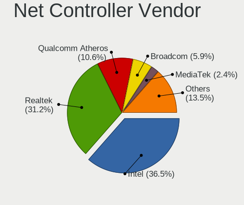

| Vendor                          | Computers | Percent |
|---------------------------------|-----------|---------|
| Intel                           | 62        | 36.47%  |
| Realtek Semiconductor           | 53        | 31.18%  |
| Qualcomm Atheros                | 18        | 10.59%  |
| Broadcom                        | 10        | 5.88%   |
| MediaTek                        | 4         | 2.35%   |
| Broadcom Limited                | 4         | 2.35%   |
| Ralink                          | 2         | 1.18%   |
| DisplayLink                     | 2         | 1.18%   |
| Xiaomi                          | 1         | 0.59%   |
| Standard Microsystems           | 1         | 0.59%   |
| Sigma Designs                   | 1         | 0.59%   |
| Samsung Electronics             | 1         | 0.59%   |
| Raspberry Pi                    | 1         | 0.59%   |
| Ralink Technology               | 1         | 0.59%   |
| Qualcomm Atheros Communications | 1         | 0.59%   |
| OPPO Electronics                | 1         | 0.59%   |
| NetGear                         | 1         | 0.59%   |
| Lenovo                          | 1         | 0.59%   |
| Hewlett-Packard                 | 1         | 0.59%   |
| D-Link                          | 1         | 0.59%   |
| ASUSTek Computer                | 1         | 0.59%   |
| ASIX Electronics                | 1         | 0.59%   |
| Aquantia                        | 1         | 0.59%   |

Net Controller Model
--------------------

Controller models

| Model                                                             | Computers | Percent |
|-------------------------------------------------------------------|-----------|---------|
| Realtek RTL8111/8168/8411 PCI Express Gigabit Ethernet Controller | 36        | 17.82%  |
| Intel Wi-Fi 6 AX200                                               | 6         | 2.97%   |
| Intel 82579LM Gigabit Network Connection (Lewisville)             | 5         | 2.48%   |
| Realtek RTL8153 Gigabit Ethernet Adapter                          | 4         | 1.98%   |
| Qualcomm Atheros AR9485 Wireless Network Adapter                  | 4         | 1.98%   |
| Intel Wireless 8260                                               | 4         | 1.98%   |
| Intel Wi-Fi 6 AX201                                               | 4         | 1.98%   |
| Realtek RTL8822CE 802.11ac PCIe Wireless Network Adapter          | 3         | 1.49%   |
| Realtek RTL8125 2.5GbE Controller                                 | 3         | 1.49%   |
| Qualcomm Atheros Killer E2400 Gigabit Ethernet Controller         | 3         | 1.49%   |
| Intel Wireless 8265 / 8275                                        | 3         | 1.49%   |
| Intel Wireless 7260                                               | 3         | 1.49%   |
| Intel Wireless 3165                                               | 3         | 1.49%   |
| Intel Wi-Fi 6 AX210/AX211/AX411 160MHz                            | 3         | 1.49%   |
| Intel I211 Gigabit Network Connection                             | 3         | 1.49%   |
| Intel 82579V Gigabit Network Connection                           | 3         | 1.49%   |
| Intel 82574L Gigabit Network Connection                           | 3         | 1.49%   |
| Intel 82567LM-3 Gigabit Network Connection                        | 3         | 1.49%   |
| Realtek RTL8821CE 802.11ac PCIe Wireless Network Adapter          | 2         | 0.99%   |
| Realtek RTL810xE PCI Express Fast Ethernet controller             | 2         | 0.99%   |
| Qualcomm Atheros QCA9565 / AR9565 Wireless Network Adapter        | 2         | 0.99%   |
| Qualcomm Atheros QCA6174 802.11ac Wireless Network Adapter        | 2         | 0.99%   |
| Qualcomm Atheros AR93xx Wireless Network Adapter                  | 2         | 0.99%   |
| Qualcomm Atheros AR8161 Gigabit Ethernet                          | 2         | 0.99%   |
| MediaTek MT7921K (RZ608) Wi-Fi 6E 80MHz                           | 2         | 0.99%   |
| Intel Wireless 3160                                               | 2         | 0.99%   |
| Intel Ethernet Controller I225-V                                  | 2         | 0.99%   |
| Intel Ethernet Connection I219-LM                                 | 2         | 0.99%   |
| Intel Ethernet Connection I217-LM                                 | 2         | 0.99%   |
| Intel Ethernet Connection (2) I219-LM                             | 2         | 0.99%   |
| Intel Ethernet Connection (2) I218-V                              | 2         | 0.99%   |
| Intel Comet Lake PCH-LP CNVi WiFi                                 | 2         | 0.99%   |
| Intel Centrino Advanced-N 6200                                    | 2         | 0.99%   |
| Intel Alder Lake-S PCH CNVi WiFi                                  | 2         | 0.99%   |
| Broadcom NetXtreme BCM57765 Gigabit Ethernet PCIe                 | 2         | 0.99%   |
| Broadcom BCM43602 802.11ac Wireless LAN SoC                       | 2         | 0.99%   |
| Xiaomi Mi/Redmi series (RNDIS)                                    | 1         | 0.5%    |
| Standard Microsystems Ethernet controller                         | 1         | 0.5%    |
| Sigma Designs Aeotec Z-Stick Gen5 (ZW090) - UZB                   | 1         | 0.5%    |
| Samsung Galaxy series, misc. (tethering mode)                     | 1         | 0.5%    |

Wireless Vendor
---------------

Wireless vendors

| Vendor                          | Computers | Percent |
|---------------------------------|-----------|---------|
| Intel                           | 42        | 49.41%  |
| Qualcomm Atheros                | 14        | 16.47%  |
| Realtek Semiconductor           | 10        | 11.76%  |
| Broadcom                        | 7         | 8.24%   |
| MediaTek                        | 4         | 4.71%   |
| Ralink                          | 2         | 2.35%   |
| Broadcom Limited                | 2         | 2.35%   |
| Ralink Technology               | 1         | 1.18%   |
| Qualcomm Atheros Communications | 1         | 1.18%   |
| NetGear                         | 1         | 1.18%   |
| ASUSTek Computer                | 1         | 1.18%   |

Wireless Model
--------------

Wireless models

| Model                                                                   | Computers | Percent |
|-------------------------------------------------------------------------|-----------|---------|
| Intel Wi-Fi 6 AX200                                                     | 6         | 7.06%   |
| Qualcomm Atheros AR9485 Wireless Network Adapter                        | 4         | 4.71%   |
| Intel Wireless 8260                                                     | 4         | 4.71%   |
| Intel Wi-Fi 6 AX201                                                     | 4         | 4.71%   |
| Realtek RTL8822CE 802.11ac PCIe Wireless Network Adapter                | 3         | 3.53%   |
| Intel Wireless 8265 / 8275                                              | 3         | 3.53%   |
| Intel Wireless 7260                                                     | 3         | 3.53%   |
| Intel Wireless 3165                                                     | 3         | 3.53%   |
| Intel Wi-Fi 6 AX210/AX211/AX411 160MHz                                  | 3         | 3.53%   |
| Realtek RTL8821CE 802.11ac PCIe Wireless Network Adapter                | 2         | 2.35%   |
| Qualcomm Atheros QCA9565 / AR9565 Wireless Network Adapter              | 2         | 2.35%   |
| Qualcomm Atheros QCA6174 802.11ac Wireless Network Adapter              | 2         | 2.35%   |
| Qualcomm Atheros AR93xx Wireless Network Adapter                        | 2         | 2.35%   |
| MediaTek MT7921K (RZ608) Wi-Fi 6E 80MHz                                 | 2         | 2.35%   |
| Intel Wireless 3160                                                     | 2         | 2.35%   |
| Intel Comet Lake PCH-LP CNVi WiFi                                       | 2         | 2.35%   |
| Intel Centrino Advanced-N 6200                                          | 2         | 2.35%   |
| Intel Alder Lake-S PCH CNVi WiFi                                        | 2         | 2.35%   |
| Broadcom BCM43602 802.11ac Wireless LAN SoC                             | 2         | 2.35%   |
| Realtek RTL8852AE WiFi 6 802.11ax PCIe Adapter                          | 1         | 1.18%   |
| Realtek RTL8192EU 802.11b/g/n WLAN Adapter                              | 1         | 1.18%   |
| Realtek RTL8188GU 802.11n WLAN Adapter (After Modeswitch)               | 1         | 1.18%   |
| Realtek RTL8188FTV 802.11b/g/n 1T1R 2.4G WLAN Adapter                   | 1         | 1.18%   |
| Realtek 8821CE PCIe 802.11ac Wireless Network Controller                | 1         | 1.18%   |
| Ralink MT7601U Wireless Adapter                                         | 1         | 1.18%   |
| Ralink RT5390 Wireless 802.11n 1T/1R PCIe                               | 1         | 1.18%   |
| Ralink RT3090 Wireless 802.11n 1T/1R PCIe                               | 1         | 1.18%   |
| Qualcomm Atheros QCA9377 802.11ac Wireless Network Adapter              | 1         | 1.18%   |
| Qualcomm Atheros AR9271 802.11n                                         | 1         | 1.18%   |
| Qualcomm Atheros AR9287 Wireless Network Adapter (PCI-Express)          | 1         | 1.18%   |
| Qualcomm Atheros AR9285 Wireless Network Adapter (PCI-Express)          | 1         | 1.18%   |
| Qualcomm Atheros AR242x / AR542x Wireless Network Adapter (PCI-Express) | 1         | 1.18%   |
| NetGear A6100 AC600 DB Wireless Adapter [Realtek RTL8811AU]             | 1         | 1.18%   |
| MediaTek MT7922 802.11ax PCI Express Wireless Network Adapter           | 1         | 1.18%   |
| MediaTek MT7921 802.11ax PCI Express Wireless Network Adapter           | 1         | 1.18%   |
| Intel Tiger Lake PCH CNVi WiFi                                          | 1         | 1.18%   |
| Intel PRO/Wireless 3945ABG [Golan] Network Connection                   | 1         | 1.18%   |
| Intel Dual Band Wireless-AC 3168NGW [Stone Peak]                        | 1         | 1.18%   |
| Intel Centrino Wireless-N 2230                                          | 1         | 1.18%   |
| Intel Centrino Advanced-N 6235                                          | 1         | 1.18%   |

Ethernet Vendor
---------------

Ethernet vendors

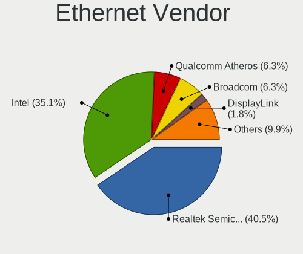

| Vendor                | Computers | Percent |
|-----------------------|-----------|---------|
| Realtek Semiconductor | 45        | 40.54%  |
| Intel                 | 39        | 35.14%  |
| Qualcomm Atheros      | 7         | 6.31%   |
| Broadcom              | 7         | 6.31%   |
| DisplayLink           | 2         | 1.8%    |
| Broadcom Limited      | 2         | 1.8%    |
| Xiaomi                | 1         | 0.9%    |
| Standard Microsystems | 1         | 0.9%    |
| Samsung Electronics   | 1         | 0.9%    |
| OPPO Electronics      | 1         | 0.9%    |
| Lenovo                | 1         | 0.9%    |
| Hewlett-Packard       | 1         | 0.9%    |
| D-Link                | 1         | 0.9%    |
| ASIX Electronics      | 1         | 0.9%    |
| Aquantia              | 1         | 0.9%    |

Ethernet Model
--------------

Ethernet models

| Model                                                             | Computers | Percent |
|-------------------------------------------------------------------|-----------|---------|
| Realtek RTL8111/8168/8411 PCI Express Gigabit Ethernet Controller | 36        | 31.3%   |
| Intel 82579LM Gigabit Network Connection (Lewisville)             | 5         | 4.35%   |
| Realtek RTL8153 Gigabit Ethernet Adapter                          | 4         | 3.48%   |
| Realtek RTL8125 2.5GbE Controller                                 | 3         | 2.61%   |
| Qualcomm Atheros Killer E2400 Gigabit Ethernet Controller         | 3         | 2.61%   |
| Intel I211 Gigabit Network Connection                             | 3         | 2.61%   |
| Intel 82579V Gigabit Network Connection                           | 3         | 2.61%   |
| Intel 82574L Gigabit Network Connection                           | 3         | 2.61%   |
| Intel 82567LM-3 Gigabit Network Connection                        | 3         | 2.61%   |
| Realtek RTL810xE PCI Express Fast Ethernet controller             | 2         | 1.74%   |
| Qualcomm Atheros AR8161 Gigabit Ethernet                          | 2         | 1.74%   |
| Intel Ethernet Controller I225-V                                  | 2         | 1.74%   |
| Intel Ethernet Connection I219-LM                                 | 2         | 1.74%   |
| Intel Ethernet Connection I217-LM                                 | 2         | 1.74%   |
| Intel Ethernet Connection (2) I219-LM                             | 2         | 1.74%   |
| Intel Ethernet Connection (2) I218-V                              | 2         | 1.74%   |
| Broadcom NetXtreme BCM57765 Gigabit Ethernet PCIe                 | 2         | 1.74%   |
| Xiaomi Mi/Redmi series (RNDIS)                                    | 1         | 0.87%   |
| Standard Microsystems Ethernet controller                         | 1         | 0.87%   |
| Samsung Galaxy series, misc. (tethering mode)                     | 1         | 0.87%   |
| Realtek USB 10/100/1G/2.5G LAN                                    | 1         | 0.87%   |
| Realtek RTL8152 Fast Ethernet Adapter                             | 1         | 0.87%   |
| Qualcomm Atheros Killer E220x Gigabit Ethernet Controller         | 1         | 0.87%   |
| Qualcomm Atheros AR8151 v2.0 Gigabit Ethernet                     | 1         | 0.87%   |
| OPPO KALAMA-MTP_CID:0437_SN:AEEEF597                              | 1         | 0.87%   |
| Lenovo USB-C Dock Ethernet                                        | 1         | 0.87%   |
| Intel Ethernet Controller I226-V                                  | 1         | 0.87%   |
| Intel Ethernet Connection I219-V                                  | 1         | 0.87%   |
| Intel Ethernet Connection (7) I219-V                              | 1         | 0.87%   |
| Intel Ethernet Connection (6) I219-V                              | 1         | 0.87%   |
| Intel Ethernet Connection (6) I219-LM                             | 1         | 0.87%   |
| Intel Ethernet Connection (2) I219-V                              | 1         | 0.87%   |
| Intel Ethernet Connection (2) I218-LM                             | 1         | 0.87%   |
| Intel Ethernet Connection (17) I219-LM                            | 1         | 0.87%   |
| Intel Ethernet Connection (13) I219-V                             | 1         | 0.87%   |
| Intel Ethernet Connection (11) I219-V                             | 1         | 0.87%   |
| Intel Ethernet Connection (10) I219-V                             | 1         | 0.87%   |
| Intel 82577LM Gigabit Network Connection                          | 1         | 0.87%   |
| Intel 82566DM-2 Gigabit Network Connection                        | 1         | 0.87%   |
| Intel 82546EB Gigabit Ethernet Controller (Copper)                | 1         | 0.87%   |

Net Controller Kind
-------------------

Ethernet, WiFi or modem

| Kind     | Computers | Percent |
|----------|-----------|---------|
| Ethernet | 96        | 53.93%  |
| WiFi     | 80        | 44.94%  |
| Modem    | 2         | 1.12%   |

Used Controller
---------------

Currently used network controller

| Kind     | Computers | Percent |
|----------|-----------|---------|
| Ethernet | 57        | 52.29%  |
| WiFi     | 52        | 47.71%  |

NICs
----

Total network controllers on board

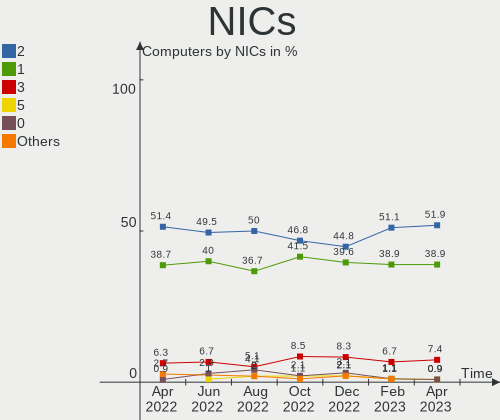

| Total | Computers | Percent |
|-------|-----------|---------|
| 2     | 56        | 51.85%  |
| 1     | 42        | 38.89%  |
| 3     | 8         | 7.41%   |
| 5     | 1         | 0.93%   |
| 0     | 1         | 0.93%   |

IPv6
----

IPv6 vs IPv4

| Used | Computers | Percent |
|------|-----------|---------|
| No   | 89        | 82.41%  |
| Yes  | 19        | 17.59%  |

Bluetooth
---------

Bluetooth Vendor
----------------

Controller vendors

| Vendor                          | Computers | Percent |
|---------------------------------|-----------|---------|
| Intel                           | 36        | 48%     |
| Apple                           | 7         | 9.33%   |
| Realtek Semiconductor           | 6         | 8%      |
| Cambridge Silicon Radio         | 6         | 8%      |
| Qualcomm Atheros Communications | 4         | 5.33%   |
| MediaTek                        | 3         | 4%      |
| Toshiba                         | 2         | 2.67%   |
| IMC Networks                    | 2         | 2.67%   |
| Foxconn / Hon Hai               | 2         | 2.67%   |
| Broadcom                        | 2         | 2.67%   |
| TP-Link                         | 1         | 1.33%   |
| Ralink Technology               | 1         | 1.33%   |
| Lite-On Technology              | 1         | 1.33%   |
| Dell                            | 1         | 1.33%   |
| ASUSTek Computer                | 1         | 1.33%   |

Bluetooth Model
---------------

Controller models

| Model                                               | Computers | Percent |
|-----------------------------------------------------|-----------|---------|
| Intel Bluetooth wireless interface                  | 14        | 18.42%  |
| Intel AX201 Bluetooth                               | 8         | 10.53%  |
| Realtek Bluetooth Radio                             | 6         | 7.89%   |
| Intel AX200 Bluetooth                               | 6         | 7.89%   |
| Cambridge Silicon Radio Bluetooth Dongle (HCI mode) | 6         | 7.89%   |
| Apple Bluetooth Host Controller                     | 4         | 5.26%   |
| Qualcomm Atheros  Bluetooth Device                  | 3         | 3.95%   |
| MediaTek Wireless_Device                            | 3         | 3.95%   |
| Intel AX210 Bluetooth                               | 3         | 3.95%   |
| Apple Bluetooth USB Host Controller                 | 3         | 3.95%   |
| Intel Centrino Bluetooth Wireless Transceiver       | 2         | 2.63%   |
| IMC Networks Bluetooth Radio                        | 2         | 2.63%   |
| TP-Link UB500 Adapter                               | 1         | 1.32%   |
| Toshiba Bluetooth USB Host Controller               | 1         | 1.32%   |
| Toshiba Bluetooth Device                            | 1         | 1.32%   |
| Realtek  Bluetooth 4.2 Adapter                      | 1         | 1.32%   |
| Ralink Motorola BC4 Bluetooth 3.0+HS Adapter        | 1         | 1.32%   |
| Qualcomm Atheros AR3011 Bluetooth                   | 1         | 1.32%   |
| Lite-On Atheros AR3012 Bluetooth                    | 1         | 1.32%   |
| Intel Wireless-AC 3168 Bluetooth                    | 1         | 1.32%   |
| Intel Centrino Advanced-N 6230 Bluetooth adapter    | 1         | 1.32%   |
| Intel Bluetooth Device                              | 1         | 1.32%   |
| Foxconn / Hon Hai Wireless_Device                   | 1         | 1.32%   |
| Foxconn / Hon Hai Acer Bluetooth module             | 1         | 1.32%   |
| Dell Wireless 355 Bluetooth                         | 1         | 1.32%   |
| Broadcom HP Portable Valentine                      | 1         | 1.32%   |
| Broadcom BCM20702A0 Bluetooth 4.0                   | 1         | 1.32%   |
| ASUS ASUS USB-BT500                                 | 1         | 1.32%   |

Sound
-----

Sound Vendor
------------

Sound card vendors

| Vendor                               | Computers | Percent |
|--------------------------------------|-----------|---------|
| Intel                                | 82        | 48.24%  |
| Nvidia                               | 34        | 20%     |
| AMD                                  | 29        | 17.06%  |
| Logitech                             | 4         | 2.35%   |
| C-Media Electronics                  | 4         | 2.35%   |
| Micro Star International             | 3         | 1.76%   |
| Plantronics                          | 2         | 1.18%   |
| Lenovo                               | 2         | 1.18%   |
| GN Netcom                            | 2         | 1.18%   |
| Focusrite-Novation                   | 2         | 1.18%   |
| Thesycon Systemsoftware & Consulting | 1         | 0.59%   |
| Texas Instruments                    | 1         | 0.59%   |
| Razer USA                            | 1         | 0.59%   |
| Creative Labs                        | 1         | 0.59%   |
| Bose                                 | 1         | 0.59%   |
| Astro Gaming                         | 1         | 0.59%   |

Sound Model
-----------

Sound card models

| Model                                                                      | Computers | Percent |
|----------------------------------------------------------------------------|-----------|---------|
| Intel 7 Series/C216 Chipset Family High Definition Audio Controller        | 8         | 4.21%   |
| Intel Sunrise Point-LP HD Audio                                            | 7         | 3.68%   |
| Intel 100 Series/C230 Series Chipset Family HD Audio Controller            | 7         | 3.68%   |
| Intel 8 Series/C220 Series Chipset High Definition Audio Controller        | 6         | 3.16%   |
| Intel 6 Series/C200 Series Chipset Family High Definition Audio Controller | 6         | 3.16%   |
| AMD Family 17h/19h HD Audio Controller                                     | 6         | 3.16%   |
| Intel Cannon Lake PCH cAVS                                                 | 5         | 2.63%   |
| Intel C600/X79 series chipset High Definition Audio Controller             | 5         | 2.63%   |
| AMD Starship/Matisse HD Audio Controller                                   | 5         | 2.63%   |
| AMD Family 17h (Models 00h-0fh) HD Audio Controller                        | 5         | 2.63%   |
| AMD Ellesmere HDMI Audio [Radeon RX 470/480 / 570/580/590]                 | 5         | 2.63%   |
| Intel Xeon E3-1200 v3/4th Gen Core Processor HD Audio Controller           | 4         | 2.11%   |
| Intel Tiger Lake-LP Smart Sound Technology Audio Controller                | 4         | 2.11%   |
| Intel 5 Series/3400 Series Chipset High Definition Audio                   | 4         | 2.11%   |
| AMD Renoir Radeon High Definition Audio Controller                         | 4         | 2.11%   |
| Nvidia GP106 High Definition Audio Controller                              | 3         | 1.58%   |
| Nvidia GF119 HDMI Audio Controller                                         | 3         | 1.58%   |
| Nvidia GF108 High Definition Audio Controller                              | 3         | 1.58%   |
| Micro Star International USB Audio                                         | 3         | 1.58%   |
| Intel Wildcat Point-LP High Definition Audio Controller                    | 3         | 1.58%   |
| Intel C610/X99 series chipset HD Audio Controller                          | 3         | 1.58%   |
| Intel Broadwell-U Audio Controller                                         | 3         | 1.58%   |
| Intel 82801JD/DO (ICH10 Family) HD Audio Controller                        | 3         | 1.58%   |
| AMD Rembrandt Radeon High Definition Audio Controller                      | 3         | 1.58%   |
| AMD FCH Azalia Controller                                                  | 3         | 1.58%   |
| Nvidia TU116 High Definition Audio Controller                              | 2         | 1.05%   |
| Nvidia MCP89 High Definition Audio                                         | 2         | 1.05%   |
| Nvidia GP104 High Definition Audio Controller                              | 2         | 1.05%   |
| Nvidia GM204 High Definition Audio Controller                              | 2         | 1.05%   |
| Nvidia GM107 High Definition Audio Controller [GeForce 940MX]              | 2         | 1.05%   |
| Nvidia GK208 HDMI/DP Audio Controller                                      | 2         | 1.05%   |
| Nvidia GK106 HDMI Audio Controller                                         | 2         | 1.05%   |
| Nvidia GF116 High Definition Audio Controller                              | 2         | 1.05%   |
| Nvidia GA106 High Definition Audio Controller                              | 2         | 1.05%   |
| Logitech G433 Gaming Headset                                               | 2         | 1.05%   |
| Intel Smart Sound Technology (SST) Audio Controller                        | 2         | 1.05%   |
| Intel Comet Lake PCH-LP cAVS                                               | 2         | 1.05%   |
| Intel CM238 HD Audio Controller                                            | 2         | 1.05%   |
| Intel Alder Lake-S HD Audio Controller                                     | 2         | 1.05%   |
| Intel 9 Series Chipset Family HD Audio Controller                          | 2         | 1.05%   |

Memory
------

Memory Vendor
-------------

Memory module vendors

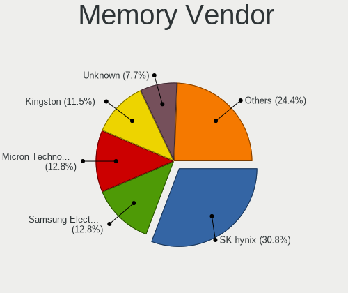

| Vendor              | Computers | Percent |
|---------------------|-----------|---------|
| SK hynix            | 24        | 30.77%  |
| Samsung Electronics | 10        | 12.82%  |
| Micron Technology   | 10        | 12.82%  |
| Kingston            | 9         | 11.54%  |
| Unknown             | 6         | 7.69%   |
| Crucial             | 5         | 6.41%   |
| Corsair             | 3         | 3.85%   |
| Team                | 2         | 2.56%   |
| G.Skill             | 2         | 2.56%   |
| Apacer              | 2         | 2.56%   |
| Unknown             | 2         | 2.56%   |
| Nanya Technology    | 1         | 1.28%   |
| Elpida              | 1         | 1.28%   |
| ASint Technology    | 1         | 1.28%   |

Memory Model
------------

Memory module models

| Model                                                        | Computers | Percent |
|--------------------------------------------------------------|-----------|---------|
| SK hynix RAM HMT41GS6BFR8A-PB 8GB SODIMM DDR3 1600MT/s       | 3         | 3.7%    |
| SK hynix RAM HMT351S6CFR8C-PB 4GB SODIMM DDR3 1600MT/s       | 2         | 2.47%   |
| SK hynix RAM HMA81GS6CJR8N-VK 8GB SODIMM DDR4 2667MT/s       | 2         | 2.47%   |
| SK hynix RAM HMA81GS6AFR8N-UH 8GB SODIMM DDR4 2667MT/s       | 2         | 2.47%   |
| SK hynix RAM HMA41GS6AFR8N-TF 8GB SODIMM DDR4 2667MT/s       | 2         | 2.47%   |
| Samsung RAM M471A1K43EB1-CWE 8GB SODIMM DDR4 3200MT/s        | 2         | 2.47%   |
| Micron RAM 8ATF1G64HZ-3G2R1 8GB SODIMM DDR4 3200MT/s         | 2         | 2.47%   |
| Unknown                                                      | 2         | 2.47%   |
| Unknown RAM Module 8GB DIMM 1600MT/s                         | 1         | 1.23%   |
| Unknown RAM Module 4GB DIMM DDR3 1600MT/s                    | 1         | 1.23%   |
| Unknown RAM Module 2GB SODIMM DDR2 667MT/s                   | 1         | 1.23%   |
| Unknown RAM Module 2GB DIMM DDR2 1067MT/s                    | 1         | 1.23%   |
| Unknown RAM Module 2GB DIMM 667MT/s                          | 1         | 1.23%   |
| Unknown RAM CL17-17-17 D4-2400 16384MB DIMM DDR4 2400MT/s    | 1         | 1.23%   |
| Team RAM TEAMGROUP-UD4-3200 8GB DIMM DDR4 3733MT/s           | 1         | 1.23%   |
| Team RAM TEAMGROUP-UD4-3000 8GB DIMM DDR4 3000MT/s           | 1         | 1.23%   |
| Team RAM Elite-1333 8192MB SODIMM DDR3 1334MT/s              | 1         | 1.23%   |
| SK hynix RAM Module 8GB SODIMM DDR4 2133MT/s                 | 1         | 1.23%   |
| SK hynix RAM Module 4GB SODIMM DDR3 1333MT/s                 | 1         | 1.23%   |
| SK hynix RAM Module 4GB SODIMM DDR3 1066MT/s                 | 1         | 1.23%   |
| SK hynix RAM HYMP125S64CP8-Y5 2048MB SODIMM DDR 667MT/s      | 1         | 1.23%   |
| SK hynix RAM HMT451S6BFR8A-PB 4GB SODIMM DDR3 1600MT/s       | 1         | 1.23%   |
| SK hynix RAM HMT42GR7AFR4A 16GB DIMM DDR3 1600MT/s           | 1         | 1.23%   |
| SK hynix RAM HMT41GS6AFR8A-PB 8GB SODIMM DDR3 1600MT/s       | 1         | 1.23%   |
| SK hynix RAM HMT351U6CFR8C-PB 4GB DIMM DDR3 1600MT/s         | 1         | 1.23%   |
| SK hynix RAM HMT351S6BFR8C-H9 4GB SODIMM DDR3 1334MT/s       | 1         | 1.23%   |
| SK hynix RAM HMT351S6BFR8C-H9 4GB SODIMM DDR3 1333MT/s       | 1         | 1.23%   |
| SK hynix RAM HMT125U6TFR8C-H9 2GB DIMM DDR3 1333MT/s         | 1         | 1.23%   |
| SK hynix RAM HMCG88MEBSA095N 32GB SODIMM DDR5 4800MT/s       | 1         | 1.23%   |
| SK hynix RAM HMA82GS6AFR8N-UH 16GB SODIMM DDR4 2667MT/s      | 1         | 1.23%   |
| SK hynix RAM H9JCNNNFA5MLYR-N6E 4096MB Row Of Chips 6400MT/s | 1         | 1.23%   |
| Samsung RAM Module 4GB SODIMM DDR3 1600MT/s                  | 1         | 1.23%   |
| Samsung RAM M471B5273CH0-CK0 4GB SODIMM DDR3 1600MT/s        | 1         | 1.23%   |
| Samsung RAM M471B1G73EB0-YK0 8GB SODIMM DDR3 1600MT/s        | 1         | 1.23%   |
| Samsung RAM M471B1G73CB0-YK0 8GB SODIMM DDR3 1600MT/s        | 1         | 1.23%   |
| Samsung RAM M471A2K43BB1-CRC 16GB SODIMM DDR4 2400MT/s       | 1         | 1.23%   |
| Samsung RAM M471A1K43CB1-CRC 8GB SODIMM DDR4 2667MT/s        | 1         | 1.23%   |
| Samsung RAM K4UBE3D4AA-MGCR 2GB Row Of Chips LPDDR4 4267MT/s | 1         | 1.23%   |
| Samsung RAM K3QF4F40BM-AGCF 4GB Row Of Chips LPDDR3 1867MT/s | 1         | 1.23%   |
| Nanya RAM NT4GC64B8HG0NS-DI 4GB SODIMM DDR3 1600MT/s         | 1         | 1.23%   |

Memory Kind
-----------

Memory module kinds

| Kind    | Computers | Percent |
|---------|-----------|---------|
| DDR4    | 28        | 41.79%  |
| DDR3    | 25        | 37.31%  |
| Unknown | 4         | 5.97%   |
| DDR2    | 3         | 4.48%   |
| LPDDR4  | 2         | 2.99%   |
| DDR5    | 2         | 2.99%   |
| LPDDR5  | 1         | 1.49%   |
| LPDDR3  | 1         | 1.49%   |
| DDR     | 1         | 1.49%   |

Memory Form Factor
------------------

Physical design of the memory module

| Name         | Computers | Percent |
|--------------|-----------|---------|
| SODIMM       | 42        | 63.64%  |
| DIMM         | 20        | 30.3%   |
| Row Of Chips | 4         | 6.06%   |

Memory Size
-----------

Memory module size

| Size  | Computers | Percent |
|-------|-----------|---------|
| 8192  | 28        | 39.44%  |
| 4096  | 19        | 26.76%  |
| 16384 | 13        | 18.31%  |
| 2048  | 6         | 8.45%   |
| 32768 | 5         | 7.04%   |

Memory Speed
------------

Memory module speed

| Speed | Computers | Percent |
|-------|-----------|---------|
| 1600  | 20        | 28.57%  |
| 2667  | 10        | 14.29%  |
| 3200  | 9         | 12.86%  |
| 2400  | 4         | 5.71%   |
| 4800  | 3         | 4.29%   |
| 1333  | 3         | 4.29%   |
| 667   | 3         | 4.29%   |
| 4267  | 2         | 2.86%   |
| 3000  | 2         | 2.86%   |
| 2133  | 2         | 2.86%   |
| 1334  | 2         | 2.86%   |
| 1067  | 2         | 2.86%   |
| 6400  | 1         | 1.43%   |
| 5200  | 1         | 1.43%   |
| 3733  | 1         | 1.43%   |
| 3600  | 1         | 1.43%   |
| 2800  | 1         | 1.43%   |
| 1867  | 1         | 1.43%   |
| 1066  | 1         | 1.43%   |
| 800   | 1         | 1.43%   |

Printers & scanners
-------------------

Printer Vendor
--------------

Printer device vendors

| Vendor             | Computers | Percent |
|--------------------|-----------|---------|
| Brother Industries | 4         | 57.14%  |
| Hewlett-Packard    | 1         | 14.29%  |
| Fuji Xerox         | 1         | 14.29%  |
| Dymo-CoStar        | 1         | 14.29%  |

Printer Model
-------------

Printer device models

| Model                                  | Computers | Percent |
|----------------------------------------|-----------|---------|
| Brother HL-1210W series                | 2         | 25%     |
| HP ENVY Inspire 7900 series            | 1         | 12.5%   |
| Fuji Xerox DocuPrint P205 b            | 1         | 12.5%   |
| Dymo-CoStar LabelWriter 400            | 1         | 12.5%   |
| Dymo-CoStar DYMO LabelWriter 450 Turbo | 1         | 12.5%   |
| Brother MFC-J4440DW                    | 1         | 12.5%   |
| Brother HL-1110 series                 | 1         | 12.5%   |

Scanner Vendor
--------------

Scanner device vendors

Zero info for selected period =(

Scanner Model
-------------

Scanner device models

Zero info for selected period =(

Camera
------

Camera Vendor
-------------

Camera device vendors

| Vendor                                 | Computers | Percent |
|----------------------------------------|-----------|---------|
| Chicony Electronics                    | 11        | 17.74%  |
| Logitech                               | 6         | 9.68%   |
| Microsoft                              | 5         | 8.06%   |
| Apple                                  | 5         | 8.06%   |
| Sunplus Innovation Technology          | 4         | 6.45%   |
| Microdia                               | 4         | 6.45%   |
| IMC Networks                           | 4         | 6.45%   |
| Cheng Uei Precision Industry (Foxlink) | 4         | 6.45%   |
| Realtek Semiconductor                  | 3         | 4.84%   |
| Luxvisions Innotech Limited            | 3         | 4.84%   |
| Quanta                                 | 2         | 3.23%   |
| Bison Electronics                      | 2         | 3.23%   |
| Suyin                                  | 1         | 1.61%   |
| Razer USA                              | 1         | 1.61%   |
| OmniVision Technologies                | 1         | 1.61%   |
| Lenovo                                 | 1         | 1.61%   |
| Hopewin Electronic Material            | 1         | 1.61%   |
| ARC International                      | 1         | 1.61%   |
| ALi                                    | 1         | 1.61%   |
| Alcor Micro                            | 1         | 1.61%   |
| Acer                                   | 1         | 1.61%   |

Camera Model
------------

Camera device models

| Model                                               | Computers | Percent |
|-----------------------------------------------------|-----------|---------|
| Apple FaceTime HD Camera (Built-in)                 | 3         | 4.76%   |
| Sunplus Integrated_Webcam_HD                        | 2         | 3.17%   |
| Microsoft Microsoft LifeCam Studio                | 2         | 3.17%   |
| Microdia Integrated_Webcam_HD                       | 2         | 3.17%   |
| Luxvisions Innotech Limited HP TrueVision HD Camera | 2         | 3.17%   |
| Logitech HD Pro Webcam C920                         | 2         | 3.17%   |
| Chicony TOSHIBA Web Camera - HD                     | 2         | 3.17%   |
| Chicony HD WebCam                                   | 2         | 3.17%   |
| Suyin Acer CrystalEye Webcam                        | 1         | 1.59%   |
| Sunplus Integrated_Webcam_FHD                       | 1         | 1.59%   |
| Sunplus ezcap U3 capture-04                         | 1         | 1.59%   |
| Realtek Integrated_Webcam_HD                        | 1         | 1.59%   |
| Realtek Integrated Webcam HD                        | 1         | 1.59%   |
| Realtek HP Webcam                                   | 1         | 1.59%   |
| Razer USA Razer Kiyo X                              | 1         | 1.59%   |
| Quanta Laptop_Integrated_Webcam_2HDM                | 1         | 1.59%   |
| Quanta HP Webcam                                    | 1         | 1.59%   |
| OmniVision OV2640 Webcam                            | 1         | 1.59%   |
| Microsoft LifeCam Studio                            | 1         | 1.59%   |
| Microsoft LifeCam HD-3000                           | 1         | 1.59%   |
| Microsoft LifeCam Cinema                            | 1         | 1.59%   |
| Microdia Webcam Vitade AF                           | 1         | 1.59%   |
| Microdia Integrated Webcam                          | 1         | 1.59%   |
| Luxvisions Innotech Limited Integrated Camera       | 1         | 1.59%   |
| Logitech Webcam Pro 9000                            | 1         | 1.59%   |
| Logitech Webcam C930e                               | 1         | 1.59%   |
| Logitech QuickCam Pro 5000                          | 1         | 1.59%   |
| Logitech C922 Pro Stream Webcam                     | 1         | 1.59%   |
| Lenovo Integrated Webcam [R5U877]                   | 1         | 1.59%   |
| IMC Networks USB2.0 VGA UVC WebCam                  | 1         | 1.59%   |
| IMC Networks USB Camera                             | 1         | 1.59%   |
| IMC Networks TOSHIBA Web Camera - HD                | 1         | 1.59%   |
| IMC Networks Integrated Camera                      | 1         | 1.59%   |
| Hopewin Electronic Material FULL HD 1080P Webcam    | 1         | 1.59%   |
| Chicony USB2.0 HD UVC WebCam                        | 1         | 1.59%   |
| Chicony Lenovo EasyCamera                           | 1         | 1.59%   |
| Chicony Integrated Camera                           | 1         | 1.59%   |
| Chicony HP Truevision HD                            | 1         | 1.59%   |
| Chicony HP HD Camera                                | 1         | 1.59%   |
| Chicony HD User Facing                              | 1         | 1.59%   |

Security
--------

Fingerprint Vendor
------------------

Fingerprint sensor vendors

| Vendor                     | Computers | Percent |
|----------------------------|-----------|---------|
| Validity Sensors           | 4         | 33.33%  |
| LighTuning Technology      | 3         | 25%     |
| Elan Microelectronics      | 2         | 16.67%  |
| Upek                       | 1         | 8.33%   |
| Synaptics                  | 1         | 8.33%   |
| Shenzhen Goodix Technology | 1         | 8.33%   |

Fingerprint Model
-----------------

Fingerprint sensor models

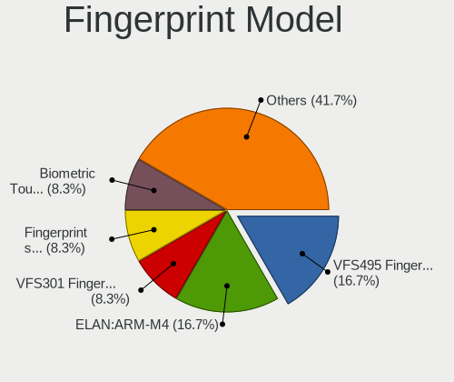

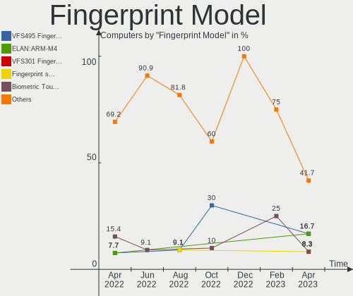

| Model                                                  | Computers | Percent |
|--------------------------------------------------------|-----------|---------|
| Validity Sensors VFS495 Fingerprint Reader             | 2         | 16.67%  |
| Elan ELAN:ARM-M4                                       | 2         | 16.67%  |
| Validity Sensors VFS301 Fingerprint Reader             | 1         | 8.33%   |
| Validity Sensors Fingerprint scanner                   | 1         | 8.33%   |
| Upek Biometric Touchchip/Touchstrip Fingerprint Sensor | 1         | 8.33%   |
| Synaptics WBDI                                         | 1         | 8.33%   |
| Shenzhen Goodix  Fingerprint Device                    | 1         | 8.33%   |
| LighTuning Fingerprint Reader                          | 1         | 8.33%   |
| LighTuning ES603 Swipe Fingerprint Sensor              | 1         | 8.33%   |
| LighTuning EgisTec Touch Fingerprint Sensor            | 1         | 8.33%   |

Chipcard Vendor
---------------

Chipcard module vendors

| Vendor   | Computers | Percent |
|----------|-----------|---------|
| Lenovo   | 1         | 50%     |
| Broadcom | 1         | 50%     |

Chipcard Model
--------------

Chipcard module models

| Model                               | Computers | Percent |
|-------------------------------------|-----------|---------|
| Lenovo Integrated Smart Card Reader | 1         | 50%     |
| Broadcom 5880                       | 1         | 50%     |

Unsupported
-----------

Unsupported Devices
-------------------

Total unsupported devices on board

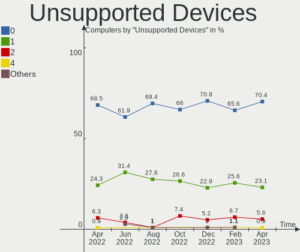

| Total | Computers | Percent |
|-------|-----------|---------|
| 0     | 76        | 70.37%  |
| 1     | 25        | 23.15%  |
| 2     | 6         | 5.56%   |
| 4     | 1         | 0.93%   |

Unsupported Device Types
------------------------

Types of unsupported devices

| Type                  | Computers | Percent |
|-----------------------|-----------|---------|
| Fingerprint reader    | 12        | 30%     |
| Net/wireless          | 8         | 20%     |
| Graphics card         | 7         | 17.5%   |
| Unassigned class      | 3         | 7.5%    |
| Net/ethernet          | 3         | 7.5%    |
| Chipcard              | 2         | 5%      |
| Multimedia controller | 1         | 2.5%    |
| Modem                 | 1         | 2.5%    |
| Card reader           | 1         | 2.5%    |
| Camera                | 1         | 2.5%    |
| Bluetooth             | 1         | 2.5%    |

